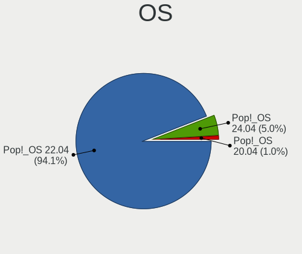
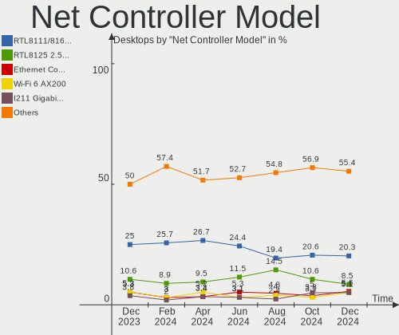
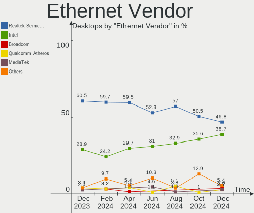
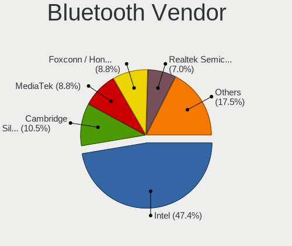
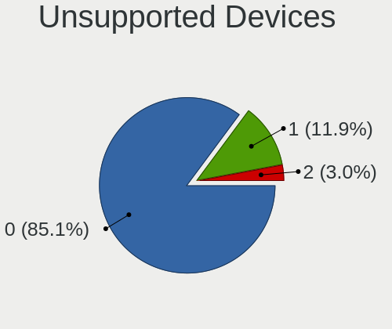

Pop!_OS Hardware Trends (Desktops)
----------------------------------

A project to identify most popular hardware characteristics and track their change
over time based on data collected by Pop!_OS users at https://Linux-Hardware.org.

Anyone can contribute to this report by the [hw-probe](https://github.com/linuxhw/hw-probe) tool:

    sudo -E hw-probe -all -upload

Full-feature report is available here: https://linux-hardware.org/?view=trends&formfactor=desktop

Period: Sep, 2021.

Contents
--------

* [ System ](#system)
  - [ OS                       ](#os)
  - [ OS Family                ](#os-family)
  - [ Kernel                   ](#kernel)
  - [ Kernel Family            ](#kernel-family)
  - [ Kernel Major Ver.        ](#kernel-major-ver)
  - [ Arch                     ](#arch)
  - [ DE                       ](#de)
  - [ Display Server           ](#display-server)
  - [ Display Manager          ](#display-manager)
  - [ OS Lang                  ](#os-lang)
  - [ Boot Mode                ](#boot-mode)
  - [ Filesystem               ](#filesystem)
  - [ Part. scheme             ](#part-scheme)
  - [ Dual Boot with Linux/BSD ](#dual-boot-with-linuxbsd)
  - [ Dual Boot (Win)          ](#dual-boot-win)

* [ Board ](#board)
  - [ Vendor                   ](#vendor)
  - [ Model                    ](#model)
  - [ Model Family             ](#model-family)
  - [ MFG Year                 ](#mfg-year)
  - [ Form Factor              ](#form-factor)
  - [ Secure Boot              ](#secure-boot)
  - [ Coreboot                 ](#coreboot)
  - [ RAM Size                 ](#ram-size)
  - [ RAM Used                 ](#ram-used)
  - [ Total Drives             ](#total-drives)
  - [ Has CD-ROM               ](#has-cd-rom)
  - [ Has Ethernet             ](#has-ethernet)
  - [ Has WiFi                 ](#has-wifi)
  - [ Has Bluetooth            ](#has-bluetooth)

* [ Location ](#location)
  - [ Country                  ](#country)
  - [ City                     ](#city)

* [ Drives ](#drives)
  - [ Drive Vendor             ](#drive-vendor)
  - [ Drive Model              ](#drive-model)
  - [ HDD Vendor               ](#hdd-vendor)
  - [ SSD Vendor               ](#ssd-vendor)
  - [ Drive Kind               ](#drive-kind)
  - [ Drive Connector          ](#drive-connector)
  - [ Drive Size               ](#drive-size)
  - [ Space Total              ](#space-total)
  - [ Space Used               ](#space-used)
  - [ Malfunc. Drives          ](#malfunc-drives)
  - [ Malfunc. Drive Vendor    ](#malfunc-drive-vendor)
  - [ Malfunc. HDD Vendor      ](#malfunc-hdd-vendor)
  - [ Malfunc. Drive Kind      ](#malfunc-drive-kind)
  - [ Failed Drives            ](#failed-drives)
  - [ Failed Drive Vendor      ](#failed-drive-vendor)
  - [ Drive Status             ](#drive-status)

* [ Storage controller ](#storage-controller)
  - [ Storage Vendor           ](#storage-vendor)
  - [ Storage Model            ](#storage-model)
  - [ Storage Kind             ](#storage-kind)

* [ Processor ](#processor)
  - [ CPU Vendor               ](#cpu-vendor)
  - [ CPU Model                ](#cpu-model)
  - [ CPU Model Family         ](#cpu-model-family)
  - [ CPU Cores                ](#cpu-cores)
  - [ CPU Sockets              ](#cpu-sockets)
  - [ CPU Threads              ](#cpu-threads)
  - [ CPU Op-Modes             ](#cpu-op-modes)
  - [ CPU Microcode            ](#cpu-microcode)
  - [ CPU Microarch            ](#cpu-microarch)

* [ Graphics ](#graphics)
  - [ GPU Vendor               ](#gpu-vendor)
  - [ GPU Model                ](#gpu-model)
  - [ GPU Combo                ](#gpu-combo)
  - [ GPU Driver               ](#gpu-driver)
  - [ GPU Memory               ](#gpu-memory)

* [ Monitor ](#monitor)
  - [ Monitor Vendor           ](#monitor-vendor)
  - [ Monitor Model            ](#monitor-model)
  - [ Monitor Resolution       ](#monitor-resolution)
  - [ Monitor Diagonal         ](#monitor-diagonal)
  - [ Monitor Width            ](#monitor-width)
  - [ Aspect Ratio             ](#aspect-ratio)
  - [ Monitor Area             ](#monitor-area)
  - [ Pixel Density            ](#pixel-density)
  - [ Multiple Monitors        ](#multiple-monitors)

* [ Network ](#network)
  - [ Net Controller Vendor    ](#net-controller-vendor)
  - [ Net Controller Model     ](#net-controller-model)
  - [ Wireless Vendor          ](#wireless-vendor)
  - [ Wireless Model           ](#wireless-model)
  - [ Ethernet Vendor          ](#ethernet-vendor)
  - [ Ethernet Model           ](#ethernet-model)
  - [ Net Controller Kind      ](#net-controller-kind)
  - [ Used Controller          ](#used-controller)
  - [ NICs                     ](#nics)
  - [ IPv6                     ](#ipv6)

* [ Bluetooth ](#bluetooth)
  - [ Bluetooth Vendor         ](#bluetooth-vendor)
  - [ Bluetooth Model          ](#bluetooth-model)

* [ Sound ](#sound)
  - [ Sound Vendor             ](#sound-vendor)
  - [ Sound Model              ](#sound-model)

* [ Memory ](#memory)
  - [ Memory Vendor            ](#memory-vendor)
  - [ Memory Model             ](#memory-model)
  - [ Memory Kind              ](#memory-kind)
  - [ Memory Form Factor       ](#memory-form-factor)
  - [ Memory Size              ](#memory-size)
  - [ Memory Speed             ](#memory-speed)

* [ Printers & scanners ](#printers--scanners)
  - [ Printer Vendor           ](#printer-vendor)
  - [ Printer Model            ](#printer-model)
  - [ Scanner Vendor           ](#scanner-vendor)
  - [ Scanner Model            ](#scanner-model)

* [ Camera ](#camera)
  - [ Camera Vendor            ](#camera-vendor)
  - [ Camera Model             ](#camera-model)

* [ Security ](#security)
  - [ Fingerprint Vendor       ](#fingerprint-vendor)
  - [ Fingerprint Model        ](#fingerprint-model)
  - [ Chipcard Vendor          ](#chipcard-vendor)
  - [ Chipcard Model           ](#chipcard-model)

* [ Unsupported ](#unsupported)
  - [ Unsupported Devices      ](#unsupported-devices)
  - [ Unsupported Device Types ](#unsupported-device-types)

System
------

OS
--

Installed operating systems

| Name          | Desktops | Percent |
|---------------|----------|---------|
| Pop!_OS 21.04 | 117      | 86.67%  |
| Pop!_OS 20.04 | 15       | 11.11%  |
| Pop!_OS 20.10 | 3        | 2.22%   |

OS Family
---------

OS without a version

| Name    | Desktops | Percent |
|---------|----------|---------|
| Pop!_OS | 135      | 100%    |

Kernel
------

Version of the Linux kernel

| Version             | Desktops | Percent |
|---------------------|----------|---------|
| 5.11.0-7633-generic | 67       | 49.63%  |
| 5.13.0-7614-generic | 49       | 36.3%   |
| 5.11.0-7620-generic | 14       | 10.37%  |
| 5.4.0-7642-generic  | 1        | 0.74%   |
| 5.14.8-xanmod1-edge | 1        | 0.74%   |
| 5.14.3-xanmod1-edge | 1        | 0.74%   |
| 5.13.13-xanmod1     | 1        | 0.74%   |
| 5.11.0-7612-generic | 1        | 0.74%   |

Kernel Family
-------------

Linux kernel without a distro release

| Version | Desktops | Percent |
|---------|----------|---------|
| 5.11.0  | 82       | 60.74%  |
| 5.13.0  | 49       | 36.3%   |
| 5.4.0   | 1        | 0.74%   |
| 5.14.8  | 1        | 0.74%   |
| 5.14.3  | 1        | 0.74%   |
| 5.13.13 | 1        | 0.74%   |

Kernel Major Ver.
-----------------

Linux kernel major version

| Version | Desktops | Percent |
|---------|----------|---------|
| 5.11    | 82       | 60.74%  |
| 5.13    | 50       | 37.04%  |
| 5.14    | 2        | 1.48%   |
| 5.4     | 1        | 0.74%   |

Arch
----

OS architecture (x86_64, i586, etc.)

| Name   | Desktops | Percent |
|--------|----------|---------|
| x86_64 | 135      | 100%    |

DE
--

Desktop Environment

| Name       | Desktops | Percent |
|------------|----------|---------|
| GNOME      | 129      | 95.56%  |
| KDE5       | 2        | 1.48%   |
| KDE        | 2        | 1.48%   |
| XFCE       | 1        | 0.74%   |
| X-Cinnamon | 1        | 0.74%   |

Display Server
--------------

X11 or Wayland

| Name    | Desktops | Percent |
|---------|----------|---------|
| X11     | 134      | 99.26%  |
| Wayland | 1        | 0.74%   |

Display Manager
---------------

SDDM, LightDM, etc.

| Name    | Desktops | Percent |
|---------|----------|---------|
| Unknown | 125      | 92.59%  |
| GDM     | 10       | 7.41%   |

OS Lang
-------

Language

| Lang  | Desktops | Percent |
|-------|----------|---------|
| en_US | 82       | 60.74%  |
| en_GB | 10       | 7.41%   |
| pt_BR | 9        | 6.67%   |
| en_AU | 6        | 4.44%   |
| fr_FR | 3        | 2.22%   |
| es_ES | 3        | 2.22%   |
| en_CA | 3        | 2.22%   |
| C     | 3        | 2.22%   |
| pt_PT | 2        | 1.48%   |
| en_DK | 2        | 1.48%   |
| de_DE | 2        | 1.48%   |
| zh_CN | 1        | 0.74%   |
| sv_SE | 1        | 0.74%   |
| nl_NL | 1        | 0.74%   |
| it_IT | 1        | 0.74%   |
| hu_HU | 1        | 0.74%   |
| fr_CA | 1        | 0.74%   |
| fi_FI | 1        | 0.74%   |
| es_PY | 1        | 0.74%   |
| es_AR | 1        | 0.74%   |
| en_ZA | 1        | 0.74%   |

Boot Mode
---------

EFI or BIOS

| Mode | Desktops | Percent |
|------|----------|---------|
| BIOS | 125      | 92.59%  |
| EFI  | 10       | 7.41%   |

Filesystem
----------

Type of filesystem

| Type    | Desktops | Percent |
|---------|----------|---------|
| Ext4    | 132      | 97.78%  |
| Overlay | 2        | 1.48%   |
| Btrfs   | 1        | 0.74%   |

Part. scheme
------------

Scheme of partitioning

| Type    | Desktops | Percent |
|---------|----------|---------|
| Unknown | 125      | 92.59%  |
| GPT     | 10       | 7.41%   |

Dual Boot with Linux/BSD
------------------------

Hosting more than one Linux/BSD

| Dual boot | Desktops | Percent |
|-----------|----------|---------|
| No        | 134      | 99.26%  |
| Yes       | 1        | 0.74%   |

Dual Boot (Win)
---------------

Hosting Linux and Windows

| Dual boot | Desktops | Percent |
|-----------|----------|---------|
| No        | 130      | 96.3%   |
| Yes       | 5        | 3.7%    |

Board
-----

Vendor
------

Motherboard manufacturer

| Name                | Desktops | Percent |
|---------------------|----------|---------|
| ASUSTek Computer    | 38       | 28.15%  |
| MSI                 | 27       | 20%     |
| Gigabyte Technology | 23       | 17.04%  |
| Dell                | 13       | 9.63%   |
| ASRock              | 11       | 8.15%   |
| Hewlett-Packard     | 5        | 3.7%    |
| Lenovo              | 3        | 2.22%   |
| Biostar             | 3        | 2.22%   |
| Huanan              | 2        | 1.48%   |
| Foxconn             | 2        | 1.48%   |
| Acer                | 2        | 1.48%   |
| System76            | 1        | 0.74%   |
| Medion              | 1        | 0.74%   |
| Intel               | 1        | 0.74%   |
| HOUTER              | 1        | 0.74%   |
| Alienware           | 1        | 0.74%   |
| Unknown             | 1        | 0.74%   |

Model
-----

Motherboard model

| Name                                   | Desktops | Percent |
|----------------------------------------|----------|---------|
| ASUS All Series                        | 4        | 2.96%   |
| Dell OptiPlex 9020                     | 3        | 2.22%   |
| ASUS Z170-A                            | 3        | 2.22%   |
| MSI MS-7C84                            | 2        | 1.48%   |
| MSI MS-7B89                            | 2        | 1.48%   |
| MSI MS-7B22                            | 2        | 1.48%   |
| Gigabyte X570 AORUS MASTER             | 2        | 1.48%   |
| Gigabyte B450M DS3H                    | 2        | 1.48%   |
| Gigabyte B450 AORUS PRO WIFI           | 2        | 1.48%   |
| ASUS TUF GAMING X570-PRO               | 2        | 1.48%   |
| ASUS TUF GAMING X570-PLUS              | 2        | 1.48%   |
| ASUS ROG STRIX B450-F GAMING           | 2        | 1.48%   |
| ASRock B450M Steel Legend              | 2        | 1.48%   |
| System76 Thelio                        | 1        | 0.74%   |
| MSI MS-7D15                            | 1        | 0.74%   |
| MSI MS-7C95                            | 1        | 0.74%   |
| MSI MS-7C91                            | 1        | 0.74%   |
| MSI MS-7C83                            | 1        | 0.74%   |
| MSI MS-7C52                            | 1        | 0.74%   |
| MSI MS-7C37                            | 1        | 0.74%   |
| MSI MS-7B93                            | 1        | 0.74%   |
| MSI MS-7B86                            | 1        | 0.74%   |
| MSI MS-7B85                            | 1        | 0.74%   |
| MSI MS-7B79                            | 1        | 0.74%   |
| MSI MS-7B78                            | 1        | 0.74%   |
| MSI MS-7B36                            | 1        | 0.74%   |
| MSI MS-7B24                            | 1        | 0.74%   |
| MSI MS-7A40                            | 1        | 0.74%   |
| MSI MS-7A34                            | 1        | 0.74%   |
| MSI MS-7976                            | 1        | 0.74%   |
| MSI MS-7817                            | 1        | 0.74%   |
| MSI MS-7816                            | 1        | 0.74%   |
| MSI MS-7751                            | 1        | 0.74%   |
| MSI MS-7596                            | 1        | 0.74%   |
| MSI MS-7228                            | 1        | 0.74%   |
| Medion H81H3-EM2                       | 1        | 0.74%   |
| Lenovo ThinkStation S30 4351I21        | 1        | 0.74%   |
| Lenovo ThinkCentre M72z 3548C6U        | 1        | 0.74%   |
| Lenovo ThinkCentre M71e 3166W1D        | 1        | 0.74%   |
| Intel DG41RQ                           | 1        | 0.74%   |
| Huanan X99-F8                          | 1        | 0.74%   |
| Huanan X79-ZD3                         | 1        | 0.74%   |
| HOUTER IPMH61R1                        | 1        | 0.74%   |
| HP ProLiant ML350 G6                   | 1        | 0.74%   |
| HP ProDesk 600 G1 SFF                  | 1        | 0.74%   |
| HP Pavilion Desktop PC 570-p0xx        | 1        | 0.74%   |
| HP OMEN by HP Obelisk Desktop 875-0xxx | 1        | 0.74%   |
| HP Compaq dc7800p Small Form Factor    | 1        | 0.74%   |
| Gigabyte Z97N-WIFI                     | 1        | 0.74%   |
| Gigabyte Z68X-UD3R-B3                  | 1        | 0.74%   |
| Gigabyte Z370N WIFI                    | 1        | 0.74%   |
| Gigabyte Z170X-Gaming 3                | 1        | 0.74%   |
| Gigabyte H61M-S1                       | 1        | 0.74%   |
| Gigabyte H61M-DS2                      | 1        | 0.74%   |
| Gigabyte H370AORUSGAMING3WIFI          | 1        | 0.74%   |
| Gigabyte H170-D3H                      | 1        | 0.74%   |
| Gigabyte GA-78LMT-S2                   | 1        | 0.74%   |
| Gigabyte G31M-S2L                      | 1        | 0.74%   |
| Gigabyte G1.Assassin                   | 1        | 0.74%   |
| Gigabyte F2A88XN-WIFI                  | 1        | 0.74%   |

Model Family
------------

Motherboard model prefix

| Name                          | Desktops | Percent |
|-------------------------------|----------|---------|
| Dell OptiPlex                 | 9        | 6.67%   |
| ASUS PRIME                    | 6        | 4.44%   |
| ASUS TUF                      | 5        | 3.7%    |
| ASUS ROG                      | 4        | 2.96%   |
| ASUS All                      | 4        | 2.96%   |
| ASUS Z170-A                   | 3        | 2.22%   |
| MSI MS-7C84                   | 2        | 1.48%   |
| MSI MS-7B89                   | 2        | 1.48%   |
| MSI MS-7B22                   | 2        | 1.48%   |
| Lenovo ThinkCentre            | 2        | 1.48%   |
| Gigabyte X570                 | 2        | 1.48%   |
| Gigabyte B450M                | 2        | 1.48%   |
| Gigabyte B450                 | 2        | 1.48%   |
| Dell Precision                | 2        | 1.48%   |
| ASUS P8H61-M                  | 2        | 1.48%   |
| ASUS Maximus                  | 2        | 1.48%   |
| ASRock B450M                  | 2        | 1.48%   |
| System76 Thelio               | 1        | 0.74%   |
| MSI MS-7D15                   | 1        | 0.74%   |
| MSI MS-7C95                   | 1        | 0.74%   |
| MSI MS-7C91                   | 1        | 0.74%   |
| MSI MS-7C83                   | 1        | 0.74%   |
| MSI MS-7C52                   | 1        | 0.74%   |
| MSI MS-7C37                   | 1        | 0.74%   |
| MSI MS-7B93                   | 1        | 0.74%   |
| MSI MS-7B86                   | 1        | 0.74%   |
| MSI MS-7B85                   | 1        | 0.74%   |
| MSI MS-7B79                   | 1        | 0.74%   |
| MSI MS-7B78                   | 1        | 0.74%   |
| MSI MS-7B36                   | 1        | 0.74%   |
| MSI MS-7B24                   | 1        | 0.74%   |
| MSI MS-7A40                   | 1        | 0.74%   |
| MSI MS-7A34                   | 1        | 0.74%   |
| MSI MS-7976                   | 1        | 0.74%   |
| MSI MS-7817                   | 1        | 0.74%   |
| MSI MS-7816                   | 1        | 0.74%   |
| MSI MS-7751                   | 1        | 0.74%   |
| MSI MS-7596                   | 1        | 0.74%   |
| MSI MS-7228                   | 1        | 0.74%   |
| Medion H81H3-EM2              | 1        | 0.74%   |
| Lenovo ThinkStation           | 1        | 0.74%   |
| Intel DG41RQ                  | 1        | 0.74%   |
| Huanan X99-F8                 | 1        | 0.74%   |
| Huanan X79-ZD3                | 1        | 0.74%   |
| HOUTER IPMH61R1               | 1        | 0.74%   |
| HP ProLiant                   | 1        | 0.74%   |
| HP ProDesk                    | 1        | 0.74%   |
| HP Pavilion                   | 1        | 0.74%   |
| HP OMEN                       | 1        | 0.74%   |
| HP Compaq                     | 1        | 0.74%   |
| Gigabyte Z97N-WIFI            | 1        | 0.74%   |
| Gigabyte Z68X-UD3R-B3         | 1        | 0.74%   |
| Gigabyte Z370N                | 1        | 0.74%   |
| Gigabyte Z170X-Gaming         | 1        | 0.74%   |
| Gigabyte H61M-S1              | 1        | 0.74%   |
| Gigabyte H61M-DS2             | 1        | 0.74%   |
| Gigabyte H370AORUSGAMING3WIFI | 1        | 0.74%   |
| Gigabyte H170-D3H             | 1        | 0.74%   |
| Gigabyte GA-78LMT-S2          | 1        | 0.74%   |
| Gigabyte G31M-S2L             | 1        | 0.74%   |

MFG Year
--------

Motherboard manufacture year

| Year | Desktops | Percent |
|------|----------|---------|
| 2021 | 30       | 22.22%  |
| 2018 | 20       | 14.81%  |
| 2020 | 15       | 11.11%  |
| 2019 | 13       | 9.63%   |
| 2015 | 9        | 6.67%   |
| 2012 | 9        | 6.67%   |
| 2014 | 7        | 5.19%   |
| 2013 | 7        | 5.19%   |
| 2010 | 7        | 5.19%   |
| 2011 | 4        | 2.96%   |
| 2016 | 3        | 2.22%   |
| 2009 | 3        | 2.22%   |
| 2008 | 3        | 2.22%   |
| 2007 | 3        | 2.22%   |
| 2017 | 2        | 1.48%   |

Form Factor
-----------

Physical design of the computer

| Name    | Desktops | Percent |
|---------|----------|---------|
| Desktop | 135      | 100%    |

Secure Boot
-----------

Enabled or disabled

| State    | Desktops | Percent |
|----------|----------|---------|
| Disabled | 135      | 100%    |

Coreboot
--------

Have coreboot on board

| Used | Desktops | Percent |
|------|----------|---------|
| No   | 135      | 100%    |

RAM Size
--------

Total RAM memory

| Size in GB  | Desktops | Percent |
|-------------|----------|---------|
| 16.01-24.0  | 56       | 41.48%  |
| 8.01-16.0   | 26       | 19.26%  |
| 32.01-64.0  | 24       | 17.78%  |
| 3.01-4.0    | 16       | 11.85%  |
| 4.01-8.0    | 7        | 5.19%   |
| 64.01-256.0 | 4        | 2.96%   |
| 2.01-3.0    | 1        | 0.74%   |
| 1.01-2.0    | 1        | 0.74%   |

RAM Used
--------

Used RAM memory

| Used GB    | Desktops | Percent |
|------------|----------|---------|
| 1.01-2.0   | 53       | 39.26%  |
| 2.01-3.0   | 39       | 28.89%  |
| 3.01-4.0   | 21       | 15.56%  |
| 4.01-8.0   | 16       | 11.85%  |
| 8.01-16.0  | 4        | 2.96%   |
| 24.01-32.0 | 1        | 0.74%   |
| 16.01-24.0 | 1        | 0.74%   |

Total Drives
------------

Number of drives on board

| Drives | Desktops | Percent |
|--------|----------|---------|
| 1      | 50       | 37.04%  |
| 2      | 38       | 28.15%  |
| 3      | 23       | 17.04%  |
| 4      | 15       | 11.11%  |
| 5      | 7        | 5.19%   |
| 6      | 2        | 1.48%   |

Has CD-ROM
----------

Has CD-ROM on board

| Presented | Desktops | Percent |
|-----------|----------|---------|
| No        | 79       | 58.52%  |
| Yes       | 56       | 41.48%  |

Has Ethernet
------------

Has Ethernet on board

| Presented | Desktops | Percent |
|-----------|----------|---------|
| Yes       | 132      | 97.78%  |
| No        | 3        | 2.22%   |

Has WiFi
--------

Has WiFi module

| Presented | Desktops | Percent |
|-----------|----------|---------|
| Yes       | 81       | 60%     |
| No        | 54       | 40%     |

Has Bluetooth
-------------

Has Bluetooth module

| Presented | Desktops | Percent |
|-----------|----------|---------|
| No        | 79       | 58.52%  |
| Yes       | 56       | 41.48%  |

Location
--------

Country
-------

Geographic location (country)

| Country      | Desktops | Percent |
|--------------|----------|---------|
| USA          | 52       | 38.52%  |
| Brazil       | 15       | 11.11%  |
| UK           | 10       | 7.41%   |
| Canada       | 8        | 5.93%   |
| Australia    | 6        | 4.44%   |
| Sweden       | 5        | 3.7%    |
| Germany      | 5        | 3.7%    |
| France       | 4        | 2.96%   |
| Portugal     | 3        | 2.22%   |
| South Africa | 2        | 1.48%   |
| Netherlands  | 2        | 1.48%   |
| Uruguay      | 1        | 0.74%   |
| Spain        | 1        | 0.74%   |
| Singapore    | 1        | 0.74%   |
| Saudi Arabia | 1        | 0.74%   |
| Russia       | 1        | 0.74%   |
| Romania      | 1        | 0.74%   |
| Puerto Rico  | 1        | 0.74%   |
| Philippines  | 1        | 0.74%   |
| Paraguay     | 1        | 0.74%   |
| Norway       | 1        | 0.74%   |
| Myanmar      | 1        | 0.74%   |
| Mexico       | 1        | 0.74%   |
| Japan        | 1        | 0.74%   |
| Italy        | 1        | 0.74%   |
| Iran         | 1        | 0.74%   |
| Hungary      | 1        | 0.74%   |
| Finland      | 1        | 0.74%   |
| Denmark      | 1        | 0.74%   |
| Czechia      | 1        | 0.74%   |
| China        | 1        | 0.74%   |
| Bolivia      | 1        | 0.74%   |
| Belgium      | 1        | 0.74%   |
| Argentina    | 1        | 0.74%   |

City
----

Geographic location (city)

| City                   | Desktops | Percent |
|------------------------|----------|---------|
| Calgary                | 3        | 2.22%   |
| Rio de Janeiro         | 2        | 1.48%   |
| Liverpool              | 2        | 1.48%   |
| Fortaleza              | 2        | 1.48%   |
| Browning               | 2        | 1.48%   |
| Zoetermeer             | 1        | 0.74%   |
| Yokohama               | 1        | 0.74%   |
| Yangon                 | 1        | 0.74%   |
| Wisconsin Dells        | 1        | 0.74%   |
| West Jefferson         | 1        | 0.74%   |
| Washington             | 1        | 0.74%   |
| Warsaw                 | 1        | 0.74%   |
| Upplands Vasby         | 1        | 0.74%   |
| Tucson                 | 1        | 0.74%   |
| Traverse City          | 1        | 0.74%   |
| Toronto                | 1        | 0.74%   |
| Timi?™oara             | 1        | 0.74%   |
| The Villages           | 1        | 0.74%   |
| Texarkana              | 1        | 0.74%   |
| Tehran                 | 1        | 0.74%   |
| Sydney                 | 1        | 0.74%   |
| Sumar?©                | 1        | 0.74%   |
| Stockholm              | 1        | 0.74%   |
| Sollentuna             | 1        | 0.74%   |
| Sinsheim               | 1        | 0.74%   |
| Singapore              | 1        | 0.74%   |
| Set??bal               | 1        | 0.74%   |
| Seneca                 | 1        | 0.74%   |
| Seattle                | 1        | 0.74%   |
| S??o Paulo             | 1        | 0.74%   |
| S??o Jos?© dos Pinhais | 1        | 0.74%   |
| Saro                   | 1        | 0.74%   |
| Saint-Amand-Montrond   | 1        | 0.74%   |
| Saint Paul             | 1        | 0.74%   |
| Saint Charles          | 1        | 0.74%   |
| Rochedale              | 1        | 0.74%   |
| Rio Largo              | 1        | 0.74%   |
| Rio Grande             | 1        | 0.74%   |
| Ridgetown              | 1        | 0.74%   |
| Rapid City             | 1        | 0.74%   |
| Ramos Mejia            | 1        | 0.74%   |
| Pretoria               | 1        | 0.74%   |
| Porto                  | 1        | 0.74%   |
| Poggio a Caiano        | 1        | 0.74%   |
| Plymouth               | 1        | 0.74%   |
| Pittsburgh             | 1        | 0.74%   |
| Perth                  | 1        | 0.74%   |
| Paignton               | 1        | 0.74%   |
| Oswego                 | 1        | 0.74%   |
| Oslo                   | 1        | 0.74%   |
| Orange                 | 1        | 0.74%   |
| Oak Lawn               | 1        | 0.74%   |
| Nova Araca             | 1        | 0.74%   |
| New York               | 1        | 0.74%   |
| Naperville             | 1        | 0.74%   |
| Moscow                 | 1        | 0.74%   |
| Moorslede              | 1        | 0.74%   |
| Montreal               | 1        | 0.74%   |
| Montevideo             | 1        | 0.74%   |
| Meulan-en-Yvelines     | 1        | 0.74%   |

Drives
------

Drive Vendor
------------

Hard drive vendors

| Vendor                    | Desktops | Drives | Percent |
|---------------------------|----------|--------|---------|
| Seagate                   | 54       | 70     | 21.95%  |
| WDC                       | 37       | 47     | 15.04%  |
| Samsung Electronics       | 33       | 50     | 13.41%  |
| Kingston                  | 21       | 24     | 8.54%   |
| Sandisk                   | 19       | 19     | 7.72%   |
| Crucial                   | 11       | 12     | 4.47%   |
| Toshiba                   | 9        | 11     | 3.66%   |
| Phison                    | 8        | 8      | 3.25%   |
| Hitachi                   | 7        | 7      | 2.85%   |
| Unknown                   | 5        | 7      | 2.03%   |
| Intel                     | 5        | 6      | 2.03%   |
| A-DATA Technology         | 4        | 4      | 1.63%   |
| Silicon Motion            | 3        | 3      | 1.22%   |
| PNY                       | 3        | 3      | 1.22%   |
| Micron/Crucial Technology | 3        | 3      | 1.22%   |
| HGST                      | 3        | 4      | 1.22%   |
| China                     | 3        | 3      | 1.22%   |
| Zheino                    | 1        | 1      | 0.41%   |
| XrayDisk                  | 1        | 1      | 0.41%   |
| tigo                      | 1        | 1      | 0.41%   |
| Team                      | 1        | 1      | 0.41%   |
| SPCC                      | 1        | 1      | 0.41%   |
| SK Hynix                  | 1        | 1      | 0.41%   |
| Shark                     | 1        | 1      | 0.41%   |
| S3+                       | 1        | 1      | 0.41%   |
| Realtek Semiconductor     | 1        | 1      | 0.41%   |
| OCZ                       | 1        | 1      | 0.41%   |
| Micron Technology         | 1        | 1      | 0.41%   |
| MAXTOR                    | 1        | 1      | 0.41%   |
| LITEON                    | 1        | 1      | 0.41%   |
| Lite-On                   | 1        | 1      | 0.41%   |
| Hewlett-Packard           | 1        | 1      | 0.41%   |
| External                  | 1        | 1      | 0.41%   |
| Apple                     | 1        | 1      | 0.41%   |
| Apacer                    | 1        | 1      | 0.41%   |

Drive Model
-----------

Hard drive models

| Model                               | Desktops | Percent |
|-------------------------------------|----------|---------|
| Seagate ST1000DM010-2EP102 1TB      | 8        | 2.79%   |
| Kingston SA400S37240G 240GB SSD     | 7        | 2.44%   |
| Seagate ST2000DM008-2FR102 2TB      | 5        | 1.74%   |
| Sandisk NVMe SSD Drive 1TB          | 5        | 1.74%   |
| Samsung NVMe SSD Drive 1TB          | 5        | 1.74%   |
| WDC WD10EZEX-08WN4A0 1TB            | 4        | 1.39%   |
| Seagate ST1000DM003-1CH162 1TB      | 4        | 1.39%   |
| Samsung SSD 860 EVO 1TB             | 4        | 1.39%   |
| Samsung NVMe SSD Drive 500GB        | 4        | 1.39%   |
| Kingston SA400S37480G 480GB SSD     | 4        | 1.39%   |
| Kingston SA400S37120G 120GB SSD     | 4        | 1.39%   |
| WDC WD10EZEX-00WN4A0 1TB            | 3        | 1.05%   |
| Seagate ST31000524AS 1TB            | 3        | 1.05%   |
| Seagate ST2000DM001-1CH164 2TB      | 3        | 1.05%   |
| Seagate ST1000DM003-1ER162 1TB      | 3        | 1.05%   |
| Samsung SSD 970 EVO Plus 1TB        | 3        | 1.05%   |
| Samsung SSD 850 EVO 500GB           | 3        | 1.05%   |
| Micron/Crucial NVMe SSD Drive 1TB   | 3        | 1.05%   |
| WDC WDS500G2B0A-00SM50 500GB SSD    | 2        | 0.7%    |
| WDC WD30EFRX-68AX9N0 3TB            | 2        | 0.7%    |
| WDC WD10EZEX-60WN4A0 1TB            | 2        | 0.7%    |
| WDC WD10EZEX-22MFCA0 1TB            | 2        | 0.7%    |
| Unknown SD/MMC/MS PRO 128GB         | 2        | 0.7%    |
| Toshiba KBG30ZMS128G 128GB NVMe SSD | 2        | 0.7%    |
| Toshiba DT01ACA200 2TB              | 2        | 0.7%    |
| Seagate ST500LM021-1KJ152 500GB     | 2        | 0.7%    |
| Seagate ST500DM002-1BD142 500GB     | 2        | 0.7%    |
| Seagate ST3500418AS 500GB           | 2        | 0.7%    |
| Seagate ST31500341AS 1TB            | 2        | 0.7%    |
| Seagate ST2000DM001-1ER164 2TB      | 2        | 0.7%    |
| Seagate ST1000DM003-1SB102 1TB      | 2        | 0.7%    |
| Seagate Expansion Desk 4TB          | 2        | 0.7%    |
| Seagate Expansion 1TB               | 2        | 0.7%    |
| SanDisk SDSSDA240G 240GB            | 2        | 0.7%    |
| Samsung SSD 860 EVO 500GB           | 2        | 0.7%    |
| Samsung SSD 850 EVO 250GB           | 2        | 0.7%    |
| Samsung NVMe SSD Drive 2TB          | 2        | 0.7%    |
| Samsung NVMe SSD Drive 256GB        | 2        | 0.7%    |
| PNY CS900 480GB SSD                 | 2        | 0.7%    |
| Phison NVMe SSD Drive 1TB           | 2        | 0.7%    |
| Crucial CT500MX500SSD1 500GB        | 2        | 0.7%    |
| Crucial CT480BX500SSD1 480GB        | 2        | 0.7%    |
| Zheino CHN-mSATAM3-128 128GB        | 1        | 0.35%   |
| XrayDisk SSD 480GB                  | 1        | 0.35%   |
| WDC WDS500G2B0A 500GB SSD           | 1        | 0.35%   |
| WDC WDS100T2B0B-00YS70 1TB SSD      | 1        | 0.35%   |
| WDC WDS100T2B0A-00SM50 1TB SSD      | 1        | 0.35%   |
| WDC WDBNCE5000PNC 500GB SSD         | 1        | 0.35%   |
| WDC WD8001FZBX-00ASYA0 8TB          | 1        | 0.35%   |
| WDC WD6401AALS-00L3B2 640GB         | 1        | 0.35%   |
| WDC WD5000BPVT-22HXZT3 500GB        | 1        | 0.35%   |
| WDC WD5000AAKX-75U6AA0 500GB        | 1        | 0.35%   |
| WDC WD5000AAKX-60U6AA0 500GB        | 1        | 0.35%   |
| WDC WD40EZRZ-00WN9B0 4TB            | 1        | 0.35%   |
| WDC WD30EZRX-00DC0B0 3TB            | 1        | 0.35%   |
| WDC WD2503ABYX-01WERA0 256GB        | 1        | 0.35%   |
| WDC WD2500BEVT-80A23T0 250GB        | 1        | 0.35%   |
| WDC WD2500AAKX-60U6AA0 250GB        | 1        | 0.35%   |
| WDC WD2500AAKX-083CA1 250GB         | 1        | 0.35%   |
| WDC WD20PURZ-85AKKY0 2TB            | 1        | 0.35%   |

HDD Vendor
----------

Hard disk drive vendors

| Vendor              | Desktops | Drives | Percent |
|---------------------|----------|--------|---------|
| Seagate             | 54       | 70     | 47.79%  |
| WDC                 | 34       | 41     | 30.09%  |
| Hitachi             | 7        | 7      | 6.19%   |
| Toshiba             | 6        | 8      | 5.31%   |
| Samsung Electronics | 5        | 6      | 4.42%   |
| HGST                | 3        | 4      | 2.65%   |
| Unknown             | 2        | 2      | 1.77%   |
| MAXTOR              | 1        | 1      | 0.88%   |
| Apple               | 1        | 1      | 0.88%   |

SSD Vendor
----------

Solid state drive vendors

| Vendor              | Desktops | Drives | Percent |
|---------------------|----------|--------|---------|
| Kingston            | 19       | 22     | 21.35%  |
| Samsung Electronics | 17       | 24     | 19.1%   |
| SanDisk             | 12       | 12     | 13.48%  |
| Crucial             | 11       | 12     | 12.36%  |
| WDC                 | 5        | 6      | 5.62%   |
| A-DATA Technology   | 4        | 4      | 4.49%   |
| PNY                 | 3        | 3      | 3.37%   |
| China               | 3        | 3      | 3.37%   |
| Intel               | 2        | 3      | 2.25%   |
| Zheino              | 1        | 1      | 1.12%   |
| XrayDisk            | 1        | 1      | 1.12%   |
| Toshiba             | 1        | 1      | 1.12%   |
| tigo                | 1        | 1      | 1.12%   |
| Team                | 1        | 1      | 1.12%   |
| SPCC                | 1        | 1      | 1.12%   |
| SK Hynix            | 1        | 1      | 1.12%   |
| Shark               | 1        | 1      | 1.12%   |
| S3+                 | 1        | 1      | 1.12%   |
| OCZ                 | 1        | 1      | 1.12%   |
| LITEON              | 1        | 1      | 1.12%   |
| Hewlett-Packard     | 1        | 1      | 1.12%   |
| Apacer              | 1        | 1      | 1.12%   |

Drive Kind
----------

HDD or SSD

| Kind    | Desktops | Drives | Percent |
|---------|----------|--------|---------|
| HDD     | 98       | 140    | 44.55%  |
| SSD     | 76       | 102    | 34.55%  |
| NVMe    | 43       | 52     | 19.55%  |
| Unknown | 2        | 4      | 0.91%   |
| MMC     | 1        | 1      | 0.45%   |

Drive Connector
---------------

SATA, SAS, NVMe, etc.

| Type | Desktops | Drives | Percent |
|------|----------|--------|---------|
| SATA | 120      | 234    | 68.97%  |
| NVMe | 43       | 51     | 24.71%  |
| SAS  | 10       | 13     | 5.75%   |
| MMC  | 1        | 1      | 0.57%   |

Drive Size
----------

Size of hard drive

| Size in TB | Desktops | Drives | Percent |
|------------|----------|--------|---------|
| 0.01-0.5   | 86       | 121    | 48.31%  |
| 0.51-1.0   | 55       | 74     | 30.9%   |
| 1.01-2.0   | 24       | 28     | 13.48%  |
| 3.01-4.0   | 6        | 9      | 3.37%   |
| 2.01-3.0   | 4        | 6      | 2.25%   |
| 4.01-10.0  | 3        | 4      | 1.69%   |

Space Total
-----------

Amount of disk space available on the file system

| Size in GB     | Desktops | Percent |
|----------------|----------|---------|
| 501-1000       | 29       | 21.48%  |
| 251-500        | 25       | 18.52%  |
| 101-250        | 24       | 17.78%  |
| 1001-2000      | 22       | 16.3%   |
| More than 3000 | 14       | 10.37%  |
| 2001-3000      | 8        | 5.93%   |
| 51-100         | 6        | 4.44%   |
| 21-50          | 4        | 2.96%   |
| 1-20           | 3        | 2.22%   |

Space Used
----------

Amount of used disk space

| Used GB        | Desktops | Percent |
|----------------|----------|---------|
| 1-20           | 49       | 36.3%   |
| 21-50          | 31       | 22.96%  |
| 251-500        | 11       | 8.15%   |
| 501-1000       | 11       | 8.15%   |
| 101-250        | 9        | 6.67%   |
| 51-100         | 8        | 5.93%   |
| 1001-2000      | 7        | 5.19%   |
| 2001-3000      | 5        | 3.7%    |
| More than 3000 | 4        | 2.96%   |

Malfunc. Drives
---------------

Drive models with a malfunction

| Model                   | Desktops | Drives | Percent |
|-------------------------|----------|--------|---------|
| Toshiba DT01ABA100V 1TB | 1        | 1      | 50%     |
| S3+ S3SSDC240XEU 240GB  | 1        | 1      | 50%     |

Malfunc. Drive Vendor
---------------------

Vendors of faulty drives

| Vendor  | Desktops | Drives | Percent |
|---------|----------|--------|---------|
| Toshiba | 1        | 1      | 50%     |
| S3+     | 1        | 1      | 50%     |

Malfunc. HDD Vendor
-------------------

Vendors of faulty HDD drives

| Vendor  | Desktops | Drives | Percent |
|---------|----------|--------|---------|
| Toshiba | 1        | 1      | 100%    |

Malfunc. Drive Kind
-------------------

Kinds of faulty drives

| Kind | Desktops | Drives | Percent |
|------|----------|--------|---------|
| SSD  | 1        | 1      | 50%     |
| HDD  | 1        | 1      | 50%     |

Failed Drives
-------------

Failed drive models

Zero info for selected period =(

Failed Drive Vendor
-------------------

Failed drive vendors

Zero info for selected period =(

Drive Status
------------

Number of failed and malfunc. drives

| Status   | Desktops | Drives | Percent |
|----------|----------|--------|---------|
| Detected | 124      | 272    | 91.85%  |
| Works    | 10       | 25     | 7.41%   |
| Malfunc  | 1        | 2      | 0.74%   |

Storage controller
------------------

Storage Vendor
--------------

Storage controller vendors

| Vendor                       | Desktops | Percent |
|------------------------------|----------|---------|
| Intel                        | 77       | 39.09%  |
| AMD                          | 55       | 27.92%  |
| Samsung Electronics          | 17       | 8.63%   |
| ASMedia Technology           | 9        | 4.57%   |
| Sandisk                      | 7        | 3.55%   |
| Phison Electronics           | 7        | 3.55%   |
| Nvidia                       | 4        | 2.03%   |
| Marvell Technology Group     | 4        | 2.03%   |
| Silicon Motion               | 3        | 1.52%   |
| Micron/Crucial Technology    | 3        | 1.52%   |
| Toshiba America Info Systems | 2        | 1.02%   |
| Kingston Technology Company  | 2        | 1.02%   |
| Realtek Semiconductor        | 1        | 0.51%   |
| Micron Technology            | 1        | 0.51%   |
| LSI Logic / Symbios Logic    | 1        | 0.51%   |
| Lite-On Technology           | 1        | 0.51%   |
| JMicron Technology           | 1        | 0.51%   |
| Hewlett-Packard              | 1        | 0.51%   |
| Beijing Starblaze Technology | 1        | 0.51%   |

Storage Model
-------------

Storage controller models

| Model                                                                                   | Desktops | Percent |
|-----------------------------------------------------------------------------------------|----------|---------|
| AMD FCH SATA Controller [AHCI mode]                                                     | 33       | 13.1%   |
| AMD 400 Series Chipset SATA Controller                                                  | 19       | 7.54%   |
| Samsung NVMe SSD Controller SM981/PM981/PM983                                           | 11       | 4.37%   |
| Intel Q170/Q150/B150/H170/H110/Z170/CM236 Chipset SATA Controller [AHCI Mode]           | 10       | 3.97%   |
| Intel SATA Controller [RAID mode]                                                       | 8        | 3.17%   |
| Intel Cannon Lake PCH SATA AHCI Controller                                              | 8        | 3.17%   |
| Intel 8 Series/C220 Series Chipset Family 6-port SATA Controller 1 [AHCI mode]          | 8        | 3.17%   |
| Intel 6 Series/C200 Series Chipset Family Desktop SATA Controller (IDE mode, ports 4-5) | 8        | 3.17%   |
| Intel 6 Series/C200 Series Chipset Family Desktop SATA Controller (IDE mode, ports 0-3) | 8        | 3.17%   |
| ASMedia ASM1062 Serial ATA Controller                                                   | 8        | 3.17%   |
| AMD SB7x0/SB8x0/SB9x0 IDE Controller                                                    | 8        | 3.17%   |
| AMD SB7x0/SB8x0/SB9x0 SATA Controller [IDE mode]                                        | 7        | 2.78%   |
| Phison E12 NVMe Controller                                                              | 5        | 1.98%   |
| AMD 300 Series Chipset SATA Controller                                                  | 5        | 1.98%   |
| Sandisk WD Blue SN550 NVMe SSD                                                          | 4        | 1.59%   |
| Samsung NVMe SSD Controller SM961/PM961/SM963                                           | 3        | 1.19%   |
| Samsung NVMe SSD Controller PM9A1/PM9A3/980PRO                                          | 3        | 1.19%   |
| Intel NM10/ICH7 Family SATA Controller [IDE mode]                                       | 3        | 1.19%   |
| Intel C600/X79 series chipset 6-Port SATA AHCI Controller                               | 3        | 1.19%   |
| Intel 9 Series Chipset Family SATA Controller [AHCI Mode]                               | 3        | 1.19%   |
| Intel 82801G (ICH7 Family) IDE Controller                                               | 3        | 1.19%   |
| Intel 7 Series/C210 Series Chipset Family 6-port SATA Controller [AHCI mode]            | 3        | 1.19%   |
| Intel 6 Series/C200 Series Chipset Family 6 port Desktop SATA AHCI Controller           | 3        | 1.19%   |
| Intel 200 Series PCH SATA controller [AHCI mode]                                        | 3        | 1.19%   |
| AMD Starship/Matisse Chipset SATA Controller [AHCI mode]                                | 3        | 1.19%   |
| AMD SB7x0/SB8x0/SB9x0 SATA Controller [AHCI mode]                                       | 3        | 1.19%   |
| AMD FCH SATA Controller D                                                               | 3        | 1.19%   |
| Silicon Motion SM2263EN/SM2263XT SSD Controller                                         | 2        | 0.79%   |
| Sandisk WD Black SN750 / PC SN730 NVMe SSD                                              | 2        | 0.79%   |
| Nvidia MCP51 Serial ATA Controller                                                      | 2        | 0.79%   |
| Nvidia MCP51 IDE                                                                        | 2        | 0.79%   |
| Intel SSD 660P Series                                                                   | 2        | 0.79%   |
| Intel 82801JI (ICH10 Family) SATA AHCI Controller                                       | 2        | 0.79%   |
| Intel 7 Series/C210 Series Chipset Family 4-port SATA Controller [IDE mode]             | 2        | 0.79%   |
| Intel 7 Series/C210 Series Chipset Family 2-port SATA Controller [IDE mode]             | 2        | 0.79%   |
| Intel 500 Series Chipset Family SATA AHCI Controller                                    | 2        | 0.79%   |
| Toshiba America Info Systems XG6 NVMe SSD Controller                                    | 1        | 0.4%    |
| Toshiba America Info Systems BG3 NVMe SSD Controller                                    | 1        | 0.4%    |
| Silicon Motion SM2262/SM2262EN SSD Controller                                           | 1        | 0.4%    |
| Sandisk WD Black SN850                                                                  | 1        | 0.4%    |
| Samsung NVMe SSD Controller SM951/PM951                                                 | 1        | 0.4%    |
| Samsung NVMe SSD Controller 980                                                         | 1        | 0.4%    |
| Realtek Realtek Non-Volatile memory controller                                          | 1        | 0.4%    |
| Phison NVMe Storage Controller                                                          | 1        | 0.4%    |
| Phison E16 PCIe4 NVMe Controller                                                        | 1        | 0.4%    |
| Nvidia MCP73 SATA Controller (IDE mode)                                                 | 1        | 0.4%    |
| Nvidia MCP73 IDE Controller                                                             | 1        | 0.4%    |
| Nvidia MCP61 SATA Controller                                                            | 1        | 0.4%    |
| Nvidia MCP61 IDE                                                                        | 1        | 0.4%    |
| Micron/Crucial P2 NVMe PCIe SSD                                                         | 1        | 0.4%    |
| Micron/Crucial P1 NVMe PCIe SSD                                                         | 1        | 0.4%    |
| Micron/Crucial NVMe Controller                                                          | 1        | 0.4%    |
| Micron Non-Volatile memory controller                                                   | 1        | 0.4%    |
| Marvell Group 91xx SATA 6G Controller                                                   | 1        | 0.4%    |
| Marvell Group 88SE91A3 SATA-600 Controller                                              | 1        | 0.4%    |
| Marvell Group 88SE9172 SATA III 6Gb/s RAID Controller                                   | 1        | 0.4%    |
| Marvell Group 88SE6111/6121 SATA II / PATA Controller                                   | 1        | 0.4%    |
| LSI Logic / Symbios Logic SAS2308 PCI-Express Fusion-MPT SAS-2                          | 1        | 0.4%    |
| Lite-On Non-Volatile memory controller                                                  | 1        | 0.4%    |
| Kingston Company Company Non-Volatile memory controller                                 | 1        | 0.4%    |

Storage Kind
------------

Kind of storage controller (IDE, SATA, NVMe, SAS, ...)

| Kind | Desktops | Percent |
|------|----------|---------|
| SATA | 104      | 54.17%  |
| NVMe | 43       | 22.4%   |
| IDE  | 32       | 16.67%  |
| RAID | 11       | 5.73%   |
| SAS  | 2        | 1.04%   |

Processor
---------

CPU Vendor
----------

Processor vendors

| Vendor | Desktops | Percent |
|--------|----------|---------|
| Intel  | 77       | 57.04%  |
| AMD    | 58       | 42.96%  |

CPU Model
---------

Processor models

| Model                                       | Desktops | Percent |
|---------------------------------------------|----------|---------|
| AMD Ryzen 5 3600 6-Core Processor           | 8        | 5.93%   |
| AMD Ryzen 7 3700X 8-Core Processor          | 6        | 4.44%   |
| AMD Ryzen 5 5600X 6-Core Processor          | 5        | 3.7%    |
| AMD Ryzen 9 3900X 12-Core Processor         | 4        | 2.96%   |
| Intel Core i7-3770K CPU @ 3.50GHz           | 3        | 2.22%   |
| Intel Core i7-3770 CPU @ 3.40GHz            | 3        | 2.22%   |
| Intel Core i5-8400 CPU @ 2.80GHz            | 3        | 2.22%   |
| Intel Core i5-4570 CPU @ 3.20GHz            | 3        | 2.22%   |
| AMD Ryzen 7 5700G with Radeon Graphics      | 3        | 2.22%   |
| Intel Pentium Dual-Core CPU E5200 @ 2.50GHz | 2        | 1.48%   |
| Intel Core i7-8700 CPU @ 3.20GHz            | 2        | 1.48%   |
| Intel Core i7-6700K CPU @ 4.00GHz           | 2        | 1.48%   |
| Intel Core i7-4790 CPU @ 3.60GHz            | 2        | 1.48%   |
| Intel Core i7-4770K CPU @ 3.50GHz           | 2        | 1.48%   |
| Intel Core i7 CPU 960 @ 3.20GHz             | 2        | 1.48%   |
| Intel Core i5-9600KF CPU @ 3.70GHz          | 2        | 1.48%   |
| Intel Core i5-9400F CPU @ 2.90GHz           | 2        | 1.48%   |
| Intel Core i5-6600K CPU @ 3.50GHz           | 2        | 1.48%   |
| Intel Core i5-4590 CPU @ 3.30GHz            | 2        | 1.48%   |
| Intel Core i5-3470 CPU @ 3.20GHz            | 2        | 1.48%   |
| Intel Core i3-3240 CPU @ 3.40GHz            | 2        | 1.48%   |
| AMD Ryzen 9 5950X 16-Core Processor         | 2        | 1.48%   |
| AMD Ryzen 5 1600 Six-Core Processor         | 2        | 1.48%   |
| Intel Xeon CPU X3470 @ 2.93GHz              | 1        | 0.74%   |
| Intel Xeon CPU E5645 @ 2.40GHz              | 1        | 0.74%   |
| Intel Xeon CPU E5-2689 0 @ 2.60GHz          | 1        | 0.74%   |
| Intel Xeon CPU E5-2678 v3 @ 2.50GHz         | 1        | 0.74%   |
| Intel Xeon CPU E5-1620 v2 @ 3.70GHz         | 1        | 0.74%   |
| Intel Xeon CPU E5-1620 0 @ 3.60GHz          | 1        | 0.74%   |
| Intel Xeon CPU E31225 @ 3.10GHz             | 1        | 0.74%   |
| Intel Pentium CPU G630 @ 2.70GHz            | 1        | 0.74%   |
| Intel Pentium CPU G4560 @ 3.50GHz           | 1        | 0.74%   |
| Intel Pentium CPU G3258 @ 3.20GHz           | 1        | 0.74%   |
| Intel Pentium CPU G3240 @ 3.10GHz           | 1        | 0.74%   |
| Intel Core i9-9900K CPU @ 3.60GHz           | 1        | 0.74%   |
| Intel Core i9-10900K CPU @ 3.70GHz          | 1        | 0.74%   |
| Intel Core i9-10850K CPU @ 3.60GHz          | 1        | 0.74%   |
| Intel Core i7-8700K CPU @ 3.70GHz           | 1        | 0.74%   |
| Intel Core i7-7700K CPU @ 4.20GHz           | 1        | 0.74%   |
| Intel Core i7-6700 CPU @ 3.40GHz            | 1        | 0.74%   |
| Intel Core i7-2600K CPU @ 3.40GHz           | 1        | 0.74%   |
| Intel Core i7-2600 CPU @ 3.40GHz            | 1        | 0.74%   |
| Intel Core i7-10700F CPU @ 2.90GHz          | 1        | 0.74%   |
| Intel Core i7-10700 CPU @ 2.90GHz           | 1        | 0.74%   |
| Intel Core i7 CPU 870 @ 2.93GHz             | 1        | 0.74%   |
| Intel Core i5-9600K CPU @ 3.70GHz           | 1        | 0.74%   |
| Intel Core i5-7600 CPU @ 3.50GHz            | 1        | 0.74%   |
| Intel Core i5-6600 CPU @ 3.30GHz            | 1        | 0.74%   |
| Intel Core i5-6400 CPU @ 2.70GHz            | 1        | 0.74%   |
| Intel Core i5-4690 CPU @ 3.50GHz            | 1        | 0.74%   |
| Intel Core i5-4460 CPU @ 3.20GHz            | 1        | 0.74%   |
| Intel Core i5-3570 CPU @ 3.40GHz            | 1        | 0.74%   |
| Intel Core i5-3470T CPU @ 2.90GHz           | 1        | 0.74%   |
| Intel Core i5-3330 CPU @ 3.00GHz            | 1        | 0.74%   |
| Intel Core i3-8100 CPU @ 3.60GHz            | 1        | 0.74%   |
| Intel Core i3-6100 CPU @ 3.70GHz            | 1        | 0.74%   |
| Intel Core i3-4170 CPU @ 3.70GHz            | 1        | 0.74%   |
| Intel Core 2 Quad CPU Q8400 @ 2.66GHz       | 1        | 0.74%   |
| Intel Core 2 Duo CPU E8400 @ 3.00GHz        | 1        | 0.74%   |
| Intel Core 2 Duo CPU E6550 @ 2.33GHz        | 1        | 0.74%   |

CPU Model Family
----------------

Processor model prefix

| Model                   | Desktops | Percent |
|-------------------------|----------|---------|
| Intel Core i5           | 25       | 18.52%  |
| Intel Core i7           | 24       | 17.78%  |
| AMD Ryzen 5             | 20       | 14.81%  |
| AMD Ryzen 7             | 11       | 8.15%   |
| Intel Xeon              | 7        | 5.19%   |
| AMD Ryzen 9             | 7        | 5.19%   |
| Intel Core i3           | 5        | 3.7%    |
| Intel Pentium           | 4        | 2.96%   |
| AMD Phenom II X4        | 4        | 2.96%   |
| AMD FX                  | 4        | 2.96%   |
| Intel Core i9           | 3        | 2.22%   |
| Intel Pentium Dual-Core | 2        | 1.48%   |
| Intel Core 2 Duo        | 2        | 1.48%   |
| Intel Core 2            | 2        | 1.48%   |
| AMD Ryzen 3             | 2        | 1.48%   |
| AMD A8                  | 2        | 1.48%   |
| Other                   | 1        | 0.74%   |
| Intel Core 2 Quad       | 1        | 0.74%   |
| Intel Celeron           | 1        | 0.74%   |
| AMD Turion 64 X2 Mobile | 1        | 0.74%   |
| AMD Sempron             | 1        | 0.74%   |
| AMD Phenom II X6        | 1        | 0.74%   |
| AMD Phenom II X2        | 1        | 0.74%   |
| AMD Athlon X4           | 1        | 0.74%   |
| AMD Athlon II X2        | 1        | 0.74%   |
| AMD Athlon              | 1        | 0.74%   |
| AMD A10                 | 1        | 0.74%   |

CPU Cores
---------

Number of processor cores

| Number | Desktops | Percent |
|--------|----------|---------|
| 4      | 53       | 39.26%  |
| 6      | 33       | 24.44%  |
| 2      | 21       | 15.56%  |
| 8      | 16       | 11.85%  |
| 12     | 6        | 4.44%   |
| 16     | 2        | 1.48%   |
| 10     | 2        | 1.48%   |
| 3      | 1        | 0.74%   |
| 1      | 1        | 0.74%   |

CPU Sockets
-----------

Number of sockets

| Number | Desktops | Percent |
|--------|----------|---------|
| 1      | 135      | 100%    |

CPU Threads
-----------

Threads per core (Hyper-Threading)

| Number | Desktops | Percent |
|--------|----------|---------|
| 2      | 83       | 61.48%  |
| 1      | 52       | 38.52%  |

CPU Op-Modes
------------

CPU Operation Modes (32-bit, 64-bit)

| Op mode        | Desktops | Percent |
|----------------|----------|---------|
| 32-bit, 64-bit | 135      | 100%    |

CPU Microcode
-------------

Microcode number

| Number     | Desktops | Percent |
|------------|----------|---------|
| Unknown    | 122      | 90.37%  |
| 0x08701021 | 3        | 2.22%   |
| 0x08701013 | 2        | 1.48%   |
| 0xa0655    | 1        | 0.74%   |
| 0x906e9    | 1        | 0.74%   |
| 0x306c3    | 1        | 0.74%   |
| 0x206d7    | 1        | 0.74%   |
| 0x10676    | 1        | 0.74%   |
| 0x0a201009 | 1        | 0.74%   |
| 0x0800820d | 1        | 0.74%   |
| 0x0700010f | 1        | 0.74%   |

CPU Microarch
-------------

Microarchitecture

| Name        | Desktops | Percent |
|-------------|----------|---------|
| Zen 2       | 22       | 16.3%   |
| KabyLake    | 16       | 11.85%  |
| Haswell     | 15       | 11.11%  |
| IvyBridge   | 14       | 10.37%  |
| Zen 3       | 11       | 8.15%   |
| Skylake     | 8        | 5.93%   |
| K10         | 7        | 5.19%   |
| Zen+        | 6        | 4.44%   |
| SandyBridge | 6        | 4.44%   |
| Piledriver  | 4        | 2.96%   |
| Penryn      | 4        | 2.96%   |
| Nehalem     | 4        | 2.96%   |
| CometLake   | 4        | 2.96%   |
| Core        | 3        | 2.22%   |
| K8 Hammer   | 2        | 1.48%   |
| Excavator   | 2        | 1.48%   |
| Zen         | 1        | 0.74%   |
| Westmere    | 1        | 0.74%   |
| Steamroller | 1        | 0.74%   |
| Silvermont  | 1        | 0.74%   |
| K10 Llano   | 1        | 0.74%   |
| Jaguar      | 1        | 0.74%   |
| Unknown     | 1        | 0.74%   |

Graphics
--------

GPU Vendor
----------

Vendors of graphics cards

| Vendor | Desktops | Percent |
|--------|----------|---------|
| Nvidia | 71       | 48.3%   |
| AMD    | 49       | 33.33%  |
| Intel  | 27       | 18.37%  |

GPU Model
---------

Graphics card models

| Model                                                                       | Desktops | Percent |
|-----------------------------------------------------------------------------|----------|---------|
| Intel Xeon E3-1200 v3/4th Gen Core Processor Integrated Graphics Controller | 7        | 4.67%   |
| AMD Ellesmere [Radeon RX 470/480/570/570X/580/580X/590]                     | 6        | 4%      |
| Nvidia GK208B [GeForce GT 710]                                              | 5        | 3.33%   |
| Nvidia TU116 [GeForce GTX 1660 SUPER]                                       | 4        | 2.67%   |
| Nvidia GP107 [GeForce GTX 1050 Ti]                                          | 4        | 2.67%   |
| Nvidia GP106 [GeForce GTX 1060 6GB]                                         | 4        | 2.67%   |
| Nvidia GP104 [GeForce GTX 1080]                                             | 4        | 2.67%   |
| Nvidia GP104 [GeForce GTX 1070]                                             | 4        | 2.67%   |
| Nvidia GM206 [GeForce GTX 960]                                              | 4        | 2.67%   |
| Intel Xeon E3-1200 v2/3rd Gen Core processor Graphics Controller            | 4        | 2.67%   |
| Nvidia GP106 [GeForce GTX 1060 3GB]                                         | 3        | 2%      |
| Nvidia GK107 [GeForce GT 640]                                               | 3        | 2%      |
| Intel CometLake-S GT2 [UHD Graphics 630]                                    | 3        | 2%      |
| Intel 4 Series Chipset Integrated Graphics Controller                       | 3        | 2%      |
| AMD Navi 10 [Radeon RX 5600 OEM/5600 XT / 5700/5700 XT]                     | 3        | 2%      |
| AMD Cezanne                                                                 | 3        | 2%      |
| Nvidia TU116 [GeForce GTX 1650 SUPER]                                       | 2        | 1.33%   |
| Nvidia TU106 [GeForce RTX 2060 Rev. A]                                      | 2        | 1.33%   |
| Nvidia GP107 [GeForce GTX 1050]                                             | 2        | 1.33%   |
| Nvidia GM107 [GeForce GTX 750 Ti]                                           | 2        | 1.33%   |
| Nvidia GK208B [GeForce GT 730]                                              | 2        | 1.33%   |
| Nvidia GK104 [GeForce GTX 670]                                              | 2        | 1.33%   |
| Intel HD Graphics 530                                                       | 2        | 1.33%   |
| Intel CoffeeLake-S GT2 [UHD Graphics 630]                                   | 2        | 1.33%   |
| AMD Vega 10 XL/XT [Radeon RX Vega 56/64]                                    | 2        | 1.33%   |
| AMD Tonga XT / Amethyst XT [Radeon R9 380X / R9 M295X]                      | 2        | 1.33%   |
| AMD Tahiti PRO [Radeon HD 7950/8950 OEM / R9 280]                           | 2        | 1.33%   |
| AMD Oland XT [Radeon HD 8670 / R5 340X OEM / R7 250/350/350X OEM]           | 2        | 1.33%   |
| AMD Navi 22 [Radeon RX 6700/6700 XT / 6800M]                                | 2        | 1.33%   |
| AMD Navi 21 [Radeon RX 6800/6800 XT / 6900 XT]                              | 2        | 1.33%   |
| AMD Juniper XT [Radeon HD 5770]                                             | 2        | 1.33%   |
| AMD Cedar [Radeon HD 5000/6000/7350/8350 Series]                            | 2        | 1.33%   |
| AMD Caicos [Radeon HD 6450/7450/8450 / R5 230 OEM]                          | 2        | 1.33%   |
| AMD Baffin [Radeon RX 550 640SP / RX 560/560X]                              | 2        | 1.33%   |
| Nvidia TU117 [GeForce GTX 1650]                                             | 1        | 0.67%   |
| Nvidia TU106 [GeForce RTX 2060 SUPER]                                       | 1        | 0.67%   |
| Nvidia TU104 [GeForce RTX 2080 SUPER]                                       | 1        | 0.67%   |
| Nvidia TU104 [GeForce RTX 2070 SUPER]                                       | 1        | 0.67%   |
| Nvidia TU104 [GeForce RTX 2060]                                             | 1        | 0.67%   |
| Nvidia GT218 [GeForce 310]                                                  | 1        | 0.67%   |
| Nvidia GT218 [GeForce 210]                                                  | 1        | 0.67%   |
| Nvidia GT200 [GeForce GTX 280]                                              | 1        | 0.67%   |
| Nvidia GP104 [GeForce GTX 1070 Ti]                                          | 1        | 0.67%   |
| Nvidia GM206 [GeForce GTX 950]                                              | 1        | 0.67%   |
| Nvidia GM204 [GeForce GTX 980]                                              | 1        | 0.67%   |
| Nvidia GM200 [GeForce GTX 980 Ti]                                           | 1        | 0.67%   |
| Nvidia GM107 [GeForce GTX 750]                                              | 1        | 0.67%   |
| Nvidia GK107GL [Quadro K600]                                                | 1        | 0.67%   |
| Nvidia GK107GL [Quadro K2000]                                               | 1        | 0.67%   |
| Nvidia GF119 [GeForce GT 610]                                               | 1        | 0.67%   |
| Nvidia GF110 [GeForce GTX 570 Rev. 2]                                       | 1        | 0.67%   |
| Nvidia GF108GL [Quadro 600]                                                 | 1        | 0.67%   |
| Nvidia GF106GL [Quadro 2000]                                                | 1        | 0.67%   |
| Nvidia GA104 [GeForce RTX 3060 Ti]                                          | 1        | 0.67%   |
| Nvidia GA102 [GeForce RTX 3090]                                             | 1        | 0.67%   |
| Nvidia GA102 [GeForce RTX 3080]                                             | 1        | 0.67%   |
| Nvidia GA102 [GeForce RTX 3080 Lite Hash Rate]                              | 1        | 0.67%   |
| Nvidia G73M [GeForce Go 7600]                                               | 1        | 0.67%   |
| Nvidia C73 [GeForce 7100 / nForce 630i]                                     | 1        | 0.67%   |
| Intel RocketLake-S GT1 [UHD Graphics 750]                                   | 1        | 0.67%   |

GPU Combo
---------

Combinations of graphics cards

| Name           | Desktops | Percent |
|----------------|----------|---------|
| 1 x Nvidia     | 66       | 48.89%  |
| 1 x AMD        | 42       | 31.11%  |
| 1 x Intel      | 19       | 14.07%  |
| 2 x AMD        | 2        | 1.48%   |
| Intel + AMD    | 2        | 1.48%   |
| AMD + Nvidia   | 2        | 1.48%   |
| 5 x Nvidia     | 1        | 0.74%   |
| Intel + Nvidia | 1        | 0.74%   |

GPU Driver
----------

Free vs proprietary

| Driver      | Desktops | Percent |
|-------------|----------|---------|
| Free        | 67       | 49.63%  |
| Proprietary | 59       | 43.7%   |
| Unknown     | 9        | 6.67%   |

GPU Memory
----------

Total video memory

| Size in GB | Desktops | Percent |
|------------|----------|---------|
| Unknown    | 77       | 57.04%  |
| 7.01-8.0   | 14       | 10.37%  |
| 1.01-2.0   | 13       | 9.63%   |
| 5.01-6.0   | 11       | 8.15%   |
| 3.01-4.0   | 9        | 6.67%   |
| 0.51-1.0   | 5        | 3.7%    |
| 2.01-3.0   | 3        | 2.22%   |
| 8.01-16.0  | 2        | 1.48%   |
| 16.01-24.0 | 1        | 0.74%   |

Monitor
-------

Monitor Vendor
--------------

Monitor vendors

| Vendor               | Desktops | Percent |
|----------------------|----------|---------|
| Samsung Electronics  | 22       | 16.54%  |
| Goldstar             | 22       | 16.54%  |
| AOC                  | 12       | 9.02%   |
| Dell                 | 11       | 8.27%   |
| Acer                 | 11       | 8.27%   |
| ASUSTek Computer     | 7        | 5.26%   |
| Ancor Communications | 6        | 4.51%   |
| Iiyama               | 5        | 3.76%   |
| Hewlett-Packard      | 4        | 3.01%   |
| Philips              | 3        | 2.26%   |
| BenQ                 | 3        | 2.26%   |
| Vizio                | 2        | 1.5%    |
| Toshiba              | 2        | 1.5%    |
| Panasonic            | 2        | 1.5%    |
| Lenovo               | 2        | 1.5%    |
| Insignia             | 2        | 1.5%    |
| Zoran                | 1        | 0.75%   |
| Videoseven           | 1        | 0.75%   |
| Sony                 | 1        | 0.75%   |
| SKW                  | 1        | 0.75%   |
| Sceptre Tech         | 1        | 0.75%   |
| Planar               | 1        | 0.75%   |
| OEM                  | 1        | 0.75%   |
| MSI                  | 1        | 0.75%   |
| MiTAC                | 1        | 0.75%   |
| Mi                   | 1        | 0.75%   |
| KEB                  | 1        | 0.75%   |
| JVC                  | 1        | 0.75%   |
| HUAWEI               | 1        | 0.75%   |
| HannStar             | 1        | 0.75%   |
| Gateway              | 1        | 0.75%   |
| Element              | 1        | 0.75%   |
| Eizo                 | 1        | 0.75%   |

Monitor Model
-------------

Monitor models

| Model                                                                  | Desktops | Percent |
|------------------------------------------------------------------------|----------|---------|
| Samsung Electronics C24F390 SAM0D2C 1920x1080 520x290mm 23.4-inch      | 3        | 2.16%   |
| Goldstar ULTRAWIDE GSM76F9 2560x1080 531x298mm 24.0-inch               | 2        | 1.44%   |
| Goldstar IPS FULLHD GSM5AB8 1920x1080 480x270mm 21.7-inch              | 2        | 1.44%   |
| Goldstar 27GN950 GSM5B9A 3840x2160 600x340mm 27.2-inch                 | 2        | 1.44%   |
| ASUSTek Computer VG279 AUS2782 1920x1080 598x336mm 27.0-inch           | 2        | 1.44%   |
| AOC Q32G1WG4 AOC3201 2560x1440 697x393mm 31.5-inch                     | 2        | 1.44%   |
| AOC 2470W AOC2470 1920x1080 521x293mm 23.5-inch                        | 2        | 1.44%   |
| Acer XB272 ACR0585 1920x1080 608x354mm 27.7-inch                       | 2        | 1.44%   |
| Zoran MATRIX ZRN0302 1360x768 500x281mm 22.6-inch                      | 1        | 0.72%   |
| Vizio VO370M VIZ0050 1920x1080 820x460mm 37.0-inch                     | 1        | 0.72%   |
| Vizio VA370M VIZ3266 1920x1080 697x392mm 31.5-inch                     | 1        | 0.72%   |
| Videoseven D19W12C IGM19C1 1440x900 408x255mm 18.9-inch                | 1        | 0.72%   |
| Toshiba TV TSB2019 3840x2160 1600x900mm 72.3-inch                      | 1        | 0.72%   |
| Toshiba Monitor LCD0010 1366x768 432x286mm 20.4-inch                   | 1        | 0.72%   |
| Sony TV *00 SNY7105 3840x2160 1218x685mm 55.0-inch                     | 1        | 0.72%   |
| SKW Skyworth UHD SKW0001 1920x540 708x398mm 32.0-inch                  | 1        | 0.72%   |
| Sceptre Tech E248W-1920 SPT099D 1920x1080 443x249mm 20.0-inch          | 1        | 0.72%   |
| Samsung Electronics U32J59x SAM0F35 3840x2160 697x392mm 31.5-inch      | 1        | 0.72%   |
| Samsung Electronics T28D310 SAM0B1F 1366x768 610x350mm 27.7-inch       | 1        | 0.72%   |
| Samsung Electronics SyncMaster SAM0604 1920x1080                       | 1        | 0.72%   |
| Samsung Electronics SyncMaster SAM0586 1920x1200 518x324mm 24.1-inch   | 1        | 0.72%   |
| Samsung Electronics SyncMaster SAM0488 1680x1050                       | 1        | 0.72%   |
| Samsung Electronics SMT27A550 SAM07B8 1920x1080 598x336mm 27.0-inch    | 1        | 0.72%   |
| Samsung Electronics S24D390 SAM0B65 1920x1080 520x290mm 23.4-inch      | 1        | 0.72%   |
| Samsung Electronics S24D300 SAM0B43 1920x1080 531x299mm 24.0-inch      | 1        | 0.72%   |
| Samsung Electronics S22F350 SAM0D1B 1920x1080 477x268mm 21.5-inch      | 1        | 0.72%   |
| Samsung Electronics S22B350 SAM08D4 1920x1080 480x270mm 21.7-inch      | 1        | 0.72%   |
| Samsung Electronics S19D300 SAM0B36 1366x768 410x230mm 18.5-inch       | 1        | 0.72%   |
| Samsung Electronics LCD Monitor SAM0E33 1920x1080 1210x680mm 54.6-inch | 1        | 0.72%   |
| Samsung Electronics LCD Monitor SAM0C3C 1920x1080 700x390mm 31.5-inch  | 1        | 0.72%   |
| Samsung Electronics LCD Monitor SAM04FB 1920x1080                      | 1        | 0.72%   |
| Samsung Electronics LC32G5xT SAM7080 2560x1440 698x393mm 31.5-inch     | 1        | 0.72%   |
| Samsung Electronics LC27G5xT SAM707A 2560x1440 698x393mm 31.5-inch     | 1        | 0.72%   |
| Samsung Electronics LC24RG50 SAM0F91 1920x1080 532x304mm 24.1-inch     | 1        | 0.72%   |
| Samsung Electronics C27JG5x SAM0F57 2560x1440 600x340mm 27.2-inch      | 1        | 0.72%   |
| Samsung Electronics C27F591 SAM0D36 1920x1080 598x336mm 27.0-inch      | 1        | 0.72%   |
| Samsung Electronics C27F390 SAM0D32 1920x1080 600x340mm 27.2-inch      | 1        | 0.72%   |
| Planar PLL2410W PLN2410 1920x1080 521x293mm 23.5-inch                  | 1        | 0.72%   |
| Philips PHL 273V7 PHLC156 1920x1080 598x336mm 27.0-inch                | 1        | 0.72%   |
| Philips 220WS PHL0851 1680x1050 474x296mm 22.0-inch                    | 1        | 0.72%   |
| Philips 150S PHL0838 1024x768 307x230mm 15.1-inch                      | 1        | 0.72%   |
| Panasonic TV MEIA296 1920x1080 1280x720mm 57.8-inch                    | 1        | 0.72%   |
| Panasonic TV MEIA0AE 1920x540                                          | 1        | 0.72%   |
| OEM 32W_LCD_TV OEM3700 1920x1080                                       | 1        | 0.72%   |
| MSI Optix MAG27CQ MSI1462 2560x1440 597x336mm 27.0-inch                | 1        | 0.72%   |
| MiTAC LEDTV SZM0001 1920x1080 1150x650mm 52.0-inch                     | 1        | 0.72%   |
| Mi Monitor XMI3444 3440x1440 797x334mm 34.0-inch                       | 1        | 0.72%   |
| Lenovo LEN Y27q-20 LEN65EE 2560x1440 597x336mm 27.0-inch               | 1        | 0.72%   |
| Lenovo LEN L27i-28 LEN65E0 1920x1080 598x336mm 27.0-inch               | 1        | 0.72%   |
| Lenovo H61 LEN520B 1600x900 410x230mm 18.5-inch                        | 1        | 0.72%   |
| KEB display KEB0156 1920x1080 300x260mm 15.6-inch                      | 1        | 0.72%   |
| JVC FPDUS-A210 JVC2234 1360x768                                        | 1        | 0.72%   |
| Insignia NS-LCD22-09 BBYCD22 1680x1050 474x296mm 22.0-inch             | 1        | 0.72%   |
| Insignia NS-24D420NA16 BBY3536 1920x1080 531x299mm 24.0-inch           | 1        | 0.72%   |
| Iiyama X2485 IVM610F 1920x1080 520x320mm 24.0-inch                     | 1        | 0.72%   |
| Iiyama PLG2773 IVM6607 1920x1080 598x336mm 27.0-inch                   | 1        | 0.72%   |
| Iiyama PL3493WQ IVM7612 3440x1440 800x345mm 34.3-inch                  | 1        | 0.72%   |
| Iiyama PL3461WQ IVM7615 3440x1440 800x335mm 34.1-inch                  | 1        | 0.72%   |
| Iiyama PL2473H IVM6110 1920x1080 521x293mm 23.5-inch                   | 1        | 0.72%   |
| HUAWEI AD80HW HWV2402 1920x1080 527x296mm 23.8-inch                    | 1        | 0.72%   |

Monitor Resolution
------------------

Monitor screen resolution

| Resolution         | Desktops | Percent |
|--------------------|----------|---------|
| 1920x1080 (FHD)    | 61       | 46.56%  |
| 2560x1440 (QHD)    | 14       | 10.69%  |
| 3840x2160 (4K)     | 12       | 9.16%   |
| 1680x1050 (WSXGA+) | 8        | 6.11%   |
| 3440x1440          | 7        | 5.34%   |
| 2560x1080          | 6        | 4.58%   |
| 1366x768 (WXGA)    | 5        | 3.82%   |
| 1280x1024 (SXGA)   | 4        | 3.05%   |
| 1920x540           | 3        | 2.29%   |
| 3840x1080          | 2        | 1.53%   |
| 1920x1200 (WUXGA)  | 2        | 1.53%   |
| 1600x900 (HD+)     | 2        | 1.53%   |
| 1440x900 (WXGA+)   | 2        | 1.53%   |
| 1600x1200          | 1        | 0.76%   |
| 1360x768           | 1        | 0.76%   |
| 1024x768 (XGA)     | 1        | 0.76%   |

Monitor Diagonal
----------------

Diagonal size in inches

| Inches  | Desktops | Percent |
|---------|----------|---------|
| 27      | 22       | 16.79%  |
| 23      | 20       | 15.27%  |
| 24      | 17       | 12.98%  |
| 21      | 11       | 8.4%    |
| 34      | 10       | 7.63%   |
| 31      | 9        | 6.87%   |
| 22      | 5        | 3.82%   |
| 18      | 5        | 3.82%   |
| 20      | 4        | 3.05%   |
| 19      | 4        | 3.05%   |
| Unknown | 4        | 3.05%   |
| 32      | 3        | 2.29%   |
| 72      | 2        | 1.53%   |
| 35      | 2        | 1.53%   |
| 25      | 2        | 1.53%   |
| 15      | 2        | 1.53%   |
| 84      | 1        | 0.76%   |
| 55      | 1        | 0.76%   |
| 54      | 1        | 0.76%   |
| 52      | 1        | 0.76%   |
| 49      | 1        | 0.76%   |
| 48      | 1        | 0.76%   |
| 41      | 1        | 0.76%   |
| 28      | 1        | 0.76%   |
| 17      | 1        | 0.76%   |

Monitor Width
-------------

Physical width

| Width in mm | Desktops | Percent |
|-------------|----------|---------|
| 501-600     | 54       | 41.86%  |
| 401-500     | 26       | 20.16%  |
| 601-700     | 14       | 10.85%  |
| 701-800     | 13       | 10.08%  |
| 351-400     | 5        | 3.88%   |
| 1001-1500   | 5        | 3.88%   |
| Unknown     | 4        | 3.1%    |
| 1501-2000   | 3        | 2.33%   |
| 801-900     | 2        | 1.55%   |
| 301-350     | 1        | 0.78%   |
| 201-300     | 1        | 0.78%   |
| 901-1000    | 1        | 0.78%   |

Aspect Ratio
------------

Proportional relationship between the width and the height

| Ratio | Desktops | Percent |
|-------|----------|---------|
| 16/9  | 88       | 70.97%  |
| 21/9  | 13       | 10.48%  |
| 16/10 | 12       | 9.68%   |
| 5/4   | 3        | 2.42%   |
| 6/5   | 2        | 1.61%   |
| 4/3   | 2        | 1.61%   |
| 32/9  | 2        | 1.61%   |
| 3/2   | 2        | 1.61%   |

Monitor Area
------------

Area in inch²

| Area in inch² | Desktops | Percent |
|----------------|----------|---------|
| 201-250        | 48       | 36.64%  |
| 351-500        | 24       | 18.32%  |
| 301-350        | 22       | 16.79%  |
| 151-200        | 10       | 7.63%   |
| 251-300        | 7        | 5.34%   |
| More than 1000 | 6        | 4.58%   |
| 141-150        | 4        | 3.05%   |
| Unknown        | 4        | 3.05%   |
| 501-1000       | 3        | 2.29%   |
| 131-140        | 1        | 0.76%   |
| 121-130        | 1        | 0.76%   |
| 101-110        | 1        | 0.76%   |

Pixel Density
-------------

Pixels per inch

| Density | Desktops | Percent |
|---------|----------|---------|
| 51-100  | 86       | 69.35%  |
| 101-120 | 25       | 20.16%  |
| Unknown | 4        | 3.23%   |
| 1-50    | 3        | 2.42%   |
| 161-240 | 3        | 2.42%   |
| 121-160 | 3        | 2.42%   |

Multiple Monitors
-----------------

Total monitors connected

| Total | Desktops | Percent |
|-------|----------|---------|
| 1     | 101      | 74.81%  |
| 2     | 23       | 17.04%  |
| 0     | 10       | 7.41%   |
| 3     | 1        | 0.74%   |

Network
-------

Net Controller Vendor
---------------------

Controller vendors

| Vendor                          | Desktops | Percent |
|---------------------------------|----------|---------|
| Realtek Semiconductor           | 84       | 43.52%  |
| Intel                           | 65       | 33.68%  |
| Qualcomm Atheros                | 12       | 6.22%   |
| Ralink                          | 4        | 2.07%   |
| Nvidia                          | 4        | 2.07%   |
| Broadcom                        | 4        | 2.07%   |
| NetGear                         | 3        | 1.55%   |
| Microsoft                       | 3        | 1.55%   |
| TP-Link                         | 2        | 1.04%   |
| Samsung Electronics             | 2        | 1.04%   |
| Broadcom Limited                | 2        | 1.04%   |
| ZyDAS                           | 1        | 0.52%   |
| Ralink Technology               | 1        | 0.52%   |
| Qualcomm Atheros Communications | 1        | 0.52%   |
| OPPO                            | 1        | 0.52%   |
| Marvell Technology Group        | 1        | 0.52%   |
| InterBiometrics                 | 1        | 0.52%   |
| Gemtek                          | 1        | 0.52%   |
| Belkin Components               | 1        | 0.52%   |

Net Controller Model
--------------------

Controller models

| Model                                                             | Desktops | Percent |
|-------------------------------------------------------------------|----------|---------|
| Realtek RTL8111/8168/8411 PCI Express Gigabit Ethernet Controller | 70       | 30.7%   |
| Intel I211 Gigabit Network Connection                             | 14       | 6.14%   |
| Intel Wi-Fi 6 AX200                                               | 13       | 5.7%    |
| Intel Ethernet Connection (7) I219-V                              | 7        | 3.07%   |
| Intel Ethernet Connection (2) I219-V                              | 7        | 3.07%   |
| Intel Dual Band Wireless-AC 3168NGW [Stone Peak]                  | 6        | 2.63%   |
| Realtek RTL8125 2.5GbE Controller                                 | 5        | 2.19%   |
| Intel Wireless-AC 9260                                            | 5        | 2.19%   |
| Realtek 802.11ac NIC                                              | 4        | 1.75%   |
| Intel Ethernet Connection I217-LM                                 | 4        | 1.75%   |
| Intel 82579LM Gigabit Network Connection (Lewisville)             | 4        | 1.75%   |
| Realtek RTL88x2bu [AC1200 Techkey]                                | 3        | 1.32%   |
| Realtek RTL8188EUS 802.11n Wireless Network Adapter               | 3        | 1.32%   |
| NetGear A6210                                                     | 3        | 1.32%   |
| Microsoft XBOX ACC                                                | 3        | 1.32%   |
| Intel Ethernet Controller I225-V                                  | 3        | 1.32%   |
| Intel Cannon Lake PCH CNVi WiFi                                   | 3        | 1.32%   |
| Samsung GT-I9070 (network tethering, USB debugging enabled)       | 2        | 0.88%   |
| Realtek RTL8812AU 802.11a/b/g/n/ac 2T2R DB WLAN Adapter           | 2        | 0.88%   |
| Realtek RTL8192EU 802.11b/g/n WLAN Adapter                        | 2        | 0.88%   |
| Realtek RTL8188CUS 802.11n WLAN Adapter                           | 2        | 0.88%   |
| Qualcomm Atheros Killer E220x Gigabit Ethernet Controller         | 2        | 0.88%   |
| Nvidia MCP51 Ethernet Controller                                  | 2        | 0.88%   |
| Intel Wireless 8260                                               | 2        | 0.88%   |
| Intel Wireless 7260                                               | 2        | 0.88%   |
| Intel Wi-Fi 6 AX210/AX211/AX411 160MHz                            | 2        | 0.88%   |
| Intel 82579V Gigabit Network Connection                           | 2        | 0.88%   |
| Broadcom Limited NetXtreme BCM5722 Gigabit Ethernet PCI Express   | 2        | 0.88%   |
| ZyDAS 802.11bg                                                    | 1        | 0.44%   |
| TP-Link TL-WN821N Version 5 RTL8192EU                             | 1        | 0.44%   |
| TP-Link 802.11ac WLAN Adapter                                     | 1        | 0.44%   |
| Realtek RTL8822BE 802.11a/b/g/n/ac WiFi adapter                   | 1        | 0.44%   |
| Realtek RTL8821CE 802.11ac PCIe Wireless Network Adapter          | 1        | 0.44%   |
| Realtek RTL8812AE 802.11ac PCIe Wireless Network Adapter          | 1        | 0.44%   |
| Realtek RTL8723BU 802.11b/g/n WLAN Adapter                        | 1        | 0.44%   |
| Realtek RTL8192CE PCIe Wireless Network Adapter                   | 1        | 0.44%   |
| Realtek RTL8188SU 802.11n WLAN Adapter                            | 1        | 0.44%   |
| Realtek RTL8188FTV 802.11b/g/n 1T1R 2.4G WLAN Adapter             | 1        | 0.44%   |
| Realtek RTL8188ETV Wireless LAN 802.11n Network Adapter           | 1        | 0.44%   |
| Realtek RTL810xE PCI Express Fast Ethernet controller             | 1        | 0.44%   |
| Realtek Killer E3000 2.5GbE Controller                            | 1        | 0.44%   |
| Ralink RT5572 Wireless Adapter                                    | 1        | 0.44%   |
| Ralink RT5360 Wireless 802.11n 1T/1R                              | 1        | 0.44%   |
| Ralink RT3090 Wireless 802.11n 1T/1R PCIe                         | 1        | 0.44%   |
| Ralink RT2790 Wireless 802.11n 1T/2R PCIe                         | 1        | 0.44%   |
| Ralink RT2561/RT61 802.11g PCI                                    | 1        | 0.44%   |
| Qualcomm Atheros QCA9377 802.11ac Wireless Network Adapter        | 1        | 0.44%   |
| Qualcomm Atheros QCA6174 802.11ac Wireless Network Adapter        | 1        | 0.44%   |
| Qualcomm Atheros Killer E2400 Gigabit Ethernet Controller         | 1        | 0.44%   |
| Qualcomm Atheros AR9271 802.11n                                   | 1        | 0.44%   |
| Qualcomm Atheros AR93xx Wireless Network Adapter                  | 1        | 0.44%   |
| Qualcomm Atheros AR928X Wireless Network Adapter (PCI-Express)    | 1        | 0.44%   |
| Qualcomm Atheros AR8161 Gigabit Ethernet                          | 1        | 0.44%   |
| Qualcomm Atheros AR8152 v2.0 Fast Ethernet                        | 1        | 0.44%   |
| Qualcomm Atheros AR8151 v2.0 Gigabit Ethernet                     | 1        | 0.44%   |
| Qualcomm Atheros AR8131 Gigabit Ethernet                          | 1        | 0.44%   |
| Qualcomm Atheros AR5212/5213/2414 Wireless Network Adapter        | 1        | 0.44%   |
| OPPO SDM665-IDP _SN:6A6C23F9                                      | 1        | 0.44%   |
| Nvidia MCP73 Ethernet                                             | 1        | 0.44%   |
| Nvidia MCP61 Ethernet                                             | 1        | 0.44%   |

Wireless Vendor
---------------

Wireless vendors

| Vendor                          | Desktops | Percent |
|---------------------------------|----------|---------|
| Intel                           | 37       | 44.05%  |
| Realtek Semiconductor           | 24       | 28.57%  |
| Qualcomm Atheros                | 5        | 5.95%   |
| Ralink                          | 4        | 4.76%   |
| NetGear                         | 3        | 3.57%   |
| Microsoft                       | 3        | 3.57%   |
| TP-Link                         | 2        | 2.38%   |
| ZyDAS                           | 1        | 1.19%   |
| Ralink Technology               | 1        | 1.19%   |
| Qualcomm Atheros Communications | 1        | 1.19%   |
| Gemtek                          | 1        | 1.19%   |
| Broadcom                        | 1        | 1.19%   |
| Belkin Components               | 1        | 1.19%   |

Wireless Model
--------------

Wireless models

| Model                                                               | Desktops | Percent |
|---------------------------------------------------------------------|----------|---------|
| Intel Wi-Fi 6 AX200                                                 | 13       | 15.48%  |
| Intel Dual Band Wireless-AC 3168NGW [Stone Peak]                    | 6        | 7.14%   |
| Intel Wireless-AC 9260                                              | 5        | 5.95%   |
| Realtek 802.11ac NIC                                                | 4        | 4.76%   |
| Realtek RTL88x2bu [AC1200 Techkey]                                  | 3        | 3.57%   |
| Realtek RTL8188EUS 802.11n Wireless Network Adapter                 | 3        | 3.57%   |
| NetGear A6210                                                       | 3        | 3.57%   |
| Microsoft XBOX ACC                                                  | 3        | 3.57%   |
| Intel Cannon Lake PCH CNVi WiFi                                     | 3        | 3.57%   |
| Realtek RTL8812AU 802.11a/b/g/n/ac 2T2R DB WLAN Adapter             | 2        | 2.38%   |
| Realtek RTL8192EU 802.11b/g/n WLAN Adapter                          | 2        | 2.38%   |
| Realtek RTL8188CUS 802.11n WLAN Adapter                             | 2        | 2.38%   |
| Intel Wireless 8260                                                 | 2        | 2.38%   |
| Intel Wireless 7260                                                 | 2        | 2.38%   |
| Intel Wi-Fi 6 AX210/AX211/AX411 160MHz                              | 2        | 2.38%   |
| ZyDAS 802.11bg                                                      | 1        | 1.19%   |
| TP-Link TL-WN821N Version 5 RTL8192EU                               | 1        | 1.19%   |
| TP-Link 802.11ac WLAN Adapter                                       | 1        | 1.19%   |
| Realtek RTL8822BE 802.11a/b/g/n/ac WiFi adapter                     | 1        | 1.19%   |
| Realtek RTL8821CE 802.11ac PCIe Wireless Network Adapter            | 1        | 1.19%   |
| Realtek RTL8812AE 802.11ac PCIe Wireless Network Adapter            | 1        | 1.19%   |
| Realtek RTL8723BU 802.11b/g/n WLAN Adapter                          | 1        | 1.19%   |
| Realtek RTL8192CE PCIe Wireless Network Adapter                     | 1        | 1.19%   |
| Realtek RTL8188SU 802.11n WLAN Adapter                              | 1        | 1.19%   |
| Realtek RTL8188FTV 802.11b/g/n 1T1R 2.4G WLAN Adapter               | 1        | 1.19%   |
| Realtek RTL8188ETV Wireless LAN 802.11n Network Adapter             | 1        | 1.19%   |
| Ralink RT5572 Wireless Adapter                                      | 1        | 1.19%   |
| Ralink RT5360 Wireless 802.11n 1T/1R                                | 1        | 1.19%   |
| Ralink RT3090 Wireless 802.11n 1T/1R PCIe                           | 1        | 1.19%   |
| Ralink RT2790 Wireless 802.11n 1T/2R PCIe                           | 1        | 1.19%   |
| Ralink RT2561/RT61 802.11g PCI                                      | 1        | 1.19%   |
| Qualcomm Atheros QCA9377 802.11ac Wireless Network Adapter          | 1        | 1.19%   |
| Qualcomm Atheros QCA6174 802.11ac Wireless Network Adapter          | 1        | 1.19%   |
| Qualcomm Atheros AR9271 802.11n                                     | 1        | 1.19%   |
| Qualcomm Atheros AR93xx Wireless Network Adapter                    | 1        | 1.19%   |
| Qualcomm Atheros AR928X Wireless Network Adapter (PCI-Express)      | 1        | 1.19%   |
| Qualcomm Atheros AR5212/5213/2414 Wireless Network Adapter          | 1        | 1.19%   |
| Intel Wireless 8265 / 8275                                          | 1        | 1.19%   |
| Intel Wireless 7265                                                 | 1        | 1.19%   |
| Intel Wireless 3160                                                 | 1        | 1.19%   |
| Intel Centrino Wireless-N 2230                                      | 1        | 1.19%   |
| Gemtek WUBR-177G [Ralink RT2571W]                                   | 1        | 1.19%   |
| Broadcom BCM4360 802.11ac Wireless Network Adapter                  | 1        | 1.19%   |
| Belkin Components F5D7050 Wireless G Adapter v3000 [Ralink RT2571W] | 1        | 1.19%   |

Ethernet Vendor
---------------

Ethernet vendors

| Vendor                   | Desktops | Percent |
|--------------------------|----------|---------|
| Realtek Semiconductor    | 75       | 53.96%  |
| Intel                    | 44       | 31.65%  |
| Qualcomm Atheros         | 7        | 5.04%   |
| Nvidia                   | 4        | 2.88%   |
| Broadcom                 | 3        | 2.16%   |
| Samsung Electronics      | 2        | 1.44%   |
| Broadcom Limited         | 2        | 1.44%   |
| OPPO                     | 1        | 0.72%   |
| Marvell Technology Group | 1        | 0.72%   |

Ethernet Model
--------------

Ethernet models

| Model                                                             | Desktops | Percent |
|-------------------------------------------------------------------|----------|---------|
| Realtek RTL8111/8168/8411 PCI Express Gigabit Ethernet Controller | 70       | 48.95%  |
| Intel I211 Gigabit Network Connection                             | 14       | 9.79%   |
| Intel Ethernet Connection (7) I219-V                              | 7        | 4.9%    |
| Intel Ethernet Connection (2) I219-V                              | 7        | 4.9%    |
| Realtek RTL8125 2.5GbE Controller                                 | 5        | 3.5%    |
| Intel Ethernet Connection I217-LM                                 | 4        | 2.8%    |
| Intel 82579LM Gigabit Network Connection (Lewisville)             | 4        | 2.8%    |
| Intel Ethernet Controller I225-V                                  | 3        | 2.1%    |
| Samsung GT-I9070 (network tethering, USB debugging enabled)       | 2        | 1.4%    |
| Qualcomm Atheros Killer E220x Gigabit Ethernet Controller         | 2        | 1.4%    |
| Nvidia MCP51 Ethernet Controller                                  | 2        | 1.4%    |
| Intel 82579V Gigabit Network Connection                           | 2        | 1.4%    |
| Broadcom Limited NetXtreme BCM5722 Gigabit Ethernet PCI Express   | 2        | 1.4%    |
| Realtek RTL810xE PCI Express Fast Ethernet controller             | 1        | 0.7%    |
| Realtek Killer E3000 2.5GbE Controller                            | 1        | 0.7%    |
| Qualcomm Atheros Killer E2400 Gigabit Ethernet Controller         | 1        | 0.7%    |
| Qualcomm Atheros AR8161 Gigabit Ethernet                          | 1        | 0.7%    |
| Qualcomm Atheros AR8152 v2.0 Fast Ethernet                        | 1        | 0.7%    |
| Qualcomm Atheros AR8151 v2.0 Gigabit Ethernet                     | 1        | 0.7%    |
| Qualcomm Atheros AR8131 Gigabit Ethernet                          | 1        | 0.7%    |
| OPPO SDM665-IDP _SN:6A6C23F9                                      | 1        | 0.7%    |
| Nvidia MCP73 Ethernet                                             | 1        | 0.7%    |
| Nvidia MCP61 Ethernet                                             | 1        | 0.7%    |
| Marvell Group 88E8056 PCI-E Gigabit Ethernet Controller           | 1        | 0.7%    |
| Intel Ethernet Connection I217-V                                  | 1        | 0.7%    |
| Intel Ethernet Connection (2) I218-V                              | 1        | 0.7%    |
| Intel Ethernet Connection (14) I219-V                             | 1        | 0.7%    |
| Intel 82567LM-3 Gigabit Network Connection                        | 1        | 0.7%    |
| Intel 82566DM-2 Gigabit Network Connection                        | 1        | 0.7%    |
| Broadcom NetXtreme BCM5754 Gigabit Ethernet PCI Express           | 1        | 0.7%    |
| Broadcom NetXtreme BCM5715 Gigabit Ethernet                       | 1        | 0.7%    |
| Broadcom NetLink BCM57780 Gigabit Ethernet PCIe                   | 1        | 0.7%    |

Net Controller Kind
-------------------

Ethernet, WiFi or modem

| Kind     | Desktops | Percent |
|----------|----------|---------|
| Ethernet | 132      | 61.68%  |
| WiFi     | 81       | 37.85%  |
| Modem    | 1        | 0.47%   |

Used Controller
---------------

Currently used network controller

| Kind     | Desktops | Percent |
|----------|----------|---------|
| Ethernet | 129      | 64.5%   |
| WiFi     | 71       | 35.5%   |

NICs
----

Total network controllers on board

| Total | Desktops | Percent |
|-------|----------|---------|
| 1     | 78       | 57.78%  |
| 2     | 52       | 38.52%  |
| 3     | 4        | 2.96%   |
| 0     | 1        | 0.74%   |

IPv6
----

IPv6 vs IPv4

| Used | Desktops | Percent |
|------|----------|---------|
| No   | 95       | 70.37%  |
| Yes  | 40       | 29.63%  |

Bluetooth
---------

Bluetooth Vendor
----------------

Controller vendors

| Vendor                          | Desktops | Percent |
|---------------------------------|----------|---------|
| Intel                           | 36       | 64.29%  |
| Cambridge Silicon Radio         | 11       | 19.64%  |
| ASUSTek Computer                | 4        | 7.14%   |
| Realtek Semiconductor           | 2        | 3.57%   |
| Qualcomm Atheros Communications | 1        | 1.79%   |
| Hewlett-Packard                 | 1        | 1.79%   |
| Belkin Components               | 1        | 1.79%   |

Bluetooth Model
---------------

Controller models

| Model                                               | Desktops | Percent |
|-----------------------------------------------------|----------|---------|
| Intel AX200 Bluetooth                               | 13       | 23.21%  |
| Intel Bluetooth Device                              | 11       | 19.64%  |
| Cambridge Silicon Radio Bluetooth Dongle (HCI mode) | 11       | 19.64%  |
| Intel Bluetooth wireless interface                  | 6        | 10.71%  |
| Intel Bluetooth 9460/9560 Jefferson Peak (JfP)      | 3        | 5.36%   |
| ASUS Broadcom BCM20702A0 Bluetooth                  | 3        | 5.36%   |
| Intel AX210 Bluetooth                               | 2        | 3.57%   |
| Realtek  Bluetooth 4.2 Adapter                      | 1        | 1.79%   |
| Realtek Bluetooth Radio                             | 1        | 1.79%   |
| Qualcomm Atheros  Bluetooth Device                  | 1        | 1.79%   |
| Intel Centrino Bluetooth Wireless Transceiver       | 1        | 1.79%   |
| HP Bluetooth 2.0 Interface [Broadcom BCM2045]       | 1        | 1.79%   |
| Belkin Components Bluetooth Mini Dongle             | 1        | 1.79%   |
| ASUS Qualcomm Bluetooth 4.1                         | 1        | 1.79%   |

Sound
-----

Sound Vendor
------------

Sound card vendors

| Vendor                      | Desktops | Percent |
|-----------------------------|----------|---------|
| AMD                         | 75       | 28.96%  |
| Intel                       | 72       | 27.8%   |
| Nvidia                      | 69       | 26.64%  |
| C-Media Electronics         | 7        | 2.7%    |
| Logitech                    | 4        | 1.54%   |
| ASUSTek Computer            | 4        | 1.54%   |
| Razer USA                   | 3        | 1.16%   |
| Kingston Technology         | 2        | 0.77%   |
| JMTek                       | 2        | 0.77%   |
| Focusrite-Novation          | 2        | 0.77%   |
| Creative Labs               | 2        | 0.77%   |
| Blue Microphones            | 2        | 0.77%   |
| Astro Gaming                | 2        | 0.77%   |
| Yamaha                      | 1        | 0.39%   |
| UCQ01000                    | 1        | 0.39%   |
| Texas Instruments           | 1        | 0.39%   |
| SteelSeries ApS             | 1        | 0.39%   |
| Shure                       | 1        | 0.39%   |
| Schiit Audio                | 1        | 0.39%   |
| SAVITECH                    | 1        | 0.39%   |
| Realtek Semiconductor       | 1        | 0.39%   |
| Oculus VR                   | 1        | 0.39%   |
| FiiO Electronics Technology | 1        | 0.39%   |
| Creative Technology         | 1        | 0.39%   |
| Corsair                     | 1        | 0.39%   |
| Cirrus Logic                | 1        | 0.39%   |

Sound Model
-----------

Sound card models

| Model                                                                             | Desktops | Percent |
|-----------------------------------------------------------------------------------|----------|---------|
| AMD Starship/Matisse HD Audio Controller                                          | 30       | 10%     |
| Intel 8 Series/C220 Series Chipset High Definition Audio Controller               | 11       | 3.67%   |
| Intel 6 Series/C200 Series Chipset Family High Definition Audio Controller        | 11       | 3.67%   |
| Intel Cannon Lake PCH cAVS                                                        | 10       | 3.33%   |
| AMD SBx00 Azalia (Intel HDA)                                                      | 10       | 3.33%   |
| Nvidia GP104 High Definition Audio Controller                                     | 9        | 3%      |
| Intel 100 Series/C230 Series Chipset Family HD Audio Controller                   | 9        | 3%      |
| Intel Xeon E3-1200 v3/4th Gen Core Processor HD Audio Controller                  | 8        | 2.67%   |
| Nvidia GP106 High Definition Audio Controller                                     | 7        | 2.33%   |
| Nvidia GK208 HDMI/DP Audio Controller                                             | 7        | 2.33%   |
| AMD Oland/Hainan/Cape Verde/Pitcairn HDMI Audio [Radeon HD 7000 Series]           | 7        | 2.33%   |
| Nvidia TU116 High Definition Audio Controller                                     | 6        | 2%      |
| Nvidia GP107GL High Definition Audio Controller                                   | 6        | 2%      |
| Intel 7 Series/C216 Chipset Family High Definition Audio Controller               | 6        | 2%      |
| AMD Family 17h (Models 00h-0fh) HD Audio Controller                               | 6        | 2%      |
| AMD Ellesmere HDMI Audio [Radeon RX 470/480 / 570/580/590]                        | 6        | 2%      |
| Nvidia GM206 High Definition Audio Controller                                     | 5        | 1.67%   |
| Nvidia GK107 HDMI Audio Controller                                                | 5        | 1.67%   |
| AMD Navi 21 HDMI Audio [Radeon RX 6800/6800 XT / 6900 XT]                         | 5        | 1.67%   |
| C-Media Electronics Redragon Gaming Headset                                       | 4        | 1.33%   |
| AMD Navi 10 HDMI Audio                                                            | 4        | 1.33%   |
| AMD Family 17h (Models 10h-1fh) HD Audio Controller                               | 4        | 1.33%   |
| Nvidia TU106 High Definition Audio Controller                                     | 3        | 1%      |
| Nvidia TU104 HD Audio Controller                                                  | 3        | 1%      |
| Nvidia GM107 High Definition Audio Controller [GeForce 940MX]                     | 3        | 1%      |
| Nvidia GA102 High Definition Audio Controller                                     | 3        | 1%      |
| Intel NM10/ICH7 Family High Definition Audio Controller                           | 3        | 1%      |
| Intel C600/X79 series chipset High Definition Audio Controller                    | 3        | 1%      |
| Intel 200 Series PCH HD Audio                                                     | 3        | 1%      |
| AMD Tonga HDMI Audio [Radeon R9 285/380]                                          | 3        | 1%      |
| AMD Tahiti HDMI Audio [Radeon HD 7870 XT / 7950/7970]                             | 3        | 1%      |
| AMD Renoir Radeon High Definition Audio Controller                                | 3        | 1%      |
| AMD FCH Azalia Controller                                                         | 3        | 1%      |
| AMD Cedar HDMI Audio [Radeon HD 5400/6300/7300 Series]                            | 3        | 1%      |
| AMD Baffin HDMI/DP Audio [Radeon RX 550 640SP / RX 560/560X]                      | 3        | 1%      |
| Razer USA Nommo Chroma                                                            | 2        | 0.67%   |
| Nvidia GK104 HDMI Audio Controller                                                | 2        | 0.67%   |
| Intel Comet Lake PCH cAVS                                                         | 2        | 0.67%   |
| Intel 9 Series Chipset Family HD Audio Controller                                 | 2        | 0.67%   |
| Intel 5 Series/3400 Series Chipset High Definition Audio                          | 2        | 0.67%   |
| Blue Microphones Yeti Stereo Microphone                                           | 2        | 0.67%   |
| ASUSTek Computer Xonar SoundCard                                                  | 2        | 0.67%   |
| Astro Gaming Astro MixAmp Pro                                                     | 2        | 0.67%   |
| AMD Vega 10 HDMI Audio [Radeon Vega 56/64]                                        | 2        | 0.67%   |
| AMD Juniper HDMI Audio [Radeon HD 5700 Series]                                    | 2        | 0.67%   |
| AMD Family 15h (Models 60h-6fh) Audio Controller                                  | 2        | 0.67%   |
| AMD Caicos HDMI Audio [Radeon HD 6450 / 7450/8450/8490 OEM / R5 230/235/235X OEM] | 2        | 0.67%   |
| Yamaha Steinberg UR22mkII                                                         | 1        | 0.33%   |
| UCQ01000 Samsung UC Audio                                                         | 1        | 0.33%   |
| Texas Instruments PCM2902 Audio Codec                                             | 1        | 0.33%   |
| SteelSeries ApS SteelSeries Arctis 7                                              | 1        | 0.33%   |
| Shure MV7                                                                         | 1        | 0.33%   |
| Schiit Audio Schiit Modi 3+                                                       | 1        | 0.33%   |
| SAVITECH MX3                                                                      | 1        | 0.33%   |
| Realtek Semiconductor USB2.0 Microphone                                           | 1        | 0.33%   |
| Razer USA Razer Nari Essential                                                    | 1        | 0.33%   |
| Razer USA Razer BlackShark V2 Pro                                                 | 1        | 0.33%   |
| Oculus VR Rift CV1 Audio                                                          | 1        | 0.33%   |
| Nvidia TU107 GeForce GTX 1650 High Definition Audio Controller                    | 1        | 0.33%   |
| Nvidia MCP73 High Definition Audio                                                | 1        | 0.33%   |

Memory
------

Memory Vendor
-------------

Memory module vendors

| Vendor            | Desktops | Percent |
|-------------------|----------|---------|
| Corsair           | 4        | 30.77%  |
| G.Skill           | 3        | 23.08%  |
| Kingston          | 2        | 15.38%  |
| Crucial           | 2        | 15.38%  |
| SK Hynix          | 1        | 7.69%   |
| A-DATA Technology | 1        | 7.69%   |

Memory Model
------------

Memory module models

| Model                                                     | Desktops | Percent |
|-----------------------------------------------------------|----------|---------|
| Crucial RAM BL8G36C16U4B.M8FE1 8GB DIMM DDR4 3733MT/s     | 2        | 14.29%  |
| SK Hynix RAM HMT151R7TFR4C 4096MB DIMM DDR3 1333MT/s      | 1        | 7.14%   |
| SK Hynix RAM HMT151R7BFR4C 4096MB DIMM DDR3 1333MT/s      | 1        | 7.14%   |
| Kingston RAM KHX2400C15/8G 8GB DIMM DDR4 2933MT/s         | 1        | 7.14%   |
| Kingston RAM KHX1600C10D3/8G 8192MB DIMM DDR3 1867MT/s    | 1        | 7.14%   |
| G.Skill RAM F4-4266C17-8GTZR 8GB DIMM DDR4 4266MT/s       | 1        | 7.14%   |
| G.Skill RAM F4-3200C16-8GTZN 8192MB DIMM DDR4 3200MT/s    | 1        | 7.14%   |
| G.Skill RAM F3-10666CL9-4GBRL 4096MB DIMM DDR3 1333MT/s   | 1        | 7.14%   |
| Corsair RAM CMW16GX4M2D3600C18 8192MB DIMM DDR4 3600MT/s  | 1        | 7.14%   |
| Corsair RAM CMK32GX4M2E3200C16 16384MB DIMM DDR4 3200MT/s | 1        | 7.14%   |
| Corsair RAM CMK32GX4M2D3600C18 16GB DIMM DDR4 3600MT/s    | 1        | 7.14%   |
| Corsair RAM CMK16GX4M2D3000C16 8192MB DIMM DDR4 3200MT/s  | 1        | 7.14%   |
| A-DATA RAM DDR4 3200 8GB DIMM DDR4 3200MT/s               | 1        | 7.14%   |

Memory Kind
-----------

Memory module kinds

| Kind | Desktops | Percent |
|------|----------|---------|
| DDR4 | 10       | 76.92%  |
| DDR3 | 3        | 23.08%  |

Memory Form Factor
------------------

Physical design of the memory module

| Name | Desktops | Percent |
|------|----------|---------|
| DIMM | 13       | 100%    |

Memory Size
-----------

Memory module size

| Size  | Desktops | Percent |
|-------|----------|---------|
| 8192  | 8        | 61.54%  |
| 16384 | 2        | 15.38%  |
| 4096  | 2        | 15.38%  |
| 32768 | 1        | 7.69%   |

Memory Speed
------------

Memory module speed

| Speed | Desktops | Percent |
|-------|----------|---------|
| 3200  | 4        | 30.77%  |
| 3733  | 2        | 15.38%  |
| 3600  | 2        | 15.38%  |
| 1333  | 2        | 15.38%  |
| 4266  | 1        | 7.69%   |
| 2933  | 1        | 7.69%   |
| 1867  | 1        | 7.69%   |

Printers & scanners
-------------------

Printer Vendor
--------------

Printer device vendors

| Vendor             | Desktops | Percent |
|--------------------|----------|---------|
| Canon              | 2        | 50%     |
| Brother Industries | 2        | 50%     |

Printer Model
-------------

Printer device models

| Model                           | Desktops | Percent |
|---------------------------------|----------|---------|
| Canon TS3300 series             | 1        | 25%     |
| Canon LBP6300                   | 1        | 25%     |
| Brother Printer                 | 1        | 25%     |
| Brother HL-2270DW Laser Printer | 1        | 25%     |

Scanner Vendor
--------------

Scanner device vendors

Zero info for selected period =(

Scanner Model
-------------

Scanner device models

Zero info for selected period =(

Camera
------

Camera Vendor
-------------

Camera device vendors

| Vendor                        | Desktops | Percent |
|-------------------------------|----------|---------|
| Logitech                      | 3        | 15.79%  |
| Z-Star Microelectronics       | 2        | 10.53%  |
| WCM_USB                       | 1        | 5.26%   |
| Sunplus Innovation Technology | 1        | 5.26%   |
| Samsung Electronics           | 1        | 5.26%   |
| Razer USA                     | 1        | 5.26%   |
| Microsoft                     | 1        | 5.26%   |
| Microdia                      | 1        | 5.26%   |
| MacroSilicon                  | 1        | 5.26%   |
| HTC (High Tech Computer)      | 1        | 5.26%   |
| Hewlett-Packard               | 1        | 5.26%   |
| Google                        | 1        | 5.26%   |
| Aveo Technology               | 1        | 5.26%   |
| ARC International             | 1        | 5.26%   |
| Apple                         | 1        | 5.26%   |
| A4Tech                        | 1        | 5.26%   |

Camera Model
------------

Camera device models

| Model                                  | Desktops | Percent |
|----------------------------------------|----------|---------|
| Z-Star NMG 3M Webcam                   | 1        | 5.26%   |
| Z-Star Integrated Camera               | 1        | 5.26%   |
| WCM_USB WEB CAM                        | 1        | 5.26%   |
| Sunplus SPCA2281 Web Camera            | 1        | 5.26%   |
| Samsung Galaxy A5 (MTP)                | 1        | 5.26%   |
| Razer USA Razer Kiyo                   | 1        | 5.26%   |
| Microsoft LifeCam HD-3000              | 1        | 5.26%   |
| Microdia Sonix USB 2.0 Camera          | 1        | 5.26%   |
| MacroSilicon USB Video                 | 1        | 5.26%   |
| Logitech Webcam Pro 9000               | 1        | 5.26%   |
| Logitech StreamCam                     | 1        | 5.26%   |
| Logitech HD Webcam C525                | 1        | 5.26%   |
| HTC (High Tech Computer) Android Phone | 1        | 5.26%   |
| HP Webcam HD 2300                      | 1        | 5.26%   |
| Google Nexus Device (debug)            | 1        | 5.26%   |
| Aveo USB2.0 Camera                     | 1        | 5.26%   |
| ARC International Camera               | 1        | 5.26%   |
| Apple iPhone5/5C/5S/6                  | 1        | 5.26%   |
| A4Tech USB Live camera                 | 1        | 5.26%   |

Security
--------

Fingerprint Vendor
------------------

Fingerprint sensor vendors

Zero info for selected period =(

Fingerprint Model
-----------------

Fingerprint sensor models

Zero info for selected period =(

Chipcard Vendor
---------------

Chipcard module vendors

| Vendor           | Desktops | Percent |
|------------------|----------|---------|
| SCM Microsystems | 2        | 100%    |

Chipcard Model
--------------

Chipcard module models

| Model                                                  | Desktops | Percent |
|--------------------------------------------------------|----------|---------|
| SCM Microsystems SCR331-LC1 / SCR3310 SmartCard Reader | 2        | 100%    |

Unsupported
-----------

Unsupported Devices
-------------------

Total unsupported devices on board

| Total | Desktops | Percent |
|-------|----------|---------|
| 0     | 108      | 80%     |
| 1     | 25       | 18.52%  |
| 2     | 2        | 1.48%   |

Unsupported Device Types
------------------------

Types of unsupported devices

| Type                     | Desktops | Percent |
|--------------------------|----------|---------|
| Graphics card            | 11       | 37.93%  |
| Net/wireless             | 9        | 31.03%  |
| Unassigned class         | 2        | 6.9%    |
| Communication controller | 2        | 6.9%    |
| Chipcard                 | 2        | 6.9%    |
| Storage/ide              | 1        | 3.45%   |
| Sound                    | 1        | 3.45%   |
| Camera                   | 1        | 3.45%   |

