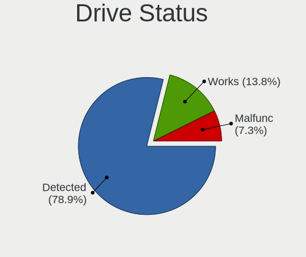
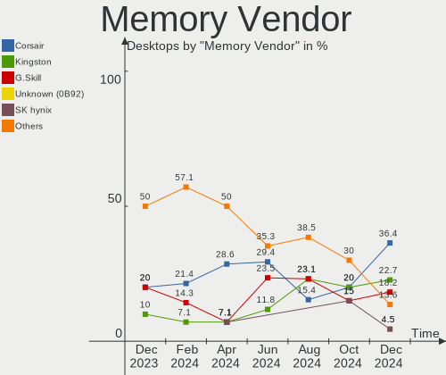

Pop!_OS - Hardware Trends (Desktops)
------------------------------------

A project to identify most popular hardware characteristics and track their change
over time based on data collected by Linux users at https://Linux-Hardware.org.

Anyone can contribute to this report by the [hw-probe](https://github.com/linuxhw/hw-probe) tool:

    sudo -E hw-probe -all -upload

This report is for one last month. Overall report since the beginning of time: [TestCoverage](https://github.com/linuxhw/TestCoverage)

Period: Oct, 2022.

Contents
--------

* [ System ](#system)
  - [ OS                       ](#os)
  - [ OS Family                ](#os-family)
  - [ Kernel                   ](#kernel)
  - [ Kernel Family            ](#kernel-family)
  - [ Kernel Major Ver.        ](#kernel-major-ver)
  - [ Arch                     ](#arch)
  - [ DE                       ](#de)
  - [ Display Server           ](#display-server)
  - [ Display Manager          ](#display-manager)
  - [ OS Lang                  ](#os-lang)
  - [ Boot Mode                ](#boot-mode)
  - [ Filesystem               ](#filesystem)
  - [ Part. scheme             ](#part-scheme)
  - [ Dual Boot with Linux/BSD ](#dual-boot-with-linuxbsd)
  - [ Dual Boot (Win)          ](#dual-boot-win)

* [ Board ](#board)
  - [ Vendor                   ](#vendor)
  - [ Model                    ](#model)
  - [ Model Family             ](#model-family)
  - [ MFG Year                 ](#mfg-year)
  - [ Form Factor              ](#form-factor)
  - [ Secure Boot              ](#secure-boot)
  - [ Coreboot                 ](#coreboot)
  - [ RAM Size                 ](#ram-size)
  - [ RAM Used                 ](#ram-used)
  - [ Total Drives             ](#total-drives)
  - [ Has CD-ROM               ](#has-cd-rom)
  - [ Has Ethernet             ](#has-ethernet)
  - [ Has WiFi                 ](#has-wifi)
  - [ Has Bluetooth            ](#has-bluetooth)

* [ Location ](#location)
  - [ Country                  ](#country)
  - [ City                     ](#city)

* [ Drives ](#drives)
  - [ Drive Vendor             ](#drive-vendor)
  - [ Drive Model              ](#drive-model)
  - [ HDD Vendor               ](#hdd-vendor)
  - [ SSD Vendor               ](#ssd-vendor)
  - [ Drive Kind               ](#drive-kind)
  - [ Drive Connector          ](#drive-connector)
  - [ Drive Size               ](#drive-size)
  - [ Space Total              ](#space-total)
  - [ Space Used               ](#space-used)
  - [ Malfunc. Drives          ](#malfunc-drives)
  - [ Malfunc. Drive Vendor    ](#malfunc-drive-vendor)
  - [ Malfunc. HDD Vendor      ](#malfunc-hdd-vendor)
  - [ Malfunc. Drive Kind      ](#malfunc-drive-kind)
  - [ Failed Drives            ](#failed-drives)
  - [ Failed Drive Vendor      ](#failed-drive-vendor)
  - [ Drive Status             ](#drive-status)

* [ Storage controller ](#storage-controller)
  - [ Storage Vendor           ](#storage-vendor)
  - [ Storage Model            ](#storage-model)
  - [ Storage Kind             ](#storage-kind)

* [ Processor ](#processor)
  - [ CPU Vendor               ](#cpu-vendor)
  - [ CPU Model                ](#cpu-model)
  - [ CPU Model Family         ](#cpu-model-family)
  - [ CPU Cores                ](#cpu-cores)
  - [ CPU Sockets              ](#cpu-sockets)
  - [ CPU Threads              ](#cpu-threads)
  - [ CPU Op-Modes             ](#cpu-op-modes)
  - [ CPU Microcode            ](#cpu-microcode)
  - [ CPU Microarch            ](#cpu-microarch)

* [ Graphics ](#graphics)
  - [ GPU Vendor               ](#gpu-vendor)
  - [ GPU Model                ](#gpu-model)
  - [ GPU Combo                ](#gpu-combo)
  - [ GPU Driver               ](#gpu-driver)
  - [ GPU Memory               ](#gpu-memory)

* [ Monitor ](#monitor)
  - [ Monitor Vendor           ](#monitor-vendor)
  - [ Monitor Model            ](#monitor-model)
  - [ Monitor Resolution       ](#monitor-resolution)
  - [ Monitor Diagonal         ](#monitor-diagonal)
  - [ Monitor Width            ](#monitor-width)
  - [ Aspect Ratio             ](#aspect-ratio)
  - [ Monitor Area             ](#monitor-area)
  - [ Pixel Density            ](#pixel-density)
  - [ Multiple Monitors        ](#multiple-monitors)

* [ Network ](#network)
  - [ Net Controller Vendor    ](#net-controller-vendor)
  - [ Net Controller Model     ](#net-controller-model)
  - [ Wireless Vendor          ](#wireless-vendor)
  - [ Wireless Model           ](#wireless-model)
  - [ Ethernet Vendor          ](#ethernet-vendor)
  - [ Ethernet Model           ](#ethernet-model)
  - [ Net Controller Kind      ](#net-controller-kind)
  - [ Used Controller          ](#used-controller)
  - [ NICs                     ](#nics)
  - [ IPv6                     ](#ipv6)

* [ Bluetooth ](#bluetooth)
  - [ Bluetooth Vendor         ](#bluetooth-vendor)
  - [ Bluetooth Model          ](#bluetooth-model)

* [ Sound ](#sound)
  - [ Sound Vendor             ](#sound-vendor)
  - [ Sound Model              ](#sound-model)

* [ Memory ](#memory)
  - [ Memory Vendor            ](#memory-vendor)
  - [ Memory Model             ](#memory-model)
  - [ Memory Kind              ](#memory-kind)
  - [ Memory Form Factor       ](#memory-form-factor)
  - [ Memory Size              ](#memory-size)
  - [ Memory Speed             ](#memory-speed)

* [ Printers & scanners ](#printers--scanners)
  - [ Printer Vendor           ](#printer-vendor)
  - [ Printer Model            ](#printer-model)
  - [ Scanner Vendor           ](#scanner-vendor)
  - [ Scanner Model            ](#scanner-model)

* [ Camera ](#camera)
  - [ Camera Vendor            ](#camera-vendor)
  - [ Camera Model             ](#camera-model)

* [ Security ](#security)
  - [ Fingerprint Vendor       ](#fingerprint-vendor)
  - [ Fingerprint Model        ](#fingerprint-model)
  - [ Chipcard Vendor          ](#chipcard-vendor)
  - [ Chipcard Model           ](#chipcard-model)

* [ Unsupported ](#unsupported)
  - [ Unsupported Devices      ](#unsupported-devices)
  - [ Unsupported Device Types ](#unsupported-device-types)

System
------

OS
--

Installed operating systems

| Name          | Desktops | Percent |
|---------------|----------|---------|
| Pop!_OS 22.04 | 86       | 100%    |

OS Family
---------

OS without a version

| Name    | Desktops | Percent |
|---------|----------|---------|
| Pop!_OS | 86       | 100%    |

Kernel
------

Version of the Linux kernel

| Version                  | Desktops | Percent |
|--------------------------|----------|---------|
| 5.19.0-76051900-generic  | 55       | 63.95%  |
| 5.19.16-76051916-generic | 16       | 18.6%   |
| 6.0.2-76060002-generic   | 11       | 12.79%  |
| 5.18.10-76051810-generic | 2        | 2.33%   |
| 6.0.2-x64v1-xanmod1      | 1        | 1.16%   |
| 5.17.15-76051715-generic | 1        | 1.16%   |

Kernel Family
-------------

Linux kernel without a distro release

| Version | Desktops | Percent |
|---------|----------|---------|
| 5.19.0  | 55       | 63.95%  |
| 5.19.16 | 16       | 18.6%   |
| 6.0.2   | 12       | 13.95%  |
| 5.18.10 | 2        | 2.33%   |
| 5.17.15 | 1        | 1.16%   |

Kernel Major Ver.
-----------------

Linux kernel major version

| Version | Desktops | Percent |
|---------|----------|---------|
| 5.19    | 71       | 82.56%  |
| 6.0     | 12       | 13.95%  |
| 5.18    | 2        | 2.33%   |
| 5.17    | 1        | 1.16%   |

Arch
----

OS architecture (x86_64, i586, etc.)

| Name   | Desktops | Percent |
|--------|----------|---------|
| x86_64 | 86       | 100%    |

DE
--

Desktop Environment

| Name            | Desktops | Percent |
|-----------------|----------|---------|
| GNOME           | 80       | 93.02%  |
| X-Cinnamon      | 3        | 3.49%   |
| KDE5            | 2        | 2.33%   |
| GNOME Flashback | 1        | 1.16%   |

Display Server
--------------

X11 or Wayland

| Name    | Desktops | Percent |
|---------|----------|---------|
| X11     | 85       | 98.84%  |
| Wayland | 1        | 1.16%   |

Display Manager
---------------

SDDM, LightDM, etc.

| Name    | Desktops | Percent |
|---------|----------|---------|
| Unknown | 68       | 79.07%  |
| GDM3    | 17       | 19.77%  |
| GDM     | 1        | 1.16%   |

OS Lang
-------

Language

| Lang  | Desktops | Percent |
|-------|----------|---------|
| en_US | 41       | 47.67%  |
| en_GB | 9        | 10.47%  |
| pt_BR | 7        | 8.14%   |
| it_IT | 7        | 8.14%   |
| en_CA | 3        | 3.49%   |
| en_AU | 3        | 3.49%   |
| de_DE | 3        | 3.49%   |
| C     | 3        | 3.49%   |
| zh_TW | 1        | 1.16%   |
| pl_PL | 1        | 1.16%   |
| fr_FR | 1        | 1.16%   |
| fr_CH | 1        | 1.16%   |
| fi_FI | 1        | 1.16%   |
| es_ES | 1        | 1.16%   |
| en_IN | 1        | 1.16%   |
| en_DK | 1        | 1.16%   |
| de_AT | 1        | 1.16%   |
| cs_CZ | 1        | 1.16%   |

Boot Mode
---------

EFI or BIOS

| Mode | Desktops | Percent |
|------|----------|---------|
| BIOS | 71       | 82.56%  |
| EFI  | 15       | 17.44%  |

Filesystem
----------

Type of filesystem

| Type    | Desktops | Percent |
|---------|----------|---------|
| Ext4    | 82       | 95.35%  |
| Overlay | 3        | 3.49%   |
| Btrfs   | 1        | 1.16%   |

Part. scheme
------------

Scheme of partitioning

| Type    | Desktops | Percent |
|---------|----------|---------|
| Unknown | 68       | 79.07%  |
| GPT     | 18       | 20.93%  |

Dual Boot with Linux/BSD
------------------------

Hosting more than one Linux/BSD

| Dual boot | Desktops | Percent |
|-----------|----------|---------|
| No        | 83       | 96.51%  |
| Yes       | 3        | 3.49%   |

Dual Boot (Win)
---------------

Hosting Linux and Windows

| Dual boot | Desktops | Percent |
|-----------|----------|---------|
| No        | 74       | 86.05%  |
| Yes       | 12       | 13.95%  |

Board
-----

Vendor
------

Motherboard manufacturer

| Name                | Desktops | Percent |
|---------------------|----------|---------|
| ASUSTek Computer    | 33       | 38.37%  |
| MSI                 | 13       | 15.12%  |
| Gigabyte Technology | 11       | 12.79%  |
| ASRock              | 11       | 12.79%  |
| Lenovo              | 5        | 5.81%   |
| Hewlett-Packard     | 4        | 4.65%   |
| Dell                | 4        | 4.65%   |
| Intel               | 3        | 3.49%   |
| Pegatron            | 2        | 2.33%   |

Model
-----

Motherboard model

| Name                                   | Desktops | Percent |
|----------------------------------------|----------|---------|
| ASUS All Series                        | 4        | 4.65%   |
| HP Compaq Elite 8300 USDT              | 2        | 2.33%   |
| Gigabyte B550 AORUS ELITE V2           | 2        | 2.33%   |
| ASUS ROG STRIX B450-F GAMING           | 2        | 2.33%   |
| ASUS ROG CROSSHAIR VIII HERO           | 2        | 2.33%   |
| Pegatron VC821AA-AB9 m9782pt           | 1        | 1.16%   |
| Pegatron h8-1444eo                     | 1        | 1.16%   |
| MSI MS-7D54                            | 1        | 1.16%   |
| MSI MS-7D25                            | 1        | 1.16%   |
| MSI MS-7D19                            | 1        | 1.16%   |
| MSI MS-7D18                            | 1        | 1.16%   |
| MSI MS-7D09                            | 1        | 1.16%   |
| MSI MS-7C94                            | 1        | 1.16%   |
| MSI MS-7C35                            | 1        | 1.16%   |
| MSI MS-7B89                            | 1        | 1.16%   |
| MSI MS-7B86                            | 1        | 1.16%   |
| MSI MS-7B17                            | 1        | 1.16%   |
| MSI MS-7816                            | 1        | 1.16%   |
| MSI MS-7788                            | 1        | 1.16%   |
| MSI MS-7693                            | 1        | 1.16%   |
| Lenovo ThinkCentre M93 10A4A05GJP      | 1        | 1.16%   |
| Lenovo ThinkCentre M90 5536A76         | 1        | 1.16%   |
| Lenovo ThinkCentre M83 10E8CTO1WW      | 1        | 1.16%   |
| Lenovo ThinkCentre M73 10AXS0FX01      | 1        | 1.16%   |
| Lenovo IdeaCentre 3 07ADA05 90MV006UIX | 1        | 1.16%   |
| Intel Productiva                       | 1        | 1.16%   |
| Intel DQ35JO AAD82085-801              | 1        | 1.16%   |
| Intel B75                              | 1        | 1.16%   |
| HP Compaq Pro 6300 MT                  | 1        | 1.16%   |
| HP Compaq 6000 Pro SFF PC              | 1        | 1.16%   |
| Gigabyte Z690 UD DDR4                  | 1        | 1.16%   |
| Gigabyte X79-UP4                       | 1        | 1.16%   |
| Gigabyte H310M H                       | 1        | 1.16%   |
| Gigabyte GA-MA770T-UD3P                | 1        | 1.16%   |
| Gigabyte GA-78LMT-USB3                 | 1        | 1.16%   |
| Gigabyte B550M DS3H                    | 1        | 1.16%   |
| Gigabyte B450 AORUS M                  | 1        | 1.16%   |
| Gigabyte AB350M-DS3H V2                | 1        | 1.16%   |
| Gigabyte AB350-Gaming 3                | 1        | 1.16%   |
| Dell XPS 8700                          | 1        | 1.16%   |

Model Family
------------

Motherboard model prefix

| Name                    | Desktops | Percent |
|-------------------------|----------|---------|
| ASUS ROG                | 11       | 12.79%  |
| ASUS TUF                | 9        | 10.47%  |
| ASUS PRIME              | 6        | 6.98%   |
| Lenovo ThinkCentre      | 4        | 4.65%   |
| HP Compaq               | 4        | 4.65%   |
| ASUS All                | 4        | 4.65%   |
| ASRock B450M            | 3        | 3.49%   |
| Gigabyte B550           | 2        | 2.33%   |
| Dell OptiPlex           | 2        | 2.33%   |
| ASRock X570             | 2        | 2.33%   |
| ASRock B450             | 2        | 2.33%   |
| Pegatron VC821AA-AB9    | 1        | 1.16%   |
| Pegatron h8-1444eo      | 1        | 1.16%   |
| MSI MS-7D54             | 1        | 1.16%   |
| MSI MS-7D25             | 1        | 1.16%   |
| MSI MS-7D19             | 1        | 1.16%   |
| MSI MS-7D18             | 1        | 1.16%   |
| MSI MS-7D09             | 1        | 1.16%   |
| MSI MS-7C94             | 1        | 1.16%   |
| MSI MS-7C35             | 1        | 1.16%   |
| MSI MS-7B89             | 1        | 1.16%   |
| MSI MS-7B86             | 1        | 1.16%   |
| MSI MS-7B17             | 1        | 1.16%   |
| MSI MS-7816             | 1        | 1.16%   |
| MSI MS-7788             | 1        | 1.16%   |
| MSI MS-7693             | 1        | 1.16%   |
| Lenovo IdeaCentre       | 1        | 1.16%   |
| Intel Productiva        | 1        | 1.16%   |
| Intel DQ35JO            | 1        | 1.16%   |
| Intel B75               | 1        | 1.16%   |
| Gigabyte Z690           | 1        | 1.16%   |
| Gigabyte X79-UP4        | 1        | 1.16%   |
| Gigabyte H310M          | 1        | 1.16%   |
| Gigabyte GA-MA770T-UD3P | 1        | 1.16%   |
| Gigabyte GA-78LMT-USB3  | 1        | 1.16%   |
| Gigabyte B550M          | 1        | 1.16%   |
| Gigabyte B450           | 1        | 1.16%   |
| Gigabyte AB350M-DS3H    | 1        | 1.16%   |
| Gigabyte AB350-Gaming   | 1        | 1.16%   |
| Dell XPS                | 1        | 1.16%   |

MFG Year
--------

Motherboard manufacture year

| Year | Desktops | Percent |
|------|----------|---------|
| 2020 | 15       | 17.44%  |
| 2018 | 13       | 15.12%  |
| 2021 | 11       | 12.79%  |
| 2019 | 10       | 11.63%  |
| 2012 | 8        | 9.3%    |
| 2014 | 6        | 6.98%   |
| 2022 | 5        | 5.81%   |
| 2017 | 5        | 5.81%   |
| 2013 | 3        | 3.49%   |
| 2007 | 3        | 3.49%   |
| 2016 | 2        | 2.33%   |
| 2010 | 2        | 2.33%   |
| 2009 | 2        | 2.33%   |
| 2011 | 1        | 1.16%   |

Form Factor
-----------

Physical design of the computer

| Name    | Desktops | Percent |
|---------|----------|---------|
| Desktop | 86       | 100%    |

Secure Boot
-----------

Enabled or disabled

| State    | Desktops | Percent |
|----------|----------|---------|
| Disabled | 86       | 100%    |

Coreboot
--------

Have coreboot on board

| Used | Desktops | Percent |
|------|----------|---------|
| No   | 86       | 100%    |

RAM Size
--------

Total RAM memory

| Size in GB  | Desktops | Percent |
|-------------|----------|---------|
| 32.01-64.0  | 31       | 36.05%  |
| 16.01-24.0  | 23       | 26.74%  |
| 8.01-16.0   | 11       | 12.79%  |
| 64.01-256.0 | 9        | 10.47%  |
| 4.01-8.0    | 7        | 8.14%   |
| 3.01-4.0    | 3        | 3.49%   |
| 24.01-32.0  | 2        | 2.33%   |

RAM Used
--------

Used RAM memory

| Used GB     | Desktops | Percent |
|-------------|----------|---------|
| 4.01-8.0    | 33       | 38.37%  |
| 3.01-4.0    | 20       | 23.26%  |
| 2.01-3.0    | 20       | 23.26%  |
| 1.01-2.0    | 7        | 8.14%   |
| 16.01-24.0  | 2        | 2.33%   |
| 8.01-16.0   | 2        | 2.33%   |
| 32.01-64.0  | 1        | 1.16%   |
| 64.01-256.0 | 1        | 1.16%   |

Total Drives
------------

Number of drives on board

| Drives | Desktops | Percent |
|--------|----------|---------|
| 2      | 22       | 25.58%  |
| 1      | 22       | 25.58%  |
| 3      | 20       | 23.26%  |
| 4      | 11       | 12.79%  |
| 5      | 5        | 5.81%   |
| 6      | 3        | 3.49%   |
| 19     | 1        | 1.16%   |
| 10     | 1        | 1.16%   |
| 7      | 1        | 1.16%   |

Has CD-ROM
----------

Has CD-ROM on board

| Presented | Desktops | Percent |
|-----------|----------|---------|
| No        | 69       | 80.23%  |
| Yes       | 17       | 19.77%  |

Has Ethernet
------------

Has Ethernet on board

| Presented | Desktops | Percent |
|-----------|----------|---------|
| Yes       | 85       | 98.84%  |
| No        | 1        | 1.16%   |

Has WiFi
--------

Has WiFi module

| Presented | Desktops | Percent |
|-----------|----------|---------|
| Yes       | 44       | 51.16%  |
| No        | 42       | 48.84%  |

Has Bluetooth
-------------

Has Bluetooth module

| Presented | Desktops | Percent |
|-----------|----------|---------|
| Yes       | 45       | 52.33%  |
| No        | 41       | 47.67%  |

Location
--------

Country
-------

Geographic location (country)

| Country      | Desktops | Percent |
|--------------|----------|---------|
| USA          | 20       | 23.26%  |
| Italy        | 12       | 13.95%  |
| Brazil       | 7        | 8.14%   |
| UK           | 5        | 5.81%   |
| Canada       | 5        | 5.81%   |
| Poland       | 4        | 4.65%   |
| Germany      | 4        | 4.65%   |
| Australia    | 4        | 4.65%   |
| France       | 3        | 3.49%   |
| Thailand     | 2        | 2.33%   |
| Spain        | 2        | 2.33%   |
| Norway       | 2        | 2.33%   |
| Finland      | 2        | 2.33%   |
| Sweden       | 1        | 1.16%   |
| South Africa | 1        | 1.16%   |
| Slovakia     | 1        | 1.16%   |
| Serbia       | 1        | 1.16%   |
| Russia       | 1        | 1.16%   |
| Portugal     | 1        | 1.16%   |
| Philippines  | 1        | 1.16%   |
| New Zealand  | 1        | 1.16%   |
| Lithuania    | 1        | 1.16%   |
| Ireland      | 1        | 1.16%   |
| India        | 1        | 1.16%   |
| Hong Kong    | 1        | 1.16%   |
| Czechia      | 1        | 1.16%   |
| Austria      | 1        | 1.16%   |

City
----

Geographic location (city)

| City                  | Desktops | Percent |
|-----------------------|----------|---------|
| Milan                 | 4        | 4.65%   |
| Seattle               | 2        | 2.33%   |
| Sao Paulo             | 2        | 2.33%   |
| Juiz de Fora          | 2        | 2.33%   |
| Edmonton              | 2        | 2.33%   |
| Brzeg                 | 2        | 2.33%   |
| Bargo                 | 2        | 2.33%   |
| Zbysov                | 1        | 1.16%   |
| Wildeshausen          | 1        | 1.16%   |
| Whanganui             | 1        | 1.16%   |
| Warrensburg           | 1        | 1.16%   |
| Vienna                | 1        | 1.16%   |
| Varberg               | 1        | 1.16%   |
| Trakai                | 1        | 1.16%   |
| Tiffin                | 1        | 1.16%   |
| Tampere               | 1        | 1.16%   |
| Swindon               | 1        | 1.16%   |
| St Petersburg         | 1        | 1.16%   |
| South Benfleet        | 1        | 1.16%   |
| Sherrills Ford        | 1        | 1.16%   |
| Saronno               | 1        | 1.16%   |
| Santa Cruz do Sul     | 1        | 1.16%   |
| Sandy                 | 1        | 1.16%   |
| San Francisco         | 1        | 1.16%   |
| Saint-Germain-en-Laye | 1        | 1.16%   |
| Rørvik               | 1        | 1.16%   |
| Rio de Janeiro        | 1        | 1.16%   |
| Rensselaer            | 1        | 1.16%   |
| Regina                | 1        | 1.16%   |
| Phoenix               | 1        | 1.16%   |
| Phitsanulok           | 1        | 1.16%   |
| Peterlee              | 1        | 1.16%   |
| Peoria                | 1        | 1.16%   |
| Paris                 | 1        | 1.16%   |
| Palermo               | 1        | 1.16%   |
| Oulu                  | 1        | 1.16%   |
| Orange                | 1        | 1.16%   |
| Nova Iguaçu          | 1        | 1.16%   |
| Newark                | 1        | 1.16%   |
| Naples                | 1        | 1.16%   |

Drives
------

Drive Vendor
------------

Hard drive vendors

| Vendor                    | Desktops | Drives | Percent |
|---------------------------|----------|--------|---------|
| WDC                       | 32       | 40     | 16.84%  |
| Seagate                   | 29       | 38     | 15.26%  |
| Samsung Electronics       | 29       | 43     | 15.26%  |
| Crucial                   | 14       | 18     | 7.37%   |
| Kingston                  | 13       | 13     | 6.84%   |
| Sandisk                   | 11       | 12     | 5.79%   |
| Toshiba                   | 6        | 7      | 3.16%   |
| Phison Electronics        | 5        | 7      | 2.63%   |
| Micron/Crucial Technology | 5        | 5      | 2.63%   |
| Intel                     | 4        | 4      | 2.11%   |
| Phison                    | 3        | 3      | 1.58%   |
| Hitachi                   | 3        | 3      | 1.58%   |
| HGST                      | 3        | 3      | 1.58%   |
| A-DATA Technology         | 3        | 3      | 1.58%   |
| Unknown                   | 2        | 7      | 1.05%   |
| Team                      | 2        | 2      | 1.05%   |
| SK hynix                  | 2        | 3      | 1.05%   |
| Silicon Motion            | 2        | 3      | 1.05%   |
| PNY                       | 2        | 2      | 1.05%   |
| Netac                     | 2        | 2      | 1.05%   |
| ADATA Technology          | 2        | 2      | 1.05%   |
| Yeyian                    | 1        | 1      | 0.53%   |
| XPG                       | 1        | 1      | 0.53%   |
| TCSUNBOW                  | 1        | 1      | 0.53%   |
| SPCC                      | 1        | 1      | 0.53%   |
| Realtek Semiconductor     | 1        | 1      | 0.53%   |
| Patriot                   | 1        | 1      | 0.53%   |
| OCZ                       | 1        | 1      | 0.53%   |
| LITEON                    | 1        | 1      | 0.53%   |
| JMicron Technology        | 1        | 10     | 0.53%   |
| HS-SSD-C100               | 1        | 1      | 0.53%   |
| Emtec                     | 1        | 1      | 0.53%   |
| Elite                     | 1        | 2      | 0.53%   |
| Corsair                   | 1        | 2      | 0.53%   |
| China                     | 1        | 1      | 0.53%   |
| BAITITON                  | 1        | 1      | 0.53%   |
| Apple                     | 1        | 1      | 0.53%   |

Drive Model
-----------

Hard drive models

| Model                                                | Desktops | Percent |
|------------------------------------------------------|----------|---------|
| Seagate ST1000DM010-2EP102 1TB                       | 5        | 2.22%   |
| Samsung NVMe SSD Controller SM981/PM981/PM983 500GB  | 5        | 2.22%   |
| Phison E12 NVMe Controller 2TB                       | 5        | 2.22%   |
| Samsung SSD 850 EVO 250GB                            | 4        | 1.78%   |
| Samsung NVMe SSD Controller PM9A1/PM9A3/980PRO 250GB | 4        | 1.78%   |
| Kingston SV300S37A120G 120GB SSD                     | 4        | 1.78%   |
| Crucial CT1000MX500SSD1 1TB                          | 4        | 1.78%   |
| Seagate ST2000DM008-2FR102 2TB                       | 3        | 1.33%   |
| Sandisk WD Blue SN550 NVMe SSD 1TB                   | 3        | 1.33%   |
| Samsung SSD 860 EVO 1TB                              | 3        | 1.33%   |
| Samsung SSD 850 EVO 1TB                              | 3        | 1.33%   |
| Crucial CT500MX500SSD1 500GB                         | 3        | 1.33%   |
| Crucial CT1000BX500SSD1 1TB                          | 3        | 1.33%   |
| WDC WDS100T2B0A-00SM50 1TB SSD                       | 2        | 0.89%   |
| Toshiba DT01ACA100 1TB                               | 2        | 0.89%   |
| Seagate ST8000DM004-2CX188 8TB                       | 2        | 0.89%   |
| Seagate ST1000DM003-1ER162 1TB                       | 2        | 0.89%   |
| Seagate Desktop 3TB                                  | 2        | 0.89%   |
| Sandisk WD Black SN750 / PC SN730 NVMe SSD 1TB       | 2        | 0.89%   |
| Samsung SSD 980 500GB                                | 2        | 0.89%   |
| Samsung SSD 980 1TB                                  | 2        | 0.89%   |
| Samsung SSD 860 QVO 1TB                              | 2        | 0.89%   |
| Samsung SSD 850 EVO 500GB                            | 2        | 0.89%   |
| Samsung SSD 850 EVO 120GB                            | 2        | 0.89%   |
| Phison Sabrent 512GB                                 | 2        | 0.89%   |
| Micron/Crucial CT500P1SSD8 500GB                     | 2        | 0.89%   |
| Micron/Crucial CT1000P5SSD8 1TB                      | 2        | 0.89%   |
| Kingston SA400S37480G 480GB SSD                      | 2        | 0.89%   |
| Kingston SA400S37240G 240GB SSD                      | 2        | 0.89%   |
| Intel SSD 660P Series 1024GB                         | 2        | 0.89%   |
| Crucial CT250MX500SSD1 250GB                         | 2        | 0.89%   |
| Yeyian VALK 2000 512GB                               | 1        | 0.44%   |
| XPG GAMMIX S70 BLADE 2TB                             | 1        | 0.44%   |
| WDC WDS500G3X0C-00SJG0 500GB                         | 1        | 0.44%   |
| WDC WDS500G2B0A-00SM50 500GB SSD                     | 1        | 0.44%   |
| WDC WDS250G2B0C-00PXH0 250GB                         | 1        | 0.44%   |
| WDC WDS240G2G0B-00EPW0 240GB SSD                     | 1        | 0.44%   |
| WDC WDS200T2B0B-00YS70 2TB SSD                       | 1        | 0.44%   |
| WDC WDS100T3X0C-00SJG0 1TB                           | 1        | 0.44%   |
| WDC WDS100T2B0C-00PXH0 1TB                           | 1        | 0.44%   |

HDD Vendor
----------

Hard disk drive vendors

| Vendor             | Desktops | Drives | Percent |
|--------------------|----------|--------|---------|
| Seagate            | 29       | 38     | 42.03%  |
| WDC                | 25       | 30     | 36.23%  |
| Toshiba            | 6        | 7      | 8.7%    |
| Hitachi            | 3        | 3      | 4.35%   |
| HGST               | 3        | 3      | 4.35%   |
| Unknown            | 1        | 5      | 1.45%   |
| JMicron Technology | 1        | 6      | 1.45%   |
| Apple              | 1        | 1      | 1.45%   |

SSD Vendor
----------

Solid state drive vendors

| Vendor              | Desktops | Drives | Percent |
|---------------------|----------|--------|---------|
| Samsung Electronics | 18       | 22     | 24.66%  |
| Crucial             | 14       | 17     | 19.18%  |
| Kingston            | 12       | 12     | 16.44%  |
| WDC                 | 6        | 6      | 8.22%   |
| SanDisk             | 4        | 4      | 5.48%   |
| Team                | 2        | 2      | 2.74%   |
| PNY                 | 2        | 2      | 2.74%   |
| Netac               | 2        | 2      | 2.74%   |
| A-DATA Technology   | 2        | 2      | 2.74%   |
| Yeyian              | 1        | 1      | 1.37%   |
| TCSUNBOW            | 1        | 1      | 1.37%   |
| SPCC                | 1        | 1      | 1.37%   |
| SK hynix            | 1        | 2      | 1.37%   |
| Patriot             | 1        | 1      | 1.37%   |
| OCZ                 | 1        | 1      | 1.37%   |
| LITEON              | 1        | 1      | 1.37%   |
| Intel               | 1        | 1      | 1.37%   |
| Emtec               | 1        | 1      | 1.37%   |
| China               | 1        | 1      | 1.37%   |
| BAITITON            | 1        | 1      | 1.37%   |

Drive Kind
----------

HDD or SSD

| Kind    | Desktops | Drives | Percent |
|---------|----------|--------|---------|
| SSD     | 60       | 81     | 37.97%  |
| HDD     | 49       | 93     | 31.01%  |
| NVMe    | 45       | 64     | 28.48%  |
| Unknown | 4        | 9      | 2.53%   |

Drive Connector
---------------

SATA, SAS, NVMe, etc.

| Type | Desktops | Drives | Percent |
|------|----------|--------|---------|
| SATA | 74       | 165    | 58.73%  |
| NVMe | 45       | 64     | 35.71%  |
| SAS  | 7        | 18     | 5.56%   |

Drive Size
----------

Size of hard drive

| Size in TB | Desktops | Drives | Percent |
|------------|----------|--------|---------|
| 0.01-0.5   | 49       | 70     | 41.18%  |
| 0.51-1.0   | 42       | 57     | 35.29%  |
| 1.01-2.0   | 12       | 14     | 10.08%  |
| 2.01-3.0   | 6        | 8      | 5.04%   |
| 4.01-10.0  | 6        | 13     | 5.04%   |
| 3.01-4.0   | 3        | 5      | 2.52%   |
| 10.01-20.0 | 1        | 7      | 0.84%   |

Space Total
-----------

Amount of disk space available on the file system

| Size in GB     | Desktops | Percent |
|----------------|----------|---------|
| 501-1000       | 23       | 26.74%  |
| 101-250        | 16       | 18.6%   |
| 251-500        | 15       | 17.44%  |
| 1001-2000      | 11       | 12.79%  |
| 2001-3000      | 8        | 9.3%    |
| More than 3000 | 7        | 8.14%   |
| 1-20           | 3        | 3.49%   |
| 21-50          | 2        | 2.33%   |
| 51-100         | 1        | 1.16%   |

Space Used
----------

Amount of used disk space

| Used GB        | Desktops | Percent |
|----------------|----------|---------|
| 1-20           | 19       | 22.09%  |
| 21-50          | 18       | 20.93%  |
| 101-250        | 11       | 12.79%  |
| 51-100         | 11       | 12.79%  |
| 501-1000       | 10       | 11.63%  |
| 251-500        | 6        | 6.98%   |
| 1001-2000      | 5        | 5.81%   |
| More than 3000 | 3        | 3.49%   |
| 2001-3000      | 3        | 3.49%   |

Malfunc. Drives
---------------

Drive models with a malfunction

| Model                                 | Desktops | Drives | Percent |
|---------------------------------------|----------|--------|---------|
| WDC WD60EFRX-68L0BN1 6TB              | 1        | 1      | 20%     |
| WDC WD10EZEX-60WN4A0 1TB              | 1        | 1      | 20%     |
| Samsung Electronics SSD 850 EVO 250GB | 1        | 1      | 20%     |
| HGST HTS725050A7E630 500GB            | 1        | 1      | 20%     |
| BAITITON BT58SSD08M 128GB             | 1        | 1      | 20%     |

Malfunc. Drive Vendor
---------------------

Vendors of faulty drives

| Vendor              | Desktops | Drives | Percent |
|---------------------|----------|--------|---------|
| WDC                 | 2        | 2      | 40%     |
| Samsung Electronics | 1        | 1      | 20%     |
| HGST                | 1        | 1      | 20%     |
| BAITITON            | 1        | 1      | 20%     |

Malfunc. HDD Vendor
-------------------

Vendors of faulty HDD drives

| Vendor | Desktops | Drives | Percent |
|--------|----------|--------|---------|
| WDC    | 2        | 2      | 66.67%  |
| HGST   | 1        | 1      | 33.33%  |

Malfunc. Drive Kind
-------------------

Kinds of faulty drives

| Kind | Desktops | Drives | Percent |
|------|----------|--------|---------|
| HDD  | 3        | 3      | 60%     |
| SSD  | 2        | 2      | 40%     |

Failed Drives
-------------

Failed drive models

Zero info for selected period =(

Failed Drive Vendor
-------------------

Failed drive vendors

Zero info for selected period =(

Drive Status
------------

Number of failed and malfunc. drives

| Status   | Desktops | Drives | Percent |
|----------|----------|--------|---------|
| Detected | 69       | 196    | 75%     |
| Works    | 18       | 46     | 19.57%  |
| Malfunc  | 5        | 5      | 5.43%   |

Storage controller
------------------

Storage Vendor
--------------

Storage controller vendors

| Vendor                      | Desktops | Percent |
|-----------------------------|----------|---------|
| AMD                         | 49       | 32.45%  |
| Intel                       | 39       | 25.83%  |
| Samsung Electronics         | 17       | 11.26%  |
| SanDisk                     | 12       | 7.95%   |
| Phison Electronics          | 9        | 5.96%   |
| Micron/Crucial Technology   | 6        | 3.97%   |
| ASMedia Technology          | 6        | 3.97%   |
| ADATA Technology            | 3        | 1.99%   |
| Silicon Motion              | 2        | 1.32%   |
| Realtek Semiconductor       | 2        | 1.32%   |
| Marvell Technology Group    | 2        | 1.32%   |
| SK hynix                    | 1        | 0.66%   |
| Nvidia                      | 1        | 0.66%   |
| Kingston Technology Company | 1        | 0.66%   |
| JMicron Technology          | 1        | 0.66%   |

Storage Model
-------------

Storage controller models

| Model                                                                          | Desktops | Percent |
|--------------------------------------------------------------------------------|----------|---------|
| AMD FCH SATA Controller [AHCI mode]                                            | 32       | 18.08%  |
| AMD 400 Series Chipset SATA Controller                                         | 14       | 7.91%   |
| AMD 500 Series Chipset SATA Controller                                         | 9        | 5.08%   |
| Phison E12 NVMe Controller                                                     | 7        | 3.95%   |
| Samsung NVMe SSD Controller SM981/PM981/PM983                                  | 6        | 3.39%   |
| SanDisk WD Blue SN550 NVMe SSD                                                 | 5        | 2.82%   |
| Samsung NVMe SSD Controller 980                                                | 5        | 2.82%   |
| Intel 8 Series/C220 Series Chipset Family 6-port SATA Controller 1 [AHCI mode] | 5        | 2.82%   |
| ASMedia ASM1062 Serial ATA Controller                                          | 5        | 2.82%   |
| SanDisk WD Black SN750 / PC SN730 NVMe SSD                                     | 4        | 2.26%   |
| Samsung NVMe SSD Controller PM9A1/PM9A3/980PRO                                 | 4        | 2.26%   |
| Intel 500 Series Chipset Family SATA AHCI Controller                           | 4        | 2.26%   |
| Micron/Crucial NVMe Controller                                                 | 3        | 1.69%   |
| Micron/Crucial Non-Volatile memory controller                                  | 3        | 1.69%   |
| Intel Alder Lake-S PCH SATA Controller [AHCI Mode]                             | 3        | 1.69%   |
| Intel 9 Series Chipset Family SATA Controller [AHCI Mode]                      | 3        | 1.69%   |
| Intel 7 Series/C210 Series Chipset Family 6-port SATA Controller [AHCI mode]   | 3        | 1.69%   |
| Intel 200 Series PCH SATA controller [AHCI mode]                               | 3        | 1.69%   |
| AMD SB7x0/SB8x0/SB9x0 SATA Controller [AHCI mode]                              | 3        | 1.69%   |
| AMD 300 Series Chipset SATA Controller                                         | 3        | 1.69%   |
| Samsung NVMe SSD Controller SM961/PM961/SM963                                  | 2        | 1.13%   |
| Phison E16 PCIe4 NVMe Controller                                               | 2        | 1.13%   |
| Intel SSD 660P Series                                                          | 2        | 1.13%   |
| Intel Cannon Lake PCH SATA AHCI Controller                                     | 2        | 1.13%   |
| Intel 6 Series/C200 Series Chipset Family 6 port Desktop SATA AHCI Controller  | 2        | 1.13%   |
| AMD SB7x0/SB8x0/SB9x0 IDE Controller                                           | 2        | 1.13%   |
| AMD SATA controller                                                            | 2        | 1.13%   |
| AMD FCH SATA Controller D                                                      | 2        | 1.13%   |
| ADATA A Non-Volatile memory controller                                         | 2        | 1.13%   |
| SK hynix Non-Volatile memory controller                                        | 1        | 0.56%   |
| Silicon Motion SM2263EN/SM2263XT SSD Controller                                | 1        | 0.56%   |
| Silicon Motion SM2262/SM2262EN SSD Controller                                  | 1        | 0.56%   |
| SanDisk WD PC SN810 / Black SN850 NVMe SSD                                     | 1        | 0.56%   |
| SanDisk WD Black 2018/SN750 / PC SN720 NVMe SSD                                | 1        | 0.56%   |
| SanDisk Non-Volatile memory controller                                         | 1        | 0.56%   |
| Realtek RTS5763DL NVMe SSD Controller                                          | 1        | 0.56%   |
| Realtek Realtek Non-Volatile memory controller                                 | 1        | 0.56%   |
| Nvidia MCP51 Serial ATA Controller                                             | 1        | 0.56%   |
| Marvell Group 88SE9172 SATA 6Gb/s Controller                                   | 1        | 0.56%   |
| Marvell Group 88SE6101/6102 single-port PATA133 interface                      | 1        | 0.56%   |

Storage Kind
------------

Kind of storage controller (IDE, SATA, NVMe, SAS, ...)

| Kind | Desktops | Percent |
|------|----------|---------|
| SATA | 80       | 58.39%  |
| NVMe | 45       | 32.85%  |
| IDE  | 10       | 7.3%    |
| RAID | 2        | 1.46%   |

Processor
---------

CPU Vendor
----------

Processor vendors

| Vendor | Desktops | Percent |
|--------|----------|---------|
| AMD    | 50       | 58.14%  |
| Intel  | 36       | 41.86%  |

CPU Model
---------

Processor models

| Model                                       | Desktops | Percent |
|---------------------------------------------|----------|---------|
| AMD Ryzen 9 5950X 16-Core Processor         | 4        | 4.65%   |
| AMD Ryzen 7 5800X 8-Core Processor          | 4        | 4.65%   |
| AMD Ryzen 5 3600 6-Core Processor           | 4        | 4.65%   |
| AMD Ryzen 7 3800X 8-Core Processor          | 3        | 3.49%   |
| Intel Core i7-4790K CPU @ 4.00GHz           | 2        | 2.33%   |
| AMD Ryzen 9 7950X 16-Core Processor         | 2        | 2.33%   |
| AMD Ryzen 7 5700G with Radeon Graphics      | 2        | 2.33%   |
| AMD Ryzen 7 3700X 8-Core Processor          | 2        | 2.33%   |
| AMD Ryzen 7 2700X Eight-Core Processor      | 2        | 2.33%   |
| AMD Ryzen 5 5600 6-Core Processor           | 2        | 2.33%   |
| AMD Ryzen 5 3400G with Radeon Vega Graphics | 2        | 2.33%   |
| AMD Ryzen 3 3200G with Radeon Vega Graphics | 2        | 2.33%   |
| Intel Xeon CPU E5-2650 v2 @ 2.60GHz         | 1        | 1.16%   |
| Intel Xeon CPU E3-1230 v3 @ 3.30GHz         | 1        | 1.16%   |
| Intel Pentium Dual-Core CPU E5200 @ 2.50GHz | 1        | 1.16%   |
| Intel Pentium Dual CPU E2200 @ 2.20GHz      | 1        | 1.16%   |
| Intel Core i7-9700KF CPU @ 3.60GHz          | 1        | 1.16%   |
| Intel Core i7-8700K CPU @ 3.70GHz           | 1        | 1.16%   |
| Intel Core i7-7700K CPU @ 4.20GHz           | 1        | 1.16%   |
| Intel Core i7-7700 CPU @ 3.60GHz            | 1        | 1.16%   |
| Intel Core i7-6850K CPU @ 3.60GHz           | 1        | 1.16%   |
| Intel Core i7-6700K CPU @ 4.00GHz           | 1        | 1.16%   |
| Intel Core i7-4790 CPU @ 3.60GHz            | 1        | 1.16%   |
| Intel Core i7-4770 CPU @ 3.40GHz            | 1        | 1.16%   |
| Intel Core i7-3770 CPU @ 3.40GHz            | 1        | 1.16%   |
| Intel Core i7-2600 CPU @ 3.40GHz            | 1        | 1.16%   |
| Intel Core i7 CPU 920 @ 2.67GHz             | 1        | 1.16%   |
| Intel Core i5-9600K CPU @ 3.70GHz           | 1        | 1.16%   |
| Intel Core i5-4690S CPU @ 3.20GHz           | 1        | 1.16%   |
| Intel Core i5-4590T CPU @ 2.00GHz           | 1        | 1.16%   |
| Intel Core i5-4430 CPU @ 3.00GHz            | 1        | 1.16%   |
| Intel Core i5-3570S CPU @ 3.10GHz           | 1        | 1.16%   |
| Intel Core i5-3470S CPU @ 2.90GHz           | 1        | 1.16%   |
| Intel Core i5-3470 CPU @ 3.20GHz            | 1        | 1.16%   |
| Intel Core i5-3350P CPU @ 3.10GHz           | 1        | 1.16%   |
| Intel Core i5 CPU 660 @ 3.33GHz             | 1        | 1.16%   |
| Intel Core i3-3220 CPU @ 3.30GHz            | 1        | 1.16%   |
| Intel Core i3-2120T CPU @ 2.60GHz           | 1        | 1.16%   |
| Intel Core 2 Duo CPU E7500 @ 2.93GHz        | 1        | 1.16%   |
| Intel 12th Gen Core i9-12900F               | 1        | 1.16%   |

CPU Model Family
----------------

Processor model prefix

| Model                   | Desktops | Percent |
|-------------------------|----------|---------|
| AMD Ryzen 5             | 17       | 19.77%  |
| AMD Ryzen 7             | 15       | 17.44%  |
| Intel Core i7           | 13       | 15.12%  |
| Intel Core i5           | 9        | 10.47%  |
| AMD Ryzen 9             | 8        | 9.3%    |
| Other                   | 7        | 8.14%   |
| AMD Ryzen 3             | 4        | 4.65%   |
| Intel Xeon              | 2        | 2.33%   |
| Intel Core i3           | 2        | 2.33%   |
| AMD FX                  | 2        | 2.33%   |
| Intel Pentium Dual-Core | 1        | 1.16%   |
| Intel Pentium Dual      | 1        | 1.16%   |
| Intel Core 2 Duo        | 1        | 1.16%   |
| AMD Phenom II X4        | 1        | 1.16%   |
| AMD Athlon X4           | 1        | 1.16%   |
| AMD Athlon 64           | 1        | 1.16%   |
| AMD Athlon              | 1        | 1.16%   |

CPU Cores
---------

Number of processor cores

| Number | Desktops | Percent |
|--------|----------|---------|
| 4      | 27       | 31.4%   |
| 8      | 19       | 22.09%  |
| 6      | 19       | 22.09%  |
| 16     | 8        | 9.3%    |
| 2      | 8        | 9.3%    |
| 12     | 3        | 3.49%   |
| 3      | 1        | 1.16%   |
| 1      | 1        | 1.16%   |

CPU Sockets
-----------

Number of sockets

| Number | Desktops | Percent |
|--------|----------|---------|
| 1      | 86       | 100%    |

CPU Threads
-----------

Threads per core (Hyper-Threading)

| Number | Desktops | Percent |
|--------|----------|---------|
| 2      | 68       | 79.07%  |
| 1      | 18       | 20.93%  |

CPU Op-Modes
------------

CPU Operation Modes (32-bit, 64-bit)

| Op mode        | Desktops | Percent |
|----------------|----------|---------|
| 32-bit, 64-bit | 86       | 100%    |

CPU Microcode
-------------

Microcode number

| Number     | Desktops | Percent |
|------------|----------|---------|
| Unknown    | 68       | 79.07%  |
| 0x306a9    | 3        | 3.49%   |
| 0x0a201016 | 3        | 3.49%   |
| 0x08701021 | 2        | 2.33%   |
| 0x08108109 | 2        | 2.33%   |
| 0xa0671    | 1        | 1.16%   |
| 0x906ed    | 1        | 1.16%   |
| 0x906ec    | 1        | 1.16%   |
| 0x906e9    | 1        | 1.16%   |
| 0x90672    | 1        | 1.16%   |
| 0x206a7    | 1        | 1.16%   |
| 0x0a601201 | 1        | 1.16%   |
| 0x0800820d | 1        | 1.16%   |

CPU Microarch
-------------

Microarchitecture

| Name             | Desktops | Percent |
|------------------|----------|---------|
| Zen 3            | 16       | 18.6%   |
| Zen 2            | 14       | 16.28%  |
| Zen+             | 10       | 11.63%  |
| Haswell          | 8        | 9.3%    |
| Unknown          | 8        | 9.3%    |
| IvyBridge        | 7        | 8.14%   |
| KabyLake         | 5        | 5.81%   |
| Zen              | 3        | 3.49%   |
| SandyBridge      | 2        | 2.33%   |
| Piledriver       | 2        | 2.33%   |
| Penryn           | 2        | 2.33%   |
| Westmere         | 1        | 1.16%   |
| Steamroller      | 1        | 1.16%   |
| Skylake          | 1        | 1.16%   |
| Nehalem          | 1        | 1.16%   |
| K8 Hammer        | 1        | 1.16%   |
| K10              | 1        | 1.16%   |
| Core             | 1        | 1.16%   |
| Broadwell        | 1        | 1.16%   |
| Alderlake Hybrid | 1        | 1.16%   |

Graphics
--------

GPU Vendor
----------

Vendors of graphics cards

| Vendor | Desktops | Percent |
|--------|----------|---------|
| Nvidia | 43       | 48.86%  |
| AMD    | 32       | 36.36%  |
| Intel  | 13       | 14.77%  |

GPU Model
---------

Graphics card models

| Model                                                                       | Desktops | Percent |
|-----------------------------------------------------------------------------|----------|---------|
| AMD Navi 23 [Radeon RX 6600/6600 XT/6600M]                                  | 6        | 6.74%   |
| Intel Xeon E3-1200 v3/4th Gen Core Processor Integrated Graphics Controller | 5        | 5.62%   |
| Nvidia GP107 [GeForce GTX 1050 Ti]                                          | 4        | 4.49%   |
| AMD Picasso/Raven 2 [Radeon Vega Series / Radeon Vega Mobile Series]        | 4        | 4.49%   |
| AMD Navi 21 [Radeon RX 6800/6800 XT / 6900 XT]                              | 4        | 4.49%   |
| Nvidia GP106 [GeForce GTX 1060 6GB]                                         | 3        | 3.37%   |
| Nvidia GA102 [GeForce RTX 3080 Lite Hash Rate]                              | 3        | 3.37%   |
| Intel Xeon E3-1200 v2/3rd Gen Core processor Graphics Controller            | 3        | 3.37%   |
| AMD Navi 22 [Radeon RX 6700/6700 XT/6750 XT / 6800M]                        | 3        | 3.37%   |
| AMD Ellesmere [Radeon RX 470/480/570/570X/580/580X/590]                     | 3        | 3.37%   |
| Nvidia TU116 [GeForce GTX 1660 Ti]                                          | 2        | 2.25%   |
| Nvidia TU116 [GeForce GTX 1660 SUPER]                                       | 2        | 2.25%   |
| Nvidia TU106 [GeForce RTX 2060 SUPER]                                       | 2        | 2.25%   |
| Nvidia TU106 [GeForce RTX 2060 Rev. A]                                      | 2        | 2.25%   |
| Nvidia TU104 [GeForce RTX 2070 SUPER]                                       | 2        | 2.25%   |
| Nvidia GP108 [GeForce GT 1030]                                              | 2        | 2.25%   |
| Nvidia GM107 [GeForce GTX 750 Ti]                                           | 2        | 2.25%   |
| Nvidia GA106 [GeForce RTX 3060]                                             | 2        | 2.25%   |
| AMD Navi 24 [Radeon RX 6400 / 6500 XT]                                      | 2        | 2.25%   |
| AMD Lexa PRO [Radeon 540/540X/550/550X / RX 540X/550/550X]                  | 2        | 2.25%   |
| AMD Cezanne                                                                 | 2        | 2.25%   |
| Nvidia TU116 [GeForce GTX 1650]                                             | 1        | 1.12%   |
| Nvidia TU104 [GeForce RTX 2080 SUPER]                                       | 1        | 1.12%   |
| Nvidia GP107 [GeForce GTX 1050]                                             | 1        | 1.12%   |
| Nvidia GP104 [GeForce GTX 1080]                                             | 1        | 1.12%   |
| Nvidia GP104 [GeForce GTX 1070]                                             | 1        | 1.12%   |
| Nvidia GP104 [GeForce GTX 1060 6GB]                                         | 1        | 1.12%   |
| Nvidia GM206 [GeForce GTX 950]                                              | 1        | 1.12%   |
| Nvidia GM204 [GeForce GTX 980]                                              | 1        | 1.12%   |
| Nvidia GK107 [NVS 510]                                                      | 1        | 1.12%   |
| Nvidia GK107 [GeForce GTX 650]                                              | 1        | 1.12%   |
| Nvidia GK107 [GeForce GT 740]                                               | 1        | 1.12%   |
| Nvidia GA106 [RTX A2000]                                                    | 1        | 1.12%   |
| Nvidia GA106 [Geforce RTX 3050]                                             | 1        | 1.12%   |
| Nvidia GA104 [GeForce RTX 3070 Ti]                                          | 1        | 1.12%   |
| Nvidia GA102 [GeForce RTX 3080]                                             | 1        | 1.12%   |
| Nvidia G98 [GeForce 8400 GS Rev. 2]                                         | 1        | 1.12%   |
| Nvidia C51 [GeForce 6150 LE]                                                | 1        | 1.12%   |
| Intel Core Processor Integrated Graphics Controller                         | 1        | 1.12%   |
| Intel AlderLake-S GT1                                                       | 1        | 1.12%   |

GPU Combo
---------

Combinations of graphics cards

| Name       | Desktops | Percent |
|------------|----------|---------|
| 1 x Nvidia | 43       | 50%     |
| 1 x AMD    | 31       | 36.05%  |
| 1 x Intel  | 11       | 12.79%  |
| 2 x AMD    | 1        | 1.16%   |

GPU Driver
----------

Free vs proprietary

| Driver      | Desktops | Percent |
|-------------|----------|---------|
| Free        | 46       | 53.49%  |
| Proprietary | 39       | 45.35%  |
| Unknown     | 1        | 1.16%   |

GPU Memory
----------

Total video memory

| Size in GB | Desktops | Percent |
|------------|----------|---------|
| Unknown    | 62       | 72.09%  |
| 1.01-2.0   | 7        | 8.14%   |
| 5.01-6.0   | 6        | 6.98%   |
| 7.01-8.0   | 5        | 5.81%   |
| 3.01-4.0   | 3        | 3.49%   |
| 8.01-16.0  | 3        | 3.49%   |

Monitor
-------

Monitor Vendor
--------------

Monitor vendors

| Vendor               | Desktops | Percent |
|----------------------|----------|---------|
| Samsung Electronics  | 15       | 14.71%  |
| Goldstar             | 13       | 12.75%  |
| AOC                  | 10       | 9.8%    |
| Ancor Communications | 9        | 8.82%   |
| Dell                 | 8        | 7.84%   |
| BenQ                 | 7        | 6.86%   |
| Hewlett-Packard      | 6        | 5.88%   |
| Acer                 | 6        | 5.88%   |
| Philips              | 4        | 3.92%   |
| ASUSTek Computer     | 4        | 3.92%   |
| Lenovo               | 3        | 2.94%   |
| NEC Computers        | 2        | 1.96%   |
| Unknown (XXX)        | 1        | 0.98%   |
| TXD                  | 1        | 0.98%   |
| Sony                 | 1        | 0.98%   |
| Sceptre Tech         | 1        | 0.98%   |
| MSI                  | 1        | 0.98%   |
| Mi                   | 1        | 0.98%   |
| LLL                  | 1        | 0.98%   |
| InnoLux Display      | 1        | 0.98%   |
| Iiyama               | 1        | 0.98%   |
| HUAWEI               | 1        | 0.98%   |
| ELD                  | 1        | 0.98%   |
| Eizo                 | 1        | 0.98%   |
| Arnos Instruments    | 1        | 0.98%   |
| AOpen                | 1        | 0.98%   |
| AOD                  | 1        | 0.98%   |

Monitor Model
-------------

Monitor models

| Model                                                                  | Desktops | Percent |
|------------------------------------------------------------------------|----------|---------|
| Samsung Electronics LC49G95T SAM7053 3840x1080 1193x336mm 48.8-inch    | 2        | 1.89%   |
| Goldstar ULTRAWIDE GSM59F1 2560x1080 798x334mm 34.1-inch               | 2        | 1.89%   |
| Goldstar HDR WFHD GSM7714 2560x1080 798x334mm 34.1-inch                | 2        | 1.89%   |
| BenQ G2420HD BNQ7840 1920x1080 531x299mm 24.0-inch                     | 2        | 1.89%   |
| AOC 2770 AOC2770 1920x1080 598x336mm 27.0-inch                         | 2        | 1.89%   |
| AOC 24G1WG3 AOC2401 1920x1080 521x293mm 23.5-inch                      | 2        | 1.89%   |
| Ancor Communications VG248 ACI24E1 1920x1080 531x299mm 24.0-inch       | 2        | 1.89%   |
| Ancor Communications VE247 ACI2493 1920x1080 531x299mm 24.0-inch       | 2        | 1.89%   |
| Unknown (XXX) Beyond TV XXX2851 1920x1080 1209x680mm 54.6-inch         | 1        | 0.94%   |
| TXD HDMI TXD7825 1440x900 408x255mm 18.9-inch                          | 1        | 0.94%   |
| Sony HD FORU SNY1A02 1920x1080                                         | 1        | 0.94%   |
| Sceptre Tech U435CV-UMC SPT1109 3840x2160 575x323mm 26.0-inch          | 1        | 0.94%   |
| Samsung Electronics U28E590 SAM0C4D 3840x2160 607x345mm 27.5-inch      | 1        | 0.94%   |
| Samsung Electronics T24D391 SAM0DB0 1920x1080 521x293mm 23.5-inch      | 1        | 0.94%   |
| Samsung Electronics S32F351 SAM0D24 1920x1080 698x393mm 31.5-inch      | 1        | 0.94%   |
| Samsung Electronics S27E330 SAM0D90 1920x1080 598x336mm 27.0-inch      | 1        | 0.94%   |
| Samsung Electronics S24R35x SAM100E 1920x1080 521x293mm 23.5-inch      | 1        | 0.94%   |
| Samsung Electronics S24D300 SAM0B43 1920x1080 531x299mm 24.0-inch      | 1        | 0.94%   |
| Samsung Electronics LS28AG700N SAM7177 3840x2160 632x360mm 28.6-inch   | 1        | 0.94%   |
| Samsung Electronics LCD Monitor SAM71B5 3840x2160 1020x570mm 46.0-inch | 1        | 0.94%   |
| Samsung Electronics LCD Monitor SAM0667 1920x1080                      | 1        | 0.94%   |
| Samsung Electronics LC32G7xT SAM7058 2560x1440 698x393mm 31.5-inch     | 1        | 0.94%   |
| Samsung Electronics CF791 SAM0DC4 3440x1440 797x333mm 34.0-inch        | 1        | 0.94%   |
| Samsung Electronics C32JG5x SAM0F55 2560x1440 700x390mm 31.5-inch      | 1        | 0.94%   |
| Samsung Electronics C27F390 SAM0D32 1920x1080 598x336mm 27.0-inch      | 1        | 0.94%   |
| Philips PHL 322E1 PHLC20F 1920x1080 698x393mm 31.5-inch                | 1        | 0.94%   |
| Philips PHL 243V7 PHLC155 1920x1080 530x300mm 24.0-inch                | 1        | 0.94%   |
| Philips PHL 223V7 PHLC154 1920x1080 480x270mm 21.7-inch                | 1        | 0.94%   |
| Philips PHL 223V5 PHLC0CF 1920x1080 477x268mm 21.5-inch                | 1        | 0.94%   |
| Philips LCD Monitor PHL 243V7 1920x1080                                | 1        | 0.94%   |
| NEC Computers V423 NEC68AC 1920x1080 930x523mm 42.0-inch               | 1        | 0.94%   |
| NEC Computers EA243WM NEC6866 1920x1200 519x324mm 24.1-inch            | 1        | 0.94%   |
| MSI G241 MSI3BA4 1920x1080 527x296mm 23.8-inch                         | 1        | 0.94%   |
| Mi Monitor XMI3444 3440x1440 800x330mm 34.1-inch                       | 1        | 0.94%   |
| LLL LRK32G30RQ LLL4200 1920x1080 983x576mm 44.9-inch                   | 1        | 0.94%   |
| Lenovo TinyinOne23 LEN10DF 1920x1080 509x286mm 23.0-inch               | 1        | 0.94%   |
| Lenovo LEN L28u-30 LEN65FA 3840x2160 621x341mm 27.9-inch               | 1        | 0.94%   |
| Lenovo LEN L27i-28 LEN65E0 1920x1080 598x336mm 27.0-inch               | 1        | 0.94%   |
| InnoLux Display GM34-CW CMI3400 3440x1440 797x334mm 34.0-inch          | 1        | 0.94%   |
| Iiyama PL3461WQ IVM7615 3440x1440 800x335mm 34.1-inch                  | 1        | 0.94%   |

Monitor Resolution
------------------

Monitor screen resolution

| Resolution         | Desktops | Percent |
|--------------------|----------|---------|
| 1920x1080 (FHD)    | 43       | 44.33%  |
| 2560x1440 (QHD)    | 13       | 13.4%   |
| 3840x2160 (4K)     | 10       | 10.31%  |
| 3440x1440          | 8        | 8.25%   |
| 2560x1080          | 6        | 6.19%   |
| 1920x1200 (WUXGA)  | 5        | 5.15%   |
| 1366x768 (WXGA)    | 3        | 3.09%   |
| 3840x1080          | 2        | 2.06%   |
| 1600x900 (HD+)     | 2        | 2.06%   |
| 1280x1024 (SXGA)   | 2        | 2.06%   |
| 1680x1050 (WSXGA+) | 1        | 1.03%   |
| 1600x1200          | 1        | 1.03%   |
| 1280x720 (HD)      | 1        | 1.03%   |

Monitor Diagonal
----------------

Diagonal size in inches

| Inches  | Desktops | Percent |
|---------|----------|---------|
| 24      | 24       | 23.08%  |
| 27      | 17       | 16.35%  |
| 34      | 12       | 11.54%  |
| 31      | 10       | 9.62%   |
| 23      | 8        | 7.69%   |
| 21      | 7        | 6.73%   |
| 17      | 3        | 2.88%   |
| 48      | 2        | 1.92%   |
| 32      | 2        | 1.92%   |
| 28      | 2        | 1.92%   |
| 22      | 2        | 1.92%   |
| 18      | 2        | 1.92%   |
| Unknown | 2        | 1.92%   |
| 72      | 1        | 0.96%   |
| 61      | 1        | 0.96%   |
| 54      | 1        | 0.96%   |
| 46      | 1        | 0.96%   |
| 44      | 1        | 0.96%   |
| 42      | 1        | 0.96%   |
| 36      | 1        | 0.96%   |
| 35      | 1        | 0.96%   |
| 25      | 1        | 0.96%   |
| 20      | 1        | 0.96%   |
| 19      | 1        | 0.96%   |

Monitor Width
-------------

Physical width

| Width in mm | Desktops | Percent |
|-------------|----------|---------|
| 501-600     | 41       | 42.27%  |
| 601-700     | 15       | 15.46%  |
| 701-800     | 14       | 14.43%  |
| 401-500     | 12       | 12.37%  |
| 1001-1500   | 5        | 5.15%   |
| 301-350     | 3        | 3.09%   |
| 801-900     | 2        | 2.06%   |
| 901-1000    | 2        | 2.06%   |
| Unknown     | 2        | 2.06%   |
| 1501-2000   | 1        | 1.03%   |

Aspect Ratio
------------

Proportional relationship between the width and the height

| Ratio   | Desktops | Percent |
|---------|----------|---------|
| 16/9    | 61       | 67.03%  |
| 21/9    | 14       | 15.38%  |
| 16/10   | 10       | 10.99%  |
| 5/4     | 3        | 3.3%    |
| 32/9    | 2        | 2.2%    |
| Unknown | 1        | 1.1%    |

Monitor Area
------------

Area in inch²

| Area in inch² | Desktops | Percent |
|----------------|----------|---------|
| 201-250        | 30       | 29.7%   |
| 351-500        | 25       | 24.75%  |
| 301-350        | 17       | 16.83%  |
| 251-300        | 9        | 8.91%   |
| 501-1000       | 6        | 5.94%   |
| 141-150        | 5        | 4.95%   |
| 151-200        | 4        | 3.96%   |
| More than 1000 | 3        | 2.97%   |
| Unknown        | 2        | 1.98%   |

Pixel Density
-------------

Pixels per inch

| Density | Desktops | Percent |
|---------|----------|---------|
| 51-100  | 59       | 65.56%  |
| 101-120 | 18       | 20%     |
| 121-160 | 6        | 6.67%   |
| 1-50    | 3        | 3.33%   |
| 161-240 | 2        | 2.22%   |
| Unknown | 2        | 2.22%   |

Multiple Monitors
-----------------

Total monitors connected

| Total | Desktops | Percent |
|-------|----------|---------|
| 1     | 60       | 69.77%  |
| 2     | 20       | 23.26%  |
| 3     | 3        | 3.49%   |
| 0     | 3        | 3.49%   |

Network
-------

Net Controller Vendor
---------------------

Controller vendors

| Vendor                | Desktops | Percent |
|-----------------------|----------|---------|
| Realtek Semiconductor | 51       | 41.13%  |
| Intel                 | 50       | 40.32%  |
| MediaTek              | 4        | 3.23%   |
| Broadcom              | 4        | 3.23%   |
| Qualcomm Atheros      | 3        | 2.42%   |
| TP-Link               | 2        | 1.61%   |
| Samsung Electronics   | 2        | 1.61%   |
| Ralink Technology     | 1        | 0.81%   |
| Ralink                | 1        | 0.81%   |
| NetGear               | 1        | 0.81%   |
| Microsoft             | 1        | 0.81%   |
| Huawei Technologies   | 1        | 0.81%   |
| Google                | 1        | 0.81%   |
| D-Link                | 1        | 0.81%   |
| Aquantia              | 1        | 0.81%   |

Net Controller Model
--------------------

Controller models

| Model                                                                          | Desktops | Percent |
|--------------------------------------------------------------------------------|----------|---------|
| Realtek RTL8111/8168/8411 PCI Express Gigabit Ethernet Controller              | 31       | 21.23%  |
| Realtek RTL8125 2.5GbE Controller                                              | 17       | 11.64%  |
| Intel Wi-Fi 6 AX200                                                            | 13       | 8.9%    |
| Intel I211 Gigabit Network Connection                                          | 11       | 7.53%   |
| Intel Ethernet Controller I225-V                                               | 8        | 5.48%   |
| Intel 82579LM Gigabit Network Connection (Lewisville)                          | 5        | 3.42%   |
| Intel Ethernet Connection (2) I219-V                                           | 4        | 2.74%   |
| Intel Ethernet Connection (2) I218-V                                           | 4        | 2.74%   |
| Realtek RTL88x2bu [AC1200 Techkey]                                             | 3        | 2.05%   |
| Intel Wireless-AC 9260                                                         | 3        | 2.05%   |
| Samsung Galaxy series, misc. (tethering mode)                                  | 2        | 1.37%   |
| Realtek RTL8812AE 802.11ac PCIe Wireless Network Adapter                       | 2        | 1.37%   |
| Realtek RTL8192EE PCIe Wireless Network Adapter                                | 2        | 1.37%   |
| Realtek RTL8153 Gigabit Ethernet Adapter                                       | 2        | 1.37%   |
| MediaTek MT7921K (RZ608) Wi-Fi 6E 80MHz                                        | 2        | 1.37%   |
| Intel Wi-Fi 6 AX210/AX211/AX411 160MHz                                         | 2        | 1.37%   |
| Intel Ethernet Connection I217-LM                                              | 2        | 1.37%   |
| Intel 82566DM-2 Gigabit Network Connection                                     | 2        | 1.37%   |
| TP-Link TL-WN823N v2/v3 [Realtek RTL8192EU]                                    | 1        | 0.68%   |
| TP-Link TL-WN722N v2/v3 [Realtek RTL8188EUS]                                   | 1        | 0.68%   |
| Realtek RTL8822CE 802.11ac PCIe Wireless Network Adapter                       | 1        | 0.68%   |
| Realtek RTL8814AU 802.11a/b/g/n/ac Wireless Adapter                            | 1        | 0.68%   |
| Realtek 8821CE Wireless LAN 802.11ac PCIe NIC                                  | 1        | 0.68%   |
| Realtek 802.11ac NIC                                                           | 1        | 0.68%   |
| Ralink RT2870/RT3070 Wireless Adapter                                          | 1        | 0.68%   |
| Ralink RT5390 Wireless 802.11n 1T/1R PCIe                                      | 1        | 0.68%   |
| Qualcomm Atheros AR9485 Wireless Network Adapter                               | 1        | 0.68%   |
| Qualcomm Atheros AR8161 Gigabit Ethernet                                       | 1        | 0.68%   |
| Qualcomm Atheros AR5413/AR5414 Wireless Network Adapter [AR5006X(S) 802.11abg] | 1        | 0.68%   |
| NetGear A6100 AC600 DB Wireless Adapter [Realtek RTL8811AU]                    | 1        | 0.68%   |
| Microsoft XBOX ACC                                                             | 1        | 0.68%   |
| MediaTek MT7922 802.11ax PCI Express Wireless Network Adapter                  | 1        | 0.68%   |
| MediaTek MT7612U 802.11a/b/g/n/ac Wireless Adapter                             | 1        | 0.68%   |
| Intel Ethernet Connection I217-V                                               | 1        | 0.68%   |
| Intel Ethernet Connection (7) I219-V                                           | 1        | 0.68%   |
| Intel Dual Band Wireless-AC 3168NGW [Stone Peak]                               | 1        | 0.68%   |
| Intel Alder Lake-S PCH CNVi WiFi                                               | 1        | 0.68%   |
| Intel 82579V Gigabit Network Connection                                        | 1        | 0.68%   |
| Intel 82578DM Gigabit Network Connection                                       | 1        | 0.68%   |
| Intel 82567V-2 Gigabit Network Connection                                      | 1        | 0.68%   |

Wireless Vendor
---------------

Wireless vendors

| Vendor                | Desktops | Percent |
|-----------------------|----------|---------|
| Intel                 | 20       | 43.48%  |
| Realtek Semiconductor | 11       | 23.91%  |
| MediaTek              | 4        | 8.7%    |
| Broadcom              | 3        | 6.52%   |
| TP-Link               | 2        | 4.35%   |
| Qualcomm Atheros      | 2        | 4.35%   |
| Ralink Technology     | 1        | 2.17%   |
| Ralink                | 1        | 2.17%   |
| NetGear               | 1        | 2.17%   |
| Microsoft             | 1        | 2.17%   |

Wireless Model
--------------

Wireless models

| Model                                                                          | Desktops | Percent |
|--------------------------------------------------------------------------------|----------|---------|
| Intel Wi-Fi 6 AX200                                                            | 13       | 28.26%  |
| Realtek RTL88x2bu [AC1200 Techkey]                                             | 3        | 6.52%   |
| Intel Wireless-AC 9260                                                         | 3        | 6.52%   |
| Realtek RTL8812AE 802.11ac PCIe Wireless Network Adapter                       | 2        | 4.35%   |
| Realtek RTL8192EE PCIe Wireless Network Adapter                                | 2        | 4.35%   |
| MediaTek MT7921K (RZ608) Wi-Fi 6E 80MHz                                        | 2        | 4.35%   |
| Intel Wi-Fi 6 AX210/AX211/AX411 160MHz                                         | 2        | 4.35%   |
| TP-Link TL-WN823N v2/v3 [Realtek RTL8192EU]                                    | 1        | 2.17%   |
| TP-Link TL-WN722N v2/v3 [Realtek RTL8188EUS]                                   | 1        | 2.17%   |
| Realtek RTL8822CE 802.11ac PCIe Wireless Network Adapter                       | 1        | 2.17%   |
| Realtek RTL8814AU 802.11a/b/g/n/ac Wireless Adapter                            | 1        | 2.17%   |
| Realtek 8821CE Wireless LAN 802.11ac PCIe NIC                                  | 1        | 2.17%   |
| Realtek 802.11ac NIC                                                           | 1        | 2.17%   |
| Ralink RT2870/RT3070 Wireless Adapter                                          | 1        | 2.17%   |
| Ralink RT5390 Wireless 802.11n 1T/1R PCIe                                      | 1        | 2.17%   |
| Qualcomm Atheros AR9485 Wireless Network Adapter                               | 1        | 2.17%   |
| Qualcomm Atheros AR5413/AR5414 Wireless Network Adapter [AR5006X(S) 802.11abg] | 1        | 2.17%   |
| NetGear A6100 AC600 DB Wireless Adapter [Realtek RTL8811AU]                    | 1        | 2.17%   |
| Microsoft XBOX ACC                                                             | 1        | 2.17%   |
| MediaTek MT7922 802.11ax PCI Express Wireless Network Adapter                  | 1        | 2.17%   |
| MediaTek MT7612U 802.11a/b/g/n/ac Wireless Adapter                             | 1        | 2.17%   |
| Intel Dual Band Wireless-AC 3168NGW [Stone Peak]                               | 1        | 2.17%   |
| Intel Alder Lake-S PCH CNVi WiFi                                               | 1        | 2.17%   |
| Broadcom BCM4360 802.11ac Wireless Network Adapter                             | 1        | 2.17%   |
| Broadcom BCM4352 802.11ac Wireless Network Adapter                             | 1        | 2.17%   |
| Broadcom BCM43142 802.11b/g/n                                                  | 1        | 2.17%   |

Ethernet Vendor
---------------

Ethernet vendors

| Vendor                | Desktops | Percent |
|-----------------------|----------|---------|
| Realtek Semiconductor | 46       | 48.42%  |
| Intel                 | 41       | 43.16%  |
| Samsung Electronics   | 2        | 2.11%   |
| Qualcomm Atheros      | 1        | 1.05%   |
| Huawei Technologies   | 1        | 1.05%   |
| Google                | 1        | 1.05%   |
| D-Link                | 1        | 1.05%   |
| Broadcom              | 1        | 1.05%   |
| Aquantia              | 1        | 1.05%   |

Ethernet Model
--------------

Ethernet models

| Model                                                               | Desktops | Percent |
|---------------------------------------------------------------------|----------|---------|
| Realtek RTL8111/8168/8411 PCI Express Gigabit Ethernet Controller   | 31       | 31%     |
| Realtek RTL8125 2.5GbE Controller                                   | 17       | 17%     |
| Intel I211 Gigabit Network Connection                               | 11       | 11%     |
| Intel Ethernet Controller I225-V                                    | 8        | 8%      |
| Intel 82579LM Gigabit Network Connection (Lewisville)               | 5        | 5%      |
| Intel Ethernet Connection (2) I219-V                                | 4        | 4%      |
| Intel Ethernet Connection (2) I218-V                                | 4        | 4%      |
| Samsung Galaxy series, misc. (tethering mode)                       | 2        | 2%      |
| Realtek RTL8153 Gigabit Ethernet Adapter                            | 2        | 2%      |
| Intel Ethernet Connection I217-LM                                   | 2        | 2%      |
| Intel 82566DM-2 Gigabit Network Connection                          | 2        | 2%      |
| Qualcomm Atheros AR8161 Gigabit Ethernet                            | 1        | 1%      |
| Intel Ethernet Connection I217-V                                    | 1        | 1%      |
| Intel Ethernet Connection (7) I219-V                                | 1        | 1%      |
| Intel 82579V Gigabit Network Connection                             | 1        | 1%      |
| Intel 82578DM Gigabit Network Connection                            | 1        | 1%      |
| Intel 82567V-2 Gigabit Network Connection                           | 1        | 1%      |
| Intel 82567LM-3 Gigabit Network Connection                          | 1        | 1%      |
| Huawei LYA-L09                                                      | 1        | 1%      |
| Google Pixel 6 Pro                                                  | 1        | 1%      |
| D-Link DUB-1312 Gigabit Ethernet Adapter                            | 1        | 1%      |
| Broadcom BCM4401-B0 100Base-TX                                      | 1        | 1%      |
| Aquantia AQC113CS NBase-T/IEEE 802.3bz Ethernet Controller [AQtion] | 1        | 1%      |

Net Controller Kind
-------------------

Ethernet, WiFi or modem

| Kind     | Desktops | Percent |
|----------|----------|---------|
| Ethernet | 85       | 65.89%  |
| WiFi     | 44       | 34.11%  |

Used Controller
---------------

Currently used network controller

| Kind     | Desktops | Percent |
|----------|----------|---------|
| Ethernet | 67       | 74.44%  |
| WiFi     | 23       | 25.56%  |

NICs
----

Total network controllers on board

| Total | Desktops | Percent |
|-------|----------|---------|
| 1     | 49       | 56.98%  |
| 2     | 32       | 37.21%  |
| 3     | 5        | 5.81%   |

IPv6
----

IPv6 vs IPv4

| Used | Desktops | Percent |
|------|----------|---------|
| No   | 54       | 62.79%  |
| Yes  | 32       | 37.21%  |

Bluetooth
---------

Bluetooth Vendor
----------------

Controller vendors

| Vendor                          | Desktops | Percent |
|---------------------------------|----------|---------|
| Intel                           | 19       | 42.22%  |
| Cambridge Silicon Radio         | 15       | 33.33%  |
| TP-Link                         | 2        | 4.44%   |
| Realtek Semiconductor           | 2        | 4.44%   |
| MediaTek                        | 2        | 4.44%   |
| Qualcomm Atheros Communications | 1        | 2.22%   |
| Foxconn / Hon Hai               | 1        | 2.22%   |
| Dynex                           | 1        | 2.22%   |
| Broadcom                        | 1        | 2.22%   |
| ASUSTek Computer                | 1        | 2.22%   |

Bluetooth Model
---------------

Controller models

| Model                                                    | Desktops | Percent |
|----------------------------------------------------------|----------|---------|
| Cambridge Silicon Radio Bluetooth Dongle (HCI mode)      | 15       | 33.33%  |
| Intel AX200 Bluetooth                                    | 13       | 28.89%  |
| TP-Link TPuLink UB500 Adapter                            | 2        | 4.44%   |
| Realtek Bluetooth Radio                                  | 2        | 4.44%   |
| MediaTek Wireless_Device                                 | 2        | 4.44%   |
| Intel Wireless-AC 9260 Bluetooth Adapter                 | 2        | 4.44%   |
| Intel AX210 Bluetooth                                    | 2        | 4.44%   |
| Qualcomm Atheros Bluetooth                               | 1        | 2.22%   |
| Intel Wireless-AC 3168 Bluetooth                         | 1        | 2.22%   |
| Intel AX201 Bluetooth                                    | 1        | 2.22%   |
| Foxconn / Hon Hai Wireless_Device                        | 1        | 2.22%   |
| Dynex Bluetooth 4.0 Adapter [Broadcom, 1.12, BCM20702A0] | 1        | 2.22%   |
| Broadcom BCM43142 Bluetooth 4.0                          | 1        | 2.22%   |
| ASUS Broadcom BCM20702 Single-Chip Bluetooth 4.0 + LE    | 1        | 2.22%   |

Sound
-----

Sound Vendor
------------

Sound card vendors

| Vendor                   | Desktops | Percent |
|--------------------------|----------|---------|
| AMD                      | 55       | 32.54%  |
| Nvidia                   | 42       | 24.85%  |
| Intel                    | 35       | 20.71%  |
| Razer USA                | 6        | 3.55%   |
| Logitech                 | 4        | 2.37%   |
| JMTek                    | 4        | 2.37%   |
| Creative Technology      | 3        | 1.78%   |
| Blue Microphones         | 3        | 1.78%   |
| Focusrite-Novation       | 2        | 1.18%   |
| ASUSTek Computer         | 2        | 1.18%   |
| Trust                    | 1        | 0.59%   |
| Texas Instruments        | 1        | 0.59%   |
| Samsung Electronics      | 1        | 0.59%   |
| RODE Microphones         | 1        | 0.59%   |
| Micro Star International | 1        | 0.59%   |
| Lenovo                   | 1        | 0.59%   |
| Kingston Technology      | 1        | 0.59%   |
| Generalplus Technology   | 1        | 0.59%   |
| Drop                     | 1        | 0.59%   |
| Creative Labs            | 1        | 0.59%   |
| C-Media Electronics      | 1        | 0.59%   |
| B & W Group              | 1        | 0.59%   |
| Astro Gaming             | 1        | 0.59%   |

Sound Model
-----------

Sound card models

| Model                                                                      | Desktops | Percent |
|----------------------------------------------------------------------------|----------|---------|
| AMD Starship/Matisse HD Audio Controller                                   | 25       | 12.38%  |
| AMD Navi 21/23 HDMI/DP Audio Controller                                    | 16       | 7.92%   |
| AMD Family 17h/19h HD Audio Controller                                     | 12       | 5.94%   |
| AMD Family 17h (Models 00h-0fh) HD Audio Controller                        | 6        | 2.97%   |
| Nvidia TU116 High Definition Audio Controller                              | 5        | 2.48%   |
| Nvidia GP107GL High Definition Audio Controller                            | 5        | 2.48%   |
| Intel Xeon E3-1200 v3/4th Gen Core Processor HD Audio Controller           | 5        | 2.48%   |
| Intel 8 Series/C220 Series Chipset High Definition Audio Controller        | 5        | 2.48%   |
| Intel 7 Series/C216 Chipset Family High Definition Audio Controller        | 5        | 2.48%   |
| AMD Raven/Raven2/Fenghuang HDMI/DP Audio Controller                        | 5        | 2.48%   |
| Nvidia TU106 High Definition Audio Controller                              | 4        | 1.98%   |
| Nvidia GA106 High Definition Audio Controller                              | 4        | 1.98%   |
| Nvidia GA102 High Definition Audio Controller                              | 4        | 1.98%   |
| Intel Tiger Lake-H HD Audio Controller                                     | 4        | 1.98%   |
| AMD Renoir Radeon High Definition Audio Controller                         | 4        | 1.98%   |
| Razer USA Razer Seiren Mini                                                | 3        | 1.49%   |
| Nvidia TU104 HD Audio Controller                                           | 3        | 1.49%   |
| Nvidia GP106 High Definition Audio Controller                              | 3        | 1.49%   |
| Nvidia GP104 High Definition Audio Controller                              | 3        | 1.49%   |
| Nvidia GK107 HDMI Audio Controller                                         | 3        | 1.49%   |
| JMTek USB PnP Audio Device                                                 | 3        | 1.49%   |
| Intel Alder Lake-S HD Audio Controller                                     | 3        | 1.49%   |
| Intel 6 Series/C200 Series Chipset Family High Definition Audio Controller | 3        | 1.49%   |
| Intel 200 Series PCH HD Audio                                              | 3        | 1.49%   |
| Blue Microphones Yeti Stereo Microphone                                    | 3        | 1.49%   |
| AMD SBx00 Azalia (Intel HDA)                                               | 3        | 1.49%   |
| AMD Ellesmere HDMI Audio [Radeon RX 470/480 / 570/580/590]                 | 3        | 1.49%   |
| Nvidia GP108 High Definition Audio Controller                              | 2        | 0.99%   |
| Nvidia GM107 High Definition Audio Controller [GeForce 940MX]              | 2        | 0.99%   |
| Intel Cannon Lake PCH cAVS                                                 | 2        | 0.99%   |
| Intel 9 Series Chipset Family HD Audio Controller                          | 2        | 0.99%   |
| Intel 82801I (ICH9 Family) HD Audio Controller                             | 2        | 0.99%   |
| Focusrite-Novation Scarlett Solo USB                                       | 2        | 0.99%   |
| ASUSTek Computer USB Audio                                                 | 2        | 0.99%   |
| AMD Baffin HDMI/DP Audio [Radeon RX 550 640SP / RX 560/560X]               | 2        | 0.99%   |
| Trust GXT 242 Microphone                                                   | 1        | 0.5%    |
| Texas Instruments PCM2902 Audio Codec                                      | 1        | 0.5%    |
| Samsung Electronics USBC Headset                                           | 1        | 0.5%    |
| RODE Microphones RODE NT-USB                                               | 1        | 0.5%    |
| Razer USA RC30-026902, Gaming Headset [Nari Essential, Wireless, Receiver] | 1        | 0.5%    |

Memory
------

Memory Vendor
-------------

Memory module vendors

| Vendor              | Desktops | Percent |
|---------------------|----------|---------|
| Corsair             | 10       | 50%     |
| Samsung Electronics | 3        | 15%     |
| Unknown             | 2        | 10%     |
| Kingston            | 2        | 10%     |
| Team                | 1        | 5%      |
| G.Skill             | 1        | 5%      |
| Crucial             | 1        | 5%      |

Memory Model
------------

Memory module models

| Model                                                      | Desktops | Percent |
|------------------------------------------------------------|----------|---------|
| Corsair RAM CMK16GX4M2B3200C16 8192MB DIMM DDR4 3600MT/s   | 2        | 9.09%   |
| Unknown RAM Module 4GB DIMM DDR3 1333MT/s                  | 1        | 4.55%   |
| Unknown RAM 3600 C20 Series 32GB DIMM DDR4 3666MT/s        | 1        | 4.55%   |
| Team RAM TEAMGROUP-UD4-2400 16GB DIMM DDR4 2400MT/s        | 1        | 4.55%   |
| Samsung RAM M471B5173QH0-YK0 4GB SODIMM DDR3 1600MT/s      | 1        | 4.55%   |
| Samsung RAM M471B5173DB0-YK0 4GB SODIMM DDR3 1600MT/s      | 1        | 4.55%   |
| Samsung RAM M471A5244CB0-CWE 4GB SODIMM DDR4 3200MT/s      | 1        | 4.55%   |
| Kingston RAM KHX2133C14/8G 8GB DIMM DDR4 2400MT/s          | 1        | 4.55%   |
| Kingston RAM 99U5428-018.A00LF 8192MB SODIMM DDR3 1600MT/s | 1        | 4.55%   |
| G.Skill RAM F4-3600C16-8GTZNC 8GB DIMM DDR4 3800MT/s       | 1        | 4.55%   |
| Crucial RAM BL8G36C16U4B.M8FE1 8GB DIMM DDR4 3733MT/s      | 1        | 4.55%   |
| Corsair RAM CMZ8GX3M1A1600C10 8GB DIMM DDR3 1600MT/s       | 1        | 4.55%   |
| Corsair RAM CMW16GX4M2C3000C15 8GB DIMM DDR4 3200MT/s      | 1        | 4.55%   |
| Corsair RAM CMK64GX5M2B5200C40 32GB DIMM DDR5 4800MT/s     | 1        | 4.55%   |
| Corsair RAM CMK64GX4M2E3200C16 32GB DIMM DDR4 3200MT/s     | 1        | 4.55%   |
| Corsair RAM CMK32GX4M2B3200C16 16GB DIMM DDR4 3400MT/s     | 1        | 4.55%   |
| Corsair RAM CMK32GX4M2B3000C15 16GB DIMM DDR4 3000MT/s     | 1        | 4.55%   |
| Corsair RAM CMK16GX4M2E3200C16 8GB DIMM DDR4 3200MT/s      | 1        | 4.55%   |
| Corsair RAM CMK16GX4M2D3000C16 8GB DIMM DDR4 3200MT/s      | 1        | 4.55%   |
| Corsair RAM CMK16GX4M1A2400C16 16GB DIMM DDR4 2400MT/s     | 1        | 4.55%   |
| Corsair RAM CM4X16GE2400Z16K4 16GB DIMM DDR4 2400MT/s      | 1        | 4.55%   |

Memory Kind
-----------

Memory module kinds

| Kind | Desktops | Percent |
|------|----------|---------|
| DDR4 | 14       | 73.68%  |
| DDR3 | 4        | 21.05%  |
| DDR5 | 1        | 5.26%   |

Memory Form Factor
------------------

Physical design of the memory module

| Name   | Desktops | Percent |
|--------|----------|---------|
| DIMM   | 16       | 84.21%  |
| SODIMM | 3        | 15.79%  |

Memory Size
-----------

Memory module size

| Size  | Desktops | Percent |
|-------|----------|---------|
| 8192  | 10       | 47.62%  |
| 16384 | 4        | 19.05%  |
| 4096  | 4        | 19.05%  |
| 32768 | 3        | 14.29%  |

Memory Speed
------------

Memory module speed

| Speed | Desktops | Percent |
|-------|----------|---------|
| 3200  | 5        | 25%     |
| 2400  | 3        | 15%     |
| 1600  | 3        | 15%     |
| 3600  | 2        | 10%     |
| 4800  | 1        | 5%      |
| 3800  | 1        | 5%      |
| 3733  | 1        | 5%      |
| 3666  | 1        | 5%      |
| 3400  | 1        | 5%      |
| 3000  | 1        | 5%      |
| 1333  | 1        | 5%      |

Printers & scanners
-------------------

Printer Vendor
--------------

Printer device vendors

| Vendor             | Desktops | Percent |
|--------------------|----------|---------|
| Brother Industries | 2        | 100%    |

Printer Model
-------------

Printer device models

| Model                  | Desktops | Percent |
|------------------------|----------|---------|
| Brother HL-2130 series | 2        | 100%    |

Scanner Vendor
--------------

Scanner device vendors

Zero info for selected period =(

Scanner Model
-------------

Scanner device models

Zero info for selected period =(

Camera
------

Camera Vendor
-------------

Camera device vendors

| Vendor                        | Desktops | Percent |
|-------------------------------|----------|---------|
| Logitech                      | 13       | 54.17%  |
| Sunplus Innovation Technology | 2        | 8.33%   |
| Razer USA                     | 1        | 4.17%   |
| Microsoft                     | 1        | 4.17%   |
| Microdia                      | 1        | 4.17%   |
| MacroSilicon                  | 1        | 4.17%   |
| LG Electronics                | 1        | 4.17%   |
| Lenovo                        | 1        | 4.17%   |
| Cubeternet                    | 1        | 4.17%   |
| Celestron                     | 1        | 4.17%   |
| ARC International             | 1        | 4.17%   |

Camera Model
------------

Camera device models

| Model                                                               | Desktops | Percent |
|---------------------------------------------------------------------|----------|---------|
| Logitech Webcam C270                                                | 5        | 20.83%  |
| Logitech HD Pro Webcam C920                                         | 3        | 12.5%   |
| Logitech StreamCam                                                  | 2        | 8.33%   |
| Sunplus USB 2.0 Camera                                              | 1        | 4.17%   |
| Sunplus ezcap U3 capture                                            | 1        | 4.17%   |
| Razer USA Gaming Webcam [Kiyo]                                      | 1        | 4.17%   |
| Microsoft LifeCam HD-3000                                           | 1        | 4.17%   |
| Microdia USB 2.0 Camera                                             | 1        | 4.17%   |
| MacroSilicon USB Video                                              | 1        | 4.17%   |
| Logitech Webcam C925e                                               | 1        | 4.17%   |
| Logitech Webcam C170                                                | 1        | 4.17%   |
| Logitech BRIO Ultra HD Webcam                                       | 1        | 4.17%   |
| LG LM-X420xxx/G2/G3 Android Phone (MTP/download mode)               | 1        | 4.17%   |
| Lenovo FHD Webcam                                                   | 1        | 4.17%   |
| Cubeternet EtronTech CMOS based eSP570 WebCam [Onyx Titanium TC101] | 1        | 4.17%   |
| Celestron Handheld Digital Microscope 44302                         | 1        | 4.17%   |
| ARC International Camera                                            | 1        | 4.17%   |

Security
--------

Fingerprint Vendor
------------------

Fingerprint sensor vendors

Zero info for selected period =(

Fingerprint Model
-----------------

Fingerprint sensor models

Zero info for selected period =(

Chipcard Vendor
---------------

Chipcard module vendors

Zero info for selected period =(

Chipcard Model
--------------

Chipcard module models

Zero info for selected period =(

Unsupported
-----------

Unsupported Devices
-------------------

Total unsupported devices on board

| Total | Desktops | Percent |
|-------|----------|---------|
| 0     | 77       | 89.53%  |
| 1     | 7        | 8.14%   |
| 2     | 2        | 2.33%   |

Unsupported Device Types
------------------------

Types of unsupported devices

| Type             | Desktops | Percent |
|------------------|----------|---------|
| Net/wireless     | 4        | 44.44%  |
| Sound            | 2        | 22.22%  |
| Graphics card    | 2        | 22.22%  |
| Unassigned class | 1        | 11.11%  |

