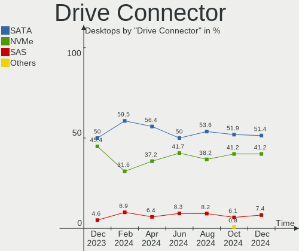
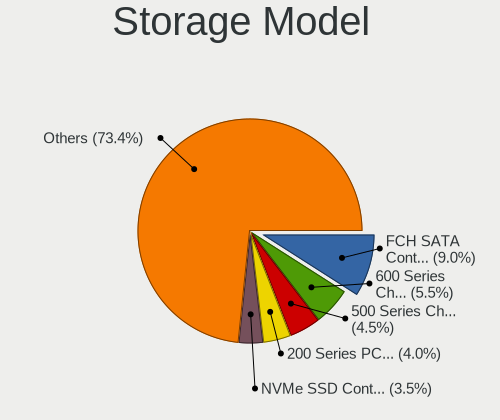
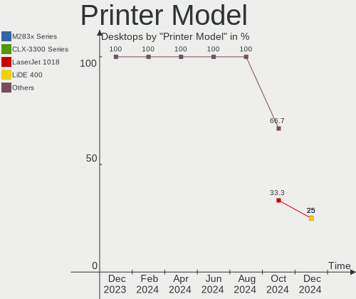

Pop!_OS Hardware Trends (Desktop)
---------------------------------

A project to identify most popular hardware characteristics and track their change
over time based on data collected by Pop!_OS users at https://Linux-Hardware.org.

Anyone can contribute to the study by uploading probes of their computers by
the [hw-probe](https://github.com/linuxhw/hw-probe) tool:

    sudo -E hw-probe -all -upload

Full-feature report is available here: https://linux-hardware.org/?view=trends&formfactor=desktop

Period: Mar, 2021.

Contents
--------

- [ OS                       ](#os)
- [ OS Family                ](#os-family)
- [ Kernel                   ](#kernel)
- [ Kernel Family            ](#kernel-family)
- [ Kernel Major Ver.        ](#kernel-major-ver)
- [ Arch                     ](#arch)
- [ DE                       ](#de)
- [ Display Server           ](#display-server)
- [ Display Manager          ](#display-manager)
- [ OS Lang                  ](#os-lang)
- [ Boot Mode                ](#boot-mode)
- [ Filesystem               ](#filesystem)
- [ Part. scheme             ](#part-scheme)
- [ Dual Boot with Linux/BSD ](#dual-boot-with-linux/bsd)
- [ Dual Boot (Win)          ](#dual-boot-win)
- [ Country                  ](#country)
- [ City                     ](#city)
- [ Vendor                   ](#vendor)
- [ Model                    ](#model)
- [ Model Family             ](#model-family)
- [ MFG Year                 ](#mfg-year)
- [ Form Factor              ](#form-factor)
- [ Secure Boot              ](#secure-boot)
- [ Coreboot                 ](#coreboot)
- [ RAM Size                 ](#ram-size)
- [ RAM Used                 ](#ram-used)
- [ Has CD-ROM               ](#has-cd-rom)
- [ Total Drives             ](#total-drives)
- [ Has Ethernet             ](#has-ethernet)
- [ Has WiFi                 ](#has-wifi)
- [ Has Bluetooth            ](#has-bluetooth)
- [ Drive Vendor             ](#drive-vendor)
- [ Drive Model              ](#drive-model)
- [ HDD Vendor               ](#hdd-vendor)
- [ SSD Vendor               ](#ssd-vendor)
- [ Drive Kind               ](#drive-kind)
- [ Drive Connector          ](#drive-connector)
- [ Drive Size               ](#drive-size)
- [ Space Total              ](#space-total)
- [ Space Used               ](#space-used)
- [ Malfunc. Drives          ](#malfunc-drives)
- [ Malfunc. Drive Vendor    ](#malfunc-drive-vendor)
- [ Malfunc. HDD Vendor      ](#malfunc-hdd-vendor)
- [ Malfunc. Drive Kind      ](#malfunc-drive-kind)
- [ Failed Drives            ](#failed-drives)
- [ Failed Drive Vendor      ](#failed-drive-vendor)
- [ Drive Status             ](#drive-status)
- [ Storage Vendor           ](#storage-vendor)
- [ Storage Model            ](#storage-model)
- [ Storage Kind             ](#storage-kind)
- [ CPU Vendor               ](#cpu-vendor)
- [ CPU Model                ](#cpu-model)
- [ CPU Model Family         ](#cpu-model-family)
- [ CPU Cores                ](#cpu-cores)
- [ CPU Sockets              ](#cpu-sockets)
- [ CPU Threads              ](#cpu-threads)
- [ CPU Op-Modes             ](#cpu-op-modes)
- [ CPU Microcode            ](#cpu-microcode)
- [ CPU Microarch            ](#cpu-microarch)
- [ GPU Vendor               ](#gpu-vendor)
- [ GPU Model                ](#gpu-model)
- [ GPU Combo                ](#gpu-combo)
- [ GPU Driver               ](#gpu-driver)
- [ GPU Memory               ](#gpu-memory)
- [ Monitor Vendor           ](#monitor-vendor)
- [ Monitor Model            ](#monitor-model)
- [ Monitor Resolution       ](#monitor-resolution)
- [ Monitor Diagonal         ](#monitor-diagonal)
- [ Monitor Width            ](#monitor-width)
- [ Aspect Ratio             ](#aspect-ratio)
- [ Monitor Area             ](#monitor-area)
- [ Pixel Density            ](#pixel-density)
- [ Multiple Monitors        ](#multiple-monitors)
- [ Net Controller Vendor    ](#net-controller-vendor)
- [ Net Controller Model     ](#net-controller-model)
- [ Wireless Vendor          ](#wireless-vendor)
- [ Wireless Model           ](#wireless-model)
- [ Ethernet Vendor          ](#ethernet-vendor)
- [ Ethernet Model           ](#ethernet-model)
- [ Net Controller Kind      ](#net-controller-kind)
- [ Used Controller          ](#used-controller)
- [ NICs                     ](#nics)
- [ IPv6                     ](#ipv6)
- [ Memory Vendor            ](#memory-vendor)
- [ Memory Model             ](#memory-model)
- [ Memory Kind              ](#memory-kind)
- [ Memory Form Factor       ](#memory-form-factor)
- [ Memory Size              ](#memory-size)
- [ Memory Speed             ](#memory-speed)
- [ Sound Vendor             ](#sound-vendor)
- [ Sound Model              ](#sound-model)
- [ Camera Vendor            ](#camera-vendor)
- [ Camera Model             ](#camera-model)
- [ Fingerprint Vendor       ](#fingerprint-vendor)
- [ Fingerprint Model        ](#fingerprint-model)
- [ Chipcard Vendor          ](#chipcard-vendor)
- [ Chipcard Model           ](#chipcard-model)
- [ Printer Vendor           ](#printer-vendor)
- [ Printer Model            ](#printer-model)
- [ Scanner Vendor           ](#scanner-vendor)
- [ Scanner Model            ](#scanner-model)
- [ Bluetooth Vendor         ](#bluetooth-vendor)
- [ Bluetooth Model          ](#bluetooth-model)
- [ Unsupported Devices      ](#unsupported-devices)
- [ Unsupported Device Types ](#unsupported-device-types)

OS
--

Installed operating systems

| Name          | Desktops | Percent |
|---------------|----------|---------|
| Pop!_OS 20.10 | 100      | 72.46%  |
| Pop!_OS 20.04 | 38       | 27.54%  |

OS Family
---------

OS without a version

| Name    | Desktops | Percent |
|---------|----------|---------|
| Pop!_OS | 138      | 100%    |

Kernel
------

Version of the Linux kernel

| Version                | Desktops | Percent |
|------------------------|----------|---------|
| 5.8.0-7642-generic     | 113      | 81.88%  |
| 5.8.0-7630-generic     | 7        | 5.07%   |
| 5.4.0-7634-generic     | 6        | 4.35%   |
| 5.11.0-7612-generic    | 5        | 3.62%   |
| 5.11.8-051108-generic  | 1        | 0.72%   |
| 5.11.5-051105-generic  | 1        | 0.72%   |
| 5.11.0-051100-generic  | 1        | 0.72%   |
| 5.10.26-051026-generic | 1        | 0.72%   |
| 5.10.25-xanmod1        | 1        | 0.72%   |
| 5.10.23-xanmod1        | 1        | 0.72%   |
| 5.10.13-051013-generic | 1        | 0.72%   |

Kernel Family
-------------

Linux kernel without a distro release

| Version | Desktops | Percent |
|---------|----------|---------|
| 5.8.0   | 120      | 86.96%  |
| 5.4.0   | 6        | 4.35%   |
| 5.11.0  | 6        | 4.35%   |
| 5.11.8  | 1        | 0.72%   |
| 5.11.5  | 1        | 0.72%   |
| 5.10.26 | 1        | 0.72%   |
| 5.10.25 | 1        | 0.72%   |
| 5.10.23 | 1        | 0.72%   |
| 5.10.13 | 1        | 0.72%   |

Kernel Major Ver.
-----------------

Linux kernel major version

| Version | Desktops | Percent |
|---------|----------|---------|
| 5.8     | 120      | 86.96%  |
| 5.11    | 8        | 5.8%    |
| 5.4     | 6        | 4.35%   |
| 5.10    | 4        | 2.9%    |

Arch
----

OS architecture (x86_64, i586, etc.)

| Name   | Desktops | Percent |
|--------|----------|---------|
| x86_64 | 138      | 100%    |

DE
--

Desktop Environment

| Name            | Desktops | Percent |
|-----------------|----------|---------|
| GNOME           | 130      | 94.2%   |
| KDE5            | 2        | 1.45%   |
| KDE             | 2        | 1.45%   |
| GNOME Flashback | 2        | 1.45%   |
| XFCE            | 1        | 0.72%   |
| X-Cinnamon      | 1        | 0.72%   |

Display Server
--------------

X11 or Wayland

| Name | Desktops | Percent |
|------|----------|---------|
| X11  | 138      | 100%    |

Display Manager
---------------

SDDM, LightDM, etc.

| Name    | Desktops | Percent |
|---------|----------|---------|
| Unknown | 119      | 86.23%  |
| GDM     | 17       | 12.32%  |
| TDM     | 1        | 0.72%   |
| SDDM    | 1        | 0.72%   |

OS Lang
-------

Language

| Lang  | Desktops | Percent |
|-------|----------|---------|
| en_US | 87       | 63.04%  |
| pt_BR | 16       | 11.59%  |
| en_GB | 5        | 3.62%   |
| de_DE | 5        | 3.62%   |
| en_CA | 4        | 2.9%    |
| en_AU | 4        | 2.9%    |
| C     | 4        | 2.9%    |
| ru_RU | 3        | 2.17%   |
| uk_UA | 2        | 1.45%   |
| sv_SE | 2        | 1.45%   |
| it_IT | 2        | 1.45%   |
| pt_PT | 1        | 0.72%   |
| pl_PL | 1        | 0.72%   |
| nl_BE | 1        | 0.72%   |
| es_ES | 1        | 0.72%   |

Boot Mode
---------

EFI or BIOS

| Mode | Desktops | Percent |
|------|----------|---------|
| BIOS | 127      | 92.03%  |
| EFI  | 11       | 7.97%   |

Filesystem
----------

Type of filesystem

| Type    | Desktops | Percent |
|---------|----------|---------|
| Ext4    | 136      | 98.55%  |
| Overlay | 2        | 1.45%   |

Part. scheme
------------

Scheme of partitioning

| Type    | Desktops | Percent |
|---------|----------|---------|
| Unknown | 119      | 86.23%  |
| GPT     | 11       | 7.97%   |
| MBR     | 8        | 5.8%    |

Dual Boot with Linux/BSD
------------------------

Hosting more than one Linux/BSD

| Dual boot | Desktops | Percent |
|-----------|----------|---------|
| No        | 132      | 95.65%  |
| Yes       | 6        | 4.35%   |

Dual Boot (Win)
---------------

Hosting Linux and Windows

| Dual boot | Desktops | Percent |
|-----------|----------|---------|
| No        | 128      | 92.75%  |
| Yes       | 10       | 7.25%   |

Country
-------

Geographic location (country)

| Country      | Desktops | Percent |
|--------------|----------|---------|
| USA          | 52       | 37.68%  |
| Brazil       | 20       | 14.49%  |
| Germany      | 9        | 6.52%   |
| Italy        | 5        | 3.62%   |
| Canada       | 5        | 3.62%   |
| Australia    | 5        | 3.62%   |
| Russia       | 4        | 2.9%    |
| UK           | 3        | 2.17%   |
| Sweden       | 3        | 2.17%   |
| Poland       | 3        | 2.17%   |
| Austria      | 3        | 2.17%   |
| Vietnam      | 2        | 1.45%   |
| Ukraine      | 2        | 1.45%   |
| Switzerland  | 2        | 1.45%   |
| South Africa | 2        | 1.45%   |
| Serbia       | 2        | 1.45%   |
| Netherlands  | 2        | 1.45%   |
| Bulgaria     | 2        | 1.45%   |
| Romania      | 1        | 0.72%   |
| Portugal     | 1        | 0.72%   |
| Mexico       | 1        | 0.72%   |
| Kenya        | 1        | 0.72%   |
| Jordan       | 1        | 0.72%   |
| Israel       | 1        | 0.72%   |
| Iran         | 1        | 0.72%   |
| El Salvador  | 1        | 0.72%   |
| Egypt        | 1        | 0.72%   |
| Czechia      | 1        | 0.72%   |
| Belgium      | 1        | 0.72%   |
| Argentina    | 1        | 0.72%   |

City
----

Geographic location (city)

| City          | Desktops | Percent |
|---------------|----------|---------|
| Browning      | 8        | 5.8%    |
| São Paulo    | 4        | 2.9%    |
| Sofia         | 2        | 1.45%   |
| Poznan        | 2        | 1.45%   |
| Perth         | 2        | 1.45%   |
| Milan         | 2        | 1.45%   |
| Hanoi         | 2        | 1.45%   |
| Aurora        | 2        | 1.45%   |
| Zottegem      | 1        | 0.72%   |
| Zarqa         | 1        | 0.72%   |
| Yeovil        | 1        | 0.72%   |
| Wylie         | 1        | 0.72%   |
| Windsor       | 1        | 0.72%   |
| Wessington    | 1        | 0.72%   |
| Wasilla       | 1        | 0.72%   |
| Washington    | 1        | 0.72%   |
| Warsaw        | 1        | 0.72%   |
| Vienna        | 1        | 0.72%   |
| Vancouver     | 1        | 0.72%   |
| Ulyanovsk     | 1        | 0.72%   |
| Toronto       | 1        | 0.72%   |
| Telfs         | 1        | 0.72%   |
| Tel Aviv      | 1        | 0.72%   |
| Tehran        | 1        | 0.72%   |
| Taunton       | 1        | 0.72%   |
| Taubate       | 1        | 0.72%   |
| Tallahassee   | 1        | 0.72%   |
| Sydney        | 1        | 0.72%   |
| Sutton        | 1        | 0.72%   |
| Stockholm     | 1        | 0.72%   |
| Stevens Point | 1        | 0.72%   |
| Sobral        | 1        | 0.72%   |
| Seattle       | 1        | 0.72%   |
| Schwalmstadt  | 1        | 0.72%   |
| Schenectady   | 1        | 0.72%   |
| Santa Maria   | 1        | 0.72%   |
| San Salvador  | 1        | 0.72%   |
| San Jose      | 1        | 0.72%   |
| Ryazan        | 1        | 0.72%   |
| Roswell       | 1        | 0.72%   |
| Ridgeland     | 1        | 0.72%   |
| Richmond      | 1        | 0.72%   |
| Recife        | 1        | 0.72%   |
| Puebla City   | 1        | 0.72%   |
| Prague        | 1        | 0.72%   |
| Powell        | 1        | 0.72%   |
| Potomac       | 1        | 0.72%   |
| Paco de Arcos | 1        | 0.72%   |
| Ostfildern    | 1        | 0.72%   |
| OErkelljunga  | 1        | 0.72%   |
| Novi Sad      | 1        | 0.72%   |
| Nova Iguaçu  | 1        | 0.72%   |
| Newcastle     | 1        | 0.72%   |
| New Haven     | 1        | 0.72%   |
| Nairobi       | 1        | 0.72%   |
| Munich        | 1        | 0.72%   |
| Minneapolis   | 1        | 0.72%   |
| Midstream     | 1        | 0.72%   |
| Middlesbrough | 1        | 0.72%   |
| Methuen       | 1        | 0.72%   |

Vendor
------

Motherboard manufacturer

| Name                | Desktops | Percent |
|---------------------|----------|---------|
| Gigabyte Technology | 34       | 24.64%  |
| ASUSTek Computer    | 30       | 21.74%  |
| MSI                 | 17       | 12.32%  |
| Dell                | 17       | 12.32%  |
| ASRock              | 14       | 10.14%  |
| Intel               | 7        | 5.07%   |
| Hewlett-Packard     | 7        | 5.07%   |
| Lenovo              | 3        | 2.17%   |
| Biostar             | 2        | 1.45%   |
| Positivo            | 1        | 0.72%   |
| PCWare              | 1        | 0.72%   |
| Huanan              | 1        | 0.72%   |
| HOUTER              | 1        | 0.72%   |
| EVGA                | 1        | 0.72%   |
| Alienware           | 1        | 0.72%   |
| Unknown             | 1        | 0.72%   |

Model
-----

Motherboard model

| Name                                   | Desktops | Percent |
|----------------------------------------|----------|---------|
| Dell OptiPlex 9020                     | 8        | 5.8%    |
| MSI MS-7C37                            | 4        | 2.9%    |
| Gigabyte B450M DS3H                    | 3        | 2.17%   |
| MSI MS-7B86                            | 2        | 1.45%   |
| Gigabyte B450 AORUS M                  | 2        | 1.45%   |
| Dell XPS 8700                          | 2        | 1.45%   |
| ASUS PRIME Z390-A                      | 2        | 1.45%   |
| ASUS CROSSHAIR V FORMULA-Z             | 2        | 1.45%   |
| ASUS All Series                        | 2        | 1.45%   |
| Positivo POS-EIH61CR                   | 1        | 0.72%   |
| PCWare APMCP61-D3                      | 1        | 0.72%   |
| MSI s5620br                            | 1        | 0.72%   |
| MSI MS-7D09                            | 1        | 0.72%   |
| MSI MS-7C82                            | 1        | 0.72%   |
| MSI MS-7C02                            | 1        | 0.72%   |
| MSI MS-7B89                            | 1        | 0.72%   |
| MSI MS-7B78                            | 1        | 0.72%   |
| MSI MS-7B45                            | 1        | 0.72%   |
| MSI MS-7B22                            | 1        | 0.72%   |
| MSI MS-7918                            | 1        | 0.72%   |
| MSI MS-7751                            | 1        | 0.72%   |
| MSI MS-7592                            | 1        | 0.72%   |
| Lenovo ThinkCentre M81 5049PA4         | 1        | 0.72%   |
| Lenovo IdeaCentre 720-18ASU 90H10003US | 1        | 0.72%   |
| Lenovo H520e 10159                     | 1        | 0.72%   |
| Intel H61M-DS2                         | 1        | 0.72%   |
| Intel DX58SO AAE29331-701              | 1        | 0.72%   |
| Intel DH67GD AAG10206-205              | 1        | 0.72%   |
| Intel DH67BL AAG10189-207              | 1        | 0.72%   |
| Intel DH55PJ AAE93812-302              | 1        | 0.72%   |
| Intel DG41RQ AAE54511-203              | 1        | 0.72%   |
| Intel BTC-T37                          | 1        | 0.72%   |
| Huanan Thurley                         | 1        | 0.72%   |
| HOUTER IPMH61R1                        | 1        | 0.72%   |
| HP Z600 Workstation                    | 1        | 0.72%   |
| HP Z440 Workstation                    | 1        | 0.72%   |
| HP Z420 Workstation                    | 1        | 0.72%   |
| HP Z200 Workstation                    | 1        | 0.72%   |
| HP Pavilion Desktop 590-p0xxx          | 1        | 0.72%   |
| HP Compaq 8200 Elite SFF PC            | 1        | 0.72%   |
| HP Compaq 8000 Elite CMT PC            | 1        | 0.72%   |
| Gigabyte Z97X-UD7 TH                   | 1        | 0.72%   |
| Gigabyte Z77X-UD3H                     | 1        | 0.72%   |
| Gigabyte Z390 UD                       | 1        | 0.72%   |
| Gigabyte Z390 AORUS PRO WIFI           | 1        | 0.72%   |
| Gigabyte Z370N WIFI                    | 1        | 0.72%   |
| Gigabyte Z270X-Ultra Gaming            | 1        | 0.72%   |
| Gigabyte Z170X-Gaming 7                | 1        | 0.72%   |
| Gigabyte Z170N-WIFI                    | 1        | 0.72%   |
| Gigabyte X570 AORUS ELITE              | 1        | 0.72%   |
| Gigabyte X470 AORUS GAMING 7 WIFI      | 1        | 0.72%   |
| Gigabyte X399 DESIGNARE EX             | 1        | 0.72%   |
| Gigabyte P55-UD5                       | 1        | 0.72%   |
| Gigabyte H87-HD3                       | 1        | 0.72%   |
| Gigabyte H61M-S2PV                     | 1        | 0.72%   |
| Gigabyte H61M-D2H-USB3                 | 1        | 0.72%   |
| Gigabyte GA-78LMT-USB3                 | 1        | 0.72%   |
| Gigabyte G41MT-S2P                     | 1        | 0.72%   |
| Gigabyte G31M-S2L                      | 1        | 0.72%   |
| Gigabyte G31M-S2C                      | 1        | 0.72%   |

Model Family
------------

Motherboard model prefix

| Name                   | Desktops | Percent |
|------------------------|----------|---------|
| Dell OptiPlex          | 13       | 9.42%   |
| ASUS PRIME             | 9        | 6.52%   |
| MSI MS-7C37            | 4        | 2.9%    |
| ASUS ROG               | 4        | 2.9%    |
| Gigabyte B450M         | 3        | 2.17%   |
| Gigabyte B450          | 3        | 2.17%   |
| Dell XPS               | 3        | 2.17%   |
| MSI MS-7B86            | 2        | 1.45%   |
| HP Compaq              | 2        | 1.45%   |
| Gigabyte Z390          | 2        | 1.45%   |
| Gigabyte B550          | 2        | 1.45%   |
| ASUS TUF               | 2        | 1.45%   |
| ASUS CROSSHAIR         | 2        | 1.45%   |
| ASUS All               | 2        | 1.45%   |
| Positivo POS-EIH61CR   | 1        | 0.72%   |
| PCWare APMCP61-D3      | 1        | 0.72%   |
| MSI s5620br            | 1        | 0.72%   |
| MSI MS-7D09            | 1        | 0.72%   |
| MSI MS-7C82            | 1        | 0.72%   |
| MSI MS-7C02            | 1        | 0.72%   |
| MSI MS-7B89            | 1        | 0.72%   |
| MSI MS-7B78            | 1        | 0.72%   |
| MSI MS-7B45            | 1        | 0.72%   |
| MSI MS-7B22            | 1        | 0.72%   |
| MSI MS-7918            | 1        | 0.72%   |
| MSI MS-7751            | 1        | 0.72%   |
| MSI MS-7592            | 1        | 0.72%   |
| Lenovo ThinkCentre     | 1        | 0.72%   |
| Lenovo IdeaCentre      | 1        | 0.72%   |
| Lenovo H520e           | 1        | 0.72%   |
| Intel H61M-DS2         | 1        | 0.72%   |
| Intel DX58SO           | 1        | 0.72%   |
| Intel DH67GD           | 1        | 0.72%   |
| Intel DH67BL           | 1        | 0.72%   |
| Intel DH55PJ           | 1        | 0.72%   |
| Intel DG41RQ           | 1        | 0.72%   |
| Intel BTC-T37          | 1        | 0.72%   |
| Huanan Thurley         | 1        | 0.72%   |
| HOUTER IPMH61R1        | 1        | 0.72%   |
| HP Z600                | 1        | 0.72%   |
| HP Z440                | 1        | 0.72%   |
| HP Z420                | 1        | 0.72%   |
| HP Z200                | 1        | 0.72%   |
| HP Pavilion            | 1        | 0.72%   |
| Gigabyte Z97X-UD7      | 1        | 0.72%   |
| Gigabyte Z77X-UD3H     | 1        | 0.72%   |
| Gigabyte Z370N         | 1        | 0.72%   |
| Gigabyte Z270X-Ultra   | 1        | 0.72%   |
| Gigabyte Z170X-Gaming  | 1        | 0.72%   |
| Gigabyte Z170N-WIFI    | 1        | 0.72%   |
| Gigabyte X570          | 1        | 0.72%   |
| Gigabyte X470          | 1        | 0.72%   |
| Gigabyte X399          | 1        | 0.72%   |
| Gigabyte P55-UD5       | 1        | 0.72%   |
| Gigabyte H87-HD3       | 1        | 0.72%   |
| Gigabyte H61M-S2PV     | 1        | 0.72%   |
| Gigabyte H61M-D2H-USB3 | 1        | 0.72%   |
| Gigabyte GA-78LMT-USB3 | 1        | 0.72%   |
| Gigabyte G41MT-S2P     | 1        | 0.72%   |
| Gigabyte G31M-S2L      | 1        | 0.72%   |

MFG Year
--------

Motherboard manufacture year

| Year | Desktops | Percent |
|------|----------|---------|
| 2019 | 23       | 16.67%  |
| 2020 | 20       | 14.49%  |
| 2018 | 20       | 14.49%  |
| 2015 | 13       | 9.42%   |
| 2021 | 10       | 7.25%   |
| 2011 | 10       | 7.25%   |
| 2013 | 9        | 6.52%   |
| 2014 | 7        | 5.07%   |
| 2010 | 7        | 5.07%   |
| 2012 | 6        | 4.35%   |
| 2016 | 4        | 2.9%    |
| 2008 | 4        | 2.9%    |
| 2017 | 3        | 2.17%   |
| 2009 | 2        | 1.45%   |

Form Factor
-----------

Physical design of the computer

| Name    | Desktops | Percent |
|---------|----------|---------|
| Desktop | 138      | 100%    |

Secure Boot
-----------

Enabled or disabled

| State    | Desktops | Percent |
|----------|----------|---------|
| Disabled | 138      | 100%    |

Coreboot
--------

Have coreboot on board

| Used | Desktops | Percent |
|------|----------|---------|
| No   | 138      | 100%    |

RAM Size
--------

Total RAM memory

| Size in GB  | Desktops | Percent |
|-------------|----------|---------|
| 16.01-24.0  | 49       | 35.51%  |
| 8.01-16.0   | 22       | 15.94%  |
| 3.01-4.0    | 21       | 15.22%  |
| 32.01-64.0  | 20       | 14.49%  |
| 4.01-8.0    | 11       | 7.97%   |
| 64.01-256.0 | 9        | 6.52%   |
| 24.01-32.0  | 4        | 2.9%    |
| 1.01-2.0    | 2        | 1.45%   |

RAM Used
--------

Used RAM memory

| Used GB    | Desktops | Percent |
|------------|----------|---------|
| 1.01-2.0   | 44       | 31.88%  |
| 2.01-3.0   | 40       | 28.99%  |
| 4.01-8.0   | 25       | 18.12%  |
| 3.01-4.0   | 24       | 17.39%  |
| 16.01-24.0 | 2        | 1.45%   |
| 8.01-16.0  | 2        | 1.45%   |
| 24.01-32.0 | 1        | 0.72%   |

Has CD-ROM
----------

Has CD-ROM on board

| Presented | Desktops | Percent |
|-----------|----------|---------|
| No        | 95       | 68.84%  |
| Yes       | 43       | 31.16%  |

Total Drives
------------

Number of drives on board

| Drives | Desktops | Percent |
|--------|----------|---------|
| 1      | 48       | 34.78%  |
| 2      | 43       | 31.16%  |
| 3      | 24       | 17.39%  |
| 4      | 12       | 8.7%    |
| 5      | 6        | 4.35%   |
| 6      | 2        | 1.45%   |
| 0      | 2        | 1.45%   |
| 7      | 1        | 0.72%   |

Has Ethernet
------------

Has Ethernet on board

| Presented | Desktops | Percent |
|-----------|----------|---------|
| Yes       | 135      | 97.83%  |
| No        | 3        | 2.17%   |

Has WiFi
--------

Has WiFi module

| Presented | Desktops | Percent |
|-----------|----------|---------|
| Yes       | 81       | 58.7%   |
| No        | 57       | 41.3%   |

Has Bluetooth
-------------

Has Bluetooth module

| Presented | Desktops | Percent |
|-----------|----------|---------|
| No        | 83       | 60.14%  |
| Yes       | 55       | 39.86%  |

Drive Vendor
------------

Hard drive vendors

| Vendor                    | Desktops | Drives | Percent |
|---------------------------|----------|--------|---------|
| Seagate                   | 51       | 63     | 20.48%  |
| WDC                       | 46       | 56     | 18.47%  |
| Samsung Electronics       | 46       | 60     | 18.47%  |
| SanDisk                   | 16       | 20     | 6.43%   |
| Kingston                  | 15       | 19     | 6.02%   |
| Hitachi                   | 10       | 10     | 4.02%   |
| Crucial                   | 10       | 12     | 4.02%   |
| Toshiba                   | 9        | 10     | 3.61%   |
| Phison                    | 4        | 4      | 1.61%   |
| China                     | 4        | 4      | 1.61%   |
| Unknown                   | 3        | 4      | 1.2%    |
| Micron/Crucial Technology | 3        | 4      | 1.2%    |
| Intel                     | 3        | 5      | 1.2%    |
| A-DATA Technology         | 3        | 3      | 1.2%    |
| MAXTOR                    | 2        | 2      | 0.8%    |
| KingDian                  | 2        | 2      | 0.8%    |
| HGST                      | 2        | 2      | 0.8%    |
| USB                       | 1        | 1      | 0.4%    |
| TO Exter                  | 1        | 2      | 0.4%    |
| SPCC                      | 1        | 1      | 0.4%    |
| SK Hynix                  | 1        | 1      | 0.4%    |
| Silicon Motion            | 1        | 1      | 0.4%    |
| SABRENT                   | 1        | 1      | 0.4%    |
| Realtek Semiconductor     | 1        | 1      | 0.4%    |
| PNY                       | 1        | 1      | 0.4%    |
| Phison Electronics        | 1        | 1      | 0.4%    |
| Patriot                   | 1        | 1      | 0.4%    |
| PALIT                     | 1        | 1      | 0.4%    |
| OWC                       | 1        | 1      | 0.4%    |
| OCZ                       | 1        | 1      | 0.4%    |
| Micron Technology         | 1        | 1      | 0.4%    |
| LITEONIT                  | 1        | 1      | 0.4%    |
| Intenso                   | 1        | 1      | 0.4%    |
| HS-SSD-C100               | 1        | 1      | 0.4%    |
| GLOWAY                    | 1        | 1      | 0.4%    |
| Corsair                   | 1        | 2      | 0.4%    |
| Apacer                    | 1        | 1      | 0.4%    |

Drive Model
-----------

Hard drive models

| Model                             | Desktops | Percent |
|-----------------------------------|----------|---------|
| Seagate ST500DM002-1BD142 500GB   | 9        | 3.19%   |
| Samsung NVMe SSD Drive 500GB      | 6        | 2.13%   |
| Kingston SA400S37480G 480GB SSD   | 6        | 2.13%   |
| WDC WD10EZEX-08WN4A0 1TB          | 5        | 1.77%   |
| Seagate ST1000DM010-2EP102 1TB    | 5        | 1.77%   |
| Samsung SSD 850 EVO 250GB         | 5        | 1.77%   |
| Sandisk NVMe SSD Drive 1TB        | 4        | 1.42%   |
| Samsung SSD 860 EVO 500GB         | 4        | 1.42%   |
| Samsung NVMe SSD Drive 1TB        | 4        | 1.42%   |
| WDC WD5000AAKX-75U6AA0 500GB      | 3        | 1.06%   |
| Seagate Expansion Desk 8TB        | 3        | 1.06%   |
| Seagate Expansion 1TB             | 3        | 1.06%   |
| SanDisk SSD PLUS 1000GB           | 3        | 1.06%   |
| SanDisk SDSSDA240G 240GB          | 3        | 1.06%   |
| Samsung SSD 860 EVO 1TB           | 3        | 1.06%   |
| Kingston SA400S37240G 240GB SSD   | 3        | 1.06%   |
| Crucial CT1000MX500SSD1 1TB       | 3        | 1.06%   |
| WDC WD800JD-75MSA3 80GB           | 2        | 0.71%   |
| WDC WD30EZRZ-00GXCB0 3TB          | 2        | 0.71%   |
| WDC WD2500KS-00MJB0 250GB         | 2        | 0.71%   |
| WDC WD20EZAZ-00GGJB0 2TB          | 2        | 0.71%   |
| Toshiba DT01ACA200 2TB            | 2        | 0.71%   |
| Toshiba DT01ACA100 1TB            | 2        | 0.71%   |
| Seagate ST31000524AS 1TB          | 2        | 0.71%   |
| Seagate ST2000DM008-2FR102 2TB    | 2        | 0.71%   |
| Seagate ST2000DM001-1ER164 2TB    | 2        | 0.71%   |
| Seagate ST2000DM001-1CH164 2TB    | 2        | 0.71%   |
| Sandisk NVMe SSD Drive 500GB      | 2        | 0.71%   |
| Samsung SSD 840 Series 120GB      | 2        | 0.71%   |
| Samsung SSD 840 EVO 1TB           | 2        | 0.71%   |
| Samsung NVMe SSD Drive 512GB      | 2        | 0.71%   |
| Samsung NVMe SSD Drive 256GB      | 2        | 0.71%   |
| Samsung NVMe SSD Drive 250GB      | 2        | 0.71%   |
| Phison NVMe SSD Drive 2TB         | 2        | 0.71%   |
| Micron/Crucial NVMe SSD Drive 1TB | 2        | 0.71%   |
| Kingston SA400S37120G 120GB SSD   | 2        | 0.71%   |
| KingDian S400 120GB SSD           | 2        | 0.71%   |
| Crucial CT500MX500SSD1 500GB      | 2        | 0.71%   |
| Crucial CT240BX500SSD1 240GB      | 2        | 0.71%   |
| Crucial CT120BX500SSD1 120GB      | 2        | 0.71%   |
| China SSD 128GB                   | 2        | 0.71%   |
| WDC WDS500G2B0B-00YS70 500GB SSD  | 1        | 0.35%   |
| WDC WDS500G2B0A-00SM50 500GB SSD  | 1        | 0.35%   |
| WDC WDS240G2G0A-00JH30 240GB SSD  | 1        | 0.35%   |
| WDC WDS120G2G0A-00JH30 120GB SSD  | 1        | 0.35%   |
| WDC WDS100T2B0A-00SM50 1TB SSD    | 1        | 0.35%   |
| WDC WD800JD-60LSA5 80GB           | 1        | 0.35%   |
| WDC WD80 03FFBX-68B9AN0 8TB       | 1        | 0.35%   |
| WDC WD7500BPVX-75JC3T0 752GB      | 1        | 0.35%   |
| WDC WD5000LPVX-75V0TT0 500GB      | 1        | 0.35%   |
| WDC WD5000LPVX-22V0TT0 500GB      | 1        | 0.35%   |
| WDC WD5000LPVX-00V0TT0 500GB      | 1        | 0.35%   |
| WDC WD5000LPVT-75G33T0 500GB      | 1        | 0.35%   |
| WDC WD5000AVDS-63U7B1 500GB       | 1        | 0.35%   |
| WDC WD5000AAKX-00U6AA0 500GB      | 1        | 0.35%   |
| WDC WD5000AAKS-75V0A0 500GB       | 1        | 0.35%   |
| WDC WD4500HLHX-01JJPV0 450GB      | 1        | 0.35%   |
| WDC WD4003FZEX-00Z4SA0 4TB        | 1        | 0.35%   |
| WDC WD3200AAJS-00L7A0 320GB       | 1        | 0.35%   |
| WDC WD30EZRZ-00Z5HB0 3TB          | 1        | 0.35%   |

HDD Vendor
----------

Hard disk drive vendors

| Vendor              | Desktops | Drives | Percent |
|---------------------|----------|--------|---------|
| Seagate             | 50       | 62     | 40.32%  |
| WDC                 | 42       | 50     | 33.87%  |
| Hitachi             | 10       | 10     | 8.06%   |
| Toshiba             | 9        | 10     | 7.26%   |
| Samsung Electronics | 7        | 8      | 5.65%   |
| MAXTOR              | 2        | 2      | 1.61%   |
| HGST                | 2        | 2      | 1.61%   |
| USB                 | 1        | 1      | 0.81%   |
| TO Exter            | 1        | 2      | 0.81%   |

SSD Vendor
----------

Solid state drive vendors

| Vendor              | Desktops | Drives | Percent |
|---------------------|----------|--------|---------|
| Samsung Electronics | 23       | 28     | 26.14%  |
| Kingston            | 15       | 19     | 17.05%  |
| Crucial             | 10       | 12     | 11.36%  |
| SanDisk             | 9        | 12     | 10.23%  |
| WDC                 | 6        | 6      | 6.82%   |
| China               | 4        | 4      | 4.55%   |
| A-DATA Technology   | 3        | 3      | 3.41%   |
| KingDian            | 2        | 2      | 2.27%   |
| Unknown             | 1        | 1      | 1.14%   |
| SPCC                | 1        | 1      | 1.14%   |
| SK Hynix            | 1        | 1      | 1.14%   |
| SABRENT             | 1        | 1      | 1.14%   |
| PNY                 | 1        | 1      | 1.14%   |
| Patriot             | 1        | 1      | 1.14%   |
| PALIT               | 1        | 1      | 1.14%   |
| OWC                 | 1        | 1      | 1.14%   |
| OCZ                 | 1        | 1      | 1.14%   |
| Micron Technology   | 1        | 1      | 1.14%   |
| LITEONIT            | 1        | 1      | 1.14%   |
| Intenso             | 1        | 1      | 1.14%   |
| Intel               | 1        | 2      | 1.14%   |
| GLOWAY              | 1        | 1      | 1.14%   |
| Corsair             | 1        | 2      | 1.14%   |
| Apacer              | 1        | 1      | 1.14%   |

Drive Kind
----------

HDD or SSD

| Kind    | Desktops | Drives | Percent |
|---------|----------|--------|---------|
| HDD     | 89       | 147    | 43.63%  |
| SSD     | 75       | 104    | 36.76%  |
| NVMe    | 37       | 47     | 18.14%  |
| Unknown | 3        | 4      | 1.47%   |

Drive Connector
---------------

SATA, SAS, NVMe, etc.

| Type | Desktops | Drives | Percent |
|------|----------|--------|---------|
| SATA | 125      | 240    | 71.84%  |
| NVMe | 37       | 47     | 21.26%  |
| SAS  | 12       | 15     | 6.9%    |

Drive Size
----------

Size of hard drive

| Size in TB | Desktops | Drives | Percent |
|------------|----------|--------|---------|
| 0.01-0.5   | 98       | 143    | 53.55%  |
| 0.51-1.0   | 49       | 63     | 26.78%  |
| 1.01-2.0   | 20       | 23     | 10.93%  |
| 2.01-3.0   | 6        | 8      | 3.28%   |
| 4.01-10.0  | 5        | 5      | 2.73%   |
| 3.01-4.0   | 3        | 7      | 1.64%   |
| 10.01-20.0 | 2        | 2      | 1.09%   |

Space Total
-----------

Amount of disk space available on the file system

| Size in GB     | Desktops | Percent |
|----------------|----------|---------|
| 101-250        | 36       | 26.09%  |
| 501-1000       | 29       | 21.01%  |
| 251-500        | 27       | 19.57%  |
| More than 3000 | 15       | 10.87%  |
| 1001-2000      | 15       | 10.87%  |
| 2001-3000      | 6        | 4.35%   |
| 51-100         | 5        | 3.62%   |
| 21-50          | 2        | 1.45%   |
| 1-20           | 2        | 1.45%   |
| Unknown        | 1        | 0.72%   |

Space Used
----------

Amount of used disk space

| Used GB        | Desktops | Percent |
|----------------|----------|---------|
| 1-20           | 54       | 39.13%  |
| 251-500        | 16       | 11.59%  |
| 21-50          | 15       | 10.87%  |
| 101-250        | 15       | 10.87%  |
| 501-1000       | 13       | 9.42%   |
| 1001-2000      | 9        | 6.52%   |
| 51-100         | 9        | 6.52%   |
| More than 3000 | 5        | 3.62%   |
| 2001-3000      | 1        | 0.72%   |
| Unknown        | 1        | 0.72%   |

Malfunc. Drives
---------------

Drive models with a malfunction

| Model                              | Desktops | Drives | Percent |
|------------------------------------|----------|--------|---------|
| Toshiba DT01ACA050 500GB           | 1        | 1      | 20%     |
| Seagate ST500LT012-1DG142 500GB    | 1        | 1      | 20%     |
| Seagate ST3750528AS 752GB          | 1        | 1      | 20%     |
| Seagate ST1000LM024 HN-M101MBB 1TB | 1        | 1      | 20%     |
| Samsung Electronics HD403LJ 400GB  | 1        | 1      | 20%     |

Malfunc. Drive Vendor
---------------------

Vendors of faulty drives

| Vendor              | Desktops | Drives | Percent |
|---------------------|----------|--------|---------|
| Seagate             | 3        | 3      | 60%     |
| Toshiba             | 1        | 1      | 20%     |
| Samsung Electronics | 1        | 1      | 20%     |

Malfunc. HDD Vendor
-------------------

Vendors of faulty HDD drives

| Vendor              | Desktops | Drives | Percent |
|---------------------|----------|--------|---------|
| Seagate             | 3        | 3      | 60%     |
| Toshiba             | 1        | 1      | 20%     |
| Samsung Electronics | 1        | 1      | 20%     |

Malfunc. Drive Kind
-------------------

Kinds of faulty drives

| Kind | Desktops | Drives | Percent |
|------|----------|--------|---------|
| HDD  | 5        | 5      | 100%    |

Failed Drives
-------------

Failed drive models

Zero info for selected period =(

Failed Drive Vendor
-------------------

Failed drive vendors

Zero info for selected period =(

Drive Status
------------

Number of failed and malfunc. drives

| Status   | Desktops | Drives | Percent |
|----------|----------|--------|---------|
| Detected | 121      | 270    | 84.03%  |
| Works    | 18       | 27     | 12.5%   |
| Malfunc  | 5        | 5      | 3.47%   |

Storage Vendor
--------------

Storage controller vendors

| Vendor                       | Desktops | Percent |
|------------------------------|----------|---------|
| Intel                        | 85       | 41.87%  |
| AMD                          | 50       | 24.63%  |
| Samsung Electronics          | 19       | 9.36%   |
| ASMedia Technology           | 13       | 6.4%    |
| Sandisk                      | 8        | 3.94%   |
| Marvell Technology Group     | 8        | 3.94%   |
| Phison Electronics           | 5        | 2.46%   |
| JMicron Technology           | 4        | 1.97%   |
| Nvidia                       | 3        | 1.48%   |
| Micron/Crucial Technology    | 3        | 1.48%   |
| VIA Technologies             | 1        | 0.49%   |
| Silicon Motion               | 1        | 0.49%   |
| Shenzhen Longsys Electronics | 1        | 0.49%   |
| Realtek Semiconductor        | 1        | 0.49%   |
| Broadcom / LSI               | 1        | 0.49%   |

Storage Model
-------------

Storage controller models

| Model                                                                                   | Desktops | Percent |
|-----------------------------------------------------------------------------------------|----------|---------|
| AMD FCH SATA Controller [AHCI mode]                                                     | 34       | 13.6%   |
| Intel SATA Controller [RAID mode]                                                       | 17       | 6.8%    |
| AMD 400 Series Chipset SATA Controller                                                  | 16       | 6.4%    |
| Samsung NVMe SSD Controller SM981/PM981/PM983                                           | 13       | 5.2%    |
| ASMedia ASM1062 Serial ATA Controller                                                   | 13       | 5.2%    |
| Intel 6 Series/C200 Series Chipset Family 6 port Desktop SATA AHCI Controller           | 9        | 3.6%    |
| Intel 200 Series PCH SATA controller [AHCI mode]                                        | 9        | 3.6%    |
| AMD Starship/Matisse Chipset SATA Controller [AHCI mode]                                | 8        | 3.2%    |
| Intel NM10/ICH7 Family SATA Controller [IDE mode]                                       | 6        | 2.4%    |
| Intel Cannon Lake PCH SATA AHCI Controller                                              | 6        | 2.4%    |
| AMD SB7x0/SB8x0/SB9x0 SATA Controller [AHCI mode]                                       | 6        | 2.4%    |
| Samsung NVMe SSD Controller SM961/PM961/SM963                                           | 5        | 2%      |
| Intel 9 Series Chipset Family SATA Controller [AHCI Mode]                               | 4        | 1.6%    |
| Intel 8 Series/C220 Series Chipset Family 6-port SATA Controller 1 [AHCI mode]          | 4        | 1.6%    |
| Intel 7 Series/C210 Series Chipset Family 6-port SATA Controller [AHCI mode]            | 4        | 1.6%    |
| Intel 6 Series/C200 Series Chipset Family Desktop SATA Controller (IDE mode, ports 4-5) | 4        | 1.6%    |
| Intel 6 Series/C200 Series Chipset Family Desktop SATA Controller (IDE mode, ports 0-3) | 4        | 1.6%    |
| Sandisk WD Blue SN550 NVMe SSD                                                          | 3        | 1.2%    |
| Phison E16 PCIe4 NVMe Controller                                                        | 3        | 1.2%    |
| AMD SB7x0/SB8x0/SB9x0 IDE Controller                                                    | 3        | 1.2%    |
| AMD FCH SATA Controller D                                                               | 3        | 1.2%    |
| AMD 300 Series Chipset SATA Controller                                                  | 3        | 1.2%    |
| Phison E12 NVMe Controller                                                              | 2        | 0.8%    |
| Nvidia MCP61 SATA Controller                                                            | 2        | 0.8%    |
| Micron/Crucial Non-Volatile memory controller                                           | 2        | 0.8%    |
| Marvell Group 88SE9230 PCIe 2.0 x2 4-port SATA 6 Gb/s RAID Controller                   | 2        | 0.8%    |
| Marvell Group 88SE9172 SATA 6Gb/s Controller                                            | 2        | 0.8%    |
| JMicron JMB363 SATA/IDE Controller                                                      | 2        | 0.8%    |
| Intel Q170/Q150/B150/H170/H110/Z170/CM236 Chipset SATA Controller [AHCI Mode]           | 2        | 0.8%    |
| Intel C600/X79 series chipset 6-Port SATA AHCI Controller                               | 2        | 0.8%    |
| Intel 82801HR/HO/HH (ICH8R/DO/DH) 2 port SATA Controller [IDE mode]                     | 2        | 0.8%    |
| Intel 82801H (ICH8 Family) 4 port SATA Controller [IDE mode]                            | 2        | 0.8%    |
| Intel 82801G (ICH7 Family) IDE Controller                                               | 2        | 0.8%    |
| Intel 5 Series/3400 Series Chipset 6 port SATA AHCI Controller                          | 2        | 0.8%    |
| Intel 400 Series Chipset Family SATA AHCI Controller                                    | 2        | 0.8%    |
| AMD FCH IDE Controller                                                                  | 2        | 0.8%    |
| VIA VT82C586A/B/VT82C686/A/B/VT823x/A/C PIPC Bus Master IDE                             | 1        | 0.4%    |
| VIA VT8237A SATA 2-Port Controller                                                      | 1        | 0.4%    |
| Silicon Motion SM2263EN/SM2263XT SSD Controller                                         | 1        | 0.4%    |
| Shenzhen Longsys Non-Volatile memory controller                                         | 1        | 0.4%    |
| Sandisk WD Black SN850                                                                  | 1        | 0.4%    |
| Sandisk WD Black SN750 / PC SN730 NVMe SSD                                              | 1        | 0.4%    |
| Sandisk WD Black NVMe SSD                                                               | 1        | 0.4%    |
| Sandisk WD Black 2018/SN750 / PC SN720 NVMe SSD                                         | 1        | 0.4%    |
| Sandisk PC SN520 NVMe SSD                                                               | 1        | 0.4%    |
| Samsung NVMe SSD Controller PM9A1/980PRO                                                | 1        | 0.4%    |
| Realtek RTS5763DL NVMe SSD Controller                                                   | 1        | 0.4%    |
| Nvidia MCP61 IDE                                                                        | 1        | 0.4%    |
| Nvidia MCP51 Serial ATA Controller                                                      | 1        | 0.4%    |
| Micron/Crucial P1 NVMe PCIe SSD                                                         | 1        | 0.4%    |
| Marvell Group 88SE9215 PCIe 2.0 x1 4-port SATA 6 Gb/s Controller                        | 1        | 0.4%    |
| Marvell Group 88SE9182 PCIe 2.0 x2 2-port SATA 6 Gb/s Controller                        | 1        | 0.4%    |
| Marvell Group 88SE912x SATA 6Gb/s Controller [IDE mode]                                 | 1        | 0.4%    |
| Marvell Group 88SE912x IDE Controller                                                   | 1        | 0.4%    |
| Marvell Group 88SE6111/6121 SATA II / PATA Controller                                   | 1        | 0.4%    |
| JMicron JMB368 IDE controller                                                           | 1        | 0.4%    |
| JMicron JMB362 SATA Controller                                                          | 1        | 0.4%    |
| Intel Sunrise Point-LP SATA Controller [AHCI mode]                                      | 1        | 0.4%    |
| Intel SSD 660P Series                                                                   | 1        | 0.4%    |
| Intel Non-Volatile memory controller                                                    | 1        | 0.4%    |

Storage Kind
------------

Kind of storage controller (IDE, SATA, NVMe, SAS, ...)

| Kind | Desktops | Percent |
|------|----------|---------|
| SATA | 103      | 54.79%  |
| NVMe | 37       | 19.68%  |
| IDE  | 27       | 14.36%  |
| RAID | 19       | 10.11%  |
| SAS  | 2        | 1.06%   |

CPU Vendor
----------

Processor vendors

| Vendor | Desktops | Percent |
|--------|----------|---------|
| Intel  | 85       | 61.59%  |
| AMD    | 53       | 38.41%  |

CPU Model
---------

Processor models

| Model                                       | Desktops | Percent |
|---------------------------------------------|----------|---------|
| Intel Core i5-4590 CPU @ 3.30GHz            | 8        | 5.8%    |
| AMD Ryzen 5 2600 Six-Core Processor         | 8        | 5.8%    |
| AMD Ryzen 9 3900X 12-Core Processor         | 4        | 2.9%    |
| Intel Core i7-2600 CPU @ 3.40GHz            | 3        | 2.17%   |
| Intel Core i5-4570 CPU @ 3.20GHz            | 3        | 2.17%   |
| AMD Ryzen 7 3700X 8-Core Processor          | 3        | 2.17%   |
| AMD Ryzen 7 2700X Eight-Core Processor      | 3        | 2.17%   |
| AMD FX-8350 Eight-Core Processor            | 3        | 2.17%   |
| Intel Core i9-9900K CPU @ 3.60GHz           | 2        | 1.45%   |
| Intel Core i7-8700K CPU @ 3.70GHz           | 2        | 1.45%   |
| Intel Core i7-7700K CPU @ 4.20GHz           | 2        | 1.45%   |
| Intel Core i7-4790K CPU @ 4.00GHz           | 2        | 1.45%   |
| Intel Core i7-4790 CPU @ 3.60GHz            | 2        | 1.45%   |
| Intel Core i7-2600K CPU @ 3.40GHz           | 2        | 1.45%   |
| Intel Core i5-9600K CPU @ 3.70GHz           | 2        | 1.45%   |
| Intel Core i5-9400F CPU @ 2.90GHz           | 2        | 1.45%   |
| Intel Core i5-4460 CPU @ 3.20GHz            | 2        | 1.45%   |
| Intel Core i5-2400 CPU @ 3.10GHz            | 2        | 1.45%   |
| Intel Core i3-8100 CPU @ 3.60GHz            | 2        | 1.45%   |
| Intel Core i3-2120 CPU @ 3.30GHz            | 2        | 1.45%   |
| Intel Core 2 Duo CPU E8400 @ 3.00GHz        | 2        | 1.45%   |
| AMD Ryzen 9 3950X 16-Core Processor         | 2        | 1.45%   |
| AMD Ryzen 7 3800X 8-Core Processor          | 2        | 1.45%   |
| AMD Ryzen 7 1700 Eight-Core Processor       | 2        | 1.45%   |
| AMD Ryzen 5 5600X 6-Core Processor          | 2        | 1.45%   |
| AMD Ryzen 5 3600X 6-Core Processor          | 2        | 1.45%   |
| AMD Ryzen 5 3600 6-Core Processor           | 2        | 1.45%   |
| Intel Xeon CPU X3470 @ 2.93GHz              | 1        | 0.72%   |
| Intel Xeon CPU E5640 @ 2.67GHz              | 1        | 0.72%   |
| Intel Xeon CPU E5620 @ 2.40GHz              | 1        | 0.72%   |
| Intel Xeon CPU E5-1620 v3 @ 3.50GHz         | 1        | 0.72%   |
| Intel Xeon CPU E5-1620 0 @ 3.60GHz          | 1        | 0.72%   |
| Intel Pentium Gold G5420 CPU @ 3.80GHz      | 1        | 0.72%   |
| Intel Pentium Dual-Core CPU E6700 @ 3.20GHz | 1        | 0.72%   |
| Intel Pentium Dual-Core CPU E6500 @ 2.93GHz | 1        | 0.72%   |
| Intel Pentium Dual-Core CPU E5700 @ 3.00GHz | 1        | 0.72%   |
| Intel Pentium Dual-Core CPU E5200 @ 2.50GHz | 1        | 0.72%   |
| Intel Pentium 4 CPU 3.20GHz                 | 1        | 0.72%   |
| Intel Core i9-10850K CPU @ 3.60GHz          | 1        | 0.72%   |
| Intel Core i7-9700K CPU @ 3.60GHz           | 1        | 0.72%   |
| Intel Core i7-9700F CPU @ 3.00GHz           | 1        | 0.72%   |
| Intel Core i7-8550U CPU @ 1.80GHz           | 1        | 0.72%   |
| Intel Core i7-8086K CPU @ 4.00GHz           | 1        | 0.72%   |
| Intel Core i7-6700K CPU @ 4.00GHz           | 1        | 0.72%   |
| Intel Core i7-5960X CPU @ 3.00GHz           | 1        | 0.72%   |
| Intel Core i7-4820K CPU @ 3.70GHz           | 1        | 0.72%   |
| Intel Core i7-3770K CPU @ 3.50GHz           | 1        | 0.72%   |
| Intel Core i7-3770 CPU @ 3.40GHz            | 1        | 0.72%   |
| Intel Core i7-10700 CPU @ 2.90GHz           | 1        | 0.72%   |
| Intel Core i7 CPU 980 @ 3.33GHz             | 1        | 0.72%   |
| Intel Core i7 CPU 860 @ 2.80GHz             | 1        | 0.72%   |
| Intel Core i5-8400 CPU @ 2.80GHz            | 1        | 0.72%   |
| Intel Core i5-7600 CPU @ 3.50GHz            | 1        | 0.72%   |
| Intel Core i5-7400 CPU @ 3.00GHz            | 1        | 0.72%   |
| Intel Core i5-3570 CPU @ 3.40GHz            | 1        | 0.72%   |
| Intel Core i5-3470 CPU @ 3.20GHz            | 1        | 0.72%   |
| Intel Core i5-3450 CPU @ 3.10GHz            | 1        | 0.72%   |
| Intel Core i5-10400 CPU @ 2.90GHz           | 1        | 0.72%   |
| Intel Core i5 CPU 650 @ 3.20GHz             | 1        | 0.72%   |
| Intel Core i3-9100F CPU @ 3.60GHz           | 1        | 0.72%   |

CPU Model Family
----------------

Processor model prefix

| Model                   | Desktops | Percent |
|-------------------------|----------|---------|
| Intel Core i5           | 27       | 19.57%  |
| Intel Core i7           | 25       | 18.12%  |
| AMD Ryzen 5             | 17       | 12.32%  |
| AMD Ryzen 7             | 12       | 8.7%    |
| Intel Core i3           | 9        | 6.52%   |
| AMD Ryzen 9             | 6        | 4.35%   |
| Intel Xeon              | 5        | 3.62%   |
| AMD FX                  | 5        | 3.62%   |
| Intel Pentium Dual-Core | 4        | 2.9%    |
| Intel Celeron           | 4        | 2.9%    |
| Intel Core i9           | 3        | 2.17%   |
| Intel Core 2 Duo        | 3        | 2.17%   |
| Intel Core 2            | 2        | 1.45%   |
| AMD Ryzen 3             | 2        | 1.45%   |
| AMD Phenom II X4        | 2        | 1.45%   |
| AMD A4                  | 2        | 1.45%   |
| Other                   | 1        | 0.72%   |
| Intel Pentium Gold      | 1        | 0.72%   |
| Intel Pentium 4         | 1        | 0.72%   |
| Intel Core 2 Quad       | 1        | 0.72%   |
| AMD Ryzen Threadripper  | 1        | 0.72%   |
| AMD Phenom              | 1        | 0.72%   |
| AMD Athlon X4           | 1        | 0.72%   |
| AMD Athlon II X2        | 1        | 0.72%   |
| AMD A8                  | 1        | 0.72%   |
| AMD A10                 | 1        | 0.72%   |

CPU Cores
---------

Number of processor cores

| Number | Desktops | Percent |
|--------|----------|---------|
| 4      | 58       | 42.03%  |
| 6      | 26       | 18.84%  |
| 2      | 24       | 17.39%  |
| 8      | 19       | 13.77%  |
| 12     | 4        | 2.9%    |
| 16     | 3        | 2.17%   |
| 1      | 3        | 2.17%   |
| 10     | 1        | 0.72%   |

CPU Sockets
-----------

Number of sockets

| Number | Desktops | Percent |
|--------|----------|---------|
| 1      | 137      | 99.28%  |
| 2      | 1        | 0.72%   |

CPU Threads
-----------

Threads per core (Hyper-Threading)

| Number | Desktops | Percent |
|--------|----------|---------|
| 2      | 85       | 61.59%  |
| 1      | 53       | 38.41%  |

CPU Op-Modes
------------

CPU Operation Modes (32-bit, 64-bit)

| Op mode        | Desktops | Percent |
|----------------|----------|---------|
| 32-bit, 64-bit | 138      | 100%    |

CPU Microcode
-------------

Microcode number

| Number     | Desktops | Percent |
|------------|----------|---------|
| Unknown    | 113      | 81.88%  |
| 0x306c3    | 8        | 5.8%    |
| 0x0800820d | 4        | 2.9%    |
| 0x906ed    | 2        | 1.45%   |
| 0x906ea    | 2        | 1.45%   |
| 0x1067a    | 2        | 1.45%   |
| 0x906e9    | 1        | 0.72%   |
| 0x206d7    | 1        | 0.72%   |
| 0x206c2    | 1        | 0.72%   |
| 0x206a7    | 1        | 0.72%   |
| 0x08701021 | 1        | 0.72%   |
| 0x08701013 | 1        | 0.72%   |
| 0x08001122 | 1        | 0.72%   |

CPU Microarch
-------------

Microarchitecture

| Name          | Desktops | Percent |
|---------------|----------|---------|
| KabyLake      | 21       | 15.22%  |
| Haswell       | 19       | 13.77%  |
| Zen+          | 16       | 11.59%  |
| Zen 2         | 15       | 10.87%  |
| SandyBridge   | 12       | 8.7%    |
| IvyBridge     | 9        | 6.52%   |
| Penryn        | 7        | 5.07%   |
| Westmere      | 5        | 3.62%   |
| Piledriver    | 5        | 3.62%   |
| K10           | 5        | 3.62%   |
| Zen           | 4        | 2.9%    |
| Zen 3         | 3        | 2.17%   |
| Core          | 3        | 2.17%   |
| CometLake     | 3        | 2.17%   |
| Steamroller   | 2        | 1.45%   |
| Nehalem       | 2        | 1.45%   |
| Skylake       | 1        | 0.72%   |
| Silvermont    | 1        | 0.72%   |
| Puma          | 1        | 0.72%   |
| NetBurst      | 1        | 0.72%   |
| Goldmont plus | 1        | 0.72%   |
| Excavator     | 1        | 0.72%   |
| Bulldozer     | 1        | 0.72%   |

GPU Vendor
----------

Vendors of graphics cards

| Vendor | Desktops | Percent |
|--------|----------|---------|
| Nvidia | 72       | 47.37%  |
| AMD    | 41       | 26.97%  |
| Intel  | 39       | 25.66%  |

GPU Model
---------

Graphics card models

| Model                                                                       | Desktops | Percent |
|-----------------------------------------------------------------------------|----------|---------|
| Intel Xeon E3-1200 v3/4th Gen Core Processor Integrated Graphics Controller | 12       | 7.64%   |
| AMD Ellesmere [Radeon RX 470/480/570/570X/580/580X/590]                     | 9        | 5.73%   |
| Nvidia GP107 [GeForce GTX 1050 Ti]                                          | 8        | 5.1%    |
| AMD Navi 10 [Radeon RX 5600 OEM/5600 XT / 5700/5700 XT]                     | 6        | 3.82%   |
| AMD Lexa PRO [Radeon 540/540X/550/550X / RX 540X/550/550X]                  | 5        | 3.18%   |
| Nvidia GP104 [GeForce GTX 1070]                                             | 4        | 2.55%   |
| Nvidia GP102 [GeForce GTX 1080 Ti]                                          | 4        | 2.55%   |
| Nvidia GM107 [GeForce GTX 750 Ti]                                           | 4        | 2.55%   |
| Nvidia TU116 [GeForce GTX 1660 Ti]                                          | 3        | 1.91%   |
| Nvidia TU116 [GeForce GTX 1660 SUPER]                                       | 3        | 1.91%   |
| Nvidia GP108 [GeForce GT 1030]                                              | 3        | 1.91%   |
| Intel Xeon E3-1200 v2/3rd Gen Core processor Graphics Controller            | 3        | 1.91%   |
| Intel HD Graphics 630                                                       | 3        | 1.91%   |
| Intel CometLake-S GT2 [UHD Graphics 630]                                    | 3        | 1.91%   |
| Intel CoffeeLake-S GT2 [UHD Graphics 630]                                   | 3        | 1.91%   |
| Intel 4 Series Chipset Integrated Graphics Controller                       | 3        | 1.91%   |
| Intel 2nd Generation Core Processor Family Integrated Graphics Controller   | 3        | 1.91%   |
| Nvidia TU116 [GeForce GTX 1660]                                             | 2        | 1.27%   |
| Nvidia TU104 [GeForce RTX 2070 SUPER]                                       | 2        | 1.27%   |
| Nvidia GT218 [GeForce 8400 GS Rev. 3]                                       | 2        | 1.27%   |
| Nvidia GP106 [GeForce GTX 1060 6GB]                                         | 2        | 1.27%   |
| Nvidia GP106 [GeForce GTX 1060 3GB]                                         | 2        | 1.27%   |
| Nvidia GM204 [GeForce GTX 970]                                              | 2        | 1.27%   |
| Nvidia GF119 [GeForce GT 610]                                               | 2        | 1.27%   |
| Nvidia GF110 [GeForce GTX 570 Rev. 2]                                       | 2        | 1.27%   |
| Intel 82G33/G31 Express Integrated Graphics Controller                      | 2        | 1.27%   |
| AMD Vega 10 XL/XT [Radeon RX Vega 56/64]                                    | 2        | 1.27%   |
| AMD Navi 14 [Radeon RX 5500/5500M / Pro 5500M]                              | 2        | 1.27%   |
| AMD Hawaii PRO [Radeon R9 290/390]                                          | 2        | 1.27%   |
| AMD Caicos [Radeon HD 6450/7450/8450 / R5 230 OEM]                          | 2        | 1.27%   |
| Nvidia TU117 [GeForce GTX 1650]                                             | 1        | 0.64%   |
| Nvidia TU116 [GeForce GTX 1650 SUPER]                                       | 1        | 0.64%   |
| Nvidia TU106 [GeForce RTX 2070 Rev. A]                                      | 1        | 0.64%   |
| Nvidia TU106 [GeForce RTX 2060 Rev. A]                                      | 1        | 0.64%   |
| Nvidia TU104 [GeForce RTX 2060]                                             | 1        | 0.64%   |
| Nvidia TU102 [GeForce RTX 2080 Ti Rev. A]                                   | 1        | 0.64%   |
| Nvidia GT218 [GeForce 210]                                                  | 1        | 0.64%   |
| Nvidia GT216 [GeForce GT 220]                                               | 1        | 0.64%   |
| Nvidia GT200GL [Tesla C1060 / M1060]                                        | 1        | 0.64%   |
| Nvidia GT200 [GeForce GTX 260]                                              | 1        | 0.64%   |
| Nvidia GP107 [GeForce GTX 1050]                                             | 1        | 0.64%   |
| Nvidia GM206 [GeForce GTX 960]                                              | 1        | 0.64%   |
| Nvidia GM204 [GeForce GTX 980]                                              | 1        | 0.64%   |
| Nvidia GM200 [GeForce GTX 980 Ti]                                           | 1        | 0.64%   |
| Nvidia GK208B [GeForce GT 710]                                              | 1        | 0.64%   |
| Nvidia GK107GL [Quadro K2000]                                               | 1        | 0.64%   |
| Nvidia GK104 [GeForce GTX 670]                                              | 1        | 0.64%   |
| Nvidia GF119 [GeForce GT 620 OEM]                                           | 1        | 0.64%   |
| Nvidia GF114 [GeForce GTX 560]                                              | 1        | 0.64%   |
| Nvidia GF108 [GeForce GT 730]                                               | 1        | 0.64%   |
| Nvidia GF108 [GeForce GT 420]                                               | 1        | 0.64%   |
| Nvidia GF100GL [Quadro 4000]                                                | 1        | 0.64%   |
| Nvidia GA104 [GeForce RTX 3070]                                             | 1        | 0.64%   |
| Nvidia GA104 [GeForce RTX 3060 Ti]                                          | 1        | 0.64%   |
| Nvidia G98 [GeForce 9300 GE]                                                | 1        | 0.64%   |
| Nvidia G96CGL [Quadro FX 580]                                               | 1        | 0.64%   |
| Nvidia G92 [GeForce 9800 GT]                                                | 1        | 0.64%   |
| Nvidia C61 [GeForce 7025 / nForce 630a]                                     | 1        | 0.64%   |
| Intel UHD Graphics 620                                                      | 1        | 0.64%   |
| Intel GeminiLake [UHD Graphics 600]                                         | 1        | 0.64%   |

GPU Combo
---------

Combinations of graphics cards

| Name           | Desktops | Percent |
|----------------|----------|---------|
| 1 x Nvidia     | 66       | 47.83%  |
| 1 x AMD        | 36       | 26.09%  |
| 1 x Intel      | 26       | 18.84%  |
| Intel + Nvidia | 5        | 3.62%   |
| 2 x AMD        | 4        | 2.9%    |
| 2 x Nvidia     | 1        | 0.72%   |

GPU Driver
----------

Free vs proprietary

| Driver      | Desktops | Percent |
|-------------|----------|---------|
| Free        | 71       | 51.45%  |
| Proprietary | 58       | 42.03%  |
| Unknown     | 9        | 6.52%   |

GPU Memory
----------

Total video memory

| Size in GB | Desktops | Percent |
|------------|----------|---------|
| Unknown    | 77       | 55.8%   |
| 3.01-4.0   | 16       | 11.59%  |
| 7.01-8.0   | 12       | 8.7%    |
| 5.01-6.0   | 12       | 8.7%    |
| 1.01-2.0   | 12       | 8.7%    |
| 8.01-16.0  | 4        | 2.9%    |
| 2.01-3.0   | 3        | 2.17%   |
| 0.51-1.0   | 1        | 0.72%   |
| 0.01-0.5   | 1        | 0.72%   |

Monitor Vendor
--------------

Monitor vendors

| Vendor               | Desktops | Percent |
|----------------------|----------|---------|
| Samsung Electronics  | 24       | 17.65%  |
| Dell                 | 17       | 12.5%   |
| Acer                 | 15       | 11.03%  |
| Goldstar             | 14       | 10.29%  |
| Ancor Communications | 10       | 7.35%   |
| Hewlett-Packard      | 7        | 5.15%   |
| BenQ                 | 6        | 4.41%   |
| ASUSTek Computer     | 5        | 3.68%   |
| ViewSonic            | 3        | 2.21%   |
| Philips              | 3        | 2.21%   |
| AOC                  | 3        | 2.21%   |
| Seiki                | 2        | 1.47%   |
| Sceptre Tech         | 2        | 1.47%   |
| Panasonic            | 2        | 1.47%   |
| MSI                  | 2        | 1.47%   |
| Medion Akoya         | 2        | 1.47%   |
| Gigabyte Technology  | 2        | 1.47%   |
| Westinghouse         | 1        | 0.74%   |
| Vizio                | 1        | 0.74%   |
| Unknown              | 1        | 0.74%   |
| Toshiba              | 1        | 0.74%   |
| STD                  | 1        | 0.74%   |
| Sony                 | 1        | 0.74%   |
| SGT                  | 1        | 0.74%   |
| NEC Computers        | 1        | 0.74%   |
| Lenovo               | 1        | 0.74%   |
| ITE                  | 1        | 0.74%   |
| Insignia             | 1        | 0.74%   |
| Iiyama               | 1        | 0.74%   |
| HannStar             | 1        | 0.74%   |
| Hannspree            | 1        | 0.74%   |
| Elo Touch            | 1        | 0.74%   |
| Eizo                 | 1        | 0.74%   |
| AU Optronics         | 1        | 0.74%   |

Monitor Model
-------------

Monitor models

| Model                                                                   | Desktops | Percent |
|-------------------------------------------------------------------------|----------|---------|
| Acer V246HQL ACR0424 1920x1080 521x293mm 23.5-inch                      | 8        | 5.63%   |
| Samsung Electronics C27F390 SAM0D32 1920x1080 600x340mm 27.2-inch       | 3        | 2.11%   |
| Goldstar LG ULTRAWIDE GSM59F1 1920x1080 580x240mm 24.7-inch             | 3        | 2.11%   |
| Samsung Electronics C32F391 SAM0D34 1920x1080 698x393mm 31.5-inch       | 2        | 1.41%   |
| Panasonic TV MEIA296 1920x1080 1280x720mm 57.8-inch                     | 2        | 1.41%   |
| Medion Akoya MD20491 MEC5201 1920x1080 521x293mm 23.5-inch              | 2        | 1.41%   |
| ASUSTek Computer VA24E AUS24D1 1920x1080 527x296mm 23.8-inch            | 2        | 1.41%   |
| Ancor Communications VS248 ACI2498 1920x1080 531x299mm 24.0-inch        | 2        | 1.41%   |
| Westinghouse L1975NW WDE5150 1440x900 408x255mm 18.9-inch               | 1        | 0.7%    |
| Vizio VO47LFHDTV10A VIZ0033 1920x1080 1040x590mm 47.1-inch              | 1        | 0.7%    |
| ViewSonic XG2401 SERIES VSCBB31 1920x1080 531x299mm 24.0-inch           | 1        | 0.7%    |
| ViewSonic VX2250 SERIES VSCCB25 1920x1080 477x268mm 21.5-inch           | 1        | 0.7%    |
| ViewSonic VX2240w VSC6B20 1680x1050 495x291mm 22.6-inch                 | 1        | 0.7%    |
| Unknown LCD Monitor SAMSUNG 1920x1080                                   | 1        | 0.7%    |
| Toshiba TV TSB0206 1920x1080 886x498mm 40.0-inch                        | 1        | 0.7%    |
| Toshiba TV TSB0205 1360x768 930x523mm 42.0-inch                         | 1        | 0.7%    |
| STD STD HDMI TV STD00C7 1920x1080 698x392mm 31.5-inch                   | 1        | 0.7%    |
| Sony TV SNYEF03 1680x1050 1600x900mm 72.3-inch                          | 1        | 0.7%    |
| SGT LC156LF1L_03 SGT1560 1920x1080 345x194mm 15.6-inch                  | 1        | 0.7%    |
| Seiki SC32FI SEK3201 1680x1050 698x392mm 31.5-inch                      | 1        | 0.7%    |
| Seiki SC323FI SEK3270 1680x1050 710x400mm 32.1-inch                     | 1        | 0.7%    |
| Sceptre Tech Sceptre L27 SPT0AB8 1920x1080 598x336mm 27.0-inch          | 1        | 0.7%    |
| Sceptre Tech Sceptre C24 SPT09AB 1920x1080 530x300mm 24.0-inch          | 1        | 0.7%    |
| Sceptre Tech H32 SPT0CB8 1920x1080 575x323mm 26.0-inch                  | 1        | 0.7%    |
| Samsung Electronics U32R59x SAM0F94 3840x2160 697x392mm 31.5-inch       | 1        | 0.7%    |
| Samsung Electronics U32J59x SAM0F35 3840x2160 697x392mm 31.5-inch       | 1        | 0.7%    |
| Samsung Electronics U28E590 SAM0C4D 3840x2160 607x345mm 27.5-inch       | 1        | 0.7%    |
| Samsung Electronics SyncMaster SAM058E 1920x1080 477x268mm 21.5-inch    | 1        | 0.7%    |
| Samsung Electronics SyncMaster SAM04D4 1920x1080 531x298mm 24.0-inch    | 1        | 0.7%    |
| Samsung Electronics SyncMaster SAM0364 1360x768 344x194mm 15.5-inch     | 1        | 0.7%    |
| Samsung Electronics SMB2440L SAM069F 1920x1080 521x293mm 23.5-inch      | 1        | 0.7%    |
| Samsung Electronics SMB1630N SAM0630 1366x768 344x194mm 15.5-inch       | 1        | 0.7%    |
| Samsung Electronics S34J55x SAM0F70 3440x1440 797x333mm 34.0-inch       | 1        | 0.7%    |
| Samsung Electronics S27C350 SAM0A3E 1920x1080 598x336mm 27.0-inch       | 1        | 0.7%    |
| Samsung Electronics S24E650 SAM0CBE 1920x1200 520x320mm 24.0-inch       | 1        | 0.7%    |
| Samsung Electronics S22C300 SAM0A20 1920x1080 477x268mm 21.5-inch       | 1        | 0.7%    |
| Samsung Electronics S22C200 SAM09B7 1920x1080 477x268mm 21.5-inch       | 1        | 0.7%    |
| Samsung Electronics S22B300 SAM08AC 1680x1050 480x270mm 21.7-inch       | 1        | 0.7%    |
| Samsung Electronics LCD Monitor SAM0FA2 3840x2160 1872x1053mm 84.6-inch | 1        | 0.7%    |
| Samsung Electronics LCD Monitor SAM0DF6 3840x2160 890x500mm 40.2-inch   | 1        | 0.7%    |
| Samsung Electronics LCD Monitor SAM0D49 1920x1080 480x270mm 21.7-inch   | 1        | 0.7%    |
| Samsung Electronics LCD Monitor SAM0C44 3840x2160 890x500mm 40.2-inch   | 1        | 0.7%    |
| Samsung Electronics LCD Monitor SAM0A7D 1920x1080 1060x626mm 48.5-inch  | 1        | 0.7%    |
| Samsung Electronics C27HG7x SAM0E15 2560x1440 598x336mm 27.0-inch       | 1        | 0.7%    |
| Samsung Electronics C27H71x SAM0DD3 2560x1440 597x336mm 27.0-inch       | 1        | 0.7%    |
| Philips PHL 275E1 PHLC20C 2560x1440 597x336mm 27.0-inch                 | 1        | 0.7%    |
| Philips LCD Monitor PHL8222 1360x768 1040x590mm 47.1-inch               | 1        | 0.7%    |
| Philips 247EL PHLC084 1920x1080 521x293mm 23.5-inch                     | 1        | 0.7%    |
| NEC Computers EA232WMi NEC6815 1920x1080 510x287mm 23.0-inch            | 1        | 0.7%    |
| MSI Optix MAG27CQ MSI1462 2560x1440 597x336mm 27.0-inch                 | 1        | 0.7%    |
| MSI MAG271C MSI3FA6 1920x1080 598x336mm 27.0-inch                       | 1        | 0.7%    |
| Lenovo LEN LS1921wA LEN1149 1366x768 409x230mm 18.5-inch                | 1        | 0.7%    |
| ITE DP2VGA V207 ITE6516 1366x768 600x340mm 27.2-inch                    | 1        | 0.7%    |
| Insignia NS-20EM50A13 BBYBB20 1600x900 442x249mm 20.0-inch              | 1        | 0.7%    |
| Iiyama PL2530H IVM6133 1920x1080 540x300mm 24.3-inch                    | 1        | 0.7%    |
| Hewlett-Packard X27i HPN3678 2560x1440 597x336mm 27.0-inch              | 1        | 0.7%    |
| Hewlett-Packard w1907 HWP26A2 1440x900 408x255mm 18.9-inch              | 1        | 0.7%    |
| Hewlett-Packard LP2065 HWP0A72 1600x1200 408x306mm 20.1-inch            | 1        | 0.7%    |
| Hewlett-Packard f1523 HWP2607 1024x768 304x228mm 15.0-inch              | 1        | 0.7%    |
| Hewlett-Packard E240c HWP327E 1920x1080 510x290mm 23.1-inch             | 1        | 0.7%    |

Monitor Resolution
------------------

Monitor screen resolution

| Resolution         | Desktops | Percent |
|--------------------|----------|---------|
| 1920x1080 (FHD)    | 70       | 52.63%  |
| 3840x2160 (4K)     | 12       | 9.02%   |
| 2560x1440 (QHD)    | 10       | 7.52%   |
| 2560x1080          | 8        | 6.02%   |
| 3440x1440          | 6        | 4.51%   |
| 1680x1050 (WSXGA+) | 6        | 4.51%   |
| 1920x1200 (WUXGA)  | 4        | 3.01%   |
| 1360x768           | 4        | 3.01%   |
| 1600x900 (HD+)     | 3        | 2.26%   |
| 1440x900 (WXGA+)   | 3        | 2.26%   |
| 1366x768 (WXGA)    | 2        | 1.5%    |
| 1280x1024 (SXGA)   | 2        | 1.5%    |
| 1024x768 (XGA)     | 2        | 1.5%    |
| 1600x1200          | 1        | 0.75%   |

Monitor Diagonal
----------------

Diagonal size in inches

| Inches  | Desktops | Percent |
|---------|----------|---------|
| 23      | 23       | 17.04%  |
| 27      | 22       | 16.3%   |
| 24      | 22       | 16.3%   |
| 34      | 10       | 7.41%   |
| 21      | 9        | 6.67%   |
| 31      | 8        | 5.93%   |
| 84      | 5        | 3.7%    |
| 20      | 4        | 2.96%   |
| 72      | 3        | 2.22%   |
| 22      | 3        | 2.22%   |
| 15      | 3        | 2.22%   |
| 47      | 2        | 1.48%   |
| 35      | 2        | 1.48%   |
| 28      | 2        | 1.48%   |
| 26      | 2        | 1.48%   |
| 19      | 2        | 1.48%   |
| 18      | 2        | 1.48%   |
| 17      | 2        | 1.48%   |
| Unknown | 2        | 1.48%   |
| 74      | 1        | 0.74%   |
| 48      | 1        | 0.74%   |
| 42      | 1        | 0.74%   |
| 40      | 1        | 0.74%   |
| 33      | 1        | 0.74%   |
| 32      | 1        | 0.74%   |
| 25      | 1        | 0.74%   |

Monitor Width
-------------

Physical width

| Width in mm | Desktops | Percent |
|-------------|----------|---------|
| 501-600     | 65       | 50%     |
| 401-500     | 20       | 15.38%  |
| 701-800     | 12       | 9.23%   |
| 601-700     | 11       | 8.46%   |
| 1501-2000   | 8        | 6.15%   |
| 301-350     | 5        | 3.85%   |
| 801-900     | 3        | 2.31%   |
| 1001-1500   | 3        | 2.31%   |
| Unknown     | 2        | 1.54%   |
| 901-1000    | 1        | 0.77%   |

Aspect Ratio
------------

Proportional relationship between the width and the height

| Ratio   | Desktops | Percent |
|---------|----------|---------|
| 16/9    | 95       | 74.8%   |
| 21/9    | 14       | 11.02%  |
| 16/10   | 11       | 8.66%   |
| 4/3     | 3        | 2.36%   |
| 5/4     | 2        | 1.57%   |
| Unknown | 2        | 1.57%   |

Monitor Area
------------

Area in inch²

| Area in inch² | Desktops | Percent |
|----------------|----------|---------|
| 201-250        | 47       | 35.88%  |
| 301-350        | 23       | 17.56%  |
| 351-500        | 20       | 15.27%  |
| 251-300        | 11       | 8.4%    |
| 151-200        | 10       | 7.63%   |
| More than 1000 | 8        | 6.11%   |
| 501-1000       | 4        | 3.05%   |
| 141-150        | 3        | 2.29%   |
| 101-110        | 2        | 1.53%   |
| Unknown        | 2        | 1.53%   |
| 111-120        | 1        | 0.76%   |

Pixel Density
-------------

Pixels per inch

| Density | Desktops | Percent |
|---------|----------|---------|
| 51-100  | 85       | 68.55%  |
| 101-120 | 25       | 20.16%  |
| 1-50    | 7        | 5.65%   |
| 121-160 | 3        | 2.42%   |
| 161-240 | 2        | 1.61%   |
| Unknown | 2        | 1.61%   |

Multiple Monitors
-----------------

Total monitors connected

| Total | Desktops | Percent |
|-------|----------|---------|
| 1     | 106      | 76.81%  |
| 2     | 21       | 15.22%  |
| 0     | 9        | 6.52%   |
| 3     | 2        | 1.45%   |

Net Controller Vendor
---------------------

Controller vendors

| Vendor                          | Desktops | Percent |
|---------------------------------|----------|---------|
| Realtek Semiconductor           | 86       | 43.65%  |
| Intel                           | 63       | 31.98%  |
| Qualcomm Atheros                | 13       | 6.6%    |
| Broadcom Inc. and subsidiaries  | 7        | 3.55%   |
| Ralink Technology               | 5        | 2.54%   |
| Qualcomm Atheros Communications | 4        | 2.03%   |
| Xiaomi                          | 3        | 1.52%   |
| TP-Link                         | 3        | 1.52%   |
| VIA Technologies                | 1        | 0.51%   |
| Texas Instruments               | 1        | 0.51%   |
| Samsung Electronics             | 1        | 0.51%   |
| Ralink                          | 1        | 0.51%   |
| Nvidia                          | 1        | 0.51%   |
| Motorola PCS                    | 1        | 0.51%   |
| Marvell Technology Group        | 1        | 0.51%   |
| LG Electronics                  | 1        | 0.51%   |
| Huawei Technologies             | 1        | 0.51%   |
| Edimax Technology               | 1        | 0.51%   |
| D-Link System                   | 1        | 0.51%   |
| D-Link                          | 1        | 0.51%   |
| Broadcom                        | 1        | 0.51%   |

Net Controller Model
--------------------

Controller models

| Model                                                                                | Desktops | Percent |
|--------------------------------------------------------------------------------------|----------|---------|
| Realtek RTL8111/8168/8411 PCI Express Gigabit Ethernet Controller                    | 65       | 27.54%  |
| Intel I211 Gigabit Network Connection                                                | 10       | 4.24%   |
| Realtek 802.11ac NIC                                                                 | 9        | 3.81%   |
| Intel Ethernet Connection I217-LM                                                    | 9        | 3.81%   |
| Intel Wi-Fi 6 AX200                                                                  | 8        | 3.39%   |
| Intel Ethernet Connection (2) I219-V                                                 | 8        | 3.39%   |
| Intel Dual Band Wireless-AC 3168NGW [Stone Peak]                                     | 8        | 3.39%   |
| Intel Ethernet Connection (7) I219-V                                                 | 7        | 2.97%   |
| Realtek RTL8125 2.5GbE Controller                                                    | 5        | 2.12%   |
| Intel 82579LM Gigabit Network Connection (Lewisville)                                | 5        | 2.12%   |
| Realtek RTL88x2bu [AC1200 Techkey]                                                   | 4        | 1.69%   |
| Qualcomm Atheros AR8151 v2.0 Gigabit Ethernet                                        | 4        | 1.69%   |
| Intel 82579V Gigabit Network Connection                                              | 4        | 1.69%   |
| Realtek RTL8188EUS 802.11n Wireless Network Adapter                                  | 3        | 1.27%   |
| Ralink MT7601U Wireless Adapter                                                      | 3        | 1.27%   |
| Qualcomm Atheros AR9271 802.11n                                                      | 3        | 1.27%   |
| Intel Wireless-AC 9260                                                               | 3        | 1.27%   |
| Intel Wireless 8265 / 8275                                                           | 3        | 1.27%   |
| Intel Ethernet Controller I225-V                                                     | 3        | 1.27%   |
| Xiaomi Mi/Redmi series (RNDIS)                                                       | 2        | 0.85%   |
| TP-Link TL-WN821N Version 5 RTL8192EU                                                | 2        | 0.85%   |
| Realtek RTL8821CE 802.11ac PCIe Wireless Network Adapter                             | 2        | 0.85%   |
| Realtek RTL810xE PCI Express Fast Ethernet controller                                | 2        | 0.85%   |
| Qualcomm Atheros AR9485 Wireless Network Adapter                                     | 2        | 0.85%   |
| Qualcomm Atheros AR93xx Wireless Network Adapter                                     | 2        | 0.85%   |
| Intel Wireless-AC 9560 [Jefferson Peak]                                              | 2        | 0.85%   |
| Intel Wireless 7260                                                                  | 2        | 0.85%   |
| Intel Wi-Fi 6E AX210 160MHz                                                          | 2        | 0.85%   |
| Intel Ethernet Connection (2) I218-V                                                 | 2        | 0.85%   |
| Intel 82583V Gigabit Network Connection                                              | 2        | 0.85%   |
| Broadcom Inc. and subsidiaries NetXtreme BCM5754 Gigabit Ethernet PCI Express        | 2        | 0.85%   |
| Broadcom Inc. and subsidiaries BCM4360 802.11ac Wireless Network Adapter             | 2        | 0.85%   |
| Xiaomi Mi/Redmi series (RNDIS + ADB)                                                 | 1        | 0.42%   |
| VIA VT6102/VT6103 [Rhine-II]                                                         | 1        | 0.42%   |
| TP-Link TL-WN822N Version 4 RTL8192EU                                                | 1        | 0.42%   |
| Texas Instruments ACX 111 54Mbps Wireless Interface                                  | 1        | 0.42%   |
| Samsung Galaxy series, misc. (tethering mode)                                        | 1        | 0.42%   |
| Realtek RTL8822BE 802.11a/b/g/n/ac WiFi adapter                                      | 1        | 0.42%   |
| Realtek RTL8723BU 802.11b/g/n WLAN Adapter                                           | 1        | 0.42%   |
| Realtek RTL8192EU 802.11b/g/n WLAN Adapter                                           | 1        | 0.42%   |
| Realtek RTL8192EE PCIe Wireless Network Adapter                                      | 1        | 0.42%   |
| Realtek RTL8192CU 802.11n WLAN Adapter                                               | 1        | 0.42%   |
| Realtek RTL8192CE PCIe Wireless Network Adapter                                      | 1        | 0.42%   |
| Realtek RTL8188SU 802.11n WLAN Adapter                                               | 1        | 0.42%   |
| Realtek RTL8188EE Wireless Network Adapter                                           | 1        | 0.42%   |
| Realtek RTL8153 Gigabit Ethernet Adapter                                             | 1        | 0.42%   |
| Realtek RTL-8185 IEEE 802.11a/b/g Wireless LAN Controller                            | 1        | 0.42%   |
| Ralink RT5370 Wireless Adapter                                                       | 1        | 0.42%   |
| Ralink RT2870/RT3070 Wireless Adapter                                                | 1        | 0.42%   |
| Ralink RT3060 Wireless 802.11n 1T/1R                                                 | 1        | 0.42%   |
| Qualcomm Atheros QCA9565 / AR9565 Wireless Network Adapter                           | 1        | 0.42%   |
| Qualcomm Atheros QCA9377 802.11ac Wireless Network Adapter                           | 1        | 0.42%   |
| Qualcomm Atheros QCA6174 802.11ac Wireless Network Adapter                           | 1        | 0.42%   |
| Qualcomm Atheros Killer E2500 Gigabit Ethernet Controller                            | 1        | 0.42%   |
| Qualcomm Atheros Killer E2400 Gigabit Ethernet Controller                            | 1        | 0.42%   |
| Qualcomm Atheros Killer E220x Gigabit Ethernet Controller                            | 1        | 0.42%   |
| Qualcomm Atheros TP-Link TL-WN821N v3 / TL-WN822N v2 802.11n [Atheros AR7010+AR9287] | 1        | 0.42%   |
| Qualcomm Atheros AR8151 v1.0 Gigabit Ethernet                                        | 1        | 0.42%   |
| Nvidia MCP61 Ethernet                                                                | 1        | 0.42%   |
| Motorola PCS moto e5 play                                                            | 1        | 0.42%   |

Wireless Vendor
---------------

Wireless vendors

| Vendor                          | Desktops | Percent |
|---------------------------------|----------|---------|
| Intel                           | 29       | 34.12%  |
| Realtek Semiconductor           | 27       | 31.76%  |
| Qualcomm Atheros                | 7        | 8.24%   |
| Ralink Technology               | 5        | 5.88%   |
| Qualcomm Atheros Communications | 4        | 4.71%   |
| Broadcom Inc. and subsidiaries  | 4        | 4.71%   |
| TP-Link                         | 3        | 3.53%   |
| Texas Instruments               | 1        | 1.18%   |
| Ralink                          | 1        | 1.18%   |
| Edimax Technology               | 1        | 1.18%   |
| D-Link System                   | 1        | 1.18%   |
| D-Link                          | 1        | 1.18%   |
| Broadcom                        | 1        | 1.18%   |

Wireless Model
--------------

Wireless models

| Model                                                                                | Desktops | Percent |
|--------------------------------------------------------------------------------------|----------|---------|
| Realtek 802.11ac NIC                                                                 | 9        | 10.59%  |
| Intel Wi-Fi 6 AX200                                                                  | 8        | 9.41%   |
| Intel Dual Band Wireless-AC 3168NGW [Stone Peak]                                     | 8        | 9.41%   |
| Realtek RTL88x2bu [AC1200 Techkey]                                                   | 4        | 4.71%   |
| Realtek RTL8188EUS 802.11n Wireless Network Adapter                                  | 3        | 3.53%   |
| Ralink MT7601U Wireless Adapter                                                      | 3        | 3.53%   |
| Qualcomm Atheros AR9271 802.11n                                                      | 3        | 3.53%   |
| Intel Wireless-AC 9260                                                               | 3        | 3.53%   |
| Intel Wireless 8265 / 8275                                                           | 3        | 3.53%   |
| TP-Link TL-WN821N Version 5 RTL8192EU                                                | 2        | 2.35%   |
| Realtek RTL8821CE 802.11ac PCIe Wireless Network Adapter                             | 2        | 2.35%   |
| Qualcomm Atheros AR9485 Wireless Network Adapter                                     | 2        | 2.35%   |
| Qualcomm Atheros AR93xx Wireless Network Adapter                                     | 2        | 2.35%   |
| Intel Wireless-AC 9560 [Jefferson Peak]                                              | 2        | 2.35%   |
| Intel Wireless 7260                                                                  | 2        | 2.35%   |
| Intel Wi-Fi 6E AX210 160MHz                                                          | 2        | 2.35%   |
| Broadcom Inc. and subsidiaries BCM4360 802.11ac Wireless Network Adapter             | 2        | 2.35%   |
| TP-Link TL-WN822N Version 4 RTL8192EU                                                | 1        | 1.18%   |
| Texas Instruments ACX 111 54Mbps Wireless Interface                                  | 1        | 1.18%   |
| Realtek RTL8822BE 802.11a/b/g/n/ac WiFi adapter                                      | 1        | 1.18%   |
| Realtek RTL8723BU 802.11b/g/n WLAN Adapter                                           | 1        | 1.18%   |
| Realtek RTL8192EU 802.11b/g/n WLAN Adapter                                           | 1        | 1.18%   |
| Realtek RTL8192EE PCIe Wireless Network Adapter                                      | 1        | 1.18%   |
| Realtek RTL8192CU 802.11n WLAN Adapter                                               | 1        | 1.18%   |
| Realtek RTL8192CE PCIe Wireless Network Adapter                                      | 1        | 1.18%   |
| Realtek RTL8188SU 802.11n WLAN Adapter                                               | 1        | 1.18%   |
| Realtek RTL8188EE Wireless Network Adapter                                           | 1        | 1.18%   |
| Realtek RTL-8185 IEEE 802.11a/b/g Wireless LAN Controller                            | 1        | 1.18%   |
| Ralink RT5370 Wireless Adapter                                                       | 1        | 1.18%   |
| Ralink RT2870/RT3070 Wireless Adapter                                                | 1        | 1.18%   |
| Ralink RT3060 Wireless 802.11n 1T/1R                                                 | 1        | 1.18%   |
| Qualcomm Atheros QCA9565 / AR9565 Wireless Network Adapter                           | 1        | 1.18%   |
| Qualcomm Atheros QCA9377 802.11ac Wireless Network Adapter                           | 1        | 1.18%   |
| Qualcomm Atheros QCA6174 802.11ac Wireless Network Adapter                           | 1        | 1.18%   |
| Qualcomm Atheros TP-Link TL-WN821N v3 / TL-WN822N v2 802.11n [Atheros AR7010+AR9287] | 1        | 1.18%   |
| Intel Wireless 8260                                                                  | 1        | 1.18%   |
| Edimax 802.11n NIC                                                                   | 1        | 1.18%   |
| D-Link System DWA-140 RangeBooster N Adapter(rev.B2) [Ralink RT3072]                 | 1        | 1.18%   |
| D-Link DWA-171                                                                       | 1        | 1.18%   |
| Broadcom Inc. and subsidiaries BCM4352 802.11ac Wireless Network Adapter             | 1        | 1.18%   |
| Broadcom Inc. and subsidiaries BCM43142 802.11b/g/n                                  | 1        | 1.18%   |
| Broadcom BCM43143 802.11bgn (1x1) Wireless Adapter                                   | 1        | 1.18%   |

Ethernet Vendor
---------------

Ethernet vendors

| Vendor                         | Desktops | Percent |
|--------------------------------|----------|---------|
| Realtek Semiconductor          | 72       | 50%     |
| Intel                          | 52       | 36.11%  |
| Qualcomm Atheros               | 8        | 5.56%   |
| Xiaomi                         | 3        | 2.08%   |
| Broadcom Inc. and subsidiaries | 3        | 2.08%   |
| VIA Technologies               | 1        | 0.69%   |
| Samsung Electronics            | 1        | 0.69%   |
| Nvidia                         | 1        | 0.69%   |
| Marvell Technology Group       | 1        | 0.69%   |
| LG Electronics                 | 1        | 0.69%   |
| Huawei Technologies            | 1        | 0.69%   |

Ethernet Model
--------------

Ethernet models

| Model                                                                         | Desktops | Percent |
|-------------------------------------------------------------------------------|----------|---------|
| Realtek RTL8111/8168/8411 PCI Express Gigabit Ethernet Controller             | 65       | 43.33%  |
| Intel I211 Gigabit Network Connection                                         | 10       | 6.67%   |
| Intel Ethernet Connection I217-LM                                             | 9        | 6%      |
| Intel Ethernet Connection (2) I219-V                                          | 8        | 5.33%   |
| Intel Ethernet Connection (7) I219-V                                          | 7        | 4.67%   |
| Realtek RTL8125 2.5GbE Controller                                             | 5        | 3.33%   |
| Intel 82579LM Gigabit Network Connection (Lewisville)                         | 5        | 3.33%   |
| Qualcomm Atheros AR8151 v2.0 Gigabit Ethernet                                 | 4        | 2.67%   |
| Intel 82579V Gigabit Network Connection                                       | 4        | 2.67%   |
| Intel Ethernet Controller I225-V                                              | 3        | 2%      |
| Xiaomi Mi/Redmi series (RNDIS)                                                | 2        | 1.33%   |
| Realtek RTL810xE PCI Express Fast Ethernet controller                         | 2        | 1.33%   |
| Intel Ethernet Connection (2) I218-V                                          | 2        | 1.33%   |
| Intel 82583V Gigabit Network Connection                                       | 2        | 1.33%   |
| Broadcom Inc. and subsidiaries NetXtreme BCM5754 Gigabit Ethernet PCI Express | 2        | 1.33%   |
| Xiaomi Mi/Redmi series (RNDIS + ADB)                                          | 1        | 0.67%   |
| VIA VT6102/VT6103 [Rhine-II]                                                  | 1        | 0.67%   |
| Samsung Galaxy series, misc. (tethering mode)                                 | 1        | 0.67%   |
| Realtek RTL8153 Gigabit Ethernet Adapter                                      | 1        | 0.67%   |
| Qualcomm Atheros Killer E2500 Gigabit Ethernet Controller                     | 1        | 0.67%   |
| Qualcomm Atheros Killer E2400 Gigabit Ethernet Controller                     | 1        | 0.67%   |
| Qualcomm Atheros Killer E220x Gigabit Ethernet Controller                     | 1        | 0.67%   |
| Qualcomm Atheros AR8151 v1.0 Gigabit Ethernet                                 | 1        | 0.67%   |
| Nvidia MCP61 Ethernet                                                         | 1        | 0.67%   |
| Marvell Group 88E8056 PCI-E Gigabit Ethernet Controller                       | 1        | 0.67%   |
| LG G2 Android Phone [tethering mode]                                          | 1        | 0.67%   |
| Intel I210 Gigabit Network Connection                                         | 1        | 0.67%   |
| Intel Ethernet Connection I217-V                                              | 1        | 0.67%   |
| Intel Ethernet Connection (2) I218-LM                                         | 1        | 0.67%   |
| Intel 82578DM Gigabit Network Connection                                      | 1        | 0.67%   |
| Intel 82578DC Gigabit Network Connection                                      | 1        | 0.67%   |
| Intel 82567LM-3 Gigabit Network Connection                                    | 1        | 0.67%   |
| Intel 82567LM-2 Gigabit Network Connection                                    | 1        | 0.67%   |
| Huawei FLA-LX3                                                                | 1        | 0.67%   |
| Broadcom Inc. and subsidiaries NetXtreme BCM5764M Gigabit Ethernet PCIe       | 1        | 0.67%   |

Net Controller Kind
-------------------

Ethernet, WiFi or modem

| Kind     | Desktops | Percent |
|----------|----------|---------|
| Ethernet | 135      | 62.21%  |
| WiFi     | 81       | 37.33%  |
| Unknown  | 1        | 0.46%   |

Used Controller
---------------

Currently used network controller

| Kind     | Desktops | Percent |
|----------|----------|---------|
| Ethernet | 131      | 68.59%  |
| WiFi     | 60       | 31.41%  |

NICs
----

Total network controllers on board

| Total | Desktops | Percent |
|-------|----------|---------|
| 1     | 87       | 63.04%  |
| 2     | 39       | 28.26%  |
| 3     | 8        | 5.8%    |
| 0     | 3        | 2.17%   |
| 10    | 1        | 0.72%   |

IPv6
----

IPv6 vs IPv4

| Used | Desktops | Percent |
|------|----------|---------|
| No   | 100      | 72.46%  |
| Yes  | 38       | 27.54%  |

Memory Vendor
-------------

Memory module vendors

| Vendor              | Desktops | Percent |
|---------------------|----------|---------|
| G.Skill             | 5        | 21.74%  |
| Kingston            | 4        | 17.39%  |
| Samsung Electronics | 3        | 13.04%  |
| Crucial             | 3        | 13.04%  |
| Unknown             | 2        | 8.7%    |
| Corsair             | 2        | 8.7%    |
| SK Hynix            | 1        | 4.35%   |
| Ramaxel Technology  | 1        | 4.35%   |
| Patriot             | 1        | 4.35%   |
| Micron Technology   | 1        | 4.35%   |

Memory Model
------------

Memory module models

| Model                                                    | Desktops | Percent |
|----------------------------------------------------------|----------|---------|
| G.Skill RAM F4-3200C16-8GVKB 8GB DIMM DDR4 3200MT/s      | 3        | 12%     |
| Unknown RAM Module 2048MB DIMM DDR2 800MT/s              | 1        | 4%      |
| Unknown RAM HMDS308GU728D1CBC 8192MB DIMM DDR3 1600MT/s  | 1        | 4%      |
| SK Hynix RAM HMT451U6BFR8C-PB 4096MB DIMM DDR3 1600MT/s  | 1        | 4%      |
| Samsung RAM M393B1K70DH0-YH9 8192MB DIMM 1333MT/s        | 1        | 4%      |
| Samsung RAM M378B5273DH0-CH9 4096MB DIMM 2133MT/s        | 1        | 4%      |
| Samsung RAM M378A2K43CB1-CRC 16384MB DIMM DDR4 2400MT/s  | 1        | 4%      |
| Ramaxel RAM RMR5040ED58E9W160 4096MB DIMM DDR3 1333MT/s  | 1        | 4%      |
| Patriot RAM 2666 C16 Series 8192MB DIMM DDR4 2667MT/s    | 1        | 4%      |
| Micron RAM 16JTF1G64AZ-1G6E1 8192MB DIMM DDR3 1600MT/s   | 1        | 4%      |
| Kingston RAM KHX2666C16/8G 8192MB DIMM DDR4 3200MT/s     | 1        | 4%      |
| Kingston RAM KHX2400C15/8G 8GB DIMM DDR4 2933MT/s        | 1        | 4%      |
| Kingston RAM KHX2400C12D4/8GX 8192MB DIMM DDR4 2400MT/s  | 1        | 4%      |
| Kingston RAM KHX1866C10D3/8G 8GB DIMM DDR3 2133MT/s      | 1        | 4%      |
| Kingston RAM KHX1600C10D3/8G 8192MB DIMM DDR3 1867MT/s   | 1        | 4%      |
| Kingston RAM CL16-18-18 D4-3200 16GB DIMM DDR4 3200MT/s  | 1        | 4%      |
| G.Skill RAM F4-4000C18-8GTZRB 8192MB DIMM DDR4 2133MT/s  | 1        | 4%      |
| G.Skill RAM F3-2133C10-8GAB 8192MB DIMM DDR3 1333MT/s    | 1        | 4%      |
| Crucial RAM CT8G4DFS8266.M8FD 8192MB DIMM DDR4 2667MT/s  | 1        | 4%      |
| Crucial RAM CT51264BD160B.C16 4096MB DIMM DDR3 1333MT/s  | 1        | 4%      |
| Crucial RAM BLS8G4D26BFSEK.8FD 8192MB DIMM DDR4 2666MT/s | 1        | 4%      |
| Corsair RAM CMX8GX3M4A1333C9 2048MB DIMM DDR3 1333MT/s   | 1        | 4%      |
| Corsair RAM CMK16GX4M2B3000C15 8GB DIMM DDR4 3466MT/s    | 1        | 4%      |

Memory Kind
-----------

Memory module kinds

| Kind | Desktops | Percent |
|------|----------|---------|
| DDR4 | 12       | 60%     |
| DDR3 | 7        | 35%     |
| DDR2 | 1        | 5%      |

Memory Form Factor
------------------

Physical design of the memory module

| Name | Desktops | Percent |
|------|----------|---------|
| DIMM | 20       | 100%    |

Memory Size
-----------

Memory module size

| Size  | Desktops | Percent |
|-------|----------|---------|
| 8192  | 14       | 63.64%  |
| 16384 | 3        | 13.64%  |
| 4096  | 3        | 13.64%  |
| 2048  | 2        | 9.09%   |

Memory Speed
------------

Memory module speed

| Speed | Desktops | Percent |
|-------|----------|---------|
| 3200  | 5        | 21.74%  |
| 1333  | 4        | 17.39%  |
| 2133  | 3        | 13.04%  |
| 2667  | 2        | 8.7%    |
| 2400  | 2        | 8.7%    |
| 1600  | 2        | 8.7%    |
| 3466  | 1        | 4.35%   |
| 2933  | 1        | 4.35%   |
| 2666  | 1        | 4.35%   |
| 1867  | 1        | 4.35%   |
| 800   | 1        | 4.35%   |

Sound Vendor
------------

Sound card vendors

| Vendor                               | Desktops | Percent |
|--------------------------------------|----------|---------|
| Intel                                | 81       | 31.89%  |
| Nvidia                               | 67       | 26.38%  |
| AMD                                  | 66       | 25.98%  |
| C-Media Electronics                  | 10       | 3.94%   |
| Logitech                             | 4        | 1.57%   |
| Texas Instruments                    | 2        | 0.79%   |
| Razer USA                            | 2        | 0.79%   |
| JMTek                                | 2        | 0.79%   |
| Focusrite-Novation                   | 2        | 0.79%   |
| Creative Labs                        | 2        | 0.79%   |
| Yamaha                               | 1        | 0.39%   |
| VIA Technologies                     | 1        | 0.39%   |
| Turtle Beach                         | 1        | 0.39%   |
| Thesycon Systemsoftware & Consulting | 1        | 0.39%   |
| Sony                                 | 1        | 0.39%   |
| SAVITECH                             | 1        | 0.39%   |
| Samson Technologies                  | 1        | 0.39%   |
| Nordic Semiconductor ASA             | 1        | 0.39%   |
| M-Audio                              | 1        | 0.39%   |
| LG Electronics                       | 1        | 0.39%   |
| GYROCOM C&C                          | 1        | 0.39%   |
| FENDER MUSICAL INSTRUMENTS           | 1        | 0.39%   |
| EasyPass Industrial                  | 1        | 0.39%   |
| Creative Technology                  | 1        | 0.39%   |
| ClearOne Communications              | 1        | 0.39%   |
| Blue Microphones                     | 1        | 0.39%   |

Sound Model
-----------

Sound card models

| Model                                                                             | Desktops | Percent |
|-----------------------------------------------------------------------------------|----------|---------|
| AMD Starship/Matisse HD Audio Controller                                          | 18       | 6.08%   |
| AMD Family 17h (Models 00h-0fh) HD Audio Controller                               | 18       | 6.08%   |
| Intel 6 Series/C200 Series Chipset Family High Definition Audio Controller        | 15       | 5.07%   |
| Intel 8 Series/C220 Series Chipset High Definition Audio Controller               | 13       | 4.39%   |
| Intel Xeon E3-1200 v3/4th Gen Core Processor HD Audio Controller                  | 12       | 4.05%   |
| Nvidia TU116 High Definition Audio Controller                                     | 9        | 3.04%   |
| Nvidia GP107GL High Definition Audio Controller                                   | 9        | 3.04%   |
| Intel Cannon Lake PCH cAVS                                                        | 9        | 3.04%   |
| AMD Ellesmere HDMI Audio [Radeon RX 470/480 / 570/580/590]                        | 9        | 3.04%   |
| Intel 200 Series PCH HD Audio                                                     | 8        | 2.7%    |
| AMD Navi 10 HDMI Audio                                                            | 8        | 2.7%    |
| AMD SBx00 Azalia (Intel HDA)                                                      | 7        | 2.36%   |
| AMD Baffin HDMI/DP Audio [Radeon RX 550 640SP / RX 560/560X]                      | 6        | 2.03%   |
| Intel NM10/ICH7 Family High Definition Audio Controller                           | 5        | 1.69%   |
| Nvidia GP106 High Definition Audio Controller                                     | 4        | 1.35%   |
| Nvidia GP104 High Definition Audio Controller                                     | 4        | 1.35%   |
| Nvidia GP102 HDMI Audio Controller                                                | 4        | 1.35%   |
| Nvidia GM107 High Definition Audio Controller [GeForce 940MX]                     | 4        | 1.35%   |
| Intel 9 Series Chipset Family HD Audio Controller                                 | 4        | 1.35%   |
| Intel 7 Series/C216 Chipset Family High Definition Audio Controller               | 4        | 1.35%   |
| Intel 5 Series/3400 Series Chipset High Definition Audio                          | 4        | 1.35%   |
| C-Media Electronics XIBERIA                                                       | 4        | 1.35%   |
| AMD FCH Azalia Controller                                                         | 4        | 1.35%   |
| Nvidia TU104 HD Audio Controller                                                  | 3        | 1.01%   |
| Nvidia High Definition Audio Controller                                           | 3        | 1.01%   |
| Nvidia GP108 High Definition Audio Controller                                     | 3        | 1.01%   |
| Nvidia GM204 High Definition Audio Controller                                     | 3        | 1.01%   |
| Nvidia GF119 HDMI Audio Controller                                                | 3        | 1.01%   |
| Intel 82801JI (ICH10 Family) HD Audio Controller                                  | 3        | 1.01%   |
| C-Media Electronics Audio Adapter (Unitek Y-247A)                                 | 3        | 1.01%   |
| Texas Instruments PCM2902 Audio Codec                                             | 2        | 0.68%   |
| Razer USA Kraken Tournament Edition                                               | 2        | 0.68%   |
| Nvidia TU106 High Definition Audio Controller                                     | 2        | 0.68%   |
| Nvidia MCP61 High Definition Audio                                                | 2        | 0.68%   |
| Nvidia GF110 High Definition Audio Controller                                     | 2        | 0.68%   |
| Nvidia GF108 High Definition Audio Controller                                     | 2        | 0.68%   |
| Nvidia GA104 High Definition Audio Controller                                     | 2        | 0.68%   |
| JMTek USB PnP Audio Device                                                        | 2        | 0.68%   |
| Intel Comet Lake PCH-V Smart Sound Technology Audio Controller                    | 2        | 0.68%   |
| Intel C610/X99 series chipset HD Audio Controller                                 | 2        | 0.68%   |
| Intel C600/X79 series chipset High Definition Audio Controller                    | 2        | 0.68%   |
| Intel 82801H (ICH8 Family) HD Audio Controller                                    | 2        | 0.68%   |
| Intel 100 Series/C230 Series Chipset Family HD Audio Controller                   | 2        | 0.68%   |
| Focusrite-Novation Scarlett 2i2 Camera                                            | 2        | 0.68%   |
| AMD Vega 10 HDMI Audio [Radeon Vega 56/64]                                        | 2        | 0.68%   |
| AMD Oland/Hainan/Cape Verde/Pitcairn HDMI Audio [Radeon HD 7000 Series]           | 2        | 0.68%   |
| AMD Kabini HDMI/DP Audio                                                          | 2        | 0.68%   |
| AMD Hawaii HDMI Audio [Radeon R9 290/290X / 390/390X]                             | 2        | 0.68%   |
| AMD Cedar HDMI Audio [Radeon HD 5400/6300/7300 Series]                            | 2        | 0.68%   |
| AMD Caicos HDMI Audio [Radeon HD 6450 / 7450/8450/8490 OEM / R5 230/235/235X OEM] | 2        | 0.68%   |
| Yamaha MG-XU                                                                      | 1        | 0.34%   |
| VIA Technologies VX900/VT8xxx High Definition Audio Controller                    | 1        | 0.34%   |
| Turtle Beach PLa Headset                                                          | 1        | 0.34%   |
| Thesycon Systemsoftware & Consulting DX3 Pro                                      | 1        | 0.34%   |
| Sony DualShock 4 [CUH-ZCT2x]                                                      | 1        | 0.34%   |
| SAVITECH SA9023 Audio Streaming Controller                                        | 1        | 0.34%   |
| Samson Technologies Meteor condenser microphone                                   | 1        | 0.34%   |
| Razer USA RZ19-0229 Gaming Microphone                                             | 1        | 0.34%   |
| Nvidia TU107 GeForce GTX 1650 High Definition Audio Controller                    | 1        | 0.34%   |
| Nvidia TU102 High Definition Audio Controller                                     | 1        | 0.34%   |

Camera Vendor
-------------

Camera device vendors

| Vendor            | Desktops | Percent |
|-------------------|----------|---------|
| Logitech          | 9        | 50%     |
| Microdia          | 2        | 11.11%  |
| ARC International | 2        | 11.11%  |
| Razer USA         | 1        | 5.56%   |
| Microsoft         | 1        | 5.56%   |
| LG Electronics    | 1        | 5.56%   |
| Aveo Technology   | 1        | 5.56%   |
| A4Tech            | 1        | 5.56%   |

Camera Model
------------

Camera device models

| Model                                | Desktops | Percent |
|--------------------------------------|----------|---------|
| Logitech HD Pro Webcam C920          | 3        | 16.67%  |
| Microdia Webcam Vitade AF            | 2        | 11.11%  |
| ARC International Camera             | 2        | 11.11%  |
| Razer USA Gaming Webcam [Kiyo]       | 1        | 5.56%   |
| Microsoft LifeCam HD-3000            | 1        | 5.56%   |
| Logitech Webcam C310                 | 1        | 5.56%   |
| Logitech Webcam C270                 | 1        | 5.56%   |
| Logitech Webcam C210                 | 1        | 5.56%   |
| Logitech HD Webcam C910              | 1        | 5.56%   |
| Logitech HD Webcam C615              | 1        | 5.56%   |
| Logitech C922 Pro Stream Webcam      | 1        | 5.56%   |
| LG AN-VC300 Camera                   | 1        | 5.56%   |
| Aveo UVC camera (Bresser microscope) | 1        | 5.56%   |
| A4Tech USB Live camera               | 1        | 5.56%   |

Fingerprint Vendor
------------------

Fingerprint sensor vendors

Zero info for selected period =(

Fingerprint Model
-----------------

Fingerprint sensor models

Zero info for selected period =(

Chipcard Vendor
---------------

Chipcard module vendors

Zero info for selected period =(

Chipcard Model
--------------

Chipcard module models

Zero info for selected period =(

Printer Vendor
--------------

Printer device vendors

| Vendor | Desktops | Percent |
|--------|----------|---------|
| Canon  | 3        | 100%    |

Printer Model
-------------

Printer device models

| Model                            | Desktops | Percent |
|----------------------------------|----------|---------|
| Canon PIXMA MX920 Series         | 1        | 33.33%  |
| Canon PIXMA MG3600 Series        | 1        | 33.33%  |
| Canon LaserShot LBP-1120 Printer | 1        | 33.33%  |

Scanner Vendor
--------------

Scanner device vendors

Zero info for selected period =(

Scanner Model
-------------

Scanner device models

Zero info for selected period =(

Bluetooth Vendor
----------------

Controller vendors

| Vendor                          | Desktops | Percent |
|---------------------------------|----------|---------|
| Intel                           | 27       | 47.37%  |
| Cambridge Silicon Radio         | 15       | 26.32%  |
| Qualcomm Atheros Communications | 5        | 8.77%   |
| ASUSTek Computer                | 5        | 8.77%   |
| Broadcom                        | 3        | 5.26%   |
| Realtek Semiconductor           | 1        | 1.75%   |
| Apple                           | 1        | 1.75%   |

Bluetooth Model
---------------

Controller models

| Model                                                 | Desktops | Percent |
|-------------------------------------------------------|----------|---------|
| Cambridge Silicon Radio Bluetooth Dongle (HCI mode)   | 15       | 26.32%  |
| Intel Bluetooth Device                                | 10       | 17.54%  |
| Intel AX200 Bluetooth                                 | 8        | 14.04%  |
| Intel Bluetooth wireless interface                    | 4        | 7.02%   |
| Intel Wireless-AC 9260 Bluetooth Adapter              | 3        | 5.26%   |
| Qualcomm Atheros  Bluetooth Device                    | 2        | 3.51%   |
| Qualcomm Atheros AR3011 Bluetooth                     | 2        | 3.51%   |
| Intel Bluetooth 9460/9560 Jefferson Peak (JfP)        | 2        | 3.51%   |
| Broadcom BCM20702A0 Bluetooth 4.0                     | 2        | 3.51%   |
| ASUS Bluetooth Radio                                  | 2        | 3.51%   |
| Realtek  Bluetooth 4.2 Adapter                        | 1        | 1.75%   |
| Qualcomm Atheros AR9462 Bluetooth                     | 1        | 1.75%   |
| Broadcom BCM43142 Bluetooth 4.0                       | 1        | 1.75%   |
| ASUS Broadcom BCM20702A0 Bluetooth                    | 1        | 1.75%   |
| ASUS Broadcom BCM20702 Single-Chip Bluetooth 4.0 + LE | 1        | 1.75%   |
| ASUS BCM20702A0                                       | 1        | 1.75%   |
| Apple Bluetooth USB Host Controller                   | 1        | 1.75%   |

Unsupported Devices
-------------------

Total unsupported devices on board

| Total | Desktops | Percent |
|-------|----------|---------|
| 0     | 107      | 77.54%  |
| 1     | 31       | 22.46%  |

Unsupported Device Types
------------------------

Types of unsupported devices

| Type                  | Desktops | Percent |
|-----------------------|----------|---------|
| Net/wireless          | 16       | 50%     |
| Graphics card         | 12       | 37.5%   |
| Unassigned class      | 2        | 6.25%   |
| Storage/raid          | 1        | 3.13%   |
| Multimedia controller | 1        | 3.13%   |

