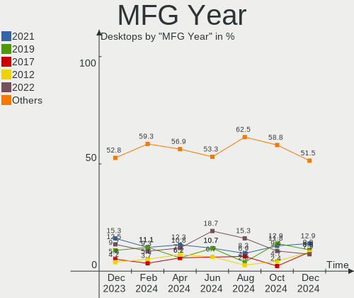
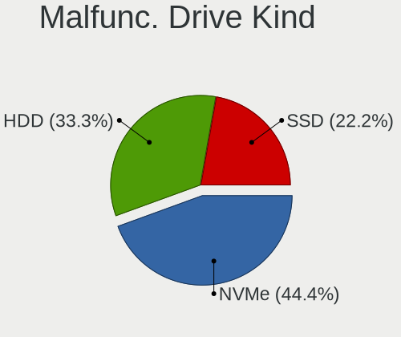
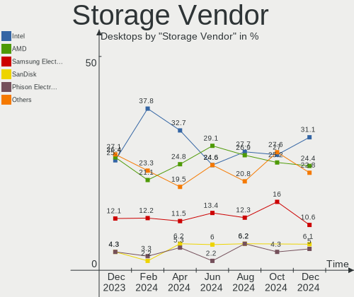
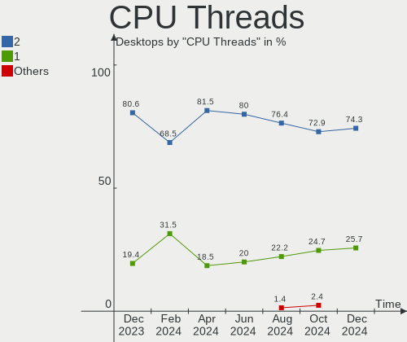
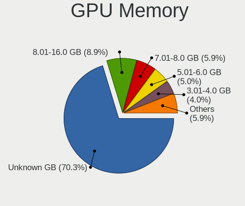
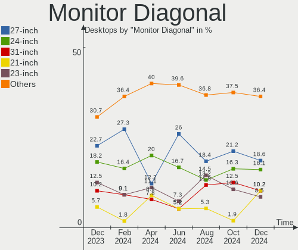

Pop!_OS - Hardware Trends (Desktops)
------------------------------------

A project to identify most popular hardware characteristics and track their change
over time based on data collected by Linux users at https://Linux-Hardware.org.

Anyone can contribute to this report by the [hw-probe](https://github.com/linuxhw/hw-probe) tool:

    sudo -E hw-probe -all -upload

This report is for one last month. Overall report since the beginning of time: [TestCoverage](https://github.com/linuxhw/TestCoverage)

Period: Nov, 2022.

Contents
--------

* [ System ](#system)
  - [ OS                       ](#os)
  - [ OS Family                ](#os-family)
  - [ Kernel                   ](#kernel)
  - [ Kernel Family            ](#kernel-family)
  - [ Kernel Major Ver.        ](#kernel-major-ver)
  - [ Arch                     ](#arch)
  - [ DE                       ](#de)
  - [ Display Server           ](#display-server)
  - [ Display Manager          ](#display-manager)
  - [ OS Lang                  ](#os-lang)
  - [ Boot Mode                ](#boot-mode)
  - [ Filesystem               ](#filesystem)
  - [ Part. scheme             ](#part-scheme)
  - [ Dual Boot with Linux/BSD ](#dual-boot-with-linuxbsd)
  - [ Dual Boot (Win)          ](#dual-boot-win)

* [ Board ](#board)
  - [ Vendor                   ](#vendor)
  - [ Model                    ](#model)
  - [ Model Family             ](#model-family)
  - [ MFG Year                 ](#mfg-year)
  - [ Form Factor              ](#form-factor)
  - [ Secure Boot              ](#secure-boot)
  - [ Coreboot                 ](#coreboot)
  - [ RAM Size                 ](#ram-size)
  - [ RAM Used                 ](#ram-used)
  - [ Total Drives             ](#total-drives)
  - [ Has CD-ROM               ](#has-cd-rom)
  - [ Has Ethernet             ](#has-ethernet)
  - [ Has WiFi                 ](#has-wifi)
  - [ Has Bluetooth            ](#has-bluetooth)

* [ Location ](#location)
  - [ Country                  ](#country)
  - [ City                     ](#city)

* [ Drives ](#drives)
  - [ Drive Vendor             ](#drive-vendor)
  - [ Drive Model              ](#drive-model)
  - [ HDD Vendor               ](#hdd-vendor)
  - [ SSD Vendor               ](#ssd-vendor)
  - [ Drive Kind               ](#drive-kind)
  - [ Drive Connector          ](#drive-connector)
  - [ Drive Size               ](#drive-size)
  - [ Space Total              ](#space-total)
  - [ Space Used               ](#space-used)
  - [ Malfunc. Drives          ](#malfunc-drives)
  - [ Malfunc. Drive Vendor    ](#malfunc-drive-vendor)
  - [ Malfunc. HDD Vendor      ](#malfunc-hdd-vendor)
  - [ Malfunc. Drive Kind      ](#malfunc-drive-kind)
  - [ Failed Drives            ](#failed-drives)
  - [ Failed Drive Vendor      ](#failed-drive-vendor)
  - [ Drive Status             ](#drive-status)

* [ Storage controller ](#storage-controller)
  - [ Storage Vendor           ](#storage-vendor)
  - [ Storage Model            ](#storage-model)
  - [ Storage Kind             ](#storage-kind)

* [ Processor ](#processor)
  - [ CPU Vendor               ](#cpu-vendor)
  - [ CPU Model                ](#cpu-model)
  - [ CPU Model Family         ](#cpu-model-family)
  - [ CPU Cores                ](#cpu-cores)
  - [ CPU Sockets              ](#cpu-sockets)
  - [ CPU Threads              ](#cpu-threads)
  - [ CPU Op-Modes             ](#cpu-op-modes)
  - [ CPU Microcode            ](#cpu-microcode)
  - [ CPU Microarch            ](#cpu-microarch)

* [ Graphics ](#graphics)
  - [ GPU Vendor               ](#gpu-vendor)
  - [ GPU Model                ](#gpu-model)
  - [ GPU Combo                ](#gpu-combo)
  - [ GPU Driver               ](#gpu-driver)
  - [ GPU Memory               ](#gpu-memory)

* [ Monitor ](#monitor)
  - [ Monitor Vendor           ](#monitor-vendor)
  - [ Monitor Model            ](#monitor-model)
  - [ Monitor Resolution       ](#monitor-resolution)
  - [ Monitor Diagonal         ](#monitor-diagonal)
  - [ Monitor Width            ](#monitor-width)
  - [ Aspect Ratio             ](#aspect-ratio)
  - [ Monitor Area             ](#monitor-area)
  - [ Pixel Density            ](#pixel-density)
  - [ Multiple Monitors        ](#multiple-monitors)

* [ Network ](#network)
  - [ Net Controller Vendor    ](#net-controller-vendor)
  - [ Net Controller Model     ](#net-controller-model)
  - [ Wireless Vendor          ](#wireless-vendor)
  - [ Wireless Model           ](#wireless-model)
  - [ Ethernet Vendor          ](#ethernet-vendor)
  - [ Ethernet Model           ](#ethernet-model)
  - [ Net Controller Kind      ](#net-controller-kind)
  - [ Used Controller          ](#used-controller)
  - [ NICs                     ](#nics)
  - [ IPv6                     ](#ipv6)

* [ Bluetooth ](#bluetooth)
  - [ Bluetooth Vendor         ](#bluetooth-vendor)
  - [ Bluetooth Model          ](#bluetooth-model)

* [ Sound ](#sound)
  - [ Sound Vendor             ](#sound-vendor)
  - [ Sound Model              ](#sound-model)

* [ Memory ](#memory)
  - [ Memory Vendor            ](#memory-vendor)
  - [ Memory Model             ](#memory-model)
  - [ Memory Kind              ](#memory-kind)
  - [ Memory Form Factor       ](#memory-form-factor)
  - [ Memory Size              ](#memory-size)
  - [ Memory Speed             ](#memory-speed)

* [ Printers & scanners ](#printers--scanners)
  - [ Printer Vendor           ](#printer-vendor)
  - [ Printer Model            ](#printer-model)
  - [ Scanner Vendor           ](#scanner-vendor)
  - [ Scanner Model            ](#scanner-model)

* [ Camera ](#camera)
  - [ Camera Vendor            ](#camera-vendor)
  - [ Camera Model             ](#camera-model)

* [ Security ](#security)
  - [ Fingerprint Vendor       ](#fingerprint-vendor)
  - [ Fingerprint Model        ](#fingerprint-model)
  - [ Chipcard Vendor          ](#chipcard-vendor)
  - [ Chipcard Model           ](#chipcard-model)

* [ Unsupported ](#unsupported)
  - [ Unsupported Devices      ](#unsupported-devices)
  - [ Unsupported Device Types ](#unsupported-device-types)

System
------

OS
--

Installed operating systems

| Name          | Desktops | Percent |
|---------------|----------|---------|
| Pop!_OS 22.04 | 68       | 95.77%  |
| Pop!_OS 20.04 | 2        | 2.82%   |
| Pop!_OS 21.10 | 1        | 1.41%   |

OS Family
---------

OS without a version

| Name    | Desktops | Percent |
|---------|----------|---------|
| Pop!_OS | 71       | 100%    |

Kernel
------

Version of the Linux kernel

| Version                  | Desktops | Percent |
|--------------------------|----------|---------|
| 6.0.6-76060006-generic   | 34       | 47.89%  |
| 6.0.3-76060003-generic   | 13       | 18.31%  |
| 6.0.2-76060002-generic   | 13       | 18.31%  |
| 5.19.0-76051900-generic  | 3        | 4.23%   |
| 5.17.5-76051705-generic  | 2        | 2.82%   |
| 6.0.9-060009-generic     | 1        | 1.41%   |
| 6.0.8-x64v1-xanmod1      | 1        | 1.41%   |
| 6.0.6-060006-generic     | 1        | 1.41%   |
| 5.19.16-76051916-generic | 1        | 1.41%   |
| 5.18.10-76051810-generic | 1        | 1.41%   |
| 5.17.15-76051715-generic | 1        | 1.41%   |

Kernel Family
-------------

Linux kernel without a distro release

| Version | Desktops | Percent |
|---------|----------|---------|
| 6.0.6   | 35       | 49.3%   |
| 6.0.3   | 13       | 18.31%  |
| 6.0.2   | 13       | 18.31%  |
| 5.19.0  | 3        | 4.23%   |
| 5.17.5  | 2        | 2.82%   |
| 6.0.9   | 1        | 1.41%   |
| 6.0.8   | 1        | 1.41%   |
| 5.19.16 | 1        | 1.41%   |
| 5.18.10 | 1        | 1.41%   |
| 5.17.15 | 1        | 1.41%   |

Kernel Major Ver.
-----------------

Linux kernel major version

| Version | Desktops | Percent |
|---------|----------|---------|
| 6.0     | 63       | 88.73%  |
| 5.19    | 4        | 5.63%   |
| 5.17    | 3        | 4.23%   |
| 5.18    | 1        | 1.41%   |

Arch
----

OS architecture (x86_64, i586, etc.)

| Name   | Desktops | Percent |
|--------|----------|---------|
| x86_64 | 71       | 100%    |

DE
--

Desktop Environment

| Name       | Desktops | Percent |
|------------|----------|---------|
| GNOME      | 67       | 94.37%  |
| X-Cinnamon | 3        | 4.23%   |
| KDE5       | 1        | 1.41%   |

Display Server
--------------

X11 or Wayland

| Name    | Desktops | Percent |
|---------|----------|---------|
| X11     | 68       | 95.77%  |
| Wayland | 3        | 4.23%   |

Display Manager
---------------

SDDM, LightDM, etc.

| Name    | Desktops | Percent |
|---------|----------|---------|
| Unknown | 59       | 83.1%   |
| GDM3    | 10       | 14.08%  |
| LightDM | 1        | 1.41%   |
| GDM     | 1        | 1.41%   |

OS Lang
-------

Language

| Lang  | Desktops | Percent |
|-------|----------|---------|
| en_US | 41       | 57.75%  |
| en_GB | 7        | 9.86%   |
| it_IT | 4        | 5.63%   |
| pt_BR | 3        | 4.23%   |
| de_DE | 3        | 4.23%   |
| pl_PL | 2        | 2.82%   |
| fi_FI | 2        | 2.82%   |
| en_CA | 2        | 2.82%   |
| ru_RU | 1        | 1.41%   |
| pt_PT | 1        | 1.41%   |
| nl_NL | 1        | 1.41%   |
| fr_FR | 1        | 1.41%   |
| es_ES | 1        | 1.41%   |
| es_CL | 1        | 1.41%   |
| en_AU | 1        | 1.41%   |

Boot Mode
---------

EFI or BIOS

| Mode | Desktops | Percent |
|------|----------|---------|
| BIOS | 61       | 85.92%  |
| EFI  | 10       | 14.08%  |

Filesystem
----------

Type of filesystem

| Type  | Desktops | Percent |
|-------|----------|---------|
| Ext4  | 69       | 97.18%  |
| Btrfs | 2        | 2.82%   |

Part. scheme
------------

Scheme of partitioning

| Type    | Desktops | Percent |
|---------|----------|---------|
| Unknown | 59       | 83.1%   |
| GPT     | 12       | 16.9%   |

Dual Boot with Linux/BSD
------------------------

Hosting more than one Linux/BSD

| Dual boot | Desktops | Percent |
|-----------|----------|---------|
| No        | 69       | 97.18%  |
| Yes       | 2        | 2.82%   |

Dual Boot (Win)
---------------

Hosting Linux and Windows

| Dual boot | Desktops | Percent |
|-----------|----------|---------|
| No        | 63       | 88.73%  |
| Yes       | 8        | 11.27%  |

Board
-----

Vendor
------

Motherboard manufacturer

| Name                | Desktops | Percent |
|---------------------|----------|---------|
| ASUSTek Computer    | 18       | 25.35%  |
| MSI                 | 15       | 21.13%  |
| Gigabyte Technology | 10       | 14.08%  |
| ASRock              | 8        | 11.27%  |
| Dell                | 5        | 7.04%   |
| Hewlett-Packard     | 4        | 5.63%   |
| Lenovo              | 2        | 2.82%   |
| Intel               | 2        | 2.82%   |
| System76            | 1        | 1.41%   |
| Positivo            | 1        | 1.41%   |
| Pegatron            | 1        | 1.41%   |
| Foxconn             | 1        | 1.41%   |
| Colorful Technology | 1        | 1.41%   |
| BESSTAR Tech        | 1        | 1.41%   |
| Acer                | 1        | 1.41%   |

Model
-----

Motherboard model

| Name                            | Desktops | Percent |
|---------------------------------|----------|---------|
| MSI MS-7C52                     | 2        | 2.82%   |
| ASUS ROG STRIX B550-F GAMING    | 2        | 2.82%   |
| System76 Thelio                 | 1        | 1.41%   |
| Positivo POS-EIH61CR            | 1        | 1.41%   |
| Pegatron 600-1352               | 1        | 1.41%   |
| MSI p7-1235                     | 1        | 1.41%   |
| MSI MS-7D31                     | 1        | 1.41%   |
| MSI MS-7D18                     | 1        | 1.41%   |
| MSI MS-7C92                     | 1        | 1.41%   |
| MSI MS-7C56                     | 1        | 1.41%   |
| MSI MS-7C35                     | 1        | 1.41%   |
| MSI MS-7B84                     | 1        | 1.41%   |
| MSI MS-7B51                     | 1        | 1.41%   |
| MSI MS-7B09                     | 1        | 1.41%   |
| MSI MS-7A38                     | 1        | 1.41%   |
| MSI MS-7A34                     | 1        | 1.41%   |
| MSI MS-7916                     | 1        | 1.41%   |
| MSI MS-7788                     | 1        | 1.41%   |
| Lenovo ThinkCentre M91p 4518RS8 | 1        | 1.41%   |
| Lenovo ThinkCentre M90p 5498R97 | 1        | 1.41%   |
| Intel Productiva                | 1        | 1.41%   |
| Intel P61A-D3                   | 1        | 1.41%   |
| HP Z640 Workstation             | 1        | 1.41%   |
| HP ProDesk 600 G2 SFF           | 1        | 1.41%   |
| HP OMEN by Desktop PC 880-p0xx  | 1        | 1.41%   |
| HP EliteDesk 800 G1 SFF         | 1        | 1.41%   |
| Gigabyte Z77-HD3                | 1        | 1.41%   |
| Gigabyte H81M-S1                | 1        | 1.41%   |
| Gigabyte H110M-S2H-CF           | 1        | 1.41%   |
| Gigabyte B75M-D3H               | 1        | 1.41%   |
| Gigabyte B650M AORUS ELITE AX   | 1        | 1.41%   |
| Gigabyte B550M DS3H             | 1        | 1.41%   |
| Gigabyte B550I AORUS PRO AX     | 1        | 1.41%   |
| Gigabyte B450 AORUS ELITE       | 1        | 1.41%   |
| Gigabyte A520M S2H              | 1        | 1.41%   |
| Gigabyte 990FXA-UD3             | 1        | 1.41%   |
| Foxconn p6-2220t                | 1        | 1.41%   |
| Dell XPS 8700                   | 1        | 1.41%   |
| Dell Precision T3610            | 1        | 1.41%   |
| Dell Precision T1600            | 1        | 1.41%   |

Model Family
------------

Motherboard model prefix

| Name                  | Desktops | Percent |
|-----------------------|----------|---------|
| ASUS ROG              | 6        | 8.45%   |
| ASUS TUF              | 3        | 4.23%   |
| MSI MS-7C52           | 2        | 2.82%   |
| Lenovo ThinkCentre    | 2        | 2.82%   |
| Dell Precision        | 2        | 2.82%   |
| Dell OptiPlex         | 2        | 2.82%   |
| System76 Thelio       | 1        | 1.41%   |
| Positivo POS-EIH61CR  | 1        | 1.41%   |
| Pegatron 600-1352     | 1        | 1.41%   |
| MSI p7-1235           | 1        | 1.41%   |
| MSI MS-7D31           | 1        | 1.41%   |
| MSI MS-7D18           | 1        | 1.41%   |
| MSI MS-7C92           | 1        | 1.41%   |
| MSI MS-7C56           | 1        | 1.41%   |
| MSI MS-7C35           | 1        | 1.41%   |
| MSI MS-7B84           | 1        | 1.41%   |
| MSI MS-7B51           | 1        | 1.41%   |
| MSI MS-7B09           | 1        | 1.41%   |
| MSI MS-7A38           | 1        | 1.41%   |
| MSI MS-7A34           | 1        | 1.41%   |
| MSI MS-7916           | 1        | 1.41%   |
| MSI MS-7788           | 1        | 1.41%   |
| Intel Productiva      | 1        | 1.41%   |
| Intel P61A-D3         | 1        | 1.41%   |
| HP Z640               | 1        | 1.41%   |
| HP ProDesk            | 1        | 1.41%   |
| HP OMEN               | 1        | 1.41%   |
| HP EliteDesk          | 1        | 1.41%   |
| Gigabyte Z77-HD3      | 1        | 1.41%   |
| Gigabyte H81M-S1      | 1        | 1.41%   |
| Gigabyte H110M-S2H-CF | 1        | 1.41%   |
| Gigabyte B75M-D3H     | 1        | 1.41%   |
| Gigabyte B650M        | 1        | 1.41%   |
| Gigabyte B550M        | 1        | 1.41%   |
| Gigabyte B550I        | 1        | 1.41%   |
| Gigabyte B450         | 1        | 1.41%   |
| Gigabyte A520M        | 1        | 1.41%   |
| Gigabyte 990FXA-UD3   | 1        | 1.41%   |
| Foxconn p6-2220t      | 1        | 1.41%   |
| Dell XPS              | 1        | 1.41%   |

MFG Year
--------

Motherboard manufacture year

| Year | Desktops | Percent |
|------|----------|---------|
| 2020 | 15       | 21.13%  |
| 2012 | 9        | 12.68%  |
| 2021 | 7        | 9.86%   |
| 2019 | 7        | 9.86%   |
| 2013 | 6        | 8.45%   |
| 2018 | 4        | 5.63%   |
| 2017 | 4        | 5.63%   |
| 2015 | 4        | 5.63%   |
| 2011 | 4        | 5.63%   |
| 2010 | 4        | 5.63%   |
| 2016 | 3        | 4.23%   |
| 2022 | 2        | 2.82%   |
| 2014 | 1        | 1.41%   |
| 2009 | 1        | 1.41%   |

Form Factor
-----------

Physical design of the computer

| Name    | Desktops | Percent |
|---------|----------|---------|
| Desktop | 71       | 100%    |

Secure Boot
-----------

Enabled or disabled

| State    | Desktops | Percent |
|----------|----------|---------|
| Disabled | 71       | 100%    |

Coreboot
--------

Have coreboot on board

| Used | Desktops | Percent |
|------|----------|---------|
| No   | 71       | 100%    |

RAM Size
--------

Total RAM memory

| Size in GB      | Desktops | Percent |
|-----------------|----------|---------|
| 16.01-24.0      | 27       | 38.03%  |
| 32.01-64.0      | 15       | 21.13%  |
| 4.01-8.0        | 9        | 12.68%  |
| 8.01-16.0       | 7        | 9.86%   |
| 64.01-256.0     | 6        | 8.45%   |
| 3.01-4.0        | 4        | 5.63%   |
| 24.01-32.0      | 2        | 2.82%   |
| More than 256.0 | 1        | 1.41%   |

RAM Used
--------

Used RAM memory

| Used GB    | Desktops | Percent |
|------------|----------|---------|
| 3.01-4.0   | 24       | 33.8%   |
| 4.01-8.0   | 19       | 26.76%  |
| 2.01-3.0   | 15       | 21.13%  |
| 1.01-2.0   | 7        | 9.86%   |
| 8.01-16.0  | 5        | 7.04%   |
| 24.01-32.0 | 1        | 1.41%   |

Total Drives
------------

Number of drives on board

| Drives | Desktops | Percent |
|--------|----------|---------|
| 1      | 22       | 30.99%  |
| 2      | 21       | 29.58%  |
| 3      | 12       | 16.9%   |
| 4      | 10       | 14.08%  |
| 5      | 3        | 4.23%   |
| 10     | 1        | 1.41%   |
| 7      | 1        | 1.41%   |
| 0      | 1        | 1.41%   |

Has CD-ROM
----------

Has CD-ROM on board

| Presented | Desktops | Percent |
|-----------|----------|---------|
| No        | 52       | 73.24%  |
| Yes       | 19       | 26.76%  |

Has Ethernet
------------

Has Ethernet on board

| Presented | Desktops | Percent |
|-----------|----------|---------|
| Yes       | 71       | 100%    |

Has WiFi
--------

Has WiFi module

| Presented | Desktops | Percent |
|-----------|----------|---------|
| Yes       | 42       | 59.15%  |
| No        | 29       | 40.85%  |

Has Bluetooth
-------------

Has Bluetooth module

| Presented | Desktops | Percent |
|-----------|----------|---------|
| No        | 40       | 56.34%  |
| Yes       | 31       | 43.66%  |

Location
--------

Country
-------

Geographic location (country)

| Country      | Desktops | Percent |
|--------------|----------|---------|
| USA          | 21       | 29.58%  |
| Italy        | 7        | 9.86%   |
| Canada       | 5        | 7.04%   |
| Brazil       | 4        | 5.63%   |
| UK           | 3        | 4.23%   |
| Poland       | 3        | 4.23%   |
| Greece       | 3        | 4.23%   |
| Germany      | 3        | 4.23%   |
| Finland      | 3        | 4.23%   |
| Australia    | 3        | 4.23%   |
| Spain        | 2        | 2.82%   |
| Switzerland  | 1        | 1.41%   |
| Sweden       | 1        | 1.41%   |
| South Africa | 1        | 1.41%   |
| Russia       | 1        | 1.41%   |
| Romania      | 1        | 1.41%   |
| Portugal     | 1        | 1.41%   |
| Netherlands  | 1        | 1.41%   |
| Malaysia     | 1        | 1.41%   |
| Ireland      | 1        | 1.41%   |
| Indonesia    | 1        | 1.41%   |
| India        | 1        | 1.41%   |
| France       | 1        | 1.41%   |
| Chile        | 1        | 1.41%   |
| Austria      | 1        | 1.41%   |

City
----

Geographic location (city)

| City                        | Desktops | Percent |
|-----------------------------|----------|---------|
| Wyalusing                   | 1        | 1.41%   |
| Weston-super-Mare           | 1        | 1.41%   |
| Watertown                   | 1        | 1.41%   |
| Warner Robins               | 1        | 1.41%   |
| Virginia Beach              | 1        | 1.41%   |
| Valparaíso                 | 1        | 1.41%   |
| Úbeda                      | 1        | 1.41%   |
| Tübingen                   | 1        | 1.41%   |
| Toronto                     | 1        | 1.41%   |
| Spring Hill                 | 1        | 1.41%   |
| Smithfield                  | 1        | 1.41%   |
| Scottsville                 | 1        | 1.41%   |
| Sao Paulo                   | 1        | 1.41%   |
| Rome                        | 1        | 1.41%   |
| Rohrbach in Oberoesterreich | 1        | 1.41%   |
| Rieux-Volvestre             | 1        | 1.41%   |
| Ribeirao Preto              | 1        | 1.41%   |
| Regina                      | 1        | 1.41%   |
| Plymouth                    | 1        | 1.41%   |
| Palm Bay                    | 1        | 1.41%   |
| Nuremberg                   | 1        | 1.41%   |
| New Delhi                   | 1        | 1.41%   |
| Nanaimo                     | 1        | 1.41%   |
| Milford                     | 1        | 1.41%   |
| Milan                       | 1        | 1.41%   |
| Miami                       | 1        | 1.41%   |
| Memphis                     | 1        | 1.41%   |
| Melbourne                   | 1        | 1.41%   |
| Lodz                        | 1        | 1.41%   |
| Lehighton                   | 1        | 1.41%   |
| Kuala Lumpur                | 1        | 1.41%   |
| Johannesburg                | 1        | 1.41%   |
| Joensuu                     | 1        | 1.41%   |
| Jesup                       | 1        | 1.41%   |
| Jerez de la Frontera        | 1        | 1.41%   |
| Jakarta                     | 1        | 1.41%   |
| Hollywood                   | 1        | 1.41%   |
| Heraklion                   | 1        | 1.41%   |
| Hendersonville              | 1        | 1.41%   |
| Helsinki                    | 1        | 1.41%   |

Drives
------

Drive Vendor
------------

Hard drive vendors

| Vendor                    | Desktops | Drives | Percent |
|---------------------------|----------|--------|---------|
| WDC                       | 30       | 36     | 20.69%  |
| Samsung Electronics       | 23       | 30     | 15.86%  |
| Seagate                   | 13       | 17     | 8.97%   |
| Sandisk                   | 12       | 13     | 8.28%   |
| Kingston                  | 10       | 11     | 6.9%    |
| Phison Electronics        | 9        | 11     | 6.21%   |
| Crucial                   | 6        | 7      | 4.14%   |
| SPCC                      | 4        | 4      | 2.76%   |
| Toshiba                   | 3        | 3      | 2.07%   |
| PNY                       | 3        | 3      | 2.07%   |
| A-DATA Technology         | 3        | 3      | 2.07%   |
| Unknown                   | 2        | 3      | 1.38%   |
| Patriot                   | 2        | 2      | 1.38%   |
| OCZ                       | 2        | 2      | 1.38%   |
| Micron/Crucial Technology | 2        | 2      | 1.38%   |
| HGST                      | 2        | 2      | 1.38%   |
| China                     | 2        | 3      | 1.38%   |
| XPG                       | 1        | 2      | 0.69%   |
| Verbatim                  | 1        | 1      | 0.69%   |
| V-GeN                     | 1        | 1      | 0.69%   |
| Team                      | 1        | 1      | 0.69%   |
| SK hynix                  | 1        | 1      | 0.69%   |
| Netac                     | 1        | 1      | 0.69%   |
| MaxDigital                | 1        | 1      | 0.69%   |
| LITEONIT                  | 1        | 1      | 0.69%   |
| Lite-On Technology        | 1        | 2      | 0.69%   |
| Lexar                     | 1        | 1      | 0.69%   |
| KingDian                  | 1        | 1      | 0.69%   |
| Hitachi                   | 1        | 1      | 0.69%   |
| GOODRAM                   | 1        | 1      | 0.69%   |
| G-DRIVE                   | 1        | 1      | 0.69%   |
| Emtec                     | 1        | 1      | 0.69%   |
| Corsair                   | 1        | 1      | 0.69%   |
| AMD                       | 1        | 1      | 0.69%   |

Drive Model
-----------

Hard drive models

| Model                                               | Desktops | Percent |
|-----------------------------------------------------|----------|---------|
| Samsung NVMe SSD Controller SM981/PM981/PM983 1TB   | 6        | 3.68%   |
| Phison E12 NVMe Controller 2TB                      | 4        | 2.45%   |
| Kingston SA400S37240G 240GB SSD                     | 4        | 2.45%   |
| Samsung SSD 850 EVO 500GB                           | 3        | 1.84%   |
| Samsung NVMe SSD Controller SM961/PM961/SM963 250GB | 3        | 1.84%   |
| Phison E16 PCIe4 NVMe Controller 1TB                | 3        | 1.84%   |
| WDC WDS100T2B0A-00SM50 1TB SSD                      | 2        | 1.23%   |
| WDC WD10EZEX-21WN4A0 1TB                            | 2        | 1.23%   |
| WDC WD10EZEX-08WN4A0 1TB                            | 2        | 1.23%   |
| WDC WD10EARX-00N0YB0 1TB                            | 2        | 1.23%   |
| SPCC Solid State Disk 512GB                         | 2        | 1.23%   |
| Seagate ST1000DM010-2EP102 1TB                      | 2        | 1.23%   |
| Samsung SSD 980 500GB                               | 2        | 1.23%   |
| Kingston SUV400S37120G 120GB SSD                    | 2        | 1.23%   |
| Crucial CT500MX500SSD1 500GB                        | 2        | 1.23%   |
| XPG NVMe SSD Drive 1024GB                           | 1        | 0.61%   |
| XPG GAMMIX S70 1TB                                  | 1        | 0.61%   |
| WDC WDS500G2B0A 500GB SSD                           | 1        | 0.61%   |
| WDC WDS240G2G0B-00EPW0 240GB SSD                    | 1        | 0.61%   |
| WDC WDS240G2G0A-00JH30 240GB SSD                    | 1        | 0.61%   |
| WDC WDS100T1B0A-00H9H0 1TB SSD                      | 1        | 0.61%   |
| WDC WD80EZAZ-11TDBA0 8TB                            | 1        | 0.61%   |
| WDC WD80EFBX-68AZZN0 8TB                            | 1        | 0.61%   |
| WDC WD5000LPCX-21VHAT0 500GB                        | 1        | 0.61%   |
| WDC WD5000AZRX-00A8LB0 500GB                        | 1        | 0.61%   |
| WDC WD5000AVDS-63U7B1 500GB                         | 1        | 0.61%   |
| WDC WD5000AAKX-753CA1 500GB                         | 1        | 0.61%   |
| WDC WD5000AAKX-60U6AA0 500GB                        | 1        | 0.61%   |
| WDC WD5000AAKX-00ERMA0 500GB                        | 1        | 0.61%   |
| WDC WD5000AAKS-08WWPA0 500GB                        | 1        | 0.61%   |
| WDC WD5000AADS-00S9B0 500GB                         | 1        | 0.61%   |
| WDC WD40EZRZ-00GXCB0 4TB                            | 1        | 0.61%   |
| WDC WD3200AAKS-00B3A0 320GB                         | 1        | 0.61%   |
| WDC WD2500AAJS-75M0A0 249GB                         | 1        | 0.61%   |
| WDC WD2500AAJS-65B4A0 250GB                         | 1        | 0.61%   |
| WDC WD20SPZX-22UA7T0 2TB                            | 1        | 0.61%   |
| WDC WD20EZRZ-00Z5HB0 2TB                            | 1        | 0.61%   |
| WDC WD20EFRX-68AX9N0 2TB                            | 1        | 0.61%   |
| WDC WD2005FBYZ-01YCBB1 2TB                          | 1        | 0.61%   |
| WDC WD10EZRX-00L4HB0 1TB                            | 1        | 0.61%   |

HDD Vendor
----------

Hard disk drive vendors

| Vendor              | Desktops | Drives | Percent |
|---------------------|----------|--------|---------|
| WDC                 | 25       | 30     | 55.56%  |
| Seagate             | 12       | 16     | 26.67%  |
| Toshiba             | 3        | 3      | 6.67%   |
| HGST                | 2        | 2      | 4.44%   |
| Unknown             | 1        | 1      | 2.22%   |
| Samsung Electronics | 1        | 1      | 2.22%   |
| Hitachi             | 1        | 1      | 2.22%   |

SSD Vendor
----------

Solid state drive vendors

| Vendor              | Desktops | Drives | Percent |
|---------------------|----------|--------|---------|
| Samsung Electronics | 9        | 11     | 16.36%  |
| Kingston            | 8        | 9      | 14.55%  |
| WDC                 | 6        | 6      | 10.91%  |
| Crucial             | 5        | 6      | 9.09%   |
| SPCC                | 3        | 3      | 5.45%   |
| SanDisk             | 3        | 3      | 5.45%   |
| PNY                 | 3        | 3      | 5.45%   |
| A-DATA Technology   | 3        | 3      | 5.45%   |
| Patriot             | 2        | 2      | 3.64%   |
| OCZ                 | 2        | 2      | 3.64%   |
| China               | 2        | 3      | 3.64%   |
| Verbatim            | 1        | 1      | 1.82%   |
| Team                | 1        | 1      | 1.82%   |
| Netac               | 1        | 1      | 1.82%   |
| LITEONIT            | 1        | 1      | 1.82%   |
| KingDian            | 1        | 1      | 1.82%   |
| GOODRAM             | 1        | 1      | 1.82%   |
| Emtec               | 1        | 1      | 1.82%   |
| Corsair             | 1        | 1      | 1.82%   |
| AMD                 | 1        | 1      | 1.82%   |

Drive Kind
----------

HDD or SSD

| Kind    | Desktops | Drives | Percent |
|---------|----------|--------|---------|
| SSD     | 42       | 60     | 35%     |
| HDD     | 37       | 54     | 30.83%  |
| NVMe    | 35       | 50     | 29.17%  |
| Unknown | 6        | 7      | 5%      |

Drive Connector
---------------

SATA, SAS, NVMe, etc.

| Type | Desktops | Drives | Percent |
|------|----------|--------|---------|
| SATA | 59       | 114    | 59%     |
| NVMe | 35       | 50     | 35%     |
| SAS  | 6        | 7      | 6%      |

Drive Size
----------

Size of hard drive

| Size in TB | Desktops | Drives | Percent |
|------------|----------|--------|---------|
| 0.01-0.5   | 37       | 61     | 48.05%  |
| 0.51-1.0   | 27       | 35     | 35.06%  |
| 1.01-2.0   | 7        | 8      | 9.09%   |
| 3.01-4.0   | 2        | 3      | 2.6%    |
| 2.01-3.0   | 2        | 2      | 2.6%    |
| 4.01-10.0  | 2        | 5      | 2.6%    |

Space Total
-----------

Amount of disk space available on the file system

| Size in GB     | Desktops | Percent |
|----------------|----------|---------|
| 501-1000       | 21       | 29.58%  |
| 101-250        | 14       | 19.72%  |
| 251-500        | 11       | 15.49%  |
| 1001-2000      | 11       | 15.49%  |
| More than 3000 | 7        | 9.86%   |
| 2001-3000      | 4        | 5.63%   |
| 51-100         | 2        | 2.82%   |
| 21-50          | 1        | 1.41%   |

Space Used
----------

Amount of used disk space

| Used GB        | Desktops | Percent |
|----------------|----------|---------|
| 1-20           | 16       | 22.54%  |
| 251-500        | 12       | 16.9%   |
| 21-50          | 12       | 16.9%   |
| 101-250        | 10       | 14.08%  |
| 51-100         | 7        | 9.86%   |
| 501-1000       | 6        | 8.45%   |
| More than 3000 | 4        | 5.63%   |
| 1001-2000      | 3        | 4.23%   |
| 2001-3000      | 1        | 1.41%   |

Malfunc. Drives
---------------

Drive models with a malfunction

| Model                    | Desktops | Drives | Percent |
|--------------------------|----------|--------|---------|
| WDC WD20EFRX-68AX9N0 2TB | 1        | 1      | 100%    |

Malfunc. Drive Vendor
---------------------

Vendors of faulty drives

| Vendor | Desktops | Drives | Percent |
|--------|----------|--------|---------|
| WDC    | 1        | 1      | 100%    |

Malfunc. HDD Vendor
-------------------

Vendors of faulty HDD drives

| Vendor | Desktops | Drives | Percent |
|--------|----------|--------|---------|
| WDC    | 1        | 1      | 100%    |

Malfunc. Drive Kind
-------------------

Kinds of faulty drives

| Kind | Desktops | Drives | Percent |
|------|----------|--------|---------|
| HDD  | 1        | 1      | 100%    |

Failed Drives
-------------

Failed drive models

Zero info for selected period =(

Failed Drive Vendor
-------------------

Failed drive vendors

Zero info for selected period =(

Drive Status
------------

Number of failed and malfunc. drives

| Status   | Desktops | Drives | Percent |
|----------|----------|--------|---------|
| Detected | 61       | 143    | 81.33%  |
| Works    | 13       | 27     | 17.33%  |
| Malfunc  | 1        | 1      | 1.33%   |

Storage controller
------------------

Storage Vendor
--------------

Storage controller vendors

| Vendor                      | Desktops | Percent |
|-----------------------------|----------|---------|
| AMD                         | 34       | 28.1%   |
| Intel                       | 33       | 27.27%  |
| Samsung Electronics         | 17       | 14.05%  |
| SanDisk                     | 10       | 8.26%   |
| Phison Electronics          | 10       | 8.26%   |
| ASMedia Technology          | 5        | 4.13%   |
| Micron/Crucial Technology   | 3        | 2.48%   |
| Marvell Technology Group    | 2        | 1.65%   |
| Kingston Technology Company | 2        | 1.65%   |
| SK hynix                    | 1        | 0.83%   |
| Nvidia                      | 1        | 0.83%   |
| LSI Logic / Symbios Logic   | 1        | 0.83%   |
| Lite-On Technology          | 1        | 0.83%   |
| INNOGRIT                    | 1        | 0.83%   |

Storage Model
-------------

Storage controller models

| Model                                                                          | Desktops | Percent |
|--------------------------------------------------------------------------------|----------|---------|
| AMD FCH SATA Controller [AHCI mode]                                            | 18       | 12.77%  |
| AMD 500 Series Chipset SATA Controller                                         | 11       | 7.8%    |
| Samsung NVMe SSD Controller SM981/PM981/PM983                                  | 8        | 5.67%   |
| Intel 6 Series/C200 Series Chipset Family 6 port Desktop SATA AHCI Controller  | 7        | 4.96%   |
| AMD 400 Series Chipset SATA Controller                                         | 6        | 4.26%   |
| Phison E12 NVMe Controller                                                     | 5        | 3.55%   |
| ASMedia ASM1062 Serial ATA Controller                                          | 5        | 3.55%   |
| Intel Q170/Q150/B150/H170/H110/Z170/CM236 Chipset SATA Controller [AHCI Mode]  | 4        | 2.84%   |
| SanDisk WD Blue SN570 NVMe SSD                                                 | 3        | 2.13%   |
| SanDisk Non-Volatile memory controller                                         | 3        | 2.13%   |
| Samsung NVMe SSD Controller SM961/PM961/SM963                                  | 3        | 2.13%   |
| Samsung NVMe SSD Controller 980                                                | 3        | 2.13%   |
| Phison E16 PCIe4 NVMe Controller                                               | 3        | 2.13%   |
| Intel Cannon Lake PCH SATA AHCI Controller                                     | 3        | 2.13%   |
| Intel 8 Series/C220 Series Chipset Family 6-port SATA Controller 1 [AHCI mode] | 3        | 2.13%   |
| AMD SB7x0/SB8x0/SB9x0 SATA Controller [AHCI mode]                              | 3        | 2.13%   |
| Samsung NVMe SSD Controller PM9A1/PM9A3/980PRO                                 | 2        | 1.42%   |
| Phison PS5013 E13 NVMe Controller                                              | 2        | 1.42%   |
| Intel C610/X99 series chipset sSATA Controller [AHCI mode]                     | 2        | 1.42%   |
| Intel C610/X99 series chipset 6-Port SATA Controller [AHCI mode]               | 2        | 1.42%   |
| Intel 7 Series/C210 Series Chipset Family 4-port SATA Controller [IDE mode]    | 2        | 1.42%   |
| Intel 7 Series/C210 Series Chipset Family 2-port SATA Controller [IDE mode]    | 2        | 1.42%   |
| Intel 5 Series/3400 Series Chipset 6 port SATA AHCI Controller                 | 2        | 1.42%   |
| Intel 200 Series PCH SATA controller [AHCI mode]                               | 2        | 1.42%   |
| AMD X399 Series Chipset SATA Controller                                        | 2        | 1.42%   |
| AMD FCH SATA Controller D                                                      | 2        | 1.42%   |
| AMD 300 Series Chipset SATA Controller                                         | 2        | 1.42%   |
| SK hynix Gold P31/PC711 NVMe Solid State Drive                                 | 1        | 0.71%   |
| SanDisk WD PC SN810 / Black SN850 NVMe SSD                                     | 1        | 0.71%   |
| SanDisk WD Blue SN550 NVMe SSD                                                 | 1        | 0.71%   |
| SanDisk WD Black SN750 / PC SN730 NVMe SSD                                     | 1        | 0.71%   |
| SanDisk WD Black 2018/SN750 / PC SN720 NVMe SSD                                | 1        | 0.71%   |
| Samsung XP941 PCIe SSD                                                         | 1        | 0.71%   |
| Nvidia MCP78S [GeForce 8200] IDE                                               | 1        | 0.71%   |
| Nvidia MCP78S [GeForce 8200] AHCI Controller                                   | 1        | 0.71%   |
| Micron/Crucial P2 NVMe PCIe SSD                                                | 1        | 0.71%   |
| Micron/Crucial P1 NVMe PCIe SSD                                                | 1        | 0.71%   |
| Micron/Crucial NVMe Controller                                                 | 1        | 0.71%   |
| Marvell Group 88SE9172 SATA III 6Gb/s RAID Controller                          | 1        | 0.71%   |
| Marvell Group 88SE9172 SATA 6Gb/s Controller                                   | 1        | 0.71%   |

Storage Kind
------------

Kind of storage controller (IDE, SATA, NVMe, SAS, ...)

| Kind | Desktops | Percent |
|------|----------|---------|
| SATA | 64       | 58.18%  |
| NVMe | 35       | 31.82%  |
| IDE  | 8        | 7.27%   |
| RAID | 3        | 2.73%   |

Processor
---------

CPU Vendor
----------

Processor vendors

| Vendor | Desktops | Percent |
|--------|----------|---------|
| AMD    | 36       | 50.7%   |
| Intel  | 35       | 49.3%   |

CPU Model
---------

Processor models

| Model                                           | Desktops | Percent |
|-------------------------------------------------|----------|---------|
| AMD Ryzen 5 5600X 6-Core Processor              | 4        | 5.63%   |
| Intel Core i7-8700K CPU @ 3.70GHz               | 2        | 2.82%   |
| Intel Core i7-4790 CPU @ 3.60GHz                | 2        | 2.82%   |
| Intel Core i7-2600 CPU @ 3.40GHz                | 2        | 2.82%   |
| Intel Core i5-6500 CPU @ 3.20GHz                | 2        | 2.82%   |
| Intel Core i5-2400 CPU @ 3.10GHz                | 2        | 2.82%   |
| AMD Ryzen 9 5950X 16-Core Processor             | 2        | 2.82%   |
| AMD Ryzen 9 5900X 12-Core Processor             | 2        | 2.82%   |
| AMD Ryzen 7 3700X 8-Core Processor              | 2        | 2.82%   |
| AMD Ryzen 5 3600X 6-Core Processor              | 2        | 2.82%   |
| AMD Ryzen 5 3600 6-Core Processor               | 2        | 2.82%   |
| Intel Xeon CPU E5-2620 v3 @ 2.40GHz             | 1        | 1.41%   |
| Intel Xeon CPU E5-1620 v2 @ 3.70GHz             | 1        | 1.41%   |
| Intel Xeon CPU E31225 @ 3.10GHz                 | 1        | 1.41%   |
| Intel Pentium CPU P6100 @ 2.00GHz               | 1        | 1.41%   |
| Intel Core i7-9700K CPU @ 3.60GHz               | 1        | 1.41%   |
| Intel Core i7-6850K CPU @ 3.60GHz               | 1        | 1.41%   |
| Intel Core i7-6700K CPU @ 4.00GHz               | 1        | 1.41%   |
| Intel Core i7-4790K CPU @ 4.00GHz               | 1        | 1.41%   |
| Intel Core i7-3770K CPU @ 3.50GHz               | 1        | 1.41%   |
| Intel Core i7-3770 CPU @ 3.40GHz                | 1        | 1.41%   |
| Intel Core i7 CPU 860 @ 2.80GHz                 | 1        | 1.41%   |
| Intel Core i5-9400F CPU @ 2.90GHz               | 1        | 1.41%   |
| Intel Core i5-8500T CPU @ 2.10GHz               | 1        | 1.41%   |
| Intel Core i5-4590 CPU @ 3.30GHz                | 1        | 1.41%   |
| Intel Core i5-4570 CPU @ 3.20GHz                | 1        | 1.41%   |
| Intel Core i5-3350P CPU @ 3.10GHz               | 1        | 1.41%   |
| Intel Core i5-2500 CPU @ 3.30GHz                | 1        | 1.41%   |
| Intel Core i5-10400F CPU @ 2.90GHz              | 1        | 1.41%   |
| Intel Core i3-6100 CPU @ 3.70GHz                | 1        | 1.41%   |
| Intel Core i3-2120T CPU @ 2.60GHz               | 1        | 1.41%   |
| Intel Core i3-2120 CPU @ 3.30GHz                | 1        | 1.41%   |
| Intel Core 2 Quad CPU Q9400 @ 2.66GHz           | 1        | 1.41%   |
| Intel Core 2 Duo CPU E7400 @ 2.80GHz            | 1        | 1.41%   |
| Intel 12th Gen Core i7-12700F                   | 1        | 1.41%   |
| Intel 11th Gen Core i5-11400F @ 2.60GHz         | 1        | 1.41%   |
| AMD Ryzen Threadripper PRO 5995WX 64-Cores      | 1        | 1.41%   |
| AMD Ryzen Threadripper 2970WX 24-Core Processor | 1        | 1.41%   |
| AMD Ryzen Threadripper 1920X 12-Core Processor  | 1        | 1.41%   |
| AMD Ryzen 9 3950X 16-Core Processor             | 1        | 1.41%   |

CPU Model Family
----------------

Processor model prefix

| Model                  | Desktops | Percent |
|------------------------|----------|---------|
| AMD Ryzen 5            | 15       | 21.13%  |
| Intel Core i7          | 13       | 18.31%  |
| Intel Core i5          | 11       | 15.49%  |
| AMD Ryzen 7            | 6        | 8.45%   |
| AMD Ryzen 9            | 5        | 7.04%   |
| Intel Xeon             | 3        | 4.23%   |
| Intel Core i3          | 3        | 4.23%   |
| AMD Ryzen Threadripper | 3        | 4.23%   |
| AMD FX                 | 3        | 4.23%   |
| Other                  | 2        | 2.82%   |
| Intel Pentium          | 1        | 1.41%   |
| Intel Core 2 Quad      | 1        | 1.41%   |
| Intel Core 2 Duo       | 1        | 1.41%   |
| AMD Ryzen 3 PRO        | 1        | 1.41%   |
| AMD Ryzen 3            | 1        | 1.41%   |
| AMD Phenom II X6       | 1        | 1.41%   |
| AMD A8                 | 1        | 1.41%   |

CPU Cores
---------

Number of processor cores

| Number | Desktops | Percent |
|--------|----------|---------|
| 4      | 26       | 36.62%  |
| 6      | 22       | 30.99%  |
| 8      | 7        | 9.86%   |
| 2      | 6        | 8.45%   |
| 12     | 4        | 5.63%   |
| 16     | 3        | 4.23%   |
| 64     | 1        | 1.41%   |
| 24     | 1        | 1.41%   |
| 3      | 1        | 1.41%   |

CPU Sockets
-----------

Number of sockets

| Number | Desktops | Percent |
|--------|----------|---------|
| 1      | 71       | 100%    |

CPU Threads
-----------

Threads per core (Hyper-Threading)

| Number | Desktops | Percent |
|--------|----------|---------|
| 2      | 53       | 74.65%  |
| 1      | 18       | 25.35%  |

CPU Op-Modes
------------

CPU Operation Modes (32-bit, 64-bit)

| Op mode        | Desktops | Percent |
|----------------|----------|---------|
| 32-bit, 64-bit | 71       | 100%    |

CPU Microcode
-------------

Microcode number

| Number     | Desktops | Percent |
|------------|----------|---------|
| Unknown    | 59       | 83.1%   |
| 0x08701021 | 3        | 4.23%   |
| 0x0a50000c | 2        | 2.82%   |
| 0x906ea    | 1        | 1.41%   |
| 0x90672    | 1        | 1.41%   |
| 0x506e3    | 1        | 1.41%   |
| 0x306a9    | 1        | 1.41%   |
| 0x206a7    | 1        | 1.41%   |
| 0x0a20120a | 1        | 1.41%   |
| 0x0a201205 | 1        | 1.41%   |

CPU Microarch
-------------

Microarchitecture

| Name             | Desktops | Percent |
|------------------|----------|---------|
| Zen 3            | 12       | 16.9%   |
| Zen 2            | 11       | 15.49%  |
| SandyBridge      | 8        | 11.27%  |
| Haswell          | 6        | 8.45%   |
| KabyLake         | 5        | 7.04%   |
| Zen              | 4        | 5.63%   |
| Skylake          | 4        | 5.63%   |
| Piledriver       | 4        | 5.63%   |
| IvyBridge        | 4        | 5.63%   |
| Unknown          | 3        | 4.23%   |
| Zen+             | 2        | 2.82%   |
| Penryn           | 2        | 2.82%   |
| Westmere         | 1        | 1.41%   |
| Nehalem          | 1        | 1.41%   |
| K10              | 1        | 1.41%   |
| CometLake        | 1        | 1.41%   |
| Broadwell        | 1        | 1.41%   |
| Alderlake Hybrid | 1        | 1.41%   |

Graphics
--------

GPU Vendor
----------

Vendors of graphics cards

| Vendor | Desktops | Percent |
|--------|----------|---------|
| Nvidia | 37       | 48.68%  |
| AMD    | 26       | 34.21%  |
| Intel  | 13       | 17.11%  |

GPU Model
---------

Graphics card models

| Model                                                                       | Desktops | Percent |
|-----------------------------------------------------------------------------|----------|---------|
| Nvidia TU117 [GeForce GTX 1650]                                             | 3        | 3.95%   |
| Nvidia GF108 [GeForce GT 730]                                               | 3        | 3.95%   |
| Intel Xeon E3-1200 v3/4th Gen Core Processor Integrated Graphics Controller | 3        | 3.95%   |
| Intel HD Graphics 530                                                       | 3        | 3.95%   |
| Intel 2nd Generation Core Processor Family Integrated Graphics Controller   | 3        | 3.95%   |
| AMD Navi 23 [Radeon RX 6600/6600 XT/6600M]                                  | 3        | 3.95%   |
| AMD Navi 10 [Radeon RX 5600 OEM/5600 XT / 5700/5700 XT]                     | 3        | 3.95%   |
| AMD Ellesmere [Radeon RX 470/480/570/570X/580/580X/590]                     | 3        | 3.95%   |
| Nvidia TU116 [GeForce GTX 1660 Ti]                                          | 2        | 2.63%   |
| Nvidia TU116 [GeForce GTX 1660 SUPER]                                       | 2        | 2.63%   |
| Nvidia GP107 [GeForce GTX 1050 Ti]                                          | 2        | 2.63%   |
| Nvidia GP104 [GeForce GTX 1080]                                             | 2        | 2.63%   |
| Nvidia GA104 [GeForce RTX 3060 Ti Lite Hash Rate]                           | 2        | 2.63%   |
| Nvidia GA102 [GeForce RTX 3090]                                             | 2        | 2.63%   |
| Nvidia GA102 [GeForce RTX 3080 Lite Hash Rate]                              | 2        | 2.63%   |
| AMD Navi 21 [Radeon RX 6800/6800 XT / 6900 XT]                              | 2        | 2.63%   |
| AMD Cezanne [Radeon Vega Series / Radeon Vega Mobile Series]                | 2        | 2.63%   |
| AMD Baffin [Radeon RX 550 640SP / RX 560/560X]                              | 2        | 2.63%   |
| Nvidia TU116 [GeForce GTX 1650 SUPER]                                       | 1        | 1.32%   |
| Nvidia TU106 [GeForce RTX 2070]                                             | 1        | 1.32%   |
| Nvidia TU102 [GeForce RTX 2080 Ti]                                          | 1        | 1.32%   |
| Nvidia GT200b [GeForce GTX 285]                                             | 1        | 1.32%   |
| Nvidia GP106 [GeForce GTX 1060 6GB]                                         | 1        | 1.32%   |
| Nvidia GP104 [GeForce GTX 1070]                                             | 1        | 1.32%   |
| Nvidia GM107 [GeForce GTX 750 Ti]                                           | 1        | 1.32%   |
| Nvidia GK107GL [Quadro K600]                                                | 1        | 1.32%   |
| Nvidia GK107GL [Quadro K2000]                                               | 1        | 1.32%   |
| Nvidia GF119 [GeForce GT 610]                                               | 1        | 1.32%   |
| Nvidia GF110 [GeForce GTX 570]                                              | 1        | 1.32%   |
| Nvidia GF106GL [Quadro 2000]                                                | 1        | 1.32%   |
| Nvidia GA106 [GeForce RTX 3060]                                             | 1        | 1.32%   |
| Nvidia GA106 [GeForce RTX 3060 Lite Hash Rate]                              | 1        | 1.32%   |
| Nvidia GA104 [GeForce RTX 3070 Lite Hash Rate]                              | 1        | 1.32%   |
| Nvidia GA102 [GeForce RTX 3090 Ti]                                          | 1        | 1.32%   |
| Nvidia AD102 [GeForce RTX 4090]                                             | 1        | 1.32%   |
| Intel Core Processor Integrated Graphics Controller                         | 1        | 1.32%   |
| Intel CoffeeLake-S GT2 [UHD Graphics 630]                                   | 1        | 1.32%   |
| Intel 82G33/G31 Express Integrated Graphics Controller                      | 1        | 1.32%   |
| Intel 4 Series Chipset Integrated Graphics Controller                       | 1        | 1.32%   |
| AMD Trinity [Radeon HD 7560D]                                               | 1        | 1.32%   |

GPU Combo
---------

Combinations of graphics cards

| Name           | Desktops | Percent |
|----------------|----------|---------|
| 1 x Nvidia     | 33       | 46.48%  |
| 1 x AMD        | 23       | 32.39%  |
| 1 x Intel      | 11       | 15.49%  |
| AMD + Nvidia   | 2        | 2.82%   |
| 2 x AMD        | 1        | 1.41%   |
| Intel + Nvidia | 1        | 1.41%   |

GPU Driver
----------

Free vs proprietary

| Driver      | Desktops | Percent |
|-------------|----------|---------|
| Free        | 35       | 49.3%   |
| Proprietary | 28       | 39.44%  |
| Unknown     | 8        | 11.27%  |

GPU Memory
----------

Total video memory

| Size in GB | Desktops | Percent |
|------------|----------|---------|
| Unknown    | 59       | 83.1%   |
| 3.01-4.0   | 3        | 4.23%   |
| 7.01-8.0   | 2        | 2.82%   |
| 1.01-2.0   | 2        | 2.82%   |
| 8.01-16.0  | 2        | 2.82%   |
| 5.01-6.0   | 1        | 1.41%   |
| 0.51-1.0   | 1        | 1.41%   |
| 0.01-0.5   | 1        | 1.41%   |

Monitor
-------

Monitor Vendor
--------------

Monitor vendors

| Vendor               | Desktops | Percent |
|----------------------|----------|---------|
| Goldstar             | 13       | 17.81%  |
| Samsung Electronics  | 12       | 16.44%  |
| Acer                 | 8        | 10.96%  |
| Hewlett-Packard      | 6        | 8.22%   |
| Dell                 | 5        | 6.85%   |
| BenQ                 | 3        | 4.11%   |
| ASUSTek Computer     | 3        | 4.11%   |
| AOC                  | 3        | 4.11%   |
| Pioneer              | 2        | 2.74%   |
| MSI                  | 2        | 2.74%   |
| Lenovo               | 2        | 2.74%   |
| Iiyama               | 2        | 2.74%   |
| Ancor Communications | 2        | 2.74%   |
| Vizio                | 1        | 1.37%   |
| Sony                 | 1        | 1.37%   |
| Sharp                | 1        | 1.37%   |
| Sceptre Tech         | 1        | 1.37%   |
| Pixio                | 1        | 1.37%   |
| Philips              | 1        | 1.37%   |
| LLL                  | 1        | 1.37%   |
| HVR                  | 1        | 1.37%   |
| Gigabyte Technology  | 1        | 1.37%   |
| Fujitsu Siemens      | 1        | 1.37%   |

Monitor Model
-------------

Monitor models

| Model                                                                   | Desktops | Percent |
|-------------------------------------------------------------------------|----------|---------|
| Goldstar LG ULTRAWIDE GSM59F1 2560x1080 670x280mm 28.6-inch             | 3        | 3.85%   |
| Goldstar FULL HD GSM5B55 1920x1080 480x270mm 21.7-inch                  | 2        | 2.56%   |
| Vizio E241i-B1 VIZ1005 1920x1080 521x293mm 23.5-inch                    | 1        | 1.28%   |
| Sony TV *00 SNYF303 1920x1080 1218x685mm 55.0-inch                      | 1        | 1.28%   |
| Sharp LC-42LB261U SHP4243 1920x1080 930x523mm 42.0-inch                 | 1        | 1.28%   |
| Sceptre Tech E27 SPT0ABF 1920x1080 521x293mm 23.5-inch                  | 1        | 1.28%   |
| Samsung Electronics U28E590 SAM0C4D 3840x2160 610x350mm 27.7-inch       | 1        | 1.28%   |
| Samsung Electronics T22D390 SAM0B6B 1920x1080 477x268mm 21.5-inch       | 1        | 1.28%   |
| Samsung Electronics S24F350 SAM0D20 1920x1080 521x293mm 23.5-inch       | 1        | 1.28%   |
| Samsung Electronics S24E650 SAM0CB8 1920x1080 521x293mm 23.5-inch       | 1        | 1.28%   |
| Samsung Electronics S24D390 SAM0B65 1920x1080 521x293mm 23.5-inch       | 1        | 1.28%   |
| Samsung Electronics S24D340 SAM0BBB 1920x1080 531x299mm 24.0-inch       | 1        | 1.28%   |
| Samsung Electronics S22A33x SAM7122 1920x1080 479x260mm 21.5-inch       | 1        | 1.28%   |
| Samsung Electronics S19D300 SAM0B34 1366x768 410x230mm 18.5-inch        | 1        | 1.28%   |
| Samsung Electronics LCD Monitor SAM0F17 3840x2160 1872x1053mm 84.6-inch | 1        | 1.28%   |
| Samsung Electronics LCD Monitor SAM0C39 1920x1080 885x498mm 40.0-inch   | 1        | 1.28%   |
| Samsung Electronics LCD Monitor SAM0B54 1366x768 609x347mm 27.6-inch    | 1        | 1.28%   |
| Samsung Electronics C32JG5x SAM0F55 2560x1440 700x390mm 31.5-inch       | 1        | 1.28%   |
| Pixio PDM240UHD WAM2700 3840x2160 520x310mm 23.8-inch                   | 1        | 1.28%   |
| Pioneer TV PIO2019 3840x2160                                            | 1        | 1.28%   |
| Pioneer AV Receiver PIO1487 3840x2160                                   | 1        | 1.28%   |
| Philips PHL 243V5 PHLC0D1 1920x1080 521x293mm 23.5-inch                 | 1        | 1.28%   |
| MSI MPG341CQR MSI3DA0 3440x1440 797x334mm 34.0-inch                     | 1        | 1.28%   |
| MSI G27C4 MSI3CA9 1920x1080 598x336mm 27.0-inch                         | 1        | 1.28%   |
| LLL LRK32G30RQ LLL4200 1920x1080 983x576mm 44.9-inch                    | 1        | 1.28%   |
| LLL LRK32G30RQ LLL4200 1920x1080 700x390mm 31.5-inch                    | 1        | 1.28%   |
| Lenovo LEN LS1921wA LEN1149 1366x768 409x230mm 18.5-inch                | 1        | 1.28%   |
| Lenovo LEN L28u-30 LEN65FA 3840x2160 621x341mm 27.9-inch                | 1        | 1.28%   |
| Iiyama PLE2407HDS IVM560D 1920x1080 521x293mm 23.5-inch                 | 1        | 1.28%   |
| Iiyama PL2796HS IVM6669 1920x1080 598x336mm 27.0-inch                   | 1        | 1.28%   |
| HVR VIVE Pro HVRAA02 2880x1600                                          | 1        | 1.28%   |
| Hewlett-Packard X27q HPN3724 2560x1440 597x336mm 27.0-inch              | 1        | 1.28%   |
| Hewlett-Packard x20LED HWP290F 1600x900 443x249mm 20.0-inch             | 1        | 1.28%   |
| Hewlett-Packard E231 HWP3063 1920x1080 509x286mm 23.0-inch              | 1        | 1.28%   |
| Hewlett-Packard 27fh HPN354A 1920x1080 598x336mm 27.0-inch              | 1        | 1.28%   |
| Hewlett-Packard 24f HPN3545 1920x1080 527x296mm 23.8-inch               | 1        | 1.28%   |
| Hewlett-Packard 22fw HPN3541 1920x1080 476x268mm 21.5-inch              | 1        | 1.28%   |
| Goldstar W2486 GSM5729 1920x1080 531x299mm 24.0-inch                    | 1        | 1.28%   |
| Goldstar W2343 GSM5700 1920x1080 474x296mm 22.0-inch                    | 1        | 1.28%   |
| Goldstar W1943 GSM4BAD 1360x768 406x229mm 18.4-inch                     | 1        | 1.28%   |

Monitor Resolution
------------------

Monitor screen resolution

| Resolution         | Desktops | Percent |
|--------------------|----------|---------|
| 1920x1080 (FHD)    | 35       | 49.3%   |
| 3840x2160 (4K)     | 13       | 18.31%  |
| 2560x1440 (QHD)    | 6        | 8.45%   |
| 1366x768 (WXGA)    | 4        | 5.63%   |
| 2560x1080          | 3        | 4.23%   |
| 1600x900 (HD+)     | 3        | 4.23%   |
| 3440x1440          | 2        | 2.82%   |
| 1680x1050 (WSXGA+) | 2        | 2.82%   |
| 3840x1600          | 1        | 1.41%   |
| 2880x1600          | 1        | 1.41%   |
| 1360x768           | 1        | 1.41%   |

Monitor Diagonal
----------------

Diagonal size in inches

| Inches  | Desktops | Percent |
|---------|----------|---------|
| 27      | 15       | 20%     |
| 23      | 14       | 18.67%  |
| 24      | 11       | 14.67%  |
| 34      | 5        | 6.67%   |
| 21      | 5        | 6.67%   |
| 31      | 4        | 5.33%   |
| 18      | 4        | 5.33%   |
| Unknown | 3        | 4%      |
| 32      | 2        | 2.67%   |
| 20      | 2        | 2.67%   |
| 19      | 2        | 2.67%   |
| 84      | 1        | 1.33%   |
| 75      | 1        | 1.33%   |
| 47      | 1        | 1.33%   |
| 44      | 1        | 1.33%   |
| 42      | 1        | 1.33%   |
| 37      | 1        | 1.33%   |
| 33      | 1        | 1.33%   |
| 22      | 1        | 1.33%   |

Monitor Width
-------------

Physical width

| Width in mm | Desktops | Percent |
|-------------|----------|---------|
| 501-600     | 32       | 44.44%  |
| 401-500     | 15       | 20.83%  |
| 601-700     | 8        | 11.11%  |
| 701-800     | 7        | 9.72%   |
| Unknown     | 3        | 4.17%   |
| 801-900     | 2        | 2.78%   |
| 1501-2000   | 2        | 2.78%   |
| 901-1000    | 2        | 2.78%   |
| 1001-1500   | 1        | 1.39%   |

Aspect Ratio
------------

Proportional relationship between the width and the height

| Ratio | Desktops | Percent |
|-------|----------|---------|
| 16/9  | 58       | 86.57%  |
| 21/9  | 6        | 8.96%   |
| 16/10 | 3        | 4.48%   |

Monitor Area
------------

Area in inch²

| Area in inch² | Desktops | Percent |
|----------------|----------|---------|
| 201-250        | 25       | 34.25%  |
| 301-350        | 15       | 20.55%  |
| 351-500        | 12       | 16.44%  |
| 151-200        | 6        | 8.22%   |
| 141-150        | 4        | 5.48%   |
| 501-1000       | 4        | 5.48%   |
| Unknown        | 3        | 4.11%   |
| More than 1000 | 2        | 2.74%   |
| 251-300        | 2        | 2.74%   |

Pixel Density
-------------

Pixels per inch

| Density | Desktops | Percent |
|---------|----------|---------|
| 51-100  | 43       | 63.24%  |
| 101-120 | 12       | 17.65%  |
| 121-160 | 5        | 7.35%   |
| 1-50    | 3        | 4.41%   |
| Unknown | 3        | 4.41%   |
| 161-240 | 2        | 2.94%   |

Multiple Monitors
-----------------

Total monitors connected

| Total | Desktops | Percent |
|-------|----------|---------|
| 1     | 51       | 71.83%  |
| 2     | 8        | 11.27%  |
| 0     | 8        | 11.27%  |
| 3     | 3        | 4.23%   |
| 4     | 1        | 1.41%   |

Network
-------

Net Controller Vendor
---------------------

Controller vendors

| Vendor                | Desktops | Percent |
|-----------------------|----------|---------|
| Realtek Semiconductor | 39       | 39%     |
| Intel                 | 33       | 33%     |
| Qualcomm Atheros      | 7        | 7%      |
| TP-Link               | 3        | 3%      |
| Ralink Technology     | 3        | 3%      |
| Broadcom              | 3        | 3%      |
| NetGear               | 2        | 2%      |
| MediaTek              | 2        | 2%      |
| D-Link                | 2        | 2%      |
| Ralink                | 1        | 1%      |
| Nvidia                | 1        | 1%      |
| Microsoft             | 1        | 1%      |
| InterBiometrics       | 1        | 1%      |
| Huawei Technologies   | 1        | 1%      |
| ASIX Electronics      | 1        | 1%      |

Net Controller Model
--------------------

Controller models

| Model                                                             | Desktops | Percent |
|-------------------------------------------------------------------|----------|---------|
| Realtek RTL8111/8168/8411 PCI Express Gigabit Ethernet Controller | 31       | 25.62%  |
| Intel Wi-Fi 6 AX200                                               | 12       | 9.92%   |
| Intel I211 Gigabit Network Connection                             | 8        | 6.61%   |
| Realtek RTL8125 2.5GbE Controller                                 | 7        | 5.79%   |
| Intel Ethernet Controller I225-V                                  | 4        | 3.31%   |
| Realtek 802.11ac NIC                                              | 3        | 2.48%   |
| Intel 82579LM Gigabit Network Connection (Lewisville)             | 3        | 2.48%   |
| TP-Link TL-WN823N v2/v3 [Realtek RTL8192EU]                       | 2        | 1.65%   |
| Qualcomm Atheros AR8151 v2.0 Gigabit Ethernet                     | 2        | 1.65%   |
| NetGear A6100 AC600 DB Wireless Adapter [Realtek RTL8811AU]       | 2        | 1.65%   |
| Intel Wi-Fi 6 AX210/AX211/AX411 160MHz                            | 2        | 1.65%   |
| Intel Ethernet Connection (7) I219-V                              | 2        | 1.65%   |
| Intel Ethernet Connection (2) I218-V                              | 2        | 1.65%   |
| Intel Dual Band Wireless-AC 3168NGW [Stone Peak]                  | 2        | 1.65%   |
| TP-Link TL-WN722N v2/v3 [Realtek RTL8188EUS]                      | 1        | 0.83%   |
| Realtek RTL8822BE 802.11a/b/g/n/ac WiFi adapter                   | 1        | 0.83%   |
| Realtek RTL8812AU 802.11a/b/g/n/ac 2T2R DB WLAN Adapter           | 1        | 0.83%   |
| Realtek RTL8192EE PCIe Wireless Network Adapter                   | 1        | 0.83%   |
| Realtek RTL8188EUS 802.11n Wireless Network Adapter               | 1        | 0.83%   |
| Ralink RT5370 Wireless Adapter                                    | 1        | 0.83%   |
| Ralink RT2870/RT3070 Wireless Adapter                             | 1        | 0.83%   |
| Ralink MT7601U Wireless Adapter                                   | 1        | 0.83%   |
| Ralink RT3092 Wireless 802.11n 2T/2R PCIe                         | 1        | 0.83%   |
| Qualcomm Atheros Killer E2400 Gigabit Ethernet Controller         | 1        | 0.83%   |
| Qualcomm Atheros Killer E220x Gigabit Ethernet Controller         | 1        | 0.83%   |
| Qualcomm Atheros AR93xx Wireless Network Adapter                  | 1        | 0.83%   |
| Qualcomm Atheros AR8161 Gigabit Ethernet                          | 1        | 0.83%   |
| Qualcomm Atheros AR8121/AR8113/AR8114 Gigabit or Fast Ethernet    | 1        | 0.83%   |
| Nvidia MCP77 Ethernet                                             | 1        | 0.83%   |
| Microsoft Xbox 360 Wireless Adapter                               | 1        | 0.83%   |
| MediaTek MT7922 802.11ax PCI Express Wireless Network Adapter     | 1        | 0.83%   |
| MediaTek MT7612U 802.11a/b/g/n/ac Wireless Adapter                | 1        | 0.83%   |
| InterBiometrics Io                                                | 1        | 0.83%   |
| Intel Wireless Gigabit 17265                                      | 1        | 0.83%   |
| Intel Ethernet Controller X550                                    | 1        | 0.83%   |
| Intel Ethernet Connection I217-LM                                 | 1        | 0.83%   |
| Intel Ethernet Connection (7) I219-LM                             | 1        | 0.83%   |
| Intel Ethernet Connection (2) I219-V                              | 1        | 0.83%   |
| Intel Ethernet Connection (2) I219-LM                             | 1        | 0.83%   |
| Intel Ethernet Connection (2) I218-LM                             | 1        | 0.83%   |

Wireless Vendor
---------------

Wireless vendors

| Vendor                | Desktops | Percent |
|-----------------------|----------|---------|
| Intel                 | 20       | 44.44%  |
| Realtek Semiconductor | 7        | 15.56%  |
| TP-Link               | 3        | 6.67%   |
| Ralink Technology     | 3        | 6.67%   |
| Broadcom              | 3        | 6.67%   |
| NetGear               | 2        | 4.44%   |
| MediaTek              | 2        | 4.44%   |
| D-Link                | 2        | 4.44%   |
| Ralink                | 1        | 2.22%   |
| Qualcomm Atheros      | 1        | 2.22%   |
| Microsoft             | 1        | 2.22%   |

Wireless Model
--------------

Wireless models

| Model                                                                | Desktops | Percent |
|----------------------------------------------------------------------|----------|---------|
| Intel Wi-Fi 6 AX200                                                  | 12       | 26.67%  |
| Realtek 802.11ac NIC                                                 | 3        | 6.67%   |
| TP-Link TL-WN823N v2/v3 [Realtek RTL8192EU]                          | 2        | 4.44%   |
| NetGear A6100 AC600 DB Wireless Adapter [Realtek RTL8811AU]          | 2        | 4.44%   |
| Intel Wi-Fi 6 AX210/AX211/AX411 160MHz                               | 2        | 4.44%   |
| Intel Dual Band Wireless-AC 3168NGW [Stone Peak]                     | 2        | 4.44%   |
| TP-Link TL-WN722N v2/v3 [Realtek RTL8188EUS]                         | 1        | 2.22%   |
| Realtek RTL8822BE 802.11a/b/g/n/ac WiFi adapter                      | 1        | 2.22%   |
| Realtek RTL8812AU 802.11a/b/g/n/ac 2T2R DB WLAN Adapter              | 1        | 2.22%   |
| Realtek RTL8192EE PCIe Wireless Network Adapter                      | 1        | 2.22%   |
| Realtek RTL8188EUS 802.11n Wireless Network Adapter                  | 1        | 2.22%   |
| Ralink RT5370 Wireless Adapter                                       | 1        | 2.22%   |
| Ralink RT2870/RT3070 Wireless Adapter                                | 1        | 2.22%   |
| Ralink MT7601U Wireless Adapter                                      | 1        | 2.22%   |
| Ralink RT3092 Wireless 802.11n 2T/2R PCIe                            | 1        | 2.22%   |
| Qualcomm Atheros AR93xx Wireless Network Adapter                     | 1        | 2.22%   |
| Microsoft Xbox 360 Wireless Adapter                                  | 1        | 2.22%   |
| MediaTek MT7922 802.11ax PCI Express Wireless Network Adapter        | 1        | 2.22%   |
| MediaTek MT7612U 802.11a/b/g/n/ac Wireless Adapter                   | 1        | 2.22%   |
| Intel Wireless Gigabit 17265                                         | 1        | 2.22%   |
| Intel Comet Lake PCH CNVi WiFi                                       | 1        | 2.22%   |
| Intel Cannon Lake PCH CNVi WiFi                                      | 1        | 2.22%   |
| Intel Alder Lake-S PCH CNVi WiFi                                     | 1        | 2.22%   |
| D-Link DWA-171 AC600 DB Wireless Adapter(rev.A1) [Realtek RTL8811AU] | 1        | 2.22%   |
| D-Link 802.11ac WLAN Adapter                                         | 1        | 2.22%   |
| Broadcom BCM4360 802.11ac Wireless Network Adapter                   | 1        | 2.22%   |
| Broadcom BCM43225 802.11b/g/n                                        | 1        | 2.22%   |
| Broadcom BCM43142 802.11b/g/n                                        | 1        | 2.22%   |

Ethernet Vendor
---------------

Ethernet vendors

| Vendor                | Desktops | Percent |
|-----------------------|----------|---------|
| Realtek Semiconductor | 38       | 51.35%  |
| Intel                 | 27       | 36.49%  |
| Qualcomm Atheros      | 6        | 8.11%   |
| Nvidia                | 1        | 1.35%   |
| Huawei Technologies   | 1        | 1.35%   |
| ASIX Electronics      | 1        | 1.35%   |

Ethernet Model
--------------

Ethernet models

| Model                                                             | Desktops | Percent |
|-------------------------------------------------------------------|----------|---------|
| Realtek RTL8111/8168/8411 PCI Express Gigabit Ethernet Controller | 31       | 41.33%  |
| Intel I211 Gigabit Network Connection                             | 8        | 10.67%  |
| Realtek RTL8125 2.5GbE Controller                                 | 7        | 9.33%   |
| Intel Ethernet Controller I225-V                                  | 4        | 5.33%   |
| Intel 82579LM Gigabit Network Connection (Lewisville)             | 3        | 4%      |
| Qualcomm Atheros AR8151 v2.0 Gigabit Ethernet                     | 2        | 2.67%   |
| Intel Ethernet Connection (7) I219-V                              | 2        | 2.67%   |
| Intel Ethernet Connection (2) I218-V                              | 2        | 2.67%   |
| Qualcomm Atheros Killer E2400 Gigabit Ethernet Controller         | 1        | 1.33%   |
| Qualcomm Atheros Killer E220x Gigabit Ethernet Controller         | 1        | 1.33%   |
| Qualcomm Atheros AR8161 Gigabit Ethernet                          | 1        | 1.33%   |
| Qualcomm Atheros AR8121/AR8113/AR8114 Gigabit or Fast Ethernet    | 1        | 1.33%   |
| Nvidia MCP77 Ethernet                                             | 1        | 1.33%   |
| Intel Ethernet Controller X550                                    | 1        | 1.33%   |
| Intel Ethernet Connection I217-LM                                 | 1        | 1.33%   |
| Intel Ethernet Connection (7) I219-LM                             | 1        | 1.33%   |
| Intel Ethernet Connection (2) I219-V                              | 1        | 1.33%   |
| Intel Ethernet Connection (2) I219-LM                             | 1        | 1.33%   |
| Intel Ethernet Connection (2) I218-LM                             | 1        | 1.33%   |
| Intel 82579V Gigabit Network Connection                           | 1        | 1.33%   |
| Intel 82578DM Gigabit Network Connection                          | 1        | 1.33%   |
| Intel 82567LM-3 Gigabit Network Connection                        | 1        | 1.33%   |
| Huawei SNE-LX1                                                    | 1        | 1.33%   |
| ASIX AX88772                                                      | 1        | 1.33%   |

Net Controller Kind
-------------------

Ethernet, WiFi or modem

| Kind     | Desktops | Percent |
|----------|----------|---------|
| Ethernet | 71       | 62.28%  |
| WiFi     | 42       | 36.84%  |
| Modem    | 1        | 0.88%   |

Used Controller
---------------

Currently used network controller

| Kind     | Desktops | Percent |
|----------|----------|---------|
| Ethernet | 50       | 70.42%  |
| WiFi     | 21       | 29.58%  |

NICs
----

Total network controllers on board

| Total | Desktops | Percent |
|-------|----------|---------|
| 1     | 43       | 60.56%  |
| 2     | 23       | 32.39%  |
| 3     | 5        | 7.04%   |

IPv6
----

IPv6 vs IPv4

| Used | Desktops | Percent |
|------|----------|---------|
| No   | 49       | 69.01%  |
| Yes  | 22       | 30.99%  |

Bluetooth
---------

Bluetooth Vendor
----------------

Controller vendors

| Vendor                   | Desktops | Percent |
|--------------------------|----------|---------|
| Intel                    | 17       | 54.84%  |
| Cambridge Silicon Radio  | 8        | 25.81%  |
| Broadcom                 | 2        | 6.45%   |
| Realtek Semiconductor    | 1        | 3.23%   |
| MediaTek                 | 1        | 3.23%   |
| HTC (High Tech Computer) | 1        | 3.23%   |
| ASUSTek Computer         | 1        | 3.23%   |

Bluetooth Model
---------------

Controller models

| Model                                                                | Desktops | Percent |
|----------------------------------------------------------------------|----------|---------|
| Intel AX200 Bluetooth                                                | 10       | 32.26%  |
| Cambridge Silicon Radio Bluetooth Dongle (HCI mode)                  | 8        | 25.81%  |
| Intel Wireless-AC 3168 Bluetooth                                     | 2        | 6.45%   |
| Intel AX210 Bluetooth                                                | 2        | 6.45%   |
| Intel AX201 Bluetooth                                                | 2        | 6.45%   |
| Realtek  Bluetooth 4.2 Adapter                                       | 1        | 3.23%   |
| MediaTek Wireless_Device                                             | 1        | 3.23%   |
| Intel Bluetooth 9460/9560 Jefferson Peak (JfP)                       | 1        | 3.23%   |
| HTC (High Tech Computer) Vive Hub Bluetooth 4.1 (Broadcom BCM920703) | 1        | 3.23%   |
| Broadcom HP Bluethunder                                              | 1        | 3.23%   |
| Broadcom BCM43142 Bluetooth 4.0                                      | 1        | 3.23%   |
| ASUS Broadcom BCM20702 Single-Chip Bluetooth 4.0 + LE                | 1        | 3.23%   |

Sound
-----

Sound Vendor
------------

Sound card vendors

| Vendor                                          | Desktops | Percent |
|-------------------------------------------------|----------|---------|
| AMD                                             | 44       | 31.65%  |
| Nvidia                                          | 36       | 25.9%   |
| Intel                                           | 33       | 23.74%  |
| Razer USA                                       | 3        | 2.16%   |
| Logitech                                        | 3        | 2.16%   |
| C-Media Electronics                             | 2        | 1.44%   |
| ASUSTek Computer                                | 2        | 1.44%   |
| Trust                                           | 1        | 0.72%   |
| SAVITECH                                        | 1        | 0.72%   |
| Samson Technologies                             | 1        | 0.72%   |
| Plantronics                                     | 1        | 0.72%   |
| Nordic Semiconductor ASA                        | 1        | 0.72%   |
| Micro Star International                        | 1        | 0.72%   |
| Mark of the Unicorn                             | 1        | 0.72%   |
| Licensed by Sony Computer Entertainment America | 1        | 0.72%   |
| Kingston Technology                             | 1        | 0.72%   |
| JBL                                             | 1        | 0.72%   |
| HTC (High Tech Computer)                        | 1        | 0.72%   |
| Generalplus Technology                          | 1        | 0.72%   |
| Focusrite-Novation                              | 1        | 0.72%   |
| Creative Technology                             | 1        | 0.72%   |
| Creative Labs                                   | 1        | 0.72%   |
| Blue Microphones                                | 1        | 0.72%   |

Sound Model
-----------

Sound card models

| Model                                                                      | Desktops | Percent |
|----------------------------------------------------------------------------|----------|---------|
| AMD Starship/Matisse HD Audio Controller                                   | 21       | 13.13%  |
| Intel 6 Series/C200 Series Chipset Family High Definition Audio Controller | 8        | 5%      |
| AMD Navi 21/23 HDMI/DP Audio Controller                                    | 7        | 4.38%   |
| Nvidia TU116 High Definition Audio Controller                              | 5        | 3.13%   |
| Nvidia GA102 High Definition Audio Controller                              | 5        | 3.13%   |
| AMD Family 17h/19h HD Audio Controller                                     | 5        | 3.13%   |
| AMD Family 17h (Models 00h-0fh) HD Audio Controller                        | 5        | 3.13%   |
| Intel 100 Series/C230 Series Chipset Family HD Audio Controller            | 4        | 2.5%    |
| Nvidia TU107 GeForce GTX 1650 High Definition Audio Controller             | 3        | 1.88%   |
| Nvidia GP104 High Definition Audio Controller                              | 3        | 1.88%   |
| Nvidia GF108 High Definition Audio Controller                              | 3        | 1.88%   |
| Nvidia GA104 High Definition Audio Controller                              | 3        | 1.88%   |
| Intel Xeon E3-1200 v3/4th Gen Core Processor HD Audio Controller           | 3        | 1.88%   |
| Intel Cannon Lake PCH cAVS                                                 | 3        | 1.88%   |
| Intel 8 Series/C220 Series Chipset High Definition Audio Controller        | 3        | 1.88%   |
| AMD SBx00 Azalia (Intel HDA)                                               | 3        | 1.88%   |
| AMD Renoir Radeon High Definition Audio Controller                         | 3        | 1.88%   |
| AMD Navi 10 HDMI Audio                                                     | 3        | 1.88%   |
| AMD Ellesmere HDMI Audio [Radeon RX 470/480 / 570/580/590]                 | 3        | 1.88%   |
| Nvidia GP107GL High Definition Audio Controller                            | 2        | 1.25%   |
| Nvidia GK107 HDMI Audio Controller                                         | 2        | 1.25%   |
| Nvidia GA106 High Definition Audio Controller                              | 2        | 1.25%   |
| Intel C610/X99 series chipset HD Audio Controller                          | 2        | 1.25%   |
| Intel 9 Series Chipset Family HD Audio Controller                          | 2        | 1.25%   |
| Intel 7 Series/C216 Chipset Family High Definition Audio Controller        | 2        | 1.25%   |
| Intel 5 Series/3400 Series Chipset High Definition Audio                   | 2        | 1.25%   |
| Intel 200 Series PCH HD Audio                                              | 2        | 1.25%   |
| AMD Redwood HDMI Audio [Radeon HD 5000 Series]                             | 2        | 1.25%   |
| AMD Baffin HDMI/DP Audio [Radeon RX 550 640SP / RX 560/560X]               | 2        | 1.25%   |
| Trust GXT 242 Microphone                                                   | 1        | 0.63%   |
| SAVITECH SA9023 audio controller                                           | 1        | 0.63%   |
| Samson Technologies Q9U                                                    | 1        | 0.63%   |
| Razer USA RZ04-0318 Gaming Headset [Kraken Ultimate]                       | 1        | 0.63%   |
| Razer USA Razer Kraken V3 X                                                | 1        | 0.63%   |
| Razer USA Kraken Tournament Edition                                        | 1        | 0.63%   |
| Plantronics RIG 800HX                                                      | 1        | 0.63%   |
| Nvidia TU106 High Definition Audio Controller                              | 1        | 0.63%   |
| Nvidia TU102 High Definition Audio Controller                              | 1        | 0.63%   |
| Nvidia MCP72XE/MCP72P/MCP78U/MCP78S High Definition Audio                  | 1        | 0.63%   |
| Nvidia GP106 High Definition Audio Controller                              | 1        | 0.63%   |

Memory
------

Memory Vendor
-------------

Memory module vendors

| Vendor                       | Desktops | Percent |
|------------------------------|----------|---------|
| G.Skill                      | 3        | 21.43%  |
| Kingston                     | 2        | 14.29%  |
| Corsair                      | 2        | 14.29%  |
| Unknown                      | 1        | 7.14%   |
| Team                         | 1        | 7.14%   |
| SK hynix                     | 1        | 7.14%   |
| Patriot Memory (PDP Systems) | 1        | 7.14%   |
| Patriot                      | 1        | 7.14%   |
| GLOWAY                       | 1        | 7.14%   |
| Crucial                      | 1        | 7.14%   |

Memory Model
------------

Memory module models

| Model                                                                   | Desktops | Percent |
|-------------------------------------------------------------------------|----------|---------|
| Unknown RAM Module 4GB DIMM DDR3 1333MT/s                               | 1        | 7.14%   |
| Team RAM TEAMGROUP-UD4-3000 8GB DIMM DDR4 3200MT/s                      | 1        | 7.14%   |
| SK hynix RAM HMA451U6AFR8N-TF 4GB DIMM DDR4 2133MT/s                    | 1        | 7.14%   |
| Patriot RAM PSD48G240081 8GB DIMM DDR4 2800MT/s                         | 1        | 7.14%   |
| Patriot Memory (PDP Systems) RAM 3200 C18 Series 8GB DIMM DDR4 3333MT/s | 1        | 7.14%   |
| Kingston RAM KF3600C16D4/16GX 16384MB DIMM DDR4 3600MT/s                | 1        | 7.14%   |
| Kingston RAM KF2666C16D4/8G 8GB DIMM DDR4 2667MT/s                      | 1        | 7.14%   |
| GLOWAY RAM TYA4U2666D19081C 8192MB DIMM DDR4 2667MT/s                   | 1        | 7.14%   |
| G.Skill RAM F4-3600C17-16GTZKK 16GB DIMM DDR4 3600MT/s                  | 1        | 7.14%   |
| G.Skill RAM F4-3200C16-8GIS 8GB DIMM DDR4 3200MT/s                      | 1        | 7.14%   |
| G.Skill RAM F3-12800CL10-8GBXL 8GB DIMM DDR3 1600MT/s                   | 1        | 7.14%   |
| Crucial RAM BL16G32C16U4B.M16FE1 16GB DIMM DDR4 3200MT/s                | 1        | 7.14%   |
| Corsair RAM CMZ8GX3M1A1600C10 8192MB DIMM DDR3 1600MT/s                 | 1        | 7.14%   |
| Corsair RAM CMK16GX4M2B3200C16 8GB DIMM DDR4 3600MT/s                   | 1        | 7.14%   |

Memory Kind
-----------

Memory module kinds

| Kind | Desktops | Percent |
|------|----------|---------|
| DDR4 | 10       | 76.92%  |
| DDR3 | 3        | 23.08%  |

Memory Form Factor
------------------

Physical design of the memory module

| Name | Desktops | Percent |
|------|----------|---------|
| DIMM | 13       | 100%    |

Memory Size
-----------

Memory module size

| Size  | Desktops | Percent |
|-------|----------|---------|
| 8192  | 8        | 57.14%  |
| 16384 | 4        | 28.57%  |
| 4096  | 2        | 14.29%  |

Memory Speed
------------

Memory module speed

| Speed | Desktops | Percent |
|-------|----------|---------|
| 3600  | 3        | 21.43%  |
| 3200  | 3        | 21.43%  |
| 2667  | 2        | 14.29%  |
| 1600  | 2        | 14.29%  |
| 3333  | 1        | 7.14%   |
| 2800  | 1        | 7.14%   |
| 2133  | 1        | 7.14%   |
| 1333  | 1        | 7.14%   |

Printers & scanners
-------------------

Printer Vendor
--------------

Printer device vendors

| Vendor             | Desktops | Percent |
|--------------------|----------|---------|
| Canon              | 1        | 50%     |
| Brother Industries | 1        | 50%     |

Printer Model
-------------

Printer device models

| Model                     | Desktops | Percent |
|---------------------------|----------|---------|
| Canon PIXMA MG2500 Series | 1        | 50%     |
| Brother HL-2130 series    | 1        | 50%     |

Scanner Vendor
--------------

Scanner device vendors

Zero info for selected period =(

Scanner Model
-------------

Scanner device models

Zero info for selected period =(

Camera
------

Camera Vendor
-------------

Camera device vendors

| Vendor                   | Desktops | Percent |
|--------------------------|----------|---------|
| Logitech                 | 9        | 39.13%  |
| Microsoft                | 2        | 8.7%    |
| Microdia                 | 2        | 8.7%    |
| Cubeternet               | 2        | 8.7%    |
| Realtek Semiconductor    | 1        | 4.35%   |
| Razer USA                | 1        | 4.35%   |
| Owon                     | 1        | 4.35%   |
| LG Electronics           | 1        | 4.35%   |
| HTC (High Tech Computer) | 1        | 4.35%   |
| Generalplus Technology   | 1        | 4.35%   |
| Elgato Systems           | 1        | 4.35%   |
| Chicony Electronics      | 1        | 4.35%   |

Camera Model
------------

Camera device models

| Model                                                               | Desktops | Percent |
|---------------------------------------------------------------------|----------|---------|
| Logitech Webcam C270                                                | 3        | 13.04%  |
| Logitech HD Pro Webcam C920                                         | 3        | 13.04%  |
| Realtek Webcam                                                      | 1        | 4.35%   |
| Razer USA Gaming Webcam [Kiyo]                                      | 1        | 4.35%   |
| Owon USB CAMERA                                                     | 1        | 4.35%   |
| Microsoft LifeCam VX-2000                                           | 1        | 4.35%   |
| Microsoft LifeCam HD-3000                                           | 1        | 4.35%   |
| Microdia Webcam Vitade AF                                           | 1        | 4.35%   |
| Microdia Sonix USB 2.0 Camera                                       | 1        | 4.35%   |
| Logitech HD Webcam C525                                             | 1        | 4.35%   |
| Logitech C922 Pro Stream Webcam                                     | 1        | 4.35%   |
| Logitech B525 HD Webcam                                             | 1        | 4.35%   |
| LG LM-X420xxx/G2/G3 Android Phone (MTP/download mode)               | 1        | 4.35%   |
| HTC (High Tech Computer) VIVE Pro Multimedia Camera                 | 1        | 4.35%   |
| Generalplus GENERAL WEBCAM                                          | 1        | 4.35%   |
| Elgato Systems Elgato Facecam                                       | 1        | 4.35%   |
| Cubeternet WebCam                                                   | 1        | 4.35%   |
| Cubeternet EtronTech CMOS based eSP570 WebCam [Onyx Titanium TC101] | 1        | 4.35%   |
| Chicony CNF8050 Webcam                                              | 1        | 4.35%   |

Security
--------

Fingerprint Vendor
------------------

Fingerprint sensor vendors

Zero info for selected period =(

Fingerprint Model
-----------------

Fingerprint sensor models

Zero info for selected period =(

Chipcard Vendor
---------------

Chipcard module vendors

| Vendor      | Desktops | Percent |
|-------------|----------|---------|
| Alcor Micro | 1        | 100%    |

Chipcard Model
--------------

Chipcard module models

| Model                               | Desktops | Percent |
|-------------------------------------|----------|---------|
| Alcor Micro AU9540 Smartcard Reader | 1        | 100%    |

Unsupported
-----------

Unsupported Devices
-------------------

Total unsupported devices on board

| Total | Desktops | Percent |
|-------|----------|---------|
| 0     | 44       | 61.97%  |
| 1     | 24       | 33.8%   |
| 2     | 3        | 4.23%   |

Unsupported Device Types
------------------------

Types of unsupported devices

| Type                  | Desktops | Percent |
|-----------------------|----------|---------|
| Net/wireless          | 10       | 33.33%  |
| Graphics card         | 10       | 33.33%  |
| Bluetooth             | 3        | 10%     |
| Unassigned class      | 2        | 6.67%   |
| Sound                 | 2        | 6.67%   |
| Net/ethernet          | 1        | 3.33%   |
| Multimedia controller | 1        | 3.33%   |
| Chipcard              | 1        | 3.33%   |

