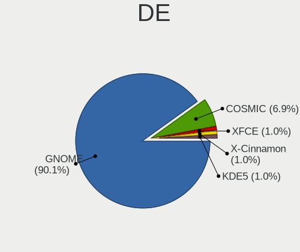
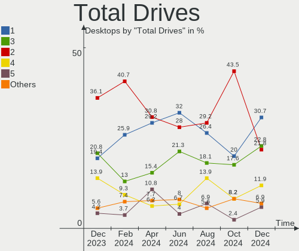
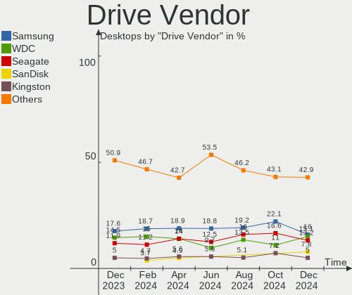
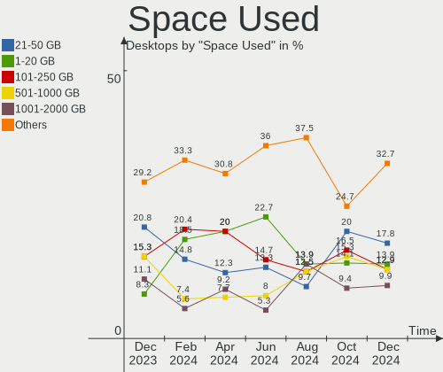
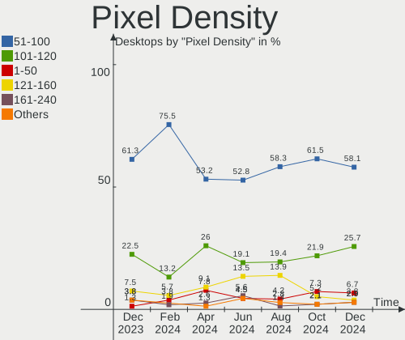
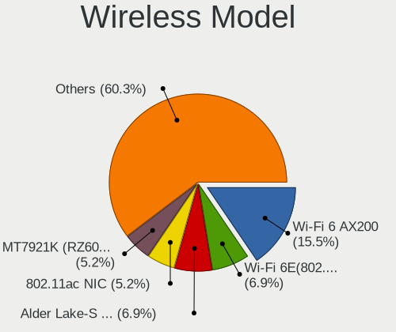

Pop!_OS Hardware Trends (Desktops)
----------------------------------

A project to identify most popular hardware characteristics and track their change
over time based on data collected by Pop!_OS users at https://Linux-Hardware.org.

Anyone can contribute to this report by the [hw-probe](https://github.com/linuxhw/hw-probe) tool:

    sudo -E hw-probe -all -upload

Full-feature report is available here: https://linux-hardware.org/?view=trends&formfactor=desktop

Period: Aug, 2021.

Contents
--------

* [ System ](#system)
  - [ OS                       ](#os)
  - [ OS Family                ](#os-family)
  - [ Kernel                   ](#kernel)
  - [ Kernel Family            ](#kernel-family)
  - [ Kernel Major Ver.        ](#kernel-major-ver)
  - [ Arch                     ](#arch)
  - [ DE                       ](#de)
  - [ Display Server           ](#display-server)
  - [ Display Manager          ](#display-manager)
  - [ OS Lang                  ](#os-lang)
  - [ Boot Mode                ](#boot-mode)
  - [ Filesystem               ](#filesystem)
  - [ Part. scheme             ](#part-scheme)
  - [ Dual Boot with Linux/BSD ](#dual-boot-with-linuxbsd)
  - [ Dual Boot (Win)          ](#dual-boot-win)

* [ Board ](#board)
  - [ Vendor                   ](#vendor)
  - [ Model                    ](#model)
  - [ Model Family             ](#model-family)
  - [ MFG Year                 ](#mfg-year)
  - [ Form Factor              ](#form-factor)
  - [ Secure Boot              ](#secure-boot)
  - [ Coreboot                 ](#coreboot)
  - [ RAM Size                 ](#ram-size)
  - [ RAM Used                 ](#ram-used)
  - [ Total Drives             ](#total-drives)
  - [ Has CD-ROM               ](#has-cd-rom)
  - [ Has Ethernet             ](#has-ethernet)
  - [ Has WiFi                 ](#has-wifi)
  - [ Has Bluetooth            ](#has-bluetooth)

* [ Location ](#location)
  - [ Country                  ](#country)
  - [ City                     ](#city)

* [ Drives ](#drives)
  - [ Drive Vendor             ](#drive-vendor)
  - [ Drive Model              ](#drive-model)
  - [ HDD Vendor               ](#hdd-vendor)
  - [ SSD Vendor               ](#ssd-vendor)
  - [ Drive Kind               ](#drive-kind)
  - [ Drive Connector          ](#drive-connector)
  - [ Drive Size               ](#drive-size)
  - [ Space Total              ](#space-total)
  - [ Space Used               ](#space-used)
  - [ Malfunc. Drives          ](#malfunc-drives)
  - [ Malfunc. Drive Vendor    ](#malfunc-drive-vendor)
  - [ Malfunc. HDD Vendor      ](#malfunc-hdd-vendor)
  - [ Malfunc. Drive Kind      ](#malfunc-drive-kind)
  - [ Failed Drives            ](#failed-drives)
  - [ Failed Drive Vendor      ](#failed-drive-vendor)
  - [ Drive Status             ](#drive-status)

* [ Storage controller ](#storage-controller)
  - [ Storage Vendor           ](#storage-vendor)
  - [ Storage Model            ](#storage-model)
  - [ Storage Kind             ](#storage-kind)

* [ Processor ](#processor)
  - [ CPU Vendor               ](#cpu-vendor)
  - [ CPU Model                ](#cpu-model)
  - [ CPU Model Family         ](#cpu-model-family)
  - [ CPU Cores                ](#cpu-cores)
  - [ CPU Sockets              ](#cpu-sockets)
  - [ CPU Threads              ](#cpu-threads)
  - [ CPU Op-Modes             ](#cpu-op-modes)
  - [ CPU Microcode            ](#cpu-microcode)
  - [ CPU Microarch            ](#cpu-microarch)

* [ Graphics ](#graphics)
  - [ GPU Vendor               ](#gpu-vendor)
  - [ GPU Model                ](#gpu-model)
  - [ GPU Combo                ](#gpu-combo)
  - [ GPU Driver               ](#gpu-driver)
  - [ GPU Memory               ](#gpu-memory)

* [ Monitor ](#monitor)
  - [ Monitor Vendor           ](#monitor-vendor)
  - [ Monitor Model            ](#monitor-model)
  - [ Monitor Resolution       ](#monitor-resolution)
  - [ Monitor Diagonal         ](#monitor-diagonal)
  - [ Monitor Width            ](#monitor-width)
  - [ Aspect Ratio             ](#aspect-ratio)
  - [ Monitor Area             ](#monitor-area)
  - [ Pixel Density            ](#pixel-density)
  - [ Multiple Monitors        ](#multiple-monitors)

* [ Network ](#network)
  - [ Net Controller Vendor    ](#net-controller-vendor)
  - [ Net Controller Model     ](#net-controller-model)
  - [ Wireless Vendor          ](#wireless-vendor)
  - [ Wireless Model           ](#wireless-model)
  - [ Ethernet Vendor          ](#ethernet-vendor)
  - [ Ethernet Model           ](#ethernet-model)
  - [ Net Controller Kind      ](#net-controller-kind)
  - [ Used Controller          ](#used-controller)
  - [ NICs                     ](#nics)
  - [ IPv6                     ](#ipv6)

* [ Bluetooth ](#bluetooth)
  - [ Bluetooth Vendor         ](#bluetooth-vendor)
  - [ Bluetooth Model          ](#bluetooth-model)

* [ Sound ](#sound)
  - [ Sound Vendor             ](#sound-vendor)
  - [ Sound Model              ](#sound-model)

* [ Memory ](#memory)
  - [ Memory Vendor            ](#memory-vendor)
  - [ Memory Model             ](#memory-model)
  - [ Memory Kind              ](#memory-kind)
  - [ Memory Form Factor       ](#memory-form-factor)
  - [ Memory Size              ](#memory-size)
  - [ Memory Speed             ](#memory-speed)

* [ Printers & scanners ](#printers--scanners)
  - [ Printer Vendor           ](#printer-vendor)
  - [ Printer Model            ](#printer-model)
  - [ Scanner Vendor           ](#scanner-vendor)
  - [ Scanner Model            ](#scanner-model)

* [ Camera ](#camera)
  - [ Camera Vendor            ](#camera-vendor)
  - [ Camera Model             ](#camera-model)

* [ Security ](#security)
  - [ Fingerprint Vendor       ](#fingerprint-vendor)
  - [ Fingerprint Model        ](#fingerprint-model)
  - [ Chipcard Vendor          ](#chipcard-vendor)
  - [ Chipcard Model           ](#chipcard-model)

* [ Unsupported ](#unsupported)
  - [ Unsupported Devices      ](#unsupported-devices)
  - [ Unsupported Device Types ](#unsupported-device-types)

System
------

OS
--

Installed operating systems

| Name          | Desktops | Percent |
|---------------|----------|---------|
| Pop!_OS 21.04 | 156      | 84.78%  |
| Pop!_OS 20.04 | 19       | 10.33%  |
| Pop!_OS 20.10 | 9        | 4.89%   |

OS Family
---------

OS without a version

| Name    | Desktops | Percent |
|---------|----------|---------|
| Pop!_OS | 184      | 100%    |

Kernel
------

Version of the Linux kernel

| Version             | Desktops | Percent |
|---------------------|----------|---------|
| 5.11.0-7620-generic | 178      | 96.74%  |
| 5.11.0-7612-generic | 2        | 1.09%   |
| 5.8.0-7630-generic  | 1        | 0.54%   |
| 5.13.12-xanmod1     | 1        | 0.54%   |
| 5.12.14-xanmod1     | 1        | 0.54%   |
| 5.11.0-7614-generic | 1        | 0.54%   |

Kernel Family
-------------

Linux kernel without a distro release

| Version | Desktops | Percent |
|---------|----------|---------|
| 5.11.0  | 181      | 98.37%  |
| 5.8.0   | 1        | 0.54%   |
| 5.13.12 | 1        | 0.54%   |
| 5.12.14 | 1        | 0.54%   |

Kernel Major Ver.
-----------------

Linux kernel major version

| Version | Desktops | Percent |
|---------|----------|---------|
| 5.11    | 181      | 98.37%  |
| 5.8     | 1        | 0.54%   |
| 5.13    | 1        | 0.54%   |
| 5.12    | 1        | 0.54%   |

Arch
----

OS architecture (x86_64, i586, etc.)

| Name   | Desktops | Percent |
|--------|----------|---------|
| x86_64 | 184      | 100%    |

DE
--

Desktop Environment

| Name     | Desktops | Percent |
|----------|----------|---------|
| GNOME    | 180      | 97.83%  |
| KDE      | 2        | 1.09%   |
| LXQt     | 1        | 0.54%   |
| Cinnamon | 1        | 0.54%   |

Display Server
--------------

X11 or Wayland

| Name | Desktops | Percent |
|------|----------|---------|
| X11  | 183      | 99.46%  |
| Tty  | 1        | 0.54%   |

Display Manager
---------------

SDDM, LightDM, etc.

| Name    | Desktops | Percent |
|---------|----------|---------|
| Unknown | 164      | 89.13%  |
| GDM     | 20       | 10.87%  |

OS Lang
-------

Language

| Lang  | Desktops | Percent |
|-------|----------|---------|
| en_US | 101      | 54.89%  |
| pt_BR | 19       | 10.33%  |
| en_GB | 13       | 7.07%   |
| de_DE | 9        | 4.89%   |
| en_AU | 8        | 4.35%   |
| en_CA | 7        | 3.8%    |
| fr_FR | 3        | 1.63%   |
| C     | 3        | 1.63%   |
| sv_SE | 2        | 1.09%   |
| pl_PL | 2        | 1.09%   |
| it_IT | 2        | 1.09%   |
| zh_TW | 1        | 0.54%   |
| ru_RU | 1        | 0.54%   |
| pt_PT | 1        | 0.54%   |
| nl_NL | 1        | 0.54%   |
| nl_BE | 1        | 0.54%   |
| nb_NO | 1        | 0.54%   |
| lv_LV | 1        | 0.54%   |
| hr_HR | 1        | 0.54%   |
| fr_CA | 1        | 0.54%   |
| fi_FI | 1        | 0.54%   |
| es_MX | 1        | 0.54%   |
| es_CR | 1        | 0.54%   |
| en_NZ | 1        | 0.54%   |
| el_GR | 1        | 0.54%   |
| da_DK | 1        | 0.54%   |

Boot Mode
---------

EFI or BIOS

| Mode | Desktops | Percent |
|------|----------|---------|
| BIOS | 170      | 92.39%  |
| EFI  | 14       | 7.61%   |

Filesystem
----------

Type of filesystem

| Type    | Desktops | Percent |
|---------|----------|---------|
| Ext4    | 182      | 98.91%  |
| Overlay | 1        | 0.54%   |
| Btrfs   | 1        | 0.54%   |

Part. scheme
------------

Scheme of partitioning

| Type    | Desktops | Percent |
|---------|----------|---------|
| Unknown | 164      | 89.13%  |
| GPT     | 15       | 8.15%   |
| MBR     | 5        | 2.72%   |

Dual Boot with Linux/BSD
------------------------

Hosting more than one Linux/BSD

| Dual boot | Desktops | Percent |
|-----------|----------|---------|
| No        | 180      | 97.83%  |
| Yes       | 4        | 2.17%   |

Dual Boot (Win)
---------------

Hosting Linux and Windows

| Dual boot | Desktops | Percent |
|-----------|----------|---------|
| No        | 173      | 94.02%  |
| Yes       | 11       | 5.98%   |

Board
-----

Vendor
------

Motherboard manufacturer

| Name                | Desktops | Percent |
|---------------------|----------|---------|
| ASUSTek Computer    | 44       | 23.91%  |
| MSI                 | 36       | 19.57%  |
| Gigabyte Technology | 33       | 17.93%  |
| ASRock              | 24       | 13.04%  |
| Dell                | 18       | 9.78%   |
| Hewlett-Packard     | 7        | 3.8%    |
| Lenovo              | 4        | 2.17%   |
| Acer                | 3        | 1.63%   |
| System76            | 2        | 1.09%   |
| Pegatron            | 2        | 1.09%   |
| Intel               | 2        | 1.09%   |
| Alienware           | 2        | 1.09%   |
| Positivo            | 1        | 0.54%   |
| PCWare              | 1        | 0.54%   |
| Medion              | 1        | 0.54%   |
| Login Informatica   | 1        | 0.54%   |
| Foxconn             | 1        | 0.54%   |
| EVGA                | 1        | 0.54%   |
| Unknown             | 1        | 0.54%   |

Model
-----

Motherboard model

| Name                                                         | Desktops | Percent |
|--------------------------------------------------------------|----------|---------|
| Gigabyte A320M-S2H                                           | 4        | 2.17%   |
| ASUS All Series                                              | 4        | 2.17%   |
| ASUS TUF GAMING X570-PLUS                                    | 3        | 1.63%   |
| MSI MS-7C84                                                  | 2        | 1.09%   |
| MSI MS-7C56                                                  | 2        | 1.09%   |
| MSI MS-7C37                                                  | 2        | 1.09%   |
| MSI MS-7B86                                                  | 2        | 1.09%   |
| MSI MS-7B48                                                  | 2        | 1.09%   |
| Gigabyte X570 AORUS ULTRA                                    | 2        | 1.09%   |
| Gigabyte X570 AORUS ELITE                                    | 2        | 1.09%   |
| Gigabyte B550 AORUS MASTER                                   | 2        | 1.09%   |
| Dell XPS 8300                                                | 2        | 1.09%   |
| Dell Precision WorkStation T3500                             | 2        | 1.09%   |
| Dell OptiPlex 9020                                           | 2        | 1.09%   |
| Dell OptiPlex 755                                            | 2        | 1.09%   |
| ASUS ROG STRIX B450-F GAMING                                 | 2        | 1.09%   |
| ASUS Rampage IV EXTREME                                      | 2        | 1.09%   |
| ASUS PRIME B450M-K                                           | 2        | 1.09%   |
| ASUS CROSSHAIR V FORMULA-Z                                   | 2        | 1.09%   |
| ASRock B450M Steel Legend                                    | 2        | 1.09%   |
| ASRock A55M-HVS                                              | 2        | 1.09%   |
| System76 Thelio Major                                        | 1        | 0.54%   |
| System76 Thelio                                              | 1        | 0.54%   |
| Positivo POS-EIH61CR                                         | 1        | 0.54%   |
| Pegatron IPMH61P1                                            | 1        | 0.54%   |
| Pegatron FK574AA-A2L a6652f                                  | 1        | 0.54%   |
| PCWare IPX1800E1                                             | 1        | 0.54%   |
| MSI Z270 GAMING M3                                           | 1        | 0.54%   |
| MSI p7-1414                                                  | 1        | 0.54%   |
| MSI MS-7D09                                                  | 1        | 0.54%   |
| MSI MS-7C96                                                  | 1        | 0.54%   |
| MSI MS-7C88                                                  | 1        | 0.54%   |
| MSI MS-7C83                                                  | 1        | 0.54%   |
| MSI MS-7B93                                                  | 1        | 0.54%   |
| MSI MS-7B87                                                  | 1        | 0.54%   |
| MSI MS-7B78                                                  | 1        | 0.54%   |
| MSI MS-7B51                                                  | 1        | 0.54%   |
| MSI MS-7B09                                                  | 1        | 0.54%   |
| MSI MS-7B07                                                  | 1        | 0.54%   |
| MSI MS-7A72                                                  | 1        | 0.54%   |
| MSI MS-7A63                                                  | 1        | 0.54%   |
| MSI MS-7A38                                                  | 1        | 0.54%   |
| MSI MS-7984                                                  | 1        | 0.54%   |
| MSI MS-7918                                                  | 1        | 0.54%   |
| MSI MS-7915                                                  | 1        | 0.54%   |
| MSI MS-7914                                                  | 1        | 0.54%   |
| MSI MS-7851                                                  | 1        | 0.54%   |
| MSI MS-7751                                                  | 1        | 0.54%   |
| MSI MS-7693                                                  | 1        | 0.54%   |
| MSI MS-7592                                                  | 1        | 0.54%   |
| MSI MS-7309                                                  | 1        | 0.54%   |
| MSI MS-7228                                                  | 1        | 0.54%   |
| MSI Cubi N 8GL (MS-B171)                                     | 1        | 0.54%   |
| Medion MD34070/2534                                          | 1        | 0.54%   |
| Login Informatica H61H2-M12                                  | 1        | 0.54%   |
| Lenovo ThinkStation XXXX 41R5585                             | 1        | 0.54%   |
| Lenovo ThinkCentre M900 10FLS45400                           | 1        | 0.54%   |
| Lenovo ThinkCentre M83 10AN0015AU                            | 1        | 0.54%   |
| Lenovo IdeaCentre K330B                                      | 1        | 0.54%   |
| Intel X79 (INTEL Xeon E5/Corei7 DMI2 - C600/C200 Cipset V307 | 1        | 0.54%   |

Model Family
------------

Motherboard model prefix

| Name                        | Desktops | Percent |
|-----------------------------|----------|---------|
| Dell OptiPlex               | 9        | 4.89%   |
| ASUS ROG                    | 8        | 4.35%   |
| ASUS PRIME                  | 8        | 4.35%   |
| ASUS TUF                    | 7        | 3.8%    |
| Dell Precision              | 5        | 2.72%   |
| Gigabyte X570               | 4        | 2.17%   |
| Gigabyte B450               | 4        | 2.17%   |
| Gigabyte A320M-S2H          | 4        | 2.17%   |
| ASUS All                    | 4        | 2.17%   |
| HP Compaq                   | 3        | 1.63%   |
| Gigabyte B550               | 3        | 1.63%   |
| Dell XPS                    | 3        | 1.63%   |
| ASUS CROSSHAIR              | 3        | 1.63%   |
| ASRock B450M                | 3        | 1.63%   |
| System76 Thelio             | 2        | 1.09%   |
| MSI MS-7C84                 | 2        | 1.09%   |
| MSI MS-7C56                 | 2        | 1.09%   |
| MSI MS-7C37                 | 2        | 1.09%   |
| MSI MS-7B86                 | 2        | 1.09%   |
| MSI MS-7B48                 | 2        | 1.09%   |
| Lenovo ThinkCentre          | 2        | 1.09%   |
| ASUS Rampage                | 2        | 1.09%   |
| ASRock A55M-HVS             | 2        | 1.09%   |
| Acer Aspire                 | 2        | 1.09%   |
| Positivo POS-EIH61CR        | 1        | 0.54%   |
| Pegatron IPMH61P1           | 1        | 0.54%   |
| Pegatron FK574AA-A2L        | 1        | 0.54%   |
| PCWare IPX1800E1            | 1        | 0.54%   |
| MSI Z270                    | 1        | 0.54%   |
| MSI p7-1414                 | 1        | 0.54%   |
| MSI MS-7D09                 | 1        | 0.54%   |
| MSI MS-7C96                 | 1        | 0.54%   |
| MSI MS-7C88                 | 1        | 0.54%   |
| MSI MS-7C83                 | 1        | 0.54%   |
| MSI MS-7B93                 | 1        | 0.54%   |
| MSI MS-7B87                 | 1        | 0.54%   |
| MSI MS-7B78                 | 1        | 0.54%   |
| MSI MS-7B51                 | 1        | 0.54%   |
| MSI MS-7B09                 | 1        | 0.54%   |
| MSI MS-7B07                 | 1        | 0.54%   |
| MSI MS-7A72                 | 1        | 0.54%   |
| MSI MS-7A63                 | 1        | 0.54%   |
| MSI MS-7A38                 | 1        | 0.54%   |
| MSI MS-7984                 | 1        | 0.54%   |
| MSI MS-7918                 | 1        | 0.54%   |
| MSI MS-7915                 | 1        | 0.54%   |
| MSI MS-7914                 | 1        | 0.54%   |
| MSI MS-7851                 | 1        | 0.54%   |
| MSI MS-7751                 | 1        | 0.54%   |
| MSI MS-7693                 | 1        | 0.54%   |
| MSI MS-7592                 | 1        | 0.54%   |
| MSI MS-7309                 | 1        | 0.54%   |
| MSI MS-7228                 | 1        | 0.54%   |
| MSI Cubi                    | 1        | 0.54%   |
| Medion MD34070              | 1        | 0.54%   |
| Login Informatica H61H2-M12 | 1        | 0.54%   |
| Lenovo ThinkStation         | 1        | 0.54%   |
| Lenovo IdeaCentre           | 1        | 0.54%   |
| Intel X79                   | 1        | 0.54%   |
| Intel DG31PR                | 1        | 0.54%   |

MFG Year
--------

Motherboard manufacture year

| Year | Desktops | Percent |
|------|----------|---------|
| 2020 | 33       | 17.93%  |
| 2021 | 29       | 15.76%  |
| 2019 | 20       | 10.87%  |
| 2018 | 17       | 9.24%   |
| 2012 | 13       | 7.07%   |
| 2014 | 12       | 6.52%   |
| 2011 | 12       | 6.52%   |
| 2013 | 10       | 5.43%   |
| 2015 | 9        | 4.89%   |
| 2017 | 7        | 3.8%    |
| 2016 | 7        | 3.8%    |
| 2009 | 6        | 3.26%   |
| 2010 | 5        | 2.72%   |
| 2008 | 4        | 2.17%   |

Form Factor
-----------

Physical design of the computer

| Name    | Desktops | Percent |
|---------|----------|---------|
| Desktop | 184      | 100%    |

Secure Boot
-----------

Enabled or disabled

| State    | Desktops | Percent |
|----------|----------|---------|
| Disabled | 184      | 100%    |

Coreboot
--------

Have coreboot on board

| Used | Desktops | Percent |
|------|----------|---------|
| No   | 184      | 100%    |

RAM Size
--------

Total RAM memory

| Size in GB  | Desktops | Percent |
|-------------|----------|---------|
| 16.01-24.0  | 55       | 29.89%  |
| 32.01-64.0  | 44       | 23.91%  |
| 8.01-16.0   | 31       | 16.85%  |
| 4.01-8.0    | 20       | 10.87%  |
| 3.01-4.0    | 19       | 10.33%  |
| 24.01-32.0  | 7        | 3.8%    |
| 64.01-256.0 | 4        | 2.17%   |
| 1.01-2.0    | 4        | 2.17%   |

RAM Used
--------

Used RAM memory

| Used GB     | Desktops | Percent |
|-------------|----------|---------|
| 1.01-2.0    | 61       | 33.15%  |
| 2.01-3.0    | 51       | 27.72%  |
| 3.01-4.0    | 32       | 17.39%  |
| 4.01-8.0    | 31       | 16.85%  |
| 8.01-16.0   | 7        | 3.8%    |
| 64.01-256.0 | 1        | 0.54%   |
| 16.01-24.0  | 1        | 0.54%   |

Total Drives
------------

Number of drives on board

| Drives | Desktops | Percent |
|--------|----------|---------|
| 1      | 61       | 33.15%  |
| 2      | 60       | 32.61%  |
| 3      | 29       | 15.76%  |
| 4      | 19       | 10.33%  |
| 5      | 8        | 4.35%   |
| 7      | 3        | 1.63%   |
| 6      | 2        | 1.09%   |
| 10     | 1        | 0.54%   |
| 0      | 1        | 0.54%   |

Has CD-ROM
----------

Has CD-ROM on board

| Presented | Desktops | Percent |
|-----------|----------|---------|
| No        | 126      | 68.48%  |
| Yes       | 58       | 31.52%  |

Has Ethernet
------------

Has Ethernet on board

| Presented | Desktops | Percent |
|-----------|----------|---------|
| Yes       | 182      | 98.91%  |
| No        | 2        | 1.09%   |

Has WiFi
--------

Has WiFi module

| Presented | Desktops | Percent |
|-----------|----------|---------|
| Yes       | 95       | 51.63%  |
| No        | 89       | 48.37%  |

Has Bluetooth
-------------

Has Bluetooth module

| Presented | Desktops | Percent |
|-----------|----------|---------|
| No        | 109      | 59.24%  |
| Yes       | 75       | 40.76%  |

Location
--------

Country
-------

Geographic location (country)

| Country      | Desktops | Percent |
|--------------|----------|---------|
| USA          | 60       | 32.61%  |
| Brazil       | 23       | 12.5%   |
| Germany      | 12       | 6.52%   |
| Canada       | 11       | 5.98%   |
| UK           | 9        | 4.89%   |
| Australia    | 9        | 4.89%   |
| Netherlands  | 8        | 4.35%   |
| Sweden       | 7        | 3.8%    |
| France       | 6        | 3.26%   |
| Italy        | 4        | 2.17%   |
| Poland       | 2        | 1.09%   |
| Norway       | 2        | 1.09%   |
| Mexico       | 2        | 1.09%   |
| Finland      | 2        | 1.09%   |
| Denmark      | 2        | 1.09%   |
| Turkey       | 1        | 0.54%   |
| Thailand     | 1        | 0.54%   |
| Switzerland  | 1        | 0.54%   |
| Spain        | 1        | 0.54%   |
| South Africa | 1        | 0.54%   |
| Russia       | 1        | 0.54%   |
| Romania      | 1        | 0.54%   |
| Portugal     | 1        | 0.54%   |
| Philippines  | 1        | 0.54%   |
| Pakistan     | 1        | 0.54%   |
| New Zealand  | 1        | 0.54%   |
| Lithuania    | 1        | 0.54%   |
| Libya        | 1        | 0.54%   |
| Latvia       | 1        | 0.54%   |
| Japan        | 1        | 0.54%   |
| India        | 1        | 0.54%   |
| Greece       | 1        | 0.54%   |
| Estonia      | 1        | 0.54%   |
| Egypt        | 1        | 0.54%   |
| Czechia      | 1        | 0.54%   |
| Croatia      | 1        | 0.54%   |
| Costa Rica   | 1        | 0.54%   |
| Cambodia     | 1        | 0.54%   |
| Belgium      | 1        | 0.54%   |
| Bangladesh   | 1        | 0.54%   |

City
----

Geographic location (city)

| City                   | Desktops | Percent |
|------------------------|----------|---------|
| S??o Paulo             | 3        | 1.63%   |
| London                 | 3        | 1.63%   |
| Fortaleza              | 3        | 1.63%   |
| Wadena                 | 2        | 1.09%   |
| Porto Alegre           | 2        | 1.09%   |
| Perth                  | 2        | 1.09%   |
| Okotoks                | 2        | 1.09%   |
| Oisterwijk             | 2        | 1.09%   |
| Melbourne              | 2        | 1.09%   |
| Malmo                  | 2        | 1.09%   |
| Madison                | 2        | 1.09%   |
| Helsinki               | 2        | 1.09%   |
| Dallas                 | 2        | 1.09%   |
| Brisbane               | 2        | 1.09%   |
| Berlin                 | 2        | 1.09%   |
| Amsterdam              | 2        | 1.09%   |
| Zurich                 | 1        | 0.54%   |
| Zion                   | 1        | 0.54%   |
| Zandhoven              | 1        | 0.54%   |
| Woodbridge             | 1        | 0.54%   |
| Winnipeg               | 1        | 0.54%   |
| Westfield              | 1        | 0.54%   |
| Wausau                 | 1        | 0.54%   |
| Warsaw                 | 1        | 0.54%   |
| Virginia Beach         | 1        | 0.54%   |
| Viborg                 | 1        | 0.54%   |
| Vancouver              | 1        | 0.54%   |
| Uelversheim            | 1        | 0.54%   |
| Trois-Rivi??res        | 1        | 0.54%   |
| Tripoli                | 1        | 0.54%   |
| Thornville             | 1        | 0.54%   |
| Thessaloniki           | 1        | 0.54%   |
| Teresina               | 1        | 0.54%   |
| Tauranga               | 1        | 0.54%   |
| Tallinn                | 1        | 0.54%   |
| Sydney                 | 1        | 0.54%   |
| Surprise               | 1        | 0.54%   |
| Stralsund              | 1        | 0.54%   |
| Spokane                | 1        | 0.54%   |
| Split                  | 1        | 0.54%   |
| Seneca                 | 1        | 0.54%   |
| Scottsdale             | 1        | 0.54%   |
| S??vres                | 1        | 0.54%   |
| S??o Jos?© dos Pinhais | 1        | 0.54%   |
| Sasebo                 | 1        | 0.54%   |
| San Jos?©              | 1        | 0.54%   |
| Saldus                 | 1        | 0.54%   |
| Sainte-Marie           | 1        | 0.54%   |
| Sainte-Julie           | 1        | 0.54%   |
| Sacramento             | 1        | 0.54%   |
| Rostock                | 1        | 0.54%   |
| Rome                   | 1        | 0.54%   |
| Rio de Janeiro         | 1        | 0.54%   |
| Richmond Hill          | 1        | 0.54%   |
| Reggio Emilia          | 1        | 0.54%   |
| Radom                  | 1        | 0.54%   |
| Queens                 | 1        | 0.54%   |
| Pittsburgh             | 1        | 0.54%   |
| Phoenix                | 1        | 0.54%   |
| Phnom Penh             | 1        | 0.54%   |

Drives
------

Drive Vendor
------------

Hard drive vendors

| Vendor                    | Desktops | Drives | Percent |
|---------------------------|----------|--------|---------|
| Seagate                   | 73       | 97     | 20.86%  |
| Samsung Electronics       | 58       | 89     | 16.57%  |
| WDC                       | 56       | 66     | 16%     |
| SanDisk                   | 25       | 26     | 7.14%   |
| Kingston                  | 20       | 21     | 5.71%   |
| Crucial                   | 17       | 18     | 4.86%   |
| Toshiba                   | 16       | 19     | 4.57%   |
| Phison                    | 8        | 8      | 2.29%   |
| Silicon Motion            | 5        | 5      | 1.43%   |
| PNY                       | 5        | 5      | 1.43%   |
| Intel                     | 5        | 5      | 1.43%   |
| Hitachi                   | 5        | 8      | 1.43%   |
| A-DATA Technology         | 5        | 5      | 1.43%   |
| Unknown                   | 3        | 4      | 0.86%   |
| SPCC                      | 3        | 3      | 0.86%   |
| SK Hynix                  | 3        | 3      | 0.86%   |
| Patriot                   | 3        | 4      | 0.86%   |
| Micron/Crucial Technology | 3        | 3      | 0.86%   |
| Micron Technology         | 3        | 3      | 0.86%   |
| MAXTOR                    | 3        | 3      | 0.86%   |
| Realtek Semiconductor     | 2        | 2      | 0.57%   |
| Realtek                   | 2        | 3      | 0.57%   |
| PLEXTOR                   | 2        | 2      | 0.57%   |
| HGST                      | 2        | 2      | 0.57%   |
| Gigabyte Technology       | 2        | 2      | 0.57%   |
| Corsair                   | 2        | 2      | 0.57%   |
| China                     | 2        | 2      | 0.57%   |
| Zheino                    | 1        | 1      | 0.29%   |
| XrayDisk                  | 1        | 1      | 0.29%   |
| XPG                       | 1        | 1      | 0.29%   |
| TEXTORM                   | 1        | 1      | 0.29%   |
| Teutons                   | 1        | 1      | 0.29%   |
| Team                      | 1        | 1      | 0.29%   |
| SPCC Sol                  | 1        | 1      | 0.29%   |
| LITEONIT                  | 1        | 1      | 0.29%   |
| Lite-On                   | 1        | 1      | 0.29%   |
| JD                        | 1        | 2      | 0.29%   |
| Intenso                   | 1        | 1      | 0.29%   |
| HS-SSD-E100               | 1        | 1      | 0.29%   |
| HS-SSD-C100               | 1        | 1      | 0.29%   |
| Hikvision                 | 1        | 1      | 0.29%   |
| GOODRAM                   | 1        | 1      | 0.29%   |
| GOLDEN                    | 1        | 1      | 0.29%   |
| Apacer                    | 1        | 1      | 0.29%   |

Drive Model
-----------

Hard drive models

| Model                             | Desktops | Percent |
|-----------------------------------|----------|---------|
| Samsung SSD 850 EVO 500GB         | 10       | 2.45%   |
| Samsung NVMe SSD Drive 1TB        | 10       | 2.45%   |
| Seagate ST1000DM010-2EP102 1TB    | 7        | 1.72%   |
| Samsung NVMe SSD Drive 500GB      | 7        | 1.72%   |
| Seagate ST2000DM001-1CH164 2TB    | 6        | 1.47%   |
| Samsung SSD 860 EVO 500GB         | 6        | 1.47%   |
| Kingston SA400S37240G 240GB SSD   | 6        | 1.47%   |
| Crucial CT1000MX500SSD1 1TB       | 6        | 1.47%   |
| WDC WD10EZEX-08WN4A0 1TB          | 5        | 1.23%   |
| SanDisk SSD PLUS 240GB            | 5        | 1.23%   |
| Sandisk NVMe SSD Drive 500GB      | 5        | 1.23%   |
| Seagate ST500DM002-1BD142 500GB   | 4        | 0.98%   |
| Seagate ST2000DM008-2FR102 2TB    | 4        | 0.98%   |
| Seagate ST1000DX001-1CM162 1TB    | 4        | 0.98%   |
| Sandisk NVMe SSD Drive 1TB        | 4        | 0.98%   |
| Kingston SA400S37120G 120GB SSD   | 4        | 0.98%   |
| Crucial CT240BX500SSD1 240GB      | 4        | 0.98%   |
| WDC WD10EZEX-60WN4A0 1TB          | 3        | 0.74%   |
| Toshiba MQ01ABF050 500GB          | 3        | 0.74%   |
| Seagate ST3250310AS 250GB         | 3        | 0.74%   |
| Seagate ST3000DM001-1ER166 3TB    | 3        | 0.74%   |
| Seagate ST2000DM006-2DM164 2TB    | 3        | 0.74%   |
| SanDisk SSD PLUS 120GB            | 3        | 0.74%   |
| SanDisk SDSSDA240G 240GB          | 3        | 0.74%   |
| Samsung SSD 870 QVO 2TB           | 3        | 0.74%   |
| Samsung SSD 860 QVO 1TB           | 3        | 0.74%   |
| Samsung SSD 860 EVO 2TB           | 3        | 0.74%   |
| Samsung SSD 860 EVO 250GB         | 3        | 0.74%   |
| Samsung SSD 860 EVO 1TB           | 3        | 0.74%   |
| Samsung SSD 850 EVO 250GB         | 3        | 0.74%   |
| Samsung NVMe SSD Drive 2TB        | 3        | 0.74%   |
| Patriot Burst 120GB SSD           | 3        | 0.74%   |
| WDC WDS500G2B0A-00SM50 500GB SSD  | 2        | 0.49%   |
| WDC WD800JD-75MSA2 80GB           | 2        | 0.49%   |
| WDC WD40EZRZ-00GXCB0 4TB          | 2        | 0.49%   |
| WDC WD10EZEX-60WN4A1 1TB          | 2        | 0.49%   |
| WDC WD1003FZEX-00MK2A0 1TB        | 2        | 0.49%   |
| Toshiba DT01ACA200 2TB            | 2        | 0.49%   |
| Toshiba DT01ACA050 500GB          | 2        | 0.49%   |
| Seagate ST4000DM000-1F2168 4TB    | 2        | 0.49%   |
| Seagate ST3250318AS 250GB         | 2        | 0.49%   |
| Seagate ST2000DM001-1ER164 2TB    | 2        | 0.49%   |
| Seagate ST1000LM035-1RK172 1TB    | 2        | 0.49%   |
| Seagate ST1000DM003-1ER162 1TB    | 2        | 0.49%   |
| Seagate Expansion Desk 8TB        | 2        | 0.49%   |
| Seagate Expansion 2TB             | 2        | 0.49%   |
| Samsung SSD 970 EVO Plus 1TB      | 2        | 0.49%   |
| Samsung SSD 870 EVO 250GB         | 2        | 0.49%   |
| Samsung SSD 850 EVO 1TB           | 2        | 0.49%   |
| Samsung SSD 840 PRO Series 256GB  | 2        | 0.49%   |
| Samsung NVMe SSD Drive 250GB      | 2        | 0.49%   |
| PNY CS900 240GB SSD               | 2        | 0.49%   |
| Phison NVMe SSD Drive 1TB         | 2        | 0.49%   |
| Phison NVMe SSD Drive 1024GB      | 2        | 0.49%   |
| Micron/Crucial NVMe SSD Drive 1TB | 2        | 0.49%   |
| Micron NVMe SSD Drive 250GB       | 2        | 0.49%   |
| Kingston SV300S37A240G 240GB SSD  | 2        | 0.49%   |
| Kingston NVMe SSD Drive 1TB       | 2        | 0.49%   |
| Intel NVMe SSD Drive 512GB        | 2        | 0.49%   |
| Crucial CT120BX500SSD1 120GB      | 2        | 0.49%   |

HDD Vendor
----------

Hard disk drive vendors

| Vendor              | Desktops | Drives | Percent |
|---------------------|----------|--------|---------|
| Seagate             | 71       | 93     | 47.02%  |
| WDC                 | 51       | 60     | 33.77%  |
| Toshiba             | 15       | 17     | 9.93%   |
| Samsung Electronics | 5        | 5      | 3.31%   |
| Hitachi             | 5        | 8      | 3.31%   |
| MAXTOR              | 2        | 2      | 1.32%   |
| HGST                | 2        | 2      | 1.32%   |

SSD Vendor
----------

Solid state drive vendors

| Vendor              | Desktops | Drives | Percent |
|---------------------|----------|--------|---------|
| Samsung Electronics | 36       | 56     | 28.13%  |
| Kingston            | 17       | 18     | 13.28%  |
| SanDisk             | 16       | 17     | 12.5%   |
| Crucial             | 15       | 15     | 11.72%  |
| WDC                 | 5        | 6      | 3.91%   |
| PNY                 | 5        | 5      | 3.91%   |
| A-DATA Technology   | 5        | 5      | 3.91%   |
| SK Hynix            | 3        | 3      | 2.34%   |
| Patriot             | 3        | 4      | 2.34%   |
| SPCC                | 2        | 2      | 1.56%   |
| PLEXTOR             | 2        | 2      | 1.56%   |
| Gigabyte Technology | 2        | 2      | 1.56%   |
| China               | 2        | 2      | 1.56%   |
| Unknown             | 1        | 1      | 0.78%   |
| Toshiba             | 1        | 1      | 0.78%   |
| Teutons             | 1        | 1      | 0.78%   |
| Team                | 1        | 1      | 0.78%   |
| SPCC Sol            | 1        | 1      | 0.78%   |
| Seagate             | 1        | 1      | 0.78%   |
| Micron Technology   | 1        | 1      | 0.78%   |
| Maxtor              | 1        | 1      | 0.78%   |
| LITEONIT            | 1        | 1      | 0.78%   |
| JD                  | 1        | 1      | 0.78%   |
| Intenso             | 1        | 1      | 0.78%   |
| Hikvision           | 1        | 1      | 0.78%   |
| GOODRAM             | 1        | 1      | 0.78%   |
| Corsair             | 1        | 1      | 0.78%   |
| Apacer              | 1        | 1      | 0.78%   |

Drive Kind
----------

HDD or SSD

| Kind    | Desktops | Drives | Percent |
|---------|----------|--------|---------|
| HDD     | 125      | 187    | 41.95%  |
| SSD     | 104      | 152    | 34.9%   |
| NVMe    | 59       | 76     | 19.8%   |
| Unknown | 10       | 13     | 3.36%   |

Drive Connector
---------------

SATA, SAS, NVMe, etc.

| Type | Desktops | Drives | Percent |
|------|----------|--------|---------|
| SATA | 167      | 340    | 70.46%  |
| NVMe | 59       | 75     | 24.89%  |
| SAS  | 11       | 13     | 4.64%   |

Drive Size
----------

Size of hard drive

| Size in TB | Desktops | Drives | Percent |
|------------|----------|--------|---------|
| 0.01-0.5   | 120      | 168    | 46.88%  |
| 0.51-1.0   | 76       | 90     | 29.69%  |
| 1.01-2.0   | 36       | 48     | 14.06%  |
| 3.01-4.0   | 8        | 16     | 3.13%   |
| 4.01-10.0  | 8        | 9      | 3.13%   |
| 2.01-3.0   | 7        | 7      | 2.73%   |
| 10.01-20.0 | 1        | 1      | 0.39%   |

Space Total
-----------

Amount of disk space available on the file system

| Size in GB     | Desktops | Percent |
|----------------|----------|---------|
| 251-500        | 43       | 23.37%  |
| 101-250        | 43       | 23.37%  |
| 501-1000       | 35       | 19.02%  |
| 1001-2000      | 25       | 13.59%  |
| More than 3000 | 17       | 9.24%   |
| 2001-3000      | 9        | 4.89%   |
| 51-100         | 8        | 4.35%   |
| 21-50          | 2        | 1.09%   |
| 1-20           | 2        | 1.09%   |

Space Used
----------

Amount of used disk space

| Used GB        | Desktops | Percent |
|----------------|----------|---------|
| 1-20           | 64       | 34.78%  |
| 21-50          | 31       | 16.85%  |
| 101-250        | 25       | 13.59%  |
| 51-100         | 17       | 9.24%   |
| 501-1000       | 14       | 7.61%   |
| 1001-2000      | 12       | 6.52%   |
| 251-500        | 10       | 5.43%   |
| More than 3000 | 9        | 4.89%   |
| 2001-3000      | 2        | 1.09%   |

Malfunc. Drives
---------------

Drive models with a malfunction

| Model                             | Desktops | Drives | Percent |
|-----------------------------------|----------|--------|---------|
| WDC WD10EZEX-60WN4A0 1TB          | 1        | 1      | 11.11%  |
| Seagate ST500DM002-1BC142 500GB   | 1        | 1      | 11.11%  |
| Seagate ST4000DM000-1F2168 4TB    | 1        | 1      | 11.11%  |
| Seagate ST3400832AS 400GB         | 1        | 1      | 11.11%  |
| Seagate ST3160318AS 160GB         | 1        | 1      | 11.11%  |
| Seagate ST1000DX001-1CM162 1TB    | 1        | 1      | 11.11%  |
| SanDisk SSD PLUS 240GB            | 1        | 1      | 11.11%  |
| Samsung Electronics HD502HI 500GB | 1        | 1      | 11.11%  |
| HGST HTS541010A9E680 1TB          | 1        | 1      | 11.11%  |

Malfunc. Drive Vendor
---------------------

Vendors of faulty drives

| Vendor              | Desktops | Drives | Percent |
|---------------------|----------|--------|---------|
| Seagate             | 4        | 5      | 50%     |
| WDC                 | 1        | 1      | 12.5%   |
| SanDisk             | 1        | 1      | 12.5%   |
| Samsung Electronics | 1        | 1      | 12.5%   |
| HGST                | 1        | 1      | 12.5%   |

Malfunc. HDD Vendor
-------------------

Vendors of faulty HDD drives

| Vendor              | Desktops | Drives | Percent |
|---------------------|----------|--------|---------|
| Seagate             | 4        | 5      | 57.14%  |
| WDC                 | 1        | 1      | 14.29%  |
| Samsung Electronics | 1        | 1      | 14.29%  |
| HGST                | 1        | 1      | 14.29%  |

Malfunc. Drive Kind
-------------------

Kinds of faulty drives

| Kind | Desktops | Drives | Percent |
|------|----------|--------|---------|
| HDD  | 6        | 8      | 85.71%  |
| SSD  | 1        | 1      | 14.29%  |

Failed Drives
-------------

Failed drive models

Zero info for selected period =(

Failed Drive Vendor
-------------------

Failed drive vendors

Zero info for selected period =(

Drive Status
------------

Number of failed and malfunc. drives

| Status   | Desktops | Drives | Percent |
|----------|----------|--------|---------|
| Detected | 165      | 375    | 85.94%  |
| Works    | 20       | 44     | 10.42%  |
| Malfunc  | 7        | 9      | 3.65%   |

Storage controller
------------------

Storage Vendor
--------------

Storage controller vendors

| Vendor                       | Desktops | Percent |
|------------------------------|----------|---------|
| Intel                        | 95       | 34.42%  |
| AMD                          | 85       | 30.8%   |
| Samsung Electronics          | 27       | 9.78%   |
| ASMedia Technology           | 15       | 5.43%   |
| Phison Electronics           | 10       | 3.62%   |
| Sandisk                      | 9        | 3.26%   |
| Nvidia                       | 6        | 2.17%   |
| Silicon Motion               | 5        | 1.81%   |
| Micron/Crucial Technology    | 4        | 1.45%   |
| JMicron Technology           | 4        | 1.45%   |
| Micron Technology            | 3        | 1.09%   |
| Kingston Technology Company  | 3        | 1.09%   |
| Realtek Semiconductor        | 2        | 0.72%   |
| Marvell Technology Group     | 2        | 0.72%   |
| LSI Logic / Symbios Logic    | 2        | 0.72%   |
| Toshiba America Info Systems | 1        | 0.36%   |
| Seagate Technology           | 1        | 0.36%   |
| Lite-On Technology           | 1        | 0.36%   |
| ADATA Technology             | 1        | 0.36%   |

Storage Model
-------------

Storage controller models

| Model                                                                                   | Desktops | Percent |
|-----------------------------------------------------------------------------------------|----------|---------|
| AMD FCH SATA Controller [AHCI mode]                                                     | 49       | 14.37%  |
| AMD 400 Series Chipset SATA Controller                                                  | 25       | 7.33%   |
| Samsung NVMe SSD Controller SM981/PM981/PM983                                           | 17       | 4.99%   |
| Intel 8 Series/C220 Series Chipset Family 6-port SATA Controller 1 [AHCI mode]          | 15       | 4.4%    |
| ASMedia ASM1062 Serial ATA Controller                                                   | 14       | 4.11%   |
| AMD Starship/Matisse Chipset SATA Controller [AHCI mode]                                | 14       | 4.11%   |
| Intel 6 Series/C200 Series Chipset Family 6 port Desktop SATA AHCI Controller           | 10       | 2.93%   |
| AMD SB7x0/SB8x0/SB9x0 SATA Controller [AHCI mode]                                       | 8        | 2.35%   |
| Intel SATA Controller [RAID mode]                                                       | 7        | 2.05%   |
| Intel Q170/Q150/B150/H170/H110/Z170/CM236 Chipset SATA Controller [AHCI Mode]           | 6        | 1.76%   |
| Intel Cannon Lake PCH SATA AHCI Controller                                              | 6        | 1.76%   |
| Intel 200 Series PCH SATA controller [AHCI mode]                                        | 6        | 1.76%   |
| AMD SB7x0/SB8x0/SB9x0 IDE Controller                                                    | 6        | 1.76%   |
| AMD FCH SATA Controller D                                                               | 6        | 1.76%   |
| Samsung NVMe SSD Controller SM961/PM961/SM963                                           | 5        | 1.47%   |
| Phison E12 NVMe Controller                                                              | 5        | 1.47%   |
| Intel NM10/ICH7 Family SATA Controller [IDE mode]                                       | 5        | 1.47%   |
| Silicon Motion SM2263EN/SM2263XT SSD Controller                                         | 4        | 1.17%   |
| Sandisk WD Black SN750 / PC SN730 NVMe SSD                                              | 4        | 1.17%   |
| Samsung NVMe SSD Controller PM9A1/PM9A3/980PRO                                          | 4        | 1.17%   |
| Nvidia MCP61 SATA Controller                                                            | 4        | 1.17%   |
| Nvidia MCP61 IDE                                                                        | 4        | 1.17%   |
| Intel SSD 660P Series                                                                   | 4        | 1.17%   |
| Intel 9 Series Chipset Family SATA Controller [AHCI Mode]                               | 4        | 1.17%   |
| Intel 82801JI (ICH10 Family) SATA AHCI Controller                                       | 4        | 1.17%   |
| Intel 82801JI (ICH10 Family) 4 port SATA IDE Controller #1                              | 4        | 1.17%   |
| Intel 82801JI (ICH10 Family) 2 port SATA IDE Controller #2                              | 4        | 1.17%   |
| Intel 82801IR/IO/IH (ICH9R/DO/DH) 6 port SATA Controller [AHCI mode]                    | 4        | 1.17%   |
| Intel 82801G (ICH7 Family) IDE Controller                                               | 4        | 1.17%   |
| Intel 7 Series/C210 Series Chipset Family 6-port SATA Controller [AHCI mode]            | 4        | 1.17%   |
| Phison E16 PCIe4 NVMe Controller                                                        | 3        | 0.88%   |
| Micron Non-Volatile memory controller                                                   | 3        | 0.88%   |
| AMD X370 Series Chipset SATA Controller                                                 | 3        | 0.88%   |
| AMD SB7x0/SB8x0/SB9x0 SATA Controller [IDE mode]                                        | 3        | 0.88%   |
| AMD 300 Series Chipset SATA Controller                                                  | 3        | 0.88%   |
| Sandisk WD Blue SN550 NVMe SSD                                                          | 2        | 0.59%   |
| Sandisk WD Black 2018/SN750 / PC SN720 NVMe SSD                                         | 2        | 0.59%   |
| Realtek Realtek Non-Volatile memory controller                                          | 2        | 0.59%   |
| Phison PS5013 E13 NVMe Controller                                                       | 2        | 0.59%   |
| Marvell Group 88SE91A3 SATA-600 Controller                                              | 2        | 0.59%   |
| LSI Logic / Symbios Logic SAS1068E PCI-Express Fusion-MPT SAS                           | 2        | 0.59%   |
| Kingston Company A2000 NVMe SSD                                                         | 2        | 0.59%   |
| JMicron JMB363 SATA/IDE Controller                                                      | 2        | 0.59%   |
| JMicron JMB362 SATA Controller                                                          | 2        | 0.59%   |
| Intel C600/X79 series chipset 6-Port SATA AHCI Controller                               | 2        | 0.59%   |
| Intel 7 Series/C210 Series Chipset Family 4-port SATA Controller [IDE mode]             | 2        | 0.59%   |
| Intel 7 Series/C210 Series Chipset Family 2-port SATA Controller [IDE mode]             | 2        | 0.59%   |
| Intel 6 Series/C200 Series Chipset Family Desktop SATA Controller (IDE mode, ports 4-5) | 2        | 0.59%   |
| Intel 6 Series/C200 Series Chipset Family Desktop SATA Controller (IDE mode, ports 0-3) | 2        | 0.59%   |
| Intel 500 Series Chipset Family SATA AHCI Controller                                    | 2        | 0.59%   |
| AMD FCH SATA Controller [IDE mode]                                                      | 2        | 0.59%   |
| AMD FCH IDE Controller                                                                  | 2        | 0.59%   |
| Toshiba America Info Systems XG4 NVMe SSD Controller                                    | 1        | 0.29%   |
| Silicon Motion SM2262/SM2262EN SSD Controller                                           | 1        | 0.29%   |
| Seagate FireCuda 520 SSD                                                                | 1        | 0.29%   |
| Sandisk WD Black SN850                                                                  | 1        | 0.29%   |
| Samsung NVMe Controller                                                                 | 1        | 0.29%   |
| Nvidia MCP78S [GeForce 8200] IDE                                                        | 1        | 0.29%   |
| Nvidia MCP78S [GeForce 8200] AHCI Controller                                            | 1        | 0.29%   |
| Nvidia MCP51 Serial ATA Controller                                                      | 1        | 0.29%   |

Storage Kind
------------

Kind of storage controller (IDE, SATA, NVMe, SAS, ...)

| Kind | Desktops | Percent |
|------|----------|---------|
| SATA | 157      | 60.15%  |
| NVMe | 59       | 22.61%  |
| IDE  | 33       | 12.64%  |
| RAID | 10       | 3.83%   |
| SCSI | 2        | 0.77%   |

Processor
---------

CPU Vendor
----------

Processor vendors

| Vendor | Desktops | Percent |
|--------|----------|---------|
| Intel  | 93       | 50.54%  |
| AMD    | 91       | 49.46%  |

CPU Model
---------

Processor models

| Model                                       | Desktops | Percent |
|---------------------------------------------|----------|---------|
| AMD Ryzen 5 3600 6-Core Processor           | 19       | 10.33%  |
| AMD Ryzen 7 3700X 8-Core Processor          | 6        | 3.26%   |
| Intel Core i7-4790K CPU @ 4.00GHz           | 5        | 2.72%   |
| Intel Core i5-8400 CPU @ 2.80GHz            | 5        | 2.72%   |
| Intel Core i5-4440 CPU @ 3.10GHz            | 4        | 2.17%   |
| Intel Core i5-2400 CPU @ 3.10GHz            | 4        | 2.17%   |
| AMD Ryzen 9 5950X 16-Core Processor         | 4        | 2.17%   |
| AMD Ryzen 7 3800X 8-Core Processor          | 4        | 2.17%   |
| AMD Ryzen 5 5600X 6-Core Processor          | 4        | 2.17%   |
| AMD Ryzen 5 1600 Six-Core Processor         | 4        | 2.17%   |
| Intel Core i7-4790 CPU @ 3.60GHz            | 3        | 1.63%   |
| AMD FX-8350 Eight-Core Processor            | 3        | 1.63%   |
| AMD FX-6300 Six-Core Processor              | 3        | 1.63%   |
| Intel Core i7-4770 CPU @ 3.40GHz            | 2        | 1.09%   |
| Intel Core i7-2600 CPU @ 3.40GHz            | 2        | 1.09%   |
| Intel Core i5-7400 CPU @ 3.00GHz            | 2        | 1.09%   |
| Intel Core i5-6600K CPU @ 3.50GHz           | 2        | 1.09%   |
| Intel Core i5-3570K CPU @ 3.40GHz           | 2        | 1.09%   |
| Intel Core i5-3570 CPU @ 3.40GHz            | 2        | 1.09%   |
| Intel Core i3-8100 CPU @ 3.60GHz            | 2        | 1.09%   |
| AMD Ryzen 9 3900X 12-Core Processor         | 2        | 1.09%   |
| AMD Ryzen 7 5800X 8-Core Processor          | 2        | 1.09%   |
| AMD Ryzen 7 2700X Eight-Core Processor      | 2        | 1.09%   |
| AMD Ryzen 7 2700 Eight-Core Processor       | 2        | 1.09%   |
| AMD Ryzen 5 3600X 6-Core Processor          | 2        | 1.09%   |
| AMD Ryzen 5 3400G with Radeon Vega Graphics | 2        | 1.09%   |
| AMD A8-3870 APU with Radeon HD Graphics     | 2        | 1.09%   |
| Intel Xeon CPU X5687 @ 3.60GHz              | 1        | 0.54%   |
| Intel Xeon CPU X5660 @ 2.80GHz              | 1        | 0.54%   |
| Intel Xeon CPU X5650 @ 2.67GHz              | 1        | 0.54%   |
| Intel Xeon CPU W3690 @ 3.47GHz              | 1        | 0.54%   |
| Intel Xeon CPU W3565 @ 3.20GHz              | 1        | 0.54%   |
| Intel Xeon CPU E5607 @ 2.27GHz              | 1        | 0.54%   |
| Intel Xeon CPU E5520 @ 2.27GHz              | 1        | 0.54%   |
| Intel Xeon CPU E5-2420 v2 @ 2.20GHz         | 1        | 0.54%   |
| Intel Pentium Dual-Core CPU E5700 @ 3.00GHz | 1        | 0.54%   |
| Intel Pentium Dual-Core CPU E5500 @ 2.80GHz | 1        | 0.54%   |
| Intel Pentium Dual-Core CPU E5300 @ 2.60GHz | 1        | 0.54%   |
| Intel Pentium CPU G630 @ 2.70GHz            | 1        | 0.54%   |
| Intel Pentium CPU G4400T @ 2.90GHz          | 1        | 0.54%   |
| Intel Pentium CPU G2030 @ 3.00GHz           | 1        | 0.54%   |
| Intel Core i9-9900K CPU @ 3.60GHz           | 1        | 0.54%   |
| Intel Core i7-8700 CPU @ 3.20GHz            | 1        | 0.54%   |
| Intel Core i7-7700K CPU @ 4.20GHz           | 1        | 0.54%   |
| Intel Core i7-7700 CPU @ 3.60GHz            | 1        | 0.54%   |
| Intel Core i7-4930K CPU @ 3.40GHz           | 1        | 0.54%   |
| Intel Core i7-4770K CPU @ 3.50GHz           | 1        | 0.54%   |
| Intel Core i7-4500U CPU @ 1.80GHz           | 1        | 0.54%   |
| Intel Core i7-3960X CPU @ 3.30GHz           | 1        | 0.54%   |
| Intel Core i7-3770 CPU @ 3.40GHz            | 1        | 0.54%   |
| Intel Core i7-2600K CPU @ 3.40GHz           | 1        | 0.54%   |
| Intel Core i7-10700KF CPU @ 3.80GHz         | 1        | 0.54%   |
| Intel Core i7-10700 CPU @ 2.90GHz           | 1        | 0.54%   |
| Intel Core i7 CPU Q 740 @ 1.73GHz           | 1        | 0.54%   |
| Intel Core i7 CPU 920 @ 2.67GHz             | 1        | 0.54%   |
| Intel Core i7 CPU 860 @ 2.80GHz             | 1        | 0.54%   |
| Intel Core i5-9600K CPU @ 3.70GHz           | 1        | 0.54%   |
| Intel Core i5-7600 CPU @ 3.50GHz            | 1        | 0.54%   |
| Intel Core i5-7500 CPU @ 3.40GHz            | 1        | 0.54%   |
| Intel Core i5-6600 CPU @ 3.30GHz            | 1        | 0.54%   |

CPU Model Family
----------------

Processor model prefix

| Model                   | Desktops | Percent |
|-------------------------|----------|---------|
| Intel Core i5           | 33       | 17.93%  |
| AMD Ryzen 5             | 33       | 17.93%  |
| Intel Core i7           | 26       | 14.13%  |
| AMD Ryzen 7             | 19       | 10.33%  |
| Intel Core i3           | 9        | 4.89%   |
| Intel Xeon              | 8        | 4.35%   |
| AMD Ryzen 9             | 8        | 4.35%   |
| AMD FX                  | 7        | 3.8%    |
| Intel Core 2 Duo        | 4        | 2.17%   |
| AMD Ryzen 3             | 4        | 2.17%   |
| Intel Pentium Dual-Core | 3        | 1.63%   |
| Intel Pentium           | 3        | 1.63%   |
| Intel Core 2 Quad       | 3        | 1.63%   |
| AMD Athlon II X2        | 3        | 1.63%   |
| AMD A8                  | 3        | 1.63%   |
| Intel Celeron           | 2        | 1.09%   |
| AMD Sempron             | 2        | 1.09%   |
| AMD Ryzen Threadripper  | 2        | 1.09%   |
| AMD Phenom II X4        | 2        | 1.09%   |
| AMD Athlon              | 2        | 1.09%   |
| AMD A10                 | 2        | 1.09%   |
| Other                   | 1        | 0.54%   |
| Intel Core i9           | 1        | 0.54%   |
| AMD Phenom II X6        | 1        | 0.54%   |
| AMD Athlon X4           | 1        | 0.54%   |
| AMD Athlon II X4        | 1        | 0.54%   |
| AMD Athlon 64 X2        | 1        | 0.54%   |

CPU Cores
---------

Number of processor cores

| Number | Desktops | Percent |
|--------|----------|---------|
| 4      | 71       | 38.59%  |
| 6      | 46       | 25%     |
| 2      | 29       | 15.76%  |
| 8      | 22       | 11.96%  |
| 16     | 5        | 2.72%   |
| 12     | 4        | 2.17%   |
| 3      | 3        | 1.63%   |
| 1      | 3        | 1.63%   |
| 64     | 1        | 0.54%   |

CPU Sockets
-----------

Number of sockets

| Number | Desktops | Percent |
|--------|----------|---------|
| 1      | 184      | 100%    |

CPU Threads
-----------

Threads per core (Hyper-Threading)

| Number | Desktops | Percent |
|--------|----------|---------|
| 2      | 119      | 64.67%  |
| 1      | 65       | 35.33%  |

CPU Op-Modes
------------

CPU Operation Modes (32-bit, 64-bit)

| Op mode        | Desktops | Percent |
|----------------|----------|---------|
| 32-bit, 64-bit | 184      | 100%    |

CPU Microcode
-------------

Microcode number

| Number     | Desktops | Percent |
|------------|----------|---------|
| Unknown    | 159      | 86.41%  |
| 0x08701021 | 4        | 2.17%   |
| 0x906ea    | 3        | 1.63%   |
| 0x306a9    | 3        | 1.63%   |
| 0x506e3    | 2        | 1.09%   |
| 0xa0655    | 1        | 0.54%   |
| 0xa0653    | 1        | 0.54%   |
| 0x906ec    | 1        | 0.54%   |
| 0x906eb    | 1        | 0.54%   |
| 0x6fd      | 1        | 0.54%   |
| 0x306c3    | 1        | 0.54%   |
| 0x0a201016 | 1        | 0.54%   |
| 0x0a201009 | 1        | 0.54%   |
| 0x08701013 | 1        | 0.54%   |
| 0x0800820d | 1        | 0.54%   |
| 0x06001119 | 1        | 0.54%   |
| 0x06000852 | 1        | 0.54%   |
| 0x01000095 | 1        | 0.54%   |

CPU Microarch
-------------

Microarchitecture

| Name          | Desktops | Percent |
|---------------|----------|---------|
| Zen 2         | 37       | 20.11%  |
| Haswell       | 23       | 12.5%   |
| KabyLake      | 16       | 8.7%    |
| Zen 3         | 11       | 5.98%   |
| Zen           | 11       | 5.98%   |
| SandyBridge   | 11       | 5.98%   |
| IvyBridge     | 11       | 5.98%   |
| Piledriver    | 10       | 5.43%   |
| K10           | 9        | 4.89%   |
| Zen+          | 8        | 4.35%   |
| Penryn        | 8        | 4.35%   |
| Westmere      | 5        | 2.72%   |
| Skylake       | 5        | 2.72%   |
| Nehalem       | 5        | 2.72%   |
| CometLake     | 4        | 2.17%   |
| K8 Hammer     | 2        | 1.09%   |
| K10 Llano     | 2        | 1.09%   |
| Core          | 2        | 1.09%   |
| Silvermont    | 1        | 0.54%   |
| Goldmont plus | 1        | 0.54%   |
| Excavator     | 1        | 0.54%   |
| Unknown       | 1        | 0.54%   |

Graphics
--------

GPU Vendor
----------

Vendors of graphics cards

| Vendor | Desktops | Percent |
|--------|----------|---------|
| Nvidia | 99       | 51.03%  |
| AMD    | 62       | 31.96%  |
| Intel  | 33       | 17.01%  |

GPU Model
---------

Graphics card models

| Model                                                                       | Desktops | Percent |
|-----------------------------------------------------------------------------|----------|---------|
| AMD Ellesmere [Radeon RX 470/480/570/570X/580/580X/590]                     | 12       | 6%      |
| Intel Xeon E3-1200 v3/4th Gen Core Processor Integrated Graphics Controller | 8        | 4%      |
| AMD Navi 21 [Radeon RX 6800/6800 XT / 6900 XT]                              | 8        | 4%      |
| Nvidia GK208B [GeForce GT 710]                                              | 6        | 3%      |
| Nvidia GP104 [GeForce GTX 1080]                                             | 5        | 2.5%    |
| Nvidia GP104 [GeForce GTX 1070]                                             | 5        | 2.5%    |
| Nvidia GM204 [GeForce GTX 970]                                              | 5        | 2.5%    |
| AMD Navi 10 [Radeon RX 5600 OEM/5600 XT / 5700/5700 XT]                     | 5        | 2.5%    |
| Nvidia TU116 [GeForce GTX 1660 SUPER]                                       | 4        | 2%      |
| Nvidia TU106 [GeForce RTX 2060 Rev. A]                                      | 4        | 2%      |
| Nvidia GP106 [GeForce GTX 1060 6GB]                                         | 4        | 2%      |
| Intel 2nd Generation Core Processor Family Integrated Graphics Controller   | 4        | 2%      |
| AMD Navi 14 [Radeon RX 5500/5500M / Pro 5500M]                              | 4        | 2%      |
| Nvidia TU106 [GeForce RTX 2070]                                             | 3        | 1.5%    |
| Nvidia GT218 [GeForce 210]                                                  | 3        | 1.5%    |
| Nvidia GP107 [GeForce GTX 1050 Ti]                                          | 3        | 1.5%    |
| Nvidia GP106 [GeForce GTX 1060 3GB]                                         | 3        | 1.5%    |
| Nvidia GP102 [GeForce GTX 1080 Ti]                                          | 3        | 1.5%    |
| Nvidia GA104 [GeForce RTX 3070]                                             | 3        | 1.5%    |
| Intel HD Graphics 630                                                       | 3        | 1.5%    |
| Intel CometLake-S GT2 [UHD Graphics 630]                                    | 3        | 1.5%    |
| AMD Tahiti XT [Radeon HD 7970/8970 OEM / R9 280X]                           | 3        | 1.5%    |
| AMD Oland [Radeon HD 8570 / R5 430 OEM / R7 240/340 / Radeon 520 OEM]       | 3        | 1.5%    |
| Nvidia TU116 [GeForce GTX 1660]                                             | 2        | 1%      |
| Nvidia TU104 [GeForce RTX 2060]                                             | 2        | 1%      |
| Nvidia GP107 [GeForce GTX 1050]                                             | 2        | 1%      |
| Nvidia GM206 [GeForce GTX 960]                                              | 2        | 1%      |
| Nvidia GM200 [GeForce GTX 980 Ti]                                           | 2        | 1%      |
| Nvidia GM107 [GeForce GTX 750 Ti]                                           | 2        | 1%      |
| Nvidia GK110B [GeForce GTX TITAN Black]                                     | 2        | 1%      |
| Intel CoffeeLake-S GT2 [UHD Graphics 630]                                   | 2        | 1%      |
| Intel 82Q35 Express Integrated Graphics Controller                          | 2        | 1%      |
| Intel 82G33/G31 Express Integrated Graphics Controller                      | 2        | 1%      |
| Intel 4th Generation Core Processor Family Integrated Graphics Controller   | 2        | 1%      |
| AMD Tobago PRO [Radeon R7 360 / R9 360 OEM]                                 | 2        | 1%      |
| AMD Sumo [Radeon HD 6550D]                                                  | 2        | 1%      |
| AMD Picasso                                                                 | 2        | 1%      |
| AMD Lexa PRO [Radeon 540/540X/550/550X / RX 540X/550/550X]                  | 2        | 1%      |
| AMD Caicos [Radeon HD 6450/7450/8450 / R5 230 OEM]                          | 2        | 1%      |
| AMD Baffin [Radeon RX 550 640SP / RX 560/560X]                              | 2        | 1%      |
| Nvidia TU116 [GeForce GTX 1660 Ti]                                          | 1        | 0.5%    |
| Nvidia TU116 [GeForce GTX 1650 SUPER]                                       | 1        | 0.5%    |
| Nvidia TU106 [GeForce RTX 2070 Rev. A]                                      | 1        | 0.5%    |
| Nvidia TU106 [GeForce RTX 2060 SUPER]                                       | 1        | 0.5%    |
| Nvidia GT218 [GeForce 8400 GS Rev. 3]                                       | 1        | 0.5%    |
| Nvidia GT200 [GeForce GTX 280]                                              | 1        | 0.5%    |
| Nvidia GT200 [GeForce GTX 260]                                              | 1        | 0.5%    |
| Nvidia GP108 [GeForce GT 1030]                                              | 1        | 0.5%    |
| Nvidia GP107GL [Quadro P400]                                                | 1        | 0.5%    |
| Nvidia GP106GL [Quadro P2200]                                               | 1        | 0.5%    |
| Nvidia GP106GL [Quadro P2000]                                               | 1        | 0.5%    |
| Nvidia GP104 [GeForce GTX 1070 Ti]                                          | 1        | 0.5%    |
| Nvidia GM206 [GeForce GTX 950]                                              | 1        | 0.5%    |
| Nvidia GM204 [GeForce GTX 980]                                              | 1        | 0.5%    |
| Nvidia GM200 [GeForce GTX TITAN X]                                          | 1        | 0.5%    |
| Nvidia GM107GL [Quadro K620]                                                | 1        | 0.5%    |
| Nvidia GK208M [GeForce GT 740M]                                             | 1        | 0.5%    |
| Nvidia GK208B [GeForce GT 730]                                              | 1        | 0.5%    |
| Nvidia GK107 [GeForce GT 640]                                               | 1        | 0.5%    |
| Nvidia GK106 [GeForce GTX 650 Ti]                                           | 1        | 0.5%    |

GPU Combo
---------

Combinations of graphics cards

| Name           | Desktops | Percent |
|----------------|----------|---------|
| 1 x Nvidia     | 92       | 50%     |
| 1 x AMD        | 58       | 31.52%  |
| 1 x Intel      | 24       | 13.04%  |
| 2 x Nvidia     | 3        | 1.63%   |
| Intel + Nvidia | 3        | 1.63%   |
| 2 x AMD        | 2        | 1.09%   |
| Intel + AMD    | 1        | 0.54%   |
| AMD + Nvidia   | 1        | 0.54%   |

GPU Driver
----------

Free vs proprietary

| Driver      | Desktops | Percent |
|-------------|----------|---------|
| Free        | 97       | 52.72%  |
| Proprietary | 77       | 41.85%  |
| Unknown     | 10       | 5.43%   |

GPU Memory
----------

Total video memory

| Size in GB | Desktops | Percent |
|------------|----------|---------|
| Unknown    | 104      | 56.52%  |
| 7.01-8.0   | 22       | 11.96%  |
| 5.01-6.0   | 19       | 10.33%  |
| 3.01-4.0   | 13       | 7.07%   |
| 1.01-2.0   | 13       | 7.07%   |
| 8.01-16.0  | 5        | 2.72%   |
| 0.51-1.0   | 5        | 2.72%   |
| 4.01-5.0   | 2        | 1.09%   |
| 2.01-3.0   | 1        | 0.54%   |

Monitor
-------

Monitor Vendor
--------------

Monitor vendors

| Vendor               | Desktops | Percent |
|----------------------|----------|---------|
| Samsung Electronics  | 33       | 16.5%   |
| Goldstar             | 25       | 12.5%   |
| Acer                 | 20       | 10%     |
| Dell                 | 17       | 8.5%    |
| AOC                  | 11       | 5.5%    |
| Hewlett-Packard      | 10       | 5%      |
| Philips              | 9        | 4.5%    |
| Ancor Communications | 8        | 4%      |
| ASUSTek Computer     | 7        | 3.5%    |
| Sceptre Tech         | 5        | 2.5%    |
| MSI                  | 5        | 2.5%    |
| Iiyama               | 5        | 2.5%    |
| BenQ                 | 5        | 2.5%    |
| ViewSonic            | 4        | 2%      |
| Lenovo               | 3        | 1.5%    |
| Vizio                | 2        | 1%      |
| Unknown (XXX)        | 2        | 1%      |
| Unknown              | 2        | 1%      |
| Toshiba              | 2        | 1%      |
| Sony                 | 2        | 1%      |
| Ruijiang             | 2        | 1%      |
| ___                  | 1        | 0.5%    |
| Zoran                | 1        | 0.5%    |
| Viotek               | 1        | 0.5%    |
| Videoseven           | 1        | 0.5%    |
| Vestel Elektronik    | 1        | 0.5%    |
| UTV                  | 1        | 0.5%    |
| UGD                  | 1        | 0.5%    |
| PVT                  | 1        | 0.5%    |
| PRI                  | 1        | 0.5%    |
| Packard Bell         | 1        | 0.5%    |
| Nixeus               | 1        | 0.5%    |
| NEC Computers        | 1        | 0.5%    |
| MStar                | 1        | 0.5%    |
| MiTAC                | 1        | 0.5%    |
| Mi                   | 1        | 0.5%    |
| Medion               | 1        | 0.5%    |
| LG Display           | 1        | 0.5%    |
| Hitachi              | 1        | 0.5%    |
| HannStar             | 1        | 0.5%    |
| Fujitsu Siemens      | 1        | 0.5%    |
| Compaq Computer      | 1        | 0.5%    |

Monitor Model
-------------

Monitor models

| Model                                                                   | Desktops | Percent |
|-------------------------------------------------------------------------|----------|---------|
| Goldstar FULL HD GSM5B55 1920x1080 480x270mm 21.7-inch                  | 5        | 2.35%   |
| Goldstar 27GL850 GSM5B7F 2560x1440 597x336mm 27.0-inch                  | 4        | 1.88%   |
| Philips 160VW PHL0875 1366x768 344x194mm 15.5-inch                      | 3        | 1.41%   |
| Vizio D32f-F1 VIZ1027 1920x1080 698x392mm 31.5-inch                     | 2        | 0.94%   |
| Unknown (XXX) Beyond TV XXX2851 3840x2160 1209x680mm 54.6-inch          | 2        | 0.94%   |
| Philips FTV PHL01EA 1920x1080 1440x810mm 65.0-inch                      | 2        | 0.94%   |
| MSI Optix MAG27CQ MSI1462 2560x1440 597x336mm 27.0-inch                 | 2        | 0.94%   |
| Dell P2412H DELA07D 1920x1080 531x299mm 24.0-inch                       | 2        | 0.94%   |
| Dell 1708FP DEL4023 1280x1024 338x270mm 17.0-inch                       | 2        | 0.94%   |
| AOC U2777B AOC2777 3840x2160 597x336mm 27.0-inch                        | 2        | 0.94%   |
| Ancor Communications VE248 ACI2494 1920x1080 531x299mm 24.0-inch        | 2        | 0.94%   |
| Acer XR382CQK ACR0566 3840x1600 880x367mm 37.5-inch                     | 2        | 0.94%   |
| Acer S242HL ACR0216 1920x1080 531x299mm 24.0-inch                       | 2        | 0.94%   |
| ___ LCDTV16 ___0101 1600x1200 1600x900mm 72.3-inch                      | 1        | 0.47%   |
| Zoran MATRIX ZRN0302 1360x768 500x281mm 22.6-inch                       | 1        | 0.47%   |
| Viotek GNV34DB VTK3500 3440x1440 798x342mm 34.2-inch                    | 1        | 0.47%   |
| ViewSonic VX2457 VSCB931 1920x1080 520x290mm 23.4-inch                  | 1        | 0.47%   |
| ViewSonic VX2270 SERIES VSCE02C 1920x1080 476x267mm 21.5-inch           | 1        | 0.47%   |
| ViewSonic VA2445 SERIES VSC712E 1920x1080 521x293mm 23.5-inch           | 1        | 0.47%   |
| ViewSonic Q7-3 Series VSC8A1D 1280x1024 338x270mm 17.0-inch             | 1        | 0.47%   |
| Videoseven D19W12C IGM19C1 1440x900 408x255mm 18.9-inch                 | 1        | 0.47%   |
| Vestel Elektronik 50UHD_LCD_TV VES3700 3840x2160 1872x1053mm 84.6-inch  | 1        | 0.47%   |
| UTV MONITOR UTV0030 3840x2160 1872x1053mm 84.6-inch                     | 1        | 0.47%   |
| Unknown LCD TV 0101 1920x1080 1600x900mm 72.3-inch                      | 1        | 0.47%   |
| Unknown LCD Monitor ELEFW328 1360x768                                   | 1        | 0.47%   |
| UGD Artist 12 UGD1106 1920x1080 256x144mm 11.6-inch                     | 1        | 0.47%   |
| Toshiba TV TSB2019 3840x2160 1600x900mm 72.3-inch                       | 1        | 0.47%   |
| Toshiba TV TSB0206 1920x1080 886x498mm 40.0-inch                        | 1        | 0.47%   |
| Toshiba TV TSB0205 1360x768 930x523mm 42.0-inch                         | 1        | 0.47%   |
| Sony TV *00 SNYF503 1920x1080 1218x685mm 55.0-inch                      | 1        | 0.47%   |
| Sony LG TV SNY050B 1920x1080 1317x741mm 59.5-inch                       | 1        | 0.47%   |
| Sceptre Tech Sceptre L27 SPT0AB8 1920x1080 598x336mm 27.0-inch          | 1        | 0.47%   |
| Sceptre Tech Sceptre L24 SPT098C 1920x1080 530x300mm 24.0-inch          | 1        | 0.47%   |
| Sceptre Tech E248W-1920 SPT099D 1920x1080 443x249mm 20.0-inch           | 1        | 0.47%   |
| Sceptre Tech E205W-1600 SPT080D 1600x900 477x268mm 21.5-inch            | 1        | 0.47%   |
| Sceptre Tech C32 SPT0CD1 1920x1080 698x393mm 31.5-inch                  | 1        | 0.47%   |
| Samsung Electronics U28E590 SAM0C4D 3840x2160 607x345mm 27.5-inch       | 1        | 0.47%   |
| Samsung Electronics U28E590 SAM0C4C 3840x2160 608x345mm 27.5-inch       | 1        | 0.47%   |
| Samsung Electronics U28E570 SAM0D6F 3840x2160 607x345mm 27.5-inch       | 1        | 0.47%   |
| Samsung Electronics U28E510 SAM0D68 3840x2160 608x345mm 27.5-inch       | 1        | 0.47%   |
| Samsung Electronics SyncMaster SAM058C 1600x900 443x249mm 20.0-inch     | 1        | 0.47%   |
| Samsung Electronics SyncMaster SAM0471 1360x768 344x194mm 15.5-inch     | 1        | 0.47%   |
| Samsung Electronics SyncMaster SAM0303 1680x1050 494x320mm 23.2-inch    | 1        | 0.47%   |
| Samsung Electronics SyncMaster SAM02E3 1440x900 367x229mm 17.0-inch     | 1        | 0.47%   |
| Samsung Electronics SyncMaster SAM027C 1680x1050 433x271mm 20.1-inch    | 1        | 0.47%   |
| Samsung Electronics SyncMaster SAM0117 1280x1024 312x234mm 15.4-inch    | 1        | 0.47%   |
| Samsung Electronics SMEX2220 SAM0685 1920x1080 477x268mm 21.5-inch      | 1        | 0.47%   |
| Samsung Electronics SMBX2431 SAM0771 1920x1080 531x299mm 24.0-inch      | 1        | 0.47%   |
| Samsung Electronics SMB2030N SAM0634 1440x900 440x250mm 19.9-inch       | 1        | 0.47%   |
| Samsung Electronics S24D390 SAM0B64 1920x1080 521x293mm 23.5-inch       | 1        | 0.47%   |
| Samsung Electronics S24D332 SAM0F5E 1920x1080 531x299mm 24.0-inch       | 1        | 0.47%   |
| Samsung Electronics S22F350 SAM0D1B 1920x1080 477x268mm 21.5-inch       | 1        | 0.47%   |
| Samsung Electronics S22F350 SAM0D1A 1920x1080 480x270mm 21.7-inch       | 1        | 0.47%   |
| Samsung Electronics S22D300 SAM0B3F 1920x1080 477x268mm 21.5-inch       | 1        | 0.47%   |
| Samsung Electronics S20B350 SAM0916 1600x900 443x249mm 20.0-inch        | 1        | 0.47%   |
| Samsung Electronics LU28R55 SAM1017 3840x2160 630x360mm 28.6-inch       | 1        | 0.47%   |
| Samsung Electronics LU28R55 SAM1015 3840x2160 632x360mm 28.6-inch       | 1        | 0.47%   |
| Samsung Electronics LCD Monitor SAM7103 3840x2160 700x390mm 31.5-inch   | 1        | 0.47%   |
| Samsung Electronics LCD Monitor SAM7017 3840x2160 1872x1053mm 84.6-inch | 1        | 0.47%   |
| Samsung Electronics LCD Monitor SAM0F9F 3840x2160 1872x1053mm 84.6-inch | 1        | 0.47%   |

Monitor Resolution
------------------

Monitor screen resolution

| Resolution         | Desktops | Percent |
|--------------------|----------|---------|
| 1920x1080 (FHD)    | 74       | 40.22%  |
| 3840x2160 (4K)     | 36       | 19.57%  |
| 2560x1440 (QHD)    | 14       | 7.61%   |
| 1366x768 (WXGA)    | 9        | 4.89%   |
| 3440x1440          | 7        | 3.8%    |
| 1600x900 (HD+)     | 7        | 3.8%    |
| 1440x900 (WXGA+)   | 7        | 3.8%    |
| 1280x1024 (SXGA)   | 7        | 3.8%    |
| 2560x1080          | 5        | 2.72%   |
| 1920x1200 (WUXGA)  | 5        | 2.72%   |
| 1680x1050 (WSXGA+) | 4        | 2.17%   |
| 1360x768           | 3        | 1.63%   |
| 3840x1600          | 2        | 1.09%   |
| 1920x540           | 2        | 1.09%   |
| 3840x1080          | 1        | 0.54%   |
| 1024x768 (XGA)     | 1        | 0.54%   |

Monitor Diagonal
----------------

Diagonal size in inches

| Inches  | Desktops | Percent |
|---------|----------|---------|
| 27      | 32       | 16%     |
| 24      | 32       | 16%     |
| 21      | 25       | 12.5%   |
| 23      | 15       | 7.5%    |
| 34      | 10       | 5%      |
| 19      | 9        | 4.5%    |
| 31      | 8        | 4%      |
| 17      | 7        | 3.5%    |
| 15      | 7        | 3.5%    |
| 84      | 6        | 3%      |
| 20      | 6        | 3%      |
| 18      | 5        | 2.5%    |
| 72      | 4        | 2%      |
| 65      | 3        | 1.5%    |
| 49      | 3        | 1.5%    |
| 25      | 3        | 1.5%    |
| Unknown | 3        | 1.5%    |
| 54      | 2        | 1%      |
| 37      | 2        | 1%      |
| 32      | 2        | 1%      |
| 28      | 2        | 1%      |
| 26      | 2        | 1%      |
| 22      | 2        | 1%      |
| 74      | 1        | 0.5%    |
| 59      | 1        | 0.5%    |
| 57      | 1        | 0.5%    |
| 52      | 1        | 0.5%    |
| 48      | 1        | 0.5%    |
| 46      | 1        | 0.5%    |
| 35      | 1        | 0.5%    |
| 33      | 1        | 0.5%    |
| 14      | 1        | 0.5%    |
| 11      | 1        | 0.5%    |

Monitor Width
-------------

Physical width

| Width in mm | Desktops | Percent |
|-------------|----------|---------|
| 501-600     | 69       | 36.13%  |
| 401-500     | 44       | 23.04%  |
| 601-700     | 18       | 9.42%   |
| 701-800     | 13       | 6.81%   |
| 301-350     | 13       | 6.81%   |
| 1001-1500   | 13       | 6.81%   |
| 1501-2000   | 10       | 5.24%   |
| 351-400     | 4        | 2.09%   |
| 801-900     | 3        | 1.57%   |
| Unknown     | 3        | 1.57%   |
| 201-300     | 1        | 0.52%   |

Aspect Ratio
------------

Proportional relationship between the width and the height

| Ratio   | Desktops | Percent |
|---------|----------|---------|
| 16/9    | 125      | 73.1%   |
| 16/10   | 19       | 11.11%  |
| 21/9    | 14       | 8.19%   |
| 5/4     | 6        | 3.51%   |
| 4/3     | 3        | 1.75%   |
| 32/9    | 2        | 1.17%   |
| 3/2     | 1        | 0.58%   |
| Unknown | 1        | 0.58%   |

Monitor Area
------------

Area in inch²

| Area in inch² | Desktops | Percent |
|----------------|----------|---------|
| 201-250        | 52       | 26.53%  |
| 301-350        | 32       | 16.33%  |
| 351-500        | 24       | 12.24%  |
| 151-200        | 23       | 11.73%  |
| More than 1000 | 21       | 10.71%  |
| 251-300        | 17       | 8.67%   |
| 141-150        | 9        | 4.59%   |
| 101-110        | 6        | 3.06%   |
| 501-1000       | 4        | 2.04%   |
| Unknown        | 3        | 1.53%   |
| 131-140        | 2        | 1.02%   |
| 81-90          | 1        | 0.51%   |
| 51-60          | 1        | 0.51%   |
| 111-120        | 1        | 0.51%   |

Pixel Density
-------------

Pixels per inch

| Density | Desktops | Percent |
|---------|----------|---------|
| 51-100  | 105      | 56.15%  |
| 101-120 | 46       | 24.6%   |
| 1-50    | 13       | 6.95%   |
| 121-160 | 12       | 6.42%   |
| 161-240 | 8        | 4.28%   |
| Unknown | 3        | 1.6%    |

Multiple Monitors
-----------------

Total monitors connected

| Total | Desktops | Percent |
|-------|----------|---------|
| 1     | 127      | 69.02%  |
| 2     | 38       | 20.65%  |
| 0     | 14       | 7.61%   |
| 3     | 3        | 1.63%   |
| 4     | 2        | 1.09%   |

Network
-------

Net Controller Vendor
---------------------

Controller vendors

| Vendor                          | Desktops | Percent |
|---------------------------------|----------|---------|
| Realtek Semiconductor           | 104      | 39.1%   |
| Intel                           | 87       | 32.71%  |
| Qualcomm Atheros                | 19       | 7.14%   |
| Broadcom                        | 17       | 6.39%   |
| Ralink Technology               | 7        | 2.63%   |
| Nvidia                          | 5        | 1.88%   |
| TP-Link                         | 4        | 1.5%    |
| Samsung Electronics             | 2        | 0.75%   |
| Ralink                          | 2        | 0.75%   |
| Qualcomm Atheros Communications | 2        | 0.75%   |
| Microsoft                       | 2        | 0.75%   |
| Huawei Technologies             | 2        | 0.75%   |
| D-Link                          | 2        | 0.75%   |
| Tehuti Networks                 | 1        | 0.38%   |
| Solarflare Communications       | 1        | 0.38%   |
| Motorola PCS                    | 1        | 0.38%   |
| Marvell Technology Group        | 1        | 0.38%   |
| InterBiometrics                 | 1        | 0.38%   |
| D-Link System                   | 1        | 0.38%   |
| Broadcom Limited                | 1        | 0.38%   |
| ASUSTek Computer                | 1        | 0.38%   |
| Aquantia                        | 1        | 0.38%   |
| Adafruit                        | 1        | 0.38%   |
| 3Com                            | 1        | 0.38%   |

Net Controller Model
--------------------

Controller models

| Model                                                                                         | Desktops | Percent |
|-----------------------------------------------------------------------------------------------|----------|---------|
| Realtek RTL8111/8168/8411 PCI Express Gigabit Ethernet Controller                             | 84       | 27.63%  |
| Intel I211 Gigabit Network Connection                                                         | 25       | 8.22%   |
| Intel Wi-Fi 6 AX200                                                                           | 17       | 5.59%   |
| Realtek RTL8125 2.5GbE Controller                                                             | 9        | 2.96%   |
| Intel Wireless-AC 9260                                                                        | 7        | 2.3%    |
| Intel Ethernet Connection I217-LM                                                             | 5        | 1.64%   |
| Intel Ethernet Connection (2) I219-V                                                          | 5        | 1.64%   |
| Intel Dual Band Wireless-AC 3168NGW [Stone Peak]                                              | 5        | 1.64%   |
| Ralink MT7601U Wireless Adapter                                                               | 4        | 1.32%   |
| Qualcomm Atheros Killer E220x Gigabit Ethernet Controller                                     | 4        | 1.32%   |
| Qualcomm Atheros AR8151 v2.0 Gigabit Ethernet                                                 | 4        | 1.32%   |
| Intel Wireless 7265                                                                           | 4        | 1.32%   |
| Intel Ethernet Connection (7) I219-V                                                          | 4        | 1.32%   |
| Intel Ethernet Connection (2) I218-V                                                          | 4        | 1.32%   |
| Intel 82579V Gigabit Network Connection                                                       | 4        | 1.32%   |
| Intel 82579LM Gigabit Network Connection (Lewisville)                                         | 4        | 1.32%   |
| Broadcom NetXtreme BCM5761 Gigabit Ethernet PCIe                                              | 4        | 1.32%   |
| Broadcom BCM4360 802.11ac Wireless Network Adapter                                            | 4        | 1.32%   |
| Realtek RTL8192EU 802.11b/g/n WLAN Adapter                                                    | 3        | 0.99%   |
| Realtek RTL8188EUS 802.11n Wireless Network Adapter                                           | 3        | 0.99%   |
| Qualcomm Atheros AR8161 Gigabit Ethernet                                                      | 3        | 0.99%   |
| Nvidia MCP61 Ethernet                                                                         | 3        | 0.99%   |
| Intel Ethernet Controller I225-V                                                              | 3        | 0.99%   |
| TP-Link TL-WN823N v2/v3 [Realtek RTL8192EU]                                                   | 2        | 0.66%   |
| Realtek RTL8192EE PCIe Wireless Network Adapter                                               | 2        | 0.66%   |
| Realtek RTL8192CU 802.11n WLAN Adapter                                                        | 2        | 0.66%   |
| Realtek RTL-8110SC/8169SC Gigabit Ethernet                                                    | 2        | 0.66%   |
| Realtek Realtek 8812AU/8821AU 802.11ac WLAN Adapter [USB Wireless Dual-Band Adapter 2.4/5Ghz] | 2        | 0.66%   |
| Qualcomm Atheros AR9287 Wireless Network Adapter (PCI-Express)                                | 2        | 0.66%   |
| Microsoft Xbox 360 Wireless Adapter                                                           | 2        | 0.66%   |
| Intel Ethernet Connection I217-V                                                              | 2        | 0.66%   |
| Intel 82583V Gigabit Network Connection                                                       | 2        | 0.66%   |
| Intel 82566DM-2 Gigabit Network Connection                                                    | 2        | 0.66%   |
| Broadcom NetLink BCM57788 Gigabit Ethernet PCIe                                               | 2        | 0.66%   |
| Broadcom BCM4352 802.11ac Wireless Network Adapter                                            | 2        | 0.66%   |
| TP-Link AC600 wireless Realtek RTL8811AU [Archer T2U Nano]                                    | 1        | 0.33%   |
| TP-Link 802.11ac WLAN Adapter                                                                 | 1        | 0.33%   |
| Tehuti Networks TN9710P 10GBase-T/NBASE-T Ethernet Adapter                                    | 1        | 0.33%   |
| Solarflare SFC9020 10G Ethernet Controller                                                    | 1        | 0.33%   |
| Samsung GT-I9070 (network tethering, USB debugging enabled)                                   | 1        | 0.33%   |
| Samsung Galaxy series, misc. (tethering mode)                                                 | 1        | 0.33%   |
| Realtek RTL88x2bu [AC1200 Techkey]                                                            | 1        | 0.33%   |
| Realtek RTL8822BE 802.11a/b/g/n/ac WiFi adapter                                               | 1        | 0.33%   |
| Realtek RTL8821CE 802.11ac PCIe Wireless Network Adapter                                      | 1        | 0.33%   |
| Realtek RTL8812AU 802.11a/b/g/n/ac 2T2R DB WLAN Adapter                                       | 1        | 0.33%   |
| Realtek RTL8812AE 802.11ac PCIe Wireless Network Adapter                                      | 1        | 0.33%   |
| Realtek RTL8192CE PCIe Wireless Network Adapter                                               | 1        | 0.33%   |
| Realtek RTL8188GU 802.11n WLAN Adapter (After Modeswitch)                                     | 1        | 0.33%   |
| Realtek RTL8188FTV 802.11b/g/n 1T1R 2.4G WLAN Adapter                                         | 1        | 0.33%   |
| Realtek RTL8188CE 802.11b/g/n WiFi Adapter                                                    | 1        | 0.33%   |
| Realtek RTL8169 PCI Gigabit Ethernet Controller                                               | 1        | 0.33%   |
| Realtek RTL8153 Gigabit Ethernet Adapter                                                      | 1        | 0.33%   |
| Realtek RTL810xE PCI Express Fast Ethernet controller                                         | 1        | 0.33%   |
| Realtek 802.11ac NIC                                                                          | 1        | 0.33%   |
| Ralink RT5372 Wireless Adapter                                                                | 1        | 0.33%   |
| Ralink RT3072 Wireless Adapter                                                                | 1        | 0.33%   |
| Ralink MT7610U ("Archer T2U" 2.4G+5G WLAN Adapter                                             | 1        | 0.33%   |
| Ralink RT5390R 802.11bgn PCIe Wireless Network Adapter                                        | 1        | 0.33%   |
| Ralink RT3290 Wireless 802.11n 1T/1R PCIe                                                     | 1        | 0.33%   |
| Qualcomm Atheros QCA8171 Gigabit Ethernet                                                     | 1        | 0.33%   |

Wireless Vendor
---------------

Wireless vendors

| Vendor                          | Desktops | Percent |
|---------------------------------|----------|---------|
| Intel                           | 39       | 40.21%  |
| Realtek Semiconductor           | 22       | 22.68%  |
| Broadcom                        | 9        | 9.28%   |
| Ralink Technology               | 7        | 7.22%   |
| Qualcomm Atheros                | 5        | 5.15%   |
| TP-Link                         | 4        | 4.12%   |
| Ralink                          | 2        | 2.06%   |
| Qualcomm Atheros Communications | 2        | 2.06%   |
| Microsoft                       | 2        | 2.06%   |
| D-Link                          | 2        | 2.06%   |
| D-Link System                   | 1        | 1.03%   |
| Broadcom Limited                | 1        | 1.03%   |
| ASUSTek Computer                | 1        | 1.03%   |

Wireless Model
--------------

Wireless models

| Model                                                                                         | Desktops | Percent |
|-----------------------------------------------------------------------------------------------|----------|---------|
| Intel Wi-Fi 6 AX200                                                                           | 17       | 17%     |
| Intel Wireless-AC 9260                                                                        | 7        | 7%      |
| Intel Dual Band Wireless-AC 3168NGW [Stone Peak]                                              | 5        | 5%      |
| Ralink MT7601U Wireless Adapter                                                               | 4        | 4%      |
| Intel Wireless 7265                                                                           | 4        | 4%      |
| Broadcom BCM4360 802.11ac Wireless Network Adapter                                            | 4        | 4%      |
| Realtek RTL8192EU 802.11b/g/n WLAN Adapter                                                    | 3        | 3%      |
| Realtek RTL8188EUS 802.11n Wireless Network Adapter                                           | 3        | 3%      |
| TP-Link TL-WN823N v2/v3 [Realtek RTL8192EU]                                                   | 2        | 2%      |
| Realtek RTL8192EE PCIe Wireless Network Adapter                                               | 2        | 2%      |
| Realtek RTL8192CU 802.11n WLAN Adapter                                                        | 2        | 2%      |
| Realtek Realtek 8812AU/8821AU 802.11ac WLAN Adapter [USB Wireless Dual-Band Adapter 2.4/5Ghz] | 2        | 2%      |
| Qualcomm Atheros AR9287 Wireless Network Adapter (PCI-Express)                                | 2        | 2%      |
| Microsoft Xbox 360 Wireless Adapter                                                           | 2        | 2%      |
| Broadcom BCM4352 802.11ac Wireless Network Adapter                                            | 2        | 2%      |
| TP-Link AC600 wireless Realtek RTL8811AU [Archer T2U Nano]                                    | 1        | 1%      |
| TP-Link 802.11ac WLAN Adapter                                                                 | 1        | 1%      |
| Realtek RTL88x2bu [AC1200 Techkey]                                                            | 1        | 1%      |
| Realtek RTL8822BE 802.11a/b/g/n/ac WiFi adapter                                               | 1        | 1%      |
| Realtek RTL8821CE 802.11ac PCIe Wireless Network Adapter                                      | 1        | 1%      |
| Realtek RTL8812AU 802.11a/b/g/n/ac 2T2R DB WLAN Adapter                                       | 1        | 1%      |
| Realtek RTL8812AE 802.11ac PCIe Wireless Network Adapter                                      | 1        | 1%      |
| Realtek RTL8192CE PCIe Wireless Network Adapter                                               | 1        | 1%      |
| Realtek RTL8188GU 802.11n WLAN Adapter (After Modeswitch)                                     | 1        | 1%      |
| Realtek RTL8188FTV 802.11b/g/n 1T1R 2.4G WLAN Adapter                                         | 1        | 1%      |
| Realtek RTL8188CE 802.11b/g/n WiFi Adapter                                                    | 1        | 1%      |
| Realtek 802.11ac NIC                                                                          | 1        | 1%      |
| Ralink RT5372 Wireless Adapter                                                                | 1        | 1%      |
| Ralink RT3072 Wireless Adapter                                                                | 1        | 1%      |
| Ralink MT7610U ("Archer T2U" 2.4G+5G WLAN Adapter                                             | 1        | 1%      |
| Ralink RT5390R 802.11bgn PCIe Wireless Network Adapter                                        | 1        | 1%      |
| Ralink RT3290 Wireless 802.11n 1T/1R PCIe                                                     | 1        | 1%      |
| Qualcomm Atheros TP-Link TL-WN322G v3 / TL-WN422G v2 802.11g [Atheros AR9271]                 | 1        | 1%      |
| Qualcomm Atheros AR9271 802.11n                                                               | 1        | 1%      |
| Qualcomm Atheros AR9485 Wireless Network Adapter                                              | 1        | 1%      |
| Qualcomm Atheros AR922X Wireless Network Adapter                                              | 1        | 1%      |
| Qualcomm Atheros AR5212/5213/2414 Wireless Network Adapter                                    | 1        | 1%      |
| Microsoft XBOX ACC                                                                            | 1        | 1%      |
| Intel Wireless Gigabit 17265                                                                  | 1        | 1%      |
| Intel Wireless 8260                                                                           | 1        | 1%      |
| Intel Wireless 7260                                                                           | 1        | 1%      |
| Intel Wireless 3165                                                                           | 1        | 1%      |
| Intel Ultimate N WiFi Link 5300                                                               | 1        | 1%      |
| Intel Tiger Lake PCH CNVi WiFi                                                                | 1        | 1%      |
| Intel Centrino Wireless-N 2230                                                                | 1        | 1%      |
| Intel Cannon Lake PCH CNVi WiFi                                                               | 1        | 1%      |
| D-Link System DWA-125 Wireless N 150 Adapter(rev.A1) [Ralink RT3070]                          | 1        | 1%      |
| D-Link DWA-182 Wireless AC Dualband Adapter(rev.C) [Realtek RTL8812AU]                        | 1        | 1%      |
| D-Link 802.11ac NIC                                                                           | 1        | 1%      |
| Broadcom Network controller                                                                   | 1        | 1%      |
| Broadcom Limited BCM4352 802.11ac Wireless Network Adapter                                    | 1        | 1%      |
| Broadcom BCM43142 802.11b/g/n                                                                 | 1        | 1%      |
| Broadcom BCM4313 802.11bgn Wireless Network Adapter                                           | 1        | 1%      |
| ASUS 802.11ac NIC                                                                             | 1        | 1%      |

Ethernet Vendor
---------------

Ethernet vendors

| Vendor                    | Desktops | Percent |
|---------------------------|----------|---------|
| Realtek Semiconductor     | 94       | 48.21%  |
| Intel                     | 63       | 32.31%  |
| Qualcomm Atheros          | 14       | 7.18%   |
| Broadcom                  | 9        | 4.62%   |
| Nvidia                    | 5        | 2.56%   |
| Samsung Electronics       | 2        | 1.03%   |
| Huawei Technologies       | 2        | 1.03%   |
| Tehuti Networks           | 1        | 0.51%   |
| Solarflare Communications | 1        | 0.51%   |
| Motorola PCS              | 1        | 0.51%   |
| Marvell Technology Group  | 1        | 0.51%   |
| Aquantia                  | 1        | 0.51%   |
| 3Com                      | 1        | 0.51%   |

Ethernet Model
--------------

Ethernet models

| Model                                                                         | Desktops | Percent |
|-------------------------------------------------------------------------------|----------|---------|
| Realtek RTL8111/8168/8411 PCI Express Gigabit Ethernet Controller             | 84       | 41.58%  |
| Intel I211 Gigabit Network Connection                                         | 25       | 12.38%  |
| Realtek RTL8125 2.5GbE Controller                                             | 9        | 4.46%   |
| Intel Ethernet Connection I217-LM                                             | 5        | 2.48%   |
| Intel Ethernet Connection (2) I219-V                                          | 5        | 2.48%   |
| Qualcomm Atheros Killer E220x Gigabit Ethernet Controller                     | 4        | 1.98%   |
| Qualcomm Atheros AR8151 v2.0 Gigabit Ethernet                                 | 4        | 1.98%   |
| Intel Ethernet Connection (7) I219-V                                          | 4        | 1.98%   |
| Intel Ethernet Connection (2) I218-V                                          | 4        | 1.98%   |
| Intel 82579V Gigabit Network Connection                                       | 4        | 1.98%   |
| Intel 82579LM Gigabit Network Connection (Lewisville)                         | 4        | 1.98%   |
| Broadcom NetXtreme BCM5761 Gigabit Ethernet PCIe                              | 4        | 1.98%   |
| Qualcomm Atheros AR8161 Gigabit Ethernet                                      | 3        | 1.49%   |
| Nvidia MCP61 Ethernet                                                         | 3        | 1.49%   |
| Intel Ethernet Controller I225-V                                              | 3        | 1.49%   |
| Realtek RTL-8110SC/8169SC Gigabit Ethernet                                    | 2        | 0.99%   |
| Intel Ethernet Connection I217-V                                              | 2        | 0.99%   |
| Intel 82583V Gigabit Network Connection                                       | 2        | 0.99%   |
| Intel 82566DM-2 Gigabit Network Connection                                    | 2        | 0.99%   |
| Broadcom NetLink BCM57788 Gigabit Ethernet PCIe                               | 2        | 0.99%   |
| Tehuti Networks TN9710P 10GBase-T/NBASE-T Ethernet Adapter                    | 1        | 0.5%    |
| Solarflare SFC9020 10G Ethernet Controller                                    | 1        | 0.5%    |
| Samsung GT-I9070 (network tethering, USB debugging enabled)                   | 1        | 0.5%    |
| Samsung Galaxy series, misc. (tethering mode)                                 | 1        | 0.5%    |
| Realtek RTL8169 PCI Gigabit Ethernet Controller                               | 1        | 0.5%    |
| Realtek RTL8153 Gigabit Ethernet Adapter                                      | 1        | 0.5%    |
| Realtek RTL810xE PCI Express Fast Ethernet controller                         | 1        | 0.5%    |
| Qualcomm Atheros QCA8171 Gigabit Ethernet                                     | 1        | 0.5%    |
| Qualcomm Atheros Osprey Emulation Wireless Network Adapter                    | 1        | 0.5%    |
| Qualcomm Atheros Killer E2500 Gigabit Ethernet Controller                     | 1        | 0.5%    |
| Nvidia MCP77 Ethernet                                                         | 1        | 0.5%    |
| Nvidia MCP51 Ethernet Controller                                              | 1        | 0.5%    |
| Motorola PCS moto g(30)                                                       | 1        | 0.5%    |
| Marvell Group 88E8056 PCI-E Gigabit Ethernet Controller                       | 1        | 0.5%    |
| Intel Ethernet Connection (5) I219-LM                                         | 1        | 0.5%    |
| Intel Ethernet Connection (2) I219-LM                                         | 1        | 0.5%    |
| Intel 82577LM Gigabit Network Connection                                      | 1        | 0.5%    |
| Intel 82576 Gigabit Network Connection                                        | 1        | 0.5%    |
| Intel 82571EB/82571GB Gigabit Ethernet Controller D0/D1 (copper applications) | 1        | 0.5%    |
| Intel 82562V-2 10/100 Network Connection                                      | 1        | 0.5%    |
| Huawei MYA-U29                                                                | 1        | 0.5%    |
| Huawei E353/E3131                                                             | 1        | 0.5%    |
| Broadcom NetXtreme BCM5754 Gigabit Ethernet PCI Express                       | 1        | 0.5%    |
| Broadcom NetXtreme BCM5721 Gigabit Ethernet PCI Express                       | 1        | 0.5%    |
| Broadcom NetLink BCM57780 Gigabit Ethernet PCIe                               | 1        | 0.5%    |
| Aquantia 5G USB Ethernet Adapter                                              | 1        | 0.5%    |
| 3Com 3c905C-TX/TX-M [Tornado]                                                 | 1        | 0.5%    |

Net Controller Kind
-------------------

Ethernet, WiFi or modem

| Kind     | Desktops | Percent |
|----------|----------|---------|
| Ethernet | 182      | 65.23%  |
| WiFi     | 95       | 34.05%  |
| Modem    | 2        | 0.72%   |

Used Controller
---------------

Currently used network controller

| Kind     | Desktops | Percent |
|----------|----------|---------|
| Ethernet | 175      | 67.31%  |
| WiFi     | 85       | 32.69%  |

NICs
----

Total network controllers on board

| Total | Desktops | Percent |
|-------|----------|---------|
| 1     | 118      | 64.13%  |
| 2     | 57       | 30.98%  |
| 3     | 5        | 2.72%   |
| 4     | 2        | 1.09%   |
| 6     | 1        | 0.54%   |
| 5     | 1        | 0.54%   |

IPv6
----

IPv6 vs IPv4

| Used | Desktops | Percent |
|------|----------|---------|
| No   | 123      | 66.85%  |
| Yes  | 61       | 33.15%  |

Bluetooth
---------

Bluetooth Vendor
----------------

Controller vendors

| Vendor                          | Desktops | Percent |
|---------------------------------|----------|---------|
| Intel                           | 35       | 46.67%  |
| Cambridge Silicon Radio         | 24       | 32%     |
| ASUSTek Computer                | 5        | 6.67%   |
| Broadcom                        | 4        | 5.33%   |
| Realtek Semiconductor           | 2        | 2.67%   |
| Ralink                          | 1        | 1.33%   |
| Qualcomm Atheros Communications | 1        | 1.33%   |
| IMC Networks                    | 1        | 1.33%   |
| Dell                            | 1        | 1.33%   |
| Apple                           | 1        | 1.33%   |

Bluetooth Model
---------------

Controller models

| Model                                               | Desktops | Percent |
|-----------------------------------------------------|----------|---------|
| Cambridge Silicon Radio Bluetooth Dongle (HCI mode) | 24       | 31.17%  |
| Intel AX200 Bluetooth                               | 16       | 20.78%  |
| Intel Bluetooth Device                              | 7        | 9.09%   |
| Intel Wireless-AC 3168 Bluetooth                    | 6        | 7.79%   |
| Intel Bluetooth wireless interface                  | 6        | 7.79%   |
| Broadcom BCM20702A0 Bluetooth 4.0                   | 3        | 3.9%    |
| ASUS Broadcom BCM20702A0 Bluetooth                  | 3        | 3.9%    |
| Realtek Bluetooth Radio                             | 2        | 2.6%    |
| Ralink RT3290 Bluetooth                             | 1        | 1.3%    |
| Qualcomm Atheros AR3011 Bluetooth                   | 1        | 1.3%    |
| Intel Centrino Bluetooth Wireless Transceiver       | 1        | 1.3%    |
| Intel Bluetooth 9460/9560 Jefferson Peak (JfP)      | 1        | 1.3%    |
| IMC Networks BCM20702A0                             | 1        | 1.3%    |
| Dell Broadcom BCM20702A0 Bluetooth                  | 1        | 1.3%    |
| Broadcom BCM43142 Bluetooth 4.0                     | 1        | 1.3%    |
| ASUS Bluetooth Radio                                | 1        | 1.3%    |
| ASUS Bluetooth Device                               | 1        | 1.3%    |
| Apple Bluetooth USB Host Controller                 | 1        | 1.3%    |

Sound
-----

Sound Vendor
------------

Sound card vendors

| Vendor                               | Desktops | Percent |
|--------------------------------------|----------|---------|
| AMD                                  | 108      | 31.12%  |
| Nvidia                               | 97       | 27.95%  |
| Intel                                | 88       | 25.36%  |
| C-Media Electronics                  | 9        | 2.59%   |
| Razer USA                            | 5        | 1.44%   |
| JMTek                                | 5        | 1.44%   |
| Logitech                             | 4        | 1.15%   |
| Blue Microphones                     | 4        | 1.15%   |
| Creative Labs                        | 3        | 0.86%   |
| Texas Instruments                    | 2        | 0.58%   |
| SteelSeries ApS                      | 2        | 0.58%   |
| Kingston Technology                  | 2        | 0.58%   |
| Generalplus Technology               | 2        | 0.58%   |
| Creative Technology                  | 2        | 0.58%   |
| ASUSTek Computer                     | 2        | 0.58%   |
| Thesycon Systemsoftware & Consulting | 1        | 0.29%   |
| Sony                                 | 1        | 0.29%   |
| Solid State System                   | 1        | 0.29%   |
| Schiit Audio                         | 1        | 0.29%   |
| SAVITECH                             | 1        | 0.29%   |
| Samsung Electronics                  | 1        | 0.29%   |
| Samson Technologies                  | 1        | 0.29%   |
| Orbbec 3D Technology International   | 1        | 0.29%   |
| Giga-Byte Technology                 | 1        | 0.29%   |
| Focusrite-Novation                   | 1        | 0.29%   |
| Corsair                              | 1        | 0.29%   |
| Cirrus Logic                         | 1        | 0.29%   |

Sound Model
-----------

Sound card models

| Model                                                                             | Desktops | Percent |
|-----------------------------------------------------------------------------------|----------|---------|
| AMD Starship/Matisse HD Audio Controller                                          | 48       | 12.12%  |
| Intel 8 Series/C220 Series Chipset High Definition Audio Controller               | 17       | 4.29%   |
| Intel 6 Series/C200 Series Chipset Family High Definition Audio Controller        | 13       | 3.28%   |
| AMD SBx00 Azalia (Intel HDA)                                                      | 12       | 3.03%   |
| AMD Family 17h (Models 00h-0fh) HD Audio Controller                               | 12       | 3.03%   |
| AMD Ellesmere HDMI Audio [Radeon RX 470/480 / 570/580/590]                        | 12       | 3.03%   |
| Nvidia GP104 High Definition Audio Controller                                     | 11       | 2.78%   |
| Nvidia TU106 High Definition Audio Controller                                     | 9        | 2.27%   |
| Nvidia GP106 High Definition Audio Controller                                     | 9        | 2.27%   |
| AMD Navi 10 HDMI Audio                                                            | 9        | 2.27%   |
| Nvidia TU116 High Definition Audio Controller                                     | 8        | 2.02%   |
| Intel Xeon E3-1200 v3/4th Gen Core Processor HD Audio Controller                  | 8        | 2.02%   |
| Intel 200 Series PCH HD Audio                                                     | 8        | 2.02%   |
| AMD Navi 21 HDMI Audio [Radeon RX 6800/6800 XT / 6900 XT]                         | 8        | 2.02%   |
| Nvidia GK208 HDMI/DP Audio Controller                                             | 7        | 1.77%   |
| Intel 82801JI (ICH10 Family) HD Audio Controller                                  | 7        | 1.77%   |
| Intel 7 Series/C216 Chipset Family High Definition Audio Controller               | 7        | 1.77%   |
| Nvidia GP107GL High Definition Audio Controller                                   | 6        | 1.52%   |
| Nvidia GM204 High Definition Audio Controller                                     | 6        | 1.52%   |
| Intel Cannon Lake PCH cAVS                                                        | 6        | 1.52%   |
| Intel 100 Series/C230 Series Chipset Family HD Audio Controller                   | 6        | 1.52%   |
| AMD Family 17h (Models 10h-1fh) HD Audio Controller                               | 6        | 1.52%   |
| Intel 82801I (ICH9 Family) HD Audio Controller                                    | 5        | 1.26%   |
| AMD FCH Azalia Controller                                                         | 5        | 1.26%   |
| Nvidia MCP61 High Definition Audio                                                | 4        | 1.01%   |
| Nvidia High Definition Audio Controller                                           | 4        | 1.01%   |
| Nvidia GK104 HDMI Audio Controller                                                | 4        | 1.01%   |
| Nvidia GA104 High Definition Audio Controller                                     | 4        | 1.01%   |
| Intel NM10/ICH7 Family High Definition Audio Controller                           | 4        | 1.01%   |
| Blue Microphones Yeti Stereo Microphone                                           | 4        | 1.01%   |
| AMD Tahiti HDMI Audio [Radeon HD 7870 XT / 7950/7970]                             | 4        | 1.01%   |
| AMD Oland/Hainan/Cape Verde/Pitcairn HDMI Audio [Radeon HD 7000 Series]           | 4        | 1.01%   |
| AMD Baffin HDMI/DP Audio [Radeon RX 550 640SP / RX 560/560X]                      | 4        | 1.01%   |
| Nvidia GP102 HDMI Audio Controller                                                | 3        | 0.76%   |
| Nvidia GM206 High Definition Audio Controller                                     | 3        | 0.76%   |
| Nvidia GM200 High Definition Audio                                                | 3        | 0.76%   |
| Nvidia GM107 High Definition Audio Controller [GeForce 940MX]                     | 3        | 0.76%   |
| Nvidia GF108 High Definition Audio Controller                                     | 3        | 0.76%   |
| Intel 9 Series Chipset Family HD Audio Controller                                 | 3        | 0.76%   |
| C-Media Electronics Blue Snowball                                                 | 3        | 0.76%   |
| AMD Tobago HDMI Audio [Radeon R7 360 / R9 360 OEM]                                | 3        | 0.76%   |
| Nvidia TU104 HD Audio Controller                                                  | 2        | 0.51%   |
| Nvidia GK110 High Definition Audio Controller                                     | 2        | 0.51%   |
| Nvidia GF114 HDMI Audio Controller                                                | 2        | 0.51%   |
| JMTek USB PnP Audio Device(EEPROM)                                                | 2        | 0.51%   |
| JMTek USB PnP Audio Device                                                        | 2        | 0.51%   |
| Intel Comet Lake PCH-V Smart Sound Technology Audio Controller                    | 2        | 0.51%   |
| Intel C600/X79 series chipset High Definition Audio Controller                    | 2        | 0.51%   |
| Intel 5 Series/3400 Series Chipset High Definition Audio                          | 2        | 0.51%   |
| Generalplus Technology USB Audio Device                                           | 2        | 0.51%   |
| Creative Labs Sound Core3D [Sound Blaster Recon3D / Z-Series]                     | 2        | 0.51%   |
| C-Media Electronics CM106 Like Sound Device                                       | 2        | 0.51%   |
| C-Media Electronics Audio Adapter (Unitek Y-247A)                                 | 2        | 0.51%   |
| ASUSTek Computer Xonar SoundCard                                                  | 2        | 0.51%   |
| AMD Raven/Raven2/Fenghuang HDMI/DP Audio Controller                               | 2        | 0.51%   |
| AMD Juniper HDMI Audio [Radeon HD 5700 Series]                                    | 2        | 0.51%   |
| AMD Caicos HDMI Audio [Radeon HD 6450 / 7450/8450/8490 OEM / R5 230/235/235X OEM] | 2        | 0.51%   |
| AMD BeaverCreek HDMI Audio [Radeon HD 6500D and 6400G-6600G series]               | 2        | 0.51%   |
| Thesycon Systemsoftware & Consulting D30 Pro                                      | 1        | 0.25%   |
| Texas Instruments SMSL AD18 AMP                                                   | 1        | 0.25%   |

Memory
------

Memory Vendor
-------------

Memory module vendors

| Vendor              | Desktops | Percent |
|---------------------|----------|---------|
| Corsair             | 8        | 29.63%  |
| Kingston            | 6        | 22.22%  |
| Crucial             | 4        | 14.81%  |
| Unknown             | 3        | 11.11%  |
| Samsung Electronics | 2        | 7.41%   |
| G.Skill             | 2        | 7.41%   |
| Neo Forza           | 1        | 3.7%    |
| Goldkey             | 1        | 3.7%    |

Memory Model
------------

Memory module models

| Model                                                     | Desktops | Percent |
|-----------------------------------------------------------|----------|---------|
| Unknown RAM Module 4GB DIMM DDR3 1333MT/s                 | 1        | 3.57%   |
| Unknown RAM Module 4GB DIMM                               | 1        | 3.57%   |
| Unknown RAM Module 2GB DIMM DDR2                          | 1        | 3.57%   |
| Samsung RAM M471A5143EB0-CPB 4096MB SODIMM DDR4 2133MT/s  | 1        | 3.57%   |
| Samsung RAM M3 78T2953EZ3-CE6 1GB DIMM DDR2 667MT/s       | 1        | 3.57%   |
| Neo Forza RAM NMUD480E82-2666E 8192MB DIMM DDR4 2667MT/s  | 1        | 3.57%   |
| Kingston RAM KHX3200C16D4/8GX 8GB DIMM DDR4 3533MT/s      | 1        | 3.57%   |
| Kingston RAM KHX3200C16D4/16GX 16GB DIMM DDR4 3600MT/s    | 1        | 3.57%   |
| Kingston RAM KHX2133C14D4/4G 4GB DIMM DDR4 2933MT/s       | 1        | 3.57%   |
| Kingston RAM 99U5471-037.A00LF 8GB DIMM DDR3 1600MT/s     | 1        | 3.57%   |
| Kingston RAM 99P5471-02X.A00LF 4GB DIMM DDR3 1333MT/s     | 1        | 3.57%   |
| Kingston RAM 9905678-102.A00G 8GB DIMM DDR4 2133MT/s      | 1        | 3.57%   |
| Goldkey RAM GKE800UD102408-2400 8192MB DIMM DDR4 2400MT/s | 1        | 3.57%   |
| G.Skill RAM F4-3200C16-8GVRB 8GB DIMM DDR4 3200MT/s       | 1        | 3.57%   |
| G.Skill RAM F4-3200C14-8GVK 8GB DIMM DDR4 3200MT/s        | 1        | 3.57%   |
| Crucial RAM CT8G4DFS824A.C8FE 8GB DIMM DDR4 3000MT/s      | 1        | 3.57%   |
| Crucial RAM CT102464BD160B.C16 8GB DIMM DDR3 1600MT/s     | 1        | 3.57%   |
| Crucial RAM BLS8G4D240FSB.16FBD 8GB DIMM 2933MT/s         | 1        | 3.57%   |
| Crucial RAM BL8G32C16U4B.M8FE 8GB DIMM DDR4 3600MT/s      | 1        | 3.57%   |
| Corsair RAM CMZ8GX3M2A1600C9 4GB DIMM DDR3 1600MT/s       | 1        | 3.57%   |
| Corsair RAM CMV4GX3M1A1333C9 4GB DIMM DDR3 1600MT/s       | 1        | 3.57%   |
| Corsair RAM CMU16GX4M2C3000C15 8GB DIMM DDR4 3200MT/s     | 1        | 3.57%   |
| Corsair RAM CMK32GX4M2D3000C16 16GB DIMM DDR4 3066MT/s    | 1        | 3.57%   |
| Corsair RAM CMK32GX4M2B3200C16 16GB DIMM DDR4 3400MT/s    | 1        | 3.57%   |
| Corsair RAM CMK32GX4M2B3000C15 16384MB DIMM DDR4 3000MT/s | 1        | 3.57%   |
| Corsair RAM CMK16GX4M2B3200C16 8GB DIMM DDR4 3600MT/s     | 1        | 3.57%   |
| Corsair RAM CMK16GX4M2B3000C15 8GB DIMM DDR4 3466MT/s     | 1        | 3.57%   |
| Corsair RAM CMH16GX4M2D3600C18 8GB DIMM DDR4 2133MT/s     | 1        | 3.57%   |

Memory Kind
-----------

Memory module kinds

| Kind    | Desktops | Percent |
|---------|----------|---------|
| DDR4    | 17       | 68%     |
| DDR3    | 5        | 20%     |
| SDRAM   | 1        | 4%      |
| DDR2    | 1        | 4%      |
| Unknown | 1        | 4%      |

Memory Form Factor
------------------

Physical design of the memory module

| Name   | Desktops | Percent |
|--------|----------|---------|
| DIMM   | 24       | 96%     |
| SODIMM | 1        | 4%      |

Memory Size
-----------

Memory module size

| Size  | Desktops | Percent |
|-------|----------|---------|
| 8192  | 14       | 56%     |
| 4096  | 6        | 24%     |
| 16384 | 3        | 12%     |
| 2048  | 1        | 4%      |
| 1024  | 1        | 4%      |

Memory Speed
------------

Memory module speed

| Speed   | Desktops | Percent |
|---------|----------|---------|
| 1600    | 4        | 14.81%  |
| 3600    | 3        | 11.11%  |
| 3200    | 3        | 11.11%  |
| 2133    | 3        | 11.11%  |
| 3000    | 2        | 7.41%   |
| 2933    | 2        | 7.41%   |
| Unknown | 2        | 7.41%   |
| 3533    | 1        | 3.7%    |
| 3466    | 1        | 3.7%    |
| 3400    | 1        | 3.7%    |
| 3066    | 1        | 3.7%    |
| 2667    | 1        | 3.7%    |
| 2400    | 1        | 3.7%    |
| 1333    | 1        | 3.7%    |
| 667     | 1        | 3.7%    |

Printers & scanners
-------------------

Printer Vendor
--------------

Printer device vendors

| Vendor                | Desktops | Percent |
|-----------------------|----------|---------|
| Hewlett-Packard       | 5        | 45.45%  |
| Brother Industries    | 2        | 18.18%  |
| STMicroelectronics    | 1        | 9.09%   |
| Seiko Epson           | 1        | 9.09%   |
| Lexmark International | 1        | 9.09%   |
| Canon                 | 1        | 9.09%   |

Printer Model
-------------

Printer device models

| Model                                                     | Desktops | Percent |
|-----------------------------------------------------------|----------|---------|
| STMicroelectronics LED badge -- mini LED display -- 11x44 | 1        | 9.09%   |
| Seiko Epson L355 Series                                   | 1        | 9.09%   |
| Lexmark International Lexmark E238                        | 1        | 9.09%   |
| HP PSC-1315/PSC-1317                                      | 1        | 9.09%   |
| HP ENVY Photo 6200 series                                 | 1        | 9.09%   |
| HP DeskJet F4200 series                                   | 1        | 9.09%   |
| HP DeskJet F4100 Printer series                           | 1        | 9.09%   |
| HP Deskjet 3050 J610 series                               | 1        | 9.09%   |
| Canon PIXMA MG3500 Series                                 | 1        | 9.09%   |
| Brother MFC-5440CN                                        | 1        | 9.09%   |
| Brother HL-L3230CDW series                                | 1        | 9.09%   |

Scanner Vendor
--------------

Scanner device vendors

| Vendor | Desktops | Percent |
|--------|----------|---------|
| Canon  | 1        | 100%    |

Scanner Model
-------------

Scanner device models

| Model                   | Desktops | Percent |
|-------------------------|----------|---------|
| Canon CanoScan LiDE 210 | 1        | 100%    |

Camera
------

Camera Vendor
-------------

Camera device vendors

| Vendor                             | Desktops | Percent |
|------------------------------------|----------|---------|
| Logitech                           | 16       | 48.48%  |
| Microdia                           | 5        | 15.15%  |
| MacroSilicon                       | 3        | 9.09%   |
| Apple                              | 2        | 6.06%   |
| webcam                             | 1        | 3.03%   |
| Orbbec 3D Technology International | 1        | 3.03%   |
| Microsoft                          | 1        | 3.03%   |
| KYE Systems (Mouse Systems)        | 1        | 3.03%   |
| Hewlett-Packard                    | 1        | 3.03%   |
| Generalplus Technology             | 1        | 3.03%   |
| AVerMedia Technologies             | 1        | 3.03%   |

Camera Model
------------

Camera device models

| Model                                        | Desktops | Percent |
|----------------------------------------------|----------|---------|
| Logitech Webcam C270                         | 4        | 12.12%  |
| Logitech HD Pro Webcam C920                  | 4        | 12.12%  |
| MacroSilicon USB Video                       | 2        | 6.06%   |
| Logitech Logi Webcam C920e                   | 2        | 6.06%   |
| Apple iPhone 5/5C/5S/6/SE                    | 2        | 6.06%   |
| webcam webcam                                | 1        | 3.03%   |
| Orbbec 3D International Astra Pro FHD Camera | 1        | 3.03%   |
| Microsoft LifeCam VX-2000                    | 1        | 3.03%   |
| Microdia Webcam Vitade AF                    | 1        | 3.03%   |
| Microdia USB Live camera                     | 1        | 3.03%   |
| Microdia USB 2.0 Camera                      | 1        | 3.03%   |
| Microdia Sonix USB 2.0 Camera                | 1        | 3.03%   |
| Microdia Integrated Camera                   | 1        | 3.03%   |
| MACROSILICON AV TO USB2.0                    | 1        | 3.03%   |
| Logitech Webcam C930e                        | 1        | 3.03%   |
| Logitech Webcam C170                         | 1        | 3.03%   |
| Logitech HD Webcam C525                      | 1        | 3.03%   |
| Logitech C922 Pro Stream Webcam              | 1        | 3.03%   |
| Logitech BRIO Ultra HD Webcam                | 1        | 3.03%   |
| Logitech BRIO 4K Stream Edition              | 1        | 3.03%   |
| KYE Systems (Mouse Systems) FaceCam 1000X    | 1        | 3.03%   |
| HP Webcam                                    | 1        | 3.03%   |
| Generalplus GENERAL WEBCAM                   | 1        | 3.03%   |
| AVerMedia Live Streamer CAM 313              | 1        | 3.03%   |

Security
--------

Fingerprint Vendor
------------------

Fingerprint sensor vendors

Zero info for selected period =(

Fingerprint Model
-----------------

Fingerprint sensor models

Zero info for selected period =(

Chipcard Vendor
---------------

Chipcard module vendors

Zero info for selected period =(

Chipcard Model
--------------

Chipcard module models

Zero info for selected period =(

Unsupported
-----------

Unsupported Devices
-------------------

Total unsupported devices on board

| Total | Desktops | Percent |
|-------|----------|---------|
| 0     | 154      | 83.7%   |
| 1     | 27       | 14.67%  |
| 2     | 2        | 1.09%   |
| 3     | 1        | 0.54%   |

Unsupported Device Types
------------------------

Types of unsupported devices

| Type                  | Desktops | Percent |
|-----------------------|----------|---------|
| Net/wireless          | 13       | 38.24%  |
| Graphics card         | 13       | 38.24%  |
| Net/ethernet          | 2        | 5.88%   |
| Storage/raid          | 1        | 2.94%   |
| Sound                 | 1        | 2.94%   |
| Multimedia controller | 1        | 2.94%   |
| Firewire controller   | 1        | 2.94%   |
| Dvb card              | 1        | 2.94%   |
| Bluetooth             | 1        | 2.94%   |

