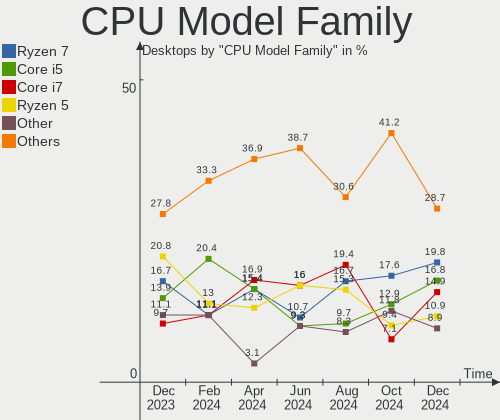

Pop!_OS - Hardware Trends (Desktops)
------------------------------------

A project to identify most popular hardware characteristics and track their change
over time based on data collected by Linux users at https://Linux-Hardware.org.

Anyone can contribute to this report by the [hw-probe](https://github.com/linuxhw/hw-probe) tool:

    sudo -E hw-probe -all -upload

This report is for one last month. Overall report since the beginning of time: [TestDays](https://github.com/linuxhw/TestDays)

Period: Jun, 2023.

Contents
--------

* [ System ](#system)
  - [ OS                       ](#os)
  - [ OS Family                ](#os-family)
  - [ Kernel                   ](#kernel)
  - [ Kernel Family            ](#kernel-family)
  - [ Kernel Major Ver.        ](#kernel-major-ver)
  - [ Arch                     ](#arch)
  - [ DE                       ](#de)
  - [ Display Server           ](#display-server)
  - [ Display Manager          ](#display-manager)
  - [ OS Lang                  ](#os-lang)
  - [ Boot Mode                ](#boot-mode)
  - [ Filesystem               ](#filesystem)
  - [ Part. scheme             ](#part-scheme)
  - [ Dual Boot with Linux/BSD ](#dual-boot-with-linuxbsd)
  - [ Dual Boot (Win)          ](#dual-boot-win)

* [ Board ](#board)
  - [ Vendor                   ](#vendor)
  - [ Model                    ](#model)
  - [ Model Family             ](#model-family)
  - [ MFG Year                 ](#mfg-year)
  - [ Form Factor              ](#form-factor)
  - [ Secure Boot              ](#secure-boot)
  - [ Coreboot                 ](#coreboot)
  - [ RAM Size                 ](#ram-size)
  - [ RAM Used                 ](#ram-used)
  - [ Total Drives             ](#total-drives)
  - [ Has CD-ROM               ](#has-cd-rom)
  - [ Has Ethernet             ](#has-ethernet)
  - [ Has WiFi                 ](#has-wifi)
  - [ Has Bluetooth            ](#has-bluetooth)

* [ Location ](#location)
  - [ Country                  ](#country)
  - [ City                     ](#city)

* [ Drives ](#drives)
  - [ Drive Vendor             ](#drive-vendor)
  - [ Drive Model              ](#drive-model)
  - [ HDD Vendor               ](#hdd-vendor)
  - [ SSD Vendor               ](#ssd-vendor)
  - [ Drive Kind               ](#drive-kind)
  - [ Drive Connector          ](#drive-connector)
  - [ Drive Size               ](#drive-size)
  - [ Space Total              ](#space-total)
  - [ Space Used               ](#space-used)
  - [ Malfunc. Drives          ](#malfunc-drives)
  - [ Malfunc. Drive Vendor    ](#malfunc-drive-vendor)
  - [ Malfunc. HDD Vendor      ](#malfunc-hdd-vendor)
  - [ Malfunc. Drive Kind      ](#malfunc-drive-kind)
  - [ Failed Drives            ](#failed-drives)
  - [ Failed Drive Vendor      ](#failed-drive-vendor)
  - [ Drive Status             ](#drive-status)

* [ Storage controller ](#storage-controller)
  - [ Storage Vendor           ](#storage-vendor)
  - [ Storage Model            ](#storage-model)
  - [ Storage Kind             ](#storage-kind)

* [ Processor ](#processor)
  - [ CPU Vendor               ](#cpu-vendor)
  - [ CPU Model                ](#cpu-model)
  - [ CPU Model Family         ](#cpu-model-family)
  - [ CPU Cores                ](#cpu-cores)
  - [ CPU Sockets              ](#cpu-sockets)
  - [ CPU Threads              ](#cpu-threads)
  - [ CPU Op-Modes             ](#cpu-op-modes)
  - [ CPU Microcode            ](#cpu-microcode)
  - [ CPU Microarch            ](#cpu-microarch)

* [ Graphics ](#graphics)
  - [ GPU Vendor               ](#gpu-vendor)
  - [ GPU Model                ](#gpu-model)
  - [ GPU Combo                ](#gpu-combo)
  - [ GPU Driver               ](#gpu-driver)
  - [ GPU Memory               ](#gpu-memory)

* [ Monitor ](#monitor)
  - [ Monitor Vendor           ](#monitor-vendor)
  - [ Monitor Model            ](#monitor-model)
  - [ Monitor Resolution       ](#monitor-resolution)
  - [ Monitor Diagonal         ](#monitor-diagonal)
  - [ Monitor Width            ](#monitor-width)
  - [ Aspect Ratio             ](#aspect-ratio)
  - [ Monitor Area             ](#monitor-area)
  - [ Pixel Density            ](#pixel-density)
  - [ Multiple Monitors        ](#multiple-monitors)

* [ Network ](#network)
  - [ Net Controller Vendor    ](#net-controller-vendor)
  - [ Net Controller Model     ](#net-controller-model)
  - [ Wireless Vendor          ](#wireless-vendor)
  - [ Wireless Model           ](#wireless-model)
  - [ Ethernet Vendor          ](#ethernet-vendor)
  - [ Ethernet Model           ](#ethernet-model)
  - [ Net Controller Kind      ](#net-controller-kind)
  - [ Used Controller          ](#used-controller)
  - [ NICs                     ](#nics)
  - [ IPv6                     ](#ipv6)

* [ Bluetooth ](#bluetooth)
  - [ Bluetooth Vendor         ](#bluetooth-vendor)
  - [ Bluetooth Model          ](#bluetooth-model)

* [ Sound ](#sound)
  - [ Sound Vendor             ](#sound-vendor)
  - [ Sound Model              ](#sound-model)

* [ Memory ](#memory)
  - [ Memory Vendor            ](#memory-vendor)
  - [ Memory Model             ](#memory-model)
  - [ Memory Kind              ](#memory-kind)
  - [ Memory Form Factor       ](#memory-form-factor)
  - [ Memory Size              ](#memory-size)
  - [ Memory Speed             ](#memory-speed)

* [ Printers & scanners ](#printers--scanners)
  - [ Printer Vendor           ](#printer-vendor)
  - [ Printer Model            ](#printer-model)
  - [ Scanner Vendor           ](#scanner-vendor)
  - [ Scanner Model            ](#scanner-model)

* [ Camera ](#camera)
  - [ Camera Vendor            ](#camera-vendor)
  - [ Camera Model             ](#camera-model)

* [ Security ](#security)
  - [ Fingerprint Vendor       ](#fingerprint-vendor)
  - [ Fingerprint Model        ](#fingerprint-model)
  - [ Chipcard Vendor          ](#chipcard-vendor)
  - [ Chipcard Model           ](#chipcard-model)

* [ Unsupported ](#unsupported)
  - [ Unsupported Devices      ](#unsupported-devices)
  - [ Unsupported Device Types ](#unsupported-device-types)

System
------

OS
--

Installed operating systems

| Name          | Desktops | Percent |
|---------------|----------|---------|
| Pop!_OS 22.04 | 73       | 97.33%  |
| Pop!_OS 21.04 | 1        | 1.33%   |
| Pop!_OS 20.04 | 1        | 1.33%   |

OS Family
---------

OS without a version

| Name    | Desktops | Percent |
|---------|----------|---------|
| Pop!_OS | 75       | 100%    |

Kernel
------

Version of the Linux kernel

| Version                 | Desktops | Percent |
|-------------------------|----------|---------|
| 6.2.6-76060206-generic  | 66       | 88%     |
| 6.3.7-060307-generic    | 2        | 2.67%   |
| 5.19.0-76051900-generic | 2        | 2.67%   |
| 6.3.4-060304-generic    | 1        | 1.33%   |
| 6.0.6-76060006-generic  | 1        | 1.33%   |
| 6.0.2-76060002-generic  | 1        | 1.33%   |
| 6.0.12-76060012-generic | 1        | 1.33%   |
| 5.11.0-7620-generic     | 1        | 1.33%   |

Kernel Family
-------------

Linux kernel without a distro release

| Version | Desktops | Percent |
|---------|----------|---------|
| 6.2.6   | 66       | 88%     |
| 6.3.7   | 2        | 2.67%   |
| 5.19.0  | 2        | 2.67%   |
| 6.3.4   | 1        | 1.33%   |
| 6.0.6   | 1        | 1.33%   |
| 6.0.2   | 1        | 1.33%   |
| 6.0.12  | 1        | 1.33%   |
| 5.11.0  | 1        | 1.33%   |

Kernel Major Ver.
-----------------

Linux kernel major version

| Version | Desktops | Percent |
|---------|----------|---------|
| 6.2     | 66       | 88%     |
| 6.3     | 3        | 4%      |
| 6.0     | 3        | 4%      |
| 5.19    | 2        | 2.67%   |
| 5.11    | 1        | 1.33%   |

Arch
----

OS architecture (x86_64, i586, etc.)

| Name   | Desktops | Percent |
|--------|----------|---------|
| x86_64 | 75       | 100%    |

DE
--

Desktop Environment

| Name  | Desktops | Percent |
|-------|----------|---------|
| GNOME | 73       | 97.33%  |
| KDE5  | 1        | 1.33%   |
| i3    | 1        | 1.33%   |

Display Server
--------------

X11 or Wayland

| Name    | Desktops | Percent |
|---------|----------|---------|
| X11     | 74       | 98.67%  |
| Wayland | 1        | 1.33%   |

Display Manager
---------------

SDDM, LightDM, etc.

| Name    | Desktops | Percent |
|---------|----------|---------|
| Unknown | 56       | 74.67%  |
| GDM3    | 17       | 22.67%  |
| SDDM    | 1        | 1.33%   |
| GDM     | 1        | 1.33%   |

OS Lang
-------

Language

| Lang  | Desktops | Percent |
|-------|----------|---------|
| en_US | 43       | 57.33%  |
| en_GB | 7        | 9.33%   |
| de_DE | 6        | 8%      |
| en_AU | 4        | 5.33%   |
| es_ES | 3        | 4%      |
| pt_BR | 2        | 2.67%   |
| fr_FR | 2        | 2.67%   |
| es_AR | 2        | 2.67%   |
| C     | 2        | 2.67%   |
| sv_SE | 1        | 1.33%   |
| pl_PL | 1        | 1.33%   |
| fr_CH | 1        | 1.33%   |
| de_AT | 1        | 1.33%   |

Boot Mode
---------

EFI or BIOS

| Mode | Desktops | Percent |
|------|----------|---------|
| BIOS | 58       | 77.33%  |
| EFI  | 17       | 22.67%  |

Filesystem
----------

Type of filesystem

| Type    | Desktops | Percent |
|---------|----------|---------|
| Ext4    | 71       | 94.67%  |
| Overlay | 2        | 2.67%   |
| Btrfs   | 2        | 2.67%   |

Part. scheme
------------

Scheme of partitioning

| Type    | Desktops | Percent |
|---------|----------|---------|
| Unknown | 56       | 74.67%  |
| GPT     | 18       | 24%     |
| MBR     | 1        | 1.33%   |

Dual Boot with Linux/BSD
------------------------

Hosting more than one Linux/BSD

| Dual boot | Desktops | Percent |
|-----------|----------|---------|
| No        | 69       | 92%     |
| Yes       | 6        | 8%      |

Dual Boot (Win)
---------------

Hosting Linux and Windows

| Dual boot | Desktops | Percent |
|-----------|----------|---------|
| No        | 64       | 85.33%  |
| Yes       | 11       | 14.67%  |

Board
-----

Vendor
------

Motherboard manufacturer

| Name                                 | Desktops | Percent |
|--------------------------------------|----------|---------|
| ASUSTek Computer                     | 20       | 26.67%  |
| MSI                                  | 16       | 21.33%  |
| Gigabyte Technology                  | 11       | 14.67%  |
| Dell                                 | 9        | 12%     |
| Hewlett-Packard                      | 3        | 4%      |
| BESSTAR Tech                         | 3        | 4%      |
| Lenovo                               | 2        | 2.67%   |
| Biostar                              | 2        | 2.67%   |
| ASRock                               | 2        | 2.67%   |
| System76                             | 1        | 1.33%   |
| Shenzhen Meigao Electronic Equipment | 1        | 1.33%   |
| Samsung Electronics                  | 1        | 1.33%   |
| Pegatron                             | 1        | 1.33%   |
| Intel                                | 1        | 1.33%   |
| Foxconn                              | 1        | 1.33%   |
| AZW                                  | 1        | 1.33%   |

Model
-----

Motherboard model

| Name                                       | Desktops | Percent |
|--------------------------------------------|----------|---------|
| MSI MS-7A38                                | 2        | 2.67%   |
| BESSTAR Tech B550                          | 2        | 2.67%   |
| ASUS ROG STRIX B550-F GAMING               | 2        | 2.67%   |
| ASUS ROG STRIX B450-F GAMING               | 2        | 2.67%   |
| System76 Thelio Mira                       | 1        | 1.33%   |
| Shenzhen Meigao Electronic Equipment UM560 | 1        | 1.33%   |
| Samsung DeskTop System                     | 1        | 1.33%   |
| Pegatron BQ467AA-ABA s5510y                | 1        | 1.33%   |
| MSI MS-7D75                                | 1        | 1.33%   |
| MSI MS-7C95                                | 1        | 1.33%   |
| MSI MS-7C94                                | 1        | 1.33%   |
| MSI MS-7C79                                | 1        | 1.33%   |
| MSI MS-7C37                                | 1        | 1.33%   |
| MSI MS-7C35                                | 1        | 1.33%   |
| MSI MS-7C02                                | 1        | 1.33%   |
| MSI MS-7B89                                | 1        | 1.33%   |
| MSI MS-7A32                                | 1        | 1.33%   |
| MSI MS-7972                                | 1        | 1.33%   |
| MSI MS-7883                                | 1        | 1.33%   |
| MSI MS-7756                                | 1        | 1.33%   |
| MSI MS-7721                                | 1        | 1.33%   |
| MSI MS-7680                                | 1        | 1.33%   |
| Lenovo ThinkCentre M90p 5498R97            | 1        | 1.33%   |
| Lenovo ThinkCentre M710q 10MR0004US        | 1        | 1.33%   |
| Intel H55                                  | 1        | 1.33%   |
| HP Z640 Workstation                        | 1        | 1.33%   |
| HP Victus by 15L Gaming Desktop TG02-0xxx  | 1        | 1.33%   |
| HP OMEN by 40L Gaming Desktop GT21-0xxx    | 1        | 1.33%   |
| Gigabyte Z690 AORUS PRO                    | 1        | 1.33%   |
| Gigabyte Z170-Gaming K3                    | 1        | 1.33%   |
| Gigabyte X570 AORUS ELITE WIFI             | 1        | 1.33%   |
| Gigabyte M68M-S2P                          | 1        | 1.33%   |
| Gigabyte H170-HD3-CF                       | 1        | 1.33%   |
| Gigabyte GA-78LMT-USB3 6.0                 | 1        | 1.33%   |
| Gigabyte B550M DS3H                        | 1        | 1.33%   |
| Gigabyte B550 UD AC                        | 1        | 1.33%   |
| Gigabyte B450M S2H                         | 1        | 1.33%   |
| Gigabyte B450 AORUS M                      | 1        | 1.33%   |
| Gigabyte 970A-DS3P                         | 1        | 1.33%   |
| Foxconn SE 1101                            | 1        | 1.33%   |

Model Family
------------

Motherboard model prefix

| Name                                       | Desktops | Percent |
|--------------------------------------------|----------|---------|
| Dell OptiPlex                              | 6        | 8%      |
| ASUS ROG                                   | 6        | 8%      |
| ASUS PRIME                                 | 4        | 5.33%   |
| MSI MS-7A38                                | 2        | 2.67%   |
| Lenovo ThinkCentre                         | 2        | 2.67%   |
| BESSTAR Tech B550                          | 2        | 2.67%   |
| ASUS TUF                                   | 2        | 2.67%   |
| System76 Thelio                            | 1        | 1.33%   |
| Shenzhen Meigao Electronic Equipment UM560 | 1        | 1.33%   |
| Samsung DeskTop                            | 1        | 1.33%   |
| Pegatron BQ467AA-ABA                       | 1        | 1.33%   |
| MSI MS-7D75                                | 1        | 1.33%   |
| MSI MS-7C95                                | 1        | 1.33%   |
| MSI MS-7C94                                | 1        | 1.33%   |
| MSI MS-7C79                                | 1        | 1.33%   |
| MSI MS-7C37                                | 1        | 1.33%   |
| MSI MS-7C35                                | 1        | 1.33%   |
| MSI MS-7C02                                | 1        | 1.33%   |
| MSI MS-7B89                                | 1        | 1.33%   |
| MSI MS-7A32                                | 1        | 1.33%   |
| MSI MS-7972                                | 1        | 1.33%   |
| MSI MS-7883                                | 1        | 1.33%   |
| MSI MS-7756                                | 1        | 1.33%   |
| MSI MS-7721                                | 1        | 1.33%   |
| MSI MS-7680                                | 1        | 1.33%   |
| Intel H55                                  | 1        | 1.33%   |
| HP Z640                                    | 1        | 1.33%   |
| HP Victus                                  | 1        | 1.33%   |
| HP OMEN                                    | 1        | 1.33%   |
| Gigabyte Z690                              | 1        | 1.33%   |
| Gigabyte Z170-Gaming                       | 1        | 1.33%   |
| Gigabyte X570                              | 1        | 1.33%   |
| Gigabyte M68M-S2P                          | 1        | 1.33%   |
| Gigabyte H170-HD3-CF                       | 1        | 1.33%   |
| Gigabyte GA-78LMT-USB3                     | 1        | 1.33%   |
| Gigabyte B550M                             | 1        | 1.33%   |
| Gigabyte B550                              | 1        | 1.33%   |
| Gigabyte B450M                             | 1        | 1.33%   |
| Gigabyte B450                              | 1        | 1.33%   |
| Gigabyte 970A-DS3P                         | 1        | 1.33%   |

MFG Year
--------

Motherboard manufacture year

| Year | Desktops | Percent |
|------|----------|---------|
| 2022 | 12       | 16%     |
| 2019 | 9        | 12%     |
| 2018 | 8        | 10.67%  |
| 2020 | 7        | 9.33%   |
| 2021 | 6        | 8%      |
| 2015 | 6        | 8%      |
| 2014 | 5        | 6.67%   |
| 2013 | 5        | 6.67%   |
| 2010 | 4        | 5.33%   |
| 2017 | 3        | 4%      |
| 2009 | 3        | 4%      |
| 2012 | 2        | 2.67%   |
| 2011 | 2        | 2.67%   |
| 2023 | 1        | 1.33%   |
| 2016 | 1        | 1.33%   |
| 2008 | 1        | 1.33%   |

Form Factor
-----------

Physical design of the computer

| Name    | Desktops | Percent |
|---------|----------|---------|
| Desktop | 75       | 100%    |

Secure Boot
-----------

Enabled or disabled

| State    | Desktops | Percent |
|----------|----------|---------|
| Disabled | 75       | 100%    |

Coreboot
--------

Have coreboot on board

| Used | Desktops | Percent |
|------|----------|---------|
| No   | 75       | 100%    |

RAM Size
--------

Total RAM memory

| Size in GB  | Desktops | Percent |
|-------------|----------|---------|
| 16.01-24.0  | 23       | 30.67%  |
| 32.01-64.0  | 19       | 25.33%  |
| 8.01-16.0   | 16       | 21.33%  |
| 3.01-4.0    | 6        | 8%      |
| 64.01-256.0 | 6        | 8%      |
| 4.01-8.0    | 4        | 5.33%   |
| 24.01-32.0  | 1        | 1.33%   |

RAM Used
--------

Used RAM memory

| Used GB    | Desktops | Percent |
|------------|----------|---------|
| 4.01-8.0   | 32       | 42.67%  |
| 8.01-16.0  | 15       | 20%     |
| 3.01-4.0   | 11       | 14.67%  |
| 2.01-3.0   | 11       | 14.67%  |
| 1.01-2.0   | 5        | 6.67%   |
| 32.01-64.0 | 1        | 1.33%   |

Total Drives
------------

Number of drives on board

| Drives | Desktops | Percent |
|--------|----------|---------|
| 2      | 23       | 30.67%  |
| 1      | 23       | 30.67%  |
| 3      | 18       | 24%     |
| 4      | 4        | 5.33%   |
| 5      | 3        | 4%      |
| 7      | 2        | 2.67%   |
| 6      | 2        | 2.67%   |

Has CD-ROM
----------

Has CD-ROM on board

| Presented | Desktops | Percent |
|-----------|----------|---------|
| No        | 53       | 70.67%  |
| Yes       | 22       | 29.33%  |

Has Ethernet
------------

Has Ethernet on board

| Presented | Desktops | Percent |
|-----------|----------|---------|
| Yes       | 73       | 97.33%  |
| No        | 2        | 2.67%   |

Has WiFi
--------

Has WiFi module

| Presented | Desktops | Percent |
|-----------|----------|---------|
| Yes       | 44       | 58.67%  |
| No        | 31       | 41.33%  |

Has Bluetooth
-------------

Has Bluetooth module

| Presented | Desktops | Percent |
|-----------|----------|---------|
| No        | 40       | 53.33%  |
| Yes       | 35       | 46.67%  |

Location
--------

Country
-------

Geographic location (country)

| Country      | Desktops | Percent |
|--------------|----------|---------|
| USA          | 28       | 37.33%  |
| UK           | 5        | 6.67%   |
| Germany      | 5        | 6.67%   |
| Australia    | 4        | 5.33%   |
| Sweden       | 3        | 4%      |
| Spain        | 3        | 4%      |
| Poland       | 3        | 4%      |
| Brazil       | 3        | 4%      |
| South Africa | 2        | 2.67%   |
| Italy        | 2        | 2.67%   |
| France       | 2        | 2.67%   |
| Canada       | 2        | 2.67%   |
| Austria      | 2        | 2.67%   |
| Argentina    | 2        | 2.67%   |
| Vietnam      | 1        | 1.33%   |
| Thailand     | 1        | 1.33%   |
| Switzerland  | 1        | 1.33%   |
| Sri Lanka    | 1        | 1.33%   |
| Russia       | 1        | 1.33%   |
| Netherlands  | 1        | 1.33%   |
| Mexico       | 1        | 1.33%   |
| Kyrgyzstan   | 1        | 1.33%   |
| Finland      | 1        | 1.33%   |

City
----

Geographic location (city)

| City             | Desktops | Percent |
|------------------|----------|---------|
| Sydney           | 3        | 4%      |
| Stockholm        | 2        | 2.67%   |
| Johannesburg     | 2        | 2.67%   |
| Warwick          | 1        | 1.33%   |
| Villa Martelli   | 1        | 1.33%   |
| Vienna           | 1        | 1.33%   |
| Venlo            | 1        | 1.33%   |
| Varsta           | 1        | 1.33%   |
| Torquay          | 1        | 1.33%   |
| Toronto          | 1        | 1.33%   |
| State College    | 1        | 1.33%   |
| South Bend       | 1        | 1.33%   |
| Signal Mountain  | 1        | 1.33%   |
| Santo André     | 1        | 1.33%   |
| Salvador         | 1        | 1.33%   |
| Saint-Etienne    | 1        | 1.33%   |
| Rho              | 1        | 1.33%   |
| Redditch         | 1        | 1.33%   |
| Quilmes          | 1        | 1.33%   |
| Poznan           | 1        | 1.33%   |
| Phitsanulok      | 1        | 1.33%   |
| Oswego           | 1        | 1.33%   |
| Oer-Erkenschwick | 1        | 1.33%   |
| Oakley           | 1        | 1.33%   |
| Niepolomice      | 1        | 1.33%   |
| New York         | 1        | 1.33%   |
| Nancy            | 1        | 1.33%   |
| Mostoles         | 1        | 1.33%   |
| Mono             | 1        | 1.33%   |
| Mission Viejo    | 1        | 1.33%   |
| Mexicali         | 1        | 1.33%   |
| Marstons Mills   | 1        | 1.33%   |
| Lumberton        | 1        | 1.33%   |
| Lowell           | 1        | 1.33%   |
| Leicester        | 1        | 1.33%   |
| La Grande        | 1        | 1.33%   |
| Killeen          | 1        | 1.33%   |
| Kazan’         | 1        | 1.33%   |
| Islington        | 1        | 1.33%   |
| Ho Chi Minh City | 1        | 1.33%   |

Drives
------

Drive Vendor
------------

Hard drive vendors

| Vendor                      | Desktops | Drives | Percent |
|-----------------------------|----------|--------|---------|
| Seagate                     | 28       | 34     | 17.39%  |
| Samsung Electronics         | 23       | 30     | 14.29%  |
| WDC                         | 15       | 16     | 9.32%   |
| SanDisk                     | 13       | 15     | 8.07%   |
| Crucial                     | 11       | 12     | 6.83%   |
| Kingston                    | 7        | 7      | 4.35%   |
| Phison Electronics          | 5        | 6      | 3.11%   |
| Hitachi                     | 5        | 5      | 3.11%   |
| Intel                       | 4        | 4      | 2.48%   |
| SK hynix                    | 3        | 4      | 1.86%   |
| Micron/Crucial Technology   | 3        | 3      | 1.86%   |
| Kingston Technology Company | 3        | 3      | 1.86%   |
| HGST                        | 3        | 3      | 1.86%   |
| Unknown                     | 2        | 2      | 1.24%   |
| Team                        | 2        | 3      | 1.24%   |
| PNY                         | 2        | 2      | 1.24%   |
| OCZ                         | 2        | 3      | 1.24%   |
| Intenso                     | 2        | 2      | 1.24%   |
| China                       | 2        | 2      | 1.24%   |
| Apacer                      | 2        | 2      | 1.24%   |
| A-DATA Technology           | 2        | 2      | 1.24%   |
| Toshiba                     | 1        | 1      | 0.62%   |
| TECH                        | 1        | 1      | 0.62%   |
| T-FORCE                     | 1        | 1      | 0.62%   |
| Silicon Motion              | 1        | 1      | 0.62%   |
| SABRENT                     | 1        | 2      | 0.62%   |
| Realtek Semiconductor       | 1        | 1      | 0.62%   |
| Phison                      | 1        | 1      | 0.62%   |
| Oyen                        | 1        | 1      | 0.62%   |
| NFHK                        | 1        | 1      | 0.62%   |
| Micron Technology           | 1        | 1      | 0.62%   |
| MicroFrom                   | 1        | 1      | 0.62%   |
| Lexar                       | 1        | 1      | 0.62%   |
| LaCie                       | 1        | 1      | 0.62%   |
| KingSpec                    | 1        | 1      | 0.62%   |
| KingFast                    | 1        | 1      | 0.62%   |
| KingDian                    | 1        | 1      | 0.62%   |
| IBM-ESXS                    | 1        | 2      | 0.62%   |
| HS-SSD-C100                 | 1        | 1      | 0.62%   |
| Gost                        | 1        | 1      | 0.62%   |

Drive Model
-----------

Hard drive models

| Model                                               | Desktops | Percent |
|-----------------------------------------------------|----------|---------|
| Samsung NVMe SSD Controller SM981/PM981/PM983 250GB | 4        | 2.27%   |
| Samsung NVMe SSD Controller PM9A1/PM9A3/980PRO 2TB  | 4        | 2.27%   |
| Seagate ST4000DM004-2CV104 4TB                      | 3        | 1.7%    |
| Seagate ST1000DM010-2EP102 1TB                      | 3        | 1.7%    |
| Kingston SA400S37120G 120GB SSD                     | 3        | 1.7%    |
| Seagate ST500DM002-1BD142 500GB                     | 2        | 1.14%   |
| Seagate ST2000DM001-1ER164 2TB                      | 2        | 1.14%   |
| Samsung SSD 970 EVO Plus 500GB                      | 2        | 1.14%   |
| Samsung SSD 870 QVO 1TB                             | 2        | 1.14%   |
| Samsung HD154UI 1TB                                 | 2        | 1.14%   |
| Phison E12 NVMe Controller 1TB                      | 2        | 1.14%   |
| OCZ TRION100 240GB SSD                              | 2        | 1.14%   |
| Micron/Crucial P2 NVMe PCIe SSD 4TB                 | 2        | 1.14%   |
| Kingston Company A2000 NVMe SSD 250GB               | 2        | 1.14%   |
| Intenso SSD 120GB                                   | 2        | 1.14%   |
| HGST HUS726060ALA640 6TB                            | 2        | 1.14%   |
| Crucial CT500MX500SSD1 500GB                        | 2        | 1.14%   |
| Crucial CT480BX500SSD1 480GB                        | 2        | 1.14%   |
| Crucial CT2000MX500SSD1 2TB                         | 2        | 1.14%   |
| Crucial CT1000BX500SSD1 1TB                         | 2        | 1.14%   |
| WDC WDS480G2G0C-00AJM0 480GB                        | 1        | 0.57%   |
| WDC WDS240G2G0C-00AJM0 240GB                        | 1        | 0.57%   |
| WDC WDS100T2B0C-00PXH0 1TB                          | 1        | 0.57%   |
| WDC WD8000AARS-00Y5B1 800GB                         | 1        | 0.57%   |
| WDC WD6003FRYZ-01F0DB0 6TB                          | 1        | 0.57%   |
| WDC WD5000AAKS-00A7B2 500GB                         | 1        | 0.57%   |
| WDC WD40EZRX-00SPEB0 4TB                            | 1        | 0.57%   |
| WDC WD20EZRZ-22Z5HB0 2TB                            | 1        | 0.57%   |
| WDC WD1600AAJS-75WAA0 160GB                         | 1        | 0.57%   |
| WDC WD1600AAJS-08PSA0 160GB                         | 1        | 0.57%   |
| WDC WD10EZRZ-00HTKB0 1TB                            | 1        | 0.57%   |
| WDC WD10EZEX-60WN4A2 1TB                            | 1        | 0.57%   |
| WDC WD10EZEX-22BN5A0 1TB                            | 1        | 0.57%   |
| WDC WD10EZEX-08WN4A0 1TB                            | 1        | 0.57%   |
| WDC WD10EADS-22M2B0 1TB                             | 1        | 0.57%   |
| WDC WD10EADS-00L5B1 1TB                             | 1        | 0.57%   |
| Unknown NVMe SSD Drive 2TB                          | 1        | 0.57%   |
| Unknown NVMe SSD Drive 1024GB                       | 1        | 0.57%   |
| Toshiba HDWD110 1TB                                 | 1        | 0.57%   |
| TECH MAGNET-1TB                                     | 1        | 0.57%   |

HDD Vendor
----------

Hard disk drive vendors

| Vendor              | Desktops | Drives | Percent |
|---------------------|----------|--------|---------|
| Seagate             | 28       | 32     | 51.85%  |
| WDC                 | 12       | 13     | 22.22%  |
| Hitachi             | 5        | 5      | 9.26%   |
| Samsung Electronics | 3        | 3      | 5.56%   |
| HGST                | 3        | 3      | 5.56%   |
| Toshiba             | 1        | 1      | 1.85%   |
| SABRENT             | 1        | 2      | 1.85%   |
| LaCie               | 1        | 1      | 1.85%   |

SSD Vendor
----------

Solid state drive vendors

| Vendor              | Desktops | Drives | Percent |
|---------------------|----------|--------|---------|
| Crucial             | 10       | 11     | 18.52%  |
| Samsung Electronics | 7        | 8      | 12.96%  |
| SanDisk             | 6        | 7      | 11.11%  |
| Kingston            | 6        | 6      | 11.11%  |
| Team                | 2        | 3      | 3.7%    |
| PNY                 | 2        | 2      | 3.7%    |
| OCZ                 | 2        | 3      | 3.7%    |
| Intenso             | 2        | 2      | 3.7%    |
| China               | 2        | 2      | 3.7%    |
| Apacer              | 2        | 2      | 3.7%    |
| A-DATA Technology   | 2        | 2      | 3.7%    |
| T-FORCE             | 1        | 1      | 1.85%   |
| SK hynix            | 1        | 1      | 1.85%   |
| Seagate             | 1        | 1      | 1.85%   |
| Micron Technology   | 1        | 1      | 1.85%   |
| MicroFrom           | 1        | 1      | 1.85%   |
| Lexar               | 1        | 1      | 1.85%   |
| KingSpec            | 1        | 1      | 1.85%   |
| KingDian            | 1        | 1      | 1.85%   |
| Intel               | 1        | 1      | 1.85%   |
| Gost                | 1        | 1      | 1.85%   |
| Corsair             | 1        | 1      | 1.85%   |

Drive Kind
----------

HDD or SSD

| Kind    | Desktops | Drives | Percent |
|---------|----------|--------|---------|
| SSD     | 43       | 59     | 32.58%  |
| NVMe    | 41       | 56     | 31.06%  |
| HDD     | 41       | 60     | 31.06%  |
| Unknown | 7        | 9      | 5.3%    |

Drive Connector
---------------

SATA, SAS, NVMe, etc.

| Type | Desktops | Drives | Percent |
|------|----------|--------|---------|
| SATA | 60       | 113    | 53.57%  |
| NVMe | 41       | 56     | 36.61%  |
| SAS  | 11       | 15     | 9.82%   |

Drive Size
----------

Size of hard drive

| Size in TB | Desktops | Drives | Percent |
|------------|----------|--------|---------|
| 0.01-0.5   | 36       | 52     | 39.13%  |
| 0.51-1.0   | 28       | 35     | 30.43%  |
| 1.01-2.0   | 15       | 17     | 16.3%   |
| 4.01-10.0  | 7        | 7      | 7.61%   |
| 3.01-4.0   | 4        | 5      | 4.35%   |
| 2.01-3.0   | 1        | 1      | 1.09%   |
| 10.01-20.0 | 1        | 2      | 1.09%   |

Space Total
-----------

Amount of disk space available on the file system

| Size in GB     | Desktops | Percent |
|----------------|----------|---------|
| 101-250        | 19       | 25.33%  |
| More than 3000 | 15       | 20%     |
| 501-1000       | 15       | 20%     |
| 251-500        | 10       | 13.33%  |
| 1001-2000      | 8        | 10.67%  |
| 2001-3000      | 5        | 6.67%   |
| 1-20           | 2        | 2.67%   |
| 51-100         | 1        | 1.33%   |

Space Used
----------

Amount of used disk space

| Used GB        | Desktops | Percent |
|----------------|----------|---------|
| 1-20           | 20       | 26.67%  |
| 21-50          | 10       | 13.33%  |
| 101-250        | 9        | 12%     |
| 51-100         | 9        | 12%     |
| More than 3000 | 8        | 10.67%  |
| 251-500        | 7        | 9.33%   |
| 501-1000       | 5        | 6.67%   |
| 1001-2000      | 4        | 5.33%   |
| 2001-3000      | 3        | 4%      |

Malfunc. Drives
---------------

Drive models with a malfunction

| Model                               | Desktops | Drives | Percent |
|-------------------------------------|----------|--------|---------|
| Team T253X1120G 120GB SSD           | 1        | 1      | 25%     |
| Seagate ST3250310AS 250GB           | 1        | 1      | 25%     |
| SanDisk SD8TB8U-256G-1006 256GB SSD | 1        | 1      | 25%     |
| HGST HUS726060ALA640 6TB            | 1        | 1      | 25%     |

Malfunc. Drive Vendor
---------------------

Vendors of faulty drives

| Vendor  | Desktops | Drives | Percent |
|---------|----------|--------|---------|
| Team    | 1        | 1      | 25%     |
| Seagate | 1        | 1      | 25%     |
| SanDisk | 1        | 1      | 25%     |
| HGST    | 1        | 1      | 25%     |

Malfunc. HDD Vendor
-------------------

Vendors of faulty HDD drives

| Vendor  | Desktops | Drives | Percent |
|---------|----------|--------|---------|
| Seagate | 1        | 1      | 50%     |
| HGST    | 1        | 1      | 50%     |

Malfunc. Drive Kind
-------------------

Kinds of faulty drives

| Kind | Desktops | Drives | Percent |
|------|----------|--------|---------|
| SSD  | 2        | 2      | 50%     |
| HDD  | 2        | 2      | 50%     |

Failed Drives
-------------

Failed drive models

Zero info for selected period =(

Failed Drive Vendor
-------------------

Failed drive vendors

Zero info for selected period =(

Drive Status
------------

Number of failed and malfunc. drives

| Status   | Desktops | Drives | Percent |
|----------|----------|--------|---------|
| Detected | 61       | 137    | 71.76%  |
| Works    | 20       | 43     | 23.53%  |
| Malfunc  | 4        | 4      | 4.71%   |

Storage controller
------------------

Storage Vendor
--------------

Storage controller vendors

| Vendor                      | Desktops | Percent |
|-----------------------------|----------|---------|
| AMD                         | 39       | 29.32%  |
| Intel                       | 36       | 27.07%  |
| Samsung Electronics         | 16       | 12.03%  |
| SanDisk                     | 10       | 7.52%   |
| Phison Electronics          | 6        | 4.51%   |
| ASMedia Technology          | 5        | 3.76%   |
| Micron/Crucial Technology   | 4        | 3.01%   |
| Kingston Technology Company | 4        | 3.01%   |
| SK hynix                    | 3        | 2.26%   |
| Nvidia                      | 3        | 2.26%   |
| Silicon Motion              | 1        | 0.75%   |
| Realtek Semiconductor       | 1        | 0.75%   |
| Marvell Technology Group    | 1        | 0.75%   |
| LSI Logic / Symbios Logic   | 1        | 0.75%   |
| INNOGRIT                    | 1        | 0.75%   |
| Broadcom / LSI              | 1        | 0.75%   |
| ADATA Technology            | 1        | 0.75%   |

Storage Model
-------------

Storage controller models

| Model                                                                                   | Desktops | Percent |
|-----------------------------------------------------------------------------------------|----------|---------|
| AMD FCH SATA Controller [AHCI mode]                                                     | 21       | 13.13%  |
| AMD 500 Series Chipset SATA Controller                                                  | 10       | 6.25%   |
| AMD 400 Series Chipset SATA Controller                                                  | 10       | 6.25%   |
| Samsung NVMe SSD Controller SM981/PM981/PM983                                           | 9        | 5.63%   |
| Samsung NVMe SSD Controller PM9A1/PM9A3/980PRO                                          | 5        | 3.13%   |
| Intel Q170/Q150/B150/H170/H110/Z170/CM236 Chipset SATA Controller [AHCI Mode]           | 4        | 2.5%    |
| Intel 8 Series/C220 Series Chipset Family 6-port SATA Controller 1 [AHCI mode]          | 4        | 2.5%    |
| ASMedia ASM1062 Serial ATA Controller                                                   | 4        | 2.5%    |
| AMD SB7x0/SB8x0/SB9x0 IDE Controller                                                    | 4        | 2.5%    |
| SanDisk Non-Volatile memory controller                                                  | 3        | 1.88%   |
| Phison E12 NVMe Controller                                                              | 3        | 1.88%   |
| Micron/Crucial P2 NVMe PCIe SSD                                                         | 3        | 1.88%   |
| Intel Comet Lake SATA AHCI Controller                                                   | 3        | 1.88%   |
| Intel 7 Series/C210 Series Chipset Family 6-port SATA Controller [AHCI mode]            | 3        | 1.88%   |
| Intel 200 Series PCH SATA controller [AHCI mode]                                        | 3        | 1.88%   |
| AMD SB7x0/SB8x0/SB9x0 SATA Controller [IDE mode]                                        | 3        | 1.88%   |
| SK hynix Gold P31/BC711/PC711 NVMe Solid State Drive                                    | 2        | 1.25%   |
| Sandisk Western Digital WD Black SN850X NVMe SSD                                        | 2        | 1.25%   |
| Samsung NVMe SSD Controller 980                                                         | 2        | 1.25%   |
| Nvidia MCP61 SATA Controller                                                            | 2        | 1.25%   |
| Kingston Company A2000 NVMe SSD                                                         | 2        | 1.25%   |
| Intel Alder Lake-S PCH SATA Controller [AHCI Mode]                                      | 2        | 1.25%   |
| Intel 6 Series/C200 Series Chipset Family Desktop SATA Controller (IDE mode, ports 4-5) | 2        | 1.25%   |
| Intel 6 Series/C200 Series Chipset Family Desktop SATA Controller (IDE mode, ports 0-3) | 2        | 1.25%   |
| SK hynix BC511 NVMe SSD                                                                 | 1        | 0.63%   |
| Silicon Motion SM2262/SM2262EN SSD Controller                                           | 1        | 0.63%   |
| SanDisk WD PC SN810 / Black SN850 NVMe SSD                                              | 1        | 0.63%   |
| SanDisk WD Blue SN570 NVMe SSD 1TB                                                      | 1        | 0.63%   |
| SanDisk WD Blue SN550 NVMe SSD                                                          | 1        | 0.63%   |
| SanDisk WD Black SN770 NVMe SSD                                                         | 1        | 0.63%   |
| SanDisk PC SN520 NVMe SSD                                                               | 1        | 0.63%   |
| Samsung NVMe SSD Controller SM951/PM951                                                 | 1        | 0.63%   |
| Samsung Electronics Non-Volatile memory controller                                      | 1        | 0.63%   |
| Realtek NVMe Controller                                                                 | 1        | 0.63%   |
| Phison PS5019-E19 PCIe4 NVMe Controller (DRAM-less)                                     | 1        | 0.63%   |
| Phison PS5013 E13 NVMe Controller                                                       | 1        | 0.63%   |
| Phison E16 PCIe4 NVMe Controller                                                        | 1        | 0.63%   |
| Nvidia MCP78S [GeForce 8200] IDE                                                        | 1        | 0.63%   |
| Nvidia MCP78S [GeForce 8200] AHCI Controller                                            | 1        | 0.63%   |
| Nvidia MCP61 IDE                                                                        | 1        | 0.63%   |

Storage Kind
------------

Kind of storage controller (IDE, SATA, NVMe, SAS, ...)

| Kind | Desktops | Percent |
|------|----------|---------|
| SATA | 62       | 50.82%  |
| NVMe | 40       | 32.79%  |
| IDE  | 14       | 11.48%  |
| RAID | 5        | 4.1%    |
| SAS  | 1        | 0.82%   |

Processor
---------

CPU Vendor
----------

Processor vendors

| Vendor | Desktops | Percent |
|--------|----------|---------|
| AMD    | 42       | 56%     |
| Intel  | 33       | 44%     |

CPU Model
---------

Processor models

| Model                                   | Desktops | Percent |
|-----------------------------------------|----------|---------|
| AMD Ryzen 5 5600G with Radeon Graphics  | 4        | 5.33%   |
| AMD Ryzen 7 5700G with Radeon Graphics  | 3        | 4%      |
| AMD Ryzen 5 2600 Six-Core Processor     | 3        | 4%      |
| Intel Core i7-4790 CPU @ 3.60GHz        | 2        | 2.67%   |
| Intel Core i5-6500 CPU @ 3.20GHz        | 2        | 2.67%   |
| AMD Ryzen 7 5800X3D 8-Core Processor    | 2        | 2.67%   |
| AMD Ryzen 7 5800X 8-Core Processor      | 2        | 2.67%   |
| AMD Ryzen 5 5600X 6-Core Processor      | 2        | 2.67%   |
| Intel Xeon CPU E5-2680 v3 @ 2.50GHz     | 1        | 1.33%   |
| Intel Core i9-10850K CPU @ 3.60GHz      | 1        | 1.33%   |
| Intel Core i7-6700K CPU @ 4.00GHz       | 1        | 1.33%   |
| Intel Core i7-5930K CPU @ 3.50GHz       | 1        | 1.33%   |
| Intel Core i7-4770 CPU @ 3.40GHz        | 1        | 1.33%   |
| Intel Core i7-3770K CPU @ 3.50GHz       | 1        | 1.33%   |
| Intel Core i7-3770 CPU @ 3.40GHz        | 1        | 1.33%   |
| Intel Core i7-2600K CPU @ 3.40GHz       | 1        | 1.33%   |
| Intel Core i7-10700KF CPU @ 3.80GHz     | 1        | 1.33%   |
| Intel Core i7 CPU 920 @ 2.67GHz         | 1        | 1.33%   |
| Intel Core i7 CPU 860 @ 2.80GHz         | 1        | 1.33%   |
| Intel Core i5-8279U CPU @ 2.40GHz       | 1        | 1.33%   |
| Intel Core i5-7600 CPU @ 3.50GHz        | 1        | 1.33%   |
| Intel Core i5-7500 CPU @ 3.40GHz        | 1        | 1.33%   |
| Intel Core i5-6600K CPU @ 3.50GHz       | 1        | 1.33%   |
| Intel Core i5-4690K CPU @ 3.50GHz       | 1        | 1.33%   |
| Intel Core i5-4570 CPU @ 3.20GHz        | 1        | 1.33%   |
| Intel Core i5-4460 CPU @ 3.20GHz        | 1        | 1.33%   |
| Intel Core i5-10600K CPU @ 4.10GHz      | 1        | 1.33%   |
| Intel Core i5 CPU M 460 @ 2.53GHz       | 1        | 1.33%   |
| Intel Core i3-9100 CPU @ 3.60GHz        | 1        | 1.33%   |
| Intel Core i3-3240 CPU @ 3.40GHz        | 1        | 1.33%   |
| Intel Core i3-2120 CPU @ 3.30GHz        | 1        | 1.33%   |
| Intel Core 2 Duo CPU E8600 @ 3.33GHz    | 1        | 1.33%   |
| Intel Celeron CPU G1610 @ 2.60GHz       | 1        | 1.33%   |
| Intel 13th Gen Core i5-13400            | 1        | 1.33%   |
| Intel 12th Gen Core i9-12900K           | 1        | 1.33%   |
| Intel 12th Gen Core i7-12700            | 1        | 1.33%   |
| Intel 11th Gen Core i9-11900K @ 3.50GHz | 1        | 1.33%   |
| AMD Ryzen 9 7950X 16-Core Processor     | 1        | 1.33%   |
| AMD Ryzen 9 5950X 16-Core Processor     | 1        | 1.33%   |
| AMD Ryzen 9 5900X 12-Core Processor     | 1        | 1.33%   |

CPU Model Family
----------------

Processor model prefix

| Model            | Desktops | Percent |
|------------------|----------|---------|
| AMD Ryzen 7      | 14       | 18.67%  |
| AMD Ryzen 5      | 12       | 16%     |
| Intel Core i7    | 11       | 14.67%  |
| Intel Core i5    | 11       | 14.67%  |
| AMD Ryzen 9      | 6        | 8%      |
| Other            | 4        | 5.33%   |
| Intel Core i3    | 3        | 4%      |
| AMD Ryzen 3      | 2        | 2.67%   |
| AMD FX           | 2        | 2.67%   |
| AMD Athlon II X4 | 2        | 2.67%   |
| AMD Athlon II X2 | 2        | 2.67%   |
| Intel Xeon       | 1        | 1.33%   |
| Intel Core i9    | 1        | 1.33%   |
| Intel Core 2 Duo | 1        | 1.33%   |
| Intel Celeron    | 1        | 1.33%   |
| AMD Phenom II X6 | 1        | 1.33%   |
| AMD A6           | 1        | 1.33%   |

CPU Cores
---------

Number of processor cores

| Number | Desktops | Percent |
|--------|----------|---------|
| 4      | 24       | 32%     |
| 8      | 17       | 22.67%  |
| 6      | 15       | 20%     |
| 2      | 7        | 9.33%   |
| 16     | 4        | 5.33%   |
| 12     | 3        | 4%      |
| 10     | 2        | 2.67%   |
| 24     | 1        | 1.33%   |
| 3      | 1        | 1.33%   |
| 1      | 1        | 1.33%   |

CPU Sockets
-----------

Number of sockets

| Number | Desktops | Percent |
|--------|----------|---------|
| 1      | 74       | 98.67%  |
| 2      | 1        | 1.33%   |

CPU Threads
-----------

Threads per core (Hyper-Threading)

| Number | Desktops | Percent |
|--------|----------|---------|
| 2      | 57       | 76%     |
| 1      | 18       | 24%     |

CPU Op-Modes
------------

CPU Operation Modes (32-bit, 64-bit)

| Op mode        | Desktops | Percent |
|----------------|----------|---------|
| 32-bit, 64-bit | 75       | 100%    |

CPU Microcode
-------------

Microcode number

| Number     | Desktops | Percent |
|------------|----------|---------|
| Unknown    | 62       | 82.67%  |
| 0x0a20120a | 3        | 4%      |
| 0x08701021 | 3        | 4%      |
| 0x0a601203 | 2        | 2.67%   |
| 0x0a50000d | 2        | 2.67%   |
| 0x306a9    | 1        | 1.33%   |
| 0x0a201009 | 1        | 1.33%   |
| 0x08108109 | 1        | 1.33%   |

CPU Microarch
-------------

Microarchitecture

| Name             | Desktops | Percent |
|------------------|----------|---------|
| Zen 3            | 18       | 24%     |
| Haswell          | 8        | 10.67%  |
| Zen 2            | 7        | 9.33%   |
| Unknown          | 6        | 8%      |
| K10              | 5        | 6.67%   |
| Zen+             | 4        | 5.33%   |
| Skylake          | 4        | 5.33%   |
| KabyLake         | 4        | 5.33%   |
| IvyBridge        | 4        | 5.33%   |
| Piledriver       | 3        | 4%      |
| CometLake        | 3        | 4%      |
| Zen              | 2        | 2.67%   |
| SandyBridge      | 2        | 2.67%   |
| Nehalem          | 2        | 2.67%   |
| Westmere         | 1        | 1.33%   |
| Penryn           | 1        | 1.33%   |
| Alderlake Hybrid | 1        | 1.33%   |

Graphics
--------

GPU Vendor
----------

Vendors of graphics cards

| Vendor | Desktops | Percent |
|--------|----------|---------|
| Nvidia | 45       | 54.88%  |
| AMD    | 24       | 29.27%  |
| Intel  | 13       | 15.85%  |

GPU Model
---------

Graphics card models

| Model                                                                       | Desktops | Percent |
|-----------------------------------------------------------------------------|----------|---------|
| AMD Navi 22 [Radeon RX 6700/6700 XT/6750 XT / 6800M/6850M XT]               | 5        | 5.88%   |
| Nvidia GM204 [GeForce GTX 970]                                              | 4        | 4.71%   |
| AMD Cezanne [Radeon Vega Series / Radeon Vega Mobile Series]                | 4        | 4.71%   |
| Nvidia GP107 [GeForce GTX 1050 Ti]                                          | 3        | 3.53%   |
| Nvidia GA104 [GeForce RTX 3070 Ti]                                          | 3        | 3.53%   |
| Intel Xeon E3-1200 v3/4th Gen Core Processor Integrated Graphics Controller | 3        | 3.53%   |
| AMD Ellesmere [Radeon RX 470/480/570/570X/580/580X/590]                     | 3        | 3.53%   |
| Nvidia TU116 [GeForce GTX 1660 Ti]                                          | 2        | 2.35%   |
| Nvidia TU106 [GeForce RTX 2060 SUPER]                                       | 2        | 2.35%   |
| Nvidia TU104 [GeForce RTX 2080 SUPER]                                       | 2        | 2.35%   |
| Nvidia TU104 [GeForce RTX 2070 SUPER]                                       | 2        | 2.35%   |
| Nvidia GT218 [GeForce 210]                                                  | 2        | 2.35%   |
| Nvidia GF108 [GeForce GT 730]                                               | 2        | 2.35%   |
| Nvidia GA104 [GeForce RTX 3060 Ti]                                          | 2        | 2.35%   |
| Nvidia GA102 [GeForce RTX 3090]                                             | 2        | 2.35%   |
| Intel HD Graphics 530                                                       | 2        | 2.35%   |
| Nvidia TU117 [GeForce GTX 1650]                                             | 1        | 1.18%   |
| Nvidia TU116 [GeForce GTX 1660]                                             | 1        | 1.18%   |
| Nvidia TU116 [GeForce GTX 1660 SUPER]                                       | 1        | 1.18%   |
| Nvidia TU104 [GeForce RTX 2080 Rev. A]                                      | 1        | 1.18%   |
| Nvidia TU104 [GeForce RTX 2060]                                             | 1        | 1.18%   |
| Nvidia GV100 [TITAN V]                                                      | 1        | 1.18%   |
| Nvidia GP108 [GeForce GT 1030]                                              | 1        | 1.18%   |
| Nvidia GP104 [P104-100]                                                     | 1        | 1.18%   |
| Nvidia GP104 [GeForce GTX 1080]                                             | 1        | 1.18%   |
| Nvidia GM206 [GeForce GTX 960]                                              | 1        | 1.18%   |
| Nvidia GM107GL [Quadro K2200]                                               | 1        | 1.18%   |
| Nvidia GK208B [GeForce GT 730]                                              | 1        | 1.18%   |
| Nvidia GK107 [GeForce GT 740]                                               | 1        | 1.18%   |
| Nvidia GK104 [GeForce GTX 670]                                              | 1        | 1.18%   |
| Nvidia GF106 [GeForce GTS 450]                                              | 1        | 1.18%   |
| Nvidia GA106 [GeForce RTX 3060 Lite Hash Rate]                              | 1        | 1.18%   |
| Nvidia GA104 [GeForce RTX 3070]                                             | 1        | 1.18%   |
| Nvidia GA104 [GeForce RTX 3060 Ti Lite Hash Rate]                           | 1        | 1.18%   |
| Nvidia GA102 [GeForce RTX 3080 Ti]                                          | 1        | 1.18%   |
| Nvidia GA102 [GeForce RTX 3080 Lite Hash Rate]                              | 1        | 1.18%   |
| Intel RocketLake-S GT1 [UHD Graphics 750]                                   | 1        | 1.18%   |
| Intel HD Graphics 630                                                       | 1        | 1.18%   |
| Intel Core Processor Integrated Graphics Controller                         | 1        | 1.18%   |
| Intel CometLake-S GT2 [UHD Graphics 630]                                    | 1        | 1.18%   |

GPU Combo
---------

Combinations of graphics cards

| Name           | Desktops | Percent |
|----------------|----------|---------|
| 1 x Nvidia     | 41       | 54.67%  |
| 1 x AMD        | 17       | 22.67%  |
| 1 x Intel      | 9        | 12%     |
| 2 x AMD        | 3        | 4%      |
| Intel + Nvidia | 2        | 2.67%   |
| AMD + Nvidia   | 2        | 2.67%   |
| Intel + AMD    | 1        | 1.33%   |

GPU Driver
----------

Free vs proprietary

| Driver      | Desktops | Percent |
|-------------|----------|---------|
| Proprietary | 39       | 52%     |
| Free        | 34       | 45.33%  |
| Unknown     | 2        | 2.67%   |

GPU Memory
----------

Total video memory

| Size in GB | Desktops | Percent |
|------------|----------|---------|
| Unknown    | 51       | 68%     |
| 3.01-4.0   | 7        | 9.33%   |
| 7.01-8.0   | 6        | 8%      |
| 5.01-6.0   | 4        | 5.33%   |
| 8.01-16.0  | 2        | 2.67%   |
| 0.01-0.5   | 2        | 2.67%   |
| 16.01-24.0 | 1        | 1.33%   |
| 1.01-2.0   | 1        | 1.33%   |
| 0.51-1.0   | 1        | 1.33%   |

Monitor
-------

Monitor Vendor
--------------

Monitor vendors

| Vendor               | Desktops | Percent |
|----------------------|----------|---------|
| Goldstar             | 11       | 13.25%  |
| Hewlett-Packard      | 8        | 9.64%   |
| Dell                 | 8        | 9.64%   |
| Acer                 | 8        | 9.64%   |
| Ancor Communications | 7        | 8.43%   |
| Samsung Electronics  | 6        | 7.23%   |
| ASUSTek Computer     | 5        | 6.02%   |
| BenQ                 | 4        | 4.82%   |
| AOC                  | 4        | 4.82%   |
| Panasonic            | 2        | 2.41%   |
| Xiaomi               | 1        | 1.2%    |
| Wacom                | 1        | 1.2%    |
| Vizio                | 1        | 1.2%    |
| ViewSonic            | 1        | 1.2%    |
| Skyworth             | 1        | 1.2%    |
| Sharp                | 1        | 1.2%    |
| Sceptre Tech         | 1        | 1.2%    |
| Philips              | 1        | 1.2%    |
| Philco               | 1        | 1.2%    |
| OOO                  | 1        | 1.2%    |
| MStar                | 1        | 1.2%    |
| MSI                  | 1        | 1.2%    |
| Mi                   | 1        | 1.2%    |
| JRY                  | 1        | 1.2%    |
| IND                  | 1        | 1.2%    |
| Iiyama               | 1        | 1.2%    |
| eMachines            | 1        | 1.2%    |
| Eizo                 | 1        | 1.2%    |
| Corsair              | 1        | 1.2%    |
| AGO                  | 1        | 1.2%    |

Monitor Model
-------------

Monitor models

| Model                                                                   | Desktops | Percent |
|-------------------------------------------------------------------------|----------|---------|
| Goldstar ULTRAGEAR GSM5B7F 2560x1440 597x336mm 27.0-inch                | 2        | 2.22%   |
| Goldstar HDR 4K GSM7707 3840x2160 600x340mm 27.2-inch                   | 2        | 2.22%   |
| Ancor Communications ASUS VP247 ACI24C7 1920x1080 521x293mm 23.5-inch   | 2        | 2.22%   |
| Xiaomi Mi TV XMD00E2 3840x2160 800x450mm 36.1-inch                      | 1        | 1.11%   |
| Xiaomi Mi TV XMD00E1 3840x2160 950x540mm 43.0-inch                      | 1        | 1.11%   |
| Wacom One 13 WAC1070 1920x1080 294x166mm 13.3-inch                      | 1        | 1.11%   |
| Vizio D32hn-E0 VIZ1007 1366x768 697x392mm 31.5-inch                     | 1        | 1.11%   |
| ViewSonic VA2855 SERIES VSCD62F 1920x1080 621x341mm 27.9-inch           | 1        | 1.11%   |
| Skyworth MATRIX6*2 SII9575 1920x1080 708x398mm 32.0-inch                | 1        | 1.11%   |
| Sharp HDMI SHP0FE9 1360x768 820x460mm 37.0-inch                         | 1        | 1.11%   |
| Sceptre Tech Sceptre M27 SPT6C05 1920x1080 520x320mm 24.0-inch          | 1        | 1.11%   |
| Samsung Electronics U32R59x SAM0F94 3840x2160 697x392mm 31.5-inch       | 1        | 1.11%   |
| Samsung Electronics T24C550 SAM0AA1 1920x1080 521x293mm 23.5-inch       | 1        | 1.11%   |
| Samsung Electronics SyncMaster SAM010B 1280x1024 338x270mm 17.0-inch    | 1        | 1.11%   |
| Samsung Electronics SMB2030N SAM0634 1600x900 440x250mm 19.9-inch       | 1        | 1.11%   |
| Samsung Electronics LCD Monitor SAM0DF7 3840x2160 1872x1053mm 84.6-inch | 1        | 1.11%   |
| Samsung Electronics C24F390 SAM0D2C 1920x1080 521x293mm 23.5-inch       | 1        | 1.11%   |
| Philips 273EL PHLC07C 1920x1080 598x336mm 27.0-inch                     | 1        | 1.11%   |
| Philco TV PLC0003 1440x900 708x398mm 32.0-inch                          | 1        | 1.11%   |
| Panasonic TV MEIA296 3840x2160 698x392mm 31.5-inch                      | 1        | 1.11%   |
| Panasonic PanasonicTV0 MEIC33A 1920x540                                 | 1        | 1.11%   |
| OOO HDMI OOO2150 1920x1080 368x207mm 16.6-inch                          | 1        | 1.11%   |
| MStar Demo MST0030 1360x765 708x398mm 32.0-inch                         | 1        | 1.11%   |
| MSI Optix MAG24C MSI1462 1920x1080 521x293mm 23.5-inch                  | 1        | 1.11%   |
| MSI MAG241C MSI3EA2 1920x1080 521x293mm 23.5-inch                       | 1        | 1.11%   |
| Mi Monitor XMI23C3 1920x1080 527x293mm 23.7-inch                        | 1        | 1.11%   |
| JRY Analog JRY1850 1360x768 452x254mm 20.4-inch                         | 1        | 1.11%   |
| IND Monitor IND2232 1680x1050 473x296mm 22.0-inch                       | 1        | 1.11%   |
| Iiyama PL2530H IVM6132 1920x1080 544x303mm 24.5-inch                    | 1        | 1.11%   |
| Hewlett-Packard Z38c HPN3412 3840x1600 880x367mm 37.5-inch              | 1        | 1.11%   |
| Hewlett-Packard OMEN by HP 25 HPN3426 1920x1080 543x302mm 24.5-inch     | 1        | 1.11%   |
| Hewlett-Packard LV1911 HWP3005 1366x768 410x230mm 18.5-inch             | 1        | 1.11%   |
| Hewlett-Packard E243i HPN3463 1920x1200 518x324mm 24.1-inch             | 1        | 1.11%   |
| Hewlett-Packard E241i HWP3122 1920x1200 518x324mm 24.1-inch             | 1        | 1.11%   |
| Hewlett-Packard E221 HWP3060 1920x1080 496x292mm 22.7-inch              | 1        | 1.11%   |
| Hewlett-Packard 27f HPN354B 1920x1080 598x336mm 27.0-inch               | 1        | 1.11%   |
| Hewlett-Packard 2311 HWP293A 1920x1080 509x286mm 23.0-inch              | 1        | 1.11%   |
| Goldstar W1934 GSM4B7A 1440x900 410x256mm 19.0-inch                     | 1        | 1.11%   |
| Goldstar ULTRAGEAR+ GSM9E8B 3440x1440 1048x441mm 44.8-inch              | 1        | 1.11%   |
| Goldstar ULTRAGEAR GSM7765 2560x1440 697x392mm 31.5-inch                | 1        | 1.11%   |

Monitor Resolution
------------------

Monitor screen resolution

| Resolution         | Desktops | Percent |
|--------------------|----------|---------|
| 1920x1080 (FHD)    | 38       | 46.34%  |
| 3840x2160 (4K)     | 11       | 13.41%  |
| 2560x1440 (QHD)    | 8        | 9.76%   |
| 3440x1440          | 7        | 8.54%   |
| 1600x900 (HD+)     | 3        | 3.66%   |
| 1366x768 (WXGA)    | 3        | 3.66%   |
| 1920x540           | 2        | 2.44%   |
| 1280x1024 (SXGA)   | 2        | 2.44%   |
| 1024x768 (XGA)     | 2        | 2.44%   |
| 3840x1600          | 1        | 1.22%   |
| 2560x1080          | 1        | 1.22%   |
| 1920x1200 (WUXGA)  | 1        | 1.22%   |
| 1680x1050 (WSXGA+) | 1        | 1.22%   |
| 1440x900 (WXGA+)   | 1        | 1.22%   |
| 1360x768           | 1        | 1.22%   |

Monitor Diagonal
----------------

Diagonal size in inches

| Inches | Desktops | Percent |
|--------|----------|---------|
| 24     | 18       | 20.22%  |
| 27     | 16       | 17.98%  |
| 23     | 13       | 14.61%  |
| 34     | 7        | 7.87%   |
| 31     | 4        | 4.49%   |
| 21     | 4        | 4.49%   |
| 20     | 4        | 4.49%   |
| 84     | 2        | 2.25%   |
| 37     | 2        | 2.25%   |
| 32     | 2        | 2.25%   |
| 22     | 2        | 2.25%   |
| 17     | 2        | 2.25%   |
| 15     | 2        | 2.25%   |
| 65     | 1        | 1.12%   |
| 57     | 1        | 1.12%   |
| 52     | 1        | 1.12%   |
| 44     | 1        | 1.12%   |
| 38     | 1        | 1.12%   |
| 36     | 1        | 1.12%   |
| 19     | 1        | 1.12%   |
| 18     | 1        | 1.12%   |
| 16     | 1        | 1.12%   |
| 13     | 1        | 1.12%   |
| 12     | 1        | 1.12%   |

Monitor Width
-------------

Physical width

| Width in mm | Desktops | Percent |
|-------------|----------|---------|
| 501-600     | 41       | 50%     |
| 401-500     | 11       | 13.41%  |
| 701-800     | 8        | 9.76%   |
| 601-700     | 5        | 6.1%    |
| 801-900     | 4        | 4.88%   |
| 301-350     | 4        | 4.88%   |
| 1001-1500   | 4        | 4.88%   |
| 201-300     | 2        | 2.44%   |
| 1501-2000   | 2        | 2.44%   |
| 351-400     | 1        | 1.22%   |

Aspect Ratio
------------

Proportional relationship between the width and the height

| Ratio | Desktops | Percent |
|-------|----------|---------|
| 16/9  | 56       | 71.79%  |
| 21/9  | 9        | 11.54%  |
| 16/10 | 8        | 10.26%  |
| 4/3   | 3        | 3.85%   |
| 5/4   | 2        | 2.56%   |

Monitor Area
------------

Area in inch²

| Area in inch² | Desktops | Percent |
|----------------|----------|---------|
| 201-250        | 25       | 29.07%  |
| 301-350        | 16       | 18.6%   |
| 351-500        | 12       | 13.95%  |
| 251-300        | 9        | 10.47%  |
| 151-200        | 6        | 6.98%   |
| More than 1000 | 5        | 5.81%   |
| 501-1000       | 5        | 5.81%   |
| 141-150        | 3        | 3.49%   |
| 71-80          | 2        | 2.33%   |
| 111-120        | 2        | 2.33%   |
| 101-110        | 1        | 1.16%   |

Pixel Density
-------------

Pixels per inch

| Density | Desktops | Percent |
|---------|----------|---------|
| 51-100  | 54       | 66.67%  |
| 101-120 | 15       | 18.52%  |
| 161-240 | 6        | 7.41%   |
| 1-50    | 3        | 3.7%    |
| 121-160 | 3        | 3.7%    |

Multiple Monitors
-----------------

Total monitors connected

| Total | Desktops | Percent |
|-------|----------|---------|
| 1     | 52       | 69.33%  |
| 2     | 18       | 24%     |
| 3     | 3        | 4%      |
| 0     | 2        | 2.67%   |

Network
-------

Net Controller Vendor
---------------------

Controller vendors

| Vendor                          | Desktops | Percent |
|---------------------------------|----------|---------|
| Realtek Semiconductor           | 48       | 42.11%  |
| Intel                           | 35       | 30.7%   |
| Qualcomm Atheros                | 6        | 5.26%   |
| MediaTek                        | 6        | 5.26%   |
| Ralink Technology               | 3        | 2.63%   |
| Nvidia                          | 3        | 2.63%   |
| Broadcom                        | 3        | 2.63%   |
| TP-Link                         | 1        | 0.88%   |
| Samsung Electronics             | 1        | 0.88%   |
| Qualcomm Atheros Communications | 1        | 0.88%   |
| NetGear                         | 1        | 0.88%   |
| Marvell Technology Group        | 1        | 0.88%   |
| InterBiometrics                 | 1        | 0.88%   |
| Google                          | 1        | 0.88%   |
| D-Link                          | 1        | 0.88%   |
| Aquantia                        | 1        | 0.88%   |
| Apple                           | 1        | 0.88%   |

Net Controller Model
--------------------

Controller models

| Model                                                             | Desktops | Percent |
|-------------------------------------------------------------------|----------|---------|
| Realtek RTL8111/8168/8411 PCI Express Gigabit Ethernet Controller | 32       | 24.43%  |
| Intel Ethernet Controller I225-V                                  | 9        | 6.87%   |
| Intel I211 Gigabit Network Connection                             | 8        | 6.11%   |
| Realtek RTL8125 2.5GbE Controller                                 | 7        | 5.34%   |
| Intel Wi-Fi 6 AX200                                               | 7        | 5.34%   |
| MediaTek MT7921K (RZ608) Wi-Fi 6E 80MHz                           | 5        | 3.82%   |
| Realtek RTL8153 Gigabit Ethernet Adapter                          | 3        | 2.29%   |
| Intel Wi-Fi 6 AX210/AX211/AX411 160MHz                            | 3        | 2.29%   |
| Realtek Killer E2600 Gigabit Ethernet Controller                  | 2        | 1.53%   |
| Ralink MT7601U Wireless Adapter                                   | 2        | 1.53%   |
| Qualcomm Atheros Killer E2400 Gigabit Ethernet Controller         | 2        | 1.53%   |
| Nvidia MCP61 Ethernet                                             | 2        | 1.53%   |
| Intel Wireless 8265 / 8275                                        | 2        | 1.53%   |
| Intel Ethernet Connection I217-LM                                 | 2        | 1.53%   |
| Intel Ethernet Connection (2) I219-V                              | 2        | 1.53%   |
| Intel Dual Band Wireless-AC 3168NGW [Stone Peak]                  | 2        | 1.53%   |
| Intel Comet Lake PCH CNVi WiFi                                    | 2        | 1.53%   |
| TP-Link Archer T9UH v1 [Realtek RTL8814AU]                        | 1        | 0.76%   |
| Samsung Galaxy series, misc. (tethering mode)                     | 1        | 0.76%   |
| Realtek RTL88x2bu [AC1200 Techkey]                                | 1        | 0.76%   |
| Realtek RTL8852BE PCIe 802.11ax Wireless Network Controller       | 1        | 0.76%   |
| Realtek RTL8852AE 802.11ax PCIe Wireless Network Adapter          | 1        | 0.76%   |
| Realtek RTL8822CE 802.11ac PCIe Wireless Network Adapter          | 1        | 0.76%   |
| Realtek RTL8814AU 802.11a/b/g/n/ac Wireless Adapter               | 1        | 0.76%   |
| Realtek RTL8192CU 802.11n WLAN Adapter                            | 1        | 0.76%   |
| Realtek RTL8192CE PCIe Wireless Network Adapter                   | 1        | 0.76%   |
| Realtek RTL8188FTV 802.11b/g/n 1T1R 2.4G WLAN Adapter             | 1        | 0.76%   |
| Realtek RTL8188EUS 802.11n Wireless Network Adapter               | 1        | 0.76%   |
| Realtek RTL8169 PCI Gigabit Ethernet Controller                   | 1        | 0.76%   |
| Realtek RTL810xE PCI Express Fast Ethernet controller             | 1        | 0.76%   |
| Ralink RT2870 Wireless Adapter                                    | 1        | 0.76%   |
| Qualcomm Atheros QCA9377 802.11ac Wireless Network Adapter        | 1        | 0.76%   |
| Qualcomm Atheros QCA6174 802.11ac Wireless Network Adapter        | 1        | 0.76%   |
| Qualcomm Atheros AR9271 802.11n                                   | 1        | 0.76%   |
| Qualcomm Atheros AR9485 Wireless Network Adapter                  | 1        | 0.76%   |
| Qualcomm Atheros AR93xx Wireless Network Adapter                  | 1        | 0.76%   |
| Qualcomm Atheros AR8121/AR8113/AR8114 Gigabit or Fast Ethernet    | 1        | 0.76%   |
| Nvidia MCP77 Ethernet                                             | 1        | 0.76%   |
| NetGear A6210                                                     | 1        | 0.76%   |
| MediaTek MT7922 802.11ax PCI Express Wireless Network Adapter     | 1        | 0.76%   |

Wireless Vendor
---------------

Wireless vendors

| Vendor                          | Desktops | Percent |
|---------------------------------|----------|---------|
| Intel                           | 18       | 39.13%  |
| Realtek Semiconductor           | 8        | 17.39%  |
| MediaTek                        | 6        | 13.04%  |
| Qualcomm Atheros                | 4        | 8.7%    |
| Ralink Technology               | 3        | 6.52%   |
| Broadcom                        | 3        | 6.52%   |
| TP-Link                         | 1        | 2.17%   |
| Qualcomm Atheros Communications | 1        | 2.17%   |
| NetGear                         | 1        | 2.17%   |
| D-Link                          | 1        | 2.17%   |

Wireless Model
--------------

Wireless models

| Model                                                         | Desktops | Percent |
|---------------------------------------------------------------|----------|---------|
| Intel Wi-Fi 6 AX200                                           | 7        | 14.89%  |
| MediaTek MT7921K (RZ608) Wi-Fi 6E 80MHz                       | 5        | 10.64%  |
| Intel Wi-Fi 6 AX210/AX211/AX411 160MHz                        | 3        | 6.38%   |
| Ralink MT7601U Wireless Adapter                               | 2        | 4.26%   |
| Intel Wireless 8265 / 8275                                    | 2        | 4.26%   |
| Intel Dual Band Wireless-AC 3168NGW [Stone Peak]              | 2        | 4.26%   |
| Intel Comet Lake PCH CNVi WiFi                                | 2        | 4.26%   |
| TP-Link Archer T9UH v1 [Realtek RTL8814AU]                    | 1        | 2.13%   |
| Realtek RTL88x2bu [AC1200 Techkey]                            | 1        | 2.13%   |
| Realtek RTL8852BE PCIe 802.11ax Wireless Network Controller   | 1        | 2.13%   |
| Realtek RTL8852AE 802.11ax PCIe Wireless Network Adapter      | 1        | 2.13%   |
| Realtek RTL8822CE 802.11ac PCIe Wireless Network Adapter      | 1        | 2.13%   |
| Realtek RTL8814AU 802.11a/b/g/n/ac Wireless Adapter           | 1        | 2.13%   |
| Realtek RTL8192CU 802.11n WLAN Adapter                        | 1        | 2.13%   |
| Realtek RTL8192CE PCIe Wireless Network Adapter               | 1        | 2.13%   |
| Realtek RTL8188FTV 802.11b/g/n 1T1R 2.4G WLAN Adapter         | 1        | 2.13%   |
| Realtek RTL8188EUS 802.11n Wireless Network Adapter           | 1        | 2.13%   |
| Ralink RT2870 Wireless Adapter                                | 1        | 2.13%   |
| Qualcomm Atheros QCA9377 802.11ac Wireless Network Adapter    | 1        | 2.13%   |
| Qualcomm Atheros QCA6174 802.11ac Wireless Network Adapter    | 1        | 2.13%   |
| Qualcomm Atheros AR9271 802.11n                               | 1        | 2.13%   |
| Qualcomm Atheros AR9485 Wireless Network Adapter              | 1        | 2.13%   |
| Qualcomm Atheros AR93xx Wireless Network Adapter              | 1        | 2.13%   |
| NetGear A6210                                                 | 1        | 2.13%   |
| MediaTek MT7922 802.11ax PCI Express Wireless Network Adapter | 1        | 2.13%   |
| Intel Wireless 3165                                           | 1        | 2.13%   |
| Intel 700 Series Chipset Family Wi-Fi                         | 1        | 2.13%   |
| D-Link DWA-123 Wireless N 150 Adapter (rev.D1)                | 1        | 2.13%   |
| Broadcom BCM4360 802.11ac Wireless Network Adapter            | 1        | 2.13%   |
| Broadcom BCM4352 802.11ac Wireless Network Adapter            | 1        | 2.13%   |
| Broadcom BCM4306 802.11b/g Wireless LAN Controller            | 1        | 2.13%   |

Ethernet Vendor
---------------

Ethernet vendors

| Vendor                   | Desktops | Percent |
|--------------------------|----------|---------|
| Realtek Semiconductor    | 44       | 55%     |
| Intel                    | 26       | 32.5%   |
| Qualcomm Atheros         | 3        | 3.75%   |
| Nvidia                   | 3        | 3.75%   |
| Samsung Electronics      | 1        | 1.25%   |
| Marvell Technology Group | 1        | 1.25%   |
| Google                   | 1        | 1.25%   |
| Aquantia                 | 1        | 1.25%   |

Ethernet Model
--------------

Ethernet models

| Model                                                               | Desktops | Percent |
|---------------------------------------------------------------------|----------|---------|
| Realtek RTL8111/8168/8411 PCI Express Gigabit Ethernet Controller   | 32       | 39.02%  |
| Intel Ethernet Controller I225-V                                    | 9        | 10.98%  |
| Intel I211 Gigabit Network Connection                               | 8        | 9.76%   |
| Realtek RTL8125 2.5GbE Controller                                   | 7        | 8.54%   |
| Realtek RTL8153 Gigabit Ethernet Adapter                            | 3        | 3.66%   |
| Realtek Killer E2600 Gigabit Ethernet Controller                    | 2        | 2.44%   |
| Qualcomm Atheros Killer E2400 Gigabit Ethernet Controller           | 2        | 2.44%   |
| Nvidia MCP61 Ethernet                                               | 2        | 2.44%   |
| Intel Ethernet Connection I217-LM                                   | 2        | 2.44%   |
| Intel Ethernet Connection (2) I219-V                                | 2        | 2.44%   |
| Samsung Galaxy series, misc. (tethering mode)                       | 1        | 1.22%   |
| Realtek RTL8169 PCI Gigabit Ethernet Controller                     | 1        | 1.22%   |
| Realtek RTL810xE PCI Express Fast Ethernet controller               | 1        | 1.22%   |
| Qualcomm Atheros AR8121/AR8113/AR8114 Gigabit or Fast Ethernet      | 1        | 1.22%   |
| Nvidia MCP77 Ethernet                                               | 1        | 1.22%   |
| Marvell Group 88E8056 PCI-E Gigabit Ethernet Controller             | 1        | 1.22%   |
| Intel Ethernet Connection I217-V                                    | 1        | 1.22%   |
| Intel Ethernet Connection (2) I218-LM                               | 1        | 1.22%   |
| Intel 82579LM Gigabit Network Connection (Lewisville)               | 1        | 1.22%   |
| Intel 82578DM Gigabit Network Connection                            | 1        | 1.22%   |
| Intel 82574L Gigabit Network Connection                             | 1        | 1.22%   |
| Google Pixel 7 Pro                                                  | 1        | 1.22%   |
| Aquantia AQC113CS NBase-T/IEEE 802.3bz Ethernet Controller [AQtion] | 1        | 1.22%   |

Net Controller Kind
-------------------

Ethernet, WiFi or modem

| Kind     | Desktops | Percent |
|----------|----------|---------|
| Ethernet | 73       | 61.34%  |
| WiFi     | 44       | 36.97%  |
| Modem    | 1        | 0.84%   |
| Unknown  | 1        | 0.84%   |

Used Controller
---------------

Currently used network controller

| Kind     | Desktops | Percent |
|----------|----------|---------|
| Ethernet | 50       | 60.98%  |
| WiFi     | 32       | 39.02%  |

NICs
----

Total network controllers on board

| Total | Desktops | Percent |
|-------|----------|---------|
| 1     | 37       | 49.33%  |
| 2     | 31       | 41.33%  |
| 3     | 5        | 6.67%   |
| 0     | 2        | 2.67%   |

IPv6
----

IPv6 vs IPv4

| Used | Desktops | Percent |
|------|----------|---------|
| No   | 52       | 69.33%  |
| Yes  | 23       | 30.67%  |

Bluetooth
---------

Bluetooth Vendor
----------------

Controller vendors

| Vendor                          | Desktops | Percent |
|---------------------------------|----------|---------|
| Intel                           | 17       | 44.74%  |
| Cambridge Silicon Radio         | 6        | 15.79%  |
| MediaTek                        | 5        | 13.16%  |
| Realtek Semiconductor           | 3        | 7.89%   |
| Qualcomm Atheros Communications | 2        | 5.26%   |
| Actions                         | 2        | 5.26%   |
| Logitech                        | 1        | 2.63%   |
| IMC Networks                    | 1        | 2.63%   |
| Dynex                           | 1        | 2.63%   |

Bluetooth Model
---------------

Controller models

| Model                                                    | Desktops | Percent |
|----------------------------------------------------------|----------|---------|
| Intel AX200 Bluetooth                                    | 7        | 18.42%  |
| Cambridge Silicon Radio Bluetooth Dongle (HCI mode)      | 6        | 15.79%  |
| MediaTek Wireless_Device                                 | 5        | 13.16%  |
| Realtek Bluetooth Radio                                  | 3        | 7.89%   |
| Intel Bluetooth wireless interface                       | 3        | 7.89%   |
| Intel Wireless-AC 3168 Bluetooth                         | 2        | 5.26%   |
| Intel AX210 Bluetooth                                    | 2        | 5.26%   |
| Intel AX201 Bluetooth                                    | 2        | 5.26%   |
| Actions general adapter                                  | 2        | 5.26%   |
| Qualcomm Atheros  Bluetooth Device                       | 1        | 2.63%   |
| Qualcomm Atheros QCA61x4 Bluetooth 4.0                   | 1        | 2.63%   |
| Logitech BT Mini-Receiver (HCI mode)                     | 1        | 2.63%   |
| Intel Bluetooth Device                                   | 1        | 2.63%   |
| IMC Networks Bluetooth Radio                             | 1        | 2.63%   |
| Dynex Bluetooth 4.0 Adapter [Broadcom, 1.12, BCM20702A0] | 1        | 2.63%   |

Sound
-----

Sound Vendor
------------

Sound card vendors

| Vendor                               | Desktops | Percent |
|--------------------------------------|----------|---------|
| Nvidia                               | 46       | 29.11%  |
| AMD                                  | 43       | 27.22%  |
| Intel                                | 33       | 20.89%  |
| C-Media Electronics                  | 9        | 5.7%    |
| Logitech                             | 3        | 1.9%    |
| Creative Labs                        | 3        | 1.9%    |
| Kingston Technology                  | 2        | 1.27%   |
| JMTek                                | 2        | 1.27%   |
| Thesycon Systemsoftware & Consulting | 1        | 0.63%   |
| TerraTec Electronic                  | 1        | 0.63%   |
| SAVITECH                             | 1        | 0.63%   |
| RODE Microphones                     | 1        | 0.63%   |
| ROCCAT                               | 1        | 0.63%   |
| Realtek Semiconductor                | 1        | 0.63%   |
| Razer USA                            | 1        | 0.63%   |
| Micro Star International             | 1        | 0.63%   |
| M-Audio                              | 1        | 0.63%   |
| KTMicro                              | 1        | 0.63%   |
| Giga-Byte Technology                 | 1        | 0.63%   |
| Focusrite-Novation                   | 1        | 0.63%   |
| DCMT Technology                      | 1        | 0.63%   |
| Creative Technology                  | 1        | 0.63%   |
| Cambridge Silicon Radio              | 1        | 0.63%   |
| AudioQuest                           | 1        | 0.63%   |
| Astro Gaming                         | 1        | 0.63%   |

Sound Model
-----------

Sound card models

| Model                                                                                           | Desktops | Percent |
|-------------------------------------------------------------------------------------------------|----------|---------|
| AMD Starship/Matisse HD Audio Controller                                                        | 14       | 7.61%   |
| AMD Family 17h/19h HD Audio Controller                                                          | 13       | 7.07%   |
| AMD Renoir Radeon High Definition Audio Controller                                              | 9        | 4.89%   |
| Nvidia GA104 High Definition Audio Controller                                                   | 7        | 3.8%    |
| Nvidia TU104 HD Audio Controller                                                                | 6        | 3.26%   |
| Intel 8 Series/C220 Series Chipset High Definition Audio Controller                             | 6        | 3.26%   |
| AMD Navi 21/23 HDMI/DP Audio Controller                                                         | 6        | 3.26%   |
| Nvidia TU116 High Definition Audio Controller                                                   | 4        | 2.17%   |
| Nvidia GM204 High Definition Audio Controller                                                   | 4        | 2.17%   |
| Nvidia GA102 High Definition Audio Controller                                                   | 4        | 2.17%   |
| Intel 100 Series/C230 Series Chipset Family HD Audio Controller                                 | 4        | 2.17%   |
| C-Media Electronics Blue Snowball                                                               | 4        | 2.17%   |
| C-Media Electronics Audio Adapter (Unitek Y-247A)                                               | 4        | 2.17%   |
| AMD SBx00 Azalia (Intel HDA)                                                                    | 4        | 2.17%   |
| AMD Family 17h (Models 00h-0fh) HD Audio Controller                                             | 4        | 2.17%   |
| AMD Ellesmere HDMI Audio [Radeon RX 470/480 / 570/580/590]                                      | 4        | 2.17%   |
| Nvidia GP107GL High Definition Audio Controller                                                 | 3        | 1.63%   |
| Intel Comet Lake PCH cAVS                                                                       | 3        | 1.63%   |
| Intel 7 Series/C216 Chipset Family High Definition Audio Controller                             | 3        | 1.63%   |
| Intel 6 Series/C200 Series Chipset Family High Definition Audio Controller                      | 3        | 1.63%   |
| Intel 200 Series PCH HD Audio                                                                   | 3        | 1.63%   |
| Nvidia TU106 High Definition Audio Controller                                                   | 2        | 1.09%   |
| Nvidia MCP61 High Definition Audio                                                              | 2        | 1.09%   |
| Nvidia High Definition Audio Controller                                                         | 2        | 1.09%   |
| Nvidia GF108 High Definition Audio Controller                                                   | 2        | 1.09%   |
| JMTek USB PnP Audio Device                                                                      | 2        | 1.09%   |
| Intel Xeon E3-1200 v3/4th Gen Core Processor HD Audio Controller                                | 2        | 1.09%   |
| Intel C610/X99 series chipset HD Audio Controller                                               | 2        | 1.09%   |
| Intel Alder Lake-S HD Audio Controller                                                          | 2        | 1.09%   |
| Intel 5 Series/3400 Series Chipset High Definition Audio                                        | 2        | 1.09%   |
| Creative Labs CA0132 Sound Core3D [Sound Blaster Recon3D / Z-Series / Sound BlasterX AE-5 Plus] | 2        | 1.09%   |
| AMD Oland/Hainan/Cape Verde/Pitcairn HDMI Audio [Radeon HD 7000 Series]                         | 2        | 1.09%   |
| Thesycon Systemsoftware & Consulting D50s                                                       | 1        | 0.54%   |
| TerraTec Electronic PHASE 26                                                                    | 1        | 0.54%   |
| SAVITECH SA9023 audio controller                                                                | 1        | 0.54%   |
| RODE Microphones RODE NT-USB                                                                    | 1        | 0.54%   |
| ROCCAT Juke                                                                                     | 1        | 0.54%   |
| Realtek Semiconductor USB Audio                                                                 | 1        | 0.54%   |
| Razer USA Kraken Tournament Edition                                                             | 1        | 0.54%   |
| Nvidia TU107 GeForce GTX 1650 High Definition Audio Controller                                  | 1        | 0.54%   |

Memory
------

Memory Vendor
-------------

Memory module vendors

| Vendor            | Desktops | Percent |
|-------------------|----------|---------|
| Kingston          | 6        | 26.09%  |
| Corsair           | 5        | 21.74%  |
| Team              | 3        | 13.04%  |
| Crucial           | 3        | 13.04%  |
| Micron Technology | 2        | 8.7%    |
| G.Skill           | 2        | 8.7%    |
| Unknown           | 1        | 4.35%   |
| Apacer            | 1        | 4.35%   |

Memory Model
------------

Memory module models

| Model                                                    | Desktops | Percent |
|----------------------------------------------------------|----------|---------|
| Corsair RAM CMK32GX4M2E3200C16 16GB DIMM DDR4 3534MT/s   | 2        | 8%      |
| Unknown RAM Module 2GB DIMM DDR2 800MT/s                 | 1        | 4%      |
| Team RAM TEAMGROUP-UD4-3600 8GB DIMM DDR4 3733MT/s       | 1        | 4%      |
| Team RAM TEAMGROUP-UD4-3200 8GB DIMM DDR4 3800MT/s       | 1        | 4%      |
| Team RAM TEAMGROUP-UD4-3200 8GB DIMM DDR4 3733MT/s       | 1        | 4%      |
| Micron RAM 4ATF1G64AZ-3G2E1 8GB DIMM DDR4 3200MT/s       | 1        | 4%      |
| Micron RAM 16ATF2G64AZ-3G2J1 16384MB DIMM DDR4 3200MT/s  | 1        | 4%      |
| Kingston RAM KHX2666C16/8G 8GB DIMM DDR4 3466MT/s        | 1        | 4%      |
| Kingston RAM KF556C40-16 16GB DIMM DDR5 5600MT/s         | 1        | 4%      |
| Kingston RAM KF3600C17D4/8GX 8GB DIMM DDR4 3600MT/s      | 1        | 4%      |
| Kingston RAM KF3200C16D4/8GX 8GB DIMM DDR4 3600MT/s      | 1        | 4%      |
| Kingston RAM 99U5474-028.A00LF 4GB DIMM DDR3 1333MT/s    | 1        | 4%      |
| Kingston RAM 99U5474-016.A00LF 4GB DIMM DDR3 1600MT/s    | 1        | 4%      |
| Kingston RAM 9905678-023.A00G 8GB DIMM DDR4 2187MT/s     | 1        | 4%      |
| Kingston RAM 9905625-011.A00G 8GB DIMM DDR4 2133MT/s     | 1        | 4%      |
| G.Skill RAM F5-6000U3636E16G 16GB DIMM DDR5 6000MT/s     | 1        | 4%      |
| G.Skill RAM F4-3200C16-32GTZN 32GB DIMM DDR4 3200MT/s    | 1        | 4%      |
| Crucial RAM CT8G4SFS832A.M8FR 8GB SODIMM DDR4 3200MT/s   | 1        | 4%      |
| Crucial RAM BL8G36C16U4B.M8FE1 8GB DIMM DDR4 3733MT/s    | 1        | 4%      |
| Crucial RAM BL8G30C15U4R.M8FE 8GB DIMM DDR4 3200MT/s     | 1        | 4%      |
| Corsair RAM CMW64GX4M2E3200C16 32GB DIMM DDR4 3200MT/s   | 1        | 4%      |
| Corsair RAM CMK64GX5M2B6200C32 32GB DIMM DDR5 4800MT/s   | 1        | 4%      |
| Corsair RAM CMK16GX4M2B3200C16 8192MB DIMM DDR4 3600MT/s | 1        | 4%      |
| Apacer RAM 78.CAGQC.ARC0B 8GB DIMM DDR4 2133MT/s         | 1        | 4%      |

Memory Kind
-----------

Memory module kinds

| Kind | Desktops | Percent |
|------|----------|---------|
| DDR4 | 15       | 75%     |
| DDR5 | 3        | 15%     |
| DDR3 | 1        | 5%      |
| DDR2 | 1        | 5%      |

Memory Form Factor
------------------

Physical design of the memory module

| Name   | Desktops | Percent |
|--------|----------|---------|
| DIMM   | 19       | 95%     |
| SODIMM | 1        | 5%      |

Memory Size
-----------

Memory module size

| Size  | Desktops | Percent |
|-------|----------|---------|
| 8192  | 9        | 42.86%  |
| 32768 | 5        | 23.81%  |
| 16384 | 5        | 23.81%  |
| 4096  | 1        | 4.76%   |
| 2048  | 1        | 4.76%   |

Memory Speed
------------

Memory module speed

| Speed | Desktops | Percent |
|-------|----------|---------|
| 3200  | 6        | 25%     |
| 3733  | 3        | 12.5%   |
| 3600  | 3        | 12.5%   |
| 3534  | 2        | 8.33%   |
| 2133  | 2        | 8.33%   |
| 6000  | 1        | 4.17%   |
| 5600  | 1        | 4.17%   |
| 4800  | 1        | 4.17%   |
| 3800  | 1        | 4.17%   |
| 3466  | 1        | 4.17%   |
| 2187  | 1        | 4.17%   |
| 1600  | 1        | 4.17%   |
| 800   | 1        | 4.17%   |

Printers & scanners
-------------------

Printer Vendor
--------------

Printer device vendors

| Vendor              | Desktops | Percent |
|---------------------|----------|---------|
| Samsung Electronics | 1        | 100%    |

Printer Model
-------------

Printer device models

| Model                                | Desktops | Percent |
|--------------------------------------|----------|---------|
| Samsung ML-216x Series Laser Printer | 1        | 100%    |

Scanner Vendor
--------------

Scanner device vendors

| Vendor      | Desktops | Percent |
|-------------|----------|---------|
| Seiko Epson | 2        | 100%    |

Scanner Model
-------------

Scanner device models

| Model                                                   | Desktops | Percent |
|---------------------------------------------------------|----------|---------|
| Seiko Epson GT-X800 [Perfection 4990 PHOTO]             | 1        | 50%     |
| Seiko Epson GT-F720 [GT-S620/Perfection V30/V300 Photo] | 1        | 50%     |

Camera
------

Camera Vendor
-------------

Camera device vendors

| Vendor                 | Desktops | Percent |
|------------------------|----------|---------|
| Logitech               | 5        | 33.33%  |
| Microsoft              | 2        | 13.33%  |
| Polycom                | 1        | 6.67%   |
| Microdia               | 1        | 6.67%   |
| Huawei Technologies    | 1        | 6.67%   |
| Generalplus Technology | 1        | 6.67%   |
| eMeet                  | 1        | 6.67%   |
| Creative Technology    | 1        | 6.67%   |
| Asuscom Network        | 1        | 6.67%   |
| Apple                  | 1        | 6.67%   |

Camera Model
------------

Camera device models

| Model                                | Desktops | Percent |
|--------------------------------------|----------|---------|
| Polycom Poly Studio P5 webcam        | 1        | 6.67%   |
| Microsoft Microsoft LifeCam Studio | 1        | 6.67%   |
| Microsoft LifeCam VX-2000            | 1        | 6.67%   |
| Microdia Webcam Vitade AF            | 1        | 6.67%   |
| Logitech Webcam C270                 | 1        | 6.67%   |
| Logitech StreamCam                   | 1        | 6.67%   |
| Logitech C920 PRO HD Webcam          | 1        | 6.67%   |
| Logitech C505 HD Webcam              | 1        | 6.67%   |
| Logitech BRIO 4K Stream Edition      | 1        | 6.67%   |
| Huawei UVC Camera                    | 1        | 6.67%   |
| Generalplus GENERAL WEBCAM           | 1        | 6.67%   |
| eMeet HD Webcam C960                 | 1        | 6.67%   |
| Creative VF0530 Live! Cam Chat IM    | 1        | 6.67%   |
| Asuscom Network REDRAGON Live Camera | 1        | 6.67%   |
| Apple iPhone 5/5C/5S/6/SE/7/8/X      | 1        | 6.67%   |

Security
--------

Fingerprint Vendor
------------------

Fingerprint sensor vendors

Zero info for selected period =(

Fingerprint Model
-----------------

Fingerprint sensor models

Zero info for selected period =(

Chipcard Vendor
---------------

Chipcard module vendors

Zero info for selected period =(

Chipcard Model
--------------

Chipcard module models

Zero info for selected period =(

Unsupported
-----------

Unsupported Devices
-------------------

Total unsupported devices on board

| Total | Desktops | Percent |
|-------|----------|---------|
| 0     | 63       | 84%     |
| 1     | 11       | 14.67%  |
| 2     | 1        | 1.33%   |

Unsupported Device Types
------------------------

Types of unsupported devices

| Type                  | Desktops | Percent |
|-----------------------|----------|---------|
| Graphics card         | 4        | 30.77%  |
| Multimedia controller | 3        | 23.08%  |
| Unassigned class      | 2        | 15.38%  |
| Net/wireless          | 2        | 15.38%  |
| Storage/raid          | 1        | 7.69%   |
| Camera                | 1        | 7.69%   |

