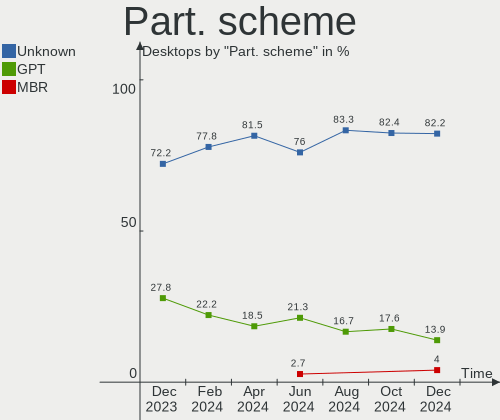
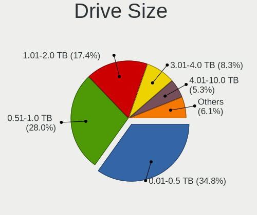
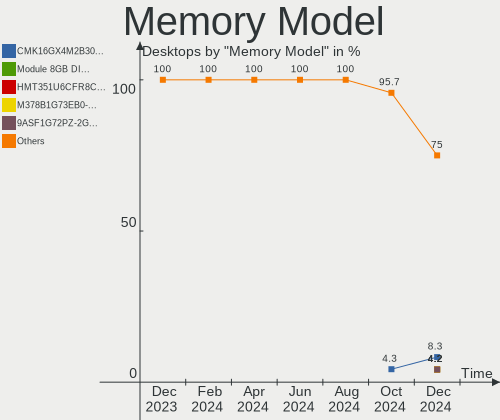
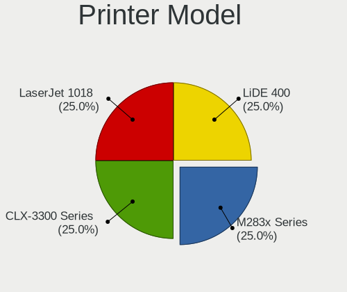

Pop!_OS - Hardware Trends (Desktops)
------------------------------------

A project to identify most popular hardware characteristics and track their change
over time based on data collected by Linux users at https://Linux-Hardware.org.

Anyone can contribute to this report by the [hw-probe](https://github.com/linuxhw/hw-probe) tool:

    sudo -E hw-probe -all -upload

This report is for one last month. Overall report since the beginning of time: [TestDays](https://github.com/linuxhw/TestDays)

Period: Jul, 2023.

Contents
--------

* [ System ](#system)
  - [ OS                       ](#os)
  - [ OS Family                ](#os-family)
  - [ Kernel                   ](#kernel)
  - [ Kernel Family            ](#kernel-family)
  - [ Kernel Major Ver.        ](#kernel-major-ver)
  - [ Arch                     ](#arch)
  - [ DE                       ](#de)
  - [ Display Server           ](#display-server)
  - [ Display Manager          ](#display-manager)
  - [ OS Lang                  ](#os-lang)
  - [ Boot Mode                ](#boot-mode)
  - [ Filesystem               ](#filesystem)
  - [ Part. scheme             ](#part-scheme)
  - [ Dual Boot with Linux/BSD ](#dual-boot-with-linuxbsd)
  - [ Dual Boot (Win)          ](#dual-boot-win)

* [ Board ](#board)
  - [ Vendor                   ](#vendor)
  - [ Model                    ](#model)
  - [ Model Family             ](#model-family)
  - [ MFG Year                 ](#mfg-year)
  - [ Form Factor              ](#form-factor)
  - [ Secure Boot              ](#secure-boot)
  - [ Coreboot                 ](#coreboot)
  - [ RAM Size                 ](#ram-size)
  - [ RAM Used                 ](#ram-used)
  - [ Total Drives             ](#total-drives)
  - [ Has CD-ROM               ](#has-cd-rom)
  - [ Has Ethernet             ](#has-ethernet)
  - [ Has WiFi                 ](#has-wifi)
  - [ Has Bluetooth            ](#has-bluetooth)

* [ Location ](#location)
  - [ Country                  ](#country)
  - [ City                     ](#city)

* [ Drives ](#drives)
  - [ Drive Vendor             ](#drive-vendor)
  - [ Drive Model              ](#drive-model)
  - [ HDD Vendor               ](#hdd-vendor)
  - [ SSD Vendor               ](#ssd-vendor)
  - [ Drive Kind               ](#drive-kind)
  - [ Drive Connector          ](#drive-connector)
  - [ Drive Size               ](#drive-size)
  - [ Space Total              ](#space-total)
  - [ Space Used               ](#space-used)
  - [ Malfunc. Drives          ](#malfunc-drives)
  - [ Malfunc. Drive Vendor    ](#malfunc-drive-vendor)
  - [ Malfunc. HDD Vendor      ](#malfunc-hdd-vendor)
  - [ Malfunc. Drive Kind      ](#malfunc-drive-kind)
  - [ Failed Drives            ](#failed-drives)
  - [ Failed Drive Vendor      ](#failed-drive-vendor)
  - [ Drive Status             ](#drive-status)

* [ Storage controller ](#storage-controller)
  - [ Storage Vendor           ](#storage-vendor)
  - [ Storage Model            ](#storage-model)
  - [ Storage Kind             ](#storage-kind)

* [ Processor ](#processor)
  - [ CPU Vendor               ](#cpu-vendor)
  - [ CPU Model                ](#cpu-model)
  - [ CPU Model Family         ](#cpu-model-family)
  - [ CPU Cores                ](#cpu-cores)
  - [ CPU Sockets              ](#cpu-sockets)
  - [ CPU Threads              ](#cpu-threads)
  - [ CPU Op-Modes             ](#cpu-op-modes)
  - [ CPU Microcode            ](#cpu-microcode)
  - [ CPU Microarch            ](#cpu-microarch)

* [ Graphics ](#graphics)
  - [ GPU Vendor               ](#gpu-vendor)
  - [ GPU Model                ](#gpu-model)
  - [ GPU Combo                ](#gpu-combo)
  - [ GPU Driver               ](#gpu-driver)
  - [ GPU Memory               ](#gpu-memory)

* [ Monitor ](#monitor)
  - [ Monitor Vendor           ](#monitor-vendor)
  - [ Monitor Model            ](#monitor-model)
  - [ Monitor Resolution       ](#monitor-resolution)
  - [ Monitor Diagonal         ](#monitor-diagonal)
  - [ Monitor Width            ](#monitor-width)
  - [ Aspect Ratio             ](#aspect-ratio)
  - [ Monitor Area             ](#monitor-area)
  - [ Pixel Density            ](#pixel-density)
  - [ Multiple Monitors        ](#multiple-monitors)

* [ Network ](#network)
  - [ Net Controller Vendor    ](#net-controller-vendor)
  - [ Net Controller Model     ](#net-controller-model)
  - [ Wireless Vendor          ](#wireless-vendor)
  - [ Wireless Model           ](#wireless-model)
  - [ Ethernet Vendor          ](#ethernet-vendor)
  - [ Ethernet Model           ](#ethernet-model)
  - [ Net Controller Kind      ](#net-controller-kind)
  - [ Used Controller          ](#used-controller)
  - [ NICs                     ](#nics)
  - [ IPv6                     ](#ipv6)

* [ Bluetooth ](#bluetooth)
  - [ Bluetooth Vendor         ](#bluetooth-vendor)
  - [ Bluetooth Model          ](#bluetooth-model)

* [ Sound ](#sound)
  - [ Sound Vendor             ](#sound-vendor)
  - [ Sound Model              ](#sound-model)

* [ Memory ](#memory)
  - [ Memory Vendor            ](#memory-vendor)
  - [ Memory Model             ](#memory-model)
  - [ Memory Kind              ](#memory-kind)
  - [ Memory Form Factor       ](#memory-form-factor)
  - [ Memory Size              ](#memory-size)
  - [ Memory Speed             ](#memory-speed)

* [ Printers & scanners ](#printers--scanners)
  - [ Printer Vendor           ](#printer-vendor)
  - [ Printer Model            ](#printer-model)
  - [ Scanner Vendor           ](#scanner-vendor)
  - [ Scanner Model            ](#scanner-model)

* [ Camera ](#camera)
  - [ Camera Vendor            ](#camera-vendor)
  - [ Camera Model             ](#camera-model)

* [ Security ](#security)
  - [ Fingerprint Vendor       ](#fingerprint-vendor)
  - [ Fingerprint Model        ](#fingerprint-model)
  - [ Chipcard Vendor          ](#chipcard-vendor)
  - [ Chipcard Model           ](#chipcard-model)

* [ Unsupported ](#unsupported)
  - [ Unsupported Devices      ](#unsupported-devices)
  - [ Unsupported Device Types ](#unsupported-device-types)

System
------

OS
--

Installed operating systems

| Name          | Desktops | Percent |
|---------------|----------|---------|
| Pop!_OS 22.04 | 65       | 98.48%  |
| Pop!_OS 20.04 | 1        | 1.52%   |

OS Family
---------

OS without a version

| Name    | Desktops | Percent |
|---------|----------|---------|
| Pop!_OS | 66       | 100%    |

Kernel
------

Version of the Linux kernel

| Version                 | Desktops | Percent |
|-------------------------|----------|---------|
| 6.2.6-76060206-generic  | 63       | 95.45%  |
| 6.0.2-76060002-generic  | 1        | 1.52%   |
| 6.0.12-76060012-generic | 1        | 1.52%   |
| 5.17.5-76051705-generic | 1        | 1.52%   |

Kernel Family
-------------

Linux kernel without a distro release

| Version | Desktops | Percent |
|---------|----------|---------|
| 6.2.6   | 63       | 95.45%  |
| 6.0.2   | 1        | 1.52%   |
| 6.0.12  | 1        | 1.52%   |
| 5.17.5  | 1        | 1.52%   |

Kernel Major Ver.
-----------------

Linux kernel major version

| Version | Desktops | Percent |
|---------|----------|---------|
| 6.2     | 63       | 95.45%  |
| 6.0     | 2        | 3.03%   |
| 5.17    | 1        | 1.52%   |

Arch
----

OS architecture (x86_64, i586, etc.)

| Name   | Desktops | Percent |
|--------|----------|---------|
| x86_64 | 66       | 100%    |

DE
--

Desktop Environment

| Name       | Desktops | Percent |
|------------|----------|---------|
| GNOME      | 58       | 87.88%  |
| KDE5       | 4        | 6.06%   |
| X-Cinnamon | 3        | 4.55%   |
| Unknown    | 1        | 1.52%   |

Display Server
--------------

X11 or Wayland

| Name    | Desktops | Percent |
|---------|----------|---------|
| X11     | 63       | 95.45%  |
| Wayland | 3        | 4.55%   |

Display Manager
---------------

SDDM, LightDM, etc.

| Name    | Desktops | Percent |
|---------|----------|---------|
| Unknown | 55       | 83.33%  |
| GDM3    | 9        | 13.64%  |
| SDDM    | 1        | 1.52%   |
| GDM     | 1        | 1.52%   |

OS Lang
-------

Language

| Lang  | Desktops | Percent |
|-------|----------|---------|
| en_US | 39       | 59.09%  |
| pt_BR | 5        | 7.58%   |
| en_GB | 4        | 6.06%   |
| de_DE | 4        | 6.06%   |
| en_CA | 3        | 4.55%   |
| ru_RU | 1        | 1.52%   |
| pt_PT | 1        | 1.52%   |
| ja_JP | 1        | 1.52%   |
| it_IT | 1        | 1.52%   |
| fr_CA | 1        | 1.52%   |
| fi_FI | 1        | 1.52%   |
| es_ES | 1        | 1.52%   |
| en_ZA | 1        | 1.52%   |
| en_DK | 1        | 1.52%   |
| en_AU | 1        | 1.52%   |
| C     | 1        | 1.52%   |

Boot Mode
---------

EFI or BIOS

| Mode | Desktops | Percent |
|------|----------|---------|
| BIOS | 57       | 86.36%  |
| EFI  | 9        | 13.64%  |

Filesystem
----------

Type of filesystem

| Type    | Desktops | Percent |
|---------|----------|---------|
| Ext4    | 65       | 98.48%  |
| Overlay | 1        | 1.52%   |

Part. scheme
------------

Scheme of partitioning

| Type    | Desktops | Percent |
|---------|----------|---------|
| Unknown | 55       | 83.33%  |
| GPT     | 9        | 13.64%  |
| MBR     | 2        | 3.03%   |

Dual Boot with Linux/BSD
------------------------

Hosting more than one Linux/BSD

| Dual boot | Desktops | Percent |
|-----------|----------|---------|
| No        | 63       | 95.45%  |
| Yes       | 3        | 4.55%   |

Dual Boot (Win)
---------------

Hosting Linux and Windows

| Dual boot | Desktops | Percent |
|-----------|----------|---------|
| No        | 60       | 90.91%  |
| Yes       | 6        | 9.09%   |

Board
-----

Vendor
------

Motherboard manufacturer

| Name                | Desktops | Percent |
|---------------------|----------|---------|
| ASUSTek Computer    | 21       | 31.82%  |
| Gigabyte Technology | 15       | 22.73%  |
| MSI                 | 9        | 13.64%  |
| Hewlett-Packard     | 4        | 6.06%   |
| Dell                | 4        | 6.06%   |
| ASRock              | 4        | 6.06%   |
| Intel               | 2        | 3.03%   |
| System76            | 1        | 1.52%   |
| Positivo            | 1        | 1.52%   |
| MACHINIST           | 1        | 1.52%   |
| Biostar             | 1        | 1.52%   |
| Apple               | 1        | 1.52%   |
| Alienware           | 1        | 1.52%   |
| Unknown             | 1        | 1.52%   |

Model
-----

Motherboard model

| Name                                    | Desktops | Percent |
|-----------------------------------------|----------|---------|
| ASUS All Series                         | 3        | 4.55%   |
| Gigabyte A320M-S2H                      | 2        | 3.03%   |
| ASUS ROG STRIX B550-F GAMING            | 2        | 3.03%   |
| System76 Thelio Mira                    | 1        | 1.52%   |
| Positivo POS-MIH61CF                    | 1        | 1.52%   |
| MSI NY523AA-ABM s5230la                 | 1        | 1.52%   |
| MSI MS-7E07                             | 1        | 1.52%   |
| MSI MS-7E01                             | 1        | 1.52%   |
| MSI MS-7D76                             | 1        | 1.52%   |
| MSI MS-7C96                             | 1        | 1.52%   |
| MSI MS-7C94                             | 1        | 1.52%   |
| MSI MS-7B48                             | 1        | 1.52%   |
| MSI MS-7A34                             | 1        | 1.52%   |
| MSI MS-7850                             | 1        | 1.52%   |
| MACHINIST E5 MR9A PRO MAX V1.1          | 1        | 1.52%   |
| Intel X99                               | 1        | 1.52%   |
| Intel H81                               | 1        | 1.52%   |
| HP Z200 Workstation                     | 1        | 1.52%   |
| HP OMEN by 40L Gaming Desktop GT21-0xxx | 1        | 1.52%   |
| HP Compaq dc7800                        | 1        | 1.52%   |
| HP Compaq 8000 Elite SFF PC             | 1        | 1.52%   |
| Gigabyte Z270-Gaming K3                 | 1        | 1.52%   |
| Gigabyte Z170X-Gaming 3                 | 1        | 1.52%   |
| Gigabyte X570 AORUS ELITE WIFI          | 1        | 1.52%   |
| Gigabyte H81M-H                         | 1        | 1.52%   |
| Gigabyte H61M-S2PV                      | 1        | 1.52%   |
| Gigabyte B760M DS3H AX DDR4             | 1        | 1.52%   |
| Gigabyte B550 VISION D-P                | 1        | 1.52%   |
| Gigabyte B550 GAMING X V2               | 1        | 1.52%   |
| Gigabyte B450M DS3H WIFI                | 1        | 1.52%   |
| Gigabyte B450 AORUS PRO WIFI            | 1        | 1.52%   |
| Gigabyte A320M-S2H V2                   | 1        | 1.52%   |
| Gigabyte A320M-H                        | 1        | 1.52%   |
| Gigabyte 970A-DS3P                      | 1        | 1.52%   |
| Dell OptiPlex 7020                      | 1        | 1.52%   |
| Dell Inspiron One 2020                  | 1        | 1.52%   |
| Dell Inspiron 5675                      | 1        | 1.52%   |
| Dell Inspiron 3471                      | 1        | 1.52%   |
| Biostar A960D+V2                        | 1        | 1.52%   |
| ASUS Z170-PRO                           | 1        | 1.52%   |

Model Family
------------

Motherboard model prefix

| Name                  | Desktops | Percent |
|-----------------------|----------|---------|
| ASUS ROG              | 9        | 13.64%  |
| Gigabyte A320M-S2H    | 3        | 4.55%   |
| Dell Inspiron         | 3        | 4.55%   |
| ASUS TUF              | 3        | 4.55%   |
| ASUS PRIME            | 3        | 4.55%   |
| ASUS All              | 3        | 4.55%   |
| HP Compaq             | 2        | 3.03%   |
| Gigabyte B550         | 2        | 3.03%   |
| System76 Thelio       | 1        | 1.52%   |
| Positivo POS-MIH61CF  | 1        | 1.52%   |
| MSI NY523AA-ABM       | 1        | 1.52%   |
| MSI MS-7E07           | 1        | 1.52%   |
| MSI MS-7E01           | 1        | 1.52%   |
| MSI MS-7D76           | 1        | 1.52%   |
| MSI MS-7C96           | 1        | 1.52%   |
| MSI MS-7C94           | 1        | 1.52%   |
| MSI MS-7B48           | 1        | 1.52%   |
| MSI MS-7A34           | 1        | 1.52%   |
| MSI MS-7850           | 1        | 1.52%   |
| MACHINIST E5          | 1        | 1.52%   |
| Intel X99             | 1        | 1.52%   |
| Intel H81             | 1        | 1.52%   |
| HP Z200               | 1        | 1.52%   |
| HP OMEN               | 1        | 1.52%   |
| Gigabyte Z270-Gaming  | 1        | 1.52%   |
| Gigabyte Z170X-Gaming | 1        | 1.52%   |
| Gigabyte X570         | 1        | 1.52%   |
| Gigabyte H81M-H       | 1        | 1.52%   |
| Gigabyte H61M-S2PV    | 1        | 1.52%   |
| Gigabyte B760M        | 1        | 1.52%   |
| Gigabyte B450M        | 1        | 1.52%   |
| Gigabyte B450         | 1        | 1.52%   |
| Gigabyte A320M-H      | 1        | 1.52%   |
| Gigabyte 970A-DS3P    | 1        | 1.52%   |
| Dell OptiPlex         | 1        | 1.52%   |
| Biostar A960D+V2      | 1        | 1.52%   |
| ASUS Z170-PRO         | 1        | 1.52%   |
| ASUS P8B75-M          | 1        | 1.52%   |
| ASUS 970              | 1        | 1.52%   |
| ASRock X670E          | 1        | 1.52%   |

MFG Year
--------

Motherboard manufacture year

| Year | Desktops | Percent |
|------|----------|---------|
| 2022 | 10       | 15.15%  |
| 2020 | 10       | 15.15%  |
| 2018 | 10       | 15.15%  |
| 2019 | 7        | 10.61%  |
| 2013 | 4        | 6.06%   |
| 2012 | 4        | 6.06%   |
| 2023 | 3        | 4.55%   |
| 2021 | 3        | 4.55%   |
| 2016 | 3        | 4.55%   |
| 2015 | 3        | 4.55%   |
| 2014 | 3        | 4.55%   |
| 2009 | 3        | 4.55%   |
| 2017 | 2        | 3.03%   |
| 2010 | 1        | 1.52%   |

Form Factor
-----------

Physical design of the computer

| Name    | Desktops | Percent |
|---------|----------|---------|
| Desktop | 66       | 100%    |

Secure Boot
-----------

Enabled or disabled

| State    | Desktops | Percent |
|----------|----------|---------|
| Disabled | 66       | 100%    |

Coreboot
--------

Have coreboot on board

| Used | Desktops | Percent |
|------|----------|---------|
| No   | 66       | 100%    |

RAM Size
--------

Total RAM memory

| Size in GB  | Desktops | Percent |
|-------------|----------|---------|
| 32.01-64.0  | 21       | 31.82%  |
| 16.01-24.0  | 20       | 30.3%   |
| 64.01-256.0 | 10       | 15.15%  |
| 4.01-8.0    | 6        | 9.09%   |
| 24.01-32.0  | 5        | 7.58%   |
| 3.01-4.0    | 2        | 3.03%   |
| 8.01-16.0   | 2        | 3.03%   |

RAM Used
--------

Used RAM memory

| Used GB   | Desktops | Percent |
|-----------|----------|---------|
| 4.01-8.0  | 32       | 48.48%  |
| 8.01-16.0 | 15       | 22.73%  |
| 2.01-3.0  | 10       | 15.15%  |
| 3.01-4.0  | 8        | 12.12%  |
| 1.01-2.0  | 1        | 1.52%   |

Total Drives
------------

Number of drives on board

| Drives | Desktops | Percent |
|--------|----------|---------|
| 2      | 20       | 30.3%   |
| 1      | 20       | 30.3%   |
| 4      | 12       | 18.18%  |
| 3      | 10       | 15.15%  |
| 5      | 4        | 6.06%   |

Has CD-ROM
----------

Has CD-ROM on board

| Presented | Desktops | Percent |
|-----------|----------|---------|
| No        | 43       | 65.15%  |
| Yes       | 23       | 34.85%  |

Has Ethernet
------------

Has Ethernet on board

| Presented | Desktops | Percent |
|-----------|----------|---------|
| Yes       | 66       | 100%    |

Has WiFi
--------

Has WiFi module

| Presented | Desktops | Percent |
|-----------|----------|---------|
| Yes       | 38       | 57.58%  |
| No        | 28       | 42.42%  |

Has Bluetooth
-------------

Has Bluetooth module

| Presented | Desktops | Percent |
|-----------|----------|---------|
| No        | 34       | 51.52%  |
| Yes       | 32       | 48.48%  |

Location
--------

Country
-------

Geographic location (country)

| Country      | Desktops | Percent |
|--------------|----------|---------|
| USA          | 26       | 39.39%  |
| Brazil       | 10       | 15.15%  |
| Germany      | 6        | 9.09%   |
| Canada       | 4        | 6.06%   |
| UK           | 2        | 3.03%   |
| Sweden       | 2        | 3.03%   |
| Mexico       | 2        | 3.03%   |
| Japan        | 2        | 3.03%   |
| Finland      | 2        | 3.03%   |
| Spain        | 1        | 1.52%   |
| South Africa | 1        | 1.52%   |
| Serbia       | 1        | 1.52%   |
| Panama       | 1        | 1.52%   |
| Norway       | 1        | 1.52%   |
| Netherlands  | 1        | 1.52%   |
| Malaysia     | 1        | 1.52%   |
| Italy        | 1        | 1.52%   |
| Israel       | 1        | 1.52%   |
| Australia    | 1        | 1.52%   |

City
----

Geographic location (city)

| City            | Desktops | Percent |
|-----------------|----------|---------|
| San Francisco   | 3        | 4.55%   |
| Seattle         | 2        | 3.03%   |
| Rio de Janeiro  | 2        | 3.03%   |
| Kelowna         | 2        | 3.03%   |
| Belo Horizonte  | 2        | 3.03%   |
| Yokosuka        | 1        | 1.52%   |
| Willow Grove    | 1        | 1.52%   |
| Walsall         | 1        | 1.52%   |
| Vendone         | 1        | 1.52%   |
| Toluca          | 1        | 1.52%   |
| Taubate         | 1        | 1.52%   |
| Soltau          | 1        | 1.52%   |
| Signal Mountain | 1        | 1.52%   |
| Sao Paulo       | 1        | 1.52%   |
| Saarlouis       | 1        | 1.52%   |
| Rosenheim       | 1        | 1.52%   |
| Roanoke         | 1        | 1.52%   |
| Recklinghausen  | 1        | 1.52%   |
| Porto Alegre    | 1        | 1.52%   |
| Passo Fundo     | 1        | 1.52%   |
| Panama City     | 1        | 1.52%   |
| Oswego          | 1        | 1.52%   |
| Orlando         | 1        | 1.52%   |
| Orimattila      | 1        | 1.52%   |
| Orange Park     | 1        | 1.52%   |
| Nao Me Toque    | 1        | 1.52%   |
| Muegeln         | 1        | 1.52%   |
| Miami           | 1        | 1.52%   |
| Mesa            | 1        | 1.52%   |
| Mérida         | 1        | 1.52%   |
| Manhattan Beach | 1        | 1.52%   |
| Malmo           | 1        | 1.52%   |
| Madrid          | 1        | 1.52%   |
| Livermore       | 1        | 1.52%   |
| Lancaster       | 1        | 1.52%   |
| La Grande       | 1        | 1.52%   |
| Kungsaengen     | 1        | 1.52%   |
| Kota Kinabalu   | 1        | 1.52%   |
| Holon           | 1        | 1.52%   |
| Hialeah         | 1        | 1.52%   |

Drives
------

Drive Vendor
------------

Hard drive vendors

| Vendor                      | Desktops | Drives | Percent |
|-----------------------------|----------|--------|---------|
| Samsung Electronics         | 23       | 30     | 16.31%  |
| Seagate                     | 20       | 24     | 14.18%  |
| WDC                         | 16       | 18     | 11.35%  |
| Kingston                    | 12       | 12     | 8.51%   |
| SanDisk                     | 9        | 9      | 6.38%   |
| Phison Electronics          | 7        | 8      | 4.96%   |
| Intel                       | 6        | 9      | 4.26%   |
| Crucial                     | 6        | 7      | 4.26%   |
| Toshiba                     | 4        | 4      | 2.84%   |
| Micron/Crucial Technology   | 4        | 4      | 2.84%   |
| ADATA Technology            | 3        | 3      | 2.13%   |
| A-DATA Technology           | 3        | 3      | 2.13%   |
| Transcend                   | 2        | 2      | 1.42%   |
| SPCC                        | 2        | 2      | 1.42%   |
| Silicon Motion              | 2        | 2      | 1.42%   |
| Kingston Technology Company | 2        | 2      | 1.42%   |
| Hitachi                     | 2        | 2      | 1.42%   |
| Apple                       | 2        | 2      | 1.42%   |
| Verbatim                    | 1        | 1      | 0.71%   |
| Unknown                     | 1        | 1      | 0.71%   |
| TECH                        | 1        | 1      | 0.71%   |
| SABRENT                     | 1        | 1      | 0.71%   |
| Netac                       | 1        | 1      | 0.71%   |
| MAXIO Technology (Hangzhou) | 1        | 1      | 0.71%   |
| Lenovo                      | 1        | 1      | 0.71%   |
| KingSpec                    | 1        | 1      | 0.71%   |
| JMicron Technology          | 1        | 1      | 0.71%   |
| Intenso                     | 1        | 1      | 0.71%   |
| Hikvision                   | 1        | 1      | 0.71%   |
| HGST                        | 1        | 1      | 0.71%   |
| Drevo                       | 1        | 1      | 0.71%   |
| China                       | 1        | 1      | 0.71%   |
| ASMT                        | 1        | 1      | 0.71%   |
| Unknown                     | 1        | 1      | 0.71%   |

Drive Model
-----------

Hard drive models

| Model                                                              | Desktops | Percent |
|--------------------------------------------------------------------|----------|---------|
| Samsung NVMe SSD Controller SM981/PM981/PM983 500GB                | 7        | 4.58%   |
| Phison E12 NVMe Controller 2TB                                     | 5        | 3.27%   |
| Kingston SA400S37240G 240GB SSD                                    | 4        | 2.61%   |
| Samsung SSD 860 EVO 1TB                                            | 3        | 1.96%   |
| Samsung NVMe SSD Controller PM9A1/PM9A3/980PRO 1TB                 | 3        | 1.96%   |
| Micron/Crucial P2 NVMe PCIe SSD 1TB                                | 3        | 1.96%   |
| WDC WDS100T2B0A-00SM50 1TB SSD                                     | 2        | 1.31%   |
| Toshiba MQ01ABD100 1TB                                             | 2        | 1.31%   |
| Seagate ST500DM002-1BD142 500GB                                    | 2        | 1.31%   |
| Seagate ST31000524AS 1TB                                           | 2        | 1.31%   |
| Seagate ST1000DM010-2EP102 1TB                                     | 2        | 1.31%   |
| Samsung SSD 840 Series 120GB                                       | 2        | 1.31%   |
| Phison T-FORCE TM8FPZ001T 1TB                                      | 2        | 1.31%   |
| Kingston SV300S37A120G 120GB SSD                                   | 2        | 1.31%   |
| Crucial CT1000BX500SSD1 1TB                                        | 2        | 1.31%   |
| ADATA XPG SX8200 Pro PCIe Gen3x4 M.2 2280 Solid State Drive 1024GB | 2        | 1.31%   |
| A-DATA SU630 240GB SSD                                             | 2        | 1.31%   |
| WDC WDS480G2G0B-00EPW0 480GB SSD                                   | 1        | 0.65%   |
| WDC WDS240G2G0A-00JH30 240GB SSD                                   | 1        | 0.65%   |
| WDC WDS100T2G0A-00JH30 1TB SSD                                     | 1        | 0.65%   |
| WDC WD8000AARS-00Y5B1 800GB                                        | 1        | 0.65%   |
| WDC WD60EZAZ-00SF3B0 6TB                                           | 1        | 0.65%   |
| WDC WD5000LPLX-08ZNTT0 500GB                                       | 1        | 0.65%   |
| WDC WD5000AAKX-60U6AA0 500GB                                       | 1        | 0.65%   |
| WDC WD5000AAKX-08ERMA0 500GB                                       | 1        | 0.65%   |
| WDC WD40EZRX-75SPEB0 4TB                                           | 1        | 0.65%   |
| WDC WD4000F9YZ-09N20L0 4TB                                         | 1        | 0.65%   |
| WDC WD20EZRZ-00Z5HB0 2TB                                           | 1        | 0.65%   |
| WDC WD20EARX-00PASB0 2TB                                           | 1        | 0.65%   |
| WDC WD10JPVX-28JC3T1 1TB                                           | 1        | 0.65%   |
| WDC WD10EZRX-00A8LB0 1TB                                           | 1        | 0.65%   |
| WDC WD10EZEX-00BN5A0 1TB                                           | 1        | 0.65%   |
| Verbatim Vi560 SATA III M.2 SSD 512GB                              | 1        | 0.65%   |
| Unknown NVMe SSD Drive 1024GB                                      | 1        | 0.65%   |
| Transcend TS256GSSD370S 256GB                                      | 1        | 0.65%   |
| Transcend TS256GMTS430S 256GB SSD                                  | 1        | 0.65%   |
| Toshiba HDWD120 2TB                                                | 1        | 0.65%   |
| Toshiba DT01ACA100 1TB                                             | 1        | 0.65%   |
| TECH MAGNET-1TB                                                    | 1        | 0.65%   |
| SPCC Solid State Disk 1024GB                                       | 1        | 0.65%   |

HDD Vendor
----------

Hard disk drive vendors

| Vendor              | Desktops | Drives | Percent |
|---------------------|----------|--------|---------|
| Seagate             | 19       | 23     | 47.5%   |
| WDC                 | 11       | 13     | 27.5%   |
| Toshiba             | 4        | 4      | 10%     |
| Samsung Electronics | 2        | 2      | 5%      |
| Hitachi             | 2        | 2      | 5%      |
| HGST                | 1        | 1      | 2.5%    |
| Unknown             | 1        | 1      | 2.5%    |

SSD Vendor
----------

Solid state drive vendors

| Vendor              | Desktops | Drives | Percent |
|---------------------|----------|--------|---------|
| Samsung Electronics | 11       | 13     | 21.57%  |
| Kingston            | 10       | 10     | 19.61%  |
| WDC                 | 5        | 5      | 9.8%    |
| Crucial             | 5        | 5      | 9.8%    |
| SanDisk             | 3        | 3      | 5.88%   |
| A-DATA Technology   | 3        | 3      | 5.88%   |
| Transcend           | 2        | 2      | 3.92%   |
| Intel               | 2        | 3      | 3.92%   |
| Apple               | 2        | 2      | 3.92%   |
| Verbatim            | 1        | 1      | 1.96%   |
| SPCC                | 1        | 1      | 1.96%   |
| Lenovo              | 1        | 1      | 1.96%   |
| KingSpec            | 1        | 1      | 1.96%   |
| Intenso             | 1        | 1      | 1.96%   |
| Drevo               | 1        | 1      | 1.96%   |
| China               | 1        | 1      | 1.96%   |
| ASMT                | 1        | 1      | 1.96%   |

Drive Kind
----------

HDD or SSD

| Kind    | Desktops | Drives | Percent |
|---------|----------|--------|---------|
| SSD     | 41       | 54     | 35.96%  |
| NVMe    | 38       | 57     | 33.33%  |
| HDD     | 33       | 46     | 28.95%  |
| Unknown | 2        | 2      | 1.75%   |

Drive Connector
---------------

SATA, SAS, NVMe, etc.

| Type | Desktops | Drives | Percent |
|------|----------|--------|---------|
| SATA | 56       | 97     | 57.73%  |
| NVMe | 37       | 56     | 38.14%  |
| SAS  | 4        | 6      | 4.12%   |

Drive Size
----------

Size of hard drive

| Size in TB | Desktops | Drives | Percent |
|------------|----------|--------|---------|
| 0.01-0.5   | 38       | 50     | 49.35%  |
| 0.51-1.0   | 24       | 32     | 31.17%  |
| 1.01-2.0   | 8        | 10     | 10.39%  |
| 3.01-4.0   | 4        | 5      | 5.19%   |
| 4.01-10.0  | 2        | 2      | 2.6%    |
| 10.01-20.0 | 1        | 1      | 1.3%    |

Space Total
-----------

Amount of disk space available on the file system

| Size in GB     | Desktops | Percent |
|----------------|----------|---------|
| 501-1000       | 16       | 24.24%  |
| 101-250        | 14       | 21.21%  |
| 1001-2000      | 11       | 16.67%  |
| 251-500        | 9        | 13.64%  |
| More than 3000 | 7        | 10.61%  |
| 2001-3000      | 5        | 7.58%   |
| 51-100         | 3        | 4.55%   |
| 1-20           | 1        | 1.52%   |

Space Used
----------

Amount of used disk space

| Used GB        | Desktops | Percent |
|----------------|----------|---------|
| 1-20           | 16       | 24.24%  |
| 101-250        | 11       | 16.67%  |
| 21-50          | 10       | 15.15%  |
| 251-500        | 8        | 12.12%  |
| 501-1000       | 8        | 12.12%  |
| 1001-2000      | 6        | 9.09%   |
| 51-100         | 4        | 6.06%   |
| 2001-3000      | 2        | 3.03%   |
| More than 3000 | 1        | 1.52%   |

Malfunc. Drives
---------------

Drive models with a malfunction

| Model                          | Desktops | Drives | Percent |
|--------------------------------|----------|--------|---------|
| Seagate ST4000LM024-2AN17V 4TB | 1        | 1      | 50%     |
| Seagate ST3250310AS 250GB      | 1        | 1      | 50%     |

Malfunc. Drive Vendor
---------------------

Vendors of faulty drives

| Vendor  | Desktops | Drives | Percent |
|---------|----------|--------|---------|
| Seagate | 2        | 2      | 100%    |

Malfunc. HDD Vendor
-------------------

Vendors of faulty HDD drives

| Vendor  | Desktops | Drives | Percent |
|---------|----------|--------|---------|
| Seagate | 2        | 2      | 100%    |

Malfunc. Drive Kind
-------------------

Kinds of faulty drives

| Kind | Desktops | Drives | Percent |
|------|----------|--------|---------|
| HDD  | 2        | 2      | 100%    |

Failed Drives
-------------

Failed drive models

Zero info for selected period =(

Failed Drive Vendor
-------------------

Failed drive vendors

Zero info for selected period =(

Drive Status
------------

Number of failed and malfunc. drives

| Status   | Desktops | Drives | Percent |
|----------|----------|--------|---------|
| Detected | 54       | 129    | 79.41%  |
| Works    | 12       | 28     | 17.65%  |
| Malfunc  | 2        | 2      | 2.94%   |

Storage controller
------------------

Storage Vendor
--------------

Storage controller vendors

| Vendor                      | Desktops | Percent |
|-----------------------------|----------|---------|
| AMD                         | 34       | 29.57%  |
| Intel                       | 32       | 27.83%  |
| Samsung Electronics         | 12       | 10.43%  |
| Phison Electronics          | 7        | 6.09%   |
| SanDisk                     | 6        | 5.22%   |
| Micron/Crucial Technology   | 6        | 5.22%   |
| Kingston Technology Company | 4        | 3.48%   |
| ADATA Technology            | 3        | 2.61%   |
| Silicon Motion              | 2        | 1.74%   |
| MAXIO Technology (Hangzhou) | 2        | 1.74%   |
| ASMedia Technology          | 2        | 1.74%   |
| Solidigm                    | 1        | 0.87%   |
| Seagate Technology          | 1        | 0.87%   |
| Realtek Semiconductor       | 1        | 0.87%   |
| Netac Technology            | 1        | 0.87%   |
| Marvell Technology Group    | 1        | 0.87%   |

Storage Model
-------------

Storage controller models

| Model                                                                                   | Desktops | Percent |
|-----------------------------------------------------------------------------------------|----------|---------|
| AMD FCH SATA Controller [AHCI mode]                                                     | 21       | 15.22%  |
| AMD 500 Series Chipset SATA Controller                                                  | 9        | 6.52%   |
| Samsung NVMe SSD Controller SM981/PM981/PM983                                           | 8        | 5.8%    |
| AMD 400 Series Chipset SATA Controller                                                  | 6        | 4.35%   |
| Phison E12 NVMe Controller                                                              | 5        | 3.62%   |
| Micron/Crucial P2 [Nick P2] / P3 / P3 Plus NVMe PCIe SSD (DRAM-less)                    | 5        | 3.62%   |
| Intel 8 Series/C220 Series Chipset Family 6-port SATA Controller 1 [AHCI mode]          | 5        | 3.62%   |
| Intel SATA Controller [RAID mode]                                                       | 4        | 2.9%    |
| Intel 700 Series Chipset Family SATA AHCI Controller                                    | 4        | 2.9%    |
| Intel 200 Series PCH SATA controller [AHCI mode]                                        | 4        | 2.9%    |
| Samsung NVMe SSD Controller PM9A1/PM9A3/980PRO                                          | 3        | 2.17%   |
| AMD FCH SATA Controller D                                                               | 3        | 2.17%   |
| Phison E18 PCIe4 NVMe Controller                                                        | 2        | 1.45%   |
| Kingston Company Company Non-Volatile memory controller                                 | 2        | 1.45%   |
| Intel SSD 660P Series                                                                   | 2        | 1.45%   |
| Intel Q170/Q150/B150/H170/H110/Z170/CM236 Chipset SATA Controller [AHCI Mode]           | 2        | 1.45%   |
| Intel 9 Series Chipset Family SATA Controller [AHCI Mode]                               | 2        | 1.45%   |
| Intel 6 Series/C200 Series Chipset Family Desktop SATA Controller (IDE mode, ports 4-5) | 2        | 1.45%   |
| Intel 6 Series/C200 Series Chipset Family Desktop SATA Controller (IDE mode, ports 0-3) | 2        | 1.45%   |
| ASMedia ASM1062 Serial ATA Controller                                                   | 2        | 1.45%   |
| AMD SB7x0/SB8x0/SB9x0 SATA Controller [IDE mode]                                        | 2        | 1.45%   |
| AMD SB7x0/SB8x0/SB9x0 IDE Controller                                                    | 2        | 1.45%   |
| AMD 300 Series Chipset SATA Controller                                                  | 2        | 1.45%   |
| ADATA XPG SX8200 Pro PCIe Gen3x4 M.2 2280 Solid State Drive                             | 2        | 1.45%   |
| Solidigm P44 Pro NVMe SSD                                                               | 1        | 0.72%   |
| Silicon Motion SM2263EN/SM2263XT (DRAM-less) NVMe SSD Controllers                       | 1        | 0.72%   |
| Silicon Motion SM2262/SM2262EN SSD Controller                                           | 1        | 0.72%   |
| Seagate FireCuda 530 SSD                                                                | 1        | 0.72%   |
| Sandisk Western Digital WD Black SN850X NVMe SSD                                        | 1        | 0.72%   |
| SanDisk WD PC SN810 / Black SN850 NVMe SSD                                              | 1        | 0.72%   |
| SanDisk WD Blue SN570 NVMe SSD 1TB                                                      | 1        | 0.72%   |
| SanDisk WD Blue SN500 / PC SN520 NVMe SSD                                               | 1        | 0.72%   |
| SanDisk WD Black SN770 / PC SN740 256GB / PC SN560 (DRAM-less) NVMe SSD                 | 1        | 0.72%   |
| SanDisk PC SN520 NVMe SSD                                                               | 1        | 0.72%   |
| Samsung S4LN053X01 AHCI SSD Controller(Apple slot)                                      | 1        | 0.72%   |
| Samsung NVMe SSD Controller S4LV008[Pascal]                                             | 1        | 0.72%   |
| Samsung NVMe SSD Controller 980                                                         | 1        | 0.72%   |
| Realtek RTS5765DL NVMe SSD Controller (DRAM-less)                                       | 1        | 0.72%   |
| Netac Non-Volatile memory controller                                                    | 1        | 0.72%   |
| Micron/Crucial P1 NVMe PCIe SSD[Frampton]                                               | 1        | 0.72%   |

Storage Kind
------------

Kind of storage controller (IDE, SATA, NVMe, SAS, ...)

| Kind | Desktops | Percent |
|------|----------|---------|
| SATA | 57       | 53.77%  |
| NVMe | 37       | 34.91%  |
| IDE  | 7        | 6.6%    |
| RAID | 5        | 4.72%   |

Processor
---------

CPU Vendor
----------

Processor vendors

| Vendor | Desktops | Percent |
|--------|----------|---------|
| AMD    | 34       | 51.52%  |
| Intel  | 32       | 48.48%  |

CPU Model
---------

Processor models

| Model                                          | Desktops | Percent |
|------------------------------------------------|----------|---------|
| AMD Ryzen 7 5700G with Radeon Graphics         | 3        | 4.55%   |
| Intel Core i7-4790K CPU @ 4.00GHz              | 2        | 3.03%   |
| Intel Core i7-4770 CPU @ 3.40GHz               | 2        | 3.03%   |
| AMD Ryzen 9 5950X 16-Core Processor            | 2        | 3.03%   |
| AMD Ryzen 9 5900X 12-Core Processor            | 2        | 3.03%   |
| AMD Ryzen 7 5800X 8-Core Processor             | 2        | 3.03%   |
| AMD Ryzen 7 5700X 8-Core Processor             | 2        | 3.03%   |
| AMD Ryzen 7 3800XT 8-Core Processor            | 2        | 3.03%   |
| AMD Ryzen 5 5600X 6-Core Processor             | 2        | 3.03%   |
| Intel Xeon CPU E5-2673 v3 @ 2.40GHz            | 1        | 1.52%   |
| Intel Xeon CPU E5-2670 v3 @ 2.30GHz            | 1        | 1.52%   |
| Intel Xeon CPU E5-1620 v2 @ 3.70GHz            | 1        | 1.52%   |
| Intel Xeon CPU E3-1230 V2 @ 3.30GHz            | 1        | 1.52%   |
| Intel Pentium CPU G4400 @ 3.30GHz              | 1        | 1.52%   |
| Intel Pentium CPU G2030T @ 2.60GHz             | 1        | 1.52%   |
| Intel Core i9-10920X CPU @ 3.50GHz             | 1        | 1.52%   |
| Intel Core i7-9700K CPU @ 3.60GHz              | 1        | 1.52%   |
| Intel Core i7-7700K CPU @ 4.20GHz              | 1        | 1.52%   |
| Intel Core i7-5960X CPU @ 3.00GHz              | 1        | 1.52%   |
| Intel Core i7-4770K CPU @ 3.50GHz              | 1        | 1.52%   |
| Intel Core i7-3770 CPU @ 3.40GHz               | 1        | 1.52%   |
| Intel Core i5-9400 CPU @ 2.90GHz               | 1        | 1.52%   |
| Intel Core i5-6600K CPU @ 3.50GHz              | 1        | 1.52%   |
| Intel Core i5-4690 CPU @ 3.50GHz               | 1        | 1.52%   |
| Intel Core i5-4670 CPU @ 3.40GHz               | 1        | 1.52%   |
| Intel Core i5-3570K CPU @ 3.40GHz              | 1        | 1.52%   |
| Intel Core i5 CPU 650 @ 3.20GHz                | 1        | 1.52%   |
| Intel Core i3-9100 CPU @ 3.60GHz               | 1        | 1.52%   |
| Intel Core 2 Duo CPU E8400 @ 3.00GHz           | 1        | 1.52%   |
| Intel Core 2 Duo CPU E7500 @ 2.93GHz           | 1        | 1.52%   |
| Intel Core 2 Duo CPU E6550 @ 2.33GHz           | 1        | 1.52%   |
| Intel Atom Processor E3950 @ 1.60GHz           | 1        | 1.52%   |
| Intel 13th Gen Core i7-13700K                  | 1        | 1.52%   |
| Intel 13th Gen Core i5-13600KF                 | 1        | 1.52%   |
| Intel 13th Gen Core i5-13600K                  | 1        | 1.52%   |
| Intel 12th Gen Core i7-12700K                  | 1        | 1.52%   |
| Intel 12th Gen Core i7-12700F                  | 1        | 1.52%   |
| AMD Ryzen Threadripper 2950X 16-Core Processor | 1        | 1.52%   |
| AMD Ryzen 9 7950X 16-Core Processor            | 1        | 1.52%   |
| AMD Ryzen 9 3900X 12-Core Processor            | 1        | 1.52%   |

CPU Model Family
----------------

Processor model prefix

| Model                  | Desktops | Percent |
|------------------------|----------|---------|
| AMD Ryzen 7            | 14       | 21.21%  |
| Intel Core i7          | 9        | 13.64%  |
| AMD Ryzen 5            | 8        | 12.12%  |
| Intel Core i5          | 6        | 9.09%   |
| AMD Ryzen 9            | 6        | 9.09%   |
| Other                  | 5        | 7.58%   |
| Intel Xeon             | 4        | 6.06%   |
| Intel Core 2 Duo       | 3        | 4.55%   |
| AMD FX                 | 3        | 4.55%   |
| Intel Pentium          | 2        | 3.03%   |
| AMD Ryzen 3            | 2        | 3.03%   |
| Intel Core i9          | 1        | 1.52%   |
| Intel Core i3          | 1        | 1.52%   |
| Intel Atom             | 1        | 1.52%   |
| AMD Ryzen Threadripper | 1        | 1.52%   |

CPU Cores
---------

Number of processor cores

| Number | Desktops | Percent |
|--------|----------|---------|
| 4      | 20       | 30.3%   |
| 8      | 16       | 24.24%  |
| 12     | 8        | 12.12%  |
| 6      | 8        | 12.12%  |
| 2      | 7        | 10.61%  |
| 16     | 5        | 7.58%   |
| 14     | 2        | 3.03%   |

CPU Sockets
-----------

Number of sockets

| Number | Desktops | Percent |
|--------|----------|---------|
| 1      | 66       | 100%    |

CPU Threads
-----------

Threads per core (Hyper-Threading)

| Number | Desktops | Percent |
|--------|----------|---------|
| 2      | 50       | 75.76%  |
| 1      | 16       | 24.24%  |

CPU Op-Modes
------------

CPU Operation Modes (32-bit, 64-bit)

| Op mode        | Desktops | Percent |
|----------------|----------|---------|
| 32-bit, 64-bit | 66       | 100%    |

CPU Microcode
-------------

Microcode number

| Number     | Desktops | Percent |
|------------|----------|---------|
| Unknown    | 62       | 93.94%  |
| 0x306a9    | 1        | 1.52%   |
| 0x0a601203 | 1        | 1.52%   |
| 0x0a20120a | 1        | 1.52%   |
| 0x0a201009 | 1        | 1.52%   |

CPU Microarch
-------------

Microarchitecture

| Name             | Desktops | Percent |
|------------------|----------|---------|
| Zen 3            | 14       | 21.21%  |
| Haswell          | 10       | 15.15%  |
| Unknown          | 8        | 12.12%  |
| Zen 2            | 6        | 9.09%   |
| Zen+             | 5        | 7.58%   |
| IvyBridge        | 5        | 7.58%   |
| KabyLake         | 4        | 6.06%   |
| Skylake          | 3        | 4.55%   |
| Zen              | 2        | 3.03%   |
| Piledriver       | 2        | 3.03%   |
| Penryn           | 2        | 3.03%   |
| Westmere         | 1        | 1.52%   |
| Goldmont         | 1        | 1.52%   |
| Core             | 1        | 1.52%   |
| Bulldozer        | 1        | 1.52%   |
| Alderlake Hybrid | 1        | 1.52%   |

Graphics
--------

GPU Vendor
----------

Vendors of graphics cards

| Vendor | Desktops | Percent |
|--------|----------|---------|
| Nvidia | 32       | 45.07%  |
| AMD    | 28       | 39.44%  |
| Intel  | 11       | 15.49%  |

GPU Model
---------

Graphics card models

| Model                                                                       | Desktops | Percent |
|-----------------------------------------------------------------------------|----------|---------|
| AMD Ellesmere [Radeon RX 470/480/570/570X/580/580X/590]                     | 7        | 9.46%   |
| AMD Raphael                                                                 | 4        | 5.41%   |
| Nvidia TU116 [GeForce GTX 1660 SUPER]                                       | 2        | 2.7%    |
| Nvidia GP106 [GeForce GTX 1060 6GB]                                         | 2        | 2.7%    |
| Nvidia GP102 [GeForce GTX 1080 Ti]                                          | 2        | 2.7%    |
| Nvidia GA106 [GeForce RTX 3060 Lite Hash Rate]                              | 2        | 2.7%    |
| Nvidia GA104 [GeForce RTX 3060 Ti Lite Hash Rate]                           | 2        | 2.7%    |
| Nvidia AD102 [GeForce RTX 4090]                                             | 2        | 2.7%    |
| Intel Xeon E3-1200 v3/4th Gen Core Processor Integrated Graphics Controller | 2        | 2.7%    |
| Intel Raptor Lake-S GT1 [UHD Graphics 770]                                  | 2        | 2.7%    |
| Intel CoffeeLake-S GT2 [UHD Graphics 630]                                   | 2        | 2.7%    |
| AMD Navi 31 [Radeon RX 7900 XT/7900 XTX]                                    | 2        | 2.7%    |
| AMD Navi 23 [Radeon RX 6600/6600 XT/6600M]                                  | 2        | 2.7%    |
| AMD Navi 22 [Radeon RX 6700/6700 XT/6750 XT / 6800M/6850M XT]               | 2        | 2.7%    |
| AMD Cezanne [Radeon Vega Series / Radeon Vega Mobile Series]                | 2        | 2.7%    |
| Nvidia TU116 [GeForce GTX 1660 Ti]                                          | 1        | 1.35%   |
| Nvidia TU116 [GeForce GTX 1650 SUPER]                                       | 1        | 1.35%   |
| Nvidia TU106 [GeForce RTX 2060 Rev. A]                                      | 1        | 1.35%   |
| Nvidia TU104 [GeForce RTX 2060]                                             | 1        | 1.35%   |
| Nvidia GT218 [GeForce G210]                                                 | 1        | 1.35%   |
| Nvidia GP104 [GeForce GTX 1080]                                             | 1        | 1.35%   |
| Nvidia GM206 [GeForce GTX 960]                                              | 1        | 1.35%   |
| Nvidia GM204 [GeForce GTX 980]                                              | 1        | 1.35%   |
| Nvidia GM204 [GeForce GTX 970]                                              | 1        | 1.35%   |
| Nvidia GK106 [GeForce GTX 650 Ti]                                           | 1        | 1.35%   |
| Nvidia GK104 [GeForce GTX 760]                                              | 1        | 1.35%   |
| Nvidia GF110 [GeForce GTX 580]                                              | 1        | 1.35%   |
| Nvidia GA104 [GeForce RTX 3070 Ti]                                          | 1        | 1.35%   |
| Nvidia GA104 [GeForce RTX 3070 Lite Hash Rate]                              | 1        | 1.35%   |
| Nvidia GA104 [GeForce RTX 3060 Ti GDDR6X]                                   | 1        | 1.35%   |
| Nvidia GA102 [GeForce RTX 3090]                                             | 1        | 1.35%   |
| Nvidia GA102 [GeForce RTX 3090 Ti]                                          | 1        | 1.35%   |
| Nvidia GA102 [GeForce RTX 3080 Ti]                                          | 1        | 1.35%   |
| Nvidia GA102 [GeForce RTX 3080 Lite Hash Rate]                              | 1        | 1.35%   |
| Nvidia GA102 [GeForce RTX 3080 12GB]                                        | 1        | 1.35%   |
| Intel Xeon E3-1200 v2/3rd Gen Core processor Graphics Controller            | 1        | 1.35%   |
| Intel HD Graphics 510                                                       | 1        | 1.35%   |
| Intel Apollo Lake [HD Graphics 505]                                         | 1        | 1.35%   |
| Intel AlderLake-S GT1                                                       | 1        | 1.35%   |
| Intel 82G33/G31 Express Integrated Graphics Controller                      | 1        | 1.35%   |

GPU Combo
---------

Combinations of graphics cards

| Name           | Desktops | Percent |
|----------------|----------|---------|
| 1 x Nvidia     | 29       | 43.94%  |
| 1 x AMD        | 21       | 31.82%  |
| 1 x Intel      | 8        | 12.12%  |
| 2 x AMD        | 4        | 6.06%   |
| Intel + AMD    | 2        | 3.03%   |
| Intel + Nvidia | 1        | 1.52%   |
| AMD + Nvidia   | 1        | 1.52%   |

GPU Driver
----------

Free vs proprietary

| Driver      | Desktops | Percent |
|-------------|----------|---------|
| Free        | 36       | 54.55%  |
| Proprietary | 30       | 45.45%  |

GPU Memory
----------

Total video memory

| Size in GB | Desktops | Percent |
|------------|----------|---------|
| Unknown    | 51       | 77.27%  |
| 3.01-4.0   | 5        | 7.58%   |
| 5.01-6.0   | 3        | 4.55%   |
| 16.01-24.0 | 3        | 4.55%   |
| 1.01-2.0   | 3        | 4.55%   |
| 7.01-8.0   | 1        | 1.52%   |

Monitor
-------

Monitor Vendor
--------------

Monitor vendors

| Vendor               | Desktops | Percent |
|----------------------|----------|---------|
| Samsung Electronics  | 13       | 16.05%  |
| Dell                 | 12       | 14.81%  |
| Hewlett-Packard      | 9        | 11.11%  |
| Goldstar             | 8        | 9.88%   |
| AOC                  | 7        | 8.64%   |
| Ancor Communications | 6        | 7.41%   |
| BenQ                 | 4        | 4.94%   |
| ASUSTek Computer     | 3        | 3.7%    |
| Acer                 | 3        | 3.7%    |
| ViewSonic            | 2        | 2.47%   |
| Philips              | 2        | 2.47%   |
| MSI                  | 2        | 2.47%   |
| Toshiba              | 1        | 1.23%   |
| Tech Concepts        | 1        | 1.23%   |
| Sharp                | 1        | 1.23%   |
| Sceptre Tech         | 1        | 1.23%   |
| MSD                  | 1        | 1.23%   |
| Iiyama               | 1        | 1.23%   |
| HKC                  | 1        | 1.23%   |
| Gigabyte Technology  | 1        | 1.23%   |
| DZX                  | 1        | 1.23%   |
| DENON                | 1        | 1.23%   |

Monitor Model
-------------

Monitor models

| Model                                                                  | Desktops | Percent |
|------------------------------------------------------------------------|----------|---------|
| Samsung Electronics C49RG9x SAM0F9C 3840x1080 1193x336mm 48.8-inch     | 2        | 2.41%   |
| ViewSonic VX2758-SERIES VSCA738 2560x1440 598x336mm 27.0-inch          | 1        | 1.2%    |
| ViewSonic VX2252 Series VSCDC2E 1920x1080 477x268mm 21.5-inch          | 1        | 1.2%    |
| Toshiba TV TSB0105 1920x1080 708x398mm 32.0-inch                       | 1        | 1.2%    |
| Tech Concepts LCD Monitor MT5531 1920x1080                             | 1        | 1.2%    |
| Sharp LCD SHP10A2 1360x768                                             | 1        | 1.2%    |
| Sceptre Tech U435CV-UMC SPT1109 3840x2160 575x323mm 26.0-inch          | 1        | 1.2%    |
| Samsung Electronics U32J59x SAM0F34 3840x2160 697x392mm 31.5-inch      | 1        | 1.2%    |
| Samsung Electronics SMBX2331 SAM076F 1920x1080 509x286mm 23.0-inch     | 1        | 1.2%    |
| Samsung Electronics S24R35x SAM100E 1920x1080 527x296mm 23.8-inch      | 1        | 1.2%    |
| Samsung Electronics S24D330 SAM0D92 1920x1080 531x299mm 24.0-inch      | 1        | 1.2%    |
| Samsung Electronics Odyssey Ark SAM72C3 3840x2160 1210x680mm 54.6-inch | 1        | 1.2%    |
| Samsung Electronics LS28AG700N SAM7177 3840x2160 632x360mm 28.6-inch   | 1        | 1.2%    |
| Samsung Electronics LF24T35 SAM707D 1920x1080 528x297mm 23.9-inch      | 1        | 1.2%    |
| Samsung Electronics LCD Monitor SAM0FEE 3840x2160 950x540mm 43.0-inch  | 1        | 1.2%    |
| Samsung Electronics LCD Monitor SAM0C3C 1366x768 609x347mm 27.6-inch   | 1        | 1.2%    |
| Samsung Electronics LCD Monitor SAM0659 1920x1080                      | 1        | 1.2%    |
| Samsung Electronics LC32G7xT SAM7058 2560x1440 698x393mm 31.5-inch     | 1        | 1.2%    |
| Samsung Electronics C27F390 SAM0D32 1920x1080 598x336mm 27.0-inch      | 1        | 1.2%    |
| Philips PHL 272V8 PHLC21A 1920x1080 598x336mm 27.0-inch                | 1        | 1.2%    |
| Philips 237EQ PHLC090 1920x1080 509x286mm 23.0-inch                    | 1        | 1.2%    |
| MSI MAG342CQR MSI3DB6 3440x1440 797x333mm 34.0-inch                    | 1        | 1.2%    |
| MSI G274QPF-QD MSI3CC2 2560x1440 597x336mm 27.0-inch                   | 1        | 1.2%    |
| MSD TGTATTP2BL01 MSD2500 1920x1080 544x303mm 24.5-inch                 | 1        | 1.2%    |
| Iiyama PL2710HD IVM6600 1920x1080 598x336mm 27.0-inch                  | 1        | 1.2%    |
| HKC TV HKC00C7 1920x1080 698x392mm 31.5-inch                           | 1        | 1.2%    |
| Hewlett-Packard X34 HPN3728 3440x1440 800x335mm 34.1-inch              | 1        | 1.2%    |
| Hewlett-Packard X27q HPN375C 2560x1440 597x336mm 27.0-inch             | 1        | 1.2%    |
| Hewlett-Packard P241v HPN3642 1920x1080 528x297mm 23.9-inch            | 1        | 1.2%    |
| Hewlett-Packard OMEN 25i HPN36FE 1920x1080 543x302mm 24.5-inch         | 1        | 1.2%    |
| Hewlett-Packard OMEN 25i HPN36FC 1920x1080 543x302mm 24.5-inch         | 1        | 1.2%    |
| Hewlett-Packard LV1911 HWP3005 1366x768 410x230mm 18.5-inch            | 1        | 1.2%    |
| Hewlett-Packard 27h HPN3929 1920x1080 597x336mm 27.0-inch              | 1        | 1.2%    |
| Hewlett-Packard 24mh HPN366C 1920x1080 527x296mm 23.8-inch             | 1        | 1.2%    |
| Hewlett-Packard 2011xi HWP3018 1600x900 443x249mm 20.0-inch            | 1        | 1.2%    |
| Goldstar W2343 GSM5701 1920x1080 510x290mm 23.1-inch                   | 1        | 1.2%    |
| Goldstar W1952 GSM4B77 1440x900 408x255mm 18.9-inch                    | 1        | 1.2%    |
| Goldstar ULTRAGEAR GSM5BD3 2560x1440 697x392mm 31.5-inch               | 1        | 1.2%    |
| Goldstar LG ULTRAWIDE GSM5C0C 2560x1080 600x250mm 25.6-inch            | 1        | 1.2%    |
| Goldstar L196WTQ GSM4B4F 1440x900 408x255mm 18.9-inch                  | 1        | 1.2%    |

Monitor Resolution
------------------

Monitor screen resolution

| Resolution         | Desktops | Percent |
|--------------------|----------|---------|
| 1920x1080 (FHD)    | 37       | 46.84%  |
| 3840x2160 (4K)     | 13       | 16.46%  |
| 2560x1440 (QHD)    | 9        | 11.39%  |
| 1366x768 (WXGA)    | 4        | 5.06%   |
| 3440x1440          | 3        | 3.8%    |
| 1920x1200 (WUXGA)  | 3        | 3.8%    |
| 3840x1080          | 2        | 2.53%   |
| 1680x1050 (WSXGA+) | 2        | 2.53%   |
| 1440x900 (WXGA+)   | 2        | 2.53%   |
| 2560x1080          | 1        | 1.27%   |
| 1600x900 (HD+)     | 1        | 1.27%   |
| 1360x768           | 1        | 1.27%   |
| 1280x1024 (SXGA)   | 1        | 1.27%   |

Monitor Diagonal
----------------

Diagonal size in inches

| Inches  | Desktops | Percent |
|---------|----------|---------|
| 24      | 19       | 23.46%  |
| 27      | 16       | 19.75%  |
| 23      | 9        | 11.11%  |
| 21      | 6        | 7.41%   |
| 31      | 5        | 6.17%   |
| Unknown | 4        | 4.94%   |
| 34      | 3        | 3.7%    |
| 19      | 3        | 3.7%    |
| 18      | 3        | 3.7%    |
| 48      | 2        | 2.47%   |
| 25      | 2        | 2.47%   |
| 84      | 1        | 1.23%   |
| 72      | 1        | 1.23%   |
| 54      | 1        | 1.23%   |
| 47      | 1        | 1.23%   |
| 40      | 1        | 1.23%   |
| 32      | 1        | 1.23%   |
| 28      | 1        | 1.23%   |
| 22      | 1        | 1.23%   |
| 20      | 1        | 1.23%   |

Monitor Width
-------------

Physical width

| Width in mm | Desktops | Percent |
|-------------|----------|---------|
| 501-600     | 38       | 50.67%  |
| 401-500     | 13       | 17.33%  |
| 601-700     | 8        | 10.67%  |
| 701-800     | 4        | 5.33%   |
| 1001-1500   | 4        | 5.33%   |
| Unknown     | 4        | 5.33%   |
| 1501-2000   | 2        | 2.67%   |
| 801-900     | 1        | 1.33%   |
| 351-400     | 1        | 1.33%   |

Aspect Ratio
------------

Proportional relationship between the width and the height

| Ratio   | Desktops | Percent |
|---------|----------|---------|
| 16/9    | 55       | 77.46%  |
| 16/10   | 7        | 9.86%   |
| 21/9    | 4        | 5.63%   |
| 32/9    | 2        | 2.82%   |
| Unknown | 2        | 2.82%   |
| 5/4     | 1        | 1.41%   |

Monitor Area
------------

Area in inch²

| Area in inch² | Desktops | Percent |
|----------------|----------|---------|
| 201-250        | 24       | 31.17%  |
| 301-350        | 16       | 20.78%  |
| 351-500        | 10       | 12.99%  |
| 251-300        | 9        | 11.69%  |
| 151-200        | 5        | 6.49%   |
| Unknown        | 4        | 5.19%   |
| More than 1000 | 3        | 3.9%    |
| 141-150        | 3        | 3.9%    |
| 501-1000       | 3        | 3.9%    |

Pixel Density
-------------

Pixels per inch

| Density | Desktops | Percent |
|---------|----------|---------|
| 51-100  | 43       | 58.9%   |
| 101-120 | 14       | 19.18%  |
| 121-160 | 5        | 6.85%   |
| 161-240 | 4        | 5.48%   |
| Unknown | 4        | 5.48%   |
| 1-50    | 3        | 4.11%   |

Multiple Monitors
-----------------

Total monitors connected

| Total | Desktops | Percent |
|-------|----------|---------|
| 1     | 47       | 71.21%  |
| 2     | 17       | 25.76%  |
| 3     | 2        | 3.03%   |

Network
-------

Net Controller Vendor
---------------------

Controller vendors

| Vendor                | Desktops | Percent |
|-----------------------|----------|---------|
| Realtek Semiconductor | 46       | 43.81%  |
| Intel                 | 33       | 31.43%  |
| Qualcomm Atheros      | 6        | 5.71%   |
| Samsung Electronics   | 4        | 3.81%   |
| MediaTek              | 4        | 3.81%   |
| TP-Link               | 3        | 2.86%   |
| Ralink                | 2        | 1.9%    |
| Linksys               | 2        | 1.9%    |
| Aquantia              | 2        | 1.9%    |
| NetGear               | 1        | 0.95%   |
| InterBiometrics       | 1        | 0.95%   |
| Broadcom              | 1        | 0.95%   |

Net Controller Model
--------------------

Controller models

| Model                                                                 | Desktops | Percent |
|-----------------------------------------------------------------------|----------|---------|
| Realtek RTL8111/8168/8411 PCI Express Gigabit Ethernet Controller     | 29       | 24.37%  |
| Intel I211 Gigabit Network Connection                                 | 11       | 9.24%   |
| Realtek RTL8125 2.5GbE Controller                                     | 10       | 8.4%    |
| Intel Wi-Fi 6 AX200                                                   | 5        | 4.2%    |
| Intel Ethernet Controller I225-V                                      | 5        | 4.2%    |
| Intel Dual Band Wireless-AC 3168NGW [Stone Peak]                      | 4        | 3.36%   |
| Realtek 802.11ac NIC                                                  | 3        | 2.52%   |
| Intel 700 Series Chipset Family Wi-Fi                                 | 3        | 2.52%   |
| Samsung GT-I9070 (network tethering, USB debugging enabled)           | 2        | 1.68%   |
| Samsung Galaxy series, misc. (tethering mode)                         | 2        | 1.68%   |
| Realtek RTL810xE PCI Express Fast Ethernet controller                 | 2        | 1.68%   |
| Qualcomm Atheros Killer E220x Gigabit Ethernet Controller             | 2        | 1.68%   |
| MediaTek MT7921K (RZ608) Wi-Fi 6E 80MHz                               | 2        | 1.68%   |
| Intel Wireless-AC 9260                                                | 2        | 1.68%   |
| Intel Ethernet Connection (2) I219-V                                  | 2        | 1.68%   |
| Intel 82574L Gigabit Network Connection                               | 2        | 1.68%   |
| TP-Link TL-WN823N v2/v3 [Realtek RTL8192EU]                           | 1        | 0.84%   |
| TP-Link 802.11ac WLAN Adapter                                         | 1        | 0.84%   |
| TP-Link 802.11ac NIC                                                  | 1        | 0.84%   |
| Realtek RTL88x2bu [AC1200 Techkey]                                    | 1        | 0.84%   |
| Realtek RTL8822BE 802.11a/b/g/n/ac WiFi adapter                       | 1        | 0.84%   |
| Realtek RTL8814AU 802.11a/b/g/n/ac Wireless Adapter                   | 1        | 0.84%   |
| Realtek RTL8153 Gigabit Ethernet Adapter                              | 1        | 0.84%   |
| Realtek 802.11ac WLAN Adapter                                         | 1        | 0.84%   |
| Ralink RT2800 802.11n PCI                                             | 1        | 0.84%   |
| Ralink RT2790 Wireless 802.11n 1T/2R PCIe                             | 1        | 0.84%   |
| Qualcomm Atheros QCA9565 / AR9565 Wireless Network Adapter            | 1        | 0.84%   |
| Qualcomm Atheros QCA6174 802.11ac Wireless Network Adapter            | 1        | 0.84%   |
| Qualcomm Atheros Killer E2500 Gigabit Ethernet Controller             | 1        | 0.84%   |
| Qualcomm Atheros AR9485 Wireless Network Adapter                      | 1        | 0.84%   |
| NetGear A6210                                                         | 1        | 0.84%   |
| MediaTek MT7922 802.11ax PCI Express Wireless Network Adapter         | 1        | 0.84%   |
| MediaTek MT7921 802.11ax PCI Express Wireless Network Adapter         | 1        | 0.84%   |
| Linksys WUSB6100M 802.11a/b/g/n/ac Wireless Adapter                   | 1        | 0.84%   |
| Linksys WUSB300N 802.11bgn Wireless Adapter [Marvell 88W8362+88W8060] | 1        | 0.84%   |
| InterBiometrics Io                                                    | 1        | 0.84%   |
| Intel Wireless 7260                                                   | 1        | 0.84%   |
| Intel Wi-Fi 6 AX210/AX211/AX411 160MHz                                | 1        | 0.84%   |
| Intel Ethernet Connection I217-LM                                     | 1        | 0.84%   |
| Intel Ethernet Connection (2) I218-V                                  | 1        | 0.84%   |

Wireless Vendor
---------------

Wireless vendors

| Vendor                | Desktops | Percent |
|-----------------------|----------|---------|
| Intel                 | 17       | 42.5%   |
| Realtek Semiconductor | 7        | 17.5%   |
| MediaTek              | 4        | 10%     |
| TP-Link               | 3        | 7.5%    |
| Qualcomm Atheros      | 3        | 7.5%    |
| Ralink                | 2        | 5%      |
| Linksys               | 2        | 5%      |
| NetGear               | 1        | 2.5%    |
| Broadcom              | 1        | 2.5%    |

Wireless Model
--------------

Wireless models

| Model                                                                 | Desktops | Percent |
|-----------------------------------------------------------------------|----------|---------|
| Intel Wi-Fi 6 AX200                                                   | 5        | 12.5%   |
| Intel Dual Band Wireless-AC 3168NGW [Stone Peak]                      | 4        | 10%     |
| Realtek 802.11ac NIC                                                  | 3        | 7.5%    |
| Intel 700 Series Chipset Family Wi-Fi                                 | 3        | 7.5%    |
| MediaTek MT7921K (RZ608) Wi-Fi 6E 80MHz                               | 2        | 5%      |
| Intel Wireless-AC 9260                                                | 2        | 5%      |
| TP-Link TL-WN823N v2/v3 [Realtek RTL8192EU]                           | 1        | 2.5%    |
| TP-Link 802.11ac WLAN Adapter                                         | 1        | 2.5%    |
| TP-Link 802.11ac NIC                                                  | 1        | 2.5%    |
| Realtek RTL88x2bu [AC1200 Techkey]                                    | 1        | 2.5%    |
| Realtek RTL8822BE 802.11a/b/g/n/ac WiFi adapter                       | 1        | 2.5%    |
| Realtek RTL8814AU 802.11a/b/g/n/ac Wireless Adapter                   | 1        | 2.5%    |
| Realtek 802.11ac WLAN Adapter                                         | 1        | 2.5%    |
| Ralink RT2800 802.11n PCI                                             | 1        | 2.5%    |
| Ralink RT2790 Wireless 802.11n 1T/2R PCIe                             | 1        | 2.5%    |
| Qualcomm Atheros QCA9565 / AR9565 Wireless Network Adapter            | 1        | 2.5%    |
| Qualcomm Atheros QCA6174 802.11ac Wireless Network Adapter            | 1        | 2.5%    |
| Qualcomm Atheros AR9485 Wireless Network Adapter                      | 1        | 2.5%    |
| NetGear A6210                                                         | 1        | 2.5%    |
| MediaTek MT7922 802.11ax PCI Express Wireless Network Adapter         | 1        | 2.5%    |
| MediaTek MT7921 802.11ax PCI Express Wireless Network Adapter         | 1        | 2.5%    |
| Linksys WUSB6100M 802.11a/b/g/n/ac Wireless Adapter                   | 1        | 2.5%    |
| Linksys WUSB300N 802.11bgn Wireless Adapter [Marvell 88W8362+88W8060] | 1        | 2.5%    |
| Intel Wireless 7260                                                   | 1        | 2.5%    |
| Intel Wi-Fi 6 AX210/AX211/AX411 160MHz                                | 1        | 2.5%    |
| Intel Alder Lake-S PCH CNVi WiFi                                      | 1        | 2.5%    |
| Broadcom BCM4360 802.11ac Wireless Network Adapter                    | 1        | 2.5%    |

Ethernet Vendor
---------------

Ethernet vendors

| Vendor                | Desktops | Percent |
|-----------------------|----------|---------|
| Realtek Semiconductor | 42       | 56%     |
| Intel                 | 25       | 33.33%  |
| Qualcomm Atheros      | 3        | 4%      |
| Samsung Electronics   | 2        | 2.67%   |
| Aquantia              | 2        | 2.67%   |
| Broadcom              | 1        | 1.33%   |

Ethernet Model
--------------

Ethernet models

| Model                                                             | Desktops | Percent |
|-------------------------------------------------------------------|----------|---------|
| Realtek RTL8111/8168/8411 PCI Express Gigabit Ethernet Controller | 29       | 38.16%  |
| Intel I211 Gigabit Network Connection                             | 11       | 14.47%  |
| Realtek RTL8125 2.5GbE Controller                                 | 10       | 13.16%  |
| Intel Ethernet Controller I225-V                                  | 5        | 6.58%   |
| Samsung Galaxy series, misc. (tethering mode)                     | 2        | 2.63%   |
| Realtek RTL810xE PCI Express Fast Ethernet controller             | 2        | 2.63%   |
| Qualcomm Atheros Killer E220x Gigabit Ethernet Controller         | 2        | 2.63%   |
| Intel Ethernet Connection (2) I219-V                              | 2        | 2.63%   |
| Intel 82574L Gigabit Network Connection                           | 2        | 2.63%   |
| Realtek RTL8153 Gigabit Ethernet Adapter                          | 1        | 1.32%   |
| Qualcomm Atheros Killer E2500 Gigabit Ethernet Controller         | 1        | 1.32%   |
| Intel Ethernet Connection I217-LM                                 | 1        | 1.32%   |
| Intel Ethernet Connection (2) I218-V                              | 1        | 1.32%   |
| Intel 82580 Gigabit Network Connection                            | 1        | 1.32%   |
| Intel 82578DM Gigabit Network Connection                          | 1        | 1.32%   |
| Intel 82567LM-3 Gigabit Network Connection                        | 1        | 1.32%   |
| Intel 82566DM-2 Gigabit Network Connection                        | 1        | 1.32%   |
| Broadcom NetXtreme BCM57762 Gigabit Ethernet PCIe                 | 1        | 1.32%   |
| Aquantia AQC111 NBase-T/IEEE 802.3bz Ethernet Controller [AQtion] | 1        | 1.32%   |
| Aquantia AQC107 NBase-T/IEEE 802.3bz Ethernet Controller [AQtion] | 1        | 1.32%   |

Net Controller Kind
-------------------

Ethernet, WiFi or modem

| Kind     | Desktops | Percent |
|----------|----------|---------|
| Ethernet | 66       | 61.11%  |
| WiFi     | 39       | 36.11%  |
| Modem    | 3        | 2.78%   |

Used Controller
---------------

Currently used network controller

| Kind     | Desktops | Percent |
|----------|----------|---------|
| Ethernet | 57       | 77.03%  |
| WiFi     | 17       | 22.97%  |

NICs
----

Total network controllers on board

| Total | Desktops | Percent |
|-------|----------|---------|
| 1     | 34       | 51.52%  |
| 2     | 26       | 39.39%  |
| 3     | 5        | 7.58%   |
| 5     | 1        | 1.52%   |

IPv6
----

IPv6 vs IPv4

| Used | Desktops | Percent |
|------|----------|---------|
| No   | 51       | 77.27%  |
| Yes  | 15       | 22.73%  |

Bluetooth
---------

Bluetooth Vendor
----------------

Controller vendors

| Vendor                          | Desktops | Percent |
|---------------------------------|----------|---------|
| Intel                           | 17       | 53.13%  |
| Cambridge Silicon Radio         | 4        | 12.5%   |
| Qualcomm Atheros Communications | 3        | 9.38%   |
| Realtek Semiconductor           | 2        | 6.25%   |
| MediaTek                        | 2        | 6.25%   |
| Integrated System Solution      | 1        | 3.13%   |
| IMC Networks                    | 1        | 3.13%   |
| ASUSTek Computer                | 1        | 3.13%   |
| Apple                           | 1        | 3.13%   |

Bluetooth Model
---------------

Controller models

| Model                                                 | Desktops | Percent |
|-------------------------------------------------------|----------|---------|
| Intel AX200 Bluetooth                                 | 5        | 15.63%  |
| Intel Wireless-AC 3168 Bluetooth                      | 4        | 12.5%   |
| Cambridge Silicon Radio Bluetooth Dongle (HCI mode)   | 4        | 12.5%   |
| Intel Bluetooth Device                                | 3        | 9.38%   |
| Realtek Bluetooth Radio                               | 2        | 6.25%   |
| Qualcomm Atheros  Bluetooth Device                    | 2        | 6.25%   |
| MediaTek Wireless_Device                              | 2        | 6.25%   |
| Intel Wireless-AC 9260 Bluetooth Adapter              | 2        | 6.25%   |
| Qualcomm Atheros Bluetooth USB Host Controller        | 1        | 3.13%   |
| Intel Bluetooth wireless interface                    | 1        | 3.13%   |
| Intel AX210 Bluetooth                                 | 1        | 3.13%   |
| Intel AX201 Bluetooth                                 | 1        | 3.13%   |
| Integrated System Solution KY-BT100 Bluetooth Adapter | 1        | 3.13%   |
| IMC Networks Wireless_Device                          | 1        | 3.13%   |
| ASUS Bluetooth Radio                                  | 1        | 3.13%   |
| Apple Bluetooth USB Host Controller                   | 1        | 3.13%   |

Sound
-----

Sound Vendor
------------

Sound card vendors

| Vendor                     | Desktops | Percent |
|----------------------------|----------|---------|
| AMD                        | 44       | 31.88%  |
| Nvidia                     | 32       | 23.19%  |
| Intel                      | 31       | 22.46%  |
| Kingston Technology        | 5        | 3.62%   |
| C-Media Electronics        | 5        | 3.62%   |
| Creative Technology        | 3        | 2.17%   |
| ASUSTek Computer           | 3        | 2.17%   |
| GN Netcom                  | 2        | 1.45%   |
| Texas Instruments          | 1        | 0.72%   |
| SteelSeries ApS            | 1        | 0.72%   |
| PreSonus Audio Electronics | 1        | 0.72%   |
| Plantronics                | 1        | 0.72%   |
| Native Instruments         | 1        | 0.72%   |
| Micro Star International   | 1        | 0.72%   |
| Logitech                   | 1        | 0.72%   |
| Goldvish                   | 1        | 0.72%   |
| Focusrite-Novation         | 1        | 0.72%   |
| DSEA A/S                   | 1        | 0.72%   |
| Creative Labs              | 1        | 0.72%   |
| Behringer.......           | 1        | 0.72%   |
| Unknown                    | 1        | 0.72%   |

Sound Model
-----------

Sound card models

| Model                                                                      | Desktops | Percent |
|----------------------------------------------------------------------------|----------|---------|
| AMD Starship/Matisse HD Audio Controller                                   | 14       | 8.64%   |
| AMD Family 17h/19h HD Audio Controller                                     | 11       | 6.79%   |
| AMD Ellesmere HDMI Audio [Radeon RX 470/480 / 570/580/590]                 | 8        | 4.94%   |
| Intel 8 Series/C220 Series Chipset High Definition Audio Controller        | 7        | 4.32%   |
| AMD Navi 21/23 HDMI/DP Audio Controller                                    | 6        | 3.7%    |
| Nvidia GA104 High Definition Audio Controller                              | 5        | 3.09%   |
| Nvidia GA102 High Definition Audio Controller                              | 5        | 3.09%   |
| Intel 200 Series PCH HD Audio                                              | 5        | 3.09%   |
| AMD Renoir Radeon High Definition Audio Controller                         | 5        | 3.09%   |
| Nvidia TU116 High Definition Audio Controller                              | 4        | 2.47%   |
| Intel 700 Series Chipset Family Precise Touch and Stylus Port #1           | 4        | 2.47%   |
| AMD Rembrandt Radeon High Definition Audio Controller                      | 4        | 2.47%   |
| AMD Family 17h (Models 00h-0fh) HD Audio Controller                        | 4        | 2.47%   |
| Intel 6 Series/C200 Series Chipset Family High Definition Audio Controller | 3        | 1.85%   |
| AMD SBx00 Azalia (Intel HDA)                                               | 3        | 1.85%   |
| Nvidia GP106 High Definition Audio Controller                              | 2        | 1.23%   |
| Nvidia GP102 HDMI Audio Controller                                         | 2        | 1.23%   |
| Nvidia GM204 High Definition Audio Controller                              | 2        | 1.23%   |
| Nvidia GA106 High Definition Audio Controller                              | 2        | 1.23%   |
| Nvidia AD102 High Definition Audio Controller                              | 2        | 1.23%   |
| Kingston Technology HyperX Cloud Revolver S                                | 2        | 1.23%   |
| Intel Xeon E3-1200 v3/4th Gen Core Processor HD Audio Controller           | 2        | 1.23%   |
| Intel 9 Series Chipset Family HD Audio Controller                          | 2        | 1.23%   |
| Creative Technology SB Omni Surround 5.1                                   | 2        | 1.23%   |
| AMD Raven/Raven2/Fenghuang HDMI/DP Audio Controller                        | 2        | 1.23%   |
| AMD Navi 31 HDMI/DP Audio                                                  | 2        | 1.23%   |
| Texas Instruments PCM2902 Audio Codec                                      | 1        | 0.62%   |
| SteelSeries ApS Arctis Nova 7                                              | 1        | 0.62%   |
| PreSonus Audio Electronics PreSonus AudioBox iTwo                          | 1        | 0.62%   |
| Plantronics Blackwire 3210 Series                                          | 1        | 0.62%   |
| Nvidia TU106 High Definition Audio Controller                              | 1        | 0.62%   |
| Nvidia TU104 HD Audio Controller                                           | 1        | 0.62%   |
| Nvidia High Definition Audio Controller                                    | 1        | 0.62%   |
| Nvidia GP104 High Definition Audio Controller                              | 1        | 0.62%   |
| Nvidia GM206 High Definition Audio Controller                              | 1        | 0.62%   |
| Nvidia GK106 HDMI Audio Controller                                         | 1        | 0.62%   |
| Nvidia GK104 HDMI Audio Controller                                         | 1        | 0.62%   |
| Nvidia GF110 High Definition Audio Controller                              | 1        | 0.62%   |
| Native Instruments Komplete Audio 6                                        | 1        | 0.62%   |
| Micro Star International USB Audio                                         | 1        | 0.62%   |

Memory
------

Memory Vendor
-------------

Memory module vendors

| Vendor              | Desktops | Percent |
|---------------------|----------|---------|
| Kingston            | 4        | 28.57%  |
| G.Skill             | 4        | 28.57%  |
| Crucial             | 2        | 14.29%  |
| Corsair             | 2        | 14.29%  |
| Samsung Electronics | 1        | 7.14%   |
| Patriot             | 1        | 7.14%   |

Memory Model
------------

Memory module models

| Model                                                   | Desktops | Percent |
|---------------------------------------------------------|----------|---------|
| Samsung RAM M378B5173QH0-CK0 4GB DIMM DDR3 1600MT/s     | 1        | 5.88%   |
| Samsung RAM M378B5173DB0-CK0 4GB DIMM DDR3 1600MT/s     | 1        | 5.88%   |
| Patriot RAM 1600 CL10 Series 8192MB DIMM DDR3 1600MT/s  | 1        | 5.88%   |
| Kingston RAM KHX2133C14/8G 8GB DIMM DDR4 2400MT/s       | 1        | 5.88%   |
| Kingston RAM KHX1600C10D3/8GX 8GB DIMM DDR3 1600MT/s    | 1        | 5.88%   |
| Kingston RAM KHX1600C10D3/8G 8GB DIMM DDR3 1600MT/s     | 1        | 5.88%   |
| Kingston RAM HP5189-2180-HYE 2GB DIMM DDR2 800MT/s      | 1        | 5.88%   |
| Kingston RAM 99U5402-031.A00LF 4GB DIMM DDR3 1600MT/s   | 1        | 5.88%   |
| G.Skill RAM F5-6600J3440G16G 16GB DIMM DDR5 6600MT/s    | 1        | 5.88%   |
| G.Skill RAM F5-6000J3636F16G 16GB DIMM DDR5 6400MT/s    | 1        | 5.88%   |
| G.Skill RAM F4-3200C16-8GVK 8GB DIMM DDR4 3200MT/s      | 1        | 5.88%   |
| G.Skill RAM F4-3200C16-16GVK 16GB DIMM DDR4 3600MT/s    | 1        | 5.88%   |
| Crucial RAM BLS16G4D26BFSE.16FD 16GB DIMM DDR4 2666MT/s | 1        | 5.88%   |
| Crucial RAM BL8G36C16U4R.M8FE1 8GB DIMM DDR4 3600MT/s   | 1        | 5.88%   |
| Corsair RAM CML16GX3M2A1600C11 8GB DIMM DDR3 1600MT/s   | 1        | 5.88%   |
| Corsair RAM CML16GX3M2A1600C10 8GB DIMM DDR3 1600MT/s   | 1        | 5.88%   |
| Corsair RAM CMK64GX4M2E3200C16 32GB DIMM DDR4 3200MT/s  | 1        | 5.88%   |

Memory Kind
-----------

Memory module kinds

| Kind | Desktops | Percent |
|------|----------|---------|
| DDR4 | 5        | 41.67%  |
| DDR3 | 4        | 33.33%  |
| DDR5 | 2        | 16.67%  |
| DDR2 | 1        | 8.33%   |

Memory Form Factor
------------------

Physical design of the memory module

| Name | Desktops | Percent |
|------|----------|---------|
| DIMM | 12       | 100%    |

Memory Size
-----------

Memory module size

| Size  | Desktops | Percent |
|-------|----------|---------|
| 8192  | 6        | 50%     |
| 16384 | 3        | 25%     |
| 32768 | 1        | 8.33%   |
| 4096  | 1        | 8.33%   |
| 2048  | 1        | 8.33%   |

Memory Speed
------------

Memory module speed

| Speed | Desktops | Percent |
|-------|----------|---------|
| 1600  | 4        | 26.67%  |
| 3600  | 2        | 13.33%  |
| 3200  | 2        | 13.33%  |
| 6600  | 1        | 6.67%   |
| 6400  | 1        | 6.67%   |
| 2666  | 1        | 6.67%   |
| 2400  | 1        | 6.67%   |
| 1867  | 1        | 6.67%   |
| 1866  | 1        | 6.67%   |
| 800   | 1        | 6.67%   |

Printers & scanners
-------------------

Printer Vendor
--------------

Printer device vendors

| Vendor          | Desktops | Percent |
|-----------------|----------|---------|
| Hewlett-Packard | 1        | 100%    |

Printer Model
-------------

Printer device models

| Model                  | Desktops | Percent |
|------------------------|----------|---------|
| HP LaserJet Pro M201dw | 1        | 100%    |

Scanner Vendor
--------------

Scanner device vendors

| Vendor          | Desktops | Percent |
|-----------------|----------|---------|
| Seiko Epson     | 1        | 50%     |
| Hewlett-Packard | 1        | 50%     |

Scanner Model
-------------

Scanner device models

| Model                                             | Desktops | Percent |
|---------------------------------------------------|----------|---------|
| Seiko Epson GT-7200U [Perfection 1250/1250 PHOTO] | 1        | 50%     |
| HP ScanJet 82x0C                                  | 1        | 50%     |

Camera
------

Camera Vendor
-------------

Camera device vendors

| Vendor                        | Desktops | Percent |
|-------------------------------|----------|---------|
| Logitech                      | 8        | 50%     |
| Microdia                      | 3        | 18.75%  |
| Sunplus Innovation Technology | 2        | 12.5%   |
| SN0002                        | 1        | 6.25%   |
| Samsung Electronics           | 1        | 6.25%   |
| Cubeternet                    | 1        | 6.25%   |

Camera Model
------------

Camera device models

| Model                                   | Desktops | Percent |
|-----------------------------------------|----------|---------|
| Microdia USB 2.0 Camera                 | 2        | 12.5%   |
| Logitech HD Pro Webcam C920             | 2        | 12.5%   |
| Sunplus video capture device            | 1        | 6.25%   |
| Sunplus FULL HD webcam                  | 1        | 6.25%   |
| SN0002 HIK 1080P USB CAMERA             | 1        | 6.25%   |
| Samsung Galaxy series, misc. (MTP mode) | 1        | 6.25%   |
| Microdia Laptop_Integrated_Webcam_HD    | 1        | 6.25%   |
| Logitech Webcam C925e                   | 1        | 6.25%   |
| Logitech Webcam C270                    | 1        | 6.25%   |
| Logitech Webcam C200                    | 1        | 6.25%   |
| Logitech C922 Pro Stream Webcam         | 1        | 6.25%   |
| Logitech C920 PRO HD Webcam             | 1        | 6.25%   |
| Logitech BRIO Ultra HD Webcam           | 1        | 6.25%   |
| Cubeternet Live Streaming USB Device    | 1        | 6.25%   |

Security
--------

Fingerprint Vendor
------------------

Fingerprint sensor vendors

Zero info for selected period =(

Fingerprint Model
-----------------

Fingerprint sensor models

Zero info for selected period =(

Chipcard Vendor
---------------

Chipcard module vendors

Zero info for selected period =(

Chipcard Model
--------------

Chipcard module models

Zero info for selected period =(

Unsupported
-----------

Unsupported Devices
-------------------

Total unsupported devices on board

| Total | Desktops | Percent |
|-------|----------|---------|
| 0     | 57       | 86.36%  |
| 1     | 7        | 10.61%  |
| 2     | 2        | 3.03%   |

Unsupported Device Types
------------------------

Types of unsupported devices

| Type                     | Desktops | Percent |
|--------------------------|----------|---------|
| Net/wireless             | 5        | 50%     |
| Unassigned class         | 1        | 10%     |
| Net/ethernet             | 1        | 10%     |
| Graphics card            | 1        | 10%     |
| Communication controller | 1        | 10%     |
| Bluetooth                | 1        | 10%     |

