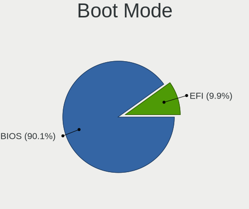
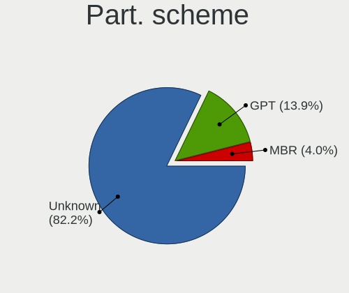
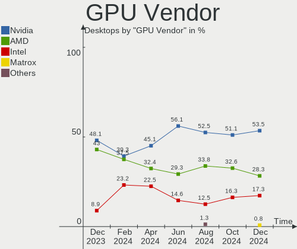
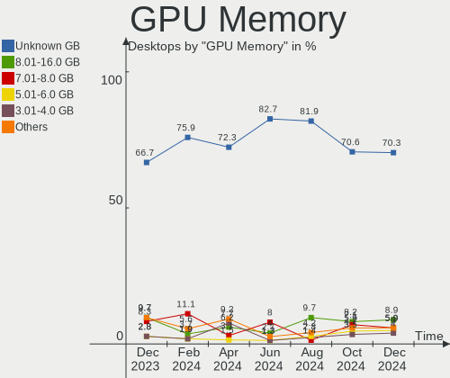
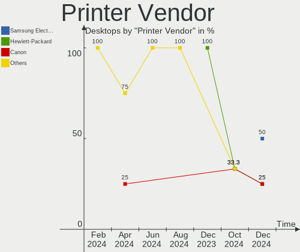

Pop!_OS - Hardware Trends (Desktops)
------------------------------------

A project to identify most popular hardware characteristics and track their change
over time based on data collected by Linux users at https://Linux-Hardware.org.

Anyone can contribute to this report by the [hw-probe](https://github.com/linuxhw/hw-probe) tool:

    sudo -E hw-probe -all -upload

This report is for one last month. Overall report since the beginning of time: [TestDays](https://github.com/linuxhw/TestDays)

Period: Feb, 2023.

Contents
--------

* [ System ](#system)
  - [ OS                       ](#os)
  - [ OS Family                ](#os-family)
  - [ Kernel                   ](#kernel)
  - [ Kernel Family            ](#kernel-family)
  - [ Kernel Major Ver.        ](#kernel-major-ver)
  - [ Arch                     ](#arch)
  - [ DE                       ](#de)
  - [ Display Server           ](#display-server)
  - [ Display Manager          ](#display-manager)
  - [ OS Lang                  ](#os-lang)
  - [ Boot Mode                ](#boot-mode)
  - [ Filesystem               ](#filesystem)
  - [ Part. scheme             ](#part-scheme)
  - [ Dual Boot with Linux/BSD ](#dual-boot-with-linuxbsd)
  - [ Dual Boot (Win)          ](#dual-boot-win)

* [ Board ](#board)
  - [ Vendor                   ](#vendor)
  - [ Model                    ](#model)
  - [ Model Family             ](#model-family)
  - [ MFG Year                 ](#mfg-year)
  - [ Form Factor              ](#form-factor)
  - [ Secure Boot              ](#secure-boot)
  - [ Coreboot                 ](#coreboot)
  - [ RAM Size                 ](#ram-size)
  - [ RAM Used                 ](#ram-used)
  - [ Total Drives             ](#total-drives)
  - [ Has CD-ROM               ](#has-cd-rom)
  - [ Has Ethernet             ](#has-ethernet)
  - [ Has WiFi                 ](#has-wifi)
  - [ Has Bluetooth            ](#has-bluetooth)

* [ Location ](#location)
  - [ Country                  ](#country)
  - [ City                     ](#city)

* [ Drives ](#drives)
  - [ Drive Vendor             ](#drive-vendor)
  - [ Drive Model              ](#drive-model)
  - [ HDD Vendor               ](#hdd-vendor)
  - [ SSD Vendor               ](#ssd-vendor)
  - [ Drive Kind               ](#drive-kind)
  - [ Drive Connector          ](#drive-connector)
  - [ Drive Size               ](#drive-size)
  - [ Space Total              ](#space-total)
  - [ Space Used               ](#space-used)
  - [ Malfunc. Drives          ](#malfunc-drives)
  - [ Malfunc. Drive Vendor    ](#malfunc-drive-vendor)
  - [ Malfunc. HDD Vendor      ](#malfunc-hdd-vendor)
  - [ Malfunc. Drive Kind      ](#malfunc-drive-kind)
  - [ Failed Drives            ](#failed-drives)
  - [ Failed Drive Vendor      ](#failed-drive-vendor)
  - [ Drive Status             ](#drive-status)

* [ Storage controller ](#storage-controller)
  - [ Storage Vendor           ](#storage-vendor)
  - [ Storage Model            ](#storage-model)
  - [ Storage Kind             ](#storage-kind)

* [ Processor ](#processor)
  - [ CPU Vendor               ](#cpu-vendor)
  - [ CPU Model                ](#cpu-model)
  - [ CPU Model Family         ](#cpu-model-family)
  - [ CPU Cores                ](#cpu-cores)
  - [ CPU Sockets              ](#cpu-sockets)
  - [ CPU Threads              ](#cpu-threads)
  - [ CPU Op-Modes             ](#cpu-op-modes)
  - [ CPU Microcode            ](#cpu-microcode)
  - [ CPU Microarch            ](#cpu-microarch)

* [ Graphics ](#graphics)
  - [ GPU Vendor               ](#gpu-vendor)
  - [ GPU Model                ](#gpu-model)
  - [ GPU Combo                ](#gpu-combo)
  - [ GPU Driver               ](#gpu-driver)
  - [ GPU Memory               ](#gpu-memory)

* [ Monitor ](#monitor)
  - [ Monitor Vendor           ](#monitor-vendor)
  - [ Monitor Model            ](#monitor-model)
  - [ Monitor Resolution       ](#monitor-resolution)
  - [ Monitor Diagonal         ](#monitor-diagonal)
  - [ Monitor Width            ](#monitor-width)
  - [ Aspect Ratio             ](#aspect-ratio)
  - [ Monitor Area             ](#monitor-area)
  - [ Pixel Density            ](#pixel-density)
  - [ Multiple Monitors        ](#multiple-monitors)

* [ Network ](#network)
  - [ Net Controller Vendor    ](#net-controller-vendor)
  - [ Net Controller Model     ](#net-controller-model)
  - [ Wireless Vendor          ](#wireless-vendor)
  - [ Wireless Model           ](#wireless-model)
  - [ Ethernet Vendor          ](#ethernet-vendor)
  - [ Ethernet Model           ](#ethernet-model)
  - [ Net Controller Kind      ](#net-controller-kind)
  - [ Used Controller          ](#used-controller)
  - [ NICs                     ](#nics)
  - [ IPv6                     ](#ipv6)

* [ Bluetooth ](#bluetooth)
  - [ Bluetooth Vendor         ](#bluetooth-vendor)
  - [ Bluetooth Model          ](#bluetooth-model)

* [ Sound ](#sound)
  - [ Sound Vendor             ](#sound-vendor)
  - [ Sound Model              ](#sound-model)

* [ Memory ](#memory)
  - [ Memory Vendor            ](#memory-vendor)
  - [ Memory Model             ](#memory-model)
  - [ Memory Kind              ](#memory-kind)
  - [ Memory Form Factor       ](#memory-form-factor)
  - [ Memory Size              ](#memory-size)
  - [ Memory Speed             ](#memory-speed)

* [ Printers & scanners ](#printers--scanners)
  - [ Printer Vendor           ](#printer-vendor)
  - [ Printer Model            ](#printer-model)
  - [ Scanner Vendor           ](#scanner-vendor)
  - [ Scanner Model            ](#scanner-model)

* [ Camera ](#camera)
  - [ Camera Vendor            ](#camera-vendor)
  - [ Camera Model             ](#camera-model)

* [ Security ](#security)
  - [ Fingerprint Vendor       ](#fingerprint-vendor)
  - [ Fingerprint Model        ](#fingerprint-model)
  - [ Chipcard Vendor          ](#chipcard-vendor)
  - [ Chipcard Model           ](#chipcard-model)

* [ Unsupported ](#unsupported)
  - [ Unsupported Devices      ](#unsupported-devices)
  - [ Unsupported Device Types ](#unsupported-device-types)

System
------

OS
--

Installed operating systems

| Name          | Desktops | Percent |
|---------------|----------|---------|
| Pop!_OS 22.04 | 74       | 98.67%  |
| Pop!_OS 20.04 | 1        | 1.33%   |

OS Family
---------

OS without a version

| Name    | Desktops | Percent |
|---------|----------|---------|
| Pop!_OS | 75       | 100%    |

Kernel
------

Version of the Linux kernel

| Version                 | Desktops | Percent |
|-------------------------|----------|---------|
| 6.0.12-76060006-generic | 61       | 81.33%  |
| 6.1.11-76060111-generic | 9        | 12%     |
| 6.0.6-76060006-generic  | 2        | 2.67%   |
| 6.1.13-x64v3-xanmod1    | 1        | 1.33%   |
| 6.1.12-x64v3-xanmod1    | 1        | 1.33%   |
| 5.17.5-76051705-generic | 1        | 1.33%   |

Kernel Family
-------------

Linux kernel without a distro release

| Version | Desktops | Percent |
|---------|----------|---------|
| 6.0.12  | 61       | 81.33%  |
| 6.1.11  | 9        | 12%     |
| 6.0.6   | 2        | 2.67%   |
| 6.1.13  | 1        | 1.33%   |
| 6.1.12  | 1        | 1.33%   |
| 5.17.5  | 1        | 1.33%   |

Kernel Major Ver.
-----------------

Linux kernel major version

| Version | Desktops | Percent |
|---------|----------|---------|
| 6.0     | 63       | 84%     |
| 6.1     | 11       | 14.67%  |
| 5.17    | 1        | 1.33%   |

Arch
----

OS architecture (x86_64, i586, etc.)

| Name   | Desktops | Percent |
|--------|----------|---------|
| x86_64 | 75       | 100%    |

DE
--

Desktop Environment

| Name  | Desktops | Percent |
|-------|----------|---------|
| GNOME | 75       | 100%    |

Display Server
--------------

X11 or Wayland

| Name    | Desktops | Percent |
|---------|----------|---------|
| X11     | 74       | 98.67%  |
| Wayland | 1        | 1.33%   |

Display Manager
---------------

SDDM, LightDM, etc.

| Name    | Desktops | Percent |
|---------|----------|---------|
| Unknown | 69       | 92%     |
| GDM3    | 6        | 8%      |

OS Lang
-------

Language

| Lang  | Desktops | Percent |
|-------|----------|---------|
| en_US | 49       | 65.33%  |
| de_DE | 6        | 8%      |
| en_GB | 4        | 5.33%   |
| pt_BR | 3        | 4%      |
| en_CA | 3        | 4%      |
| pl_PL | 2        | 2.67%   |
| fr_FR | 2        | 2.67%   |
| nl_BE | 1        | 1.33%   |
| it_IT | 1        | 1.33%   |
| fi_FI | 1        | 1.33%   |
| et_EE | 1        | 1.33%   |
| en_AU | 1        | 1.33%   |
| C     | 1        | 1.33%   |

Boot Mode
---------

EFI or BIOS

| Mode | Desktops | Percent |
|------|----------|---------|
| BIOS | 69       | 92%     |
| EFI  | 6        | 8%      |

Filesystem
----------

Type of filesystem

| Type | Desktops | Percent |
|------|----------|---------|
| Ext4 | 74       | 98.67%  |
| Xfs  | 1        | 1.33%   |

Part. scheme
------------

Scheme of partitioning

| Type    | Desktops | Percent |
|---------|----------|---------|
| Unknown | 69       | 92%     |
| GPT     | 6        | 8%      |

Dual Boot with Linux/BSD
------------------------

Hosting more than one Linux/BSD

| Dual boot | Desktops | Percent |
|-----------|----------|---------|
| No        | 74       | 98.67%  |
| Yes       | 1        | 1.33%   |

Dual Boot (Win)
---------------

Hosting Linux and Windows

| Dual boot | Desktops | Percent |
|-----------|----------|---------|
| No        | 71       | 94.67%  |
| Yes       | 4        | 5.33%   |

Board
-----

Vendor
------

Motherboard manufacturer

| Name                | Desktops | Percent |
|---------------------|----------|---------|
| Gigabyte Technology | 17       | 22.67%  |
| ASUSTek Computer    | 17       | 22.67%  |
| MSI                 | 9        | 12%     |
| Dell                | 8        | 10.67%  |
| ASRock              | 6        | 8%      |
| Hewlett-Packard     | 5        | 6.67%   |
| Lenovo              | 4        | 5.33%   |
| ZOTAC               | 1        | 1.33%   |
| System76            | 1        | 1.33%   |
| Samsung Electronics | 1        | 1.33%   |
| MACHINIST           | 1        | 1.33%   |
| Intel               | 1        | 1.33%   |
| Huanan              | 1        | 1.33%   |
| Biostar             | 1        | 1.33%   |
| Alienware           | 1        | 1.33%   |
| Acer                | 1        | 1.33%   |

Model
-----

Motherboard model

| Name                                  | Desktops | Percent |
|---------------------------------------|----------|---------|
| MSI MS-7D32                           | 2        | 2.67%   |
| Gigabyte X570 AORUS ELITE             | 2        | 2.67%   |
| ASUS TUF Gaming X570-PLUS             | 2        | 2.67%   |
| ASUS PRIME B550M-A                    | 2        | 2.67%   |
| ASUS All Series                       | 2        | 2.67%   |
| ZOTAC MEK1                            | 1        | 1.33%   |
| System76 Thelio                       | 1        | 1.33%   |
| Samsung DeskTop System                | 1        | 1.33%   |
| MSI MS-7E06                           | 1        | 1.33%   |
| MSI MS-7D25                           | 1        | 1.33%   |
| MSI MS-7D19                           | 1        | 1.33%   |
| MSI MS-7C02                           | 1        | 1.33%   |
| MSI MS-7B86                           | 1        | 1.33%   |
| MSI MS-7B17                           | 1        | 1.33%   |
| MSI MS-7592                           | 1        | 1.33%   |
| MACHINIST X99-RS9 V2.0                | 1        | 1.33%   |
| Lenovo ThinkStation P520 30BFS44D00   | 1        | 1.33%   |
| Lenovo ThinkStation P510 30B5         | 1        | 1.33%   |
| Lenovo ThinkCentre M700 10GSS05U00    | 1        | 1.33%   |
| Lenovo IdeaCentre 5 14ACN6 90RX005QMH | 1        | 1.33%   |
| Intel X99                             | 1        | 1.33%   |
| Huanan X99-QD4 V1.0                   | 1        | 1.33%   |
| HP Z840 Workstation                   | 1        | 1.33%   |
| HP Pav 590-p0016no DT PC NRI          | 1        | 1.33%   |
| HP OMEN by Desktop PC 880-p1xx        | 1        | 1.33%   |
| HP EliteDesk 800 G2 SFF               | 1        | 1.33%   |
| HP EliteDesk 800 G1 TWR               | 1        | 1.33%   |
| Gigabyte Z590I AORUS ULTRA            | 1        | 1.33%   |
| Gigabyte Z170X-UD5                    | 1        | 1.33%   |
| Gigabyte X570 I AORUS PRO WIFI        | 1        | 1.33%   |
| Gigabyte X399 AORUS Gaming 7          | 1        | 1.33%   |
| Gigabyte H81M-HD3                     | 1        | 1.33%   |
| Gigabyte GA-MA770T-UD3P               | 1        | 1.33%   |
| Gigabyte GA-78LMT-S2P                 | 1        | 1.33%   |
| Gigabyte G41MT-S2                     | 1        | 1.33%   |
| Gigabyte F2A55M-HD2                   | 1        | 1.33%   |
| Gigabyte B85M-DS3H-A                  | 1        | 1.33%   |
| Gigabyte B650I AORUS ULTRA            | 1        | 1.33%   |
| Gigabyte B550I AORUS PRO AX           | 1        | 1.33%   |
| Gigabyte B450M DS3H                   | 1        | 1.33%   |

Model Family
------------

Motherboard model prefix

| Name                    | Desktops | Percent |
|-------------------------|----------|---------|
| ASUS TUF                | 4        | 5.33%   |
| ASUS PRIME              | 4        | 5.33%   |
| Gigabyte X570           | 3        | 4%      |
| Dell Precision          | 3        | 4%      |
| Dell OptiPlex           | 3        | 4%      |
| MSI MS-7D32             | 2        | 2.67%   |
| Lenovo ThinkStation     | 2        | 2.67%   |
| HP EliteDesk            | 2        | 2.67%   |
| ASUS ROG                | 2        | 2.67%   |
| ASUS All                | 2        | 2.67%   |
| ZOTAC MEK1              | 1        | 1.33%   |
| System76 Thelio         | 1        | 1.33%   |
| Samsung DeskTop         | 1        | 1.33%   |
| MSI MS-7E06             | 1        | 1.33%   |
| MSI MS-7D25             | 1        | 1.33%   |
| MSI MS-7D19             | 1        | 1.33%   |
| MSI MS-7C02             | 1        | 1.33%   |
| MSI MS-7B86             | 1        | 1.33%   |
| MSI MS-7B17             | 1        | 1.33%   |
| MSI MS-7592             | 1        | 1.33%   |
| MACHINIST X99-RS9       | 1        | 1.33%   |
| Lenovo ThinkCentre      | 1        | 1.33%   |
| Lenovo IdeaCentre       | 1        | 1.33%   |
| Intel X99               | 1        | 1.33%   |
| Huanan X99-QD4          | 1        | 1.33%   |
| HP Z840                 | 1        | 1.33%   |
| HP Pav                  | 1        | 1.33%   |
| HP OMEN                 | 1        | 1.33%   |
| Gigabyte Z590I          | 1        | 1.33%   |
| Gigabyte Z170X-UD5      | 1        | 1.33%   |
| Gigabyte X399           | 1        | 1.33%   |
| Gigabyte H81M-HD3       | 1        | 1.33%   |
| Gigabyte GA-MA770T-UD3P | 1        | 1.33%   |
| Gigabyte GA-78LMT-S2P   | 1        | 1.33%   |
| Gigabyte G41MT-S2       | 1        | 1.33%   |
| Gigabyte F2A55M-HD2     | 1        | 1.33%   |
| Gigabyte B85M-DS3H-A    | 1        | 1.33%   |
| Gigabyte B650I          | 1        | 1.33%   |
| Gigabyte B550I          | 1        | 1.33%   |
| Gigabyte B450M          | 1        | 1.33%   |

MFG Year
--------

Motherboard manufacture year

| Year | Desktops | Percent |
|------|----------|---------|
| 2020 | 14       | 18.67%  |
| 2021 | 9        | 12%     |
| 2019 | 8        | 10.67%  |
| 2022 | 7        | 9.33%   |
| 2018 | 7        | 9.33%   |
| 2013 | 6        | 8%      |
| 2015 | 5        | 6.67%   |
| 2011 | 5        | 6.67%   |
| 2017 | 3        | 4%      |
| 2014 | 3        | 4%      |
| 2012 | 3        | 4%      |
| 2023 | 1        | 1.33%   |
| 2016 | 1        | 1.33%   |
| 2010 | 1        | 1.33%   |
| 2009 | 1        | 1.33%   |
| 2007 | 1        | 1.33%   |

Form Factor
-----------

Physical design of the computer

| Name    | Desktops | Percent |
|---------|----------|---------|
| Desktop | 75       | 100%    |

Secure Boot
-----------

Enabled or disabled

| State    | Desktops | Percent |
|----------|----------|---------|
| Disabled | 74       | 98.67%  |
| Enabled  | 1        | 1.33%   |

Coreboot
--------

Have coreboot on board

| Used | Desktops | Percent |
|------|----------|---------|
| No   | 75       | 100%    |

RAM Size
--------

Total RAM memory

| Size in GB  | Desktops | Percent |
|-------------|----------|---------|
| 16.01-24.0  | 25       | 33.33%  |
| 32.01-64.0  | 24       | 32%     |
| 8.01-16.0   | 12       | 16%     |
| 4.01-8.0    | 6        | 8%      |
| 64.01-256.0 | 4        | 5.33%   |
| 3.01-4.0    | 2        | 2.67%   |
| 24.01-32.0  | 2        | 2.67%   |

RAM Used
--------

Used RAM memory

| Used GB    | Desktops | Percent |
|------------|----------|---------|
| 4.01-8.0   | 33       | 44%     |
| 8.01-16.0  | 14       | 18.67%  |
| 3.01-4.0   | 13       | 17.33%  |
| 2.01-3.0   | 11       | 14.67%  |
| 1.01-2.0   | 3        | 4%      |
| 24.01-32.0 | 1        | 1.33%   |

Total Drives
------------

Number of drives on board

| Drives | Desktops | Percent |
|--------|----------|---------|
| 2      | 28       | 37.33%  |
| 1      | 23       | 30.67%  |
| 3      | 9        | 12%     |
| 5      | 7        | 9.33%   |
| 4      | 7        | 9.33%   |
| 6      | 1        | 1.33%   |

Has CD-ROM
----------

Has CD-ROM on board

| Presented | Desktops | Percent |
|-----------|----------|---------|
| No        | 51       | 68%     |
| Yes       | 24       | 32%     |

Has Ethernet
------------

Has Ethernet on board

| Presented | Desktops | Percent |
|-----------|----------|---------|
| Yes       | 75       | 100%    |

Has WiFi
--------

Has WiFi module

| Presented | Desktops | Percent |
|-----------|----------|---------|
| Yes       | 45       | 60%     |
| No        | 30       | 40%     |

Has Bluetooth
-------------

Has Bluetooth module

| Presented | Desktops | Percent |
|-----------|----------|---------|
| No        | 39       | 52%     |
| Yes       | 36       | 48%     |

Location
--------

Country
-------

Geographic location (country)

| Country     | Desktops | Percent |
|-------------|----------|---------|
| USA         | 30       | 40%     |
| Germany     | 7        | 9.33%   |
| UK          | 4        | 5.33%   |
| Poland      | 4        | 5.33%   |
| Canada      | 4        | 5.33%   |
| Finland     | 3        | 4%      |
| Brazil      | 3        | 4%      |
| Netherlands | 2        | 2.67%   |
| Malaysia    | 2        | 2.67%   |
| France      | 2        | 2.67%   |
| Belgium     | 2        | 2.67%   |
| Sri Lanka   | 1        | 1.33%   |
| Slovakia    | 1        | 1.33%   |
| Serbia      | 1        | 1.33%   |
| Russia      | 1        | 1.33%   |
| Romania     | 1        | 1.33%   |
| Pakistan    | 1        | 1.33%   |
| Italy       | 1        | 1.33%   |
| Hungary     | 1        | 1.33%   |
| Estonia     | 1        | 1.33%   |
| Czechia     | 1        | 1.33%   |
| Bulgaria    | 1        | 1.33%   |
| Australia   | 1        | 1.33%   |

City
----

Geographic location (city)

| City           | Desktops | Percent |
|----------------|----------|---------|
| Seattle        | 3        | 4%      |
| Lodz           | 2        | 2.67%   |
| Helsinki       | 2        | 2.67%   |
| Hamburg        | 2        | 2.67%   |
| Bamberg        | 2        | 2.67%   |
| Wiesbaden      | 1        | 1.33%   |
| Viking         | 1        | 1.33%   |
| Traverse City  | 1        | 1.33%   |
| Tilehurst      | 1        | 1.33%   |
| Tallinn        | 1        | 1.33%   |
| Szeged         | 1        | 1.33%   |
| Sunnyside      | 1        | 1.33%   |
| Stafford       | 1        | 1.33%   |
| St Louis       | 1        | 1.33%   |
| Sofia          | 1        | 1.33%   |
| Sarasota       | 1        | 1.33%   |
| San Jose       | 1        | 1.33%   |
| Roermond       | 1        | 1.33%   |
| Riverview      | 1        | 1.33%   |
| Rio de Janeiro | 1        | 1.33%   |
| Prosper        | 1        | 1.33%   |
| Prague         | 1        | 1.33%   |
| Oudenaarde     | 1        | 1.33%   |
| Ogden          | 1        | 1.33%   |
| Oak Lawn       | 1        | 1.33%   |
| Moscow         | 1        | 1.33%   |
| Melbourne      | 1        | 1.33%   |
| Mateus Leme    | 1        | 1.33%   |
| Little Rock    | 1        | 1.33%   |
| Leeds          | 1        | 1.33%   |
| Lake Orion     | 1        | 1.33%   |
| La Plata       | 1        | 1.33%   |
| Kuala Lumpur   | 1        | 1.33%   |
| Kenosha        | 1        | 1.33%   |
| Karachi        | 1        | 1.33%   |
| Jyväskylä    | 1        | 1.33%   |
| Jacksonville   | 1        | 1.33%   |
| Hudson         | 1        | 1.33%   |
| Hooksett       | 1        | 1.33%   |
| Hanau          | 1        | 1.33%   |

Drives
------

Drive Vendor
------------

Hard drive vendors

| Vendor                       | Desktops | Drives | Percent |
|------------------------------|----------|--------|---------|
| Samsung Electronics          | 31       | 38     | 20.81%  |
| Seagate                      | 21       | 22     | 14.09%  |
| WDC                          | 19       | 25     | 12.75%  |
| SanDisk                      | 16       | 17     | 10.74%  |
| Crucial                      | 7        | 8      | 4.7%    |
| Toshiba                      | 5        | 6      | 3.36%   |
| Kingston                     | 4        | 5      | 2.68%   |
| Intel                        | 4        | 6      | 2.68%   |
| ADATA Technology             | 4        | 4      | 2.68%   |
| SK hynix                     | 3        | 4      | 2.01%   |
| PNY                          | 3        | 4      | 2.01%   |
| Phison Electronics           | 3        | 4      | 2.01%   |
| Micron/Crucial Technology    | 3        | 3      | 2.01%   |
| Verbatim                     | 2        | 2      | 1.34%   |
| Unknown                      | 2        | 2      | 1.34%   |
| Silicon Motion               | 2        | 2      | 1.34%   |
| Realtek Semiconductor        | 2        | 2      | 1.34%   |
| HGST                         | 2        | 2      | 1.34%   |
| Gigabyte Technology          | 2        | 2      | 1.34%   |
| A-DATA Technology            | 2        | 2      | 1.34%   |
| XPG                          | 1        | 1      | 0.67%   |
| Timetec                      | 1        | 1      | 0.67%   |
| Team                         | 1        | 2      | 0.67%   |
| Shenzhen Longsys Electronics | 1        | 2      | 0.67%   |
| RZX                          | 1        | 1      | 0.67%   |
| Realtek                      | 1        | 1      | 0.67%   |
| OCZ                          | 1        | 1      | 0.67%   |
| Micron Technology            | 1        | 1      | 0.67%   |
| MAXIO Technology (Hangzhou)  | 1        | 1      | 0.67%   |
| JMicron Technology           | 1        | 1      | 0.67%   |
| Intenso                      | 1        | 1      | 0.67%   |
| Elite                        | 1        | 2      | 0.67%   |

Drive Model
-----------

Hard drive models

| Model                                                           | Desktops | Percent |
|-----------------------------------------------------------------|----------|---------|
| Samsung NVMe SSD Controller SM981/PM981/PM983 250GB             | 9        | 5.29%   |
| Samsung SSD 980 1TB                                             | 5        | 2.94%   |
| Samsung NVMe SSD Controller PM9A1/PM9A3/980PRO 960GB            | 4        | 2.35%   |
| Samsung SSD 860 EVO 1TB                                         | 3        | 1.76%   |
| ADATA XPG SX8200 Pro PCIe Gen3x4 M.2 2280 Solid State Drive 2TB | 3        | 1.76%   |
| WDC WD5000LPCX-60VHAT0 500GB                                    | 2        | 1.18%   |
| WDC WD10EZEX-00WN4A0 1TB                                        | 2        | 1.18%   |
| Verbatim Vi550 S3 512GB                                         | 2        | 1.18%   |
| Unknown SD/MMC/MS PRO 16GB                                      | 2        | 1.18%   |
| Toshiba HDWD130 3TB                                             | 2        | 1.18%   |
| Seagate ST500DM002-1BD142 500GB                                 | 2        | 1.18%   |
| Seagate ST4000DM004-2CV104 4TB                                  | 2        | 1.18%   |
| Seagate ST2000DM001-1ER164 2TB                                  | 2        | 1.18%   |
| Sandisk WD Blue SN570 1TB                                       | 2        | 1.18%   |
| SanDisk SSD PLUS 1000GB                                         | 2        | 1.18%   |
| Samsung SSD 850 EVO 500GB                                       | 2        | 1.18%   |
| Samsung SSD 850 EVO 250GB                                       | 2        | 1.18%   |
| PNY CS1311 480GB SSD                                            | 2        | 1.18%   |
| Micron/Crucial P2 NVMe PCIe SSD 1TB                             | 2        | 1.18%   |
| Kingston SA400S37960G 960GB SSD                                 | 2        | 1.18%   |
| Crucial CT240BX500SSD1 240GB                                    | 2        | 1.18%   |
| Crucial CT1000BX500SSD1 1TB                                     | 2        | 1.18%   |
| XPG SPECTRIX S40G 4TB                                           | 1        | 0.59%   |
| WDC WDS500G2B0A-00SM50 500GB SSD                                | 1        | 0.59%   |
| WDC WDS100T2B0C-00PXH0 1TB                                      | 1        | 0.59%   |
| WDC WD5000BHTZ-04JCPV1 500GB                                    | 1        | 0.59%   |
| WDC WD5000AZLX-08K2TA0 500GB                                    | 1        | 0.59%   |
| WDC WD5000AAKX-00ERMA0 500GB                                    | 1        | 0.59%   |
| WDC WD4000FYYZ-01UL1B0 4TB                                      | 1        | 0.59%   |
| WDC WD2500JS-23MHB0 250GB                                       | 1        | 0.59%   |
| WDC WD20EZBX-00AYRA0 2TB                                        | 1        | 0.59%   |
| WDC WD20EZAZ-00GGJB0 2TB                                        | 1        | 0.59%   |
| WDC WD20EARX-22PASB0 2TB                                        | 1        | 0.59%   |
| WDC WD20EARS-00MVWB0 2TB                                        | 1        | 0.59%   |
| WDC WD1600BEVT-22ZCT0 160GB                                     | 1        | 0.59%   |
| WDC WD10SPCX-22HWST0 1TB                                        | 1        | 0.59%   |
| WDC WD10EZEX-60M2NA0 1TB                                        | 1        | 0.59%   |
| WDC WD10EZEX-22BN5A0 1TB                                        | 1        | 0.59%   |
| WDC WD10EZEX-08WN4A0 1TB                                        | 1        | 0.59%   |
| WDC WD10EZEX-00BN5A0 1TB                                        | 1        | 0.59%   |

HDD Vendor
----------

Hard disk drive vendors

| Vendor              | Desktops | Drives | Percent |
|---------------------|----------|--------|---------|
| Seagate             | 20       | 21     | 41.67%  |
| WDC                 | 18       | 23     | 37.5%   |
| Toshiba             | 4        | 5      | 8.33%   |
| Unknown             | 2        | 2      | 4.17%   |
| HGST                | 2        | 2      | 4.17%   |
| Samsung Electronics | 1        | 1      | 2.08%   |
| JMicron Technology  | 1        | 1      | 2.08%   |

SSD Vendor
----------

Solid state drive vendors

| Vendor              | Desktops | Drives | Percent |
|---------------------|----------|--------|---------|
| Samsung Electronics | 14       | 14     | 28%     |
| SanDisk             | 9        | 10     | 18%     |
| Crucial             | 6        | 7      | 12%     |
| Kingston            | 4        | 5      | 8%      |
| PNY                 | 3        | 4      | 6%      |
| SK hynix            | 2        | 3      | 4%      |
| Intel               | 2        | 3      | 4%      |
| A-DATA Technology   | 2        | 2      | 4%      |
| WDC                 | 1        | 1      | 2%      |
| Timetec             | 1        | 1      | 2%      |
| Team                | 1        | 2      | 2%      |
| Seagate             | 1        | 1      | 2%      |
| RZX                 | 1        | 1      | 2%      |
| OCZ                 | 1        | 1      | 2%      |
| Micron Technology   | 1        | 1      | 2%      |
| Intenso             | 1        | 1      | 2%      |

Drive Kind
----------

HDD or SSD

| Kind    | Desktops | Drives | Percent |
|---------|----------|--------|---------|
| HDD     | 43       | 55     | 35.54%  |
| NVMe    | 39       | 59     | 32.23%  |
| SSD     | 36       | 57     | 29.75%  |
| Unknown | 3        | 4      | 2.48%   |

Drive Connector
---------------

SATA, SAS, NVMe, etc.

| Type | Desktops | Drives | Percent |
|------|----------|--------|---------|
| SATA | 59       | 107    | 55.14%  |
| NVMe | 39       | 58     | 36.45%  |
| SAS  | 9        | 10     | 8.41%   |

Drive Size
----------

Size of hard drive

| Size in TB | Desktops | Drives | Percent |
|------------|----------|--------|---------|
| 0.01-0.5   | 36       | 48     | 43.9%   |
| 0.51-1.0   | 30       | 45     | 36.59%  |
| 1.01-2.0   | 9        | 11     | 10.98%  |
| 3.01-4.0   | 4        | 4      | 4.88%   |
| 2.01-3.0   | 2        | 3      | 2.44%   |
| 4.01-10.0  | 1        | 1      | 1.22%   |

Space Total
-----------

Amount of disk space available on the file system

| Size in GB     | Desktops | Percent |
|----------------|----------|---------|
| 501-1000       | 17       | 22.67%  |
| 251-500        | 16       | 21.33%  |
| 101-250        | 13       | 17.33%  |
| More than 3000 | 8        | 10.67%  |
| 2001-3000      | 8        | 10.67%  |
| 1001-2000      | 8        | 10.67%  |
| 21-50          | 3        | 4%      |
| 1-20           | 1        | 1.33%   |
| 51-100         | 1        | 1.33%   |

Space Used
----------

Amount of used disk space

| Used GB        | Desktops | Percent |
|----------------|----------|---------|
| 21-50          | 15       | 20%     |
| 1-20           | 13       | 17.33%  |
| 101-250        | 12       | 16%     |
| 51-100         | 11       | 14.67%  |
| 501-1000       | 9        | 12%     |
| 251-500        | 7        | 9.33%   |
| 1001-2000      | 4        | 5.33%   |
| More than 3000 | 2        | 2.67%   |
| 2001-3000      | 2        | 2.67%   |

Malfunc. Drives
---------------

Drive models with a malfunction

Zero info for selected period =(

Malfunc. Drive Vendor
---------------------

Vendors of faulty drives

Zero info for selected period =(

Malfunc. HDD Vendor
-------------------

Vendors of faulty HDD drives

Zero info for selected period =(

Malfunc. Drive Kind
-------------------

Kinds of faulty drives

Zero info for selected period =(

Failed Drives
-------------

Failed drive models

Zero info for selected period =(

Failed Drive Vendor
-------------------

Failed drive vendors

Zero info for selected period =(

Drive Status
------------

Number of failed and malfunc. drives

| Status   | Desktops | Drives | Percent |
|----------|----------|--------|---------|
| Detected | 70       | 159    | 92.11%  |
| Works    | 6        | 16     | 7.89%   |

Storage controller
------------------

Storage Vendor
--------------

Storage controller vendors

| Vendor                       | Desktops | Percent |
|------------------------------|----------|---------|
| Intel                        | 40       | 30.77%  |
| AMD                          | 36       | 27.69%  |
| Samsung Electronics          | 19       | 14.62%  |
| SanDisk                      | 9        | 6.92%   |
| Phison Electronics           | 5        | 3.85%   |
| Micron/Crucial Technology    | 4        | 3.08%   |
| ADATA Technology             | 4        | 3.08%   |
| Realtek Semiconductor        | 3        | 2.31%   |
| ASMedia Technology           | 3        | 2.31%   |
| Silicon Motion               | 2        | 1.54%   |
| Toshiba America Info Systems | 1        | 0.77%   |
| SK hynix                     | 1        | 0.77%   |
| Shenzhen Longsys Electronics | 1        | 0.77%   |
| MAXIO Technology (Hangzhou)  | 1        | 0.77%   |
| Broadcom / LSI               | 1        | 0.77%   |

Storage Model
-------------

Storage controller models

| Model                                                                          | Desktops | Percent |
|--------------------------------------------------------------------------------|----------|---------|
| AMD FCH SATA Controller [AHCI mode]                                            | 17       | 11.04%  |
| Samsung NVMe SSD Controller SM981/PM981/PM983                                  | 11       | 7.14%   |
| Intel 8 Series/C220 Series Chipset Family 6-port SATA Controller 1 [AHCI mode] | 9        | 5.84%   |
| AMD 500 Series Chipset SATA Controller                                         | 9        | 5.84%   |
| Samsung NVMe SSD Controller 980                                                | 6        | 3.9%    |
| AMD 400 Series Chipset SATA Controller                                         | 6        | 3.9%    |
| Intel 200 Series PCH SATA controller [AHCI mode]                               | 5        | 3.25%   |
| Samsung NVMe SSD Controller PM9A1/PM9A3/980PRO                                 | 4        | 2.6%    |
| Intel Alder Lake-S PCH SATA Controller [AHCI Mode]                             | 4        | 2.6%    |
| AMD SB7x0/SB8x0/SB9x0 IDE Controller                                           | 4        | 2.6%    |
| Intel Q170/Q150/B150/H170/H110/Z170/CM236 Chipset SATA Controller [AHCI Mode]  | 3        | 1.95%   |
| Intel C610/X99 series chipset sSATA Controller [AHCI mode]                     | 3        | 1.95%   |
| ASMedia ASM1062 Serial ATA Controller                                          | 3        | 1.95%   |
| AMD SB7x0/SB8x0/SB9x0 SATA Controller [AHCI mode]                              | 3        | 1.95%   |
| ADATA XPG SX8200 Pro PCIe Gen3x4 M.2 2280 Solid State Drive                    | 3        | 1.95%   |
| Silicon Motion SM2263EN/SM2263XT SSD Controller                                | 2        | 1.3%    |
| SanDisk WD Blue SN570 NVMe SSD                                                 | 2        | 1.3%    |
| SanDisk WD Blue SN550 NVMe SSD                                                 | 2        | 1.3%    |
| SanDisk WD Blue SN500 / PC SN520 NVMe SSD                                      | 2        | 1.3%    |
| Realtek Realtek Non-Volatile memory controller                                 | 2        | 1.3%    |
| Phison E16 PCIe4 NVMe Controller                                               | 2        | 1.3%    |
| Micron/Crucial P2 NVMe PCIe SSD                                                | 2        | 1.3%    |
| Intel SATA Controller [RAID mode]                                              | 2        | 1.3%    |
| Intel NM10/ICH7 Family SATA Controller [IDE mode]                              | 2        | 1.3%    |
| Intel Cannon Lake PCH SATA AHCI Controller                                     | 2        | 1.3%    |
| Intel C610/X99 series chipset 6-Port SATA Controller [AHCI mode]               | 2        | 1.3%    |
| Intel 500 Series Chipset Family SATA AHCI Controller                           | 2        | 1.3%    |
| AMD SB7x0/SB8x0/SB9x0 SATA Controller [IDE mode]                               | 2        | 1.3%    |
| Toshiba America Info Systems XG6 NVMe SSD Controller                           | 1        | 0.65%   |
| SK hynix BC501 NVMe Solid State Drive                                          | 1        | 0.65%   |
| Shenzhen Longsys Electronics Non-Volatile memory controller                    | 1        | 0.65%   |
| SanDisk WD PC SN810 / Black SN850 NVMe SSD                                     | 1        | 0.65%   |
| SanDisk WD Black SN750 / PC SN730 NVMe SSD                                     | 1        | 0.65%   |
| SanDisk Non-Volatile memory controller                                         | 1        | 0.65%   |
| Samsung NVMe SSD Controller SM961/PM961/SM963                                  | 1        | 0.65%   |
| Realtek RTS5763DL NVMe SSD Controller                                          | 1        | 0.65%   |
| Phison PS5013 E13 NVMe Controller                                              | 1        | 0.65%   |
| Phison NVMe Storage Controller                                                 | 1        | 0.65%   |
| Phison E18 PCIe4 NVMe Controller                                               | 1        | 0.65%   |
| Phison E12 NVMe Controller                                                     | 1        | 0.65%   |

Storage Kind
------------

Kind of storage controller (IDE, SATA, NVMe, SAS, ...)

| Kind | Desktops | Percent |
|------|----------|---------|
| SATA | 67       | 54.92%  |
| NVMe | 40       | 32.79%  |
| IDE  | 11       | 9.02%   |
| RAID | 3        | 2.46%   |
| SAS  | 1        | 0.82%   |

Processor
---------

CPU Vendor
----------

Processor vendors

| Vendor | Desktops | Percent |
|--------|----------|---------|
| Intel  | 40       | 53.33%  |
| AMD    | 35       | 46.67%  |

CPU Model
---------

Processor models

| Model                                       | Desktops | Percent |
|---------------------------------------------|----------|---------|
| AMD Ryzen 7 5800X 8-Core Processor          | 3        | 4%      |
| Intel Core i7-8700K CPU @ 3.70GHz           | 2        | 2.67%   |
| Intel Core i7-4790 CPU @ 3.60GHz            | 2        | 2.67%   |
| Intel Core i7-4770 CPU @ 3.40GHz            | 2        | 2.67%   |
| Intel 12th Gen Core i5-12600K               | 2        | 2.67%   |
| AMD Ryzen 9 5900X 12-Core Processor         | 2        | 2.67%   |
| AMD Ryzen 7 5700X 8-Core Processor          | 2        | 2.67%   |
| AMD Ryzen 7 5700G with Radeon Graphics      | 2        | 2.67%   |
| AMD Ryzen 5 5600G with Radeon Graphics      | 2        | 2.67%   |
| AMD Ryzen 5 3600 6-Core Processor           | 2        | 2.67%   |
| AMD Ryzen 5 2400G with Radeon Vega Graphics | 2        | 2.67%   |
| Intel Xeon W-2123 CPU @ 3.60GHz             | 1        | 1.33%   |
| Intel Xeon CPU W3565 @ 3.20GHz              | 1        | 1.33%   |
| Intel Xeon CPU E5-2699 v3 @ 2.30GHz         | 1        | 1.33%   |
| Intel Xeon CPU E5-2640 v3 @ 2.60GHz         | 1        | 1.33%   |
| Intel Xeon CPU E5-2630 v3 @ 2.40GHz         | 1        | 1.33%   |
| Intel Xeon CPU E5-2620 v3 @ 2.40GHz         | 1        | 1.33%   |
| Intel Xeon CPU E5-1650 v3 @ 3.50GHz         | 1        | 1.33%   |
| Intel Xeon CPU E5-1630 v4 @ 3.70GHz         | 1        | 1.33%   |
| Intel Pentium CPU G4400 @ 3.30GHz           | 1        | 1.33%   |
| Intel Pentium CPU G2130 @ 3.20GHz           | 1        | 1.33%   |
| Intel Core i9-10920X CPU @ 3.50GHz          | 1        | 1.33%   |
| Intel Core i7-8700 CPU @ 3.20GHz            | 1        | 1.33%   |
| Intel Core i7-6700 CPU @ 3.40GHz            | 1        | 1.33%   |
| Intel Core i7-4790K CPU @ 4.00GHz           | 1        | 1.33%   |
| Intel Core i5-9400 CPU @ 2.90GHz            | 1        | 1.33%   |
| Intel Core i5-8500T CPU @ 2.10GHz           | 1        | 1.33%   |
| Intel Core i5-7400 CPU @ 3.00GHz            | 1        | 1.33%   |
| Intel Core i5-6600 CPU @ 3.30GHz            | 1        | 1.33%   |
| Intel Core i5-6500 CPU @ 3.20GHz            | 1        | 1.33%   |
| Intel Core i5-4690K CPU @ 3.50GHz           | 1        | 1.33%   |
| Intel Core i5-4430 CPU @ 3.00GHz            | 1        | 1.33%   |
| Intel Core i5-2320 CPU @ 3.00GHz            | 1        | 1.33%   |
| Intel Core i3-4130 CPU @ 3.40GHz            | 1        | 1.33%   |
| Intel Core i3-10100 CPU @ 3.60GHz           | 1        | 1.33%   |
| Intel Core 2 Quad CPU Q8300 @ 2.50GHz       | 1        | 1.33%   |
| Intel Core 2 Duo CPU E8500 @ 3.16GHz        | 1        | 1.33%   |
| Intel Core 2 Duo CPU E6550 @ 2.33GHz        | 1        | 1.33%   |
| Intel 13th Gen Core i9-13900K               | 1        | 1.33%   |
| Intel 12th Gen Core i9-12900KS              | 1        | 1.33%   |

CPU Model Family
----------------

Processor model prefix

| Model                  | Desktops | Percent |
|------------------------|----------|---------|
| AMD Ryzen 7            | 10       | 13.33%  |
| AMD Ryzen 5            | 10       | 13.33%  |
| Intel Core i7          | 9        | 12%     |
| Intel Xeon             | 8        | 10.67%  |
| Intel Core i5          | 8        | 10.67%  |
| Other                  | 7        | 9.33%   |
| AMD Ryzen 9            | 5        | 6.67%   |
| AMD FX                 | 3        | 4%      |
| Intel Pentium          | 2        | 2.67%   |
| Intel Core i3          | 2        | 2.67%   |
| Intel Core 2 Duo       | 2        | 2.67%   |
| Intel Core i9          | 1        | 1.33%   |
| Intel Core 2 Quad      | 1        | 1.33%   |
| AMD Ryzen Threadripper | 1        | 1.33%   |
| AMD Ryzen 3            | 1        | 1.33%   |
| AMD PRO A8             | 1        | 1.33%   |
| AMD Phenom II X4       | 1        | 1.33%   |
| AMD Athlon X4          | 1        | 1.33%   |
| AMD Athlon II X4       | 1        | 1.33%   |
| AMD A10                | 1        | 1.33%   |

CPU Cores
---------

Number of processor cores

| Number | Desktops | Percent |
|--------|----------|---------|
| 4      | 24       | 32%     |
| 6      | 16       | 21.33%  |
| 8      | 14       | 18.67%  |
| 2      | 8        | 10.67%  |
| 12     | 5        | 6.67%   |
| 16     | 3        | 4%      |
| 10     | 2        | 2.67%   |
| 36     | 1        | 1.33%   |
| 24     | 1        | 1.33%   |
| 3      | 1        | 1.33%   |

CPU Sockets
-----------

Number of sockets

| Number | Desktops | Percent |
|--------|----------|---------|
| 1      | 74       | 98.67%  |
| 2      | 1        | 1.33%   |

CPU Threads
-----------

Threads per core (Hyper-Threading)

| Number | Desktops | Percent |
|--------|----------|---------|
| 2      | 57       | 76%     |
| 1      | 18       | 24%     |

CPU Op-Modes
------------

CPU Operation Modes (32-bit, 64-bit)

| Op mode        | Desktops | Percent |
|----------------|----------|---------|
| 32-bit, 64-bit | 75       | 100%    |

CPU Microcode
-------------

Microcode number

| Number     | Desktops | Percent |
|------------|----------|---------|
| Unknown    | 68       | 90.67%  |
| 0x0a201016 | 2        | 2.67%   |
| 0x08701021 | 2        | 2.67%   |
| 0x90672    | 1        | 1.33%   |
| 0x0a201205 | 1        | 1.33%   |
| 0x08101016 | 1        | 1.33%   |

CPU Microarch
-------------

Microarchitecture

| Name             | Desktops | Percent |
|------------------|----------|---------|
| Zen 3            | 13       | 17.33%  |
| Haswell          | 13       | 17.33%  |
| Zen 2            | 7        | 9.33%   |
| Unknown          | 7        | 9.33%   |
| Skylake          | 6        | 8%      |
| KabyLake         | 6        | 8%      |
| Zen              | 5        | 6.67%   |
| Piledriver       | 4        | 5.33%   |
| Penryn           | 2        | 2.67%   |
| K10              | 2        | 2.67%   |
| Zen+             | 1        | 1.33%   |
| Steamroller      | 1        | 1.33%   |
| SandyBridge      | 1        | 1.33%   |
| Nehalem          | 1        | 1.33%   |
| IvyBridge        | 1        | 1.33%   |
| Excavator        | 1        | 1.33%   |
| Core             | 1        | 1.33%   |
| CometLake        | 1        | 1.33%   |
| Broadwell        | 1        | 1.33%   |
| Alderlake Hybrid | 1        | 1.33%   |

Graphics
--------

GPU Vendor
----------

Vendors of graphics cards

| Vendor | Desktops | Percent |
|--------|----------|---------|
| Nvidia | 41       | 49.4%   |
| AMD    | 30       | 36.14%  |
| Intel  | 12       | 14.46%  |

GPU Model
---------

Graphics card models

| Model                                                                       | Desktops | Percent |
|-----------------------------------------------------------------------------|----------|---------|
| AMD Ellesmere [Radeon RX 470/480/570/570X/580/580X/590]                     | 5        | 5.95%   |
| Intel HD Graphics 530                                                       | 3        | 3.57%   |
| Intel CoffeeLake-S GT2 [UHD Graphics 630]                                   | 3        | 3.57%   |
| AMD Navi 23 [Radeon RX 6600/6600 XT/6600M]                                  | 3        | 3.57%   |
| AMD Navi 22 [Radeon RX 6700/6700 XT/6750 XT / 6800M/6850M XT]               | 3        | 3.57%   |
| Nvidia GP104 [GeForce GTX 1070]                                             | 2        | 2.38%   |
| Nvidia GM206GL [Quadro M2000]                                               | 2        | 2.38%   |
| Nvidia GM204 [GeForce GTX 970]                                              | 2        | 2.38%   |
| Nvidia GA104 [GeForce RTX 3070 Ti]                                          | 2        | 2.38%   |
| Nvidia GA104 [GeForce RTX 3060 Ti Lite Hash Rate]                           | 2        | 2.38%   |
| Intel Xeon E3-1200 v3/4th Gen Core Processor Integrated Graphics Controller | 2        | 2.38%   |
| Intel AlderLake-S GT1                                                       | 2        | 2.38%   |
| AMD Raven Ridge [Radeon Vega Series / Radeon Vega Mobile Series]            | 2        | 2.38%   |
| AMD Navi 21 [Radeon RX 6800/6800 XT / 6900 XT]                              | 2        | 2.38%   |
| AMD Cezanne [Radeon Vega Series / Radeon Vega Mobile Series]                | 2        | 2.38%   |
| Nvidia TU116 [GeForce GTX 1660]                                             | 1        | 1.19%   |
| Nvidia TU116 [GeForce GTX 1660 Ti]                                          | 1        | 1.19%   |
| Nvidia TU116 [GeForce GTX 1660 SUPER]                                       | 1        | 1.19%   |
| Nvidia TU106 [GeForce RTX 2060 SUPER]                                       | 1        | 1.19%   |
| Nvidia TU106 [GeForce RTX 2060 12GB]                                        | 1        | 1.19%   |
| Nvidia TU102 [GeForce RTX 2080 Ti Rev. A]                                   | 1        | 1.19%   |
| Nvidia GT218 [GeForce 310]                                                  | 1        | 1.19%   |
| Nvidia GT200b [GeForce GTX 275]                                             | 1        | 1.19%   |
| Nvidia GP107 [GeForce GTX 1050]                                             | 1        | 1.19%   |
| Nvidia GP107 [GeForce GTX 1050 Ti]                                          | 1        | 1.19%   |
| Nvidia GP106 [GeForce GTX 1060 6GB]                                         | 1        | 1.19%   |
| Nvidia GP104GL [Tesla P4]                                                   | 1        | 1.19%   |
| Nvidia GP104 [GeForce GTX 1070 Ti]                                          | 1        | 1.19%   |
| Nvidia GP102 [GeForce GTX 1080 Ti]                                          | 1        | 1.19%   |
| Nvidia GM204GL [Quadro M4000]                                               | 1        | 1.19%   |
| Nvidia GM107 [GeForce GTX 750 Ti]                                           | 1        | 1.19%   |
| Nvidia GK208B [GeForce GT 710]                                              | 1        | 1.19%   |
| Nvidia GK208 [GeForce GT 630 Rev. 2]                                        | 1        | 1.19%   |
| Nvidia GK107 [GeForce GT 740]                                               | 1        | 1.19%   |
| Nvidia GF110 [GeForce GTX 570]                                              | 1        | 1.19%   |
| Nvidia GF108 [GeForce GT 630]                                               | 1        | 1.19%   |
| Nvidia GF108 [GeForce GT 430]                                               | 1        | 1.19%   |
| Nvidia GA106 [RTX A2000]                                                    | 1        | 1.19%   |
| Nvidia GA106 [GeForce RTX 3060]                                             | 1        | 1.19%   |
| Nvidia GA106 [GeForce RTX 3060 Lite Hash Rate]                              | 1        | 1.19%   |

GPU Combo
---------

Combinations of graphics cards

| Name           | Desktops | Percent |
|----------------|----------|---------|
| 1 x Nvidia     | 37       | 49.33%  |
| 1 x AMD        | 25       | 33.33%  |
| 1 x Intel      | 7        | 9.33%   |
| Intel + AMD    | 2        | 2.67%   |
| AMD + Nvidia   | 2        | 2.67%   |
| 2 x AMD        | 1        | 1.33%   |
| Intel + Nvidia | 1        | 1.33%   |

GPU Driver
----------

Free vs proprietary

| Driver      | Desktops | Percent |
|-------------|----------|---------|
| Free        | 39       | 52%     |
| Proprietary | 34       | 45.33%  |
| Unknown     | 2        | 2.67%   |

GPU Memory
----------

Total video memory

| Size in GB | Desktops | Percent |
|------------|----------|---------|
| Unknown    | 57       | 76%     |
| 8.01-16.0  | 6        | 8%      |
| 1.01-2.0   | 5        | 6.67%   |
| 7.01-8.0   | 3        | 4%      |
| 5.01-6.0   | 2        | 2.67%   |
| 3.01-4.0   | 1        | 1.33%   |
| 0.51-1.0   | 1        | 1.33%   |

Monitor
-------

Monitor Vendor
--------------

Monitor vendors

| Vendor               | Desktops | Percent |
|----------------------|----------|---------|
| Samsung Electronics  | 14       | 16.09%  |
| Goldstar             | 10       | 11.49%  |
| Dell                 | 10       | 11.49%  |
| Acer                 | 9        | 10.34%  |
| AOC                  | 5        | 5.75%   |
| Hewlett-Packard      | 4        | 4.6%    |
| BenQ                 | 4        | 4.6%    |
| Ancor Communications | 4        | 4.6%    |
| Iiyama               | 3        | 3.45%   |
| ASUSTek Computer     | 3        | 3.45%   |
| Vizio                | 2        | 2.3%    |
| ViewSonic            | 2        | 2.3%    |
| Sceptre Tech         | 2        | 2.3%    |
| Lenovo               | 2        | 2.3%    |
| Insignia             | 2        | 2.3%    |
| Xiaomi               | 1        | 1.15%   |
| Valve                | 1        | 1.15%   |
| Sony                 | 1        | 1.15%   |
| Pixio                | 1        | 1.15%   |
| Pioneer              | 1        | 1.15%   |
| Philips              | 1        | 1.15%   |
| MSI                  | 1        | 1.15%   |
| HDC                  | 1        | 1.15%   |
| HannStar Display     | 1        | 1.15%   |
| CTV                  | 1        | 1.15%   |
| Unknown              | 1        | 1.15%   |

Monitor Model
-------------

Monitor models

| Model                                                                  | Desktops | Percent |
|------------------------------------------------------------------------|----------|---------|
| Acer KG271U ACR0623 2560x1440 597x336mm 27.0-inch                      | 2        | 2.2%    |
| Xiaomi Mi TV XMD00E2 3840x2160 800x450mm 36.1-inch                     | 1        | 1.1%    |
| Vizio E3D320VX VIZ0079 1920x1080 698x393mm 31.5-inch                   | 1        | 1.1%    |
| Vizio D32f-E1 VIZ1027 1920x1080 698x392mm 31.5-inch                    | 1        | 1.1%    |
| ViewSonic VG930m-3 VSC991E 1280x1024 376x301mm 19.0-inch               | 1        | 1.1%    |
| ViewSonic VA2413wm VSC2222 1920x1080 521x293mm 23.5-inch               | 1        | 1.1%    |
| Valve LCD Monitor VLV91A8                                              | 1        | 1.1%    |
| Sony TV SNYF301 1920x1080                                              | 1        | 1.1%    |
| Sceptre Tech Sceptre F24 SPT09AB 1920x1080 521x293mm 23.5-inch         | 1        | 1.1%    |
| Sceptre Tech E32 SPT0CB8 1366x768 575x323mm 26.0-inch                  | 1        | 1.1%    |
| Samsung Electronics T24D390 SAM0B6E 1920x1080 521x293mm 23.5-inch      | 1        | 1.1%    |
| Samsung Electronics SyncMaster SAM0426 1920x1200                       | 1        | 1.1%    |
| Samsung Electronics SyncMaster SAM02E3 1440x900 367x229mm 17.0-inch    | 1        | 1.1%    |
| Samsung Electronics S24F350 SAM0D21 1920x1080 521x293mm 23.5-inch      | 1        | 1.1%    |
| Samsung Electronics S24F350 SAM0D20 1920x1080 521x293mm 23.5-inch      | 1        | 1.1%    |
| Samsung Electronics S24D590 SAM0B47 1920x1080 521x293mm 23.5-inch      | 1        | 1.1%    |
| Samsung Electronics LCD Monitor SAM0C26 1920x1080 1209x680mm 54.6-inch | 1        | 1.1%    |
| Samsung Electronics LCD Monitor SAM0667 1920x1080                      | 1        | 1.1%    |
| Samsung Electronics LC49G95T SAM7053 2560x1440 1193x336mm 48.8-inch    | 1        | 1.1%    |
| Samsung Electronics LC32G5xT SAM7088 2560x1440 698x393mm 31.5-inch     | 1        | 1.1%    |
| Samsung Electronics LC27G7xT SAM105C 2560x1440 597x336mm 27.0-inch     | 1        | 1.1%    |
| Samsung Electronics C49RG9x SAM0F9C 3840x1080 1193x336mm 48.8-inch     | 1        | 1.1%    |
| Samsung Electronics C32JG5x SAM0F55 2560x1440 697x392mm 31.5-inch      | 1        | 1.1%    |
| Samsung Electronics C27JG5x SAM0FDD 2560x1440 597x336mm 27.0-inch      | 1        | 1.1%    |
| Pixio PX248PS PNS0248 1920x1080 698x393mm 31.5-inch                    | 1        | 1.1%    |
| Pioneer TV PIO2019 3840x2160                                           | 1        | 1.1%    |
| Philips FTV PHL04C3 1920x1080 1440x810mm 65.0-inch                     | 1        | 1.1%    |
| MSI G273 MSI3CA7 1920x1080 597x336mm 27.0-inch                         | 1        | 1.1%    |
| Lenovo G27q-20 LEN66C3 2560x1440 597x336mm 27.0-inch                   | 1        | 1.1%    |
| Lenovo G24qe-20 LEN66E0 2560x1440 527x296mm 23.8-inch                  | 1        | 1.1%    |
| Insignia NS32D311NA15 BBY0028 1360x768 700x390mm 31.5-inch             | 1        | 1.1%    |
| Insignia NS-PMG278 BBY0278 2560x1440 597x336mm 27.0-inch               | 1        | 1.1%    |
| Iiyama PLE2003WSV IVM5398 1680x1050 434x270mm 20.1-inch                | 1        | 1.1%    |
| Iiyama PL3466WQ IVM761A 3440x1440 797x334mm 34.0-inch                  | 1        | 1.1%    |
| Iiyama PL2530H IVM6133 1920x1080 544x303mm 24.5-inch                   | 1        | 1.1%    |
| Hewlett-Packard ZR2240w HWP2952 1920x1080 475x267mm 21.5-inch          | 1        | 1.1%    |
| Hewlett-Packard S2031 HWP2904 1600x900 443x249mm 20.0-inch             | 1        | 1.1%    |
| Hewlett-Packard 32 Display HPN351A 1920x1080 698x393mm 31.5-inch       | 1        | 1.1%    |
| Hewlett-Packard 24es HWP3320 1920x1080 527x296mm 23.8-inch             | 1        | 1.1%    |
| HDC HDMI SPLITTER HDC1000 1920x1080                                    | 1        | 1.1%    |

Monitor Resolution
------------------

Monitor screen resolution

| Resolution         | Desktops | Percent |
|--------------------|----------|---------|
| 1920x1080 (FHD)    | 36       | 42.35%  |
| 2560x1440 (QHD)    | 17       | 20%     |
| 3840x2160 (4K)     | 10       | 11.76%  |
| 3440x1440          | 5        | 5.88%   |
| 1920x1200 (WUXGA)  | 3        | 3.53%   |
| 3840x1080          | 2        | 2.35%   |
| 1600x900 (HD+)     | 2        | 2.35%   |
| 1280x1024 (SXGA)   | 2        | 2.35%   |
| Unknown            | 2        | 2.35%   |
| 4480x1440          | 1        | 1.18%   |
| 2560x1080          | 1        | 1.18%   |
| 1680x1050 (WSXGA+) | 1        | 1.18%   |
| 1440x900 (WXGA+)   | 1        | 1.18%   |
| 1366x768 (WXGA)    | 1        | 1.18%   |
| 1360x768           | 1        | 1.18%   |

Monitor Diagonal
----------------

Diagonal size in inches

| Inches  | Desktops | Percent |
|---------|----------|---------|
| 27      | 19       | 21.84%  |
| 24      | 12       | 13.79%  |
| 31      | 9        | 10.34%  |
| 23      | 9        | 10.34%  |
| 34      | 6        | 6.9%    |
| 21      | 6        | 6.9%    |
| Unknown | 6        | 6.9%    |
| 32      | 3        | 3.45%   |
| 48      | 2        | 2.3%    |
| 20      | 2        | 2.3%    |
| 19      | 2        | 2.3%    |
| 17      | 2        | 2.3%    |
| 72      | 1        | 1.15%   |
| 65      | 1        | 1.15%   |
| 60      | 1        | 1.15%   |
| 54      | 1        | 1.15%   |
| 49      | 1        | 1.15%   |
| 36      | 1        | 1.15%   |
| 33      | 1        | 1.15%   |
| 26      | 1        | 1.15%   |
| 18      | 1        | 1.15%   |

Monitor Width
-------------

Physical width

| Width in mm | Desktops | Percent |
|-------------|----------|---------|
| 501-600     | 34       | 42.5%   |
| 701-800     | 10       | 12.5%   |
| 601-700     | 10       | 12.5%   |
| 401-500     | 10       | 12.5%   |
| 1001-1500   | 6        | 7.5%    |
| Unknown     | 6        | 7.5%    |
| 351-400     | 2        | 2.5%    |
| 301-350     | 1        | 1.25%   |
| 1501-2000   | 1        | 1.25%   |

Aspect Ratio
------------

Proportional relationship between the width and the height

| Ratio   | Desktops | Percent |
|---------|----------|---------|
| 16/9    | 57       | 76%     |
| 21/9    | 6        | 8%      |
| 16/10   | 5        | 6.67%   |
| 5/4     | 2        | 2.67%   |
| 32/9    | 2        | 2.67%   |
| Unknown | 2        | 2.67%   |
| 4/3     | 1        | 1.33%   |

Monitor Area
------------

Area in inch²

| Area in inch² | Desktops | Percent |
|----------------|----------|---------|
| 201-250        | 24       | 27.59%  |
| 301-350        | 20       | 22.99%  |
| 351-500        | 18       | 20.69%  |
| Unknown        | 6        | 6.9%    |
| More than 1000 | 5        | 5.75%   |
| 151-200        | 5        | 5.75%   |
| 251-300        | 3        | 3.45%   |
| 501-1000       | 3        | 3.45%   |
| 141-150        | 2        | 2.3%    |
| 131-140        | 1        | 1.15%   |

Pixel Density
-------------

Pixels per inch

| Density | Desktops | Percent |
|---------|----------|---------|
| 51-100  | 41       | 50%     |
| 101-120 | 22       | 26.83%  |
| 1-50    | 6        | 7.32%   |
| Unknown | 6        | 7.32%   |
| 121-160 | 5        | 6.1%    |
| 161-240 | 2        | 2.44%   |

Multiple Monitors
-----------------

Total monitors connected

| Total | Desktops | Percent |
|-------|----------|---------|
| 1     | 51       | 68%     |
| 2     | 19       | 25.33%  |
| 0     | 3        | 4%      |
| 3     | 2        | 2.67%   |

Network
-------

Net Controller Vendor
---------------------

Controller vendors

| Vendor                | Desktops | Percent |
|-----------------------|----------|---------|
| Realtek Semiconductor | 44       | 40.74%  |
| Intel                 | 38       | 35.19%  |
| TP-Link               | 6        | 5.56%   |
| Qualcomm Atheros      | 6        | 5.56%   |
| D-Link System         | 3        | 2.78%   |
| MediaTek              | 2        | 1.85%   |
| Aquantia              | 2        | 1.85%   |
| VIA Technologies      | 1        | 0.93%   |
| T & A Mobile Phones   | 1        | 0.93%   |
| QinHeng Electronics   | 1        | 0.93%   |
| Linksys               | 1        | 0.93%   |
| InterBiometrics       | 1        | 0.93%   |
| Huawei Technologies   | 1        | 0.93%   |
| Broadcom              | 1        | 0.93%   |

Net Controller Model
--------------------

Controller models

| Model                                                                      | Desktops | Percent |
|----------------------------------------------------------------------------|----------|---------|
| Realtek RTL8111/8168/8411 PCI Express Gigabit Ethernet Controller          | 36       | 27.27%  |
| Intel Wi-Fi 6 AX200                                                        | 10       | 7.58%   |
| Intel I211 Gigabit Network Connection                                      | 7        | 5.3%    |
| Intel Ethernet Controller I225-V                                           | 7        | 5.3%    |
| Intel Wireless-AC 9260                                                     | 5        | 3.79%   |
| Realtek RTL8125 2.5GbE Controller                                          | 4        | 3.03%   |
| Intel Ethernet Connection I217-LM                                          | 3        | 2.27%   |
| Intel Ethernet Connection (2) I219-LM                                      | 3        | 2.27%   |
| TP-Link 802.11ac NIC                                                       | 2        | 1.52%   |
| Realtek Killer E2600 Gigabit Ethernet Controller                           | 2        | 1.52%   |
| Qualcomm Atheros QCA9377 802.11ac Wireless Network Adapter                 | 2        | 1.52%   |
| Intel Ethernet Connection (2) I219-V                                       | 2        | 1.52%   |
| Intel Ethernet Connection (2) I218-LM                                      | 2        | 1.52%   |
| Intel Alder Lake-S PCH CNVi WiFi                                           | 2        | 1.52%   |
| D-Link System AirPlus G DWL-G122 Wireless Adapter(rev.C1) [Ralink RT2571W] | 2        | 1.52%   |
| VIA VT6105/VT6106S [Rhine-III]                                             | 1        | 0.76%   |
| TP-Link TL-WN722N v2/v3 [Realtek RTL8188EUS]                               | 1        | 0.76%   |
| TP-Link Archer T4UH v2 [Realtek RTL8812AU]                                 | 1        | 0.76%   |
| TP-Link Archer T2U PLUS [RTL8821AU]                                        | 1        | 0.76%   |
| TP-Link 802.11n NIC                                                        | 1        | 0.76%   |
| T & A Mobile Phones Alcatel JOY TAB 2                                      | 1        | 0.76%   |
| T & A Mobile Phones A509DL                                                 | 1        | 0.76%   |
| Realtek RTL8822CE 802.11ac PCIe Wireless Network Adapter                   | 1        | 0.76%   |
| Realtek RTL8822BE 802.11a/b/g/n/ac WiFi adapter                            | 1        | 0.76%   |
| Realtek RTL8821CE 802.11ac PCIe Wireless Network Adapter                   | 1        | 0.76%   |
| Realtek RTL8192EU 802.11b/g/n WLAN Adapter                                 | 1        | 0.76%   |
| Realtek RTL8192EE PCIe Wireless Network Adapter                            | 1        | 0.76%   |
| Realtek RTL8192CE PCIe Wireless Network Adapter                            | 1        | 0.76%   |
| Realtek RTL8188FTV 802.11b/g/n 1T1R 2.4G WLAN Adapter                      | 1        | 0.76%   |
| Realtek RTL8188EUS 802.11n Wireless Network Adapter                        | 1        | 0.76%   |
| Realtek RTL8188EE Wireless Network Adapter                                 | 1        | 0.76%   |
| Realtek RTL810xE PCI Express Fast Ethernet controller                      | 1        | 0.76%   |
| Realtek RTL-8100/8101L/8139 PCI Fast Ethernet Adapter                      | 1        | 0.76%   |
| Qualcomm Atheros QCA9565 / AR9565 Wireless Network Adapter                 | 1        | 0.76%   |
| Qualcomm Atheros Killer E2500 Gigabit Ethernet Controller                  | 1        | 0.76%   |
| Qualcomm Atheros AR8161 Gigabit Ethernet                                   | 1        | 0.76%   |
| Qualcomm Atheros AR8151 v1.0 Gigabit Ethernet                              | 1        | 0.76%   |
| QinHeng XFZX                                                               | 1        | 0.76%   |
| MediaTek MT7922 802.11ax PCI Express Wireless Network Adapter              | 1        | 0.76%   |
| MediaTek MT7921K (RZ608) Wi-Fi 6E 80MHz                                    | 1        | 0.76%   |

Wireless Vendor
---------------

Wireless vendors

| Vendor                | Desktops | Percent |
|-----------------------|----------|---------|
| Intel                 | 23       | 48.94%  |
| Realtek Semiconductor | 9        | 19.15%  |
| TP-Link               | 6        | 12.77%  |
| Qualcomm Atheros      | 3        | 6.38%   |
| D-Link System         | 3        | 6.38%   |
| MediaTek              | 2        | 4.26%   |
| Linksys               | 1        | 2.13%   |

Wireless Model
--------------

Wireless models

| Model                                                                      | Desktops | Percent |
|----------------------------------------------------------------------------|----------|---------|
| Intel Wi-Fi 6 AX200                                                        | 10       | 21.28%  |
| Intel Wireless-AC 9260                                                     | 5        | 10.64%  |
| TP-Link 802.11ac NIC                                                       | 2        | 4.26%   |
| Qualcomm Atheros QCA9377 802.11ac Wireless Network Adapter                 | 2        | 4.26%   |
| Intel Alder Lake-S PCH CNVi WiFi                                           | 2        | 4.26%   |
| D-Link System AirPlus G DWL-G122 Wireless Adapter(rev.C1) [Ralink RT2571W] | 2        | 4.26%   |
| TP-Link TL-WN722N v2/v3 [Realtek RTL8188EUS]                               | 1        | 2.13%   |
| TP-Link Archer T4UH v2 [Realtek RTL8812AU]                                 | 1        | 2.13%   |
| TP-Link Archer T2U PLUS [RTL8821AU]                                        | 1        | 2.13%   |
| TP-Link 802.11n NIC                                                        | 1        | 2.13%   |
| Realtek RTL8822CE 802.11ac PCIe Wireless Network Adapter                   | 1        | 2.13%   |
| Realtek RTL8822BE 802.11a/b/g/n/ac WiFi adapter                            | 1        | 2.13%   |
| Realtek RTL8821CE 802.11ac PCIe Wireless Network Adapter                   | 1        | 2.13%   |
| Realtek RTL8192EU 802.11b/g/n WLAN Adapter                                 | 1        | 2.13%   |
| Realtek RTL8192EE PCIe Wireless Network Adapter                            | 1        | 2.13%   |
| Realtek RTL8192CE PCIe Wireless Network Adapter                            | 1        | 2.13%   |
| Realtek RTL8188FTV 802.11b/g/n 1T1R 2.4G WLAN Adapter                      | 1        | 2.13%   |
| Realtek RTL8188EUS 802.11n Wireless Network Adapter                        | 1        | 2.13%   |
| Realtek RTL8188EE Wireless Network Adapter                                 | 1        | 2.13%   |
| Qualcomm Atheros QCA9565 / AR9565 Wireless Network Adapter                 | 1        | 2.13%   |
| MediaTek MT7922 802.11ax PCI Express Wireless Network Adapter              | 1        | 2.13%   |
| MediaTek MT7921K (RZ608) Wi-Fi 6E 80MHz                                    | 1        | 2.13%   |
| Linksys AM10 v1 802.11n [Ralink RT3072]                                    | 1        | 2.13%   |
| Intel WLAN controller                                                      | 1        | 2.13%   |
| Intel Wireless 8265 / 8275                                                 | 1        | 2.13%   |
| Intel Wireless 7265                                                        | 1        | 2.13%   |
| Intel Wireless 3165                                                        | 1        | 2.13%   |
| Intel Wi-Fi 6 AX210/AX211/AX411 160MHz                                     | 1        | 2.13%   |
| Intel Cannon Lake PCH CNVi WiFi                                            | 1        | 2.13%   |
| D-Link System WUA-1340                                                     | 1        | 2.13%   |

Ethernet Vendor
---------------

Ethernet vendors

| Vendor                | Desktops | Percent |
|-----------------------|----------|---------|
| Realtek Semiconductor | 44       | 55%     |
| Intel                 | 27       | 33.75%  |
| Qualcomm Atheros      | 3        | 3.75%   |
| Aquantia              | 2        | 2.5%    |
| VIA Technologies      | 1        | 1.25%   |
| T & A Mobile Phones   | 1        | 1.25%   |
| Huawei Technologies   | 1        | 1.25%   |
| Broadcom              | 1        | 1.25%   |

Ethernet Model
--------------

Ethernet models

| Model                                                             | Desktops | Percent |
|-------------------------------------------------------------------|----------|---------|
| Realtek RTL8111/8168/8411 PCI Express Gigabit Ethernet Controller | 36       | 43.9%   |
| Intel I211 Gigabit Network Connection                             | 7        | 8.54%   |
| Intel Ethernet Controller I225-V                                  | 7        | 8.54%   |
| Realtek RTL8125 2.5GbE Controller                                 | 4        | 4.88%   |
| Intel Ethernet Connection I217-LM                                 | 3        | 3.66%   |
| Intel Ethernet Connection (2) I219-LM                             | 3        | 3.66%   |
| Realtek Killer E2600 Gigabit Ethernet Controller                  | 2        | 2.44%   |
| Intel Ethernet Connection (2) I219-V                              | 2        | 2.44%   |
| Intel Ethernet Connection (2) I218-LM                             | 2        | 2.44%   |
| VIA VT6105/VT6106S [Rhine-III]                                    | 1        | 1.22%   |
| T & A Mobile Phones A509DL                                        | 1        | 1.22%   |
| Realtek RTL810xE PCI Express Fast Ethernet controller             | 1        | 1.22%   |
| Realtek RTL-8100/8101L/8139 PCI Fast Ethernet Adapter             | 1        | 1.22%   |
| Qualcomm Atheros Killer E2500 Gigabit Ethernet Controller         | 1        | 1.22%   |
| Qualcomm Atheros AR8161 Gigabit Ethernet                          | 1        | 1.22%   |
| Qualcomm Atheros AR8151 v1.0 Gigabit Ethernet                     | 1        | 1.22%   |
| Intel I210 Gigabit Network Connection                             | 1        | 1.22%   |
| Intel Ethernet Connection I217-V                                  | 1        | 1.22%   |
| Intel Ethernet Connection (7) I219-V                              | 1        | 1.22%   |
| Intel Ethernet Connection (7) I219-LM                             | 1        | 1.22%   |
| Intel Ethernet Connection (17) I219-V                             | 1        | 1.22%   |
| Huawei MLA-L11                                                    | 1        | 1.22%   |
| Broadcom NetXtreme BCM5761 Gigabit Ethernet PCIe                  | 1        | 1.22%   |
| Aquantia AQC111 NBase-T/IEEE 802.3bz Ethernet Controller [AQtion] | 1        | 1.22%   |
| Aquantia AQC107 NBase-T/IEEE 802.3bz Ethernet Controller [AQtion] | 1        | 1.22%   |

Net Controller Kind
-------------------

Ethernet, WiFi or modem

| Kind     | Desktops | Percent |
|----------|----------|---------|
| Ethernet | 75       | 60.98%  |
| WiFi     | 45       | 36.59%  |
| Modem    | 2        | 1.63%   |
| Unknown  | 1        | 0.81%   |

Used Controller
---------------

Currently used network controller

| Kind     | Desktops | Percent |
|----------|----------|---------|
| Ethernet | 55       | 66.27%  |
| WiFi     | 28       | 33.73%  |

NICs
----

Total network controllers on board

| Total | Desktops | Percent |
|-------|----------|---------|
| 1     | 37       | 49.33%  |
| 2     | 36       | 48%     |
| 3     | 2        | 2.67%   |

IPv6
----

IPv6 vs IPv4

| Used | Desktops | Percent |
|------|----------|---------|
| No   | 50       | 66.67%  |
| Yes  | 25       | 33.33%  |

Bluetooth
---------

Bluetooth Vendor
----------------

Controller vendors

| Vendor                          | Desktops | Percent |
|---------------------------------|----------|---------|
| Intel                           | 22       | 59.46%  |
| Realtek Semiconductor           | 4        | 10.81%  |
| Cambridge Silicon Radio         | 4        | 10.81%  |
| Qualcomm Atheros Communications | 3        | 8.11%   |
| TP-Link                         | 2        | 5.41%   |
| MediaTek                        | 1        | 2.7%    |
| Dynex                           | 1        | 2.7%    |

Bluetooth Model
---------------

Controller models

| Model                                                    | Desktops | Percent |
|----------------------------------------------------------|----------|---------|
| Intel AX200 Bluetooth                                    | 10       | 27.03%  |
| Intel Wireless-AC 9260 Bluetooth Adapter                 | 5        | 13.51%  |
| Cambridge Silicon Radio Bluetooth Dongle (HCI mode)      | 4        | 10.81%  |
| Qualcomm Atheros  Bluetooth Device                       | 3        | 8.11%   |
| TP-Link TPuLink UB500 Adapter                            | 2        | 5.41%   |
| Realtek  Bluetooth 4.2 Adapter                           | 2        | 5.41%   |
| Realtek Bluetooth Radio                                  | 2        | 5.41%   |
| Intel Bluetooth wireless interface                       | 2        | 5.41%   |
| Intel Bluetooth Device                                   | 2        | 5.41%   |
| MediaTek Wireless_Device                                 | 1        | 2.7%    |
| Intel Bluetooth 9460/9560 Jefferson Peak (JfP)           | 1        | 2.7%    |
| Intel AX210 Bluetooth                                    | 1        | 2.7%    |
| Intel AX201 Bluetooth                                    | 1        | 2.7%    |
| Dynex Bluetooth 4.0 Adapter [Broadcom, 1.12, BCM20702A0] | 1        | 2.7%    |

Sound
-----

Sound Vendor
------------

Sound card vendors

| Vendor                   | Desktops | Percent |
|--------------------------|----------|---------|
| AMD                      | 48       | 32.21%  |
| Intel                    | 39       | 26.17%  |
| Nvidia                   | 38       | 25.5%   |
| C-Media Electronics      | 3        | 2.01%   |
| Micro Star International | 2        | 1.34%   |
| Logitech                 | 2        | 1.34%   |
| Kingston Technology      | 2        | 1.34%   |
| BEHRINGER International  | 2        | 1.34%   |
| Valve Software           | 1        | 0.67%   |
| Schiit Audio             | 1        | 0.67%   |
| Samson Technologies      | 1        | 0.67%   |
| Razer USA                | 1        | 0.67%   |
| Marshall Electronics     | 1        | 0.67%   |
| M-Audio                  | 1        | 0.67%   |
| GYROCOM C&C              | 1        | 0.67%   |
| Giga-Byte Technology     | 1        | 0.67%   |
| Generalplus Technology   | 1        | 0.67%   |
| Dell                     | 1        | 0.67%   |
| B & W Group              | 1        | 0.67%   |
| ASUSTek Computer         | 1        | 0.67%   |
| Antlion Audio            | 1        | 0.67%   |

Sound Model
-----------

Sound card models

| Model                                                                             | Desktops | Percent |
|-----------------------------------------------------------------------------------|----------|---------|
| AMD Starship/Matisse HD Audio Controller                                          | 15       | 8.82%   |
| Intel 8 Series/C220 Series Chipset High Definition Audio Controller               | 11       | 6.47%   |
| AMD Navi 21/23 HDMI/DP Audio Controller                                           | 8        | 4.71%   |
| AMD Family 17h/19h HD Audio Controller                                            | 7        | 4.12%   |
| Nvidia GA104 High Definition Audio Controller                                     | 6        | 3.53%   |
| AMD Ellesmere HDMI Audio [Radeon RX 470/480 / 570/580/590]                        | 6        | 3.53%   |
| Intel 200 Series PCH HD Audio                                                     | 5        | 2.94%   |
| Intel Alder Lake-S HD Audio Controller                                            | 4        | 2.35%   |
| Intel 100 Series/C230 Series Chipset Family HD Audio Controller                   | 4        | 2.35%   |
| AMD SBx00 Azalia (Intel HDA)                                                      | 4        | 2.35%   |
| AMD Renoir Radeon High Definition Audio Controller                                | 4        | 2.35%   |
| AMD Family 17h (Models 00h-0fh) HD Audio Controller                               | 4        | 2.35%   |
| Nvidia TU116 High Definition Audio Controller                                     | 3        | 1.76%   |
| Nvidia GP104 High Definition Audio Controller                                     | 3        | 1.76%   |
| Nvidia GM204 High Definition Audio Controller                                     | 3        | 1.76%   |
| Nvidia GA106 High Definition Audio Controller                                     | 3        | 1.76%   |
| Intel Cannon Lake PCH cAVS                                                        | 3        | 1.76%   |
| Intel C610/X99 series chipset HD Audio Controller                                 | 3        | 1.76%   |
| AMD Oland/Hainan/Cape Verde/Pitcairn HDMI Audio [Radeon HD 7000 Series]           | 3        | 1.76%   |
| AMD FCH Azalia Controller                                                         | 3        | 1.76%   |
| Nvidia TU106 High Definition Audio Controller                                     | 2        | 1.18%   |
| Nvidia GP107GL High Definition Audio Controller                                   | 2        | 1.18%   |
| Nvidia GM206 High Definition Audio Controller                                     | 2        | 1.18%   |
| Nvidia GK208 HDMI/DP Audio Controller                                             | 2        | 1.18%   |
| Nvidia GF108 High Definition Audio Controller                                     | 2        | 1.18%   |
| Nvidia GA102 High Definition Audio Controller                                     | 2        | 1.18%   |
| Micro Star International USB Audio                                                | 2        | 1.18%   |
| Intel Xeon E3-1200 v3/4th Gen Core Processor HD Audio Controller                  | 2        | 1.18%   |
| Intel Tiger Lake-H HD Audio Controller                                            | 2        | 1.18%   |
| Intel NM10/ICH7 Family High Definition Audio Controller                           | 2        | 1.18%   |
| AMD Raven/Raven2/Fenghuang HDMI/DP Audio Controller                               | 2        | 1.18%   |
| AMD Navi 10 HDMI Audio                                                            | 2        | 1.18%   |
| AMD Juniper HDMI Audio [Radeon HD 5700 Series]                                    | 2        | 1.18%   |
| AMD Caicos HDMI Audio [Radeon HD 6450 / 7450/8450/8490 OEM / R5 230/235/235X OEM] | 2        | 1.18%   |
| Valve Software Valve VR Radio & HMD Mic                                           | 1        | 0.59%   |
| Schiit Audio Schiit Modi+                                                         | 1        | 0.59%   |
| Samson Technologies GoMic compact condenser mic                                   | 1        | 0.59%   |
| Razer USA RZ19-0229 Gaming Microphone                                             | 1        | 0.59%   |
| Nvidia TU102 High Definition Audio Controller                                     | 1        | 0.59%   |
| Nvidia High Definition Audio Controller                                           | 1        | 0.59%   |

Memory
------

Memory Vendor
-------------

Memory module vendors

| Vendor   | Desktops | Percent |
|----------|----------|---------|
| Corsair  | 4        | 57.14%  |
| Kingston | 2        | 28.57%  |
| G.Skill  | 1        | 14.29%  |

Memory Model
------------

Memory module models

| Model                                                  | Desktops | Percent |
|--------------------------------------------------------|----------|---------|
| Kingston RAM KHX3200C16D4/16GX 16GB DIMM DDR4 3600MT/s | 1        | 14.29%  |
| Kingston RAM KF3600C18D4/32GX 32GB DIMM DDR4 3600MT/s  | 1        | 14.29%  |
| G.Skill RAM F4-3600C16-16GTZNC 16GB DIMM DDR4 3600MT/s | 1        | 14.29%  |
| Corsair RAM CMK8GX4M2A2400C14 4GB DIMM DDR4 2400MT/s   | 1        | 14.29%  |
| Corsair RAM CMK32GX4M2D3600C18 16GB DIMM DDR4 3800MT/s | 1        | 14.29%  |
| Corsair RAM CMK32GX4M2B3000C15 16GB DIMM DDR4 3000MT/s | 1        | 14.29%  |
| Corsair RAM CMK16GX4M2B3000C15 8GB DIMM DDR4 3200MT/s  | 1        | 14.29%  |

Memory Kind
-----------

Memory module kinds

| Kind | Desktops | Percent |
|------|----------|---------|
| DDR4 | 7        | 100%    |

Memory Form Factor
------------------

Physical design of the memory module

| Name | Desktops | Percent |
|------|----------|---------|
| DIMM | 7        | 100%    |

Memory Size
-----------

Memory module size

| Size  | Desktops | Percent |
|-------|----------|---------|
| 16384 | 4        | 57.14%  |
| 32768 | 1        | 14.29%  |
| 8192  | 1        | 14.29%  |
| 4096  | 1        | 14.29%  |

Memory Speed
------------

Memory module speed

| Speed | Desktops | Percent |
|-------|----------|---------|
| 3600  | 3        | 42.86%  |
| 3800  | 1        | 14.29%  |
| 3466  | 1        | 14.29%  |
| 3000  | 1        | 14.29%  |
| 2400  | 1        | 14.29%  |

Printers & scanners
-------------------

Printer Vendor
--------------

Printer device vendors

| Vendor          | Desktops | Percent |
|-----------------|----------|---------|
| Hewlett-Packard | 2        | 100%    |

Printer Model
-------------

Printer device models

| Model                              | Desktops | Percent |
|------------------------------------|----------|---------|
| HP Ink Tank 110 series             | 1        | 50%     |
| HP DeskJet 2620 All-in-One Printer | 1        | 50%     |

Scanner Vendor
--------------

Scanner device vendors

Zero info for selected period =(

Scanner Model
-------------

Scanner device models

Zero info for selected period =(

Camera
------

Camera Vendor
-------------

Camera device vendors

| Vendor                        | Desktops | Percent |
|-------------------------------|----------|---------|
| Logitech                      | 4        | 33.33%  |
| Creative Technology           | 2        | 16.67%  |
| Sunplus Innovation Technology | 1        | 8.33%   |
| Ruision                       | 1        | 8.33%   |
| Microsoft                     | 1        | 8.33%   |
| Microdia                      | 1        | 8.33%   |
| HD WEBCAM                     | 1        | 8.33%   |
| Unknown                       | 1        | 8.33%   |

Camera Model
------------

Camera device models

| Model                               | Desktops | Percent |
|-------------------------------------|----------|---------|
| Logitech Webcam C270                | 2        | 16.67%  |
| Sunplus SunplusIT PC Camera         | 1        | 8.33%   |
| Ruision UVC Camera                  | 1        | 8.33%   |
| Microsoft LifeCam HD-5000           | 1        | 8.33%   |
| Microdia Camera                     | 1        | 8.33%   |
| Logitech HD Webcam C615             | 1        | 8.33%   |
| Logitech HD Pro Webcam C920         | 1        | 8.33%   |
| HD WEBCAM Web Camera                | 1        | 8.33%   |
| Creative Live! Cam Sync HD [VF0770] | 1        | 8.33%   |
| Creative Live! Cam Optia            | 1        | 8.33%   |
| Unknown                             | 1        | 8.33%   |

Security
--------

Fingerprint Vendor
------------------

Fingerprint sensor vendors

Zero info for selected period =(

Fingerprint Model
-----------------

Fingerprint sensor models

Zero info for selected period =(

Chipcard Vendor
---------------

Chipcard module vendors

Zero info for selected period =(

Chipcard Model
--------------

Chipcard module models

Zero info for selected period =(

Unsupported
-----------

Unsupported Devices
-------------------

Total unsupported devices on board

| Total | Desktops | Percent |
|-------|----------|---------|
| 0     | 60       | 80%     |
| 1     | 15       | 20%     |

Unsupported Device Types
------------------------

Types of unsupported devices

| Type                     | Desktops | Percent |
|--------------------------|----------|---------|
| Net/wireless             | 4        | 26.67%  |
| Graphics card            | 4        | 26.67%  |
| Unassigned class         | 3        | 20%     |
| Storage/raid             | 1        | 6.67%   |
| Storage/nvme             | 1        | 6.67%   |
| Multimedia controller    | 1        | 6.67%   |
| Communication controller | 1        | 6.67%   |

