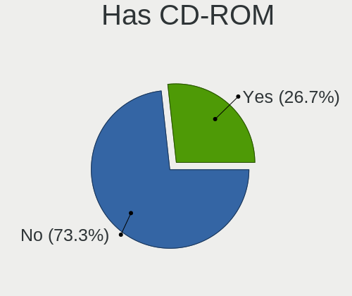
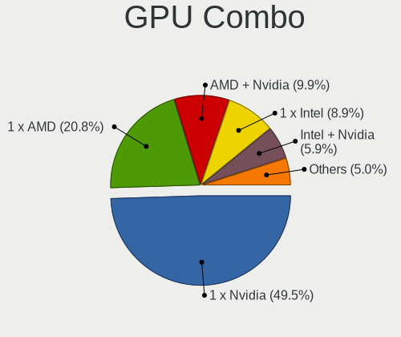
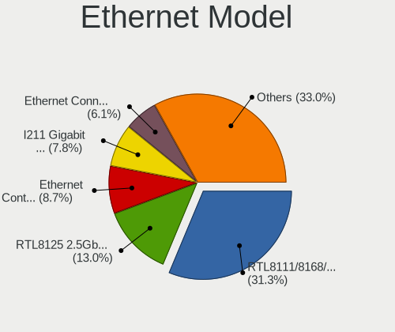
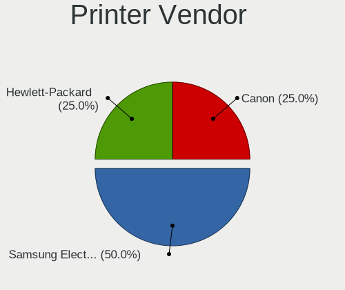

Pop!_OS Hardware Trends (Desktop)
---------------------------------

A project to identify most popular hardware characteristics and track their change
over time based on data collected by Pop!_OS users at https://Linux-Hardware.org.

Anyone can contribute to the study by uploading probes of their computers by
the [hw-probe](https://github.com/linuxhw/hw-probe) tool:

    sudo -E hw-probe -all -upload

Full-feature report is available here: https://linux-hardware.org/?view=trends&formfactor=desktop

Period: Jun, 2021.

Contents
--------

- [ OS                       ](#os)
- [ OS Family                ](#os-family)
- [ Kernel                   ](#kernel)
- [ Kernel Family            ](#kernel-family)
- [ Kernel Major Ver.        ](#kernel-major-ver)
- [ Arch                     ](#arch)
- [ DE                       ](#de)
- [ Display Server           ](#display-server)
- [ Display Manager          ](#display-manager)
- [ OS Lang                  ](#os-lang)
- [ Boot Mode                ](#boot-mode)
- [ Filesystem               ](#filesystem)
- [ Part. scheme             ](#part-scheme)
- [ Dual Boot with Linux/BSD ](#dual-boot-with-linux/bsd)
- [ Dual Boot (Win)          ](#dual-boot-win)
- [ Country                  ](#country)
- [ City                     ](#city)
- [ Vendor                   ](#vendor)
- [ Model                    ](#model)
- [ Model Family             ](#model-family)
- [ MFG Year                 ](#mfg-year)
- [ Form Factor              ](#form-factor)
- [ Secure Boot              ](#secure-boot)
- [ Coreboot                 ](#coreboot)
- [ RAM Size                 ](#ram-size)
- [ RAM Used                 ](#ram-used)
- [ Has CD-ROM               ](#has-cd-rom)
- [ Total Drives             ](#total-drives)
- [ Has Ethernet             ](#has-ethernet)
- [ Has WiFi                 ](#has-wifi)
- [ Has Bluetooth            ](#has-bluetooth)
- [ Drive Vendor             ](#drive-vendor)
- [ Drive Model              ](#drive-model)
- [ HDD Vendor               ](#hdd-vendor)
- [ SSD Vendor               ](#ssd-vendor)
- [ Drive Kind               ](#drive-kind)
- [ Drive Connector          ](#drive-connector)
- [ Drive Size               ](#drive-size)
- [ Space Total              ](#space-total)
- [ Space Used               ](#space-used)
- [ Malfunc. Drives          ](#malfunc-drives)
- [ Malfunc. Drive Vendor    ](#malfunc-drive-vendor)
- [ Malfunc. HDD Vendor      ](#malfunc-hdd-vendor)
- [ Malfunc. Drive Kind      ](#malfunc-drive-kind)
- [ Failed Drives            ](#failed-drives)
- [ Failed Drive Vendor      ](#failed-drive-vendor)
- [ Drive Status             ](#drive-status)
- [ Storage Vendor           ](#storage-vendor)
- [ Storage Model            ](#storage-model)
- [ Storage Kind             ](#storage-kind)
- [ CPU Vendor               ](#cpu-vendor)
- [ CPU Model                ](#cpu-model)
- [ CPU Model Family         ](#cpu-model-family)
- [ CPU Cores                ](#cpu-cores)
- [ CPU Sockets              ](#cpu-sockets)
- [ CPU Threads              ](#cpu-threads)
- [ CPU Op-Modes             ](#cpu-op-modes)
- [ CPU Microcode            ](#cpu-microcode)
- [ CPU Microarch            ](#cpu-microarch)
- [ GPU Vendor               ](#gpu-vendor)
- [ GPU Model                ](#gpu-model)
- [ GPU Combo                ](#gpu-combo)
- [ GPU Driver               ](#gpu-driver)
- [ GPU Memory               ](#gpu-memory)
- [ Monitor Vendor           ](#monitor-vendor)
- [ Monitor Model            ](#monitor-model)
- [ Monitor Resolution       ](#monitor-resolution)
- [ Monitor Diagonal         ](#monitor-diagonal)
- [ Monitor Width            ](#monitor-width)
- [ Aspect Ratio             ](#aspect-ratio)
- [ Monitor Area             ](#monitor-area)
- [ Pixel Density            ](#pixel-density)
- [ Multiple Monitors        ](#multiple-monitors)
- [ Net Controller Vendor    ](#net-controller-vendor)
- [ Net Controller Model     ](#net-controller-model)
- [ Wireless Vendor          ](#wireless-vendor)
- [ Wireless Model           ](#wireless-model)
- [ Ethernet Vendor          ](#ethernet-vendor)
- [ Ethernet Model           ](#ethernet-model)
- [ Net Controller Kind      ](#net-controller-kind)
- [ Used Controller          ](#used-controller)
- [ NICs                     ](#nics)
- [ IPv6                     ](#ipv6)
- [ Memory Vendor            ](#memory-vendor)
- [ Memory Model             ](#memory-model)
- [ Memory Kind              ](#memory-kind)
- [ Memory Form Factor       ](#memory-form-factor)
- [ Memory Size              ](#memory-size)
- [ Memory Speed             ](#memory-speed)
- [ Sound Vendor             ](#sound-vendor)
- [ Sound Model              ](#sound-model)
- [ Camera Vendor            ](#camera-vendor)
- [ Camera Model             ](#camera-model)
- [ Fingerprint Vendor       ](#fingerprint-vendor)
- [ Fingerprint Model        ](#fingerprint-model)
- [ Chipcard Vendor          ](#chipcard-vendor)
- [ Chipcard Model           ](#chipcard-model)
- [ Printer Vendor           ](#printer-vendor)
- [ Printer Model            ](#printer-model)
- [ Scanner Vendor           ](#scanner-vendor)
- [ Scanner Model            ](#scanner-model)
- [ Bluetooth Vendor         ](#bluetooth-vendor)
- [ Bluetooth Model          ](#bluetooth-model)
- [ Unsupported Devices      ](#unsupported-devices)
- [ Unsupported Device Types ](#unsupported-device-types)

OS
--

Installed operating systems

| Name          | Desktops | Percent |
|---------------|----------|---------|
| Pop!_OS 20.10 | 78       | 82.11%  |
| Pop!_OS 20.04 | 10       | 10.53%  |
| Pop!_OS 21.04 | 7        | 7.37%   |

OS Family
---------

OS without a version

| Name    | Desktops | Percent |
|---------|----------|---------|
| Pop!_OS | 95       | 100%    |

Kernel
------

Version of the Linux kernel

| Version                | Desktops | Percent |
|------------------------|----------|---------|
| 5.11.0-7614-generic    | 87       | 91.58%  |
| 5.11.0-7620-generic    | 3        | 3.16%   |
| 5.8.0-7642-generic     | 1        | 1.05%   |
| 5.12.13-051213-generic | 1        | 1.05%   |
| 5.11.8-051108-generic  | 1        | 1.05%   |
| 5.11.0-7612-generic    | 1        | 1.05%   |
| 5.11.0-18-generic      | 1        | 1.05%   |

Kernel Family
-------------

Linux kernel without a distro release

| Version | Desktops | Percent |
|---------|----------|---------|
| 5.11.0  | 92       | 96.84%  |
| 5.8.0   | 1        | 1.05%   |
| 5.12.13 | 1        | 1.05%   |
| 5.11.8  | 1        | 1.05%   |

Kernel Major Ver.
-----------------

Linux kernel major version

| Version | Desktops | Percent |
|---------|----------|---------|
| 5.11    | 93       | 97.89%  |
| 5.8     | 1        | 1.05%   |
| 5.12    | 1        | 1.05%   |

Arch
----

OS architecture (x86_64, i586, etc.)

| Name   | Desktops | Percent |
|--------|----------|---------|
| x86_64 | 95       | 100%    |

DE
--

Desktop Environment

| Name    | Desktops | Percent |
|---------|----------|---------|
| GNOME   | 88       | 92.63%  |
| KDE     | 3        | 3.16%   |
| MATE    | 2        | 2.11%   |
| XFCE    | 1        | 1.05%   |
| Unknown | 1        | 1.05%   |

Display Server
--------------

X11 or Wayland

| Name    | Desktops | Percent |
|---------|----------|---------|
| X11     | 92       | 96.84%  |
| Wayland | 2        | 2.11%   |
| Unknown | 1        | 1.05%   |

Display Manager
---------------

SDDM, LightDM, etc.

| Name    | Desktops | Percent |
|---------|----------|---------|
| Unknown | 85       | 89.47%  |
| GDM     | 10       | 10.53%  |

OS Lang
-------

Language

| Lang    | Desktops | Percent |
|---------|----------|---------|
| en_US   | 54       | 56.84%  |
| en_GB   | 8        | 8.42%   |
| de_DE   | 8        | 8.42%   |
| pt_BR   | 5        | 5.26%   |
| C       | 4        | 4.21%   |
| en_CA   | 3        | 3.16%   |
| ru_RU   | 2        | 2.11%   |
| it_IT   | 2        | 2.11%   |
| fr_FR   | 2        | 2.11%   |
| en_AU   | 2        | 2.11%   |
| sv_SE   | 1        | 1.05%   |
| pl_PL   | 1        | 1.05%   |
| nl_NL   | 1        | 1.05%   |
| es_ES   | 1        | 1.05%   |
| Unknown | 1        | 1.05%   |

Boot Mode
---------

EFI or BIOS

| Mode | Desktops | Percent |
|------|----------|---------|
| BIOS | 88       | 92.63%  |
| EFI  | 7        | 7.37%   |

Filesystem
----------

Type of filesystem

| Type    | Desktops | Percent |
|---------|----------|---------|
| Ext4    | 88       | 92.63%  |
| Overlay | 4        | 4.21%   |
| Btrfs   | 3        | 3.16%   |

Part. scheme
------------

Scheme of partitioning

| Type    | Desktops | Percent |
|---------|----------|---------|
| Unknown | 84       | 88.42%  |
| GPT     | 9        | 9.47%   |
| MBR     | 2        | 2.11%   |

Dual Boot with Linux/BSD
------------------------

Hosting more than one Linux/BSD

| Dual boot | Desktops | Percent |
|-----------|----------|---------|
| No        | 94       | 98.95%  |
| Yes       | 1        | 1.05%   |

Dual Boot (Win)
---------------

Hosting Linux and Windows

| Dual boot | Desktops | Percent |
|-----------|----------|---------|
| No        | 89       | 93.68%  |
| Yes       | 6        | 6.32%   |

Country
-------

Geographic location (country)

| Country      | Desktops | Percent |
|--------------|----------|---------|
| USA          | 35       | 36.84%  |
| Germany      | 9        | 9.47%   |
| Brazil       | 8        | 8.42%   |
| UK           | 6        | 6.32%   |
| Canada       | 6        | 6.32%   |
| Sweden       | 4        | 4.21%   |
| Switzerland  | 2        | 2.11%   |
| Russia       | 2        | 2.11%   |
| Romania      | 2        | 2.11%   |
| Netherlands  | 2        | 2.11%   |
| Italy        | 2        | 2.11%   |
| France       | 2        | 2.11%   |
| Australia    | 2        | 2.11%   |
| Argentina    | 2        | 2.11%   |
| South Africa | 1        | 1.05%   |
| Poland       | 1        | 1.05%   |
| New Zealand  | 1        | 1.05%   |
| Malaysia     | 1        | 1.05%   |
| Ireland      | 1        | 1.05%   |
| India        | 1        | 1.05%   |
| Czechia      | 1        | 1.05%   |
| Croatia      | 1        | 1.05%   |
| Costa Rica   | 1        | 1.05%   |
| Chile        | 1        | 1.05%   |
| Austria      | 1        | 1.05%   |

City
----

Geographic location (city)

| City               | Desktops | Percent |
|--------------------|----------|---------|
| Sacramento         | 2        | 2.11%   |
| Glendale           | 2        | 2.11%   |
| Zurich             | 1        | 1.05%   |
| Zittau             | 1        | 1.05%   |
| Zagreb             | 1        | 1.05%   |
| Wausau             | 1        | 1.05%   |
| Waterford          | 1        | 1.05%   |
| Vienna             | 1        | 1.05%   |
| Valasske Mezirici  | 1        | 1.05%   |
| Toulouse           | 1        | 1.05%   |
| Thetford-Mines     | 1        | 1.05%   |
| The Hague          | 1        | 1.05%   |
| Tampa              | 1        | 1.05%   |
| Star               | 1        | 1.05%   |
| St Louis           | 1        | 1.05%   |
| Sibiu              | 1        | 1.05%   |
| Shreveport         | 1        | 1.05%   |
| Sherwood Park      | 1        | 1.05%   |
| Serov              | 1        | 1.05%   |
| Sarasota           | 1        | 1.05%   |
| Sao Jose           | 1        | 1.05%   |
| Santiago           | 1        | 1.05%   |
| Santa Maria        | 1        | 1.05%   |
| Salt Lake City     | 1        | 1.05%   |
| Rio de Janeiro     | 1        | 1.05%   |
| Riehen             | 1        | 1.05%   |
| Ridgeland          | 1        | 1.05%   |
| Queensferry        | 1        | 1.05%   |
| Port Coquitlam     | 1        | 1.05%   |
| Petaling Jaya      | 1        | 1.05%   |
| Osnabrück         | 1        | 1.05%   |
| Orán              | 1        | 1.05%   |
| Olathe             | 1        | 1.05%   |
| Novo Hamburgo      | 1        | 1.05%   |
| Norwich            | 1        | 1.05%   |
| Nettetal           | 1        | 1.05%   |
| Moscow             | 1        | 1.05%   |
| Montreal           | 1        | 1.05%   |
| Minneapolis        | 1        | 1.05%   |
| Mesa               | 1        | 1.05%   |
| Melbourne          | 1        | 1.05%   |
| Maringá           | 1        | 1.05%   |
| Malmo              | 1        | 1.05%   |
| Lucas do Rio Verde | 1        | 1.05%   |
| Lexington          | 1        | 1.05%   |
| Landshut           | 1        | 1.05%   |
| Lahr               | 1        | 1.05%   |
| Krakow             | 1        | 1.05%   |
| Kokomo             | 1        | 1.05%   |
| Koeping            | 1        | 1.05%   |
| Knoxville          | 1        | 1.05%   |
| Kahl am Main       | 1        | 1.05%   |
| Kadapa             | 1        | 1.05%   |
| Hoddesdon          | 1        | 1.05%   |
| Hanover            | 1        | 1.05%   |
| Halmstad           | 1        | 1.05%   |
| Grants Pass        | 1        | 1.05%   |
| Gothenburg         | 1        | 1.05%   |
| Goiânia           | 1        | 1.05%   |
| Frankfurt          | 1        | 1.05%   |

Vendor
------

Motherboard manufacturer

| Name                | Desktops | Percent |
|---------------------|----------|---------|
| ASUSTek Computer    | 24       | 25.26%  |
| MSI                 | 21       | 22.11%  |
| Gigabyte Technology | 21       | 22.11%  |
| ASRock              | 7        | 7.37%   |
| Hewlett-Packard     | 6        | 6.32%   |
| Dell                | 5        | 5.26%   |
| Intel               | 2        | 2.11%   |
| Huanan              | 2        | 2.11%   |
| Gateway             | 2        | 2.11%   |
| ONDA                | 1        | 1.05%   |
| NF-M2S              | 1        | 1.05%   |
| Fujitsu             | 1        | 1.05%   |
| Foxconn             | 1        | 1.05%   |
| Apple               | 1        | 1.05%   |

Model
-----

Motherboard model

| Name                             | Desktops | Percent |
|----------------------------------|----------|---------|
| MSI MS-7C02                      | 3        | 3.16%   |
| Gigabyte X570 AORUS MASTER       | 2        | 2.11%   |
| Gigabyte F2A88XM-D3H             | 2        | 2.11%   |
| Gigabyte B450 AORUS PRO WIFI     | 2        | 2.11%   |
| ASUS ROG CROSSHAIR VIII HERO     | 2        | 2.11%   |
| ASUS P8B75-M                     | 2        | 2.11%   |
| ASUS All Series                  | 2        | 2.11%   |
| ASRock X300M-STX                 | 2        | 2.11%   |
| ONDA ONDA D1800 BTC V1.04        | 1        | 1.05%   |
| NF-M2S ABIT                      | 1        | 1.05%   |
| MSI MS-7D09                      | 1        | 1.05%   |
| MSI MS-7C91                      | 1        | 1.05%   |
| MSI MS-7B98                      | 1        | 1.05%   |
| MSI MS-7B93                      | 1        | 1.05%   |
| MSI MS-7B89                      | 1        | 1.05%   |
| MSI MS-7B87                      | 1        | 1.05%   |
| MSI MS-7B86                      | 1        | 1.05%   |
| MSI MS-7B85                      | 1        | 1.05%   |
| MSI MS-7B22                      | 1        | 1.05%   |
| MSI MS-7B09                      | 1        | 1.05%   |
| MSI MS-7A93                      | 1        | 1.05%   |
| MSI MS-7A69                      | 1        | 1.05%   |
| MSI MS-7A39                      | 1        | 1.05%   |
| MSI MS-7A33                      | 1        | 1.05%   |
| MSI MS-7977                      | 1        | 1.05%   |
| MSI MS-7971                      | 1        | 1.05%   |
| MSI MS-7851                      | 1        | 1.05%   |
| MSI MS-7817                      | 1        | 1.05%   |
| Intel X79 V2.0                   | 1        | 1.05%   |
| Intel DZ77GA-70K AAG39009-401    | 1        | 1.05%   |
| Huanan X99-TF                    | 1        | 1.05%   |
| Huanan X99-F8                    | 1        | 1.05%   |
| HP Z440 Workstation              | 1        | 1.05%   |
| HP Z4 G4 Workstation             | 1        | 1.05%   |
| HP OMEN by HP Desktop PC 870-2XX | 1        | 1.05%   |
| HP OMEN 30L Desktop GT13-0xxx    | 1        | 1.05%   |
| HP Compaq 6200 Pro MT PC         | 1        | 1.05%   |
| HP 110-400nc                     | 1        | 1.05%   |
| Gigabyte Z68X-UD3P-B3            | 1        | 1.05%   |
| Gigabyte Z390 AORUS PRO WIFI     | 1        | 1.05%   |
| Gigabyte X570 I AORUS PRO WIFI   | 1        | 1.05%   |
| Gigabyte X570 AORUS ELITE WIFI   | 1        | 1.05%   |
| Gigabyte P55-UD5                 | 1        | 1.05%   |
| Gigabyte H97-D3H                 | 1        | 1.05%   |
| Gigabyte GA-MA770-UD3            | 1        | 1.05%   |
| Gigabyte GA-970A-UD3             | 1        | 1.05%   |
| Gigabyte GA-78LMT-USB3 6.0       | 1        | 1.05%   |
| Gigabyte B550M AORUS PRO-P       | 1        | 1.05%   |
| Gigabyte B550 AORUS PRO          | 1        | 1.05%   |
| Gigabyte B450M DS3H              | 1        | 1.05%   |
| Gigabyte AX370-Gaming 5          | 1        | 1.05%   |
| Gigabyte AB350M-DS3H V2          | 1        | 1.05%   |
| Gigabyte 970A-DS3P               | 1        | 1.05%   |
| Gateway T3646                    | 1        | 1.05%   |
| Gateway DX4860                   | 1        | 1.05%   |
| Fujitsu ESPRIMO E410             | 1        | 1.05%   |
| Foxconn p6-2210ef                | 1        | 1.05%   |
| Dell Vostro 3800                 | 1        | 1.05%   |
| Dell Precision Tower 5810        | 1        | 1.05%   |
| Dell Precision T7610             | 1        | 1.05%   |

Model Family
------------

Motherboard model prefix

| Name                   | Desktops | Percent |
|------------------------|----------|---------|
| ASUS ROG               | 6        | 6.32%   |
| Gigabyte X570          | 4        | 4.21%   |
| MSI MS-7C02            | 3        | 3.16%   |
| ASUS PRIME             | 3        | 3.16%   |
| HP OMEN                | 2        | 2.11%   |
| Gigabyte F2A88XM-D3H   | 2        | 2.11%   |
| Gigabyte B450          | 2        | 2.11%   |
| Dell Precision         | 2        | 2.11%   |
| ASUS TUF               | 2        | 2.11%   |
| ASUS P8B75-M           | 2        | 2.11%   |
| ASUS All               | 2        | 2.11%   |
| ASRock X300M-STX       | 2        | 2.11%   |
| ONDA ONDA              | 1        | 1.05%   |
| NF-M2S ABIT            | 1        | 1.05%   |
| MSI MS-7D09            | 1        | 1.05%   |
| MSI MS-7C91            | 1        | 1.05%   |
| MSI MS-7B98            | 1        | 1.05%   |
| MSI MS-7B93            | 1        | 1.05%   |
| MSI MS-7B89            | 1        | 1.05%   |
| MSI MS-7B87            | 1        | 1.05%   |
| MSI MS-7B86            | 1        | 1.05%   |
| MSI MS-7B85            | 1        | 1.05%   |
| MSI MS-7B22            | 1        | 1.05%   |
| MSI MS-7B09            | 1        | 1.05%   |
| MSI MS-7A93            | 1        | 1.05%   |
| MSI MS-7A69            | 1        | 1.05%   |
| MSI MS-7A39            | 1        | 1.05%   |
| MSI MS-7A33            | 1        | 1.05%   |
| MSI MS-7977            | 1        | 1.05%   |
| MSI MS-7971            | 1        | 1.05%   |
| MSI MS-7851            | 1        | 1.05%   |
| MSI MS-7817            | 1        | 1.05%   |
| Intel X79              | 1        | 1.05%   |
| Intel DZ77GA-70K       | 1        | 1.05%   |
| Huanan X99-TF          | 1        | 1.05%   |
| Huanan X99-F8          | 1        | 1.05%   |
| HP Z440                | 1        | 1.05%   |
| HP Z4                  | 1        | 1.05%   |
| HP Compaq              | 1        | 1.05%   |
| HP 110-400nc           | 1        | 1.05%   |
| Gigabyte Z68X-UD3P-B3  | 1        | 1.05%   |
| Gigabyte Z390          | 1        | 1.05%   |
| Gigabyte P55-UD5       | 1        | 1.05%   |
| Gigabyte H97-D3H       | 1        | 1.05%   |
| Gigabyte GA-MA770-UD3  | 1        | 1.05%   |
| Gigabyte GA-970A-UD3   | 1        | 1.05%   |
| Gigabyte GA-78LMT-USB3 | 1        | 1.05%   |
| Gigabyte B550M         | 1        | 1.05%   |
| Gigabyte B550          | 1        | 1.05%   |
| Gigabyte B450M         | 1        | 1.05%   |
| Gigabyte AX370-Gaming  | 1        | 1.05%   |
| Gigabyte AB350M-DS3H   | 1        | 1.05%   |
| Gigabyte 970A-DS3P     | 1        | 1.05%   |
| Gateway T3646          | 1        | 1.05%   |
| Gateway DX4860         | 1        | 1.05%   |
| Fujitsu ESPRIMO        | 1        | 1.05%   |
| Foxconn p6-2210ef      | 1        | 1.05%   |
| Dell Vostro            | 1        | 1.05%   |
| Dell OptiPlex          | 1        | 1.05%   |
| Dell Inspiron          | 1        | 1.05%   |

MFG Year
--------

Motherboard manufacture year

| Year | Desktops | Percent |
|------|----------|---------|
| 2021 | 18       | 18.95%  |
| 2020 | 18       | 18.95%  |
| 2019 | 13       | 13.68%  |
| 2015 | 9        | 9.47%   |
| 2014 | 8        | 8.42%   |
| 2018 | 6        | 6.32%   |
| 2013 | 6        | 6.32%   |
| 2017 | 3        | 3.16%   |
| 2016 | 3        | 3.16%   |
| 2007 | 3        | 3.16%   |
| 2012 | 2        | 2.11%   |
| 2011 | 2        | 2.11%   |
| 2010 | 2        | 2.11%   |
| 2009 | 1        | 1.05%   |
| 2008 | 1        | 1.05%   |

Form Factor
-----------

Physical design of the computer

| Name    | Desktops | Percent |
|---------|----------|---------|
| Desktop | 95       | 100%    |

Secure Boot
-----------

Enabled or disabled

| State    | Desktops | Percent |
|----------|----------|---------|
| Disabled | 95       | 100%    |

Coreboot
--------

Have coreboot on board

| Used | Desktops | Percent |
|------|----------|---------|
| No   | 95       | 100%    |

RAM Size
--------

Total RAM memory

| Size in GB  | Desktops | Percent |
|-------------|----------|---------|
| 16.01-24.0  | 30       | 31.58%  |
| 32.01-64.0  | 27       | 28.42%  |
| 8.01-16.0   | 16       | 16.84%  |
| 4.01-8.0    | 7        | 7.37%   |
| 64.01-256.0 | 7        | 7.37%   |
| 3.01-4.0    | 5        | 5.26%   |
| 24.01-32.0  | 2        | 2.11%   |
| 2.01-3.0    | 1        | 1.05%   |

RAM Used
--------

Used RAM memory

| Used GB    | Desktops | Percent |
|------------|----------|---------|
| 1.01-2.0   | 28       | 29.47%  |
| 2.01-3.0   | 26       | 27.37%  |
| 4.01-8.0   | 23       | 24.21%  |
| 3.01-4.0   | 14       | 14.74%  |
| 8.01-16.0  | 3        | 3.16%   |
| 24.01-32.0 | 1        | 1.05%   |

Has CD-ROM
----------

Has CD-ROM on board

| Presented | Desktops | Percent |
|-----------|----------|---------|
| No        | 61       | 64.21%  |
| Yes       | 34       | 35.79%  |

Total Drives
------------

Number of drives on board

| Drives | Desktops | Percent |
|--------|----------|---------|
| 2      | 26       | 27.37%  |
| 1      | 26       | 27.37%  |
| 4      | 18       | 18.95%  |
| 3      | 14       | 14.74%  |
| 5      | 5        | 5.26%   |
| 8      | 2        | 2.11%   |
| 7      | 2        | 2.11%   |
| 6      | 2        | 2.11%   |

Has Ethernet
------------

Has Ethernet on board

| Presented | Desktops | Percent |
|-----------|----------|---------|
| Yes       | 94       | 98.95%  |
| No        | 1        | 1.05%   |

Has WiFi
--------

Has WiFi module

| Presented | Desktops | Percent |
|-----------|----------|---------|
| No        | 49       | 51.58%  |
| Yes       | 46       | 48.42%  |

Has Bluetooth
-------------

Has Bluetooth module

| Presented | Desktops | Percent |
|-----------|----------|---------|
| No        | 60       | 63.16%  |
| Yes       | 35       | 36.84%  |

Drive Vendor
------------

Hard drive vendors

| Vendor                    | Desktops | Drives | Percent |
|---------------------------|----------|--------|---------|
| WDC                       | 44       | 55     | 21.89%  |
| Seagate                   | 30       | 50     | 14.93%  |
| Samsung Electronics       | 30       | 45     | 14.93%  |
| Sandisk                   | 13       | 18     | 6.47%   |
| Kingston                  | 12       | 12     | 5.97%   |
| Crucial                   | 11       | 14     | 5.47%   |
| Toshiba                   | 10       | 11     | 4.98%   |
| Phison                    | 5        | 6      | 2.49%   |
| Realtek Semiconductor     | 4        | 4      | 1.99%   |
| PNY                       | 4        | 4      | 1.99%   |
| Intel                     | 4        | 7      | 1.99%   |
| Corsair                   | 4        | 6      | 1.99%   |
| A-DATA Technology         | 4        | 4      | 1.99%   |
| Silicon Motion            | 3        | 3      | 1.49%   |
| Micron Technology         | 3        | 3      | 1.49%   |
| China                     | 3        | 3      | 1.49%   |
| XPG                       | 2        | 2      | 1%      |
| SK Hynix                  | 2        | 2      | 1%      |
| Hitachi                   | 2        | 2      | 1%      |
| HGST                      | 2        | 2      | 1%      |
| Vaseky                    | 1        | 1      | 0.5%    |
| Unknown                   | 1        | 1      | 0.5%    |
| OCZ                       | 1        | 1      | 0.5%    |
| Mushkin                   | 1        | 1      | 0.5%    |
| Micron/Crucial Technology | 1        | 1      | 0.5%    |
| Lexar                     | 1        | 1      | 0.5%    |
| KingSpec                  | 1        | 1      | 0.5%    |
| Hikvision                 | 1        | 1      | 0.5%    |
| ASMT                      | 1        | 1      | 0.5%    |

Drive Model
-----------

Hard drive models

| Model                                       | Desktops | Percent |
|---------------------------------------------|----------|---------|
| Seagate ST2000DM008-2FR102 2TB              | 6        | 2.52%   |
| Samsung NVMe SSD Drive 500GB                | 5        | 2.1%    |
| WDC WD10EZEX-08WN4A0 1TB                    | 4        | 1.68%   |
| Samsung SSD 860 EVO 500GB                   | 4        | 1.68%   |
| Crucial CT240BX500SSD1 240GB                | 4        | 1.68%   |
| SanDisk SDSSDA240G 240GB                    | 3        | 1.26%   |
| Sandisk NVMe SSD Drive 1TB                  | 3        | 1.26%   |
| Samsung SSD 860 EVO 2TB                     | 3        | 1.26%   |
| Samsung SSD 850 EVO 250GB                   | 3        | 1.26%   |
| Samsung SSD 840 EVO 120GB                   | 3        | 1.26%   |
| Kingston SA400S37240G 240GB SSD             | 3        | 1.26%   |
| WDC WD40EZRZ-22GXCB0 4TB                    | 2        | 0.84%   |
| WDC WD30EZRZ-00GXCB0 3TB                    | 2        | 0.84%   |
| WDC WD20EFRX-68EUZN0 2TB                    | 2        | 0.84%   |
| Toshiba HDWD110 1TB                         | 2        | 0.84%   |
| Toshiba DT01ACA100 1TB                      | 2        | 0.84%   |
| Silicon Motion NVMe SSD Drive 512GB         | 2        | 0.84%   |
| Seagate ST6000DM003-2CY186 6TB              | 2        | 0.84%   |
| Seagate ST4000DM004-2CV104 4TB              | 2        | 0.84%   |
| Seagate ST2000DM001-1ER164 2TB              | 2        | 0.84%   |
| Seagate ST1000LM048-2E7172 1TB              | 2        | 0.84%   |
| Seagate ST1000DM010-2EP102 1TB              | 2        | 0.84%   |
| Seagate ST1000DM003-1ER162 1TB              | 2        | 0.84%   |
| Seagate BarraCuda Q1 SSD ZA960CV10001 960GB | 2        | 0.84%   |
| Sandisk NVMe SSD Drive 500GB                | 2        | 0.84%   |
| Samsung SSD 860 EVO 1TB                     | 2        | 0.84%   |
| Samsung SSD 850 EVO 500GB                   | 2        | 0.84%   |
| Samsung NVMe SSD Drive 1TB                  | 2        | 0.84%   |
| Realtek NVMe SSD Drive 2TB                  | 2        | 0.84%   |
| Phison NVMe SSD Drive 2TB                   | 2        | 0.84%   |
| Kingston SUV400S37240G 240GB SSD            | 2        | 0.84%   |
| Crucial CT250MX200SSD1 250GB                | 2        | 0.84%   |
| Crucial CT1000MX500SSD1 1TB                 | 2        | 0.84%   |
| Crucial CT1000BX500SSD1 1TB                 | 2        | 0.84%   |
| XPG SPECTRIX S40G 256GB                     | 1        | 0.42%   |
| XPG NVMe SSD Drive 1024GB                   | 1        | 0.42%   |
| WDC WDS500G2B0A-00SM50 500GB SSD            | 1        | 0.42%   |
| WDC WDS250G2B0A 250GB SSD                   | 1        | 0.42%   |
| WDC WDS120G1G0A-00SS50 120GB SSD            | 1        | 0.42%   |
| WDC WDS100T3X0C-00SJG0 1TB                  | 1        | 0.42%   |
| WDC WDS100T2B0A-00SM50 1TB SSD              | 1        | 0.42%   |
| WDC WD80EMAZ-00WJTA0 8TB                    | 1        | 0.42%   |
| WDC WD8088AADS-32L5B1 808GB                 | 1        | 0.42%   |
| WDC WD5001AALS-00L3B2 500GB                 | 1        | 0.42%   |
| WDC WD5000LPVX-00V0TT0 500GB                | 1        | 0.42%   |
| WDC WD5000BPKT-75PK4T0 500GB                | 1        | 0.42%   |
| WDC WD5000BEVT-75A0RT0 500GB                | 1        | 0.42%   |
| WDC WD5000AAKX-75U6AA0 500GB                | 1        | 0.42%   |
| WDC WD5000AAKX-60U6AA0 500GB                | 1        | 0.42%   |
| WDC WD5000AAKX-003CA0 500GB                 | 1        | 0.42%   |
| WDC WD5000AACS-07G8B0 500GB                 | 1        | 0.42%   |
| WDC WD40EZRZ-00GXCB0 4TB                    | 1        | 0.42%   |
| WDC WD4002FYYZ-01B7CB0 4TB                  | 1        | 0.42%   |
| WDC WD4000AAJS-65TKA0 400GB                 | 1        | 0.42%   |
| WDC WD3200BEVT-22ZCT0 320GB                 | 1        | 0.42%   |
| WDC WD30EZRZ-00Z5HB0 3TB                    | 1        | 0.42%   |
| WDC WD30EZRX-00DC0B0 3TB                    | 1        | 0.42%   |
| WDC WD3003FZEX-00Z4SA0 3TB                  | 1        | 0.42%   |
| WDC WD2500KS-00MJB0 250GB                   | 1        | 0.42%   |
| WDC WD2500JS-40TGB0 250GB                   | 1        | 0.42%   |

HDD Vendor
----------

Hard disk drive vendors

| Vendor              | Desktops | Drives | Percent |
|---------------------|----------|--------|---------|
| WDC                 | 41       | 50     | 49.4%   |
| Seagate             | 29       | 44     | 34.94%  |
| Toshiba             | 8        | 9      | 9.64%   |
| Hitachi             | 2        | 2      | 2.41%   |
| HGST                | 2        | 2      | 2.41%   |
| Samsung Electronics | 1        | 2      | 1.2%    |

SSD Vendor
----------

Solid state drive vendors

| Vendor              | Desktops | Drives | Percent |
|---------------------|----------|--------|---------|
| Samsung Electronics | 21       | 26     | 25.3%   |
| Kingston            | 11       | 11     | 13.25%  |
| Crucial             | 11       | 14     | 13.25%  |
| SanDisk             | 7        | 10     | 8.43%   |
| PNY                 | 4        | 4      | 4.82%   |
| Corsair             | 4        | 6      | 4.82%   |
| A-DATA Technology   | 4        | 4      | 4.82%   |
| WDC                 | 3        | 4      | 3.61%   |
| Seagate             | 3        | 6      | 3.61%   |
| Micron Technology   | 3        | 3      | 3.61%   |
| China               | 3        | 3      | 3.61%   |
| Toshiba             | 1        | 1      | 1.2%    |
| SK Hynix            | 1        | 1      | 1.2%    |
| OCZ                 | 1        | 1      | 1.2%    |
| Mushkin             | 1        | 1      | 1.2%    |
| Lexar               | 1        | 1      | 1.2%    |
| KingSpec            | 1        | 1      | 1.2%    |
| Intel               | 1        | 1      | 1.2%    |
| Hikvision           | 1        | 1      | 1.2%    |
| ASMT                | 1        | 1      | 1.2%    |

Drive Kind
----------

HDD or SSD

| Kind    | Desktops | Drives | Percent |
|---------|----------|--------|---------|
| HDD     | 69       | 109    | 39.66%  |
| SSD     | 66       | 100    | 37.93%  |
| NVMe    | 37       | 51     | 21.26%  |
| Unknown | 2        | 2      | 1.15%   |

Drive Connector
---------------

SATA, SAS, NVMe, etc.

| Type | Desktops | Drives | Percent |
|------|----------|--------|---------|
| SATA | 88       | 208    | 68.75%  |
| NVMe | 37       | 51     | 28.91%  |
| SAS  | 3        | 3      | 2.34%   |

Drive Size
----------

Size of hard drive

| Size in TB | Desktops | Drives | Percent |
|------------|----------|--------|---------|
| 0.01-0.5   | 64       | 95     | 42.95%  |
| 0.51-1.0   | 40       | 54     | 26.85%  |
| 1.01-2.0   | 27       | 33     | 18.12%  |
| 3.01-4.0   | 6        | 11     | 4.03%   |
| 2.01-3.0   | 6        | 6      | 4.03%   |
| 4.01-10.0  | 5        | 9      | 3.36%   |
| 10.01-20.0 | 1        | 1      | 0.67%   |

Space Total
-----------

Amount of disk space available on the file system

| Size in GB     | Desktops | Percent |
|----------------|----------|---------|
| 101-250        | 22       | 23.16%  |
| 251-500        | 16       | 16.84%  |
| 501-1000       | 16       | 16.84%  |
| 1001-2000      | 15       | 15.79%  |
| More than 3000 | 11       | 11.58%  |
| 2001-3000      | 9        | 9.47%   |
| 51-100         | 2        | 2.11%   |
| Unknown        | 2        | 2.11%   |
| 21-50          | 1        | 1.05%   |
| 1-20           | 1        | 1.05%   |

Space Used
----------

Amount of used disk space

| Used GB        | Desktops | Percent |
|----------------|----------|---------|
| 1-20           | 29       | 30.53%  |
| 21-50          | 13       | 13.68%  |
| 251-500        | 10       | 10.53%  |
| 101-250        | 10       | 10.53%  |
| 51-100         | 10       | 10.53%  |
| 501-1000       | 8        | 8.42%   |
| 1001-2000      | 6        | 6.32%   |
| 2001-3000      | 4        | 4.21%   |
| More than 3000 | 3        | 3.16%   |
| Unknown        | 2        | 2.11%   |

Malfunc. Drives
---------------

Drive models with a malfunction

| Model                        | Desktops | Drives | Percent |
|------------------------------|----------|--------|---------|
| WDC WD5000BEVT-75A0RT0 500GB | 1        | 1      | 50%     |
| Intel SSDSA2M080G2GC 80GB    | 1        | 1      | 50%     |

Malfunc. Drive Vendor
---------------------

Vendors of faulty drives

| Vendor | Desktops | Drives | Percent |
|--------|----------|--------|---------|
| WDC    | 1        | 1      | 50%     |
| Intel  | 1        | 1      | 50%     |

Malfunc. HDD Vendor
-------------------

Vendors of faulty HDD drives

| Vendor | Desktops | Drives | Percent |
|--------|----------|--------|---------|
| WDC    | 1        | 1      | 100%    |

Malfunc. Drive Kind
-------------------

Kinds of faulty drives

| Kind | Desktops | Drives | Percent |
|------|----------|--------|---------|
| SSD  | 1        | 1      | 50%     |
| HDD  | 1        | 1      | 50%     |

Failed Drives
-------------

Failed drive models

Zero info for selected period =(

Failed Drive Vendor
-------------------

Failed drive vendors

Zero info for selected period =(

Drive Status
------------

Number of failed and malfunc. drives

| Status   | Desktops | Drives | Percent |
|----------|----------|--------|---------|
| Detected | 84       | 237    | 86.6%   |
| Works    | 11       | 23     | 11.34%  |
| Malfunc  | 2        | 2      | 2.06%   |

Storage Vendor
--------------

Storage controller vendors

| Vendor                       | Desktops | Percent |
|------------------------------|----------|---------|
| Intel                        | 51       | 34.46%  |
| AMD                          | 43       | 29.05%  |
| Samsung Electronics          | 15       | 10.14%  |
| Sandisk                      | 9        | 6.08%   |
| Realtek Semiconductor        | 5        | 3.38%   |
| Phison Electronics           | 5        | 3.38%   |
| ASMedia Technology           | 4        | 2.7%    |
| Silicon Motion               | 3        | 2.03%   |
| Marvell Technology Group     | 3        | 2.03%   |
| Nvidia                       | 2        | 1.35%   |
| VIA Technologies             | 1        | 0.68%   |
| Toshiba America Info Systems | 1        | 0.68%   |
| SK Hynix                     | 1        | 0.68%   |
| Micron/Crucial Technology    | 1        | 0.68%   |
| Kingston Technology Company  | 1        | 0.68%   |
| JMicron Technology           | 1        | 0.68%   |
| Broadcom / LSI               | 1        | 0.68%   |
| ADATA Technology             | 1        | 0.68%   |

Storage Model
-------------

Storage controller models

| Model                                                                            | Desktops | Percent |
|----------------------------------------------------------------------------------|----------|---------|
| AMD FCH SATA Controller [AHCI mode]                                              | 29       | 15.59%  |
| Samsung NVMe SSD Controller SM981/PM981/PM983                                    | 12       | 6.45%   |
| AMD 400 Series Chipset SATA Controller                                           | 12       | 6.45%   |
| Intel 6 Series/C200 Series Chipset Family 6 port Desktop SATA AHCI Controller    | 9        | 4.84%   |
| AMD SB7x0/SB8x0/SB9x0 IDE Controller                                             | 7        | 3.76%   |
| Sandisk WD Blue SN550 NVMe SSD                                                   | 6        | 3.23%   |
| Intel 8 Series/C220 Series Chipset Family 6-port SATA Controller 1 [AHCI mode]   | 6        | 3.23%   |
| AMD SB7x0/SB8x0/SB9x0 SATA Controller [IDE mode]                                 | 6        | 3.23%   |
| Intel SATA Controller [RAID mode]                                                | 4        | 2.15%   |
| Intel Q170/Q150/B150/H170/H110/Z170/CM236 Chipset SATA Controller [AHCI Mode]    | 4        | 2.15%   |
| Intel Cannon Lake PCH SATA AHCI Controller                                       | 4        | 2.15%   |
| Intel 200 Series PCH SATA controller [AHCI mode]                                 | 4        | 2.15%   |
| ASMedia ASM1062 Serial ATA Controller                                            | 4        | 2.15%   |
| AMD Starship/Matisse Chipset SATA Controller [AHCI mode]                         | 4        | 2.15%   |
| Realtek Realtek Non-Volatile memory controller                                   | 3        | 1.61%   |
| Intel C610/X99 series chipset 6-Port SATA Controller [AHCI mode]                 | 3        | 1.61%   |
| AMD X370 Series Chipset SATA Controller                                          | 3        | 1.61%   |
| Silicon Motion SM2263EN/SM2263XT SSD Controller                                  | 2        | 1.08%   |
| Samsung NVMe SSD Controller PM9A1/PM9A3/980PRO                                   | 2        | 1.08%   |
| Realtek RTS5763DL NVMe SSD Controller                                            | 2        | 1.08%   |
| Phison E18 PCIe4 NVMe Controller                                                 | 2        | 1.08%   |
| Phison E16 PCIe4 NVMe Controller                                                 | 2        | 1.08%   |
| Phison E12 NVMe Controller                                                       | 2        | 1.08%   |
| Nvidia MCP61 SATA Controller                                                     | 2        | 1.08%   |
| Nvidia MCP61 IDE                                                                 | 2        | 1.08%   |
| Marvell Group 88SE9172 SATA 6Gb/s Controller                                     | 2        | 1.08%   |
| Intel C610/X99 series chipset sSATA Controller [AHCI mode]                       | 2        | 1.08%   |
| Intel C600/X79 series chipset 6-Port SATA AHCI Controller                        | 2        | 1.08%   |
| Intel 7 Series/C210 Series Chipset Family 4-port SATA Controller [IDE mode]      | 2        | 1.08%   |
| Intel 7 Series/C210 Series Chipset Family 2-port SATA Controller [IDE mode]      | 2        | 1.08%   |
| Intel 500 Series Chipset Family SATA AHCI Controller                             | 2        | 1.08%   |
| AMD X399 Series Chipset SATA Controller                                          | 2        | 1.08%   |
| AMD 300 Series Chipset SATA Controller                                           | 2        | 1.08%   |
| VIA VT6415 PATA IDE Host Controller                                              | 1        | 0.54%   |
| Toshiba America Info Systems Toshiba America Info Non-Volatile memory controller | 1        | 0.54%   |
| SK Hynix NVMe SSD Controller                                                     | 1        | 0.54%   |
| Silicon Motion SM2262/SM2262EN SSD Controller                                    | 1        | 0.54%   |
| Sandisk WD Blue SN500 / PC SN520 NVMe SSD                                        | 1        | 0.54%   |
| Sandisk WD Black SN850                                                           | 1        | 0.54%   |
| Sandisk WD Black SN750 / PC SN730 NVMe SSD                                       | 1        | 0.54%   |
| Samsung NVMe SSD Controller SM961/PM961/SM963                                    | 1        | 0.54%   |
| Samsung NVMe Controller                                                          | 1        | 0.54%   |
| Micron/Crucial P2 NVMe PCIe SSD                                                  | 1        | 0.54%   |
| Marvell Group 88SE9215 PCIe 2.0 x1 4-port SATA 6 Gb/s Controller                 | 1        | 0.54%   |
| Kingston Company A2000 NVMe SSD                                                  | 1        | 0.54%   |
| JMicron JMB363 SATA/IDE Controller                                               | 1        | 0.54%   |
| Intel SSD Pro 7600p/760p/E 6100p Series                                          | 1        | 0.54%   |
| Intel NVMe Datacenter SSD [3DNAND, Beta Rock Controller]                         | 1        | 0.54%   |
| Intel Non-Volatile memory controller                                             | 1        | 0.54%   |
| Intel NM10/ICH7 Family SATA Controller [IDE mode]                                | 1        | 0.54%   |
| Intel C610/X99 series chipset IDE-r Controller                                   | 1        | 0.54%   |
| Intel C600/X79 series chipset SATA RAID Controller                               | 1        | 0.54%   |
| Intel C600/X79 series chipset IDE-r Controller                                   | 1        | 0.54%   |
| Intel Atom Processor E3800 Series SATA IDE Controller                            | 1        | 0.54%   |
| Intel Atom Processor E3800 Series SATA AHCI Controller                           | 1        | 0.54%   |
| Intel 9 Series Chipset Family SATA Controller [AHCI Mode]                        | 1        | 0.54%   |
| Intel 82801G (ICH7 Family) IDE Controller                                        | 1        | 0.54%   |
| Intel 7 Series/C210 Series Chipset Family 6-port SATA Controller [AHCI mode]     | 1        | 0.54%   |
| Intel 631xESB/632xESB/3100 Chipset SATA IDE Controller                           | 1        | 0.54%   |
| Intel 631xESB/632xESB IDE Controller                                             | 1        | 0.54%   |

Storage Kind
------------

Kind of storage controller (IDE, SATA, NVMe, SAS, ...)

| Kind | Desktops | Percent |
|------|----------|---------|
| SATA | 81       | 57.04%  |
| NVMe | 37       | 26.06%  |
| IDE  | 18       | 12.68%  |
| RAID | 5        | 3.52%   |
| SAS  | 1        | 0.7%    |

CPU Vendor
----------

Processor vendors

| Vendor | Desktops | Percent |
|--------|----------|---------|
| Intel  | 50       | 52.63%  |
| AMD    | 45       | 47.37%  |

CPU Model
---------

Processor models

| Model                                           | Desktops | Percent |
|-------------------------------------------------|----------|---------|
| AMD Ryzen 5 3600 6-Core Processor               | 7        | 7.37%   |
| Intel Core i7-3770 CPU @ 3.40GHz                | 4        | 4.21%   |
| AMD Ryzen 9 3900X 12-Core Processor             | 3        | 3.16%   |
| AMD Ryzen 7 3700X 8-Core Processor              | 3        | 3.16%   |
| Intel Xeon CPU E5-2640 v3 @ 2.60GHz             | 2        | 2.11%   |
| Intel Core i7-6700K CPU @ 4.00GHz               | 2        | 2.11%   |
| Intel Core i7-4790K CPU @ 4.00GHz               | 2        | 2.11%   |
| Intel Core i7-2600K CPU @ 3.40GHz               | 2        | 2.11%   |
| Intel Core i5-2400 CPU @ 3.10GHz                | 2        | 2.11%   |
| Intel Celeron CPU J1800 @ 2.41GHz               | 2        | 2.11%   |
| AMD Ryzen Threadripper 1920X 12-Core Processor  | 2        | 2.11%   |
| AMD Ryzen 9 5950X 16-Core Processor             | 2        | 2.11%   |
| AMD Ryzen 7 PRO 4750G with Radeon Graphics      | 2        | 2.11%   |
| AMD Ryzen 5 1600 Six-Core Processor             | 2        | 2.11%   |
| Intel Xeon W-2145 CPU @ 3.70GHz                 | 1        | 1.05%   |
| Intel Xeon CPU X5355 @ 2.66GHz                  | 1        | 1.05%   |
| Intel Xeon CPU E5-2690 0 @ 2.90GHz              | 1        | 1.05%   |
| Intel Xeon CPU E5-2689 0 @ 2.60GHz              | 1        | 1.05%   |
| Intel Xeon CPU E5-1650 v4 @ 3.60GHz             | 1        | 1.05%   |
| Intel Xeon CPU E5-1620 v3 @ 3.50GHz             | 1        | 1.05%   |
| Intel Pentium CPU G640 @ 2.80GHz                | 1        | 1.05%   |
| Intel Pentium CPU G4560 @ 3.50GHz               | 1        | 1.05%   |
| Intel Pentium CPU G3258 @ 3.20GHz               | 1        | 1.05%   |
| Intel Core i9-9900K CPU @ 3.60GHz               | 1        | 1.05%   |
| Intel Core i9-10900K CPU @ 3.70GHz              | 1        | 1.05%   |
| Intel Core i7-9700K CPU @ 3.60GHz               | 1        | 1.05%   |
| Intel Core i7-8700K CPU @ 3.70GHz               | 1        | 1.05%   |
| Intel Core i7-8086K CPU @ 4.00GHz               | 1        | 1.05%   |
| Intel Core i7-7740X CPU @ 4.30GHz               | 1        | 1.05%   |
| Intel Core i7-7700 CPU @ 3.60GHz                | 1        | 1.05%   |
| Intel Core i7-6700 CPU @ 3.40GHz                | 1        | 1.05%   |
| Intel Core i7-4770 CPU @ 3.40GHz                | 1        | 1.05%   |
| Intel Core i7-2600 CPU @ 3.40GHz                | 1        | 1.05%   |
| Intel Core i7-10700K CPU @ 3.80GHz              | 1        | 1.05%   |
| Intel Core i7 CPU 860 @ 2.80GHz                 | 1        | 1.05%   |
| Intel Core i5-9600K CPU @ 3.70GHz               | 1        | 1.05%   |
| Intel Core i5-9400F CPU @ 2.90GHz               | 1        | 1.05%   |
| Intel Core i5-8600K CPU @ 3.60GHz               | 1        | 1.05%   |
| Intel Core i5-8500T CPU @ 2.10GHz               | 1        | 1.05%   |
| Intel Core i5-7400 CPU @ 3.00GHz                | 1        | 1.05%   |
| Intel Core i5-4670K CPU @ 3.40GHz               | 1        | 1.05%   |
| Intel Core i5-4430S CPU @ 2.70GHz               | 1        | 1.05%   |
| Intel Core i5-3570 CPU @ 3.40GHz                | 1        | 1.05%   |
| Intel Core i3-4130 CPU @ 3.40GHz                | 1        | 1.05%   |
| Intel Core i3-3220 CPU @ 3.30GHz                | 1        | 1.05%   |
| Intel Core i3 CPU 540 @ 3.07GHz                 | 1        | 1.05%   |
| Intel Core 2 Duo CPU E4400 @ 2.00GHz            | 1        | 1.05%   |
| Intel 11th Gen Core i5-11600K @ 3.90GHz         | 1        | 1.05%   |
| AMD Sempron Processor LE-1250                   | 1        | 1.05%   |
| AMD Ryzen 9 5900X 12-Core Processor             | 1        | 1.05%   |
| AMD Ryzen 7 5800X 8-Core Processor              | 1        | 1.05%   |
| AMD Ryzen 7 2700X Eight-Core Processor          | 1        | 1.05%   |
| AMD Ryzen 7 1800X Eight-Core Processor          | 1        | 1.05%   |
| AMD Ryzen 7 1700X Eight-Core Processor          | 1        | 1.05%   |
| AMD Ryzen 5 PRO 2400G with Radeon Vega Graphics | 1        | 1.05%   |
| AMD Ryzen 5 5600X 6-Core Processor              | 1        | 1.05%   |
| AMD Ryzen 5 2600 Six-Core Processor             | 1        | 1.05%   |
| AMD Ryzen 5 1400 Quad-Core Processor            | 1        | 1.05%   |
| AMD Ryzen 3 3200G with Radeon Vega Graphics     | 1        | 1.05%   |
| AMD Ryzen 3 3100 4-Core Processor               | 1        | 1.05%   |

CPU Model Family
----------------

Processor model prefix

| Model                  | Desktops | Percent |
|------------------------|----------|---------|
| Intel Core i7          | 20       | 21.05%  |
| AMD Ryzen 5            | 12       | 12.63%  |
| Intel Core i5          | 10       | 10.53%  |
| Intel Xeon             | 8        | 8.42%   |
| AMD Ryzen 7            | 7        | 7.37%   |
| AMD Ryzen 9            | 6        | 6.32%   |
| Intel Pentium          | 3        | 3.16%   |
| Intel Core i3          | 3        | 3.16%   |
| AMD Ryzen 3            | 3        | 3.16%   |
| AMD FX                 | 3        | 3.16%   |
| Intel Core i9          | 2        | 2.11%   |
| Intel Celeron          | 2        | 2.11%   |
| AMD Ryzen Threadripper | 2        | 2.11%   |
| AMD Ryzen 7 PRO        | 2        | 2.11%   |
| AMD A10                | 2        | 2.11%   |
| Other                  | 1        | 1.05%   |
| Intel Core 2 Duo       | 1        | 1.05%   |
| AMD Sempron            | 1        | 1.05%   |
| AMD Ryzen 5 PRO        | 1        | 1.05%   |
| AMD Phenom II X4       | 1        | 1.05%   |
| AMD Phenom II X3       | 1        | 1.05%   |
| AMD Athlon II X3       | 1        | 1.05%   |
| AMD Athlon II X2       | 1        | 1.05%   |
| AMD Athlon 64 X2       | 1        | 1.05%   |
| AMD A6                 | 1        | 1.05%   |

CPU Cores
---------

Number of processor cores

| Number | Desktops | Percent |
|--------|----------|---------|
| 4      | 31       | 32.63%  |
| 6      | 19       | 20%     |
| 8      | 17       | 17.89%  |
| 2      | 14       | 14.74%  |
| 12     | 6        | 6.32%   |
| 16     | 3        | 3.16%   |
| 3      | 2        | 2.11%   |
| 1      | 2        | 2.11%   |
| 10     | 1        | 1.05%   |

CPU Sockets
-----------

Number of sockets

| Number | Desktops | Percent |
|--------|----------|---------|
| 1      | 93       | 97.89%  |
| 2      | 2        | 2.11%   |

CPU Threads
-----------

Threads per core (Hyper-Threading)

| Number | Desktops | Percent |
|--------|----------|---------|
| 2      | 70       | 73.68%  |
| 1      | 25       | 26.32%  |

CPU Op-Modes
------------

CPU Operation Modes (32-bit, 64-bit)

| Op mode        | Desktops | Percent |
|----------------|----------|---------|
| 32-bit, 64-bit | 95       | 100%    |

CPU Microcode
-------------

Microcode number

| Number     | Desktops | Percent |
|------------|----------|---------|
| Unknown    | 84       | 88.42%  |
| 0x08701013 | 2        | 2.11%   |
| 0xa0655    | 1        | 1.05%   |
| 0x506e3    | 1        | 1.05%   |
| 0x306f2    | 1        | 1.05%   |
| 0x306a9    | 1        | 1.05%   |
| 0x0a201009 | 1        | 1.05%   |
| 0x08701021 | 1        | 1.05%   |
| 0x08600106 | 1        | 1.05%   |
| 0x08108109 | 1        | 1.05%   |
| 0x010000c8 | 1        | 1.05%   |

CPU Microarch
-------------

Microarchitecture

| Name        | Desktops | Percent |
|-------------|----------|---------|
| Zen 2       | 16       | 16.84%  |
| KabyLake    | 12       | 12.63%  |
| Haswell     | 10       | 10.53%  |
| SandyBridge | 8        | 8.42%   |
| Zen         | 7        | 7.37%   |
| IvyBridge   | 6        | 6.32%   |
| Zen+        | 5        | 5.26%   |
| Zen 3       | 5        | 5.26%   |
| Piledriver  | 5        | 5.26%   |
| Skylake     | 4        | 4.21%   |
| K10         | 4        | 4.21%   |
| Silvermont  | 2        | 2.11%   |
| K8 Hammer   | 2        | 2.11%   |
| Core        | 2        | 2.11%   |
| CometLake   | 2        | 2.11%   |
| Westmere    | 1        | 1.05%   |
| Steamroller | 1        | 1.05%   |
| Nehalem     | 1        | 1.05%   |
| Broadwell   | 1        | 1.05%   |
| Unknown     | 1        | 1.05%   |

GPU Vendor
----------

Vendors of graphics cards

| Vendor | Desktops | Percent |
|--------|----------|---------|
| Nvidia | 55       | 53.4%   |
| AMD    | 33       | 32.04%  |
| Intel  | 15       | 14.56%  |

GPU Model
---------

Graphics card models

| Model                                                                             | Desktops | Percent |
|-----------------------------------------------------------------------------------|----------|---------|
| AMD Ellesmere [Radeon RX 470/480/570/570X/580/580X/590]                           | 9        | 8.49%   |
| AMD Navi 21 [Radeon RX 6800/6800 XT / 6900 XT]                                    | 5        | 4.72%   |
| Nvidia GP102 [GeForce GTX 1080 Ti]                                                | 4        | 3.77%   |
| Nvidia GM206 [GeForce GTX 960]                                                    | 4        | 3.77%   |
| Nvidia TU104 [GeForce RTX 2080 SUPER]                                             | 3        | 2.83%   |
| Nvidia GP107 [GeForce GTX 1050 Ti]                                                | 3        | 2.83%   |
| Nvidia GP104 [GeForce GTX 1070 Ti]                                                | 3        | 2.83%   |
| Nvidia GM107 [GeForce GTX 750]                                                    | 3        | 2.83%   |
| Nvidia GK208B [GeForce GT 710]                                                    | 3        | 2.83%   |
| Intel CometLake-S GT2 [UHD Graphics 630]                                          | 3        | 2.83%   |
| Intel 2nd Generation Core Processor Family Integrated Graphics Controller         | 3        | 2.83%   |
| Nvidia TU117 [GeForce GTX 1650]                                                   | 2        | 1.89%   |
| Nvidia TU116 [GeForce GTX 1660 Ti]                                                | 2        | 1.89%   |
| Nvidia TU116 [GeForce GTX 1660 SUPER]                                             | 2        | 1.89%   |
| Nvidia GP107GL [Quadro P400]                                                      | 2        | 1.89%   |
| Nvidia GP106 [GeForce GTX 1060 6GB]                                               | 2        | 1.89%   |
| Nvidia GP106 [GeForce GTX 1060 3GB]                                               | 2        | 1.89%   |
| Nvidia GM107GL [Quadro K2200]                                                     | 2        | 1.89%   |
| Nvidia GA104 [GeForce RTX 3070]                                                   | 2        | 1.89%   |
| Nvidia G86 [GeForce 8500 GT]                                                      | 2        | 1.89%   |
| Intel Xeon E3-1200 v3/4th Gen Core Processor Integrated Graphics Controller       | 2        | 1.89%   |
| Intel Atom Processor Z36xxx/Z37xxx Series Graphics & Display                      | 2        | 1.89%   |
| AMD Renoir                                                                        | 2        | 1.89%   |
| AMD Navi 22 [Radeon RX 6700/6700 XT / 6800M]                                      | 2        | 1.89%   |
| AMD Navi 10 [Radeon RX 5600 OEM/5600 XT / 5700/5700 XT]                           | 2        | 1.89%   |
| Nvidia TU116 [GeForce GTX 1660]                                                   | 1        | 0.94%   |
| Nvidia TU106 [GeForce RTX 2070]                                                   | 1        | 0.94%   |
| Nvidia TU106 [GeForce RTX 2070 Rev. A]                                            | 1        | 0.94%   |
| Nvidia TU104 [GeForce RTX 2070 SUPER]                                             | 1        | 0.94%   |
| Nvidia GP104 [GeForce GTX 1080]                                                   | 1        | 0.94%   |
| Nvidia GM204 [GeForce GTX 970]                                                    | 1        | 0.94%   |
| Nvidia GK210GL [Tesla K80]                                                        | 1        | 0.94%   |
| Nvidia GK208B [GeForce GT 730]                                                    | 1        | 0.94%   |
| Nvidia GK110B [GeForce GTX TITAN Black]                                           | 1        | 0.94%   |
| Nvidia GK107 [GeForce GTX 650]                                                    | 1        | 0.94%   |
| Nvidia GK107 [GeForce GT 740]                                                     | 1        | 0.94%   |
| Nvidia GK106 [GeForce GTX 660]                                                    | 1        | 0.94%   |
| Nvidia GK104GL [Quadro K4200]                                                     | 1        | 0.94%   |
| Nvidia GK104 [GeForce GTX 760]                                                    | 1        | 0.94%   |
| Nvidia GF110 [GeForce GTX 570 Rev. 2]                                             | 1        | 0.94%   |
| Nvidia C61 [GeForce 6100 nForce 405]                                              | 1        | 0.94%   |
| Intel Xeon E3-1200 v2/3rd Gen Core processor Graphics Controller                  | 1        | 0.94%   |
| Intel RocketLake-S GT1 [UHD Graphics 750]                                         | 1        | 0.94%   |
| Intel CoffeeLake-S GT2 [UHD Graphics 630]                                         | 1        | 0.94%   |
| Intel 82945G/GZ Integrated Graphics Controller                                    | 1        | 0.94%   |
| Intel 4th Generation Core Processor Family Integrated Graphics Controller         | 1        | 0.94%   |
| AMD Vega 10 XL/XT [Radeon RX Vega 56/64]                                          | 1        | 0.94%   |
| AMD Trinity [Radeon HD 7660D]                                                     | 1        | 0.94%   |
| AMD Tobago PRO [Radeon R7 360 / R9 360 OEM]                                       | 1        | 0.94%   |
| AMD RV790 [Radeon HD 4890]                                                        | 1        | 0.94%   |
| AMD RV770 [Radeon HD 4870]                                                        | 1        | 0.94%   |
| AMD RV630 XT [Radeon HD 2600 XT]                                                  | 1        | 0.94%   |
| AMD Raven Ridge [Radeon Vega Series / Radeon Vega Mobile Series]                  | 1        | 0.94%   |
| AMD Picasso                                                                       | 1        | 0.94%   |
| AMD Lexa PRO [Radeon 540/540X/550/550X / RX 540X/550/550X]                        | 1        | 0.94%   |
| AMD Juniper XT [Radeon HD 5770]                                                   | 1        | 0.94%   |
| AMD Curacao PRO [Radeon R7 370 / R9 270/370 OEM]                                  | 1        | 0.94%   |
| AMD Cedar [Radeon HD 5000/6000/7350/8350 Series]                                  | 1        | 0.94%   |
| AMD Cape Verde PRO / Venus LE / Tropo PRO-L [Radeon HD 8830M / R7 250 / R7 M465X] | 1        | 0.94%   |
| AMD Baffin [Radeon RX 550 640SP / RX 560/560X]                                    | 1        | 0.94%   |

GPU Combo
---------

Combinations of graphics cards

| Name           | Desktops | Percent |
|----------------|----------|---------|
| 1 x Nvidia     | 47       | 49.47%  |
| 1 x AMD        | 31       | 32.63%  |
| 1 x Intel      | 9        | 9.47%   |
| Intel + Nvidia | 5        | 5.26%   |
| 2 x Nvidia     | 1        | 1.05%   |
| 2 x AMD        | 1        | 1.05%   |
| AMD + Nvidia   | 1        | 1.05%   |

GPU Driver
----------

Free vs proprietary

| Driver      | Desktops | Percent |
|-------------|----------|---------|
| Proprietary | 48       | 50.53%  |
| Free        | 44       | 46.32%  |
| Unknown     | 3        | 3.16%   |

GPU Memory
----------

Total video memory

| Size in GB | Desktops | Percent |
|------------|----------|---------|
| Unknown    | 43       | 45.26%  |
| 7.01-8.0   | 12       | 12.63%  |
| 1.01-2.0   | 12       | 12.63%  |
| 5.01-6.0   | 8        | 8.42%   |
| 3.01-4.0   | 8        | 8.42%   |
| 8.01-16.0  | 6        | 6.32%   |
| 0.51-1.0   | 3        | 3.16%   |
| 2.01-3.0   | 2        | 2.11%   |
| 0.01-0.5   | 1        | 1.05%   |

Monitor Vendor
--------------

Monitor vendors

| Vendor               | Desktops | Percent |
|----------------------|----------|---------|
| Samsung Electronics  | 22       | 19.64%  |
| Goldstar             | 13       | 11.61%  |
| Dell                 | 11       | 9.82%   |
| Acer                 | 11       | 9.82%   |
| Hewlett-Packard      | 7        | 6.25%   |
| Philips              | 6        | 5.36%   |
| BenQ                 | 6        | 5.36%   |
| ASUSTek Computer     | 6        | 5.36%   |
| Ancor Communications | 5        | 4.46%   |
| Sceptre Tech         | 3        | 2.68%   |
| AOC                  | 3        | 2.68%   |
| Vizio                | 2        | 1.79%   |
| Zoran                | 1        | 0.89%   |
| Viotek               | 1        | 0.89%   |
| ViewSonic            | 1        | 0.89%   |
| Unknown              | 1        | 0.89%   |
| Sony                 | 1        | 0.89%   |
| Sanyo                | 1        | 0.89%   |
| SAC                  | 1        | 0.89%   |
| Pixio                | 1        | 0.89%   |
| Panasonic            | 1        | 0.89%   |
| Lenovo               | 1        | 0.89%   |
| Iiyama               | 1        | 0.89%   |
| Hyundai ImageQuest   | 1        | 0.89%   |
| Gigabyte Technology  | 1        | 0.89%   |
| eMachines            | 1        | 0.89%   |
| CHD                  | 1        | 0.89%   |
| Apple                | 1        | 0.89%   |
| Alba                 | 1        | 0.89%   |

Monitor Model
-------------

Monitor models

| Model                                                                   | Desktops | Percent |
|-------------------------------------------------------------------------|----------|---------|
| Goldstar LG ULTRAWIDE GSM59F1 1920x1080 580x240mm 24.7-inch             | 3        | 2.61%   |
| Goldstar 27GL850 GSM5B7F 2560x1440 597x336mm 27.0-inch                  | 3        | 2.61%   |
| Samsung Electronics S24E650 SAM0C86 1920x1200 518x324mm 24.1-inch       | 2        | 1.74%   |
| Samsung Electronics C27F390 SAM0D32 1920x1080 600x340mm 27.2-inch       | 2        | 1.74%   |
| Hewlett-Packard 2009 HWP2828 1600x900 443x250mm 20.0-inch               | 2        | 1.74%   |
| BenQ ZOWIE XL LCD BNQ7F31 1920x1080 531x298mm 24.0-inch                 | 2        | 1.74%   |
| Ancor Communications VG248 ACI24A4 1920x1080 530x300mm 24.0-inch        | 2        | 1.74%   |
| Acer R240HY ACR046F 1920x1080 530x300mm 24.0-inch                       | 2        | 1.74%   |
| Acer K242HQL ACR042E 1920x1080 521x293mm 23.5-inch                      | 2        | 1.74%   |
| Zoran MATRIX ZRN0302 1360x768 500x281mm 22.6-inch                       | 1        | 0.87%   |
| Vizio D55-D2 VIZ1004 1920x1080 477x268mm 21.5-inch                      | 1        | 0.87%   |
| Vizio D32f-F1 VIZ1027 1920x1080 698x392mm 31.5-inch                     | 1        | 0.87%   |
| Viotek GNV34DB VTK3500 3440x1440 798x342mm 34.2-inch                    | 1        | 0.87%   |
| ViewSonic VG3448 VSC0D38 3440x1440 800x330mm 34.1-inch                  | 1        | 0.87%   |
| Unknown LCD Monitor XXX WXGA TV 1360x768                                | 1        | 0.87%   |
| Sony SDM-HS94P SNY1C90 1280x1024 376x301mm 19.0-inch                    | 1        | 0.87%   |
| Sceptre Tech E275W-1920 SPT0ABF 1920x1080 443x249mm 20.0-inch           | 1        | 0.87%   |
| Sceptre Tech E248W-1920 SPT099D 1920x1080 443x249mm 20.0-inch           | 1        | 0.87%   |
| Sceptre Tech C24 SPT09A7 1920x1080 520x320mm 24.0-inch                  | 1        | 0.87%   |
| Sanyo LCD SAN1207 1360x768                                              | 1        | 0.87%   |
| Samsung Electronics U28E590 SAM0C4C 3840x2160 608x345mm 27.5-inch       | 1        | 0.87%   |
| Samsung Electronics U28D590 SAM0B80 3840x2160 607x345mm 27.5-inch       | 1        | 0.87%   |
| Samsung Electronics SyncMaster SAM052A 1920x1080 510x287mm 23.0-inch    | 1        | 0.87%   |
| Samsung Electronics SyncMaster SAM03F0 1680x1050 433x271mm 20.1-inch    | 1        | 0.87%   |
| Samsung Electronics SyncMaster SAM0303 1680x1050 494x320mm 23.2-inch    | 1        | 0.87%   |
| Samsung Electronics SyncMaster SAM0169 1280x1024 376x301mm 19.0-inch    | 1        | 0.87%   |
| Samsung Electronics SyncMaster SAM00BB 1280x1024 376x301mm 19.0-inch    | 1        | 0.87%   |
| Samsung Electronics SMS22A450 SAM0836 1680x1050 459x296mm 21.5-inch     | 1        | 0.87%   |
| Samsung Electronics S34J55x SAM0F70 3440x1440 797x333mm 34.0-inch       | 1        | 0.87%   |
| Samsung Electronics S24F350 SAM0D20 1920x1080 521x293mm 23.5-inch       | 1        | 0.87%   |
| Samsung Electronics S24E650 SAM0CBE 1920x1200 520x320mm 24.0-inch       | 1        | 0.87%   |
| Samsung Electronics S23B550 SAM0919 1920x1080 510x287mm 23.0-inch       | 1        | 0.87%   |
| Samsung Electronics S22E390 SAM0C18 1920x1080 480x270mm 21.7-inch       | 1        | 0.87%   |
| Samsung Electronics S22B300 SAM08AC 1680x1050 480x270mm 21.7-inch       | 1        | 0.87%   |
| Samsung Electronics LCD Monitor SAM7017 3840x2160 1872x1053mm 84.6-inch | 1        | 0.87%   |
| Samsung Electronics LCD Monitor SAM0DF7 3840x2160 1872x1053mm 84.6-inch | 1        | 0.87%   |
| Samsung Electronics LCD Monitor SAM0D42 1920x540                        | 1        | 0.87%   |
| Samsung Electronics LCD Monitor SAM0BB4 3840x2160 1872x1053mm 84.6-inch | 1        | 0.87%   |
| Samsung Electronics DM700A-D SEM0324 1920x1080 520x290mm 23.4-inch      | 1        | 0.87%   |
| SAC LED MONITOR SAC952D 1920x1080 443x249mm 20.0-inch                   | 1        | 0.87%   |
| Pixio PX248PS PNS0248 1920x1080 698x393mm 31.5-inch                     | 1        | 0.87%   |
| Philips PHL 275S1 PHL094B 2560x1440 597x336mm 27.0-inch                 | 1        | 0.87%   |
| Philips PHL 240S4QY PHL08FE 1920x1200 518x324mm 24.1-inch               | 1        | 0.87%   |
| Philips 241E PHLC035 1920x1080 520x290mm 23.4-inch                      | 1        | 0.87%   |
| Philips 239CQH PHLC0A0 1920x1080 509x286mm 23.0-inch                    | 1        | 0.87%   |
| Philips 236V4 PHLC0B3 1920x1080 510x287mm 23.0-inch                     | 1        | 0.87%   |
| Philips 196V4 PHLC0AF 1366x768 410x230mm 18.5-inch                      | 1        | 0.87%   |
| Panasonic TV MEIA296 1920x1080 1280x720mm 57.8-inch                     | 1        | 0.87%   |
| Lenovo LEN E2054A LEN60DF 1440x900 419x262mm 19.5-inch                  | 1        | 0.87%   |
| Iiyama PL2473HD IVM6107 1920x1080 521x293mm 23.5-inch                   | 1        | 0.87%   |
| Hyundai ImageQuest HDIT22W DVI IQT9D05 1680x1050 473x296mm 22.0-inch    | 1        | 0.87%   |
| Hewlett-Packard Z22n G2 HPN3478 1920x1080 476x268mm 21.5-inch           | 1        | 0.87%   |
| Hewlett-Packard LA2205 HWP2848 1680x1050 473x296mm 22.0-inch            | 1        | 0.87%   |
| Hewlett-Packard 32f HPN3659 1920x1080 699x393mm 31.6-inch               | 1        | 0.87%   |
| Hewlett-Packard 24x HPN3635 1920x1080 527x297mm 23.8-inch               | 1        | 0.87%   |
| Hewlett-Packard 2211 HWP2936 1920x1080 476x268mm 21.5-inch              | 1        | 0.87%   |
| Goldstar L203WT GSM4E3E 1680x1050 434x270mm 20.1-inch                   | 1        | 0.87%   |
| Goldstar IPS FULLHD GSM5AB8 1920x1080 480x270mm 21.7-inch               | 1        | 0.87%   |
| Goldstar IPS FULLHD GSM5AB6 1920x1080 480x270mm 21.7-inch               | 1        | 0.87%   |
| Goldstar HDR WFHD GSM7714 2560x1080 798x334mm 34.1-inch                 | 1        | 0.87%   |

Monitor Resolution
------------------

Monitor screen resolution

| Resolution         | Desktops | Percent |
|--------------------|----------|---------|
| 1920x1080 (FHD)    | 53       | 50.48%  |
| 3840x2160 (4K)     | 11       | 10.48%  |
| 1680x1050 (WSXGA+) | 10       | 9.52%   |
| 2560x1440 (QHD)    | 7        | 6.67%   |
| 1600x900 (HD+)     | 5        | 4.76%   |
| 3440x1440          | 4        | 3.81%   |
| 2560x1080          | 4        | 3.81%   |
| 1920x1200 (WUXGA)  | 3        | 2.86%   |
| 1280x1024 (SXGA)   | 3        | 2.86%   |
| 1360x768           | 2        | 1.9%    |
| 3840x1600          | 1        | 0.95%   |
| 1440x900 (WXGA+)   | 1        | 0.95%   |
| 1366x768 (WXGA)    | 1        | 0.95%   |

Monitor Diagonal
----------------

Diagonal size in inches

| Inches  | Desktops | Percent |
|---------|----------|---------|
| 24      | 20       | 17.86%  |
| 21      | 16       | 14.29%  |
| 27      | 15       | 13.39%  |
| 23      | 14       | 12.5%   |
| 22      | 8        | 7.14%   |
| 34      | 7        | 6.25%   |
| 20      | 6        | 5.36%   |
| 84      | 5        | 4.46%   |
| 31      | 5        | 4.46%   |
| 19      | 4        | 3.57%   |
| 49      | 2        | 1.79%   |
| Unknown | 2        | 1.79%   |
| 37      | 1        | 0.89%   |
| 35      | 1        | 0.89%   |
| 33      | 1        | 0.89%   |
| 32      | 1        | 0.89%   |
| 26      | 1        | 0.89%   |
| 25      | 1        | 0.89%   |
| 18      | 1        | 0.89%   |
| 15      | 1        | 0.89%   |

Monitor Width
-------------

Physical width

| Width in mm | Desktops | Percent |
|-------------|----------|---------|
| 501-600     | 44       | 40.74%  |
| 401-500     | 32       | 29.63%  |
| 701-800     | 9        | 8.33%   |
| 601-700     | 8        | 7.41%   |
| 1501-2000   | 5        | 4.63%   |
| 351-400     | 3        | 2.78%   |
| 801-900     | 2        | 1.85%   |
| 1001-1500   | 2        | 1.85%   |
| Unknown     | 2        | 1.85%   |
| 301-350     | 1        | 0.93%   |

Aspect Ratio
------------

Proportional relationship between the width and the height

| Ratio   | Desktops | Percent |
|---------|----------|---------|
| 16/9    | 66       | 70.97%  |
| 16/10   | 13       | 13.98%  |
| 21/9    | 9        | 9.68%   |
| 5/4     | 3        | 3.23%   |
| 3/2     | 1        | 1.08%   |
| Unknown | 1        | 1.08%   |

Monitor Area
------------

Area in inch²

| Area in inch² | Desktops | Percent |
|----------------|----------|---------|
| 201-250        | 43       | 39.45%  |
| 301-350        | 16       | 14.68%  |
| 351-500        | 15       | 13.76%  |
| 151-200        | 14       | 12.84%  |
| 251-300        | 9        | 8.26%   |
| More than 1000 | 7        | 6.42%   |
| Unknown        | 2        | 1.83%   |
| 141-150        | 1        | 0.92%   |
| 101-110        | 1        | 0.92%   |
| 501-1000       | 1        | 0.92%   |

Pixel Density
-------------

Pixels per inch

| Density | Desktops | Percent |
|---------|----------|---------|
| 51-100  | 63       | 64.29%  |
| 101-120 | 25       | 25.51%  |
| 121-160 | 5        | 5.1%    |
| 1-50    | 2        | 2.04%   |
| Unknown | 2        | 2.04%   |
| 161-240 | 1        | 1.02%   |

Multiple Monitors
-----------------

Total monitors connected

| Total | Desktops | Percent |
|-------|----------|---------|
| 1     | 63       | 66.32%  |
| 2     | 24       | 25.26%  |
| 0     | 5        | 5.26%   |
| 3     | 3        | 3.16%   |

Net Controller Vendor
---------------------

Controller vendors

| Vendor                | Desktops | Percent |
|-----------------------|----------|---------|
| Realtek Semiconductor | 60       | 43.48%  |
| Intel                 | 45       | 32.61%  |
| Qualcomm Atheros      | 8        | 5.8%    |
| Microsoft             | 5        | 3.62%   |
| TP-Link               | 4        | 2.9%    |
| Broadcom              | 3        | 2.17%   |
| Ralink Technology     | 2        | 1.45%   |
| Nvidia                | 2        | 1.45%   |
| Sitecom Europe        | 1        | 0.72%   |
| Samsung Electronics   | 1        | 0.72%   |
| NetGear               | 1        | 0.72%   |
| Huawei Technologies   | 1        | 0.72%   |
| Google                | 1        | 0.72%   |
| Belkin Components     | 1        | 0.72%   |
| ASIX Electronics      | 1        | 0.72%   |
| Arduino SA            | 1        | 0.72%   |
| Aquantia              | 1        | 0.72%   |

Net Controller Model
--------------------

Controller models

| Model                                                                                     | Desktops | Percent |
|-------------------------------------------------------------------------------------------|----------|---------|
| Realtek RTL8111/8168/8411 PCI Express Gigabit Ethernet Controller                         | 49       | 29.7%   |
| Intel I211 Gigabit Network Connection                                                     | 16       | 9.7%    |
| Realtek RTL8125 2.5GbE Controller                                                         | 9        | 5.45%   |
| Intel Wi-Fi 6 AX200                                                                       | 9        | 5.45%   |
| Intel Ethernet Connection (7) I219-V                                                      | 5        | 3.03%   |
| Intel Ethernet Connection (2) I219-V                                                      | 5        | 3.03%   |
| Intel Wireless-AC 9260                                                                    | 4        | 2.42%   |
| Microsoft Xbox 360 Wireless Adapter                                                       | 3        | 1.82%   |
| Realtek RTL8822BE 802.11a/b/g/n/ac WiFi adapter                                           | 2        | 1.21%   |
| Realtek RTL8812AE 802.11ac PCIe Wireless Network Adapter                                  | 2        | 1.21%   |
| Realtek RTL8188EUS 802.11n Wireless Network Adapter                                       | 2        | 1.21%   |
| Ralink MT7601U Wireless Adapter                                                           | 2        | 1.21%   |
| Qualcomm Atheros QCA6174 802.11ac Wireless Network Adapter                                | 2        | 1.21%   |
| Qualcomm Atheros AR93xx Wireless Network Adapter                                          | 2        | 1.21%   |
| Nvidia MCP61 Ethernet                                                                     | 2        | 1.21%   |
| Microsoft XBOX ACC                                                                        | 2        | 1.21%   |
| Intel Wi-Fi 6 AX210/AX211/AX411 160MHz                                                    | 2        | 1.21%   |
| Intel I210 Gigabit Network Connection                                                     | 2        | 1.21%   |
| Intel Ethernet Controller I225-V                                                          | 2        | 1.21%   |
| Intel Ethernet Connection I217-V                                                          | 2        | 1.21%   |
| Intel Dual Band Wireless-AC 3168NGW [Stone Peak]                                          | 2        | 1.21%   |
| Intel Cannon Lake PCH CNVi WiFi                                                           | 2        | 1.21%   |
| Intel 82579LM Gigabit Network Connection (Lewisville)                                     | 2        | 1.21%   |
| TP-Link TL-WN722N v2                                                                      | 1        | 0.61%   |
| TP-Link Archer T4UH wireless Realtek 8812AU                                               | 1        | 0.61%   |
| TP-Link Archer T4U ver.3                                                                  | 1        | 0.61%   |
| TP-Link AC600 wireless Realtek RTL8811AU [Archer T2U Nano]                                | 1        | 0.61%   |
| Sitecom Europe WL-349v3 Wireless Micro Adapter 150N X1 [Realtek RTL8192SU]                | 1        | 0.61%   |
| Samsung Galaxy series, misc. (tethering mode)                                             | 1        | 0.61%   |
| Realtek RTL8814AU 802.11a/b/g/n/ac Wireless Adapter                                       | 1        | 0.61%   |
| Realtek RTL8812AU 802.11a/b/g/n/ac 2T2R DB WLAN Adapter                                   | 1        | 0.61%   |
| Realtek RTL8723BU 802.11b/g/n WLAN Adapter                                                | 1        | 0.61%   |
| Realtek RTL8188EE Wireless Network Adapter                                                | 1        | 0.61%   |
| Realtek RTL810xE PCI Express Fast Ethernet controller                                     | 1        | 0.61%   |
| Qualcomm Atheros Killer E2500 Gigabit Ethernet Controller                                 | 1        | 0.61%   |
| Qualcomm Atheros Killer E2400 Gigabit Ethernet Controller                                 | 1        | 0.61%   |
| Qualcomm Atheros AR9485 Wireless Network Adapter                                          | 1        | 0.61%   |
| Qualcomm Atheros AR5212/5213/2414 Wireless Network Adapter                                | 1        | 0.61%   |
| NetGear Nighthawk A7000 802.11ac Wireless Adapter AC1900 [Realtek 8814AU]                 | 1        | 0.61%   |
| Intel Wireless 8260                                                                       | 1        | 0.61%   |
| Intel Ethernet Connection I217-LM                                                         | 1        | 0.61%   |
| Intel Ethernet Connection (2) I219-LM                                                     | 1        | 0.61%   |
| Intel Ethernet Connection (2) I218-LM                                                     | 1        | 0.61%   |
| Intel Comet Lake PCH CNVi WiFi                                                            | 1        | 0.61%   |
| Intel Centrino Ultimate-N 6300                                                            | 1        | 0.61%   |
| Intel 82579V Gigabit Network Connection                                                   | 1        | 0.61%   |
| Intel 82574L Gigabit Network Connection                                                   | 1        | 0.61%   |
| Intel 82573L Gigabit Ethernet Controller                                                  | 1        | 0.61%   |
| Intel 80003ES2LAN Gigabit Ethernet Controller (Copper)                                    | 1        | 0.61%   |
| Huawei MAR-LX3Bm                                                                          | 1        | 0.61%   |
| Google Nexus/Pixel Device (tether)                                                        | 1        | 0.61%   |
| Broadcom NetLink BCM57781 Gigabit Ethernet PCIe                                           | 1        | 0.61%   |
| Broadcom BCM4360 802.11ac Wireless Network Adapter                                        | 1        | 0.61%   |
| Broadcom BCM4321 802.11a/b/g/n                                                            | 1        | 0.61%   |
| Belkin Components F7D2101 802.11n Surf & Share Wireless Adapter v1000 [Realtek RTL8192SU] | 1        | 0.61%   |
| ASIX AX88772                                                                              | 1        | 0.61%   |
| Arduino SA Uno R3 (CDC ACM)                                                               | 1        | 0.61%   |
| Aquantia AQC107 NBase-T/IEEE 802.3bz Ethernet Controller [AQtion]                         | 1        | 0.61%   |

Wireless Vendor
---------------

Wireless vendors

| Vendor                | Desktops | Percent |
|-----------------------|----------|---------|
| Intel                 | 22       | 40.74%  |
| Realtek Semiconductor | 10       | 18.52%  |
| Qualcomm Atheros      | 6        | 11.11%  |
| Microsoft             | 5        | 9.26%   |
| TP-Link               | 4        | 7.41%   |
| Ralink Technology     | 2        | 3.7%    |
| Broadcom              | 2        | 3.7%    |
| Sitecom Europe        | 1        | 1.85%   |
| NetGear               | 1        | 1.85%   |
| Belkin Components     | 1        | 1.85%   |

Wireless Model
--------------

Wireless models

| Model                                                                                     | Desktops | Percent |
|-------------------------------------------------------------------------------------------|----------|---------|
| Intel Wi-Fi 6 AX200                                                                       | 9        | 16.67%  |
| Intel Wireless-AC 9260                                                                    | 4        | 7.41%   |
| Microsoft Xbox 360 Wireless Adapter                                                       | 3        | 5.56%   |
| Realtek RTL8822BE 802.11a/b/g/n/ac WiFi adapter                                           | 2        | 3.7%    |
| Realtek RTL8812AE 802.11ac PCIe Wireless Network Adapter                                  | 2        | 3.7%    |
| Realtek RTL8188EUS 802.11n Wireless Network Adapter                                       | 2        | 3.7%    |
| Ralink MT7601U Wireless Adapter                                                           | 2        | 3.7%    |
| Qualcomm Atheros QCA6174 802.11ac Wireless Network Adapter                                | 2        | 3.7%    |
| Qualcomm Atheros AR93xx Wireless Network Adapter                                          | 2        | 3.7%    |
| Microsoft XBOX ACC                                                                        | 2        | 3.7%    |
| Intel Wi-Fi 6 AX210/AX211/AX411 160MHz                                                    | 2        | 3.7%    |
| Intel Dual Band Wireless-AC 3168NGW [Stone Peak]                                          | 2        | 3.7%    |
| Intel Cannon Lake PCH CNVi WiFi                                                           | 2        | 3.7%    |
| TP-Link TL-WN722N v2                                                                      | 1        | 1.85%   |
| TP-Link Archer T4UH wireless Realtek 8812AU                                               | 1        | 1.85%   |
| TP-Link Archer T4U ver.3                                                                  | 1        | 1.85%   |
| TP-Link AC600 wireless Realtek RTL8811AU [Archer T2U Nano]                                | 1        | 1.85%   |
| Sitecom Europe WL-349v3 Wireless Micro Adapter 150N X1 [Realtek RTL8192SU]                | 1        | 1.85%   |
| Realtek RTL8814AU 802.11a/b/g/n/ac Wireless Adapter                                       | 1        | 1.85%   |
| Realtek RTL8812AU 802.11a/b/g/n/ac 2T2R DB WLAN Adapter                                   | 1        | 1.85%   |
| Realtek RTL8723BU 802.11b/g/n WLAN Adapter                                                | 1        | 1.85%   |
| Realtek RTL8188EE Wireless Network Adapter                                                | 1        | 1.85%   |
| Qualcomm Atheros AR9485 Wireless Network Adapter                                          | 1        | 1.85%   |
| Qualcomm Atheros AR5212/5213/2414 Wireless Network Adapter                                | 1        | 1.85%   |
| NetGear Nighthawk A7000 802.11ac Wireless Adapter AC1900 [Realtek 8814AU]                 | 1        | 1.85%   |
| Intel Wireless 8260                                                                       | 1        | 1.85%   |
| Intel Comet Lake PCH CNVi WiFi                                                            | 1        | 1.85%   |
| Intel Centrino Ultimate-N 6300                                                            | 1        | 1.85%   |
| Broadcom BCM4360 802.11ac Wireless Network Adapter                                        | 1        | 1.85%   |
| Broadcom BCM4321 802.11a/b/g/n                                                            | 1        | 1.85%   |
| Belkin Components F7D2101 802.11n Surf & Share Wireless Adapter v1000 [Realtek RTL8192SU] | 1        | 1.85%   |

Ethernet Vendor
---------------

Ethernet vendors

| Vendor                | Desktops | Percent |
|-----------------------|----------|---------|
| Realtek Semiconductor | 58       | 55.24%  |
| Intel                 | 37       | 35.24%  |
| Qualcomm Atheros      | 2        | 1.9%    |
| Nvidia                | 2        | 1.9%    |
| Samsung Electronics   | 1        | 0.95%   |
| Huawei Technologies   | 1        | 0.95%   |
| Google                | 1        | 0.95%   |
| Broadcom              | 1        | 0.95%   |
| ASIX Electronics      | 1        | 0.95%   |
| Aquantia              | 1        | 0.95%   |

Ethernet Model
--------------

Ethernet models

| Model                                                             | Desktops | Percent |
|-------------------------------------------------------------------|----------|---------|
| Realtek RTL8111/8168/8411 PCI Express Gigabit Ethernet Controller | 49       | 44.55%  |
| Intel I211 Gigabit Network Connection                             | 16       | 14.55%  |
| Realtek RTL8125 2.5GbE Controller                                 | 9        | 8.18%   |
| Intel Ethernet Connection (7) I219-V                              | 5        | 4.55%   |
| Intel Ethernet Connection (2) I219-V                              | 5        | 4.55%   |
| Nvidia MCP61 Ethernet                                             | 2        | 1.82%   |
| Intel I210 Gigabit Network Connection                             | 2        | 1.82%   |
| Intel Ethernet Controller I225-V                                  | 2        | 1.82%   |
| Intel Ethernet Connection I217-V                                  | 2        | 1.82%   |
| Intel 82579LM Gigabit Network Connection (Lewisville)             | 2        | 1.82%   |
| Samsung Galaxy series, misc. (tethering mode)                     | 1        | 0.91%   |
| Realtek RTL810xE PCI Express Fast Ethernet controller             | 1        | 0.91%   |
| Qualcomm Atheros Killer E2500 Gigabit Ethernet Controller         | 1        | 0.91%   |
| Qualcomm Atheros Killer E2400 Gigabit Ethernet Controller         | 1        | 0.91%   |
| Intel Ethernet Connection I217-LM                                 | 1        | 0.91%   |
| Intel Ethernet Connection (2) I219-LM                             | 1        | 0.91%   |
| Intel Ethernet Connection (2) I218-LM                             | 1        | 0.91%   |
| Intel 82579V Gigabit Network Connection                           | 1        | 0.91%   |
| Intel 82574L Gigabit Network Connection                           | 1        | 0.91%   |
| Intel 82573L Gigabit Ethernet Controller                          | 1        | 0.91%   |
| Intel 80003ES2LAN Gigabit Ethernet Controller (Copper)            | 1        | 0.91%   |
| Huawei MAR-LX3Bm                                                  | 1        | 0.91%   |
| Google Nexus/Pixel Device (tether)                                | 1        | 0.91%   |
| Broadcom NetLink BCM57781 Gigabit Ethernet PCIe                   | 1        | 0.91%   |
| ASIX AX88772                                                      | 1        | 0.91%   |
| Aquantia AQC107 NBase-T/IEEE 802.3bz Ethernet Controller [AQtion] | 1        | 0.91%   |

Net Controller Kind
-------------------

Ethernet, WiFi or modem

| Kind     | Desktops | Percent |
|----------|----------|---------|
| Ethernet | 94       | 66.67%  |
| WiFi     | 46       | 32.62%  |
| Modem    | 1        | 0.71%   |

Used Controller
---------------

Currently used network controller

| Kind     | Desktops | Percent |
|----------|----------|---------|
| Ethernet | 88       | 69.29%  |
| WiFi     | 39       | 30.71%  |

NICs
----

Total network controllers on board

| Total | Desktops | Percent |
|-------|----------|---------|
| 1     | 53       | 55.79%  |
| 2     | 32       | 33.68%  |
| 3     | 9        | 9.47%   |
| 0     | 1        | 1.05%   |

IPv6
----

IPv6 vs IPv4

| Used | Desktops | Percent |
|------|----------|---------|
| No   | 57       | 60%     |
| Yes  | 38       | 40%     |

Memory Vendor
-------------

Memory module vendors

| Vendor            | Desktops | Percent |
|-------------------|----------|---------|
| Corsair           | 4        | 30.77%  |
| G.Skill           | 3        | 23.08%  |
| Unknown           | 2        | 15.38%  |
| Team              | 1        | 7.69%   |
| Micron Technology | 1        | 7.69%   |
| Kingston          | 1        | 7.69%   |
| Crucial           | 1        | 7.69%   |

Memory Model
------------

Memory module models

| Model                                                     | Desktops | Percent |
|-----------------------------------------------------------|----------|---------|
| Unknown RAM Module 2048MB DIMM 800MT/s                    | 1        | 7.14%   |
| Unknown RAM 4400 C19 Series 8GB DIMM DDR4 2133MT/s        | 1        | 7.14%   |
| Team RAM TEAMGROUP-UD4-3600 8192MB DIMM DDR4 3600MT/s     | 1        | 7.14%   |
| Micron RAM 18ASF1G72PZ-2G3B1 8192MB DIMM DDR4 2400MT/s    | 1        | 7.14%   |
| Kingston RAM KHX1600C9D3/4GX 4096MB DIMM DDR3 2400MT/s    | 1        | 7.14%   |
| G.Skill RAM F4-3600C18-32GTZN 32GB DIMM DDR4 3600MT/s     | 1        | 7.14%   |
| G.Skill RAM F4-3200C16-16GTZR 16384MB DIMM DDR4 3333MT/s  | 1        | 7.14%   |
| G.Skill RAM F4-3200C15-16GTZR 16384MB DIMM DDR4 3200MT/s  | 1        | 7.14%   |
| Crucial RAM BL8G32C16U4W.M8FE1 8192MB DIMM DDR4 3200MT/s  | 1        | 7.14%   |
| Corsair RAM CMW32GX4M2C3200C16 16384MB DIMM DDR4 3200MT/s | 1        | 7.14%   |
| Corsair RAM CML8GX3M2A1600C9 4096MB DIMM DDR3 1867MT/s    | 1        | 7.14%   |
| Corsair RAM CMK8GX4M2A2400C16 4096MB DIMM DDR4 3020MT/s   | 1        | 7.14%   |
| Corsair RAM CMK8GX4M1A2400C16 8192MB DIMM DDR4 2800MT/s   | 1        | 7.14%   |
| Corsair RAM CMK16GX4M2B3200C16 8GB DIMM DDR4 3600MT/s     | 1        | 7.14%   |

Memory Kind
-----------

Memory module kinds

| Kind    | Desktops | Percent |
|---------|----------|---------|
| DDR4    | 10       | 83.33%  |
| DDR3    | 1        | 8.33%   |
| Unknown | 1        | 8.33%   |

Memory Form Factor
------------------

Physical design of the memory module

| Name | Desktops | Percent |
|------|----------|---------|
| DIMM | 12       | 100%    |

Memory Size
-----------

Memory module size

| Size  | Desktops | Percent |
|-------|----------|---------|
| 8192  | 5        | 38.46%  |
| 16384 | 4        | 30.77%  |
| 4096  | 2        | 15.38%  |
| 32768 | 1        | 7.69%   |
| 2048  | 1        | 7.69%   |

Memory Speed
------------

Memory module speed

| Speed | Desktops | Percent |
|-------|----------|---------|
| 3600  | 3        | 21.43%  |
| 3200  | 3        | 21.43%  |
| 2400  | 2        | 14.29%  |
| 4000  | 1        | 7.14%   |
| 3333  | 1        | 7.14%   |
| 3020  | 1        | 7.14%   |
| 2800  | 1        | 7.14%   |
| 1867  | 1        | 7.14%   |
| 800   | 1        | 7.14%   |

Sound Vendor
------------

Sound card vendors

| Vendor                               | Desktops | Percent |
|--------------------------------------|----------|---------|
| Nvidia                               | 54       | 28.57%  |
| AMD                                  | 49       | 25.93%  |
| Intel                                | 47       | 24.87%  |
| C-Media Electronics                  | 6        | 3.17%   |
| Logitech                             | 5        | 2.65%   |
| Creative Labs                        | 4        | 2.12%   |
| SteelSeries ApS                      | 2        | 1.06%   |
| Samson Technologies                  | 2        | 1.06%   |
| Razer USA                            | 2        | 1.06%   |
| JMTek                                | 2        | 1.06%   |
| Corsair                              | 2        | 1.06%   |
| Turtle Beach                         | 1        | 0.53%   |
| Thesycon Systemsoftware & Consulting | 1        | 0.53%   |
| Texas Instruments                    | 1        | 0.53%   |
| Tenx Technology                      | 1        | 0.53%   |
| Sony                                 | 1        | 0.53%   |
| Shure                                | 1        | 0.53%   |
| Sennheiser Communications            | 1        | 0.53%   |
| Plantronics                          | 1        | 0.53%   |
| Nektar Technology                    | 1        | 0.53%   |
| Medeli Electronics                   | 1        | 0.53%   |
| Focusrite-Novation                   | 1        | 0.53%   |
| Bose                                 | 1        | 0.53%   |
| Astro Gaming                         | 1        | 0.53%   |
| Apple                                | 1        | 0.53%   |

Sound Model
-----------

Sound card models

| Model                                                                      | Desktops | Percent |
|----------------------------------------------------------------------------|----------|---------|
| AMD Starship/Matisse HD Audio Controller                                   | 18       | 8.22%   |
| AMD Family 17h (Models 00h-0fh) HD Audio Controller                        | 10       | 4.57%   |
| AMD Ellesmere HDMI Audio [Radeon RX 470/480 / 570/580/590]                 | 9        | 4.11%   |
| Intel 6 Series/C200 Series Chipset Family High Definition Audio Controller | 8        | 3.65%   |
| AMD SBx00 Azalia (Intel HDA)                                               | 7        | 3.2%    |
| AMD Navi 21 HDMI Audio [Radeon RX 6800/6800 XT / 6900 XT]                  | 7        | 3.2%    |
| Intel 8 Series/C220 Series Chipset High Definition Audio Controller        | 6        | 2.74%   |
| Intel 200 Series PCH HD Audio                                              | 6        | 2.74%   |
| Nvidia TU116 High Definition Audio Controller                              | 5        | 2.28%   |
| Nvidia GP107GL High Definition Audio Controller                            | 5        | 2.28%   |
| Nvidia GM107 High Definition Audio Controller [GeForce 940MX]              | 5        | 2.28%   |
| Intel Cannon Lake PCH cAVS                                                 | 5        | 2.28%   |
| Nvidia TU104 HD Audio Controller                                           | 4        | 1.83%   |
| Nvidia GP106 High Definition Audio Controller                              | 4        | 1.83%   |
| Nvidia GP104 High Definition Audio Controller                              | 4        | 1.83%   |
| Nvidia GP102 HDMI Audio Controller                                         | 4        | 1.83%   |
| Nvidia GK208 HDMI/DP Audio Controller                                      | 4        | 1.83%   |
| Intel 100 Series/C230 Series Chipset Family HD Audio Controller            | 4        | 1.83%   |
| AMD Family 17h (Models 10h-1fh) HD Audio Controller                        | 4        | 1.83%   |
| Nvidia GM206 High Definition Audio Controller                              | 3        | 1.37%   |
| Intel Xeon E3-1200 v3/4th Gen Core Processor HD Audio Controller           | 3        | 1.37%   |
| Intel C610/X99 series chipset HD Audio Controller                          | 3        | 1.37%   |
| Intel 7 Series/C216 Chipset Family High Definition Audio Controller        | 3        | 1.37%   |
| AMD FCH Azalia Controller                                                  | 3        | 1.37%   |
| Nvidia TU107 GeForce GTX 1650 High Definition Audio Controller             | 2        | 0.91%   |
| Nvidia TU106 High Definition Audio Controller                              | 2        | 0.91%   |
| Nvidia MCP61 High Definition Audio                                         | 2        | 0.91%   |
| Nvidia GK107 HDMI Audio Controller                                         | 2        | 0.91%   |
| Nvidia GK104 HDMI Audio Controller                                         | 2        | 0.91%   |
| Nvidia GA104 High Definition Audio Controller                              | 2        | 0.91%   |
| Logitech [G533 Wireless Headset Dongle]                                    | 2        | 0.91%   |
| Intel C600/X79 series chipset High Definition Audio Controller             | 2        | 0.91%   |
| Intel Atom Processor Z36xxx/Z37xxx Series High Definition Audio Controller | 2        | 0.91%   |
| Intel 5 Series/3400 Series Chipset High Definition Audio                   | 2        | 0.91%   |
| Creative Labs Sound Core3D [Sound Blaster Recon3D / Z-Series]              | 2        | 0.91%   |
| C-Media Electronics Blue Snowball                                          | 2        | 0.91%   |
| AMD RV770 HDMI Audio [Radeon HD 4850/4870]                                 | 2        | 0.91%   |
| AMD Renoir Radeon High Definition Audio Controller                         | 2        | 0.91%   |
| AMD Raven/Raven2/Fenghuang HDMI/DP Audio Controller                        | 2        | 0.91%   |
| AMD Oland/Hainan/Cape Verde/Pitcairn HDMI Audio [Radeon HD 7000 Series]    | 2        | 0.91%   |
| AMD Navi 10 HDMI Audio                                                     | 2        | 0.91%   |
| AMD Baffin HDMI/DP Audio [Radeon RX 550 640SP / RX 560/560X]               | 2        | 0.91%   |
| Turtle Beach PX22                                                          | 1        | 0.46%   |
| Thesycon Systemsoftware & Consulting E30                                   | 1        | 0.46%   |
| Texas Instruments PCM2900C Audio CODEC                                     | 1        | 0.46%   |
| Tenx Technology USB AUDIO                                                  | 1        | 0.46%   |
| SteelSeries ApS SteelSeries Arctis 7                                       | 1        | 0.46%   |
| SteelSeries ApS Arctis Pro Wireless                                        | 1        | 0.46%   |
| Sony DualShock 4 [CUH-ZCT2x]                                               | 1        | 0.46%   |
| Shure MV7                                                                  | 1        | 0.46%   |
| Sennheiser Communications EPOS GSA 70                                      | 1        | 0.46%   |
| Samson Technologies Q2U handheld microphone with XLR                       | 1        | 0.46%   |
| Samson Technologies GoMic compact condenser mic                            | 1        | 0.46%   |
| Razer USA RC30-026902, Gaming Headset [Nari Essential, Wireless, Receiver] | 1        | 0.46%   |
| Razer USA Razer Seiren Elite                                               | 1        | 0.46%   |
| Plantronics BT600                                                          | 1        | 0.46%   |
| Nvidia GM204 High Definition Audio Controller                              | 1        | 0.46%   |
| Nvidia GK110 High Definition Audio Controller                              | 1        | 0.46%   |
| Nvidia GK106 HDMI Audio Controller                                         | 1        | 0.46%   |
| Nvidia GF116 High Definition Audio Controller                              | 1        | 0.46%   |

Camera Vendor
-------------

Camera device vendors

| Vendor                        | Desktops | Percent |
|-------------------------------|----------|---------|
| Logitech                      | 7        | 41.18%  |
| Sunplus Innovation Technology | 2        | 11.76%  |
| Microsoft                     | 2        | 11.76%  |
| Apple                         | 2        | 11.76%  |
| Z-Star Microelectronics       | 1        | 5.88%   |
| Microdia                      | 1        | 5.88%   |
| Huawei Technologies           | 1        | 5.88%   |
| Generalplus Technology        | 1        | 5.88%   |

Camera Model
------------

Camera device models

| Model                              | Desktops | Percent |
|------------------------------------|----------|---------|
| Logitech HD Pro Webcam C920        | 2        | 11.76%  |
| Z-Star Venus USB2.0 Camera         | 1        | 5.88%   |
| Sunplus SPCA2281 Web Camera        | 1        | 5.88%   |
| Sunplus FHD Camera Microphone      | 1        | 5.88%   |
| Microsoft LifeCam VX-2000          | 1        | 5.88%   |
| Microsoft LifeCam Cinema           | 1        | 5.88%   |
| Microdia Webcam Vitade AF          | 1        | 5.88%   |
| Logitech Webcam C270               | 1        | 5.88%   |
| Logitech Webcam C170               | 1        | 5.88%   |
| Logitech Webcam C110               | 1        | 5.88%   |
| Logitech Logi Webcam C920e         | 1        | 5.88%   |
| Logitech C922 Pro Stream Webcam    | 1        | 5.88%   |
| Huawei HiCamera                    | 1        | 5.88%   |
| Generalplus USB WEBCAM             | 1        | 5.88%   |
| Apple iSight in LED Cinema Display | 1        | 5.88%   |
| Apple iPhone 5/5C/5S/6/SE          | 1        | 5.88%   |

Fingerprint Vendor
------------------

Fingerprint sensor vendors

Zero info for selected period =(

Fingerprint Model
-----------------

Fingerprint sensor models

Zero info for selected period =(

Chipcard Vendor
---------------

Chipcard module vendors

Zero info for selected period =(

Chipcard Model
--------------

Chipcard module models

Zero info for selected period =(

Printer Vendor
--------------

Printer device vendors

| Vendor             | Desktops | Percent |
|--------------------|----------|---------|
| Hewlett-Packard    | 2        | 40%     |
| Brother Industries | 2        | 40%     |
| Oki Data           | 1        | 20%     |

Printer Model
-------------

Printer device models

| Model                      | Desktops | Percent |
|----------------------------|----------|---------|
| Oki Data USB Device        | 1        | 20%     |
| HP PSC-1315/PSC-1317       | 1        | 20%     |
| HP ENVY 4500 series        | 1        | 20%     |
| Brother MFC-5440CN         | 1        | 20%     |
| Brother DCP-L2550DW series | 1        | 20%     |

Scanner Vendor
--------------

Scanner device vendors

| Vendor | Desktops | Percent |
|--------|----------|---------|
| Canon  | 1        | 100%    |

Scanner Model
-------------

Scanner device models

| Model                         | Desktops | Percent |
|-------------------------------|----------|---------|
| Canon CanoScan N1240U/LiDE 30 | 1        | 100%    |

Bluetooth Vendor
----------------

Controller vendors

| Vendor                          | Desktops | Percent |
|---------------------------------|----------|---------|
| Intel                           | 21       | 58.33%  |
| Cambridge Silicon Radio         | 5        | 13.89%  |
| ASUSTek Computer                | 4        | 11.11%  |
| Realtek Semiconductor           | 2        | 5.56%   |
| Qualcomm Atheros Communications | 1        | 2.78%   |
| Dynex                           | 1        | 2.78%   |
| Broadcom                        | 1        | 2.78%   |
| Apple                           | 1        | 2.78%   |

Bluetooth Model
---------------

Controller models

| Model                                                    | Desktops | Percent |
|----------------------------------------------------------|----------|---------|
| Intel AX200 Bluetooth                                    | 9        | 25%     |
| Cambridge Silicon Radio Bluetooth Dongle (HCI mode)      | 5        | 13.89%  |
| Intel Wireless-AC 9260 Bluetooth Adapter                 | 4        | 11.11%  |
| Intel Bluetooth Device                                   | 3        | 8.33%   |
| Realtek Bluetooth Radio                                  | 2        | 5.56%   |
| Intel Wireless-AC 3168 Bluetooth                         | 2        | 5.56%   |
| Intel Bluetooth 9460/9560 Jefferson Peak (JfP)           | 2        | 5.56%   |
| ASUS Broadcom BCM20702A0 Bluetooth                       | 2        | 5.56%   |
| Qualcomm Atheros  Bluetooth Device                       | 1        | 2.78%   |
| Intel Bluetooth wireless interface                       | 1        | 2.78%   |
| Dynex Bluetooth 4.0 Adapter [Broadcom, 1.12, BCM20702A0] | 1        | 2.78%   |
| Broadcom BCM20702A0 Bluetooth 4.0                        | 1        | 2.78%   |
| ASUS Qualcomm Bluetooth 4.1                              | 1        | 2.78%   |
| ASUS Bluetooth Radio                                     | 1        | 2.78%   |
| Apple Bluetooth HCI                                      | 1        | 2.78%   |

Unsupported Devices
-------------------

Total unsupported devices on board

| Total | Desktops | Percent |
|-------|----------|---------|
| 0     | 78       | 82.11%  |
| 1     | 14       | 14.74%  |
| 7     | 1        | 1.05%   |
| 3     | 1        | 1.05%   |
| 2     | 1        | 1.05%   |

Unsupported Device Types
------------------------

Types of unsupported devices

| Type                     | Desktops | Percent |
|--------------------------|----------|---------|
| Net/wireless             | 7        | 31.82%  |
| Graphics card            | 6        | 27.27%  |
| Unassigned class         | 4        | 18.18%  |
| Sound                    | 2        | 9.09%   |
| Communication controller | 2        | 9.09%   |
| Card reader              | 1        | 4.55%   |

