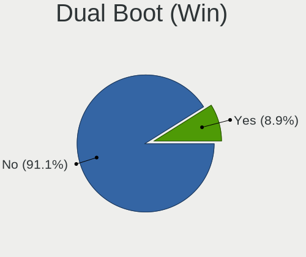
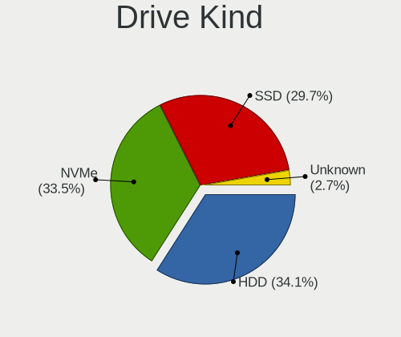
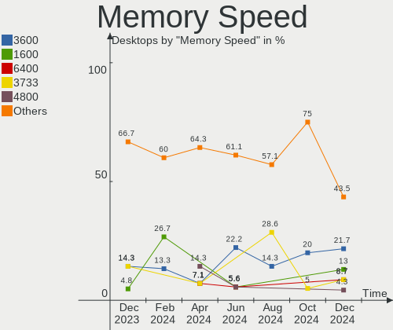

Pop!_OS - Hardware Trends (Desktops)
------------------------------------

A project to identify most popular hardware characteristics and track their change
over time based on data collected by Linux users at https://Linux-Hardware.org.

Anyone can contribute to this report by the [hw-probe](https://github.com/linuxhw/hw-probe) tool:

    sudo -E hw-probe -all -upload

This report is for one last month. Overall report since the beginning of time: [TestCoverage](https://github.com/linuxhw/TestCoverage)

Period: Sep, 2022.

Contents
--------

* [ System ](#system)
  - [ OS                       ](#os)
  - [ OS Family                ](#os-family)
  - [ Kernel                   ](#kernel)
  - [ Kernel Family            ](#kernel-family)
  - [ Kernel Major Ver.        ](#kernel-major-ver)
  - [ Arch                     ](#arch)
  - [ DE                       ](#de)
  - [ Display Server           ](#display-server)
  - [ Display Manager          ](#display-manager)
  - [ OS Lang                  ](#os-lang)
  - [ Boot Mode                ](#boot-mode)
  - [ Filesystem               ](#filesystem)
  - [ Part. scheme             ](#part-scheme)
  - [ Dual Boot with Linux/BSD ](#dual-boot-with-linuxbsd)
  - [ Dual Boot (Win)          ](#dual-boot-win)

* [ Board ](#board)
  - [ Vendor                   ](#vendor)
  - [ Model                    ](#model)
  - [ Model Family             ](#model-family)
  - [ MFG Year                 ](#mfg-year)
  - [ Form Factor              ](#form-factor)
  - [ Secure Boot              ](#secure-boot)
  - [ Coreboot                 ](#coreboot)
  - [ RAM Size                 ](#ram-size)
  - [ RAM Used                 ](#ram-used)
  - [ Total Drives             ](#total-drives)
  - [ Has CD-ROM               ](#has-cd-rom)
  - [ Has Ethernet             ](#has-ethernet)
  - [ Has WiFi                 ](#has-wifi)
  - [ Has Bluetooth            ](#has-bluetooth)

* [ Location ](#location)
  - [ Country                  ](#country)
  - [ City                     ](#city)

* [ Drives ](#drives)
  - [ Drive Vendor             ](#drive-vendor)
  - [ Drive Model              ](#drive-model)
  - [ HDD Vendor               ](#hdd-vendor)
  - [ SSD Vendor               ](#ssd-vendor)
  - [ Drive Kind               ](#drive-kind)
  - [ Drive Connector          ](#drive-connector)
  - [ Drive Size               ](#drive-size)
  - [ Space Total              ](#space-total)
  - [ Space Used               ](#space-used)
  - [ Malfunc. Drives          ](#malfunc-drives)
  - [ Malfunc. Drive Vendor    ](#malfunc-drive-vendor)
  - [ Malfunc. HDD Vendor      ](#malfunc-hdd-vendor)
  - [ Malfunc. Drive Kind      ](#malfunc-drive-kind)
  - [ Failed Drives            ](#failed-drives)
  - [ Failed Drive Vendor      ](#failed-drive-vendor)
  - [ Drive Status             ](#drive-status)

* [ Storage controller ](#storage-controller)
  - [ Storage Vendor           ](#storage-vendor)
  - [ Storage Model            ](#storage-model)
  - [ Storage Kind             ](#storage-kind)

* [ Processor ](#processor)
  - [ CPU Vendor               ](#cpu-vendor)
  - [ CPU Model                ](#cpu-model)
  - [ CPU Model Family         ](#cpu-model-family)
  - [ CPU Cores                ](#cpu-cores)
  - [ CPU Sockets              ](#cpu-sockets)
  - [ CPU Threads              ](#cpu-threads)
  - [ CPU Op-Modes             ](#cpu-op-modes)
  - [ CPU Microcode            ](#cpu-microcode)
  - [ CPU Microarch            ](#cpu-microarch)

* [ Graphics ](#graphics)
  - [ GPU Vendor               ](#gpu-vendor)
  - [ GPU Model                ](#gpu-model)
  - [ GPU Combo                ](#gpu-combo)
  - [ GPU Driver               ](#gpu-driver)
  - [ GPU Memory               ](#gpu-memory)

* [ Monitor ](#monitor)
  - [ Monitor Vendor           ](#monitor-vendor)
  - [ Monitor Model            ](#monitor-model)
  - [ Monitor Resolution       ](#monitor-resolution)
  - [ Monitor Diagonal         ](#monitor-diagonal)
  - [ Monitor Width            ](#monitor-width)
  - [ Aspect Ratio             ](#aspect-ratio)
  - [ Monitor Area             ](#monitor-area)
  - [ Pixel Density            ](#pixel-density)
  - [ Multiple Monitors        ](#multiple-monitors)

* [ Network ](#network)
  - [ Net Controller Vendor    ](#net-controller-vendor)
  - [ Net Controller Model     ](#net-controller-model)
  - [ Wireless Vendor          ](#wireless-vendor)
  - [ Wireless Model           ](#wireless-model)
  - [ Ethernet Vendor          ](#ethernet-vendor)
  - [ Ethernet Model           ](#ethernet-model)
  - [ Net Controller Kind      ](#net-controller-kind)
  - [ Used Controller          ](#used-controller)
  - [ NICs                     ](#nics)
  - [ IPv6                     ](#ipv6)

* [ Bluetooth ](#bluetooth)
  - [ Bluetooth Vendor         ](#bluetooth-vendor)
  - [ Bluetooth Model          ](#bluetooth-model)

* [ Sound ](#sound)
  - [ Sound Vendor             ](#sound-vendor)
  - [ Sound Model              ](#sound-model)

* [ Memory ](#memory)
  - [ Memory Vendor            ](#memory-vendor)
  - [ Memory Model             ](#memory-model)
  - [ Memory Kind              ](#memory-kind)
  - [ Memory Form Factor       ](#memory-form-factor)
  - [ Memory Size              ](#memory-size)
  - [ Memory Speed             ](#memory-speed)

* [ Printers & scanners ](#printers--scanners)
  - [ Printer Vendor           ](#printer-vendor)
  - [ Printer Model            ](#printer-model)
  - [ Scanner Vendor           ](#scanner-vendor)
  - [ Scanner Model            ](#scanner-model)

* [ Camera ](#camera)
  - [ Camera Vendor            ](#camera-vendor)
  - [ Camera Model             ](#camera-model)

* [ Security ](#security)
  - [ Fingerprint Vendor       ](#fingerprint-vendor)
  - [ Fingerprint Model        ](#fingerprint-model)
  - [ Chipcard Vendor          ](#chipcard-vendor)
  - [ Chipcard Model           ](#chipcard-model)

* [ Unsupported ](#unsupported)
  - [ Unsupported Devices      ](#unsupported-devices)
  - [ Unsupported Device Types ](#unsupported-device-types)

System
------

OS
--

Installed operating systems

| Name          | Desktops | Percent |
|---------------|----------|---------|
| Pop!_OS 22.04 | 74       | 98.67%  |
| Pop!_OS 21.10 | 1        | 1.33%   |

OS Family
---------

OS without a version

| Name    | Desktops | Percent |
|---------|----------|---------|
| Pop!_OS | 75       | 100%    |

Kernel
------

Version of the Linux kernel

| Version                  | Desktops | Percent |
|--------------------------|----------|---------|
| 5.19.0-76051900-generic  | 65       | 86.67%  |
| 5.18.10-76051810-generic | 5        | 6.67%   |
| 5.4.210-whitehax0r       | 1        | 1.33%   |
| 5.19.6-xanmod1-x64v2     | 1        | 1.33%   |
| 5.17.15-76051715-generic | 1        | 1.33%   |
| 5.16.19-76051619-generic | 1        | 1.33%   |
| 5.15.15-76051515-generic | 1        | 1.33%   |

Kernel Family
-------------

Linux kernel without a distro release

| Version | Desktops | Percent |
|---------|----------|---------|
| 5.19.0  | 65       | 86.67%  |
| 5.18.10 | 5        | 6.67%   |
| 5.4.210 | 1        | 1.33%   |
| 5.19.6  | 1        | 1.33%   |
| 5.17.15 | 1        | 1.33%   |
| 5.16.19 | 1        | 1.33%   |
| 5.15.15 | 1        | 1.33%   |

Kernel Major Ver.
-----------------

Linux kernel major version

| Version | Desktops | Percent |
|---------|----------|---------|
| 5.19    | 66       | 88%     |
| 5.18    | 5        | 6.67%   |
| 5.4     | 1        | 1.33%   |
| 5.17    | 1        | 1.33%   |
| 5.16    | 1        | 1.33%   |
| 5.15    | 1        | 1.33%   |

Arch
----

OS architecture (x86_64, i586, etc.)

| Name   | Desktops | Percent |
|--------|----------|---------|
| x86_64 | 75       | 100%    |

DE
--

Desktop Environment

| Name       | Desktops | Percent |
|------------|----------|---------|
| GNOME      | 71       | 94.67%  |
| KDE5       | 2        | 2.67%   |
| X-Cinnamon | 1        | 1.33%   |
| Unknown    | 1        | 1.33%   |

Display Server
--------------

X11 or Wayland

| Name    | Desktops | Percent |
|---------|----------|---------|
| X11     | 73       | 97.33%  |
| Wayland | 2        | 2.67%   |

Display Manager
---------------

SDDM, LightDM, etc.

| Name    | Desktops | Percent |
|---------|----------|---------|
| Unknown | 66       | 88%     |
| GDM3    | 7        | 9.33%   |
| SDDM    | 1        | 1.33%   |
| GDM     | 1        | 1.33%   |

OS Lang
-------

Language

| Lang    | Desktops | Percent |
|---------|----------|---------|
| en_US   | 48       | 64%     |
| pt_BR   | 6        | 8%      |
| en_GB   | 5        | 6.67%   |
| fr_FR   | 4        | 5.33%   |
| de_DE   | 2        | 2.67%   |
| Unknown | 2        | 2.67%   |
| zh_TW   | 1        | 1.33%   |
| pt_PT   | 1        | 1.33%   |
| nb_NO   | 1        | 1.33%   |
| it_IT   | 1        | 1.33%   |
| fr_BE   | 1        | 1.33%   |
| fi_FI   | 1        | 1.33%   |
| es_ES   | 1        | 1.33%   |
| da_DK   | 1        | 1.33%   |

Boot Mode
---------

EFI or BIOS

| Mode | Desktops | Percent |
|------|----------|---------|
| BIOS | 66       | 88%     |
| EFI  | 9        | 12%     |

Filesystem
----------

Type of filesystem

| Type  | Desktops | Percent |
|-------|----------|---------|
| Ext4  | 74       | 98.67%  |
| Btrfs | 1        | 1.33%   |

Part. scheme
------------

Scheme of partitioning

| Type    | Desktops | Percent |
|---------|----------|---------|
| Unknown | 65       | 86.67%  |
| GPT     | 9        | 12%     |
| MBR     | 1        | 1.33%   |

Dual Boot with Linux/BSD
------------------------

Hosting more than one Linux/BSD

| Dual boot | Desktops | Percent |
|-----------|----------|---------|
| No        | 69       | 92%     |
| Yes       | 6        | 8%      |

Dual Boot (Win)
---------------

Hosting Linux and Windows

| Dual boot | Desktops | Percent |
|-----------|----------|---------|
| No        | 70       | 93.33%  |
| Yes       | 5        | 6.67%   |

Board
-----

Vendor
------

Motherboard manufacturer

| Name                | Desktops | Percent |
|---------------------|----------|---------|
| ASUSTek Computer    | 18       | 24%     |
| Gigabyte Technology | 17       | 22.67%  |
| ASRock              | 8        | 10.67%  |
| MSI                 | 6        | 8%      |
| Dell                | 6        | 8%      |
| Hewlett-Packard     | 4        | 5.33%   |
| System76            | 2        | 2.67%   |
| Lenovo              | 2        | 2.67%   |
| Intel               | 2        | 2.67%   |
| Alienware           | 2        | 2.67%   |
| Acer                | 2        | 2.67%   |
| NZXT                | 1        | 1.33%   |
| Minix               | 1        | 1.33%   |
| MACHINIST           | 1        | 1.33%   |
| LattePanda          | 1        | 1.33%   |
| ECS                 | 1        | 1.33%   |
| Unknown             | 1        | 1.33%   |

Model
-----

Motherboard model

| Name                              | Desktops | Percent |
|-----------------------------------|----------|---------|
| Gigabyte B450 I AORUS PRO WIFI    | 2        | 2.67%   |
| ASUS ROG STRIX B550-I GAMING      | 2        | 2.67%   |
| ASUS All Series                   | 2        | 2.67%   |
| ASRock H97M Anniversary           | 2        | 2.67%   |
| System76 Thelio Mira              | 1        | 1.33%   |
| System76 Thelio                   | 1        | 1.33%   |
| NZXT N7 B550                      | 1        | 1.33%   |
| MSI MS-7C79                       | 1        | 1.33%   |
| MSI MS-7C56                       | 1        | 1.33%   |
| MSI MS-7C37                       | 1        | 1.33%   |
| MSI MS-7B86                       | 1        | 1.33%   |
| MSI MS-7B12                       | 1        | 1.33%   |
| MSI MS-7921                       | 1        | 1.33%   |
| Minix Z83-4                       | 1        | 1.33%   |
| MACHINIST X99-RS9 V3.0            | 1        | 1.33%   |
| Lenovo ThinkCentre M93 10A50005UK | 1        | 1.33%   |
| Lenovo ThinkCentre M83 10E8CTO1WW | 1        | 1.33%   |
| LattePanda 3 Delta                | 1        | 1.33%   |
| Intel X99                         | 1        | 1.33%   |
| Intel DX58SO AAE29331-702         | 1        | 1.33%   |
| HP Z420 Workstation               | 1        | 1.33%   |
| HP EliteDesk 705 G4 DM 35W (TAA)  | 1        | 1.33%   |
| HP Desktop M01-F1xxx              | 1        | 1.33%   |
| HP Compaq 6200 Pro SFF PC         | 1        | 1.33%   |
| Gigabyte Z97X-UD3H-BK             | 1        | 1.33%   |
| Gigabyte Z77-D3H                  | 1        | 1.33%   |
| Gigabyte Z170MX-Gaming 5          | 1        | 1.33%   |
| Gigabyte X570 AORUS PRO WIFI      | 1        | 1.33%   |
| Gigabyte X570 AORUS MASTER        | 1        | 1.33%   |
| Gigabyte TRX40 DESIGNARE          | 1        | 1.33%   |
| Gigabyte H61M-S1                  | 1        | 1.33%   |
| Gigabyte GA-MA770T-UD3P           | 1        | 1.33%   |
| Gigabyte GA-78LMT-USB3 6.0        | 1        | 1.33%   |
| Gigabyte EX58-UD4P                | 1        | 1.33%   |
| Gigabyte B85M-HD3                 | 1        | 1.33%   |
| Gigabyte B550 GAMING X V2         | 1        | 1.33%   |
| Gigabyte B450M DS3H WIFI          | 1        | 1.33%   |
| Gigabyte B450M DS3H               | 1        | 1.33%   |
| Gigabyte B450 AORUS M             | 1        | 1.33%   |
| ECS FK557AA-A2L a6602f            | 1        | 1.33%   |

Model Family
------------

Motherboard model prefix

| Name                    | Desktops | Percent |
|-------------------------|----------|---------|
| ASUS ROG                | 6        | 8%      |
| Gigabyte B450           | 3        | 4%      |
| Dell Precision          | 3        | 4%      |
| ASUS TUF                | 3        | 4%      |
| System76 Thelio         | 2        | 2.67%   |
| Lenovo ThinkCentre      | 2        | 2.67%   |
| Gigabyte X570           | 2        | 2.67%   |
| Gigabyte B450M          | 2        | 2.67%   |
| ASUS PRIME              | 2        | 2.67%   |
| ASUS All                | 2        | 2.67%   |
| ASRock H97M             | 2        | 2.67%   |
| Alienware Aurora        | 2        | 2.67%   |
| NZXT N7                 | 1        | 1.33%   |
| MSI MS-7C79             | 1        | 1.33%   |
| MSI MS-7C56             | 1        | 1.33%   |
| MSI MS-7C37             | 1        | 1.33%   |
| MSI MS-7B86             | 1        | 1.33%   |
| MSI MS-7B12             | 1        | 1.33%   |
| MSI MS-7921             | 1        | 1.33%   |
| Minix Z83-4             | 1        | 1.33%   |
| MACHINIST X99-RS9       | 1        | 1.33%   |
| LattePanda 3            | 1        | 1.33%   |
| Intel X99               | 1        | 1.33%   |
| Intel DX58SO            | 1        | 1.33%   |
| HP Z420                 | 1        | 1.33%   |
| HP EliteDesk            | 1        | 1.33%   |
| HP Desktop              | 1        | 1.33%   |
| HP Compaq               | 1        | 1.33%   |
| Gigabyte Z97X-UD3H-BK   | 1        | 1.33%   |
| Gigabyte Z77-D3H        | 1        | 1.33%   |
| Gigabyte Z170MX-Gaming  | 1        | 1.33%   |
| Gigabyte TRX40          | 1        | 1.33%   |
| Gigabyte H61M-S1        | 1        | 1.33%   |
| Gigabyte GA-MA770T-UD3P | 1        | 1.33%   |
| Gigabyte GA-78LMT-USB3  | 1        | 1.33%   |
| Gigabyte EX58-UD4P      | 1        | 1.33%   |
| Gigabyte B85M-HD3       | 1        | 1.33%   |
| Gigabyte B550           | 1        | 1.33%   |
| ECS FK557AA-A2L         | 1        | 1.33%   |
| Dell XPS                | 1        | 1.33%   |

MFG Year
--------

Motherboard manufacture year

| Year | Desktops | Percent |
|------|----------|---------|
| 2020 | 16       | 21.33%  |
| 2019 | 9        | 12%     |
| 2014 | 9        | 12%     |
| 2018 | 7        | 9.33%   |
| 2022 | 6        | 8%      |
| 2021 | 6        | 8%      |
| 2016 | 4        | 5.33%   |
| 2013 | 4        | 5.33%   |
| 2010 | 4        | 5.33%   |
| 2012 | 3        | 4%      |
| 2009 | 3        | 4%      |
| 2011 | 2        | 2.67%   |
| 2017 | 1        | 1.33%   |
| 2008 | 1        | 1.33%   |

Form Factor
-----------

Physical design of the computer

| Name    | Desktops | Percent |
|---------|----------|---------|
| Desktop | 75       | 100%    |

Secure Boot
-----------

Enabled or disabled

| State    | Desktops | Percent |
|----------|----------|---------|
| Disabled | 75       | 100%    |

Coreboot
--------

Have coreboot on board

| Used | Desktops | Percent |
|------|----------|---------|
| No   | 75       | 100%    |

RAM Size
--------

Total RAM memory

| Size in GB  | Desktops | Percent |
|-------------|----------|---------|
| 32.01-64.0  | 24       | 32%     |
| 16.01-24.0  | 23       | 30.67%  |
| 8.01-16.0   | 10       | 13.33%  |
| 64.01-256.0 | 9        | 12%     |
| 4.01-8.0    | 4        | 5.33%   |
| 3.01-4.0    | 3        | 4%      |
| 24.01-32.0  | 2        | 2.67%   |

RAM Used
--------

Used RAM memory

| Used GB    | Desktops | Percent |
|------------|----------|---------|
| 2.01-3.0   | 21       | 28%     |
| 3.01-4.0   | 18       | 24%     |
| 4.01-8.0   | 17       | 22.67%  |
| 8.01-16.0  | 8        | 10.67%  |
| 1.01-2.0   | 7        | 9.33%   |
| 16.01-24.0 | 4        | 5.33%   |

Total Drives
------------

Number of drives on board

| Drives | Desktops | Percent |
|--------|----------|---------|
| 1      | 26       | 34.67%  |
| 2      | 17       | 22.67%  |
| 3      | 14       | 18.67%  |
| 4      | 10       | 13.33%  |
| 5      | 3        | 4%      |
| 9      | 2        | 2.67%   |
| 10     | 1        | 1.33%   |
| 7      | 1        | 1.33%   |
| 0      | 1        | 1.33%   |

Has CD-ROM
----------

Has CD-ROM on board

| Presented | Desktops | Percent |
|-----------|----------|---------|
| No        | 54       | 72%     |
| Yes       | 21       | 28%     |

Has Ethernet
------------

Has Ethernet on board

| Presented | Desktops | Percent |
|-----------|----------|---------|
| Yes       | 73       | 97.33%  |
| No        | 2        | 2.67%   |

Has WiFi
--------

Has WiFi module

| Presented | Desktops | Percent |
|-----------|----------|---------|
| Yes       | 41       | 54.67%  |
| No        | 34       | 45.33%  |

Has Bluetooth
-------------

Has Bluetooth module

| Presented | Desktops | Percent |
|-----------|----------|---------|
| Yes       | 41       | 54.67%  |
| No        | 34       | 45.33%  |

Location
--------

Country
-------

Geographic location (country)

| Country     | Desktops | Percent |
|-------------|----------|---------|
| USA         | 36       | 48%     |
| Brazil      | 7        | 9.33%   |
| UK          | 3        | 4%      |
| France      | 3        | 4%      |
| Portugal    | 2        | 2.67%   |
| Poland      | 2        | 2.67%   |
| Greece      | 2        | 2.67%   |
| Germany     | 2        | 2.67%   |
| Finland     | 2        | 2.67%   |
| Denmark     | 2        | 2.67%   |
| Canada      | 2        | 2.67%   |
| Sweden      | 1        | 1.33%   |
| Spain       | 1        | 1.33%   |
| South Korea | 1        | 1.33%   |
| Romania     | 1        | 1.33%   |
| Norway      | 1        | 1.33%   |
| Mexico      | 1        | 1.33%   |
| Luxembourg  | 1        | 1.33%   |
| Italy       | 1        | 1.33%   |
| Hong Kong   | 1        | 1.33%   |
| Belgium     | 1        | 1.33%   |
| Bangladesh  | 1        | 1.33%   |
| Australia   | 1        | 1.33%   |

City
----

Geographic location (city)

| City             | Desktops | Percent |
|------------------|----------|---------|
| San Francisco    | 3        | 4%      |
| Seattle          | 2        | 2.67%   |
| Rio de Janeiro   | 2        | 2.67%   |
| Joinville        | 2        | 2.67%   |
| Helsinki         | 2        | 2.67%   |
| Winston-Salem    | 1        | 1.33%   |
| Wasserbillig     | 1        | 1.33%   |
| Wasilla          | 1        | 1.33%   |
| Washington       | 1        | 1.33%   |
| Walworth         | 1        | 1.33%   |
| Verviers         | 1        | 1.33%   |
| Urmston          | 1        | 1.33%   |
| Tyler            | 1        | 1.33%   |
| Tours            | 1        | 1.33%   |
| Tallahassee      | 1        | 1.33%   |
| Sunnyvale        | 1        | 1.33%   |
| San Fernando     | 1        | 1.33%   |
| Rolante          | 1        | 1.33%   |
| Rieden           | 1        | 1.33%   |
| Recife           | 1        | 1.33%   |
| Port Saint Lucie | 1        | 1.33%   |
| Ponte de Lima    | 1        | 1.33%   |
| Patchogue        | 1        | 1.33%   |
| Paris            | 1        | 1.33%   |
| Palhoca          | 1        | 1.33%   |
| Orange           | 1        | 1.33%   |
| Old Bridge       | 1        | 1.33%   |
| Oberlin          | 1        | 1.33%   |
| Northampton      | 1        | 1.33%   |
| Nephi            | 1        | 1.33%   |
| Nampa            | 1        | 1.33%   |
| Montreal         | 1        | 1.33%   |
| Middletown       | 1        | 1.33%   |
| Miami            | 1        | 1.33%   |
| Merced           | 1        | 1.33%   |
| Mapo-gu          | 1        | 1.33%   |
| Madone           | 1        | 1.33%   |
| Lumbres          | 1        | 1.33%   |
| Lisbon           | 1        | 1.33%   |
| Lincoln          | 1        | 1.33%   |

Drives
------

Drive Vendor
------------

Hard drive vendors

| Vendor                         | Desktops | Drives | Percent |
|--------------------------------|----------|--------|---------|
| Samsung Electronics            | 24       | 39     | 16%     |
| WDC                            | 23       | 29     | 15.33%  |
| Seagate                        | 22       | 29     | 14.67%  |
| Sandisk                        | 9        | 9      | 6%      |
| Crucial                        | 8        | 13     | 5.33%   |
| Toshiba                        | 6        | 6      | 4%      |
| Kingston                       | 5        | 6      | 3.33%   |
| Unknown                        | 4        | 6      | 2.67%   |
| Silicon Motion                 | 4        | 4      | 2.67%   |
| PNY                            | 3        | 3      | 2%      |
| Phison Electronics             | 3        | 4      | 2%      |
| Micron Technology              | 3        | 3      | 2%      |
| Intel                          | 3        | 3      | 2%      |
| Hitachi                        | 3        | 3      | 2%      |
| Realtek Semiconductor          | 2        | 2      | 1.33%   |
| Patriot                        | 2        | 2      | 1.33%   |
| Netac                          | 2        | 2      | 1.33%   |
| Micron/Crucial Technology      | 2        | 2      | 1.33%   |
| XPG                            | 1        | 1      | 0.67%   |
| Team                           | 1        | 3      | 0.67%   |
| T-FORCE                        | 1        | 1      | 0.67%   |
| SPCC                           | 1        | 1      | 0.67%   |
| Solid State Storage Technology | 1        | 1      | 0.67%   |
| SK hynix                       | 1        | 1      | 0.67%   |
| SABRENT                        | 1        | 1      | 0.67%   |
| Phison                         | 1        | 4      | 0.67%   |
| OCZ                            | 1        | 1      | 0.67%   |
| LDLC                           | 1        | 1      | 0.67%   |
| KIOXIA-EXCERIA                 | 1        | 1      | 0.67%   |
| KIOXIA                         | 1        | 1      | 0.67%   |
| KingDian                       | 1        | 1      | 0.67%   |
| JMicron Technology             | 1        | 1      | 0.67%   |
| Intenso                        | 1        | 1      | 0.67%   |
| GOODRAM                        | 1        | 1      | 0.67%   |
| Fanxiang                       | 1        | 1      | 0.67%   |
| Digital                        | 1        | 1      | 0.67%   |
| China                          | 1        | 1      | 0.67%   |
| Apotop                         | 1        | 1      | 0.67%   |
| AFOX                           | 1        | 1      | 0.67%   |
| A-DATA Technology              | 1        | 1      | 0.67%   |

Drive Model
-----------

Hard drive models

| Model                             | Desktops | Percent |
|-----------------------------------|----------|---------|
| Samsung SSD 860 EVO 1TB           | 4        | 2.29%   |
| Samsung NVMe SSD Drive 500GB      | 4        | 2.29%   |
| WDC WDS100T2B0A-00SM50 1TB SSD    | 3        | 1.71%   |
| WDC WD10EZEX-00BN5A0 1TB          | 2        | 1.14%   |
| Seagate ST2000DM008-2FR102 2TB    | 2        | 1.14%   |
| Seagate ST1000DM010-2EP102 1TB    | 2        | 1.14%   |
| Seagate ST1000DM003-1ER162 1TB    | 2        | 1.14%   |
| Seagate NVMe SSD Drive 1TB        | 2        | 1.14%   |
| Samsung SSD 980 PRO 1TB           | 2        | 1.14%   |
| Samsung SSD 860 EVO 500GB         | 2        | 1.14%   |
| Samsung NVMe SSD Drive 250GB      | 2        | 1.14%   |
| Realtek NVMe SSD Drive 256GB      | 2        | 1.14%   |
| Phison E12 NVMe Controller 1024GB | 2        | 1.14%   |
| Intel NVMe SSD Drive 1024GB       | 2        | 1.14%   |
| Crucial CT500MX500SSD1 500GB      | 2        | 1.14%   |
| XPG NVMe SSD Drive 1024GB         | 1        | 0.57%   |
| WDC WDS500G2B0A-00SM50 500GB SSD  | 1        | 0.57%   |
| WDC WDS240G1G0A-00SS50 240GB SSD  | 1        | 0.57%   |
| WDC WDBNCE5000PNC 500GB SSD       | 1        | 0.57%   |
| WDC WD800JD-75MSA3 80GB           | 1        | 0.57%   |
| WDC WD6402AAEX-00Z3A0 640GB       | 1        | 0.57%   |
| WDC WD6400AAKS-65A7B2 640GB       | 1        | 0.57%   |
| WDC WD5000BEVT-22ZAT0 500GB       | 1        | 0.57%   |
| WDC WD5000AAKX-753CA1 500GB       | 1        | 0.57%   |
| WDC WD5000AAKX-00ERMA0 500GB      | 1        | 0.57%   |
| WDC WD5000AAKS-65YGA0 500GB       | 1        | 0.57%   |
| WDC WD5000AAJS-00A8B0 500GB       | 1        | 0.57%   |
| WDC WD4000FYYZ-01UL1B0 4TB        | 1        | 0.57%   |
| WDC WD3200BEVT-22ZCT0 320GB       | 1        | 0.57%   |
| WDC WD3200AAKS-75VYA0 320GB       | 1        | 0.57%   |
| WDC WD2500AAJS-61B4A0 250GB       | 1        | 0.57%   |
| WDC WD2500AAJS-60VWA1 250GB       | 1        | 0.57%   |
| WDC WD20EARS-00MVWB0 2TB          | 1        | 0.57%   |
| WDC WD15EARS-22MVWB0 1TB          | 1        | 0.57%   |
| WDC WD10SPCX-24H 1TB              | 1        | 0.57%   |
| WDC WD10EZEX-08WN4A0 1TB          | 1        | 0.57%   |
| WDC WD10EZEX-00WN4A0 1TB          | 1        | 0.57%   |
| WDC WD10EVDS-63U8B1 1TB           | 1        | 0.57%   |
| WDC WD10EFRX-68JCSN0 1TB          | 1        | 0.57%   |
| WDC WD10EADS-00L5B1 1TB           | 1        | 0.57%   |

HDD Vendor
----------

Hard disk drive vendors

| Vendor              | Desktops | Drives | Percent |
|---------------------|----------|--------|---------|
| Seagate             | 20       | 26     | 41.67%  |
| WDC                 | 18       | 23     | 37.5%   |
| Toshiba             | 4        | 4      | 8.33%   |
| Hitachi             | 3        | 3      | 6.25%   |
| Samsung Electronics | 2        | 2      | 4.17%   |
| JMicron Technology  | 1        | 1      | 2.08%   |

SSD Vendor
----------

Solid state drive vendors

| Vendor              | Desktops | Drives | Percent |
|---------------------|----------|--------|---------|
| Samsung Electronics | 13       | 19     | 24.07%  |
| Crucial             | 8        | 11     | 14.81%  |
| WDC                 | 6        | 6      | 11.11%  |
| SanDisk             | 3        | 3      | 5.56%   |
| PNY                 | 3        | 3      | 5.56%   |
| Kingston            | 3        | 3      | 5.56%   |
| Patriot             | 2        | 2      | 3.7%    |
| Netac               | 2        | 2      | 3.7%    |
| Toshiba             | 1        | 1      | 1.85%   |
| Team                | 1        | 3      | 1.85%   |
| SPCC                | 1        | 1      | 1.85%   |
| Seagate             | 1        | 1      | 1.85%   |
| OCZ                 | 1        | 1      | 1.85%   |
| Micron Technology   | 1        | 1      | 1.85%   |
| KingDian            | 1        | 1      | 1.85%   |
| Intenso             | 1        | 1      | 1.85%   |
| GOODRAM             | 1        | 1      | 1.85%   |
| Digital             | 1        | 1      | 1.85%   |
| China               | 1        | 1      | 1.85%   |
| Apotop              | 1        | 1      | 1.85%   |
| AFOX                | 1        | 1      | 1.85%   |
| A-DATA Technology   | 1        | 1      | 1.85%   |

Drive Kind
----------

HDD or SSD

| Kind    | Desktops | Drives | Percent |
|---------|----------|--------|---------|
| SSD     | 43       | 65     | 33.33%  |
| NVMe    | 42       | 60     | 32.56%  |
| HDD     | 38       | 59     | 29.46%  |
| Unknown | 4        | 5      | 3.1%    |
| MMC     | 2        | 3      | 1.55%   |

Drive Connector
---------------

SATA, SAS, NVMe, etc.

| Type | Desktops | Drives | Percent |
|------|----------|--------|---------|
| SATA | 60       | 121    | 55.05%  |
| NVMe | 42       | 59     | 38.53%  |
| SAS  | 5        | 9      | 4.59%   |
| MMC  | 2        | 3      | 1.83%   |

Drive Size
----------

Size of hard drive

| Size in TB | Desktops | Drives | Percent |
|------------|----------|--------|---------|
| 0.01-0.5   | 40       | 60     | 44.94%  |
| 0.51-1.0   | 31       | 38     | 34.83%  |
| 1.01-2.0   | 9        | 14     | 10.11%  |
| 3.01-4.0   | 4        | 5      | 4.49%   |
| 4.01-10.0  | 4        | 6      | 4.49%   |
| 10.01-20.0 | 1        | 1      | 1.12%   |

Space Total
-----------

Amount of disk space available on the file system

| Size in GB     | Desktops | Percent |
|----------------|----------|---------|
| 501-1000       | 19       | 25.33%  |
| 101-250        | 17       | 22.67%  |
| 251-500        | 15       | 20%     |
| 1001-2000      | 11       | 14.67%  |
| More than 3000 | 6        | 8%      |
| 2001-3000      | 4        | 5.33%   |
| 21-50          | 1        | 1.33%   |
| 51-100         | 1        | 1.33%   |
| Unknown        | 1        | 1.33%   |

Space Used
----------

Amount of used disk space

| Used GB        | Desktops | Percent |
|----------------|----------|---------|
| 1-20           | 19       | 25.33%  |
| 21-50          | 16       | 21.33%  |
| 101-250        | 11       | 14.67%  |
| 251-500        | 10       | 13.33%  |
| 1001-2000      | 8        | 10.67%  |
| More than 3000 | 3        | 4%      |
| 501-1000       | 3        | 4%      |
| 51-100         | 3        | 4%      |
| 2001-3000      | 1        | 1.33%   |
| Unknown        | 1        | 1.33%   |

Malfunc. Drives
---------------

Drive models with a malfunction

| Model                      | Desktops | Drives | Percent |
|----------------------------|----------|--------|---------|
| Seagate Expansion Desk 2TB | 1        | 1      | 50%     |
| SABRENT Disk 1TB           | 1        | 1      | 50%     |

Malfunc. Drive Vendor
---------------------

Vendors of faulty drives

| Vendor  | Desktops | Drives | Percent |
|---------|----------|--------|---------|
| Seagate | 1        | 1      | 50%     |
| SABRENT | 1        | 1      | 50%     |

Malfunc. HDD Vendor
-------------------

Vendors of faulty HDD drives

| Vendor  | Desktops | Drives | Percent |
|---------|----------|--------|---------|
| Seagate | 1        | 1      | 100%    |

Malfunc. Drive Kind
-------------------

Kinds of faulty drives

| Kind | Desktops | Drives | Percent |
|------|----------|--------|---------|
| NVMe | 1        | 1      | 50%     |
| HDD  | 1        | 1      | 50%     |

Failed Drives
-------------

Failed drive models

Zero info for selected period =(

Failed Drive Vendor
-------------------

Failed drive vendors

Zero info for selected period =(

Drive Status
------------

Number of failed and malfunc. drives

| Status   | Desktops | Drives | Percent |
|----------|----------|--------|---------|
| Detected | 66       | 162    | 84.62%  |
| Works    | 11       | 28     | 14.1%   |
| Malfunc  | 1        | 2      | 1.28%   |

Storage controller
------------------

Storage Vendor
--------------

Storage controller vendors

| Vendor                         | Desktops | Percent |
|--------------------------------|----------|---------|
| AMD                            | 37       | 27.82%  |
| Intel                          | 35       | 26.32%  |
| Samsung Electronics            | 13       | 9.77%   |
| SanDisk                        | 6        | 4.51%   |
| ASMedia Technology             | 5        | 3.76%   |
| Silicon Motion                 | 4        | 3.01%   |
| Phison Electronics             | 4        | 3.01%   |
| Nvidia                         | 3        | 2.26%   |
| Micron/Crucial Technology      | 3        | 2.26%   |
| Kingston Technology Company    | 3        | 2.26%   |
| Toshiba America Info Systems   | 2        | 1.5%    |
| Seagate Technology             | 2        | 1.5%    |
| Realtek Semiconductor          | 2        | 1.5%    |
| Micron Technology              | 2        | 1.5%    |
| Marvell Technology Group       | 2        | 1.5%    |
| JMicron Technology             | 2        | 1.5%    |
| Broadcom / LSI                 | 2        | 1.5%    |
| Unknown                        | 1        | 0.75%   |
| Solid State Storage Technology | 1        | 0.75%   |
| SK hynix                       | 1        | 0.75%   |
| LSI Logic / Symbios Logic      | 1        | 0.75%   |
| KIOXIA                         | 1        | 0.75%   |
| ADATA Technology               | 1        | 0.75%   |

Storage Model
-------------

Storage controller models

| Model                                                                          | Desktops | Percent |
|--------------------------------------------------------------------------------|----------|---------|
| AMD FCH SATA Controller [AHCI mode]                                            | 21       | 13.46%  |
| AMD 500 Series Chipset SATA Controller                                         | 11       | 7.05%   |
| AMD 400 Series Chipset SATA Controller                                         | 9        | 5.77%   |
| Samsung NVMe SSD Controller SM981/PM981/PM983                                  | 8        | 5.13%   |
| Intel 9 Series Chipset Family SATA Controller [AHCI Mode]                      | 6        | 3.85%   |
| Intel 8 Series/C220 Series Chipset Family 6-port SATA Controller 1 [AHCI mode] | 6        | 3.85%   |
| ASMedia ASM1062 Serial ATA Controller                                          | 5        | 3.21%   |
| Samsung NVMe SSD Controller PM9A1/PM9A3/980PRO                                 | 4        | 2.56%   |
| Silicon Motion SM2263EN/SM2263XT SSD Controller                                | 3        | 1.92%   |
| AMD SB7x0/SB8x0/SB9x0 SATA Controller [AHCI mode]                              | 3        | 1.92%   |
| Phison E16 PCIe4 NVMe Controller                                               | 2        | 1.28%   |
| Phison E12 NVMe Controller                                                     | 2        | 1.28%   |
| Nvidia MCP78S [GeForce 8200] IDE                                               | 2        | 1.28%   |
| Nvidia MCP78S [GeForce 8200] AHCI Controller                                   | 2        | 1.28%   |
| Micron/Crucial P2 NVMe PCIe SSD                                                | 2        | 1.28%   |
| Micron Non-Volatile memory controller                                          | 2        | 1.28%   |
| Kingston Company A2000 NVMe SSD                                                | 2        | 1.28%   |
| Intel SSD 660P Series                                                          | 2        | 1.28%   |
| Intel Q170/Q150/B150/H170/H110/Z170/CM236 Chipset SATA Controller [AHCI Mode]  | 2        | 1.28%   |
| Intel Comet Lake SATA AHCI Controller                                          | 2        | 1.28%   |
| Intel 82801JI (ICH10 Family) 4 port SATA IDE Controller #1                     | 2        | 1.28%   |
| Intel 82801JI (ICH10 Family) 2 port SATA IDE Controller #2                     | 2        | 1.28%   |
| Intel 6 Series/C200 Series Chipset Family 6 port Desktop SATA AHCI Controller  | 2        | 1.28%   |
| Intel 500 Series Chipset Family SATA AHCI Controller                           | 2        | 1.28%   |
| AMD SB7x0/SB8x0/SB9x0 IDE Controller                                           | 2        | 1.28%   |
| AMD 300 Series Chipset SATA Controller                                         | 2        | 1.28%   |
| Unknown Non-Volatile memory controller                                         | 1        | 0.64%   |
| Toshiba America Info Systems XG6 NVMe SSD Controller                           | 1        | 0.64%   |
| Toshiba America Info Systems BG3 NVMe SSD Controller                           | 1        | 0.64%   |
| Solid State Storage Non-Volatile memory controller                             | 1        | 0.64%   |
| SK hynix BC511                                                                 | 1        | 0.64%   |
| Silicon Motion SM2262/SM2262EN SSD Controller                                  | 1        | 0.64%   |
| Seagate Non-Volatile memory controller                                         | 1        | 0.64%   |
| Seagate FireCuda 520 SSD                                                       | 1        | 0.64%   |
| SanDisk WD PC SN810 / Black SN850 NVMe SSD                                     | 1        | 0.64%   |
| SanDisk WD Blue SN570 NVMe SSD                                                 | 1        | 0.64%   |
| SanDisk WD Blue SN550 NVMe SSD                                                 | 1        | 0.64%   |
| SanDisk WD Black SN750 / PC SN730 NVMe SSD                                     | 1        | 0.64%   |
| SanDisk WD Black 2018/SN750 / PC SN720 NVMe SSD                                | 1        | 0.64%   |
| SanDisk Non-Volatile memory controller                                         | 1        | 0.64%   |

Storage Kind
------------

Kind of storage controller (IDE, SATA, NVMe, SAS, ...)

| Kind | Desktops | Percent |
|------|----------|---------|
| SATA | 64       | 51.61%  |
| NVMe | 42       | 33.87%  |
| IDE  | 12       | 9.68%   |
| SAS  | 4        | 3.23%   |
| RAID | 2        | 1.61%   |

Processor
---------

CPU Vendor
----------

Processor vendors

| Vendor | Desktops | Percent |
|--------|----------|---------|
| AMD    | 41       | 54.67%  |
| Intel  | 34       | 45.33%  |

CPU Model
---------

Processor models

| Model                                          | Desktops | Percent |
|------------------------------------------------|----------|---------|
| AMD Ryzen 7 3700X 8-Core Processor             | 5        | 6.67%   |
| AMD Ryzen 5 5600G with Radeon Graphics         | 4        | 5.33%   |
| Intel Core i7-4790 CPU @ 3.60GHz               | 3        | 4%      |
| AMD Ryzen 9 3900X 12-Core Processor            | 3        | 4%      |
| AMD Ryzen 7 5800X 8-Core Processor             | 3        | 4%      |
| AMD Ryzen 5 5600X 6-Core Processor             | 3        | 4%      |
| Intel Core i7-4790K CPU @ 4.00GHz              | 2        | 2.67%   |
| Intel Core i7 CPU 920 @ 2.67GHz                | 2        | 2.67%   |
| Intel Core i5-4460 CPU @ 3.20GHz               | 2        | 2.67%   |
| AMD Ryzen 7 5700X 8-Core Processor             | 2        | 2.67%   |
| AMD Ryzen 7 5700G with Radeon Graphics         | 2        | 2.67%   |
| AMD FX-8320 Eight-Core Processor               | 2        | 2.67%   |
| Intel Xeon CPU E5-2697 v2 @ 2.70GHz            | 1        | 1.33%   |
| Intel Xeon CPU E5-2660 v3 @ 2.60GHz            | 1        | 1.33%   |
| Intel Xeon CPU E5-2630 v4 @ 2.20GHz            | 1        | 1.33%   |
| Intel Xeon CPU E5-2620 v3 @ 2.40GHz            | 1        | 1.33%   |
| Intel Xeon CPU E5-1620 v2 @ 3.70GHz            | 1        | 1.33%   |
| Intel Xeon CPU E3-1265L v3 @ 2.50GHz           | 1        | 1.33%   |
| Intel Pentium Gold G7400                       | 1        | 1.33%   |
| Intel Core i9-9900KF CPU @ 3.60GHz             | 1        | 1.33%   |
| Intel Core i7-6700K CPU @ 4.00GHz              | 1        | 1.33%   |
| Intel Core i7-4770 CPU @ 3.40GHz               | 1        | 1.33%   |
| Intel Core i7-3770 CPU @ 3.40GHz               | 1        | 1.33%   |
| Intel Core i7 CPU 950 @ 3.07GHz                | 1        | 1.33%   |
| Intel Core i5-6500 CPU @ 3.20GHz               | 1        | 1.33%   |
| Intel Core i5-4670K CPU @ 3.40GHz              | 1        | 1.33%   |
| Intel Core i5-4590T CPU @ 2.00GHz              | 1        | 1.33%   |
| Intel Core i5-3570K CPU @ 3.40GHz              | 1        | 1.33%   |
| Intel Core i5-2400 CPU @ 3.10GHz               | 1        | 1.33%   |
| Intel Core i5-10400F CPU @ 2.90GHz             | 1        | 1.33%   |
| Intel Core i5-10400 CPU @ 2.90GHz              | 1        | 1.33%   |
| Intel Core i3-4150T CPU @ 3.00GHz              | 1        | 1.33%   |
| Intel Celeron N5105 @ 2.00GHz                  | 1        | 1.33%   |
| Intel Celeron CPU G1610 @ 2.60GHz              | 1        | 1.33%   |
| Intel Atom x5-Z8350 CPU @ 1.44GHz              | 1        | 1.33%   |
| Intel 11th Gen Core i7-11700K @ 3.60GHz        | 1        | 1.33%   |
| Intel 11th Gen Core i7-11700 @ 2.50GHz         | 1        | 1.33%   |
| AMD Ryzen Threadripper PRO 5965WX 24-Cores     | 1        | 1.33%   |
| AMD Ryzen Threadripper 3970X 32-Core Processor | 1        | 1.33%   |
| AMD Ryzen Embedded V1605B with Radeon Vega Gfx | 1        | 1.33%   |

CPU Model Family
----------------

Processor model prefix

| Model                  | Desktops | Percent |
|------------------------|----------|---------|
| AMD Ryzen 7            | 14       | 18.67%  |
| Intel Core i7          | 11       | 14.67%  |
| AMD Ryzen 5            | 11       | 14.67%  |
| Intel Core i5          | 9        | 12%     |
| Intel Xeon             | 6        | 8%      |
| AMD Ryzen 9            | 5        | 6.67%   |
| Other                  | 3        | 4%      |
| Intel Celeron          | 2        | 2.67%   |
| AMD Ryzen Threadripper | 2        | 2.67%   |
| AMD FX                 | 2        | 2.67%   |
| Intel Pentium Gold     | 1        | 1.33%   |
| Intel Core i9          | 1        | 1.33%   |
| Intel Core i3          | 1        | 1.33%   |
| Intel Atom             | 1        | 1.33%   |
| AMD Ryzen Embedded     | 1        | 1.33%   |
| AMD Ryzen 5 PRO        | 1        | 1.33%   |
| AMD Phenom II X6       | 1        | 1.33%   |
| AMD Phenom II X4       | 1        | 1.33%   |
| AMD Phenom             | 1        | 1.33%   |
| AMD Athlon II X4       | 1        | 1.33%   |

CPU Cores
---------

Number of processor cores

| Number | Desktops | Percent |
|--------|----------|---------|
| 4      | 29       | 38.67%  |
| 8      | 18       | 24%     |
| 6      | 14       | 18.67%  |
| 12     | 5        | 6.67%   |
| 2      | 3        | 4%      |
| 10     | 2        | 2.67%   |
| 32     | 1        | 1.33%   |
| 24     | 1        | 1.33%   |
| 16     | 1        | 1.33%   |
| 3      | 1        | 1.33%   |

CPU Sockets
-----------

Number of sockets

| Number | Desktops | Percent |
|--------|----------|---------|
| 1      | 75       | 100%    |

CPU Threads
-----------

Threads per core (Hyper-Threading)

| Number | Desktops | Percent |
|--------|----------|---------|
| 2      | 60       | 80%     |
| 1      | 15       | 20%     |

CPU Op-Modes
------------

CPU Operation Modes (32-bit, 64-bit)

| Op mode        | Desktops | Percent |
|----------------|----------|---------|
| 32-bit, 64-bit | 75       | 100%    |

CPU Microcode
-------------

Microcode number

| Number     | Desktops | Percent |
|------------|----------|---------|
| Unknown    | 63       | 84%     |
| 0x08701021 | 3        | 4%      |
| 0x08701013 | 2        | 2.67%   |
| 0xa0671    | 1        | 1.33%   |
| 0x906c0    | 1        | 1.33%   |
| 0x306a9    | 1        | 1.33%   |
| 0x0a201205 | 1        | 1.33%   |
| 0x0a201016 | 1        | 1.33%   |
| 0x08001138 | 1        | 1.33%   |
| 0x07013005 | 1        | 1.33%   |

CPU Microarch
-------------

Microarchitecture

| Name        | Desktops | Percent |
|-------------|----------|---------|
| Zen 3       | 17       | 22.67%  |
| Haswell     | 14       | 18.67%  |
| Zen 2       | 12       | 16%     |
| IvyBridge   | 5        | 6.67%   |
| Unknown     | 5        | 6.67%   |
| K10         | 4        | 5.33%   |
| Zen         | 3        | 4%      |
| Nehalem     | 3        | 4%      |
| Skylake     | 2        | 2.67%   |
| Piledriver  | 2        | 2.67%   |
| CometLake   | 2        | 2.67%   |
| Zen+        | 1        | 1.33%   |
| Silvermont  | 1        | 1.33%   |
| SandyBridge | 1        | 1.33%   |
| KabyLake    | 1        | 1.33%   |
| Icelake     | 1        | 1.33%   |
| Broadwell   | 1        | 1.33%   |

Graphics
--------

GPU Vendor
----------

Vendors of graphics cards

| Vendor | Desktops | Percent |
|--------|----------|---------|
| Nvidia | 40       | 50%     |
| AMD    | 25       | 31.25%  |
| Intel  | 15       | 18.75%  |

GPU Model
---------

Graphics card models

| Model                                                                       | Desktops | Percent |
|-----------------------------------------------------------------------------|----------|---------|
| Intel Xeon E3-1200 v3/4th Gen Core Processor Integrated Graphics Controller | 6        | 7.5%    |
| Nvidia TU116 [GeForce GTX 1660 SUPER]                                       | 3        | 3.75%   |
| Nvidia GP104 [GeForce GTX 1070 Ti]                                          | 3        | 3.75%   |
| AMD Cezanne                                                                 | 3        | 3.75%   |
| Nvidia TU117 [GeForce GTX 1650]                                             | 2        | 2.5%    |
| Nvidia TU104 [GeForce RTX 2080 SUPER]                                       | 2        | 2.5%    |
| Nvidia TU104 [GeForce RTX 2070 SUPER]                                       | 2        | 2.5%    |
| Nvidia GP108 [GeForce GT 1030]                                              | 2        | 2.5%    |
| Nvidia GM200 [GeForce GTX 980 Ti]                                           | 2        | 2.5%    |
| Nvidia GA104 [GeForce RTX 3070 Ti]                                          | 2        | 2.5%    |
| Intel HD Graphics 530                                                       | 2        | 2.5%    |
| AMD Raven Ridge [Radeon Vega Series / Radeon Vega Mobile Series]            | 2        | 2.5%    |
| AMD Navi 23 [Radeon RX 6600/6600 XT/6600M]                                  | 2        | 2.5%    |
| AMD Navi 22 [Radeon RX 6700/6700 XT/6750 XT / 6800M]                        | 2        | 2.5%    |
| AMD Navi 21 [Radeon RX 6800/6800 XT / 6900 XT]                              | 2        | 2.5%    |
| AMD Ellesmere [Radeon RX 470/480/570/570X/580/580X/590]                     | 2        | 2.5%    |
| Nvidia TU106 [GeForce RTX 2060 SUPER]                                       | 1        | 1.25%   |
| Nvidia TU106 [GeForce RTX 2060 Rev. A]                                      | 1        | 1.25%   |
| Nvidia GP107GL [Quadro P400]                                                | 1        | 1.25%   |
| Nvidia GP107 [GeForce GTX 1050]                                             | 1        | 1.25%   |
| Nvidia GP107 [GeForce GTX 1050 Ti]                                          | 1        | 1.25%   |
| Nvidia GP106 [GeForce GTX 1060 6GB]                                         | 1        | 1.25%   |
| Nvidia GM206GL [Quadro M2000]                                               | 1        | 1.25%   |
| Nvidia GM206 [GeForce GTX 960]                                              | 1        | 1.25%   |
| Nvidia GM107GL [Quadro K620]                                                | 1        | 1.25%   |
| Nvidia GM107 [GeForce GTX 750 Ti]                                           | 1        | 1.25%   |
| Nvidia GK107GL [Quadro K2000]                                               | 1        | 1.25%   |
| Nvidia GK107 [GeForce GT 640 OEM]                                           | 1        | 1.25%   |
| Nvidia GK104 [GeForce GTX 770]                                              | 1        | 1.25%   |
| Nvidia GA106 [GeForce RTX 3060]                                             | 1        | 1.25%   |
| Nvidia GA106 [GeForce RTX 3060 Lite Hash Rate]                              | 1        | 1.25%   |
| Nvidia GA104 [GeForce RTX 3070 Lite Hash Rate]                              | 1        | 1.25%   |
| Nvidia GA102 [GeForce RTX 3090]                                             | 1        | 1.25%   |
| Nvidia GA102 [GeForce RTX 3080]                                             | 1        | 1.25%   |
| Nvidia GA102 [GeForce RTX 3080 Ti]                                          | 1        | 1.25%   |
| Nvidia GA102 [GeForce RTX 3080 Lite Hash Rate]                              | 1        | 1.25%   |
| Nvidia G92 [GeForce 9800 GT]                                                | 1        | 1.25%   |
| Nvidia C61 [GeForce 6150SE nForce 430]                                      | 1        | 1.25%   |
| Intel Xeon E3-1200 v3 Processor Integrated Graphics Controller              | 1        | 1.25%   |
| Intel Xeon E3-1200 v2/3rd Gen Core processor Graphics Controller            | 1        | 1.25%   |

GPU Combo
---------

Combinations of graphics cards

| Name           | Desktops | Percent |
|----------------|----------|---------|
| 1 x Nvidia     | 37       | 49.33%  |
| 1 x AMD        | 25       | 33.33%  |
| 1 x Intel      | 10       | 13.33%  |
| Intel + Nvidia | 3        | 4%      |

GPU Driver
----------

Free vs proprietary

| Driver      | Desktops | Percent |
|-------------|----------|---------|
| Free        | 40       | 53.33%  |
| Proprietary | 34       | 45.33%  |
| Unknown     | 1        | 1.33%   |

GPU Memory
----------

Total video memory

| Size in GB | Desktops | Percent |
|------------|----------|---------|
| Unknown    | 49       | 65.33%  |
| 7.01-8.0   | 9        | 12%     |
| 1.01-2.0   | 5        | 6.67%   |
| 8.01-16.0  | 5        | 6.67%   |
| 5.01-6.0   | 4        | 5.33%   |
| 3.01-4.0   | 2        | 2.67%   |
| 16.01-24.0 | 1        | 1.33%   |

Monitor
-------

Monitor Vendor
--------------

Monitor vendors

| Vendor               | Desktops | Percent |
|----------------------|----------|---------|
| Goldstar             | 17       | 19.1%   |
| Samsung Electronics  | 16       | 17.98%  |
| Dell                 | 7        | 7.87%   |
| AOC                  | 7        | 7.87%   |
| Hewlett-Packard      | 6        | 6.74%   |
| ASUSTek Computer     | 6        | 6.74%   |
| Ancor Communications | 4        | 4.49%   |
| Acer                 | 4        | 4.49%   |
| Philips              | 3        | 3.37%   |
| Lenovo               | 3        | 3.37%   |
| Sony                 | 2        | 2.25%   |
| Sceptre Tech         | 2        | 2.25%   |
| BenQ                 | 2        | 2.25%   |
| Viotek               | 1        | 1.12%   |
| Valve                | 1        | 1.12%   |
| Toshiba              | 1        | 1.12%   |
| Targa Visionary      | 1        | 1.12%   |
| MSI                  | 1        | 1.12%   |
| LLL                  | 1        | 1.12%   |
| LG Electronics       | 1        | 1.12%   |
| HKC                  | 1        | 1.12%   |
| HB@                  | 1        | 1.12%   |
| GDH                  | 1        | 1.12%   |

Monitor Model
-------------

Monitor models

| Model                                                                  | Desktops | Percent |
|------------------------------------------------------------------------|----------|---------|
| Goldstar ULTRAWIDE GSM59F1 2560x1080 673x284mm 28.8-inch               | 2        | 2.2%    |
| Goldstar TV SSCR2 GSMC0C8 3840x2160                                    | 2        | 2.2%    |
| AOC 2460G5 AOC0001 1920x1080 531x299mm 24.0-inch                       | 2        | 2.2%    |
| Viotek GNV27DB VTK2700 2560x1440 597x336mm 27.0-inch                   | 1        | 1.1%    |
| Valve Index HMD VLV91A8                                                | 1        | 1.1%    |
| Toshiba LCD-MONITOR LCD1885 1366x768 410x230mm 18.5-inch               | 1        | 1.1%    |
| Targa Visionary LCD 24-1 Wide TARA240 1920x1080 521x293mm 23.5-inch    | 1        | 1.1%    |
| Sony TV *00 SNYAA04 3840x2160 1439x809mm 65.0-inch                     | 1        | 1.1%    |
| Sony TV *00 SNYA204 3840x2160 1218x685mm 55.0-inch                     | 1        | 1.1%    |
| Sceptre Tech U435CV-UMC SPT1109 3840x2160 575x323mm 26.0-inch          | 1        | 1.1%    |
| Sceptre Tech Sceptre F24 SPT09AB 1920x1080 521x293mm 23.5-inch         | 1        | 1.1%    |
| Samsung Electronics U32J59x SAM0F33 3840x2160 697x392mm 31.5-inch      | 1        | 1.1%    |
| Samsung Electronics U28E590 SAM0C4C 3840x2160 608x345mm 27.5-inch      | 1        | 1.1%    |
| Samsung Electronics SyncMaster SAM0601 1600x900                        | 1        | 1.1%    |
| Samsung Electronics SyncMaster SAM055E 1920x1080 510x290mm 23.1-inch   | 1        | 1.1%    |
| Samsung Electronics SyncMaster SAM0485 1920x1080 520x320mm 24.0-inch   | 1        | 1.1%    |
| Samsung Electronics SMB1630N SAM0630 1366x768 344x194mm 15.5-inch      | 1        | 1.1%    |
| Samsung Electronics S24E650 SAM0CB8 1920x1080 521x293mm 23.5-inch      | 1        | 1.1%    |
| Samsung Electronics S24D300 SAM0B43 1920x1080 531x299mm 24.0-inch      | 1        | 1.1%    |
| Samsung Electronics LU28R55 SAM1019 3840x2160 632x360mm 28.6-inch      | 1        | 1.1%    |
| Samsung Electronics LS24AG30x SAM7178 1920x1080 527x296mm 23.8-inch    | 1        | 1.1%    |
| Samsung Electronics LCD Monitor SAM7106 1920x1080 1210x680mm 54.6-inch | 1        | 1.1%    |
| Samsung Electronics LCD Monitor SAM0DF6 3840x2160 890x500mm 40.2-inch  | 1        | 1.1%    |
| Samsung Electronics LCD Monitor SAM094E 1920x1080 1020x570mm 46.0-inch | 1        | 1.1%    |
| Samsung Electronics LCD Monitor SAM0667 1920x1080                      | 1        | 1.1%    |
| Samsung Electronics LC34G55T SAM711A 3440x1440 798x334mm 34.1-inch     | 1        | 1.1%    |
| Samsung Electronics C27F591 SAM0D37 1920x1080 598x336mm 27.0-inch      | 1        | 1.1%    |
| Samsung Electronics C24F390 SAM0D2D 1920x1080 521x293mm 23.5-inch      | 1        | 1.1%    |
| Philips PHL 322E1 PHLC20F 1920x1080 698x393mm 31.5-inch                | 1        | 1.1%    |
| Philips PHL 276E9Q PHLC17B 1920x1080 598x336mm 27.0-inch               | 1        | 1.1%    |
| Philips PHL 243V7 PHLC155 1920x1080 527x296mm 23.8-inch                | 1        | 1.1%    |
| MSI G273 MSI3CA7 1920x1080 597x336mm 27.0-inch                         | 1        | 1.1%    |
| LLL LRK32G30RQ LLL4200 1920x1080 983x576mm 44.9-inch                   | 1        | 1.1%    |
| LG Electronics LCD Monitor W1943 3280x1080                             | 1        | 1.1%    |
| Lenovo TinyinOne23 LEN10DF 1920x1080 509x286mm 23.0-inch               | 1        | 1.1%    |
| Lenovo LEN T22i-10 LEN61A9 1920x1080 476x268mm 21.5-inch               | 1        | 1.1%    |
| Lenovo LEN G25-10 LEN65FE 1920x1080 544x303mm 24.5-inch                | 1        | 1.1%    |
| HKC 27E1Q HKC2712 2560x1440 597x336mm 27.0-inch                        | 1        | 1.1%    |
| Hewlett-Packard w1907 HWP26A3 1440x900 408x255mm 18.9-inch             | 1        | 1.1%    |
| Hewlett-Packard P241v HPN3642 1920x1080 528x297mm 23.9-inch            | 1        | 1.1%    |

Monitor Resolution
------------------

Monitor screen resolution

| Resolution         | Desktops | Percent |
|--------------------|----------|---------|
| 1920x1080 (FHD)    | 38       | 45.78%  |
| 3840x2160 (4K)     | 17       | 20.48%  |
| 2560x1440 (QHD)    | 7        | 8.43%   |
| 2560x1080          | 6        | 7.23%   |
| 1366x768 (WXGA)    | 4        | 4.82%   |
| 3440x1440          | 2        | 2.41%   |
| 1440x900 (WXGA+)   | 2        | 2.41%   |
| 3280x1080          | 1        | 1.2%    |
| 1920x540           | 1        | 1.2%    |
| 1680x1050 (WSXGA+) | 1        | 1.2%    |
| 1600x900 (HD+)     | 1        | 1.2%    |
| 1360x768           | 1        | 1.2%    |
| 1280x1024 (SXGA)   | 1        | 1.2%    |
| Unknown            | 1        | 1.2%    |

Monitor Diagonal
----------------

Diagonal size in inches

| Inches  | Desktops | Percent |
|---------|----------|---------|
| 27      | 14       | 17.28%  |
| 24      | 13       | 16.05%  |
| 23      | 10       | 12.35%  |
| 34      | 7        | 8.64%   |
| 21      | 6        | 7.41%   |
| 31      | 5        | 6.17%   |
| 18      | 4        | 4.94%   |
| 72      | 3        | 3.7%    |
| Unknown | 3        | 3.7%    |
| 54      | 2        | 2.47%   |
| 32      | 2        | 2.47%   |
| 28      | 2        | 2.47%   |
| 19      | 2        | 2.47%   |
| 84      | 1        | 1.23%   |
| 65      | 1        | 1.23%   |
| 52      | 1        | 1.23%   |
| 44      | 1        | 1.23%   |
| 25      | 1        | 1.23%   |
| 22      | 1        | 1.23%   |
| 17      | 1        | 1.23%   |
| 15      | 1        | 1.23%   |

Monitor Width
-------------

Physical width

| Width in mm | Desktops | Percent |
|-------------|----------|---------|
| 501-600     | 35       | 43.21%  |
| 401-500     | 13       | 16.05%  |
| 601-700     | 10       | 12.35%  |
| 701-800     | 9        | 11.11%  |
| 1501-2000   | 4        | 4.94%   |
| 1001-1500   | 4        | 4.94%   |
| Unknown     | 3        | 3.7%    |
| 301-350     | 2        | 2.47%   |
| 901-1000    | 1        | 1.23%   |

Aspect Ratio
------------

Proportional relationship between the width and the height

| Ratio   | Desktops | Percent |
|---------|----------|---------|
| 16/9    | 59       | 78.67%  |
| 21/9    | 8        | 10.67%  |
| 16/10   | 5        | 6.67%   |
| Unknown | 2        | 2.67%   |
| 5/4     | 1        | 1.33%   |

Monitor Area
------------

Area in inch

| Area in inch | Desktops | Percent |
|----------------|----------|---------|
| 201-250        | 26       | 32.91%  |
| 351-500        | 14       | 17.72%  |
| 301-350        | 14       | 17.72%  |
| More than 1000 | 8        | 10.13%  |
| 141-150        | 5        | 6.33%   |
| 251-300        | 4        | 5.06%   |
| 151-200        | 3        | 3.8%    |
| Unknown        | 3        | 3.8%    |
| 101-110        | 1        | 1.27%   |
| 501-1000       | 1        | 1.27%   |

Pixel Density
-------------

Pixels per inch

| Density | Desktops | Percent |
|---------|----------|---------|
| 51-100  | 46       | 60.53%  |
| 101-120 | 14       | 18.42%  |
| 121-160 | 6        | 7.89%   |
| 1-50    | 5        | 6.58%   |
| Unknown | 3        | 3.95%   |
| 161-240 | 2        | 2.63%   |

Multiple Monitors
-----------------

Total monitors connected

| Total | Desktops | Percent |
|-------|----------|---------|
| 1     | 55       | 73.33%  |
| 2     | 15       | 20%     |
| 3     | 4        | 5.33%   |
| 4     | 1        | 1.33%   |

Network
-------

Net Controller Vendor
---------------------

Controller vendors

| Vendor                   | Desktops | Percent |
|--------------------------|----------|---------|
| Realtek Semiconductor    | 43       | 41.35%  |
| Intel                    | 38       | 36.54%  |
| Qualcomm Atheros         | 4        | 3.85%   |
| Nvidia                   | 3        | 2.88%   |
| MediaTek                 | 3        | 2.88%   |
| InterBiometrics          | 3        | 2.88%   |
| Broadcom                 | 3        | 2.88%   |
| NetGear                  | 2        | 1.92%   |
| TP-Link                  | 1        | 0.96%   |
| Ralink                   | 1        | 0.96%   |
| Marvell Technology Group | 1        | 0.96%   |
| Aquantia                 | 1        | 0.96%   |
| Unknown                  | 1        | 0.96%   |

Net Controller Model
--------------------

Controller models

| Model                                                             | Desktops | Percent |
|-------------------------------------------------------------------|----------|---------|
| Realtek RTL8111/8168/8411 PCI Express Gigabit Ethernet Controller | 33       | 26.4%   |
| Intel Wi-Fi 6 AX200                                               | 13       | 10.4%   |
| Intel I211 Gigabit Network Connection                             | 9        | 7.2%    |
| Realtek RTL8125 2.5GbE Controller                                 | 6        | 4.8%    |
| Intel Ethernet Controller I225-V                                  | 5        | 4%      |
| InterBiometrics Io                                                | 3        | 2.4%    |
| Intel Wireless-AC 9260                                            | 3        | 2.4%    |
| Intel Ethernet Connection I217-LM                                 | 3        | 2.4%    |
| Intel Dual Band Wireless-AC 3168NGW [Stone Peak]                  | 3        | 2.4%    |
| Intel 82579LM Gigabit Network Connection (Lewisville)             | 3        | 2.4%    |
| Realtek 802.11ac NIC                                              | 2        | 1.6%    |
| Nvidia MCP77 Ethernet                                             | 2        | 1.6%    |
| MediaTek MT7921 802.11ax PCI Express Wireless Network Adapter     | 2        | 1.6%    |
| Intel Wi-Fi 6 AX210/AX211/AX411 160MHz                            | 2        | 1.6%    |
| Intel Ethernet Connection I217-V                                  | 2        | 1.6%    |
| Intel Ethernet Connection (2) I218-V                              | 2        | 1.6%    |
| Intel Comet Lake PCH CNVi WiFi                                    | 2        | 1.6%    |
| TP-Link UE300 10/100/1000 LAN (ethernet mode) [Realtek RTL8153]   | 1        | 0.8%    |
| Realtek RTL8821CE 802.11ac PCIe Wireless Network Adapter          | 1        | 0.8%    |
| Realtek RTL8192EU 802.11b/g/n WLAN Adapter                        | 1        | 0.8%    |
| Realtek RTL8192CU 802.11n WLAN Adapter                            | 1        | 0.8%    |
| Realtek RTL8169 PCI Gigabit Ethernet Controller                   | 1        | 0.8%    |
| Realtek Killer E2600 Gigabit Ethernet Controller                  | 1        | 0.8%    |
| Ralink RT2790 Wireless 802.11n 1T/2R PCIe                         | 1        | 0.8%    |
| Qualcomm Atheros QCA9565 / AR9565 Wireless Network Adapter        | 1        | 0.8%    |
| Qualcomm Atheros Killer E2500 Gigabit Ethernet Controller         | 1        | 0.8%    |
| Qualcomm Atheros Killer E220x Gigabit Ethernet Controller         | 1        | 0.8%    |
| Qualcomm Atheros AR8151 v2.0 Gigabit Ethernet                     | 1        | 0.8%    |
| Nvidia MCP61 Ethernet                                             | 1        | 0.8%    |
| NetGear A6210                                                     | 1        | 0.8%    |
| NetGear A6100 AC600 DB Wireless Adapter [Realtek RTL8811AU]       | 1        | 0.8%    |
| MediaTek MT7921K (RZ608) Wi-Fi 6E 80MHz                           | 1        | 0.8%    |
| Marvell Group 88E8056 PCI-E Gigabit Ethernet Controller           | 1        | 0.8%    |
| Intel Wireless 7260                                               | 1        | 0.8%    |
| Intel Wi-Fi 6 AX201 160MHz                                        | 1        | 0.8%    |
| Intel I210 Gigabit Network Connection                             | 1        | 0.8%    |
| Intel Ethernet Controller X550                                    | 1        | 0.8%    |
| Intel Ethernet Connection (14) I219-LM                            | 1        | 0.8%    |
| Intel Cannon Lake PCH CNVi WiFi                                   | 1        | 0.8%    |
| Intel Alder Lake-S PCH CNVi WiFi                                  | 1        | 0.8%    |

Wireless Vendor
---------------

Wireless vendors

| Vendor                | Desktops | Percent |
|-----------------------|----------|---------|
| Intel                 | 27       | 64.29%  |
| Realtek Semiconductor | 5        | 11.9%   |
| MediaTek              | 3        | 7.14%   |
| Broadcom              | 3        | 7.14%   |
| NetGear               | 2        | 4.76%   |
| Ralink                | 1        | 2.38%   |
| Qualcomm Atheros      | 1        | 2.38%   |

Wireless Model
--------------

Wireless models

| Model                                                         | Desktops | Percent |
|---------------------------------------------------------------|----------|---------|
| Intel Wi-Fi 6 AX200                                           | 13       | 30.95%  |
| Intel Wireless-AC 9260                                        | 3        | 7.14%   |
| Intel Dual Band Wireless-AC 3168NGW [Stone Peak]              | 3        | 7.14%   |
| Realtek 802.11ac NIC                                          | 2        | 4.76%   |
| MediaTek MT7921 802.11ax PCI Express Wireless Network Adapter | 2        | 4.76%   |
| Intel Wi-Fi 6 AX210/AX211/AX411 160MHz                        | 2        | 4.76%   |
| Intel Comet Lake PCH CNVi WiFi                                | 2        | 4.76%   |
| Realtek RTL8821CE 802.11ac PCIe Wireless Network Adapter      | 1        | 2.38%   |
| Realtek RTL8192EU 802.11b/g/n WLAN Adapter                    | 1        | 2.38%   |
| Realtek RTL8192CU 802.11n WLAN Adapter                        | 1        | 2.38%   |
| Ralink RT2790 Wireless 802.11n 1T/2R PCIe                     | 1        | 2.38%   |
| Qualcomm Atheros QCA9565 / AR9565 Wireless Network Adapter    | 1        | 2.38%   |
| NetGear A6210                                                 | 1        | 2.38%   |
| NetGear A6100 AC600 DB Wireless Adapter [Realtek RTL8811AU]   | 1        | 2.38%   |
| MediaTek MT7921K (RZ608) Wi-Fi 6E 80MHz                       | 1        | 2.38%   |
| Intel Wireless 7260                                           | 1        | 2.38%   |
| Intel Wi-Fi 6 AX201 160MHz                                    | 1        | 2.38%   |
| Intel Cannon Lake PCH CNVi WiFi                               | 1        | 2.38%   |
| Intel Alder Lake-S PCH CNVi WiFi                              | 1        | 2.38%   |
| Broadcom BCM43602 802.11ac Wireless LAN SoC                   | 1        | 2.38%   |
| Broadcom BCM4360 802.11ac Wireless Network Adapter            | 1        | 2.38%   |
| Broadcom BCM43142 802.11b/g/n                                 | 1        | 2.38%   |

Ethernet Vendor
---------------

Ethernet vendors

| Vendor                   | Desktops | Percent |
|--------------------------|----------|---------|
| Realtek Semiconductor    | 40       | 51.28%  |
| Intel                    | 29       | 37.18%  |
| Qualcomm Atheros         | 3        | 3.85%   |
| Nvidia                   | 3        | 3.85%   |
| TP-Link                  | 1        | 1.28%   |
| Marvell Technology Group | 1        | 1.28%   |
| Aquantia                 | 1        | 1.28%   |

Ethernet Model
--------------

Ethernet models

| Model                                                             | Desktops | Percent |
|-------------------------------------------------------------------|----------|---------|
| Realtek RTL8111/8168/8411 PCI Express Gigabit Ethernet Controller | 33       | 41.77%  |
| Intel I211 Gigabit Network Connection                             | 9        | 11.39%  |
| Realtek RTL8125 2.5GbE Controller                                 | 6        | 7.59%   |
| Intel Ethernet Controller I225-V                                  | 5        | 6.33%   |
| Intel Ethernet Connection I217-LM                                 | 3        | 3.8%    |
| Intel 82579LM Gigabit Network Connection (Lewisville)             | 3        | 3.8%    |
| Nvidia MCP77 Ethernet                                             | 2        | 2.53%   |
| Intel Ethernet Connection I217-V                                  | 2        | 2.53%   |
| Intel Ethernet Connection (2) I218-V                              | 2        | 2.53%   |
| TP-Link UE300 10/100/1000 LAN (ethernet mode) [Realtek RTL8153]   | 1        | 1.27%   |
| Realtek RTL8169 PCI Gigabit Ethernet Controller                   | 1        | 1.27%   |
| Realtek Killer E2600 Gigabit Ethernet Controller                  | 1        | 1.27%   |
| Qualcomm Atheros Killer E2500 Gigabit Ethernet Controller         | 1        | 1.27%   |
| Qualcomm Atheros Killer E220x Gigabit Ethernet Controller         | 1        | 1.27%   |
| Qualcomm Atheros AR8151 v2.0 Gigabit Ethernet                     | 1        | 1.27%   |
| Nvidia MCP61 Ethernet                                             | 1        | 1.27%   |
| Marvell Group 88E8056 PCI-E Gigabit Ethernet Controller           | 1        | 1.27%   |
| Intel I210 Gigabit Network Connection                             | 1        | 1.27%   |
| Intel Ethernet Controller X550                                    | 1        | 1.27%   |
| Intel Ethernet Connection (14) I219-LM                            | 1        | 1.27%   |
| Intel 82579V Gigabit Network Connection                           | 1        | 1.27%   |
| Intel 82567LM-2 Gigabit Network Connection                        | 1        | 1.27%   |
| Aquantia AQC107 NBase-T/IEEE 802.3bz Ethernet Controller [AQtion] | 1        | 1.27%   |

Net Controller Kind
-------------------

Ethernet, WiFi or modem

| Kind     | Desktops | Percent |
|----------|----------|---------|
| Ethernet | 73       | 61.86%  |
| WiFi     | 41       | 34.75%  |
| Modem    | 4        | 3.39%   |

Used Controller
---------------

Currently used network controller

| Kind     | Desktops | Percent |
|----------|----------|---------|
| Ethernet | 58       | 71.6%   |
| WiFi     | 23       | 28.4%   |

NICs
----

Total network controllers on board

| Total | Desktops | Percent |
|-------|----------|---------|
| 1     | 35       | 46.67%  |
| 2     | 30       | 40%     |
| 3     | 8        | 10.67%  |
| 0     | 2        | 2.67%   |

IPv6
----

IPv6 vs IPv4

| Used | Desktops | Percent |
|------|----------|---------|
| No   | 57       | 76%     |
| Yes  | 18       | 24%     |

Bluetooth
---------

Bluetooth Vendor
----------------

Controller vendors

| Vendor                          | Desktops | Percent |
|---------------------------------|----------|---------|
| Intel                           | 24       | 55.81%  |
| Cambridge Silicon Radio         | 6        | 13.95%  |
| ASUSTek Computer                | 3        | 6.98%   |
| Realtek Semiconductor           | 2        | 4.65%   |
| Broadcom                        | 2        | 4.65%   |
| Apple                           | 2        | 4.65%   |
| Qualcomm Atheros Communications | 1        | 2.33%   |
| MediaTek                        | 1        | 2.33%   |
| Foxconn / Hon Hai               | 1        | 2.33%   |
| Belkin Components               | 1        | 2.33%   |

Bluetooth Model
---------------

Controller models

| Model                                                 | Desktops | Percent |
|-------------------------------------------------------|----------|---------|
| Intel AX200 Bluetooth                                 | 11       | 25.58%  |
| Cambridge Silicon Radio Bluetooth Dongle (HCI mode)   | 6        | 13.95%  |
| Intel AX201 Bluetooth                                 | 4        | 9.3%    |
| Intel Wireless-AC 9260 Bluetooth Adapter              | 3        | 6.98%   |
| Intel Wireless-AC 3168 Bluetooth                      | 3        | 6.98%   |
| ASUS ASUS USB-BT500                                   | 3        | 6.98%   |
| Realtek  Bluetooth 4.2 Adapter                        | 1        | 2.33%   |
| Realtek Bluetooth Radio                               | 1        | 2.33%   |
| Qualcomm Atheros AR9462 Bluetooth                     | 1        | 2.33%   |
| MediaTek Wireless_Device                              | 1        | 2.33%   |
| Intel Bluetooth wireless interface                    | 1        | 2.33%   |
| Intel Bluetooth 9460/9560 Jefferson Peak (JfP)        | 1        | 2.33%   |
| Intel AX210 Bluetooth                                 | 1        | 2.33%   |
| Foxconn / Hon Hai Wireless_Device                     | 1        | 2.33%   |
| Broadcom BCM43142 Bluetooth 4.0                       | 1        | 2.33%   |
| Broadcom BCM20702A0 Bluetooth 4.0                     | 1        | 2.33%   |
| Belkin Components F8T065BF Mini Bluetooth 4.0 Adapter | 1        | 2.33%   |
| Apple Bluetooth USB Host Controller                   | 1        | 2.33%   |
| Apple Bluetooth Host Controller                       | 1        | 2.33%   |

Sound
-----

Sound Vendor
------------

Sound card vendors

| Vendor                   | Desktops | Percent |
|--------------------------|----------|---------|
| AMD                      | 45       | 29.03%  |
| Nvidia                   | 40       | 25.81%  |
| Intel                    | 33       | 21.29%  |
| Texas Instruments        | 3        | 1.94%   |
| Logitech                 | 3        | 1.94%   |
| Generalplus Technology   | 3        | 1.94%   |
| C-Media Electronics      | 3        | 1.94%   |
| M-Audio                  | 2        | 1.29%   |
| Creative Labs            | 2        | 1.29%   |
| Blue Microphones         | 2        | 1.29%   |
| ASUSTek Computer         | 2        | 1.29%   |
| Valve Software           | 1        | 0.65%   |
| Tenx Technology          | 1        | 0.65%   |
| Nordic Semiconductor ASA | 1        | 0.65%   |
| Mark of the Unicorn      | 1        | 0.65%   |
| Mackie Designs           | 1        | 0.65%   |
| Lenovo                   | 1        | 0.65%   |
| Kingston Technology      | 1        | 0.65%   |
| JMTek                    | 1        | 0.65%   |
| Giga-Byte Technology     | 1        | 0.65%   |
| Focusrite-Novation       | 1        | 0.65%   |
| DS4                      | 1        | 0.65%   |
| Corsair                  | 1        | 0.65%   |
| BR25                     | 1        | 0.65%   |
| Bose                     | 1        | 0.65%   |
| Astro Gaming             | 1        | 0.65%   |
| Arturia                  | 1        | 0.65%   |
| AKAI Professional M.I.   | 1        | 0.65%   |

Sound Model
-----------

Sound card models

| Model                                                                      | Desktops | Percent |
|----------------------------------------------------------------------------|----------|---------|
| AMD Starship/Matisse HD Audio Controller                                   | 22       | 12.02%  |
| AMD Family 17h/19h HD Audio Controller                                     | 10       | 5.46%   |
| AMD Renoir Radeon High Definition Audio Controller                         | 8        | 4.37%   |
| Intel Xeon E3-1200 v3/4th Gen Core Processor HD Audio Controller           | 7        | 3.83%   |
| Intel 8 Series/C220 Series Chipset High Definition Audio Controller        | 7        | 3.83%   |
| AMD Navi 21/23 HDMI/DP Audio Controller                                    | 7        | 3.83%   |
| Intel 9 Series Chipset Family HD Audio Controller                          | 6        | 3.28%   |
| Nvidia TU104 HD Audio Controller                                           | 4        | 2.19%   |
| Nvidia GA102 High Definition Audio Controller                              | 4        | 2.19%   |
| Texas Instruments PCM2902 Audio Codec                                      | 3        | 1.64%   |
| Nvidia TU116 High Definition Audio Controller                              | 3        | 1.64%   |
| Nvidia GP107GL High Definition Audio Controller                            | 3        | 1.64%   |
| Nvidia GP104 High Definition Audio Controller                              | 3        | 1.64%   |
| Nvidia GA104 High Definition Audio Controller                              | 3        | 1.64%   |
| Intel 82801JI (ICH10 Family) HD Audio Controller                           | 3        | 1.64%   |
| Intel 6 Series/C200 Series Chipset Family High Definition Audio Controller | 3        | 1.64%   |
| Generalplus Technology Usb Audio Device                                    | 3        | 1.64%   |
| Nvidia TU107 GeForce GTX 1650 High Definition Audio Controller             | 2        | 1.09%   |
| Nvidia TU106 High Definition Audio Controller                              | 2        | 1.09%   |
| Nvidia MCP72XE/MCP72P/MCP78U/MCP78S High Definition Audio                  | 2        | 1.09%   |
| Nvidia GP108 High Definition Audio Controller                              | 2        | 1.09%   |
| Nvidia GM206 High Definition Audio Controller                              | 2        | 1.09%   |
| Nvidia GM200 High Definition Audio                                         | 2        | 1.09%   |
| Nvidia GM107 High Definition Audio Controller [GeForce 940MX]              | 2        | 1.09%   |
| Nvidia GK107 HDMI Audio Controller                                         | 2        | 1.09%   |
| Nvidia GA106 High Definition Audio Controller                              | 2        | 1.09%   |
| Logitech [G533 Wireless Headset Dongle]                                    | 2        | 1.09%   |
| Intel Tiger Lake-H HD Audio Controller                                     | 2        | 1.09%   |
| Intel Comet Lake PCH cAVS                                                  | 2        | 1.09%   |
| Intel C610/X99 series chipset HD Audio Controller                          | 2        | 1.09%   |
| Intel C600/X79 series chipset High Definition Audio Controller             | 2        | 1.09%   |
| Intel 100 Series/C230 Series Chipset Family HD Audio Controller            | 2        | 1.09%   |
| C-Media Electronics USB Audio Device                                       | 2        | 1.09%   |
| ASUSTek Computer USB Audio                                                 | 2        | 1.09%   |
| AMD Turks HDMI Audio [Radeon HD 6500/6600 / 6700M Series]                  | 2        | 1.09%   |
| AMD SBx00 Azalia (Intel HDA)                                               | 2        | 1.09%   |
| AMD Raven/Raven2/Fenghuang HDMI/DP Audio Controller                        | 2        | 1.09%   |
| AMD Oland/Hainan/Cape Verde/Pitcairn HDMI Audio [Radeon HD 7000 Series]    | 2        | 1.09%   |
| AMD Family 17h (Models 00h-0fh) HD Audio Controller                        | 2        | 1.09%   |
| AMD Ellesmere HDMI Audio [Radeon RX 470/480 / 570/580/590]                 | 2        | 1.09%   |

Memory
------

Memory Vendor
-------------

Memory module vendors

| Vendor              | Desktops | Percent |
|---------------------|----------|---------|
| Team                | 2        | 16.67%  |
| Micron Technology   | 2        | 16.67%  |
| Kingston            | 2        | 16.67%  |
| G.Skill             | 2        | 16.67%  |
| Corsair             | 2        | 16.67%  |
| Samsung Electronics | 1        | 8.33%   |
| Crucial             | 1        | 8.33%   |

Memory Model
------------

Memory module models

| Model                                                    | Desktops | Percent |
|----------------------------------------------------------|----------|---------|
| Team RAM TEAMGROUP-UD4-3200 8GB DIMM DDR4 3200MT/s       | 2        | 16.67%  |
| Samsung RAM Module 8GB Row Of Chips LPDDR4 2933MT/s      | 1        | 8.33%   |
| Micron RAM 8ATF2G64AZ-3G2B1 16GB DIMM DDR4 3200MT/s      | 1        | 8.33%   |
| Micron RAM 16JTF51264AZ-1G4M1 4GB DIMM DDR3 1333MT/s     | 1        | 8.33%   |
| Kingston RAM KHX3200C16D4/16GX 16GB DIMM DDR4 3600MT/s   | 1        | 8.33%   |
| Kingston RAM KF3600C16D4/16GX 16GB DIMM DDR4 3600MT/s    | 1        | 8.33%   |
| G.Skill RAM F4-4400C19-16GVK 16GB DIMM DDR4 4000MT/s     | 1        | 8.33%   |
| G.Skill RAM F4-3600C18-8GVK 8GB DIMM DDR4 3600MT/s       | 1        | 8.33%   |
| Crucial RAM BL16G32C16U4B.M16FE1 16GB DIMM DDR4 3200MT/s | 1        | 8.33%   |
| Corsair RAM CMV8GX3M2A1333C9 4GB DIMM DDR3 1333MT/s      | 1        | 8.33%   |
| Corsair RAM CMK16GX4M2B3200C16 8GB DIMM DDR4 3600MT/s    | 1        | 8.33%   |

Memory Kind
-----------

Memory module kinds

| Kind   | Desktops | Percent |
|--------|----------|---------|
| DDR4   | 9        | 81.82%  |
| LPDDR4 | 1        | 9.09%   |
| DDR3   | 1        | 9.09%   |

Memory Form Factor
------------------

Physical design of the memory module

| Name         | Desktops | Percent |
|--------------|----------|---------|
| DIMM         | 10       | 90.91%  |
| Row Of Chips | 1        | 9.09%   |

Memory Size
-----------

Memory module size

| Size  | Desktops | Percent |
|-------|----------|---------|
| 16384 | 5        | 45.45%  |
| 8192  | 3        | 27.27%  |
| 32768 | 2        | 18.18%  |
| 4096  | 1        | 9.09%   |

Memory Speed
------------

Memory module speed

| Speed | Desktops | Percent |
|-------|----------|---------|
| 3600  | 4        | 36.36%  |
| 3200  | 4        | 36.36%  |
| 4000  | 1        | 9.09%   |
| 2933  | 1        | 9.09%   |
| 1333  | 1        | 9.09%   |

Printers & scanners
-------------------

Printer Vendor
--------------

Printer device vendors

| Vendor             | Desktops | Percent |
|--------------------|----------|---------|
| Brother Industries | 2        | 66.67%  |
| Canon              | 1        | 33.33%  |

Printer Model
-------------

Printer device models

| Model                           | Desktops | Percent |
|---------------------------------|----------|---------|
| Canon PIXMA MP240               | 1        | 33.33%  |
| Brother HL-3140CW series        | 1        | 33.33%  |
| Brother HL-2270DW Laser Printer | 1        | 33.33%  |

Scanner Vendor
--------------

Scanner device vendors

| Vendor         | Desktops | Percent |
|----------------|----------|---------|
| Mustek Systems | 1        | 50%     |
| Canon          | 1        | 50%     |

Scanner Model
-------------

Scanner device models

| Model                              | Desktops | Percent |
|------------------------------------|----------|---------|
| Mustek Systems ScanExpress 1200 UB | 1        | 50%     |
| Canon CanoScan LiDE 200            | 1        | 50%     |

Camera
------

Camera Vendor
-------------

Camera device vendors

| Vendor                        | Desktops | Percent |
|-------------------------------|----------|---------|
| Logitech                      | 8        | 44.44%  |
| Valve Software                | 1        | 5.56%   |
| Trust                         | 1        | 5.56%   |
| Sunplus Innovation Technology | 1        | 5.56%   |
| Novatek Microelectronics      | 1        | 5.56%   |
| MacroSilicon                  | 1        | 5.56%   |
| Genesys Logic                 | 1        | 5.56%   |
| Cubeternet                    | 1        | 5.56%   |
| Creative Technology           | 1        | 5.56%   |
| AVerMedia Technologies        | 1        | 5.56%   |
| 2M UVC CAMERA                 | 1        | 5.56%   |

Camera Model
------------

Camera device models

| Model                               | Desktops | Percent |
|-------------------------------------|----------|---------|
| Logitech C922 Pro Stream Webcam     | 2        | 11.11%  |
| Valve Software 3D Camera            | 1        | 5.56%   |
| Trust USB Camera                    | 1        | 5.56%   |
| Sunplus ezcap U3 capture            | 1        | 5.56%   |
| Novatek T2S Webcam                  | 1        | 5.56%   |
| MacroSilicon USB Video              | 1        | 5.56%   |
| Logitech Webcam C925e               | 1        | 5.56%   |
| Logitech Webcam C270                | 1        | 5.56%   |
| Logitech HD Webcam C525             | 1        | 5.56%   |
| Logitech HD Pro Webcam C920         | 1        | 5.56%   |
| Logitech C920 PRO HD Webcam         | 1        | 5.56%   |
| Logitech BRIO Ultra HD Webcam       | 1        | 5.56%   |
| Genesys Logic Webcam                | 1        | 5.56%   |
| Cubeternet USB2.0 Camera            | 1        | 5.56%   |
| Creative Live! Cam Sync 1080p V2    | 1        | 5.56%   |
| AVerMedia Live Streamer CAM 313     | 1        | 5.56%   |
| 2M UVC CAMERA NexiGo N60 FHD Webcam | 1        | 5.56%   |

Security
--------

Fingerprint Vendor
------------------

Fingerprint sensor vendors

Zero info for selected period =(

Fingerprint Model
-----------------

Fingerprint sensor models

Zero info for selected period =(

Chipcard Vendor
---------------

Chipcard module vendors

| Vendor                | Desktops | Percent |
|-----------------------|----------|---------|
| Advanced Card Systems | 1        | 100%    |

Chipcard Model
--------------

Chipcard module models

| Model                                     | Desktops | Percent |
|-------------------------------------------|----------|---------|
| Advanced Card Systems ACR1252 Dual Reader | 1        | 100%    |

Unsupported
-----------

Unsupported Devices
-------------------

Total unsupported devices on board

| Total | Desktops | Percent |
|-------|----------|---------|
| 0     | 62       | 82.67%  |
| 1     | 11       | 14.67%  |
| 2     | 2        | 2.67%   |

Unsupported Device Types
------------------------

Types of unsupported devices

| Type             | Desktops | Percent |
|------------------|----------|---------|
| Sound            | 3        | 23.08%  |
| Net/ethernet     | 3        | 23.08%  |
| Unassigned class | 2        | 15.38%  |
| Bluetooth        | 2        | 15.38%  |
| Net/wireless     | 1        | 7.69%   |
| Graphics card    | 1        | 7.69%   |
| Chipcard         | 1        | 7.69%   |

