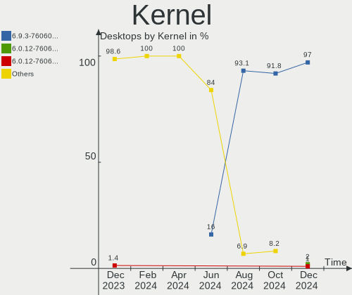
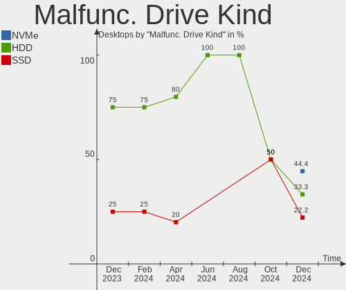
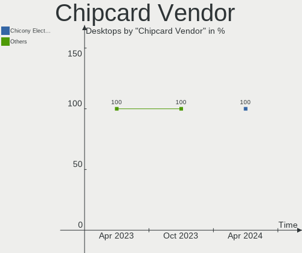

Pop!_OS Hardware Trends (Desktop)
---------------------------------

A project to identify most popular hardware characteristics and track their change
over time based on data collected by Pop!_OS users at https://Linux-Hardware.org.

Anyone can contribute to the study by uploading probes of their computers by
the [hw-probe](https://github.com/linuxhw/hw-probe) tool:

    sudo -E hw-probe -all -upload

Full-feature report is available here: https://linux-hardware.org/?view=trends&formfactor=desktop

Period: Oct, 2020.

Contents
--------

- [ OS                       ](#os)
- [ OS Family                ](#os-family)
- [ Kernel                   ](#kernel)
- [ Kernel Family            ](#kernel-family)
- [ Kernel Major Ver.        ](#kernel-major-ver)
- [ Arch                     ](#arch)
- [ DE                       ](#de)
- [ Display Server           ](#display-server)
- [ Display Manager          ](#display-manager)
- [ OS Lang                  ](#os-lang)
- [ Boot Mode                ](#boot-mode)
- [ Filesystem               ](#filesystem)
- [ Part. scheme             ](#part-scheme)
- [ Dual Boot with Linux/BSD ](#dual-boot-with-linux/bsd)
- [ Dual Boot (Win)          ](#dual-boot-win)
- [ Country                  ](#country)
- [ City                     ](#city)
- [ Vendor                   ](#vendor)
- [ Model                    ](#model)
- [ Model Family             ](#model-family)
- [ MFG Year                 ](#mfg-year)
- [ Form Factor              ](#form-factor)
- [ Secure Boot              ](#secure-boot)
- [ Coreboot                 ](#coreboot)
- [ RAM Size                 ](#ram-size)
- [ RAM Used                 ](#ram-used)
- [ Has CD-ROM               ](#has-cd-rom)
- [ Total Drives             ](#total-drives)
- [ Has Ethernet             ](#has-ethernet)
- [ Drive Vendor             ](#drive-vendor)
- [ HDD Vendor               ](#hdd-vendor)
- [ SSD Vendor               ](#ssd-vendor)
- [ Drive Model              ](#drive-model)
- [ Drive Kind               ](#drive-kind)
- [ Drive Connector          ](#drive-connector)
- [ Drive Size               ](#drive-size)
- [ Space Total              ](#space-total)
- [ Space Used               ](#space-used)
- [ Malfunc. Drives          ](#malfunc-drives)
- [ Malfunc. Drive Vendor    ](#malfunc-drive-vendor)
- [ Malfunc. HDD Vendor      ](#malfunc-hdd-vendor)
- [ Malfunc. Drive Kind      ](#malfunc-drive-kind)
- [ Failed Drives            ](#failed-drives)
- [ Failed Drive Vendor      ](#failed-drive-vendor)
- [ Drive Status             ](#drive-status)
- [ Storage Vendor           ](#storage-vendor)
- [ Storage Model            ](#storage-model)
- [ Storage Kind             ](#storage-kind)
- [ CPU Vendor               ](#cpu-vendor)
- [ CPU Model                ](#cpu-model)
- [ CPU Model Family         ](#cpu-model-family)
- [ CPU Cores                ](#cpu-cores)
- [ CPU Sockets              ](#cpu-sockets)
- [ CPU Threads              ](#cpu-threads)
- [ CPU Op-Modes             ](#cpu-op-modes)
- [ CPU Microcode            ](#cpu-microcode)
- [ CPU Microarch            ](#cpu-microarch)
- [ GPU Vendor               ](#gpu-vendor)
- [ GPU Model                ](#gpu-model)
- [ GPU Combo                ](#gpu-combo)
- [ GPU Driver               ](#gpu-driver)
- [ GPU Memory               ](#gpu-memory)
- [ Monitor Vendor           ](#monitor-vendor)
- [ Monitor Model            ](#monitor-model)
- [ Monitor Resolution       ](#monitor-resolution)
- [ Monitor Diagonal         ](#monitor-diagonal)
- [ Monitor Width            ](#monitor-width)
- [ Aspect Ratio             ](#aspect-ratio)
- [ Monitor Area             ](#monitor-area)
- [ Pixel Density            ](#pixel-density)
- [ Multiple Monitors        ](#multiple-monitors)
- [ Net Controller Vendor    ](#net-controller-vendor)
- [ Net Controller Model     ](#net-controller-model)
- [ Wireless Vendor          ](#wireless-vendor)
- [ Wireless Model           ](#wireless-model)
- [ Ethernet Vendor          ](#ethernet-vendor)
- [ Ethernet Model           ](#ethernet-model)
- [ Net Controller Kind      ](#net-controller-kind)
- [ Used Controller          ](#used-controller)
- [ NICs                     ](#nics)
- [ Memory Vendor            ](#memory-vendor)
- [ Memory Model             ](#memory-model)
- [ Memory Kind              ](#memory-kind)
- [ Memory Form Factor       ](#memory-form-factor)
- [ Memory Size              ](#memory-size)
- [ Memory Speed             ](#memory-speed)
- [ Sound Vendor             ](#sound-vendor)
- [ Sound Model              ](#sound-model)
- [ Camera Vendor            ](#camera-vendor)
- [ Camera Model             ](#camera-model)
- [ Fingerprint Vendor       ](#fingerprint-vendor)
- [ Fingerprint Model        ](#fingerprint-model)
- [ Chipcard Vendor          ](#chipcard-vendor)
- [ Chipcard Model           ](#chipcard-model)
- [ Printer Vendor           ](#printer-vendor)
- [ Printer Model            ](#printer-model)
- [ Scanner Vendor           ](#scanner-vendor)
- [ Scanner Model            ](#scanner-model)
- [ Bluetooth Vendor         ](#bluetooth-vendor)
- [ Bluetooth Model          ](#bluetooth-model)
- [ Unsupported Devices      ](#unsupported-devices)
- [ Unsupported Device Types ](#unsupported-device-types)

OS
--

Installed operating systems

| Name          | Desktops | Percent |
|---------------|----------|---------|
| Pop!_OS 20.04 | 104      | 76.47%  |
| Pop!_OS 20.10 | 32       | 23.53%  |

OS Family
---------

OS without a version

| Name    | Desktops | Percent |
|---------|----------|---------|
| Pop!_OS | 136      | 100%    |

Kernel
------

Version of the Linux kernel

| Version               | Desktops | Percent |
|-----------------------|----------|---------|
| 5.4.0-7642-generic    | 85       | 62.5%   |
| 5.8.0-7625-generic    | 37       | 27.21%  |
| 5.4.0-7634-generic    | 4        | 2.94%   |
| 5.8.6-050806-generic  | 2        | 1.47%   |
| 5.9.1-xanmod1         | 1        | 0.74%   |
| 5.8.14-050814-generic | 1        | 0.74%   |
| 5.8.13-050813-generic | 1        | 0.74%   |
| 5.8.12-xanmod1        | 1        | 0.74%   |
| 5.8.12-arch1-1        | 1        | 0.74%   |
| 5.6.0-1008-oem        | 1        | 0.74%   |
| 5.4.0-7626-generic    | 1        | 0.74%   |
| 5.4.0-7625-generic    | 1        | 0.74%   |

Kernel Family
-------------

Linux kernel without a distro release

| Version | Desktops | Percent |
|---------|----------|---------|
| 5.4.0   | 91       | 66.91%  |
| 5.8.0   | 37       | 27.21%  |
| 5.8.6   | 2        | 1.47%   |
| 5.8.12  | 2        | 1.47%   |
| 5.9.1   | 1        | 0.74%   |
| 5.8.14  | 1        | 0.74%   |
| 5.8.13  | 1        | 0.74%   |
| 5.6.0   | 1        | 0.74%   |

Kernel Major Ver.
-----------------

Linux kernel major version

| Version | Desktops | Percent |
|---------|----------|---------|
| 5.4     | 91       | 66.91%  |
| 5.8     | 43       | 31.62%  |
| 5.9     | 1        | 0.74%   |
| 5.6     | 1        | 0.74%   |

Arch
----

OS architecture (x86_64, i586, etc.)

| Name   | Desktops | Percent |
|--------|----------|---------|
| x86_64 | 136      | 100%    |

DE
--

Desktop Environment

| Name       | Desktops | Percent |
|------------|----------|---------|
| GNOME      | 131      | 96.32%  |
| KDE        | 4        | 2.94%   |
| X-Cinnamon | 1        | 0.74%   |

Display Server
--------------

X11 or Wayland

| Name | Desktops | Percent |
|------|----------|---------|
| X11  | 135      | 99.26%  |
| Tty  | 1        | 0.74%   |

Display Manager
---------------

SDDM, LightDM, etc.

| Name    | Desktops | Percent |
|---------|----------|---------|
| Unknown | 116      | 85.29%  |
| GDM     | 20       | 14.71%  |

OS Lang
-------

Language

| Lang  | Desktops | Percent |
|-------|----------|---------|
| en_US | 75       | 55.15%  |
| en_GB | 13       | 9.56%   |
| pt_BR | 8        | 5.88%   |
| de_DE | 6        | 4.41%   |
| C     | 6        | 4.41%   |
| fr_FR | 5        | 3.68%   |
| es_ES | 5        | 3.68%   |
| en_AU | 5        | 3.68%   |
| nl_NL | 4        | 2.94%   |
| en_CA | 3        | 2.21%   |
| it_IT | 2        | 1.47%   |
| uk_UA | 1        | 0.74%   |
| pl_PL | 1        | 0.74%   |
| nl_BE | 1        | 0.74%   |
| fi_FI | 1        | 0.74%   |

Boot Mode
---------

EFI or BIOS

| Mode | Desktops | Percent |
|------|----------|---------|
| BIOS | 85       | 62.5%   |
| EFI  | 51       | 37.5%   |

Filesystem
----------

Type of filesystem

| Type    | Desktops | Percent |
|---------|----------|---------|
| Ext4    | 129      | 94.85%  |
| Overlay | 4        | 2.94%   |
| Btrfs   | 2        | 1.47%   |
| Zfs     | 1        | 0.74%   |

Part. scheme
------------

Scheme of partitioning

| Type    | Desktops | Percent |
|---------|----------|---------|
| Unknown | 116      | 85.29%  |
| GPT     | 15       | 11.03%  |
| MBR     | 5        | 3.68%   |

Dual Boot with Linux/BSD
------------------------

Hosting more than one Linux/BSD

| Dual boot | Desktops | Percent |
|-----------|----------|---------|
| No        | 132      | 97.06%  |
| Yes       | 4        | 2.94%   |

Dual Boot (Win)
---------------

Hosting Linux and Windows

| Dual boot | Desktops | Percent |
|-----------|----------|---------|
| No        | 124      | 91.18%  |
| Yes       | 12       | 8.82%   |

Country
-------

Geographic location (country)

| Country        | Desktops | Percent |
|----------------|----------|---------|
| USA            | 49       | 36.03%  |
| Brazil         | 11       | 8.09%   |
| UK             | 7        | 5.15%   |
| Netherlands    | 7        | 5.15%   |
| Australia      | 6        | 4.41%   |
| Spain          | 5        | 3.68%   |
| Germany        | 5        | 3.68%   |
| New Zealand    | 4        | 2.94%   |
| Canada         | 4        | 2.94%   |
| India          | 3        | 2.21%   |
| France         | 3        | 2.21%   |
| Switzerland    | 2        | 1.47%   |
| Sweden         | 2        | 1.47%   |
| Poland         | 2        | 1.47%   |
| Chile          | 2        | 1.47%   |
| Austria        | 2        | 1.47%   |
| Argentina      | 2        | 1.47%   |
| Ukraine        | 1        | 0.74%   |
| Turkey         | 1        | 0.74%   |
| Slovakia       | 1        | 0.74%   |
| Singapore      | 1        | 0.74%   |
| Serbia         | 1        | 0.74%   |
| Portugal       | 1        | 0.74%   |
| Philippines    | 1        | 0.74%   |
| Mexico         | 1        | 0.74%   |
| Malta          | 1        | 0.74%   |
| Kenya          | 1        | 0.74%   |
| Italy          | 1        | 0.74%   |
| Israel         | 1        | 0.74%   |
| Iceland        | 1        | 0.74%   |
| Hungary        | 1        | 0.74%   |
| Finland        | 1        | 0.74%   |
| Denmark        | 1        | 0.74%   |
| Czech Republic | 1        | 0.74%   |
| Belgium        | 1        | 0.74%   |
| Belarus        | 1        | 0.74%   |
| Algeria        | 1        | 0.74%   |

City
----

Geographic location (city)

| City                     | Desktops | Percent |
|--------------------------|----------|---------|
| Utrecht                  | 2        | 1.47%   |
| Sydney                   | 2        | 1.47%   |
| Rio de Janeiro           | 2        | 1.47%   |
| Pittsburgh               | 2        | 1.47%   |
| Melbourne                | 2        | 1.47%   |
| Hamilton                 | 2        | 1.47%   |
| Eastleigh                | 2        | 1.47%   |
| Denver                   | 2        | 1.47%   |
| Auckland                 | 2        | 1.47%   |
| Zurich                   | 1        | 0.74%   |
| Zoetermeer               | 1        | 0.74%   |
| Zajecar                  | 1        | 0.74%   |
| York                     | 1        | 0.74%   |
| West Mifflin             | 1        | 0.74%   |
| Wellington               | 1        | 0.74%   |
| Weatherford              | 1        | 0.74%   |
| Warsaw                   | 1        | 0.74%   |
| Villa Alemana            | 1        | 0.74%   |
| Valencia                 | 1        | 0.74%   |
| Urupa                    | 1        | 0.74%   |
| Uncasville               | 1        | 0.74%   |
| Tulsa                    | 1        | 0.74%   |
| Trenton                  | 1        | 0.74%   |
| Tijuana                  | 1        | 0.74%   |
| Thrissur                 | 1        | 0.74%   |
| Tel Aviv                 | 1        | 0.74%   |
| São Paulo               | 1        | 0.74%   |
| São Luís               | 1        | 0.74%   |
| Székesfehérvár        | 1        | 0.74%   |
| St Louis                 | 1        | 0.74%   |
| South Ozone Park         | 1        | 0.74%   |
| Singapore                | 1        | 0.74%   |
| Siegendorf im Burgenland | 1        | 0.74%   |
| Sherwood Park            | 1        | 0.74%   |
| Shelburne                | 1        | 0.74%   |
| Sheffield                | 1        | 0.74%   |
| Santa Fe                 | 1        | 0.74%   |
| San Isidro               | 1        | 0.74%   |
| San Antonio              | 1        | 0.74%   |
| Saint Paul               | 1        | 0.74%   |
| Rotterdam                | 1        | 0.74%   |
| Rostock                  | 1        | 0.74%   |
| Roanoke                  | 1        | 0.74%   |
| Richmond Hill            | 1        | 0.74%   |
| Reykjavik                | 1        | 0.74%   |
| Rabun Gap                | 1        | 0.74%   |
| Quilpué                 | 1        | 0.74%   |
| Quezon City              | 1        | 0.74%   |
| Pune                     | 1        | 0.74%   |
| Prosper                  | 1        | 0.74%   |
| Pribyslav                | 1        | 0.74%   |
| Phoenix                  | 1        | 0.74%   |
| Paris                    | 1        | 0.74%   |
| Omaha                    | 1        | 0.74%   |
| Oldeholtpade             | 1        | 0.74%   |
| Niegowonice              | 1        | 0.74%   |
| New York                 | 1        | 0.74%   |
| Nairobi                  | 1        | 0.74%   |
| Mykolayiv                | 1        | 0.74%   |
| Minsk                    | 1        | 0.74%   |

Vendor
------

Motherboard manufacturer

| Name                | Desktops | Percent |
|---------------------|----------|---------|
| ASUSTek Computer    | 36       | 26.47%  |
| Gigabyte Technology | 32       | 23.53%  |
| MSI                 | 20       | 14.71%  |
| ASRock              | 17       | 12.5%   |
| Dell                | 10       | 7.35%   |
| Hewlett-Packard     | 6        | 4.41%   |
| System76            | 2        | 1.47%   |
| Lenovo              | 2        | 1.47%   |
| TYAN Computer       | 1        | 0.74%   |
| Shuttle             | 1        | 0.74%   |
| Positivo            | 1        | 0.74%   |
| Medion              | 1        | 0.74%   |
| ISYNC               | 1        | 0.74%   |
| HARDKERNEL          | 1        | 0.74%   |
| ECS                 | 1        | 0.74%   |
| Biostar             | 1        | 0.74%   |
| AMD                 | 1        | 0.74%   |
| Alienware           | 1        | 0.74%   |
| Acer                | 1        | 0.74%   |

Model
-----

Motherboard model

| Name                              | Desktops | Percent |
|-----------------------------------|----------|---------|
| MSI MS-7C37                       | 3        | 2.21%   |
| ASRock B450M Pro4                 | 3        | 2.21%   |
| System76 Thelio                   | 2        | 1.47%   |
| Gigabyte B550M DS3H               | 2        | 1.47%   |
| Gigabyte B550 AORUS MASTER        | 2        | 1.47%   |
| Dell OptiPlex 790                 | 2        | 1.47%   |
| Dell OptiPlex 7010                | 2        | 1.47%   |
| ASUS TUF GAMING X570-PLUS         | 2        | 1.47%   |
| ASUS ROG STRIX B450-F GAMING      | 2        | 1.47%   |
| ASUS ROG STRIX B350-F GAMING      | 2        | 1.47%   |
| ASUS PRIME X470-PRO               | 2        | 1.47%   |
| ASUS All Series                   | 2        | 1.47%   |
| ASRock B450M Steel Legend         | 2        | 1.47%   |
| TYAN Computer S5517               | 1        | 0.74%   |
| Shuttle DS81D                     | 1        | 0.74%   |
| Positivo POS-EIH61CR              | 1        | 0.74%   |
| MSI Pro 3130 Microtower PC        | 1        | 0.74%   |
| MSI MS-7C84                       | 1        | 0.74%   |
| MSI MS-7C02                       | 1        | 0.74%   |
| MSI MS-7B98                       | 1        | 0.74%   |
| MSI MS-7B87                       | 1        | 0.74%   |
| MSI MS-7B86                       | 1        | 0.74%   |
| MSI MS-7B51                       | 1        | 0.74%   |
| MSI MS-7A38                       | 1        | 0.74%   |
| MSI MS-7A34                       | 1        | 0.74%   |
| MSI MS-7850                       | 1        | 0.74%   |
| MSI MS-7845                       | 1        | 0.74%   |
| MSI MS-7808                       | 1        | 0.74%   |
| MSI MS-7693                       | 1        | 0.74%   |
| MSI MS-7640                       | 1        | 0.74%   |
| MSI MS-7592                       | 1        | 0.74%   |
| MSI MS-7522                       | 1        | 0.74%   |
| MSI MS-7376                       | 1        | 0.74%   |
| Medion Akoya P5286 E/B549         | 1        | 0.74%   |
| Lenovo ThinkCentre M73 10B4S0N600 | 1        | 0.74%   |
| Lenovo ThinkCentre Edge72 3484HPU | 1        | 0.74%   |
| ISYNC ISYNC-19-ECH61              | 1        | 0.74%   |
| HP Z800 Workstation               | 1        | 0.74%   |
| HP Z600 Workstation               | 1        | 0.74%   |
| HP Z420 Workstation               | 1        | 0.74%   |
| HP Z220 SFF Workstation           | 1        | 0.74%   |
| HP ProLiant ML350 G6              | 1        | 0.74%   |
| HP Compaq Elite 8300 CMT          | 1        | 0.74%   |
| HARDKERNEL ODROID-H2              | 1        | 0.74%   |
| Gigabyte Z68XP-UD3                | 1        | 0.74%   |
| Gigabyte Z68A-D3H-B3              | 1        | 0.74%   |
| Gigabyte Z390 D                   | 1        | 0.74%   |
| Gigabyte Z370P D3                 | 1        | 0.74%   |
| Gigabyte Z270X-Gaming 5           | 1        | 0.74%   |
| Gigabyte Z170X-UD5 TH             | 1        | 0.74%   |
| Gigabyte Z170N-Gaming 5           | 1        | 0.74%   |
| Gigabyte X570 I AORUS PRO WIFI    | 1        | 0.74%   |
| Gigabyte X570 AORUS PRO WIFI      | 1        | 0.74%   |
| Gigabyte X470 AORUS ULTRA GAMING  | 1        | 0.74%   |
| Gigabyte X399 DESIGNARE EX        | 1        | 0.74%   |
| Gigabyte P67X-UD3-B3              | 1        | 0.74%   |
| Gigabyte P55A-UD3                 | 1        | 0.74%   |
| Gigabyte H87M-D3H                 | 1        | 0.74%   |
| Gigabyte H61M-D2H                 | 1        | 0.74%   |
| Gigabyte GA-E7AUM-DS2H            | 1        | 0.74%   |

Model Family
------------

Motherboard model prefix

| Name                   | Desktops | Percent |
|------------------------|----------|---------|
| ASUS PRIME             | 11       | 8.09%   |
| ASRock B450M           | 6        | 4.41%   |
| Dell OptiPlex          | 5        | 3.68%   |
| ASUS ROG               | 5        | 3.68%   |
| MSI MS-7C37            | 3        | 2.21%   |
| Gigabyte B550M         | 3        | 2.21%   |
| Gigabyte B450          | 3        | 2.21%   |
| ASUS TUF               | 3        | 2.21%   |
| ASUS M5A97             | 3        | 2.21%   |
| System76 Thelio        | 2        | 1.47%   |
| Lenovo ThinkCentre     | 2        | 1.47%   |
| Gigabyte X570          | 2        | 1.47%   |
| Gigabyte B550          | 2        | 1.47%   |
| Gigabyte B450M         | 2        | 1.47%   |
| Dell Precision         | 2        | 1.47%   |
| ASUS All               | 2        | 1.47%   |
| ASRock B450            | 2        | 1.47%   |
| TYAN Computer S5517    | 1        | 0.74%   |
| Shuttle DS81D          | 1        | 0.74%   |
| Positivo POS-EIH61CR   | 1        | 0.74%   |
| MSI Pro                | 1        | 0.74%   |
| MSI MS-7C84            | 1        | 0.74%   |
| MSI MS-7C02            | 1        | 0.74%   |
| MSI MS-7B98            | 1        | 0.74%   |
| MSI MS-7B87            | 1        | 0.74%   |
| MSI MS-7B86            | 1        | 0.74%   |
| MSI MS-7B51            | 1        | 0.74%   |
| MSI MS-7A38            | 1        | 0.74%   |
| MSI MS-7A34            | 1        | 0.74%   |
| MSI MS-7850            | 1        | 0.74%   |
| MSI MS-7845            | 1        | 0.74%   |
| MSI MS-7808            | 1        | 0.74%   |
| MSI MS-7693            | 1        | 0.74%   |
| MSI MS-7640            | 1        | 0.74%   |
| MSI MS-7592            | 1        | 0.74%   |
| MSI MS-7522            | 1        | 0.74%   |
| MSI MS-7376            | 1        | 0.74%   |
| Medion Akoya           | 1        | 0.74%   |
| ISYNC ISYNC-19-ECH61   | 1        | 0.74%   |
| HP Z800                | 1        | 0.74%   |
| HP Z600                | 1        | 0.74%   |
| HP Z420                | 1        | 0.74%   |
| HP Z220                | 1        | 0.74%   |
| HP ProLiant            | 1        | 0.74%   |
| HP Compaq              | 1        | 0.74%   |
| HARDKERNEL ODROID-H2   | 1        | 0.74%   |
| Gigabyte Z68XP-UD3     | 1        | 0.74%   |
| Gigabyte Z68A-D3H-B3   | 1        | 0.74%   |
| Gigabyte Z390          | 1        | 0.74%   |
| Gigabyte Z370P         | 1        | 0.74%   |
| Gigabyte Z270X-Gaming  | 1        | 0.74%   |
| Gigabyte Z170X-UD5     | 1        | 0.74%   |
| Gigabyte Z170N-Gaming  | 1        | 0.74%   |
| Gigabyte X470          | 1        | 0.74%   |
| Gigabyte X399          | 1        | 0.74%   |
| Gigabyte P67X-UD3-B3   | 1        | 0.74%   |
| Gigabyte P55A-UD3      | 1        | 0.74%   |
| Gigabyte H87M-D3H      | 1        | 0.74%   |
| Gigabyte H61M-D2H      | 1        | 0.74%   |
| Gigabyte GA-E7AUM-DS2H | 1        | 0.74%   |

MFG Year
--------

Motherboard manufacture year

| Year | Desktops | Percent |
|------|----------|---------|
| 2020 | 34       | 25%     |
| 2019 | 26       | 19.12%  |
| 2013 | 14       | 10.29%  |
| 2018 | 12       | 8.82%   |
| 2016 | 8        | 5.88%   |
| 2011 | 8        | 5.88%   |
| 2014 | 7        | 5.15%   |
| 2012 | 6        | 4.41%   |
| 2015 | 5        | 3.68%   |
| 2009 | 5        | 3.68%   |
| 2010 | 4        | 2.94%   |
| 2017 | 3        | 2.21%   |
| 2007 | 3        | 2.21%   |
| 2008 | 1        | 0.74%   |

Form Factor
-----------

Physical design of the computer

| Name    | Desktops | Percent |
|---------|----------|---------|
| Desktop | 136      | 100%    |

Secure Boot
-----------

Enabled or disabled

| State    | Desktops | Percent |
|----------|----------|---------|
| Disabled | 136      | 100%    |

Coreboot
--------

Have coreboot on board

| Used | Desktops | Percent |
|------|----------|---------|
| No   | 136      | 100%    |

RAM Size
--------

Total RAM memory

| Size in GB  | Desktops | Percent |
|-------------|----------|---------|
| 16.01-24.0  | 49       | 36.03%  |
| 32.01-64.0  | 24       | 17.65%  |
| 8.01-16.0   | 20       | 14.71%  |
| 4.01-8.0    | 16       | 11.76%  |
| 3.01-4.0    | 15       | 11.03%  |
| 24.01-32.0  | 6        | 4.41%   |
| 64.01-256.0 | 5        | 3.68%   |
| 1.01-2.0    | 1        | 0.74%   |

RAM Used
--------

Used RAM memory

| Used GB    | Desktops | Percent |
|------------|----------|---------|
| 1.01-2.0   | 50       | 36.76%  |
| 2.01-3.0   | 35       | 25.74%  |
| 4.01-8.0   | 27       | 19.85%  |
| 3.01-4.0   | 19       | 13.97%  |
| 8.01-16.0  | 3        | 2.21%   |
| 32.01-64.0 | 1        | 0.74%   |
| 16.01-24.0 | 1        | 0.74%   |

Has CD-ROM
----------

Has CD-ROM on board

| Presented | Desktops | Percent |
|-----------|----------|---------|
| No        | 93       | 68.38%  |
| Yes       | 43       | 31.62%  |

Total Drives
------------

Number of drives on board

| Drives | Desktops | Percent |
|--------|----------|---------|
| 2      | 47       | 34.56%  |
| 1      | 45       | 33.09%  |
| 3      | 23       | 16.91%  |
| 4      | 12       | 8.82%   |
| 5      | 6        | 4.41%   |
| 6      | 2        | 1.47%   |
| 0      | 1        | 0.74%   |

Has Ethernet
------------

Has Ethernet on board

| Presented | Desktops | Percent |
|-----------|----------|---------|
| Yes       | 136      | 100%    |

Drive Vendor
------------

Hard drive vendors

| Vendor                    | Desktops | Drives | Percent |
|---------------------------|----------|--------|---------|
| Seagate                   | 48       | 60     | 19.51%  |
| Samsung Electronics       | 47       | 63     | 19.11%  |
| WDC                       | 43       | 58     | 17.48%  |
| SanDisk                   | 18       | 18     | 7.32%   |
| Kingston                  | 15       | 17     | 6.1%    |
| Crucial                   | 11       | 11     | 4.47%   |
| Hitachi                   | 10       | 10     | 4.07%   |
| Toshiba                   | 6        | 6      | 2.44%   |
| OCZ                       | 6        | 7      | 2.44%   |
| Intel                     | 6        | 6      | 2.44%   |
| Micron/Crucial Technology | 4        | 4      | 1.63%   |
| XPG                       | 3        | 3      | 1.22%   |
| Unknown                   | 3        | 3      | 1.22%   |
| PNY                       | 3        | 3      | 1.22%   |
| SK Hynix                  | 2        | 2      | 0.81%   |
| Realtek Semiconductor     | 2        | 3      | 0.81%   |
| Phison                    | 2        | 3      | 0.81%   |
| Maxtor                    | 2        | 2      | 0.81%   |
| China                     | 2        | 2      | 0.81%   |
| A-DATA Technology         | 2        | 2      | 0.81%   |
| TO Exter                  | 1        | 1      | 0.41%   |
| Team                      | 1        | 1      | 0.41%   |
| RECADATA                  | 1        | 1      | 0.41%   |
| PLEXTOR                   | 1        | 1      | 0.41%   |
| Patriot                   | 1        | 1      | 0.41%   |
| OEM                       | 1        | 1      | 0.41%   |
| Micron Technology         | 1        | 1      | 0.41%   |
| HGST                      | 1        | 1      | 0.41%   |
| Hewlett-Packard           | 1        | 1      | 0.41%   |
| DOGFISH                   | 1        | 1      | 0.41%   |
| Apple                     | 1        | 1      | 0.41%   |

HDD Vendor
----------

Hard disk drive vendors

| Vendor              | Desktops | Drives | Percent |
|---------------------|----------|--------|---------|
| Seagate             | 48       | 58     | 44.04%  |
| WDC                 | 35       | 46     | 32.11%  |
| Hitachi             | 10       | 10     | 9.17%   |
| Toshiba             | 6        | 6      | 5.5%    |
| Samsung Electronics | 3        | 4      | 2.75%   |
| Maxtor              | 2        | 2      | 1.83%   |
| TO Exter            | 1        | 1      | 0.92%   |
| OEM                 | 1        | 1      | 0.92%   |
| HGST                | 1        | 1      | 0.92%   |
| Hewlett-Packard     | 1        | 1      | 0.92%   |
| Apple               | 1        | 1      | 0.92%   |

SSD Vendor
----------

Solid state drive vendors

| Vendor              | Desktops | Drives | Percent |
|---------------------|----------|--------|---------|
| Samsung Electronics | 29       | 35     | 30.21%  |
| Kingston            | 13       | 14     | 13.54%  |
| SanDisk             | 11       | 11     | 11.46%  |
| WDC                 | 10       | 10     | 10.42%  |
| Crucial             | 10       | 10     | 10.42%  |
| OCZ                 | 6        | 7      | 6.25%   |
| Intel               | 4        | 4      | 4.17%   |
| PNY                 | 3        | 3      | 3.13%   |
| China               | 2        | 2      | 2.08%   |
| Unknown             | 1        | 1      | 1.04%   |
| Team                | 1        | 1      | 1.04%   |
| Seagate             | 1        | 1      | 1.04%   |
| PLEXTOR             | 1        | 1      | 1.04%   |
| Patriot             | 1        | 1      | 1.04%   |
| Micron Technology   | 1        | 1      | 1.04%   |
| DOGFISH             | 1        | 1      | 1.04%   |
| A-DATA Technology   | 1        | 1      | 1.04%   |

Drive Model
-----------

Hard drive models

| Model                        | Desktops | Percent |
|------------------------------|----------|---------|
| NVMe SSD Drive 1TB           | 11       | 3.93%   |
| NVMe SSD Drive 500GB         | 9        | 3.21%   |
| SSD 860 EVO 500GB            | 8        | 2.86%   |
| SSD 860 QVO 1TB              | 5        | 1.79%   |
| SSD 840 EVO 250GB            | 5        | 1.79%   |
| NVMe SSD Drive 2TB           | 5        | 1.79%   |
| ST500DM002-1BD142 500GB      | 4        | 1.43%   |
| ST2000DM008-2FR102 2TB       | 4        | 1.43%   |
| ST1000DM010-2EP102 1TB       | 4        | 1.43%   |
| ST1000DM003-1CH162 1TB       | 4        | 1.43%   |
| NVMe SSD Drive 250GB         | 4        | 1.43%   |
| NVMe SSD Drive 1024GB        | 4        | 1.43%   |
| Expansion 4TB                | 4        | 1.43%   |
| WDS500G2B0B-00YS70 500GB SSD | 3        | 1.07%   |
| SV300S37A120G 120GB SSD      | 3        | 1.07%   |
| SSD 850 EVO 500GB            | 3        | 1.07%   |
| SSD 850 EVO 250GB            | 3        | 1.07%   |
| SA400S37240G 240GB SSD       | 3        | 1.07%   |
| NVMe SSD Drive 256GB         | 3        | 1.07%   |
| WD3200AAKS-75L9A0 320GB      | 2        | 0.71%   |
| WD10EZEX-00BN5A0 1TB         | 2        | 0.71%   |
| SV300S37A60G 64GB SSD        | 2        | 0.71%   |
| ST5000LM000-2AN170 5TB       | 2        | 0.71%   |
| ST3500418AS 500GB            | 2        | 0.71%   |
| ST31000528AS 1TB             | 2        | 0.71%   |
| ST31000524AS 1TB             | 2        | 0.71%   |
| ST1000LM024 HN-M101MBB 1TB   | 2        | 0.71%   |
| ST1000DM003-1SB102 1TB       | 2        | 0.71%   |
| SSD PLUS 120 GB              | 2        | 0.71%   |
| SSD 970 EVO Plus 1TB         | 2        | 0.71%   |
| SSD 860 EVO 1TB              | 2        | 0.71%   |
| SDSSDA120G 120GB             | 2        | 0.71%   |
| SA400S37480G 480GB SSD       | 2        | 0.71%   |
| NVMe SSD Drive 512GB         | 2        | 0.71%   |
| HDT721010SLA360 1TB          | 2        | 0.71%   |
| HDS721050CLA362 500GB        | 2        | 0.71%   |
| Expansion Desk 3TB           | 2        | 0.71%   |
| DT01ACA100 1TB               | 2        | 0.71%   |
| CT256MX100SSD1 256GB         | 2        | 0.71%   |
| CS900 240GB SSD              | 2        | 0.71%   |
| WUS721010ALE6L4 10TB         | 1        | 0.36%   |
| WDS500G3X0C-00SJG0 500GB     | 1        | 0.36%   |
| WDS250G2B0A-00SM50 250GB SSD | 1        | 0.36%   |
| WDS250G2B0A 250GB SSD        | 1        | 0.36%   |
| WDS250G1B0A-00H9H0 250GB SSD | 1        | 0.36%   |
| WDS120G2G0B-00EPW0 120GB SSD | 1        | 0.36%   |
| WDS100T2B0A-00SM50 1TB SSD   | 1        | 0.36%   |
| WDBNCE2500PNC 250GB SSD      | 1        | 0.36%   |
| WDBNCE0010PNC 1TB SSD        | 1        | 0.36%   |
| WD800JD-22MSA1 80GB          | 1        | 0.36%   |
| WD800BB-00JHC0 80GB          | 1        | 0.36%   |
| WD6000HLHX-60JJPV1 600GB     | 1        | 0.36%   |
| WD6000BLHX-01V7BV0 600GB     | 1        | 0.36%   |
| WD5000LPCX-16VHAT1 500GB     | 1        | 0.36%   |
| WD5000AZRX-00L4HB0 500GB     | 1        | 0.36%   |
| WD5000AVVS-63H0B1 500GB      | 1        | 0.36%   |
| WD5000AVKX-635FY0 500GB      | 1        | 0.36%   |
| WD5000AAVS-00G9B1 500GB      | 1        | 0.36%   |
| WD5000AAKS-41YGA1 500GB      | 1        | 0.36%   |
| WD5000AAKS-00E4A0 500GB      | 1        | 0.36%   |

Drive Kind
----------

HDD or SSD

| Kind    | Desktops | Drives | Percent |
|---------|----------|--------|---------|
| HDD     | 86       | 131    | 40.57%  |
| SSD     | 77       | 104    | 36.32%  |
| NVMe    | 43       | 52     | 20.28%  |
| Unknown | 5        | 6      | 2.36%   |
| MMC     | 1        | 1      | 0.47%   |

Drive Connector
---------------

SATA, SAS, NVMe, etc.

| Type | Desktops | Drives | Percent |
|------|----------|--------|---------|
| SATA | 118      | 230    | 68.6%   |
| NVMe | 43       | 52     | 25%     |
| SAS  | 10       | 11     | 5.81%   |
| MMC  | 1        | 1      | 0.58%   |

Drive Size
----------

Size of hard drive

| Size in TB | Desktops | Drives | Percent |
|------------|----------|--------|---------|
| 0.01-0.5   | 92       | 130    | 51.98%  |
| 0.51-1.0   | 51       | 67     | 28.81%  |
| 1.01-2.0   | 16       | 20     | 9.04%   |
| 3.01-4.0   | 7        | 7      | 3.95%   |
| 4.01-10.0  | 6        | 6      | 3.39%   |
| 2.01-3.0   | 5        | 5      | 2.82%   |

Space Total
-----------

Amount of disk space available on the file system

| Size in GB     | Desktops | Percent |
|----------------|----------|---------|
| 101-250        | 33       | 24.26%  |
| 501-1000       | 24       | 17.65%  |
| 251-500        | 21       | 15.44%  |
| More than 3000 | 15       | 11.03%  |
| 1001-2000      | 15       | 11.03%  |
| 51-100         | 10       | 7.35%   |
| 2001-3000      | 7        | 5.15%   |
| 21-50          | 6        | 4.41%   |
| 1-20           | 3        | 2.21%   |
| Unknown        | 2        | 1.47%   |

Space Used
----------

Amount of used disk space

| Used GB        | Desktops | Percent |
|----------------|----------|---------|
| 1-20           | 49       | 36.03%  |
| 21-50          | 21       | 15.44%  |
| 101-250        | 18       | 13.24%  |
| 51-100         | 11       | 8.09%   |
| 1001-2000      | 10       | 7.35%   |
| 251-500        | 9        | 6.62%   |
| 501-1000       | 8        | 5.88%   |
| More than 3000 | 6        | 4.41%   |
| 2001-3000      | 2        | 1.47%   |
| Unknown        | 2        | 1.47%   |

Malfunc. Drives
---------------

Drive models with a malfunction

| Model                      | Desktops | Drives | Percent |
|----------------------------|----------|--------|---------|
| WD5000AVVS-63H0B1 500GB    | 1        | 1      | 8.33%   |
| WD5000AAKS-41YGA1 500GB    | 1        | 1      | 8.33%   |
| WD1003FZEX-00MK2A0 1TB     | 1        | 1      | 8.33%   |
| SV300S37A120G 120GB SSD    | 1        | 1      | 8.33%   |
| ST3500418AS 500GB          | 1        | 1      | 8.33%   |
| ST31500341AS 1TB           | 1        | 2      | 8.33%   |
| ST1000LM024 HN-M101MBB 1TB | 1        | 1      | 8.33%   |
| SA400S37480G 480GB SSD     | 1        | 1      | 8.33%   |
| HTS721010A9E630 1TB        | 1        | 1      | 8.33%   |
| HTS547550A9E384 500GB      | 1        | 1      | 8.33%   |
| HDWD110 1TB                | 1        | 1      | 8.33%   |
| 6L080L0 82GB               | 1        | 1      | 8.33%   |

Malfunc. Drive Vendor
---------------------

Vendors of faulty drives

| Vendor   | Desktops | Drives | Percent |
|----------|----------|--------|---------|
| WDC      | 3        | 3      | 25%     |
| Seagate  | 3        | 4      | 25%     |
| Kingston | 2        | 2      | 16.67%  |
| Toshiba  | 1        | 1      | 8.33%   |
| Maxtor   | 1        | 1      | 8.33%   |
| Hitachi  | 1        | 1      | 8.33%   |
| HGST     | 1        | 1      | 8.33%   |

Malfunc. HDD Vendor
-------------------

Vendors of faulty HDD drives

| Vendor  | Desktops | Drives | Percent |
|---------|----------|--------|---------|
| WDC     | 3        | 3      | 30%     |
| Seagate | 3        | 4      | 30%     |
| Toshiba | 1        | 1      | 10%     |
| Maxtor  | 1        | 1      | 10%     |
| Hitachi | 1        | 1      | 10%     |
| HGST    | 1        | 1      | 10%     |

Malfunc. Drive Kind
-------------------

Kinds of faulty drives

| Kind | Desktops | Drives | Percent |
|------|----------|--------|---------|
| HDD  | 8        | 11     | 80%     |
| SSD  | 2        | 2      | 20%     |

Failed Drives
-------------

Failed drive models

Zero info for selected period =(

Failed Drive Vendor
-------------------

Failed drive vendors

Zero info for selected period =(

Drive Status
------------

Number of failed and malfunc. drives

| Status   | Desktops | Drives | Percent |
|----------|----------|--------|---------|
| Detected | 116      | 246    | 81.69%  |
| Works    | 17       | 35     | 11.97%  |
| Malfunc  | 9        | 13     | 6.34%   |

Storage Vendor
--------------

Storage controller vendors

| Vendor                        | Desktops | Percent |
|-------------------------------|----------|---------|
| AMD                           | 72       | 35.29%  |
| Intel                         | 63       | 30.88%  |
| Samsung Electronics           | 19       | 9.31%   |
| Sandisk                       | 8        | 3.92%   |
| ASMedia Technology            | 8        | 3.92%   |
| JMicron Technology            | 6        | 2.94%   |
| Micron/Crucial Technology     | 5        | 2.45%   |
| Marvell Technology Group      | 4        | 1.96%   |
| ADATA Technology              | 4        | 1.96%   |
| Nvidia                        | 3        | 1.47%   |
| SK Hynix                      | 2        | 0.98%   |
| Realtek Semiconductor         | 2        | 0.98%   |
| Phison Electronics            | 2        | 0.98%   |
| Kingston Technology Company   | 2        | 0.98%   |
| VIA Technologies              | 1        | 0.49%   |
| LSI Logic / Symbios Logic     | 1        | 0.49%   |
| Integrated Technology Express | 1        | 0.49%   |
| Hewlett-Packard               | 1        | 0.49%   |

Storage Model
-------------

Storage controller models

| Model                                                                             | Desktops | Percent |
|-----------------------------------------------------------------------------------|----------|---------|
| FCH SATA Controller [AHCI mode]                                                   | 48       | 18.25%  |
| 400 Series Chipset SATA Controller                                                | 25       | 9.51%   |
| NVMe SSD Controller SM981/PM981/PM983                                             | 14       | 5.32%   |
| SB7x0/SB8x0/SB9x0 SATA Controller [AHCI mode]                                     | 9        | 3.42%   |
| SATA controller                                                                   | 9        | 3.42%   |
| 6 Series/C200 Series Chipset Family 6 port Desktop SATA AHCI Controller           | 9        | 3.42%   |
| SB7x0/SB8x0/SB9x0 IDE Controller                                                  | 8        | 3.04%   |
| ASM1062 Serial ATA Controller                                                     | 8        | 3.04%   |
| 8 Series/C220 Series Chipset Family 6-port SATA Controller 1 [AHCI mode]          | 8        | 3.04%   |
| SB7x0/SB8x0/SB9x0 SATA Controller [IDE mode]                                      | 6        | 2.28%   |
| SATA Controller [RAID mode]                                                       | 6        | 2.28%   |
| WD Blue SN550 NVMe SSD                                                            | 5        | 1.9%    |
| 7 Series/C210 Series Chipset Family 6-port SATA Controller [AHCI mode]            | 5        | 1.9%    |
| 300 Series Chipset SATA Controller                                                | 5        | 1.9%    |
| 200 Series PCH SATA controller [AHCI mode]                                        | 5        | 1.9%    |
| XPG SX8200 Pro PCIe Gen3x4 M.2 2280 Solid State Drive                             | 4        | 1.52%   |
| Q170/Q150/B150/H170/H110/Z170/CM236 Chipset SATA Controller [AHCI Mode]           | 4        | 1.52%   |
| P1 NVMe PCIe SSD                                                                  | 4        | 1.52%   |
| NVMe SSD Controller SM961/PM961                                                   | 4        | 1.52%   |
| JMB363 SATA/IDE Controller                                                        | 4        | 1.52%   |
| Cannon Lake PCH SATA AHCI Controller                                              | 4        | 1.52%   |
| 82801JI (ICH10 Family) 2 port SATA IDE Controller #2                              | 4        | 1.52%   |
| Non-Volatile memory controller                                                    | 3        | 1.14%   |
| 82801JI (ICH10 Family) 4 port SATA IDE Controller #1                              | 3        | 1.14%   |
| 82801G (ICH7 Family) IDE Controller                                               | 3        | 1.14%   |
| X399 Series Chipset SATA Controller                                               | 2        | 0.76%   |
| SSD 660P Series                                                                   | 2        | 0.76%   |
| Realtek Non-Volatile memory controller                                            | 2        | 0.76%   |
| NM10/ICH7 Family SATA Controller [IDE mode]                                       | 2        | 0.76%   |
| E12 NVMe Controller                                                               | 2        | 0.76%   |
| C600/X79 series chipset 6-Port SATA AHCI Controller                               | 2        | 0.76%   |
| A2000, M.2, 500GB                                                                 | 2        | 0.76%   |
| 9 Series Chipset Family SATA Controller [AHCI Mode]                               | 2        | 0.76%   |
| 88SE9128 PCIe SATA 6 Gb/s RAID controller with HyperDuo                           | 2        | 0.76%   |
| 6 Series/C200 Series Chipset Family Desktop SATA Controller (IDE mode, ports 4-5) | 2        | 0.76%   |
| 6 Series/C200 Series Chipset Family Desktop SATA Controller (IDE mode, ports 0-3) | 2        | 0.76%   |
| X370 Series Chipset SATA Controller                                               | 1        | 0.38%   |
| WD Black 2019/PC SN750 NVMe SSD                                                   | 1        | 0.38%   |
| WD Black 2018 / PC SN720 NVMe SSD                                                 | 1        | 0.38%   |
| VT6415 PATA IDE Host Controller                                                   | 1        | 0.38%   |
| Smart Array G6 controllers                                                        | 1        | 0.38%   |
| SB600 Non-Raid-5 SATA                                                             | 1        | 0.38%   |
| SB600 IDE                                                                         | 1        | 0.38%   |
| SAS1068E PCI-Express Fusion-MPT SAS                                               | 1        | 0.38%   |
| PC300 NVMe Solid State Drive 256GB                                                | 1        | 0.38%   |
| NVMe SSD Controller SM951/PM951                                                   | 1        | 0.38%   |
| MCP79 SATA Controller                                                             | 1        | 0.38%   |
| MCP78S [GeForce 8200] IDE                                                         | 1        | 0.38%   |
| MCP78S [GeForce 8200] AHCI Controller                                             | 1        | 0.38%   |
| MCP61 SATA Controller                                                             | 1        | 0.38%   |
| MCP61 IDE                                                                         | 1        | 0.38%   |
| JMB368 IDE controller                                                             | 1        | 0.38%   |
| JMB360 AHCI Controller                                                            | 1        | 0.38%   |
| IT8213 IDE Controller                                                             | 1        | 0.38%   |
| FCH SATA Controller D                                                             | 1        | 0.38%   |
| C602 chipset 4-Port SATA Storage Control Unit                                     | 1        | 0.38%   |
| C600/X79 series chipset IDE-r Controller                                          | 1        | 0.38%   |
| 88SE91A3 SATA-600 Controller                                                      | 1        | 0.38%   |
| 88SE9172 SATA 6Gb/s Controller                                                    | 1        | 0.38%   |
| 82801IR/IO/IH (ICH9R/DO/DH) 6 port SATA Controller [AHCI mode]                    | 1        | 0.38%   |

Storage Kind
------------

Kind of storage controller (IDE, SATA, NVMe, SAS, ...)

| Kind | Desktops | Percent |
|------|----------|---------|
| SATA | 119      | 59.8%   |
| NVMe | 43       | 21.61%  |
| IDE  | 27       | 13.57%  |
| RAID | 8        | 4.02%   |
| SAS  | 1        | 0.5%    |
| SCSI | 1        | 0.5%    |

CPU Vendor
----------

Processor vendors

| Vendor | Desktops | Percent |
|--------|----------|---------|
| AMD    | 74       | 54.41%  |
| Intel  | 62       | 45.59%  |

CPU Model
---------

Processor models

| Model                                       | Desktops | Percent |
|---------------------------------------------|----------|---------|
| AMD Ryzen 5 3600 6-Core Processor           | 13       | 9.56%   |
| AMD Ryzen 7 3700X 8-Core Processor          | 7        | 5.15%   |
| AMD Ryzen 5 3400G with Radeon Vega Graphics | 6        | 4.41%   |
| AMD Ryzen 7 2700X Eight-Core Processor      | 4        | 2.94%   |
| AMD Ryzen 9 3900XT 12-Core Processor        | 3        | 2.21%   |
| AMD Ryzen 5 3600X 6-Core Processor          | 3        | 2.21%   |
| AMD Ryzen 5 1600 Six-Core Processor         | 3        | 2.21%   |
| AMD FX-8350 Eight-Core Processor            | 3        | 2.21%   |
| Intel Core i7-6700K CPU @ 4.00GHz           | 2        | 1.47%   |
| Intel Core i7-4770K CPU @ 3.50GHz           | 2        | 1.47%   |
| Intel Core i7-3960X CPU @ 3.30GHz           | 2        | 1.47%   |
| Intel Core i7-3770 CPU @ 3.40GHz            | 2        | 1.47%   |
| Intel Core i7 CPU 960 @ 3.20GHz             | 2        | 1.47%   |
| Intel Core i5-9400F CPU @ 2.90GHz           | 2        | 1.47%   |
| Intel Core i5-4440 CPU @ 3.10GHz            | 2        | 1.47%   |
| Intel Core i5-3570K CPU @ 3.40GHz           | 2        | 1.47%   |
| Intel Core i5-2400 CPU @ 3.10GHz            | 2        | 1.47%   |
| Intel Core i3-3220 CPU @ 3.30GHz            | 2        | 1.47%   |
| Intel Core i3-2100 CPU @ 3.10GHz            | 2        | 1.47%   |
| Intel Core 2 Duo CPU E8400 @ 3.00GHz        | 2        | 1.47%   |
| AMD Ryzen 7 1700X Eight-Core Processor      | 2        | 1.47%   |
| AMD Ryzen 5 2600 Six-Core Processor         | 2        | 1.47%   |
| AMD Ryzen 3 3200G with Radeon Vega Graphics | 2        | 1.47%   |
| Intel Xeon CPU X5687 @ 3.60GHz              | 1        | 0.74%   |
| Intel Xeon CPU X5675 @ 3.07GHz              | 1        | 0.74%   |
| Intel Xeon CPU E5520 @ 2.27GHz              | 1        | 0.74%   |
| Intel Xeon CPU E5506 @ 2.13GHz              | 1        | 0.74%   |
| Intel Xeon CPU E5-1620 0 @ 3.60GHz          | 1        | 0.74%   |
| Intel Pentium D CPU 3.00GHz                 | 1        | 0.74%   |
| Intel Pentium CPU G850 @ 2.90GHz            | 1        | 0.74%   |
| Intel Core i7-9700K CPU @ 3.60GHz           | 1        | 0.74%   |
| Intel Core i7-7700K CPU @ 4.20GHz           | 1        | 0.74%   |
| Intel Core i7-6700 CPU @ 3.40GHz            | 1        | 0.74%   |
| Intel Core i7-4790 CPU @ 3.60GHz            | 1        | 0.74%   |
| Intel Core i7-4770 CPU @ 3.40GHz            | 1        | 0.74%   |
| Intel Core i7-2700K CPU @ 3.50GHz           | 1        | 0.74%   |
| Intel Core i7-2600 CPU @ 3.40GHz            | 1        | 0.74%   |
| Intel Core i7-10700 CPU @ 2.90GHz           | 1        | 0.74%   |
| Intel Core i5-9600K CPU @ 3.70GHz           | 1        | 0.74%   |
| Intel Core i5-9500T CPU @ 2.20GHz           | 1        | 0.74%   |
| Intel Core i5-8500 CPU @ 3.00GHz            | 1        | 0.74%   |
| Intel Core i5-7500 CPU @ 3.40GHz            | 1        | 0.74%   |
| Intel Core i5-6600 CPU @ 3.30GHz            | 1        | 0.74%   |
| Intel Core i5-4690K CPU @ 3.50GHz           | 1        | 0.74%   |
| Intel Core i5-4670 CPU @ 3.40GHz            | 1        | 0.74%   |
| Intel Core i5-4590 CPU @ 3.30GHz            | 1        | 0.74%   |
| Intel Core i5-4570 CPU @ 3.20GHz            | 1        | 0.74%   |
| Intel Core i5-4460 CPU @ 3.20GHz            | 1        | 0.74%   |
| Intel Core i5-3570 CPU @ 3.40GHz            | 1        | 0.74%   |
| Intel Core i5-2500K CPU @ 3.30GHz           | 1        | 0.74%   |
| Intel Core i5 CPU 760 @ 2.80GHz             | 1        | 0.74%   |
| Intel Core i3-8350K CPU @ 4.00GHz           | 1        | 0.74%   |
| Intel Core i3-3225 CPU @ 3.30GHz            | 1        | 0.74%   |
| Intel Core i3-2120 CPU @ 3.30GHz            | 1        | 0.74%   |
| Intel Core i3 CPU 540 @ 3.07GHz             | 1        | 0.74%   |
| Intel Core 2 Quad CPU Q6600 @ 2.40GHz       | 1        | 0.74%   |
| Intel Core 2 Duo CPU E8500 @ 3.16GHz        | 1        | 0.74%   |
| Intel Core 2 CPU 6320 @ 1.86GHz             | 1        | 0.74%   |
| Intel Core 2 CPU 6300 @ 1.86GHz             | 1        | 0.74%   |
| Intel Core 2 CPU 4400 @ 2.00GHz             | 1        | 0.74%   |

CPU Model Family
----------------

Processor model prefix

| Model                  | Desktops | Percent |
|------------------------|----------|---------|
| AMD Ryzen 5            | 29       | 21.32%  |
| Intel Core i5          | 21       | 15.44%  |
| Intel Core i7          | 18       | 13.24%  |
| AMD Ryzen 7            | 16       | 11.76%  |
| AMD FX                 | 9        | 6.62%   |
| Intel Core i3          | 8        | 5.88%   |
| Intel Xeon             | 5        | 3.68%   |
| Intel Core 2 Duo       | 3        | 2.21%   |
| Intel Core 2           | 3        | 2.21%   |
| AMD Ryzen Threadripper | 3        | 2.21%   |
| AMD Ryzen 9            | 3        | 2.21%   |
| AMD Ryzen 3            | 3        | 2.21%   |
| AMD Athlon II X2       | 3        | 2.21%   |
| AMD Phenom II X4       | 2        | 1.47%   |
| AMD Athlon II X4       | 2        | 1.47%   |
| Intel Pentium D        | 1        | 0.74%   |
| Intel Pentium          | 1        | 0.74%   |
| Intel Core 2 Quad      | 1        | 0.74%   |
| Intel Celeron          | 1        | 0.74%   |
| AMD Phenom II X6       | 1        | 0.74%   |
| AMD E2                 | 1        | 0.74%   |
| AMD A6                 | 1        | 0.74%   |
| AMD A10                | 1        | 0.74%   |

CPU Cores
---------

Number of processor cores

| Number | Desktops | Percent |
|--------|----------|---------|
| 4      | 55       | 40.44%  |
| 6      | 30       | 22.06%  |
| 2      | 22       | 16.18%  |
| 8      | 19       | 13.97%  |
| 12     | 4        | 2.94%   |
| 3      | 2        | 1.47%   |
| 32     | 1        | 0.74%   |
| 24     | 1        | 0.74%   |
| 16     | 1        | 0.74%   |
| 1      | 1        | 0.74%   |

CPU Sockets
-----------

Number of sockets

| Number | Desktops | Percent |
|--------|----------|---------|
| 1      | 134      | 98.53%  |
| 2      | 2        | 1.47%   |

CPU Threads
-----------

Threads per core (Hyper-Threading)

| Number | Desktops | Percent |
|--------|----------|---------|
| 2      | 89       | 65.44%  |
| 1      | 47       | 34.56%  |

CPU Op-Modes
------------

CPU Operation Modes (32-bit, 64-bit)

| Op mode        | Desktops | Percent |
|----------------|----------|---------|
| 32-bit, 64-bit | 136      | 100%    |

CPU Microcode
-------------

Microcode number

| Number     | Desktops | Percent |
|------------|----------|---------|
| Unknown    | 42       | 30.88%  |
| 0x08701021 | 11       | 8.09%   |
| 0x306c3    | 8        | 5.88%   |
| 0x0800820d | 8        | 5.88%   |
| 0x306a9    | 6        | 4.41%   |
| 0x206a7    | 6        | 4.41%   |
| 0x08701013 | 6        | 4.41%   |
| 0x08108109 | 5        | 3.68%   |
| 0x06000852 | 4        | 2.94%   |
| 0x906ea    | 3        | 2.21%   |
| 0x506e3    | 3        | 2.21%   |
| 0x906ed    | 2        | 1.47%   |
| 0x906e9    | 2        | 1.47%   |
| 0x6f6      | 2        | 1.47%   |
| 0x106a5    | 2        | 1.47%   |
| 0x1067a    | 2        | 1.47%   |
| 0x08001138 | 2        | 1.47%   |
| 0x010000c8 | 2        | 1.47%   |
| 0x010000c7 | 2        | 1.47%   |
| 0xf62      | 1        | 0.74%   |
| 0xa0655    | 1        | 0.74%   |
| 0x906eb    | 1        | 0.74%   |
| 0x706a1    | 1        | 0.74%   |
| 0x6f2      | 1        | 0.74%   |
| 0x206d7    | 1        | 0.74%   |
| 0x206d6    | 1        | 0.74%   |
| 0x206c2    | 1        | 0.74%   |
| 0x20655    | 1        | 0.74%   |
| 0x08301039 | 1        | 0.74%   |
| 0x08101016 | 1        | 0.74%   |
| 0x08101007 | 1        | 0.74%   |
| 0x08001137 | 1        | 0.74%   |
| 0x06003106 | 1        | 0.74%   |
| 0x06001119 | 1        | 0.74%   |
| 0x0600063e | 1        | 0.74%   |
| 0x05000119 | 1        | 0.74%   |
| 0x010000dc | 1        | 0.74%   |

CPU Microarch
-------------

Microarchitecture

| Name          | Desktops | Percent |
|---------------|----------|---------|
| Zen 2         | 29       | 21.32%  |
| Zen+          | 17       | 12.5%   |
| SandyBridge   | 12       | 8.82%   |
| Haswell       | 11       | 8.09%   |
| KabyLake      | 9        | 6.62%   |
| Zen           | 8        | 5.88%   |
| Piledriver    | 8        | 5.88%   |
| K10           | 8        | 5.88%   |
| IvyBridge     | 8        | 5.88%   |
| Nehalem       | 5        | 3.68%   |
| Skylake       | 4        | 2.94%   |
| Core          | 4        | 2.94%   |
| Westmere      | 3        | 2.21%   |
| Penryn        | 3        | 2.21%   |
| Bulldozer     | 2        | 1.47%   |
| Steamroller   | 1        | 0.74%   |
| NetBurst      | 1        | 0.74%   |
| Goldmont plus | 1        | 0.74%   |
| CometLake     | 1        | 0.74%   |
| Bobcat        | 1        | 0.74%   |

GPU Vendor
----------

Vendors of graphics cards

| Vendor | Desktops | Percent |
|--------|----------|---------|
| Nvidia | 70       | 47.95%  |
| AMD    | 52       | 35.62%  |
| Intel  | 24       | 16.44%  |

GPU Model
---------

Graphics card models

| Model                                                                 | Desktops | Percent |
|-----------------------------------------------------------------------|----------|---------|
| Ellesmere [Radeon RX 470/480/570/570X/580/580X/590]                   | 11       | 7.38%   |
| Navi 10 [Radeon RX 5600 OEM/5600 XT / 5700/5700 XT]                   | 10       | 6.71%   |
| Xeon E3-1200 v3/4th Gen Core Processor Integrated Graphics Controller | 7        | 4.7%    |
| GK208B [GeForce GT 710]                                               | 6        | 4.03%   |
| Xeon E3-1200 v2/3rd Gen Core processor Graphics Controller            | 5        | 3.36%   |
| Picasso                                                               | 5        | 3.36%   |
| GP106 [GeForce GTX 1060 6GB]                                          | 5        | 3.36%   |
| TU116 [GeForce GTX 1660 SUPER]                                        | 4        | 2.68%   |
| GP107 [GeForce GTX 1050 Ti]                                           | 4        | 2.68%   |
| GP104 [GeForce GTX 1070]                                              | 4        | 2.68%   |
| TU117 [GeForce GTX 1650]                                              | 3        | 2.01%   |
| TU106 [GeForce RTX 2060 SUPER]                                        | 3        | 2.01%   |
| TU104 [GeForce RTX 2070 SUPER]                                        | 3        | 2.01%   |
| GP104 [GeForce GTX 1080]                                              | 3        | 2.01%   |
| Cedar [Radeon HD 5000/6000/7350/8350 Series]                          | 3        | 2.01%   |
| 2nd Generation Core Processor Family Integrated Graphics Controller   | 3        | 2.01%   |
| TU116 [GeForce GTX 1660 Ti]                                           | 2        | 1.34%   |
| RS780L [Radeon 3000]                                                  | 2        | 1.34%   |
| Raven Ridge [Radeon Vega Series / Radeon Vega Mobile Series]          | 2        | 1.34%   |
| Navi 14 [Radeon RX 5500/5500M / Pro 5500M]                            | 2        | 1.34%   |
| HD Graphics 530                                                       | 2        | 1.34%   |
| GT218 [GeForce 210]                                                   | 2        | 1.34%   |
| GM107 [GeForce GTX 750 Ti]                                            | 2        | 1.34%   |
| Barts PRO [Radeon HD 6850]                                            | 2        | 1.34%   |
| Baffin [Radeon RX 460/560D / Pro 450/455/460/555/555X/560/560X]       | 2        | 1.34%   |
| Wrestler [Radeon HD 7340]                                             | 1        | 0.67%   |
| Vega 20 [Radeon VII]                                                  | 1        | 0.67%   |
| Vega 10 XL/XT [Radeon RX Vega 56/64]                                  | 1        | 0.67%   |
| UHD Graphics 630 (Desktop)                                            | 1        | 0.67%   |
| UHD Graphics 605                                                      | 1        | 0.67%   |
| UHD Graphics                                                          | 1        | 0.67%   |
| Turks PRO [Radeon HD 6570/7570/8550]                                  | 1        | 0.67%   |
| TU116 [GeForce GTX 1660]                                              | 1        | 0.67%   |
| TU116 [GeForce GTX 1650 SUPER]                                        | 1        | 0.67%   |
| TU106 [GeForce RTX 2070]                                              | 1        | 0.67%   |
| TU106 [GeForce RTX 2060 Rev. A]                                       | 1        | 0.67%   |
| TU104 [GeForce RTX 2080 SUPER]                                        | 1        | 0.67%   |
| Tonga PRO [Radeon R9 285/380]                                         | 1        | 0.67%   |
| RV730 XT [Radeon HD 4670]                                             | 1        | 0.67%   |
| RS880 [Radeon HD 4200]                                                | 1        | 0.67%   |
| Richland [Radeon HD 8470D]                                            | 1        | 0.67%   |
| Oland PRO [Radeon R7 240/340]                                         | 1        | 0.67%   |
| NV41GL [Quadro FX 1400]                                               | 1        | 0.67%   |
| Juniper XT [Radeon HD 5770]                                           | 1        | 0.67%   |
| HD Graphics 630                                                       | 1        | 0.67%   |
| Hawaii PRO [Radeon R9 290/390]                                        | 1        | 0.67%   |
| GT218 [GeForce 8400 GS Rev. 3]                                        | 1        | 0.67%   |
| GT216 [GeForce 315]                                                   | 1        | 0.67%   |
| GP104GL [Quadro P5000]                                                | 1        | 0.67%   |
| GP102 [GeForce GTX 1080 Ti]                                           | 1        | 0.67%   |
| GM206 [GeForce GTX 950]                                               | 1        | 0.67%   |
| GM204 [GeForce GTX 980]                                               | 1        | 0.67%   |
| GM204 [GeForce GTX 970]                                               | 1        | 0.67%   |
| GM107 [GeForce GTX 750]                                               | 1        | 0.67%   |
| GK107 [GeForce GTX 650]                                               | 1        | 0.67%   |
| GK104 [GeForce GTX 760]                                               | 1        | 0.67%   |
| GF119 [GeForce GT 610]                                                | 1        | 0.67%   |
| GF116 [GeForce GTX 550 Ti]                                            | 1        | 0.67%   |
| GF116 [GeForce GTS 450 Rev. 2]                                        | 1        | 0.67%   |
| GF108GL [Quadro 600]                                                  | 1        | 0.67%   |

GPU Combo
---------

Combinations of graphics cards

| Name           | Desktops | Percent |
|----------------|----------|---------|
| 1 x Nvidia     | 66       | 48.53%  |
| 1 x AMD        | 49       | 36.03%  |
| 1 x Intel      | 15       | 11.03%  |
| 2 x AMD        | 2        | 1.47%   |
| Intel + Nvidia | 2        | 1.47%   |
| 2 x Nvidia     | 1        | 0.74%   |
| AMD + Nvidia   | 1        | 0.74%   |

GPU Driver
----------

Free vs proprietary

| Driver      | Desktops | Percent |
|-------------|----------|---------|
| Free        | 75       | 55.15%  |
| Proprietary | 53       | 38.97%  |
| Unknown     | 8        | 5.88%   |

GPU Memory
----------

Total video memory

| Size in GB | Desktops | Percent |
|------------|----------|---------|
| Unknown    | 45       | 33.09%  |
| 7.01-8.0   | 26       | 19.12%  |
| 3.01-4.0   | 15       | 11.03%  |
| 1.01-2.0   | 15       | 11.03%  |
| 5.01-6.0   | 13       | 9.56%   |
| 0.51-1.0   | 11       | 8.09%   |
| 0.01-0.5   | 8        | 5.88%   |
| 8.01-16.0  | 3        | 2.21%   |

Monitor Vendor
--------------

Monitor vendors

| Vendor               | Desktops | Percent |
|----------------------|----------|---------|
| Samsung Electronics  | 29       | 18.95%  |
| Goldstar             | 18       | 11.76%  |
| Dell                 | 14       | 9.15%   |
| Ancor Communications | 11       | 7.19%   |
| Acer                 | 11       | 7.19%   |
| Hewlett-Packard      | 10       | 6.54%   |
| AOC                  | 10       | 6.54%   |
| BenQ                 | 8        | 5.23%   |
| Philips              | 5        | 3.27%   |
| ViewSonic            | 3        | 1.96%   |
| Iiyama               | 3        | 1.96%   |
| ASUSTek Computer     | 3        | 1.96%   |
| Toshiba              | 2        | 1.31%   |
| Sony                 | 2        | 1.31%   |
| Medion               | 2        | 1.31%   |
| Lenovo               | 2        | 1.31%   |
| Fujitsu Siemens      | 2        | 1.31%   |
| Xiaomi               | 1        | 0.65%   |
| Westinghouse         | 1        | 0.65%   |
| Vizio                | 1        | 0.65%   |
| Unknown              | 1        | 0.65%   |
| Seiki                | 1        | 0.65%   |
| Sceptre Tech         | 1        | 0.65%   |
| RKU                  | 1        | 0.65%   |
| NEC Computers        | 1        | 0.65%   |
| MSI                  | 1        | 0.65%   |
| LG Electronics       | 1        | 0.65%   |
| JRY                  | 1        | 0.65%   |
| Insignia             | 1        | 0.65%   |
| INS                  | 1        | 0.65%   |
| HXS                  | 1        | 0.65%   |
| Hitachi              | 1        | 0.65%   |
| HannStar             | 1        | 0.65%   |
| Compal               | 1        | 0.65%   |
| ATN                  | 1        | 0.65%   |

Monitor Model
-------------

Monitor models

| Model                                              | Desktops | Percent |
|----------------------------------------------------|----------|---------|
| XG43V AUS4390 3840x1200 1052x329mm 43.4-inch       | 2        | 1.25%   |
| ULTRAWIDE GSM5AFB 2560x1080 798x334mm 34.1-inch    | 2        | 1.25%   |
| U3219Q DELA124 3840x2160 697x392mm 31.5-inch       | 2        | 1.25%   |
| S27C650 SAM09E1 1920x1080 600x340mm 27.2-inch      | 2        | 1.25%   |
| FULL HD GSM5B55 1920x1080 480x270mm 21.7-inch      | 2        | 1.25%   |
| C27F390 SAM0D32 1920x1080 600x340mm 27.2-inch      | 2        | 1.25%   |
| C24F390 SAM0D2C 1920x1080 520x290mm 23.4-inch      | 2        | 1.25%   |
| 22MP55 GSM5A26 1920x1080 477x268mm 21.5-inch       | 2        | 1.25%   |
| ZR2240w HWP2952 1920x1080 475x267mm 21.5-inch      | 1        | 0.63%   |
| ZOWIE XL LCD BNQ7F3F 1920x1080 530x300mm 24.0-inch | 1        | 0.63%   |
| Z24i HWP309E 1920x1200 518x324mm 24.1-inch         | 1        | 0.63%   |
| XV273 X ACR072D 1920x1080 598x336mm 27.0-inch      | 1        | 0.63%   |
| XL2720Z BNQ7F29 1920x1080 597x336mm 27.0-inch      | 1        | 0.63%   |
| X233H ACR00A8 1920x1080 510x287mm 23.0-inch        | 1        | 0.63%   |
| W2253 GSM56DC 1920x1080 477x268mm 21.5-inch        | 1        | 0.63%   |
| w1907 HWP26A2 1440x900 408x255mm 18.9-inch         | 1        | 0.63%   |
| VZ249 AUS24CC 1920x1080 527x296mm 23.8-inch        | 1        | 0.63%   |
| VX229 ACI22E5 1920x1080 476x268mm 21.5-inch        | 1        | 0.63%   |
| VG930m-3 VSC991E 1280x1024 376x301mm 19.0-inch     | 1        | 0.63%   |
| VE248 ACI2494 1920x1080 531x299mm 24.0-inch        | 1        | 0.63%   |
| V226HQL ACR03F3 1920x1080 480x270mm 21.7-inch      | 1        | 0.63%   |
| V222 HWP3260 1920x1080 520x290mm 23.4-inch         | 1        | 0.63%   |
| V196HQL ACR033D 1366x768 410x230mm 18.5-inch       | 1        | 0.63%   |
| ULTRAWIDE GSM76E4 3440x1440 800x335mm 34.1-inch    | 1        | 0.63%   |
| Ultra HD GSM5B09 3840x2160 600x340mm 27.2-inch     | 1        | 0.63%   |
| U28E590 SAM0C4D 3840x2160 607x345mm 27.5-inch      | 1        | 0.63%   |
| U2879G6 AOC2879 3840x2160 621x341mm 27.9-inch      | 1        | 0.63%   |
| U2717D DEL40EA 2560x1440 600x340mm 27.2-inch       | 1        | 0.63%   |
| U2415 DELA0BA 1920x1080 518x324mm 24.1-inch        | 1        | 0.63%   |
| U2410 DELF016 1920x1080 520x320mm 24.0-inch        | 1        | 0.63%   |
| TV TSB2017 3840x2160                               | 1        | 0.63%   |
| TV TSB0205 1360x768 930x523mm 42.0-inch            | 1        | 0.63%   |
| TV SNY3102 1920x1080 886x498mm 40.0-inch           | 1        | 0.63%   |
| TV SNY2801 1920x1080 1600x900mm 72.3-inch          | 1        | 0.63%   |
| TERRA 2446W WOR2446 1920x1080 527x296mm 23.8-inch  | 1        | 0.63%   |
| SyncMaster SAM0585 2048x1152 510x290mm 23.1-inch   | 1        | 0.63%   |
| SyncMaster SAM0579 1920x1080                       | 1        | 0.63%   |
| SyncMaster SAM0350 1440x900 428x255mm 19.6-inch    | 1        | 0.63%   |
| SyncMaster SAM0274 1440x900 410x257mm 19.1-inch    | 1        | 0.63%   |
| SyncMaster SAM01F9 1280x1024 376x301mm 19.0-inch   | 1        | 0.63%   |
| SyncMaster SAM01AB 1280x1024 312x234mm 15.4-inch   | 1        | 0.63%   |
| ST2220L DELA065 1920x1080 477x268mm 21.5-inch      | 1        | 0.63%   |
| SMB2230 SAM063E 1920x1080 477x268mm 21.5-inch      | 1        | 0.63%   |
| Sceptre L24 SPT098C 1920x1080 530x300mm 24.0-inch  | 1        | 0.63%   |
| SA300/SA350 SAM0788 1366x768 410x230mm 18.5-inch   | 1        | 0.63%   |
| S3221QS DELD107 3840x2160 697x392mm 31.5-inch      | 1        | 0.63%   |
| S2716DG DELA0D1 2560x1440 598x336mm 27.0-inch      | 1        | 0.63%   |
| S24E510C SAM0C61 1920x1080 521x293mm 23.5-inch     | 1        | 0.63%   |
| S24E390 SAM0C1A 1920x1080 520x290mm 23.4-inch      | 1        | 0.63%   |
| S24D360 SAM0B25 1920x1080 521x293mm 23.5-inch      | 1        | 0.63%   |
| S2409W DELA038 1920x1080 531x298mm 24.0-inch       | 1        | 0.63%   |
| S22B370 SAM0899 1920x1080 480x270mm 21.7-inch      | 1        | 0.63%   |
| S201HL ACR01A5 1600x900 443x249mm 20.0-inch        | 1        | 0.63%   |
| Roku TV RKU7824 3840x2160 800x450mm 36.1-inch      | 1        | 0.63%   |
| RL2240H BNQ7F0C 1920x1080 480x270mm 21.7-inch      | 1        | 0.63%   |
| Q32G1WG4 AOC3201 2560x1440 697x393mm 31.5-inch     | 1        | 0.63%   |
| PLX2380H IVM5621 1920x1080 510x290mm 23.1-inch     | 1        | 0.63%   |
| PLE2483H IVM6113 1920x1080 531x299mm 24.0-inch     | 1        | 0.63%   |
| PL2201W IVM5602 1680x1050 490x320mm 23.0-inch      | 1        | 0.63%   |
| PHL 346B1C PHL093E 3440x1440 797x334mm 34.0-inch   | 1        | 0.63%   |

Monitor Resolution
------------------

Monitor screen resolution

| Resolution         | Desktops | Percent |
|--------------------|----------|---------|
| 1920x1080 (FHD)    | 72       | 50.35%  |
| 3840x2160 (4K)     | 14       | 9.79%   |
| 2560x1440 (QHD)    | 9        | 6.29%   |
| 1280x1024 (SXGA)   | 8        | 5.59%   |
| 1366x768 (WXGA)    | 7        | 4.9%    |
| 1920x1200 (WUXGA)  | 5        | 3.5%    |
| 1600x900 (HD+)     | 4        | 2.8%    |
| 1440x900 (WXGA+)   | 4        | 2.8%    |
| 3440x1440          | 3        | 2.1%    |
| 1680x1050 (WSXGA+) | 3        | 2.1%    |
| Unknown            | 3        | 2.1%    |
| 3840x1200          | 2        | 1.4%    |
| 2560x1080          | 2        | 1.4%    |
| 7680x2160          | 1        | 0.7%    |
| 6400x1440          | 1        | 0.7%    |
| 3840x1080          | 1        | 0.7%    |
| 2880x1800          | 1        | 0.7%    |
| 2048x1152          | 1        | 0.7%    |
| 1920x540           | 1        | 0.7%    |
| 1360x768           | 1        | 0.7%    |

Monitor Diagonal
----------------

Diagonal size in inches

| Inches  | Desktops | Percent |
|---------|----------|---------|
| 27      | 25       | 17.01%  |
| 23      | 24       | 16.33%  |
| 24      | 23       | 15.65%  |
| 21      | 19       | 12.93%  |
| Unknown | 12       | 8.16%   |
| 19      | 8        | 5.44%   |
| 18      | 7        | 4.76%   |
| 34      | 5        | 3.4%    |
| 31      | 4        | 2.72%   |
| 72      | 3        | 2.04%   |
| 20      | 3        | 2.04%   |
| 84      | 2        | 1.36%   |
| 43      | 2        | 1.36%   |
| 36      | 2        | 1.36%   |
| 17      | 2        | 1.36%   |
| 54      | 1        | 0.68%   |
| 52      | 1        | 0.68%   |
| 46      | 1        | 0.68%   |
| 22      | 1        | 0.68%   |
| 16      | 1        | 0.68%   |
| 15      | 1        | 0.68%   |

Monitor Width
-------------

Physical width

| Width in mm | Desktops | Percent |
|-------------|----------|---------|
| 501-600     | 63       | 44.06%  |
| 401-500     | 34       | 23.78%  |
| Unknown     | 12       | 8.39%   |
| 601-700     | 8        | 5.59%   |
| 701-800     | 7        | 4.9%    |
| 351-400     | 6        | 4.2%    |
| 1501-2000   | 5        | 3.5%    |
| 1001-1500   | 5        | 3.5%    |
| 301-350     | 3        | 2.1%    |

Aspect Ratio
------------

Proportional relationship between the width and the height

| Ratio   | Desktops | Percent |
|---------|----------|---------|
| 16/9    | 93       | 70.99%  |
| 16/10   | 13       | 9.92%   |
| Unknown | 8        | 6.11%   |
| 5/4     | 7        | 5.34%   |
| 21/9    | 5        | 3.82%   |
| 3.20    | 2        | 1.53%   |
| 4/3     | 1        | 0.76%   |
| 32/9    | 1        | 0.76%   |
| 3/2     | 1        | 0.76%   |

Monitor Area
------------

Area in inch²

| Area in inch² | Desktops | Percent |
|----------------|----------|---------|
| 201-250        | 43       | 29.86%  |
| 301-350        | 25       | 17.36%  |
| 151-200        | 21       | 14.58%  |
| 251-300        | 12       | 8.33%   |
| Unknown        | 12       | 8.33%   |
| 351-500        | 9        | 6.25%   |
| 141-150        | 8        | 5.56%   |
| More than 1000 | 7        | 4.86%   |
| 501-1000       | 5        | 3.47%   |
| 111-120        | 2        | 1.39%   |

Pixel Density
-------------

Pixels per inch

| Density | Desktops | Percent |
|---------|----------|---------|
| 51-100  | 76       | 55.88%  |
| 101-120 | 29       | 21.32%  |
| Unknown | 12       | 8.82%   |
| 121-160 | 10       | 7.35%   |
| 1-50    | 5        | 3.68%   |
| 161-240 | 4        | 2.94%   |

Multiple Monitors
-----------------

Total monitors connected

| Total | Desktops | Percent |
|-------|----------|---------|
| 1     | 92       | 67.65%  |
| 2     | 32       | 23.53%  |
| 0     | 8        | 5.88%   |
| 3     | 4        | 2.94%   |

Net Controller Vendor
---------------------

Controller vendors

| Vendor                          | Desktops | Percent |
|---------------------------------|----------|---------|
| Realtek Semiconductor           | 81       | 40.1%   |
| Intel                           | 56       | 27.72%  |
| Qualcomm Atheros                | 15       | 7.43%   |
| Broadcom Inc. and subsidiaries  | 11       | 5.45%   |
| Ralink Technology               | 5        | 2.48%   |
| Samsung Electronics             | 3        | 1.49%   |
| Nvidia                          | 3        | 1.49%   |
| NetGear                         | 3        | 1.49%   |
| Belkin Components               | 3        | 1.49%   |
| Ralink                          | 2        | 0.99%   |
| Qualcomm Atheros Communications | 2        | 0.99%   |
| Marvell Technology Group        | 2        | 0.99%   |
| InterBiometrics                 | 2        | 0.99%   |
| Google                          | 2        | 0.99%   |
| Xiaomi                          | 1        | 0.5%    |
| TP-Link                         | 1        | 0.5%    |
| OPPO Electronics                | 1        | 0.5%    |
| Microchip Technology            | 1        | 0.5%    |
| Huawei Technologies             | 1        | 0.5%    |
| DisplayLink                     | 1        | 0.5%    |
| D-Link                          | 1        | 0.5%    |
| Broadcom                        | 1        | 0.5%    |
| AVM                             | 1        | 0.5%    |
| ASUSTek Computer                | 1        | 0.5%    |
| Aquantia                        | 1        | 0.5%    |
| 3Com                            | 1        | 0.5%    |

Net Controller Model
--------------------

Controller models

| Model                                                               | Desktops | Percent |
|---------------------------------------------------------------------|----------|---------|
| RTL8111/8168/8411 PCI Express Gigabit Ethernet Controller           | 69       | 30.8%   |
| I211 Gigabit Network Connection                                     | 19       | 8.48%   |
| Wi-Fi 6 AX200                                                       | 11       | 4.91%   |
| 82579LM Gigabit Network Connection (Lewisville)                     | 8        | 3.57%   |
| RTL8125 2.5GbE Controller                                           | 7        | 3.13%   |
| Wireless-AC 9260                                                    | 5        | 2.23%   |
| RTL8153 Gigabit Ethernet Adapter                                    | 4        | 1.79%   |
| Killer E220x Gigabit Ethernet Controller                            | 4        | 1.79%   |
| Ethernet Connection (2) I219-V                                      | 4        | 1.79%   |
| Dual Band Wireless-AC 3168NGW [Stone Peak]                          | 4        | 1.79%   |
| BCM4360 802.11ac Wireless Network Adapter                           | 4        | 1.79%   |
| Ethernet Connection (7) I219-V                                      | 3        | 1.34%   |
| 802.11ac NIC                                                        | 3        | 1.34%   |
| Wireless 8265 / 8275                                                | 2        | 0.89%   |
| RT5370 Wireless Adapter                                             | 2        | 0.89%   |
| Nexus 4 (tether)                                                    | 2        | 0.89%   |
| NetXtreme BCM5764M Gigabit Ethernet PCIe                            | 2        | 0.89%   |
| MT7601U Wireless Adapter                                            | 2        | 0.89%   |
| Io                                                                  | 2        | 0.89%   |
| Galaxy series, misc. (tethering mode)                               | 2        | 0.89%   |
| F7D1101 v1 Basic Wireless Adapter [Realtek RTL8188SU]               | 2        | 0.89%   |
| Ethernet Connection (2) I218-V                                      | 2        | 0.89%   |
| AR8151 v2.0 Gigabit Ethernet                                        | 2        | 0.89%   |
| A6100 AC600 DB Wireless Adapter [Realtek RTL8811AU]                 | 2        | 0.89%   |
| 82579V Gigabit Network Connection                                   | 2        | 0.89%   |
| WNA3100(v1) Wireless-N 300 [Broadcom BCM43231]                      | 1        | 0.45%   |
| Wireless-AC 9560 [Jefferson Peak]                                   | 1        | 0.45%   |
| Wireless 8260                                                       | 1        | 0.45%   |
| Wireless 3165                                                       | 1        | 0.45%   |
| VNS-L21                                                             | 1        | 0.45%   |
| USB-N10 802.11n Network Adapter [Realtek RTL8188SU]                 | 1        | 0.45%   |
| Ubiquiti WiFiStationEXT 802.11n [Atheros AR9271]                    | 1        | 0.45%   |
| RTL8821AE 802.11ac PCIe Wireless Network Adapter                    | 1        | 0.45%   |
| RTL8812AU 802.11a/b/g/n/ac 2T2R DB WLAN Adapter                     | 1        | 0.45%   |
| RTL8192EU 802.11b/g/n WLAN Adapter                                  | 1        | 0.45%   |
| RTL8192CU 802.11n WLAN Adapter                                      | 1        | 0.45%   |
| RTL8192CE PCIe Wireless Network Adapter                             | 1        | 0.45%   |
| RTL8188EUS 802.11n Wireless Network Adapter                         | 1        | 0.45%   |
| RTL8188EE Wireless Network Adapter                                  | 1        | 0.45%   |
| RTL8188CE 802.11b/g/n WiFi Adapter                                  | 1        | 0.45%   |
| RT3060 Wireless 802.11n 1T/1R                                       | 1        | 0.45%   |
| RT2870/RT3070 Wireless Adapter                                      | 1        | 0.45%   |
| RT2600 802.11 MIMO                                                  | 1        | 0.45%   |
| RMX1825                                                             | 1        | 0.45%   |
| NM10/ICH7 Family LAN Controller                                     | 1        | 0.45%   |
| NetXtreme BCM5761 Gigabit Ethernet PCIe                             | 1        | 0.45%   |
| NetXtreme BCM5754 Gigabit Ethernet PCI Express                      | 1        | 0.45%   |
| NetXtreme BCM5715 Gigabit Ethernet                                  | 1        | 0.45%   |
| NetLink BCM57788 Gigabit Ethernet PCIe                              | 1        | 0.45%   |
| NetLink BCM57781 Gigabit Ethernet PCIe                              | 1        | 0.45%   |
| Mi/Redmi series (RNDIS + ADB)                                       | 1        | 0.45%   |
| MCP79 Ethernet                                                      | 1        | 0.45%   |
| MCP77 Ethernet                                                      | 1        | 0.45%   |
| MCP61 Ethernet                                                      | 1        | 0.45%   |
| MCP2200 USB Serial Port Emulator                                    | 1        | 0.45%   |
| Killer E2500 Gigabit Ethernet Controller                            | 1        | 0.45%   |
| Killer E2400 Gigabit Ethernet Controller                            | 1        | 0.45%   |
| GT-I9070 (network tethering, USB debugging enabled)                 | 1        | 0.45%   |
| FRITZ WLAN N v2 [RT5572/rt2870.bin]                                 | 1        | 0.45%   |
| F7D1102 N150/Surf Micro Wireless Adapter v1000 [Realtek RTL8188CUS] | 1        | 0.45%   |

Wireless Vendor
---------------

Wireless vendors

| Vendor                          | Desktops | Percent |
|---------------------------------|----------|---------|
| Intel                           | 25       | 38.46%  |
| Realtek Semiconductor           | 11       | 16.92%  |
| Ralink Technology               | 5        | 7.69%   |
| Qualcomm Atheros                | 5        | 7.69%   |
| Broadcom Inc. and subsidiaries  | 5        | 7.69%   |
| NetGear                         | 3        | 4.62%   |
| Belkin Components               | 3        | 4.62%   |
| Ralink                          | 2        | 3.08%   |
| Qualcomm Atheros Communications | 2        | 3.08%   |
| TP-Link                         | 1        | 1.54%   |
| D-Link                          | 1        | 1.54%   |
| AVM                             | 1        | 1.54%   |
| ASUSTek Computer                | 1        | 1.54%   |

Wireless Model
--------------

Wireless models

| Model                                                               | Desktops | Percent |
|---------------------------------------------------------------------|----------|---------|
| Wi-Fi 6 AX200                                                       | 11       | 16.92%  |
| Wireless-AC 9260                                                    | 5        | 7.69%   |
| Dual Band Wireless-AC 3168NGW [Stone Peak]                          | 4        | 6.15%   |
| BCM4360 802.11ac Wireless Network Adapter                           | 4        | 6.15%   |
| 802.11ac NIC                                                        | 3        | 4.62%   |
| Wireless 8265 / 8275                                                | 2        | 3.08%   |
| RT5370 Wireless Adapter                                             | 2        | 3.08%   |
| MT7601U Wireless Adapter                                            | 2        | 3.08%   |
| F7D1101 v1 Basic Wireless Adapter [Realtek RTL8188SU]               | 2        | 3.08%   |
| A6100 AC600 DB Wireless Adapter [Realtek RTL8811AU]                 | 2        | 3.08%   |
| WNA3100(v1) Wireless-N 300 [Broadcom BCM43231]                      | 1        | 1.54%   |
| Wireless-AC 9560 [Jefferson Peak]                                   | 1        | 1.54%   |
| Wireless 8260                                                       | 1        | 1.54%   |
| Wireless 3165                                                       | 1        | 1.54%   |
| USB-N10 802.11n Network Adapter [Realtek RTL8188SU]                 | 1        | 1.54%   |
| Ubiquiti WiFiStationEXT 802.11n [Atheros AR9271]                    | 1        | 1.54%   |
| RTL8821AE 802.11ac PCIe Wireless Network Adapter                    | 1        | 1.54%   |
| RTL8812AU 802.11a/b/g/n/ac 2T2R DB WLAN Adapter                     | 1        | 1.54%   |
| RTL8192EU 802.11b/g/n WLAN Adapter                                  | 1        | 1.54%   |
| RTL8192CU 802.11n WLAN Adapter                                      | 1        | 1.54%   |
| RTL8192CE PCIe Wireless Network Adapter                             | 1        | 1.54%   |
| RTL8188EUS 802.11n Wireless Network Adapter                         | 1        | 1.54%   |
| RTL8188EE Wireless Network Adapter                                  | 1        | 1.54%   |
| RTL8188CE 802.11b/g/n WiFi Adapter                                  | 1        | 1.54%   |
| RT3060 Wireless 802.11n 1T/1R                                       | 1        | 1.54%   |
| RT2870/RT3070 Wireless Adapter                                      | 1        | 1.54%   |
| RT2600 802.11 MIMO                                                  | 1        | 1.54%   |
| FRITZ WLAN N v2 [RT5572/rt2870.bin]                                 | 1        | 1.54%   |
| F7D1102 N150/Surf Micro Wireless Adapter v1000 [Realtek RTL8188CUS] | 1        | 1.54%   |
| DWA-171                                                             | 1        | 1.54%   |
| BCM4306 802.11b/g Wireless LAN Controller                           | 1        | 1.54%   |
| Archer T4U ver.3                                                    | 1        | 1.54%   |
| AR9462 Wireless Network Adapter                                     | 1        | 1.54%   |
| AR928X Wireless Network Adapter (PCI-Express)                       | 1        | 1.54%   |
| AR9285 Wireless Network Adapter (PCI-Express)                       | 1        | 1.54%   |
| AR9271 802.11n                                                      | 1        | 1.54%   |
| AR9227 Wireless Network Adapter                                     | 1        | 1.54%   |
| AR5413/AR5414 Wireless Network Adapter [AR5006X(S) 802.11abg]       | 1        | 1.54%   |

Ethernet Vendor
---------------

Ethernet vendors

| Vendor                         | Desktops | Percent |
|--------------------------------|----------|---------|
| Realtek Semiconductor          | 77       | 50.66%  |
| Intel                          | 42       | 27.63%  |
| Qualcomm Atheros               | 10       | 6.58%   |
| Broadcom Inc. and subsidiaries | 6        | 3.95%   |
| Samsung Electronics            | 3        | 1.97%   |
| Nvidia                         | 3        | 1.97%   |
| Marvell Technology Group       | 2        | 1.32%   |
| Google                         | 2        | 1.32%   |
| Xiaomi                         | 1        | 0.66%   |
| OPPO Electronics               | 1        | 0.66%   |
| Huawei Technologies            | 1        | 0.66%   |
| DisplayLink                    | 1        | 0.66%   |
| Broadcom                       | 1        | 0.66%   |
| Aquantia                       | 1        | 0.66%   |
| 3Com                           | 1        | 0.66%   |

Ethernet Model
--------------

Ethernet models

| Model                                                     | Desktops | Percent |
|-----------------------------------------------------------|----------|---------|
| RTL8111/8168/8411 PCI Express Gigabit Ethernet Controller | 69       | 44.23%  |
| I211 Gigabit Network Connection                           | 19       | 12.18%  |
| 82579LM Gigabit Network Connection (Lewisville)           | 8        | 5.13%   |
| RTL8125 2.5GbE Controller                                 | 7        | 4.49%   |
| RTL8153 Gigabit Ethernet Adapter                          | 4        | 2.56%   |
| Killer E220x Gigabit Ethernet Controller                  | 4        | 2.56%   |
| Ethernet Connection (2) I219-V                            | 4        | 2.56%   |
| Ethernet Connection (7) I219-V                            | 3        | 1.92%   |
| Nexus 4 (tether)                                          | 2        | 1.28%   |
| NetXtreme BCM5764M Gigabit Ethernet PCIe                  | 2        | 1.28%   |
| Galaxy series, misc. (tethering mode)                     | 2        | 1.28%   |
| Ethernet Connection (2) I218-V                            | 2        | 1.28%   |
| AR8151 v2.0 Gigabit Ethernet                              | 2        | 1.28%   |
| 82579V Gigabit Network Connection                         | 2        | 1.28%   |
| VNS-L21                                                   | 1        | 0.64%   |
| RMX1825                                                   | 1        | 0.64%   |
| NM10/ICH7 Family LAN Controller                           | 1        | 0.64%   |
| NetXtreme BCM5761 Gigabit Ethernet PCIe                   | 1        | 0.64%   |
| NetXtreme BCM5754 Gigabit Ethernet PCI Express            | 1        | 0.64%   |
| NetXtreme BCM5715 Gigabit Ethernet                        | 1        | 0.64%   |
| NetLink BCM57788 Gigabit Ethernet PCIe                    | 1        | 0.64%   |
| NetLink BCM57781 Gigabit Ethernet PCIe                    | 1        | 0.64%   |
| Mi/Redmi series (RNDIS + ADB)                             | 1        | 0.64%   |
| MCP79 Ethernet                                            | 1        | 0.64%   |
| MCP77 Ethernet                                            | 1        | 0.64%   |
| MCP61 Ethernet                                            | 1        | 0.64%   |
| Killer E2500 Gigabit Ethernet Controller                  | 1        | 0.64%   |
| Killer E2400 Gigabit Ethernet Controller                  | 1        | 0.64%   |
| GT-I9070 (network tethering, USB debugging enabled)       | 1        | 0.64%   |
| Ethernet Connection I217-V                                | 1        | 0.64%   |
| Dell Universal Dock D6000                                 | 1        | 0.64%   |
| AR8131 Gigabit Ethernet                                   | 1        | 0.64%   |
| AR8121/AR8113/AR8114 Gigabit or Fast Ethernet             | 1        | 0.64%   |
| AQC107 NBase-T/IEEE 802.3bz Ethernet Controller [AQtion]  | 1        | 0.64%   |
| 88E8053 PCI-E Gigabit Ethernet Controller                 | 1        | 0.64%   |
| 88E8001 Gigabit Ethernet Controller                       | 1        | 0.64%   |
| 82583V Gigabit Network Connection                         | 1        | 0.64%   |
| 82574L Gigabit Network Connection                         | 1        | 0.64%   |
| 82566DC Gigabit Network Connection                        | 1        | 0.64%   |
| 3c905C-TX/TX-M [Tornado]                                  | 1        | 0.64%   |

Net Controller Kind
-------------------

Ethernet, WiFi or modem

| Kind     | Desktops | Percent |
|----------|----------|---------|
| Ethernet | 136      | 68%     |
| WiFi     | 61       | 30.5%   |
| Modem    | 3        | 1.5%    |

Used Controller
---------------

Currently used network controller

| Kind     | Desktops | Percent |
|----------|----------|---------|
| Ethernet | 127      | 71.35%  |
| WiFi     | 51       | 28.65%  |

NICs
----

Total network controllers on board

| Total | Desktops | Percent |
|-------|----------|---------|
| 1     | 86       | 63.24%  |
| 2     | 45       | 33.09%  |
| 3     | 5        | 3.68%   |

Memory Vendor
-------------

Memory module vendors

| Vendor            | Desktops | Percent |
|-------------------|----------|---------|
| G.Skill           | 5        | 27.78%  |
| Unknown           | 3        | 16.67%  |
| Kingston          | 3        | 16.67%  |
| Corsair           | 3        | 16.67%  |
| Crucial           | 2        | 11.11%  |
| SK Hynix          | 1        | 5.56%   |
| Micron Technology | 1        | 5.56%   |

Memory Model
------------

Memory module models

| Model                                             | Desktops | Percent |
|---------------------------------------------------|----------|---------|
| RAM Module 4096MB DIMM 1333MT/s                   | 3        | 15%     |
| RAM Module 2048MB DIMM 1333MT/s                   | 1        | 5%      |
| RAM KHX3200C18D4/16G 16384MB DIMM DDR4 3200MT/s   | 1        | 5%      |
| RAM KHX3200C16D4/8GX 8192MB DIMM DDR4 3333MT/s    | 1        | 5%      |
| RAM HMT41GU6AFR8C-PB 8192MB DIMM DDR3 1600MT/s    | 1        | 5%      |
| RAM F4-3600C16-8GTZNC 8192MB DIMM DDR4 3800MT/s   | 1        | 5%      |
| RAM F4-3200C16-8GVKB 8192MB DIMM DDR4 3200MT/s    | 1        | 5%      |
| RAM F4-3200C16-16GVK 16384MB DIMM DDR4 3600MT/s   | 1        | 5%      |
| RAM F4-3200C14-8GVK 8192MB DIMM DDR4 3200MT/s     | 1        | 5%      |
| RAM F3-1600C9-8GXM 8192MB DIMM DDR3 1600MT/s      | 1        | 5%      |
| RAM CT8G4DFS8266.M8FJ 8192MB DIMM DDR4 2667MT/s   | 1        | 5%      |
| RAM CT4G4DFS824A.C8FBD2 4096MB DIMM DDR4 2733MT/s | 1        | 5%      |
| RAM CMK16GX4M2E3200C16 8GB DIMM DDR4 3200MT/s     | 1        | 5%      |
| RAM CMK16GX4M2B3200C16 8192MB DIMM DDR4 3266MT/s  | 1        | 5%      |
| RAM CMK16GX4M1D3000C16 16GB DIMM DDR4 3000MT/s    | 1        | 5%      |
| RAM CL16-20-20 D4-3200 32GB DIMM DDR4 2133MT/s    | 1        | 5%      |
| RAM BLT4G3D1608DT1TX0. 4096MB DIMM DDR3 1600MT/s  | 1        | 5%      |
| RAM 18JSF51272AZ-1G6M 4096MB DIMM DDR3 1600MT/s   | 1        | 5%      |

Memory Kind
-----------

Memory module kinds

| Kind    | Desktops | Percent |
|---------|----------|---------|
| DDR4    | 11       | 61.11%  |
| DDR3    | 4        | 22.22%  |
| Unknown | 3        | 16.67%  |

Memory Form Factor
------------------

Physical design of the memory module

| Name | Desktops | Percent |
|------|----------|---------|
| DIMM | 18       | 100%    |

Memory Size
-----------

Memory module size

| Size  | Desktops | Percent |
|-------|----------|---------|
| 8192  | 9        | 45%     |
| 4096  | 6        | 30%     |
| 16384 | 3        | 15%     |
| 32768 | 1        | 5%      |
| 2048  | 1        | 5%      |

Memory Speed
------------

Memory module speed

| Speed | Desktops | Percent |
|-------|----------|---------|
| 3200  | 4        | 21.05%  |
| 1600  | 4        | 21.05%  |
| 1333  | 3        | 15.79%  |
| 3800  | 1        | 5.26%   |
| 3600  | 1        | 5.26%   |
| 3333  | 1        | 5.26%   |
| 3266  | 1        | 5.26%   |
| 3000  | 1        | 5.26%   |
| 2733  | 1        | 5.26%   |
| 2667  | 1        | 5.26%   |
| 2133  | 1        | 5.26%   |

Sound Vendor
------------

Sound card vendors

| Vendor                               | Desktops | Percent |
|--------------------------------------|----------|---------|
| AMD                                  | 78       | 33.91%  |
| Nvidia                               | 64       | 27.83%  |
| Intel                                | 56       | 24.35%  |
| C-Media Electronics                  | 7        | 3.04%   |
| SteelSeries ApS                      | 2        | 0.87%   |
| Creative Technology                  | 2        | 0.87%   |
| Corsair                              | 2        | 0.87%   |
| VIA Technologies                     | 1        | 0.43%   |
| Turtle Beach                         | 1        | 0.43%   |
| Thesycon Systemsoftware & Consulting | 1        | 0.43%   |
| Textech International                | 1        | 0.43%   |
| Razer USA                            | 1        | 0.43%   |
| M-Audio                              | 1        | 0.43%   |
| Kingston Technology                  | 1        | 0.43%   |
| JMTek                                | 1        | 0.43%   |
| JBL                                  | 1        | 0.43%   |
| Hewlett-Packard                      | 1        | 0.43%   |
| Griffin Technology                   | 1        | 0.43%   |
| Generalplus Technology               | 1        | 0.43%   |
| Focusrite-Novation                   | 1        | 0.43%   |
| Dell                                 | 1        | 0.43%   |
| Conexant Systems                     | 1        | 0.43%   |
| Bose                                 | 1        | 0.43%   |
| ASUSTek Computer                     | 1        | 0.43%   |
| Astro Gaming                         | 1        | 0.43%   |
| Arturia                              | 1        | 0.43%   |

Sound Model
-----------

Sound card models

| Model                                                                | Desktops | Percent |
|----------------------------------------------------------------------|----------|---------|
| Starship/Matisse HD Audio Controller                                 | 29       | 10.21%  |
| SBx00 Azalia (Intel HDA)                                             | 16       | 5.63%   |
| Family 17h (Models 00h-0fh) HD Audio Controller                      | 14       | 4.93%   |
| Navi 10 HDMI Audio                                                   | 12       | 4.23%   |
| Ellesmere HDMI Audio [Radeon RX 470/480 / 570/580/590]               | 11       | 3.87%   |
| Family 17h (Models 10h-1fh) HD Audio Controller                      | 10       | 3.52%   |
| 8 Series/C220 Series Chipset High Definition Audio Controller        | 9        | 3.17%   |
| 6 Series/C200 Series Chipset Family High Definition Audio Controller | 9        | 3.17%   |
| TU116 High Definition Audio Controller                               | 8        | 2.82%   |
| GP104 High Definition Audio Controller                               | 8        | 2.82%   |
| Xeon E3-1200 v3/4th Gen Core Processor HD Audio Controller           | 7        | 2.46%   |
| Raven/Raven2/Fenghuang HDMI/DP Audio Controller                      | 7        | 2.46%   |
| GK208 HDMI/DP Audio Controller                                       | 6        | 2.11%   |
| 7 Series/C216 Chipset Family High Definition Audio Controller        | 6        | 2.11%   |
| TU106 High Definition Audio Controller                               | 5        | 1.76%   |
| GP106 High Definition Audio Controller                               | 5        | 1.76%   |
| 82801JI (ICH10 Family) HD Audio Controller                           | 5        | 1.76%   |
| TU104 HD Audio Controller                                            | 4        | 1.41%   |
| GP107GL High Definition Audio Controller                             | 4        | 1.41%   |
| Cannon Lake PCH cAVS                                                 | 4        | 1.41%   |
| 200 Series PCH HD Audio                                              | 4        | 1.41%   |
| 100 Series/C230 Series Chipset Family HD Audio Controller            | 4        | 1.41%   |
| USB Audio Device                                                     | 3        | 1.06%   |
| TU107 GeForce GTX 1650 High Definition Audio Controller              | 3        | 1.06%   |
| NM10/ICH7 Family High Definition Audio Controller                    | 3        | 1.06%   |
| High Definition Audio Controller                                     | 3        | 1.06%   |
| GM107 High Definition Audio Controller [GeForce 940MX]               | 3        | 1.06%   |
| Cedar HDMI Audio [Radeon HD 5400/6300/7300 Series]                   | 3        | 1.06%   |
| C600/X79 series chipset High Definition Audio Controller             | 3        | 1.06%   |
| Baffin HDMI/DP Audio [Radeon RX 550 640SP / RX 560/560X]             | 3        | 1.06%   |
| USB Audio                                                            | 2        | 0.7%    |
| SteelSeries Arctis 7                                                 | 2        | 0.7%    |
| GM204 High Definition Audio Controller                               | 2        | 0.7%    |
| GF116 High Definition Audio Controller                               | 2        | 0.7%    |
| GF108 High Definition Audio Controller                               | 2        | 0.7%    |
| GF100 High Definition Audio Controller                               | 2        | 0.7%    |
| FCH Azalia Controller                                                | 2        | 0.7%    |
| CM108 Audio Controller                                               | 2        | 0.7%    |
| Barts HDMI Audio [Radeon HD 6790/6850/6870 / 7720 OEM]               | 2        | 0.7%    |
| 9 Series Chipset Family HD Audio Controller                          | 2        | 0.7%    |
| 82801H (ICH8 Family) HD Audio Controller                             | 2        | 0.7%    |
| 5 Series/3400 Series Chipset High Definition Audio                   | 2        | 0.7%    |
| VOID PRO Wireless Gaming Headset                                     | 1        | 0.35%   |
| VF0800                                                               | 1        | 0.35%   |
| Vega 20 HDMI Audio [Radeon VII]                                      | 1        | 0.35%   |
| Vega 10 HDMI Audio [Radeon Vega 56/64]                               | 1        | 0.35%   |
| USB PnP Audio Device                                                 | 1        | 0.35%   |
| Turks HDMI Audio [Radeon HD 6500/6600 / 6700M Series]                | 1        | 0.35%   |
| Trinity HDMI Audio Controller                                        | 1        | 0.35%   |
| Tonga HDMI Audio [Radeon R9 285/380]                                 | 1        | 0.35%   |
| Tobago HDMI Audio [Radeon R7 360 / R9 360 OEM]                       | 1        | 0.35%   |
| SB Tactic3D Rage Wireless                                            | 1        | 0.35%   |
| RV710/730 HDMI Audio [Radeon HD 4000 series]                         | 1        | 0.35%   |
| RS880 HDMI Audio [Radeon HD 4200 Series]                             | 1        | 0.35%   |
| RS780 HDMI Audio [Radeon 3000/3100 / HD 3200/3300]                   | 1        | 0.35%   |
| Revolve SoundLink                                                    | 1        | 0.35%   |
| Razer Panthera Evo Arcade Stick for PS4                              | 1        | 0.35%   |
| Quantum 300                                                          | 1        | 0.35%   |
| P11 Headset                                                          | 1        | 0.35%   |
| OWC USB-C Dock                                                       | 1        | 0.35%   |

Camera Vendor
-------------

Camera device vendors

| Vendor                        | Desktops | Percent |
|-------------------------------|----------|---------|
| Logitech                      | 9        | 42.86%  |
| Z-Star Microelectronics       | 2        | 9.52%   |
| Sunplus Technology            | 1        | 4.76%   |
| Sunplus Innovation Technology | 1        | 4.76%   |
| Microsoft                     | 1        | 4.76%   |
| Microdia                      | 1        | 4.76%   |
| Linux Foundation              | 1        | 4.76%   |
| Intel                         | 1        | 4.76%   |
| Huawei Technologies           | 1        | 4.76%   |
| Chicony Electronics           | 1        | 4.76%   |
| Arkmicro Technologies         | 1        | 4.76%   |
| Apple                         | 1        | 4.76%   |

Camera Model
------------

Camera device models

| Model                            | Desktops | Percent |
|----------------------------------|----------|---------|
| HD Webcam C615                   | 2        | 9.52%   |
| HD Pro Webcam C920               | 2        | 9.52%   |
| C922 Pro Stream Webcam           | 2        | 9.52%   |
| Webcam Vitade AF                 | 1        | 4.76%   |
| Webcam Pro 9000                  | 1        | 4.76%   |
| Webcam Carrefour                 | 1        | 4.76%   |
| Webcam C310                      | 1        | 4.76%   |
| Venus USB2.0 Camera              | 1        | 4.76%   |
| UVC Camera                       | 1        | 4.76%   |
| USB Webcam gadget                | 1        | 4.76%   |
| USB Web-CAM                      | 1        | 4.76%   |
| RealSense 3D Camera (Front F200) | 1        | 4.76%   |
| Logitech Webcam C160             | 1        | 4.76%   |
| LifeCam Cinema                   | 1        | 4.76%   |
| iPhone 5/5C/5S/6/SE              | 1        | 4.76%   |
| HP High Definition 1MP Webcam    | 1        | 4.76%   |
| Aukey-PC-LM1E Camera             | 1        | 4.76%   |
| A4 TECH HD PC Camera             | 1        | 4.76%   |

Fingerprint Vendor
------------------

Fingerprint sensor vendors

Zero info for selected period =(

Fingerprint Model
-----------------

Fingerprint sensor models

Zero info for selected period =(

Chipcard Vendor
---------------

Chipcard module vendors

| Vendor              | Desktops | Percent |
|---------------------|----------|---------|
| SCM Microsystems    | 1        | 50%     |
| Chicony Electronics | 1        | 50%     |

Chipcard Model
--------------

Chipcard module models

| Model                            | Desktops | Percent |
|----------------------------------|----------|---------|
| SCR331 SmartCard Reader          | 1        | 50%     |
| HP Skylab USB Smartcard Keyboard | 1        | 50%     |

Printer Vendor
--------------

Printer device vendors

| Vendor              | Desktops | Percent |
|---------------------|----------|---------|
| Seiko Epson         | 1        | 20%     |
| Samsung Electronics | 1        | 20%     |
| Hewlett-Packard     | 1        | 20%     |
| Canon               | 1        | 20%     |
| Brother Industries  | 1        | 20%     |

Printer Model
-------------

Printer device models

| Model            | Desktops | Percent |
|------------------|----------|---------|
| Printer          | 1        | 20%     |
| L365 Series      | 1        | 20%     |
| G2010 series     | 1        | 20%     |
| ENVY 4520 series | 1        | 20%     |
| Composite Device | 1        | 20%     |

Scanner Vendor
--------------

Scanner device vendors

| Vendor          | Desktops | Percent |
|-----------------|----------|---------|
| Hewlett-Packard | 1        | 50%     |
| Canon           | 1        | 50%     |

Scanner Model
-------------

Scanner device models

| Model             | Desktops | Percent |
|-------------------|----------|---------|
| Scanjet 300       | 1        | 50%     |
| CanoScan LiDE 210 | 1        | 50%     |

Bluetooth Vendor
----------------

Controller vendors

| Vendor                  | Desktops | Percent |
|-------------------------|----------|---------|
| Intel                   | 25       | 55.56%  |
| Cambridge Silicon Radio | 10       | 22.22%  |
| Broadcom                | 3        | 6.67%   |
| Realtek Semiconductor   | 2        | 4.44%   |
| Primax Electronics      | 1        | 2.22%   |
| Lite-On Technology      | 1        | 2.22%   |
| IMC Networks            | 1        | 2.22%   |
| ASUSTek Computer        | 1        | 2.22%   |
| Apple                   | 1        | 2.22%   |

Bluetooth Model
---------------

Controller models

| Model                                    | Desktops | Percent |
|------------------------------------------|----------|---------|
| AX200 Bluetooth                          | 11       | 24.44%  |
| Bluetooth Dongle (HCI mode)              | 10       | 22.22%  |
| Bluetooth Device                         | 6        | 13.33%  |
| Wireless-AC 3168 Bluetooth               | 4        | 8.89%   |
| Bluetooth wireless interface             | 4        | 8.89%   |
| Bluetooth Radio                          | 3        | 6.67%   |
| BCM20702A0 Bluetooth 4.0                 | 3        | 6.67%   |
| Rocketfish RF-FLBTAD Bluetooth Adapter   | 1        | 2.22%   |
| Broadcom BCM20702A0 Bluetooth            | 1        | 2.22%   |
| Bluetooth USB Host Controller            | 1        | 2.22%   |
| Bluetooth 9460/9560 Jefferson Peak (JfP) | 1        | 2.22%   |

Unsupported Devices
-------------------

Total unsupported devices on board

| Total | Desktops | Percent |
|-------|----------|---------|
| 0     | 115      | 84.56%  |
| 1     | 16       | 11.76%  |
| 2     | 5        | 3.68%   |

Unsupported Device Types
------------------------

Types of unsupported devices

| Type                     | Desktops | Percent |
|--------------------------|----------|---------|
| Net/wireless             | 9        | 37.5%   |
| Graphics card            | 9        | 37.5%   |
| Communication controller | 2        | 8.33%   |
| Sound                    | 1        | 4.17%   |
| Network                  | 1        | 4.17%   |
| Multimedia controller    | 1        | 4.17%   |
| Card reader              | 1        | 4.17%   |

