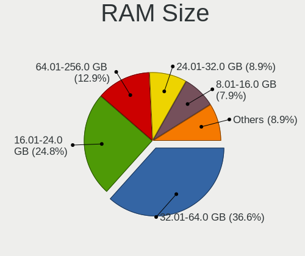
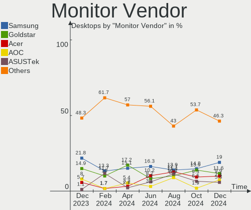
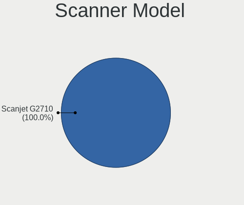
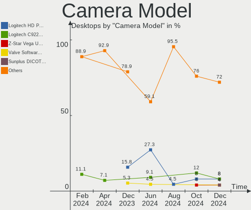

Pop!_OS Hardware Trends (Desktops)
----------------------------------

A project to identify most popular hardware characteristics and track their change
over time based on data collected by Pop!_OS users at https://Linux-Hardware.org.

Anyone can contribute to this report by the [hw-probe](https://github.com/linuxhw/hw-probe) tool:

    sudo -E hw-probe -all -upload

Full-feature report is available here: https://linux-hardware.org/?view=trends&formfactor=desktop

Period: Jul, 2021.

Contents
--------

* [ System ](#system)
  - [ OS                       ](#os)
  - [ OS Family                ](#os-family)
  - [ Kernel                   ](#kernel)
  - [ Kernel Family            ](#kernel-family)
  - [ Kernel Major Ver.        ](#kernel-major-ver)
  - [ Arch                     ](#arch)
  - [ DE                       ](#de)
  - [ Display Server           ](#display-server)
  - [ Display Manager          ](#display-manager)
  - [ OS Lang                  ](#os-lang)
  - [ Boot Mode                ](#boot-mode)
  - [ Filesystem               ](#filesystem)
  - [ Part. scheme             ](#part-scheme)
  - [ Dual Boot with Linux/BSD ](#dual-boot-with-linuxbsd)
  - [ Dual Boot (Win)          ](#dual-boot-win)

* [ Board ](#board)
  - [ Vendor                   ](#vendor)
  - [ Model                    ](#model)
  - [ Model Family             ](#model-family)
  - [ MFG Year                 ](#mfg-year)
  - [ Form Factor              ](#form-factor)
  - [ Secure Boot              ](#secure-boot)
  - [ Coreboot                 ](#coreboot)
  - [ RAM Size                 ](#ram-size)
  - [ RAM Used                 ](#ram-used)
  - [ Total Drives             ](#total-drives)
  - [ Has CD-ROM               ](#has-cd-rom)
  - [ Has Ethernet             ](#has-ethernet)
  - [ Has WiFi                 ](#has-wifi)
  - [ Has Bluetooth            ](#has-bluetooth)

* [ Location ](#location)
  - [ Country                  ](#country)
  - [ City                     ](#city)

* [ Drives ](#drives)
  - [ Drive Vendor             ](#drive-vendor)
  - [ Drive Model              ](#drive-model)
  - [ HDD Vendor               ](#hdd-vendor)
  - [ SSD Vendor               ](#ssd-vendor)
  - [ Drive Kind               ](#drive-kind)
  - [ Drive Connector          ](#drive-connector)
  - [ Drive Size               ](#drive-size)
  - [ Space Total              ](#space-total)
  - [ Space Used               ](#space-used)
  - [ Malfunc. Drives          ](#malfunc-drives)
  - [ Malfunc. Drive Vendor    ](#malfunc-drive-vendor)
  - [ Malfunc. HDD Vendor      ](#malfunc-hdd-vendor)
  - [ Malfunc. Drive Kind      ](#malfunc-drive-kind)
  - [ Failed Drives            ](#failed-drives)
  - [ Failed Drive Vendor      ](#failed-drive-vendor)
  - [ Drive Status             ](#drive-status)

* [ Storage controller ](#storage-controller)
  - [ Storage Vendor           ](#storage-vendor)
  - [ Storage Model            ](#storage-model)
  - [ Storage Kind             ](#storage-kind)

* [ Processor ](#processor)
  - [ CPU Vendor               ](#cpu-vendor)
  - [ CPU Model                ](#cpu-model)
  - [ CPU Model Family         ](#cpu-model-family)
  - [ CPU Cores                ](#cpu-cores)
  - [ CPU Sockets              ](#cpu-sockets)
  - [ CPU Threads              ](#cpu-threads)
  - [ CPU Op-Modes             ](#cpu-op-modes)
  - [ CPU Microcode            ](#cpu-microcode)
  - [ CPU Microarch            ](#cpu-microarch)

* [ Graphics ](#graphics)
  - [ GPU Vendor               ](#gpu-vendor)
  - [ GPU Model                ](#gpu-model)
  - [ GPU Combo                ](#gpu-combo)
  - [ GPU Driver               ](#gpu-driver)
  - [ GPU Memory               ](#gpu-memory)

* [ Monitor ](#monitor)
  - [ Monitor Vendor           ](#monitor-vendor)
  - [ Monitor Model            ](#monitor-model)
  - [ Monitor Resolution       ](#monitor-resolution)
  - [ Monitor Diagonal         ](#monitor-diagonal)
  - [ Monitor Width            ](#monitor-width)
  - [ Aspect Ratio             ](#aspect-ratio)
  - [ Monitor Area             ](#monitor-area)
  - [ Pixel Density            ](#pixel-density)
  - [ Multiple Monitors        ](#multiple-monitors)

* [ Network ](#network)
  - [ Net Controller Vendor    ](#net-controller-vendor)
  - [ Net Controller Model     ](#net-controller-model)
  - [ Wireless Vendor          ](#wireless-vendor)
  - [ Wireless Model           ](#wireless-model)
  - [ Ethernet Vendor          ](#ethernet-vendor)
  - [ Ethernet Model           ](#ethernet-model)
  - [ Net Controller Kind      ](#net-controller-kind)
  - [ Used Controller          ](#used-controller)
  - [ NICs                     ](#nics)
  - [ IPv6                     ](#ipv6)

* [ Bluetooth ](#bluetooth)
  - [ Bluetooth Vendor         ](#bluetooth-vendor)
  - [ Bluetooth Model          ](#bluetooth-model)

* [ Sound ](#sound)
  - [ Sound Vendor             ](#sound-vendor)
  - [ Sound Model              ](#sound-model)

* [ Memory ](#memory)
  - [ Memory Vendor            ](#memory-vendor)
  - [ Memory Model             ](#memory-model)
  - [ Memory Kind              ](#memory-kind)
  - [ Memory Form Factor       ](#memory-form-factor)
  - [ Memory Size              ](#memory-size)
  - [ Memory Speed             ](#memory-speed)

* [ Printers & scanners ](#printers--scanners)
  - [ Printer Vendor           ](#printer-vendor)
  - [ Printer Model            ](#printer-model)
  - [ Scanner Vendor           ](#scanner-vendor)
  - [ Scanner Model            ](#scanner-model)

* [ Camera ](#camera)
  - [ Camera Vendor            ](#camera-vendor)
  - [ Camera Model             ](#camera-model)

* [ Security ](#security)
  - [ Fingerprint Vendor       ](#fingerprint-vendor)
  - [ Fingerprint Model        ](#fingerprint-model)
  - [ Chipcard Vendor          ](#chipcard-vendor)
  - [ Chipcard Model           ](#chipcard-model)

* [ Unsupported ](#unsupported)
  - [ Unsupported Devices      ](#unsupported-devices)
  - [ Unsupported Device Types ](#unsupported-device-types)

System
------

OS
--

Installed operating systems

| Name          | Desktops | Percent |
|---------------|----------|---------|
| Pop!_OS 21.04 | 127      | 80.38%  |
| Pop!_OS 20.04 | 19       | 12.03%  |
| Pop!_OS 20.10 | 12       | 7.59%   |

OS Family
---------

OS without a version

| Name    | Desktops | Percent |
|---------|----------|---------|
| Pop!_OS | 158      | 100%    |

Kernel
------

Version of the Linux kernel

| Version                    | Desktops | Percent |
|----------------------------|----------|---------|
| 5.11.0-7620-generic        | 140      | 88.61%  |
| 5.11.0-7614-generic        | 9        | 5.7%    |
| 5.4.0-7634-generic         | 2        | 1.27%   |
| 5.13.0-051300-generic      | 2        | 1.27%   |
| 5.8.0-7630-generic         | 1        | 0.63%   |
| 5.4.0-7625-generic         | 1        | 0.63%   |
| 5.13.5-051305-generic      | 1        | 0.63%   |
| 5.13.0-xanmod1             | 1        | 0.63%   |
| 5.12.0-14.2-liquorix-amd64 | 1        | 0.63%   |

Kernel Family
-------------

Linux kernel without a distro release

| Version | Desktops | Percent |
|---------|----------|---------|
| 5.11.0  | 149      | 94.3%   |
| 5.4.0   | 3        | 1.9%    |
| 5.13.0  | 3        | 1.9%    |
| 5.8.0   | 1        | 0.63%   |
| 5.13.5  | 1        | 0.63%   |
| 5.12.0  | 1        | 0.63%   |

Kernel Major Ver.
-----------------

Linux kernel major version

| Version | Desktops | Percent |
|---------|----------|---------|
| 5.11    | 149      | 94.3%   |
| 5.13    | 4        | 2.53%   |
| 5.4     | 3        | 1.9%    |
| 5.8     | 1        | 0.63%   |
| 5.12    | 1        | 0.63%   |

Arch
----

OS architecture (x86_64, i586, etc.)

| Name   | Desktops | Percent |
|--------|----------|---------|
| x86_64 | 158      | 100%    |

DE
--

Desktop Environment

| Name            | Desktops | Percent |
|-----------------|----------|---------|
| GNOME           | 152      | 96.2%   |
| KDE             | 3        | 1.9%    |
| Unknown         | 2        | 1.27%   |
| GNOME Flashback | 1        | 0.63%   |

Display Server
--------------

X11 or Wayland

| Name    | Desktops | Percent |
|---------|----------|---------|
| X11     | 151      | 95.57%  |
| Wayland | 5        | 3.16%   |
| Unknown | 2        | 1.27%   |

Display Manager
---------------

SDDM, LightDM, etc.

| Name    | Desktops | Percent |
|---------|----------|---------|
| Unknown | 137      | 86.71%  |
| GDM     | 21       | 13.29%  |

OS Lang
-------

Language

| Lang    | Desktops | Percent |
|---------|----------|---------|
| en_US   | 90       | 56.96%  |
| en_GB   | 12       | 7.59%   |
| de_DE   | 11       | 6.96%   |
| pt_BR   | 9        | 5.7%    |
| en_AU   | 7        | 4.43%   |
| C       | 7        | 4.43%   |
| sv_SE   | 4        | 2.53%   |
| ru_RU   | 4        | 2.53%   |
| fr_FR   | 2        | 1.27%   |
| es_ES   | 2        | 1.27%   |
| sk_SK   | 1        | 0.63%   |
| pt_PT   | 1        | 0.63%   |
| pl_PL   | 1        | 0.63%   |
| ja_JP   | 1        | 0.63%   |
| it_IT   | 1        | 0.63%   |
| fr_CA   | 1        | 0.63%   |
| es_AR   | 1        | 0.63%   |
| en_ZA   | 1        | 0.63%   |
| da_DK   | 1        | 0.63%   |
| Unknown | 1        | 0.63%   |

Boot Mode
---------

EFI or BIOS

| Mode | Desktops | Percent |
|------|----------|---------|
| BIOS | 137      | 86.71%  |
| EFI  | 21       | 13.29%  |

Filesystem
----------

Type of filesystem

| Type    | Desktops | Percent |
|---------|----------|---------|
| Ext4    | 150      | 94.94%  |
| Btrfs   | 4        | 2.53%   |
| Overlay | 2        | 1.27%   |
| Zfs     | 1        | 0.63%   |
| Xfs     | 1        | 0.63%   |

Part. scheme
------------

Scheme of partitioning

| Type    | Desktops | Percent |
|---------|----------|---------|
| Unknown | 135      | 85.44%  |
| GPT     | 21       | 13.29%  |
| MBR     | 2        | 1.27%   |

Dual Boot with Linux/BSD
------------------------

Hosting more than one Linux/BSD

| Dual boot | Desktops | Percent |
|-----------|----------|---------|
| No        | 152      | 96.2%   |
| Yes       | 6        | 3.8%    |

Dual Boot (Win)
---------------

Hosting Linux and Windows

| Dual boot | Desktops | Percent |
|-----------|----------|---------|
| No        | 141      | 89.24%  |
| Yes       | 17       | 10.76%  |

Board
-----

Vendor
------

Motherboard manufacturer

| Name                | Desktops | Percent |
|---------------------|----------|---------|
| ASUSTek Computer    | 49       | 31.01%  |
| Gigabyte Technology | 27       | 17.09%  |
| MSI                 | 23       | 14.56%  |
| ASRock              | 20       | 12.66%  |
| Dell                | 8        | 5.06%   |
| Hewlett-Packard     | 6        | 3.8%    |
| System76            | 4        | 2.53%   |
| Lenovo              | 2        | 1.27%   |
| Fujitsu             | 2        | 1.27%   |
| ECS                 | 2        | 1.27%   |
| Alienware           | 2        | 1.27%   |
| Positivo            | 1        | 0.63%   |
| Pegatron            | 1        | 0.63%   |
| Minix               | 1        | 0.63%   |
| Medion              | 1        | 0.63%   |
| MAXSUN              | 1        | 0.63%   |
| Koloe               | 1        | 0.63%   |
| KLLISRE             | 1        | 0.63%   |
| JGINYUE             | 1        | 0.63%   |
| Intel               | 1        | 0.63%   |
| Gateway             | 1        | 0.63%   |
| Foxconn             | 1        | 0.63%   |
| EVGA                | 1        | 0.63%   |
| Apple               | 1        | 0.63%   |

Model
-----

Motherboard model

| Name                               | Desktops | Percent |
|------------------------------------|----------|---------|
| System76 Thelio                    | 4        | 2.53%   |
| ASUS TUF GAMING X570-PLUS          | 3        | 1.9%    |
| MSI MS-7B89                        | 2        | 1.27%   |
| MSI MS-7B85                        | 2        | 1.27%   |
| MSI MS-7B79                        | 2        | 1.27%   |
| Gigabyte Z370M D3H                 | 2        | 1.27%   |
| Gigabyte X570 AORUS MASTER         | 2        | 1.27%   |
| ASUS TUF GAMING X570-PRO           | 2        | 1.27%   |
| ASUS TUF GAMING B450M-PLUS II      | 2        | 1.27%   |
| ASUS ROG STRIX B550-F GAMING       | 2        | 1.27%   |
| ASUS ROG STRIX B450-F GAMING       | 2        | 1.27%   |
| ASUS PRIME B450M-A                 | 2        | 1.27%   |
| ASUS P8Z77-V PRO                   | 2        | 1.27%   |
| ASUS All Series                    | 2        | 1.27%   |
| ASRock X570 Taichi                 | 2        | 1.27%   |
| ASRock B450 Gaming K4              | 2        | 1.27%   |
| Positivo POS-EIH61CR               | 1        | 0.63%   |
| Pegatron NY806AV-ABA s5150t        | 1        | 0.63%   |
| MSI MS-7C95                        | 1        | 0.63%   |
| MSI MS-7C91                        | 1        | 0.63%   |
| MSI MS-7C02                        | 1        | 0.63%   |
| MSI MS-7B98                        | 1        | 0.63%   |
| MSI MS-7B33                        | 1        | 0.63%   |
| MSI MS-7A38                        | 1        | 0.63%   |
| MSI MS-7A36                        | 1        | 0.63%   |
| MSI MS-7992                        | 1        | 0.63%   |
| MSI MS-7976                        | 1        | 0.63%   |
| MSI MS-7970                        | 1        | 0.63%   |
| MSI MS-7921                        | 1        | 0.63%   |
| MSI MS-7851                        | 1        | 0.63%   |
| MSI MS-7850                        | 1        | 0.63%   |
| MSI MS-7845                        | 1        | 0.63%   |
| MSI MS-7817                        | 1        | 0.63%   |
| MSI MS-7693                        | 1        | 0.63%   |
| MSI MS-7640                        | 1        | 0.63%   |
| Minix Z83-4                        | 1        | 0.63%   |
| Medion MS-7707                     | 1        | 0.63%   |
| MAXSUN MS-A10 4600 Quad            | 1        | 0.63%   |
| Lenovo ThinkCentre M55 8810E56     | 1        | 0.63%   |
| Lenovo Legion T7 34IMZ5 90Q80003US | 1        | 0.63%   |
| Koloe Thurley                      | 1        | 0.63%   |
| KLLISRE X79 V2.72A                 | 1        | 0.63%   |
| JGINYUE H97M-VH PLUS V1.0          | 1        | 0.63%   |
| Intel DH61WW AAG23116-303          | 1        | 0.63%   |
| HP Z800 Workstation                | 1        | 0.63%   |
| HP Z600 Workstation                | 1        | 0.63%   |
| HP Z440 Workstation                | 1        | 0.63%   |
| HP Compaq Elite 8300 CMT           | 1        | 0.63%   |
| HP Compaq 8200 Elite SFF PC        | 1        | 0.63%   |
| HP 290 G2 MT Business PC           | 1        | 0.63%   |
| Gigabyte Z68XP-UD3P                | 1        | 0.63%   |
| Gigabyte Z490 AORUS ULTRA          | 1        | 0.63%   |
| Gigabyte Z270-HD3P                 | 1        | 0.63%   |
| Gigabyte X570 GAMING X             | 1        | 0.63%   |
| Gigabyte X570 AORUS PRO            | 1        | 0.63%   |
| Gigabyte X570 AORUS ELITE          | 1        | 0.63%   |
| Gigabyte UD3R-SLI                  | 1        | 0.63%   |
| Gigabyte TRX40 DESIGNARE           | 1        | 0.63%   |
| Gigabyte Leopard WS                | 1        | 0.63%   |
| Gigabyte H81M-S2H                  | 1        | 0.63%   |

Model Family
------------

Motherboard model prefix

| Name                   | Desktops | Percent |
|------------------------|----------|---------|
| ASUS TUF               | 13       | 8.23%   |
| ASUS ROG               | 11       | 6.96%   |
| ASUS PRIME             | 11       | 6.96%   |
| Gigabyte X570          | 5        | 3.16%   |
| System76 Thelio        | 4        | 2.53%   |
| Dell OptiPlex          | 4        | 2.53%   |
| ASRock X570            | 4        | 2.53%   |
| ASRock B450            | 3        | 1.9%    |
| MSI MS-7B89            | 2        | 1.27%   |
| MSI MS-7B85            | 2        | 1.27%   |
| MSI MS-7B79            | 2        | 1.27%   |
| HP Compaq              | 2        | 1.27%   |
| Gigabyte Z370M         | 2        | 1.27%   |
| Gigabyte A320M-S2H     | 2        | 1.27%   |
| Dell Precision         | 2        | 1.27%   |
| ASUS P8Z77-V           | 2        | 1.27%   |
| ASUS All               | 2        | 1.27%   |
| ASRock B450M           | 2        | 1.27%   |
| Alienware Aurora       | 2        | 1.27%   |
| Positivo POS-EIH61CR   | 1        | 0.63%   |
| Pegatron NY806AV-ABA   | 1        | 0.63%   |
| MSI MS-7C95            | 1        | 0.63%   |
| MSI MS-7C91            | 1        | 0.63%   |
| MSI MS-7C02            | 1        | 0.63%   |
| MSI MS-7B98            | 1        | 0.63%   |
| MSI MS-7B33            | 1        | 0.63%   |
| MSI MS-7A38            | 1        | 0.63%   |
| MSI MS-7A36            | 1        | 0.63%   |
| MSI MS-7992            | 1        | 0.63%   |
| MSI MS-7976            | 1        | 0.63%   |
| MSI MS-7970            | 1        | 0.63%   |
| MSI MS-7921            | 1        | 0.63%   |
| MSI MS-7851            | 1        | 0.63%   |
| MSI MS-7850            | 1        | 0.63%   |
| MSI MS-7845            | 1        | 0.63%   |
| MSI MS-7817            | 1        | 0.63%   |
| MSI MS-7693            | 1        | 0.63%   |
| MSI MS-7640            | 1        | 0.63%   |
| Minix Z83-4            | 1        | 0.63%   |
| Medion MS-7707         | 1        | 0.63%   |
| MAXSUN MS-A10          | 1        | 0.63%   |
| Lenovo ThinkCentre     | 1        | 0.63%   |
| Lenovo Legion          | 1        | 0.63%   |
| Koloe Thurley          | 1        | 0.63%   |
| KLLISRE X79            | 1        | 0.63%   |
| JGINYUE H97M-VH        | 1        | 0.63%   |
| Intel DH61WW           | 1        | 0.63%   |
| HP Z800                | 1        | 0.63%   |
| HP Z600                | 1        | 0.63%   |
| HP Z440                | 1        | 0.63%   |
| HP 290                 | 1        | 0.63%   |
| Gigabyte Z68XP-UD3P    | 1        | 0.63%   |
| Gigabyte Z490          | 1        | 0.63%   |
| Gigabyte Z270-HD3P     | 1        | 0.63%   |
| Gigabyte UD3R-SLI      | 1        | 0.63%   |
| Gigabyte TRX40         | 1        | 0.63%   |
| Gigabyte Leopard       | 1        | 0.63%   |
| Gigabyte H81M-S2H      | 1        | 0.63%   |
| Gigabyte H470M         | 1        | 0.63%   |
| Gigabyte GA-E7AUM-DS2H | 1        | 0.63%   |

MFG Year
--------

Motherboard manufacture year

| Year | Desktops | Percent |
|------|----------|---------|
| 2020 | 39       | 24.68%  |
| 2021 | 34       | 21.52%  |
| 2019 | 18       | 11.39%  |
| 2013 | 12       | 7.59%   |
| 2018 | 11       | 6.96%   |
| 2017 | 10       | 6.33%   |
| 2015 | 8        | 5.06%   |
| 2014 | 5        | 3.16%   |
| 2012 | 4        | 2.53%   |
| 2010 | 4        | 2.53%   |
| 2016 | 3        | 1.9%    |
| 2011 | 3        | 1.9%    |
| 2009 | 3        | 1.9%    |
| 2008 | 3        | 1.9%    |
| 2007 | 1        | 0.63%   |

Form Factor
-----------

Physical design of the computer

| Name    | Desktops | Percent |
|---------|----------|---------|
| Desktop | 158      | 100%    |

Secure Boot
-----------

Enabled or disabled

| State    | Desktops | Percent |
|----------|----------|---------|
| Disabled | 158      | 100%    |

Coreboot
--------

Have coreboot on board

| Used | Desktops | Percent |
|------|----------|---------|
| No   | 158      | 100%    |

RAM Size
--------

Total RAM memory

| Size in GB  | Desktops | Percent |
|-------------|----------|---------|
| 16.01-24.0  | 56       | 35.44%  |
| 32.01-64.0  | 42       | 26.58%  |
| 8.01-16.0   | 18       | 11.39%  |
| 4.01-8.0    | 15       | 9.49%   |
| 64.01-256.0 | 14       | 8.86%   |
| 3.01-4.0    | 10       | 6.33%   |
| 24.01-32.0  | 3        | 1.9%    |

RAM Used
--------

Used RAM memory

| Used GB   | Desktops | Percent |
|-----------|----------|---------|
| 2.01-3.0  | 46       | 29.11%  |
| 1.01-2.0  | 41       | 25.95%  |
| 4.01-8.0  | 34       | 21.52%  |
| 3.01-4.0  | 24       | 15.19%  |
| 8.01-16.0 | 12       | 7.59%   |
| 0.51-1.0  | 1        | 0.63%   |

Total Drives
------------

Number of drives on board

| Drives | Desktops | Percent |
|--------|----------|---------|
| 2      | 50       | 31.65%  |
| 1      | 47       | 29.75%  |
| 3      | 30       | 18.99%  |
| 4      | 17       | 10.76%  |
| 5      | 11       | 6.96%   |
| 11     | 1        | 0.63%   |
| 9      | 1        | 0.63%   |
| 6      | 1        | 0.63%   |

Has CD-ROM
----------

Has CD-ROM on board

| Presented | Desktops | Percent |
|-----------|----------|---------|
| No        | 111      | 70.25%  |
| Yes       | 47       | 29.75%  |

Has Ethernet
------------

Has Ethernet on board

| Presented | Desktops | Percent |
|-----------|----------|---------|
| Yes       | 158      | 100%    |

Has WiFi
--------

Has WiFi module

| Presented | Desktops | Percent |
|-----------|----------|---------|
| Yes       | 86       | 54.43%  |
| No        | 72       | 45.57%  |

Has Bluetooth
-------------

Has Bluetooth module

| Presented | Desktops | Percent |
|-----------|----------|---------|
| No        | 97       | 61.39%  |
| Yes       | 61       | 38.61%  |

Location
--------

Country
-------

Geographic location (country)

| Country      | Desktops | Percent |
|--------------|----------|---------|
| USA          | 58       | 36.71%  |
| Germany      | 12       | 7.59%   |
| Brazil       | 12       | 7.59%   |
| Sweden       | 8        | 5.06%   |
| UK           | 7        | 4.43%   |
| Australia    | 7        | 4.43%   |
| Canada       | 6        | 3.8%    |
| Russia       | 5        | 3.16%   |
| Netherlands  | 5        | 3.16%   |
| Spain        | 3        | 1.9%    |
| Japan        | 3        | 1.9%    |
| Italy        | 3        | 1.9%    |
| India        | 3        | 1.9%    |
| Switzerland  | 2        | 1.27%   |
| South Africa | 2        | 1.27%   |
| Romania      | 2        | 1.27%   |
| New Zealand  | 2        | 1.27%   |
| France       | 2        | 1.27%   |
| Ukraine      | 1        | 0.63%   |
| Thailand     | 1        | 0.63%   |
| Slovakia     | 1        | 0.63%   |
| Portugal     | 1        | 0.63%   |
| Poland       | 1        | 0.63%   |
| Norway       | 1        | 0.63%   |
| Mexico       | 1        | 0.63%   |
| Maldives     | 1        | 0.63%   |
| Malaysia     | 1        | 0.63%   |
| Lithuania    | 1        | 0.63%   |
| Hungary      | 1        | 0.63%   |
| Finland      | 1        | 0.63%   |
| Egypt        | 1        | 0.63%   |
| Denmark      | 1        | 0.63%   |
| Austria      | 1        | 0.63%   |
| Argentina    | 1        | 0.63%   |

City
----

Geographic location (city)

| City                   | Desktops | Percent |
|------------------------|----------|---------|
| Brisbane               | 3        | 1.9%    |
| St Louis               | 2        | 1.27%   |
| Queens                 | 2        | 1.27%   |
| Oisterwijk             | 2        | 1.27%   |
| Neuss                  | 2        | 1.27%   |
| Miami                  | 2        | 1.27%   |
| Los Angeles            | 2        | 1.27%   |
| Cuiabá                | 2        | 1.27%   |
| Chandler               | 2        | 1.27%   |
| Berlin                 | 2        | 1.27%   |
| 's-Hertogenbosch       | 2        | 1.27%   |
| Yakima                 | 1        | 0.63%   |
| Wyoming                | 1        | 0.63%   |
| Wizernes               | 1        | 0.63%   |
| Winchester             | 1        | 0.63%   |
| Whanganui              | 1        | 0.63%   |
| West Valley City       | 1        | 0.63%   |
| West Jordan            | 1        | 0.63%   |
| W??rzburg              | 1        | 0.63%   |
| Waterford              | 1        | 0.63%   |
| Walkerton              | 1        | 0.63%   |
| Waalwijk               | 1        | 0.63%   |
| Vilnius                | 1        | 0.63%   |
| Vienna                 | 1        | 0.63%   |
| Veliky Novgorod        | 1        | 0.63%   |
| Vancouver              | 1        | 0.63%   |
| Valencia               | 1        | 0.63%   |
| Unterschleissheim      | 1        | 0.63%   |
| Ulyanovsk              | 1        | 0.63%   |
| Ulm                    | 1        | 0.63%   |
| Troy                   | 1        | 0.63%   |
| Troon                  | 1        | 0.63%   |
| Topeka                 | 1        | 0.63%   |
| Tampa                  | 1        | 0.63%   |
| Tagajo-shi             | 1        | 0.63%   |
| São Bernardo do Campo | 1        | 0.63%   |
| Sundsvall              | 1        | 0.63%   |
| Summerville            | 1        | 0.63%   |
| Suceava                | 1        | 0.63%   |
| Stuttgart              | 1        | 0.63%   |
| Stoke-on-Trent         | 1        | 0.63%   |
| Stockholm              | 1        | 0.63%   |
| St Petersburg          | 1        | 0.63%   |
| Shreveport             | 1        | 0.63%   |
| Set??bal               | 1        | 0.63%   |
| Santa Clara            | 1        | 0.63%   |
| San Justo              | 1        | 0.63%   |
| Sacramento             | 1        | 0.63%   |
| Rio de Janeiro         | 1        | 0.63%   |
| Riehen                 | 1        | 0.63%   |
| Richmond               | 1        | 0.63%   |
| Ragusa                 | 1        | 0.63%   |
| Puerto Vallarta        | 1        | 0.63%   |
| Portsmouth             | 1        | 0.63%   |
| Porto Alegre           | 1        | 0.63%   |
| Port Coquitlam         | 1        | 0.63%   |
| Pindamonhangaba        | 1        | 0.63%   |
| Petaling Jaya          | 1        | 0.63%   |
| Pensacola              | 1        | 0.63%   |
| Ottawa                 | 1        | 0.63%   |

Drives
------

Drive Vendor
------------

Hard drive vendors

| Vendor                    | Desktops | Drives | Percent |
|---------------------------|----------|--------|---------|
| Samsung Electronics       | 67       | 105    | 21.75%  |
| WDC                       | 61       | 74     | 19.81%  |
| Seagate                   | 48       | 69     | 15.58%  |
| Sandisk                   | 20       | 24     | 6.49%   |
| Crucial                   | 17       | 18     | 5.52%   |
| Toshiba                   | 16       | 16     | 5.19%   |
| Kingston                  | 13       | 13     | 4.22%   |
| Phison                    | 9        | 9      | 2.92%   |
| Intel                     | 5        | 5      | 1.62%   |
| China                     | 5        | 5      | 1.62%   |
| A-DATA Technology         | 5        | 5      | 1.62%   |
| Maxtor                    | 4        | 4      | 1.3%    |
| Hitachi                   | 4        | 4      | 1.3%    |
| Micron/Crucial Technology | 3        | 3      | 0.97%   |
| XPG                       | 2        | 3      | 0.65%   |
| Silicon Motion            | 2        | 2      | 0.65%   |
| SABRENT                   | 2        | 2      | 0.65%   |
| PLEXTOR                   | 2        | 2      | 0.65%   |
| OCZ                       | 2        | 2      | 0.65%   |
| Micron Technology         | 2        | 4      | 0.65%   |
| LaCie                     | 2        | 3      | 0.65%   |
| KingFast                  | 2        | 2      | 0.65%   |
| ASMT                      | 2        | 2      | 0.65%   |
| Zheino                    | 1        | 1      | 0.32%   |
| Verbatim                  | 1        | 1      | 0.32%   |
| Unknown                   | 1        | 1      | 0.32%   |
| SK Hynix                  | 1        | 1      | 0.32%   |
| PNY                       | 1        | 1      | 0.32%   |
| Phison Electronics        | 1        | 1      | 0.32%   |
| HS-SSD-C100               | 1        | 1      | 0.32%   |
| Hikvision                 | 1        | 1      | 0.32%   |
| HGST                      | 1        | 1      | 0.32%   |
| Hewlett-Packard           | 1        | 1      | 0.32%   |
| GOODRAM                   | 1        | 1      | 0.32%   |
| GOLDEN                    | 1        | 1      | 0.32%   |
| Apple                     | 1        | 1      | 0.32%   |

Drive Model
-----------

Hard drive models

| Model                              | Desktops | Percent |
|------------------------------------|----------|---------|
| Samsung NVMe SSD Drive 500GB       | 13       | 3.61%   |
| Seagate ST1000DM010-2EP102 1TB     | 8        | 2.22%   |
| Samsung SSD 850 EVO 500GB          | 6        | 1.67%   |
| Samsung NVMe SSD Drive 1TB         | 6        | 1.67%   |
| Sandisk NVMe SSD Drive 500GB       | 5        | 1.39%   |
| Samsung SSD 860 EVO 1TB            | 5        | 1.39%   |
| Samsung SSD 850 EVO 250GB          | 5        | 1.39%   |
| WDC WD20EARX-00PASB0 2TB           | 4        | 1.11%   |
| WDC WD10EZEX-08WN4A0 1TB           | 4        | 1.11%   |
| WDC WDS500G2B0A-00SM50 500GB SSD   | 3        | 0.83%   |
| WDC WD10EARS-00Y5B1 1TB            | 3        | 0.83%   |
| Toshiba HDWD130 3TB                | 3        | 0.83%   |
| Seagate ST8000DM004-2CX188 8TB     | 3        | 0.83%   |
| Seagate ST500DM002-1BD142 500GB    | 3        | 0.83%   |
| Seagate ST4000DM004-2CV104 4TB     | 3        | 0.83%   |
| Seagate Backup+ Hub BK 4TB         | 3        | 0.83%   |
| Sandisk NVMe SSD Drive 1TB         | 3        | 0.83%   |
| Samsung SSD 970 EVO Plus 500GB     | 3        | 0.83%   |
| Samsung SSD 860 EVO 500GB          | 3        | 0.83%   |
| Samsung NVMe SSD Drive 2TB         | 3        | 0.83%   |
| Samsung NVMe SSD Drive 250GB       | 3        | 0.83%   |
| Phison NVMe SSD Drive 1TB          | 3        | 0.83%   |
| Micron/Crucial NVMe SSD Drive 1TB  | 3        | 0.83%   |
| Kingston SA400S37240G 240GB SSD    | 3        | 0.83%   |
| Crucial CT525MX300SSD1 528GB       | 3        | 0.83%   |
| Crucial CT500MX500SSD1 500GB       | 3        | 0.83%   |
| Crucial CT1000MX500SSD1 1TB        | 3        | 0.83%   |
| A-DATA SU650 120GB SSD             | 3        | 0.83%   |
| XPG NVMe SSD Drive 1024GB          | 2        | 0.56%   |
| WDC WDS120G2G0A-00JH30 120GB SSD   | 2        | 0.56%   |
| WDC WDBNCE5000PNC 500GB SSD        | 2        | 0.56%   |
| WDC WD20EARS-00MVWB0 2TB           | 2        | 0.56%   |
| WDC WD10EZEX-60ZF5A0 1TB           | 2        | 0.56%   |
| Toshiba DT01ACA100 1TB             | 2        | 0.56%   |
| Seagate ST3500414CS 500GB          | 2        | 0.56%   |
| Seagate ST2000LM015-2E8174 2TB     | 2        | 0.56%   |
| Seagate ST2000LM007-1R8174 2TB     | 2        | 0.56%   |
| Seagate ST2000DM008-2FR102 2TB     | 2        | 0.56%   |
| Seagate ST2000DM001-1ER164 2TB     | 2        | 0.56%   |
| Seagate ST2000DM001-1CH164 2TB     | 2        | 0.56%   |
| Seagate ST1000LM024 HN-M101MBB 1TB | 2        | 0.56%   |
| SanDisk SSD G5 BICS4 500GB         | 2        | 0.56%   |
| SanDisk SDSSDA120G 120GB           | 2        | 0.56%   |
| Samsung SSD 870 QVO 1TB            | 2        | 0.56%   |
| Samsung SSD 870 EVO 1TB            | 2        | 0.56%   |
| Samsung SSD 860 QVO 1TB            | 2        | 0.56%   |
| Samsung SSD 850 PRO 512GB          | 2        | 0.56%   |
| Samsung SSD 840 Series 250GB       | 2        | 0.56%   |
| Samsung SSD 840 PRO Series 256GB   | 2        | 0.56%   |
| Samsung SSD 750 EVO 250GB          | 2        | 0.56%   |
| Samsung NVMe SSD Drive 1024GB      | 2        | 0.56%   |
| MAXTOR STM380815AS 80GB            | 2        | 0.56%   |
| Intel NVMe SSD Drive 1024GB        | 2        | 0.56%   |
| A-DATA SU650 240GB SSD             | 2        | 0.56%   |
| Zheino CHN 25SATAA3 240 240GB      | 1        | 0.28%   |
| XPG GAMMIX S11 Pro 512GB           | 1        | 0.28%   |
| WDC WDS240G2G0B-00EPW0 240GB SSD   | 1        | 0.28%   |
| WDC WDS240G2G0A-00JH30 240GB SSD   | 1        | 0.28%   |
| WDC WDS200T2B0A 2TB SSD            | 1        | 0.28%   |
| WDC WDS120G2G0B-00EPW0 120GB SSD   | 1        | 0.28%   |

HDD Vendor
----------

Hard disk drive vendors

| Vendor              | Desktops | Drives | Percent |
|---------------------|----------|--------|---------|
| WDC                 | 49       | 60     | 41.53%  |
| Seagate             | 46       | 63     | 38.98%  |
| Toshiba             | 11       | 11     | 9.32%   |
| MAXTOR              | 4        | 4      | 3.39%   |
| Hitachi             | 4        | 4      | 3.39%   |
| Samsung Electronics | 1        | 2      | 0.85%   |
| Sabrent             | 1        | 1      | 0.85%   |
| HGST                | 1        | 1      | 0.85%   |
| ASMT                | 1        | 1      | 0.85%   |

SSD Vendor
----------

Solid state drive vendors

| Vendor              | Desktops | Drives | Percent |
|---------------------|----------|--------|---------|
| Samsung Electronics | 38       | 57     | 33.63%  |
| Crucial             | 16       | 17     | 14.16%  |
| WDC                 | 12       | 12     | 10.62%  |
| SanDisk             | 12       | 15     | 10.62%  |
| Kingston            | 11       | 11     | 9.73%   |
| China               | 5        | 5      | 4.42%   |
| A-DATA Technology   | 5        | 5      | 4.42%   |
| Toshiba             | 2        | 2      | 1.77%   |
| PLEXTOR             | 2        | 2      | 1.77%   |
| OCZ                 | 2        | 2      | 1.77%   |
| Verbatim            | 1        | 1      | 0.88%   |
| SK Hynix            | 1        | 1      | 0.88%   |
| PNY                 | 1        | 1      | 0.88%   |
| Intel               | 1        | 1      | 0.88%   |
| Hikvision           | 1        | 1      | 0.88%   |
| Hewlett-Packard     | 1        | 1      | 0.88%   |
| GOODRAM             | 1        | 1      | 0.88%   |
| ASMT                | 1        | 1      | 0.88%   |

Drive Kind
----------

HDD or SSD

| Kind    | Desktops | Drives | Percent |
|---------|----------|--------|---------|
| HDD     | 100      | 147    | 36.5%   |
| SSD     | 94       | 136    | 34.31%  |
| NVMe    | 67       | 91     | 24.45%  |
| Unknown | 12       | 14     | 4.38%   |
| MMC     | 1        | 1      | 0.36%   |

Drive Connector
---------------

SATA, SAS, NVMe, etc.

| Type | Desktops | Drives | Percent |
|------|----------|--------|---------|
| SATA | 139      | 277    | 63.47%  |
| NVMe | 67       | 90     | 30.59%  |
| SAS  | 12       | 21     | 5.48%   |
| MMC  | 1        | 1      | 0.46%   |

Drive Size
----------

Size of hard drive

| Size in TB | Desktops | Drives | Percent |
|------------|----------|--------|---------|
| 0.01-0.5   | 93       | 133    | 43.46%  |
| 0.51-1.0   | 61       | 75     | 28.5%   |
| 1.01-2.0   | 28       | 33     | 13.08%  |
| 3.01-4.0   | 11       | 16     | 5.14%   |
| 2.01-3.0   | 10       | 12     | 4.67%   |
| 4.01-10.0  | 10       | 13     | 4.67%   |
| 10.01-20.0 | 1        | 1      | 0.47%   |

Space Total
-----------

Amount of disk space available on the file system

| Size in GB     | Desktops | Percent |
|----------------|----------|---------|
| 251-500        | 38       | 24.05%  |
| 101-250        | 30       | 18.99%  |
| 501-1000       | 28       | 17.72%  |
| More than 3000 | 21       | 13.29%  |
| 1001-2000      | 18       | 11.39%  |
| 2001-3000      | 7        | 4.43%   |
| 51-100         | 7        | 4.43%   |
| 1-20           | 6        | 3.8%    |
| Unknown        | 2        | 1.27%   |
| 21-50          | 1        | 0.63%   |

Space Used
----------

Amount of used disk space

| Used GB        | Desktops | Percent |
|----------------|----------|---------|
| 1-20           | 57       | 36.08%  |
| 21-50          | 28       | 17.72%  |
| 101-250        | 16       | 10.13%  |
| 51-100         | 15       | 9.49%   |
| 251-500        | 14       | 8.86%   |
| 501-1000       | 10       | 6.33%   |
| More than 3000 | 9        | 5.7%    |
| 1001-2000      | 6        | 3.8%    |
| Unknown        | 2        | 1.27%   |
| 2001-3000      | 1        | 0.63%   |

Malfunc. Drives
---------------

Drive models with a malfunction

| Model                            | Desktops | Drives | Percent |
|----------------------------------|----------|--------|---------|
| WDC WD5000BEVT-75A0RT0 500GB     | 1        | 1      | 16.67%  |
| WDC WD5000AADS-00M2B0 500GB      | 1        | 1      | 16.67%  |
| WDC WD10EZRX-00A8LB0 1TB         | 1        | 1      | 16.67%  |
| Seagate ST9750420AS 752GB        | 1        | 1      | 16.67%  |
| Samsung Electronics HD103UJ 1TB  | 1        | 1      | 16.67%  |
| Kingston SV300S37A120G 120GB SSD | 1        | 1      | 16.67%  |

Malfunc. Drive Vendor
---------------------

Vendors of faulty drives

| Vendor              | Desktops | Drives | Percent |
|---------------------|----------|--------|---------|
| WDC                 | 3        | 3      | 50%     |
| Seagate             | 1        | 1      | 16.67%  |
| Samsung Electronics | 1        | 1      | 16.67%  |
| Kingston            | 1        | 1      | 16.67%  |

Malfunc. HDD Vendor
-------------------

Vendors of faulty HDD drives

| Vendor              | Desktops | Drives | Percent |
|---------------------|----------|--------|---------|
| WDC                 | 3        | 3      | 60%     |
| Seagate             | 1        | 1      | 20%     |
| Samsung Electronics | 1        | 1      | 20%     |

Malfunc. Drive Kind
-------------------

Kinds of faulty drives

| Kind | Desktops | Drives | Percent |
|------|----------|--------|---------|
| HDD  | 5        | 5      | 83.33%  |
| SSD  | 1        | 1      | 16.67%  |

Failed Drives
-------------

Failed drive models

Zero info for selected period =(

Failed Drive Vendor
-------------------

Failed drive vendors

Zero info for selected period =(

Drive Status
------------

Number of failed and malfunc. drives

| Status   | Desktops | Drives | Percent |
|----------|----------|--------|---------|
| Detected | 138      | 315    | 80.7%   |
| Works    | 27       | 68     | 15.79%  |
| Malfunc  | 6        | 6      | 3.51%   |

Storage controller
------------------

Storage Vendor
--------------

Storage controller vendors

| Vendor                       | Desktops | Percent |
|------------------------------|----------|---------|
| Intel                        | 81       | 32.66%  |
| AMD                          | 75       | 30.24%  |
| Samsung Electronics          | 36       | 14.52%  |
| Sandisk                      | 10       | 4.03%   |
| Phison Electronics           | 9        | 3.63%   |
| ASMedia Technology           | 9        | 3.63%   |
| Nvidia                       | 4        | 1.61%   |
| Micron/Crucial Technology    | 4        | 1.61%   |
| JMicron Technology           | 4        | 1.61%   |
| Toshiba America Info Systems | 3        | 1.21%   |
| Silicon Motion               | 2        | 0.81%   |
| Micron Technology            | 2        | 0.81%   |
| Marvell Technology Group     | 2        | 0.81%   |
| Kingston Technology Company  | 2        | 0.81%   |
| ADATA Technology             | 2        | 0.81%   |
| LSI Logic / Symbios Logic    | 1        | 0.4%    |
| Broadcom / LSI               | 1        | 0.4%    |
| Apple                        | 1        | 0.4%    |

Storage Model
-------------

Storage controller models

| Model                                                                                   | Desktops | Percent |
|-----------------------------------------------------------------------------------------|----------|---------|
| AMD FCH SATA Controller [AHCI mode]                                                     | 53       | 17.49%  |
| AMD 400 Series Chipset SATA Controller                                                  | 27       | 8.91%   |
| Samsung NVMe SSD Controller SM981/PM981/PM983                                           | 25       | 8.25%   |
| Intel 8 Series/C220 Series Chipset Family 6-port SATA Controller 1 [AHCI mode]          | 12       | 3.96%   |
| Intel 200 Series PCH SATA controller [AHCI mode]                                        | 9        | 2.97%   |
| ASMedia ASM1062 Serial ATA Controller                                                   | 9        | 2.97%   |
| AMD Starship/Matisse Chipset SATA Controller [AHCI mode]                                | 9        | 2.97%   |
| Intel Comet Lake SATA AHCI Controller                                                   | 8        | 2.64%   |
| Intel Cannon Lake PCH SATA AHCI Controller                                              | 8        | 2.64%   |
| Intel SATA Controller [RAID mode]                                                       | 6        | 1.98%   |
| AMD SB7x0/SB8x0/SB9x0 SATA Controller [IDE mode]                                        | 6        | 1.98%   |
| AMD SB7x0/SB8x0/SB9x0 IDE Controller                                                    | 6        | 1.98%   |
| Samsung NVMe SSD Controller SM961/PM961/SM963                                           | 5        | 1.65%   |
| Intel Q170/Q150/B150/H170/H110/Z170/CM236 Chipset SATA Controller [AHCI Mode]           | 5        | 1.65%   |
| Intel 6 Series/C200 Series Chipset Family 6 port Desktop SATA AHCI Controller           | 5        | 1.65%   |
| Samsung NVMe SSD Controller PM9A1/PM9A3/980PRO                                          | 4        | 1.32%   |
| Phison E12 NVMe Controller                                                              | 4        | 1.32%   |
| Intel 7 Series/C210 Series Chipset Family 6-port SATA Controller [AHCI mode]            | 4        | 1.32%   |
| AMD FCH SATA Controller D                                                               | 4        | 1.32%   |
| Sandisk WD Blue SN550 NVMe SSD                                                          | 3        | 0.99%   |
| Sandisk WD Black SN750 / PC SN730 NVMe SSD                                              | 3        | 0.99%   |
| Samsung NVMe Controller                                                                 | 3        | 0.99%   |
| Phison E16 PCIe4 NVMe Controller                                                        | 3        | 0.99%   |
| Nvidia MCP61 SATA Controller                                                            | 3        | 0.99%   |
| Intel SSD 660P Series                                                                   | 3        | 0.99%   |
| Intel 9 Series Chipset Family SATA Controller [AHCI Mode]                               | 3        | 0.99%   |
| AMD 300 Series Chipset SATA Controller                                                  | 3        | 0.99%   |
| Sandisk WD Black SN850                                                                  | 2        | 0.66%   |
| Sandisk WD Black 2018/SN750 / PC SN720 NVMe SSD                                         | 2        | 0.66%   |
| Micron/Crucial P1 NVMe PCIe SSD                                                         | 2        | 0.66%   |
| Micron Non-Volatile memory controller                                                   | 2        | 0.66%   |
| Kingston Company A2000 NVMe SSD                                                         | 2        | 0.66%   |
| JMicron JMB368 IDE controller                                                           | 2        | 0.66%   |
| JMicron JMB363 SATA/IDE Controller                                                      | 2        | 0.66%   |
| Intel C610/X99 series chipset sSATA Controller [AHCI mode]                              | 2        | 0.66%   |
| Intel C610/X99 series chipset 6-Port SATA Controller [AHCI mode]                        | 2        | 0.66%   |
| Intel 82801JI (ICH10 Family) 4 port SATA IDE Controller #1                              | 2        | 0.66%   |
| Intel 82801I (ICH9 Family) 2 port SATA Controller [IDE mode]                            | 2        | 0.66%   |
| Intel 7 Series/C210 Series Chipset Family 4-port SATA Controller [IDE mode]             | 2        | 0.66%   |
| Intel 7 Series/C210 Series Chipset Family 2-port SATA Controller [IDE mode]             | 2        | 0.66%   |
| Intel 6 Series/C200 Series Chipset Family Desktop SATA Controller (IDE mode, ports 4-5) | 2        | 0.66%   |
| Intel 6 Series/C200 Series Chipset Family Desktop SATA Controller (IDE mode, ports 0-3) | 2        | 0.66%   |
| AMD SB7x0/SB8x0/SB9x0 SATA Controller [AHCI mode]                                       | 2        | 0.66%   |
| ADATA XPG SX8200 Pro PCIe Gen3x4 M.2 2280 Solid State Drive                             | 2        | 0.66%   |
| Toshiba America Info Systems XG6 NVMe SSD Controller                                    | 1        | 0.33%   |
| Toshiba America Info Systems Toshiba America Info Non-Volatile memory controller        | 1        | 0.33%   |
| Toshiba America Info Systems BG3 NVMe SSD Controller                                    | 1        | 0.33%   |
| Silicon Motion SM2263EN/SM2263XT SSD Controller                                         | 1        | 0.33%   |
| Silicon Motion SM2262/SM2262EN SSD Controller                                           | 1        | 0.33%   |
| Phison NVMe Storage Controller                                                          | 1        | 0.33%   |
| Phison E18 PCIe4 NVMe Controller                                                        | 1        | 0.33%   |
| Nvidia MCP79 AHCI Controller                                                            | 1        | 0.33%   |
| Nvidia MCP61 IDE                                                                        | 1        | 0.33%   |
| Micron/Crucial P2 NVMe PCIe SSD                                                         | 1        | 0.33%   |
| Micron/Crucial Non-Volatile memory controller                                           | 1        | 0.33%   |
| Marvell Group 88SE9172 SATA III 6Gb/s RAID Controller                                   | 1        | 0.33%   |
| Marvell Group 88SE9172 SATA 6Gb/s Controller                                            | 1        | 0.33%   |
| LSI Logic / Symbios Logic SAS1068E PCI-Express Fusion-MPT SAS                           | 1        | 0.33%   |
| Intel SSD 600P Series                                                                   | 1        | 0.33%   |
| Intel NM10/ICH7 Family SATA Controller [IDE mode]                                       | 1        | 0.33%   |

Storage Kind
------------

Kind of storage controller (IDE, SATA, NVMe, SAS, ...)

| Kind | Desktops | Percent |
|------|----------|---------|
| SATA | 138      | 57.98%  |
| NVMe | 67       | 28.15%  |
| IDE  | 23       | 9.66%   |
| RAID | 8        | 3.36%   |
| SAS  | 1        | 0.42%   |
| SCSI | 1        | 0.42%   |

Processor
---------

CPU Vendor
----------

Processor vendors

| Vendor | Desktops | Percent |
|--------|----------|---------|
| Intel  | 80       | 50.63%  |
| AMD    | 78       | 49.37%  |

CPU Model
---------

Processor models

| Model                                         | Desktops | Percent |
|-----------------------------------------------|----------|---------|
| AMD Ryzen 5 3600 6-Core Processor             | 7        | 4.43%   |
| AMD Ryzen 7 5800X 8-Core Processor            | 6        | 3.8%    |
| AMD Ryzen 7 3700X 8-Core Processor            | 6        | 3.8%    |
| Intel Core i7-4790 CPU @ 3.60GHz              | 4        | 2.53%   |
| Intel Core i7-3770 CPU @ 3.40GHz              | 4        | 2.53%   |
| AMD Ryzen 9 5900X 12-Core Processor           | 4        | 2.53%   |
| AMD Ryzen 5 2600X Six-Core Processor          | 4        | 2.53%   |
| AMD Ryzen 5 2600 Six-Core Processor           | 4        | 2.53%   |
| AMD FX-8350 Eight-Core Processor              | 4        | 2.53%   |
| Intel Core i7-8700K CPU @ 3.70GHz             | 3        | 1.9%    |
| Intel Core i5-4460 CPU @ 3.20GHz              | 3        | 1.9%    |
| AMD Ryzen 5 3400G with Radeon Vega Graphics   | 3        | 1.9%    |
| AMD Ryzen 5 1600 Six-Core Processor           | 3        | 1.9%    |
| AMD Ryzen 3 2200G with Radeon Vega Graphics   | 3        | 1.9%    |
| AMD FX-6300 Six-Core Processor                | 3        | 1.9%    |
| Intel Core i9-9900K CPU @ 3.60GHz             | 2        | 1.27%   |
| Intel Core i9-10900KF CPU @ 3.70GHz           | 2        | 1.27%   |
| Intel Core i9-10850K CPU @ 3.60GHz            | 2        | 1.27%   |
| Intel Core i7-8700 CPU @ 3.20GHz              | 2        | 1.27%   |
| Intel Core i7-7700K CPU @ 4.20GHz             | 2        | 1.27%   |
| Intel Core i5-6600K CPU @ 3.50GHz             | 2        | 1.27%   |
| Intel Core i5-4570 CPU @ 3.20GHz              | 2        | 1.27%   |
| Intel Core i5-3470 CPU @ 3.20GHz              | 2        | 1.27%   |
| Intel Core i3-8100 CPU @ 3.60GHz              | 2        | 1.27%   |
| Intel Core 2 Quad CPU Q6600 @ 2.40GHz         | 2        | 1.27%   |
| AMD Ryzen 9 5950X 16-Core Processor           | 2        | 1.27%   |
| AMD Ryzen 9 3900X 12-Core Processor           | 2        | 1.27%   |
| AMD Ryzen 7 2700X Eight-Core Processor        | 2        | 1.27%   |
| AMD Ryzen 7 2700 Eight-Core Processor         | 2        | 1.27%   |
| AMD Ryzen 5 3600XT 6-Core Processor           | 2        | 1.27%   |
| AMD Ryzen 5 3600X 6-Core Processor            | 2        | 1.27%   |
| AMD Ryzen 5 2400G with Radeon Vega Graphics   | 2        | 1.27%   |
| AMD A8-9600 RADEON R7, 10 COMPUTE CORES 4C+6G | 2        | 1.27%   |
| Intel Xeon W-3275M CPU @ 2.50GHz              | 1        | 0.63%   |
| Intel Xeon CPU X5690 @ 3.47GHz                | 1        | 0.63%   |
| Intel Xeon CPU X5675 @ 3.07GHz                | 1        | 0.63%   |
| Intel Xeon CPU E5620 @ 2.40GHz                | 1        | 0.63%   |
| Intel Xeon CPU E5-2640 0 @ 2.50GHz            | 1        | 0.63%   |
| Intel Xeon CPU E5-1650 v4 @ 3.60GHz           | 1        | 0.63%   |
| Intel Xeon CPU E5-1620 v3 @ 3.50GHz           | 1        | 0.63%   |
| Intel Pentium Dual-Core CPU E5400 @ 2.70GHz   | 1        | 0.63%   |
| Intel Pentium CPU G630 @ 2.70GHz              | 1        | 0.63%   |
| Intel Pentium CPU G3258 @ 3.20GHz             | 1        | 0.63%   |
| Intel Core i9-10900K CPU @ 3.70GHz            | 1        | 0.63%   |
| Intel Core i7-9700K CPU @ 3.60GHz             | 1        | 0.63%   |
| Intel Core i7-9700F CPU @ 3.00GHz             | 1        | 0.63%   |
| Intel Core i7-7800X CPU @ 3.50GHz             | 1        | 0.63%   |
| Intel Core i7-5820K CPU @ 3.30GHz             | 1        | 0.63%   |
| Intel Core i7-4790K CPU @ 4.00GHz             | 1        | 0.63%   |
| Intel Core i7-4770K CPU @ 3.50GHz             | 1        | 0.63%   |
| Intel Core i7-2600 CPU @ 3.40GHz              | 1        | 0.63%   |
| Intel Core i7-10700K CPU @ 3.80GHz            | 1        | 0.63%   |
| Intel Core i7 CPU 950 @ 3.07GHz               | 1        | 0.63%   |
| Intel Core i7 CPU 920 @ 2.67GHz               | 1        | 0.63%   |
| Intel Core i5-9600K CPU @ 3.70GHz             | 1        | 0.63%   |
| Intel Core i5-9400 CPU @ 2.90GHz              | 1        | 0.63%   |
| Intel Core i5-8600K CPU @ 3.60GHz             | 1        | 0.63%   |
| Intel Core i5-7500 CPU @ 3.40GHz              | 1        | 0.63%   |
| Intel Core i5-6500T CPU @ 2.50GHz             | 1        | 0.63%   |
| Intel Core i5-6500 CPU @ 3.20GHz              | 1        | 0.63%   |

CPU Model Family
----------------

Processor model prefix

| Model                   | Desktops | Percent |
|-------------------------|----------|---------|
| AMD Ryzen 5             | 31       | 19.62%  |
| Intel Core i7           | 25       | 15.82%  |
| Intel Core i5           | 24       | 15.19%  |
| AMD Ryzen 7             | 19       | 12.03%  |
| AMD Ryzen 9             | 9        | 5.7%    |
| Intel Xeon              | 7        | 4.43%   |
| Intel Core i9           | 7        | 4.43%   |
| AMD FX                  | 7        | 4.43%   |
| Intel Core i3           | 6        | 3.8%    |
| AMD Ryzen 3             | 4        | 2.53%   |
| Intel Core 2 Quad       | 3        | 1.9%    |
| Other                   | 2        | 1.27%   |
| Intel Pentium           | 2        | 1.27%   |
| AMD Athlon II X2        | 2        | 1.27%   |
| AMD A8                  | 2        | 1.27%   |
| Intel Pentium Dual-Core | 1        | 0.63%   |
| Intel Core 2 Duo        | 1        | 0.63%   |
| Intel Core 2            | 1        | 0.63%   |
| Intel Atom              | 1        | 0.63%   |
| AMD Sempron             | 1        | 0.63%   |
| AMD Ryzen Threadripper  | 1        | 0.63%   |
| AMD Athlon              | 1        | 0.63%   |
| AMD A10                 | 1        | 0.63%   |

CPU Cores
---------

Number of processor cores

| Number | Desktops | Percent |
|--------|----------|---------|
| 4      | 55       | 34.81%  |
| 6      | 40       | 25.32%  |
| 8      | 27       | 17.09%  |
| 2      | 15       | 9.49%   |
| 12     | 7        | 4.43%   |
| 10     | 5        | 3.16%   |
| 16     | 3        | 1.9%    |
| 3      | 3        | 1.9%    |
| 32     | 1        | 0.63%   |
| 28     | 1        | 0.63%   |
| 1      | 1        | 0.63%   |

CPU Sockets
-----------

Number of sockets

| Number | Desktops | Percent |
|--------|----------|---------|
| 1      | 156      | 98.73%  |
| 2      | 2        | 1.27%   |

CPU Threads
-----------

Threads per core (Hyper-Threading)

| Number | Desktops | Percent |
|--------|----------|---------|
| 2      | 113      | 71.52%  |
| 1      | 45       | 28.48%  |

CPU Op-Modes
------------

CPU Operation Modes (32-bit, 64-bit)

| Op mode        | Desktops | Percent |
|----------------|----------|---------|
| 32-bit, 64-bit | 158      | 100%    |

CPU Microcode
-------------

Microcode number

| Number     | Desktops | Percent |
|------------|----------|---------|
| Unknown    | 128      | 81.01%  |
| 0x08701021 | 8        | 5.06%   |
| 0x0800820d | 4        | 2.53%   |
| 0x306c3    | 3        | 1.9%    |
| 0x0a201009 | 3        | 1.9%    |
| 0x306a9    | 2        | 1.27%   |
| 0xa0671    | 1        | 0.63%   |
| 0x906ec    | 1        | 0.63%   |
| 0x906ea    | 1        | 0.63%   |
| 0x50657    | 1        | 0.63%   |
| 0x50654    | 1        | 0.63%   |
| 0x206c2    | 1        | 0.63%   |
| 0x106a5    | 1        | 0.63%   |
| 0x0a201006 | 1        | 0.63%   |
| 0x08001138 | 1        | 0.63%   |
| 0x08001137 | 1        | 0.63%   |

CPU Microarch
-------------

Microarchitecture

| Name        | Desktops | Percent |
|-------------|----------|---------|
| Zen 2       | 23       | 14.56%  |
| Haswell     | 19       | 12.03%  |
| KabyLake    | 17       | 10.76%  |
| Zen+        | 16       | 10.13%  |
| Zen 3       | 13       | 8.23%   |
| Zen         | 12       | 7.59%   |
| Piledriver  | 8        | 5.06%   |
| CometLake   | 8        | 5.06%   |
| Skylake     | 7        | 4.43%   |
| SandyBridge | 7        | 4.43%   |
| IvyBridge   | 7        | 4.43%   |
| Core        | 4        | 2.53%   |
| Westmere    | 3        | 1.9%    |
| K10         | 3        | 1.9%    |
| Penryn      | 2        | 1.27%   |
| Nehalem     | 2        | 1.27%   |
| Excavator   | 2        | 1.27%   |
| Silvermont  | 1        | 0.63%   |
| K8 Hammer   | 1        | 0.63%   |
| Icelake     | 1        | 0.63%   |
| Broadwell   | 1        | 0.63%   |
| Unknown     | 1        | 0.63%   |

Graphics
--------

GPU Vendor
----------

Vendors of graphics cards

| Vendor | Desktops | Percent |
|--------|----------|---------|
| Nvidia | 91       | 55.15%  |
| AMD    | 54       | 32.73%  |
| Intel  | 20       | 12.12%  |

GPU Model
---------

Graphics card models

| Model                                                                       | Desktops | Percent |
|-----------------------------------------------------------------------------|----------|---------|
| AMD Ellesmere [Radeon RX 470/480/570/570X/580/580X/590]                     | 12       | 7.06%   |
| Nvidia GP107 [GeForce GTX 1050 Ti]                                          | 7        | 4.12%   |
| Nvidia GP102 [GeForce GTX 1080 Ti]                                          | 6        | 3.53%   |
| Nvidia GK208B [GeForce GT 710]                                              | 6        | 3.53%   |
| Nvidia GM204 [GeForce GTX 970]                                              | 5        | 2.94%   |
| Intel Xeon E3-1200 v3/4th Gen Core Processor Integrated Graphics Controller | 5        | 2.94%   |
| Nvidia TU106 [GeForce RTX 2060 SUPER]                                       | 4        | 2.35%   |
| Nvidia GA104 [GeForce RTX 3070]                                             | 4        | 2.35%   |
| AMD Navi 21 [Radeon RX 6800/6800 XT / 6900 XT]                              | 4        | 2.35%   |
| AMD Navi 10 [Radeon RX 5600 OEM/5600 XT / 5700/5700 XT]                     | 4        | 2.35%   |
| Nvidia TU104 [GeForce RTX 2070 SUPER]                                       | 3        | 1.76%   |
| Nvidia GK104 [GeForce GTX 660 Ti]                                           | 3        | 1.76%   |
| Intel Xeon E3-1200 v2/3rd Gen Core processor Graphics Controller            | 3        | 1.76%   |
| Intel CometLake-S GT2 [UHD Graphics 630]                                    | 3        | 1.76%   |
| Intel CoffeeLake-S GT2 [UHD Graphics 630]                                   | 3        | 1.76%   |
| AMD Raven Ridge [Radeon Vega Series / Radeon Vega Mobile Series]            | 3        | 1.76%   |
| AMD Hawaii PRO [Radeon R9 290/390]                                          | 3        | 1.76%   |
| AMD Baffin [Radeon RX 550 640SP / RX 560/560X]                              | 3        | 1.76%   |
| Nvidia TU117 [GeForce GTX 1650]                                             | 2        | 1.18%   |
| Nvidia TU116 [GeForce GTX 1660]                                             | 2        | 1.18%   |
| Nvidia TU116 [GeForce GTX 1660 SUPER]                                       | 2        | 1.18%   |
| Nvidia TU106 [GeForce RTX 2060 Rev. A]                                      | 2        | 1.18%   |
| Nvidia GP107 [GeForce GTX 1050]                                             | 2        | 1.18%   |
| Nvidia GP104 [GeForce GTX 1080]                                             | 2        | 1.18%   |
| Nvidia GP104 [GeForce GTX 1070]                                             | 2        | 1.18%   |
| Nvidia GP104 [GeForce GTX 1070 Ti]                                          | 2        | 1.18%   |
| Nvidia GM206 [GeForce GTX 960]                                              | 2        | 1.18%   |
| Nvidia GM107GL [Quadro K2200]                                               | 2        | 1.18%   |
| Nvidia GK106 [GeForce GTX 660]                                              | 2        | 1.18%   |
| Nvidia GA106 [GeForce RTX 3060]                                             | 2        | 1.18%   |
| Nvidia GA102 [GeForce RTX 3080]                                             | 2        | 1.18%   |
| Intel HD Graphics 530                                                       | 2        | 1.18%   |
| AMD Wani [Radeon R5/R6/R7 Graphics]                                         | 2        | 1.18%   |
| AMD RV710 [Radeon HD 4350/4550]                                             | 2        | 1.18%   |
| AMD Picasso                                                                 | 2        | 1.18%   |
| AMD Navi 22 [Radeon RX 6700/6700 XT / 6800M]                                | 2        | 1.18%   |
| AMD Caicos [Radeon HD 6450/7450/8450 / R5 230 OEM]                          | 2        | 1.18%   |
| AMD Baffin [Radeon RX 460/560D / Pro 450/455/460/555/555X/560/560X]         | 2        | 1.18%   |
| Nvidia TU106 [GeForce RTX 2070 Rev. A]                                      | 1        | 0.59%   |
| Nvidia TU104 [GeForce RTX 2080 SUPER]                                       | 1        | 0.59%   |
| Nvidia TU104 [GeForce RTX 2080 Rev. A]                                      | 1        | 0.59%   |
| Nvidia TU104 [GeForce RTX 2060]                                             | 1        | 0.59%   |
| Nvidia GV100GL [Quadro GV100]                                               | 1        | 0.59%   |
| Nvidia GT218 [GeForce 8400 GS Rev. 3]                                       | 1        | 0.59%   |
| Nvidia GT218 [GeForce 210]                                                  | 1        | 0.59%   |
| Nvidia GP108 [GeForce GT 1030]                                              | 1        | 0.59%   |
| Nvidia GP107GL [Quadro P400]                                                | 1        | 0.59%   |
| Nvidia GP106 [GeForce GTX 1060 6GB]                                         | 1        | 0.59%   |
| Nvidia GP106 [GeForce GTX 1060 3GB]                                         | 1        | 0.59%   |
| Nvidia GM206 [GeForce GTX 950]                                              | 1        | 0.59%   |
| Nvidia GM204 [GeForce GTX 980]                                              | 1        | 0.59%   |
| Nvidia GM107 [GeForce GTX 750 Ti]                                           | 1        | 0.59%   |
| Nvidia GK208B [GeForce GT 730]                                              | 1        | 0.59%   |
| Nvidia GK107GL [Quadro K600]                                                | 1        | 0.59%   |
| Nvidia GK107 [GeForce GTX 650]                                              | 1        | 0.59%   |
| Nvidia GK106 [GeForce GTX 650 Ti Boost]                                     | 1        | 0.59%   |
| Nvidia GK104 [GeForce GTX 760]                                              | 1        | 0.59%   |
| Nvidia GK104 [GeForce GTX 670]                                              | 1        | 0.59%   |
| Nvidia GF110GL [Tesla C2050 / C2075]                                        | 1        | 0.59%   |
| Nvidia GF110 [GeForce GTX 570 Rev. 2]                                       | 1        | 0.59%   |

GPU Combo
---------

Combinations of graphics cards

| Name           | Desktops | Percent |
|----------------|----------|---------|
| 1 x Nvidia     | 82       | 51.9%   |
| 1 x AMD        | 51       | 32.28%  |
| 1 x Intel      | 14       | 8.86%   |
| Intel + Nvidia | 4        | 2.53%   |
| 2 x Nvidia     | 3        | 1.9%    |
| 2 x AMD        | 2        | 1.27%   |
| 3 x Nvidia     | 1        | 0.63%   |
| AMD + Nvidia   | 1        | 0.63%   |

GPU Driver
----------

Free vs proprietary

| Driver      | Desktops | Percent |
|-------------|----------|---------|
| Free        | 78       | 49.37%  |
| Proprietary | 74       | 46.84%  |
| Unknown     | 6        | 3.8%    |

GPU Memory
----------

Total video memory

| Size in GB | Desktops | Percent |
|------------|----------|---------|
| Unknown    | 70       | 44.3%   |
| 7.01-8.0   | 22       | 13.92%  |
| 3.01-4.0   | 20       | 12.66%  |
| 1.01-2.0   | 18       | 11.39%  |
| 8.01-16.0  | 12       | 7.59%   |
| 5.01-6.0   | 8        | 5.06%   |
| 0.51-1.0   | 4        | 2.53%   |
| 24.01-32.0 | 1        | 0.63%   |
| 2.01-3.0   | 1        | 0.63%   |
| 16.01-24.0 | 1        | 0.63%   |
| 0.01-0.5   | 1        | 0.63%   |

Monitor
-------

Monitor Vendor
--------------

Monitor vendors

| Vendor               | Desktops | Percent |
|----------------------|----------|---------|
| Samsung Electronics  | 26       | 15.48%  |
| Goldstar             | 24       | 14.29%  |
| Dell                 | 17       | 10.12%  |
| Ancor Communications | 12       | 7.14%   |
| Acer                 | 12       | 7.14%   |
| Hewlett-Packard      | 11       | 6.55%   |
| Philips              | 8        | 4.76%   |
| BenQ                 | 8        | 4.76%   |
| AOC                  | 7        | 4.17%   |
| Lenovo               | 5        | 2.98%   |
| ASUSTek Computer     | 5        | 2.98%   |
| ViewSonic            | 4        | 2.38%   |
| Gigabyte Technology  | 4        | 2.38%   |
| Sceptre Tech         | 3        | 1.79%   |
| Sony                 | 2        | 1.19%   |
| Panasonic            | 2        | 1.19%   |
| MSI                  | 2        | 1.19%   |
| Iiyama               | 2        | 1.19%   |
| ___                  | 1        | 0.6%    |
| VFV                  | 1        | 0.6%    |
| Unknown              | 1        | 0.6%    |
| Toshiba              | 1        | 0.6%    |
| PRISM+               | 1        | 0.6%    |
| Onkyo                | 1        | 0.6%    |
| Nvidia               | 1        | 0.6%    |
| Mi                   | 1        | 0.6%    |
| MAC                  | 1        | 0.6%    |
| KON                  | 1        | 0.6%    |
| KOA                  | 1        | 0.6%    |
| CHD                  | 1        | 0.6%    |
| Apple                | 1        | 0.6%    |
| AOpen                | 1        | 0.6%    |

Monitor Model
-------------

Monitor models

| Model                                                                                 | Desktops | Percent |
|---------------------------------------------------------------------------------------|----------|---------|
| Samsung Electronics S24F350 SAM0D20 1920x1080 521x293mm 23.5-inch                     | 2        | 1.1%    |
| Panasonic TV MEIA296 1920x1080 1280x720mm 57.8-inch                                   | 2        | 1.1%    |
| Hewlett-Packard 2009 HWP2828 1600x900 443x250mm 20.0-inch                             | 2        | 1.1%    |
| Goldstar Ultra HD GSM5B09 3840x2160 600x340mm 27.2-inch                               | 2        | 1.1%    |
| Goldstar LG ULTRAWIDE GSM59F1 1920x1080 580x240mm 24.7-inch                           | 2        | 1.1%    |
| Gigabyte Technology G34WQC GBT3400 3440x1440 797x334mm 34.0-inch                      | 2        | 1.1%    |
| Ancor Communications VE248 ACI2494 1920x1080 531x299mm 24.0-inch                      | 2        | 1.1%    |
| Ancor Communications ROG PG279Q ACI27EC 2560x1440 598x336mm 27.0-inch                 | 2        | 1.1%    |
| Ancor Communications ASUS PB278 ACI27A3 2560x1440 597x336mm 27.0-inch                 | 2        | 1.1%    |
| ___ Monitor ranges (GTF): 48-62Hz V, 14-68kHz H, max dotclock 150MHz ___9000 1440x900 | 1        | 0.55%   |
| ViewSonic XG2401 SERIES VSCBB31 1920x1080 531x299mm 24.0-inch                         | 1        | 0.55%   |
| ViewSonic VX2250 SERIES VSCCB25 1920x1080 477x268mm 21.5-inch                         | 1        | 0.55%   |
| ViewSonic VP2468 Series VSCB032 1920x1080 527x296mm 23.8-inch                         | 1        | 0.55%   |
| ViewSonic VA1903a VSC8A31 1280x720 410x230mm 18.5-inch                                | 1        | 0.55%   |
| VFV VFV VFVBC32 1920x1080 344x193mm 15.5-inch                                         | 1        | 0.55%   |
| Unknown LCD TV 9000 1360x768 1600x900mm 72.3-inch                                     | 1        | 0.55%   |
| Toshiba TV TSB0205 1360x768 930x523mm 42.0-inch                                       | 1        | 0.55%   |
| Sony TV SNYDB01 1920x1080 1600x900mm 72.3-inch                                        | 1        | 0.55%   |
| Sony SDM-S94 SNY1790 1280x1024 376x301mm 19.0-inch                                    | 1        | 0.55%   |
| Sceptre Tech U50 SPT13C5 3840x2160 575x323mm 26.0-inch                                | 1        | 0.55%   |
| Sceptre Tech H32 SPT0CB8 1920x1080 575x323mm 26.0-inch                                | 1        | 0.55%   |
| Sceptre Tech E275W-1920 SPT0ABF 1920x1080 443x249mm 20.0-inch                         | 1        | 0.55%   |
| Samsung Electronics U28E590 SAM0C4D 3840x2160 607x345mm 27.5-inch                     | 1        | 0.55%   |
| Samsung Electronics SyncMaster SAM05CD 1920x1080                                      | 1        | 0.55%   |
| Samsung Electronics SyncMaster SAM037C 1680x1050 474x296mm 22.0-inch                  | 1        | 0.55%   |
| Samsung Electronics SyncMaster SAM02B6 1920x1200 518x324mm 24.1-inch                  | 1        | 0.55%   |
| Samsung Electronics SyncMaster SAM01AE 1600x1200 408x306mm 20.1-inch                  | 1        | 0.55%   |
| Samsung Electronics SyncMaster SAM0192 1280x1024 338x270mm 17.0-inch                  | 1        | 0.55%   |
| Samsung Electronics SyncMaster SAM002D 1280x1024 352x264mm 17.3-inch                  | 1        | 0.55%   |
| Samsung Electronics SMS24A450 SAM083A 1920x1200 518x324mm 24.1-inch                   | 1        | 0.55%   |
| Samsung Electronics SMB2330 SAM0643 1920x1080 510x287mm 23.0-inch                     | 1        | 0.55%   |
| Samsung Electronics S24R65x SAM1023 1920x1080 527x296mm 23.8-inch                     | 1        | 0.55%   |
| Samsung Electronics S24E450 SAM0CA3 1920x1080 531x299mm 24.0-inch                     | 1        | 0.55%   |
| Samsung Electronics S24E310 SAM0C2F 1920x1080 521x293mm 23.5-inch                     | 1        | 0.55%   |
| Samsung Electronics S24E310 SAM0C2E 1920x1080 521x293mm 23.5-inch                     | 1        | 0.55%   |
| Samsung Electronics S24D590 SAM0B47 1920x1080 520x290mm 23.4-inch                     | 1        | 0.55%   |
| Samsung Electronics S24D300 SAM0B44 1920x1080 521x293mm 23.5-inch                     | 1        | 0.55%   |
| Samsung Electronics S24D300 SAM0B43 1920x1080 531x299mm 24.0-inch                     | 1        | 0.55%   |
| Samsung Electronics S24C570 SAM0A59 1920x1080 521x293mm 23.5-inch                     | 1        | 0.55%   |
| Samsung Electronics S23C200 SAM09BB 1920x1080 510x287mm 23.0-inch                     | 1        | 0.55%   |
| Samsung Electronics S23B300 SAM08AF 1920x1080 510x287mm 23.0-inch                     | 1        | 0.55%   |
| Samsung Electronics S22D300 SAM0B3F 1920x1080 477x268mm 21.5-inch                     | 1        | 0.55%   |
| Samsung Electronics LU28R55 SAM1017 3840x2160 630x360mm 28.6-inch                     | 1        | 0.55%   |
| Samsung Electronics LCD Monitor SAM0E9B 1366x768 609x347mm 27.6-inch                  | 1        | 0.55%   |
| Samsung Electronics LCD Monitor SAM0D49 1920x1080 480x270mm 21.7-inch                 | 1        | 0.55%   |
| Samsung Electronics LCD Monitor SAM0B60 1920x1080 1060x590mm 47.8-inch                | 1        | 0.55%   |
| Samsung Electronics LCD Monitor SAM0B30 1920x1080 890x500mm 40.2-inch                 | 1        | 0.55%   |
| Samsung Electronics LC49G95T SAM7053 3840x1080 1193x336mm 48.8-inch                   | 1        | 0.55%   |
| Samsung Electronics C32JG5x SAM0F55 2560x1440 697x392mm 31.5-inch                     | 1        | 0.55%   |
| Samsung Electronics C24F390 SAM0D2C 1920x1080 520x290mm 23.4-inch                     | 1        | 0.55%   |
| PRISM+ X315 INN3200 2560x1440 697x393mm 31.5-inch                                     | 1        | 0.55%   |
| Philips PHL BDM4350 PHL08FA 3840x2160 950x540mm 43.0-inch                             | 1        | 0.55%   |
| Philips PHL 288P6L PHL08F2 3840x2160 621x341mm 27.9-inch                              | 1        | 0.55%   |
| Philips PHL 276E9Q PHLC17B 1920x1080 598x336mm 27.0-inch                              | 1        | 0.55%   |
| Philips PHL 272M7C PHLC19A 1920x1080 598x336mm 27.0-inch                              | 1        | 0.55%   |
| Philips PHL 234E5 PHLC0C7 1920x1080 509x286mm 23.0-inch                               | 1        | 0.55%   |
| Philips PHL 226E9Q PHLC17D 1920x1080 476x268mm 21.5-inch                              | 1        | 0.55%   |
| Philips PHL 193V5 PHLC0CD 1366x768 410x230mm 18.5-inch                                | 1        | 0.55%   |
| Philips 227E4L PHLC0AB 1920x1080 477x268mm 21.5-inch                                  | 1        | 0.55%   |
| Onkyo TX-SR606 ONK0863 1920x1080 480x270mm 21.7-inch                                  | 1        | 0.55%   |

Monitor Resolution
------------------

Monitor screen resolution

| Resolution         | Desktops | Percent |
|--------------------|----------|---------|
| 1920x1080 (FHD)    | 81       | 49.09%  |
| 2560x1440 (QHD)    | 20       | 12.12%  |
| 3840x2160 (4K)     | 14       | 8.48%   |
| 2560x1080          | 7        | 4.24%   |
| 1680x1050 (WSXGA+) | 6        | 3.64%   |
| 3440x1440          | 5        | 3.03%   |
| 1920x1200 (WUXGA)  | 5        | 3.03%   |
| 1600x900 (HD+)     | 5        | 3.03%   |
| 1440x900 (WXGA+)   | 5        | 3.03%   |
| 1366x768 (WXGA)    | 5        | 3.03%   |
| 1280x1024 (SXGA)   | 4        | 2.42%   |
| 3840x1600          | 2        | 1.21%   |
| 1360x768           | 2        | 1.21%   |
| 3840x1080          | 1        | 0.61%   |
| 1792x1344          | 1        | 0.61%   |
| 1600x1200          | 1        | 0.61%   |
| 1280x720 (HD)      | 1        | 0.61%   |

Monitor Diagonal
----------------

Diagonal size in inches

| Inches  | Desktops | Percent |
|---------|----------|---------|
| 23      | 30       | 17.75%  |
| 24      | 27       | 15.98%  |
| 27      | 26       | 15.38%  |
| 21      | 15       | 8.88%   |
| 34      | 11       | 6.51%   |
| 31      | 8        | 4.73%   |
| 19      | 7        | 4.14%   |
| 20      | 6        | 3.55%   |
| 17      | 5        | 2.96%   |
| 18      | 4        | 2.37%   |
| 72      | 3        | 1.78%   |
| 32      | 3        | 1.78%   |
| 22      | 3        | 1.78%   |
| Unknown | 3        | 1.78%   |
| 84      | 2        | 1.18%   |
| 40      | 2        | 1.18%   |
| 37      | 2        | 1.18%   |
| 26      | 2        | 1.18%   |
| 25      | 2        | 1.18%   |
| 15      | 2        | 1.18%   |
| 54      | 1        | 0.59%   |
| 48      | 1        | 0.59%   |
| 43      | 1        | 0.59%   |
| 42      | 1        | 0.59%   |
| 29      | 1        | 0.59%   |
| 28      | 1        | 0.59%   |

Monitor Width
-------------

Physical width

| Width in mm | Desktops | Percent |
|-------------|----------|---------|
| 501-600     | 76       | 46.06%  |
| 401-500     | 33       | 20%     |
| 601-700     | 16       | 9.7%    |
| 701-800     | 14       | 8.48%   |
| 351-400     | 6        | 3.64%   |
| 1501-2000   | 5        | 3.03%   |
| 801-900     | 4        | 2.42%   |
| 301-350     | 4        | 2.42%   |
| Unknown     | 3        | 1.82%   |
| 1001-1500   | 2        | 1.21%   |
| 901-1000    | 2        | 1.21%   |

Aspect Ratio
------------

Proportional relationship between the width and the height

| Ratio   | Desktops | Percent |
|---------|----------|---------|
| 16/9    | 114      | 74.03%  |
| 16/10   | 16       | 10.39%  |
| 21/9    | 14       | 9.09%   |
| 5/4     | 4        | 2.6%    |
| 4/3     | 3        | 1.95%   |
| 32/9    | 1        | 0.65%   |
| 3/2     | 1        | 0.65%   |
| Unknown | 1        | 0.65%   |

Monitor Area
------------

Area in inch²

| Area in inch² | Desktops | Percent |
|----------------|----------|---------|
| 201-250        | 61       | 36.97%  |
| 301-350        | 28       | 16.97%  |
| 351-500        | 22       | 13.33%  |
| 151-200        | 17       | 10.3%   |
| 251-300        | 11       | 6.67%   |
| 501-1000       | 7        | 4.24%   |
| More than 1000 | 6        | 3.64%   |
| 141-150        | 6        | 3.64%   |
| Unknown        | 3        | 1.82%   |
| 101-110        | 2        | 1.21%   |
| 131-140        | 1        | 0.61%   |
| 121-130        | 1        | 0.61%   |

Pixel Density
-------------

Pixels per inch

| Density | Desktops | Percent |
|---------|----------|---------|
| 51-100  | 98       | 64.47%  |
| 101-120 | 33       | 21.71%  |
| 121-160 | 10       | 6.58%   |
| 1-50    | 5        | 3.29%   |
| 161-240 | 3        | 1.97%   |
| Unknown | 3        | 1.97%   |

Multiple Monitors
-----------------

Total monitors connected

| Total | Desktops | Percent |
|-------|----------|---------|
| 1     | 112      | 70.89%  |
| 2     | 36       | 22.78%  |
| 0     | 7        | 4.43%   |
| 3     | 3        | 1.9%    |

Network
-------

Net Controller Vendor
---------------------

Controller vendors

| Vendor                                | Desktops | Percent |
|---------------------------------------|----------|---------|
| Realtek Semiconductor                 | 92       | 40%     |
| Intel                                 | 77       | 33.48%  |
| Qualcomm Atheros                      | 10       | 4.35%   |
| TP-Link                               | 7        | 3.04%   |
| Broadcom                              | 7        | 3.04%   |
| Ralink Technology                     | 5        | 2.17%   |
| InterBiometrics                       | 5        | 2.17%   |
| Nvidia                                | 4        | 1.74%   |
| Microsoft                             | 4        | 1.74%   |
| Samsung Electronics                   | 3        | 1.3%    |
| Aquantia                              | 3        | 1.3%    |
| Xiaomi                                | 2        | 0.87%   |
| NetGear                               | 2        | 0.87%   |
| Google                                | 2        | 0.87%   |
| Edimax Technology                     | 2        | 0.87%   |
| Mellanox Technologies                 | 1        | 0.43%   |
| BUFFALO                               | 1        | 0.43%   |
| Arduino SA                            | 1        | 0.43%   |
| Apple                                 | 1        | 0.43%   |
| 802.11g Adapter [Linksys WUSB54GC v3] | 1        | 0.43%   |

Net Controller Model
--------------------

Controller models

| Model                                                                                         | Desktops | Percent |
|-----------------------------------------------------------------------------------------------|----------|---------|
| Realtek RTL8111/8168/8411 PCI Express Gigabit Ethernet Controller                             | 74       | 27.31%  |
| Intel I211 Gigabit Network Connection                                                         | 22       | 8.12%   |
| Intel Wi-Fi 6 AX200                                                                           | 18       | 6.64%   |
| Realtek RTL8125 2.5GbE Controller                                                             | 8        | 2.95%   |
| Intel Ethernet Connection (2) I219-V                                                          | 8        | 2.95%   |
| Intel Ethernet Controller I225-V                                                              | 7        | 2.58%   |
| Intel Wireless-AC 9260                                                                        | 6        | 2.21%   |
| Intel Comet Lake PCH CNVi WiFi                                                                | 6        | 2.21%   |
| Intel Ethernet Connection I217-LM                                                             | 5        | 1.85%   |
| Intel Ethernet Connection (7) I219-V                                                          | 5        | 1.85%   |
| Qualcomm Atheros AR9287 Wireless Network Adapter (PCI-Express)                                | 4        | 1.48%   |
| InterBiometrics Io                                                                            | 4        | 1.48%   |
| Intel 82579V Gigabit Network Connection                                                       | 4        | 1.48%   |
| Samsung GT-I9070 (network tethering, USB debugging enabled)                                   | 3        | 1.11%   |
| Realtek RTL810xE PCI Express Fast Ethernet controller                                         | 3        | 1.11%   |
| Ralink MT7601U Wireless Adapter                                                               | 3        | 1.11%   |
| Nvidia MCP61 Ethernet                                                                         | 3        | 1.11%   |
| Microsoft XBOX ACC                                                                            | 3        | 1.11%   |
| Intel Dual Band Wireless-AC 3168NGW [Stone Peak]                                              | 3        | 1.11%   |
| TP-Link Archer T3U [Realtek RTL8812BU]                                                        | 2        | 0.74%   |
| TP-Link Archer T2U PLUS [RTL8821AU]                                                           | 2        | 0.74%   |
| Realtek RTL88x2bu [AC1200 Techkey]                                                            | 2        | 0.74%   |
| Realtek RTL8821AE 802.11ac PCIe Wireless Network Adapter                                      | 2        | 0.74%   |
| Realtek RTL8192EE PCIe Wireless Network Adapter                                               | 2        | 0.74%   |
| Realtek RTL8192CE PCIe Wireless Network Adapter                                               | 2        | 0.74%   |
| Realtek RTL8188EUS 802.11n Wireless Network Adapter                                           | 2        | 0.74%   |
| Realtek Killer E3000 2.5GbE Controller                                                        | 2        | 0.74%   |
| Realtek 802.11ac NIC                                                                          | 2        | 0.74%   |
| Intel Wireless 8260                                                                           | 2        | 0.74%   |
| Intel I210 Gigabit Network Connection                                                         | 2        | 0.74%   |
| Intel Ethernet Connection (2) I218-V                                                          | 2        | 0.74%   |
| Intel Ethernet Connection (11) I219-V                                                         | 2        | 0.74%   |
| Intel 82579LM Gigabit Network Connection (Lewisville)                                         | 2        | 0.74%   |
| Google Nexus/Pixel Device (tether)                                                            | 2        | 0.74%   |
| Edimax AC600 USB                                                                              | 2        | 0.74%   |
| Broadcom NetXtreme BCM5764M Gigabit Ethernet PCIe                                             | 2        | 0.74%   |
| Aquantia AQC107 NBase-T/IEEE 802.3bz Ethernet Controller [AQtion]                             | 2        | 0.74%   |
| Xiaomi Mi/Redmi series (RNDIS)                                                                | 1        | 0.37%   |
| Xiaomi Mi/Redmi series (RNDIS + ADB)                                                          | 1        | 0.37%   |
| TP-Link TL-WN722N v2/v3 [Realtek RTL8188EUS]                                                  | 1        | 0.37%   |
| TP-Link AC600 wireless Realtek RTL8811AU [Archer T2U Nano]                                    | 1        | 0.37%   |
| TP-Link 802.11ac NIC                                                                          | 1        | 0.37%   |
| Realtek RTL8821CE 802.11ac PCIe Wireless Network Adapter                                      | 1        | 0.37%   |
| Realtek RTL8812AE 802.11ac PCIe Wireless Network Adapter                                      | 1        | 0.37%   |
| Realtek RTL8192EU 802.11b/g/n WLAN Adapter                                                    | 1        | 0.37%   |
| Realtek RTL8188FTV 802.11b/g/n 1T1R 2.4G WLAN Adapter                                         | 1        | 0.37%   |
| Realtek RTL8188CUS 802.11n WLAN Adapter                                                       | 1        | 0.37%   |
| Realtek RTL8188CE 802.11b/g/n WiFi Adapter                                                    | 1        | 0.37%   |
| Realtek Realtek 8812AU/8821AU 802.11ac WLAN Adapter [USB Wireless Dual-Band Adapter 2.4/5Ghz] | 1        | 0.37%   |
| Ralink RT5372 Wireless Adapter                                                                | 1        | 0.37%   |
| Ralink RT2870/RT3070 Wireless Adapter                                                         | 1        | 0.37%   |
| Qualcomm Atheros QCA9565 / AR9565 Wireless Network Adapter                                    | 1        | 0.37%   |
| Qualcomm Atheros Killer E2400 Gigabit Ethernet Controller                                     | 1        | 0.37%   |
| Qualcomm Atheros Killer E220x Gigabit Ethernet Controller                                     | 1        | 0.37%   |
| Qualcomm Atheros AR9485 Wireless Network Adapter                                              | 1        | 0.37%   |
| Qualcomm Atheros AR93xx Wireless Network Adapter                                              | 1        | 0.37%   |
| Qualcomm Atheros AR8151 v2.0 Gigabit Ethernet                                                 | 1        | 0.37%   |
| Nvidia MCP79 Ethernet                                                                         | 1        | 0.37%   |
| NetGear A6210                                                                                 | 1        | 0.37%   |
| NetGear A6150                                                                                 | 1        | 0.37%   |

Wireless Vendor
---------------

Wireless vendors

| Vendor                                | Desktops | Percent |
|---------------------------------------|----------|---------|
| Intel                                 | 39       | 42.86%  |
| Realtek Semiconductor                 | 19       | 20.88%  |
| TP-Link                               | 7        | 7.69%   |
| Qualcomm Atheros                      | 7        | 7.69%   |
| Ralink Technology                     | 5        | 5.49%   |
| Microsoft                             | 4        | 4.4%    |
| Broadcom                              | 4        | 4.4%    |
| NetGear                               | 2        | 2.2%    |
| Edimax Technology                     | 2        | 2.2%    |
| BUFFALO                               | 1        | 1.1%    |
| 802.11g Adapter [Linksys WUSB54GC v3] | 1        | 1.1%    |

Wireless Model
--------------

Wireless models

| Model                                                                                                  | Desktops | Percent |
|--------------------------------------------------------------------------------------------------------|----------|---------|
| Intel Wi-Fi 6 AX200                                                                                    | 18       | 19.57%  |
| Intel Wireless-AC 9260                                                                                 | 6        | 6.52%   |
| Intel Comet Lake PCH CNVi WiFi                                                                         | 6        | 6.52%   |
| Qualcomm Atheros AR9287 Wireless Network Adapter (PCI-Express)                                         | 4        | 4.35%   |
| Ralink MT7601U Wireless Adapter                                                                        | 3        | 3.26%   |
| Microsoft XBOX ACC                                                                                     | 3        | 3.26%   |
| Intel Dual Band Wireless-AC 3168NGW [Stone Peak]                                                       | 3        | 3.26%   |
| TP-Link Archer T3U [Realtek RTL8812BU]                                                                 | 2        | 2.17%   |
| TP-Link Archer T2U PLUS [RTL8821AU]                                                                    | 2        | 2.17%   |
| Realtek RTL88x2bu [AC1200 Techkey]                                                                     | 2        | 2.17%   |
| Realtek RTL8821AE 802.11ac PCIe Wireless Network Adapter                                               | 2        | 2.17%   |
| Realtek RTL8192EE PCIe Wireless Network Adapter                                                        | 2        | 2.17%   |
| Realtek RTL8192CE PCIe Wireless Network Adapter                                                        | 2        | 2.17%   |
| Realtek RTL8188EUS 802.11n Wireless Network Adapter                                                    | 2        | 2.17%   |
| Realtek 802.11ac NIC                                                                                   | 2        | 2.17%   |
| Intel Wireless 8260                                                                                    | 2        | 2.17%   |
| Edimax AC600 USB                                                                                       | 2        | 2.17%   |
| TP-Link TL-WN722N v2/v3 [Realtek RTL8188EUS]                                                           | 1        | 1.09%   |
| TP-Link AC600 wireless Realtek RTL8811AU [Archer T2U Nano]                                             | 1        | 1.09%   |
| TP-Link 802.11ac NIC                                                                                   | 1        | 1.09%   |
| Realtek RTL8821CE 802.11ac PCIe Wireless Network Adapter                                               | 1        | 1.09%   |
| Realtek RTL8812AE 802.11ac PCIe Wireless Network Adapter                                               | 1        | 1.09%   |
| Realtek RTL8192EU 802.11b/g/n WLAN Adapter                                                             | 1        | 1.09%   |
| Realtek RTL8188FTV 802.11b/g/n 1T1R 2.4G WLAN Adapter                                                  | 1        | 1.09%   |
| Realtek RTL8188CUS 802.11n WLAN Adapter                                                                | 1        | 1.09%   |
| Realtek RTL8188CE 802.11b/g/n WiFi Adapter                                                             | 1        | 1.09%   |
| Realtek Realtek 8812AU/8821AU 802.11ac WLAN Adapter [USB Wireless Dual-Band Adapter 2.4/5Ghz]          | 1        | 1.09%   |
| Ralink RT5372 Wireless Adapter                                                                         | 1        | 1.09%   |
| Ralink RT2870/RT3070 Wireless Adapter                                                                  | 1        | 1.09%   |
| Qualcomm Atheros QCA9565 / AR9565 Wireless Network Adapter                                             | 1        | 1.09%   |
| Qualcomm Atheros AR9485 Wireless Network Adapter                                                       | 1        | 1.09%   |
| Qualcomm Atheros AR93xx Wireless Network Adapter                                                       | 1        | 1.09%   |
| NetGear A6210                                                                                          | 1        | 1.09%   |
| NetGear A6150                                                                                          | 1        | 1.09%   |
| Microsoft Wireless XBox Controller Dongle                                                              | 1        | 1.09%   |
| Intel Wireless Gigabit 17265                                                                           | 1        | 1.09%   |
| Intel Wireless 8265 / 8275                                                                             | 1        | 1.09%   |
| Intel Wireless 7265                                                                                    | 1        | 1.09%   |
| Intel Wi-Fi 6 AX210/AX211/AX411 160MHz                                                                 | 1        | 1.09%   |
| Intel Cannon Lake PCH CNVi WiFi                                                                        | 1        | 1.09%   |
| BUFFALO 802.11ac WLAN Adapter                                                                          | 1        | 1.09%   |
| Broadcom Network controller                                                                            | 1        | 1.09%   |
| Broadcom BCM4364 802.11ac Wireless Network Adapter                                                     | 1        | 1.09%   |
| Broadcom BCM4360 802.11ac Wireless Network Adapter                                                     | 1        | 1.09%   |
| Broadcom BCM4352 802.11ac Wireless Network Adapter                                                     | 1        | 1.09%   |
| 802.11g Adapter [Linksys WUSB54GC v3] WUSB600N v1 Dual-Band Wireless-N Network Adapter [Ralink RT2870] | 1        | 1.09%   |

Ethernet Vendor
---------------

Ethernet vendors

| Vendor                | Desktops | Percent |
|-----------------------|----------|---------|
| Realtek Semiconductor | 86       | 50.89%  |
| Intel                 | 63       | 37.28%  |
| Nvidia                | 4        | 2.37%   |
| Samsung Electronics   | 3        | 1.78%   |
| Qualcomm Atheros      | 3        | 1.78%   |
| Broadcom              | 3        | 1.78%   |
| Aquantia              | 3        | 1.78%   |
| Xiaomi                | 2        | 1.18%   |
| Google                | 2        | 1.18%   |

Ethernet Model
--------------

Ethernet models

| Model                                                             | Desktops | Percent |
|-------------------------------------------------------------------|----------|---------|
| Realtek RTL8111/8168/8411 PCI Express Gigabit Ethernet Controller | 74       | 43.27%  |
| Intel I211 Gigabit Network Connection                             | 22       | 12.87%  |
| Realtek RTL8125 2.5GbE Controller                                 | 8        | 4.68%   |
| Intel Ethernet Connection (2) I219-V                              | 8        | 4.68%   |
| Intel Ethernet Controller I225-V                                  | 7        | 4.09%   |
| Intel Ethernet Connection I217-LM                                 | 5        | 2.92%   |
| Intel Ethernet Connection (7) I219-V                              | 5        | 2.92%   |
| Intel 82579V Gigabit Network Connection                           | 4        | 2.34%   |
| Samsung GT-I9070 (network tethering, USB debugging enabled)       | 3        | 1.75%   |
| Realtek RTL810xE PCI Express Fast Ethernet controller             | 3        | 1.75%   |
| Nvidia MCP61 Ethernet                                             | 3        | 1.75%   |
| Realtek Killer E3000 2.5GbE Controller                            | 2        | 1.17%   |
| Intel I210 Gigabit Network Connection                             | 2        | 1.17%   |
| Intel Ethernet Connection (2) I218-V                              | 2        | 1.17%   |
| Intel Ethernet Connection (11) I219-V                             | 2        | 1.17%   |
| Intel 82579LM Gigabit Network Connection (Lewisville)             | 2        | 1.17%   |
| Google Nexus/Pixel Device (tether)                                | 2        | 1.17%   |
| Broadcom NetXtreme BCM5764M Gigabit Ethernet PCIe                 | 2        | 1.17%   |
| Aquantia AQC107 NBase-T/IEEE 802.3bz Ethernet Controller [AQtion] | 2        | 1.17%   |
| Xiaomi Mi/Redmi series (RNDIS)                                    | 1        | 0.58%   |
| Xiaomi Mi/Redmi series (RNDIS + ADB)                              | 1        | 0.58%   |
| Qualcomm Atheros Killer E2400 Gigabit Ethernet Controller         | 1        | 0.58%   |
| Qualcomm Atheros Killer E220x Gigabit Ethernet Controller         | 1        | 0.58%   |
| Qualcomm Atheros AR8151 v2.0 Gigabit Ethernet                     | 1        | 0.58%   |
| Nvidia MCP79 Ethernet                                             | 1        | 0.58%   |
| Intel Ethernet Connection I217-V                                  | 1        | 0.58%   |
| Intel Ethernet Connection (2) I219-LM                             | 1        | 0.58%   |
| Intel Ethernet Connection (2) I218-LM                             | 1        | 0.58%   |
| Intel Ethernet Connection (12) I219-V                             | 1        | 0.58%   |
| Intel 82566DM-2 Gigabit Network Connection                        | 1        | 0.58%   |
| Broadcom NetXtreme BCM5755 Gigabit Ethernet PCI Express           | 1        | 0.58%   |
| Aquantia AQC100 10G Ethernet MAC controller [AQtion]              | 1        | 0.58%   |

Net Controller Kind
-------------------

Ethernet, WiFi or modem

| Kind     | Desktops | Percent |
|----------|----------|---------|
| Ethernet | 158      | 62.7%   |
| WiFi     | 86       | 34.13%  |
| Modem    | 7        | 2.78%   |
| Unknown  | 1        | 0.4%    |

Used Controller
---------------

Currently used network controller

| Kind     | Desktops | Percent |
|----------|----------|---------|
| Ethernet | 151      | 69.59%  |
| WiFi     | 65       | 29.95%  |
| Unknown  | 1        | 0.46%   |

NICs
----

Total network controllers on board

| Total | Desktops | Percent |
|-------|----------|---------|
| 1     | 94       | 59.49%  |
| 2     | 55       | 34.81%  |
| 3     | 7        | 4.43%   |
| 4     | 1        | 0.63%   |
| 0     | 1        | 0.63%   |

IPv6
----

IPv6 vs IPv4

| Used | Desktops | Percent |
|------|----------|---------|
| No   | 116      | 73.42%  |
| Yes  | 42       | 26.58%  |

Bluetooth
---------

Bluetooth Vendor
----------------

Controller vendors

| Vendor                          | Desktops | Percent |
|---------------------------------|----------|---------|
| Intel                           | 38       | 59.38%  |
| Cambridge Silicon Radio         | 14       | 21.88%  |
| Realtek Semiconductor           | 5        | 7.81%   |
| Broadcom                        | 2        | 3.13%   |
| Realtek                         | 1        | 1.56%   |
| Qualcomm Atheros Communications | 1        | 1.56%   |
| IMC Networks                    | 1        | 1.56%   |
| Belkin Components               | 1        | 1.56%   |
| ASUSTek Computer                | 1        | 1.56%   |

Bluetooth Model
---------------

Controller models

| Model                                               | Desktops | Percent |
|-----------------------------------------------------|----------|---------|
| Intel AX200 Bluetooth                               | 17       | 26.56%  |
| Cambridge Silicon Radio Bluetooth Dongle (HCI mode) | 14       | 21.88%  |
| Intel Wireless-AC 9260 Bluetooth Adapter            | 6        | 9.38%   |
| Intel AX201 Bluetooth                               | 6        | 9.38%   |
| Realtek Bluetooth Radio                             | 5        | 7.81%   |
| Intel Bluetooth wireless interface                  | 4        | 6.25%   |
| Intel Wireless-AC 3168 Bluetooth                    | 3        | 4.69%   |
| Broadcom BCM20702A0 Bluetooth 4.0                   | 2        | 3.13%   |
| Realtek Bluetooth Radio                             | 1        | 1.56%   |
| Qualcomm Atheros AR9462 Bluetooth                   | 1        | 1.56%   |
| Intel Bluetooth Device                              | 1        | 1.56%   |
| Intel Bluetooth 9460/9560 Jefferson Peak (JfP)      | 1        | 1.56%   |
| IMC Networks Bluetooth Radio                        | 1        | 1.56%   |
| Belkin Components Bluetooth Mini Dongle             | 1        | 1.56%   |
| ASUS Bluetooth Radio                                | 1        | 1.56%   |

Sound
-----

Sound Vendor
------------

Sound card vendors

| Vendor                    | Desktops | Percent |
|---------------------------|----------|---------|
| Nvidia                    | 90       | 29.22%  |
| AMD                       | 87       | 28.25%  |
| Intel                     | 75       | 24.35%  |
| JMTek                     | 7        | 2.27%   |
| C-Media Electronics       | 7        | 2.27%   |
| Logitech                  | 6        | 1.95%   |
| Creative Technology       | 4        | 1.3%    |
| Kingston Technology       | 3        | 0.97%   |
| Corsair                   | 3        | 0.97%   |
| Blue Microphones          | 3        | 0.97%   |
| SteelSeries ApS           | 2        | 0.65%   |
| Realtek Semiconductor     | 2        | 0.65%   |
| Razer USA                 | 2        | 0.65%   |
| Creative Labs             | 2        | 0.65%   |
| Turtle Beach              | 1        | 0.32%   |
| Texas Instruments         | 1        | 0.32%   |
| Tenx Technology           | 1        | 0.32%   |
| Shure                     | 1        | 0.32%   |
| Sennheiser Communications | 1        | 0.32%   |
| Samson Technologies       | 1        | 0.32%   |
| Plantronics               | 1        | 0.32%   |
| JBL                       | 1        | 0.32%   |
| GYROCOM C&C               | 1        | 0.32%   |
| Giga-Byte Technology      | 1        | 0.32%   |
| Elgato Systems            | 1        | 0.32%   |
| Bose                      | 1        | 0.32%   |
| ASUSTek Computer          | 1        | 0.32%   |
| Astro Gaming              | 1        | 0.32%   |
| Apple                     | 1        | 0.32%   |

Sound Model
-----------

Sound card models

| Model                                                                             | Desktops | Percent |
|-----------------------------------------------------------------------------------|----------|---------|
| AMD Starship/Matisse HD Audio Controller                                          | 36       | 9.97%   |
| AMD Family 17h (Models 00h-0fh) HD Audio Controller                               | 20       | 5.54%   |
| Intel 8 Series/C220 Series Chipset High Definition Audio Controller               | 13       | 3.6%    |
| AMD Ellesmere HDMI Audio [Radeon RX 470/480 / 570/580/590]                        | 12       | 3.32%   |
| Nvidia GP107GL High Definition Audio Controller                                   | 10       | 2.77%   |
| Intel 200 Series PCH HD Audio                                                     | 10       | 2.77%   |
| Intel Cannon Lake PCH cAVS                                                        | 8        | 2.22%   |
| AMD SBx00 Azalia (Intel HDA)                                                      | 8        | 2.22%   |
| AMD Family 17h (Models 10h-1fh) HD Audio Controller                               | 8        | 2.22%   |
| Nvidia TU106 High Definition Audio Controller                                     | 7        | 1.94%   |
| Nvidia GK208 HDMI/DP Audio Controller                                             | 7        | 1.94%   |
| Intel 6 Series/C200 Series Chipset Family High Definition Audio Controller        | 7        | 1.94%   |
| Nvidia TU104 HD Audio Controller                                                  | 6        | 1.66%   |
| Nvidia GP104 High Definition Audio Controller                                     | 6        | 1.66%   |
| Nvidia GP102 HDMI Audio Controller                                                | 6        | 1.66%   |
| Nvidia GM204 High Definition Audio Controller                                     | 6        | 1.66%   |
| JMTek USB PnP Audio Device                                                        | 6        | 1.66%   |
| Intel Xeon E3-1200 v3/4th Gen Core Processor HD Audio Controller                  | 6        | 1.66%   |
| Intel Comet Lake PCH cAVS                                                         | 6        | 1.66%   |
| Intel 7 Series/C216 Chipset Family High Definition Audio Controller               | 6        | 1.66%   |
| AMD Navi 21 HDMI Audio [Radeon RX 6800/6800 XT / 6900 XT]                         | 6        | 1.66%   |
| AMD Baffin HDMI/DP Audio [Radeon RX 550 640SP / RX 560/560X]                      | 6        | 1.66%   |
| Nvidia GK104 HDMI Audio Controller                                                | 5        | 1.39%   |
| Intel 82801JI (ICH10 Family) HD Audio Controller                                  | 5        | 1.39%   |
| Intel 100 Series/C230 Series Chipset Family HD Audio Controller                   | 5        | 1.39%   |
| AMD Raven/Raven2/Fenghuang HDMI/DP Audio Controller                               | 5        | 1.39%   |
| AMD Navi 10 HDMI Audio                                                            | 5        | 1.39%   |
| Nvidia TU116 High Definition Audio Controller                                     | 4        | 1.11%   |
| Nvidia GA104 High Definition Audio Controller                                     | 4        | 1.11%   |
| Intel 9 Series Chipset Family HD Audio Controller                                 | 4        | 1.11%   |
| AMD Oland/Hainan/Cape Verde/Pitcairn HDMI Audio [Radeon HD 7000 Series]           | 4        | 1.11%   |
| AMD Caicos HDMI Audio [Radeon HD 6450 / 7450/8450/8490 OEM / R5 230/235/235X OEM] | 4        | 1.11%   |
| Nvidia MCP61 High Definition Audio                                                | 3        | 0.83%   |
| Nvidia GM206 High Definition Audio Controller                                     | 3        | 0.83%   |
| Nvidia GM107 High Definition Audio Controller [GeForce 940MX]                     | 3        | 0.83%   |
| Nvidia GK106 HDMI Audio Controller                                                | 3        | 0.83%   |
| Nvidia GA102 High Definition Audio Controller                                     | 3        | 0.83%   |
| Kingston Technology HyperX 7.1 Audio                                              | 3        | 0.83%   |
| Intel Audio device                                                                | 3        | 0.83%   |
| AMD RV710/730 HDMI Audio [Radeon HD 4000 series]                                  | 3        | 0.83%   |
| AMD Hawaii HDMI Audio [Radeon R9 290/290X / 390/390X]                             | 3        | 0.83%   |
| Nvidia TU107 GeForce GTX 1650 High Definition Audio Controller                    | 2        | 0.55%   |
| Nvidia High Definition Audio Controller                                           | 2        | 0.55%   |
| Nvidia GP106 High Definition Audio Controller                                     | 2        | 0.55%   |
| Nvidia GK107 HDMI Audio Controller                                                | 2        | 0.55%   |
| Nvidia GF110 High Definition Audio Controller                                     | 2        | 0.55%   |
| Nvidia Audio device                                                               | 2        | 0.55%   |
| Logitech [G533 Wireless Headset Dongle]                                           | 2        | 0.55%   |
| Intel C610/X99 series chipset HD Audio Controller                                 | 2        | 0.55%   |
| Creative Technology VF0800                                                        | 2        | 0.55%   |
| Creative Labs Sound Core3D [Sound Blaster Recon3D / Z-Series]                     | 2        | 0.55%   |
| Blue Microphones Yeti Stereo Microphone                                           | 2        | 0.55%   |
| AMD Tahiti HDMI Audio [Radeon HD 7870 XT / 7950/7970]                             | 2        | 0.55%   |
| AMD Kabini HDMI/DP Audio                                                          | 2        | 0.55%   |
| AMD Family 15h (Models 60h-6fh) Audio Controller                                  | 2        | 0.55%   |
| Turtle Beach PX11 Chat                                                            | 1        | 0.28%   |
| Texas Instruments PCM2902 Audio Codec                                             | 1        | 0.28%   |
| Tenx Technology USB AUDIO                                                         | 1        | 0.28%   |
| SteelSeries ApS SteelSeries Siberia Elite                                         | 1        | 0.28%   |
| SteelSeries ApS SteelSeries H Wireless                                            | 1        | 0.28%   |

Memory
------

Memory Vendor
-------------

Memory module vendors

| Vendor            | Desktops | Percent |
|-------------------|----------|---------|
| Kingston          | 8        | 23.53%  |
| G.Skill           | 7        | 20.59%  |
| Corsair           | 5        | 14.71%  |
| Crucial           | 4        | 11.76%  |
| Unknown           | 3        | 8.82%   |
| Transcend         | 1        | 2.94%   |
| Team              | 1        | 2.94%   |
| SK Hynix          | 1        | 2.94%   |
| Nanya Technology  | 1        | 2.94%   |
| Micron Technology | 1        | 2.94%   |
| CSX               | 1        | 2.94%   |
| A-DATA Technology | 1        | 2.94%   |

Memory Model
------------

Memory module models

| Model                                                     | Desktops | Percent |
|-----------------------------------------------------------|----------|---------|
| Kingston RAM KHX3200C16D4/16GX 16384MB DIMM DDR4 3600MT/s | 2        | 5.41%   |
| G.Skill RAM F4-3200C16-8GVKB 8GB DIMM DDR4 3200MT/s       | 2        | 5.41%   |
| Unknown RAM Module 2048MB DIMM DDR3 1333MT/s              | 1        | 2.7%    |
| Unknown RAM Module 16384MB DIMM DDR4 2666MT/s             | 1        | 2.7%    |
| Unknown RAM 4400 C19 Series 8GB DIMM DDR4 2133MT/s        | 1        | 2.7%    |
| Transcend RAM TS512MLK64V3H 4096MB DIMM DDR3 1333MT/s     | 1        | 2.7%    |
| Team RAM TEAMGROUP-UD4-3200 16GB DIMM DDR4 3200MT/s       | 1        | 2.7%    |
| SK Hynix RAM Module 8GB DIMM DDR4 2933MT/s                | 1        | 2.7%    |
| Nanya RAM NT4GC64B8HG0NF-DI 4096MB DIMM DDR3 1600MT/s     | 1        | 2.7%    |
| Micron RAM 8JTF51264AZ-1G6E1 4GB DIMM DDR3 1600MT/s       | 1        | 2.7%    |
| Kingston RAM XW21KG-MIE-NX 8GB DIMM DDR4 3200MT/s         | 1        | 2.7%    |
| Kingston RAM KHX3200C16D4/8GX 8GB DIMM DDR4 3533MT/s      | 1        | 2.7%    |
| Kingston RAM KHX1866C10D3/8G 8192MB DIMM 2133MT/s         | 1        | 2.7%    |
| Kingston RAM ASU16D3LS1MNG/8G 8GB SODIMM DDR3 1600MT/s    | 1        | 2.7%    |
| Kingston RAM 99U5474-038.A00LF 4GB DIMM DDR3 1333MT/s     | 1        | 2.7%    |
| Kingston RAM 99U5403-034.A00LF 4GB DIMM DDR3 1333MT/s     | 1        | 2.7%    |
| Kingston RAM 9965525-085.A00LF 4096MB DIMM DDR3 1333MT/s  | 1        | 2.7%    |
| Kingston RAM 9965525-033.A00LF 4096MB DIMM DDR3 1333MT/s  | 1        | 2.7%    |
| G.Skill RAM F4-3600C18-32GTZN 32GB DIMM DDR4 3600MT/s     | 1        | 2.7%    |
| G.Skill RAM F4-3200C16-8GTZR 8192MB DIMM DDR4 3200MT/s    | 1        | 2.7%    |
| G.Skill RAM F4-3200C16-8GTZB 8192MB DIMM DDR4 3200MT/s    | 1        | 2.7%    |
| G.Skill RAM F4-3000C15-8GVGB 8192MB DIMM DDR4 3066MT/s    | 1        | 2.7%    |
| G.Skill RAM F3-1600C11-8GIS 8192MB DIMM DDR3 1600MT/s     | 1        | 2.7%    |
| CSX RAM V01D3LF4GB26826813 4GB DIMM DDR3 1333MT/s         | 1        | 2.7%    |
| Crucial RAM BLS8G4D32AESBK.M8FE1 8GB DIMM DDR4 3600MT/s   | 1        | 2.7%    |
| Crucial RAM BLS8G4D30AESBK.M8FE 8192MB DIMM DDR4 3600MT/s | 1        | 2.7%    |
| Crucial RAM BLS8G4D240FSBK.8FBD 8GB DIMM DDR4 2400MT/s    | 1        | 2.7%    |
| Crucial RAM BLS8G4D240FSB.16FBD 8GB DIMM DDR4 2933MT/s    | 1        | 2.7%    |
| Crucial RAM BL16G36C16U4R.M8FB1 16GB DIMM DDR4 3600MT/s   | 1        | 2.7%    |
| Corsair RAM CMK32GX4M2E3200C16 16GB DIMM DDR4 3200MT/s    | 1        | 2.7%    |
| Corsair RAM CMK16GX4M2D3600C18 8GB DIMM DDR4 3600MT/s     | 1        | 2.7%    |
| Corsair RAM CMK16GX4M2B3200C16 8GB DIMM DDR4 3600MT/s     | 1        | 2.7%    |
| Corsair RAM CMK16GX4M2B3000C15 8GB DIMM DDR4 3466MT/s     | 1        | 2.7%    |
| Corsair RAM CMK16GX4M1B3000C15 16384MB DIMM DDR4 3400MT/s | 1        | 2.7%    |
| A-DATA RAM DDR4 3000 16GB DIMM DDR4 3600MT/s              | 1        | 2.7%    |

Memory Kind
-----------

Memory module kinds

| Kind | Desktops | Percent |
|------|----------|---------|
| DDR4 | 23       | 76.67%  |
| DDR3 | 7        | 23.33%  |

Memory Form Factor
------------------

Physical design of the memory module

| Name   | Desktops | Percent |
|--------|----------|---------|
| DIMM   | 29       | 96.67%  |
| SODIMM | 1        | 3.33%   |

Memory Size
-----------

Memory module size

| Size  | Desktops | Percent |
|-------|----------|---------|
| 8192  | 18       | 56.25%  |
| 16384 | 8        | 25%     |
| 4096  | 4        | 12.5%   |
| 32768 | 1        | 3.13%   |
| 2048  | 1        | 3.13%   |

Memory Speed
------------

Memory module speed

| Speed | Desktops | Percent |
|-------|----------|---------|
| 3600  | 10       | 31.25%  |
| 3200  | 5        | 15.63%  |
| 1600  | 4        | 12.5%   |
| 1333  | 3        | 9.38%   |
| 2933  | 2        | 6.25%   |
| 4000  | 1        | 3.13%   |
| 3533  | 1        | 3.13%   |
| 3466  | 1        | 3.13%   |
| 3400  | 1        | 3.13%   |
| 3066  | 1        | 3.13%   |
| 2666  | 1        | 3.13%   |
| 2400  | 1        | 3.13%   |
| 2133  | 1        | 3.13%   |

Printers & scanners
-------------------

Printer Vendor
--------------

Printer device vendors

| Vendor             | Desktops | Percent |
|--------------------|----------|---------|
| Hewlett-Packard    | 2        | 40%     |
| Brother Industries | 2        | 40%     |
| Canon              | 1        | 20%     |

Printer Model
-------------

Printer device models

| Model                            | Desktops | Percent |
|----------------------------------|----------|---------|
| HP LaserJet Professional P 1102w | 1        | 20%     |
| HP ENVY 4500 series              | 1        | 20%     |
| Canon PIXMA MX450 Series         | 1        | 20%     |
| Brother HL-1110 series           | 1        | 20%     |
| Brother DCP-8085DN               | 1        | 20%     |

Scanner Vendor
--------------

Scanner device vendors

| Vendor      | Desktops | Percent |
|-------------|----------|---------|
| Seiko Epson | 1        | 100%    |

Scanner Model
-------------

Scanner device models

| Model                                 | Desktops | Percent |
|---------------------------------------|----------|---------|
| Seiko Epson GT-X700 [Perfection 4870] | 1        | 100%    |

Camera
------

Camera Vendor
-------------

Camera device vendors

| Vendor                        | Desktops | Percent |
|-------------------------------|----------|---------|
| Logitech                      | 9        | 39.13%  |
| Unknown                       | 2        | 8.7%    |
| Sunplus Innovation Technology | 2        | 8.7%    |
| Samsung Electronics           | 2        | 8.7%    |
| Intel                         | 2        | 8.7%    |
| Microsoft                     | 1        | 4.35%   |
| Microdia                      | 1        | 4.35%   |
| Generalplus Technology        | 1        | 4.35%   |
| Chicony Electronics           | 1        | 4.35%   |
| Apple                         | 1        | 4.35%   |
| Acer                          | 1        | 4.35%   |

Camera Model
------------

Camera device models

| Model                                  | Desktops | Percent |
|----------------------------------------|----------|---------|
| Logitech Webcam C270                   | 5        | 21.74%  |
| Samsung Galaxy A5 (MTP)                | 2        | 8.7%    |
| Intel RealSense 3D Camera (Front F200) | 2        | 8.7%    |
| Unknown HD camera                      | 1        | 4.35%   |
| Unknown Avaya HC020                    | 1        | 4.35%   |
| Sunplus USB camera                     | 1        | 4.35%   |
| Sunplus Full HD webcam                 | 1        | 4.35%   |
| Microsoft LifeCam HD-3000              | 1        | 4.35%   |
| Microdia Webcam Vitade AF              | 1        | 4.35%   |
| Logitech Webcam Pro 9000               | 1        | 4.35%   |
| Logitech HD Webcam C910                | 1        | 4.35%   |
| Logitech CrystalCam                    | 1        | 4.35%   |
| Logitech C922 Pro Stream Webcam        | 1        | 4.35%   |
| Generalplus GENERAL WEBCAM             | 1        | 4.35%   |
| Chicony HP Deluxe Webcam KQ246AA       | 1        | 4.35%   |
| Apple iPhone 5/5C/5S/6/SE              | 1        | 4.35%   |
| Acer HP Webcam [2 MP Fixed]            | 1        | 4.35%   |

Security
--------

Fingerprint Vendor
------------------

Fingerprint sensor vendors

Zero info for selected period =(

Fingerprint Model
-----------------

Fingerprint sensor models

Zero info for selected period =(

Chipcard Vendor
---------------

Chipcard module vendors

Zero info for selected period =(

Chipcard Model
--------------

Chipcard module models

Zero info for selected period =(

Unsupported
-----------

Unsupported Devices
-------------------

Total unsupported devices on board

| Total | Desktops | Percent |
|-------|----------|---------|
| 0     | 131      | 82.91%  |
| 1     | 25       | 15.82%  |
| 3     | 1        | 0.63%   |
| 2     | 1        | 0.63%   |

Unsupported Device Types
------------------------

Types of unsupported devices

| Type                  | Desktops | Percent |
|-----------------------|----------|---------|
| Net/wireless          | 16       | 51.61%  |
| Graphics card         | 9        | 29.03%  |
| Unassigned class      | 4        | 12.9%   |
| Sound                 | 1        | 3.23%   |
| Multimedia controller | 1        | 3.23%   |

