Pop!_OS - Hardware Trends (Notebooks)
-------------------------------------

A project to identify most popular hardware characteristics and track their change
over time based on data collected by Linux users at https://Linux-Hardware.org.

Anyone can contribute to this report by the [hw-probe](https://github.com/linuxhw/hw-probe) tool:

    sudo -E hw-probe -all -upload

This report is for one last month. Overall report since the beginning of time: [TestDays](https://github.com/linuxhw/TestDays)

Period: Dec, 2025.

Contents
--------

* [ System ](#system)
  - [ OS                       ](#os)
  - [ OS Family                ](#os-family)
  - [ Kernel                   ](#kernel)
  - [ Kernel Family            ](#kernel-family)
  - [ Kernel Major Ver.        ](#kernel-major-ver)
  - [ Arch                     ](#arch)
  - [ DE                       ](#de)
  - [ Display Server           ](#display-server)
  - [ Display Manager          ](#display-manager)
  - [ OS Lang                  ](#os-lang)
  - [ Boot Mode                ](#boot-mode)
  - [ Filesystem               ](#filesystem)
  - [ Part. scheme             ](#part-scheme)
  - [ Dual Boot with Linux/BSD ](#dual-boot-with-linuxbsd)
  - [ Dual Boot (Win)          ](#dual-boot-win)

* [ Board ](#board)
  - [ Vendor                   ](#vendor)
  - [ Model                    ](#model)
  - [ Model Family             ](#model-family)
  - [ MFG Year                 ](#mfg-year)
  - [ Form Factor              ](#form-factor)
  - [ Secure Boot              ](#secure-boot)
  - [ Coreboot                 ](#coreboot)
  - [ RAM Size                 ](#ram-size)
  - [ RAM Used                 ](#ram-used)
  - [ Total Drives             ](#total-drives)
  - [ Has CD-ROM               ](#has-cd-rom)
  - [ Has Ethernet             ](#has-ethernet)
  - [ Has WiFi                 ](#has-wifi)
  - [ Has Bluetooth            ](#has-bluetooth)

* [ Location ](#location)
  - [ Country                  ](#country)
  - [ City                     ](#city)

* [ Drives ](#drives)
  - [ Drive Vendor             ](#drive-vendor)
  - [ Drive Model              ](#drive-model)
  - [ HDD Vendor               ](#hdd-vendor)
  - [ SSD Vendor               ](#ssd-vendor)
  - [ Drive Kind               ](#drive-kind)
  - [ Drive Connector          ](#drive-connector)
  - [ Drive Size               ](#drive-size)
  - [ Space Total              ](#space-total)
  - [ Space Used               ](#space-used)
  - [ Malfunc. Drives          ](#malfunc-drives)
  - [ Malfunc. Drive Vendor    ](#malfunc-drive-vendor)
  - [ Malfunc. HDD Vendor      ](#malfunc-hdd-vendor)
  - [ Malfunc. Drive Kind      ](#malfunc-drive-kind)
  - [ Failed Drives            ](#failed-drives)
  - [ Failed Drive Vendor      ](#failed-drive-vendor)
  - [ Drive Status             ](#drive-status)

* [ Storage controller ](#storage-controller)
  - [ Storage Vendor           ](#storage-vendor)
  - [ Storage Model            ](#storage-model)
  - [ Storage Kind             ](#storage-kind)

* [ Processor ](#processor)
  - [ CPU Vendor               ](#cpu-vendor)
  - [ CPU Model                ](#cpu-model)
  - [ CPU Model Family         ](#cpu-model-family)
  - [ CPU Cores                ](#cpu-cores)
  - [ CPU Sockets              ](#cpu-sockets)
  - [ CPU Threads              ](#cpu-threads)
  - [ CPU Op-Modes             ](#cpu-op-modes)
  - [ CPU Microcode            ](#cpu-microcode)
  - [ CPU Microarch            ](#cpu-microarch)

* [ Graphics ](#graphics)
  - [ GPU Vendor               ](#gpu-vendor)
  - [ GPU Model                ](#gpu-model)
  - [ GPU Combo                ](#gpu-combo)
  - [ GPU Driver               ](#gpu-driver)
  - [ GPU Memory               ](#gpu-memory)

* [ Monitor ](#monitor)
  - [ Monitor Vendor           ](#monitor-vendor)
  - [ Monitor Model            ](#monitor-model)
  - [ Monitor Resolution       ](#monitor-resolution)
  - [ Monitor Diagonal         ](#monitor-diagonal)
  - [ Monitor Width            ](#monitor-width)
  - [ Aspect Ratio             ](#aspect-ratio)
  - [ Monitor Area             ](#monitor-area)
  - [ Pixel Density            ](#pixel-density)
  - [ Multiple Monitors        ](#multiple-monitors)

* [ Network ](#network)
  - [ Net Controller Vendor    ](#net-controller-vendor)
  - [ Net Controller Model     ](#net-controller-model)
  - [ Wireless Vendor          ](#wireless-vendor)
  - [ Wireless Model           ](#wireless-model)
  - [ Ethernet Vendor          ](#ethernet-vendor)
  - [ Ethernet Model           ](#ethernet-model)
  - [ Net Controller Kind      ](#net-controller-kind)
  - [ Used Controller          ](#used-controller)
  - [ NICs                     ](#nics)
  - [ IPv6                     ](#ipv6)

* [ Bluetooth ](#bluetooth)
  - [ Bluetooth Vendor         ](#bluetooth-vendor)
  - [ Bluetooth Model          ](#bluetooth-model)

* [ Sound ](#sound)
  - [ Sound Vendor             ](#sound-vendor)
  - [ Sound Model              ](#sound-model)

* [ Memory ](#memory)
  - [ Memory Vendor            ](#memory-vendor)
  - [ Memory Model             ](#memory-model)
  - [ Memory Kind              ](#memory-kind)
  - [ Memory Form Factor       ](#memory-form-factor)
  - [ Memory Size              ](#memory-size)
  - [ Memory Speed             ](#memory-speed)

* [ Printers & scanners ](#printers--scanners)
  - [ Printer Vendor           ](#printer-vendor)
  - [ Printer Model            ](#printer-model)
  - [ Scanner Vendor           ](#scanner-vendor)
  - [ Scanner Model            ](#scanner-model)

* [ Camera ](#camera)
  - [ Camera Vendor            ](#camera-vendor)
  - [ Camera Model             ](#camera-model)

* [ Security ](#security)
  - [ Fingerprint Vendor       ](#fingerprint-vendor)
  - [ Fingerprint Model        ](#fingerprint-model)
  - [ Chipcard Vendor          ](#chipcard-vendor)
  - [ Chipcard Model           ](#chipcard-model)

* [ Unsupported ](#unsupported)
  - [ Unsupported Devices      ](#unsupported-devices)
  - [ Unsupported Device Types ](#unsupported-device-types)

System
------

OS
--

Installed operating systems

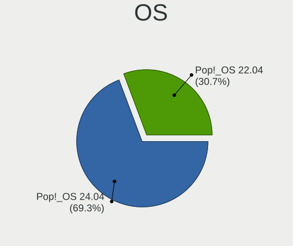

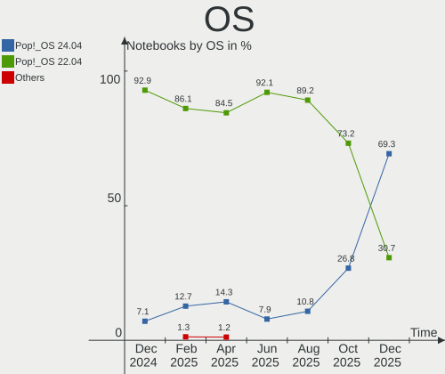

| Name          | Notebooks | Percent |
|---------------|-----------|---------|
| Pop!_OS 24.04 | 88        | 69.29%  |
| Pop!_OS 22.04 | 39        | 30.71%  |

OS Family
---------

OS without a version

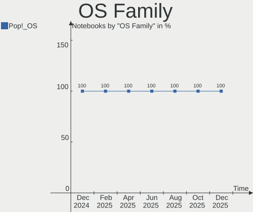

| Name    | Notebooks | Percent |
|---------|-----------|---------|
| Pop!_OS | 127       | 100%    |

Kernel
------

Version of the Linux kernel

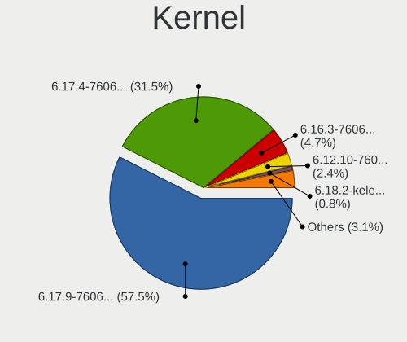

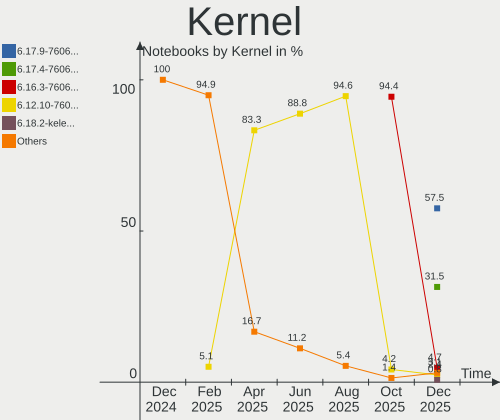

| Version                  | Notebooks | Percent |
|--------------------------|-----------|---------|
| 6.17.9-76061709-generic  | 73        | 57.48%  |
| 6.17.4-76061704-generic  | 40        | 31.5%   |
| 6.16.3-76061603-generic  | 6         | 4.72%   |
| 6.12.10-76061203-generic | 3         | 2.36%   |
| 6.18.2-kelexine-thevoid  | 1         | 0.79%   |
| 6.18.1-061801-generic    | 1         | 0.79%   |
| 6.17.12-1-liquorix-amd64 | 1         | 0.79%   |
| 6.0.2-76060002-generic   | 1         | 0.79%   |
| 6.0.12-76060006-generic  | 1         | 0.79%   |

Kernel Family
-------------

Linux kernel without a distro release

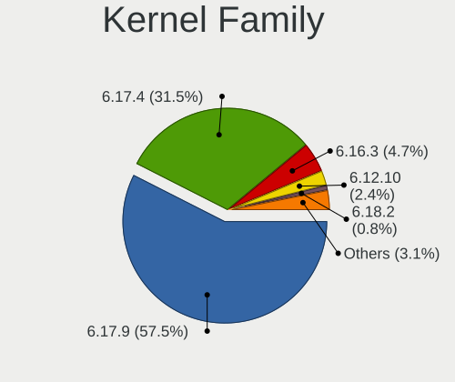

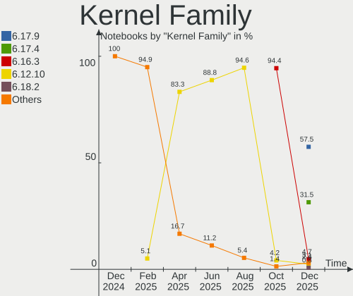

| Version | Notebooks | Percent |
|---------|-----------|---------|
| 6.17.9  | 73        | 57.48%  |
| 6.17.4  | 40        | 31.5%   |
| 6.16.3  | 6         | 4.72%   |
| 6.12.10 | 3         | 2.36%   |
| 6.18.2  | 1         | 0.79%   |
| 6.18.1  | 1         | 0.79%   |
| 6.17.12 | 1         | 0.79%   |
| 6.0.2   | 1         | 0.79%   |
| 6.0.12  | 1         | 0.79%   |

Kernel Major Ver.
-----------------

Linux kernel major version

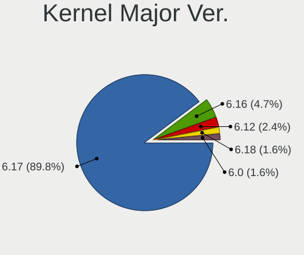

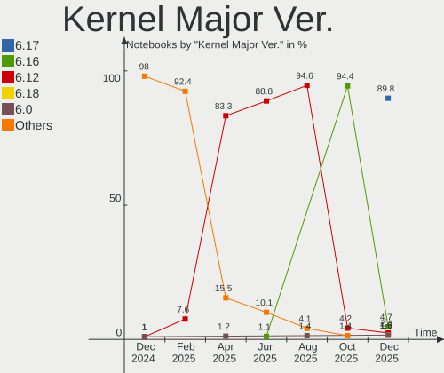

| Version | Notebooks | Percent |
|---------|-----------|---------|
| 6.17    | 114       | 89.76%  |
| 6.16    | 6         | 4.72%   |
| 6.12    | 3         | 2.36%   |
| 6.18    | 2         | 1.57%   |
| 6.0     | 2         | 1.57%   |

Arch
----

OS architecture (x86_64, i586, etc.)

| Name   | Notebooks | Percent |
|--------|-----------|---------|
| x86_64 | 127       | 100%    |

DE
--

Desktop Environment

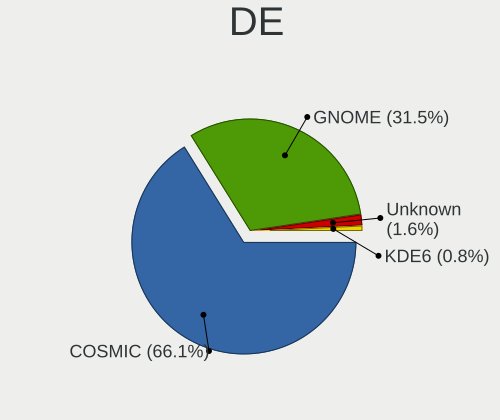

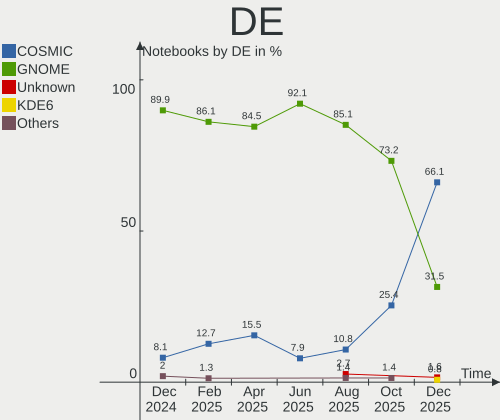

| Name    | Notebooks | Percent |
|---------|-----------|---------|
| COSMIC  | 84        | 66.14%  |
| GNOME   | 40        | 31.5%   |
| Unknown | 2         | 1.57%   |
| KDE6    | 1         | 0.79%   |

Display Server
--------------

X11 or Wayland

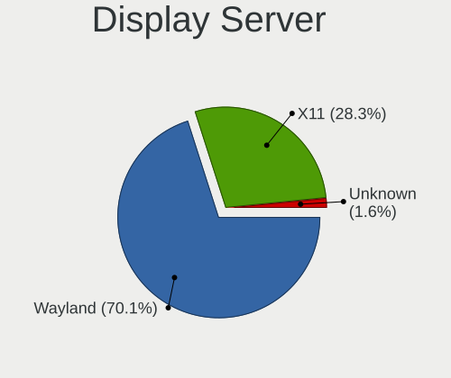

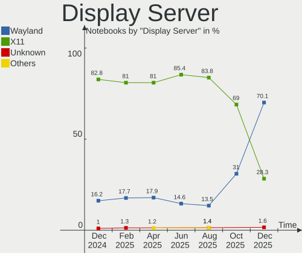

| Name    | Notebooks | Percent |
|---------|-----------|---------|
| Wayland | 89        | 70.08%  |
| X11     | 36        | 28.35%  |
| Unknown | 2         | 1.57%   |

Display Manager
---------------

SDDM, LightDM, etc.

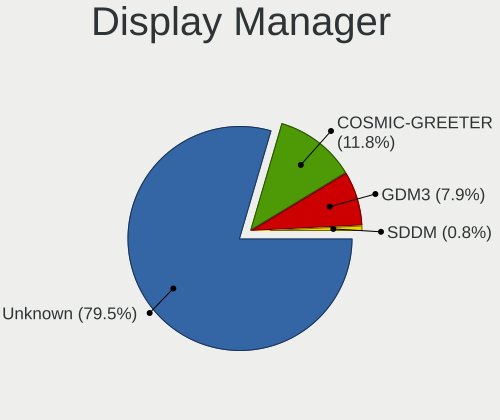

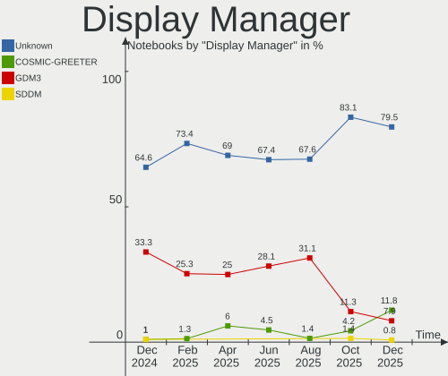

| Name           | Notebooks | Percent |
|----------------|-----------|---------|
| Unknown        | 101       | 79.53%  |
| COSMIC-GREETER | 15        | 11.81%  |
| GDM3           | 10        | 7.87%   |
| SDDM           | 1         | 0.79%   |

OS Lang
-------

Language

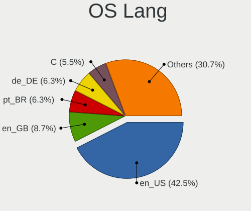

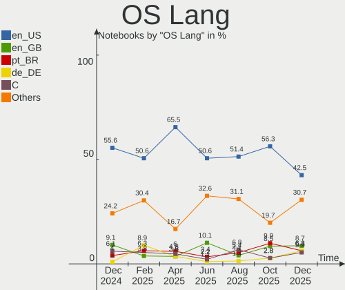

| Lang    | Notebooks | Percent |
|---------|-----------|---------|
| en_US   | 54        | 42.52%  |
| en_GB   | 11        | 8.66%   |
| pt_BR   | 8         | 6.3%    |
| de_DE   | 8         | 6.3%    |
| C       | 7         | 5.51%   |
| it_IT   | 6         | 4.72%   |
| en_AU   | 5         | 3.94%   |
| es_ES   | 4         | 3.15%   |
| en_CA   | 4         | 3.15%   |
| es_MX   | 3         | 2.36%   |
| pl_PL   | 2         | 1.57%   |
| hu_HU   | 2         | 1.57%   |
| fr_FR   | 2         | 1.57%   |
| zh_HK   | 1         | 0.79%   |
| sv_SE   | 1         | 0.79%   |
| nl_NL   | 1         | 0.79%   |
| ko_KR   | 1         | 0.79%   |
| fr_CA   | 1         | 0.79%   |
| es_CO   | 1         | 0.79%   |
| en_NZ   | 1         | 0.79%   |
| en_NG   | 1         | 0.79%   |
| de_CH   | 1         | 0.79%   |
| de_AT   | 1         | 0.79%   |
| Unknown | 1         | 0.79%   |

Boot Mode
---------

EFI or BIOS

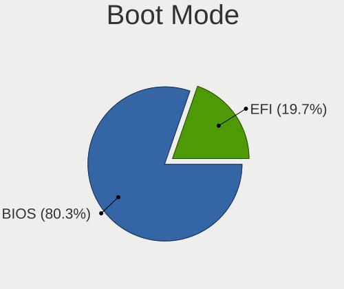

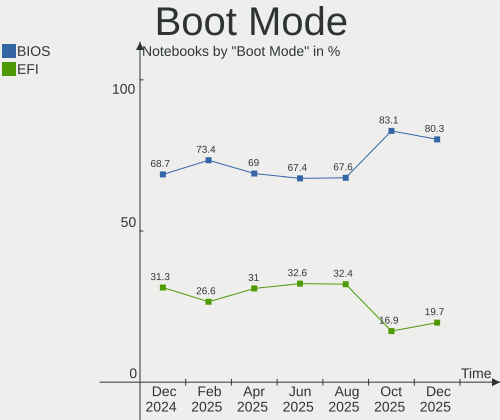

| Mode | Notebooks | Percent |
|------|-----------|---------|
| BIOS | 102       | 80.31%  |
| EFI  | 25        | 19.69%  |

Filesystem
----------

Type of filesystem

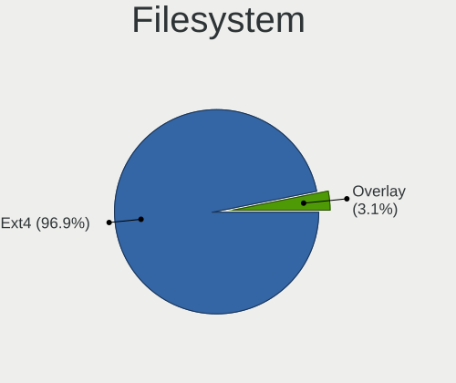

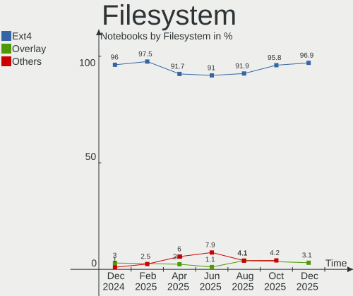

| Type    | Notebooks | Percent |
|---------|-----------|---------|
| Ext4    | 123       | 96.85%  |
| Overlay | 4         | 3.15%   |

Part. scheme
------------

Scheme of partitioning

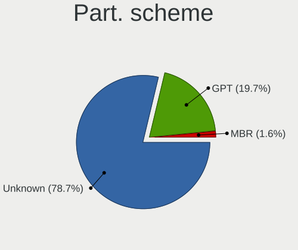

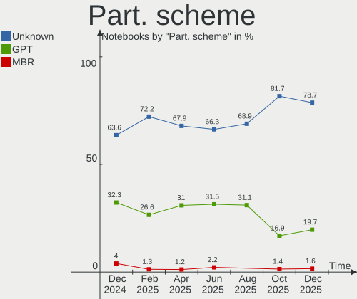

| Type    | Notebooks | Percent |
|---------|-----------|---------|
| Unknown | 100       | 78.74%  |
| GPT     | 25        | 19.69%  |
| MBR     | 2         | 1.57%   |

Dual Boot with Linux/BSD
------------------------

Hosting more than one Linux/BSD

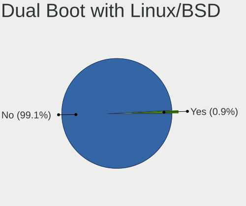

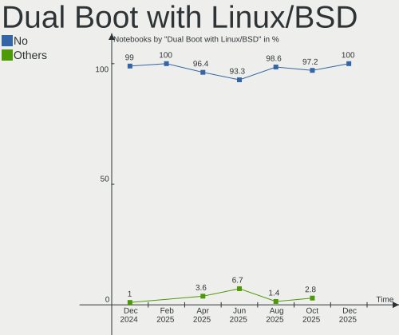

| Dual boot | Notebooks | Percent |
|-----------|-----------|---------|
| No        | 127       | 100%    |

Dual Boot (Win)
---------------

Hosting Linux and Windows

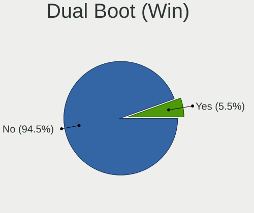

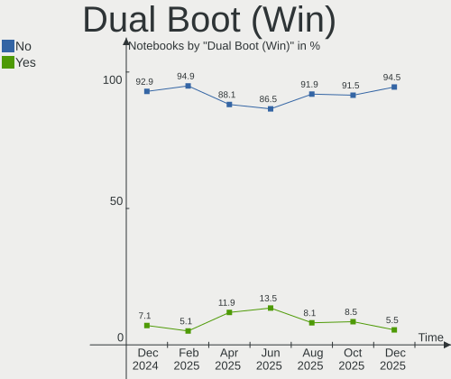

| Dual boot | Notebooks | Percent |
|-----------|-----------|---------|
| No        | 120       | 94.49%  |
| Yes       | 7         | 5.51%   |

Board
-----

Vendor
------

Motherboard manufacturer

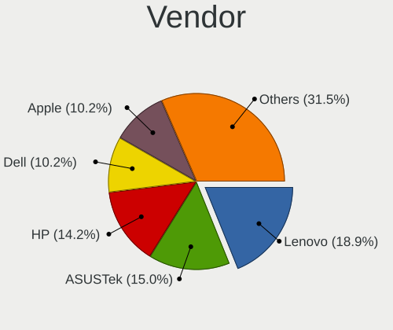

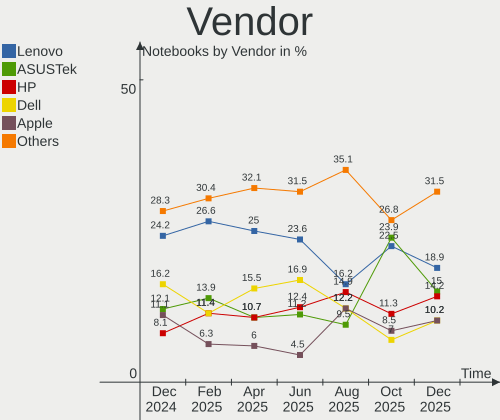

| Name                | Notebooks | Percent |
|---------------------|-----------|---------|
| Lenovo              | 24        | 18.9%   |
| ASUSTek Computer    | 19        | 14.96%  |
| Hewlett-Packard     | 18        | 14.17%  |
| Dell                | 13        | 10.24%  |
| Apple               | 13        | 10.24%  |
| Acer                | 8         | 6.3%    |
| System76            | 6         | 4.72%   |
| MSI                 | 6         | 4.72%   |
| Toshiba             | 2         | 1.57%   |
| Samsung Electronics | 2         | 1.57%   |
| Razer               | 2         | 1.57%   |
| HUAWEI              | 2         | 1.57%   |
| Google              | 2         | 1.57%   |
| Framework           | 2         | 1.57%   |
| Star Labs           | 1         | 0.79%   |
| Sony                | 1         | 0.79%   |
| PC Specialist       | 1         | 0.79%   |
| LG Electronics      | 1         | 0.79%   |
| Gigabyte Technology | 1         | 0.79%   |
| Fujitsu             | 1         | 0.79%   |
| Avell               | 1         | 0.79%   |
| Alienware           | 1         | 0.79%   |

Model
-----

Motherboard model

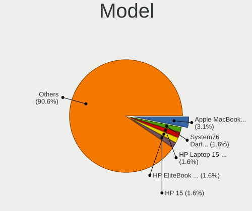

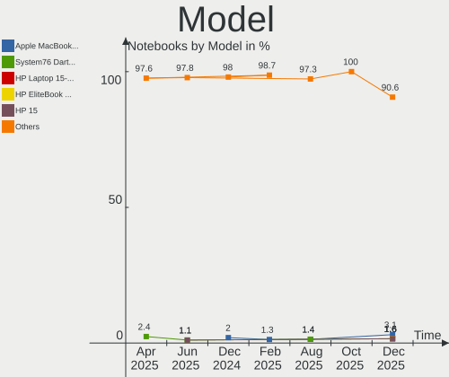

| Name                                                  | Notebooks | Percent |
|-------------------------------------------------------|-----------|---------|
| Apple MacBookPro9,2                                   | 4         | 3.15%   |
| System76 Darter Pro                                   | 2         | 1.57%   |
| HP Laptop 15-fc0xxx                                   | 2         | 1.57%   |
| HP EliteBook 840 G6                                   | 2         | 1.57%   |
| HP 15                                                 | 2         | 1.57%   |
| ASUS VivoBook_ASUSLaptop M1605YA_M1605YA              | 2         | 1.57%   |
| ASUS ASUS Zenbook 14 UX3405CA_UX3405CA                | 2         | 1.57%   |
| Apple MacBookPro11,1                                  | 2         | 1.57%   |
| Acer Nitro ANV15-41                                   | 2         | 1.57%   |
| Toshiba TECRA Z50-A                                   | 1         | 0.79%   |
| Toshiba Satellite A300                                | 1         | 0.79%   |
| System76 Pangolin                                     | 1         | 0.79%   |
| System76 Kudu                                         | 1         | 0.79%   |
| System76 Gazelle                                      | 1         | 0.79%   |
| System76 Adder WS                                     | 1         | 0.79%   |
| Star Labs StarBook                                    | 1         | 0.79%   |
| Sony SVF15A1BCXB                                      | 1         | 0.79%   |
| Samsung 750XDA                                        | 1         | 0.79%   |
| Samsung 550XDA                                        | 1         | 0.79%   |
| Razer Blade 15 Advanced Model (Early 2021) - RZ09-036 | 1         | 0.79%   |
| Razer Blade                                           | 1         | 0.79%   |
| PC Specialist X6AR558Y                                | 1         | 0.79%   |
| MSI Thin 15 B12VE                                     | 1         | 0.79%   |
| MSI Summit E14Evo A12M                                | 1         | 0.79%   |
| MSI Prestige 16 AI Studio B1VFG                       | 1         | 0.79%   |
| MSI MS-7D25                                           | 1         | 0.79%   |
| MSI GT73VR 7RF                                        | 1         | 0.79%   |
| MSI GT70 2PC                                          | 1         | 0.79%   |
| LG 17Z990-GPV03                                       | 1         | 0.79%   |
| Lenovo Yoga Pro 9 16IMH9 83DN                         | 1         | 0.79%   |
| Lenovo Yoga 3 11 80J8                                 | 1         | 0.79%   |
| Lenovo Y50-70 20378                                   | 1         | 0.79%   |
| Lenovo Y40-70 20347                                   | 1         | 0.79%   |
| Lenovo ThinkPad X13 Gen 2a 20XH0093UK                 | 1         | 0.79%   |
| Lenovo ThinkPad X1 Carbon 3rd 20BS0031US              | 1         | 0.79%   |
| Lenovo ThinkPad W530 243857U                          | 1         | 0.79%   |
| Lenovo ThinkPad T520 42404CG                          | 1         | 0.79%   |
| Lenovo ThinkPad T460s 20FAS0KH00                      | 1         | 0.79%   |
| Lenovo ThinkPad T440s 20ARS3K60L                      | 1         | 0.79%   |
| Lenovo ThinkPad T440 20B7004EUK                       | 1         | 0.79%   |

Model Family
------------

Motherboard model prefix

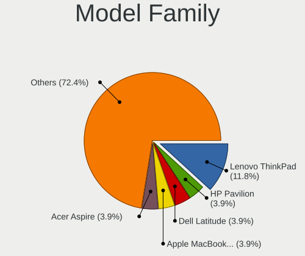

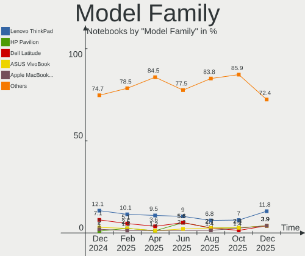

| Name                   | Notebooks | Percent |
|------------------------|-----------|---------|
| Lenovo ThinkPad        | 15        | 11.81%  |
| HP Pavilion            | 5         | 3.94%   |
| Dell Latitude          | 5         | 3.94%   |
| ASUS VivoBook          | 5         | 3.94%   |
| Apple MacBookPro9      | 5         | 3.94%   |
| Acer Aspire            | 5         | 3.94%   |
| HP Laptop              | 4         | 3.15%   |
| Dell Inspiron          | 3         | 2.36%   |
| ASUS ROG               | 3         | 2.36%   |
| ASUS ASUS              | 3         | 2.36%   |
| Apple MacBookPro11     | 3         | 2.36%   |
| Acer Nitro             | 3         | 2.36%   |
| System76 Darter        | 2         | 1.57%   |
| Razer Blade            | 2         | 1.57%   |
| Lenovo Yoga            | 2         | 1.57%   |
| Lenovo Legion          | 2         | 1.57%   |
| HP OMEN                | 2         | 1.57%   |
| HP EliteBook           | 2         | 1.57%   |
| HP 15                  | 2         | 1.57%   |
| Framework Laptop       | 2         | 1.57%   |
| Dell Pro               | 2         | 1.57%   |
| ASUS TUF               | 2         | 1.57%   |
| Toshiba TECRA          | 1         | 0.79%   |
| Toshiba Satellite      | 1         | 0.79%   |
| System76 Pangolin      | 1         | 0.79%   |
| System76 Kudu          | 1         | 0.79%   |
| System76 Gazelle       | 1         | 0.79%   |
| System76 Adder         | 1         | 0.79%   |
| Star Labs StarBook     | 1         | 0.79%   |
| Sony SVF15A1BCXB       | 1         | 0.79%   |
| Samsung 750XDA         | 1         | 0.79%   |
| Samsung 550XDA         | 1         | 0.79%   |
| PC Specialist X6AR558Y | 1         | 0.79%   |
| MSI Thin               | 1         | 0.79%   |
| MSI Summit             | 1         | 0.79%   |
| MSI Prestige           | 1         | 0.79%   |
| MSI MS-7D25            | 1         | 0.79%   |
| MSI GT73VR             | 1         | 0.79%   |
| MSI GT70               | 1         | 0.79%   |
| LG 17Z990-GPV03        | 1         | 0.79%   |

MFG Year
--------

Motherboard manufacture year

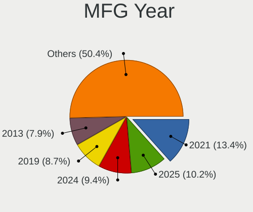

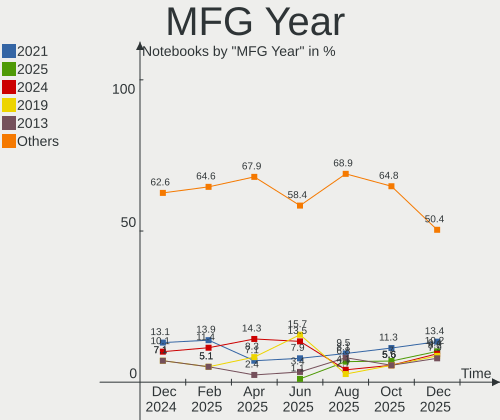

| Year | Notebooks | Percent |
|------|-----------|---------|
| 2021 | 17        | 13.39%  |
| 2025 | 13        | 10.24%  |
| 2024 | 12        | 9.45%   |
| 2019 | 11        | 8.66%   |
| 2013 | 10        | 7.87%   |
| 2022 | 9         | 7.09%   |
| 2014 | 9         | 7.09%   |
| 2012 | 8         | 6.3%    |
| 2020 | 7         | 5.51%   |
| 2017 | 6         | 4.72%   |
| 2018 | 5         | 3.94%   |
| 2015 | 5         | 3.94%   |
| 2016 | 4         | 3.15%   |
| 2023 | 3         | 2.36%   |
| 2011 | 2         | 1.57%   |
| 2010 | 2         | 1.57%   |
| 2009 | 2         | 1.57%   |
| 2008 | 2         | 1.57%   |

Form Factor
-----------

Physical design of the computer

| Name     | Notebooks | Percent |
|----------|-----------|---------|
| Notebook | 127       | 100%    |

Secure Boot
-----------

Enabled or disabled

| State    | Notebooks | Percent |
|----------|-----------|---------|
| Disabled | 127       | 100%    |

Coreboot
--------

Have coreboot on board

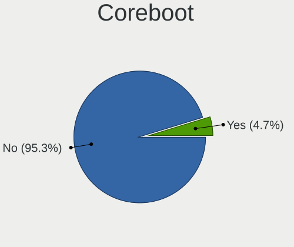

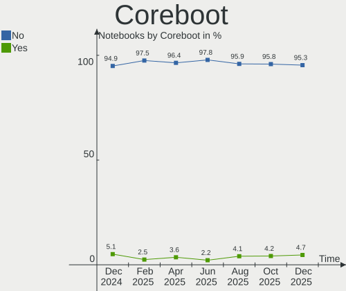

| Used | Notebooks | Percent |
|------|-----------|---------|
| No   | 121       | 95.28%  |
| Yes  | 6         | 4.72%   |

RAM Size
--------

Total RAM memory

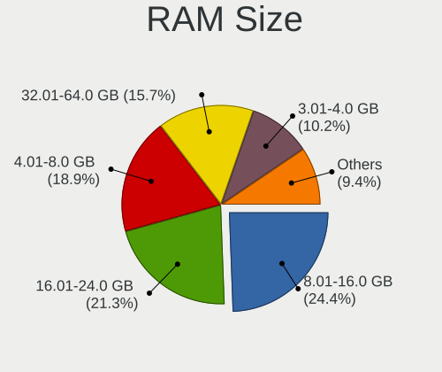

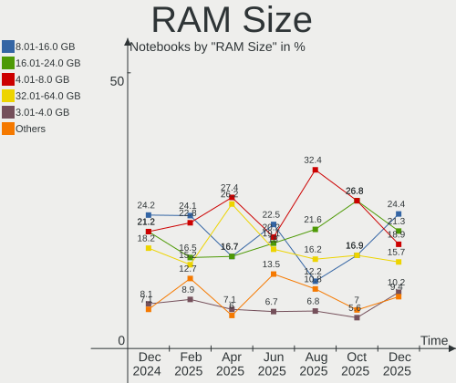

| Size in GB  | Notebooks | Percent |
|-------------|-----------|---------|
| 8.01-16.0   | 31        | 24.41%  |
| 16.01-24.0  | 27        | 21.26%  |
| 4.01-8.0    | 24        | 18.9%   |
| 32.01-64.0  | 20        | 15.75%  |
| 3.01-4.0    | 13        | 10.24%  |
| 24.01-32.0  | 8         | 6.3%    |
| 64.01-256.0 | 4         | 3.15%   |

RAM Used
--------

Used RAM memory

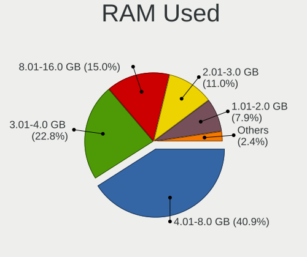

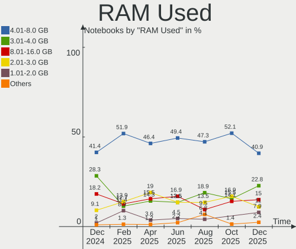

| Used GB    | Notebooks | Percent |
|------------|-----------|---------|
| 4.01-8.0   | 52        | 40.94%  |
| 3.01-4.0   | 29        | 22.83%  |
| 8.01-16.0  | 19        | 14.96%  |
| 2.01-3.0   | 14        | 11.02%  |
| 1.01-2.0   | 10        | 7.87%   |
| 32.01-64.0 | 1         | 0.79%   |
| 24.01-32.0 | 1         | 0.79%   |
| 16.01-24.0 | 1         | 0.79%   |

Total Drives
------------

Number of drives on board

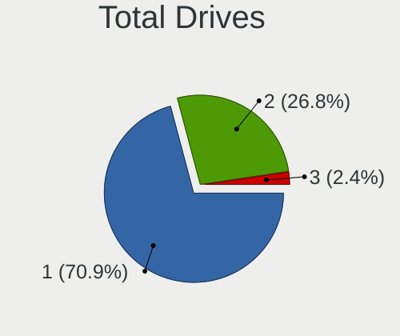

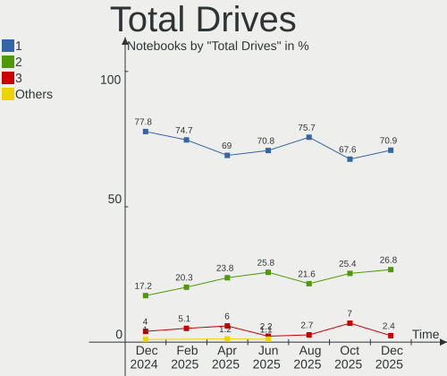

| Drives | Notebooks | Percent |
|--------|-----------|---------|
| 1      | 90        | 70.87%  |
| 2      | 34        | 26.77%  |
| 3      | 3         | 2.36%   |

Has CD-ROM
----------

Has CD-ROM on board

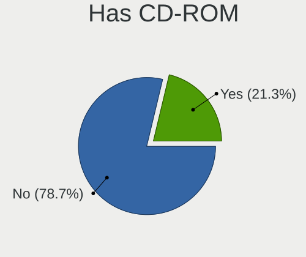

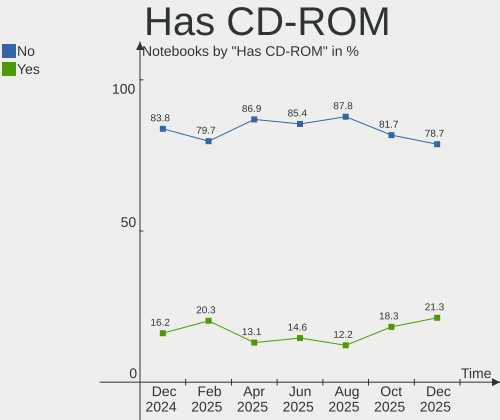

| Presented | Notebooks | Percent |
|-----------|-----------|---------|
| No        | 100       | 78.74%  |
| Yes       | 27        | 21.26%  |

Has Ethernet
------------

Has Ethernet on board

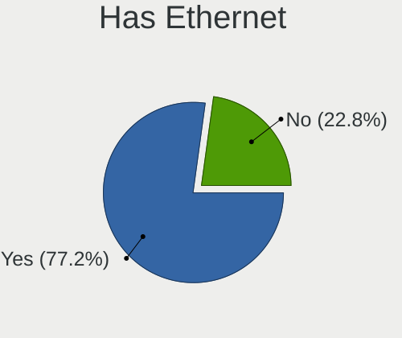

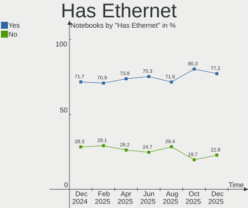

| Presented | Notebooks | Percent |
|-----------|-----------|---------|
| Yes       | 98        | 77.17%  |
| No        | 29        | 22.83%  |

Has WiFi
--------

Has WiFi module

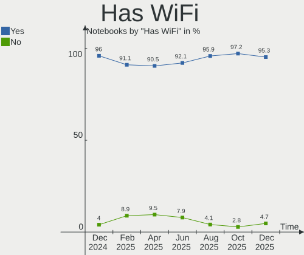

| Presented | Notebooks | Percent |
|-----------|-----------|---------|
| Yes       | 121       | 95.28%  |
| No        | 6         | 4.72%   |

Has Bluetooth
-------------

Has Bluetooth module

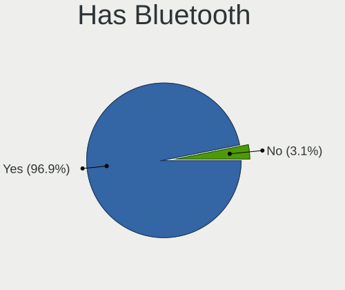

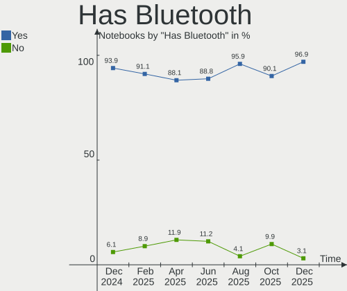

| Presented | Notebooks | Percent |
|-----------|-----------|---------|
| Yes       | 123       | 96.85%  |
| No        | 4         | 3.15%   |

Location
--------

Country
-------

Geographic location (country)

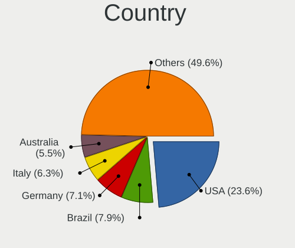

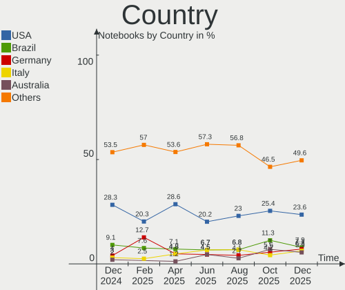

| Country            | Notebooks | Percent |
|--------------------|-----------|---------|
| USA                | 30        | 23.62%  |
| Brazil             | 10        | 7.87%   |
| Germany            | 9         | 7.09%   |
| Italy              | 8         | 6.3%    |
| Australia          | 7         | 5.51%   |
| France             | 6         | 4.72%   |
| Canada             | 5         | 3.94%   |
| UK                 | 4         | 3.15%   |
| Spain              | 4         | 3.15%   |
| Poland             | 3         | 2.36%   |
| New Zealand        | 3         | 2.36%   |
| Netherlands        | 3         | 2.36%   |
| Mexico             | 3         | 2.36%   |
| Switzerland        | 2         | 1.57%   |
| Sweden             | 2         | 1.57%   |
| Portugal           | 2         | 1.57%   |
| Norway             | 2         | 1.57%   |
| India              | 2         | 1.57%   |
| Hungary            | 2         | 1.57%   |
| Finland            | 2         | 1.57%   |
| South Korea        | 1         | 0.79%   |
| Slovakia           | 1         | 0.79%   |
| Romania            | 1         | 0.79%   |
| Philippines        | 1         | 0.79%   |
| Pakistan           | 1         | 0.79%   |
| Nigeria            | 1         | 0.79%   |
| Lithuania          | 1         | 0.79%   |
| Latvia             | 1         | 0.79%   |
| Iceland            | 1         | 0.79%   |
| Hong Kong          | 1         | 0.79%   |
| Egypt              | 1         | 0.79%   |
| Dominican Republic | 1         | 0.79%   |
| Denmark            | 1         | 0.79%   |
| Colombia           | 1         | 0.79%   |
| Chile              | 1         | 0.79%   |
| Bulgaria           | 1         | 0.79%   |
| Belarus            | 1         | 0.79%   |
| Austria            | 1         | 0.79%   |

City
----

Geographic location (city)

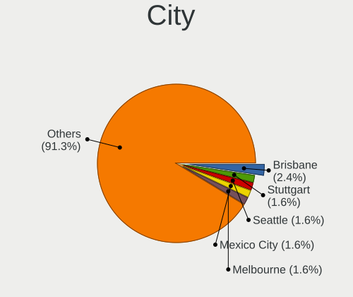

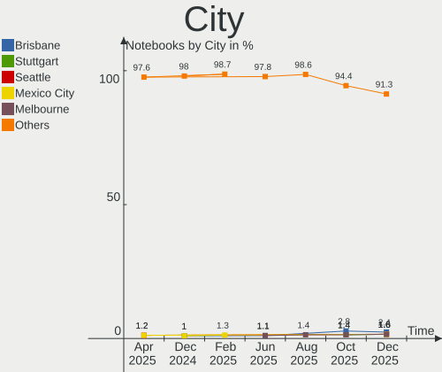

| City                | Notebooks | Percent |
|---------------------|-----------|---------|
| Brisbane            | 3         | 2.36%   |
| Stuttgart           | 2         | 1.57%   |
| Seattle             | 2         | 1.57%   |
| Mexico City         | 2         | 1.57%   |
| Melbourne           | 2         | 1.57%   |
| Christchurch        | 2         | 1.57%   |
| Zeltweg             | 1         | 0.79%   |
| Wroclaw             | 1         | 0.79%   |
| West Linn           | 1         | 0.79%   |
| West Covina         | 1         | 0.79%   |
| Wellington          | 1         | 0.79%   |
| Webster             | 1         | 0.79%   |
| Webb City           | 1         | 0.79%   |
| Warsaw              | 1         | 0.79%   |
| Wappingers Falls    | 1         | 0.79%   |
| Vitry-sur-Seine     | 1         | 0.79%   |
| Vitebsk             | 1         | 0.79%   |
| Vigevano            | 1         | 0.79%   |
| Verton              | 1         | 0.79%   |
| Veracruz            | 1         | 0.79%   |
| Velke Zaluzie       | 1         | 0.79%   |
| Vancouver           | 1         | 0.79%   |
| Treuchtlingen       | 1         | 0.79%   |
| Tournefeuille       | 1         | 0.79%   |
| Toronto             | 1         | 0.79%   |
| The Hague           | 1         | 0.79%   |
| Tann                | 1         | 0.79%   |
| Sydney Olympic Park | 1         | 0.79%   |
| Sydney              | 1         | 0.79%   |
| Suwanee             | 1         | 0.79%   |
| Sturgeon Bay        | 1         | 0.79%   |
| Stockholm           | 1         | 0.79%   |
| Sorsogon            | 1         | 0.79%   |
| Sogamoso            | 1         | 0.79%   |
| Shelby              | 1         | 0.79%   |
| Sérézin-du-Rhône | 1         | 0.79%   |
| Seocho-gu           | 1         | 0.79%   |
| Savignies           | 1         | 0.79%   |
| Sarasota            | 1         | 0.79%   |
| Sao Paulo           | 1         | 0.79%   |

Drives
------

Drive Vendor
------------

Hard drive vendors

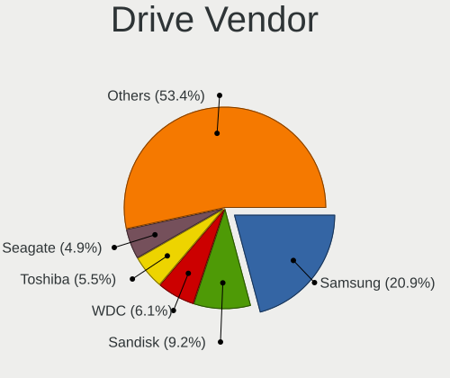

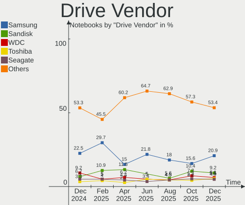

| Vendor                       | Notebooks | Drives | Percent |
|------------------------------|-----------|--------|---------|
| Samsung Electronics          | 34        | 36     | 20.86%  |
| Sandisk                      | 15        | 15     | 9.2%    |
| WDC                          | 10        | 10     | 6.13%   |
| Toshiba                      | 9         | 11     | 5.52%   |
| Seagate                      | 8         | 8      | 4.91%   |
| SK hynix                     | 7         | 7      | 4.29%   |
| Kingston                     | 7         | 7      | 4.29%   |
| Micron Technology            | 6         | 6      | 3.68%   |
| KIOXIA                       | 6         | 7      | 3.68%   |
| Crucial                      | 6         | 6      | 3.68%   |
| Unknown                      | 5         | 5      | 3.07%   |
| HGST                         | 5         | 5      | 3.07%   |
| Intel                        | 4         | 4      | 2.45%   |
| Hitachi                      | 4         | 4      | 2.45%   |
| Apple                        | 4         | 4      | 2.45%   |
| Silicon Motion               | 3         | 3      | 1.84%   |
| Phison Electronics           | 3         | 3      | 1.84%   |
| SSSTC                        | 2         | 2      | 1.23%   |
| SABRENT                      | 2         | 2      | 1.23%   |
| KingSpec                     | 2         | 2      | 1.23%   |
| ADATA Technology             | 2         | 2      | 1.23%   |
| Yangtze Memory Technologies  | 1         | 1      | 0.61%   |
| WD MediaMax                  | 1         | 1      | 0.61%   |
| Vaseky                       | 1         | 1      | 0.61%   |
| Star Drive                   | 1         | 1      | 0.61%   |
| SPCC                         | 1         | 1      | 0.61%   |
| Shenzhen Longsys Electronics | 1         | 1      | 0.61%   |
| Realtek Semiconductor        | 1         | 1      | 0.61%   |
| Plextor                      | 1         | 1      | 0.61%   |
| MAXIO Technology (Hangzhou)  | 1         | 1      | 0.61%   |
| LITEON                       | 1         | 1      | 0.61%   |
| Kingston Technology Company  | 1         | 1      | 0.61%   |
| KingFast                     | 1         | 1      | 0.61%   |
| KingDian                     | 1         | 1      | 0.61%   |
| Intenso                      | 1         | 1      | 0.61%   |
| FIKWOT                       | 1         | 1      | 0.61%   |
| China                        | 1         | 1      | 0.61%   |
| AMD                          | 1         | 1      | 0.61%   |
| A-DATA Technology            | 1         | 1      | 0.61%   |
| Unknown                      | 1         | 1      | 0.61%   |

Drive Model
-----------

Hard drive models

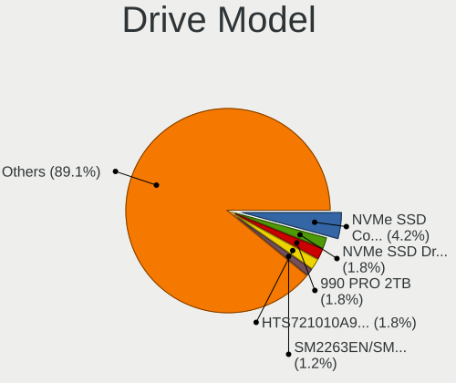

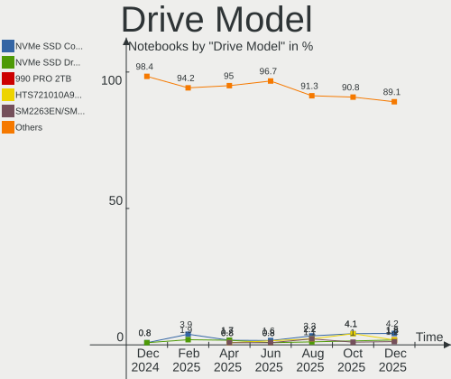

| Model                                                 | Notebooks | Percent |
|-------------------------------------------------------|-----------|---------|
| Samsung NVMe SSD Controller SM981/PM981/PM983 1TB     | 7         | 4.24%   |
| SanDisk NVMe SSD Drive 1TB                            | 3         | 1.82%   |
| Samsung SSD 990 PRO 2TB                               | 3         | 1.82%   |
| HGST HTS721010A9E630 1TB                              | 3         | 1.82%   |
| Silicon Motion SM2263EN/SM2263XT SSD Controller 512GB | 2         | 1.21%   |
| Seagate ST1000LM035-1RK172 1TB                        | 2         | 1.21%   |
| Samsung SSD 990 PRO 1TB                               | 2         | 1.21%   |
| Samsung NVMe SSD Controller SM961/PM961/SM963 1024GB  | 2         | 1.21%   |
| Samsung NVMe SSD Controller PM9A1/PM9A3/980PRO 1TB    | 2         | 1.21%   |
| SABRENT Disk 4TB                                      | 2         | 1.21%   |
| Kingston SA400S37480G 480GB SSD                       | 2         | 1.21%   |
| Kingston SA400S37240G 240GB SSD                       | 2         | 1.21%   |
| Crucial CT240BX500SSD1 240GB                          | 2         | 1.21%   |
| Crucial CT1000MX500SSD1 1TB                           | 2         | 1.21%   |
| Apple SSD SM0256F 256GB                               | 2         | 1.21%   |
| Yangtze Memory YMTC PC005 512GB                       | 1         | 0.61%   |
| WDC WDS500G2B0C-00PXH0 500GB                          | 1         | 0.61%   |
| WDC WDS100T3X0C-00SJG0 1TB                            | 1         | 0.61%   |
| WDC WDS100T2B0C-00PXH0 1TB                            | 1         | 0.61%   |
| WDC WD7500BPVX-16JC3T3 752GB                          | 1         | 0.61%   |
| WDC WD3200BEVT-22ZCT0 320GB                           | 1         | 0.61%   |
| WDC WD1600BEVT-75A23T0 160GB                          | 1         | 0.61%   |
| WDC WD121KRYZ-01W0RB0 12TB                            | 1         | 0.61%   |
| WDC WD10SPZX-75Z10T1 1TB                              | 1         | 0.61%   |
| WDC WD10S21X-24R1BT0-SSHD-8GB                         | 1         | 0.61%   |
| WDC PC SN810 SDCPNRY-1T00-1032 1TB                    | 1         | 0.61%   |
| WD MediaMax WL3000GSA6472E 0 3TB                      | 1         | 0.61%   |
| Vaseky V800/256G 256GB                                | 1         | 0.61%   |
| Unknown USB DISK 3.2 1TB                              | 1         | 0.61%   |
| Unknown NVMe SSD Drive 1024GB                         | 1         | 0.61%   |
| Unknown MMC Card  64GB                                | 1         | 0.61%   |
| Unknown MMC Card  32GB                                | 1         | 0.61%   |
| Unknown MMC Card  256GB                               | 1         | 0.61%   |
| Toshiba TR200 480GB SSD                               | 1         | 0.61%   |
| Toshiba THNSNX024GMCT 24GB SSD                        | 1         | 0.61%   |
| Toshiba THNSNJ256GMCU 256GB SSD                       | 1         | 0.61%   |
| Toshiba THNSFJ256GDNU 256GB SSD                       | 1         | 0.61%   |
| Toshiba NVMe Controller 256GB                         | 1         | 0.61%   |
| Toshiba MQ04ABF100 1TB                                | 1         | 0.61%   |
| Toshiba MQ01ABF050 500GB                              | 1         | 0.61%   |

HDD Vendor
----------

Hard disk drive vendors

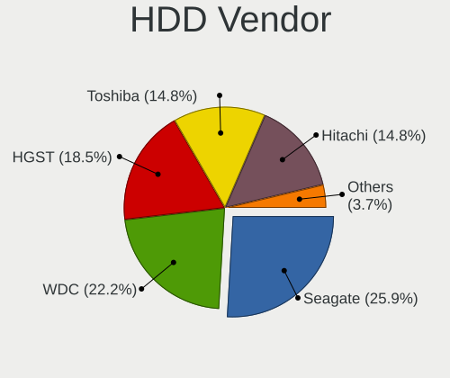

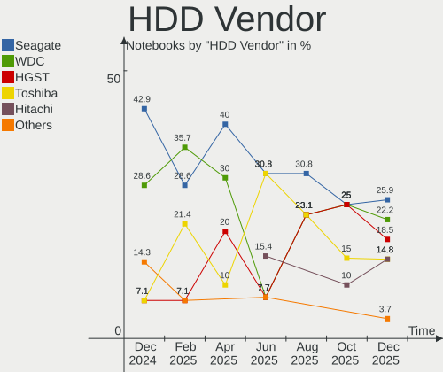

| Vendor              | Notebooks | Drives | Percent |
|---------------------|-----------|--------|---------|
| Seagate             | 7         | 7      | 25.93%  |
| WDC                 | 6         | 6      | 22.22%  |
| HGST                | 5         | 5      | 18.52%  |
| Toshiba             | 4         | 5      | 14.81%  |
| Hitachi             | 4         | 4      | 14.81%  |
| Samsung Electronics | 1         | 1      | 3.7%    |

SSD Vendor
----------

Solid state drive vendors

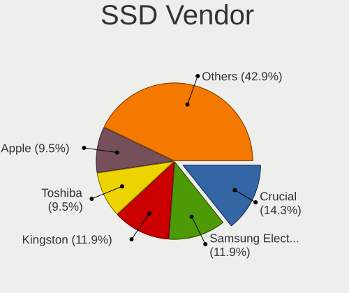

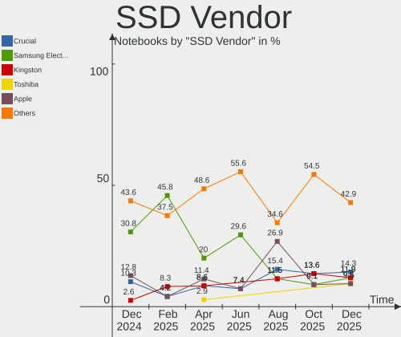

| Vendor              | Notebooks | Drives | Percent |
|---------------------|-----------|--------|---------|
| Crucial             | 6         | 6      | 14.29%  |
| Samsung Electronics | 5         | 5      | 11.9%   |
| Kingston            | 5         | 5      | 11.9%   |
| Toshiba             | 4         | 4      | 9.52%   |
| Apple               | 4         | 4      | 9.52%   |
| SanDisk             | 3         | 3      | 7.14%   |
| SABRENT             | 2         | 2      | 4.76%   |
| Vaseky              | 1         | 1      | 2.38%   |
| SPCC                | 1         | 1      | 2.38%   |
| Seagate             | 1         | 1      | 2.38%   |
| Plextor             | 1         | 1      | 2.38%   |
| Micron Technology   | 1         | 1      | 2.38%   |
| LITEON              | 1         | 1      | 2.38%   |
| KingSpec            | 1         | 1      | 2.38%   |
| KingDian            | 1         | 1      | 2.38%   |
| Intenso             | 1         | 1      | 2.38%   |
| Intel               | 1         | 1      | 2.38%   |
| FIKWOT              | 1         | 1      | 2.38%   |
| China               | 1         | 1      | 2.38%   |
| A-DATA Technology   | 1         | 1      | 2.38%   |

Drive Kind
----------

HDD or SSD

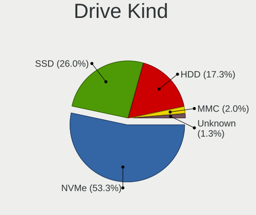

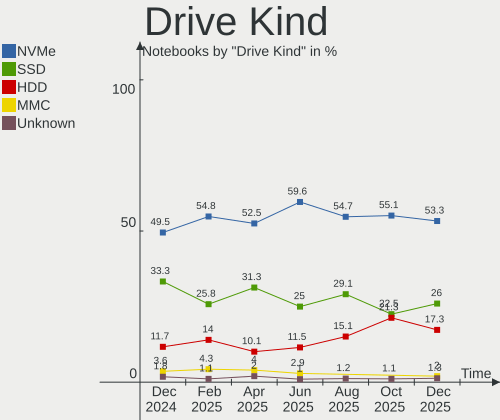

| Kind    | Notebooks | Drives | Percent |
|---------|-----------|--------|---------|
| NVMe    | 80        | 93     | 53.33%  |
| SSD     | 39        | 42     | 26%     |
| HDD     | 26        | 28     | 17.33%  |
| MMC     | 3         | 3      | 2%      |
| Unknown | 2         | 2      | 1.33%   |

Drive Connector
---------------

SATA, SAS, NVMe, etc.

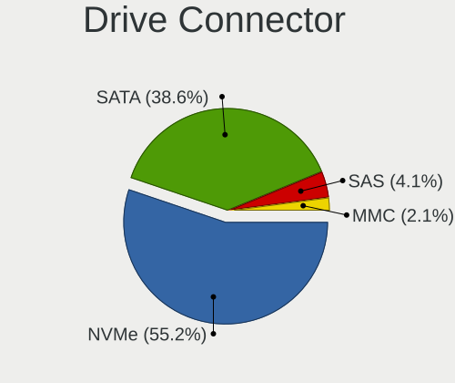

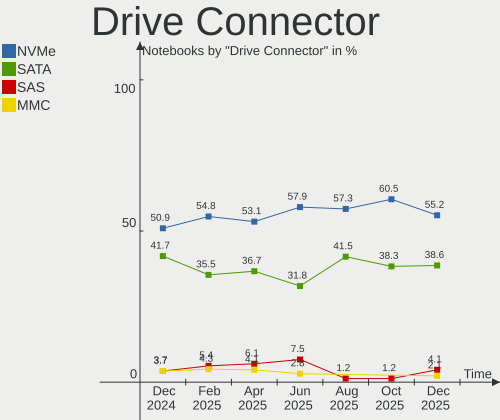

| Type | Notebooks | Drives | Percent |
|------|-----------|--------|---------|
| NVMe | 80        | 91     | 55.17%  |
| SATA | 56        | 68     | 38.62%  |
| SAS  | 6         | 6      | 4.14%   |
| MMC  | 3         | 3      | 2.07%   |

Drive Size
----------

Size of hard drive

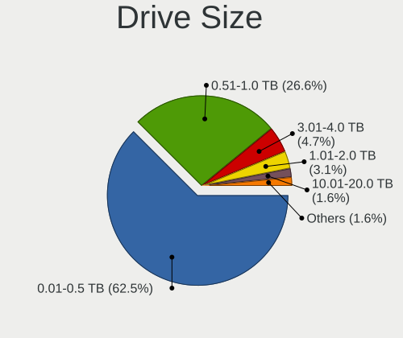

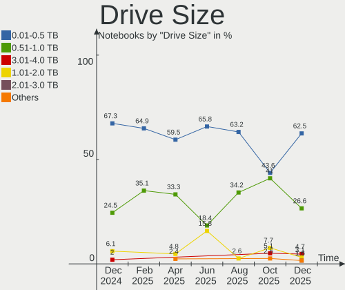

| Size in TB | Notebooks | Drives | Percent |
|------------|-----------|--------|---------|
| 0.01-0.5   | 40        | 45     | 62.5%   |
| 0.51-1.0   | 17        | 18     | 26.56%  |
| 3.01-4.0   | 3         | 3      | 4.69%   |
| 1.01-2.0   | 2         | 2      | 3.13%   |
| 2.01-3.0   | 1         | 1      | 1.56%   |
| 10.01-20.0 | 1         | 1      | 1.56%   |

Space Total
-----------

Amount of disk space available on the file system

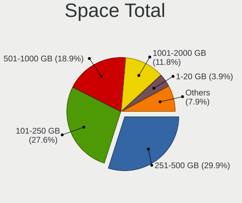

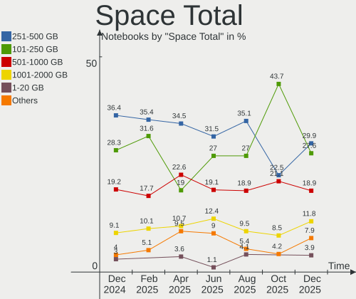

| Size in GB     | Notebooks | Percent |
|----------------|-----------|---------|
| 251-500        | 38        | 29.92%  |
| 101-250        | 35        | 27.56%  |
| 501-1000       | 24        | 18.9%   |
| 1001-2000      | 15        | 11.81%  |
| 1-20           | 5         | 3.94%   |
| More than 3000 | 4         | 3.15%   |
| 51-100         | 4         | 3.15%   |
| 2001-3000      | 1         | 0.79%   |
| Unknown        | 1         | 0.79%   |

Space Used
----------

Amount of used disk space

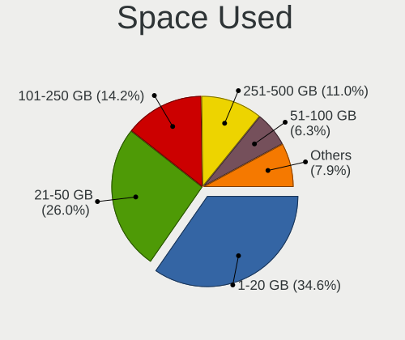

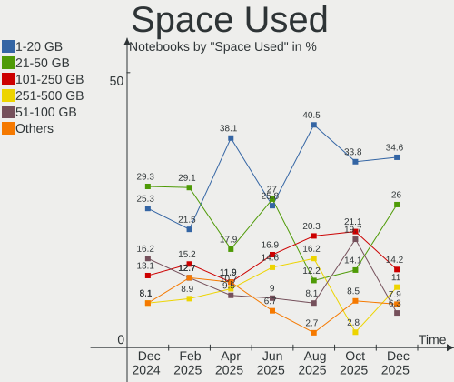

| Used GB   | Notebooks | Percent |
|-----------|-----------|---------|
| 1-20      | 44        | 34.65%  |
| 21-50     | 33        | 25.98%  |
| 101-250   | 18        | 14.17%  |
| 251-500   | 14        | 11.02%  |
| 51-100    | 8         | 6.3%    |
| 501-1000  | 6         | 4.72%   |
| 1001-2000 | 3         | 2.36%   |
| Unknown   | 1         | 0.79%   |

Malfunc. Drives
---------------

Drive models with a malfunction

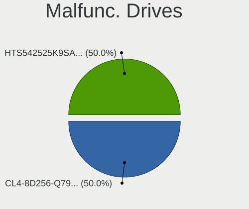

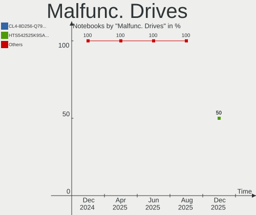

| Model                         | Notebooks | Drives | Percent |
|-------------------------------|-----------|--------|---------|
| SSSTC CL4-8D256-Q79 256GB     | 1         | 1      | 50%     |
| Hitachi HTS542525K9SA00 250GB | 1         | 1      | 50%     |

Malfunc. Drive Vendor
---------------------

Vendors of faulty drives

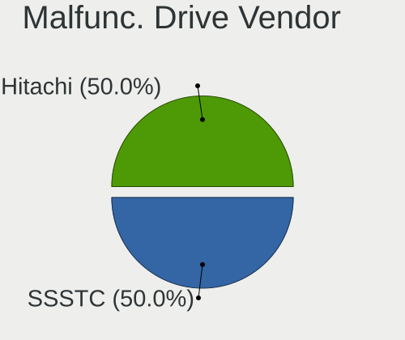

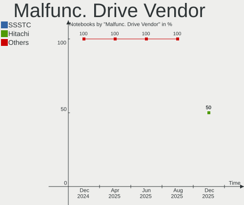

| Vendor  | Notebooks | Drives | Percent |
|---------|-----------|--------|---------|
| SSSTC   | 1         | 1      | 50%     |
| Hitachi | 1         | 1      | 50%     |

Malfunc. HDD Vendor
-------------------

Vendors of faulty HDD drives

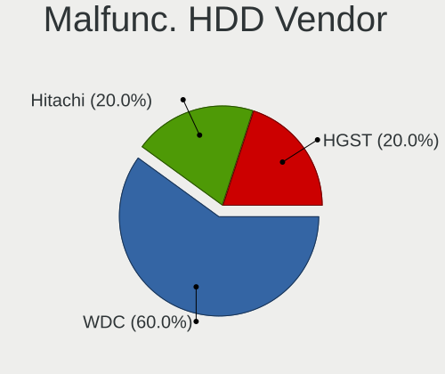

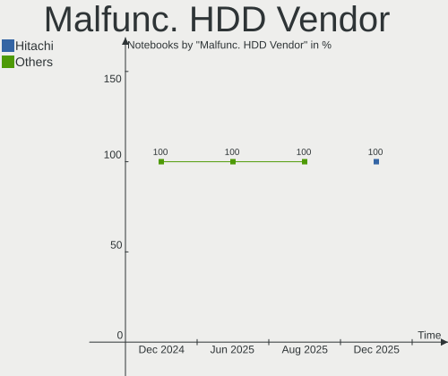

| Vendor  | Notebooks | Drives | Percent |
|---------|-----------|--------|---------|
| Hitachi | 1         | 1      | 100%    |

Malfunc. Drive Kind
-------------------

Kinds of faulty drives

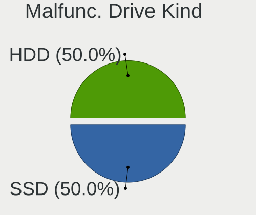

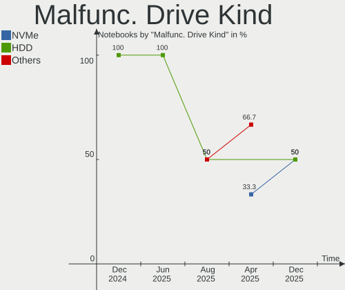

| Kind | Notebooks | Drives | Percent |
|------|-----------|--------|---------|
| NVMe | 1         | 1      | 50%     |
| HDD  | 1         | 1      | 50%     |

Failed Drives
-------------

Failed drive models

Zero info for selected period =(

Failed Drive Vendor
-------------------

Failed drive vendors

Zero info for selected period =(

Drive Status
------------

Number of failed and malfunc. drives

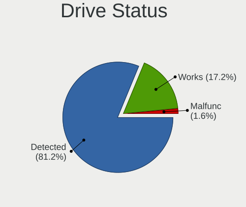

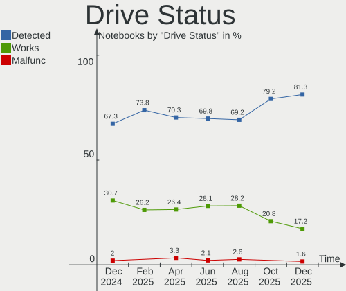

| Status   | Notebooks | Drives | Percent |
|----------|-----------|--------|---------|
| Detected | 104       | 140    | 81.25%  |
| Works    | 22        | 26     | 17.19%  |
| Malfunc  | 2         | 2      | 1.56%   |

Storage controller
------------------

Storage Vendor
--------------

Storage controller vendors

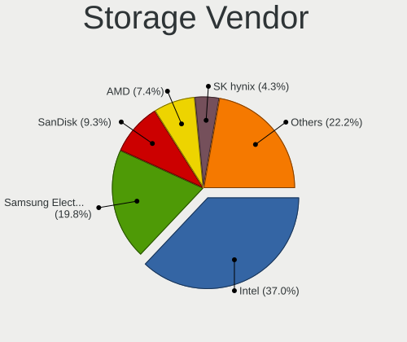

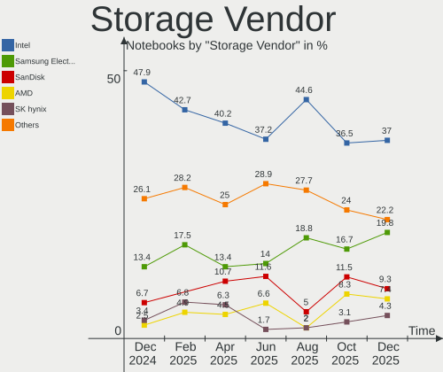

| Vendor                         | Notebooks | Percent |
|--------------------------------|-----------|---------|
| Intel                          | 60        | 37.04%  |
| Samsung Electronics            | 32        | 19.75%  |
| SanDisk                        | 15        | 9.26%   |
| AMD                            | 12        | 7.41%   |
| SK hynix                       | 7         | 4.32%   |
| KIOXIA                         | 6         | 3.7%    |
| Micron Technology              | 5         | 3.09%   |
| Phison Electronics             | 4         | 2.47%   |
| Silicon Motion                 | 3         | 1.85%   |
| Kingston Technology Company    | 3         | 1.85%   |
| Solid State Storage Technology | 2         | 1.23%   |
| Nvidia                         | 2         | 1.23%   |
| MAXIO Technology (Hangzhou)    | 2         | 1.23%   |
| ADATA Technology               | 2         | 1.23%   |
| Yangtze Memory Technologies    | 1         | 0.62%   |
| Toshiba America Info Systems   | 1         | 0.62%   |
| Shenzhen Longsys Electronics   | 1         | 0.62%   |
| Realtek Semiconductor          | 1         | 0.62%   |
| Marvell Technology Group       | 1         | 0.62%   |
| INNOGRIT                       | 1         | 0.62%   |
| ASMedia Technology             | 1         | 0.62%   |

Storage Model
-------------

Storage controller models

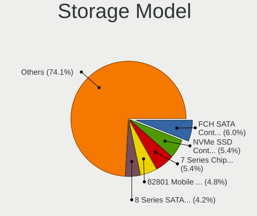

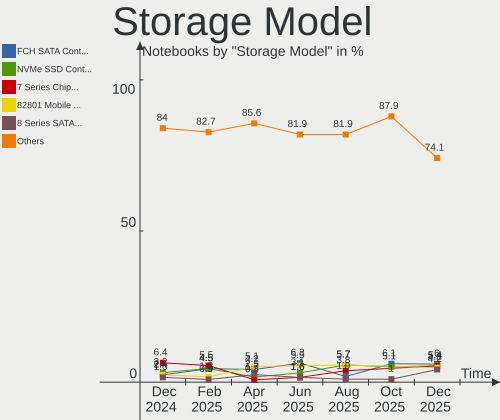

| Model                                                                          | Notebooks | Percent |
|--------------------------------------------------------------------------------|-----------|---------|
| AMD FCH SATA Controller [AHCI mode]                                            | 10        | 6.02%   |
| Samsung NVMe SSD Controller SM981/PM981/PM983                                  | 9         | 5.42%   |
| Intel 7 Series Chipset Family 6-port SATA Controller [AHCI mode]               | 9         | 5.42%   |
| Intel 82801 Mobile SATA Controller [RAID mode]                                 | 8         | 4.82%   |
| Intel 8 Series SATA Controller 1 [AHCI mode]                                   | 7         | 4.22%   |
| Samsung NVMe SSD Controller S4LV008[Pascal]                                    | 5         | 3.01%   |
| SanDisk WD SN560/SN740/SN770/SN5000 NVMe SSD                                   | 4         | 2.41%   |
| Samsung NVMe SSD Controller 980 (DRAM-less)                                    | 4         | 2.41%   |
| Intel Wildcat Point-LP SATA Controller [AHCI Mode]                             | 4         | 2.41%   |
| Intel HM170/QM170 Chipset SATA Controller [AHCI Mode]                          | 4         | 2.41%   |
| Intel 8 Series/C220 Series Chipset Family 6-port SATA Controller 1 [AHCI mode] | 4         | 2.41%   |
| SK hynix Gold P31/BC711/PC711 NVMe Solid State Drive                           | 3         | 1.81%   |
| Intel Volume Management Device NVMe RAID Controller Intel Corporation          | 3         | 1.81%   |
| Intel Cannon Lake Mobile PCH SATA AHCI Controller                              | 3         | 1.81%   |
| Silicon Motion SM2263EN/SM2263XT (DRAM-less) NVMe SSD Controllers              | 2         | 1.2%    |
| SanDisk WD Green SN350 240GB (DRAM-less) / SN560E NVMe SSD                     | 2         | 1.2%    |
| Sandisk WD Black SN850X NVMe SSD                                               | 2         | 1.2%    |
| Samsung S4LN053X01 AHCI SSD Controller(Apple slot)                             | 2         | 1.2%    |
| Samsung NVMe SSD Controller SM961/PM961/SM963                                  | 2         | 1.2%    |
| Samsung NVMe SSD Controller PM9C1a (DRAM-less)                                 | 2         | 1.2%    |
| Samsung NVMe SSD Controller PM9B1 (DRAM-less)                                  | 2         | 1.2%    |
| Samsung NVMe SSD Controller PM9A1/PM9A3/980PRO                                 | 2         | 1.2%    |
| Samsung NVMe SSD 9100 PRO [PM9E1]                                              | 2         | 1.2%    |
| Phison E12 NVMe Controller                                                     | 2         | 1.2%    |
| Nvidia MCP79 AHCI Controller                                                   | 2         | 1.2%    |
| KIOXIA NVMe SSD Controller BG4 (DRAM-less)                                     | 2         | 1.2%    |
| Intel Sunrise Point-LP SATA Controller [AHCI mode]                             | 2         | 1.2%    |
| Intel SSD 660P Series                                                          | 2         | 1.2%    |
| Intel Q170/Q150/B150/H170/H110/Z170/CM236 Chipset SATA Controller [AHCI Mode]  | 2         | 1.2%    |
| Intel Cannon Point-LP SATA Controller [AHCI Mode]                              | 2         | 1.2%    |
| Intel 6 Series/C200 Series Chipset Family 6 port Mobile SATA AHCI Controller   | 2         | 1.2%    |
| Yangtze Memory PC005 NVMe SSD                                                  | 1         | 0.6%    |
| Toshiba America Info Systems XG3 NVMe SSD Controller                           | 1         | 0.6%    |
| Solid State Storage CL4-8D512 NVMe SSD M.2 (DRAM-less)                         | 1         | 0.6%    |
| Solid State Storage CL1-3D256-Q11 NVMe SSD M.2                                 | 1         | 0.6%    |
| SK hynix PVC10 NVMe Solid State Drive (DRAM-less)                              | 1         | 0.6%    |
| SK hynix Platinum P41/PC801 NVMe Solid State Drive                             | 1         | 0.6%    |
| SK hynix BC511 NVMe SSD                                                        | 1         | 0.6%    |
| SK hynix BC501 NVMe Solid State Drive                                          | 1         | 0.6%    |
| Silicon Motion Non-Volatile memory controller                                  | 1         | 0.6%    |

Storage Kind
------------

Kind of storage controller (IDE, SATA, NVMe, SAS, ...)

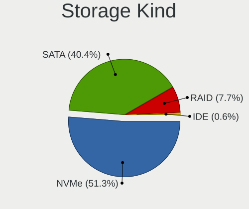

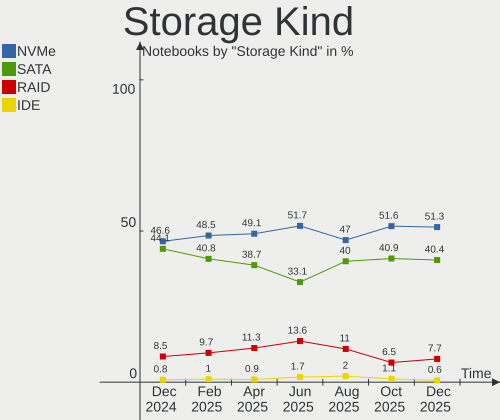

| Kind | Notebooks | Percent |
|------|-----------|---------|
| NVMe | 80        | 51.28%  |
| SATA | 63        | 40.38%  |
| RAID | 12        | 7.69%   |
| IDE  | 1         | 0.64%   |

Processor
---------

CPU Vendor
----------

Processor vendors

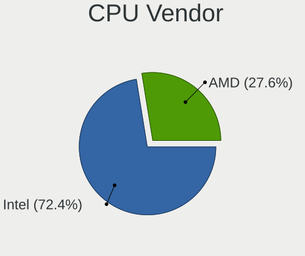

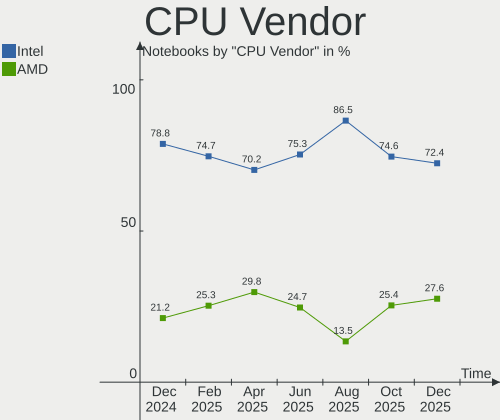

| Vendor | Notebooks | Percent |
|--------|-----------|---------|
| Intel  | 92        | 72.44%  |
| AMD    | 35        | 27.56%  |

CPU Model
---------

Processor models

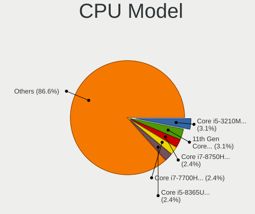

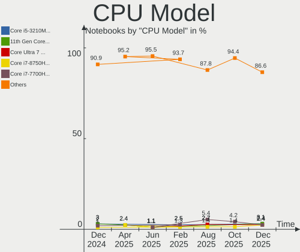

| Model                                   | Notebooks | Percent |
|-----------------------------------------|-----------|---------|
| Intel Core i5-3210M CPU @ 2.50GHz       | 4         | 3.15%   |
| Intel 11th Gen Core i5-1135G7 @ 2.40GHz | 4         | 3.15%   |
| Intel Core Ultra 7 255H                 | 3         | 2.36%   |
| Intel Core i7-8750H CPU @ 2.20GHz       | 3         | 2.36%   |
| Intel Core i7-7700HQ CPU @ 2.80GHz      | 3         | 2.36%   |
| Intel Core i5-8365U CPU @ 1.60GHz       | 3         | 2.36%   |
| AMD Ryzen 7 5700U with Radeon Graphics  | 3         | 2.36%   |
| Intel Core Ultra 9 275HX                | 2         | 1.57%   |
| Intel Core i5-4258U CPU @ 2.40GHz       | 2         | 1.57%   |
| Intel Core i5-10300H CPU @ 2.50GHz      | 2         | 1.57%   |
| Intel Core i5 CPU M 520 @ 2.40GHz       | 2         | 1.57%   |
| Intel Core i3-4005U CPU @ 1.70GHz       | 2         | 1.57%   |
| AMD Ryzen 7 7735HS with Radeon Graphics | 2         | 1.57%   |
| AMD Ryzen 7 7730U with Radeon Graphics  | 2         | 1.57%   |
| AMD Ryzen 5 7520U with Radeon Graphics  | 2         | 1.57%   |
| AMD Ryzen 5 5625U with Radeon Graphics  | 2         | 1.57%   |
| Intel Core Ultra 9 285H                 | 1         | 0.79%   |
| Intel Core Ultra 9 185H                 | 1         | 0.79%   |
| Intel Core Ultra 7 265H                 | 1         | 0.79%   |
| Intel Core Ultra 7 256V                 | 1         | 0.79%   |
| Intel Core Ultra 7 255HX                | 1         | 0.79%   |
| Intel Core Ultra 7 155H                 | 1         | 0.79%   |
| Intel Core Ultra 5 235U                 | 1         | 0.79%   |
| Intel Core M-5Y10c CPU @ 0.80GHz        | 1         | 0.79%   |
| Intel Core i7-9750H CPU @ 2.60GHz       | 1         | 0.79%   |
| Intel Core i7-8550U CPU @ 1.80GHz       | 1         | 0.79%   |
| Intel Core i7-7820HK CPU @ 2.90GHz      | 1         | 0.79%   |
| Intel Core i7-6700K CPU @ 4.00GHz       | 1         | 0.79%   |
| Intel Core i7-6500U CPU @ 2.50GHz       | 1         | 0.79%   |
| Intel Core i7-5600U CPU @ 2.60GHz       | 1         | 0.79%   |
| Intel Core i7-5500U CPU @ 2.40GHz       | 1         | 0.79%   |
| Intel Core i7-4870HQ CPU @ 2.50GHz      | 1         | 0.79%   |
| Intel Core i7-4710MQ CPU @ 2.50GHz      | 1         | 0.79%   |
| Intel Core i7-4710HQ CPU @ 2.50GHz      | 1         | 0.79%   |
| Intel Core i7-4700HQ CPU @ 2.40GHz      | 1         | 0.79%   |
| Intel Core i7-4600U CPU @ 2.10GHz       | 1         | 0.79%   |
| Intel Core i7-4510U CPU @ 2.00GHz       | 1         | 0.79%   |
| Intel Core i7-3740QM CPU @ 2.70GHz      | 1         | 0.79%   |
| Intel Core i7-3615QM CPU @ 2.30GHz      | 1         | 0.79%   |
| Intel Core i7-3610QM CPU @ 2.30GHz      | 1         | 0.79%   |

CPU Model Family
----------------

Processor model prefix

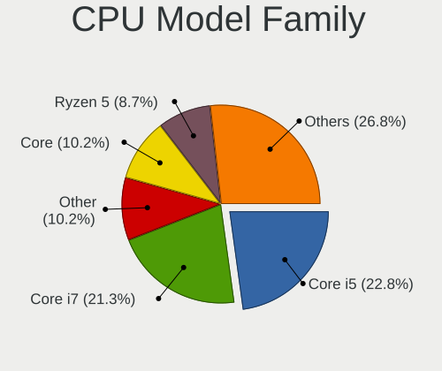

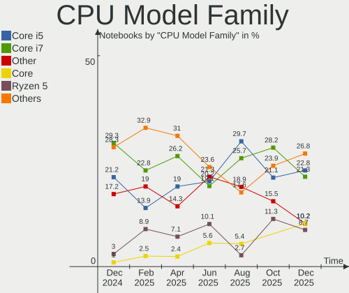

| Model            | Notebooks | Percent |
|------------------|-----------|---------|
| Intel Core i5    | 29        | 22.83%  |
| Intel Core i7    | 27        | 21.26%  |
| Other            | 13        | 10.24%  |
| Intel Core       | 13        | 10.24%  |
| AMD Ryzen 5      | 11        | 8.66%   |
| AMD Ryzen 7      | 10        | 7.87%   |
| Intel Core i3    | 5         | 3.94%   |
| AMD Ryzen 9      | 5         | 3.94%   |
| Intel Core 2 Duo | 4         | 3.15%   |
| AMD Ryzen 3      | 3         | 2.36%   |
| Intel Celeron    | 2         | 1.57%   |
| Intel Core M     | 1         | 0.79%   |
| AMD Ryzen 5 PRO  | 1         | 0.79%   |
| AMD A8           | 1         | 0.79%   |
| AMD A6           | 1         | 0.79%   |
| AMD A4           | 1         | 0.79%   |

CPU Cores
---------

Number of processor cores

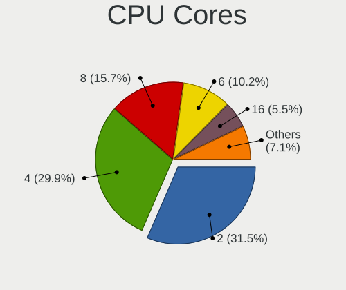

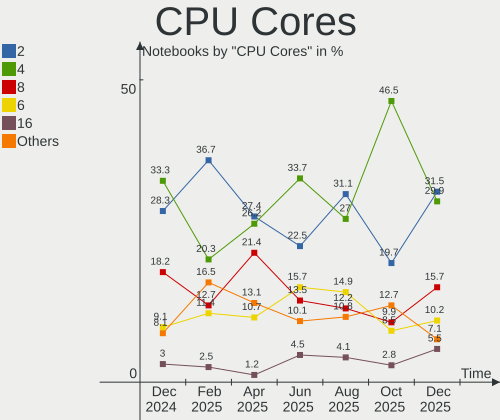

| Number | Notebooks | Percent |
|--------|-----------|---------|
| 2      | 40        | 31.5%   |
| 4      | 38        | 29.92%  |
| 8      | 20        | 15.75%  |
| 6      | 13        | 10.24%  |
| 16     | 7         | 5.51%   |
| 24     | 3         | 2.36%   |
| 14     | 2         | 1.57%   |
| 12     | 2         | 1.57%   |
| 20     | 1         | 0.79%   |
| 10     | 1         | 0.79%   |

CPU Sockets
-----------

Number of sockets

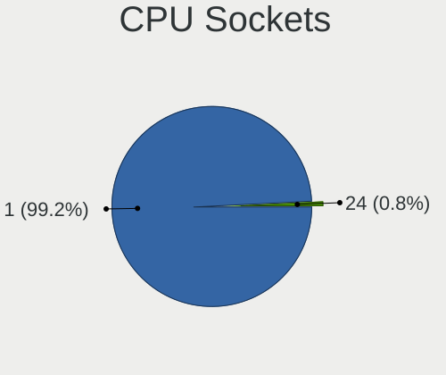

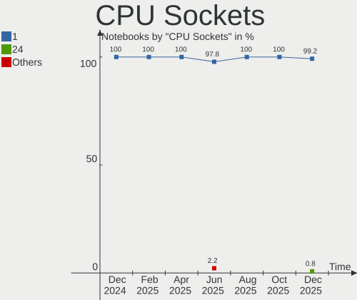

| Number | Notebooks | Percent |
|--------|-----------|---------|
| 1      | 126       | 99.21%  |
| 24     | 1         | 0.79%   |

CPU Threads
-----------

Threads per core (Hyper-Threading)

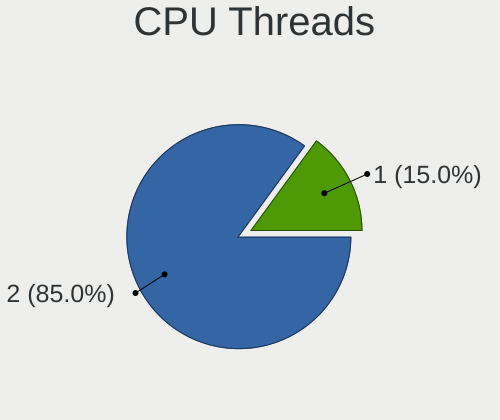

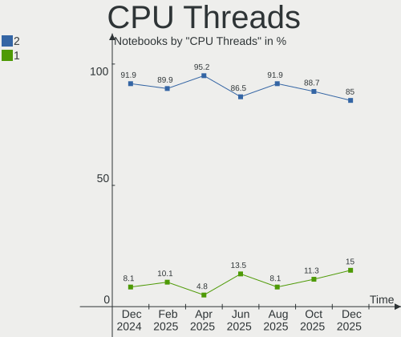

| Number | Notebooks | Percent |
|--------|-----------|---------|
| 2      | 108       | 85.04%  |
| 1      | 19        | 14.96%  |

CPU Op-Modes
------------

CPU Operation Modes (32-bit, 64-bit)

| Op mode        | Notebooks | Percent |
|----------------|-----------|---------|
| 32-bit, 64-bit | 127       | 100%    |

CPU Microcode
-------------

Microcode number

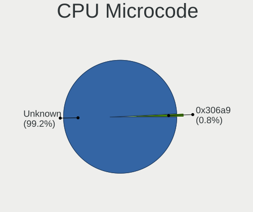

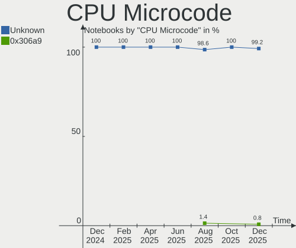

| Number  | Notebooks | Percent |
|---------|-----------|---------|
| Unknown | 126       | 99.21%  |
| 0x306a9 | 1         | 0.79%   |

CPU Microarch
-------------

Microarchitecture

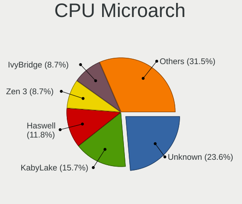

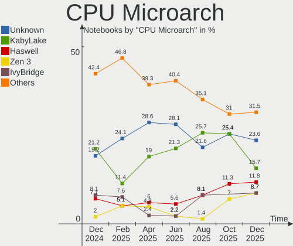

| Name              | Notebooks | Percent |
|-------------------|-----------|---------|
| Unknown           | 30        | 23.62%  |
| KabyLake          | 20        | 15.75%  |
| Haswell           | 15        | 11.81%  |
| Zen 3             | 11        | 8.66%   |
| IvyBridge         | 11        | 8.66%   |
| TigerLake         | 6         | 4.72%   |
| Broadwell         | 5         | 3.94%   |
| Penryn            | 4         | 3.15%   |
| CometLake         | 4         | 3.15%   |
| Zen+              | 3         | 2.36%   |
| Skylake           | 3         | 2.36%   |
| Alderlake Hybrid  | 3         | 2.36%   |
| Westmere          | 2         | 1.57%   |
| SandyBridge       | 2         | 1.57%   |
| Puma              | 2         | 1.57%   |
| Meteorlake Hybrid | 2         | 1.57%   |
| Zen 2             | 1         | 0.79%   |
| Jaguar            | 1         | 0.79%   |
| IceLake           | 1         | 0.79%   |
| Goldmont plus     | 1         | 0.79%   |

Graphics
--------

GPU Vendor
----------

Vendors of graphics cards

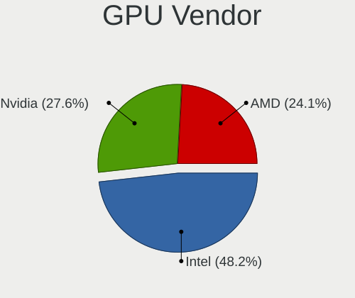

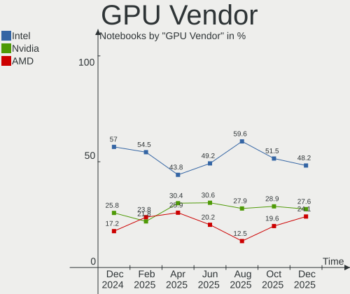

| Vendor | Notebooks | Percent |
|--------|-----------|---------|
| Intel  | 82        | 48.24%  |
| Nvidia | 47        | 27.65%  |
| AMD    | 41        | 24.12%  |

GPU Model
---------

Graphics card models

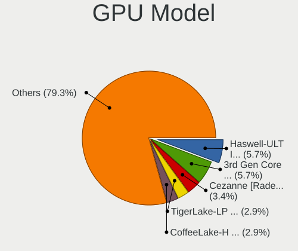

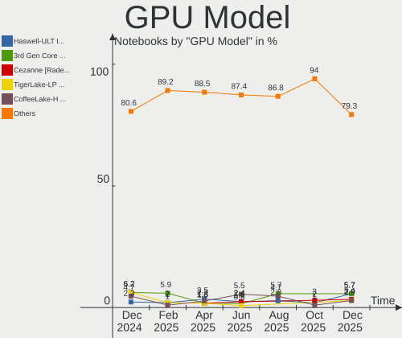

| Model                                                                     | Notebooks | Percent |
|---------------------------------------------------------------------------|-----------|---------|
| Intel Haswell-ULT Integrated Graphics Controller                          | 10        | 5.75%   |
| Intel 3rd Gen Core processor Graphics Controller                          | 10        | 5.75%   |
| AMD Cezanne [Radeon Vega Series / Radeon Vega Mobile Series]              | 6         | 3.45%   |
| Intel TigerLake-LP GT2 [Iris Xe Graphics]                                 | 5         | 2.87%   |
| Intel CoffeeLake-H GT2 [UHD Graphics 630]                                 | 5         | 2.87%   |
| AMD Barcelo                                                               | 5         | 2.87%   |
| Nvidia AD107M [GeForce RTX 4050 Max-Q / Mobile]                           | 4         | 2.3%    |
| Intel WhiskeyLake-U GT2 [UHD Graphics 620]                                | 4         | 2.3%    |
| Intel Arrow Lake-P [Arc Pro 130T/140T]                                    | 4         | 2.3%    |
| AMD Rembrandt [Radeon 680M]                                               | 4         | 2.3%    |
| AMD Lucienne                                                              | 4         | 2.3%    |
| Nvidia GA104M [GeForce RTX 3070 Mobile / Max-Q]                           | 3         | 1.72%   |
| Intel Kaby Lake-H GT2 [HD Graphics 630]                                   | 3         | 1.72%   |
| Intel CometLake-U GT2 [UHD Graphics]                                      | 3         | 1.72%   |
| Intel CometLake-H GT2 [UHD Graphics]                                      | 3         | 1.72%   |
| Intel Broadwell-U GT2 [HD Graphics 5500]                                  | 3         | 1.72%   |
| Intel Arrow Lake-S [Intel Graphics]                                       | 3         | 1.72%   |
| Intel 4th Gen Core Processor Integrated Graphics Controller               | 3         | 1.72%   |
| AMD Picasso/Raven 2 [Radeon Vega Series / Radeon Vega Mobile Series]      | 3         | 1.72%   |
| AMD Mendocino [Radeon 610M]                                               | 3         | 1.72%   |
| Nvidia TU117M [GeForce GTX 1650 Mobile / Max-Q]                           | 2         | 1.15%   |
| Nvidia GP106M [GeForce GTX 1060 Mobile]                                   | 2         | 1.15%   |
| Nvidia GP104BM [GeForce GTX 1070 Mobile]                                  | 2         | 1.15%   |
| Nvidia GB207M [GeForce RTX 5050 Max-Q / Mobile]                           | 2         | 1.15%   |
| Nvidia GB206M [GeForce RTX 5060 Max-Q / Mobile]                           | 2         | 1.15%   |
| Nvidia GA107M [GeForce RTX 3050 Mobile]                                   | 2         | 1.15%   |
| Nvidia GA106M [GeForce RTX 3060 Mobile / Max-Q]                           | 2         | 1.15%   |
| Nvidia C79 [GeForce 9400M G]                                              | 2         | 1.15%   |
| Nvidia AD107M [GeForce RTX 4060 Max-Q / Mobile]                           | 2         | 1.15%   |
| Intel Skylake-U GT2 [HD Graphics 520]                                     | 2         | 1.15%   |
| Intel Meteor Lake-P [Intel Arc Graphics]                                  | 2         | 1.15%   |
| Intel Kaby Lake-R GT2 [UHD Graphics 620]                                  | 2         | 1.15%   |
| Intel Core Processor Integrated Graphics Controller                       | 2         | 1.15%   |
| Intel Alder Lake-P GT2 [Iris Xe Graphics]                                 | 2         | 1.15%   |
| Intel 2nd Generation Core Processor Family Integrated Graphics Controller | 2         | 1.15%   |
| AMD Phoenix1                                                              | 2         | 1.15%   |
| AMD Krackan [Radeon 840M / 860M Graphics]                                 | 2         | 1.15%   |
| Nvidia TU117M [GeForce GTX 1650 Ti Mobile]                                | 1         | 0.57%   |
| Nvidia TU106M [GeForce RTX 2070 Mobile]                                   | 1         | 0.57%   |
| Nvidia TU106M [GeForce RTX 2060 Mobile]                                   | 1         | 0.57%   |

GPU Combo
---------

Combinations of graphics cards

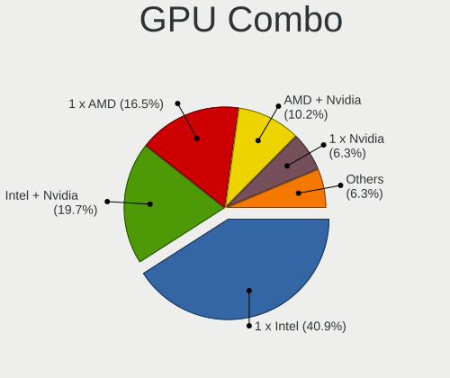

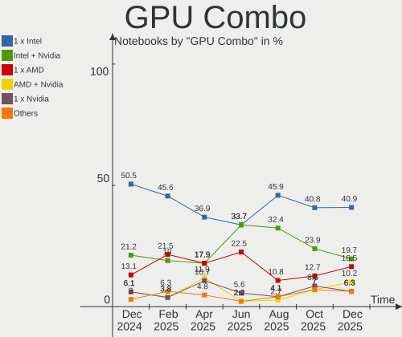

| Name           | Notebooks | Percent |
|----------------|-----------|---------|
| 1 x Intel      | 52        | 40.94%  |
| Intel + Nvidia | 25        | 19.69%  |
| 1 x AMD        | 21        | 16.54%  |
| AMD + Nvidia   | 13        | 10.24%  |
| 1 x Nvidia     | 8         | 6.3%    |
| 2 x AMD        | 3         | 2.36%   |
| Intel + AMD    | 3         | 2.36%   |
| Other          | 1         | 0.79%   |
| 2 x Nvidia     | 1         | 0.79%   |

GPU Driver
----------

Free vs proprietary

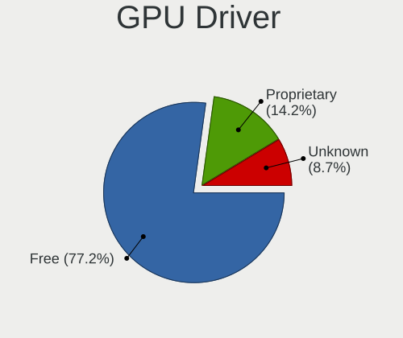

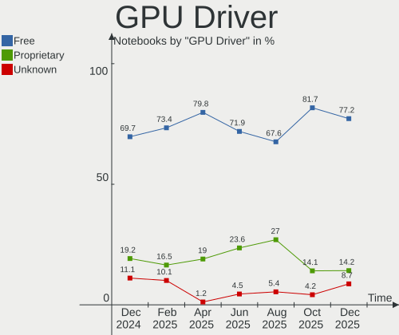

| Driver      | Notebooks | Percent |
|-------------|-----------|---------|
| Free        | 98        | 77.17%  |
| Proprietary | 18        | 14.17%  |
| Unknown     | 11        | 8.66%   |

GPU Memory
----------

Total video memory

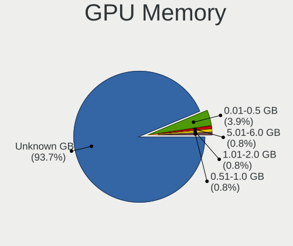

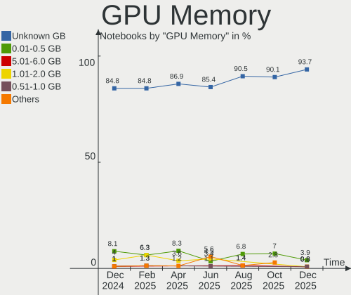

| Size in GB | Notebooks | Percent |
|------------|-----------|---------|
| Unknown    | 119       | 93.7%   |
| 0.01-0.5   | 5         | 3.94%   |
| 5.01-6.0   | 1         | 0.79%   |
| 1.01-2.0   | 1         | 0.79%   |
| 0.51-1.0   | 1         | 0.79%   |

Monitor
-------

Monitor Vendor
--------------

Monitor vendors

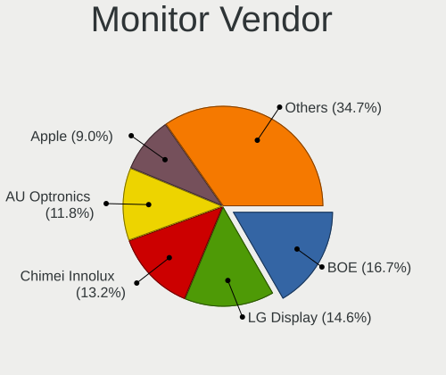

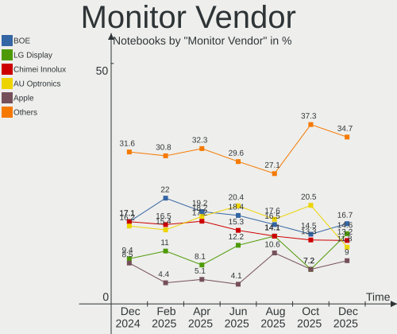

| Vendor                  | Notebooks | Percent |
|-------------------------|-----------|---------|
| BOE                     | 24        | 16.67%  |
| LG Display              | 21        | 14.58%  |
| Chimei Innolux          | 19        | 13.19%  |
| AU Optronics            | 17        | 11.81%  |
| Apple                   | 13        | 9.03%   |
| Samsung Electronics     | 11        | 7.64%   |
| PANDA                   | 4         | 2.78%   |
| Lenovo                  | 4         | 2.78%   |
| Goldstar                | 4         | 2.78%   |
| Dell                    | 4         | 2.78%   |
| CSOT                    | 3         | 2.08%   |
| Hewlett-Packard         | 2         | 1.39%   |
| CSW                     | 2         | 1.39%   |
| Chi Mei Optoelectronics | 2         | 1.39%   |
| ASUSTek Computer        | 2         | 1.39%   |
| VIE                     | 1         | 0.69%   |
| Toshiba                 | 1         | 0.69%   |
| Sharp                   | 1         | 0.69%   |
| RCA                     | 1         | 0.69%   |
| Philips                 | 1         | 0.69%   |
| LG Philips              | 1         | 0.69%   |
| EDO                     | 1         | 0.69%   |
| Denver                  | 1         | 0.69%   |
| CHD                     | 1         | 0.69%   |
| BenQ                    | 1         | 0.69%   |
| Ancor Communications    | 1         | 0.69%   |
| Acer                    | 1         | 0.69%   |

Monitor Model
-------------

Monitor models

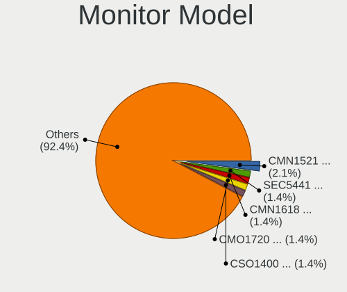

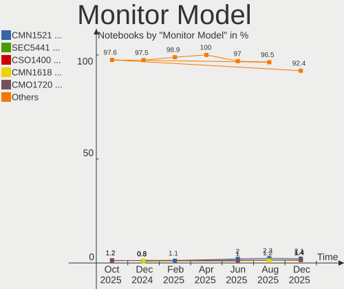

| Model                                                                     | Notebooks | Percent |
|---------------------------------------------------------------------------|-----------|---------|
| Chimei Innolux LCD Monitor CMN1521 1920x1080 344x193mm 15.5-inch          | 3         | 2.08%   |
| Samsung Electronics LCD Monitor SEC5441 1280x800 331x207mm 15.4-inch      | 2         | 1.39%   |
| CSOT LCD Monitor CSO1400 3840x2160 309x174mm 14.0-inch                    | 2         | 1.39%   |
| Chimei Innolux LCD Monitor CMN1618 1920x1200 344x215mm 16.0-inch          | 2         | 1.39%   |
| Chi Mei Optoelectronics LCD Monitor CMO1720 1920x1080 382x215mm 17.3-inch | 2         | 1.39%   |
| Apple Color LCD APPA029 2560x1600 286x179mm 13.3-inch                     | 2         | 1.39%   |
| Apple Color LCD APP9CC7 1280x800 286x179mm 13.3-inch                      | 2         | 1.39%   |
| VIE ATHEN U2L 21 VIE2150 1920x1080 476x268mm 21.5-inch                    | 1         | 0.69%   |
| Toshiba TV TSB0109 1920x1080 1594x900mm 72.1-inch                         | 1         | 0.69%   |
| Sharp LQ156T1JW03 SHP1529 2560x1440 344x194mm 15.5-inch                   | 1         | 0.69%   |
| Samsung Electronics U28E570 SAM0D6F 3840x2160 607x345mm 27.5-inch         | 1         | 0.69%   |
| Samsung Electronics LS27D36xG SAM76DF 1920x1080 527x296mm 23.8-inch       | 1         | 0.69%   |
| Samsung Electronics LCD Monitor SDC4852 1366x768 344x194mm 15.5-inch      | 1         | 0.69%   |
| Samsung Electronics LCD Monitor SDC41A0 1920x1200 302x189mm 14.0-inch     | 1         | 0.69%   |
| Samsung Electronics LCD Monitor SDC419D 2880x1800 302x189mm 14.0-inch     | 1         | 0.69%   |
| Samsung Electronics LCD Monitor SDC4191 3840x2400 344x215mm 16.0-inch     | 1         | 0.69%   |
| Samsung Electronics LCD Monitor SDC4188 2880x1800 312x195mm 14.5-inch     | 1         | 0.69%   |
| Samsung Electronics LCD Monitor SDC4170 2880x1800 302x189mm 14.0-inch     | 1         | 0.69%   |
| Samsung Electronics ATNA40CU05-0 SDC419C 2880x1800 302x189mm 14.0-inch    | 1         | 0.69%   |
| RCA RTR4360-B-US RCA0B01 1920x1080 698x392mm 31.5-inch                    | 1         | 0.69%   |
| Philips PHL BDM3270 PHL08E7 2560x1440 708x398mm 32.0-inch                 | 1         | 0.69%   |
| PANDA LCD Monitor NCP004B 1920x1080 344x194mm 15.5-inch                   | 1         | 0.69%   |
| PANDA LCD Monitor NCP0042 1920x1080 344x194mm 15.5-inch                   | 1         | 0.69%   |
| PANDA LCD Monitor NCP0036 1920x1080 344x194mm 15.5-inch                   | 1         | 0.69%   |
| PANDA LCD Monitor NCP002E 1920x1080 344x194mm 15.5-inch                   | 1         | 0.69%   |
| LG Philips LP154WX4-TLC8 LPL0120 1280x800 331x207mm 15.4-inch             | 1         | 0.69%   |
| LG Display LCD Monitor LGD40A0 1366x768 310x174mm 14.0-inch               | 1         | 0.69%   |
| LG Display LCD Monitor LGD07A8 1920x1200 345x215mm 16.0-inch              | 1         | 0.69%   |
| LG Display LCD Monitor LGD06E8 1920x1080 344x194mm 15.5-inch              | 1         | 0.69%   |
| LG Display LCD Monitor LGD06DA 1920x1080 344x194mm 15.5-inch              | 1         | 0.69%   |
| LG Display LCD Monitor LGD0663 1920x1280 285x190mm 13.5-inch              | 1         | 0.69%   |
| LG Display LCD Monitor LGD062E 1920x1080 344x194mm 15.5-inch              | 1         | 0.69%   |
| LG Display LCD Monitor LGD0620 1920x1080 382x215mm 17.3-inch              | 1         | 0.69%   |
| LG Display LCD Monitor LGD05FE 1920x1080 344x194mm 15.5-inch              | 1         | 0.69%   |
| LG Display LCD Monitor LGD05F8 2560x1600 366x229mm 17.0-inch              | 1         | 0.69%   |
| LG Display LCD Monitor LGD05F5 1920x1080 309x174mm 14.0-inch              | 1         | 0.69%   |
| LG Display LCD Monitor LGD05C0 1920x1080 344x194mm 15.5-inch              | 1         | 0.69%   |
| LG Display LCD Monitor LGD053F 1920x1080 344x194mm 15.5-inch              | 1         | 0.69%   |
| LG Display LCD Monitor LGD04FF 1920x1080 309x174mm 14.0-inch              | 1         | 0.69%   |
| LG Display LCD Monitor LGD04D5 1920x1080 344x194mm 15.5-inch              | 1         | 0.69%   |

Monitor Resolution
------------------

Monitor screen resolution

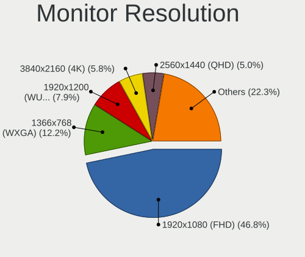

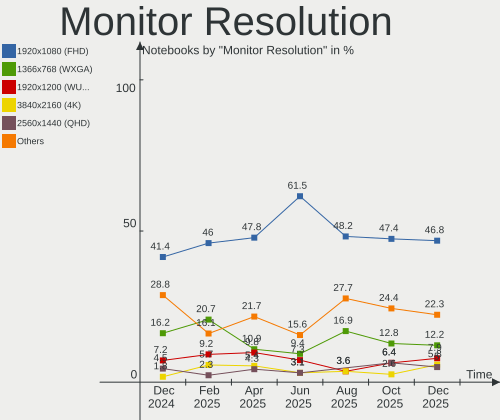

| Resolution        | Notebooks | Percent |
|-------------------|-----------|---------|
| 1920x1080 (FHD)   | 65        | 46.76%  |
| 1366x768 (WXGA)   | 17        | 12.23%  |
| 1920x1200 (WUXGA) | 11        | 7.91%   |
| 3840x2160 (4K)    | 8         | 5.76%   |
| 2560x1440 (QHD)   | 7         | 5.04%   |
| 2880x1800         | 6         | 4.32%   |
| 2560x1600         | 6         | 4.32%   |
| 1280x800 (WXGA)   | 6         | 4.32%   |
| 1600x900 (HD+)    | 3         | 2.16%   |
| 1440x900 (WXGA+)  | 3         | 2.16%   |
| 3840x2400         | 2         | 1.44%   |
| 3200x2000         | 1         | 0.72%   |
| 2256x1504         | 1         | 0.72%   |
| 1920x1280         | 1         | 0.72%   |
| 1280x1024 (SXGA)  | 1         | 0.72%   |
| Unknown           | 1         | 0.72%   |

Monitor Diagonal
----------------

Diagonal size in inches

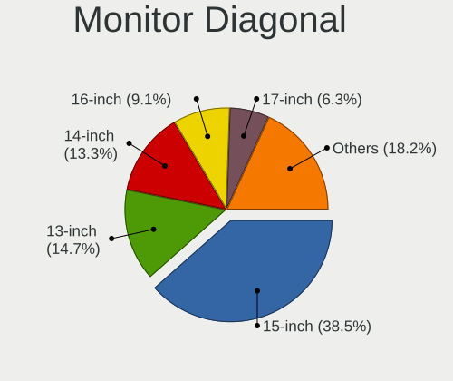

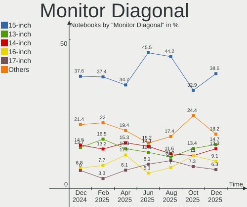

| Inches  | Notebooks | Percent |
|---------|-----------|---------|
| 15      | 55        | 38.46%  |
| 13      | 21        | 14.69%  |
| 14      | 19        | 13.29%  |
| 16      | 13        | 9.09%   |
| 17      | 9         | 6.29%   |
| 24      | 5         | 3.5%    |
| 27      | 4         | 2.8%    |
| 32      | 3         | 2.1%    |
| 31      | 3         | 2.1%    |
| 23      | 2         | 1.4%    |
| 21      | 2         | 1.4%    |
| 12      | 2         | 1.4%    |
| 72      | 1         | 0.7%    |
| 49      | 1         | 0.7%    |
| 36      | 1         | 0.7%    |
| 11      | 1         | 0.7%    |
| Unknown | 1         | 0.7%    |

Monitor Width
-------------

Physical width

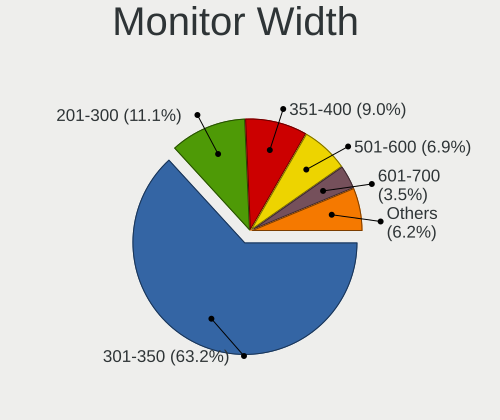

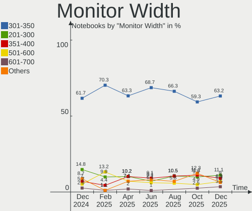

| Width in mm | Notebooks | Percent |
|-------------|-----------|---------|
| 301-350     | 91        | 63.19%  |
| 201-300     | 16        | 11.11%  |
| 351-400     | 13        | 9.03%   |
| 501-600     | 10        | 6.94%   |
| 601-700     | 5         | 3.47%   |
| 701-800     | 4         | 2.78%   |
| 401-500     | 2         | 1.39%   |
| 1501-2000   | 1         | 0.69%   |
| 1001-1500   | 1         | 0.69%   |
| Unknown     | 1         | 0.69%   |

Aspect Ratio
------------

Proportional relationship between the width and the height

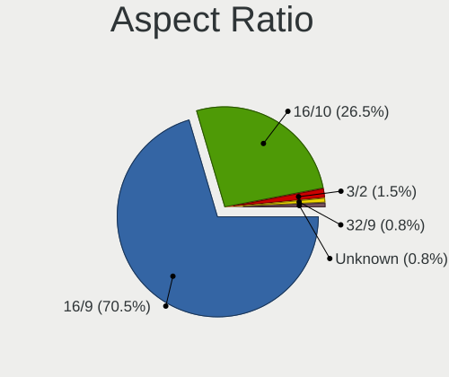

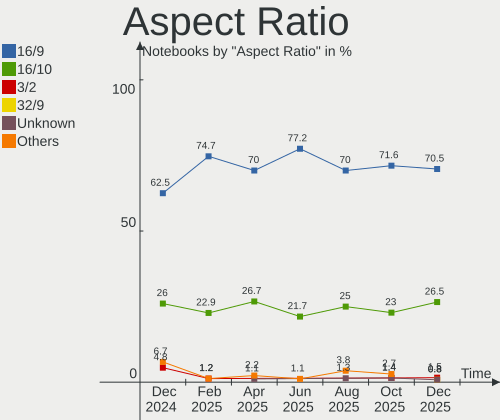

| Ratio   | Notebooks | Percent |
|---------|-----------|---------|
| 16/9    | 93        | 70.45%  |
| 16/10   | 35        | 26.52%  |
| 3/2     | 2         | 1.52%   |
| 32/9    | 1         | 0.76%   |
| Unknown | 1         | 0.76%   |

Monitor Area
------------

Area in inch²

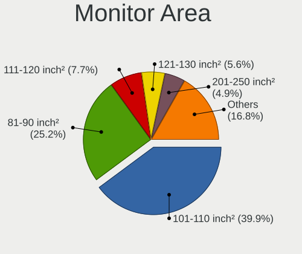

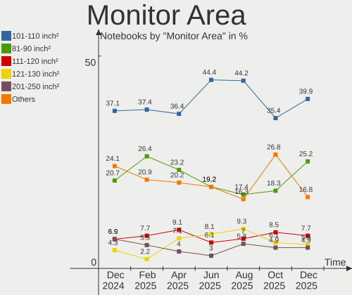

| Area in inch² | Notebooks | Percent |
|----------------|-----------|---------|
| 101-110        | 57        | 39.86%  |
| 81-90          | 36        | 25.17%  |
| 111-120        | 11        | 7.69%   |
| 121-130        | 8         | 5.59%   |
| 201-250        | 7         | 4.9%    |
| 351-500        | 6         | 4.2%    |
| 71-80          | 4         | 2.8%    |
| 301-350        | 4         | 2.8%    |
| 61-70          | 2         | 1.4%    |
| 501-1000       | 2         | 1.4%    |
| More than 1000 | 1         | 0.7%    |
| 51-60          | 1         | 0.7%    |
| 251-300        | 1         | 0.7%    |
| 151-200        | 1         | 0.7%    |
| 131-140        | 1         | 0.7%    |
| Unknown        | 1         | 0.7%    |

Pixel Density
-------------

Pixels per inch

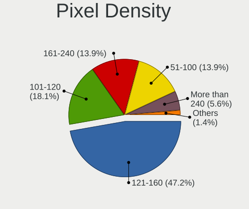

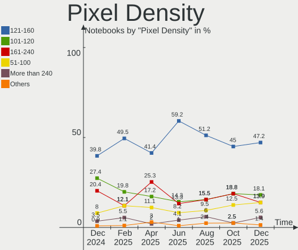

| Density       | Notebooks | Percent |
|---------------|-----------|---------|
| 121-160       | 68        | 47.22%  |
| 101-120       | 26        | 18.06%  |
| 161-240       | 20        | 13.89%  |
| 51-100        | 20        | 13.89%  |
| More than 240 | 8         | 5.56%   |
| 1-50          | 1         | 0.69%   |
| Unknown       | 1         | 0.69%   |

Multiple Monitors
-----------------

Total monitors connected

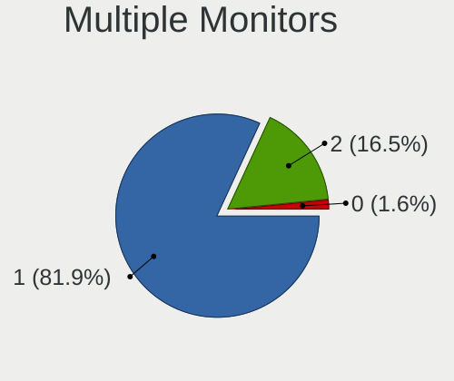

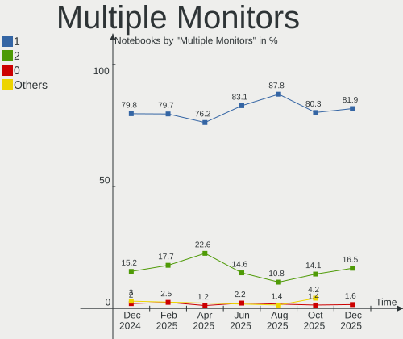

| Total | Notebooks | Percent |
|-------|-----------|---------|
| 1     | 104       | 81.89%  |
| 2     | 21        | 16.54%  |
| 0     | 2         | 1.57%   |

Network
-------

Net Controller Vendor
---------------------

Controller vendors

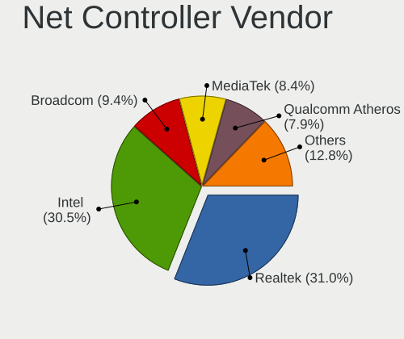

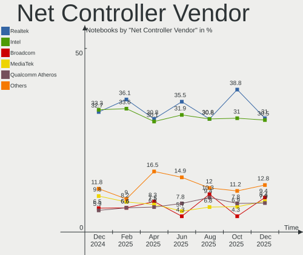

| Vendor                            | Notebooks | Percent |
|-----------------------------------|-----------|---------|
| Realtek Semiconductor             | 63        | 31.03%  |
| Intel                             | 62        | 30.54%  |
| Broadcom                          | 19        | 9.36%   |
| MediaTek                          | 17        | 8.37%   |
| Qualcomm Atheros                  | 16        | 7.88%   |
| TP-Link                           | 6         | 2.96%   |
| Broadcom Limited                  | 5         | 2.46%   |
| OPPO Electronics                  | 3         | 1.48%   |
| ASIX Electronics                  | 3         | 1.48%   |
| Nvidia                            | 2         | 0.99%   |
| Sierra Wireless                   | 1         | 0.49%   |
| Shenzhen Goodix Technology        | 1         | 0.49%   |
| NetGear                           | 1         | 0.49%   |
| Marvell Technology Group          | 1         | 0.49%   |
| Lenovo                            | 1         | 0.49%   |
| Google                            | 1         | 0.49%   |
| Ericsson Business Mobile Networks | 1         | 0.49%   |

Net Controller Model
--------------------

Controller models

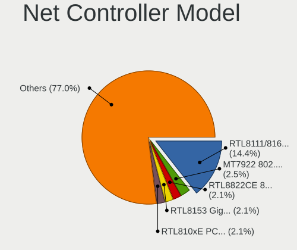

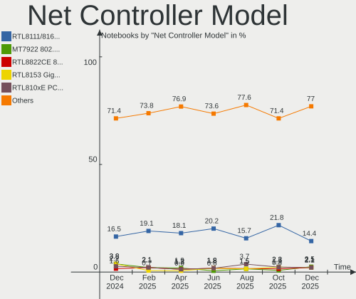

| Model                                                                           | Notebooks | Percent |
|---------------------------------------------------------------------------------|-----------|---------|
| Realtek RTL8111/8168/8211/8411 PCI Express Gigabit Ethernet Controller          | 35        | 14.4%   |
| MediaTek MT7922 802.11ax PCI Express Wireless Network Adapter                   | 6         | 2.47%   |
| Realtek RTL8822CE 802.11ac PCIe Wireless Network Adapter                        | 5         | 2.06%   |
| Realtek RTL8153 Gigabit Ethernet Adapter                                        | 5         | 2.06%   |
| Realtek RTL810xE PCI Express Fast Ethernet controller                           | 5         | 2.06%   |
| MediaTek MT7921 802.11ax PCIe Wireless Network Adapter [Filogic 330]            | 5         | 2.06%   |
| Intel Wireless 7260                                                             | 5         | 2.06%   |
| Intel Wi-Fi 6 AX200                                                             | 5         | 2.06%   |
| Intel Arrow Lake CNVi WiFi                                                      | 5         | 2.06%   |
| Broadcom NetXtreme BCM57765 Gigabit Ethernet PCIe                               | 5         | 2.06%   |
| Broadcom BCM4331 802.11a/b/g/n                                                  | 5         | 2.06%   |
| Broadcom BCM43142 802.11b/g/n                                                   | 5         | 2.06%   |
| Realtek RTL8125 2.5GbE Controller                                               | 4         | 1.65%   |
| Qualcomm Atheros QCA9565 / AR9565 Wireless Network Adapter                      | 4         | 1.65%   |
| Intel Wireless 7265                                                             | 4         | 1.65%   |
| Intel Wi-Fi 7(802.11be) AX1775*/AX1790*/BE20*/BE401/BE1750* 2x2                 | 4         | 1.65%   |
| Intel Wi-Fi 6 AX201                                                             | 4         | 1.65%   |
| Intel Cannon Lake PCH CNVi WiFi                                                 | 4         | 1.65%   |
| Intel 82579LM Gigabit Network Connection (Lewisville)                           | 4         | 1.65%   |
| Realtek RTL8852BE PCIe 802.11ax Wireless Network Controller                     | 3         | 1.23%   |
| Realtek RTL8821CE 802.11ac PCIe Wireless Network Adapter                        | 3         | 1.23%   |
| Qualcomm Atheros QCA9377 802.11ac Wireless Network Adapter                      | 3         | 1.23%   |
| OPPO RMX3741                                                                    | 3         | 1.23%   |
| MediaTek MT7902 802.11ax PCIe Wireless Network Adapter [Filogic 310]            | 3         | 1.23%   |
| Intel Ethernet Connection (6) I219-LM                                           | 3         | 1.23%   |
| Intel Ethernet Connection (18) I219-LM                                          | 3         | 1.23%   |
| Intel Comet Lake PCH-LP CNVi WiFi                                               | 3         | 1.23%   |
| Intel Cannon Point-LP CNVi [Wireless-AC]                                        | 3         | 1.23%   |
| Intel Alder Lake-P PCH CNVi WiFi                                                | 3         | 1.23%   |
| Broadcom Limited BCM4360 802.11ac Dual Band Wireless Network Adapter            | 3         | 1.23%   |
| ASIX AX88179 Gigabit Ethernet                                                   | 3         | 1.23%   |
| TP-Link Archer T2U PLUS [RTL8821AU]                                             | 2         | 0.82%   |
| TP-Link AC600 wireless Realtek RTL8811AU [Archer T2U Nano]                      | 2         | 0.82%   |
| Realtek RTL8852BE-VT PCIe 802.11ax Wireless Network Controller                  | 2         | 0.82%   |
| Qualcomm Atheros QCA6174 802.11ac Wireless Network Adapter                      | 2         | 0.82%   |
| Qualcomm Atheros Killer E220x Gigabit Ethernet Controller                       | 2         | 0.82%   |
| Nvidia MCP79 Ethernet                                                           | 2         | 0.82%   |
| MediaTek MT7925 802.11be 160MHz 2x2 PCIe Wireless Network Adapter [Filogic 360] | 2         | 0.82%   |
| Intel Wireless 8260                                                             | 2         | 0.82%   |
| Intel Wireless 3160                                                             | 2         | 0.82%   |

Wireless Vendor
---------------

Wireless vendors

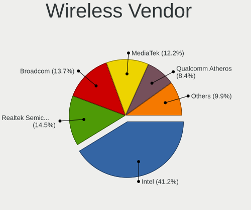

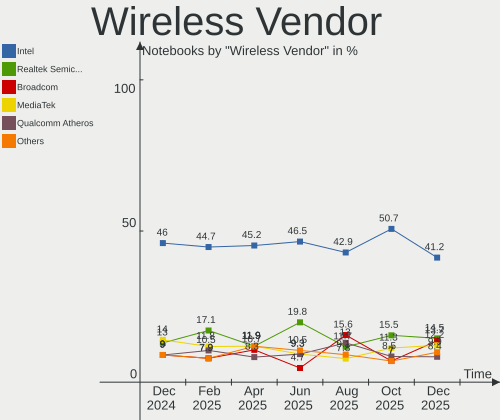

| Vendor                | Notebooks | Percent |
|-----------------------|-----------|---------|
| Intel                 | 54        | 41.22%  |
| Realtek Semiconductor | 19        | 14.5%   |
| Broadcom              | 18        | 13.74%  |
| MediaTek              | 16        | 12.21%  |
| Qualcomm Atheros      | 11        | 8.4%    |
| TP-Link               | 6         | 4.58%   |
| Broadcom Limited      | 5         | 3.82%   |
| Sierra Wireless       | 1         | 0.76%   |
| NetGear               | 1         | 0.76%   |

Wireless Model
--------------

Wireless models

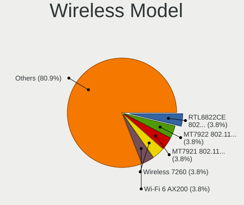

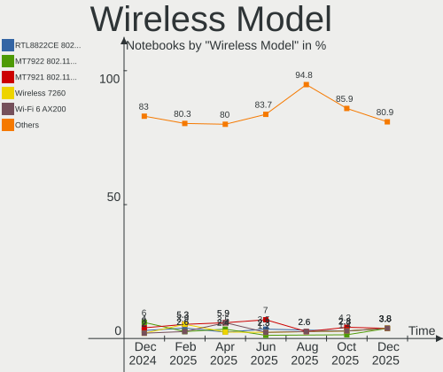

| Model                                                                           | Notebooks | Percent |
|---------------------------------------------------------------------------------|-----------|---------|
| Realtek RTL8822CE 802.11ac PCIe Wireless Network Adapter                        | 5         | 3.82%   |
| MediaTek MT7922 802.11ax PCI Express Wireless Network Adapter                   | 5         | 3.82%   |
| MediaTek MT7921 802.11ax PCIe Wireless Network Adapter [Filogic 330]            | 5         | 3.82%   |
| Intel Wireless 7260                                                             | 5         | 3.82%   |
| Intel Wi-Fi 6 AX200                                                             | 5         | 3.82%   |
| Broadcom BCM4331 802.11a/b/g/n                                                  | 5         | 3.82%   |
| Broadcom BCM43142 802.11b/g/n                                                   | 5         | 3.82%   |
| Qualcomm Atheros QCA9565 / AR9565 Wireless Network Adapter                      | 4         | 3.05%   |
| Intel Wireless 7265                                                             | 4         | 3.05%   |
| Intel Wi-Fi 7(802.11be) AX1775*/AX1790*/BE20*/BE401/BE1750* 2x2                 | 4         | 3.05%   |
| Intel Wi-Fi 6 AX201                                                             | 4         | 3.05%   |
| Intel Cannon Lake PCH CNVi WiFi                                                 | 4         | 3.05%   |
| Realtek RTL8852BE PCIe 802.11ax Wireless Network Controller                     | 3         | 2.29%   |
| Realtek RTL8821CE 802.11ac PCIe Wireless Network Adapter                        | 3         | 2.29%   |
| Qualcomm Atheros QCA9377 802.11ac Wireless Network Adapter                      | 3         | 2.29%   |
| MediaTek MT7902 802.11ax PCIe Wireless Network Adapter [Filogic 310]            | 3         | 2.29%   |
| Intel Comet Lake PCH-LP CNVi WiFi                                               | 3         | 2.29%   |
| Intel Cannon Point-LP CNVi [Wireless-AC]                                        | 3         | 2.29%   |
| Broadcom Limited BCM4360 802.11ac Dual Band Wireless Network Adapter            | 3         | 2.29%   |
| TP-Link Archer T2U PLUS [RTL8821AU]                                             | 2         | 1.53%   |
| TP-Link AC600 wireless Realtek RTL8811AU [Archer T2U Nano]                      | 2         | 1.53%   |
| Realtek RTL8852BE-VT PCIe 802.11ax Wireless Network Controller                  | 2         | 1.53%   |
| Qualcomm Atheros QCA6174 802.11ac Wireless Network Adapter                      | 2         | 1.53%   |
| MediaTek MT7925 802.11be 160MHz 2x2 PCIe Wireless Network Adapter [Filogic 360] | 2         | 1.53%   |
| Intel Wireless 8260                                                             | 2         | 1.53%   |
| Intel Wireless 3160                                                             | 2         | 1.53%   |
| Intel Wi-Fi 6E(802.11ax) AX210/AX1675* 2x2 [Typhoon Peak]                       | 2         | 1.53%   |
| Intel Comet Lake PCH CNVi WiFi                                                  | 2         | 1.53%   |
| Intel Centrino Wireless-N 1000 [Condor Peak]                                    | 2         | 1.53%   |
| Intel Alder Lake-P PCH CNVi WiFi                                                | 2         | 1.53%   |
| Broadcom Limited BCM4352 802.11ac Dual Band Wireless Network Adapter            | 2         | 1.53%   |
| Broadcom BCM43602 802.11ac Wireless LAN SoC                                     | 2         | 1.53%   |
| TP-Link TL-WN823N v2/v3 [Realtek RTL8192EU]                                     | 1         | 0.76%   |
| TP-Link Archer T3U [Realtek RTL8812BU]                                          | 1         | 0.76%   |
| Sierra Wireless EM7305                                                          | 1         | 0.76%   |
| Realtek RTL88x2bu [AC1200 Techkey]                                              | 1         | 0.76%   |
| Realtek RTL8852CE PCIe 802.11ax Wireless Network Controller                     | 1         | 0.76%   |
| Realtek RTL8852AE 802.11ax PCIe Wireless Network Adapter                        | 1         | 0.76%   |
| Realtek RTL8723BU 802.11b/g/n WLAN Adapter                                      | 1         | 0.76%   |
| Realtek RTL8188FTV 802.11b/g/n 1T1R 2.4G WLAN Adapter                           | 1         | 0.76%   |

Ethernet Vendor
---------------

Ethernet vendors

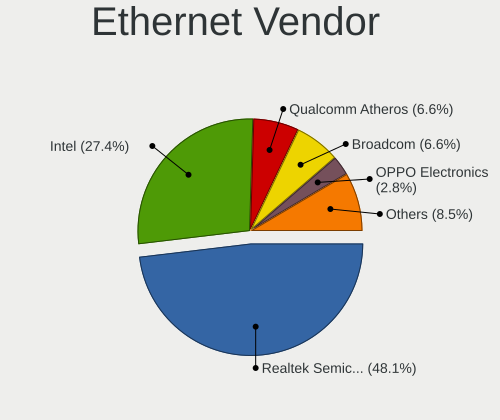

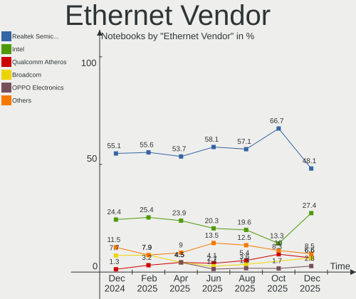

| Vendor                   | Notebooks | Percent |
|--------------------------|-----------|---------|
| Realtek Semiconductor    | 51        | 48.11%  |
| Intel                    | 29        | 27.36%  |
| Qualcomm Atheros         | 7         | 6.6%    |
| Broadcom                 | 7         | 6.6%    |
| OPPO Electronics         | 3         | 2.83%   |
| ASIX Electronics         | 3         | 2.83%   |
| Nvidia                   | 2         | 1.89%   |
| MediaTek                 | 1         | 0.94%   |
| Marvell Technology Group | 1         | 0.94%   |
| Lenovo                   | 1         | 0.94%   |
| Google                   | 1         | 0.94%   |

Ethernet Model
--------------

Ethernet models

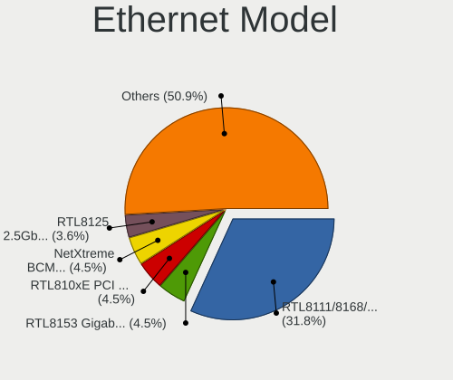

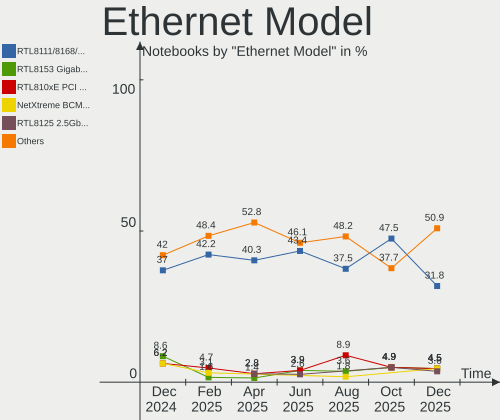

| Model                                                                  | Notebooks | Percent |
|------------------------------------------------------------------------|-----------|---------|
| Realtek RTL8111/8168/8211/8411 PCI Express Gigabit Ethernet Controller | 35        | 31.82%  |
| Realtek RTL8153 Gigabit Ethernet Adapter                               | 5         | 4.55%   |
| Realtek RTL810xE PCI Express Fast Ethernet controller                  | 5         | 4.55%   |
| Broadcom NetXtreme BCM57765 Gigabit Ethernet PCIe                      | 5         | 4.55%   |
| Realtek RTL8125 2.5GbE Controller                                      | 4         | 3.64%   |
| Intel Arrow Lake CNVi WiFi                                             | 4         | 3.64%   |
| Intel 82579LM Gigabit Network Connection (Lewisville)                  | 4         | 3.64%   |
| OPPO RMX3741                                                           | 3         | 2.73%   |
| Intel Ethernet Connection (6) I219-LM                                  | 3         | 2.73%   |
| Intel Ethernet Connection (18) I219-LM                                 | 3         | 2.73%   |
| ASIX AX88179 Gigabit Ethernet                                          | 3         | 2.73%   |
| Qualcomm Atheros Killer E220x Gigabit Ethernet Controller              | 2         | 1.82%   |
| Nvidia MCP79 Ethernet                                                  | 2         | 1.82%   |
| Intel Ethernet Connection I218-LM                                      | 2         | 1.82%   |
| Realtek USB 10/100/1G/2.5 LAN                                          | 1         | 0.91%   |
| Realtek RTL8152 Fast Ethernet Adapter                                  | 1         | 0.91%   |
| Realtek PCIe GbE Family Controller                                     | 1         | 0.91%   |
| Realtek Killer E2600 GbE Controller                                    | 1         | 0.91%   |
| Qualcomm Atheros QCA8172 Fast Ethernet                                 | 1         | 0.91%   |
| Qualcomm Atheros QCA8171 Gigabit Ethernet                              | 1         | 0.91%   |
| Qualcomm Atheros Killer E2500 Gigabit Ethernet Controller              | 1         | 0.91%   |
| Qualcomm Atheros Killer E2400 Gigabit Ethernet Controller              | 1         | 0.91%   |
| Qualcomm Atheros AR8151 v2.0 Gigabit Ethernet                          | 1         | 0.91%   |
| MediaTek MT7922 802.11ax PCI Express Wireless Network Adapter          | 1         | 0.91%   |
| Marvell Group 88E8040T PCI-E Fast Ethernet Controller                  | 1         | 0.91%   |
| Lenovo ThinkPad Dock Ethernet [Realtek RTL8153B]                       | 1         | 0.91%   |
| Intel I210 Gigabit Network Connection                                  | 1         | 0.91%   |
| Intel Ethernet Controller I225-V                                       | 1         | 0.91%   |
| Intel Ethernet Connection I219-LM                                      | 1         | 0.91%   |
| Intel Ethernet Connection I218-V                                       | 1         | 0.91%   |
| Intel Ethernet Connection (7) I219-LM                                  | 1         | 0.91%   |
| Intel Ethernet Connection (4) I219-LM                                  | 1         | 0.91%   |
| Intel Ethernet Connection (3) I218-LM                                  | 1         | 0.91%   |
| Intel Ethernet Connection (24) I219-LM                                 | 1         | 0.91%   |
| Intel Ethernet Connection (13) I219-V                                  | 1         | 0.91%   |
| Intel Ethernet Connection (11) I219-V                                  | 1         | 0.91%   |
| Intel Ethernet Connection (10) I219-V                                  | 1         | 0.91%   |
| Intel Ethernet Connection (10) I219-LM                                 | 1         | 0.91%   |
| Intel Alder Lake-S PCH CNVi WiFi                                       | 1         | 0.91%   |
| Intel Alder Lake-P PCH CNVi WiFi                                       | 1         | 0.91%   |

Net Controller Kind
-------------------

Ethernet, WiFi or modem

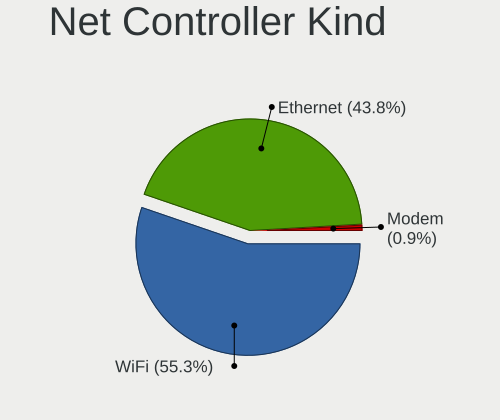

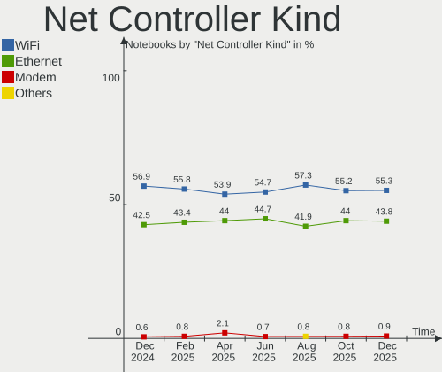

| Kind     | Notebooks | Percent |
|----------|-----------|---------|
| WiFi     | 121       | 55.25%  |
| Ethernet | 96        | 43.84%  |
| Modem    | 2         | 0.91%   |

Used Controller
---------------

Currently used network controller

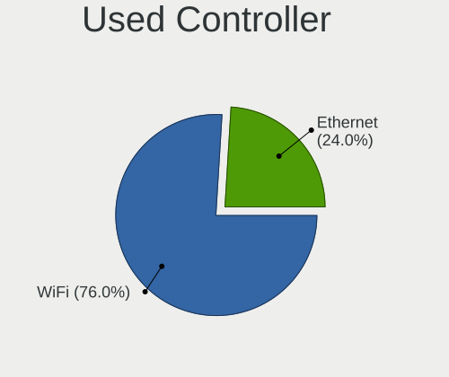

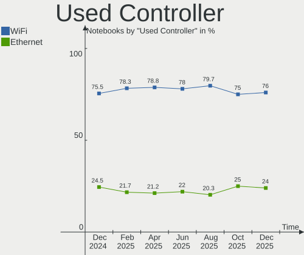

| Kind     | Notebooks | Percent |
|----------|-----------|---------|
| WiFi     | 98        | 75.97%  |
| Ethernet | 31        | 24.03%  |

NICs
----

Total network controllers on board

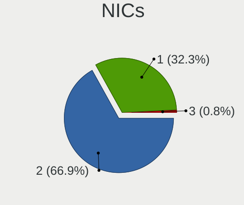

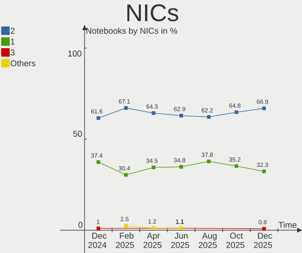

| Total | Notebooks | Percent |
|-------|-----------|---------|
| 2     | 85        | 66.93%  |
| 1     | 41        | 32.28%  |
| 3     | 1         | 0.79%   |

IPv6
----

IPv6 vs IPv4

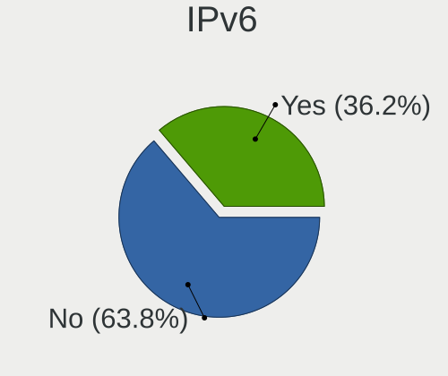

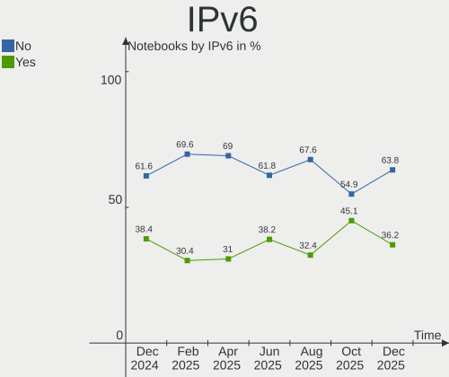

| Used | Notebooks | Percent |
|------|-----------|---------|
| No   | 81        | 63.78%  |
| Yes  | 46        | 36.22%  |

Bluetooth
---------

Bluetooth Vendor
----------------

Controller vendors

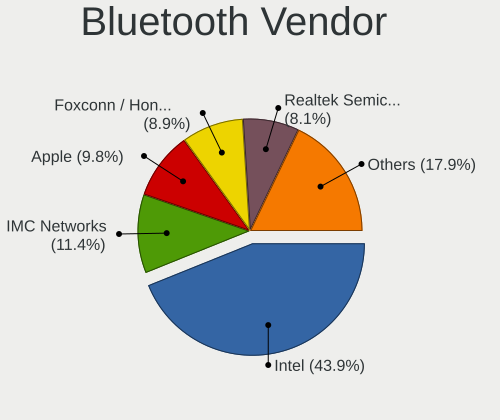

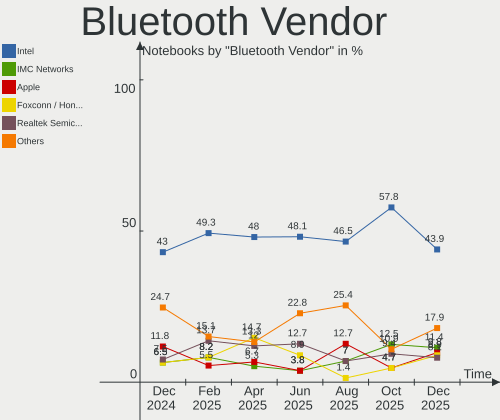

| Vendor                          | Notebooks | Percent |
|---------------------------------|-----------|---------|
| Intel                           | 54        | 43.9%   |
| IMC Networks                    | 14        | 11.38%  |
| Apple                           | 12        | 9.76%   |
| Foxconn / Hon Hai               | 11        | 8.94%   |
| Realtek Semiconductor           | 10        | 8.13%   |
| Qualcomm Atheros Communications | 5         | 4.07%   |
| Broadcom                        | 5         | 4.07%   |
| Dell                            | 4         | 3.25%   |
| Lite-On Technology              | 3         | 2.44%   |
| Toshiba                         | 1         | 0.81%   |
| Realtek                         | 1         | 0.81%   |
| MediaTek                        | 1         | 0.81%   |
| Hewlett-Packard                 | 1         | 0.81%   |
| Foxconn International           | 1         | 0.81%   |

Bluetooth Model
---------------

Controller models

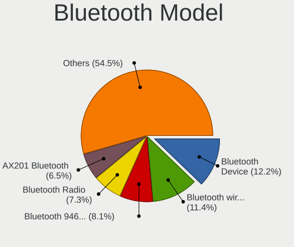

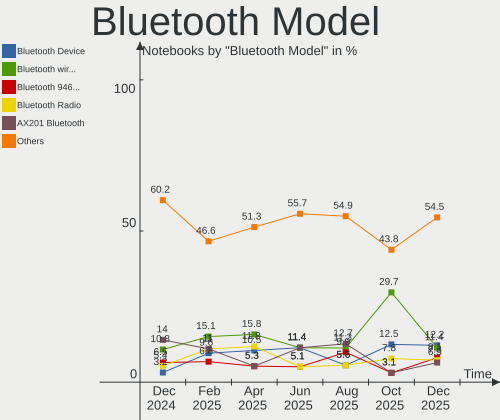

| Model                                             | Notebooks | Percent |
|---------------------------------------------------|-----------|---------|
| Intel Bluetooth Device                            | 15        | 12.2%   |
| Intel Bluetooth wireless interface                | 14        | 11.38%  |
| Intel Bluetooth 9460/9560 Jefferson Peak (JfP)    | 10        | 8.13%   |
| Realtek Bluetooth Radio                           | 9         | 7.32%   |
| Intel AX201 Bluetooth                             | 8         | 6.5%    |
| IMC Networks Wireless_Device                      | 8         | 6.5%    |
| Foxconn / Hon Hai Wireless_Device                 | 6         | 4.88%   |
| Apple Bluetooth USB Host Controller               | 6         | 4.88%   |
| Apple Bluetooth Host Controller                   | 5         | 4.07%   |
| Intel AX200 Bluetooth                             | 4         | 3.25%   |
| IMC Networks Bluetooth Radio                      | 4         | 3.25%   |
| Qualcomm Atheros  Bluetooth Device                | 3         | 2.44%   |
| Intel AX210 Bluetooth                             | 2         | 1.63%   |
| IMC Networks Bluetooth Device                     | 2         | 1.63%   |
| Foxconn / Hon Hai Broadcom BCM20702A1 Bluetooth   | 2         | 1.63%   |
| Dell BCM20702A0 Bluetooth Module                  | 2         | 1.63%   |
| Broadcom BCM43142A0 Bluetooth Device              | 2         | 1.63%   |
| Broadcom BCM2045B (BDC-2.1)                       | 2         | 1.63%   |
| Toshiba Integrated Bluetooth HCI                  | 1         | 0.81%   |
| Realtek  Bluetooth 4.2 Adapter                    | 1         | 0.81%   |
| Realtek Bluetooth Radio                           | 1         | 0.81%   |
| Qualcomm Atheros QCA61x4 Bluetooth 4.0            | 1         | 0.81%   |
| Qualcomm Atheros AR9462 Bluetooth                 | 1         | 0.81%   |
| MediaTek Wireless_Device                          | 1         | 0.81%   |
| Lite-On Wireless_Device                           | 1         | 0.81%   |
| Lite-On Broadcom BCM43142A0 Bluetooth Device      | 1         | 0.81%   |
| Lite-On Bluetooth Device                          | 1         | 0.81%   |
| Intel Wireless-AC 9260 Bluetooth Adapter          | 1         | 0.81%   |
| HP Bluetooth 2.0 Interface [Broadcom BCM2045]     | 1         | 0.81%   |
| Foxconn International BCM43142A0 Bluetooth module | 1         | 0.81%   |
| Foxconn / Hon Hai MediaTek Bluetooth Adapter      | 1         | 0.81%   |
| Foxconn / Hon Hai Bluetooth Device                | 1         | 0.81%   |
| Foxconn / Hon Hai BCM43142A0                      | 1         | 0.81%   |
| Dell Wireless 370 Bluetooth Mini-card             | 1         | 0.81%   |
| Dell DW375 Bluetooth Module                       | 1         | 0.81%   |
| Broadcom BCM20702 Bluetooth 4.0 [ThinkPad]        | 1         | 0.81%   |
| Apple Built-in Bluetooth 2.0+EDR HCI              | 1         | 0.81%   |

Sound
-----

Sound Vendor
------------

Sound card vendors

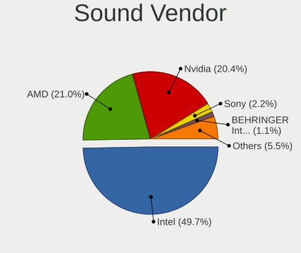

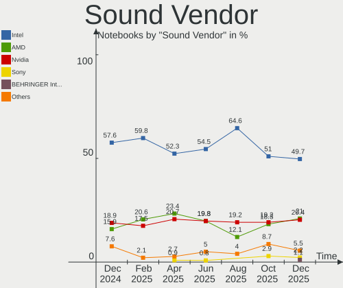

| Vendor                  | Notebooks | Percent |
|-------------------------|-----------|---------|
| Intel                   | 90        | 49.72%  |
| AMD                     | 38        | 20.99%  |
| Nvidia                  | 37        | 20.44%  |
| Sony                    | 4         | 2.21%   |
| BEHRINGER International | 2         | 1.1%    |
| Walmart                 | 1         | 0.55%   |
| Texas Instruments       | 1         | 0.55%   |
| Realtek Semiconductor   | 1         | 0.55%   |
| Razer USA               | 1         | 0.55%   |
| Plantronics             | 1         | 0.55%   |
| Logitech                | 1         | 0.55%   |
| Lenovo                  | 1         | 0.55%   |
| GN Netcom               | 1         | 0.55%   |
| FIFINE Microphones      | 1         | 0.55%   |
| C-Media Electronics     | 1         | 0.55%   |

Sound Model
-----------

Sound card models

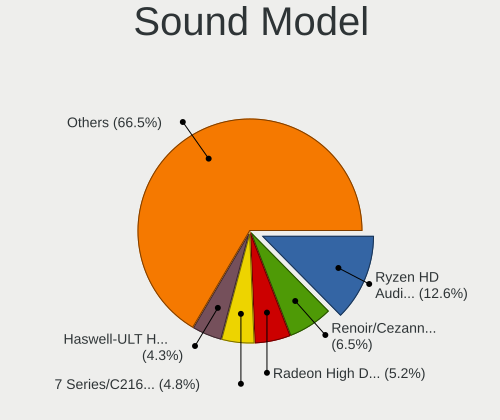

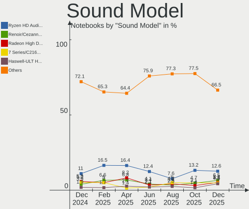

| Model                                                                      | Notebooks | Percent |
|----------------------------------------------------------------------------|-----------|---------|
| AMD Ryzen HD Audio Controller                                              | 29        | 12.61%  |
| AMD Renoir/Cezanne HDMI/DP Audio Controller                                | 15        | 6.52%   |
| AMD Radeon High Definition Audio Controller                                | 12        | 5.22%   |
| Intel 7 Series/C216 Chipset Family High Definition Audio Controller        | 11        | 4.78%   |
| Intel Haswell-ULT HD Audio Controller                                      | 10        | 4.35%   |
| Intel 8 Series HD Audio Controller                                         | 10        | 4.35%   |
| Nvidia AD107 High Definition Audio Controller                              | 6         | 2.61%   |
| Intel Tiger Lake-LP Smart Sound Technology Audio Controller                | 6         | 2.61%   |
| Intel Arrow Lake cAVS                                                      | 6         | 2.61%   |
| Intel Wildcat Point-LP High Definition Audio Controller                    | 5         | 2.17%   |
| Intel Sunrise Point-LP HD Audio                                            | 5         | 2.17%   |
| Intel CM238 HD Audio Controller                                            | 5         | 2.17%   |
| Intel Cannon Lake PCH cAVS                                                 | 5         | 2.17%   |
| Intel Broadwell-U Audio Controller                                         | 5         | 2.17%   |
| Intel 8 Series/C220 Series Chipset High Definition Audio Controller        | 5         | 2.17%   |
| Intel Comet Lake PCH cAVS                                                  | 4         | 1.74%   |
| Intel Cannon Point-LP High Definition Audio Controller                     | 4         | 1.74%   |
| Intel Alder Lake PCH-P High Definition Audio Controller                    | 4         | 1.74%   |
| Sony DualSense wireless controller (PS5)                                   | 3         | 1.3%    |
| Nvidia GK107 HDMI Audio Controller                                         | 3         | 1.3%    |
| Nvidia GA106 High Definition Audio Controller                              | 3         | 1.3%    |
| Nvidia GA104 High Definition Audio Controller                              | 3         | 1.3%    |
| Intel Comet Lake PCH-LP cAVS                                               | 3         | 1.3%    |
| Intel 800 Series ACE (Audio Context Engine)                                | 3         | 1.3%    |
| AMD Kabini HDMI/DP Audio                                                   | 3         | 1.3%    |
| AMD FCH Azalia Controller                                                  | 3         | 1.3%    |
| Nvidia TU107 GeForce GTX 1650 High Definition Audio Controller             | 2         | 0.87%   |
| Nvidia TU106 High Definition Audio Controller                              | 2         | 0.87%   |
| Nvidia MCP79 High Definition Audio                                         | 2         | 0.87%   |
| Nvidia GP106 High Definition Audio Controller                              | 2         | 0.87%   |
| Nvidia GP104 High Definition Audio Controller                              | 2         | 0.87%   |
| Nvidia GB207 High Definition Audio Controller                              | 2         | 0.87%   |
| Nvidia GB206 High Definition Audio Controller                              | 2         | 0.87%   |
| Intel Xeon E3-1200 v3/4th Gen Core Processor HD Audio Controller           | 2         | 0.87%   |
| Intel Meteor Lake-P HD Audio Controller                                    | 2         | 0.87%   |
| Intel 6 Series/C200 Series Chipset Family High Definition Audio Controller | 2         | 0.87%   |
| Intel 5 Series/3400 Series Chipset High Definition Audio                   | 2         | 0.87%   |
| BEHRINGER International UMC204HD 192k                                      | 2         | 0.87%   |
| AMD Raven/Raven2/Fenghuang HDMI/DP Audio Controller                        | 2         | 0.87%   |
| Walmart AB13X Headset Adapter                                              | 1         | 0.43%   |

Memory
------

Memory Vendor
-------------

Memory module vendors

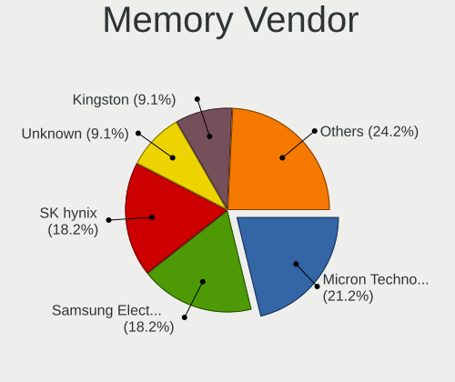

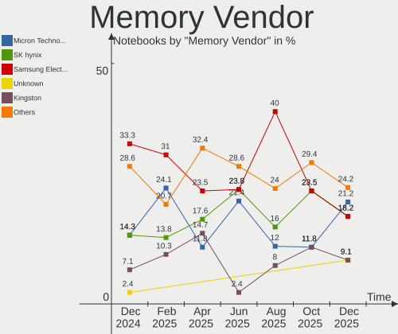

| Vendor              | Notebooks | Percent |
|---------------------|-----------|---------|
| Micron Technology   | 7         | 21.21%  |
| SK hynix            | 6         | 18.18%  |
| Samsung Electronics | 6         | 18.18%  |
| Unknown             | 3         | 9.09%   |
| Kingston            | 3         | 9.09%   |
| Crucial             | 3         | 9.09%   |
| Ramaxel Technology  | 2         | 6.06%   |
| Neo Forza           | 1         | 3.03%   |
| GSkill              | 1         | 3.03%   |
| A-DATA Technology   | 1         | 3.03%   |

Memory Model
------------

Memory module models

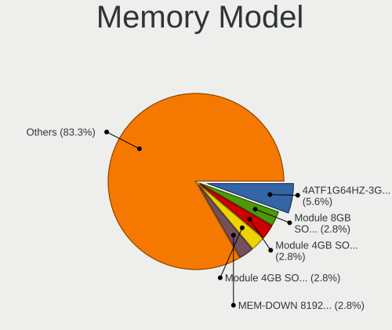

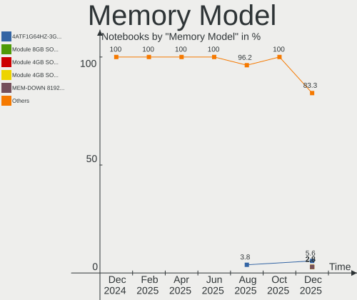

| Model                                                            | Notebooks | Percent |
|------------------------------------------------------------------|-----------|---------|
| Micron RAM 4ATF1G64HZ-3G2F1 8GB SODIMM DDR4 3200MT/s             | 2         | 5.56%   |
| Unknown RAM Module 8GB SODIMM DDR3                               | 1         | 2.78%   |
| Unknown RAM Module 4GB SODIMM DDR4 2667MT/s                      | 1         | 2.78%   |
| Unknown RAM Module 4GB SODIMM DDR3                               | 1         | 2.78%   |
| Unknown RAM MEM-DOWN 8192MB SODIMM DDR4 2400MT/s                 | 1         | 2.78%   |
| SK hynix RAM HMT351S6CFR8C-H9 4GB SODIMM DDR3 1333MT/s           | 1         | 2.78%   |
| SK hynix RAM HMAG68EXNSA051N 8GB SODIMM DDR4 3200MT/s            | 1         | 2.78%   |
| SK hynix RAM HMA81GS6DJR8N-XN 8GB SODIMM DDR4 3200MT/s           | 1         | 2.78%   |
| SK hynix RAM HMA81GS6AFR8N-UH 8GB SODIMM DDR4 3200MT/s           | 1         | 2.78%   |
| SK hynix RAM H9JCNNNCP3MLYR-N6E 2GB Row Of Chips LPDDR5 6400MT/s | 1         | 2.78%   |
| SK hynix RAM H58G66CK8BX147N 8GB SODIMM LPDDR5 8000MT/s          | 1         | 2.78%   |
| Samsung RAM U6E3S4AA-MGCR 1GB Row Of Chips LPDDR4 4267MT/s       | 1         | 2.78%   |
| Samsung RAM M471B5273CH0-CH9 4GB SODIMM DDR3 1334MT/s            | 1         | 2.78%   |
| Samsung RAM M471A2K43CB1-CRC 16GB SODIMM DDR4 2667MT/s           | 1         | 2.78%   |
| Samsung RAM M471A2G44AM0-CWE 16GB SODIMM DDR4 3200MT/s           | 1         | 2.78%   |
| Samsung RAM M471A2G43CB2-CWE 16GB SODIMM DDR4 3200MT/s           | 1         | 2.78%   |
| Samsung RAM M471A2G43AB2-CWE 16GB SODIMM DDR4 3200MT/s           | 1         | 2.78%   |
| Samsung RAM M425R2GA3PB0-CWMOL 16GB SODIMM DDR5 5600MT/s         | 1         | 2.78%   |
| Ramaxel RAM RMT3160ME68FAF1600 8GB SODIMM DDR3 1600MT/s          | 1         | 2.78%   |
| Ramaxel RAM RMSA3330MJ78HBF-3200 16GB SODIMM DDR4 3200MT/s       | 1         | 2.78%   |
| Neo Forza RAM NMSO432F82-3200E 32GB SODIMM DDR4 3200MT/s         | 1         | 2.78%   |
| Micron RAM MT62F2G32D4DS-026 4GB Row Of Chips LPDDR5 7500MT/s    | 1         | 2.78%   |
| Micron RAM MT62F1G32D4DR-031 WT 4GB SODIMM LPDDR5 6400MT/s       | 1         | 2.78%   |
| Micron RAM Module 8GB SODIMM LPDDR3 2133MT/s                     | 1         | 2.78%   |
| Micron RAM Module 8GB SODIMM DDR4 3200MT/s                       | 1         | 2.78%   |
| Micron RAM 4ATF1G64HZ-3G2E1 8GB SODIMM DDR4 3200MT/s             | 1         | 2.78%   |
| Kingston RAM MSI32D4S2S8HD-8 8GB SODIMM DDR4 3200MT/s            | 1         | 2.78%   |
| Kingston RAM 99U5428-101.A00LF 8GB SODIMM DDR3 1600MT/s          | 1         | 2.78%   |
| Kingston RAM 9905428-056.A00G 4GB SODIMM DDR3 1334MT/s           | 1         | 2.78%   |
| GSkill RAM F4-3200C22-8GRS 8GB SODIMM DDR4 3200MT/s              | 1         | 2.78%   |
| Crucial RAM CT8G4SFRA32A.M8FRS 8GB SODIMM DDR4 3200MT/s          | 1         | 2.78%   |
| Crucial RAM CT8G4SFRA32A.C8FR 8GB SODIMM DDR4 3200MT/s           | 1         | 2.78%   |
| Crucial RAM CT16G4SFRA266.C8FE 16GB SODIMM DDR4 2667MT/s         | 1         | 2.78%   |
| A-DATA RAM Module 16GB SODIMM DDR4 3200MT/s                      | 1         | 2.78%   |
| A-DATA RAM AL1P32NC8T1-B8DS 8GB SODIMM DDR4 3200MT/s             | 1         | 2.78%   |

Memory Kind
-----------

Memory module kinds

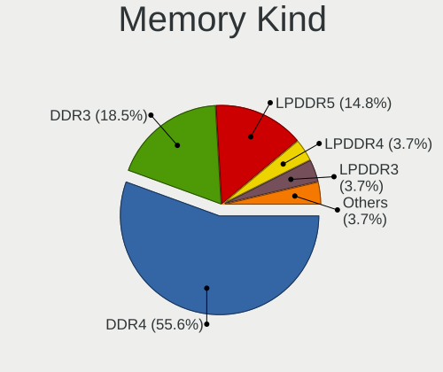

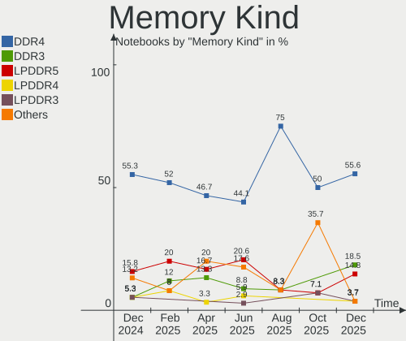

| Kind   | Notebooks | Percent |
|--------|-----------|---------|
| DDR4   | 15        | 55.56%  |
| DDR3   | 5         | 18.52%  |
| LPDDR5 | 4         | 14.81%  |
| LPDDR4 | 1         | 3.7%    |
| LPDDR3 | 1         | 3.7%    |
| DDR5   | 1         | 3.7%    |

Memory Form Factor
------------------

Physical design of the memory module

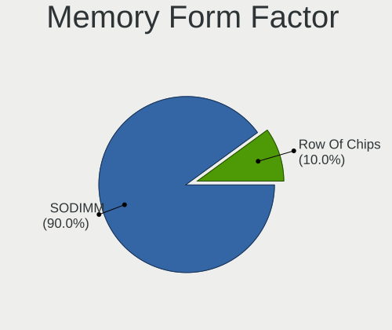

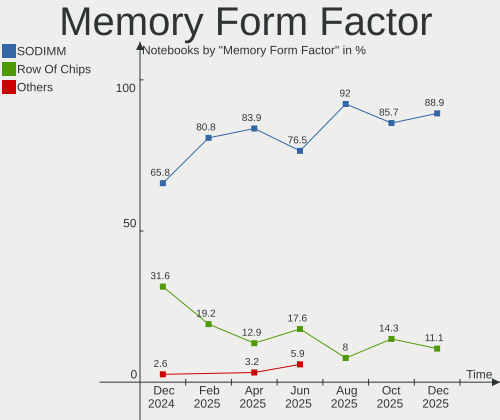

| Name         | Notebooks | Percent |
|--------------|-----------|---------|
| SODIMM       | 24        | 88.89%  |
| Row Of Chips | 3         | 11.11%  |

Memory Size
-----------

Memory module size

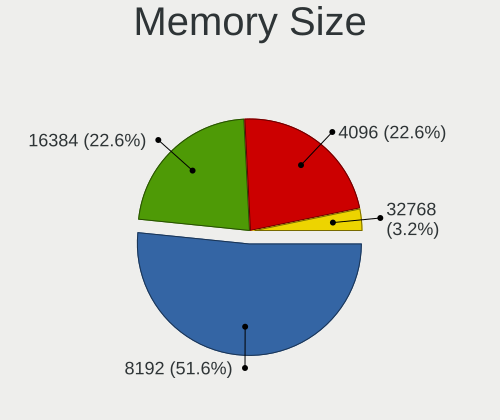

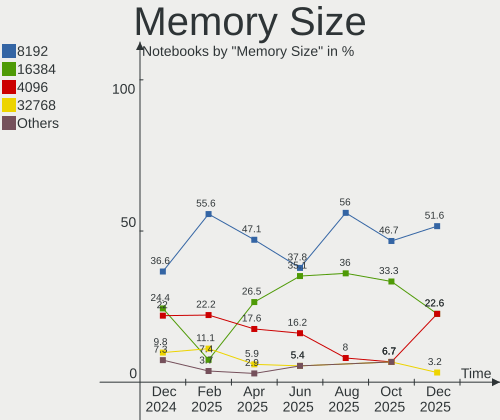

| Size  | Notebooks | Percent |
|-------|-----------|---------|
| 8192  | 16        | 51.61%  |
| 16384 | 7         | 22.58%  |
| 4096  | 7         | 22.58%  |
| 32768 | 1         | 3.23%   |

Memory Speed
------------

Memory module speed

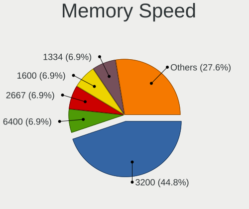

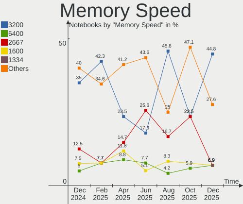

| Speed   | Notebooks | Percent |
|---------|-----------|---------|
| 3200    | 13        | 44.83%  |
| 6400    | 2         | 6.9%    |
| 2667    | 2         | 6.9%    |
| 1600    | 2         | 6.9%    |
| 1334    | 2         | 6.9%    |
| 8000    | 1         | 3.45%   |
| 7500    | 1         | 3.45%   |
| 5600    | 1         | 3.45%   |
| 4267    | 1         | 3.45%   |
| 2400    | 1         | 3.45%   |
| 2133    | 1         | 3.45%   |
| 1333    | 1         | 3.45%   |
| Unknown | 1         | 3.45%   |

Printers & scanners
-------------------

Printer Vendor
--------------

Printer device vendors

Zero info for selected period =(

Printer Model
-------------

Printer device models

Zero info for selected period =(

Scanner Vendor
--------------

Scanner device vendors

Zero info for selected period =(

Scanner Model
-------------

Scanner device models

Zero info for selected period =(

Camera
------

Camera Vendor
-------------

Camera device vendors

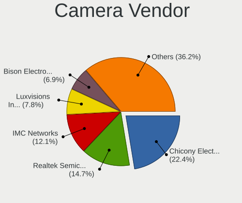

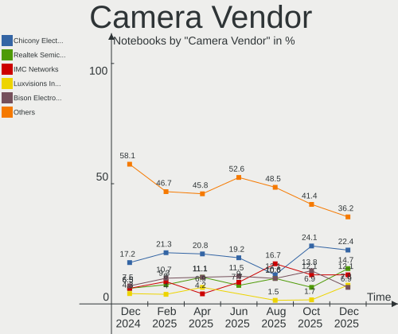

| Vendor                                 | Notebooks | Percent |
|----------------------------------------|-----------|---------|
| Chicony Electronics                    | 26        | 22.41%  |
| Realtek Semiconductor                  | 17        | 14.66%  |
| IMC Networks                           | 14        | 12.07%  |
| Luxvisions Innotech Limited            | 9         | 7.76%   |
| Bison Electronics                      | 8         | 6.9%    |
| Apple                                  | 7         | 6.03%   |
| Quanta                                 | 6         | 5.17%   |
| Shinetech                              | 4         | 3.45%   |
| Microdia                               | 3         | 2.59%   |
| Lite-On Technology                     | 3         | 2.59%   |
| Cheng Uei Precision Industry (Foxlink) | 3         | 2.59%   |
| Syntek                                 | 2         | 1.72%   |
| Sunplus Innovation Technology          | 2         | 1.72%   |
| Ricoh                                  | 2         | 1.72%   |
| Logitech                               | 2         | 1.72%   |
| Acer                                   | 2         | 1.72%   |
| Z-Star Microelectronics                | 1         | 0.86%   |
| Suyin                                  | 1         | 0.86%   |
| ShineOptics                            | 1         | 0.86%   |
| Samsung Electronics                    | 1         | 0.86%   |
| kingcome                               | 1         | 0.86%   |
| Jieli Technology                       | 1         | 0.86%   |

Camera Model
------------

Camera device models

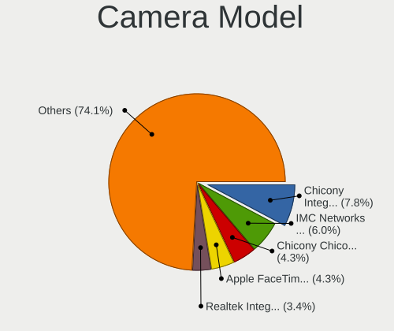

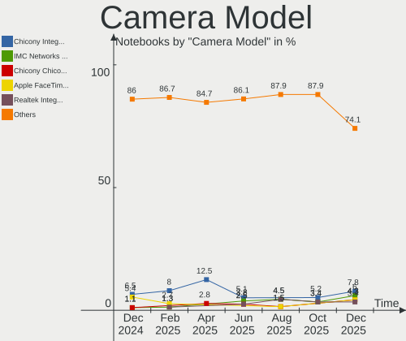

| Model                                                           | Notebooks | Percent |
|-----------------------------------------------------------------|-----------|---------|
| Chicony Integrated Camera                                       | 9         | 7.76%   |
| IMC Networks USB2.0 HD UVC WebCam                               | 7         | 6.03%   |
| Chicony Chicony USB2.0 Camera                                   | 5         | 4.31%   |
| Apple FaceTime HD Camera                                        | 5         | 4.31%   |
| Realtek Integrated_Webcam_HD                                    | 4         | 3.45%   |
| Shinetech USB2.0 FHD UVC WebCam                                 | 3         | 2.59%   |
| Realtek Integrated_Webcam_FHD                                   | 3         | 2.59%   |
| Quanta ACER HD User Facing                                      | 3         | 2.59%   |
| Syntek Lenovo EasyCamera                                        | 2         | 1.72%   |
| Realtek USB2.0 HD UVC WebCam                                    | 2         | 1.72%   |
| Realtek USB Camera                                              | 2         | 1.72%   |
| Luxvisions Innotech Limited Integrated Camera                   | 2         | 1.72%   |
| Luxvisions Innotech Limited HP True Vision HD Camera            | 2         | 1.72%   |
| IMC Networks Integrated Camera                                  | 2         | 1.72%   |
| IMC Networks HD Camera                                          | 2         | 1.72%   |
| Chicony HP Truevision HD camera                                 | 2         | 1.72%   |
| Chicony HD WebCam                                               | 2         | 1.72%   |
| Cheng Uei Precision Industry (Foxlink) HP Wide Vision HD Camera | 2         | 1.72%   |
| Bison Lenovo EasyCamera                                         | 2         | 1.72%   |
| Bison FHD Camera                                                | 2         | 1.72%   |
| Z-Star Full HD 1080P PC Camera                                  | 1         | 0.86%   |
| Suyin HD WebCam                                                 | 1         | 0.86%   |
| Sunplus USB Camera                                              | 1         | 0.86%   |
| Sunplus Lenovo EasyCamera                                       | 1         | 0.86%   |
| Shinetech ASUS FHD webcam                                       | 1         | 0.86%   |
| ShineOptics HD Camera                                           | 1         | 0.86%   |
| Samsung Galaxy series, misc. (MTP mode)                         | 1         | 0.86%   |
| Ricoh Integrated Webcam                                         | 1         | 0.86%   |
| Ricoh HD Webcam                                                 | 1         | 0.86%   |
| Realtek LG Camera                                               | 1         | 0.86%   |
| Realtek Laptop Camera                                           | 1         | 0.86%   |
| Realtek Integrated Webcam HD                                    | 1         | 0.86%   |
| Realtek Integrated Webcam                                       | 1         | 0.86%   |
| Realtek HP "Truevision HD" laptop camera                        | 1         | 0.86%   |
| Realtek Front Camera                                            | 1         | 0.86%   |
| Quanta HP Wide Vision HD Camera                                 | 1         | 0.86%   |
| Quanta HP HD Camera                                             | 1         | 0.86%   |
| Quanta HD User Facing                                           | 1         | 0.86%   |
| Microdia Webcam Vitade AF                                       | 1         | 0.86%   |
| Microdia Laptop_Integrated_Webcam_E4HD                          | 1         | 0.86%   |

Security
--------

Fingerprint Vendor
------------------

Fingerprint sensor vendors

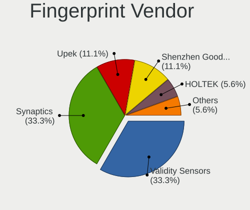

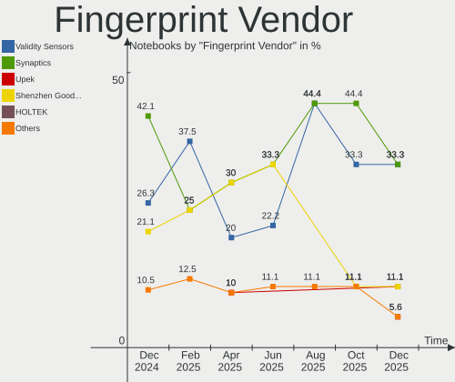

| Vendor                     | Notebooks | Percent |
|----------------------------|-----------|---------|
| Validity Sensors           | 6         | 33.33%  |
| Synaptics                  | 6         | 33.33%  |
| Upek                       | 2         | 11.11%  |
| Shenzhen Goodix Technology | 2         | 11.11%  |
| HOLTEK                     | 1         | 5.56%   |
| Elan Microelectronics      | 1         | 5.56%   |

Fingerprint Model
-----------------

Fingerprint sensor models

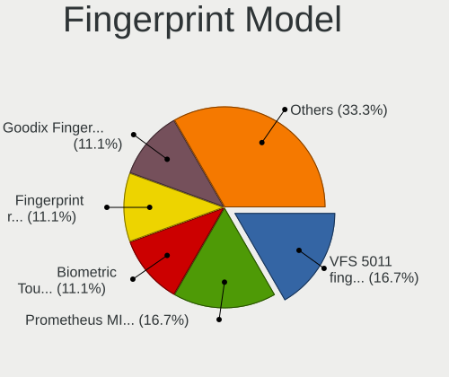

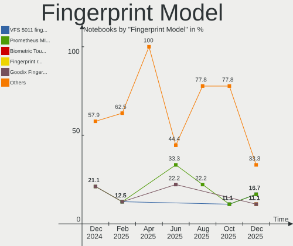

| Model                                                  | Notebooks | Percent |
|--------------------------------------------------------|-----------|---------|
| Validity Sensors VFS 5011 fingerprint sensor           | 3         | 16.67%  |
| Synaptics Prometheus MIS Touch Fingerprint Reader      | 3         | 16.67%  |
| Upek Biometric Touchchip/Touchstrip Fingerprint Sensor | 2         | 11.11%  |
| Synaptics Fingerprint reader [HP G6]                   | 2         | 11.11%  |
| Shenzhen Goodix  Fingerprint Device                    | 2         | 11.11%  |
| Validity Sensors VFS7500 Touch Fingerprint Sensor      | 1         | 5.56%   |
| Validity Sensors VFS5011 Fingerprint Reader            | 1         | 5.56%   |
| Validity Sensors VFS Fingerprint sensor                | 1         | 5.56%   |
| Synaptics UWP WBDI Device                              | 1         | 5.56%   |
| HOLTEK FocalTech Fingerprint Device                    | 1         | 5.56%   |
| Elan ELAN:Fingerprint                                  | 1         | 5.56%   |

Chipcard Vendor
---------------

Chipcard module vendors

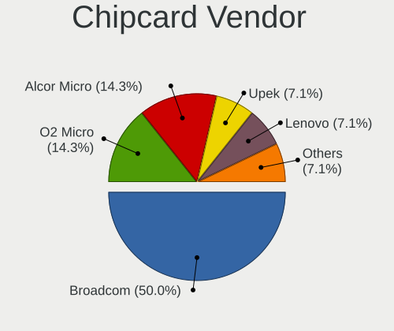

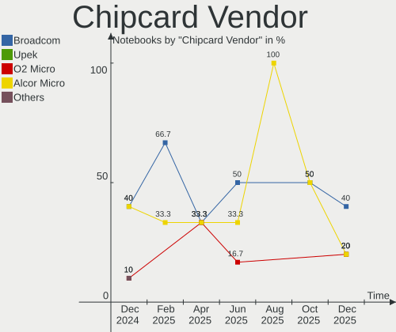

| Vendor      | Notebooks | Percent |
|-------------|-----------|---------|
| Broadcom    | 2         | 40%     |
| Upek        | 1         | 20%     |
| O2 Micro    | 1         | 20%     |
| Alcor Micro | 1         | 20%     |

Chipcard Model
--------------

Chipcard module models

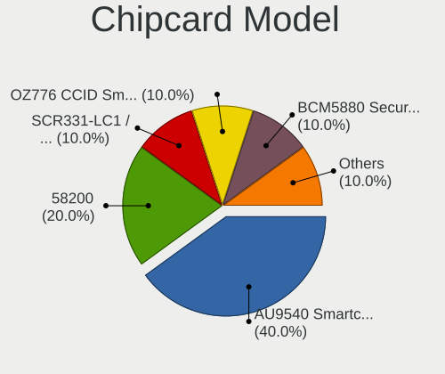

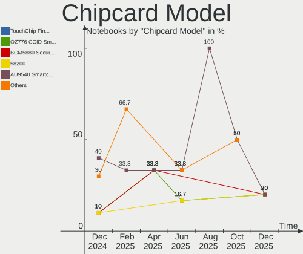

| Model                                                      | Notebooks | Percent |
|------------------------------------------------------------|-----------|---------|
| Upek TouchChip Fingerprint Coprocessor (WBF advanced mode) | 1         | 20%     |
| O2 Micro OZ776 CCID Smartcard Reader                       | 1         | 20%     |
| Broadcom BCM5880 Secure Applications Processor             | 1         | 20%     |
| Broadcom 58200                                             | 1         | 20%     |
| Alcor Micro AU9540 Smartcard Reader                        | 1         | 20%     |

Unsupported
-----------

Unsupported Devices
-------------------

Total unsupported devices on board

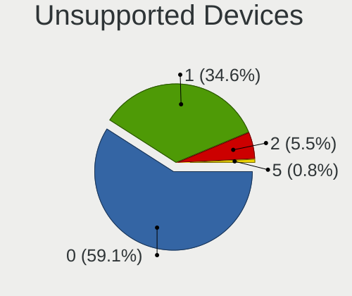

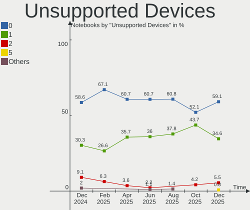

| Total | Notebooks | Percent |
|-------|-----------|---------|
| 0     | 75        | 59.06%  |
| 1     | 44        | 34.65%  |
| 2     | 7         | 5.51%   |
| 5     | 1         | 0.79%   |

Unsupported Device Types
------------------------

Types of unsupported devices

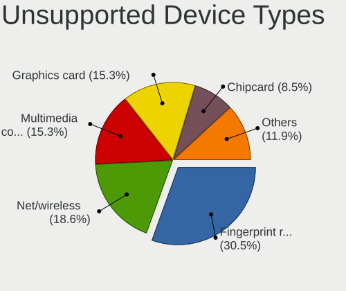

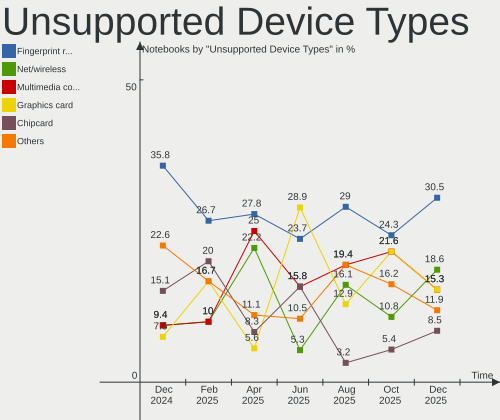

| Type                     | Notebooks | Percent |
|--------------------------|-----------|---------|
| Fingerprint reader       | 18        | 30.51%  |
| Net/wireless             | 11        | 18.64%  |
| Multimedia controller    | 9         | 15.25%  |
| Graphics card            | 9         | 15.25%  |
| Chipcard                 | 5         | 8.47%   |
| Communication controller | 2         | 3.39%   |
| Camera                   | 2         | 3.39%   |
| Storage                  | 1         | 1.69%   |
| Sound                    | 1         | 1.69%   |
| Bluetooth                | 1         | 1.69%   |

