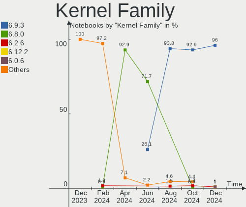
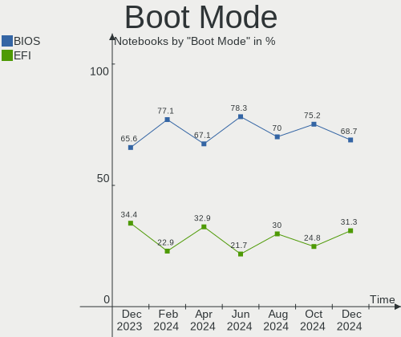
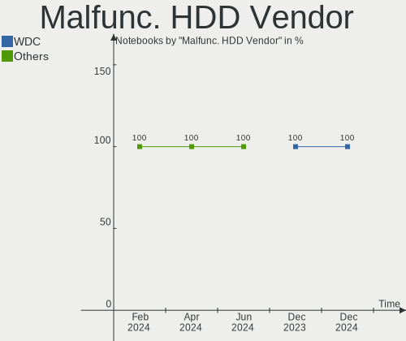
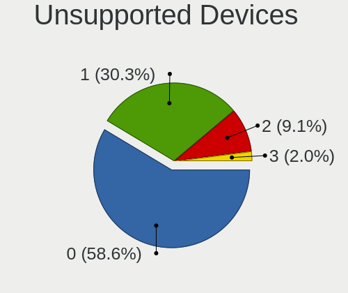

Pop!_OS - Hardware Trends (Notebooks)
-------------------------------------

A project to identify most popular hardware characteristics and track their change
over time based on data collected by Linux users at https://Linux-Hardware.org.

Anyone can contribute to this report by the [hw-probe](https://github.com/linuxhw/hw-probe) tool:

    sudo -E hw-probe -all -upload

This report is for one last month. Overall report since the beginning of time: [TestDays](https://github.com/linuxhw/TestDays)

Period: Dec, 2023.

Contents
--------

* [ System ](#system)
  - [ OS                       ](#os)
  - [ OS Family                ](#os-family)
  - [ Kernel                   ](#kernel)
  - [ Kernel Family            ](#kernel-family)
  - [ Kernel Major Ver.        ](#kernel-major-ver)
  - [ Arch                     ](#arch)
  - [ DE                       ](#de)
  - [ Display Server           ](#display-server)
  - [ Display Manager          ](#display-manager)
  - [ OS Lang                  ](#os-lang)
  - [ Boot Mode                ](#boot-mode)
  - [ Filesystem               ](#filesystem)
  - [ Part. scheme             ](#part-scheme)
  - [ Dual Boot with Linux/BSD ](#dual-boot-with-linuxbsd)
  - [ Dual Boot (Win)          ](#dual-boot-win)

* [ Board ](#board)
  - [ Vendor                   ](#vendor)
  - [ Model                    ](#model)
  - [ Model Family             ](#model-family)
  - [ MFG Year                 ](#mfg-year)
  - [ Form Factor              ](#form-factor)
  - [ Secure Boot              ](#secure-boot)
  - [ Coreboot                 ](#coreboot)
  - [ RAM Size                 ](#ram-size)
  - [ RAM Used                 ](#ram-used)
  - [ Total Drives             ](#total-drives)
  - [ Has CD-ROM               ](#has-cd-rom)
  - [ Has Ethernet             ](#has-ethernet)
  - [ Has WiFi                 ](#has-wifi)
  - [ Has Bluetooth            ](#has-bluetooth)

* [ Location ](#location)
  - [ Country                  ](#country)
  - [ City                     ](#city)

* [ Drives ](#drives)
  - [ Drive Vendor             ](#drive-vendor)
  - [ Drive Model              ](#drive-model)
  - [ HDD Vendor               ](#hdd-vendor)
  - [ SSD Vendor               ](#ssd-vendor)
  - [ Drive Kind               ](#drive-kind)
  - [ Drive Connector          ](#drive-connector)
  - [ Drive Size               ](#drive-size)
  - [ Space Total              ](#space-total)
  - [ Space Used               ](#space-used)
  - [ Malfunc. Drives          ](#malfunc-drives)
  - [ Malfunc. Drive Vendor    ](#malfunc-drive-vendor)
  - [ Malfunc. HDD Vendor      ](#malfunc-hdd-vendor)
  - [ Malfunc. Drive Kind      ](#malfunc-drive-kind)
  - [ Failed Drives            ](#failed-drives)
  - [ Failed Drive Vendor      ](#failed-drive-vendor)
  - [ Drive Status             ](#drive-status)

* [ Storage controller ](#storage-controller)
  - [ Storage Vendor           ](#storage-vendor)
  - [ Storage Model            ](#storage-model)
  - [ Storage Kind             ](#storage-kind)

* [ Processor ](#processor)
  - [ CPU Vendor               ](#cpu-vendor)
  - [ CPU Model                ](#cpu-model)
  - [ CPU Model Family         ](#cpu-model-family)
  - [ CPU Cores                ](#cpu-cores)
  - [ CPU Sockets              ](#cpu-sockets)
  - [ CPU Threads              ](#cpu-threads)
  - [ CPU Op-Modes             ](#cpu-op-modes)
  - [ CPU Microcode            ](#cpu-microcode)
  - [ CPU Microarch            ](#cpu-microarch)

* [ Graphics ](#graphics)
  - [ GPU Vendor               ](#gpu-vendor)
  - [ GPU Model                ](#gpu-model)
  - [ GPU Combo                ](#gpu-combo)
  - [ GPU Driver               ](#gpu-driver)
  - [ GPU Memory               ](#gpu-memory)

* [ Monitor ](#monitor)
  - [ Monitor Vendor           ](#monitor-vendor)
  - [ Monitor Model            ](#monitor-model)
  - [ Monitor Resolution       ](#monitor-resolution)
  - [ Monitor Diagonal         ](#monitor-diagonal)
  - [ Monitor Width            ](#monitor-width)
  - [ Aspect Ratio             ](#aspect-ratio)
  - [ Monitor Area             ](#monitor-area)
  - [ Pixel Density            ](#pixel-density)
  - [ Multiple Monitors        ](#multiple-monitors)

* [ Network ](#network)
  - [ Net Controller Vendor    ](#net-controller-vendor)
  - [ Net Controller Model     ](#net-controller-model)
  - [ Wireless Vendor          ](#wireless-vendor)
  - [ Wireless Model           ](#wireless-model)
  - [ Ethernet Vendor          ](#ethernet-vendor)
  - [ Ethernet Model           ](#ethernet-model)
  - [ Net Controller Kind      ](#net-controller-kind)
  - [ Used Controller          ](#used-controller)
  - [ NICs                     ](#nics)
  - [ IPv6                     ](#ipv6)

* [ Bluetooth ](#bluetooth)
  - [ Bluetooth Vendor         ](#bluetooth-vendor)
  - [ Bluetooth Model          ](#bluetooth-model)

* [ Sound ](#sound)
  - [ Sound Vendor             ](#sound-vendor)
  - [ Sound Model              ](#sound-model)

* [ Memory ](#memory)
  - [ Memory Vendor            ](#memory-vendor)
  - [ Memory Model             ](#memory-model)
  - [ Memory Kind              ](#memory-kind)
  - [ Memory Form Factor       ](#memory-form-factor)
  - [ Memory Size              ](#memory-size)
  - [ Memory Speed             ](#memory-speed)

* [ Printers & scanners ](#printers--scanners)
  - [ Printer Vendor           ](#printer-vendor)
  - [ Printer Model            ](#printer-model)
  - [ Scanner Vendor           ](#scanner-vendor)
  - [ Scanner Model            ](#scanner-model)

* [ Camera ](#camera)
  - [ Camera Vendor            ](#camera-vendor)
  - [ Camera Model             ](#camera-model)

* [ Security ](#security)
  - [ Fingerprint Vendor       ](#fingerprint-vendor)
  - [ Fingerprint Model        ](#fingerprint-model)
  - [ Chipcard Vendor          ](#chipcard-vendor)
  - [ Chipcard Model           ](#chipcard-model)

* [ Unsupported ](#unsupported)
  - [ Unsupported Devices      ](#unsupported-devices)
  - [ Unsupported Device Types ](#unsupported-device-types)

System
------

OS
--

Installed operating systems

| Name          | Notebooks | Percent |
|---------------|-----------|---------|
| Pop!_OS 22.04 | 89        | 98.89%  |
| Pop!_OS 20.04 | 1         | 1.11%   |

OS Family
---------

OS without a version

| Name    | Notebooks | Percent |
|---------|-----------|---------|
| Pop!_OS | 90        | 100%    |

Kernel
------

Version of the Linux kernel

| Version                 | Notebooks | Percent |
|-------------------------|-----------|---------|
| 6.5.6-76060506-generic  | 44        | 48.89%  |
| 6.6.6-76060606-generic  | 39        | 43.33%  |
| 6.5.4-76060504-generic  | 5         | 5.56%   |
| 6.5.7-060507-generic    | 1         | 1.11%   |
| 6.0.12-76060012-generic | 1         | 1.11%   |

Kernel Family
-------------

Linux kernel without a distro release

| Version | Notebooks | Percent |
|---------|-----------|---------|
| 6.5.6   | 44        | 48.89%  |
| 6.6.6   | 39        | 43.33%  |
| 6.5.4   | 5         | 5.56%   |
| 6.5.7   | 1         | 1.11%   |
| 6.0.12  | 1         | 1.11%   |

Kernel Major Ver.
-----------------

Linux kernel major version

| Version | Notebooks | Percent |
|---------|-----------|---------|
| 6.5     | 50        | 55.56%  |
| 6.6     | 39        | 43.33%  |
| 6.0     | 1         | 1.11%   |

Arch
----

OS architecture (x86_64, i586, etc.)

| Name   | Notebooks | Percent |
|--------|-----------|---------|
| x86_64 | 90        | 100%    |

DE
--

Desktop Environment

| Name       | Notebooks | Percent |
|------------|-----------|---------|
| GNOME      | 87        | 96.67%  |
| KDE5       | 2         | 2.22%   |
| X-Cinnamon | 1         | 1.11%   |

Display Server
--------------

X11 or Wayland

| Name    | Notebooks | Percent |
|---------|-----------|---------|
| X11     | 87        | 96.67%  |
| Wayland | 3         | 3.33%   |

Display Manager
---------------

SDDM, LightDM, etc.

| Name    | Notebooks | Percent |
|---------|-----------|---------|
| Unknown | 57        | 63.33%  |
| GDM3    | 33        | 36.67%  |

OS Lang
-------

Language

| Lang  | Notebooks | Percent |
|-------|-----------|---------|
| en_US | 53        | 58.89%  |
| fr_FR | 7         | 7.78%   |
| en_GB | 4         | 4.44%   |
| en_CA | 4         | 4.44%   |
| en_AU | 4         | 4.44%   |
| de_DE | 4         | 4.44%   |
| C     | 3         | 3.33%   |
| ru_RU | 2         | 2.22%   |
| zh_HK | 1         | 1.11%   |
| tr_TR | 1         | 1.11%   |
| pt_PT | 1         | 1.11%   |
| pt_BR | 1         | 1.11%   |
| nb_NO | 1         | 1.11%   |
| it_IT | 1         | 1.11%   |
| hu_HU | 1         | 1.11%   |
| fi_FI | 1         | 1.11%   |
| de_CH | 1         | 1.11%   |

Boot Mode
---------

EFI or BIOS

| Mode | Notebooks | Percent |
|------|-----------|---------|
| BIOS | 58        | 64.44%  |
| EFI  | 32        | 35.56%  |

Filesystem
----------

Type of filesystem

| Type    | Notebooks | Percent |
|---------|-----------|---------|
| Ext4    | 86        | 95.56%  |
| Overlay | 2         | 2.22%   |
| Xfs     | 1         | 1.11%   |
| Btrfs   | 1         | 1.11%   |

Part. scheme
------------

Scheme of partitioning

| Type    | Notebooks | Percent |
|---------|-----------|---------|
| Unknown | 57        | 63.33%  |
| GPT     | 32        | 35.56%  |
| MBR     | 1         | 1.11%   |

Dual Boot with Linux/BSD
------------------------

Hosting more than one Linux/BSD

| Dual boot | Notebooks | Percent |
|-----------|-----------|---------|
| No        | 83        | 92.22%  |
| Yes       | 7         | 7.78%   |

Dual Boot (Win)
---------------

Hosting Linux and Windows

| Dual boot | Notebooks | Percent |
|-----------|-----------|---------|
| No        | 73        | 81.11%  |
| Yes       | 17        | 18.89%  |

Board
-----

Vendor
------

Motherboard manufacturer

| Name                | Notebooks | Percent |
|---------------------|-----------|---------|
| Lenovo              | 22        | 24.44%  |
| Dell                | 13        | 14.44%  |
| ASUSTek Computer    | 12        | 13.33%  |
| Hewlett-Packard     | 11        | 12.22%  |
| Acer                | 7         | 7.78%   |
| System76            | 4         | 4.44%   |
| Apple               | 4         | 4.44%   |
| MSI                 | 3         | 3.33%   |
| PC Specialist       | 2         | 2.22%   |
| Notebook            | 2         | 2.22%   |
| Toshiba             | 1         | 1.11%   |
| Samsung Electronics | 1         | 1.11%   |
| realme              | 1         | 1.11%   |
| Razer               | 1         | 1.11%   |
| MicroByte           | 1         | 1.11%   |
| Metabox             | 1         | 1.11%   |
| HUAWEI              | 1         | 1.11%   |
| Google              | 1         | 1.11%   |
| Framework           | 1         | 1.11%   |
| DEXP                | 1         | 1.11%   |

Model
-----

Motherboard model

| Name                                     | Notebooks | Percent |
|------------------------------------------|-----------|---------|
| Lenovo Legion Pro 5 16ARX8 82WM          | 2         | 2.22%   |
| HP Dev One Notebook PC                   | 2         | 2.22%   |
| Toshiba TECRA Z50-A                      | 1         | 1.11%   |
| System76 Serval WS                       | 1         | 1.11%   |
| System76 Pangolin                        | 1         | 1.11%   |
| System76 Lemur Pro                       | 1         | 1.11%   |
| System76 Gazelle                         | 1         | 1.11%   |
| Samsung 300E5E/300E4E/300E5V/300E4V      | 1         | 1.11%   |
| realme RMNBXXXX                          | 1         | 1.11%   |
| Razer Blade                              | 1         | 1.11%   |
| PC Specialist N150CU                     | 1         | 1.11%   |
| PC Specialist GK7NP5R                    | 1         | 1.11%   |
| Notebook NL40_50CU                       | 1         | 1.11%   |
| Notebook NJ50_70CU                       | 1         | 1.11%   |
| MSI Modern 14 B4MW                       | 1         | 1.11%   |
| MSI GT72VR 6RD                           | 1         | 1.11%   |
| MSI GP66 Leopard 11UG                    | 1         | 1.11%   |
| MicroByte ezbook                         | 1         | 1.11%   |
| Metabox Alpha-X NH58HP                   | 1         | 1.11%   |
| Lenovo Y50-70 20378                      | 1         | 1.11%   |
| Lenovo ThinkPad X1 Carbon 6th 20KH002RUS | 1         | 1.11%   |
| Lenovo ThinkPad T540p 20BFS06200         | 1         | 1.11%   |
| Lenovo ThinkPad T460s 20FAS30D00         | 1         | 1.11%   |
| Lenovo ThinkPad T14 Gen 1 20S0002VUS     | 1         | 1.11%   |
| Lenovo ThinkPad P50 20EQS3YS00           | 1         | 1.11%   |
| Lenovo ThinkPad P15s Gen 2i 20W6005VMZ   | 1         | 1.11%   |
| Lenovo ThinkPad L590 20Q8S0QB00          | 1         | 1.11%   |
| Lenovo ThinkPad L14 Gen 2a 20X50049GE    | 1         | 1.11%   |
| Lenovo ThinkPad E14 Gen 4 21E3008RUS     | 1         | 1.11%   |
| Lenovo ThinkBook 15 G2 ARE 20VG          | 1         | 1.11%   |
| Lenovo IdeaPad S540-15IWL GTX 81SW       | 1         | 1.11%   |
| Lenovo IdeaPad S145-15API 81UT           | 1         | 1.11%   |
| Lenovo IdeaPad Gaming 3 15IMH05 81Y4     | 1         | 1.11%   |
| Lenovo IdeaPad Gaming 3 15IAH7 82S9      | 1         | 1.11%   |
| Lenovo IdeaPad Gaming 3 15ACH6 82K2      | 1         | 1.11%   |
| Lenovo IdeaPad 5 15ARE05 81YQ            | 1         | 1.11%   |
| Lenovo IdeaPad 330-17IKB 81DM            | 1         | 1.11%   |
| Lenovo G400 20235                        | 1         | 1.11%   |
| Lenovo B490 37722KP                      | 1         | 1.11%   |
| HUAWEI KLVD-WXX9                         | 1         | 1.11%   |

Model Family
------------

Motherboard model prefix

| Name                  | Notebooks | Percent |
|-----------------------|-----------|---------|
| Lenovo ThinkPad       | 9         | 10%     |
| Dell Latitude         | 8         | 8.89%   |
| Lenovo IdeaPad        | 7         | 7.78%   |
| ASUS ROG              | 3         | 3.33%   |
| Acer Aspire           | 3         | 3.33%   |
| Lenovo Legion         | 2         | 2.22%   |
| HP ZBook              | 2         | 2.22%   |
| HP ProBook            | 2         | 2.22%   |
| HP EliteBook          | 2         | 2.22%   |
| HP Dev                | 2         | 2.22%   |
| Dell XPS              | 2         | 2.22%   |
| Dell Inspiron         | 2         | 2.22%   |
| ASUS ASUS             | 2         | 2.22%   |
| Toshiba TECRA         | 1         | 1.11%   |
| System76 Serval       | 1         | 1.11%   |
| System76 Pangolin     | 1         | 1.11%   |
| System76 Lemur        | 1         | 1.11%   |
| System76 Gazelle      | 1         | 1.11%   |
| Samsung 300E5E        | 1         | 1.11%   |
| realme RMNBXXXX       | 1         | 1.11%   |
| Razer Blade           | 1         | 1.11%   |
| PC Specialist N150CU  | 1         | 1.11%   |
| PC Specialist GK7NP5R | 1         | 1.11%   |
| Notebook NL40         | 1         | 1.11%   |
| Notebook NJ50         | 1         | 1.11%   |
| MSI Modern            | 1         | 1.11%   |
| MSI GT72VR            | 1         | 1.11%   |
| MSI GP66              | 1         | 1.11%   |
| MicroByte ezbook      | 1         | 1.11%   |
| Metabox Alpha-X       | 1         | 1.11%   |
| Lenovo Y50-70         | 1         | 1.11%   |
| Lenovo ThinkBook      | 1         | 1.11%   |
| Lenovo G400           | 1         | 1.11%   |
| Lenovo B490           | 1         | 1.11%   |
| HUAWEI KLVD-WXX9      | 1         | 1.11%   |
| HP Laptop             | 1         | 1.11%   |
| HP 255                | 1         | 1.11%   |
| HP 15                 | 1         | 1.11%   |
| Google Delbin         | 1         | 1.11%   |
| Framework Laptop      | 1         | 1.11%   |

MFG Year
--------

Motherboard manufacture year

| Year | Notebooks | Percent |
|------|-----------|---------|
| 2023 | 12        | 13.33%  |
| 2022 | 12        | 13.33%  |
| 2021 | 11        | 12.22%  |
| 2020 | 10        | 11.11%  |
| 2019 | 9         | 10%     |
| 2014 | 7         | 7.78%   |
| 2018 | 5         | 5.56%   |
| 2011 | 5         | 5.56%   |
| 2013 | 4         | 4.44%   |
| 2017 | 3         | 3.33%   |
| 2016 | 3         | 3.33%   |
| 2015 | 3         | 3.33%   |
| 2012 | 3         | 3.33%   |
| 2010 | 1         | 1.11%   |
| 2008 | 1         | 1.11%   |
| 2007 | 1         | 1.11%   |

Form Factor
-----------

Physical design of the computer

| Name     | Notebooks | Percent |
|----------|-----------|---------|
| Notebook | 90        | 100%    |

Secure Boot
-----------

Enabled or disabled

| State    | Notebooks | Percent |
|----------|-----------|---------|
| Disabled | 90        | 100%    |

Coreboot
--------

Have coreboot on board

| Used | Notebooks | Percent |
|------|-----------|---------|
| No   | 86        | 95.56%  |
| Yes  | 4         | 4.44%   |

RAM Size
--------

Total RAM memory

| Size in GB  | Notebooks | Percent |
|-------------|-----------|---------|
| 4.01-8.0    | 22        | 24.44%  |
| 8.01-16.0   | 21        | 23.33%  |
| 16.01-24.0  | 20        | 22.22%  |
| 32.01-64.0  | 16        | 17.78%  |
| 3.01-4.0    | 6         | 6.67%   |
| 64.01-256.0 | 4         | 4.44%   |
| 24.01-32.0  | 1         | 1.11%   |

RAM Used
--------

Used RAM memory

| Used GB    | Notebooks | Percent |
|------------|-----------|---------|
| 4.01-8.0   | 41        | 45.56%  |
| 3.01-4.0   | 20        | 22.22%  |
| 8.01-16.0  | 14        | 15.56%  |
| 2.01-3.0   | 10        | 11.11%  |
| 16.01-24.0 | 3         | 3.33%   |
| 24.01-32.0 | 1         | 1.11%   |
| 1.01-2.0   | 1         | 1.11%   |

Total Drives
------------

Number of drives on board

| Drives | Notebooks | Percent |
|--------|-----------|---------|
| 1      | 62        | 68.89%  |
| 2      | 24        | 26.67%  |
| 3      | 3         | 3.33%   |
| 0      | 1         | 1.11%   |

Has CD-ROM
----------

Has CD-ROM on board

| Presented | Notebooks | Percent |
|-----------|-----------|---------|
| No        | 76        | 84.44%  |
| Yes       | 14        | 15.56%  |

Has Ethernet
------------

Has Ethernet on board

| Presented | Notebooks | Percent |
|-----------|-----------|---------|
| Yes       | 67        | 74.44%  |
| No        | 23        | 25.56%  |

Has WiFi
--------

Has WiFi module

| Presented | Notebooks | Percent |
|-----------|-----------|---------|
| Yes       | 90        | 100%    |

Has Bluetooth
-------------

Has Bluetooth module

| Presented | Notebooks | Percent |
|-----------|-----------|---------|
| Yes       | 75        | 83.33%  |
| No        | 15        | 16.67%  |

Location
--------

Country
-------

Geographic location (country)

| Country      | Notebooks | Percent |
|--------------|-----------|---------|
| USA          | 23        | 25.56%  |
| France       | 7         | 7.78%   |
| Germany      | 6         | 6.67%   |
| Canada       | 6         | 6.67%   |
| Czechia      | 4         | 4.44%   |
| Australia    | 4         | 4.44%   |
| Russia       | 3         | 3.33%   |
| Indonesia    | 3         | 3.33%   |
| UK           | 2         | 2.22%   |
| Thailand     | 2         | 2.22%   |
| Switzerland  | 2         | 2.22%   |
| Sweden       | 2         | 2.22%   |
| Norway       | 2         | 2.22%   |
| India        | 2         | 2.22%   |
| Hungary      | 2         | 2.22%   |
| Brazil       | 2         | 2.22%   |
| Uzbekistan   | 1         | 1.11%   |
| Turkey       | 1         | 1.11%   |
| Taiwan       | 1         | 1.11%   |
| South Africa | 1         | 1.11%   |
| Slovakia     | 1         | 1.11%   |
| Réunion     | 1         | 1.11%   |
| Portugal     | 1         | 1.11%   |
| Philippines  | 1         | 1.11%   |
| Palestine    | 1         | 1.11%   |
| Netherlands  | 1         | 1.11%   |
| Italy        | 1         | 1.11%   |
| Hong Kong    | 1         | 1.11%   |
| Greece       | 1         | 1.11%   |
| Georgia      | 1         | 1.11%   |
| Finland      | 1         | 1.11%   |
| Egypt        | 1         | 1.11%   |
| Bulgaria     | 1         | 1.11%   |
| Algeria      | 1         | 1.11%   |

City
----

Geographic location (city)

| City           | Notebooks | Percent |
|----------------|-----------|---------|
| Prague         | 3         | 3.33%   |
| Chicago        | 2         | 2.22%   |
| Bangkok        | 2         | 2.22%   |
| Weiden         | 1         | 1.11%   |
| Washington     | 1         | 1.11%   |
| Victoria       | 1         | 1.11%   |
| Tubas          | 1         | 1.11%   |
| Trondheim      | 1         | 1.11%   |
| Therwil        | 1         | 1.11%   |
| Tampa          | 1         | 1.11%   |
| Taichung       | 1         | 1.11%   |
| Surrey         | 1         | 1.11%   |
| Surgut         | 1         | 1.11%   |
| Stockholm      | 1         | 1.11%   |
| State College  | 1         | 1.11%   |
| St. Gallen     | 1         | 1.11%   |
| Sofia          | 1         | 1.11%   |
| Saskatoon      | 1         | 1.11%   |
| Salt Lake City | 1         | 1.11%   |
| Salem          | 1         | 1.11%   |
| Saint-Jerome   | 1         | 1.11%   |
| Saint-Denis    | 1         | 1.11%   |
| Saint Jacob    | 1         | 1.11%   |
| Sai Kung       | 1         | 1.11%   |
| Rhodes         | 1         | 1.11%   |
| Reims          | 1         | 1.11%   |
| Recife         | 1         | 1.11%   |
| Rambouillet    | 1         | 1.11%   |
| Poprad         | 1         | 1.11%   |
| Perth          | 1         | 1.11%   |
| Passau         | 1         | 1.11%   |
| Paris          | 1         | 1.11%   |
| Omaha          | 1         | 1.11%   |
| Oakham         | 1         | 1.11%   |
| Niles          | 1         | 1.11%   |
| New York       | 1         | 1.11%   |
| Morehead City  | 1         | 1.11%   |
| Montijo        | 1         | 1.11%   |
| Minori         | 1         | 1.11%   |
| Melbourne      | 1         | 1.11%   |

Drives
------

Drive Vendor
------------

Hard drive vendors

| Vendor                    | Notebooks | Drives | Percent |
|---------------------------|-----------|--------|---------|
| Samsung Electronics       | 26        | 29     | 22.81%  |
| Sandisk                   | 11        | 11     | 9.65%   |
| WDC                       | 8         | 8      | 7.02%   |
| Seagate                   | 8         | 8      | 7.02%   |
| Micron Technology         | 8         | 8      | 7.02%   |
| Kingston                  | 8         | 8      | 7.02%   |
| Toshiba                   | 6         | 6      | 5.26%   |
| SK hynix                  | 5         | 5      | 4.39%   |
| Unknown                   | 4         | 4      | 3.51%   |
| Crucial                   | 3         | 3      | 2.63%   |
| Phison                    | 2         | 3      | 1.75%   |
| Patriot                   | 2         | 2      | 1.75%   |
| Micron/Crucial Technology | 2         | 2      | 1.75%   |
| Lexar                     | 2         | 3      | 1.75%   |
| Intel                     | 2         | 2      | 1.75%   |
| Apple                     | 2         | 2      | 1.75%   |
| XSTAR                     | 1         | 1      | 0.88%   |
| Union Memory (Shenzhen)   | 1         | 1      | 0.88%   |
| Team                      | 1         | 1      | 0.88%   |
| Silicon Motion            | 1         | 1      | 0.88%   |
| PNY                       | 1         | 1      | 0.88%   |
| Phison Electronics        | 1         | 1      | 0.88%   |
| LITEONIT                  | 1         | 1      | 0.88%   |
| LDLC                      | 1         | 1      | 0.88%   |
| KIOXIA                    | 1         | 1      | 0.88%   |
| JMicron Technology        | 1         | 1      | 0.88%   |
| Intenso                   | 1         | 1      | 0.88%   |
| Hikvision                 | 1         | 1      | 0.88%   |
| Hewlett-Packard           | 1         | 1      | 0.88%   |
| BIWIN                     | 1         | 1      | 0.88%   |
| A-DATA Technology         | 1         | 1      | 0.88%   |

Drive Model
-----------

Hard drive models

| Model                                               | Notebooks | Percent |
|-----------------------------------------------------|-----------|---------|
| Samsung NVMe SSD Controller PM9A1/PM9A3/980PRO 2TB  | 6         | 5.17%   |
| Sandisk WD Blue SN550 NVMe SSD 1TB                  | 5         | 4.31%   |
| Samsung NVMe SSD Controller SM981/PM981/PM983 512GB | 4         | 3.45%   |
| Samsung SSD 980 1TB                                 | 2         | 1.72%   |
| Micron 2450_MTFDKBA512TFK 512GB                     | 2         | 1.72%   |
| Kingston SV300S37A240G 240GB SSD                    | 2         | 1.72%   |
| XSTAR SSD 256GB                                     | 1         | 0.86%   |
| WDC WDS500G2B0A-00SM50 500GB SSD                    | 1         | 0.86%   |
| WDC WDS100T2B0A-00SM50 1TB SSD                      | 1         | 0.86%   |
| WDC WD5000BPKT-75PK4T0 500GB                        | 1         | 0.86%   |
| WDC WD30 EZRX-00MMMB0 3TB                           | 1         | 0.86%   |
| WDC WD10SPZX-24Z10 1TB                              | 1         | 0.86%   |
| WDC WD10SPZX-16Z10T0 1TB                            | 1         | 0.86%   |
| WDC WD10S21X-24R1BT0-SSHD-8GB                       | 1         | 0.86%   |
| WDC PC SN730 SDBQNTY-512G-1001 512GB                | 1         | 0.86%   |
| Unknown SR128  128GB                                | 1         | 0.86%   |
| Unknown MMC Card  256GB                             | 1         | 0.86%   |
| Unknown GFAQK  512GB                                | 1         | 0.86%   |
| Unknown 00000  64GB                                 | 1         | 0.86%   |
| Union Memory (Shenzhen) RPFTJ128PDD2EWX 128GB       | 1         | 0.86%   |
| Toshiba THNSNK128GVN8 128GB SSD                     | 1         | 0.86%   |
| Toshiba MQ01ACF050 500GB                            | 1         | 0.86%   |
| Toshiba MQ01ABU050W 500GB                           | 1         | 0.86%   |
| Toshiba MK5056GSY 500GB                             | 1         | 0.86%   |
| Toshiba MK3261GSYN 320GB                            | 1         | 0.86%   |
| Toshiba KSG60ZMV256G M.2 2280 256GB SSD             | 1         | 0.86%   |
| Team NVMe SSD Drive 1024GB                          | 1         | 0.86%   |
| SK hynix SKHynix_HFM512GDHTNI-87A0B 512GB           | 1         | 0.86%   |
| SK hynix PC711 HFS001TDE9X073N 1024GB               | 1         | 0.86%   |
| SK hynix HFS512GEJ9X125N 512GB                      | 1         | 0.86%   |
| SK hynix HFM512GD3JX016N 512GB                      | 1         | 0.86%   |
| SK hynix BC511 512GB                                | 1         | 0.86%   |
| Silicon Motion 1TB PCS PCIe M.2 SSD                 | 1         | 0.86%   |
| Seagate ST9500420AS 500GB                           | 1         | 0.86%   |
| Seagate ST9500325AS 500GB                           | 1         | 0.86%   |
| Seagate ST500LT012-9WS142 500GB                     | 1         | 0.86%   |
| Seagate ST500LM012 HN-M500MBB 500GB                 | 1         | 0.86%   |
| Seagate ST1000LM035-1RK172 1TB                      | 1         | 0.86%   |
| Seagate One Touch w/PW 5TB                          | 1         | 0.86%   |
| Seagate Expansion 2TB                               | 1         | 0.86%   |

HDD Vendor
----------

Hard disk drive vendors

| Vendor  | Notebooks | Drives | Percent |
|---------|-----------|--------|---------|
| Seagate | 7         | 7      | 41.18%  |
| WDC     | 5         | 5      | 29.41%  |
| Toshiba | 4         | 4      | 23.53%  |
| Intenso | 1         | 1      | 5.88%   |

SSD Vendor
----------

Solid state drive vendors

| Vendor              | Notebooks | Drives | Percent |
|---------------------|-----------|--------|---------|
| Kingston            | 4         | 4      | 14.29%  |
| Samsung Electronics | 3         | 3      | 10.71%  |
| WDC                 | 2         | 2      | 7.14%   |
| Toshiba             | 2         | 2      | 7.14%   |
| SanDisk             | 2         | 2      | 7.14%   |
| Patriot             | 2         | 2      | 7.14%   |
| Crucial             | 2         | 2      | 7.14%   |
| Apple               | 2         | 2      | 7.14%   |
| XSTAR               | 1         | 1      | 3.57%   |
| PNY                 | 1         | 1      | 3.57%   |
| LITEONIT            | 1         | 1      | 3.57%   |
| Lexar               | 1         | 2      | 3.57%   |
| LDLC                | 1         | 1      | 3.57%   |
| JMicron Technology  | 1         | 1      | 3.57%   |
| Intel               | 1         | 1      | 3.57%   |
| Hewlett-Packard     | 1         | 1      | 3.57%   |
| A-DATA Technology   | 1         | 1      | 3.57%   |

Drive Kind
----------

HDD or SSD

| Kind    | Notebooks | Drives | Percent |
|---------|-----------|--------|---------|
| NVMe    | 60        | 68     | 55.56%  |
| SSD     | 27        | 29     | 25%     |
| HDD     | 16        | 17     | 14.81%  |
| MMC     | 4         | 4      | 3.7%    |
| Unknown | 1         | 1      | 0.93%   |

Drive Connector
---------------

SATA, SAS, NVMe, etc.

| Type | Notebooks | Drives | Percent |
|------|-----------|--------|---------|
| NVMe | 60        | 67     | 56.6%   |
| SATA | 35        | 41     | 33.02%  |
| SAS  | 7         | 7      | 6.6%    |
| MMC  | 4         | 4      | 3.77%   |

Drive Size
----------

Size of hard drive

| Size in TB | Notebooks | Drives | Percent |
|------------|-----------|--------|---------|
| 0.01-0.5   | 26        | 30     | 61.9%   |
| 0.51-1.0   | 10        | 10     | 23.81%  |
| 1.01-2.0   | 3         | 3      | 7.14%   |
| 3.01-4.0   | 2         | 2      | 4.76%   |
| 2.01-3.0   | 1         | 1      | 2.38%   |

Space Total
-----------

Amount of disk space available on the file system

| Size in GB     | Notebooks | Percent |
|----------------|-----------|---------|
| 251-500        | 29        | 32.22%  |
| 501-1000       | 20        | 22.22%  |
| 101-250        | 18        | 20%     |
| 1001-2000      | 10        | 11.11%  |
| More than 3000 | 5         | 5.56%   |
| 21-50          | 3         | 3.33%   |
| 1-20           | 2         | 2.22%   |
| 51-100         | 2         | 2.22%   |
| 2001-3000      | 1         | 1.11%   |

Space Used
----------

Amount of used disk space

| Used GB        | Notebooks | Percent |
|----------------|-----------|---------|
| 1-20           | 24        | 26.67%  |
| 21-50          | 15        | 16.67%  |
| 101-250        | 15        | 16.67%  |
| 251-500        | 14        | 15.56%  |
| 51-100         | 10        | 11.11%  |
| 501-1000       | 7         | 7.78%   |
| More than 3000 | 3         | 3.33%   |
| 1001-2000      | 2         | 2.22%   |

Malfunc. Drives
---------------

Drive models with a malfunction

| Model                               | Notebooks | Drives | Percent |
|-------------------------------------|-----------|--------|---------|
| WDC WD10SPZX-16Z10T0 1TB            | 1         | 1      | 33.33%  |
| Silicon Motion 1TB PCS PCIe M.2 SSD | 1         | 1      | 33.33%  |
| Crucial CT525MX300SSD1 528GB        | 1         | 1      | 33.33%  |

Malfunc. Drive Vendor
---------------------

Vendors of faulty drives

| Vendor         | Notebooks | Drives | Percent |
|----------------|-----------|--------|---------|
| WDC            | 1         | 1      | 33.33%  |
| Silicon Motion | 1         | 1      | 33.33%  |
| Crucial        | 1         | 1      | 33.33%  |

Malfunc. HDD Vendor
-------------------

Vendors of faulty HDD drives

| Vendor | Notebooks | Drives | Percent |
|--------|-----------|--------|---------|
| WDC    | 1         | 1      | 100%    |

Malfunc. Drive Kind
-------------------

Kinds of faulty drives

| Kind | Notebooks | Drives | Percent |
|------|-----------|--------|---------|
| NVMe | 1         | 1      | 33.33%  |
| SSD  | 1         | 1      | 33.33%  |
| HDD  | 1         | 1      | 33.33%  |

Failed Drives
-------------

Failed drive models

Zero info for selected period =(

Failed Drive Vendor
-------------------

Failed drive vendors

Zero info for selected period =(

Drive Status
------------

Number of failed and malfunc. drives

| Status   | Notebooks | Drives | Percent |
|----------|-----------|--------|---------|
| Detected | 65        | 79     | 66.33%  |
| Works    | 30        | 37     | 30.61%  |
| Malfunc  | 3         | 3      | 3.06%   |

Storage controller
------------------

Storage Vendor
--------------

Storage controller vendors

| Vendor                       | Notebooks | Percent |
|------------------------------|-----------|---------|
| Intel                        | 49        | 41.18%  |
| Samsung Electronics          | 24        | 20.17%  |
| SanDisk                      | 10        | 8.4%    |
| Micron Technology            | 8         | 6.72%   |
| AMD                          | 7         | 5.88%   |
| SK hynix                     | 5         | 4.2%    |
| Kingston Technology Company  | 4         | 3.36%   |
| Phison Electronics           | 3         | 2.52%   |
| Micron/Crucial Technology    | 3         | 2.52%   |
| Union Memory (Shenzhen)      | 1         | 0.84%   |
| Silicon Motion               | 1         | 0.84%   |
| Shenzhen Longsys Electronics | 1         | 0.84%   |
| MAXIO Technology (Hangzhou)  | 1         | 0.84%   |
| KIOXIA                       | 1         | 0.84%   |
| Hosin Global Electronics     | 1         | 0.84%   |

Storage Model
-------------

Storage controller models

| Model                                                                          | Notebooks | Percent |
|--------------------------------------------------------------------------------|-----------|---------|
| Samsung NVMe SSD Controller PM9A1/PM9A3/980PRO                                 | 12        | 9.76%   |
| Intel Volume Management Device NVMe RAID Controller                            | 8         | 6.5%    |
| AMD FCH SATA Controller [AHCI mode]                                            | 7         | 5.69%   |
| Samsung NVMe SSD Controller SM981/PM981/PM983                                  | 6         | 4.88%   |
| Samsung NVMe SSD Controller 980 (DRAM-less)                                    | 6         | 4.88%   |
| SanDisk Ultra 3D / WD Blue SN550 NVMe SSD                                      | 5         | 4.07%   |
| Intel 7 Series Chipset Family 6-port SATA Controller [AHCI mode]               | 5         | 4.07%   |
| Intel Sunrise Point-LP SATA Controller [AHCI mode]                             | 4         | 3.25%   |
| Intel Alder Lake-P SATA AHCI Controller                                        | 4         | 3.25%   |
| Intel 82801 Mobile SATA Controller [RAID mode]                                 | 4         | 3.25%   |
| Intel 8 Series/C220 Series Chipset Family 6-port SATA Controller 1 [AHCI mode] | 4         | 3.25%   |
| Micron 2450 NVMe SSD [HendrixV] (DRAM-less)                                    | 3         | 2.44%   |
| Intel Comet Lake SATA AHCI Controller                                          | 3         | 2.44%   |
| Intel 6 Series/C200 Series Chipset Family 6 port Mobile SATA AHCI Controller   | 3         | 2.44%   |
| SK hynix Gold P31/BC711/PC711 NVMe Solid State Drive                           | 2         | 1.63%   |
| SK hynix BC511 NVMe SSD                                                        | 2         | 1.63%   |
| Phison E12 NVMe Controller                                                     | 2         | 1.63%   |
| Micron/Crucial P5 Plus NVMe PCIe SSD                                           | 2         | 1.63%   |
| Micron 2400 NVMe SSD (DRAM-less)                                               | 2         | 1.63%   |
| Micron 2210 NVMe SSD [Cobain]                                                  | 2         | 1.63%   |
| Intel Volume Management Device NVMe RAID Controller Intel Corporation          | 2         | 1.63%   |
| Intel HM170/QM170 Chipset SATA Controller [AHCI Mode]                          | 2         | 1.63%   |
| Intel 8 Series SATA Controller 1 [AHCI mode]                                   | 2         | 1.63%   |
| Intel 400 Series Chipset Family SATA AHCI Controller                           | 2         | 1.63%   |
| Union Memory (Shenzhen) AM610 PCIe 3.0 x2 NVMe SSD 128GB, 256GB                | 1         | 0.81%   |
| SK hynix Platinum P41/PC801 NVMe Solid State Drive                             | 1         | 0.81%   |
| Silicon Motion SM2263EN/SM2263XT (DRAM-less) NVMe SSD Controllers              | 1         | 0.81%   |
| Shenzhen Longsys Non-Volatile memory controller                                | 1         | 0.81%   |
| SanDisk WD Blue SN500 / PC SN520 x2 M.2 2280 NVMe SSD                          | 1         | 0.81%   |
| SanDisk WD Black SN770 / PC SN740 256GB / PC SN560 (DRAM-less) NVMe SSD        | 1         | 0.81%   |
| SanDisk PC SN530 NVMe SSD (DRAM-less)                                          | 1         | 0.81%   |
| SanDisk Extreme Pro / WD Black SN750 / PC SN730 / Red SN700 NVMe SSD           | 1         | 0.81%   |
| SanDisk Extreme Pro / WD Black 2018/SN750/PC SN720 NVMe SSD                    | 1         | 0.81%   |
| Samsung S4LN053X01 AHCI SSD Controller(Apple slot)                             | 1         | 0.81%   |
| Phison PS5013-E13 PCIe3 NVMe Controller (DRAM-less)                            | 1         | 0.81%   |
| Micron/Crucial P2 [Nick P2] / P3 / P3 Plus NVMe PCIe SSD (DRAM-less)           | 1         | 0.81%   |
| Micron 3400 NVMe SSD [Hendrix]                                                 | 1         | 0.81%   |
| MAXIO (Hangzhou) NVMe SSD Controller MAP1202                                   | 1         | 0.81%   |
| KIOXIA NVMe SSD Controller BG5 (DRAM-less)                                     | 1         | 0.81%   |
| Kingston Company OM8PCP Design-In PCIe 3 NVMe SSD (DRAM-less)                  | 1         | 0.81%   |

Storage Kind
------------

Kind of storage controller (IDE, SATA, NVMe, SAS, ...)

| Kind | Notebooks | Percent |
|------|-----------|---------|
| NVMe | 60        | 50.42%  |
| SATA | 44        | 36.97%  |
| RAID | 14        | 11.76%  |
| IDE  | 1         | 0.84%   |

Processor
---------

CPU Vendor
----------

Processor vendors

| Vendor | Notebooks | Percent |
|--------|-----------|---------|
| Intel  | 70        | 77.78%  |
| AMD    | 20        | 22.22%  |

CPU Model
---------

Processor models

| Model                                         | Notebooks | Percent |
|-----------------------------------------------|-----------|---------|
| Intel 11th Gen Core i7-1165G7 @ 2.80GHz       | 4         | 4.44%   |
| AMD Ryzen 5 4500U with Radeon Graphics        | 4         | 4.44%   |
| Intel Core i7-8650U CPU @ 1.90GHz             | 3         | 3.33%   |
| AMD Ryzen 7 PRO 5850U with Radeon Graphics    | 3         | 3.33%   |
| AMD Ryzen 5 3500U with Radeon Vega Mobile Gfx | 3         | 3.33%   |
| Intel Core i7-4720HQ CPU @ 2.60GHz            | 2         | 2.22%   |
| Intel Core i5-8365U CPU @ 1.60GHz             | 2         | 2.22%   |
| Intel Core i5-4300U CPU @ 1.90GHz             | 2         | 2.22%   |
| Intel Core i5-3210M CPU @ 2.50GHz             | 2         | 2.22%   |
| Intel 13th Gen Core i9-13900H                 | 2         | 2.22%   |
| Intel 12th Gen Core i5-12500H                 | 2         | 2.22%   |
| Intel 12th Gen Core i5-1235U                  | 2         | 2.22%   |
| Intel 11th Gen Core i7-11800H @ 2.30GHz       | 2         | 2.22%   |
| AMD Ryzen 7 7745HX with Radeon Graphics       | 2         | 2.22%   |
| Intel Xeon CPU E3-1505M v5 @ 2.80GHz          | 1         | 1.11%   |
| Intel Pentium Dual CPU T2370 @ 1.73GHz        | 1         | 1.11%   |
| Intel Core i7-8750H CPU @ 2.20GHz             | 1         | 1.11%   |
| Intel Core i7-8565U CPU @ 1.80GHz             | 1         | 1.11%   |
| Intel Core i7-8550U CPU @ 1.80GHz             | 1         | 1.11%   |
| Intel Core i7-7700HQ CPU @ 2.80GHz            | 1         | 1.11%   |
| Intel Core i7-7600U CPU @ 2.80GHz             | 1         | 1.11%   |
| Intel Core i7-6700HQ CPU @ 2.60GHz            | 1         | 1.11%   |
| Intel Core i7-6600U CPU @ 2.60GHz             | 1         | 1.11%   |
| Intel Core i7-4710HQ CPU @ 2.50GHz            | 1         | 1.11%   |
| Intel Core i7-3610QM CPU @ 2.30GHz            | 1         | 1.11%   |
| Intel Core i7-3520M CPU @ 2.90GHz             | 1         | 1.11%   |
| Intel Core i7-2720QM CPU @ 2.20GHz            | 1         | 1.11%   |
| Intel Core i7-2670QM CPU @ 2.20GHz            | 1         | 1.11%   |
| Intel Core i7-10750H CPU @ 2.60GHz            | 1         | 1.11%   |
| Intel Core i7-1065G7 CPU @ 1.30GHz            | 1         | 1.11%   |
| Intel Core i7-10610U CPU @ 1.80GHz            | 1         | 1.11%   |
| Intel Core i7-10510U CPU @ 1.80GHz            | 1         | 1.11%   |
| Intel Core i7 CPU Q 720 @ 1.60GHz             | 1         | 1.11%   |
| Intel Core i5-8250U CPU @ 1.60GHz             | 1         | 1.11%   |
| Intel Core i5-6300U CPU @ 2.40GHz             | 1         | 1.11%   |
| Intel Core i5-5300U CPU @ 2.30GHz             | 1         | 1.11%   |
| Intel Core i5-5250U CPU @ 1.60GHz             | 1         | 1.11%   |
| Intel Core i5-4300M CPU @ 2.60GHz             | 1         | 1.11%   |
| Intel Core i5-4258U CPU @ 2.40GHz             | 1         | 1.11%   |
| Intel Core i5-2520M CPU @ 2.50GHz             | 1         | 1.11%   |

CPU Model Family
----------------

Processor model prefix

| Model              | Notebooks | Percent |
|--------------------|-----------|---------|
| Other              | 25        | 27.78%  |
| Intel Core i7      | 22        | 24.44%  |
| Intel Core i5      | 16        | 17.78%  |
| AMD Ryzen 5        | 9         | 10%     |
| AMD Ryzen 7        | 6         | 6.67%   |
| AMD Ryzen 7 PRO    | 4         | 4.44%   |
| Intel Celeron      | 3         | 3.33%   |
| Intel Core i3      | 2         | 2.22%   |
| Intel Xeon         | 1         | 1.11%   |
| Intel Pentium Dual | 1         | 1.11%   |
| AMD A6             | 1         | 1.11%   |

CPU Cores
---------

Number of processor cores

| Number | Notebooks | Percent |
|--------|-----------|---------|
| 4      | 34        | 37.78%  |
| 2      | 20        | 22.22%  |
| 8      | 13        | 14.44%  |
| 6      | 9         | 10%     |
| 14     | 6         | 6.67%   |
| 10     | 4         | 4.44%   |
| 12     | 2         | 2.22%   |
| 24     | 1         | 1.11%   |
| 16     | 1         | 1.11%   |

CPU Sockets
-----------

Number of sockets

| Number | Notebooks | Percent |
|--------|-----------|---------|
| 1      | 90        | 100%    |

CPU Threads
-----------

Threads per core (Hyper-Threading)

| Number | Notebooks | Percent |
|--------|-----------|---------|
| 2      | 80        | 88.89%  |
| 1      | 10        | 11.11%  |

CPU Op-Modes
------------

CPU Operation Modes (32-bit, 64-bit)

| Op mode        | Notebooks | Percent |
|----------------|-----------|---------|
| 32-bit, 64-bit | 90        | 100%    |

CPU Microcode
-------------

Microcode number

| Number     | Notebooks | Percent |
|------------|-----------|---------|
| Unknown    | 83        | 92.22%  |
| 0x0a601203 | 2         | 2.22%   |
| 0x0a704103 | 1         | 1.11%   |
| 0x0a50000d | 1         | 1.11%   |
| 0x0a404102 | 1         | 1.11%   |
| 0x08600106 | 1         | 1.11%   |
| 0x08108102 | 1         | 1.11%   |

CPU Microarch
-------------

Microarchitecture

| Name             | Notebooks | Percent |
|------------------|-----------|---------|
| KabyLake         | 15        | 16.67%  |
| Unknown          | 14        | 15.56%  |
| Alderlake Hybrid | 8         | 8.89%   |
| TigerLake        | 7         | 7.78%   |
| Haswell          | 7         | 7.78%   |
| Zen 2            | 6         | 6.67%   |
| SandyBridge      | 6         | 6.67%   |
| Zen 3            | 4         | 4.44%   |
| Skylake          | 4         | 4.44%   |
| IvyBridge        | 4         | 4.44%   |
| Zen+             | 3         | 3.33%   |
| Icelake          | 3         | 3.33%   |
| CometLake        | 2         | 2.22%   |
| Broadwell        | 2         | 2.22%   |
| Silvermont       | 1         | 1.11%   |
| Nehalem          | 1         | 1.11%   |
| K10 Llano        | 1         | 1.11%   |
| Goldmont         | 1         | 1.11%   |
| Core             | 1         | 1.11%   |

Graphics
--------

GPU Vendor
----------

Vendors of graphics cards

| Vendor | Notebooks | Percent |
|--------|-----------|---------|
| Intel  | 66        | 55.46%  |
| Nvidia | 33        | 27.73%  |
| AMD    | 20        | 16.81%  |

GPU Model
---------

Graphics card models

| Model                                                                     | Notebooks | Percent |
|---------------------------------------------------------------------------|-----------|---------|
| Intel TigerLake-LP GT2 [Iris Xe Graphics]                                 | 6         | 4.92%   |
| AMD Renoir [Radeon RX Vega 6 (Ryzen 4000/5000 Mobile Series)]             | 6         | 4.92%   |
| Intel UHD Graphics 620                                                    | 5         | 4.1%    |
| Nvidia TU117M [GeForce GTX 1650 Mobile / Max-Q]                           | 4         | 3.28%   |
| Nvidia AD106M [GeForce RTX 4070 Max-Q / Mobile]                           | 4         | 3.28%   |
| Intel CometLake-U GT2 [UHD Graphics]                                      | 4         | 3.28%   |
| Intel Alder Lake-P GT2 [Iris Xe Graphics]                                 | 4         | 3.28%   |
| Intel 4th Gen Core Processor Integrated Graphics Controller               | 4         | 3.28%   |
| Intel 3rd Gen Core processor Graphics Controller                          | 4         | 3.28%   |
| Intel 2nd Generation Core Processor Family Integrated Graphics Controller | 4         | 3.28%   |
| AMD Cezanne [Radeon Vega Series / Radeon Vega Mobile Series]              | 4         | 3.28%   |
| Nvidia GA107M [GeForce RTX 3050 Mobile]                                   | 3         | 2.46%   |
| Intel WhiskeyLake-U GT2 [UHD Graphics 620]                                | 3         | 2.46%   |
| Intel Raptor Lake-P [Iris Xe Graphics]                                    | 3         | 2.46%   |
| Intel Haswell-ULT Integrated Graphics Controller                          | 3         | 2.46%   |
| AMD Rembrandt [Radeon 680M]                                               | 3         | 2.46%   |
| AMD Picasso/Raven 2 [Radeon Vega Series / Radeon Vega Mobile Series]      | 3         | 2.46%   |
| Nvidia TU117GLM [Quadro T500 Mobile]                                      | 2         | 1.64%   |
| Nvidia GA104M [GeForce RTX 3070 Mobile / Max-Q]                           | 2         | 1.64%   |
| Nvidia AD107M [GeForce RTX 4050 Max-Q / Mobile]                           | 2         | 1.64%   |
| Intel TigerLake-H GT1 [UHD Graphics]                                      | 2         | 1.64%   |
| Intel Skylake GT2 [HD Graphics 520]                                       | 2         | 1.64%   |
| Intel CometLake-H GT2 [UHD Graphics]                                      | 2         | 1.64%   |
| Intel Alder Lake-UP3 GT2 [Iris Xe Graphics]                               | 2         | 1.64%   |
| Intel Alder Lake-P GT1 [UHD Graphics]                                     | 2         | 1.64%   |
| Nvidia TU117M [GeForce GTX 1650 Ti Mobile]                                | 1         | 0.82%   |
| Nvidia GP107M [GeForce GTX 1050 Mobile]                                   | 1         | 0.82%   |
| Nvidia GP106M [GeForce GTX 1060 Mobile]                                   | 1         | 0.82%   |
| Nvidia GP106BM [GeForce GTX 1060 Mobile 6GB]                              | 1         | 0.82%   |
| Nvidia GM108M [GeForce 930MX]                                             | 1         | 0.82%   |
| Nvidia GM107M [GeForce GTX 860M]                                          | 1         | 0.82%   |
| Nvidia GM107M [GeForce GTX 850M]                                          | 1         | 0.82%   |
| Nvidia GM107GLM [Quadro M2000M]                                           | 1         | 0.82%   |
| Nvidia GF119M [NVS 4200M]                                                 | 1         | 0.82%   |
| Nvidia GF116M [GeForce GT 560M]                                           | 1         | 0.82%   |
| Nvidia GA107M [GeForce RTX 3050 Ti Mobile]                                | 1         | 0.82%   |
| Nvidia GA107GLM [RTX A2000 8GB Laptop GPU]                                | 1         | 0.82%   |
| Nvidia GA106M [GeForce RTX 3060 Mobile / Max-Q]                           | 1         | 0.82%   |
| Nvidia GA104 [Geforce RTX 3070 Ti Laptop GPU]                             | 1         | 0.82%   |
| Nvidia AD107M [GeForce RTX 4060 Max-Q / Mobile]                           | 1         | 0.82%   |

GPU Combo
---------

Combinations of graphics cards

| Name           | Notebooks | Percent |
|----------------|-----------|---------|
| 1 x Intel      | 40        | 44.44%  |
| Intel + Nvidia | 25        | 27.78%  |
| 1 x AMD        | 14        | 15.56%  |
| 1 x Nvidia     | 5         | 5.56%   |
| AMD + Nvidia   | 3         | 3.33%   |
| 2 x AMD        | 2         | 2.22%   |
| Intel + AMD    | 1         | 1.11%   |

GPU Driver
----------

Free vs proprietary

| Driver      | Notebooks | Percent |
|-------------|-----------|---------|
| Free        | 63        | 70%     |
| Proprietary | 26        | 28.89%  |
| Unknown     | 1         | 1.11%   |

GPU Memory
----------

Total video memory

| Size in GB | Notebooks | Percent |
|------------|-----------|---------|
| Unknown    | 80        | 88.89%  |
| 0.01-0.5   | 4         | 4.44%   |
| 7.01-8.0   | 2         | 2.22%   |
| 3.01-4.0   | 2         | 2.22%   |
| 5.01-6.0   | 1         | 1.11%   |
| 1.01-2.0   | 1         | 1.11%   |

Monitor
-------

Monitor Vendor
--------------

Monitor vendors

| Vendor                  | Notebooks | Percent |
|-------------------------|-----------|---------|
| BOE                     | 21        | 20.39%  |
| LG Display              | 17        | 16.5%   |
| AU Optronics            | 15        | 14.56%  |
| Chimei Innolux          | 10        | 9.71%   |
| Samsung Electronics     | 8         | 7.77%   |
| Apple                   | 4         | 3.88%   |
| Sharp                   | 3         | 2.91%   |
| PANDA                   | 3         | 2.91%   |
| InfoVision              | 3         | 2.91%   |
| Dell                    | 3         | 2.91%   |
| Goldstar                | 2         | 1.94%   |
| CSO                     | 2         | 1.94%   |
| Chi Mei Optoelectronics | 2         | 1.94%   |
| ViewSonic               | 1         | 0.97%   |
| Unknown (XXX)           | 1         | 0.97%   |
| Philips                 | 1         | 0.97%   |
| MSI                     | 1         | 0.97%   |
| Lenovo                  | 1         | 0.97%   |
| Iiyama                  | 1         | 0.97%   |
| Eizo                    | 1         | 0.97%   |
| CS_                     | 1         | 0.97%   |
| BenQ                    | 1         | 0.97%   |
| Acer                    | 1         | 0.97%   |

Monitor Model
-------------

Monitor models

| Model                                                                 | Notebooks | Percent |
|-----------------------------------------------------------------------|-----------|---------|
| InfoVision LCD Monitor IVO8C78 1920x1080 309x174mm 14.0-inch          | 2         | 1.9%    |
| Chimei Innolux LCD Monitor CMN14D4 1920x1080 309x173mm 13.9-inch      | 2         | 1.9%    |
| BOE LCD Monitor BOE0812 1920x1080 344x194mm 15.5-inch                 | 2         | 1.9%    |
| AU Optronics LCD Monitor AUO193C 1366x768 309x173mm 13.9-inch         | 2         | 1.9%    |
| ViewSonic VA1655-FHD VSC313C 1920x1080 344x194mm 15.5-inch            | 1         | 0.95%   |
| Unknown (XXX) Beyond TV XXX2851 1920x1080 1209x680mm 54.6-inch        | 1         | 0.95%   |
| Sharp LQ156M1JW03 SHP155D 1920x1080 344x194mm 15.5-inch               | 1         | 0.95%   |
| Sharp LCD Monitor SHP1479 1920x1280 259x173mm 12.3-inch               | 1         | 0.95%   |
| Sharp LCD Monitor SHP1476 3840x2160 346x194mm 15.6-inch               | 1         | 0.95%   |
| Samsung Electronics LCD Monitor SEC5448 1920x1080 344x194mm 15.5-inch | 1         | 0.95%   |
| Samsung Electronics LCD Monitor SEC5441 1366x768 344x194mm 15.5-inch  | 1         | 0.95%   |
| Samsung Electronics LCD Monitor SEC3358 1280x800 331x207mm 15.4-inch  | 1         | 0.95%   |
| Samsung Electronics LCD Monitor SDC4180 2880x1620 344x194mm 15.5-inch | 1         | 0.95%   |
| Samsung Electronics LCD Monitor SDC4171 2880x1800 302x189mm 14.0-inch | 1         | 0.95%   |
| Samsung Electronics LCD Monitor SDC4164 3840x2400 344x215mm 16.0-inch | 1         | 0.95%   |
| Samsung Electronics LCD Monitor SDC414D 3456x2160 336x210mm 15.6-inch | 1         | 0.95%   |
| Samsung Electronics C49HG9x SAM0E5E 1280x1080 1196x336mm 48.9-inch    | 1         | 0.95%   |
| Samsung Electronics C49HG9x SAM0E5D 3840x1080 1196x336mm 48.9-inch    | 1         | 0.95%   |
| Philips PHL 288E2 PHLC231 3840x2160 621x341mm 27.9-inch               | 1         | 0.95%   |
| PANDA LCD Monitor NCP0046 1920x1080 344x194mm 15.5-inch               | 1         | 0.95%   |
| PANDA LCD Monitor NCP0040 1920x1080 344x194mm 15.5-inch               | 1         | 0.95%   |
| PANDA LCD Monitor NCP002D 1920x1080 344x194mm 15.5-inch               | 1         | 0.95%   |
| MSI G273 MSI3CA7 1920x1080 597x336mm 27.0-inch                        | 1         | 0.95%   |
| LG Display LCD Monitor LGD074D 1920x1080 344x194mm 15.5-inch          | 1         | 0.95%   |
| LG Display LCD Monitor LGD06F9 1920x1200 302x189mm 14.0-inch          | 1         | 0.95%   |
| LG Display LCD Monitor LGD0685 1920x1080 309x174mm 14.0-inch          | 1         | 0.95%   |
| LG Display LCD Monitor LGD065A 1920x1080 344x194mm 15.5-inch          | 1         | 0.95%   |
| LG Display LCD Monitor LGD060F 1920x1080 309x174mm 14.0-inch          | 1         | 0.95%   |
| LG Display LCD Monitor LGD05E5 1920x1080 344x194mm 15.5-inch          | 1         | 0.95%   |
| LG Display LCD Monitor LGD05C0 1920x1080 344x194mm 15.5-inch          | 1         | 0.95%   |
| LG Display LCD Monitor LGD054F 1920x1080 344x194mm 15.5-inch          | 1         | 0.95%   |
| LG Display LCD Monitor LGD0514 1920x1080 309x174mm 14.0-inch          | 1         | 0.95%   |
| LG Display LCD Monitor LGD04A2 1920x1080 276x156mm 12.5-inch          | 1         | 0.95%   |
| LG Display LCD Monitor LGD0493 1366x768 344x194mm 15.5-inch           | 1         | 0.95%   |
| LG Display LCD Monitor LGD046F 1920x1080 344x194mm 15.5-inch          | 1         | 0.95%   |
| LG Display LCD Monitor LGD046E 1920x1080 382x215mm 17.3-inch          | 1         | 0.95%   |
| LG Display LCD Monitor LGD045C 1366x768 345x194mm 15.6-inch           | 1         | 0.95%   |
| LG Display LCD Monitor LGD044F 1920x1080 345x194mm 15.6-inch          | 1         | 0.95%   |
| LG Display LCD Monitor LGD03DC 1366x768 277x156mm 12.5-inch           | 1         | 0.95%   |
| LG Display LCD Monitor LGD033C 1366x768 309x174mm 14.0-inch           | 1         | 0.95%   |

Monitor Resolution
------------------

Monitor screen resolution

| Resolution         | Notebooks | Percent |
|--------------------|-----------|---------|
| 1920x1080 (FHD)    | 51        | 52.04%  |
| 1366x768 (WXGA)    | 10        | 10.2%   |
| 1920x1200 (WUXGA)  | 7         | 7.14%   |
| 3840x2160 (4K)     | 5         | 5.1%    |
| 2560x1440 (QHD)    | 5         | 5.1%    |
| 2560x1600          | 4         | 4.08%   |
| 1600x900 (HD+)     | 3         | 3.06%   |
| 2160x1440          | 2         | 2.04%   |
| 1280x800 (WXGA)    | 2         | 2.04%   |
| 3840x2400          | 1         | 1.02%   |
| 3840x1080          | 1         | 1.02%   |
| 3456x2160          | 1         | 1.02%   |
| 2880x1800          | 1         | 1.02%   |
| 2880x1620          | 1         | 1.02%   |
| 2256x1504          | 1         | 1.02%   |
| 1920x1280          | 1         | 1.02%   |
| 1680x1050 (WSXGA+) | 1         | 1.02%   |
| 1440x900 (WXGA+)   | 1         | 1.02%   |

Monitor Diagonal
----------------

Diagonal size in inches

| Inches | Notebooks | Percent |
|--------|-----------|---------|
| 15     | 42        | 40.78%  |
| 14     | 15        | 14.56%  |
| 13     | 13        | 12.62%  |
| 27     | 7         | 6.8%    |
| 16     | 7         | 6.8%    |
| 17     | 6         | 5.83%   |
| 24     | 3         | 2.91%   |
| 12     | 3         | 2.91%   |
| 23     | 2         | 1.94%   |
| 54     | 1         | 0.97%   |
| 49     | 1         | 0.97%   |
| 22     | 1         | 0.97%   |
| 21     | 1         | 0.97%   |
| 18     | 1         | 0.97%   |

Monitor Width
-------------

Physical width

| Width in mm | Notebooks | Percent |
|-------------|-----------|---------|
| 301-350     | 69        | 67.65%  |
| 501-600     | 10        | 9.8%    |
| 201-300     | 10        | 9.8%    |
| 351-400     | 7         | 6.86%   |
| 401-500     | 3         | 2.94%   |
| 1001-1500   | 2         | 1.96%   |
| 601-700     | 1         | 0.98%   |

Aspect Ratio
------------

Proportional relationship between the width and the height

| Ratio | Notebooks | Percent |
|-------|-----------|---------|
| 16/9  | 69        | 74.19%  |
| 16/10 | 19        | 20.43%  |
| 3/2   | 4         | 4.3%    |
| 32/9  | 1         | 1.08%   |

Monitor Area
------------

Area in inch²

| Area in inch² | Notebooks | Percent |
|----------------|-----------|---------|
| 101-110        | 42        | 40.78%  |
| 81-90          | 25        | 24.27%  |
| 301-350        | 7         | 6.8%    |
| 111-120        | 7         | 6.8%    |
| 121-130        | 6         | 5.83%   |
| 201-250        | 5         | 4.85%   |
| 71-80          | 3         | 2.91%   |
| 61-70          | 3         | 2.91%   |
| 251-300        | 2         | 1.94%   |
| More than 1000 | 1         | 0.97%   |
| 141-150        | 1         | 0.97%   |
| 501-1000       | 1         | 0.97%   |

Pixel Density
-------------

Pixels per inch

| Density       | Notebooks | Percent |
|---------------|-----------|---------|
| 121-160       | 52        | 50.98%  |
| 161-240       | 15        | 14.71%  |
| 101-120       | 14        | 13.73%  |
| 51-100        | 14        | 13.73%  |
| More than 240 | 6         | 5.88%   |
| 1-50          | 1         | 0.98%   |

Multiple Monitors
-----------------

Total monitors connected

| Total | Notebooks | Percent |
|-------|-----------|---------|
| 1     | 72        | 80%     |
| 2     | 14        | 15.56%  |
| 3     | 2         | 2.22%   |
| 0     | 2         | 2.22%   |

Network
-------

Net Controller Vendor
---------------------

Controller vendors

| Vendor                   | Notebooks | Percent |
|--------------------------|-----------|---------|
| Intel                    | 57        | 42.54%  |
| Realtek Semiconductor    | 43        | 32.09%  |
| Qualcomm Atheros         | 10        | 7.46%   |
| Broadcom                 | 6         | 4.48%   |
| MediaTek                 | 5         | 3.73%   |
| Ralink Technology        | 2         | 1.49%   |
| Dell                     | 2         | 1.49%   |
| Broadcom Limited         | 2         | 1.49%   |
| Sierra Wireless          | 1         | 0.75%   |
| Qualcomm                 | 1         | 0.75%   |
| OPPO Electronics         | 1         | 0.75%   |
| Marvell Technology Group | 1         | 0.75%   |
| Lenovo                   | 1         | 0.75%   |
| DisplayLink              | 1         | 0.75%   |
| ASIX Electronics         | 1         | 0.75%   |

Net Controller Model
--------------------

Controller models

| Model                                                                | Notebooks | Percent |
|----------------------------------------------------------------------|-----------|---------|
| Realtek RTL8111/8168/8411 PCI Express Gigabit Ethernet Controller    | 28        | 17.07%  |
| Intel Wi-Fi 6 AX200                                                  | 9         | 5.49%   |
| Intel Alder Lake-P PCH CNVi WiFi                                     | 8         | 4.88%   |
| Intel Wi-Fi 6 AX201                                                  | 7         | 4.27%   |
| Realtek RTL8125 2.5GbE Controller                                    | 4         | 2.44%   |
| MediaTek MT7922 802.11ax PCI Express Wireless Network Adapter        | 4         | 2.44%   |
| Intel Wireless 8265 / 8275                                           | 4         | 2.44%   |
| Intel Wireless 7260                                                  | 4         | 2.44%   |
| Realtek RTL8822CE 802.11ac PCIe Wireless Network Adapter             | 3         | 1.83%   |
| Qualcomm Atheros QCA9377 802.11ac Wireless Network Adapter           | 3         | 1.83%   |
| Qualcomm Atheros QCA6174 802.11ac Wireless Network Adapter           | 3         | 1.83%   |
| Intel Wireless 8260                                                  | 3         | 1.83%   |
| Intel Raptor Lake PCH CNVi WiFi                                      | 3         | 1.83%   |
| Intel Ethernet Connection (4) I219-LM                                | 3         | 1.83%   |
| Intel 82579LM Gigabit Network Connection (Lewisville)                | 3         | 1.83%   |
| Realtek USB 10/100/1G/2.5G LAN                                       | 2         | 1.22%   |
| Realtek RTL8852AE 802.11ax PCIe Wireless Network Adapter             | 2         | 1.22%   |
| Realtek RTL8821CE 802.11ac PCIe Wireless Network Adapter             | 2         | 1.22%   |
| Realtek RTL8153 Gigabit Ethernet Adapter                             | 2         | 1.22%   |
| Realtek RTL810xE PCI Express Fast Ethernet controller                | 2         | 1.22%   |
| Realtek Killer E2600 Gigabit Ethernet Controller                     | 2         | 1.22%   |
| Qualcomm Atheros AR9285 Wireless Network Adapter (PCI-Express)       | 2         | 1.22%   |
| Intel Ethernet Connection I219-LM                                    | 2         | 1.22%   |
| Intel Ethernet Connection (6) I219-LM                                | 2         | 1.22%   |
| Intel Comet Lake PCH-LP CNVi WiFi                                    | 2         | 1.22%   |
| Intel Comet Lake PCH CNVi WiFi                                       | 2         | 1.22%   |
| Intel Centrino Advanced-N 6205 [Taylor Peak]                         | 2         | 1.22%   |
| Intel 700 Series Chipset Family Wi-Fi                                | 2         | 1.22%   |
| Dell DW5811e Snapdragon™ X7 LTE                                 | 2         | 1.22%   |
| Broadcom Limited BCM4360 802.11ac Dual Band Wireless Network Adapter | 2         | 1.22%   |
| Broadcom BCM4331 802.11a/b/g/n                                       | 2         | 1.22%   |
| Broadcom BCM43142 802.11b/g/n                                        | 2         | 1.22%   |
| Sierra Wireless EM7455 Qualcomm Snapdragon X7 LTE-A                  | 1         | 0.61%   |
| Realtek RTL8852BE PCIe 802.11ax Wireless Network Controller          | 1         | 0.61%   |
| Realtek RTL8188EE Wireless Network Adapter                           | 1         | 0.61%   |
| Realtek Realtek WLAN controller                                      | 1         | 0.61%   |
| Realtek PCIe GbE Family Controller                                   | 1         | 0.61%   |
| Ralink RT2870/RT3070 Wireless Adapter                                | 1         | 0.61%   |
| Ralink MT7601U Wireless Adapter                                      | 1         | 0.61%   |
| Qualcomm QCNFA765 Wireless Network Adapter                           | 1         | 0.61%   |

Wireless Vendor
---------------

Wireless vendors

| Vendor                | Notebooks | Percent |
|-----------------------|-----------|---------|
| Intel                 | 55        | 59.14%  |
| Realtek Semiconductor | 10        | 10.75%  |
| Qualcomm Atheros      | 9         | 9.68%   |
| Broadcom              | 6         | 6.45%   |
| MediaTek              | 5         | 5.38%   |
| Ralink Technology     | 2         | 2.15%   |
| Dell                  | 2         | 2.15%   |
| Broadcom Limited      | 2         | 2.15%   |
| Sierra Wireless       | 1         | 1.08%   |
| Qualcomm              | 1         | 1.08%   |

Wireless Model
--------------

Wireless models

| Model                                                                | Notebooks | Percent |
|----------------------------------------------------------------------|-----------|---------|
| Intel Wi-Fi 6 AX200                                                  | 9         | 9.68%   |
| Intel Alder Lake-P PCH CNVi WiFi                                     | 8         | 8.6%    |
| Intel Wi-Fi 6 AX201                                                  | 7         | 7.53%   |
| MediaTek MT7922 802.11ax PCI Express Wireless Network Adapter        | 4         | 4.3%    |
| Intel Wireless 8265 / 8275                                           | 4         | 4.3%    |
| Intel Wireless 7260                                                  | 4         | 4.3%    |
| Realtek RTL8822CE 802.11ac PCIe Wireless Network Adapter             | 3         | 3.23%   |
| Qualcomm Atheros QCA9377 802.11ac Wireless Network Adapter           | 3         | 3.23%   |
| Qualcomm Atheros QCA6174 802.11ac Wireless Network Adapter           | 3         | 3.23%   |
| Intel Wireless 8260                                                  | 3         | 3.23%   |
| Intel Raptor Lake PCH CNVi WiFi                                      | 3         | 3.23%   |
| Realtek RTL8852AE 802.11ax PCIe Wireless Network Adapter             | 2         | 2.15%   |
| Realtek RTL8821CE 802.11ac PCIe Wireless Network Adapter             | 2         | 2.15%   |
| Qualcomm Atheros AR9285 Wireless Network Adapter (PCI-Express)       | 2         | 2.15%   |
| Intel Comet Lake PCH-LP CNVi WiFi                                    | 2         | 2.15%   |
| Intel Comet Lake PCH CNVi WiFi                                       | 2         | 2.15%   |
| Intel Centrino Advanced-N 6205 [Taylor Peak]                         | 2         | 2.15%   |
| Intel 700 Series Chipset Family Wi-Fi                                | 2         | 2.15%   |
| Dell DW5811e Snapdragon™ X7 LTE                                 | 2         | 2.15%   |
| Broadcom Limited BCM4360 802.11ac Dual Band Wireless Network Adapter | 2         | 2.15%   |
| Broadcom BCM4331 802.11a/b/g/n                                       | 2         | 2.15%   |
| Broadcom BCM43142 802.11b/g/n                                        | 2         | 2.15%   |
| Sierra Wireless EM7455 Qualcomm Snapdragon X7 LTE-A                  | 1         | 1.08%   |
| Realtek RTL8852BE PCIe 802.11ax Wireless Network Controller          | 1         | 1.08%   |
| Realtek RTL8188EE Wireless Network Adapter                           | 1         | 1.08%   |
| Realtek Realtek WLAN controller                                      | 1         | 1.08%   |
| Ralink RT2870/RT3070 Wireless Adapter                                | 1         | 1.08%   |
| Ralink MT7601U Wireless Adapter                                      | 1         | 1.08%   |
| Qualcomm QCNFA765 Wireless Network Adapter                           | 1         | 1.08%   |
| Qualcomm Atheros AR9485 Wireless Network Adapter                     | 1         | 1.08%   |
| MediaTek Wi-Fi 6E MT7902 Wireless Network Adapter                    | 1         | 1.08%   |
| Intel Wireless-AC 9260                                               | 1         | 1.08%   |
| Intel Wireless 7265                                                  | 1         | 1.08%   |
| Intel Wi-Fi 6 AX210/AX211/AX411 160MHz                               | 1         | 1.08%   |
| Intel Tiger Lake PCH CNVi WiFi                                       | 1         | 1.08%   |
| Intel PRO/Wireless 3945ABG [Golan] Network Connection                | 1         | 1.08%   |
| Intel Ice Lake-LP PCH CNVi WiFi                                      | 1         | 1.08%   |
| Intel Centrino Wireless-N 135                                        | 1         | 1.08%   |
| Intel Cannon Point-LP CNVi [Wireless-AC]                             | 1         | 1.08%   |
| Intel Alder Lake-S PCH CNVi WiFi                                     | 1         | 1.08%   |

Ethernet Vendor
---------------

Ethernet vendors

| Vendor                   | Notebooks | Percent |
|--------------------------|-----------|---------|
| Realtek Semiconductor    | 40        | 57.14%  |
| Intel                    | 20        | 28.57%  |
| Qualcomm Atheros         | 3         | 4.29%   |
| Broadcom                 | 2         | 2.86%   |
| OPPO Electronics         | 1         | 1.43%   |
| Marvell Technology Group | 1         | 1.43%   |
| Lenovo                   | 1         | 1.43%   |
| DisplayLink              | 1         | 1.43%   |
| ASIX Electronics         | 1         | 1.43%   |

Ethernet Model
--------------

Ethernet models

| Model                                                             | Notebooks | Percent |
|-------------------------------------------------------------------|-----------|---------|
| Realtek RTL8111/8168/8411 PCI Express Gigabit Ethernet Controller | 28        | 39.44%  |
| Realtek RTL8125 2.5GbE Controller                                 | 4         | 5.63%   |
| Intel Ethernet Connection (4) I219-LM                             | 3         | 4.23%   |
| Intel 82579LM Gigabit Network Connection (Lewisville)             | 3         | 4.23%   |
| Realtek USB 10/100/1G/2.5G LAN                                    | 2         | 2.82%   |
| Realtek RTL8153 Gigabit Ethernet Adapter                          | 2         | 2.82%   |
| Realtek RTL810xE PCI Express Fast Ethernet controller             | 2         | 2.82%   |
| Realtek Killer E2600 Gigabit Ethernet Controller                  | 2         | 2.82%   |
| Intel Ethernet Connection I219-LM                                 | 2         | 2.82%   |
| Intel Ethernet Connection (6) I219-LM                             | 2         | 2.82%   |
| Realtek PCIe GbE Family Controller                                | 1         | 1.41%   |
| Qualcomm Atheros QCA8172 Fast Ethernet                            | 1         | 1.41%   |
| Qualcomm Atheros Killer E2400 Gigabit Ethernet Controller         | 1         | 1.41%   |
| Qualcomm Atheros AR8131 Gigabit Ethernet                          | 1         | 1.41%   |
| OPPO SM8350-IDP _SN:27BAACC8                                      | 1         | 1.41%   |
| Marvell Group 88E8040 PCI-E Fast Ethernet Controller              | 1         | 1.41%   |
| Lenovo ThinkPad Lan                                               | 1         | 1.41%   |
| Intel I210 Gigabit Network Connection                             | 1         | 1.41%   |
| Intel Ethernet Connection I218-LM                                 | 1         | 1.41%   |
| Intel Ethernet Connection I217-LM                                 | 1         | 1.41%   |
| Intel Ethernet Connection (3) I218-LM                             | 1         | 1.41%   |
| Intel Ethernet Connection (2) I219-LM                             | 1         | 1.41%   |
| Intel Ethernet Connection (17) I219-V                             | 1         | 1.41%   |
| Intel Ethernet Connection (16) I219-V                             | 1         | 1.41%   |
| Intel Ethernet Connection (14) I219-V                             | 1         | 1.41%   |
| Intel Ethernet Connection (13) I219-V                             | 1         | 1.41%   |
| Intel Ethernet Connection (10) I219-LM                            | 1         | 1.41%   |
| DisplayLink USB3.0 5K Graphic Docking                             | 1         | 1.41%   |
| Broadcom NetXtreme BCM57786 Gigabit Ethernet PCIe                 | 1         | 1.41%   |
| Broadcom NetXtreme BCM57765 Gigabit Ethernet PCIe                 | 1         | 1.41%   |
| ASIX AX88772                                                      | 1         | 1.41%   |

Net Controller Kind
-------------------

Ethernet, WiFi or modem

| Kind     | Notebooks | Percent |
|----------|-----------|---------|
| WiFi     | 90        | 57.32%  |
| Ethernet | 67        | 42.68%  |

Used Controller
---------------

Currently used network controller

| Kind     | Notebooks | Percent |
|----------|-----------|---------|
| WiFi     | 77        | 79.38%  |
| Ethernet | 20        | 20.62%  |

NICs
----

Total network controllers on board

| Total | Notebooks | Percent |
|-------|-----------|---------|
| 2     | 62        | 68.89%  |
| 1     | 27        | 30%     |
| 0     | 1         | 1.11%   |

IPv6
----

IPv6 vs IPv4

| Used | Notebooks | Percent |
|------|-----------|---------|
| No   | 59        | 65.56%  |
| Yes  | 31        | 34.44%  |

Bluetooth
---------

Bluetooth Vendor
----------------

Controller vendors

| Vendor                          | Notebooks | Percent |
|---------------------------------|-----------|---------|
| Intel                           | 47        | 61.04%  |
| Realtek Semiconductor           | 8         | 10.39%  |
| Qualcomm Atheros Communications | 5         | 6.49%   |
| Foxconn / Hon Hai               | 4         | 5.19%   |
| Apple                           | 4         | 5.19%   |
| IMC Networks                    | 3         | 3.9%    |
| Dell                            | 2         | 2.6%    |
| MediaTek                        | 1         | 1.3%    |
| Lite-On Technology              | 1         | 1.3%    |
| Foxconn International           | 1         | 1.3%    |
| Cambridge Silicon Radio         | 1         | 1.3%    |

Bluetooth Model
---------------

Controller models

| Model                                               | Notebooks | Percent |
|-----------------------------------------------------|-----------|---------|
| Intel Bluetooth Device                              | 23        | 29.87%  |
| Intel AX200 Bluetooth                               | 9         | 11.69%  |
| Intel Bluetooth wireless interface                  | 8         | 10.39%  |
| Realtek Bluetooth Radio                             | 6         | 7.79%   |
| Intel Bluetooth 9460/9560 Jefferson Peak (JfP)      | 4         | 5.19%   |
| Qualcomm Atheros  Bluetooth Device                  | 3         | 3.9%    |
| Apple Bluetooth Host Controller                     | 3         | 3.9%    |
| IMC Networks Wireless_Device                        | 2         | 2.6%    |
| Foxconn / Hon Hai Bluetooth Device                  | 2         | 2.6%    |
| Dell DW375 Bluetooth Module                         | 2         | 2.6%    |
| Realtek RTL8723B Bluetooth                          | 1         | 1.3%    |
| Realtek  Bluetooth 4.2 Adapter                      | 1         | 1.3%    |
| Qualcomm Atheros QCA61x4 Bluetooth 4.0              | 1         | 1.3%    |
| Qualcomm Atheros AR3011 Bluetooth                   | 1         | 1.3%    |
| MediaTek Wireless_Device                            | 1         | 1.3%    |
| Lite-On Broadcom BCM43142A0 Bluetooth Device        | 1         | 1.3%    |
| Intel Wireless-AC 9260 Bluetooth Adapter            | 1         | 1.3%    |
| Intel Centrino Bluetooth Wireless Transceiver       | 1         | 1.3%    |
| Intel AX210 Bluetooth                               | 1         | 1.3%    |
| IMC Networks Bluetooth Device                       | 1         | 1.3%    |
| Foxconn International BCM43142A0 Bluetooth module   | 1         | 1.3%    |
| Foxconn / Hon Hai Wireless_Device                   | 1         | 1.3%    |
| Foxconn / Hon Hai Bluetooth Adapter                 | 1         | 1.3%    |
| Cambridge Silicon Radio Bluetooth Dongle (HCI mode) | 1         | 1.3%    |
| Apple Bluetooth USB Host Controller                 | 1         | 1.3%    |

Sound
-----

Sound Vendor
------------

Sound card vendors

| Vendor                    | Notebooks | Percent |
|---------------------------|-----------|---------|
| Intel                     | 70        | 57.38%  |
| Nvidia                    | 23        | 18.85%  |
| AMD                       | 21        | 17.21%  |
| C-Media Electronics       | 2         | 1.64%   |
| TerraTec Electronic       | 1         | 0.82%   |
| Sony                      | 1         | 0.82%   |
| Sennheiser Communications | 1         | 0.82%   |
| Realtek Semiconductor     | 1         | 0.82%   |
| Lenovo                    | 1         | 0.82%   |
| Generalplus Technology    | 1         | 0.82%   |

Sound Model
-----------

Sound card models

| Model                                                                      | Notebooks | Percent |
|----------------------------------------------------------------------------|-----------|---------|
| AMD Family 17h/19h HD Audio Controller                                     | 19        | 12.84%  |
| Nvidia Audio device                                                        | 10        | 6.76%   |
| Intel Alder Lake PCH-P High Definition Audio Controller                    | 10        | 6.76%   |
| AMD Renoir Radeon High Definition Audio Controller                         | 9         | 6.08%   |
| Intel Sunrise Point-LP HD Audio                                            | 8         | 5.41%   |
| Intel Tiger Lake-LP Smart Sound Technology Audio Controller                | 7         | 4.73%   |
| Intel 7 Series/C216 Chipset Family High Definition Audio Controller        | 6         | 4.05%   |
| Nvidia TU107 GeForce GTX 1650 High Definition Audio Controller             | 4         | 2.7%    |
| Intel Xeon E3-1200 v3/4th Gen Core Processor HD Audio Controller           | 4         | 2.7%    |
| Intel Comet Lake PCH-LP cAVS                                               | 4         | 2.7%    |
| Intel 8 Series/C220 Series Chipset High Definition Audio Controller        | 4         | 2.7%    |
| Intel 6 Series/C200 Series Chipset Family High Definition Audio Controller | 4         | 2.7%    |
| Nvidia GA104 High Definition Audio Controller                              | 3         | 2.03%   |
| Intel Raptor Lake-P/U/H cAVS                                               | 3         | 2.03%   |
| Intel Haswell-ULT HD Audio Controller                                      | 3         | 2.03%   |
| Intel Cannon Point-LP High Definition Audio Controller                     | 3         | 2.03%   |
| Intel 8 Series HD Audio Controller                                         | 3         | 2.03%   |
| AMD Rembrandt Radeon High Definition Audio Controller                      | 3         | 2.03%   |
| AMD Raven/Raven2/Fenghuang HDMI/DP Audio Controller                        | 3         | 2.03%   |
| Nvidia GP106 High Definition Audio Controller                              | 2         | 1.35%   |
| Intel Wildcat Point-LP High Definition Audio Controller                    | 2         | 1.35%   |
| Intel Tiger Lake-H HD Audio Controller                                     | 2         | 1.35%   |
| Intel Comet Lake PCH cAVS                                                  | 2         | 1.35%   |
| Intel Broadwell-U Audio Controller                                         | 2         | 1.35%   |
| Intel 700 Series Chipset Family Precise Touch and Stylus Port #1           | 2         | 1.35%   |
| Intel 100 Series/C230 Series Chipset Family HD Audio Controller            | 2         | 1.35%   |
| TerraTec Electronic Aureon 5.1 MkII                                        | 1         | 0.68%   |
| Sony DualSense wireless controller (PS5)                                   | 1         | 0.68%   |
| Sennheiser Communications Sennheiser USB headset                           | 1         | 0.68%   |
| Realtek Semiconductor USB Audio                                            | 1         | 0.68%   |
| Nvidia stereo controller                                                   | 1         | 0.68%   |
| Nvidia GM107 High Definition Audio Controller [GeForce 940MX]              | 1         | 0.68%   |
| Nvidia GF119 HDMI Audio Controller                                         | 1         | 0.68%   |
| Nvidia GF116 High Definition Audio Controller                              | 1         | 0.68%   |
| Nvidia GA106 High Definition Audio Controller                              | 1         | 0.68%   |
| Lenovo ThinkPad Dock USB Audio                                             | 1         | 0.68%   |
| Intel Ice Lake-LP Smart Sound Technology Audio Controller                  | 1         | 0.68%   |
| Intel CM238 HD Audio Controller                                            | 1         | 0.68%   |
| Intel Celeron N3350/Pentium N4200/Atom E3900 Series Audio Cluster          | 1         | 0.68%   |
| Intel Cannon Lake PCH cAVS                                                 | 1         | 0.68%   |

Memory
------

Memory Vendor
-------------

Memory module vendors

| Vendor              | Notebooks | Percent |
|---------------------|-----------|---------|
| Samsung Electronics | 10        | 24.39%  |
| SK hynix            | 6         | 14.63%  |
| Micron Technology   | 6         | 14.63%  |
| Kingston            | 4         | 9.76%   |
| Unknown             | 2         | 4.88%   |
| Crucial             | 2         | 4.88%   |
| Corsair             | 2         | 4.88%   |
| Unknown (0x0CAB)    | 1         | 2.44%   |
| Transcend           | 1         | 2.44%   |
| Timetec             | 1         | 2.44%   |
| Team                | 1         | 2.44%   |
| Smart               | 1         | 2.44%   |
| Ramaxel Technology  | 1         | 2.44%   |
| G.Skill             | 1         | 2.44%   |
| A-DATA Technology   | 1         | 2.44%   |
| Unknown             | 1         | 2.44%   |

Memory Model
------------

Memory module models

| Model                                                       | Notebooks | Percent |
|-------------------------------------------------------------|-----------|---------|
| Unknown RAM Module 8GB SODIMM DDR3 1333MT/s                 | 1         | 2.38%   |
| Unknown RAM Module 8GB Row Of Chips LPDDR3 2133MT/s         | 1         | 2.38%   |
| Unknown (0x0CAB) RAM B4AS8G33222B 8GB SODIMM DDR4 3200MT/s  | 1         | 2.38%   |
| Transcend RAM JM4800ASG-8G 8GB SODIMM DDR5 4800MT/s         | 1         | 2.38%   |
| Timetec RAM S8G-1600 8GB SODIMM DDR3 1600MT/s               | 1         | 2.38%   |
| Team RAM TEAMGROUP-SD4-3200 16GB SODIMM DDR4 3200MT/s       | 1         | 2.38%   |
| Smart RAM SG564568FG8NWKFSQR 2GB SODIMM DDR2 800MT/s        | 1         | 2.38%   |
| SK hynix RAM HMT451S6AFR8A-PB 4096MB SODIMM DDR3 1600MT/s   | 1         | 2.38%   |
| SK hynix RAM HMCG78AGBSA095N 16GB SODIMM DDR5 5600MT/s      | 1         | 2.38%   |
| SK hynix RAM HMCG78AEBSA095N 16384MB SODIMM 4800MT/s        | 1         | 2.38%   |
| SK hynix RAM HMAA1GS6CJR6N-XN 8GB SODIMM DDR4 3200MT/s      | 1         | 2.38%   |
| SK hynix RAM HMA82GS6MFR8N-TF 16GB SODIMM DDR4 2133MT/s     | 1         | 2.38%   |
| SK hynix RAM H9JCNNNFA5MLYR-N6E 8GB SODIMM LPDDR5 6400MT/s  | 1         | 2.38%   |
| Samsung RAM U6E3S4AA-MGCR 1GB Row Of Chips LPDDR4 4267MT/s  | 1         | 2.38%   |
| Samsung RAM Module 16GB SODIMM DDR4 3200MT/s                | 1         | 2.38%   |
| Samsung RAM M471A2G44BM0-CWE 16GB SODIMM DDR4 3200MT/s      | 1         | 2.38%   |
| Samsung RAM M471A2G43AB2-CWE 16GB SODIMM DDR4 3200MT/s      | 1         | 2.38%   |
| Samsung RAM M471A1K43EB1-CWE 8GB SODIMM DDR4 3200MT/s       | 1         | 2.38%   |
| Samsung RAM M471A1K43CB1-CTD 8192MB SODIMM DDR4 2667MT/s    | 1         | 2.38%   |
| Samsung RAM M471A1G44BB0-CWE 8GB SODIMM DDR4 3200MT/s       | 1         | 2.38%   |
| Samsung RAM M471A1G44AB0-CWE 8GB Row Of Chips DDR4 3200MT/s | 1         | 2.38%   |
| Samsung RAM M425R1GB4BB0-CQKOL 8GB SODIMM DDR5 4800MT/s     | 1         | 2.38%   |
| Samsung RAM M4 70T5663QZ3-CF7 2GB SODIMM DDR2 2048MT/s      | 1         | 2.38%   |
| Ramaxel RAM RMSA3270ME86H9F-2666 4GB SODIMM DDR4 2667MT/s   | 1         | 2.38%   |
| Micron RAM MT40A1G16RC-062E:B 8GB SODIMM DDR4 3200MT/s      | 1         | 2.38%   |
| Micron RAM ATF2G64AZ-3G2F1 16GB SODIMM DDR4 3200MT/s        | 1         | 2.38%   |
| Micron RAM 8ATF2G64HZ-3G2E1 8GB Row Of Chips DDR4 3200MT/s  | 1         | 2.38%   |
| Micron RAM 8ATF1G64HZ-2G3H1 8192MB SODIMM DDR4 2400MT/s     | 1         | 2.38%   |
| Micron RAM 4ATS2G64HZ-3G2B1 16GB SODIMM DDR4 3200MT/s       | 1         | 2.38%   |
| Micron RAM 4ATF51264HZ-2G6E! 4GB SODIMM DDR4 2400MT/s       | 1         | 2.38%   |
| Kingston RAM MSI24D4S7D8MB-16 16GB SODIMM DDR4 2400MT/s     | 1         | 2.38%   |
| Kingston RAM KF3200C20S4/32GX 32GB SODIMM DDR4 3200MT/s     | 1         | 2.38%   |
| Kingston RAM CBD24D4S7D8MB-16 16GB SODIMM DDR4 2400MT/s     | 1         | 2.38%   |
| Kingston RAM 9905744-062.A00G 32GB SODIMM DDR4 3200MT/s     | 1         | 2.38%   |
| Kingston RAM 9905428-199.A00LF 8GB SODIMM DDR3 1600MT/s     | 1         | 2.38%   |
| G.Skill RAM Module 32GB SODIMM DDR4 2400MT/s                | 1         | 2.38%   |
| Crucial RAM CT8G4SFS824A.M8FRS 8GB SODIMM DDR4 2400MT/s     | 1         | 2.38%   |
| Crucial RAM CT16G56C46S5.M8G1 16GB SODIMM DDR5 5600MT/s     | 1         | 2.38%   |
| Corsair RAM CMSX32GX4M1A3200C22 32GB SODIMM DDR4 3200MT/s   | 1         | 2.38%   |
| Corsair RAM CMSO16GX4M1A2133C15 16GB SODIMM DDR4 2133MT/s   | 1         | 2.38%   |

Memory Kind
-----------

Memory module kinds

| Kind   | Notebooks | Percent |
|--------|-----------|---------|
| DDR4   | 21        | 60%     |
| DDR5   | 5         | 14.29%  |
| DDR3   | 3         | 8.57%   |
| LPDDR5 | 2         | 5.71%   |
| SDRAM  | 1         | 2.86%   |
| LPDDR4 | 1         | 2.86%   |
| LPDDR3 | 1         | 2.86%   |
| DDR2   | 1         | 2.86%   |

Memory Form Factor
------------------

Physical design of the memory module

| Name         | Notebooks | Percent |
|--------------|-----------|---------|
| SODIMM       | 29        | 85.29%  |
| Row Of Chips | 5         | 14.71%  |

Memory Size
-----------

Memory module size

| Size  | Notebooks | Percent |
|-------|-----------|---------|
| 8192  | 15        | 41.67%  |
| 16384 | 11        | 30.56%  |
| 32768 | 5         | 13.89%  |
| 4096  | 4         | 11.11%  |
| 2048  | 1         | 2.78%   |

Memory Speed
------------

Memory module speed

| Speed | Notebooks | Percent |
|-------|-----------|---------|
| 3200  | 13        | 36.11%  |
| 2400  | 5         | 13.89%  |
| 5600  | 3         | 8.33%   |
| 2133  | 3         | 8.33%   |
| 6400  | 2         | 5.56%   |
| 4800  | 2         | 5.56%   |
| 2667  | 2         | 5.56%   |
| 1600  | 2         | 5.56%   |
| 4267  | 1         | 2.78%   |
| 2048  | 1         | 2.78%   |
| 1333  | 1         | 2.78%   |
| 800   | 1         | 2.78%   |

Printers & scanners
-------------------

Printer Vendor
--------------

Printer device vendors

| Vendor      | Notebooks | Percent |
|-------------|-----------|---------|
| Seiko Epson | 1         | 100%    |

Printer Model
-------------

Printer device models

| Model                   | Notebooks | Percent |
|-------------------------|-----------|---------|
| Seiko Epson L382 Series | 1         | 100%    |

Scanner Vendor
--------------

Scanner device vendors

Zero info for selected period =(

Scanner Model
-------------

Scanner device models

Zero info for selected period =(

Camera
------

Camera Vendor
-------------

Camera device vendors

| Vendor                                 | Notebooks | Percent |
|----------------------------------------|-----------|---------|
| Chicony Electronics                    | 15        | 18.29%  |
| Quanta                                 | 9         | 10.98%  |
| Bison Electronics                      | 8         | 9.76%   |
| Microdia                               | 7         | 8.54%   |
| IMC Networks                           | 7         | 8.54%   |
| Luxvisions Innotech Limited            | 6         | 7.32%   |
| Realtek Semiconductor                  | 5         | 6.1%    |
| Acer                                   | 5         | 6.1%    |
| Sunplus Innovation Technology          | 4         | 4.88%   |
| Syntek                                 | 3         | 3.66%   |
| Shinetech                              | 2         | 2.44%   |
| Lite-On Technology                     | 2         | 2.44%   |
| Apple                                  | 2         | 2.44%   |
| Z-Star Microelectronics                | 1         | 1.22%   |
| SunplusIT                              | 1         | 1.22%   |
| Silicon Motion                         | 1         | 1.22%   |
| OmniVision Technologies                | 1         | 1.22%   |
| Logitech                               | 1         | 1.22%   |
| Cheng Uei Precision Industry (Foxlink) | 1         | 1.22%   |
| AVerMedia Technologies                 | 1         | 1.22%   |

Camera Model
------------

Camera device models

| Model                                               | Notebooks | Percent |
|-----------------------------------------------------|-----------|---------|
| Microdia Integrated_Webcam_HD                       | 4         | 4.82%   |
| Chicony Integrated Camera                           | 4         | 4.82%   |
| Acer BisonCam,NB Pro                                | 4         | 4.82%   |
| Quanta HP HD Camera                                 | 3         | 3.61%   |
| Quanta ACER HD User Facing                          | 3         | 3.61%   |
| Luxvisions Innotech Limited Integrated Camera       | 3         | 3.61%   |
| IMC Networks Integrated Camera                      | 3         | 3.61%   |
| Chicony USB2.0 Camera                               | 3         | 3.61%   |
| Chicony HD Webcam                                   | 3         | 3.61%   |
| Bison Integrated Camera                             | 3         | 3.61%   |
| Syntek Integrated Camera                            | 2         | 2.41%   |
| Realtek USB camera                                  | 2         | 2.41%   |
| Quanta USB2.0 HD UVC WebCam                         | 2         | 2.41%   |
| Luxvisions Innotech Limited HP TrueVision HD Camera | 2         | 2.41%   |
| Lite-On Integrated Camera                           | 2         | 2.41%   |
| Chicony HP HD Camera                                | 2         | 2.41%   |
| Bison HD Webcam                                     | 2         | 2.41%   |
| Z-Star Vimicro USB Camera(358boot)                  | 1         | 1.2%    |
| Syntek Lenovo EasyCamera                            | 1         | 1.2%    |
| SunplusIT 720p HD Camera                            | 1         | 1.2%    |
| Sunplus USB Camera                                  | 1         | 1.2%    |
| Sunplus Laptop_Integrated_Webcam_FHD                | 1         | 1.2%    |
| Sunplus HP Universal Camera                         | 1         | 1.2%    |
| Sunplus ASUS Webcam                                 | 1         | 1.2%    |
| Silicon Motion WebCam SC-10HDD12636N                | 1         | 1.2%    |
| ShineTech USB2.0 HD UVC WebCam                      | 1         | 1.2%    |
| Shinetech USB2.0 FHD UVC WebCam                     | 1         | 1.2%    |
| Realtek Laptop Camera                               | 1         | 1.2%    |
| Realtek Integrated_Webcam_HD                        | 1         | 1.2%    |
| Realtek Bluetooth Radio                             | 1         | 1.2%    |
| Quanta HD User Facing                               | 1         | 1.2%    |
| OmniVision OV2640 Webcam                            | 1         | 1.2%    |
| Microdia Laptop_Integrated_Webcam_1.3M              | 1         | 1.2%    |
| Microdia Integrated_Webcam_FHD                      | 1         | 1.2%    |
| Microdia HP Webcam                                  | 1         | 1.2%    |
| Luxvisions Innotech Limited HP 5MP Camera           | 1         | 1.2%    |
| Logitech HD Webcam C615                             | 1         | 1.2%    |
| IMC Networks USB2.0 VGA UVC WebCam                  | 1         | 1.2%    |
| IMC Networks USB2.0 HD UVC WebCam                   | 1         | 1.2%    |
| IMC Networks HD Camera                              | 1         | 1.2%    |

Security
--------

Fingerprint Vendor
------------------

Fingerprint sensor vendors

| Vendor                     | Notebooks | Percent |
|----------------------------|-----------|---------|
| Synaptics                  | 8         | 50%     |
| Validity Sensors           | 3         | 18.75%  |
| Shenzhen Goodix Technology | 3         | 18.75%  |
| Upek                       | 1         | 6.25%   |
| LighTuning Technology      | 1         | 6.25%   |

Fingerprint Model
-----------------

Fingerprint sensor models

| Model                                                    | Notebooks | Percent |
|----------------------------------------------------------|-----------|---------|
| Synaptics Prometheus MIS Touch Fingerprint Reader        | 3         | 18.75%  |
| Synaptics FS7604 Touch Fingerprint Sensor with PurePrint | 3         | 18.75%  |
| Shenzhen Goodix  Fingerprint Device                      | 2         | 12.5%   |
| Validity Sensors VFS7552 Touch Fingerprint Sensor        | 1         | 6.25%   |
| Validity Sensors VFS7500 Touch Fingerprint Sensor        | 1         | 6.25%   |
| Validity Sensors VFS Fingerprint sensor                  | 1         | 6.25%   |
| Upek Biometric Touchchip/Touchstrip Fingerprint Sensor   | 1         | 6.25%   |
| Synaptics Metallica MIS Touch Fingerprint Reader         | 1         | 6.25%   |
| Shenzhen Goodix Fingerprint Reader                       | 1         | 6.25%   |
| LighTuning EgisTec Touch Fingerprint Sensor              | 1         | 6.25%   |
| Unknown                                                  | 1         | 6.25%   |

Chipcard Vendor
---------------

Chipcard module vendors

| Vendor      | Notebooks | Percent |
|-------------|-----------|---------|
| Broadcom    | 5         | 62.5%   |
| Alcor Micro | 2         | 25%     |
| O2 Micro    | 1         | 12.5%   |

Chipcard Model
--------------

Chipcard module models

| Model                                                                        | Notebooks | Percent |
|------------------------------------------------------------------------------|-----------|---------|
| Broadcom BCM5880 Secure Applications Processor with fingerprint swipe sensor | 2         | 25%     |
| Broadcom 5880                                                                | 2         | 25%     |
| Alcor Micro AU9540 Smartcard Reader                                          | 2         | 25%     |
| O2 Micro OZ776 CCID Smartcard Reader                                         | 1         | 12.5%   |
| Broadcom BCM5880 Secure Applications Processor                               | 1         | 12.5%   |

Unsupported
-----------

Unsupported Devices
-------------------

Total unsupported devices on board

| Total | Notebooks | Percent |
|-------|-----------|---------|
| 0     | 46        | 51.11%  |
| 1     | 34        | 37.78%  |
| 2     | 9         | 10%     |
| 4     | 1         | 1.11%   |

Unsupported Device Types
------------------------

Types of unsupported devices

| Type                  | Notebooks | Percent |
|-----------------------|-----------|---------|
| Fingerprint reader    | 16        | 28.07%  |
| Multimedia controller | 11        | 19.3%   |
| Chipcard              | 8         | 14.04%  |
| Graphics card         | 6         | 10.53%  |
| Camera                | 5         | 8.77%   |
| Net/wireless          | 4         | 7.02%   |
| Storage               | 2         | 3.51%   |
| Net/ethernet          | 2         | 3.51%   |
| Card reader           | 2         | 3.51%   |
| Bluetooth             | 1         | 1.75%   |

