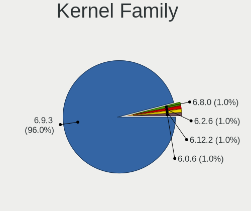
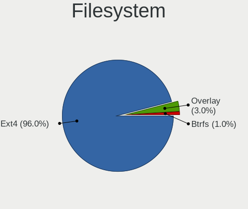
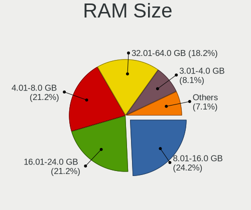
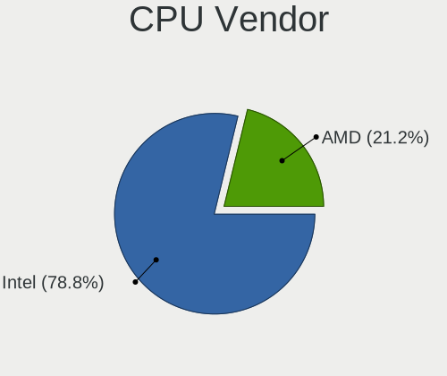
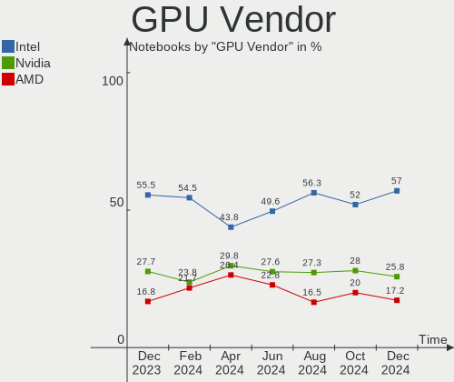

Pop!_OS - Hardware Trends (Notebooks)
-------------------------------------

A project to identify most popular hardware characteristics and track their change
over time based on data collected by Linux users at https://Linux-Hardware.org.

Anyone can contribute to this report by the [hw-probe](https://github.com/linuxhw/hw-probe) tool:

    sudo -E hw-probe -all -upload

This report is for one last month. Overall report since the beginning of time: [TestDays](https://github.com/linuxhw/TestDays)

Period: Mar, 2023.

Contents
--------

* [ System ](#system)
  - [ OS                       ](#os)
  - [ OS Family                ](#os-family)
  - [ Kernel                   ](#kernel)
  - [ Kernel Family            ](#kernel-family)
  - [ Kernel Major Ver.        ](#kernel-major-ver)
  - [ Arch                     ](#arch)
  - [ DE                       ](#de)
  - [ Display Server           ](#display-server)
  - [ Display Manager          ](#display-manager)
  - [ OS Lang                  ](#os-lang)
  - [ Boot Mode                ](#boot-mode)
  - [ Filesystem               ](#filesystem)
  - [ Part. scheme             ](#part-scheme)
  - [ Dual Boot with Linux/BSD ](#dual-boot-with-linuxbsd)
  - [ Dual Boot (Win)          ](#dual-boot-win)

* [ Board ](#board)
  - [ Vendor                   ](#vendor)
  - [ Model                    ](#model)
  - [ Model Family             ](#model-family)
  - [ MFG Year                 ](#mfg-year)
  - [ Form Factor              ](#form-factor)
  - [ Secure Boot              ](#secure-boot)
  - [ Coreboot                 ](#coreboot)
  - [ RAM Size                 ](#ram-size)
  - [ RAM Used                 ](#ram-used)
  - [ Total Drives             ](#total-drives)
  - [ Has CD-ROM               ](#has-cd-rom)
  - [ Has Ethernet             ](#has-ethernet)
  - [ Has WiFi                 ](#has-wifi)
  - [ Has Bluetooth            ](#has-bluetooth)

* [ Location ](#location)
  - [ Country                  ](#country)
  - [ City                     ](#city)

* [ Drives ](#drives)
  - [ Drive Vendor             ](#drive-vendor)
  - [ Drive Model              ](#drive-model)
  - [ HDD Vendor               ](#hdd-vendor)
  - [ SSD Vendor               ](#ssd-vendor)
  - [ Drive Kind               ](#drive-kind)
  - [ Drive Connector          ](#drive-connector)
  - [ Drive Size               ](#drive-size)
  - [ Space Total              ](#space-total)
  - [ Space Used               ](#space-used)
  - [ Malfunc. Drives          ](#malfunc-drives)
  - [ Malfunc. Drive Vendor    ](#malfunc-drive-vendor)
  - [ Malfunc. HDD Vendor      ](#malfunc-hdd-vendor)
  - [ Malfunc. Drive Kind      ](#malfunc-drive-kind)
  - [ Failed Drives            ](#failed-drives)
  - [ Failed Drive Vendor      ](#failed-drive-vendor)
  - [ Drive Status             ](#drive-status)

* [ Storage controller ](#storage-controller)
  - [ Storage Vendor           ](#storage-vendor)
  - [ Storage Model            ](#storage-model)
  - [ Storage Kind             ](#storage-kind)

* [ Processor ](#processor)
  - [ CPU Vendor               ](#cpu-vendor)
  - [ CPU Model                ](#cpu-model)
  - [ CPU Model Family         ](#cpu-model-family)
  - [ CPU Cores                ](#cpu-cores)
  - [ CPU Sockets              ](#cpu-sockets)
  - [ CPU Threads              ](#cpu-threads)
  - [ CPU Op-Modes             ](#cpu-op-modes)
  - [ CPU Microcode            ](#cpu-microcode)
  - [ CPU Microarch            ](#cpu-microarch)

* [ Graphics ](#graphics)
  - [ GPU Vendor               ](#gpu-vendor)
  - [ GPU Model                ](#gpu-model)
  - [ GPU Combo                ](#gpu-combo)
  - [ GPU Driver               ](#gpu-driver)
  - [ GPU Memory               ](#gpu-memory)

* [ Monitor ](#monitor)
  - [ Monitor Vendor           ](#monitor-vendor)
  - [ Monitor Model            ](#monitor-model)
  - [ Monitor Resolution       ](#monitor-resolution)
  - [ Monitor Diagonal         ](#monitor-diagonal)
  - [ Monitor Width            ](#monitor-width)
  - [ Aspect Ratio             ](#aspect-ratio)
  - [ Monitor Area             ](#monitor-area)
  - [ Pixel Density            ](#pixel-density)
  - [ Multiple Monitors        ](#multiple-monitors)

* [ Network ](#network)
  - [ Net Controller Vendor    ](#net-controller-vendor)
  - [ Net Controller Model     ](#net-controller-model)
  - [ Wireless Vendor          ](#wireless-vendor)
  - [ Wireless Model           ](#wireless-model)
  - [ Ethernet Vendor          ](#ethernet-vendor)
  - [ Ethernet Model           ](#ethernet-model)
  - [ Net Controller Kind      ](#net-controller-kind)
  - [ Used Controller          ](#used-controller)
  - [ NICs                     ](#nics)
  - [ IPv6                     ](#ipv6)

* [ Bluetooth ](#bluetooth)
  - [ Bluetooth Vendor         ](#bluetooth-vendor)
  - [ Bluetooth Model          ](#bluetooth-model)

* [ Sound ](#sound)
  - [ Sound Vendor             ](#sound-vendor)
  - [ Sound Model              ](#sound-model)

* [ Memory ](#memory)
  - [ Memory Vendor            ](#memory-vendor)
  - [ Memory Model             ](#memory-model)
  - [ Memory Kind              ](#memory-kind)
  - [ Memory Form Factor       ](#memory-form-factor)
  - [ Memory Size              ](#memory-size)
  - [ Memory Speed             ](#memory-speed)

* [ Printers & scanners ](#printers--scanners)
  - [ Printer Vendor           ](#printer-vendor)
  - [ Printer Model            ](#printer-model)
  - [ Scanner Vendor           ](#scanner-vendor)
  - [ Scanner Model            ](#scanner-model)

* [ Camera ](#camera)
  - [ Camera Vendor            ](#camera-vendor)
  - [ Camera Model             ](#camera-model)

* [ Security ](#security)
  - [ Fingerprint Vendor       ](#fingerprint-vendor)
  - [ Fingerprint Model        ](#fingerprint-model)
  - [ Chipcard Vendor          ](#chipcard-vendor)
  - [ Chipcard Model           ](#chipcard-model)

* [ Unsupported ](#unsupported)
  - [ Unsupported Devices      ](#unsupported-devices)
  - [ Unsupported Device Types ](#unsupported-device-types)

System
------

OS
--

Installed operating systems

| Name          | Notebooks | Percent |
|---------------|-----------|---------|
| Pop!_OS 22.04 | 155       | 97.48%  |
| Pop!_OS 20.04 | 2         | 1.26%   |
| Pop!_OS 21.10 | 1         | 0.63%   |
| Pop!_OS 21.04 | 1         | 0.63%   |

OS Family
---------

OS without a version

| Name    | Notebooks | Percent |
|---------|-----------|---------|
| Pop!_OS | 159       | 100%    |

Kernel
------

Version of the Linux kernel

| Version                  | Notebooks | Percent |
|--------------------------|-----------|---------|
| 6.2.0-76060200-generic   | 69        | 43.4%   |
| 6.1.11-76060111-generic  | 32        | 20.13%  |
| 6.2.6-76060206-generic   | 28        | 17.61%  |
| 6.0.12-76060006-generic  | 21        | 13.21%  |
| 6.2.6-060206-generic     | 1         | 0.63%   |
| 6.2.1-060201-generic     | 1         | 0.63%   |
| 6.1.9-x64v1-xanmod1      | 1         | 0.63%   |
| 6.1.18-x64v2-xanmod1     | 1         | 0.63%   |
| 6.0.12-76060012-generic  | 1         | 0.63%   |
| 5.19.0-76051900-generic  | 1         | 0.63%   |
| 5.18.10-76051810-generic | 1         | 0.63%   |
| 5.16.15-76051615-generic | 1         | 0.63%   |
| 5.15.11-76051511-generic | 1         | 0.63%   |

Kernel Family
-------------

Linux kernel without a distro release

| Version | Notebooks | Percent |
|---------|-----------|---------|
| 6.2.0   | 69        | 43.4%   |
| 6.1.11  | 32        | 20.13%  |
| 6.2.6   | 29        | 18.24%  |
| 6.0.12  | 22        | 13.84%  |
| 6.2.1   | 1         | 0.63%   |
| 6.1.9   | 1         | 0.63%   |
| 6.1.18  | 1         | 0.63%   |
| 5.19.0  | 1         | 0.63%   |
| 5.18.10 | 1         | 0.63%   |
| 5.16.15 | 1         | 0.63%   |
| 5.15.11 | 1         | 0.63%   |

Kernel Major Ver.
-----------------

Linux kernel major version

| Version | Notebooks | Percent |
|---------|-----------|---------|
| 6.2     | 99        | 62.26%  |
| 6.1     | 34        | 21.38%  |
| 6.0     | 22        | 13.84%  |
| 5.19    | 1         | 0.63%   |
| 5.18    | 1         | 0.63%   |
| 5.16    | 1         | 0.63%   |
| 5.15    | 1         | 0.63%   |

Arch
----

OS architecture (x86_64, i586, etc.)

| Name   | Notebooks | Percent |
|--------|-----------|---------|
| x86_64 | 159       | 100%    |

DE
--

Desktop Environment

| Name    | Notebooks | Percent |
|---------|-----------|---------|
| GNOME   | 155       | 97.48%  |
| Unknown | 2         | 1.26%   |
| Unity   | 1         | 0.63%   |
| KDE5    | 1         | 0.63%   |

Display Server
--------------

X11 or Wayland

| Name    | Notebooks | Percent |
|---------|-----------|---------|
| X11     | 151       | 94.97%  |
| Wayland | 6         | 3.77%   |
| Unknown | 2         | 1.26%   |

Display Manager
---------------

SDDM, LightDM, etc.

| Name    | Notebooks | Percent |
|---------|-----------|---------|
| Unknown | 118       | 74.21%  |
| GDM3    | 39        | 24.53%  |
| SDDM    | 1         | 0.63%   |
| GDM     | 1         | 0.63%   |

OS Lang
-------

Language

| Lang    | Notebooks | Percent |
|---------|-----------|---------|
| en_US   | 105       | 66.04%  |
| pt_BR   | 8         | 5.03%   |
| de_DE   | 6         | 3.77%   |
| ru_RU   | 4         | 2.52%   |
| fr_FR   | 4         | 2.52%   |
| en_GB   | 4         | 2.52%   |
| C       | 4         | 2.52%   |
| nb_NO   | 3         | 1.89%   |
| pt_PT   | 2         | 1.26%   |
| it_IT   | 2         | 1.26%   |
| es_ES   | 2         | 1.26%   |
| Unknown | 2         | 1.26%   |
| tr_TR   | 1         | 0.63%   |
| sv_SE   | 1         | 0.63%   |
| pl_PL   | 1         | 0.63%   |
| nl_NL   | 1         | 0.63%   |
| hu_HU   | 1         | 0.63%   |
| fr_BE   | 1         | 0.63%   |
| fi_FI   | 1         | 0.63%   |
| es_UY   | 1         | 0.63%   |
| en_ZA   | 1         | 0.63%   |
| en_CA   | 1         | 0.63%   |
| en_AU   | 1         | 0.63%   |
| de_AT   | 1         | 0.63%   |
| cs_CZ   | 1         | 0.63%   |

Boot Mode
---------

EFI or BIOS

| Mode | Notebooks | Percent |
|------|-----------|---------|
| BIOS | 120       | 75.47%  |
| EFI  | 39        | 24.53%  |

Filesystem
----------

Type of filesystem

| Type    | Notebooks | Percent |
|---------|-----------|---------|
| Ext4    | 151       | 94.97%  |
| Btrfs   | 5         | 3.14%   |
| Overlay | 2         | 1.26%   |
| Xfs     | 1         | 0.63%   |

Part. scheme
------------

Scheme of partitioning

| Type    | Notebooks | Percent |
|---------|-----------|---------|
| Unknown | 116       | 72.96%  |
| GPT     | 39        | 24.53%  |
| MBR     | 4         | 2.52%   |

Dual Boot with Linux/BSD
------------------------

Hosting more than one Linux/BSD

| Dual boot | Notebooks | Percent |
|-----------|-----------|---------|
| No        | 156       | 98.11%  |
| Yes       | 3         | 1.89%   |

Dual Boot (Win)
---------------

Hosting Linux and Windows

| Dual boot | Notebooks | Percent |
|-----------|-----------|---------|
| No        | 146       | 91.82%  |
| Yes       | 13        | 8.18%   |

Board
-----

Vendor
------

Motherboard manufacturer

| Name                    | Notebooks | Percent |
|-------------------------|-----------|---------|
| Lenovo                  | 39        | 24.53%  |
| Hewlett-Packard         | 25        | 15.72%  |
| Dell                    | 18        | 11.32%  |
| ASUSTek Computer        | 15        | 9.43%   |
| Apple                   | 12        | 7.55%   |
| Acer                    | 10        | 6.29%   |
| MSI                     | 5         | 3.14%   |
| System76                | 3         | 1.89%   |
| Razer                   | 3         | 1.89%   |
| Google                  | 3         | 1.89%   |
| TUXEDO                  | 2         | 1.26%   |
| Toshiba                 | 2         | 1.26%   |
| Samsung Electronics     | 2         | 1.26%   |
| Positivo                | 2         | 1.26%   |
| HUAWEI                  | 2         | 1.26%   |
| Gigabyte Technology     | 2         | 1.26%   |
| Sony                    | 1         | 0.63%   |
| Semp Toshiba            | 1         | 0.63%   |
| SAGER                   | 1         | 0.63%   |
| Positivo Bahia - VAIO   | 1         | 0.63%   |
| Multilaser              | 1         | 0.63%   |
| Maibenben               | 1         | 0.63%   |
| HONOR                   | 1         | 0.63%   |
| HCL Infosystems Limited | 1         | 0.63%   |
| GPU Company             | 1         | 0.63%   |
| GPD                     | 1         | 0.63%   |
| Fujitsu                 | 1         | 0.63%   |
| ASRock                  | 1         | 0.63%   |
| Alienware               | 1         | 0.63%   |
| Unknown                 | 1         | 0.63%   |

Model
-----

Motherboard model

| Name                                                                                     | Notebooks | Percent |
|------------------------------------------------------------------------------------------|-----------|---------|
| HP Dev One Notebook PC                                                                   | 3         | 1.89%   |
| System76 Lemur Pro                                                                       | 2         | 1.26%   |
| Dell Latitude E7240                                                                      | 2         | 1.26%   |
| Dell Latitude 5420                                                                       | 2         | 1.26%   |
| Apple MacBookPro8,1                                                                      | 2         | 1.26%   |
| Apple MacBookPro12,1                                                                     | 2         | 1.26%   |
| Apple MacBookAir7,2                                                                      | 2         | 1.26%   |
| Apple MacBook5,1                                                                         | 2         | 1.26%   |
| Acer Nitro AN515-58                                                                      | 2         | 1.26%   |
| TUXEDO Pulse 14 Gen1                                                                     | 1         | 0.63%   |
| TUXEDO InfinityBook S 14 Gen6                                                            | 1         | 0.63%   |
| Toshiba Satellite Pro C50-A-1E2                                                          | 1         | 0.63%   |
| Toshiba Satellite C55-C                                                                  | 1         | 0.63%   |
| System76 Pangolin                                                                        | 1         | 0.63%   |
| Sony VPCZ12V9R                                                                           | 1         | 0.63%   |
| Semp Toshiba IS 1413G                                                                    | 1         | 0.63%   |
| Samsung R430/R480/R440                                                                   | 1         | 0.63%   |
| Samsung 350V5C/350V5X/350V4C/350V4X/351V5C/351V5X/351V4C/351V4X/3540VC/3540VX/3440VC/344 | 1         | 0.63%   |
| SAGER X8100                                                                              | 1         | 0.63%   |
| Razer Blade Stealth 13 (Early 2020) - RZ09-0310                                          | 1         | 0.63%   |
| Razer Blade 15 Advanced Model (Early 2021) - RZ09-036                                    | 1         | 0.63%   |
| Razer Blade                                                                              | 1         | 0.63%   |
| Positivo N1250                                                                           | 1         | 0.63%   |
| Positivo Mobile                                                                          | 1         | 0.63%   |
| Positivo Bahia - VAIO VJFE41F11X-XXXXXX                                                  | 1         | 0.63%   |
| Multilaser MLSH1H LINUX                                                                  | 1         | 0.63%   |
| MSI Vector GP76 12UHSO                                                                   | 1         | 0.63%   |
| MSI PS42 8M                                                                              | 1         | 0.63%   |
| MSI Prestige 14Evo A11M                                                                  | 1         | 0.63%   |
| MSI Katana GF66 12UG                                                                     | 1         | 0.63%   |
| MSI GL63 8RC                                                                             | 1         | 0.63%   |
| Maibenben P748                                                                           | 1         | 0.63%   |
| Lenovo Y50-70 20378                                                                      | 1         | 0.63%   |
| Lenovo ThinkPad X270 20HN001RUS                                                          | 1         | 0.63%   |
| Lenovo ThinkPad X220 Tablet 4294CTO                                                      | 1         | 0.63%   |
| Lenovo ThinkPad X1 Extreme Gen 3 20TKCTO1WW                                              | 1         | 0.63%   |
| Lenovo ThinkPad X1 Extreme 2nd 20QVCTO1WW                                                | 1         | 0.63%   |
| Lenovo ThinkPad X1 Carbon 6th 20KGS3Y900                                                 | 1         | 0.63%   |
| Lenovo ThinkPad X1 Carbon 3rd 20BTS05100                                                 | 1         | 0.63%   |
| Lenovo ThinkPad Twist 33472HU                                                            | 1         | 0.63%   |

Model Family
------------

Motherboard model prefix

| Name                                    | Notebooks | Percent |
|-----------------------------------------|-----------|---------|
| Lenovo ThinkPad                         | 21        | 13.21%  |
| Lenovo IdeaPad                          | 13        | 8.18%   |
| HP EliteBook                            | 6         | 3.77%   |
| Dell Latitude                           | 5         | 3.14%   |
| Dell Inspiron                           | 4         | 2.52%   |
| ASUS Zenbook                            | 4         | 2.52%   |
| Acer Nitro                              | 4         | 2.52%   |
| Acer Aspire                             | 4         | 2.52%   |
| Razer Blade                             | 3         | 1.89%   |
| HP ZBook                                | 3         | 1.89%   |
| HP ProBook                              | 3         | 1.89%   |
| HP Pavilion                             | 3         | 1.89%   |
| HP Dev                                  | 3         | 1.89%   |
| Dell XPS                                | 3         | 1.89%   |
| ASUS VivoBook                           | 3         | 1.89%   |
| ASUS ASUS                               | 3         | 1.89%   |
| Toshiba Satellite                       | 2         | 1.26%   |
| System76 Lemur                          | 2         | 1.26%   |
| Lenovo Legion                           | 2         | 1.26%   |
| HP Laptop                               | 2         | 1.26%   |
| Dell Precision                          | 2         | 1.26%   |
| Apple MacBookPro9                       | 2         | 1.26%   |
| Apple MacBookPro8                       | 2         | 1.26%   |
| Apple MacBookPro12                      | 2         | 1.26%   |
| Apple MacBookAir7                       | 2         | 1.26%   |
| Apple MacBook5                          | 2         | 1.26%   |
| Acer Swift                              | 2         | 1.26%   |
| TUXEDO Pulse                            | 1         | 0.63%   |
| TUXEDO InfinityBook                     | 1         | 0.63%   |
| System76 Pangolin                       | 1         | 0.63%   |
| Sony VPCZ12V9R                          | 1         | 0.63%   |
| Semp Toshiba IS                         | 1         | 0.63%   |
| Samsung R430                            | 1         | 0.63%   |
| Samsung 350V5C                          | 1         | 0.63%   |
| SAGER X8100                             | 1         | 0.63%   |
| Positivo N1250                          | 1         | 0.63%   |
| Positivo Mobile                         | 1         | 0.63%   |
| Positivo Bahia - VAIO VJFE41F11X-XXXXXX | 1         | 0.63%   |
| Multilaser MLSH1H                       | 1         | 0.63%   |
| MSI Vector                              | 1         | 0.63%   |

MFG Year
--------

Motherboard manufacture year

| Year | Notebooks | Percent |
|------|-----------|---------|
| 2022 | 26        | 16.35%  |
| 2021 | 22        | 13.84%  |
| 2018 | 19        | 11.95%  |
| 2020 | 18        | 11.32%  |
| 2012 | 12        | 7.55%   |
| 2019 | 11        | 6.92%   |
| 2015 | 10        | 6.29%   |
| 2011 | 10        | 6.29%   |
| 2013 | 9         | 5.66%   |
| 2014 | 5         | 3.14%   |
| 2017 | 4         | 2.52%   |
| 2023 | 3         | 1.89%   |
| 2016 | 3         | 1.89%   |
| 2010 | 3         | 1.89%   |
| 2009 | 3         | 1.89%   |
| 2008 | 1         | 0.63%   |

Form Factor
-----------

Physical design of the computer

| Name     | Notebooks | Percent |
|----------|-----------|---------|
| Notebook | 159       | 100%    |

Secure Boot
-----------

Enabled or disabled

| State    | Notebooks | Percent |
|----------|-----------|---------|
| Disabled | 159       | 100%    |

Coreboot
--------

Have coreboot on board

| Used | Notebooks | Percent |
|------|-----------|---------|
| No   | 154       | 96.86%  |
| Yes  | 5         | 3.14%   |

RAM Size
--------

Total RAM memory

| Size in GB  | Notebooks | Percent |
|-------------|-----------|---------|
| 16.01-24.0  | 43        | 27.04%  |
| 4.01-8.0    | 40        | 25.16%  |
| 8.01-16.0   | 30        | 18.87%  |
| 32.01-64.0  | 20        | 12.58%  |
| 3.01-4.0    | 16        | 10.06%  |
| 24.01-32.0  | 6         | 3.77%   |
| 64.01-256.0 | 2         | 1.26%   |
| 2.01-3.0    | 1         | 0.63%   |
| 1.01-2.0    | 1         | 0.63%   |

RAM Used
--------

Used RAM memory

| Used GB   | Notebooks | Percent |
|-----------|-----------|---------|
| 4.01-8.0  | 70        | 44.03%  |
| 2.01-3.0  | 34        | 21.38%  |
| 3.01-4.0  | 31        | 19.5%   |
| 8.01-16.0 | 14        | 8.81%   |
| 1.01-2.0  | 10        | 6.29%   |

Total Drives
------------

Number of drives on board

| Drives | Notebooks | Percent |
|--------|-----------|---------|
| 1      | 111       | 69.81%  |
| 2      | 38        | 23.9%   |
| 3      | 7         | 4.4%    |
| 4      | 3         | 1.89%   |

Has CD-ROM
----------

Has CD-ROM on board

| Presented | Notebooks | Percent |
|-----------|-----------|---------|
| No        | 132       | 83.02%  |
| Yes       | 27        | 16.98%  |

Has Ethernet
------------

Has Ethernet on board

| Presented | Notebooks | Percent |
|-----------|-----------|---------|
| Yes       | 118       | 74.21%  |
| No        | 41        | 25.79%  |

Has WiFi
--------

Has WiFi module

| Presented | Notebooks | Percent |
|-----------|-----------|---------|
| Yes       | 157       | 98.74%  |
| No        | 2         | 1.26%   |

Has Bluetooth
-------------

Has Bluetooth module

| Presented | Notebooks | Percent |
|-----------|-----------|---------|
| Yes       | 133       | 83.65%  |
| No        | 26        | 16.35%  |

Location
--------

Country
-------

Geographic location (country)

| Country      | Notebooks | Percent |
|--------------|-----------|---------|
| USA          | 56        | 35.22%  |
| Brazil       | 12        | 7.55%   |
| Germany      | 11        | 6.92%   |
| UK           | 6         | 3.77%   |
| Norway       | 5         | 3.14%   |
| France       | 5         | 3.14%   |
| Russia       | 4         | 2.52%   |
| Mexico       | 4         | 2.52%   |
| Italy        | 4         | 2.52%   |
| South Africa | 3         | 1.89%   |
| Portugal     | 3         | 1.89%   |
| Netherlands  | 3         | 1.89%   |
| Czechia      | 3         | 1.89%   |
| Vietnam      | 2         | 1.26%   |
| Turkey       | 2         | 1.26%   |
| Sweden       | 2         | 1.26%   |
| Spain        | 2         | 1.26%   |
| Poland       | 2         | 1.26%   |
| Indonesia    | 2         | 1.26%   |
| India        | 2         | 1.26%   |
| Finland      | 2         | 1.26%   |
| Canada       | 2         | 1.26%   |
| Australia    | 2         | 1.26%   |
| Uruguay      | 1         | 0.63%   |
| Tunisia      | 1         | 0.63%   |
| Taiwan       | 1         | 0.63%   |
| Switzerland  | 1         | 0.63%   |
| Slovakia     | 1         | 0.63%   |
| Puerto Rico  | 1         | 0.63%   |
| Philippines  | 1         | 0.63%   |
| Morocco      | 1         | 0.63%   |
| Latvia       | 1         | 0.63%   |
| Japan        | 1         | 0.63%   |
| Hungary      | 1         | 0.63%   |
| Guam         | 1         | 0.63%   |
| Greece       | 1         | 0.63%   |
| Croatia      | 1         | 0.63%   |
| Chile        | 1         | 0.63%   |
| Bulgaria     | 1         | 0.63%   |
| Bolivia      | 1         | 0.63%   |

City
----

Geographic location (city)

| City                 | Notebooks | Percent |
|----------------------|-----------|---------|
| Munich               | 4         | 2.52%   |
| Moss                 | 3         | 1.89%   |
| Westwood             | 2         | 1.26%   |
| Seattle              | 2         | 1.26%   |
| Sao Paulo            | 2         | 1.26%   |
| Reno                 | 2         | 1.26%   |
| Phoenix              | 2         | 1.26%   |
| New York             | 2         | 1.26%   |
| Johannesburg         | 2         | 1.26%   |
| Hanoi                | 2         | 1.26%   |
| El Paso              | 2         | 1.26%   |
| Denver               | 2         | 1.26%   |
| Chicago              | 2         | 1.26%   |
| Brasília            | 2         | 1.26%   |
| Widen                | 1         | 0.63%   |
| West Orange          | 1         | 0.63%   |
| Washington           | 1         | 0.63%   |
| Warsaw               | 1         | 0.63%   |
| Varaždin            | 1         | 0.63%   |
| Twistringen          | 1         | 0.63%   |
| Tunis                | 1         | 0.63%   |
| Tualatin             | 1         | 0.63%   |
| Trondheim            | 1         | 0.63%   |
| Tracy                | 1         | 0.63%   |
| Tokyo                | 1         | 0.63%   |
| Ten Mile             | 1         | 0.63%   |
| Taubate              | 1         | 0.63%   |
| Taipei               | 1         | 0.63%   |
| Syracuse             | 1         | 0.63%   |
| Sunne                | 1         | 0.63%   |
| Sumter               | 1         | 0.63%   |
| Sturgeon Bay         | 1         | 0.63%   |
| St Petersburg        | 1         | 0.63%   |
| Sofia                | 1         | 0.63%   |
| Sipoo                | 1         | 0.63%   |
| Santiago             | 1         | 0.63%   |
| San Jose             | 1         | 0.63%   |
| San German           | 1         | 0.63%   |
| Salvador             | 1         | 0.63%   |
| Rüsselsheim am Main | 1         | 0.63%   |

Drives
------

Drive Vendor
------------

Hard drive vendors

| Vendor                         | Notebooks | Drives | Percent |
|--------------------------------|-----------|--------|---------|
| Samsung Electronics            | 42        | 48     | 20%     |
| SK hynix                       | 16        | 16     | 7.62%   |
| SanDisk                        | 16        | 17     | 7.62%   |
| WDC                            | 14        | 14     | 6.67%   |
| Micron Technology              | 12        | 12     | 5.71%   |
| Seagate                        | 11        | 12     | 5.24%   |
| Toshiba                        | 10        | 10     | 4.76%   |
| Crucial                        | 8         | 10     | 3.81%   |
| Kingston                       | 7         | 8      | 3.33%   |
| HGST                           | 6         | 6      | 2.86%   |
| Apple                          | 6         | 6      | 2.86%   |
| Micron/Crucial Technology      | 5         | 5      | 2.38%   |
| Intel                          | 5         | 5      | 2.38%   |
| Phison Electronics             | 4         | 4      | 1.9%    |
| Unknown                        | 3         | 3      | 1.43%   |
| Solid State Storage            | 3         | 3      | 1.43%   |
| KIOXIA                         | 3         | 3      | 1.43%   |
| Kingston Technology Company    | 3         | 3      | 1.43%   |
| China                          | 3         | 3      | 1.43%   |
| A-DATA Technology              | 3         | 3      | 1.43%   |
| Transcend                      | 2         | 2      | 0.95%   |
| PNY                            | 2         | 2      | 0.95%   |
| LITEONIT                       | 2         | 2      | 0.95%   |
| Unknown                        | 2         | 2      | 0.95%   |
| Wibtek                         | 1         | 1      | 0.48%   |
| WALRAM                         | 1         | 1      | 0.48%   |
| Teclast                        | 1         | 1      | 0.48%   |
| TEAM TM8                       | 1         | 1      | 0.48%   |
| T-FORCE                        | 1         | 1      | 0.48%   |
| Solid State Storage Technology | 1         | 1      | 0.48%   |
| SABRENT                        | 1         | 2      | 0.48%   |
| Realtek                        | 1         | 1      | 0.48%   |
| Phison                         | 1         | 1      | 0.48%   |
| PHD 3.0                        | 1         | 1      | 0.48%   |
| Patriot                        | 1         | 1      | 0.48%   |
| Mushkin                        | 1         | 2      | 0.48%   |
| Leven                          | 1         | 1      | 0.48%   |
| KingSpec                       | 1         | 1      | 0.48%   |
| Intenso                        | 1         | 1      | 0.48%   |
| Hitachi                        | 1         | 1      | 0.48%   |

Drive Model
-----------

Hard drive models

| Model                                               | Notebooks | Percent |
|-----------------------------------------------------|-----------|---------|
| Samsung NVMe SSD Controller SM981/PM981/PM983 250GB | 6         | 2.79%   |
| Samsung NVMe SSD Controller PM9A1/PM9A3/980PRO 1TB  | 3         | 1.4%    |
| Micron/Crucial P2 NVMe PCIe SSD 1TB                 | 3         | 1.4%    |
| HGST HTS721010A9E630 1TB                            | 3         | 1.4%    |
| Apple SSD SM0128G 121GB                             | 3         | 1.4%    |
| WDC WD10SPZX-00Z10T0 1TB                            | 2         | 0.93%   |
| Toshiba MQ04ABF100 1TB                              | 2         | 0.93%   |
| SK hynix PC711 HFS001TDE9X073N 1TB                  | 2         | 0.93%   |
| SK hynix HFM512GD3JX013N 512GB                      | 2         | 0.93%   |
| SK hynix BC711 NVMe 512GB                           | 2         | 0.93%   |
| Seagate ST500LT012-1DG142 500GB                     | 2         | 0.93%   |
| Seagate ST1000LM035-1RK172 1TB                      | 2         | 0.93%   |
| Samsung SSD 980 PRO 1TB                             | 2         | 0.93%   |
| Samsung SSD 860 EVO 500GB                           | 2         | 0.93%   |
| Samsung NVMe SSD Controller SM961/PM961/SM963 256GB | 2         | 0.93%   |
| Samsung MZVLQ512HBLU-00BH1 512GB                    | 2         | 0.93%   |
| Samsung MZVL21T0HCLR-00BL2 1TB                      | 2         | 0.93%   |
| Phison PS5013 E13 NVMe Controller 256GB             | 2         | 0.93%   |
| Micron 3400_MTFDKBA512TFH 512GB                     | 2         | 0.93%   |
| LITEONIT LMT-128M6M mSATA 128GB SSD                 | 2         | 0.93%   |
| KIOXIA KBG40ZNV256G 256GB                           | 2         | 0.93%   |
| Kingston Company U-SNS8154P3 NVMe SSD 256GB         | 2         | 0.93%   |
| Kingston SA400S37240G 240GB SSD                     | 2         | 0.93%   |
| Kingston OM8PCP3512F 512GB SSD                      | 2         | 0.93%   |
| Intel SSD Pro 7600p/760p/E 6100p Series 1024GB      | 2         | 0.93%   |
| HGST HTS545050A7E680 500GB                          | 2         | 0.93%   |
| Crucial CT500BX500SSD1 500GB                        | 2         | 0.93%   |
| Crucial CT480BX500SSD1 480GB                        | 2         | 0.93%   |
| Unknown                                             | 2         | 0.93%   |
| Wibtek W800S 512GB                                  | 1         | 0.47%   |
| WDC WDS240G2G0C-00AJM0 240GB                        | 1         | 0.47%   |
| WDC WDS100T2G0A-00JH30 1TB SSD                      | 1         | 0.47%   |
| WDC WD7500BPVT-35HXZT3 752GB                        | 1         | 0.47%   |
| WDC WD5000LUCT-63RC2Y0 500GB                        | 1         | 0.47%   |
| WDC WD10SPZX-75Z10T0 1TB                            | 1         | 0.47%   |
| WDC WD10SPZX-24Z10 1TB                              | 1         | 0.47%   |
| WDC WD10JPVX-80JC3T0 1TB                            | 1         | 0.47%   |
| WDC WD10JPVX-60JC3T0 1TB                            | 1         | 0.47%   |
| WDC WD10JPCX-24UE4T0 1TB                            | 1         | 0.47%   |
| WDC PC SN530 SDBPTPZ-1T00 1TB                       | 1         | 0.47%   |

HDD Vendor
----------

Hard disk drive vendors

| Vendor              | Notebooks | Drives | Percent |
|---------------------|-----------|--------|---------|
| Seagate             | 10        | 11     | 25.64%  |
| WDC                 | 9         | 9      | 23.08%  |
| Toshiba             | 6         | 6      | 15.38%  |
| HGST                | 6         | 6      | 15.38%  |
| Unknown             | 1         | 1      | 2.56%   |
| Samsung Electronics | 1         | 1      | 2.56%   |
| SABRENT             | 1         | 2      | 2.56%   |
| PHD 3.0             | 1         | 1      | 2.56%   |
| Intenso             | 1         | 1      | 2.56%   |
| Hitachi             | 1         | 1      | 2.56%   |
| ASMT                | 1         | 2      | 2.56%   |
| Apple               | 1         | 1      | 2.56%   |

SSD Vendor
----------

Solid state drive vendors

| Vendor              | Notebooks | Drives | Percent |
|---------------------|-----------|--------|---------|
| Samsung Electronics | 16        | 19     | 24.24%  |
| Crucial             | 8         | 10     | 12.12%  |
| SanDisk             | 7         | 8      | 10.61%  |
| Kingston            | 5         | 5      | 7.58%   |
| Apple               | 4         | 4      | 6.06%   |
| China               | 3         | 3      | 4.55%   |
| Transcend           | 2         | 2      | 3.03%   |
| SK hynix            | 2         | 2      | 3.03%   |
| PNY                 | 2         | 2      | 3.03%   |
| LITEONIT            | 2         | 2      | 3.03%   |
| A-DATA Technology   | 2         | 2      | 3.03%   |
| WDC                 | 1         | 1      | 1.52%   |
| Toshiba             | 1         | 1      | 1.52%   |
| Teclast             | 1         | 1      | 1.52%   |
| TEAM TM8            | 1         | 1      | 1.52%   |
| Patriot             | 1         | 1      | 1.52%   |
| Mushkin             | 1         | 2      | 1.52%   |
| Micron Technology   | 1         | 1      | 1.52%   |
| KingSpec            | 1         | 1      | 1.52%   |
| Intel               | 1         | 1      | 1.52%   |
| Hewlett-Packard     | 1         | 1      | 1.52%   |
| Dogfish             | 1         | 1      | 1.52%   |
| Apacer              | 1         | 1      | 1.52%   |
| Advantech           | 1         | 1      | 1.52%   |

Drive Kind
----------

HDD or SSD

| Kind    | Notebooks | Drives | Percent |
|---------|-----------|--------|---------|
| NVMe    | 87        | 100    | 46.28%  |
| SSD     | 56        | 73     | 29.79%  |
| HDD     | 37        | 42     | 19.68%  |
| Unknown | 5         | 5      | 2.66%   |
| MMC     | 3         | 4      | 1.6%    |

Drive Connector
---------------

SATA, SAS, NVMe, etc.

| Type | Notebooks | Drives | Percent |
|------|-----------|--------|---------|
| NVMe | 86        | 99     | 48.04%  |
| SATA | 78        | 106    | 43.58%  |
| SAS  | 12        | 15     | 6.7%    |
| MMC  | 3         | 4      | 1.68%   |

Drive Size
----------

Size of hard drive

| Size in TB | Notebooks | Drives | Percent |
|------------|-----------|--------|---------|
| 0.01-0.5   | 56        | 74     | 60.22%  |
| 0.51-1.0   | 31        | 34     | 33.33%  |
| 1.01-2.0   | 4         | 5      | 4.3%    |
| 2.01-3.0   | 1         | 1      | 1.08%   |
| 4.01-10.0  | 1         | 1      | 1.08%   |

Space Total
-----------

Amount of disk space available on the file system

| Size in GB     | Notebooks | Percent |
|----------------|-----------|---------|
| 251-500        | 56        | 35.22%  |
| 101-250        | 40        | 25.16%  |
| 501-1000       | 37        | 23.27%  |
| 1001-2000      | 11        | 6.92%   |
| More than 3000 | 4         | 2.52%   |
| 51-100         | 4         | 2.52%   |
| 1-20           | 3         | 1.89%   |
| Unknown        | 3         | 1.89%   |
| 21-50          | 1         | 0.63%   |

Space Used
----------

Amount of used disk space

| Used GB        | Notebooks | Percent |
|----------------|-----------|---------|
| 21-50          | 49        | 30.82%  |
| 1-20           | 32        | 20.13%  |
| 51-100         | 28        | 17.61%  |
| 251-500        | 18        | 11.32%  |
| 101-250        | 18        | 11.32%  |
| 501-1000       | 6         | 3.77%   |
| 2001-3000      | 3         | 1.89%   |
| Unknown        | 3         | 1.89%   |
| More than 3000 | 1         | 0.63%   |
| 1001-2000      | 1         | 0.63%   |

Malfunc. Drives
---------------

Drive models with a malfunction

| Model                              | Notebooks | Drives | Percent |
|------------------------------------|-----------|--------|---------|
| WDC WD10JPVX-60JC3T0 1TB           | 1         | 1      | 33.33%  |
| SK hynix PC711 HFS001TDE9X073N 1TB | 1         | 1      | 33.33%  |
| HGST HTS541075A9E680 752GB         | 1         | 1      | 33.33%  |

Malfunc. Drive Vendor
---------------------

Vendors of faulty drives

| Vendor   | Notebooks | Drives | Percent |
|----------|-----------|--------|---------|
| WDC      | 1         | 1      | 33.33%  |
| SK hynix | 1         | 1      | 33.33%  |
| HGST     | 1         | 1      | 33.33%  |

Malfunc. HDD Vendor
-------------------

Vendors of faulty HDD drives

| Vendor | Notebooks | Drives | Percent |
|--------|-----------|--------|---------|
| WDC    | 1         | 1      | 50%     |
| HGST   | 1         | 1      | 50%     |

Malfunc. Drive Kind
-------------------

Kinds of faulty drives

| Kind | Notebooks | Drives | Percent |
|------|-----------|--------|---------|
| HDD  | 2         | 2      | 66.67%  |
| NVMe | 1         | 1      | 33.33%  |

Failed Drives
-------------

Failed drive models

Zero info for selected period =(

Failed Drive Vendor
-------------------

Failed drive vendors

Zero info for selected period =(

Drive Status
------------

Number of failed and malfunc. drives

| Status   | Notebooks | Drives | Percent |
|----------|-----------|--------|---------|
| Detected | 125       | 173    | 74.4%   |
| Works    | 40        | 48     | 23.81%  |
| Malfunc  | 3         | 3      | 1.79%   |

Storage controller
------------------

Storage Vendor
--------------

Storage controller vendors

| Vendor                         | Notebooks | Percent |
|--------------------------------|-----------|---------|
| Intel                          | 86        | 42.36%  |
| Samsung Electronics            | 28        | 13.79%  |
| AMD                            | 19        | 9.36%   |
| SK hynix                       | 14        | 6.9%    |
| SanDisk                        | 11        | 5.42%   |
| Micron Technology              | 11        | 5.42%   |
| Kingston Technology Company    | 6         | 2.96%   |
| Toshiba America Info Systems   | 5         | 2.46%   |
| Phison Electronics             | 5         | 2.46%   |
| Micron/Crucial Technology      | 5         | 2.46%   |
| Solid State Storage Technology | 4         | 1.97%   |
| Nvidia                         | 3         | 1.48%   |
| KIOXIA                         | 2         | 0.99%   |
| Silicon Motion                 | 1         | 0.49%   |
| Seagate Technology             | 1         | 0.49%   |
| Apple                          | 1         | 0.49%   |
| ADATA Technology               | 1         | 0.49%   |

Storage Model
-------------

Storage controller models

| Model                                                                          | Notebooks | Percent |
|--------------------------------------------------------------------------------|-----------|---------|
| AMD FCH SATA Controller [AHCI mode]                                            | 18        | 8.37%   |
| Intel Volume Management Device NVMe RAID Controller                            | 12        | 5.58%   |
| Micron NVMe Storage Controller                                                 | 11        | 5.12%   |
| Intel 6 Series/C200 Series Chipset Family 6 port Mobile SATA AHCI Controller   | 11        | 5.12%   |
| SK hynix Gold P31/PC711 NVMe Solid State Drive                                 | 9         | 4.19%   |
| Samsung NVMe SSD Controller SM981/PM981/PM983                                  | 9         | 4.19%   |
| Samsung NVMe SSD Controller PM9A1/PM9A3/980PRO                                 | 7         | 3.26%   |
| Intel Sunrise Point-LP SATA Controller [AHCI mode]                             | 7         | 3.26%   |
| Intel Wildcat Point-LP SATA Controller [AHCI Mode]                             | 6         | 2.79%   |
| Intel Cannon Lake Mobile PCH SATA AHCI Controller                              | 6         | 2.79%   |
| Intel Alder Lake-P SATA AHCI Controller                                        | 6         | 2.79%   |
| Intel 7 Series Chipset Family 6-port SATA Controller [AHCI mode]               | 6         | 2.79%   |
| Samsung NVMe SSD Controller 980                                                | 5         | 2.33%   |
| Intel 82801 Mobile SATA Controller [RAID mode]                                 | 5         | 2.33%   |
| Intel 8 Series/C220 Series Chipset Family 6-port SATA Controller 1 [AHCI mode] | 5         | 2.33%   |
| Intel 8 Series SATA Controller 1 [AHCI mode]                                   | 5         | 2.33%   |
| Solid State Storage Non-Volatile memory controller                             | 4         | 1.86%   |
| Intel Tiger Lake-LP SATA Controller                                            | 4         | 1.86%   |
| Toshiba America Info Systems XG6 NVMe SSD Controller                           | 3         | 1.4%    |
| SanDisk Non-Volatile memory controller                                         | 3         | 1.4%    |
| Samsung NVMe SSD Controller SM961/PM961/SM963                                  | 3         | 1.4%    |
| Samsung Electronics SATA controller                                            | 3         | 1.4%    |
| Micron/Crucial P2 NVMe PCIe SSD                                                | 3         | 1.4%    |
| Kingston Company U-SNS8154P3 NVMe SSD                                          | 3         | 1.4%    |
| Intel Celeron/Pentium Silver Processor SATA Controller                         | 3         | 1.4%    |
| Toshiba America Info Systems XG5 NVMe SSD Controller                           | 2         | 0.93%   |
| SanDisk WD Blue SN570 NVMe SSD 1TB                                             | 2         | 0.93%   |
| SanDisk WD Blue SN550 NVMe SSD                                                 | 2         | 0.93%   |
| Phison PS5013 E13 NVMe Controller                                              | 2         | 0.93%   |
| Phison E18 PCIe4 NVMe Controller                                               | 2         | 0.93%   |
| Nvidia MCP79 AHCI Controller                                                   | 2         | 0.93%   |
| KIOXIA NVMe SSD Controller BG4                                                 | 2         | 0.93%   |
| Intel SSD Pro 7600p/760p/E 6100p Series                                        | 2         | 0.93%   |
| Intel Q170/Q150/B150/H170/H110/Z170/CM236 Chipset SATA Controller [AHCI Mode]  | 2         | 0.93%   |
| Intel Non-Volatile memory controller                                           | 2         | 0.93%   |
| SK hynix Platinum P41 NVMe Solid State Drive 2TB                               | 1         | 0.47%   |
| SK hynix PC401 NVMe Solid State Drive 256GB                                    | 1         | 0.47%   |
| SK hynix Non-Volatile memory controller                                        | 1         | 0.47%   |
| SK hynix BC511                                                                 | 1         | 0.47%   |
| SK hynix BC501 NVMe Solid State Drive                                          | 1         | 0.47%   |

Storage Kind
------------

Kind of storage controller (IDE, SATA, NVMe, SAS, ...)

| Kind | Notebooks | Percent |
|------|-----------|---------|
| SATA | 92        | 46%     |
| NVMe | 85        | 42.5%   |
| RAID | 19        | 9.5%    |
| IDE  | 4         | 2%      |

Processor
---------

CPU Vendor
----------

Processor vendors

| Vendor | Notebooks | Percent |
|--------|-----------|---------|
| Intel  | 120       | 75.47%  |
| AMD    | 39        | 24.53%  |

CPU Model
---------

Processor models

| Model                                         | Notebooks | Percent |
|-----------------------------------------------|-----------|---------|
| Intel Core i7-9750H CPU @ 2.60GHz             | 5         | 3.14%   |
| Intel Core i5-8250U CPU @ 1.60GHz             | 4         | 2.52%   |
| Intel 12th Gen Core i5-12500H                 | 4         | 2.52%   |
| Intel 11th Gen Core i7-1165G7 @ 2.80GHz       | 4         | 2.52%   |
| AMD Ryzen 7 PRO 5850U with Radeon Graphics    | 4         | 2.52%   |
| AMD Ryzen 5 5500U with Radeon Graphics        | 4         | 2.52%   |
| Intel Core i7-8550U CPU @ 1.80GHz             | 3         | 1.89%   |
| Intel Core i3-5005U CPU @ 2.00GHz             | 3         | 1.89%   |
| Intel 12th Gen Core i9-12900H                 | 3         | 1.89%   |
| Intel 11th Gen Core i3-1115G4 @ 3.00GHz       | 3         | 1.89%   |
| AMD Ryzen 7 4800H with Radeon Graphics        | 3         | 1.89%   |
| AMD Ryzen 5 2500U with Radeon Vega Mobile Gfx | 3         | 1.89%   |
| Intel Core i7-8750H CPU @ 2.20GHz             | 2         | 1.26%   |
| Intel Core i7-8650U CPU @ 1.90GHz             | 2         | 1.26%   |
| Intel Core i7-6820HQ CPU @ 2.70GHz            | 2         | 1.26%   |
| Intel Core i7-6700HQ CPU @ 2.60GHz            | 2         | 1.26%   |
| Intel Core i7-2620M CPU @ 2.70GHz             | 2         | 1.26%   |
| Intel Core i7-10750H CPU @ 2.60GHz            | 2         | 1.26%   |
| Intel Core i5-8350U CPU @ 1.70GHz             | 2         | 1.26%   |
| Intel Core i5-5257U CPU @ 2.70GHz             | 2         | 1.26%   |
| Intel Core i5-3317U CPU @ 1.70GHz             | 2         | 1.26%   |
| Intel Core i5-2520M CPU @ 2.50GHz             | 2         | 1.26%   |
| Intel Core i3-4000M CPU @ 2.40GHz             | 2         | 1.26%   |
| Intel Core 2 Duo CPU P8600 @ 2.40GHz          | 2         | 1.26%   |
| Intel Celeron N4020 CPU @ 1.10GHz             | 2         | 1.26%   |
| Intel 12th Gen Core i7-12700H                 | 2         | 1.26%   |
| Intel 12th Gen Core i5-1235U                  | 2         | 1.26%   |
| Intel 11th Gen Core i7-1185G7 @ 3.00GHz       | 2         | 1.26%   |
| Intel 11th Gen Core i7-11800H @ 2.30GHz       | 2         | 1.26%   |
| Intel 11th Gen Core i5-1135G7 @ 2.40GHz       | 2         | 1.26%   |
| AMD Ryzen 7 6800H with Radeon Graphics        | 2         | 1.26%   |
| AMD Ryzen 7 5800H with Radeon Graphics        | 2         | 1.26%   |
| AMD Ryzen 7 5700U with Radeon Graphics        | 2         | 1.26%   |
| AMD Ryzen 5 3500U with Radeon Vega Mobile Gfx | 2         | 1.26%   |
| Intel Pentium CPU N3700 @ 1.60GHz             | 1         | 0.63%   |
| Intel Core i7-8850H CPU @ 2.60GHz             | 1         | 0.63%   |
| Intel Core i7-7700HQ CPU @ 2.80GHz            | 1         | 0.63%   |
| Intel Core i7-7500U CPU @ 2.70GHz             | 1         | 0.63%   |
| Intel Core i7-5650U CPU @ 2.20GHz             | 1         | 0.63%   |
| Intel Core i7-5600U CPU @ 2.60GHz             | 1         | 0.63%   |

CPU Model Family
----------------

Processor model prefix

| Model            | Notebooks | Percent |
|------------------|-----------|---------|
| Intel Core i7    | 42        | 26.42%  |
| Intel Core i5    | 30        | 18.87%  |
| Other            | 27        | 16.98%  |
| AMD Ryzen 7      | 14        | 8.81%   |
| AMD Ryzen 5      | 14        | 8.81%   |
| Intel Core i3    | 11        | 6.92%   |
| Intel Celeron    | 6         | 3.77%   |
| AMD Ryzen 7 PRO  | 5         | 3.14%   |
| Intel Core 2 Duo | 3         | 1.89%   |
| Intel Pentium    | 1         | 0.63%   |
| AMD Ryzen 9      | 1         | 0.63%   |
| AMD Ryzen 5 PRO  | 1         | 0.63%   |
| AMD Ryzen 3      | 1         | 0.63%   |
| AMD E            | 1         | 0.63%   |
| AMD Athlon X2    | 1         | 0.63%   |
| AMD A8           | 1         | 0.63%   |

CPU Cores
---------

Number of processor cores

| Number | Notebooks | Percent |
|--------|-----------|---------|
| 2      | 54        | 33.96%  |
| 4      | 49        | 30.82%  |
| 8      | 23        | 14.47%  |
| 6      | 20        | 12.58%  |
| 14     | 6         | 3.77%   |
| 12     | 4         | 2.52%   |
| 10     | 3         | 1.89%   |

CPU Sockets
-----------

Number of sockets

| Number | Notebooks | Percent |
|--------|-----------|---------|
| 1      | 159       | 100%    |

CPU Threads
-----------

Threads per core (Hyper-Threading)

| Number | Notebooks | Percent |
|--------|-----------|---------|
| 2      | 143       | 89.94%  |
| 1      | 16        | 10.06%  |

CPU Op-Modes
------------

CPU Operation Modes (32-bit, 64-bit)

| Op mode        | Notebooks | Percent |
|----------------|-----------|---------|
| 32-bit, 64-bit | 159       | 100%    |

CPU Microcode
-------------

Microcode number

| Number     | Notebooks | Percent |
|------------|-----------|---------|
| Unknown    | 132       | 83.02%  |
| 0x0a404101 | 4         | 2.52%   |
| 0x906a3    | 3         | 1.89%   |
| 0x806c1    | 3         | 1.89%   |
| 0x0a50000c | 3         | 1.89%   |
| 0x08608103 | 2         | 1.26%   |
| 0xa0652    | 1         | 0.63%   |
| 0x906ed    | 1         | 0.63%   |
| 0x806e9    | 1         | 0.63%   |
| 0x806d1    | 1         | 0.63%   |
| 0x406e3    | 1         | 0.63%   |
| 0x40651    | 1         | 0.63%   |
| 0x206a7    | 1         | 0.63%   |
| 0x1067a    | 1         | 0.63%   |
| 0x0a404102 | 1         | 0.63%   |
| 0x08600103 | 1         | 0.63%   |
| 0x08108109 | 1         | 0.63%   |
| 0x07030106 | 1         | 0.63%   |

CPU Microarch
-------------

Microarchitecture

| Name             | Notebooks | Percent |
|------------------|-----------|---------|
| KabyLake         | 28        | 17.61%  |
| Unknown          | 19        | 11.95%  |
| Zen 3            | 13        | 8.18%   |
| TigerLake        | 12        | 7.55%   |
| SandyBridge      | 12        | 7.55%   |
| Haswell          | 11        | 6.92%   |
| Broadwell        | 10        | 6.29%   |
| IvyBridge        | 8         | 5.03%   |
| Skylake          | 6         | 3.77%   |
| Alderlake Hybrid | 6         | 3.77%   |
| Zen+             | 5         | 3.14%   |
| Zen 2            | 4         | 2.52%   |
| Goldmont plus    | 4         | 2.52%   |
| CometLake        | 4         | 2.52%   |
| Zen              | 3         | 1.89%   |
| Westmere         | 3         | 1.89%   |
| Penryn           | 3         | 1.89%   |
| Silvermont       | 2         | 1.26%   |
| Icelake          | 2         | 1.26%   |
| Puma             | 1         | 0.63%   |
| Nehalem          | 1         | 0.63%   |
| K8 & K10 hybrid  | 1         | 0.63%   |
| Bobcat           | 1         | 0.63%   |

Graphics
--------

GPU Vendor
----------

Vendors of graphics cards

| Vendor | Notebooks | Percent |
|--------|-----------|---------|
| Intel  | 110       | 52.13%  |
| Nvidia | 61        | 28.91%  |
| AMD    | 40        | 18.96%  |

GPU Model
---------

Graphics card models

| Model                                                                                    | Notebooks | Percent |
|------------------------------------------------------------------------------------------|-----------|---------|
| Intel UHD Graphics 620                                                                   | 11        | 5.19%   |
| Intel Alder Lake-P Integrated Graphics Controller                                        | 10        | 4.72%   |
| Intel 2nd Generation Core Processor Family Integrated Graphics Controller                | 10        | 4.72%   |
| Intel TigerLake-LP GT2 [Iris Xe Graphics]                                                | 9         | 4.25%   |
| AMD Cezanne [Radeon Vega Series / Radeon Vega Mobile Series]                             | 9         | 4.25%   |
| Intel CoffeeLake-H GT2 [UHD Graphics 630]                                                | 8         | 3.77%   |
| Intel 3rd Gen Core processor Graphics Controller                                         | 7         | 3.3%    |
| Intel HD Graphics 5500                                                                   | 6         | 2.83%   |
| AMD Lucienne                                                                             | 6         | 2.83%   |
| Nvidia GA107M [GeForce RTX 3050 Ti Mobile]                                               | 5         | 2.36%   |
| Intel Haswell-ULT Integrated Graphics Controller                                         | 5         | 2.36%   |
| AMD Rembrandt [Radeon 680M]                                                              | 5         | 2.36%   |
| Nvidia GA106M [GeForce RTX 3060 Mobile / Max-Q]                                          | 4         | 1.89%   |
| Intel HD Graphics 530                                                                    | 4         | 1.89%   |
| Intel GeminiLake [UHD Graphics 600]                                                      | 4         | 1.89%   |
| Intel CometLake-H GT2 [UHD Graphics]                                                     | 4         | 1.89%   |
| Intel 4th Gen Core Processor Integrated Graphics Controller                              | 4         | 1.89%   |
| AMD Renoir                                                                               | 4         | 1.89%   |
| AMD Picasso/Raven 2 [Radeon Vega Series / Radeon Vega Mobile Series]                     | 4         | 1.89%   |
| Nvidia TU117M [GeForce GTX 1650 Mobile / Max-Q]                                          | 3         | 1.42%   |
| Intel Tiger Lake-LP GT2 [UHD Graphics G4]                                                | 3         | 1.42%   |
| Intel HD Graphics 620                                                                    | 3         | 1.42%   |
| Intel Core Processor Integrated Graphics Controller                                      | 3         | 1.42%   |
| AMD Raven Ridge [Radeon Vega Series / Radeon Vega Mobile Series]                         | 3         | 1.42%   |
| Nvidia TU117M [GeForce GTX 1650 Ti Mobile]                                               | 2         | 0.94%   |
| Nvidia TU117GLM [Quadro T1000 Mobile]                                                    | 2         | 0.94%   |
| Nvidia TU116M [GeForce GTX 1660 Ti Mobile]                                               | 2         | 0.94%   |
| Nvidia GP107M [GeForce GTX 1050 3 GB Max-Q]                                              | 2         | 0.94%   |
| Nvidia GP106M [GeForce GTX 1060 Mobile]                                                  | 2         | 0.94%   |
| Nvidia GA107M [GeForce RTX 3050 Mobile]                                                  | 2         | 0.94%   |
| Nvidia GA104 [Geforce RTX 3070 Ti Laptop GPU]                                            | 2         | 0.94%   |
| Nvidia C79 [GeForce 9400M]                                                               | 2         | 0.94%   |
| Intel WhiskeyLake-U GT2 [UHD Graphics 620]                                               | 2         | 0.94%   |
| Intel TigerLake-H GT1 [UHD Graphics]                                                     | 2         | 0.94%   |
| Intel Skylake GT2 [HD Graphics 520]                                                      | 2         | 0.94%   |
| Intel Iris Graphics 6100                                                                 | 2         | 0.94%   |
| Intel HD Graphics 6000                                                                   | 2         | 0.94%   |
| Intel Atom/Celeron/Pentium Processor x5-E8000/J3xxx/N3xxx Integrated Graphics Controller | 2         | 0.94%   |
| Intel Alder Lake-UP3 GT2 [Iris Xe Graphics]                                              | 2         | 0.94%   |
| AMD Barcelo                                                                              | 2         | 0.94%   |

GPU Combo
---------

Combinations of graphics cards

| Name           | Notebooks | Percent |
|----------------|-----------|---------|
| 1 x Intel      | 69        | 43.4%   |
| Intel + Nvidia | 37        | 23.27%  |
| 1 x AMD        | 24        | 15.09%  |
| 1 x Nvidia     | 12        | 7.55%   |
| AMD + Nvidia   | 12        | 7.55%   |
| Intel + AMD    | 3         | 1.89%   |
| Other          | 1         | 0.63%   |
| 2 x AMD        | 1         | 0.63%   |

GPU Driver
----------

Free vs proprietary

| Driver      | Notebooks | Percent |
|-------------|-----------|---------|
| Free        | 113       | 71.07%  |
| Proprietary | 43        | 27.04%  |
| Unknown     | 3         | 1.89%   |

GPU Memory
----------

Total video memory

| Size in GB | Notebooks | Percent |
|------------|-----------|---------|
| Unknown    | 141       | 88.68%  |
| 0.01-0.5   | 8         | 5.03%   |
| 3.01-4.0   | 3         | 1.89%   |
| 1.01-2.0   | 3         | 1.89%   |
| 5.01-6.0   | 2         | 1.26%   |
| 8.01-16.0  | 1         | 0.63%   |
| 0.51-1.0   | 1         | 0.63%   |

Monitor
-------

Monitor Vendor
--------------

Monitor vendors

| Vendor                  | Notebooks | Percent |
|-------------------------|-----------|---------|
| AU Optronics            | 33        | 18.54%  |
| Chimei Innolux          | 30        | 16.85%  |
| BOE                     | 28        | 15.73%  |
| LG Display              | 20        | 11.24%  |
| Samsung Electronics     | 14        | 7.87%   |
| Apple                   | 9         | 5.06%   |
| InfoVision              | 5         | 2.81%   |
| Dell                    | 5         | 2.81%   |
| Sharp                   | 4         | 2.25%   |
| PANDA                   | 4         | 2.25%   |
| Hewlett-Packard         | 3         | 1.69%   |
| Goldstar                | 3         | 1.69%   |
| NEC Computers           | 2         | 1.12%   |
| CSO                     | 2         | 1.12%   |
| Chi Mei Optoelectronics | 2         | 1.12%   |
| ASUSTek Computer        | 2         | 1.12%   |
| TCL                     | 1         | 0.56%   |
| Sony                    | 1         | 0.56%   |
| Sceptre Tech            | 1         | 0.56%   |
| Lenovo                  | 1         | 0.56%   |
| JDI                     | 1         | 0.56%   |
| IBM                     | 1         | 0.56%   |
| Hitachi                 | 1         | 0.56%   |
| HannStar                | 1         | 0.56%   |
| GreenWood               | 1         | 0.56%   |
| GDH                     | 1         | 0.56%   |
| Eizo                    | 1         | 0.56%   |
| Ancor Communications    | 1         | 0.56%   |

Monitor Model
-------------

Monitor models

| Model                                                                 | Notebooks | Percent |
|-----------------------------------------------------------------------|-----------|---------|
| Chimei Innolux LCD Monitor CMN1521 1920x1080 344x193mm 15.5-inch      | 7         | 3.93%   |
| Chimei Innolux LCD Monitor CMN15F5 1920x1080 344x193mm 15.5-inch      | 4         | 2.25%   |
| InfoVision LCD Monitor IVO8C78 1920x1080 309x174mm 14.0-inch          | 3         | 1.69%   |
| Samsung Electronics LCD Monitor SDC4951 1366x768 344x194mm 15.5-inch  | 2         | 1.12%   |
| Samsung Electronics LCD Monitor SDC4141 3840x2160 344x194mm 15.5-inch | 2         | 1.12%   |
| NEC Computers P403 NEC692B 1920x1080 886x498mm 40.0-inch              | 2         | 1.12%   |
| LG Display LCD Monitor LGD0259 1920x1080 345x194mm 15.6-inch          | 2         | 1.12%   |
| Chimei Innolux LCD Monitor CMN14D5 1920x1080 309x173mm 13.9-inch      | 2         | 1.12%   |
| Chimei Innolux LCD Monitor CMN1408 1920x1080 309x173mm 13.9-inch      | 2         | 1.12%   |
| BOE LCD Monitor BOE07B4 1366x768 344x194mm 15.5-inch                  | 2         | 1.12%   |
| AU Optronics LCD Monitor AUOD1ED 1920x1080 344x193mm 15.5-inch        | 2         | 1.12%   |
| AU Optronics LCD Monitor AUO623D 1920x1080 309x174mm 14.0-inch        | 2         | 1.12%   |
| AU Optronics LCD Monitor AUO21ED 1920x1080 344x194mm 15.5-inch        | 2         | 1.12%   |
| AU Optronics LCD Monitor AUO133D 1920x1080 309x173mm 13.9-inch        | 2         | 1.12%   |
| Apple LCD Monitor APP9CC5 1280x800 286x179mm 13.3-inch                | 2         | 1.12%   |
| Apple Color LCD APPA01B 1440x900 286x179mm 13.3-inch                  | 2         | 1.12%   |
| TCL 75S555 TCL5335 3840x2160 1660x930mm 74.9-inch                     | 1         | 0.56%   |
| Sony Nvidia Defaul t Flat Panel MS_0025 1920x1080 360x200mm 16.2-inch | 1         | 0.56%   |
| Sharp LQ173M1JW12 SHP1563 1920x1080 382x215mm 17.3-inch               | 1         | 0.56%   |
| Sharp LQ156T1JW03 SHP1529 2560x1440 344x194mm 15.5-inch               | 1         | 0.56%   |
| Sharp LCD Monitor SHP149A 1920x1080 344x194mm 15.5-inch               | 1         | 0.56%   |
| Sharp LCD Monitor SHP1484 1920x1080 294x165mm 13.3-inch               | 1         | 0.56%   |
| Sceptre Tech E24 SPT099D 1920x1080 409x230mm 18.5-inch                | 1         | 0.56%   |
| Samsung Electronics U28E590 SAM0C4C 3840x2160 608x345mm 27.5-inch     | 1         | 0.56%   |
| Samsung Electronics LCD Monitor SEC3853 1366x768 256x144mm 11.6-inch  | 1         | 0.56%   |
| Samsung Electronics LCD Monitor SEC3642 1366x768 309x174mm 14.0-inch  | 1         | 0.56%   |
| Samsung Electronics LCD Monitor SDC4447 1366x768 344x193mm 15.5-inch  | 1         | 0.56%   |
| Samsung Electronics LCD Monitor SDC4171 2880x1800 302x189mm 14.0-inch | 1         | 0.56%   |
| Samsung Electronics LCD Monitor SDC415F 3840x2160 344x194mm 15.5-inch | 1         | 0.56%   |
| Samsung Electronics LCD Monitor SDC4158 1920x1080 294x165mm 13.3-inch | 1         | 0.56%   |
| Samsung Electronics LCD Monitor SDC3854 1920x1080 382x215mm 17.3-inch | 1         | 0.56%   |
| Samsung Electronics LCD Monitor SAM07D0 1360x768 700x390mm 31.5-inch  | 1         | 0.56%   |
| Samsung Electronics LC27G7xT SAM105C 2560x1440 597x336mm 27.0-inch    | 1         | 0.56%   |
| PANDA LCD Monitor NCP005F 1920x1080 344x194mm 15.5-inch               | 1         | 0.56%   |
| PANDA LCD Monitor NCP0056 1920x1080 309x174mm 14.0-inch               | 1         | 0.56%   |
| PANDA LCD Monitor NCP0046 1920x1080 344x194mm 15.5-inch               | 1         | 0.56%   |
| PANDA LCD Monitor NCP0040 1920x1080 344x194mm 15.5-inch               | 1         | 0.56%   |
| LG Display LCD Monitor LGD40A0 1366x768 310x174mm 14.0-inch           | 1         | 0.56%   |
| LG Display LCD Monitor LGD068D 1920x1080 309x174mm 14.0-inch          | 1         | 0.56%   |
| LG Display LCD Monitor LGD068B 1920x1080 309x174mm 14.0-inch          | 1         | 0.56%   |

Monitor Resolution
------------------

Monitor screen resolution

| Resolution        | Notebooks | Percent |
|-------------------|-----------|---------|
| 1920x1080 (FHD)   | 91        | 53.22%  |
| 1366x768 (WXGA)   | 37        | 21.64%  |
| 3840x2160 (4K)    | 13        | 7.6%    |
| 2560x1440 (QHD)   | 7         | 4.09%   |
| 1280x800 (WXGA)   | 6         | 3.51%   |
| 2560x1600         | 3         | 1.75%   |
| 1440x900 (WXGA+)  | 3         | 1.75%   |
| 3072x1920         | 2         | 1.17%   |
| 2880x1800         | 2         | 1.17%   |
| 1920x1200 (WUXGA) | 2         | 1.17%   |
| 1600x900 (HD+)    | 2         | 1.17%   |
| 3840x1100         | 1         | 0.58%   |
| 1360x768          | 1         | 0.58%   |
| 1280x1024 (SXGA)  | 1         | 0.58%   |

Monitor Diagonal
----------------

Diagonal size in inches

| Inches | Notebooks | Percent |
|--------|-----------|---------|
| 15     | 62        | 35.43%  |
| 13     | 35        | 20%     |
| 14     | 31        | 17.71%  |
| 17     | 11        | 6.29%   |
| 24     | 7         | 4%      |
| 27     | 6         | 3.43%   |
| 12     | 5         | 2.86%   |
| 40     | 3         | 1.71%   |
| 16     | 3         | 1.71%   |
| 11     | 3         | 1.71%   |
| 21     | 2         | 1.14%   |
| 84     | 1         | 0.57%   |
| 74     | 1         | 0.57%   |
| 52     | 1         | 0.57%   |
| 31     | 1         | 0.57%   |
| 25     | 1         | 0.57%   |
| 22     | 1         | 0.57%   |
| 19     | 1         | 0.57%   |

Monitor Width
-------------

Physical width

| Width in mm | Notebooks | Percent |
|-------------|-----------|---------|
| 301-350     | 112       | 64.74%  |
| 201-300     | 25        | 14.45%  |
| 501-600     | 13        | 7.51%   |
| 351-400     | 12        | 6.94%   |
| 801-900     | 3         | 1.73%   |
| 401-500     | 3         | 1.73%   |
| 601-700     | 2         | 1.16%   |
| 1501-2000   | 2         | 1.16%   |
| 1001-1500   | 1         | 0.58%   |

Aspect Ratio
------------

Proportional relationship between the width and the height

| Ratio | Notebooks | Percent |
|-------|-----------|---------|
| 16/9  | 142       | 88.2%   |
| 16/10 | 17        | 10.56%  |
| 5/4   | 1         | 0.62%   |
| 3.40  | 1         | 0.62%   |

Monitor Area
------------

Area in inch²

| Area in inch² | Notebooks | Percent |
|----------------|-----------|---------|
| 101-110        | 62        | 35.43%  |
| 81-90          | 52        | 29.71%  |
| 71-80          | 12        | 6.86%   |
| 201-250        | 10        | 5.71%   |
| 121-130        | 10        | 5.71%   |
| 301-350        | 6         | 3.43%   |
| 61-70          | 5         | 2.86%   |
| 51-60          | 4         | 2.29%   |
| More than 1000 | 3         | 1.71%   |
| 111-120        | 3         | 1.71%   |
| 501-1000       | 3         | 1.71%   |
| 351-500        | 1         | 0.57%   |
| 251-300        | 1         | 0.57%   |
| 151-200        | 1         | 0.57%   |
| 131-140        | 1         | 0.57%   |
| 91-100         | 1         | 0.57%   |

Pixel Density
-------------

Pixels per inch

| Density       | Notebooks | Percent |
|---------------|-----------|---------|
| 121-160       | 88        | 51.16%  |
| 101-120       | 44        | 25.58%  |
| 51-100        | 15        | 8.72%   |
| 161-240       | 13        | 7.56%   |
| More than 240 | 10        | 5.81%   |
| 1-50          | 2         | 1.16%   |

Multiple Monitors
-----------------

Total monitors connected

| Total | Notebooks | Percent |
|-------|-----------|---------|
| 1     | 131       | 82.39%  |
| 2     | 24        | 15.09%  |
| 0     | 3         | 1.89%   |
| 3     | 1         | 0.63%   |

Network
-------

Net Controller Vendor
---------------------

Controller vendors

| Vendor                            | Notebooks | Percent |
|-----------------------------------|-----------|---------|
| Intel                             | 86        | 37.89%  |
| Realtek Semiconductor             | 80        | 35.24%  |
| Qualcomm Atheros                  | 21        | 9.25%   |
| Broadcom                          | 11        | 4.85%   |
| MediaTek                          | 8         | 3.52%   |
| Broadcom Limited                  | 3         | 1.32%   |
| Xiaomi                            | 2         | 0.88%   |
| Ralink                            | 2         | 0.88%   |
| Nvidia                            | 2         | 0.88%   |
| DisplayLink                       | 2         | 0.88%   |
| ZyDAS                             | 1         | 0.44%   |
| TP-Link                           | 1         | 0.44%   |
| Samsung Electronics               | 1         | 0.44%   |
| Marvell Technology Group          | 1         | 0.44%   |
| Linksys                           | 1         | 0.44%   |
| Lenovo                            | 1         | 0.44%   |
| JMicron Technology                | 1         | 0.44%   |
| Google                            | 1         | 0.44%   |
| Ericsson Business Mobile Networks | 1         | 0.44%   |
| Accton Technology                 | 1         | 0.44%   |

Net Controller Model
--------------------

Controller models

| Model                                                             | Notebooks | Percent |
|-------------------------------------------------------------------|-----------|---------|
| Realtek RTL8111/8168/8411 PCI Express Gigabit Ethernet Controller | 43        | 14.93%  |
| Intel Wi-Fi 6 AX201                                               | 11        | 3.82%   |
| Intel Wi-Fi 6 AX200                                               | 11        | 3.82%   |
| Intel Alder Lake-P PCH CNVi WiFi                                  | 11        | 3.82%   |
| Realtek RTL8822CE 802.11ac PCIe Wireless Network Adapter          | 9         | 3.13%   |
| Intel Wireless 8265 / 8275                                        | 8         | 2.78%   |
| Realtek RTL8153 Gigabit Ethernet Adapter                          | 7         | 2.43%   |
| Realtek RTL810xE PCI Express Fast Ethernet controller             | 7         | 2.43%   |
| Qualcomm Atheros QCA9565 / AR9565 Wireless Network Adapter        | 7         | 2.43%   |
| Realtek RTL8821CE 802.11ac PCIe Wireless Network Adapter          | 6         | 2.08%   |
| MediaTek MT7921 802.11ax PCI Express Wireless Network Adapter     | 6         | 2.08%   |
| Intel Wireless 7265                                               | 6         | 2.08%   |
| Realtek Killer E2600 Gigabit Ethernet Controller                  | 5         | 1.74%   |
| Intel Ethernet Connection (4) I219-LM                             | 5         | 1.74%   |
| Intel 82579LM Gigabit Network Connection (Lewisville)             | 5         | 1.74%   |
| Realtek RTL8852BE PCIe 802.11ax Wireless Network Controller       | 4         | 1.39%   |
| Intel Wireless 8260                                               | 4         | 1.39%   |
| Intel Wireless 7260                                               | 4         | 1.39%   |
| Broadcom NetXtreme BCM57765 Gigabit Ethernet PCIe                 | 4         | 1.39%   |
| Broadcom BCM4331 802.11a/b/g/n                                    | 4         | 1.39%   |
| Qualcomm Atheros QCA6174 802.11ac Wireless Network Adapter        | 3         | 1.04%   |
| Qualcomm Atheros AR9485 Wireless Network Adapter                  | 3         | 1.04%   |
| Qualcomm Atheros AR9285 Wireless Network Adapter (PCI-Express)    | 3         | 1.04%   |
| Intel Dual Band Wireless-AC 3168NGW [Stone Peak]                  | 3         | 1.04%   |
| Intel Comet Lake PCH CNVi WiFi                                    | 3         | 1.04%   |
| Intel Centrino Advanced-N 6205 [Taylor Peak]                      | 3         | 1.04%   |
| Intel Cannon Lake PCH CNVi WiFi                                   | 3         | 1.04%   |
| Xiaomi Mi/Redmi series (RNDIS)                                    | 2         | 0.69%   |
| Realtek USB 10/100/1G/2.5G LAN                                    | 2         | 0.69%   |
| Realtek RTL8188CE 802.11b/g/n WiFi Adapter                        | 2         | 0.69%   |
| Realtek RTL8125 2.5GbE Controller                                 | 2         | 0.69%   |
| Qualcomm Atheros QCA8171 Gigabit Ethernet                         | 2         | 0.69%   |
| Qualcomm Atheros Killer E2400 Gigabit Ethernet Controller         | 2         | 0.69%   |
| Qualcomm Atheros AR9462 Wireless Network Adapter                  | 2         | 0.69%   |
| Nvidia MCP79 Ethernet                                             | 2         | 0.69%   |
| Intel Wireless-AC 9260                                            | 2         | 0.69%   |
| Intel Wi-Fi 6 AX210/AX211/AX411 160MHz                            | 2         | 0.69%   |
| Intel Tiger Lake PCH CNVi WiFi                                    | 2         | 0.69%   |
| Intel I211 Gigabit Network Connection                             | 2         | 0.69%   |
| Intel Ethernet Connection I217-LM                                 | 2         | 0.69%   |

Wireless Vendor
---------------

Wireless vendors

| Vendor                | Notebooks | Percent |
|-----------------------|-----------|---------|
| Intel                 | 84        | 51.85%  |
| Realtek Semiconductor | 32        | 19.75%  |
| Qualcomm Atheros      | 19        | 11.73%  |
| Broadcom              | 10        | 6.17%   |
| MediaTek              | 8         | 4.94%   |
| Broadcom Limited      | 3         | 1.85%   |
| Ralink                | 2         | 1.23%   |
| ZyDAS                 | 1         | 0.62%   |
| TP-Link               | 1         | 0.62%   |
| Linksys               | 1         | 0.62%   |
| Accton Technology     | 1         | 0.62%   |

Wireless Model
--------------

Wireless models

| Model                                                          | Notebooks | Percent |
|----------------------------------------------------------------|-----------|---------|
| Intel Wi-Fi 6 AX201                                            | 11        | 6.75%   |
| Intel Wi-Fi 6 AX200                                            | 11        | 6.75%   |
| Intel Alder Lake-P PCH CNVi WiFi                               | 11        | 6.75%   |
| Realtek RTL8822CE 802.11ac PCIe Wireless Network Adapter       | 9         | 5.52%   |
| Intel Wireless 8265 / 8275                                     | 8         | 4.91%   |
| Qualcomm Atheros QCA9565 / AR9565 Wireless Network Adapter     | 7         | 4.29%   |
| Realtek RTL8821CE 802.11ac PCIe Wireless Network Adapter       | 6         | 3.68%   |
| MediaTek MT7921 802.11ax PCI Express Wireless Network Adapter  | 6         | 3.68%   |
| Intel Wireless 7265                                            | 6         | 3.68%   |
| Realtek RTL8852BE PCIe 802.11ax Wireless Network Controller    | 4         | 2.45%   |
| Intel Wireless 8260                                            | 4         | 2.45%   |
| Intel Wireless 7260                                            | 4         | 2.45%   |
| Broadcom BCM4331 802.11a/b/g/n                                 | 4         | 2.45%   |
| Qualcomm Atheros QCA6174 802.11ac Wireless Network Adapter     | 3         | 1.84%   |
| Qualcomm Atheros AR9485 Wireless Network Adapter               | 3         | 1.84%   |
| Qualcomm Atheros AR9285 Wireless Network Adapter (PCI-Express) | 3         | 1.84%   |
| Intel Dual Band Wireless-AC 3168NGW [Stone Peak]               | 3         | 1.84%   |
| Intel Comet Lake PCH CNVi WiFi                                 | 3         | 1.84%   |
| Intel Centrino Advanced-N 6205 [Taylor Peak]                   | 3         | 1.84%   |
| Intel Cannon Lake PCH CNVi WiFi                                | 3         | 1.84%   |
| Realtek RTL8188CE 802.11b/g/n WiFi Adapter                     | 2         | 1.23%   |
| Qualcomm Atheros AR9462 Wireless Network Adapter               | 2         | 1.23%   |
| Intel Wireless-AC 9260                                         | 2         | 1.23%   |
| Intel Wi-Fi 6 AX210/AX211/AX411 160MHz                         | 2         | 1.23%   |
| Intel Tiger Lake PCH CNVi WiFi                                 | 2         | 1.23%   |
| Intel Dual Band Wireless-AC 3165 Plus Bluetooth                | 2         | 1.23%   |
| Intel Centrino Ultimate-N 6300                                 | 2         | 1.23%   |
| Broadcom Limited BCM4360 802.11ac Wireless Network Adapter     | 2         | 1.23%   |
| Broadcom BCM4322 802.11a/b/g/n Wireless LAN Controller         | 2         | 1.23%   |
| Broadcom BCM43142 802.11b/g/n                                  | 2         | 1.23%   |
| ZyDAS ZD1211B 802.11g                                          | 1         | 0.61%   |
| TP-Link Archer T4U v2 [Realtek RTL8812AU]                      | 1         | 0.61%   |
| Realtek RTL8852AE 802.11ax PCIe Wireless Network Adapter       | 1         | 0.61%   |
| Realtek RTL8814AU 802.11a/b/g/n/ac Wireless Adapter            | 1         | 0.61%   |
| Realtek RTL8812AE 802.11ac PCIe Wireless Network Adapter       | 1         | 0.61%   |
| Realtek RTL8723DE Wireless Network Adapter                     | 1         | 0.61%   |
| Realtek RTL8723BU 802.11b/g/n WLAN Adapter                     | 1         | 0.61%   |
| Realtek RTL8723BE PCIe Wireless Network Adapter                | 1         | 0.61%   |
| Realtek RTL8192CU 802.11n WLAN Adapter                         | 1         | 0.61%   |
| Realtek RTL8191SEvA Wireless LAN Controller                    | 1         | 0.61%   |

Ethernet Vendor
---------------

Ethernet vendors

| Vendor                   | Notebooks | Percent |
|--------------------------|-----------|---------|
| Realtek Semiconductor    | 66        | 54.1%   |
| Intel                    | 34        | 27.87%  |
| Qualcomm Atheros         | 6         | 4.92%   |
| Broadcom                 | 5         | 4.1%    |
| Xiaomi                   | 2         | 1.64%   |
| Nvidia                   | 2         | 1.64%   |
| DisplayLink              | 2         | 1.64%   |
| Samsung Electronics      | 1         | 0.82%   |
| Marvell Technology Group | 1         | 0.82%   |
| Lenovo                   | 1         | 0.82%   |
| JMicron Technology       | 1         | 0.82%   |
| Google                   | 1         | 0.82%   |

Ethernet Model
--------------

Ethernet models

| Model                                                             | Notebooks | Percent |
|-------------------------------------------------------------------|-----------|---------|
| Realtek RTL8111/8168/8411 PCI Express Gigabit Ethernet Controller | 43        | 34.68%  |
| Realtek RTL8153 Gigabit Ethernet Adapter                          | 7         | 5.65%   |
| Realtek RTL810xE PCI Express Fast Ethernet controller             | 7         | 5.65%   |
| Realtek Killer E2600 Gigabit Ethernet Controller                  | 5         | 4.03%   |
| Intel Ethernet Connection (4) I219-LM                             | 5         | 4.03%   |
| Intel 82579LM Gigabit Network Connection (Lewisville)             | 5         | 4.03%   |
| Broadcom NetXtreme BCM57765 Gigabit Ethernet PCIe                 | 4         | 3.23%   |
| Xiaomi Mi/Redmi series (RNDIS)                                    | 2         | 1.61%   |
| Realtek USB 10/100/1G/2.5G LAN                                    | 2         | 1.61%   |
| Realtek RTL8125 2.5GbE Controller                                 | 2         | 1.61%   |
| Qualcomm Atheros QCA8171 Gigabit Ethernet                         | 2         | 1.61%   |
| Qualcomm Atheros Killer E2400 Gigabit Ethernet Controller         | 2         | 1.61%   |
| Nvidia MCP79 Ethernet                                             | 2         | 1.61%   |
| Intel I211 Gigabit Network Connection                             | 2         | 1.61%   |
| Intel Ethernet Connection I217-LM                                 | 2         | 1.61%   |
| Intel Ethernet Connection (7) I219-V                              | 2         | 1.61%   |
| Intel Ethernet Connection (3) I218-LM                             | 2         | 1.61%   |
| Intel Ethernet Connection (2) I219-LM                             | 2         | 1.61%   |
| Intel Ethernet Connection (16) I219-LM                            | 2         | 1.61%   |
| Intel Ethernet Connection (13) I219-V                             | 2         | 1.61%   |
| DisplayLink HP Port Replicator (Composite Device)                 | 2         | 1.61%   |
| Samsung Galaxy series, misc. (tethering mode)                     | 1         | 0.81%   |
| Realtek RTL8152 Fast Ethernet Adapter                             | 1         | 0.81%   |
| Qualcomm Atheros AR8152 v2.0 Fast Ethernet                        | 1         | 0.81%   |
| Qualcomm Atheros AR8151 v2.0 Gigabit Ethernet                     | 1         | 0.81%   |
| Marvell Group 88E8040 PCI-E Fast Ethernet Controller              | 1         | 0.81%   |
| Lenovo ThinkPad Lan                                               | 1         | 0.81%   |
| JMicron JMC250 PCI Express Gigabit Ethernet Controller            | 1         | 0.81%   |
| Intel WiMAX Connection 2400m                                      | 1         | 0.81%   |
| Intel Ethernet Connection I219-LM                                 | 1         | 0.81%   |
| Intel Ethernet Connection I218-LM                                 | 1         | 0.81%   |
| Intel Ethernet Connection I217-V                                  | 1         | 0.81%   |
| Intel Ethernet Connection (7) I219-LM                             | 1         | 0.81%   |
| Intel Ethernet Connection (6) I219-LM                             | 1         | 0.81%   |
| Intel Ethernet Connection (4) I219-V                              | 1         | 0.81%   |
| Intel Ethernet Connection (16) I219-V                             | 1         | 0.81%   |
| Intel Ethernet Connection (13) I219-LM                            | 1         | 0.81%   |
| Intel 82577LM Gigabit Network Connection                          | 1         | 0.81%   |
| Intel 82577LC Gigabit Network Connection                          | 1         | 0.81%   |
| Google Pixel 7                                                    | 1         | 0.81%   |

Net Controller Kind
-------------------

Ethernet, WiFi or modem

| Kind     | Notebooks | Percent |
|----------|-----------|---------|
| WiFi     | 157       | 57.09%  |
| Ethernet | 117       | 42.55%  |
| Modem    | 1         | 0.36%   |

Used Controller
---------------

Currently used network controller

| Kind     | Notebooks | Percent |
|----------|-----------|---------|
| WiFi     | 138       | 82.63%  |
| Ethernet | 29        | 17.37%  |

NICs
----

Total network controllers on board

| Total | Notebooks | Percent |
|-------|-----------|---------|
| 2     | 101       | 63.52%  |
| 1     | 54        | 33.96%  |
| 0     | 3         | 1.89%   |
| 3     | 1         | 0.63%   |

IPv6
----

IPv6 vs IPv4

| Used | Notebooks | Percent |
|------|-----------|---------|
| No   | 104       | 65.41%  |
| Yes  | 55        | 34.59%  |

Bluetooth
---------

Bluetooth Vendor
----------------

Controller vendors

| Vendor                          | Notebooks | Percent |
|---------------------------------|-----------|---------|
| Intel                           | 73        | 54.07%  |
| Realtek Semiconductor           | 18        | 13.33%  |
| Qualcomm Atheros Communications | 12        | 8.89%   |
| Apple                           | 9         | 6.67%   |
| Lite-On Technology              | 4         | 2.96%   |
| Foxconn / Hon Hai               | 4         | 2.96%   |
| Broadcom                        | 4         | 2.96%   |
| IMC Networks                    | 3         | 2.22%   |
| Toshiba                         | 2         | 1.48%   |
| Realtek                         | 2         | 1.48%   |
| Ralink Technology               | 1         | 0.74%   |
| Hewlett-Packard                 | 1         | 0.74%   |
| Fujitsu                         | 1         | 0.74%   |
| Cambridge Silicon Radio         | 1         | 0.74%   |

Bluetooth Model
---------------

Controller models

| Model                                               | Notebooks | Percent |
|-----------------------------------------------------|-----------|---------|
| Intel Bluetooth wireless interface                  | 22        | 16.3%   |
| Intel AX201 Bluetooth                               | 19        | 14.07%  |
| Realtek Bluetooth Radio                             | 14        | 10.37%  |
| Intel AX200 Bluetooth                               | 11        | 8.15%   |
| Intel Bluetooth Device                              | 6         | 4.44%   |
| Intel Bluetooth 9460/9560 Jefferson Peak (JfP)      | 6         | 4.44%   |
| Qualcomm Atheros  Bluetooth Device                  | 5         | 3.7%    |
| Apple Bluetooth Host Controller                     | 5         | 3.7%    |
| Apple Bluetooth USB Host Controller                 | 4         | 2.96%   |
| Realtek  Bluetooth 4.2 Adapter                      | 3         | 2.22%   |
| Qualcomm Atheros AR3012 Bluetooth 4.0               | 3         | 2.22%   |
| Intel Wireless-AC 3168 Bluetooth                    | 3         | 2.22%   |
| Realtek Bluetooth Radio                             | 2         | 1.48%   |
| Qualcomm Atheros AR3011 Bluetooth                   | 2         | 1.48%   |
| Lite-On Wireless_Device                             | 2         | 1.48%   |
| Lite-On Bluetooth Radio                             | 2         | 1.48%   |
| Intel Wireless-AC 9260 Bluetooth Adapter            | 2         | 1.48%   |
| Intel AX210 Bluetooth                               | 2         | 1.48%   |
| IMC Networks Bluetooth Device                       | 2         | 1.48%   |
| Foxconn / Hon Hai Wireless_Device                   | 2         | 1.48%   |
| Toshiba BCM43142A0                                  | 1         | 0.74%   |
| Toshiba Atheros AR3012 Bluetooth                    | 1         | 0.74%   |
| Realtek RTL8723B Bluetooth                          | 1         | 0.74%   |
| Ralink CSR BS8510                                   | 1         | 0.74%   |
| Qualcomm Atheros QCA61x4 Bluetooth 4.0              | 1         | 0.74%   |
| Qualcomm Atheros AR3012 Bluetooth                   | 1         | 0.74%   |
| Intel Centrino Bluetooth Wireless Transceiver       | 1         | 0.74%   |
| Intel Centrino Advanced-N 6230 Bluetooth adapter    | 1         | 0.74%   |
| IMC Networks Wireless_Device                        | 1         | 0.74%   |
| HP Broadcom 2070 Bluetooth Combo                    | 1         | 0.74%   |
| Fujitsu Bluetooth Radio                             | 1         | 0.74%   |
| Foxconn / Hon Hai Broadcom BCM20702 Bluetooth       | 1         | 0.74%   |
| Foxconn / Hon Hai Bluetooth Device                  | 1         | 0.74%   |
| Cambridge Silicon Radio Bluetooth Dongle (HCI mode) | 1         | 0.74%   |
| Broadcom HP Portable SoftSailing                    | 1         | 0.74%   |
| Broadcom BCM43142A0 Bluetooth Device                | 1         | 0.74%   |
| Broadcom BCM20702A0                                 | 1         | 0.74%   |
| Broadcom BCM2045B (BDC-2.1)                         | 1         | 0.74%   |

Sound
-----

Sound Vendor
------------

Sound card vendors

| Vendor                      | Notebooks | Percent |
|-----------------------------|-----------|---------|
| Intel                       | 117       | 53.67%  |
| Nvidia                      | 43        | 19.72%  |
| AMD                         | 40        | 18.35%  |
| Sony                        | 4         | 1.83%   |
| Generalplus Technology      | 3         | 1.38%   |
| Logitech                    | 2         | 0.92%   |
| Turtle Beach                | 1         | 0.46%   |
| Sennheiser Communications   | 1         | 0.46%   |
| Lenovo                      | 1         | 0.46%   |
| Kingston Technology         | 1         | 0.46%   |
| FiiO Electronics Technology | 1         | 0.46%   |
| Blue Microphones            | 1         | 0.46%   |
| Best Buy                    | 1         | 0.46%   |
| ASUSTek Computer            | 1         | 0.46%   |
| Apple                       | 1         | 0.46%   |

Sound Model
-----------

Sound card models

| Model                                                                                             | Notebooks | Percent |
|---------------------------------------------------------------------------------------------------|-----------|---------|
| AMD Family 17h/19h HD Audio Controller                                                            | 32        | 11.94%  |
| AMD Renoir Radeon High Definition Audio Controller                                                | 19        | 7.09%   |
| Intel Sunrise Point-LP HD Audio                                                                   | 16        | 5.97%   |
| Intel Alder Lake PCH-P High Definition Audio Controller                                           | 13        | 4.85%   |
| Intel Tiger Lake-LP Smart Sound Technology Audio Controller                                       | 12        | 4.48%   |
| Intel 6 Series/C200 Series Chipset Family High Definition Audio Controller                        | 12        | 4.48%   |
| Intel Wildcat Point-LP High Definition Audio Controller                                           | 10        | 3.73%   |
| Intel Broadwell-U Audio Controller                                                                | 10        | 3.73%   |
| Intel Cannon Lake PCH cAVS                                                                        | 9         | 3.36%   |
| Intel 7 Series/C216 Chipset Family High Definition Audio Controller                               | 8         | 2.99%   |
| Nvidia TU107 GeForce GTX 1650 High Definition Audio Controller                                    | 6         | 2.24%   |
| Nvidia GA104 High Definition Audio Controller                                                     | 6         | 2.24%   |
| Nvidia Audio device                                                                               | 6         | 2.24%   |
| Intel 8 Series/C220 Series Chipset High Definition Audio Controller                               | 6         | 2.24%   |
| AMD Raven/Raven2/Fenghuang HDMI/DP Audio Controller                                               | 6         | 2.24%   |
| Intel Haswell-ULT HD Audio Controller                                                             | 5         | 1.87%   |
| Intel 8 Series HD Audio Controller                                                                | 5         | 1.87%   |
| Nvidia GA106 High Definition Audio Controller                                                     | 4         | 1.49%   |
| Intel Xeon E3-1200 v3/4th Gen Core Processor HD Audio Controller                                  | 4         | 1.49%   |
| Intel Comet Lake PCH cAVS                                                                         | 4         | 1.49%   |
| Intel Celeron/Pentium Silver Processor High Definition Audio                                      | 4         | 1.49%   |
| Intel 5 Series/3400 Series Chipset High Definition Audio                                          | 4         | 1.49%   |
| Intel 100 Series/C230 Series Chipset Family HD Audio Controller                                   | 4         | 1.49%   |
| Sony DualShock 4 [CUH-ZCT2x]                                                                      | 3         | 1.12%   |
| Nvidia TU116 High Definition Audio Controller                                                     | 3         | 1.12%   |
| Nvidia GK107 HDMI Audio Controller                                                                | 3         | 1.12%   |
| Generalplus Technology USB Audio Device                                                           | 3         | 1.12%   |
| AMD Rembrandt Radeon High Definition Audio Controller                                             | 3         | 1.12%   |
| Nvidia MCP79 High Definition Audio                                                                | 2         | 0.75%   |
| Nvidia GP107GL High Definition Audio Controller                                                   | 2         | 0.75%   |
| Nvidia GP106 High Definition Audio Controller                                                     | 2         | 0.75%   |
| Intel Tiger Lake-H HD Audio Controller                                                            | 2         | 0.75%   |
| Intel Cannon Point-LP High Definition Audio Controller                                            | 2         | 0.75%   |
| Intel Atom/Celeron/Pentium Processor x5-E8000/J3xxx/N3xxx Series High Definition Audio Controller | 2         | 0.75%   |
| AMD Baffin HDMI/DP Audio [Radeon RX 550 640SP / RX 560/560X]                                      | 2         | 0.75%   |
| Turtle Beach Stealth 600 G2                                                                       | 1         | 0.37%   |
| Sony DualSense wireless controller (PS5)                                                          | 1         | 0.37%   |
| Sennheiser Communications Headset [PC 8]                                                          | 1         | 0.37%   |
| Nvidia TU106 High Definition Audio Controller                                                     | 1         | 0.37%   |
| Nvidia MCP72XE/MCP72P/MCP78U/MCP78S High Definition Audio                                         | 1         | 0.37%   |

Memory
------

Memory Vendor
-------------

Memory module vendors

| Vendor              | Notebooks | Percent |
|---------------------|-----------|---------|
| Samsung Electronics | 19        | 38.78%  |
| SK hynix            | 10        | 20.41%  |
| Micron Technology   | 5         | 10.2%   |
| Crucial             | 4         | 8.16%   |
| Smart               | 2         | 4.08%   |
| A-DATA Technology   | 2         | 4.08%   |
| Unknown (ABCD)      | 1         | 2.04%   |
| Unknown             | 1         | 2.04%   |
| Transcend           | 1         | 2.04%   |
| Ramaxel Technology  | 1         | 2.04%   |
| PNY                 | 1         | 2.04%   |
| Kingston            | 1         | 2.04%   |
| CSX                 | 1         | 2.04%   |

Memory Model
------------

Memory module models

| Model                                                            | Notebooks | Percent |
|------------------------------------------------------------------|-----------|---------|
| Samsung RAM M471A1K43EB1-CWE 8GB SODIMM DDR4 3200MT/s            | 3         | 5.88%   |
| SK hynix RAM HMA82GS6JJR8N-VK 16GB SODIMM DDR4 2667MT/s          | 2         | 3.92%   |
| Samsung RAM Module 4GB SODIMM DDR3 1867MT/s                      | 2         | 3.92%   |
| Samsung RAM M471A1G44AB0-CWE 8GB SODIMM DDR4 3200MT/s            | 2         | 3.92%   |
| Unknown RAM Module 4GB Chip DDR4 2133MT/s                        | 1         | 1.96%   |
| Unknown (ABCD) RAM 123456789012345678 2GB SODIMM LPDDR4 2400MT/s | 1         | 1.96%   |
| Transcend RAM Module 16GB SODIMM DDR4 3200MT/s                   | 1         | 1.96%   |
| Smart RAM SH564128FJ8NWRNSQG 4GB SODIMM DDR3 1600MT/s            | 1         | 1.96%   |
| Smart RAM SG564568FG8NWKFSQR 2GB SODIMM DDR2 800MT/s             | 1         | 1.96%   |
| SK hynix RAM Module 16GB SODIMM DDR4 3200MT/s                    | 1         | 1.96%   |
| SK hynix RAM Module 16GB SODIMM DDR4 2667MT/s                    | 1         | 1.96%   |
| SK hynix RAM HMT451S6AFR8A-PB 4GB SODIMM DDR3 1600MT/s           | 1         | 1.96%   |
| SK hynix RAM HMT41GS6BFR8A-PB 8GB SODIMM DDR3 1600MT/s           | 1         | 1.96%   |
| SK hynix RAM HMCG78MEBSA092N 16GB SODIMM DDR5 4800MT/s           | 1         | 1.96%   |
| SK hynix RAM HMAA4GS6AJR8N-XN 32GB SODIMM DDR4 3200MT/s          | 1         | 1.96%   |
| SK hynix RAM HMA81GS6DJR8N-XN 8GB SODIMM DDR4 3200MT/s           | 1         | 1.96%   |
| SK hynix RAM H9JCNNNFA5MLYR-N6E 8GB Row Of Chips LPDDR5 6400MT/s | 1         | 1.96%   |
| SK hynix RAM H9JCNNNFA5MLYR-N6E 8GB DIMM LPDDR5 6400MT/s         | 1         | 1.96%   |
| Samsung RAM M471B1G73EB0-YK0 8GB SODIMM DDR3 1600MT/s            | 1         | 1.96%   |
| Samsung RAM M471B1G73DB0-YK0 8GB SODIMM DDR3 1600MT/s            | 1         | 1.96%   |
| Samsung RAM M471A5244CB0-CWE 4GB Row Of Chips DDR4 3200MT/s      | 1         | 1.96%   |
| Samsung RAM M471A4G43AB1-CWE 32GB SODIMM DDR4 3200MT/s           | 1         | 1.96%   |
| Samsung RAM M471A2K43DB1-CWE 16GB SODIMM DDR4 3200MT/s           | 1         | 1.96%   |
| Samsung RAM M471A2K43CB1-CTD 16GB SODIMM DDR4 8400MT/s           | 1         | 1.96%   |
| Samsung RAM M471A1K43CB1-CTD 8GB SODIMM DDR4 2667MT/s            | 1         | 1.96%   |
| Samsung RAM M471A1G44BB0-CWE 8GB SODIMM DDR4 3200MT/s            | 1         | 1.96%   |
| Samsung RAM M425R4GA3BB0-CQKOL 32GB SODIMM DDR5 4800MT/s         | 1         | 1.96%   |
| Samsung RAM M425R1GB4BB0-CQKOL 8GB SODIMM DDR5 4800MT/s          | 1         | 1.96%   |
| Samsung RAM M4 70T5663QZ3-CF7 2GB SODIMM DDR2 2048MT/s           | 1         | 1.96%   |
| Samsung RAM K4E8E324EB-EGCF 2GB LPDDR3 1867MT/s                  | 1         | 1.96%   |
| Samsung RAM K4A8G165WB-BCRC 4GB SODIMM DDR4 2400MT/s             | 1         | 1.96%   |
| Ramaxel RAM RMSA3260ME78HAF-2666 8GB SODIMM DDR4 2667MT/s        | 1         | 1.96%   |
| PNY RAM M4S16S682QMMM52-12 16GB SODIMM DDR4 3200MT/s             | 1         | 1.96%   |
| Micron RAM MT62F1G32D4DR-031 WT 4GB Row Of Chips LPDDR5 6400MT/s | 1         | 1.96%   |
| Micron RAM Module 4GB Row Of Chips LPDDR5 6400MT/s               | 1         | 1.96%   |
| Micron RAM 8KTF51264HZ-1G9P2 4GB SODIMM DDR3 1867MT/s            | 1         | 1.96%   |
| Micron RAM 4ATF51264HZ-3G2J1 4GB Row Of Chips DDR4 3200MT/s      | 1         | 1.96%   |
| Micron RAM 4ATF51264HZ-2G6E1 4GB SODIMM DDR4 2667MT/s            | 1         | 1.96%   |
| Kingston RAM HP16D3LS1KBG/8G 8GB SODIMM DDR3 1600MT/s            | 1         | 1.96%   |
| CSX RAM V01L3SF4GB26826813 4GB SODIMM DDR3 1333MT/s              | 1         | 1.96%   |

Memory Kind
-----------

Memory module kinds

| Kind   | Notebooks | Percent |
|--------|-----------|---------|
| DDR4   | 24        | 53.33%  |
| DDR3   | 10        | 22.22%  |
| LPDDR5 | 4         | 8.89%   |
| DDR5   | 3         | 6.67%   |
| SDRAM  | 1         | 2.22%   |
| LPDDR4 | 1         | 2.22%   |
| LPDDR3 | 1         | 2.22%   |
| DDR2   | 1         | 2.22%   |

Memory Form Factor
------------------

Physical design of the memory module

| Name         | Notebooks | Percent |
|--------------|-----------|---------|
| SODIMM       | 37        | 82.22%  |
| Row Of Chips | 5         | 11.11%  |
| DIMM         | 1         | 2.22%   |
| Chip         | 1         | 2.22%   |
| Unknown      | 1         | 2.22%   |

Memory Size
-----------

Memory module size

| Size  | Notebooks | Percent |
|-------|-----------|---------|
| 8192  | 19        | 39.58%  |
| 4096  | 13        | 27.08%  |
| 16384 | 10        | 20.83%  |
| 32768 | 4         | 8.33%   |
| 2048  | 2         | 4.17%   |

Memory Speed
------------

Memory module speed

| Speed | Notebooks | Percent |
|-------|-----------|---------|
| 3200  | 16        | 33.33%  |
| 2667  | 7         | 14.58%  |
| 1600  | 7         | 14.58%  |
| 6400  | 4         | 8.33%   |
| 1867  | 4         | 8.33%   |
| 4800  | 3         | 6.25%   |
| 2400  | 2         | 4.17%   |
| 8400  | 1         | 2.08%   |
| 2133  | 1         | 2.08%   |
| 2048  | 1         | 2.08%   |
| 1333  | 1         | 2.08%   |
| 800   | 1         | 2.08%   |

Printers & scanners
-------------------

Printer Vendor
--------------

Printer device vendors

| Vendor              | Notebooks | Percent |
|---------------------|-----------|---------|
| Samsung Electronics | 1         | 33.33%  |
| Hewlett-Packard     | 1         | 33.33%  |
| Canon               | 1         | 33.33%  |

Printer Model
-------------

Printer device models

| Model                           | Notebooks | Percent |
|---------------------------------|-----------|---------|
| Samsung M2020 Series            | 1         | 33.33%  |
| HP Ink Tank Wireless 410 series | 1         | 33.33%  |
| Canon PIXMA MX920 Series        | 1         | 33.33%  |

Scanner Vendor
--------------

Scanner device vendors

Zero info for selected period =(

Scanner Model
-------------

Scanner device models

Zero info for selected period =(

Camera
------

Camera Vendor
-------------

Camera device vendors

| Vendor                                 | Notebooks | Percent |
|----------------------------------------|-----------|---------|
| Chicony Electronics                    | 41        | 27.52%  |
| IMC Networks                           | 14        | 9.4%    |
| Acer                                   | 13        | 8.72%   |
| Realtek Semiconductor                  | 10        | 6.71%   |
| Quanta                                 | 10        | 6.71%   |
| Microdia                               | 10        | 6.71%   |
| Sunplus Innovation Technology          | 9         | 6.04%   |
| Apple                                  | 8         | 5.37%   |
| Syntek                                 | 4         | 2.68%   |
| Luxvisions Innotech Limited            | 4         | 2.68%   |
| Lite-On Technology                     | 4         | 2.68%   |
| Cheng Uei Precision Industry (Foxlink) | 3         | 2.01%   |
| Z-Star Microelectronics                | 2         | 1.34%   |
| Suyin                                  | 2         | 1.34%   |
| Samsung Electronics                    | 2         | 1.34%   |
| Logitech                               | 2         | 1.34%   |
| Alcor Micro                            | 2         | 1.34%   |
| Y Media                                | 1         | 0.67%   |
| Tripath Technology                     | 1         | 0.67%   |
| Tobii Technology AB                    | 1         | 0.67%   |
| SunplusIT                              | 1         | 0.67%   |
| Ricoh                                  | 1         | 0.67%   |
| Primax Electronics                     | 1         | 0.67%   |
| Goodong                                | 1         | 0.67%   |
| Generalplus Technology                 | 1         | 0.67%   |
| ALi                                    | 1         | 0.67%   |

Camera Model
------------

Camera device models

| Model                                               | Notebooks | Percent |
|-----------------------------------------------------|-----------|---------|
| Chicony Integrated Camera                           | 15        | 9.8%    |
| IMC Networks USB2.0 HD UVC WebCam                   | 8         | 5.23%   |
| Microdia Integrated_Webcam_HD                       | 6         | 3.92%   |
| Chicony HP HD Camera                                | 4         | 2.61%   |
| Chicony HD Webcam                                   | 4         | 2.61%   |
| Apple FaceTime HD Camera                            | 4         | 2.61%   |
| Acer Integrated Camera                              | 4         | 2.61%   |
| Sunplus Integrated_Webcam_HD                        | 3         | 1.96%   |
| Realtek Integrated_Webcam_HD                        | 3         | 1.96%   |
| Quanta HP HD Camera                                 | 3         | 1.96%   |
| Quanta HD User Facing                               | 3         | 1.96%   |
| IMC Networks Integrated Camera                      | 3         | 1.96%   |
| Syntek Integrated Camera                            | 2         | 1.31%   |
| Suyin HP TrueVision HD                              | 2         | 1.31%   |
| Sunplus Laptop_Integrated_Webcam_1.3M               | 2         | 1.31%   |
| Samsung Galaxy A5 (MTP)                             | 2         | 1.31%   |
| Realtek Integrated Webcam                           | 2         | 1.31%   |
| Realtek EasyCamera                                  | 2         | 1.31%   |
| Microdia Integrated Webcam                          | 2         | 1.31%   |
| Luxvisions Innotech Limited HP TrueVision HD Camera | 2         | 1.31%   |
| Lite-On TOSHIBA Web Camera - HD                     | 2         | 1.31%   |
| Chicony USB2.0 HD UVC WebCam                        | 2         | 1.31%   |
| Chicony USB2.0 Camera                               | 2         | 1.31%   |
| Chicony HP Wide Vision HD Camera                    | 2         | 1.31%   |
| Chicony HD User Facing                              | 2         | 1.31%   |
| Chicony ACER HD User Facing                         | 2         | 1.31%   |
| Apple iPhone 5/5C/5S/6/SE/7/8/X                     | 2         | 1.31%   |
| Apple Built-in iSight                               | 2         | 1.31%   |
| Acer SunplusIT Integrated Camera                    | 2         | 1.31%   |
| Acer BisonCam,NB Pro                                | 2         | 1.31%   |
| Z-Star WebCam SCB-1900N                             | 1         | 0.65%   |
| Z-Star HoverCam T3N                                 | 1         | 0.65%   |
| Y Media USB Camera                                  | 1         | 0.65%   |
| Tripath USB Camera                                  | 1         | 0.65%   |
| Tobii AB EyeChip                                    | 1         | 0.65%   |
| Syntek Lenovo EasyCamera                            | 1         | 0.65%   |
| Syntek EasyCamera                                   | 1         | 0.65%   |
| SunplusIT MTD camera                                | 1         | 0.65%   |
| Sunplus Laptop Integrated Webcam HD                 | 1         | 0.65%   |
| Sunplus HP Universal Camera                         | 1         | 0.65%   |

Security
--------

Fingerprint Vendor
------------------

Fingerprint sensor vendors

| Vendor                     | Notebooks | Percent |
|----------------------------|-----------|---------|
| Synaptics                  | 13        | 39.39%  |
| Validity Sensors           | 12        | 36.36%  |
| Shenzhen Goodix Technology | 3         | 9.09%   |
| Upek                       | 2         | 6.06%   |
| LighTuning Technology      | 2         | 6.06%   |
| Elan Microelectronics      | 1         | 3.03%   |

Fingerprint Model
-----------------

Fingerprint sensor models

| Model                                                                      | Notebooks | Percent |
|----------------------------------------------------------------------------|-----------|---------|
| Synaptics Prometheus MIS Touch Fingerprint Reader                          | 6         | 18.18%  |
| Validity Sensors VFS471 Fingerprint Reader                                 | 3         | 9.09%   |
| Synaptics Metallica MIS Touch Fingerprint Reader                           | 3         | 9.09%   |
| Shenzhen Goodix  Fingerprint Device                                        | 3         | 9.09%   |
| Validity Sensors Synaptics VFS7552 Touch Fingerprint Sensor with PurePrint | 2         | 6.06%   |
| Synaptics WBDI Fingerprint Reader USB 086                                  | 2         | 6.06%   |
| Validity Sensors VFS7500 Touch Fingerprint Sensor                          | 1         | 3.03%   |
| Validity Sensors VFS495 Fingerprint Reader                                 | 1         | 3.03%   |
| Validity Sensors VFS491                                                    | 1         | 3.03%   |
| Validity Sensors VFS451 Fingerprint Reader                                 | 1         | 3.03%   |
| Validity Sensors VFS 5011 fingerprint sensor                               | 1         | 3.03%   |
| Validity Sensors Synaptics WBDI                                            | 1         | 3.03%   |
| Validity Sensors Swipe Fingerprint Sensor                                  | 1         | 3.03%   |
| Upek TCS5B Fingerprint sensor                                              | 1         | 3.03%   |
| Upek Biometric Touchchip/Touchstrip Fingerprint Sensor                     | 1         | 3.03%   |
| Synaptics  VFS7552 Touch Fingerprint Sensor with PurePrint                 | 1         | 3.03%   |
| Synaptics Metallica MOH Touch Fingerprint Reader                           | 1         | 3.03%   |
| LighTuning ES603 Swipe Fingerprint Sensor                                  | 1         | 3.03%   |
| LighTuning EgisTec Touch Fingerprint Sensor                                | 1         | 3.03%   |
| Elan ELAN:Fingerprint                                                      | 1         | 3.03%   |

Chipcard Vendor
---------------

Chipcard module vendors

| Vendor                | Notebooks | Percent |
|-----------------------|-----------|---------|
| Broadcom              | 5         | 62.5%   |
| Alcor Micro           | 2         | 25%     |
| Gemalto (was Gemplus) | 1         | 12.5%   |

Chipcard Model
--------------

Chipcard module models

| Model                                                                        | Notebooks | Percent |
|------------------------------------------------------------------------------|-----------|---------|
| Broadcom 58200                                                               | 3         | 37.5%   |
| Alcor Micro AU9540 Smartcard Reader                                          | 2         | 25%     |
| Gemalto (was Gemplus) GemPC Twin SmartCard Reader                            | 1         | 12.5%   |
| Broadcom BCM5880 Secure Applications Processor with fingerprint swipe sensor | 1         | 12.5%   |
| Broadcom BCM5880 Secure Applications Processor                               | 1         | 12.5%   |

Unsupported
-----------

Unsupported Devices
-------------------

Total unsupported devices on board

| Total | Notebooks | Percent |
|-------|-----------|---------|
| 0     | 90        | 56.6%   |
| 1     | 53        | 33.33%  |
| 2     | 15        | 9.43%   |
| 3     | 1         | 0.63%   |

Unsupported Device Types
------------------------

Types of unsupported devices

| Type                  | Notebooks | Percent |
|-----------------------|-----------|---------|
| Fingerprint reader    | 32        | 38.55%  |
| Multimedia controller | 14        | 16.87%  |
| Graphics card         | 11        | 13.25%  |
| Net/wireless          | 9         | 10.84%  |
| Chipcard              | 8         | 9.64%   |
| Camera                | 3         | 3.61%   |
| Storage/nvme          | 1         | 1.2%    |
| Sound                 | 1         | 1.2%    |
| Net/ethernet          | 1         | 1.2%    |
| Modem                 | 1         | 1.2%    |
| Card reader           | 1         | 1.2%    |
| Bluetooth             | 1         | 1.2%    |

