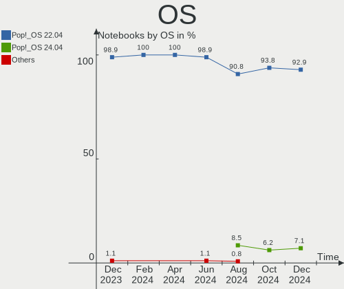
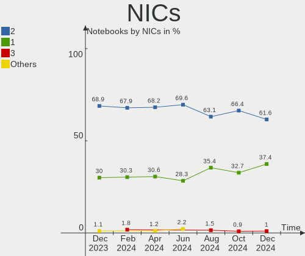
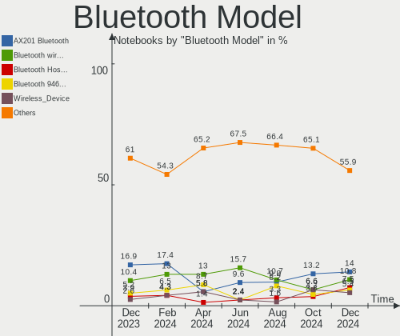

Pop!_OS - Hardware Trends (Notebooks)
-------------------------------------

A project to identify most popular hardware characteristics and track their change
over time based on data collected by Linux users at https://Linux-Hardware.org.

Anyone can contribute to this report by the [hw-probe](https://github.com/linuxhw/hw-probe) tool:

    sudo -E hw-probe -all -upload

This report is for one last month. Overall report since the beginning of time: [TestCoverage](https://github.com/linuxhw/TestCoverage)

Period: Jul, 2022.

Contents
--------

* [ System ](#system)
  - [ OS                       ](#os)
  - [ OS Family                ](#os-family)
  - [ Kernel                   ](#kernel)
  - [ Kernel Family            ](#kernel-family)
  - [ Kernel Major Ver.        ](#kernel-major-ver)
  - [ Arch                     ](#arch)
  - [ DE                       ](#de)
  - [ Display Server           ](#display-server)
  - [ Display Manager          ](#display-manager)
  - [ OS Lang                  ](#os-lang)
  - [ Boot Mode                ](#boot-mode)
  - [ Filesystem               ](#filesystem)
  - [ Part. scheme             ](#part-scheme)
  - [ Dual Boot with Linux/BSD ](#dual-boot-with-linuxbsd)
  - [ Dual Boot (Win)          ](#dual-boot-win)

* [ Board ](#board)
  - [ Vendor                   ](#vendor)
  - [ Model                    ](#model)
  - [ Model Family             ](#model-family)
  - [ MFG Year                 ](#mfg-year)
  - [ Form Factor              ](#form-factor)
  - [ Secure Boot              ](#secure-boot)
  - [ Coreboot                 ](#coreboot)
  - [ RAM Size                 ](#ram-size)
  - [ RAM Used                 ](#ram-used)
  - [ Total Drives             ](#total-drives)
  - [ Has CD-ROM               ](#has-cd-rom)
  - [ Has Ethernet             ](#has-ethernet)
  - [ Has WiFi                 ](#has-wifi)
  - [ Has Bluetooth            ](#has-bluetooth)

* [ Location ](#location)
  - [ Country                  ](#country)
  - [ City                     ](#city)

* [ Drives ](#drives)
  - [ Drive Vendor             ](#drive-vendor)
  - [ Drive Model              ](#drive-model)
  - [ HDD Vendor               ](#hdd-vendor)
  - [ SSD Vendor               ](#ssd-vendor)
  - [ Drive Kind               ](#drive-kind)
  - [ Drive Connector          ](#drive-connector)
  - [ Drive Size               ](#drive-size)
  - [ Space Total              ](#space-total)
  - [ Space Used               ](#space-used)
  - [ Malfunc. Drives          ](#malfunc-drives)
  - [ Malfunc. Drive Vendor    ](#malfunc-drive-vendor)
  - [ Malfunc. HDD Vendor      ](#malfunc-hdd-vendor)
  - [ Malfunc. Drive Kind      ](#malfunc-drive-kind)
  - [ Failed Drives            ](#failed-drives)
  - [ Failed Drive Vendor      ](#failed-drive-vendor)
  - [ Drive Status             ](#drive-status)

* [ Storage controller ](#storage-controller)
  - [ Storage Vendor           ](#storage-vendor)
  - [ Storage Model            ](#storage-model)
  - [ Storage Kind             ](#storage-kind)

* [ Processor ](#processor)
  - [ CPU Vendor               ](#cpu-vendor)
  - [ CPU Model                ](#cpu-model)
  - [ CPU Model Family         ](#cpu-model-family)
  - [ CPU Cores                ](#cpu-cores)
  - [ CPU Sockets              ](#cpu-sockets)
  - [ CPU Threads              ](#cpu-threads)
  - [ CPU Op-Modes             ](#cpu-op-modes)
  - [ CPU Microcode            ](#cpu-microcode)
  - [ CPU Microarch            ](#cpu-microarch)

* [ Graphics ](#graphics)
  - [ GPU Vendor               ](#gpu-vendor)
  - [ GPU Model                ](#gpu-model)
  - [ GPU Combo                ](#gpu-combo)
  - [ GPU Driver               ](#gpu-driver)
  - [ GPU Memory               ](#gpu-memory)

* [ Monitor ](#monitor)
  - [ Monitor Vendor           ](#monitor-vendor)
  - [ Monitor Model            ](#monitor-model)
  - [ Monitor Resolution       ](#monitor-resolution)
  - [ Monitor Diagonal         ](#monitor-diagonal)
  - [ Monitor Width            ](#monitor-width)
  - [ Aspect Ratio             ](#aspect-ratio)
  - [ Monitor Area             ](#monitor-area)
  - [ Pixel Density            ](#pixel-density)
  - [ Multiple Monitors        ](#multiple-monitors)

* [ Network ](#network)
  - [ Net Controller Vendor    ](#net-controller-vendor)
  - [ Net Controller Model     ](#net-controller-model)
  - [ Wireless Vendor          ](#wireless-vendor)
  - [ Wireless Model           ](#wireless-model)
  - [ Ethernet Vendor          ](#ethernet-vendor)
  - [ Ethernet Model           ](#ethernet-model)
  - [ Net Controller Kind      ](#net-controller-kind)
  - [ Used Controller          ](#used-controller)
  - [ NICs                     ](#nics)
  - [ IPv6                     ](#ipv6)

* [ Bluetooth ](#bluetooth)
  - [ Bluetooth Vendor         ](#bluetooth-vendor)
  - [ Bluetooth Model          ](#bluetooth-model)

* [ Sound ](#sound)
  - [ Sound Vendor             ](#sound-vendor)
  - [ Sound Model              ](#sound-model)

* [ Memory ](#memory)
  - [ Memory Vendor            ](#memory-vendor)
  - [ Memory Model             ](#memory-model)
  - [ Memory Kind              ](#memory-kind)
  - [ Memory Form Factor       ](#memory-form-factor)
  - [ Memory Size              ](#memory-size)
  - [ Memory Speed             ](#memory-speed)

* [ Printers & scanners ](#printers--scanners)
  - [ Printer Vendor           ](#printer-vendor)
  - [ Printer Model            ](#printer-model)
  - [ Scanner Vendor           ](#scanner-vendor)
  - [ Scanner Model            ](#scanner-model)

* [ Camera ](#camera)
  - [ Camera Vendor            ](#camera-vendor)
  - [ Camera Model             ](#camera-model)

* [ Security ](#security)
  - [ Fingerprint Vendor       ](#fingerprint-vendor)
  - [ Fingerprint Model        ](#fingerprint-model)
  - [ Chipcard Vendor          ](#chipcard-vendor)
  - [ Chipcard Model           ](#chipcard-model)

* [ Unsupported ](#unsupported)
  - [ Unsupported Devices      ](#unsupported-devices)
  - [ Unsupported Device Types ](#unsupported-device-types)

System
------

OS
--

Installed operating systems

| Name          | Notebooks | Percent |
|---------------|-----------|---------|
| Pop!_OS 22.04 | 135       | 94.41%  |
| Pop!_OS 20.04 | 4         | 2.8%    |
| Pop!_OS 21.10 | 2         | 1.4%    |
| Pop!_OS 21.04 | 1         | 0.7%    |
| Pop!_OS 20.10 | 1         | 0.7%    |

OS Family
---------

OS without a version

| Name    | Notebooks | Percent |
|---------|-----------|---------|
| Pop!_OS | 143       | 100%    |

Kernel
------

Version of the Linux kernel

| Version                  | Notebooks | Percent |
|--------------------------|-----------|---------|
| 5.17.15-76051715-generic | 94        | 65.73%  |
| 5.18.10-76051810-generic | 30        | 20.98%  |
| 5.17.5-76051705-generic  | 13        | 9.09%   |
| 5.19.0-rc1+              | 1         | 0.7%    |
| 5.18.6-xanmod1           | 1         | 0.7%    |
| 5.16.11-76051611-generic | 1         | 0.7%    |
| 5.15.15-76051515-generic | 1         | 0.7%    |
| 5.15.11-76051511-generic | 1         | 0.7%    |
| 5.11.0-7612-generic      | 1         | 0.7%    |

Kernel Family
-------------

Linux kernel without a distro release

| Version | Notebooks | Percent |
|---------|-----------|---------|
| 5.17.15 | 94        | 65.73%  |
| 5.18.10 | 30        | 20.98%  |
| 5.17.5  | 13        | 9.09%   |
| 5.19.0  | 1         | 0.7%    |
| 5.18.6  | 1         | 0.7%    |
| 5.16.11 | 1         | 0.7%    |
| 5.15.15 | 1         | 0.7%    |
| 5.15.11 | 1         | 0.7%    |
| 5.11.0  | 1         | 0.7%    |

Kernel Major Ver.
-----------------

Linux kernel major version

| Version | Notebooks | Percent |
|---------|-----------|---------|
| 5.17    | 107       | 74.83%  |
| 5.18    | 31        | 21.68%  |
| 5.15    | 2         | 1.4%    |
| 5.19    | 1         | 0.7%    |
| 5.16    | 1         | 0.7%    |
| 5.11    | 1         | 0.7%    |

Arch
----

OS architecture (x86_64, i586, etc.)

| Name   | Notebooks | Percent |
|--------|-----------|---------|
| x86_64 | 143       | 100%    |

DE
--

Desktop Environment

| Name       | Notebooks | Percent |
|------------|-----------|---------|
| GNOME      | 134       | 93.71%  |
| KDE5       | 5         | 3.5%    |
| XFCE       | 1         | 0.7%    |
| X-Cinnamon | 1         | 0.7%    |
| Budgie     | 1         | 0.7%    |
| Unknown    | 1         | 0.7%    |

Display Server
--------------

X11 or Wayland

| Name    | Notebooks | Percent |
|---------|-----------|---------|
| X11     | 137       | 95.8%   |
| Wayland | 5         | 3.5%    |
| Unknown | 1         | 0.7%    |

Display Manager
---------------

SDDM, LightDM, etc.

| Name    | Notebooks | Percent |
|---------|-----------|---------|
| Unknown | 120       | 83.92%  |
| GDM3    | 21        | 14.69%  |
| GDM     | 2         | 1.4%    |

OS Lang
-------

Language

| Lang    | Notebooks | Percent |
|---------|-----------|---------|
| en_US   | 89        | 62.24%  |
| de_DE   | 9         | 6.29%   |
| pt_BR   | 6         | 4.2%    |
| en_GB   | 5         | 3.5%    |
| en_AU   | 5         | 3.5%    |
| ru_RU   | 3         | 2.1%    |
| pl_PL   | 3         | 2.1%    |
| es_ES   | 3         | 2.1%    |
| sv_SE   | 2         | 1.4%    |
| nb_NO   | 2         | 1.4%    |
| it_IT   | 2         | 1.4%    |
| en_CA   | 2         | 1.4%    |
| C       | 2         | 1.4%    |
| hr_HR   | 1         | 0.7%    |
| fr_FR   | 1         | 0.7%    |
| fr_CA   | 1         | 0.7%    |
| fi_FI   | 1         | 0.7%    |
| es_CO   | 1         | 0.7%    |
| es_AR   | 1         | 0.7%    |
| en_NZ   | 1         | 0.7%    |
| en_IN   | 1         | 0.7%    |
| de_AT   | 1         | 0.7%    |
| Unknown | 1         | 0.7%    |

Boot Mode
---------

EFI or BIOS

| Mode | Notebooks | Percent |
|------|-----------|---------|
| BIOS | 121       | 84.62%  |
| EFI  | 22        | 15.38%  |

Filesystem
----------

Type of filesystem

| Type    | Notebooks | Percent |
|---------|-----------|---------|
| Ext4    | 139       | 97.2%   |
| Btrfs   | 3         | 2.1%    |
| Overlay | 1         | 0.7%    |

Part. scheme
------------

Scheme of partitioning

| Type    | Notebooks | Percent |
|---------|-----------|---------|
| Unknown | 119       | 83.22%  |
| GPT     | 23        | 16.08%  |
| MBR     | 1         | 0.7%    |

Dual Boot with Linux/BSD
------------------------

Hosting more than one Linux/BSD

| Dual boot | Notebooks | Percent |
|-----------|-----------|---------|
| No        | 140       | 97.9%   |
| Yes       | 3         | 2.1%    |

Dual Boot (Win)
---------------

Hosting Linux and Windows

| Dual boot | Notebooks | Percent |
|-----------|-----------|---------|
| No        | 135       | 94.41%  |
| Yes       | 8         | 5.59%   |

Board
-----

Vendor
------

Motherboard manufacturer

| Name                 | Notebooks | Percent |
|----------------------|-----------|---------|
| Lenovo               | 27        | 18.88%  |
| Dell                 | 20        | 13.99%  |
| Hewlett-Packard      | 19        | 13.29%  |
| ASUSTek Computer     | 15        | 10.49%  |
| Acer                 | 12        | 8.39%   |
| MSI                  | 11        | 7.69%   |
| Apple                | 9         | 6.29%   |
| Toshiba              | 4         | 2.8%    |
| GPU Company          | 4         | 2.8%    |
| System76             | 3         | 2.1%    |
| Samsung Electronics  | 3         | 2.1%    |
| Sony                 | 2         | 1.4%    |
| Notebook             | 2         | 1.4%    |
| Intel Client Systems | 2         | 1.4%    |
| HUAWEI               | 2         | 1.4%    |
| Timi                 | 1         | 0.7%    |
| Pegatron             | 1         | 0.7%    |
| PC Specialist        | 1         | 0.7%    |
| Panasonic            | 1         | 0.7%    |
| Medion               | 1         | 0.7%    |
| Gigabyte Technology  | 1         | 0.7%    |
| Dynabook             | 1         | 0.7%    |
| Alienware            | 1         | 0.7%    |

Model
-----

Motherboard model

| Name                                  | Notebooks | Percent |
|---------------------------------------|-----------|---------|
| System76 Lemur Pro                    | 2         | 1.4%    |
| MSI Katana GF76 11UD                  | 2         | 1.4%    |
| MSI GF63 Thin 11UD                    | 2         | 1.4%    |
| Lenovo IdeaPad S145-15API 81V7        | 2         | 1.4%    |
| Intel Client Systems LAPKC71F         | 2         | 1.4%    |
| HP Pavilion 15                        | 2         | 1.4%    |
| GPU Company GWTN141-10                | 2         | 1.4%    |
| GPU Company GWTC116-2                 | 2         | 1.4%    |
| Dell Vostro 5470                      | 2         | 1.4%    |
| Apple MacBookPro9,2                   | 2         | 1.4%    |
| Apple MacBookAir7,2                   | 2         | 1.4%    |
| Toshiba Satellite L650                | 1         | 0.7%    |
| Toshiba Satellite C75D-C              | 1         | 0.7%    |
| Toshiba Satellite C650D               | 1         | 0.7%    |
| Toshiba BLB                           | 1         | 0.7%    |
| Timi Redmi Book Pro 15 2022           | 1         | 0.7%    |
| System76 Pangolin                     | 1         | 0.7%    |
| Sony VPCF11M1E                        | 1         | 0.7%    |
| Sony VPCEG27FM                        | 1         | 0.7%    |
| Samsung 950XED                        | 1         | 0.7%    |
| Samsung 930XED                        | 1         | 0.7%    |
| Samsung 760XDA                        | 1         | 0.7%    |
| Pegatron H36FF                        | 1         | 0.7%    |
| PC Specialist NS50MU                  | 1         | 0.7%    |
| Panasonic CF-C2AQAZXLM                | 1         | 0.7%    |
| Notebook P65xHP                       | 1         | 0.7%    |
| Notebook NV4XMB,ME,MZ                 | 1         | 0.7%    |
| MSI Prestige 15 A10SC                 | 1         | 0.7%    |
| MSI MS-7C90                           | 1         | 0.7%    |
| MSI MS-16G4                           | 1         | 0.7%    |
| MSI Modern 15 A5M                     | 1         | 0.7%    |
| MSI Katana GF76 11UG                  | 1         | 0.7%    |
| MSI GS75 Stealth 9SG                  | 1         | 0.7%    |
| MSI GE62 2QF                          | 1         | 0.7%    |
| Medion Erazer P6661 MD60303           | 1         | 0.7%    |
| Lenovo Yoga Slim 7 14ITL05 82A3       | 1         | 0.7%    |
| Lenovo Y720-15IKB 80VR                | 1         | 0.7%    |
| Lenovo ThinkPad X270 20HMS12K00       | 1         | 0.7%    |
| Lenovo ThinkPad X230 2325YHU          | 1         | 0.7%    |
| Lenovo ThinkPad X220 Tablet 4298Y19   | 1         | 0.7%    |
| Lenovo ThinkPad X1 Carbon 3460AE4     | 1         | 0.7%    |
| Lenovo ThinkPad T480s 20L8S23300      | 1         | 0.7%    |
| Lenovo ThinkPad T470 W10DG 20JNS01R1C | 1         | 0.7%    |
| Lenovo ThinkPad T440p 20AN009CUS      | 1         | 0.7%    |
| Lenovo ThinkPad P53 20QN003TUS        | 1         | 0.7%    |
| Lenovo ThinkPad P52 20MAS1R100        | 1         | 0.7%    |
| Lenovo ThinkPad E14 Gen 4 21ECS00000  | 1         | 0.7%    |
| Lenovo ThinkPad E14 Gen 3 20YES00200  | 1         | 0.7%    |
| Lenovo ThinkBook 16p Gen 2 20YM       | 1         | 0.7%    |
| Lenovo Legion Y540-17IRH 81UJ         | 1         | 0.7%    |
| Lenovo Legion Y530-15ICH 81FV         | 1         | 0.7%    |
| Lenovo Legion S7 15ACH6 82K8          | 1         | 0.7%    |
| Lenovo Legion 5 15IMH05H 81Y6         | 1         | 0.7%    |
| Lenovo IdeaPad Gaming 3 15ACH6 82K2   | 1         | 0.7%    |
| Lenovo IdeaPad 700-15ISK 80RU         | 1         | 0.7%    |
| Lenovo IdeaPad 330-15IKB 81FE         | 1         | 0.7%    |
| Lenovo IdeaPad 330-15ARR 81D2         | 1         | 0.7%    |
| Lenovo IdeaPad 3 15ALC6 82MF          | 1         | 0.7%    |
| Lenovo E41-25 81FS                    | 1         | 0.7%    |
| Lenovo 14w 81MQ0013AU                 | 1         | 0.7%    |

Model Family
------------

Motherboard model prefix

| Name                          | Notebooks | Percent |
|-------------------------------|-----------|---------|
| Lenovo ThinkPad               | 11        | 7.69%   |
| Lenovo IdeaPad                | 7         | 4.9%    |
| HP Pavilion                   | 6         | 4.2%    |
| Dell Precision                | 6         | 4.2%    |
| Dell Latitude                 | 6         | 4.2%    |
| Acer Aspire                   | 6         | 4.2%    |
| Lenovo Legion                 | 4         | 2.8%    |
| Dell Vostro                   | 4         | 2.8%    |
| Toshiba Satellite             | 3         | 2.1%    |
| MSI Katana                    | 3         | 2.1%    |
| HP ProBook                    | 3         | 2.1%    |
| HP Laptop                     | 3         | 2.1%    |
| HP EliteBook                  | 3         | 2.1%    |
| Dell Inspiron                 | 3         | 2.1%    |
| ASUS ASUS                     | 3         | 2.1%    |
| Acer Nitro                    | 3         | 2.1%    |
| System76 Lemur                | 2         | 1.4%    |
| MSI GF63                      | 2         | 1.4%    |
| Intel Client Systems LAPKC71F | 2         | 1.4%    |
| HP OMEN                       | 2         | 1.4%    |
| GPU Company GWTN141-10        | 2         | 1.4%    |
| GPU Company GWTC116-2         | 2         | 1.4%    |
| ASUS VivoBook                 | 2         | 1.4%    |
| Apple MacBookPro9             | 2         | 1.4%    |
| Apple MacBookAir7             | 2         | 1.4%    |
| Acer Swift                    | 2         | 1.4%    |
| Toshiba BLB                   | 1         | 0.7%    |
| Timi Redmi                    | 1         | 0.7%    |
| System76 Pangolin             | 1         | 0.7%    |
| Sony VPCF11M1E                | 1         | 0.7%    |
| Sony VPCEG27FM                | 1         | 0.7%    |
| Samsung 950XED                | 1         | 0.7%    |
| Samsung 930XED                | 1         | 0.7%    |
| Samsung 760XDA                | 1         | 0.7%    |
| Pegatron H36FF                | 1         | 0.7%    |
| PC Specialist NS50MU          | 1         | 0.7%    |
| Panasonic CF-C2AQAZXLM        | 1         | 0.7%    |
| Notebook P65xHP               | 1         | 0.7%    |
| Notebook NV4XMB               | 1         | 0.7%    |
| MSI Prestige                  | 1         | 0.7%    |
| MSI MS-7C90                   | 1         | 0.7%    |
| MSI MS-16G4                   | 1         | 0.7%    |
| MSI Modern                    | 1         | 0.7%    |
| MSI GS75                      | 1         | 0.7%    |
| MSI GE62                      | 1         | 0.7%    |
| Medion Erazer                 | 1         | 0.7%    |
| Lenovo Yoga                   | 1         | 0.7%    |
| Lenovo Y720-15IKB             | 1         | 0.7%    |
| Lenovo ThinkBook              | 1         | 0.7%    |
| Lenovo E41-25                 | 1         | 0.7%    |
| Lenovo 14w                    | 1         | 0.7%    |
| HUAWEI NBLK-WAX9X             | 1         | 0.7%    |
| HUAWEI MACH-WX9               | 1         | 0.7%    |
| HP ZBook                      | 1         | 0.7%    |
| HP Victus                     | 1         | 0.7%    |
| Gigabyte Blade                | 1         | 0.7%    |
| Dynabook Satellite            | 1         | 0.7%    |
| Dell XPS                      | 1         | 0.7%    |
| ASUS X55CR                    | 1         | 0.7%    |
| ASUS X555LAB                  | 1         | 0.7%    |

MFG Year
--------

Motherboard manufacture year

| Year | Notebooks | Percent |
|------|-----------|---------|
| 2021 | 30        | 20.98%  |
| 2018 | 15        | 10.49%  |
| 2020 | 11        | 7.69%   |
| 2012 | 11        | 7.69%   |
| 2015 | 10        | 6.99%   |
| 2013 | 10        | 6.99%   |
| 2022 | 9         | 6.29%   |
| 2014 | 9         | 6.29%   |
| 2019 | 8         | 5.59%   |
| 2010 | 8         | 5.59%   |
| 2017 | 6         | 4.2%    |
| 2016 | 6         | 4.2%    |
| 2011 | 4         | 2.8%    |
| 2009 | 3         | 2.1%    |
| 2007 | 2         | 1.4%    |
| 2008 | 1         | 0.7%    |

Form Factor
-----------

Physical design of the computer

| Name     | Notebooks | Percent |
|----------|-----------|---------|
| Notebook | 143       | 100%    |

Secure Boot
-----------

Enabled or disabled

| State    | Notebooks | Percent |
|----------|-----------|---------|
| Disabled | 143       | 100%    |

Coreboot
--------

Have coreboot on board

| Used | Notebooks | Percent |
|------|-----------|---------|
| No   | 141       | 98.6%   |
| Yes  | 2         | 1.4%    |

RAM Size
--------

Total RAM memory

| Size in GB  | Notebooks | Percent |
|-------------|-----------|---------|
| 8.01-16.0   | 40        | 27.97%  |
| 4.01-8.0    | 39        | 27.27%  |
| 16.01-24.0  | 31        | 21.68%  |
| 3.01-4.0    | 15        | 10.49%  |
| 32.01-64.0  | 12        | 8.39%   |
| 64.01-256.0 | 4         | 2.8%    |
| 24.01-32.0  | 1         | 0.7%    |
| 1.01-2.0    | 1         | 0.7%    |

RAM Used
--------

Used RAM memory

| Used GB   | Notebooks | Percent |
|-----------|-----------|---------|
| 2.01-3.0  | 54        | 37.76%  |
| 3.01-4.0  | 36        | 25.17%  |
| 4.01-8.0  | 27        | 18.88%  |
| 1.01-2.0  | 21        | 14.69%  |
| 8.01-16.0 | 5         | 3.5%    |

Total Drives
------------

Number of drives on board

| Drives | Notebooks | Percent |
|--------|-----------|---------|
| 1      | 102       | 71.33%  |
| 2      | 33        | 23.08%  |
| 3      | 7         | 4.9%    |
| 7      | 1         | 0.7%    |

Has CD-ROM
----------

Has CD-ROM on board

| Presented | Notebooks | Percent |
|-----------|-----------|---------|
| No        | 105       | 73.43%  |
| Yes       | 38        | 26.57%  |

Has Ethernet
------------

Has Ethernet on board

| Presented | Notebooks | Percent |
|-----------|-----------|---------|
| Yes       | 119       | 83.22%  |
| No        | 24        | 16.78%  |

Has WiFi
--------

Has WiFi module

| Presented | Notebooks | Percent |
|-----------|-----------|---------|
| Yes       | 143       | 100%    |

Has Bluetooth
-------------

Has Bluetooth module

| Presented | Notebooks | Percent |
|-----------|-----------|---------|
| Yes       | 120       | 83.92%  |
| No        | 23        | 16.08%  |

Location
--------

Country
-------

Geographic location (country)

| Country     | Notebooks | Percent |
|-------------|-----------|---------|
| USA         | 45        | 31.47%  |
| Germany     | 14        | 9.79%   |
| Brazil      | 10        | 6.99%   |
| India       | 7         | 4.9%    |
| Canada      | 6         | 4.2%    |
| UK          | 5         | 3.5%    |
| Norway      | 5         | 3.5%    |
| Australia   | 5         | 3.5%    |
| Russia      | 4         | 2.8%    |
| Poland      | 3         | 2.1%    |
| Mexico      | 3         | 2.1%    |
| Italy       | 3         | 2.1%    |
| Finland     | 3         | 2.1%    |
| Turkey      | 2         | 1.4%    |
| Sweden      | 2         | 1.4%    |
| New Zealand | 2         | 1.4%    |
| Greece      | 2         | 1.4%    |
| France      | 2         | 1.4%    |
| Colombia    | 2         | 1.4%    |
| Argentina   | 2         | 1.4%    |
| Venezuela   | 1         | 0.7%    |
| Switzerland | 1         | 0.7%    |
| Spain       | 1         | 0.7%    |
| Romania     | 1         | 0.7%    |
| Philippines | 1         | 0.7%    |
| Peru        | 1         | 0.7%    |
| Pakistan    | 1         | 0.7%    |
| Morocco     | 1         | 0.7%    |
| Iraq        | 1         | 0.7%    |
| Iran        | 1         | 0.7%    |
| Egypt       | 1         | 0.7%    |
| Croatia     | 1         | 0.7%    |
| China       | 1         | 0.7%    |
| Chile       | 1         | 0.7%    |
| Bangladesh  | 1         | 0.7%    |
| Austria     | 1         | 0.7%    |

City
----

Geographic location (city)

| City                   | Notebooks | Percent |
|------------------------|-----------|---------|
| Oslo                   | 4         | 2.8%    |
| Munich                 | 3         | 2.1%    |
| Brisbane               | 3         | 2.1%    |
| Sydney                 | 2         | 1.4%    |
| Portland               | 2         | 1.4%    |
| Mumbai                 | 2         | 1.4%    |
| Manaus                 | 2         | 1.4%    |
| Lansing                | 2         | 1.4%    |
| Helsinki               | 2         | 1.4%    |
| Berlin                 | 2         | 1.4%    |
| Auckland               | 2         | 1.4%    |
| Wilmington             | 1         | 0.7%    |
| Wesley Chapel          | 1         | 0.7%    |
| Waxhaw                 | 1         | 0.7%    |
| Warsaw                 | 1         | 0.7%    |
| Virginia Beach         | 1         | 0.7%    |
| Vancouver              | 1         | 0.7%    |
| Turin                  | 1         | 0.7%    |
| Trujillo               | 1         | 0.7%    |
| Trollhättan           | 1         | 0.7%    |
| Thebes                 | 1         | 0.7%    |
| Tehran                 | 1         | 0.7%    |
| Strawberry Plains      | 1         | 0.7%    |
| Stockholm              | 1         | 0.7%    |
| St Petersburg          | 1         | 0.7%    |
| Southfield             | 1         | 0.7%    |
| South Bend             | 1         | 0.7%    |
| Sisli                  | 1         | 0.7%    |
| San Vicente de Chucuri | 1         | 0.7%    |
| San José del Cabo     | 1         | 0.7%    |
| San Jose               | 1         | 0.7%    |
| Salt Lake City         | 1         | 0.7%    |
| Roseville              | 1         | 0.7%    |
| Rocky Mount            | 1         | 0.7%    |
| Rio de Janeiro         | 1         | 0.7%    |
| Ringwood               | 1         | 0.7%    |
| Rimouski               | 1         | 0.7%    |
| Raleigh                | 1         | 0.7%    |
| Puerto Vallarta        | 1         | 0.7%    |
| Potsdam                | 1         | 0.7%    |
| Point Pleasant         | 1         | 0.7%    |
| Petrópolis            | 1         | 0.7%    |
| Peterborough           | 1         | 0.7%    |
| Perugia                | 1         | 0.7%    |
| Patos de Minas         | 1         | 0.7%    |
| Paris                  | 1         | 0.7%    |
| Ottawa                 | 1         | 0.7%    |
| Omsk                   | 1         | 0.7%    |
| Oberaegeri             | 1         | 0.7%    |
| Norwich                | 1         | 0.7%    |
| Northwood              | 1         | 0.7%    |
| Nordhorn               | 1         | 0.7%    |
| Nizhniy Novgorod       | 1         | 0.7%    |
| New Albany             | 1         | 0.7%    |
| Natore                 | 1         | 0.7%    |
| Murfreesboro           | 1         | 0.7%    |
| Mosbach                | 1         | 0.7%    |
| Montgomery             | 1         | 0.7%    |
| Minneapolis            | 1         | 0.7%    |
| Milan                  | 1         | 0.7%    |

Drives
------

Drive Vendor
------------

Hard drive vendors

| Vendor                         | Notebooks | Drives | Percent |
|--------------------------------|-----------|--------|---------|
| Samsung Electronics            | 32        | 38     | 17.2%   |
| SanDisk                        | 26        | 28     | 13.98%  |
| Kingston                       | 20        | 22     | 10.75%  |
| Toshiba                        | 15        | 15     | 8.06%   |
| Seagate                        | 12        | 12     | 6.45%   |
| WDC                            | 11        | 11     | 5.91%   |
| SK hynix                       | 8         | 8      | 4.3%    |
| HGST                           | 6         | 6      | 3.23%   |
| Unknown                        | 5         | 5      | 2.69%   |
| Phison                         | 5         | 5      | 2.69%   |
| Crucial                        | 5         | 5      | 2.69%   |
| Apple                          | 5         | 5      | 2.69%   |
| Intel                          | 3         | 3      | 1.61%   |
| Hitachi                        | 3         | 3      | 1.61%   |
| China                          | 3         | 3      | 1.61%   |
| W800S                          | 2         | 3      | 1.08%   |
| SPCC                           | 2         | 2      | 1.08%   |
| PNY                            | 2         | 2      | 1.08%   |
| Micron Technology              | 2         | 2      | 1.08%   |
| Union Memory (Shenzhen)        | 1         | 1      | 0.54%   |
| T-FORCE                        | 1         | 1      | 0.54%   |
| SSSTC                          | 1         | 1      | 0.54%   |
| Solid State Storage Technology | 1         | 1      | 0.54%   |
| Shenzhen Longsys Electronics   | 1         | 1      | 0.54%   |
| SATAFIRM                       | 1         | 1      | 0.54%   |
| ROG                            | 1         | 1      | 0.54%   |
| Radeon                         | 1         | 1      | 0.54%   |
| Patriot                        | 1         | 1      | 0.54%   |
| Netac                          | 1         | 1      | 0.54%   |
| LITEON                         | 1         | 1      | 0.54%   |
| Lite-On                        | 1         | 1      | 0.54%   |
| Lexar                          | 1         | 1      | 0.54%   |
| Leven                          | 1         | 1      | 0.54%   |
| Intenso                        | 1         | 1      | 0.54%   |
| Inland                         | 1         | 1      | 0.54%   |
| BHT                            | 1         | 1      | 0.54%   |
| Apacer                         | 1         | 2      | 0.54%   |
| A-DATA Technology              | 1         | 1      | 0.54%   |

Drive Model
-----------

Hard drive models

| Model                                        | Notebooks | Percent |
|----------------------------------------------|-----------|---------|
| Kingston SA400S37240G 240GB SSD              | 6         | 3.13%   |
| SanDisk NVMe SSD Drive 512GB                 | 5         | 2.6%    |
| Kingston NVMe SSD Drive 512GB                | 5         | 2.6%    |
| HGST HTS721010A9E630 1TB                     | 4         | 2.08%   |
| SanDisk NVMe SSD Drive 256GB                 | 3         | 1.56%   |
| SanDisk NVMe SSD Drive 1TB                   | 3         | 1.56%   |
| Samsung NVMe SSD Drive 512GB                 | 3         | 1.56%   |
| Samsung NVMe SSD Drive 500GB                 | 3         | 1.56%   |
| Samsung NVMe SSD Drive 1024GB                | 3         | 1.56%   |
| Kingston SA400S37120G 120GB SSD              | 3         | 1.56%   |
| WDC WD10SPZX-21Z10T0 1TB                     | 2         | 1.04%   |
| W800S 512GB                                  | 2         | 1.04%   |
| Unknown MMC Card  64GB                       | 2         | 1.04%   |
| Toshiba MQ01ACF050 500GB                     | 2         | 1.04%   |
| Toshiba MQ01ABD075 752GB                     | 2         | 1.04%   |
| SPCC Solid State Disk 512GB                  | 2         | 1.04%   |
| SK hynix NVMe SSD Drive 256GB                | 2         | 1.04%   |
| Seagate ST2000LM007-1R8174 2TB               | 2         | 1.04%   |
| Seagate ST1000LM035-1RK172 1TB               | 2         | 1.04%   |
| Seagate ST1000LM024 HN-M101MBB 1TB           | 2         | 1.04%   |
| SanDisk NVMe SSD Drive 500GB                 | 2         | 1.04%   |
| SanDisk NVMe SSD Drive 1024GB                | 2         | 1.04%   |
| Samsung SSD 860 QVO 1TB                      | 2         | 1.04%   |
| Kingston SV300S37A240G 240GB SSD             | 2         | 1.04%   |
| Kingston OM8PCP3512F-AI1 512GB               | 2         | 1.04%   |
| Kingston NVMe SSD Drive 256GB                | 2         | 1.04%   |
| Apple SSD SM0128G 121GB                      | 2         | 1.04%   |
| WDC WDS480G1G0A-00SS50 480GB SSD             | 1         | 0.52%   |
| WDC WD800BEVS-07RST0 80GB                    | 1         | 0.52%   |
| WDC WD5000LPVX-75V0TT0 500GB                 | 1         | 0.52%   |
| WDC WD5000LPCX-22VHAT1 500GB                 | 1         | 0.52%   |
| WDC WD3200BEKT-60V5T1 320GB                  | 1         | 0.52%   |
| WDC WD10SPZX-24Z10 1TB                       | 1         | 0.52%   |
| WDC WD10SPZX-22Z10T0 1TB                     | 1         | 0.52%   |
| WDC WD10JPVX-22JC3T0 1TB                     | 1         | 0.52%   |
| WDC PC SN730 SDBPNTY-512G-1006 512GB         | 1         | 0.52%   |
| W800S SSD 512GB                              | 1         | 0.52%   |
| Unknown MMC Card  536GB                      | 1         | 0.52%   |
| Unknown MMC Card  393GB                      | 1         | 0.52%   |
| Unknown MMC Card  128GB                      | 1         | 0.52%   |
| Union Memory (Shenzhen) NVMe SSD Drive 512GB | 1         | 0.52%   |
| Toshiba TR150 480GB SSD                      | 1         | 0.52%   |
| Toshiba NVMe SSD Drive 512GB                 | 1         | 0.52%   |
| Toshiba NVMe SSD Drive 256GB                 | 1         | 0.52%   |
| Toshiba MQ04ABF100 1TB                       | 1         | 0.52%   |
| Toshiba MQ01ABD100M 1TB                      | 1         | 0.52%   |
| Toshiba MQ01ABD050V -63 500GB                | 1         | 0.52%   |
| Toshiba MK8009GAH 80GB                       | 1         | 0.52%   |
| Toshiba MK5055GSX 500GB                      | 1         | 0.52%   |
| Toshiba MK3265GSX 320GB                      | 1         | 0.52%   |
| Toshiba KBG30ZMV512G 512GB                   | 1         | 0.52%   |
| Toshiba KBG30ZMS128G 128GB NVMe SSD          | 1         | 0.52%   |
| T-FORCE 500GB                                | 1         | 0.52%   |
| SSSTC CL1-4D256 256GB                        | 1         | 0.52%   |
| Solid State Storage NVMe SSD Drive 2TB       | 1         | 0.52%   |
| SK hynix SKHynix_HFS512GDE9X084N 512GB       | 1         | 0.52%   |
| SK hynix SHGS31-1000GS-2 1TB SSD             | 1         | 0.52%   |
| SK hynix PC601 HFS512GD9TNG-L2A0A 512GB      | 1         | 0.52%   |
| SK hynix NVMe SSD Drive 512GB                | 1         | 0.52%   |
| SK hynix HFS128G39TND-N210A 128GB SSD        | 1         | 0.52%   |

HDD Vendor
----------

Hard disk drive vendors

| Vendor   | Notebooks | Drives | Percent |
|----------|-----------|--------|---------|
| Seagate  | 12        | 12     | 29.27%  |
| Toshiba  | 10        | 10     | 24.39%  |
| WDC      | 9         | 9      | 21.95%  |
| HGST     | 6         | 6      | 14.63%  |
| Hitachi  | 3         | 3      | 7.32%   |
| SATAFIRM | 1         | 1      | 2.44%   |

SSD Vendor
----------

Solid state drive vendors

| Vendor              | Notebooks | Drives | Percent |
|---------------------|-----------|--------|---------|
| Samsung Electronics | 13        | 13     | 19.7%   |
| Kingston            | 13        | 13     | 19.7%   |
| SanDisk             | 10        | 10     | 15.15%  |
| Apple               | 5         | 5      | 7.58%   |
| Crucial             | 3         | 3      | 4.55%   |
| China               | 3         | 3      | 4.55%   |
| SPCC                | 2         | 2      | 3.03%   |
| SK hynix            | 2         | 2      | 3.03%   |
| PNY                 | 2         | 2      | 3.03%   |
| WDC                 | 1         | 1      | 1.52%   |
| W800S               | 1         | 1      | 1.52%   |
| Toshiba             | 1         | 1      | 1.52%   |
| Radeon              | 1         | 1      | 1.52%   |
| Phison              | 1         | 1      | 1.52%   |
| Patriot             | 1         | 1      | 1.52%   |
| LITEON              | 1         | 1      | 1.52%   |
| Leven               | 1         | 1      | 1.52%   |
| Intenso             | 1         | 1      | 1.52%   |
| Inland              | 1         | 1      | 1.52%   |
| BHT                 | 1         | 1      | 1.52%   |
| Apacer              | 1         | 2      | 1.52%   |
| A-DATA Technology   | 1         | 1      | 1.52%   |

Drive Kind
----------

HDD or SSD

| Kind    | Notebooks | Drives | Percent |
|---------|-----------|--------|---------|
| NVMe    | 65        | 80     | 37.57%  |
| SSD     | 61        | 67     | 35.26%  |
| HDD     | 38        | 41     | 21.97%  |
| MMC     | 5         | 5      | 2.89%   |
| Unknown | 4         | 5      | 2.31%   |

Drive Connector
---------------

SATA, SAS, NVMe, etc.

| Type | Notebooks | Drives | Percent |
|------|-----------|--------|---------|
| SATA | 91        | 106    | 54.17%  |
| NVMe | 65        | 80     | 38.69%  |
| SAS  | 7         | 7      | 4.17%   |
| MMC  | 5         | 5      | 2.98%   |

Drive Size
----------

Size of hard drive

| Size in TB | Notebooks | Drives | Percent |
|------------|-----------|--------|---------|
| 0.01-0.5   | 64        | 68     | 64%     |
| 0.51-1.0   | 31        | 35     | 31%     |
| 1.01-2.0   | 5         | 5      | 5%      |

Space Total
-----------

Amount of disk space available on the file system

| Size in GB | Notebooks | Percent |
|------------|-----------|---------|
| 101-250    | 50        | 34.97%  |
| 251-500    | 37        | 25.87%  |
| 501-1000   | 25        | 17.48%  |
| 1001-2000  | 9         | 6.29%   |
| 21-50      | 8         | 5.59%   |
| 51-100     | 7         | 4.9%    |
| 2001-3000  | 3         | 2.1%    |
| 1-20       | 3         | 2.1%    |
| Unknown    | 1         | 0.7%    |

Space Used
----------

Amount of used disk space

| Used GB   | Notebooks | Percent |
|-----------|-----------|---------|
| 1-20      | 49        | 34.27%  |
| 21-50     | 34        | 23.78%  |
| 51-100    | 20        | 13.99%  |
| 101-250   | 19        | 13.29%  |
| 251-500   | 10        | 6.99%   |
| 501-1000  | 9         | 6.29%   |
| 1001-2000 | 1         | 0.7%    |
| Unknown   | 1         | 0.7%    |

Malfunc. Drives
---------------

Drive models with a malfunction

| Model                         | Notebooks | Drives | Percent |
|-------------------------------|-----------|--------|---------|
| Lexar 1TB SSD                 | 1         | 1      | 25%     |
| Leven JAJS600M256C 256GB SSD  | 1         | 1      | 25%     |
| Hitachi HTS545050A7E380 500GB | 1         | 1      | 25%     |
| HGST HTS721010A9E630 1TB      | 1         | 1      | 25%     |

Malfunc. Drive Vendor
---------------------

Vendors of faulty drives

| Vendor  | Notebooks | Drives | Percent |
|---------|-----------|--------|---------|
| Lexar   | 1         | 1      | 25%     |
| Leven   | 1         | 1      | 25%     |
| Hitachi | 1         | 1      | 25%     |
| HGST    | 1         | 1      | 25%     |

Malfunc. HDD Vendor
-------------------

Vendors of faulty HDD drives

| Vendor  | Notebooks | Drives | Percent |
|---------|-----------|--------|---------|
| Hitachi | 1         | 1      | 50%     |
| HGST    | 1         | 1      | 50%     |

Malfunc. Drive Kind
-------------------

Kinds of faulty drives

| Kind | Notebooks | Drives | Percent |
|------|-----------|--------|---------|
| HDD  | 2         | 2      | 50%     |
| NVMe | 1         | 1      | 25%     |
| SSD  | 1         | 1      | 25%     |

Failed Drives
-------------

Failed drive models

Zero info for selected period =(

Failed Drive Vendor
-------------------

Failed drive vendors

Zero info for selected period =(

Drive Status
------------

Number of failed and malfunc. drives

| Status   | Notebooks | Drives | Percent |
|----------|-----------|--------|---------|
| Detected | 122       | 163    | 80.26%  |
| Works    | 26        | 31     | 17.11%  |
| Malfunc  | 4         | 4      | 2.63%   |

Storage controller
------------------

Storage Vendor
--------------

Storage controller vendors

| Vendor                         | Notebooks | Percent |
|--------------------------------|-----------|---------|
| Intel                          | 78        | 43.09%  |
| AMD                            | 27        | 14.92%  |
| Samsung Electronics            | 24        | 13.26%  |
| SanDisk                        | 18        | 9.94%   |
| Kingston Technology Company    | 7         | 3.87%   |
| SK hynix                       | 6         | 3.31%   |
| Toshiba America Info Systems   | 4         | 2.21%   |
| Phison Electronics             | 4         | 2.21%   |
| Nvidia                         | 3         | 1.66%   |
| Solid State Storage Technology | 2         | 1.1%    |
| Shenzhen Longsys Electronics   | 2         | 1.1%    |
| Micron/Crucial Technology      | 2         | 1.1%    |
| Micron Technology              | 2         | 1.1%    |
| Union Memory (Shenzhen)        | 1         | 0.55%   |
| Lite-On Technology             | 1         | 0.55%   |

Storage Model
-------------

Storage controller models

| Model                                                                          | Notebooks | Percent |
|--------------------------------------------------------------------------------|-----------|---------|
| AMD FCH SATA Controller [AHCI mode]                                            | 23        | 12.04%  |
| Intel 7 Series Chipset Family 6-port SATA Controller [AHCI mode]               | 9         | 4.71%   |
| SanDisk WD Black SN750 / PC SN730 NVMe SSD                                     | 8         | 4.19%   |
| Intel 8 Series SATA Controller 1 [AHCI mode]                                   | 8         | 4.19%   |
| Intel 6 Series/C200 Series Chipset Family 6 port Mobile SATA AHCI Controller   | 8         | 4.19%   |
| Samsung NVMe SSD Controller 980                                                | 7         | 3.66%   |
| Intel 500 Series Chipset Family SATA AHCI Controller                           | 7         | 3.66%   |
| Samsung NVMe SSD Controller PM9A1/PM9A3/980PRO                                 | 6         | 3.14%   |
| Intel Sunrise Point-LP SATA Controller [AHCI mode]                             | 6         | 3.14%   |
| Intel Cannon Lake Mobile PCH SATA AHCI Controller                              | 6         | 3.14%   |
| Intel HM170/QM170 Chipset SATA Controller [AHCI Mode]                          | 5         | 2.62%   |
| Intel 82801 Mobile SATA Controller [RAID mode]                                 | 5         | 2.62%   |
| SanDisk WD Blue SN550 NVMe SSD                                                 | 4         | 2.09%   |
| Samsung NVMe SSD Controller SM981/PM981/PM983                                  | 4         | 2.09%   |
| Kingston Company Company Non-Volatile memory controller                        | 4         | 2.09%   |
| Intel Volume Management Device NVMe RAID Controller                            | 4         | 2.09%   |
| Toshiba America Info Systems BG3 NVMe SSD Controller                           | 3         | 1.57%   |
| SK hynix Gold P31 SSD                                                          | 3         | 1.57%   |
| Samsung NVMe SSD Controller SM961/PM961/SM963                                  | 3         | 1.57%   |
| Samsung Electronics SATA controller                                            | 3         | 1.57%   |
| Intel 8 Series/C220 Series Chipset Family 6-port SATA Controller 1 [AHCI mode] | 3         | 1.57%   |
| AMD SB7x0/SB8x0/SB9x0 SATA Controller [AHCI mode]                              | 3         | 1.57%   |
| Solid State Storage Non-Volatile memory controller                             | 2         | 1.05%   |
| SK hynix Non-Volatile memory controller                                        | 2         | 1.05%   |
| Shenzhen Longsys Electronics Non-Volatile memory controller                    | 2         | 1.05%   |
| SanDisk Non-Volatile memory controller                                         | 2         | 1.05%   |
| Phison E12 NVMe Controller                                                     | 2         | 1.05%   |
| Micron Non-Volatile memory controller                                          | 2         | 1.05%   |
| Kingston Company OM3PDP3 NVMe SSD                                              | 2         | 1.05%   |
| Intel Wildcat Point-LP SATA Controller [AHCI Mode]                             | 2         | 1.05%   |
| Intel Tiger Lake-LP SATA Controller                                            | 2         | 1.05%   |
| Intel Celeron/Pentium Silver Processor SATA Controller                         | 2         | 1.05%   |
| Intel Cannon Point-LP SATA Controller [AHCI Mode]                              | 2         | 1.05%   |
| Intel 5 Series/3400 Series Chipset 4 port SATA AHCI Controller                 | 2         | 1.05%   |
| AMD FCH IDE Controller                                                         | 2         | 1.05%   |
| Union Memory (Shenzhen) AM630 PCIe 4.0 x4 NVMe SSD Controller                  | 1         | 0.52%   |
| Toshiba America Info Systems XG6 NVMe SSD Controller                           | 1         | 0.52%   |
| SK hynix BC501 NVMe Solid State Drive                                          | 1         | 0.52%   |
| SanDisk WD PC SN810 / Black SN850 NVMe SSD                                     | 1         | 0.52%   |
| SanDisk WD Blue SN570 NVMe SSD                                                 | 1         | 0.52%   |
| SanDisk WD Blue SN500 / PC SN520 NVMe SSD                                      | 1         | 0.52%   |
| SanDisk WD Black 2018/SN750 / PC SN720 NVMe SSD                                | 1         | 0.52%   |
| Samsung NVMe SSD Controller SM951/PM951                                        | 1         | 0.52%   |
| Samsung Apple PCIe SSD                                                         | 1         | 0.52%   |
| Phison Electronics Non-Volatile memory controller                              | 1         | 0.52%   |
| Phison E16 PCIe4 NVMe Controller                                               | 1         | 0.52%   |
| Nvidia MCP89 SATA Controller (AHCI mode)                                       | 1         | 0.52%   |
| Nvidia MCP79 AHCI Controller                                                   | 1         | 0.52%   |
| Nvidia MCP67 IDE Controller                                                    | 1         | 0.52%   |
| Nvidia MCP67 AHCI Controller                                                   | 1         | 0.52%   |
| Micron/Crucial P2 NVMe PCIe SSD                                                | 1         | 0.52%   |
| Micron/Crucial NVMe Controller                                                 | 1         | 0.52%   |
| Lite-On Non-Volatile memory controller                                         | 1         | 0.52%   |
| Kingston Company U-SNS8154P3 NVMe SSD                                          | 1         | 0.52%   |
| Intel SSD Pro 7600p/760p/E 6100p Series                                        | 1         | 0.52%   |
| Intel SSD 660P Series                                                          | 1         | 0.52%   |
| Intel SATA Controller [RAID mode]                                              | 1         | 0.52%   |
| Intel NVMe Optane Memory Series                                                | 1         | 0.52%   |
| Intel Ice Lake-LP SATA Controller [AHCI mode]                                  | 1         | 0.52%   |
| Intel Atom Processor E3800 Series SATA AHCI Controller                         | 1         | 0.52%   |

Storage Kind
------------

Kind of storage controller (IDE, SATA, NVMe, SAS, ...)

| Kind | Notebooks | Percent |
|------|-----------|---------|
| SATA | 100       | 55.56%  |
| NVMe | 65        | 36.11%  |
| RAID | 10        | 5.56%   |
| IDE  | 5         | 2.78%   |

Processor
---------

CPU Vendor
----------

Processor vendors

| Vendor | Notebooks | Percent |
|--------|-----------|---------|
| Intel  | 101       | 70.63%  |
| AMD    | 42        | 29.37%  |

CPU Model
---------

Processor models

| Model                                         | Notebooks | Percent |
|-----------------------------------------------|-----------|---------|
| Intel 11th Gen Core i7-11800H @ 2.30GHz       | 6         | 4.2%    |
| Intel 11th Gen Core i5-1135G7 @ 2.40GHz       | 5         | 3.5%    |
| AMD Ryzen 7 5800H with Radeon Graphics        | 4         | 2.8%    |
| Intel Core i7-7700HQ CPU @ 2.80GHz            | 3         | 2.1%    |
| Intel Core i5-2520M CPU @ 2.50GHz             | 3         | 2.1%    |
| Intel 11th Gen Core i5-11400H @ 2.70GHz       | 3         | 2.1%    |
| Intel Core i7-8850H CPU @ 2.60GHz             | 2         | 1.4%    |
| Intel Core i7-8550U CPU @ 1.80GHz             | 2         | 1.4%    |
| Intel Core i7-4720HQ CPU @ 2.60GHz            | 2         | 1.4%    |
| Intel Core i7-3740QM CPU @ 2.70GHz            | 2         | 1.4%    |
| Intel Core i7-10750H CPU @ 2.60GHz            | 2         | 1.4%    |
| Intel Core i5-8300H CPU @ 2.30GHz             | 2         | 1.4%    |
| Intel Core i5-8250U CPU @ 1.60GHz             | 2         | 1.4%    |
| Intel Core i5-6300U CPU @ 2.40GHz             | 2         | 1.4%    |
| Intel Core i5-4210U CPU @ 1.70GHz             | 2         | 1.4%    |
| Intel Core i5-4200U CPU @ 1.60GHz             | 2         | 1.4%    |
| Intel Core i5-3427U CPU @ 1.80GHz             | 2         | 1.4%    |
| Intel Core i5-3210M CPU @ 2.50GHz             | 2         | 1.4%    |
| Intel Core i5-2430M CPU @ 2.40GHz             | 2         | 1.4%    |
| Intel Core i5 CPU M 480 @ 2.67GHz             | 2         | 1.4%    |
| Intel Core i3-4005U CPU @ 1.70GHz             | 2         | 1.4%    |
| Intel Celeron N4020 CPU @ 1.10GHz             | 2         | 1.4%    |
| Intel 12th Gen Core i7-1260P                  | 2         | 1.4%    |
| Intel 11th Gen Core i7-1165G7 @ 2.80GHz       | 2         | 1.4%    |
| AMD Ryzen 7 5700U with Radeon Graphics        | 2         | 1.4%    |
| AMD Ryzen 7 4800H with Radeon Graphics        | 2         | 1.4%    |
| AMD Ryzen 7 3700U with Radeon Vega Mobile Gfx | 2         | 1.4%    |
| AMD Ryzen 5 5600U with Radeon Graphics        | 2         | 1.4%    |
| AMD Ryzen 5 5500U with Radeon Graphics        | 2         | 1.4%    |
| AMD Ryzen 5 3500U with Radeon Vega Mobile Gfx | 2         | 1.4%    |
| AMD Athlon Silver 3050U with Radeon Graphics  | 2         | 1.4%    |
| Intel Pentium Dual-Core CPU T4400 @ 2.20GHz   | 1         | 0.7%    |
| Intel Core i9-9880H CPU @ 2.30GHz             | 1         | 0.7%    |
| Intel Core i7-9850H CPU @ 2.60GHz             | 1         | 0.7%    |
| Intel Core i7-9750H CPU @ 2.60GHz             | 1         | 0.7%    |
| Intel Core i7-7500U CPU @ 2.70GHz             | 1         | 0.7%    |
| Intel Core i7-6820HQ CPU @ 2.70GHz            | 1         | 0.7%    |
| Intel Core i7-6700HQ CPU @ 2.60GHz            | 1         | 0.7%    |
| Intel Core i7-6500U CPU @ 2.50GHz             | 1         | 0.7%    |
| Intel Core i7-4850HQ CPU @ 2.30GHz            | 1         | 0.7%    |
| Intel Core i7-4810MQ CPU @ 2.80GHz            | 1         | 0.7%    |
| Intel Core i7-4710MQ CPU @ 2.50GHz            | 1         | 0.7%    |
| Intel Core i7-4710HQ CPU @ 2.50GHz            | 1         | 0.7%    |
| Intel Core i7-4600U CPU @ 2.10GHz             | 1         | 0.7%    |
| Intel Core i7-4510U CPU @ 2.00GHz             | 1         | 0.7%    |
| Intel Core i7-4500U CPU @ 1.80GHz             | 1         | 0.7%    |
| Intel Core i7-3520M CPU @ 2.90GHz             | 1         | 0.7%    |
| Intel Core i7-2760QM CPU @ 2.40GHz            | 1         | 0.7%    |
| Intel Core i7-2635QM CPU @ 2.00GHz            | 1         | 0.7%    |
| Intel Core i7-10710U CPU @ 1.10GHz            | 1         | 0.7%    |
| Intel Core i7-10610U CPU @ 1.80GHz            | 1         | 0.7%    |
| Intel Core i5-8265U CPU @ 1.60GHz             | 1         | 0.7%    |
| Intel Core i5-7300U CPU @ 2.60GHz             | 1         | 0.7%    |
| Intel Core i5-6300HQ CPU @ 2.30GHz            | 1         | 0.7%    |
| Intel Core i5-6200U CPU @ 2.30GHz             | 1         | 0.7%    |
| Intel Core i5-5350U CPU @ 1.80GHz             | 1         | 0.7%    |
| Intel Core i5-5300U CPU @ 2.30GHz             | 1         | 0.7%    |
| Intel Core i5-5287U CPU @ 2.90GHz             | 1         | 0.7%    |
| Intel Core i5-5250U CPU @ 1.60GHz             | 1         | 0.7%    |
| Intel Core i5-5200U CPU @ 2.20GHz             | 1         | 0.7%    |

CPU Model Family
----------------

Processor model prefix

| Model                   | Notebooks | Percent |
|-------------------------|-----------|---------|
| Intel Core i5           | 36        | 25.17%  |
| Intel Core i7           | 31        | 21.68%  |
| Other                   | 21        | 14.69%  |
| AMD Ryzen 7             | 12        | 8.39%   |
| AMD Ryzen 5             | 11        | 7.69%   |
| Intel Core i3           | 6         | 4.2%    |
| AMD A10                 | 4         | 2.8%    |
| Intel Core 2 Duo        | 3         | 2.1%    |
| Intel Celeron           | 3         | 2.1%    |
| AMD A6                  | 3         | 2.1%    |
| AMD Athlon              | 2         | 1.4%    |
| Intel Pentium Dual-Core | 1         | 0.7%    |
| Intel Core i9           | 1         | 0.7%    |
| AMD Turion 64 X2 Mobile | 1         | 0.7%    |
| AMD Ryzen 9             | 1         | 0.7%    |
| AMD Ryzen 5 PRO         | 1         | 0.7%    |
| AMD Ryzen 3             | 1         | 0.7%    |
| AMD Phenom II           | 1         | 0.7%    |
| AMD E2                  | 1         | 0.7%    |
| AMD E                   | 1         | 0.7%    |
| AMD Athlon X2           | 1         | 0.7%    |
| AMD A8                  | 1         | 0.7%    |

CPU Cores
---------

Number of processor cores

| Number | Notebooks | Percent |
|--------|-----------|---------|
| 2      | 61        | 42.66%  |
| 4      | 41        | 28.67%  |
| 6      | 19        | 13.29%  |
| 8      | 18        | 12.59%  |
| 12     | 2         | 1.4%    |
| 14     | 1         | 0.7%    |
| 1      | 1         | 0.7%    |

CPU Sockets
-----------

Number of sockets

| Number | Notebooks | Percent |
|--------|-----------|---------|
| 1      | 143       | 100%    |

CPU Threads
-----------

Threads per core (Hyper-Threading)

| Number | Notebooks | Percent |
|--------|-----------|---------|
| 2      | 123       | 86.01%  |
| 1      | 20        | 13.99%  |

CPU Op-Modes
------------

CPU Operation Modes (32-bit, 64-bit)

| Op mode        | Notebooks | Percent |
|----------------|-----------|---------|
| 32-bit, 64-bit | 143       | 100%    |

CPU Microcode
-------------

Microcode number

| Number     | Notebooks | Percent |
|------------|-----------|---------|
| Unknown    | 115       | 80.42%  |
| 0x806d1    | 5         | 3.5%    |
| 0x0a50000c | 5         | 3.5%    |
| 0x806c1    | 2         | 1.4%    |
| 0x306a9    | 2         | 1.4%    |
| 0x08108109 | 2         | 1.4%    |
| 0xa0660    | 1         | 0.7%    |
| 0x906ea    | 1         | 0.7%    |
| 0x806e9    | 1         | 0.7%    |
| 0x506e3    | 1         | 0.7%    |
| 0x306d4    | 1         | 0.7%    |
| 0x30678    | 1         | 0.7%    |
| 0x0a404101 | 1         | 0.7%    |
| 0x08608103 | 1         | 0.7%    |
| 0x08600106 | 1         | 0.7%    |
| 0x0810100b | 1         | 0.7%    |
| 0x07030105 | 1         | 0.7%    |
| 0x06006705 | 1         | 0.7%    |

CPU Microarch
-------------

Microarchitecture

| Name          | Notebooks | Percent |
|---------------|-----------|---------|
| KabyLake      | 20        | 13.99%  |
| Haswell       | 16        | 11.19%  |
| Unknown       | 14        | 9.79%   |
| Zen 3         | 12        | 8.39%   |
| SandyBridge   | 9         | 6.29%   |
| IvyBridge     | 9         | 6.29%   |
| Zen+          | 7         | 4.9%    |
| TigerLake     | 7         | 4.9%    |
| Skylake       | 7         | 4.9%    |
| Broadwell     | 6         | 4.2%    |
| Icelake       | 5         | 3.5%    |
| Excavator     | 4         | 2.8%    |
| Westmere      | 3         | 2.1%    |
| Piledriver    | 3         | 2.1%    |
| Penryn        | 3         | 2.1%    |
| CometLake     | 3         | 2.1%    |
| Zen 2         | 2         | 1.4%    |
| Zen           | 2         | 1.4%    |
| K8 Hammer     | 2         | 1.4%    |
| Goldmont plus | 2         | 1.4%    |
| Steamroller   | 1         | 0.7%    |
| Silvermont    | 1         | 0.7%    |
| Puma          | 1         | 0.7%    |
| K10 Llano     | 1         | 0.7%    |
| K10           | 1         | 0.7%    |
| Core          | 1         | 0.7%    |
| Bobcat        | 1         | 0.7%    |

Graphics
--------

GPU Vendor
----------

Vendors of graphics cards

| Vendor | Notebooks | Percent |
|--------|-----------|---------|
| Intel  | 90        | 47.12%  |
| Nvidia | 57        | 29.84%  |
| AMD    | 44        | 23.04%  |

GPU Model
---------

Graphics card models

| Model                                                                                 | Notebooks | Percent |
|---------------------------------------------------------------------------------------|-----------|---------|
| Intel TigerLake-H GT1 [UHD Graphics]                                                  | 10        | 5.08%   |
| Intel Haswell-ULT Integrated Graphics Controller                                      | 9         | 4.57%   |
| AMD Cezanne                                                                           | 9         | 4.57%   |
| Intel 3rd Gen Core processor Graphics Controller                                      | 8         | 4.06%   |
| Intel 2nd Generation Core Processor Family Integrated Graphics Controller             | 8         | 4.06%   |
| Nvidia GA107M [GeForce RTX 3050 Ti Mobile]                                            | 7         | 3.55%   |
| Intel TigerLake-LP GT2 [Iris Xe Graphics]                                             | 7         | 3.55%   |
| AMD Picasso/Raven 2 [Radeon Vega Series / Radeon Vega Mobile Series]                  | 7         | 3.55%   |
| Nvidia GA106M [GeForce RTX 3060 Mobile / Max-Q]                                       | 5         | 2.54%   |
| Intel CoffeeLake-H GT2 [UHD Graphics 630]                                             | 5         | 2.54%   |
| Intel UHD Graphics 620                                                                | 4         | 2.03%   |
| Intel Skylake GT2 [HD Graphics 520]                                                   | 4         | 2.03%   |
| Intel 4th Gen Core Processor Integrated Graphics Controller                           | 4         | 2.03%   |
| AMD Lucienne                                                                          | 4         | 2.03%   |
| Nvidia GA104M [GeForce RTX 3070 Mobile / Max-Q]                                       | 3         | 1.52%   |
| Intel HD Graphics 620                                                                 | 3         | 1.52%   |
| Intel HD Graphics 5500                                                                | 3         | 1.52%   |
| Intel HD Graphics 530                                                                 | 3         | 1.52%   |
| Intel Alder Lake-P Integrated Graphics Controller                                     | 3         | 1.52%   |
| AMD Topaz XT [Radeon R7 M260/M265 / M340/M360 / M440/M445 / 530/535 / 620/625 Mobile] | 3         | 1.52%   |
| AMD Stoney [Radeon R2/R3/R4/R5 Graphics]                                              | 3         | 1.52%   |
| Nvidia TU117M [GeForce GTX 1650 Mobile / Max-Q]                                       | 2         | 1.02%   |
| Nvidia TU117GLM [Quadro T1000 Mobile]                                                 | 2         | 1.02%   |
| Nvidia TU116M [GeForce GTX 1660 Ti Mobile]                                            | 2         | 1.02%   |
| Nvidia GT216M [GeForce GT 320M]                                                       | 2         | 1.02%   |
| Nvidia GP108M [GeForce MX150]                                                         | 2         | 1.02%   |
| Nvidia GP107M [GeForce GTX 1050 Mobile]                                               | 2         | 1.02%   |
| Nvidia GM204M [GeForce GTX 970M]                                                      | 2         | 1.02%   |
| Nvidia GM107M [GeForce GTX 950M]                                                      | 2         | 1.02%   |
| Nvidia GK208M [GeForce GT 740M]                                                       | 2         | 1.02%   |
| Intel WhiskeyLake-U GT2 [UHD Graphics 620]                                            | 2         | 1.02%   |
| Intel HD Graphics 630                                                                 | 2         | 1.02%   |
| Intel HD Graphics 6000                                                                | 2         | 1.02%   |
| Intel GeminiLake [UHD Graphics 600]                                                   | 2         | 1.02%   |
| Intel Core Processor Integrated Graphics Controller                                   | 2         | 1.02%   |
| Intel CometLake-H GT2 [UHD Graphics]                                                  | 2         | 1.02%   |
| AMD Renoir                                                                            | 2         | 1.02%   |
| AMD Raven Ridge [Radeon Vega Series / Radeon Vega Mobile Series]                      | 2         | 1.02%   |
| AMD Barcelo                                                                           | 2         | 1.02%   |
| Nvidia TU117M [GeForce GTX 1650 Ti Mobile]                                            | 1         | 0.51%   |
| Nvidia TU106M [GeForce RTX 2060 Mobile]                                               | 1         | 0.51%   |
| Nvidia TU106BM [GeForce RTX 2060 Mobile]                                              | 1         | 0.51%   |
| Nvidia TU104M [GeForce RTX 2080 Mobile]                                               | 1         | 0.51%   |
| Nvidia MCP89 [GeForce 320M]                                                           | 1         | 0.51%   |
| Nvidia GT218M [GeForce 315M]                                                          | 1         | 0.51%   |
| Nvidia GT216M [GeForce GT 330M]                                                       | 1         | 0.51%   |
| Nvidia GP107M [GeForce GTX 1050 Ti Mobile]                                            | 1         | 0.51%   |
| Nvidia GP107M [GeForce GTX 1050 3 GB Max-Q]                                           | 1         | 0.51%   |
| Nvidia GP106M [GeForce GTX 1060 Mobile]                                               | 1         | 0.51%   |
| Nvidia GP106BM [GeForce GTX 1060 Mobile 6GB]                                          | 1         | 0.51%   |
| Nvidia GP104GLM [Quadro P3200 Mobile]                                                 | 1         | 0.51%   |
| Nvidia GM204M [GeForce GTX 980M]                                                      | 1         | 0.51%   |
| Nvidia GM108M [GeForce MX130]                                                         | 1         | 0.51%   |
| Nvidia GM108M [GeForce 940M]                                                          | 1         | 0.51%   |
| Nvidia GM107GLM [Quadro M2000M]                                                       | 1         | 0.51%   |
| Nvidia GK208M [GeForce GT 730M]                                                       | 1         | 0.51%   |
| Nvidia GK107M [GeForce GT 750M Mac Edition]                                           | 1         | 0.51%   |
| Nvidia GK107GLM [Quadro K2000M]                                                       | 1         | 0.51%   |
| Nvidia GF117M [GeForce 610M/710M/810M/820M / GT 620M/625M/630M/720M]                  | 1         | 0.51%   |
| Nvidia GF106GLM [Quadro 2000M]                                                        | 1         | 0.51%   |

GPU Combo
---------

Combinations of graphics cards

| Name           | Notebooks | Percent |
|----------------|-----------|---------|
| 1 x Intel      | 51        | 35.66%  |
| Intel + Nvidia | 36        | 25.17%  |
| 1 x AMD        | 27        | 18.88%  |
| 1 x Nvidia     | 12        | 8.39%   |
| AMD + Nvidia   | 9         | 6.29%   |
| 2 x AMD        | 5         | 3.5%    |
| Intel + AMD    | 3         | 2.1%    |

GPU Driver
----------

Free vs proprietary

| Driver      | Notebooks | Percent |
|-------------|-----------|---------|
| Free        | 96        | 67.13%  |
| Proprietary | 46        | 32.17%  |
| Unknown     | 1         | 0.7%    |

GPU Memory
----------

Total video memory

| Size in GB | Notebooks | Percent |
|------------|-----------|---------|
| Unknown    | 119       | 83.22%  |
| 3.01-4.0   | 6         | 4.2%    |
| 0.01-0.5   | 5         | 3.5%    |
| 1.01-2.0   | 4         | 2.8%    |
| 7.01-8.0   | 3         | 2.1%    |
| 5.01-6.0   | 2         | 1.4%    |
| 2.01-3.0   | 2         | 1.4%    |
| 8.01-16.0  | 1         | 0.7%    |
| 0.51-1.0   | 1         | 0.7%    |

Monitor
-------

Monitor Vendor
--------------

Monitor vendors

| Vendor                  | Notebooks | Percent |
|-------------------------|-----------|---------|
| AU Optronics            | 38        | 23.6%   |
| Chimei Innolux          | 24        | 14.91%  |
| BOE                     | 24        | 14.91%  |
| LG Display              | 22        | 13.66%  |
| Samsung Electronics     | 12        | 7.45%   |
| Apple                   | 9         | 5.59%   |
| Goldstar                | 5         | 3.11%   |
| Sharp                   | 3         | 1.86%   |
| PANDA                   | 3         | 1.86%   |
| Dell                    | 3         | 1.86%   |
| Chi Mei Optoelectronics | 3         | 1.86%   |
| Toshiba                 | 1         | 0.62%   |
| TMX                     | 1         | 0.62%   |
| Sony                    | 1         | 0.62%   |
| Sceptre Tech            | 1         | 0.62%   |
| Philips                 | 1         | 0.62%   |
| ONN                     | 1         | 0.62%   |
| Lenovo                  | 1         | 0.62%   |
| JXC                     | 1         | 0.62%   |
| JDI                     | 1         | 0.62%   |
| Iiyama                  | 1         | 0.62%   |
| Eizo                    | 1         | 0.62%   |
| CSO                     | 1         | 0.62%   |
| ASUSTek Computer        | 1         | 0.62%   |
| AOC                     | 1         | 0.62%   |
| Acer                    | 1         | 0.62%   |

Monitor Model
-------------

Monitor models

| Model                                                                 | Notebooks | Percent |
|-----------------------------------------------------------------------|-----------|---------|
| AU Optronics LCD Monitor AUO978F 1920x1080 382x215mm 17.3-inch        | 3         | 1.85%   |
| AU Optronics LCD Monitor AUO22EC 1366x768 344x193mm 15.5-inch         | 3         | 1.85%   |
| Chimei Innolux LCD Monitor CMN1521 1920x1080 344x193mm 15.5-inch      | 2         | 1.23%   |
| Chimei Innolux LCD Monitor CMN14E5 1920x1080 309x173mm 13.9-inch      | 2         | 1.23%   |
| Chimei Innolux LCD Monitor CMN1408 1920x1080 309x173mm 13.9-inch      | 2         | 1.23%   |
| BOE LCD Monitor BOE0974 2560x1440 344x194mm 15.5-inch                 | 2         | 1.23%   |
| AU Optronics LCD Monitor AUO80ED 1920x1080 344x193mm 15.5-inch        | 2         | 1.23%   |
| AU Optronics LCD Monitor AUO61ED 1920x1080 344x193mm 15.5-inch        | 2         | 1.23%   |
| Apple LCD Monitor APP9CC5 1280x800 286x179mm 13.3-inch                | 2         | 1.23%   |
| Toshiba LCD Monitor LCD3706 1280x800 261x163mm 12.1-inch              | 1         | 0.62%   |
| TMX TL156MDMP11-0 TMX1560 3200x2000 336x210mm 15.6-inch               | 1         | 0.62%   |
| Sony TV SNY5703 1920x1080                                             | 1         | 0.62%   |
| Sharp LCD Monitor SHP1516 3840x2400 336x210mm 15.6-inch               | 1         | 0.62%   |
| Sharp LCD Monitor SHP14D1 1920x1200 336x210mm 15.6-inch               | 1         | 0.62%   |
| Sharp LCD Monitor SHP149A 1920x1080 344x194mm 15.5-inch               | 1         | 0.62%   |
| Sceptre Tech Sceptre E20 SPT080D 1600x900 410x280mm 19.5-inch         | 1         | 0.62%   |
| Samsung Electronics U28D590 SAM0B81 3840x2160 608x345mm 27.5-inch     | 1         | 0.62%   |
| Samsung Electronics S24F350 SAM0D21 1920x1080 521x293mm 23.5-inch     | 1         | 0.62%   |
| Samsung Electronics LCD Monitor SEC544B 1600x900 310x174mm 14.0-inch  | 1         | 0.62%   |
| Samsung Electronics LCD Monitor SEC4141 1366x768 344x193mm 15.5-inch  | 1         | 0.62%   |
| Samsung Electronics LCD Monitor SEC334A 1366x768 344x194mm 15.5-inch  | 1         | 0.62%   |
| Samsung Electronics LCD Monitor SEC3150 1366x768 344x193mm 15.5-inch  | 1         | 0.62%   |
| Samsung Electronics LCD Monitor SDC544B 1600x900 309x174mm 14.0-inch  | 1         | 0.62%   |
| Samsung Electronics LCD Monitor SDC4C48 1920x1080 309x174mm 14.0-inch | 1         | 0.62%   |
| Samsung Electronics LCD Monitor SDC4852 1366x768 344x194mm 15.5-inch  | 1         | 0.62%   |
| Samsung Electronics LCD Monitor SDC484E 1600x900 309x174mm 14.0-inch  | 1         | 0.62%   |
| Samsung Electronics LCD Monitor SDC4159 1920x1080 344x194mm 15.5-inch | 1         | 0.62%   |
| Samsung Electronics LCD Monitor SDC4156 1920x1080 294x165mm 13.3-inch | 1         | 0.62%   |
| Samsung Electronics LCD Monitor SAM0A7A 1920x1080 890x500mm 40.2-inch | 1         | 0.62%   |
| Philips PhilipsTV (5) PHL14CA 1360x768 708x398mm 32.0-inch            | 1         | 0.62%   |
| PANDA LCD Monitor NCP0050 1920x1080 309x174mm 14.0-inch               | 1         | 0.62%   |
| PANDA LCD Monitor NCP004D 1920x1080 344x194mm 15.5-inch               | 1         | 0.62%   |
| PANDA LCD Monitor NCP002B 1920x1080 309x174mm 14.0-inch               | 1         | 0.62%   |
| ONN ONA24HB19T01 ONN0101 1920x1080 517x323mm 24.0-inch                | 1         | 0.62%   |
| LG Display LCD Monitor LGD071B 1920x1080 344x194mm 15.5-inch          | 1         | 0.62%   |
| LG Display LCD Monitor LGD06CA 1920x1080 309x174mm 14.0-inch          | 1         | 0.62%   |
| LG Display LCD Monitor LGD0612 1920x1080 344x194mm 15.5-inch          | 1         | 0.62%   |
| LG Display LCD Monitor LGD05F2 1920x1080 344x194mm 15.5-inch          | 1         | 0.62%   |
| LG Display LCD Monitor LGD05E0 1920x1080 382x215mm 17.3-inch          | 1         | 0.62%   |
| LG Display LCD Monitor LGD05CF 1920x1080 344x194mm 15.5-inch          | 1         | 0.62%   |
| LG Display LCD Monitor LGD058C 1920x1080 344x194mm 15.5-inch          | 1         | 0.62%   |
| LG Display LCD Monitor LGD04E1 1366x768 344x194mm 15.5-inch           | 1         | 0.62%   |
| LG Display LCD Monitor LGD04B9 1920x1080 344x194mm 15.5-inch          | 1         | 0.62%   |
| LG Display LCD Monitor LGD046F 1920x1080 345x194mm 15.6-inch          | 1         | 0.62%   |
| LG Display LCD Monitor LGD046D 1920x1080 309x174mm 14.0-inch          | 1         | 0.62%   |
| LG Display LCD Monitor LGD046C 1920x1080 380x210mm 17.1-inch          | 1         | 0.62%   |
| LG Display LCD Monitor LGD044F 1920x1080 344x194mm 15.5-inch          | 1         | 0.62%   |
| LG Display LCD Monitor LGD03A3 1366x768 277x156mm 12.5-inch           | 1         | 0.62%   |
| LG Display LCD Monitor LGD0385 1366x768 309x174mm 14.0-inch           | 1         | 0.62%   |
| LG Display LCD Monitor LGD0382 1600x900 309x174mm 14.0-inch           | 1         | 0.62%   |
| LG Display LCD Monitor LGD0372 1600x900 382x215mm 17.3-inch           | 1         | 0.62%   |
| LG Display LCD Monitor LGD032C 1920x1080 344x194mm 15.5-inch          | 1         | 0.62%   |
| LG Display LCD Monitor LGD02DC 1366x768 344x194mm 15.5-inch           | 1         | 0.62%   |
| LG Display LCD Monitor LGD02D9 1920x1080 344x194mm 15.5-inch          | 1         | 0.62%   |
| LG Display LCD Monitor LGD02D8 1366x768 277x156mm 12.5-inch           | 1         | 0.62%   |
| LG Display LCD Monitor LGD0259 1920x1080 345x194mm 15.6-inch          | 1         | 0.62%   |
| Lenovo LEN L171 LEN240B 1280x1024 340x270mm 17.1-inch                 | 1         | 0.62%   |
| JXC 2150-HDMI JXC0866 1920x1080 510x287mm 23.0-inch                   | 1         | 0.62%   |
| JDI LCD Monitor JDI422A 3000x2000 293x196mm 13.9-inch                 | 1         | 0.62%   |
| Iiyama PL2730H IVM663B 1920x1080 598x336mm 27.0-inch                  | 1         | 0.62%   |

Monitor Resolution
------------------

Monitor screen resolution

| Resolution        | Notebooks | Percent |
|-------------------|-----------|---------|
| 1920x1080 (FHD)   | 73        | 47.1%   |
| 1366x768 (WXGA)   | 38        | 24.52%  |
| 1600x900 (HD+)    | 10        | 6.45%   |
| 3840x2160 (4K)    | 5         | 3.23%   |
| 1280x800 (WXGA)   | 5         | 3.23%   |
| 2560x1440 (QHD)   | 4         | 2.58%   |
| 1920x1200 (WUXGA) | 4         | 2.58%   |
| 2560x1600         | 3         | 1.94%   |
| 1440x900 (WXGA+)  | 3         | 1.94%   |
| 3440x1440         | 2         | 1.29%   |
| 3840x2400         | 1         | 0.65%   |
| 3840x1100         | 1         | 0.65%   |
| 3200x2000         | 1         | 0.65%   |
| 3000x2000         | 1         | 0.65%   |
| 2880x1800         | 1         | 0.65%   |
| 1360x768          | 1         | 0.65%   |
| 1280x720 (HD)     | 1         | 0.65%   |
| 1280x1024 (SXGA)  | 1         | 0.65%   |

Monitor Diagonal
----------------

Diagonal size in inches

| Inches | Notebooks | Percent |
|--------|-----------|---------|
| 15     | 70        | 43.21%  |
| 13     | 27        | 16.67%  |
| 17     | 15        | 9.26%   |
| 14     | 15        | 9.26%   |
| 12     | 5         | 3.09%   |
| 23     | 4         | 2.47%   |
| 16     | 4         | 2.47%   |
| 11     | 4         | 2.47%   |
| 31     | 3         | 1.85%   |
| 27     | 2         | 1.23%   |
| 21     | 2         | 1.23%   |
| 18     | 2         | 1.23%   |
| 72     | 1         | 0.62%   |
| 48     | 1         | 0.62%   |
| 35     | 1         | 0.62%   |
| 34     | 1         | 0.62%   |
| 32     | 1         | 0.62%   |
| 24     | 1         | 0.62%   |
| 22     | 1         | 0.62%   |
| 20     | 1         | 0.62%   |
| 19     | 1         | 0.62%   |

Monitor Width
-------------

Physical width

| Width in mm | Notebooks | Percent |
|-------------|-----------|---------|
| 301-350     | 103       | 64.38%  |
| 201-300     | 19        | 11.88%  |
| 351-400     | 16        | 10%     |
| 401-500     | 7         | 4.38%   |
| 501-600     | 6         | 3.75%   |
| 601-700     | 4         | 2.5%    |
| 701-800     | 2         | 1.25%   |
| 801-900     | 1         | 0.63%   |
| 1501-2000   | 1         | 0.63%   |
| 1001-1500   | 1         | 0.63%   |

Aspect Ratio
------------

Proportional relationship between the width and the height

| Ratio | Notebooks | Percent |
|-------|-----------|---------|
| 16/9  | 123       | 84.25%  |
| 16/10 | 18        | 12.33%  |
| 21/9  | 2         | 1.37%   |
| 5/4   | 1         | 0.68%   |
| 3/2   | 1         | 0.68%   |
| 3.40  | 1         | 0.68%   |

Monitor Area
------------

Area in inch²

| Area in inch² | Notebooks | Percent |
|----------------|-----------|---------|
| 101-110        | 71        | 43.83%  |
| 81-90          | 38        | 23.46%  |
| 121-130        | 15        | 9.26%   |
| 351-500        | 6         | 3.7%    |
| 201-250        | 6         | 3.7%    |
| 51-60          | 5         | 3.09%   |
| 71-80          | 4         | 2.47%   |
| 61-70          | 4         | 2.47%   |
| 151-200        | 3         | 1.85%   |
| 141-150        | 3         | 1.85%   |
| More than 1000 | 2         | 1.23%   |
| 301-350        | 2         | 1.23%   |
| 111-120        | 2         | 1.23%   |
| 251-300        | 1         | 0.62%   |

Pixel Density
-------------

Pixels per inch

| Density       | Notebooks | Percent |
|---------------|-----------|---------|
| 121-160       | 81        | 50.63%  |
| 101-120       | 42        | 26.25%  |
| 51-100        | 19        | 11.88%  |
| 161-240       | 9         | 5.63%   |
| More than 240 | 6         | 3.75%   |
| 1-50          | 3         | 1.88%   |

Multiple Monitors
-----------------

Total monitors connected

| Total | Notebooks | Percent |
|-------|-----------|---------|
| 1     | 118       | 82.52%  |
| 2     | 21        | 14.69%  |
| 0     | 3         | 2.1%    |
| 3     | 1         | 0.7%    |

Network
-------

Net Controller Vendor
---------------------

Controller vendors

| Vendor                                | Notebooks | Percent |
|---------------------------------------|-----------|---------|
| Realtek Semiconductor                 | 77        | 34.53%  |
| Intel                                 | 71        | 31.84%  |
| Qualcomm Atheros                      | 30        | 13.45%  |
| Broadcom                              | 12        | 5.38%   |
| MediaTek                              | 8         | 3.59%   |
| Broadcom Limited                      | 8         | 3.59%   |
| Marvell Technology Group              | 2         | 0.9%    |
| DisplayLink                           | 2         | 0.9%    |
| Xiaomi                                | 1         | 0.45%   |
| TP-Link                               | 1         | 0.45%   |
| Samsung Electronics                   | 1         | 0.45%   |
| Ralink                                | 1         | 0.45%   |
| Nvidia                                | 1         | 0.45%   |
| Motorola PCS                          | 1         | 0.45%   |
| JMicron Technology                    | 1         | 0.45%   |
| Huawei Technologies                   | 1         | 0.45%   |
| Fibocom                               | 1         | 0.45%   |
| Ericsson Business Mobile Networks     | 1         | 0.45%   |
| Dell                                  | 1         | 0.45%   |
| ASUSTek Computer                      | 1         | 0.45%   |
| 802.11g Adapter [Linksys WUSB54GC v3] | 1         | 0.45%   |

Net Controller Model
--------------------

Controller models

| Model                                                             | Notebooks | Percent |
|-------------------------------------------------------------------|-----------|---------|
| Realtek RTL8111/8168/8411 PCI Express Gigabit Ethernet Controller | 55        | 19.93%  |
| Intel Tiger Lake PCH CNVi WiFi                                    | 9         | 3.26%   |
| Realtek RTL810xE PCI Express Fast Ethernet controller             | 8         | 2.9%    |
| Intel Wi-Fi 6 AX200                                               | 7         | 2.54%   |
| Intel 82579LM Gigabit Network Connection (Lewisville)             | 7         | 2.54%   |
| Realtek RTL8822CE 802.11ac PCIe Wireless Network Adapter          | 6         | 2.17%   |
| Qualcomm Atheros QCA9377 802.11ac Wireless Network Adapter        | 6         | 2.17%   |
| MediaTek MT7921 802.11ax PCI Express Wireless Network Adapter     | 6         | 2.17%   |
| Intel Wireless 8265 / 8275                                        | 6         | 2.17%   |
| Intel Wireless 7260                                               | 6         | 2.17%   |
| Qualcomm Atheros QCA6174 802.11ac Wireless Network Adapter        | 5         | 1.81%   |
| Qualcomm Atheros AR9285 Wireless Network Adapter (PCI-Express)    | 5         | 1.81%   |
| Intel Wi-Fi 6 AX201                                               | 5         | 1.81%   |
| Realtek RTL8821CE 802.11ac PCIe Wireless Network Adapter          | 4         | 1.45%   |
| Realtek RTL8153 Gigabit Ethernet Adapter                          | 4         | 1.45%   |
| Intel Centrino Advanced-N 6205 [Taylor Peak]                      | 4         | 1.45%   |
| Intel Cannon Lake PCH CNVi WiFi                                   | 4         | 1.45%   |
| Broadcom BCM4331 802.11a/b/g/n                                    | 4         | 1.45%   |
| Realtek RTL8852AE 802.11ax PCIe Wireless Network Adapter          | 3         | 1.09%   |
| Realtek RTL8188CE 802.11b/g/n WiFi Adapter                        | 3         | 1.09%   |
| Qualcomm Atheros QCA9565 / AR9565 Wireless Network Adapter        | 3         | 1.09%   |
| Qualcomm Atheros AR9485 Wireless Network Adapter                  | 3         | 1.09%   |
| Qualcomm Atheros AR8152 v2.0 Fast Ethernet                        | 3         | 1.09%   |
| Intel Alder Lake-P PCH CNVi WiFi                                  | 3         | 1.09%   |
| Broadcom NetXtreme BCM57765 Gigabit Ethernet PCIe                 | 3         | 1.09%   |
| Broadcom Limited BCM4352 802.11ac Wireless Network Adapter        | 3         | 1.09%   |
| Realtek RTL8188EE Wireless Network Adapter                        | 2         | 0.72%   |
| Realtek Realtek Network controller                                | 2         | 0.72%   |
| Realtek 802.11n WLAN Adapter                                      | 2         | 0.72%   |
| Qualcomm Atheros AR8151 v2.0 Gigabit Ethernet                     | 2         | 0.72%   |
| Qualcomm Atheros AR8131 Gigabit Ethernet                          | 2         | 0.72%   |
| Intel Wireless 8260                                               | 2         | 0.72%   |
| Intel Wireless 7265                                               | 2         | 0.72%   |
| Intel Wireless 3160                                               | 2         | 0.72%   |
| Intel Ethernet Controller I225-V                                  | 2         | 0.72%   |
| Intel Ethernet Connection I217-LM                                 | 2         | 0.72%   |
| Intel Ethernet Connection (7) I219-LM                             | 2         | 0.72%   |
| Intel Ethernet Connection (4) I219-LM                             | 2         | 0.72%   |
| Intel Comet Lake PCH-LP CNVi WiFi                                 | 2         | 0.72%   |
| Intel Comet Lake PCH CNVi WiFi                                    | 2         | 0.72%   |
| Intel Centrino Wireless-N 1000 [Condor Peak]                      | 2         | 0.72%   |
| Intel Centrino Ultimate-N 6300                                    | 2         | 0.72%   |
| Broadcom NetXtreme BCM57786 Gigabit Ethernet PCIe                 | 2         | 0.72%   |
| Broadcom NetXtreme BCM57762 Gigabit Ethernet PCIe                 | 2         | 0.72%   |
| Broadcom Limited BCM4360 802.11ac Wireless Network Adapter        | 2         | 0.72%   |
| Xiaomi Mi/Redmi series (RNDIS)                                    | 1         | 0.36%   |
| TP-Link TL-WN722N v2/v3 [Realtek RTL8188EUS]                      | 1         | 0.36%   |
| Samsung GT-I9070 (network tethering, USB debugging enabled)       | 1         | 0.36%   |
| Realtek RTL8822BE 802.11a/b/g/n/ac WiFi adapter                   | 1         | 0.36%   |
| Realtek RTL8821AE 802.11ac PCIe Wireless Network Adapter          | 1         | 0.36%   |
| Realtek RTL8814AU 802.11a/b/g/n/ac Wireless Adapter               | 1         | 0.36%   |
| Realtek RTL8723DE Wireless Network Adapter                        | 1         | 0.36%   |
| Realtek RTL8723BE PCIe Wireless Network Adapter                   | 1         | 0.36%   |
| Realtek RTL8192EU 802.11b/g/n WLAN Adapter                        | 1         | 0.36%   |
| Realtek RTL8192CU 802.11n WLAN Adapter                            | 1         | 0.36%   |
| Realtek RTL8188EUS 802.11n Wireless Network Adapter               | 1         | 0.36%   |
| Realtek RTL8152 Fast Ethernet Adapter                             | 1         | 0.36%   |
| Realtek RTL8125 2.5GbE Controller                                 | 1         | 0.36%   |
| Realtek Killer E2600 Gigabit Ethernet Controller                  | 1         | 0.36%   |
| Ralink RT3290 Wireless 802.11n 1T/1R PCIe                         | 1         | 0.36%   |

Wireless Vendor
---------------

Wireless vendors

| Vendor                                | Notebooks | Percent |
|---------------------------------------|-----------|---------|
| Intel                                 | 67        | 44.97%  |
| Realtek Semiconductor                 | 29        | 19.46%  |
| Qualcomm Atheros                      | 25        | 16.78%  |
| Broadcom                              | 9         | 6.04%   |
| Broadcom Limited                      | 8         | 5.37%   |
| MediaTek                              | 7         | 4.7%    |
| TP-Link                               | 1         | 0.67%   |
| Ralink                                | 1         | 0.67%   |
| Dell                                  | 1         | 0.67%   |
| 802.11g Adapter [Linksys WUSB54GC v3] | 1         | 0.67%   |

Wireless Model
--------------

Wireless models

| Model                                                                   | Notebooks | Percent |
|-------------------------------------------------------------------------|-----------|---------|
| Intel Tiger Lake PCH CNVi WiFi                                          | 9         | 5.96%   |
| Intel Wi-Fi 6 AX200                                                     | 7         | 4.64%   |
| Realtek RTL8822CE 802.11ac PCIe Wireless Network Adapter                | 6         | 3.97%   |
| Qualcomm Atheros QCA9377 802.11ac Wireless Network Adapter              | 6         | 3.97%   |
| MediaTek MT7921 802.11ax PCI Express Wireless Network Adapter           | 6         | 3.97%   |
| Intel Wireless 8265 / 8275                                              | 6         | 3.97%   |
| Intel Wireless 7260                                                     | 6         | 3.97%   |
| Qualcomm Atheros QCA6174 802.11ac Wireless Network Adapter              | 5         | 3.31%   |
| Qualcomm Atheros AR9285 Wireless Network Adapter (PCI-Express)          | 5         | 3.31%   |
| Intel Wi-Fi 6 AX201                                                     | 5         | 3.31%   |
| Realtek RTL8821CE 802.11ac PCIe Wireless Network Adapter                | 4         | 2.65%   |
| Intel Centrino Advanced-N 6205 [Taylor Peak]                            | 4         | 2.65%   |
| Intel Cannon Lake PCH CNVi WiFi                                         | 4         | 2.65%   |
| Broadcom BCM4331 802.11a/b/g/n                                          | 4         | 2.65%   |
| Realtek RTL8852AE 802.11ax PCIe Wireless Network Adapter                | 3         | 1.99%   |
| Realtek RTL8188CE 802.11b/g/n WiFi Adapter                              | 3         | 1.99%   |
| Qualcomm Atheros QCA9565 / AR9565 Wireless Network Adapter              | 3         | 1.99%   |
| Qualcomm Atheros AR9485 Wireless Network Adapter                        | 3         | 1.99%   |
| Intel Alder Lake-P PCH CNVi WiFi                                        | 3         | 1.99%   |
| Broadcom Limited BCM4352 802.11ac Wireless Network Adapter              | 3         | 1.99%   |
| Realtek RTL8188EE Wireless Network Adapter                              | 2         | 1.32%   |
| Realtek Realtek Network controller                                      | 2         | 1.32%   |
| Realtek 802.11n WLAN Adapter                                            | 2         | 1.32%   |
| Intel Wireless 8260                                                     | 2         | 1.32%   |
| Intel Wireless 7265                                                     | 2         | 1.32%   |
| Intel Wireless 3160                                                     | 2         | 1.32%   |
| Intel Comet Lake PCH-LP CNVi WiFi                                       | 2         | 1.32%   |
| Intel Comet Lake PCH CNVi WiFi                                          | 2         | 1.32%   |
| Intel Centrino Wireless-N 1000 [Condor Peak]                            | 2         | 1.32%   |
| Intel Centrino Ultimate-N 6300                                          | 2         | 1.32%   |
| Broadcom Limited BCM4360 802.11ac Wireless Network Adapter              | 2         | 1.32%   |
| TP-Link TL-WN722N v2/v3 [Realtek RTL8188EUS]                            | 1         | 0.66%   |
| Realtek RTL8822BE 802.11a/b/g/n/ac WiFi adapter                         | 1         | 0.66%   |
| Realtek RTL8821AE 802.11ac PCIe Wireless Network Adapter                | 1         | 0.66%   |
| Realtek RTL8814AU 802.11a/b/g/n/ac Wireless Adapter                     | 1         | 0.66%   |
| Realtek RTL8723DE Wireless Network Adapter                              | 1         | 0.66%   |
| Realtek RTL8723BE PCIe Wireless Network Adapter                         | 1         | 0.66%   |
| Realtek RTL8192EU 802.11b/g/n WLAN Adapter                              | 1         | 0.66%   |
| Realtek RTL8192CU 802.11n WLAN Adapter                                  | 1         | 0.66%   |
| Realtek RTL8188EUS 802.11n Wireless Network Adapter                     | 1         | 0.66%   |
| Ralink RT3290 Wireless 802.11n 1T/1R PCIe                               | 1         | 0.66%   |
| Qualcomm Atheros AR9462 Wireless Network Adapter                        | 1         | 0.66%   |
| Qualcomm Atheros AR928X Wireless Network Adapter (PCI-Express)          | 1         | 0.66%   |
| Qualcomm Atheros AR242x / AR542x Wireless Network Adapter (PCI-Express) | 1         | 0.66%   |
| MediaTek MT7921K (RZ608) Wi-Fi 6E 80MHz                                 | 1         | 0.66%   |
| Intel Wireless-AC 9260                                                  | 1         | 0.66%   |
| Intel Wireless 3165                                                     | 1         | 0.66%   |
| Intel Ice Lake-LP PCH CNVi WiFi                                         | 1         | 0.66%   |
| Intel Dual Band Wireless-AC 3168NGW [Stone Peak]                        | 1         | 0.66%   |
| Intel Dual Band Wireless-AC 3165 Plus Bluetooth                         | 1         | 0.66%   |
| Intel Centrino Wireless-N 6150                                          | 1         | 0.66%   |
| Intel Centrino Wireless-N + WiMAX 6150                                  | 1         | 0.66%   |
| Intel Centrino Advanced-N 6235                                          | 1         | 0.66%   |
| Intel Centrino Advanced-N 6200                                          | 1         | 0.66%   |
| Intel Cannon Point-LP CNVi [Wireless-AC]                                | 1         | 0.66%   |
| Dell DW5811e Snapdragon™ X7 LTE                                    | 1         | 0.66%   |
| Broadcom Limited BCM4321 802.11a/b/g/n                                  | 1         | 0.66%   |
| Broadcom Limited BCM43142 802.11b/g/n                                   | 1         | 0.66%   |
| Broadcom Limited BCM4312 802.11b/g LP-PHY                               | 1         | 0.66%   |
| Broadcom BCM43602 802.11ac Wireless LAN SoC                             | 1         | 0.66%   |

Ethernet Vendor
---------------

Ethernet vendors

| Vendor                   | Notebooks | Percent |
|--------------------------|-----------|---------|
| Realtek Semiconductor    | 69        | 56.56%  |
| Intel                    | 21        | 17.21%  |
| Qualcomm Atheros         | 11        | 9.02%   |
| Broadcom                 | 9         | 7.38%   |
| Marvell Technology Group | 2         | 1.64%   |
| DisplayLink              | 2         | 1.64%   |
| Xiaomi                   | 1         | 0.82%   |
| Samsung Electronics      | 1         | 0.82%   |
| Nvidia                   | 1         | 0.82%   |
| Motorola PCS             | 1         | 0.82%   |
| JMicron Technology       | 1         | 0.82%   |
| Huawei Technologies      | 1         | 0.82%   |
| Fibocom                  | 1         | 0.82%   |
| ASUSTek Computer         | 1         | 0.82%   |

Ethernet Model
--------------

Ethernet models

| Model                                                             | Notebooks | Percent |
|-------------------------------------------------------------------|-----------|---------|
| Realtek RTL8111/8168/8411 PCI Express Gigabit Ethernet Controller | 55        | 44.72%  |
| Realtek RTL810xE PCI Express Fast Ethernet controller             | 8         | 6.5%    |
| Intel 82579LM Gigabit Network Connection (Lewisville)             | 7         | 5.69%   |
| Realtek RTL8153 Gigabit Ethernet Adapter                          | 4         | 3.25%   |
| Qualcomm Atheros AR8152 v2.0 Fast Ethernet                        | 3         | 2.44%   |
| Broadcom NetXtreme BCM57765 Gigabit Ethernet PCIe                 | 3         | 2.44%   |
| Qualcomm Atheros AR8151 v2.0 Gigabit Ethernet                     | 2         | 1.63%   |
| Qualcomm Atheros AR8131 Gigabit Ethernet                          | 2         | 1.63%   |
| Intel Ethernet Controller I225-V                                  | 2         | 1.63%   |
| Intel Ethernet Connection I217-LM                                 | 2         | 1.63%   |
| Intel Ethernet Connection (7) I219-LM                             | 2         | 1.63%   |
| Intel Ethernet Connection (4) I219-LM                             | 2         | 1.63%   |
| Broadcom NetXtreme BCM57786 Gigabit Ethernet PCIe                 | 2         | 1.63%   |
| Broadcom NetXtreme BCM57762 Gigabit Ethernet PCIe                 | 2         | 1.63%   |
| Xiaomi Mi/Redmi series (RNDIS)                                    | 1         | 0.81%   |
| Samsung GT-I9070 (network tethering, USB debugging enabled)       | 1         | 0.81%   |
| Realtek RTL8152 Fast Ethernet Adapter                             | 1         | 0.81%   |
| Realtek RTL8125 2.5GbE Controller                                 | 1         | 0.81%   |
| Realtek Killer E2600 Gigabit Ethernet Controller                  | 1         | 0.81%   |
| Qualcomm Atheros Killer E2500 Gigabit Ethernet Controller         | 1         | 0.81%   |
| Qualcomm Atheros Killer E2400 Gigabit Ethernet Controller         | 1         | 0.81%   |
| Qualcomm Atheros Killer E220x Gigabit Ethernet Controller         | 1         | 0.81%   |
| Qualcomm Atheros AR8161 Gigabit Ethernet                          | 1         | 0.81%   |
| Nvidia MCP67 Ethernet                                             | 1         | 0.81%   |
| Motorola PCS moto g(9) play                                       | 1         | 0.81%   |
| Marvell Group 88E8057 PCI-E Gigabit Ethernet Controller           | 1         | 0.81%   |
| Marvell Group 88E8040 PCI-E Fast Ethernet Controller              | 1         | 0.81%   |
| JMicron JMC250 PCI Express Gigabit Ethernet Controller            | 1         | 0.81%   |
| Intel Ethernet Connection I219-LM                                 | 1         | 0.81%   |
| Intel Ethernet Connection I218-LM                                 | 1         | 0.81%   |
| Intel Ethernet Connection I217-V                                  | 1         | 0.81%   |
| Intel Ethernet Connection (4) I219-V                              | 1         | 0.81%   |
| Intel Ethernet Connection (3) I218-LM                             | 1         | 0.81%   |
| Intel Ethernet Connection (2) I219-LM                             | 1         | 0.81%   |
| Huawei LYA-L09                                                    | 1         | 0.81%   |
| Fibocom L831-EAU-00                                               | 1         | 0.81%   |
| DisplayLink Targus USB-C Quad 4K Dock with PD100W                 | 1         | 0.81%   |
| DisplayLink Dell Universal Dock D6000                             | 1         | 0.81%   |
| Broadcom NetXtreme BCM5764M Gigabit Ethernet PCIe                 | 1         | 0.81%   |
| Broadcom NetXtreme BCM5752 Gigabit Ethernet PCI Express           | 1         | 0.81%   |
| ASUS USB 10/100/1G/2.5G LAN                                       | 1         | 0.81%   |

Net Controller Kind
-------------------

Ethernet, WiFi or modem

| Kind     | Notebooks | Percent |
|----------|-----------|---------|
| WiFi     | 144       | 54.34%  |
| Ethernet | 119       | 44.91%  |
| Modem    | 2         | 0.75%   |

Used Controller
---------------

Currently used network controller

| Kind     | Notebooks | Percent |
|----------|-----------|---------|
| WiFi     | 118       | 78.67%  |
| Ethernet | 32        | 21.33%  |

NICs
----

Total network controllers on board

| Total | Notebooks | Percent |
|-------|-----------|---------|
| 2     | 109       | 76.22%  |
| 1     | 32        | 22.38%  |
| 0     | 2         | 1.4%    |

IPv6
----

IPv6 vs IPv4

| Used | Notebooks | Percent |
|------|-----------|---------|
| No   | 94        | 65.73%  |
| Yes  | 49        | 34.27%  |

Bluetooth
---------

Bluetooth Vendor
----------------

Controller vendors

| Vendor                          | Notebooks | Percent |
|---------------------------------|-----------|---------|
| Intel                           | 54        | 44.63%  |
| Realtek Semiconductor           | 13        | 10.74%  |
| Qualcomm Atheros Communications | 9         | 7.44%   |
| IMC Networks                    | 9         | 7.44%   |
| Apple                           | 9         | 7.44%   |
| Lite-On Technology              | 8         | 6.61%   |
| Broadcom                        | 8         | 6.61%   |
| Foxconn / Hon Hai               | 4         | 3.31%   |
| Dell                            | 3         | 2.48%   |
| Realtek                         | 1         | 0.83%   |
| Ralink                          | 1         | 0.83%   |
| Opticis                         | 1         | 0.83%   |
| ASUSTek Computer                | 1         | 0.83%   |

Bluetooth Model
---------------

Controller models

| Model                                                                               | Notebooks | Percent |
|-------------------------------------------------------------------------------------|-----------|---------|
| Intel Bluetooth wireless interface                                                  | 20        | 16.53%  |
| Intel AX201 Bluetooth                                                               | 16        | 13.22%  |
| Realtek Bluetooth Radio                                                             | 9         | 7.44%   |
| Qualcomm Atheros  Bluetooth Device                                                  | 7         | 5.79%   |
| Intel Bluetooth 9460/9560 Jefferson Peak (JfP)                                      | 7         | 5.79%   |
| Intel AX200 Bluetooth                                                               | 6         | 4.96%   |
| Apple Bluetooth Host Controller                                                     | 5         | 4.13%   |
| IMC Networks Wireless_Device                                                        | 4         | 3.31%   |
| Apple Bluetooth USB Host Controller                                                 | 4         | 3.31%   |
| Realtek  Bluetooth 4.2 Adapter                                                      | 3         | 2.48%   |
| Intel Bluetooth Device                                                              | 3         | 2.48%   |
| IMC Networks Bluetooth Radio                                                        | 3         | 2.48%   |
| Lite-On Bluetooth Device                                                            | 2         | 1.65%   |
| Lite-On Atheros AR3012 Bluetooth                                                    | 2         | 1.65%   |
| IMC Networks Atheros AR3012 Bluetooth 4.0 Adapter                                   | 2         | 1.65%   |
| Foxconn / Hon Hai Bluetooth Device                                                  | 2         | 1.65%   |
| Dell DW375 Bluetooth Module                                                         | 2         | 1.65%   |
| Broadcom BCM20702A0 Bluetooth 4.0                                                   | 2         | 1.65%   |
| Realtek RTL8822BE Bluetooth 4.2 Adapter                                             | 1         | 0.83%   |
| Realtek Bluetooth Radio                                                             | 1         | 0.83%   |
| Ralink RT3290 Bluetooth                                                             | 1         | 0.83%   |
| Qualcomm Atheros AR9462 Bluetooth                                                   | 1         | 0.83%   |
| Qualcomm Atheros AR3011 Bluetooth                                                   | 1         | 0.83%   |
| Opticis Bluetooth Radio                                                             | 1         | 0.83%   |
| Lite-On Wireless_Device                                                             | 1         | 0.83%   |
| Lite-On Broadcom BCM43142A0 Bluetooth Device                                        | 1         | 0.83%   |
| Lite-On Bluetooth Radio                                                             | 1         | 0.83%   |
| Lite-On Atheros Bluetooth                                                           | 1         | 0.83%   |
| Intel Wireless-AC 3168 Bluetooth                                                    | 1         | 0.83%   |
| Intel Centrino Bluetooth Wireless Transceiver                                       | 1         | 0.83%   |
| Foxconn / Hon Hai Wireless_Device                                                   | 1         | 0.83%   |
| Foxconn / Hon Hai Foxconn T77H114 BCM2070 [Single-Chip Bluetooth 2.1 + EDR Adapter] | 1         | 0.83%   |
| Dell Wireless 365 Bluetooth                                                         | 1         | 0.83%   |
| Broadcom HP Portable SoftSailing                                                    | 1         | 0.83%   |
| Broadcom BCM43142A0 Bluetooth Device                                                | 1         | 0.83%   |
| Broadcom BCM20702A0 Bluetooth                                                       | 1         | 0.83%   |
| Broadcom BCM20702A0                                                                 | 1         | 0.83%   |
| Broadcom BCM20702 Bluetooth 4.0 [ThinkPad]                                          | 1         | 0.83%   |
| Broadcom BCM2045B (BDC-2.1)                                                         | 1         | 0.83%   |
| ASUS BT-270 Bluetooth Adapter                                                       | 1         | 0.83%   |

Sound
-----

Sound Vendor
------------

Sound card vendors

| Vendor                    | Notebooks | Percent |
|---------------------------|-----------|---------|
| Intel                     | 99        | 53.51%  |
| AMD                       | 43        | 23.24%  |
| Nvidia                    | 36        | 19.46%  |
| TerraTec Electronic       | 1         | 0.54%   |
| SteelSeries ApS           | 1         | 0.54%   |
| Sony                      | 1         | 0.54%   |
| Sennheiser Communications | 1         | 0.54%   |
| Realtek Semiconductor     | 1         | 0.54%   |
| Razer USA                 | 1         | 0.54%   |
| C-Media Electronics       | 1         | 0.54%   |

Sound Model
-----------

Sound card models

| Model                                                                      | Notebooks | Percent |
|----------------------------------------------------------------------------|-----------|---------|
| AMD Family 17h/19h HD Audio Controller                                     | 27        | 11.39%  |
| AMD Renoir Radeon High Definition Audio Controller                         | 12        | 5.06%   |
| Intel Sunrise Point-LP HD Audio                                            | 11        | 4.64%   |
| Intel Tiger Lake-H HD Audio Controller                                     | 10        | 4.22%   |
| Intel 7 Series/C216 Chipset Family High Definition Audio Controller        | 10        | 4.22%   |
| Intel Haswell-ULT HD Audio Controller                                      | 9         | 3.8%    |
| Intel 8 Series HD Audio Controller                                         | 9         | 3.8%    |
| Intel 6 Series/C200 Series Chipset Family High Definition Audio Controller | 8         | 3.38%   |
| AMD Raven/Raven2/Fenghuang HDMI/DP Audio Controller                        | 8         | 3.38%   |
| Intel Tiger Lake-LP Smart Sound Technology Audio Controller                | 7         | 2.95%   |
| Intel Cannon Lake PCH cAVS                                                 | 7         | 2.95%   |
| Intel 8 Series/C220 Series Chipset High Definition Audio Controller        | 7         | 2.95%   |
| Intel Wildcat Point-LP High Definition Audio Controller                    | 6         | 2.53%   |
| Intel Broadwell-U Audio Controller                                         | 6         | 2.53%   |
| AMD FCH Azalia Controller                                                  | 6         | 2.53%   |
| Nvidia GA106 High Definition Audio Controller                              | 5         | 2.11%   |
| Nvidia GA104 High Definition Audio Controller                              | 5         | 2.11%   |
| Nvidia GP107GL High Definition Audio Controller                            | 4         | 1.69%   |
| Intel Xeon E3-1200 v3/4th Gen Core Processor HD Audio Controller           | 4         | 1.69%   |
| AMD Family 15h (Models 60h-6fh) Audio Controller                           | 4         | 1.69%   |
| Nvidia GT216 HDMI Audio Controller                                         | 3         | 1.27%   |
| Intel CM238 HD Audio Controller                                            | 3         | 1.27%   |
| Intel Alder Lake PCH-P High Definition Audio Controller                    | 3         | 1.27%   |
| Intel 5 Series/3400 Series Chipset High Definition Audio                   | 3         | 1.27%   |
| Intel 100 Series/C230 Series Chipset Family HD Audio Controller            | 3         | 1.27%   |
| AMD Trinity HDMI Audio Controller                                          | 3         | 1.27%   |
| AMD SBx00 Azalia (Intel HDA)                                               | 3         | 1.27%   |
| AMD High Definition Audio Controller                                       | 3         | 1.27%   |
| Nvidia TU116 High Definition Audio Controller                              | 2         | 0.84%   |
| Nvidia TU107 GeForce GTX 1650 High Definition Audio Controller             | 2         | 0.84%   |
| Nvidia TU106 High Definition Audio Controller                              | 2         | 0.84%   |
| Nvidia GP106 High Definition Audio Controller                              | 2         | 0.84%   |
| Nvidia GM204 High Definition Audio Controller                              | 2         | 0.84%   |
| Nvidia GK107 HDMI Audio Controller                                         | 2         | 0.84%   |
| Intel Comet Lake PCH-LP cAVS                                               | 2         | 0.84%   |
| Intel Comet Lake PCH cAVS                                                  | 2         | 0.84%   |
| Intel Celeron/Pentium Silver Processor High Definition Audio               | 2         | 0.84%   |
| Intel Cannon Point-LP High Definition Audio Controller                     | 2         | 0.84%   |
| AMD Kabini HDMI/DP Audio                                                   | 2         | 0.84%   |
| TerraTec Electronic Aureon Dual USB                                        | 1         | 0.42%   |
| SteelSeries ApS SteelSeries Arctis 1 Wireless                              | 1         | 0.42%   |
| Sony DualSense wireless controller (PS5)                                   | 1         | 0.42%   |
| Sennheiser Communications EPOS PC 8 USB                                    | 1         | 0.42%   |
| Realtek Semiconductor USB Audio                                            | 1         | 0.42%   |
| Razer USA Nari (Wireless)                                                  | 1         | 0.42%   |
| Nvidia TU104 HD Audio Controller                                           | 1         | 0.42%   |
| Nvidia MCP89 High Definition Audio                                         | 1         | 0.42%   |
| Nvidia MCP79 High Definition Audio                                         | 1         | 0.42%   |
| Nvidia MCP67 High Definition Audio                                         | 1         | 0.42%   |
| Nvidia High Definition Audio Controller                                    | 1         | 0.42%   |
| Nvidia GP104 High Definition Audio Controller                              | 1         | 0.42%   |
| Nvidia GM107 High Definition Audio Controller [GeForce 940MX]              | 1         | 0.42%   |
| Nvidia GF106 High Definition Audio Controller                              | 1         | 0.42%   |
| Intel NM10/ICH7 Family High Definition Audio Controller                    | 1         | 0.42%   |
| Intel Ice Lake-LP Smart Sound Technology Audio Controller                  | 1         | 0.42%   |
| Intel Atom Processor Z36xxx/Z37xxx Series High Definition Audio Controller | 1         | 0.42%   |
| Intel 82801I (ICH9 Family) HD Audio Controller                             | 1         | 0.42%   |
| C-Media Electronics Audio Adapter (Unitek Y-247A)                          | 1         | 0.42%   |
| AMD Tobago HDMI Audio [Radeon R7 360 / R9 360 OEM]                         | 1         | 0.42%   |
| AMD Starship/Matisse HD Audio Controller                                   | 1         | 0.42%   |

Memory
------

Memory Vendor
-------------

Memory module vendors

| Vendor              | Notebooks | Percent |
|---------------------|-----------|---------|
| Samsung Electronics | 11        | 30.56%  |
| SK hynix            | 10        | 27.78%  |
| Micron Technology   | 4         | 11.11%  |
| Unknown             | 2         | 5.56%   |
| Smart Brazil        | 1         | 2.78%   |
| Smart               | 1         | 2.78%   |
| Ramaxel Technology  | 1         | 2.78%   |
| PNY                 | 1         | 2.78%   |
| Neo Forza           | 1         | 2.78%   |
| Lenovo              | 1         | 2.78%   |
| Elpida              | 1         | 2.78%   |
| Crucial             | 1         | 2.78%   |
| A-DATA Technology   | 1         | 2.78%   |

Memory Model
------------

Memory module models

| Model                                                        | Notebooks | Percent |
|--------------------------------------------------------------|-----------|---------|
| Samsung RAM M471A1K43EB1-CWE 8192MB SODIMM DDR4 3200MT/s     | 2         | 5.41%   |
| Samsung RAM M471A1G44AB0-CWE 8192MB SODIMM DDR4 3200MT/s     | 2         | 5.41%   |
| Unknown                                                      | 2         | 5.41%   |
| Smart RAM SH5641G8FJ8NWRNSQG 8GB SODIMM DDR3 1600MT/s        | 1         | 2.7%    |
| Smart Brazil RAM SMS4WEC3C0K0446SCG 4GB SODIMM DDR4 3200MT/s | 1         | 2.7%    |
| Smart Brazil RAM Module 4GB Row Of Chips DDR4 3200MT/s       | 1         | 2.7%    |
| SK hynix RAM HMT451S6BFR8A-PB 4GB SODIMM DDR3 1600MT/s       | 1         | 2.7%    |
| SK hynix RAM HMT351S6CFR8C-PB 4GB SODIMM DDR3 1600MT/s       | 1         | 2.7%    |
| SK hynix RAM HMAB2GS6AMR6N-XN 16GB SODIMM DDR4 3200MT/s      | 1         | 2.7%    |
| SK hynix RAM HMAA1GS6CJR6N-XN 8GB SODIMM DDR4 3200MT/s       | 1         | 2.7%    |
| SK hynix RAM HMA851S6CJR6N-VK 4GB Row Of Chips DDR4 2667MT/s | 1         | 2.7%    |
| SK hynix RAM HMA81GS6DJR8N-XN 8GB SODIMM DDR4 3200MT/s       | 1         | 2.7%    |
| SK hynix RAM HMA81GS6CJR8N-XN 8GB SODIMM DDR4 3200MT/s       | 1         | 2.7%    |
| SK hynix RAM HMA81GS6AFR8N-UH 8GB SODIMM DDR4 2667MT/s       | 1         | 2.7%    |
| SK hynix RAM HMA81GS6AFR8N-UH 8192MB SODIMM DDR4 2400MT/s    | 1         | 2.7%    |
| SK hynix RAM HMA41GS6AFR8N-TF 8192MB SODIMM DDR4 2667MT/s    | 1         | 2.7%    |
| Samsung RAM M471B5674BH0-YH9 2GB Chip DDR3 1333MT/s          | 1         | 2.7%    |
| Samsung RAM M471B5173DB0-YK0 4GB SODIMM DDR3 1600MT/s        | 1         | 2.7%    |
| Samsung RAM M471B1G73QH0-YK0 8GB SODIMM DDR3 1600MT/s        | 1         | 2.7%    |
| Samsung RAM M471A4G43MB1-CTD 32GB SODIMM DDR4 2667MT/s       | 1         | 2.7%    |
| Samsung RAM M471A2K43CB1-CTD 16GB SODIMM DDR4 8400MT/s       | 1         | 2.7%    |
| Samsung RAM M471A2G43AB2-CWE 16GB SODIMM DDR4 3200MT/s       | 1         | 2.7%    |
| Samsung RAM M471A1G44AB0-CWE 8GB Row Of Chips DDR4 3200MT/s  | 1         | 2.7%    |
| Ramaxel RAM RMSA3260MF68H9F-2666 4GB SODIMM DDR4 2400MT/s    | 1         | 2.7%    |
| PNY RAM 8GBU1X08QJLL42-12-K 8GB SODIMM DDR4 3200MT/s         | 1         | 2.7%    |
| Neo Forza RAM NMSO416E82-3200E 16GB SODIMM DDR4 3200MT/s     | 1         | 2.7%    |
| Micron RAM Module 16GB SODIMM DDR4 3200MT/s                  | 1         | 2.7%    |
| Micron RAM 8KTF51264HZ-1G9P1 4GB SODIMM DDR3 1866MT/s        | 1         | 2.7%    |
| Micron RAM 4ATF1G64HZ-3G2E2 8GB SODIMM DDR4 3200MT/s         | 1         | 2.7%    |
| Micron RAM 4ATF1G64HZ-3G2E1 8GB SODIMM DDR4 3200MT/s         | 1         | 2.7%    |
| Lenovo RAM Module 32GB SODIMM DDR4 3200MT/s                  | 1         | 2.7%    |
| Elpida RAM Module 4GB SODIMM DDR3 1867MT/s                   | 1         | 2.7%    |
| Crucial RAM CT16G4SFS832A.C8FB 16384MB SODIMM DDR4 3200MT/s  | 1         | 2.7%    |
| A-DATA RAM AO1P32NCSV1-BEWS 16GB SODIMM DDR4 3200MT/s        | 1         | 2.7%    |

Memory Kind
-----------

Memory module kinds

| Kind   | Notebooks | Percent |
|--------|-----------|---------|
| DDR4   | 21        | 72.41%  |
| DDR3   | 6         | 20.69%  |
| LPDDR5 | 1         | 3.45%   |
| LPDDR4 | 1         | 3.45%   |

Memory Form Factor
------------------

Physical design of the memory module

| Name         | Notebooks | Percent |
|--------------|-----------|---------|
| SODIMM       | 25        | 80.65%  |
| Row Of Chips | 5         | 16.13%  |
| Chip         | 1         | 3.23%   |

Memory Size
-----------

Memory module size

| Size  | Notebooks | Percent |
|-------|-----------|---------|
| 8192  | 14        | 43.75%  |
| 4096  | 8         | 25%     |
| 16384 | 6         | 18.75%  |
| 32768 | 2         | 6.25%   |
| 2048  | 2         | 6.25%   |

Memory Speed
------------

Memory module speed

| Speed | Notebooks | Percent |
|-------|-----------|---------|
| 3200  | 15        | 48.39%  |
| 2667  | 5         | 16.13%  |
| 1600  | 4         | 12.9%   |
| 2400  | 2         | 6.45%   |
| 1867  | 2         | 6.45%   |
| 8400  | 1         | 3.23%   |
| 6400  | 1         | 3.23%   |
| 1333  | 1         | 3.23%   |

Printers & scanners
-------------------

Printer Vendor
--------------

Printer device vendors

| Vendor          | Notebooks | Percent |
|-----------------|-----------|---------|
| Hewlett-Packard | 1         | 100%    |

Printer Model
-------------

Printer device models

| Model                           | Notebooks | Percent |
|---------------------------------|-----------|---------|
| HP Ink Tank Wireless 410 series | 1         | 100%    |

Scanner Vendor
--------------

Scanner device vendors

Zero info for selected period =(

Scanner Model
-------------

Scanner device models

Zero info for selected period =(

Camera
------

Camera Vendor
-------------

Camera device vendors

| Vendor                                 | Notebooks | Percent |
|----------------------------------------|-----------|---------|
| Chicony Electronics                    | 36        | 27.07%  |
| Acer                                   | 17        | 12.78%  |
| Realtek Semiconductor                  | 12        | 9.02%   |
| Microdia                               | 12        | 9.02%   |
| IMC Networks                           | 10        | 7.52%   |
| Suyin                                  | 7         | 5.26%   |
| Apple                                  | 7         | 5.26%   |
| Sunplus Innovation Technology          | 6         | 4.51%   |
| SunplusIT                              | 5         | 3.76%   |
| Cheng Uei Precision Industry (Foxlink) | 5         | 3.76%   |
| Quanta                                 | 4         | 3.01%   |
| Luxvisions Innotech Limited            | 3         | 2.26%   |
| Syntek                                 | 2         | 1.5%    |
| Sonix Technology                       | 2         | 1.5%    |
| Samsung Electronics                    | 2         | 1.5%    |
| Ricoh                                  | 1         | 0.75%   |
| Lite-On Technology                     | 1         | 0.75%   |
| Importek                               | 1         | 0.75%   |

Camera Model
------------

Camera device models

| Model                                                          | Notebooks | Percent |
|----------------------------------------------------------------|-----------|---------|
| Chicony Integrated Camera                                      | 7         | 5.22%   |
| Acer HD Webcam                                                 | 6         | 4.48%   |
| Microdia Integrated_Webcam_HD                                  | 4         | 2.99%   |
| Chicony USB2.0 Camera                                          | 4         | 2.99%   |
| Chicony HD WebCam                                              | 4         | 2.99%   |
| Suyin HP Truevision HD                                         | 3         | 2.24%   |
| Sunplus Integrated_Webcam_HD                                   | 3         | 2.24%   |
| Realtek Integrated_Webcam_HD                                   | 3         | 2.24%   |
| IMC Networks USB2.0 HD UVC WebCam                              | 3         | 2.24%   |
| Chicony Integrated Camera (1280x720@30)                        | 3         | 2.24%   |
| Apple FaceTime HD Camera                                       | 3         | 2.24%   |
| Acer Integrated Camera                                         | 3         | 2.24%   |
| Syntek Integrated Camera                                       | 2         | 1.49%   |
| SunplusIT 1080p FHD Camera                                     | 2         | 1.49%   |
| Sunplus Laptop_Integrated_Webcam_FHD                           | 2         | 1.49%   |
| Sonix USB2.0 HD UVC WebCam                                     | 2         | 1.49%   |
| Samsung Galaxy A5 (MTP)                                        | 2         | 1.49%   |
| Realtek MTD camera                                             | 2         | 1.49%   |
| Quanta HD Webcam                                               | 2         | 1.49%   |
| Microdia Laptop_Integrated_Webcam_HD                           | 2         | 1.49%   |
| Microdia HDP Webcam USB                                        | 2         | 1.49%   |
| Luxvisions Innotech Limited HP Wide Vision HD Camera           | 2         | 1.49%   |
| IMC Networks Integrated Camera                                 | 2         | 1.49%   |
| Chicony USB2.0 VGA UVC WebCam                                  | 2         | 1.49%   |
| Chicony EasyCamera                                             | 2         | 1.49%   |
| Cheng Uei Precision Industry (Foxlink) HP TrueVision HD Camera | 2         | 1.49%   |
| Apple iPhone 5/5C/5S/6/SE                                      | 2         | 1.49%   |
| Acer USB HD Webcam                                             | 2         | 1.49%   |
| Suyin Sony Visual Communication Camera                         | 1         | 0.75%   |
| Suyin Integrated_Webcam_HD                                     | 1         | 0.75%   |
| Suyin Acer/Lenovo Webcam [CN0316]                              | 1         | 0.75%   |
| Suyin 1.3M HD WebCam                                           | 1         | 0.75%   |
| SunplusIT XiaoMi USB 2.0 Webcam                                | 1         | 0.75%   |
| SunplusIT MTD camera                                           | 1         | 0.75%   |
| SunplusIT 720p HD Camera                                       | 1         | 0.75%   |
| Sunplus USB Camera                                             | 1         | 0.75%   |
| Ricoh Integrated_Webcam_1.3M                                   | 1         | 0.75%   |
| Realtek USB Camera                                             | 1         | 0.75%   |
| Realtek HP Wide Vision HD Camera                               | 1         | 0.75%   |
| Realtek HP Webcam-101                                          | 1         | 0.75%   |
| Realtek HP Truevision HD                                       | 1         | 0.75%   |
| Realtek HP "Truevision HD" laptop camera                       | 1         | 0.75%   |
| Realtek HD WebCam                                              | 1         | 0.75%   |
| Realtek Built-In Video Camera                                  | 1         | 0.75%   |
| Quanta HP HD Camera                                            | 1         | 0.75%   |
| Quanta HD User Facing                                          | 1         | 0.75%   |
| Microdia Sony Visual Communication Camera                      | 1         | 0.75%   |
| Microdia Integrated_Webcam_FHD                                 | 1         | 0.75%   |
| Microdia Dell Integrated HD Webcam                             | 1         | 0.75%   |
| Microdia Amcrest AWC2198 USB Webcam                            | 1         | 0.75%   |
| Luxvisions Innotech Limited HP HD Camera                       | 1         | 0.75%   |
| Lite-On HP HD Webcam                                           | 1         | 0.75%   |
| Importek TOSHIBA Web Camera - MP                               | 1         | 0.75%   |
| IMC Networks VGA UVC WebCam                                    | 1         | 0.75%   |
| IMC Networks USB2.0 UVC HD Webcam                              | 1         | 0.75%   |
| IMC Networks ov9734_azurewave_camera                           | 1         | 0.75%   |
| IMC Networks Integrated Webcam                                 | 1         | 0.75%   |
| IMC Networks EasyCamera                                        | 1         | 0.75%   |
| Chicony UVC 1.00 device HD UVC WebCam                          | 1         | 0.75%   |
| Chicony USB2.0 HD UVC WebCam                                   | 1         | 0.75%   |

Security
--------

Fingerprint Vendor
------------------

Fingerprint sensor vendors

| Vendor                     | Notebooks | Percent |
|----------------------------|-----------|---------|
| Validity Sensors           | 9         | 40.91%  |
| Synaptics                  | 6         | 27.27%  |
| Shenzhen Goodix Technology | 4         | 18.18%  |
| LighTuning Technology      | 2         | 9.09%   |
| HOLTEK                     | 1         | 4.55%   |

Fingerprint Model
-----------------

Fingerprint sensor models

| Model                                                     | Notebooks | Percent |
|-----------------------------------------------------------|-----------|---------|
| Validity Sensors VFS495 Fingerprint Reader                | 3         | 13.64%  |
| Shenzhen Goodix  FingerPrint Device                       | 3         | 13.64%  |
| Validity Sensors VFS5011 Fingerprint Reader               | 2         | 9.09%   |
| Validity Sensors Synaptics WBDI                           | 2         | 9.09%   |
| Synaptics  FS7604 Touch Fingerprint Sensor with PurePrint | 2         | 9.09%   |
| Synaptics Metallica MIS Touch Fingerprint Reader          | 2         | 9.09%   |
| Validity Sensors VFS491                                   | 1         | 4.55%   |
| Validity Sensors Fingerprint scanner                      | 1         | 4.55%   |
| Synaptics Prometheus MIS Touch Fingerprint Reader         | 1         | 4.55%   |
| Shenzhen Goodix FingerPrint                               | 1         | 4.55%   |
| LighTuning ES603 Swipe Fingerprint Sensor                 | 1         | 4.55%   |
| LighTuning EgisTec Touch Fingerprint Sensor               | 1         | 4.55%   |
| HOLTEK FocalTech Fingerprint Device                       | 1         | 4.55%   |
| Unknown                                                   | 1         | 4.55%   |

Chipcard Vendor
---------------

Chipcard module vendors

| Vendor      | Notebooks | Percent |
|-------------|-----------|---------|
| Broadcom    | 5         | 55.56%  |
| O2 Micro    | 2         | 22.22%  |
| Upek        | 1         | 11.11%  |
| Alcor Micro | 1         | 11.11%  |

Chipcard Model
--------------

Chipcard module models

| Model                                                                        | Notebooks | Percent |
|------------------------------------------------------------------------------|-----------|---------|
| Broadcom BCM5880 Secure Applications Processor                               | 3         | 33.33%  |
| Upek TouchChip Fingerprint Coprocessor (WBF advanced mode)                   | 1         | 11.11%  |
| O2 Micro Oz776 SmartCard Reader                                              | 1         | 11.11%  |
| O2 Micro OZ776 CCID Smartcard Reader                                         | 1         | 11.11%  |
| Broadcom BCM5880 Secure Applications Processor with fingerprint swipe sensor | 1         | 11.11%  |
| Broadcom 5880                                                                | 1         | 11.11%  |
| Alcor Micro AU9540 Smartcard Reader                                          | 1         | 11.11%  |

Unsupported
-----------

Unsupported Devices
-------------------

Total unsupported devices on board

| Total | Notebooks | Percent |
|-------|-----------|---------|
| 0     | 92        | 64.34%  |
| 1     | 44        | 30.77%  |
| 2     | 6         | 4.2%    |
| 3     | 1         | 0.7%    |

Unsupported Device Types
------------------------

Types of unsupported devices

| Type                  | Notebooks | Percent |
|-----------------------|-----------|---------|
| Fingerprint reader    | 21        | 35.59%  |
| Multimedia controller | 10        | 16.95%  |
| Chipcard              | 9         | 15.25%  |
| Net/wireless          | 7         | 11.86%  |
| Graphics card         | 5         | 8.47%   |
| Storage               | 2         | 3.39%   |
| Net/ethernet          | 2         | 3.39%   |
| Network               | 1         | 1.69%   |
| Card reader           | 1         | 1.69%   |
| Camera                | 1         | 1.69%   |

