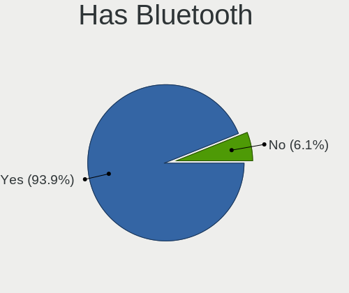
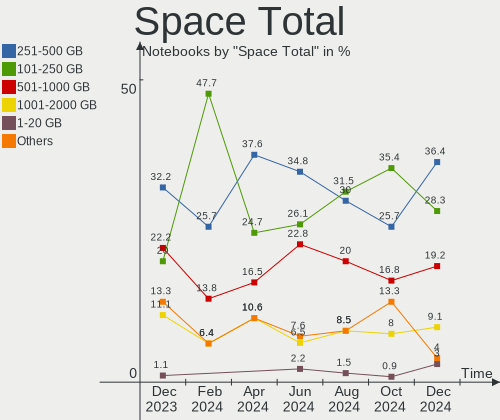
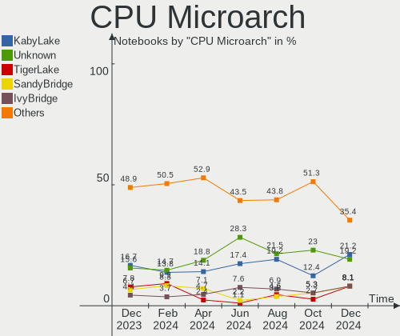
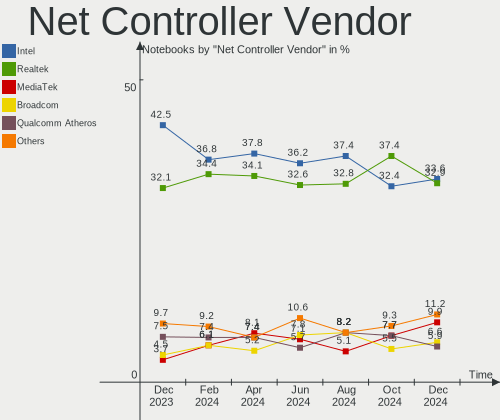
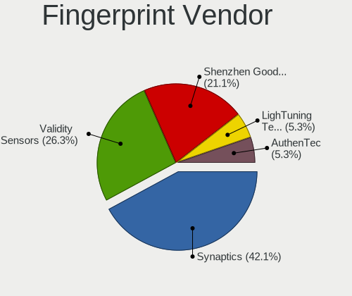

Pop!_OS - Hardware Trends (Notebooks)
-------------------------------------

A project to identify most popular hardware characteristics and track their change
over time based on data collected by Linux users at https://Linux-Hardware.org.

Anyone can contribute to this report by the [hw-probe](https://github.com/linuxhw/hw-probe) tool:

    sudo -E hw-probe -all -upload

This report is for one last month. Overall report since the beginning of time: [TestDays](https://github.com/linuxhw/TestDays)

Period: Jun, 2023.

Contents
--------

* [ System ](#system)
  - [ OS                       ](#os)
  - [ OS Family                ](#os-family)
  - [ Kernel                   ](#kernel)
  - [ Kernel Family            ](#kernel-family)
  - [ Kernel Major Ver.        ](#kernel-major-ver)
  - [ Arch                     ](#arch)
  - [ DE                       ](#de)
  - [ Display Server           ](#display-server)
  - [ Display Manager          ](#display-manager)
  - [ OS Lang                  ](#os-lang)
  - [ Boot Mode                ](#boot-mode)
  - [ Filesystem               ](#filesystem)
  - [ Part. scheme             ](#part-scheme)
  - [ Dual Boot with Linux/BSD ](#dual-boot-with-linuxbsd)
  - [ Dual Boot (Win)          ](#dual-boot-win)

* [ Board ](#board)
  - [ Vendor                   ](#vendor)
  - [ Model                    ](#model)
  - [ Model Family             ](#model-family)
  - [ MFG Year                 ](#mfg-year)
  - [ Form Factor              ](#form-factor)
  - [ Secure Boot              ](#secure-boot)
  - [ Coreboot                 ](#coreboot)
  - [ RAM Size                 ](#ram-size)
  - [ RAM Used                 ](#ram-used)
  - [ Total Drives             ](#total-drives)
  - [ Has CD-ROM               ](#has-cd-rom)
  - [ Has Ethernet             ](#has-ethernet)
  - [ Has WiFi                 ](#has-wifi)
  - [ Has Bluetooth            ](#has-bluetooth)

* [ Location ](#location)
  - [ Country                  ](#country)
  - [ City                     ](#city)

* [ Drives ](#drives)
  - [ Drive Vendor             ](#drive-vendor)
  - [ Drive Model              ](#drive-model)
  - [ HDD Vendor               ](#hdd-vendor)
  - [ SSD Vendor               ](#ssd-vendor)
  - [ Drive Kind               ](#drive-kind)
  - [ Drive Connector          ](#drive-connector)
  - [ Drive Size               ](#drive-size)
  - [ Space Total              ](#space-total)
  - [ Space Used               ](#space-used)
  - [ Malfunc. Drives          ](#malfunc-drives)
  - [ Malfunc. Drive Vendor    ](#malfunc-drive-vendor)
  - [ Malfunc. HDD Vendor      ](#malfunc-hdd-vendor)
  - [ Malfunc. Drive Kind      ](#malfunc-drive-kind)
  - [ Failed Drives            ](#failed-drives)
  - [ Failed Drive Vendor      ](#failed-drive-vendor)
  - [ Drive Status             ](#drive-status)

* [ Storage controller ](#storage-controller)
  - [ Storage Vendor           ](#storage-vendor)
  - [ Storage Model            ](#storage-model)
  - [ Storage Kind             ](#storage-kind)

* [ Processor ](#processor)
  - [ CPU Vendor               ](#cpu-vendor)
  - [ CPU Model                ](#cpu-model)
  - [ CPU Model Family         ](#cpu-model-family)
  - [ CPU Cores                ](#cpu-cores)
  - [ CPU Sockets              ](#cpu-sockets)
  - [ CPU Threads              ](#cpu-threads)
  - [ CPU Op-Modes             ](#cpu-op-modes)
  - [ CPU Microcode            ](#cpu-microcode)
  - [ CPU Microarch            ](#cpu-microarch)

* [ Graphics ](#graphics)
  - [ GPU Vendor               ](#gpu-vendor)
  - [ GPU Model                ](#gpu-model)
  - [ GPU Combo                ](#gpu-combo)
  - [ GPU Driver               ](#gpu-driver)
  - [ GPU Memory               ](#gpu-memory)

* [ Monitor ](#monitor)
  - [ Monitor Vendor           ](#monitor-vendor)
  - [ Monitor Model            ](#monitor-model)
  - [ Monitor Resolution       ](#monitor-resolution)
  - [ Monitor Diagonal         ](#monitor-diagonal)
  - [ Monitor Width            ](#monitor-width)
  - [ Aspect Ratio             ](#aspect-ratio)
  - [ Monitor Area             ](#monitor-area)
  - [ Pixel Density            ](#pixel-density)
  - [ Multiple Monitors        ](#multiple-monitors)

* [ Network ](#network)
  - [ Net Controller Vendor    ](#net-controller-vendor)
  - [ Net Controller Model     ](#net-controller-model)
  - [ Wireless Vendor          ](#wireless-vendor)
  - [ Wireless Model           ](#wireless-model)
  - [ Ethernet Vendor          ](#ethernet-vendor)
  - [ Ethernet Model           ](#ethernet-model)
  - [ Net Controller Kind      ](#net-controller-kind)
  - [ Used Controller          ](#used-controller)
  - [ NICs                     ](#nics)
  - [ IPv6                     ](#ipv6)

* [ Bluetooth ](#bluetooth)
  - [ Bluetooth Vendor         ](#bluetooth-vendor)
  - [ Bluetooth Model          ](#bluetooth-model)

* [ Sound ](#sound)
  - [ Sound Vendor             ](#sound-vendor)
  - [ Sound Model              ](#sound-model)

* [ Memory ](#memory)
  - [ Memory Vendor            ](#memory-vendor)
  - [ Memory Model             ](#memory-model)
  - [ Memory Kind              ](#memory-kind)
  - [ Memory Form Factor       ](#memory-form-factor)
  - [ Memory Size              ](#memory-size)
  - [ Memory Speed             ](#memory-speed)

* [ Printers & scanners ](#printers--scanners)
  - [ Printer Vendor           ](#printer-vendor)
  - [ Printer Model            ](#printer-model)
  - [ Scanner Vendor           ](#scanner-vendor)
  - [ Scanner Model            ](#scanner-model)

* [ Camera ](#camera)
  - [ Camera Vendor            ](#camera-vendor)
  - [ Camera Model             ](#camera-model)

* [ Security ](#security)
  - [ Fingerprint Vendor       ](#fingerprint-vendor)
  - [ Fingerprint Model        ](#fingerprint-model)
  - [ Chipcard Vendor          ](#chipcard-vendor)
  - [ Chipcard Model           ](#chipcard-model)

* [ Unsupported ](#unsupported)
  - [ Unsupported Devices      ](#unsupported-devices)
  - [ Unsupported Device Types ](#unsupported-device-types)

System
------

OS
--

Installed operating systems

| Name          | Notebooks | Percent |
|---------------|-----------|---------|
| Pop!_OS 22.04 | 91        | 97.85%  |
| Pop!_OS 21.04 | 1         | 1.08%   |
| Pop!_OS 20.10 | 1         | 1.08%   |

OS Family
---------

OS without a version

| Name    | Notebooks | Percent |
|---------|-----------|---------|
| Pop!_OS | 93        | 100%    |

Kernel
------

Version of the Linux kernel

| Version                 | Notebooks | Percent |
|-------------------------|-----------|---------|
| 6.2.6-76060206-generic  | 84        | 90.32%  |
| 6.0.12-76060006-generic | 3         | 3.23%   |
| 6.3.9-x64v3-xanmod1     | 1         | 1.08%   |
| 6.3.4-060304-generic    | 1         | 1.08%   |
| 6.3.0-060300-generic    | 1         | 1.08%   |
| 6.1.11-76060111-generic | 1         | 1.08%   |
| 5.8.0-7642-generic      | 1         | 1.08%   |
| 5.11.0-7612-generic     | 1         | 1.08%   |

Kernel Family
-------------

Linux kernel without a distro release

| Version | Notebooks | Percent |
|---------|-----------|---------|
| 6.2.6   | 84        | 90.32%  |
| 6.0.12  | 3         | 3.23%   |
| 6.3.9   | 1         | 1.08%   |
| 6.3.4   | 1         | 1.08%   |
| 6.3.0   | 1         | 1.08%   |
| 6.1.11  | 1         | 1.08%   |
| 5.8.0   | 1         | 1.08%   |
| 5.11.0  | 1         | 1.08%   |

Kernel Major Ver.
-----------------

Linux kernel major version

| Version | Notebooks | Percent |
|---------|-----------|---------|
| 6.2     | 84        | 90.32%  |
| 6.3     | 3         | 3.23%   |
| 6.0     | 3         | 3.23%   |
| 6.1     | 1         | 1.08%   |
| 5.8     | 1         | 1.08%   |
| 5.11    | 1         | 1.08%   |

Arch
----

OS architecture (x86_64, i586, etc.)

| Name   | Notebooks | Percent |
|--------|-----------|---------|
| x86_64 | 93        | 100%    |

DE
--

Desktop Environment

| Name    | Notebooks | Percent |
|---------|-----------|---------|
| GNOME   | 90        | 96.77%  |
| Unknown | 2         | 2.15%   |
| MATE    | 1         | 1.08%   |

Display Server
--------------

X11 or Wayland

| Name    | Notebooks | Percent |
|---------|-----------|---------|
| X11     | 88        | 94.62%  |
| Wayland | 5         | 5.38%   |

Display Manager
---------------

SDDM, LightDM, etc.

| Name    | Notebooks | Percent |
|---------|-----------|---------|
| Unknown | 67        | 72.04%  |
| GDM3    | 26        | 27.96%  |

OS Lang
-------

Language

| Lang    | Notebooks | Percent |
|---------|-----------|---------|
| en_US   | 51        | 54.84%  |
| pt_BR   | 9         | 9.68%   |
| de_DE   | 7         | 7.53%   |
| en_GB   | 5         | 5.38%   |
| es_ES   | 3         | 3.23%   |
| tr_TR   | 2         | 2.15%   |
| en_AU   | 2         | 2.15%   |
| C       | 2         | 2.15%   |
| Unknown | 2         | 2.15%   |
| ru_RU   | 1         | 1.08%   |
| pt_PT   | 1         | 1.08%   |
| nl_NL   | 1         | 1.08%   |
| nb_NO   | 1         | 1.08%   |
| it_IT   | 1         | 1.08%   |
| fr_FR   | 1         | 1.08%   |
| fi_FI   | 1         | 1.08%   |
| en_PH   | 1         | 1.08%   |
| en_IN   | 1         | 1.08%   |
| de_AT   | 1         | 1.08%   |

Boot Mode
---------

EFI or BIOS

| Mode | Notebooks | Percent |
|------|-----------|---------|
| BIOS | 67        | 72.04%  |
| EFI  | 26        | 27.96%  |

Filesystem
----------

Type of filesystem

| Type  | Notebooks | Percent |
|-------|-----------|---------|
| Ext4  | 89        | 95.7%   |
| Btrfs | 3         | 3.23%   |
| Xfs   | 1         | 1.08%   |

Part. scheme
------------

Scheme of partitioning

| Type    | Notebooks | Percent |
|---------|-----------|---------|
| Unknown | 65        | 69.89%  |
| GPT     | 26        | 27.96%  |
| MBR     | 2         | 2.15%   |

Dual Boot with Linux/BSD
------------------------

Hosting more than one Linux/BSD

| Dual boot | Notebooks | Percent |
|-----------|-----------|---------|
| No        | 89        | 95.7%   |
| Yes       | 4         | 4.3%    |

Dual Boot (Win)
---------------

Hosting Linux and Windows

| Dual boot | Notebooks | Percent |
|-----------|-----------|---------|
| No        | 87        | 93.55%  |
| Yes       | 6         | 6.45%   |

Board
-----

Vendor
------

Motherboard manufacturer

| Name                | Notebooks | Percent |
|---------------------|-----------|---------|
| Dell                | 18        | 19.35%  |
| Lenovo              | 13        | 13.98%  |
| Hewlett-Packard     | 11        | 11.83%  |
| ASUSTek Computer    | 10        | 10.75%  |
| Acer                | 10        | 10.75%  |
| MSI                 | 8         | 8.6%    |
| System76            | 5         | 5.38%   |
| Apple               | 4         | 4.3%    |
| Samsung Electronics | 2         | 2.15%   |
| Positivo            | 2         | 2.15%   |
| HUAWEI              | 2         | 2.15%   |
| TUXEDO              | 1         | 1.08%   |
| Toshiba             | 1         | 1.08%   |
| Teclast             | 1         | 1.08%   |
| Sony                | 1         | 1.08%   |
| Machcreator         | 1         | 1.08%   |
| HONOR               | 1         | 1.08%   |
| Fujitsu             | 1         | 1.08%   |
| ASRock              | 1         | 1.08%   |

Model
-----

Motherboard model

| Name                                      | Notebooks | Percent |
|-------------------------------------------|-----------|---------|
| System76 Oryx Pro                         | 2         | 2.15%   |
| System76 Gazelle                          | 2         | 2.15%   |
| Toshiba Satellite P55t-B                  | 1         | 1.08%   |
| Teclast F7 Plus                           | 1         | 1.08%   |
| System76 Lemur Pro                        | 1         | 1.08%   |
| Sony VPCEA23FB                            | 1         | 1.08%   |
| Samsung 550XCJ/550XCR                     | 1         | 1.08%   |
| Samsung 340XAA/350XAA/550XAA              | 1         | 1.08%   |
| Positivo Mobile                           | 1         | 1.08%   |
| Positivo H14CU02                          | 1         | 1.08%   |
| MSI Vector GP76 12UH                      | 1         | 1.08%   |
| MSI Raider GE66 12UGS                     | 1         | 1.08%   |
| MSI Prestige 16 A12UD                     | 1         | 1.08%   |
| MSI GS65 Stealth 9SD                      | 1         | 1.08%   |
| MSI GE70 2PL                              | 1         | 1.08%   |
| MSI Cyborg 15 A12VF                       | 1         | 1.08%   |
| MSI Bravo 15 B5DD                         | 1         | 1.08%   |
| MSI Alpha 15 A3DDK                        | 1         | 1.08%   |
| Machcreator 14                            | 1         | 1.08%   |
| Lenovo ThinkPad X1 Extreme 2nd 20QV000WGE | 1         | 1.08%   |
| Lenovo ThinkPad W520 427637U              | 1         | 1.08%   |
| Lenovo ThinkPad T540p 20BFS4P800          | 1         | 1.08%   |
| Lenovo ThinkPad T480s 20L8S3JE00          | 1         | 1.08%   |
| Lenovo ThinkPad T480 20L6S3H102           | 1         | 1.08%   |
| Lenovo ThinkPad T14 Gen 2i 20W1S9352X     | 1         | 1.08%   |
| Lenovo ThinkPad T14 Gen 1 20UDCTO1WW      | 1         | 1.08%   |
| Lenovo ThinkPad P53 20QQS34C04            | 1         | 1.08%   |
| Lenovo ThinkPad 13 2nd Gen 20J2S1DN00     | 1         | 1.08%   |
| Lenovo IdeaPad Gaming 3 15IAH7 82S9       | 1         | 1.08%   |
| Lenovo IdeaPad 320-15IKB 81G3             | 1         | 1.08%   |
| Lenovo Flex 2-15 20405                    | 1         | 1.08%   |
| Lenovo B5400 80B6QB0                      | 1         | 1.08%   |
| HUAWEI KLVL-WXXW                          | 1         | 1.08%   |
| HUAWEI CREM-WXX9                          | 1         | 1.08%   |
| HONOR BRN-FXX                             | 1         | 1.08%   |
| HP ZBook Fury 16 G9 Mobile Workstation PC | 1         | 1.08%   |
| HP Stream Laptop 11-ah0XX                 | 1         | 1.08%   |
| HP Pavilion Laptop 15t-eg000              | 1         | 1.08%   |
| HP Pavilion dv7                           | 1         | 1.08%   |
| HP Notebook                               | 1         | 1.08%   |

Model Family
------------

Motherboard model prefix

| Name              | Notebooks | Percent |
|-------------------|-----------|---------|
| Lenovo ThinkPad   | 9         | 9.68%   |
| Acer Aspire       | 7         | 7.53%   |
| Dell Inspiron     | 5         | 5.38%   |
| HP Laptop         | 4         | 4.3%    |
| Dell XPS          | 4         | 4.3%    |
| Dell Latitude     | 4         | 4.3%    |
| Dell Vostro       | 3         | 3.23%   |
| ASUS ROG          | 3         | 3.23%   |
| System76 Oryx     | 2         | 2.15%   |
| System76 Gazelle  | 2         | 2.15%   |
| Lenovo IdeaPad    | 2         | 2.15%   |
| HP Pavilion       | 2         | 2.15%   |
| Acer Swift        | 2         | 2.15%   |
| Toshiba Satellite | 1         | 1.08%   |
| Teclast F7        | 1         | 1.08%   |
| System76 Lemur    | 1         | 1.08%   |
| Sony VPCEA23FB    | 1         | 1.08%   |
| Samsung 550XCJ    | 1         | 1.08%   |
| Samsung 340XAA    | 1         | 1.08%   |
| Positivo Mobile   | 1         | 1.08%   |
| Positivo H14CU02  | 1         | 1.08%   |
| MSI Vector        | 1         | 1.08%   |
| MSI Raider        | 1         | 1.08%   |
| MSI Prestige      | 1         | 1.08%   |
| MSI GS65          | 1         | 1.08%   |
| MSI GE70          | 1         | 1.08%   |
| MSI Cyborg        | 1         | 1.08%   |
| MSI Bravo         | 1         | 1.08%   |
| MSI Alpha         | 1         | 1.08%   |
| Machcreator 14    | 1         | 1.08%   |
| Lenovo Flex       | 1         | 1.08%   |
| Lenovo B5400      | 1         | 1.08%   |
| HUAWEI KLVL-WXXW  | 1         | 1.08%   |
| HUAWEI CREM-WXX9  | 1         | 1.08%   |
| HONOR BRN-FXX     | 1         | 1.08%   |
| HP ZBook          | 1         | 1.08%   |
| HP Stream         | 1         | 1.08%   |
| HP Notebook       | 1         | 1.08%   |
| HP ENVY           | 1         | 1.08%   |
| HP 15             | 1         | 1.08%   |

MFG Year
--------

Motherboard manufacture year

| Year | Notebooks | Percent |
|------|-----------|---------|
| 2022 | 16        | 17.2%   |
| 2021 | 11        | 11.83%  |
| 2018 | 11        | 11.83%  |
| 2013 | 9         | 9.68%   |
| 2019 | 8         | 8.6%    |
| 2011 | 7         | 7.53%   |
| 2020 | 6         | 6.45%   |
| 2014 | 5         | 5.38%   |
| 2023 | 4         | 4.3%    |
| 2015 | 4         | 4.3%    |
| 2017 | 3         | 3.23%   |
| 2012 | 3         | 3.23%   |
| 2016 | 2         | 2.15%   |
| 2009 | 2         | 2.15%   |
| 2010 | 1         | 1.08%   |
| 2008 | 1         | 1.08%   |

Form Factor
-----------

Physical design of the computer

| Name     | Notebooks | Percent |
|----------|-----------|---------|
| Notebook | 93        | 100%    |

Secure Boot
-----------

Enabled or disabled

| State    | Notebooks | Percent |
|----------|-----------|---------|
| Disabled | 93        | 100%    |

Coreboot
--------

Have coreboot on board

| Used | Notebooks | Percent |
|------|-----------|---------|
| No   | 90        | 96.77%  |
| Yes  | 3         | 3.23%   |

RAM Size
--------

Total RAM memory

| Size in GB  | Notebooks | Percent |
|-------------|-----------|---------|
| 4.01-8.0    | 23        | 24.73%  |
| 16.01-24.0  | 23        | 24.73%  |
| 32.01-64.0  | 16        | 17.2%   |
| 8.01-16.0   | 12        | 12.9%   |
| 3.01-4.0    | 11        | 11.83%  |
| 24.01-32.0  | 4         | 4.3%    |
| 64.01-256.0 | 3         | 3.23%   |
| 1.01-2.0    | 1         | 1.08%   |

RAM Used
--------

Used RAM memory

| Used GB    | Notebooks | Percent |
|------------|-----------|---------|
| 4.01-8.0   | 49        | 52.69%  |
| 2.01-3.0   | 15        | 16.13%  |
| 8.01-16.0  | 11        | 11.83%  |
| 3.01-4.0   | 10        | 10.75%  |
| 1.01-2.0   | 5         | 5.38%   |
| 16.01-24.0 | 3         | 3.23%   |

Total Drives
------------

Number of drives on board

| Drives | Notebooks | Percent |
|--------|-----------|---------|
| 1      | 66        | 70.97%  |
| 2      | 20        | 21.51%  |
| 3      | 7         | 7.53%   |

Has CD-ROM
----------

Has CD-ROM on board

| Presented | Notebooks | Percent |
|-----------|-----------|---------|
| No        | 68        | 73.12%  |
| Yes       | 25        | 26.88%  |

Has Ethernet
------------

Has Ethernet on board

| Presented | Notebooks | Percent |
|-----------|-----------|---------|
| Yes       | 74        | 79.57%  |
| No        | 19        | 20.43%  |

Has WiFi
--------

Has WiFi module

| Presented | Notebooks | Percent |
|-----------|-----------|---------|
| Yes       | 92        | 98.92%  |
| No        | 1         | 1.08%   |

Has Bluetooth
-------------

Has Bluetooth module

| Presented | Notebooks | Percent |
|-----------|-----------|---------|
| Yes       | 79        | 84.95%  |
| No        | 14        | 15.05%  |

Location
--------

Country
-------

Geographic location (country)

| Country      | Notebooks | Percent |
|--------------|-----------|---------|
| USA          | 25        | 26.88%  |
| Brazil       | 14        | 15.05%  |
| Germany      | 7         | 7.53%   |
| Spain        | 5         | 5.38%   |
| India        | 5         | 5.38%   |
| UK           | 4         | 4.3%    |
| Australia    | 4         | 4.3%    |
| Turkey       | 2         | 2.15%   |
| Russia       | 2         | 2.15%   |
| Portugal     | 2         | 2.15%   |
| Philippines  | 2         | 2.15%   |
| Norway       | 2         | 2.15%   |
| Netherlands  | 2         | 2.15%   |
| Mexico       | 2         | 2.15%   |
| UAE          | 1         | 1.08%   |
| Taiwan       | 1         | 1.08%   |
| Slovenia     | 1         | 1.08%   |
| Slovakia     | 1         | 1.08%   |
| Sierra Leone | 1         | 1.08%   |
| Romania      | 1         | 1.08%   |
| Morocco      | 1         | 1.08%   |
| Italy        | 1         | 1.08%   |
| Indonesia    | 1         | 1.08%   |
| France       | 1         | 1.08%   |
| Finland      | 1         | 1.08%   |
| Denmark      | 1         | 1.08%   |
| Czechia      | 1         | 1.08%   |
| Austria      | 1         | 1.08%   |
| Argentina    | 1         | 1.08%   |

City
----

Geographic location (city)

| City                      | Notebooks | Percent |
|---------------------------|-----------|---------|
| Melbourne                 | 3         | 3.23%   |
| Porto Alegre              | 2         | 2.15%   |
| Portland                  | 2         | 2.15%   |
| Moscow                    | 2         | 2.15%   |
| Flushing                  | 2         | 2.15%   |
| Barcelona                 | 2         | 2.15%   |
| Williamsburg              | 1         | 1.08%   |
| Vitória                  | 1         | 1.08%   |
| Vienna                    | 1         | 1.08%   |
| Trondheim                 | 1         | 1.08%   |
| Sydney                    | 1         | 1.08%   |
| Surat                     | 1         | 1.08%   |
| Stockton                  | 1         | 1.08%   |
| Stockse                   | 1         | 1.08%   |
| Springfield               | 1         | 1.08%   |
| South San Francisco       | 1         | 1.08%   |
| Skive                     | 1         | 1.08%   |
| Shipley                   | 1         | 1.08%   |
| Sefrou                    | 1         | 1.08%   |
| Sao Paulo                 | 1         | 1.08%   |
| Sao Joao Nepomuceno       | 1         | 1.08%   |
| San Nicolás de los Garza | 1         | 1.08%   |
| San Marcos                | 1         | 1.08%   |
| San Antonio               | 1         | 1.08%   |
| Salt Lake City            | 1         | 1.08%   |
| Rio de Janeiro            | 1         | 1.08%   |
| Richardson                | 1         | 1.08%   |
| Prairie Village           | 1         | 1.08%   |
| Prague                    | 1         | 1.08%   |
| Portsmouth                | 1         | 1.08%   |
| Porto                     | 1         | 1.08%   |
| Ponta Grossa              | 1         | 1.08%   |
| Petrolina                 | 1         | 1.08%   |
| Paris                     | 1         | 1.08%   |
| Paranaque City            | 1         | 1.08%   |
| Overland Park             | 1         | 1.08%   |
| Oslo                      | 1         | 1.08%   |
| Osasco                    | 1         | 1.08%   |
| Orrington                 | 1         | 1.08%   |
| Olavarría                | 1         | 1.08%   |

Drives
------

Drive Vendor
------------

Hard drive vendors

| Vendor                         | Notebooks | Drives | Percent |
|--------------------------------|-----------|--------|---------|
| Samsung Electronics            | 24        | 29     | 19.83%  |
| Seagate                        | 12        | 13     | 9.92%   |
| SanDisk                        | 12        | 12     | 9.92%   |
| WDC                            | 9         | 10     | 7.44%   |
| Kingston                       | 9         | 9      | 7.44%   |
| Unknown                        | 6         | 7      | 4.96%   |
| Toshiba                        | 4         | 5      | 3.31%   |
| SK hynix                       | 3         | 3      | 2.48%   |
| Silicon Motion                 | 3         | 3      | 2.48%   |
| Micron Technology              | 3         | 3      | 2.48%   |
| KIOXIA                         | 3         | 3      | 2.48%   |
| Intel                          | 3         | 3      | 2.48%   |
| HGST                           | 3         | 3      | 2.48%   |
| Crucial                        | 3         | 3      | 2.48%   |
| China                          | 3         | 3      | 2.48%   |
| Phison Electronics             | 2         | 2      | 1.65%   |
| Kingston Technology Company    | 2         | 2      | 1.65%   |
| Teclast                        | 1         | 1      | 0.83%   |
| SSSTC                          | 1         | 1      | 0.83%   |
| SPCC                           | 1         | 1      | 0.83%   |
| Solid State Storage Technology | 1         | 1      | 0.83%   |
| Solid State Storage            | 1         | 1      | 0.83%   |
| PNY                            | 1         | 1      | 0.83%   |
| Netac                          | 1         | 1      | 0.83%   |
| Micron/Crucial Technology      | 1         | 1      | 0.83%   |
| LITEONIT                       | 1         | 1      | 0.83%   |
| JMicron Technology             | 1         | 1      | 0.83%   |
| Intenso                        | 1         | 1      | 0.83%   |
| Inland                         | 1         | 1      | 0.83%   |
| HS-SSD-E100                    | 1         | 1      | 0.83%   |
| ASMedia                        | 1         | 1      | 0.83%   |
| Apple                          | 1         | 1      | 0.83%   |
| A-DATA Technology              | 1         | 1      | 0.83%   |
| Unknown                        | 1         | 1      | 0.83%   |

Drive Model
-----------

Hard drive models

| Model                                                 | Notebooks | Percent |
|-------------------------------------------------------|-----------|---------|
| Samsung NVMe SSD Controller PM9A1/PM9A3/980PRO 2TB    | 5         | 4.03%   |
| Silicon Motion SM2263EN/SM2263XT SSD Controller 256GB | 3         | 2.42%   |
| Seagate ST500LT012-1DG142 500GB                       | 3         | 2.42%   |
| Samsung NVMe SSD Controller SM981/PM981/PM983 250GB   | 3         | 2.42%   |
| Unknown MMC Card  512GB                               | 2         | 1.61%   |
| Unknown MMC Card  32GB                                | 2         | 1.61%   |
| Sandisk WD Black SN750 / PC SN730 NVMe SSD 500GB      | 2         | 1.61%   |
| SanDisk SSD PLUS 240GB                                | 2         | 1.61%   |
| Samsung SSD 860 EVO M.2 500GB                         | 2         | 1.61%   |
| Samsung MZVLQ512HBLU-00B00 512GB                      | 2         | 1.61%   |
| Samsung MZVL4512HBLU-00BTW 512GB                      | 2         | 1.61%   |
| Kingston SA400S37960G 960GB SSD                       | 2         | 1.61%   |
| Kingston SA400S37240G 240GB SSD                       | 2         | 1.61%   |
| China SSD 512GB                                       | 2         | 1.61%   |
| WDC WDS250G2B0B-00YS70 250GB SSD                      | 1         | 0.81%   |
| WDC WDS240G2G0A-00JH30 240GB SSD                      | 1         | 0.81%   |
| WDC WDS100T2B0A-00SM50 1TB SSD                        | 1         | 0.81%   |
| WDC WDS100T1X0E-00AFY0 1TB                            | 1         | 0.81%   |
| WDC WD5000LPCX-60VHAT0 500GB                          | 1         | 0.81%   |
| WDC WD5000BPVT-22HXZT3 500GB                          | 1         | 0.81%   |
| WDC WD5000AAKX-00ERMA0 500GB                          | 1         | 0.81%   |
| WDC PC SN810 NVMe 1024GB                              | 1         | 0.81%   |
| WDC PC SN520 SDAPNUW-512G-1032 512GB                  | 1         | 0.81%   |
| Unknown MMC Card  64GB                                | 1         | 0.81%   |
| Unknown MMC Card  16GB                                | 1         | 0.81%   |
| Unknown MMC Card  128GB                               | 1         | 0.81%   |
| Toshiba THNSNF128GMCS 128GB SSD                       | 1         | 0.81%   |
| Toshiba NVMe Controller 256GB                         | 1         | 0.81%   |
| Toshiba MQ04ABF100 1TB                                | 1         | 0.81%   |
| Toshiba MQ01ABD100 1TB                                | 1         | 0.81%   |
| Toshiba MK6459GSXP 640GB                              | 1         | 0.81%   |
| Teclast 256GB NA850-2280 SSD                          | 1         | 0.81%   |
| SSSTC CL1-8D128 128GB                                 | 1         | 0.81%   |
| SPCC Solid State Disk 128GB                           | 1         | 0.81%   |
| Solid State Storage CL4-3D512-Q11 NVMe SSSTC 512GB    | 1         | 0.81%   |
| Solid State Storage CL1-3D256-Q11 NVMe SSSTC 256GB    | 1         | 0.81%   |
| SK hynix SKHynix_HFS256GDE9X081N 256GB                | 1         | 0.81%   |
| SK hynix SC311 SATA 512GB SSD                         | 1         | 0.81%   |
| SK hynix PC401 NVMe Solid State Drive 256GB           | 1         | 0.81%   |
| Seagate ST9500325AS 500GB                             | 1         | 0.81%   |

HDD Vendor
----------

Hard disk drive vendors

| Vendor              | Notebooks | Drives | Percent |
|---------------------|-----------|--------|---------|
| Seagate             | 12        | 13     | 50%     |
| WDC                 | 3         | 4      | 12.5%   |
| Toshiba             | 3         | 3      | 12.5%   |
| HGST                | 3         | 3      | 12.5%   |
| Samsung Electronics | 1         | 1      | 4.17%   |
| Intenso             | 1         | 1      | 4.17%   |
| ASMedia             | 1         | 1      | 4.17%   |

SSD Vendor
----------

Solid state drive vendors

| Vendor              | Notebooks | Drives | Percent |
|---------------------|-----------|--------|---------|
| SanDisk             | 8         | 8      | 21.05%  |
| Kingston            | 8         | 8      | 21.05%  |
| Samsung Electronics | 4         | 4      | 10.53%  |
| WDC                 | 3         | 3      | 7.89%   |
| China               | 3         | 3      | 7.89%   |
| Crucial             | 2         | 2      | 5.26%   |
| Toshiba             | 1         | 1      | 2.63%   |
| Teclast             | 1         | 1      | 2.63%   |
| SPCC                | 1         | 1      | 2.63%   |
| SK hynix            | 1         | 1      | 2.63%   |
| PNY                 | 1         | 1      | 2.63%   |
| Micron Technology   | 1         | 1      | 2.63%   |
| LITEONIT            | 1         | 1      | 2.63%   |
| Intel               | 1         | 1      | 2.63%   |
| Inland              | 1         | 1      | 2.63%   |
| Apple               | 1         | 1      | 2.63%   |

Drive Kind
----------

HDD or SSD

| Kind    | Notebooks | Drives | Percent |
|---------|-----------|--------|---------|
| NVMe    | 47        | 56     | 41.23%  |
| SSD     | 34        | 38     | 29.82%  |
| HDD     | 24        | 26     | 21.05%  |
| MMC     | 6         | 7      | 5.26%   |
| Unknown | 3         | 3      | 2.63%   |

Drive Connector
---------------

SATA, SAS, NVMe, etc.

| Type | Notebooks | Drives | Percent |
|------|-----------|--------|---------|
| SATA | 48        | 59     | 44.44%  |
| NVMe | 47        | 55     | 43.52%  |
| SAS  | 7         | 9      | 6.48%   |
| MMC  | 6         | 7      | 5.56%   |

Drive Size
----------

Size of hard drive

| Size in TB | Notebooks | Drives | Percent |
|------------|-----------|--------|---------|
| 0.01-0.5   | 36        | 40     | 62.07%  |
| 0.51-1.0   | 16        | 17     | 27.59%  |
| 1.01-2.0   | 5         | 6      | 8.62%   |
| 4.01-10.0  | 1         | 1      | 1.72%   |

Space Total
-----------

Amount of disk space available on the file system

| Size in GB     | Notebooks | Percent |
|----------------|-----------|---------|
| 251-500        | 30        | 32.26%  |
| 101-250        | 23        | 24.73%  |
| 501-1000       | 17        | 18.28%  |
| 1001-2000      | 10        | 10.75%  |
| More than 3000 | 4         | 4.3%    |
| 2001-3000      | 4         | 4.3%    |
| Unknown        | 2         | 2.15%   |
| 21-50          | 1         | 1.08%   |
| 1-20           | 1         | 1.08%   |
| 51-100         | 1         | 1.08%   |

Space Used
----------

Amount of used disk space

| Used GB        | Notebooks | Percent |
|----------------|-----------|---------|
| 21-50          | 27        | 29.03%  |
| 1-20           | 18        | 19.35%  |
| 101-250        | 14        | 15.05%  |
| 251-500        | 11        | 11.83%  |
| 51-100         | 11        | 11.83%  |
| 501-1000       | 7         | 7.53%   |
| 1001-2000      | 2         | 2.15%   |
| Unknown        | 2         | 2.15%   |
| More than 3000 | 1         | 1.08%   |

Malfunc. Drives
---------------

Drive models with a malfunction

| Model                            | Notebooks | Drives | Percent |
|----------------------------------|-----------|--------|---------|
| Kingston SUV400S37240G 240GB SSD | 1         | 1      | 100%    |

Malfunc. Drive Vendor
---------------------

Vendors of faulty drives

| Vendor   | Notebooks | Drives | Percent |
|----------|-----------|--------|---------|
| Kingston | 1         | 1      | 100%    |

Malfunc. HDD Vendor
-------------------

Vendors of faulty HDD drives

Zero info for selected period =(

Malfunc. Drive Kind
-------------------

Kinds of faulty drives

| Kind | Notebooks | Drives | Percent |
|------|-----------|--------|---------|
| SSD  | 1         | 1      | 100%    |

Failed Drives
-------------

Failed drive models

Zero info for selected period =(

Failed Drive Vendor
-------------------

Failed drive vendors

Zero info for selected period =(

Drive Status
------------

Number of failed and malfunc. drives

| Status   | Notebooks | Drives | Percent |
|----------|-----------|--------|---------|
| Detected | 68        | 97     | 69.39%  |
| Works    | 29        | 32     | 29.59%  |
| Malfunc  | 1         | 1      | 1.02%   |

Storage controller
------------------

Storage Vendor
--------------

Storage controller vendors

| Vendor                         | Notebooks | Percent |
|--------------------------------|-----------|---------|
| Intel                          | 56        | 50.45%  |
| Samsung Electronics            | 19        | 17.12%  |
| AMD                            | 7         | 6.31%   |
| SanDisk                        | 6         | 5.41%   |
| Solid State Storage Technology | 3         | 2.7%    |
| Silicon Motion                 | 3         | 2.7%    |
| KIOXIA                         | 3         | 2.7%    |
| Kingston Technology Company    | 3         | 2.7%    |
| SK hynix                       | 2         | 1.8%    |
| Phison Electronics             | 2         | 1.8%    |
| Micron/Crucial Technology      | 2         | 1.8%    |
| Micron Technology              | 2         | 1.8%    |
| Toshiba America Info Systems   | 1         | 0.9%    |
| Nvidia                         | 1         | 0.9%    |
| ADATA Technology               | 1         | 0.9%    |

Storage Model
-------------

Storage controller models

| Model                                                                          | Notebooks | Percent |
|--------------------------------------------------------------------------------|-----------|---------|
| Intel 82801 Mobile SATA Controller [RAID mode]                                 | 7         | 6.25%   |
| Intel 6 Series/C200 Series Chipset Family 6 port Mobile SATA AHCI Controller   | 7         | 6.25%   |
| AMD FCH SATA Controller [AHCI mode]                                            | 7         | 6.25%   |
| Samsung NVMe SSD Controller SM981/PM981/PM983                                  | 6         | 5.36%   |
| Samsung NVMe SSD Controller PM9A1/PM9A3/980PRO                                 | 6         | 5.36%   |
| Intel Sunrise Point-LP SATA Controller [AHCI mode]                             | 6         | 5.36%   |
| Intel 8 Series SATA Controller 1 [AHCI mode]                                   | 6         | 5.36%   |
| Samsung NVMe SSD Controller 980                                                | 5         | 4.46%   |
| Intel Volume Management Device NVMe RAID Controller                            | 5         | 4.46%   |
| Intel 8 Series/C220 Series Chipset Family 6-port SATA Controller 1 [AHCI mode] | 5         | 4.46%   |
| Intel Cannon Lake Mobile PCH SATA AHCI Controller                              | 4         | 3.57%   |
| Silicon Motion SM2263EN/SM2263XT SSD Controller                                | 3         | 2.68%   |
| KIOXIA Non-Volatile memory controller                                          | 3         | 2.68%   |
| Intel 7 Series Chipset Family 6-port SATA Controller [AHCI mode]               | 3         | 2.68%   |
| Solid State Storage CL1-3D256-Q11 NVMe SSD M.2                                 | 2         | 1.79%   |
| SanDisk WD PC SN810 / Black SN850 NVMe SSD                                     | 2         | 1.79%   |
| SanDisk WD Black SN750 / PC SN730 NVMe SSD                                     | 2         | 1.79%   |
| Samsung NVMe SSD Controller PM9B1                                              | 2         | 1.79%   |
| Micron 2450 NVMe SSD (DRAM-less)                                               | 2         | 1.79%   |
| Kingston Company Company Non-Volatile memory controller                        | 2         | 1.79%   |
| Intel Atom Processor E3800 Series SATA AHCI Controller                         | 2         | 1.79%   |
| Toshiba America Info Systems NVMe Controller                                   | 1         | 0.89%   |
| Solid State Storage Non-Volatile memory controller                             | 1         | 0.89%   |
| SK hynix PC401 NVMe Solid State Drive 256GB                                    | 1         | 0.89%   |
| SK hynix Gold P31/BC711/PC711 NVMe Solid State Drive                           | 1         | 0.89%   |
| SanDisk WD Blue SN500 / PC SN520 NVMe SSD                                      | 1         | 0.89%   |
| SanDisk Non-Volatile memory controller                                         | 1         | 0.89%   |
| Phison PS5013 E13 NVMe Controller                                              | 1         | 0.89%   |
| Phison E12 NVMe Controller                                                     | 1         | 0.89%   |
| Nvidia MCP79 AHCI Controller                                                   | 1         | 0.89%   |
| Micron/Crucial P2 NVMe PCIe SSD                                                | 1         | 0.89%   |
| Micron/Crucial P1 NVMe PCIe SSD                                                | 1         | 0.89%   |
| Kingston Company FURY Renegade NVMe SSD                                        | 1         | 0.89%   |
| Intel Tiger Lake-LP SATA Controller                                            | 1         | 0.89%   |
| Intel Tiger Lake SATA AHCI Controller                                          | 1         | 0.89%   |
| Intel SSD 660P Series                                                          | 1         | 0.89%   |
| Intel Non-Volatile memory controller                                           | 1         | 0.89%   |
| Intel Ice Lake-LP SATA Controller [AHCI mode]                                  | 1         | 0.89%   |
| Intel Comet Lake SATA AHCI Controller                                          | 1         | 0.89%   |
| Intel Celeron/Pentium Silver Processor SATA Controller                         | 1         | 0.89%   |

Storage Kind
------------

Kind of storage controller (IDE, SATA, NVMe, SAS, ...)

| Kind | Notebooks | Percent |
|------|-----------|---------|
| SATA | 51        | 46.36%  |
| NVMe | 47        | 42.73%  |
| RAID | 12        | 10.91%  |

Processor
---------

CPU Vendor
----------

Processor vendors

| Vendor | Notebooks | Percent |
|--------|-----------|---------|
| Intel  | 78        | 83.87%  |
| AMD    | 15        | 16.13%  |

CPU Model
---------

Processor models

| Model                                       | Notebooks | Percent |
|---------------------------------------------|-----------|---------|
| Intel Core i7-9750H CPU @ 2.60GHz           | 5         | 5.38%   |
| Intel 12th Gen Core i7-12700H               | 4         | 4.3%    |
| Intel Core i5-8250U CPU @ 1.60GHz           | 3         | 3.23%   |
| Intel 12th Gen Core i5-12450H               | 3         | 3.23%   |
| AMD Ryzen 5 5600H with Radeon Graphics      | 3         | 3.23%   |
| Intel Core i7-8750H CPU @ 2.20GHz           | 2         | 2.15%   |
| Intel Core i7-8550U CPU @ 1.80GHz           | 2         | 2.15%   |
| Intel Core i7-4810MQ CPU @ 2.80GHz          | 2         | 2.15%   |
| Intel Core i7-4720HQ CPU @ 2.60GHz          | 2         | 2.15%   |
| Intel Core i7-2720QM CPU @ 2.20GHz          | 2         | 2.15%   |
| Intel Core i5-2450M CPU @ 2.50GHz           | 2         | 2.15%   |
| Intel Core i5-1035G1 CPU @ 1.00GHz          | 2         | 2.15%   |
| Intel Core i3-4030U CPU @ 1.90GHz           | 2         | 2.15%   |
| Intel Celeron CPU N2840 @ 2.16GHz           | 2         | 2.15%   |
| Intel 12th Gen Core i7-1260P                | 2         | 2.15%   |
| Intel 11th Gen Core i7-11800H @ 2.30GHz     | 2         | 2.15%   |
| AMD Ryzen 5 5500U with Radeon Graphics      | 2         | 2.15%   |
| Intel Pentium Dual-Core CPU T4500 @ 2.30GHz | 1         | 1.08%   |
| Intel Core i7-8650U CPU @ 1.90GHz           | 1         | 1.08%   |
| Intel Core i7-8565U CPU @ 1.80GHz           | 1         | 1.08%   |
| Intel Core i7-7500U CPU @ 2.70GHz           | 1         | 1.08%   |
| Intel Core i7-6600U CPU @ 2.60GHz           | 1         | 1.08%   |
| Intel Core i7-6500U CPU @ 2.50GHz           | 1         | 1.08%   |
| Intel Core i7-4710HQ CPU @ 2.50GHz          | 1         | 1.08%   |
| Intel Core i7-4510U CPU @ 2.00GHz           | 1         | 1.08%   |
| Intel Core i7-4500U CPU @ 1.80GHz           | 1         | 1.08%   |
| Intel Core i7-3770 CPU @ 3.40GHz            | 1         | 1.08%   |
| Intel Core i7-2670QM CPU @ 2.20GHz          | 1         | 1.08%   |
| Intel Core i7-10750H CPU @ 2.60GHz          | 1         | 1.08%   |
| Intel Core i7-10510U CPU @ 1.80GHz          | 1         | 1.08%   |
| Intel Core i5-8350U CPU @ 1.70GHz           | 1         | 1.08%   |
| Intel Core i5-8265U CPU @ 1.60GHz           | 1         | 1.08%   |
| Intel Core i5-4300U CPU @ 1.90GHz           | 1         | 1.08%   |
| Intel Core i5-4250U CPU @ 1.30GHz           | 1         | 1.08%   |
| Intel Core i5-4200U CPU @ 1.60GHz           | 1         | 1.08%   |
| Intel Core i5-3230M CPU @ 2.60GHz           | 1         | 1.08%   |
| Intel Core i5-3210M CPU @ 2.50GHz           | 1         | 1.08%   |
| Intel Core i5-2557M CPU @ 1.70GHz           | 1         | 1.08%   |
| Intel Core i5-2430M CPU @ 2.40GHz           | 1         | 1.08%   |
| Intel Core i3-7100U CPU @ 2.40GHz           | 1         | 1.08%   |

CPU Model Family
----------------

Processor model prefix

| Model                   | Notebooks | Percent |
|-------------------------|-----------|---------|
| Intel Core i7           | 27        | 29.03%  |
| Other                   | 20        | 21.51%  |
| Intel Core i5           | 16        | 17.2%   |
| Intel Core i3           | 9         | 9.68%   |
| AMD Ryzen 5             | 6         | 6.45%   |
| Intel Celeron           | 5         | 5.38%   |
| AMD Ryzen 9             | 2         | 2.15%   |
| AMD Ryzen 7 PRO         | 2         | 2.15%   |
| AMD Ryzen 7             | 2         | 2.15%   |
| Intel Pentium Dual-Core | 1         | 1.08%   |
| Intel Core 2 Duo        | 1         | 1.08%   |
| AMD Ryzen 3             | 1         | 1.08%   |
| AMD A6                  | 1         | 1.08%   |

CPU Cores
---------

Number of processor cores

| Number | Notebooks | Percent |
|--------|-----------|---------|
| 2      | 30        | 32.26%  |
| 4      | 28        | 30.11%  |
| 6      | 15        | 16.13%  |
| 8      | 9         | 9.68%   |
| 14     | 5         | 5.38%   |
| 16     | 2         | 2.15%   |
| 12     | 2         | 2.15%   |
| 10     | 1         | 1.08%   |
| 1      | 1         | 1.08%   |

CPU Sockets
-----------

Number of sockets

| Number | Notebooks | Percent |
|--------|-----------|---------|
| 1      | 93        | 100%    |

CPU Threads
-----------

Threads per core (Hyper-Threading)

| Number | Notebooks | Percent |
|--------|-----------|---------|
| 2      | 83        | 89.25%  |
| 1      | 10        | 10.75%  |

CPU Op-Modes
------------

CPU Operation Modes (32-bit, 64-bit)

| Op mode        | Notebooks | Percent |
|----------------|-----------|---------|
| 32-bit, 64-bit | 93        | 100%    |

CPU Microcode
-------------

Microcode number

| Number     | Notebooks | Percent |
|------------|-----------|---------|
| Unknown    | 84        | 90.32%  |
| 0x0a50000c | 3         | 3.23%   |
| 0x08600106 | 2         | 2.15%   |
| 0x906ea    | 1         | 1.08%   |
| 0x206a7    | 1         | 1.08%   |
| 0x0a601203 | 1         | 1.08%   |
| 0x0a50000d | 1         | 1.08%   |

CPU Microarch
-------------

Microarchitecture

| Name             | Notebooks | Percent |
|------------------|-----------|---------|
| KabyLake         | 19        | 20.43%  |
| Haswell          | 13        | 13.98%  |
| Unknown          | 10        | 10.75%  |
| SandyBridge      | 8         | 8.6%    |
| Alderlake Hybrid | 6         | 6.45%   |
| Zen 3            | 5         | 5.38%   |
| TigerLake        | 4         | 4.3%    |
| IvyBridge        | 4         | 4.3%    |
| Icelake          | 4         | 4.3%    |
| Zen 2            | 3         | 3.23%   |
| Skylake          | 3         | 3.23%   |
| Goldmont plus    | 3         | 3.23%   |
| Zen+             | 2         | 2.15%   |
| Silvermont       | 2         | 2.15%   |
| Penryn           | 2         | 2.15%   |
| CometLake        | 2         | 2.15%   |
| Westmere         | 1         | 1.08%   |
| Jaguar           | 1         | 1.08%   |
| Excavator        | 1         | 1.08%   |

Graphics
--------

GPU Vendor
----------

Vendors of graphics cards

| Vendor | Notebooks | Percent |
|--------|-----------|---------|
| Intel  | 73        | 56.59%  |
| Nvidia | 35        | 27.13%  |
| AMD    | 21        | 16.28%  |

GPU Model
---------

Graphics card models

| Model                                                                     | Notebooks | Percent |
|---------------------------------------------------------------------------|-----------|---------|
| Intel 2nd Generation Core Processor Family Integrated Graphics Controller | 8         | 6.11%   |
| Intel UHD Graphics 620                                                    | 7         | 5.34%   |
| Intel Haswell-ULT Integrated Graphics Controller                          | 7         | 5.34%   |
| Intel Alder Lake-P Integrated Graphics Controller                         | 6         | 4.58%   |
| Intel CoffeeLake-H GT2 [UHD Graphics 630]                                 | 5         | 3.82%   |
| Intel 4th Gen Core Processor Integrated Graphics Controller               | 5         | 3.82%   |
| Intel TigerLake-LP GT2 [Iris Xe Graphics]                                 | 4         | 3.05%   |
| AMD Cezanne [Radeon Vega Series / Radeon Vega Mobile Series]              | 4         | 3.05%   |
| Nvidia TU117M [GeForce GTX 1650 Mobile / Max-Q]                           | 3         | 2.29%   |
| Nvidia GA107M [GeForce RTX 3050 Ti Mobile]                                | 3         | 2.29%   |
| Nvidia GA107M [GeForce RTX 3050 Mobile]                                   | 3         | 2.29%   |
| Intel Skylake GT2 [HD Graphics 520]                                       | 3         | 2.29%   |
| Intel GeminiLake [UHD Graphics 600]                                       | 3         | 2.29%   |
| Intel Alder Lake-P GT1 [UHD Graphics]                                     | 3         | 2.29%   |
| Intel 3rd Gen Core processor Graphics Controller                          | 3         | 2.29%   |
| AMD Renoir                                                                | 3         | 2.29%   |
| Nvidia TU116M [GeForce GTX 1660 Ti Mobile]                                | 2         | 1.53%   |
| Nvidia GP108M [GeForce MX150]                                             | 2         | 1.53%   |
| Intel WhiskeyLake-U GT2 [UHD Graphics 620]                                | 2         | 1.53%   |
| Intel TigerLake-H GT1 [UHD Graphics]                                      | 2         | 1.53%   |
| Intel Iris Plus Graphics G1 (Ice Lake)                                    | 2         | 1.53%   |
| Intel HD Graphics 620                                                     | 2         | 1.53%   |
| Intel Atom Processor Z36xxx/Z37xxx Series Graphics & Display              | 2         | 1.53%   |
| AMD Seymour [Radeon HD 6400M/7400M Series]                                | 2         | 1.53%   |
| AMD Picasso/Raven 2 [Radeon Vega Series / Radeon Vega Mobile Series]      | 2         | 1.53%   |
| AMD Navi 14 [Radeon RX 5500/5500M / Pro 5500M]                            | 2         | 1.53%   |
| AMD Lucienne                                                              | 2         | 1.53%   |
| Nvidia TU117M [GeForce GTX 1650 Ti Mobile]                                | 1         | 0.76%   |
| Nvidia TU117GLM [Quadro T1000 Mobile]                                     | 1         | 0.76%   |
| Nvidia TU106M [GeForce RTX 2070 Mobile]                                   | 1         | 0.76%   |
| Nvidia GP108M [GeForce MX330]                                             | 1         | 0.76%   |
| Nvidia GP104BM [GeForce GTX 1070 Mobile]                                  | 1         | 0.76%   |
| Nvidia GP104 [GeForce GTX 1070]                                           | 1         | 0.76%   |
| Nvidia GM108M [GeForce MX130]                                             | 1         | 0.76%   |
| Nvidia GM108M [GeForce MX110]                                             | 1         | 0.76%   |
| Nvidia GM108M [GeForce 840M]                                              | 1         | 0.76%   |
| Nvidia GM107M [GeForce GTX 950M]                                          | 1         | 0.76%   |
| Nvidia GK208M [GeForce GT 740M]                                           | 1         | 0.76%   |
| Nvidia GK208M [GeForce GT 730M]                                           | 1         | 0.76%   |
| Nvidia GF119M [NVS 4200M]                                                 | 1         | 0.76%   |

GPU Combo
---------

Combinations of graphics cards

| Name           | Notebooks | Percent |
|----------------|-----------|---------|
| 1 x Intel      | 40        | 43.01%  |
| Intel + Nvidia | 27        | 29.03%  |
| 1 x AMD        | 11        | 11.83%  |
| 1 x Nvidia     | 5         | 5.38%   |
| Intel + AMD    | 5         | 5.38%   |
| AMD + Nvidia   | 3         | 3.23%   |
| 2 x AMD        | 2         | 2.15%   |

GPU Driver
----------

Free vs proprietary

| Driver      | Notebooks | Percent |
|-------------|-----------|---------|
| Free        | 65        | 69.89%  |
| Proprietary | 28        | 30.11%  |

GPU Memory
----------

Total video memory

| Size in GB | Notebooks | Percent |
|------------|-----------|---------|
| Unknown    | 80        | 86.02%  |
| 0.01-0.5   | 6         | 6.45%   |
| 3.01-4.0   | 3         | 3.23%   |
| 7.01-8.0   | 2         | 2.15%   |
| 1.01-2.0   | 1         | 1.08%   |
| 0.51-1.0   | 1         | 1.08%   |

Monitor
-------

Monitor Vendor
--------------

Monitor vendors

| Vendor                  | Notebooks | Percent |
|-------------------------|-----------|---------|
| AU Optronics            | 26        | 22.61%  |
| BOE                     | 21        | 18.26%  |
| Chimei Innolux          | 15        | 13.04%  |
| LG Display              | 14        | 12.17%  |
| Samsung Electronics     | 8         | 6.96%   |
| Sharp                   | 4         | 3.48%   |
| Philips                 | 4         | 3.48%   |
| Goldstar                | 4         | 3.48%   |
| Dell                    | 4         | 3.48%   |
| Apple                   | 4         | 3.48%   |
| Chi Mei Optoelectronics | 2         | 1.74%   |
| Ancor Communications    | 2         | 1.74%   |
| Pioneer                 | 1         | 0.87%   |
| NEC Computers           | 1         | 0.87%   |
| MSI                     | 1         | 0.87%   |
| Lenovo                  | 1         | 0.87%   |
| Iiyama                  | 1         | 0.87%   |
| HKC                     | 1         | 0.87%   |
| AOC                     | 1         | 0.87%   |

Monitor Model
-------------

Monitor models

| Model                                                                 | Notebooks | Percent |
|-----------------------------------------------------------------------|-----------|---------|
| Philips PHL 242V8 PHLC219 1920x1080 527x296mm 23.8-inch               | 2         | 1.71%   |
| LG Display LCD Monitor LGD02E9 1366x768 309x174mm 14.0-inch           | 2         | 1.71%   |
| Chimei Innolux LCD Monitor CMN1521 1920x1080 344x193mm 15.5-inch      | 2         | 1.71%   |
| BOE LCD Monitor BOE0A95 1920x1080 309x174mm 14.0-inch                 | 2         | 1.71%   |
| AU Optronics LCD Monitor AUO80ED 1920x1080 344x193mm 15.5-inch        | 2         | 1.71%   |
| Sharp LQ173M1JW08 SHP1544 1920x1080 382x215mm 17.3-inch               | 1         | 0.85%   |
| Sharp LQ156D1JX01 SHP1414 3840x2160 346x194mm 15.6-inch               | 1         | 0.85%   |
| Sharp LCD Monitor SHP1517 3840x2400 366x229mm 17.0-inch               | 1         | 0.85%   |
| Sharp LCD Monitor SHP14D1 1920x1200 336x210mm 15.6-inch               | 1         | 0.85%   |
| Samsung Electronics LCD Monitor SEC544B 1600x900 382x215mm 17.3-inch  | 1         | 0.85%   |
| Samsung Electronics LCD Monitor SDC8B4F 1920x1080 344x194mm 15.5-inch | 1         | 0.85%   |
| Samsung Electronics LCD Monitor SDC4E51 1366x768 344x194mm 15.5-inch  | 1         | 0.85%   |
| Samsung Electronics LCD Monitor SDC3854 1920x1080 382x215mm 17.3-inch | 1         | 0.85%   |
| Samsung Electronics LCD Monitor SDC3452 1366x768 344x194mm 15.5-inch  | 1         | 0.85%   |
| Samsung Electronics LCD Monitor SAM0C39 1920x1080 885x498mm 40.0-inch | 1         | 0.85%   |
| Samsung Electronics C27F591 SAM0D37 1920x1080 598x336mm 27.0-inch     | 1         | 0.85%   |
| Samsung Electronics C24F390 SAM0D2C 1920x1080 521x293mm 23.5-inch     | 1         | 0.85%   |
| Pioneer TV PIO2019 3840x2160                                          | 1         | 0.85%   |
| Philips PHL 276E8V PHLC18F 3840x2160 597x336mm 27.0-inch              | 1         | 0.85%   |
| Philips PHL 273V5 PHLC0D2 1920x1080 598x336mm 27.0-inch               | 1         | 0.85%   |
| Philips PHL 227E6 PHLC0E5 1920x1080 477x268mm 21.5-inch               | 1         | 0.85%   |
| NEC Computers P403 NEC6929 1920x1080 886x498mm 40.0-inch              | 1         | 0.85%   |
| MSI MAG241C MSI3EA2 1920x1080 521x293mm 23.5-inch                     | 1         | 0.85%   |
| LG Display LCD Monitor LGD06B3 1920x1200 336x210mm 15.6-inch          | 1         | 0.85%   |
| LG Display LCD Monitor LGD065B 1920x1080 382x215mm 17.3-inch          | 1         | 0.85%   |
| LG Display LCD Monitor LGD05F2 1920x1080 344x194mm 15.5-inch          | 1         | 0.85%   |
| LG Display LCD Monitor LGD05E5 1920x1080 344x194mm 15.5-inch          | 1         | 0.85%   |
| LG Display LCD Monitor LGD053C 1920x1080 309x174mm 14.0-inch          | 1         | 0.85%   |
| LG Display LCD Monitor LGD04F6 1920x1080 344x194mm 15.5-inch          | 1         | 0.85%   |
| LG Display LCD Monitor LGD0438 1366x768 344x194mm 15.5-inch           | 1         | 0.85%   |
| LG Display LCD Monitor LGD03DC 1366x768 277x156mm 12.5-inch           | 1         | 0.85%   |
| LG Display LCD Monitor LGD03B7 1366x768 309x174mm 14.0-inch           | 1         | 0.85%   |
| LG Display LCD Monitor LGD033F 1366x768 310x174mm 14.0-inch           | 1         | 0.85%   |
| LG Display LCD Monitor LGD02DC 1366x768 344x194mm 15.5-inch           | 1         | 0.85%   |
| LG Display LCD Monitor LGD0289 1600x900 382x215mm 17.3-inch           | 1         | 0.85%   |
| Lenovo LCD Monitor LEN40B2 1920x1080 344x193mm 15.5-inch              | 1         | 0.85%   |
| Iiyama PL2788Q IVM6635 2560x1440 597x336mm 27.0-inch                  | 1         | 0.85%   |
| HKC 24E4 HKC2413 1920x1080 526x296mm 23.8-inch                        | 1         | 0.85%   |
| Goldstar ULTRAGEAR GSM5BD2 2560x1440 697x392mm 31.5-inch              | 1         | 0.85%   |
| Goldstar HDR WQHD GSM772E 3440x1440 800x335mm 34.1-inch               | 1         | 0.85%   |

Monitor Resolution
------------------

Monitor screen resolution

| Resolution        | Notebooks | Percent |
|-------------------|-----------|---------|
| 1920x1080 (FHD)   | 47        | 43.93%  |
| 1366x768 (WXGA)   | 27        | 25.23%  |
| 3840x2160 (4K)    | 8         | 7.48%   |
| 2560x1440 (QHD)   | 5         | 4.67%   |
| 1920x1200 (WUXGA) | 5         | 4.67%   |
| 1600x900 (HD+)    | 5         | 4.67%   |
| 1280x800 (WXGA)   | 2         | 1.87%   |
| 3840x2400         | 1         | 0.93%   |
| 3840x1100         | 1         | 0.93%   |
| 3440x1440         | 1         | 0.93%   |
| 2560x1600         | 1         | 0.93%   |
| 2520x1680         | 1         | 0.93%   |
| 2240x1400         | 1         | 0.93%   |
| 2160x1440         | 1         | 0.93%   |
| 1440x900 (WXGA+)  | 1         | 0.93%   |

Monitor Diagonal
----------------

Diagonal size in inches

| Inches  | Notebooks | Percent |
|---------|-----------|---------|
| 15      | 38        | 33.04%  |
| 14      | 16        | 13.91%  |
| 13      | 16        | 13.91%  |
| 17      | 14        | 12.17%  |
| 27      | 5         | 4.35%   |
| 24      | 5         | 4.35%   |
| 23      | 5         | 4.35%   |
| 16      | 5         | 4.35%   |
| 34      | 2         | 1.74%   |
| 11      | 2         | 1.74%   |
| 47      | 1         | 0.87%   |
| 40      | 1         | 0.87%   |
| 31      | 1         | 0.87%   |
| 21      | 1         | 0.87%   |
| 20      | 1         | 0.87%   |
| 12      | 1         | 0.87%   |
| Unknown | 1         | 0.87%   |

Monitor Width
-------------

Physical width

| Width in mm | Notebooks | Percent |
|-------------|-----------|---------|
| 301-350     | 66        | 58.93%  |
| 351-400     | 14        | 12.5%   |
| 501-600     | 13        | 11.61%  |
| 201-300     | 11        | 9.82%   |
| 701-800     | 2         | 1.79%   |
| 401-500     | 2         | 1.79%   |
| 801-900     | 1         | 0.89%   |
| 601-700     | 1         | 0.89%   |
| 1001-1500   | 1         | 0.89%   |
| Unknown     | 1         | 0.89%   |

Aspect Ratio
------------

Proportional relationship between the width and the height

| Ratio | Notebooks | Percent |
|-------|-----------|---------|
| 16/9  | 81        | 83.51%  |
| 16/10 | 11        | 11.34%  |
| 3/2   | 2         | 2.06%   |
| 21/9  | 2         | 2.06%   |
| 3.40  | 1         | 1.03%   |

Monitor Area
------------

Area in inch²

| Area in inch² | Notebooks | Percent |
|----------------|-----------|---------|
| 101-110        | 37        | 32.17%  |
| 81-90          | 26        | 22.61%  |
| 121-130        | 12        | 10.43%  |
| 201-250        | 9         | 7.83%   |
| 111-120        | 6         | 5.22%   |
| 71-80          | 5         | 4.35%   |
| 301-350        | 5         | 4.35%   |
| 51-60          | 3         | 2.61%   |
| 351-500        | 3         | 2.61%   |
| 151-200        | 2         | 1.74%   |
| 131-140        | 2         | 1.74%   |
| 501-1000       | 2         | 1.74%   |
| 61-70          | 1         | 0.87%   |
| 251-300        | 1         | 0.87%   |
| Unknown        | 1         | 0.87%   |

Pixel Density
-------------

Pixels per inch

| Density       | Notebooks | Percent |
|---------------|-----------|---------|
| 121-160       | 47        | 41.96%  |
| 101-120       | 33        | 29.46%  |
| 51-100        | 15        | 13.39%  |
| 161-240       | 9         | 8.04%   |
| More than 240 | 6         | 5.36%   |
| 1-50          | 1         | 0.89%   |
| Unknown       | 1         | 0.89%   |

Multiple Monitors
-----------------

Total monitors connected

| Total | Notebooks | Percent |
|-------|-----------|---------|
| 1     | 71        | 76.34%  |
| 2     | 17        | 18.28%  |
| 3     | 4         | 4.3%    |
| 0     | 1         | 1.08%   |

Network
-------

Net Controller Vendor
---------------------

Controller vendors

| Vendor                   | Notebooks | Percent |
|--------------------------|-----------|---------|
| Realtek Semiconductor    | 54        | 35.29%  |
| Intel                    | 49        | 32.03%  |
| Qualcomm Atheros         | 16        | 10.46%  |
| Broadcom                 | 10        | 6.54%   |
| MediaTek                 | 6         | 3.92%   |
| Ralink Technology        | 2         | 1.31%   |
| Ralink                   | 2         | 1.31%   |
| Lenovo                   | 2         | 1.31%   |
| Broadcom Limited         | 2         | 1.31%   |
| ASIX Electronics         | 2         | 1.31%   |
| Xiaomi                   | 1         | 0.65%   |
| OPPO Electronics         | 1         | 0.65%   |
| Nvidia                   | 1         | 0.65%   |
| Marvell Technology Group | 1         | 0.65%   |
| JMicron Technology       | 1         | 0.65%   |
| Edimax Technology        | 1         | 0.65%   |
| DisplayLink              | 1         | 0.65%   |
| ASUSTek Computer         | 1         | 0.65%   |

Net Controller Model
--------------------

Controller models

| Model                                                             | Notebooks | Percent |
|-------------------------------------------------------------------|-----------|---------|
| Realtek RTL8111/8168/8411 PCI Express Gigabit Ethernet Controller | 32        | 17.58%  |
| Intel Alder Lake-P PCH CNVi WiFi                                  | 10        | 5.49%   |
| Realtek RTL810xE PCI Express Fast Ethernet controller             | 9         | 4.95%   |
| Intel Wireless 8265 / 8275                                        | 5         | 2.75%   |
| Intel Wi-Fi 6 AX200                                               | 5         | 2.75%   |
| Realtek RTL8822CE 802.11ac PCIe Wireless Network Adapter          | 4         | 2.2%    |
| Realtek RTL8153 Gigabit Ethernet Adapter                          | 4         | 2.2%    |
| MediaTek MT7921 802.11ax PCI Express Wireless Network Adapter     | 4         | 2.2%    |
| Intel Wireless 7260                                               | 4         | 2.2%    |
| Realtek RTL8821CE 802.11ac PCIe Wireless Network Adapter          | 3         | 1.65%   |
| Realtek RTL8188EE Wireless Network Adapter                        | 3         | 1.65%   |
| Realtek 802.11ac NIC                                              | 3         | 1.65%   |
| Intel Wireless 3165                                               | 3         | 1.65%   |
| Intel Wi-Fi 6 AX201                                               | 3         | 1.65%   |
| Broadcom NetLink BCM57785 Gigabit Ethernet PCIe                   | 3         | 1.65%   |
| Realtek RTL8852BE PCIe 802.11ax Wireless Network Controller       | 2         | 1.1%    |
| Realtek RTL8125 2.5GbE Controller                                 | 2         | 1.1%    |
| Ralink RT5390 Wireless 802.11n 1T/1R PCIe                         | 2         | 1.1%    |
| Qualcomm Atheros QCA9565 / AR9565 Wireless Network Adapter        | 2         | 1.1%    |
| Qualcomm Atheros QCA9377 802.11ac Wireless Network Adapter        | 2         | 1.1%    |
| Qualcomm Atheros QCA6174 802.11ac Wireless Network Adapter        | 2         | 1.1%    |
| Qualcomm Atheros Killer E2500 Gigabit Ethernet Controller         | 2         | 1.1%    |
| Qualcomm Atheros AR9462 Wireless Network Adapter                  | 2         | 1.1%    |
| Intel Tiger Lake PCH CNVi WiFi                                    | 2         | 1.1%    |
| Intel Ice Lake-LP PCH CNVi WiFi                                   | 2         | 1.1%    |
| Intel Ethernet Connection I217-LM                                 | 2         | 1.1%    |
| Intel Ethernet Connection (7) I219-V                              | 2         | 1.1%    |
| Intel Ethernet Connection (4) I219-LM                             | 2         | 1.1%    |
| Intel Comet Lake PCH-LP CNVi WiFi                                 | 2         | 1.1%    |
| Intel Cannon Point-LP CNVi [Wireless-AC]                          | 2         | 1.1%    |
| Intel Cannon Lake PCH CNVi WiFi                                   | 2         | 1.1%    |
| Intel 82579LM Gigabit Network Connection (Lewisville)             | 2         | 1.1%    |
| Broadcom BCM43227 802.11b/g/n                                     | 2         | 1.1%    |
| ASIX AX88179 Gigabit Ethernet                                     | 2         | 1.1%    |
| Xiaomi Mi/Redmi series (RNDIS)                                    | 1         | 0.55%   |
| Realtek RTL8822BE 802.11a/b/g/n/ac WiFi adapter                   | 1         | 0.55%   |
| Realtek RTL8723DE Wireless Network Adapter                        | 1         | 0.55%   |
| Realtek RTL8723BE PCIe Wireless Network Adapter                   | 1         | 0.55%   |
| Realtek RTL8188CE 802.11b/g/n WiFi Adapter                        | 1         | 0.55%   |
| Realtek RTL8152 Fast Ethernet Adapter                             | 1         | 0.55%   |

Wireless Vendor
---------------

Wireless vendors

| Vendor                | Notebooks | Percent |
|-----------------------|-----------|---------|
| Intel                 | 48        | 48%     |
| Realtek Semiconductor | 19        | 19%     |
| Qualcomm Atheros      | 12        | 12%     |
| Broadcom              | 7         | 7%      |
| MediaTek              | 6         | 6%      |
| Ralink Technology     | 2         | 2%      |
| Ralink                | 2         | 2%      |
| Broadcom Limited      | 2         | 2%      |
| Edimax Technology     | 1         | 1%      |
| ASUSTek Computer      | 1         | 1%      |

Wireless Model
--------------

Wireless models

| Model                                                          | Notebooks | Percent |
|----------------------------------------------------------------|-----------|---------|
| Intel Alder Lake-P PCH CNVi WiFi                               | 10        | 9.9%    |
| Intel Wireless 8265 / 8275                                     | 5         | 4.95%   |
| Intel Wi-Fi 6 AX200                                            | 5         | 4.95%   |
| Realtek RTL8822CE 802.11ac PCIe Wireless Network Adapter       | 4         | 3.96%   |
| MediaTek MT7921 802.11ax PCI Express Wireless Network Adapter  | 4         | 3.96%   |
| Intel Wireless 7260                                            | 4         | 3.96%   |
| Realtek RTL8821CE 802.11ac PCIe Wireless Network Adapter       | 3         | 2.97%   |
| Realtek RTL8188EE Wireless Network Adapter                     | 3         | 2.97%   |
| Realtek 802.11ac NIC                                           | 3         | 2.97%   |
| Intel Wireless 3165                                            | 3         | 2.97%   |
| Intel Wi-Fi 6 AX201                                            | 3         | 2.97%   |
| Realtek RTL8852BE PCIe 802.11ax Wireless Network Controller    | 2         | 1.98%   |
| Ralink RT5390 Wireless 802.11n 1T/1R PCIe                      | 2         | 1.98%   |
| Qualcomm Atheros QCA9565 / AR9565 Wireless Network Adapter     | 2         | 1.98%   |
| Qualcomm Atheros QCA9377 802.11ac Wireless Network Adapter     | 2         | 1.98%   |
| Qualcomm Atheros QCA6174 802.11ac Wireless Network Adapter     | 2         | 1.98%   |
| Qualcomm Atheros AR9462 Wireless Network Adapter               | 2         | 1.98%   |
| Intel Tiger Lake PCH CNVi WiFi                                 | 2         | 1.98%   |
| Intel Ice Lake-LP PCH CNVi WiFi                                | 2         | 1.98%   |
| Intel Comet Lake PCH-LP CNVi WiFi                              | 2         | 1.98%   |
| Intel Cannon Point-LP CNVi [Wireless-AC]                       | 2         | 1.98%   |
| Intel Cannon Lake PCH CNVi WiFi                                | 2         | 1.98%   |
| Broadcom BCM43227 802.11b/g/n                                  | 2         | 1.98%   |
| Realtek RTL8822BE 802.11a/b/g/n/ac WiFi adapter                | 1         | 0.99%   |
| Realtek RTL8723DE Wireless Network Adapter                     | 1         | 0.99%   |
| Realtek RTL8723BE PCIe Wireless Network Adapter                | 1         | 0.99%   |
| Realtek RTL8188CE 802.11b/g/n WiFi Adapter                     | 1         | 0.99%   |
| Ralink RT5572 Wireless Adapter                                 | 1         | 0.99%   |
| Ralink MT7601U Wireless Adapter                                | 1         | 0.99%   |
| Qualcomm Atheros AR9485 Wireless Network Adapter               | 1         | 0.99%   |
| Qualcomm Atheros AR928X Wireless Network Adapter (PCI-Express) | 1         | 0.99%   |
| Qualcomm Atheros AR9287 Wireless Network Adapter (PCI-Express) | 1         | 0.99%   |
| Qualcomm Atheros AR9285 Wireless Network Adapter (PCI-Express) | 1         | 0.99%   |
| MediaTek MT7922 802.11ax PCI Express Wireless Network Adapter  | 1         | 0.99%   |
| MediaTek MT7921K (RZ608) Wi-Fi 6E 80MHz                        | 1         | 0.99%   |
| Intel Wireless-AC 9260                                         | 1         | 0.99%   |
| Intel Wireless Gigabit 17265                                   | 1         | 0.99%   |
| Intel Wireless 8260                                            | 1         | 0.99%   |
| Intel Wireless 3160                                            | 1         | 0.99%   |
| Intel Dual Band Wireless-AC 3165 Plus Bluetooth                | 1         | 0.99%   |

Ethernet Vendor
---------------

Ethernet vendors

| Vendor                   | Notebooks | Percent |
|--------------------------|-----------|---------|
| Realtek Semiconductor    | 48        | 60.76%  |
| Intel                    | 12        | 15.19%  |
| Broadcom                 | 5         | 6.33%   |
| Qualcomm Atheros         | 4         | 5.06%   |
| Lenovo                   | 2         | 2.53%   |
| ASIX Electronics         | 2         | 2.53%   |
| Xiaomi                   | 1         | 1.27%   |
| OPPO Electronics         | 1         | 1.27%   |
| Nvidia                   | 1         | 1.27%   |
| Marvell Technology Group | 1         | 1.27%   |
| JMicron Technology       | 1         | 1.27%   |
| DisplayLink              | 1         | 1.27%   |

Ethernet Model
--------------

Ethernet models

| Model                                                                          | Notebooks | Percent |
|--------------------------------------------------------------------------------|-----------|---------|
| Realtek RTL8111/8168/8411 PCI Express Gigabit Ethernet Controller              | 32        | 39.51%  |
| Realtek RTL810xE PCI Express Fast Ethernet controller                          | 9         | 11.11%  |
| Realtek RTL8153 Gigabit Ethernet Adapter                                       | 4         | 4.94%   |
| Broadcom NetLink BCM57785 Gigabit Ethernet PCIe                                | 3         | 3.7%    |
| Realtek RTL8125 2.5GbE Controller                                              | 2         | 2.47%   |
| Qualcomm Atheros Killer E2500 Gigabit Ethernet Controller                      | 2         | 2.47%   |
| Intel Ethernet Connection I217-LM                                              | 2         | 2.47%   |
| Intel Ethernet Connection (7) I219-V                                           | 2         | 2.47%   |
| Intel Ethernet Connection (4) I219-LM                                          | 2         | 2.47%   |
| Intel 82579LM Gigabit Network Connection (Lewisville)                          | 2         | 2.47%   |
| ASIX AX88179 Gigabit Ethernet                                                  | 2         | 2.47%   |
| Xiaomi Mi/Redmi series (RNDIS)                                                 | 1         | 1.23%   |
| Realtek RTL8152 Fast Ethernet Adapter                                          | 1         | 1.23%   |
| Realtek Killer E3000 2.5GbE Controller                                         | 1         | 1.23%   |
| Realtek Killer E2600 Gigabit Ethernet Controller                               | 1         | 1.23%   |
| Qualcomm Atheros Killer E220x Gigabit Ethernet Controller                      | 1         | 1.23%   |
| Qualcomm Atheros AR8151 v2.0 Gigabit Ethernet                                  | 1         | 1.23%   |
| OPPO CPH2411                                                                   | 1         | 1.23%   |
| Nvidia MCP79 Ethernet                                                          | 1         | 1.23%   |
| Marvell Group Yukon Optima 88E8059 [PCIe Gigabit Ethernet Controller with AVB] | 1         | 1.23%   |
| Lenovo USB-C Dock Ethernet                                                     | 1         | 1.23%   |
| Lenovo ThinkPad Dock Ethernet [Realtek RTL8153B]                               | 1         | 1.23%   |
| JMicron JMC260 PCI Express Fast Ethernet Controller                            | 1         | 1.23%   |
| Intel Ethernet Connection I219-LM                                              | 1         | 1.23%   |
| Intel Ethernet Connection (4) I219-V                                           | 1         | 1.23%   |
| Intel Ethernet Connection (17) I219-V                                          | 1         | 1.23%   |
| Intel Ethernet Connection (13) I219-LM                                         | 1         | 1.23%   |
| DisplayLink Dell Universal Dock D6000                                          | 1         | 1.23%   |
| Broadcom NetXtreme BCM57765 Gigabit Ethernet PCIe                              | 1         | 1.23%   |
| Broadcom NetLink BCM57781 Gigabit Ethernet PCIe                                | 1         | 1.23%   |

Net Controller Kind
-------------------

Ethernet, WiFi or modem

| Kind     | Notebooks | Percent |
|----------|-----------|---------|
| WiFi     | 94        | 56.29%  |
| Ethernet | 73        | 43.71%  |

Used Controller
---------------

Currently used network controller

| Kind     | Notebooks | Percent |
|----------|-----------|---------|
| WiFi     | 77        | 78.57%  |
| Ethernet | 21        | 21.43%  |

NICs
----

Total network controllers on board

| Total | Notebooks | Percent |
|-------|-----------|---------|
| 2     | 66        | 70.97%  |
| 1     | 25        | 26.88%  |
| 3     | 2         | 2.15%   |

IPv6
----

IPv6 vs IPv4

| Used | Notebooks | Percent |
|------|-----------|---------|
| No   | 63        | 67.74%  |
| Yes  | 30        | 32.26%  |

Bluetooth
---------

Bluetooth Vendor
----------------

Controller vendors

| Vendor                          | Notebooks | Percent |
|---------------------------------|-----------|---------|
| Intel                           | 43        | 54.43%  |
| Realtek Semiconductor           | 8         | 10.13%  |
| Qualcomm Atheros Communications | 5         | 6.33%   |
| IMC Networks                    | 5         | 6.33%   |
| Foxconn / Hon Hai               | 4         | 5.06%   |
| Apple                           | 4         | 5.06%   |
| Lite-On Technology              | 3         | 3.8%    |
| Realtek                         | 2         | 2.53%   |
| MediaTek                        | 1         | 1.27%   |
| Integrated System Solution      | 1         | 1.27%   |
| Fujitsu                         | 1         | 1.27%   |
| Dell                            | 1         | 1.27%   |
| Cambridge Silicon Radio         | 1         | 1.27%   |

Bluetooth Model
---------------

Controller models

| Model                                                 | Notebooks | Percent |
|-------------------------------------------------------|-----------|---------|
| Intel Bluetooth wireless interface                    | 12        | 15.19%  |
| Intel Bluetooth Device                                | 9         | 11.39%  |
| Intel Bluetooth 9460/9560 Jefferson Peak (JfP)        | 9         | 11.39%  |
| Intel AX201 Bluetooth                                 | 7         | 8.86%   |
| Intel AX200 Bluetooth                                 | 5         | 6.33%   |
| Realtek  Bluetooth 4.2 Adapter                        | 4         | 5.06%   |
| Realtek Bluetooth Radio                               | 3         | 3.8%    |
| IMC Networks Wireless_Device                          | 3         | 3.8%    |
| Realtek Bluetooth Radio                               | 2         | 2.53%   |
| Qualcomm Atheros  Bluetooth Device                    | 2         | 2.53%   |
| Apple Bluetooth USB Host Controller                   | 2         | 2.53%   |
| Realtek RTL8723B Bluetooth                            | 1         | 1.27%   |
| Qualcomm Atheros AR9462 Bluetooth                     | 1         | 1.27%   |
| Qualcomm Atheros AR3012 Bluetooth 4.0                 | 1         | 1.27%   |
| Qualcomm Atheros AR3011 Bluetooth                     | 1         | 1.27%   |
| MediaTek Wireless_Device                              | 1         | 1.27%   |
| Lite-On Wireless_Device                               | 1         | 1.27%   |
| Lite-On Qualcomm Atheros QCA9377 Bluetooth            | 1         | 1.27%   |
| Lite-On Broadcom BCM43142A0 Bluetooth Device          | 1         | 1.27%   |
| Intel Wireless-AC 9260 Bluetooth Adapter              | 1         | 1.27%   |
| Integrated System Solution KY-BT100 Bluetooth Adapter | 1         | 1.27%   |
| IMC Networks Bluetooth Radio                          | 1         | 1.27%   |
| IMC Networks Bluetooth Device                         | 1         | 1.27%   |
| Fujitsu Bluetooth Radio                               | 1         | 1.27%   |
| Foxconn / Hon Hai Wireless_Device                     | 1         | 1.27%   |
| Foxconn / Hon Hai Bluetooth USB Host Controller       | 1         | 1.27%   |
| Foxconn / Hon Hai Bluetooth Device                    | 1         | 1.27%   |
| Foxconn / Hon Hai Acer Module                         | 1         | 1.27%   |
| Dell Broadcom BCM20702A0 Bluetooth                    | 1         | 1.27%   |
| Cambridge Silicon Radio Bluetooth Dongle (HCI mode)   | 1         | 1.27%   |
| Apple Built-in Bluetooth 2.0+EDR HCI                  | 1         | 1.27%   |
| Apple Bluetooth Host Controller                       | 1         | 1.27%   |

Sound
-----

Sound Vendor
------------

Sound card vendors

| Vendor                 | Notebooks | Percent |
|------------------------|-----------|---------|
| Intel                  | 77        | 60.63%  |
| Nvidia                 | 20        | 15.75%  |
| AMD                    | 16        | 12.6%   |
| Logitech               | 3         | 2.36%   |
| Lenovo                 | 3         | 2.36%   |
| Focusrite-Novation     | 2         | 1.57%   |
| Texas Instruments      | 1         | 0.79%   |
| SteelSeries ApS        | 1         | 0.79%   |
| Kingston Technology    | 1         | 0.79%   |
| GN Netcom              | 1         | 0.79%   |
| Generalplus Technology | 1         | 0.79%   |
| C-Media Electronics    | 1         | 0.79%   |

Sound Model
-----------

Sound card models

| Model                                                                      | Notebooks | Percent |
|----------------------------------------------------------------------------|-----------|---------|
| Intel Sunrise Point-LP HD Audio                                            | 12        | 7.89%   |
| Intel Alder Lake PCH-P High Definition Audio Controller                    | 12        | 7.89%   |
| AMD Family 17h/19h HD Audio Controller                                     | 12        | 7.89%   |
| AMD Renoir Radeon High Definition Audio Controller                         | 9         | 5.92%   |
| Intel 6 Series/C200 Series Chipset Family High Definition Audio Controller | 8         | 5.26%   |
| Intel Haswell-ULT HD Audio Controller                                      | 7         | 4.61%   |
| Intel Cannon Lake PCH cAVS                                                 | 7         | 4.61%   |
| Intel 8 Series HD Audio Controller                                         | 7         | 4.61%   |
| Nvidia Audio device                                                        | 6         | 3.95%   |
| Intel 8 Series/C220 Series Chipset High Definition Audio Controller        | 6         | 3.95%   |
| Intel Xeon E3-1200 v3/4th Gen Core Processor HD Audio Controller           | 5         | 3.29%   |
| Nvidia TU107 GeForce GTX 1650 High Definition Audio Controller             | 4         | 2.63%   |
| Intel Tiger Lake-LP Smart Sound Technology Audio Controller                | 4         | 2.63%   |
| Intel 7 Series/C216 Chipset Family High Definition Audio Controller        | 4         | 2.63%   |
| Intel Celeron/Pentium Silver Processor High Definition Audio               | 3         | 1.97%   |
| Nvidia TU116 High Definition Audio Controller                              | 2         | 1.32%   |
| Nvidia GP104 High Definition Audio Controller                              | 2         | 1.32%   |
| Nvidia GA104 High Definition Audio Controller                              | 2         | 1.32%   |
| Intel Tiger Lake-H HD Audio Controller                                     | 2         | 1.32%   |
| Intel Ice Lake-LP Smart Sound Technology Audio Controller                  | 2         | 1.32%   |
| Intel Comet Lake PCH-LP cAVS                                               | 2         | 1.32%   |
| Intel Cannon Point-LP High Definition Audio Controller                     | 2         | 1.32%   |
| Intel Atom Processor Z36xxx/Z37xxx Series High Definition Audio Controller | 2         | 1.32%   |
| AMD Navi 10 HDMI Audio                                                     | 2         | 1.32%   |
| Texas Instruments PCM2900C Audio CODEC                                     | 1         | 0.66%   |
| SteelSeries ApS Arctis Nova 7                                              | 1         | 0.66%   |
| Nvidia TU106 High Definition Audio Controller                              | 1         | 0.66%   |
| Nvidia MCP79 High Definition Audio                                         | 1         | 0.66%   |
| Nvidia GF119 HDMI Audio Controller                                         | 1         | 0.66%   |
| Nvidia GF108 High Definition Audio Controller                              | 1         | 0.66%   |
| Logitech G733 Gaming Headset                                               | 1         | 0.66%   |
| Logitech G433 Gaming Headset                                               | 1         | 0.66%   |
| Logitech Blue Microphones                                                  | 1         | 0.66%   |
| Lenovo ThinkPad USB-C Dock Gen2 USB Audio                                  | 1         | 0.66%   |
| Lenovo ThinkPad USB-C Dock Audio                                           | 1         | 0.66%   |
| Lenovo ThinkPad Dock Audio                                                 | 1         | 0.66%   |
| Kingston Technology HyperX 7.1 Audio                                       | 1         | 0.66%   |
| Intel Comet Lake PCH cAVS                                                  | 1         | 0.66%   |
| Intel Alder Lake-S HD Audio Controller                                     | 1         | 0.66%   |
| Intel 82801I (ICH9 Family) HD Audio Controller                             | 1         | 0.66%   |

Memory
------

Memory Vendor
-------------

Memory module vendors

| Vendor              | Notebooks | Percent |
|---------------------|-----------|---------|
| Samsung Electronics | 11        | 31.43%  |
| SK hynix            | 9         | 25.71%  |
| Micron Technology   | 6         | 17.14%  |
| Smart               | 4         | 11.43%  |
| Crucial             | 2         | 5.71%   |
| Kingston            | 1         | 2.86%   |
| G.Skill             | 1         | 2.86%   |
| Corsair             | 1         | 2.86%   |

Memory Model
------------

Memory module models

| Model                                                            | Notebooks | Percent |
|------------------------------------------------------------------|-----------|---------|
| Samsung RAM M471A2G43AB2-CWE 16GB SODIMM DDR4 3200MT/s           | 2         | 5.41%   |
| Samsung RAM M471A1G44AB0-CWE 8GB SODIMM DDR4 3200MT/s            | 2         | 5.41%   |
| Micron RAM 8ATF1G64HZ-3G2R1 8GB SODIMM DDR4 3200MT/s             | 2         | 5.41%   |
| Smart RAM SMS4TDC3C0K0446SCG 4GB DDR4 2667MT/s                   | 1         | 2.7%    |
| Smart RAM SH5641G8FJ8NWRNSQG 8GB SODIMM DDR3 1600MT/s            | 1         | 2.7%    |
| Smart RAM SH564128FH8NZQNSCG 4GB SODIMM DDR3 1600MT/s            | 1         | 2.7%    |
| Smart RAM SH564128FH8NZPHSCG 4GB SODIMM DDR3 1334MT/s            | 1         | 2.7%    |
| Smart RAM SG564568FG8NWKFSQR 2GB SODIMM DDR2 800MT/s             | 1         | 2.7%    |
| SK hynix RAM Module 16GB SODIMM DDR4 3200MT/s                    | 1         | 2.7%    |
| SK hynix RAM HMCG78MEBSA095N 16GB SODIMM DDR5 4800MT/s           | 1         | 2.7%    |
| SK hynix RAM HMCG78MEBSA092N 16GB SODIMM DDR5 4800MT/s           | 1         | 2.7%    |
| SK hynix RAM HMAB2GS6AMR6N-XN 16GB SODIMM DDR4 3200MT/s          | 1         | 2.7%    |
| SK hynix RAM HMA82GS6AFR8N-UH 16GB SODIMM DDR4 2667MT/s          | 1         | 2.7%    |
| SK hynix RAM HMA81GS6CJR8N-XN 8GB SODIMM DDR4 3200MT/s           | 1         | 2.7%    |
| SK hynix RAM HMA81GS6AFR8N-UH 8GB SODIMM DDR4 2667MT/s           | 1         | 2.7%    |
| SK hynix RAM H9JCNNNFA5MLYR-N6E 4GB Row Of Chips LPDDR5 6400MT/s | 1         | 2.7%    |
| SK hynix RAM H9HCNNNCPMMLXR-NEE 2GB Row Of Chips LPDDR4 4267MT/s | 1         | 2.7%    |
| Samsung RAM M471A5244CB0-CWE 4GB SODIMM DDR4 3200MT/s            | 1         | 2.7%    |
| Samsung RAM M471A2K43DB1-CTD 16GB SODIMM DDR4 2667MT/s           | 1         | 2.7%    |
| Samsung RAM M471A2G44AM0-CWE 16GB SODIMM DDR4 3200MT/s           | 1         | 2.7%    |
| Samsung RAM M471A1K43CB1-CTD 8GB SODIMM DDR4 2667MT/s            | 1         | 2.7%    |
| Samsung RAM M471A1K43BB1-CRC 8GB SODIMM DDR4 2667MT/s            | 1         | 2.7%    |
| Samsung RAM M425R1GB4BB0-CQKOL 8GB SODIMM DDR5 4800MT/s          | 1         | 2.7%    |
| Samsung RAM M4 70T5663QZ3-CF7 2GB SODIMM DDR2 2048MT/s           | 1         | 2.7%    |
| Micron RAM MT53E1G32D2NP-046 W 2GB Row Of Chips LPDDR4 4267MT/s  | 1         | 2.7%    |
| Micron RAM 8ATF2G64HZ-3G2B2 16GB SODIMM DDR4 3200MT/s            | 1         | 2.7%    |
| Micron RAM 4ATS2G64HZ-3G2B1 16GB SODIMM DDR4 3200MT/s            | 1         | 2.7%    |
| Micron RAM 4ATF1G64HZ-3G2F1 8GB SODIMM DDR4 3200MT/s             | 1         | 2.7%    |
| Micron RAM 16JSF51264HZ-1G4D1 4096MB SODIMM DDR3 1334MT/s        | 1         | 2.7%    |
| Kingston RAM 99U5700-027.A00G 8GB DDR4 2667MT/s                  | 1         | 2.7%    |
| G.Skill RAM F4-3200C22-16GRS 16GB SODIMM DDR4 3200MT/s           | 1         | 2.7%    |
| Crucial RAM CT8G4SFS824A.C8FR 8GB SODIMM DDR4 2400MT/s           | 1         | 2.7%    |
| Crucial RAM CT16G4SFD8266.M16FE 16GB SODIMM DDR4 2667MT/s        | 1         | 2.7%    |
| Corsair RAM CMSO16GX4M1A2133C15 16GB SODIMM DDR4 2133MT/s        | 1         | 2.7%    |

Memory Kind
-----------

Memory module kinds

| Kind   | Notebooks | Percent |
|--------|-----------|---------|
| DDR4   | 20        | 64.52%  |
| DDR5   | 3         | 9.68%   |
| DDR3   | 3         | 9.68%   |
| LPDDR4 | 2         | 6.45%   |
| SDRAM  | 1         | 3.23%   |
| LPDDR5 | 1         | 3.23%   |
| DDR2   | 1         | 3.23%   |

Memory Form Factor
------------------

Physical design of the memory module

| Name         | Notebooks | Percent |
|--------------|-----------|---------|
| SODIMM       | 26        | 86.67%  |
| Row Of Chips | 3         | 10%     |
| Unknown      | 1         | 3.33%   |

Memory Size
-----------

Memory module size

| Size  | Notebooks | Percent |
|-------|-----------|---------|
| 16384 | 15        | 46.88%  |
| 8192  | 12        | 37.5%   |
| 4096  | 3         | 9.38%   |
| 2048  | 2         | 6.25%   |

Memory Speed
------------

Memory module speed

| Speed | Notebooks | Percent |
|-------|-----------|---------|
| 3200  | 12        | 37.5%   |
| 2667  | 6         | 18.75%  |
| 4800  | 3         | 9.38%   |
| 4267  | 2         | 6.25%   |
| 1600  | 2         | 6.25%   |
| 1334  | 2         | 6.25%   |
| 6400  | 1         | 3.13%   |
| 2400  | 1         | 3.13%   |
| 2133  | 1         | 3.13%   |
| 2048  | 1         | 3.13%   |
| 800   | 1         | 3.13%   |

Printers & scanners
-------------------

Printer Vendor
--------------

Printer device vendors

Zero info for selected period =(

Printer Model
-------------

Printer device models

Zero info for selected period =(

Scanner Vendor
--------------

Scanner device vendors

Zero info for selected period =(

Scanner Model
-------------

Scanner device models

Zero info for selected period =(

Camera
------

Camera Vendor
-------------

Camera device vendors

| Vendor                                 | Notebooks | Percent |
|----------------------------------------|-----------|---------|
| Chicony Electronics                    | 19        | 21.84%  |
| Microdia                               | 12        | 13.79%  |
| Bison Electronics                      | 8         | 9.2%    |
| Realtek Semiconductor                  | 7         | 8.05%   |
| Sunplus Innovation Technology          | 5         | 5.75%   |
| IMC Networks                           | 5         | 5.75%   |
| Acer                                   | 5         | 5.75%   |
| Logitech                               | 4         | 4.6%    |
| Apple                                  | 4         | 4.6%    |
| Quanta                                 | 3         | 3.45%   |
| Luxvisions Innotech Limited            | 3         | 3.45%   |
| Cheng Uei Precision Industry (Foxlink) | 3         | 3.45%   |
| Alcor Micro                            | 3         | 3.45%   |
| Silicon Motion                         | 2         | 2.3%    |
| Suyin                                  | 1         | 1.15%   |
| Sonix Technology                       | 1         | 1.15%   |
| ShineOptics                            | 1         | 1.15%   |
| Ricoh                                  | 1         | 1.15%   |

Camera Model
------------

Camera device models

| Model                                               | Notebooks | Percent |
|-----------------------------------------------------|-----------|---------|
| Microdia Integrated_Webcam_HD                       | 7         | 8.05%   |
| Acer HD Webcam                                      | 4         | 4.6%    |
| IMC Networks USB2.0 HD UVC WebCam                   | 3         | 3.45%   |
| Chicony Integrated Camera                           | 3         | 3.45%   |
| Chicony HD Webcam                                   | 3         | 3.45%   |
| Silicon Motion Web Camera                           | 2         | 2.3%    |
| Realtek USB Camera                                  | 2         | 2.3%    |
| Realtek Integrated_Webcam_HD                        | 2         | 2.3%    |
| Quanta HP TrueVision HD Camera                      | 2         | 2.3%    |
| Chicony USB2.0 Camera                               | 2         | 2.3%    |
| Chicony HP Webcam                                   | 2         | 2.3%    |
| Bison SunplusIT Integrated Camera                   | 2         | 2.3%    |
| Bison Integrated Camera                             | 2         | 2.3%    |
| Bison BisonCam,NB Pro                               | 2         | 2.3%    |
| Suyin HP Webcam                                     | 1         | 1.15%   |
| Sunplus Laptop_Integrated_Webcam_HD                 | 1         | 1.15%   |
| Sunplus Integrated_Webcam_HD                        | 1         | 1.15%   |
| Sunplus Integrated Camera                           | 1         | 1.15%   |
| Sunplus HD WebCam                                   | 1         | 1.15%   |
| Sunplus 1.3M HD WebCam                              | 1         | 1.15%   |
| Sonix USB2.0 HD UVC WebCam                          | 1         | 1.15%   |
| ShineOptics HD Camera                               | 1         | 1.15%   |
| Ricoh Laptop_Integrated_Webcam_FHD                  | 1         | 1.15%   |
| Realtek VGA WebCam                                  | 1         | 1.15%   |
| Realtek Integrated Webcam HD                        | 1         | 1.15%   |
| Realtek Integrated Webcam                           | 1         | 1.15%   |
| Quanta HD Webcam                                    | 1         | 1.15%   |
| Microdia Webcam Vitade AF                           | 1         | 1.15%   |
| Microdia Webcam                                     | 1         | 1.15%   |
| Microdia Laptop_Integrated_Webcam_HD                | 1         | 1.15%   |
| Microdia Dell Laptop Integrated Webcam HD           | 1         | 1.15%   |
| Microdia Camera                                     | 1         | 1.15%   |
| Luxvisions Innotech Limited Integrated Camera       | 1         | 1.15%   |
| Luxvisions Innotech Limited HP TrueVision HD Camera | 1         | 1.15%   |
| Luxvisions Innotech Limited HP 5MP Camera           | 1         | 1.15%   |
| Logitech Webcam C930e                               | 1         | 1.15%   |
| Logitech Webcam C270                                | 1         | 1.15%   |
| Logitech Webcam C210                                | 1         | 1.15%   |
| Logitech C922 Pro Stream Webcam                     | 1         | 1.15%   |
| IMC Networks Integrated Camera                      | 1         | 1.15%   |

Security
--------

Fingerprint Vendor
------------------

Fingerprint sensor vendors

| Vendor                     | Notebooks | Percent |
|----------------------------|-----------|---------|
| Synaptics                  | 8         | 47.06%  |
| Shenzhen Goodix Technology | 3         | 17.65%  |
| Validity Sensors           | 2         | 11.76%  |
| Upek                       | 2         | 11.76%  |
| Elan Microelectronics      | 2         | 11.76%  |

Fingerprint Model
-----------------

Fingerprint sensor models

| Model                                                    | Notebooks | Percent |
|----------------------------------------------------------|-----------|---------|
| Synaptics Prometheus MIS Touch Fingerprint Reader        | 3         | 17.65%  |
| Upek Biometric Touchchip/Touchstrip Fingerprint Sensor   | 2         | 11.76%  |
| Shenzhen Goodix  Fingerprint Device                      | 2         | 11.76%  |
| Validity Sensors VFS5011 Fingerprint Reader              | 1         | 5.88%   |
| Validity Sensors Fingerprint scanner                     | 1         | 5.88%   |
| Synaptics WBDI Device                                    | 1         | 5.88%   |
| Synaptics UWP WBDI                                       | 1         | 5.88%   |
| Synaptics  WBDI                                          | 1         | 5.88%   |
| Synaptics Metallica MIS Touch Fingerprint Reader         | 1         | 5.88%   |
| Synaptics FS7604 Touch Fingerprint Sensor with PurePrint | 1         | 5.88%   |
| Shenzhen Goodix FingerPrint                              | 1         | 5.88%   |
| Elan ELAN:Fingerprint                                    | 1         | 5.88%   |
| Elan ELAN:ARM-M4                                         | 1         | 5.88%   |

Chipcard Vendor
---------------

Chipcard module vendors

| Vendor      | Notebooks | Percent |
|-------------|-----------|---------|
| Broadcom    | 4         | 57.14%  |
| Alcor Micro | 3         | 42.86%  |

Chipcard Model
--------------

Chipcard module models

| Model                                                                        | Notebooks | Percent |
|------------------------------------------------------------------------------|-----------|---------|
| Alcor Micro AU9540 Smartcard Reader                                          | 3         | 42.86%  |
| Broadcom BCM5880 Secure Applications Processor                               | 2         | 28.57%  |
| Broadcom BCM5880 Secure Applications Processor with fingerprint swipe sensor | 1         | 14.29%  |
| Broadcom 5880                                                                | 1         | 14.29%  |

Unsupported
-----------

Unsupported Devices
-------------------

Total unsupported devices on board

| Total | Notebooks | Percent |
|-------|-----------|---------|
| 0     | 63        | 67.74%  |
| 1     | 20        | 21.51%  |
| 2     | 10        | 10.75%  |

Unsupported Device Types
------------------------

Types of unsupported devices

| Type                  | Notebooks | Percent |
|-----------------------|-----------|---------|
| Fingerprint reader    | 15        | 35.71%  |
| Chipcard              | 7         | 16.67%  |
| Net/wireless          | 6         | 14.29%  |
| Multimedia controller | 5         | 11.9%   |
| Graphics card         | 2         | 4.76%   |
| Camera                | 2         | 4.76%   |
| Storage               | 1         | 2.38%   |
| Sound                 | 1         | 2.38%   |
| Network               | 1         | 2.38%   |
| Card reader           | 1         | 2.38%   |
| Bluetooth             | 1         | 2.38%   |

