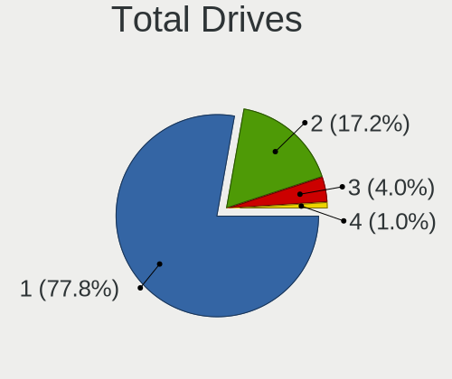
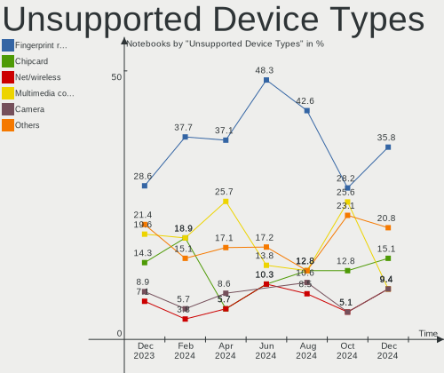

Pop!_OS Hardware Trends (Notebook)
----------------------------------

A project to identify most popular hardware characteristics and track their change
over time based on data collected by Pop!_OS users at https://Linux-Hardware.org.

Anyone can contribute to the study by uploading probes of their computers by
the [hw-probe](https://github.com/linuxhw/hw-probe) tool:

    sudo -E hw-probe -all -upload

Full-feature report is available here: https://linux-hardware.org/?view=trends&formfactor=notebook

Period: Sep, 2020.

Contents
--------

- [ OS                       ](#os)
- [ OS Family                ](#os-family)
- [ Kernel                   ](#kernel)
- [ Kernel Family            ](#kernel-family)
- [ Kernel Major Ver.        ](#kernel-major-ver)
- [ Arch                     ](#arch)
- [ DE                       ](#de)
- [ Display Server           ](#display-server)
- [ Display Manager          ](#display-manager)
- [ OS Lang                  ](#os-lang)
- [ Boot Mode                ](#boot-mode)
- [ Filesystem               ](#filesystem)
- [ Part. scheme             ](#part-scheme)
- [ Dual Boot with Linux/BSD ](#dual-boot-with-linux/bsd)
- [ Dual Boot (Win)          ](#dual-boot-win)
- [ Country                  ](#country)
- [ City                     ](#city)
- [ Vendor                   ](#vendor)
- [ Model                    ](#model)
- [ Model Family             ](#model-family)
- [ MFG Year                 ](#mfg-year)
- [ Form Factor              ](#form-factor)
- [ Secure Boot              ](#secure-boot)
- [ Coreboot                 ](#coreboot)
- [ RAM Size                 ](#ram-size)
- [ RAM Used                 ](#ram-used)
- [ Has CD-ROM               ](#has-cd-rom)
- [ Total Drives             ](#total-drives)
- [ Has Ethernet             ](#has-ethernet)
- [ Drive Vendor             ](#drive-vendor)
- [ HDD Vendor               ](#hdd-vendor)
- [ SSD Vendor               ](#ssd-vendor)
- [ Drive Model              ](#drive-model)
- [ Drive Kind               ](#drive-kind)
- [ Drive Connector          ](#drive-connector)
- [ Drive Size               ](#drive-size)
- [ Space Total              ](#space-total)
- [ Space Used               ](#space-used)
- [ Malfunc. Drives          ](#malfunc-drives)
- [ Malfunc. Drive Vendor    ](#malfunc-drive-vendor)
- [ Malfunc. HDD Vendor      ](#malfunc-hdd-vendor)
- [ Malfunc. Drive Kind      ](#malfunc-drive-kind)
- [ Failed Drives            ](#failed-drives)
- [ Failed Drive Vendor      ](#failed-drive-vendor)
- [ Drive Status             ](#drive-status)
- [ Storage Vendor           ](#storage-vendor)
- [ Storage Model            ](#storage-model)
- [ Storage Kind             ](#storage-kind)
- [ CPU Vendor               ](#cpu-vendor)
- [ CPU Model                ](#cpu-model)
- [ CPU Model Family         ](#cpu-model-family)
- [ CPU Cores                ](#cpu-cores)
- [ CPU Sockets              ](#cpu-sockets)
- [ CPU Threads              ](#cpu-threads)
- [ CPU Op-Modes             ](#cpu-op-modes)
- [ CPU Microcode            ](#cpu-microcode)
- [ CPU Microarch            ](#cpu-microarch)
- [ GPU Vendor               ](#gpu-vendor)
- [ GPU Model                ](#gpu-model)
- [ GPU Combo                ](#gpu-combo)
- [ GPU Driver               ](#gpu-driver)
- [ GPU Memory               ](#gpu-memory)
- [ Monitor Vendor           ](#monitor-vendor)
- [ Monitor Model            ](#monitor-model)
- [ Monitor Resolution       ](#monitor-resolution)
- [ Monitor Diagonal         ](#monitor-diagonal)
- [ Monitor Width            ](#monitor-width)
- [ Aspect Ratio             ](#aspect-ratio)
- [ Monitor Area             ](#monitor-area)
- [ Pixel Density            ](#pixel-density)
- [ Multiple Monitors        ](#multiple-monitors)
- [ Net Controller Vendor    ](#net-controller-vendor)
- [ Net Controller Model     ](#net-controller-model)
- [ Wireless Vendor          ](#wireless-vendor)
- [ Wireless Model           ](#wireless-model)
- [ Ethernet Vendor          ](#ethernet-vendor)
- [ Ethernet Model           ](#ethernet-model)
- [ Net Controller Kind      ](#net-controller-kind)
- [ Used Controller          ](#used-controller)
- [ NICs                     ](#nics)
- [ Memory Vendor            ](#memory-vendor)
- [ Memory Model             ](#memory-model)
- [ Memory Kind              ](#memory-kind)
- [ Memory Form Factor       ](#memory-form-factor)
- [ Memory Size              ](#memory-size)
- [ Memory Speed             ](#memory-speed)
- [ Sound Vendor             ](#sound-vendor)
- [ Sound Model              ](#sound-model)
- [ Camera Vendor            ](#camera-vendor)
- [ Camera Model             ](#camera-model)
- [ Fingerprint Vendor       ](#fingerprint-vendor)
- [ Fingerprint Model        ](#fingerprint-model)
- [ Chipcard Vendor          ](#chipcard-vendor)
- [ Chipcard Model           ](#chipcard-model)
- [ Printer Vendor           ](#printer-vendor)
- [ Printer Model            ](#printer-model)
- [ Scanner Vendor           ](#scanner-vendor)
- [ Scanner Model            ](#scanner-model)
- [ Bluetooth Vendor         ](#bluetooth-vendor)
- [ Bluetooth Model          ](#bluetooth-model)
- [ Unsupported Devices      ](#unsupported-devices)
- [ Unsupported Device Types ](#unsupported-device-types)

OS
--

Installed operating systems

| Name          | Notebooks | Percent |
|---------------|-----------|---------|
| Pop!_OS 20.04 | 156       | 100%    |

OS Family
---------

OS without a version

| Name    | Notebooks | Percent |
|---------|-----------|---------|
| Pop!_OS | 156       | 100%    |

Kernel
------

Version of the Linux kernel

| Version               | Notebooks | Percent |
|-----------------------|-----------|---------|
| 5.4.0-7642-generic    | 136       | 87.18%  |
| 5.4.0-7634-generic    | 6         | 3.85%   |
| 5.8.9-050809-generic  | 2         | 1.28%   |
| 5.8.6-xanmod1         | 2         | 1.28%   |
| 5.4.0-7625-generic    | 2         | 1.28%   |
| 5.8.6-050806-generic  | 1         | 0.64%   |
| 5.8.2-050802-generic  | 1         | 0.64%   |
| 5.8.12-050812-generic | 1         | 0.64%   |
| 5.8.11-050811-generic | 1         | 0.64%   |
| 5.8.10-050810-generic | 1         | 0.64%   |
| 5.7.15-050715-generic | 1         | 0.64%   |
| 5.7.0-050700-generic  | 1         | 0.64%   |
| 5.4.0-7626-generic    | 1         | 0.64%   |

Kernel Family
-------------

Linux kernel without a distro release

| Version | Notebooks | Percent |
|---------|-----------|---------|
| 5.4.0   | 145       | 92.95%  |
| 5.8.6   | 3         | 1.92%   |
| 5.8.9   | 2         | 1.28%   |
| 5.8.2   | 1         | 0.64%   |
| 5.8.12  | 1         | 0.64%   |
| 5.8.11  | 1         | 0.64%   |
| 5.8.10  | 1         | 0.64%   |
| 5.7.15  | 1         | 0.64%   |
| 5.7.0   | 1         | 0.64%   |

Kernel Major Ver.
-----------------

Linux kernel major version

| Version | Notebooks | Percent |
|---------|-----------|---------|
| 5.4     | 145       | 92.95%  |
| 5.8     | 9         | 5.77%   |
| 5.7     | 2         | 1.28%   |

Arch
----

OS architecture (x86_64, i586, etc.)

| Name   | Notebooks | Percent |
|--------|-----------|---------|
| x86_64 | 156       | 100%    |

DE
--

Desktop Environment

| Name            | Notebooks | Percent |
|-----------------|-----------|---------|
| GNOME           | 146       | 93.59%  |
| KDE             | 3         | 1.92%   |
| GNOME Flashback | 3         | 1.92%   |
| X-Cinnamon      | 1         | 0.64%   |
| Unity           | 1         | 0.64%   |
| LXQt            | 1         | 0.64%   |
| KDE5            | 1         | 0.64%   |

Display Server
--------------

X11 or Wayland

| Name    | Notebooks | Percent |
|---------|-----------|---------|
| X11     | 155       | 99.36%  |
| Wayland | 1         | 0.64%   |

Display Manager
---------------

SDDM, LightDM, etc.

| Name    | Notebooks | Percent |
|---------|-----------|---------|
| Unknown | 115       | 73.72%  |
| GDM     | 41        | 26.28%  |

OS Lang
-------

Language

| Lang  | Notebooks | Percent |
|-------|-----------|---------|
| en_US | 96        | 61.54%  |
| en_GB | 10        | 6.41%   |
| pt_BR | 9         | 5.77%   |
| es_ES | 7         | 4.49%   |
| de_DE | 6         | 3.85%   |
| it_IT | 5         | 3.21%   |
| en_AU | 5         | 3.21%   |
| ru_RU | 3         | 1.92%   |
| fr_FR | 3         | 1.92%   |
| en_CA | 3         | 1.92%   |
| fi_FI | 2         | 1.28%   |
| sv_SE | 1         | 0.64%   |
| ro_RO | 1         | 0.64%   |
| nl_NL | 1         | 0.64%   |
| hu_HU | 1         | 0.64%   |
| cs_CZ | 1         | 0.64%   |
| ca_ES | 1         | 0.64%   |
| C     | 1         | 0.64%   |

Boot Mode
---------

EFI or BIOS

| Mode | Notebooks | Percent |
|------|-----------|---------|
| EFI  | 108       | 69.23%  |
| BIOS | 48        | 30.77%  |

Filesystem
----------

Type of filesystem

| Type    | Notebooks | Percent |
|---------|-----------|---------|
| Ext4    | 154       | 98.72%  |
| Xfs     | 1         | 0.64%   |
| Overlay | 1         | 0.64%   |

Part. scheme
------------

Scheme of partitioning

| Type    | Notebooks | Percent |
|---------|-----------|---------|
| Unknown | 115       | 73.72%  |
| GPT     | 35        | 22.44%  |
| MBR     | 6         | 3.85%   |

Dual Boot with Linux/BSD
------------------------

Hosting more than one Linux/BSD

| Dual boot | Notebooks | Percent |
|-----------|-----------|---------|
| No        | 154       | 98.72%  |
| Yes       | 2         | 1.28%   |

Dual Boot (Win)
---------------

Hosting Linux and Windows

| Dual boot | Notebooks | Percent |
|-----------|-----------|---------|
| No        | 142       | 91.03%  |
| Yes       | 14        | 8.97%   |

Country
-------

Geographic location (country)

| Country            | Notebooks | Percent |
|--------------------|-----------|---------|
| USA                | 39        | 25%     |
| Brazil             | 12        | 7.69%   |
| India              | 7         | 4.49%   |
| UK                 | 6         | 3.85%   |
| Germany            | 6         | 3.85%   |
| Philippines        | 5         | 3.21%   |
| Mexico             | 5         | 3.21%   |
| Italy              | 5         | 3.21%   |
| Australia          | 5         | 3.21%   |
| Switzerland        | 4         | 2.56%   |
| Netherlands        | 4         | 2.56%   |
| Finland            | 4         | 2.56%   |
| Argentina          | 4         | 2.56%   |
| Sweden             | 3         | 1.92%   |
| South Africa       | 3         | 1.92%   |
| Russia             | 3         | 1.92%   |
| France             | 3         | 1.92%   |
| Czech Republic     | 3         | 1.92%   |
| Canada             | 3         | 1.92%   |
| Vietnam            | 2         | 1.28%   |
| Spain              | 2         | 1.28%   |
| Peru               | 2         | 1.28%   |
| New Zealand        | 2         | 1.28%   |
| Mauritius          | 2         | 1.28%   |
| Croatia            | 2         | 1.28%   |
| Chile              | 2         | 1.28%   |
| Austria            | 2         | 1.28%   |
| Saudi Arabia       | 1         | 0.64%   |
| Romania            | 1         | 0.64%   |
| Portugal           | 1         | 0.64%   |
| Poland             | 1         | 0.64%   |
| Norway             | 1         | 0.64%   |
| Malaysia           | 1         | 0.64%   |
| Luxembourg         | 1         | 0.64%   |
| Lithuania          | 1         | 0.64%   |
| Jordan             | 1         | 0.64%   |
| Iran               | 1         | 0.64%   |
| Hungary            | 1         | 0.64%   |
| Guatemala          | 1         | 0.64%   |
| Estonia            | 1         | 0.64%   |
| Egypt              | 1         | 0.64%   |
| Dominican Republic | 1         | 0.64%   |
| China              | 1         | 0.64%   |

City
----

Geographic location (city)

| City                                    | Notebooks | Percent |
|-----------------------------------------|-----------|---------|
| Mexico City                             | 3         | 1.92%   |
| Zagreb                                  | 2         | 1.28%   |
| Vienna                                  | 2         | 1.28%   |
| Vacoas                                  | 2         | 1.28%   |
| Stockholm                               | 2         | 1.28%   |
| Seattle                                 | 2         | 1.28%   |
| Rome                                    | 2         | 1.28%   |
| Prague                                  | 2         | 1.28%   |
| Helsinki                                | 2         | 1.28%   |
| Hamburg                                 | 2         | 1.28%   |
| Fortaleza                               | 2         | 1.28%   |
| Cebu City                               | 2         | 1.28%   |
| Bengaluru                               | 2         | 1.28%   |
| Zurich                                  | 1         | 0.64%   |
| Worcester                               | 1         | 0.64%   |
| Wierden                                 | 1         | 0.64%   |
| Whitby                                  | 1         | 0.64%   |
| Westlake                                | 1         | 0.64%   |
| Warsaw                                  | 1         | 0.64%   |
| Warangal                                | 1         | 0.64%   |
| Vilnius                                 | 1         | 0.64%   |
| Villaviciosa                            | 1         | 0.64%   |
| Villa Martelli                          | 1         | 0.64%   |
| Vijayawada                              | 1         | 0.64%   |
| Vantaa                                  | 1         | 0.64%   |
| Vanderbijlpark                          | 1         | 0.64%   |
| Useldange                               | 1         | 0.64%   |
| Union de Credito Agricola de Hermosillo | 1         | 0.64%   |
| Turin                                   | 1         | 0.64%   |
| Trujillo                                | 1         | 0.64%   |
| The Hague                               | 1         | 0.64%   |
| Terre Haute                             | 1         | 0.64%   |
| Terrassa                                | 1         | 0.64%   |
| Tepic                                   | 1         | 0.64%   |
| Temuco                                  | 1         | 0.64%   |
| Tehran                                  | 1         | 0.64%   |
| Tampere                                 | 1         | 0.64%   |
| Tallinn                                 | 1         | 0.64%   |
| Sydney                                  | 1         | 0.64%   |
| Stockport                               | 1         | 0.64%   |
| Springville                             | 1         | 0.64%   |
| Schwarzenburg                           | 1         | 0.64%   |
| Sao Goncalo                             | 1         | 0.64%   |
| Santo Domingo Este                      | 1         | 0.64%   |
| Santiago del Estero                     | 1         | 0.64%   |
| San Rafael                              | 1         | 0.64%   |
| Salt Lake City                          | 1         | 0.64%   |
| Sala                                    | 1         | 0.64%   |
| Saint-Lambert                           | 1         | 0.64%   |
| Rochester                               | 1         | 0.64%   |
| Riyadh                                  | 1         | 0.64%   |
| Recife                                  | 1         | 0.64%   |
| Ratzeburg                               | 1         | 0.64%   |
| Pune                                    | 1         | 0.64%   |
| Pretoria                                | 1         | 0.64%   |
| Point Pleasant                          | 1         | 0.64%   |
| Pittsburgh                              | 1         | 0.64%   |
| Pilsen                                  | 1         | 0.64%   |
| Phoenix                                 | 1         | 0.64%   |
| Park City                               | 1         | 0.64%   |

Vendor
------

Motherboard manufacturer

| Name                | Notebooks | Percent |
|---------------------|-----------|---------|
| Lenovo              | 38        | 24.36%  |
| Dell                | 25        | 16.03%  |
| Hewlett-Packard     | 20        | 12.82%  |
| Acer                | 16        | 10.26%  |
| ASUSTek Computer    | 14        | 8.97%   |
| MSI                 | 8         | 5.13%   |
| Apple               | 8         | 5.13%   |
| System76            | 6         | 3.85%   |
| Samsung Electronics | 4         | 2.56%   |
| Toshiba             | 3         | 1.92%   |
| Clevo               | 2         | 1.28%   |
| Alienware           | 2         | 1.28%   |
| Wortmann AG         | 1         | 0.64%   |
| Timi                | 1         | 0.64%   |
| Razer               | 1         | 0.64%   |
| Purism              | 1         | 0.64%   |
| Packard Bell        | 1         | 0.64%   |
| Medion              | 1         | 0.64%   |
| Intel               | 1         | 0.64%   |
| HASEE Computer      | 1         | 0.64%   |
| Daten Tecnologia    | 1         | 0.64%   |
| BANGHO              | 1         | 0.64%   |

Model
-----

Motherboard model

| Name                                     | Notebooks | Percent |
|------------------------------------------|-----------|---------|
| HP Pavilion 15                           | 3         | 1.92%   |
| System76 Lemur Pro                       | 2         | 1.28%   |
| Samsung Electronics 340XAA/350XAA/550XAA | 2         | 1.28%   |
| Lenovo ThinkPad X1 Extreme 20MFCTO1WW    | 2         | 1.28%   |
| HP Pavilion g6                           | 2         | 1.28%   |
| Dell Latitude E5420                      | 2         | 1.28%   |
| ASUS VivoBook_ASUSLaptop X530FN_S530FN   | 2         | 1.28%   |
| Acer Aspire A515-43                      | 2         | 1.28%   |
| Wortmann AG 1220634_1470156              | 1         | 0.64%   |
| Toshiba Satellite S55t-B                 | 1         | 0.64%   |
| Toshiba Satellite C55-C                  | 1         | 0.64%   |
| Toshiba Satellite A205                   | 1         | 0.64%   |
| Timi RedmiBook 16                        | 1         | 0.64%   |
| System76 Serval WS                       | 1         | 0.64%   |
| System76 Gazelle                         | 1         | 0.64%   |
| System76 Galago Pro                      | 1         | 0.64%   |
| System76 Darter Pro                      | 1         | 0.64%   |
| Samsung Electronics R530/R730/R540       | 1         | 0.64%   |
| Samsung Electronics 550XCJ/550XCR        | 1         | 0.64%   |
| Razer Blade                              | 1         | 0.64%   |
| Purism Librem 15 v4                      | 1         | 0.64%   |
| Packard Bell ENNS44HR                    | 1         | 0.64%   |
| MSI PS63 Modern 8RC                      | 1         | 0.64%   |
| MSI GT63 Titan 8RG                       | 1         | 0.64%   |
| MSI GS65 Stealth 8SF                     | 1         | 0.64%   |
| MSI GP75 Leopard 9SD                     | 1         | 0.64%   |
| MSI GP62 6QF                             | 1         | 0.64%   |
| MSI GP62 2QE                             | 1         | 0.64%   |
| MSI GL65 Leopard 10SDK                   | 1         | 0.64%   |
| MSI GF63 Thin 9RCX                       | 1         | 0.64%   |
| Medion P15648                            | 1         | 0.64%   |
| Lenovo ThinkPad X390 20Q0002CUS          | 1         | 0.64%   |
| Lenovo ThinkPad X1 Carbon 6th 20KH006BZA | 1         | 0.64%   |
| Lenovo ThinkPad T61 7660A34              | 1         | 0.64%   |
| Lenovo ThinkPad T530 2392AQU             | 1         | 0.64%   |
| Lenovo ThinkPad T495 20NJCTO1WW          | 1         | 0.64%   |
| Lenovo ThinkPad T480 20L6SE6900          | 1         | 0.64%   |
| Lenovo ThinkPad T480 20L6SD1600          | 1         | 0.64%   |
| Lenovo ThinkPad T480 20L5CTO1WW          | 1         | 0.64%   |
| Lenovo ThinkPad T460s 20FAS54D00         | 1         | 0.64%   |
| Lenovo ThinkPad T460p 20FW003KMC         | 1         | 0.64%   |
| Lenovo ThinkPad T460 20FMS05G4L          | 1         | 0.64%   |
| Lenovo ThinkPad T430s 23539KU            | 1         | 0.64%   |
| Lenovo ThinkPad T420 4236WUL             | 1         | 0.64%   |
| Lenovo ThinkPad T14s Gen 1 20UH000CUS    | 1         | 0.64%   |
| Lenovo ThinkPad P52 20M9001FRT           | 1         | 0.64%   |
| Lenovo ThinkPad P52 20M9000CUS           | 1         | 0.64%   |
| Lenovo ThinkPad P1 Gen 2 20QTCTO1WW      | 1         | 0.64%   |
| Lenovo ThinkPad P1 20MDS0LX00            | 1         | 0.64%   |
| Lenovo ThinkPad L460 20FU002UMX          | 1         | 0.64%   |
| Lenovo ThinkPad Edge E530 3259A29        | 1         | 0.64%   |
| Lenovo ThinkPad E14 Gen 2 20T6CTO1WW     | 1         | 0.64%   |
| Lenovo ThinkPad 20HMS0930E               | 1         | 0.64%   |
| Lenovo IdeaPad Y560                      | 1         | 0.64%   |
| Lenovo IdeaPad U430 Touch 20270          | 1         | 0.64%   |
| Lenovo IdeaPad S540-15IWL D 81NE         | 1         | 0.64%   |
| Lenovo IdeaPad S540-14IML Touch 81V0     | 1         | 0.64%   |
| Lenovo IdeaPad S540-14API 81NH           | 1         | 0.64%   |
| Lenovo IdeaPad S145-15AST 81N3           | 1         | 0.64%   |
| Lenovo IdeaPad L340-17API 81LY           | 1         | 0.64%   |

Model Family
------------

Motherboard model prefix

| Name                       | Notebooks | Percent |
|----------------------------|-----------|---------|
| Lenovo ThinkPad            | 24        | 15.38%  |
| Lenovo IdeaPad             | 13        | 8.33%   |
| Acer Aspire                | 12        | 7.69%   |
| Dell Inspiron              | 10        | 6.41%   |
| HP Pavilion                | 7         | 4.49%   |
| Dell Latitude              | 6         | 3.85%   |
| HP ProBook                 | 5         | 3.21%   |
| Dell XPS                   | 4         | 2.56%   |
| Dell Precision             | 4         | 2.56%   |
| Toshiba Satellite          | 3         | 1.92%   |
| HP EliteBook               | 3         | 1.92%   |
| ASUS VivoBook              | 3         | 1.92%   |
| System76 Lemur             | 2         | 1.28%   |
| Samsung Electronics 340XAA | 2         | 1.28%   |
| MSI GP62                   | 2         | 1.28%   |
| HP ZBook                   | 2         | 1.28%   |
| HP Laptop                  | 2         | 1.28%   |
| Apple MacBookPro11         | 2         | 1.28%   |
| Wortmann AG 1220634        | 1         | 0.64%   |
| Timi RedmiBook             | 1         | 0.64%   |
| System76 Serval            | 1         | 0.64%   |
| System76 Gazelle           | 1         | 0.64%   |
| System76 Galago            | 1         | 0.64%   |
| System76 Darter            | 1         | 0.64%   |
| Samsung Electronics R530   | 1         | 0.64%   |
| Samsung Electronics 550XCJ | 1         | 0.64%   |
| Razer Blade                | 1         | 0.64%   |
| Purism Librem              | 1         | 0.64%   |
| Packard Bell ENNS44HR      | 1         | 0.64%   |
| MSI PS63                   | 1         | 0.64%   |
| MSI GT63                   | 1         | 0.64%   |
| MSI GS65                   | 1         | 0.64%   |
| MSI GP75                   | 1         | 0.64%   |
| MSI GL65                   | 1         | 0.64%   |
| MSI GF63                   | 1         | 0.64%   |
| Medion P15648              | 1         | 0.64%   |
| Lenovo G480                | 1         | 0.64%   |
| Intel H81U                 | 1         | 0.64%   |
| HP OMEN                    | 1         | 0.64%   |
| HASEE Computer CW37        | 1         | 0.64%   |
| Dell Vostro                | 1         | 0.64%   |
| Daten Tecnologia ESTELAR   | 1         | 0.64%   |
| Clevo P65                  | 1         | 0.64%   |
| Clevo M7x0S                | 1         | 0.64%   |
| BANGHO MAX                 | 1         | 0.64%   |
| ASUS X55U                  | 1         | 0.64%   |
| ASUS X555LDB               | 1         | 0.64%   |
| ASUS X441URK               | 1         | 0.64%   |
| ASUS X411UA                | 1         | 0.64%   |
| ASUS UX430UAR              | 1         | 0.64%   |
| ASUS UX301LAA              | 1         | 0.64%   |
| ASUS N56VZ                 | 1         | 0.64%   |
| ASUS N55SF                 | 1         | 0.64%   |
| ASUS K75DE                 | 1         | 0.64%   |
| ASUS G751JT                | 1         | 0.64%   |
| ASUS G56JK                 | 1         | 0.64%   |
| Apple MacBookPro5          | 1         | 0.64%   |
| Apple MacBookPro15         | 1         | 0.64%   |
| Apple MacBookAir6          | 1         | 0.64%   |
| Apple MacBookAir3          | 1         | 0.64%   |

MFG Year
--------

Motherboard manufacture year

| Year | Notebooks | Percent |
|------|-----------|---------|
| 2019 | 42        | 26.92%  |
| 2020 | 34        | 21.79%  |
| 2018 | 20        | 12.82%  |
| 2012 | 9         | 5.77%   |
| 2017 | 8         | 5.13%   |
| 2015 | 7         | 4.49%   |
| 2014 | 7         | 4.49%   |
| 2013 | 7         | 4.49%   |
| 2016 | 6         | 3.85%   |
| 2011 | 6         | 3.85%   |
| 2008 | 5         | 3.21%   |
| 2009 | 3         | 1.92%   |
| 2010 | 2         | 1.28%   |

Form Factor
-----------

Physical design of the computer

| Name     | Notebooks | Percent |
|----------|-----------|---------|
| Notebook | 156       | 100%    |

Secure Boot
-----------

Enabled or disabled

| State    | Notebooks | Percent |
|----------|-----------|---------|
| Disabled | 156       | 100%    |

Coreboot
--------

Have coreboot on board

| Used | Notebooks | Percent |
|------|-----------|---------|
| No   | 152       | 97.44%  |
| Yes  | 4         | 2.56%   |

RAM Size
--------

Total RAM memory

| Size in GB  | Notebooks | Percent |
|-------------|-----------|---------|
| 4.01-8.0    | 42        | 26.92%  |
| 16.01-24.0  | 35        | 22.44%  |
| 8.01-16.0   | 32        | 20.51%  |
| 3.01-4.0    | 23        | 14.74%  |
| 32.01-64.0  | 14        | 8.97%   |
| 1.01-2.0    | 5         | 3.21%   |
| 24.01-32.0  | 3         | 1.92%   |
| 64.01-256.0 | 2         | 1.28%   |

RAM Used
--------

Used RAM memory

| Used GB    | Notebooks | Percent |
|------------|-----------|---------|
| 2.01-3.0   | 59        | 37.82%  |
| 4.01-8.0   | 35        | 22.44%  |
| 1.01-2.0   | 31        | 19.87%  |
| 3.01-4.0   | 28        | 17.95%  |
| 8.01-16.0  | 2         | 1.28%   |
| 16.01-24.0 | 1         | 0.64%   |

Has CD-ROM
----------

Has CD-ROM on board

| Presented | Notebooks | Percent |
|-----------|-----------|---------|
| No        | 95        | 60.9%   |
| Yes       | 61        | 39.1%   |

Total Drives
------------

Number of drives on board

| Drives | Notebooks | Percent |
|--------|-----------|---------|
| 1      | 107       | 68.59%  |
| 2      | 38        | 24.36%  |
| 3      | 7         | 4.49%   |
| 4      | 2         | 1.28%   |
| 5      | 1         | 0.64%   |
| 0      | 1         | 0.64%   |

Has Ethernet
------------

Has Ethernet on board

| Presented | Notebooks | Percent |
|-----------|-----------|---------|
| Yes       | 132       | 84.62%  |
| No        | 24        | 15.38%  |

Drive Vendor
------------

Hard drive vendors

| Vendor              | Notebooks | Drives  | Percent |
|---------------------|-----------|---------|---------|
| Samsung Electronics | 45        | 49      | 21.74%  |
| WDC                 | 28        | 31      | 13.53%  |
| Seagate             | 19        | 21      | 9.18%   |
| Toshiba             | 16        | 17      | 7.73%   |
| SanDisk             | 15        | 17      | 7.25%   |
| Kingston            | 12        | 12      | 5.8%    |
| HGST                | 9         | 10      | 4.35%   |
| Unknown             | 8         | 8       | 3.86%   |
| Crucial             | 7         | 7       | 3.38%   |
| SK Hynix            | 6         | 6       | 2.9%    |
| Apple               | 5         | 5       | 2.42%   |
| Phison              | 4         | 4       | 1.93%   |
| JMicron             | 3         | 3       | 1.45%   |
| Intel               | 3         | 3       | 1.45%   |
| HL-DT-ST            | 3         | Unknown | 1.45%   |
| Micron Technology   | 2         | 2       | 0.97%   |
| LITEONIT            | 2         | 2       | 0.97%   |
| Hitachi             | 2         | 2       | 0.97%   |
| WDC WDS2            | 1         | 1       | 0.48%   |
| Union Memory        | 1         | 1       | 0.48%   |
| Transcend           | 1         | 1       | 0.48%   |
| Silicon Motion      | 1         | 1       | 0.48%   |
| SABRENT             | 1         | 1       | 0.48%   |
| PNY                 | 1         | 1       | 0.48%   |
| Phison Electronics  | 1         | 1       | 0.48%   |
| Patriot             | 1         | 1       | 0.48%   |
| OCZ                 | 1         | 1       | 0.48%   |
| MR                  | 1         | 1       | 0.48%   |
| LaCie               | 1         | 1       | 0.48%   |
| Kston               | 1         | 1       | 0.48%   |
| KIOXIA              | 1         | 1       | 0.48%   |
| HS-SSD-E100         | 1         | 1       | 0.48%   |
| Fujitsu             | 1         | 1       | 0.48%   |
| External            | 1         | 1       | 0.48%   |
| Colorful            | 1         | 1       | 0.48%   |
| A-DATA Technology   | 1         | 1       | 0.48%   |

HDD Vendor
----------

Hard disk drive vendors

| Vendor              | Notebooks | Drives | Percent |
|---------------------|-----------|--------|---------|
| Seagate             | 19        | 21     | 31.15%  |
| WDC                 | 17        | 17     | 27.87%  |
| Toshiba             | 12        | 12     | 19.67%  |
| HGST                | 9         | 10     | 14.75%  |
| Hitachi             | 2         | 2      | 3.28%   |
| Samsung Electronics | 1         | 1      | 1.64%   |
| Fujitsu             | 1         | 1      | 1.64%   |

SSD Vendor
----------

Solid state drive vendors

| Vendor              | Notebooks | Drives | Percent |
|---------------------|-----------|--------|---------|
| Samsung Electronics | 26        | 27     | 32.1%   |
| WDC                 | 10        | 11     | 12.35%  |
| SanDisk             | 10        | 11     | 12.35%  |
| Kingston            | 7         | 7      | 8.64%   |
| Crucial             | 7         | 7      | 8.64%   |
| Apple               | 4         | 4      | 4.94%   |
| Toshiba             | 2         | 2      | 2.47%   |
| SK Hynix            | 2         | 2      | 2.47%   |
| Micron Technology   | 2         | 2      | 2.47%   |
| LITEONIT            | 2         | 2      | 2.47%   |
| WDC WDS2            | 1         | 1      | 1.23%   |
| Transcend           | 1         | 1      | 1.23%   |
| SABRENT             | 1         | 1      | 1.23%   |
| PNY                 | 1         | 1      | 1.23%   |
| Patriot             | 1         | 1      | 1.23%   |
| OCZ                 | 1         | 1      | 1.23%   |
| MR                  | 1         | 1      | 1.23%   |
| JMicron             | 1         | 1      | 1.23%   |
| A-DATA Technology   | 1         | 1      | 1.23%   |

Drive Model
-----------

Hard drive models

| Model                            | Notebooks | Percent |
|----------------------------------|-----------|---------|
| NVMe SSD Drive 256GB             | 11        | 5.09%   |
| NVMe SSD Drive 512GB             | 7         | 3.24%   |
| NVMe SSD Drive 1024GB            | 7         | 3.24%   |
| HTS721010A9E630 1TB              | 6         | 2.78%   |
| WD10SPZX-24Z10 1TB               | 5         | 2.31%   |
| MQ04ABF100 1TB                   | 5         | 2.31%   |
| WDS240G2G0B-00EPW0 240GB SSD     | 4         | 1.85%   |
| SSD 860 EVO 1TB                  | 4         | 1.85%   |
| ST9500325AS 500GB                | 3         | 1.39%   |
| SSD 850 EVO 500GB                | 3         | 1.39%   |
| SA400S37240G 240GB SSD           | 3         | 1.39%   |
| MQ01ABF050 500GB                 | 3         | 1.39%   |
| WDS120G2G0B-00EPW0 120GB SSD     | 2         | 0.93%   |
| WD10JPVX-75JC3T0 1TB             | 2         | 0.93%   |
| WD10JPVX-22JC3T0 1TB             | 2         | 0.93%   |
| Tech 250GB                       | 2         | 0.93%   |
| ST9500423AS 500GB                | 2         | 0.93%   |
| ST500LM012 HN-M500MBB 500GB      | 2         | 0.93%   |
| ST2000LM015-2E8174 2TB           | 2         | 0.93%   |
| ST1000LM014-1EJ164 1TB           | 2         | 0.93%   |
| SSD 970 EVO Plus 500GB           | 2         | 0.93%   |
| SSD 860 EVO 500GB                | 2         | 0.93%   |
| SSD 850 EVO mSATA 1TB            | 2         | 0.93%   |
| SSD 850 EVO 250GB                | 2         | 0.93%   |
| SSD 840 EVO 500GB                | 2         | 0.93%   |
| SA400S37480G 480GB SSD           | 2         | 0.93%   |
| RBUSNS8154P3512GJ 512GB          | 2         | 0.93%   |
| NVMe SSD Drive 2TB               | 2         | 0.93%   |
| NVMe SSD Drive 128GB             | 2         | 0.93%   |
| MZVLB512HAJQ-000L7 512GB         | 2         | 0.93%   |
| Expansion 1TB                    | 2         | 0.93%   |
| DVDRAM GUE1N 3GB                 | 2         | 0.93%   |
| WDS500G2B0A-00SM50 500GB SSD     | 1         | 0.46%   |
| WDS250G2B0B-00YS70 250GB SSD     | 1         | 0.46%   |
| WDS120G2G0A-00JH30 120GB SSD     | 1         | 0.46%   |
| WDS120G1G0A-00SS50 120GB SSD     | 1         | 0.46%   |
| WD7500BPKX-75HPJT0 752GB         | 1         | 0.46%   |
| WD6400BPVT-22HXZT3 640GB         | 1         | 0.46%   |
| WD5000LPVX-22V0TT0 500GB         | 1         | 0.46%   |
| WD3200BEKT-60KA9T0 320GB         | 1         | 0.46%   |
| WD20 EADS-11R6B1 2TB             | 1         | 0.46%   |
| WD10SPZX-22Z10T0 1TB             | 1         | 0.46%   |
| WD10SPZX-21Z10T0 1TB             | 1         | 0.46%   |
| WD10JPVT-00MS8T0 1TB             | 1         | 0.46%   |
| WD My Passport 071D 2TB          | 1         | 0.46%   |
| VERTEX4 256GB SSD                | 1         | 0.46%   |
| TS512GSSD370 512GB               | 1         | 0.46%   |
| THNSNK128GVN8 M.2 2280 128GB SSD | 1         | 0.46%   |
| THNSNJ128GCSU 128GB SSD          | 1         | 0.46%   |
| THNSN5512GPUK NVMe 512GB         | 1         | 0.46%   |
| SUV400S37480G 480GB SSD          | 1         | 0.46%   |
| SU810NS38 SATA 256 GB SSD        | 1         | 0.46%   |
| ST950042 0ASG 500GB              | 1         | 0.46%   |
| ST500LT012-1DG142 500GB          | 1         | 0.46%   |
| ST3000DM001-1CH166 3TB           | 1         | 0.46%   |
| ST2000LM007-1R8174 2TB           | 1         | 0.46%   |
| ST2000DM 001-1CH164 2TB          | 1         | 0.46%   |
| ST1000LX015-1U7172 1TB           | 1         | 0.46%   |
| ST1000LM048-2E7172 1TB           | 1         | 0.46%   |
| ST1000LM035-1RK172 1TB           | 1         | 0.46%   |

Drive Kind
----------

HDD or SSD

| Kind    | Notebooks | Drives | Percent |
|---------|-----------|--------|---------|
| SSD     | 69        | 84     | 35.75%  |
| HDD     | 60        | 64     | 31.09%  |
| NVMe    | 51        | 56     | 26.42%  |
| Unknown | 9         | 9      | 4.66%   |
| MMC     | 4         | 4      | 2.07%   |

Drive Connector
---------------

SATA, SAS, NVMe, etc.

| Type | Notebooks | Drives | Percent |
|------|-----------|--------|---------|
| SATA | 114       | 143    | 63.33%  |
| NVMe | 51        | 56     | 28.33%  |
| SAS  | 11        | 14     | 6.11%   |
| MMC  | 4         | 4      | 2.22%   |

Drive Size
----------

Size of hard drive

| Size in TB | Notebooks | Drives | Percent |
|------------|-----------|--------|---------|
| 0.01-0.5   | 105       | 123    | 55.26%  |
| 0.51-1.0   | 68        | 73     | 35.79%  |
| 1.01-2.0   | 16        | 20     | 8.42%   |
| 2.01-3.0   | 1         | 1      | 0.53%   |

Space Total
-----------

Amount of disk space available on the file system

| Size in GB     | Notebooks | Percent |
|----------------|-----------|---------|
| 101-250        | 56        | 35.9%   |
| 251-500        | 46        | 29.49%  |
| 501-1000       | 33        | 21.15%  |
| 51-100         | 8         | 5.13%   |
| 1001-2000      | 5         | 3.21%   |
| More than 3000 | 3         | 1.92%   |
| 21-50          | 2         | 1.28%   |
| 2001-3000      | 2         | 1.28%   |
| 1-20           | 1         | 0.64%   |

Space Used
----------

Amount of used disk space

| Used GB   | Notebooks | Percent |
|-----------|-----------|---------|
| 1-20      | 55        | 35.26%  |
| 21-50     | 31        | 19.87%  |
| 51-100    | 28        | 17.95%  |
| 101-250   | 22        | 14.1%   |
| 251-500   | 12        | 7.69%   |
| 1001-2000 | 5         | 3.21%   |
| 501-1000  | 2         | 1.28%   |
| 2001-3000 | 1         | 0.64%   |

Malfunc. Drives
---------------

Drive models with a malfunction

| Model                       | Notebooks | Drives | Percent |
|-----------------------------|-----------|--------|---------|
| ST500LM012 HN-M500MBB 500GB | 2         | 2      | 50%     |
| ST2000DM 001-1CH164 2TB     | 1         | 1      | 25%     |
| ST1000LX015-1U7172 1TB      | 1         | 1      | 25%     |

Malfunc. Drive Vendor
---------------------

Vendors of faulty drives

| Vendor  | Notebooks | Drives | Percent |
|---------|-----------|--------|---------|
| Seagate | 4         | 4      | 100%    |

Malfunc. HDD Vendor
-------------------

Vendors of faulty HDD drives

| Vendor  | Notebooks | Drives | Percent |
|---------|-----------|--------|---------|
| Seagate | 4         | 4      | 100%    |

Malfunc. Drive Kind
-------------------

Kinds of faulty drives

| Kind | Notebooks | Drives | Percent |
|------|-----------|--------|---------|
| HDD  | 4         | 4      | 100%    |

Failed Drives
-------------

Failed drive models

Zero info for selected period =(

Failed Drive Vendor
-------------------

Failed drive vendors

Zero info for selected period =(

Drive Status
------------

Number of failed and malfunc. drives

| Status   | Notebooks | Drives | Percent |
|----------|-----------|--------|---------|
| Detected | 118       | 162    | 73.75%  |
| Works    | 38        | 51     | 23.75%  |
| Malfunc  | 4         | 4      | 2.5%    |

Storage Vendor
--------------

Storage controller vendors

| Vendor                           | Notebooks | Percent |
|----------------------------------|-----------|---------|
| Intel                            | 108       | 57.75%  |
| Samsung Electronics              | 22        | 11.76%  |
| AMD                              | 18        | 9.63%   |
| Sandisk                          | 7         | 3.74%   |
| Phison Electronics               | 5         | 2.67%   |
| Kingston Technology Company      | 5         | 2.67%   |
| Union Memory (Shenzhen)          | 4         | 2.14%   |
| SK Hynix                         | 4         | 2.14%   |
| Nvidia                           | 4         | 2.14%   |
| Toshiba America Info Systems     | 3         | 1.6%    |
| Silicon Motion                   | 1         | 0.53%   |
| Silicon Integrated Systems [SiS] | 1         | 0.53%   |
| Marvell Technology Group         | 1         | 0.53%   |
| KIOXIA                           | 1         | 0.53%   |
| JMicron Technology               | 1         | 0.53%   |
| Apple                            | 1         | 0.53%   |
| ADATA Technology                 | 1         | 0.53%   |

Storage Model
-------------

Storage controller models

| Model                                                                      | Notebooks | Percent |
|----------------------------------------------------------------------------|-----------|---------|
| Sunrise Point-LP SATA Controller [AHCI mode]                               | 20        | 10.2%   |
| FCH SATA Controller [AHCI mode]                                            | 18        | 9.18%   |
| Non-Volatile memory controller                                             | 17        | 8.67%   |
| NVMe SSD Controller SM981/PM981/PM983                                      | 16        | 8.16%   |
| Cannon Lake Mobile PCH SATA AHCI Controller                                | 11        | 5.61%   |
| 7 Series Chipset Family 6-port SATA Controller [AHCI mode]                 | 10        | 5.1%    |
| 82801 Mobile SATA Controller [RAID mode]                                   | 9         | 4.59%   |
| 6 Series/C200 Series Chipset Family 6 port Mobile SATA AHCI Controller     | 9         | 4.59%   |
| 8 Series/C220 Series Chipset Family 6-port SATA Controller 1 [AHCI mode]   | 8         | 4.08%   |
| 8 Series SATA Controller 1 [AHCI mode]                                     | 7         | 3.57%   |
| Cannon Point-LP SATA Controller [AHCI Mode]                                | 6         | 3.06%   |
| HM170/QM170 Chipset SATA Controller [AHCI Mode]                            | 5         | 2.55%   |
| Wildcat Point-LP SATA Controller [AHCI Mode]                               | 4         | 2.04%   |
| Comet Lake SATA AHCI Controller                                            | 4         | 2.04%   |
| 82801HM/HEM (ICH8M/ICH8M-E) SATA Controller [AHCI mode]                    | 4         | 2.04%   |
| 82801HM/HEM (ICH8M/ICH8M-E) IDE Controller                                 | 4         | 2.04%   |
| MCP79 AHCI Controller                                                      | 3         | 1.53%   |
| E12 NVMe Controller                                                        | 3         | 1.53%   |
| 5 Series/3400 Series Chipset 4 port SATA AHCI Controller                   | 3         | 1.53%   |
| WD Black 2018/PC SN520 NVMe SSD                                            | 2         | 1.02%   |
| Toshiba America Info Non-Volatile memory controller                        | 2         | 1.02%   |
| SSD Pro 7600p/760p/E 6100p Series                                          | 2         | 1.02%   |
| SATA Controller [RAID mode]                                                | 2         | 1.02%   |
| PS5013 E13 NVMe Controller                                                 | 2         | 1.02%   |
| NVMe SSD Controller SM961/PM961                                            | 2         | 1.02%   |
| NVMe SSD Controller SM951/PM951                                            | 2         | 1.02%   |
| BC501 NVMe Solid State Drive 512GB                                         | 2         | 1.02%   |
| XPG SX8200 Pro PCIe Gen3x4 M.2 2280 Solid State Drive                      | 1         | 0.51%   |
| XG4 NVMe SSD Controller                                                    | 1         | 0.51%   |
| WD Black 2018/PC SN720 NVMe SSD                                            | 1         | 0.51%   |
| SSD 660P Series                                                            | 1         | 0.51%   |
| SATA Controller / IDE mode                                                 | 1         | 0.51%   |
| Mobile PM965/GM965 PT IDER Controller                                      | 1         | 0.51%   |
| MCP89 SATA Controller (AHCI mode)                                          | 1         | 0.51%   |
| JMB360 AHCI Controller                                                     | 1         | 0.51%   |
| FCH IDE Controller                                                         | 1         | 0.51%   |
| Electronics SATA controller                                                | 1         | 0.51%   |
| Atom/Celeron/Pentium Processor x5-E8000/J3xxx/N3xxx Series SATA Controller | 1         | 0.51%   |
| Apple PCIe SSD                                                             | 1         | 0.51%   |
| ANS2 NVMe Controller                                                       | 1         | 0.51%   |
| 88SS9183 PCIe SSD Controller                                               | 1         | 0.51%   |
| 82801GBM/GHM (ICH7-M Family) SATA Controller [IDE mode]                    | 1         | 0.51%   |
| 5513 IDE Controller                                                        | 1         | 0.51%   |
| 5 Series/3400 Series Chipset 6 port SATA AHCI Controller                   | 1         | 0.51%   |
| 400 Series Chipset SATA Controller                                         | 1         | 0.51%   |
| 400 Series Chipset Family SATA AHCI Controller                             | 1         | 0.51%   |

Storage Kind
------------

Kind of storage controller (IDE, SATA, NVMe, SAS, ...)

| Kind | Notebooks | Percent |
|------|-----------|---------|
| SATA | 119       | 62.96%  |
| NVMe | 52        | 27.51%  |
| RAID | 11        | 5.82%   |
| IDE  | 7         | 3.7%    |

CPU Vendor
----------

Processor vendors

| Vendor | Notebooks | Percent |
|--------|-----------|---------|
| Intel  | 134       | 85.9%   |
| AMD    | 22        | 14.1%   |

CPU Model
---------

Processor models

| Model                                         | Notebooks | Percent |
|-----------------------------------------------|-----------|---------|
| Intel Core i7-9750H CPU @ 2.60GHz             | 5         | 3.21%   |
| Intel Core i7-8750H CPU @ 2.20GHz             | 5         | 3.21%   |
| Intel Core i7-8565U CPU @ 1.80GHz             | 5         | 3.21%   |
| Intel Core i7-8550U CPU @ 1.80GHz             | 5         | 3.21%   |
| Intel Core i7-7700HQ CPU @ 2.80GHz            | 5         | 3.21%   |
| Intel Core i5-8265U CPU @ 1.60GHz             | 5         | 3.21%   |
| Intel Core i5-7200U CPU @ 2.50GHz             | 5         | 3.21%   |
| Intel Core i5-10210U CPU @ 1.60GHz            | 5         | 3.21%   |
| Intel Core i5-8250U CPU @ 1.60GHz             | 4         | 2.56%   |
| Intel Core i7-8850H CPU @ 2.60GHz             | 3         | 1.92%   |
| Intel Core i7-6600U CPU @ 2.60GHz             | 3         | 1.92%   |
| Intel Core i5-9300H CPU @ 2.40GHz             | 3         | 1.92%   |
| Intel Core i5-6200U CPU @ 2.30GHz             | 3         | 1.92%   |
| Intel Core i5-4200U CPU @ 1.60GHz             | 3         | 1.92%   |
| AMD Ryzen 3 3200U with Radeon Vega Mobile Gfx | 3         | 1.92%   |
| Intel Core i7-8650U CPU @ 1.90GHz             | 2         | 1.28%   |
| Intel Core i7-6820HQ CPU @ 2.70GHz            | 2         | 1.28%   |
| Intel Core i7-4800MQ CPU @ 2.70GHz            | 2         | 1.28%   |
| Intel Core i7-4720HQ CPU @ 2.60GHz            | 2         | 1.28%   |
| Intel Core i7-4710HQ CPU @ 2.50GHz            | 2         | 1.28%   |
| Intel Core i7-3610QM CPU @ 2.30GHz            | 2         | 1.28%   |
| Intel Core i7-10510U CPU @ 1.80GHz            | 2         | 1.28%   |
| Intel Core i5-6300U CPU @ 2.40GHz             | 2         | 1.28%   |
| Intel Core i5-5200U CPU @ 2.20GHz             | 2         | 1.28%   |
| Intel Core i5-2430M CPU @ 2.40GHz             | 2         | 1.28%   |
| Intel Core i3-2350M CPU @ 2.30GHz             | 2         | 1.28%   |
| Intel Core 2 Duo CPU T5550 @ 1.83GHz          | 2         | 1.28%   |
| Intel Pentium Dual CPU T2390 @ 1.86GHz        | 1         | 0.64%   |
| Intel Pentium CPU P6100 @ 2.00GHz             | 1         | 0.64%   |
| Intel Pentium CPU N3700 @ 1.60GHz             | 1         | 0.64%   |
| Intel Core i7-7500U CPU @ 2.70GHz             | 1         | 0.64%   |
| Intel Core i7-6700HQ CPU @ 2.60GHz            | 1         | 0.64%   |
| Intel Core i7-6500U CPU @ 2.50GHz             | 1         | 0.64%   |
| Intel Core i7-5700HQ CPU @ 2.70GHz            | 1         | 0.64%   |
| Intel Core i7-5500U CPU @ 2.40GHz             | 1         | 0.64%   |
| Intel Core i7-4980HQ CPU @ 2.80GHz            | 1         | 0.64%   |
| Intel Core i7-4810MQ CPU @ 2.80GHz            | 1         | 0.64%   |
| Intel Core i7-4710MQ CPU @ 2.50GHz            | 1         | 0.64%   |
| Intel Core i7-4700MQ CPU @ 2.40GHz            | 1         | 0.64%   |
| Intel Core i7-4600U CPU @ 2.10GHz             | 1         | 0.64%   |
| Intel Core i7-4510U CPU @ 2.00GHz             | 1         | 0.64%   |
| Intel Core i7-4500U CPU @ 1.80GHz             | 1         | 0.64%   |
| Intel Core i7-3632QM CPU @ 2.20GHz            | 1         | 0.64%   |
| Intel Core i7-3630QM CPU @ 2.40GHz            | 1         | 0.64%   |
| Intel Core i7-3612QM CPU @ 2.10GHz            | 1         | 0.64%   |
| Intel Core i7-3540M CPU @ 3.00GHz             | 1         | 0.64%   |
| Intel Core i7-2670QM CPU @ 2.20GHz            | 1         | 0.64%   |
| Intel Core i7-2640M CPU @ 2.80GHz             | 1         | 0.64%   |
| Intel Core i7-10750H CPU @ 2.60GHz            | 1         | 0.64%   |
| Intel Core i7 CPU Q 720 @ 1.60GHz             | 1         | 0.64%   |
| Intel Core i5-8400H CPU @ 2.50GHz             | 1         | 0.64%   |
| Intel Core i5-8350U CPU @ 1.70GHz             | 1         | 0.64%   |
| Intel Core i5-8300H CPU @ 2.30GHz             | 1         | 0.64%   |
| Intel Core i5-8257U CPU @ 1.40GHz             | 1         | 0.64%   |
| Intel Core i5-7300HQ CPU @ 2.50GHz            | 1         | 0.64%   |
| Intel Core i5-4300U CPU @ 1.90GHz             | 1         | 0.64%   |
| Intel Core i5-4278U CPU @ 2.60GHz             | 1         | 0.64%   |
| Intel Core i5-4250U CPU @ 1.30GHz             | 1         | 0.64%   |
| Intel Core i5-4210U CPU @ 1.70GHz             | 1         | 0.64%   |
| Intel Core i5-3320M CPU @ 2.60GHz             | 1         | 0.64%   |

CPU Model Family
----------------

Processor model prefix

| Model              | Notebooks | Percent |
|--------------------|-----------|---------|
| Intel Core i7      | 65        | 41.67%  |
| Intel Core i5      | 50        | 32.05%  |
| Intel Core i3      | 7         | 4.49%   |
| Intel Core 2 Duo   | 7         | 4.49%   |
| AMD A10            | 4         | 2.56%   |
| AMD Ryzen 5        | 3         | 1.92%   |
| AMD Ryzen 3        | 3         | 1.92%   |
| Intel Pentium      | 2         | 1.28%   |
| AMD Ryzen 7 PRO    | 2         | 1.28%   |
| AMD Ryzen 7        | 2         | 1.28%   |
| AMD A8             | 2         | 1.28%   |
| AMD A6             | 2         | 1.28%   |
| AMD A4             | 2         | 1.28%   |
| Other              | 1         | 0.64%   |
| Intel Pentium Dual | 1         | 0.64%   |
| Intel Core 2       | 1         | 0.64%   |
| Intel Celeron      | 1         | 0.64%   |
| AMD C-60           | 1         | 0.64%   |

CPU Cores
---------

Number of processor cores

| Number | Notebooks | Percent |
|--------|-----------|---------|
| 4      | 69        | 44.23%  |
| 2      | 67        | 42.95%  |
| 6      | 16        | 10.26%  |
| 8      | 2         | 1.28%   |
| 1      | 2         | 1.28%   |

CPU Sockets
-----------

Number of sockets

| Number | Notebooks | Percent |
|--------|-----------|---------|
| 1      | 156       | 100%    |

CPU Threads
-----------

Threads per core (Hyper-Threading)

| Number | Notebooks | Percent |
|--------|-----------|---------|
| 2      | 133       | 85.26%  |
| 1      | 23        | 14.74%  |

CPU Op-Modes
------------

CPU Operation Modes (32-bit, 64-bit)

| Op mode        | Notebooks | Percent |
|----------------|-----------|---------|
| 32-bit, 64-bit | 156       | 100%    |

CPU Microcode
-------------

Microcode number

| Number     | Notebooks | Percent |
|------------|-----------|---------|
| 0x906ea    | 16        | 10.26%  |
| 0x806ea    | 11        | 7.05%   |
| 0x206a7    | 11        | 7.05%   |
| Unknown    | 11        | 7.05%   |
| 0x806ec    | 10        | 6.41%   |
| 0x406e3    | 10        | 6.41%   |
| 0x40651    | 9         | 5.77%   |
| 0x306c3    | 8         | 5.13%   |
| 0x306a9    | 8         | 5.13%   |
| 0x806eb    | 7         | 4.49%   |
| 0x806e9    | 6         | 3.85%   |
| 0x906e9    | 5         | 3.21%   |
| 0x306d4    | 4         | 2.56%   |
| 0x6fd      | 3         | 1.92%   |
| 0x1067a    | 3         | 1.92%   |
| 0x10676    | 3         | 1.92%   |
| 0x08108102 | 3         | 1.92%   |
| 0x06001119 | 3         | 1.92%   |
| 0x506e3    | 2         | 1.28%   |
| 0x20655    | 2         | 1.28%   |
| 0x08600103 | 2         | 1.28%   |
| 0x06006705 | 2         | 1.28%   |
| 0x06003109 | 2         | 1.28%   |
| 0xa0660    | 1         | 0.64%   |
| 0xa0652    | 1         | 0.64%   |
| 0x6f6      | 1         | 0.64%   |
| 0x406c3    | 1         | 0.64%   |
| 0x40671    | 1         | 0.64%   |
| 0x40661    | 1         | 0.64%   |
| 0x20652    | 1         | 0.64%   |
| 0x106e5    | 1         | 0.64%   |
| 0x08701013 | 1         | 0.64%   |
| 0x08108109 | 1         | 0.64%   |
| 0x07030106 | 1         | 0.64%   |
| 0x0700010f | 1         | 0.64%   |
| 0x06003106 | 1         | 0.64%   |
| 0x05000119 | 1         | 0.64%   |
| 0x03000027 | 1         | 0.64%   |

CPU Microarch
-------------

Microarchitecture

| Name        | Notebooks | Percent |
|-------------|-----------|---------|
| Skylake     | 64        | 41.03%  |
| Haswell     | 20        | 12.82%  |
| SandyBridge | 11        | 7.05%   |
| KabyLake    | 11        | 7.05%   |
| Core        | 10        | 6.41%   |
| IvyBridge   | 8         | 5.13%   |
| Zen+        | 6         | 3.85%   |
| Broadwell   | 5         | 3.21%   |
| Zen 2       | 4         | 2.56%   |
| Westmere    | 3         | 1.92%   |
| Steamroller | 3         | 1.92%   |
| Piledriver  | 3         | 1.92%   |
| Excavator   | 2         | 1.28%   |
| Silvermont  | 1         | 0.64%   |
| Puma        | 1         | 0.64%   |
| Nehalem     | 1         | 0.64%   |
| K10 Llano   | 1         | 0.64%   |
| Jaguar      | 1         | 0.64%   |
| Bobcat      | 1         | 0.64%   |

GPU Vendor
----------

Vendors of graphics cards

| Vendor                           | Notebooks | Percent |
|----------------------------------|-----------|---------|
| Intel                            | 116       | 56.31%  |
| Nvidia                           | 59        | 28.64%  |
| AMD                              | 30        | 14.56%  |
| Silicon Integrated Systems [SiS] | 1         | 0.49%   |

GPU Model
---------

Graphics card models

| Model                                                                             | Notebooks | Percent |
|-----------------------------------------------------------------------------------|-----------|---------|
| UHD Graphics 630 (Mobile)                                                         | 17        | 7.91%   |
| UHD Graphics 620                                                                  | 12        | 5.58%   |
| 2nd Generation Core Processor Family Integrated Graphics Controller               | 11        | 5.12%   |
| UHD Graphics 620 (Whiskey Lake)                                                   | 10        | 4.65%   |
| Skylake GT2 [HD Graphics 520]                                                     | 10        | 4.65%   |
| Haswell-ULT Integrated Graphics Controller                                        | 10        | 4.65%   |
| UHD Graphics                                                                      | 9         | 4.19%   |
| Picasso                                                                           | 6         | 2.79%   |
| HD Graphics 620                                                                   | 6         | 2.79%   |
| 4th Gen Core Processor Integrated Graphics Controller                             | 6         | 2.79%   |
| HD Graphics 630                                                                   | 5         | 2.33%   |
| 3rd Gen Core processor Graphics Controller                                        | 5         | 2.33%   |
| TU116M [GeForce GTX 1660 Ti Mobile]                                               | 4         | 1.86%   |
| HD Graphics 5500                                                                  | 4         | 1.86%   |
| GP108M [GeForce MX150]                                                            | 4         | 1.86%   |
| GP107M [GeForce GTX 1050 Ti Mobile]                                               | 4         | 1.86%   |
| GP107M [GeForce GTX 1050 Mobile]                                                  | 4         | 1.86%   |
| TU117M [GeForce GTX 1650 Mobile / Max-Q]                                          | 3         | 1.4%    |
| Thames [Radeon HD 7500M/7600M Series]                                             | 3         | 1.4%    |
| Sun XT [Radeon HD 8670A/8670M/8690M / R5 M330 / M430 / Radeon 520 Mobile]         | 3         | 1.4%    |
| Renoir                                                                            | 3         | 1.4%    |
| Mobile GM965/GL960 Integrated Graphics Controller (secondary)                     | 3         | 1.4%    |
| Mobile GM965/GL960 Integrated Graphics Controller (primary)                       | 3         | 1.4%    |
| HD Graphics 530                                                                   | 3         | 1.4%    |
| C79 [GeForce 9400M]                                                               | 3         | 1.4%    |
| Topaz XT [Radeon R7 M260/M265 / M340/M360 / M440/M445 / 530/535 / 620/625 Mobile] | 2         | 0.93%   |
| Stoney [Radeon R2/R3/R4/R5 Graphics]                                              | 2         | 0.93%   |
| GP108M [GeForce MX250]                                                            | 2         | 0.93%   |
| GP107GLM [Quadro P1000 Mobile]                                                    | 2         | 0.93%   |
| GP104BM [GeForce GTX 1070 Mobile]                                                 | 2         | 0.93%   |
| GM204M [GeForce GTX 970M]                                                         | 2         | 0.93%   |
| GM108M [GeForce 940MX]                                                            | 2         | 0.93%   |
| Core Processor Integrated Graphics Controller                                     | 2         | 0.93%   |
| Wrestler [Radeon HD 6290]                                                         | 1         | 0.47%   |
| Venus XT [Radeon HD 8870M / R9 M270X/M370X]                                       | 1         | 0.47%   |
| TU117GLM [Quadro T1000 Mobile]                                                    | 1         | 0.47%   |
| TU106M [GeForce RTX 2070 Mobile]                                                  | 1         | 0.47%   |
| Trinity [Radeon HD 7660G]                                                         | 1         | 0.47%   |
| Trinity [Radeon HD 7640G]                                                         | 1         | 0.47%   |
| Sumo [Radeon HD 6520G]                                                            | 1         | 0.47%   |
| Richland [Radeon HD 8610G]                                                        | 1         | 0.47%   |
| Park [Mobility Radeon HD 5430/5450/5470]                                          | 1         | 0.47%   |
| Opal XT [Radeon R7 M265/M365X/M465]                                               | 1         | 0.47%   |
| Mullins [Radeon R4/R5 Graphics]                                                   | 1         | 0.47%   |
| MCP89 [GeForce 320M]                                                              | 1         | 0.47%   |
| Madison [Mobility Radeon HD 5730 / 6570M]                                         | 1         | 0.47%   |
| Madison [Mobility Radeon HD 5650/5750 / 6530M/6550M]                              | 1         | 0.47%   |
| Kaveri [Radeon R6/R7 Graphics]                                                    | 1         | 0.47%   |
| Kaveri [Radeon R6 Graphics]                                                       | 1         | 0.47%   |
| Kaveri [Radeon R4 Graphics]                                                       | 1         | 0.47%   |
| Kabini [Radeon HD 8330]                                                           | 1         | 0.47%   |
| Heathrow XT [Radeon HD 7870M]                                                     | 1         | 0.47%   |
| HD Graphics 5600                                                                  | 1         | 0.47%   |
| GP107M [GeForce GTX 1050 Ti Max-Q]                                                | 1         | 0.47%   |
| GP107M [GeForce GTX 1050 3 GB Max-Q]                                              | 1         | 0.47%   |
| GP107GLM [Quadro P2000 Mobile]                                                    | 1         | 0.47%   |
| GP104M [GeForce GTX 1070 Mobile]                                                  | 1         | 0.47%   |
| GP104BM [GeForce GTX 1080 Mobile]                                                 | 1         | 0.47%   |
| GM108M [GeForce MX110]                                                            | 1         | 0.47%   |
| GM108M [GeForce 940M]                                                             | 1         | 0.47%   |

GPU Combo
---------

Combinations of graphics cards

| Name           | Notebooks | Percent |
|----------------|-----------|---------|
| 1 x Intel      | 66        | 42.31%  |
| Intel + Nvidia | 44        | 28.21%  |
| 1 x AMD        | 20        | 12.82%  |
| 1 x Nvidia     | 14        | 8.97%   |
| 2 x AMD        | 5         | 3.21%   |
| Intel + AMD    | 5         | 3.21%   |
| 2 x Nvidia     | 1         | 0.64%   |
| 1 x SiS        | 1         | 0.64%   |

GPU Driver
----------

Free vs proprietary

| Driver      | Notebooks | Percent |
|-------------|-----------|---------|
| Free        | 101       | 64.74%  |
| Proprietary | 49        | 31.41%  |
| Unknown     | 6         | 3.85%   |

GPU Memory
----------

Total video memory

| Size in GB | Notebooks | Percent |
|------------|-----------|---------|
| Unknown    | 89        | 57.05%  |
| 1.01-2.0   | 20        | 12.82%  |
| 3.01-4.0   | 14        | 8.97%   |
| 0.51-1.0   | 12        | 7.69%   |
| 0.01-0.5   | 10        | 6.41%   |
| 7.01-8.0   | 5         | 3.21%   |
| 5.01-6.0   | 3         | 1.92%   |
| 2.01-3.0   | 3         | 1.92%   |

Monitor Vendor
--------------

Monitor vendors

| Vendor                  | Notebooks | Percent |
|-------------------------|-----------|---------|
| AU Optronics            | 42        | 22.46%  |
| LG Display              | 29        | 15.51%  |
| Chimei Innolux          | 27        | 14.44%  |
| Samsung Electronics     | 17        | 9.09%   |
| BOE                     | 16        | 8.56%   |
| Goldstar                | 10        | 5.35%   |
| Apple                   | 7         | 3.74%   |
| Sharp                   | 5         | 2.67%   |
| Dell                    | 5         | 2.67%   |
| Lenovo                  | 4         | 2.14%   |
| Philips                 | 3         | 1.6%    |
| Panasonic               | 3         | 1.6%    |
| HannStar                | 2         | 1.07%   |
| Chi Mei Optoelectronics | 2         | 1.07%   |
| Acer                    | 2         | 1.07%   |
| WAN                     | 1         | 0.53%   |
| PANDA                   | 1         | 0.53%   |
| MSI                     | 1         | 0.53%   |
| Mitac                   | 1         | 0.53%   |
| LGD                     | 1         | 0.53%   |
| InnoLux Display         | 1         | 0.53%   |
| Hewlett-Packard         | 1         | 0.53%   |
| Fujitsu Siemens         | 1         | 0.53%   |
| Eizo                    | 1         | 0.53%   |
| BenQ                    | 1         | 0.53%   |
| ASUSTek Computer        | 1         | 0.53%   |
| Ancor Communications    | 1         | 0.53%   |
| AGO                     | 1         | 0.53%   |

Monitor Model
-------------

Monitor models

| Model                                               | Notebooks | Percent |
|-----------------------------------------------------|-----------|---------|
| LCD Monitor AUO38ED 1920x1080 340x190mm 15.3-inch   | 6         | 3.21%   |
| VVX13F009G00 MEI96A2 1920x1080 290x170mm 13.2-inch  | 3         | 1.6%    |
| LCD Monitor LGD05E5 1920x1080 344x194mm 15.5-inch   | 3         | 1.6%    |
| LCD Monitor LGD02DA 1920x1080 380x220mm 17.3-inch   | 3         | 1.6%    |
| LCD Monitor CMN15E8 1920x1080 344x193mm 15.5-inch   | 3         | 1.6%    |
| LCD Monitor CMN14D5 1920x1080 309x173mm 13.9-inch   | 3         | 1.6%    |
| LCD Monitor BOE0792 1920x1080 344x194mm 15.5-inch   | 3         | 1.6%    |
| LG ULTRAWIDE GSM59F1 1920x1080 580x240mm 24.7-inch  | 2         | 1.07%   |
| LCD Monitor SEC314C 1920x1080 344x194mm 15.5-inch   | 2         | 1.07%   |
| LCD Monitor LGD0563 1920x1080 344x194mm 15.5-inch   | 2         | 1.07%   |
| LCD Monitor LGD045C 1366x768 350x190mm 15.7-inch    | 2         | 1.07%   |
| LCD Monitor CMN15D2 1920x1080 340x190mm 15.3-inch   | 2         | 1.07%   |
| LCD Monitor CMN15BF 1366x768 344x193mm 15.5-inch    | 2         | 1.07%   |
| LCD Monitor AUO61ED 1920x1080 340x190mm 15.3-inch   | 2         | 1.07%   |
| LCD Monitor AUO403D 1920x1080 309x173mm 13.9-inch   | 2         | 1.07%   |
| LCD Monitor AUO2336 2560x1440 309x174mm 14.0-inch   | 2         | 1.07%   |
| LCD Monitor AUO22EC 1366x768 344x193mm 15.5-inch    | 2         | 1.07%   |
| LCD Monitor AUO183C 1366x768 309x173mm 13.9-inch    | 2         | 1.07%   |
| FULL HD GSM5B55 1920x1080 480x270mm 21.7-inch       | 2         | 1.07%   |
| X233H ACR0093 1920x1080 510x287mm 23.0-inch         | 1         | 0.53%   |
| W2353 GSM56F0 1920x1080 510x290mm 23.1-inch         | 1         | 0.53%   |
| VG245 AUS24A1 1920x1080 531x299mm 24.0-inch         | 1         | 0.53%   |
| V193HQL ACR0127 1366x768 410x230mm 18.5-inch        | 1         | 0.53%   |
| U3818DW DELA0F4 3840x1600 880x367mm 37.5-inch       | 1         | 0.53%   |
| TV MTCEE01 1920x1080 1600x900mm 72.3-inch           | 1         | 0.53%   |
| SyncMaster SAM05C5 1920x1080                        | 1         | 0.53%   |
| SE2719HR DELF115 1920x1080 598x336mm 27.0-inch      | 1         | 0.53%   |
| SE2717H/HX DELD0A1 1920x1080 600x340mm 27.2-inch    | 1         | 0.53%   |
| S27F350 SAM0D22 1920x1080 598x336mm 27.0-inch       | 1         | 0.53%   |
| S24C200 SAM09BD 1920x1080 521x293mm 23.5-inch       | 1         | 0.53%   |
| S2319NX DELD0DC 1920x1080 509x286mm 23.0-inch       | 1         | 0.53%   |
| S22E450 SAM0C92 1920x1080 477x268mm 21.5-inch       | 1         | 0.53%   |
| PHL 499P9 PHL092A 3840x1080 1193x336mm 48.8-inch    | 1         | 0.53%   |
| PHL 243V5 PHLC0D1 1920x1080 521x293mm 23.5-inch     | 1         | 0.53%   |
| PHL 243S5L PHL091F 1920x1080 521x293mm 23.5-inch    | 1         | 0.53%   |
| PD3200Q BNQ8026 2560x1440 708x399mm 32.0-inch       | 1         | 0.53%   |
| P2715Q DEL40BD 3840x2160 597x336mm 27.0-inch        | 1         | 0.53%   |
| Optix MAG27CQ MSI1462 2560x1440 597x336mm 27.0-inch | 1         | 0.53%   |
| M2362D GSM5758 1920x1080 598x336mm 27.0-inch        | 1         | 0.53%   |
| LQ133T1JW14 SHP1406 2560x1440 294x165mm 13.3-inch   | 1         | 0.53%   |
| LP156WH2-TLC2 LGD0222 1366x768 344x194mm 15.5-inch  | 1         | 0.53%   |
| LCD Monitor WAN2400 1920x1080 520x320mm 24.0-inch   | 1         | 0.53%   |
| LCD Monitor SHP14BA 1920x1080 344x194mm 15.5-inch   | 1         | 0.53%   |
| LCD Monitor SHP149A 1920x1080 344x194mm 15.5-inch   | 1         | 0.53%   |
| LCD Monitor SHP148B 3840x2160 294x165mm 13.3-inch   | 1         | 0.53%   |
| LCD Monitor SHP1476 3840x2160 346x194mm 15.6-inch   | 1         | 0.53%   |
| LCD Monitor SEC544B 1600x900 382x214mm 17.2-inch    | 1         | 0.53%   |
| LCD Monitor SEC3645 1280x800 331x207mm 15.4-inch    | 1         | 0.53%   |
| LCD Monitor SEC3358 1280x800 331x207mm 15.4-inch    | 1         | 0.53%   |
| LCD Monitor SEC325A 1366x768 344x194mm 15.5-inch    | 1         | 0.53%   |
| LCD Monitor SEC315A 1366x768 344x194mm 15.5-inch    | 1         | 0.53%   |
| LCD Monitor SEC314F 1600x900 382x215mm 17.3-inch    | 1         | 0.53%   |
| LCD Monitor SEC304C 1920x1080 353x198mm 15.9-inch   | 1         | 0.53%   |
| LCD Monitor SDC4951 1366x768 344x194mm 15.5-inch    | 1         | 0.53%   |
| LCD Monitor SDC434B 3840x2160 340x190mm 15.3-inch   | 1         | 0.53%   |
| LCD Monitor SDC4146 1366x768 344x194mm 15.5-inch    | 1         | 0.53%   |
| LCD Monitor SDC4141 1366x768 340x190mm 15.3-inch    | 1         | 0.53%   |
| LCD Monitor NCP004D 1920x1080 344x194mm 15.5-inch   | 1         | 0.53%   |
| LCD Monitor LGD062E 1920x1080 344x194mm 15.5-inch   | 1         | 0.53%   |
| LCD Monitor LGD0621 1920x1080 382x215mm 17.3-inch   | 1         | 0.53%   |

Monitor Resolution
------------------

Monitor screen resolution

| Resolution         | Notebooks | Percent |
|--------------------|-----------|---------|
| 1920x1080 (FHD)    | 87        | 53.7%   |
| 1366x768 (WXGA)    | 40        | 24.69%  |
| 2560x1440 (QHD)    | 8         | 4.94%   |
| 1600x900 (HD+)     | 8         | 4.94%   |
| 3840x2160 (4K)     | 4         | 2.47%   |
| 1280x800 (WXGA)    | 4         | 2.47%   |
| 1440x900 (WXGA+)   | 3         | 1.85%   |
| 2560x1600          | 2         | 1.23%   |
| 2560x1080          | 2         | 1.23%   |
| 3840x1600          | 1         | 0.62%   |
| 3840x1080          | 1         | 0.62%   |
| 2880x1800          | 1         | 0.62%   |
| 1680x1050 (WSXGA+) | 1         | 0.62%   |

Monitor Diagonal
----------------

Diagonal size in inches

| Inches  | Notebooks | Percent |
|---------|-----------|---------|
| 15      | 83        | 44.62%  |
| 13      | 30        | 16.13%  |
| 14      | 18        | 9.68%   |
| 17      | 13        | 6.99%   |
| 27      | 7         | 3.76%   |
| 23      | 7         | 3.76%   |
| 21      | 6         | 3.23%   |
| 18      | 4         | 2.15%   |
| 24      | 3         | 1.61%   |
| 12      | 3         | 1.61%   |
| Unknown | 3         | 1.61%   |
| 29      | 2         | 1.08%   |
| 72      | 1         | 0.54%   |
| 48      | 1         | 0.54%   |
| 37      | 1         | 0.54%   |
| 32      | 1         | 0.54%   |
| 31      | 1         | 0.54%   |
| 22      | 1         | 0.54%   |
| 11      | 1         | 0.54%   |

Monitor Width
-------------

Physical width

| Width in mm | Notebooks | Percent |
|-------------|-----------|---------|
| 301-350     | 122       | 65.95%  |
| 501-600     | 16        | 8.65%   |
| 351-400     | 13        | 7.03%   |
| 201-300     | 13        | 7.03%   |
| 401-500     | 11        | 5.95%   |
| 601-700     | 3         | 1.62%   |
| Unknown     | 3         | 1.62%   |
| 801-900     | 1         | 0.54%   |
| 701-800     | 1         | 0.54%   |
| 1501-2000   | 1         | 0.54%   |
| 1001-1500   | 1         | 0.54%   |

Aspect Ratio
------------

Proportional relationship between the width and the height

| Ratio   | Notebooks | Percent |
|---------|-----------|---------|
| 16/9    | 139       | 88.54%  |
| 16/10   | 11        | 7.01%   |
| 21/9    | 3         | 1.91%   |
| Unknown | 2         | 1.27%   |
| 4/3     | 1         | 0.64%   |
| 32/9    | 1         | 0.64%   |

Monitor Area
------------

Area in inch

| Area in inch | Notebooks | Percent |
|----------------|-----------|---------|
| 101-110        | 82        | 44.32%  |
| 81-90          | 40        | 21.62%  |
| 121-130        | 13        | 7.03%   |
| 201-250        | 10        | 5.41%   |
| 71-80          | 9         | 4.86%   |
| 301-350        | 9         | 4.86%   |
| 151-200        | 5         | 2.7%    |
| 141-150        | 3         | 1.62%   |
| Unknown        | 3         | 1.62%   |
| 61-70          | 2         | 1.08%   |
| 351-500        | 2         | 1.08%   |
| 251-300        | 2         | 1.08%   |
| 501-1000       | 2         | 1.08%   |
| More than 1000 | 1         | 0.54%   |
| 51-60          | 1         | 0.54%   |
| 91-100         | 1         | 0.54%   |

Pixel Density
-------------

Pixels per inch

| Density       | Notebooks | Percent |
|---------------|-----------|---------|
| 121-160       | 86        | 46.74%  |
| 101-120       | 51        | 27.72%  |
| 51-100        | 26        | 14.13%  |
| 161-240       | 14        | 7.61%   |
| More than 240 | 3         | 1.63%   |
| Unknown       | 3         | 1.63%   |
| 1-50          | 1         | 0.54%   |

Multiple Monitors
-----------------

Total monitors connected

| Total | Notebooks | Percent |
|-------|-----------|---------|
| 1     | 116       | 74.36%  |
| 2     | 31        | 19.87%  |
| 0     | 6         | 3.85%   |
| 3     | 3         | 1.92%   |

Net Controller Vendor
---------------------

Controller vendors

| Vendor                            | Notebooks | Percent |
|-----------------------------------|-----------|---------|
| Intel                             | 92        | 34.85%  |
| Realtek Semiconductor             | 80        | 30.3%   |
| Qualcomm Atheros                  | 38        | 14.39%  |
| Broadcom Inc. and subsidiaries    | 21        | 7.95%   |
| Broadcom Limited                  | 7         | 2.65%   |
| Ralink                            | 3         | 1.14%   |
| Marvell Technology Group          | 3         | 1.14%   |
| TP-Link                           | 2         | 0.76%   |
| Ralink Technology                 | 2         | 0.76%   |
| Nvidia                            | 2         | 0.76%   |
| Lenovo                            | 2         | 0.76%   |
| Huawei Technologies               | 2         | 0.76%   |
| DisplayLink                       | 2         | 0.76%   |
| ASIX Electronics                  | 2         | 0.76%   |
| Silicon Integrated Systems [SiS]  | 1         | 0.38%   |
| Samsung Electronics               | 1         | 0.38%   |
| OnePlus                           | 1         | 0.38%   |
| Ericsson Business Mobile Networks | 1         | 0.38%   |
| D-Link System                     | 1         | 0.38%   |
| ASUSTek Computer                  | 1         | 0.38%   |

Net Controller Model
--------------------

Controller models

| Model                                                     | Notebooks | Percent |
|-----------------------------------------------------------|-----------|---------|
| RTL8111/8168/8411 PCI Express Gigabit Ethernet Controller | 55        | 17.63%  |
| RTL810xE PCI Express Fast Ethernet controller             | 14        | 4.49%   |
| Wireless-AC 9560 [Jefferson Peak]                         | 12        | 3.85%   |
| Wireless 8265 / 8275                                      | 8         | 2.56%   |
| Wireless 7260                                             | 7         | 2.24%   |
| Wi-Fi 6 AX200                                             | 7         | 2.24%   |
| RTL8153 Gigabit Ethernet Adapter                          | 7         | 2.24%   |
| QCA9565 / AR9565 Wireless Network Adapter                 | 7         | 2.24%   |
| QCA9377 802.11ac Wireless Network Adapter                 | 7         | 2.24%   |
| Comet Lake PCH-LP CNVi WiFi                               | 7         | 2.24%   |
| Cannon Point-LP CNVi [Wireless-AC]                        | 7         | 2.24%   |
| Wireless 3165                                             | 6         | 1.92%   |
| Wireless 3160                                             | 6         | 1.92%   |
| 82579LM Gigabit Network Connection (Lewisville)           | 6         | 1.92%   |
| Wireless 8260                                             | 5         | 1.6%    |
| Wireless 7265                                             | 5         | 1.6%    |
| RTL8821CE 802.11ac PCIe Wireless Network Adapter          | 5         | 1.6%    |
| QCA6174 802.11ac Wireless Network Adapter                 | 5         | 1.6%    |
| Centrino Advanced-N 6205 [Taylor Peak]                    | 5         | 1.6%    |
| Ethernet Connection I219-LM                               | 4         | 1.28%   |
| Ethernet Connection (4) I219-LM                           | 4         | 1.28%   |
| BCM4352 802.11ac Wireless Network Adapter                 | 4         | 1.28%   |
| AR9285 Wireless Network Adapter (PCI-Express)             | 4         | 1.28%   |
| Wireless-AC 9260                                          | 3         | 0.96%   |
| RTL8723BE PCIe Wireless Network Adapter                   | 3         | 0.96%   |
| Killer E2400 Gigabit Ethernet Controller                  | 3         | 0.96%   |
| Ethernet Connection I217-LM                               | 3         | 0.96%   |
| Ethernet Connection (7) I219-V                            | 3         | 0.96%   |
| Ethernet Connection (7) I219-LM                           | 3         | 0.96%   |
| Centrino Ultimate-N 6300                                  | 3         | 0.96%   |
| BCM4322 802.11a/b/g/n Wireless LAN Controller             | 3         | 0.96%   |
| BCM4313 802.11bgn Wireless Network Adapter                | 3         | 0.96%   |
| 88E8040 PCI-E Fast Ethernet Controller                    | 3         | 0.96%   |
| USB-C Dock Ethernet                                       | 2         | 0.64%   |
| PRO/Wireless 4965 AG or AGN [Kedron] Network Connection   | 2         | 0.64%   |
| NetXtreme BCM5761 Gigabit Ethernet PCIe                   | 2         | 0.64%   |
| NetLink BCM57785 Gigabit Ethernet PCIe                    | 2         | 0.64%   |
| MCP79 Ethernet                                            | 2         | 0.64%   |
| Killer E2500 Gigabit Ethernet Controller                  | 2         | 0.64%   |
| Killer E220x Gigabit Ethernet Controller                  | 2         | 0.64%   |
| Ethernet Connection I218-LM                               | 2         | 0.64%   |
| Ethernet Connection (2) I219-LM                           | 2         | 0.64%   |
| Dual Band Wireless-AC 3165 Plus Bluetooth                 | 2         | 0.64%   |
| BCM4360 802.11ac Wireless Network Adapter                 | 2         | 0.64%   |
| BCM43142 802.11b/g/n                                      | 2         | 0.64%   |
| BCM4312 802.11b/g LP-PHY                                  | 2         | 0.64%   |
| AX88179 Gigabit Ethernet                                  | 2         | 0.64%   |
| AR9485 Wireless Network Adapter                           | 2         | 0.64%   |
| AR9462 Wireless Network Adapter                           | 2         | 0.64%   |
| AR8161 Gigabit Ethernet                                   | 2         | 0.64%   |
| AR8151 v2.0 Gigabit Ethernet                              | 2         | 0.64%   |
| Zenfone GO (ZB500KL) (Debug, RNDIS mode)                  | 1         | 0.32%   |
| Wireless Gigabit 17265 Device                             | 1         | 0.32%   |
| USB3.0 Dual Video Dock                                    | 1         | 0.32%   |
| USB3.0 802.11ac 1200M Adapter                             | 1         | 0.32%   |
| USB3.0 5K Graphic Docking                                 | 1         | 0.32%   |
| TL WN823N RTL8192EU                                       | 1         | 0.32%   |
| RTL8822CE 802.11ac PCIe Wireless Network Adapter          | 1         | 0.32%   |
| RTL8822BE 802.11a/b/g/n/ac WiFi adapter                   | 1         | 0.32%   |
| RTL8821AE 802.11ac PCIe Wireless Network Adapter          | 1         | 0.32%   |

Wireless Vendor
---------------

Wireless vendors

| Vendor                         | Notebooks | Percent |
|--------------------------------|-----------|---------|
| Intel                          | 89        | 54.6%   |
| Qualcomm Atheros               | 29        | 17.79%  |
| Broadcom Inc. and subsidiaries | 17        | 10.43%  |
| Realtek Semiconductor          | 15        | 9.2%    |
| Broadcom Limited               | 5         | 3.07%   |
| Ralink                         | 3         | 1.84%   |
| TP-Link                        | 2         | 1.23%   |
| Ralink Technology              | 2         | 1.23%   |
| D-Link System                  | 1         | 0.61%   |

Wireless Model
--------------

Wireless models

| Model                                                     | Notebooks | Percent |
|-----------------------------------------------------------|-----------|---------|
| Wireless-AC 9560 [Jefferson Peak]                         | 12        | 7.23%   |
| Wireless 8265 / 8275                                      | 8         | 4.82%   |
| Wireless 7260                                             | 7         | 4.22%   |
| Wi-Fi 6 AX200                                             | 7         | 4.22%   |
| QCA9565 / AR9565 Wireless Network Adapter                 | 7         | 4.22%   |
| QCA9377 802.11ac Wireless Network Adapter                 | 7         | 4.22%   |
| Comet Lake PCH-LP CNVi WiFi                               | 7         | 4.22%   |
| Cannon Point-LP CNVi [Wireless-AC]                        | 7         | 4.22%   |
| Wireless 3165                                             | 6         | 3.61%   |
| Wireless 3160                                             | 6         | 3.61%   |
| Wireless 8260                                             | 5         | 3.01%   |
| Wireless 7265                                             | 5         | 3.01%   |
| RTL8821CE 802.11ac PCIe Wireless Network Adapter          | 5         | 3.01%   |
| QCA6174 802.11ac Wireless Network Adapter                 | 5         | 3.01%   |
| Centrino Advanced-N 6205 [Taylor Peak]                    | 5         | 3.01%   |
| BCM4352 802.11ac Wireless Network Adapter                 | 4         | 2.41%   |
| AR9285 Wireless Network Adapter (PCI-Express)             | 4         | 2.41%   |
| Wireless-AC 9260                                          | 3         | 1.81%   |
| RTL8723BE PCIe Wireless Network Adapter                   | 3         | 1.81%   |
| Centrino Ultimate-N 6300                                  | 3         | 1.81%   |
| BCM4322 802.11a/b/g/n Wireless LAN Controller             | 3         | 1.81%   |
| BCM4313 802.11bgn Wireless Network Adapter                | 3         | 1.81%   |
| PRO/Wireless 4965 AG or AGN [Kedron] Network Connection   | 2         | 1.2%    |
| Dual Band Wireless-AC 3165 Plus Bluetooth                 | 2         | 1.2%    |
| BCM4360 802.11ac Wireless Network Adapter                 | 2         | 1.2%    |
| BCM43142 802.11b/g/n                                      | 2         | 1.2%    |
| BCM4312 802.11b/g LP-PHY                                  | 2         | 1.2%    |
| AR9485 Wireless Network Adapter                           | 2         | 1.2%    |
| AR9462 Wireless Network Adapter                           | 2         | 1.2%    |
| Wireless Gigabit 17265 Device                             | 1         | 0.6%    |
| USB3.0 802.11ac 1200M Adapter                             | 1         | 0.6%    |
| TL WN823N RTL8192EU                                       | 1         | 0.6%    |
| RTL8822CE 802.11ac PCIe Wireless Network Adapter          | 1         | 0.6%    |
| RTL8822BE 802.11a/b/g/n/ac WiFi adapter                   | 1         | 0.6%    |
| RTL8821AE 802.11ac PCIe Wireless Network Adapter          | 1         | 0.6%    |
| RTL8723DE Wireless Network Adapter                        | 1         | 0.6%    |
| RTL8188EUS 802.11n Wireless Network Adapter               | 1         | 0.6%    |
| RTL8188CUS 802.11n WLAN Adapter                           | 1         | 0.6%    |
| RTL8187B Wireless 802.11g 54Mbps Network Adapter          | 1         | 0.6%    |
| RT5390R 802.11bgn PCIe Wireless Network Adapter           | 1         | 0.6%    |
| RT5390 [802.11 b/g/n 1T1R G-band PCI Express Single Chip] | 1         | 0.6%    |
| RT5390 Wireless 802.11n 1T/1R PCIe                        | 1         | 0.6%    |
| RT2501/RT2573 Wireless Adapter                            | 1         | 0.6%    |
| PRO/Wireless 3945ABG [Golan] Network Connection           | 1         | 0.6%    |
| MT7601U Wireless Adapter                                  | 1         | 0.6%    |
| DWA-140 RangeBooster N Adapter(rev.B2) [Ralink RT3072]    | 1         | 0.6%    |
| Dual Band Wireless-AC 3168NGW [Stone Peak]                | 1         | 0.6%    |
| Comet Lake PCH CNVi WiFi                                  | 1         | 0.6%    |
| Centrino Wireless-N 2230                                  | 1         | 0.6%    |
| Centrino Wireless-N 1000 [Condor Peak]                    | 1         | 0.6%    |
| BCM4377b Wireless Network Adapter                         | 1         | 0.6%    |
| BCM43602 802.11ac Wireless LAN SoC                        | 1         | 0.6%    |
| BCM43228 802.11a/b/g/n                                    | 1         | 0.6%    |
| BCM43227 802.11b/g/n                                      | 1         | 0.6%    |
| BCM43224 802.11a/b/g/n                                    | 1         | 0.6%    |
| BCM4321 802.11a/b/g/n                                     | 1         | 0.6%    |
| AR93xx Wireless Network Adapter                           | 1         | 0.6%    |
| AR9287 Wireless Network Adapter (PCI-Express)             | 1         | 0.6%    |
| 802.11ac WLAN Adapter                                     | 1         | 0.6%    |

Ethernet Vendor
---------------

Ethernet vendors

| Vendor                           | Notebooks | Percent |
|----------------------------------|-----------|---------|
| Realtek Semiconductor            | 74        | 52.11%  |
| Intel                            | 31        | 21.83%  |
| Qualcomm Atheros                 | 13        | 9.15%   |
| Broadcom Inc. and subsidiaries   | 5         | 3.52%   |
| Marvell Technology Group         | 3         | 2.11%   |
| Nvidia                           | 2         | 1.41%   |
| Lenovo                           | 2         | 1.41%   |
| Huawei Technologies              | 2         | 1.41%   |
| DisplayLink                      | 2         | 1.41%   |
| Broadcom Limited                 | 2         | 1.41%   |
| ASIX Electronics                 | 2         | 1.41%   |
| Silicon Integrated Systems [SiS] | 1         | 0.7%    |
| Samsung Electronics              | 1         | 0.7%    |
| OnePlus                          | 1         | 0.7%    |
| ASUSTek Computer                 | 1         | 0.7%    |

Ethernet Model
--------------

Ethernet models

| Model                                                     | Notebooks | Percent |
|-----------------------------------------------------------|-----------|---------|
| RTL8111/8168/8411 PCI Express Gigabit Ethernet Controller | 55        | 38.19%  |
| RTL810xE PCI Express Fast Ethernet controller             | 14        | 9.72%   |
| RTL8153 Gigabit Ethernet Adapter                          | 7         | 4.86%   |
| 82579LM Gigabit Network Connection (Lewisville)           | 6         | 4.17%   |
| Ethernet Connection I219-LM                               | 4         | 2.78%   |
| Ethernet Connection (4) I219-LM                           | 4         | 2.78%   |
| Killer E2400 Gigabit Ethernet Controller                  | 3         | 2.08%   |
| Ethernet Connection I217-LM                               | 3         | 2.08%   |
| Ethernet Connection (7) I219-V                            | 3         | 2.08%   |
| Ethernet Connection (7) I219-LM                           | 3         | 2.08%   |
| 88E8040 PCI-E Fast Ethernet Controller                    | 3         | 2.08%   |
| USB-C Dock Ethernet                                       | 2         | 1.39%   |
| NetXtreme BCM5761 Gigabit Ethernet PCIe                   | 2         | 1.39%   |
| NetLink BCM57785 Gigabit Ethernet PCIe                    | 2         | 1.39%   |
| MCP79 Ethernet                                            | 2         | 1.39%   |
| Killer E2500 Gigabit Ethernet Controller                  | 2         | 1.39%   |
| Killer E220x Gigabit Ethernet Controller                  | 2         | 1.39%   |
| Ethernet Connection I218-LM                               | 2         | 1.39%   |
| Ethernet Connection (2) I219-LM                           | 2         | 1.39%   |
| AX88179 Gigabit Ethernet                                  | 2         | 1.39%   |
| AR8161 Gigabit Ethernet                                   | 2         | 1.39%   |
| AR8151 v2.0 Gigabit Ethernet                              | 2         | 1.39%   |
| Zenfone GO (ZB500KL) (Debug, RNDIS mode)                  | 1         | 0.69%   |
| USB3.0 Dual Video Dock                                    | 1         | 0.69%   |
| USB3.0 5K Graphic Docking                                 | 1         | 0.69%   |
| OnePlus                                                   | 1         | 0.69%   |
| NetXtreme BCM57786 Gigabit Ethernet PCIe                  | 1         | 0.69%   |
| NetXtreme BCM5752 Gigabit Ethernet PCI Express            | 1         | 0.69%   |
| NetLink BCM57780 Gigabit Ethernet PCIe                    | 1         | 0.69%   |
| I210 Gigabit Network Connection                           | 1         | 0.69%   |
| GT-I9070 (network tethering, USB debugging enabled)       | 1         | 0.69%   |
| FIG-LX1                                                   | 1         | 0.69%   |
| Ethernet Connection (6) I219-V                            | 1         | 0.69%   |
| Ethernet Connection (4) I219-V                            | 1         | 0.69%   |
| E353/E3131                                                | 1         | 0.69%   |
| AR8162 Fast Ethernet                                      | 1         | 0.69%   |
| AR8152 v1.1 Fast Ethernet                                 | 1         | 0.69%   |
| 82566MM Gigabit Network Connection                        | 1         | 0.69%   |
| 191 Gigabit Ethernet Adapter                              | 1         | 0.69%   |

Net Controller Kind
-------------------

Ethernet, WiFi or modem

| Kind     | Notebooks | Percent |
|----------|-----------|---------|
| WiFi     | 156       | 53.79%  |
| Ethernet | 132       | 45.52%  |
| Modem    | 1         | 0.34%   |
| Unknown  | 1         | 0.34%   |

Used Controller
---------------

Currently used network controller

| Kind     | Notebooks | Percent |
|----------|-----------|---------|
| WiFi     | 150       | 58.14%  |
| Ethernet | 108       | 41.86%  |

NICs
----

Total network controllers on board

| Total | Notebooks | Percent |
|-------|-----------|---------|
| 2     | 123       | 78.85%  |
| 1     | 30        | 19.23%  |
| 3     | 3         | 1.92%   |

Memory Vendor
-------------

Memory module vendors

| Vendor              | Notebooks | Percent |
|---------------------|-----------|---------|
| Samsung Electronics | 17        | 36.17%  |
| SK Hynix            | 11        | 23.4%   |
| Kingston            | 6         | 12.77%  |
| Unknown             | 3         | 6.38%   |
| Micron Technology   | 3         | 6.38%   |
| Crucial             | 3         | 6.38%   |
| A-DATA Technology   | 2         | 4.26%   |
| Unknown (898F)      | 1         | 2.13%   |
| Elpida              | 1         | 2.13%   |

Memory Model
------------

Memory module models

| Model                                                | Notebooks | Percent |
|------------------------------------------------------|-----------|---------|
| RAM M471A5244CB0-CTD 4096MB SODIMM DDR4 2667MT/s     | 4         | 7.84%   |
| RAM HMT451S6BFR8A-PB 4096MB SODIMM DDR3 1600MT/s     | 3         | 5.88%   |
| RAM M471A2K43CB1-CTD 16GB SODIMM DDR4 2667MT/s       | 2         | 3.92%   |
| RAM K4AAG165WA-BCTD 8192MB SODIMM DDR4 2667MT/s      | 2         | 3.92%   |
| RAM HMA81GS6AFR8N-UH 8192MB SODIMM DDR4 2667MT/s     | 2         | 3.92%   |
| RAM CT16G4SFD8266.M16FE 16384MB SODIMM DDR4 2667MT/s | 2         | 3.92%   |
| RAM MSI16D3LS1MNG/8G 8192MB SODIMM DDR3 1600MT/s     | 1         | 1.96%   |
| RAM Module 8192MB SODIMM DDR4 2667MT/s               | 1         | 1.96%   |
| RAM Module 8192MB SODIMM DDR4 2400MT/s               | 1         | 1.96%   |
| RAM Module 4096MB SODIMM DDR4 2400MT/s               | 1         | 1.96%   |
| RAM Module 4096MB DIMM DDR3 1600MT/s                 | 1         | 1.96%   |
| RAM MAGNUMTECH 4096MB SODIMM DDR3 1600MT/s           | 1         | 1.96%   |
| RAM M471B5173DB0-YK0 4096MB SODIMM DDR3 1600MT/s     | 1         | 1.96%   |
| RAM M471B1G73QH0-YK0 8192MB SODIMM DDR3 1600MT/s     | 1         | 1.96%   |
| RAM M471B1G73EB0-YK0 8192MB SODIMM DDR3 1600MT/s     | 1         | 1.96%   |
| RAM M471B1G73DB0-YK0 8192MB SODIMM DDR3 1600MT/s     | 1         | 1.96%   |
| RAM M471A5244CB0-CRC 4096MB SODIMM DDR4 2667MT/s     | 1         | 1.96%   |
| RAM M471A5143SB1-CRC 4096MB SODIMM DDR4 2400MT/s     | 1         | 1.96%   |
| RAM M471A2K43DB1-CTD 16384MB SODIMM DDR4 2667MT/s    | 1         | 1.96%   |
| RAM M471A1K43DB1-CTD 8192MB SODIMM DDR4 2667MT/s     | 1         | 1.96%   |
| RAM M471A1K43CB1-CTD 8192MB SODIMM DDR4 2667MT/s     | 1         | 1.96%   |
| RAM KNWMX1-ETB 4096MB SODIMM DDR3 1600MT/s           | 1         | 1.96%   |
| RAM KHX2666C15S4/16G 16384MB SODIMM DDR4 2667MT/s    | 1         | 1.96%   |
| RAM KHX1600C9S3L/8G 8192MB SODIMM DDR3 1600MT/s      | 1         | 1.96%   |
| RAM HP16D3LS1KFG/4G 4096MB SODIMM DDR3 1600MT/s      | 1         | 1.96%   |
| RAM HMT425S6AFR6A-PB 2048MB SODIMM DDR3 1600MT/s     | 1         | 1.96%   |
| RAM HMAA1GS6CMR6N-XN 8192MB SODIMM DDR4 3200MT/s     | 1         | 1.96%   |
| RAM HMA851S6JJR6N-VK 4GB SODIMM DDR4 2667MT/s        | 1         | 1.96%   |
| RAM HMA851S6CJR6N-VK 4096MB SODIMM DDR4 2667MT/s     | 1         | 1.96%   |
| RAM HMA82GS6MFR8N-TF 16GB SODIMM DDR4 2133MT/s       | 1         | 1.96%   |
| RAM EBJ81UG8EFU0-GN-F 8192MB SODIMM DDR3 1600MT/s    | 1         | 1.96%   |
| RAM DATEN 16G4N26 16384MB SODIMM DDR4 2667MT/s       | 1         | 1.96%   |
| RAM CT16G4SFRA266.M16FJ 16384MB SODIMM DDR4 2667MT/s | 1         | 1.96%   |
| RAM AO1P24HC8T1-BPGS 8192MB SODIMM DDR4 2400MT/s     | 1         | 1.96%   |
| RAM AM1P24HC4R1-BUNS 4096MB SODIMM DDR4 2400MT/s     | 1         | 1.96%   |
| RAM 99U5428-078.A00LF 8192MB SODIMM DDR3 1600MT/s    | 1         | 1.96%   |
| RAM 9905712-034.A00G 16GB SODIMM DDR4 2400MT/s       | 1         | 1.96%   |
| RAM 8ATF1G64HZ-2G6B1 8192MB SODIMM DDR4 2667MT/s     | 1         | 1.96%   |
| RAM 8ATF1G64HZ-2G3H1 8192MB SODIMM DDR4 2400MT/s     | 1         | 1.96%   |
| RAM 4ATF51264HZ-2G6E1 4096MB SODIMM DDR4 2667MT/s    | 1         | 1.96%   |
| RAM 4ATF51264HZ-2G6E! 4GB SODIMM DDR4 2400MT/s       | 1         | 1.96%   |
| RAM 16ATF2G64HZ-2G6E1 16384MB SODIMM DDR4 2667MT/s   | 1         | 1.96%   |

Memory Kind
-----------

Memory module kinds

| Kind | Notebooks | Percent |
|------|-----------|---------|
| DDR4 | 28        | 70%     |
| DDR3 | 12        | 30%     |

Memory Form Factor
------------------

Physical design of the memory module

| Name   | Notebooks | Percent |
|--------|-----------|---------|
| SODIMM | 39        | 97.5%   |
| DIMM   | 1         | 2.5%    |

Memory Size
-----------

Memory module size

| Size  | Notebooks | Percent |
|-------|-----------|---------|
| 8192  | 18        | 39.13%  |
| 4096  | 14        | 30.43%  |
| 16384 | 7         | 15.22%  |
| 16000 | 4         | 8.7%    |
| 4000  | 2         | 4.35%   |
| 2048  | 1         | 2.17%   |

Memory Speed
------------

Memory module speed

| Speed | Notebooks | Percent |
|-------|-----------|---------|
| 2667  | 18        | 40.91%  |
| 2400  | 11        | 25%     |
| 1600  | 11        | 25%     |
| 2133  | 2         | 4.55%   |
| 3200  | 1         | 2.27%   |
| 1333  | 1         | 2.27%   |

Sound Vendor
------------

Sound card vendors

| Vendor                           | Notebooks | Percent |
|----------------------------------|-----------|---------|
| Intel                            | 129       | 61.14%  |
| Nvidia                           | 36        | 17.06%  |
| AMD                              | 27        | 12.8%   |
| Realtek Semiconductor            | 2         | 0.95%   |
| Logitech                         | 2         | 0.95%   |
| Lenovo                           | 2         | 0.95%   |
| GYROCOM C&C                      | 2         | 0.95%   |
| SteelSeries ApS                  | 1         | 0.47%   |
| Silicon Integrated Systems [SiS] | 1         | 0.47%   |
| Sennheiser Communications        | 1         | 0.47%   |
| SCUF Gaming                      | 1         | 0.47%   |
| Other World Computing            | 1         | 0.47%   |
| miniDSP                          | 1         | 0.47%   |
| Kingston Technology              | 1         | 0.47%   |
| JMTek                            | 1         | 0.47%   |
| Corsair                          | 1         | 0.47%   |
| C-Media Electronics              | 1         | 0.47%   |
| Apple                            | 1         | 0.47%   |

Sound Model
-----------

Sound card models

| Model                                                                | Notebooks | Percent |
|----------------------------------------------------------------------|-----------|---------|
| Sunrise Point-LP HD Audio                                            | 28        | 11.11%  |
| Cannon Lake PCH cAVS                                                 | 18        | 7.14%   |
| Cannon Point-LP High Definition Audio Controller                     | 11        | 4.37%   |
| 8 Series/C220 Series Chipset High Definition Audio Controller        | 11        | 4.37%   |
| Haswell-ULT HD Audio Controller                                      | 10        | 3.97%   |
| FCH Azalia Controller                                                | 10        | 3.97%   |
| 8 Series HD Audio Controller                                         | 10        | 3.97%   |
| 7 Series/C216 Chipset Family High Definition Audio Controller        | 10        | 3.97%   |
| GP107GL High Definition Audio Controller                             | 9         | 3.57%   |
| Family 17h (Models 10h-1fh) HD Audio Controller                      | 9         | 3.57%   |
| 6 Series/C200 Series Chipset Family High Definition Audio Controller | 9         | 3.57%   |
| Comet Lake PCH-LP cAVS                                               | 8         | 3.17%   |
| Raven/Raven2/Fenghuang HDMI/DP Audio Controller                      | 6         | 2.38%   |
| CM238 HD Audio Controller                                            | 6         | 2.38%   |
| Xeon E3-1200 v3/4th Gen Core Processor HD Audio Controller           | 5         | 1.98%   |
| Broadwell-U Audio Controller                                         | 5         | 1.98%   |
| Wildcat Point-LP High Definition Audio Controller                    | 4         | 1.59%   |
| TU116 High Definition Audio Controller                               | 4         | 1.59%   |
| GP104 High Definition Audio Controller                               | 4         | 1.59%   |
| 82801H (ICH8 Family) HD Audio Controller                             | 4         | 1.59%   |
| 5 Series/3400 Series Chipset High Definition Audio                   | 4         | 1.59%   |
| TU107 GeForce GTX 1650 High Definition Audio Controller              | 3         | 1.19%   |
| Trinity HDMI Audio Controller                                        | 3         | 1.19%   |
| Renoir Radeon High Definition Audio Controller                       | 3         | 1.19%   |
| MCP79 High Definition Audio                                          | 3         | 1.19%   |
| Kaveri HDMI/DP Audio Controller                                      | 3         | 1.19%   |
| GM107 High Definition Audio Controller [GeForce 940MX]               | 3         | 1.19%   |
| GK104 HDMI Audio Controller                                          | 3         | 1.19%   |
| 100 Series/C230 Series Chipset Family HD Audio Controller            | 3         | 1.19%   |
| USB Audio                                                            | 2         | 0.79%   |
| Redwood HDMI Audio [Radeon HD 5000 Series]                           | 2         | 0.79%   |
| Oland/Hainan/Cape Verde/Pitcairn HDMI Audio [Radeon HD 7000 Series]  | 2         | 0.79%   |
| Kabini HDMI/DP Audio                                                 | 2         | 0.79%   |
| High Definition Audio Controller                                     | 2         | 0.79%   |
| GF108 High Definition Audio Controller                               | 2         | 0.79%   |
| Family 15h (Models 60h-6fh) Audio Controller                         | 2         | 0.79%   |
| Wrestler HDMI Audio                                                  | 1         | 0.4%    |
| USB PnP Audio Device(EEPROM)                                         | 1         | 0.4%    |
| UAC1 DAC                                                             | 1         | 0.4%    |
| TU106 High Definition Audio Controller                               | 1         | 0.4%    |
| ThinkPad USB-C Dock Gen2 USB Audio                                   | 1         | 0.4%    |
| ThinkPad USB-C Dock Audio                                            | 1         | 0.4%    |
| Starship/Matisse HD Audio Controller                                 | 1         | 0.4%    |
| Speaker Lapdesk N700                                                 | 1         | 0.4%    |
| Siberia V2 Illuminated                                               | 1         | 0.4%    |
| Sennheiser SC 1x5 USB                                                | 1         | 0.4%    |
| SCUF Controller                                                      | 1         | 0.4%    |
| OWC Thunderbolt 3 Audio Device                                       | 1         | 0.4%    |
| NM10/ICH7 Family High Definition Audio Controller                    | 1         | 0.4%    |
| MCP89 High Definition Audio                                          | 1         | 0.4%    |
| HyperX 7.1 Audio                                                     | 1         | 0.4%    |
| HS70 Wireless Gaming Headset                                         | 1         | 0.4%    |
| GM204 High Definition Audio Controller                               | 1         | 0.4%    |
| GK107 HDMI Audio Controller                                          | 1         | 0.4%    |
| GK106 HDMI Audio Controller                                          | 1         | 0.4%    |
| G633 Gaming Headset                                                  | 1         | 0.4%    |
| Fiio E10                                                             | 1         | 0.4%    |
| Comet Lake PCH cAVS                                                  | 1         | 0.4%    |
| Cedar HDMI Audio [Radeon HD 5400/6300/7300 Series]                   | 1         | 0.4%    |
| BeaverCreek HDMI Audio [Radeon HD 6500D and 6400G-6600G series]      | 1         | 0.4%    |

Camera Vendor
-------------

Camera device vendors

| Vendor                                 | Notebooks | Percent |
|----------------------------------------|-----------|---------|
| Chicony Electronics                    | 38        | 28.15%  |
| Acer                                   | 15        | 11.11%  |
| Realtek Semiconductor                  | 13        | 9.63%   |
| Sunplus Innovation Technology          | 11        | 8.15%   |
| Microdia                               | 10        | 7.41%   |
| Quanta                                 | 8         | 5.93%   |
| IMC Networks                           | 8         | 5.93%   |
| Lite-On Technology                     | 5         | 3.7%    |
| Cheng Uei Precision Industry (Foxlink) | 5         | 3.7%    |
| Apple                                  | 5         | 3.7%    |
| Suyin                                  | 4         | 2.96%   |
| Silicon Motion                         | 3         | 2.22%   |
| Syntek                                 | 2         | 1.48%   |
| Logitech                               | 2         | 1.48%   |
| Samsung Electronics                    | 1         | 0.74%   |
| Ricoh                                  | 1         | 0.74%   |
| OmniVision Technologies                | 1         | 0.74%   |
| Microsoft                              | 1         | 0.74%   |
| DigiTech                               | 1         | 0.74%   |
| Alcor Micro                            | 1         | 0.74%   |

Camera Model
------------

Camera device models

| Model                              | Notebooks | Percent |
|------------------------------------|-----------|---------|
| Integrated Camera                  | 23        | 16.79%  |
| HD WebCam                          | 18        | 13.14%  |
| Integrated_Webcam_HD               | 11        | 8.03%   |
| USB2.0 HD UVC WebCam               | 5         | 3.65%   |
| Integrated Camera (1280x720@30)    | 5         | 3.65%   |
| EasyCamera                         | 5         | 3.65%   |
| HP Truevision HD camera            | 4         | 2.92%   |
| BisonCam,NB Pro                    | 4         | 2.92%   |
| ASUS USB2.0 Webcam                 | 4         | 2.92%   |
| Web Camera                         | 3         | 2.19%   |
| USB2.0 VGA UVC WebCam              | 3         | 2.19%   |
| Lenovo EasyCamera                  | 3         | 2.19%   |
| HP HD Webcam                       | 3         | 2.19%   |
| HP HD Camera                       | 3         | 2.19%   |
| Built-in iSight                    | 3         | 2.19%   |
| USB2.0 Camera                      | 2         | 1.46%   |
| USB 2.0 Camera                     | 2         | 1.46%   |
| Integrated Webcam HD               | 2         | 1.46%   |
| Integrated Webcam                  | 2         | 1.46%   |
| Integrated IR Camera               | 2         | 1.46%   |
| BisonCam, NB Pro                   | 2         | 1.46%   |
| 1.3M HD WebCam                     | 2         | 1.46%   |
| Webcam                             | 1         | 0.73%   |
| VGA WebCam                         | 1         | 0.73%   |
| VGA UVC WebCam                     | 1         | 0.73%   |
| USB2.0 FHD UVC WebCam              | 1         | 0.73%   |
| USB2.0 0.3M UVC WebCam             | 1         | 0.73%   |
| USB Live camera                    | 1         | 0.73%   |
| USB 2.0 PC Camera                  | 1         | 0.73%   |
| OV2640 Webcam                      | 1         | 0.73%   |
| Microsoft LifeCam HD-5001        | 1         | 0.73%   |
| Logitech Webcam C160               | 1         | 0.73%   |
| Laptop_Integrated_Webcam_1.3M      | 1         | 0.73%   |
| Laptop Integrated Webcam FHD       | 1         | 0.73%   |
| iPhone5/5C/5S/6                    | 1         | 0.73%   |
| Integrated HP HD Webcam            | 1         | 0.73%   |
| HP Wide Vision HD Camera           | 1         | 0.73%   |
| HP Wide Vision HD                  | 1         | 0.73%   |
| HP Webcam-50                       | 1         | 0.73%   |
| HP Webcam                          | 1         | 0.73%   |
| HP TrueVision HD Integrated Webcam | 1         | 0.73%   |
| HP HD Webcam [Fixed]               | 1         | 0.73%   |
| HD Pro Webcam C920                 | 1         | 0.73%   |
| Galaxy series, misc. (MTP mode)    | 1         | 0.73%   |
| FaceTime Camera                    | 1         | 0.73%   |
| Dell Integrated HD Webcam          | 1         | 0.73%   |
| Acer 640 x 480 laptop camera       | 1         | 0.73%   |
| 1.3 MPixel Integrated Webcam       | 1         | 0.73%   |

Fingerprint Vendor
------------------

Fingerprint sensor vendors

| Vendor                     | Notebooks | Percent |
|----------------------------|-----------|---------|
| Synaptics                  | 18        | 45%     |
| Validity Sensors           | 12        | 30%     |
| LighTuning Technology      | 3         | 7.5%    |
| Upek                       | 2         | 5%      |
| STMicroelectronics         | 2         | 5%      |
| Shenzhen Goodix Technology | 2         | 5%      |
| Elan Microelectronics      | 1         | 2.5%    |

Fingerprint Model
-----------------

Fingerprint sensor models

| Model                                                     | Notebooks | Percent |
|-----------------------------------------------------------|-----------|---------|
| Metallica MIS Touch Fingerprint Reader                    | 9         | 22.5%   |
| VFS495 Fingerprint Reader                                 | 5         | 12.5%   |
| Prometheus MIS Touch Fingerprint Reader                   | 4         | 10%     |
| Fingerprint Reader                                        | 4         | 10%     |
| Unknown                                                   | 3         | 7.5%    |
| VFS7500 Touch Fingerprint Sensor                          | 2         | 5%      |
| VFS471 Fingerprint Reader                                 | 2         | 5%      |
| EgisTec_ES603                                             | 2         | 5%      |
| Biometric Touchchip/Touchstrip Fingerprint Sensor         | 2         | 5%      |
| VFS7552 Touch Fingerprint Sensor                          | 1         | 2.5%    |
| VFS5011 Fingerprint Reader                                | 1         | 2.5%    |
| VFS 5011 fingerprint sensor                               | 1         | 2.5%    |
| Synaptics WBDI                                            | 1         | 2.5%    |
| Synaptics VFS7552 Touch Fingerprint Sensor with PurePrint | 1         | 2.5%    |
| ELAN:Fingerprint                                          | 1         | 2.5%    |
| EgisTec Touch Fingerprint Sensor                          | 1         | 2.5%    |

Chipcard Vendor
---------------

Chipcard module vendors

| Vendor      | Notebooks | Percent |
|-------------|-----------|---------|
| Alcor Micro | 5         | 41.67%  |
| O2 Micro    | 3         | 25%     |
| Upek        | 2         | 16.67%  |
| Broadcom    | 2         | 16.67%  |

Chipcard Model
--------------

Chipcard module models

| Model                                                 | Notebooks | Percent |
|-------------------------------------------------------|-----------|---------|
| AU9540 Smartcard Reader                               | 5         | 41.67%  |
| TouchChip Fingerprint Coprocessor (WBF advanced mode) | 2         | 16.67%  |
| OZ776 CCID Smartcard Reader                           | 2         | 16.67%  |
| Oz776 SmartCard Reader                                | 1         | 8.33%   |
| BCM5880 Secure Applications Processor                 | 1         | 8.33%   |
| 5880                                                  | 1         | 8.33%   |

Printer Vendor
--------------

Printer device vendors

| Vendor | Notebooks | Percent |
|--------|-----------|---------|
| MIIIW  | 1         | 100%    |

Printer Model
-------------

Printer device models

| Model                | Notebooks | Percent |
|----------------------|-----------|---------|
| MW Keyboard Air Mini | 1         | 100%    |

Scanner Vendor
--------------

Scanner device vendors

Zero info for selected period =(

Scanner Model
-------------

Scanner device models

Zero info for selected period =(

Bluetooth Vendor
----------------

Controller vendors

| Vendor                          | Notebooks | Percent |
|---------------------------------|-----------|---------|
| Intel                           | 69        | 53.08%  |
| Lite-On Technology              | 11        | 8.46%   |
| Realtek Semiconductor           | 10        | 7.69%   |
| Qualcomm Atheros Communications | 7         | 5.38%   |
| Apple                           | 7         | 5.38%   |
| IMC Networks                    | 6         | 4.62%   |
| Foxconn / Hon Hai               | 6         | 4.62%   |
| Broadcom                        | 6         | 4.62%   |
| Dell                            | 3         | 2.31%   |
| Cambridge Silicon Radio         | 2         | 1.54%   |
| Realtek                         | 1         | 0.77%   |
| Ralink Technology               | 1         | 0.77%   |
| Hewlett-Packard                 | 1         | 0.77%   |

Bluetooth Model
---------------

Controller models

| Model                                   | Notebooks | Percent |
|-----------------------------------------|-----------|---------|
| Bluetooth Device                        | 76        | 58.46%  |
| Bluetooth Radio                         | 12        | 9.23%   |
| Qualcomm Atheros Bluetooth Device       | 7         | 5.38%   |
| Bluetooth USB Host Controller           | 5         | 3.85%   |
| Atheros AR3012 Bluetooth                | 4         | 3.08%   |
| Bluetooth Host Controller               | 3         | 2.31%   |
| BCM20702A0                              | 3         | 2.31%   |
| Qualcomm Atheros Bluetooth              | 2         | 1.54%   |
| Bluetooth Dongle (HCI mode)             | 2         | 1.54%   |
| Wireless-AC 3168 Bluetooth              | 1         | 0.77%   |
| Wireless 365 Bluetooth                  | 1         | 0.77%   |
| Wireless 350 Bluetooth                  | 1         | 0.77%   |
| HP Portable SoftSailing                 | 1         | 0.77%   |
| HP Portable Bumble Bee                  | 1         | 0.77%   |
| CSR BS8510                              | 1         | 0.77%   |
| Broadcom Bluetooth 2.1 Device           | 1         | 0.77%   |
| Broadcom 2070 Bluetooth Combo           | 1         | 0.77%   |
| BCM43142A0 Bluetooth Device             | 1         | 0.77%   |
| BCM43142A0                              | 1         | 0.77%   |
| BCM20702 Bluetooth 4.0 [ThinkPad]       | 1         | 0.77%   |
| BCM2070 Bluetooth 2.1 + EDR             | 1         | 0.77%   |
| BCM2045B (BDC-2) [Bluetooth Controller] | 1         | 0.77%   |
| Atheros Bluetooth                       | 1         | 0.77%   |
| Atheros AR3012 Bluetooth 4.0 Adapter    | 1         | 0.77%   |
| 802.11n WLAN Adapter                    | 1         | 0.77%   |

Unsupported Devices
-------------------

Total unsupported devices on board

| Total | Notebooks | Percent |
|-------|-----------|---------|
| 0     | 99        | 63.46%  |
| 1     | 41        | 26.28%  |
| 2     | 15        | 9.62%   |
| 3     | 1         | 0.64%   |

Unsupported Device Types
------------------------

Types of unsupported devices

| Type               | Notebooks | Percent |
|--------------------|-----------|---------|
| Fingerprint reader | 40        | 54.79%  |
| Chipcard           | 12        | 16.44%  |
| Graphics card      | 8         | 10.96%  |
| Net/wireless       | 7         | 9.59%   |
| Storage            | 2         | 2.74%   |
| Storage/ide        | 1         | 1.37%   |
| Sound              | 1         | 1.37%   |
| Network            | 1         | 1.37%   |
| Card reader        | 1         | 1.37%   |

