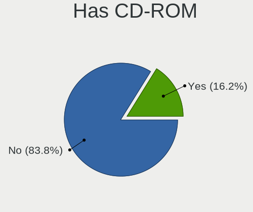
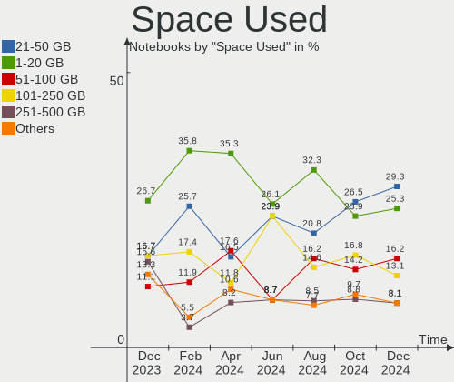
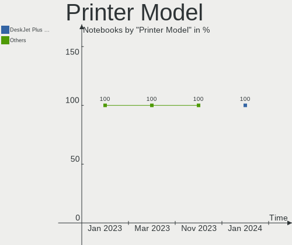

Pop!_OS - Hardware Trends (Notebooks)
-------------------------------------

A project to identify most popular hardware characteristics and track their change
over time based on data collected by Linux users at https://Linux-Hardware.org.

Anyone can contribute to this report by the [hw-probe](https://github.com/linuxhw/hw-probe) tool:

    sudo -E hw-probe -all -upload

This report is for one last month. Overall report since the beginning of time: [TestDays](https://github.com/linuxhw/TestDays)

Period: Jan, 2024.

Contents
--------

* [ System ](#system)
  - [ OS                       ](#os)
  - [ OS Family                ](#os-family)
  - [ Kernel                   ](#kernel)
  - [ Kernel Family            ](#kernel-family)
  - [ Kernel Major Ver.        ](#kernel-major-ver)
  - [ Arch                     ](#arch)
  - [ DE                       ](#de)
  - [ Display Server           ](#display-server)
  - [ Display Manager          ](#display-manager)
  - [ OS Lang                  ](#os-lang)
  - [ Boot Mode                ](#boot-mode)
  - [ Filesystem               ](#filesystem)
  - [ Part. scheme             ](#part-scheme)
  - [ Dual Boot with Linux/BSD ](#dual-boot-with-linuxbsd)
  - [ Dual Boot (Win)          ](#dual-boot-win)

* [ Board ](#board)
  - [ Vendor                   ](#vendor)
  - [ Model                    ](#model)
  - [ Model Family             ](#model-family)
  - [ MFG Year                 ](#mfg-year)
  - [ Form Factor              ](#form-factor)
  - [ Secure Boot              ](#secure-boot)
  - [ Coreboot                 ](#coreboot)
  - [ RAM Size                 ](#ram-size)
  - [ RAM Used                 ](#ram-used)
  - [ Total Drives             ](#total-drives)
  - [ Has CD-ROM               ](#has-cd-rom)
  - [ Has Ethernet             ](#has-ethernet)
  - [ Has WiFi                 ](#has-wifi)
  - [ Has Bluetooth            ](#has-bluetooth)

* [ Location ](#location)
  - [ Country                  ](#country)
  - [ City                     ](#city)

* [ Drives ](#drives)
  - [ Drive Vendor             ](#drive-vendor)
  - [ Drive Model              ](#drive-model)
  - [ HDD Vendor               ](#hdd-vendor)
  - [ SSD Vendor               ](#ssd-vendor)
  - [ Drive Kind               ](#drive-kind)
  - [ Drive Connector          ](#drive-connector)
  - [ Drive Size               ](#drive-size)
  - [ Space Total              ](#space-total)
  - [ Space Used               ](#space-used)
  - [ Malfunc. Drives          ](#malfunc-drives)
  - [ Malfunc. Drive Vendor    ](#malfunc-drive-vendor)
  - [ Malfunc. HDD Vendor      ](#malfunc-hdd-vendor)
  - [ Malfunc. Drive Kind      ](#malfunc-drive-kind)
  - [ Failed Drives            ](#failed-drives)
  - [ Failed Drive Vendor      ](#failed-drive-vendor)
  - [ Drive Status             ](#drive-status)

* [ Storage controller ](#storage-controller)
  - [ Storage Vendor           ](#storage-vendor)
  - [ Storage Model            ](#storage-model)
  - [ Storage Kind             ](#storage-kind)

* [ Processor ](#processor)
  - [ CPU Vendor               ](#cpu-vendor)
  - [ CPU Model                ](#cpu-model)
  - [ CPU Model Family         ](#cpu-model-family)
  - [ CPU Cores                ](#cpu-cores)
  - [ CPU Sockets              ](#cpu-sockets)
  - [ CPU Threads              ](#cpu-threads)
  - [ CPU Op-Modes             ](#cpu-op-modes)
  - [ CPU Microcode            ](#cpu-microcode)
  - [ CPU Microarch            ](#cpu-microarch)

* [ Graphics ](#graphics)
  - [ GPU Vendor               ](#gpu-vendor)
  - [ GPU Model                ](#gpu-model)
  - [ GPU Combo                ](#gpu-combo)
  - [ GPU Driver               ](#gpu-driver)
  - [ GPU Memory               ](#gpu-memory)

* [ Monitor ](#monitor)
  - [ Monitor Vendor           ](#monitor-vendor)
  - [ Monitor Model            ](#monitor-model)
  - [ Monitor Resolution       ](#monitor-resolution)
  - [ Monitor Diagonal         ](#monitor-diagonal)
  - [ Monitor Width            ](#monitor-width)
  - [ Aspect Ratio             ](#aspect-ratio)
  - [ Monitor Area             ](#monitor-area)
  - [ Pixel Density            ](#pixel-density)
  - [ Multiple Monitors        ](#multiple-monitors)

* [ Network ](#network)
  - [ Net Controller Vendor    ](#net-controller-vendor)
  - [ Net Controller Model     ](#net-controller-model)
  - [ Wireless Vendor          ](#wireless-vendor)
  - [ Wireless Model           ](#wireless-model)
  - [ Ethernet Vendor          ](#ethernet-vendor)
  - [ Ethernet Model           ](#ethernet-model)
  - [ Net Controller Kind      ](#net-controller-kind)
  - [ Used Controller          ](#used-controller)
  - [ NICs                     ](#nics)
  - [ IPv6                     ](#ipv6)

* [ Bluetooth ](#bluetooth)
  - [ Bluetooth Vendor         ](#bluetooth-vendor)
  - [ Bluetooth Model          ](#bluetooth-model)

* [ Sound ](#sound)
  - [ Sound Vendor             ](#sound-vendor)
  - [ Sound Model              ](#sound-model)

* [ Memory ](#memory)
  - [ Memory Vendor            ](#memory-vendor)
  - [ Memory Model             ](#memory-model)
  - [ Memory Kind              ](#memory-kind)
  - [ Memory Form Factor       ](#memory-form-factor)
  - [ Memory Size              ](#memory-size)
  - [ Memory Speed             ](#memory-speed)

* [ Printers & scanners ](#printers--scanners)
  - [ Printer Vendor           ](#printer-vendor)
  - [ Printer Model            ](#printer-model)
  - [ Scanner Vendor           ](#scanner-vendor)
  - [ Scanner Model            ](#scanner-model)

* [ Camera ](#camera)
  - [ Camera Vendor            ](#camera-vendor)
  - [ Camera Model             ](#camera-model)

* [ Security ](#security)
  - [ Fingerprint Vendor       ](#fingerprint-vendor)
  - [ Fingerprint Model        ](#fingerprint-model)
  - [ Chipcard Vendor          ](#chipcard-vendor)
  - [ Chipcard Model           ](#chipcard-model)

* [ Unsupported ](#unsupported)
  - [ Unsupported Devices      ](#unsupported-devices)
  - [ Unsupported Device Types ](#unsupported-device-types)

System
------

OS
--

Installed operating systems

| Name          | Notebooks | Percent |
|---------------|-----------|---------|
| Pop!_OS 22.04 | 104       | 99.05%  |
| Pop!_OS 20.04 | 1         | 0.95%   |

OS Family
---------

OS without a version

| Name    | Notebooks | Percent |
|---------|-----------|---------|
| Pop!_OS | 105       | 100%    |

Kernel
------

Version of the Linux kernel

| Version                 | Notebooks | Percent |
|-------------------------|-----------|---------|
| 6.6.6-76060606-generic  | 82        | 78.1%   |
| 6.6.10-76060610-generic | 11        | 10.48%  |
| 6.5.6-76060506-generic  | 5         | 4.76%   |
| 6.2.6-76060206-generic  | 4         | 3.81%   |
| 6.4.6-76060406-generic  | 2         | 1.9%    |
| 6.0.12-76060012-generic | 1         | 0.95%   |

Kernel Family
-------------

Linux kernel without a distro release

| Version | Notebooks | Percent |
|---------|-----------|---------|
| 6.6.6   | 82        | 78.1%   |
| 6.6.10  | 11        | 10.48%  |
| 6.5.6   | 5         | 4.76%   |
| 6.2.6   | 4         | 3.81%   |
| 6.4.6   | 2         | 1.9%    |
| 6.0.12  | 1         | 0.95%   |

Kernel Major Ver.
-----------------

Linux kernel major version

| Version | Notebooks | Percent |
|---------|-----------|---------|
| 6.6     | 93        | 88.57%  |
| 6.5     | 5         | 4.76%   |
| 6.2     | 4         | 3.81%   |
| 6.4     | 2         | 1.9%    |
| 6.0     | 1         | 0.95%   |

Arch
----

OS architecture (x86_64, i586, etc.)

| Name   | Notebooks | Percent |
|--------|-----------|---------|
| x86_64 | 105       | 100%    |

DE
--

Desktop Environment

| Name     | Notebooks | Percent |
|----------|-----------|---------|
| GNOME    | 102       | 97.14%  |
| KDE5     | 1         | 0.95%   |
| Cinnamon | 1         | 0.95%   |
| Unknown  | 1         | 0.95%   |

Display Server
--------------

X11 or Wayland

| Name    | Notebooks | Percent |
|---------|-----------|---------|
| X11     | 97        | 92.38%  |
| Wayland | 6         | 5.71%   |
| Unknown | 2         | 1.9%    |

Display Manager
---------------

SDDM, LightDM, etc.

| Name    | Notebooks | Percent |
|---------|-----------|---------|
| Unknown | 70        | 66.67%  |
| GDM3    | 35        | 33.33%  |

OS Lang
-------

Language

| Lang    | Notebooks | Percent |
|---------|-----------|---------|
| en_US   | 53        | 50.48%  |
| en_GB   | 12        | 11.43%  |
| en_CA   | 6         | 5.71%   |
| de_DE   | 6         | 5.71%   |
| pt_BR   | 5         | 4.76%   |
| C       | 5         | 4.76%   |
| it_IT   | 3         | 2.86%   |
| fr_FR   | 2         | 1.9%    |
| es_ES   | 2         | 1.9%    |
| sk_SK   | 1         | 0.95%   |
| ru_RU   | 1         | 0.95%   |
| pt_PT   | 1         | 0.95%   |
| pl_PL   | 1         | 0.95%   |
| fi_FI   | 1         | 0.95%   |
| es_AR   | 1         | 0.95%   |
| en_PH   | 1         | 0.95%   |
| en_IN   | 1         | 0.95%   |
| en_AU   | 1         | 0.95%   |
| cs_CZ   | 1         | 0.95%   |
| Unknown | 1         | 0.95%   |

Boot Mode
---------

EFI or BIOS

| Mode | Notebooks | Percent |
|------|-----------|---------|
| BIOS | 74        | 70.48%  |
| EFI  | 31        | 29.52%  |

Filesystem
----------

Type of filesystem

| Type    | Notebooks | Percent |
|---------|-----------|---------|
| Ext4    | 100       | 95.24%  |
| Btrfs   | 3         | 2.86%   |
| Overlay | 2         | 1.9%    |

Part. scheme
------------

Scheme of partitioning

| Type    | Notebooks | Percent |
|---------|-----------|---------|
| Unknown | 68        | 64.76%  |
| GPT     | 33        | 31.43%  |
| MBR     | 4         | 3.81%   |

Dual Boot with Linux/BSD
------------------------

Hosting more than one Linux/BSD

| Dual boot | Notebooks | Percent |
|-----------|-----------|---------|
| No        | 101       | 96.19%  |
| Yes       | 4         | 3.81%   |

Dual Boot (Win)
---------------

Hosting Linux and Windows

| Dual boot | Notebooks | Percent |
|-----------|-----------|---------|
| No        | 93        | 88.57%  |
| Yes       | 12        | 11.43%  |

Board
-----

Vendor
------

Motherboard manufacturer

| Name                | Notebooks | Percent |
|---------------------|-----------|---------|
| Lenovo              | 32        | 30.48%  |
| Hewlett-Packard     | 15        | 14.29%  |
| Dell                | 15        | 14.29%  |
| ASUSTek Computer    | 13        | 12.38%  |
| Acer                | 10        | 9.52%   |
| Apple               | 7         | 6.67%   |
| System76            | 4         | 3.81%   |
| MSI                 | 2         | 1.9%    |
| Unknown             | 2         | 1.9%    |
| Toshiba             | 1         | 0.95%   |
| Samsung Electronics | 1         | 0.95%   |
| HUAWEI              | 1         | 0.95%   |
| Hot Pepper Mobile   | 1         | 0.95%   |
| Compaq              | 1         | 0.95%   |

Model
-----

Motherboard model

| Name                                        | Notebooks | Percent |
|---------------------------------------------|-----------|---------|
| System76 Oryx Pro                           | 2         | 1.9%    |
| Dell XPS 15 9570                            | 2         | 1.9%    |
| Apple MacBookPro8,1                         | 2         | 1.9%    |
| Acer Nitro AN515-58                         | 2         | 1.9%    |
| Unknown                                     | 2         | 1.9%    |
| Toshiba Satellite C55-C                     | 1         | 0.95%   |
| System76 Pangolin                           | 1         | 0.95%   |
| System76 Adder WS                           | 1         | 0.95%   |
| Samsung 550XED                              | 1         | 0.95%   |
| MSI P65 Creator 9SE                         | 1         | 0.95%   |
| MSI GF65 Thin 9SEXR                         | 1         | 0.95%   |
| Lenovo Z50-75 80EC                          | 1         | 0.95%   |
| Lenovo Yoga Pro 9 14IRP8 83BU               | 1         | 0.95%   |
| Lenovo Yoga 3 Pro-1370 80HE                 | 1         | 0.95%   |
| Lenovo Y50-70 20378                         | 1         | 0.95%   |
| Lenovo V330-14ARR 81B1                      | 1         | 0.95%   |
| Lenovo ThinkPad X390 20Q1S7RB00             | 1         | 0.95%   |
| Lenovo ThinkPad X260 20F5S4A901             | 1         | 0.95%   |
| Lenovo ThinkPad X220 4291RD2                | 1         | 0.95%   |
| Lenovo ThinkPad X1 Carbon Gen 9 20XWCTO1WW  | 1         | 0.95%   |
| Lenovo ThinkPad X1 Carbon Gen 8 20U9007CUS  | 1         | 0.95%   |
| Lenovo ThinkPad X1 Carbon Gen 11 21HM003SGE | 1         | 0.95%   |
| Lenovo ThinkPad X1 Carbon 4th 20FCS0YU00    | 1         | 0.95%   |
| Lenovo ThinkPad T490 20RYS06R00             | 1         | 0.95%   |
| Lenovo ThinkPad T470 W10DG 20JNS0KE08       | 1         | 0.95%   |
| Lenovo ThinkPad T470 W10DG 20JNS02S00       | 1         | 0.95%   |
| Lenovo ThinkPad T420 4236Y54                | 1         | 0.95%   |
| Lenovo ThinkPad T14 Gen 1 20S1S00100        | 1         | 0.95%   |
| Lenovo ThinkPad S5-S540 20B30023GE          | 1         | 0.95%   |
| Lenovo ThinkPad P52s 20LCS1H100             | 1         | 0.95%   |
| Lenovo ThinkPad P16v Gen 1 21FC000LPB       | 1         | 0.95%   |
| Lenovo ThinkBook 15 G2 ARE 20VG             | 1         | 0.95%   |
| Lenovo Legion Y740-15IRHg 81UH              | 1         | 0.95%   |
| Lenovo Legion Slim 7 16APH8 82Y4            | 1         | 0.95%   |
| Lenovo Legion Slim 5 16IRH8 82YA            | 1         | 0.95%   |
| Lenovo Legion 7 16ACHg6 82N6                | 1         | 0.95%   |
| Lenovo IdeaPad Y700-15ACZ 80NY              | 1         | 0.95%   |
| Lenovo IdeaPad S145-14AST 81ST              | 1         | 0.95%   |
| Lenovo IdeaPad Pro 5 16ARP8 83AS            | 1         | 0.95%   |
| Lenovo IdeaPad Gaming 3 15IMH05 82CG        | 1         | 0.95%   |

Model Family
------------

Motherboard model prefix

| Name                      | Notebooks | Percent |
|---------------------------|-----------|---------|
| Lenovo ThinkPad           | 15        | 14.29%  |
| Lenovo IdeaPad            | 6         | 5.71%   |
| Lenovo Legion             | 4         | 3.81%   |
| Dell Latitude             | 4         | 3.81%   |
| Dell Inspiron             | 4         | 3.81%   |
| ASUS VivoBook             | 4         | 3.81%   |
| HP ProBook                | 3         | 2.86%   |
| HP Laptop                 | 3         | 2.86%   |
| HP EliteBook              | 3         | 2.86%   |
| Dell Precision            | 3         | 2.86%   |
| Acer Swift                | 3         | 2.86%   |
| Acer Nitro                | 3         | 2.86%   |
| Acer Aspire               | 3         | 2.86%   |
| System76 Oryx             | 2         | 1.9%    |
| Lenovo Yoga               | 2         | 1.9%    |
| HP OMEN                   | 2         | 1.9%    |
| Dell XPS                  | 2         | 1.9%    |
| Dell Vostro               | 2         | 1.9%    |
| ASUS ROG                  | 2         | 1.9%    |
| Apple MacBookPro8         | 2         | 1.9%    |
| Apple MacBookPro11        | 2         | 1.9%    |
| Unknown                   | 2         | 1.9%    |
| Toshiba Satellite         | 1         | 0.95%   |
| System76 Pangolin         | 1         | 0.95%   |
| System76 Adder            | 1         | 0.95%   |
| Samsung 550XED            | 1         | 0.95%   |
| MSI P65                   | 1         | 0.95%   |
| MSI GF65                  | 1         | 0.95%   |
| Lenovo Z50-75             | 1         | 0.95%   |
| Lenovo Y50-70             | 1         | 0.95%   |
| Lenovo V330-14ARR         | 1         | 0.95%   |
| Lenovo ThinkBook          | 1         | 0.95%   |
| Lenovo G460               | 1         | 0.95%   |
| HUAWEI CREM-WXX9          | 1         | 0.95%   |
| Hot Pepper Mobile HPPMC10 | 1         | 0.95%   |
| HP Victus                 | 1         | 0.95%   |
| HP Notebook               | 1         | 0.95%   |
| HP ENVY                   | 1         | 0.95%   |
| HP EliteDesk              | 1         | 0.95%   |
| Compaq 430                | 1         | 0.95%   |

MFG Year
--------

Motherboard manufacture year

| Year | Notebooks | Percent |
|------|-----------|---------|
| 2021 | 15        | 14.29%  |
| 2023 | 13        | 12.38%  |
| 2019 | 11        | 10.48%  |
| 2018 | 10        | 9.52%   |
| 2020 | 8         | 7.62%   |
| 2022 | 7         | 6.67%   |
| 2014 | 7         | 6.67%   |
| 2011 | 7         | 6.67%   |
| 2016 | 6         | 5.71%   |
| 2017 | 5         | 4.76%   |
| 2010 | 5         | 4.76%   |
| 2015 | 4         | 3.81%   |
| 2013 | 4         | 3.81%   |
| 2012 | 2         | 1.9%    |
| 2008 | 1         | 0.95%   |

Form Factor
-----------

Physical design of the computer

| Name     | Notebooks | Percent |
|----------|-----------|---------|
| Notebook | 105       | 100%    |

Secure Boot
-----------

Enabled or disabled

| State    | Notebooks | Percent |
|----------|-----------|---------|
| Disabled | 105       | 100%    |

Coreboot
--------

Have coreboot on board

| Used | Notebooks | Percent |
|------|-----------|---------|
| No   | 103       | 98.1%   |
| Yes  | 2         | 1.9%    |

RAM Size
--------

Total RAM memory

| Size in GB  | Notebooks | Percent |
|-------------|-----------|---------|
| 16.01-24.0  | 28        | 26.67%  |
| 8.01-16.0   | 24        | 22.86%  |
| 4.01-8.0    | 20        | 19.05%  |
| 32.01-64.0  | 17        | 16.19%  |
| 3.01-4.0    | 11        | 10.48%  |
| 64.01-256.0 | 3         | 2.86%   |
| 24.01-32.0  | 1         | 0.95%   |
| 1.01-2.0    | 1         | 0.95%   |

RAM Used
--------

Used RAM memory

| Used GB    | Notebooks | Percent |
|------------|-----------|---------|
| 4.01-8.0   | 42        | 40%     |
| 3.01-4.0   | 26        | 24.76%  |
| 2.01-3.0   | 18        | 17.14%  |
| 8.01-16.0  | 13        | 12.38%  |
| 16.01-24.0 | 2         | 1.9%    |
| 1.01-2.0   | 2         | 1.9%    |
| 32.01-64.0 | 1         | 0.95%   |
| 24.01-32.0 | 1         | 0.95%   |

Total Drives
------------

Number of drives on board

| Drives | Notebooks | Percent |
|--------|-----------|---------|
| 1      | 75        | 71.43%  |
| 2      | 26        | 24.76%  |
| 4      | 2         | 1.9%    |
| 3      | 1         | 0.95%   |
| 0      | 1         | 0.95%   |

Has CD-ROM
----------

Has CD-ROM on board

| Presented | Notebooks | Percent |
|-----------|-----------|---------|
| No        | 84        | 80%     |
| Yes       | 21        | 20%     |

Has Ethernet
------------

Has Ethernet on board

| Presented | Notebooks | Percent |
|-----------|-----------|---------|
| Yes       | 81        | 77.14%  |
| No        | 24        | 22.86%  |

Has WiFi
--------

Has WiFi module

| Presented | Notebooks | Percent |
|-----------|-----------|---------|
| Yes       | 103       | 98.1%   |
| No        | 2         | 1.9%    |

Has Bluetooth
-------------

Has Bluetooth module

| Presented | Notebooks | Percent |
|-----------|-----------|---------|
| Yes       | 86        | 81.9%   |
| No        | 19        | 18.1%   |

Location
--------

Country
-------

Geographic location (country)

| Country      | Notebooks | Percent |
|--------------|-----------|---------|
| USA          | 25        | 23.81%  |
| Germany      | 11        | 10.48%  |
| UK           | 9         | 8.57%   |
| Brazil       | 9         | 8.57%   |
| India        | 6         | 5.71%   |
| Canada       | 6         | 5.71%   |
| Italy        | 4         | 3.81%   |
| Spain        | 3         | 2.86%   |
| France       | 3         | 2.86%   |
| Poland       | 2         | 1.9%    |
| Philippines  | 2         | 1.9%    |
| Netherlands  | 2         | 1.9%    |
| Indonesia    | 2         | 1.9%    |
| Chile        | 2         | 1.9%    |
| Australia    | 2         | 1.9%    |
| Thailand     | 1         | 0.95%   |
| Sweden       | 1         | 0.95%   |
| Somalia      | 1         | 0.95%   |
| Singapore    | 1         | 0.95%   |
| Saudi Arabia | 1         | 0.95%   |
| Russia       | 1         | 0.95%   |
| Portugal     | 1         | 0.95%   |
| Peru         | 1         | 0.95%   |
| Pakistan     | 1         | 0.95%   |
| Norway       | 1         | 0.95%   |
| Mexico       | 1         | 0.95%   |
| Ireland      | 1         | 0.95%   |
| Finland      | 1         | 0.95%   |
| Czechia      | 1         | 0.95%   |
| Bulgaria     | 1         | 0.95%   |
| Austria      | 1         | 0.95%   |
| Argentina    | 1         | 0.95%   |

City
----

Geographic location (city)

| City            | Notebooks | Percent |
|-----------------|-----------|---------|
| Santiago        | 2         | 1.9%    |
| Rome            | 2         | 1.9%    |
| Berlin          | 2         | 1.9%    |
| Zaragoza        | 1         | 0.95%   |
| Villerupt       | 1         | 0.95%   |
| Veliky Novgorod | 1         | 0.95%   |
| Utrecht         | 1         | 0.95%   |
| Toronto         | 1         | 0.95%   |
| Tirunelveli     | 1         | 0.95%   |
| Surrey          | 1         | 0.95%   |
| Starcross       | 1         | 0.95%   |
| Spring Hill     | 1         | 0.95%   |
| Southwark       | 1         | 0.95%   |
| Southport       | 1         | 0.95%   |
| Sofia           | 1         | 0.95%   |
| Singapore       | 1         | 0.95%   |
| Setúbal        | 1         | 0.95%   |
| Selden          | 1         | 0.95%   |
| Sausalito       | 1         | 0.95%   |
| Sao Paulo       | 1         | 0.95%   |
| Sao Goncalo     | 1         | 0.95%   |
| Santos          | 1         | 0.95%   |
| San Diego       | 1         | 0.95%   |
| San Antonio     | 1         | 0.95%   |
| Rosario         | 1         | 0.95%   |
| Rock Hill       | 1         | 0.95%   |
| Riyadh          | 1         | 0.95%   |
| Rio de Janeiro  | 1         | 0.95%   |
| Puebla City     | 1         | 0.95%   |
| Prospect        | 1         | 0.95%   |
| Prince George   | 1         | 0.95%   |
| Poznan          | 1         | 0.95%   |
| Poultney        | 1         | 0.95%   |
| Plantation      | 1         | 0.95%   |
| Plano           | 1         | 0.95%   |
| Perth           | 1         | 0.95%   |
| Overland Park   | 1         | 0.95%   |
| Orléans        | 1         | 0.95%   |
| New York        | 1         | 0.95%   |
| New Port Richey | 1         | 0.95%   |

Drives
------

Drive Vendor
------------

Hard drive vendors

| Vendor                      | Notebooks | Drives | Percent |
|-----------------------------|-----------|--------|---------|
| Samsung Electronics         | 22        | 24     | 16.79%  |
| Sandisk                     | 15        | 15     | 11.45%  |
| WDC                         | 11        | 11     | 8.4%    |
| SK hynix                    | 9         | 9      | 6.87%   |
| Seagate                     | 8         | 9      | 6.11%   |
| Toshiba                     | 7         | 7      | 5.34%   |
| Kingston                    | 7         | 8      | 5.34%   |
| Unknown                     | 6         | 6      | 4.58%   |
| Micron Technology           | 5         | 5      | 3.82%   |
| Intel                       | 5         | 5      | 3.82%   |
| KIOXIA                      | 4         | 4      | 3.05%   |
| Crucial                     | 4         | 4      | 3.05%   |
| Apple                       | 4         | 5      | 3.05%   |
| Transcend                   | 3         | 3      | 2.29%   |
| A-DATA Technology           | 3         | 3      | 2.29%   |
| Micron/Crucial Technology   | 2         | 2      | 1.53%   |
| Kingston Technology Company | 2         | 2      | 1.53%   |
| TO Exter                    | 1         | 1      | 0.76%   |
| Timetec                     | 1         | 1      | 0.76%   |
| SPCC                        | 1         | 1      | 0.76%   |
| Silicon Motion              | 1         | 1      | 0.76%   |
| PNY                         | 1         | 1      | 0.76%   |
| Netac                       | 1         | 2      | 0.76%   |
| LITEONIT                    | 1         | 1      | 0.76%   |
| Hitachi                     | 1         | 1      | 0.76%   |
| HGST                        | 1         | 1      | 0.76%   |
| FIKWOT                      | 1         | 1      | 0.76%   |
| Corsair                     | 1         | 1      | 0.76%   |
| CONSISTENT                  | 1         | 1      | 0.76%   |
| China                       | 1         | 1      | 0.76%   |
| 2-Power                     | 1         | 1      | 0.76%   |

Drive Model
-----------

Hard drive models

| Model                                              | Notebooks | Percent |
|----------------------------------------------------|-----------|---------|
| Samsung NVMe SSD Controller SM981/PM981/PM983 1TB  | 4         | 2.99%   |
| Toshiba MQ01ABD100 1TB                             | 3         | 2.24%   |
| SK hynix HFM001TD3JX013N 1024GB                    | 2         | 1.49%   |
| Seagate ST1000LM049-2GH172 1TB                     | 2         | 1.49%   |
| Sandisk WD Black SN850 1024GB                      | 2         | 1.49%   |
| Sandisk WD Black SN750 / PC SN730 NVMe SSD 512GB   | 2         | 1.49%   |
| Samsung NVMe SSD Controller PM9A1/PM9A3/980PRO 2TB | 2         | 1.49%   |
| Samsung HM321HI 320GB                              | 2         | 1.49%   |
| Micron 2450_MTFDKBA512TFK 512GB                    | 2         | 1.49%   |
| Kingston Company OM3PDP3 NVMe SSD 256GB            | 2         | 1.49%   |
| Kingston SA400S37480G 480GB SSD                    | 2         | 1.49%   |
| Kingston SA400S37240G 240GB SSD                    | 2         | 1.49%   |
| Intel SSDPEKNU512GZ 512GB                          | 2         | 1.49%   |
| Crucial CT240M500SSD1 240GB                        | 2         | 1.49%   |
| WDC WDS250G2B0B-00YS70 250GB SSD                   | 1         | 0.75%   |
| WDC WDS240G2G0C-00AJM0 240GB                       | 1         | 0.75%   |
| WDC WDS240G2G0B-00EPW0 240GB SSD                   | 1         | 0.75%   |
| WDC WDS100T2B0A-00SM50 1TB SSD                     | 1         | 0.75%   |
| WDC WD10SPZX-75Z10T1 1TB                           | 1         | 0.75%   |
| WDC WD10SPZX-24Z10T0 1TB                           | 1         | 0.75%   |
| WDC WD10SPSX-60A6WT0 1TB                           | 1         | 0.75%   |
| WDC WD Green 2.5 240GB SSD                         | 1         | 0.75%   |
| WDC PC SN730 SDBQNTY-512G-1001 512GB               | 1         | 0.75%   |
| WDC PC SN730 SDBPNTY-512G                          | 1         | 0.75%   |
| WDC PC SN530 NVMe 256GB                            | 1         | 0.75%   |
| Unknown SD/MMC/MS PRO 256GB                        | 1         | 0.75%   |
| Unknown NVMe SSD Drive 512GB                       | 1         | 0.75%   |
| Unknown NVMe SSD Drive 2TB                         | 1         | 0.75%   |
| Unknown MMC Card  64GB                             | 1         | 0.75%   |
| Unknown MMC Card  32GB                             | 1         | 0.75%   |
| Unknown GFAQK  512GB                               | 1         | 0.75%   |
| Transcend TS256GSSD230S 256GB                      | 1         | 0.75%   |
| Transcend TS256GMSA230S 256GB SSD                  | 1         | 0.75%   |
| Transcend TS128GMTS430S 128GB SSD                  | 1         | 0.75%   |
| Toshiba XG4 NVMe SSD Controller 512GB              | 1         | 0.75%   |
| Toshiba MQ04ABF100 1TB                             | 1         | 0.75%   |
| Toshiba MQ01ACF050 500GB                           | 1         | 0.75%   |
| Toshiba MK3265GSXF 320GB                           | 1         | 0.75%   |
| TO Exter nal USB 3.0 512GB                         | 1         | 0.75%   |
| Timetec 35TTM8SSATA-256G SSD                       | 1         | 0.75%   |

HDD Vendor
----------

Hard disk drive vendors

| Vendor              | Notebooks | Drives | Percent |
|---------------------|-----------|--------|---------|
| Seagate             | 8         | 9      | 34.78%  |
| Toshiba             | 6         | 6      | 26.09%  |
| WDC                 | 3         | 3      | 13.04%  |
| Samsung Electronics | 2         | 2      | 8.7%    |
| Unknown             | 1         | 1      | 4.35%   |
| TO Exter            | 1         | 1      | 4.35%   |
| Hitachi             | 1         | 1      | 4.35%   |
| HGST                | 1         | 1      | 4.35%   |

SSD Vendor
----------

Solid state drive vendors

| Vendor              | Notebooks | Drives | Percent |
|---------------------|-----------|--------|---------|
| Samsung Electronics | 6         | 6      | 13.64%  |
| Kingston            | 6         | 6      | 13.64%  |
| WDC                 | 4         | 4      | 9.09%   |
| SanDisk             | 4         | 4      | 9.09%   |
| Crucial             | 4         | 4      | 9.09%   |
| Transcend           | 3         | 3      | 6.82%   |
| Apple               | 3         | 3      | 6.82%   |
| A-DATA Technology   | 2         | 2      | 4.55%   |
| Timetec             | 1         | 1      | 2.27%   |
| SPCC                | 1         | 1      | 2.27%   |
| SK hynix            | 1         | 1      | 2.27%   |
| PNY                 | 1         | 1      | 2.27%   |
| Netac               | 1         | 1      | 2.27%   |
| LITEONIT            | 1         | 1      | 2.27%   |
| Intel               | 1         | 1      | 2.27%   |
| FIKWOT              | 1         | 1      | 2.27%   |
| Corsair             | 1         | 1      | 2.27%   |
| CONSISTENT          | 1         | 1      | 2.27%   |
| China               | 1         | 1      | 2.27%   |
| 2-Power             | 1         | 1      | 2.27%   |

Drive Kind
----------

HDD or SSD

| Kind | Notebooks | Drives | Percent |
|------|-----------|--------|---------|
| NVMe | 56        | 66     | 46.28%  |
| SSD  | 40        | 44     | 33.06%  |
| HDD  | 22        | 24     | 18.18%  |
| MMC  | 3         | 3      | 2.48%   |

Drive Connector
---------------

SATA, SAS, NVMe, etc.

| Type | Notebooks | Drives | Percent |
|------|-----------|--------|---------|
| NVMe | 56        | 66     | 47.86%  |
| SATA | 53        | 63     | 45.3%   |
| SAS  | 5         | 5      | 4.27%   |
| MMC  | 3         | 3      | 2.56%   |

Drive Size
----------

Size of hard drive

| Size in TB | Notebooks | Drives | Percent |
|------------|-----------|--------|---------|
| 0.01-0.5   | 42        | 43     | 63.64%  |
| 0.51-1.0   | 19        | 20     | 28.79%  |
| 1.01-2.0   | 3         | 3      | 4.55%   |
| 3.01-4.0   | 1         | 1      | 1.52%   |
| 4.01-10.0  | 1         | 1      | 1.52%   |

Space Total
-----------

Amount of disk space available on the file system

| Size in GB     | Notebooks | Percent |
|----------------|-----------|---------|
| 251-500        | 33        | 31.43%  |
| 101-250        | 31        | 29.52%  |
| 501-1000       | 14        | 13.33%  |
| 1001-2000      | 12        | 11.43%  |
| 2001-3000      | 4         | 3.81%   |
| More than 3000 | 3         | 2.86%   |
| 51-100         | 3         | 2.86%   |
| 21-50          | 2         | 1.9%    |
| 1-20           | 2         | 1.9%    |
| Unknown        | 1         | 0.95%   |

Space Used
----------

Amount of used disk space

| Used GB        | Notebooks | Percent |
|----------------|-----------|---------|
| 21-50          | 29        | 27.62%  |
| 1-20           | 24        | 22.86%  |
| 101-250        | 20        | 19.05%  |
| 51-100         | 12        | 11.43%  |
| 251-500        | 8         | 7.62%   |
| 501-1000       | 6         | 5.71%   |
| 1001-2000      | 4         | 3.81%   |
| More than 3000 | 1         | 0.95%   |
| Unknown        | 1         | 0.95%   |

Malfunc. Drives
---------------

Drive models with a malfunction

| Model                    | Notebooks | Drives | Percent |
|--------------------------|-----------|--------|---------|
| WDC WD10SPZX-24Z10T0 1TB | 1         | 1      | 50%     |
| HGST HTS541010A9E680 1TB | 1         | 1      | 50%     |

Malfunc. Drive Vendor
---------------------

Vendors of faulty drives

| Vendor | Notebooks | Drives | Percent |
|--------|-----------|--------|---------|
| WDC    | 1         | 1      | 50%     |
| HGST   | 1         | 1      | 50%     |

Malfunc. HDD Vendor
-------------------

Vendors of faulty HDD drives

| Vendor | Notebooks | Drives | Percent |
|--------|-----------|--------|---------|
| WDC    | 1         | 1      | 50%     |
| HGST   | 1         | 1      | 50%     |

Malfunc. Drive Kind
-------------------

Kinds of faulty drives

| Kind | Notebooks | Drives | Percent |
|------|-----------|--------|---------|
| HDD  | 2         | 2      | 100%    |

Failed Drives
-------------

Failed drive models

Zero info for selected period =(

Failed Drive Vendor
-------------------

Failed drive vendors

Zero info for selected period =(

Drive Status
------------

Number of failed and malfunc. drives

| Status   | Notebooks | Drives | Percent |
|----------|-----------|--------|---------|
| Detected | 71        | 95     | 65.74%  |
| Works    | 35        | 40     | 32.41%  |
| Malfunc  | 2         | 2      | 1.85%   |

Storage controller
------------------

Storage Vendor
--------------

Storage controller vendors

| Vendor                       | Notebooks | Percent |
|------------------------------|-----------|---------|
| Intel                        | 59        | 44.03%  |
| Samsung Electronics          | 16        | 11.94%  |
| SanDisk                      | 15        | 11.19%  |
| AMD                          | 13        | 9.7%    |
| SK hynix                     | 8         | 5.97%   |
| Micron Technology            | 5         | 3.73%   |
| KIOXIA                       | 3         | 2.24%   |
| Kingston Technology Company  | 3         | 2.24%   |
| Toshiba America Info Systems | 2         | 1.49%   |
| Solidigm                     | 2         | 1.49%   |
| Micron/Crucial Technology    | 2         | 1.49%   |
| Silicon Motion               | 1         | 0.75%   |
| Nvidia                       | 1         | 0.75%   |
| Netac Technology             | 1         | 0.75%   |
| Marvell Technology Group     | 1         | 0.75%   |
| Apple                        | 1         | 0.75%   |
| ADATA Technology             | 1         | 0.75%   |

Storage Model
-------------

Storage controller models

| Model                                                                          | Notebooks | Percent |
|--------------------------------------------------------------------------------|-----------|---------|
| AMD FCH SATA Controller [AHCI mode]                                            | 12        | 8.45%   |
| Intel Sunrise Point-LP SATA Controller [AHCI mode]                             | 10        | 7.04%   |
| Samsung NVMe SSD Controller SM981/PM981/PM983                                  | 6         | 4.23%   |
| Intel Volume Management Device NVMe RAID Controller                            | 6         | 4.23%   |
| Intel 6 Series/C200 Series Chipset Family 6 port Mobile SATA AHCI Controller   | 6         | 4.23%   |
| SK hynix Gold P31/BC711/PC711 NVMe Solid State Drive                           | 5         | 3.52%   |
| Intel 82801 Mobile SATA Controller [RAID mode]                                 | 5         | 3.52%   |
| SanDisk Extreme Pro / WD Black SN750 / PC SN730 / Red SN700 NVMe SSD           | 4         | 2.82%   |
| Samsung NVMe SSD Controller PM9A1/PM9A3/980PRO                                 | 4         | 2.82%   |
| Intel Cannon Lake Mobile PCH SATA AHCI Controller                              | 4         | 2.82%   |
| SanDisk WD Black SN770 / PC SN740 256GB / PC SN560 (DRAM-less) NVMe SSD        | 3         | 2.11%   |
| Micron 2450 NVMe SSD [HendrixV] (DRAM-less)                                    | 3         | 2.11%   |
| Intel SSD 670p Series [Keystone Harbor]                                        | 3         | 2.11%   |
| Intel Alder Lake-P SATA AHCI Controller                                        | 3         | 2.11%   |
| Intel 8 Series/C220 Series Chipset Family 6-port SATA Controller 1 [AHCI mode] | 3         | 2.11%   |
| Intel 8 Series SATA Controller 1 [AHCI mode]                                   | 3         | 2.11%   |
| Solidigm P41 Plus NVMe SSD (DRAM-less) [Echo Harbor]                           | 2         | 1.41%   |
| SanDisk WD PC SN810 / Black SN850 NVMe SSD                                     | 2         | 1.41%   |
| Samsung NVMe SSD Controller 980 (DRAM-less)                                    | 2         | 1.41%   |
| KIOXIA NVMe SSD Controller XG8                                                 | 2         | 1.41%   |
| Kingston Company OM3PDP3 NVMe SSD                                              | 2         | 1.41%   |
| Intel Wildcat Point-LP SATA Controller [AHCI Mode]                             | 2         | 1.41%   |
| Intel HM170/QM170 Chipset SATA Controller [AHCI Mode]                          | 2         | 1.41%   |
| Intel 5 Series/3400 Series Chipset 4 port SATA AHCI Controller                 | 2         | 1.41%   |
| Toshiba America Info Systems XG6 NVMe SSD Controller                           | 1         | 0.7%    |
| Toshiba America Info Systems XG4 NVMe SSD Controller                           | 1         | 0.7%    |
| SK hynix Platinum P41/PC801 NVMe Solid State Drive                             | 1         | 0.7%    |
| SK hynix PC401 NVMe Solid State Drive 256GB                                    | 1         | 0.7%    |
| SK hynix BC501 NVMe Solid State Drive                                          | 1         | 0.7%    |
| Silicon Motion SM2263EN/SM2263XT (DRAM-less) NVMe SSD Controllers              | 1         | 0.7%    |
| Sandisk WD PC SN740 NVMe SSD 512GB (DRAM-less)                                 | 1         | 0.7%    |
| SanDisk WD Green SN350 240GB (DRAM-less) / SN560E NVMe SSD                     | 1         | 0.7%    |
| SanDisk Ultra 3D / WD Blue SN550 NVMe SSD                                      | 1         | 0.7%    |
| SanDisk PC SN530 NVMe SSD (DRAM-less)                                          | 1         | 0.7%    |
| SanDisk IX SN530 NVMe SSD (DRAM-less)                                          | 1         | 0.7%    |
| SanDisk Extreme Pro / WD Black 2018/SN750/PC SN720 NVMe SSD                    | 1         | 0.7%    |
| Samsung S4LN058A01[SSUBX] AHCI SSD Controller (Apple slot)                     | 1         | 0.7%    |
| Samsung S4LN053X01 AHCI SSD Controller(Apple slot)                             | 1         | 0.7%    |
| Samsung NVMe SSD Controller SM961/PM961/SM963                                  | 1         | 0.7%    |
| Samsung NVMe SSD Controller S4LV008[Pascal]                                    | 1         | 0.7%    |

Storage Kind
------------

Kind of storage controller (IDE, SATA, NVMe, SAS, ...)

| Kind | Notebooks | Percent |
|------|-----------|---------|
| SATA | 62        | 46.27%  |
| NVMe | 56        | 41.79%  |
| RAID | 13        | 9.7%    |
| IDE  | 3         | 2.24%   |

Processor
---------

CPU Vendor
----------

Processor vendors

| Vendor | Notebooks | Percent |
|--------|-----------|---------|
| Intel  | 84        | 80%     |
| AMD    | 21        | 20%     |

CPU Model
---------

Processor models

| Model                                       | Notebooks | Percent |
|---------------------------------------------|-----------|---------|
| Intel Core i5-6300U CPU @ 2.40GHz           | 4         | 3.81%   |
| Intel Core i7-9750H CPU @ 2.60GHz           | 3         | 2.86%   |
| Intel Core i7-8750H CPU @ 2.20GHz           | 3         | 2.86%   |
| Intel Core i7-10510U CPU @ 1.80GHz          | 3         | 2.86%   |
| Intel Core i5-8250U CPU @ 1.60GHz           | 3         | 2.86%   |
| Intel 12th Gen Core i7-12700H               | 3         | 2.86%   |
| Intel Core i7-7700HQ CPU @ 2.80GHz          | 2         | 1.9%    |
| Intel Core i7-10750H CPU @ 2.60GHz          | 2         | 1.9%    |
| Intel Core i5-9300H CPU @ 2.40GHz           | 2         | 1.9%    |
| Intel Core i5-2415M CPU @ 2.30GHz           | 2         | 1.9%    |
| Intel 13th Gen Core i7-13700H               | 2         | 1.9%    |
| Intel 12th Gen Core i5-12500H               | 2         | 1.9%    |
| Intel 11th Gen Core i5-11400H @ 2.70GHz     | 2         | 1.9%    |
| Intel 11th Gen Core i5-1135G7 @ 2.40GHz     | 2         | 1.9%    |
| AMD Ryzen 7 5800H with Radeon Graphics      | 2         | 1.9%    |
| AMD Ryzen 7 5700U with Radeon Graphics      | 2         | 1.9%    |
| Intel Processor 5Y70 CPU @ 1.10GHz          | 1         | 0.95%   |
| Intel Pentium Dual-Core CPU T4500 @ 2.30GHz | 1         | 0.95%   |
| Intel Pentium CPU P6100 @ 2.00GHz           | 1         | 0.95%   |
| Intel N100                                  | 1         | 0.95%   |
| Intel Core m3-6Y30 CPU @ 0.90GHz            | 1         | 0.95%   |
| Intel Core i7-8650U CPU @ 1.90GHz           | 1         | 0.95%   |
| Intel Core i7-8565U CPU @ 1.80GHz           | 1         | 0.95%   |
| Intel Core i7-6820HQ CPU @ 2.70GHz          | 1         | 0.95%   |
| Intel Core i7-6600U CPU @ 2.60GHz           | 1         | 0.95%   |
| Intel Core i7-4770HQ CPU @ 2.20GHz          | 1         | 0.95%   |
| Intel Core i7-4720HQ CPU @ 2.60GHz          | 1         | 0.95%   |
| Intel Core i7-4710HQ CPU @ 2.50GHz          | 1         | 0.95%   |
| Intel Core i7-4702MQ CPU @ 2.20GHz          | 1         | 0.95%   |
| Intel Core i7-3630QM CPU @ 2.40GHz          | 1         | 0.95%   |
| Intel Core i7-2760QM CPU @ 2.40GHz          | 1         | 0.95%   |
| Intel Core i7-10610U CPU @ 1.80GHz          | 1         | 0.95%   |
| Intel Core i7 CPU Q 720 @ 1.60GHz           | 1         | 0.95%   |
| Intel Core i5-8365U CPU @ 1.60GHz           | 1         | 0.95%   |
| Intel Core i5-7200U CPU @ 2.50GHz           | 1         | 0.95%   |
| Intel Core i5-6200U CPU @ 2.30GHz           | 1         | 0.95%   |
| Intel Core i5-4300U CPU @ 1.90GHz           | 1         | 0.95%   |
| Intel Core i5-4260U CPU @ 1.40GHz           | 1         | 0.95%   |
| Intel Core i5-4258U CPU @ 2.40GHz           | 1         | 0.95%   |
| Intel Core i5-4210U CPU @ 1.70GHz           | 1         | 0.95%   |

CPU Model Family
----------------

Processor model prefix

| Model                          | Notebooks | Percent |
|--------------------------------|-----------|---------|
| Intel Core i7                  | 25        | 23.81%  |
| Other                          | 24        | 22.86%  |
| Intel Core i5                  | 22        | 20.95%  |
| AMD Ryzen 7                    | 9         | 8.57%   |
| Intel Core i3                  | 8         | 7.62%   |
| AMD Ryzen 5                    | 3         | 2.86%   |
| Intel Celeron                  | 2         | 1.9%    |
| AMD A8                         | 2         | 1.9%    |
| Intel Pentium Dual-Core        | 1         | 0.95%   |
| Intel Pentium                  | 1         | 0.95%   |
| Intel Core m3                  | 1         | 0.95%   |
| Intel Core 2 Duo               | 1         | 0.95%   |
| AMD Turion X2 Dual-Core Mobile | 1         | 0.95%   |
| AMD Ryzen 9                    | 1         | 0.95%   |
| AMD Ryzen 5 PRO                | 1         | 0.95%   |
| AMD Ryzen 3                    | 1         | 0.95%   |
| AMD FX                         | 1         | 0.95%   |
| AMD A10                        | 1         | 0.95%   |

CPU Cores
---------

Number of processor cores

| Number | Notebooks | Percent |
|--------|-----------|---------|
| 2      | 37        | 35.24%  |
| 4      | 29        | 27.62%  |
| 8      | 12        | 11.43%  |
| 6      | 12        | 11.43%  |
| 14     | 7         | 6.67%   |
| 12     | 3         | 2.86%   |
| 10     | 3         | 2.86%   |
| 24     | 1         | 0.95%   |
| 1      | 1         | 0.95%   |

CPU Sockets
-----------

Number of sockets

| Number | Notebooks | Percent |
|--------|-----------|---------|
| 1      | 105       | 100%    |

CPU Threads
-----------

Threads per core (Hyper-Threading)

| Number | Notebooks | Percent |
|--------|-----------|---------|
| 2      | 95        | 90.48%  |
| 1      | 10        | 9.52%   |

CPU Op-Modes
------------

CPU Operation Modes (32-bit, 64-bit)

| Op mode        | Notebooks | Percent |
|----------------|-----------|---------|
| 32-bit, 64-bit | 105       | 100%    |

CPU Microcode
-------------

Microcode number

| Number     | Notebooks | Percent |
|------------|-----------|---------|
| Unknown    | 98        | 93.33%  |
| 0x0a50000c | 3         | 2.86%   |
| 0x0a704103 | 1         | 0.95%   |
| 0x08608103 | 1         | 0.95%   |
| 0x0810100b | 1         | 0.95%   |
| 0x06006705 | 1         | 0.95%   |

CPU Microarch
-------------

Microarchitecture

| Name             | Notebooks | Percent |
|------------------|-----------|---------|
| KabyLake         | 23        | 21.9%   |
| Unknown          | 16        | 15.24%  |
| Skylake          | 10        | 9.52%   |
| Haswell          | 10        | 9.52%   |
| SandyBridge      | 6         | 5.71%   |
| Zen 3            | 5         | 4.76%   |
| Alderlake Hybrid | 5         | 4.76%   |
| Zen              | 3         | 2.86%   |
| TigerLake        | 3         | 2.86%   |
| Icelake          | 3         | 2.86%   |
| Westmere         | 2         | 1.9%    |
| Steamroller      | 2         | 1.9%    |
| Penryn           | 2         | 1.9%    |
| IvyBridge        | 2         | 1.9%    |
| Excavator        | 2         | 1.9%    |
| CometLake        | 2         | 1.9%    |
| Broadwell        | 2         | 1.9%    |
| Zen 2            | 1         | 0.95%   |
| Silvermont       | 1         | 0.95%   |
| Nehalem          | 1         | 0.95%   |
| K8 & K10 hybrid  | 1         | 0.95%   |
| K10 Llano        | 1         | 0.95%   |
| Gracemont        | 1         | 0.95%   |
| Goldmont plus    | 1         | 0.95%   |

Graphics
--------

GPU Vendor
----------

Vendors of graphics cards

| Vendor | Notebooks | Percent |
|--------|-----------|---------|
| Intel  | 78        | 55.71%  |
| Nvidia | 39        | 27.86%  |
| AMD    | 23        | 16.43%  |

GPU Model
---------

Graphics card models

| Model                                                                     | Notebooks | Percent |
|---------------------------------------------------------------------------|-----------|---------|
| Intel Skylake GT2 [HD Graphics 520]                                       | 7         | 4.93%   |
| Intel Raptor Lake-P [Iris Xe Graphics]                                    | 6         | 4.23%   |
| Intel CoffeeLake-H GT2 [UHD Graphics 630]                                 | 6         | 4.23%   |
| Intel 2nd Generation Core Processor Family Integrated Graphics Controller | 6         | 4.23%   |
| Intel UHD Graphics 620                                                    | 5         | 3.52%   |
| Intel Haswell-ULT Integrated Graphics Controller                          | 5         | 3.52%   |
| Nvidia AD107M [GeForce RTX 4060 Max-Q / Mobile]                           | 4         | 2.82%   |
| Intel TigerLake-H GT1 [UHD Graphics]                                      | 4         | 2.82%   |
| Intel CometLake-U GT2 [UHD Graphics]                                      | 4         | 2.82%   |
| Intel Alder Lake-P GT2 [Iris Xe Graphics]                                 | 4         | 2.82%   |
| Intel 4th Gen Core Processor Integrated Graphics Controller               | 4         | 2.82%   |
| AMD Cezanne [Radeon Vega Series / Radeon Vega Mobile Series]              | 4         | 2.82%   |
| Nvidia TU117M [GeForce GTX 1650 Mobile / Max-Q]                           | 3         | 2.11%   |
| Nvidia TU106M [GeForce RTX 2060 Mobile]                                   | 3         | 2.11%   |
| Nvidia GA106M [GeForce RTX 3060 Mobile / Max-Q]                           | 3         | 2.11%   |
| Intel TigerLake-LP GT2 [Iris Xe Graphics]                                 | 3         | 2.11%   |
| AMD Rembrandt [Radeon 680M]                                               | 3         | 2.11%   |
| AMD Raven Ridge [Radeon Vega Series / Radeon Vega Mobile Series]          | 3         | 2.11%   |
| Nvidia GP107M [GeForce GTX 1050 Ti Mobile]                                | 2         | 1.41%   |
| Nvidia GA107M [GeForce RTX 3050 Mobile]                                   | 2         | 1.41%   |
| Intel WhiskeyLake-U GT2 [UHD Graphics 620]                                | 2         | 1.41%   |
| Intel HD Graphics 630                                                     | 2         | 1.41%   |
| Intel HD Graphics 620                                                     | 2         | 1.41%   |
| Intel Core Processor Integrated Graphics Controller                       | 2         | 1.41%   |
| AMD Lucienne                                                              | 2         | 1.41%   |
| Nvidia TU117GLM [T1200 Laptop GPU]                                        | 1         | 0.7%    |
| Nvidia TU106BM [GeForce RTX 2070 Mobile / Max-Q]                          | 1         | 0.7%    |
| Nvidia TU106BM [GeForce RTX 2060 Mobile]                                  | 1         | 0.7%    |
| Nvidia MCP89 [GeForce 320M]                                               | 1         | 0.7%    |
| Nvidia GP108M [GeForce MX330]                                             | 1         | 0.7%    |
| Nvidia GP108M [GeForce MX230]                                             | 1         | 0.7%    |
| Nvidia GP108M [GeForce MX150]                                             | 1         | 0.7%    |
| Nvidia GP108GLM [Quadro P500 Mobile]                                      | 1         | 0.7%    |
| Nvidia GP107M [GeForce GTX 1050 Mobile]                                   | 1         | 0.7%    |
| Nvidia GM108M [GeForce 940MX]                                             | 1         | 0.7%    |
| Nvidia GM107M [GeForce GTX 960M]                                          | 1         | 0.7%    |
| Nvidia GM107M [GeForce GTX 850M]                                          | 1         | 0.7%    |
| Nvidia GM107GLM [Quadro M2000M]                                           | 1         | 0.7%    |
| Nvidia GK104M [GeForce GTX 670MX]                                         | 1         | 0.7%    |
| Nvidia GF116M [GeForce GT 555M/635M]                                      | 1         | 0.7%    |

GPU Combo
---------

Combinations of graphics cards

| Name           | Notebooks | Percent |
|----------------|-----------|---------|
| 1 x Intel      | 49        | 46.67%  |
| Intel + Nvidia | 27        | 25.71%  |
| 1 x AMD        | 14        | 13.33%  |
| 1 x Nvidia     | 6         | 5.71%   |
| AMD + Nvidia   | 5         | 4.76%   |
| 2 x AMD        | 2         | 1.9%    |
| Intel + AMD    | 2         | 1.9%    |

GPU Driver
----------

Free vs proprietary

| Driver      | Notebooks | Percent |
|-------------|-----------|---------|
| Free        | 77        | 73.33%  |
| Proprietary | 27        | 25.71%  |
| Unknown     | 1         | 0.95%   |

GPU Memory
----------

Total video memory

| Size in GB | Notebooks | Percent |
|------------|-----------|---------|
| Unknown    | 95        | 90.48%  |
| 0.01-0.5   | 6         | 5.71%   |
| 7.01-8.0   | 1         | 0.95%   |
| 5.01-6.0   | 1         | 0.95%   |
| 3.01-4.0   | 1         | 0.95%   |
| 1.01-2.0   | 1         | 0.95%   |

Monitor
-------

Monitor Vendor
--------------

Monitor vendors

| Vendor                  | Notebooks | Percent |
|-------------------------|-----------|---------|
| BOE                     | 20        | 15.87%  |
| AU Optronics            | 19        | 15.08%  |
| Chimei Innolux          | 18        | 14.29%  |
| LG Display              | 13        | 10.32%  |
| Samsung Electronics     | 12        | 9.52%   |
| Goldstar                | 7         | 5.56%   |
| Dell                    | 6         | 4.76%   |
| Apple                   | 6         | 4.76%   |
| Sharp                   | 4         | 3.17%   |
| Lenovo                  | 4         | 3.17%   |
| PANDA                   | 3         | 2.38%   |
| Philips                 | 2         | 1.59%   |
| InfoVision              | 2         | 1.59%   |
| CSO                     | 2         | 1.59%   |
| Chi Mei Optoelectronics | 2         | 1.59%   |
| AOC                     | 2         | 1.59%   |
| Toshiba                 | 1         | 0.79%   |
| MSI                     | 1         | 0.79%   |
| EXP                     | 1         | 0.79%   |
| Acer                    | 1         | 0.79%   |

Monitor Model
-------------

Monitor models

| Model                                                                 | Notebooks | Percent |
|-----------------------------------------------------------------------|-----------|---------|
| Samsung Electronics LCD Monitor SDC4171 2880x1800 302x189mm 14.0-inch | 2         | 1.57%   |
| Philips PHL 273V7 PHLC156 1920x1080 598x336mm 27.0-inch               | 2         | 1.57%   |
| PANDA LCD Monitor NCP004D 1920x1080 344x194mm 15.5-inch               | 2         | 1.57%   |
| Chimei Innolux LCD Monitor CMN15E7 1920x1080 344x193mm 15.5-inch      | 2         | 1.57%   |
| Chimei Innolux LCD Monitor CMN14D6 1366x768 309x173mm 13.9-inch       | 2         | 1.57%   |
| Apple LCD Monitor APP9CC5 1280x800 286x179mm 13.3-inch                | 2         | 1.57%   |
| Toshiba TV TSB0206 1920x1080                                          | 1         | 0.79%   |
| Sharp LCD Monitor SHP1515 1920x1200 336x210mm 15.6-inch               | 1         | 0.79%   |
| Sharp LCD Monitor SHP149A 1920x1080 344x194mm 15.5-inch               | 1         | 0.79%   |
| Sharp LCD Monitor SHP148D 3840x2160 344x194mm 15.5-inch               | 1         | 0.79%   |
| Sharp LCD Monitor SHP1450 3840x2160 350x190mm 15.7-inch               | 1         | 0.79%   |
| Samsung Electronics S22F350 SAM0D1A 1920x1080 477x268mm 21.5-inch     | 1         | 0.79%   |
| Samsung Electronics LCD Monitor SEC494A 1366x768 344x193mm 15.5-inch  | 1         | 0.79%   |
| Samsung Electronics LCD Monitor SEC4351 1366x768 344x194mm 15.5-inch  | 1         | 0.79%   |
| Samsung Electronics LCD Monitor SEC314B 1600x900 344x194mm 15.5-inch  | 1         | 0.79%   |
| Samsung Electronics LCD Monitor SDC4852 1366x768 344x194mm 15.5-inch  | 1         | 0.79%   |
| Samsung Electronics LCD Monitor SDC434A 3200x1800 293x165mm 13.2-inch | 1         | 0.79%   |
| Samsung Electronics LCD Monitor SDC4193 2880x1800 302x189mm 14.0-inch | 1         | 0.79%   |
| Samsung Electronics LCD Monitor SDC4161 1920x1080 344x194mm 15.5-inch | 1         | 0.79%   |
| Samsung Electronics LCD Monitor SDC3654 1600x900 382x215mm 17.3-inch  | 1         | 0.79%   |
| Samsung Electronics C24F390 SAM0D2C 1920x1080 521x293mm 23.5-inch     | 1         | 0.79%   |
| PANDA LCD Monitor NCP005E 1920x1080 309x174mm 14.0-inch               | 1         | 0.79%   |
| MSI MAG322CQR MSI3DA7 2560x1440 697x392mm 31.5-inch                   | 1         | 0.79%   |
| LG Display LCD Monitor LGD0742 1920x1080 344x194mm 15.5-inch          | 1         | 0.79%   |
| LG Display LCD Monitor LGD062E 1920x1080 344x194mm 15.5-inch          | 1         | 0.79%   |
| LG Display LCD Monitor LGD0611 1920x1080 382x215mm 17.3-inch          | 1         | 0.79%   |
| LG Display LCD Monitor LGD05F1 1920x1080 309x174mm 14.0-inch          | 1         | 0.79%   |
| LG Display LCD Monitor LGD0599 1920x1080 309x174mm 14.0-inch          | 1         | 0.79%   |
| LG Display LCD Monitor LGD04B9 1920x1080 344x194mm 15.5-inch          | 1         | 0.79%   |
| LG Display LCD Monitor LGD04A7 1920x1080 344x194mm 15.5-inch          | 1         | 0.79%   |
| LG Display LCD Monitor LGD04A2 1920x1080 276x156mm 12.5-inch          | 1         | 0.79%   |
| LG Display LCD Monitor LGD045C 1366x768 345x194mm 15.6-inch           | 1         | 0.79%   |
| LG Display LCD Monitor LGD03FC 1600x900 309x174mm 14.0-inch           | 1         | 0.79%   |
| LG Display LCD Monitor LGD03DC 1366x768 277x156mm 12.5-inch           | 1         | 0.79%   |
| LG Display LCD Monitor LGD03D9 1366x768 345x194mm 15.6-inch           | 1         | 0.79%   |
| LG Display LCD Monitor LGD02A7 1366x768 310x174mm 14.0-inch           | 1         | 0.79%   |
| Lenovo T2224zD LEN60CB 1920x1080 476x267mm 21.5-inch                  | 1         | 0.79%   |
| Lenovo LEN T27i-10 LEN61C6 1920x1080 598x336mm 27.0-inch              | 1         | 0.79%   |
| Lenovo LCD Monitor LEN8AAF 3072x1920 312x195mm 14.5-inch              | 1         | 0.79%   |
| Lenovo LCD Monitor LEN40BA 1920x1080 344x194mm 15.5-inch              | 1         | 0.79%   |

Monitor Resolution
------------------

Monitor screen resolution

| Resolution        | Notebooks | Percent |
|-------------------|-----------|---------|
| 1920x1080 (FHD)   | 57        | 48.31%  |
| 1366x768 (WXGA)   | 22        | 18.64%  |
| 3840x2160 (4K)    | 6         | 5.08%   |
| 2560x1600         | 5         | 4.24%   |
| 2560x1440 (QHD)   | 5         | 4.24%   |
| 1920x1200 (WUXGA) | 5         | 4.24%   |
| 2880x1800         | 4         | 3.39%   |
| 1600x900 (HD+)    | 3         | 2.54%   |
| 1440x900 (WXGA+)  | 2         | 1.69%   |
| 1280x800 (WXGA)   | 2         | 1.69%   |
| 4096x2304         | 1         | 0.85%   |
| 3440x1440         | 1         | 0.85%   |
| 3200x1800 (QHD+)  | 1         | 0.85%   |
| 3072x1920         | 1         | 0.85%   |
| 2520x1680         | 1         | 0.85%   |
| 2304x1440         | 1         | 0.85%   |
| 1680x945          | 1         | 0.85%   |

Monitor Diagonal
----------------

Diagonal size in inches

| Inches | Notebooks | Percent |
|--------|-----------|---------|
| 15     | 45        | 35.71%  |
| 13     | 19        | 15.08%  |
| 14     | 17        | 13.49%  |
| 16     | 8         | 6.35%   |
| 21     | 7         | 5.56%   |
| 27     | 6         | 4.76%   |
| 17     | 6         | 4.76%   |
| 12     | 5         | 3.97%   |
| 31     | 3         | 2.38%   |
| 23     | 3         | 2.38%   |
| 24     | 2         | 1.59%   |
| 74     | 1         | 0.79%   |
| 52     | 1         | 0.79%   |
| 34     | 1         | 0.79%   |
| 19     | 1         | 0.79%   |
| 18     | 1         | 0.79%   |

Monitor Width
-------------

Physical width

| Width in mm | Notebooks | Percent |
|-------------|-----------|---------|
| 301-350     | 82        | 64.57%  |
| 501-600     | 11        | 8.66%   |
| 201-300     | 11        | 8.66%   |
| 401-500     | 9         | 7.09%   |
| 351-400     | 7         | 5.51%   |
| 601-700     | 4         | 3.15%   |
| 701-800     | 1         | 0.79%   |
| 1501-2000   | 1         | 0.79%   |
| 1001-1500   | 1         | 0.79%   |

Aspect Ratio
------------

Proportional relationship between the width and the height

| Ratio | Notebooks | Percent |
|-------|-----------|---------|
| 16/9  | 88        | 79.28%  |
| 16/10 | 21        | 18.92%  |
| 3/2   | 1         | 0.9%    |
| 21/9  | 1         | 0.9%    |

Monitor Area
------------

Area in inch²

| Area in inch² | Notebooks | Percent |
|----------------|-----------|---------|
| 101-110        | 45        | 36%     |
| 81-90          | 31        | 24.8%   |
| 201-250        | 9         | 7.2%    |
| 111-120        | 8         | 6.4%    |
| 301-350        | 6         | 4.8%    |
| 121-130        | 6         | 4.8%    |
| 61-70          | 5         | 4%      |
| 71-80          | 4         | 3.2%    |
| 351-500        | 4         | 3.2%    |
| 151-200        | 3         | 2.4%    |
| More than 1000 | 2         | 1.6%    |
| 141-150        | 1         | 0.8%    |
| 91-100         | 1         | 0.8%    |

Pixel Density
-------------

Pixels per inch

| Density       | Notebooks | Percent |
|---------------|-----------|---------|
| 121-160       | 54        | 45%     |
| 101-120       | 28        | 23.33%  |
| 51-100        | 14        | 11.67%  |
| 161-240       | 13        | 10.83%  |
| More than 240 | 9         | 7.5%    |
| 1-50          | 2         | 1.67%   |

Multiple Monitors
-----------------

Total monitors connected

| Total | Notebooks | Percent |
|-------|-----------|---------|
| 1     | 82        | 78.1%   |
| 2     | 18        | 17.14%  |
| 3     | 3         | 2.86%   |
| 0     | 2         | 1.9%    |

Network
-------

Net Controller Vendor
---------------------

Controller vendors

| Vendor                                | Notebooks | Percent |
|---------------------------------------|-----------|---------|
| Intel                                 | 56        | 34.57%  |
| Realtek Semiconductor                 | 55        | 33.95%  |
| Qualcomm Atheros                      | 16        | 9.88%   |
| Broadcom                              | 10        | 6.17%   |
| MediaTek                              | 7         | 4.32%   |
| Broadcom Limited                      | 6         | 3.7%    |
| ASIX Electronics                      | 3         | 1.85%   |
| Sierra Wireless                       | 1         | 0.62%   |
| Samsung Electronics                   | 1         | 0.62%   |
| Ralink Technology                     | 1         | 0.62%   |
| Microsoft                             | 1         | 0.62%   |
| Lenovo                                | 1         | 0.62%   |
| JMicron Technology                    | 1         | 0.62%   |
| Dell                                  | 1         | 0.62%   |
| Arduino SA                            | 1         | 0.62%   |
| 802.11g Adapter [Linksys WUSB54GC v3] | 1         | 0.62%   |

Net Controller Model
--------------------

Controller models

| Model                                                                  | Notebooks | Percent |
|------------------------------------------------------------------------|-----------|---------|
| Realtek RTL8111/8168/8211/8411 PCI Express Gigabit Ethernet Controller | 36        | 18.46%  |
| Intel Wi-Fi 6 AX200                                                    | 7         | 3.59%   |
| Intel Alder Lake-P PCH CNVi WiFi                                       | 7         | 3.59%   |
| Realtek RTL810xE PCI Express Fast Ethernet controller                  | 6         | 3.08%   |
| Intel Wireless 8260                                                    | 6         | 3.08%   |
| Intel Raptor Lake PCH CNVi WiFi                                        | 5         | 2.56%   |
| Intel Ethernet Connection I219-LM                                      | 5         | 2.56%   |
| Realtek RTL8153 Gigabit Ethernet Adapter                               | 4         | 2.05%   |
| Qualcomm Atheros QCA9565 / AR9565 Wireless Network Adapter             | 4         | 2.05%   |
| Qualcomm Atheros QCA6174 802.11ac Wireless Network Adapter             | 4         | 2.05%   |
| MediaTek MT7921 802.11ax PCI Express Wireless Network Adapter          | 4         | 2.05%   |
| Intel Comet Lake PCH-LP CNVi WiFi                                      | 4         | 2.05%   |
| Realtek Killer E2600 GbE Controller                                    | 3         | 1.54%   |
| Qualcomm Atheros QCA9377 802.11ac Wireless Network Adapter             | 3         | 1.54%   |
| Intel Wireless 8265 / 8275                                             | 3         | 1.54%   |
| Intel Wireless 7265                                                    | 3         | 1.54%   |
| Intel Wireless 7260                                                    | 3         | 1.54%   |
| Intel Tiger Lake PCH CNVi WiFi                                         | 3         | 1.54%   |
| Intel Cannon Lake PCH CNVi WiFi                                        | 3         | 1.54%   |
| Broadcom Limited BCM4352 802.11ac Dual Band Wireless Network Adapter   | 3         | 1.54%   |
| ASIX AX88179 Gigabit Ethernet                                          | 3         | 1.54%   |
| Realtek RTL8852CE PCIe 802.11ax Wireless Network Controller            | 2         | 1.03%   |
| Realtek RTL8822CE 802.11ac PCIe Wireless Network Adapter               | 2         | 1.03%   |
| Qualcomm Atheros AR8151 v2.0 Gigabit Ethernet                          | 2         | 1.03%   |
| Intel Wi-Fi 6 AX201                                                    | 2         | 1.03%   |
| Intel Ethernet Connection I219-V                                       | 2         | 1.03%   |
| Intel Ethernet Connection (6) I219-V                                   | 2         | 1.03%   |
| Intel 82579LM Gigabit Network Connection (Lewisville)                  | 2         | 1.03%   |
| Broadcom NetXtreme BCM57765 Gigabit Ethernet PCIe                      | 2         | 1.03%   |
| Broadcom Limited BCM4360 802.11ac Dual Band Wireless Network Adapter   | 2         | 1.03%   |
| Broadcom BCM4331 802.11a/b/g/n                                         | 2         | 1.03%   |
| Broadcom BCM4313 802.11bgn Wireless Network Adapter                    | 2         | 1.03%   |
| Sierra Wireless EM7455                                                 | 1         | 0.51%   |
| Samsung Galaxy series, misc. (tethering mode)                          | 1         | 0.51%   |
| Realtek RTL8852BE PCIe 802.11ax Wireless Network Controller            | 1         | 0.51%   |
| Realtek RTL8852AE WiFi 6 802.11ax PCIe Adapter                         | 1         | 0.51%   |
| Realtek RTL8821CE 802.11ac PCIe Wireless Network Adapter               | 1         | 0.51%   |
| Realtek RTL8821AE 802.11ac PCIe Wireless Network Adapter               | 1         | 0.51%   |
| Realtek RTL8723DE Wireless Network Adapter                             | 1         | 0.51%   |
| Realtek RTL8723BE PCIe Wireless Network Adapter                        | 1         | 0.51%   |

Wireless Vendor
---------------

Wireless vendors

| Vendor                                | Notebooks | Percent |
|---------------------------------------|-----------|---------|
| Intel                                 | 55        | 50.46%  |
| Realtek Semiconductor                 | 14        | 12.84%  |
| Qualcomm Atheros                      | 13        | 11.93%  |
| Broadcom                              | 10        | 9.17%   |
| MediaTek                              | 7         | 6.42%   |
| Broadcom Limited                      | 5         | 4.59%   |
| Sierra Wireless                       | 1         | 0.92%   |
| Ralink Technology                     | 1         | 0.92%   |
| Microsoft                             | 1         | 0.92%   |
| Dell                                  | 1         | 0.92%   |
| 802.11g Adapter [Linksys WUSB54GC v3] | 1         | 0.92%   |

Wireless Model
--------------

Wireless models

| Model                                                                | Notebooks | Percent |
|----------------------------------------------------------------------|-----------|---------|
| Intel Wi-Fi 6 AX200                                                  | 7         | 6.42%   |
| Intel Alder Lake-P PCH CNVi WiFi                                     | 7         | 6.42%   |
| Intel Wireless 8260                                                  | 6         | 5.5%    |
| Intel Raptor Lake PCH CNVi WiFi                                      | 5         | 4.59%   |
| Qualcomm Atheros QCA9565 / AR9565 Wireless Network Adapter           | 4         | 3.67%   |
| Qualcomm Atheros QCA6174 802.11ac Wireless Network Adapter           | 4         | 3.67%   |
| MediaTek MT7921 802.11ax PCI Express Wireless Network Adapter        | 4         | 3.67%   |
| Intel Comet Lake PCH-LP CNVi WiFi                                    | 4         | 3.67%   |
| Qualcomm Atheros QCA9377 802.11ac Wireless Network Adapter           | 3         | 2.75%   |
| Intel Wireless 8265 / 8275                                           | 3         | 2.75%   |
| Intel Wireless 7265                                                  | 3         | 2.75%   |
| Intel Wireless 7260                                                  | 3         | 2.75%   |
| Intel Tiger Lake PCH CNVi WiFi                                       | 3         | 2.75%   |
| Intel Cannon Lake PCH CNVi WiFi                                      | 3         | 2.75%   |
| Broadcom Limited BCM4352 802.11ac Dual Band Wireless Network Adapter | 3         | 2.75%   |
| Realtek RTL8852CE PCIe 802.11ax Wireless Network Controller          | 2         | 1.83%   |
| Realtek RTL8822CE 802.11ac PCIe Wireless Network Adapter             | 2         | 1.83%   |
| Intel Wi-Fi 6 AX201                                                  | 2         | 1.83%   |
| Broadcom Limited BCM4360 802.11ac Dual Band Wireless Network Adapter | 2         | 1.83%   |
| Broadcom BCM4331 802.11a/b/g/n                                       | 2         | 1.83%   |
| Broadcom BCM4313 802.11bgn Wireless Network Adapter                  | 2         | 1.83%   |
| Sierra Wireless EM7455                                               | 1         | 0.92%   |
| Realtek RTL8852BE PCIe 802.11ax Wireless Network Controller          | 1         | 0.92%   |
| Realtek RTL8852AE WiFi 6 802.11ax PCIe Adapter                       | 1         | 0.92%   |
| Realtek RTL8821CE 802.11ac PCIe Wireless Network Adapter             | 1         | 0.92%   |
| Realtek RTL8821AE 802.11ac PCIe Wireless Network Adapter             | 1         | 0.92%   |
| Realtek RTL8723DE Wireless Network Adapter                           | 1         | 0.92%   |
| Realtek RTL8723BE PCIe Wireless Network Adapter                      | 1         | 0.92%   |
| Realtek RTL8191SEvB Wireless LAN Controller                          | 1         | 0.92%   |
| Realtek RTL8188EUS 802.11n Wireless Network Adapter                  | 1         | 0.92%   |
| Realtek RTL8188CE 802.11b/g/n WiFi Adapter                           | 1         | 0.92%   |
| Realtek 802.11n WLAN Adapter                                         | 1         | 0.92%   |
| Ralink MT7601U Wireless Adapter                                      | 1         | 0.92%   |
| Qualcomm Atheros AR928X Wireless Network Adapter (PCI-Express)       | 1         | 0.92%   |
| Qualcomm Atheros AR9285 Wireless Network Adapter (PCI-Express)       | 1         | 0.92%   |
| Microsoft Xbox Wireless Adapter for Windows                          | 1         | 0.92%   |
| MediaTek MT7922 802.11ax PCI Express Wireless Network Adapter        | 1         | 0.92%   |
| MediaTek MT7921K (RZ608) Wi-Fi 6E 80MHz                              | 1         | 0.92%   |
| MediaTek MT7612U 802.11a/b/g/n/ac Wireless Adapter                   | 1         | 0.92%   |
| Intel Wireless 3165                                                  | 1         | 0.92%   |

Ethernet Vendor
---------------

Ethernet vendors

| Vendor                | Notebooks | Percent |
|-----------------------|-----------|---------|
| Realtek Semiconductor | 48        | 57.83%  |
| Intel                 | 20        | 24.1%   |
| Qualcomm Atheros      | 5         | 6.02%   |
| Broadcom              | 3         | 3.61%   |
| ASIX Electronics      | 3         | 3.61%   |
| Samsung Electronics   | 1         | 1.2%    |
| Lenovo                | 1         | 1.2%    |
| JMicron Technology    | 1         | 1.2%    |
| Broadcom Limited      | 1         | 1.2%    |

Ethernet Model
--------------

Ethernet models

| Model                                                                  | Notebooks | Percent |
|------------------------------------------------------------------------|-----------|---------|
| Realtek RTL8111/8168/8211/8411 PCI Express Gigabit Ethernet Controller | 36        | 42.35%  |
| Realtek RTL810xE PCI Express Fast Ethernet controller                  | 6         | 7.06%   |
| Intel Ethernet Connection I219-LM                                      | 5         | 5.88%   |
| Realtek RTL8153 Gigabit Ethernet Adapter                               | 4         | 4.71%   |
| Realtek Killer E2600 GbE Controller                                    | 3         | 3.53%   |
| ASIX AX88179 Gigabit Ethernet                                          | 3         | 3.53%   |
| Qualcomm Atheros AR8151 v2.0 Gigabit Ethernet                          | 2         | 2.35%   |
| Intel Ethernet Connection I219-V                                       | 2         | 2.35%   |
| Intel Ethernet Connection (6) I219-V                                   | 2         | 2.35%   |
| Intel 82579LM Gigabit Network Connection (Lewisville)                  | 2         | 2.35%   |
| Broadcom NetXtreme BCM57765 Gigabit Ethernet PCIe                      | 2         | 2.35%   |
| Samsung Galaxy series, misc. (tethering mode)                          | 1         | 1.18%   |
| Qualcomm Atheros QCA8171 Gigabit Ethernet                              | 1         | 1.18%   |
| Qualcomm Atheros AR8131 Gigabit Ethernet                               | 1         | 1.18%   |
| Qualcomm Atheros AR8121/AR8113/AR8114 Gigabit or Fast Ethernet         | 1         | 1.18%   |
| Lenovo AX88179 Gigabit Ethernet [ThinkPad OneLink GigaLAN]             | 1         | 1.18%   |
| JMicron JMC260 PCI Express Fast Ethernet Controller                    | 1         | 1.18%   |
| Intel Ethernet Controller I225-V                                       | 1         | 1.18%   |
| Intel Ethernet Controller I219-V                                       | 1         | 1.18%   |
| Intel Ethernet Connection (6) I219-LM                                  | 1         | 1.18%   |
| Intel Ethernet Connection (4) I219-V                                   | 1         | 1.18%   |
| Intel Ethernet Connection (4) I219-LM                                  | 1         | 1.18%   |
| Intel Ethernet Connection (23) I219-LM                                 | 1         | 1.18%   |
| Intel Ethernet Connection (2) I219-LM                                  | 1         | 1.18%   |
| Intel Ethernet Connection (10) I219-V                                  | 1         | 1.18%   |
| Intel Ethernet Connection (10) I219-LM                                 | 1         | 1.18%   |
| Broadcom NetXtreme BCM57761 Gigabit Ethernet PCIe                      | 1         | 1.18%   |
| Broadcom NetXtreme BCM5764M Gigabit Ethernet PCIe                      | 1         | 1.18%   |
| Broadcom Limited NetLink BCM57785 Gigabit Ethernet PCIe                | 1         | 1.18%   |

Net Controller Kind
-------------------

Ethernet, WiFi or modem

| Kind     | Notebooks | Percent |
|----------|-----------|---------|
| WiFi     | 103       | 55.98%  |
| Ethernet | 80        | 43.48%  |
| Modem    | 1         | 0.54%   |

Used Controller
---------------

Currently used network controller

| Kind     | Notebooks | Percent |
|----------|-----------|---------|
| WiFi     | 85        | 80.19%  |
| Ethernet | 21        | 19.81%  |

NICs
----

Total network controllers on board

| Total | Notebooks | Percent |
|-------|-----------|---------|
| 2     | 71        | 67.62%  |
| 1     | 34        | 32.38%  |

IPv6
----

IPv6 vs IPv4

| Used | Notebooks | Percent |
|------|-----------|---------|
| No   | 71        | 67.62%  |
| Yes  | 34        | 32.38%  |

Bluetooth
---------

Bluetooth Vendor
----------------

Controller vendors

| Vendor                          | Notebooks | Percent |
|---------------------------------|-----------|---------|
| Intel                           | 46        | 52.87%  |
| Qualcomm Atheros Communications | 8         | 9.2%    |
| Realtek Semiconductor           | 7         | 8.05%   |
| Apple                           | 6         | 6.9%    |
| IMC Networks                    | 5         | 5.75%   |
| Foxconn / Hon Hai               | 5         | 5.75%   |
| Lite-On Technology              | 4         | 4.6%    |
| Broadcom                        | 4         | 4.6%    |
| Realtek                         | 1         | 1.15%   |
| MediaTek                        | 1         | 1.15%   |

Bluetooth Model
---------------

Controller models

| Model                                          | Notebooks | Percent |
|------------------------------------------------|-----------|---------|
| Intel Bluetooth wireless interface             | 13        | 14.94%  |
| Intel Bluetooth Device                         | 10        | 11.49%  |
| Intel AX201 Bluetooth                          | 9         | 10.34%  |
| Intel Bluetooth 9460/9560 Jefferson Peak (JfP) | 7         | 8.05%   |
| Qualcomm Atheros  Bluetooth Device             | 6         | 6.9%    |
| Intel AX200 Bluetooth                          | 6         | 6.9%    |
| Realtek Bluetooth Radio                        | 5         | 5.75%   |
| Apple Bluetooth Host Controller                | 5         | 5.75%   |
| IMC Networks Wireless_Device                   | 3         | 3.45%   |
| Lite-On Bluetooth Device                       | 2         | 2.3%    |
| Foxconn / Hon Hai BCM20702A0                   | 2         | 2.3%    |
| Broadcom BCM2045B (BDC-2.1)                    | 2         | 2.3%    |
| Realtek  Bluetooth 4.2 Adapter                 | 1         | 1.15%   |
| Realtek CSR BS8510                             | 1         | 1.15%   |
| Realtek Bluetooth Radio                        | 1         | 1.15%   |
| Qualcomm Atheros QCA61x4 Bluetooth 4.0         | 1         | 1.15%   |
| Qualcomm Atheros AR3012 Bluetooth              | 1         | 1.15%   |
| MediaTek Wireless_Device                       | 1         | 1.15%   |
| Lite-On Wireless_Device                        | 1         | 1.15%   |
| Lite-On Broadcom BCM43142A0 Bluetooth Device   | 1         | 1.15%   |
| Intel Centrino Bluetooth Wireless Transceiver  | 1         | 1.15%   |
| IMC Networks Bluetooth Radio                   | 1         | 1.15%   |
| IMC Networks BCM20702A0                        | 1         | 1.15%   |
| Foxconn / Hon Hai Wireless_Device              | 1         | 1.15%   |
| Foxconn / Hon Hai Bluetooth Device             | 1         | 1.15%   |
| Foxconn / Hon Hai BCM2045A0                    | 1         | 1.15%   |
| Broadcom BCM20702A0 Bluetooth 4.0              | 1         | 1.15%   |
| Broadcom BCM20702A0                            | 1         | 1.15%   |
| Apple Bluetooth USB Host Controller            | 1         | 1.15%   |

Sound
-----

Sound Vendor
------------

Sound card vendors

| Vendor                      | Notebooks | Percent |
|-----------------------------|-----------|---------|
| Intel                       | 83        | 58.87%  |
| Nvidia                      | 24        | 17.02%  |
| AMD                         | 22        | 15.6%   |
| Logitech                    | 2         | 1.42%   |
| Lenovo                      | 2         | 1.42%   |
| Realtek Semiconductor       | 1         | 0.71%   |
| LG Electronics              | 1         | 0.71%   |
| GN Netcom                   | 1         | 0.71%   |
| Generalplus Technology      | 1         | 0.71%   |
| FiiO Electronics Technology | 1         | 0.71%   |
| Dell                        | 1         | 0.71%   |
| C-Media Electronics         | 1         | 0.71%   |
| Apple                       | 1         | 0.71%   |

Sound Model
-----------

Sound card models

| Model                                                                      | Notebooks | Percent |
|----------------------------------------------------------------------------|-----------|---------|
| Intel Sunrise Point-LP HD Audio                                            | 16        | 9.25%   |
| AMD Family 17h/19h HD Audio Controller                                     | 15        | 8.67%   |
| Nvidia Audio device                                                        | 9         | 5.2%    |
| Intel Cannon Lake PCH cAVS                                                 | 8         | 4.62%   |
| Intel Alder Lake PCH-P High Definition Audio Controller                    | 7         | 4.05%   |
| AMD Renoir Radeon High Definition Audio Controller                         | 7         | 4.05%   |
| Intel 6 Series/C200 Series Chipset Family High Definition Audio Controller | 6         | 3.47%   |
| Nvidia TU106 High Definition Audio Controller                              | 5         | 2.89%   |
| Intel Raptor Lake-P/U/H cAVS                                               | 5         | 2.89%   |
| Intel Haswell-ULT HD Audio Controller                                      | 5         | 2.89%   |
| Intel 8 Series/C220 Series Chipset High Definition Audio Controller        | 5         | 2.89%   |
| Intel 8 Series HD Audio Controller                                         | 5         | 2.89%   |
| Intel Xeon E3-1200 v3/4th Gen Core Processor HD Audio Controller           | 4         | 2.31%   |
| Intel Tiger Lake-H HD Audio Controller                                     | 4         | 2.31%   |
| Intel Comet Lake PCH-LP cAVS                                               | 4         | 2.31%   |
| AMD Rembrandt Radeon High Definition Audio Controller                      | 4         | 2.31%   |
| Nvidia GA106 High Definition Audio Controller                              | 3         | 1.73%   |
| Intel Tiger Lake-LP Smart Sound Technology Audio Controller                | 3         | 1.73%   |
| Intel 5 Series/3400 Series Chipset High Definition Audio                   | 3         | 1.73%   |
| AMD Raven/Raven2/Fenghuang HDMI/DP Audio Controller                        | 3         | 1.73%   |
| AMD FCH Azalia Controller                                                  | 3         | 1.73%   |
| Nvidia TU107 GeForce GTX 1650 High Definition Audio Controller             | 2         | 1.16%   |
| Intel Wildcat Point-LP High Definition Audio Controller                    | 2         | 1.16%   |
| Intel Comet Lake PCH cAVS                                                  | 2         | 1.16%   |
| Intel CM238 HD Audio Controller                                            | 2         | 1.16%   |
| Intel Cannon Point-LP High Definition Audio Controller                     | 2         | 1.16%   |
| Intel Broadwell-U Audio Controller                                         | 2         | 1.16%   |
| Intel 7 Series/C216 Chipset Family High Definition Audio Controller        | 2         | 1.16%   |
| AMD Kaveri HDMI/DP Audio Controller                                        | 2         | 1.16%   |
| AMD Family 15h (Models 60h-6fh) Audio Controller                           | 2         | 1.16%   |
| Realtek Semiconductor USB Audio                                            | 1         | 0.58%   |
| Nvidia MCP89 High Definition Audio                                         | 1         | 0.58%   |
| Nvidia GM107 High Definition Audio Controller [GeForce 940MX]              | 1         | 0.58%   |
| Nvidia GK104 HDMI Audio Controller                                         | 1         | 0.58%   |
| Nvidia GF116 High Definition Audio Controller                              | 1         | 0.58%   |
| Nvidia GA104 High Definition Audio Controller                              | 1         | 0.58%   |
| Logitech [G533 Wireless Headset Dongle]                                    | 1         | 0.58%   |
| Logitech PRO X Wireless Gaming Headset                                     | 1         | 0.58%   |
| LG Electronics USB Audio                                                   | 1         | 0.58%   |
| Lenovo ThinkPad OneLink integrated audio                                   | 1         | 0.58%   |

Memory
------

Memory Vendor
-------------

Memory module vendors

| Vendor              | Notebooks | Percent |
|---------------------|-----------|---------|
| Samsung Electronics | 16        | 36.36%  |
| SK hynix            | 14        | 31.82%  |
| Kingston            | 5         | 11.36%  |
| Unknown             | 2         | 4.55%   |
| Ramaxel Technology  | 2         | 4.55%   |
| Crucial             | 2         | 4.55%   |
| Micron Technology   | 1         | 2.27%   |
| HT Micron           | 1         | 2.27%   |
| Unknown             | 1         | 2.27%   |

Memory Model
------------

Memory module models

| Model                                                          | Notebooks | Percent |
|----------------------------------------------------------------|-----------|---------|
| SK hynix RAM HMA851S6AFR6N-UH 4GB SODIMM DDR4 2667MT/s         | 2         | 4.26%   |
| Samsung RAM M471A5244CB0-CWE 4GB SODIMM DDR4 3200MT/s          | 2         | 4.26%   |
| Samsung RAM M471A5244CB0-CTD 4096MB SODIMM DDR4 3266MT/s       | 2         | 4.26%   |
| Samsung RAM M471A1G44AB0-CWE 8GB SODIMM DDR4 3200MT/s          | 2         | 4.26%   |
| Samsung RAM M425R2GA3BB0-CWMOD 16GB SODIMM DDR5 5600MT/s       | 2         | 4.26%   |
| Unknown RAM Module 4GB SODIMM LPDDR3 1600MT/s                  | 1         | 2.13%   |
| Unknown RAM Module 4GB SODIMM DDR4 2667MT/s                    | 1         | 2.13%   |
| SK hynix RAM Module 8GB SODIMM DDR3 1600MT/s                   | 1         | 2.13%   |
| SK hynix RAM HMT451S6AFR8A-PB 4GB SODIMM DDR3 1600MT/s         | 1         | 2.13%   |
| SK hynix RAM HMCG78MEBSA095N 16GB SODIMM DDR5 4800MT/s         | 1         | 2.13%   |
| SK hynix RAM HMCG78AGBSA095N 16GB SODIMM DDR5 5600MT/s         | 1         | 2.13%   |
| SK hynix RAM HMCG78AGBSA092N 16GB SODIMM DDR5 5600MT/s         | 1         | 2.13%   |
| SK hynix RAM HMAA2GS6CJR8N-XN 16GB SODIMM DDR4 3200MT/s        | 1         | 2.13%   |
| SK hynix RAM HMAA1GS6DMR6N-XN 8GB Row Of Chips DDR4 3200MT/s   | 1         | 2.13%   |
| SK hynix RAM HMA851S6AFR6N-UH 4GB SODIMM DDR4 2400MT/s         | 1         | 2.13%   |
| SK hynix RAM HMA82GS6AFR8N-UH 16GB SODIMM DDR4 2667MT/s        | 1         | 2.13%   |
| SK hynix RAM HMA81GS6CJR8N-VK 8GB SODIMM DDR4 2667MT/s         | 1         | 2.13%   |
| SK hynix RAM HCNNNFAMMLXR-NEE 4GB Row Of Chips LPDDR4 4267MT/s | 1         | 2.13%   |
| SK hynix RAM H9HCNNNCPMMLXR-NEE 8192MB SODIMM LPDDR4 4266MT/s  | 1         | 2.13%   |
| SK hynix RAM H58G56BK7BX068 2GB Row Of Chips LPDDR5 6400MT/s   | 1         | 2.13%   |
| Samsung RAM Module 8GB SODIMM DDR4 2133MT/s                    | 1         | 2.13%   |
| Samsung RAM Module 8GB Row Of Chips LPDDR3 2133MT/s            | 1         | 2.13%   |
| Samsung RAM M471B5173EB0-YK0 4GB SODIMM DDR3 1600MT/s          | 1         | 2.13%   |
| Samsung RAM M471B1G73EB0-YK0 8GB SODIMM DDR3 1600MT/s          | 1         | 2.13%   |
| Samsung RAM M471A2K43DB1-CTD 16GB SODIMM DDR4 2667MT/s         | 1         | 2.13%   |
| Samsung RAM M471A2K43CB1-CTD 16GB SODIMM DDR4 8400MT/s         | 1         | 2.13%   |
| Samsung RAM M471A1K43CB1-CRC 8GB SODIMM DDR4 2667MT/s          | 1         | 2.13%   |
| Samsung RAM M471A1K43BB1-CRC 8GB SODIMM DDR4 2667MT/s          | 1         | 2.13%   |
| Samsung RAM M471A1G44BB0-CWE 8GB SODIMM DDR4 3200MT/s          | 1         | 2.13%   |
| Ramaxel RAM RMSA3270MB86H9F2400 4GB SODIMM DDR4 2400MT/s       | 1         | 2.13%   |
| Ramaxel RAM RMSA3260MB78HAF2400 8GB SODIMM DDR4 2400MT/s       | 1         | 2.13%   |
| Micron RAM 4ATF51264HZ-2G6E1 4GB SODIMM DDR4 2667MT/s          | 1         | 2.13%   |
| Kingston RAM Module 8GB SODIMM DDR3 1600MT/s                   | 1         | 2.13%   |
| Kingston RAM K6VDX7-MIE 8GB SODIMM DDR4 3200MT/s               | 1         | 2.13%   |
| Kingston RAM HP32D4S2S8MR-8 8GB SODIMM DDR4 3200MT/s           | 1         | 2.13%   |
| Kingston RAM 99U7500-028.A00G 8GB SODIMM DDR4 2133MT/s         | 1         | 2.13%   |
| Kingston RAM 9905428-417.A00LF 8GB SODIMM DDR3 1600MT/s        | 1         | 2.13%   |
| Kingston RAM 9905428-199.A00LF 8GB SODIMM DDR3 1600MT/s        | 1         | 2.13%   |
| HT Micron RAM HTH5AN8G6NAFR-UHD 4GB SODIMM DDR4 2400MT/s       | 1         | 2.13%   |
| Crucial RAM CT8G4SFRA32A.C8FR 8GB SODIMM DDR4 3200MT/s         | 1         | 2.13%   |

Memory Kind
-----------

Memory module kinds

| Kind   | Notebooks | Percent |
|--------|-----------|---------|
| DDR4   | 21        | 55.26%  |
| DDR3   | 5         | 13.16%  |
| LPDDR4 | 4         | 10.53%  |
| DDR5   | 4         | 10.53%  |
| LPDDR5 | 2         | 5.26%   |
| LPDDR3 | 2         | 5.26%   |

Memory Form Factor
------------------

Physical design of the memory module

| Name         | Notebooks | Percent |
|--------------|-----------|---------|
| SODIMM       | 32        | 86.49%  |
| Row Of Chips | 5         | 13.51%  |

Memory Size
-----------

Memory module size

| Size  | Notebooks | Percent |
|-------|-----------|---------|
| 8192  | 19        | 45.24%  |
| 4096  | 10        | 23.81%  |
| 16384 | 9         | 21.43%  |
| 32768 | 3         | 7.14%   |
| 2048  | 1         | 2.38%   |

Memory Speed
------------

Memory module speed

| Speed | Notebooks | Percent |
|-------|-----------|---------|
| 3200  | 9         | 23.08%  |
| 2667  | 7         | 17.95%  |
| 1600  | 6         | 15.38%  |
| 5600  | 3         | 7.69%   |
| 2400  | 3         | 7.69%   |
| 2133  | 3         | 7.69%   |
| 6400  | 2         | 5.13%   |
| 3266  | 2         | 5.13%   |
| 8400  | 1         | 2.56%   |
| 4800  | 1         | 2.56%   |
| 4267  | 1         | 2.56%   |
| 4266  | 1         | 2.56%   |

Printers & scanners
-------------------

Printer Vendor
--------------

Printer device vendors

| Vendor          | Notebooks | Percent |
|-----------------|-----------|---------|
| Hewlett-Packard | 1         | 100%    |

Printer Model
-------------

Printer device models

| Model                       | Notebooks | Percent |
|-----------------------------|-----------|---------|
| HP DeskJet Plus 4100 series | 1         | 100%    |

Scanner Vendor
--------------

Scanner device vendors

Zero info for selected period =(

Scanner Model
-------------

Scanner device models

Zero info for selected period =(

Camera
------

Camera Vendor
-------------

Camera device vendors

| Vendor                                 | Notebooks | Percent |
|----------------------------------------|-----------|---------|
| Chicony Electronics                    | 19        | 20.21%  |
| Realtek Semiconductor                  | 9         | 9.57%   |
| Sunplus Innovation Technology          | 8         | 8.51%   |
| Microdia                               | 7         | 7.45%   |
| IMC Networks                           | 7         | 7.45%   |
| Quanta                                 | 6         | 6.38%   |
| Lite-On Technology                     | 6         | 6.38%   |
| Syntek                                 | 5         | 5.32%   |
| Apple                                  | 5         | 5.32%   |
| Cheng Uei Precision Industry (Foxlink) | 3         | 3.19%   |
| Suyin                                  | 2         | 2.13%   |
| Sonix Technology                       | 2         | 2.13%   |
| Logitech                               | 2         | 2.13%   |
| Bison Electronics                      | 2         | 2.13%   |
| Acer                                   | 2         | 2.13%   |
| 8SSC21K12273V1SR33X2817                | 2         | 2.13%   |
| webcamvendor                           | 1         | 1.06%   |
| SunplusIT                              | 1         | 1.06%   |
| Sunplus Technology                     | 1         | 1.06%   |
| Silicon Motion                         | 1         | 1.06%   |
| ShineTech                              | 1         | 1.06%   |
| Generalplus Technology                 | 1         | 1.06%   |
| eMeet                                  | 1         | 1.06%   |

Camera Model
------------

Camera device models

| Model                                                                      | Notebooks | Percent |
|----------------------------------------------------------------------------|-----------|---------|
| Chicony Integrated Camera                                                  | 10        | 10.53%  |
| IMC Networks Integrated Camera                                             | 4         | 4.21%   |
| Syntek Lenovo EasyCamera                                                   | 3         | 3.16%   |
| Sunplus Integrated_Webcam_HD                                               | 3         | 3.16%   |
| Realtek Integrated_Webcam_HD                                               | 3         | 3.16%   |
| Microdia Integrated_Webcam_HD                                              | 3         | 3.16%   |
| Syntek Integrated Camera                                                   | 2         | 2.11%   |
| Sunplus Asus Webcam                                                        | 2         | 2.11%   |
| Realtek USB Camera                                                         | 2         | 2.11%   |
| Realtek Bluetooth Radio                                                    | 2         | 2.11%   |
| Quanta HD User Facing                                                      | 2         | 2.11%   |
| Quanta ACER HD User Facing                                                 | 2         | 2.11%   |
| Logitech HD Pro Webcam C920                                                | 2         | 2.11%   |
| Lite-On Integrated Camera                                                  | 2         | 2.11%   |
| Lite-On HP HD Camera                                                       | 2         | 2.11%   |
| IMC Networks USB2.0 HD UVC WebCam                                          | 2         | 2.11%   |
| Chicony HD WebCam                                                          | 2         | 2.11%   |
| Cheng Uei Precision Industry (Foxlink) HP Wide Vision HD Integrated Webcam | 2         | 2.11%   |
| Apple iPhone 5/5C/5S/6/SE/7/8/X/XR                                         | 2         | 2.11%   |
| Apple FaceTime HD Camera                                                   | 2         | 2.11%   |
| Acer SunplusIT Integrated Camera                                           | 2         | 2.11%   |
| 8SSC21K12273V1SR33X2817 Integrated Camera                                  | 2         | 2.11%   |
| webcamvendor webcamproduct                                                 | 1         | 1.05%   |
| Suyin Integrated_Webcam_HD                                                 | 1         | 1.05%   |
| Suyin Acer/HP Integrated Webcam [CN0314]                                   | 1         | 1.05%   |
| SunplusIT 720p HD Camera                                                   | 1         | 1.05%   |
| Sunplus 1.3M HD WebCam                                                     | 1         | 1.05%   |
| Sunplus Hy-FHD(9807)-Camera                                                | 1         | 1.05%   |
| Sunplus HP HD Webcam [Fixed]                                               | 1         | 1.05%   |
| Sunplus HD User Facing                                                     | 1         | 1.05%   |
| Sonix USB2.0 HD UVC WebCam                                                 | 1         | 1.05%   |
| Sonix USB2.0 FHD UVC WebCam                                                | 1         | 1.05%   |
| Silicon Motion Lenovo EasyCamera                                           | 1         | 1.05%   |
| ShineTech HD Camera                                                        | 1         | 1.05%   |
| Realtek HP "Truevision HD" laptop camera                                   | 1         | 1.05%   |
| Realtek FULL HD 1080P Webcam                                               | 1         | 1.05%   |
| Quanta HP Wide Vision HD Camera                                            | 1         | 1.05%   |
| Quanta HP TrueVision HD Camera                                             | 1         | 1.05%   |
| Microdia Laptop_Integrated_Webcam_2M                                       | 1         | 1.05%   |
| Microdia Integrated_Webcam_FHD                                             | 1         | 1.05%   |

Security
--------

Fingerprint Vendor
------------------

Fingerprint sensor vendors

| Vendor                             | Notebooks | Percent |
|------------------------------------|-----------|---------|
| Validity Sensors                   | 8         | 36.36%  |
| Synaptics                          | 7         | 31.82%  |
| Realtek USB2.0 Finger Print Bridge | 3         | 13.64%  |
| Upek                               | 2         | 9.09%   |
| LighTuning Technology              | 2         | 9.09%   |

Fingerprint Model
-----------------

Fingerprint sensor models

| Model                                                           | Notebooks | Percent |
|-----------------------------------------------------------------|-----------|---------|
| Synaptics Prometheus MIS Touch Fingerprint Reader               | 3         | 13.64%  |
| Realtek USB2.0 Finger Print Bridge FocalTech Fingerprint Device | 3         | 13.64%  |
| Validity Sensors VFS495 Fingerprint Reader                      | 2         | 9.09%   |
| Upek Biometric Touchchip/Touchstrip Fingerprint Sensor          | 2         | 9.09%   |
| LighTuning EgisTec Touch Fingerprint Sensor                     | 2         | 9.09%   |
| Validity Sensors VFS7500 Touch Fingerprint Sensor               | 1         | 4.55%   |
| Validity Sensors VFS5011 Fingerprint Reader                     | 1         | 4.55%   |
| Validity Sensors VFS491                                         | 1         | 4.55%   |
| Validity Sensors VFS471 Fingerprint Reader                      | 1         | 4.55%   |
| Validity Sensors Synaptics WBDI                                 | 1         | 4.55%   |
| Validity Sensors Swipe Fingerprint Sensor                       | 1         | 4.55%   |
| Synaptics WBDI Fingerprint Reader USB 086                       | 1         | 4.55%   |
| Synaptics WBDI Device                                           | 1         | 4.55%   |
| Synaptics Metallica MIS Touch Fingerprint Reader                | 1         | 4.55%   |
| Synaptics Fingerprint reader [HP G6]                            | 1         | 4.55%   |

Chipcard Vendor
---------------

Chipcard module vendors

| Vendor   | Notebooks | Percent |
|----------|-----------|---------|
| Broadcom | 5         | 100%    |

Chipcard Model
--------------

Chipcard module models

| Model                                                                        | Notebooks | Percent |
|------------------------------------------------------------------------------|-----------|---------|
| Broadcom 5880                                                                | 2         | 40%     |
| Broadcom 58200                                                               | 2         | 40%     |
| Broadcom BCM5880 Secure Applications Processor with fingerprint swipe sensor | 1         | 20%     |

Unsupported
-----------

Unsupported Devices
-------------------

Total unsupported devices on board

| Total | Notebooks | Percent |
|-------|-----------|---------|
| 0     | 55        | 52.38%  |
| 1     | 45        | 42.86%  |
| 2     | 5         | 4.76%   |

Unsupported Device Types
------------------------

Types of unsupported devices

| Type                  | Notebooks | Percent |
|-----------------------|-----------|---------|
| Fingerprint reader    | 21        | 37.5%   |
| Graphics card         | 10        | 17.86%  |
| Multimedia controller | 8         | 14.29%  |
| Camera                | 8         | 14.29%  |
| Chipcard              | 5         | 8.93%   |
| Net/wireless          | 2         | 3.57%   |
| Modem                 | 1         | 1.79%   |
| Bluetooth             | 1         | 1.79%   |

