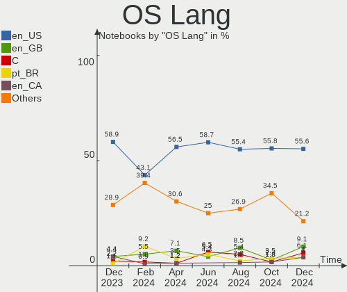
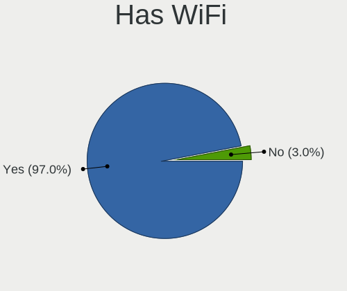
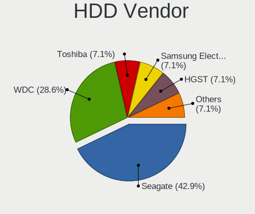
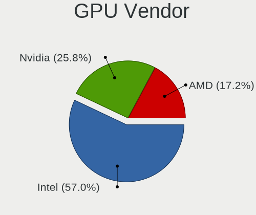

Pop!_OS Hardware Trends (Notebook)
----------------------------------

A project to identify most popular hardware characteristics and track their change
over time based on data collected by Pop!_OS users at https://Linux-Hardware.org.

Anyone can contribute to the study by uploading probes of their computers by
the [hw-probe](https://github.com/linuxhw/hw-probe) tool:

    sudo -E hw-probe -all -upload

Full-feature report is available here: https://linux-hardware.org/?view=trends&formfactor=notebook

Period: Mar, 2021.

Contents
--------

- [ OS                       ](#os)
- [ OS Family                ](#os-family)
- [ Kernel                   ](#kernel)
- [ Kernel Family            ](#kernel-family)
- [ Kernel Major Ver.        ](#kernel-major-ver)
- [ Arch                     ](#arch)
- [ DE                       ](#de)
- [ Display Server           ](#display-server)
- [ Display Manager          ](#display-manager)
- [ OS Lang                  ](#os-lang)
- [ Boot Mode                ](#boot-mode)
- [ Filesystem               ](#filesystem)
- [ Part. scheme             ](#part-scheme)
- [ Dual Boot with Linux/BSD ](#dual-boot-with-linux/bsd)
- [ Dual Boot (Win)          ](#dual-boot-win)
- [ Country                  ](#country)
- [ City                     ](#city)
- [ Vendor                   ](#vendor)
- [ Model                    ](#model)
- [ Model Family             ](#model-family)
- [ MFG Year                 ](#mfg-year)
- [ Form Factor              ](#form-factor)
- [ Secure Boot              ](#secure-boot)
- [ Coreboot                 ](#coreboot)
- [ RAM Size                 ](#ram-size)
- [ RAM Used                 ](#ram-used)
- [ Has CD-ROM               ](#has-cd-rom)
- [ Total Drives             ](#total-drives)
- [ Has Ethernet             ](#has-ethernet)
- [ Has WiFi                 ](#has-wifi)
- [ Has Bluetooth            ](#has-bluetooth)
- [ Drive Vendor             ](#drive-vendor)
- [ Drive Model              ](#drive-model)
- [ HDD Vendor               ](#hdd-vendor)
- [ SSD Vendor               ](#ssd-vendor)
- [ Drive Kind               ](#drive-kind)
- [ Drive Connector          ](#drive-connector)
- [ Drive Size               ](#drive-size)
- [ Space Total              ](#space-total)
- [ Space Used               ](#space-used)
- [ Malfunc. Drives          ](#malfunc-drives)
- [ Malfunc. Drive Vendor    ](#malfunc-drive-vendor)
- [ Malfunc. HDD Vendor      ](#malfunc-hdd-vendor)
- [ Malfunc. Drive Kind      ](#malfunc-drive-kind)
- [ Failed Drives            ](#failed-drives)
- [ Failed Drive Vendor      ](#failed-drive-vendor)
- [ Drive Status             ](#drive-status)
- [ Storage Vendor           ](#storage-vendor)
- [ Storage Model            ](#storage-model)
- [ Storage Kind             ](#storage-kind)
- [ CPU Vendor               ](#cpu-vendor)
- [ CPU Model                ](#cpu-model)
- [ CPU Model Family         ](#cpu-model-family)
- [ CPU Cores                ](#cpu-cores)
- [ CPU Sockets              ](#cpu-sockets)
- [ CPU Threads              ](#cpu-threads)
- [ CPU Op-Modes             ](#cpu-op-modes)
- [ CPU Microcode            ](#cpu-microcode)
- [ CPU Microarch            ](#cpu-microarch)
- [ GPU Vendor               ](#gpu-vendor)
- [ GPU Model                ](#gpu-model)
- [ GPU Combo                ](#gpu-combo)
- [ GPU Driver               ](#gpu-driver)
- [ GPU Memory               ](#gpu-memory)
- [ Monitor Vendor           ](#monitor-vendor)
- [ Monitor Model            ](#monitor-model)
- [ Monitor Resolution       ](#monitor-resolution)
- [ Monitor Diagonal         ](#monitor-diagonal)
- [ Monitor Width            ](#monitor-width)
- [ Aspect Ratio             ](#aspect-ratio)
- [ Monitor Area             ](#monitor-area)
- [ Pixel Density            ](#pixel-density)
- [ Multiple Monitors        ](#multiple-monitors)
- [ Net Controller Vendor    ](#net-controller-vendor)
- [ Net Controller Model     ](#net-controller-model)
- [ Wireless Vendor          ](#wireless-vendor)
- [ Wireless Model           ](#wireless-model)
- [ Ethernet Vendor          ](#ethernet-vendor)
- [ Ethernet Model           ](#ethernet-model)
- [ Net Controller Kind      ](#net-controller-kind)
- [ Used Controller          ](#used-controller)
- [ NICs                     ](#nics)
- [ IPv6                     ](#ipv6)
- [ Memory Vendor            ](#memory-vendor)
- [ Memory Model             ](#memory-model)
- [ Memory Kind              ](#memory-kind)
- [ Memory Form Factor       ](#memory-form-factor)
- [ Memory Size              ](#memory-size)
- [ Memory Speed             ](#memory-speed)
- [ Sound Vendor             ](#sound-vendor)
- [ Sound Model              ](#sound-model)
- [ Camera Vendor            ](#camera-vendor)
- [ Camera Model             ](#camera-model)
- [ Fingerprint Vendor       ](#fingerprint-vendor)
- [ Fingerprint Model        ](#fingerprint-model)
- [ Chipcard Vendor          ](#chipcard-vendor)
- [ Chipcard Model           ](#chipcard-model)
- [ Printer Vendor           ](#printer-vendor)
- [ Printer Model            ](#printer-model)
- [ Scanner Vendor           ](#scanner-vendor)
- [ Scanner Model            ](#scanner-model)
- [ Bluetooth Vendor         ](#bluetooth-vendor)
- [ Bluetooth Model          ](#bluetooth-model)
- [ Unsupported Devices      ](#unsupported-devices)
- [ Unsupported Device Types ](#unsupported-device-types)

OS
--

Installed operating systems

| Name          | Notebooks | Percent |
|---------------|-----------|---------|
| Pop!_OS 20.10 | 121       | 79.08%  |
| Pop!_OS 20.04 | 32        | 20.92%  |

OS Family
---------

OS without a version

| Name    | Notebooks | Percent |
|---------|-----------|---------|
| Pop!_OS | 153       | 100%    |

Kernel
------

Version of the Linux kernel

| Version                   | Notebooks | Percent |
|---------------------------|-----------|---------|
| 5.8.0-7642-generic        | 129       | 84.31%  |
| 5.8.0-7630-generic        | 6         | 3.92%   |
| 5.11.0-7612-generic       | 3         | 1.96%   |
| 5.4.0-7634-generic        | 2         | 1.31%   |
| 5.11.0-051100-generic     | 2         | 1.31%   |
| 5.9.6-050906-generic      | 1         | 0.65%   |
| 5.8.0-7625-generic        | 1         | 0.65%   |
| 5.4.0-7642-generic        | 1         | 0.65%   |
| 5.11.3-051103-generic     | 1         | 0.65%   |
| 5.11.0-4.2-liquorix-amd64 | 1         | 0.65%   |
| 5.11.0-3.1-liquorix-amd64 | 1         | 0.65%   |
| 5.10.4-051004-lowlatency  | 1         | 0.65%   |
| 5.10.24-xanmod1           | 1         | 0.65%   |
| 5.10.23-xanmod1           | 1         | 0.65%   |
| 5.10.20-xanmod1           | 1         | 0.65%   |
| 5.10.0+                   | 1         | 0.65%   |

Kernel Family
-------------

Linux kernel without a distro release

| Version | Notebooks | Percent |
|---------|-----------|---------|
| 5.8.0   | 136       | 88.89%  |
| 5.11.0  | 7         | 4.58%   |
| 5.4.0   | 3         | 1.96%   |
| 5.9.6   | 1         | 0.65%   |
| 5.11.3  | 1         | 0.65%   |
| 5.10.4  | 1         | 0.65%   |
| 5.10.24 | 1         | 0.65%   |
| 5.10.23 | 1         | 0.65%   |
| 5.10.20 | 1         | 0.65%   |
| 5.10.0  | 1         | 0.65%   |

Kernel Major Ver.
-----------------

Linux kernel major version

| Version | Notebooks | Percent |
|---------|-----------|---------|
| 5.8     | 136       | 88.89%  |
| 5.11    | 8         | 5.23%   |
| 5.10    | 5         | 3.27%   |
| 5.4     | 3         | 1.96%   |
| 5.9     | 1         | 0.65%   |

Arch
----

OS architecture (x86_64, i586, etc.)

| Name   | Notebooks | Percent |
|--------|-----------|---------|
| x86_64 | 153       | 100%    |

DE
--

Desktop Environment

| Name       | Notebooks | Percent |
|------------|-----------|---------|
| GNOME      | 145       | 94.77%  |
| KDE        | 4         | 2.61%   |
| X-Cinnamon | 2         | 1.31%   |
| Deepin     | 1         | 0.65%   |
| Unknown    | 1         | 0.65%   |

Display Server
--------------

X11 or Wayland

| Name    | Notebooks | Percent |
|---------|-----------|---------|
| X11     | 148       | 96.73%  |
| Wayland | 4         | 2.61%   |
| Unknown | 1         | 0.65%   |

Display Manager
---------------

SDDM, LightDM, etc.

| Name    | Notebooks | Percent |
|---------|-----------|---------|
| Unknown | 125       | 81.7%   |
| GDM     | 27        | 17.65%  |
| TDM     | 1         | 0.65%   |

OS Lang
-------

Language

| Lang    | Notebooks | Percent |
|---------|-----------|---------|
| en_US   | 86        | 56.21%  |
| pt_BR   | 13        | 8.5%    |
| en_GB   | 11        | 7.19%   |
| de_DE   | 7         | 4.58%   |
| fr_FR   | 6         | 3.92%   |
| es_ES   | 6         | 3.92%   |
| it_IT   | 5         | 3.27%   |
| en_CA   | 4         | 2.61%   |
| en_AU   | 4         | 2.61%   |
| pl_PL   | 3         | 1.96%   |
| C       | 2         | 1.31%   |
| zh_CN   | 1         | 0.65%   |
| szl_PL  | 1         | 0.65%   |
| nl_NL   | 1         | 0.65%   |
| en_ZA   | 1         | 0.65%   |
| da_DK   | 1         | 0.65%   |
| Unknown | 1         | 0.65%   |

Boot Mode
---------

EFI or BIOS

| Mode | Notebooks | Percent |
|------|-----------|---------|
| BIOS | 128       | 83.66%  |
| EFI  | 25        | 16.34%  |

Filesystem
----------

Type of filesystem

| Type    | Notebooks | Percent |
|---------|-----------|---------|
| Ext4    | 149       | 97.39%  |
| Btrfs   | 2         | 1.31%   |
| Xfs     | 1         | 0.65%   |
| Overlay | 1         | 0.65%   |

Part. scheme
------------

Scheme of partitioning

| Type    | Notebooks | Percent |
|---------|-----------|---------|
| Unknown | 125       | 81.7%   |
| GPT     | 26        | 16.99%  |
| MBR     | 2         | 1.31%   |

Dual Boot with Linux/BSD
------------------------

Hosting more than one Linux/BSD

| Dual boot | Notebooks | Percent |
|-----------|-----------|---------|
| No        | 151       | 98.69%  |
| Yes       | 2         | 1.31%   |

Dual Boot (Win)
---------------

Hosting Linux and Windows

| Dual boot | Notebooks | Percent |
|-----------|-----------|---------|
| No        | 141       | 92.16%  |
| Yes       | 12        | 7.84%   |

Country
-------

Geographic location (country)

| Country      | Notebooks | Percent |
|--------------|-----------|---------|
| USA          | 41        | 26.8%   |
| Germany      | 13        | 8.5%    |
| Brazil       | 13        | 8.5%    |
| France       | 8         | 5.23%   |
| Italy        | 7         | 4.58%   |
| Spain        | 6         | 3.92%   |
| UK           | 5         | 3.27%   |
| Poland       | 5         | 3.27%   |
| Australia    | 5         | 3.27%   |
| Japan        | 4         | 2.61%   |
| Canada       | 4         | 2.61%   |
| South Africa | 3         | 1.96%   |
| Portugal     | 3         | 1.96%   |
| Netherlands  | 3         | 1.96%   |
| India        | 3         | 1.96%   |
| Sweden       | 2         | 1.31%   |
| Mexico       | 2         | 1.31%   |
| Malaysia     | 2         | 1.31%   |
| Indonesia    | 2         | 1.31%   |
| Greece       | 2         | 1.31%   |
| Denmark      | 2         | 1.31%   |
| Colombia     | 2         | 1.31%   |
| Belgium      | 2         | 1.31%   |
| Austria      | 2         | 1.31%   |
| Vietnam      | 1         | 0.65%   |
| UAE          | 1         | 0.65%   |
| Turkey       | 1         | 0.65%   |
| Tanzania     | 1         | 0.65%   |
| Switzerland  | 1         | 0.65%   |
| Slovakia     | 1         | 0.65%   |
| Serbia       | 1         | 0.65%   |
| Romania      | 1         | 0.65%   |
| Philippines  | 1         | 0.65%   |
| Norway       | 1         | 0.65%   |
| Iceland      | 1         | 0.65%   |
| Chile        | 1         | 0.65%   |

City
----

Geographic location (city)

| City                    | Notebooks | Percent |
|-------------------------|-----------|---------|
| Milan                   | 5         | 3.27%   |
| San Antonio             | 3         | 1.96%   |
| Giesen                  | 3         | 1.96%   |
| Brisbane                | 3         | 1.96%   |
| Vienna                  | 2         | 1.31%   |
| Tokyo                   | 2         | 1.31%   |
| São Paulo              | 2         | 1.31%   |
| Charlotte               | 2         | 1.31%   |
| Athens                  | 2         | 1.31%   |
| Amsterdam               | 2         | 1.31%   |
| Zielona Góra           | 1         | 0.65%   |
| Yokosuka                | 1         | 0.65%   |
| Wydrze                  | 1         | 0.65%   |
| Woodland Hills          | 1         | 0.65%   |
| Willow Springs          | 1         | 0.65%   |
| West Jordan             | 1         | 0.65%   |
| Voelklingen             | 1         | 0.65%   |
| Uberlândia             | 1         | 0.65%   |
| Turin                   | 1         | 0.65%   |
| Toulouse                | 1         | 0.65%   |
| Titusville              | 1         | 0.65%   |
| Terrebonne              | 1         | 0.65%   |
| Temple                  | 1         | 0.65%   |
| Sulsted                 | 1         | 0.65%   |
| Stabroek                | 1         | 0.65%   |
| Southport               | 1         | 0.65%   |
| Skudai                  | 1         | 0.65%   |
| Siechnice               | 1         | 0.65%   |
| Santo Estevao das Gales | 1         | 0.65%   |
| Santiago de Cali        | 1         | 0.65%   |
| Sankt Ingbert           | 1         | 0.65%   |
| San Francisco           | 1         | 0.65%   |
| Rome                    | 1         | 0.65%   |
| Rio Rancho              | 1         | 0.65%   |
| Reykjavik               | 1         | 0.65%   |
| Remscheid               | 1         | 0.65%   |
| Pune                    | 1         | 0.65%   |
| Puebla City             | 1         | 0.65%   |
| Pretoria                | 1         | 0.65%   |
| Presidente Prudente     | 1         | 0.65%   |
| Portland                | 1         | 0.65%   |
| Phoenix                 | 1         | 0.65%   |
| Pawtucket               | 1         | 0.65%   |
| Paris                   | 1         | 0.65%   |
| Palma                   | 1         | 0.65%   |
| Palaiseau               | 1         | 0.65%   |
| Orléans                | 1         | 0.65%   |
| Niterói                | 1         | 0.65%   |
| New York                | 1         | 0.65%   |
| New Lenox               | 1         | 0.65%   |
| New Albany              | 1         | 0.65%   |
| Nantes                  | 1         | 0.65%   |
| Nabua                   | 1         | 0.65%   |
| Mount Laurel            | 1         | 0.65%   |
| Mossel Bay              | 1         | 0.65%   |
| Morlenbach              | 1         | 0.65%   |
| Morioka                 | 1         | 0.65%   |
| Milton Keynes           | 1         | 0.65%   |
| Milton                  | 1         | 0.65%   |
| Medan                   | 1         | 0.65%   |

Vendor
------

Motherboard manufacturer

| Name                  | Notebooks | Percent |
|-----------------------|-----------|---------|
| Lenovo                | 28        | 18.3%   |
| Dell                  | 23        | 15.03%  |
| Hewlett-Packard       | 22        | 14.38%  |
| ASUSTek Computer      | 18        | 11.76%  |
| Acer                  | 10        | 6.54%   |
| System76              | 8         | 5.23%   |
| MSI                   | 6         | 3.92%   |
| Apple                 | 6         | 3.92%   |
| Toshiba               | 3         | 1.96%   |
| Notebook              | 3         | 1.96%   |
| TUXEDO                | 2         | 1.31%   |
| Samsung Electronics   | 2         | 1.31%   |
| Razer                 | 2         | 1.31%   |
| Positivo              | 2         | 1.31%   |
| LINCPLUS              | 2         | 1.31%   |
| HUAWEI                | 2         | 1.31%   |
| Google                | 2         | 1.31%   |
| Fujitsu               | 2         | 1.31%   |
| Alienware             | 2         | 1.31%   |
| Timi                  | 1         | 0.65%   |
| Sony                  | 1         | 0.65%   |
| Pegatron              | 1         | 0.65%   |
| Panasonic             | 1         | 0.65%   |
| OVERPOWERED           | 1         | 0.65%   |
| OEM                   | 1         | 0.65%   |
| EVOO Products Company | 1         | 0.65%   |
| Eluktronics           | 1         | 0.65%   |

Model
-----

Motherboard model

| Name                                   | Notebooks | Percent |
|----------------------------------------|-----------|---------|
| System76 Darter Pro                    | 3         | 1.96%   |
| HP Laptop 15-db1xxx                    | 3         | 1.96%   |
| Dell XPS 17 9700                       | 3         | 1.96%   |
| LINCPLUS P1                            | 2         | 1.31%   |
| Lenovo Legion 5 15ARH05 82B5           | 2         | 1.31%   |
| HUAWEI MACH-WX9                        | 2         | 1.31%   |
| HP Notebook                            | 2         | 1.31%   |
| Dell XPS 15 9500                       | 2         | 1.31%   |
| ASUS VivoBook_ASUSLaptop X509DA_M509DA | 2         | 1.31%   |
| ASUS K42Jc                             | 2         | 1.31%   |
| TUXEDO InfinityBook S 14 v5            | 1         | 0.65%   |
| TUXEDO Aura 15 Gen1                    | 1         | 0.65%   |
| Toshiba Satellite Pro L450             | 1         | 0.65%   |
| Toshiba Satellite E55-A                | 1         | 0.65%   |
| Toshiba PORTEGE Z30-A                  | 1         | 0.65%   |
| Timi RedmiBook 16                      | 1         | 0.65%   |
| System76 Serval WS                     | 1         | 0.65%   |
| System76 Lemur Pro                     | 1         | 0.65%   |
| System76 Gazelle                       | 1         | 0.65%   |
| System76 Galago UltraPro               | 1         | 0.65%   |
| System76 Bonobo WS                     | 1         | 0.65%   |
| Sony SVE14A1V1EB                       | 1         | 0.65%   |
| Samsung RF511/RF411/RF711              | 1         | 0.65%   |
| Samsung 900X3C/900X3D/900X4C/900X4D    | 1         | 0.65%   |
| Razer Blade Stealth                    | 1         | 0.65%   |
| Razer Blade                            | 1         | 0.65%   |
| Positivo H14BU08                       | 1         | 0.65%   |
| Positivo C14CR01                       | 1         | 0.65%   |
| Pegatron A15                           | 1         | 0.65%   |
| Panasonic CF-53JCLBX1M                 | 1         | 0.65%   |
| OVERPOWERED OP-LP2                     | 1         | 0.65%   |
| OEM KabyLake                           | 1         | 0.65%   |
| Notebook P9XXEN_EF_ED                  | 1         | 0.65%   |
| Notebook N8xxEP6                       | 1         | 0.65%   |
| Notebook N15_N17RD1                    | 1         | 0.65%   |
| MSI Stealth 15M A11SEK                 | 1         | 0.65%   |
| MSI Prestige 15 A10SC                  | 1         | 0.65%   |
| MSI P75 Creator 9SF                    | 1         | 0.65%   |
| MSI MS-7A39                            | 1         | 0.65%   |
| MSI GL62M 7RDX                         | 1         | 0.65%   |
| MSI GE63 Raider RGB 9SE                | 1         | 0.65%   |
| Lenovo Yoga 700-14ISK 80QD             | 1         | 0.65%   |
| Lenovo V310-14ISK 80SX                 | 1         | 0.65%   |
| Lenovo ThinkPad X230 2325SYU           | 1         | 0.65%   |
| Lenovo ThinkPad W520 4284Y54           | 1         | 0.65%   |
| Lenovo ThinkPad T520 42425UU           | 1         | 0.65%   |
| Lenovo ThinkPad T495 20NKS01Y00        | 1         | 0.65%   |
| Lenovo ThinkPad T480 20L5CTO1WW        | 1         | 0.65%   |
| Lenovo ThinkPad T470s 20HFS18P00       | 1         | 0.65%   |
| Lenovo ThinkPad T420 4180AZ5           | 1         | 0.65%   |
| Lenovo ThinkPad T410 25374A5           | 1         | 0.65%   |
| Lenovo ThinkPad T14s Gen 1 20UH000CUS  | 1         | 0.65%   |
| Lenovo ThinkPad P52 20M9000FUS         | 1         | 0.65%   |
| Lenovo ThinkPad L590 20Q7CTO1WW        | 1         | 0.65%   |
| Lenovo ThinkPad E14 Gen 2 20TA004KUS   | 1         | 0.65%   |
| Lenovo ThinkPad E14 Gen 2 20T6S0A500   | 1         | 0.65%   |
| Lenovo ThinkPad E14 20RA001HMZ         | 1         | 0.65%   |
| Lenovo ThinkPad E14 20RA0012PB         | 1         | 0.65%   |
| Lenovo ThinkPad A485 20MU000TUS        | 1         | 0.65%   |
| Lenovo Legion S7 15IMH5 82BC           | 1         | 0.65%   |

Model Family
------------

Motherboard model prefix

| Name                   | Notebooks | Percent |
|------------------------|-----------|---------|
| Lenovo ThinkPad        | 16        | 10.46%  |
| Dell Inspiron          | 9         | 5.88%   |
| Acer Aspire            | 7         | 4.58%   |
| HP Pavilion            | 6         | 3.92%   |
| Lenovo IdeaPad         | 5         | 3.27%   |
| HP Laptop              | 5         | 3.27%   |
| Dell XPS               | 5         | 3.27%   |
| Dell Latitude          | 4         | 2.61%   |
| ASUS VivoBook          | 4         | 2.61%   |
| System76 Darter        | 3         | 1.96%   |
| Lenovo Legion          | 3         | 1.96%   |
| HP ProBook             | 3         | 1.96%   |
| ASUS ROG               | 3         | 1.96%   |
| Toshiba Satellite      | 2         | 1.31%   |
| Razer Blade            | 2         | 1.31%   |
| LINCPLUS P1            | 2         | 1.31%   |
| HUAWEI MACH-WX9        | 2         | 1.31%   |
| HP Notebook            | 2         | 1.31%   |
| HP ENVY                | 2         | 1.31%   |
| HP EliteBook           | 2         | 1.31%   |
| Fujitsu LIFEBOOK       | 2         | 1.31%   |
| Dell Precision         | 2         | 1.31%   |
| Dell G3                | 2         | 1.31%   |
| ASUS K42Jc             | 2         | 1.31%   |
| Acer Swift             | 2         | 1.31%   |
| TUXEDO InfinityBook    | 1         | 0.65%   |
| TUXEDO Aura            | 1         | 0.65%   |
| Toshiba PORTEGE        | 1         | 0.65%   |
| Timi RedmiBook         | 1         | 0.65%   |
| System76 Serval        | 1         | 0.65%   |
| System76 Lemur         | 1         | 0.65%   |
| System76 Gazelle       | 1         | 0.65%   |
| System76 Galago        | 1         | 0.65%   |
| System76 Bonobo        | 1         | 0.65%   |
| Sony SVE14A1V1EB       | 1         | 0.65%   |
| Samsung RF511          | 1         | 0.65%   |
| Samsung 900X3C         | 1         | 0.65%   |
| Positivo H14BU08       | 1         | 0.65%   |
| Positivo C14CR01       | 1         | 0.65%   |
| Pegatron A15           | 1         | 0.65%   |
| Panasonic CF-53JCLBX1M | 1         | 0.65%   |
| OVERPOWERED OP-LP2     | 1         | 0.65%   |
| OEM KabyLake           | 1         | 0.65%   |
| Notebook P9XXEN        | 1         | 0.65%   |
| Notebook N8xxEP6       | 1         | 0.65%   |
| Notebook N15           | 1         | 0.65%   |
| MSI Stealth            | 1         | 0.65%   |
| MSI Prestige           | 1         | 0.65%   |
| MSI P75                | 1         | 0.65%   |
| MSI MS-7A39            | 1         | 0.65%   |
| MSI GL62M              | 1         | 0.65%   |
| MSI GE63               | 1         | 0.65%   |
| Lenovo Yoga            | 1         | 0.65%   |
| Lenovo V310-14ISK      | 1         | 0.65%   |
| Lenovo Flex            | 1         | 0.65%   |
| Lenovo B560            | 1         | 0.65%   |
| HP Elite               | 1         | 0.65%   |
| HP 255                 | 1         | 0.65%   |
| Google Rammus          | 1         | 0.65%   |
| Google Edgar           | 1         | 0.65%   |

MFG Year
--------

Motherboard manufacture year

| Year    | Notebooks | Percent |
|---------|-----------|---------|
| 2020    | 53        | 34.64%  |
| 2019    | 22        | 14.38%  |
| 2018    | 21        | 13.73%  |
| 2013    | 10        | 6.54%   |
| 2012    | 9         | 5.88%   |
| 2017    | 7         | 4.58%   |
| 2016    | 7         | 4.58%   |
| 2015    | 5         | 3.27%   |
| 2021    | 4         | 2.61%   |
| 2014    | 4         | 2.61%   |
| 2011    | 4         | 2.61%   |
| 2010    | 3         | 1.96%   |
| 2008    | 2         | 1.31%   |
| 2009    | 1         | 0.65%   |
| Unknown | 1         | 0.65%   |

Form Factor
-----------

Physical design of the computer

| Name     | Notebooks | Percent |
|----------|-----------|---------|
| Notebook | 153       | 100%    |

Secure Boot
-----------

Enabled or disabled

| State    | Notebooks | Percent |
|----------|-----------|---------|
| Disabled | 153       | 100%    |

Coreboot
--------

Have coreboot on board

| Used | Notebooks | Percent |
|------|-----------|---------|
| No   | 148       | 96.73%  |
| Yes  | 5         | 3.27%   |

RAM Size
--------

Total RAM memory

| Size in GB  | Notebooks | Percent |
|-------------|-----------|---------|
| 4.01-8.0    | 47        | 30.72%  |
| 16.01-24.0  | 35        | 22.88%  |
| 8.01-16.0   | 29        | 18.95%  |
| 3.01-4.0    | 18        | 11.76%  |
| 32.01-64.0  | 15        | 9.8%    |
| 64.01-256.0 | 3         | 1.96%   |
| 24.01-32.0  | 2         | 1.31%   |
| 2.01-3.0    | 2         | 1.31%   |
| 1.01-2.0    | 2         | 1.31%   |

RAM Used
--------

Used RAM memory

| Used GB    | Notebooks | Percent |
|------------|-----------|---------|
| 2.01-3.0   | 52        | 33.99%  |
| 1.01-2.0   | 46        | 30.07%  |
| 4.01-8.0   | 24        | 15.69%  |
| 3.01-4.0   | 21        | 13.73%  |
| 8.01-16.0  | 9         | 5.88%   |
| 16.01-24.0 | 1         | 0.65%   |

Has CD-ROM
----------

Has CD-ROM on board

| Presented | Notebooks | Percent |
|-----------|-----------|---------|
| No        | 112       | 73.2%   |
| Yes       | 41        | 26.8%   |

Total Drives
------------

Number of drives on board

| Drives | Notebooks | Percent |
|--------|-----------|---------|
| 1      | 102       | 66.67%  |
| 2      | 46        | 30.07%  |
| 3      | 2         | 1.31%   |
| 5      | 1         | 0.65%   |
| 4      | 1         | 0.65%   |
| 0      | 1         | 0.65%   |

Has Ethernet
------------

Has Ethernet on board

| Presented | Notebooks | Percent |
|-----------|-----------|---------|
| Yes       | 126       | 82.35%  |
| No        | 27        | 17.65%  |

Has WiFi
--------

Has WiFi module

| Presented | Notebooks | Percent |
|-----------|-----------|---------|
| Yes       | 151       | 98.69%  |
| No        | 2         | 1.31%   |

Has Bluetooth
-------------

Has Bluetooth module

| Presented | Notebooks | Percent |
|-----------|-----------|---------|
| Yes       | 132       | 86.27%  |
| No        | 21        | 13.73%  |

Drive Vendor
------------

Hard drive vendors

| Vendor                    | Notebooks | Drives | Percent |
|---------------------------|-----------|--------|---------|
| Samsung Electronics       | 40        | 47     | 19.9%   |
| Seagate                   | 25        | 25     | 12.44%  |
| SanDisk                   | 19        | 19     | 9.45%   |
| WDC                       | 17        | 18     | 8.46%   |
| Toshiba                   | 14        | 14     | 6.97%   |
| Unknown                   | 11        | 11     | 5.47%   |
| SK Hynix                  | 10        | 10     | 4.98%   |
| Kingston                  | 9         | 9      | 4.48%   |
| Crucial                   | 8         | 9      | 3.98%   |
| Intel                     | 7         | 7      | 3.48%   |
| Micron Technology         | 4         | 5      | 1.99%   |
| Transcend                 | 3         | 3      | 1.49%   |
| SPCC                      | 3         | 3      | 1.49%   |
| Micron/Crucial Technology | 3         | 3      | 1.49%   |
| HGST                      | 3         | 3      | 1.49%   |
| A-DATA Technology         | 3         | 3      | 1.49%   |
| LITEON                    | 2         | 2      | 1%      |
| ASMT                      | 2         | 2      | 1%      |
| ZOTAC                     | 1         | 1      | 0.5%    |
| W800S                     | 1         | 1      | 0.5%    |
| Union Memory (Shenzhen)   | 1         | 1      | 0.5%    |
| SMART                     | 1         | 1      | 0.5%    |
| Sabrent                   | 1         | 2      | 0.5%    |
| Phison                    | 1         | 1      | 0.5%    |
| OCZ                       | 1         | 1      | 0.5%    |
| LITEONIT                  | 1         | 1      | 0.5%    |
| KIOXIA-EXCERIA            | 1         | 1      | 0.5%    |
| KIOXIA                    | 1         | 1      | 0.5%    |
| Hitachi                   | 1         | 1      | 0.5%    |
| Hewlett-Packard           | 1         | 1      | 0.5%    |
| Fujitsu                   | 1         | 1      | 0.5%    |
| Corsair                   | 1         | 1      | 0.5%    |
| China                     | 1         | 1      | 0.5%    |
| Apple                     | 1         | 1      | 0.5%    |
| Apacer                    | 1         | 1      | 0.5%    |
| ADATA Technology          | 1         | 1      | 0.5%    |

Drive Model
-----------

Hard drive models

| Model                                        | Notebooks | Percent |
|----------------------------------------------|-----------|---------|
| Samsung NVMe SSD Drive 1TB                   | 8         | 3.85%   |
| Seagate ST1000LM049-2GH172 1TB               | 4         | 1.92%   |
| Samsung NVMe SSD Drive 1024GB                | 4         | 1.92%   |
| Intel NVMe SSD Drive 512GB                   | 4         | 1.92%   |
| Toshiba MQ01ABD100 1TB                       | 3         | 1.44%   |
| SK Hynix NVMe SSD Drive 256GB                | 3         | 1.44%   |
| Seagate ST500LT012-1DG142 500GB              | 3         | 1.44%   |
| Seagate ST1000LM035-1RK172 1TB               | 3         | 1.44%   |
| Sandisk NVMe SSD Drive 1TB                   | 3         | 1.44%   |
| Samsung NVMe SSD Drive 500GB                 | 3         | 1.44%   |
| Samsung NVMe SSD Drive 250GB                 | 3         | 1.44%   |
| Intel NVMe SSD Drive 1024GB                  | 3         | 1.44%   |
| WDC WDS240G2G0B-00EPW0 240GB SSD             | 2         | 0.96%   |
| Unknown NVMe SSD Drive 256GB                 | 2         | 0.96%   |
| Unknown MMC Card  64GB                       | 2         | 0.96%   |
| Unknown MMC Card  32GB                       | 2         | 0.96%   |
| Transcend TS128GMSA230S 128GB SSD            | 2         | 0.96%   |
| SK Hynix NVMe SSD Drive 1024GB               | 2         | 0.96%   |
| SK Hynix BC511 HFM512GDJTNI-82A0A 512GB      | 2         | 0.96%   |
| Seagate ST9500325AS 500GB                    | 2         | 0.96%   |
| Seagate ST2000LX001-1RG174 2TB               | 2         | 0.96%   |
| Seagate ST1000LM024 HN-M101MBB 1TB           | 2         | 0.96%   |
| Seagate ST1000LM014-1EJ164 1TB               | 2         | 0.96%   |
| Sandisk NVMe SSD Drive 256GB                 | 2         | 0.96%   |
| Samsung SSD 970 EVO Plus 500GB               | 2         | 0.96%   |
| Samsung SSD 860 EVO 500GB                    | 2         | 0.96%   |
| Samsung SSD 860 EVO 1TB                      | 2         | 0.96%   |
| Samsung SSD 850 EVO 500GB                    | 2         | 0.96%   |
| Samsung NVMe SSD Drive 512GB                 | 2         | 0.96%   |
| Micron/Crucial NVMe SSD Drive 500GB          | 2         | 0.96%   |
| Kingston SA400S37240G 240GB SSD              | 2         | 0.96%   |
| HGST HTS721010A9E630 1TB                     | 2         | 0.96%   |
| Crucial CT525MX300SSD1 528GB                 | 2         | 0.96%   |
| Crucial CT240BX500SSD1 240GB                 | 2         | 0.96%   |
| ZOTAC ZTSSD-A4P-120G                         | 1         | 0.48%   |
| WDC WDS250G2B0B 250GB SSD                    | 1         | 0.48%   |
| WDC WDS250G2B0A 250GB SSD                    | 1         | 0.48%   |
| WDC WDS100T2G0A-00JH30 1TB SSD               | 1         | 0.48%   |
| WDC WD5000LPCX-75VHAT1 500GB                 | 1         | 0.48%   |
| WDC WD5000LPCX-60VHAT0 500GB                 | 1         | 0.48%   |
| WDC WD5000LPCX-00VHAT0 500GB                 | 1         | 0.48%   |
| WDC WD5000BPVT-80HXZT3 500GB                 | 1         | 0.48%   |
| WDC WD2500BEVS-60UST0 250GB                  | 1         | 0.48%   |
| WDC WD10SPZX-24Z10 1TB                       | 1         | 0.48%   |
| WDC WD10JPVX-75JC3T0 1TB                     | 1         | 0.48%   |
| WDC WD10JPVX-22JC3T0 1TB                     | 1         | 0.48%   |
| WDC PC SN530 SDBPNPZ-256G-1114 256GB         | 1         | 0.48%   |
| WDC PC SN530 SDBPMPZ-256G-1001 256GB         | 1         | 0.48%   |
| WDC PC SN520 SDAPNUW-512G-1032 512GB         | 1         | 0.48%   |
| WDC PC SN520 SDAPMUW-512G-1101 512GB         | 1         | 0.48%   |
| W800S 256GB SSD                              | 1         | 0.48%   |
| Unknown SSM28256GPTCB3B-S112612 256GB        | 1         | 0.48%   |
| Unknown SD/MMC/MS PRO 128GB                  | 1         | 0.48%   |
| Unknown MMC Card  256GB                      | 1         | 0.48%   |
| Unknown MMC Card  128GB                      | 1         | 0.48%   |
| Unknown ISOCOM  64GB                         | 1         | 0.48%   |
| Union Memory (Shenzhen) NVMe SSD Drive 256GB | 1         | 0.48%   |
| Transcend TS128GSSD420K 128GB                | 1         | 0.48%   |
| Toshiba THNSNJ256G8NY 256GB SSD              | 1         | 0.48%   |
| Toshiba NVMe SSD Drive 256GB                 | 1         | 0.48%   |

HDD Vendor
----------

Hard disk drive vendors

| Vendor              | Notebooks | Drives | Percent |
|---------------------|-----------|--------|---------|
| Seagate             | 25        | 25     | 48.08%  |
| Toshiba             | 12        | 12     | 23.08%  |
| WDC                 | 8         | 8      | 15.38%  |
| HGST                | 3         | 3      | 5.77%   |
| Samsung Electronics | 1         | 1      | 1.92%   |
| Sabrent             | 1         | 2      | 1.92%   |
| Hitachi             | 1         | 1      | 1.92%   |
| Fujitsu             | 1         | 1      | 1.92%   |

SSD Vendor
----------

Solid state drive vendors

| Vendor              | Notebooks | Drives | Percent |
|---------------------|-----------|--------|---------|
| Samsung Electronics | 13        | 15     | 18.31%  |
| SanDisk             | 12        | 12     | 16.9%   |
| Crucial             | 8         | 9      | 11.27%  |
| Kingston            | 7         | 7      | 9.86%   |
| WDC                 | 5         | 5      | 7.04%   |
| Transcend           | 3         | 3      | 4.23%   |
| SPCC                | 3         | 3      | 4.23%   |
| A-DATA Technology   | 3         | 3      | 4.23%   |
| Micron Technology   | 2         | 3      | 2.82%   |
| ZOTAC               | 1         | 1      | 1.41%   |
| W800S               | 1         | 1      | 1.41%   |
| Toshiba             | 1         | 1      | 1.41%   |
| SMART               | 1         | 1      | 1.41%   |
| SK Hynix            | 1         | 1      | 1.41%   |
| OCZ                 | 1         | 1      | 1.41%   |
| LITEONIT            | 1         | 1      | 1.41%   |
| LITEON              | 1         | 1      | 1.41%   |
| KIOXIA-EXCERIA      | 1         | 1      | 1.41%   |
| Hewlett-Packard     | 1         | 1      | 1.41%   |
| Corsair             | 1         | 1      | 1.41%   |
| China               | 1         | 1      | 1.41%   |
| ASMT                | 1         | 1      | 1.41%   |
| Apple               | 1         | 1      | 1.41%   |
| Apacer              | 1         | 1      | 1.41%   |

Drive Kind
----------

HDD or SSD

| Kind    | Notebooks | Drives | Percent |
|---------|-----------|--------|---------|
| SSD     | 66        | 75     | 34.92%  |
| NVMe    | 61        | 74     | 32.28%  |
| HDD     | 52        | 53     | 27.51%  |
| MMC     | 7         | 7      | 3.7%    |
| Unknown | 3         | 3      | 1.59%   |

Drive Connector
---------------

SATA, SAS, NVMe, etc.

| Type | Notebooks | Drives | Percent |
|------|-----------|--------|---------|
| SATA | 102       | 123    | 57.63%  |
| NVMe | 61        | 74     | 34.46%  |
| SAS  | 7         | 8      | 3.95%   |
| MMC  | 7         | 7      | 3.95%   |

Drive Size
----------

Size of hard drive

| Size in TB | Notebooks | Drives | Percent |
|------------|-----------|--------|---------|
| 0.01-0.5   | 69        | 80     | 61.06%  |
| 0.51-1.0   | 36        | 40     | 31.86%  |
| 1.01-2.0   | 8         | 8      | 7.08%   |

Space Total
-----------

Amount of disk space available on the file system

| Size in GB     | Notebooks | Percent |
|----------------|-----------|---------|
| 251-500        | 47        | 30.72%  |
| 101-250        | 45        | 29.41%  |
| 501-1000       | 26        | 16.99%  |
| 1001-2000      | 11        | 7.19%   |
| 51-100         | 11        | 7.19%   |
| More than 3000 | 4         | 2.61%   |
| 1-20           | 3         | 1.96%   |
| 21-50          | 2         | 1.31%   |
| 2001-3000      | 2         | 1.31%   |
| Unknown        | 2         | 1.31%   |

Space Used
----------

Amount of used disk space

| Used GB        | Notebooks | Percent |
|----------------|-----------|---------|
| 1-20           | 58        | 37.91%  |
| 21-50          | 32        | 20.92%  |
| 101-250        | 22        | 14.38%  |
| 51-100         | 22        | 14.38%  |
| 251-500        | 10        | 6.54%   |
| More than 3000 | 2         | 1.31%   |
| 1001-2000      | 2         | 1.31%   |
| 501-1000       | 2         | 1.31%   |
| Unknown        | 2         | 1.31%   |
| 2001-3000      | 1         | 0.65%   |

Malfunc. Drives
---------------

Drive models with a malfunction

| Model                                        | Notebooks | Drives | Percent |
|----------------------------------------------|-----------|--------|---------|
| SanDisk SD9SN8W-128G-1006 128GB SSD          | 1         | 1      | 33.33%  |
| Samsung Electronics SSD 840 PRO Series 256GB | 1         | 1      | 33.33%  |
| Crucial CT525MX300SSD1 528GB                 | 1         | 1      | 33.33%  |

Malfunc. Drive Vendor
---------------------

Vendors of faulty drives

| Vendor              | Notebooks | Drives | Percent |
|---------------------|-----------|--------|---------|
| SanDisk             | 1         | 1      | 33.33%  |
| Samsung Electronics | 1         | 1      | 33.33%  |
| Crucial             | 1         | 1      | 33.33%  |

Malfunc. HDD Vendor
-------------------

Vendors of faulty HDD drives

Zero info for selected period =(

Malfunc. Drive Kind
-------------------

Kinds of faulty drives

| Kind | Notebooks | Drives | Percent |
|------|-----------|--------|---------|
| SSD  | 3         | 3      | 100%    |

Failed Drives
-------------

Failed drive models

Zero info for selected period =(

Failed Drive Vendor
-------------------

Failed drive vendors

Zero info for selected period =(

Drive Status
------------

Number of failed and malfunc. drives

| Status   | Notebooks | Drives | Percent |
|----------|-----------|--------|---------|
| Detected | 129       | 176    | 82.17%  |
| Works    | 25        | 33     | 15.92%  |
| Malfunc  | 3         | 3      | 1.91%   |

Storage Vendor
--------------

Storage controller vendors

| Vendor                         | Notebooks | Percent |
|--------------------------------|-----------|---------|
| Intel                          | 98        | 51.04%  |
| Samsung Electronics            | 26        | 13.54%  |
| AMD                            | 26        | 13.54%  |
| Sandisk                        | 10        | 5.21%   |
| SK Hynix                       | 9         | 4.69%   |
| Nvidia                         | 4         | 2.08%   |
| Micron/Crucial Technology      | 3         | 1.56%   |
| Solid State Storage Technology | 2         | 1.04%   |
| Micron Technology              | 2         | 1.04%   |
| Kingston Technology Company    | 2         | 1.04%   |
| JMicron Technology             | 2         | 1.04%   |
| Union Memory (Shenzhen)        | 1         | 0.52%   |
| Toshiba America Info Systems   | 1         | 0.52%   |
| Realtek Semiconductor          | 1         | 0.52%   |
| Phison Electronics             | 1         | 0.52%   |
| Lite-On Technology             | 1         | 0.52%   |
| KIOXIA                         | 1         | 0.52%   |
| ASMedia Technology             | 1         | 0.52%   |
| ADATA Technology               | 1         | 0.52%   |

Storage Model
-------------

Storage controller models

| Model                                                                          | Notebooks | Percent |
|--------------------------------------------------------------------------------|-----------|---------|
| AMD FCH SATA Controller [AHCI mode]                                            | 25        | 12.63%  |
| Samsung NVMe SSD Controller SM981/PM981/PM983                                  | 24        | 12.12%  |
| Intel 7 Series Chipset Family 6-port SATA Controller [AHCI mode]               | 14        | 7.07%   |
| Intel Sunrise Point-LP SATA Controller [AHCI mode]                             | 11        | 5.56%   |
| Intel 8 Series SATA Controller 1 [AHCI mode]                                   | 9         | 4.55%   |
| Intel 6 Series/C200 Series Chipset Family 6 port Mobile SATA AHCI Controller   | 9         | 4.55%   |
| Intel Wildcat Point-LP SATA Controller [AHCI Mode]                             | 6         | 3.03%   |
| Intel SSD 660P Series                                                          | 6         | 3.03%   |
| Intel Comet Lake SATA AHCI Controller                                          | 6         | 3.03%   |
| Intel Cannon Lake Mobile PCH SATA AHCI Controller                              | 6         | 3.03%   |
| Intel 82801 Mobile SATA Controller [RAID mode]                                 | 6         | 3.03%   |
| Intel 8 Series/C220 Series Chipset Family 6-port SATA Controller 1 [AHCI mode] | 5         | 2.53%   |
| Intel 5 Series/3400 Series Chipset 4 port SATA AHCI Controller                 | 5         | 2.53%   |
| SK Hynix BC511                                                                 | 4         | 2.02%   |
| Sandisk WD Blue SN550 NVMe SSD                                                 | 4         | 2.02%   |
| Intel Cannon Point-LP SATA Controller [AHCI Mode]                              | 4         | 2.02%   |
| SK Hynix Non-Volatile memory controller                                        | 3         | 1.52%   |
| Micron/Crucial Non-Volatile memory controller                                  | 3         | 1.52%   |
| Intel HM170/QM170 Chipset SATA Controller [AHCI Mode]                          | 3         | 1.52%   |
| Solid State Storage Non-Volatile memory controller                             | 2         | 1.01%   |
| SK Hynix BC501 NVMe Solid State Drive 512GB                                    | 2         | 1.01%   |
| Sandisk WD Blue SN500 / PC SN520 NVMe SSD                                      | 2         | 1.01%   |
| Nvidia MCP89 SATA Controller (AHCI mode)                                       | 2         | 1.01%   |
| Micron Non-Volatile memory controller                                          | 2         | 1.01%   |
| JMicron JMB360 AHCI Controller                                                 | 2         | 1.01%   |
| Intel Celeron/Pentium Silver Processor SATA Controller                         | 2         | 1.01%   |
| Union Memory (Shenzhen) NVMe 256G SSD device                                   | 1         | 0.51%   |
| Toshiba America Info Systems BG3 NVMe SSD Controller                           | 1         | 0.51%   |
| Sandisk WD Black SN750 / PC SN730 NVMe SSD                                     | 1         | 0.51%   |
| Sandisk WD Black 2018/SN750 / PC SN720 NVMe SSD                                | 1         | 0.51%   |
| Sandisk PC SN520 NVMe SSD                                                      | 1         | 0.51%   |
| Sandisk Non-Volatile memory controller                                         | 1         | 0.51%   |
| Samsung NVMe SSD Controller SM951/PM951                                        | 1         | 0.51%   |
| Samsung NVMe Controller                                                        | 1         | 0.51%   |
| Realtek RTS5763DL NVMe SSD Controller                                          | 1         | 0.51%   |
| Phison E12 NVMe Controller                                                     | 1         | 0.51%   |
| Nvidia MCP79 AHCI Controller                                                   | 1         | 0.51%   |
| Nvidia MCP51 Serial ATA Controller                                             | 1         | 0.51%   |
| Nvidia MCP51 IDE                                                               | 1         | 0.51%   |
| Lite-On Non-Volatile memory controller                                         | 1         | 0.51%   |
| KIOXIA Non-Volatile memory controller                                          | 1         | 0.51%   |
| Kingston Company U-SNS8154P3 NVMe SSD                                          | 1         | 0.51%   |
| Kingston Company A2000 NVMe SSD                                                | 1         | 0.51%   |
| Intel Volume Management Device NVMe RAID Controller                            | 1         | 0.51%   |
| Intel Q170/Q150/B150/H170/H110/Z170/CM236 Chipset SATA Controller [AHCI Mode]  | 1         | 0.51%   |
| Intel Non-Volatile memory controller                                           | 1         | 0.51%   |
| Intel 82801IBM/IEM (ICH9M/ICH9M-E) 4 port SATA Controller [AHCI mode]          | 1         | 0.51%   |
| Intel 7 Series Chipset Family 4-port SATA Controller [IDE mode]                | 1         | 0.51%   |
| Intel 7 Series Chipset Family 2-port SATA Controller [IDE mode]                | 1         | 0.51%   |
| Intel 5 Series/3400 Series Chipset 6 port SATA AHCI Controller                 | 1         | 0.51%   |
| Intel 400 Series Chipset Family SATA AHCI Controller                           | 1         | 0.51%   |
| ASMedia ASM1062 Serial ATA Controller                                          | 1         | 0.51%   |
| AMD SB600 Non-Raid-5 SATA                                                      | 1         | 0.51%   |
| AMD SB600 IDE                                                                  | 1         | 0.51%   |
| AMD FCH SATA Controller D                                                      | 1         | 0.51%   |
| AMD 400 Series Chipset SATA Controller                                         | 1         | 0.51%   |
| ADATA Non-Volatile memory controller                                           | 1         | 0.51%   |

Storage Kind
------------

Kind of storage controller (IDE, SATA, NVMe, SAS, ...)

| Kind | Notebooks | Percent |
|------|-----------|---------|
| SATA | 114       | 61.96%  |
| NVMe | 60        | 32.61%  |
| RAID | 7         | 3.8%    |
| IDE  | 3         | 1.63%   |

CPU Vendor
----------

Processor vendors

| Vendor | Notebooks | Percent |
|--------|-----------|---------|
| Intel  | 117       | 76.47%  |
| AMD    | 36        | 23.53%  |

CPU Model
---------

Processor models

| Model                                         | Notebooks | Percent |
|-----------------------------------------------|-----------|---------|
| Intel Core i7-8750H CPU @ 2.20GHz             | 5         | 3.27%   |
| Intel Core i7-10510U CPU @ 1.80GHz            | 5         | 3.27%   |
| Intel Core i5-2450M CPU @ 2.50GHz             | 5         | 3.27%   |
| AMD Ryzen 7 4800H with Radeon Graphics        | 5         | 3.27%   |
| Intel Core i5-3320M CPU @ 2.60GHz             | 4         | 2.61%   |
| Intel Core i5 CPU M 460 @ 2.53GHz             | 4         | 2.61%   |
| AMD Ryzen 5 3500U with Radeon Vega Mobile Gfx | 4         | 2.61%   |
| AMD Ryzen 3 3200U with Radeon Vega Mobile Gfx | 4         | 2.61%   |
| Intel Core i9-10885H CPU @ 2.40GHz            | 3         | 1.96%   |
| Intel Core i7-8565U CPU @ 1.80GHz             | 3         | 1.96%   |
| Intel Core i7-8550U CPU @ 1.80GHz             | 3         | 1.96%   |
| Intel Core i7-10875H CPU @ 2.30GHz            | 3         | 1.96%   |
| Intel Core i5-8250U CPU @ 1.60GHz             | 3         | 1.96%   |
| Intel Core i5-6200U CPU @ 2.30GHz             | 3         | 1.96%   |
| AMD Ryzen 5 4500U with Radeon Graphics        | 3         | 1.96%   |
| Intel Core i7-7500U CPU @ 2.70GHz             | 2         | 1.31%   |
| Intel Core i7-6700HQ CPU @ 2.60GHz            | 2         | 1.31%   |
| Intel Core i7-10750H CPU @ 2.60GHz            | 2         | 1.31%   |
| Intel Core i5-8265U CPU @ 1.60GHz             | 2         | 1.31%   |
| Intel Core i5-5200U CPU @ 2.20GHz             | 2         | 1.31%   |
| Intel Core i5-4200U CPU @ 1.60GHz             | 2         | 1.31%   |
| Intel Core i5-3317U CPU @ 1.70GHz             | 2         | 1.31%   |
| Intel Core i3-5005U CPU @ 2.00GHz             | 2         | 1.31%   |
| Intel Core i3-4030U CPU @ 1.90GHz             | 2         | 1.31%   |
| Intel Core 2 Duo CPU P8600 @ 2.40GHz          | 2         | 1.31%   |
| Intel Celeron N4000 CPU @ 1.10GHz             | 2         | 1.31%   |
| Intel 11th Gen Core i5-1135G7 @ 2.40GHz       | 2         | 1.31%   |
| AMD Ryzen 7 PRO 4750U with Radeon Graphics    | 2         | 1.31%   |
| AMD Ryzen 7 4700U with Radeon Graphics        | 2         | 1.31%   |
| Intel Xeon W-10855M CPU @ 2.80GHz             | 1         | 0.65%   |
| Intel Pentium CPU P6200 @ 2.13GHz             | 1         | 0.65%   |
| Intel Core m3-8100Y CPU @ 1.10GHz             | 1         | 0.65%   |
| Intel Core M-5Y51 CPU @ 1.10GHz               | 1         | 0.65%   |
| Intel Core i9-9880H CPU @ 2.30GHz             | 1         | 0.65%   |
| Intel Core i9-10900K CPU @ 3.70GHz            | 1         | 0.65%   |
| Intel Core i7-9750H CPU @ 2.60GHz             | 1         | 0.65%   |
| Intel Core i7-8650U CPU @ 1.90GHz             | 1         | 0.65%   |
| Intel Core i7-7700HQ CPU @ 2.80GHz            | 1         | 0.65%   |
| Intel Core i7-7560U CPU @ 2.40GHz             | 1         | 0.65%   |
| Intel Core i7-6500U CPU @ 2.50GHz             | 1         | 0.65%   |
| Intel Core i7-5500U CPU @ 2.40GHz             | 1         | 0.65%   |
| Intel Core i7-4750HQ CPU @ 2.00GHz            | 1         | 0.65%   |
| Intel Core i7-4712MQ CPU @ 2.30GHz            | 1         | 0.65%   |
| Intel Core i7-4700MQ CPU @ 2.40GHz            | 1         | 0.65%   |
| Intel Core i7-4510U CPU @ 2.00GHz             | 1         | 0.65%   |
| Intel Core i7-4500U CPU @ 1.80GHz             | 1         | 0.65%   |
| Intel Core i7-3740QM CPU @ 2.70GHz            | 1         | 0.65%   |
| Intel Core i7-3632QM CPU @ 2.20GHz            | 1         | 0.65%   |
| Intel Core i7-3630QM CPU @ 2.40GHz            | 1         | 0.65%   |
| Intel Core i7-3537U CPU @ 2.00GHz             | 1         | 0.65%   |
| Intel Core i7-2820QM CPU @ 2.30GHz            | 1         | 0.65%   |
| Intel Core i7-2670QM CPU @ 2.20GHz            | 1         | 0.65%   |
| Intel Core i7-2640M CPU @ 2.80GHz             | 1         | 0.65%   |
| Intel Core i7-2635QM CPU @ 2.00GHz            | 1         | 0.65%   |
| Intel Core i7-2620M CPU @ 2.70GHz             | 1         | 0.65%   |
| Intel Core i7-10870H CPU @ 2.20GHz            | 1         | 0.65%   |
| Intel Core i7-10710U CPU @ 1.10GHz            | 1         | 0.65%   |
| Intel Core i5-9300H CPU @ 2.40GHz             | 1         | 0.65%   |
| Intel Core i5-8300H CPU @ 2.30GHz             | 1         | 0.65%   |
| Intel Core i5-7200U CPU @ 2.50GHz             | 1         | 0.65%   |

CPU Model Family
----------------

Processor model prefix

| Model                   | Notebooks | Percent |
|-------------------------|-----------|---------|
| Intel Core i7           | 47        | 30.72%  |
| Intel Core i5           | 42        | 27.45%  |
| AMD Ryzen 7             | 10        | 6.54%   |
| Intel Core i3           | 8         | 5.23%   |
| AMD Ryzen 5             | 8         | 5.23%   |
| Intel Core i9           | 5         | 3.27%   |
| Other                   | 4         | 2.61%   |
| Intel Core 2 Duo        | 4         | 2.61%   |
| Intel Celeron           | 4         | 2.61%   |
| AMD Ryzen 3             | 4         | 2.61%   |
| AMD A6                  | 3         | 1.96%   |
| AMD Turion 64 X2 Mobile | 2         | 1.31%   |
| AMD Ryzen 7 PRO         | 2         | 1.31%   |
| AMD Ryzen 5 PRO         | 2         | 1.31%   |
| AMD A8                  | 2         | 1.31%   |
| Intel Xeon              | 1         | 0.65%   |
| Intel Pentium           | 1         | 0.65%   |
| Intel Core m3           | 1         | 0.65%   |
| Intel Core M            | 1         | 0.65%   |
| AMD Ryzen 9             | 1         | 0.65%   |
| AMD A10                 | 1         | 0.65%   |

CPU Cores
---------

Number of processor cores

| Number | Notebooks | Percent |
|--------|-----------|---------|
| 2      | 71        | 46.41%  |
| 4      | 48        | 31.37%  |
| 8      | 18        | 11.76%  |
| 6      | 13        | 8.5%    |
| 12     | 1         | 0.65%   |
| 10     | 1         | 0.65%   |
| 1      | 1         | 0.65%   |

CPU Sockets
-----------

Number of sockets

| Number | Notebooks | Percent |
|--------|-----------|---------|
| 1      | 153       | 100%    |

CPU Threads
-----------

Threads per core (Hyper-Threading)

| Number | Notebooks | Percent |
|--------|-----------|---------|
| 2      | 131       | 85.62%  |
| 1      | 22        | 14.38%  |

CPU Op-Modes
------------

CPU Operation Modes (32-bit, 64-bit)

| Op mode        | Notebooks | Percent |
|----------------|-----------|---------|
| 32-bit, 64-bit | 153       | 100%    |

CPU Microcode
-------------

Microcode number

| Number     | Notebooks | Percent |
|------------|-----------|---------|
| Unknown    | 123       | 80.39%  |
| 0x806ea    | 4         | 2.61%   |
| 0x40651    | 4         | 2.61%   |
| 0xa0652    | 2         | 1.31%   |
| 0x906ea    | 2         | 1.31%   |
| 0x806eb    | 2         | 1.31%   |
| 0x206a7    | 2         | 1.31%   |
| 0x08108102 | 2         | 1.31%   |
| 0xa0660    | 1         | 0.65%   |
| 0x906e9    | 1         | 0.65%   |
| 0x806c1    | 1         | 0.65%   |
| 0x706a1    | 1         | 0.65%   |
| 0x6fd      | 1         | 0.65%   |
| 0x506e3    | 1         | 0.65%   |
| 0x406e3    | 1         | 0.65%   |
| 0x40661    | 1         | 0.65%   |
| 0x08600106 | 1         | 0.65%   |
| 0x08600103 | 1         | 0.65%   |
| 0x08600102 | 1         | 0.65%   |
| 0x06001119 | 1         | 0.65%   |

CPU Microarch
-------------

Microarchitecture

| Name          | Notebooks | Percent |
|---------------|-----------|---------|
| KabyLake      | 34        | 22.22%  |
| Zen 2         | 14        | 9.15%   |
| SandyBridge   | 14        | 9.15%   |
| Haswell       | 14        | 9.15%   |
| IvyBridge     | 13        | 8.5%    |
| CometLake     | 12        | 7.84%   |
| Zen+          | 11        | 7.19%   |
| Skylake       | 8         | 5.23%   |
| Westmere      | 6         | 3.92%   |
| Broadwell     | 6         | 3.92%   |
| Excavator     | 4         | 2.61%   |
| TigerLake     | 3         | 1.96%   |
| Penryn        | 3         | 1.96%   |
| Zen           | 2         | 1.31%   |
| Puma          | 2         | 1.31%   |
| K8 Hammer     | 2         | 1.31%   |
| Goldmont plus | 2         | 1.31%   |
| Silvermont    | 1         | 0.65%   |
| Piledriver    | 1         | 0.65%   |
| Core          | 1         | 0.65%   |

GPU Vendor
----------

Vendors of graphics cards

| Vendor | Notebooks | Percent |
|--------|-----------|---------|
| Intel  | 111       | 52.11%  |
| Nvidia | 58        | 27.23%  |
| AMD    | 44        | 20.66%  |

GPU Model
---------

Graphics card models

| Model                                                                                 | Notebooks | Percent |
|---------------------------------------------------------------------------------------|-----------|---------|
| Intel 2nd Generation Core Processor Family Integrated Graphics Controller             | 14        | 6.48%   |
| AMD Renoir                                                                            | 13        | 6.02%   |
| Intel 3rd Gen Core processor Graphics Controller                                      | 12        | 5.56%   |
| AMD Picasso                                                                           | 11        | 5.09%   |
| Intel Haswell-ULT Integrated Graphics Controller                                      | 9         | 4.17%   |
| Intel CometLake-H GT2 [UHD Graphics]                                                  | 9         | 4.17%   |
| Intel CoffeeLake-H GT2 [UHD Graphics 630]                                             | 9         | 4.17%   |
| Intel UHD Graphics 620                                                                | 7         | 3.24%   |
| Nvidia TU117M [GeForce GTX 1650 Ti Mobile]                                            | 6         | 2.78%   |
| Nvidia TU106M [GeForce RTX 2060 Max-Q]                                                | 6         | 2.78%   |
| Intel Core Processor Integrated Graphics Controller                                   | 6         | 2.78%   |
| Intel CometLake-U GT2 [UHD Graphics]                                                  | 6         | 2.78%   |
| Nvidia GP108M [GeForce MX150]                                                         | 5         | 2.31%   |
| Intel WhiskeyLake-U GT2 [UHD Graphics 620]                                            | 5         | 2.31%   |
| Intel Skylake GT2 [HD Graphics 520]                                                   | 5         | 2.31%   |
| Intel HD Graphics 5500                                                                | 5         | 2.31%   |
| Nvidia TU106M [GeForce RTX 2060 Mobile]                                               | 4         | 1.85%   |
| Intel 4th Gen Core Processor Integrated Graphics Controller                           | 4         | 1.85%   |
| AMD Sun XT [Radeon HD 8670A/8670M/8690M / R5 M330 / M430 / Radeon 520 Mobile]         | 4         | 1.85%   |
| Nvidia GP106M [GeForce GTX 1060 Mobile]                                               | 3         | 1.39%   |
| Intel TigerLake GT2 [Iris Xe Graphics]                                                | 3         | 1.39%   |
| Intel HD Graphics 620                                                                 | 3         | 1.39%   |
| AMD Topaz XT [Radeon R7 M260/M265 / M340/M360 / M440/M445 / 530/535 / 620/625 Mobile] | 3         | 1.39%   |
| AMD Stoney [Radeon R2/R3/R4/R5 Graphics]                                              | 3         | 1.39%   |
| Nvidia TU116M [GeForce GTX 1660 Ti Mobile]                                            | 2         | 0.93%   |
| Nvidia MCP89 [GeForce 320M]                                                           | 2         | 0.93%   |
| Nvidia GP107M [GeForce GTX 1050 Mobile]                                               | 2         | 0.93%   |
| Nvidia GM108M [GeForce MX110]                                                         | 2         | 0.93%   |
| Nvidia GM107M [GeForce GTX 950M]                                                      | 2         | 0.93%   |
| Nvidia GF119M [Quadro NVS 4200M]                                                      | 2         | 0.93%   |
| Intel HD Graphics 530                                                                 | 2         | 0.93%   |
| Intel GeminiLake [UHD Graphics 600]                                                   | 2         | 0.93%   |
| AMD Mullins [Radeon R4/R5 Graphics]                                                   | 2         | 0.93%   |
| Nvidia TU117M [GeForce GTX 1650 Mobile / Max-Q]                                       | 1         | 0.46%   |
| Nvidia TU117GLM [Quadro T1000 Mobile]                                                 | 1         | 0.46%   |
| Nvidia TU106M [GeForce RTX 2070 Mobile]                                               | 1         | 0.46%   |
| Nvidia TU106M [GeForce RTX 2070 Mobile / Max-Q Refresh]                               | 1         | 0.46%   |
| Nvidia TU104M [GeForce RTX 2080 Mobile]                                               | 1         | 0.46%   |
| Nvidia TU104BM [GeForce RTX 2080 SUPER Mobile / Max-Q]                                | 1         | 0.46%   |
| Nvidia GT218M [GeForce 310M]                                                          | 1         | 0.46%   |
| Nvidia GP108M [GeForce MX250]                                                         | 1         | 0.46%   |
| Nvidia GP108M [GeForce MX230]                                                         | 1         | 0.46%   |
| Nvidia GP107M [GeForce GTX 1050 3 GB Max-Q]                                           | 1         | 0.46%   |
| Nvidia GP107GLM [Quadro P1000 Mobile]                                                 | 1         | 0.46%   |
| Nvidia GP106 [GeForce GTX 1060 6GB]                                                   | 1         | 0.46%   |
| Nvidia GM204M [GeForce GTX 980M]                                                      | 1         | 0.46%   |
| Nvidia GM108M [GeForce 940M]                                                          | 1         | 0.46%   |
| Nvidia GM108M [GeForce 940MX]                                                         | 1         | 0.46%   |
| Nvidia GM107M [GeForce GTX 960M]                                                      | 1         | 0.46%   |
| Nvidia GK208M [GeForce GT 740M]                                                       | 1         | 0.46%   |
| Nvidia GK107M [GeForce GT 650M]                                                       | 1         | 0.46%   |
| Nvidia GK107M [GeForce GT 650M Mac Edition]                                           | 1         | 0.46%   |
| Nvidia GF108GLM [Quadro 1000M]                                                        | 1         | 0.46%   |
| Nvidia C79 [GeForce 9400M]                                                            | 1         | 0.46%   |
| Nvidia C51 [GeForce Go 6150]                                                          | 1         | 0.46%   |
| Intel UHD Graphics 615                                                                | 1         | 0.46%   |
| Intel Mobile 4 Series Chipset Integrated Graphics Controller                          | 1         | 0.46%   |
| Intel Iris Plus Graphics 640                                                          | 1         | 0.46%   |
| Intel HD Graphics 630                                                                 | 1         | 0.46%   |
| Intel HD Graphics 5300                                                                | 1         | 0.46%   |

GPU Combo
---------

Combinations of graphics cards

| Name           | Notebooks | Percent |
|----------------|-----------|---------|
| 1 x Intel      | 61        | 39.87%  |
| Intel + Nvidia | 41        | 26.8%   |
| 1 x AMD        | 24        | 15.69%  |
| Intel + AMD    | 9         | 5.88%   |
| AMD + Nvidia   | 8         | 5.23%   |
| 1 x Nvidia     | 7         | 4.58%   |
| 2 x AMD        | 3         | 1.96%   |

GPU Driver
----------

Free vs proprietary

| Driver      | Notebooks | Percent |
|-------------|-----------|---------|
| Free        | 104       | 67.97%  |
| Proprietary | 46        | 30.07%  |
| Unknown     | 3         | 1.96%   |

GPU Memory
----------

Total video memory

| Size in GB | Notebooks | Percent |
|------------|-----------|---------|
| Unknown    | 118       | 77.12%  |
| 5.01-6.0   | 12        | 7.84%   |
| 1.01-2.0   | 11        | 7.19%   |
| 3.01-4.0   | 6         | 3.92%   |
| 7.01-8.0   | 3         | 1.96%   |
| 0.01-0.5   | 2         | 1.31%   |
| 2.01-3.0   | 1         | 0.65%   |

Monitor Vendor
--------------

Monitor vendors

| Vendor                  | Notebooks | Percent |
|-------------------------|-----------|---------|
| LG Display              | 38        | 21.35%  |
| AU Optronics            | 32        | 17.98%  |
| Chimei Innolux          | 22        | 12.36%  |
| BOE                     | 15        | 8.43%   |
| Samsung Electronics     | 11        | 6.18%   |
| Dell                    | 10        | 5.62%   |
| Sharp                   | 9         | 5.06%   |
| Goldstar                | 8         | 4.49%   |
| PANDA                   | 7         | 3.93%   |
| Lenovo                  | 4         | 2.25%   |
| Apple                   | 4         | 2.25%   |
| SGT                     | 2         | 1.12%   |
| JDI                     | 2         | 1.12%   |
| InfoVision              | 2         | 1.12%   |
| BenQ                    | 2         | 1.12%   |
| AOC                     | 2         | 1.12%   |
| Ancor Communications    | 2         | 1.12%   |
| Vizio                   | 1         | 0.56%   |
| ViewSonic               | 1         | 0.56%   |
| Toshiba                 | 1         | 0.56%   |
| Philips                 | 1         | 0.56%   |
| Chi Mei Optoelectronics | 1         | 0.56%   |
| Acer                    | 1         | 0.56%   |

Monitor Model
-------------

Monitor models

| Model                                                                   | Notebooks | Percent |
|-------------------------------------------------------------------------|-----------|---------|
| Sharp LCD Monitor SHP14D6 3840x2400 366x229mm 17.0-inch                 | 3         | 1.66%   |
| Samsung Electronics LCD Monitor SEC5441 1366x768 344x194mm 15.5-inch    | 3         | 1.66%   |
| PANDA LCD Monitor NCP004D 1920x1080 344x194mm 15.5-inch                 | 3         | 1.66%   |
| LG Display LCD Monitor LGD05E5 1920x1080 344x194mm 15.5-inch            | 3         | 1.66%   |
| LG Display LCD Monitor LGD018B 1366x768 310x174mm 14.0-inch             | 3         | 1.66%   |
| Goldstar LG ULTRAWIDE GSM59F1 1920x1080 580x240mm 24.7-inch             | 3         | 1.66%   |
| Sharp LCD Monitor SHP14D1 1920x1200 336x210mm 15.6-inch                 | 2         | 1.1%    |
| PANDA LM156LF1L03 NCP001C 1920x1080 344x194mm 15.5-inch                 | 2         | 1.1%    |
| PANDA LC133LF1L02 NCP0019 1920x1080 294x165mm 13.3-inch                 | 2         | 1.1%    |
| LG Display LCD Monitor LGD05FA 1920x1080 309x174mm 14.0-inch            | 2         | 1.1%    |
| Lenovo LCD Monitor LEN40B1 1600x900 344x194mm 15.5-inch                 | 2         | 1.1%    |
| JDI LCD Monitor JDI422A 3000x2000 293x196mm 13.9-inch                   | 2         | 1.1%    |
| Goldstar HDR WFHD GSM7714 2560x1080 798x334mm 34.1-inch                 | 2         | 1.1%    |
| Chimei Innolux LCD Monitor CMN15F5 1920x1080 344x193mm 15.5-inch        | 2         | 1.1%    |
| Chimei Innolux LCD Monitor CMN15E6 1366x768 344x193mm 15.5-inch         | 2         | 1.1%    |
| Chimei Innolux LCD Monitor CMN15DC 1366x768 344x193mm 15.5-inch         | 2         | 1.1%    |
| BOE LCD Monitor BOE08DF 1920x1080 344x194mm 15.5-inch                   | 2         | 1.1%    |
| BOE LCD Monitor BOE06A4 1366x768 344x194mm 15.5-inch                    | 2         | 1.1%    |
| AU Optronics LCD Monitor AUO81EC 1366x768 344x193mm 15.5-inch           | 2         | 1.1%    |
| AU Optronics LCD Monitor AUO403D 1920x1080 309x173mm 13.9-inch          | 2         | 1.1%    |
| AU Optronics LCD Monitor AUO21ED 1920x1080 344x194mm 15.5-inch          | 2         | 1.1%    |
| AU Optronics LCD Monitor AUO10ED 1920x1080 344x193mm 15.5-inch          | 2         | 1.1%    |
| AU Optronics LCD Monitor AUO106C 1366x768 277x156mm 12.5-inch           | 2         | 1.1%    |
| Ancor Communications ASUS VC239 ACI23C4 1920x1080 510x290mm 23.1-inch   | 2         | 1.1%    |
| Vizio D55-D2 VIZ1004 1920x1080 477x268mm 21.5-inch                      | 1         | 0.55%   |
| ViewSonic VG2755-2K VSC4E37 2560x1440 597x336mm 27.0-inch               | 1         | 0.55%   |
| Toshiba TV TSB0106 1280x720 1050x590mm 47.4-inch                        | 1         | 0.55%   |
| Sharp LQ156M1JW16 SHP14F4 1920x1080 344x194mm 15.5-inch                 | 1         | 0.55%   |
| Sharp LQ133Z1JW26 SHP1493 3200x1800 294x165mm 13.3-inch                 | 1         | 0.55%   |
| Sharp LCD Monitor SHP14D0 3840x2400 336x210mm 15.6-inch                 | 1         | 0.55%   |
| Sharp LCD Monitor SHP14A1 3840x2160 344x194mm 15.5-inch                 | 1         | 0.55%   |
| SGT ZISSU'S 15.6' SGT0184 1920x1080 410x230mm 18.5-inch                 | 1         | 0.55%   |
| SGT LC156LF1L_03 SGT1560 1920x1080 345x194mm 15.6-inch                  | 1         | 0.55%   |
| Samsung Electronics LCD Monitor SEC3959 1366x768 344x194mm 15.5-inch    | 1         | 0.55%   |
| Samsung Electronics LCD Monitor SEC3847 1440x900 367x230mm 17.1-inch    | 1         | 0.55%   |
| Samsung Electronics LCD Monitor SEC364A 1366x768 344x194mm 15.5-inch    | 1         | 0.55%   |
| Samsung Electronics LCD Monitor SEC334A 1366x768 340x190mm 15.3-inch    | 1         | 0.55%   |
| Samsung Electronics LCD Monitor SDC4851 1366x768 344x194mm 15.5-inch    | 1         | 0.55%   |
| Samsung Electronics LCD Monitor SDC4153 1920x1080 256x144mm 11.6-inch   | 1         | 0.55%   |
| Samsung Electronics LCD Monitor SAM0F42 3840x2160 1872x1053mm 84.6-inch | 1         | 0.55%   |
| Samsung Electronics LCD Monitor SAM0BB3 3840x2160 1872x1053mm 84.6-inch | 1         | 0.55%   |
| Philips PHL 243V5 PHLC0D1 1920x1080 521x293mm 23.5-inch                 | 1         | 0.55%   |
| LG Display LCD Monitor LGD40BA 1920x1080 344x194mm 15.5-inch            | 1         | 0.55%   |
| LG Display LCD Monitor LGD065B 1920x1080 382x215mm 17.3-inch            | 1         | 0.55%   |
| LG Display LCD Monitor LGD0657 1920x1080 344x194mm 15.5-inch            | 1         | 0.55%   |
| LG Display LCD Monitor LGD0615 1920x1080 382x215mm 17.3-inch            | 1         | 0.55%   |
| LG Display LCD Monitor LGD0608 1920x1080 309x174mm 14.0-inch            | 1         | 0.55%   |
| LG Display LCD Monitor LGD05F6 1920x1080 309x174mm 14.0-inch            | 1         | 0.55%   |
| LG Display LCD Monitor LGD05F2 1920x1080 344x194mm 15.5-inch            | 1         | 0.55%   |
| LG Display LCD Monitor LGD05C0 1920x1080 344x194mm 15.5-inch            | 1         | 0.55%   |
| LG Display LCD Monitor LGD056D 1920x1080 380x210mm 17.1-inch            | 1         | 0.55%   |
| LG Display LCD Monitor LGD053F 1920x1080 344x194mm 15.5-inch            | 1         | 0.55%   |
| LG Display LCD Monitor LGD0533 1920x1080 344x194mm 15.5-inch            | 1         | 0.55%   |
| LG Display LCD Monitor LGD0525 1366x768 344x194mm 15.5-inch             | 1         | 0.55%   |
| LG Display LCD Monitor LGD0490 1920x1080 309x174mm 14.0-inch            | 1         | 0.55%   |
| LG Display LCD Monitor LGD045E 1366x768 309x174mm 14.0-inch             | 1         | 0.55%   |
| LG Display LCD Monitor LGD0459 1920x1080 382x215mm 17.3-inch            | 1         | 0.55%   |
| LG Display LCD Monitor LGD0446 1920x1080 309x174mm 14.0-inch            | 1         | 0.55%   |
| LG Display LCD Monitor LGD0443 1920x1080 345x194mm 15.6-inch            | 1         | 0.55%   |
| LG Display LCD Monitor LGD03E9 1366x768 350x190mm 15.7-inch             | 1         | 0.55%   |

Monitor Resolution
------------------

Monitor screen resolution

| Resolution        | Notebooks | Percent |
|-------------------|-----------|---------|
| 1920x1080 (FHD)   | 82        | 48.52%  |
| 1366x768 (WXGA)   | 49        | 28.99%  |
| 1600x900 (HD+)    | 6         | 3.55%   |
| 3840x2160 (4K)    | 5         | 2.96%   |
| 2560x1080         | 5         | 2.96%   |
| 1440x900 (WXGA+)  | 5         | 2.96%   |
| 3840x2400         | 4         | 2.37%   |
| 1920x1200 (WUXGA) | 4         | 2.37%   |
| 2560x1440 (QHD)   | 3         | 1.78%   |
| 3000x2000         | 2         | 1.18%   |
| 3200x1800 (QHD+)  | 1         | 0.59%   |
| 2880x1800         | 1         | 0.59%   |
| 1920x540          | 1         | 0.59%   |
| 1280x800 (WXGA)   | 1         | 0.59%   |

Monitor Diagonal
----------------

Diagonal size in inches

| Inches | Notebooks | Percent |
|--------|-----------|---------|
| 15     | 85        | 47.22%  |
| 14     | 25        | 13.89%  |
| 13     | 17        | 9.44%   |
| 17     | 12        | 6.67%   |
| 23     | 7         | 3.89%   |
| 24     | 6         | 3.33%   |
| 34     | 5         | 2.78%   |
| 27     | 5         | 2.78%   |
| 21     | 5         | 2.78%   |
| 84     | 2         | 1.11%   |
| 16     | 2         | 1.11%   |
| 12     | 2         | 1.11%   |
| 49     | 1         | 0.56%   |
| 47     | 1         | 0.56%   |
| 40     | 1         | 0.56%   |
| 20     | 1         | 0.56%   |
| 19     | 1         | 0.56%   |
| 18     | 1         | 0.56%   |
| 11     | 1         | 0.56%   |

Monitor Width
-------------

Physical width

| Width in mm | Notebooks | Percent |
|-------------|-----------|---------|
| 301-350     | 115       | 63.89%  |
| 501-600     | 18        | 10%     |
| 351-400     | 17        | 9.44%   |
| 201-300     | 12        | 6.67%   |
| 401-500     | 8         | 4.44%   |
| 701-800     | 5         | 2.78%   |
| 1501-2000   | 2         | 1.11%   |
| 1001-1500   | 2         | 1.11%   |
| 801-900     | 1         | 0.56%   |

Aspect Ratio
------------

Proportional relationship between the width and the height

| Ratio | Notebooks | Percent |
|-------|-----------|---------|
| 16/9  | 134       | 85.9%   |
| 16/10 | 15        | 9.62%   |
| 21/9  | 5         | 3.21%   |
| 3/2   | 2         | 1.28%   |

Monitor Area
------------

Area in inch²

| Area in inch² | Notebooks | Percent |
|----------------|-----------|---------|
| 101-110        | 87        | 48.33%  |
| 81-90          | 36        | 20%     |
| 201-250        | 13        | 7.22%   |
| 121-130        | 11        | 6.11%   |
| 71-80          | 6         | 3.33%   |
| 351-500        | 5         | 2.78%   |
| 301-350        | 5         | 2.78%   |
| 151-200        | 4         | 2.22%   |
| More than 1000 | 3         | 1.67%   |
| 251-300        | 3         | 1.67%   |
| 61-70          | 2         | 1.11%   |
| 501-1000       | 2         | 1.11%   |
| 51-60          | 1         | 0.56%   |
| 141-150        | 1         | 0.56%   |
| 131-140        | 1         | 0.56%   |

Pixel Density
-------------

Pixels per inch

| Density       | Notebooks | Percent |
|---------------|-----------|---------|
| 121-160       | 75        | 42.86%  |
| 101-120       | 57        | 32.57%  |
| 51-100        | 27        | 15.43%  |
| More than 240 | 8         | 4.57%   |
| 161-240       | 6         | 3.43%   |
| 1-50          | 2         | 1.14%   |

Multiple Monitors
-----------------

Total monitors connected

| Total | Notebooks | Percent |
|-------|-----------|---------|
| 1     | 122       | 79.74%  |
| 2     | 21        | 13.73%  |
| 3     | 6         | 3.92%   |
| 0     | 4         | 2.61%   |

Net Controller Vendor
---------------------

Controller vendors

| Vendor                         | Notebooks | Percent |
|--------------------------------|-----------|---------|
| Realtek Semiconductor          | 87        | 35.8%   |
| Intel                          | 81        | 33.33%  |
| Qualcomm Atheros               | 30        | 12.35%  |
| Broadcom Inc. and subsidiaries | 13        | 5.35%   |
| Samsung Electronics            | 4         | 1.65%   |
| Qualcomm                       | 4         | 1.65%   |
| Nvidia                         | 3         | 1.23%   |
| JMicron Technology             | 3         | 1.23%   |
| ASIX Electronics               | 3         | 1.23%   |
| TP-Link                        | 2         | 0.82%   |
| Lenovo                         | 2         | 0.82%   |
| ICS Advent                     | 2         | 0.82%   |
| ASUSTek Computer               | 2         | 0.82%   |
| Ralink                         | 1         | 0.41%   |
| NetGear                        | 1         | 0.41%   |
| Marvell Technology Group       | 1         | 0.41%   |
| Huawei Technologies            | 1         | 0.41%   |
| Dell                           | 1         | 0.41%   |
| Broadcom Limited               | 1         | 0.41%   |
| Broadcom                       | 1         | 0.41%   |

Net Controller Model
--------------------

Controller models

| Model                                                                                 | Notebooks | Percent |
|---------------------------------------------------------------------------------------|-----------|---------|
| Realtek RTL8111/8168/8411 PCI Express Gigabit Ethernet Controller                     | 56        | 18.98%  |
| Realtek RTL810xE PCI Express Fast Ethernet controller                                 | 15        | 5.08%   |
| Intel Wi-Fi 6 AX200                                                                   | 14        | 4.75%   |
| Intel 82579LM Gigabit Network Connection (Lewisville)                                 | 11        | 3.73%   |
| Realtek RTL8821CE 802.11ac PCIe Wireless Network Adapter                              | 10        | 3.39%   |
| Intel Comet Lake PCH CNVi WiFi                                                        | 8         | 2.71%   |
| Qualcomm Atheros AR9285 Wireless Network Adapter (PCI-Express)                        | 7         | 2.37%   |
| Intel Centrino Advanced-N 6205 [Taylor Peak]                                          | 7         | 2.37%   |
| Realtek RTL8822CE 802.11ac PCIe Wireless Network Adapter                              | 6         | 2.03%   |
| Qualcomm Atheros QCA9377 802.11ac Wireless Network Adapter                            | 6         | 2.03%   |
| Intel Wireless-AC 9560 [Jefferson Peak]                                               | 6         | 2.03%   |
| Intel Wireless 8265 / 8275                                                            | 6         | 2.03%   |
| Intel Wireless 7265                                                                   | 6         | 2.03%   |
| Realtek RTL8723BE PCIe Wireless Network Adapter                                       | 5         | 1.69%   |
| Intel Wireless 7260                                                                   | 5         | 1.69%   |
| Samsung Galaxy series, misc. (tethering mode)                                         | 4         | 1.36%   |
| Realtek RTL8153 Gigabit Ethernet Adapter                                              | 4         | 1.36%   |
| Qualcomm Atheros QCA9565 / AR9565 Wireless Network Adapter                            | 4         | 1.36%   |
| Intel Wireless-AC 9260                                                                | 4         | 1.36%   |
| Intel Dual Band Wireless-AC 3165 Plus Bluetooth                                       | 4         | 1.36%   |
| Intel Comet Lake PCH-LP CNVi WiFi                                                     | 4         | 1.36%   |
| Realtek RTL8188EE Wireless Network Adapter                                            | 3         | 1.02%   |
| Qualcomm QCA6390 Wireless Network Adapter [AX500-DBS (2x2)]                           | 3         | 1.02%   |
| Qualcomm Atheros QCA6174 802.11ac Wireless Network Adapter                            | 3         | 1.02%   |
| Qualcomm Atheros AR8151 v2.0 Gigabit Ethernet                                         | 3         | 1.02%   |
| JMicron JMC250 PCI Express Gigabit Ethernet Controller                                | 3         | 1.02%   |
| Intel Centrino Ultimate-N 6300                                                        | 3         | 1.02%   |
| Broadcom Inc. and subsidiaries BCM43142 802.11b/g/n                                   | 3         | 1.02%   |
| ASIX AX88179 Gigabit Ethernet                                                         | 3         | 1.02%   |
| Realtek RTL88x2bu [AC1200 Techkey]                                                    | 2         | 0.68%   |
| Realtek RTL8822BE 802.11a/b/g/n/ac WiFi adapter                                       | 2         | 0.68%   |
| Realtek RTL8723DE Wireless Network Adapter                                            | 2         | 0.68%   |
| Qualcomm Atheros QCA8171 Gigabit Ethernet                                             | 2         | 0.68%   |
| Qualcomm Atheros AR9485 Wireless Network Adapter                                      | 2         | 0.68%   |
| Qualcomm Atheros AR9462 Wireless Network Adapter                                      | 2         | 0.68%   |
| Intel Wireless 3160                                                                   | 2         | 0.68%   |
| Intel Wi-Fi 6 AX201                                                                   | 2         | 0.68%   |
| Intel Ethernet Connection I217-V                                                      | 2         | 0.68%   |
| Intel Ethernet Connection (4) I219-LM                                                 | 2         | 0.68%   |
| Intel Centrino Advanced-N 6235                                                        | 2         | 0.68%   |
| Intel Cannon Point-LP CNVi [Wireless-AC]                                              | 2         | 0.68%   |
| Broadcom Inc. and subsidiaries NetXtreme BCM57765 Gigabit Ethernet PCIe               | 2         | 0.68%   |
| Broadcom Inc. and subsidiaries BCM4331 802.11a/b/g/n                                  | 2         | 0.68%   |
| Broadcom Inc. and subsidiaries BCM4322 802.11a/b/g/n Wireless LAN Controller          | 2         | 0.68%   |
| Broadcom Inc. and subsidiaries BCM4313 802.11bgn Wireless Network Adapter             | 2         | 0.68%   |
| ASUS 802.11ac NIC                                                                     | 2         | 0.68%   |
| TP-Link TL-WN823N v2/v3 [Realtek RTL8192EU]                                           | 1         | 0.34%   |
| TP-Link Archer T4U ver.3                                                              | 1         | 0.34%   |
| Realtek RTL8191SEvB Wireless LAN Controller                                           | 1         | 0.34%   |
| Realtek RTL8188CE 802.11b/g/n WiFi Adapter                                            | 1         | 0.34%   |
| Realtek RTL8152 Fast Ethernet Adapter                                                 | 1         | 0.34%   |
| Realtek Killer E3000 2.5GbE Controller                                                | 1         | 0.34%   |
| Ralink RT3290 Wireless 802.11n 1T/1R PCIe                                             | 1         | 0.34%   |
| Qualcomm Nokia 6300 4G                                                                | 1         | 0.34%   |
| Qualcomm Atheros Killer E2500 Gigabit Ethernet Controller                             | 1         | 0.34%   |
| Qualcomm Atheros Killer E2400 Gigabit Ethernet Controller                             | 1         | 0.34%   |
| Qualcomm Atheros AR8131 Gigabit Ethernet                                              | 1         | 0.34%   |
| Qualcomm Atheros AR5418 Wireless Network Adapter [AR5008E 802.11(a)bgn] (PCI-Express) | 1         | 0.34%   |
| Nvidia MCP89 Ethernet                                                                 | 1         | 0.34%   |
| Nvidia MCP79 Ethernet                                                                 | 1         | 0.34%   |

Wireless Vendor
---------------

Wireless vendors

| Vendor                         | Notebooks | Percent |
|--------------------------------|-----------|---------|
| Intel                          | 79        | 50%     |
| Realtek Semiconductor          | 31        | 19.62%  |
| Qualcomm Atheros               | 25        | 15.82%  |
| Broadcom Inc. and subsidiaries | 11        | 6.96%   |
| Qualcomm                       | 3         | 1.9%    |
| TP-Link                        | 2         | 1.27%   |
| ASUSTek Computer               | 2         | 1.27%   |
| Ralink                         | 1         | 0.63%   |
| NetGear                        | 1         | 0.63%   |
| Dell                           | 1         | 0.63%   |
| Broadcom Limited               | 1         | 0.63%   |
| Broadcom                       | 1         | 0.63%   |

Wireless Model
--------------

Wireless models

| Model                                                                                 | Notebooks | Percent |
|---------------------------------------------------------------------------------------|-----------|---------|
| Intel Wi-Fi 6 AX200                                                                   | 14        | 8.7%    |
| Realtek RTL8821CE 802.11ac PCIe Wireless Network Adapter                              | 10        | 6.21%   |
| Intel Comet Lake PCH CNVi WiFi                                                        | 8         | 4.97%   |
| Qualcomm Atheros AR9285 Wireless Network Adapter (PCI-Express)                        | 7         | 4.35%   |
| Intel Centrino Advanced-N 6205 [Taylor Peak]                                          | 7         | 4.35%   |
| Realtek RTL8822CE 802.11ac PCIe Wireless Network Adapter                              | 6         | 3.73%   |
| Qualcomm Atheros QCA9377 802.11ac Wireless Network Adapter                            | 6         | 3.73%   |
| Intel Wireless-AC 9560 [Jefferson Peak]                                               | 6         | 3.73%   |
| Intel Wireless 8265 / 8275                                                            | 6         | 3.73%   |
| Intel Wireless 7265                                                                   | 6         | 3.73%   |
| Realtek RTL8723BE PCIe Wireless Network Adapter                                       | 5         | 3.11%   |
| Intel Wireless 7260                                                                   | 5         | 3.11%   |
| Qualcomm Atheros QCA9565 / AR9565 Wireless Network Adapter                            | 4         | 2.48%   |
| Intel Wireless-AC 9260                                                                | 4         | 2.48%   |
| Intel Dual Band Wireless-AC 3165 Plus Bluetooth                                       | 4         | 2.48%   |
| Intel Comet Lake PCH-LP CNVi WiFi                                                     | 4         | 2.48%   |
| Realtek RTL8188EE Wireless Network Adapter                                            | 3         | 1.86%   |
| Qualcomm QCA6390 Wireless Network Adapter [AX500-DBS (2x2)]                           | 3         | 1.86%   |
| Qualcomm Atheros QCA6174 802.11ac Wireless Network Adapter                            | 3         | 1.86%   |
| Intel Centrino Ultimate-N 6300                                                        | 3         | 1.86%   |
| Broadcom Inc. and subsidiaries BCM43142 802.11b/g/n                                   | 3         | 1.86%   |
| Realtek RTL88x2bu [AC1200 Techkey]                                                    | 2         | 1.24%   |
| Realtek RTL8822BE 802.11a/b/g/n/ac WiFi adapter                                       | 2         | 1.24%   |
| Realtek RTL8723DE Wireless Network Adapter                                            | 2         | 1.24%   |
| Qualcomm Atheros AR9485 Wireless Network Adapter                                      | 2         | 1.24%   |
| Qualcomm Atheros AR9462 Wireless Network Adapter                                      | 2         | 1.24%   |
| Intel Wireless 3160                                                                   | 2         | 1.24%   |
| Intel Wi-Fi 6 AX201                                                                   | 2         | 1.24%   |
| Intel Centrino Advanced-N 6235                                                        | 2         | 1.24%   |
| Intel Cannon Point-LP CNVi [Wireless-AC]                                              | 2         | 1.24%   |
| Broadcom Inc. and subsidiaries BCM4331 802.11a/b/g/n                                  | 2         | 1.24%   |
| Broadcom Inc. and subsidiaries BCM4322 802.11a/b/g/n Wireless LAN Controller          | 2         | 1.24%   |
| Broadcom Inc. and subsidiaries BCM4313 802.11bgn Wireless Network Adapter             | 2         | 1.24%   |
| ASUS 802.11ac NIC                                                                     | 2         | 1.24%   |
| TP-Link TL-WN823N v2/v3 [Realtek RTL8192EU]                                           | 1         | 0.62%   |
| TP-Link Archer T4U ver.3                                                              | 1         | 0.62%   |
| Realtek RTL8191SEvB Wireless LAN Controller                                           | 1         | 0.62%   |
| Realtek RTL8188CE 802.11b/g/n WiFi Adapter                                            | 1         | 0.62%   |
| Ralink RT3290 Wireless 802.11n 1T/1R PCIe                                             | 1         | 0.62%   |
| Qualcomm Atheros AR5418 Wireless Network Adapter [AR5008E 802.11(a)bgn] (PCI-Express) | 1         | 0.62%   |
| NetGear A6100 AC600 DB Wireless Adapter [Realtek RTL8811AU]                           | 1         | 0.62%   |
| Intel Wireless Gigabit 17265                                                          | 1         | 0.62%   |
| Intel Wireless 3165                                                                   | 1         | 0.62%   |
| Intel Dual Band Wireless-AC 3168NGW [Stone Peak]                                      | 1         | 0.62%   |
| Intel Centrino Wireless-N 2230                                                        | 1         | 0.62%   |
| Intel Centrino Advanced-N 6200                                                        | 1         | 0.62%   |
| Intel Centrino Advanced-N + WiMAX 6250 [Kilmer Peak]                                  | 1         | 0.62%   |
| Dell DW5811e Snapdragon™ X7 LTE                                                  | 1         | 0.62%   |
| Broadcom Limited BCM4331 802.11a/b/g/n                                                | 1         | 0.62%   |
| Broadcom Inc. and subsidiaries BCM43228 802.11a/b/g/n                                 | 1         | 0.62%   |
| Broadcom Inc. and subsidiaries BCM43224 802.11a/b/g/n                                 | 1         | 0.62%   |
| Broadcom BCM4321 802.11a/b/g/n                                                        | 1         | 0.62%   |

Ethernet Vendor
---------------

Ethernet vendors

| Vendor                         | Notebooks | Percent |
|--------------------------------|-----------|---------|
| Realtek Semiconductor          | 77        | 57.89%  |
| Intel                          | 23        | 17.29%  |
| Qualcomm Atheros               | 8         | 6.02%   |
| Broadcom Inc. and subsidiaries | 5         | 3.76%   |
| Samsung Electronics            | 4         | 3.01%   |
| Nvidia                         | 3         | 2.26%   |
| JMicron Technology             | 3         | 2.26%   |
| ASIX Electronics               | 3         | 2.26%   |
| Lenovo                         | 2         | 1.5%    |
| ICS Advent                     | 2         | 1.5%    |
| Qualcomm                       | 1         | 0.75%   |
| Marvell Technology Group       | 1         | 0.75%   |
| Huawei Technologies            | 1         | 0.75%   |

Ethernet Model
--------------

Ethernet models

| Model                                                                   | Notebooks | Percent |
|-------------------------------------------------------------------------|-----------|---------|
| Realtek RTL8111/8168/8411 PCI Express Gigabit Ethernet Controller       | 56        | 41.79%  |
| Realtek RTL810xE PCI Express Fast Ethernet controller                   | 15        | 11.19%  |
| Intel 82579LM Gigabit Network Connection (Lewisville)                   | 11        | 8.21%   |
| Samsung Galaxy series, misc. (tethering mode)                           | 4         | 2.99%   |
| Realtek RTL8153 Gigabit Ethernet Adapter                                | 4         | 2.99%   |
| Qualcomm Atheros AR8151 v2.0 Gigabit Ethernet                           | 3         | 2.24%   |
| JMicron JMC250 PCI Express Gigabit Ethernet Controller                  | 3         | 2.24%   |
| ASIX AX88179 Gigabit Ethernet                                           | 3         | 2.24%   |
| Qualcomm Atheros QCA8171 Gigabit Ethernet                               | 2         | 1.49%   |
| Intel Ethernet Connection I217-V                                        | 2         | 1.49%   |
| Intel Ethernet Connection (4) I219-LM                                   | 2         | 1.49%   |
| Broadcom Inc. and subsidiaries NetXtreme BCM57765 Gigabit Ethernet PCIe | 2         | 1.49%   |
| Realtek RTL8152 Fast Ethernet Adapter                                   | 1         | 0.75%   |
| Realtek Killer E3000 2.5GbE Controller                                  | 1         | 0.75%   |
| Qualcomm Nokia 6300 4G                                                  | 1         | 0.75%   |
| Qualcomm Atheros Killer E2500 Gigabit Ethernet Controller               | 1         | 0.75%   |
| Qualcomm Atheros Killer E2400 Gigabit Ethernet Controller               | 1         | 0.75%   |
| Qualcomm Atheros AR8131 Gigabit Ethernet                                | 1         | 0.75%   |
| Nvidia MCP89 Ethernet                                                   | 1         | 0.75%   |
| Nvidia MCP79 Ethernet                                                   | 1         | 0.75%   |
| Nvidia MCP51 Ethernet Controller                                        | 1         | 0.75%   |
| Marvell Group 88E8055 PCI-E Gigabit Ethernet Controller                 | 1         | 0.75%   |
| Lenovo ThinkPad TBT 3 Dock                                              | 1         | 0.75%   |
| Lenovo ThinkPad Lan                                                     | 1         | 0.75%   |
| Intel WiMAX Connection 2400m                                            | 1         | 0.75%   |
| Intel I211 Gigabit Network Connection                                   | 1         | 0.75%   |
| Intel Ethernet Connection I219-LM                                       | 1         | 0.75%   |
| Intel Ethernet Connection I218-LM                                       | 1         | 0.75%   |
| Intel Ethernet Connection I217-LM                                       | 1         | 0.75%   |
| Intel Ethernet Connection (7) I219-V                                    | 1         | 0.75%   |
| Intel Ethernet Connection (6) I219-V                                    | 1         | 0.75%   |
| Intel Ethernet Connection (4) I219-V                                    | 1         | 0.75%   |
| Intel 82577LM Gigabit Network Connection                                | 1         | 0.75%   |
| ICS Advent USB 10/100 LAN                                               | 1         | 0.75%   |
| ICS Advent DM9601 Fast Ethernet Adapter                                 | 1         | 0.75%   |
| Huawei FLA-LX3                                                          | 1         | 0.75%   |
| Broadcom Inc. and subsidiaries NetXtreme BCM57786 Gigabit Ethernet PCIe | 1         | 0.75%   |
| Broadcom Inc. and subsidiaries NetXtreme BCM5764M Gigabit Ethernet PCIe | 1         | 0.75%   |
| Broadcom Inc. and subsidiaries NetLink BCM57780 Gigabit Ethernet PCIe   | 1         | 0.75%   |

Net Controller Kind
-------------------

Ethernet, WiFi or modem

| Kind     | Notebooks | Percent |
|----------|-----------|---------|
| WiFi     | 151       | 54.51%  |
| Ethernet | 126       | 45.49%  |

Used Controller
---------------

Currently used network controller

| Kind     | Notebooks | Percent |
|----------|-----------|---------|
| WiFi     | 143       | 56.08%  |
| Ethernet | 112       | 43.92%  |

NICs
----

Total network controllers on board

| Total | Notebooks | Percent |
|-------|-----------|---------|
| 2     | 111       | 72.55%  |
| 1     | 39        | 25.49%  |
| 3     | 3         | 1.96%   |

IPv6
----

IPv6 vs IPv4

| Used | Notebooks | Percent |
|------|-----------|---------|
| No   | 117       | 76.47%  |
| Yes  | 36        | 23.53%  |

Memory Vendor
-------------

Memory module vendors

| Vendor              | Notebooks | Percent |
|---------------------|-----------|---------|
| Samsung Electronics | 9         | 24.32%  |
| SK Hynix            | 8         | 21.62%  |
| Micron Technology   | 8         | 21.62%  |
| Crucial             | 3         | 8.11%   |
| Ramaxel Technology  | 2         | 5.41%   |
| Kingston            | 2         | 5.41%   |
| Unknown (ABCD)      | 1         | 2.7%    |
| Smart               | 1         | 2.7%    |
| GOODRAM             | 1         | 2.7%    |
| G.Skill             | 1         | 2.7%    |
| A-DATA Technology   | 1         | 2.7%    |

Memory Model
------------

Memory module models

| Model                                                             | Notebooks | Percent |
|-------------------------------------------------------------------|-----------|---------|
| SK Hynix RAM HMA851S6CJR6N-VK 4096MB SODIMM DDR4 2667MT/s         | 2         | 5.13%   |
| Samsung RAM M471A1G44AB0-CTD 8192MB SODIMM DDR4 2667MT/s          | 2         | 5.13%   |
| Micron RAM 8KTF51264HZ-1G6E1 4096MB SODIMM DDR3 1600MT/s          | 2         | 5.13%   |
| Unknown (ABCD) RAM 123456789012345678 4096MB SODIMM DDR4 2400MT/s | 1         | 2.56%   |
| Smart RAM SH564128FJ8NWRNSQR 4GB SODIMM DDR3 1600MT/s             | 1         | 2.56%   |
| SK Hynix RAM Module 16384MB SODIMM DDR4 3200MT/s                  | 1         | 2.56%   |
| SK Hynix RAM HMT425S6AFR6A-PB 2GB SODIMM DDR3 1600MT/s            | 1         | 2.56%   |
| SK Hynix RAM HMA851S6JJR6N-VK 4GB SODIMM DDR4 2667MT/s            | 1         | 2.56%   |
| SK Hynix RAM HMA82GS6AFR8N-UH 16384MB SODIMM DDR4 2400MT/s        | 1         | 2.56%   |
| SK Hynix RAM HMA81GS6DJR8N-XN 8GB SODIMM DDR4 3200MT/s            | 1         | 2.56%   |
| SK Hynix RAM H9HCNNNCPUMLHR-NME 4GB SODIMM LPDDR4 3733MT/s        | 1         | 2.56%   |
| Samsung RAM M471B5173QH0-YK0 4096MB SODIMM DDR3 1600MT/s          | 1         | 2.56%   |
| Samsung RAM M471A4G43MB1-CTD 32GB SODIMM DDR4 2667MT/s            | 1         | 2.56%   |
| Samsung RAM M471A2K43CB1-CTD 16384MB SODIMM DDR4 2667MT/s         | 1         | 2.56%   |
| Samsung RAM M471A1K43DB1-CTD 8192MB SODIMM DDR4 2667MT/s          | 1         | 2.56%   |
| Samsung RAM M471A1K43BB0-CPB 8192MB SODIMM DDR4 2133MT/s          | 1         | 2.56%   |
| Samsung RAM M471A1G44AB0-CWE 8GB Row Of Chips DDR4 3200MT/s       | 1         | 2.56%   |
| Samsung RAM M471A1G44AB0-CWE 8192MB SODIMM DDR4 3200MT/s          | 1         | 2.56%   |
| Samsung RAM K4EBE304EB-EGCG 8192MB Row Of Chips LPDDR3 2133MT/s   | 1         | 2.56%   |
| Ramaxel RAM RMSA3320MJ78HAF-3200 8192MB SODIMM DDR4 3200MT/s      | 1         | 2.56%   |
| Ramaxel RAM RMSA3260MD78HAF-2666 8GB SODIMM DDR4 2667MT/s         | 1         | 2.56%   |
| Micron RAM MT52L1G32D4PG-093 8GB Row Of Chips LPDDR3 2133MT/s     | 1         | 2.56%   |
| Micron RAM 8ATF1G64HZ-2G6H1 8192MB SODIMM DDR4 2667MT/s           | 1         | 2.56%   |
| Micron RAM 4ATF51264HZ-2G3E1 4GB SODIMM DDR4 2667MT/s             | 1         | 2.56%   |
| Micron RAM 16KTF1G64HZ-1G6E1 8GB SODIMM DDR3 1600MT/s             | 1         | 2.56%   |
| Micron RAM 16ATF2G64HZ-3G2J1 16384MB SODIMM DDR4 3200MT/s         | 1         | 2.56%   |
| Micron RAM 16ATF2G64HZ-2G6E1 16384MB SODIMM DDR4 2667MT/s         | 1         | 2.56%   |
| Kingston RAM ACR26D4S9S1KA-4 4096MB SODIMM DDR4 2667MT/s          | 1         | 2.56%   |
| Kingston RAM 9905428-087.A00G 8192MB SODIMM DDR3 1600MT/s         | 1         | 2.56%   |
| GOODRAM RAM GR2666S464L19S/8G 8192MB SODIMM DDR4 2667MT/s         | 1         | 2.56%   |
| G.Skill RAM F3-1600C9-8GRSL 8192MB SODIMM DDR3 1600MT/s           | 1         | 2.56%   |
| Crucial RAM CT8G4SFS8266.C8FN 8192MB SODIMM DDR4 2667MT/s         | 1         | 2.56%   |
| Crucial RAM CT16G4SFD824A.C16FN 16384MB SODIMM DDR4 2400MT/s      | 1         | 2.56%   |
| Crucial RAM CT16G4SFD824A.C16FBD 16384MB SODIMM DDR4 2667MT/s     | 1         | 2.56%   |
| Crucial RAM CT16G4SFD8213.C16FAD 16384MB SODIMM DDR4 2133MT/s     | 1         | 2.56%   |
| A-DATA RAM Module 8192MB SODIMM DDR4 3200MT/s                     | 1         | 2.56%   |

Memory Kind
-----------

Memory module kinds

| Kind   | Notebooks | Percent |
|--------|-----------|---------|
| DDR4   | 19        | 63.33%  |
| DDR3   | 7         | 23.33%  |
| LPDDR4 | 2         | 6.67%   |
| LPDDR3 | 2         | 6.67%   |

Memory Form Factor
------------------

Physical design of the memory module

| Name         | Notebooks | Percent |
|--------------|-----------|---------|
| SODIMM       | 28        | 90.32%  |
| Row Of Chips | 3         | 9.68%   |

Memory Size
-----------

Memory module size

| Size  | Notebooks | Percent |
|-------|-----------|---------|
| 8192  | 15        | 44.12%  |
| 4096  | 10        | 29.41%  |
| 16384 | 7         | 20.59%  |
| 32768 | 1         | 2.94%   |
| 2048  | 1         | 2.94%   |

Memory Speed
------------

Memory module speed

| Speed | Notebooks | Percent |
|-------|-----------|---------|
| 2667  | 11        | 35.48%  |
| 1600  | 7         | 22.58%  |
| 3200  | 5         | 16.13%  |
| 2133  | 4         | 12.9%   |
| 2400  | 3         | 9.68%   |
| 3733  | 1         | 3.23%   |

Sound Vendor
------------

Sound card vendors

| Vendor                | Notebooks | Percent |
|-----------------------|-----------|---------|
| Intel                 | 114       | 55.88%  |
| Nvidia                | 38        | 18.63%  |
| AMD                   | 38        | 18.63%  |
| Logitech              | 3         | 1.47%   |
| C-Media Electronics   | 3         | 1.47%   |
| Hewlett-Packard       | 2         | 0.98%   |
| Sonicstar             | 1         | 0.49%   |
| Razer USA             | 1         | 0.49%   |
| Lenovo                | 1         | 0.49%   |
| Corsair               | 1         | 0.49%   |
| Barco Display Systems | 1         | 0.49%   |
| ASUSTek Computer      | 1         | 0.49%   |

Sound Model
-----------

Sound card models

| Model                                                                                             | Notebooks | Percent |
|---------------------------------------------------------------------------------------------------|-----------|---------|
| AMD Family 17h (Models 10h-1fh) HD Audio Controller                                               | 25        | 9.92%   |
| Intel Sunrise Point-LP HD Audio                                                                   | 17        | 6.75%   |
| Intel 7 Series/C216 Chipset Family High Definition Audio Controller                               | 17        | 6.75%   |
| Nvidia TU106 High Definition Audio Controller                                                     | 11        | 4.37%   |
| Intel Comet Lake PCH cAVS                                                                         | 11        | 4.37%   |
| AMD Raven/Raven2/Fenghuang HDMI/DP Audio Controller                                               | 11        | 4.37%   |
| Intel 6 Series/C200 Series Chipset Family High Definition Audio Controller                        | 10        | 3.97%   |
| AMD Renoir Radeon High Definition Audio Controller                                                | 10        | 3.97%   |
| Intel Haswell-ULT HD Audio Controller                                                             | 9         | 3.57%   |
| Intel Cannon Lake PCH cAVS                                                                        | 9         | 3.57%   |
| Intel 8 Series HD Audio Controller                                                                | 9         | 3.57%   |
| Intel Comet Lake PCH-LP cAVS                                                                      | 7         | 2.78%   |
| Intel Cannon Point-LP High Definition Audio Controller                                            | 6         | 2.38%   |
| Intel Broadwell-U Audio Controller                                                                | 6         | 2.38%   |
| Intel 5 Series/3400 Series Chipset High Definition Audio                                          | 6         | 2.38%   |
| Intel Wildcat Point-LP High Definition Audio Controller                                           | 5         | 1.98%   |
| Intel 8 Series/C220 Series Chipset High Definition Audio Controller                               | 5         | 1.98%   |
| Nvidia TU107 GeForce GTX 1650 High Definition Audio Controller                                    | 4         | 1.59%   |
| Nvidia GP106 High Definition Audio Controller                                                     | 4         | 1.59%   |
| Intel Xeon E3-1200 v3/4th Gen Core Processor HD Audio Controller                                  | 4         | 1.59%   |
| AMD Family 15h (Models 60h-6fh) Audio Controller                                                  | 4         | 1.59%   |
| Nvidia GP107GL High Definition Audio Controller                                                   | 3         | 1.19%   |
| Intel Tiger Lake-LP Smart Sound Technology Audio Controller                                       | 3         | 1.19%   |
| Intel 100 Series/C230 Series Chipset Family HD Audio Controller                                   | 3         | 1.19%   |
| AMD Kabini HDMI/DP Audio                                                                          | 3         | 1.19%   |
| AMD High Definition Audio Controller                                                              | 3         | 1.19%   |
| AMD FCH Azalia Controller                                                                         | 3         | 1.19%   |
| Nvidia TU116 High Definition Audio Controller                                                     | 2         | 0.79%   |
| Nvidia TU104 HD Audio Controller                                                                  | 2         | 0.79%   |
| Nvidia MCP89 High Definition Audio                                                                | 2         | 0.79%   |
| Nvidia GK107 HDMI Audio Controller                                                                | 2         | 0.79%   |
| Nvidia GF119 HDMI Audio Controller                                                                | 2         | 0.79%   |
| Intel Celeron/Pentium Silver Processor High Definition Audio                                      | 2         | 0.79%   |
| Hewlett-Packard USB Audio                                                                         | 2         | 0.79%   |
| AMD Oland/Hainan/Cape Verde/Pitcairn HDMI Audio [Radeon HD 7000 Series]                           | 2         | 0.79%   |
| Sonicstar Klipsch R-15PM                                                                          | 1         | 0.4%    |
| Razer USA Razer BlackShark V2 Pro                                                                 | 1         | 0.4%    |
| Nvidia MCP79 High Definition Audio                                                                | 1         | 0.4%    |
| Nvidia MCP51 High Definition Audio                                                                | 1         | 0.4%    |
| Nvidia High Definition Audio Controller                                                           | 1         | 0.4%    |
| Nvidia GM204 High Definition Audio Controller                                                     | 1         | 0.4%    |
| Nvidia GM107 High Definition Audio Controller [GeForce 940MX]                                     | 1         | 0.4%    |
| Nvidia GF108 High Definition Audio Controller                                                     | 1         | 0.4%    |
| Logitech Yeti X                                                                                   | 1         | 0.4%    |
| Logitech H600 [Wireless Headset]                                                                  | 1         | 0.4%    |
| Logitech G633 Gaming Headset                                                                      | 1         | 0.4%    |
| Lenovo ThinkPad Thunderbolt 3 Dock USB Audio                                                      | 1         | 0.4%    |
| Intel Crystal Well HD Audio Controller                                                            | 1         | 0.4%    |
| Intel CM238 HD Audio Controller                                                                   | 1         | 0.4%    |
| Intel Atom/Celeron/Pentium Processor x5-E8000/J3xxx/N3xxx Series High Definition Audio Controller | 1         | 0.4%    |
| Intel 82801I (ICH9 Family) HD Audio Controller                                                    | 1         | 0.4%    |
| Corsair VOID PRO Wireless Gaming Headset                                                          | 1         | 0.4%    |
| C-Media Electronics XIBERIA                                                                       | 1         | 0.4%    |
| C-Media Electronics USB Advanced Audio Device                                                     | 1         | 0.4%    |
| C-Media Electronics Audio Adapter (Planet UP-100, Genius G-Talk)                                  | 1         | 0.4%    |
| Barco Display Systems USBZH5XK                                                                    | 1         | 0.4%    |
| ASUSTek Computer Xonar U7 MKII                                                                    | 1         | 0.4%    |
| AMD Trinity HDMI Audio Controller                                                                 | 1         | 0.4%    |
| AMD Starship/Matisse HD Audio Controller                                                          | 1         | 0.4%    |
| AMD SBx00 Azalia (Intel HDA)                                                                      | 1         | 0.4%    |

Camera Vendor
-------------

Camera device vendors

| Vendor                                 | Notebooks | Percent |
|----------------------------------------|-----------|---------|
| Chicony Electronics                    | 44        | 31.43%  |
| IMC Networks                           | 14        | 10%     |
| Realtek Semiconductor                  | 12        | 8.57%   |
| Acer                                   | 12        | 8.57%   |
| Microdia                               | 9         | 6.43%   |
| Cheng Uei Precision Industry (Foxlink) | 9         | 6.43%   |
| Sunplus Innovation Technology          | 7         | 5%      |
| Apple                                  | 7         | 5%      |
| Suyin                                  | 5         | 3.57%   |
| Quanta                                 | 4         | 2.86%   |
| Silicon Motion                         | 3         | 2.14%   |
| Luxvisions Innotech Limited            | 3         | 2.14%   |
| Syntek                                 | 2         | 1.43%   |
| Ricoh                                  | 2         | 1.43%   |
| Logitech                               | 2         | 1.43%   |
| Lite-On Technology                     | 1         | 0.71%   |
| Intel                                  | 1         | 0.71%   |
| Importek                               | 1         | 0.71%   |
| Foxconn / Hon Hai                      | 1         | 0.71%   |
| Alcor Micro                            | 1         | 0.71%   |

Camera Model
------------

Camera device models

| Model                                                          | Notebooks | Percent |
|----------------------------------------------------------------|-----------|---------|
| Chicony Integrated Camera                                      | 8         | 5.59%   |
| Chicony USB2.0 Camera                                          | 6         | 4.2%    |
| Chicony HD WebCam                                              | 6         | 4.2%    |
| Realtek Integrated_Webcam_HD                                   | 5         | 3.5%    |
| Microdia Integrated_Webcam_HD                                  | 5         | 3.5%    |
| IMC Networks Integrated Camera                                 | 4         | 2.8%    |
| Chicony USB 2.0 Camera                                         | 4         | 2.8%    |
| Chicony HP TrueVision HD                                       | 4         | 2.8%    |
| Acer HD Webcam                                                 | 4         | 2.8%    |
| Acer BisonCam,NB Pro                                           | 4         | 2.8%    |
| Sunplus Integrated_Webcam_HD                                   | 3         | 2.1%    |
| Microdia Laptop_Integrated_Webcam_HD                           | 3         | 2.1%    |
| IMC Networks USB2.0 VGA UVC WebCam                             | 3         | 2.1%    |
| IMC Networks USB2.0 HD UVC WebCam                              | 3         | 2.1%    |
| Apple Built-in iSight                                          | 3         | 2.1%    |
| Syntek Integrated Camera                                       | 2         | 1.4%    |
| Realtek USB2.0 camera                                          | 2         | 1.4%    |
| Realtek Integrated Webcam                                      | 2         | 1.4%    |
| IMC Networks HP TrueVision HD Camera                           | 2         | 1.4%    |
| Chicony USB2.0 VGA UVC WebCam                                  | 2         | 1.4%    |
| Chicony Lenovo Integrated Camera (0.3MP)                       | 2         | 1.4%    |
| Chicony Integrated Camera (1280x720@30)                        | 2         | 1.4%    |
| Chicony HP HD Webcam                                           | 2         | 1.4%    |
| Cheng Uei Precision Industry (Foxlink) HP TrueVision HD Camera | 2         | 1.4%    |
| Cheng Uei Precision Industry (Foxlink) HP Truevision HD        | 2         | 1.4%    |
| Cheng Uei Precision Industry (Foxlink) HD Camera               | 2         | 1.4%    |
| Apple iPhone 5/5C/5S/6/SE                                      | 2         | 1.4%    |
| Apple FaceTime HD Camera                                       | 2         | 1.4%    |
| Acer Lenovo EasyCamera                                         | 2         | 1.4%    |
| Acer Integrated Camera                                         | 2         | 1.4%    |
| Suyin WebCam                                                   | 1         | 0.7%    |
| Suyin Lenovo EasyCamera                                        | 1         | 0.7%    |
| Suyin Laptop_Integrated_Webcam_HD                              | 1         | 0.7%    |
| Suyin HP TrueVision HD                                         | 1         | 0.7%    |
| Suyin HD WebCam                                                | 1         | 0.7%    |
| Sunplus USB Camera                                             | 1         | 0.7%    |
| Sunplus Laptop_Integrated_Webcam_FHD                           | 1         | 0.7%    |
| Sunplus HP HD Webcam [Fixed]                                   | 1         | 0.7%    |
| Sunplus Dell Integrated Webcam                                 | 1         | 0.7%    |
| Silicon Motion WebCam SCB-1100N                                | 1         | 0.7%    |
| Silicon Motion Webcam SC-13HDL11624N [Namuga Co., Ltd.]        | 1         | 0.7%    |
| Silicon Motion 300k Pixel Camera                               | 1         | 0.7%    |
| Ricoh Pavilion Webcam [R5U870]                                 | 1         | 0.7%    |
| Ricoh Laptop_Integrated_Webcam_FHD                             | 1         | 0.7%    |
| Realtek USB Camera                                             | 1         | 0.7%    |
| Realtek Lenovo EasyCamera                                      | 1         | 0.7%    |
| Realtek HD WebCam                                              | 1         | 0.7%    |
| Quanta VGA WebCam                                              | 1         | 0.7%    |
| Quanta HP HD Camera                                            | 1         | 0.7%    |
| Quanta HD Webcam                                               | 1         | 0.7%    |
| Quanta HD User Facing                                          | 1         | 0.7%    |
| Microdia Laptop_Integrated_Webcam_E4HD                         | 1         | 0.7%    |
| Luxvisions Innotech Limited Integrated Camera                  | 1         | 0.7%    |
| Luxvisions Innotech Limited HP TrueVision HD Camera            | 1         | 0.7%    |
| Luxvisions Innotech Limited HP HD Camera                       | 1         | 0.7%    |
| Logitech HD Pro Webcam C920                                    | 1         | 0.7%    |
| Logitech C922 Pro Stream Webcam                                | 1         | 0.7%    |
| Lite-On TOSHIBA Web Camera - HD                                | 1         | 0.7%    |
| Intel RealSense D435                                           | 1         | 0.7%    |
| Importek FJ Camera                                             | 1         | 0.7%    |

Fingerprint Vendor
------------------

Fingerprint sensor vendors

| Vendor                     | Notebooks | Percent |
|----------------------------|-----------|---------|
| Synaptics                  | 11        | 31.43%  |
| Shenzhen Goodix Technology | 10        | 28.57%  |
| Validity Sensors           | 7         | 20%     |
| Upek                       | 3         | 8.57%   |
| LighTuning Technology      | 3         | 8.57%   |
| AuthenTec                  | 1         | 2.86%   |

Fingerprint Model
-----------------

Fingerprint sensor models

| Model                                                     | Notebooks | Percent |
|-----------------------------------------------------------|-----------|---------|
| Shenzhen Goodix FingerPrint                               | 6         | 17.14%  |
| Unknown                                                   | 4         | 11.43%  |
| Validity Sensors VFS495 Fingerprint Reader                | 3         | 8.57%   |
| Upek Biometric Touchchip/Touchstrip Fingerprint Sensor    | 3         | 8.57%   |
| Shenzhen Goodix  FingerPrint Device                       | 3         | 8.57%   |
| Validity Sensors Swipe Fingerprint Sensor                 | 2         | 5.71%   |
| Synaptics  FS7604 Touch Fingerprint Sensor with PurePrint | 2         | 5.71%   |
| Synaptics Prometheus MIS Touch Fingerprint Reader         | 2         | 5.71%   |
| Synaptics Metallica MIS Touch Fingerprint Reader          | 2         | 5.71%   |
| Validity Sensors VFS491                                   | 1         | 2.86%   |
| Validity Sensors Synaptics WBDI                           | 1         | 2.86%   |
| Synaptics  WBDI                                           | 1         | 2.86%   |
| Shenzhen Goodix Fingerprint Reader                        | 1         | 2.86%   |
| LighTuning Fingerprint Reader                             | 1         | 2.86%   |
| LighTuning ES603 Swipe Fingerprint Sensor                 | 1         | 2.86%   |
| LighTuning EgisTec Touch Fingerprint Sensor               | 1         | 2.86%   |
| AuthenTec AES1600                                         | 1         | 2.86%   |

Chipcard Vendor
---------------

Chipcard module vendors

| Vendor      | Notebooks | Percent |
|-------------|-----------|---------|
| Broadcom    | 4         | 50%     |
| Alcor Micro | 2         | 25%     |
| Upek        | 1         | 12.5%   |
| O2 Micro    | 1         | 12.5%   |

Chipcard Model
--------------

Chipcard module models

| Model                                                                        | Notebooks | Percent |
|------------------------------------------------------------------------------|-----------|---------|
| Broadcom BCM5880 Secure Applications Processor with fingerprint swipe sensor | 2         | 25%     |
| Broadcom BCM5880 Secure Applications Processor                               | 2         | 25%     |
| Alcor Micro AU9540 Smartcard Reader                                          | 2         | 25%     |
| Upek TouchChip Fingerprint Coprocessor (WBF advanced mode)                   | 1         | 12.5%   |
| O2 Micro OZ776 CCID Smartcard Reader                                         | 1         | 12.5%   |

Printer Vendor
--------------

Printer device vendors

| Vendor      | Notebooks | Percent |
|-------------|-----------|---------|
| Seiko Epson | 1         | 100%    |

Printer Model
-------------

Printer device models

| Model                      | Notebooks | Percent |
|----------------------------|-----------|---------|
| Seiko Epson ET-3750 Series | 1         | 100%    |

Scanner Vendor
--------------

Scanner device vendors

Zero info for selected period =(

Scanner Model
-------------

Scanner device models

Zero info for selected period =(

Bluetooth Vendor
----------------

Controller vendors

| Vendor                          | Notebooks | Percent |
|---------------------------------|-----------|---------|
| Intel                           | 65        | 48.87%  |
| Realtek Semiconductor           | 19        | 14.29%  |
| Qualcomm Atheros Communications | 9         | 6.77%   |
| Broadcom                        | 8         | 6.02%   |
| Lite-On Technology              | 7         | 5.26%   |
| Apple                           | 6         | 4.51%   |
| IMC Networks                    | 5         | 3.76%   |
| Dell                            | 4         | 3.01%   |
| Foxconn / Hon Hai               | 3         | 2.26%   |
| Cambridge Silicon Radio         | 3         | 2.26%   |
| Realtek                         | 1         | 0.75%   |
| Ralink                          | 1         | 0.75%   |
| Hewlett-Packard                 | 1         | 0.75%   |
| Foxconn International           | 1         | 0.75%   |

Bluetooth Model
---------------

Controller models

| Model                                               | Notebooks | Percent |
|-----------------------------------------------------|-----------|---------|
| Intel Bluetooth wireless interface                  | 23        | 17.29%  |
| Realtek Bluetooth Radio                             | 14        | 10.53%  |
| Intel Bluetooth Device                              | 14        | 10.53%  |
| Intel AX200 Bluetooth                               | 14        | 10.53%  |
| Intel Bluetooth 9460/9560 Jefferson Peak (JfP)      | 8         | 6.02%   |
| Apple Bluetooth Host Controller                     | 5         | 3.76%   |
| Lite-On Qualcomm Atheros QCA9377 Bluetooth          | 4         | 3.01%   |
| IMC Networks Bluetooth Radio                        | 4         | 3.01%   |
| Realtek  Bluetooth 4.2 Adapter                      | 3         | 2.26%   |
| Qualcomm Atheros  Bluetooth Device                  | 3         | 2.26%   |
| Qualcomm Atheros QCA61x4 Bluetooth 4.0              | 3         | 2.26%   |
| Intel Wireless-AC 9260 Bluetooth Adapter            | 3         | 2.26%   |
| Intel Centrino Bluetooth Wireless Transceiver       | 3         | 2.26%   |
| Cambridge Silicon Radio Bluetooth Dongle (HCI mode) | 3         | 2.26%   |
| Broadcom BCM2045B (BDC-2.1)                         | 3         | 2.26%   |
| Realtek 802.11n WLAN Adapter                        | 2         | 1.5%    |
| Dell DW375 Bluetooth Module                         | 2         | 1.5%    |
| Dell BCM20702A0 Bluetooth Module                    | 2         | 1.5%    |
| Broadcom BCM43142 Bluetooth 4.0                     | 2         | 1.5%    |
| Realtek Bluetooth Radio                             | 1         | 0.75%   |
| Ralink RT3290 Bluetooth                             | 1         | 0.75%   |
| Qualcomm Atheros Bluetooth USB Host Controller      | 1         | 0.75%   |
| Qualcomm Atheros AR9462 Bluetooth                   | 1         | 0.75%   |
| Qualcomm Atheros AR3011 Bluetooth                   | 1         | 0.75%   |
| Lite-On Bluetooth Radio                             | 1         | 0.75%   |
| Lite-On Bluetooth Device                            | 1         | 0.75%   |
| Lite-On Atheros AR3012 Bluetooth                    | 1         | 0.75%   |
| IMC Networks Atheros AR3012 Bluetooth 4.0 Adapter   | 1         | 0.75%   |
| HP Bluetooth 2.0 Interface [Broadcom BCM2045]       | 1         | 0.75%   |
| Foxconn International BCM43142A0 Bluetooth module   | 1         | 0.75%   |
| Foxconn / Hon Hai Broadcom Bluetooth 2.1 Device     | 1         | 0.75%   |
| Foxconn / Hon Hai Bluetooth Device                  | 1         | 0.75%   |
| Foxconn / Hon Hai BCM20702A0                        | 1         | 0.75%   |
| Broadcom HP Portable SoftSailing                    | 1         | 0.75%   |
| Broadcom HP Portable Bumble Bee                     | 1         | 0.75%   |
| Broadcom BCM2070 Bluetooth Device                   | 1         | 0.75%   |
| Apple Bluetooth USB Host Controller                 | 1         | 0.75%   |

Unsupported Devices
-------------------

Total unsupported devices on board

| Total | Notebooks | Percent |
|-------|-----------|---------|
| 0     | 84        | 54.9%   |
| 1     | 57        | 37.25%  |
| 2     | 9         | 5.88%   |
| 3     | 3         | 1.96%   |

Unsupported Device Types
------------------------

Types of unsupported devices

| Type                  | Notebooks | Percent |
|-----------------------|-----------|---------|
| Fingerprint reader    | 35        | 42.17%  |
| Multimedia controller | 15        | 18.07%  |
| Net/wireless          | 11        | 13.25%  |
| Chipcard              | 8         | 9.64%   |
| Graphics card         | 4         | 4.82%   |
| Storage               | 2         | 2.41%   |
| Net/ethernet          | 2         | 2.41%   |
| Camera                | 2         | 2.41%   |
| Storage/nvme          | 1         | 1.2%    |
| Sound                 | 1         | 1.2%    |
| Card reader           | 1         | 1.2%    |
| Bluetooth             | 1         | 1.2%    |

