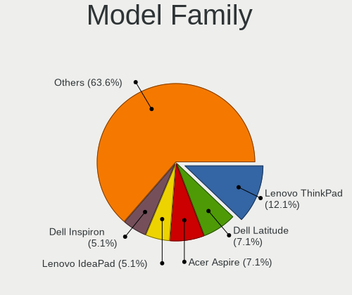
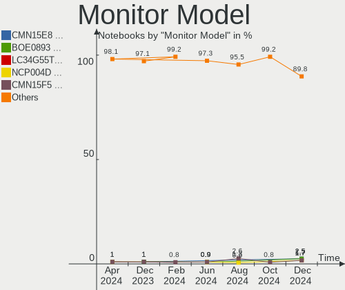
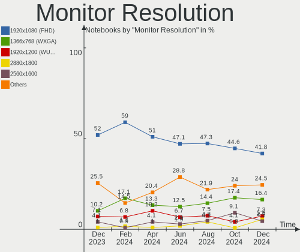
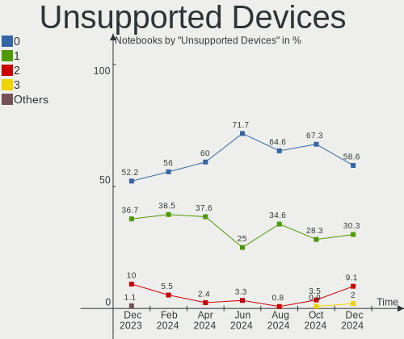

Pop!_OS Hardware Trends (Notebooks)
-----------------------------------

A project to identify most popular hardware characteristics and track their change
over time based on data collected by Pop!_OS users at https://Linux-Hardware.org.

Anyone can contribute to this report by the [hw-probe](https://github.com/linuxhw/hw-probe) tool:

    sudo -E hw-probe -all -upload

Full-feature report is available here: https://linux-hardware.org/?view=trends&formfactor=notebook

Period: Aug, 2021.

Contents
--------

* [ System ](#system)
  - [ OS                       ](#os)
  - [ OS Family                ](#os-family)
  - [ Kernel                   ](#kernel)
  - [ Kernel Family            ](#kernel-family)
  - [ Kernel Major Ver.        ](#kernel-major-ver)
  - [ Arch                     ](#arch)
  - [ DE                       ](#de)
  - [ Display Server           ](#display-server)
  - [ Display Manager          ](#display-manager)
  - [ OS Lang                  ](#os-lang)
  - [ Boot Mode                ](#boot-mode)
  - [ Filesystem               ](#filesystem)
  - [ Part. scheme             ](#part-scheme)
  - [ Dual Boot with Linux/BSD ](#dual-boot-with-linuxbsd)
  - [ Dual Boot (Win)          ](#dual-boot-win)

* [ Board ](#board)
  - [ Vendor                   ](#vendor)
  - [ Model                    ](#model)
  - [ Model Family             ](#model-family)
  - [ MFG Year                 ](#mfg-year)
  - [ Form Factor              ](#form-factor)
  - [ Secure Boot              ](#secure-boot)
  - [ Coreboot                 ](#coreboot)
  - [ RAM Size                 ](#ram-size)
  - [ RAM Used                 ](#ram-used)
  - [ Total Drives             ](#total-drives)
  - [ Has CD-ROM               ](#has-cd-rom)
  - [ Has Ethernet             ](#has-ethernet)
  - [ Has WiFi                 ](#has-wifi)
  - [ Has Bluetooth            ](#has-bluetooth)

* [ Location ](#location)
  - [ Country                  ](#country)
  - [ City                     ](#city)

* [ Drives ](#drives)
  - [ Drive Vendor             ](#drive-vendor)
  - [ Drive Model              ](#drive-model)
  - [ HDD Vendor               ](#hdd-vendor)
  - [ SSD Vendor               ](#ssd-vendor)
  - [ Drive Kind               ](#drive-kind)
  - [ Drive Connector          ](#drive-connector)
  - [ Drive Size               ](#drive-size)
  - [ Space Total              ](#space-total)
  - [ Space Used               ](#space-used)
  - [ Malfunc. Drives          ](#malfunc-drives)
  - [ Malfunc. Drive Vendor    ](#malfunc-drive-vendor)
  - [ Malfunc. HDD Vendor      ](#malfunc-hdd-vendor)
  - [ Malfunc. Drive Kind      ](#malfunc-drive-kind)
  - [ Failed Drives            ](#failed-drives)
  - [ Failed Drive Vendor      ](#failed-drive-vendor)
  - [ Drive Status             ](#drive-status)

* [ Storage controller ](#storage-controller)
  - [ Storage Vendor           ](#storage-vendor)
  - [ Storage Model            ](#storage-model)
  - [ Storage Kind             ](#storage-kind)

* [ Processor ](#processor)
  - [ CPU Vendor               ](#cpu-vendor)
  - [ CPU Model                ](#cpu-model)
  - [ CPU Model Family         ](#cpu-model-family)
  - [ CPU Cores                ](#cpu-cores)
  - [ CPU Sockets              ](#cpu-sockets)
  - [ CPU Threads              ](#cpu-threads)
  - [ CPU Op-Modes             ](#cpu-op-modes)
  - [ CPU Microcode            ](#cpu-microcode)
  - [ CPU Microarch            ](#cpu-microarch)

* [ Graphics ](#graphics)
  - [ GPU Vendor               ](#gpu-vendor)
  - [ GPU Model                ](#gpu-model)
  - [ GPU Combo                ](#gpu-combo)
  - [ GPU Driver               ](#gpu-driver)
  - [ GPU Memory               ](#gpu-memory)

* [ Monitor ](#monitor)
  - [ Monitor Vendor           ](#monitor-vendor)
  - [ Monitor Model            ](#monitor-model)
  - [ Monitor Resolution       ](#monitor-resolution)
  - [ Monitor Diagonal         ](#monitor-diagonal)
  - [ Monitor Width            ](#monitor-width)
  - [ Aspect Ratio             ](#aspect-ratio)
  - [ Monitor Area             ](#monitor-area)
  - [ Pixel Density            ](#pixel-density)
  - [ Multiple Monitors        ](#multiple-monitors)

* [ Network ](#network)
  - [ Net Controller Vendor    ](#net-controller-vendor)
  - [ Net Controller Model     ](#net-controller-model)
  - [ Wireless Vendor          ](#wireless-vendor)
  - [ Wireless Model           ](#wireless-model)
  - [ Ethernet Vendor          ](#ethernet-vendor)
  - [ Ethernet Model           ](#ethernet-model)
  - [ Net Controller Kind      ](#net-controller-kind)
  - [ Used Controller          ](#used-controller)
  - [ NICs                     ](#nics)
  - [ IPv6                     ](#ipv6)

* [ Bluetooth ](#bluetooth)
  - [ Bluetooth Vendor         ](#bluetooth-vendor)
  - [ Bluetooth Model          ](#bluetooth-model)

* [ Sound ](#sound)
  - [ Sound Vendor             ](#sound-vendor)
  - [ Sound Model              ](#sound-model)

* [ Memory ](#memory)
  - [ Memory Vendor            ](#memory-vendor)
  - [ Memory Model             ](#memory-model)
  - [ Memory Kind              ](#memory-kind)
  - [ Memory Form Factor       ](#memory-form-factor)
  - [ Memory Size              ](#memory-size)
  - [ Memory Speed             ](#memory-speed)

* [ Printers & scanners ](#printers--scanners)
  - [ Printer Vendor           ](#printer-vendor)
  - [ Printer Model            ](#printer-model)
  - [ Scanner Vendor           ](#scanner-vendor)
  - [ Scanner Model            ](#scanner-model)

* [ Camera ](#camera)
  - [ Camera Vendor            ](#camera-vendor)
  - [ Camera Model             ](#camera-model)

* [ Security ](#security)
  - [ Fingerprint Vendor       ](#fingerprint-vendor)
  - [ Fingerprint Model        ](#fingerprint-model)
  - [ Chipcard Vendor          ](#chipcard-vendor)
  - [ Chipcard Model           ](#chipcard-model)

* [ Unsupported ](#unsupported)
  - [ Unsupported Devices      ](#unsupported-devices)
  - [ Unsupported Device Types ](#unsupported-device-types)

System
------

OS
--

Installed operating systems

| Name          | Notebooks | Percent |
|---------------|-----------|---------|
| Pop!_OS 21.04 | 213       | 90.64%  |
| Pop!_OS 20.04 | 18        | 7.66%   |
| Pop!_OS 20.10 | 4         | 1.7%    |

OS Family
---------

OS without a version

| Name    | Notebooks | Percent |
|---------|-----------|---------|
| Pop!_OS | 235       | 100%    |

Kernel
------

Version of the Linux kernel

| Version                  | Notebooks | Percent |
|--------------------------|-----------|---------|
| 5.11.0-7620-generic      | 213       | 90.64%  |
| 5.11.0-7633-generic      | 6         | 2.55%   |
| 5.8.0-7642-generic       | 3         | 1.28%   |
| 5.8.0-7625-generic       | 1         | 0.43%   |
| 5.4.0-7634-generic       | 1         | 0.43%   |
| 5.4.0-7626-generic       | 1         | 0.43%   |
| 5.14.0-051400rc3-generic | 1         | 0.43%   |
| 5.13.9-xanmod1           | 1         | 0.43%   |
| 5.13.13-xanmod1          | 1         | 0.43%   |
| 5.13.12-xanmod1-edge     | 1         | 0.43%   |
| 5.13.12-xanmod1          | 1         | 0.43%   |
| 5.13.0-051300-generic    | 1         | 0.43%   |
| 5.12.0-051200-generic    | 1         | 0.43%   |
| 5.11.3-051103-generic    | 1         | 0.43%   |
| 5.11.10-051110-generic   | 1         | 0.43%   |
| 5.11.0-31-lowlatency     | 1         | 0.43%   |

Kernel Family
-------------

Linux kernel without a distro release

| Version | Notebooks | Percent |
|---------|-----------|---------|
| 5.11.0  | 220       | 93.62%  |
| 5.8.0   | 4         | 1.7%    |
| 5.4.0   | 2         | 0.85%   |
| 5.13.12 | 2         | 0.85%   |
| 5.14.0  | 1         | 0.43%   |
| 5.13.9  | 1         | 0.43%   |
| 5.13.13 | 1         | 0.43%   |
| 5.13.0  | 1         | 0.43%   |
| 5.12.0  | 1         | 0.43%   |
| 5.11.3  | 1         | 0.43%   |
| 5.11.10 | 1         | 0.43%   |

Kernel Major Ver.
-----------------

Linux kernel major version

| Version | Notebooks | Percent |
|---------|-----------|---------|
| 5.11    | 222       | 94.47%  |
| 5.13    | 5         | 2.13%   |
| 5.8     | 4         | 1.7%    |
| 5.4     | 2         | 0.85%   |
| 5.14    | 1         | 0.43%   |
| 5.12    | 1         | 0.43%   |

Arch
----

OS architecture (x86_64, i586, etc.)

| Name   | Notebooks | Percent |
|--------|-----------|---------|
| x86_64 | 235       | 100%    |

DE
--

Desktop Environment

| Name     | Notebooks | Percent |
|----------|-----------|---------|
| GNOME    | 228       | 97.02%  |
| KDE5     | 2         | 0.85%   |
| KDE      | 2         | 0.85%   |
| Unity    | 1         | 0.43%   |
| MATE     | 1         | 0.43%   |
| Cinnamon | 1         | 0.43%   |

Display Server
--------------

X11 or Wayland

| Name    | Notebooks | Percent |
|---------|-----------|---------|
| X11     | 230       | 97.87%  |
| Wayland | 4         | 1.7%    |
| Tty     | 1         | 0.43%   |

Display Manager
---------------

SDDM, LightDM, etc.

| Name    | Notebooks | Percent |
|---------|-----------|---------|
| Unknown | 186       | 79.15%  |
| GDM     | 48        | 20.43%  |
| SDDM    | 1         | 0.43%   |

OS Lang
-------

Language

| Lang   | Notebooks | Percent |
|--------|-----------|---------|
| en_US  | 133       | 56.6%   |
| pt_BR  | 18        | 7.66%   |
| en_GB  | 17        | 7.23%   |
| en_AU  | 10        | 4.26%   |
| de_DE  | 8         | 3.4%    |
| en_IN  | 6         | 2.55%   |
| pt_PT  | 4         | 1.7%    |
| fr_FR  | 4         | 1.7%    |
| en_CA  | 4         | 1.7%    |
| C      | 4         | 1.7%    |
| ru_RU  | 3         | 1.28%   |
| es_ES  | 3         | 1.28%   |
| pl_PL  | 2         | 0.85%   |
| it_IT  | 2         | 0.85%   |
| hu_HU  | 2         | 0.85%   |
| es_CL  | 2         | 0.85%   |
| en_NZ  | 2         | 0.85%   |
| zh_CN  | 1         | 0.43%   |
| tr_TR  | 1         | 0.43%   |
| sv_SE  | 1         | 0.43%   |
| ru_UA  | 1         | 0.43%   |
| ro_RO  | 1         | 0.43%   |
| nl_NL  | 1         | 0.43%   |
| nl_BE  | 1         | 0.43%   |
| es_MX  | 1         | 0.43%   |
| es_AR  | 1         | 0.43%   |
| en_ZA  | 1         | 0.43%   |
| en_150 | 1         | 0.43%   |

Boot Mode
---------

EFI or BIOS

| Mode | Notebooks | Percent |
|------|-----------|---------|
| BIOS | 192       | 81.7%   |
| EFI  | 43        | 18.3%   |

Filesystem
----------

Type of filesystem

| Type    | Notebooks | Percent |
|---------|-----------|---------|
| Ext4    | 227       | 96.6%   |
| Btrfs   | 6         | 2.55%   |
| Overlay | 2         | 0.85%   |

Part. scheme
------------

Scheme of partitioning

| Type    | Notebooks | Percent |
|---------|-----------|---------|
| Unknown | 186       | 79.15%  |
| GPT     | 43        | 18.3%   |
| MBR     | 6         | 2.55%   |

Dual Boot with Linux/BSD
------------------------

Hosting more than one Linux/BSD

| Dual boot | Notebooks | Percent |
|-----------|-----------|---------|
| No        | 233       | 99.15%  |
| Yes       | 2         | 0.85%   |

Dual Boot (Win)
---------------

Hosting Linux and Windows

| Dual boot | Notebooks | Percent |
|-----------|-----------|---------|
| No        | 218       | 92.77%  |
| Yes       | 17        | 7.23%   |

Board
-----

Vendor
------

Motherboard manufacturer

| Name                   | Notebooks | Percent |
|------------------------|-----------|---------|
| Hewlett-Packard        | 38        | 16.17%  |
| Lenovo                 | 37        | 15.74%  |
| Dell                   | 35        | 14.89%  |
| ASUSTek Computer       | 26        | 11.06%  |
| Acer                   | 20        | 8.51%   |
| Apple                  | 15        | 6.38%   |
| System76               | 8         | 3.4%    |
| MSI                    | 8         | 3.4%    |
| Toshiba                | 6         | 2.55%   |
| Teclast                | 3         | 1.28%   |
| Samsung Electronics    | 3         | 1.28%   |
| Sony                   | 2         | 0.85%   |
| Razer                  | 2         | 0.85%   |
| Positivo               | 2         | 0.85%   |
| PC Specialist          | 2         | 0.85%   |
| Packard Bell           | 2         | 0.85%   |
| Notebook               | 2         | 0.85%   |
| HUAWEI                 | 2         | 0.85%   |
| Google                 | 2         | 0.85%   |
| eMachines              | 2         | 0.85%   |
| Timi                   | 1         | 0.43%   |
| SLIMBOOK               | 1         | 0.43%   |
| Semp Toshiba           | 1         | 0.43%   |
| ONE-NETBOOK TECHNOLOGY | 1         | 0.43%   |
| ONDA                   | 1         | 0.43%   |
| Mustek                 | 1         | 0.43%   |
| Medion                 | 1         | 0.43%   |
| LincPlus               | 1         | 0.43%   |
| KOGAN                  | 1         | 0.43%   |
| IP3 Tech               | 1         | 0.43%   |
| Intel                  | 1         | 0.43%   |
| Gigabyte Technology    | 1         | 0.43%   |
| Gateway                | 1         | 0.43%   |
| Fujitsu                | 1         | 0.43%   |
| Framework              | 1         | 0.43%   |
| Eluktronics            | 1         | 0.43%   |
| Carbon Systems         | 1         | 0.43%   |
| Alienware              | 1         | 0.43%   |

Model
-----

Motherboard model

| Name                                            | Notebooks | Percent |
|-------------------------------------------------|-----------|---------|
| HP Pavilion dv6                                 | 4         | 1.7%    |
| Apple MacBookPro9,2                             | 4         | 1.7%    |
| System76 Gazelle                                | 3         | 1.28%   |
| System76 Oryx Pro                               | 2         | 0.85%   |
| Lenovo IdeaPad 3 15ADA05 81W1                   | 2         | 0.85%   |
| HP Stream Laptop 14-cb1xxx                      | 2         | 0.85%   |
| HP Notebook                                     | 2         | 0.85%   |
| HP G72                                          | 2         | 0.85%   |
| HP EliteBook 820 G1                             | 2         | 0.85%   |
| HP Compaq Presario CQ50                         | 2         | 0.85%   |
| Dell XPS 17 9700                                | 2         | 0.85%   |
| Dell Inspiron 3421                              | 2         | 0.85%   |
| ASUS TUF Gaming FX505DY_FX505DY                 | 2         | 0.85%   |
| Apple MacBookPro8,1                             | 2         | 0.85%   |
| Apple MacBook4,1                                | 2         | 0.85%   |
| Acer Nitro AN515-45                             | 2         | 0.85%   |
| Acer Aspire one 1-431                           | 2         | 0.85%   |
| Acer Aspire E5-575G                             | 2         | 0.85%   |
| Toshiba Satellite Pro L450                      | 1         | 0.43%   |
| Toshiba Satellite L775                          | 1         | 0.43%   |
| Toshiba Satellite L50-B                         | 1         | 0.43%   |
| Toshiba Satellite C650                          | 1         | 0.43%   |
| Toshiba Satellite C55-C                         | 1         | 0.43%   |
| Toshiba PORTEGE M780                            | 1         | 0.43%   |
| Timi Mi NoteBook 14                             | 1         | 0.43%   |
| Teclast TbooK 11                                | 1         | 0.43%   |
| Teclast F15S                                    | 1         | 0.43%   |
| Teclast F15 Plus                                | 1         | 0.43%   |
| System76 Serval                                 | 1         | 0.43%   |
| System76 Lemur Pro                              | 1         | 0.43%   |
| System76 Darter Pro                             | 1         | 0.43%   |
| Sony VPCF23M1E                                  | 1         | 0.43%   |
| Sony SVF15N17CXB                                | 1         | 0.43%   |
| SLIMBOOK PROX15-AMD                             | 1         | 0.43%   |
| Semp Toshiba STI NI 1401                        | 1         | 0.43%   |
| Samsung RC410/RC510/RC710                       | 1         | 0.43%   |
| Samsung R430/R480/R440                          | 1         | 0.43%   |
| Samsung 700G7C                                  | 1         | 0.43%   |
| Razer Blade Stealth 13 (Early 2020) - RZ09-0310 | 1         | 0.43%   |
| Razer Blade 14 - RZ09-0370                      | 1         | 0.43%   |
| Positivo C14CU51                                | 1         | 0.43%   |
| Positivo C14CR01                                | 1         | 0.43%   |
| PC Specialist P9XXEN_EF_ED                      | 1         | 0.43%   |
| PC Specialist GK7NR0R                           | 1         | 0.43%   |
| Packard Bell EasyNote TS11SB                    | 1         | 0.43%   |
| Packard Bell EasyNote TN65                      | 1         | 0.43%   |
| ONE-NETBOOK TECHNOLOGY One-Mix3 Pro             | 1         | 0.43%   |
| ONDA OBOOK 20 PLUS                              | 1         | 0.43%   |
| Notebook W35xSS_370SS                           | 1         | 0.43%   |
| Notebook PCX0DX                                 | 1         | 0.43%   |
| Mustek W35xSS_370SS                             | 1         | 0.43%   |
| MSI GS73 Stealth 8RE                            | 1         | 0.43%   |
| MSI GS66 Stealth 10SE                           | 1         | 0.43%   |
| MSI GP63 Leopard 8RE                            | 1         | 0.43%   |
| MSI GF75 Thin 10SCXR                            | 1         | 0.43%   |
| MSI GE66 Raider 11UH                            | 1         | 0.43%   |
| MSI GE63VR 7RF                                  | 1         | 0.43%   |
| MSI Alpha 15 A4DEK                              | 1         | 0.43%   |
| MSI Alpha 15 A3DDK                              | 1         | 0.43%   |
| Medion P8614                                    | 1         | 0.43%   |

Model Family
------------

Motherboard model prefix

| Name                            | Notebooks | Percent |
|---------------------------------|-----------|---------|
| Lenovo ThinkPad                 | 22        | 9.36%   |
| Dell Inspiron                   | 15        | 6.38%   |
| Lenovo IdeaPad                  | 12        | 5.11%   |
| Acer Aspire                     | 12        | 5.11%   |
| HP Pavilion                     | 9         | 3.83%   |
| Dell Latitude                   | 8         | 3.4%    |
| Dell XPS                        | 6         | 2.55%   |
| Toshiba Satellite               | 5         | 2.13%   |
| HP ProBook                      | 5         | 2.13%   |
| HP EliteBook                    | 5         | 2.13%   |
| Acer Nitro                      | 5         | 2.13%   |
| HP Laptop                       | 4         | 1.7%    |
| Dell Precision                  | 4         | 1.7%    |
| ASUS VivoBook                   | 4         | 1.7%    |
| Apple MacBookPro9               | 4         | 1.7%    |
| System76 Gazelle                | 3         | 1.28%   |
| HP Stream                       | 3         | 1.28%   |
| ASUS TUF                        | 3         | 1.28%   |
| System76 Oryx                   | 2         | 0.85%   |
| Razer Blade                     | 2         | 0.85%   |
| Packard Bell EasyNote           | 2         | 0.85%   |
| MSI Alpha                       | 2         | 0.85%   |
| HP Presario                     | 2         | 0.85%   |
| HP Notebook                     | 2         | 0.85%   |
| HP G72                          | 2         | 0.85%   |
| HP Compaq                       | 2         | 0.85%   |
| ASUS ROG                        | 2         | 0.85%   |
| ASUS ASUS                       | 2         | 0.85%   |
| Apple MacBookPro8               | 2         | 0.85%   |
| Apple MacBookPro5               | 2         | 0.85%   |
| Apple MacBookAir4               | 2         | 0.85%   |
| Apple MacBook4                  | 2         | 0.85%   |
| Acer Swift                      | 2         | 0.85%   |
| Toshiba PORTEGE                 | 1         | 0.43%   |
| Timi Mi                         | 1         | 0.43%   |
| Teclast TbooK                   | 1         | 0.43%   |
| Teclast F15S                    | 1         | 0.43%   |
| Teclast F15                     | 1         | 0.43%   |
| System76 Serval                 | 1         | 0.43%   |
| System76 Lemur                  | 1         | 0.43%   |
| System76 Darter                 | 1         | 0.43%   |
| Sony VPCF23M1E                  | 1         | 0.43%   |
| Sony SVF15N17CXB                | 1         | 0.43%   |
| SLIMBOOK PROX15-AMD             | 1         | 0.43%   |
| Semp Toshiba STI                | 1         | 0.43%   |
| Samsung RC410                   | 1         | 0.43%   |
| Samsung R430                    | 1         | 0.43%   |
| Samsung 700G7C                  | 1         | 0.43%   |
| Positivo C14CU51                | 1         | 0.43%   |
| Positivo C14CR01                | 1         | 0.43%   |
| PC Specialist P9XXEN            | 1         | 0.43%   |
| PC Specialist GK7NR0R           | 1         | 0.43%   |
| ONE-NETBOOK TECHNOLOGY One-Mix3 | 1         | 0.43%   |
| ONDA OBOOK                      | 1         | 0.43%   |
| Notebook W35xSS                 | 1         | 0.43%   |
| Notebook PCX0DX                 | 1         | 0.43%   |
| Mustek W35xSS                   | 1         | 0.43%   |
| MSI GS73                        | 1         | 0.43%   |
| MSI GS66                        | 1         | 0.43%   |
| MSI GP63                        | 1         | 0.43%   |

MFG Year
--------

Motherboard manufacture year

| Year | Notebooks | Percent |
|------|-----------|---------|
| 2020 | 51        | 21.7%   |
| 2021 | 50        | 21.28%  |
| 2019 | 24        | 10.21%  |
| 2018 | 17        | 7.23%   |
| 2011 | 17        | 7.23%   |
| 2012 | 13        | 5.53%   |
| 2010 | 12        | 5.11%   |
| 2013 | 10        | 4.26%   |
| 2016 | 8         | 3.4%    |
| 2015 | 8         | 3.4%    |
| 2014 | 7         | 2.98%   |
| 2009 | 6         | 2.55%   |
| 2008 | 6         | 2.55%   |
| 2017 | 5         | 2.13%   |
| 2007 | 1         | 0.43%   |

Form Factor
-----------

Physical design of the computer

| Name     | Notebooks | Percent |
|----------|-----------|---------|
| Notebook | 235       | 100%    |

Secure Boot
-----------

Enabled or disabled

| State    | Notebooks | Percent |
|----------|-----------|---------|
| Disabled | 235       | 100%    |

Coreboot
--------

Have coreboot on board

| Used | Notebooks | Percent |
|------|-----------|---------|
| No   | 227       | 96.6%   |
| Yes  | 8         | 3.4%    |

RAM Size
--------

Total RAM memory

| Size in GB  | Notebooks | Percent |
|-------------|-----------|---------|
| 4.01-8.0    | 71        | 30.21%  |
| 3.01-4.0    | 49        | 20.85%  |
| 8.01-16.0   | 42        | 17.87%  |
| 16.01-24.0  | 41        | 17.45%  |
| 32.01-64.0  | 16        | 6.81%   |
| 64.01-256.0 | 7         | 2.98%   |
| 1.01-2.0    | 7         | 2.98%   |
| 24.01-32.0  | 1         | 0.43%   |
| 2.01-3.0    | 1         | 0.43%   |

RAM Used
--------

Used RAM memory

| Used GB   | Notebooks | Percent |
|-----------|-----------|---------|
| 1.01-2.0  | 95        | 40.43%  |
| 2.01-3.0  | 74        | 31.49%  |
| 4.01-8.0  | 35        | 14.89%  |
| 3.01-4.0  | 24        | 10.21%  |
| 8.01-16.0 | 6         | 2.55%   |
| 0.51-1.0  | 1         | 0.43%   |

Total Drives
------------

Number of drives on board

| Drives | Notebooks | Percent |
|--------|-----------|---------|
| 1      | 149       | 63.4%   |
| 2      | 68        | 28.94%  |
| 3      | 15        | 6.38%   |
| 5      | 1         | 0.43%   |
| 4      | 1         | 0.43%   |
| 0      | 1         | 0.43%   |

Has CD-ROM
----------

Has CD-ROM on board

| Presented | Notebooks | Percent |
|-----------|-----------|---------|
| No        | 149       | 63.4%   |
| Yes       | 86        | 36.6%   |

Has Ethernet
------------

Has Ethernet on board

| Presented | Notebooks | Percent |
|-----------|-----------|---------|
| Yes       | 186       | 79.15%  |
| No        | 49        | 20.85%  |

Has WiFi
--------

Has WiFi module

| Presented | Notebooks | Percent |
|-----------|-----------|---------|
| Yes       | 227       | 96.6%   |
| No        | 8         | 3.4%    |

Has Bluetooth
-------------

Has Bluetooth module

| Presented | Notebooks | Percent |
|-----------|-----------|---------|
| Yes       | 190       | 80.85%  |
| No        | 45        | 19.15%  |

Location
--------

Country
-------

Geographic location (country)

| Country      | Notebooks | Percent |
|--------------|-----------|---------|
| USA          | 67        | 28.51%  |
| India        | 19        | 8.09%   |
| Brazil       | 19        | 8.09%   |
| Germany      | 13        | 5.53%   |
| UK           | 9         | 3.83%   |
| Australia    | 9         | 3.83%   |
| Canada       | 7         | 2.98%   |
| Portugal     | 6         | 2.55%   |
| Romania      | 5         | 2.13%   |
| France       | 5         | 2.13%   |
| Belgium      | 5         | 2.13%   |
| Switzerland  | 4         | 1.7%    |
| Russia       | 4         | 1.7%    |
| Netherlands  | 4         | 1.7%    |
| Mexico       | 4         | 1.7%    |
| Finland      | 4         | 1.7%    |
| South Africa | 3         | 1.28%   |
| Serbia       | 3         | 1.28%   |
| New Zealand  | 3         | 1.28%   |
| Malaysia     | 3         | 1.28%   |
| Italy        | 3         | 1.28%   |
| Indonesia    | 3         | 1.28%   |
| Vietnam      | 2         | 0.85%   |
| Sweden       | 2         | 0.85%   |
| Spain        | 2         | 0.85%   |
| Poland       | 2         | 0.85%   |
| Philippines  | 2         | 0.85%   |
| Lebanon      | 2         | 0.85%   |
| Latvia       | 2         | 0.85%   |
| Greece       | 2         | 0.85%   |
| Croatia      | 2         | 0.85%   |
| Chile        | 2         | 0.85%   |
| Ukraine      | 1         | 0.43%   |
| Turkey       | 1         | 0.43%   |
| Taiwan       | 1         | 0.43%   |
| South Korea  | 1         | 0.43%   |
| Pakistan     | 1         | 0.43%   |
| Malta        | 1         | 0.43%   |
| Luxembourg   | 1         | 0.43%   |
| Lithuania    | 1         | 0.43%   |
| Israel       | 1         | 0.43%   |
| Hungary      | 1         | 0.43%   |
| China        | 1         | 0.43%   |
| Austria      | 1         | 0.43%   |
| Argentina    | 1         | 0.43%   |

City
----

Geographic location (city)

| City                      | Notebooks | Percent |
|---------------------------|-----------|---------|
| Bengaluru                 | 6         | 2.55%   |
| S??o Paulo                | 3         | 1.28%   |
| Melbourne                 | 3         | 1.28%   |
| Ditzingen                 | 3         | 1.28%   |
| Berlin                    | 3         | 1.28%   |
| Victoria                  | 2         | 0.85%   |
| Vancouver                 | 2         | 0.85%   |
| Sydney                    | 2         | 0.85%   |
| S??vres                   | 2         | 0.85%   |
| San Diego                 | 2         | 0.85%   |
| Riga                      | 2         | 0.85%   |
| New York                  | 2         | 0.85%   |
| Los Angeles               | 2         | 0.85%   |
| Jacksonville              | 2         | 0.85%   |
| Helsinki                  | 2         | 0.85%   |
| Hampstead                 | 2         | 0.85%   |
| Fort Lee                  | 2         | 0.85%   |
| Delhi                     | 2         | 0.85%   |
| Bensheim                  | 2         | 0.85%   |
| Atlanta                   | 2         | 0.85%   |
| Ara?§atuba                | 2         | 0.85%   |
| Amsterdam                 | 2         | 0.85%   |
| Zurich                    | 1         | 0.43%   |
| Zagreb                    | 1         | 0.43%   |
| Yorktown                  | 1         | 0.43%   |
| Yankton                   | 1         | 0.43%   |
| Woodstock                 | 1         | 0.43%   |
| Woking                    | 1         | 0.43%   |
| Whangarei                 | 1         | 0.43%   |
| Wellington                | 1         | 0.43%   |
| Washington                | 1         | 0.43%   |
| Walla Walla               | 1         | 0.43%   |
| Vuisternens-devant-Romont | 1         | 0.43%   |
| Vladimir                  | 1         | 0.43%   |
| Vila Nova de Famalicao    | 1         | 0.43%   |
| Veracruz                  | 1         | 0.43%   |
| Van Buren                 | 1         | 0.43%   |
| Vale                      | 1         | 0.43%   |
| Uccle                     | 1         | 0.43%   |
| Uberl??ndia               | 1         | 0.43%   |
| Tver                      | 1         | 0.43%   |
| Tucson                    | 1         | 0.43%   |
| Townsville                | 1         | 0.43%   |
| Toszeg                    | 1         | 0.43%   |
| Toledo                    | 1         | 0.43%   |
| Timon                     | 1         | 0.43%   |
| Tickfaw                   | 1         | 0.43%   |
| Tel Aviv                  | 1         | 0.43%   |
| Tatu?­                    | 1         | 0.43%   |
| Tangerang                 | 1         | 0.43%   |
| Taichung                  | 1         | 0.43%   |
| Sylmar                    | 1         | 0.43%   |
| Swindon                   | 1         | 0.43%   |
| Suwanee                   | 1         | 0.43%   |
| Surabaya                  | 1         | 0.43%   |
| Summerside                | 1         | 0.43%   |
| Strassen                  | 1         | 0.43%   |
| Stouffville               | 1         | 0.43%   |
| Stopover                  | 1         | 0.43%   |
| Stoessing                 | 1         | 0.43%   |

Drives
------

Drive Vendor
------------

Hard drive vendors

| Vendor                    | Notebooks | Drives | Percent |
|---------------------------|-----------|--------|---------|
| Samsung Electronics       | 54        | 62     | 17.65%  |
| WDC                       | 31        | 32     | 10.13%  |
| Seagate                   | 30        | 30     | 9.8%    |
| Unknown                   | 27        | 34     | 8.82%   |
| Sandisk                   | 25        | 27     | 8.17%   |
| Toshiba                   | 24        | 24     | 7.84%   |
| Kingston                  | 16        | 16     | 5.23%   |
| Crucial                   | 16        | 17     | 5.23%   |
| SK Hynix                  | 13        | 13     | 4.25%   |
| Hitachi                   | 6         | 6      | 1.96%   |
| Intel                     | 5         | 5      | 1.63%   |
| Apple                     | 5         | 5      | 1.63%   |
| PNY                       | 4         | 4      | 1.31%   |
| Micron Technology         | 4         | 4      | 1.31%   |
| HGST                      | 4         | 4      | 1.31%   |
| A-DATA Technology         | 4         | 4      | 1.31%   |
| Silicon Motion            | 2         | 2      | 0.65%   |
| Realtek Semiconductor     | 2         | 2      | 0.65%   |
| Phison                    | 2         | 2      | 0.65%   |
| Micron/Crucial Technology | 2         | 2      | 0.65%   |
| JMicron                   | 2         | 5      | 0.65%   |
| Hewlett-Packard           | 2         | 2      | 0.65%   |
| China                     | 2         | 2      | 0.65%   |
| ADATA Technology          | 2         | 2      | 0.65%   |
| ZEPLIN Z                  | 1         | 1      | 0.33%   |
| XrayDisk                  | 1         | 1      | 0.33%   |
| XPG                       | 1         | 1      | 0.33%   |
| Verbatim                  | 1         | 1      | 0.33%   |
| Transcend                 | 1         | 1      | 0.33%   |
| Team                      | 1         | 1      | 0.33%   |
| SPCC                      | 1         | 1      | 0.33%   |
| PNY USB                   | 1         | 1      | 0.33%   |
| PLEXTOR                   | 1         | 1      | 0.33%   |
| Patriot                   | 1         | 1      | 0.33%   |
| OCZ                       | 1         | 1      | 0.33%   |
| Mushkin                   | 1         | 1      | 0.33%   |
| Memory                    | 1         | 1      | 0.33%   |
| LITEONIT                  | 1         | 3      | 0.33%   |
| LITEON                    | 1         | 1      | 0.33%   |
| Lexar                     | 1         | 1      | 0.33%   |
| KIOXIA                    | 1         | 1      | 0.33%   |
| JetDrive                  | 1         | 1      | 0.33%   |
| Gigabyte Technology       | 1         | 2      | 0.33%   |
| DOGFISH                   | 1         | 1      | 0.33%   |
| Apacer                    | 1         | 1      | 0.33%   |
| AMD                       | 1         | 2      | 0.33%   |

Drive Model
-----------

Hard drive models

| Model                               | Notebooks | Percent |
|-------------------------------------|-----------|---------|
| Unknown MMC Card  64GB              | 7         | 2.16%   |
| Unknown MMC Card  32GB              | 7         | 2.16%   |
| Sandisk NVMe SSD Drive 512GB        | 6         | 1.85%   |
| SK Hynix NVMe SSD Drive 512GB       | 5         | 1.54%   |
| Kingston SA400S37240G 240GB SSD     | 5         | 1.54%   |
| Toshiba MQ01ABD100 1TB              | 4         | 1.23%   |
| Seagate ST1000LM049-2GH172 1TB      | 4         | 1.23%   |
| Samsung SSD 860 EVO 500GB           | 4         | 1.23%   |
| Samsung SSD 860 EVO 1TB             | 4         | 1.23%   |
| WDC WD10SPZX-21Z10T0 1TB            | 3         | 0.93%   |
| Unknown MMC Card  128GB             | 3         | 0.93%   |
| Seagate ST1000LM024 HN-M101MBB 1TB  | 3         | 0.93%   |
| Seagate Expansion 2TB               | 3         | 0.93%   |
| Sandisk NVMe SSD Drive 500GB        | 3         | 0.93%   |
| Sandisk NVMe SSD Drive 256GB        | 3         | 0.93%   |
| Samsung NVMe SSD Drive 1TB          | 3         | 0.93%   |
| Samsung NVMe SSD Drive 1024GB       | 3         | 0.93%   |
| Crucial CT240BX500SSD1 240GB        | 3         | 0.93%   |
| Unknown NVMe SSD Drive 512GB        | 2         | 0.62%   |
| Toshiba MQ01ACF050 500GB            | 2         | 0.62%   |
| SK Hynix NVMe SSD Drive 1024GB      | 2         | 0.62%   |
| Seagate ST500LM012 HN-M500MBB 500GB | 2         | 0.62%   |
| Seagate ST2000LM015-2E8174 2TB      | 2         | 0.62%   |
| Seagate ST1000LX015-1U7172 1TB      | 2         | 0.62%   |
| Seagate BUP Slim 2TB                | 2         | 0.62%   |
| Sandisk NVMe SSD Drive 1024GB       | 2         | 0.62%   |
| Samsung SSD 970 EVO 500GB           | 2         | 0.62%   |
| Samsung SSD 860 QVO 1TB             | 2         | 0.62%   |
| Samsung SSD 850 EVO 500GB           | 2         | 0.62%   |
| Samsung NVMe SSD Drive 512GB        | 2         | 0.62%   |
| Samsung NVMe SSD Drive 500GB        | 2         | 0.62%   |
| Samsung NVMe SSD Drive 2TB          | 2         | 0.62%   |
| Samsung NVMe SSD Drive 250GB        | 2         | 0.62%   |
| Samsung MZVLB512HAJQ-00000 512GB    | 2         | 0.62%   |
| Micron/Crucial NVMe SSD Drive 500GB | 2         | 0.62%   |
| Kingston SUV400S37120G 120GB SSD    | 2         | 0.62%   |
| Kingston SA400S37480G 480GB SSD     | 2         | 0.62%   |
| Intel NVMe SSD Drive 512GB          | 2         | 0.62%   |
| Crucial CT500MX500SSD1 500GB        | 2         | 0.62%   |
| Crucial CT480BX500SSD1 480GB        | 2         | 0.62%   |
| Apple HDD HTS545050A7E362 500GB     | 2         | 0.62%   |
| ZEPLIN Z PL100 256GB                | 1         | 0.31%   |
| XrayDisk 120GB                      | 1         | 0.31%   |
| XPG NVMe SSD Drive 256GB            | 1         | 0.31%   |
| WDC WDS500G2B0C-00PXH0 500GB        | 1         | 0.31%   |
| WDC WDS500G2B0A-00SM50 500GB SSD    | 1         | 0.31%   |
| WDC WDS480G2G0A-00JH30 480GB SSD    | 1         | 0.31%   |
| WDC WDS250G2B0B-00YS70 250GB SSD    | 1         | 0.31%   |
| WDC WDS250G2B0A-00SM50 250GB SSD    | 1         | 0.31%   |
| WDC WDS240G2G0A-00JH30 240GB SSD    | 1         | 0.31%   |
| WDC WDS200T1X0E-00AFY0 2TB          | 1         | 0.31%   |
| WDC WDS120G2G0A-00JH30 120GB SSD    | 1         | 0.31%   |
| WDC WDS100T3X0C-00SJG0 1TB          | 1         | 0.31%   |
| WDC WDS100T2B0A 1TB SSD             | 1         | 0.31%   |
| WDC WD7500BPVT-75HXZT3 752GB        | 1         | 0.31%   |
| WDC WD6400BPVT-55HXZT2 640GB        | 1         | 0.31%   |
| WDC WD5000LPVX-75V0TT0 500GB        | 1         | 0.31%   |
| WDC WD5000LPVX-28V0TT0 500GB        | 1         | 0.31%   |
| WDC WD5000LPLX-75ZNTT0 500GB        | 1         | 0.31%   |
| WDC WD5000LPCX-60VHAT0 500GB        | 1         | 0.31%   |

HDD Vendor
----------

Hard disk drive vendors

| Vendor              | Notebooks | Drives | Percent |
|---------------------|-----------|--------|---------|
| Seagate             | 27        | 27     | 34.62%  |
| WDC                 | 19        | 19     | 24.36%  |
| Toshiba             | 17        | 17     | 21.79%  |
| Hitachi             | 6         | 6      | 7.69%   |
| HGST                | 4         | 4      | 5.13%   |
| Samsung Electronics | 2         | 2      | 2.56%   |
| Apple               | 2         | 2      | 2.56%   |
| JMicron             | 1         | 3      | 1.28%   |

SSD Vendor
----------

Solid state drive vendors

| Vendor              | Notebooks | Drives | Percent |
|---------------------|-----------|--------|---------|
| Samsung Electronics | 28        | 29     | 24.35%  |
| Crucial             | 15        | 16     | 13.04%  |
| Kingston            | 12        | 12     | 10.43%  |
| SanDisk             | 9         | 9      | 7.83%   |
| WDC                 | 7         | 7      | 6.09%   |
| PNY                 | 4         | 4      | 3.48%   |
| A-DATA Technology   | 4         | 4      | 3.48%   |
| Toshiba             | 3         | 3      | 2.61%   |
| Apple               | 3         | 3      | 2.61%   |
| Unknown             | 2         | 2      | 1.74%   |
| SK Hynix            | 2         | 2      | 1.74%   |
| Intel               | 2         | 2      | 1.74%   |
| Hewlett-Packard     | 2         | 2      | 1.74%   |
| China               | 2         | 2      | 1.74%   |
| Verbatim            | 1         | 1      | 0.87%   |
| Transcend           | 1         | 1      | 0.87%   |
| Team                | 1         | 1      | 0.87%   |
| SPCC                | 1         | 1      | 0.87%   |
| PNY USB             | 1         | 1      | 0.87%   |
| PLEXTOR             | 1         | 1      | 0.87%   |
| Phison              | 1         | 1      | 0.87%   |
| Patriot             | 1         | 1      | 0.87%   |
| OCZ                 | 1         | 1      | 0.87%   |
| Mushkin             | 1         | 1      | 0.87%   |
| Micron Technology   | 1         | 1      | 0.87%   |
| Memory              | 1         | 1      | 0.87%   |
| LITEONIT            | 1         | 3      | 0.87%   |
| LITEON              | 1         | 1      | 0.87%   |
| Lexar               | 1         | 1      | 0.87%   |
| JMicron             | 1         | 1      | 0.87%   |
| Gigabyte Technology | 1         | 2      | 0.87%   |
| DOGFISH             | 1         | 1      | 0.87%   |
| Apacer              | 1         | 1      | 0.87%   |
| AMD                 | 1         | 2      | 0.87%   |

Drive Kind
----------

HDD or SSD

| Kind    | Notebooks | Drives | Percent |
|---------|-----------|--------|---------|
| SSD     | 107       | 121    | 35.91%  |
| NVMe    | 83        | 94     | 27.85%  |
| HDD     | 77        | 80     | 25.84%  |
| MMC     | 22        | 28     | 7.38%   |
| Unknown | 9         | 9      | 3.02%   |

Drive Connector
---------------

SATA, SAS, NVMe, etc.

| Type | Notebooks | Drives | Percent |
|------|-----------|--------|---------|
| SATA | 159       | 190    | 56.99%  |
| NVMe | 83        | 94     | 29.75%  |
| MMC  | 22        | 28     | 7.89%   |
| SAS  | 15        | 20     | 5.38%   |

Drive Size
----------

Size of hard drive

| Size in TB | Notebooks | Drives | Percent |
|------------|-----------|--------|---------|
| 0.01-0.5   | 116       | 129    | 63.39%  |
| 0.51-1.0   | 52        | 56     | 28.42%  |
| 1.01-2.0   | 14        | 15     | 7.65%   |
| 4.01-10.0  | 1         | 1      | 0.55%   |

Space Total
-----------

Amount of disk space available on the file system

| Size in GB     | Notebooks | Percent |
|----------------|-----------|---------|
| 101-250        | 84        | 35.74%  |
| 251-500        | 62        | 26.38%  |
| 501-1000       | 37        | 15.74%  |
| 51-100         | 16        | 6.81%   |
| 1001-2000      | 12        | 5.11%   |
| 21-50          | 11        | 4.68%   |
| 2001-3000      | 6         | 2.55%   |
| 1-20           | 4         | 1.7%    |
| More than 3000 | 3         | 1.28%   |

Space Used
----------

Amount of used disk space

| Used GB   | Notebooks | Percent |
|-----------|-----------|---------|
| 1-20      | 117       | 49.79%  |
| 21-50     | 54        | 22.98%  |
| 101-250   | 25        | 10.64%  |
| 51-100    | 18        | 7.66%   |
| 501-1000  | 10        | 4.26%   |
| 251-500   | 7         | 2.98%   |
| 1001-2000 | 3         | 1.28%   |
| 2001-3000 | 1         | 0.43%   |

Malfunc. Drives
---------------

Drive models with a malfunction

| Model                                          | Notebooks | Drives | Percent |
|------------------------------------------------|-----------|--------|---------|
| WDC WD5000LPCX-60VHAT0 500GB                   | 1         | 1      | 20%     |
| Toshiba MK7559GSXP 752GB                       | 1         | 1      | 20%     |
| Samsung Electronics SSD 970 EVO 2TB            | 1         | 1      | 20%     |
| Micron Technology 1100_MTFDDAV512TBN 512GB SSD | 1         | 1      | 20%     |
| Kingston SUV400S37120G 120GB SSD               | 1         | 1      | 20%     |

Malfunc. Drive Vendor
---------------------

Vendors of faulty drives

| Vendor              | Notebooks | Drives | Percent |
|---------------------|-----------|--------|---------|
| WDC                 | 1         | 1      | 20%     |
| Toshiba             | 1         | 1      | 20%     |
| Samsung Electronics | 1         | 1      | 20%     |
| Micron Technology   | 1         | 1      | 20%     |
| Kingston            | 1         | 1      | 20%     |

Malfunc. HDD Vendor
-------------------

Vendors of faulty HDD drives

| Vendor  | Notebooks | Drives | Percent |
|---------|-----------|--------|---------|
| WDC     | 1         | 1      | 50%     |
| Toshiba | 1         | 1      | 50%     |

Malfunc. Drive Kind
-------------------

Kinds of faulty drives

| Kind | Notebooks | Drives | Percent |
|------|-----------|--------|---------|
| SSD  | 2         | 2      | 40%     |
| HDD  | 2         | 2      | 40%     |
| NVMe | 1         | 1      | 20%     |

Failed Drives
-------------

Failed drive models

Zero info for selected period =(

Failed Drive Vendor
-------------------

Failed drive vendors

Zero info for selected period =(

Drive Status
------------

Number of failed and malfunc. drives

| Status   | Notebooks | Drives | Percent |
|----------|-----------|--------|---------|
| Detected | 192       | 271    | 78.37%  |
| Works    | 48        | 56     | 19.59%  |
| Malfunc  | 5         | 5      | 2.04%   |

Storage controller
------------------

Storage Vendor
--------------

Storage controller vendors

| Vendor                         | Notebooks | Percent |
|--------------------------------|-----------|---------|
| Intel                          | 156       | 56.32%  |
| AMD                            | 31        | 11.19%  |
| Samsung Electronics            | 28        | 10.11%  |
| Sandisk                        | 21        | 7.58%   |
| SK Hynix                       | 11        | 3.97%   |
| Toshiba America Info Systems   | 4         | 1.44%   |
| Kingston Technology Company    | 4         | 1.44%   |
| Nvidia                         | 3         | 1.08%   |
| Micron Technology              | 3         | 1.08%   |
| ADATA Technology               | 3         | 1.08%   |
| Silicon Motion                 | 2         | 0.72%   |
| Seagate Technology             | 2         | 0.72%   |
| Realtek Semiconductor          | 2         | 0.72%   |
| Micron/Crucial Technology      | 2         | 0.72%   |
| Solid State Storage Technology | 1         | 0.36%   |
| Shenzhen Longsys Electronics   | 1         | 0.36%   |
| Phison Electronics             | 1         | 0.36%   |
| Marvell Technology Group       | 1         | 0.36%   |
| KIOXIA                         | 1         | 0.36%   |

Storage Model
-------------

Storage controller models

| Model                                                                            | Notebooks | Percent |
|----------------------------------------------------------------------------------|-----------|---------|
| AMD FCH SATA Controller [AHCI mode]                                              | 27        | 9.51%   |
| Intel 7 Series Chipset Family 6-port SATA Controller [AHCI mode]                 | 22        | 7.75%   |
| Intel 6 Series/C200 Series Chipset Family 6 port Mobile SATA AHCI Controller     | 17        | 5.99%   |
| Samsung NVMe SSD Controller SM981/PM981/PM983                                    | 16        | 5.63%   |
| Intel Sunrise Point-LP SATA Controller [AHCI mode]                               | 13        | 4.58%   |
| Intel 82801 Mobile SATA Controller [RAID mode]                                   | 12        | 4.23%   |
| Intel 82801IBM/IEM (ICH9M/ICH9M-E) 4 port SATA Controller [AHCI mode]            | 11        | 3.87%   |
| Intel 8 Series SATA Controller 1 [AHCI mode]                                     | 11        | 3.87%   |
| Intel Cannon Lake Mobile PCH SATA AHCI Controller                                | 10        | 3.52%   |
| Intel 5 Series/3400 Series Chipset 4 port SATA AHCI Controller                   | 10        | 3.52%   |
| Sandisk WD Blue SN550 NVMe SSD                                                   | 7         | 2.46%   |
| Sandisk WD Black SN750 / PC SN730 NVMe SSD                                       | 7         | 2.46%   |
| Intel HM170/QM170 Chipset SATA Controller [AHCI Mode]                            | 6         | 2.11%   |
| Intel 400 Series Chipset Family SATA AHCI Controller                             | 6         | 2.11%   |
| Samsung NVMe Controller                                                          | 5         | 1.76%   |
| SK Hynix NVMe SSD Controller                                                     | 4         | 1.41%   |
| Samsung NVMe SSD Controller PM9A1/PM9A3/980PRO                                   | 4         | 1.41%   |
| Intel Wildcat Point-LP SATA Controller [AHCI Mode]                               | 4         | 1.41%   |
| Intel Comet Lake SATA AHCI Controller                                            | 4         | 1.41%   |
| Intel 5 Series/3400 Series Chipset 6 port SATA AHCI Controller                   | 4         | 1.41%   |
| AMD SB7x0/SB8x0/SB9x0 SATA Controller [AHCI mode]                                | 4         | 1.41%   |
| SK Hynix Non-Volatile memory controller                                          | 3         | 1.06%   |
| SK Hynix BC511                                                                   | 3         | 1.06%   |
| Sandisk WD Blue SN500 / PC SN520 NVMe SSD                                        | 3         | 1.06%   |
| Micron Non-Volatile memory controller                                            | 3         | 1.06%   |
| Intel SSD 660P Series                                                            | 3         | 1.06%   |
| Intel Celeron/Pentium Silver Processor SATA Controller                           | 3         | 1.06%   |
| Intel Celeron N3350/Pentium N4200/Atom E3900 Series SATA AHCI Controller         | 3         | 1.06%   |
| Intel 8 Series/C220 Series Chipset Family 6-port SATA Controller 1 [AHCI mode]   | 3         | 1.06%   |
| Toshiba America Info Systems XG6 NVMe SSD Controller                             | 2         | 0.7%    |
| Silicon Motion SM2263EN/SM2263XT SSD Controller                                  | 2         | 0.7%    |
| Sandisk Non-Volatile memory controller                                           | 2         | 0.7%    |
| Samsung Electronics SATA controller                                              | 2         | 0.7%    |
| Nvidia MCP79 AHCI Controller                                                     | 2         | 0.7%    |
| Kingston Company Company Non-Volatile memory controller                          | 2         | 0.7%    |
| Intel Volume Management Device NVMe RAID Controller                              | 2         | 0.7%    |
| Intel Comet Lake PCH-LP SATA RAID Premium Controller                             | 2         | 0.7%    |
| Intel Cannon Point-LP SATA Controller [AHCI Mode]                                | 2         | 0.7%    |
| Intel Atom/Celeron/Pentium Processor x5-E8000/J3xxx/N3xxx Series SATA Controller | 2         | 0.7%    |
| Intel 82801HM/HEM (ICH8M/ICH8M-E) SATA Controller [AHCI mode]                    | 2         | 0.7%    |
| Intel 82801HM/HEM (ICH8M/ICH8M-E) IDE Controller                                 | 2         | 0.7%    |
| ADATA Non-Volatile memory controller                                             | 2         | 0.7%    |
| Toshiba America Info Systems XG4 NVMe SSD Controller                             | 1         | 0.35%   |
| Toshiba America Info Systems Toshiba America Info Non-Volatile memory controller | 1         | 0.35%   |
| Solid State Storage Non-Volatile memory controller                               | 1         | 0.35%   |
| SK Hynix PC401 NVMe Solid State Drive 256GB                                      | 1         | 0.35%   |
| Shenzhen Longsys Non-Volatile memory controller                                  | 1         | 0.35%   |
| Seagate Non-Volatile memory controller                                           | 1         | 0.35%   |
| Seagate FireCuda 510 SSD                                                         | 1         | 0.35%   |
| Sandisk WD Black SN850                                                           | 1         | 0.35%   |
| Sandisk WD Black 2018/SN750 / PC SN720 NVMe SSD                                  | 1         | 0.35%   |
| Samsung XP941 PCIe SSD                                                           | 1         | 0.35%   |
| Realtek RTS5763DL NVMe SSD Controller                                            | 1         | 0.35%   |
| Realtek Realtek Non-Volatile memory controller                                   | 1         | 0.35%   |
| Phison E12 NVMe Controller                                                       | 1         | 0.35%   |
| Nvidia MCP78S [GeForce 8200] SATA Controller (non-AHCI mode)                     | 1         | 0.35%   |
| Nvidia MCP78S [GeForce 8200] IDE                                                 | 1         | 0.35%   |
| Micron/Crucial NVMe Controller                                                   | 1         | 0.35%   |
| Micron/Crucial Non-Volatile memory controller                                    | 1         | 0.35%   |
| Marvell Group 88SS9183 PCIe SSD Controller                                       | 1         | 0.35%   |

Storage Kind
------------

Kind of storage controller (IDE, SATA, NVMe, SAS, ...)

| Kind | Notebooks | Percent |
|------|-----------|---------|
| SATA | 172       | 61.87%  |
| NVMe | 83        | 29.86%  |
| RAID | 16        | 5.76%   |
| IDE  | 7         | 2.52%   |

Processor
---------

CPU Vendor
----------

Processor vendors

| Vendor | Notebooks | Percent |
|--------|-----------|---------|
| Intel  | 190       | 80.85%  |
| AMD    | 45        | 19.15%  |

CPU Model
---------

Processor models

| Model                                         | Notebooks | Percent |
|-----------------------------------------------|-----------|---------|
| Intel Core i5-3210M CPU @ 2.50GHz             | 6         | 2.55%   |
| Intel Core i7-10875H CPU @ 2.30GHz            | 5         | 2.13%   |
| Intel Celeron N4000 CPU @ 1.10GHz             | 5         | 2.13%   |
| AMD Ryzen 7 4800H with Radeon Graphics        | 5         | 2.13%   |
| Intel Core i7-8750H CPU @ 2.20GHz             | 4         | 1.7%    |
| Intel Core i7-8565U CPU @ 1.80GHz             | 4         | 1.7%    |
| Intel Core i7-7700HQ CPU @ 2.80GHz            | 3         | 1.28%   |
| Intel Core i7-3632QM CPU @ 2.20GHz            | 3         | 1.28%   |
| Intel Core i7-10750H CPU @ 2.60GHz            | 3         | 1.28%   |
| Intel Core i7-10510U CPU @ 1.80GHz            | 3         | 1.28%   |
| Intel Core i7 CPU Q 720 @ 1.60GHz             | 3         | 1.28%   |
| Intel Core i5-3320M CPU @ 2.60GHz             | 3         | 1.28%   |
| Intel Core i5-2520M CPU @ 2.50GHz             | 3         | 1.28%   |
| Intel Core i3 CPU M 350 @ 2.27GHz             | 3         | 1.28%   |
| Intel 11th Gen Core i7-1165G7 @ 2.80GHz       | 3         | 1.28%   |
| AMD Ryzen 5 3500U with Radeon Vega Mobile Gfx | 3         | 1.28%   |
| Intel Pentium Dual-Core CPU T4500 @ 2.30GHz   | 2         | 0.85%   |
| Intel Core m3-6Y30 CPU @ 0.90GHz              | 2         | 0.85%   |
| Intel Core i7-9750H CPU @ 2.60GHz             | 2         | 0.85%   |
| Intel Core i7-6500U CPU @ 2.50GHz             | 2         | 0.85%   |
| Intel Core i7-4600U CPU @ 2.10GHz             | 2         | 0.85%   |
| Intel Core i7-4510U CPU @ 2.00GHz             | 2         | 0.85%   |
| Intel Core i7-4500U CPU @ 1.80GHz             | 2         | 0.85%   |
| Intel Core i7-3610QM CPU @ 2.30GHz            | 2         | 0.85%   |
| Intel Core i7-2630QM CPU @ 2.00GHz            | 2         | 0.85%   |
| Intel Core i7-10870H CPU @ 2.20GHz            | 2         | 0.85%   |
| Intel Core i7-1065G7 CPU @ 1.30GHz            | 2         | 0.85%   |
| Intel Core i5-8300H CPU @ 2.30GHz             | 2         | 0.85%   |
| Intel Core i5-8265U CPU @ 1.60GHz             | 2         | 0.85%   |
| Intel Core i5-8250U CPU @ 1.60GHz             | 2         | 0.85%   |
| Intel Core i5-7300HQ CPU @ 2.50GHz            | 2         | 0.85%   |
| Intel Core i5-7200U CPU @ 2.50GHz             | 2         | 0.85%   |
| Intel Core i5-5200U CPU @ 2.20GHz             | 2         | 0.85%   |
| Intel Core i5-3337U CPU @ 1.80GHz             | 2         | 0.85%   |
| Intel Core i5-3230M CPU @ 2.60GHz             | 2         | 0.85%   |
| Intel Core i5-2450M CPU @ 2.50GHz             | 2         | 0.85%   |
| Intel Core i5-2430M CPU @ 2.40GHz             | 2         | 0.85%   |
| Intel Core i5-2410M CPU @ 2.30GHz             | 2         | 0.85%   |
| Intel Core i5-10210U CPU @ 1.60GHz            | 2         | 0.85%   |
| Intel Core i5 CPU M 480 @ 2.67GHz             | 2         | 0.85%   |
| Intel Core i5 CPU M 430 @ 2.27GHz             | 2         | 0.85%   |
| Intel Core i3-6006U CPU @ 2.00GHz             | 2         | 0.85%   |
| Intel Core i3-10110U CPU @ 2.10GHz            | 2         | 0.85%   |
| Intel Core 2 Duo CPU T8300 @ 2.40GHz          | 2         | 0.85%   |
| Intel Core 2 Duo CPU T6600 @ 2.20GHz          | 2         | 0.85%   |
| Intel Celeron CPU N3060 @ 1.60GHz             | 2         | 0.85%   |
| Intel Celeron CPU N3050 @ 1.60GHz             | 2         | 0.85%   |
| Intel Atom x5-Z8300 CPU @ 1.44GHz             | 2         | 0.85%   |
| Intel 11th Gen Core i7-11800H @ 2.30GHz       | 2         | 0.85%   |
| Intel 11th Gen Core i5-1135G7 @ 2.40GHz       | 2         | 0.85%   |
| AMD Ryzen 9 5900HS with Radeon Graphics       | 2         | 0.85%   |
| AMD Ryzen 7 PRO 4750U with Radeon Graphics    | 2         | 0.85%   |
| AMD Ryzen 7 5800H with Radeon Graphics        | 2         | 0.85%   |
| AMD Ryzen 7 3750H with Radeon Vega Mobile Gfx | 2         | 0.85%   |
| AMD Ryzen 5 5600H with Radeon Graphics        | 2         | 0.85%   |
| AMD Ryzen 5 4500U with Radeon Graphics        | 2         | 0.85%   |
| AMD Ryzen 5 3550H with Radeon Vega Mobile Gfx | 2         | 0.85%   |
| AMD Ryzen 5 2500U with Radeon Vega Mobile Gfx | 2         | 0.85%   |
| AMD Ryzen 3 3250U with Radeon Graphics        | 2         | 0.85%   |
| Intel Xeon W-10855M CPU @ 2.80GHz             | 1         | 0.43%   |

CPU Model Family
----------------

Processor model prefix

| Model                   | Notebooks | Percent |
|-------------------------|-----------|---------|
| Intel Core i7           | 64        | 27.23%  |
| Intel Core i5           | 55        | 23.4%   |
| Intel Core i3           | 17        | 7.23%   |
| Intel Celeron           | 16        | 6.81%   |
| AMD Ryzen 7             | 12        | 5.11%   |
| AMD Ryzen 5             | 12        | 5.11%   |
| Other                   | 10        | 4.26%   |
| Intel Core 2 Duo        | 10        | 4.26%   |
| Intel Pentium Dual-Core | 4         | 1.7%    |
| Intel Pentium           | 4         | 1.7%    |
| AMD Ryzen 9             | 4         | 1.7%    |
| Intel Core m3           | 3         | 1.28%   |
| AMD Ryzen 3             | 3         | 1.28%   |
| Intel Xeon              | 2         | 0.85%   |
| Intel Atom              | 2         | 0.85%   |
| AMD Ryzen 7 PRO         | 2         | 0.85%   |
| AMD E                   | 2         | 0.85%   |
| AMD Athlon              | 2         | 0.85%   |
| AMD A6                  | 2         | 0.85%   |
| Intel Pentium Silver    | 1         | 0.43%   |
| Intel Genuine           | 1         | 0.43%   |
| Intel Core i9           | 1         | 0.43%   |
| Intel Core 2            | 1         | 0.43%   |
| AMD V120                | 1         | 0.43%   |
| AMD Phenom II           | 1         | 0.43%   |
| AMD FX                  | 1         | 0.43%   |
| AMD A8                  | 1         | 0.43%   |
| AMD A10                 | 1         | 0.43%   |

CPU Cores
---------

Number of processor cores

| Number | Notebooks | Percent |
|--------|-----------|---------|
| 2      | 115       | 48.94%  |
| 4      | 72        | 30.64%  |
| 8      | 26        | 11.06%  |
| 6      | 18        | 7.66%   |
| 1      | 4         | 1.7%    |

CPU Sockets
-----------

Number of sockets

| Number | Notebooks | Percent |
|--------|-----------|---------|
| 1      | 235       | 100%    |

CPU Threads
-----------

Threads per core (Hyper-Threading)

| Number | Notebooks | Percent |
|--------|-----------|---------|
| 2      | 179       | 76.17%  |
| 1      | 56        | 23.83%  |

CPU Op-Modes
------------

CPU Operation Modes (32-bit, 64-bit)

| Op mode        | Notebooks | Percent |
|----------------|-----------|---------|
| 32-bit, 64-bit | 235       | 100%    |

CPU Microcode
-------------

Microcode number

| Number     | Notebooks | Percent |
|------------|-----------|---------|
| Unknown    | 181       | 77.02%  |
| 0xa0652    | 6         | 2.55%   |
| 0x406e3    | 6         | 2.55%   |
| 0x306a9    | 4         | 1.7%    |
| 0x806ec    | 3         | 1.28%   |
| 0x806c1    | 3         | 1.28%   |
| 0x40651    | 3         | 1.28%   |
| 0x206a7    | 3         | 1.28%   |
| 0x906ea    | 2         | 0.85%   |
| 0x906e9    | 2         | 0.85%   |
| 0x806eb    | 2         | 0.85%   |
| 0x806ea    | 2         | 0.85%   |
| 0x0a50000c | 2         | 0.85%   |
| 0x0a50000b | 2         | 0.85%   |
| 0x08108109 | 2         | 0.85%   |
| 0x806d1    | 1         | 0.43%   |
| 0x706a8    | 1         | 0.43%   |
| 0x706a1    | 1         | 0.43%   |
| 0x6fd      | 1         | 0.43%   |
| 0x506c9    | 1         | 0.43%   |
| 0x406c4    | 1         | 0.43%   |
| 0x40661    | 1         | 0.43%   |
| 0x306d4    | 1         | 0.43%   |
| 0x20652    | 1         | 0.43%   |
| 0x08600106 | 1         | 0.43%   |
| 0x08108102 | 1         | 0.43%   |
| 0x05000119 | 1         | 0.43%   |

CPU Microarch
-------------

Microarchitecture

| Name            | Notebooks | Percent |
|-----------------|-----------|---------|
| KabyLake        | 41        | 17.45%  |
| SandyBridge     | 22        | 9.36%   |
| IvyBridge       | 22        | 9.36%   |
| Haswell         | 18        | 7.66%   |
| Zen 2           | 12        | 5.11%   |
| Westmere        | 12        | 5.11%   |
| Penryn          | 12        | 5.11%   |
| Zen+            | 11        | 4.68%   |
| CometLake       | 11        | 4.68%   |
| Skylake         | 10        | 4.26%   |
| Zen 3           | 8         | 3.4%    |
| Goldmont plus   | 8         | 3.4%    |
| Silvermont      | 7         | 2.98%   |
| TigerLake       | 5         | 2.13%   |
| Core            | 5         | 2.13%   |
| Broadwell       | 5         | 2.13%   |
| Zen             | 4         | 1.7%    |
| Unknown         | 4         | 1.7%    |
| Nehalem         | 3         | 1.28%   |
| Goldmont        | 3         | 1.28%   |
| Piledriver      | 2         | 0.85%   |
| K10             | 2         | 0.85%   |
| IceLake         | 2         | 0.85%   |
| Bobcat          | 2         | 0.85%   |
| Steamroller     | 1         | 0.43%   |
| Puma            | 1         | 0.43%   |
| K8 & K10 hybrid | 1         | 0.43%   |
| K10 Llano       | 1         | 0.43%   |

Graphics
--------

GPU Vendor
----------

Vendors of graphics cards

| Vendor | Notebooks | Percent |
|--------|-----------|---------|
| Intel  | 170       | 57.24%  |
| Nvidia | 67        | 22.56%  |
| AMD    | 60        | 20.2%   |

GPU Model
---------

Graphics card models

| Model                                                                                    | Notebooks | Percent |
|------------------------------------------------------------------------------------------|-----------|---------|
| Intel 2nd Generation Core Processor Family Integrated Graphics Controller                | 20        | 6.35%   |
| Intel 3rd Gen Core processor Graphics Controller                                         | 18        | 5.71%   |
| Intel Haswell-ULT Integrated Graphics Controller                                         | 12        | 3.81%   |
| AMD Renoir                                                                               | 12        | 3.81%   |
| AMD Picasso                                                                              | 12        | 3.81%   |
| Intel CoffeeLake-H GT2 [UHD Graphics 630]                                                | 11        | 3.49%   |
| Intel CometLake-H GT2 [UHD Graphics]                                                     | 10        | 3.17%   |
| Intel Mobile 4 Series Chipset Integrated Graphics Controller                             | 9         | 2.86%   |
| Intel Core Processor Integrated Graphics Controller                                      | 8         | 2.54%   |
| AMD Cezanne                                                                              | 8         | 2.54%   |
| Intel WhiskeyLake-U GT2 [UHD Graphics 620]                                               | 7         | 2.22%   |
| Intel GeminiLake [UHD Graphics 600]                                                      | 7         | 2.22%   |
| Intel CometLake-U GT2 [UHD Graphics]                                                     | 7         | 2.22%   |
| Intel Atom/Celeron/Pentium Processor x5-E8000/J3xxx/N3xxx Integrated Graphics Controller | 7         | 2.22%   |
| Nvidia TU106M [GeForce RTX 2060 Mobile]                                                  | 5         | 1.59%   |
| Intel TigerLake-LP GT2 [Iris Xe Graphics]                                                | 5         | 1.59%   |
| Intel Skylake GT2 [HD Graphics 520]                                                      | 5         | 1.59%   |
| Intel HD Graphics 630                                                                    | 5         | 1.59%   |
| Intel UHD Graphics 620                                                                   | 4         | 1.27%   |
| Intel TigerLake-H GT1 [UHD Graphics]                                                     | 4         | 1.27%   |
| Intel HD Graphics 5500                                                                   | 4         | 1.27%   |
| Intel 4th Gen Core Processor Integrated Graphics Controller                              | 4         | 1.27%   |
| Nvidia GP107M [GeForce GTX 1050 Ti Mobile]                                               | 3         | 0.95%   |
| Nvidia GP107M [GeForce GTX 1050 Mobile]                                                  | 3         | 0.95%   |
| Nvidia GP106M [GeForce GTX 1060 Mobile]                                                  | 3         | 0.95%   |
| Nvidia GA106M [GeForce RTX 3060 Mobile / Max-Q]                                          | 3         | 0.95%   |
| Intel Mobile GM965/GL960 Integrated Graphics Controller (secondary)                      | 3         | 0.95%   |
| Intel Mobile GM965/GL960 Integrated Graphics Controller (primary)                        | 3         | 0.95%   |
| Intel HD Graphics 620                                                                    | 3         | 0.95%   |
| Intel HD Graphics 500                                                                    | 3         | 0.95%   |
| AMD Topaz XT [Radeon R7 M260/M265 / M340/M360 / M440/M445 / 530/535 / 620/625 Mobile]    | 3         | 0.95%   |
| AMD Sun XT [Radeon HD 8670A/8670M/8690M / R5 M330 / M430 / Radeon 520 Mobile]            | 3         | 0.95%   |
| AMD Seymour [Radeon HD 6400M/7400M Series]                                               | 3         | 0.95%   |
| AMD Raven Ridge [Radeon Vega Series / Radeon Vega Mobile Series]                         | 3         | 0.95%   |
| Nvidia TU117M [GeForce GTX 1650 Ti Mobile]                                               | 2         | 0.63%   |
| Nvidia TU117M [GeForce GTX 1650 Mobile / Max-Q]                                          | 2         | 0.63%   |
| Nvidia TU117M                                                                            | 2         | 0.63%   |
| Nvidia GT218M [NVS 3100M]                                                                | 2         | 0.63%   |
| Nvidia GP108M [GeForce MX150]                                                            | 2         | 0.63%   |
| Nvidia GP107M [GeForce GTX 1050 3 GB Max-Q]                                              | 2         | 0.63%   |
| Nvidia GM107M [GeForce GTX 950M]                                                         | 2         | 0.63%   |
| Nvidia GM107M [GeForce GTX 860M]                                                         | 2         | 0.63%   |
| Nvidia GA107M [GeForce RTX 3050 Ti Mobile]                                               | 2         | 0.63%   |
| Nvidia GA104M [GeForce RTX 3070 Mobile / Max-Q]                                          | 2         | 0.63%   |
| Nvidia C79 [GeForce 9400M]                                                               | 2         | 0.63%   |
| Intel UHD Graphics 615                                                                   | 2         | 0.63%   |
| Intel Iris Plus Graphics G7                                                              | 2         | 0.63%   |
| Intel HD Graphics 530                                                                    | 2         | 0.63%   |
| Intel HD Graphics 515                                                                    | 2         | 0.63%   |
| AMD Thames [Radeon HD 7500M/7600M Series]                                                | 2         | 0.63%   |
| AMD RS880M [Mobility Radeon HD 4225/4250]                                                | 2         | 0.63%   |
| AMD Navi 10 [Radeon RX 5600 OEM/5600 XT / 5700/5700 XT]                                  | 2         | 0.63%   |
| AMD Madison [Mobility Radeon HD 5650/5750 / 6530M/6550M]                                 | 2         | 0.63%   |
| AMD Baffin [Radeon RX 460/560D / Pro 450/455/460/555/555X/560/560X]                      | 2         | 0.63%   |
| Nvidia TU117M [GeForce MX450]                                                            | 1         | 0.32%   |
| Nvidia TU117GLM [Quadro T2000 Mobile / Max-Q]                                            | 1         | 0.32%   |
| Nvidia TU106M [GeForce RTX 2070 Mobile / Max-Q Refresh]                                  | 1         | 0.32%   |
| Nvidia TU106M [GeForce RTX 2060 Max-Q]                                                   | 1         | 0.32%   |
| Nvidia TU104M [GeForce RTX 2080 SUPER Mobile / Max-Q]                                    | 1         | 0.32%   |
| Nvidia TU104M [GeForce RTX 2070 SUPER Mobile / Max-Q]                                    | 1         | 0.32%   |

GPU Combo
---------

Combinations of graphics cards

| Name           | Notebooks | Percent |
|----------------|-----------|---------|
| 1 x Intel      | 120       | 51.06%  |
| Intel + Nvidia | 42        | 17.87%  |
| 1 x AMD        | 30        | 12.77%  |
| 2 x AMD        | 12        | 5.11%   |
| 1 x Nvidia     | 12        | 5.11%   |
| AMD + Nvidia   | 10        | 4.26%   |
| Intel + AMD    | 8         | 3.4%    |
| 2 x Nvidia     | 1         | 0.43%   |

GPU Driver
----------

Free vs proprietary

| Driver      | Notebooks | Percent |
|-------------|-----------|---------|
| Free        | 170       | 72.34%  |
| Proprietary | 56        | 23.83%  |
| Unknown     | 9         | 3.83%   |

GPU Memory
----------

Total video memory

| Size in GB | Notebooks | Percent |
|------------|-----------|---------|
| Unknown    | 191       | 81.28%  |
| 3.01-4.0   | 12        | 5.11%   |
| 1.01-2.0   | 11        | 4.68%   |
| 5.01-6.0   | 9         | 3.83%   |
| 7.01-8.0   | 4         | 1.7%    |
| 0.51-1.0   | 3         | 1.28%   |
| 0.01-0.5   | 3         | 1.28%   |
| 2.01-3.0   | 1         | 0.43%   |
| 8.01-16.0  | 1         | 0.43%   |

Monitor
-------

Monitor Vendor
--------------

Monitor vendors

| Vendor                  | Notebooks | Percent |
|-------------------------|-----------|---------|
| AU Optronics            | 57        | 21.27%  |
| Samsung Electronics     | 32        | 11.94%  |
| LG Display              | 30        | 11.19%  |
| BOE                     | 28        | 10.45%  |
| Chimei Innolux          | 25        | 9.33%   |
| Apple                   | 13        | 4.85%   |
| Sharp                   | 12        | 4.48%   |
| PANDA                   | 9         | 3.36%   |
| Dell                    | 7         | 2.61%   |
| Goldstar                | 6         | 2.24%   |
| Chi Mei Optoelectronics | 5         | 1.87%   |
| BenQ                    | 5         | 1.87%   |
| Hewlett-Packard         | 4         | 1.49%   |
| Lenovo                  | 3         | 1.12%   |
| CSO                     | 3         | 1.12%   |
| Ancor Communications    | 3         | 1.12%   |
| Acer                    | 3         | 1.12%   |
| Toshiba                 | 2         | 0.75%   |
| Sony                    | 2         | 0.75%   |
| Philips                 | 2         | 0.75%   |
| Panasonic               | 2         | 0.75%   |
| InfoVision              | 2         | 0.75%   |
| AOC                     | 2         | 0.75%   |
| Viotek                  | 1         | 0.37%   |
| TMX                     | 1         | 0.37%   |
| Onkyo                   | 1         | 0.37%   |
| Medion                  | 1         | 0.37%   |
| LG Philips              | 1         | 0.37%   |
| JDI                     | 1         | 0.37%   |
| InnoLux Display         | 1         | 0.37%   |
| Iiyama                  | 1         | 0.37%   |
| HB@                     | 1         | 0.37%   |
| COBY                    | 1         | 0.37%   |
| ASUSTek Computer        | 1         | 0.37%   |

Monitor Model
-------------

Monitor models

| Model                                                                 | Notebooks | Percent |
|-----------------------------------------------------------------------|-----------|---------|
| AU Optronics LCD Monitor AUO38ED 1920x1080 340x190mm 15.3-inch        | 4         | 1.48%   |
| Chimei Innolux LCD Monitor CMN15E6 1366x768 344x193mm 15.5-inch       | 3         | 1.11%   |
| Chimei Innolux LCD Monitor CMN1521 1920x1080 344x193mm 15.5-inch      | 3         | 1.11%   |
| AU Optronics LCD Monitor AUO21ED 1920x1080 344x194mm 15.5-inch        | 3         | 1.11%   |
| Apple LCD Monitor APP9CC3 1280x800 286x179mm 13.3-inch                | 3         | 1.11%   |
| Toshiba TV TSB0108 1920x1080 890x500mm 40.2-inch                      | 2         | 0.74%   |
| Sharp LCD Monitor SHP14D6 3840x2400 366x229mm 17.0-inch               | 2         | 0.74%   |
| Samsung Electronics LCD Monitor SEC4542 1280x800 303x190mm 14.1-inch  | 2         | 0.74%   |
| Samsung Electronics LCD Monitor SEC4251 1366x768 344x194mm 15.5-inch  | 2         | 0.74%   |
| Samsung Electronics LCD Monitor SDC4E51 1366x768 340x190mm 15.3-inch  | 2         | 0.74%   |
| PANDA LCD Monitor NCP0036 1920x1080 344x194mm 15.5-inch               | 2         | 0.74%   |
| LG Display LCD Monitor LGD040A 1920x1080 310x170mm 13.9-inch          | 2         | 0.74%   |
| Chimei Innolux LCD Monitor CMN15F4 1920x1080 344x193mm 15.5-inch      | 2         | 0.74%   |
| Chimei Innolux LCD Monitor CMN15DB 1366x768 344x193mm 15.5-inch       | 2         | 0.74%   |
| Chimei Innolux LCD Monitor CMN14C3 1366x768 309x173mm 13.9-inch       | 2         | 0.74%   |
| BOE LCD Monitor BOE06C6 1920x1080 344x194mm 15.5-inch                 | 2         | 0.74%   |
| BOE LCD Monitor BOE0696 1366x768 309x173mm 13.9-inch                  | 2         | 0.74%   |
| AU Optronics LCD Monitor AUO80ED 1920x1080 344x193mm 15.5-inch        | 2         | 0.74%   |
| AU Optronics LCD Monitor AUO303C 1366x768 309x173mm 13.9-inch         | 2         | 0.74%   |
| AU Optronics LCD Monitor AUO2E3C 1366x768 309x173mm 13.9-inch         | 2         | 0.74%   |
| AU Optronics LCD Monitor AUO26EC 1366x768 344x193mm 15.5-inch         | 2         | 0.74%   |
| AU Optronics LCD Monitor AUO22EC 1366x768 344x193mm 15.5-inch         | 2         | 0.74%   |
| Ancor Communications VS248 ACI2498 1920x1080 531x299mm 24.0-inch      | 2         | 0.74%   |
| Viotek VIOTEKNB32C VTK3200 1920x1080 698x393mm 31.5-inch              | 1         | 0.37%   |
| TMX TL140BDXP01-0 TMX1400 2560x1440 310x174mm 14.0-inch               | 1         | 0.37%   |
| Sony TV SNY7201 1920x1080 1600x900mm 72.3-inch                        | 1         | 0.37%   |
| Sony BW8 MS_9001 1600x2560 113x181mm 8.4-inch                         | 1         | 0.37%   |
| Sharp LQ156T1JW04 SHP153C 2560x1440 344x194mm 15.5-inch               | 1         | 0.37%   |
| Sharp LQ156M1JW03 SHP14C5 1920x1080 344x194mm 15.5-inch               | 1         | 0.37%   |
| Sharp LQ156M1JW01 SHP14C3 1920x1080 344x194mm 15.5-inch               | 1         | 0.37%   |
| Sharp LQ134N1JW52 SHP151E 1920x1200 288x180mm 13.4-inch               | 1         | 0.37%   |
| Sharp LQ133M1JW46 SHP14F2 1920x1080 294x165mm 13.3-inch               | 1         | 0.37%   |
| Sharp LCD Monitor SHP1515 1920x1200 336x210mm 15.6-inch               | 1         | 0.37%   |
| Sharp LCD Monitor SHP14B9 3840x2160 344x194mm 15.5-inch               | 1         | 0.37%   |
| Sharp LCD Monitor SHP14AD 3840x2160 294x165mm 13.3-inch               | 1         | 0.37%   |
| Sharp LCD Monitor SHP148D 3840x2160 344x194mm 15.5-inch               | 1         | 0.37%   |
| Sharp LCD Monitor SHP1476 3840x2160 346x194mm 15.6-inch               | 1         | 0.37%   |
| Samsung Electronics SyncMaster SAM04D4 1920x1080 531x298mm 24.0-inch  | 1         | 0.37%   |
| Samsung Electronics S34J55x SAM0F72 3440x1440 797x333mm 34.0-inch     | 1         | 0.37%   |
| Samsung Electronics S34J55x SAM0F70 3440x1440 797x333mm 34.0-inch     | 1         | 0.37%   |
| Samsung Electronics S24D332 SAM0F5F 1920x1080 531x299mm 24.0-inch     | 1         | 0.37%   |
| Samsung Electronics S24C450 SAM09CB 1920x1080 531x299mm 24.0-inch     | 1         | 0.37%   |
| Samsung Electronics LCD Monitor SEC544B 1600x900 382x214mm 17.2-inch  | 1         | 0.37%   |
| Samsung Electronics LCD Monitor SEC5448 1920x1080 344x194mm 15.5-inch | 1         | 0.37%   |
| Samsung Electronics LCD Monitor SEC5441 1366x768 344x194mm 15.5-inch  | 1         | 0.37%   |
| Samsung Electronics LCD Monitor SEC5341 1366x768 340x190mm 15.3-inch  | 1         | 0.37%   |
| Samsung Electronics LCD Monitor SEC5244 1600x900 360x210mm 16.4-inch  | 1         | 0.37%   |
| Samsung Electronics LCD Monitor SEC5142 1280x800 303x190mm 14.1-inch  | 1         | 0.37%   |
| Samsung Electronics LCD Monitor SEC3945 1280x800 331x207mm 15.4-inch  | 1         | 0.37%   |
| Samsung Electronics LCD Monitor SEC3859 1366x768 293x165mm 13.2-inch  | 1         | 0.37%   |
| Samsung Electronics LCD Monitor SEC364A 1366x768 344x194mm 15.5-inch  | 1         | 0.37%   |
| Samsung Electronics LCD Monitor SEC345A 1366x768 309x174mm 14.0-inch  | 1         | 0.37%   |
| Samsung Electronics LCD Monitor SEC3354 1600x900 382x215mm 17.3-inch  | 1         | 0.37%   |
| Samsung Electronics LCD Monitor SEC314C 1920x1080 344x194mm 15.5-inch | 1         | 0.37%   |
| Samsung Electronics LCD Monitor SEC314B 1680x945 409x230mm 18.5-inch  | 1         | 0.37%   |
| Samsung Electronics LCD Monitor SDC5844 1920x1080 344x194mm 15.5-inch | 1         | 0.37%   |
| Samsung Electronics LCD Monitor SDC5441 1366x768 340x190mm 15.3-inch  | 1         | 0.37%   |
| Samsung Electronics LCD Monitor SDC4551 1366x768 344x194mm 15.5-inch  | 1         | 0.37%   |
| Samsung Electronics LCD Monitor SDC434B 3840x2160 340x190mm 15.3-inch | 1         | 0.37%   |
| Samsung Electronics LCD Monitor SDC4146 1366x768 344x194mm 15.5-inch  | 1         | 0.37%   |

Monitor Resolution
------------------

Monitor screen resolution

| Resolution        | Notebooks | Percent |
|-------------------|-----------|---------|
| 1920x1080 (FHD)   | 107       | 42.97%  |
| 1366x768 (WXGA)   | 74        | 29.72%  |
| 1280x800 (WXGA)   | 13        | 5.22%   |
| 3840x2160 (4K)    | 11        | 4.42%   |
| 1600x900 (HD+)    | 9         | 3.61%   |
| 2560x1440 (QHD)   | 8         | 3.21%   |
| 2560x1080         | 4         | 1.61%   |
| 1920x1200 (WUXGA) | 4         | 1.61%   |
| 2560x1600         | 3         | 1.2%    |
| 1920x540          | 3         | 1.2%    |
| 1440x900 (WXGA+)  | 3         | 1.2%    |
| 3840x2400         | 2         | 0.8%    |
| 3440x1440         | 2         | 0.8%    |
| 2880x1800         | 2         | 0.8%    |
| 2256x1504         | 1         | 0.4%    |
| 2160x1440         | 1         | 0.4%    |
| 1680x945          | 1         | 0.4%    |
| 1280x1024 (SXGA)  | 1         | 0.4%    |

Monitor Diagonal
----------------

Diagonal size in inches

| Inches  | Notebooks | Percent |
|---------|-----------|---------|
| 15      | 109       | 40.82%  |
| 13      | 43        | 16.1%   |
| 14      | 31        | 11.61%  |
| 17      | 19        | 7.12%   |
| 24      | 12        | 4.49%   |
| 27      | 7         | 2.62%   |
| 34      | 5         | 1.87%   |
| 23      | 5         | 1.87%   |
| 12      | 5         | 1.87%   |
| 11      | 5         | 1.87%   |
| 31      | 4         | 1.5%    |
| 72      | 3         | 1.12%   |
| 21      | 3         | 1.12%   |
| 19      | 2         | 0.75%   |
| 18      | 2         | 0.75%   |
| 16      | 2         | 0.75%   |
| Unknown | 2         | 0.75%   |
| 54      | 1         | 0.37%   |
| 46      | 1         | 0.37%   |
| 39      | 1         | 0.37%   |
| 32      | 1         | 0.37%   |
| 28      | 1         | 0.37%   |
| 25      | 1         | 0.37%   |
| 20      | 1         | 0.37%   |
| 8       | 1         | 0.37%   |

Monitor Width
-------------

Physical width

| Width in mm | Notebooks | Percent |
|-------------|-----------|---------|
| 301-350     | 159       | 59.77%  |
| 201-300     | 33        | 12.41%  |
| 501-600     | 24        | 9.02%   |
| 351-400     | 22        | 8.27%   |
| 401-500     | 8         | 3.01%   |
| 701-800     | 6         | 2.26%   |
| 601-700     | 5         | 1.88%   |
| 1501-2000   | 3         | 1.13%   |
| 1001-1500   | 2         | 0.75%   |
| Unknown     | 2         | 0.75%   |
| 801-900     | 1         | 0.38%   |
| 101-200     | 1         | 0.38%   |

Aspect Ratio
------------

Proportional relationship between the width and the height

| Ratio   | Notebooks | Percent |
|---------|-----------|---------|
| 16/9    | 192       | 83.12%  |
| 16/10   | 27        | 11.69%  |
| 21/9    | 6         | 2.6%    |
| 3/2     | 3         | 1.3%    |
| 5/4     | 1         | 0.43%   |
| 0.62    | 1         | 0.43%   |
| Unknown | 1         | 0.43%   |

Monitor Area
------------

Area in inch²

| Area in inch² | Notebooks | Percent |
|----------------|-----------|---------|
| 101-110        | 109       | 40.82%  |
| 81-90          | 61        | 22.85%  |
| 121-130        | 19        | 7.12%   |
| 201-250        | 17        | 6.37%   |
| 71-80          | 13        | 4.87%   |
| 351-500        | 10        | 3.75%   |
| 301-350        | 7         | 2.62%   |
| 61-70          | 5         | 1.87%   |
| 51-60          | 5         | 1.87%   |
| More than 1000 | 4         | 1.5%    |
| 251-300        | 4         | 1.5%    |
| 151-200        | 4         | 1.5%    |
| 141-150        | 2         | 0.75%   |
| 111-120        | 2         | 0.75%   |
| 501-1000       | 2         | 0.75%   |
| Unknown        | 2         | 0.75%   |
| 1-40           | 1         | 0.37%   |

Pixel Density
-------------

Pixels per inch

| Density       | Notebooks | Percent |
|---------------|-----------|---------|
| 121-160       | 96        | 36.64%  |
| 101-120       | 88        | 33.59%  |
| 51-100        | 38        | 14.5%   |
| 161-240       | 20        | 7.63%   |
| More than 240 | 14        | 5.34%   |
| 1-50          | 4         | 1.53%   |
| Unknown       | 2         | 0.76%   |

Multiple Monitors
-----------------

Total monitors connected

| Total | Notebooks | Percent |
|-------|-----------|---------|
| 1     | 179       | 76.17%  |
| 2     | 36        | 15.32%  |
| 0     | 14        | 5.96%   |
| 3     | 5         | 2.13%   |
| 4     | 1         | 0.43%   |

Network
-------

Net Controller Vendor
---------------------

Controller vendors

| Vendor                            | Notebooks | Percent |
|-----------------------------------|-----------|---------|
| Realtek Semiconductor             | 131       | 35.79%  |
| Intel                             | 108       | 29.51%  |
| Qualcomm Atheros                  | 49        | 13.39%  |
| Broadcom                          | 32        | 8.74%   |
| Broadcom Limited                  | 8         | 2.19%   |
| MEDIATEK                          | 5         | 1.37%   |
| TP-Link                           | 4         | 1.09%   |
| Ralink                            | 4         | 1.09%   |
| Marvell Technology Group          | 4         | 1.09%   |
| Nvidia                            | 3         | 0.82%   |
| JMicron Technology                | 3         | 0.82%   |
| Xiaomi                            | 2         | 0.55%   |
| Ralink Technology                 | 2         | 0.55%   |
| Motorola PCS                      | 2         | 0.55%   |
| Lenovo                            | 2         | 0.55%   |
| ASIX Electronics                  | 2         | 0.55%   |
| NTmore                            | 1         | 0.27%   |
| Google                            | 1         | 0.27%   |
| Ericsson Business Mobile Networks | 1         | 0.27%   |
| ASUSTek Computer                  | 1         | 0.27%   |
| Apple                             | 1         | 0.27%   |

Net Controller Model
--------------------

Controller models

| Model                                                                   | Notebooks | Percent |
|-------------------------------------------------------------------------|-----------|---------|
| Realtek RTL8111/8168/8411 PCI Express Gigabit Ethernet Controller       | 74        | 17.09%  |
| Realtek RTL810xE PCI Express Fast Ethernet controller                   | 26        | 6%      |
| Intel Wi-Fi 6 AX200                                                     | 16        | 3.7%    |
| Realtek RTL8153 Gigabit Ethernet Adapter                                | 10        | 2.31%   |
| Intel Wireless 7260                                                     | 10        | 2.31%   |
| Intel Comet Lake PCH CNVi WiFi                                          | 10        | 2.31%   |
| Realtek RTL8822CE 802.11ac PCIe Wireless Network Adapter                | 9         | 2.08%   |
| Intel 82579LM Gigabit Network Connection (Lewisville)                   | 9         | 2.08%   |
| Realtek RTL8821CE 802.11ac PCIe Wireless Network Adapter                | 8         | 1.85%   |
| Qualcomm Atheros QCA9377 802.11ac Wireless Network Adapter              | 8         | 1.85%   |
| Qualcomm Atheros AR9485 Wireless Network Adapter                        | 8         | 1.85%   |
| Intel Centrino Advanced-N 6205 [Taylor Peak]                            | 8         | 1.85%   |
| Qualcomm Atheros QCA6174 802.11ac Wireless Network Adapter              | 7         | 1.62%   |
| Qualcomm Atheros AR9285 Wireless Network Adapter (PCI-Express)          | 7         | 1.62%   |
| Intel Wireless 8265 / 8275                                              | 7         | 1.62%   |
| Intel Comet Lake PCH-LP CNVi WiFi                                       | 7         | 1.62%   |
| Intel Wireless 7265                                                     | 6         | 1.39%   |
| Broadcom NetXtreme BCM57765 Gigabit Ethernet PCIe                       | 6         | 1.39%   |
| Broadcom BCM4331 802.11a/b/g/n                                          | 6         | 1.39%   |
| Qualcomm Atheros QCA9565 / AR9565 Wireless Network Adapter              | 5         | 1.15%   |
| Intel Wireless 3165                                                     | 5         | 1.15%   |
| Realtek RTL8723BE PCIe Wireless Network Adapter                         | 4         | 0.92%   |
| Realtek Killer E2600 Gigabit Ethernet Controller                        | 4         | 0.92%   |
| Qualcomm Atheros Killer E2500 Gigabit Ethernet Controller               | 4         | 0.92%   |
| Qualcomm Atheros AR8151 v2.0 Gigabit Ethernet                           | 4         | 0.92%   |
| MEDIATEK Network controller                                             | 4         | 0.92%   |
| Intel Wi-Fi 6 AX210/AX211/AX411 160MHz                                  | 4         | 0.92%   |
| Intel Ethernet Connection I218-LM                                       | 4         | 0.92%   |
| Intel Dual Band Wireless-AC 3165 Plus Bluetooth                         | 4         | 0.92%   |
| Broadcom Limited BCM4312 802.11b/g LP-PHY                               | 4         | 0.92%   |
| Broadcom BCM43228 802.11a/b/g/n                                         | 4         | 0.92%   |
| Broadcom BCM4313 802.11bgn Wireless Network Adapter                     | 4         | 0.92%   |
| Realtek RTL8822BE 802.11a/b/g/n/ac WiFi adapter                         | 3         | 0.69%   |
| Realtek RTL8191SEvA Wireless LAN Controller                             | 3         | 0.69%   |
| Qualcomm Atheros AR242x / AR542x Wireless Network Adapter (PCI-Express) | 3         | 0.69%   |
| JMicron JMC250 PCI Express Gigabit Ethernet Controller                  | 3         | 0.69%   |
| Intel Wireless 3160                                                     | 3         | 0.69%   |
| Intel Cannon Point-LP CNVi [Wireless-AC]                                | 3         | 0.69%   |
| Intel Cannon Lake PCH CNVi WiFi                                         | 3         | 0.69%   |
| Intel 82577LM Gigabit Network Connection                                | 3         | 0.69%   |
| Broadcom BCM43224 802.11a/b/g/n                                         | 3         | 0.69%   |
| Broadcom BCM4322 802.11a/b/g/n Wireless LAN Controller                  | 3         | 0.69%   |
| Broadcom BCM43142 802.11b/g/n                                           | 3         | 0.69%   |
| Realtek RTL8852AE 802.11ax PCIe Wireless Network Adapter                | 2         | 0.46%   |
| Realtek RTL8191SEvB Wireless LAN Controller                             | 2         | 0.46%   |
| Realtek RTL8188EE Wireless Network Adapter                              | 2         | 0.46%   |
| Realtek RTL8152 Fast Ethernet Adapter                                   | 2         | 0.46%   |
| Ralink MT7601U Wireless Adapter                                         | 2         | 0.46%   |
| Ralink RT3090 Wireless 802.11n 1T/1R PCIe                               | 2         | 0.46%   |
| Qualcomm Atheros AR9462 Wireless Network Adapter                        | 2         | 0.46%   |
| Qualcomm Atheros AR8152 v1.1 Fast Ethernet                              | 2         | 0.46%   |
| Nvidia MCP79 Ethernet                                                   | 2         | 0.46%   |
| Marvell Group 88E8058 PCI-E Gigabit Ethernet Controller                 | 2         | 0.46%   |
| Marvell Group 88E8040 PCI-E Fast Ethernet Controller                    | 2         | 0.46%   |
| Intel Wireless-AC 9260                                                  | 2         | 0.46%   |
| Intel Wi-Fi 6 AX201                                                     | 2         | 0.46%   |
| Intel Tiger Lake PCH CNVi WiFi                                          | 2         | 0.46%   |
| Intel Ice Lake-LP PCH CNVi WiFi                                         | 2         | 0.46%   |
| Intel Ethernet Connection I217-LM                                       | 2         | 0.46%   |
| Intel Ethernet Connection (4) I219-LM                                   | 2         | 0.46%   |

Wireless Vendor
---------------

Wireless vendors

| Vendor                | Notebooks | Percent |
|-----------------------|-----------|---------|
| Intel                 | 104       | 44.64%  |
| Qualcomm Atheros      | 42        | 18.03%  |
| Realtek Semiconductor | 37        | 15.88%  |
| Broadcom              | 28        | 12.02%  |
| Broadcom Limited      | 7         | 3%      |
| TP-Link               | 4         | 1.72%   |
| Ralink                | 4         | 1.72%   |
| MEDIATEK              | 4         | 1.72%   |
| Ralink Technology     | 2         | 0.86%   |
| ASUSTek Computer      | 1         | 0.43%   |

Wireless Model
--------------

Wireless models

| Model                                                                   | Notebooks | Percent |
|-------------------------------------------------------------------------|-----------|---------|
| Intel Wi-Fi 6 AX200                                                     | 16        | 6.87%   |
| Intel Wireless 7260                                                     | 10        | 4.29%   |
| Intel Comet Lake PCH CNVi WiFi                                          | 10        | 4.29%   |
| Realtek RTL8821CE 802.11ac PCIe Wireless Network Adapter                | 8         | 3.43%   |
| Qualcomm Atheros QCA9377 802.11ac Wireless Network Adapter              | 8         | 3.43%   |
| Qualcomm Atheros AR9485 Wireless Network Adapter                        | 8         | 3.43%   |
| Intel Centrino Advanced-N 6205 [Taylor Peak]                            | 8         | 3.43%   |
| Realtek RTL8822CE 802.11ac PCIe Wireless Network Adapter                | 7         | 3%      |
| Qualcomm Atheros QCA6174 802.11ac Wireless Network Adapter              | 7         | 3%      |
| Qualcomm Atheros AR9285 Wireless Network Adapter (PCI-Express)          | 7         | 3%      |
| Intel Wireless 8265 / 8275                                              | 7         | 3%      |
| Intel Comet Lake PCH-LP CNVi WiFi                                       | 7         | 3%      |
| Intel Wireless 7265                                                     | 6         | 2.58%   |
| Broadcom BCM4331 802.11a/b/g/n                                          | 6         | 2.58%   |
| Qualcomm Atheros QCA9565 / AR9565 Wireless Network Adapter              | 5         | 2.15%   |
| Intel Wireless 3165                                                     | 5         | 2.15%   |
| Realtek RTL8723BE PCIe Wireless Network Adapter                         | 4         | 1.72%   |
| MEDIATEK Network controller                                             | 4         | 1.72%   |
| Intel Wi-Fi 6 AX210/AX211/AX411 160MHz                                  | 4         | 1.72%   |
| Intel Dual Band Wireless-AC 3165 Plus Bluetooth                         | 4         | 1.72%   |
| Broadcom Limited BCM4312 802.11b/g LP-PHY                               | 4         | 1.72%   |
| Broadcom BCM43228 802.11a/b/g/n                                         | 4         | 1.72%   |
| Broadcom BCM4313 802.11bgn Wireless Network Adapter                     | 4         | 1.72%   |
| Realtek RTL8822BE 802.11a/b/g/n/ac WiFi adapter                         | 3         | 1.29%   |
| Realtek RTL8191SEvA Wireless LAN Controller                             | 3         | 1.29%   |
| Qualcomm Atheros AR242x / AR542x Wireless Network Adapter (PCI-Express) | 3         | 1.29%   |
| Intel Wireless 3160                                                     | 3         | 1.29%   |
| Intel Cannon Point-LP CNVi [Wireless-AC]                                | 3         | 1.29%   |
| Intel Cannon Lake PCH CNVi WiFi                                         | 3         | 1.29%   |
| Broadcom BCM43224 802.11a/b/g/n                                         | 3         | 1.29%   |
| Broadcom BCM4322 802.11a/b/g/n Wireless LAN Controller                  | 3         | 1.29%   |
| Broadcom BCM43142 802.11b/g/n                                           | 3         | 1.29%   |
| Realtek RTL8852AE 802.11ax PCIe Wireless Network Adapter                | 2         | 0.86%   |
| Realtek RTL8191SEvB Wireless LAN Controller                             | 2         | 0.86%   |
| Realtek RTL8188EE Wireless Network Adapter                              | 2         | 0.86%   |
| Ralink MT7601U Wireless Adapter                                         | 2         | 0.86%   |
| Ralink RT3090 Wireless 802.11n 1T/1R PCIe                               | 2         | 0.86%   |
| Qualcomm Atheros AR9462 Wireless Network Adapter                        | 2         | 0.86%   |
| Intel Wireless-AC 9260                                                  | 2         | 0.86%   |
| Intel Wi-Fi 6 AX201                                                     | 2         | 0.86%   |
| Intel Tiger Lake PCH CNVi WiFi                                          | 2         | 0.86%   |
| Intel Ice Lake-LP PCH CNVi WiFi                                         | 2         | 0.86%   |
| Intel Centrino Ultimate-N 6300                                          | 2         | 0.86%   |
| Intel Centrino Advanced-N 6235                                          | 2         | 0.86%   |
| Intel Centrino Advanced-N 6200                                          | 2         | 0.86%   |
| Broadcom BCM43602 802.11ac Wireless LAN SoC                             | 2         | 0.86%   |
| Broadcom BCM4321 802.11a/b/g/n                                          | 2         | 0.86%   |
| TP-Link TL-WN822N Version 4 RTL8192EU                                   | 1         | 0.43%   |
| TP-Link TL-WN722N v2/v3 [Realtek RTL8188EUS]                            | 1         | 0.43%   |
| TP-Link Archer T2U PLUS [RTL8821AU]                                     | 1         | 0.43%   |
| TP-Link 802.11n NIC                                                     | 1         | 0.43%   |
| Realtek RTL88x2bu [AC1200 Techkey]                                      | 1         | 0.43%   |
| Realtek RTL8812AU 802.11a/b/g/n/ac 2T2R DB WLAN Adapter                 | 1         | 0.43%   |
| Realtek RTL8723DE Wireless Network Adapter                              | 1         | 0.43%   |
| Realtek RTL8192CU 802.11n WLAN Adapter                                  | 1         | 0.43%   |
| Realtek RTL8188CE 802.11b/g/n WiFi Adapter                              | 1         | 0.43%   |
| Realtek 802.11ac NIC                                                    | 1         | 0.43%   |
| Ralink RT5390 Wireless 802.11n 1T/1R PCIe                               | 1         | 0.43%   |
| Ralink RT3290 Wireless 802.11n 1T/1R PCIe                               | 1         | 0.43%   |
| Qualcomm Atheros AR928X Wireless Network Adapter (PCI-Express)          | 1         | 0.43%   |

Ethernet Vendor
---------------

Ethernet vendors

| Vendor                   | Notebooks | Percent |
|--------------------------|-----------|---------|
| Realtek Semiconductor    | 116       | 60.1%   |
| Intel                    | 29        | 15.03%  |
| Qualcomm Atheros         | 16        | 8.29%   |
| Broadcom                 | 11        | 5.7%    |
| Marvell Technology Group | 4         | 2.07%   |
| Nvidia                   | 3         | 1.55%   |
| JMicron Technology       | 3         | 1.55%   |
| Xiaomi                   | 2         | 1.04%   |
| Lenovo                   | 2         | 1.04%   |
| ASIX Electronics         | 2         | 1.04%   |
| NTmore                   | 1         | 0.52%   |
| Motorola PCS             | 1         | 0.52%   |
| MediaTek                 | 1         | 0.52%   |
| Google                   | 1         | 0.52%   |
| Broadcom Limited         | 1         | 0.52%   |

Ethernet Model
--------------

Ethernet models

| Model                                                             | Notebooks | Percent |
|-------------------------------------------------------------------|-----------|---------|
| Realtek RTL8111/8168/8411 PCI Express Gigabit Ethernet Controller | 74        | 37.56%  |
| Realtek RTL810xE PCI Express Fast Ethernet controller             | 26        | 13.2%   |
| Realtek RTL8153 Gigabit Ethernet Adapter                          | 10        | 5.08%   |
| Intel 82579LM Gigabit Network Connection (Lewisville)             | 9         | 4.57%   |
| Broadcom NetXtreme BCM57765 Gigabit Ethernet PCIe                 | 6         | 3.05%   |
| Realtek Killer E2600 Gigabit Ethernet Controller                  | 4         | 2.03%   |
| Qualcomm Atheros Killer E2500 Gigabit Ethernet Controller         | 4         | 2.03%   |
| Qualcomm Atheros AR8151 v2.0 Gigabit Ethernet                     | 4         | 2.03%   |
| Intel Ethernet Connection I218-LM                                 | 4         | 2.03%   |
| JMicron JMC250 PCI Express Gigabit Ethernet Controller            | 3         | 1.52%   |
| Intel 82577LM Gigabit Network Connection                          | 3         | 1.52%   |
| Realtek RTL8822CE 802.11ac PCIe Wireless Network Adapter          | 2         | 1.02%   |
| Realtek RTL8152 Fast Ethernet Adapter                             | 2         | 1.02%   |
| Qualcomm Atheros AR8152 v1.1 Fast Ethernet                        | 2         | 1.02%   |
| Nvidia MCP79 Ethernet                                             | 2         | 1.02%   |
| Marvell Group 88E8058 PCI-E Gigabit Ethernet Controller           | 2         | 1.02%   |
| Marvell Group 88E8040 PCI-E Fast Ethernet Controller              | 2         | 1.02%   |
| Intel Ethernet Connection I217-LM                                 | 2         | 1.02%   |
| Intel Ethernet Connection (4) I219-LM                             | 2         | 1.02%   |
| Broadcom NetLink BCM57785 Gigabit Ethernet PCIe                   | 2         | 1.02%   |
| Broadcom NetLink BCM57780 Gigabit Ethernet PCIe                   | 2         | 1.02%   |
| ASIX AX88179 Gigabit Ethernet                                     | 2         | 1.02%   |
| Xiaomi Mi/Redmi series (RNDIS)                                    | 1         | 0.51%   |
| Xiaomi Mi/Redmi series (RNDIS + ADB)                              | 1         | 0.51%   |
| Realtek Killer E3000 2.5GbE Controller                            | 1         | 0.51%   |
| Qualcomm Atheros Killer E2400 Gigabit Ethernet Controller         | 1         | 0.51%   |
| Qualcomm Atheros Killer E220x Gigabit Ethernet Controller         | 1         | 0.51%   |
| Qualcomm Atheros AR8162 Fast Ethernet                             | 1         | 0.51%   |
| Qualcomm Atheros AR8161 Gigabit Ethernet                          | 1         | 0.51%   |
| Qualcomm Atheros AR8132 Fast Ethernet                             | 1         | 0.51%   |
| Qualcomm Atheros AR8131 Gigabit Ethernet                          | 1         | 0.51%   |
| Nvidia MCP77 Ethernet                                             | 1         | 0.51%   |
| NTmore JMR814                                                     | 1         | 0.51%   |
| Motorola PCS moto g(30)                                           | 1         | 0.51%   |
| MediaTek Armor X5                                                 | 1         | 0.51%   |
| Lenovo USB-C Dock Ethernet                                        | 1         | 0.51%   |
| Lenovo ThinkPad TBT 3 Dock                                        | 1         | 0.51%   |
| Intel Ethernet controller                                         | 1         | 0.51%   |
| Intel Ethernet Connection (7) I219-LM                             | 1         | 0.51%   |
| Intel Ethernet Connection (4) I219-V                              | 1         | 0.51%   |
| Intel Ethernet Connection (13) I219-V                             | 1         | 0.51%   |
| Intel Ethernet Connection (11) I219-LM                            | 1         | 0.51%   |
| Intel Ethernet Connection (10) I219-V                             | 1         | 0.51%   |
| Intel 82579V Gigabit Network Connection                           | 1         | 0.51%   |
| Intel 82577LC Gigabit Network Connection                          | 1         | 0.51%   |
| Intel 82574L Gigabit Network Connection                           | 1         | 0.51%   |
| Intel 82566MC Gigabit Network Connection                          | 1         | 0.51%   |
| Google Nexus/Pixel Device (tether)                                | 1         | 0.51%   |
| Broadcom NetXtreme BCM5752 Gigabit Ethernet PCI Express           | 1         | 0.51%   |
| Broadcom Limited NetLink BCM57785 Gigabit Ethernet PCIe           | 1         | 0.51%   |

Net Controller Kind
-------------------

Ethernet, WiFi or modem

| Kind     | Notebooks | Percent |
|----------|-----------|---------|
| WiFi     | 227       | 54.7%   |
| Ethernet | 185       | 44.58%  |
| Unknown  | 2         | 0.48%   |
| Modem    | 1         | 0.24%   |

Used Controller
---------------

Currently used network controller

| Kind     | Notebooks | Percent |
|----------|-----------|---------|
| WiFi     | 215       | 57.18%  |
| Ethernet | 160       | 42.55%  |
| Modem    | 1         | 0.27%   |

NICs
----

Total network controllers on board

| Total | Notebooks | Percent |
|-------|-----------|---------|
| 2     | 166       | 70.64%  |
| 1     | 63        | 26.81%  |
| 0     | 5         | 2.13%   |
| 3     | 1         | 0.43%   |

IPv6
----

IPv6 vs IPv4

| Used | Notebooks | Percent |
|------|-----------|---------|
| No   | 174       | 74.04%  |
| Yes  | 61        | 25.96%  |

Bluetooth
---------

Bluetooth Vendor
----------------

Controller vendors

| Vendor                          | Notebooks | Percent |
|---------------------------------|-----------|---------|
| Intel                           | 88        | 46.32%  |
| Realtek Semiconductor           | 18        | 9.47%   |
| Broadcom                        | 17        | 8.95%   |
| Apple                           | 15        | 7.89%   |
| Qualcomm Atheros Communications | 13        | 6.84%   |
| Lite-On Technology              | 12        | 6.32%   |
| IMC Networks                    | 11        | 5.79%   |
| Realtek                         | 2         | 1.05%   |
| Ralink Technology               | 2         | 1.05%   |
| Hewlett-Packard                 | 2         | 1.05%   |
| Foxconn / Hon Hai               | 2         | 1.05%   |
| Dell                            | 2         | 1.05%   |
| ASUSTek Computer                | 2         | 1.05%   |
| Toshiba                         | 1         | 0.53%   |
| Ralink                          | 1         | 0.53%   |
| Foxconn International           | 1         | 0.53%   |
| Cambridge Silicon Radio         | 1         | 0.53%   |

Bluetooth Model
---------------

Controller models

| Model                                               | Notebooks | Percent |
|-----------------------------------------------------|-----------|---------|
| Intel Bluetooth wireless interface                  | 33        | 17.37%  |
| Intel Bluetooth Device                              | 23        | 12.11%  |
| Intel AX200 Bluetooth                               | 16        | 8.42%   |
| Realtek Bluetooth Radio                             | 15        | 7.89%   |
| Intel Bluetooth 9460/9560 Jefferson Peak (JfP)      | 12        | 6.32%   |
| Apple Bluetooth USB Host Controller                 | 6         | 3.16%   |
| Apple Bluetooth Host Controller                     | 5         | 2.63%   |
| Qualcomm Atheros Bluetooth USB Host Controller      | 4         | 2.11%   |
| Lite-On Qualcomm Atheros QCA9377 Bluetooth          | 4         | 2.11%   |
| IMC Networks Bluetooth Radio                        | 4         | 2.11%   |
| IMC Networks Bluetooth Device                       | 4         | 2.11%   |
| Qualcomm Atheros  Bluetooth Device                  | 3         | 1.58%   |
| Lite-On Bluetooth Device                            | 3         | 1.58%   |
| Intel Centrino Bluetooth Wireless Transceiver       | 3         | 1.58%   |
| Broadcom BCM2045B (BDC-2.1)                         | 3         | 1.58%   |
| Realtek  Bluetooth 4.2 Adapter                      | 2         | 1.05%   |
| Realtek Bluetooth Radio                             | 2         | 1.05%   |
| Ralink Motorola BC4 Bluetooth 3.0+HS Adapter        | 2         | 1.05%   |
| Qualcomm Atheros QCA61x4 Bluetooth 4.0              | 2         | 1.05%   |
| Qualcomm Atheros AR3011 Bluetooth                   | 2         | 1.05%   |
| Lite-On Wireless_Device                             | 2         | 1.05%   |
| Lite-On Bluetooth Radio                             | 2         | 1.05%   |
| IMC Networks Wireless_Device                        | 2         | 1.05%   |
| Foxconn / Hon Hai Bluetooth Device                  | 2         | 1.05%   |
| Broadcom HP Portable SoftSailing                    | 2         | 1.05%   |
| Broadcom HP Portable Bumble Bee                     | 2         | 1.05%   |
| Broadcom BCM20702 Bluetooth 4.0 [ThinkPad]          | 2         | 1.05%   |
| Broadcom BCM2070 Bluetooth Device                   | 2         | 1.05%   |
| ASUS BT-270 Bluetooth Adapter                       | 2         | 1.05%   |
| Apple Built-in Bluetooth 2.0+EDR HCI                | 2         | 1.05%   |
| Apple Bluetooth HCI                                 | 2         | 1.05%   |
| Toshiba Integrated Bluetooth HCI                    | 1         | 0.53%   |
| Realtek 802.11n WLAN Adapter                        | 1         | 0.53%   |
| Ralink RT3290 Bluetooth                             | 1         | 0.53%   |
| Qualcomm Atheros AR9462 Bluetooth                   | 1         | 0.53%   |
| Qualcomm Atheros AR3012 Bluetooth 4.0               | 1         | 0.53%   |
| Lite-On Qualcomm Atheros Bluetooth                  | 1         | 0.53%   |
| Intel Centrino Advanced-N 6230 Bluetooth adapter    | 1         | 0.53%   |
| IMC Networks Atheros AR3012 Bluetooth 4.0 Adapter   | 1         | 0.53%   |
| HP Broadcom 2070 Bluetooth Combo                    | 1         | 0.53%   |
| HP Bluetooth 2.0 Interface [Broadcom BCM2045]       | 1         | 0.53%   |
| Foxconn International BCM43142A0 Bluetooth module   | 1         | 0.53%   |
| Dell Wireless 365 Bluetooth                         | 1         | 0.53%   |
| Dell DW375 Bluetooth Module                         | 1         | 0.53%   |
| Cambridge Silicon Radio Bluetooth Dongle (HCI mode) | 1         | 0.53%   |
| Broadcom BCM43142A0 Bluetooth 4.0                   | 1         | 0.53%   |
| Broadcom BCM43142 Bluetooth 4.0                     | 1         | 0.53%   |
| Broadcom BCM20702A0 Bluetooth                       | 1         | 0.53%   |
| Broadcom BCM20702A0                                 | 1         | 0.53%   |
| Broadcom BCM2070 Bluetooth 2.1 + EDR                | 1         | 0.53%   |
| Broadcom BCM2045B (BDC-2) [Bluetooth Controller]    | 1         | 0.53%   |

Sound
-----

Sound Vendor
------------

Sound card vendors

| Vendor              | Notebooks | Percent |
|---------------------|-----------|---------|
| Intel               | 185       | 63.14%  |
| AMD                 | 52        | 17.75%  |
| Nvidia              | 44        | 15.02%  |
| Razer USA           | 2         | 0.68%   |
| Lenovo              | 2         | 0.68%   |
| XMOS                | 1         | 0.34%   |
| Tenx Technology     | 1         | 0.34%   |
| Numark              | 1         | 0.34%   |
| Microsoft           | 1         | 0.34%   |
| Hewlett-Packard     | 1         | 0.34%   |
| GN Netcom           | 1         | 0.34%   |
| Creative Technology | 1         | 0.34%   |
| C-Media Electronics | 1         | 0.34%   |

Sound Model
-----------

Sound card models

| Model                                                                                             | Notebooks | Percent |
|---------------------------------------------------------------------------------------------------|-----------|---------|
| AMD Family 17h (Models 10h-1fh) HD Audio Controller                                               | 35        | 9.97%   |
| Intel 7 Series/C216 Chipset Family High Definition Audio Controller                               | 25        | 7.12%   |
| Intel Sunrise Point-LP HD Audio                                                                   | 18        | 5.13%   |
| Intel 6 Series/C200 Series Chipset Family High Definition Audio Controller                        | 18        | 5.13%   |
| Intel 5 Series/3400 Series Chipset High Definition Audio                                          | 15        | 4.27%   |
| AMD Raven/Raven2/Fenghuang HDMI/DP Audio Controller                                               | 13        | 3.7%    |
| Intel Haswell-ULT HD Audio Controller                                                             | 12        | 3.42%   |
| Intel 8 Series HD Audio Controller                                                                | 12        | 3.42%   |
| AMD Renoir Radeon High Definition Audio Controller                                                | 12        | 3.42%   |
| Intel Comet Lake PCH cAVS                                                                         | 11        | 3.13%   |
| Intel Cannon Lake PCH cAVS                                                                        | 11        | 3.13%   |
| Intel 82801I (ICH9 Family) HD Audio Controller                                                    | 11        | 3.13%   |
| Intel Celeron/Pentium Silver Processor High Definition Audio                                      | 8         | 2.28%   |
| Nvidia TU106 High Definition Audio Controller                                                     | 7         | 1.99%   |
| Intel Comet Lake PCH-LP cAVS                                                                      | 7         | 1.99%   |
| Intel Cannon Point-LP High Definition Audio Controller                                            | 7         | 1.99%   |
| Intel 8 Series/C220 Series Chipset High Definition Audio Controller                               | 6         | 1.71%   |
| Nvidia Audio device                                                                               | 5         | 1.42%   |
| Intel Wildcat Point-LP High Definition Audio Controller                                           | 5         | 1.42%   |
| Intel Tiger Lake-LP Smart Sound Technology Audio Controller                                       | 5         | 1.42%   |
| Intel CM238 HD Audio Controller                                                                   | 5         | 1.42%   |
| Intel Broadwell-U Audio Controller                                                                | 5         | 1.42%   |
| Intel Atom/Celeron/Pentium Processor x5-E8000/J3xxx/N3xxx Series High Definition Audio Controller | 5         | 1.42%   |
| AMD FCH Azalia Controller                                                                         | 5         | 1.42%   |
| Nvidia TU107 GeForce GTX 1650 High Definition Audio Controller                                    | 4         | 1.14%   |
| Nvidia GP107GL High Definition Audio Controller                                                   | 4         | 1.14%   |
| Nvidia GP106 High Definition Audio Controller                                                     | 4         | 1.14%   |
| Intel Xeon E3-1200 v3/4th Gen Core Processor HD Audio Controller                                  | 4         | 1.14%   |
| Intel Tiger Lake-H HD Audio Controller                                                            | 4         | 1.14%   |
| AMD SBx00 Azalia (Intel HDA)                                                                      | 4         | 1.14%   |
| Nvidia High Definition Audio Controller                                                           | 3         | 0.85%   |
| Nvidia GA104 High Definition Audio Controller                                                     | 3         | 0.85%   |
| Intel Celeron N3350/Pentium N4200/Atom E3900 Series Audio Cluster                                 | 3         | 0.85%   |
| Intel 82801H (ICH8 Family) HD Audio Controller                                                    | 3         | 0.85%   |
| AMD Navi 10 HDMI Audio                                                                            | 3         | 0.85%   |
| Nvidia TU104 HD Audio Controller                                                                  | 2         | 0.57%   |
| Nvidia MCP79 High Definition Audio                                                                | 2         | 0.57%   |
| Nvidia GM107 High Definition Audio Controller [GeForce 940MX]                                     | 2         | 0.57%   |
| Nvidia GF114 HDMI Audio Controller                                                                | 2         | 0.57%   |
| Nvidia GF108 High Definition Audio Controller                                                     | 2         | 0.57%   |
| Intel Ice Lake-LP Smart Sound Technology Audio Controller                                         | 2         | 0.57%   |
| Intel 100 Series/C230 Series Chipset Family HD Audio Controller                                   | 2         | 0.57%   |
| AMD Trinity HDMI Audio Controller                                                                 | 2         | 0.57%   |
| AMD RV710/730 HDMI Audio [Radeon HD 4000 series]                                                  | 2         | 0.57%   |
| AMD RS880 HDMI Audio [Radeon HD 4200 Series]                                                      | 2         | 0.57%   |
| AMD Redwood HDMI Audio [Radeon HD 5000 Series]                                                    | 2         | 0.57%   |
| XMOS JDS Labs Element II                                                                          | 1         | 0.28%   |
| Tenx Technology USB AUDIO                                                                         | 1         | 0.28%   |
| Razer USA Razer BlackShark V2 Pro                                                                 | 1         | 0.28%   |
| Razer USA Razer Barracuda X                                                                       | 1         | 0.28%   |
| Nvidia MCP72XE/MCP72P/MCP78U/MCP78S High Definition Audio                                         | 1         | 0.28%   |
| Nvidia GT216 HDMI Audio Controller                                                                | 1         | 0.28%   |
| Nvidia GP104 High Definition Audio Controller                                                     | 1         | 0.28%   |
| Nvidia GK104 HDMI Audio Controller                                                                | 1         | 0.28%   |
| Numark MixTrack Pro 3                                                                             | 1         | 0.28%   |
| Microsoft LifeChat LX-3000 Headset                                                                | 1         | 0.28%   |
| Lenovo ThinkPad USB-C Dock Gen2 USB Audio                                                         | 1         | 0.28%   |
| Lenovo ThinkPad Thunderbolt 3 Dock USB Audio                                                      | 1         | 0.28%   |
| Intel NM10/ICH7 Family High Definition Audio Controller                                           | 1         | 0.28%   |
| Intel Crystal Well HD Audio Controller                                                            | 1         | 0.28%   |

Memory
------

Memory Vendor
-------------

Memory module vendors

| Vendor              | Notebooks | Percent |
|---------------------|-----------|---------|
| Samsung Electronics | 18        | 27.69%  |
| SK Hynix            | 9         | 13.85%  |
| Micron Technology   | 8         | 12.31%  |
| Crucial             | 7         | 10.77%  |
| Elpida              | 6         | 9.23%   |
| Unknown             | 4         | 6.15%   |
| Kingston            | 3         | 4.62%   |
| Ramaxel Technology  | 2         | 3.08%   |
| G.Skill             | 2         | 3.08%   |
| Corsair             | 2         | 3.08%   |
| Neo Forza           | 1         | 1.54%   |
| Nanya Technology    | 1         | 1.54%   |
| High Bridge         | 1         | 1.54%   |
| Avant               | 1         | 1.54%   |

Memory Model
------------

Memory module models

| Model                                                         | Notebooks | Percent |
|---------------------------------------------------------------|-----------|---------|
| Samsung RAM M471A5244CB0-CRC 4GB SODIMM DDR4 2667MT/s         | 3         | 4.41%   |
| Samsung RAM M471B1G73QH0-YK0 8192MB SODIMM DDR3 2667MT/s      | 2         | 2.94%   |
| Micron RAM 4ATF51264HZ-2G6E1 4096MB SODIMM DDR4 2667MT/s      | 2         | 2.94%   |
| Elpida RAM EBJ41UF8BCS0-DJ-F 4GB SODIMM DDR3 1334MT/s         | 2         | 2.94%   |
| Crucial RAM CT102464BF160B.C16 8GB SODIMM DDR3 1600MT/s       | 2         | 2.94%   |
| Crucial RAM CB8GS2400.C8ET 8GB SODIMM DDR4 2667MT/s           | 2         | 2.94%   |
| Unknown RAM Module 8GB SODIMM DDR4 2667MT/s                   | 1         | 1.47%   |
| Unknown RAM Module 4GB SODIMM DDR3 1600MT/s                   | 1         | 1.47%   |
| Unknown RAM Module 2GB Row Of Chips LPDDR4 4267MT/s           | 1         | 1.47%   |
| Unknown RAM Module 2GB DIMM DDR3 1600MT/s                     | 1         | 1.47%   |
| SK Hynix RAM Module 16384MB SODIMM DDR4 3200MT/s              | 1         | 1.47%   |
| SK Hynix RAM HMT451S6BFR8A-PB 4GB SODIMM DDR3 1600MT/s        | 1         | 1.47%   |
| SK Hynix RAM HMT451S6AFR8C-PB 4GB SODIMM DDR3 1600MT/s        | 1         | 1.47%   |
| SK Hynix RAM HMT41GS6BFR8A-PB 8GB SODIMM DDR3 1600MT/s        | 1         | 1.47%   |
| SK Hynix RAM HMAB2GS6AMR6N-XN 16GB SODIMM DDR4 3200MT/s       | 1         | 1.47%   |
| SK Hynix RAM HMAA2GS6AJR8N-XN 16384MB SODIMM DDR4 3200MT/s    | 1         | 1.47%   |
| SK Hynix RAM HMA851S6CJR6N-VK 4GB Row Of Chips DDR4 2667MT/s  | 1         | 1.47%   |
| SK Hynix RAM HMA82GS6DJR8N-XN 16GB SODIMM DDR4 3200MT/s       | 1         | 1.47%   |
| SK Hynix RAM HMA82GS6CJR8N-VK 16GB SODIMM DDR4 2667MT/s       | 1         | 1.47%   |
| SK Hynix RAM HMA81GS6JJR8N-VK 8GB SODIMM DDR4 2667MT/s        | 1         | 1.47%   |
| Samsung RAM M471B5773DH0-CH9 2048MB SODIMM DDR3 1600MT/s      | 1         | 1.47%   |
| Samsung RAM M471B5273DH0-CK0 4GB SODIMM DDR3 1600MT/s         | 1         | 1.47%   |
| Samsung RAM M471A5244BB0-CRC 4096MB SODIMM DDR4 2667MT/s      | 1         | 1.47%   |
| Samsung RAM M471A2K43EB1-CWE 16GB SODIMM DDR4 3200MT/s        | 1         | 1.47%   |
| Samsung RAM M471A2K43CB1-CRC 16GB SODIMM DDR4 2667MT/s        | 1         | 1.47%   |
| Samsung RAM M471A1K43EB1-CWE 8192MB SODIMM DDR4 3200MT/s      | 1         | 1.47%   |
| Samsung RAM M471A1K43DB1-CWE 8GB SODIMM DDR4 3200MT/s         | 1         | 1.47%   |
| Samsung RAM M471A1K43BB1-CRC 8192MB SODIMM DDR4 2667MT/s      | 1         | 1.47%   |
| Samsung RAM M471A1G44AB0-CWE 8GB SODIMM DDR4 3200MT/s         | 1         | 1.47%   |
| Samsung RAM M471A1G44AB0-CWE 8GB Row Of Chips DDR4 3200MT/s   | 1         | 1.47%   |
| Samsung RAM M471A1G44AB0-CTD 8192MB SODIMM DDR4 2667MT/s      | 1         | 1.47%   |
| Samsung RAM K4E6E304EE-EGCF 4GB SODIMM LPDDR3 1867MT/s        | 1         | 1.47%   |
| Samsung RAM K4E6E304EE-EGCF 4GB Chip LPDDR3 1867MT/s          | 1         | 1.47%   |
| Samsung RAM K4E6E304EC-EGCG 4GB Row Of Chips LPDDR3 2133MT/s  | 1         | 1.47%   |
| Ramaxel RAM RMSA3310NA86H9F-2666 4GB SODIMM DDR4 2667MT/s     | 1         | 1.47%   |
| Ramaxel RAM RMSA3260NA78HAF-2400 8GB SODIMM DDR4 2400MT/s     | 1         | 1.47%   |
| Neo Forza RAM NMSO432F82-3200E 32GB SODIMM DDR4 2933MT/s      | 1         | 1.47%   |
| Nanya RAM NT8GA64D88CX3S-JR 8GB SODIMM DDR4 3200MT/s          | 1         | 1.47%   |
| Micron RAM MT53E1G32D2NP-046 8GB SODIMM LPDDR4 4266MT/s       | 1         | 1.47%   |
| Micron RAM MT52L256M32D1PF-10 2048MB SODIMM LPDDR3 1867MT/s   | 1         | 1.47%   |
| Micron RAM MT52L1G32D4PG-093 8GB Row Of Chips LPDDR3 2133MT/s | 1         | 1.47%   |
| Micron RAM Module 8GB SODIMM DDR3 1600MT/s                    | 1         | 1.47%   |
| Micron RAM 4ATF51264HZ-2G6E! 4GB SODIMM DDR4 2400MT/s         | 1         | 1.47%   |
| Micron RAM 4ATF11G64HZ-3G2E1 8GB Row Of Chips DDR4 3200MT/s   | 1         | 1.47%   |
| Kingston RAM KNWMX1-ETB 4GB SODIMM DDR3 1333MT/s              | 1         | 1.47%   |
| Kingston RAM ACR16D3LFS1KBG/2G 2GB SODIMM DDR3 1600MT/s       | 1         | 1.47%   |
| Kingston RAM 9905469-115.A00LF 4GB SODIMM DDR3 1333MT/s       | 1         | 1.47%   |
| High Bridge RAM HB3SU004GFM8MMB33. 4GB SODIMM DDR3 1333MT/s   | 1         | 1.47%   |
| G.Skill RAM F4-3200C22-16GRS 16GB SODIMM DDR4 3200MT/s        | 1         | 1.47%   |
| G.Skill RAM F4-2666C19-16GRS 16GB SODIMM DDR4 2667MT/s        | 1         | 1.47%   |
| Elpida RAM Module 4GB SODIMM DDR3 1600MT/s                    | 1         | 1.47%   |
| Elpida RAM Module 2GB SODIMM DDR3 1600MT/s                    | 1         | 1.47%   |
| Elpida RAM EDJ8416E6MB-GN-F 4GB Chip DDR3 1600MT/s            | 1         | 1.47%   |
| Elpida RAM EBJ21UE8BDS0-AE-F 2GB SODIMM DDR3 1067MT/s         | 1         | 1.47%   |
| Crucial RAM CT32G4SFD832A.C16FE 32GB SODIMM DDR4 3200MT/s     | 1         | 1.47%   |
| Crucial RAM CT32G4SFD832A.C16FB 32GB SODIMM DDR4 3200MT/s     | 1         | 1.47%   |
| Crucial RAM CT16G4SFD8213.C16FH1 16GB SODIMM DDR4 2133MT/s    | 1         | 1.47%   |
| Crucial RAM BL16G26C16S4B.16FD 16GB SODIMM DDR4 2400MT/s      | 1         | 1.47%   |
| Corsair RAM CMSX32GX4M2A2666C18 16384MB SODIMM DDR4 2667MT/s  | 1         | 1.47%   |
| Corsair RAM CM4X16GE2666C18S4 16GB SODIMM DDR4 2667MT/s       | 1         | 1.47%   |

Memory Kind
-----------

Memory module kinds

| Kind   | Notebooks | Percent |
|--------|-----------|---------|
| DDR4   | 32        | 60.38%  |
| DDR3   | 15        | 28.3%   |
| LPDDR3 | 4         | 7.55%   |
| LPDDR4 | 2         | 3.77%   |

Memory Form Factor
------------------

Physical design of the memory module

| Name         | Notebooks | Percent |
|--------------|-----------|---------|
| SODIMM       | 46        | 83.64%  |
| Row Of Chips | 6         | 10.91%  |
| Chip         | 2         | 3.64%   |
| DIMM         | 1         | 1.82%   |

Memory Size
-----------

Memory module size

| Size  | Notebooks | Percent |
|-------|-----------|---------|
| 8192  | 21        | 34.43%  |
| 4096  | 19        | 31.15%  |
| 16384 | 12        | 19.67%  |
| 2048  | 7         | 11.48%  |
| 32768 | 2         | 3.28%   |

Memory Speed
------------

Memory module speed

| Speed | Notebooks | Percent |
|-------|-----------|---------|
| 2667  | 18        | 31.03%  |
| 3200  | 13        | 22.41%  |
| 1600  | 12        | 20.69%  |
| 2400  | 3         | 5.17%   |
| 2133  | 3         | 5.17%   |
| 1867  | 2         | 3.45%   |
| 1334  | 2         | 3.45%   |
| 1333  | 2         | 3.45%   |
| 4267  | 1         | 1.72%   |
| 4266  | 1         | 1.72%   |
| 1067  | 1         | 1.72%   |

Printers & scanners
-------------------

Printer Vendor
--------------

Printer device vendors

| Vendor      | Notebooks | Percent |
|-------------|-----------|---------|
| Seiko Epson | 1         | 50%     |
| Canon       | 1         | 50%     |

Printer Model
-------------

Printer device models

| Model                   | Notebooks | Percent |
|-------------------------|-----------|---------|
| Seiko Epson L130 Series | 1         | 50%     |
| Canon G4010 series      | 1         | 50%     |

Scanner Vendor
--------------

Scanner device vendors

Zero info for selected period =(

Scanner Model
-------------

Scanner device models

Zero info for selected period =(

Camera
------

Camera Vendor
-------------

Camera device vendors

| Vendor                                 | Notebooks | Percent |
|----------------------------------------|-----------|---------|
| Chicony Electronics                    | 47        | 23.04%  |
| IMC Networks                           | 23        | 11.27%  |
| Acer                                   | 20        | 9.8%    |
| Microdia                               | 19        | 9.31%   |
| Realtek Semiconductor                  | 14        | 6.86%   |
| Quanta                                 | 14        | 6.86%   |
| Sunplus Innovation Technology          | 13        | 6.37%   |
| Suyin                                  | 11        | 5.39%   |
| Apple                                  | 11        | 5.39%   |
| Alcor Micro                            | 5         | 2.45%   |
| Ricoh                                  | 4         | 1.96%   |
| Cheng Uei Precision Industry (Foxlink) | 3         | 1.47%   |
| Syntek                                 | 2         | 0.98%   |
| Luxvisions Innotech Limited            | 2         | 0.98%   |
| Logitech                               | 2         | 0.98%   |
| Lenovo                                 | 2         | 0.98%   |
| DigiTech                               | 2         | 0.98%   |
| Z-Star Microelectronics                | 1         | 0.49%   |
| Microsoft                              | 1         | 0.49%   |
| Lite-On Technology                     | 1         | 0.49%   |
| Intel                                  | 1         | 0.49%   |
| Importek                               | 1         | 0.49%   |
| icSpring                               | 1         | 0.49%   |
| Genesys Logic                          | 1         | 0.49%   |
| GEMBIRD                                | 1         | 0.49%   |
| Fitipower Integrated Technology        | 1         | 0.49%   |
| DLEQNA1RSF8M7D                         | 1         | 0.49%   |

Camera Model
------------

Camera device models

| Model                                                       | Notebooks | Percent |
|-------------------------------------------------------------|-----------|---------|
| Chicony HD Webcam                                           | 12        | 5.85%   |
| IMC Networks USB2.0 HD UVC WebCam                           | 11        | 5.37%   |
| Microdia Integrated_Webcam_HD                               | 10        | 4.88%   |
| IMC Networks Integrated Camera                              | 8         | 3.9%    |
| Acer Integrated Camera                                      | 8         | 3.9%    |
| Chicony integrated camera                                   | 7         | 3.41%   |
| Apple FaceTime HD Camera                                    | 6         | 2.93%   |
| Quanta HD User Facing                                       | 5         | 2.44%   |
| Sunplus Asus Webcam                                         | 4         | 1.95%   |
| Realtek Integrated_Webcam_HD                                | 4         | 1.95%   |
| Chicony USB2.0 Camera                                       | 4         | 1.95%   |
| Chicony HP HD Webcam                                        | 4         | 1.95%   |
| Suyin HP Webcam-101                                         | 3         | 1.46%   |
| Sunplus Integrated_Webcam_HD                                | 3         | 1.46%   |
| Quanta VGA WebCam                                           | 3         | 1.46%   |
| Microdia Dell Laptop Integrated Webcam HD                   | 3         | 1.46%   |
| Cheng Uei Precision Industry (Foxlink) HP Webcam            | 3         | 1.46%   |
| Acer BisonCam,NB Pro                                        | 3         | 1.46%   |
| Suyin VGA Webcam                                            | 2         | 0.98%   |
| Suyin HP TrueVision HD Integrated Webcam                    | 2         | 0.98%   |
| Suyin 1.3M WebCam (notebook emachines E730, Acer sub-brand) | 2         | 0.98%   |
| Realtek USB Camera                                          | 2         | 0.98%   |
| Realtek HP Truevision HD                                    | 2         | 0.98%   |
| Realtek HD Webcam                                           | 2         | 0.98%   |
| Quanta HP TrueVision HD Camera                              | 2         | 0.98%   |
| Quanta HD Webcam                                            | 2         | 0.98%   |
| Microdia Laptop_Integrated_Webcam_HD                        | 2         | 0.98%   |
| Logitech Webcam C270                                        | 2         | 0.98%   |
| Chicony USB2.0 VGA UVC WebCam                               | 2         | 0.98%   |
| Apple FaceTime Camera                                       | 2         | 0.98%   |
| Apple Built-in iSight                                       | 2         | 0.98%   |
| Alcor Micro Asus Integrated Webcam                          | 2         | 0.98%   |
| Acer HD Webcam                                              | 2         | 0.98%   |
| Z-Star Webcam                                               | 1         | 0.49%   |
| Syntek USB Camera Device                                    | 1         | 0.49%   |
| Syntek EasyCamera                                           | 1         | 0.49%   |
| Suyin HP Webcam                                             | 1         | 0.49%   |
| Suyin HP Truevision HD                                      | 1         | 0.49%   |
| Sunplus Laptop_Integrated_Webcam_FHD                        | 1         | 0.49%   |
| Sunplus Integrated_Webcam_FHD                               | 1         | 0.49%   |
| Sunplus Integrated Camera                                   | 1         | 0.49%   |
| Sunplus HP TrueVision HD Camera                             | 1         | 0.49%   |
| Sunplus HD WebCam                                           | 1         | 0.49%   |
| Sunplus 1.3M HD WebCam                                      | 1         | 0.49%   |
| Ricoh USB2.0 Camera                                         | 1         | 0.49%   |
| Ricoh Laptop_Integrated_Webcam_FHD                          | 1         | 0.49%   |
| Ricoh Integrated Webcam                                     | 1         | 0.49%   |
| Ricoh HD Webcam                                             | 1         | 0.49%   |
| Realtek USB2.0 HD UVC WebCam                                | 1         | 0.49%   |
| Realtek USB2.0 camera                                       | 1         | 0.49%   |
| Realtek Laptop Camera                                       | 1         | 0.49%   |
| Realtek Integrated Webcam HD                                | 1         | 0.49%   |
| Quanta HP Webcam                                            | 1         | 0.49%   |
| Quanta HP HD Camera                                         | 1         | 0.49%   |
| Microsoft LifeCam VX-2000                                   | 1         | 0.49%   |
| Microdia Webcam Vitade AF                                   | 1         | 0.49%   |
| Microdia Laptop_Integrated_Webcam_E4HD                      | 1         | 0.49%   |
| Microdia Integrated Webcam HD                               | 1         | 0.49%   |
| Microdia 1.3 MPixel Integrated Webcam                       | 1         | 0.49%   |
| Luxvisions Innotech Limited Integrated Camera               | 1         | 0.49%   |

Security
--------

Fingerprint Vendor
------------------

Fingerprint sensor vendors

| Vendor                     | Notebooks | Percent |
|----------------------------|-----------|---------|
| Synaptics                  | 14        | 41.18%  |
| Validity Sensors           | 8         | 23.53%  |
| Shenzhen Goodix Technology | 5         | 14.71%  |
| Upek                       | 2         | 5.88%   |
| LighTuning Technology      | 2         | 5.88%   |
| STMicroelectronics         | 1         | 2.94%   |
| Elan Microelectronics      | 1         | 2.94%   |
| AuthenTec                  | 1         | 2.94%   |

Fingerprint Model
-----------------

Fingerprint sensor models

| Model                                                     | Notebooks | Percent |
|-----------------------------------------------------------|-----------|---------|
| Synaptics Prometheus MIS Touch Fingerprint Reader         | 4         | 11.76%  |
| Unknown                                                   | 3         | 8.82%   |
| Validity Sensors VFS495 Fingerprint Reader                | 2         | 5.88%   |
| Upek Biometric Touchchip/Touchstrip Fingerprint Sensor    | 2         | 5.88%   |
| Synaptics WBDI Device                                     | 2         | 5.88%   |
| Synaptics  FS7604 Touch Fingerprint Sensor with PurePrint | 2         | 5.88%   |
| Synaptics Metallica MIS Touch Fingerprint Reader          | 2         | 5.88%   |
| Shenzhen Goodix  Fingerprint Device                       | 2         | 5.88%   |
| Shenzhen Goodix FingerPrint                               | 2         | 5.88%   |
| LighTuning EgisTec Touch Fingerprint Sensor               | 2         | 5.88%   |
| Validity Sensors VFS7552 Touch Fingerprint Sensor         | 1         | 2.94%   |
| Validity Sensors VFS7500 Touch Fingerprint Sensor         | 1         | 2.94%   |
| Validity Sensors VFS491                                   | 1         | 2.94%   |
| Validity Sensors VFS301 Fingerprint Reader                | 1         | 2.94%   |
| Validity Sensors VFS 5011 fingerprint sensor              | 1         | 2.94%   |
| Validity Sensors Fingerprint scanner                      | 1         | 2.94%   |
| Synaptics  WBDI                                           | 1         | 2.94%   |
| STMicroelectronics Fingerprint Reader                     | 1         | 2.94%   |
| Shenzhen Goodix Fingerprint Reader                        | 1         | 2.94%   |
| Elan ELAN:Fingerprint                                     | 1         | 2.94%   |
| AuthenTec AES1600                                         | 1         | 2.94%   |

Chipcard Vendor
---------------

Chipcard module vendors

| Vendor              | Notebooks | Percent |
|---------------------|-----------|---------|
| Broadcom            | 5         | 38.46%  |
| O2 Micro            | 2         | 15.38%  |
| Lenovo              | 2         | 15.38%  |
| Alcor Micro         | 2         | 15.38%  |
| SCM Microsystems    | 1         | 7.69%   |
| Giesecke & Devrient | 1         | 7.69%   |

Chipcard Model
--------------

Chipcard module models

| Model                                                  | Notebooks | Percent |
|--------------------------------------------------------|-----------|---------|
| Broadcom BCM5880 Secure Applications Processor         | 3         | 23.08%  |
| Lenovo Integrated Smart Card Reader                    | 2         | 15.38%  |
| Broadcom 5880                                          | 2         | 15.38%  |
| Alcor Micro AU9540 Smartcard Reader                    | 2         | 15.38%  |
| SCM Microsystems SCR331-LC1 / SCR3310 SmartCard Reader | 1         | 7.69%   |
| O2 Micro Oz776 SmartCard Reader                        | 1         | 7.69%   |
| O2 Micro OZ776 CCID Smartcard Reader                   | 1         | 7.69%   |
| Giesecke & Devrient StarSign CUT                       | 1         | 7.69%   |

Unsupported
-----------

Unsupported Devices
-------------------

Total unsupported devices on board

| Total | Notebooks | Percent |
|-------|-----------|---------|
| 0     | 162       | 68.94%  |
| 1     | 60        | 25.53%  |
| 2     | 12        | 5.11%   |
| 3     | 1         | 0.43%   |

Unsupported Device Types
------------------------

Types of unsupported devices

| Type                  | Notebooks | Percent |
|-----------------------|-----------|---------|
| Fingerprint reader    | 32        | 37.21%  |
| Multimedia controller | 15        | 17.44%  |
| Net/wireless          | 11        | 12.79%  |
| Chipcard              | 11        | 12.79%  |
| Graphics card         | 10        | 11.63%  |
| Storage               | 2         | 2.33%   |
| Network               | 1         | 1.16%   |
| Modem                 | 1         | 1.16%   |
| Card reader           | 1         | 1.16%   |
| Camera                | 1         | 1.16%   |
| Bluetooth             | 1         | 1.16%   |

