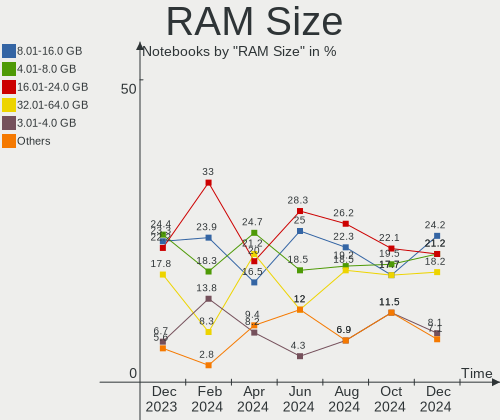
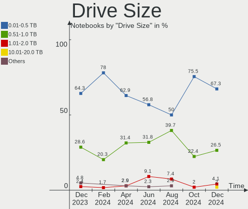
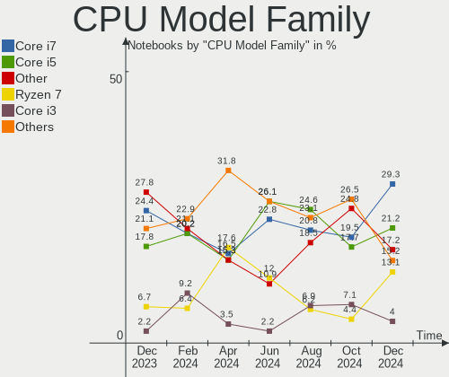
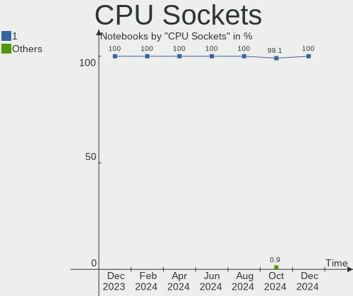
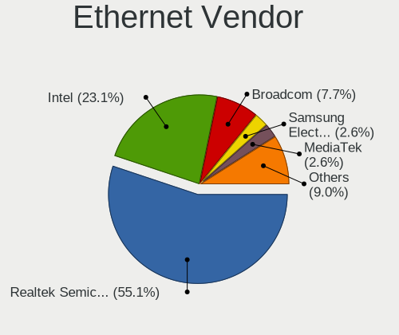
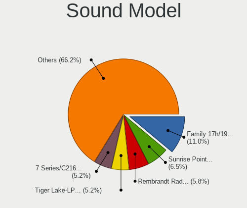

Pop!_OS Hardware Trends (Notebooks)
-----------------------------------

A project to identify most popular hardware characteristics and track their change
over time based on data collected by Pop!_OS users at https://Linux-Hardware.org.

Anyone can contribute to this report by the [hw-probe](https://github.com/linuxhw/hw-probe) tool:

    sudo -E hw-probe -all -upload

Full-feature report is available here: https://linux-hardware.org/?view=trends

Period: Nov, 2021.

Contents
--------

* [ System ](#system)
  - [ OS                       ](#os)
  - [ OS Family                ](#os-family)
  - [ Kernel                   ](#kernel)
  - [ Kernel Family            ](#kernel-family)
  - [ Kernel Major Ver.        ](#kernel-major-ver)
  - [ Arch                     ](#arch)
  - [ DE                       ](#de)
  - [ Display Server           ](#display-server)
  - [ Display Manager          ](#display-manager)
  - [ OS Lang                  ](#os-lang)
  - [ Boot Mode                ](#boot-mode)
  - [ Filesystem               ](#filesystem)
  - [ Part. scheme             ](#part-scheme)
  - [ Dual Boot with Linux/BSD ](#dual-boot-with-linuxbsd)
  - [ Dual Boot (Win)          ](#dual-boot-win)

* [ Board ](#board)
  - [ Vendor                   ](#vendor)
  - [ Model                    ](#model)
  - [ Model Family             ](#model-family)
  - [ MFG Year                 ](#mfg-year)
  - [ Form Factor              ](#form-factor)
  - [ Secure Boot              ](#secure-boot)
  - [ Coreboot                 ](#coreboot)
  - [ RAM Size                 ](#ram-size)
  - [ RAM Used                 ](#ram-used)
  - [ Total Drives             ](#total-drives)
  - [ Has CD-ROM               ](#has-cd-rom)
  - [ Has Ethernet             ](#has-ethernet)
  - [ Has WiFi                 ](#has-wifi)
  - [ Has Bluetooth            ](#has-bluetooth)

* [ Location ](#location)
  - [ Country                  ](#country)
  - [ City                     ](#city)

* [ Drives ](#drives)
  - [ Drive Vendor             ](#drive-vendor)
  - [ Drive Model              ](#drive-model)
  - [ HDD Vendor               ](#hdd-vendor)
  - [ SSD Vendor               ](#ssd-vendor)
  - [ Drive Kind               ](#drive-kind)
  - [ Drive Connector          ](#drive-connector)
  - [ Drive Size               ](#drive-size)
  - [ Space Total              ](#space-total)
  - [ Space Used               ](#space-used)
  - [ Malfunc. Drives          ](#malfunc-drives)
  - [ Malfunc. Drive Vendor    ](#malfunc-drive-vendor)
  - [ Malfunc. HDD Vendor      ](#malfunc-hdd-vendor)
  - [ Malfunc. Drive Kind      ](#malfunc-drive-kind)
  - [ Failed Drives            ](#failed-drives)
  - [ Failed Drive Vendor      ](#failed-drive-vendor)
  - [ Drive Status             ](#drive-status)

* [ Storage controller ](#storage-controller)
  - [ Storage Vendor           ](#storage-vendor)
  - [ Storage Model            ](#storage-model)
  - [ Storage Kind             ](#storage-kind)

* [ Processor ](#processor)
  - [ CPU Vendor               ](#cpu-vendor)
  - [ CPU Model                ](#cpu-model)
  - [ CPU Model Family         ](#cpu-model-family)
  - [ CPU Cores                ](#cpu-cores)
  - [ CPU Sockets              ](#cpu-sockets)
  - [ CPU Threads              ](#cpu-threads)
  - [ CPU Op-Modes             ](#cpu-op-modes)
  - [ CPU Microcode            ](#cpu-microcode)
  - [ CPU Microarch            ](#cpu-microarch)

* [ Graphics ](#graphics)
  - [ GPU Vendor               ](#gpu-vendor)
  - [ GPU Model                ](#gpu-model)
  - [ GPU Combo                ](#gpu-combo)
  - [ GPU Driver               ](#gpu-driver)
  - [ GPU Memory               ](#gpu-memory)

* [ Monitor ](#monitor)
  - [ Monitor Vendor           ](#monitor-vendor)
  - [ Monitor Model            ](#monitor-model)
  - [ Monitor Resolution       ](#monitor-resolution)
  - [ Monitor Diagonal         ](#monitor-diagonal)
  - [ Monitor Width            ](#monitor-width)
  - [ Aspect Ratio             ](#aspect-ratio)
  - [ Monitor Area             ](#monitor-area)
  - [ Pixel Density            ](#pixel-density)
  - [ Multiple Monitors        ](#multiple-monitors)

* [ Network ](#network)
  - [ Net Controller Vendor    ](#net-controller-vendor)
  - [ Net Controller Model     ](#net-controller-model)
  - [ Wireless Vendor          ](#wireless-vendor)
  - [ Wireless Model           ](#wireless-model)
  - [ Ethernet Vendor          ](#ethernet-vendor)
  - [ Ethernet Model           ](#ethernet-model)
  - [ Net Controller Kind      ](#net-controller-kind)
  - [ Used Controller          ](#used-controller)
  - [ NICs                     ](#nics)
  - [ IPv6                     ](#ipv6)

* [ Bluetooth ](#bluetooth)
  - [ Bluetooth Vendor         ](#bluetooth-vendor)
  - [ Bluetooth Model          ](#bluetooth-model)

* [ Sound ](#sound)
  - [ Sound Vendor             ](#sound-vendor)
  - [ Sound Model              ](#sound-model)

* [ Memory ](#memory)
  - [ Memory Vendor            ](#memory-vendor)
  - [ Memory Model             ](#memory-model)
  - [ Memory Kind              ](#memory-kind)
  - [ Memory Form Factor       ](#memory-form-factor)
  - [ Memory Size              ](#memory-size)
  - [ Memory Speed             ](#memory-speed)

* [ Printers & scanners ](#printers--scanners)
  - [ Printer Vendor           ](#printer-vendor)
  - [ Printer Model            ](#printer-model)
  - [ Scanner Vendor           ](#scanner-vendor)
  - [ Scanner Model            ](#scanner-model)

* [ Camera ](#camera)
  - [ Camera Vendor            ](#camera-vendor)
  - [ Camera Model             ](#camera-model)

* [ Security ](#security)
  - [ Fingerprint Vendor       ](#fingerprint-vendor)
  - [ Fingerprint Model        ](#fingerprint-model)
  - [ Chipcard Vendor          ](#chipcard-vendor)
  - [ Chipcard Model           ](#chipcard-model)

* [ Unsupported ](#unsupported)
  - [ Unsupported Devices      ](#unsupported-devices)
  - [ Unsupported Device Types ](#unsupported-device-types)

System
------

OS
--

Installed operating systems

| Name          | Notebooks | Percent |
|---------------|-----------|---------|
| Pop!_OS 21.04 | 183       | 85.12%  |
| Pop!_OS 20.04 | 28        | 13.02%  |
| Pop!_OS 21.10 | 2         | 0.93%   |
| Pop!_OS 20.10 | 2         | 0.93%   |

OS Family
---------

OS without a version

| Name    | Notebooks | Percent |
|---------|-----------|---------|
| Pop!_OS | 215       | 100%    |

Kernel
------

Version of the Linux kernel

| Version                 | Notebooks | Percent |
|-------------------------|-----------|---------|
| 5.13.0-7620-generic     | 180       | 83.72%  |
| 5.13.0-7614-generic     | 18        | 8.37%   |
| 5.11.0-7620-generic     | 8         | 3.72%   |
| 5.11.0-7633-generic     | 3         | 1.4%    |
| 5.15.4-xanmod1          | 1         | 0.47%   |
| 5.15.4-76051504-generic | 1         | 0.47%   |
| 5.15.3-051503-generic   | 1         | 0.47%   |
| 5.15.2-76051502-generic | 1         | 0.47%   |
| 5.14.18-xanmod1         | 1         | 0.47%   |
| 5.14.15-xanmod1         | 1         | 0.47%   |

Kernel Family
-------------

Linux kernel without a distro release

| Version | Notebooks | Percent |
|---------|-----------|---------|
| 5.13.0  | 198       | 92.09%  |
| 5.11.0  | 11        | 5.12%   |
| 5.15.4  | 2         | 0.93%   |
| 5.15.3  | 1         | 0.47%   |
| 5.15.2  | 1         | 0.47%   |
| 5.14.18 | 1         | 0.47%   |
| 5.14.15 | 1         | 0.47%   |

Kernel Major Ver.
-----------------

Linux kernel major version

| Version | Notebooks | Percent |
|---------|-----------|---------|
| 5.13    | 198       | 92.09%  |
| 5.11    | 11        | 5.12%   |
| 5.15    | 4         | 1.86%   |
| 5.14    | 2         | 0.93%   |

Arch
----

OS architecture (x86_64, i586, etc.)

| Name   | Notebooks | Percent |
|--------|-----------|---------|
| x86_64 | 215       | 100%    |

DE
--

Desktop Environment

| Name    | Notebooks | Percent |
|---------|-----------|---------|
| GNOME   | 208       | 96.74%  |
| KDE5    | 3         | 1.4%    |
| Unknown | 3         | 1.4%    |
| KDE     | 1         | 0.47%   |

Display Server
--------------

X11 or Wayland

| Name    | Notebooks | Percent |
|---------|-----------|---------|
| X11     | 211       | 98.14%  |
| Wayland | 4         | 1.86%   |

Display Manager
---------------

SDDM, LightDM, etc.

| Name    | Notebooks | Percent |
|---------|-----------|---------|
| Unknown | 175       | 81.4%   |
| GDM     | 40        | 18.6%   |

OS Lang
-------

Language

| Lang    | Notebooks | Percent |
|---------|-----------|---------|
| en_US   | 112       | 52.09%  |
| pt_BR   | 19        | 8.84%   |
| en_GB   | 16        | 7.44%   |
| de_DE   | 9         | 4.19%   |
| en_CA   | 7         | 3.26%   |
| C       | 7         | 3.26%   |
| en_AU   | 6         | 2.79%   |
| it_IT   | 4         | 1.86%   |
| fr_FR   | 4         | 1.86%   |
| pt_PT   | 3         | 1.4%    |
| es_ES   | 3         | 1.4%    |
| nb_NO   | 2         | 0.93%   |
| en_ZA   | 2         | 0.93%   |
| en_IN   | 2         | 0.93%   |
| Unknown | 2         | 0.93%   |
| sv_SE   | 1         | 0.47%   |
| sv_FI   | 1         | 0.47%   |
| ru_RU   | 1         | 0.47%   |
| pl_PL   | 1         | 0.47%   |
| nl_NL   | 1         | 0.47%   |
| lv_LV   | 1         | 0.47%   |
| ks_IN   | 1         | 0.47%   |
| jv_ID   | 1         | 0.47%   |
| ja_JP   | 1         | 0.47%   |
| hu_HU   | 1         | 0.47%   |
| fr_LU   | 1         | 0.47%   |
| fr_BE   | 1         | 0.47%   |
| fi_FI   | 1         | 0.47%   |
| en_NZ   | 1         | 0.47%   |
| en_IL   | 1         | 0.47%   |
| cs_CZ   | 1         | 0.47%   |
| ar_EG   | 1         | 0.47%   |

Boot Mode
---------

EFI or BIOS

| Mode | Notebooks | Percent |
|------|-----------|---------|
| BIOS | 174       | 80.93%  |
| EFI  | 41        | 19.07%  |

Filesystem
----------

Type of filesystem

| Type    | Notebooks | Percent |
|---------|-----------|---------|
| Ext4    | 208       | 96.74%  |
| Overlay | 4         | 1.86%   |
| Btrfs   | 3         | 1.4%    |

Part. scheme
------------

Scheme of partitioning

| Type    | Notebooks | Percent |
|---------|-----------|---------|
| Unknown | 172       | 80%     |
| GPT     | 41        | 19.07%  |
| MBR     | 2         | 0.93%   |

Dual Boot with Linux/BSD
------------------------

Hosting more than one Linux/BSD

| Dual boot | Notebooks | Percent |
|-----------|-----------|---------|
| No        | 210       | 97.67%  |
| Yes       | 5         | 2.33%   |

Dual Boot (Win)
---------------

Hosting Linux and Windows

| Dual boot | Notebooks | Percent |
|-----------|-----------|---------|
| No        | 200       | 93.02%  |
| Yes       | 15        | 6.98%   |

Board
-----

Vendor
------

Motherboard manufacturer

| Name                | Notebooks | Percent |
|---------------------|-----------|---------|
| Lenovo              | 41        | 19.07%  |
| Dell                | 36        | 16.74%  |
| Hewlett-Packard     | 30        | 13.95%  |
| ASUSTek Computer    | 25        | 11.63%  |
| Acer                | 17        | 7.91%   |
| MSI                 | 12        | 5.58%   |
| Apple               | 12        | 5.58%   |
| System76            | 6         | 2.79%   |
| Samsung Electronics | 5         | 2.33%   |
| Toshiba             | 4         | 1.86%   |
| Sony                | 4         | 1.86%   |
| Fujitsu             | 3         | 1.4%    |
| HUAWEI              | 2         | 0.93%   |
| Google              | 2         | 0.93%   |
| YJKC                | 1         | 0.47%   |
| TUXEDO              | 1         | 0.47%   |
| Teclast             | 1         | 0.47%   |
| PC Specialist       | 1         | 0.47%   |
| OEM                 | 1         | 0.47%   |
| Notebook            | 1         | 0.47%   |
| LG Electronics      | 1         | 0.47%   |
| Jumper              | 1         | 0.47%   |
| GPU Company         | 1         | 0.47%   |
| Gigabyte Technology | 1         | 0.47%   |
| Framework           | 1         | 0.47%   |
| ENTITY              | 1         | 0.47%   |
| Clevo               | 1         | 0.47%   |
| Alienware           | 1         | 0.47%   |
| AFTERSHOCK PC       | 1         | 0.47%   |
| Unknown             | 1         | 0.47%   |

Model
-----

Motherboard model

| Name                                       | Notebooks | Percent |
|--------------------------------------------|-----------|---------|
| System76 Darter Pro                        | 3         | 1.4%    |
| HP Pavilion dv6                            | 3         | 1.4%    |
| Dell XPS 13 9310                           | 3         | 1.4%    |
| System76 Lemur Pro                         | 2         | 0.93%   |
| Lenovo IdeaPad 330-15IKB 81FE              | 2         | 0.93%   |
| Dell G5 5590                               | 2         | 0.93%   |
| ASUS VivoBook_ASUSLaptop X509DA_D509DA     | 2         | 0.93%   |
| Apple MacBookPro9,2                        | 2         | 0.93%   |
| Unknown                                    | 2         | 0.93%   |
| YJKC vBook                                 | 1         | 0.47%   |
| TUXEDO InfinityBook S 14 v5                | 1         | 0.47%   |
| Toshiba Satellite P50-C                    | 1         | 0.47%   |
| Toshiba Satellite L775D                    | 1         | 0.47%   |
| Toshiba Satellite C660                     | 1         | 0.47%   |
| Toshiba Satellite A355                     | 1         | 0.47%   |
| Teclast F6 Plus                            | 1         | 0.47%   |
| System76 Galago Pro                        | 1         | 0.47%   |
| Sony VPCZ12V9R                             | 1         | 0.47%   |
| Sony VPCF24C5E                             | 1         | 0.47%   |
| Sony VPCEJ2L1E                             | 1         | 0.47%   |
| Sony VPCEJ2J1E                             | 1         | 0.47%   |
| Samsung RF511/RF411/RF711                  | 1         | 0.47%   |
| Samsung Q430/Q530                          | 1         | 0.47%   |
| Samsung 550XDA                             | 1         | 0.47%   |
| Samsung 370E4K                             | 1         | 0.47%   |
| Samsung 270E5J/2570EJ                      | 1         | 0.47%   |
| PC Specialist X170SM                       | 1         | 0.47%   |
| OEM I38II                                  | 1         | 0.47%   |
| Notebook PA70ES                            | 1         | 0.47%   |
| MSI MS-1688                                | 1         | 0.47%   |
| MSI GT72 2QD                               | 1         | 0.47%   |
| MSI GS75 Stealth 9SF                       | 1         | 0.47%   |
| MSI GS73 Stealth 8RF                       | 1         | 0.47%   |
| MSI GL65 9SE                               | 1         | 0.47%   |
| MSI GL63 8SE                               | 1         | 0.47%   |
| MSI GL62 7QF                               | 1         | 0.47%   |
| MSI GF75 Thin 10UEK                        | 1         | 0.47%   |
| MSI GF63 Thin 9SCXR                        | 1         | 0.47%   |
| MSI GF63 Thin 10SCXR                       | 1         | 0.47%   |
| MSI GE66 Raider 11UG                       | 1         | 0.47%   |
| MSI GE62VR 6RF                             | 1         | 0.47%   |
| LG S425-L.BC24P1                           | 1         | 0.47%   |
| Lenovo Yoga Slim 7 Pro 14ACH5 82MS         | 1         | 0.47%   |
| Lenovo Yoga 2 Pro 20266                    | 1         | 0.47%   |
| Lenovo Y40-70 20347                        | 1         | 0.47%   |
| Lenovo ThinkPad X260 20F5S3H000            | 1         | 0.47%   |
| Lenovo ThinkPad X1 Carbon Gen 9 20XW003JUS | 1         | 0.47%   |
| Lenovo ThinkPad X1 Carbon 34601D0          | 1         | 0.47%   |
| Lenovo ThinkPad W540 20BHS0NQ00            | 1         | 0.47%   |
| Lenovo ThinkPad T480 20L5001DUS            | 1         | 0.47%   |
| Lenovo ThinkPad T470p 20J7S0CF00           | 1         | 0.47%   |
| Lenovo ThinkPad T470 20HES1RS00            | 1         | 0.47%   |
| Lenovo ThinkPad T420 4180W1A               | 1         | 0.47%   |
| Lenovo ThinkPad T400 6474CTO               | 1         | 0.47%   |
| Lenovo ThinkPad T15 Gen 1 20S6S1MH00       | 1         | 0.47%   |
| Lenovo ThinkPad P50 20EQS0R400             | 1         | 0.47%   |
| Lenovo ThinkPad P14s Gen 2a 21A0000RMX     | 1         | 0.47%   |
| Lenovo ThinkPad L512 44444WG               | 1         | 0.47%   |
| Lenovo ThinkPad L14 Gen 2 20X1003GUS       | 1         | 0.47%   |
| Lenovo ThinkPad E520 1143AD5               | 1         | 0.47%   |

Model Family
------------

Motherboard model prefix

| Name                 | Notebooks | Percent |
|----------------------|-----------|---------|
| Lenovo ThinkPad      | 18        | 8.37%   |
| Acer Aspire          | 12        | 5.58%   |
| Lenovo IdeaPad       | 10        | 4.65%   |
| Dell XPS             | 10        | 4.65%   |
| Dell Latitude        | 10        | 4.65%   |
| HP Pavilion          | 9         | 4.19%   |
| Dell Inspiron        | 9         | 4.19%   |
| HP ProBook           | 7         | 3.26%   |
| HP EliteBook         | 5         | 2.33%   |
| Toshiba Satellite    | 4         | 1.86%   |
| Lenovo Legion        | 4         | 1.86%   |
| HP Laptop            | 4         | 1.86%   |
| ASUS VivoBook        | 4         | 1.86%   |
| System76 Darter      | 3         | 1.4%    |
| HP ZBook             | 3         | 1.4%    |
| Dell G5              | 3         | 1.4%    |
| ASUS ASUS            | 3         | 1.4%    |
| Apple MacBookPro9    | 3         | 1.4%    |
| System76 Lemur       | 2         | 0.93%   |
| MSI GF63             | 2         | 0.93%   |
| Lenovo Yoga          | 2         | 0.93%   |
| Lenovo ThinkBook     | 2         | 0.93%   |
| Fujitsu LIFEBOOK     | 2         | 0.93%   |
| Dell Vostro          | 2         | 0.93%   |
| ASUS ROG             | 2         | 0.93%   |
| Apple MacBookPro11   | 2         | 0.93%   |
| Unknown              | 2         | 0.93%   |
| YJKC vBook           | 1         | 0.47%   |
| TUXEDO InfinityBook  | 1         | 0.47%   |
| Teclast F6           | 1         | 0.47%   |
| System76 Galago      | 1         | 0.47%   |
| Sony VPCZ12V9R       | 1         | 0.47%   |
| Sony VPCF24C5E       | 1         | 0.47%   |
| Sony VPCEJ2L1E       | 1         | 0.47%   |
| Sony VPCEJ2J1E       | 1         | 0.47%   |
| Samsung RF511        | 1         | 0.47%   |
| Samsung Q430         | 1         | 0.47%   |
| Samsung 550XDA       | 1         | 0.47%   |
| Samsung 370E4K       | 1         | 0.47%   |
| Samsung 270E5J       | 1         | 0.47%   |
| PC Specialist X170SM | 1         | 0.47%   |
| OEM I38II            | 1         | 0.47%   |
| Notebook PA70ES      | 1         | 0.47%   |
| MSI MS-1688          | 1         | 0.47%   |
| MSI GT72             | 1         | 0.47%   |
| MSI GS75             | 1         | 0.47%   |
| MSI GS73             | 1         | 0.47%   |
| MSI GL65             | 1         | 0.47%   |
| MSI GL63             | 1         | 0.47%   |
| MSI GL62             | 1         | 0.47%   |
| MSI GF75             | 1         | 0.47%   |
| MSI GE66             | 1         | 0.47%   |
| MSI GE62VR           | 1         | 0.47%   |
| LG S425-L.BC24P1     | 1         | 0.47%   |
| Lenovo Y40-70        | 1         | 0.47%   |
| Lenovo G510          | 1         | 0.47%   |
| Lenovo G500s         | 1         | 0.47%   |
| Lenovo G50-70        | 1         | 0.47%   |
| Jumper EZbook        | 1         | 0.47%   |
| HUAWEI KPL-W0X       | 1         | 0.47%   |

MFG Year
--------

Motherboard manufacture year

| Year | Notebooks | Percent |
|------|-----------|---------|
| 2021 | 71        | 33.02%  |
| 2020 | 24        | 11.16%  |
| 2019 | 18        | 8.37%   |
| 2018 | 15        | 6.98%   |
| 2013 | 13        | 6.05%   |
| 2012 | 13        | 6.05%   |
| 2016 | 11        | 5.12%   |
| 2011 | 11        | 5.12%   |
| 2015 | 10        | 4.65%   |
| 2017 | 9         | 4.19%   |
| 2014 | 8         | 3.72%   |
| 2010 | 5         | 2.33%   |
| 2009 | 5         | 2.33%   |
| 2008 | 2         | 0.93%   |

Form Factor
-----------

Physical design of the computer

| Name     | Notebooks | Percent |
|----------|-----------|---------|
| Notebook | 215       | 100%    |

Secure Boot
-----------

Enabled or disabled

| State    | Notebooks | Percent |
|----------|-----------|---------|
| Disabled | 215       | 100%    |

Coreboot
--------

Have coreboot on board

| Used | Notebooks | Percent |
|------|-----------|---------|
| No   | 207       | 96.28%  |
| Yes  | 8         | 3.72%   |

RAM Size
--------

Total RAM memory

| Size in GB  | Notebooks | Percent |
|-------------|-----------|---------|
| 4.01-8.0    | 65        | 30.23%  |
| 16.01-24.0  | 50        | 23.26%  |
| 8.01-16.0   | 34        | 15.81%  |
| 3.01-4.0    | 31        | 14.42%  |
| 32.01-64.0  | 24        | 11.16%  |
| 24.01-32.0  | 4         | 1.86%   |
| 1.01-2.0    | 4         | 1.86%   |
| 64.01-256.0 | 2         | 0.93%   |
| 2.01-3.0    | 1         | 0.47%   |

RAM Used
--------

Used RAM memory

| Used GB   | Notebooks | Percent |
|-----------|-----------|---------|
| 2.01-3.0  | 73        | 33.95%  |
| 1.01-2.0  | 69        | 32.09%  |
| 3.01-4.0  | 31        | 14.42%  |
| 4.01-8.0  | 30        | 13.95%  |
| 8.01-16.0 | 11        | 5.12%   |
| 0.51-1.0  | 1         | 0.47%   |

Total Drives
------------

Number of drives on board

| Drives | Notebooks | Percent |
|--------|-----------|---------|
| 1      | 154       | 71.63%  |
| 2      | 47        | 21.86%  |
| 3      | 8         | 3.72%   |
| 0      | 3         | 1.4%    |
| 4      | 2         | 0.93%   |
| 5      | 1         | 0.47%   |

Has CD-ROM
----------

Has CD-ROM on board

| Presented | Notebooks | Percent |
|-----------|-----------|---------|
| No        | 146       | 67.91%  |
| Yes       | 69        | 32.09%  |

Has Ethernet
------------

Has Ethernet on board

| Presented | Notebooks | Percent |
|-----------|-----------|---------|
| Yes       | 178       | 82.79%  |
| No        | 37        | 17.21%  |

Has WiFi
--------

Has WiFi module

| Presented | Notebooks | Percent |
|-----------|-----------|---------|
| Yes       | 213       | 99.07%  |
| No        | 2         | 0.93%   |

Has Bluetooth
-------------

Has Bluetooth module

| Presented | Notebooks | Percent |
|-----------|-----------|---------|
| Yes       | 177       | 82.33%  |
| No        | 38        | 17.67%  |

Location
--------

Country
-------

Geographic location (country)

| Country                | Notebooks | Percent |
|------------------------|-----------|---------|
| USA                    | 56        | 26.05%  |
| Brazil                 | 27        | 12.56%  |
| Germany                | 12        | 5.58%   |
| Canada                 | 10        | 4.65%   |
| UK                     | 9         | 4.19%   |
| France                 | 9         | 4.19%   |
| India                  | 8         | 3.72%   |
| Italy                  | 7         | 3.26%   |
| Australia              | 7         | 3.26%   |
| Sweden                 | 4         | 1.86%   |
| Romania                | 4         | 1.86%   |
| Norway                 | 4         | 1.86%   |
| Netherlands            | 4         | 1.86%   |
| Portugal               | 3         | 1.4%    |
| Indonesia              | 3         | 1.4%    |
| Switzerland            | 2         | 0.93%   |
| Spain                  | 2         | 0.93%   |
| South Africa           | 2         | 0.93%   |
| Poland                 | 2         | 0.93%   |
| Latvia                 | 2         | 0.93%   |
| Japan                  | 2         | 0.93%   |
| Israel                 | 2         | 0.93%   |
| Hungary                | 2         | 0.93%   |
| Finland                | 2         | 0.93%   |
| Croatia                | 2         | 0.93%   |
| Bulgaria               | 2         | 0.93%   |
| Bosnia and Herzegovina | 2         | 0.93%   |
| Belgium                | 2         | 0.93%   |
| Austria                | 2         | 0.93%   |
| Thailand               | 1         | 0.47%   |
| Slovenia               | 1         | 0.47%   |
| Russia                 | 1         | 0.47%   |
| Pakistan               | 1         | 0.47%   |
| New Zealand            | 1         | 0.47%   |
| Mexico                 | 1         | 0.47%   |
| Luxembourg             | 1         | 0.47%   |
| Lithuania              | 1         | 0.47%   |
| Lebanon                | 1         | 0.47%   |
| Jersey                 | 1         | 0.47%   |
| Iceland                | 1         | 0.47%   |
| Greece                 | 1         | 0.47%   |
| Ghana                  | 1         | 0.47%   |
| Egypt                  | 1         | 0.47%   |
| Denmark                | 1         | 0.47%   |
| Czechia                | 1         | 0.47%   |
| Czech Republic         | 1         | 0.47%   |
| Colombia               | 1         | 0.47%   |
| Cape Verde             | 1         | 0.47%   |
| Bolivia                | 1         | 0.47%   |

City
----

Geographic location (city)

| City                        | Notebooks | Percent |
|-----------------------------|-----------|---------|
| S??o Paulo                  | 4         | 1.86%   |
| Oslo                        | 4         | 1.86%   |
| St. Petersburg              | 3         | 1.4%    |
| Jakarta                     | 3         | 1.4%    |
| Zurich                      | 2         | 0.93%   |
| Zagreb                      | 2         | 0.93%   |
| Warsaw                      | 2         | 0.93%   |
| Riga                        | 2         | 0.93%   |
| Paris                       | 2         | 0.93%   |
| Orlando                     | 2         | 0.93%   |
| New York                    | 2         | 0.93%   |
| Montreal                    | 2         | 0.93%   |
| Melbourne                   | 2         | 0.93%   |
| Budapest                    | 2         | 0.93%   |
| Brisbane                    | 2         | 0.93%   |
| Belo Horizonte              | 2         | 0.93%   |
| Banja Luka                  | 2         | 0.93%   |
| Worcester                   | 1         | 0.47%   |
| Wilmington                  | 1         | 0.47%   |
| Wichita                     | 1         | 0.47%   |
| Westwood                    | 1         | 0.47%   |
| Westmont                    | 1         | 0.47%   |
| West Jordan                 | 1         | 0.47%   |
| West Cowes                  | 1         | 0.47%   |
| Wardha                      | 1         | 0.47%   |
| Voluntari                   | 1         | 0.47%   |
| Volta Redonda               | 1         | 0.47%   |
| Virginia Beach              | 1         | 0.47%   |
| Villingen-Schwenningen      | 1         | 0.47%   |
| Villavicencio               | 1         | 0.47%   |
| Vigo                        | 1         | 0.47%   |
| Viernheim                   | 1         | 0.47%   |
| Vienna                      | 1         | 0.47%   |
| Veracruz                    | 1         | 0.47%   |
| Vantaa                      | 1         | 0.47%   |
| Vancouver                   | 1         | 0.47%   |
| Valparaiso de Goias         | 1         | 0.47%   |
| Valley Center               | 1         | 0.47%   |
| Union City                  | 1         | 0.47%   |
| Tylstrup                    | 1         | 0.47%   |
| Troy                        | 1         | 0.47%   |
| Tomar                       | 1         | 0.47%   |
| Timi?™oara                  | 1         | 0.47%   |
| The Hague                   | 1         | 0.47%   |
| Tel Aviv                    | 1         | 0.47%   |
| Teixeira de Freitas         | 1         | 0.47%   |
| Sydney                      | 1         | 0.47%   |
| St Petersburg               | 1         | 0.47%   |
| Somerset                    | 1         | 0.47%   |
| Sofia                       | 1         | 0.47%   |
| Silver Spring               | 1         | 0.47%   |
| Set??bal                    | 1         | 0.47%   |
| Scunthorpe                  | 1         | 0.47%   |
| Sao Goncalo                 | 1         | 0.47%   |
| Sao Francisco de Itabapoana | 1         | 0.47%   |
| Santa Leopoldina            | 1         | 0.47%   |
| Sandy                       | 1         | 0.47%   |
| Salem                       | 1         | 0.47%   |
| Saint-Denis                 | 1         | 0.47%   |
| Saint Paul                  | 1         | 0.47%   |

Drives
------

Drive Vendor
------------

Hard drive vendors

| Vendor                         | Notebooks | Drives | Percent |
|--------------------------------|-----------|--------|---------|
| Samsung Electronics            | 48        | 56     | 18.25%  |
| Seagate                        | 29        | 32     | 11.03%  |
| Sandisk                        | 28        | 29     | 10.65%  |
| WDC                            | 26        | 27     | 9.89%   |
| SK Hynix                       | 17        | 20     | 6.46%   |
| Toshiba                        | 15        | 15     | 5.7%    |
| Intel                          | 14        | 14     | 5.32%   |
| Unknown                        | 10        | 10     | 3.8%    |
| Kingston                       | 10        | 10     | 3.8%    |
| HGST                           | 8         | 8      | 3.04%   |
| Crucial                        | 7         | 7      | 2.66%   |
| Apple                          | 7         | 7      | 2.66%   |
| China                          | 5         | 5      | 1.9%    |
| Phison                         | 4         | 5      | 1.52%   |
| Hitachi                        | 4         | 4      | 1.52%   |
| PNY                            | 3         | 3      | 1.14%   |
| LITEON                         | 3         | 3      | 1.14%   |
| A-DATA Technology              | 3         | 3      | 1.14%   |
| Micron/Crucial Technology      | 2         | 3      | 0.76%   |
| Micron Technology              | 2         | 2      | 0.76%   |
| FORESEE                        | 2         | 2      | 0.76%   |
| ADATA Technology               | 2         | 2      | 0.76%   |
| UMIS                           | 1         | 1      | 0.38%   |
| Transcend                      | 1         | 1      | 0.38%   |
| Teclast                        | 1         | 1      | 0.38%   |
| SSSTC                          | 1         | 1      | 0.38%   |
| Solid State Storage Technology | 1         | 1      | 0.38%   |
| Silicon Motion                 | 1         | 1      | 0.38%   |
| Shenzhen Longsys Electronics   | 1         | 1      | 0.38%   |
| Patriot                        | 1         | 1      | 0.38%   |
| LITEONIT                       | 1         | 1      | 0.38%   |
| KingDian                       | 1         | 1      | 0.38%   |
| GOODRAM                        | 1         | 1      | 0.38%   |
| Gigabyte Technology            | 1         | 1      | 0.38%   |
| Fujitsu                        | 1         | 1      | 0.38%   |
| Enmotus                        | 1         | 1      | 0.38%   |

Drive Model
-----------

Hard drive models

| Model                                  | Notebooks | Percent |
|----------------------------------------|-----------|---------|
| SK Hynix NVMe SSD Drive 512GB          | 6         | 2.19%   |
| Sandisk NVMe SSD Drive 256GB           | 6         | 2.19%   |
| Unknown MMC Card  64GB                 | 4         | 1.46%   |
| Toshiba MQ01ABD100 1TB                 | 4         | 1.46%   |
| Seagate ST1000LM035-1RK172 1TB         | 4         | 1.46%   |
| Seagate ST1000LM024 HN-M101MBB 1TB     | 4         | 1.46%   |
| Intel NVMe SSD Drive 512GB             | 4         | 1.46%   |
| Unknown MMC Card  128GB                | 3         | 1.09%   |
| Seagate ST9500325AS 500GB              | 3         | 1.09%   |
| Seagate Expansion 1TB                  | 3         | 1.09%   |
| SanDisk SSD PLUS 240GB                 | 3         | 1.09%   |
| Sandisk NVMe SSD Drive 500GB           | 3         | 1.09%   |
| Sandisk NVMe SSD Drive 1TB             | 3         | 1.09%   |
| Samsung NVMe SSD Drive 512GB           | 3         | 1.09%   |
| Samsung NVMe SSD Drive 1TB             | 3         | 1.09%   |
| Kingston SUV400S37120G 120GB SSD       | 3         | 1.09%   |
| HGST HTS721010A9E630 1TB               | 3         | 1.09%   |
| WDC WDBNCE5000PNC 500GB SSD            | 2         | 0.73%   |
| WDC WD10SPZX-24Z10 1TB                 | 2         | 0.73%   |
| WDC WD10JPVX-22JC3T0 1TB               | 2         | 0.73%   |
| Toshiba NVMe SSD Drive 512GB           | 2         | 0.73%   |
| SK Hynix HFS128G39TND-N210A 128GB SSD  | 2         | 0.73%   |
| Seagate BUP Slim BL 1TB                | 2         | 0.73%   |
| Sandisk NVMe SSD Drive 512GB           | 2         | 0.73%   |
| Sandisk NVMe SSD Drive 1024GB          | 2         | 0.73%   |
| Samsung SSD 860 EVO 500GB              | 2         | 0.73%   |
| Samsung SSD 850 PRO 512GB              | 2         | 0.73%   |
| Samsung SSD 850 EVO 500GB              | 2         | 0.73%   |
| Samsung SSD 850 EVO 250GB              | 2         | 0.73%   |
| Samsung SM963 2.5" NVMe PCIe SSD 250GB | 2         | 0.73%   |
| Samsung PM9A1 NVMe 512GB               | 2         | 0.73%   |
| Samsung NVMe SSD Drive 1024GB          | 2         | 0.73%   |
| Kingston SA400S37240G 240GB SSD        | 2         | 0.73%   |
| HGST HTS545050A7E680 500GB             | 2         | 0.73%   |
| China SSD 256GB                        | 2         | 0.73%   |
| A-DATA IM2P33F3 NVMe 256GB             | 2         | 0.73%   |
| WDC WDS500G2B0A-00SM50 500GB SSD       | 1         | 0.36%   |
| WDC WDS240G2G0B-00EPW0 240GB SSD       | 1         | 0.36%   |
| WDC WDS120G2G0B-00EPW0 120GB SSD       | 1         | 0.36%   |
| WDC WDS100T2B0A-00SM50 1TB SSD         | 1         | 0.36%   |
| WDC WDBNCE0010PNC 1TB SSD              | 1         | 0.36%   |
| WDC WD800BEVS-07RST0 80GB              | 1         | 0.36%   |
| WDC WD7500BPVT-80HXZT3 752GB           | 1         | 0.36%   |
| WDC WD7500BPVT-22HXZT3 752GB           | 1         | 0.36%   |
| WDC WD5000LPVX-75V0TT0 500GB           | 1         | 0.36%   |
| WDC WD5000LPLX-08ZNTT0 500GB           | 1         | 0.36%   |
| WDC WD5000BEVT-00ZAT0 500GB            | 1         | 0.36%   |
| WDC WD50 00LPLX-60ZNTT2 500GB          | 1         | 0.36%   |
| WDC WD3200BEKT-75PVMT1 320GB           | 1         | 0.36%   |
| WDC WD2500BEKT-75PVMT0 250GB           | 1         | 0.36%   |
| WDC WD1600BEVT-60ZCT0 160GB            | 1         | 0.36%   |
| WDC WD10SPZX-75Z10T2 1TB               | 1         | 0.36%   |
| WDC WD10SPZX-75Z10T0 1TB               | 1         | 0.36%   |
| WDC WD10SPZX-08Z10 1TB                 | 1         | 0.36%   |
| WDC WD10JUCX-63WPNY0 1TB               | 1         | 0.36%   |
| WDC PC SN730 SDBPNTY-1T00-1032 1TB     | 1         | 0.36%   |
| WDC PC SN530 SDBPMPZ-512G-1001 512GB   | 1         | 0.36%   |
| Unknown SL64G  64GB                    | 1         | 0.36%   |
| Unknown SD/MMC/MS PRO 394GB            | 1         | 0.36%   |
| Unknown MMC Card  32GB                 | 1         | 0.36%   |

HDD Vendor
----------

Hard disk drive vendors

| Vendor              | Notebooks | Drives | Percent |
|---------------------|-----------|--------|---------|
| Seagate             | 28        | 30     | 37.33%  |
| WDC                 | 18        | 18     | 24%     |
| Toshiba             | 11        | 11     | 14.67%  |
| HGST                | 8         | 8      | 10.67%  |
| Hitachi             | 4         | 4      | 5.33%   |
| Apple               | 3         | 3      | 4%      |
| Unknown             | 1         | 1      | 1.33%   |
| Samsung Electronics | 1         | 1      | 1.33%   |
| Fujitsu             | 1         | 1      | 1.33%   |

SSD Vendor
----------

Solid state drive vendors

| Vendor              | Notebooks | Drives | Percent |
|---------------------|-----------|--------|---------|
| Samsung Electronics | 27        | 31     | 29.67%  |
| SanDisk             | 11        | 11     | 12.09%  |
| WDC                 | 7         | 7      | 7.69%   |
| Kingston            | 7         | 7      | 7.69%   |
| Crucial             | 7         | 7      | 7.69%   |
| Intel               | 4         | 4      | 4.4%    |
| China               | 4         | 4      | 4.4%    |
| PNY                 | 3         | 3      | 3.3%    |
| LITEON              | 3         | 3      | 3.3%    |
| SK Hynix            | 2         | 2      | 2.2%    |
| Seagate             | 2         | 2      | 2.2%    |
| FORESEE             | 2         | 2      | 2.2%    |
| Apple               | 2         | 2      | 2.2%    |
| UMIS                | 1         | 1      | 1.1%    |
| Transcend           | 1         | 1      | 1.1%    |
| Teclast             | 1         | 1      | 1.1%    |
| Patriot             | 1         | 1      | 1.1%    |
| Micron Technology   | 1         | 1      | 1.1%    |
| LITEONIT            | 1         | 1      | 1.1%    |
| KingDian            | 1         | 1      | 1.1%    |
| GOODRAM             | 1         | 1      | 1.1%    |
| Gigabyte Technology | 1         | 1      | 1.1%    |
| A-DATA Technology   | 1         | 1      | 1.1%    |

Drive Kind
----------

HDD or SSD

| Kind    | Notebooks | Drives | Percent |
|---------|-----------|--------|---------|
| SSD     | 86        | 95     | 33.73%  |
| NVMe    | 84        | 99     | 32.94%  |
| HDD     | 75        | 77     | 29.41%  |
| MMC     | 9         | 9      | 3.53%   |
| Unknown | 1         | 1      | 0.39%   |

Drive Connector
---------------

SATA, SAS, NVMe, etc.

| Type | Notebooks | Drives | Percent |
|------|-----------|--------|---------|
| SATA | 140       | 162    | 57.38%  |
| NVMe | 84        | 99     | 34.43%  |
| SAS  | 11        | 11     | 4.51%   |
| MMC  | 9         | 9      | 3.69%   |

Drive Size
----------

Size of hard drive

| Size in TB | Notebooks | Drives | Percent |
|------------|-----------|--------|---------|
| 0.01-0.5   | 100       | 112    | 64.52%  |
| 0.51-1.0   | 51        | 56     | 32.9%   |
| 1.01-2.0   | 4         | 4      | 2.58%   |

Space Total
-----------

Amount of disk space available on the file system

| Size in GB | Notebooks | Percent |
|------------|-----------|---------|
| 101-250    | 69        | 32.09%  |
| 251-500    | 55        | 25.58%  |
| 501-1000   | 45        | 20.93%  |
| 51-100     | 13        | 6.05%   |
| 1001-2000  | 12        | 5.58%   |
| 1-20       | 7         | 3.26%   |
| 21-50      | 6         | 2.79%   |
| 2001-3000  | 5         | 2.33%   |
| Unknown    | 3         | 1.4%    |

Space Used
----------

Amount of used disk space

| Used GB   | Notebooks | Percent |
|-----------|-----------|---------|
| 1-20      | 81        | 37.67%  |
| 21-50     | 45        | 20.93%  |
| 101-250   | 32        | 14.88%  |
| 51-100    | 27        | 12.56%  |
| 251-500   | 16        | 7.44%   |
| 501-1000  | 7         | 3.26%   |
| 1001-2000 | 4         | 1.86%   |
| Unknown   | 3         | 1.4%    |

Malfunc. Drives
---------------

Drive models with a malfunction

| Model                                 | Notebooks | Drives | Percent |
|---------------------------------------|-----------|--------|---------|
| Crucial CT525MX300SSD4 528GB          | 1         | 1      | 33.33%  |
| Crucial CT256M550SSD1 256GB           | 1         | 1      | 33.33%  |
| A-DATA Technology SP900NS38 256GB SSD | 1         | 1      | 33.33%  |

Malfunc. Drive Vendor
---------------------

Vendors of faulty drives

| Vendor            | Notebooks | Drives | Percent |
|-------------------|-----------|--------|---------|
| Crucial           | 2         | 2      | 66.67%  |
| A-DATA Technology | 1         | 1      | 33.33%  |

Malfunc. HDD Vendor
-------------------

Vendors of faulty HDD drives

Zero info for selected period =(

Malfunc. Drive Kind
-------------------

Kinds of faulty drives

| Kind | Notebooks | Drives | Percent |
|------|-----------|--------|---------|
| SSD  | 3         | 3      | 100%    |

Failed Drives
-------------

Failed drive models

Zero info for selected period =(

Failed Drive Vendor
-------------------

Failed drive vendors

Zero info for selected period =(

Drive Status
------------

Number of failed and malfunc. drives

| Status   | Notebooks | Drives | Percent |
|----------|-----------|--------|---------|
| Detected | 174       | 224    | 78.73%  |
| Works    | 44        | 54     | 19.91%  |
| Malfunc  | 3         | 3      | 1.36%   |

Storage controller
------------------

Storage Vendor
--------------

Storage controller vendors

| Vendor                           | Notebooks | Percent |
|----------------------------------|-----------|---------|
| Intel                            | 165       | 60.89%  |
| Samsung Electronics              | 24        | 8.86%   |
| AMD                              | 20        | 7.38%   |
| Sandisk                          | 19        | 7.01%   |
| SK Hynix                         | 15        | 5.54%   |
| Toshiba America Info Systems     | 4         | 1.48%   |
| Phison Electronics               | 4         | 1.48%   |
| Kingston Technology Company      | 3         | 1.11%   |
| ADATA Technology                 | 3         | 1.11%   |
| Solid State Storage Technology   | 2         | 0.74%   |
| Nvidia                           | 2         | 0.74%   |
| Micron/Crucial Technology        | 2         | 0.74%   |
| Apple                            | 2         | 0.74%   |
| Silicon Motion                   | 1         | 0.37%   |
| Silicon Integrated Systems [SiS] | 1         | 0.37%   |
| Shenzhen Longsys Electronics     | 1         | 0.37%   |
| Micron Technology                | 1         | 0.37%   |
| Lite-On Technology               | 1         | 0.37%   |
| Enmotus                          | 1         | 0.37%   |

Storage Model
-------------

Storage controller models

| Model                                                                            | Notebooks | Percent |
|----------------------------------------------------------------------------------|-----------|---------|
| AMD FCH SATA Controller [AHCI mode]                                              | 20        | 7.04%   |
| Intel 7 Series Chipset Family 6-port SATA Controller [AHCI mode]                 | 17        | 5.99%   |
| Intel 82801 Mobile SATA Controller [RAID mode]                                   | 16        | 5.63%   |
| Samsung NVMe SSD Controller SM981/PM981/PM983                                    | 15        | 5.28%   |
| Intel 6 Series/C200 Series Chipset Family 6 port Mobile SATA AHCI Controller     | 15        | 5.28%   |
| Intel Volume Management Device NVMe RAID Controller                              | 13        | 4.58%   |
| Intel Sunrise Point-LP SATA Controller [AHCI mode]                               | 13        | 4.58%   |
| Intel Cannon Lake Mobile PCH SATA AHCI Controller                                | 13        | 4.58%   |
| Intel 8 Series SATA Controller 1 [AHCI mode]                                     | 12        | 4.23%   |
| SK Hynix Gold P31 SSD                                                            | 9         | 3.17%   |
| Intel 82801IBM/IEM (ICH9M/ICH9M-E) 4 port SATA Controller [AHCI mode]            | 8         | 2.82%   |
| Intel Comet Lake SATA AHCI Controller                                            | 7         | 2.46%   |
| Intel 5 Series/3400 Series Chipset 4 port SATA AHCI Controller                   | 7         | 2.46%   |
| Sandisk WD Blue SN550 NVMe SSD                                                   | 6         | 2.11%   |
| Sandisk WD Black SN750 / PC SN730 NVMe SSD                                       | 5         | 1.76%   |
| Intel SSD 660P Series                                                            | 5         | 1.76%   |
| Intel HM170/QM170 Chipset SATA Controller [AHCI Mode]                            | 5         | 1.76%   |
| Intel Celeron N3350/Pentium N4200/Atom E3900 Series SATA AHCI Controller         | 5         | 1.76%   |
| Intel 8 Series/C220 Series Chipset Family 6-port SATA Controller 1 [AHCI mode]   | 5         | 1.76%   |
| Samsung NVMe SSD Controller PM9A1/PM9A3/980PRO                                   | 4         | 1.41%   |
| Intel Wildcat Point-LP SATA Controller [AHCI Mode]                               | 4         | 1.41%   |
| Intel Tiger Lake-LP SATA Controller [AHCI mode]                                  | 4         | 1.41%   |
| Intel 400 Series Chipset Family SATA AHCI Controller                             | 4         | 1.41%   |
| Toshiba America Info Systems XG6 NVMe SSD Controller                             | 3         | 1.06%   |
| Sandisk Non-Volatile memory controller                                           | 3         | 1.06%   |
| Samsung NVMe SSD Controller 980                                                  | 3         | 1.06%   |
| Phison E12 NVMe Controller                                                       | 3         | 1.06%   |
| Intel SSD Pro 7600p/760p/E 6100p Series                                          | 3         | 1.06%   |
| Intel Cannon Point-LP SATA Controller [AHCI Mode]                                | 3         | 1.06%   |
| ADATA Non-Volatile memory controller                                             | 3         | 1.06%   |
| Solid State Storage Non-Volatile memory controller                               | 2         | 0.7%    |
| SK Hynix Non-Volatile memory controller                                          | 2         | 0.7%    |
| SK Hynix BC511                                                                   | 2         | 0.7%    |
| Sandisk WD Blue SN500 / PC SN520 NVMe SSD                                        | 2         | 0.7%    |
| Sandisk PC SN520 NVMe SSD                                                        | 2         | 0.7%    |
| Samsung Apple PCIe SSD                                                           | 2         | 0.7%    |
| Intel Non-Volatile memory controller                                             | 2         | 0.7%    |
| Intel Ice Lake-LP SATA Controller [AHCI mode]                                    | 2         | 0.7%    |
| Intel Celeron/Pentium Silver Processor SATA Controller                           | 2         | 0.7%    |
| Intel 82801HM/HEM (ICH8M/ICH8M-E) SATA Controller [AHCI mode]                    | 2         | 0.7%    |
| Intel 82801HM/HEM (ICH8M/ICH8M-E) IDE Controller                                 | 2         | 0.7%    |
| Apple ANS2 NVMe Controller                                                       | 2         | 0.7%    |
| Toshiba America Info Systems Toshiba America Info Non-Volatile memory controller | 1         | 0.35%   |
| SK Hynix PC401 NVMe Solid State Drive 256GB                                      | 1         | 0.35%   |
| SK Hynix BC501 NVMe Solid State Drive                                            | 1         | 0.35%   |
| Silicon Motion SM2262/SM2262EN SSD Controller                                    | 1         | 0.35%   |
| Silicon Integrated Systems [SiS] SATA Controller / IDE mode                      | 1         | 0.35%   |
| Silicon Integrated Systems [SiS] 5513 IDE Controller                             | 1         | 0.35%   |
| Shenzhen Longsys Electronics Non-Volatile memory controller                      | 1         | 0.35%   |
| Sandisk WD PC SN810 / Black SN850 NVMe SSD                                       | 1         | 0.35%   |
| Samsung NVMe SSD Controller SM961/PM961/SM963                                    | 1         | 0.35%   |
| Phison PS5013 E13 NVMe Controller                                                | 1         | 0.35%   |
| Nvidia MCP89 SATA Controller (AHCI mode)                                         | 1         | 0.35%   |
| Nvidia MCP79 AHCI Controller                                                     | 1         | 0.35%   |
| Micron/Crucial P2 NVMe PCIe SSD                                                  | 1         | 0.35%   |
| Micron/Crucial P1 NVMe PCIe SSD                                                  | 1         | 0.35%   |
| Micron Non-Volatile memory controller                                            | 1         | 0.35%   |
| Lite-On SATA controller                                                          | 1         | 0.35%   |
| Kingston Company U-SNS8154P3 NVMe SSD                                            | 1         | 0.35%   |
| Kingston Company Company Non-Volatile memory controller                          | 1         | 0.35%   |

Storage Kind
------------

Kind of storage controller (IDE, SATA, NVMe, SAS, ...)

| Kind | Notebooks | Percent |
|------|-----------|---------|
| SATA | 155       | 56.36%  |
| NVMe | 84        | 30.55%  |
| RAID | 30        | 10.91%  |
| IDE  | 6         | 2.18%   |

Processor
---------

CPU Vendor
----------

Processor vendors

| Vendor | Notebooks | Percent |
|--------|-----------|---------|
| Intel  | 183       | 85.12%  |
| AMD    | 32        | 14.88%  |

CPU Model
---------

Processor models

| Model                                         | Notebooks | Percent |
|-----------------------------------------------|-----------|---------|
| Intel Core i7-9750H CPU @ 2.60GHz             | 8         | 3.72%   |
| Intel Core i7-8750H CPU @ 2.20GHz             | 7         | 3.26%   |
| Intel Core i5-6200U CPU @ 2.30GHz             | 6         | 2.79%   |
| Intel 11th Gen Core i7-1165G7 @ 2.80GHz       | 6         | 2.79%   |
| Intel Core i7-6700HQ CPU @ 2.60GHz            | 5         | 2.33%   |
| Intel Core i7-4510U CPU @ 2.00GHz             | 5         | 2.33%   |
| Intel 11th Gen Core i5-1135G7 @ 2.40GHz       | 5         | 2.33%   |
| AMD Ryzen 7 4800H with Radeon Graphics        | 5         | 2.33%   |
| Intel Core i5-8265U CPU @ 1.60GHz             | 4         | 1.86%   |
| Intel 11th Gen Core i7-1185G7 @ 3.00GHz       | 4         | 1.86%   |
| Intel Core i7-10750H CPU @ 2.60GHz            | 3         | 1.4%    |
| Intel Core i5-8250U CPU @ 1.60GHz             | 3         | 1.4%    |
| Intel Core i5-7200U CPU @ 2.50GHz             | 3         | 1.4%    |
| Intel Core i5-2520M CPU @ 2.50GHz             | 3         | 1.4%    |
| Intel Core i5-10210U CPU @ 1.60GHz            | 3         | 1.4%    |
| AMD Ryzen 5 5500U with Radeon Graphics        | 3         | 1.4%    |
| Intel Pentium Dual-Core CPU T4300 @ 2.10GHz   | 2         | 0.93%   |
| Intel Pentium CPU B950 @ 2.10GHz              | 2         | 0.93%   |
| Intel Core i7-8550U CPU @ 1.80GHz             | 2         | 0.93%   |
| Intel Core i7-7700HQ CPU @ 2.80GHz            | 2         | 0.93%   |
| Intel Core i7-5500U CPU @ 2.40GHz             | 2         | 0.93%   |
| Intel Core i7-2640M CPU @ 2.80GHz             | 2         | 0.93%   |
| Intel Core i7-2630QM CPU @ 2.00GHz            | 2         | 0.93%   |
| Intel Core i7-10510U CPU @ 1.80GHz            | 2         | 0.93%   |
| Intel Core i5-4200U CPU @ 1.60GHz             | 2         | 0.93%   |
| Intel Core i5-3210M CPU @ 2.50GHz             | 2         | 0.93%   |
| Intel Core i5-1035G1 CPU @ 1.00GHz            | 2         | 0.93%   |
| Intel Core i5 CPU M 460 @ 2.53GHz             | 2         | 0.93%   |
| Intel Core i3-4030U CPU @ 1.90GHz             | 2         | 0.93%   |
| Intel Core i3-3120M CPU @ 2.50GHz             | 2         | 0.93%   |
| Intel Core i3-2350M CPU @ 2.30GHz             | 2         | 0.93%   |
| Intel Core i3-2310M CPU @ 2.10GHz             | 2         | 0.93%   |
| Intel Core 2 Duo CPU P8600 @ 2.40GHz          | 2         | 0.93%   |
| Intel Celeron N4100 CPU @ 1.10GHz             | 2         | 0.93%   |
| Intel Celeron CPU N3350 @ 1.10GHz             | 2         | 0.93%   |
| Intel 11th Gen Core i7-1195G7 @ 2.90GHz       | 2         | 0.93%   |
| Intel 11th Gen Core i7-11800H @ 2.30GHz       | 2         | 0.93%   |
| AMD Ryzen 7 5800H with Radeon Graphics        | 2         | 0.93%   |
| AMD Ryzen 5 5600H with Radeon Graphics        | 2         | 0.93%   |
| AMD Ryzen 5 3500U with Radeon Vega Mobile Gfx | 2         | 0.93%   |
| AMD A4-3305M APU with Radeon HD Graphics      | 2         | 0.93%   |
| Intel Xeon E-2176M CPU @ 2.70GHz              | 1         | 0.47%   |
| Intel Pentium Dual CPU T3400 @ 2.16GHz        | 1         | 0.47%   |
| Intel Pentium Dual CPU T3200 @ 2.00GHz        | 1         | 0.47%   |
| Intel Pentium CPU N4200 @ 1.10GHz             | 1         | 0.47%   |
| Intel Pentium CPU 2127U @ 1.90GHz             | 1         | 0.47%   |
| Intel Pentium CPU 2117U @ 1.80GHz             | 1         | 0.47%   |
| Intel Pentium CPU 2020M @ 2.40GHz             | 1         | 0.47%   |
| Intel Core m7-6Y75 CPU @ 1.20GHz              | 1         | 0.47%   |
| Intel Core i9-9880H CPU @ 2.30GHz             | 1         | 0.47%   |
| Intel Core i9-10900 CPU @ 2.80GHz             | 1         | 0.47%   |
| Intel Core i7-8565U CPU @ 1.80GHz             | 1         | 0.47%   |
| Intel Core i7-7820HQ CPU @ 2.90GHz            | 1         | 0.47%   |
| Intel Core i7-7500U CPU @ 2.70GHz             | 1         | 0.47%   |
| Intel Core i7-6500U CPU @ 2.50GHz             | 1         | 0.47%   |
| Intel Core i7-4980HQ CPU @ 2.80GHz            | 1         | 0.47%   |
| Intel Core i7-4810MQ CPU @ 2.80GHz            | 1         | 0.47%   |
| Intel Core i7-4800MQ CPU @ 2.70GHz            | 1         | 0.47%   |
| Intel Core i7-4770HQ CPU @ 2.20GHz            | 1         | 0.47%   |
| Intel Core i7-4720HQ CPU @ 2.60GHz            | 1         | 0.47%   |

CPU Model Family
----------------

Processor model prefix

| Model                   | Notebooks | Percent |
|-------------------------|-----------|---------|
| Intel Core i7           | 62        | 28.84%  |
| Intel Core i5           | 48        | 22.33%  |
| Other                   | 22        | 10.23%  |
| Intel Core i3           | 19        | 8.84%   |
| AMD Ryzen 5             | 12        | 5.58%   |
| Intel Core 2 Duo        | 10        | 4.65%   |
| AMD Ryzen 7             | 8         | 3.72%   |
| Intel Celeron           | 7         | 3.26%   |
| Intel Pentium           | 6         | 2.79%   |
| AMD Ryzen 3             | 4         | 1.86%   |
| Intel Pentium Dual-Core | 2         | 0.93%   |
| Intel Pentium Dual      | 2         | 0.93%   |
| Intel Core i9           | 2         | 0.93%   |
| AMD A4                  | 2         | 0.93%   |
| Intel Xeon              | 1         | 0.47%   |
| Intel Core m7           | 1         | 0.47%   |
| Intel Atom              | 1         | 0.47%   |
| AMD Ryzen 9             | 1         | 0.47%   |
| AMD Ryzen 7 PRO         | 1         | 0.47%   |
| AMD E1                  | 1         | 0.47%   |
| AMD A8                  | 1         | 0.47%   |
| AMD A6                  | 1         | 0.47%   |
| AMD A10                 | 1         | 0.47%   |

CPU Cores
---------

Number of processor cores

| Number | Notebooks | Percent |
|--------|-----------|---------|
| 2      | 97        | 45.12%  |
| 4      | 74        | 34.42%  |
| 6      | 27        | 12.56%  |
| 8      | 16        | 7.44%   |
| 10     | 1         | 0.47%   |

CPU Sockets
-----------

Number of sockets

| Number | Notebooks | Percent |
|--------|-----------|---------|
| 1      | 215       | 100%    |

CPU Threads
-----------

Threads per core (Hyper-Threading)

| Number | Notebooks | Percent |
|--------|-----------|---------|
| 2      | 181       | 84.19%  |
| 1      | 34        | 15.81%  |

CPU Op-Modes
------------

CPU Operation Modes (32-bit, 64-bit)

| Op mode        | Notebooks | Percent |
|----------------|-----------|---------|
| 32-bit, 64-bit | 215       | 100%    |

CPU Microcode
-------------

Microcode number

| Number     | Notebooks | Percent |
|------------|-----------|---------|
| Unknown    | 169       | 78.6%   |
| 0x806c1    | 8         | 3.72%   |
| 0x806ec    | 6         | 2.79%   |
| 0x406e3    | 3         | 1.4%    |
| 0xa0652    | 2         | 0.93%   |
| 0x906ea    | 2         | 0.93%   |
| 0x806e9    | 2         | 0.93%   |
| 0x806d1    | 2         | 0.93%   |
| 0x306c3    | 2         | 0.93%   |
| 0x0a50000c | 2         | 0.93%   |
| 0x08608103 | 2         | 0.93%   |
| 0x08600106 | 2         | 0.93%   |
| 0xa0655    | 1         | 0.47%   |
| 0x806ea    | 1         | 0.47%   |
| 0x806c2    | 1         | 0.47%   |
| 0x706a1    | 1         | 0.47%   |
| 0x40661    | 1         | 0.47%   |
| 0x40651    | 1         | 0.47%   |
| 0x306a9    | 1         | 0.47%   |
| 0x206a7    | 1         | 0.47%   |
| 0x106ca    | 1         | 0.47%   |
| 0x0a50000b | 1         | 0.47%   |
| 0x08608102 | 1         | 0.47%   |
| 0x08108109 | 1         | 0.47%   |
| 0x08101007 | 1         | 0.47%   |

CPU Microarch
-------------

Microarchitecture

| Name          | Notebooks | Percent |
|---------------|-----------|---------|
| KabyLake      | 45        | 20.93%  |
| SandyBridge   | 21        | 9.77%   |
| Haswell       | 20        | 9.3%    |
| TigerLake     | 18        | 8.37%   |
| IvyBridge     | 16        | 7.44%   |
| Skylake       | 14        | 6.51%   |
| Penryn        | 10        | 4.65%   |
| Westmere      | 9         | 4.19%   |
| Zen+          | 7         | 3.26%   |
| Zen 2         | 7         | 3.26%   |
| CometLake     | 7         | 3.26%   |
| Zen 3         | 6         | 2.79%   |
| Unknown       | 6         | 2.79%   |
| Goldmont      | 5         | 2.33%   |
| Icelake       | 4         | 1.86%   |
| Core          | 4         | 1.86%   |
| Broadwell     | 4         | 1.86%   |
| Zen           | 2         | 0.93%   |
| K10 Llano     | 2         | 0.93%   |
| Goldmont plus | 2         | 0.93%   |
| Steamroller   | 1         | 0.47%   |
| Silvermont    | 1         | 0.47%   |
| Puma          | 1         | 0.47%   |
| Excavator     | 1         | 0.47%   |
| Bonnell       | 1         | 0.47%   |
| Bobcat        | 1         | 0.47%   |

Graphics
--------

GPU Vendor
----------

Vendors of graphics cards

| Vendor | Notebooks | Percent |
|--------|-----------|---------|
| Intel  | 163       | 58.01%  |
| Nvidia | 70        | 24.91%  |
| AMD    | 48        | 17.08%  |

GPU Model
---------

Graphics card models

| Model                                                                                 | Notebooks | Percent |
|---------------------------------------------------------------------------------------|-----------|---------|
| Intel TigerLake-LP GT2 [Iris Xe Graphics]                                             | 18        | 6.23%   |
| Intel 3rd Gen Core processor Graphics Controller                                      | 16        | 5.54%   |
| Intel 2nd Generation Core Processor Family Integrated Graphics Controller             | 16        | 5.54%   |
| Intel CoffeeLake-H GT2 [UHD Graphics 630]                                             | 14        | 4.84%   |
| Intel Haswell-ULT Integrated Graphics Controller                                      | 12        | 4.15%   |
| Intel Skylake GT2 [HD Graphics 520]                                                   | 8         | 2.77%   |
| Intel Core Processor Integrated Graphics Controller                                   | 8         | 2.77%   |
| Intel CometLake-U GT2 [UHD Graphics]                                                  | 7         | 2.42%   |
| AMD Picasso/Raven 2 [Radeon Vega Series / Radeon Vega Mobile Series]                  | 7         | 2.42%   |
| Nvidia GA106M [GeForce RTX 3060 Mobile / Max-Q]                                       | 6         | 2.08%   |
| Intel UHD Graphics 620                                                                | 6         | 2.08%   |
| Intel CometLake-H GT2 [UHD Graphics]                                                  | 6         | 2.08%   |
| AMD Renoir                                                                            | 6         | 2.08%   |
| AMD Cezanne                                                                           | 6         | 2.08%   |
| Nvidia TU106M [GeForce RTX 2060 Mobile]                                               | 5         | 1.73%   |
| Intel WhiskeyLake-U GT2 [UHD Graphics 620]                                            | 5         | 1.73%   |
| Intel Mobile 4 Series Chipset Integrated Graphics Controller                          | 5         | 1.73%   |
| Intel HD Graphics 620                                                                 | 5         | 1.73%   |
| Nvidia TU117M                                                                         | 4         | 1.38%   |
| Intel TigerLake-H GT1 [UHD Graphics]                                                  | 4         | 1.38%   |
| Intel HD Graphics 5500                                                                | 4         | 1.38%   |
| Intel HD Graphics 530                                                                 | 4         | 1.38%   |
| Intel HD Graphics 500                                                                 | 4         | 1.38%   |
| Intel 4th Gen Core Processor Integrated Graphics Controller                           | 4         | 1.38%   |
| AMD Lucienne                                                                          | 4         | 1.38%   |
| Nvidia TU117M [GeForce GTX 1650 Mobile / Max-Q]                                       | 3         | 1.04%   |
| Nvidia GP106M [GeForce GTX 1060 Mobile]                                               | 3         | 1.04%   |
| Intel HD Graphics 630                                                                 | 3         | 1.04%   |
| AMD Topaz XT [Radeon R7 M260/M265 / M340/M360 / M440/M445 / 530/535 / 620/625 Mobile] | 3         | 1.04%   |
| Nvidia TU117M [GeForce GTX 1650 Ti Mobile]                                            | 2         | 0.69%   |
| Nvidia TU106M [GeForce RTX 2070 Mobile]                                               | 2         | 0.69%   |
| Nvidia GP107M [GeForce GTX 1050 Mobile]                                               | 2         | 0.69%   |
| Nvidia GM108M [GeForce 840M]                                                          | 2         | 0.69%   |
| Nvidia GM107M [GeForce GTX 960M]                                                      | 2         | 0.69%   |
| Nvidia GM107M [GeForce GTX 950M]                                                      | 2         | 0.69%   |
| Nvidia GM107 [GeForce 940MX]                                                          | 2         | 0.69%   |
| Nvidia GK106GLM [Quadro K2100M]                                                       | 2         | 0.69%   |
| Nvidia GF119M [GeForce 410M]                                                          | 2         | 0.69%   |
| Nvidia GF108M [GeForce GT 540M]                                                       | 2         | 0.69%   |
| Nvidia GA107M [GeForce RTX 3050 Mobile]                                               | 2         | 0.69%   |
| Intel Mobile GM965/GL960 Integrated Graphics Controller (secondary)                   | 2         | 0.69%   |
| Intel Mobile GM965/GL960 Integrated Graphics Controller (primary)                     | 2         | 0.69%   |
| Intel Iris Plus Graphics G1 (Ice Lake)                                                | 2         | 0.69%   |
| Intel GeminiLake [UHD Graphics 600]                                                   | 2         | 0.69%   |
| AMD SuperSumo [Radeon HD 6480G]                                                       | 2         | 0.69%   |
| AMD Seymour [Radeon HD 6400M/7400M Series]                                            | 2         | 0.69%   |
| AMD Raven Ridge [Radeon Vega Series / Radeon Vega Mobile Series]                      | 2         | 0.69%   |
| AMD Park [Mobility Radeon HD 5430/5450/5470]                                          | 2         | 0.69%   |
| Nvidia TU117M [GeForce MX450]                                                         | 1         | 0.35%   |
| Nvidia TU117GLM [Quadro T500 Mobile]                                                  | 1         | 0.35%   |
| Nvidia TU116M [GeForce GTX 1660 Ti Mobile]                                            | 1         | 0.35%   |
| Nvidia TU106BM [GeForce RTX 2060 Mobile]                                              | 1         | 0.35%   |
| Nvidia TU104BM [GeForce RTX 2080 SUPER Mobile / Max-Q]                                | 1         | 0.35%   |
| Nvidia MCP89 [GeForce 320M]                                                           | 1         | 0.35%   |
| Nvidia GP108M [GeForce MX150]                                                         | 1         | 0.35%   |
| Nvidia GP107M [GeForce GTX 1050 Ti Mobile]                                            | 1         | 0.35%   |
| Nvidia GP107GLM [Quadro P1000 Mobile]                                                 | 1         | 0.35%   |
| Nvidia GP104M [GeForce GTX 1070 Mobile]                                               | 1         | 0.35%   |
| Nvidia GM204M [GeForce GTX 970M]                                                      | 1         | 0.35%   |
| Nvidia GM108M [GeForce MX130]                                                         | 1         | 0.35%   |

GPU Combo
---------

Combinations of graphics cards

| Name           | Notebooks | Percent |
|----------------|-----------|---------|
| 1 x Intel      | 105       | 48.84%  |
| Intel + Nvidia | 45        | 20.93%  |
| 1 x AMD        | 24        | 11.16%  |
| 1 x Nvidia     | 16        | 7.44%   |
| Intel + AMD    | 12        | 5.58%   |
| AMD + Nvidia   | 8         | 3.72%   |
| 2 x AMD        | 4         | 1.86%   |
| 2 x Nvidia     | 1         | 0.47%   |

GPU Driver
----------

Free vs proprietary

| Driver      | Notebooks | Percent |
|-------------|-----------|---------|
| Free        | 149       | 69.3%   |
| Proprietary | 60        | 27.91%  |
| Unknown     | 6         | 2.79%   |

GPU Memory
----------

Total video memory

| Size in GB | Notebooks | Percent |
|------------|-----------|---------|
| Unknown    | 155       | 72.09%  |
| 1.01-2.0   | 18        | 8.37%   |
| 3.01-4.0   | 15        | 6.98%   |
| 5.01-6.0   | 14        | 6.51%   |
| 7.01-8.0   | 5         | 2.33%   |
| 0.51-1.0   | 3         | 1.4%    |
| 2.01-3.0   | 2         | 0.93%   |
| 0.01-0.5   | 2         | 0.93%   |
| 8.01-16.0  | 1         | 0.47%   |

Monitor
-------

Monitor Vendor
--------------

Monitor vendors

| Vendor                  | Notebooks | Percent |
|-------------------------|-----------|---------|
| Chimei Innolux          | 49        | 19.29%  |
| LG Display              | 35        | 13.78%  |
| AU Optronics            | 31        | 12.2%   |
| Samsung Electronics     | 26        | 10.24%  |
| BOE                     | 26        | 10.24%  |
| Sharp                   | 11        | 4.33%   |
| Apple                   | 10        | 3.94%   |
| Goldstar                | 8         | 3.15%   |
| PANDA                   | 7         | 2.76%   |
| Dell                    | 7         | 2.76%   |
| BenQ                    | 5         | 1.97%   |
| Sony                    | 4         | 1.57%   |
| Lenovo                  | 4         | 1.57%   |
| Chi Mei Optoelectronics | 4         | 1.57%   |
| Ancor Communications    | 4         | 1.57%   |
| Hewlett-Packard         | 3         | 1.18%   |
| CSO                     | 3         | 1.18%   |
| AOC                     | 3         | 1.18%   |
| Acer                    | 3         | 1.18%   |
| ViewSonic               | 2         | 0.79%   |
| InfoVision              | 2         | 0.79%   |
| Westinghouse            | 1         | 0.39%   |
| VST                     | 1         | 0.39%   |
| Vizio                   | 1         | 0.39%   |
| Viotek                  | 1         | 0.39%   |
| Toshiba                 | 1         | 0.39%   |
| PRI                     | 1         | 0.39%   |
| Philips                 | 1         | 0.39%   |

Monitor Model
-------------

Monitor models

| Model                                                                 | Notebooks | Percent |
|-----------------------------------------------------------------------|-----------|---------|
| Chimei Innolux LCD Monitor CMN15F5 1920x1080 344x193mm 15.5-inch      | 5         | 1.95%   |
| Samsung Electronics LCD Monitor SEC5441 1366x768 344x194mm 15.5-inch  | 4         | 1.56%   |
| Sharp LCD Monitor SHP14F9 1920x1200 288x180mm 13.4-inch               | 3         | 1.17%   |
| Chimei Innolux LCD Monitor CMN15C3 1920x1080 340x190mm 15.3-inch      | 3         | 1.17%   |
| Chimei Innolux LCD Monitor CMN14D4 1920x1080 309x173mm 13.9-inch      | 3         | 1.17%   |
| Samsung Electronics LCD Monitor SEC4542 1280x800 303x190mm 14.1-inch  | 2         | 0.78%   |
| Samsung Electronics LCD Monitor SEC4251 1366x768 344x194mm 15.5-inch  | 2         | 0.78%   |
| PANDA LCD Monitor NCP004D 1920x1080 344x194mm 15.5-inch               | 2         | 0.78%   |
| LG Display LCD Monitor LGD05E5 1920x1080 344x194mm 15.5-inch          | 2         | 0.78%   |
| LG Display LCD Monitor LGD046F 1920x1080 344x194mm 15.5-inch          | 2         | 0.78%   |
| Chimei Innolux LCD Monitor CMN1735 1920x1080 382x215mm 17.3-inch      | 2         | 0.78%   |
| Chimei Innolux LCD Monitor CMN15E6 1366x768 344x193mm 15.5-inch       | 2         | 0.78%   |
| Chimei Innolux LCD Monitor CMN15D2 1920x1080 340x190mm 15.3-inch      | 2         | 0.78%   |
| Chimei Innolux LCD Monitor CMN15A9 1366x768 344x193mm 15.5-inch       | 2         | 0.78%   |
| Chimei Innolux LCD Monitor CMN1521 1920x1080 344x193mm 15.5-inch      | 2         | 0.78%   |
| AU Optronics LCD Monitor AUO38ED 1920x1080 340x190mm 15.3-inch        | 2         | 0.78%   |
| AU Optronics LCD Monitor AUO21ED 1920x1080 344x194mm 15.5-inch        | 2         | 0.78%   |
| Apple LCD Monitor APP9C5F 1280x800 286x179mm 13.3-inch                | 2         | 0.78%   |
| Westinghouse WA43UFX1001 WET037A 3840x2160 708x398mm 32.0-inch        | 1         | 0.39%   |
| VST HDMI VST6611 1366x768 576x324mm 26.0-inch                         | 1         | 0.39%   |
| Vizio V405-H9 VIZ1039 3840x2160 870x480mm 39.1-inch                   | 1         | 0.39%   |
| Viotek VIOTEKNB32C VTK3200 1920x1080 698x393mm 31.5-inch              | 1         | 0.39%   |
| ViewSonic VX2370 SERIES VSC342C 1920x1080 509x286mm 23.0-inch         | 1         | 0.39%   |
| ViewSonic VA2465 SERIES VSCB730 1920x1080 521x293mm 23.5-inch         | 1         | 0.39%   |
| Toshiba LCD Monitor LCD3706 1280x800 261x163mm 12.1-inch              | 1         | 0.39%   |
| Sony TV SNYEE01 1920x1080 1600x900mm 72.3-inch                        | 1         | 0.39%   |
| Sony TV SNYDC02 1920x1080 930x520mm 41.9-inch                         | 1         | 0.39%   |
| Sony TV SNY7201 1920x1080 1600x900mm 72.3-inch                        | 1         | 0.39%   |
| Sony Nvidia Defaul t Flat Panel MS_0025 1920x1080 531x299mm 24.0-inch | 1         | 0.39%   |
| Sharp LQ156T1JW04 SHP153C 2560x1440 344x194mm 15.5-inch               | 1         | 0.39%   |
| Sharp LCD Monitor SHP1518 1920x1200 366x229mm 17.0-inch               | 1         | 0.39%   |
| Sharp LCD Monitor SHP1515 1920x1200 336x210mm 15.6-inch               | 1         | 0.39%   |
| Sharp LCD Monitor SHP14D1 1920x1200 336x210mm 15.6-inch               | 1         | 0.39%   |
| Sharp LCD Monitor SHP14AD 3840x2160 294x165mm 13.3-inch               | 1         | 0.39%   |
| Sharp LCD Monitor SHP148D 3840x2160 344x194mm 15.5-inch               | 1         | 0.39%   |
| Sharp LCD Monitor SHP1484 1920x1080 294x165mm 13.3-inch               | 1         | 0.39%   |
| Sharp LCD Monitor SHP1449 1920x1080 294x165mm 13.3-inch               | 1         | 0.39%   |
| Samsung Electronics S32F351 SAM0D24 1920x1080 698x393mm 31.5-inch     | 1         | 0.39%   |
| Samsung Electronics S24E450 SAM0CA1 1920x1080 531x299mm 24.0-inch     | 1         | 0.39%   |
| Samsung Electronics LCD Monitor SEC5448 1920x1080 344x194mm 15.5-inch | 1         | 0.39%   |
| Samsung Electronics LCD Monitor SEC5341 1366x768 340x190mm 15.3-inch  | 1         | 0.39%   |
| Samsung Electronics LCD Monitor SEC4141 1366x768 344x193mm 15.5-inch  | 1         | 0.39%   |
| Samsung Electronics LCD Monitor SEC384A 1366x768 344x194mm 15.5-inch  | 1         | 0.39%   |
| Samsung Electronics LCD Monitor SEC364A 1366x768 344x194mm 15.5-inch  | 1         | 0.39%   |
| Samsung Electronics LCD Monitor SEC314C 1920x1080 344x194mm 15.5-inch | 1         | 0.39%   |
| Samsung Electronics LCD Monitor SEC3041 1366x768 353x198mm 15.9-inch  | 1         | 0.39%   |
| Samsung Electronics LCD Monitor SDC544B 1600x900 309x174mm 14.0-inch  | 1         | 0.39%   |
| Samsung Electronics LCD Monitor SDC4852 3840x2160 340x190mm 15.3-inch | 1         | 0.39%   |
| Samsung Electronics LCD Monitor SDC4652 1366x768 344x194mm 15.5-inch  | 1         | 0.39%   |
| Samsung Electronics LCD Monitor SDC424A 3200x1800 293x165mm 13.2-inch | 1         | 0.39%   |
| Samsung Electronics LCD Monitor SDC4144 2160x1440 254x169mm 12.0-inch | 1         | 0.39%   |
| Samsung Electronics LCD Monitor SDC3854 1920x1080 382x215mm 17.3-inch | 1         | 0.39%   |
| Samsung Electronics LCD Monitor SDC3243 1366x768 256x144mm 11.6-inch  | 1         | 0.39%   |
| Samsung Electronics LCD Monitor SAM0C3C 1920x1080 700x390mm 31.5-inch | 1         | 0.39%   |
| Samsung Electronics C27F390 SAM0D32 1920x1080 600x340mm 27.2-inch     | 1         | 0.39%   |
| PRI BBY LCD TV PRI0032 1360x768 530x398mm 26.1-inch                   | 1         | 0.39%   |
| Philips PHL 242E1GJ PHLC244 1920x1080 527x296mm 23.8-inch             | 1         | 0.39%   |
| PANDA LCD Monitor NCP0036 1920x1080 344x194mm 15.5-inch               | 1         | 0.39%   |
| PANDA LCD Monitor NCP0035 1920x1080 309x174mm 14.0-inch               | 1         | 0.39%   |
| PANDA LCD Monitor NCP002E 1920x1080 344x194mm 15.5-inch               | 1         | 0.39%   |

Monitor Resolution
------------------

Monitor screen resolution

| Resolution         | Notebooks | Percent |
|--------------------|-----------|---------|
| 1920x1080 (FHD)    | 108       | 46.75%  |
| 1366x768 (WXGA)    | 64        | 27.71%  |
| 1600x900 (HD+)     | 11        | 4.76%   |
| 1280x800 (WXGA)    | 10        | 4.33%   |
| 3840x2160 (4K)     | 9         | 3.9%    |
| 1920x1200 (WUXGA)  | 6         | 2.6%    |
| 2560x1440 (QHD)    | 5         | 2.16%   |
| 2880x1800          | 3         | 1.3%    |
| 2560x1600          | 2         | 0.87%   |
| 2256x1504          | 2         | 0.87%   |
| 2160x1440          | 2         | 0.87%   |
| 1680x1050 (WSXGA+) | 2         | 0.87%   |
| 3840x2400          | 1         | 0.43%   |
| 3200x1800 (QHD+)   | 1         | 0.43%   |
| 3072x1920          | 1         | 0.43%   |
| 2560x1080          | 1         | 0.43%   |
| 1440x900 (WXGA+)   | 1         | 0.43%   |
| 1360x768           | 1         | 0.43%   |
| 1024x600           | 1         | 0.43%   |

Monitor Diagonal
----------------

Diagonal size in inches

| Inches | Notebooks | Percent |
|--------|-----------|---------|
| 15     | 103       | 40.39%  |
| 13     | 39        | 15.29%  |
| 14     | 28        | 10.98%  |
| 17     | 19        | 7.45%   |
| 27     | 11        | 4.31%   |
| 23     | 11        | 4.31%   |
| 24     | 7         | 2.75%   |
| 21     | 5         | 1.96%   |
| 11     | 5         | 1.96%   |
| 12     | 4         | 1.57%   |
| 31     | 3         | 1.18%   |
| 18     | 3         | 1.18%   |
| 16     | 3         | 1.18%   |
| 72     | 2         | 0.78%   |
| 26     | 2         | 0.78%   |
| 22     | 2         | 0.78%   |
| 20     | 2         | 0.78%   |
| 49     | 1         | 0.39%   |
| 46     | 1         | 0.39%   |
| 34     | 1         | 0.39%   |
| 32     | 1         | 0.39%   |
| 19     | 1         | 0.39%   |
| 10     | 1         | 0.39%   |

Monitor Width
-------------

Physical width

| Width in mm | Notebooks | Percent |
|-------------|-----------|---------|
| 301-350     | 144       | 57.14%  |
| 201-300     | 32        | 12.7%   |
| 501-600     | 27        | 10.71%  |
| 351-400     | 26        | 10.32%  |
| 401-500     | 13        | 5.16%   |
| 601-700     | 4         | 1.59%   |
| 701-800     | 2         | 0.79%   |
| 1501-2000   | 2         | 0.79%   |
| 1001-1500   | 2         | 0.79%   |

Aspect Ratio
------------

Proportional relationship between the width and the height

| Ratio | Notebooks | Percent |
|-------|-----------|---------|
| 16/9  | 180       | 84.11%  |
| 16/10 | 28        | 13.08%  |
| 3/2   | 4         | 1.87%   |
| 4/3   | 1         | 0.47%   |
| 21/9  | 1         | 0.47%   |

Monitor Area
------------

Area in inch²

| Area in inch² | Notebooks | Percent |
|----------------|-----------|---------|
| 101-110        | 103       | 40.55%  |
| 81-90          | 53        | 20.87%  |
| 201-250        | 21        | 8.27%   |
| 121-130        | 18        | 7.09%   |
| 71-80          | 14        | 5.51%   |
| 301-350        | 12        | 4.72%   |
| 51-60          | 5         | 1.97%   |
| 351-500        | 5         | 1.97%   |
| 61-70          | 4         | 1.57%   |
| 151-200        | 4         | 1.57%   |
| More than 1000 | 3         | 1.18%   |
| 251-300        | 3         | 1.18%   |
| 141-150        | 3         | 1.18%   |
| 111-120        | 3         | 1.18%   |
| 41-50          | 1         | 0.39%   |
| 131-140        | 1         | 0.39%   |
| 501-1000       | 1         | 0.39%   |

Pixel Density
-------------

Pixels per inch

| Density       | Notebooks | Percent |
|---------------|-----------|---------|
| 121-160       | 101       | 41.06%  |
| 101-120       | 68        | 27.64%  |
| 51-100        | 44        | 17.89%  |
| 161-240       | 23        | 9.35%   |
| More than 240 | 6         | 2.44%   |
| 1-50          | 4         | 1.63%   |

Multiple Monitors
-----------------

Total monitors connected

| Total | Notebooks | Percent |
|-------|-----------|---------|
| 1     | 163       | 75.81%  |
| 2     | 40        | 18.6%   |
| 3     | 6         | 2.79%   |
| 0     | 6         | 2.79%   |

Network
-------

Net Controller Vendor
---------------------

Controller vendors

| Vendor                            | Notebooks | Percent |
|-----------------------------------|-----------|---------|
| Realtek Semiconductor             | 128       | 37.32%  |
| Intel                             | 115       | 33.53%  |
| Qualcomm Atheros                  | 46        | 13.41%  |
| Broadcom                          | 26        | 7.58%   |
| MEDIATEK                          | 6         | 1.75%   |
| TP-Link                           | 4         | 1.17%   |
| Broadcom Limited                  | 4         | 1.17%   |
| Marvell Technology Group          | 3         | 0.87%   |
| Ericsson Business Mobile Networks | 2         | 0.58%   |
| Silicon Integrated Systems [SiS]  | 1         | 0.29%   |
| Sierra Wireless                   | 1         | 0.29%   |
| Ralink Technology                 | 1         | 0.29%   |
| Ralink                            | 1         | 0.29%   |
| Nvidia                            | 1         | 0.29%   |
| Foxconn / Hon Hai                 | 1         | 0.29%   |
| DisplayLink                       | 1         | 0.29%   |
| Dell                              | 1         | 0.29%   |
| ASIX Electronics                  | 1         | 0.29%   |

Net Controller Model
--------------------

Controller models

| Model                                                             | Notebooks | Percent |
|-------------------------------------------------------------------|-----------|---------|
| Realtek RTL8111/8168/8411 PCI Express Gigabit Ethernet Controller | 81        | 19.9%   |
| Realtek RTL810xE PCI Express Fast Ethernet controller             | 19        | 4.67%   |
| Intel Wi-Fi 6 AX201                                               | 14        | 3.44%   |
| Realtek RTL8153 Gigabit Ethernet Adapter                          | 13        | 3.19%   |
| Intel Cannon Lake PCH CNVi WiFi                                   | 13        | 3.19%   |
| Intel Wi-Fi 6 AX200                                               | 12        | 2.95%   |
| Qualcomm Atheros AR9485 Wireless Network Adapter                  | 9         | 2.21%   |
| Intel 82579LM Gigabit Network Connection (Lewisville)             | 9         | 2.21%   |
| Realtek RTL8821CE 802.11ac PCIe Wireless Network Adapter          | 7         | 1.72%   |
| Qualcomm Atheros AR9285 Wireless Network Adapter (PCI-Express)    | 7         | 1.72%   |
| Intel Wireless 8265 / 8275                                        | 7         | 1.72%   |
| Intel Wireless 8260                                               | 7         | 1.72%   |
| Realtek RTL8822CE 802.11ac PCIe Wireless Network Adapter          | 6         | 1.47%   |
| Qualcomm Atheros QCA9565 / AR9565 Wireless Network Adapter        | 6         | 1.47%   |
| Qualcomm Atheros QCA9377 802.11ac Wireless Network Adapter        | 6         | 1.47%   |
| Qualcomm Atheros QCA6174 802.11ac Wireless Network Adapter        | 6         | 1.47%   |
| MEDIATEK Network controller                                       | 6         | 1.47%   |
| Intel Comet Lake PCH-LP CNVi WiFi                                 | 6         | 1.47%   |
| Intel Wireless 3165                                               | 5         | 1.23%   |
| Intel Comet Lake PCH CNVi WiFi                                    | 5         | 1.23%   |
| Realtek RTL8188CE 802.11b/g/n WiFi Adapter                        | 4         | 0.98%   |
| Qualcomm Atheros AR8151 v2.0 Gigabit Ethernet                     | 4         | 0.98%   |
| Intel Wireless 7260                                               | 4         | 0.98%   |
| Intel Wireless 3160                                               | 4         | 0.98%   |
| Intel Centrino Ultimate-N 6300                                    | 4         | 0.98%   |
| Broadcom NetXtreme BCM57765 Gigabit Ethernet PCIe                 | 4         | 0.98%   |
| Broadcom BCM4331 802.11a/b/g/n                                    | 4         | 0.98%   |
| Realtek RTL8852AE 802.11ax PCIe Wireless Network Adapter          | 3         | 0.74%   |
| Qualcomm Atheros AR9462 Wireless Network Adapter                  | 3         | 0.74%   |
| Intel Ethernet Connection I217-LM                                 | 3         | 0.74%   |
| Intel Ethernet Connection (4) I219-LM                             | 3         | 0.74%   |
| Intel Centrino Advanced-N 6205 [Taylor Peak]                      | 3         | 0.74%   |
| Intel Cannon Point-LP CNVi [Wireless-AC]                          | 3         | 0.74%   |
| Broadcom BCM43228 802.11a/b/g/n                                   | 3         | 0.74%   |
| Broadcom BCM4322 802.11a/b/g/n Wireless LAN Controller            | 3         | 0.74%   |
| Broadcom BCM43142 802.11b/g/n                                     | 3         | 0.74%   |
| Broadcom BCM4313 802.11bgn Wireless Network Adapter               | 3         | 0.74%   |
| TP-Link 802.11ac WLAN Adapter                                     | 2         | 0.49%   |
| Realtek RTL8822BE 802.11a/b/g/n/ac WiFi adapter                   | 2         | 0.49%   |
| Realtek RTL8821AE 802.11ac PCIe Wireless Network Adapter          | 2         | 0.49%   |
| Realtek RTL8723BE PCIe Wireless Network Adapter                   | 2         | 0.49%   |
| Realtek RTL8191SEvB Wireless LAN Controller                       | 2         | 0.49%   |
| Realtek Realtek Ethernet controller                               | 2         | 0.49%   |
| Realtek Killer E3000 2.5GbE Controller                            | 2         | 0.49%   |
| Realtek Killer E2500 Gigabit Ethernet Controller                  | 2         | 0.49%   |
| Qualcomm Atheros QCA8172 Fast Ethernet                            | 2         | 0.49%   |
| Qualcomm Atheros Killer E2500 Gigabit Ethernet Controller         | 2         | 0.49%   |
| Qualcomm Atheros Killer E2400 Gigabit Ethernet Controller         | 2         | 0.49%   |
| Marvell Group 88E8058 PCI-E Gigabit Ethernet Controller           | 2         | 0.49%   |
| Intel Wireless-AC 9260                                            | 2         | 0.49%   |
| Intel Wireless 7265                                               | 2         | 0.49%   |
| Intel Wi-Fi 6 AX210/AX211/AX411 160MHz                            | 2         | 0.49%   |
| Intel Tiger Lake PCH CNVi WiFi                                    | 2         | 0.49%   |
| Intel PRO/Wireless 5100 AGN [Shiloh] Network Connection           | 2         | 0.49%   |
| Intel Ethernet Connection I219-V                                  | 2         | 0.49%   |
| Intel Ethernet Connection I219-LM                                 | 2         | 0.49%   |
| Intel Dual Band Wireless-AC 3168NGW [Stone Peak]                  | 2         | 0.49%   |
| Intel Dual Band Wireless-AC 3165 Plus Bluetooth                   | 2         | 0.49%   |
| Intel Centrino Wireless-N 2230                                    | 2         | 0.49%   |
| Intel 82567LM Gigabit Network Connection                          | 2         | 0.49%   |

Wireless Vendor
---------------

Wireless vendors

| Vendor                | Notebooks | Percent |
|-----------------------|-----------|---------|
| Intel                 | 110       | 50%     |
| Qualcomm Atheros      | 37        | 16.82%  |
| Realtek Semiconductor | 32        | 14.55%  |
| Broadcom              | 24        | 10.91%  |
| MEDIATEK              | 6         | 2.73%   |
| TP-Link               | 4         | 1.82%   |
| Broadcom Limited      | 3         | 1.36%   |
| Sierra Wireless       | 1         | 0.45%   |
| Ralink Technology     | 1         | 0.45%   |
| Ralink                | 1         | 0.45%   |
| Dell                  | 1         | 0.45%   |

Wireless Model
--------------

Wireless models

| Model                                                          | Notebooks | Percent |
|----------------------------------------------------------------|-----------|---------|
| Intel Wi-Fi 6 AX201                                            | 14        | 6.33%   |
| Intel Cannon Lake PCH CNVi WiFi                                | 13        | 5.88%   |
| Intel Wi-Fi 6 AX200                                            | 12        | 5.43%   |
| Qualcomm Atheros AR9485 Wireless Network Adapter               | 9         | 4.07%   |
| Realtek RTL8821CE 802.11ac PCIe Wireless Network Adapter       | 7         | 3.17%   |
| Qualcomm Atheros AR9285 Wireless Network Adapter (PCI-Express) | 7         | 3.17%   |
| Intel Wireless 8265 / 8275                                     | 7         | 3.17%   |
| Intel Wireless 8260                                            | 7         | 3.17%   |
| Realtek RTL8822CE 802.11ac PCIe Wireless Network Adapter       | 6         | 2.71%   |
| Qualcomm Atheros QCA9565 / AR9565 Wireless Network Adapter     | 6         | 2.71%   |
| Qualcomm Atheros QCA9377 802.11ac Wireless Network Adapter     | 6         | 2.71%   |
| Qualcomm Atheros QCA6174 802.11ac Wireless Network Adapter     | 6         | 2.71%   |
| MEDIATEK Network controller                                    | 6         | 2.71%   |
| Intel Comet Lake PCH-LP CNVi WiFi                              | 6         | 2.71%   |
| Intel Wireless 3165                                            | 5         | 2.26%   |
| Intel Comet Lake PCH CNVi WiFi                                 | 5         | 2.26%   |
| Realtek RTL8188CE 802.11b/g/n WiFi Adapter                     | 4         | 1.81%   |
| Intel Wireless 7260                                            | 4         | 1.81%   |
| Intel Wireless 3160                                            | 4         | 1.81%   |
| Intel Centrino Ultimate-N 6300                                 | 4         | 1.81%   |
| Broadcom BCM4331 802.11a/b/g/n                                 | 4         | 1.81%   |
| Realtek RTL8852AE 802.11ax PCIe Wireless Network Adapter       | 3         | 1.36%   |
| Qualcomm Atheros AR9462 Wireless Network Adapter               | 3         | 1.36%   |
| Intel Centrino Advanced-N 6205 [Taylor Peak]                   | 3         | 1.36%   |
| Intel Cannon Point-LP CNVi [Wireless-AC]                       | 3         | 1.36%   |
| Broadcom BCM43228 802.11a/b/g/n                                | 3         | 1.36%   |
| Broadcom BCM4322 802.11a/b/g/n Wireless LAN Controller         | 3         | 1.36%   |
| Broadcom BCM43142 802.11b/g/n                                  | 3         | 1.36%   |
| Broadcom BCM4313 802.11bgn Wireless Network Adapter            | 3         | 1.36%   |
| TP-Link 802.11ac WLAN Adapter                                  | 2         | 0.9%    |
| Realtek RTL8822BE 802.11a/b/g/n/ac WiFi adapter                | 2         | 0.9%    |
| Realtek RTL8821AE 802.11ac PCIe Wireless Network Adapter       | 2         | 0.9%    |
| Realtek RTL8723BE PCIe Wireless Network Adapter                | 2         | 0.9%    |
| Realtek RTL8191SEvB Wireless LAN Controller                    | 2         | 0.9%    |
| Intel Wireless-AC 9260                                         | 2         | 0.9%    |
| Intel Wireless 7265                                            | 2         | 0.9%    |
| Intel Wi-Fi 6 AX210/AX211/AX411 160MHz                         | 2         | 0.9%    |
| Intel Tiger Lake PCH CNVi WiFi                                 | 2         | 0.9%    |
| Intel PRO/Wireless 5100 AGN [Shiloh] Network Connection        | 2         | 0.9%    |
| Intel Dual Band Wireless-AC 3168NGW [Stone Peak]               | 2         | 0.9%    |
| Intel Dual Band Wireless-AC 3165 Plus Bluetooth                | 2         | 0.9%    |
| Intel Centrino Wireless-N 2230                                 | 2         | 0.9%    |
| Broadcom Limited BCM4312 802.11b/g LP-PHY                      | 2         | 0.9%    |
| Broadcom BCM4364 802.11ac Wireless Network Adapter             | 2         | 0.9%    |
| Broadcom BCM4360 802.11ac Wireless Network Adapter             | 2         | 0.9%    |
| Broadcom BCM4321 802.11a/b/g/n                                 | 2         | 0.9%    |
| TP-Link TL WN823N RTL8192EU                                    | 1         | 0.45%   |
| TP-Link Archer T4U ver.3                                       | 1         | 0.45%   |
| Sierra Wireless EM7455                                         | 1         | 0.45%   |
| Realtek RTL8723BU 802.11b/g/n WLAN Adapter                     | 1         | 0.45%   |
| Realtek RTL8188EUS 802.11n Wireless Network Adapter            | 1         | 0.45%   |
| Realtek RTL8188EE Wireless Network Adapter                     | 1         | 0.45%   |
| Realtek RTL8188CUS 802.11n WLAN Adapter                        | 1         | 0.45%   |
| Realtek RTL8187B Wireless 802.11g 54Mbps Network Adapter       | 1         | 0.45%   |
| Ralink RT5370 Wireless Adapter                                 | 1         | 0.45%   |
| Ralink RT3290 Wireless 802.11n 1T/1R PCIe                      | 1         | 0.45%   |
| Intel WiFi Link 5100                                           | 1         | 0.45%   |
| Intel Ultimate N WiFi Link 5300                                | 1         | 0.45%   |
| Intel Ice Lake-LP PCH CNVi WiFi                                | 1         | 0.45%   |
| Intel Centrino Wireless-N 1030 [Rainbow Peak]                  | 1         | 0.45%   |

Ethernet Vendor
---------------

Ethernet vendors

| Vendor                           | Notebooks | Percent |
|----------------------------------|-----------|---------|
| Realtek Semiconductor            | 119       | 66.11%  |
| Intel                            | 29        | 16.11%  |
| Qualcomm Atheros                 | 14        | 7.78%   |
| Broadcom                         | 9         | 5%      |
| Marvell Technology Group         | 3         | 1.67%   |
| Silicon Integrated Systems [SiS] | 1         | 0.56%   |
| Nvidia                           | 1         | 0.56%   |
| Foxconn / Hon Hai                | 1         | 0.56%   |
| DisplayLink                      | 1         | 0.56%   |
| Broadcom Limited                 | 1         | 0.56%   |
| ASIX Electronics                 | 1         | 0.56%   |

Ethernet Model
--------------

Ethernet models

| Model                                                                          | Notebooks | Percent |
|--------------------------------------------------------------------------------|-----------|---------|
| Realtek RTL8111/8168/8411 PCI Express Gigabit Ethernet Controller              | 81        | 44.02%  |
| Realtek RTL810xE PCI Express Fast Ethernet controller                          | 19        | 10.33%  |
| Realtek RTL8153 Gigabit Ethernet Adapter                                       | 13        | 7.07%   |
| Intel 82579LM Gigabit Network Connection (Lewisville)                          | 9         | 4.89%   |
| Qualcomm Atheros AR8151 v2.0 Gigabit Ethernet                                  | 4         | 2.17%   |
| Broadcom NetXtreme BCM57765 Gigabit Ethernet PCIe                              | 4         | 2.17%   |
| Intel Ethernet Connection I217-LM                                              | 3         | 1.63%   |
| Intel Ethernet Connection (4) I219-LM                                          | 3         | 1.63%   |
| Realtek Realtek Ethernet controller                                            | 2         | 1.09%   |
| Realtek Killer E3000 2.5GbE Controller                                         | 2         | 1.09%   |
| Realtek Killer E2500 Gigabit Ethernet Controller                               | 2         | 1.09%   |
| Qualcomm Atheros QCA8172 Fast Ethernet                                         | 2         | 1.09%   |
| Qualcomm Atheros Killer E2500 Gigabit Ethernet Controller                      | 2         | 1.09%   |
| Qualcomm Atheros Killer E2400 Gigabit Ethernet Controller                      | 2         | 1.09%   |
| Marvell Group 88E8058 PCI-E Gigabit Ethernet Controller                        | 2         | 1.09%   |
| Intel Ethernet Connection I219-V                                               | 2         | 1.09%   |
| Intel Ethernet Connection I219-LM                                              | 2         | 1.09%   |
| Intel 82567LM Gigabit Network Connection                                       | 2         | 1.09%   |
| Silicon Integrated Systems [SiS] 191 Gigabit Ethernet Adapter                  | 1         | 0.54%   |
| Realtek RTL8152 Fast Ethernet Adapter                                          | 1         | 0.54%   |
| Realtek RTL8125 2.5GbE Controller                                              | 1         | 0.54%   |
| Realtek Killer E2600 Gigabit Ethernet Controller                               | 1         | 0.54%   |
| Qualcomm Atheros QCA8171 Gigabit Ethernet                                      | 1         | 0.54%   |
| Qualcomm Atheros Killer E220x Gigabit Ethernet Controller                      | 1         | 0.54%   |
| Qualcomm Atheros AR8161 Gigabit Ethernet                                       | 1         | 0.54%   |
| Qualcomm Atheros AR8151 v1.0 Gigabit Ethernet                                  | 1         | 0.54%   |
| Nvidia MCP79 Ethernet                                                          | 1         | 0.54%   |
| Marvell Group Yukon Optima 88E8059 [PCIe Gigabit Ethernet Controller with AVB] | 1         | 0.54%   |
| Intel WiMAX Connection 2400m                                                   | 1         | 0.54%   |
| Intel Ethernet controller                                                      | 1         | 0.54%   |
| Intel Ethernet Connection (5) I219-LM                                          | 1         | 0.54%   |
| Intel Ethernet Connection (4) I219-V                                           | 1         | 0.54%   |
| Intel Ethernet Connection (3) I218-LM                                          | 1         | 0.54%   |
| Intel Ethernet Connection (2) I219-V                                           | 1         | 0.54%   |
| Intel Ethernet Connection (13) I219-V                                          | 1         | 0.54%   |
| Intel Ethernet Connection (10) I219-LM                                         | 1         | 0.54%   |
| Intel 82577LC Gigabit Network Connection                                       | 1         | 0.54%   |
| Foxconn / Hon Hai Nokia 8                                                      | 1         | 0.54%   |
| DisplayLink Dell D3100 Docking Station                                         | 1         | 0.54%   |
| Broadcom NetXtreme BCM57762 Gigabit Ethernet PCIe                              | 1         | 0.54%   |
| Broadcom NetXtreme BCM5764M Gigabit Ethernet PCIe                              | 1         | 0.54%   |
| Broadcom NetXtreme BCM5752 Gigabit Ethernet PCI Express                        | 1         | 0.54%   |
| Broadcom NetLink BCM5784M Gigabit Ethernet PCIe                                | 1         | 0.54%   |
| Broadcom NetLink BCM57785 Gigabit Ethernet PCIe                                | 1         | 0.54%   |
| Broadcom Limited NetLink BCM57785 Gigabit Ethernet PCIe                        | 1         | 0.54%   |
| ASIX AX88179 Gigabit Ethernet                                                  | 1         | 0.54%   |

Net Controller Kind
-------------------

Ethernet, WiFi or modem

| Kind     | Notebooks | Percent |
|----------|-----------|---------|
| WiFi     | 213       | 54.34%  |
| Ethernet | 177       | 45.15%  |
| Modem    | 2         | 0.51%   |

Used Controller
---------------

Currently used network controller

| Kind     | Notebooks | Percent |
|----------|-----------|---------|
| WiFi     | 203       | 56.23%  |
| Ethernet | 158       | 43.77%  |

NICs
----

Total network controllers on board

| Total | Notebooks | Percent |
|-------|-----------|---------|
| 2     | 161       | 74.88%  |
| 1     | 52        | 24.19%  |
| 3     | 1         | 0.47%   |
| 0     | 1         | 0.47%   |

IPv6
----

IPv6 vs IPv4

| Used | Notebooks | Percent |
|------|-----------|---------|
| No   | 161       | 74.88%  |
| Yes  | 54        | 25.12%  |

Bluetooth
---------

Bluetooth Vendor
----------------

Controller vendors

| Vendor                          | Notebooks | Percent |
|---------------------------------|-----------|---------|
| Intel                           | 92        | 51.69%  |
| Realtek Semiconductor           | 15        | 8.43%   |
| Qualcomm Atheros Communications | 14        | 7.87%   |
| IMC Networks                    | 11        | 6.18%   |
| Apple                           | 10        | 5.62%   |
| Lite-On Technology              | 9         | 5.06%   |
| Foxconn / Hon Hai               | 9         | 5.06%   |
| Broadcom                        | 7         | 3.93%   |
| Hewlett-Packard                 | 3         | 1.69%   |
| Cambridge Silicon Radio         | 3         | 1.69%   |
| Dell                            | 2         | 1.12%   |
| Realtek                         | 1         | 0.56%   |
| Ralink                          | 1         | 0.56%   |
| Dynex                           | 1         | 0.56%   |

Bluetooth Model
---------------

Controller models

| Model                                                    | Notebooks | Percent |
|----------------------------------------------------------|-----------|---------|
| Intel Bluetooth wireless interface                       | 28        | 15.73%  |
| Intel Bluetooth Device                                   | 24        | 13.48%  |
| Intel Bluetooth 9460/9560 Jefferson Peak (JfP)           | 21        | 11.8%   |
| Intel AX200 Bluetooth                                    | 12        | 6.74%   |
| Realtek Bluetooth Radio                                  | 11        | 6.18%   |
| IMC Networks Bluetooth Radio                             | 7         | 3.93%   |
| Qualcomm Atheros  Bluetooth Device                       | 6         | 3.37%   |
| Apple Bluetooth USB Host Controller                      | 4         | 2.25%   |
| Apple Bluetooth Host Controller                          | 4         | 2.25%   |
| Qualcomm Atheros AR3012 Bluetooth 4.0                    | 3         | 1.69%   |
| Lite-On Qualcomm Atheros QCA9377 Bluetooth               | 3         | 1.69%   |
| HP Broadcom 2070 Bluetooth Combo                         | 3         | 1.69%   |
| Foxconn / Hon Hai Wireless_Device                        | 3         | 1.69%   |
| Foxconn / Hon Hai Bluetooth Device                       | 3         | 1.69%   |
| Cambridge Silicon Radio Bluetooth Dongle (HCI mode)      | 3         | 1.69%   |
| Realtek  Bluetooth 4.2 Adapter                           | 2         | 1.12%   |
| Qualcomm Atheros AR3011 Bluetooth                        | 2         | 1.12%   |
| Lite-On Bluetooth Device                                 | 2         | 1.12%   |
| Lite-On Atheros Bluetooth                                | 2         | 1.12%   |
| Intel Wireless-AC 9260 Bluetooth Adapter                 | 2         | 1.12%   |
| Intel Wireless-AC 3168 Bluetooth                         | 2         | 1.12%   |
| Intel AX210 Bluetooth                                    | 2         | 1.12%   |
| IMC Networks Wireless_Device                             | 2         | 1.12%   |
| Broadcom BCM2045B (BDC-2.1)                              | 2         | 1.12%   |
| Apple Bluetooth HCI                                      | 2         | 1.12%   |
| Realtek RTL8822BE Bluetooth 4.2 Adapter                  | 1         | 0.56%   |
| Realtek RTL8723B Bluetooth                               | 1         | 0.56%   |
| Realtek Bluetooth Radio                                  | 1         | 0.56%   |
| Ralink RT3290 Bluetooth                                  | 1         | 0.56%   |
| Qualcomm Atheros QCA61x4 Bluetooth 4.0                   | 1         | 0.56%   |
| Qualcomm Atheros Bluetooth USB Host Controller           | 1         | 0.56%   |
| Qualcomm Atheros AR9462 Bluetooth                        | 1         | 0.56%   |
| Lite-On Wireless_Device                                  | 1         | 0.56%   |
| Lite-On BCM43142A0                                       | 1         | 0.56%   |
| Intel Centrino Advanced-N 6230 Bluetooth adapter         | 1         | 0.56%   |
| IMC Networks Bluetooth Device                            | 1         | 0.56%   |
| IMC Networks Atheros AR3012 Bluetooth 4.0 Adapter        | 1         | 0.56%   |
| Foxconn / Hon Hai Bluetooth USB Host Controller          | 1         | 0.56%   |
| Foxconn / Hon Hai BCM43142A0 broadcom bluetooth          | 1         | 0.56%   |
| Foxconn / Hon Hai BCM20702A0                             | 1         | 0.56%   |
| Dynex Bluetooth 4.0 Adapter [Broadcom, 1.12, BCM20702A0] | 1         | 0.56%   |
| Dell DW375 Bluetooth Module                              | 1         | 0.56%   |
| Dell BCM20702A0                                          | 1         | 0.56%   |
| Broadcom HP Portable SoftSailing                         | 1         | 0.56%   |
| Broadcom HP Portable Bumble Bee                          | 1         | 0.56%   |
| Broadcom BCM43142A0 Bluetooth Device                     | 1         | 0.56%   |
| Broadcom BCM20702A0 Bluetooth 4.0                        | 1         | 0.56%   |
| Broadcom BCM2070 Bluetooth Device                        | 1         | 0.56%   |

Sound
-----

Sound Vendor
------------

Sound card vendors

| Vendor                           | Notebooks | Percent |
|----------------------------------|-----------|---------|
| Intel                            | 179       | 63.7%   |
| Nvidia                           | 49        | 17.44%  |
| AMD                              | 38        | 13.52%  |
| JMTek                            | 3         | 1.07%   |
| Realtek Semiconductor            | 2         | 0.71%   |
| Plantronics                      | 2         | 0.71%   |
| Apple                            | 2         | 0.71%   |
| Sony                             | 1         | 0.36%   |
| Silicon Integrated Systems [SiS] | 1         | 0.36%   |
| Logitech                         | 1         | 0.36%   |
| Creative Technology              | 1         | 0.36%   |
| C-Media Electronics              | 1         | 0.36%   |
| Blue Microphones                 | 1         | 0.36%   |

Sound Model
-----------

Sound card models

| Model                                                                      | Notebooks | Percent |
|----------------------------------------------------------------------------|-----------|---------|
| AMD Family 17h (Models 10h-1fh) HD Audio Controller                        | 25        | 7.65%   |
| Intel Sunrise Point-LP HD Audio                                            | 20        | 6.12%   |
| Intel 7 Series/C216 Chipset Family High Definition Audio Controller        | 20        | 6.12%   |
| Intel Tiger Lake-LP Smart Sound Technology Audio Controller                | 18        | 5.5%    |
| Intel Cannon Lake PCH cAVS                                                 | 17        | 5.2%    |
| Intel 6 Series/C200 Series Chipset Family High Definition Audio Controller | 17        | 5.2%    |
| Intel Haswell-ULT HD Audio Controller                                      | 12        | 3.67%   |
| Intel 8 Series HD Audio Controller                                         | 12        | 3.67%   |
| AMD Renoir Radeon High Definition Audio Controller                         | 11        | 3.36%   |
| Intel 5 Series/3400 Series Chipset High Definition Audio                   | 9         | 2.75%   |
| Nvidia TU106 High Definition Audio Controller                              | 8         | 2.45%   |
| Intel 82801I (ICH9 Family) HD Audio Controller                             | 8         | 2.45%   |
| Intel 8 Series/C220 Series Chipset High Definition Audio Controller        | 8         | 2.45%   |
| AMD Raven/Raven2/Fenghuang HDMI/DP Audio Controller                        | 8         | 2.45%   |
| Nvidia Audio device                                                        | 7         | 2.14%   |
| Intel Comet Lake PCH-LP cAVS                                               | 7         | 2.14%   |
| Intel Comet Lake PCH cAVS                                                  | 7         | 2.14%   |
| Nvidia TU107 GeForce GTX 1650 High Definition Audio Controller             | 6         | 1.83%   |
| Intel Cannon Point-LP High Definition Audio Controller                     | 6         | 1.83%   |
| Intel Celeron N3350/Pentium N4200/Atom E3900 Series Audio Cluster          | 5         | 1.53%   |
| Intel 100 Series/C230 Series Chipset Family HD Audio Controller            | 5         | 1.53%   |
| AMD FCH Azalia Controller                                                  | 5         | 1.53%   |
| Intel Xeon E3-1200 v3/4th Gen Core Processor HD Audio Controller           | 4         | 1.22%   |
| Intel Wildcat Point-LP High Definition Audio Controller                    | 4         | 1.22%   |
| Intel Tiger Lake-H HD Audio Controller                                     | 4         | 1.22%   |
| Intel Broadwell-U Audio Controller                                         | 4         | 1.22%   |
| Nvidia GP106 High Definition Audio Controller                              | 3         | 0.92%   |
| Nvidia GM107 High Definition Audio Controller [GeForce 940MX]              | 3         | 0.92%   |
| Nvidia GF108 High Definition Audio Controller                              | 3         | 0.92%   |
| JMTek USB PnP Audio Device                                                 | 3         | 0.92%   |
| Intel CM238 HD Audio Controller                                            | 3         | 0.92%   |
| Realtek Semiconductor USB Audio                                            | 2         | 0.61%   |
| Nvidia GK208 HDMI/DP Audio Controller                                      | 2         | 0.61%   |
| Nvidia GK107 HDMI Audio Controller                                         | 2         | 0.61%   |
| Nvidia GK106 HDMI Audio Controller                                         | 2         | 0.61%   |
| Nvidia GF119 HDMI Audio Controller                                         | 2         | 0.61%   |
| Nvidia GA104 High Definition Audio Controller                              | 2         | 0.61%   |
| Intel NM10/ICH7 Family High Definition Audio Controller                    | 2         | 0.61%   |
| Intel Ice Lake-LP Smart Sound Technology Audio Controller                  | 2         | 0.61%   |
| Intel Celeron/Pentium Silver Processor High Definition Audio               | 2         | 0.61%   |
| Intel 82801H (ICH8 Family) HD Audio Controller                             | 2         | 0.61%   |
| Apple Audio Device                                                         | 2         | 0.61%   |
| AMD RV635 HDMI Audio [Radeon HD 3650/3730/3750]                            | 2         | 0.61%   |
| AMD Navi 10 HDMI Audio                                                     | 2         | 0.61%   |
| AMD BeaverCreek HDMI Audio [Radeon HD 6500D and 6400G-6600G series]        | 2         | 0.61%   |
| Sony DualShock 4 [CUH-ZCT2x]                                               | 1         | 0.31%   |
| Silicon Integrated Systems [SiS] Azalia Audio Controller                   | 1         | 0.31%   |
| Plantronics BT600                                                          | 1         | 0.31%   |
| Plantronics Blackwire 3210 Series                                          | 1         | 0.31%   |
| Nvidia TU116 High Definition Audio Controller                              | 1         | 0.31%   |
| Nvidia TU104 HD Audio Controller                                           | 1         | 0.31%   |
| Nvidia MCP89 High Definition Audio                                         | 1         | 0.31%   |
| Nvidia MCP79 High Definition Audio                                         | 1         | 0.31%   |
| Nvidia GP107GL High Definition Audio Controller                            | 1         | 0.31%   |
| Nvidia GP104 High Definition Audio Controller                              | 1         | 0.31%   |
| Nvidia GM204 High Definition Audio Controller                              | 1         | 0.31%   |
| Nvidia GF106 High Definition Audio Controller                              | 1         | 0.31%   |
| Nvidia GF104 High Definition Audio Controller                              | 1         | 0.31%   |
| Logitech G935 Gaming Headset                                               | 1         | 0.31%   |
| Intel Crystal Well HD Audio Controller                                     | 1         | 0.31%   |

Memory
------

Memory Vendor
-------------

Memory module vendors

| Vendor              | Notebooks | Percent |
|---------------------|-----------|---------|
| Samsung Electronics | 17        | 30.91%  |
| SK Hynix            | 11        | 20%     |
| Micron Technology   | 9         | 16.36%  |
| Unknown             | 7         | 12.73%  |
| Kingston            | 4         | 7.27%   |
| Smart               | 2         | 3.64%   |
| Crucial             | 2         | 3.64%   |
| Unknown (ABCD)      | 1         | 1.82%   |
| Ramaxel Technology  | 1         | 1.82%   |
| Neo Forza           | 1         | 1.82%   |

Memory Model
------------

Memory module models

| Model                                                          | Notebooks | Percent |
|----------------------------------------------------------------|-----------|---------|
| Samsung RAM M471A1G44AB0-CWE 8192MB SODIMM DDR4 3200MT/s       | 6         | 9.84%   |
| Micron RAM 4ATF1G64HZ-3G2E1 8GB SODIMM DDR4 3200MT/s           | 3         | 4.92%   |
| Unknown RAM Module 4GB SODIMM DDR4 2667MT/s                    | 2         | 3.28%   |
| Unknown RAM Module 2GB Row Of Chips LPDDR4 4267MT/s            | 2         | 3.28%   |
| SK Hynix RAM HMA81GS6AFR8N-UH 8192MB SODIMM DDR4 2667MT/s      | 2         | 3.28%   |
| Samsung RAM M471A1G44AB0-CWE 8192MB Row Of Chips DDR4 3200MT/s | 2         | 3.28%   |
| Unknown RAM Module 8GB SODIMM DDR4 2667MT/s                    | 1         | 1.64%   |
| Unknown RAM Module 4GB SODIMM                                  | 1         | 1.64%   |
| Unknown RAM Module 4096MB SODIMM DDR4 2667MT/s                 | 1         | 1.64%   |
| Unknown RAM Module 2GB SODIMM DDR3 667MT/s                     | 1         | 1.64%   |
| Unknown (ABCD) RAM 123456789012345678 2GB SODIMM DDR4 2400MT/s | 1         | 1.64%   |
| Smart RAM SH564568FH8NZPHSCR 2GB SODIMM DDR3 1333MT/s          | 1         | 1.64%   |
| Smart RAM SH564128FH8NZPHSCR 4GB SODIMM DDR3 1333MT/s          | 1         | 1.64%   |
| Smart RAM SF4642G8CK8IEHLSBG 16GB SODIMM DDR4 2667MT/s         | 1         | 1.64%   |
| SK Hynix RAM Module 8GB SODIMM DDR3 1600MT/s                   | 1         | 1.64%   |
| SK Hynix RAM Module 32GB SODIMM DDR4 3200MT/s                  | 1         | 1.64%   |
| SK Hynix RAM HMAB2GS6AMR6N-XN 16384MB SODIMM DDR4 3200MT/s     | 1         | 1.64%   |
| SK Hynix RAM HMAA4GS6CJR8N-XN 32GB SODIMM DDR4 3200MT/s        | 1         | 1.64%   |
| SK Hynix RAM HMAA2GS6AJR8N-XN 16GB SODIMM DDR4 3200MT/s        | 1         | 1.64%   |
| SK Hynix RAM HMAA1GS6CMR6N-XN 8GB Row Of Chips DDR4 3200MT/s   | 1         | 1.64%   |
| SK Hynix RAM HMAA1GS6CJR6N-XN 8GB SODIMM DDR4 3200MT/s         | 1         | 1.64%   |
| SK Hynix RAM HMAA1GS6CJR6N-XN 8GB Row Of Chips DDR4 3200MT/s   | 1         | 1.64%   |
| SK Hynix RAM HMA82GS6CJR8N-VK 16GB SODIMM DDR4 2667MT/s        | 1         | 1.64%   |
| Samsung RAM Module 8GB SODIMM DDR4 2667MT/s                    | 1         | 1.64%   |
| Samsung RAM M471B5174BM0-YH9 4GB Chip DDR3 1333MT/s            | 1         | 1.64%   |
| Samsung RAM M471B1G73QH0-YK0 8192MB SODIMM DDR3 2667MT/s       | 1         | 1.64%   |
| Samsung RAM M471A5244CB0-CWE 4GB SODIMM DDR4 3200MT/s          | 1         | 1.64%   |
| Samsung RAM M471A5244CB0-CTD 4GB SODIMM DDR4 3266MT/s          | 1         | 1.64%   |
| Samsung RAM M471A4G43MB1-CTD 32GB SODIMM DDR4 2667MT/s         | 1         | 1.64%   |
| Samsung RAM M471A2K43EB1-CWE 16GB SODIMM DDR4 3200MT/s         | 1         | 1.64%   |
| Samsung RAM M471A2K43CB1-CTD 16384MB SODIMM DDR4 2667MT/s      | 1         | 1.64%   |
| Samsung RAM M471A1K43DB1-CWE 8GB SODIMM DDR4 3200MT/s          | 1         | 1.64%   |
| Samsung RAM M471A1K43BB1-CRC 8GB SODIMM DDR4 2667MT/s          | 1         | 1.64%   |
| Samsung RAM M471A1G44AB0-CTD 8GB SODIMM DDR4 2667MT/s          | 1         | 1.64%   |
| Samsung RAM K4E6E304EE-EGCF 4GB SODIMM LPDDR3 1867MT/s         | 1         | 1.64%   |
| Ramaxel RAM RMSA3270ME86H9F-2666 4GB SODIMM DDR4 2667MT/s      | 1         | 1.64%   |
| Neo Forza RAM NMSO432F82-3200E 32GB SODIMM DDR4 3200MT/s       | 1         | 1.64%   |
| Micron RAM MTA4ATF51264HZ-2G3B2 4GB Row Of Chips DDR4 2400MT/s | 1         | 1.64%   |
| Micron RAM MT53E1G32D2NP-046 8GB SODIMM LPDDR4 4266MT/s        | 1         | 1.64%   |
| Micron RAM Module 8GB SODIMM DDR4 2133MT/s                     | 1         | 1.64%   |
| Micron RAM Module 4GB SODIMM DDR4 2133MT/s                     | 1         | 1.64%   |
| Micron RAM 4ATS2G64HZ-3G2B1 16GB SODIMM DDR4 3200MT/s          | 1         | 1.64%   |
| Micron RAM 16KTF1G64HZ-1G6E1 8192MB SODIMM DDR3 1600MT/s       | 1         | 1.64%   |
| Kingston RAM MSI16D3LS1MNG/8G 8GB SODIMM DDR3 1600MT/s         | 1         | 1.64%   |
| Kingston RAM LV32D4S2S8HD-8 8192MB SODIMM DDR4 3200MT/s        | 1         | 1.64%   |
| Kingston RAM 99U5428-078.A00LF 8192MB SODIMM DDR3 1600MT/s     | 1         | 1.64%   |
| Kingston RAM 9905630-007.A00G 8GB SODIMM DDR4 2133MT/s         | 1         | 1.64%   |
| Kingston RAM 9905624-013.A00G 8192MB SODIMM DDR4 2400MT/s      | 1         | 1.64%   |
| Crucial RAM CT8G4SFS824A.M8FE 8GB SODIMM DDR4 2667MT/s         | 1         | 1.64%   |
| Crucial RAM CT16G4SFD8266.C16FE 16GB SODIMM DDR4 2667MT/s      | 1         | 1.64%   |

Memory Kind
-----------

Memory module kinds

| Kind    | Notebooks | Percent |
|---------|-----------|---------|
| DDR4    | 33        | 73.33%  |
| DDR3    | 6         | 13.33%  |
| LPDDR4  | 4         | 8.89%   |
| LPDDR3  | 1         | 2.22%   |
| Unknown | 1         | 2.22%   |

Memory Form Factor
------------------

Physical design of the memory module

| Name         | Notebooks | Percent |
|--------------|-----------|---------|
| SODIMM       | 39        | 82.98%  |
| Row Of Chips | 7         | 14.89%  |
| Chip         | 1         | 2.13%   |

Memory Size
-----------

Memory module size

| Size  | Notebooks | Percent |
|-------|-----------|---------|
| 8192  | 22        | 45.83%  |
| 4096  | 11        | 22.92%  |
| 16384 | 7         | 14.58%  |
| 32768 | 4         | 8.33%   |
| 2048  | 4         | 8.33%   |

Memory Speed
------------

Memory module speed

| Speed   | Notebooks | Percent |
|---------|-----------|---------|
| 3200    | 17        | 34.69%  |
| 2667    | 15        | 30.61%  |
| 2400    | 3         | 6.12%   |
| 1600    | 3         | 6.12%   |
| 4267    | 2         | 4.08%   |
| 2133    | 2         | 4.08%   |
| 4266    | 1         | 2.04%   |
| 3266    | 1         | 2.04%   |
| 1867    | 1         | 2.04%   |
| 1334    | 1         | 2.04%   |
| 1333    | 1         | 2.04%   |
| 667     | 1         | 2.04%   |
| Unknown | 1         | 2.04%   |

Printers & scanners
-------------------

Printer Vendor
--------------

Printer device vendors

| Vendor | Notebooks | Percent |
|--------|-----------|---------|
| Canon  | 1         | 100%    |

Printer Model
-------------

Printer device models

| Model              | Notebooks | Percent |
|--------------------|-----------|---------|
| Canon G4010 series | 1         | 100%    |

Scanner Vendor
--------------

Scanner device vendors

Zero info for selected period =(

Scanner Model
-------------

Scanner device models

Zero info for selected period =(

Camera
------

Camera Vendor
-------------

Camera device vendors

| Vendor                                 | Notebooks | Percent |
|----------------------------------------|-----------|---------|
| Chicony Electronics                    | 39        | 20.63%  |
| IMC Networks                           | 27        | 14.29%  |
| Microdia                               | 22        | 11.64%  |
| Realtek Semiconductor                  | 20        | 10.58%  |
| Acer                                   | 17        | 8.99%   |
| Apple                                  | 10        | 5.29%   |
| Sunplus Innovation Technology          | 8         | 4.23%   |
| Syntek                                 | 6         | 3.17%   |
| Suyin                                  | 6         | 3.17%   |
| Lite-On Technology                     | 5         | 2.65%   |
| Cheng Uei Precision Industry (Foxlink) | 5         | 2.65%   |
| Quanta                                 | 4         | 2.12%   |
| Luxvisions Innotech Limited            | 3         | 1.59%   |
| Alcor Micro                            | 3         | 1.59%   |
| Silicon Motion                         | 2         | 1.06%   |
| Ricoh                                  | 2         | 1.06%   |
| DLEQNA14PF8SVW                         | 2         | 1.06%   |
| Sonix Technology                       | 1         | 0.53%   |
| Samsung Electronics                    | 1         | 0.53%   |
| Mustek Systems                         | 1         | 0.53%   |
| Logitech                               | 1         | 0.53%   |
| Lenovo                                 | 1         | 0.53%   |
| DLUPCA1UIFLF5U                         | 1         | 0.53%   |
| DigiTech                               | 1         | 0.53%   |
| ALi                                    | 1         | 0.53%   |

Camera Model
------------

Camera device models

| Model                                     | Notebooks | Percent |
|-------------------------------------------|-----------|---------|
| Microdia Integrated_Webcam_HD             | 11        | 5.79%   |
| IMC Networks Integrated Camera            | 9         | 4.74%   |
| Acer Integrated Camera                    | 7         | 3.68%   |
| Realtek Integrated_Webcam_HD              | 6         | 3.16%   |
| IMC Networks USB2.0 HD UVC WebCam         | 6         | 3.16%   |
| Chicony USB2.0 Camera                     | 6         | 3.16%   |
| Chicony Integrated Camera                 | 6         | 3.16%   |
| IMC Networks USB2.0 VGA UVC WebCam        | 5         | 2.63%   |
| Realtek USB Camera                        | 4         | 2.11%   |
| Chicony HD WebCam                         | 4         | 2.11%   |
| Apple iPhone 5/5C/5S/6/SE                 | 4         | 2.11%   |
| Apple FaceTime HD Camera                  | 4         | 2.11%   |
| Acer HD Webcam                            | 4         | 2.11%   |
| Syntek Integrated Camera                  | 3         | 1.58%   |
| Sunplus Integrated_Webcam_HD              | 3         | 1.58%   |
| Sunplus HD WebCam                         | 3         | 1.58%   |
| Quanta HD User Facing                     | 3         | 1.58%   |
| Lite-On HP HD Webcam                      | 3         | 1.58%   |
| Chicony USB 2.0 Camera                    | 3         | 1.58%   |
| Chicony FJ Camera                         | 3         | 1.58%   |
| Syntek EasyCamera                         | 2         | 1.05%   |
| Suyin HD WebCam                           | 2         | 1.05%   |
| Realtek Lenovo EasyCamera                 | 2         | 1.05%   |
| Microdia Integrated Webcam                | 2         | 1.05%   |
| Lite-On HP HD Camera                      | 2         | 1.05%   |
| DLEQNA14PF8SVW HP TrueVision HD Camera    | 2         | 1.05%   |
| Chicony UVC 1.00 device HD UVC WebCam     | 2         | 1.05%   |
| Chicony HP HD Camera                      | 2         | 1.05%   |
| Chicony CNF9055 Toshiba Webcam            | 2         | 1.05%   |
| Apple Built-in iSight                     | 2         | 1.05%   |
| Alcor Micro USB 2.0 Camera                | 2         | 1.05%   |
| Acer BisonCam,NB Pro                      | 2         | 1.05%   |
| Syntek Lenovo EasyCamera                  | 1         | 0.53%   |
| Suyin WebCam                              | 1         | 0.53%   |
| Suyin Sony Visual Communication Camera    | 1         | 0.53%   |
| Suyin HP TrueVision HD Integrated Webcam  | 1         | 0.53%   |
| Suyin HP Truevision HD                    | 1         | 0.53%   |
| Sunplus Lenovo EasyCamera                 | 1         | 0.53%   |
| Sunplus HP Universal Camera               | 1         | 0.53%   |
| Sonix USB2.0 HD UVC WebCam                | 1         | 0.53%   |
| Silicon Motion WebCam SCB-1100N           | 1         | 0.53%   |
| Silicon Motion ATIV VGA Camera            | 1         | 0.53%   |
| Samsung Galaxy A5 (MTP)                   | 1         | 0.53%   |
| Ricoh USB2.0 Camera                       | 1         | 0.53%   |
| Ricoh Sony Visual Communication Camera    | 1         | 0.53%   |
| Realtek USB2.0 HD UVC WebCam              | 1         | 0.53%   |
| Realtek Laptop Camera                     | 1         | 0.53%   |
| Realtek Integrated Webcam_HD              | 1         | 0.53%   |
| Realtek Integrated Camera                 | 1         | 0.53%   |
| Realtek HP "Truevision HD" laptop camera  | 1         | 0.53%   |
| Realtek HD WebCam                         | 1         | 0.53%   |
| Realtek EasyCamera                        | 1         | 0.53%   |
| Realtek Built-In Video Camera             | 1         | 0.53%   |
| Quanta HD Webcam                          | 1         | 0.53%   |
| Mustek Systems USB 2.0 PC Camera          | 1         | 0.53%   |
| Microdia Webcam SC-10HDD12636P            | 1         | 0.53%   |
| Microdia Sony Visual Communication Camera | 1         | 0.53%   |
| Microdia Laptop_Integrated_Webcam_HD      | 1         | 0.53%   |
| Microdia Laptop_Integrated_Webcam_2M      | 1         | 0.53%   |
| Microdia Laptop_Integrated_Webcam_1.3M    | 1         | 0.53%   |

Security
--------

Fingerprint Vendor
------------------

Fingerprint sensor vendors

| Vendor                     | Notebooks | Percent |
|----------------------------|-----------|---------|
| Validity Sensors           | 15        | 44.12%  |
| Synaptics                  | 8         | 23.53%  |
| Shenzhen Goodix Technology | 8         | 23.53%  |
| Upek                       | 2         | 5.88%   |
| AuthenTec                  | 1         | 2.94%   |

Fingerprint Model
-----------------

Fingerprint sensor models

| Model                                                                      | Notebooks | Percent |
|----------------------------------------------------------------------------|-----------|---------|
| Validity Sensors VFS495 Fingerprint Reader                                 | 5         | 14.71%  |
| Shenzhen Goodix  Fingerprint Device                                        | 4         | 11.76%  |
| Shenzhen Goodix FingerPrint                                                | 4         | 11.76%  |
| Validity Sensors VFS471 Fingerprint Reader                                 | 3         | 8.82%   |
| Synaptics Prometheus MIS Touch Fingerprint Reader                          | 3         | 8.82%   |
| Validity Sensors Synaptics WBDI                                            | 2         | 5.88%   |
| Upek TCS5B Fingerprint sensor                                              | 2         | 5.88%   |
| Unknown                                                                    | 2         | 5.88%   |
| Validity Sensors VFS7500 Touch Fingerprint Sensor                          | 1         | 2.94%   |
| Validity Sensors VFS5011 Fingerprint Reader                                | 1         | 2.94%   |
| Validity Sensors VFS 5011 fingerprint sensor                               | 1         | 2.94%   |
| Validity Sensors Synaptics VFS7552 Touch Fingerprint Sensor with PurePrint | 1         | 2.94%   |
| Validity Sensors Fingerprint scanner                                       | 1         | 2.94%   |
| Synaptics WBDI Device                                                      | 1         | 2.94%   |
| Synaptics  FS7604 Touch Fingerprint Sensor with PurePrint                  | 1         | 2.94%   |
| Synaptics Metallica MOH Touch Fingerprint Reader                           | 1         | 2.94%   |
| AuthenTec Fingerprint Sensor                                               | 1         | 2.94%   |

Chipcard Vendor
---------------

Chipcard module vendors

| Vendor              | Notebooks | Percent |
|---------------------|-----------|---------|
| Alcor Micro         | 6         | 42.86%  |
| Broadcom            | 5         | 35.71%  |
| Upek                | 1         | 7.14%   |
| O2 Micro            | 1         | 7.14%   |
| Giesecke & Devrient | 1         | 7.14%   |

Chipcard Model
--------------

Chipcard module models

| Model                                                                        | Notebooks | Percent |
|------------------------------------------------------------------------------|-----------|---------|
| Alcor Micro AU9540 Smartcard Reader                                          | 6         | 42.86%  |
| Broadcom BCM5880 Secure Applications Processor with fingerprint swipe sensor | 2         | 14.29%  |
| Broadcom BCM5880 Secure Applications Processor                               | 2         | 14.29%  |
| Upek TouchChip Fingerprint Coprocessor (WBF advanced mode)                   | 1         | 7.14%   |
| O2 Micro Oz776 SmartCard Reader                                              | 1         | 7.14%   |
| Giesecke & Devrient StarSign CUT                                             | 1         | 7.14%   |
| Broadcom 5880                                                                | 1         | 7.14%   |

Unsupported
-----------

Unsupported Devices
-------------------

Total unsupported devices on board

| Total | Notebooks | Percent |
|-------|-----------|---------|
| 0     | 148       | 68.84%  |
| 1     | 53        | 24.65%  |
| 2     | 13        | 6.05%   |
| 3     | 1         | 0.47%   |

Unsupported Device Types
------------------------

Types of unsupported devices

| Type                     | Notebooks | Percent |
|--------------------------|-----------|---------|
| Fingerprint reader       | 32        | 40%     |
| Chipcard                 | 13        | 16.25%  |
| Net/wireless             | 10        | 12.5%   |
| Multimedia controller    | 8         | 10%     |
| Graphics card            | 6         | 7.5%    |
| Sound                    | 2         | 2.5%    |
| Net/ethernet             | 2         | 2.5%    |
| Firewire controller      | 2         | 2.5%    |
| Storage/ide              | 1         | 1.25%   |
| Storage                  | 1         | 1.25%   |
| Flash memory             | 1         | 1.25%   |
| Communication controller | 1         | 1.25%   |
| Bluetooth                | 1         | 1.25%   |

