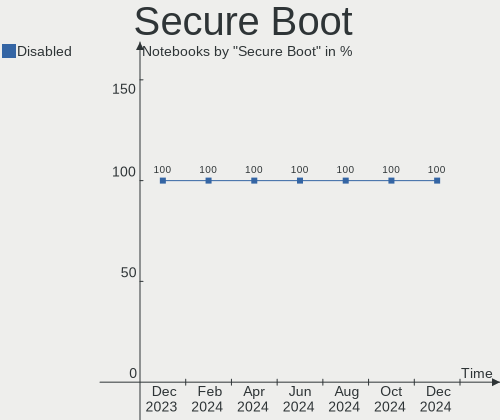

Pop!_OS Hardware Trends (Notebook)
----------------------------------

A project to identify most popular hardware characteristics and track their change
over time based on data collected by Pop!_OS users at https://Linux-Hardware.org.

Anyone can contribute to the study by uploading probes of their computers by
the [hw-probe](https://github.com/linuxhw/hw-probe) tool:

    sudo -E hw-probe -all -upload

Full-feature report is available here: https://linux-hardware.org/?view=trends&formfactor=notebook

Period: Jun, 2021.

Contents
--------

- [ OS                       ](#os)
- [ OS Family                ](#os-family)
- [ Kernel                   ](#kernel)
- [ Kernel Family            ](#kernel-family)
- [ Kernel Major Ver.        ](#kernel-major-ver)
- [ Arch                     ](#arch)
- [ DE                       ](#de)
- [ Display Server           ](#display-server)
- [ Display Manager          ](#display-manager)
- [ OS Lang                  ](#os-lang)
- [ Boot Mode                ](#boot-mode)
- [ Filesystem               ](#filesystem)
- [ Part. scheme             ](#part-scheme)
- [ Dual Boot with Linux/BSD ](#dual-boot-with-linux/bsd)
- [ Dual Boot (Win)          ](#dual-boot-win)
- [ Country                  ](#country)
- [ City                     ](#city)
- [ Vendor                   ](#vendor)
- [ Model                    ](#model)
- [ Model Family             ](#model-family)
- [ MFG Year                 ](#mfg-year)
- [ Form Factor              ](#form-factor)
- [ Secure Boot              ](#secure-boot)
- [ Coreboot                 ](#coreboot)
- [ RAM Size                 ](#ram-size)
- [ RAM Used                 ](#ram-used)
- [ Has CD-ROM               ](#has-cd-rom)
- [ Total Drives             ](#total-drives)
- [ Has Ethernet             ](#has-ethernet)
- [ Has WiFi                 ](#has-wifi)
- [ Has Bluetooth            ](#has-bluetooth)
- [ Drive Vendor             ](#drive-vendor)
- [ Drive Model              ](#drive-model)
- [ HDD Vendor               ](#hdd-vendor)
- [ SSD Vendor               ](#ssd-vendor)
- [ Drive Kind               ](#drive-kind)
- [ Drive Connector          ](#drive-connector)
- [ Drive Size               ](#drive-size)
- [ Space Total              ](#space-total)
- [ Space Used               ](#space-used)
- [ Malfunc. Drives          ](#malfunc-drives)
- [ Malfunc. Drive Vendor    ](#malfunc-drive-vendor)
- [ Malfunc. HDD Vendor      ](#malfunc-hdd-vendor)
- [ Malfunc. Drive Kind      ](#malfunc-drive-kind)
- [ Failed Drives            ](#failed-drives)
- [ Failed Drive Vendor      ](#failed-drive-vendor)
- [ Drive Status             ](#drive-status)
- [ Storage Vendor           ](#storage-vendor)
- [ Storage Model            ](#storage-model)
- [ Storage Kind             ](#storage-kind)
- [ CPU Vendor               ](#cpu-vendor)
- [ CPU Model                ](#cpu-model)
- [ CPU Model Family         ](#cpu-model-family)
- [ CPU Cores                ](#cpu-cores)
- [ CPU Sockets              ](#cpu-sockets)
- [ CPU Threads              ](#cpu-threads)
- [ CPU Op-Modes             ](#cpu-op-modes)
- [ CPU Microcode            ](#cpu-microcode)
- [ CPU Microarch            ](#cpu-microarch)
- [ GPU Vendor               ](#gpu-vendor)
- [ GPU Model                ](#gpu-model)
- [ GPU Combo                ](#gpu-combo)
- [ GPU Driver               ](#gpu-driver)
- [ GPU Memory               ](#gpu-memory)
- [ Monitor Vendor           ](#monitor-vendor)
- [ Monitor Model            ](#monitor-model)
- [ Monitor Resolution       ](#monitor-resolution)
- [ Monitor Diagonal         ](#monitor-diagonal)
- [ Monitor Width            ](#monitor-width)
- [ Aspect Ratio             ](#aspect-ratio)
- [ Monitor Area             ](#monitor-area)
- [ Pixel Density            ](#pixel-density)
- [ Multiple Monitors        ](#multiple-monitors)
- [ Net Controller Vendor    ](#net-controller-vendor)
- [ Net Controller Model     ](#net-controller-model)
- [ Wireless Vendor          ](#wireless-vendor)
- [ Wireless Model           ](#wireless-model)
- [ Ethernet Vendor          ](#ethernet-vendor)
- [ Ethernet Model           ](#ethernet-model)
- [ Net Controller Kind      ](#net-controller-kind)
- [ Used Controller          ](#used-controller)
- [ NICs                     ](#nics)
- [ IPv6                     ](#ipv6)
- [ Memory Vendor            ](#memory-vendor)
- [ Memory Model             ](#memory-model)
- [ Memory Kind              ](#memory-kind)
- [ Memory Form Factor       ](#memory-form-factor)
- [ Memory Size              ](#memory-size)
- [ Memory Speed             ](#memory-speed)
- [ Sound Vendor             ](#sound-vendor)
- [ Sound Model              ](#sound-model)
- [ Camera Vendor            ](#camera-vendor)
- [ Camera Model             ](#camera-model)
- [ Fingerprint Vendor       ](#fingerprint-vendor)
- [ Fingerprint Model        ](#fingerprint-model)
- [ Chipcard Vendor          ](#chipcard-vendor)
- [ Chipcard Model           ](#chipcard-model)
- [ Printer Vendor           ](#printer-vendor)
- [ Printer Model            ](#printer-model)
- [ Scanner Vendor           ](#scanner-vendor)
- [ Scanner Model            ](#scanner-model)
- [ Bluetooth Vendor         ](#bluetooth-vendor)
- [ Bluetooth Model          ](#bluetooth-model)
- [ Unsupported Devices      ](#unsupported-devices)
- [ Unsupported Device Types ](#unsupported-device-types)

OS
--

Installed operating systems

| Name          | Notebooks | Percent |
|---------------|-----------|---------|
| Pop!_OS 20.10 | 92        | 71.32%  |
| Pop!_OS 20.04 | 22        | 17.05%  |
| Pop!_OS 21.04 | 15        | 11.63%  |

OS Family
---------

OS without a version

| Name    | Notebooks | Percent |
|---------|-----------|---------|
| Pop!_OS | 129       | 100%    |

Kernel
------

Version of the Linux kernel

| Version                | Notebooks | Percent |
|------------------------|-----------|---------|
| 5.11.0-7614-generic    | 111       | 86.05%  |
| 5.11.0-7620-generic    | 8         | 6.2%    |
| 5.11.0-7612-generic    | 2         | 1.55%   |
| 5.8.0-7642-generic     | 1         | 0.78%   |
| 5.8.0-7625-generic     | 1         | 0.78%   |
| 5.12.9-xanmod1         | 1         | 0.78%   |
| 5.12.4-xanmod1         | 1         | 0.78%   |
| 5.12.12-xanmod1        | 1         | 0.78%   |
| 5.12.12-custom         | 1         | 0.78%   |
| 5.11.3-051103-generic  | 1         | 0.78%   |
| 5.11.16-051116-generic | 1         | 0.78%   |

Kernel Family
-------------

Linux kernel without a distro release

| Version | Notebooks | Percent |
|---------|-----------|---------|
| 5.11.0  | 121       | 93.8%   |
| 5.8.0   | 2         | 1.55%   |
| 5.12.12 | 2         | 1.55%   |
| 5.12.9  | 1         | 0.78%   |
| 5.12.4  | 1         | 0.78%   |
| 5.11.3  | 1         | 0.78%   |
| 5.11.16 | 1         | 0.78%   |

Kernel Major Ver.
-----------------

Linux kernel major version

| Version | Notebooks | Percent |
|---------|-----------|---------|
| 5.11    | 123       | 95.35%  |
| 5.12    | 4         | 3.1%    |
| 5.8     | 2         | 1.55%   |

Arch
----

OS architecture (x86_64, i586, etc.)

| Name   | Notebooks | Percent |
|--------|-----------|---------|
| x86_64 | 129       | 100%    |

DE
--

Desktop Environment

| Name  | Notebooks | Percent |
|-------|-----------|---------|
| GNOME | 127       | 98.45%  |
| KDE5  | 1         | 0.78%   |
| KDE   | 1         | 0.78%   |

Display Server
--------------

X11 or Wayland

| Name | Notebooks | Percent |
|------|-----------|---------|
| X11  | 128       | 99.22%  |
| Tty  | 1         | 0.78%   |

Display Manager
---------------

SDDM, LightDM, etc.

| Name    | Notebooks | Percent |
|---------|-----------|---------|
| Unknown | 107       | 82.95%  |
| GDM     | 21        | 16.28%  |
| TDM     | 1         | 0.78%   |

OS Lang
-------

Language

| Lang  | Notebooks | Percent |
|-------|-----------|---------|
| en_US | 87        | 67.44%  |
| en_GB | 10        | 7.75%   |
| pt_BR | 9         | 6.98%   |
| de_DE | 5         | 3.88%   |
| fr_FR | 3         | 2.33%   |
| en_CA | 3         | 2.33%   |
| es_ES | 2         | 1.55%   |
| tr_TR | 1         | 0.78%   |
| sv_SE | 1         | 0.78%   |
| ru_RU | 1         | 0.78%   |
| pt_PT | 1         | 0.78%   |
| pl_PL | 1         | 0.78%   |
| nl_NL | 1         | 0.78%   |
| nb_NO | 1         | 0.78%   |
| it_IT | 1         | 0.78%   |
| en_AU | 1         | 0.78%   |
| da_DK | 1         | 0.78%   |

Boot Mode
---------

EFI or BIOS

| Mode | Notebooks | Percent |
|------|-----------|---------|
| BIOS | 110       | 85.27%  |
| EFI  | 19        | 14.73%  |

Filesystem
----------

Type of filesystem

| Type  | Notebooks | Percent |
|-------|-----------|---------|
| Ext4  | 125       | 96.9%   |
| Btrfs | 4         | 3.1%    |

Part. scheme
------------

Scheme of partitioning

| Type    | Notebooks | Percent |
|---------|-----------|---------|
| Unknown | 107       | 82.95%  |
| GPT     | 19        | 14.73%  |
| MBR     | 3         | 2.33%   |

Dual Boot with Linux/BSD
------------------------

Hosting more than one Linux/BSD

| Dual boot | Notebooks | Percent |
|-----------|-----------|---------|
| No        | 129       | 100%    |

Dual Boot (Win)
---------------

Hosting Linux and Windows

| Dual boot | Notebooks | Percent |
|-----------|-----------|---------|
| No        | 118       | 91.47%  |
| Yes       | 11        | 8.53%   |

Country
-------

Geographic location (country)

| Country      | Notebooks | Percent |
|--------------|-----------|---------|
| USA          | 46        | 35.66%  |
| Brazil       | 10        | 7.75%   |
| Germany      | 6         | 4.65%   |
| Canada       | 6         | 4.65%   |
| Sweden       | 4         | 3.1%    |
| France       | 4         | 3.1%    |
| UK           | 3         | 2.33%   |
| Norway       | 3         | 2.33%   |
| Netherlands  | 3         | 2.33%   |
| India        | 3         | 2.33%   |
| Greece       | 3         | 2.33%   |
| Spain        | 2         | 1.55%   |
| Russia       | 2         | 1.55%   |
| Romania      | 2         | 1.55%   |
| Portugal     | 2         | 1.55%   |
| Poland       | 2         | 1.55%   |
| Mexico       | 2         | 1.55%   |
| Malaysia     | 2         | 1.55%   |
| Italy        | 2         | 1.55%   |
| Indonesia    | 2         | 1.55%   |
| Australia    | 2         | 1.55%   |
| Turkey       | 1         | 0.78%   |
| Sri Lanka    | 1         | 0.78%   |
| South Africa | 1         | 0.78%   |
| Serbia       | 1         | 0.78%   |
| Philippines  | 1         | 0.78%   |
| Moldova      | 1         | 0.78%   |
| Latvia       | 1         | 0.78%   |
| Kenya        | 1         | 0.78%   |
| Jamaica      | 1         | 0.78%   |
| Ireland      | 1         | 0.78%   |
| Finland      | 1         | 0.78%   |
| Denmark      | 1         | 0.78%   |
| Croatia      | 1         | 0.78%   |
| Colombia     | 1         | 0.78%   |
| Cambodia     | 1         | 0.78%   |
| Bulgaria     | 1         | 0.78%   |
| Bermuda      | 1         | 0.78%   |
| Belize       | 1         | 0.78%   |

City
----

Geographic location (city)

| City                  | Notebooks | Percent |
|-----------------------|-----------|---------|
| Brooklyn              | 4         | 3.1%    |
| Athens                | 3         | 2.33%   |
| Portland              | 2         | 1.55%   |
| Oslo                  | 2         | 1.55%   |
| Orlando               | 2         | 1.55%   |
| Moscow                | 2         | 1.55%   |
| Calgary               | 2         | 1.55%   |
| Amsterdam             | 2         | 1.55%   |
| Zagreb                | 1         | 0.78%   |
| Woodstock             | 1         | 0.78%   |
| Waynesboro            | 1         | 0.78%   |
| Waterloo              | 1         | 0.78%   |
| Vigo                  | 1         | 0.78%   |
| Uberlândia           | 1         | 0.78%   |
| Toronto               | 1         | 0.78%   |
| Tijuana               | 1         | 0.78%   |
| The Colony            | 1         | 0.78%   |
| Tasikmalaya           | 1         | 0.78%   |
| São Paulo            | 1         | 0.78%   |
| São José dos Campos | 1         | 0.78%   |
| Södertälje          | 1         | 0.78%   |
| Surry Hills           | 1         | 0.78%   |
| Sofia                 | 1         | 0.78%   |
| Smederevo             | 1         | 0.78%   |
| Singaraja             | 1         | 0.78%   |
| Sibiu                 | 1         | 0.78%   |
| Selma                 | 1         | 0.78%   |
| Satu Mare             | 1         | 0.78%   |
| Sandefjord            | 1         | 0.78%   |
| San Pedro Town        | 1         | 0.78%   |
| San Miguel            | 1         | 0.78%   |
| Rotherham             | 1         | 0.78%   |
| Roseville             | 1         | 0.78%   |
| Roseburg              | 1         | 0.78%   |
| Rome                  | 1         | 0.78%   |
| Roesrath              | 1         | 0.78%   |
| Rio de Janeiro        | 1         | 0.78%   |
| Rio Branco            | 1         | 0.78%   |
| Querétaro City       | 1         | 0.78%   |
| Porto                 | 1         | 0.78%   |
| Plainfield            | 1         | 0.78%   |
| Pinole                | 1         | 0.78%   |
| Phnom Penh            | 1         | 0.78%   |
| Orléans              | 1         | 0.78%   |
| New York              | 1         | 0.78%   |
| Nairobi               | 1         | 0.78%   |
| Mâcon                | 1         | 0.78%   |
| Morrisville           | 1         | 0.78%   |
| Montreal              | 1         | 0.78%   |
| Montego Bay           | 1         | 0.78%   |
| Monheim               | 1         | 0.78%   |
| Mogi das Cruzes       | 1         | 0.78%   |
| Milan                 | 1         | 0.78%   |
| Miami                 | 1         | 0.78%   |
| Melbourne             | 1         | 0.78%   |
| McKinney              | 1         | 0.78%   |
| Marion                | 1         | 0.78%   |
| Madrid                | 1         | 0.78%   |
| Londrina              | 1         | 0.78%   |
| London                | 1         | 0.78%   |

Vendor
------

Motherboard manufacturer

| Name                                         | Notebooks | Percent |
|----------------------------------------------|-----------|---------|
| Dell                                         | 27        | 20.93%  |
| Lenovo                                       | 26        | 20.16%  |
| ASUSTek Computer                             | 20        | 15.5%   |
| Hewlett-Packard                              | 18        | 13.95%  |
| System76                                     | 8         | 6.2%    |
| Acer                                         | 4         | 3.1%    |
| Razer                                        | 3         | 2.33%   |
| Apple                                        | 3         | 2.33%   |
| Toshiba                                      | 2         | 1.55%   |
| Samsung Electronics                          | 2         | 1.55%   |
| HUAWEI                                       | 2         | 1.55%   |
| Timi                                         | 1         | 0.78%   |
| SLIMBOOK                                     | 1         | 0.78%   |
| Positivo Bahia - VAIO                        | 1         | 0.78%   |
| Panasonic                                    | 1         | 0.78%   |
| MOTILE                                       | 1         | 0.78%   |
| LG Electronics                               | 1         | 0.78%   |
| Itautec                                      | 1         | 0.78%   |
| Fujitsu                                      | 1         | 0.78%   |
| Dixonsxp                                     | 1         | 0.78%   |
| Clevo                                        | 1         | 0.78%   |
| CHUWI?Innovation?And?Technology(ShenZhen)co. | 1         | 0.78%   |
| Avell                                        | 1         | 0.78%   |
| ASRock                                       | 1         | 0.78%   |
| Alienware                                    | 1         | 0.78%   |

Model
-----

Motherboard model

| Name                                            | Notebooks | Percent |
|-------------------------------------------------|-----------|---------|
| HP Pavilion dv7                                 | 3         | 2.33%   |
| System76 Oryx Pro                               | 2         | 1.55%   |
| System76 Adder WS                               | 2         | 1.55%   |
| Dell XPS 15 9560                                | 2         | 1.55%   |
| Dell Precision 5540                             | 2         | 1.55%   |
| Dell Latitude E7240                             | 2         | 1.55%   |
| ASUS X555LJ                                     | 2         | 1.55%   |
| ASUS ROG Strix G512LW_G512LW                    | 2         | 1.55%   |
| Toshiba Satellite L855                          | 1         | 0.78%   |
| Toshiba Satellite C50-B                         | 1         | 0.78%   |
| Timi A35S                                       | 1         | 0.78%   |
| System76 Serval                                 | 1         | 0.78%   |
| System76 Pangolin Performance                   | 1         | 0.78%   |
| System76 Lemur Pro                              | 1         | 0.78%   |
| System76 Galago Pro                             | 1         | 0.78%   |
| SLIMBOOK PROX15-INTEL                           | 1         | 0.78%   |
| Samsung 300E5K/300E5Q                           | 1         | 0.78%   |
| Samsung 300E4Z/300E5Z/300E7Z                    | 1         | 0.78%   |
| Razer Blade Stealth 13 (Early 2020) - RZ09-0310 | 1         | 0.78%   |
| Razer Blade 14 - RZ09-0370                      | 1         | 0.78%   |
| Razer Blade                                     | 1         | 0.78%   |
| Positivo Bahia - VAIO VJC141F11X-B0111L         | 1         | 0.78%   |
| Panasonic CF-53SALZYLM                          | 1         | 0.78%   |
| MOTILE M142                                     | 1         | 0.78%   |
| LG 14Z980-G.BH51P1                              | 1         | 0.78%   |
| Lenovo Y520-15IKBN 80WK                         | 1         | 0.78%   |
| Lenovo ThinkPad X201 4492W36                    | 1         | 0.78%   |
| Lenovo ThinkPad X140e 20BL000BUS                | 1         | 0.78%   |
| Lenovo ThinkPad X1 Carbon 7th 20QD0000US        | 1         | 0.78%   |
| Lenovo ThinkPad T510 4349BL3                    | 1         | 0.78%   |
| Lenovo ThinkPad T470 W10DG 20JNS4PD0X           | 1         | 0.78%   |
| Lenovo ThinkPad T460s 20FA0047MN                | 1         | 0.78%   |
| Lenovo ThinkPad T460 20FMS1J703                 | 1         | 0.78%   |
| Lenovo ThinkPad T440s 20ARS0Y706                | 1         | 0.78%   |
| Lenovo ThinkPad T440p 20AW0048GE                | 1         | 0.78%   |
| Lenovo ThinkPad T440 20B7A04RGE                 | 1         | 0.78%   |
| Lenovo ThinkPad T420 4180BJ7                    | 1         | 0.78%   |
| Lenovo ThinkPad S1 Yoga 20C0A01QLS              | 1         | 0.78%   |
| Lenovo ThinkPad P53 20QNZ4RBUS                  | 1         | 0.78%   |
| Lenovo ThinkPad L590 20Q7CTO1WW                 | 1         | 0.78%   |
| Lenovo ThinkPad Edge E145 20BC0008GE            | 1         | 0.78%   |
| Lenovo ThinkPad E495 20NE001TTX                 | 1         | 0.78%   |
| Lenovo Legion Y530-15ICH-1060 81LB              | 1         | 0.78%   |
| Lenovo Legion 5 15ARH05 82B5                    | 1         | 0.78%   |
| Lenovo IdeaPad S145-15IWL 81S9                  | 1         | 0.78%   |
| Lenovo IdeaPad S145-15IIL 82DJ                  | 1         | 0.78%   |
| Lenovo IdeaPad Gaming 3 15ARH05 82EY            | 1         | 0.78%   |
| Lenovo IdeaPad 520-15IKB 81BF                   | 1         | 0.78%   |
| Lenovo IdeaPad 5 15ARE05 81YQ                   | 1         | 0.78%   |
| Lenovo IdeaPad 320S-14IKB 80X4                  | 1         | 0.78%   |
| Lenovo IdeaPad 3 15IIL05 81WE                   | 1         | 0.78%   |
| Itautec Infoway                                 | 1         | 0.78%   |
| HUAWEI NBLK-WAX9X                               | 1         | 0.78%   |
| HUAWEI KLVL-WXX9                                | 1         | 0.78%   |
| HP Stream Notebook PC 11                        | 1         | 0.78%   |
| HP ProBook 640 G4                               | 1         | 0.78%   |
| HP ProBook 640 G2                               | 1         | 0.78%   |
| HP ProBook 4730s                                | 1         | 0.78%   |
| HP Pavilion Laptop 15-cw0xxx                    | 1         | 0.78%   |
| HP Pavilion Laptop 14-dv0xxx                    | 1         | 0.78%   |

Model Family
------------

Motherboard model prefix

| Name                                               | Notebooks | Percent |
|----------------------------------------------------|-----------|---------|
| Lenovo ThinkPad                                    | 16        | 12.4%   |
| Dell Latitude                                      | 10        | 7.75%   |
| Dell Inspiron                                      | 10        | 7.75%   |
| HP Pavilion                                        | 8         | 6.2%    |
| Lenovo IdeaPad                                     | 7         | 5.43%   |
| ASUS ROG                                           | 7         | 5.43%   |
| Razer Blade                                        | 3         | 2.33%   |
| HP ProBook                                         | 3         | 2.33%   |
| HP EliteBook                                       | 3         | 2.33%   |
| Dell XPS                                           | 3         | 2.33%   |
| ASUS VivoBook                                      | 3         | 2.33%   |
| Toshiba Satellite                                  | 2         | 1.55%   |
| System76 Oryx                                      | 2         | 1.55%   |
| System76 Adder                                     | 2         | 1.55%   |
| Lenovo Legion                                      | 2         | 1.55%   |
| Dell Precision                                     | 2         | 1.55%   |
| ASUS X555LJ                                        | 2         | 1.55%   |
| Acer Nitro                                         | 2         | 1.55%   |
| Acer Aspire                                        | 2         | 1.55%   |
| Timi A35S                                          | 1         | 0.78%   |
| System76 Serval                                    | 1         | 0.78%   |
| System76 Pangolin                                  | 1         | 0.78%   |
| System76 Lemur                                     | 1         | 0.78%   |
| System76 Galago                                    | 1         | 0.78%   |
| SLIMBOOK PROX15-INTEL                              | 1         | 0.78%   |
| Samsung 300E5K                                     | 1         | 0.78%   |
| Samsung 300E4Z                                     | 1         | 0.78%   |
| Positivo Bahia - VAIO VJC141F11X-B0111L            | 1         | 0.78%   |
| Panasonic CF-53SALZYLM                             | 1         | 0.78%   |
| MOTILE M142                                        | 1         | 0.78%   |
| LG 14Z980-G.BH51P1                                 | 1         | 0.78%   |
| Lenovo Y520-15IKBN                                 | 1         | 0.78%   |
| Itautec Infoway                                    | 1         | 0.78%   |
| HUAWEI NBLK-WAX9X                                  | 1         | 0.78%   |
| HUAWEI KLVL-WXX9                                   | 1         | 0.78%   |
| HP Stream                                          | 1         | 0.78%   |
| HP Laptop                                          | 1         | 0.78%   |
| HP ENVY                                            | 1         | 0.78%   |
| HP Compaq                                          | 1         | 0.78%   |
| Fujitsu LIFEBOOK                                   | 1         | 0.78%   |
| Dell G7                                            | 1         | 0.78%   |
| Dell G5                                            | 1         | 0.78%   |
| Clevo P65                                          | 1         | 0.78%   |
| CHUWI?Innovation?And?Technology(ShenZhen)co. GemiB | 1         | 0.78%   |
| Avell 1711                                         | 1         | 0.78%   |
| ASUS ZenBook                                       | 1         | 0.78%   |
| ASUS X55A                                          | 1         | 0.78%   |
| ASUS X510UR                                        | 1         | 0.78%   |
| ASUS UX360CA                                       | 1         | 0.78%   |
| ASUS GL753VE                                       | 1         | 0.78%   |
| ASUS G752VY                                        | 1         | 0.78%   |
| ASUS E402NA                                        | 1         | 0.78%   |
| ASUS ASUS                                          | 1         | 0.78%   |
| ASRock Golden                                      | 1         | 0.78%   |
| Apple MacBookPro8                                  | 1         | 0.78%   |
| Apple MacBookPro5                                  | 1         | 0.78%   |
| Apple MacBook5                                     | 1         | 0.78%   |
| Alienware m15                                      | 1         | 0.78%   |
| Unknown                                            | 1         | 0.78%   |

MFG Year
--------

Motherboard manufacture year

| Year | Notebooks | Percent |
|------|-----------|---------|
| 2021 | 29        | 22.48%  |
| 2020 | 24        | 18.6%   |
| 2019 | 22        | 17.05%  |
| 2018 | 12        | 9.3%    |
| 2017 | 10        | 7.75%   |
| 2012 | 7         | 5.43%   |
| 2014 | 5         | 3.88%   |
| 2016 | 3         | 2.33%   |
| 2015 | 3         | 2.33%   |
| 2013 | 3         | 2.33%   |
| 2011 | 3         | 2.33%   |
| 2009 | 3         | 2.33%   |
| 2008 | 2         | 1.55%   |
| 2010 | 1         | 0.78%   |
| 2007 | 1         | 0.78%   |
| 2006 | 1         | 0.78%   |

Form Factor
-----------

Physical design of the computer

| Name     | Notebooks | Percent |
|----------|-----------|---------|
| Notebook | 129       | 100%    |

Secure Boot
-----------

Enabled or disabled

| State    | Notebooks | Percent |
|----------|-----------|---------|
| Disabled | 129       | 100%    |

Coreboot
--------

Have coreboot on board

| Used | Notebooks | Percent |
|------|-----------|---------|
| No   | 126       | 97.67%  |
| Yes  | 3         | 2.33%   |

RAM Size
--------

Total RAM memory

| Size in GB  | Notebooks | Percent |
|-------------|-----------|---------|
| 4.01-8.0    | 34        | 26.36%  |
| 8.01-16.0   | 33        | 25.58%  |
| 16.01-24.0  | 21        | 16.28%  |
| 3.01-4.0    | 17        | 13.18%  |
| 32.01-64.0  | 13        | 10.08%  |
| 24.01-32.0  | 3         | 2.33%   |
| 64.01-256.0 | 3         | 2.33%   |
| 1.01-2.0    | 3         | 2.33%   |
| 2.01-3.0    | 2         | 1.55%   |

RAM Used
--------

Used RAM memory

| Used GB    | Notebooks | Percent |
|------------|-----------|---------|
| 1.01-2.0   | 43        | 33.33%  |
| 2.01-3.0   | 38        | 29.46%  |
| 4.01-8.0   | 24        | 18.6%   |
| 3.01-4.0   | 21        | 16.28%  |
| 16.01-24.0 | 1         | 0.78%   |
| 8.01-16.0  | 1         | 0.78%   |
| 0.51-1.0   | 1         | 0.78%   |

Has CD-ROM
----------

Has CD-ROM on board

| Presented | Notebooks | Percent |
|-----------|-----------|---------|
| No        | 95        | 73.64%  |
| Yes       | 34        | 26.36%  |

Total Drives
------------

Number of drives on board

| Drives | Notebooks | Percent |
|--------|-----------|---------|
| 1      | 94        | 72.87%  |
| 2      | 29        | 22.48%  |
| 3      | 6         | 4.65%   |

Has Ethernet
------------

Has Ethernet on board

| Presented | Notebooks | Percent |
|-----------|-----------|---------|
| Yes       | 106       | 82.17%  |
| No        | 23        | 17.83%  |

Has WiFi
--------

Has WiFi module

| Presented | Notebooks | Percent |
|-----------|-----------|---------|
| Yes       | 128       | 99.22%  |
| No        | 1         | 0.78%   |

Has Bluetooth
-------------

Has Bluetooth module

| Presented | Notebooks | Percent |
|-----------|-----------|---------|
| Yes       | 113       | 87.6%   |
| No        | 16        | 12.4%   |

Drive Vendor
------------

Hard drive vendors

| Vendor                  | Notebooks | Drives | Percent |
|-------------------------|-----------|--------|---------|
| Samsung Electronics     | 33        | 38     | 20.75%  |
| WDC                     | 14        | 14     | 8.81%   |
| Seagate                 | 12        | 12     | 7.55%   |
| Sandisk                 | 12        | 12     | 7.55%   |
| Toshiba                 | 11        | 11     | 6.92%   |
| SK Hynix                | 11        | 11     | 6.92%   |
| Unknown                 | 8         | 9      | 5.03%   |
| Kingston                | 7         | 7      | 4.4%    |
| Intel                   | 7         | 8      | 4.4%    |
| Crucial                 | 7         | 7      | 4.4%    |
| HGST                    | 6         | 7      | 3.77%   |
| LITEON                  | 4         | 4      | 2.52%   |
| Hitachi                 | 4         | 4      | 2.52%   |
| Solid State Storage     | 2         | 2      | 1.26%   |
| Micron Technology       | 2         | 2      | 1.26%   |
| KIOXIA                  | 2         | 2      | 1.26%   |
| VisionTek               | 1         | 2      | 0.63%   |
| Union Memory (Shenzhen) | 1         | 1      | 0.63%   |
| Union Memory            | 1         | 1      | 0.63%   |
| Transcend               | 1         | 1      | 0.63%   |
| Team                    | 1         | 1      | 0.63%   |
| SUNEAST                 | 1         | 1      | 0.63%   |
| SPCC                    | 1         | 1      | 0.63%   |
| ROG                     | 1         | 1      | 0.63%   |
| Realtek                 | 1         | 1      | 0.63%   |
| PNY                     | 1         | 1      | 0.63%   |
| Phison                  | 1         | 2      | 0.63%   |
| OCZ                     | 1         | 1      | 0.63%   |
| Netac                   | 1         | 1      | 0.63%   |
| LITEONIT                | 1         | 1      | 0.63%   |
| KingDian                | 1         | 1      | 0.63%   |
| Fujitsu                 | 1         | 1      | 0.63%   |
| ASMT                    | 1         | 1      | 0.63%   |

Drive Model
-----------

Hard drive models

| Model                                        | Notebooks | Percent |
|----------------------------------------------|-----------|---------|
| Unknown MMC Card  32GB                       | 3         | 1.84%   |
| Toshiba MQ01ABF050 500GB                     | 3         | 1.84%   |
| Seagate ST1000LM035-1RK172 1TB               | 3         | 1.84%   |
| Seagate ST1000LM024 HN-M101MBB 1TB           | 3         | 1.84%   |
| Samsung NVMe SSD Drive 512GB                 | 3         | 1.84%   |
| Samsung NVMe SSD Drive 256GB                 | 3         | 1.84%   |
| Kingston SA400S37240G 240GB SSD              | 3         | 1.84%   |
| Intel NVMe SSD Drive 512GB                   | 3         | 1.84%   |
| Unknown MMC Card  64GB                       | 2         | 1.23%   |
| Solid State Storage SSSTC CL1-4D256 256GB    | 2         | 1.23%   |
| SK Hynix NVMe SSD Drive 512GB                | 2         | 1.23%   |
| Seagate ST1000LX015-1U7172 1TB               | 2         | 1.23%   |
| Sandisk NVMe SSD Drive 256GB                 | 2         | 1.23%   |
| Sandisk NVMe SSD Drive 1TB                   | 2         | 1.23%   |
| Sandisk NVMe SSD Drive 1024GB                | 2         | 1.23%   |
| Samsung SSD 870 EVO 250GB                    | 2         | 1.23%   |
| Samsung NVMe SSD Drive 500GB                 | 2         | 1.23%   |
| Samsung NVMe SSD Drive 1TB                   | 2         | 1.23%   |
| Samsung NVMe SSD Drive 1024GB                | 2         | 1.23%   |
| Samsung MZ7TD128HAFV-000L1 128GB SSD         | 2         | 1.23%   |
| Intel SSDPEKNW512G8 512GB                    | 2         | 1.23%   |
| Intel NVMe SSD Drive 1024GB                  | 2         | 1.23%   |
| Hitachi HTS547575A9E384 752GB                | 2         | 1.23%   |
| HGST HTS725050A7E630 500GB                   | 2         | 1.23%   |
| HGST HTS721010A9E630 1TB                     | 2         | 1.23%   |
| Crucial CT250MX500SSD1 250GB                 | 2         | 1.23%   |
| WDC WDS500G2B0B-00YS70 500GB SSD             | 1         | 0.61%   |
| WDC WDS480G2G0B-00EPW0 480GB SSD             | 1         | 0.61%   |
| WDC WDS250G2B0B-00YS70 250GB SSD             | 1         | 0.61%   |
| WDC WDS120G2G0A-00JH30 120GB SSD             | 1         | 0.61%   |
| WDC WDS100T2G0A-00JH30 1TB SSD               | 1         | 0.61%   |
| WDC WDBNCE5000PNC 500GB SSD                  | 1         | 0.61%   |
| WDC WD5000LPCX-35VHAT0 500GB                 | 1         | 0.61%   |
| WDC WD1200BEVS-22UST0 120GB                  | 1         | 0.61%   |
| WDC WD10SPZX-21Z10T0 1TB                     | 1         | 0.61%   |
| WDC WD10SPZX-08Z10 1TB                       | 1         | 0.61%   |
| WDC WD10JPVX-75JC3T0 1TB                     | 1         | 0.61%   |
| WDC PC SN730 SDBPNTY-512G-1027 512GB         | 1         | 0.61%   |
| WDC PC SN720 SDAQNTW-512G-1001 512GB         | 1         | 0.61%   |
| WDC PC SN720 SDAQNTW-1T00-1001 1TB           | 1         | 0.61%   |
| VisionTek mSATA 480GB                        | 1         | 0.61%   |
| Unknown SE64G  64GB                          | 1         | 0.61%   |
| Unknown SD/MMC/MS PRO 128GB                  | 1         | 0.61%   |
| Unknown NVMe SSD Drive 512GB                 | 1         | 0.61%   |
| Unknown NVMe SSD Drive 256GB                 | 1         | 0.61%   |
| Union Memory UMIS RPJTJ512MEE1OWX 512GB      | 1         | 0.61%   |
| Union Memory (Shenzhen) NVMe SSD Drive 256GB | 1         | 0.61%   |
| Transcend TS480GSSD220S 480GB                | 1         | 0.61%   |
| Toshiba NVMe SSD Drive 512GB                 | 1         | 0.61%   |
| Toshiba NVMe SSD Drive 256GB                 | 1         | 0.61%   |
| Toshiba NVMe SSD Drive 1024GB                | 1         | 0.61%   |
| Toshiba MQ02ABF050H 500GB                    | 1         | 0.61%   |
| Toshiba MK6475GSX 640GB                      | 1         | 0.61%   |
| Toshiba MK5065GSXF 500GB                     | 1         | 0.61%   |
| Toshiba MK5061GSYN 500GB                     | 1         | 0.61%   |
| Toshiba MK1652GSX 160GB                      | 1         | 0.61%   |
| Team T253A3512G 512GB SSD                    | 1         | 0.61%   |
| SUNEAST SSD SE800 256GB                      | 1         | 0.61%   |
| SPCC Solid State Disk 128GB                  | 1         | 0.61%   |
| SK Hynix SHGS31-500GS-2 500GB SSD            | 1         | 0.61%   |

HDD Vendor
----------

Hard disk drive vendors

| Vendor              | Notebooks | Drives | Percent |
|---------------------|-----------|--------|---------|
| Seagate             | 12        | 12     | 30.77%  |
| Toshiba             | 8         | 8      | 20.51%  |
| HGST                | 6         | 7      | 15.38%  |
| WDC                 | 5         | 5      | 12.82%  |
| Hitachi             | 4         | 4      | 10.26%  |
| Samsung Electronics | 2         | 2      | 5.13%   |
| Fujitsu             | 1         | 1      | 2.56%   |
| ASMT                | 1         | 1      | 2.56%   |

SSD Vendor
----------

Solid state drive vendors

| Vendor              | Notebooks | Drives | Percent |
|---------------------|-----------|--------|---------|
| Samsung Electronics | 15        | 17     | 26.32%  |
| Kingston            | 7         | 7      | 12.28%  |
| Crucial             | 7         | 7      | 12.28%  |
| WDC                 | 6         | 6      | 10.53%  |
| SanDisk             | 5         | 5      | 8.77%   |
| LITEON              | 4         | 4      | 7.02%   |
| SK Hynix            | 3         | 3      | 5.26%   |
| Transcend           | 1         | 1      | 1.75%   |
| Team                | 1         | 1      | 1.75%   |
| SUNEAST             | 1         | 1      | 1.75%   |
| SPCC                | 1         | 1      | 1.75%   |
| PNY                 | 1         | 1      | 1.75%   |
| OCZ                 | 1         | 1      | 1.75%   |
| Netac               | 1         | 1      | 1.75%   |
| LITEONIT            | 1         | 1      | 1.75%   |
| KingDian            | 1         | 1      | 1.75%   |
| Intel               | 1         | 1      | 1.75%   |

Drive Kind
----------

HDD or SSD

| Kind    | Notebooks | Drives | Percent |
|---------|-----------|--------|---------|
| SSD     | 52        | 59     | 34.21%  |
| NVMe    | 51        | 59     | 33.55%  |
| HDD     | 39        | 40     | 25.66%  |
| MMC     | 6         | 6      | 3.95%   |
| Unknown | 4         | 5      | 2.63%   |

Drive Connector
---------------

SATA, SAS, NVMe, etc.

| Type | Notebooks | Drives | Percent |
|------|-----------|--------|---------|
| SATA | 85        | 100    | 58.22%  |
| NVMe | 51        | 59     | 34.93%  |
| MMC  | 6         | 6      | 4.11%   |
| SAS  | 4         | 4      | 2.74%   |

Drive Size
----------

Size of hard drive

| Size in TB | Notebooks | Drives | Percent |
|------------|-----------|--------|---------|
| 0.01-0.5   | 66        | 73     | 72.53%  |
| 0.51-1.0   | 24        | 25     | 26.37%  |
| 1.01-2.0   | 1         | 1      | 1.1%    |

Space Total
-----------

Amount of disk space available on the file system

| Size in GB     | Notebooks | Percent |
|----------------|-----------|---------|
| 101-250        | 48        | 37.21%  |
| 251-500        | 38        | 29.46%  |
| 501-1000       | 27        | 20.93%  |
| 1001-2000      | 7         | 5.43%   |
| 51-100         | 3         | 2.33%   |
| 21-50          | 2         | 1.55%   |
| 2001-3000      | 2         | 1.55%   |
| More than 3000 | 1         | 0.78%   |
| 1-20           | 1         | 0.78%   |

Space Used
----------

Amount of used disk space

| Used GB        | Notebooks | Percent |
|----------------|-----------|---------|
| 1-20           | 51        | 39.53%  |
| 21-50          | 28        | 21.71%  |
| 101-250        | 24        | 18.6%   |
| 51-100         | 11        | 8.53%   |
| 251-500        | 8         | 6.2%    |
| 501-1000       | 5         | 3.88%   |
| More than 3000 | 1         | 0.78%   |
| 1001-2000      | 1         | 0.78%   |

Malfunc. Drives
---------------

Drive models with a malfunction

| Model                      | Notebooks | Drives | Percent |
|----------------------------|-----------|--------|---------|
| HGST HTS725050A7E630 500GB | 1         | 1      | 100%    |

Malfunc. Drive Vendor
---------------------

Vendors of faulty drives

| Vendor | Notebooks | Drives | Percent |
|--------|-----------|--------|---------|
| HGST   | 1         | 1      | 100%    |

Malfunc. HDD Vendor
-------------------

Vendors of faulty HDD drives

| Vendor | Notebooks | Drives | Percent |
|--------|-----------|--------|---------|
| HGST   | 1         | 1      | 100%    |

Malfunc. Drive Kind
-------------------

Kinds of faulty drives

| Kind | Notebooks | Drives | Percent |
|------|-----------|--------|---------|
| HDD  | 1         | 1      | 100%    |

Failed Drives
-------------

Failed drive models

Zero info for selected period =(

Failed Drive Vendor
-------------------

Failed drive vendors

Zero info for selected period =(

Drive Status
------------

Number of failed and malfunc. drives

| Status   | Notebooks | Drives | Percent |
|----------|-----------|--------|---------|
| Detected | 109       | 140    | 81.95%  |
| Works    | 23        | 28     | 17.29%  |
| Malfunc  | 1         | 1      | 0.75%   |

Storage Vendor
--------------

Storage controller vendors

| Vendor                           | Notebooks | Percent |
|----------------------------------|-----------|---------|
| Intel                            | 95        | 57.93%  |
| Samsung Electronics              | 17        | 10.37%  |
| AMD                              | 17        | 10.37%  |
| Sandisk                          | 10        | 6.1%    |
| SK Hynix                         | 8         | 4.88%   |
| Toshiba America Info Systems     | 3         | 1.83%   |
| Solid State Storage Technology   | 3         | 1.83%   |
| Nvidia                           | 3         | 1.83%   |
| Union Memory (Shenzhen)          | 2         | 1.22%   |
| Micron Technology                | 2         | 1.22%   |
| KIOXIA                           | 2         | 1.22%   |
| Silicon Integrated Systems [SiS] | 1         | 0.61%   |
| Phison Electronics               | 1         | 0.61%   |

Storage Model
-------------

Storage controller models

| Model                                                                          | Notebooks | Percent |
|--------------------------------------------------------------------------------|-----------|---------|
| AMD FCH SATA Controller [AHCI mode]                                            | 17        | 9.88%   |
| Intel Sunrise Point-LP SATA Controller [AHCI mode]                             | 15        | 8.72%   |
| Intel 6 Series/C200 Series Chipset Family 6 port Mobile SATA AHCI Controller   | 10        | 5.81%   |
| Samsung NVMe SSD Controller SM981/PM981/PM983                                  | 9         | 5.23%   |
| Intel Cannon Lake Mobile PCH SATA AHCI Controller                              | 8         | 4.65%   |
| Intel 8 Series SATA Controller 1 [AHCI mode]                                   | 8         | 4.65%   |
| Intel 82801 Mobile SATA Controller [RAID mode]                                 | 7         | 4.07%   |
| Intel SSD 660P Series                                                          | 6         | 3.49%   |
| Intel 7 Series Chipset Family 6-port SATA Controller [AHCI mode]               | 6         | 3.49%   |
| Intel Wildcat Point-LP SATA Controller [AHCI Mode]                             | 5         | 2.91%   |
| Intel HM170/QM170 Chipset SATA Controller [AHCI Mode]                          | 5         | 2.91%   |
| Intel Volume Management Device NVMe RAID Controller                            | 4         | 2.33%   |
| Intel 8 Series/C220 Series Chipset Family 6-port SATA Controller 1 [AHCI mode] | 4         | 2.33%   |
| Solid State Storage Non-Volatile memory controller                             | 3         | 1.74%   |
| SK Hynix BC511                                                                 | 3         | 1.74%   |
| Sandisk WD Blue SN550 NVMe SSD                                                 | 3         | 1.74%   |
| Sandisk WD Black SN750 / PC SN730 NVMe SSD                                     | 3         | 1.74%   |
| Samsung NVMe Controller                                                        | 3         | 1.74%   |
| Nvidia MCP79 AHCI Controller                                                   | 3         | 1.74%   |
| Intel 400 Series Chipset Family SATA AHCI Controller                           | 3         | 1.74%   |
| SK Hynix BC501 NVMe Solid State Drive                                          | 2         | 1.16%   |
| Sandisk WD Black 2018/SN750 / PC SN720 NVMe SSD                                | 2         | 1.16%   |
| Samsung NVMe SSD Controller PM9A1/PM9A3/980PRO                                 | 2         | 1.16%   |
| Micron Non-Volatile memory controller                                          | 2         | 1.16%   |
| KIOXIA Non-Volatile memory controller                                          | 2         | 1.16%   |
| Intel Tiger Lake-LP SATA Controller [AHCI mode]                                | 2         | 1.16%   |
| Intel Ice Lake-LP SATA Controller [AHCI mode]                                  | 2         | 1.16%   |
| Intel Celeron/Pentium Silver Processor SATA Controller                         | 2         | 1.16%   |
| Intel 5 Series/3400 Series Chipset 6 port SATA AHCI Controller                 | 2         | 1.16%   |
| Union Memory (Shenzhen) NVMe 256G SSD device                                   | 1         | 0.58%   |
| Union Memory (Shenzhen) Non-Volatile memory controller                         | 1         | 0.58%   |
| Toshiba America Info Systems XG6 NVMe SSD Controller                           | 1         | 0.58%   |
| Toshiba America Info Systems XG4 NVMe SSD Controller                           | 1         | 0.58%   |
| Toshiba America Info Systems BG3 NVMe SSD Controller                           | 1         | 0.58%   |
| SK Hynix PC300 NVMe Solid State Drive 1TB                                      | 1         | 0.58%   |
| SK Hynix NVMe SSD Controller                                                   | 1         | 0.58%   |
| SK Hynix Non-Volatile memory controller                                        | 1         | 0.58%   |
| Silicon Integrated Systems [SiS] SATA Controller / IDE mode                    | 1         | 0.58%   |
| Silicon Integrated Systems [SiS] 5513 IDE Controller                           | 1         | 0.58%   |
| Sandisk WD Blue SN500 / PC SN520 NVMe SSD                                      | 1         | 0.58%   |
| Sandisk Non-Volatile memory controller                                         | 1         | 0.58%   |
| Samsung NVMe SSD Controller SM961/PM961/SM963                                  | 1         | 0.58%   |
| Samsung NVMe SSD Controller SM951/PM951                                        | 1         | 0.58%   |
| Samsung Electronics SATA controller                                            | 1         | 0.58%   |
| Phison E12 NVMe Controller                                                     | 1         | 0.58%   |
| Intel SATA Controller [RAID mode]                                              | 1         | 0.58%   |
| Intel Q170/Q150/B150/H170/H110/Z170/CM236 Chipset SATA Controller [AHCI Mode]  | 1         | 0.58%   |
| Intel Comet Lake PCH-LP SATA RAID Premium Controller                           | 1         | 0.58%   |
| Intel Celeron N3350/Pentium N4200/Atom E3900 Series SATA AHCI Controller       | 1         | 0.58%   |
| Intel Cannon Point-LP SATA Controller [AHCI Mode]                              | 1         | 0.58%   |
| Intel 82801IBM/IEM (ICH9M/ICH9M-E) 2 port SATA Controller [IDE mode]           | 1         | 0.58%   |
| Intel 82801HM/HEM (ICH8M/ICH8M-E) SATA Controller [IDE mode]                   | 1         | 0.58%   |
| Intel 82801HM/HEM (ICH8M/ICH8M-E) SATA Controller [AHCI mode]                  | 1         | 0.58%   |
| Intel 82801HM/HEM (ICH8M/ICH8M-E) IDE Controller                               | 1         | 0.58%   |
| Intel 82801GBM/GHM (ICH7-M Family) SATA Controller [AHCI mode]                 | 1         | 0.58%   |
| Intel 82801G (ICH7 Family) IDE Controller                                      | 1         | 0.58%   |
| Intel 200 Series PCH SATA controller [AHCI mode]                               | 1         | 0.58%   |
| AMD FCH IDE Controller                                                         | 1         | 0.58%   |

Storage Kind
------------

Kind of storage controller (IDE, SATA, NVMe, SAS, ...)

| Kind | Notebooks | Percent |
|------|-----------|---------|
| SATA | 98        | 58.33%  |
| NVMe | 51        | 30.36%  |
| RAID | 13        | 7.74%   |
| IDE  | 6         | 3.57%   |

CPU Vendor
----------

Processor vendors

| Vendor | Notebooks | Percent |
|--------|-----------|---------|
| Intel  | 105       | 81.4%   |
| AMD    | 24        | 18.6%   |

CPU Model
---------

Processor models

| Model                                         | Notebooks | Percent |
|-----------------------------------------------|-----------|---------|
| Intel Core i7-7700HQ CPU @ 2.80GHz            | 5         | 3.88%   |
| Intel Core i7-8750H CPU @ 2.20GHz             | 4         | 3.1%    |
| Intel Core i7-8565U CPU @ 1.80GHz             | 4         | 3.1%    |
| Intel Core i7-10750H CPU @ 2.60GHz            | 4         | 3.1%    |
| AMD Ryzen 7 4800H with Radeon Graphics        | 4         | 3.1%    |
| Intel Core i7-4600U CPU @ 2.10GHz             | 3         | 2.33%   |
| Intel Core i5-8250U CPU @ 1.60GHz             | 3         | 2.33%   |
| Intel Core i5-6300U CPU @ 2.40GHz             | 3         | 2.33%   |
| Intel Core i5-5200U CPU @ 2.20GHz             | 3         | 2.33%   |
| Intel Core i5-2450M CPU @ 2.50GHz             | 3         | 2.33%   |
| Intel 11th Gen Core i7-1165G7 @ 2.80GHz       | 3         | 2.33%   |
| Intel Core i9-9980HK CPU @ 2.40GHz            | 2         | 1.55%   |
| Intel Core i9-9880H CPU @ 2.30GHz             | 2         | 1.55%   |
| Intel Core i7-9750H CPU @ 2.60GHz             | 2         | 1.55%   |
| Intel Core i7-7500U CPU @ 2.70GHz             | 2         | 1.55%   |
| Intel Core i5-7200U CPU @ 2.50GHz             | 2         | 1.55%   |
| Intel Core i5-6200U CPU @ 2.30GHz             | 2         | 1.55%   |
| Intel Core i5-4300U CPU @ 1.90GHz             | 2         | 1.55%   |
| Intel Core i5-3340M CPU @ 2.70GHz             | 2         | 1.55%   |
| AMD Ryzen 9 5900HS with Radeon Graphics       | 2         | 1.55%   |
| AMD Ryzen 7 3700U with Radeon Vega Mobile Gfx | 2         | 1.55%   |
| AMD Ryzen 5 4600H with Radeon Graphics        | 2         | 1.55%   |
| AMD Ryzen 5 2500U with Radeon Vega Mobile Gfx | 2         | 1.55%   |
| AMD A4-5000 APU with Radeon HD Graphics       | 2         | 1.55%   |
| Intel Pentium Dual CPU T2390 @ 1.86GHz        | 1         | 0.78%   |
| Intel Pentium CPU 2020M @ 2.40GHz             | 1         | 0.78%   |
| Intel Genuine CPU T1400 @ 1.73GHz             | 1         | 0.78%   |
| Intel Core m3-6Y30 CPU @ 0.90GHz              | 1         | 0.78%   |
| Intel Core i7-9850H CPU @ 2.60GHz             | 1         | 0.78%   |
| Intel Core i7-8700K CPU @ 3.70GHz             | 1         | 0.78%   |
| Intel Core i7-6820HK CPU @ 2.70GHz            | 1         | 0.78%   |
| Intel Core i7-6600U CPU @ 2.60GHz             | 1         | 0.78%   |
| Intel Core i7-4720HQ CPU @ 2.60GHz            | 1         | 0.78%   |
| Intel Core i7-4710MQ CPU @ 2.50GHz            | 1         | 0.78%   |
| Intel Core i7-4702HQ CPU @ 2.20GHz            | 1         | 0.78%   |
| Intel Core i7-4510U CPU @ 2.00GHz             | 1         | 0.78%   |
| Intel Core i7-3610QM CPU @ 2.30GHz            | 1         | 0.78%   |
| Intel Core i7-2670QM CPU @ 2.20GHz            | 1         | 0.78%   |
| Intel Core i7-2630QM CPU @ 2.00GHz            | 1         | 0.78%   |
| Intel Core i7-2620M CPU @ 2.70GHz             | 1         | 0.78%   |
| Intel Core i7-10870H CPU @ 2.20GHz            | 1         | 0.78%   |
| Intel Core i7-1065G7 CPU @ 1.30GHz            | 1         | 0.78%   |
| Intel Core i5-7300HQ CPU @ 2.50GHz            | 1         | 0.78%   |
| Intel Core i5-6440HQ CPU @ 2.60GHz            | 1         | 0.78%   |
| Intel Core i5-4310U CPU @ 2.00GHz             | 1         | 0.78%   |
| Intel Core i5-4300M CPU @ 2.60GHz             | 1         | 0.78%   |
| Intel Core i5-4200U CPU @ 1.60GHz             | 1         | 0.78%   |
| Intel Core i5-3320M CPU @ 2.60GHz             | 1         | 0.78%   |
| Intel Core i5-2520M CPU @ 2.50GHz             | 1         | 0.78%   |
| Intel Core i5-2435M CPU @ 2.40GHz             | 1         | 0.78%   |
| Intel Core i5-2430M CPU @ 2.40GHz             | 1         | 0.78%   |
| Intel Core i5-2410M CPU @ 2.30GHz             | 1         | 0.78%   |
| Intel Core i5-1035G1 CPU @ 1.00GHz            | 1         | 0.78%   |
| Intel Core i5-10310U CPU @ 1.70GHz            | 1         | 0.78%   |
| Intel Core i5-10300H CPU @ 2.50GHz            | 1         | 0.78%   |
| Intel Core i5 CPU M 540 @ 2.53GHz             | 1         | 0.78%   |
| Intel Core i5 CPU M 520 @ 2.40GHz             | 1         | 0.78%   |
| Intel Core i3-7100U CPU @ 2.40GHz             | 1         | 0.78%   |
| Intel Core i3-6006U CPU @ 2.00GHz             | 1         | 0.78%   |
| Intel Core i3-5015U CPU @ 2.10GHz             | 1         | 0.78%   |

CPU Model Family
----------------

Processor model prefix

| Model              | Notebooks | Percent |
|--------------------|-----------|---------|
| Intel Core i7      | 38        | 29.46%  |
| Intel Core i5      | 35        | 27.13%  |
| Intel Core i3      | 8         | 6.2%    |
| AMD Ryzen 7        | 8         | 6.2%    |
| AMD Ryzen 5        | 8         | 6.2%    |
| Other              | 6         | 4.65%   |
| Intel Celeron      | 5         | 3.88%   |
| Intel Core i9      | 4         | 3.1%    |
| Intel Core 2 Duo   | 4         | 3.1%    |
| AMD Ryzen 9        | 3         | 2.33%   |
| AMD Ryzen 3        | 2         | 1.55%   |
| AMD A4             | 2         | 1.55%   |
| Intel Pentium Dual | 1         | 0.78%   |
| Intel Pentium      | 1         | 0.78%   |
| Intel Genuine      | 1         | 0.78%   |
| Intel Core m3      | 1         | 0.78%   |
| Intel Core 2       | 1         | 0.78%   |
| AMD A6             | 1         | 0.78%   |

CPU Cores
---------

Number of processor cores

| Number | Notebooks | Percent |
|--------|-----------|---------|
| 2      | 59        | 45.74%  |
| 4      | 40        | 31.01%  |
| 6      | 16        | 12.4%   |
| 8      | 13        | 10.08%  |
| 5      | 1         | 0.78%   |

CPU Sockets
-----------

Number of sockets

| Number | Notebooks | Percent |
|--------|-----------|---------|
| 1      | 129       | 100%    |

CPU Threads
-----------

Threads per core (Hyper-Threading)

| Number | Notebooks | Percent |
|--------|-----------|---------|
| 2      | 109       | 84.5%   |
| 1      | 20        | 15.5%   |

CPU Op-Modes
------------

CPU Operation Modes (32-bit, 64-bit)

| Op mode        | Notebooks | Percent |
|----------------|-----------|---------|
| 32-bit, 64-bit | 129       | 100%    |

CPU Microcode
-------------

Microcode number

| Number     | Notebooks | Percent |
|------------|-----------|---------|
| Unknown    | 108       | 83.72%  |
| 0x906ed    | 3         | 2.33%   |
| 0xa0652    | 2         | 1.55%   |
| 0x08600106 | 2         | 1.55%   |
| 0x08600104 | 2         | 1.55%   |
| 0x906ea    | 1         | 0.78%   |
| 0x806ec    | 1         | 0.78%   |
| 0x806c1    | 1         | 0.78%   |
| 0x706e5    | 1         | 0.78%   |
| 0x706a8    | 1         | 0.78%   |
| 0x40651    | 1         | 0.78%   |
| 0x306c3    | 1         | 0.78%   |
| 0x306a9    | 1         | 0.78%   |
| 0x0a50000c | 1         | 0.78%   |
| 0x08600102 | 1         | 0.78%   |
| 0x08108109 | 1         | 0.78%   |
| 0x07000110 | 1         | 0.78%   |

CPU Microarch
-------------

Microarchitecture

| Name          | Notebooks | Percent |
|---------------|-----------|---------|
| KabyLake      | 31        | 24.03%  |
| Haswell       | 14        | 10.85%  |
| SandyBridge   | 11        | 8.53%   |
| Skylake       | 10        | 7.75%   |
| Zen 2         | 8         | 6.2%    |
| Zen+          | 6         | 4.65%   |
| TigerLake     | 6         | 4.65%   |
| CometLake     | 6         | 4.65%   |
| Broadwell     | 6         | 4.65%   |
| Zen 3         | 5         | 3.88%   |
| IvyBridge     | 5         | 3.88%   |
| Core          | 5         | 3.88%   |
| IceLake       | 3         | 2.33%   |
| Zen           | 2         | 1.55%   |
| Westmere      | 2         | 1.55%   |
| Penryn        | 2         | 1.55%   |
| Jaguar        | 2         | 1.55%   |
| Goldmont plus | 2         | 1.55%   |
| Silvermont    | 1         | 0.78%   |
| K10 Llano     | 1         | 0.78%   |
| Goldmont      | 1         | 0.78%   |

GPU Vendor
----------

Vendors of graphics cards

| Vendor                           | Notebooks | Percent |
|----------------------------------|-----------|---------|
| Intel                            | 97        | 55.43%  |
| Nvidia                           | 47        | 26.86%  |
| AMD                              | 30        | 17.14%  |
| Silicon Integrated Systems [SiS] | 1         | 0.57%   |

GPU Model
---------

Graphics card models

| Model                                                                         | Notebooks | Percent |
|-------------------------------------------------------------------------------|-----------|---------|
| Intel CoffeeLake-H GT2 [UHD Graphics 630]                                     | 11        | 6.15%   |
| Intel 2nd Generation Core Processor Family Integrated Graphics Controller     | 11        | 6.15%   |
| Intel Haswell-ULT Integrated Graphics Controller                              | 10        | 5.59%   |
| Intel Skylake GT2 [HD Graphics 520]                                           | 7         | 3.91%   |
| AMD Renoir                                                                    | 7         | 3.91%   |
| Intel HD Graphics 630                                                         | 6         | 3.35%   |
| Intel CometLake-H GT2 [UHD Graphics]                                          | 6         | 3.35%   |
| AMD Picasso                                                                   | 6         | 3.35%   |
| Intel TigerLake-LP GT2 [Iris Xe Graphics]                                     | 5         | 2.79%   |
| Intel HD Graphics 620                                                         | 5         | 2.79%   |
| Intel HD Graphics 5500                                                        | 5         | 2.79%   |
| AMD Cezanne                                                                   | 5         | 2.79%   |
| Intel WhiskeyLake-U GT2 [UHD Graphics 620]                                    | 4         | 2.23%   |
| Intel 4th Gen Core Processor Integrated Graphics Controller                   | 4         | 2.23%   |
| Nvidia TU117M [GeForce GTX 1650 Mobile / Max-Q]                               | 3         | 1.68%   |
| Nvidia TU117M                                                                 | 3         | 1.68%   |
| Nvidia TU106M [GeForce RTX 2070 Mobile]                                       | 3         | 1.68%   |
| Nvidia GP107M [GeForce GTX 1050 Mobile]                                       | 3         | 1.68%   |
| Intel UHD Graphics 620                                                        | 3         | 1.68%   |
| Intel 3rd Gen Core processor Graphics Controller                              | 3         | 1.68%   |
| AMD Whistler [Radeon HD 6730M/6770M/7690M XT]                                 | 3         | 1.68%   |
| Nvidia TU117M [GeForce GTX 1650 Ti Mobile]                                    | 2         | 1.12%   |
| Nvidia TU116M [GeForce GTX 1660 Ti Mobile]                                    | 2         | 1.12%   |
| Nvidia TU106M [GeForce RTX 2070 Mobile / Max-Q Refresh]                       | 2         | 1.12%   |
| Nvidia GP107M [GeForce GTX 1050 Ti Mobile]                                    | 2         | 1.12%   |
| Nvidia GP106M [GeForce GTX 1060 Mobile]                                       | 2         | 1.12%   |
| Nvidia GK208BM [GeForce 920M]                                                 | 2         | 1.12%   |
| Nvidia GA106M [GeForce RTX 3060 Mobile / Max-Q]                               | 2         | 1.12%   |
| Nvidia C79 [GeForce 9400M]                                                    | 2         | 1.12%   |
| Intel Iris Plus Graphics G1 (Ice Lake)                                        | 2         | 1.12%   |
| Intel GeminiLake [UHD Graphics 600]                                           | 2         | 1.12%   |
| Intel Core Processor Integrated Graphics Controller                           | 2         | 1.12%   |
| AMD Raven Ridge [Radeon Vega Series / Radeon Vega Mobile Series]              | 2         | 1.12%   |
| AMD Kabini [Radeon HD 8330]                                                   | 2         | 1.12%   |
| Silicon Integrated Systems [SiS] 771/671 PCIE VGA Display Adapter             | 1         | 0.56%   |
| Nvidia TU117GLM [Quadro T1000 Mobile]                                         | 1         | 0.56%   |
| Nvidia TU106M [GeForce RTX 2060 Mobile]                                       | 1         | 0.56%   |
| Nvidia TU104GLM [Quadro RTX 4000 Mobile / Max-Q]                              | 1         | 0.56%   |
| Nvidia GP108M [GeForce MX150]                                                 | 1         | 0.56%   |
| Nvidia GP107M [GeForce MX350]                                                 | 1         | 0.56%   |
| Nvidia GP104BM [GeForce GTX 1080 Mobile]                                      | 1         | 0.56%   |
| Nvidia GM204M [GeForce GTX 980M]                                              | 1         | 0.56%   |
| Nvidia GM204M [GeForce GTX 970M]                                              | 1         | 0.56%   |
| Nvidia GM108M [GeForce MX110]                                                 | 1         | 0.56%   |
| Nvidia GM108M [GeForce 930MX]                                                 | 1         | 0.56%   |
| Nvidia GM108M [GeForce 840M]                                                  | 1         | 0.56%   |
| Nvidia GM107 [GeForce 940MX]                                                  | 1         | 0.56%   |
| Nvidia GK208M [GeForce GT 740M]                                               | 1         | 0.56%   |
| Nvidia GK107M [GeForce GT 750M]                                               | 1         | 0.56%   |
| Nvidia GK106M [GeForce GTX 765M]                                              | 1         | 0.56%   |
| Nvidia GA107M [GeForce RTX 3050 Ti Mobile]                                    | 1         | 0.56%   |
| Nvidia GA104M [GeForce RTX 3070 Mobile / Max-Q]                               | 1         | 0.56%   |
| Nvidia GA104 [GeForce RTX 3070]                                               | 1         | 0.56%   |
| Nvidia G96CM [GeForce 9600M GT]                                               | 1         | 0.56%   |
| Nvidia G86M [GeForce 8400M GS]                                                | 1         | 0.56%   |
| Intel Tiger Lake UHD Graphics                                                 | 1         | 0.56%   |
| Intel Mobile GM965/GL960 Integrated Graphics Controller (secondary)           | 1         | 0.56%   |
| Intel Mobile GM965/GL960 Integrated Graphics Controller (primary)             | 1         | 0.56%   |
| Intel Mobile 945GM/GMS/GME, 943/940GML Express Integrated Graphics Controller | 1         | 0.56%   |
| Intel Mobile 945GM/GMS, 943/940GML Express Integrated Graphics Controller     | 1         | 0.56%   |

GPU Combo
---------

Combinations of graphics cards

| Name           | Notebooks | Percent |
|----------------|-----------|---------|
| 1 x Intel      | 61        | 47.29%  |
| Intel + Nvidia | 31        | 24.03%  |
| 1 x AMD        | 16        | 12.4%   |
| AMD + Nvidia   | 8         | 6.2%    |
| 1 x Nvidia     | 5         | 3.88%   |
| Intel + AMD    | 5         | 3.88%   |
| 2 x Nvidia     | 1         | 0.78%   |
| 2 x AMD        | 1         | 0.78%   |
| 1 x SiS        | 1         | 0.78%   |

GPU Driver
----------

Free vs proprietary

| Driver      | Notebooks | Percent |
|-------------|-----------|---------|
| Free        | 83        | 64.34%  |
| Proprietary | 42        | 32.56%  |
| Unknown     | 4         | 3.1%    |

GPU Memory
----------

Total video memory

| Size in GB | Notebooks | Percent |
|------------|-----------|---------|
| Unknown    | 89        | 68.99%  |
| 3.01-4.0   | 11        | 8.53%   |
| 5.01-6.0   | 8         | 6.2%    |
| 7.01-8.0   | 7         | 5.43%   |
| 1.01-2.0   | 7         | 5.43%   |
| 0.01-0.5   | 4         | 3.1%    |
| 0.51-1.0   | 2         | 1.55%   |
| 2.01-3.0   | 1         | 0.78%   |

Monitor Vendor
--------------

Monitor vendors

| Vendor                  | Notebooks | Percent |
|-------------------------|-----------|---------|
| LG Display              | 29        | 19.46%  |
| Chimei Innolux          | 25        | 16.78%  |
| BOE                     | 19        | 12.75%  |
| AU Optronics            | 16        | 10.74%  |
| Samsung Electronics     | 11        | 7.38%   |
| Sharp                   | 7         | 4.7%    |
| Hewlett-Packard         | 4         | 2.68%   |
| Goldstar                | 4         | 2.68%   |
| Chi Mei Optoelectronics | 4         | 2.68%   |
| PANDA                   | 3         | 2.01%   |
| Lenovo                  | 3         | 2.01%   |
| AOC                     | 3         | 2.01%   |
| Sceptre Tech            | 2         | 1.34%   |
| InfoVision              | 2         | 1.34%   |
| Dell                    | 2         | 1.34%   |
| BenQ                    | 2         | 1.34%   |
| Ancor Communications    | 2         | 1.34%   |
| Westinghouse            | 1         | 0.67%   |
| Toshiba                 | 1         | 0.67%   |
| TMX                     | 1         | 0.67%   |
| Seiki                   | 1         | 0.67%   |
| RTK                     | 1         | 0.67%   |
| Panasonic               | 1         | 0.67%   |
| LG Electronics          | 1         | 0.67%   |
| KTC                     | 1         | 0.67%   |
| Iiyama                  | 1         | 0.67%   |
| CPT                     | 1         | 0.67%   |
| Apple                   | 1         | 0.67%   |

Monitor Model
-------------

Monitor models

| Model                                                                  | Notebooks | Percent |
|------------------------------------------------------------------------|-----------|---------|
| Sharp LCD Monitor SHP1476 3840x2160 346x194mm 15.6-inch                | 2         | 1.32%   |
| Samsung Electronics LCD Monitor SEC324A 1366x768 344x194mm 15.5-inch   | 2         | 1.32%   |
| Samsung Electronics Color LCD SDCA029 2160x1440 252x168mm 11.9-inch    | 2         | 1.32%   |
| PANDA LCD Monitor NCP004D 1920x1080 344x194mm 15.5-inch                | 2         | 1.32%   |
| LG Display LCD Monitor LGD0521 1920x1080 309x174mm 14.0-inch           | 2         | 1.32%   |
| LG Display LCD Monitor LGD04E8 1920x1080 382x215mm 17.3-inch           | 2         | 1.32%   |
| Chimei Innolux LCD Monitor CMN15F5 1920x1080 344x193mm 15.5-inch       | 2         | 1.32%   |
| Chimei Innolux LCD Monitor CMN15D3 1920x1080 344x193mm 15.5-inch       | 2         | 1.32%   |
| Chimei Innolux LCD Monitor CMN1521 1920x1080 344x193mm 15.5-inch       | 2         | 1.32%   |
| Chimei Innolux LCD Monitor CMN14D4 1920x1080 309x173mm 13.9-inch       | 2         | 1.32%   |
| BOE LCD Monitor BOE0697 1366x768 309x173mm 13.9-inch                   | 2         | 1.32%   |
| AOC 24V2W1G5 AOC2402 1920x1080 527x296mm 23.8-inch                     | 2         | 1.32%   |
| Westinghouse LD-3265 WDT196F 1920x1080 698x392mm 31.5-inch             | 1         | 0.66%   |
| Toshiba TV TSB0106 1280x720 1050x590mm 47.4-inch                       | 1         | 0.66%   |
| TMX TL140BDXP01-0 TMX1400 2560x1440 310x174mm 14.0-inch                | 1         | 0.66%   |
| Sharp LQ140M1JW49 SHP1523 1920x1080 309x174mm 14.0-inch                | 1         | 0.66%   |
| Sharp LQ134N1JW52 SHP151E 1920x1200 288x180mm 13.4-inch                | 1         | 0.66%   |
| Sharp LQ133M1JW46 SHP14F2 1920x1080 294x165mm 13.3-inch                | 1         | 0.66%   |
| Sharp LCD Monitor SHP14BA 1920x1080 344x194mm 15.5-inch                | 1         | 0.66%   |
| Sharp LCD Monitor SHP14B9 3840x2160 344x194mm 15.5-inch                | 1         | 0.66%   |
| Seiki SE32HY SEK0CA8 1360x768 700x400mm 31.7-inch                      | 1         | 0.66%   |
| Sceptre Tech E248W-1920 SPT099D 1920x1080 443x249mm 20.0-inch          | 1         | 0.66%   |
| Sceptre Tech C24 SPT09A7 1920x1080 520x320mm 24.0-inch                 | 1         | 0.66%   |
| Samsung Electronics S27D390 SAM0B67 1920x1080 600x340mm 27.2-inch      | 1         | 0.66%   |
| Samsung Electronics LCD Monitor SEC5441 1366x768 344x194mm 15.5-inch   | 1         | 0.66%   |
| Samsung Electronics LCD Monitor SEC3649 1366x768 309x174mm 14.0-inch   | 1         | 0.66%   |
| Samsung Electronics LCD Monitor SDC4C48 1920x1080 409x230mm 18.5-inch  | 1         | 0.66%   |
| Samsung Electronics LCD Monitor SDC4150 3456x2160 336x210mm 15.6-inch  | 1         | 0.66%   |
| Samsung Electronics LCD Monitor SDC4146 1366x768 344x194mm 15.5-inch   | 1         | 0.66%   |
| Samsung Electronics LCD Monitor SDC354A 1366x768 344x194mm 15.5-inch   | 1         | 0.66%   |
| Samsung Electronics LCD Monitor SAM0A7A 1920x1080 1060x626mm 48.5-inch | 1         | 0.66%   |
| RTK PORPOISE RTKBC32 1920x1080 344x195mm 15.6-inch                     | 1         | 0.66%   |
| PANDA LCD Monitor NCP0040 1920x1080 344x194mm 15.5-inch                | 1         | 0.66%   |
| Panasonic VVX13F009G00 MEI96A2 1920x1080 290x170mm 13.2-inch           | 1         | 0.66%   |
| LG Electronics LCD Monitor LG ULTRAWIDE                                | 1         | 0.66%   |
| LG Electronics LCD Monitor LG HDR WFHD 5120x1080                       | 1         | 0.66%   |
| LG Display LCD Monitor LGD065A 1920x1080 344x194mm 15.5-inch           | 1         | 0.66%   |
| LG Display LCD Monitor LGD0625 1920x1080 344x194mm 15.5-inch           | 1         | 0.66%   |
| LG Display LCD Monitor LGD05E4 1920x1080 344x194mm 15.5-inch           | 1         | 0.66%   |
| LG Display LCD Monitor LGD05CF 1920x1080 344x194mm 15.5-inch           | 1         | 0.66%   |
| LG Display LCD Monitor LGD05C0 1920x1080 344x194mm 15.5-inch           | 1         | 0.66%   |
| LG Display LCD Monitor LGD05B1 1920x1080 309x174mm 14.0-inch           | 1         | 0.66%   |
| LG Display LCD Monitor LGD0573 1920x1080 344x194mm 15.5-inch           | 1         | 0.66%   |
| LG Display LCD Monitor LGD053F 1920x1080 344x194mm 15.5-inch           | 1         | 0.66%   |
| LG Display LCD Monitor LGD0525 1366x768 344x194mm 15.5-inch            | 1         | 0.66%   |
| LG Display LCD Monitor LGD04DA 1920x1080 344x194mm 15.5-inch           | 1         | 0.66%   |
| LG Display LCD Monitor LGD0484 1366x768 344x194mm 15.5-inch            | 1         | 0.66%   |
| LG Display LCD Monitor LGD0456 1366x768 344x194mm 15.5-inch            | 1         | 0.66%   |
| LG Display LCD Monitor LGD0414 1920x1080 276x156mm 12.5-inch           | 1         | 0.66%   |
| LG Display LCD Monitor LGD03FC 1600x900 309x174mm 14.0-inch            | 1         | 0.66%   |
| LG Display LCD Monitor LGD03FB 1920x1080 382x215mm 17.3-inch           | 1         | 0.66%   |
| LG Display LCD Monitor LGD03EE 1366x768 277x156mm 12.5-inch            | 1         | 0.66%   |
| LG Display LCD Monitor LGD03EA 1920x1080 309x174mm 14.0-inch           | 1         | 0.66%   |
| LG Display LCD Monitor LGD03DC 1366x768 277x156mm 12.5-inch            | 1         | 0.66%   |
| LG Display LCD Monitor LGD03D1 1366x768 309x174mm 14.0-inch            | 1         | 0.66%   |
| LG Display LCD Monitor LGD033B 1366x768 344x194mm 15.5-inch            | 1         | 0.66%   |
| LG Display LCD Monitor LGD033A 1366x768 340x190mm 15.3-inch            | 1         | 0.66%   |
| LG Display LCD Monitor LGD0335 1366x768 310x174mm 14.0-inch            | 1         | 0.66%   |
| LG Display LCD Monitor LGD02DC 1366x768 344x194mm 15.5-inch            | 1         | 0.66%   |
| LG Display LCD Monitor LGD027B 1600x900 382x215mm 17.3-inch            | 1         | 0.66%   |

Monitor Resolution
------------------

Monitor screen resolution

| Resolution        | Notebooks | Percent |
|-------------------|-----------|---------|
| 1920x1080 (FHD)   | 63        | 47.73%  |
| 1366x768 (WXGA)   | 34        | 25.76%  |
| 1600x900 (HD+)    | 10        | 7.58%   |
| 3840x2160 (4K)    | 8         | 6.06%   |
| 1280x800 (WXGA)   | 4         | 3.03%   |
| 2560x1440 (QHD)   | 2         | 1.52%   |
| 2160x1440         | 2         | 1.52%   |
| 1360x768          | 2         | 1.52%   |
| 5120x1080         | 1         | 0.76%   |
| 3456x2160         | 1         | 0.76%   |
| 3440x1440         | 1         | 0.76%   |
| 1920x540          | 1         | 0.76%   |
| 1920x1200 (WUXGA) | 1         | 0.76%   |
| 1440x900 (WXGA+)  | 1         | 0.76%   |
| Unknown           | 1         | 0.76%   |

Monitor Diagonal
----------------

Diagonal size in inches

| Inches  | Notebooks | Percent |
|---------|-----------|---------|
| 15      | 59        | 39.6%   |
| 13      | 21        | 14.09%  |
| 14      | 20        | 13.42%  |
| 17      | 12        | 8.05%   |
| 24      | 5         | 3.36%   |
| 23      | 5         | 3.36%   |
| 12      | 5         | 3.36%   |
| 21      | 4         | 2.68%   |
| 31      | 3         | 2.01%   |
| 27      | 3         | 2.01%   |
| 11      | 3         | 2.01%   |
| 18      | 2         | 1.34%   |
| 48      | 1         | 0.67%   |
| 47      | 1         | 0.67%   |
| 39      | 1         | 0.67%   |
| 34      | 1         | 0.67%   |
| 32      | 1         | 0.67%   |
| 19      | 1         | 0.67%   |
| Unknown | 1         | 0.67%   |

Monitor Width
-------------

Physical width

| Width in mm | Notebooks | Percent |
|-------------|-----------|---------|
| 301-350     | 92        | 61.74%  |
| 201-300     | 15        | 10.07%  |
| 351-400     | 13        | 8.72%   |
| 501-600     | 12        | 8.05%   |
| 401-500     | 8         | 5.37%   |
| 601-700     | 3         | 2.01%   |
| 701-800     | 2         | 1.34%   |
| 1001-1500   | 2         | 1.34%   |
| 801-900     | 1         | 0.67%   |
| Unknown     | 1         | 0.67%   |

Aspect Ratio
------------

Proportional relationship between the width and the height

| Ratio   | Notebooks | Percent |
|---------|-----------|---------|
| 16/9    | 115       | 91.27%  |
| 16/10   | 6         | 4.76%   |
| 3/2     | 3         | 2.38%   |
| 21/9    | 1         | 0.79%   |
| Unknown | 1         | 0.79%   |

Monitor Area
------------

Area in inch²

| Area in inch² | Notebooks | Percent |
|----------------|-----------|---------|
| 101-110        | 59        | 39.6%   |
| 81-90          | 36        | 24.16%  |
| 201-250        | 13        | 8.72%   |
| 121-130        | 11        | 7.38%   |
| 71-80          | 5         | 3.36%   |
| 61-70          | 5         | 3.36%   |
| 351-500        | 5         | 3.36%   |
| 51-60          | 3         | 2.01%   |
| 301-350        | 3         | 2.01%   |
| 151-200        | 2         | 1.34%   |
| 141-150        | 2         | 1.34%   |
| 501-1000       | 2         | 1.34%   |
| More than 1000 | 1         | 0.67%   |
| 131-140        | 1         | 0.67%   |
| Unknown        | 1         | 0.67%   |

Pixel Density
-------------

Pixels per inch

| Density       | Notebooks | Percent |
|---------------|-----------|---------|
| 121-160       | 66        | 44.59%  |
| 101-120       | 38        | 25.68%  |
| 51-100        | 22        | 14.86%  |
| More than 240 | 9         | 6.08%   |
| 161-240       | 8         | 5.41%   |
| 1-50          | 4         | 2.7%    |
| Unknown       | 1         | 0.68%   |

Multiple Monitors
-----------------

Total monitors connected

| Total | Notebooks | Percent |
|-------|-----------|---------|
| 1     | 99        | 76.74%  |
| 2     | 21        | 16.28%  |
| 0     | 6         | 4.65%   |
| 3     | 3         | 2.33%   |

Net Controller Vendor
---------------------

Controller vendors

| Vendor                                | Notebooks | Percent |
|---------------------------------------|-----------|---------|
| Intel                                 | 82        | 37.27%  |
| Realtek Semiconductor                 | 76        | 34.55%  |
| Qualcomm Atheros                      | 25        | 11.36%  |
| Broadcom                              | 7         | 3.18%   |
| MEDIATEK                              | 6         | 2.73%   |
| Sierra Wireless                       | 3         | 1.36%   |
| Broadcom Limited                      | 3         | 1.36%   |
| Ralink                                | 2         | 0.91%   |
| Nvidia                                | 2         | 0.91%   |
| Google                                | 2         | 0.91%   |
| Edimax Technology                     | 2         | 0.91%   |
| TP-Link                               | 1         | 0.45%   |
| SparkFun                              | 1         | 0.45%   |
| Silicon Integrated Systems [SiS]      | 1         | 0.45%   |
| Samsung Electronics                   | 1         | 0.45%   |
| Marvell Technology Group              | 1         | 0.45%   |
| D-Link                                | 1         | 0.45%   |
| ASIX Electronics                      | 1         | 0.45%   |
| Aquantia                              | 1         | 0.45%   |
| Apple                                 | 1         | 0.45%   |
| 802.11g Adapter [Linksys WUSB54GC v3] | 1         | 0.45%   |

Net Controller Model
--------------------

Controller models

| Model                                                             | Notebooks | Percent |
|-------------------------------------------------------------------|-----------|---------|
| Realtek RTL8111/8168/8411 PCI Express Gigabit Ethernet Controller | 47        | 18.58%  |
| Realtek RTL810xE PCI Express Fast Ethernet controller             | 11        | 4.35%   |
| Intel Wireless 8260                                               | 8         | 3.16%   |
| Intel Wireless 7260                                               | 8         | 3.16%   |
| Intel Wi-Fi 6 AX200                                               | 7         | 2.77%   |
| Realtek RTL8822CE 802.11ac PCIe Wireless Network Adapter          | 6         | 2.37%   |
| Realtek RTL8153 Gigabit Ethernet Adapter                          | 6         | 2.37%   |
| Qualcomm Atheros QCA9565 / AR9565 Wireless Network Adapter        | 6         | 2.37%   |
| Qualcomm Atheros QCA9377 802.11ac Wireless Network Adapter        | 6         | 2.37%   |
| Intel Wireless-AC 9260                                            | 6         | 2.37%   |
| Intel Ethernet Connection I218-LM                                 | 6         | 2.37%   |
| Intel Comet Lake PCH CNVi WiFi                                    | 6         | 2.37%   |
| Intel Wi-Fi 6 AX201                                               | 5         | 1.98%   |
| Intel Centrino Wireless-N 1030 [Rainbow Peak]                     | 5         | 1.98%   |
| Realtek RTL8821CE 802.11ac PCIe Wireless Network Adapter          | 4         | 1.58%   |
| MEDIATEK Network controller                                       | 4         | 1.58%   |
| Intel Wireless 8265 / 8275                                        | 4         | 1.58%   |
| Intel Wireless 3165                                               | 4         | 1.58%   |
| Intel Ethernet Connection I219-LM                                 | 4         | 1.58%   |
| Intel Cannon Lake PCH CNVi WiFi                                   | 4         | 1.58%   |
| Intel 82579LM Gigabit Network Connection (Lewisville)             | 4         | 1.58%   |
| Qualcomm Atheros QCA6174 802.11ac Wireless Network Adapter        | 3         | 1.19%   |
| Qualcomm Atheros AR9485 Wireless Network Adapter                  | 3         | 1.19%   |
| Intel Wireless 7265                                               | 3         | 1.19%   |
| Sierra Wireless EM7455                                            | 2         | 0.79%   |
| Realtek RTL8187B Wireless 802.11g 54Mbps Network Adapter          | 2         | 0.79%   |
| Realtek Killer E2600 Gigabit Ethernet Controller                  | 2         | 0.79%   |
| Qualcomm Atheros Killer E2500 Gigabit Ethernet Controller         | 2         | 0.79%   |
| Qualcomm Atheros AR9462 Wireless Network Adapter                  | 2         | 0.79%   |
| Qualcomm Atheros AR9285 Wireless Network Adapter (PCI-Express)    | 2         | 0.79%   |
| Qualcomm Atheros AR8161 Gigabit Ethernet                          | 2         | 0.79%   |
| Nvidia MCP79 Ethernet                                             | 2         | 0.79%   |
| Intel Wireless 3160                                               | 2         | 0.79%   |
| Intel Ice Lake-LP PCH CNVi WiFi                                   | 2         | 0.79%   |
| Intel Ethernet Connection (6) I219-V                              | 2         | 0.79%   |
| Intel Dual Band Wireless-AC 3165 Plus Bluetooth                   | 2         | 0.79%   |
| Intel Centrino Advanced-N 6205 [Taylor Peak]                      | 2         | 0.79%   |
| Intel Centrino Advanced-N 6200                                    | 2         | 0.79%   |
| Intel 82577LM Gigabit Network Connection                          | 2         | 0.79%   |
| Google Nexus/Pixel Device (tether)                                | 2         | 0.79%   |
| Edimax AC1750 USB                                                 | 2         | 0.79%   |
| Broadcom Limited BCM4352 802.11ac Wireless Network Adapter        | 2         | 0.79%   |
| Broadcom BCM4322 802.11a/b/g/n Wireless LAN Controller            | 2         | 0.79%   |
| TP-Link 802.11n NIC                                               | 1         | 0.4%    |
| SparkFun Pro Micro                                                | 1         | 0.4%    |
| Silicon Integrated Systems [SiS] 191 Gigabit Ethernet Adapter     | 1         | 0.4%    |
| Sierra Wireless EM7355 Qualcomm Gobi 4G LTE/HSPA+/EVDO            | 1         | 0.4%    |
| Samsung Galaxy series, misc. (tethering mode)                     | 1         | 0.4%    |
| Realtek RTL88x2bu [AC1200 Techkey]                                | 1         | 0.4%    |
| Realtek RTL8821AE 802.11ac PCIe Wireless Network Adapter          | 1         | 0.4%    |
| Realtek RTL8812AU 802.11a/b/g/n/ac 2T2R DB WLAN Adapter           | 1         | 0.4%    |
| Realtek RTL8188EUS 802.11n Wireless Network Adapter               | 1         | 0.4%    |
| Realtek RTL8152 Fast Ethernet Adapter                             | 1         | 0.4%    |
| Ralink RT5390R 802.11bgn PCIe Wireless Network Adapter            | 1         | 0.4%    |
| Ralink RT5390 Wireless 802.11n 1T/1R PCIe                         | 1         | 0.4%    |
| Qualcomm Atheros Killer E2400 Gigabit Ethernet Controller         | 1         | 0.4%    |
| MediaTek Phh-Treble with GApps                                    | 1         | 0.4%    |
| MediaTek MT7612U 802.11a/b/g/n/ac Wireless Adapter                | 1         | 0.4%    |
| Marvell Group 88E8055 PCI-E Gigabit Ethernet Controller           | 1         | 0.4%    |
| Intel Wi-Fi 6 AX210/AX211/AX411 160MHz                            | 1         | 0.4%    |

Wireless Vendor
---------------

Wireless vendors

| Vendor                                | Notebooks | Percent |
|---------------------------------------|-----------|---------|
| Intel                                 | 79        | 56.83%  |
| Qualcomm Atheros                      | 22        | 15.83%  |
| Realtek Semiconductor                 | 16        | 11.51%  |
| Broadcom                              | 6         | 4.32%   |
| Sierra Wireless                       | 3         | 2.16%   |
| MediaTek                              | 3         | 2.16%   |
| Broadcom Limited                      | 3         | 2.16%   |
| Ralink                                | 2         | 1.44%   |
| Edimax Technology                     | 2         | 1.44%   |
| TP-Link                               | 1         | 0.72%   |
| D-Link                                | 1         | 0.72%   |
| 802.11g Adapter [Linksys WUSB54GC v3] | 1         | 0.72%   |

Wireless Model
--------------

Wireless models

| Model                                                                                                  | Notebooks | Percent |
|--------------------------------------------------------------------------------------------------------|-----------|---------|
| Intel Wireless 8260                                                                                    | 8         | 5.76%   |
| Intel Wireless 7260                                                                                    | 8         | 5.76%   |
| Intel Wi-Fi 6 AX200                                                                                    | 7         | 5.04%   |
| Realtek RTL8822CE 802.11ac PCIe Wireless Network Adapter                                               | 6         | 4.32%   |
| Qualcomm Atheros QCA9565 / AR9565 Wireless Network Adapter                                             | 6         | 4.32%   |
| Qualcomm Atheros QCA9377 802.11ac Wireless Network Adapter                                             | 6         | 4.32%   |
| Intel Wireless-AC 9260                                                                                 | 6         | 4.32%   |
| Intel Comet Lake PCH CNVi WiFi                                                                         | 6         | 4.32%   |
| Intel Wi-Fi 6 AX201                                                                                    | 5         | 3.6%    |
| Intel Centrino Wireless-N 1030 [Rainbow Peak]                                                          | 5         | 3.6%    |
| Realtek RTL8821CE 802.11ac PCIe Wireless Network Adapter                                               | 4         | 2.88%   |
| Intel Wireless 8265 / 8275                                                                             | 4         | 2.88%   |
| Intel Wireless 3165                                                                                    | 4         | 2.88%   |
| Intel Cannon Lake PCH CNVi WiFi                                                                        | 4         | 2.88%   |
| Qualcomm Atheros QCA6174 802.11ac Wireless Network Adapter                                             | 3         | 2.16%   |
| Qualcomm Atheros AR9485 Wireless Network Adapter                                                       | 3         | 2.16%   |
| Intel Wireless 7265                                                                                    | 3         | 2.16%   |
| Sierra Wireless EM7455                                                                                 | 2         | 1.44%   |
| Realtek RTL8187B Wireless 802.11g 54Mbps Network Adapter                                               | 2         | 1.44%   |
| Qualcomm Atheros AR9462 Wireless Network Adapter                                                       | 2         | 1.44%   |
| Qualcomm Atheros AR9285 Wireless Network Adapter (PCI-Express)                                         | 2         | 1.44%   |
| MEDIATEK Network controller                                                                            | 2         | 1.44%   |
| Intel Wireless 3160                                                                                    | 2         | 1.44%   |
| Intel Ice Lake-LP PCH CNVi WiFi                                                                        | 2         | 1.44%   |
| Intel Dual Band Wireless-AC 3165 Plus Bluetooth                                                        | 2         | 1.44%   |
| Intel Centrino Advanced-N 6205 [Taylor Peak]                                                           | 2         | 1.44%   |
| Intel Centrino Advanced-N 6200                                                                         | 2         | 1.44%   |
| Edimax AC1750 USB                                                                                      | 2         | 1.44%   |
| Broadcom Limited BCM4352 802.11ac Wireless Network Adapter                                             | 2         | 1.44%   |
| Broadcom BCM4322 802.11a/b/g/n Wireless LAN Controller                                                 | 2         | 1.44%   |
| TP-Link 802.11n NIC                                                                                    | 1         | 0.72%   |
| Sierra Wireless EM7355 Qualcomm Gobi 4G LTE/HSPA+/EVDO                                                 | 1         | 0.72%   |
| Realtek RTL88x2bu [AC1200 Techkey]                                                                     | 1         | 0.72%   |
| Realtek RTL8821AE 802.11ac PCIe Wireless Network Adapter                                               | 1         | 0.72%   |
| Realtek RTL8812AU 802.11a/b/g/n/ac 2T2R DB WLAN Adapter                                                | 1         | 0.72%   |
| Realtek RTL8188EUS 802.11n Wireless Network Adapter                                                    | 1         | 0.72%   |
| Ralink RT5390R 802.11bgn PCIe Wireless Network Adapter                                                 | 1         | 0.72%   |
| Ralink RT5390 Wireless 802.11n 1T/1R PCIe                                                              | 1         | 0.72%   |
| MediaTek MT7612U 802.11a/b/g/n/ac Wireless Adapter                                                     | 1         | 0.72%   |
| Intel Wi-Fi 6 AX210/AX211/AX411 160MHz                                                                 | 1         | 0.72%   |
| Intel PRO/Wireless 4965 AG or AGN [Kedron] Network Connection                                          | 1         | 0.72%   |
| Intel PRO/Wireless 3945ABG [Golan] Network Connection                                                  | 1         | 0.72%   |
| Intel Gemini Lake PCH CNVi WiFi                                                                        | 1         | 0.72%   |
| Intel Dual Band Wireless-AC 3168NGW [Stone Peak]                                                       | 1         | 0.72%   |
| Intel Comet Lake PCH-LP CNVi WiFi                                                                      | 1         | 0.72%   |
| Intel Centrino Wireless-N 130                                                                          | 1         | 0.72%   |
| Intel Centrino Ultimate-N 6300                                                                         | 1         | 0.72%   |
| Intel Cannon Point-LP CNVi [Wireless-AC]                                                               | 1         | 0.72%   |
| D-Link 802.11ac NIC                                                                                    | 1         | 0.72%   |
| Broadcom Limited BCM43228 802.11a/b/g/n                                                                | 1         | 0.72%   |
| Broadcom BCM4331 802.11a/b/g/n                                                                         | 1         | 0.72%   |
| Broadcom BCM43228 802.11a/b/g/n                                                                        | 1         | 0.72%   |
| Broadcom BCM43142 802.11b/g/n                                                                          | 1         | 0.72%   |
| Broadcom BCM4313 802.11bgn Wireless Network Adapter                                                    | 1         | 0.72%   |
| 802.11g Adapter [Linksys WUSB54GC v3] WUSB600N v2 Dual-Band Wireless-N Network Adapter [Ralink RT3572] | 1         | 0.72%   |

Ethernet Vendor
---------------

Ethernet vendors

| Vendor                           | Notebooks | Percent |
|----------------------------------|-----------|---------|
| Realtek Semiconductor            | 67        | 60.91%  |
| Intel                            | 25        | 22.73%  |
| Qualcomm Atheros                 | 5         | 4.55%   |
| Broadcom                         | 3         | 2.73%   |
| Nvidia                           | 2         | 1.82%   |
| Google                           | 2         | 1.82%   |
| Silicon Integrated Systems [SiS] | 1         | 0.91%   |
| Samsung Electronics              | 1         | 0.91%   |
| MediaTek                         | 1         | 0.91%   |
| Marvell Technology Group         | 1         | 0.91%   |
| ASIX Electronics                 | 1         | 0.91%   |
| Aquantia                         | 1         | 0.91%   |

Ethernet Model
--------------

Ethernet models

| Model                                                             | Notebooks | Percent |
|-------------------------------------------------------------------|-----------|---------|
| Realtek RTL8111/8168/8411 PCI Express Gigabit Ethernet Controller | 47        | 42.73%  |
| Realtek RTL810xE PCI Express Fast Ethernet controller             | 11        | 10%     |
| Realtek RTL8153 Gigabit Ethernet Adapter                          | 6         | 5.45%   |
| Intel Ethernet Connection I218-LM                                 | 6         | 5.45%   |
| Intel Ethernet Connection I219-LM                                 | 4         | 3.64%   |
| Intel 82579LM Gigabit Network Connection (Lewisville)             | 4         | 3.64%   |
| Realtek Killer E2600 Gigabit Ethernet Controller                  | 2         | 1.82%   |
| Qualcomm Atheros Killer E2500 Gigabit Ethernet Controller         | 2         | 1.82%   |
| Qualcomm Atheros AR8161 Gigabit Ethernet                          | 2         | 1.82%   |
| Nvidia MCP79 Ethernet                                             | 2         | 1.82%   |
| Intel Ethernet Connection (6) I219-V                              | 2         | 1.82%   |
| Intel 82577LM Gigabit Network Connection                          | 2         | 1.82%   |
| Google Nexus/Pixel Device (tether)                                | 2         | 1.82%   |
| Silicon Integrated Systems [SiS] 191 Gigabit Ethernet Adapter     | 1         | 0.91%   |
| Samsung Galaxy series, misc. (tethering mode)                     | 1         | 0.91%   |
| Realtek RTL8152 Fast Ethernet Adapter                             | 1         | 0.91%   |
| Qualcomm Atheros Killer E2400 Gigabit Ethernet Controller         | 1         | 0.91%   |
| MediaTek Phh-Treble with GApps                                    | 1         | 0.91%   |
| Marvell Group 88E8055 PCI-E Gigabit Ethernet Controller           | 1         | 0.91%   |
| Intel Ethernet Connection I219-V                                  | 1         | 0.91%   |
| Intel Ethernet Connection I217-LM                                 | 1         | 0.91%   |
| Intel Ethernet Connection (7) I219-LM                             | 1         | 0.91%   |
| Intel Ethernet Connection (4) I219-V                              | 1         | 0.91%   |
| Intel Ethernet Connection (3) I218-LM                             | 1         | 0.91%   |
| Intel Ethernet Connection (2) I219-LM                             | 1         | 0.91%   |
| Intel Ethernet Connection (10) I219-LM                            | 1         | 0.91%   |
| Broadcom NetXtreme BCM57765 Gigabit Ethernet PCIe                 | 1         | 0.91%   |
| Broadcom NetXtreme BCM5761 Gigabit Ethernet PCIe                  | 1         | 0.91%   |
| Broadcom BCM4401-B0 100Base-TX                                    | 1         | 0.91%   |
| ASIX AX88772                                                      | 1         | 0.91%   |
| Aquantia Ethernet controller                                      | 1         | 0.91%   |

Net Controller Kind
-------------------

Ethernet, WiFi or modem

| Kind     | Notebooks | Percent |
|----------|-----------|---------|
| WiFi     | 128       | 53.78%  |
| Ethernet | 106       | 44.54%  |
| Unknown  | 3         | 1.26%   |
| Modem    | 1         | 0.42%   |

Used Controller
---------------

Currently used network controller

| Kind     | Notebooks | Percent |
|----------|-----------|---------|
| WiFi     | 121       | 56.54%  |
| Ethernet | 93        | 43.46%  |

NICs
----

Total network controllers on board

| Total | Notebooks | Percent |
|-------|-----------|---------|
| 2     | 95        | 73.64%  |
| 1     | 34        | 26.36%  |

IPv6
----

IPv6 vs IPv4

| Used | Notebooks | Percent |
|------|-----------|---------|
| No   | 93        | 72.09%  |
| Yes  | 36        | 27.91%  |

Memory Vendor
-------------

Memory module vendors

| Vendor              | Notebooks | Percent |
|---------------------|-----------|---------|
| Samsung Electronics | 6         | 20.69%  |
| SK Hynix            | 5         | 17.24%  |
| Micron Technology   | 5         | 17.24%  |
| Kingston            | 4         | 13.79%  |
| Unknown             | 3         | 10.34%  |
| Unknown (ABCD)      | 1         | 3.45%   |
| Smart Brazil        | 1         | 3.45%   |
| G.Skill             | 1         | 3.45%   |
| Elpida              | 1         | 3.45%   |
| Crucial             | 1         | 3.45%   |
| A-DATA Technology   | 1         | 3.45%   |

Memory Model
------------

Memory module models

| Model                                                                 | Notebooks | Percent |
|-----------------------------------------------------------------------|-----------|---------|
| Unknown RAM Module 8GB SODIMM DDR3 1600MT/s                           | 1         | 3.45%   |
| Unknown RAM Module 8192MB SODIMM DDR4 3200MT/s                        | 1         | 3.45%   |
| Unknown RAM Module 8192MB SODIMM DDR3 1600MT/s                        | 1         | 3.45%   |
| Unknown (ABCD) RAM 123456789012345678 1536MB SODIMM LPDDR4 2400MT/s   | 1         | 3.45%   |
| Smart Brazil RAM SMS4TDC3C0K0446SCG 4096MB Row Of Chips DDR4 2667MT/s | 1         | 3.45%   |
| SK Hynix RAM HMT451S6BFR8A-PB 4GB SODIMM DDR3 1600MT/s                | 1         | 3.45%   |
| SK Hynix RAM HMAA1GS6CMR6N-XN 8192MB Row Of Chips DDR4 3200MT/s       | 1         | 3.45%   |
| SK Hynix RAM HMA82GS6DJR8N-XN 16GB SODIMM DDR4 3200MT/s               | 1         | 3.45%   |
| SK Hynix RAM HMA82GS6AFR8N-UH 16384MB SODIMM DDR4 2667MT/s            | 1         | 3.45%   |
| SK Hynix RAM H9CCNNNCLGALAR-NVD 8GB Row Of Chips LPDDR3 2133MT/s      | 1         | 3.45%   |
| Samsung RAM Module 8192MB Row Of Chips LPDDR3 2133MT/s                | 1         | 3.45%   |
| Samsung RAM M471B5173QH0-YK0 4096MB SODIMM DDR3 1600MT/s              | 1         | 3.45%   |
| Samsung RAM M471A5244CB0-CTD 4096MB Row Of Chips DDR4 2667MT/s        | 1         | 3.45%   |
| Samsung RAM M471A4G43MB1-CTD 32GB SODIMM DDR4 2667MT/s                | 1         | 3.45%   |
| Samsung RAM M471A1K43CB1-CTD 8GB SODIMM DDR4 2667MT/s                 | 1         | 3.45%   |
| Samsung RAM M471A1G44AB0-CWE 8192MB Row Of Chips DDR4 3200MT/s        | 1         | 3.45%   |
| Micron RAM MT53E1G32D4NQ-046 8192MB SODIMM LPDDR4 4266MT/s            | 1         | 3.45%   |
| Micron RAM MT41K512M16TNA-125 4GB Chip DDR3 1600MT/s                  | 1         | 3.45%   |
| Micron RAM 8KTF51264HZ-1G6E1 4096MB SODIMM DDR3 1600MT/s              | 1         | 3.45%   |
| Micron RAM 8ATF1G64HZ-3G2J1 8GB SODIMM DDR4 3200MT/s                  | 1         | 3.45%   |
| Micron RAM 4ATF1G64HZ-3G2E1 8GB Row Of Chips DDR4 3200MT/s            | 1         | 3.45%   |
| Kingston RAM LV32D4S2S8HD-8 8GB SODIMM DDR4 3200MT/s                  | 1         | 3.45%   |
| Kingston RAM 99U5428-081.A00LF 8192MB SODIMM DDR3 1600MT/s            | 1         | 3.45%   |
| Kingston RAM 9905744-067.A00G 32GB SODIMM DDR4 2667MT/s               | 1         | 3.45%   |
| Kingston RAM 9905712-035.A00G 16GB SODIMM DDR4 2667MT/s               | 1         | 3.45%   |
| G.Skill RAM F4-2400C16-16GRS 16384MB SODIMM DDR4 2667MT/s             | 1         | 3.45%   |
| Elpida RAM EBJ40UG8EFU0-GN-F 4096MB SODIMM DDR3 1600MT/s              | 1         | 3.45%   |
| Crucial RAM CT16G4SFD8266.M16FE 16384MB SODIMM DDR4 2667MT/s          | 1         | 3.45%   |
| A-DATA RAM AD4S2666J4G19-B 4096MB SODIMM DDR4 2667MT/s                | 1         | 3.45%   |

Memory Kind
-----------

Memory module kinds

| Kind   | Notebooks | Percent |
|--------|-----------|---------|
| DDR4   | 16        | 64%     |
| DDR3   | 5         | 20%     |
| LPDDR4 | 2         | 8%      |
| LPDDR3 | 2         | 8%      |

Memory Form Factor
------------------

Physical design of the memory module

| Name         | Notebooks | Percent |
|--------------|-----------|---------|
| SODIMM       | 19        | 70.37%  |
| Row Of Chips | 7         | 25.93%  |
| Chip         | 1         | 3.7%    |

Memory Size
-----------

Memory module size

| Size  | Notebooks | Percent |
|-------|-----------|---------|
| 8192  | 13        | 50%     |
| 4096  | 6         | 23.08%  |
| 16384 | 5         | 19.23%  |
| 32768 | 2         | 7.69%   |

Memory Speed
------------

Memory module speed

| Speed | Notebooks | Percent |
|-------|-----------|---------|
| 2667  | 9         | 36%     |
| 3200  | 7         | 28%     |
| 1600  | 5         | 20%     |
| 2133  | 2         | 8%      |
| 4266  | 1         | 4%      |
| 2400  | 1         | 4%      |

Sound Vendor
------------

Sound card vendors

| Vendor                           | Notebooks | Percent |
|----------------------------------|-----------|---------|
| Intel                            | 102       | 60.71%  |
| Nvidia                           | 31        | 18.45%  |
| AMD                              | 26        | 15.48%  |
| C-Media Electronics              | 3         | 1.79%   |
| Logitech                         | 2         | 1.19%   |
| Silicon Integrated Systems [SiS] | 1         | 0.6%    |
| Realtek Semiconductor            | 1         | 0.6%    |
| Razer USA                        | 1         | 0.6%    |
| JMTek                            | 1         | 0.6%    |

Sound Model
-----------

Sound card models

| Model                                                                      | Notebooks | Percent |
|----------------------------------------------------------------------------|-----------|---------|
| AMD Family 17h (Models 10h-1fh) HD Audio Controller                        | 21        | 10.14%  |
| Intel Sunrise Point-LP HD Audio                                            | 16        | 7.73%   |
| Intel Cannon Lake PCH cAVS                                                 | 11        | 5.31%   |
| Intel 8 Series HD Audio Controller                                         | 10        | 4.83%   |
| Intel 6 Series/C200 Series Chipset Family High Definition Audio Controller | 10        | 4.83%   |
| Intel Haswell-ULT HD Audio Controller                                      | 9         | 4.35%   |
| AMD Renoir Radeon High Definition Audio Controller                         | 9         | 4.35%   |
| AMD Raven/Raven2/Fenghuang HDMI/DP Audio Controller                        | 7         | 3.38%   |
| Nvidia TU107 GeForce GTX 1650 High Definition Audio Controller             | 6         | 2.9%    |
| Nvidia TU106 High Definition Audio Controller                              | 6         | 2.9%    |
| Intel Wildcat Point-LP High Definition Audio Controller                    | 6         | 2.9%    |
| Intel Tiger Lake-LP Smart Sound Technology Audio Controller                | 6         | 2.9%    |
| Intel Comet Lake PCH cAVS                                                  | 6         | 2.9%    |
| Intel CM238 HD Audio Controller                                            | 6         | 2.9%    |
| Intel Broadwell-U Audio Controller                                         | 6         | 2.9%    |
| Intel 7 Series/C216 Chipset Family High Definition Audio Controller        | 6         | 2.9%    |
| Intel Xeon E3-1200 v3/4th Gen Core Processor HD Audio Controller           | 4         | 1.93%   |
| Intel Cannon Point-LP High Definition Audio Controller                     | 4         | 1.93%   |
| Intel 8 Series/C220 Series Chipset High Definition Audio Controller        | 4         | 1.93%   |
| Nvidia GA104 High Definition Audio Controller                              | 3         | 1.45%   |
| Intel Ice Lake-LP Smart Sound Technology Audio Controller                  | 3         | 1.45%   |
| AMD FCH Azalia Controller                                                  | 3         | 1.45%   |
| Nvidia TU116 High Definition Audio Controller                              | 2         | 0.97%   |
| Nvidia MCP79 High Definition Audio                                         | 2         | 0.97%   |
| Nvidia GP107GL High Definition Audio Controller                            | 2         | 0.97%   |
| Nvidia GP106 High Definition Audio Controller                              | 2         | 0.97%   |
| Nvidia GK208 HDMI/DP Audio Controller                                      | 2         | 0.97%   |
| Nvidia Audio device                                                        | 2         | 0.97%   |
| Intel Celeron/Pentium Silver Processor High Definition Audio               | 2         | 0.97%   |
| Intel 82801H (ICH8 Family) HD Audio Controller                             | 2         | 0.97%   |
| Intel 5 Series/3400 Series Chipset High Definition Audio                   | 2         | 0.97%   |
| Intel 100 Series/C230 Series Chipset Family HD Audio Controller            | 2         | 0.97%   |
| AMD Turks HDMI Audio [Radeon HD 6500/6600 / 6700M Series]                  | 2         | 0.97%   |
| AMD Kabini HDMI/DP Audio                                                   | 2         | 0.97%   |
| Silicon Integrated Systems [SiS] Azalia Audio Controller                   | 1         | 0.48%   |
| Realtek Semiconductor USB Audio                                            | 1         | 0.48%   |
| Razer USA Nommo Chroma                                                     | 1         | 0.48%   |
| Nvidia TU104 HD Audio Controller                                           | 1         | 0.48%   |
| Nvidia GP104 High Definition Audio Controller                              | 1         | 0.48%   |
| Nvidia GM204 High Definition Audio Controller                              | 1         | 0.48%   |
| Nvidia GM107 High Definition Audio Controller [GeForce 940MX]              | 1         | 0.48%   |
| Logitech PRO X                                                             | 1         | 0.48%   |
| Logitech H600 [Wireless Headset]                                           | 1         | 0.48%   |
| JMTek KLIM Talk                                                            | 1         | 0.48%   |
| Intel NM10/ICH7 Family High Definition Audio Controller                    | 1         | 0.48%   |
| Intel Comet Lake PCH-LP cAVS                                               | 1         | 0.48%   |
| Intel Celeron N3350/Pentium N4200/Atom E3900 Series Audio Cluster          | 1         | 0.48%   |
| Intel Atom Processor Z36xxx/Z37xxx Series High Definition Audio Controller | 1         | 0.48%   |
| Intel 82801I (ICH9 Family) HD Audio Controller                             | 1         | 0.48%   |
| Intel 200 Series PCH HD Audio                                              | 1         | 0.48%   |
| C-Media Electronics JLAB TALK GO MICROPHONE                                | 1         | 0.48%   |
| C-Media Electronics CM108 Audio Controller                                 | 1         | 0.48%   |
| C-Media Electronics CM106 Like Sound Device                                | 1         | 0.48%   |
| AMD Navi 10 HDMI Audio                                                     | 1         | 0.48%   |
| AMD BeaverCreek HDMI Audio [Radeon HD 6500D and 6400G-6600G series]        | 1         | 0.48%   |

Camera Vendor
-------------

Camera device vendors

| Vendor                                 | Notebooks | Percent |
|----------------------------------------|-----------|---------|
| Chicony Electronics                    | 25        | 21.55%  |
| IMC Networks                           | 17        | 14.66%  |
| Microdia                               | 13        | 11.21%  |
| Acer                                   | 13        | 11.21%  |
| Realtek Semiconductor                  | 10        | 8.62%   |
| Sunplus Innovation Technology          | 8         | 6.9%    |
| Cheng Uei Precision Industry (Foxlink) | 5         | 4.31%   |
| Apple                                  | 5         | 4.31%   |
| Syntek                                 | 4         | 3.45%   |
| Quanta                                 | 4         | 3.45%   |
| Suyin                                  | 2         | 1.72%   |
| Silicon Motion                         | 2         | 1.72%   |
| Logitech                               | 2         | 1.72%   |
| MACROSILICON                           | 1         | 0.86%   |
| Lite-On Technology                     | 1         | 0.86%   |
| Lenovo                                 | 1         | 0.86%   |
| Intel                                  | 1         | 0.86%   |
| Importek                               | 1         | 0.86%   |
| AVerMedia Technologies                 | 1         | 0.86%   |

Camera Model
------------

Camera device models

| Model                                         | Notebooks | Percent |
|-----------------------------------------------|-----------|---------|
| Microdia Integrated_Webcam_HD                 | 7         | 6.03%   |
| IMC Networks Integrated Camera                | 6         | 5.17%   |
| Chicony Integrated Camera                     | 5         | 4.31%   |
| Realtek Integrated_Webcam_HD                  | 4         | 3.45%   |
| IMC Networks USB2.0 HD UVC WebCam             | 4         | 3.45%   |
| Chicony HD Webcam                             | 4         | 3.45%   |
| Acer BisonCam,NB Pro                          | 4         | 3.45%   |
| Acer BisonCam, NB Pro                         | 4         | 3.45%   |
| Syntek Integrated Camera                      | 3         | 2.59%   |
| Quanta HD User Facing                         | 3         | 2.59%   |
| Microdia Integrated Webcam                    | 3         | 2.59%   |
| Sunplus Integrated_Webcam_HD                  | 2         | 1.72%   |
| Sunplus Integrated_Webcam_FHD                 | 2         | 1.72%   |
| Chicony HP HD Camera                          | 2         | 1.72%   |
| Chicony EasyCamera                            | 2         | 1.72%   |
| Cheng Uei Precision Industry (Foxlink) Webcam | 2         | 1.72%   |
| Apple iPhone 5/5C/5S/6/SE                     | 2         | 1.72%   |
| Apple Built-in iSight                         | 2         | 1.72%   |
| Acer Integrated Camera                        | 2         | 1.72%   |
| Syntek EasyCamera                             | 1         | 0.86%   |
| Suyin USB 2.0 UVC 1.3M WebCam                 | 1         | 0.86%   |
| Suyin HP TrueVision HD                        | 1         | 0.86%   |
| Sunplus Laptop_Integrated_Webcam_FHD          | 1         | 0.86%   |
| Sunplus Integrated Webcam                     | 1         | 0.86%   |
| Sunplus HD WebCam                             | 1         | 0.86%   |
| Sunplus Dell E5570 integrated webcam          | 1         | 0.86%   |
| Silicon Motion WebCam SC-0311139N             | 1         | 0.86%   |
| Silicon Motion Web Camera                     | 1         | 0.86%   |
| Realtek USB2.0 VGA UVC WebCam                 | 1         | 0.86%   |
| Realtek USB2.0 HD UVC WebCam                  | 1         | 0.86%   |
| Realtek USB Camera                            | 1         | 0.86%   |
| Realtek LG Camera                             | 1         | 0.86%   |
| Realtek Integrated Webcam HD                  | 1         | 0.86%   |
| Realtek Integrated Camera                     | 1         | 0.86%   |
| Quanta HP Webcam                              | 1         | 0.86%   |
| Microdia Webcam Vitade AF                     | 1         | 0.86%   |
| Microdia Laptop_Integrated_Webcam_HD          | 1         | 0.86%   |
| Microdia Integrated HD Webcam                 | 1         | 0.86%   |
| MACROSILICON USB Video                        | 1         | 0.86%   |
| Logitech HD Pro Webcam C920                   | 1         | 0.86%   |
| Logitech BRIO 4K Stream Edition               | 1         | 0.86%   |
| Lite-On Integrated Camera                     | 1         | 0.86%   |
| Lenovo Integrated Webcam                      | 1         | 0.86%   |
| Intel RealSense 3D Camera (Front F200)        | 1         | 0.86%   |
| Importek TOSHIBA Web Camera - HD              | 1         | 0.86%   |
| IMC Networks XiaoMi Webcam                    | 1         | 0.86%   |
| IMC Networks VGA UVC WebCam                   | 1         | 0.86%   |
| IMC Networks USB2.0 VGA UVC WebCam            | 1         | 0.86%   |
| IMC Networks USB2.0 HD IR UVC WebCam          | 1         | 0.86%   |
| IMC Networks ov9734_azurewave_camera          | 1         | 0.86%   |
| IMC Networks HP TrueVision HD Camera          | 1         | 0.86%   |
| IMC Networks HD Camera                        | 1         | 0.86%   |
| Chicony UVC 1.00 device HD UVC WebCam         | 1         | 0.86%   |
| Chicony USB2.0 VGA UVC WebCam                 | 1         | 0.86%   |
| Chicony USB2.0 HD UVC WebCam                  | 1         | 0.86%   |
| Chicony USB2.0 Camera                         | 1         | 0.86%   |
| Chicony USB 2.0 Camera                        | 1         | 0.86%   |
| Chicony ThinkPad T490 Webcam                  | 1         | 0.86%   |
| Chicony Integrated HP HD Webcam               | 1         | 0.86%   |
| Chicony HP Truevision HD                      | 1         | 0.86%   |

Fingerprint Vendor
------------------

Fingerprint sensor vendors

| Vendor                     | Notebooks | Percent |
|----------------------------|-----------|---------|
| Validity Sensors           | 10        | 40%     |
| Synaptics                  | 6         | 24%     |
| Shenzhen Goodix Technology | 3         | 12%     |
| Upek                       | 2         | 8%      |
| AuthenTec                  | 2         | 8%      |
| LighTuning Technology      | 1         | 4%      |
| Elan Microelectronics      | 1         | 4%      |

Fingerprint Model
-----------------

Fingerprint sensor models

| Model                                                  | Notebooks | Percent |
|--------------------------------------------------------|-----------|---------|
| Validity Sensors Fingerprint scanner                   | 4         | 16%     |
| Validity Sensors VFS 5011 fingerprint sensor           | 2         | 8%      |
| Upek Biometric Touchchip/Touchstrip Fingerprint Sensor | 2         | 8%      |
| Synaptics WBDI Device                                  | 2         | 8%      |
| Synaptics Prometheus MIS Touch Fingerprint Reader      | 2         | 8%      |
| Shenzhen Goodix  Fingerprint Device                    | 2         | 8%      |
| Unknown                                                | 2         | 8%      |
| Validity Sensors VFS7552 Touch Fingerprint Sensor      | 1         | 4%      |
| Validity Sensors VFS495 Fingerprint Reader             | 1         | 4%      |
| Validity Sensors VFS471 Fingerprint Reader             | 1         | 4%      |
| Validity Sensors Synaptics WBDI                        | 1         | 4%      |
| Shenzhen Goodix Fingerprint Reader                     | 1         | 4%      |
| LighTuning ES603 Swipe Fingerprint Sensor              | 1         | 4%      |
| Elan ELAN:Fingerprint                                  | 1         | 4%      |
| AuthenTec AES2810                                      | 1         | 4%      |
| AuthenTec AES2501 Fingerprint Sensor                   | 1         | 4%      |

Chipcard Vendor
---------------

Chipcard module vendors

| Vendor      | Notebooks | Percent |
|-------------|-----------|---------|
| Broadcom    | 5         | 62.5%   |
| Alcor Micro | 2         | 25%     |
| O2 Micro    | 1         | 12.5%   |

Chipcard Model
--------------

Chipcard module models

| Model                                                                        | Notebooks | Percent |
|------------------------------------------------------------------------------|-----------|---------|
| Broadcom BCM5880 Secure Applications Processor with fingerprint swipe sensor | 3         | 37.5%   |
| Alcor Micro AU9540 Smartcard Reader                                          | 2         | 25%     |
| O2 Micro OZ776 CCID Smartcard Reader                                         | 1         | 12.5%   |
| Broadcom BCM5880 Secure Applications Processor                               | 1         | 12.5%   |
| Broadcom 5880                                                                | 1         | 12.5%   |

Printer Vendor
--------------

Printer device vendors

| Vendor          | Notebooks | Percent |
|-----------------|-----------|---------|
| Hewlett-Packard | 1         | 100%    |

Printer Model
-------------

Printer device models

| Model                | Notebooks | Percent |
|----------------------|-----------|---------|
| HP Deskjet 2050 J510 | 1         | 100%    |

Scanner Vendor
--------------

Scanner device vendors

Zero info for selected period =(

Scanner Model
-------------

Scanner device models

Zero info for selected period =(

Bluetooth Vendor
----------------

Controller vendors

| Vendor                          | Notebooks | Percent |
|---------------------------------|-----------|---------|
| Intel                           | 69        | 60.53%  |
| Qualcomm Atheros Communications | 12        | 10.53%  |
| IMC Networks                    | 7         | 6.14%   |
| Realtek Semiconductor           | 6         | 5.26%   |
| Broadcom                        | 6         | 5.26%   |
| Lite-On Technology              | 3         | 2.63%   |
| Apple                           | 3         | 2.63%   |
| Toshiba                         | 2         | 1.75%   |
| Realtek                         | 2         | 1.75%   |
| Hewlett-Packard                 | 2         | 1.75%   |
| Foxconn / Hon Hai               | 1         | 0.88%   |
| Dell                            | 1         | 0.88%   |

Bluetooth Model
---------------

Controller models

| Model                                            | Notebooks | Percent |
|--------------------------------------------------|-----------|---------|
| Intel Bluetooth wireless interface               | 31        | 27.19%  |
| Intel Bluetooth Device                           | 13        | 11.4%   |
| Intel Bluetooth 9460/9560 Jefferson Peak (JfP)   | 8         | 7.02%   |
| Qualcomm Atheros  Bluetooth Device               | 7         | 6.14%   |
| Intel AX200 Bluetooth                            | 7         | 6.14%   |
| Realtek Bluetooth Radio                          | 6         | 5.26%   |
| Intel Centrino Advanced-N 6230 Bluetooth adapter | 5         | 4.39%   |
| Intel Wireless-AC 9260 Bluetooth Adapter         | 4         | 3.51%   |
| IMC Networks Bluetooth Radio                     | 3         | 2.63%   |
| Apple Bluetooth Host Controller                  | 3         | 2.63%   |
| Realtek Bluetooth Radio                          | 2         | 1.75%   |
| Qualcomm Atheros AR9462 Bluetooth                | 2         | 1.75%   |
| Lite-On Wireless_Device                          | 2         | 1.75%   |
| IMC Networks Wireless_Device                     | 2         | 1.75%   |
| IMC Networks Bluetooth Device                    | 2         | 1.75%   |
| HP Bluetooth 2.0 Interface [Broadcom BCM2045]    | 2         | 1.75%   |
| Broadcom BCM20702A0                              | 2         | 1.75%   |
| Toshiba Bluetooth USB Host Controller            | 1         | 0.88%   |
| Toshiba Bluetooth Device                         | 1         | 0.88%   |
| Qualcomm Atheros QCA61x4 Bluetooth 4.0           | 1         | 0.88%   |
| Qualcomm Atheros AR3012 Bluetooth 4.0            | 1         | 0.88%   |
| Qualcomm Atheros AR3011 Bluetooth                | 1         | 0.88%   |
| Lite-On Qualcomm Atheros QCA9377 Bluetooth       | 1         | 0.88%   |
| Intel Wireless-AC 3168 Bluetooth                 | 1         | 0.88%   |
| Foxconn / Hon Hai BCM20702A0                     | 1         | 0.88%   |
| Dell DW375 Bluetooth Module                      | 1         | 0.88%   |
| Broadcom HP Portable SoftSailing                 | 1         | 0.88%   |
| Broadcom BCM43142A0 Bluetooth Device             | 1         | 0.88%   |
| Broadcom BCM20702A0 Bluetooth                    | 1         | 0.88%   |
| Broadcom BCM2045B (BDC-2.1)                      | 1         | 0.88%   |

Unsupported Devices
-------------------

Total unsupported devices on board

| Total | Notebooks | Percent |
|-------|-----------|---------|
| 0     | 81        | 62.79%  |
| 1     | 38        | 29.46%  |
| 2     | 8         | 6.2%    |
| 3     | 2         | 1.55%   |

Unsupported Device Types
------------------------

Types of unsupported devices

| Type                  | Notebooks | Percent |
|-----------------------|-----------|---------|
| Fingerprint reader    | 25        | 41.67%  |
| Net/wireless          | 9         | 15%     |
| Chipcard              | 8         | 13.33%  |
| Multimedia controller | 6         | 10%     |
| Graphics card         | 6         | 10%     |
| Network               | 3         | 5%      |
| Storage               | 2         | 3.33%   |
| Modem                 | 1         | 1.67%   |

