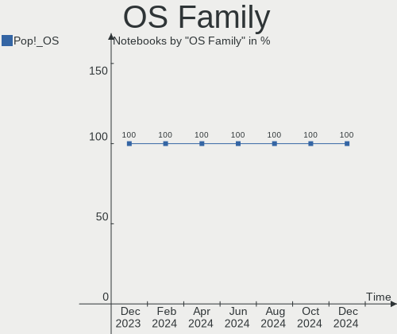
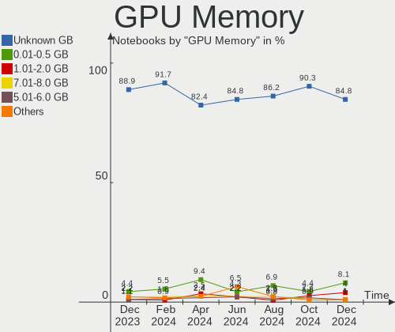
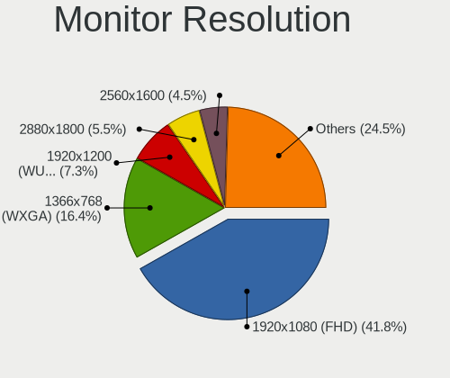
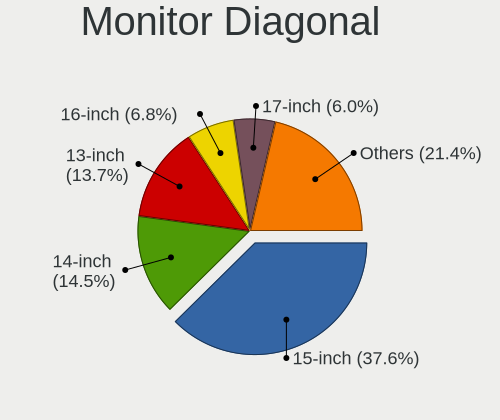

Pop!_OS - Hardware Trends (Notebooks)
-------------------------------------

A project to identify most popular hardware characteristics and track their change
over time based on data collected by Linux users at https://Linux-Hardware.org.

Anyone can contribute to this report by the [hw-probe](https://github.com/linuxhw/hw-probe) tool:

    sudo -E hw-probe -all -upload

This report is for one last month. Overall report since the beginning of time: [TestDays](https://github.com/linuxhw/TestDays)

Period: Dec, 2024.

Contents
--------

* [ System ](#system)
  - [ OS                       ](#os)
  - [ OS Family                ](#os-family)
  - [ Kernel                   ](#kernel)
  - [ Kernel Family            ](#kernel-family)
  - [ Kernel Major Ver.        ](#kernel-major-ver)
  - [ Arch                     ](#arch)
  - [ DE                       ](#de)
  - [ Display Server           ](#display-server)
  - [ Display Manager          ](#display-manager)
  - [ OS Lang                  ](#os-lang)
  - [ Boot Mode                ](#boot-mode)
  - [ Filesystem               ](#filesystem)
  - [ Part. scheme             ](#part-scheme)
  - [ Dual Boot with Linux/BSD ](#dual-boot-with-linuxbsd)
  - [ Dual Boot (Win)          ](#dual-boot-win)

* [ Board ](#board)
  - [ Vendor                   ](#vendor)
  - [ Model                    ](#model)
  - [ Model Family             ](#model-family)
  - [ MFG Year                 ](#mfg-year)
  - [ Form Factor              ](#form-factor)
  - [ Secure Boot              ](#secure-boot)
  - [ Coreboot                 ](#coreboot)
  - [ RAM Size                 ](#ram-size)
  - [ RAM Used                 ](#ram-used)
  - [ Total Drives             ](#total-drives)
  - [ Has CD-ROM               ](#has-cd-rom)
  - [ Has Ethernet             ](#has-ethernet)
  - [ Has WiFi                 ](#has-wifi)
  - [ Has Bluetooth            ](#has-bluetooth)

* [ Location ](#location)
  - [ Country                  ](#country)
  - [ City                     ](#city)

* [ Drives ](#drives)
  - [ Drive Vendor             ](#drive-vendor)
  - [ Drive Model              ](#drive-model)
  - [ HDD Vendor               ](#hdd-vendor)
  - [ SSD Vendor               ](#ssd-vendor)
  - [ Drive Kind               ](#drive-kind)
  - [ Drive Connector          ](#drive-connector)
  - [ Drive Size               ](#drive-size)
  - [ Space Total              ](#space-total)
  - [ Space Used               ](#space-used)
  - [ Malfunc. Drives          ](#malfunc-drives)
  - [ Malfunc. Drive Vendor    ](#malfunc-drive-vendor)
  - [ Malfunc. HDD Vendor      ](#malfunc-hdd-vendor)
  - [ Malfunc. Drive Kind      ](#malfunc-drive-kind)
  - [ Failed Drives            ](#failed-drives)
  - [ Failed Drive Vendor      ](#failed-drive-vendor)
  - [ Drive Status             ](#drive-status)

* [ Storage controller ](#storage-controller)
  - [ Storage Vendor           ](#storage-vendor)
  - [ Storage Model            ](#storage-model)
  - [ Storage Kind             ](#storage-kind)

* [ Processor ](#processor)
  - [ CPU Vendor               ](#cpu-vendor)
  - [ CPU Model                ](#cpu-model)
  - [ CPU Model Family         ](#cpu-model-family)
  - [ CPU Cores                ](#cpu-cores)
  - [ CPU Sockets              ](#cpu-sockets)
  - [ CPU Threads              ](#cpu-threads)
  - [ CPU Op-Modes             ](#cpu-op-modes)
  - [ CPU Microcode            ](#cpu-microcode)
  - [ CPU Microarch            ](#cpu-microarch)

* [ Graphics ](#graphics)
  - [ GPU Vendor               ](#gpu-vendor)
  - [ GPU Model                ](#gpu-model)
  - [ GPU Combo                ](#gpu-combo)
  - [ GPU Driver               ](#gpu-driver)
  - [ GPU Memory               ](#gpu-memory)

* [ Monitor ](#monitor)
  - [ Monitor Vendor           ](#monitor-vendor)
  - [ Monitor Model            ](#monitor-model)
  - [ Monitor Resolution       ](#monitor-resolution)
  - [ Monitor Diagonal         ](#monitor-diagonal)
  - [ Monitor Width            ](#monitor-width)
  - [ Aspect Ratio             ](#aspect-ratio)
  - [ Monitor Area             ](#monitor-area)
  - [ Pixel Density            ](#pixel-density)
  - [ Multiple Monitors        ](#multiple-monitors)

* [ Network ](#network)
  - [ Net Controller Vendor    ](#net-controller-vendor)
  - [ Net Controller Model     ](#net-controller-model)
  - [ Wireless Vendor          ](#wireless-vendor)
  - [ Wireless Model           ](#wireless-model)
  - [ Ethernet Vendor          ](#ethernet-vendor)
  - [ Ethernet Model           ](#ethernet-model)
  - [ Net Controller Kind      ](#net-controller-kind)
  - [ Used Controller          ](#used-controller)
  - [ NICs                     ](#nics)
  - [ IPv6                     ](#ipv6)

* [ Bluetooth ](#bluetooth)
  - [ Bluetooth Vendor         ](#bluetooth-vendor)
  - [ Bluetooth Model          ](#bluetooth-model)

* [ Sound ](#sound)
  - [ Sound Vendor             ](#sound-vendor)
  - [ Sound Model              ](#sound-model)

* [ Memory ](#memory)
  - [ Memory Vendor            ](#memory-vendor)
  - [ Memory Model             ](#memory-model)
  - [ Memory Kind              ](#memory-kind)
  - [ Memory Form Factor       ](#memory-form-factor)
  - [ Memory Size              ](#memory-size)
  - [ Memory Speed             ](#memory-speed)

* [ Printers & scanners ](#printers--scanners)
  - [ Printer Vendor           ](#printer-vendor)
  - [ Printer Model            ](#printer-model)
  - [ Scanner Vendor           ](#scanner-vendor)
  - [ Scanner Model            ](#scanner-model)

* [ Camera ](#camera)
  - [ Camera Vendor            ](#camera-vendor)
  - [ Camera Model             ](#camera-model)

* [ Security ](#security)
  - [ Fingerprint Vendor       ](#fingerprint-vendor)
  - [ Fingerprint Model        ](#fingerprint-model)
  - [ Chipcard Vendor          ](#chipcard-vendor)
  - [ Chipcard Model           ](#chipcard-model)

* [ Unsupported ](#unsupported)
  - [ Unsupported Devices      ](#unsupported-devices)
  - [ Unsupported Device Types ](#unsupported-device-types)

System
------

OS
--

Installed operating systems

| Name          | Notebooks | Percent |
|---------------|-----------|---------|
| Pop!_OS 22.04 | 92        | 92.93%  |
| Pop!_OS 24.04 | 7         | 7.07%   |

OS Family
---------

OS without a version

| Name    | Notebooks | Percent |
|---------|-----------|---------|
| Pop!_OS | 99        | 100%    |

Kernel
------

Version of the Linux kernel

| Version                             | Notebooks | Percent |
|-------------------------------------|-----------|---------|
| 6.9.3-76060903-generic              | 95        | 95.96%  |
| 6.8.0-76060800daily20240311-generic | 1         | 1.01%   |
| 6.2.6-76060206-generic              | 1         | 1.01%   |
| 6.12.2-3-liquorix-amd64             | 1         | 1.01%   |
| 6.0.6-76060006-generic              | 1         | 1.01%   |

Kernel Family
-------------

Linux kernel without a distro release

| Version | Notebooks | Percent |
|---------|-----------|---------|
| 6.9.3   | 95        | 95.96%  |
| 6.8.0   | 1         | 1.01%   |
| 6.2.6   | 1         | 1.01%   |
| 6.12.2  | 1         | 1.01%   |
| 6.0.6   | 1         | 1.01%   |

Kernel Major Ver.
-----------------

Linux kernel major version

| Version | Notebooks | Percent |
|---------|-----------|---------|
| 6.9     | 95        | 95.96%  |
| 6.8     | 1         | 1.01%   |
| 6.2     | 1         | 1.01%   |
| 6.12    | 1         | 1.01%   |
| 6.0     | 1         | 1.01%   |

Arch
----

OS architecture (x86_64, i586, etc.)

| Name   | Notebooks | Percent |
|--------|-----------|---------|
| x86_64 | 99        | 100%    |

DE
--

Desktop Environment

| Name   | Notebooks | Percent |
|--------|-----------|---------|
| GNOME  | 89        | 89.9%   |
| COSMIC | 8         | 8.08%   |
| KDE5   | 2         | 2.02%   |

Display Server
--------------

X11 or Wayland

| Name    | Notebooks | Percent |
|---------|-----------|---------|
| X11     | 82        | 82.83%  |
| Wayland | 16        | 16.16%  |
| Unknown | 1         | 1.01%   |

Display Manager
---------------

SDDM, LightDM, etc.

| Name           | Notebooks | Percent |
|----------------|-----------|---------|
| Unknown        | 64        | 64.65%  |
| GDM3           | 33        | 33.33%  |
| SDDM           | 1         | 1.01%   |
| COSMIC-GREETER | 1         | 1.01%   |

OS Lang
-------

Language

| Lang  | Notebooks | Percent |
|-------|-----------|---------|
| en_US | 55        | 55.56%  |
| en_GB | 9         | 9.09%   |
| C     | 6         | 6.06%   |
| pt_BR | 4         | 4.04%   |
| en_CA | 4         | 4.04%   |
| en_AU | 3         | 3.03%   |
| it_IT | 2         | 2.02%   |
| hu_HU | 2         | 2.02%   |
| fr_FR | 2         | 2.02%   |
| fi_FI | 2         | 2.02%   |
| zh_CN | 1         | 1.01%   |
| tr_TR | 1         | 1.01%   |
| pl_PL | 1         | 1.01%   |
| nl_NL | 1         | 1.01%   |
| es_US | 1         | 1.01%   |
| es_PA | 1         | 1.01%   |
| es_CL | 1         | 1.01%   |
| en_PH | 1         | 1.01%   |
| de_DE | 1         | 1.01%   |
| de_AT | 1         | 1.01%   |

Boot Mode
---------

EFI or BIOS

| Mode | Notebooks | Percent |
|------|-----------|---------|
| BIOS | 68        | 68.69%  |
| EFI  | 31        | 31.31%  |

Filesystem
----------

Type of filesystem

| Type    | Notebooks | Percent |
|---------|-----------|---------|
| Ext4    | 95        | 95.96%  |
| Overlay | 3         | 3.03%   |
| Btrfs   | 1         | 1.01%   |

Part. scheme
------------

Scheme of partitioning

| Type    | Notebooks | Percent |
|---------|-----------|---------|
| Unknown | 63        | 63.64%  |
| GPT     | 32        | 32.32%  |
| MBR     | 4         | 4.04%   |

Dual Boot with Linux/BSD
------------------------

Hosting more than one Linux/BSD

| Dual boot | Notebooks | Percent |
|-----------|-----------|---------|
| No        | 98        | 98.99%  |
| Yes       | 1         | 1.01%   |

Dual Boot (Win)
---------------

Hosting Linux and Windows

| Dual boot | Notebooks | Percent |
|-----------|-----------|---------|
| No        | 92        | 92.93%  |
| Yes       | 7         | 7.07%   |

Board
-----

Vendor
------

Motherboard manufacturer

| Name             | Notebooks | Percent |
|------------------|-----------|---------|
| Lenovo           | 24        | 24.24%  |
| Dell             | 16        | 16.16%  |
| ASUSTek Computer | 12        | 12.12%  |
| Apple            | 11        | 11.11%  |
| Hewlett-Packard  | 8         | 8.08%   |
| Acer             | 8         | 8.08%   |
| System76         | 5         | 5.05%   |
| HUAWEI           | 3         | 3.03%   |
| Framework        | 3         | 3.03%   |
| Fujitsu          | 2         | 2.02%   |
| Notebook         | 1         | 1.01%   |
| Medion           | 1         | 1.01%   |
| LG Electronics   | 1         | 1.01%   |
| Google           | 1         | 1.01%   |
| Eluktronics      | 1         | 1.01%   |
| Chuwi            | 1         | 1.01%   |
| AMI              | 1         | 1.01%   |

Model
-----

Motherboard model

| Name                                        | Notebooks | Percent |
|---------------------------------------------|-----------|---------|
| System76 Oryx Pro                           | 2         | 2.02%   |
| HUAWEI KLVL-WXX9                            | 2         | 2.02%   |
| Framework Laptop 16 (AMD Ryzen 7040 Series) | 2         | 2.02%   |
| Apple MacBookPro9,2                         | 2         | 2.02%   |
| Apple MacBookPro8,1                         | 2         | 2.02%   |
| Apple MacBookPro10,1                        | 2         | 2.02%   |
| System76 Lemur Pro                          | 1         | 1.01%   |
| System76 Gazelle                            | 1         | 1.01%   |
| System76 Galago Pro                         | 1         | 1.01%   |
| Notebook N85_N87,HJ,HJ1,HK1                 | 1         | 1.01%   |
| Medion S6445 MD61489                        | 1         | 1.01%   |
| LG 17ZB90R-K.ADC8U1                         | 1         | 1.01%   |
| Lenovo Yoga Pro 7 14AHP9 83E3               | 1         | 1.01%   |
| Lenovo ThinkPad X270 20HN001HUS             | 1         | 1.01%   |
| Lenovo ThinkPad X230 2306CTO                | 1         | 1.01%   |
| Lenovo ThinkPad X1 Extreme Gen 3 20TK001EUS | 1         | 1.01%   |
| Lenovo ThinkPad X1 Carbon Gen 9 20XW004QUS  | 1         | 1.01%   |
| Lenovo ThinkPad X1 Carbon 7th 20QD001FZA    | 1         | 1.01%   |
| Lenovo ThinkPad T420s 417032U               | 1         | 1.01%   |
| Lenovo ThinkPad T14 Gen 4 21K4S0GJ05        | 1         | 1.01%   |
| Lenovo ThinkPad P53 MWS 15.6 (QEB2020A)     | 1         | 1.01%   |
| Lenovo ThinkPad P52 20MAS1WD0S              | 1         | 1.01%   |
| Lenovo ThinkPad P1 Gen 2 20QUS00000         | 1         | 1.01%   |
| Lenovo ThinkPad L490 20Q6S23200             | 1         | 1.01%   |
| Lenovo ThinkPad E14 Gen 2 20TA002KFR        | 1         | 1.01%   |
| Lenovo ThinkBook 16 G6 ABP 21KK             | 1         | 1.01%   |
| Lenovo ThinkBook 15-IIL 20SM                | 1         | 1.01%   |
| Lenovo LOQ 15IRX9 83DV                      | 1         | 1.01%   |
| Lenovo Legion Y7000 81FW                    | 1         | 1.01%   |
| Lenovo Legion Pro 7 16ARX8H 82WS            | 1         | 1.01%   |
| Lenovo IdeaPad Z570 HuronRiver Platform     | 1         | 1.01%   |
| Lenovo IdeaPad Y700 Touch-15ISK 80NW        | 1         | 1.01%   |
| Lenovo IdeaPad 320-15IKB 80YH               | 1         | 1.01%   |
| Lenovo IdeaPad 3 15ALC6 82KU                | 1         | 1.01%   |
| Lenovo IdeaPad 1 15ADA7 82R1                | 1         | 1.01%   |
| Lenovo B5400 20278                          | 1         | 1.01%   |
| HUAWEI KLVD-WXX9                            | 1         | 1.01%   |
| HP ZBook 17 G5                              | 1         | 1.01%   |
| HP ProBook 650 G1                           | 1         | 1.01%   |
| HP Pavilion Plus Laptop 14-ey0xxx           | 1         | 1.01%   |

Model Family
------------

Motherboard model prefix

| Name                | Notebooks | Percent |
|---------------------|-----------|---------|
| Lenovo ThinkPad     | 12        | 12.12%  |
| Dell Latitude       | 7         | 7.07%   |
| Acer Aspire         | 7         | 7.07%   |
| Lenovo IdeaPad      | 5         | 5.05%   |
| Dell Inspiron       | 5         | 5.05%   |
| Framework Laptop    | 3         | 3.03%   |
| ASUS VivoBook       | 3         | 3.03%   |
| ASUS ASUS           | 3         | 3.03%   |
| Apple MacBookPro8   | 3         | 3.03%   |
| System76 Oryx       | 2         | 2.02%   |
| Lenovo ThinkBook    | 2         | 2.02%   |
| Lenovo Legion       | 2         | 2.02%   |
| HUAWEI KLVL-WXX9    | 2         | 2.02%   |
| HP EliteBook        | 2         | 2.02%   |
| Apple MacBookPro9   | 2         | 2.02%   |
| Apple MacBookPro10  | 2         | 2.02%   |
| System76 Lemur      | 1         | 1.01%   |
| System76 Gazelle    | 1         | 1.01%   |
| System76 Galago     | 1         | 1.01%   |
| Notebook N85        | 1         | 1.01%   |
| Medion S6445        | 1         | 1.01%   |
| LG 17ZB90R-K.ADC8U1 | 1         | 1.01%   |
| Lenovo Yoga         | 1         | 1.01%   |
| Lenovo LOQ          | 1         | 1.01%   |
| Lenovo B5400        | 1         | 1.01%   |
| HUAWEI KLVD-WXX9    | 1         | 1.01%   |
| HP ZBook            | 1         | 1.01%   |
| HP ProBook          | 1         | 1.01%   |
| HP Pavilion         | 1         | 1.01%   |
| HP OMEN             | 1         | 1.01%   |
| HP Notebook         | 1         | 1.01%   |
| HP Dragonfly        | 1         | 1.01%   |
| Google Samus        | 1         | 1.01%   |
| Fujitsu FMVU14003   | 1         | 1.01%   |
| Fujitsu CELSIUS     | 1         | 1.01%   |
| Eluktronics RP-15   | 1         | 1.01%   |
| Dell XPS            | 1         | 1.01%   |
| Dell System         | 1         | 1.01%   |
| Dell Precision      | 1         | 1.01%   |
| Dell G15            | 1         | 1.01%   |

MFG Year
--------

Motherboard manufacture year

| Year | Notebooks | Percent |
|------|-----------|---------|
| 2023 | 13        | 13.13%  |
| 2021 | 13        | 13.13%  |
| 2024 | 10        | 10.1%   |
| 2018 | 10        | 10.1%   |
| 2019 | 7         | 7.07%   |
| 2013 | 7         | 7.07%   |
| 2011 | 7         | 7.07%   |
| 2020 | 6         | 6.06%   |
| 2012 | 6         | 6.06%   |
| 2022 | 4         | 4.04%   |
| 2017 | 4         | 4.04%   |
| 2016 | 3         | 3.03%   |
| 2015 | 3         | 3.03%   |
| 2014 | 2         | 2.02%   |
| 2010 | 2         | 2.02%   |
| 2009 | 1         | 1.01%   |
| 2008 | 1         | 1.01%   |

Form Factor
-----------

Physical design of the computer

| Name     | Notebooks | Percent |
|----------|-----------|---------|
| Notebook | 99        | 100%    |

Secure Boot
-----------

Enabled or disabled

| State    | Notebooks | Percent |
|----------|-----------|---------|
| Disabled | 99        | 100%    |

Coreboot
--------

Have coreboot on board

| Used | Notebooks | Percent |
|------|-----------|---------|
| No   | 94        | 94.95%  |
| Yes  | 5         | 5.05%   |

RAM Size
--------

Total RAM memory

| Size in GB  | Notebooks | Percent |
|-------------|-----------|---------|
| 8.01-16.0   | 24        | 24.24%  |
| 4.01-8.0    | 21        | 21.21%  |
| 16.01-24.0  | 21        | 21.21%  |
| 32.01-64.0  | 18        | 18.18%  |
| 3.01-4.0    | 8         | 8.08%   |
| 64.01-256.0 | 4         | 4.04%   |
| 24.01-32.0  | 3         | 3.03%   |

RAM Used
--------

Used RAM memory

| Used GB    | Notebooks | Percent |
|------------|-----------|---------|
| 4.01-8.0   | 41        | 41.41%  |
| 3.01-4.0   | 28        | 28.28%  |
| 8.01-16.0  | 18        | 18.18%  |
| 2.01-3.0   | 9         | 9.09%   |
| 1.01-2.0   | 2         | 2.02%   |
| 32.01-64.0 | 1         | 1.01%   |

Total Drives
------------

Number of drives on board

| Drives | Notebooks | Percent |
|--------|-----------|---------|
| 1      | 77        | 77.78%  |
| 2      | 17        | 17.17%  |
| 3      | 4         | 4.04%   |
| 4      | 1         | 1.01%   |

Has CD-ROM
----------

Has CD-ROM on board

| Presented | Notebooks | Percent |
|-----------|-----------|---------|
| No        | 83        | 83.84%  |
| Yes       | 16        | 16.16%  |

Has Ethernet
------------

Has Ethernet on board

| Presented | Notebooks | Percent |
|-----------|-----------|---------|
| Yes       | 72        | 72.73%  |
| No        | 27        | 27.27%  |

Has WiFi
--------

Has WiFi module

| Presented | Notebooks | Percent |
|-----------|-----------|---------|
| Yes       | 96        | 96.97%  |
| No        | 3         | 3.03%   |

Has Bluetooth
-------------

Has Bluetooth module

| Presented | Notebooks | Percent |
|-----------|-----------|---------|
| Yes       | 93        | 93.94%  |
| No        | 6         | 6.06%   |

Location
--------

Country
-------

Geographic location (country)

| Country         | Notebooks | Percent |
|-----------------|-----------|---------|
| USA             | 28        | 28.28%  |
| Brazil          | 9         | 9.09%   |
| UK              | 6         | 6.06%   |
| Canada          | 6         | 6.06%   |
| France          | 5         | 5.05%   |
| Germany         | 4         | 4.04%   |
| Philippines     | 3         | 3.03%   |
| Netherlands     | 3         | 3.03%   |
| Italy           | 3         | 3.03%   |
| Hungary         | 3         | 3.03%   |
| Turkey          | 2         | 2.02%   |
| South Africa    | 2         | 2.02%   |
| Poland          | 2         | 2.02%   |
| Mexico          | 2         | 2.02%   |
| India           | 2         | 2.02%   |
| Finland         | 2         | 2.02%   |
| Australia       | 2         | 2.02%   |
| Serbia          | 1         | 1.01%   |
| Saudi Arabia    | 1         | 1.01%   |
| Romania         | 1         | 1.01%   |
| Panama          | 1         | 1.01%   |
| Norway          | 1         | 1.01%   |
| North Macedonia | 1         | 1.01%   |
| Nepal           | 1         | 1.01%   |
| Indonesia       | 1         | 1.01%   |
| Greece          | 1         | 1.01%   |
| Denmark         | 1         | 1.01%   |
| Croatia         | 1         | 1.01%   |
| China           | 1         | 1.01%   |
| Chile           | 1         | 1.01%   |
| Bulgaria        | 1         | 1.01%   |
| Austria         | 1         | 1.01%   |

City
----

Geographic location (city)

| City                 | Notebooks | Percent |
|----------------------|-----------|---------|
| Mississauga          | 2         | 2.02%   |
| Layton               | 2         | 2.02%   |
| Helsinki             | 2         | 2.02%   |
| Budapest             | 2         | 2.02%   |
| Yogyakarta           | 1         | 1.01%   |
| West Chester         | 1         | 1.01%   |
| Warsaw               | 1         | 1.01%   |
| Vienna               | 1         | 1.01%   |
| Tulsa                | 1         | 1.01%   |
| Toronto              | 1         | 1.01%   |
| Thessaloniki         | 1         | 1.01%   |
| Sydney               | 1         | 1.01%   |
| Strasbourg           | 1         | 1.01%   |
| Spring               | 1         | 1.01%   |
| Sombor               | 1         | 1.01%   |
| Sofia                | 1         | 1.01%   |
| Skopje               | 1         | 1.01%   |
| Šibenik             | 1         | 1.01%   |
| Scarborough          | 1         | 1.01%   |
| Saugerties           | 1         | 1.01%   |
| Sao Paulo            | 1         | 1.01%   |
| San Jose             | 1         | 1.01%   |
| San Diego            | 1         | 1.01%   |
| Samsun               | 1         | 1.01%   |
| Salvador             | 1         | 1.01%   |
| Saint-Laurent-du-Var | 1         | 1.01%   |
| Rancagua             | 1         | 1.01%   |
| Pretoria             | 1         | 1.01%   |
| Poznan               | 1         | 1.01%   |
| Porto Alegre         | 1         | 1.01%   |
| Portland             | 1         | 1.01%   |
| Plains               | 1         | 1.01%   |
| Patna                | 1         | 1.01%   |
| Nuevo Laredo         | 1         | 1.01%   |
| New York             | 1         | 1.01%   |
| New Providence       | 1         | 1.01%   |
| Nashville            | 1         | 1.01%   |
| Mosbach              | 1         | 1.01%   |
| Minneapolis          | 1         | 1.01%   |
| Milan                | 1         | 1.01%   |

Drives
------

Drive Vendor
------------

Hard drive vendors

| Vendor                      | Notebooks | Drives | Percent |
|-----------------------------|-----------|--------|---------|
| Samsung Electronics         | 27        | 31     | 22.5%   |
| WDC                         | 11        | 11     | 9.17%   |
| Sandisk                     | 8         | 9      | 6.67%   |
| Crucial                     | 7         | 8      | 5.83%   |
| SK hynix                    | 6         | 6      | 5%      |
| Seagate                     | 6         | 6      | 5%      |
| Apple                       | 6         | 6      | 5%      |
| Unknown                     | 5         | 5      | 4.17%   |
| Micron Technology           | 5         | 5      | 4.17%   |
| Intel                       | 5         | 5      | 4.17%   |
| Toshiba                     | 4         | 4      | 3.33%   |
| Phison                      | 4         | 4      | 3.33%   |
| KIOXIA                      | 4         | 4      | 3.33%   |
| Kingston Technology Company | 3         | 3      | 2.5%    |
| Kingston                    | 3         | 4      | 2.5%    |
| Micron/Crucial Technology   | 2         | 3      | 1.67%   |
| China                       | 2         | 2      | 1.67%   |
| XrayDisk                    | 1         | 1      | 0.83%   |
| Win Memory                  | 1         | 1      | 0.83%   |
| SPCC                        | 1         | 1      | 0.83%   |
| OWC                         | 1         | 1      | 0.83%   |
| MAXIO Technology (Hangzhou) | 1         | 1      | 0.83%   |
| KODAK                       | 1         | 1      | 0.83%   |
| Hikvision                   | 1         | 2      | 0.83%   |
| HGST                        | 1         | 1      | 0.83%   |
| Fanxiang                    | 1         | 1      | 0.83%   |
| AirDisk                     | 1         | 1      | 0.83%   |
| A-DATA Technology           | 1         | 1      | 0.83%   |
| Unknown                     | 1         | 1      | 0.83%   |

Drive Model
-----------

Hard drive models

| Model                                                | Notebooks | Percent |
|------------------------------------------------------|-----------|---------|
| Samsung NVMe SSD Controller PM9A1/PM9A3/980PRO 512GB | 3         | 2.38%   |
| Phison 311CD0512GB                                   | 3         | 2.38%   |
| WDC WDS240G2G0A-00JH30 240GB SSD                     | 2         | 1.59%   |
| WDC WD10JPVX-22JC3T0 1TB                             | 2         | 1.59%   |
| Toshiba KXG6AZNV256G 256GB                           | 2         | 1.59%   |
| Intel SSDPEKNU512GZ 512GB                            | 2         | 1.59%   |
| Intel SSD 660P Series 1024GB                         | 2         | 1.59%   |
| Crucial CT500MX500SSD1 500GB                         | 2         | 1.59%   |
| Apple SSD SM512E 500GB                               | 2         | 1.59%   |
| XrayDisk 240GB                                       | 1         | 0.79%   |
| Win Memory SWR256G-301II 256GB                       | 1         | 0.79%   |
| WDC WDS500G2B0B-00YS70 500GB SSD                     | 1         | 0.79%   |
| WDC WDS500G2B0A-00SM50 500GB SSD                     | 1         | 0.79%   |
| WDC WD5000LPVX-75V0TT0 500GB                         | 1         | 0.79%   |
| WDC WD10SPCX-24HWST1 1TB                             | 1         | 0.79%   |
| WDC WD Green 2.5 480GB SSD                           | 1         | 0.79%   |
| WDC PC SN730 SDBQNTY-1T00-1001 1TB                   | 1         | 0.79%   |
| WDC PC SN730 NVMe 256GB                              | 1         | 0.79%   |
| Unknown USB DISK 3.2 1TB                             | 1         | 0.79%   |
| Unknown SD256  256GB                                 | 1         | 0.79%   |
| Unknown MMC Card  32GB                               | 1         | 0.79%   |
| Unknown MMC Card  128GB                              | 1         | 0.79%   |
| Unknown DA4128  128GB                                | 1         | 0.79%   |
| Toshiba XG4 NVMe SSD Controller 512GB                | 1         | 0.79%   |
| Toshiba MK1255GSX H 120GB                            | 1         | 0.79%   |
| SPCC M.2 SSD 1024GB                                  | 1         | 0.79%   |
| SK hynix SKHynix_HFS512GEJ9X115N 512GB               | 1         | 0.79%   |
| SK hynix SKHynix_HFS512GD9TNI-L2B0B 512GB            | 1         | 0.79%   |
| SK hynix SC311 SATA 512GB SSD                        | 1         | 0.79%   |
| SK hynix HFS256G39TND-N210A 256GB SSD                | 1         | 0.79%   |
| SK hynix BC711 NVMe 512GB                            | 1         | 0.79%   |
| SK hynix BC501 NVMe Solid State Drive 512GB          | 1         | 0.79%   |
| Seagate ST9500420AS 500GB                            | 1         | 0.79%   |
| Seagate ST500LM012 HN-M500MBB 500GB                  | 1         | 0.79%   |
| Seagate ST500LM000-SSHD-8GB                          | 1         | 0.79%   |
| Seagate ST1000LM035-1RK172 1TB                       | 1         | 0.79%   |
| Seagate Expansion HDD 14TB                           | 1         | 0.79%   |
| Seagate BUP Slim BK 2TB                              | 1         | 0.79%   |
| SanDisk X400 M.2 2280 512GB SSD                      | 1         | 0.79%   |
| Sandisk WD_BLACK SN850X 4000GB                       | 1         | 0.79%   |

HDD Vendor
----------

Hard disk drive vendors

| Vendor              | Notebooks | Drives | Percent |
|---------------------|-----------|--------|---------|
| Seagate             | 6         | 6      | 42.86%  |
| WDC                 | 4         | 4      | 28.57%  |
| Toshiba             | 1         | 1      | 7.14%   |
| Samsung Electronics | 1         | 1      | 7.14%   |
| HGST                | 1         | 1      | 7.14%   |
| Apple               | 1         | 1      | 7.14%   |

SSD Vendor
----------

Solid state drive vendors

| Vendor              | Notebooks | Drives | Percent |
|---------------------|-----------|--------|---------|
| Samsung Electronics | 12        | 12     | 30.77%  |
| WDC                 | 5         | 5      | 12.82%  |
| Apple               | 5         | 5      | 12.82%  |
| Crucial             | 4         | 4      | 10.26%  |
| SK hynix            | 2         | 2      | 5.13%   |
| SanDisk             | 2         | 2      | 5.13%   |
| China               | 2         | 2      | 5.13%   |
| Win Memory          | 1         | 1      | 2.56%   |
| SPCC                | 1         | 1      | 2.56%   |
| OWC                 | 1         | 1      | 2.56%   |
| Micron Technology   | 1         | 1      | 2.56%   |
| KODAK               | 1         | 1      | 2.56%   |
| Kingston            | 1         | 1      | 2.56%   |
| A-DATA Technology   | 1         | 1      | 2.56%   |

Drive Kind
----------

HDD or SSD

| Kind    | Notebooks | Drives | Percent |
|---------|-----------|--------|---------|
| NVMe    | 55        | 69     | 49.11%  |
| SSD     | 37        | 39     | 33.04%  |
| HDD     | 13        | 14     | 11.61%  |
| MMC     | 4         | 4      | 3.57%   |
| Unknown | 3         | 3      | 2.68%   |

Drive Connector
---------------

SATA, SAS, NVMe, etc.

| Type | Notebooks | Drives | Percent |
|------|-----------|--------|---------|
| NVMe | 55        | 69     | 50.93%  |
| SATA | 45        | 52     | 41.67%  |
| SAS  | 4         | 4      | 3.7%    |
| MMC  | 4         | 4      | 3.7%    |

Drive Size
----------

Size of hard drive

| Size in TB | Notebooks | Drives | Percent |
|------------|-----------|--------|---------|
| 0.01-0.5   | 33        | 36     | 67.35%  |
| 0.51-1.0   | 13        | 14     | 26.53%  |
| 1.01-2.0   | 2         | 2      | 4.08%   |
| 10.01-20.0 | 1         | 1      | 2.04%   |

Space Total
-----------

Amount of disk space available on the file system

| Size in GB     | Notebooks | Percent |
|----------------|-----------|---------|
| 251-500        | 36        | 36.36%  |
| 101-250        | 28        | 28.28%  |
| 501-1000       | 19        | 19.19%  |
| 1001-2000      | 9         | 9.09%   |
| 1-20           | 3         | 3.03%   |
| More than 3000 | 2         | 2.02%   |
| 2001-3000      | 1         | 1.01%   |
| 51-100         | 1         | 1.01%   |

Space Used
----------

Amount of used disk space

| Used GB   | Notebooks | Percent |
|-----------|-----------|---------|
| 21-50     | 29        | 29.29%  |
| 1-20      | 25        | 25.25%  |
| 51-100    | 16        | 16.16%  |
| 101-250   | 13        | 13.13%  |
| 251-500   | 8         | 8.08%   |
| 501-1000  | 7         | 7.07%   |
| 1001-2000 | 1         | 1.01%   |

Malfunc. Drives
---------------

Drive models with a malfunction

| Model                        | Notebooks | Drives | Percent |
|------------------------------|-----------|--------|---------|
| WDC WD5000LPVX-75V0TT0 500GB | 1         | 1      | 50%     |
| WDC WD10JPVX-22JC3T0 1TB     | 1         | 1      | 50%     |

Malfunc. Drive Vendor
---------------------

Vendors of faulty drives

| Vendor | Notebooks | Drives | Percent |
|--------|-----------|--------|---------|
| WDC    | 2         | 2      | 100%    |

Malfunc. HDD Vendor
-------------------

Vendors of faulty HDD drives

| Vendor | Notebooks | Drives | Percent |
|--------|-----------|--------|---------|
| WDC    | 2         | 2      | 100%    |

Malfunc. Drive Kind
-------------------

Kinds of faulty drives

| Kind | Notebooks | Drives | Percent |
|------|-----------|--------|---------|
| HDD  | 2         | 2      | 100%    |

Failed Drives
-------------

Failed drive models

Zero info for selected period =(

Failed Drive Vendor
-------------------

Failed drive vendors

Zero info for selected period =(

Drive Status
------------

Number of failed and malfunc. drives

| Status   | Notebooks | Drives | Percent |
|----------|-----------|--------|---------|
| Detected | 68        | 90     | 67.33%  |
| Works    | 31        | 37     | 30.69%  |
| Malfunc  | 2         | 2      | 1.98%   |

Storage controller
------------------

Storage Vendor
--------------

Storage controller vendors

| Vendor                       | Notebooks | Percent |
|------------------------------|-----------|---------|
| Intel                        | 57        | 47.9%   |
| Samsung Electronics          | 16        | 13.45%  |
| Sandisk                      | 8         | 6.72%   |
| Micron/Crucial Technology    | 5         | 4.2%    |
| Kingston Technology Company  | 5         | 4.2%    |
| SK hynix                     | 4         | 3.36%   |
| Phison Electronics           | 4         | 3.36%   |
| Micron Technology            | 4         | 3.36%   |
| KIOXIA                       | 4         | 3.36%   |
| Toshiba America Info Systems | 3         | 2.52%   |
| MAXIO Technology (Hangzhou)  | 3         | 2.52%   |
| AMD                          | 3         | 2.52%   |
| Nvidia                       | 2         | 1.68%   |
| Marvell Technology Group     | 1         | 0.84%   |

Storage Model
-------------

Storage controller models

| Model                                                                          | Notebooks | Percent |
|--------------------------------------------------------------------------------|-----------|---------|
| Intel 7 Series Chipset Family 6-port SATA Controller [AHCI mode]               | 8         | 6.4%    |
| Intel 6 Series/C200 Series Chipset Family 6 port Mobile SATA AHCI Controller   | 8         | 6.4%    |
| Intel Sunrise Point-LP SATA Controller [AHCI mode]                             | 6         | 4.8%    |
| Samsung NVMe SSD Controller SM981/PM981/PM983                                  | 4         | 3.2%    |
| Samsung NVMe SSD Controller 980 (DRAM-less)                                    | 4         | 3.2%    |
| Intel Volume Management Device NVMe RAID Controller                            | 4         | 3.2%    |
| SanDisk Extreme Pro / WD Black SN750 / PC SN730 / Red SN700 NVMe SSD           | 3         | 2.4%    |
| Samsung NVMe SSD Controller PM9A1/PM9A3/980PRO                                 | 3         | 2.4%    |
| Phison PS5013-E13 PCIe3 NVMe Controller (DRAM-less)                            | 3         | 2.4%    |
| Intel Volume Management Device NVMe RAID Controller Intel Corporation          | 3         | 2.4%    |
| Intel HM170/QM170 Chipset SATA Controller [AHCI Mode]                          | 3         | 2.4%    |
| Intel Cannon Lake Mobile PCH SATA AHCI Controller                              | 3         | 2.4%    |
| Intel 82801 Mobile SATA Controller [RAID mode]                                 | 3         | 2.4%    |
| Intel 8 Series/C220 Series Chipset Family 6-port SATA Controller 1 [AHCI mode] | 3         | 2.4%    |
| AMD FCH SATA Controller [AHCI mode]                                            | 3         | 2.4%    |
| Toshiba America Info Systems XG6 NVMe SSD Controller                           | 2         | 1.6%    |
| Sandisk WD Black SN850X NVMe SSD                                               | 2         | 1.6%    |
| Samsung NVMe SSD Controller PM9C1a (DRAM-less)                                 | 2         | 1.6%    |
| Micron/Crucial P310 NVMe PCIe SSD (DRAM-less)                                  | 2         | 1.6%    |
| Micron 2400 NVMe SSD (DRAM-less)                                               | 2         | 1.6%    |
| MAXIO (Hangzhou) NVMe SSD Controller MAP1202 (DRAM-less)                       | 2         | 1.6%    |
| KIOXIA NVMe SSD Controller BG4 (DRAM-less)                                     | 2         | 1.6%    |
| Kingston Company NV2 NVMe SSD [E21T] (DRAM-less)                               | 2         | 1.6%    |
| Intel Wildcat Point-LP SATA Controller [AHCI Mode]                             | 2         | 1.6%    |
| Intel SSD 670p Series [Keystone Harbor]                                        | 2         | 1.6%    |
| Intel SSD 660P Series                                                          | 2         | 1.6%    |
| Intel Cannon Point-LP SATA Controller [AHCI Mode]                              | 2         | 1.6%    |
| Intel Alder Lake-P SATA AHCI Controller                                        | 2         | 1.6%    |
| Intel 8 Series SATA Controller 1 [AHCI mode]                                   | 2         | 1.6%    |
| Toshiba America Info Systems XG4 NVMe SSD Controller                           | 1         | 0.8%    |
| SK hynix Platinum P41/PC801 NVMe Solid State Drive                             | 1         | 0.8%    |
| SK hynix PC611 NVMe Solid State Drive                                          | 1         | 0.8%    |
| SK hynix Gold P31/BC711/PC711 NVMe Solid State Drive                           | 1         | 0.8%    |
| SK hynix BC501 NVMe Solid State Drive                                          | 1         | 0.8%    |
| Sandisk WD PC SN740 NVMe SSD 512GB (DRAM-less)                                 | 1         | 0.8%    |
| Sandisk WD PC SN5000S M.2 2230 NVMe SSD (DRAM-less)                            | 1         | 0.8%    |
| SanDisk WD Black SN770 / PC SN740 256GB / PC SN560 (DRAM-less) NVMe SSD        | 1         | 0.8%    |
| SanDisk Ultra 3D / WD PC SN530, IX SN530, Blue SN550 NVMe SSD (DRAM-less)      | 1         | 0.8%    |
| Samsung S4LN053X01 AHCI SSD Controller(Apple slot)                             | 1         | 0.8%    |
| Samsung NVMe SSD Controller S4LV008[Pascal]                                    | 1         | 0.8%    |

Storage Kind
------------

Kind of storage controller (IDE, SATA, NVMe, SAS, ...)

| Kind | Notebooks | Percent |
|------|-----------|---------|
| NVMe | 55        | 46.61%  |
| SATA | 52        | 44.07%  |
| RAID | 10        | 8.47%   |
| IDE  | 1         | 0.85%   |

Processor
---------

CPU Vendor
----------

Processor vendors

| Vendor | Notebooks | Percent |
|--------|-----------|---------|
| Intel  | 78        | 78.79%  |
| AMD    | 21        | 21.21%  |

CPU Model
---------

Processor models

| Model                                      | Notebooks | Percent |
|--------------------------------------------|-----------|---------|
| Intel Core i7-2720QM CPU @ 2.20GHz         | 3         | 3.03%   |
| Intel Core i5-3210M CPU @ 2.50GHz          | 3         | 3.03%   |
| Intel 11th Gen Core i7-1165G7 @ 2.80GHz    | 3         | 3.03%   |
| Intel 11th Gen Core i5-1135G7 @ 2.40GHz    | 3         | 3.03%   |
| Intel Core i7-8850H CPU @ 2.60GHz          | 2         | 2.02%   |
| Intel Core i7-7700HQ CPU @ 2.80GHz         | 2         | 2.02%   |
| Intel Core i7-3720QM CPU @ 2.60GHz         | 2         | 2.02%   |
| Intel Core i5-8365U CPU @ 1.60GHz          | 2         | 2.02%   |
| Intel Core i5-8265U CPU @ 1.60GHz          | 2         | 2.02%   |
| Intel Core i5-7200U CPU @ 2.50GHz          | 2         | 2.02%   |
| AMD Ryzen 7 7840HS w/ Radeon 780M Graphics | 2         | 2.02%   |
| AMD Ryzen 7 4800H with Radeon Graphics     | 2         | 2.02%   |
| Intel Pentium Silver N5000 CPU @ 1.10GHz   | 1         | 1.01%   |
| Intel Pentium CPU 2020M @ 2.40GHz          | 1         | 1.01%   |
| Intel N100                                 | 1         | 1.01%   |
| Intel Core Ultra 7 155H                    | 1         | 1.01%   |
| Intel Core i9-10885H CPU @ 2.40GHz         | 1         | 1.01%   |
| Intel Core i7-9850H CPU @ 2.60GHz          | 1         | 1.01%   |
| Intel Core i7-9750H CPU @ 2.60GHz          | 1         | 1.01%   |
| Intel Core i7-8750H CPU @ 2.20GHz          | 1         | 1.01%   |
| Intel Core i7-8650U CPU @ 1.90GHz          | 1         | 1.01%   |
| Intel Core i7-8565U CPU @ 1.80GHz          | 1         | 1.01%   |
| Intel Core i7-8550U CPU @ 1.80GHz          | 1         | 1.01%   |
| Intel Core i7-7500U CPU @ 2.70GHz          | 1         | 1.01%   |
| Intel Core i7-6700HQ CPU @ 2.60GHz         | 1         | 1.01%   |
| Intel Core i7-6600U CPU @ 2.60GHz          | 1         | 1.01%   |
| Intel Core i7-6500U CPU @ 2.50GHz          | 1         | 1.01%   |
| Intel Core i7-5500U CPU @ 2.40GHz          | 1         | 1.01%   |
| Intel Core i7-4980HQ CPU @ 2.80GHz         | 1         | 1.01%   |
| Intel Core i7-4700HQ CPU @ 2.40GHz         | 1         | 1.01%   |
| Intel Core i7-4510U CPU @ 2.00GHz          | 1         | 1.01%   |
| Intel Core i7-3615QM CPU @ 2.30GHz         | 1         | 1.01%   |
| Intel Core i7-10875H CPU @ 2.30GHz         | 1         | 1.01%   |
| Intel Core i7-10870H CPU @ 2.20GHz         | 1         | 1.01%   |
| Intel Core i7-10750H CPU @ 2.60GHz         | 1         | 1.01%   |
| Intel Core i7-10510U CPU @ 1.80GHz         | 1         | 1.01%   |
| Intel Core i7 CPU M 620 @ 2.67GHz          | 1         | 1.01%   |
| Intel Core i5-8350U CPU @ 1.70GHz          | 1         | 1.01%   |
| Intel Core i5-8300H CPU @ 2.30GHz          | 1         | 1.01%   |
| Intel Core i5-7300U CPU @ 2.60GHz          | 1         | 1.01%   |

CPU Model Family
----------------

Processor model prefix

| Model                | Notebooks | Percent |
|----------------------|-----------|---------|
| Intel Core i7        | 29        | 29.29%  |
| Intel Core i5        | 21        | 21.21%  |
| Other                | 17        | 17.17%  |
| AMD Ryzen 7          | 13        | 13.13%  |
| Intel Core i3        | 4         | 4.04%   |
| AMD Ryzen 9          | 3         | 3.03%   |
| AMD Ryzen 5          | 3         | 3.03%   |
| Intel Core 2 Duo     | 2         | 2.02%   |
| Intel Pentium Silver | 1         | 1.01%   |
| Intel Pentium        | 1         | 1.01%   |
| Intel Core i9        | 1         | 1.01%   |
| Intel Core           | 1         | 1.01%   |
| Intel Atom           | 1         | 1.01%   |
| AMD Ryzen 7 PRO      | 1         | 1.01%   |
| AMD Athlon           | 1         | 1.01%   |

CPU Cores
---------

Number of processor cores

| Number | Notebooks | Percent |
|--------|-----------|---------|
| 4      | 33        | 33.33%  |
| 2      | 28        | 28.28%  |
| 8      | 18        | 18.18%  |
| 6      | 9         | 9.09%   |
| 10     | 4         | 4.04%   |
| 16     | 3         | 3.03%   |
| 14     | 2         | 2.02%   |
| 12     | 1         | 1.01%   |
| 1      | 1         | 1.01%   |

CPU Sockets
-----------

Number of sockets

| Number | Notebooks | Percent |
|--------|-----------|---------|
| 1      | 99        | 100%    |

CPU Threads
-----------

Threads per core (Hyper-Threading)

| Number | Notebooks | Percent |
|--------|-----------|---------|
| 2      | 91        | 91.92%  |
| 1      | 8         | 8.08%   |

CPU Op-Modes
------------

CPU Operation Modes (32-bit, 64-bit)

| Op mode        | Notebooks | Percent |
|----------------|-----------|---------|
| 32-bit, 64-bit | 99        | 100%    |

CPU Microcode
-------------

Microcode number

| Number  | Notebooks | Percent |
|---------|-----------|---------|
| Unknown | 99        | 100%    |

CPU Microarch
-------------

Microarchitecture

| Name             | Notebooks | Percent |
|------------------|-----------|---------|
| KabyLake         | 21        | 21.21%  |
| Unknown          | 19        | 19.19%  |
| TigerLake        | 8         | 8.08%   |
| SandyBridge      | 8         | 8.08%   |
| IvyBridge        | 8         | 8.08%   |
| Haswell          | 7         | 7.07%   |
| Alderlake Hybrid | 5         | 5.05%   |
| Skylake          | 4         | 4.04%   |
| CometLake        | 4         | 4.04%   |
| Zen+             | 2         | 2.02%   |
| Zen 3            | 2         | 2.02%   |
| Zen 2            | 2         | 2.02%   |
| Penryn           | 2         | 2.02%   |
| Broadwell        | 2         | 2.02%   |
| Westmere         | 1         | 1.01%   |
| IceLake          | 1         | 1.01%   |
| Gracemont        | 1         | 1.01%   |
| Goldmont plus    | 1         | 1.01%   |
| Goldmont         | 1         | 1.01%   |

Graphics
--------

GPU Vendor
----------

Vendors of graphics cards

| Vendor | Notebooks | Percent |
|--------|-----------|---------|
| Intel  | 73        | 57.03%  |
| Nvidia | 33        | 25.78%  |
| AMD    | 22        | 17.19%  |

GPU Model
---------

Graphics card models

| Model                                                                     | Notebooks | Percent |
|---------------------------------------------------------------------------|-----------|---------|
| Intel TigerLake-LP GT2 [Iris Xe Graphics]                                 | 8         | 6.2%    |
| Intel 3rd Gen Core processor Graphics Controller                          | 8         | 6.2%    |
| Intel 2nd Generation Core Processor Family Integrated Graphics Controller | 8         | 6.2%    |
| Intel CoffeeLake-H GT2 [UHD Graphics 630]                                 | 6         | 4.65%   |
| Intel WhiskeyLake-U GT2 [UHD Graphics 620]                                | 5         | 3.88%   |
| AMD Phoenix1                                                              | 5         | 3.88%   |
| Intel Raptor Lake-P [Iris Xe Graphics]                                    | 4         | 3.1%    |
| Intel HD Graphics 620                                                     | 4         | 3.1%    |
| Nvidia GP107M [GeForce GTX 1050 Ti Mobile]                                | 3         | 2.33%   |
| Intel UHD Graphics 620                                                    | 3         | 2.33%   |
| Intel Skylake GT2 [HD Graphics 520]                                       | 3         | 2.33%   |
| Intel Haswell-ULT Integrated Graphics Controller                          | 3         | 2.33%   |
| Intel CometLake-H GT2 [UHD Graphics]                                      | 3         | 2.33%   |
| Intel 4th Gen Core Processor Integrated Graphics Controller               | 3         | 2.33%   |
| AMD Rembrandt [Radeon 680M]                                               | 3         | 2.33%   |
| AMD Phoenix3                                                              | 3         | 2.33%   |
| Nvidia AD107M [GeForce RTX 4050 Max-Q / Mobile]                           | 2         | 1.55%   |
| Intel HD Graphics 630                                                     | 2         | 1.55%   |
| Intel HD Graphics 5500                                                    | 2         | 1.55%   |
| AMD Renoir [Radeon Vega Series / Radeon Vega Mobile Series]               | 2         | 1.55%   |
| AMD Picasso/Raven 2 [Radeon Vega Series / Radeon Vega Mobile Series]      | 2         | 1.55%   |
| AMD Lucienne                                                              | 2         | 1.55%   |
| AMD Barcelo                                                               | 2         | 1.55%   |
| Nvidia TU117M [GeForce MX450]                                             | 1         | 0.78%   |
| Nvidia TU117M [GeForce GTX 1650 Ti Mobile]                                | 1         | 0.78%   |
| Nvidia TU117GLM [Quadro T2000 Mobile / Max-Q]                             | 1         | 0.78%   |
| Nvidia TU117GLM [Quadro T1000 Mobile]                                     | 1         | 0.78%   |
| Nvidia TU106M [GeForce RTX 2070 Mobile]                                   | 1         | 0.78%   |
| Nvidia TU106M [GeForce RTX 2060 Mobile]                                   | 1         | 0.78%   |
| Nvidia TU104BM [GeForce RTX 2080 SUPER Mobile / Max-Q]                    | 1         | 0.78%   |
| Nvidia MCP89 [GeForce 320M]                                               | 1         | 0.78%   |
| Nvidia GT216M [NVS 5100M]                                                 | 1         | 0.78%   |
| Nvidia GP108M [GeForce MX230]                                             | 1         | 0.78%   |
| Nvidia GP104GLM [Quadro P3200 Mobile]                                     | 1         | 0.78%   |
| Nvidia GM108M [GeForce 940MX]                                             | 1         | 0.78%   |
| Nvidia GM108M [GeForce 840M]                                              | 1         | 0.78%   |
| Nvidia GM107M [GeForce GTX 960M]                                          | 1         | 0.78%   |
| Nvidia GK107M [GeForce GT 750M Mac Edition]                               | 1         | 0.78%   |
| Nvidia GK107M [GeForce GT 650M Mac Edition]                               | 1         | 0.78%   |
| Nvidia GK104GLM [Quadro K3000M]                                           | 1         | 0.78%   |

GPU Combo
---------

Combinations of graphics cards

| Name           | Notebooks | Percent |
|----------------|-----------|---------|
| 1 x Intel      | 50        | 50.51%  |
| Intel + Nvidia | 21        | 21.21%  |
| 1 x AMD        | 13        | 13.13%  |
| 1 x Nvidia     | 6         | 6.06%   |
| AMD + Nvidia   | 6         | 6.06%   |
| Intel + AMD    | 2         | 2.02%   |
| 2 x AMD        | 1         | 1.01%   |

GPU Driver
----------

Free vs proprietary

| Driver      | Notebooks | Percent |
|-------------|-----------|---------|
| Free        | 63        | 63.64%  |
| Proprietary | 25        | 25.25%  |
| Unknown     | 11        | 11.11%  |

GPU Memory
----------

Total video memory

| Size in GB | Notebooks | Percent |
|------------|-----------|---------|
| Unknown    | 84        | 84.85%  |
| 0.01-0.5   | 8         | 8.08%   |
| 1.01-2.0   | 4         | 4.04%   |
| 7.01-8.0   | 1         | 1.01%   |
| 5.01-6.0   | 1         | 1.01%   |
| 0.51-1.0   | 1         | 1.01%   |

Monitor
-------

Monitor Vendor
--------------

Monitor vendors

| Vendor               | Notebooks | Percent |
|----------------------|-----------|---------|
| Chimei Innolux       | 20        | 17.09%  |
| BOE                  | 20        | 17.09%  |
| AU Optronics         | 19        | 16.24%  |
| LG Display           | 11        | 9.4%    |
| Apple                | 10        | 8.55%   |
| Samsung Electronics  | 9         | 7.69%   |
| Goldstar             | 5         | 4.27%   |
| PANDA                | 3         | 2.56%   |
| Sharp                | 2         | 1.71%   |
| RTK                  | 2         | 1.71%   |
| Lenovo               | 2         | 1.71%   |
| Hewlett-Packard      | 2         | 1.71%   |
| CSO                  | 2         | 1.71%   |
| AOC                  | 2         | 1.71%   |
| XVision              | 1         | 0.85%   |
| ViewSonic            | 1         | 0.85%   |
| InnoLux Display      | 1         | 0.85%   |
| Iiyama               | 1         | 0.85%   |
| HUAWEI               | 1         | 0.85%   |
| ASUSTek Computer     | 1         | 0.85%   |
| Ancor Communications | 1         | 0.85%   |
| Acer                 | 1         | 0.85%   |

Monitor Model
-------------

Monitor models

| Model                                                                  | Notebooks | Percent |
|------------------------------------------------------------------------|-----------|---------|
| Chimei Innolux LCD Monitor CMN15E8 1920x1080 344x193mm 15.5-inch       | 3         | 2.54%   |
| BOE LCD Monitor BOE0893 2160x1440 296x197mm 14.0-inch                  | 3         | 2.54%   |
| Samsung Electronics LC34G55T SAM7119 3440x1440 798x334mm 34.1-inch     | 2         | 1.69%   |
| PANDA LCD Monitor NCP004D 1920x1080 344x194mm 15.5-inch                | 2         | 1.69%   |
| Chimei Innolux LCD Monitor CMN15F5 1920x1080 344x193mm 15.5-inch       | 2         | 1.69%   |
| Chimei Innolux LCD Monitor CMN15CA 1366x768 344x193mm 15.5-inch        | 2         | 1.69%   |
| BOE LCD Monitor BOE0BC9 2560x1600 345x215mm 16.0-inch                  | 2         | 1.69%   |
| AU Optronics LCD Monitor AUO38ED 1920x1080 344x193mm 15.5-inch         | 2         | 1.69%   |
| Apple LCD Monitor APP9CCB 1280x800 286x179mm 13.3-inch                 | 2         | 1.69%   |
| Apple Color LCD APPA00E 2880x1800 331x207mm 15.4-inch                  | 2         | 1.69%   |
| XVision 32XS510 XVS3393 1920x1080 380x300mm 19.1-inch                  | 1         | 0.85%   |
| ViewSonic VX3276-FHD VSCE735 1920x1080 698x393mm 31.5-inch             | 1         | 0.85%   |
| Sharp LQ133M1JW28 SHP1483 1920x1080 294x165mm 13.3-inch                | 1         | 0.85%   |
| Sharp LCD Monitor SHP1417 1366x768 256x144mm 11.6-inch                 | 1         | 0.85%   |
| Samsung Electronics LCD Monitor SEC5441 1280x800 286x179mm 13.3-inch   | 1         | 0.85%   |
| Samsung Electronics LCD Monitor SEC4251 1366x768 344x194mm 15.5-inch   | 1         | 0.85%   |
| Samsung Electronics LCD Monitor SEC3047 1366x768 277x156mm 12.5-inch   | 1         | 0.85%   |
| Samsung Electronics LCD Monitor SDC4197 2880x1800 302x189mm 14.0-inch  | 1         | 0.85%   |
| Samsung Electronics LCD Monitor SDC4171 2880x1800 302x189mm 14.0-inch  | 1         | 0.85%   |
| Samsung Electronics LCD Monitor SDC324C 1920x1080 344x194mm 15.5-inch  | 1         | 0.85%   |
| Samsung Electronics ATNA40CU05-0 SDC419C 2880x1800 302x189mm 14.0-inch | 1         | 0.85%   |
| RTK LCD Monitor RTK2775 2560x1600 294x165mm 13.3-inch                  | 1         | 0.85%   |
| RTK '' RTK1920 1920x1080 698x393mm 31.5-inch                           | 1         | 0.85%   |
| PANDA LCD Monitor NCP004B 1920x1080 344x194mm 15.5-inch                | 1         | 0.85%   |
| LG Display LCD Monitor LGD06EA 2560x1600 366x229mm 17.0-inch           | 1         | 0.85%   |
| LG Display LCD Monitor LGD06CA 1920x1080 309x174mm 14.0-inch           | 1         | 0.85%   |
| LG Display LCD Monitor LGD05E5 1920x1080 344x194mm 15.5-inch           | 1         | 0.85%   |
| LG Display LCD Monitor LGD0573 1920x1080 344x194mm 15.5-inch           | 1         | 0.85%   |
| LG Display LCD Monitor LGD0533 1920x1080 344x194mm 15.5-inch           | 1         | 0.85%   |
| LG Display LCD Monitor LGD0505 1366x768 344x194mm 15.5-inch            | 1         | 0.85%   |
| LG Display LCD Monitor LGD04A7 1920x1080 344x194mm 15.5-inch           | 1         | 0.85%   |
| LG Display LCD Monitor LGD042E 2560x1700 272x181mm 12.9-inch           | 1         | 0.85%   |
| LG Display LCD Monitor LGD034C 1366x768 293x165mm 13.2-inch            | 1         | 0.85%   |
| LG Display LCD Monitor LGD0283 1920x1080 383x215mm 17.3-inch           | 1         | 0.85%   |
| LG Display LCD Monitor LGD01E9 1920x1080 345x194mm 15.6-inch           | 1         | 0.85%   |
| Lenovo LEN T23i-10 LEN61AB 1920x1080 509x286mm 23.0-inch               | 1         | 0.85%   |
| Lenovo LCD Monitor LEN8AAF 3072x1920 312x195mm 14.5-inch               | 1         | 0.85%   |
| InnoLux Display LCD Monitor INL000A 1366x768 344x194mm 15.5-inch       | 1         | 0.85%   |
| Iiyama PLE2208HDS IVM560A 1920x1080 477x268mm 21.5-inch                | 1         | 0.85%   |
| HUAWEI ZQE-CBA HWV6A25 3440x1440 797x334mm 34.0-inch                   | 1         | 0.85%   |

Monitor Resolution
------------------

Monitor screen resolution

| Resolution        | Notebooks | Percent |
|-------------------|-----------|---------|
| 1920x1080 (FHD)   | 46        | 41.82%  |
| 1366x768 (WXGA)   | 18        | 16.36%  |
| 1920x1200 (WUXGA) | 8         | 7.27%   |
| 2880x1800         | 6         | 5.45%   |
| 2560x1600         | 5         | 4.55%   |
| 2560x1440 (QHD)   | 5         | 4.55%   |
| 3440x1440         | 4         | 3.64%   |
| 1280x800 (WXGA)   | 4         | 3.64%   |
| 2160x1440         | 3         | 2.73%   |
| 1440x900 (WXGA+)  | 3         | 2.73%   |
| 3840x2160 (4K)    | 2         | 1.82%   |
| 1600x900 (HD+)    | 2         | 1.82%   |
| 3072x1920         | 1         | 0.91%   |
| 2560x1700         | 1         | 0.91%   |
| 2256x1504         | 1         | 0.91%   |
| 1280x1024 (SXGA)  | 1         | 0.91%   |

Monitor Diagonal
----------------

Diagonal size in inches

| Inches | Notebooks | Percent |
|--------|-----------|---------|
| 15     | 44        | 37.61%  |
| 14     | 17        | 14.53%  |
| 13     | 16        | 13.68%  |
| 16     | 8         | 6.84%   |
| 17     | 7         | 5.98%   |
| 34     | 5         | 4.27%   |
| 24     | 5         | 4.27%   |
| 21     | 4         | 3.42%   |
| 31     | 3         | 2.56%   |
| 12     | 3         | 2.56%   |
| 27     | 2         | 1.71%   |
| 23     | 1         | 0.85%   |
| 19     | 1         | 0.85%   |
| 11     | 1         | 0.85%   |

Monitor Width
-------------

Physical width

| Width in mm | Notebooks | Percent |
|-------------|-----------|---------|
| 301-350     | 71        | 61.74%  |
| 201-300     | 17        | 14.78%  |
| 351-400     | 8         | 6.96%   |
| 501-600     | 6         | 5.22%   |
| 701-800     | 5         | 4.35%   |
| 601-700     | 4         | 3.48%   |
| 401-500     | 4         | 3.48%   |

Aspect Ratio
------------

Proportional relationship between the width and the height

| Ratio | Notebooks | Percent |
|-------|-----------|---------|
| 16/9  | 65        | 62.5%   |
| 16/10 | 27        | 25.96%  |
| 3/2   | 5         | 4.81%   |
| 21/9  | 5         | 4.81%   |
| 5/4   | 2         | 1.92%   |

Monitor Area
------------

Area in inch²

| Area in inch² | Notebooks | Percent |
|----------------|-----------|---------|
| 101-110        | 43        | 37.07%  |
| 81-90          | 24        | 20.69%  |
| 71-80          | 9         | 7.76%   |
| 351-500        | 8         | 6.9%    |
| 201-250        | 8         | 6.9%    |
| 111-120        | 8         | 6.9%    |
| 121-130        | 5         | 4.31%   |
| 61-70          | 2         | 1.72%   |
| 301-350        | 2         | 1.72%   |
| 91-100         | 2         | 1.72%   |
| 51-60          | 1         | 0.86%   |
| 251-300        | 1         | 0.86%   |
| 151-200        | 1         | 0.86%   |
| 141-150        | 1         | 0.86%   |
| 131-140        | 1         | 0.86%   |

Pixel Density
-------------

Pixels per inch

| Density       | Notebooks | Percent |
|---------------|-----------|---------|
| 121-160       | 45        | 39.82%  |
| 101-120       | 31        | 27.43%  |
| 161-240       | 23        | 20.35%  |
| 51-100        | 10        | 8.85%   |
| More than 240 | 4         | 3.54%   |

Multiple Monitors
-----------------

Total monitors connected

| Total | Notebooks | Percent |
|-------|-----------|---------|
| 1     | 79        | 79.8%   |
| 2     | 15        | 15.15%  |
| 3     | 2         | 2.02%   |
| 0     | 2         | 2.02%   |
| 4     | 1         | 1.01%   |

Network
-------

Net Controller Vendor
---------------------

Controller vendors

| Vendor                | Notebooks | Percent |
|-----------------------|-----------|---------|
| Intel                 | 51        | 33.55%  |
| Realtek Semiconductor | 50        | 32.89%  |
| MediaTek              | 15        | 9.87%   |
| Broadcom              | 10        | 6.58%   |
| Qualcomm Atheros      | 9         | 5.92%   |
| Broadcom Limited      | 3         | 1.97%   |
| TP-Link               | 2         | 1.32%   |
| Samsung Electronics   | 2         | 1.32%   |
| Lenovo                | 2         | 1.32%   |
| Qualcomm Technologies | 1         | 0.66%   |
| Qualcomm              | 1         | 0.66%   |
| Nvidia                | 1         | 0.66%   |
| Hewlett-Packard       | 1         | 0.66%   |
| Fibocom               | 1         | 0.66%   |
| DisplayLink           | 1         | 0.66%   |
| Dell                  | 1         | 0.66%   |
| ASIX Electronics      | 1         | 0.66%   |

Net Controller Model
--------------------

Controller models

| Model                                                                  | Notebooks | Percent |
|------------------------------------------------------------------------|-----------|---------|
| Realtek RTL8111/8168/8211/8411 PCI Express Gigabit Ethernet Controller | 30        | 16.57%  |
| Realtek RTL8153 Gigabit Ethernet Adapter                               | 7         | 3.87%   |
| MediaTek MT7922 802.11ax PCI Express Wireless Network Adapter          | 7         | 3.87%   |
| Intel Wi-Fi 6 AX201                                                    | 7         | 3.87%   |
| Realtek RTL810xE PCI Express Fast Ethernet controller                  | 5         | 2.76%   |
| Intel Wireless 8265 / 8275                                             | 5         | 2.76%   |
| Intel 82579LM Gigabit Network Connection (Lewisville)                  | 5         | 2.76%   |
| Broadcom NetXtreme BCM57765 Gigabit Ethernet PCIe                      | 5         | 2.76%   |
| Broadcom BCM4331 802.11a/b/g/n                                         | 5         | 2.76%   |
| Qualcomm Atheros QCA9565 / AR9565 Wireless Network Adapter             | 4         | 2.21%   |
| MediaTek MT7921 802.11ax PCI Express Wireless Network Adapter          | 4         | 2.21%   |
| Intel Wireless 8260                                                    | 4         | 2.21%   |
| Intel Comet Lake PCH CNVi WiFi                                         | 4         | 2.21%   |
| Realtek RTL8822CE 802.11ac PCIe Wireless Network Adapter               | 3         | 1.66%   |
| Qualcomm Atheros QCA9377 802.11ac Wireless Network Adapter             | 3         | 1.66%   |
| Intel Ethernet Connection (7) I219-LM                                  | 3         | 1.66%   |
| Intel Centrino Ultimate-N 6300                                         | 3         | 1.66%   |
| Intel Cannon Lake PCH CNVi WiFi                                        | 3         | 1.66%   |
| Samsung Galaxy series, misc. (tethering mode)                          | 2         | 1.1%    |
| Realtek RTL8852BE PCIe 802.11ax Wireless Network Controller            | 2         | 1.1%    |
| Realtek RTL8821CE 802.11ac PCIe Wireless Network Adapter               | 2         | 1.1%    |
| Realtek RTL8723BE PCIe Wireless Network Adapter                        | 2         | 1.1%    |
| MediaTek Wi-Fi 6E MT7902 Wireless Network Adapter                      | 2         | 1.1%    |
| Intel Wireless 7260                                                    | 2         | 1.1%    |
| Intel Wi-Fi 6 AX200                                                    | 2         | 1.1%    |
| Intel Wi-Fi 5(802.11ac) Wireless-AC 9x6x [Thunder Peak]                | 2         | 1.1%    |
| Intel Raptor Lake PCH CNVi WiFi                                        | 2         | 1.1%    |
| Intel Ethernet Connection (4) I219-LM                                  | 2         | 1.1%    |
| Intel Cannon Point-LP CNVi [Wireless-AC]                               | 2         | 1.1%    |
| Intel Alder Lake-P PCH CNVi WiFi                                       | 2         | 1.1%    |
| Broadcom Limited BCM4331 802.11a/b/g/n                                 | 2         | 1.1%    |
| TP-Link UE300 10/100/1000 LAN (ethernet mode) [Realtek RTL8153]        | 1         | 0.55%   |
| TP-Link 802.11ac NIC                                                   | 1         | 0.55%   |
| Realtek RTL8852CE PCIe 802.11ax Wireless Network Controller            | 1         | 0.55%   |
| Realtek RTL8822BE 802.11a/b/g/n/ac WiFi adapter                        | 1         | 0.55%   |
| Realtek RTL8188CE 802.11b/g/n WiFi Adapter                             | 1         | 0.55%   |
| Realtek PCIe GbE Family Controller                                     | 1         | 0.55%   |
| Realtek Killer E2600 GbE Controller                                    | 1         | 0.55%   |
| Realtek 802.11ac NIC                                                   | 1         | 0.55%   |
| Qualcomm QCNFA765 Wireless Network Adapter                             | 1         | 0.55%   |

Wireless Vendor
---------------

Wireless vendors

| Vendor                | Notebooks | Percent |
|-----------------------|-----------|---------|
| Intel                 | 48        | 47.52%  |
| Realtek Semiconductor | 13        | 12.87%  |
| MediaTek              | 13        | 12.87%  |
| Qualcomm Atheros      | 9         | 8.91%   |
| Broadcom              | 9         | 8.91%   |
| Broadcom Limited      | 3         | 2.97%   |
| TP-Link               | 1         | 0.99%   |
| Qualcomm Technologies | 1         | 0.99%   |
| Qualcomm              | 1         | 0.99%   |
| Hewlett-Packard       | 1         | 0.99%   |
| Fibocom               | 1         | 0.99%   |
| Dell                  | 1         | 0.99%   |

Wireless Model
--------------

Wireless models

| Model                                                          | Notebooks | Percent |
|----------------------------------------------------------------|-----------|---------|
| Intel Wi-Fi 6 AX201                                            | 7         | 6.93%   |
| MediaTek MT7922 802.11ax PCI Express Wireless Network Adapter  | 5         | 4.95%   |
| Intel Wireless 8265 / 8275                                     | 5         | 4.95%   |
| Broadcom BCM4331 802.11a/b/g/n                                 | 5         | 4.95%   |
| Qualcomm Atheros QCA9565 / AR9565 Wireless Network Adapter     | 4         | 3.96%   |
| MediaTek MT7921 802.11ax PCI Express Wireless Network Adapter  | 4         | 3.96%   |
| Intel Wireless 8260                                            | 4         | 3.96%   |
| Intel Comet Lake PCH CNVi WiFi                                 | 4         | 3.96%   |
| Realtek RTL8822CE 802.11ac PCIe Wireless Network Adapter       | 3         | 2.97%   |
| Qualcomm Atheros QCA9377 802.11ac Wireless Network Adapter     | 3         | 2.97%   |
| Intel Centrino Ultimate-N 6300                                 | 3         | 2.97%   |
| Intel Cannon Lake PCH CNVi WiFi                                | 3         | 2.97%   |
| Realtek RTL8852BE PCIe 802.11ax Wireless Network Controller    | 2         | 1.98%   |
| Realtek RTL8821CE 802.11ac PCIe Wireless Network Adapter       | 2         | 1.98%   |
| Realtek RTL8723BE PCIe Wireless Network Adapter                | 2         | 1.98%   |
| MediaTek Wi-Fi 6E MT7902 Wireless Network Adapter              | 2         | 1.98%   |
| Intel Wireless 7260                                            | 2         | 1.98%   |
| Intel Wi-Fi 6 AX200                                            | 2         | 1.98%   |
| Intel Wi-Fi 5(802.11ac) Wireless-AC 9x6x [Thunder Peak]        | 2         | 1.98%   |
| Intel Raptor Lake PCH CNVi WiFi                                | 2         | 1.98%   |
| Intel Cannon Point-LP CNVi [Wireless-AC]                       | 2         | 1.98%   |
| Intel Alder Lake-P PCH CNVi WiFi                               | 2         | 1.98%   |
| Broadcom Limited BCM4331 802.11a/b/g/n                         | 2         | 1.98%   |
| TP-Link 802.11ac NIC                                           | 1         | 0.99%   |
| Realtek RTL8852CE PCIe 802.11ax Wireless Network Controller    | 1         | 0.99%   |
| Realtek RTL8822BE 802.11a/b/g/n/ac WiFi adapter                | 1         | 0.99%   |
| Realtek RTL8188CE 802.11b/g/n WiFi Adapter                     | 1         | 0.99%   |
| Realtek 802.11ac NIC                                           | 1         | 0.99%   |
| Qualcomm QCNFA765 Wireless Network Adapter                     | 1         | 0.99%   |
| Qualcomm QCNFA765 Wireless Network Adapter                     | 1         | 0.99%   |
| Qualcomm Atheros AR9485 Wireless Network Adapter               | 1         | 0.99%   |
| Qualcomm Atheros AR9285 Wireless Network Adapter (PCI-Express) | 1         | 0.99%   |
| MediaTek MT7921K (RZ608) Wi-Fi 6E 80MHz                        | 1         | 0.99%   |
| MediaTek MT7630e 802.11bgn Wireless Network Adapter            | 1         | 0.99%   |
| Intel Wireless 7265                                            | 1         | 0.99%   |
| Intel Wi-Fi 6E(802.11ax) AX210/AX1675* 2x2 [Typhoon Peak]      | 1         | 0.99%   |
| Intel Raptor Lake-S PCH CNVi WiFi                              | 1         | 0.99%   |
| Intel Meteor Lake PCH CNVi WiFi                                | 1         | 0.99%   |
| Intel Ice Lake-LP PCH CNVi WiFi                                | 1         | 0.99%   |
| Intel Dual Band Wireless-AC 3168NGW [Stone Peak]               | 1         | 0.99%   |

Ethernet Vendor
---------------

Ethernet vendors

| Vendor                | Notebooks | Percent |
|-----------------------|-----------|---------|
| Realtek Semiconductor | 43        | 55.13%  |
| Intel                 | 18        | 23.08%  |
| Broadcom              | 6         | 7.69%   |
| Samsung Electronics   | 2         | 2.56%   |
| MediaTek              | 2         | 2.56%   |
| Lenovo                | 2         | 2.56%   |
| TP-Link               | 1         | 1.28%   |
| Qualcomm Atheros      | 1         | 1.28%   |
| Nvidia                | 1         | 1.28%   |
| DisplayLink           | 1         | 1.28%   |
| ASIX Electronics      | 1         | 1.28%   |

Ethernet Model
--------------

Ethernet models

| Model                                                                  | Notebooks | Percent |
|------------------------------------------------------------------------|-----------|---------|
| Realtek RTL8111/8168/8211/8411 PCI Express Gigabit Ethernet Controller | 30        | 37.5%   |
| Realtek RTL8153 Gigabit Ethernet Adapter                               | 7         | 8.75%   |
| Realtek RTL810xE PCI Express Fast Ethernet controller                  | 5         | 6.25%   |
| Intel 82579LM Gigabit Network Connection (Lewisville)                  | 5         | 6.25%   |
| Broadcom NetXtreme BCM57765 Gigabit Ethernet PCIe                      | 5         | 6.25%   |
| Intel Ethernet Connection (7) I219-LM                                  | 3         | 3.75%   |
| Samsung Galaxy series, misc. (tethering mode)                          | 2         | 2.5%    |
| MediaTek MT7922 802.11ax PCI Express Wireless Network Adapter          | 2         | 2.5%    |
| Intel Ethernet Connection (4) I219-LM                                  | 2         | 2.5%    |
| TP-Link UE300 10/100/1000 LAN (ethernet mode) [Realtek RTL8153]        | 1         | 1.25%   |
| Realtek PCIe GbE Family Controller                                     | 1         | 1.25%   |
| Realtek Killer E2600 GbE Controller                                    | 1         | 1.25%   |
| Qualcomm Atheros AR8151 v2.0 Gigabit Ethernet                          | 1         | 1.25%   |
| Nvidia MCP79 Ethernet                                                  | 1         | 1.25%   |
| Lenovo USB-C Dock Ethernet                                             | 1         | 1.25%   |
| Lenovo ThinkPad TBT 3 Dock                                             | 1         | 1.25%   |
| Intel Ethernet Connection I219-LM                                      | 1         | 1.25%   |
| Intel Ethernet Connection I217-V                                       | 1         | 1.25%   |
| Intel Ethernet Connection (6) I219-V                                   | 1         | 1.25%   |
| Intel Ethernet Connection (6) I219-LM                                  | 1         | 1.25%   |
| Intel Ethernet Connection (4) I219-V                                   | 1         | 1.25%   |
| Intel Ethernet Connection (17) I219-LM                                 | 1         | 1.25%   |
| Intel CNVi: Wi-Fi                                                      | 1         | 1.25%   |
| Intel 82577LM Gigabit Network Connection                               | 1         | 1.25%   |
| DisplayLink USB 4K Graphic Docking                                     | 1         | 1.25%   |
| Broadcom NetXtreme BCM57786 Gigabit Ethernet PCIe                      | 1         | 1.25%   |
| Broadcom NetXtreme BCM57762 Gigabit Ethernet PCIe                      | 1         | 1.25%   |
| ASIX AX88179 Gigabit Ethernet                                          | 1         | 1.25%   |

Net Controller Kind
-------------------

Ethernet, WiFi or modem

| Kind     | Notebooks | Percent |
|----------|-----------|---------|
| WiFi     | 96        | 57.14%  |
| Ethernet | 72        | 42.86%  |

Used Controller
---------------

Currently used network controller

| Kind     | Notebooks | Percent |
|----------|-----------|---------|
| WiFi     | 77        | 75.49%  |
| Ethernet | 25        | 24.51%  |

NICs
----

Total network controllers on board

| Total | Notebooks | Percent |
|-------|-----------|---------|
| 2     | 61        | 61.62%  |
| 1     | 37        | 37.37%  |
| 3     | 1         | 1.01%   |

IPv6
----

IPv6 vs IPv4

| Used | Notebooks | Percent |
|------|-----------|---------|
| No   | 61        | 61.62%  |
| Yes  | 38        | 38.38%  |

Bluetooth
---------

Bluetooth Vendor
----------------

Controller vendors

| Vendor                          | Notebooks | Percent |
|---------------------------------|-----------|---------|
| Intel                           | 40        | 43.01%  |
| Apple                           | 11        | 11.83%  |
| Realtek Semiconductor           | 7         | 7.53%   |
| IMC Networks                    | 6         | 6.45%   |
| Foxconn / Hon Hai               | 6         | 6.45%   |
| Qualcomm Atheros Communications | 5         | 5.38%   |
| Lite-On Technology              | 5         | 5.38%   |
| MediaTek                        | 4         | 4.3%    |
| Broadcom                        | 3         | 3.23%   |
| USI                             | 2         | 2.15%   |
| Realtek                         | 2         | 2.15%   |
| Hewlett-Packard                 | 1         | 1.08%   |
| Dell                            | 1         | 1.08%   |

Bluetooth Model
---------------

Controller models

| Model                                            | Notebooks | Percent |
|--------------------------------------------------|-----------|---------|
| Intel AX201 Bluetooth                            | 13        | 13.98%  |
| Intel Bluetooth wireless interface               | 10        | 10.75%  |
| Apple Bluetooth Host Controller                  | 7         | 7.53%   |
| Intel Bluetooth 9460/9560 Jefferson Peak (JfP)   | 6         | 6.45%   |
| IMC Networks Wireless_Device                     | 5         | 5.38%   |
| Realtek Bluetooth Radio                          | 4         | 4.3%    |
| MediaTek Wireless_Device                         | 4         | 4.3%    |
| Apple Bluetooth USB Host Controller              | 4         | 4.3%    |
| Intel AX211 Bluetooth                            | 3         | 3.23%   |
| Foxconn / Hon Hai Wireless_Device                | 3         | 3.23%   |
| USI Bluetooth Device                             | 2         | 2.15%   |
| Realtek Bluetooth Radio                          | 2         | 2.15%   |
| Qualcomm Atheros  Bluetooth Device               | 2         | 2.15%   |
| Lite-On Qualcomm Atheros QCA9377 Bluetooth       | 2         | 2.15%   |
| Intel Wireless-AC 9260 Bluetooth Adapter         | 2         | 2.15%   |
| Intel AX200 Bluetooth                            | 2         | 2.15%   |
| Realtek RTL8822BE Bluetooth 4.2 Adapter          | 1         | 1.08%   |
| Realtek RTL8723B Bluetooth                       | 1         | 1.08%   |
| Realtek 802.11ac WLAN Adapter                    | 1         | 1.08%   |
| Qualcomm Atheros AR9462 Bluetooth                | 1         | 1.08%   |
| Qualcomm Atheros AR3012 Bluetooth 4.0            | 1         | 1.08%   |
| Qualcomm Atheros AR3011 Bluetooth                | 1         | 1.08%   |
| Lite-On Wireless_Device                          | 1         | 1.08%   |
| Lite-On Qualcomm Atheros Bluetooth               | 1         | 1.08%   |
| Lite-On Atheros AR3012 Bluetooth                 | 1         | 1.08%   |
| Intel Wireless-AC 3168 Bluetooth                 | 1         | 1.08%   |
| Intel Centrino Bluetooth Wireless Transceiver    | 1         | 1.08%   |
| Intel Centrino Advanced-N 6230 Bluetooth adapter | 1         | 1.08%   |
| Intel AX210 Bluetooth                            | 1         | 1.08%   |
| IMC Networks Bluetooth Radio                     | 1         | 1.08%   |
| HP Broadcom 2070 Bluetooth Combo                 | 1         | 1.08%   |
| Foxconn / Hon Hai MediaTek Bluetooth Adapter     | 1         | 1.08%   |
| Foxconn / Hon Hai BT                             | 1         | 1.08%   |
| Foxconn / Hon Hai Bluetooth Radio                | 1         | 1.08%   |
| Dell BCM20702A0 Bluetooth Module                 | 1         | 1.08%   |
| Broadcom HP Portable Bumble Bee                  | 1         | 1.08%   |
| Broadcom BCM20702 Bluetooth 4.0 [ThinkPad]       | 1         | 1.08%   |
| Broadcom BCM2045B (BDC-2.1)                      | 1         | 1.08%   |

Sound
-----

Sound Vendor
------------

Sound card vendors

| Vendor              | Notebooks | Percent |
|---------------------|-----------|---------|
| Intel               | 76        | 57.58%  |
| Nvidia              | 25        | 18.94%  |
| AMD                 | 21        | 15.91%  |
| Logitech            | 2         | 1.52%   |
| Lenovo              | 2         | 1.52%   |
| C-Media Electronics | 2         | 1.52%   |
| Walmart             | 1         | 0.76%   |
| SteelSeries ApS     | 1         | 0.76%   |
| ASUSTek Computer    | 1         | 0.76%   |
| Arturia             | 1         | 0.76%   |

Sound Model
-----------

Sound card models

| Model                                                                      | Notebooks | Percent |
|----------------------------------------------------------------------------|-----------|---------|
| AMD Family 17h/19h/1ah HD Audio Controller                                 | 17        | 11.04%  |
| Intel Sunrise Point-LP HD Audio                                            | 10        | 6.49%   |
| AMD Rembrandt Radeon High Definition Audio Controller                      | 9         | 5.84%   |
| Intel Tiger Lake-LP Smart Sound Technology Audio Controller                | 8         | 5.19%   |
| Intel 7 Series/C216 Chipset Family High Definition Audio Controller        | 8         | 5.19%   |
| Intel 6 Series/C200 Series Chipset Family High Definition Audio Controller | 8         | 5.19%   |
| Intel Cannon Lake PCH cAVS                                                 | 6         | 3.9%    |
| AMD Renoir Radeon High Definition Audio Controller                         | 6         | 3.9%    |
| Intel Cannon Point-LP High Definition Audio Controller                     | 5         | 3.25%   |
| Intel Raptor Lake-P/U/H cAVS                                               | 4         | 2.6%    |
| Intel Comet Lake PCH cAVS                                                  | 4         | 2.6%    |
| Intel 8 Series/C220 Series Chipset High Definition Audio Controller        | 4         | 2.6%    |
| Nvidia TU107 GeForce GTX 1650 High Definition Audio Controller             | 3         | 1.95%   |
| Nvidia AD107 High Definition Audio Controller                              | 3         | 1.95%   |
| Intel Xeon E3-1200 v3/4th Gen Core Processor HD Audio Controller           | 3         | 1.95%   |
| Intel Haswell-ULT HD Audio Controller                                      | 3         | 1.95%   |
| Intel 8 Series HD Audio Controller                                         | 3         | 1.95%   |
| Nvidia TU106 High Definition Audio Controller                              | 2         | 1.3%    |
| Nvidia GP107GL High Definition Audio Controller                            | 2         | 1.3%    |
| Nvidia GK107 HDMI Audio Controller                                         | 2         | 1.3%    |
| Nvidia GA107 High Definition Audio Controller                              | 2         | 1.3%    |
| Intel CM238 HD Audio Controller                                            | 2         | 1.3%    |
| Intel Broadwell-U Audio Controller                                         | 2         | 1.3%    |
| Intel Alder Lake PCH-P High Definition Audio Controller                    | 2         | 1.3%    |
| AMD Raven/Raven2/Fenghuang HDMI/DP Audio Controller                        | 2         | 1.3%    |
| Walmart AB13X Headset Adapter                                              | 1         | 0.65%   |
| SteelSeries ApS Arctis Nova 7P                                             | 1         | 0.65%   |
| Nvidia TU104 HD Audio Controller                                           | 1         | 0.65%   |
| Nvidia MCP89 High Definition Audio                                         | 1         | 0.65%   |
| Nvidia MCP79 High Definition Audio                                         | 1         | 0.65%   |
| Nvidia GT216 HDMI Audio Controller                                         | 1         | 0.65%   |
| Nvidia GP104 High Definition Audio Controller                              | 1         | 0.65%   |
| Nvidia GK104 HDMI Audio Controller                                         | 1         | 0.65%   |
| Nvidia GF108 High Definition Audio Controller                              | 1         | 0.65%   |
| Nvidia GA106 High Definition Audio Controller                              | 1         | 0.65%   |
| Nvidia GA104 High Definition Audio Controller                              | 1         | 0.65%   |
| Nvidia AD106M High Definition Audio Controller                             | 1         | 0.65%   |
| Nvidia AD104 High Definition Audio Controller                              | 1         | 0.65%   |
| Logitech Logitech G PRO X Gaming Headset                                   | 1         | 0.65%   |
| Logitech H390 headset with microphone                                      | 1         | 0.65%   |

Memory
------

Memory Vendor
-------------

Memory module vendors

| Vendor              | Notebooks | Percent |
|---------------------|-----------|---------|
| Samsung Electronics | 14        | 33.33%  |
| SK hynix            | 6         | 14.29%  |
| Micron Technology   | 6         | 14.29%  |
| Crucial             | 4         | 9.52%   |
| Kingston            | 3         | 7.14%   |
| Unknown             | 2         | 4.76%   |
| Unknown             | 1         | 2.38%   |
| Team                | 1         | 2.38%   |
| Ramaxel Technology  | 1         | 2.38%   |
| Neo Forza           | 1         | 2.38%   |
| Goldkey             | 1         | 2.38%   |
| Elpida              | 1         | 2.38%   |
| A-DATA Technology   | 1         | 2.38%   |

Memory Model
------------

Memory module models

| Model                                                            | Notebooks | Percent |
|------------------------------------------------------------------|-----------|---------|
| SK hynix RAM H58G56BK7BX068 4GB Row Of Chips LPDDR5 7500MT/s     | 2         | 4.55%   |
| Samsung RAM M471A1G44AB0-CWE 8GB Row Of Chips DDR4 3200MT/s      | 2         | 4.55%   |
| Samsung RAM M425R1GB4PB0-CWMOL 8GB SODIMM DDR5 5600MT/s          | 2         | 4.55%   |
| Unknown                                                          | 2         | 4.55%   |
| Unknown RAM Module 4GB SODIMM DDR3 1600MT/s                      | 1         | 2.27%   |
| Team RAM TEAMGROUP-SD4-3200 32GB Row Of Chips DDR4 3200MT/s      | 1         | 2.27%   |
| SK hynix RAM HMAG68EXNSA051N 8GB SODIMM DDR4 3200MT/s            | 1         | 2.27%   |
| SK hynix RAM HMAA2GS6CJR8N-XN 16GB SODIMM DDR4 3200MT/s          | 1         | 2.27%   |
| SK hynix RAM H9CCNNNBJTALAR-NVD 4GB Row Of Chips LPDDR3 2133MT/s | 1         | 2.27%   |
| SK hynix RAM GKE160SO102408-3000 16GB SODIMM DDR4 3000MT/s       | 1         | 2.27%   |
| Samsung RAM Module 3GB Row Of Chips LPDDR5 6400MT/s              | 1         | 2.27%   |
| Samsung RAM M471B5173EB0-YK0 4GB SODIMM DDR3 1600MT/s            | 1         | 2.27%   |
| Samsung RAM M471B5173DB0-YK0 4GB SODIMM DDR3 1600MT/s            | 1         | 2.27%   |
| Samsung RAM M471A2K43EB1-CWE 16GB SODIMM DDR4 3200MT/s           | 1         | 2.27%   |
| Samsung RAM M471A2K43DB1-CWE 16GB SODIMM DDR4 3200MT/s           | 1         | 2.27%   |
| Samsung RAM M471A2K43DB1-CTD 16GB SODIMM DDR4 2667MT/s           | 1         | 2.27%   |
| Samsung RAM M471A2G44BM0-CWE 16GB SODIMM DDR4 3200MT/s           | 1         | 2.27%   |
| Samsung RAM M471A2G44AM0-CWE 16GB SODIMM DDR4 3200MT/s           | 1         | 2.27%   |
| Samsung RAM M471A1K43DB1-CTD 8GB SODIMM DDR4 2667MT/s            | 1         | 2.27%   |
| Samsung RAM M471A1K43CB1-CTD 8GB SODIMM DDR4 2667MT/s            | 1         | 2.27%   |
| Samsung RAM M471A1G44CB0-CWE 8GB SODIMM DDR4 3200MT/s            | 1         | 2.27%   |
| Samsung RAM M471A1G44AB0-CWE 8GB SODIMM DDR4 3200MT/s            | 1         | 2.27%   |
| Ramaxel RAM RMSA3260ME78HAF-2666 8GB SODIMM DDR4 2667MT/s        | 1         | 2.27%   |
| Neo Forza RAM NMSO432F82-3200E 32GB SODIMM DDR4 3200MT/s         | 1         | 2.27%   |
| Micron RAM MTC4C10163S1SC56BD1 8GB SODIMM DDR5 5600MT/s          | 1         | 2.27%   |
| Micron RAM MT62F1G32D2DS-026 WT 4GB SODIMM LPDDR5 7500MT/s       | 1         | 2.27%   |
| Micron RAM MT53E1G32D2NP-046 8GB SODIMM LPDDR4 4266MT/s          | 1         | 2.27%   |
| Micron RAM MT40A512M16TB-062E:R 4GB Row Of Chips DDR4 3200MT/s   | 1         | 2.27%   |
| Micron RAM 8ATF2G64HZ-3G2E1 8GB Row Of Chips DDR4 3200MT/s       | 1         | 2.27%   |
| Micron RAM 53E512M32D2NP-046 1GB Row Of Chips LPDDR4 4267MT/s    | 1         | 2.27%   |
| Kingston RAM ACR48S40BS6MA-8AM 8GB SODIMM DDR5 4800MT/s          | 1         | 2.27%   |
| Kingston RAM ACR26D4S9S1ME-4 4GB SODIMM DDR4 2667MT/s            | 1         | 2.27%   |
| Kingston RAM 9905790-146.A00G 16GB SODIMM DDR5 4800MT/s          | 1         | 2.27%   |
| Goldkey RAM GKE160SO102408-2666 16GB SODIMM DDR4 2667MT/s        | 1         | 2.27%   |
| Elpida RAM EDFB232A1MA-GD-F 8GB LPDDR3 1600MT/s                  | 1         | 2.27%   |
| Crucial RAM CT8G4SFRA32A.M8FRS 8GB SODIMM DDR4 3200MT/s          | 1         | 2.27%   |
| Crucial RAM CT32G56C46S5.C16D 32GB SODIMM DDR5 5600MT/s          | 1         | 2.27%   |
| Crucial RAM CT16G4SFRA32A.C8FF 16GB SODIMM DDR4 3200MT/s         | 1         | 2.27%   |
| Crucial RAM CT16G4SFD824A.M16FB 16GB SODIMM DDR4 2400MT/s        | 1         | 2.27%   |
| A-DATA RAM AE4S240038G17-BHYA 8GB SODIMM DDR4 2400MT/s           | 1         | 2.27%   |

Memory Kind
-----------

Memory module kinds

| Kind   | Notebooks | Percent |
|--------|-----------|---------|
| DDR4   | 21        | 55.26%  |
| LPDDR5 | 6         | 15.79%  |
| DDR5   | 5         | 13.16%  |
| LPDDR4 | 2         | 5.26%   |
| LPDDR3 | 2         | 5.26%   |
| DDR3   | 2         | 5.26%   |

Memory Form Factor
------------------

Physical design of the memory module

| Name         | Notebooks | Percent |
|--------------|-----------|---------|
| SODIMM       | 25        | 65.79%  |
| Row Of Chips | 12        | 31.58%  |
| Unknown      | 1         | 2.63%   |

Memory Size
-----------

Memory module size

| Size  | Notebooks | Percent |
|-------|-----------|---------|
| 8192  | 15        | 36.59%  |
| 16384 | 11        | 26.83%  |
| 4096  | 9         | 21.95%  |
| 32768 | 3         | 7.32%   |
| 2048  | 2         | 4.88%   |
| 3072  | 1         | 2.44%   |

Memory Speed
------------

Memory module speed

| Speed | Notebooks | Percent |
|-------|-----------|---------|
| 3200  | 13        | 33.33%  |
| 2667  | 5         | 12.82%  |
| 5600  | 4         | 10.26%  |
| 7500  | 3         | 7.69%   |
| 1600  | 3         | 7.69%   |
| 6400  | 2         | 5.13%   |
| 4800  | 2         | 5.13%   |
| 2400  | 2         | 5.13%   |
| 7467  | 1         | 2.56%   |
| 4267  | 1         | 2.56%   |
| 4266  | 1         | 2.56%   |
| 3000  | 1         | 2.56%   |
| 2133  | 1         | 2.56%   |

Printers & scanners
-------------------

Printer Vendor
--------------

Printer device vendors

Zero info for selected period =(

Printer Model
-------------

Printer device models

Zero info for selected period =(

Scanner Vendor
--------------

Scanner device vendors

Zero info for selected period =(

Scanner Model
-------------

Scanner device models

Zero info for selected period =(

Camera
------

Camera Vendor
-------------

Camera device vendors

| Vendor                                 | Notebooks | Percent |
|----------------------------------------|-----------|---------|
| Chicony Electronics                    | 16        | 17.2%   |
| Apple                                  | 9         | 9.68%   |
| Quanta                                 | 8         | 8.6%    |
| Microdia                               | 7         | 7.53%   |
| Sunplus Innovation Technology          | 6         | 6.45%   |
| Realtek Semiconductor                  | 6         | 6.45%   |
| IMC Networks                           | 6         | 6.45%   |
| Syntek                                 | 5         | 5.38%   |
| Bison Electronics                      | 5         | 5.38%   |
| Luxvisions Innotech Limited            | 4         | 4.3%    |
| Sonix Technology                       | 3         | 3.23%   |
| Cheng Uei Precision Industry (Foxlink) | 3         | 3.23%   |
| Suyin                                  | 2         | 2.15%   |
| Shinetech                              | 2         | 2.15%   |
| Logitech                               | 2         | 2.15%   |
| Lite-On Technology                     | 2         | 2.15%   |
| Acer                                   | 2         | 2.15%   |
| Silicon Motion                         | 1         | 1.08%   |
| Samsung Electronics                    | 1         | 1.08%   |
| kingcome                               | 1         | 1.08%   |
| HYGD-220831-A                          | 1         | 1.08%   |
| Huawei Technologies                    | 1         | 1.08%   |

Camera Model
------------

Camera device models

| Model                                             | Notebooks | Percent |
|---------------------------------------------------|-----------|---------|
| Chicony Integrated Camera                         | 6         | 6.45%   |
| Apple FaceTime HD Camera                          | 5         | 5.38%   |
| Syntek Integrated Camera                          | 4         | 4.3%    |
| Microdia Integrated_Webcam_HD                     | 4         | 4.3%    |
| Quanta ACER HD User Facing                        | 3         | 3.23%   |
| Sunplus Integrated_Webcam_HD                      | 2         | 2.15%   |
| Sonix USB2.0 HD UVC WebCam                        | 2         | 2.15%   |
| Realtek Laptop Camera                             | 2         | 2.15%   |
| Realtek Integrated_Webcam_FHD                     | 2         | 2.15%   |
| Quanta VGA WebCam                                 | 2         | 2.15%   |
| Luxvisions Innotech Limited Integrated Camera     | 2         | 2.15%   |
| Cheng Uei Precision Industry (Foxlink) HD Camera  | 2         | 2.15%   |
| Bison SunplusIT Integrated Camera                 | 2         | 2.15%   |
| Bison Integrated Camera                           | 2         | 2.15%   |
| Apple FaceTime HD Camera (Built-in)               | 2         | 2.15%   |
| Acer BisonCam,NB Pro                              | 2         | 2.15%   |
| Syntek Lenovo EasyCamera                          | 1         | 1.08%   |
| Suyin Integrated Webcam                           | 1         | 1.08%   |
| Suyin HP Truevision HD                            | 1         | 1.08%   |
| Sunplus Laptop Integrated Webcam FHD              | 1         | 1.08%   |
| Sunplus HD WebCam                                 | 1         | 1.08%   |
| Sunplus DICOTA 4K                                 | 1         | 1.08%   |
| Sunplus Dell Integrated HD Webcam                 | 1         | 1.08%   |
| Sonix USB2.0 FHD UVC WebCam                       | 1         | 1.08%   |
| Silicon Motion NCM-G102                           | 1         | 1.08%   |
| ShineTech USB2.0 HD UVC WebCam                    | 1         | 1.08%   |
| Shinetech USB2.0 FHD UVC WebCam                   | 1         | 1.08%   |
| Samsung Galaxy series, misc. (MTP mode)           | 1         | 1.08%   |
| Realtek LG Camera                                 | 1         | 1.08%   |
| Realtek Integrated_Webcam_8M                      | 1         | 1.08%   |
| Quanta Laptop_Integrated_Webcam_2HDM              | 1         | 1.08%   |
| Quanta HP Wide Vision 5MP Camera                  | 1         | 1.08%   |
| Quanta HD Camera                                  | 1         | 1.08%   |
| Microdia Integrated_Webcam_FHD                    | 1         | 1.08%   |
| Microdia Integrated Webcam                        | 1         | 1.08%   |
| Microdia Integrated Camera                        | 1         | 1.08%   |
| Luxvisions Innotech Limited Integrated RGB Camera | 1         | 1.08%   |
| Luxvisions Innotech Limited HP HD Camera          | 1         | 1.08%   |
| Logitech C505e HD Webcam                          | 1         | 1.08%   |
| Logitech BRIO Ultra HD Webcam                     | 1         | 1.08%   |

Security
--------

Fingerprint Vendor
------------------

Fingerprint sensor vendors

| Vendor                     | Notebooks | Percent |
|----------------------------|-----------|---------|
| Synaptics                  | 8         | 42.11%  |
| Validity Sensors           | 5         | 26.32%  |
| Shenzhen Goodix Technology | 4         | 21.05%  |
| LighTuning Technology      | 1         | 5.26%   |
| AuthenTec                  | 1         | 5.26%   |

Fingerprint Model
-----------------

Fingerprint sensor models

| Model                                                                      | Notebooks | Percent |
|----------------------------------------------------------------------------|-----------|---------|
| Synaptics Prometheus MIS Touch Fingerprint Reader                          | 4         | 21.05%  |
| Shenzhen Goodix  Fingerprint Device                                        | 4         | 21.05%  |
| Validity Sensors VFS5011 Fingerprint Reader                                | 1         | 5.26%   |
| Validity Sensors VFS495 Fingerprint Reader                                 | 1         | 5.26%   |
| Validity Sensors VFS451 Fingerprint Reader                                 | 1         | 5.26%   |
| Validity Sensors Synaptics WBDI                                            | 1         | 5.26%   |
| Validity Sensors Synaptics VFS7552 Touch Fingerprint Sensor with PurePrint | 1         | 5.26%   |
| Synaptics TouchPad                                                         | 1         | 5.26%   |
| Synaptics Prometheus Fingerprint Reader                                    | 1         | 5.26%   |
| Synaptics Metallica MIS Touch Fingerprint Reader                           | 1         | 5.26%   |
| Synaptics FS7604 Touch Fingerprint Sensor with PurePrint                   | 1         | 5.26%   |
| LighTuning ES603 Swipe Fingerprint Sensor                                  | 1         | 5.26%   |
| AuthenTec Fingerprint Sensor                                               | 1         | 5.26%   |

Chipcard Vendor
---------------

Chipcard module vendors

| Vendor           | Notebooks | Percent |
|------------------|-----------|---------|
| Broadcom         | 4         | 40%     |
| Alcor Micro      | 4         | 40%     |
| SCM Microsystems | 1         | 10%     |
| O2 Micro         | 1         | 10%     |

Chipcard Model
--------------

Chipcard module models

| Model                                                  | Notebooks | Percent |
|--------------------------------------------------------|-----------|---------|
| Alcor Micro AU9540 Smartcard Reader                    | 4         | 40%     |
| Broadcom 58200                                         | 2         | 20%     |
| SCM Microsystems SCR331-LC1 / SCR3310 SmartCard Reader | 1         | 10%     |
| O2 Micro OZ776 CCID Smartcard Reader                   | 1         | 10%     |
| Broadcom BCM5880 Secure Applications Processor         | 1         | 10%     |
| Broadcom 5880                                          | 1         | 10%     |

Unsupported
-----------

Unsupported Devices
-------------------

Total unsupported devices on board

| Total | Notebooks | Percent |
|-------|-----------|---------|
| 0     | 58        | 58.59%  |
| 1     | 30        | 30.3%   |
| 2     | 9         | 9.09%   |
| 3     | 2         | 2.02%   |

Unsupported Device Types
------------------------

Types of unsupported devices

| Type                  | Notebooks | Percent |
|-----------------------|-----------|---------|
| Fingerprint reader    | 19        | 35.85%  |
| Chipcard              | 8         | 15.09%  |
| Net/wireless          | 5         | 9.43%   |
| Multimedia controller | 5         | 9.43%   |
| Camera                | 5         | 9.43%   |
| Graphics card         | 4         | 7.55%   |
| Bluetooth             | 2         | 3.77%   |
| Storage               | 1         | 1.89%   |
| Sound                 | 1         | 1.89%   |
| Network               | 1         | 1.89%   |
| Net/ethernet          | 1         | 1.89%   |
| Card reader           | 1         | 1.89%   |

