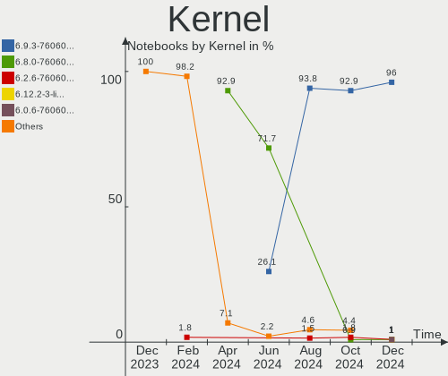
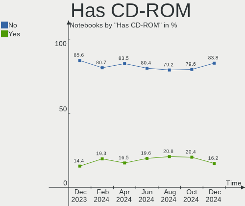
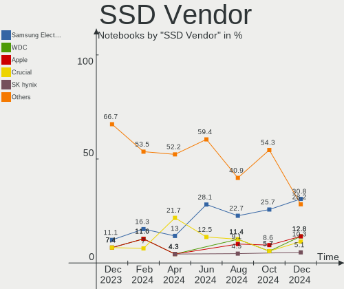
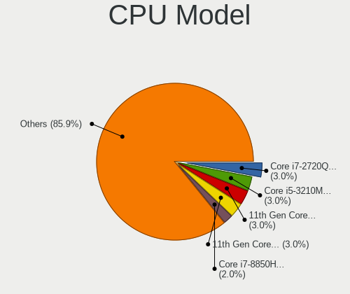
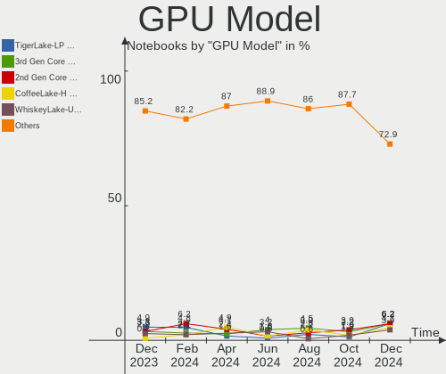
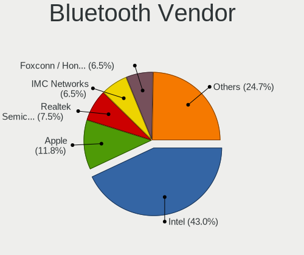
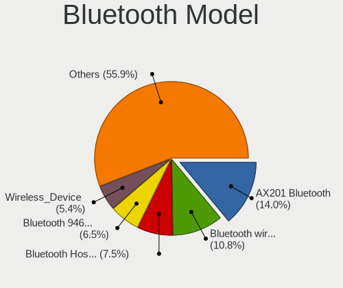

Pop!_OS Hardware Trends (Notebooks)
-----------------------------------

A project to identify most popular hardware characteristics and track their change
over time based on data collected by Pop!_OS users at https://Linux-Hardware.org.

Anyone can contribute to this report by the [hw-probe](https://github.com/linuxhw/hw-probe) tool:

    sudo -E hw-probe -all -upload

Full-feature report is available here: https://linux-hardware.org/?view=trends

Period: Jan, 2022.

Contents
--------

* [ System ](#system)
  - [ OS                       ](#os)
  - [ OS Family                ](#os-family)
  - [ Kernel                   ](#kernel)
  - [ Kernel Family            ](#kernel-family)
  - [ Kernel Major Ver.        ](#kernel-major-ver)
  - [ Arch                     ](#arch)
  - [ DE                       ](#de)
  - [ Display Server           ](#display-server)
  - [ Display Manager          ](#display-manager)
  - [ OS Lang                  ](#os-lang)
  - [ Boot Mode                ](#boot-mode)
  - [ Filesystem               ](#filesystem)
  - [ Part. scheme             ](#part-scheme)
  - [ Dual Boot with Linux/BSD ](#dual-boot-with-linuxbsd)
  - [ Dual Boot (Win)          ](#dual-boot-win)

* [ Board ](#board)
  - [ Vendor                   ](#vendor)
  - [ Model                    ](#model)
  - [ Model Family             ](#model-family)
  - [ MFG Year                 ](#mfg-year)
  - [ Form Factor              ](#form-factor)
  - [ Secure Boot              ](#secure-boot)
  - [ Coreboot                 ](#coreboot)
  - [ RAM Size                 ](#ram-size)
  - [ RAM Used                 ](#ram-used)
  - [ Total Drives             ](#total-drives)
  - [ Has CD-ROM               ](#has-cd-rom)
  - [ Has Ethernet             ](#has-ethernet)
  - [ Has WiFi                 ](#has-wifi)
  - [ Has Bluetooth            ](#has-bluetooth)

* [ Location ](#location)
  - [ Country                  ](#country)
  - [ City                     ](#city)

* [ Drives ](#drives)
  - [ Drive Vendor             ](#drive-vendor)
  - [ Drive Model              ](#drive-model)
  - [ HDD Vendor               ](#hdd-vendor)
  - [ SSD Vendor               ](#ssd-vendor)
  - [ Drive Kind               ](#drive-kind)
  - [ Drive Connector          ](#drive-connector)
  - [ Drive Size               ](#drive-size)
  - [ Space Total              ](#space-total)
  - [ Space Used               ](#space-used)
  - [ Malfunc. Drives          ](#malfunc-drives)
  - [ Malfunc. Drive Vendor    ](#malfunc-drive-vendor)
  - [ Malfunc. HDD Vendor      ](#malfunc-hdd-vendor)
  - [ Malfunc. Drive Kind      ](#malfunc-drive-kind)
  - [ Failed Drives            ](#failed-drives)
  - [ Failed Drive Vendor      ](#failed-drive-vendor)
  - [ Drive Status             ](#drive-status)

* [ Storage controller ](#storage-controller)
  - [ Storage Vendor           ](#storage-vendor)
  - [ Storage Model            ](#storage-model)
  - [ Storage Kind             ](#storage-kind)

* [ Processor ](#processor)
  - [ CPU Vendor               ](#cpu-vendor)
  - [ CPU Model                ](#cpu-model)
  - [ CPU Model Family         ](#cpu-model-family)
  - [ CPU Cores                ](#cpu-cores)
  - [ CPU Sockets              ](#cpu-sockets)
  - [ CPU Threads              ](#cpu-threads)
  - [ CPU Op-Modes             ](#cpu-op-modes)
  - [ CPU Microcode            ](#cpu-microcode)
  - [ CPU Microarch            ](#cpu-microarch)

* [ Graphics ](#graphics)
  - [ GPU Vendor               ](#gpu-vendor)
  - [ GPU Model                ](#gpu-model)
  - [ GPU Combo                ](#gpu-combo)
  - [ GPU Driver               ](#gpu-driver)
  - [ GPU Memory               ](#gpu-memory)

* [ Monitor ](#monitor)
  - [ Monitor Vendor           ](#monitor-vendor)
  - [ Monitor Model            ](#monitor-model)
  - [ Monitor Resolution       ](#monitor-resolution)
  - [ Monitor Diagonal         ](#monitor-diagonal)
  - [ Monitor Width            ](#monitor-width)
  - [ Aspect Ratio             ](#aspect-ratio)
  - [ Monitor Area             ](#monitor-area)
  - [ Pixel Density            ](#pixel-density)
  - [ Multiple Monitors        ](#multiple-monitors)

* [ Network ](#network)
  - [ Net Controller Vendor    ](#net-controller-vendor)
  - [ Net Controller Model     ](#net-controller-model)
  - [ Wireless Vendor          ](#wireless-vendor)
  - [ Wireless Model           ](#wireless-model)
  - [ Ethernet Vendor          ](#ethernet-vendor)
  - [ Ethernet Model           ](#ethernet-model)
  - [ Net Controller Kind      ](#net-controller-kind)
  - [ Used Controller          ](#used-controller)
  - [ NICs                     ](#nics)
  - [ IPv6                     ](#ipv6)

* [ Bluetooth ](#bluetooth)
  - [ Bluetooth Vendor         ](#bluetooth-vendor)
  - [ Bluetooth Model          ](#bluetooth-model)

* [ Sound ](#sound)
  - [ Sound Vendor             ](#sound-vendor)
  - [ Sound Model              ](#sound-model)

* [ Memory ](#memory)
  - [ Memory Vendor            ](#memory-vendor)
  - [ Memory Model             ](#memory-model)
  - [ Memory Kind              ](#memory-kind)
  - [ Memory Form Factor       ](#memory-form-factor)
  - [ Memory Size              ](#memory-size)
  - [ Memory Speed             ](#memory-speed)

* [ Printers & scanners ](#printers--scanners)
  - [ Printer Vendor           ](#printer-vendor)
  - [ Printer Model            ](#printer-model)
  - [ Scanner Vendor           ](#scanner-vendor)
  - [ Scanner Model            ](#scanner-model)

* [ Camera ](#camera)
  - [ Camera Vendor            ](#camera-vendor)
  - [ Camera Model             ](#camera-model)

* [ Security ](#security)
  - [ Fingerprint Vendor       ](#fingerprint-vendor)
  - [ Fingerprint Model        ](#fingerprint-model)
  - [ Chipcard Vendor          ](#chipcard-vendor)
  - [ Chipcard Model           ](#chipcard-model)

* [ Unsupported ](#unsupported)
  - [ Unsupported Devices      ](#unsupported-devices)
  - [ Unsupported Device Types ](#unsupported-device-types)

System
------

OS
--

Installed operating systems

| Name          | Notebooks | Percent |
|---------------|-----------|---------|
| Pop!_OS 21.10 | 152       | 81.28%  |
| Pop!_OS 20.04 | 18        | 9.63%   |
| Pop!_OS 21.04 | 14        | 7.49%   |
| Pop!_OS 20.10 | 3         | 1.6%    |

OS Family
---------

OS without a version

| Name    | Notebooks | Percent |
|---------|-----------|---------|
| Pop!_OS | 187       | 100%    |

Kernel
------

Version of the Linux kernel

| Version                  | Notebooks | Percent |
|--------------------------|-----------|---------|
| 5.15.8-76051508-generic  | 56        | 29.95%  |
| 5.15.11-76051511-generic | 49        | 26.2%   |
| 5.15.15-76051515-generic | 37        | 19.79%  |
| 5.15.5-76051505-generic  | 28        | 14.97%  |
| 5.13.0-7620-generic      | 6         | 3.21%   |
| 5.13.0-7614-generic      | 3         | 1.6%    |
| 5.11.0-7620-generic      | 3         | 1.6%    |
| 5.8.0-7642-generic       | 2         | 1.07%   |
| 5.8.0-7630-generic       | 1         | 0.53%   |
| 5.16.3-xanmod1           | 1         | 0.53%   |
| 5.15.13-051513-generic   | 1         | 0.53%   |

Kernel Family
-------------

Linux kernel without a distro release

| Version | Notebooks | Percent |
|---------|-----------|---------|
| 5.15.8  | 56        | 29.95%  |
| 5.15.11 | 49        | 26.2%   |
| 5.15.15 | 37        | 19.79%  |
| 5.15.5  | 28        | 14.97%  |
| 5.13.0  | 9         | 4.81%   |
| 5.8.0   | 3         | 1.6%    |
| 5.11.0  | 3         | 1.6%    |
| 5.16.3  | 1         | 0.53%   |
| 5.15.13 | 1         | 0.53%   |

Kernel Major Ver.
-----------------

Linux kernel major version

| Version | Notebooks | Percent |
|---------|-----------|---------|
| 5.15    | 171       | 91.44%  |
| 5.13    | 9         | 4.81%   |
| 5.8     | 3         | 1.6%    |
| 5.11    | 3         | 1.6%    |
| 5.16    | 1         | 0.53%   |

Arch
----

OS architecture (x86_64, i586, etc.)

| Name   | Notebooks | Percent |
|--------|-----------|---------|
| x86_64 | 187       | 100%    |

DE
--

Desktop Environment

| Name            | Notebooks | Percent |
|-----------------|-----------|---------|
| GNOME           | 180       | 96.26%  |
| KDE5            | 3         | 1.6%    |
| XFCE            | 1         | 0.53%   |
| GNOME Flashback | 1         | 0.53%   |
| Cinnamon        | 1         | 0.53%   |
| Unknown         | 1         | 0.53%   |

Display Server
--------------

X11 or Wayland

| Name    | Notebooks | Percent |
|---------|-----------|---------|
| X11     | 178       | 95.19%  |
| Wayland | 8         | 4.28%   |
| Unknown | 1         | 0.53%   |

Display Manager
---------------

SDDM, LightDM, etc.

| Name    | Notebooks | Percent |
|---------|-----------|---------|
| Unknown | 137       | 73.26%  |
| GDM     | 48        | 25.67%  |
| GDM3    | 2         | 1.07%   |

OS Lang
-------

Language

| Lang    | Notebooks | Percent |
|---------|-----------|---------|
| en_US   | 110       | 58.82%  |
| pt_BR   | 14        | 7.49%   |
| en_GB   | 8         | 4.28%   |
| de_DE   | 8         | 4.28%   |
| en_CA   | 6         | 3.21%   |
| fr_FR   | 5         | 2.67%   |
| ru_RU   | 4         | 2.14%   |
| it_IT   | 3         | 1.6%    |
| en_AU   | 3         | 1.6%    |
| sv_SE   | 2         | 1.07%   |
| pl_PL   | 2         | 1.07%   |
| nl_NL   | 2         | 1.07%   |
| hr_HR   | 2         | 1.07%   |
| en_IN   | 2         | 1.07%   |
| C       | 2         | 1.07%   |
| Unknown | 2         | 1.07%   |
| tr_TR   | 1         | 0.53%   |
| pt_PT   | 1         | 0.53%   |
| nb_NO   | 1         | 0.53%   |
| fr_CA   | 1         | 0.53%   |
| fi_FI   | 1         | 0.53%   |
| es_PE   | 1         | 0.53%   |
| es_MX   | 1         | 0.53%   |
| es_ES   | 1         | 0.53%   |
| es_AR   | 1         | 0.53%   |
| en_DK   | 1         | 0.53%   |
| da_DK   | 1         | 0.53%   |
| cs_CZ   | 1         | 0.53%   |

Boot Mode
---------

EFI or BIOS

| Mode | Notebooks | Percent |
|------|-----------|---------|
| BIOS | 140       | 74.87%  |
| EFI  | 47        | 25.13%  |

Filesystem
----------

Type of filesystem

| Type    | Notebooks | Percent |
|---------|-----------|---------|
| Ext4    | 181       | 96.79%  |
| Btrfs   | 4         | 2.14%   |
| Xfs     | 1         | 0.53%   |
| Overlay | 1         | 0.53%   |

Part. scheme
------------

Scheme of partitioning

| Type    | Notebooks | Percent |
|---------|-----------|---------|
| Unknown | 136       | 72.73%  |
| GPT     | 46        | 24.6%   |
| MBR     | 5         | 2.67%   |

Dual Boot with Linux/BSD
------------------------

Hosting more than one Linux/BSD

| Dual boot | Notebooks | Percent |
|-----------|-----------|---------|
| No        | 181       | 96.79%  |
| Yes       | 6         | 3.21%   |

Dual Boot (Win)
---------------

Hosting Linux and Windows

| Dual boot | Notebooks | Percent |
|-----------|-----------|---------|
| No        | 170       | 90.91%  |
| Yes       | 17        | 9.09%   |

Board
-----

Vendor
------

Motherboard manufacturer

| Name                   | Notebooks | Percent |
|------------------------|-----------|---------|
| Lenovo                 | 37        | 19.79%  |
| Dell                   | 33        | 17.65%  |
| Hewlett-Packard        | 27        | 14.44%  |
| Acer                   | 23        | 12.3%   |
| ASUSTek Computer       | 21        | 11.23%  |
| System76               | 9         | 4.81%   |
| MSI                    | 8         | 4.28%   |
| Apple                  | 8         | 4.28%   |
| Positivo               | 3         | 1.6%    |
| HUAWEI                 | 3         | 1.6%    |
| Alienware              | 3         | 1.6%    |
| Toshiba                | 2         | 1.07%   |
| Samsung Electronics    | 2         | 1.07%   |
| Sony                   | 1         | 0.53%   |
| Monster                | 1         | 0.53%   |
| Medion                 | 1         | 0.53%   |
| Google                 | 1         | 0.53%   |
| Gigabyte Technology    | 1         | 0.53%   |
| Gateway                | 1         | 0.53%   |
| Dynabook               | 1         | 0.53%   |
| Avell High Performance | 1         | 0.53%   |

Model
-----

Motherboard model

| Name                                     | Notebooks | Percent |
|------------------------------------------|-----------|---------|
| System76 Serval                          | 2         | 1.07%   |
| System76 Oryx Pro                        | 2         | 1.07%   |
| System76 Lemur Pro                       | 2         | 1.07%   |
| System76 Galago Pro                      | 2         | 1.07%   |
| Lenovo IdeaPad 3 15ADA05 81W1            | 2         | 1.07%   |
| HP Pavilion 15                           | 2         | 1.07%   |
| HP Notebook                              | 2         | 1.07%   |
| HP EliteBook 840 G6                      | 2         | 1.07%   |
| Dell Vostro 1520                         | 2         | 1.07%   |
| Dell Inspiron 3583                       | 2         | 1.07%   |
| ASUS ZenBook UX325EA_UX325EA             | 2         | 1.07%   |
| Acer Nitro AN515-55                      | 2         | 1.07%   |
| Acer Aspire A315-42                      | 2         | 1.07%   |
| Toshiba TECRA Z50-A                      | 1         | 0.53%   |
| Toshiba Satellite A205                   | 1         | 0.53%   |
| System76 Serval WS                       | 1         | 0.53%   |
| Sony VGN-FE31H                           | 1         | 0.53%   |
| Samsung R530/R730                        | 1         | 0.53%   |
| Samsung 340XAA/350XAA/550XAA             | 1         | 0.53%   |
| Positivo SW6H                            | 1         | 0.53%   |
| Positivo S14SL01                         | 1         | 0.53%   |
| Positivo Mobile                          | 1         | 0.53%   |
| MSI GS66 Stealth 10SFS                   | 1         | 0.53%   |
| MSI GS60 2PC Ghost                       | 1         | 0.53%   |
| MSI GL65 Leopard 10SFKV                  | 1         | 0.53%   |
| MSI GF75 Thin 10UEK                      | 1         | 0.53%   |
| MSI GF65 Thin 9SD                        | 1         | 0.53%   |
| MSI GF63 Thin 9SCXR                      | 1         | 0.53%   |
| MSI GE72 2QE                             | 1         | 0.53%   |
| MSI GE62 2QF                             | 1         | 0.53%   |
| Monster HUMA H4 V4.1                     | 1         | 0.53%   |
| Medion BEAST X25                         | 1         | 0.53%   |
| Lenovo Yoga Slim 7 14ITL05 82A3          | 1         | 0.53%   |
| Lenovo Yoga Slim 7 14ARE05 82A2          | 1         | 0.53%   |
| Lenovo Yoga 2 13 20344                   | 1         | 0.53%   |
| Lenovo Y520-15IKBN 80WK                  | 1         | 0.53%   |
| Lenovo ThinkPad X250 20CLS0E705          | 1         | 0.53%   |
| Lenovo ThinkPad X220 4291B78             | 1         | 0.53%   |
| Lenovo ThinkPad X200 Tablet 744943U      | 1         | 0.53%   |
| Lenovo ThinkPad X1 Extreme 20MF000RRT    | 1         | 0.53%   |
| Lenovo ThinkPad X1 Carbon 5th 20HR002MGE | 1         | 0.53%   |
| Lenovo ThinkPad X1 Carbon 3rd 20BSCTO1WW | 1         | 0.53%   |
| Lenovo ThinkPad T530 239242U             | 1         | 0.53%   |
| Lenovo ThinkPad T470p 20J7S0CF00         | 1         | 0.53%   |
| Lenovo ThinkPad T430u 3351CTO            | 1         | 0.53%   |
| Lenovo ThinkPad T420 4236VJ7             | 1         | 0.53%   |
| Lenovo ThinkPad Edge 05782GP             | 1         | 0.53%   |
| Lenovo ThinkPad E15 Gen 2 20TDS00B00     | 1         | 0.53%   |
| Lenovo ThinkPad E15 Gen 2 20TD004NMH     | 1         | 0.53%   |
| Lenovo ThinkPad E15 Gen 2 20TD002PMX     | 1         | 0.53%   |
| Lenovo ThinkPad E14 Gen 3 20Y7CTO1WW     | 1         | 0.53%   |
| Lenovo ThinkPad E14 Gen 2 20TA002BPG     | 1         | 0.53%   |
| Lenovo ThinkBook 16p Gen 2 20YM          | 1         | 0.53%   |
| Lenovo ThinkBook 15 G2 ARE 20VG          | 1         | 0.53%   |
| Lenovo ThinkBook 13s-IWL 20R9            | 1         | 0.53%   |
| Lenovo Legion Y530-15ICH 81FV            | 1         | 0.53%   |
| Lenovo Legion 5 17IMH05H 81Y8            | 1         | 0.53%   |
| Lenovo Legion 5 15ACH6H 82JU             | 1         | 0.53%   |
| Lenovo IdeaPad S540-14API 81NH           | 1         | 0.53%   |
| Lenovo IdeaPad S340-15API 81NC           | 1         | 0.53%   |

Model Family
------------

Motherboard model prefix

| Name               | Notebooks | Percent |
|--------------------|-----------|---------|
| Acer Aspire        | 18        | 9.63%   |
| Lenovo ThinkPad    | 16        | 8.56%   |
| Dell Inspiron      | 11        | 5.88%   |
| Dell Latitude      | 10        | 5.35%   |
| Lenovo IdeaPad     | 8         | 4.28%   |
| HP Pavilion        | 7         | 3.74%   |
| HP EliteBook       | 6         | 3.21%   |
| ASUS ROG           | 5         | 2.67%   |
| HP OMEN            | 4         | 2.14%   |
| Dell XPS           | 4         | 2.14%   |
| Dell Vostro        | 4         | 2.14%   |
| Acer Nitro         | 4         | 2.14%   |
| System76 Serval    | 3         | 1.6%    |
| Lenovo Yoga        | 3         | 1.6%    |
| Lenovo ThinkBook   | 3         | 1.6%    |
| Lenovo Legion      | 3         | 1.6%    |
| HP Laptop          | 3         | 1.6%    |
| ASUS ASUS          | 3         | 1.6%    |
| System76 Oryx      | 2         | 1.07%   |
| System76 Lemur     | 2         | 1.07%   |
| System76 Galago    | 2         | 1.07%   |
| HP ProBook         | 2         | 1.07%   |
| HP Notebook        | 2         | 1.07%   |
| HP 255             | 2         | 1.07%   |
| Dell Precision     | 2         | 1.07%   |
| ASUS ZenBook       | 2         | 1.07%   |
| ASUS VivoBook      | 2         | 1.07%   |
| ASUS TUF           | 2         | 1.07%   |
| Toshiba TECRA      | 1         | 0.53%   |
| Toshiba Satellite  | 1         | 0.53%   |
| Sony VGN-FE31H     | 1         | 0.53%   |
| Samsung R530       | 1         | 0.53%   |
| Samsung 340XAA     | 1         | 0.53%   |
| Positivo SW6H      | 1         | 0.53%   |
| Positivo S14SL01   | 1         | 0.53%   |
| Positivo Mobile    | 1         | 0.53%   |
| MSI GS66           | 1         | 0.53%   |
| MSI GS60           | 1         | 0.53%   |
| MSI GL65           | 1         | 0.53%   |
| MSI GF75           | 1         | 0.53%   |
| MSI GF65           | 1         | 0.53%   |
| MSI GF63           | 1         | 0.53%   |
| MSI GE72           | 1         | 0.53%   |
| MSI GE62           | 1         | 0.53%   |
| Monster HUMA       | 1         | 0.53%   |
| Medion BEAST       | 1         | 0.53%   |
| Lenovo Y520-15IKBN | 1         | 0.53%   |
| Lenovo G510        | 1         | 0.53%   |
| Lenovo G50-70      | 1         | 0.53%   |
| Lenovo E41-25      | 1         | 0.53%   |
| HUAWEI NBLB-WAX9N  | 1         | 0.53%   |
| HUAWEI KPL-W0X     | 1         | 0.53%   |
| HUAWEI BOHK-WAX9X  | 1         | 0.53%   |
| HP ENVY            | 1         | 0.53%   |
| Google Elemi       | 1         | 0.53%   |
| Gigabyte P65       | 1         | 0.53%   |
| Gateway NE56R      | 1         | 0.53%   |
| Dynabook TECRA     | 1         | 0.53%   |
| Dell Studio        | 1         | 0.53%   |
| Dell G15           | 1         | 0.53%   |

MFG Year
--------

Motherboard manufacture year

| Year | Notebooks | Percent |
|------|-----------|---------|
| 2020 | 33        | 17.65%  |
| 2019 | 26        | 13.9%   |
| 2021 | 23        | 12.3%   |
| 2017 | 15        | 8.02%   |
| 2018 | 11        | 5.88%   |
| 2013 | 11        | 5.88%   |
| 2016 | 10        | 5.35%   |
| 2014 | 10        | 5.35%   |
| 2012 | 10        | 5.35%   |
| 2015 | 9         | 4.81%   |
| 2010 | 7         | 3.74%   |
| 2009 | 7         | 3.74%   |
| 2011 | 6         | 3.21%   |
| 2008 | 6         | 3.21%   |
| 2022 | 1         | 0.53%   |
| 2007 | 1         | 0.53%   |
| 2006 | 1         | 0.53%   |

Form Factor
-----------

Physical design of the computer

| Name     | Notebooks | Percent |
|----------|-----------|---------|
| Notebook | 187       | 100%    |

Secure Boot
-----------

Enabled or disabled

| State    | Notebooks | Percent |
|----------|-----------|---------|
| Disabled | 187       | 100%    |

Coreboot
--------

Have coreboot on board

| Used | Notebooks | Percent |
|------|-----------|---------|
| No   | 181       | 96.79%  |
| Yes  | 6         | 3.21%   |

RAM Size
--------

Total RAM memory

| Size in GB  | Notebooks | Percent |
|-------------|-----------|---------|
| 4.01-8.0    | 67        | 35.83%  |
| 16.01-24.0  | 44        | 23.53%  |
| 3.01-4.0    | 26        | 13.9%   |
| 8.01-16.0   | 26        | 13.9%   |
| 32.01-64.0  | 15        | 8.02%   |
| 64.01-256.0 | 5         | 2.67%   |
| 24.01-32.0  | 2         | 1.07%   |
| 1.01-2.0    | 2         | 1.07%   |

RAM Used
--------

Used RAM memory

| Used GB    | Notebooks | Percent |
|------------|-----------|---------|
| 2.01-3.0   | 66        | 35.29%  |
| 1.01-2.0   | 44        | 23.53%  |
| 4.01-8.0   | 41        | 21.93%  |
| 3.01-4.0   | 31        | 16.58%  |
| 8.01-16.0  | 4         | 2.14%   |
| 16.01-24.0 | 1         | 0.53%   |

Total Drives
------------

Number of drives on board

| Drives | Notebooks | Percent |
|--------|-----------|---------|
| 1      | 129       | 68.98%  |
| 2      | 46        | 24.6%   |
| 3      | 9         | 4.81%   |
| 4      | 2         | 1.07%   |
| 0      | 1         | 0.53%   |

Has CD-ROM
----------

Has CD-ROM on board

| Presented | Notebooks | Percent |
|-----------|-----------|---------|
| No        | 139       | 74.33%  |
| Yes       | 48        | 25.67%  |

Has Ethernet
------------

Has Ethernet on board

| Presented | Notebooks | Percent |
|-----------|-----------|---------|
| Yes       | 151       | 80.75%  |
| No        | 36        | 19.25%  |

Has WiFi
--------

Has WiFi module

| Presented | Notebooks | Percent |
|-----------|-----------|---------|
| Yes       | 185       | 98.93%  |
| No        | 2         | 1.07%   |

Has Bluetooth
-------------

Has Bluetooth module

| Presented | Notebooks | Percent |
|-----------|-----------|---------|
| Yes       | 154       | 82.35%  |
| No        | 33        | 17.65%  |

Location
--------

Country
-------

Geographic location (country)

| Country                | Notebooks | Percent |
|------------------------|-----------|---------|
| USA                    | 54        | 28.88%  |
| Brazil                 | 22        | 11.76%  |
| Canada                 | 12        | 6.42%   |
| Germany                | 10        | 5.35%   |
| Sweden                 | 7         | 3.74%   |
| India                  | 7         | 3.74%   |
| France                 | 7         | 3.74%   |
| UK                     | 6         | 3.21%   |
| Russia                 | 5         | 2.67%   |
| Romania                | 5         | 2.67%   |
| Portugal               | 4         | 2.14%   |
| Italy                  | 4         | 2.14%   |
| Poland                 | 3         | 1.6%    |
| Australia              | 3         | 1.6%    |
| Argentina              | 3         | 1.6%    |
| Turkey                 | 2         | 1.07%   |
| Philippines            | 2         | 1.07%   |
| Peru                   | 2         | 1.07%   |
| Norway                 | 2         | 1.07%   |
| Netherlands            | 2         | 1.07%   |
| Denmark                | 2         | 1.07%   |
| Czechia                | 2         | 1.07%   |
| Croatia                | 2         | 1.07%   |
| Vietnam                | 1         | 0.53%   |
| Ukraine                | 1         | 0.53%   |
| Taiwan                 | 1         | 0.53%   |
| Spain                  | 1         | 0.53%   |
| Slovenia               | 1         | 0.53%   |
| Mexico                 | 1         | 0.53%   |
| Lithuania              | 1         | 0.53%   |
| Israel                 | 1         | 0.53%   |
| Iraq                   | 1         | 0.53%   |
| Iceland                | 1         | 0.53%   |
| Finland                | 1         | 0.53%   |
| Colombia               | 1         | 0.53%   |
| China                  | 1         | 0.53%   |
| Chile                  | 1         | 0.53%   |
| Bulgaria               | 1         | 0.53%   |
| Bosnia and Herzegovina | 1         | 0.53%   |
| Belgium                | 1         | 0.53%   |
| Bangladesh             | 1         | 0.53%   |
| Austria                | 1         | 0.53%   |

City
----

Geographic location (city)

| City                  | Notebooks | Percent |
|-----------------------|-----------|---------|
| Washington            | 2         | 1.07%   |
| Warsaw                | 2         | 1.07%   |
| Vila Velha            | 2         | 1.07%   |
| Spring                | 2         | 1.07%   |
| Gothenburg            | 2         | 1.07%   |
| Frankfurt am Main     | 2         | 1.07%   |
| Fortaleza             | 2         | 1.07%   |
| Cincinnati            | 2         | 1.07%   |
| Buenos Aires          | 2         | 1.07%   |
| Bucharest             | 2         | 1.07%   |
| Zavidovici            | 1         | 0.53%   |
| Zapre??i?‡            | 1         | 0.53%   |
| Zagreb                | 1         | 0.53%   |
| Yekaterinburg         | 1         | 0.53%   |
| Wuppertal             | 1         | 0.53%   |
| West Hartford         | 1         | 0.53%   |
| Vratimov              | 1         | 0.53%   |
| Voluntari             | 1         | 0.53%   |
| Vit??ria              | 1         | 0.53%   |
| Viseu                 | 1         | 0.53%   |
| Vilnius               | 1         | 0.53%   |
| Vigo                  | 1         | 0.53%   |
| Vienna                | 1         | 0.53%   |
| Vicosa                | 1         | 0.53%   |
| Vanlose               | 1         | 0.53%   |
| Valrico               | 1         | 0.53%   |
| Valdivia              | 1         | 0.53%   |
| Vaellingby            | 1         | 0.53%   |
| Uden                  | 1         | 0.53%   |
| Thouarce              | 1         | 0.53%   |
| Thoothukudi           | 1         | 0.53%   |
| Temecula              | 1         | 0.53%   |
| Tel Aviv              | 1         | 0.53%   |
| T??bor                | 1         | 0.53%   |
| Sydney                | 1         | 0.53%   |
| Sucy-en-Brie          | 1         | 0.53%   |
| St Petersburg         | 1         | 0.53%   |
| St Louis              | 1         | 0.53%   |
| Sorocaba              | 1         | 0.53%   |
| Sesto San Giovanni    | 1         | 0.53%   |
| S??o Paulo            | 1         | 0.53%   |
| S??o Jos?© dos Campos | 1         | 0.53%   |
| Sao Jose do Rio Preto | 1         | 0.53%   |
| Sao Joao de Meriti    | 1         | 0.53%   |
| Santar?©m             | 1         | 0.53%   |
| Sandefjord            | 1         | 0.53%   |
| San Diego             | 1         | 0.53%   |
| San Antonio           | 1         | 0.53%   |
| Salem                 | 1         | 0.53%   |
| Salbohed              | 1         | 0.53%   |
| Saeffle               | 1         | 0.53%   |
| Rostov-on-Don         | 1         | 0.53%   |
| Romeoville            | 1         | 0.53%   |
| Rome                  | 1         | 0.53%   |
| Reykjavik             | 1         | 0.53%   |
| Queens                | 1         | 0.53%   |
| Qu?©bec               | 1         | 0.53%   |
| Quakertown            | 1         | 0.53%   |
| Pune                  | 1         | 0.53%   |
| Preston               | 1         | 0.53%   |

Drives
------

Drive Vendor
------------

Hard drive vendors

| Vendor                    | Notebooks | Drives | Percent |
|---------------------------|-----------|--------|---------|
| Samsung Electronics       | 37        | 42     | 15.23%  |
| WDC                       | 26        | 26     | 10.7%   |
| Seagate                   | 25        | 26     | 10.29%  |
| Toshiba                   | 20        | 22     | 8.23%   |
| Sandisk                   | 16        | 16     | 6.58%   |
| Kingston                  | 15        | 15     | 6.17%   |
| SK Hynix                  | 14        | 15     | 5.76%   |
| Crucial                   | 10        | 11     | 4.12%   |
| Intel                     | 9         | 9      | 3.7%    |
| Micron Technology         | 8         | 8      | 3.29%   |
| HGST                      | 8         | 8      | 3.29%   |
| A-DATA Technology         | 7         | 8      | 2.88%   |
| Unknown                   | 5         | 6      | 2.06%   |
| Silicon Motion            | 3         | 3      | 1.23%   |
| Phison                    | 3         | 3      | 1.23%   |
| KIOXIA                    | 3         | 3      | 1.23%   |
| China                     | 3         | 3      | 1.23%   |
| Apple                     | 3         | 3      | 1.23%   |
| ADATA Technology          | 3         | 4      | 1.23%   |
| PNY                       | 2         | 2      | 0.82%   |
| KIOXIA-EXCERIA            | 2         | 2      | 0.82%   |
| KingSpec                  | 2         | 2      | 0.82%   |
| Hitachi                   | 2         | 2      | 0.82%   |
| XPG                       | 1         | 1      | 0.41%   |
| UMIS                      | 1         | 1      | 0.41%   |
| TrekStor                  | 1         | 1      | 0.41%   |
| Team                      | 1         | 1      | 0.41%   |
| TAMMUZ                    | 1         | 1      | 0.41%   |
| Realtek Semiconductor     | 1         | 1      | 0.41%   |
| OCZ                       | 1         | 1      | 0.41%   |
| Micron/Crucial Technology | 1         | 2      | 0.41%   |
| LITEON                    | 1         | 1      | 0.41%   |
| Lexar                     | 1         | 1      | 0.41%   |
| KingFast                  | 1         | 2      | 0.41%   |
| KingDian                  | 1         | 1      | 0.41%   |
| INNOVATION IT             | 1         | 1      | 0.41%   |
| HUAWEI                    | 1         | 1      | 0.41%   |
| Fujitsu                   | 1         | 1      | 0.41%   |
| Corsair                   | 1         | 1      | 0.41%   |
| Unknown                   | 1         | 1      | 0.41%   |

Drive Model
-----------

Hard drive models

| Model                                | Notebooks | Percent |
|--------------------------------------|-----------|---------|
| Samsung NVMe SSD Drive 512GB         | 5         | 1.98%   |
| HGST HTS721010A9E630 1TB             | 5         | 1.98%   |
| Toshiba MQ01ABD100 1TB               | 4         | 1.59%   |
| Seagate ST1000LM035-1RK172 1TB       | 4         | 1.59%   |
| Samsung NVMe SSD Drive 256GB         | 4         | 1.59%   |
| WDC WD10SPZX-24Z10 1TB               | 3         | 1.19%   |
| Toshiba MQ04ABF100 1TB               | 3         | 1.19%   |
| Sandisk NVMe SSD Drive 512GB         | 3         | 1.19%   |
| Samsung NVMe SSD Drive 1024GB        | 3         | 1.19%   |
| Kingston SA400S37240G 240GB SSD      | 3         | 1.19%   |
| Intel NVMe SSD Drive 512GB           | 3         | 1.19%   |
| ADATA NVMe SSD Drive 512GB           | 3         | 1.19%   |
| WDC WDS120G2G0A-00JH30 120GB SSD     | 2         | 0.79%   |
| WDC WDS100T2B0C-00PXH0 1TB           | 2         | 0.79%   |
| Toshiba THNSNJ128G8NU 128GB SSD      | 2         | 0.79%   |
| Toshiba KBG30ZMS128G 128GB NVMe SSD  | 2         | 0.79%   |
| SK Hynix NVMe SSD Drive 512GB        | 2         | 0.79%   |
| SK Hynix NVMe SSD Drive 256GB        | 2         | 0.79%   |
| SK Hynix NVMe SSD Drive 1024GB       | 2         | 0.79%   |
| Seagate ST950032 5AS 500GB           | 2         | 0.79%   |
| Seagate ST9320325AS 320GB            | 2         | 0.79%   |
| Seagate ST500LT012-1DG142 500GB      | 2         | 0.79%   |
| Seagate ST1000LX015-1U7172 1TB       | 2         | 0.79%   |
| Seagate ST1000LM024 HN-M101MBB 1TB   | 2         | 0.79%   |
| SanDisk SSD PLUS 240GB               | 2         | 0.79%   |
| Sandisk NVMe SSD Drive 500GB         | 2         | 0.79%   |
| Sandisk NVMe SSD Drive 1024GB        | 2         | 0.79%   |
| Samsung SSD 860 EVO 500GB            | 2         | 0.79%   |
| Samsung SSD 850 EVO 1TB              | 2         | 0.79%   |
| Samsung NVMe SSD Drive 250GB         | 2         | 0.79%   |
| Samsung NVMe SSD Drive 1TB           | 2         | 0.79%   |
| Micron 2200V_MTFDHBA512TCK 512GB     | 2         | 0.79%   |
| Kingston SA400S37960G 960GB SSD      | 2         | 0.79%   |
| Crucial CT480BX500SSD1 480GB         | 2         | 0.79%   |
| China SATA SSD 128GB                 | 2         | 0.79%   |
| XPG SPECTRIX S40G 1TB                | 1         | 0.4%    |
| WDC WDS500G2B0B-00YS70 500GB SSD     | 1         | 0.4%    |
| WDC WDS250G2B0A 250GB SSD            | 1         | 0.4%    |
| WDC WDS240G2G0B-00EPW0 240GB SSD     | 1         | 0.4%    |
| WDC WDS100T2B0A-00SM50 1TB SSD       | 1         | 0.4%    |
| WDC WDBNCE5000PNC 500GB SSD          | 1         | 0.4%    |
| WDC WD7500BPKX-75HPJT0 752GB         | 1         | 0.4%    |
| WDC WD5000M22K-24Z1LT0-SSHD-16GB     | 1         | 0.4%    |
| WDC WD5000LPVX-75V0TT0 500GB         | 1         | 0.4%    |
| WDC WD5000LPVX-22V0TT0 500GB         | 1         | 0.4%    |
| WDC WD5000BPVT-22HXZT1 500GB         | 1         | 0.4%    |
| WDC WD3200BEVT-22ZCT0 320GB          | 1         | 0.4%    |
| WDC WD2500BEVT-22ZCT0 250GB          | 1         | 0.4%    |
| WDC WD10SPZX-22Z10T0 1TB             | 1         | 0.4%    |
| WDC WD10JPCX-24UE4T0 1TB             | 1         | 0.4%    |
| WDC PC SN730 SDBPNTY-1T00-1101 1TB   | 1         | 0.4%    |
| WDC PC SN530 SDBPTPZ-1T00-1002 1TB   | 1         | 0.4%    |
| WDC PC SN530 SDBPNPZ-512G-1002 512GB | 1         | 0.4%    |
| WDC PC SN530 NVMe 512GB              | 1         | 0.4%    |
| WDC PC SN520 SDAPTUW-128G-1006 128GB | 1         | 0.4%    |
| Unknown SF128  128GB                 | 1         | 0.4%    |
| Unknown SD256  256GB                 | 1         | 0.4%    |
| Unknown SD16G  16GB                  | 1         | 0.4%    |
| Unknown SD/MMC/MS PRO 128GB          | 1         | 0.4%    |
| Unknown MMC Card  16GB               | 1         | 0.4%    |

HDD Vendor
----------

Hard disk drive vendors

| Vendor              | Notebooks | Drives | Percent |
|---------------------|-----------|--------|---------|
| Seagate             | 22        | 22     | 38.6%   |
| WDC                 | 12        | 12     | 21.05%  |
| Toshiba             | 10        | 10     | 17.54%  |
| HGST                | 8         | 8      | 14.04%  |
| Hitachi             | 2         | 2      | 3.51%   |
| Unknown             | 1         | 1      | 1.75%   |
| Samsung Electronics | 1         | 1      | 1.75%   |
| Fujitsu             | 1         | 1      | 1.75%   |

SSD Vendor
----------

Solid state drive vendors

| Vendor              | Notebooks | Drives | Percent |
|---------------------|-----------|--------|---------|
| Kingston            | 13        | 13     | 15.12%  |
| Samsung Electronics | 11        | 11     | 12.79%  |
| SanDisk             | 8         | 8      | 9.3%    |
| Crucial             | 8         | 9      | 9.3%    |
| WDC                 | 7         | 7      | 8.14%   |
| A-DATA Technology   | 6         | 6      | 6.98%   |
| Toshiba             | 4         | 5      | 4.65%   |
| SK Hynix            | 3         | 3      | 3.49%   |
| Intel               | 3         | 3      | 3.49%   |
| China               | 3         | 3      | 3.49%   |
| Apple               | 3         | 3      | 3.49%   |
| PNY                 | 2         | 2      | 2.33%   |
| Micron Technology   | 2         | 2      | 2.33%   |
| KingSpec            | 2         | 2      | 2.33%   |
| TrekStor            | 1         | 1      | 1.16%   |
| Team                | 1         | 1      | 1.16%   |
| TAMMUZ              | 1         | 1      | 1.16%   |
| OCZ                 | 1         | 1      | 1.16%   |
| LITEON              | 1         | 1      | 1.16%   |
| Lexar               | 1         | 1      | 1.16%   |
| KingFast            | 1         | 1      | 1.16%   |
| KingDian            | 1         | 1      | 1.16%   |
| INNOVATION IT       | 1         | 1      | 1.16%   |
| Corsair             | 1         | 1      | 1.16%   |
| Unknown             | 1         | 1      | 1.16%   |

Drive Kind
----------

HDD or SSD

| Kind    | Notebooks | Drives | Percent |
|---------|-----------|--------|---------|
| NVMe    | 89        | 106    | 39.56%  |
| SSD     | 76        | 88     | 33.78%  |
| HDD     | 54        | 57     | 24%     |
| MMC     | 4         | 5      | 1.78%   |
| Unknown | 2         | 2      | 0.89%   |

Drive Connector
---------------

SATA, SAS, NVMe, etc.

| Type | Notebooks | Drives | Percent |
|------|-----------|--------|---------|
| SATA | 119       | 139    | 54.34%  |
| NVMe | 89        | 106    | 40.64%  |
| SAS  | 7         | 8      | 3.2%    |
| MMC  | 4         | 5      | 1.83%   |

Drive Size
----------

Size of hard drive

| Size in TB | Notebooks | Drives | Percent |
|------------|-----------|--------|---------|
| 0.01-0.5   | 88        | 98     | 66.67%  |
| 0.51-1.0   | 41        | 43     | 31.06%  |
| 1.01-2.0   | 3         | 4      | 2.27%   |

Space Total
-----------

Amount of disk space available on the file system

| Size in GB     | Notebooks | Percent |
|----------------|-----------|---------|
| 251-500        | 66        | 35.29%  |
| 101-250        | 57        | 30.48%  |
| 501-1000       | 37        | 19.79%  |
| 1001-2000      | 13        | 6.95%   |
| 51-100         | 6         | 3.21%   |
| 2001-3000      | 3         | 1.6%    |
| 1-20           | 2         | 1.07%   |
| More than 3000 | 1         | 0.53%   |
| 21-50          | 1         | 0.53%   |
| Unknown        | 1         | 0.53%   |

Space Used
----------

Amount of used disk space

| Used GB   | Notebooks | Percent |
|-----------|-----------|---------|
| 1-20      | 64        | 34.22%  |
| 21-50     | 47        | 25.13%  |
| 51-100    | 25        | 13.37%  |
| 101-250   | 22        | 11.76%  |
| 251-500   | 18        | 9.63%   |
| 501-1000  | 9         | 4.81%   |
| 1001-2000 | 1         | 0.53%   |
| Unknown   | 1         | 0.53%   |

Malfunc. Drives
---------------

Drive models with a malfunction

| Model                           | Notebooks | Drives | Percent |
|---------------------------------|-----------|--------|---------|
| Toshiba MQ01ABD100 1TB          | 1         | 1      | 25%     |
| SK Hynix SC210 mSATA 256GB SSD  | 1         | 1      | 25%     |
| Kingston SA400S37240G 240GB SSD | 1         | 1      | 25%     |
| HGST HTS721010A9E630 1TB        | 1         | 1      | 25%     |

Malfunc. Drive Vendor
---------------------

Vendors of faulty drives

| Vendor   | Notebooks | Drives | Percent |
|----------|-----------|--------|---------|
| Toshiba  | 1         | 1      | 25%     |
| SK Hynix | 1         | 1      | 25%     |
| Kingston | 1         | 1      | 25%     |
| HGST     | 1         | 1      | 25%     |

Malfunc. HDD Vendor
-------------------

Vendors of faulty HDD drives

| Vendor  | Notebooks | Drives | Percent |
|---------|-----------|--------|---------|
| Toshiba | 1         | 1      | 50%     |
| HGST    | 1         | 1      | 50%     |

Malfunc. Drive Kind
-------------------

Kinds of faulty drives

| Kind | Notebooks | Drives | Percent |
|------|-----------|--------|---------|
| SSD  | 2         | 2      | 50%     |
| HDD  | 2         | 2      | 50%     |

Failed Drives
-------------

Failed drive models

Zero info for selected period =(

Failed Drive Vendor
-------------------

Failed drive vendors

Zero info for selected period =(

Drive Status
------------

Number of failed and malfunc. drives

| Status   | Notebooks | Drives | Percent |
|----------|-----------|--------|---------|
| Detected | 139       | 187    | 71.28%  |
| Works    | 52        | 67     | 26.67%  |
| Malfunc  | 4         | 4      | 2.05%   |

Storage controller
------------------

Storage Vendor
--------------

Storage controller vendors

| Vendor                       | Notebooks | Percent |
|------------------------------|-----------|---------|
| Intel                        | 127       | 51.63%  |
| Samsung Electronics          | 30        | 12.2%   |
| AMD                          | 23        | 9.35%   |
| Sandisk                      | 15        | 6.1%    |
| SK Hynix                     | 11        | 4.47%   |
| Toshiba America Info Systems | 7         | 2.85%   |
| Micron Technology            | 6         | 2.44%   |
| KIOXIA                       | 5         | 2.03%   |
| Silicon Motion               | 3         | 1.22%   |
| Seagate Technology           | 3         | 1.22%   |
| Phison Electronics           | 3         | 1.22%   |
| Micron/Crucial Technology    | 3         | 1.22%   |
| ADATA Technology             | 3         | 1.22%   |
| Realtek Semiconductor        | 2         | 0.81%   |
| Kingston Technology Company  | 2         | 0.81%   |
| Union Memory (Shenzhen)      | 1         | 0.41%   |
| Nvidia                       | 1         | 0.41%   |
| Marvell Technology Group     | 1         | 0.41%   |

Storage Model
-------------

Storage controller models

| Model                                                                            | Notebooks | Percent |
|----------------------------------------------------------------------------------|-----------|---------|
| AMD FCH SATA Controller [AHCI mode]                                              | 22        | 8.37%   |
| Samsung NVMe SSD Controller SM981/PM981/PM983                                    | 17        | 6.46%   |
| Intel Sunrise Point-LP SATA Controller [AHCI mode]                               | 15        | 5.7%    |
| Intel 82801 Mobile SATA Controller [RAID mode]                                   | 11        | 4.18%   |
| Intel 7 Series Chipset Family 6-port SATA Controller [AHCI mode]                 | 10        | 3.8%    |
| Intel 8 Series SATA Controller 1 [AHCI mode]                                     | 9         | 3.42%   |
| Intel Volume Management Device NVMe RAID Controller                              | 8         | 3.04%   |
| Intel Cannon Lake Mobile PCH SATA AHCI Controller                                | 8         | 3.04%   |
| Intel 82801IBM/IEM (ICH9M/ICH9M-E) 4 port SATA Controller [AHCI mode]            | 7         | 2.66%   |
| Intel 400 Series Chipset Family SATA AHCI Controller                             | 7         | 2.66%   |
| Micron Non-Volatile memory controller                                            | 6         | 2.28%   |
| Intel 6 Series/C200 Series Chipset Family 6 port Mobile SATA AHCI Controller     | 6         | 2.28%   |
| SK Hynix Gold P31 SSD                                                            | 5         | 1.9%    |
| Sandisk Non-Volatile memory controller                                           | 5         | 1.9%    |
| Intel Cannon Point-LP SATA Controller [AHCI Mode]                                | 5         | 1.9%    |
| Intel 8 Series/C220 Series Chipset Family 6-port SATA Controller 1 [AHCI mode]   | 5         | 1.9%    |
| Sandisk WD Black SN750 / PC SN730 NVMe SSD                                       | 4         | 1.52%   |
| Samsung NVMe SSD Controller SM961/PM961/SM963                                    | 4         | 1.52%   |
| Samsung NVMe SSD Controller 980                                                  | 4         | 1.52%   |
| KIOXIA Non-Volatile memory controller                                            | 4         | 1.52%   |
| Intel Wildcat Point-LP SATA Controller [AHCI Mode]                               | 4         | 1.52%   |
| Intel SSD 660P Series                                                            | 4         | 1.52%   |
| Intel HM170/QM170 Chipset SATA Controller [AHCI Mode]                            | 4         | 1.52%   |
| Intel 82801HM/HEM (ICH8M/ICH8M-E) SATA Controller [AHCI mode]                    | 4         | 1.52%   |
| Intel 82801HM/HEM (ICH8M/ICH8M-E) IDE Controller                                 | 4         | 1.52%   |
| SK Hynix BC501 NVMe Solid State Drive                                            | 3         | 1.14%   |
| Sandisk WD Blue SN550 NVMe SSD                                                   | 3         | 1.14%   |
| Samsung NVMe SSD Controller PM9A1/PM9A3/980PRO                                   | 3         | 1.14%   |
| Intel Tiger Lake-LP SATA Controller [AHCI mode]                                  | 3         | 1.14%   |
| Intel Comet Lake SATA AHCI Controller                                            | 3         | 1.14%   |
| Intel 500 Series Chipset Family SATA AHCI Controller                             | 3         | 1.14%   |
| ADATA Non-Volatile memory controller                                             | 3         | 1.14%   |
| Toshiba America Info Systems XG6 NVMe SSD Controller                             | 2         | 0.76%   |
| Toshiba America Info Systems XG4 NVMe SSD Controller                             | 2         | 0.76%   |
| SK Hynix BC511                                                                   | 2         | 0.76%   |
| Silicon Motion SM2263EN/SM2263XT SSD Controller                                  | 2         | 0.76%   |
| Sandisk PC SN520 NVMe SSD                                                        | 2         | 0.76%   |
| Phison E12 NVMe Controller                                                       | 2         | 0.76%   |
| Micron/Crucial NVMe Controller                                                   | 2         | 0.76%   |
| Kingston Company Company Non-Volatile memory controller                          | 2         | 0.76%   |
| Intel 7 Series Chipset Family 4-port SATA Controller [IDE mode]                  | 2         | 0.76%   |
| Intel 7 Series Chipset Family 2-port SATA Controller [IDE mode]                  | 2         | 0.76%   |
| Intel 5 Series/3400 Series Chipset 6 port SATA AHCI Controller                   | 2         | 0.76%   |
| Intel 5 Series/3400 Series Chipset 4 port SATA AHCI Controller                   | 2         | 0.76%   |
| Intel 200 Series PCH SATA controller [AHCI mode]                                 | 2         | 0.76%   |
| Union Memory (Shenzhen) Non-Volatile memory controller                           | 1         | 0.38%   |
| Toshiba America Info Systems Toshiba America Info Non-Volatile memory controller | 1         | 0.38%   |
| Toshiba America Info Systems NVMe Controller                                     | 1         | 0.38%   |
| Toshiba America Info Systems BG3 NVMe SSD Controller                             | 1         | 0.38%   |
| SK Hynix Non-Volatile memory controller                                          | 1         | 0.38%   |
| Silicon Motion SM2262/SM2262EN SSD Controller                                    | 1         | 0.38%   |
| Seagate FireCuda 530 SSD                                                         | 1         | 0.38%   |
| Seagate FireCuda 520 SSD                                                         | 1         | 0.38%   |
| Seagate FireCuda 510 SSD                                                         | 1         | 0.38%   |
| Sandisk WD Black 2018/SN750 / PC SN720 NVMe SSD                                  | 1         | 0.38%   |
| Samsung Electronics SATA controller                                              | 1         | 0.38%   |
| Samsung Apple PCIe SSD                                                           | 1         | 0.38%   |
| Realtek RTS5763DL NVMe SSD Controller                                            | 1         | 0.38%   |
| Realtek Realtek Non-Volatile memory controller                                   | 1         | 0.38%   |
| Phison PS5013 E13 NVMe Controller                                                | 1         | 0.38%   |

Storage Kind
------------

Kind of storage controller (IDE, SATA, NVMe, SAS, ...)

| Kind | Notebooks | Percent |
|------|-----------|---------|
| SATA | 130       | 52.42%  |
| NVMe | 89        | 35.89%  |
| RAID | 18        | 7.26%   |
| IDE  | 11        | 4.44%   |

Processor
---------

CPU Vendor
----------

Processor vendors

| Vendor | Notebooks | Percent |
|--------|-----------|---------|
| Intel  | 149       | 79.68%  |
| AMD    | 38        | 20.32%  |

CPU Model
---------

Processor models

| Model                                         | Notebooks | Percent |
|-----------------------------------------------|-----------|---------|
| Intel 11th Gen Core i7-1165G7 @ 2.80GHz       | 9         | 4.81%   |
| Intel 11th Gen Core i5-1135G7 @ 2.40GHz       | 7         | 3.74%   |
| Intel Core i7-10750H CPU @ 2.60GHz            | 5         | 2.67%   |
| Intel Core i7-7700HQ CPU @ 2.80GHz            | 4         | 2.14%   |
| Intel Core i5-8300H CPU @ 2.30GHz             | 4         | 2.14%   |
| Intel 11th Gen Core i7-11800H @ 2.30GHz       | 4         | 2.14%   |
| AMD Ryzen 7 5800H with Radeon Graphics        | 4         | 2.14%   |
| Intel Core i7-9750H CPU @ 2.60GHz             | 3         | 1.6%    |
| Intel Core i7-8565U CPU @ 1.80GHz             | 3         | 1.6%    |
| Intel Core i7-8550U CPU @ 1.80GHz             | 3         | 1.6%    |
| Intel Core i7-6500U CPU @ 2.50GHz             | 3         | 1.6%    |
| Intel Core i5-9300H CPU @ 2.40GHz             | 3         | 1.6%    |
| Intel Core i5-8265U CPU @ 1.60GHz             | 3         | 1.6%    |
| Intel Core i5-3230M CPU @ 2.60GHz             | 3         | 1.6%    |
| Intel Core i5-10300H CPU @ 2.50GHz            | 3         | 1.6%    |
| Intel Core i5-10210U CPU @ 1.60GHz            | 3         | 1.6%    |
| AMD Ryzen 9 5900HX with Radeon Graphics       | 3         | 1.6%    |
| AMD Ryzen 3 3200U with Radeon Vega Mobile Gfx | 3         | 1.6%    |
| Intel Core i7-4600U CPU @ 2.10GHz             | 2         | 1.07%   |
| Intel Core i7-4510U CPU @ 2.00GHz             | 2         | 1.07%   |
| Intel Core i5-7200U CPU @ 2.50GHz             | 2         | 1.07%   |
| Intel Core i5-5300U CPU @ 2.30GHz             | 2         | 1.07%   |
| Intel Core i5-4200U CPU @ 1.60GHz             | 2         | 1.07%   |
| Intel Core i5-3320M CPU @ 2.60GHz             | 2         | 1.07%   |
| Intel Core i5-3210M CPU @ 2.50GHz             | 2         | 1.07%   |
| Intel Core i5 CPU M 540 @ 2.53GHz             | 2         | 1.07%   |
| Intel Core i3-8145U CPU @ 2.10GHz             | 2         | 1.07%   |
| Intel Core i3-7100U CPU @ 2.40GHz             | 2         | 1.07%   |
| Intel Core i3-7020U CPU @ 2.30GHz             | 2         | 1.07%   |
| Intel Core i3-4030U CPU @ 1.90GHz             | 2         | 1.07%   |
| Intel Core 2 Duo CPU T6400 @ 2.00GHz          | 2         | 1.07%   |
| AMD Ryzen 7 3750H with Radeon Vega Mobile Gfx | 2         | 1.07%   |
| AMD Ryzen 7 3700U with Radeon Vega Mobile Gfx | 2         | 1.07%   |
| AMD Ryzen 5 4600H with Radeon Graphics        | 2         | 1.07%   |
| AMD Ryzen 5 2500U with Radeon Vega Mobile Gfx | 2         | 1.07%   |
| AMD Ryzen 3 3250U with Radeon Graphics        | 2         | 1.07%   |
| Intel Pentium Dual-Core CPU T4300 @ 2.10GHz   | 1         | 0.53%   |
| Intel Pentium CPU B950 @ 2.10GHz              | 1         | 0.53%   |
| Intel Pentium CPU 5405U @ 2.30GHz             | 1         | 0.53%   |
| Intel Core m5-6Y57 CPU @ 1.10GHz              | 1         | 0.53%   |
| Intel Core i9-9900K CPU @ 3.60GHz             | 1         | 0.53%   |
| Intel Core i7-8850H CPU @ 2.60GHz             | 1         | 0.53%   |
| Intel Core i7-8700 CPU @ 3.20GHz              | 1         | 0.53%   |
| Intel Core i7-7820HQ CPU @ 2.90GHz            | 1         | 0.53%   |
| Intel Core i7-7600U CPU @ 2.80GHz             | 1         | 0.53%   |
| Intel Core i7-7500U CPU @ 2.70GHz             | 1         | 0.53%   |
| Intel Core i7-5700HQ CPU @ 2.70GHz            | 1         | 0.53%   |
| Intel Core i7-4960HQ CPU @ 2.60GHz            | 1         | 0.53%   |
| Intel Core i7-4720HQ CPU @ 2.60GHz            | 1         | 0.53%   |
| Intel Core i7-4710HQ CPU @ 2.50GHz            | 1         | 0.53%   |
| Intel Core i7-4700MQ CPU @ 2.40GHz            | 1         | 0.53%   |
| Intel Core i7-4700HQ CPU @ 2.40GHz            | 1         | 0.53%   |
| Intel Core i7-3610QM CPU @ 2.30GHz            | 1         | 0.53%   |
| Intel Core i7-2720QM CPU @ 2.20GHz            | 1         | 0.53%   |
| Intel Core i7-2670QM CPU @ 2.20GHz            | 1         | 0.53%   |
| Intel Core i7-10875H CPU @ 2.30GHz            | 1         | 0.53%   |
| Intel Core i7-10510U CPU @ 1.80GHz            | 1         | 0.53%   |
| Intel Core i5-8365U CPU @ 1.60GHz             | 1         | 0.53%   |
| Intel Core i5-8250U CPU @ 1.60GHz             | 1         | 0.53%   |
| Intel Core i5-7360U CPU @ 2.30GHz             | 1         | 0.53%   |

CPU Model Family
----------------

Processor model prefix

| Model                   | Notebooks | Percent |
|-------------------------|-----------|---------|
| Intel Core i5           | 50        | 26.74%  |
| Intel Core i7           | 41        | 21.93%  |
| Other                   | 24        | 12.83%  |
| Intel Core i3           | 14        | 7.49%   |
| Intel Core 2 Duo        | 12        | 6.42%   |
| AMD Ryzen 7             | 12        | 6.42%   |
| AMD Ryzen 5             | 7         | 3.74%   |
| AMD Ryzen 9             | 5         | 2.67%   |
| AMD Ryzen 3             | 5         | 2.67%   |
| Intel Celeron           | 3         | 1.6%    |
| AMD A6                  | 3         | 1.6%    |
| Intel Pentium           | 2         | 1.07%   |
| Intel Pentium Dual-Core | 1         | 0.53%   |
| Intel Core m5           | 1         | 0.53%   |
| Intel Core i9           | 1         | 0.53%   |
| Intel Core 2            | 1         | 0.53%   |
| Intel Atom              | 1         | 0.53%   |
| AMD FX                  | 1         | 0.53%   |
| AMD Athlon X2           | 1         | 0.53%   |
| AMD Athlon              | 1         | 0.53%   |
| AMD A8                  | 1         | 0.53%   |

CPU Cores
---------

Number of processor cores

| Number | Notebooks | Percent |
|--------|-----------|---------|
| 2      | 87        | 46.52%  |
| 4      | 66        | 35.29%  |
| 8      | 19        | 10.16%  |
| 6      | 14        | 7.49%   |
| 12     | 1         | 0.53%   |

CPU Sockets
-----------

Number of sockets

| Number | Notebooks | Percent |
|--------|-----------|---------|
| 1      | 187       | 100%    |

CPU Threads
-----------

Threads per core (Hyper-Threading)

| Number | Notebooks | Percent |
|--------|-----------|---------|
| 2      | 158       | 84.49%  |
| 1      | 29        | 15.51%  |

CPU Op-Modes
------------

CPU Operation Modes (32-bit, 64-bit)

| Op mode        | Notebooks | Percent |
|----------------|-----------|---------|
| 32-bit, 64-bit | 187       | 100%    |

CPU Microcode
-------------

Microcode number

| Number     | Notebooks | Percent |
|------------|-----------|---------|
| Unknown    | 136       | 72.73%  |
| 0x806c1    | 8         | 4.28%   |
| 0x806ec    | 5         | 2.67%   |
| 0x906ea    | 4         | 2.14%   |
| 0xa0652    | 3         | 1.6%    |
| 0x906e9    | 3         | 1.6%    |
| 0x806d1    | 3         | 1.6%    |
| 0x406e3    | 3         | 1.6%    |
| 0x08108102 | 3         | 1.6%    |
| 0x806ea    | 2         | 1.07%   |
| 0x306a9    | 2         | 1.07%   |
| 0x0a50000c | 2         | 1.07%   |
| 0x08600106 | 2         | 1.07%   |
| 0x08600104 | 2         | 1.07%   |
| 0x806e9    | 1         | 0.53%   |
| 0x6f6      | 1         | 0.53%   |
| 0x40651    | 1         | 0.53%   |
| 0x306d4    | 1         | 0.53%   |
| 0x20655    | 1         | 0.53%   |
| 0x1067a    | 1         | 0.53%   |
| 0x08701013 | 1         | 0.53%   |
| 0x08108109 | 1         | 0.53%   |
| 0x08101007 | 1         | 0.53%   |

CPU Microarch
-------------

Microarchitecture

| Name            | Notebooks | Percent |
|-----------------|-----------|---------|
| KabyLake        | 45        | 24.06%  |
| TigerLake       | 17        | 9.09%   |
| Haswell         | 17        | 9.09%   |
| IvyBridge       | 12        | 6.42%   |
| Zen+            | 11        | 5.88%   |
| Zen 3           | 10        | 5.35%   |
| Penryn          | 10        | 5.35%   |
| SandyBridge     | 9         | 4.81%   |
| CometLake       | 9         | 4.81%   |
| Skylake         | 7         | 3.74%   |
| Zen 2           | 6         | 3.21%   |
| Broadwell       | 6         | 3.21%   |
| Westmere        | 5         | 2.67%   |
| Core            | 4         | 2.14%   |
| Puma            | 3         | 1.6%    |
| Icelake         | 3         | 1.6%    |
| Excavator       | 3         | 1.6%    |
| Unknown         | 3         | 1.6%    |
| Zen             | 2         | 1.07%   |
| Silvermont      | 2         | 1.07%   |
| Steamroller     | 1         | 0.53%   |
| K8 & K10 hybrid | 1         | 0.53%   |
| Bonnell         | 1         | 0.53%   |

Graphics
--------

GPU Vendor
----------

Vendors of graphics cards

| Vendor | Notebooks | Percent |
|--------|-----------|---------|
| Intel  | 139       | 55.6%   |
| Nvidia | 69        | 27.6%   |
| AMD    | 42        | 16.8%   |

GPU Model
---------

Graphics card models

| Model                                                                     | Notebooks | Percent |
|---------------------------------------------------------------------------|-----------|---------|
| Intel TigerLake-LP GT2 [Iris Xe Graphics]                                 | 17        | 6.64%   |
| Intel 3rd Gen Core processor Graphics Controller                          | 12        | 4.69%   |
| Intel Haswell-ULT Integrated Graphics Controller                          | 11        | 4.3%    |
| AMD Picasso/Raven 2 [Radeon Vega Series / Radeon Vega Mobile Series]      | 11        | 4.3%    |
| Intel CoffeeLake-H GT2 [UHD Graphics 630]                                 | 10        | 3.91%   |
| AMD Cezanne                                                               | 10        | 3.91%   |
| Nvidia GA106M [GeForce RTX 3060 Mobile / Max-Q]                           | 9         | 3.52%   |
| Intel WhiskeyLake-U GT2 [UHD Graphics 620]                                | 9         | 3.52%   |
| Intel 2nd Generation Core Processor Family Integrated Graphics Controller | 9         | 3.52%   |
| Intel CometLake-H GT2 [UHD Graphics]                                      | 8         | 3.13%   |
| Intel Mobile 4 Series Chipset Integrated Graphics Controller              | 7         | 2.73%   |
| Intel HD Graphics 620                                                     | 7         | 2.73%   |
| Intel Skylake GT2 [HD Graphics 520]                                       | 6         | 2.34%   |
| Intel TigerLake-H GT1 [UHD Graphics]                                      | 5         | 1.95%   |
| Intel 4th Gen Core Processor Integrated Graphics Controller               | 5         | 1.95%   |
| AMD Renoir                                                                | 5         | 1.95%   |
| Nvidia TU106M [GeForce RTX 2060 Mobile]                                   | 4         | 1.56%   |
| Nvidia GP107M [GeForce GTX 1050 Ti Mobile]                                | 4         | 1.56%   |
| Intel UHD Graphics 620                                                    | 4         | 1.56%   |
| Intel HD Graphics 630                                                     | 4         | 1.56%   |
| Intel HD Graphics 5500                                                    | 4         | 1.56%   |
| Intel Core Processor Integrated Graphics Controller                       | 4         | 1.56%   |
| Intel CometLake-U GT2 [UHD Graphics]                                      | 4         | 1.56%   |
| Nvidia TU117M [GeForce GTX 1650 Ti Mobile]                                | 3         | 1.17%   |
| Nvidia TU106M [GeForce RTX 2070 Mobile / Max-Q Refresh]                   | 3         | 1.17%   |
| Nvidia GF117M [GeForce 610M/710M/810M/820M / GT 620M/625M/630M/720M]      | 3         | 1.17%   |
| Nvidia GA104M [GeForce RTX 3080 Mobile / Max-Q 8GB/16GB]                  | 3         | 1.17%   |
| Intel Mobile GM965/GL960 Integrated Graphics Controller (secondary)       | 3         | 1.17%   |
| Intel Mobile GM965/GL960 Integrated Graphics Controller (primary)         | 3         | 1.17%   |
| AMD Stoney [Radeon R2/R3/R4/R5 Graphics]                                  | 3         | 1.17%   |
| AMD Mullins [Radeon R4/R5 Graphics]                                       | 3         | 1.17%   |
| Nvidia TU117M                                                             | 2         | 0.78%   |
| Nvidia GP108M [GeForce MX330]                                             | 2         | 0.78%   |
| Nvidia GP107M [GeForce GTX 1050 Mobile]                                   | 2         | 0.78%   |
| Nvidia GP106BM [GeForce GTX 1060 Mobile 6GB]                              | 2         | 0.78%   |
| Nvidia GM108M [GeForce 840M]                                              | 2         | 0.78%   |
| AMD Raven Ridge [Radeon Vega Series / Radeon Vega Mobile Series]          | 2         | 0.78%   |
| AMD Opal XT [Radeon R7 M265/M365X/M465]                                   | 2         | 0.78%   |
| Nvidia TU117M [GeForce MX450]                                             | 1         | 0.39%   |
| Nvidia TU117M [GeForce GTX 1650 Mobile / Max-Q]                           | 1         | 0.39%   |
| Nvidia TU116M [GeForce GTX 1660 Ti Mobile]                                | 1         | 0.39%   |
| Nvidia TU106BM [GeForce RTX 2070 Mobile / Max-Q]                          | 1         | 0.39%   |
| Nvidia TU104M [GeForce RTX 2070 SUPER Mobile / Max-Q]                     | 1         | 0.39%   |
| Nvidia GP108M [GeForce MX150]                                             | 1         | 0.39%   |
| Nvidia GP107M [GeForce MX350]                                             | 1         | 0.39%   |
| Nvidia GP107M [GeForce GTX 1050 3 GB Max-Q]                               | 1         | 0.39%   |
| Nvidia GP107GLM [Quadro P1000 Mobile]                                     | 1         | 0.39%   |
| Nvidia GP106M [GeForce GTX 1060 Mobile]                                   | 1         | 0.39%   |
| Nvidia GM204M [GeForce GTX 970M]                                          | 1         | 0.39%   |
| Nvidia GM204M [GeForce GTX 965M]                                          | 1         | 0.39%   |
| Nvidia GM108M [GeForce MX110]                                             | 1         | 0.39%   |
| Nvidia GM108M [GeForce 940MX]                                             | 1         | 0.39%   |
| Nvidia GM108M [GeForce 930M]                                              | 1         | 0.39%   |
| Nvidia GM107M [GeForce GTX 950M]                                          | 1         | 0.39%   |
| Nvidia GM107M [GeForce GTX 860M]                                          | 1         | 0.39%   |
| Nvidia GK107M [GeForce GT 750M]                                           | 1         | 0.39%   |
| Nvidia GK107M [GeForce GT 750M Mac Edition]                               | 1         | 0.39%   |
| Nvidia GK106M [GeForce GTX 760M]                                          | 1         | 0.39%   |
| Nvidia GF108GLM [NVS 5200M]                                               | 1         | 0.39%   |
| Nvidia GF106M [GeForce GT 555M]                                           | 1         | 0.39%   |

GPU Combo
---------

Combinations of graphics cards

| Name           | Notebooks | Percent |
|----------------|-----------|---------|
| 1 x Intel      | 87        | 46.52%  |
| Intel + Nvidia | 47        | 25.13%  |
| 1 x AMD        | 23        | 12.3%   |
| 1 x Nvidia     | 11        | 5.88%   |
| AMD + Nvidia   | 11        | 5.88%   |
| Intel + AMD    | 5         | 2.67%   |
| 2 x AMD        | 3         | 1.6%    |

GPU Driver
----------

Free vs proprietary

| Driver      | Notebooks | Percent |
|-------------|-----------|---------|
| Free        | 127       | 67.91%  |
| Proprietary | 57        | 30.48%  |
| Unknown     | 3         | 1.6%    |

GPU Memory
----------

Total video memory

| Size in GB | Notebooks | Percent |
|------------|-----------|---------|
| Unknown    | 132       | 70.59%  |
| 5.01-6.0   | 16        | 8.56%   |
| 1.01-2.0   | 13        | 6.95%   |
| 3.01-4.0   | 12        | 6.42%   |
| 7.01-8.0   | 5         | 2.67%   |
| 0.01-0.5   | 4         | 2.14%   |
| 0.51-1.0   | 3         | 1.6%    |
| 2.01-3.0   | 1         | 0.53%   |
| 8.01-16.0  | 1         | 0.53%   |

Monitor
-------

Monitor Vendor
--------------

Monitor vendors

| Vendor                  | Notebooks | Percent |
|-------------------------|-----------|---------|
| AU Optronics            | 39        | 17.33%  |
| Chimei Innolux          | 29        | 12.89%  |
| LG Display              | 27        | 12%     |
| BOE                     | 27        | 12%     |
| Samsung Electronics     | 21        | 9.33%   |
| Goldstar                | 10        | 4.44%   |
| Sharp                   | 9         | 4%      |
| PANDA                   | 9         | 4%      |
| Apple                   | 8         | 3.56%   |
| Lenovo                  | 5         | 2.22%   |
| Chi Mei Optoelectronics | 5         | 2.22%   |
| Dell                    | 4         | 1.78%   |
| Philips                 | 3         | 1.33%   |
| BenQ                    | 3         | 1.33%   |
| ASUSTek Computer        | 3         | 1.33%   |
| AOC                     | 3         | 1.33%   |
| TMX                     | 2         | 0.89%   |
| InfoVision              | 2         | 0.89%   |
| Hewlett-Packard         | 2         | 0.89%   |
| Viotek                  | 1         | 0.44%   |
| STA                     | 1         | 0.44%   |
| Sony                    | 1         | 0.44%   |
| Sanyo                   | 1         | 0.44%   |
| ONN                     | 1         | 0.44%   |
| Mi                      | 1         | 0.44%   |
| InnoLux Display         | 1         | 0.44%   |
| Iiyama                  | 1         | 0.44%   |
| HannStar                | 1         | 0.44%   |
| Gateway                 | 1         | 0.44%   |
| Eizo                    | 1         | 0.44%   |
| CSO                     | 1         | 0.44%   |
| Ancor Communications    | 1         | 0.44%   |
| Acer                    | 1         | 0.44%   |

Monitor Model
-------------

Monitor models

| Model                                                                 | Notebooks | Percent |
|-----------------------------------------------------------------------|-----------|---------|
| Samsung Electronics LCD Monitor SDC324C 1920x1080 344x194mm 15.5-inch | 3         | 1.32%   |
| PANDA LCD Monitor NCP004D 1920x1080 344x194mm 15.5-inch               | 3         | 1.32%   |
| Chimei Innolux LCD Monitor CMN14D4 1920x1080 309x173mm 13.9-inch      | 3         | 1.32%   |
| TMX TL156VDXP01 TMX1560 1920x1080 344x194mm 15.5-inch                 | 2         | 0.88%   |
| Samsung Electronics LCD Monitor SEC5441 1366x768 344x194mm 15.5-inch  | 2         | 0.88%   |
| Samsung Electronics LCD Monitor SDC4158 1920x1080 294x165mm 13.3-inch | 2         | 0.88%   |
| PANDA LCD Monitor NCP0040 1920x1080 344x194mm 15.5-inch               | 2         | 0.88%   |
| LG Display LCD Monitor LGD05E5 1920x1080 344x194mm 15.5-inch          | 2         | 0.88%   |
| Lenovo LCD Monitor LEN40BA 1920x1080 344x194mm 15.5-inch              | 2         | 0.88%   |
| Goldstar HDR 4K GSM7706 3840x2160 600x340mm 27.2-inch                 | 2         | 0.88%   |
| Chimei Innolux LCD Monitor CMN15E6 1366x768 344x193mm 15.5-inch       | 2         | 0.88%   |
| Chimei Innolux LCD Monitor CMN15DC 1366x768 344x193mm 15.5-inch       | 2         | 0.88%   |
| Chimei Innolux LCD Monitor CMN15D5 1920x1080 344x193mm 15.5-inch      | 2         | 0.88%   |
| Chimei Innolux LCD Monitor CMN1521 1920x1080 344x193mm 15.5-inch      | 2         | 0.88%   |
| Chimei Innolux LCD Monitor CMN14D5 1920x1080 309x173mm 13.9-inch      | 2         | 0.88%   |
| BOE LCD Monitor BOE0812 1920x1080 344x194mm 15.5-inch                 | 2         | 0.88%   |
| BOE LCD Monitor BOE07CE 1366x768 344x193mm 15.5-inch                  | 2         | 0.88%   |
| AU Optronics LCD Monitor AUO683D 1920x1080 309x174mm 14.0-inch        | 2         | 0.88%   |
| AU Optronics LCD Monitor AUO403D 1920x1080 309x173mm 13.9-inch        | 2         | 0.88%   |
| AU Optronics LCD Monitor AUO38ED 1920x1080 344x193mm 15.5-inch        | 2         | 0.88%   |
| Viotek VIOTEKNB32C VTK3200 1920x1080 698x393mm 31.5-inch              | 1         | 0.44%   |
| STA XR140EA1T STA0450 1366x768 310x174mm 14.0-inch                    | 1         | 0.44%   |
| Sony TV *30 SNY7905 3840x2160 1218x685mm 55.0-inch                    | 1         | 0.44%   |
| Sharp LQ156M1JW03 SHP14C5 1920x1080 344x194mm 15.5-inch               | 1         | 0.44%   |
| Sharp LQ134N1JW52 SHP151E 1920x1200 288x180mm 13.4-inch               | 1         | 0.44%   |
| Sharp LCD Monitor SHP14AD 3840x2160 294x165mm 13.3-inch               | 1         | 0.44%   |
| Sharp LCD Monitor SHP148D 3840x2160 344x194mm 15.5-inch               | 1         | 0.44%   |
| Sharp LCD Monitor SHP1484 1920x1080 294x165mm 13.3-inch               | 1         | 0.44%   |
| Sharp LCD Monitor SHP1476 3840x2160 346x194mm 15.6-inch               | 1         | 0.44%   |
| Sharp LCD Monitor SHP1461 3200x1800 294x165mm 13.3-inch               | 1         | 0.44%   |
| Sharp LCD Monitor SHP1449 1920x1080 294x165mm 13.3-inch               | 1         | 0.44%   |
| Sharp LCD Monitor SHP1421 3200x1800 294x165mm 13.3-inch               | 1         | 0.44%   |
| Sanyo LCD SAN0B01 1920x540                                            | 1         | 0.44%   |
| Samsung Electronics U32R59x SAM0F95 3840x2160 697x392mm 31.5-inch     | 1         | 0.44%   |
| Samsung Electronics SyncMaster SAM01CE 1024x768 304x228mm 15.0-inch   | 1         | 0.44%   |
| Samsung Electronics LCD Monitor SEC5541 1366x768 344x193mm 15.5-inch  | 1         | 0.44%   |
| Samsung Electronics LCD Monitor SEC544B 1600x900 344x194mm 15.5-inch  | 1         | 0.44%   |
| Samsung Electronics LCD Monitor SEC4D42 1280x800 303x190mm 14.1-inch  | 1         | 0.44%   |
| Samsung Electronics LCD Monitor SEC3953 1366x768 256x144mm 11.6-inch  | 1         | 0.44%   |
| Samsung Electronics LCD Monitor SEC3645 1280x800 331x207mm 15.4-inch  | 1         | 0.44%   |
| Samsung Electronics LCD Monitor SEC3157 1280x800 303x190mm 14.1-inch  | 1         | 0.44%   |
| Samsung Electronics LCD Monitor SEC3050 1366x768 309x174mm 14.0-inch  | 1         | 0.44%   |
| Samsung Electronics LCD Monitor SDC8B4F 1920x1080 344x194mm 15.5-inch | 1         | 0.44%   |
| Samsung Electronics LCD Monitor SDC4E51 1366x768 344x194mm 15.5-inch  | 1         | 0.44%   |
| Samsung Electronics LCD Monitor SDC4852 1366x768 344x194mm 15.5-inch  | 1         | 0.44%   |
| Samsung Electronics LCD Monitor SDC484E 1600x900 309x174mm 14.0-inch  | 1         | 0.44%   |
| Samsung Electronics LCD Monitor SAM03BC 1920x1080                     | 1         | 0.44%   |
| Philips PHL 288P6L PHL08F2 3840x2160 621x341mm 27.9-inch              | 1         | 0.44%   |
| Philips PHL 241B8Q PHL0929 1920x1080 530x300mm 24.0-inch              | 1         | 0.44%   |
| Philips PHL 227E6 PHLC0E5 1920x1080 477x268mm 21.5-inch               | 1         | 0.44%   |
| PANDA LCD Monitor NCP005F 1920x1080 344x194mm 15.5-inch               | 1         | 0.44%   |
| PANDA LCD Monitor NCP004B 1920x1080 344x194mm 15.5-inch               | 1         | 0.44%   |
| PANDA LCD Monitor NCP0036 1920x1080 340x190mm 15.3-inch               | 1         | 0.44%   |
| PANDA LCD Monitor NCP002D 1920x1080 344x194mm 15.5-inch               | 1         | 0.44%   |
| ONN ONA24HB19T01 ONN0101 1920x1080 517x323mm 24.0-inch                | 1         | 0.44%   |
| Mi Monitor XMI23C3 1920x1080 530x290mm 23.8-inch                      | 1         | 0.44%   |
| LG Display LCD Monitor LGD7001 1366x768 344x194mm 15.5-inch           | 1         | 0.44%   |
| LG Display LCD Monitor LGD40A0 1366x768 310x174mm 14.0-inch           | 1         | 0.44%   |
| LG Display LCD Monitor LGD06B8 1920x1080 344x194mm 15.5-inch          | 1         | 0.44%   |
| LG Display LCD Monitor LGD0690 2560x1440 344x194mm 15.5-inch          | 1         | 0.44%   |

Monitor Resolution
------------------

Monitor screen resolution

| Resolution         | Notebooks | Percent |
|--------------------|-----------|---------|
| 1920x1080 (FHD)    | 103       | 48.36%  |
| 1366x768 (WXGA)    | 53        | 24.88%  |
| 3840x2160 (4K)     | 13        | 6.1%    |
| 1280x800 (WXGA)    | 7         | 3.29%   |
| 2560x1440 (QHD)    | 5         | 2.35%   |
| 1600x900 (HD+)     | 5         | 2.35%   |
| 1440x900 (WXGA+)   | 5         | 2.35%   |
| 1920x1200 (WUXGA)  | 4         | 1.88%   |
| 3200x1800 (QHD+)   | 3         | 1.41%   |
| 2560x1600          | 3         | 1.41%   |
| 3200x2000          | 2         | 0.94%   |
| 2880x1800          | 2         | 0.94%   |
| 1280x1024 (SXGA)   | 2         | 0.94%   |
| 2560x1080          | 1         | 0.47%   |
| 2048x1152          | 1         | 0.47%   |
| 1920x540           | 1         | 0.47%   |
| 1680x1050 (WSXGA+) | 1         | 0.47%   |
| 1360x768           | 1         | 0.47%   |
| 1024x768 (XGA)     | 1         | 0.47%   |

Monitor Diagonal
----------------

Diagonal size in inches

| Inches  | Notebooks | Percent |
|---------|-----------|---------|
| 15      | 98        | 43.56%  |
| 13      | 39        | 17.33%  |
| 14      | 25        | 11.11%  |
| 17      | 12        | 5.33%   |
| 27      | 10        | 4.44%   |
| 23      | 7         | 3.11%   |
| 24      | 6         | 2.67%   |
| 12      | 6         | 2.67%   |
| 31      | 3         | 1.33%   |
| 21      | 3         | 1.33%   |
| 19      | 3         | 1.33%   |
| 16      | 3         | 1.33%   |
| 11      | 2         | 0.89%   |
| Unknown | 2         | 0.89%   |
| 55      | 1         | 0.44%   |
| 34      | 1         | 0.44%   |
| 32      | 1         | 0.44%   |
| 26      | 1         | 0.44%   |
| 20      | 1         | 0.44%   |
| 18      | 1         | 0.44%   |

Monitor Width
-------------

Physical width

| Width in mm | Notebooks | Percent |
|-------------|-----------|---------|
| 301-350     | 141       | 63.51%  |
| 201-300     | 29        | 13.06%  |
| 501-600     | 19        | 8.56%   |
| 351-400     | 16        | 7.21%   |
| 601-700     | 6         | 2.7%    |
| 401-500     | 6         | 2.7%    |
| 701-800     | 2         | 0.9%    |
| Unknown     | 2         | 0.9%    |
| 1001-1500   | 1         | 0.45%   |

Aspect Ratio
------------

Proportional relationship between the width and the height

| Ratio | Notebooks | Percent |
|-------|-----------|---------|
| 16/9  | 170       | 84.58%  |
| 16/10 | 24        | 11.94%  |
| 5/4   | 3         | 1.49%   |
| 4/3   | 1         | 0.5%    |
| 32/9  | 1         | 0.5%    |
| 3/2   | 1         | 0.5%    |
| 21/9  | 1         | 0.5%    |

Monitor Area
------------

Area in inch²

| Area in inch² | Notebooks | Percent |
|----------------|-----------|---------|
| 101-110        | 99        | 44.2%   |
| 81-90          | 46        | 20.54%  |
| 71-80          | 18        | 8.04%   |
| 301-350        | 11        | 4.91%   |
| 201-250        | 11        | 4.91%   |
| 121-130        | 10        | 4.46%   |
| 61-70          | 5         | 2.23%   |
| 351-500        | 5         | 2.23%   |
| 151-200        | 5         | 2.23%   |
| 251-300        | 3         | 1.34%   |
| 51-60          | 2         | 0.89%   |
| 141-150        | 2         | 0.89%   |
| 111-120        | 2         | 0.89%   |
| Unknown        | 2         | 0.89%   |
| More than 1000 | 1         | 0.45%   |
| 131-140        | 1         | 0.45%   |
| 91-100         | 1         | 0.45%   |

Pixel Density
-------------

Pixels per inch

| Density       | Notebooks | Percent |
|---------------|-----------|---------|
| 121-160       | 96        | 44.44%  |
| 101-120       | 55        | 25.46%  |
| 51-100        | 33        | 15.28%  |
| 161-240       | 20        | 9.26%   |
| More than 240 | 10        | 4.63%   |
| Unknown       | 2         | 0.93%   |

Multiple Monitors
-----------------

Total monitors connected

| Total | Notebooks | Percent |
|-------|-----------|---------|
| 1     | 144       | 77.01%  |
| 2     | 36        | 19.25%  |
| 3     | 4         | 2.14%   |
| 0     | 3         | 1.6%    |

Network
-------

Net Controller Vendor
---------------------

Controller vendors

| Vendor                            | Notebooks | Percent |
|-----------------------------------|-----------|---------|
| Realtek Semiconductor             | 107       | 33.86%  |
| Intel                             | 101       | 31.96%  |
| Qualcomm Atheros                  | 40        | 12.66%  |
| Broadcom                          | 26        | 8.23%   |
| Ralink Technology                 | 7         | 2.22%   |
| MEDIATEK                          | 7         | 2.22%   |
| Marvell Technology Group          | 4         | 1.27%   |
| Broadcom Limited                  | 3         | 0.95%   |
| Sierra Wireless                   | 2         | 0.63%   |
| Samsung Electronics               | 2         | 0.63%   |
| Ralink                            | 2         | 0.63%   |
| OPPO Electronics                  | 1         | 0.32%   |
| Nvidia                            | 1         | 0.32%   |
| Motorola PCS                      | 1         | 0.32%   |
| Microsoft                         | 1         | 0.32%   |
| Lenovo                            | 1         | 0.32%   |
| JMicron Technology                | 1         | 0.32%   |
| Huawei Technologies               | 1         | 0.32%   |
| Hewlett-Packard                   | 1         | 0.32%   |
| Ericsson Business Mobile Networks | 1         | 0.32%   |
| DisplayLink                       | 1         | 0.32%   |
| Dell                              | 1         | 0.32%   |
| D-Link                            | 1         | 0.32%   |
| Chu Yuen Enterprise               | 1         | 0.32%   |
| Attansic Technology               | 1         | 0.32%   |
| ASIX Electronics                  | 1         | 0.32%   |

Net Controller Model
--------------------

Controller models

| Model                                                             | Notebooks | Percent |
|-------------------------------------------------------------------|-----------|---------|
| Realtek RTL8111/8168/8411 PCI Express Gigabit Ethernet Controller | 71        | 19.67%  |
| Intel Wi-Fi 6 AX201                                               | 17        | 4.71%   |
| Realtek RTL810xE PCI Express Fast Ethernet controller             | 15        | 4.16%   |
| Qualcomm Atheros QCA9377 802.11ac Wireless Network Adapter        | 13        | 3.6%    |
| Intel Wi-Fi 6 AX200                                               | 13        | 3.6%    |
| Intel Comet Lake PCH CNVi WiFi                                    | 8         | 2.22%   |
| Qualcomm Atheros QCA6174 802.11ac Wireless Network Adapter        | 6         | 1.66%   |
| MEDIATEK MT7921 802.11ax PCI Express Wireless Network Adapter     | 6         | 1.66%   |
| Intel Wireless 8265 / 8275                                        | 6         | 1.66%   |
| Intel Wireless 7260                                               | 6         | 1.66%   |
| Intel 82579LM Gigabit Network Connection (Lewisville)             | 6         | 1.66%   |
| Broadcom BCM43142 802.11b/g/n                                     | 6         | 1.66%   |
| Realtek RTL8822CE 802.11ac PCIe Wireless Network Adapter          | 5         | 1.39%   |
| Realtek RTL8153 Gigabit Ethernet Adapter                          | 5         | 1.39%   |
| Intel Wireless 7265                                               | 5         | 1.39%   |
| Intel Cannon Lake PCH CNVi WiFi                                   | 5         | 1.39%   |
| Realtek RTL8852AE 802.11ax PCIe Wireless Network Adapter          | 4         | 1.11%   |
| Realtek RTL8821CE 802.11ac PCIe Wireless Network Adapter          | 4         | 1.11%   |
| Realtek Killer E2600 Gigabit Ethernet Controller                  | 4         | 1.11%   |
| Intel Tiger Lake PCH CNVi WiFi                                    | 4         | 1.11%   |
| Intel Comet Lake PCH-LP CNVi WiFi                                 | 4         | 1.11%   |
| Realtek RTL8822BE 802.11a/b/g/n/ac WiFi adapter                   | 3         | 0.83%   |
| Ralink RT2870/RT3070 Wireless Adapter                             | 3         | 0.83%   |
| Qualcomm Atheros QCA9565 / AR9565 Wireless Network Adapter        | 3         | 0.83%   |
| Qualcomm Atheros Killer E2500 Gigabit Ethernet Controller         | 3         | 0.83%   |
| Qualcomm Atheros Killer E220x Gigabit Ethernet Controller         | 3         | 0.83%   |
| Qualcomm Atheros AR9285 Wireless Network Adapter (PCI-Express)    | 3         | 0.83%   |
| Intel Ethernet Connection I218-LM                                 | 3         | 0.83%   |
| Intel Ethernet Connection (3) I218-LM                             | 3         | 0.83%   |
| Intel Centrino Advanced-N 6205 [Taylor Peak]                      | 3         | 0.83%   |
| Intel Cannon Point-LP CNVi [Wireless-AC]                          | 3         | 0.83%   |
| Broadcom BCM43228 802.11a/b/g/n                                   | 3         | 0.83%   |
| Broadcom BCM4313 802.11bgn Wireless Network Adapter               | 3         | 0.83%   |
| Realtek RTL8188EUS 802.11n Wireless Network Adapter               | 2         | 0.55%   |
| Realtek RTL8188EE Wireless Network Adapter                        | 2         | 0.55%   |
| Realtek RTL8188CE 802.11b/g/n WiFi Adapter                        | 2         | 0.55%   |
| Realtek RTL8125 2.5GbE Controller                                 | 2         | 0.55%   |
| Ralink MT7601U Wireless Adapter                                   | 2         | 0.55%   |
| Ralink RT3290 Wireless 802.11n 1T/1R PCIe                         | 2         | 0.55%   |
| Qualcomm Atheros AR928X Wireless Network Adapter (PCI-Express)    | 2         | 0.55%   |
| Qualcomm Atheros AR8151 v2.0 Gigabit Ethernet                     | 2         | 0.55%   |
| Marvell Group 88E8058 PCI-E Gigabit Ethernet Controller           | 2         | 0.55%   |
| Marvell Group 88E8040 PCI-E Fast Ethernet Controller              | 2         | 0.55%   |
| Intel Wireless-AC 9260                                            | 2         | 0.55%   |
| Intel Wireless 8260                                               | 2         | 0.55%   |
| Intel Wireless 3160                                               | 2         | 0.55%   |
| Intel WiFi Link 5100                                              | 2         | 0.55%   |
| Intel Ethernet Connection (6) I219-V                              | 2         | 0.55%   |
| Intel Ethernet Connection (13) I219-V                             | 2         | 0.55%   |
| Intel Dual Band Wireless-AC 3165 Plus Bluetooth                   | 2         | 0.55%   |
| Intel Centrino Ultimate-N 6300                                    | 2         | 0.55%   |
| Broadcom NetLink BCM57785 Gigabit Ethernet PCIe                   | 2         | 0.55%   |
| Broadcom BCM4350 802.11ac Wireless Network Adapter                | 2         | 0.55%   |
| Broadcom BCM4322 802.11a/b/g/n Wireless LAN Controller            | 2         | 0.55%   |
| Broadcom BCM4321 802.11a/b/g/n                                    | 2         | 0.55%   |
| Sierra Wireless EM7455                                            | 1         | 0.28%   |
| Sierra Wireless EM7305                                            | 1         | 0.28%   |
| Samsung GT-I9070 (network tethering, USB debugging enabled)       | 1         | 0.28%   |
| Samsung Galaxy series, misc. (tethering mode)                     | 1         | 0.28%   |
| Realtek RTL88x2bu [AC1200 Techkey]                                | 1         | 0.28%   |

Wireless Vendor
---------------

Wireless vendors

| Vendor                | Notebooks | Percent |
|-----------------------|-----------|---------|
| Intel                 | 98        | 49.49%  |
| Qualcomm Atheros      | 30        | 15.15%  |
| Realtek Semiconductor | 25        | 12.63%  |
| Broadcom              | 22        | 11.11%  |
| Ralink Technology     | 7         | 3.54%   |
| MEDIATEK              | 7         | 3.54%   |
| Sierra Wireless       | 2         | 1.01%   |
| Ralink                | 2         | 1.01%   |
| Broadcom Limited      | 2         | 1.01%   |
| Microsoft             | 1         | 0.51%   |
| D-Link                | 1         | 0.51%   |
| Chu Yuen Enterprise   | 1         | 0.51%   |

Wireless Model
--------------

Wireless models

| Model                                                          | Notebooks | Percent |
|----------------------------------------------------------------|-----------|---------|
| Intel Wi-Fi 6 AX201                                            | 17        | 8.54%   |
| Qualcomm Atheros QCA9377 802.11ac Wireless Network Adapter     | 13        | 6.53%   |
| Intel Wi-Fi 6 AX200                                            | 13        | 6.53%   |
| Intel Comet Lake PCH CNVi WiFi                                 | 8         | 4.02%   |
| Qualcomm Atheros QCA6174 802.11ac Wireless Network Adapter     | 6         | 3.02%   |
| MEDIATEK MT7921 802.11ax PCI Express Wireless Network Adapter  | 6         | 3.02%   |
| Intel Wireless 8265 / 8275                                     | 6         | 3.02%   |
| Intel Wireless 7260                                            | 6         | 3.02%   |
| Broadcom BCM43142 802.11b/g/n                                  | 6         | 3.02%   |
| Realtek RTL8822CE 802.11ac PCIe Wireless Network Adapter       | 5         | 2.51%   |
| Intel Wireless 7265                                            | 5         | 2.51%   |
| Intel Cannon Lake PCH CNVi WiFi                                | 5         | 2.51%   |
| Realtek RTL8852AE 802.11ax PCIe Wireless Network Adapter       | 4         | 2.01%   |
| Realtek RTL8821CE 802.11ac PCIe Wireless Network Adapter       | 4         | 2.01%   |
| Intel Tiger Lake PCH CNVi WiFi                                 | 4         | 2.01%   |
| Intel Comet Lake PCH-LP CNVi WiFi                              | 4         | 2.01%   |
| Realtek RTL8822BE 802.11a/b/g/n/ac WiFi adapter                | 3         | 1.51%   |
| Ralink RT2870/RT3070 Wireless Adapter                          | 3         | 1.51%   |
| Qualcomm Atheros QCA9565 / AR9565 Wireless Network Adapter     | 3         | 1.51%   |
| Qualcomm Atheros AR9285 Wireless Network Adapter (PCI-Express) | 3         | 1.51%   |
| Intel Centrino Advanced-N 6205 [Taylor Peak]                   | 3         | 1.51%   |
| Intel Cannon Point-LP CNVi [Wireless-AC]                       | 3         | 1.51%   |
| Broadcom BCM43228 802.11a/b/g/n                                | 3         | 1.51%   |
| Broadcom BCM4313 802.11bgn Wireless Network Adapter            | 3         | 1.51%   |
| Realtek RTL8188EUS 802.11n Wireless Network Adapter            | 2         | 1.01%   |
| Realtek RTL8188EE Wireless Network Adapter                     | 2         | 1.01%   |
| Realtek RTL8188CE 802.11b/g/n WiFi Adapter                     | 2         | 1.01%   |
| Ralink MT7601U Wireless Adapter                                | 2         | 1.01%   |
| Ralink RT3290 Wireless 802.11n 1T/1R PCIe                      | 2         | 1.01%   |
| Qualcomm Atheros AR928X Wireless Network Adapter (PCI-Express) | 2         | 1.01%   |
| Intel Wireless-AC 9260                                         | 2         | 1.01%   |
| Intel Wireless 8260                                            | 2         | 1.01%   |
| Intel Wireless 3160                                            | 2         | 1.01%   |
| Intel WiFi Link 5100                                           | 2         | 1.01%   |
| Intel Dual Band Wireless-AC 3165 Plus Bluetooth                | 2         | 1.01%   |
| Intel Centrino Ultimate-N 6300                                 | 2         | 1.01%   |
| Broadcom BCM4350 802.11ac Wireless Network Adapter             | 2         | 1.01%   |
| Broadcom BCM4322 802.11a/b/g/n Wireless LAN Controller         | 2         | 1.01%   |
| Broadcom BCM4321 802.11a/b/g/n                                 | 2         | 1.01%   |
| Sierra Wireless EM7455                                         | 1         | 0.5%    |
| Sierra Wireless EM7305                                         | 1         | 0.5%    |
| Realtek RTL88x2bu [AC1200 Techkey]                             | 1         | 0.5%    |
| Realtek RTL8812AU 802.11a/b/g/n/ac 2T2R DB WLAN Adapter        | 1         | 0.5%    |
| Realtek RTL8811AU 802.11a/b/g/n/ac WLAN Adapter                | 1         | 0.5%    |
| Realtek RTL8191SEvB Wireless LAN Controller                    | 1         | 0.5%    |
| Ralink RT5572 Wireless Adapter                                 | 1         | 0.5%    |
| Ralink RT5370 Wireless Adapter                                 | 1         | 0.5%    |
| Qualcomm Atheros AR9485 Wireless Network Adapter               | 1         | 0.5%    |
| Qualcomm Atheros AR9462 Wireless Network Adapter               | 1         | 0.5%    |
| Qualcomm Atheros AR9287 Wireless Network Adapter (PCI-Express) | 1         | 0.5%    |
| Microsoft XBOX ACC                                             | 1         | 0.5%    |
| MEDIATEK MT7630e 802.11bgn Wireless Network Adapter            | 1         | 0.5%    |
| Intel Wireless 3165                                            | 1         | 0.5%    |
| Intel Wi-Fi 6 AX210/AX211/AX411 160MHz                         | 1         | 0.5%    |
| Intel Ultimate N WiFi Link 5300                                | 1         | 0.5%    |
| Intel PRO/Wireless 5100 AGN [Shiloh] Network Connection        | 1         | 0.5%    |
| Intel PRO/Wireless 4965 AG or AGN [Kedron] Network Connection  | 1         | 0.5%    |
| Intel PRO/Wireless 3945ABG [Golan] Network Connection          | 1         | 0.5%    |
| Intel Dual Band Wireless-AC 3168NGW [Stone Peak]               | 1         | 0.5%    |
| Intel Centrino Wireless-N 2230                                 | 1         | 0.5%    |

Ethernet Vendor
---------------

Ethernet vendors

| Vendor                   | Notebooks | Percent |
|--------------------------|-----------|---------|
| Realtek Semiconductor    | 96        | 60.76%  |
| Intel                    | 28        | 17.72%  |
| Qualcomm Atheros         | 11        | 6.96%   |
| Broadcom                 | 7         | 4.43%   |
| Marvell Technology Group | 4         | 2.53%   |
| Samsung Electronics      | 2         | 1.27%   |
| OPPO Electronics         | 1         | 0.63%   |
| Nvidia                   | 1         | 0.63%   |
| Motorola PCS             | 1         | 0.63%   |
| Lenovo                   | 1         | 0.63%   |
| JMicron Technology       | 1         | 0.63%   |
| Huawei Technologies      | 1         | 0.63%   |
| DisplayLink              | 1         | 0.63%   |
| Broadcom Limited         | 1         | 0.63%   |
| Attansic Technology      | 1         | 0.63%   |
| ASIX Electronics         | 1         | 0.63%   |

Ethernet Model
--------------

Ethernet models

| Model                                                             | Notebooks | Percent |
|-------------------------------------------------------------------|-----------|---------|
| Realtek RTL8111/8168/8411 PCI Express Gigabit Ethernet Controller | 71        | 44.65%  |
| Realtek RTL810xE PCI Express Fast Ethernet controller             | 15        | 9.43%   |
| Intel 82579LM Gigabit Network Connection (Lewisville)             | 6         | 3.77%   |
| Realtek RTL8153 Gigabit Ethernet Adapter                          | 5         | 3.14%   |
| Realtek Killer E2600 Gigabit Ethernet Controller                  | 4         | 2.52%   |
| Qualcomm Atheros Killer E2500 Gigabit Ethernet Controller         | 3         | 1.89%   |
| Qualcomm Atheros Killer E220x Gigabit Ethernet Controller         | 3         | 1.89%   |
| Intel Ethernet Connection I218-LM                                 | 3         | 1.89%   |
| Intel Ethernet Connection (3) I218-LM                             | 3         | 1.89%   |
| Realtek RTL8125 2.5GbE Controller                                 | 2         | 1.26%   |
| Qualcomm Atheros AR8151 v2.0 Gigabit Ethernet                     | 2         | 1.26%   |
| Marvell Group 88E8058 PCI-E Gigabit Ethernet Controller           | 2         | 1.26%   |
| Marvell Group 88E8040 PCI-E Fast Ethernet Controller              | 2         | 1.26%   |
| Intel Ethernet Connection (6) I219-V                              | 2         | 1.26%   |
| Intel Ethernet Connection (13) I219-V                             | 2         | 1.26%   |
| Broadcom NetLink BCM57785 Gigabit Ethernet PCIe                   | 2         | 1.26%   |
| Samsung GT-I9070 (network tethering, USB debugging enabled)       | 1         | 0.63%   |
| Samsung Galaxy series, misc. (tethering mode)                     | 1         | 0.63%   |
| Qualcomm Atheros QCA8172 Fast Ethernet                            | 1         | 0.63%   |
| Qualcomm Atheros Killer E2400 Gigabit Ethernet Controller         | 1         | 0.63%   |
| Qualcomm Atheros AR8152 v2.0 Fast Ethernet                        | 1         | 0.63%   |
| OPPO RMX3381                                                      | 1         | 0.63%   |
| Nvidia MCP79 Ethernet                                             | 1         | 0.63%   |
| Motorola PCS Moto G (4)                                           | 1         | 0.63%   |
| Lenovo USB-C Dock Ethernet                                        | 1         | 0.63%   |
| JMicron JMC250 PCI Express Gigabit Ethernet Controller            | 1         | 0.63%   |
| Intel PRO/100 VE Network Connection                               | 1         | 0.63%   |
| Intel Ethernet controller                                         | 1         | 0.63%   |
| Intel Ethernet Connection I219-V                                  | 1         | 0.63%   |
| Intel Ethernet Connection I219-LM                                 | 1         | 0.63%   |
| Intel Ethernet Connection I218-V                                  | 1         | 0.63%   |
| Intel Ethernet Connection I217-V                                  | 1         | 0.63%   |
| Intel Ethernet Connection (7) I219-V                              | 1         | 0.63%   |
| Intel Ethernet Connection (6) I219-LM                             | 1         | 0.63%   |
| Intel Ethernet Connection (5) I219-LM                             | 1         | 0.63%   |
| Intel Ethernet Connection (4) I219-V                              | 1         | 0.63%   |
| Intel Ethernet Connection (4) I219-LM                             | 1         | 0.63%   |
| Intel 82567LM Gigabit Network Connection                          | 1         | 0.63%   |
| Huawei SNE-LX1                                                    | 1         | 0.63%   |
| DisplayLink USB3.0 5K Graphic Docking                             | 1         | 0.63%   |
| Broadcom NetXtreme BCM57765 Gigabit Ethernet PCIe                 | 1         | 0.63%   |
| Broadcom NetXtreme BCM5761e Gigabit Ethernet PCIe                 | 1         | 0.63%   |
| Broadcom NetLink BCM5906M Fast Ethernet PCI Express               | 1         | 0.63%   |
| Broadcom NetLink BCM5784M Gigabit Ethernet PCIe                   | 1         | 0.63%   |
| Broadcom NetLink BCM57780 Gigabit Ethernet PCIe                   | 1         | 0.63%   |
| Broadcom Limited NetLink BCM5784M Gigabit Ethernet PCIe           | 1         | 0.63%   |
| Attansic AR8152 v2.0 Fast Ethernet                                | 1         | 0.63%   |
| ASIX AX88772                                                      | 1         | 0.63%   |

Net Controller Kind
-------------------

Ethernet, WiFi or modem

| Kind     | Notebooks | Percent |
|----------|-----------|---------|
| WiFi     | 185       | 54.57%  |
| Ethernet | 151       | 44.54%  |
| Modem    | 3         | 0.88%   |

Used Controller
---------------

Currently used network controller

| Kind     | Notebooks | Percent |
|----------|-----------|---------|
| WiFi     | 174       | 59.18%  |
| Ethernet | 119       | 40.48%  |
| Modem    | 1         | 0.34%   |

NICs
----

Total network controllers on board

| Total | Notebooks | Percent |
|-------|-----------|---------|
| 2     | 141       | 75.4%   |
| 1     | 46        | 24.6%   |

IPv6
----

IPv6 vs IPv4

| Used | Notebooks | Percent |
|------|-----------|---------|
| No   | 134       | 71.66%  |
| Yes  | 53        | 28.34%  |

Bluetooth
---------

Bluetooth Vendor
----------------

Controller vendors

| Vendor                          | Notebooks | Percent |
|---------------------------------|-----------|---------|
| Intel                           | 79        | 51.3%   |
| Lite-On Technology              | 12        | 7.79%   |
| Broadcom                        | 12        | 7.79%   |
| Realtek Semiconductor           | 11        | 7.14%   |
| Qualcomm Atheros Communications | 11        | 7.14%   |
| IMC Networks                    | 9         | 5.84%   |
| Apple                           | 7         | 4.55%   |
| Foxconn / Hon Hai               | 5         | 3.25%   |
| Dell                            | 4         | 2.6%    |
| Ralink                          | 2         | 1.3%    |
| Realtek                         | 1         | 0.65%   |
| Cambridge Silicon Radio         | 1         | 0.65%   |

Bluetooth Model
---------------

Controller models

| Model                                               | Notebooks | Percent |
|-----------------------------------------------------|-----------|---------|
| Intel Bluetooth Device                              | 56        | 36.36%  |
| Intel Bluetooth 9460/9560 Jefferson Peak (JfP)      | 12        | 7.79%   |
| Lite-On Qualcomm Atheros QCA9377 Bluetooth          | 9         | 5.84%   |
| Qualcomm Atheros  Bluetooth Device                  | 8         | 5.19%   |
| Realtek Bluetooth Radio                             | 6         | 3.9%    |
| Intel Bluetooth wireless interface                  | 6         | 3.9%    |
| IMC Networks Wireless_Device                        | 5         | 3.25%   |
| Realtek  Bluetooth 4.2 Adapter                      | 4         | 2.6%    |
| IMC Networks Bluetooth Radio                        | 4         | 2.6%    |
| Broadcom BCM2045B (BDC-2.1)                         | 3         | 1.95%   |
| Apple Bluetooth Host Controller                     | 3         | 1.95%   |
| Ralink RT3290 Bluetooth                             | 2         | 1.3%    |
| Intel Wireless-AC 9260 Bluetooth Adapter            | 2         | 1.3%    |
| Foxconn / Hon Hai Bluetooth Device                  | 2         | 1.3%    |
| Broadcom BCM43142 Bluetooth 4.0                     | 2         | 1.3%    |
| Apple Bluetooth USB Host Controller                 | 2         | 1.3%    |
| Apple Bluetooth HCI                                 | 2         | 1.3%    |
| Realtek RTL8822BE Bluetooth 4.2 Adapter             | 1         | 0.65%   |
| Realtek Bluetooth Radio                             | 1         | 0.65%   |
| Qualcomm Atheros QCA61x4 Bluetooth 4.0              | 1         | 0.65%   |
| Qualcomm Atheros AR3012 Bluetooth 4.0               | 1         | 0.65%   |
| Qualcomm Atheros AR3011 Bluetooth                   | 1         | 0.65%   |
| Lite-On Bluetooth Radio                             | 1         | 0.65%   |
| Lite-On Bluetooth 4.0 [Broadcom BCM20702A0]         | 1         | 0.65%   |
| Lite-On BCM43142A0                                  | 1         | 0.65%   |
| Intel Wireless-AC 3168 Bluetooth                    | 1         | 0.65%   |
| Intel Centrino Bluetooth Wireless Transceiver       | 1         | 0.65%   |
| Intel AX210 Bluetooth                               | 1         | 0.65%   |
| Foxconn / Hon Hai Wireless_Device                   | 1         | 0.65%   |
| Foxconn / Hon Hai BT                                | 1         | 0.65%   |
| Foxconn / Hon Hai BCM43142A0 broadcom bluetooth     | 1         | 0.65%   |
| Dell Wireless 370 Bluetooth Mini-card               | 1         | 0.65%   |
| Dell Wireless 365 Bluetooth                         | 1         | 0.65%   |
| Dell Wireless 355 Bluetooth                         | 1         | 0.65%   |
| Dell BCM20702A0 Bluetooth Module                    | 1         | 0.65%   |
| Cambridge Silicon Radio Bluetooth Dongle (HCI mode) | 1         | 0.65%   |
| Broadcom HP Portable Bumble Bee                     | 1         | 0.65%   |
| Broadcom BCM43142A0 Bluetooth Device                | 1         | 0.65%   |
| Broadcom BCM43142A0 Bluetooth 4.0                   | 1         | 0.65%   |
| Broadcom BCM20702A0 Bluetooth 4.0                   | 1         | 0.65%   |
| Broadcom BCM2070 Bluetooth Device                   | 1         | 0.65%   |
| Broadcom BCM2045B (BDC-2.1) [Bluetooth Controller]  | 1         | 0.65%   |
| Broadcom BCM2045A0                                  | 1         | 0.65%   |

Sound
-----

Sound Vendor
------------

Sound card vendors

| Vendor                        | Notebooks | Percent |
|-------------------------------|-----------|---------|
| Intel                         | 148       | 61.16%  |
| Nvidia                        | 41        | 16.94%  |
| AMD                           | 39        | 16.12%  |
| Plantronics                   | 3         | 1.24%   |
| Kingston Technology           | 2         | 0.83%   |
| Texas Instruments             | 1         | 0.41%   |
| ROCCAT                        | 1         | 0.41%   |
| Realtek Semiconductor         | 1         | 0.41%   |
| OnePlus Technology (Shenzhen) | 1         | 0.41%   |
| Lenovo                        | 1         | 0.41%   |
| JMTek                         | 1         | 0.41%   |
| GN Netcom                     | 1         | 0.41%   |
| Generalplus Technology        | 1         | 0.41%   |
| C-Media Electronics           | 1         | 0.41%   |

Sound Model
-----------

Sound card models

| Model                                                                                             | Notebooks | Percent |
|---------------------------------------------------------------------------------------------------|-----------|---------|
| AMD Family 17h (Models 10h-1fh) HD Audio Controller                                               | 29        | 9.8%    |
| Intel Sunrise Point-LP HD Audio                                                                   | 20        | 6.76%   |
| Intel Tiger Lake-LP Smart Sound Technology Audio Controller                                       | 17        | 5.74%   |
| Intel 7 Series/C216 Chipset Family High Definition Audio Controller                               | 14        | 4.73%   |
| AMD Renoir Radeon High Definition Audio Controller                                                | 12        | 4.05%   |
| Intel Haswell-ULT HD Audio Controller                                                             | 11        | 3.72%   |
| Intel Cannon Lake PCH cAVS                                                                        | 11        | 3.72%   |
| Intel 8 Series HD Audio Controller                                                                | 11        | 3.72%   |
| AMD Raven/Raven2/Fenghuang HDMI/DP Audio Controller                                               | 11        | 3.72%   |
| Nvidia Audio device                                                                               | 10        | 3.38%   |
| Intel Cannon Point-LP High Definition Audio Controller                                            | 10        | 3.38%   |
| Intel Comet Lake PCH cAVS                                                                         | 9         | 3.04%   |
| Nvidia TU106 High Definition Audio Controller                                                     | 8         | 2.7%    |
| Intel 82801I (ICH9 Family) HD Audio Controller                                                    | 8         | 2.7%    |
| Intel 8 Series/C220 Series Chipset High Definition Audio Controller                               | 7         | 2.36%   |
| Intel 6 Series/C200 Series Chipset Family High Definition Audio Controller                        | 7         | 2.36%   |
| Intel Broadwell-U Audio Controller                                                                | 6         | 2.03%   |
| Nvidia TU107 GeForce GTX 1650 High Definition Audio Controller                                    | 5         | 1.69%   |
| Nvidia GP107GL High Definition Audio Controller                                                   | 5         | 1.69%   |
| Intel Xeon E3-1200 v3/4th Gen Core Processor HD Audio Controller                                  | 5         | 1.69%   |
| Intel Wildcat Point-LP High Definition Audio Controller                                           | 5         | 1.69%   |
| Intel Tiger Lake-H HD Audio Controller                                                            | 5         | 1.69%   |
| Intel CM238 HD Audio Controller                                                                   | 5         | 1.69%   |
| Intel 5 Series/3400 Series Chipset High Definition Audio                                          | 5         | 1.69%   |
| Nvidia GA104 High Definition Audio Controller                                                     | 4         | 1.35%   |
| Intel Comet Lake PCH-LP cAVS                                                                      | 4         | 1.35%   |
| Intel 82801H (ICH8 Family) HD Audio Controller                                                    | 4         | 1.35%   |
| AMD FCH Azalia Controller                                                                         | 4         | 1.35%   |
| Nvidia GP106 High Definition Audio Controller                                                     | 3         | 1.01%   |
| AMD Kabini HDMI/DP Audio                                                                          | 3         | 1.01%   |
| AMD High Definition Audio Controller                                                              | 3         | 1.01%   |
| AMD Family 15h (Models 60h-6fh) Audio Controller                                                  | 3         | 1.01%   |
| Intel NM10/ICH7 Family High Definition Audio Controller                                           | 2         | 0.68%   |
| Intel 200 Series PCH HD Audio                                                                     | 2         | 0.68%   |
| Texas Instruments PCM2902 Audio Codec                                                             | 1         | 0.34%   |
| ROCCAT Elo 7.1 Air                                                                                | 1         | 0.34%   |
| Realtek Semiconductor USB Audio                                                                   | 1         | 0.34%   |
| Plantronics BT600                                                                                 | 1         | 0.34%   |
| Plantronics Blackwire 5220 Series                                                                 | 1         | 0.34%   |
| Plantronics Blackwire 3210 Series                                                                 | 1         | 0.34%   |
| OnePlus Technology (Shenzhen) ED117                                                               | 1         | 0.34%   |
| Nvidia TU116 High Definition Audio Controller                                                     | 1         | 0.34%   |
| Nvidia TU104 HD Audio Controller                                                                  | 1         | 0.34%   |
| Nvidia MCP79 High Definition Audio                                                                | 1         | 0.34%   |
| Nvidia GK107 HDMI Audio Controller                                                                | 1         | 0.34%   |
| Nvidia GF108 High Definition Audio Controller                                                     | 1         | 0.34%   |
| Nvidia GF106 High Definition Audio Controller                                                     | 1         | 0.34%   |
| Lenovo ThinkPad USB-C Dock Gen2 USB Audio                                                         | 1         | 0.34%   |
| Kingston Technology HyperX Cloud Flight S                                                         | 1         | 0.34%   |
| Kingston Technology HyperX 7.1 Audio                                                              | 1         | 0.34%   |
| JMTek USB PnP Audio Device                                                                        | 1         | 0.34%   |
| Intel Crystal Well HD Audio Controller                                                            | 1         | 0.34%   |
| Intel Atom/Celeron/Pentium Processor x5-E8000/J3xxx/N3xxx Series High Definition Audio Controller | 1         | 0.34%   |
| Intel Atom Processor Z36xxx/Z37xxx Series High Definition Audio Controller                        | 1         | 0.34%   |
| GN Netcom Jabra EVOLVE 20 SE MS                                                                   | 1         | 0.34%   |
| Generalplus Technology Usb Audio Device                                                           | 1         | 0.34%   |
| C-Media Electronics Blue Snowball                                                                 | 1         | 0.34%   |
| AMD Starship/Matisse HD Audio Controller                                                          | 1         | 0.34%   |
| AMD SBx00 Azalia (Intel HDA)                                                                      | 1         | 0.34%   |
| AMD RS780 HDMI Audio [Radeon 3000/3100 / HD 3200/3300]                                            | 1         | 0.34%   |

Memory
------

Memory Vendor
-------------

Memory module vendors

| Vendor              | Notebooks | Percent |
|---------------------|-----------|---------|
| Samsung Electronics | 15        | 22.39%  |
| Micron Technology   | 15        | 22.39%  |
| SK Hynix            | 11        | 16.42%  |
| Kingston            | 8         | 11.94%  |
| Unknown             | 4         | 5.97%   |
| Neo Forza           | 3         | 4.48%   |
| Crucial             | 3         | 4.48%   |
| Smart               | 2         | 2.99%   |
| Ramaxel Technology  | 2         | 2.99%   |
| Team                | 1         | 1.49%   |
| Goldkey             | 1         | 1.49%   |
| Apacer              | 1         | 1.49%   |
| Unknown             | 1         | 1.49%   |

Memory Model
------------

Memory module models

| Model                                                               | Notebooks | Percent |
|---------------------------------------------------------------------|-----------|---------|
| Samsung RAM M471A1G44AB0-CWE 8192MB SODIMM DDR4 3200MT/s            | 5         | 7.35%   |
| Neo Forza RAM NMSO432F82-3200E 32GB SODIMM DDR4 3200MT/s            | 3         | 4.41%   |
| Micron RAM 4ATF1G64HZ-3G2E1 8GB SODIMM DDR4 3200MT/s                | 2         | 2.94%   |
| Unknown RAM Module 8GB SODIMM DDR4 2400MT/s                         | 1         | 1.47%   |
| Unknown RAM Module 4GB SODIMM LPDDR3 1600MT/s                       | 1         | 1.47%   |
| Unknown RAM Module 4GB SODIMM DDR3 1333MT/s                         | 1         | 1.47%   |
| Unknown RAM Module 2GB SODIMM DDR2                                  | 1         | 1.47%   |
| Team RAM TEAMGROUP-SD4-3200 32GB SODIMM DDR4 3200MT/s               | 1         | 1.47%   |
| Smart RAM SH564128FH8NZPHSCR 4GB SODIMM DDR3 1333MT/s               | 1         | 1.47%   |
| Smart RAM SG564568FG8NWKF-Z1 2GB SODIMM DDR2 800MT/s                | 1         | 1.47%   |
| SK Hynix RAM Module 2GB SODIMM DDR3 1600MT/s                        | 1         | 1.47%   |
| SK Hynix RAM HMT41GS6DFR8A-PB 8GB SODIMM DDR3 1600MT/s              | 1         | 1.47%   |
| SK Hynix RAM HMAB2GS6AMR6N-XN 16384MB SODIMM DDR4 3200MT/s          | 1         | 1.47%   |
| SK Hynix RAM HMAA1GS6CJR6N-XN 8GB SODIMM DDR4 3200MT/s              | 1         | 1.47%   |
| SK Hynix RAM HMA851S6CJR6N-VK 4GB SODIMM DDR4 2667MT/s              | 1         | 1.47%   |
| SK Hynix RAM HMA851S6CJR6N-VK 4096MB Row Of Chips DDR4 2667MT/s     | 1         | 1.47%   |
| SK Hynix RAM HMA82GS6AFR8N-UH 16GB SODIMM DDR4 2667MT/s             | 1         | 1.47%   |
| SK Hynix RAM HMA81GS6JJR8N-VK 8192MB SODIMM DDR4 2667MT/s           | 1         | 1.47%   |
| SK Hynix RAM HMA81GS6AFR8N-UH 8192MB SODIMM DDR4 2667MT/s           | 1         | 1.47%   |
| SK Hynix RAM H9HCNNNCPUMLHR-NME 4GB SODIMM LPDDR4 3733MT/s          | 1         | 1.47%   |
| SK Hynix RAM H5AN8G6NCJR-VKC 4GB SODIMM DDR4 2667MT/s               | 1         | 1.47%   |
| Samsung RAM UBE3D4AA-MGCR 8GB Row Of Chips LPDDR4 4267MT/s          | 1         | 1.47%   |
| Samsung RAM M471B1G73DB0-YK0 8GB SODIMM DDR3 1600MT/s               | 1         | 1.47%   |
| Samsung RAM M471A4G43MB1-CTD 32GB SODIMM DDR4 2667MT/s              | 1         | 1.47%   |
| Samsung RAM M471A4G43AB1-CWE 32GB SODIMM DDR4 3200MT/s              | 1         | 1.47%   |
| Samsung RAM M471A2K43DB1-CWE 16GB SODIMM DDR4 3200MT/s              | 1         | 1.47%   |
| Samsung RAM M471A1K43DB1-CTD 8GB SODIMM DDR4 2667MT/s               | 1         | 1.47%   |
| Samsung RAM M471A1K43CB1-CTD 8GB SODIMM DDR4 2667MT/s               | 1         | 1.47%   |
| Samsung RAM M471A1K43CB1-CRC 8GB SODIMM DDR4 2667MT/s               | 1         | 1.47%   |
| Samsung RAM M471A1G44AB0-CWE 8GB Row Of Chips DDR4 3200MT/s         | 1         | 1.47%   |
| Samsung RAM K4EBE304EC-EGCG 8GB Row Of Chips LPDDR3 2133MT/s        | 1         | 1.47%   |
| Samsung RAM K4AAG165WA-BCTD 8192MB SODIMM DDR4 2667MT/s             | 1         | 1.47%   |
| Ramaxel RAM RMT3170MN68F9F1600 4GB SODIMM DDR3 1600MT/s             | 1         | 1.47%   |
| Ramaxel RAM RMSA3300ME78HBF-2666 16GB SODIMM DDR4 2667MT/s          | 1         | 1.47%   |
| Micron RAM MTA4ATF51264HZ-2G3B2 4096MB Row Of Chips DDR4 2400MT/s   | 1         | 1.47%   |
| Micron RAM MT8KTF51264HZ-1G6 4GB SODIMM DDR3 1600MT/s               | 1         | 1.47%   |
| Micron RAM MT53E1G32D4NQ-046WTE 8192MB Row Of Chips LPDDR4 4266MT/s | 1         | 1.47%   |
| Micron RAM MT53E1G32D2NP-046 8GB SODIMM LPDDR4 4266MT/s             | 1         | 1.47%   |
| Micron RAM Module 8GB SODIMM DDR4 3200MT/s                          | 1         | 1.47%   |
| Micron RAM 8ATF51264HZ-2G1B1 4GB SODIMM DDR4 2667MT/s               | 1         | 1.47%   |
| Micron RAM 8ATF2G64HZ-3G2E1 16GB SODIMM DDR4 3200MT/s               | 1         | 1.47%   |
| Micron RAM 8ATF1G64HZ-3G2J1 8GB SODIMM DDR4 3200MT/s                | 1         | 1.47%   |
| Micron RAM 8ATF1G64HZ-2G3B1 8192MB SODIMM DDR4 2400MT/s             | 1         | 1.47%   |
| Micron RAM 4ATF51264HZ-2G6E1 4GB SODIMM DDR4 2667MT/s               | 1         | 1.47%   |
| Micron RAM 4ATF51264HZ-2G3B1 4GB SODIMM DDR4 2400MT/s               | 1         | 1.47%   |
| Micron RAM 16KTF1G64HZ-1G6E1 8192MB SODIMM DDR3 1600MT/s            | 1         | 1.47%   |
| Micron RAM 16ATF2G64HZ-2G6E1 16GB SODIMM DDR4 2667MT/s              | 1         | 1.47%   |
| Kingston RAM LV32D4S2S8HD-8 8GB SODIMM DDR4 3200MT/s                | 1         | 1.47%   |
| Kingston RAM KFDMRM-MIB 4GB SODIMM DDR4 2133MT/s                    | 1         | 1.47%   |
| Kingston RAM ACR26D4S9S8ME-8 8GB SODIMM DDR4 2667MT/s               | 1         | 1.47%   |
| Kingston RAM ACR26D4S9S1KA-4 4GB SODIMM DDR4 2667MT/s               | 1         | 1.47%   |
| Kingston RAM 99U5712-002.A00G 16384MB SODIMM DDR4 2667MT/s          | 1         | 1.47%   |
| Kingston RAM 9905663-030.A00G 16GB SODIMM DDR4 2667MT/s             | 1         | 1.47%   |
| Kingston RAM 9905624-059.A00G 8GB SODIMM DDR4 2667MT/s              | 1         | 1.47%   |
| Kingston RAM 9905469-096.A00LF 4GB SODIMM 800MT/s                   | 1         | 1.47%   |
| Goldkey RAM GKE160SO102408-3200 16GB SODIMM DDR4 3200MT/s           | 1         | 1.47%   |
| Crucial RAM CT8G4SFS8266.C8FN 8GB SODIMM DDR4 2667MT/s              | 1         | 1.47%   |
| Crucial RAM CT32G4SFD832A.M16FB 32GB SODIMM DDR4 3200MT/s           | 1         | 1.47%   |
| Crucial RAM CT16G4SFD824A.C16FN 16GB SODIMM DDR4 2400MT/s           | 1         | 1.47%   |
| Apacer RAM 76.D305G.D390B 16GB SODIMM DDR4 2400MT/s                 | 1         | 1.47%   |

Memory Kind
-----------

Memory module kinds

| Kind    | Notebooks | Percent |
|---------|-----------|---------|
| DDR4    | 39        | 72.22%  |
| DDR3    | 6         | 11.11%  |
| LPDDR4  | 4         | 7.41%   |
| LPDDR3  | 2         | 3.7%    |
| DDR2    | 2         | 3.7%    |
| Unknown | 1         | 1.85%   |

Memory Form Factor
------------------

Physical design of the memory module

| Name         | Notebooks | Percent |
|--------------|-----------|---------|
| SODIMM       | 48        | 88.89%  |
| Row Of Chips | 6         | 11.11%  |

Memory Size
-----------

Memory module size

| Size  | Notebooks | Percent |
|-------|-----------|---------|
| 8192  | 30        | 47.62%  |
| 4096  | 13        | 20.63%  |
| 16384 | 11        | 17.46%  |
| 32768 | 6         | 9.52%   |
| 2048  | 3         | 4.76%   |

Memory Speed
------------

Memory module speed

| Speed   | Notebooks | Percent |
|---------|-----------|---------|
| 3200    | 19        | 32.2%   |
| 2667    | 18        | 30.51%  |
| 1600    | 6         | 10.17%  |
| 2400    | 5         | 8.47%   |
| 4266    | 2         | 3.39%   |
| 2133    | 2         | 3.39%   |
| 800     | 2         | 3.39%   |
| 4267    | 1         | 1.69%   |
| 3733    | 1         | 1.69%   |
| 1334    | 1         | 1.69%   |
| 1333    | 1         | 1.69%   |
| Unknown | 1         | 1.69%   |

Printers & scanners
-------------------

Printer Vendor
--------------

Printer device vendors

| Vendor          | Notebooks | Percent |
|-----------------|-----------|---------|
| Hewlett-Packard | 1         | 50%     |
| Canon           | 1         | 50%     |

Printer Model
-------------

Printer device models

| Model                     | Notebooks | Percent |
|---------------------------|-----------|---------|
| HP ENVY Photo 7800 series | 1         | 50%     |
| Canon GX7000 series       | 1         | 50%     |

Scanner Vendor
--------------

Scanner device vendors

Zero info for selected period =(

Scanner Model
-------------

Scanner device models

Zero info for selected period =(

Camera
------

Camera Vendor
-------------

Camera device vendors

| Vendor                                 | Notebooks | Percent |
|----------------------------------------|-----------|---------|
| Chicony Electronics                    | 48        | 28.57%  |
| IMC Networks                           | 21        | 12.5%   |
| Microdia                               | 20        | 11.9%   |
| Realtek Semiconductor                  | 15        | 8.93%   |
| Acer                                   | 15        | 8.93%   |
| Sunplus Innovation Technology          | 7         | 4.17%   |
| Quanta                                 | 7         | 4.17%   |
| Suyin                                  | 5         | 2.98%   |
| Lite-On Technology                     | 5         | 2.98%   |
| Luxvisions Innotech Limited            | 4         | 2.38%   |
| Apple                                  | 4         | 2.38%   |
| Syntek                                 | 3         | 1.79%   |
| Logitech                               | 3         | 1.79%   |
| Cheng Uei Precision Industry (Foxlink) | 3         | 1.79%   |
| Samsung Electronics                    | 2         | 1.19%   |
| Sunplus Technology                     | 1         | 0.6%    |
| Sonix Technology                       | 1         | 0.6%    |
| Silicon Motion                         | 1         | 0.6%    |
| Intel                                  | 1         | 0.6%    |
| GEMBIRD                                | 1         | 0.6%    |
| DigiTech                               | 1         | 0.6%    |

Camera Model
------------

Camera device models

| Model                                                       | Notebooks | Percent |
|-------------------------------------------------------------|-----------|---------|
| Chicony Integrated Camera                                   | 10        | 5.95%   |
| Microdia Integrated_Webcam_HD                               | 8         | 4.76%   |
| IMC Networks USB2.0 HD UVC WebCam                           | 8         | 4.76%   |
| Chicony HD Webcam                                           | 8         | 4.76%   |
| Realtek Integrated_Webcam_HD                                | 7         | 4.17%   |
| IMC Networks Integrated Camera                              | 6         | 3.57%   |
| Acer Integrated Camera                                      | 4         | 2.38%   |
| Syntek Integrated Camera                                    | 3         | 1.79%   |
| Microdia Laptop_Integrated_Webcam_2M                        | 3         | 1.79%   |
| Luxvisions Innotech Limited HP Wide Vision HD Camera        | 3         | 1.79%   |
| Chicony VGA WebCam                                          | 3         | 1.79%   |
| Chicony USB2.0 Camera                                       | 3         | 1.79%   |
| Chicony HP Wide Vision HD Camera                            | 3         | 1.79%   |
| Chicony HD User Facing                                      | 3         | 1.79%   |
| Acer BisonCam,NB Pro                                        | 3         | 1.79%   |
| Sunplus Integrated_Webcam_HD                                | 2         | 1.19%   |
| Sunplus Asus Webcam                                         | 2         | 1.19%   |
| Samsung Galaxy A5 (MTP)                                     | 2         | 1.19%   |
| Realtek VGA WebCam                                          | 2         | 1.19%   |
| Realtek HD WebCam                                           | 2         | 1.19%   |
| Quanta HP TrueVision HD Camera                              | 2         | 1.19%   |
| Quanta HD User Facing                                       | 2         | 1.19%   |
| Microdia Sonix Integrated Webcam                            | 2         | 1.19%   |
| Microdia Laptop_Integrated_Webcam_HD                        | 2         | 1.19%   |
| Lite-On HP HD Camera                                        | 2         | 1.19%   |
| IMC Networks USB2.0 VGA UVC WebCam                          | 2         | 1.19%   |
| Chicony USB 2.0 Camera                                      | 2         | 1.19%   |
| Chicony HP HD Webcam [Fixed]                                | 2         | 1.19%   |
| Chicony HP HD Webcam                                        | 2         | 1.19%   |
| Apple Built-in iSight                                       | 2         | 1.19%   |
| Acer HD Webcam                                              | 2         | 1.19%   |
| Acer BisonCam, NB Pro                                       | 2         | 1.19%   |
| Suyin WebCam                                                | 1         | 0.6%    |
| Suyin USB 2.0 Webcam Device                                 | 1         | 0.6%    |
| Suyin Integrated_Webcam_HD                                  | 1         | 0.6%    |
| Suyin HD WebCam                                             | 1         | 0.6%    |
| Suyin 1.3M WebCam (notebook emachines E730, Acer sub-brand) | 1         | 0.6%    |
| Sunplus 1.3M HD WebCam                                      | 1         | 0.6%    |
| Sunplus SPCA2087 PC Camera                                  | 1         | 0.6%    |
| Sunplus Integrated Webcam                                   | 1         | 0.6%    |
| Sunplus HD WebCam                                           | 1         | 0.6%    |
| Sonix USB2.0 HD UVC WebCam                                  | 1         | 0.6%    |
| Silicon Motion Web Camera                                   | 1         | 0.6%    |
| Realtek USB2.0 HD UVC WebCam                                | 1         | 0.6%    |
| Realtek USB Camera                                          | 1         | 0.6%    |
| Realtek Integrated Webcam HD                                | 1         | 0.6%    |
| Realtek Integrated Camera                                   | 1         | 0.6%    |
| Quanta VGA WebCam                                           | 1         | 0.6%    |
| Quanta HP Wide Vision HD Camera                             | 1         | 0.6%    |
| Quanta HD Webcam                                            | 1         | 0.6%    |
| Microdia Laptop_Integrated_Webcam_E4HD                      | 1         | 0.6%    |
| Microdia Laptop_Integrated_Webcam_1.3M                      | 1         | 0.6%    |
| Microdia Integrated_Webcam_FHD                              | 1         | 0.6%    |
| Microdia Integrated_Webcam_2M                               | 1         | 0.6%    |
| Microdia Integrated_Webcam_1.3M                             | 1         | 0.6%    |
| Luxvisions Innotech Limited HP TrueVision HD Camera         | 1         | 0.6%    |
| Logitech Webcam C930e                                       | 1         | 0.6%    |
| Logitech HP Webcam                                          | 1         | 0.6%    |
| Logitech BRIO 4K Stream Edition                             | 1         | 0.6%    |
| Lite-On Integrated Camera                                   | 1         | 0.6%    |

Security
--------

Fingerprint Vendor
------------------

Fingerprint sensor vendors

| Vendor                     | Notebooks | Percent |
|----------------------------|-----------|---------|
| Validity Sensors           | 9         | 34.62%  |
| Shenzhen Goodix Technology | 7         | 26.92%  |
| Synaptics                  | 6         | 23.08%  |
| Upek                       | 3         | 11.54%  |
| AuthenTec                  | 1         | 3.85%   |

Fingerprint Model
-----------------

Fingerprint sensor models

| Model                                                      | Notebooks | Percent |
|------------------------------------------------------------|-----------|---------|
| Shenzhen Goodix  Fingerprint Device                        | 6         | 23.08%  |
| Validity Sensors VFS495 Fingerprint Reader                 | 3         | 11.54%  |
| Upek Biometric Touchchip/Touchstrip Fingerprint Sensor     | 3         | 11.54%  |
| Validity Sensors VFS 5011 fingerprint sensor               | 2         | 7.69%   |
| Validity Sensors Synaptics WBDI                            | 2         | 7.69%   |
| Synaptics WBDI Device                                      | 2         | 7.69%   |
| Synaptics  VFS7552 Touch Fingerprint Sensor with PurePrint | 2         | 7.69%   |
| Validity Sensors VFS7552 Touch Fingerprint Sensor          | 1         | 3.85%   |
| Validity Sensors VFS491                                    | 1         | 3.85%   |
| Synaptics Metallica MIS Touch Fingerprint Reader           | 1         | 3.85%   |
| Shenzhen Goodix Fingerprint Reader                         | 1         | 3.85%   |
| AuthenTec AES2810                                          | 1         | 3.85%   |
| Unknown                                                    | 1         | 3.85%   |

Chipcard Vendor
---------------

Chipcard module vendors

| Vendor      | Notebooks | Percent |
|-------------|-----------|---------|
| Broadcom    | 6         | 54.55%  |
| O2 Micro    | 2         | 18.18%  |
| Alcor Micro | 2         | 18.18%  |
| Upek        | 1         | 9.09%   |

Chipcard Model
--------------

Chipcard module models

| Model                                                                        | Notebooks | Percent |
|------------------------------------------------------------------------------|-----------|---------|
| O2 Micro OZ776 CCID Smartcard Reader                                         | 2         | 18.18%  |
| Broadcom BCM5880 Secure Applications Processor                               | 2         | 18.18%  |
| Broadcom 5880                                                                | 2         | 18.18%  |
| Alcor Micro AU9540 Smartcard Reader                                          | 2         | 18.18%  |
| Upek TouchChip Fingerprint Coprocessor (WBF advanced mode)                   | 1         | 9.09%   |
| Broadcom BCM5880 Secure Applications Processor with fingerprint swipe sensor | 1         | 9.09%   |
| Broadcom 58200                                                               | 1         | 9.09%   |

Unsupported
-----------

Unsupported Devices
-------------------

Total unsupported devices on board

| Total | Notebooks | Percent |
|-------|-----------|---------|
| 0     | 129       | 68.98%  |
| 1     | 48        | 25.67%  |
| 2     | 9         | 4.81%   |
| 3     | 1         | 0.53%   |

Unsupported Device Types
------------------------

Types of unsupported devices

| Type                  | Notebooks | Percent |
|-----------------------|-----------|---------|
| Fingerprint reader    | 26        | 37.68%  |
| Net/wireless          | 12        | 17.39%  |
| Chipcard              | 11        | 15.94%  |
| Multimedia controller | 9         | 13.04%  |
| Graphics card         | 5         | 7.25%   |
| Bluetooth             | 3         | 4.35%   |
| Storage               | 1         | 1.45%   |
| Card reader           | 1         | 1.45%   |
| Camera                | 1         | 1.45%   |

