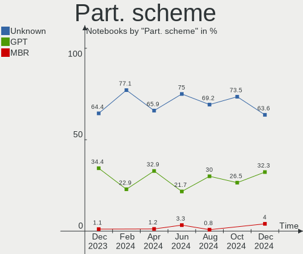
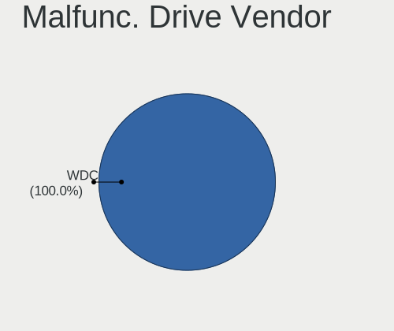
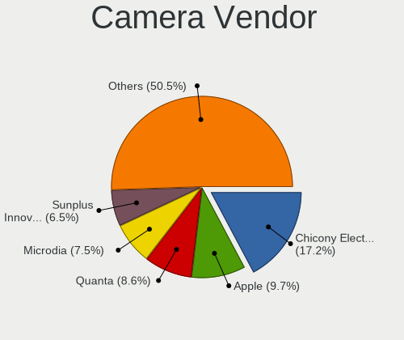
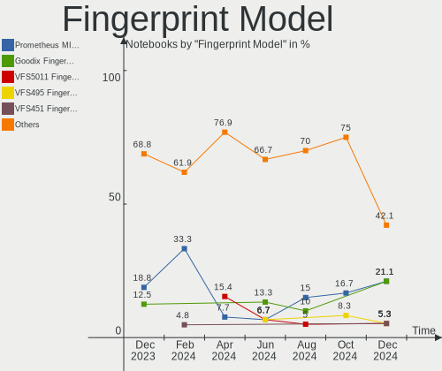

Pop!_OS Hardware Trends (Notebooks)
-----------------------------------

A project to identify most popular hardware characteristics and track their change
over time based on data collected by Pop!_OS users at https://Linux-Hardware.org.

Anyone can contribute to this report by the [hw-probe](https://github.com/linuxhw/hw-probe) tool:

    sudo -E hw-probe -all -upload

Full-feature report is available here: https://linux-hardware.org/?view=trends

Period: Feb, 2022.

Contents
--------

* [ System ](#system)
  - [ OS                       ](#os)
  - [ OS Family                ](#os-family)
  - [ Kernel                   ](#kernel)
  - [ Kernel Family            ](#kernel-family)
  - [ Kernel Major Ver.        ](#kernel-major-ver)
  - [ Arch                     ](#arch)
  - [ DE                       ](#de)
  - [ Display Server           ](#display-server)
  - [ Display Manager          ](#display-manager)
  - [ OS Lang                  ](#os-lang)
  - [ Boot Mode                ](#boot-mode)
  - [ Filesystem               ](#filesystem)
  - [ Part. scheme             ](#part-scheme)
  - [ Dual Boot with Linux/BSD ](#dual-boot-with-linuxbsd)
  - [ Dual Boot (Win)          ](#dual-boot-win)

* [ Board ](#board)
  - [ Vendor                   ](#vendor)
  - [ Model                    ](#model)
  - [ Model Family             ](#model-family)
  - [ MFG Year                 ](#mfg-year)
  - [ Form Factor              ](#form-factor)
  - [ Secure Boot              ](#secure-boot)
  - [ Coreboot                 ](#coreboot)
  - [ RAM Size                 ](#ram-size)
  - [ RAM Used                 ](#ram-used)
  - [ Total Drives             ](#total-drives)
  - [ Has CD-ROM               ](#has-cd-rom)
  - [ Has Ethernet             ](#has-ethernet)
  - [ Has WiFi                 ](#has-wifi)
  - [ Has Bluetooth            ](#has-bluetooth)

* [ Location ](#location)
  - [ Country                  ](#country)
  - [ City                     ](#city)

* [ Drives ](#drives)
  - [ Drive Vendor             ](#drive-vendor)
  - [ Drive Model              ](#drive-model)
  - [ HDD Vendor               ](#hdd-vendor)
  - [ SSD Vendor               ](#ssd-vendor)
  - [ Drive Kind               ](#drive-kind)
  - [ Drive Connector          ](#drive-connector)
  - [ Drive Size               ](#drive-size)
  - [ Space Total              ](#space-total)
  - [ Space Used               ](#space-used)
  - [ Malfunc. Drives          ](#malfunc-drives)
  - [ Malfunc. Drive Vendor    ](#malfunc-drive-vendor)
  - [ Malfunc. HDD Vendor      ](#malfunc-hdd-vendor)
  - [ Malfunc. Drive Kind      ](#malfunc-drive-kind)
  - [ Failed Drives            ](#failed-drives)
  - [ Failed Drive Vendor      ](#failed-drive-vendor)
  - [ Drive Status             ](#drive-status)

* [ Storage controller ](#storage-controller)
  - [ Storage Vendor           ](#storage-vendor)
  - [ Storage Model            ](#storage-model)
  - [ Storage Kind             ](#storage-kind)

* [ Processor ](#processor)
  - [ CPU Vendor               ](#cpu-vendor)
  - [ CPU Model                ](#cpu-model)
  - [ CPU Model Family         ](#cpu-model-family)
  - [ CPU Cores                ](#cpu-cores)
  - [ CPU Sockets              ](#cpu-sockets)
  - [ CPU Threads              ](#cpu-threads)
  - [ CPU Op-Modes             ](#cpu-op-modes)
  - [ CPU Microcode            ](#cpu-microcode)
  - [ CPU Microarch            ](#cpu-microarch)

* [ Graphics ](#graphics)
  - [ GPU Vendor               ](#gpu-vendor)
  - [ GPU Model                ](#gpu-model)
  - [ GPU Combo                ](#gpu-combo)
  - [ GPU Driver               ](#gpu-driver)
  - [ GPU Memory               ](#gpu-memory)

* [ Monitor ](#monitor)
  - [ Monitor Vendor           ](#monitor-vendor)
  - [ Monitor Model            ](#monitor-model)
  - [ Monitor Resolution       ](#monitor-resolution)
  - [ Monitor Diagonal         ](#monitor-diagonal)
  - [ Monitor Width            ](#monitor-width)
  - [ Aspect Ratio             ](#aspect-ratio)
  - [ Monitor Area             ](#monitor-area)
  - [ Pixel Density            ](#pixel-density)
  - [ Multiple Monitors        ](#multiple-monitors)

* [ Network ](#network)
  - [ Net Controller Vendor    ](#net-controller-vendor)
  - [ Net Controller Model     ](#net-controller-model)
  - [ Wireless Vendor          ](#wireless-vendor)
  - [ Wireless Model           ](#wireless-model)
  - [ Ethernet Vendor          ](#ethernet-vendor)
  - [ Ethernet Model           ](#ethernet-model)
  - [ Net Controller Kind      ](#net-controller-kind)
  - [ Used Controller          ](#used-controller)
  - [ NICs                     ](#nics)
  - [ IPv6                     ](#ipv6)

* [ Bluetooth ](#bluetooth)
  - [ Bluetooth Vendor         ](#bluetooth-vendor)
  - [ Bluetooth Model          ](#bluetooth-model)

* [ Sound ](#sound)
  - [ Sound Vendor             ](#sound-vendor)
  - [ Sound Model              ](#sound-model)

* [ Memory ](#memory)
  - [ Memory Vendor            ](#memory-vendor)
  - [ Memory Model             ](#memory-model)
  - [ Memory Kind              ](#memory-kind)
  - [ Memory Form Factor       ](#memory-form-factor)
  - [ Memory Size              ](#memory-size)
  - [ Memory Speed             ](#memory-speed)

* [ Printers & scanners ](#printers--scanners)
  - [ Printer Vendor           ](#printer-vendor)
  - [ Printer Model            ](#printer-model)
  - [ Scanner Vendor           ](#scanner-vendor)
  - [ Scanner Model            ](#scanner-model)

* [ Camera ](#camera)
  - [ Camera Vendor            ](#camera-vendor)
  - [ Camera Model             ](#camera-model)

* [ Security ](#security)
  - [ Fingerprint Vendor       ](#fingerprint-vendor)
  - [ Fingerprint Model        ](#fingerprint-model)
  - [ Chipcard Vendor          ](#chipcard-vendor)
  - [ Chipcard Model           ](#chipcard-model)

* [ Unsupported ](#unsupported)
  - [ Unsupported Devices      ](#unsupported-devices)
  - [ Unsupported Device Types ](#unsupported-device-types)

System
------

OS
--

Installed operating systems

| Name          | Notebooks | Percent |
|---------------|-----------|---------|
| Pop!_OS 21.10 | 138       | 85.19%  |
| Pop!_OS 20.04 | 18        | 11.11%  |
| Pop!_OS 21.04 | 6         | 3.7%    |

OS Family
---------

OS without a version

| Name    | Notebooks | Percent |
|---------|-----------|---------|
| Pop!_OS | 162       | 100%    |

Kernel
------

Version of the Linux kernel

| Version                  | Notebooks | Percent |
|--------------------------|-----------|---------|
| 5.15.15-76051515-generic | 108       | 66.67%  |
| 5.15.23-76051523-generic | 40        | 24.69%  |
| 5.15.11-76051511-generic | 4         | 2.47%   |
| 5.15.5-76051505-generic  | 3         | 1.85%   |
| 5.13.0-7614-generic      | 2         | 1.23%   |
| 5.4.0-7634-generic       | 1         | 0.62%   |
| 5.4.0-7625-generic       | 1         | 0.62%   |
| 5.15.24-xanmod1          | 1         | 0.62%   |
| 5.13.0-7620-generic      | 1         | 0.62%   |
| 5.11.0-7620-generic      | 1         | 0.62%   |

Kernel Family
-------------

Linux kernel without a distro release

| Version | Notebooks | Percent |
|---------|-----------|---------|
| 5.15.15 | 108       | 66.67%  |
| 5.15.23 | 40        | 24.69%  |
| 5.15.11 | 4         | 2.47%   |
| 5.15.5  | 3         | 1.85%   |
| 5.13.0  | 3         | 1.85%   |
| 5.4.0   | 2         | 1.23%   |
| 5.15.24 | 1         | 0.62%   |
| 5.11.0  | 1         | 0.62%   |

Kernel Major Ver.
-----------------

Linux kernel major version

| Version | Notebooks | Percent |
|---------|-----------|---------|
| 5.15    | 156       | 96.3%   |
| 5.13    | 3         | 1.85%   |
| 5.4     | 2         | 1.23%   |
| 5.11    | 1         | 0.62%   |

Arch
----

OS architecture (x86_64, i586, etc.)

| Name   | Notebooks | Percent |
|--------|-----------|---------|
| x86_64 | 162       | 100%    |

DE
--

Desktop Environment

| Name  | Notebooks | Percent |
|-------|-----------|---------|
| GNOME | 159       | 98.15%  |
| KDE5  | 2         | 1.23%   |
| LXQt  | 1         | 0.62%   |

Display Server
--------------

X11 or Wayland

| Name    | Notebooks | Percent |
|---------|-----------|---------|
| X11     | 156       | 96.3%   |
| Wayland | 5         | 3.09%   |
| Tty     | 1         | 0.62%   |

Display Manager
---------------

SDDM, LightDM, etc.

| Name    | Notebooks | Percent |
|---------|-----------|---------|
| Unknown | 139       | 85.8%   |
| GDM     | 22        | 13.58%  |
| GDM3    | 1         | 0.62%   |

OS Lang
-------

Language

| Lang  | Notebooks | Percent |
|-------|-----------|---------|
| en_US | 86        | 53.09%  |
| pt_BR | 20        | 12.35%  |
| en_GB | 8         | 4.94%   |
| en_CA | 8         | 4.94%   |
| pt_PT | 4         | 2.47%   |
| es_ES | 4         | 2.47%   |
| de_DE | 4         | 2.47%   |
| ru_RU | 3         | 1.85%   |
| fi_FI | 3         | 1.85%   |
| C     | 3         | 1.85%   |
| fr_FR | 2         | 1.23%   |
| en_ZA | 2         | 1.23%   |
| en_DK | 2         | 1.23%   |
| en_AU | 2         | 1.23%   |
| ro_RO | 1         | 0.62%   |
| nb_NO | 1         | 0.62%   |
| lt_LT | 1         | 0.62%   |
| jv_ID | 1         | 0.62%   |
| it_IT | 1         | 0.62%   |
| hu_HU | 1         | 0.62%   |
| et_EE | 1         | 0.62%   |
| es_PE | 1         | 0.62%   |
| en_IN | 1         | 0.62%   |
| en_IE | 1         | 0.62%   |
| da_DK | 1         | 0.62%   |

Boot Mode
---------

EFI or BIOS

| Mode | Notebooks | Percent |
|------|-----------|---------|
| BIOS | 138       | 85.19%  |
| EFI  | 24        | 14.81%  |

Filesystem
----------

Type of filesystem

| Type    | Notebooks | Percent |
|---------|-----------|---------|
| Ext4    | 158       | 97.53%  |
| Overlay | 2         | 1.23%   |
| Btrfs   | 2         | 1.23%   |

Part. scheme
------------

Scheme of partitioning

| Type    | Notebooks | Percent |
|---------|-----------|---------|
| Unknown | 139       | 85.8%   |
| GPT     | 22        | 13.58%  |
| MBR     | 1         | 0.62%   |

Dual Boot with Linux/BSD
------------------------

Hosting more than one Linux/BSD

| Dual boot | Notebooks | Percent |
|-----------|-----------|---------|
| No        | 159       | 98.15%  |
| Yes       | 3         | 1.85%   |

Dual Boot (Win)
---------------

Hosting Linux and Windows

| Dual boot | Notebooks | Percent |
|-----------|-----------|---------|
| No        | 154       | 95.06%  |
| Yes       | 8         | 4.94%   |

Board
-----

Vendor
------

Motherboard manufacturer

| Name                  | Notebooks | Percent |
|-----------------------|-----------|---------|
| Lenovo                | 29        | 17.9%   |
| Dell                  | 28        | 17.28%  |
| Hewlett-Packard       | 22        | 13.58%  |
| ASUSTek Computer      | 22        | 13.58%  |
| Acer                  | 13        | 8.02%   |
| Apple                 | 12        | 7.41%   |
| System76              | 9         | 5.56%   |
| Toshiba               | 4         | 2.47%   |
| Samsung Electronics   | 4         | 2.47%   |
| MSI                   | 3         | 1.85%   |
| Positivo Bahia - VAIO | 2         | 1.23%   |
| Notebook              | 2         | 1.23%   |
| LG Electronics        | 2         | 1.23%   |
| Wortmann AG           | 1         | 0.62%   |
| Sony                  | 1         | 0.62%   |
| SLIMBOOK              | 1         | 0.62%   |
| Panasonic             | 1         | 0.62%   |
| Medion                | 1         | 0.62%   |
| Jumper                | 1         | 0.62%   |
| HUAWEI                | 1         | 0.62%   |
| Gigabyte Technology   | 1         | 0.62%   |
| Fujitsu               | 1         | 0.62%   |
| Casper                | 1         | 0.62%   |

Model
-----

Motherboard model

| Name                                        | Notebooks | Percent |
|---------------------------------------------|-----------|---------|
| System76 Oryx Pro                           | 3         | 1.85%   |
| System76 Galago Pro                         | 3         | 1.85%   |
| Dell XPS 15 7590                            | 3         | 1.85%   |
| System76 Pangolin                           | 2         | 1.23%   |
| Positivo Bahia - VAIO VJFE42F11X-XXXXXX     | 2         | 1.23%   |
| Lenovo IdeaPad 330S-14IKB 81JM              | 2         | 1.23%   |
| Apple MacBookAir6,2                         | 2         | 1.23%   |
| Wortmann AG 1220663_1470189                 | 1         | 0.62%   |
| Toshiba Satellite S75-A                     | 1         | 0.62%   |
| Toshiba Satellite L55t-B                    | 1         | 0.62%   |
| Toshiba Satellite C55-C                     | 1         | 0.62%   |
| Toshiba Satellite A200                      | 1         | 0.62%   |
| System76 Lemur Pro                          | 1         | 0.62%   |
| Sony VPCEH38FG                              | 1         | 0.62%   |
| SLIMBOOK TITAN                              | 1         | 0.62%   |
| Samsung RF511/RF411/RF711                   | 1         | 0.62%   |
| Samsung RC420/RC520/RC720                   | 1         | 0.62%   |
| Samsung QX310/QX410/QX510/SF310/SF410/SF510 | 1         | 0.62%   |
| Samsung 270E5J/2570EJ                       | 1         | 0.62%   |
| Panasonic CF-C2ACAZXLM                      | 1         | 0.62%   |
| Notebook W35xSTQ_370ST                      | 1         | 0.62%   |
| Notebook PCx0Dx                             | 1         | 0.62%   |
| MSI GT60 2OC/2OD                            | 1         | 0.62%   |
| MSI GL63 8SE                                | 1         | 0.62%   |
| MSI GF75 Thin 10UEK                         | 1         | 0.62%   |
| Medion Erazer P7647 MD60803                 | 1         | 0.62%   |
| LG S425-G.BC31P1                            | 1         | 0.62%   |
| LG R410-L.D211P1                            | 1         | 0.62%   |
| Lenovo Yoga710-15ISK 80U0                   | 1         | 0.62%   |
| Lenovo ThinkPad X220 429136G                | 1         | 0.62%   |
| Lenovo ThinkPad X13 Gen 2i 20WLS4HT00       | 1         | 0.62%   |
| Lenovo ThinkPad X1 Extreme 2nd 20QVCTO1WW   | 1         | 0.62%   |
| Lenovo ThinkPad X1 Carbon 7th 20QESCRV00    | 1         | 0.62%   |
| Lenovo ThinkPad X1 Carbon 7th 20QD001TUS    | 1         | 0.62%   |
| Lenovo ThinkPad X1 Carbon 5th 20HQS04R00    | 1         | 0.62%   |
| Lenovo ThinkPad T460s 20FAS21F00            | 1         | 0.62%   |
| Lenovo ThinkPad T450s 20BWS19E02            | 1         | 0.62%   |
| Lenovo ThinkPad T450 20BUS0GT00             | 1         | 0.62%   |
| Lenovo ThinkPad T440 20B7003LBR             | 1         | 0.62%   |
| Lenovo ThinkPad T430 2349U15                | 1         | 0.62%   |
| Lenovo ThinkPad T420 4180LVP                | 1         | 0.62%   |
| Lenovo ThinkPad P14s Gen 2a 21A00004MX      | 1         | 0.62%   |
| Lenovo ThinkPad L380 20M5S08R00             | 1         | 0.62%   |
| Lenovo ThinkPad L15 Gen 1 20U3000BZA        | 1         | 0.62%   |
| Lenovo ThinkPad E14 20RA001LMX              | 1         | 0.62%   |
| Lenovo ThinkPad A485 20MU000NUS             | 1         | 0.62%   |
| Lenovo ThinkBook 15 G2 ITL 20VE             | 1         | 0.62%   |
| Lenovo IdeaPad Yoga 13 20226                | 1         | 0.62%   |
| Lenovo IdeaPad Y700-15ACZ 80NY              | 1         | 0.62%   |
| Lenovo IdeaPad S145-15IWL 81S9              | 1         | 0.62%   |
| Lenovo IdeaPad G485 QAWGE                   | 1         | 0.62%   |
| Lenovo IdeaPad 5 15ALC05 82LN               | 1         | 0.62%   |
| Lenovo IdeaPad 3 17IIL05 81WF               | 1         | 0.62%   |
| Lenovo G510 20238                           | 1         | 0.62%   |
| Lenovo G50-80 80E5                          | 1         | 0.62%   |
| Jumper EZbook                               | 1         | 0.62%   |
| HUAWEI HVY-WXX9                             | 1         | 0.62%   |
| HP ZBook 15 G6                              | 1         | 0.62%   |
| HP ProBook 6475b                            | 1         | 0.62%   |
| HP ProBook 640 G1                           | 1         | 0.62%   |

Model Family
------------

Motherboard model prefix

| Name                                    | Notebooks | Percent |
|-----------------------------------------|-----------|---------|
| Lenovo ThinkPad                         | 17        | 10.49%  |
| Acer Aspire                             | 10        | 6.17%   |
| Dell Inspiron                           | 9         | 5.56%   |
| Lenovo IdeaPad                          | 8         | 4.94%   |
| HP Laptop                               | 6         | 3.7%    |
| Dell XPS                                | 6         | 3.7%    |
| Dell Latitude                           | 5         | 3.09%   |
| Toshiba Satellite                       | 4         | 2.47%   |
| HP ProBook                              | 4         | 2.47%   |
| Dell Precision                          | 4         | 2.47%   |
| System76 Oryx                           | 3         | 1.85%   |
| System76 Galago                         | 3         | 1.85%   |
| HP Pavilion                             | 3         | 1.85%   |
| HP EliteBook                            | 3         | 1.85%   |
| ASUS ROG                                | 3         | 1.85%   |
| System76 Pangolin                       | 2         | 1.23%   |
| Positivo Bahia - VAIO VJFE42F11X-XXXXXX | 2         | 1.23%   |
| HP 250                                  | 2         | 1.23%   |
| Dell G5                                 | 2         | 1.23%   |
| ASUS VivoBook                           | 2         | 1.23%   |
| ASUS ASUS                               | 2         | 1.23%   |
| Apple MacBookAir6                       | 2         | 1.23%   |
| Acer Nitro                              | 2         | 1.23%   |
| Wortmann AG 1220663                     | 1         | 0.62%   |
| System76 Lemur                          | 1         | 0.62%   |
| Sony VPCEH38FG                          | 1         | 0.62%   |
| SLIMBOOK TITAN                          | 1         | 0.62%   |
| Samsung RF511                           | 1         | 0.62%   |
| Samsung RC420                           | 1         | 0.62%   |
| Samsung QX310                           | 1         | 0.62%   |
| Samsung 270E5J                          | 1         | 0.62%   |
| Panasonic CF-C2ACAZXLM                  | 1         | 0.62%   |
| Notebook W35xSTQ                        | 1         | 0.62%   |
| Notebook PCx0Dx                         | 1         | 0.62%   |
| MSI GT60                                | 1         | 0.62%   |
| MSI GL63                                | 1         | 0.62%   |
| MSI GF75                                | 1         | 0.62%   |
| Medion Erazer                           | 1         | 0.62%   |
| LG S425-G.BC31P1                        | 1         | 0.62%   |
| LG R410-L.D211P1                        | 1         | 0.62%   |
| Lenovo Yoga710-15ISK                    | 1         | 0.62%   |
| Lenovo ThinkBook                        | 1         | 0.62%   |
| Lenovo G510                             | 1         | 0.62%   |
| Lenovo G50-80                           | 1         | 0.62%   |
| Jumper EZbook                           | 1         | 0.62%   |
| HUAWEI HVY-WXX9                         | 1         | 0.62%   |
| HP ZBook                                | 1         | 0.62%   |
| HP ENVY                                 | 1         | 0.62%   |
| HP DevX                                 | 1         | 0.62%   |
| HP 15                                   | 1         | 0.62%   |
| Gigabyte P65                            | 1         | 0.62%   |
| Fujitsu LIFEBOOK                        | 1         | 0.62%   |
| Dell Vostro                             | 1         | 0.62%   |
| Dell G3                                 | 1         | 0.62%   |
| Casper EXCALIBUR                        | 1         | 0.62%   |
| ASUS Z450UAK                            | 1         | 0.62%   |
| ASUS X751LD                             | 1         | 0.62%   |
| ASUS X580VD                             | 1         | 0.62%   |
| ASUS X55A                               | 1         | 0.62%   |
| ASUS X556UQK                            | 1         | 0.62%   |

MFG Year
--------

Motherboard manufacture year

| Year | Notebooks | Percent |
|------|-----------|---------|
| 2021 | 21        | 12.96%  |
| 2019 | 21        | 12.96%  |
| 2020 | 18        | 11.11%  |
| 2013 | 17        | 10.49%  |
| 2018 | 14        | 8.64%   |
| 2012 | 13        | 8.02%   |
| 2011 | 11        | 6.79%   |
| 2017 | 10        | 6.17%   |
| 2014 | 9         | 5.56%   |
| 2016 | 8         | 4.94%   |
| 2015 | 7         | 4.32%   |
| 2010 | 7         | 4.32%   |
| 2009 | 2         | 1.23%   |
| 2008 | 2         | 1.23%   |
| 2022 | 1         | 0.62%   |
| 2007 | 1         | 0.62%   |

Form Factor
-----------

Physical design of the computer

| Name     | Notebooks | Percent |
|----------|-----------|---------|
| Notebook | 162       | 100%    |

Secure Boot
-----------

Enabled or disabled

| State    | Notebooks | Percent |
|----------|-----------|---------|
| Disabled | 162       | 100%    |

Coreboot
--------

Have coreboot on board

| Used | Notebooks | Percent |
|------|-----------|---------|
| No   | 156       | 96.3%   |
| Yes  | 6         | 3.7%    |

RAM Size
--------

Total RAM memory

| Size in GB  | Notebooks | Percent |
|-------------|-----------|---------|
| 4.01-8.0    | 54        | 33.33%  |
| 16.01-24.0  | 32        | 19.75%  |
| 8.01-16.0   | 31        | 19.14%  |
| 3.01-4.0    | 19        | 11.73%  |
| 32.01-64.0  | 17        | 10.49%  |
| 24.01-32.0  | 3         | 1.85%   |
| 2.01-3.0    | 3         | 1.85%   |
| 64.01-256.0 | 3         | 1.85%   |

RAM Used
--------

Used RAM memory

| Used GB    | Notebooks | Percent |
|------------|-----------|---------|
| 2.01-3.0   | 56        | 34.57%  |
| 1.01-2.0   | 56        | 34.57%  |
| 4.01-8.0   | 19        | 11.73%  |
| 3.01-4.0   | 19        | 11.73%  |
| 8.01-16.0  | 11        | 6.79%   |
| 24.01-32.0 | 1         | 0.62%   |

Total Drives
------------

Number of drives on board

| Drives | Notebooks | Percent |
|--------|-----------|---------|
| 1      | 115       | 70.99%  |
| 2      | 40        | 24.69%  |
| 3      | 5         | 3.09%   |
| 5      | 1         | 0.62%   |
| 0      | 1         | 0.62%   |

Has CD-ROM
----------

Has CD-ROM on board

| Presented | Notebooks | Percent |
|-----------|-----------|---------|
| No        | 112       | 69.14%  |
| Yes       | 50        | 30.86%  |

Has Ethernet
------------

Has Ethernet on board

| Presented | Notebooks | Percent |
|-----------|-----------|---------|
| Yes       | 135       | 83.33%  |
| No        | 27        | 16.67%  |

Has WiFi
--------

Has WiFi module

| Presented | Notebooks | Percent |
|-----------|-----------|---------|
| Yes       | 161       | 99.38%  |
| No        | 1         | 0.62%   |

Has Bluetooth
-------------

Has Bluetooth module

| Presented | Notebooks | Percent |
|-----------|-----------|---------|
| Yes       | 139       | 85.8%   |
| No        | 23        | 14.2%   |

Location
--------

Country
-------

Geographic location (country)

| Country                | Notebooks | Percent |
|------------------------|-----------|---------|
| USA                    | 46        | 28.4%   |
| Brazil                 | 23        | 14.2%   |
| Germany                | 11        | 6.79%   |
| Canada                 | 9         | 5.56%   |
| UK                     | 6         | 3.7%    |
| Finland                | 5         | 3.09%   |
| Turkey                 | 4         | 2.47%   |
| Spain                  | 4         | 2.47%   |
| India                  | 4         | 2.47%   |
| France                 | 4         | 2.47%   |
| Sweden                 | 3         | 1.85%   |
| South Africa           | 3         | 1.85%   |
| Russia                 | 3         | 1.85%   |
| Romania                | 3         | 1.85%   |
| Portugal               | 3         | 1.85%   |
| Netherlands            | 3         | 1.85%   |
| Denmark                | 3         | 1.85%   |
| Morocco                | 2         | 1.23%   |
| Australia              | 2         | 1.23%   |
| Taiwan                 | 1         | 0.62%   |
| South Korea            | 1         | 0.62%   |
| Slovakia               | 1         | 0.62%   |
| Serbia                 | 1         | 0.62%   |
| Poland                 | 1         | 0.62%   |
| Peru                   | 1         | 0.62%   |
| Norway                 | 1         | 0.62%   |
| New Zealand            | 1         | 0.62%   |
| Mexico                 | 1         | 0.62%   |
| Lithuania              | 1         | 0.62%   |
| Kazakhstan             | 1         | 0.62%   |
| Italy                  | 1         | 0.62%   |
| Ireland                | 1         | 0.62%   |
| Indonesia              | 1         | 0.62%   |
| Iceland                | 1         | 0.62%   |
| Hungary                | 1         | 0.62%   |
| Guatemala              | 1         | 0.62%   |
| Greece                 | 1         | 0.62%   |
| Estonia                | 1         | 0.62%   |
| Colombia               | 1         | 0.62%   |
| Bosnia and Herzegovina | 1         | 0.62%   |

City
----

Geographic location (city)

| City              | Notebooks | Percent |
|-------------------|-----------|---------|
| São Paulo      | 5         | 3.09%   |
| Urjala            | 2         | 1.23%   |
| Rio de Janeiro    | 2         | 1.23%   |
| New York          | 2         | 1.23%   |
| Lexington         | 2         | 1.23%   |
| Johannesburg      | 2         | 1.23%   |
| Helsinki          | 2         | 1.23%   |
| Birmingham        | 2         | 1.23%   |
| Bensheim          | 2         | 1.23%   |
| Belo Horizonte    | 2         | 1.23%   |
| Austin            | 2         | 1.23%   |
| Youssoufia        | 1         | 0.62%   |
| Wood Dale         | 1         | 0.62%   |
| Welland           | 1         | 0.62%   |
| Warsaw            | 1         | 0.62%   |
| Volta Redonda     | 1         | 0.62%   |
| Vierpolders       | 1         | 0.62%   |
| Vác            | 1         | 0.62%   |
| Ust-Kamenogorsk   | 1         | 0.62%   |
| Uberlândia     | 1         | 0.62%   |
| Toronto           | 1         | 0.62%   |
| Thornville        | 1         | 0.62%   |
| Telford           | 1         | 0.62%   |
| Taubate           | 1         | 0.62%   |
| Tallinn           | 1         | 0.62%   |
| Taichung          | 1         | 0.62%   |
| Sydney            | 1         | 0.62%   |
| Sunderland        | 1         | 0.62%   |
| Stockholm         | 1         | 0.62%   |
| Stittsville       | 1         | 0.62%   |
| St Petersburg     | 1         | 0.62%   |
| Solan             | 1         | 0.62%   |
| Slobozia          | 1         | 0.62%   |
| Sivas             | 1         | 0.62%   |
| Sindelfingen      | 1         | 0.62%   |
| Sebring           | 1         | 0.62%   |
| Sarajevo          | 1         | 0.62%   |
| São Paulo        | 1         | 0.62%   |
| Ryazan            | 1         | 0.62%   |
| Roseville         | 1         | 0.62%   |
| Roanoke           | 1         | 0.62%   |
| Rio Branco do Sul | 1         | 0.62%   |
| Reykjavik         | 1         | 0.62%   |
| Recologne         | 1         | 0.62%   |
| Raleigh           | 1         | 0.62%   |
| Raisio            | 1         | 0.62%   |
| Pune              | 1         | 0.62%   |
| Portogruaro       | 1         | 0.62%   |
| Ponferrada        | 1         | 0.62%   |
| Ploudalmezeau     | 1         | 0.62%   |
| Plainfield        | 1         | 0.62%   |
| Petapa            | 1         | 0.62%   |
| Perpignan         | 1         | 0.62%   |
| Perkasie          | 1         | 0.62%   |
| Penarth           | 1         | 0.62%   |
| Panevezys         | 1         | 0.62%   |
| Ormond Beach      | 1         | 0.62%   |
| Ordu              | 1         | 0.62%   |
| Nuevo Laredo      | 1         | 0.62%   |
| Nova Friburgo     | 1         | 0.62%   |

Drives
------

Drive Vendor
------------

Hard drive vendors

| Vendor                         | Notebooks | Drives | Percent |
|--------------------------------|-----------|--------|---------|
| Samsung Electronics            | 43        | 47     | 20.38%  |
| WDC                            | 21        | 21     | 9.95%   |
| Seagate                        | 18        | 19     | 8.53%   |
| SK Hynix                       | 15        | 16     | 7.11%   |
| SanDisk                        | 15        | 15     | 7.11%   |
| Kingston                       | 13        | 13     | 6.16%   |
| Toshiba                        | 12        | 12     | 5.69%   |
| Crucial                        | 10        | 11     | 4.74%   |
| Unknown                        | 7         | 7      | 3.32%   |
| Apple                          | 7         | 7      | 3.32%   |
| Intel                          | 5         | 5      | 2.37%   |
| Phison                         | 4         | 4      | 1.9%    |
| KIOXIA                         | 4         | 4      | 1.9%    |
| Solid State Storage Technology | 3         | 3      | 1.42%   |
| Micron Technology              | 3         | 3      | 1.42%   |
| Hitachi                        | 3         | 3      | 1.42%   |
| HGST                           | 3         | 3      | 1.42%   |
| A-DATA Technology              | 3         | 3      | 1.42%   |
| Mushkin                        | 2         | 2      | 0.95%   |
| Micron/Crucial Technology      | 2         | 2      | 0.95%   |
| LITEON                         | 2         | 2      | 0.95%   |
| XPG                            | 1         | 1      | 0.47%   |
| Transcend                      | 1         | 1      | 0.47%   |
| Super Talent                   | 1         | 1      | 0.47%   |
| Patriot                        | 1         | 1      | 0.47%   |
| MAXTOR                         | 1         | 1      | 0.47%   |
| MAXIO Technology (Hangzhou)    | 1         | 1      | 0.47%   |
| LITEONIT                       | 1         | 1      | 0.47%   |
| Lexar                          | 1         | 1      | 0.47%   |
| Lenovo                         | 1         | 2      | 0.47%   |
| KINGBANK                       | 1         | 1      | 0.47%   |
| Intenso                        | 1         | 1      | 0.47%   |
| Hewlett-Packard                | 1         | 1      | 0.47%   |
| Gigabyte Technology            | 1         | 1      | 0.47%   |
| DOGFISH                        | 1         | 1      | 0.47%   |
| CS900                          | 1         | 1      | 0.47%   |
| China                          | 1         | 1      | 0.47%   |

Drive Model
-----------

Hard drive models

| Model                                    | Notebooks | Percent |
|------------------------------------------|-----------|---------|
| SK Hynix NVMe SSD Drive 512GB            | 7         | 3.23%   |
| SK Hynix NVMe SSD Drive 1024GB           | 4         | 1.84%   |
| Seagate ST1000LM035-1RK172 1TB           | 4         | 1.84%   |
| Samsung SM963 2.5" NVMe PCIe SSD 256GB   | 4         | 1.84%   |
| Samsung NVMe SSD Drive 1TB               | 4         | 1.84%   |
| Unknown MMC Card  128GB                  | 3         | 1.38%   |
| Toshiba MQ04ABF100 1TB                   | 3         | 1.38%   |
| Toshiba MQ01ABD100 1TB                   | 3         | 1.38%   |
| Sandisk NVMe SSD Drive 500GB             | 3         | 1.38%   |
| Samsung SSD 970 EVO Plus 1TB             | 3         | 1.38%   |
| Samsung SSD 860 EVO 500GB                | 3         | 1.38%   |
| Samsung Portable SSD T5 1TB              | 3         | 1.38%   |
| Samsung NVMe SSD Drive 500GB             | 3         | 1.38%   |
| Kingston SV300S37A240G 240GB SSD         | 3         | 1.38%   |
| Kingston SA400S37240G 240GB SSD          | 3         | 1.38%   |
| HGST HTS541010A9E680 1TB                 | 3         | 1.38%   |
| Apple SSD SD0128F 121GB                  | 3         | 1.38%   |
| WDC WDS120G2G0A-00JH30 120GB SSD         | 2         | 0.92%   |
| WDC WD10SPZX-21Z10T0 1TB                 | 2         | 0.92%   |
| Solid State Storage NVMe SSD Drive 256GB | 2         | 0.92%   |
| Seagate ST1000LM024 HN-M101MBB 1TB       | 2         | 0.92%   |
| SanDisk SD9SN8W-128G-1006 128GB SSD      | 2         | 0.92%   |
| Sandisk NVMe SSD Drive 256GB             | 2         | 0.92%   |
| Samsung SSD 860 QVO 1TB                  | 2         | 0.92%   |
| Phison NVMe SSD Drive 256GB              | 2         | 0.92%   |
| KIOXIA KBG40ZNS512G NVMe 512GB           | 2         | 0.92%   |
| Kingston SA400S37120G 120GB SSD          | 2         | 0.92%   |
| Intel NVMe SSD Drive 512GB               | 2         | 0.92%   |
| Crucial CT500MX500SSD1 500GB             | 2         | 0.92%   |
| Crucial CT1000MX500SSD1 1TB              | 2         | 0.92%   |
| XPG NVMe SSD Drive 512GB                 | 1         | 0.46%   |
| WDC WDS500G2B0B-00YS70 500GB SSD         | 1         | 0.46%   |
| WDC WDS500G2B0A-00SM50 500GB SSD         | 1         | 0.46%   |
| WDC WDS250G2B0A-00SM50 250GB SSD         | 1         | 0.46%   |
| WDC WDS240G2G0B-00EPW0 240GB SSD         | 1         | 0.46%   |
| WDC WDS100T2G0A-00JH30 1TB SSD           | 1         | 0.46%   |
| WDC WD5000LPVX-22V0TT0 500GB             | 1         | 0.46%   |
| WDC WD5000LPVX-16V0TT3 500GB             | 1         | 0.46%   |
| WDC WD5000LPVT-75G33T0 500GB             | 1         | 0.46%   |
| WDC WD5000BEVT-60A0RT0 500GB             | 1         | 0.46%   |
| WDC WD2500BEVT-22A23T0 250GB             | 1         | 0.46%   |
| WDC WD10SPZX-24Z10 1TB                   | 1         | 0.46%   |
| WDC WD10SPZX-22Z10T0 1TB                 | 1         | 0.46%   |
| WDC WD10SPCX-24HWST1 1TB                 | 1         | 0.46%   |
| WDC WD10JPVX-22JC3T0 1TB                 | 1         | 0.46%   |
| WDC WD10JPVT-75A1YT0 1TB                 | 1         | 0.46%   |
| WDC PC SN730 SDBQNTY-512G-1001 512GB     | 1         | 0.46%   |
| WDC PC SN720 SDAPNTW-512G-1006 512GB     | 1         | 0.46%   |
| Unknown SD/MMC/MS PRO 64GB               | 1         | 0.46%   |
| Unknown MMC Card  64GB                   | 1         | 0.46%   |
| Unknown MMC Card  4GB                    | 1         | 0.46%   |
| Unknown MMC Card  16GB                   | 1         | 0.46%   |
| Transcend TS128GSSD370 128GB             | 1         | 0.46%   |
| Toshiba THNSNK128GVN8 M.2 2280 128GB SSD | 1         | 0.46%   |
| Toshiba THNSNF128GMCS 128GB SSD          | 1         | 0.46%   |
| Toshiba NVMe SSD Drive 512GB             | 1         | 0.46%   |
| Toshiba MQ01ABF032 320GB                 | 1         | 0.46%   |
| Toshiba KXG50ZNV1T02 NVMe 1024GB         | 1         | 0.46%   |
| Toshiba KBG30ZMS128G 128GB NVMe SSD      | 1         | 0.46%   |
| Super Talent FTM56N325H 256GB            | 1         | 0.46%   |

HDD Vendor
----------

Hard disk drive vendors

| Vendor              | Notebooks | Drives | Percent |
|---------------------|-----------|--------|---------|
| Seagate             | 17        | 17     | 38.64%  |
| WDC                 | 12        | 12     | 27.27%  |
| Toshiba             | 7         | 7      | 15.91%  |
| Hitachi             | 3         | 3      | 6.82%   |
| HGST                | 3         | 3      | 6.82%   |
| Unknown             | 1         | 1      | 2.27%   |
| Samsung Electronics | 1         | 1      | 2.27%   |

SSD Vendor
----------

Solid state drive vendors

| Vendor              | Notebooks | Drives | Percent |
|---------------------|-----------|--------|---------|
| Samsung Electronics | 23        | 24     | 24.47%  |
| Kingston            | 12        | 12     | 12.77%  |
| Crucial             | 9         | 10     | 9.57%   |
| WDC                 | 7         | 7      | 7.45%   |
| SanDisk             | 7         | 7      | 7.45%   |
| Apple               | 6         | 6      | 6.38%   |
| SK Hynix            | 3         | 3      | 3.19%   |
| A-DATA Technology   | 3         | 3      | 3.19%   |
| Toshiba             | 2         | 2      | 2.13%   |
| Mushkin             | 2         | 2      | 2.13%   |
| Micron Technology   | 2         | 2      | 2.13%   |
| LITEON              | 2         | 2      | 2.13%   |
| Intel               | 2         | 2      | 2.13%   |
| Transcend           | 1         | 1      | 1.06%   |
| Super Talent        | 1         | 1      | 1.06%   |
| Seagate             | 1         | 1      | 1.06%   |
| Patriot             | 1         | 1      | 1.06%   |
| MAXTOR              | 1         | 1      | 1.06%   |
| LITEONIT            | 1         | 1      | 1.06%   |
| Lexar               | 1         | 1      | 1.06%   |
| KINGBANK            | 1         | 1      | 1.06%   |
| Intenso             | 1         | 1      | 1.06%   |
| Hewlett-Packard     | 1         | 1      | 1.06%   |
| Gigabyte Technology | 1         | 1      | 1.06%   |
| DOGFISH             | 1         | 1      | 1.06%   |
| CS900               | 1         | 1      | 1.06%   |
| China               | 1         | 1      | 1.06%   |

Drive Kind
----------

HDD or SSD

| Kind | Notebooks | Drives | Percent |
|------|-----------|--------|---------|
| SSD  | 88        | 96     | 44.22%  |
| NVMe | 63        | 73     | 31.66%  |
| HDD  | 42        | 44     | 21.11%  |
| MMC  | 6         | 6      | 3.02%   |

Drive Connector
---------------

SATA, SAS, NVMe, etc.

| Type | Notebooks | Drives | Percent |
|------|-----------|--------|---------|
| SATA | 107       | 131    | 58.47%  |
| NVMe | 63        | 73     | 34.43%  |
| SAS  | 7         | 9      | 3.83%   |
| MMC  | 6         | 6      | 3.28%   |

Drive Size
----------

Size of hard drive

| Size in TB | Notebooks | Drives | Percent |
|------------|-----------|--------|---------|
| 0.01-0.5   | 83        | 90     | 64.34%  |
| 0.51-1.0   | 41        | 45     | 31.78%  |
| 1.01-2.0   | 4         | 4      | 3.1%    |
| 4.01-10.0  | 1         | 1      | 0.78%   |

Space Total
-----------

Amount of disk space available on the file system

| Size in GB     | Notebooks | Percent |
|----------------|-----------|---------|
| 101-250        | 69        | 42.59%  |
| 251-500        | 38        | 23.46%  |
| 501-1000       | 26        | 16.05%  |
| 1001-2000      | 13        | 8.02%   |
| 51-100         | 7         | 4.32%   |
| 2001-3000      | 3         | 1.85%   |
| More than 3000 | 2         | 1.23%   |
| 21-50          | 2         | 1.23%   |
| 1-20           | 2         | 1.23%   |

Space Used
----------

Amount of used disk space

| Used GB   | Notebooks | Percent |
|-----------|-----------|---------|
| 1-20      | 71        | 43.83%  |
| 21-50     | 38        | 23.46%  |
| 51-100    | 21        | 12.96%  |
| 101-250   | 13        | 8.02%   |
| 251-500   | 10        | 6.17%   |
| 501-1000  | 5         | 3.09%   |
| 1001-2000 | 3         | 1.85%   |
| 2001-3000 | 1         | 0.62%   |

Malfunc. Drives
---------------

Drive models with a malfunction

| Model                                    | Notebooks | Drives | Percent |
|------------------------------------------|-----------|--------|---------|
| Toshiba THNSNK128GVN8 M.2 2280 128GB SSD | 1         | 1      | 100%    |

Malfunc. Drive Vendor
---------------------

Vendors of faulty drives

| Vendor  | Notebooks | Drives | Percent |
|---------|-----------|--------|---------|
| Toshiba | 1         | 1      | 100%    |

Malfunc. HDD Vendor
-------------------

Vendors of faulty HDD drives

Zero info for selected period =(

Malfunc. Drive Kind
-------------------

Kinds of faulty drives

| Kind | Notebooks | Drives | Percent |
|------|-----------|--------|---------|
| SSD  | 1         | 1      | 100%    |

Failed Drives
-------------

Failed drive models

Zero info for selected period =(

Failed Drive Vendor
-------------------

Failed drive vendors

Zero info for selected period =(

Drive Status
------------

Number of failed and malfunc. drives

| Status   | Notebooks | Drives | Percent |
|----------|-----------|--------|---------|
| Detected | 141       | 187    | 84.43%  |
| Works    | 25        | 31     | 14.97%  |
| Malfunc  | 1         | 1      | 0.6%    |

Storage controller
------------------

Storage Vendor
--------------

Storage controller vendors

| Vendor                         | Notebooks | Percent |
|--------------------------------|-----------|---------|
| Intel                          | 114       | 56.16%  |
| Samsung Electronics            | 22        | 10.84%  |
| AMD                            | 16        | 7.88%   |
| SK Hynix                       | 12        | 5.91%   |
| Sandisk                        | 10        | 4.93%   |
| Phison Electronics             | 4         | 1.97%   |
| KIOXIA                         | 4         | 1.97%   |
| Toshiba America Info Systems   | 3         | 1.48%   |
| Solid State Storage Technology | 3         | 1.48%   |
| Nvidia                         | 3         | 1.48%   |
| Micron/Crucial Technology      | 3         | 1.48%   |
| Marvell Technology Group       | 3         | 1.48%   |
| Seagate Technology             | 1         | 0.49%   |
| Micron Technology              | 1         | 0.49%   |
| MAXIO Technology (Hangzhou)    | 1         | 0.49%   |
| Lenovo                         | 1         | 0.49%   |
| Kingston Technology Company    | 1         | 0.49%   |
| Apple                          | 1         | 0.49%   |

Storage Model
-------------

Storage controller models

| Model                                                                            | Notebooks | Percent |
|----------------------------------------------------------------------------------|-----------|---------|
| AMD FCH SATA Controller [AHCI mode]                                              | 16        | 7.69%   |
| Intel Sunrise Point-LP SATA Controller [AHCI mode]                               | 15        | 7.21%   |
| Samsung NVMe SSD Controller SM981/PM981/PM983                                    | 13        | 6.25%   |
| Intel 7 Series Chipset Family 6-port SATA Controller [AHCI mode]                 | 13        | 6.25%   |
| Intel 6 Series/C200 Series Chipset Family 6 port Mobile SATA AHCI Controller     | 10        | 4.81%   |
| Intel 8 Series SATA Controller 1 [AHCI mode]                                     | 9         | 4.33%   |
| SK Hynix Gold P31 SSD                                                            | 8         | 3.85%   |
| Intel Comet Lake SATA AHCI Controller                                            | 8         | 3.85%   |
| Intel Cannon Lake Mobile PCH SATA AHCI Controller                                | 8         | 3.85%   |
| Intel 82801 Mobile SATA Controller [RAID mode]                                   | 7         | 3.37%   |
| Intel 8 Series/C220 Series Chipset Family 6-port SATA Controller 1 [AHCI mode]   | 7         | 3.37%   |
| Intel Wildcat Point-LP SATA Controller [AHCI Mode]                               | 5         | 2.4%    |
| Intel 5 Series/3400 Series Chipset 4 port SATA AHCI Controller                   | 5         | 2.4%    |
| Intel 400 Series Chipset Family SATA AHCI Controller                             | 5         | 2.4%    |
| Samsung NVMe SSD Controller 980                                                  | 4         | 1.92%   |
| KIOXIA Non-Volatile memory controller                                            | 4         | 1.92%   |
| Intel HM170/QM170 Chipset SATA Controller [AHCI Mode]                            | 4         | 1.92%   |
| Solid State Storage Non-Volatile memory controller                               | 3         | 1.44%   |
| Sandisk WD Black SN750 / PC SN730 NVMe SSD                                       | 3         | 1.44%   |
| Sandisk Non-Volatile memory controller                                           | 3         | 1.44%   |
| Marvell Group 88SS9183 PCIe SSD Controller                                       | 3         | 1.44%   |
| Intel Volume Management Device NVMe RAID Controller                              | 3         | 1.44%   |
| Intel 82801IBM/IEM (ICH9M/ICH9M-E) 4 port SATA Controller [AHCI mode]            | 3         | 1.44%   |
| Toshiba America Info Systems Toshiba America Info Non-Volatile memory controller | 2         | 0.96%   |
| SK Hynix Non-Volatile memory controller                                          | 2         | 0.96%   |
| Sandisk WD Blue SN550 NVMe SSD                                                   | 2         | 0.96%   |
| Sandisk WD Black 2018/SN750 / PC SN720 NVMe SSD                                  | 2         | 0.96%   |
| Samsung NVMe SSD Controller SM961/PM961/SM963                                    | 2         | 0.96%   |
| Samsung NVMe SSD Controller PM9A1/PM9A3/980PRO                                   | 2         | 0.96%   |
| Nvidia MCP79 AHCI Controller                                                     | 2         | 0.96%   |
| Intel Non-Volatile memory controller                                             | 2         | 0.96%   |
| Intel Ice Lake-LP SATA Controller [AHCI mode]                                    | 2         | 0.96%   |
| Intel Cannon Point-LP SATA Controller [AHCI Mode]                                | 2         | 0.96%   |
| Intel Atom Processor E3800 Series SATA AHCI Controller                           | 2         | 0.96%   |
| Toshiba America Info Systems BG3 NVMe SSD Controller                             | 1         | 0.48%   |
| SK Hynix BC511                                                                   | 1         | 0.48%   |
| SK Hynix BC501 NVMe Solid State Drive                                            | 1         | 0.48%   |
| Seagate Non-Volatile memory controller                                           | 1         | 0.48%   |
| Samsung Electronics SATA controller                                              | 1         | 0.48%   |
| Samsung Apple PCIe SSD                                                           | 1         | 0.48%   |
| Phison PS5013 E13 NVMe Controller                                                | 1         | 0.48%   |
| Phison E7 NVMe Controller                                                        | 1         | 0.48%   |
| Phison E18 PCIe4 NVMe Controller                                                 | 1         | 0.48%   |
| Phison E12 NVMe Controller                                                       | 1         | 0.48%   |
| Nvidia MCP89 SATA Controller (AHCI mode)                                         | 1         | 0.48%   |
| Micron/Crucial P2 NVMe PCIe SSD                                                  | 1         | 0.48%   |
| Micron/Crucial P1 NVMe PCIe SSD                                                  | 1         | 0.48%   |
| Micron/Crucial Non-Volatile memory controller                                    | 1         | 0.48%   |
| Micron Non-Volatile memory controller                                            | 1         | 0.48%   |
| MAXIO (Hangzhou) NVMe SSD Controller MAP1001                                     | 1         | 0.48%   |
| Lenovo Non-Volatile memory controller                                            | 1         | 0.48%   |
| Kingston Company Company Non-Volatile memory controller                          | 1         | 0.48%   |
| Intel Tiger Lake-LP SATA Controller [AHCI mode]                                  | 1         | 0.48%   |
| Intel SSD 660P Series                                                            | 1         | 0.48%   |
| Intel SATA Controller [RAID mode]                                                | 1         | 0.48%   |
| Intel Comet Lake PCH-H RAID                                                      | 1         | 0.48%   |
| Intel Celeron N3350/Pentium N4200/Atom E3900 Series SATA AHCI Controller         | 1         | 0.48%   |
| Intel Atom/Celeron/Pentium Processor x5-E8000/J3xxx/N3xxx Series SATA Controller | 1         | 0.48%   |
| Intel 82801HM/HEM (ICH8M/ICH8M-E) SATA Controller [AHCI mode]                    | 1         | 0.48%   |
| Intel 82801HM/HEM (ICH8M/ICH8M-E) IDE Controller                                 | 1         | 0.48%   |

Storage Kind
------------

Kind of storage controller (IDE, SATA, NVMe, SAS, ...)

| Kind | Notebooks | Percent |
|------|-----------|---------|
| SATA | 126       | 62.69%  |
| NVMe | 62        | 30.85%  |
| RAID | 12        | 5.97%   |
| IDE  | 1         | 0.5%    |

Processor
---------

CPU Vendor
----------

Processor vendors

| Vendor | Notebooks | Percent |
|--------|-----------|---------|
| Intel  | 135       | 83.33%  |
| AMD    | 27        | 16.67%  |

CPU Model
---------

Processor models

| Model                                         | Notebooks | Percent |
|-----------------------------------------------|-----------|---------|
| Intel Core i5-10210U CPU @ 1.60GHz            | 7         | 4.32%   |
| Intel Core i7-7700HQ CPU @ 2.80GHz            | 5         | 3.09%   |
| Intel Core i5-7200U CPU @ 2.50GHz             | 5         | 3.09%   |
| Intel Core i7-9750H CPU @ 2.60GHz             | 4         | 2.47%   |
| Intel Core i7-4700MQ CPU @ 2.40GHz            | 4         | 2.47%   |
| Intel Core i5-8250U CPU @ 1.60GHz             | 4         | 2.47%   |
| Intel Core i7-6500U CPU @ 2.50GHz             | 3         | 1.85%   |
| Intel Core i5-8265U CPU @ 1.60GHz             | 3         | 1.85%   |
| Intel Core i5-4210U CPU @ 1.70GHz             | 3         | 1.85%   |
| Intel Core i5-4200U CPU @ 1.60GHz             | 3         | 1.85%   |
| Intel 11th Gen Core i5-1135G7 @ 2.40GHz       | 3         | 1.85%   |
| AMD Ryzen 5 5500U with Radeon Graphics        | 3         | 1.85%   |
| Intel Pentium Dual-Core CPU T4500 @ 2.30GHz   | 2         | 1.23%   |
| Intel Core i7-8750H CPU @ 2.20GHz             | 2         | 1.23%   |
| Intel Core i7-8550U CPU @ 1.80GHz             | 2         | 1.23%   |
| Intel Core i7-2630QM CPU @ 2.00GHz            | 2         | 1.23%   |
| Intel Core i7-10750H CPU @ 2.60GHz            | 2         | 1.23%   |
| Intel Core i7-10510U CPU @ 1.80GHz            | 2         | 1.23%   |
| Intel Core i5-5300U CPU @ 2.30GHz             | 2         | 1.23%   |
| Intel Core i5-5200U CPU @ 2.20GHz             | 2         | 1.23%   |
| Intel Core i5-3230M CPU @ 2.60GHz             | 2         | 1.23%   |
| Intel Core i5-2520M CPU @ 2.50GHz             | 2         | 1.23%   |
| Intel Core i5-1035G1 CPU @ 1.00GHz            | 2         | 1.23%   |
| Intel Core i5-10300H CPU @ 2.50GHz            | 2         | 1.23%   |
| Intel Core i3-8130U CPU @ 2.20GHz             | 2         | 1.23%   |
| Intel Core i3-2330M CPU @ 2.20GHz             | 2         | 1.23%   |
| Intel 11th Gen Core i7-11800H @ 2.30GHz       | 2         | 1.23%   |
| AMD Ryzen 9 5900HS with Radeon Graphics       | 2         | 1.23%   |
| AMD Ryzen 7 PRO 5850U with Radeon Graphics    | 2         | 1.23%   |
| AMD Ryzen 7 5700U with Radeon Graphics        | 2         | 1.23%   |
| AMD Ryzen 5 3500U with Radeon Vega Mobile Gfx | 2         | 1.23%   |
| AMD Ryzen 3 3200U with Radeon Vega Mobile Gfx | 2         | 1.23%   |
| Intel Pentium Dual CPU T3400 @ 2.16GHz        | 1         | 0.62%   |
| Intel Pentium Dual CPU T3200 @ 2.00GHz        | 1         | 0.62%   |
| Intel Pentium CPU P6000 @ 1.87GHz             | 1         | 0.62%   |
| Intel Pentium CPU N3540 @ 2.16GHz             | 1         | 0.62%   |
| Intel Core M-5Y10c CPU @ 0.80GHz              | 1         | 0.62%   |
| Intel Core i9-9980HK CPU @ 2.40GHz            | 1         | 0.62%   |
| Intel Core i7-9850H CPU @ 2.60GHz             | 1         | 0.62%   |
| Intel Core i7-8850H CPU @ 2.60GHz             | 1         | 0.62%   |
| Intel Core i7-8565U CPU @ 1.80GHz             | 1         | 0.62%   |
| Intel Core i7-7820HQ CPU @ 2.90GHz            | 1         | 0.62%   |
| Intel Core i7-7500U CPU @ 2.70GHz             | 1         | 0.62%   |
| Intel Core i7-4650U CPU @ 1.70GHz             | 1         | 0.62%   |
| Intel Core i7-4510U CPU @ 2.00GHz             | 1         | 0.62%   |
| Intel Core i7-3740QM CPU @ 2.70GHz            | 1         | 0.62%   |
| Intel Core i7-3720QM CPU @ 2.60GHz            | 1         | 0.62%   |
| Intel Core i7-3630QM CPU @ 2.40GHz            | 1         | 0.62%   |
| Intel Core i7-3610QM CPU @ 2.30GHz            | 1         | 0.62%   |
| Intel Core i7-2670QM CPU @ 2.20GHz            | 1         | 0.62%   |
| Intel Core i7-2635QM CPU @ 2.00GHz            | 1         | 0.62%   |
| Intel Core i7-2620M CPU @ 2.70GHz             | 1         | 0.62%   |
| Intel Core i7-10875H CPU @ 2.30GHz            | 1         | 0.62%   |
| Intel Core i7-10870H CPU @ 2.20GHz            | 1         | 0.62%   |
| Intel Core i7 CPU U 680 @ 1.47GHz             | 1         | 0.62%   |
| Intel Core i5-8365U CPU @ 1.60GHz             | 1         | 0.62%   |
| Intel Core i5-8300H CPU @ 2.30GHz             | 1         | 0.62%   |
| Intel Core i5-6300U CPU @ 2.40GHz             | 1         | 0.62%   |
| Intel Core i5-5257U CPU @ 2.70GHz             | 1         | 0.62%   |
| Intel Core i5-5250U CPU @ 1.60GHz             | 1         | 0.62%   |

CPU Model Family
----------------

Processor model prefix

| Model                   | Notebooks | Percent |
|-------------------------|-----------|---------|
| Intel Core i5           | 58        | 35.8%   |
| Intel Core i7           | 43        | 26.54%  |
| Intel Core i3           | 11        | 6.79%   |
| AMD Ryzen 5             | 8         | 4.94%   |
| Other                   | 7         | 4.32%   |
| AMD Ryzen 7             | 6         | 3.7%    |
| Intel Celeron           | 5         | 3.09%   |
| Intel Core 2 Duo        | 3         | 1.85%   |
| AMD Ryzen 9             | 3         | 1.85%   |
| AMD Ryzen 7 PRO         | 3         | 1.85%   |
| AMD Ryzen 3             | 3         | 1.85%   |
| Intel Pentium Dual-Core | 2         | 1.23%   |
| Intel Pentium Dual      | 2         | 1.23%   |
| Intel Pentium           | 2         | 1.23%   |
| Intel Core M            | 1         | 0.62%   |
| Intel Core i9           | 1         | 0.62%   |
| AMD FX                  | 1         | 0.62%   |
| AMD C-60                | 1         | 0.62%   |
| AMD Athlon              | 1         | 0.62%   |
| AMD A10                 | 1         | 0.62%   |

CPU Cores
---------

Number of processor cores

| Number | Notebooks | Percent |
|--------|-----------|---------|
| 2      | 76        | 46.91%  |
| 4      | 56        | 34.57%  |
| 8      | 15        | 9.26%   |
| 6      | 15        | 9.26%   |

CPU Sockets
-----------

Number of sockets

| Number | Notebooks | Percent |
|--------|-----------|---------|
| 1      | 162       | 100%    |

CPU Threads
-----------

Threads per core (Hyper-Threading)

| Number | Notebooks | Percent |
|--------|-----------|---------|
| 2      | 145       | 89.51%  |
| 1      | 17        | 10.49%  |

CPU Op-Modes
------------

CPU Operation Modes (32-bit, 64-bit)

| Op mode        | Notebooks | Percent |
|----------------|-----------|---------|
| 32-bit, 64-bit | 162       | 100%    |

CPU Microcode
-------------

Microcode number

| Number     | Notebooks | Percent |
|------------|-----------|---------|
| Unknown    | 136       | 83.95%  |
| 0x806ec    | 5         | 3.09%   |
| 0x906ea    | 3         | 1.85%   |
| 0x08608103 | 3         | 1.85%   |
| 0x206a7    | 2         | 1.23%   |
| 0x0a50000c | 2         | 1.23%   |
| 0xa0652    | 1         | 0.62%   |
| 0x906ed    | 1         | 0.62%   |
| 0x906e9    | 1         | 0.62%   |
| 0x806ea    | 1         | 0.62%   |
| 0x806e9    | 1         | 0.62%   |
| 0x806d1    | 1         | 0.62%   |
| 0x406e3    | 1         | 0.62%   |
| 0x306d4    | 1         | 0.62%   |
| 0x306c3    | 1         | 0.62%   |
| 0x08600106 | 1         | 0.62%   |
| 0x08108102 | 1         | 0.62%   |

CPU Microarch
-------------

Microarchitecture

| Name        | Notebooks | Percent |
|-------------|-----------|---------|
| KabyLake    | 43        | 26.54%  |
| Haswell     | 20        | 12.35%  |
| SandyBridge | 13        | 8.02%   |
| IvyBridge   | 12        | 7.41%   |
| Zen 3       | 8         | 4.94%   |
| CometLake   | 7         | 4.32%   |
| Broadwell   | 7         | 4.32%   |
| Unknown     | 7         | 4.32%   |
| Zen+        | 6         | 3.7%    |
| Westmere    | 6         | 3.7%    |
| TigerLake   | 5         | 3.09%   |
| Skylake     | 5         | 3.09%   |
| Penryn      | 5         | 3.09%   |
| IceLake     | 4         | 2.47%   |
| Zen         | 3         | 1.85%   |
| Silvermont  | 3         | 1.85%   |
| Zen 2       | 2         | 1.23%   |
| Core        | 2         | 1.23%   |
| Piledriver  | 1         | 0.62%   |
| Goldmont    | 1         | 0.62%   |
| Excavator   | 1         | 0.62%   |
| Bobcat      | 1         | 0.62%   |

Graphics
--------

GPU Vendor
----------

Vendors of graphics cards

| Vendor | Notebooks | Percent |
|--------|-----------|---------|
| Intel  | 127       | 59.62%  |
| Nvidia | 50        | 23.47%  |
| AMD    | 36        | 16.9%   |

GPU Model
---------

Graphics card models

| Model                                                                                 | Notebooks | Percent |
|---------------------------------------------------------------------------------------|-----------|---------|
| Intel Haswell-ULT Integrated Graphics Controller                                      | 12        | 5.58%   |
| Intel 2nd Generation Core Processor Family Integrated Graphics Controller             | 11        | 5.12%   |
| Intel CoffeeLake-H GT2 [UHD Graphics 630]                                             | 10        | 4.65%   |
| Intel 3rd Gen Core processor Graphics Controller                                      | 10        | 4.65%   |
| Intel UHD Graphics 620                                                                | 8         | 3.72%   |
| Intel CometLake-U GT2 [UHD Graphics]                                                  | 8         | 3.72%   |
| Intel 4th Gen Core Processor Integrated Graphics Controller                           | 8         | 3.72%   |
| AMD Cezanne                                                                           | 8         | 3.72%   |
| Intel HD Graphics 630                                                                 | 6         | 2.79%   |
| Intel HD Graphics 620                                                                 | 6         | 2.79%   |
| Intel Core Processor Integrated Graphics Controller                                   | 6         | 2.79%   |
| Intel CometLake-H GT2 [UHD Graphics]                                                  | 6         | 2.79%   |
| AMD Picasso/Raven 2 [Radeon Vega Series / Radeon Vega Mobile Series]                  | 6         | 2.79%   |
| Nvidia TU117M [GeForce GTX 1650 Mobile / Max-Q]                                       | 5         | 2.33%   |
| Intel WhiskeyLake-U GT2 [UHD Graphics 620]                                            | 5         | 2.33%   |
| Intel TigerLake-LP GT2 [Iris Xe Graphics]                                             | 5         | 2.33%   |
| Intel Skylake GT2 [HD Graphics 520]                                                   | 5         | 2.33%   |
| AMD Lucienne                                                                          | 5         | 2.33%   |
| Intel HD Graphics 5500                                                                | 4         | 1.86%   |
| Nvidia TU117M [GeForce GTX 1650 Ti Mobile]                                            | 3         | 1.4%    |
| Nvidia GP106M [GeForce GTX 1060 Mobile]                                               | 3         | 1.4%    |
| Nvidia GA106M [GeForce RTX 3060 Mobile / Max-Q]                                       | 3         | 1.4%    |
| Nvidia GA104M [GeForce RTX 3080 Mobile / Max-Q 8GB/16GB]                              | 3         | 1.4%    |
| Intel Mobile 4 Series Chipset Integrated Graphics Controller                          | 3         | 1.4%    |
| AMD Renoir                                                                            | 3         | 1.4%    |
| AMD Raven Ridge [Radeon Vega Series / Radeon Vega Mobile Series]                      | 3         | 1.4%    |
| Nvidia GP107M [GeForce GTX 1050 Ti Mobile]                                            | 2         | 0.93%   |
| Nvidia GP107M [GeForce GTX 1050 Mobile]                                               | 2         | 0.93%   |
| Nvidia GM108M [GeForce 940M]                                                          | 2         | 0.93%   |
| Nvidia GM108M [GeForce 940MX]                                                         | 2         | 0.93%   |
| Nvidia GK107M [GeForce GT 650M]                                                       | 2         | 0.93%   |
| Nvidia GA107M [GeForce RTX 3050 Ti Mobile]                                            | 2         | 0.93%   |
| Nvidia GA104M [GeForce RTX 3070 Mobile / Max-Q]                                       | 2         | 0.93%   |
| Nvidia C79 [GeForce 9400M]                                                            | 2         | 0.93%   |
| Intel TigerLake-H GT1 [UHD Graphics]                                                  | 2         | 0.93%   |
| Intel Iris Plus Graphics G1 (Ice Lake)                                                | 2         | 0.93%   |
| Intel Atom Processor Z36xxx/Z37xxx Series Graphics & Display                          | 2         | 0.93%   |
| AMD Topaz XT [Radeon R7 M260/M265 / M340/M360 / M440/M445 / 530/535 / 620/625 Mobile] | 2         | 0.93%   |
| AMD Seymour [Radeon HD 6400M/7400M Series]                                            | 2         | 0.93%   |
| Nvidia TU117GLM [Quadro T1000 Mobile]                                                 | 1         | 0.47%   |
| Nvidia TU116M [GeForce GTX 1660 Ti Mobile]                                            | 1         | 0.47%   |
| Nvidia TU106M [GeForce RTX 2070 Mobile / Max-Q Refresh]                               | 1         | 0.47%   |
| Nvidia TU106M [GeForce RTX 2060 Mobile]                                               | 1         | 0.47%   |
| Nvidia MCP89 [GeForce 320M]                                                           | 1         | 0.47%   |
| Nvidia GT215M [GeForce GT 335M]                                                       | 1         | 0.47%   |
| Nvidia GP107GLM [Quadro P1000 Mobile]                                                 | 1         | 0.47%   |
| Nvidia GM108M [GeForce MX110]                                                         | 1         | 0.47%   |
| Nvidia GM107M [GeForce GTX 950M]                                                      | 1         | 0.47%   |
| Nvidia GM107GLM [Quadro M1200 Mobile]                                                 | 1         | 0.47%   |
| Nvidia GK208M [GeForce GT 740M]                                                       | 1         | 0.47%   |
| Nvidia GK107M [GeForce GT 650M Mac Edition]                                           | 1         | 0.47%   |
| Nvidia GK106M [GeForce GTX 770M]                                                      | 1         | 0.47%   |
| Nvidia GK106M [GeForce GTX 765M]                                                      | 1         | 0.47%   |
| Nvidia GF119M [GeForce 410M]                                                          | 1         | 0.47%   |
| Nvidia GF117M [GeForce 610M/710M/810M/820M / GT 620M/625M/630M/720M]                  | 1         | 0.47%   |
| Nvidia GF106GLM [Quadro 2000M]                                                        | 1         | 0.47%   |
| Intel JasperLake [UHD Graphics]                                                       | 1         | 0.47%   |
| Intel Iris Graphics 6100                                                              | 1         | 0.47%   |
| Intel Ice Lake Iris Plus Graphics Controller                                          | 1         | 0.47%   |
| Intel HD Graphics 6000                                                                | 1         | 0.47%   |

GPU Combo
---------

Combinations of graphics cards

| Name           | Notebooks | Percent |
|----------------|-----------|---------|
| 1 x Intel      | 84        | 51.85%  |
| Intel + Nvidia | 37        | 22.84%  |
| 1 x AMD        | 21        | 12.96%  |
| 1 x Nvidia     | 6         | 3.7%    |
| Intel + AMD    | 6         | 3.7%    |
| AMD + Nvidia   | 6         | 3.7%    |
| 2 x AMD        | 2         | 1.23%   |

GPU Driver
----------

Free vs proprietary

| Driver      | Notebooks | Percent |
|-------------|-----------|---------|
| Free        | 115       | 70.99%  |
| Proprietary | 41        | 25.31%  |
| Unknown     | 6         | 3.7%    |

GPU Memory
----------

Total video memory

| Size in GB | Notebooks | Percent |
|------------|-----------|---------|
| Unknown    | 125       | 77.16%  |
| 3.01-4.0   | 15        | 9.26%   |
| 1.01-2.0   | 7         | 4.32%   |
| 5.01-6.0   | 6         | 3.7%    |
| 7.01-8.0   | 4         | 2.47%   |
| 0.01-0.5   | 3         | 1.85%   |
| 2.01-3.0   | 1         | 0.62%   |
| 0.51-1.0   | 1         | 0.62%   |

Monitor
-------

Monitor Vendor
--------------

Monitor vendors

| Vendor                  | Notebooks | Percent |
|-------------------------|-----------|---------|
| Chimei Innolux          | 38        | 19.79%  |
| AU Optronics            | 33        | 17.19%  |
| LG Display              | 32        | 16.67%  |
| Samsung Electronics     | 19        | 9.9%    |
| BOE                     | 14        | 7.29%   |
| Apple                   | 9         | 4.69%   |
| Goldstar                | 6         | 3.13%   |
| Dell                    | 6         | 3.13%   |
| Sharp                   | 5         | 2.6%    |
| Hewlett-Packard         | 5         | 2.6%    |
| Chi Mei Optoelectronics | 3         | 1.56%   |
| Vizio                   | 2         | 1.04%   |
| Philips                 | 2         | 1.04%   |
| PANDA                   | 2         | 1.04%   |
| InnoLux Display         | 2         | 1.04%   |
| InfoVision              | 2         | 1.04%   |
| BenQ                    | 2         | 1.04%   |
| Toshiba                 | 1         | 0.52%   |
| TMX                     | 1         | 0.52%   |
| LG Philips              | 1         | 0.52%   |
| Lenovo                  | 1         | 0.52%   |
| HUAWEI                  | 1         | 0.52%   |
| CSO                     | 1         | 0.52%   |
| CM_                     | 1         | 0.52%   |
| AOC                     | 1         | 0.52%   |
| Ancor Communications    | 1         | 0.52%   |
| Acer                    | 1         | 0.52%   |

Monitor Model
-------------

Monitor models

| Model                                                                  | Notebooks | Percent |
|------------------------------------------------------------------------|-----------|---------|
| Dell P2419H DELD0DA 1920x1080 527x296mm 23.8-inch                      | 3         | 1.54%   |
| Chimei Innolux LCD Monitor CMN14D4 1920x1080 309x173mm 13.9-inch       | 3         | 1.54%   |
| AU Optronics LCD Monitor AUO45EC 1366x768 344x193mm 15.5-inch          | 3         | 1.54%   |
| AU Optronics LCD Monitor AUO38ED 1920x1080 344x193mm 15.5-inch         | 3         | 1.54%   |
| Samsung Electronics LCD Monitor SEC304C 1366x768 353x198mm 15.9-inch   | 2         | 1.03%   |
| Samsung Electronics LCD Monitor SDCA029 3840x2160 344x194mm 15.5-inch  | 2         | 1.03%   |
| LG Display LCD Monitor LGD05E5 1920x1080 344x194mm 15.5-inch           | 2         | 1.03%   |
| LG Display LCD Monitor LGD056D 1920x1080 382x215mm 17.3-inch           | 2         | 1.03%   |
| LG Display LCD Monitor LGD0259 1920x1080 345x194mm 15.6-inch           | 2         | 1.03%   |
| Dell P2419H DELD0D9 1920x1080 527x296mm 23.8-inch                      | 2         | 1.03%   |
| Chimei Innolux LCD Monitor CMN15D7 1920x1080 344x193mm 15.5-inch       | 2         | 1.03%   |
| Chimei Innolux LCD Monitor CMN152E 1920x1080 344x193mm 15.5-inch       | 2         | 1.03%   |
| Chimei Innolux LCD Monitor CMN152A 2560x1440 344x193mm 15.5-inch       | 2         | 1.03%   |
| Chimei Innolux LCD Monitor CMN1521 1920x1080 344x193mm 15.5-inch       | 2         | 1.03%   |
| Chimei Innolux LCD Monitor CMN14E3 1366x768 309x173mm 13.9-inch        | 2         | 1.03%   |
| Chimei Innolux LCD Monitor CMN14D6 1366x768 309x173mm 13.9-inch        | 2         | 1.03%   |
| BOE LCD Monitor BOE07F6 1920x1080 309x174mm 14.0-inch                  | 2         | 1.03%   |
| AU Optronics LCD Monitor AUO21ED 1920x1080 344x194mm 15.5-inch         | 2         | 1.03%   |
| AU Optronics LCD Monitor AUO109D 1920x1080 381x214mm 17.2-inch         | 2         | 1.03%   |
| Apple Color LCD APP9CF0 1440x900 290x180mm 13.4-inch                   | 2         | 1.03%   |
| Vizio V505-H1 VIZ1039 3840x2160 941x529mm 42.5-inch                    | 1         | 0.51%   |
| Vizio E370VL VIZ0070 1920x1080 820x461mm 37.0-inch                     | 1         | 0.51%   |
| Toshiba TV TSB0108 1920x1080 700x390mm 31.5-inch                       | 1         | 0.51%   |
| TMX TL140BDXP01-0 TMX1400 2560x1440 310x174mm 14.0-inch                | 1         | 0.51%   |
| Sharp LCD Monitor SHP14D0 3840x2400 336x210mm 15.6-inch                | 1         | 0.51%   |
| Sharp LCD Monitor SHP14BA 1920x1080 344x194mm 15.5-inch                | 1         | 0.51%   |
| Sharp LCD Monitor SHP148D 3840x2160 344x194mm 15.5-inch                | 1         | 0.51%   |
| Sharp LCD Monitor SHP1484 1920x1080 294x165mm 13.3-inch                | 1         | 0.51%   |
| Sharp LCD Monitor SHP1449 1920x1080 294x165mm 13.3-inch                | 1         | 0.51%   |
| Samsung Electronics U32R59x SAM0F94 3840x2160 700x390mm 31.5-inch      | 1         | 0.51%   |
| Samsung Electronics SM2333T SAM0736 1920x1080 477x268mm 21.5-inch      | 1         | 0.51%   |
| Samsung Electronics S32F351 SAM0D24 1920x1080 698x393mm 31.5-inch      | 1         | 0.51%   |
| Samsung Electronics LCD Monitor SEC504B 1600x900 382x215mm 17.3-inch   | 1         | 0.51%   |
| Samsung Electronics LCD Monitor SEC5044 1920x1080 382x215mm 17.3-inch  | 1         | 0.51%   |
| Samsung Electronics LCD Monitor SEC454C 1366x768 309x174mm 14.0-inch   | 1         | 0.51%   |
| Samsung Electronics LCD Monitor SEC4542 1366x768 309x174mm 14.0-inch   | 1         | 0.51%   |
| Samsung Electronics LCD Monitor SEC4141 1366x768 344x193mm 15.5-inch   | 1         | 0.51%   |
| Samsung Electronics LCD Monitor SEC364A 1366x768 344x194mm 15.5-inch   | 1         | 0.51%   |
| Samsung Electronics LCD Monitor SEC3250 1366x768 309x174mm 14.0-inch   | 1         | 0.51%   |
| Samsung Electronics LCD Monitor SDC424A 3200x1800 293x165mm 13.2-inch  | 1         | 0.51%   |
| Samsung Electronics LCD Monitor SDC324C 1920x1080 344x194mm 15.5-inch  | 1         | 0.51%   |
| Samsung Electronics LCD Monitor SAM0A7A 1920x1080 1060x626mm 48.5-inch | 1         | 0.51%   |
| Samsung Electronics C32R50x SAM7000 1920x1080 698x393mm 31.5-inch      | 1         | 0.51%   |
| Samsung Electronics C24F390 SAM0D2C 1920x1080 521x293mm 23.5-inch      | 1         | 0.51%   |
| Philips PHL 288P6L PHL08F2 3840x2160 621x341mm 27.9-inch               | 1         | 0.51%   |
| Philips 192E PHLC032 1366x768 413x234mm 18.7-inch                      | 1         | 0.51%   |
| PANDA LCD Monitor NCP004D 1920x1080 344x194mm 15.5-inch                | 1         | 0.51%   |
| PANDA LCD Monitor NCP004B 1920x1080 344x194mm 15.5-inch                | 1         | 0.51%   |
| LG Philips LCD Monitor LPL2A00 1280x800 330x210mm 15.4-inch            | 1         | 0.51%   |
| LG Display LP141WX5-TLD1 LGD0191 1280x800 304x190mm 14.1-inch          | 1         | 0.51%   |
| LG Display LCD Monitor LGD06F0 1920x1080 309x174mm 14.0-inch           | 1         | 0.51%   |
| LG Display LCD Monitor LGD069A 1920x1080 344x194mm 15.5-inch           | 1         | 0.51%   |
| LG Display LCD Monitor LGD065B 1920x1080 382x215mm 17.3-inch           | 1         | 0.51%   |
| LG Display LCD Monitor LGD065A 1920x1080 344x194mm 15.5-inch           | 1         | 0.51%   |
| LG Display LCD Monitor LGD0625 1920x1080 344x194mm 15.5-inch           | 1         | 0.51%   |
| LG Display LCD Monitor LGD05FA 1920x1080 309x174mm 14.0-inch           | 1         | 0.51%   |
| LG Display LCD Monitor LGD053F 1920x1080 344x194mm 15.5-inch           | 1         | 0.51%   |
| LG Display LCD Monitor LGD04FF 1920x1080 309x174mm 14.0-inch           | 1         | 0.51%   |
| LG Display LCD Monitor LGD04D4 3840x2160 344x194mm 15.5-inch           | 1         | 0.51%   |
| LG Display LCD Monitor LGD04A7 1920x1080 344x194mm 15.5-inch           | 1         | 0.51%   |

Monitor Resolution
------------------

Monitor screen resolution

| Resolution         | Notebooks | Percent |
|--------------------|-----------|---------|
| 1920x1080 (FHD)    | 82        | 46.33%  |
| 1366x768 (WXGA)    | 50        | 28.25%  |
| 3840x2160 (4K)     | 9         | 5.08%   |
| 2560x1440 (QHD)    | 8         | 4.52%   |
| 1600x900 (HD+)     | 6         | 3.39%   |
| 1280x800 (WXGA)    | 4         | 2.26%   |
| 2560x1600          | 3         | 1.69%   |
| 1920x1200 (WUXGA)  | 3         | 1.69%   |
| 1440x900 (WXGA+)   | 3         | 1.69%   |
| 2560x1080          | 2         | 1.13%   |
| 1680x1050 (WSXGA+) | 2         | 1.13%   |
| 3840x2400          | 1         | 0.56%   |
| 3440x1440          | 1         | 0.56%   |
| 3200x1800 (QHD+)   | 1         | 0.56%   |
| 2880x1800          | 1         | 0.56%   |
| 1920x540           | 1         | 0.56%   |

Monitor Diagonal
----------------

Diagonal size in inches

| Inches | Notebooks | Percent |
|--------|-----------|---------|
| 15     | 77        | 40.1%   |
| 13     | 31        | 16.15%  |
| 14     | 27        | 14.06%  |
| 17     | 15        | 7.81%   |
| 24     | 9         | 4.69%   |
| 27     | 6         | 3.13%   |
| 31     | 4         | 2.08%   |
| 23     | 3         | 1.56%   |
| 21     | 3         | 1.56%   |
| 11     | 3         | 1.56%   |
| 34     | 2         | 1.04%   |
| 12     | 2         | 1.04%   |
| 72     | 1         | 0.52%   |
| 49     | 1         | 0.52%   |
| 48     | 1         | 0.52%   |
| 42     | 1         | 0.52%   |
| 39     | 1         | 0.52%   |
| 33     | 1         | 0.52%   |
| 20     | 1         | 0.52%   |
| 19     | 1         | 0.52%   |
| 18     | 1         | 0.52%   |
| 16     | 1         | 0.52%   |

Monitor Width
-------------

Physical width

| Width in mm | Notebooks | Percent |
|-------------|-----------|---------|
| 301-350     | 118       | 62.11%  |
| 201-300     | 20        | 10.53%  |
| 351-400     | 19        | 10%     |
| 501-600     | 15        | 7.89%   |
| 601-700     | 6         | 3.16%   |
| 401-500     | 5         | 2.63%   |
| 701-800     | 2         | 1.05%   |
| 1001-1500   | 2         | 1.05%   |
| 901-1000    | 2         | 1.05%   |
| 1501-2000   | 1         | 0.53%   |

Aspect Ratio
------------

Proportional relationship between the width and the height

| Ratio | Notebooks | Percent |
|-------|-----------|---------|
| 16/9  | 143       | 87.73%  |
| 16/10 | 16        | 9.82%   |
| 21/9  | 3         | 1.84%   |
| 5/4   | 1         | 0.61%   |

Monitor Area
------------

Area in inch²

| Area in inch² | Notebooks | Percent |
|----------------|-----------|---------|
| 101-110        | 78        | 40.84%  |
| 81-90          | 47        | 24.61%  |
| 201-250        | 14        | 7.33%   |
| 121-130        | 14        | 7.33%   |
| 71-80          | 11        | 5.76%   |
| 351-500        | 6         | 3.14%   |
| 301-350        | 6         | 3.14%   |
| More than 1000 | 3         | 1.57%   |
| 51-60          | 3         | 1.57%   |
| 61-70          | 2         | 1.05%   |
| 151-200        | 2         | 1.05%   |
| 501-1000       | 2         | 1.05%   |
| 251-300        | 1         | 0.52%   |
| 141-150        | 1         | 0.52%   |
| 131-140        | 1         | 0.52%   |

Pixel Density
-------------

Pixels per inch

| Density       | Notebooks | Percent |
|---------------|-----------|---------|
| 121-160       | 76        | 40.64%  |
| 101-120       | 59        | 31.55%  |
| 51-100        | 26        | 13.9%   |
| 161-240       | 17        | 9.09%   |
| More than 240 | 7         | 3.74%   |
| 1-50          | 2         | 1.07%   |

Multiple Monitors
-----------------

Total monitors connected

| Total | Notebooks | Percent |
|-------|-----------|---------|
| 1     | 124       | 76.54%  |
| 2     | 27        | 16.67%  |
| 0     | 6         | 3.7%    |
| 3     | 3         | 1.85%   |
| 4     | 2         | 1.23%   |

Network
-------

Net Controller Vendor
---------------------

Controller vendors

| Vendor                            | Notebooks | Percent |
|-----------------------------------|-----------|---------|
| Realtek Semiconductor             | 92        | 34.46%  |
| Intel                             | 84        | 31.46%  |
| Qualcomm Atheros                  | 38        | 14.23%  |
| Broadcom                          | 21        | 7.87%   |
| Broadcom Limited                  | 7         | 2.62%   |
| MEDIATEK                          | 4         | 1.5%    |
| ASIX Electronics                  | 3         | 1.12%   |
| Nvidia                            | 2         | 0.75%   |
| Marvell Technology Group          | 2         | 0.75%   |
| Google                            | 2         | 0.75%   |
| Xiaomi                            | 1         | 0.37%   |
| TP-Link                           | 1         | 0.37%   |
| Sierra Wireless                   | 1         | 0.37%   |
| Shenzhen Goodix Technology        | 1         | 0.37%   |
| Samsung Electronics               | 1         | 0.37%   |
| Ralink Technology                 | 1         | 0.37%   |
| Ralink                            | 1         | 0.37%   |
| Lenovo                            | 1         | 0.37%   |
| Hewlett-Packard                   | 1         | 0.37%   |
| Ericsson Business Mobile Networks | 1         | 0.37%   |
| DisplayLink                       | 1         | 0.37%   |
| ASUSTek Computer                  | 1         | 0.37%   |

Net Controller Model
--------------------

Controller models

| Model                                                             | Notebooks | Percent |
|-------------------------------------------------------------------|-----------|---------|
| Realtek RTL8111/8168/8411 PCI Express Gigabit Ethernet Controller | 62        | 19.75%  |
| Intel Wi-Fi 6 AX200                                               | 13        | 4.14%   |
| Realtek RTL810xE PCI Express Fast Ethernet controller             | 11        | 3.5%    |
| Realtek RTL8153 Gigabit Ethernet Adapter                          | 9         | 2.87%   |
| Realtek RTL8821CE 802.11ac PCIe Wireless Network Adapter          | 8         | 2.55%   |
| Intel Wireless 8265 / 8275                                        | 8         | 2.55%   |
| Intel Comet Lake PCH-LP CNVi WiFi                                 | 8         | 2.55%   |
| Intel 82579LM Gigabit Network Connection (Lewisville)             | 8         | 2.55%   |
| Qualcomm Atheros QCA6174 802.11ac Wireless Network Adapter        | 7         | 2.23%   |
| Qualcomm Atheros AR9485 Wireless Network Adapter                  | 7         | 2.23%   |
| Intel Wireless 7260                                               | 6         | 1.91%   |
| Qualcomm Atheros QCA9565 / AR9565 Wireless Network Adapter        | 5         | 1.59%   |
| Qualcomm Atheros AR9285 Wireless Network Adapter (PCI-Express)    | 5         | 1.59%   |
| MEDIATEK MT7921 802.11ax PCI Express Wireless Network Adapter     | 4         | 1.27%   |
| Intel Wireless 3165                                               | 4         | 1.27%   |
| Intel Wi-Fi 6 AX201                                               | 4         | 1.27%   |
| Intel Comet Lake PCH CNVi WiFi                                    | 4         | 1.27%   |
| Intel Centrino Advanced-N 6205 [Taylor Peak]                      | 4         | 1.27%   |
| Broadcom Limited BCM4360 802.11ac Wireless Network Adapter        | 4         | 1.27%   |
| Broadcom BCM43142 802.11b/g/n                                     | 4         | 1.27%   |
| Realtek 802.11ac NIC                                              | 3         | 0.96%   |
| Qualcomm Atheros QCA9377 802.11ac Wireless Network Adapter        | 3         | 0.96%   |
| Qualcomm Atheros AR8161 Gigabit Ethernet                          | 3         | 0.96%   |
| Intel Wireless 7265                                               | 3         | 0.96%   |
| Intel Wi-Fi 6 AX210/AX211/AX411 160MHz                            | 3         | 0.96%   |
| Intel Ethernet Connection (4) I219-V                              | 3         | 0.96%   |
| Intel Dual Band Wireless-AC 3165 Plus Bluetooth                   | 3         | 0.96%   |
| Intel Centrino Ultimate-N 6300                                    | 3         | 0.96%   |
| Intel Cannon Point-LP CNVi [Wireless-AC]                          | 3         | 0.96%   |
| Broadcom BCM4322 802.11a/b/g/n Wireless LAN Controller            | 3         | 0.96%   |
| Broadcom BCM4313 802.11bgn Wireless Network Adapter               | 3         | 0.96%   |
| Realtek RTL8822CE 802.11ac PCIe Wireless Network Adapter          | 2         | 0.64%   |
| Realtek RTL8723BE PCIe Wireless Network Adapter                   | 2         | 0.64%   |
| Qualcomm Atheros Killer E2400 Gigabit Ethernet Controller         | 2         | 0.64%   |
| Qualcomm Atheros AR9462 Wireless Network Adapter                  | 2         | 0.64%   |
| Nvidia MCP79 Ethernet                                             | 2         | 0.64%   |
| Intel Wireless-AC 9260                                            | 2         | 0.64%   |
| Intel Wireless 8260                                               | 2         | 0.64%   |
| Intel Wireless 3160                                               | 2         | 0.64%   |
| Intel Tiger Lake PCH CNVi WiFi                                    | 2         | 0.64%   |
| Intel Ethernet Connection I217-LM                                 | 2         | 0.64%   |
| Intel Ethernet Connection (3) I218-LM                             | 2         | 0.64%   |
| Intel Ethernet Connection (10) I219-V                             | 2         | 0.64%   |
| Intel Centrino Wireless-N 2230                                    | 2         | 0.64%   |
| Intel Cannon Lake PCH CNVi WiFi                                   | 2         | 0.64%   |
| Broadcom NetXtreme BCM57765 Gigabit Ethernet PCIe                 | 2         | 0.64%   |
| Broadcom NetLink BCM57785 Gigabit Ethernet PCIe                   | 2         | 0.64%   |
| Broadcom BCM4331 802.11a/b/g/n                                    | 2         | 0.64%   |
| ASIX AX88179 Gigabit Ethernet                                     | 2         | 0.64%   |
| Xiaomi Mi/Redmi series (RNDIS)                                    | 1         | 0.32%   |
| TP-Link AC600 wireless Realtek RTL8811AU [Archer T2U Nano]        | 1         | 0.32%   |
| Sierra Wireless EM7455 Qualcomm Snapdragon™ X7 LTE-A       | 1         | 0.32%   |
| Shenzhen Goodix Unknow device                                     | 1         | 0.32%   |
| Samsung GT-I9070 (network tethering, USB debugging enabled)       | 1         | 0.32%   |
| Realtek RTL8821AE 802.11ac PCIe Wireless Network Adapter          | 1         | 0.32%   |
| Realtek RTL8723DE Wireless Network Adapter                        | 1         | 0.32%   |
| Realtek RTL8723AE PCIe Wireless Network Adapter                   | 1         | 0.32%   |
| Realtek RTL8188EE Wireless Network Adapter                        | 1         | 0.32%   |
| Realtek RTL8188CE 802.11b/g/n WiFi Adapter                        | 1         | 0.32%   |
| Realtek RTL8125 2.5GbE Controller                                 | 1         | 0.32%   |

Wireless Vendor
---------------

Wireless vendors

| Vendor                | Notebooks | Percent |
|-----------------------|-----------|---------|
| Intel                 | 83        | 49.7%   |
| Qualcomm Atheros      | 31        | 18.56%  |
| Realtek Semiconductor | 20        | 11.98%  |
| Broadcom              | 17        | 10.18%  |
| Broadcom Limited      | 6         | 3.59%   |
| MEDIATEK              | 4         | 2.4%    |
| TP-Link               | 1         | 0.6%    |
| Sierra Wireless       | 1         | 0.6%    |
| Ralink Technology     | 1         | 0.6%    |
| Ralink                | 1         | 0.6%    |
| Hewlett-Packard       | 1         | 0.6%    |
| ASUSTek Computer      | 1         | 0.6%    |

Wireless Model
--------------

Wireless models

| Model                                                          | Notebooks | Percent |
|----------------------------------------------------------------|-----------|---------|
| Intel Wi-Fi 6 AX200                                            | 13        | 7.74%   |
| Realtek RTL8821CE 802.11ac PCIe Wireless Network Adapter       | 8         | 4.76%   |
| Intel Wireless 8265 / 8275                                     | 8         | 4.76%   |
| Intel Comet Lake PCH-LP CNVi WiFi                              | 8         | 4.76%   |
| Qualcomm Atheros QCA6174 802.11ac Wireless Network Adapter     | 7         | 4.17%   |
| Qualcomm Atheros AR9485 Wireless Network Adapter               | 7         | 4.17%   |
| Intel Wireless 7260                                            | 6         | 3.57%   |
| Qualcomm Atheros QCA9565 / AR9565 Wireless Network Adapter     | 5         | 2.98%   |
| Qualcomm Atheros AR9285 Wireless Network Adapter (PCI-Express) | 5         | 2.98%   |
| MEDIATEK MT7921 802.11ax PCI Express Wireless Network Adapter  | 4         | 2.38%   |
| Intel Wireless 3165                                            | 4         | 2.38%   |
| Intel Wi-Fi 6 AX201                                            | 4         | 2.38%   |
| Intel Comet Lake PCH CNVi WiFi                                 | 4         | 2.38%   |
| Intel Centrino Advanced-N 6205 [Taylor Peak]                   | 4         | 2.38%   |
| Broadcom Limited BCM4360 802.11ac Wireless Network Adapter     | 4         | 2.38%   |
| Broadcom BCM43142 802.11b/g/n                                  | 4         | 2.38%   |
| Realtek 802.11ac NIC                                           | 3         | 1.79%   |
| Qualcomm Atheros QCA9377 802.11ac Wireless Network Adapter     | 3         | 1.79%   |
| Intel Wireless 7265                                            | 3         | 1.79%   |
| Intel Wi-Fi 6 AX210/AX211/AX411 160MHz                         | 3         | 1.79%   |
| Intel Dual Band Wireless-AC 3165 Plus Bluetooth                | 3         | 1.79%   |
| Intel Centrino Ultimate-N 6300                                 | 3         | 1.79%   |
| Intel Cannon Point-LP CNVi [Wireless-AC]                       | 3         | 1.79%   |
| Broadcom BCM4322 802.11a/b/g/n Wireless LAN Controller         | 3         | 1.79%   |
| Broadcom BCM4313 802.11bgn Wireless Network Adapter            | 3         | 1.79%   |
| Realtek RTL8822CE 802.11ac PCIe Wireless Network Adapter       | 2         | 1.19%   |
| Realtek RTL8723BE PCIe Wireless Network Adapter                | 2         | 1.19%   |
| Qualcomm Atheros AR9462 Wireless Network Adapter               | 2         | 1.19%   |
| Intel Wireless-AC 9260                                         | 2         | 1.19%   |
| Intel Wireless 8260                                            | 2         | 1.19%   |
| Intel Wireless 3160                                            | 2         | 1.19%   |
| Intel Tiger Lake PCH CNVi WiFi                                 | 2         | 1.19%   |
| Intel Centrino Wireless-N 2230                                 | 2         | 1.19%   |
| Intel Cannon Lake PCH CNVi WiFi                                | 2         | 1.19%   |
| Broadcom BCM4331 802.11a/b/g/n                                 | 2         | 1.19%   |
| TP-Link AC600 wireless Realtek RTL8811AU [Archer T2U Nano]     | 1         | 0.6%    |
| Sierra Wireless EM7455 Qualcomm Snapdragon™ X7 LTE-A    | 1         | 0.6%    |
| Realtek RTL8821AE 802.11ac PCIe Wireless Network Adapter       | 1         | 0.6%    |
| Realtek RTL8723DE Wireless Network Adapter                     | 1         | 0.6%    |
| Realtek RTL8723AE PCIe Wireless Network Adapter                | 1         | 0.6%    |
| Realtek RTL8188EE Wireless Network Adapter                     | 1         | 0.6%    |
| Realtek RTL8188CE 802.11b/g/n WiFi Adapter                     | 1         | 0.6%    |
| Realtek Realtek Network controller                             | 1         | 0.6%    |
| Ralink MT7601U Wireless Adapter                                | 1         | 0.6%    |
| Ralink RT3290 Wireless 802.11n 1T/1R PCIe                      | 1         | 0.6%    |
| Qualcomm Atheros AR928X Wireless Network Adapter (PCI-Express) | 1         | 0.6%    |
| Qualcomm Atheros AR9287 Wireless Network Adapter (PCI-Express) | 1         | 0.6%    |
| Intel WiFi Link 5100                                           | 1         | 0.6%    |
| Intel Ultimate N WiFi Link 5300                                | 1         | 0.6%    |
| Intel PRO/Wireless 3945ABG [Golan] Network Connection          | 1         | 0.6%    |
| Intel Ice Lake-LP PCH CNVi WiFi                                | 1         | 0.6%    |
| Intel Centrino Advanced-N 6235                                 | 1         | 0.6%    |
| HP lt4112 Gobi 4G Module Network Device                        | 1         | 0.6%    |
| Broadcom Limited BCM4331 802.11a/b/g/n                         | 1         | 0.6%    |
| Broadcom Limited BCM4312 802.11b/g LP-PHY                      | 1         | 0.6%    |
| Broadcom BCM4364 802.11ac Wireless Network Adapter             | 1         | 0.6%    |
| Broadcom BCM43602 802.11ac Wireless LAN SoC                    | 1         | 0.6%    |
| Broadcom BCM4350 802.11ac Wireless Network Adapter             | 1         | 0.6%    |
| Broadcom BCM43228 802.11a/b/g/n                                | 1         | 0.6%    |
| Broadcom BCM43225 802.11b/g/n                                  | 1         | 0.6%    |

Ethernet Vendor
---------------

Ethernet vendors

| Vendor                   | Notebooks | Percent |
|--------------------------|-----------|---------|
| Realtek Semiconductor    | 84        | 59.15%  |
| Intel                    | 26        | 18.31%  |
| Qualcomm Atheros         | 12        | 8.45%   |
| Broadcom                 | 7         | 4.93%   |
| ASIX Electronics         | 3         | 2.11%   |
| Nvidia                   | 2         | 1.41%   |
| Marvell Technology Group | 2         | 1.41%   |
| Xiaomi                   | 1         | 0.7%    |
| Samsung Electronics      | 1         | 0.7%    |
| Lenovo                   | 1         | 0.7%    |
| Google                   | 1         | 0.7%    |
| DisplayLink              | 1         | 0.7%    |
| Broadcom Limited         | 1         | 0.7%    |

Ethernet Model
--------------

Ethernet models

| Model                                                                          | Notebooks | Percent |
|--------------------------------------------------------------------------------|-----------|---------|
| Realtek RTL8111/8168/8411 PCI Express Gigabit Ethernet Controller              | 62        | 43.36%  |
| Realtek RTL810xE PCI Express Fast Ethernet controller                          | 11        | 7.69%   |
| Realtek RTL8153 Gigabit Ethernet Adapter                                       | 9         | 6.29%   |
| Intel 82579LM Gigabit Network Connection (Lewisville)                          | 8         | 5.59%   |
| Qualcomm Atheros AR8161 Gigabit Ethernet                                       | 3         | 2.1%    |
| Intel Ethernet Connection (4) I219-V                                           | 3         | 2.1%    |
| Qualcomm Atheros Killer E2400 Gigabit Ethernet Controller                      | 2         | 1.4%    |
| Nvidia MCP79 Ethernet                                                          | 2         | 1.4%    |
| Intel Ethernet Connection I217-LM                                              | 2         | 1.4%    |
| Intel Ethernet Connection (3) I218-LM                                          | 2         | 1.4%    |
| Intel Ethernet Connection (10) I219-V                                          | 2         | 1.4%    |
| Broadcom NetXtreme BCM57765 Gigabit Ethernet PCIe                              | 2         | 1.4%    |
| Broadcom NetLink BCM57785 Gigabit Ethernet PCIe                                | 2         | 1.4%    |
| ASIX AX88179 Gigabit Ethernet                                                  | 2         | 1.4%    |
| Xiaomi Mi/Redmi series (RNDIS)                                                 | 1         | 0.7%    |
| Samsung GT-I9070 (network tethering, USB debugging enabled)                    | 1         | 0.7%    |
| Realtek RTL8125 2.5GbE Controller                                              | 1         | 0.7%    |
| Realtek Realtek Ethernet controller                                            | 1         | 0.7%    |
| Realtek Killer E2600 Gigabit Ethernet Controller                               | 1         | 0.7%    |
| Qualcomm Atheros QCA8172 Fast Ethernet                                         | 1         | 0.7%    |
| Qualcomm Atheros Killer E220x Gigabit Ethernet Controller                      | 1         | 0.7%    |
| Qualcomm Atheros AR8162 Fast Ethernet                                          | 1         | 0.7%    |
| Qualcomm Atheros AR8151 v2.0 Gigabit Ethernet                                  | 1         | 0.7%    |
| Qualcomm Atheros AR8151 v1.0 Gigabit Ethernet                                  | 1         | 0.7%    |
| Qualcomm Atheros AR8132 Fast Ethernet                                          | 1         | 0.7%    |
| Qualcomm Atheros AR8131 Gigabit Ethernet                                       | 1         | 0.7%    |
| Marvell Group Yukon Optima 88E8059 [PCIe Gigabit Ethernet Controller with AVB] | 1         | 0.7%    |
| Marvell Group 88E8040 PCI-E Fast Ethernet Controller                           | 1         | 0.7%    |
| Lenovo USB-C Dock Ethernet                                                     | 1         | 0.7%    |
| Intel Ethernet Connection I219-LM                                              | 1         | 0.7%    |
| Intel Ethernet Connection I218-LM                                              | 1         | 0.7%    |
| Intel Ethernet Connection (7) I219-V                                           | 1         | 0.7%    |
| Intel Ethernet Connection (7) I219-LM                                          | 1         | 0.7%    |
| Intel Ethernet Connection (6) I219-V                                           | 1         | 0.7%    |
| Intel Ethernet Connection (6) I219-LM                                          | 1         | 0.7%    |
| Intel Ethernet Connection (5) I219-LM                                          | 1         | 0.7%    |
| Intel Ethernet Connection (13) I219-V                                          | 1         | 0.7%    |
| Intel 82577LM Gigabit Network Connection                                       | 1         | 0.7%    |
| Google Pixel 6                                                                 | 1         | 0.7%    |
| DisplayLink HP USB Dock                                                        | 1         | 0.7%    |
| Broadcom NetXtreme BCM57786 Gigabit Ethernet PCIe                              | 1         | 0.7%    |
| Broadcom NetXtreme BCM5764M Gigabit Ethernet PCIe                              | 1         | 0.7%    |
| Broadcom NetLink BCM57780 Gigabit Ethernet PCIe                                | 1         | 0.7%    |
| Broadcom Limited NetLink BCM57780 Gigabit Ethernet PCIe                        | 1         | 0.7%    |
| ASIX AX88178                                                                   | 1         | 0.7%    |

Net Controller Kind
-------------------

Ethernet, WiFi or modem

| Kind     | Notebooks | Percent |
|----------|-----------|---------|
| WiFi     | 161       | 53.67%  |
| Ethernet | 136       | 45.33%  |
| Modem    | 2         | 0.67%   |
| Unknown  | 1         | 0.33%   |

Used Controller
---------------

Currently used network controller

| Kind     | Notebooks | Percent |
|----------|-----------|---------|
| WiFi     | 148       | 55.02%  |
| Ethernet | 121       | 44.98%  |

NICs
----

Total network controllers on board

| Total | Notebooks | Percent |
|-------|-----------|---------|
| 2     | 122       | 75.31%  |
| 1     | 38        | 23.46%  |
| 3     | 2         | 1.23%   |

IPv6
----

IPv6 vs IPv4

| Used | Notebooks | Percent |
|------|-----------|---------|
| No   | 112       | 69.14%  |
| Yes  | 50        | 30.86%  |

Bluetooth
---------

Bluetooth Vendor
----------------

Controller vendors

| Vendor                          | Notebooks | Percent |
|---------------------------------|-----------|---------|
| Intel                           | 71        | 50.71%  |
| Realtek Semiconductor           | 15        | 10.71%  |
| Apple                           | 11        | 7.86%   |
| IMC Networks                    | 10        | 7.14%   |
| Qualcomm Atheros Communications | 7         | 5%      |
| Broadcom                        | 7         | 5%      |
| Lite-On Technology              | 5         | 3.57%   |
| Qualcomm Atheros                | 3         | 2.14%   |
| Foxconn / Hon Hai               | 3         | 2.14%   |
| Dell                            | 2         | 1.43%   |
| Toshiba                         | 1         | 0.71%   |
| Ralink                          | 1         | 0.71%   |
| Qcom                            | 1         | 0.71%   |
| Hewlett-Packard                 | 1         | 0.71%   |
| Creative Technology             | 1         | 0.71%   |
| ASUSTek Computer                | 1         | 0.71%   |

Bluetooth Model
---------------

Controller models

| Model                                             | Notebooks | Percent |
|---------------------------------------------------|-----------|---------|
| Intel Bluetooth Device                            | 24        | 17.14%  |
| Intel Bluetooth wireless interface                | 17        | 12.14%  |
| Intel AX200 Bluetooth                             | 13        | 9.29%   |
| Intel AX201 Bluetooth                             | 12        | 8.57%   |
| Apple Bluetooth Host Controller                   | 7         | 5%      |
| Realtek  Bluetooth 4.2 Adapter                    | 6         | 4.29%   |
| Realtek Bluetooth Radio                           | 6         | 4.29%   |
| Qualcomm Atheros  Bluetooth Device                | 6         | 4.29%   |
| Lite-On Bluetooth Device                          | 5         | 3.57%   |
| Apple Bluetooth USB Host Controller               | 4         | 2.86%   |
| Qualcomm Atheros AR3012 Bluetooth 4.0             | 3         | 2.14%   |
| Intel Centrino Bluetooth Wireless Transceiver     | 3         | 2.14%   |
| IMC Networks Wireless_Device                      | 3         | 2.14%   |
| IMC Networks Bluetooth Device                     | 3         | 2.14%   |
| Intel Wireless-AC 9260 Bluetooth Adapter          | 2         | 1.43%   |
| IMC Networks Atheros AR3012 Bluetooth 4.0 Adapter | 2         | 1.43%   |
| Broadcom BCM2070 Bluetooth Device                 | 2         | 1.43%   |
| Toshiba BCM43142A0                                | 1         | 0.71%   |
| Realtek RTL8821A Bluetooth                        | 1         | 0.71%   |
| Realtek RTL8723B Bluetooth                        | 1         | 0.71%   |
| Realtek RTL8723A Bluetooth                        | 1         | 0.71%   |
| Ralink RT3290 Bluetooth                           | 1         | 0.71%   |
| Qualcomm Atheros AR3011 Bluetooth                 | 1         | 0.71%   |
| Qcom Broadcom Bluetooth USB                       | 1         | 0.71%   |
| IMC Networks Bluetooth USB Host Controller        | 1         | 0.71%   |
| IMC Networks Bluetooth Radio                      | 1         | 0.71%   |
| HP Broadcom 2070 Bluetooth Combo                  | 1         | 0.71%   |
| Foxconn / Hon Hai Wireless_Device                 | 1         | 0.71%   |
| Foxconn / Hon Hai Bluetooth Device                | 1         | 0.71%   |
| Foxconn / Hon Hai BCM43142A0 broadcom bluetooth   | 1         | 0.71%   |
| Dell DW375 Bluetooth Module                       | 1         | 0.71%   |
| Dell BCM20702A0                                   | 1         | 0.71%   |
| Creative Bluetooth Audio W2                       | 1         | 0.71%   |
| Broadcom HP Portable SoftSailing                  | 1         | 0.71%   |
| Broadcom BCM43142 Bluetooth 4.0                   | 1         | 0.71%   |
| Broadcom BCM20702 Bluetooth 4.0 [ThinkPad]        | 1         | 0.71%   |
| Broadcom BCM2070 Bluetooth 2.1 + EDR              | 1         | 0.71%   |
| Broadcom BCM2045B (BDC-2.1)                       | 1         | 0.71%   |
| ASUS BT-270 Bluetooth Adapter                     | 1         | 0.71%   |

Sound
-----

Sound Vendor
------------

Sound card vendors

| Vendor                | Notebooks | Percent |
|-----------------------|-----------|---------|
| Intel                 | 133       | 63.33%  |
| Nvidia                | 33        | 15.71%  |
| AMD                   | 30        | 14.29%  |
| Realtek Semiconductor | 5         | 2.38%   |
| Plantronics           | 2         | 0.95%   |
| Logitech              | 2         | 0.95%   |
| Texas Instruments     | 1         | 0.48%   |
| Lenovo                | 1         | 0.48%   |
| C-Media Electronics   | 1         | 0.48%   |
| Blue Microphones      | 1         | 0.48%   |
| Apple                 | 1         | 0.48%   |

Sound Model
-----------

Sound card models

| Model                                                                                             | Notebooks | Percent |
|---------------------------------------------------------------------------------------------------|-----------|---------|
| AMD Family 17h/19h HD Audio Controller                                                            | 24        | 9.09%   |
| Intel Sunrise Point-LP HD Audio                                                                   | 19        | 7.2%    |
| Intel 7 Series/C216 Chipset Family High Definition Audio Controller                               | 14        | 5.3%    |
| AMD Renoir Radeon High Definition Audio Controller                                                | 14        | 5.3%    |
| Intel Haswell-ULT HD Audio Controller                                                             | 12        | 4.55%   |
| Intel 8 Series HD Audio Controller                                                                | 12        | 4.55%   |
| Intel 6 Series/C200 Series Chipset Family High Definition Audio Controller                        | 11        | 4.17%   |
| Intel Cannon Lake PCH cAVS                                                                        | 10        | 3.79%   |
| Intel Comet Lake PCH-LP cAVS                                                                      | 9         | 3.41%   |
| AMD Raven/Raven2/Fenghuang HDMI/DP Audio Controller                                               | 9         | 3.41%   |
| Intel Xeon E3-1200 v3/4th Gen Core Processor HD Audio Controller                                  | 8         | 3.03%   |
| Intel 8 Series/C220 Series Chipset High Definition Audio Controller                               | 8         | 3.03%   |
| Intel Wildcat Point-LP High Definition Audio Controller                                           | 7         | 2.65%   |
| Intel Broadwell-U Audio Controller                                                                | 7         | 2.65%   |
| Intel Comet Lake PCH cAVS                                                                         | 6         | 2.27%   |
| Intel CM238 HD Audio Controller                                                                   | 6         | 2.27%   |
| Intel 5 Series/3400 Series Chipset High Definition Audio                                          | 6         | 2.27%   |
| Nvidia GA104 High Definition Audio Controller                                                     | 5         | 1.89%   |
| Nvidia Audio device                                                                               | 5         | 1.89%   |
| Intel Tiger Lake-LP Smart Sound Technology Audio Controller                                       | 5         | 1.89%   |
| Intel Cannon Point-LP High Definition Audio Controller                                            | 5         | 1.89%   |
| Realtek Semiconductor USB Audio                                                                   | 4         | 1.52%   |
| Nvidia TU107 GeForce GTX 1650 High Definition Audio Controller                                    | 4         | 1.52%   |
| Nvidia GP106 High Definition Audio Controller                                                     | 3         | 1.14%   |
| Nvidia GK107 HDMI Audio Controller                                                                | 3         | 1.14%   |
| Intel 82801I (ICH9 Family) HD Audio Controller                                                    | 3         | 1.14%   |
| Nvidia TU106 High Definition Audio Controller                                                     | 2         | 0.76%   |
| Nvidia MCP79 High Definition Audio                                                                | 2         | 0.76%   |
| Nvidia GP107GL High Definition Audio Controller                                                   | 2         | 0.76%   |
| Intel Tiger Lake-H HD Audio Controller                                                            | 2         | 0.76%   |
| Intel Ice Lake-LP Smart Sound Technology Audio Controller                                         | 2         | 0.76%   |
| Intel Atom Processor Z36xxx/Z37xxx Series High Definition Audio Controller                        | 2         | 0.76%   |
| AMD FCH Azalia Controller                                                                         | 2         | 0.76%   |
| Texas Instruments SMSL Q5 AMP                                                                     | 1         | 0.38%   |
| Realtek Semiconductor TBT100 Dock                                                                 | 1         | 0.38%   |
| Plantronics Blackwire 5220 Series                                                                 | 1         | 0.38%   |
| Plantronics Blackwire 3220 Series                                                                 | 1         | 0.38%   |
| Nvidia TU116 High Definition Audio Controller                                                     | 1         | 0.38%   |
| Nvidia stereo controller                                                                          | 1         | 0.38%   |
| Nvidia MCP89 High Definition Audio                                                                | 1         | 0.38%   |
| Nvidia High Definition Audio Controller                                                           | 1         | 0.38%   |
| Nvidia GM107 High Definition Audio Controller [GeForce 940MX]                                     | 1         | 0.38%   |
| Nvidia GK106 HDMI Audio Controller                                                                | 1         | 0.38%   |
| Nvidia GF119 HDMI Audio Controller                                                                | 1         | 0.38%   |
| Nvidia GF106 High Definition Audio Controller                                                     | 1         | 0.38%   |
| Logitech Speakerphone P710e                                                                       | 1         | 0.38%   |
| Logitech H600 [Wireless Headset]                                                                  | 1         | 0.38%   |
| Lenovo ThinkPad USB-C Dock Audio                                                                  | 1         | 0.38%   |
| Intel USB PnP Sound Device                                                                        | 1         | 0.38%   |
| Intel Jasper Lake HD Audio                                                                        | 1         | 0.38%   |
| Intel Celeron N3350/Pentium N4200/Atom E3900 Series Audio Cluster                                 | 1         | 0.38%   |
| Intel Audio device                                                                                | 1         | 0.38%   |
| Intel Atom/Celeron/Pentium Processor x5-E8000/J3xxx/N3xxx Series High Definition Audio Controller | 1         | 0.38%   |
| Intel 82801H (ICH8 Family) HD Audio Controller                                                    | 1         | 0.38%   |
| C-Media Electronics CM108 Audio Controller                                                        | 1         | 0.38%   |
| Blue Microphones Yeti Stereo Microphone                                                           | 1         | 0.38%   |
| Apple Audio Device                                                                                | 1         | 0.38%   |
| AMD Wrestler HDMI Audio                                                                           | 1         | 0.38%   |
| AMD Trinity HDMI Audio Controller                                                                 | 1         | 0.38%   |
| AMD RV610 HDMI Audio [Radeon HD 2350 PRO / 2400 PRO/XT / HD 3410]                                 | 1         | 0.38%   |

Memory
------

Memory Vendor
-------------

Memory module vendors

| Vendor              | Notebooks | Percent |
|---------------------|-----------|---------|
| Samsung Electronics | 9         | 29.03%  |
| SK Hynix            | 6         | 19.35%  |
| Kingston            | 4         | 12.9%   |
| Micron Technology   | 3         | 9.68%   |
| Crucial             | 2         | 6.45%   |
| Unknown             | 1         | 3.23%   |
| SMART Brazil        | 1         | 3.23%   |
| Smart               | 1         | 3.23%   |
| RZX                 | 1         | 3.23%   |
| Neo Forza           | 1         | 3.23%   |
| Multilaser          | 1         | 3.23%   |
| Unknown             | 1         | 3.23%   |

Memory Model
------------

Memory module models

| Model                                                               | Notebooks | Percent |
|---------------------------------------------------------------------|-----------|---------|
| Samsung RAM M471A2G43AB2-CWE 16GB SODIMM DDR4 3200MT/s              | 2         | 6.25%   |
| Crucial RAM CT32G4SFD832A.C16FE 32GB SODIMM DDR4 3200MT/s           | 2         | 6.25%   |
| Unknown RAM Module 4GB SODIMM LPDDR3 1600MT/s                       | 1         | 3.13%   |
| Smart RAM SH564128FH8NZPHSCG 4096MB SODIMM DDR3 1334MT/s            | 1         | 3.13%   |
| SMART Brazil RAM SMS4TDC3C0K0446SCG 4096MB SODIMM DDR4 2667MT/s     | 1         | 3.13%   |
| SK Hynix RAM HMT451S6BFR8A-PB 4096MB SODIMM DDR3 1600MT/s           | 1         | 3.13%   |
| SK Hynix RAM HMA82GS6JJR8N-VK 16GB SODIMM DDR4 2667MT/s             | 1         | 3.13%   |
| SK Hynix RAM HMA82GS6CJR8N-VK 16GB SODIMM DDR4 2667MT/s             | 1         | 3.13%   |
| SK Hynix RAM HMA81GS6CJR8N-VK 8GB SODIMM DDR4 2667MT/s              | 1         | 3.13%   |
| SK Hynix RAM H9CCNNNCLGALAR-NUD 8192MB Row Of Chips LPDDR3 1867MT/s | 1         | 3.13%   |
| SK Hynix RAM 8ATF1G64HZ-2G3B1 8GB SODIMM DDR4 2400MT/s              | 1         | 3.13%   |
| Samsung RAM Module 8GB SODIMM DDR4 2667MT/s                         | 1         | 3.13%   |
| Samsung RAM Module 8GB SODIMM DDR4 2400MT/s                         | 1         | 3.13%   |
| Samsung RAM Module 8GB Row Of Chips LPDDR3 2133MT/s                 | 1         | 3.13%   |
| Samsung RAM M471B5173EB0-YK0 4GB SODIMM DDR3 1600MT/s               | 1         | 3.13%   |
| Samsung RAM M471A2G44AM0-CWE 16GB SODIMM DDR4 3200MT/s              | 1         | 3.13%   |
| Samsung RAM M471A1K43EB1-CWE 8GB SODIMM DDR4 3200MT/s               | 1         | 3.13%   |
| Samsung RAM M471A1G44AB0-CWE 8GB SODIMM DDR4 3200MT/s               | 1         | 3.13%   |
| Samsung RAM K4AAG165WA-BCTD 8GB SODIMM DDR4 2667MT/s                | 1         | 3.13%   |
| RZX RAM D3D11M1600BL-8 8GB SODIMM DDR3 1333MT/s                     | 1         | 3.13%   |
| Neo Forza RAM NMSO480E82-2666E 8GB SODIMM DDR4 2667MT/s             | 1         | 3.13%   |
| Multilaser RAM MS301GNSZ-CA3G1 8192MB SODIMM DDR3 1600MT/s          | 1         | 3.13%   |
| Micron RAM Module 16GB SODIMM DDR4 2667MT/s                         | 1         | 3.13%   |
| Micron RAM 8ATF1G64HZ-2G6H1 8GB SODIMM DDR4 2667MT/s                | 1         | 3.13%   |
| Micron RAM 16ATF2G64HZ-2G6E1 16GB SODIMM DDR4 2667MT/s              | 1         | 3.13%   |
| Kingston RAM KKRVFX-MIE 8GB SODIMM DDR4 3200MT/s                    | 1         | 3.13%   |
| Kingston RAM KHX2400C14S4/8G 8192MB SODIMM DDR4 2400MT/s            | 1         | 3.13%   |
| Kingston RAM 99U5428-040.A01LF 4096MB SODIMM DDR3 1334MT/s          | 1         | 3.13%   |
| Kingston RAM 9905663-030.A00G 16GB SODIMM DDR4 2667MT/s             | 1         | 3.13%   |
| Unknown                                                             | 1         | 3.13%   |

Memory Kind
-----------

Memory module kinds

| Kind   | Notebooks | Percent |
|--------|-----------|---------|
| DDR4   | 19        | 73.08%  |
| DDR3   | 4         | 15.38%  |
| LPDDR3 | 3         | 11.54%  |

Memory Form Factor
------------------

Physical design of the memory module

| Name         | Notebooks | Percent |
|--------------|-----------|---------|
| SODIMM       | 24        | 92.31%  |
| Row Of Chips | 2         | 7.69%   |

Memory Size
-----------

Memory module size

| Size  | Notebooks | Percent |
|-------|-----------|---------|
| 8192  | 13        | 46.43%  |
| 16384 | 8         | 28.57%  |
| 4096  | 5         | 17.86%  |
| 32768 | 2         | 7.14%   |

Memory Speed
------------

Memory module speed

| Speed | Notebooks | Percent |
|-------|-----------|---------|
| 2667  | 11        | 36.67%  |
| 3200  | 8         | 26.67%  |
| 2400  | 3         | 10%     |
| 1600  | 3         | 10%     |
| 1334  | 2         | 6.67%   |
| 2133  | 1         | 3.33%   |
| 1867  | 1         | 3.33%   |
| 1333  | 1         | 3.33%   |

Printers & scanners
-------------------

Printer Vendor
--------------

Printer device vendors

Zero info for selected period =(

Printer Model
-------------

Printer device models

Zero info for selected period =(

Scanner Vendor
--------------

Scanner device vendors

Zero info for selected period =(

Scanner Model
-------------

Scanner device models

Zero info for selected period =(

Camera
------

Camera Vendor
-------------

Camera device vendors

| Vendor                                 | Notebooks | Percent |
|----------------------------------------|-----------|---------|
| Chicony Electronics                    | 41        | 28.28%  |
| Microdia                               | 17        | 11.72%  |
| Realtek Semiconductor                  | 16        | 11.03%  |
| IMC Networks                           | 12        | 8.28%   |
| Acer                                   | 12        | 8.28%   |
| Quanta                                 | 8         | 5.52%   |
| Apple                                  | 7         | 4.83%   |
| Sunplus Innovation Technology          | 5         | 3.45%   |
| Lite-On Technology                     | 5         | 3.45%   |
| Cheng Uei Precision Industry (Foxlink) | 5         | 3.45%   |
| Suyin                                  | 4         | 2.76%   |
| Logitech                               | 3         | 2.07%   |
| Luxvisions Innotech Limited            | 2         | 1.38%   |
| DigiTech                               | 2         | 1.38%   |
| Syntek                                 | 1         | 0.69%   |
| Silicon Motion                         | 1         | 0.69%   |
| Ricoh                                  | 1         | 0.69%   |
| Microsoft                              | 1         | 0.69%   |
| Goodong Industry                       | 1         | 0.69%   |
| ALi                                    | 1         | 0.69%   |

Camera Model
------------

Camera device models

| Model                                                       | Notebooks | Percent |
|-------------------------------------------------------------|-----------|---------|
| Microdia Integrated_Webcam_HD                               | 10        | 6.85%   |
| Chicony Integrated Camera                                   | 9         | 6.16%   |
| IMC Networks Integrated Camera                              | 7         | 4.79%   |
| Acer BisonCam,NB Pro                                        | 6         | 4.11%   |
| Chicony HD WebCam                                           | 5         | 3.42%   |
| Realtek USB Camera                                          | 4         | 2.74%   |
| Chicony USB2.0 Camera                                       | 4         | 2.74%   |
| Realtek Integrated_Webcam_HD                                | 3         | 2.05%   |
| Chicony TOSHIBA Web Camera - HD                             | 3         | 2.05%   |
| Apple Built-in iSight                                       | 3         | 2.05%   |
| Suyin Asus Integrated Webcam                                | 2         | 1.37%   |
| Sunplus Integrated_Webcam_HD                                | 2         | 1.37%   |
| Realtek Laptop_Integrated_Webcam_HD                         | 2         | 1.37%   |
| Quanta HP HD Camera                                         | 2         | 1.37%   |
| Quanta HD User Facing                                       | 2         | 1.37%   |
| Lite-On HP HD Camera                                        | 2         | 1.37%   |
| IMC Networks USB2.0 VGA UVC WebCam                          | 2         | 1.37%   |
| Chicony USB2.0 VGA UVC WebCam                               | 2         | 1.37%   |
| Chicony HP Truevision HD camera                             | 2         | 1.37%   |
| Cheng Uei Precision Industry (Foxlink) HP Webcam            | 2         | 1.37%   |
| Apple iPhone 5/5C/5S/6/SE                                   | 2         | 1.37%   |
| Apple FaceTime HD Camera                                    | 2         | 1.37%   |
| Acer Integrated Camera                                      | 2         | 1.37%   |
| Syntek Lenovo EasyCamera                                    | 1         | 0.68%   |
| Suyin 1.3M WebCam (notebook emachines E730, Acer sub-brand) | 1         | 0.68%   |
| Suyin 1.3M HD WebCam                                        | 1         | 0.68%   |
| Sunplus Lenovo EasyCamera                                   | 1         | 0.68%   |
| Sunplus HD WebCam                                           | 1         | 0.68%   |
| Sunplus Asus Webcam                                         | 1         | 0.68%   |
| Silicon Motion WebCam SCB-1100N                             | 1         | 0.68%   |
| Ricoh Laptop_Integrated_Webcam_FHD                          | 1         | 0.68%   |
| Realtek USB2.0 VGA UVC WebCam                               | 1         | 0.68%   |
| Realtek USB2.0 camera                                       | 1         | 0.68%   |
| Realtek Lenovo EasyCamera                                   | 1         | 0.68%   |
| Realtek Integrated Webcam HD                                | 1         | 0.68%   |
| Realtek Integrated Webcam                                   | 1         | 0.68%   |
| Realtek HP Truevision HD                                    | 1         | 0.68%   |
| Realtek Built-In Video Camera                               | 1         | 0.68%   |
| Quanta VGA WebCam                                           | 1         | 0.68%   |
| Quanta USB HD WEBCAM                                        | 1         | 0.68%   |
| Quanta LG Webcam                                            | 1         | 0.68%   |
| Quanta HD WebCam                                            | 1         | 0.68%   |
| Microsoft LifeCam VX-2000                                   | 1         | 0.68%   |
| Microdia Webcam Vitade AF                                   | 1         | 0.68%   |
| Microdia Webcam SC-10HDD12636P                              | 1         | 0.68%   |
| Microdia Lenovo EasyCamera                                  | 1         | 0.68%   |
| Microdia Laptop_Integrated_Webcam_HD                        | 1         | 0.68%   |
| Microdia Laptop_Integrated_Webcam_E4HD                      | 1         | 0.68%   |
| Microdia Integrated Webcam HD                               | 1         | 0.68%   |
| Microdia Integrated Webcam                                  | 1         | 0.68%   |
| Luxvisions Innotech Limited HP TrueVision HD Camera         | 1         | 0.68%   |
| Luxvisions Innotech Limited HP HD Camera                    | 1         | 0.68%   |
| Logitech StreamCam                                          | 1         | 0.68%   |
| Logitech HD Webcam C525                                     | 1         | 0.68%   |
| Logitech C922 Pro Stream Webcam                             | 1         | 0.68%   |
| Lite-On Integrated Camera                                   | 1         | 0.68%   |
| Lite-On HP Wide Vision FHD Camera                           | 1         | 0.68%   |
| Lite-On HP TrueVision HD Camera                             | 1         | 0.68%   |
| IMC Networks UVC VGA Webcam                                 | 1         | 0.68%   |
| IMC Networks USB2.0 HD UVC WebCam                           | 1         | 0.68%   |

Security
--------

Fingerprint Vendor
------------------

Fingerprint sensor vendors

| Vendor                     | Notebooks | Percent |
|----------------------------|-----------|---------|
| Synaptics                  | 12        | 50%     |
| Validity Sensors           | 7         | 29.17%  |
| Shenzhen Goodix Technology | 3         | 12.5%   |
| Upek                       | 2         | 8.33%   |

Fingerprint Model
-----------------

Fingerprint sensor models

| Model                                                      | Notebooks | Percent |
|------------------------------------------------------------|-----------|---------|
| Synaptics Prometheus MIS Touch Fingerprint Reader          | 4         | 16.67%  |
| Unknown                                                    | 4         | 16.67%  |
| Upek Biometric Touchchip/Touchstrip Fingerprint Sensor     | 2         | 8.33%   |
| Synaptics  VFS7552 Touch Fingerprint Sensor with PurePrint | 2         | 8.33%   |
| Validity Sensors VFS7552 Touch Fingerprint Sensor          | 1         | 4.17%   |
| Validity Sensors VFS7500 Touch Fingerprint Sensor          | 1         | 4.17%   |
| Validity Sensors VFS495 Fingerprint Reader                 | 1         | 4.17%   |
| Validity Sensors VFS471 Fingerprint Reader                 | 1         | 4.17%   |
| Validity Sensors VFS 5011 fingerprint sensor               | 1         | 4.17%   |
| Validity Sensors Synaptics WBDI                            | 1         | 4.17%   |
| Validity Sensors Swipe Fingerprint Sensor                  | 1         | 4.17%   |
| Synaptics Metallica MOH Touch Fingerprint Reader           | 1         | 4.17%   |
| Synaptics Metallica MIS Touch Fingerprint Reader           | 1         | 4.17%   |
| Shenzhen Goodix  FingerPrint Device                        | 1         | 4.17%   |
| Shenzhen Goodix Fingerprint Reader                         | 1         | 4.17%   |
| Shenzhen Goodix FingerPrint                                | 1         | 4.17%   |

Chipcard Vendor
---------------

Chipcard module vendors

| Vendor                | Notebooks | Percent |
|-----------------------|-----------|---------|
| Broadcom              | 5         | 41.67%  |
| Alcor Micro           | 4         | 33.33%  |
| Lenovo                | 2         | 16.67%  |
| Advanced Card Systems | 1         | 8.33%   |

Chipcard Model
--------------

Chipcard module models

| Model                                          | Notebooks | Percent |
|------------------------------------------------|-----------|---------|
| Alcor Micro AU9540 Smartcard Reader            | 4         | 33.33%  |
| Lenovo Integrated Smart Card Reader            | 2         | 16.67%  |
| Broadcom BCM5880 Secure Applications Processor | 2         | 16.67%  |
| Broadcom 58200                                 | 2         | 16.67%  |
| Broadcom 5880                                  | 1         | 8.33%   |
| Advanced Card Systems ACR38 SmartCard Reader   | 1         | 8.33%   |

Unsupported
-----------

Unsupported Devices
-------------------

Total unsupported devices on board

| Total | Notebooks | Percent |
|-------|-----------|---------|
| 0     | 98        | 60.49%  |
| 1     | 53        | 32.72%  |
| 2     | 8         | 4.94%   |
| 3     | 3         | 1.85%   |

Unsupported Device Types
------------------------

Types of unsupported devices

| Type                     | Notebooks | Percent |
|--------------------------|-----------|---------|
| Fingerprint reader       | 24        | 30.38%  |
| Multimedia controller    | 15        | 18.99%  |
| Net/wireless             | 14        | 17.72%  |
| Chipcard                 | 12        | 15.19%  |
| Graphics card            | 6         | 7.59%   |
| Net/ethernet             | 2         | 2.53%   |
| Storage                  | 1         | 1.27%   |
| Sound                    | 1         | 1.27%   |
| Network                  | 1         | 1.27%   |
| Modem                    | 1         | 1.27%   |
| Communication controller | 1         | 1.27%   |
| Bluetooth                | 1         | 1.27%   |

