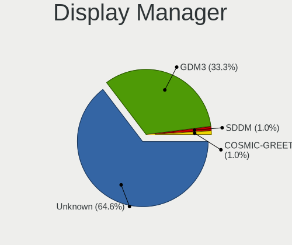
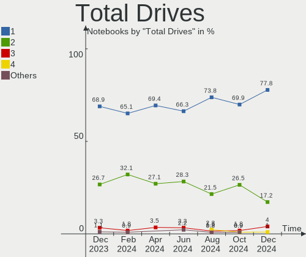
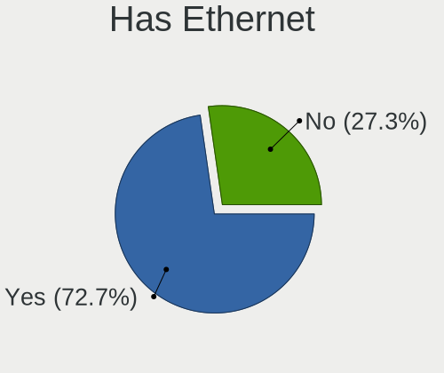
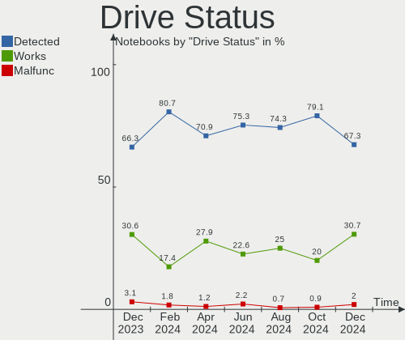
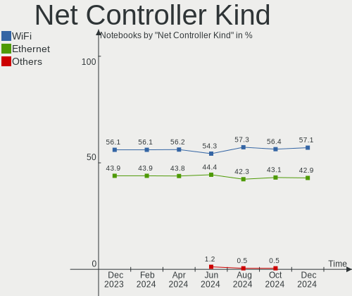

Pop!_OS - Hardware Trends (Notebooks)
-------------------------------------

A project to identify most popular hardware characteristics and track their change
over time based on data collected by Linux users at https://Linux-Hardware.org.

Anyone can contribute to this report by the [hw-probe](https://github.com/linuxhw/hw-probe) tool:

    sudo -E hw-probe -all -upload

This report is for one last month. Overall report since the beginning of time: [TestCoverage](https://github.com/linuxhw/TestCoverage)

Period: Jun, 2022.

Contents
--------

* [ System ](#system)
  - [ OS                       ](#os)
  - [ OS Family                ](#os-family)
  - [ Kernel                   ](#kernel)
  - [ Kernel Family            ](#kernel-family)
  - [ Kernel Major Ver.        ](#kernel-major-ver)
  - [ Arch                     ](#arch)
  - [ DE                       ](#de)
  - [ Display Server           ](#display-server)
  - [ Display Manager          ](#display-manager)
  - [ OS Lang                  ](#os-lang)
  - [ Boot Mode                ](#boot-mode)
  - [ Filesystem               ](#filesystem)
  - [ Part. scheme             ](#part-scheme)
  - [ Dual Boot with Linux/BSD ](#dual-boot-with-linuxbsd)
  - [ Dual Boot (Win)          ](#dual-boot-win)

* [ Board ](#board)
  - [ Vendor                   ](#vendor)
  - [ Model                    ](#model)
  - [ Model Family             ](#model-family)
  - [ MFG Year                 ](#mfg-year)
  - [ Form Factor              ](#form-factor)
  - [ Secure Boot              ](#secure-boot)
  - [ Coreboot                 ](#coreboot)
  - [ RAM Size                 ](#ram-size)
  - [ RAM Used                 ](#ram-used)
  - [ Total Drives             ](#total-drives)
  - [ Has CD-ROM               ](#has-cd-rom)
  - [ Has Ethernet             ](#has-ethernet)
  - [ Has WiFi                 ](#has-wifi)
  - [ Has Bluetooth            ](#has-bluetooth)

* [ Location ](#location)
  - [ Country                  ](#country)
  - [ City                     ](#city)

* [ Drives ](#drives)
  - [ Drive Vendor             ](#drive-vendor)
  - [ Drive Model              ](#drive-model)
  - [ HDD Vendor               ](#hdd-vendor)
  - [ SSD Vendor               ](#ssd-vendor)
  - [ Drive Kind               ](#drive-kind)
  - [ Drive Connector          ](#drive-connector)
  - [ Drive Size               ](#drive-size)
  - [ Space Total              ](#space-total)
  - [ Space Used               ](#space-used)
  - [ Malfunc. Drives          ](#malfunc-drives)
  - [ Malfunc. Drive Vendor    ](#malfunc-drive-vendor)
  - [ Malfunc. HDD Vendor      ](#malfunc-hdd-vendor)
  - [ Malfunc. Drive Kind      ](#malfunc-drive-kind)
  - [ Failed Drives            ](#failed-drives)
  - [ Failed Drive Vendor      ](#failed-drive-vendor)
  - [ Drive Status             ](#drive-status)

* [ Storage controller ](#storage-controller)
  - [ Storage Vendor           ](#storage-vendor)
  - [ Storage Model            ](#storage-model)
  - [ Storage Kind             ](#storage-kind)

* [ Processor ](#processor)
  - [ CPU Vendor               ](#cpu-vendor)
  - [ CPU Model                ](#cpu-model)
  - [ CPU Model Family         ](#cpu-model-family)
  - [ CPU Cores                ](#cpu-cores)
  - [ CPU Sockets              ](#cpu-sockets)
  - [ CPU Threads              ](#cpu-threads)
  - [ CPU Op-Modes             ](#cpu-op-modes)
  - [ CPU Microcode            ](#cpu-microcode)
  - [ CPU Microarch            ](#cpu-microarch)

* [ Graphics ](#graphics)
  - [ GPU Vendor               ](#gpu-vendor)
  - [ GPU Model                ](#gpu-model)
  - [ GPU Combo                ](#gpu-combo)
  - [ GPU Driver               ](#gpu-driver)
  - [ GPU Memory               ](#gpu-memory)

* [ Monitor ](#monitor)
  - [ Monitor Vendor           ](#monitor-vendor)
  - [ Monitor Model            ](#monitor-model)
  - [ Monitor Resolution       ](#monitor-resolution)
  - [ Monitor Diagonal         ](#monitor-diagonal)
  - [ Monitor Width            ](#monitor-width)
  - [ Aspect Ratio             ](#aspect-ratio)
  - [ Monitor Area             ](#monitor-area)
  - [ Pixel Density            ](#pixel-density)
  - [ Multiple Monitors        ](#multiple-monitors)

* [ Network ](#network)
  - [ Net Controller Vendor    ](#net-controller-vendor)
  - [ Net Controller Model     ](#net-controller-model)
  - [ Wireless Vendor          ](#wireless-vendor)
  - [ Wireless Model           ](#wireless-model)
  - [ Ethernet Vendor          ](#ethernet-vendor)
  - [ Ethernet Model           ](#ethernet-model)
  - [ Net Controller Kind      ](#net-controller-kind)
  - [ Used Controller          ](#used-controller)
  - [ NICs                     ](#nics)
  - [ IPv6                     ](#ipv6)

* [ Bluetooth ](#bluetooth)
  - [ Bluetooth Vendor         ](#bluetooth-vendor)
  - [ Bluetooth Model          ](#bluetooth-model)

* [ Sound ](#sound)
  - [ Sound Vendor             ](#sound-vendor)
  - [ Sound Model              ](#sound-model)

* [ Memory ](#memory)
  - [ Memory Vendor            ](#memory-vendor)
  - [ Memory Model             ](#memory-model)
  - [ Memory Kind              ](#memory-kind)
  - [ Memory Form Factor       ](#memory-form-factor)
  - [ Memory Size              ](#memory-size)
  - [ Memory Speed             ](#memory-speed)

* [ Printers & scanners ](#printers--scanners)
  - [ Printer Vendor           ](#printer-vendor)
  - [ Printer Model            ](#printer-model)
  - [ Scanner Vendor           ](#scanner-vendor)
  - [ Scanner Model            ](#scanner-model)

* [ Camera ](#camera)
  - [ Camera Vendor            ](#camera-vendor)
  - [ Camera Model             ](#camera-model)

* [ Security ](#security)
  - [ Fingerprint Vendor       ](#fingerprint-vendor)
  - [ Fingerprint Model        ](#fingerprint-model)
  - [ Chipcard Vendor          ](#chipcard-vendor)
  - [ Chipcard Model           ](#chipcard-model)

* [ Unsupported ](#unsupported)
  - [ Unsupported Devices      ](#unsupported-devices)
  - [ Unsupported Device Types ](#unsupported-device-types)

System
------

OS
--

Installed operating systems

| Name          | Notebooks | Percent |
|---------------|-----------|---------|
| Pop!_OS 22.04 | 120       | 97.56%  |
| Pop!_OS 21.10 | 1         | 0.81%   |
| Pop!_OS 21.04 | 1         | 0.81%   |
| Pop!_OS 20.04 | 1         | 0.81%   |

OS Family
---------

OS without a version

| Name    | Notebooks | Percent |
|---------|-----------|---------|
| Pop!_OS | 123       | 100%    |

Kernel
------

Version of the Linux kernel

| Version                  | Notebooks | Percent |
|--------------------------|-----------|---------|
| 5.17.5-76051705-generic  | 111       | 90.24%  |
| 5.17.15-76051715-generic | 8         | 6.5%    |
| 5.18.4-xanmod1           | 1         | 0.81%   |
| 5.17.5-tkg-bmq           | 1         | 0.81%   |
| 5.16.19-76051619-generic | 1         | 0.81%   |
| 5.15.11-76051511-generic | 1         | 0.81%   |

Kernel Family
-------------

Linux kernel without a distro release

| Version | Notebooks | Percent |
|---------|-----------|---------|
| 5.17.5  | 112       | 91.06%  |
| 5.17.15 | 8         | 6.5%    |
| 5.18.4  | 1         | 0.81%   |
| 5.16.19 | 1         | 0.81%   |
| 5.15.11 | 1         | 0.81%   |

Kernel Major Ver.
-----------------

Linux kernel major version

| Version | Notebooks | Percent |
|---------|-----------|---------|
| 5.17    | 120       | 97.56%  |
| 5.18    | 1         | 0.81%   |
| 5.16    | 1         | 0.81%   |
| 5.15    | 1         | 0.81%   |

Arch
----

OS architecture (x86_64, i586, etc.)

| Name   | Notebooks | Percent |
|--------|-----------|---------|
| x86_64 | 123       | 100%    |

DE
--

Desktop Environment

| Name    | Notebooks | Percent |
|---------|-----------|---------|
| GNOME   | 120       | 97.56%  |
| KDE5    | 2         | 1.63%   |
| Unknown | 1         | 0.81%   |

Display Server
--------------

X11 or Wayland

| Name    | Notebooks | Percent |
|---------|-----------|---------|
| X11     | 118       | 95.93%  |
| Wayland | 5         | 4.07%   |

Display Manager
---------------

SDDM, LightDM, etc.

| Name    | Notebooks | Percent |
|---------|-----------|---------|
| Unknown | 97        | 78.86%  |
| GDM3    | 24        | 19.51%  |
| GDM     | 2         | 1.63%   |

OS Lang
-------

Language

| Lang  | Notebooks | Percent |
|-------|-----------|---------|
| en_US | 72        | 58.54%  |
| en_GB | 7         | 5.69%   |
| pt_BR | 6         | 4.88%   |
| en_AU | 5         | 4.07%   |
| de_DE | 4         | 3.25%   |
| it_IT | 3         | 2.44%   |
| es_ES | 3         | 2.44%   |
| C     | 3         | 2.44%   |
| ru_RU | 2         | 1.63%   |
| fr_FR | 2         | 1.63%   |
| es_MX | 2         | 1.63%   |
| en_ZA | 2         | 1.63%   |
| en_CA | 2         | 1.63%   |
| sv_SE | 1         | 0.81%   |
| ro_RO | 1         | 0.81%   |
| pl_PL | 1         | 0.81%   |
| fr_CA | 1         | 0.81%   |
| es_UY | 1         | 0.81%   |
| es_CO | 1         | 0.81%   |
| es_CL | 1         | 0.81%   |
| en_SG | 1         | 0.81%   |
| en_IN | 1         | 0.81%   |
| en_DK | 1         | 0.81%   |

Boot Mode
---------

EFI or BIOS

| Mode | Notebooks | Percent |
|------|-----------|---------|
| BIOS | 100       | 81.3%   |
| EFI  | 23        | 18.7%   |

Filesystem
----------

Type of filesystem

| Type    | Notebooks | Percent |
|---------|-----------|---------|
| Ext4    | 121       | 98.37%  |
| Overlay | 1         | 0.81%   |
| Btrfs   | 1         | 0.81%   |

Part. scheme
------------

Scheme of partitioning

| Type    | Notebooks | Percent |
|---------|-----------|---------|
| Unknown | 96        | 78.05%  |
| GPT     | 24        | 19.51%  |
| MBR     | 3         | 2.44%   |

Dual Boot with Linux/BSD
------------------------

Hosting more than one Linux/BSD

| Dual boot | Notebooks | Percent |
|-----------|-----------|---------|
| No        | 119       | 96.75%  |
| Yes       | 4         | 3.25%   |

Dual Boot (Win)
---------------

Hosting Linux and Windows

| Dual boot | Notebooks | Percent |
|-----------|-----------|---------|
| No        | 115       | 93.5%   |
| Yes       | 8         | 6.5%    |

Board
-----

Vendor
------

Motherboard manufacturer

| Name                | Notebooks | Percent |
|---------------------|-----------|---------|
| Dell                | 31        | 25.2%   |
| Lenovo              | 21        | 17.07%  |
| ASUSTek Computer    | 16        | 13.01%  |
| Hewlett-Packard     | 15        | 12.2%   |
| Acer                | 9         | 7.32%   |
| Apple               | 8         | 6.5%    |
| System76            | 6         | 4.88%   |
| MSI                 | 3         | 2.44%   |
| Toshiba             | 2         | 1.63%   |
| Samsung Electronics | 2         | 1.63%   |
| Notebook            | 2         | 1.63%   |
| Timi                | 1         | 0.81%   |
| Sony                | 1         | 0.81%   |
| Schenker            | 1         | 0.81%   |
| Quanta              | 1         | 0.81%   |
| HUAWEI              | 1         | 0.81%   |
| Framework           | 1         | 0.81%   |
| Eluktronics         | 1         | 0.81%   |
| Alienware           | 1         | 0.81%   |

Model
-----

Motherboard model

| Name                                       | Notebooks | Percent |
|--------------------------------------------|-----------|---------|
| Dell Latitude E7240                        | 3         | 2.44%   |
| System76 Oryx Pro                          | 2         | 1.63%   |
| System76 Lemur Pro                         | 2         | 1.63%   |
| Dell Precision M4800                       | 2         | 1.63%   |
| Dell Latitude E7470                        | 2         | 1.63%   |
| Dell Latitude E6540                        | 2         | 1.63%   |
| Apple MacBookPro11,1                       | 2         | 1.63%   |
| Apple MacBookAir7,2                        | 2         | 1.63%   |
| Unknown                                    | 2         | 1.63%   |
| Toshiba Satellite S50-A                    | 1         | 0.81%   |
| Toshiba Satellite L850-1D5                 | 1         | 0.81%   |
| Timi RedmiBook Pro 14S                     | 1         | 0.81%   |
| System76 Galago Pro                        | 1         | 0.81%   |
| System76 Darter Pro                        | 1         | 0.81%   |
| Sony SVF15A1M2ES                           | 1         | 0.81%   |
| Schenker VIA 15 Pro                        | 1         | 0.81%   |
| Samsung 900X3C/900X3D/900X3E/900X4C/900X4D | 1         | 0.81%   |
| Samsung 760XDA                             | 1         | 0.81%   |
| Quanta TWC                                 | 1         | 0.81%   |
| Notebook P7xxDM3(-G)                       | 1         | 0.81%   |
| Notebook P65_P67SE                         | 1         | 0.81%   |
| MSI Pulse GL66 12UEK                       | 1         | 0.81%   |
| MSI GS75 Stealth 9SF                       | 1         | 0.81%   |
| MSI Alpha 17 A4DEK                         | 1         | 0.81%   |
| Lenovo Yoga Slim 7 Pro 14ACH5 D 82NJ       | 1         | 0.81%   |
| Lenovo V14-IIL 82C4                        | 1         | 0.81%   |
| Lenovo ThinkPad X240 20AMS75900            | 1         | 0.81%   |
| Lenovo ThinkPad X230 23331R5               | 1         | 0.81%   |
| Lenovo ThinkPad T450 20BVA02TCD            | 1         | 0.81%   |
| Lenovo ThinkPad T450 20BUS1110E            | 1         | 0.81%   |
| Lenovo ThinkPad T410 2537HN3               | 1         | 0.81%   |
| Lenovo ThinkPad P17 Gen 1 20SQS01Y00       | 1         | 0.81%   |
| Lenovo ThinkPad L13 Yoga Gen 2a 21AES01A00 | 1         | 0.81%   |
| Lenovo ThinkPad Edge E531 6885CTO          | 1         | 0.81%   |
| Lenovo ThinkBook 16p Gen 2 20YM            | 1         | 0.81%   |
| Lenovo ThinkBook 15 G3 ACL 21A4            | 1         | 0.81%   |
| Lenovo ThinkBook 15 G2 ITL 20VE            | 1         | 0.81%   |
| Lenovo Legion 7 15IMH05 81YT               | 1         | 0.81%   |
| Lenovo Legion 5 15ACH6H 82JU               | 1         | 0.81%   |
| Lenovo Legion 5 15ACH6 82JW                | 1         | 0.81%   |
| Lenovo IdeaPad Y700-17ISK 80Q0             | 1         | 0.81%   |
| Lenovo IdeaPad S145-15API 81V7             | 1         | 0.81%   |
| Lenovo IdeaPad 3 14ALC6 82KT               | 1         | 0.81%   |
| Lenovo G470 20078                          | 1         | 0.81%   |
| Lenovo B40-80 80F6                         | 1         | 0.81%   |
| HUAWEI MACHC-WAX9                          | 1         | 0.81%   |
| HP ZBook 15 G3                             | 1         | 0.81%   |
| HP ProBook 455 G3                          | 1         | 0.81%   |
| HP ProBook 450 G1                          | 1         | 0.81%   |
| HP ProBook 445 G8 Notebook PC              | 1         | 0.81%   |
| HP ProBook 440 G7                          | 1         | 0.81%   |
| HP Pavilion Notebook                       | 1         | 0.81%   |
| HP Pavilion Gaming Laptop 15-dk0xxx        | 1         | 0.81%   |
| HP Pavilion 15                             | 1         | 0.81%   |
| HP EliteBook 8560p                         | 1         | 0.81%   |
| HP EliteBook 820 G2                        | 1         | 0.81%   |
| HP EliteBook 745 G2                        | 1         | 0.81%   |
| HP Elite x2 1012 G1                        | 1         | 0.81%   |
| HP Dev One Notebook PC                     | 1         | 0.81%   |
| HP 15 Notebook PC                          | 1         | 0.81%   |

Model Family
------------

Motherboard model prefix

| Name                 | Notebooks | Percent |
|----------------------|-----------|---------|
| Dell Latitude        | 10        | 8.13%   |
| Lenovo ThinkPad      | 8         | 6.5%    |
| Dell Inspiron        | 8         | 6.5%    |
| Acer Aspire          | 7         | 5.69%   |
| Dell Precision       | 6         | 4.88%   |
| HP ProBook           | 4         | 3.25%   |
| Lenovo ThinkBook     | 3         | 2.44%   |
| Lenovo Legion        | 3         | 2.44%   |
| Lenovo IdeaPad       | 3         | 2.44%   |
| HP Pavilion          | 3         | 2.44%   |
| HP EliteBook         | 3         | 2.44%   |
| Dell Vostro          | 3         | 2.44%   |
| ASUS ZenBook         | 3         | 2.44%   |
| Apple MacBookPro11   | 3         | 2.44%   |
| Toshiba Satellite    | 2         | 1.63%   |
| System76 Oryx        | 2         | 1.63%   |
| System76 Lemur       | 2         | 1.63%   |
| Dell XPS             | 2         | 1.63%   |
| ASUS VivoBook        | 2         | 1.63%   |
| ASUS ROG             | 2         | 1.63%   |
| Apple MacBookAir7    | 2         | 1.63%   |
| Unknown              | 2         | 1.63%   |
| Timi RedmiBook       | 1         | 0.81%   |
| System76 Galago      | 1         | 0.81%   |
| System76 Darter      | 1         | 0.81%   |
| Sony SVF15A1M2ES     | 1         | 0.81%   |
| Schenker VIA         | 1         | 0.81%   |
| Samsung 900X3C       | 1         | 0.81%   |
| Samsung 760XDA       | 1         | 0.81%   |
| Quanta TWC           | 1         | 0.81%   |
| Notebook P7xxDM3(-G) | 1         | 0.81%   |
| Notebook P65         | 1         | 0.81%   |
| MSI Pulse            | 1         | 0.81%   |
| MSI GS75             | 1         | 0.81%   |
| MSI Alpha            | 1         | 0.81%   |
| Lenovo Yoga          | 1         | 0.81%   |
| Lenovo V14-IIL       | 1         | 0.81%   |
| Lenovo G470          | 1         | 0.81%   |
| Lenovo B40-80        | 1         | 0.81%   |
| HUAWEI MACHC-WAX9    | 1         | 0.81%   |
| HP ZBook             | 1         | 0.81%   |
| HP Elite             | 1         | 0.81%   |
| HP Dev               | 1         | 0.81%   |
| HP 15                | 1         | 0.81%   |
| Framework Laptop     | 1         | 0.81%   |
| Eluktronics MECH-15  | 1         | 0.81%   |
| Dell System          | 1         | 0.81%   |
| Dell G7              | 1         | 0.81%   |
| ASUS X556URK         | 1         | 0.81%   |
| ASUS UX430UQ         | 1         | 0.81%   |
| ASUS S550CA          | 1         | 0.81%   |
| ASUS N550JV          | 1         | 0.81%   |
| ASUS N53SV           | 1         | 0.81%   |
| ASUS K70IJ           | 1         | 0.81%   |
| ASUS K50IJ           | 1         | 0.81%   |
| ASUS GL552VW         | 1         | 0.81%   |
| Apple MacBookPro8    | 1         | 0.81%   |
| Apple MacBookPro7    | 1         | 0.81%   |
| Apple MacBook5       | 1         | 0.81%   |
| Alienware 14         | 1         | 0.81%   |

MFG Year
--------

Motherboard manufacture year

| Year | Notebooks | Percent |
|------|-----------|---------|
| 2021 | 18        | 14.63%  |
| 2013 | 18        | 14.63%  |
| 2020 | 14        | 11.38%  |
| 2016 | 14        | 11.38%  |
| 2019 | 13        | 10.57%  |
| 2015 | 10        | 8.13%   |
| 2012 | 6         | 4.88%   |
| 2011 | 6         | 4.88%   |
| 2014 | 5         | 4.07%   |
| 2022 | 4         | 3.25%   |
| 2018 | 4         | 3.25%   |
| 2017 | 4         | 3.25%   |
| 2009 | 4         | 3.25%   |
| 2010 | 3         | 2.44%   |

Form Factor
-----------

Physical design of the computer

| Name     | Notebooks | Percent |
|----------|-----------|---------|
| Notebook | 123       | 100%    |

Secure Boot
-----------

Enabled or disabled

| State    | Notebooks | Percent |
|----------|-----------|---------|
| Disabled | 123       | 100%    |

Coreboot
--------

Have coreboot on board

| Used | Notebooks | Percent |
|------|-----------|---------|
| No   | 118       | 95.93%  |
| Yes  | 5         | 4.07%   |

RAM Size
--------

Total RAM memory

| Size in GB  | Notebooks | Percent |
|-------------|-----------|---------|
| 16.01-24.0  | 41        | 33.33%  |
| 4.01-8.0    | 29        | 23.58%  |
| 8.01-16.0   | 24        | 19.51%  |
| 3.01-4.0    | 17        | 13.82%  |
| 32.01-64.0  | 9         | 7.32%   |
| 64.01-256.0 | 3         | 2.44%   |

RAM Used
--------

Used RAM memory

| Used GB    | Notebooks | Percent |
|------------|-----------|---------|
| 2.01-3.0   | 51        | 41.46%  |
| 4.01-8.0   | 24        | 19.51%  |
| 3.01-4.0   | 24        | 19.51%  |
| 1.01-2.0   | 14        | 11.38%  |
| 8.01-16.0  | 7         | 5.69%   |
| 16.01-24.0 | 2         | 1.63%   |
| 24.01-32.0 | 1         | 0.81%   |

Total Drives
------------

Number of drives on board

| Drives | Notebooks | Percent |
|--------|-----------|---------|
| 1      | 91        | 73.98%  |
| 2      | 30        | 24.39%  |
| 3      | 2         | 1.63%   |

Has CD-ROM
----------

Has CD-ROM on board

| Presented | Notebooks | Percent |
|-----------|-----------|---------|
| No        | 92        | 74.8%   |
| Yes       | 31        | 25.2%   |

Has Ethernet
------------

Has Ethernet on board

| Presented | Notebooks | Percent |
|-----------|-----------|---------|
| Yes       | 97        | 78.86%  |
| No        | 26        | 21.14%  |

Has WiFi
--------

Has WiFi module

| Presented | Notebooks | Percent |
|-----------|-----------|---------|
| Yes       | 123       | 100%    |

Has Bluetooth
-------------

Has Bluetooth module

| Presented | Notebooks | Percent |
|-----------|-----------|---------|
| Yes       | 107       | 86.99%  |
| No        | 16        | 13.01%  |

Location
--------

Country
-------

Geographic location (country)

| Country       | Notebooks | Percent |
|---------------|-----------|---------|
| USA           | 31        | 25.2%   |
| Brazil        | 12        | 9.76%   |
| Germany       | 7         | 5.69%   |
| Canada        | 7         | 5.69%   |
| Australia     | 7         | 5.69%   |
| India         | 5         | 4.07%   |
| Italy         | 4         | 3.25%   |
| France        | 3         | 2.44%   |
| UK            | 2         | 1.63%   |
| Switzerland   | 2         | 1.63%   |
| Spain         | 2         | 1.63%   |
| South Africa  | 2         | 1.63%   |
| Singapore     | 2         | 1.63%   |
| Russia        | 2         | 1.63%   |
| Norway        | 2         | 1.63%   |
| Mexico        | 2         | 1.63%   |
| Georgia       | 2         | 1.63%   |
| Egypt         | 2         | 1.63%   |
| Colombia      | 2         | 1.63%   |
| Belgium       | 2         | 1.63%   |
| Uzbekistan    | 1         | 0.81%   |
| Uruguay       | 1         | 0.81%   |
| Tunisia       | 1         | 0.81%   |
| Thailand      | 1         | 0.81%   |
| Sweden        | 1         | 0.81%   |
| Romania       | 1         | 0.81%   |
| Poland        | 1         | 0.81%   |
| Peru          | 1         | 0.81%   |
| New Zealand   | 1         | 0.81%   |
| Netherlands   | 1         | 0.81%   |
| Morocco       | 1         | 0.81%   |
| Maldives      | 1         | 0.81%   |
| Latvia        | 1         | 0.81%   |
| Kosovo        | 1         | 0.81%   |
| Ireland       | 1         | 0.81%   |
| Hong Kong     | 1         | 0.81%   |
| Greece        | 1         | 0.81%   |
| Denmark       | 1         | 0.81%   |
| Chile         | 1         | 0.81%   |
| Bulgaria      | 1         | 0.81%   |
| Austria       | 1         | 0.81%   |
| Argentina     | 1         | 0.81%   |
| Aland Islands | 1         | 0.81%   |

City
----

Geographic location (city)

| City                  | Notebooks | Percent |
|-----------------------|-----------|---------|
| Melbourne             | 3         | 2.44%   |
| Zurich                | 2         | 1.63%   |
| Toronto               | 2         | 1.63%   |
| Singapore             | 2         | 1.63%   |
| Mannheim              | 2         | 1.63%   |
| Denver                | 2         | 1.63%   |
| Zagazig               | 1         | 0.81%   |
| Wuppertal             | 1         | 0.81%   |
| Windsor               | 1         | 0.81%   |
| Warsaw                | 1         | 0.81%   |
| Vitória              | 1         | 0.81%   |
| Viña del Mar         | 1         | 0.81%   |
| Vienna                | 1         | 0.81%   |
| Vanderbijlpark        | 1         | 0.81%   |
| Utrecht               | 1         | 0.81%   |
| Tunis                 | 1         | 0.81%   |
| Tung Chung            | 1         | 0.81%   |
| Tucson                | 1         | 0.81%   |
| Trujillo              | 1         | 0.81%   |
| Trondheim             | 1         | 0.81%   |
| Toulouse              | 1         | 0.81%   |
| Torrance              | 1         | 0.81%   |
| Tashkent              | 1         | 0.81%   |
| Sofia                 | 1         | 0.81%   |
| Snellville            | 1         | 0.81%   |
| Sao Luís             | 1         | 0.81%   |
| Sao Jose do Rio Preto | 1         | 0.81%   |
| Sandton               | 1         | 0.81%   |
| San Bonifacio         | 1         | 0.81%   |
| Saint Paul            | 1         | 0.81%   |
| Rome                  | 1         | 0.81%   |
| Roeselare             | 1         | 0.81%   |
| Riverview             | 1         | 0.81%   |
| Riga                  | 1         | 0.81%   |
| Ribeirao Preto        | 1         | 0.81%   |
| Rajkot                | 1         | 0.81%   |
| Queretaro             | 1         | 0.81%   |
| Procida               | 1         | 0.81%   |
| Pristina              | 1         | 0.81%   |
| Porto Ferreira        | 1         | 0.81%   |
| Pisa                  | 1         | 0.81%   |
| Pickerington          | 1         | 0.81%   |
| Petaluma              | 1         | 0.81%   |
| Perth                 | 1         | 0.81%   |
| Peoria                | 1         | 0.81%   |
| Oslo                  | 1         | 0.81%   |
| Nynaeshamn            | 1         | 0.81%   |
| Novosibirsk           | 1         | 0.81%   |
| North Andover         | 1         | 0.81%   |
| New York              | 1         | 0.81%   |
| Nelson                | 1         | 0.81%   |
| Natal                 | 1         | 0.81%   |
| Muli                  | 1         | 0.81%   |
| Moscow                | 1         | 0.81%   |
| Montreal              | 1         | 0.81%   |
| Montevideo            | 1         | 0.81%   |
| Monterrey             | 1         | 0.81%   |
| Millers Creek         | 1         | 0.81%   |
| Mesa                  | 1         | 0.81%   |
| Medellín             | 1         | 0.81%   |

Drives
------

Drive Vendor
------------

Hard drive vendors

| Vendor                         | Notebooks | Drives | Percent |
|--------------------------------|-----------|--------|---------|
| Samsung Electronics            | 29        | 32     | 18.71%  |
| SanDisk                        | 13        | 13     | 8.39%   |
| WDC                            | 11        | 11     | 7.1%    |
| Seagate                        | 11        | 11     | 7.1%    |
| Kingston                       | 11        | 11     | 7.1%    |
| Toshiba                        | 10        | 11     | 6.45%   |
| SK hynix                       | 8         | 9      | 5.16%   |
| Crucial                        | 7         | 7      | 4.52%   |
| HGST                           | 5         | 5      | 3.23%   |
| Phison                         | 4         | 5      | 2.58%   |
| Micron Technology              | 4         | 4      | 2.58%   |
| LITEONIT                       | 4         | 4      | 2.58%   |
| LITEON                         | 3         | 3      | 1.94%   |
| Intenso                        | 3         | 3      | 1.94%   |
| Intel                          | 3         | 4      | 1.94%   |
| Hitachi                        | 3         | 3      | 1.94%   |
| Apple                          | 3         | 3      | 1.94%   |
| Micron/Crucial Technology      | 2         | 2      | 1.29%   |
| KIOXIA                         | 2         | 2      | 1.29%   |
| A-DATA Technology              | 2         | 2      | 1.29%   |
| Unknown                        | 1         | 1      | 0.65%   |
| Union Memory (Shenzhen)        | 1         | 1      | 0.65%   |
| TwinMOS                        | 1         | 1      | 0.65%   |
| Team                           | 1         | 1      | 0.65%   |
| SSSTC                          | 1         | 1      | 0.65%   |
| Solid State Storage Technology | 1         | 1      | 0.65%   |
| PUSKILL                        | 1         | 1      | 0.65%   |
| PNY                            | 1         | 1      | 0.65%   |
| OWC                            | 1         | 1      | 0.65%   |
| OEM                            | 1         | 1      | 0.65%   |
| MAXIO Technology (Hangzhou)    | 1         | 1      | 0.65%   |
| KingSpec                       | 1         | 1      | 0.65%   |
| KingFast                       | 1         | 2      | 0.65%   |
| KingDian                       | 1         | 1      | 0.65%   |
| HGST HDN                       | 1         | 1      | 0.65%   |
| Fujitsu                        | 1         | 1      | 0.65%   |
| AFOX                           | 1         | 1      | 0.65%   |

Drive Model
-----------

Hard drive models

| Model                                        | Notebooks | Percent |
|----------------------------------------------|-----------|---------|
| Kingston SA400S37240G 240GB SSD              | 5         | 3.09%   |
| SK hynix NVMe SSD Drive 1024GB               | 3         | 1.85%   |
| SanDisk NVMe SSD Drive 1TB                   | 3         | 1.85%   |
| Toshiba MQ04ABF100 1TB                       | 2         | 1.23%   |
| Toshiba MQ01ABD075 752GB                     | 2         | 1.23%   |
| SK hynix NVMe SSD Drive 128GB                | 2         | 1.23%   |
| Samsung SSD 860 EVO 500GB                    | 2         | 1.23%   |
| Samsung SM963 2.5" NVMe PCIe SSD 500GB       | 2         | 1.23%   |
| Samsung NVMe SSD Drive 512GB                 | 2         | 1.23%   |
| Samsung NVMe SSD Drive 2TB                   | 2         | 1.23%   |
| Samsung MZMPC032HBCD-000D1 32GB SSD          | 2         | 1.23%   |
| Micron/Crucial NVMe SSD Drive 250GB          | 2         | 1.23%   |
| KIOXIA NVMe SSD Drive 256GB                  | 2         | 1.23%   |
| Intel NVMe SSD Drive 512GB                   | 2         | 1.23%   |
| HGST HTS725050A7E630 500GB                   | 2         | 1.23%   |
| HGST HTS721010A9E630 1TB                     | 2         | 1.23%   |
| Crucial CT240BX500SSD1 240GB                 | 2         | 1.23%   |
| WDC WDS240G2G0A-00JH30 240GB SSD             | 1         | 0.62%   |
| WDC WDS100T1X0E-00AFY0 1TB                   | 1         | 0.62%   |
| WDC WD800BEVS-07RST0 80GB                    | 1         | 0.62%   |
| WDC WD7500BPVX-75JC3T0 752GB                 | 1         | 0.62%   |
| WDC WD5000LPVX-75V0TT0 500GB                 | 1         | 0.62%   |
| WDC WD5000LPCX-60VHAT0 500GB                 | 1         | 0.62%   |
| WDC WD5000LPCX-21VHAT0 500GB                 | 1         | 0.62%   |
| WDC WD20SPZX-60UA7T0 2TB                     | 1         | 0.62%   |
| WDC WD10SPZX-75Z10T3 1TB                     | 1         | 0.62%   |
| WDC WD10SPZX-24Z10 1TB                       | 1         | 0.62%   |
| WDC PC SN530 NVMe 256GB                      | 1         | 0.62%   |
| Unknown ASTC  16GB                           | 1         | 0.62%   |
| Union Memory (Shenzhen) NVMe SSD Drive 256GB | 1         | 0.62%   |
| TwinMOS SSD 512GB                            | 1         | 0.62%   |
| Toshiba NVMe SSD Drive 512GB                 | 1         | 0.62%   |
| Toshiba MQ01ACF050 500GB                     | 1         | 0.62%   |
| Toshiba MQ01ABD100 1TB                       | 1         | 0.62%   |
| Toshiba MQ01ABD050V 500GB                    | 1         | 0.62%   |
| Toshiba MK3259GSXP 320GB                     | 1         | 0.62%   |
| Toshiba MK2552GSX 250GB                      | 1         | 0.62%   |
| Toshiba KBG30ZMV128G 128GB                   | 1         | 0.62%   |
| Team TM8FP6256G 256GB                        | 1         | 0.62%   |
| SSSTC CL1-8D512-HP 512GB                     | 1         | 0.62%   |
| Solid State Storage NVMe SSD Drive 512GB     | 1         | 0.62%   |
| SK hynix PC711 HFS001TDE9X073N 1TB           | 1         | 0.62%   |
| SK hynix NVMe SSD Drive 512GB                | 1         | 0.62%   |
| SK hynix NVMe SSD Drive 256GB                | 1         | 0.62%   |
| SK hynix NVMe SSD Drive 1TB                  | 1         | 0.62%   |
| Seagate ST9750420AS 752GB                    | 1         | 0.62%   |
| Seagate ST9500325ASG 500GB                   | 1         | 0.62%   |
| Seagate ST9320325AS 320GB                    | 1         | 0.62%   |
| Seagate ST9250827AS 250GB                    | 1         | 0.62%   |
| Seagate ST500LT012-1DG142 500GB              | 1         | 0.62%   |
| Seagate ST500LM030-2E717D 500GB              | 1         | 0.62%   |
| Seagate ST2000LM007-1R8174 2TB               | 1         | 0.62%   |
| Seagate ST1000LX015-1U7172 1TB               | 1         | 0.62%   |
| Seagate ST1000LM049-2GH172 1TB               | 1         | 0.62%   |
| Seagate ST1000LM014-1EJ164 1TB               | 1         | 0.62%   |
| Seagate BUP Slim BK 1TB                      | 1         | 0.62%   |
| SanDisk X300 M.2 2280 128GB SSD              | 1         | 0.62%   |
| SanDisk X110 MSATA 128GB SSD                 | 1         | 0.62%   |
| SanDisk SSD U100 24GB                        | 1         | 0.62%   |
| SanDisk SSD PLUS 240GB                       | 1         | 0.62%   |

HDD Vendor
----------

Hard disk drive vendors

| Vendor              | Notebooks | Drives | Percent |
|---------------------|-----------|--------|---------|
| Seagate             | 11        | 11     | 27.5%   |
| Toshiba             | 9         | 9      | 22.5%   |
| WDC                 | 8         | 8      | 20%     |
| HGST                | 5         | 5      | 12.5%   |
| Hitachi             | 3         | 3      | 7.5%    |
| Samsung Electronics | 1         | 1      | 2.5%    |
| Intenso             | 1         | 1      | 2.5%    |
| HGST HDN            | 1         | 1      | 2.5%    |
| Fujitsu             | 1         | 1      | 2.5%    |

SSD Vendor
----------

Solid state drive vendors

| Vendor              | Notebooks | Drives | Percent |
|---------------------|-----------|--------|---------|
| Samsung Electronics | 12        | 12     | 22.64%  |
| Kingston            | 9         | 9      | 16.98%  |
| SanDisk             | 5         | 5      | 9.43%   |
| Crucial             | 5         | 5      | 9.43%   |
| LITEONIT            | 4         | 4      | 7.55%   |
| LITEON              | 3         | 3      | 5.66%   |
| Apple               | 3         | 3      | 5.66%   |
| Micron Technology   | 2         | 2      | 3.77%   |
| WDC                 | 1         | 1      | 1.89%   |
| TwinMOS             | 1         | 1      | 1.89%   |
| PUSKILL             | 1         | 1      | 1.89%   |
| PNY                 | 1         | 1      | 1.89%   |
| OWC                 | 1         | 1      | 1.89%   |
| KingSpec            | 1         | 1      | 1.89%   |
| KingFast            | 1         | 1      | 1.89%   |
| KingDian            | 1         | 1      | 1.89%   |
| Intenso             | 1         | 1      | 1.89%   |
| AFOX                | 1         | 1      | 1.89%   |

Drive Kind
----------

HDD or SSD

| Kind    | Notebooks | Drives | Percent |
|---------|-----------|--------|---------|
| NVMe    | 57        | 67     | 39.31%  |
| SSD     | 46        | 53     | 31.72%  |
| HDD     | 39        | 40     | 26.9%   |
| Unknown | 2         | 2      | 1.38%   |
| MMC     | 1         | 1      | 0.69%   |

Drive Connector
---------------

SATA, SAS, NVMe, etc.

| Type | Notebooks | Drives | Percent |
|------|-----------|--------|---------|
| SATA | 73        | 91     | 54.07%  |
| NVMe | 57        | 67     | 42.22%  |
| SAS  | 4         | 4      | 2.96%   |
| MMC  | 1         | 1      | 0.74%   |

Drive Size
----------

Size of hard drive

| Size in TB | Notebooks | Drives | Percent |
|------------|-----------|--------|---------|
| 0.01-0.5   | 52        | 64     | 65.82%  |
| 0.51-1.0   | 24        | 26     | 30.38%  |
| 1.01-2.0   | 2         | 2      | 2.53%   |
| 4.01-10.0  | 1         | 1      | 1.27%   |

Space Total
-----------

Amount of disk space available on the file system

| Size in GB     | Notebooks | Percent |
|----------------|-----------|---------|
| 101-250        | 49        | 39.84%  |
| 251-500        | 37        | 30.08%  |
| 501-1000       | 24        | 19.51%  |
| 1001-2000      | 4         | 3.25%   |
| 51-100         | 4         | 3.25%   |
| More than 3000 | 2         | 1.63%   |
| 1-20           | 2         | 1.63%   |
| 2001-3000      | 1         | 0.81%   |

Space Used
----------

Amount of used disk space

| Used GB   | Notebooks | Percent |
|-----------|-----------|---------|
| 1-20      | 46        | 37.4%   |
| 21-50     | 36        | 29.27%  |
| 101-250   | 21        | 17.07%  |
| 51-100    | 9         | 7.32%   |
| 251-500   | 5         | 4.07%   |
| 501-1000  | 4         | 3.25%   |
| 1001-2000 | 2         | 1.63%   |

Malfunc. Drives
---------------

Drive models with a malfunction

| Model                                               | Notebooks | Drives | Percent |
|-----------------------------------------------------|-----------|--------|---------|
| SK hynix PC711 HFS001TDE9X073N 1TB                  | 1         | 1      | 20%     |
| Seagate ST1000LX015-1U7172 1TB                      | 1         | 1      | 20%     |
| Micron Technology MTFDDAK512TBN-1AR1ZABHA 512GB SSD | 1         | 1      | 20%     |
| Hitachi HTS545050A7E380 500GB                       | 1         | 1      | 20%     |
| HGST HTS725050A7E630 500GB                          | 1         | 1      | 20%     |

Malfunc. Drive Vendor
---------------------

Vendors of faulty drives

| Vendor            | Notebooks | Drives | Percent |
|-------------------|-----------|--------|---------|
| SK hynix          | 1         | 1      | 20%     |
| Seagate           | 1         | 1      | 20%     |
| Micron Technology | 1         | 1      | 20%     |
| Hitachi           | 1         | 1      | 20%     |
| HGST              | 1         | 1      | 20%     |

Malfunc. HDD Vendor
-------------------

Vendors of faulty HDD drives

| Vendor  | Notebooks | Drives | Percent |
|---------|-----------|--------|---------|
| Seagate | 1         | 1      | 33.33%  |
| Hitachi | 1         | 1      | 33.33%  |
| HGST    | 1         | 1      | 33.33%  |

Malfunc. Drive Kind
-------------------

Kinds of faulty drives

| Kind | Notebooks | Drives | Percent |
|------|-----------|--------|---------|
| HDD  | 3         | 3      | 60%     |
| NVMe | 1         | 1      | 20%     |
| SSD  | 1         | 1      | 20%     |

Failed Drives
-------------

Failed drive models

Zero info for selected period =(

Failed Drive Vendor
-------------------

Failed drive vendors

Zero info for selected period =(

Drive Status
------------

Number of failed and malfunc. drives

| Status   | Notebooks | Drives | Percent |
|----------|-----------|--------|---------|
| Detected | 98        | 123    | 74.24%  |
| Works    | 29        | 35     | 21.97%  |
| Malfunc  | 5         | 5      | 3.79%   |

Storage controller
------------------

Storage Vendor
--------------

Storage controller vendors

| Vendor                         | Notebooks | Percent |
|--------------------------------|-----------|---------|
| Intel                          | 85        | 52.47%  |
| Samsung Electronics            | 20        | 12.35%  |
| AMD                            | 14        | 8.64%   |
| SanDisk                        | 9         | 5.56%   |
| SK hynix                       | 8         | 4.94%   |
| Phison Electronics             | 4         | 2.47%   |
| Micron/Crucial Technology      | 4         | 2.47%   |
| Toshiba America Info Systems   | 2         | 1.23%   |
| Solid State Storage Technology | 2         | 1.23%   |
| Nvidia                         | 2         | 1.23%   |
| Micron Technology              | 2         | 1.23%   |
| KIOXIA                         | 2         | 1.23%   |
| Kingston Technology Company    | 2         | 1.23%   |
| ADATA Technology               | 2         | 1.23%   |
| Union Memory (Shenzhen)        | 1         | 0.62%   |
| Shenzhen Longsys Electronics   | 1         | 0.62%   |
| MAXIO Technology (Hangzhou)    | 1         | 0.62%   |
| Marvell Technology Group       | 1         | 0.62%   |

Storage Model
-------------

Storage controller models

| Model                                                                                  | Notebooks | Percent |
|----------------------------------------------------------------------------------------|-----------|---------|
| Samsung NVMe SSD Controller SM981/PM981/PM983                                          | 14        | 8.24%   |
| AMD FCH SATA Controller [AHCI mode]                                                    | 14        | 8.24%   |
| Intel Sunrise Point-LP SATA Controller [AHCI mode]                                     | 11        | 6.47%   |
| Intel 82801 Mobile SATA Controller [RAID mode]                                         | 11        | 6.47%   |
| Intel 8 Series SATA Controller 1 [AHCI mode]                                           | 8         | 4.71%   |
| Intel 7 Series Chipset Family 6-port SATA Controller [AHCI mode]                       | 7         | 4.12%   |
| Intel 6 Series/C200 Series Chipset Family 6 port Mobile SATA AHCI Controller           | 6         | 3.53%   |
| SK hynix Gold P31 SSD                                                                  | 5         | 2.94%   |
| Intel 8 Series/C220 Series Chipset Family 6-port SATA Controller 1 [AHCI mode]         | 5         | 2.94%   |
| Intel Wildcat Point-LP SATA Controller [AHCI Mode]                                     | 4         | 2.35%   |
| Intel Q170/Q150/B150/H170/H110/Z170/CM236 Chipset SATA Controller [AHCI Mode]          | 4         | 2.35%   |
| Intel Cannon Lake Mobile PCH SATA AHCI Controller                                      | 4         | 2.35%   |
| SanDisk Non-Volatile memory controller                                                 | 3         | 1.76%   |
| Micron/Crucial P2 NVMe PCIe SSD                                                        | 3         | 1.76%   |
| Intel Volume Management Device NVMe RAID Controller                                    | 3         | 1.76%   |
| Intel Comet Lake SATA AHCI Controller                                                  | 3         | 1.76%   |
| Solid State Storage Non-Volatile memory controller                                     | 2         | 1.18%   |
| SK hynix Non-Volatile memory controller                                                | 2         | 1.18%   |
| SanDisk WD Blue SN550 NVMe SSD                                                         | 2         | 1.18%   |
| SanDisk WD Black SN750 / PC SN730 NVMe SSD                                             | 2         | 1.18%   |
| Samsung NVMe SSD Controller 980                                                        | 2         | 1.18%   |
| Samsung Electronics SATA controller                                                    | 2         | 1.18%   |
| Phison PS5013 E13 NVMe Controller                                                      | 2         | 1.18%   |
| Phison E12 NVMe Controller                                                             | 2         | 1.18%   |
| Micron Non-Volatile memory controller                                                  | 2         | 1.18%   |
| KIOXIA Non-Volatile memory controller                                                  | 2         | 1.18%   |
| Intel Tiger Lake-LP SATA Controller [AHCI mode]                                        | 2         | 1.18%   |
| Intel SSD 660P Series                                                                  | 2         | 1.18%   |
| Intel HM170/QM170 Chipset SATA Controller [AHCI Mode]                                  | 2         | 1.18%   |
| Intel Cannon Point-LP SATA Controller [AHCI Mode]                                      | 2         | 1.18%   |
| Intel 5 Series/3400 Series Chipset 4 port SATA AHCI Controller                         | 2         | 1.18%   |
| Intel 400 Series Chipset Family SATA AHCI Controller                                   | 2         | 1.18%   |
| Union Memory (Shenzhen) Non-Volatile memory controller                                 | 1         | 0.59%   |
| Toshiba America Info Systems Toshiba America Info Non-Volatile memory controller       | 1         | 0.59%   |
| Toshiba America Info Systems BG3 NVMe SSD Controller                                   | 1         | 0.59%   |
| SK hynix BC501 NVMe Solid State Drive                                                  | 1         | 0.59%   |
| Shenzhen Longsys SM2263EN/SM2263XT-based OEM SSD                                       | 1         | 0.59%   |
| SanDisk WD PC SN810 / Black SN850 NVMe SSD                                             | 1         | 0.59%   |
| SanDisk WD Blue SN570 NVMe SSD                                                         | 1         | 0.59%   |
| Samsung NVMe SSD Controller SM961/PM961/SM963                                          | 1         | 0.59%   |
| Samsung NVMe SSD Controller PM9A1/PM9A3/980PRO                                         | 1         | 0.59%   |
| Samsung Apple PCIe SSD                                                                 | 1         | 0.59%   |
| Nvidia MCP89 SATA Controller (AHCI mode)                                               | 1         | 0.59%   |
| Nvidia MCP79 AHCI Controller                                                           | 1         | 0.59%   |
| Micron/Crucial P1 NVMe PCIe SSD                                                        | 1         | 0.59%   |
| MAXIO (Hangzhou) NVMe SSD Controller MAP1202                                           | 1         | 0.59%   |
| Marvell Group 88SE9230 PCIe 2.0 x2 4-port SATA 6 Gb/s RAID Controller                  | 1         | 0.59%   |
| Kingston Company U-SNS8154P3 NVMe SSD                                                  | 1         | 0.59%   |
| Kingston Company Company Non-Volatile memory controller                                | 1         | 0.59%   |
| Intel SSD Pro 7600p/760p/E 6100p Series                                                | 1         | 0.59%   |
| Intel Ice Lake-LP SATA Controller [AHCI mode]                                          | 1         | 0.59%   |
| Intel Celeron/Pentium Silver Processor SATA Controller                                 | 1         | 0.59%   |
| Intel Atom Processor E3800 Series SATA AHCI Controller                                 | 1         | 0.59%   |
| Intel Alder Lake-P SATA AHCI Controller                                                | 1         | 0.59%   |
| Intel 82801IBM/IEM (ICH9M/ICH9M-E) 4 port SATA Controller [AHCI mode]                  | 1         | 0.59%   |
| Intel 82801IBM/IEM (ICH9M/ICH9M-E) 2 port SATA Controller [IDE mode]                   | 1         | 0.59%   |
| Intel 8 Series Chipset Family 4-port SATA Controller 1 [IDE mode] - Mobile             | 1         | 0.59%   |
| Intel 7 Series Chipset Family 4-port SATA Controller [IDE mode]                        | 1         | 0.59%   |
| Intel 7 Series Chipset Family 2-port SATA Controller [IDE mode]                        | 1         | 0.59%   |
| Intel 6 Series/C200 Series Chipset Family Mobile SATA Controller (IDE mode, ports 4-5) | 1         | 0.59%   |

Storage Kind
------------

Kind of storage controller (IDE, SATA, NVMe, SAS, ...)

| Kind | Notebooks | Percent |
|------|-----------|---------|
| SATA | 89        | 54.27%  |
| NVMe | 57        | 34.76%  |
| RAID | 14        | 8.54%   |
| IDE  | 4         | 2.44%   |

Processor
---------

CPU Vendor
----------

Processor vendors

| Vendor | Notebooks | Percent |
|--------|-----------|---------|
| Intel  | 103       | 83.74%  |
| AMD    | 20        | 16.26%  |

CPU Model
---------

Processor models

| Model                                       | Notebooks | Percent |
|---------------------------------------------|-----------|---------|
| Intel Core i5-4200U CPU @ 1.60GHz           | 4         | 3.25%   |
| Intel 11th Gen Core i5-1135G7 @ 2.40GHz     | 4         | 3.25%   |
| Intel Core i7-9750H CPU @ 2.60GHz           | 3         | 2.44%   |
| Intel Core i7-10750H CPU @ 2.60GHz          | 3         | 2.44%   |
| Intel Core i7-10510U CPU @ 1.80GHz          | 3         | 2.44%   |
| Intel Core i5-8265U CPU @ 1.60GHz           | 3         | 2.44%   |
| Intel Core i5-7200U CPU @ 2.50GHz           | 3         | 2.44%   |
| Intel Core i5-6300U CPU @ 2.40GHz           | 3         | 2.44%   |
| Intel Core i7-7500U CPU @ 2.70GHz           | 2         | 1.63%   |
| Intel Core i7-6820HQ CPU @ 2.70GHz          | 2         | 1.63%   |
| Intel Core i7-6700HQ CPU @ 2.60GHz          | 2         | 1.63%   |
| Intel Core i7-3632QM CPU @ 2.20GHz          | 2         | 1.63%   |
| Intel Core i7-10870H CPU @ 2.20GHz          | 2         | 1.63%   |
| Intel Core i5-5250U CPU @ 1.60GHz           | 2         | 1.63%   |
| Intel Core i5-5200U CPU @ 2.20GHz           | 2         | 1.63%   |
| Intel Core i5-4310U CPU @ 2.00GHz           | 2         | 1.63%   |
| Intel Core i5-4300U CPU @ 1.90GHz           | 2         | 1.63%   |
| AMD Ryzen 7 PRO 5850U with Radeon Graphics  | 2         | 1.63%   |
| AMD Ryzen 7 5800H with Radeon Graphics      | 2         | 1.63%   |
| AMD Ryzen 7 5700U with Radeon Graphics      | 2         | 1.63%   |
| AMD Ryzen 7 4800H with Radeon Graphics      | 2         | 1.63%   |
| AMD Ryzen 5 5600H with Radeon Graphics      | 2         | 1.63%   |
| AMD Ryzen 5 5500U with Radeon Graphics      | 2         | 1.63%   |
| Intel Xeon W-10855M CPU @ 2.80GHz           | 1         | 0.81%   |
| Intel Pentium Dual-Core CPU T4300 @ 2.10GHz | 1         | 0.81%   |
| Intel Pentium CPU N3540 @ 2.16GHz           | 1         | 0.81%   |
| Intel Pentium CPU B960 @ 2.20GHz            | 1         | 0.81%   |
| Intel Pentium CPU B950 @ 2.10GHz            | 1         | 0.81%   |
| Intel Core m3-6Y30 CPU @ 0.90GHz            | 1         | 0.81%   |
| Intel Core i9-9980HK CPU @ 2.40GHz          | 1         | 0.81%   |
| Intel Core i9-8950HK CPU @ 2.90GHz          | 1         | 0.81%   |
| Intel Core i7-8650U CPU @ 1.90GHz           | 1         | 0.81%   |
| Intel Core i7-7820HQ CPU @ 2.90GHz          | 1         | 0.81%   |
| Intel Core i7-7700T CPU @ 2.90GHz           | 1         | 0.81%   |
| Intel Core i7-6600U CPU @ 2.60GHz           | 1         | 0.81%   |
| Intel Core i7-6500U CPU @ 2.50GHz           | 1         | 0.81%   |
| Intel Core i7-5600U CPU @ 2.60GHz           | 1         | 0.81%   |
| Intel Core i7-5500U CPU @ 2.40GHz           | 1         | 0.81%   |
| Intel Core i7-4980HQ CPU @ 2.80GHz          | 1         | 0.81%   |
| Intel Core i7-4910MQ CPU @ 2.90GHz          | 1         | 0.81%   |
| Intel Core i7-4810MQ CPU @ 2.80GHz          | 1         | 0.81%   |
| Intel Core i7-4800MQ CPU @ 2.70GHz          | 1         | 0.81%   |
| Intel Core i7-4720HQ CPU @ 2.60GHz          | 1         | 0.81%   |
| Intel Core i7-4700MQ CPU @ 2.40GHz          | 1         | 0.81%   |
| Intel Core i7-4700HQ CPU @ 2.40GHz          | 1         | 0.81%   |
| Intel Core i7-4578U CPU @ 3.00GHz           | 1         | 0.81%   |
| Intel Core i7-4500U CPU @ 1.80GHz           | 1         | 0.81%   |
| Intel Core i7-3612QM CPU @ 2.10GHz          | 1         | 0.81%   |
| Intel Core i7-3517U CPU @ 1.90GHz           | 1         | 0.81%   |
| Intel Core i7-2670QM CPU @ 2.20GHz          | 1         | 0.81%   |
| Intel Core i7-2630QM CPU @ 2.00GHz          | 1         | 0.81%   |
| Intel Core i7-10700 CPU @ 2.90GHz           | 1         | 0.81%   |
| Intel Core i5-8250U CPU @ 1.60GHz           | 1         | 0.81%   |
| Intel Core i5-4310M CPU @ 2.70GHz           | 1         | 0.81%   |
| Intel Core i5-4258U CPU @ 2.40GHz           | 1         | 0.81%   |
| Intel Core i5-4200M CPU @ 2.50GHz           | 1         | 0.81%   |
| Intel Core i5-3337U CPU @ 1.80GHz           | 1         | 0.81%   |
| Intel Core i5-3317U CPU @ 1.70GHz           | 1         | 0.81%   |
| Intel Core i5-3230M CPU @ 2.60GHz           | 1         | 0.81%   |
| Intel Core i5-2540M CPU @ 2.60GHz           | 1         | 0.81%   |

CPU Model Family
----------------

Processor model prefix

| Model                   | Notebooks | Percent |
|-------------------------|-----------|---------|
| Intel Core i7           | 40        | 32.52%  |
| Intel Core i5           | 35        | 28.46%  |
| Other                   | 10        | 8.13%   |
| AMD Ryzen 7             | 7         | 5.69%   |
| Intel Core i3           | 5         | 4.07%   |
| AMD Ryzen 5             | 5         | 4.07%   |
| Intel Pentium           | 3         | 2.44%   |
| Intel Core 2 Duo        | 3         | 2.44%   |
| Intel Core i9           | 2         | 1.63%   |
| Intel Celeron           | 2         | 1.63%   |
| AMD Ryzen 7 PRO         | 2         | 1.63%   |
| Intel Xeon              | 1         | 0.81%   |
| Intel Pentium Dual-Core | 1         | 0.81%   |
| Intel Core m3           | 1         | 0.81%   |
| AMD Ryzen 9             | 1         | 0.81%   |
| AMD Ryzen 5 PRO         | 1         | 0.81%   |
| AMD Ryzen 3             | 1         | 0.81%   |
| AMD A8                  | 1         | 0.81%   |
| AMD A6                  | 1         | 0.81%   |
| AMD A10                 | 1         | 0.81%   |

CPU Cores
---------

Number of processor cores

| Number | Notebooks | Percent |
|--------|-----------|---------|
| 2      | 54        | 43.9%   |
| 4      | 37        | 30.08%  |
| 8      | 15        | 12.2%   |
| 6      | 14        | 11.38%  |
| 14     | 1         | 0.81%   |
| 12     | 1         | 0.81%   |
| 1      | 1         | 0.81%   |

CPU Sockets
-----------

Number of sockets

| Number | Notebooks | Percent |
|--------|-----------|---------|
| 1      | 123       | 100%    |

CPU Threads
-----------

Threads per core (Hyper-Threading)

| Number | Notebooks | Percent |
|--------|-----------|---------|
| 2      | 112       | 91.06%  |
| 1      | 11        | 8.94%   |

CPU Op-Modes
------------

CPU Operation Modes (32-bit, 64-bit)

| Op mode        | Notebooks | Percent |
|----------------|-----------|---------|
| 32-bit, 64-bit | 123       | 100%    |

CPU Microcode
-------------

Microcode number

| Number     | Notebooks | Percent |
|------------|-----------|---------|
| Unknown    | 93        | 75.61%  |
| 0x806c1    | 4         | 3.25%   |
| 0x306c3    | 4         | 3.25%   |
| 0x306a9    | 3         | 2.44%   |
| 0x0a50000c | 3         | 2.44%   |
| 0x906ea    | 2         | 1.63%   |
| 0x406e3    | 2         | 1.63%   |
| 0xa0652    | 1         | 0.81%   |
| 0x906a3    | 1         | 0.81%   |
| 0x806ec    | 1         | 0.81%   |
| 0x806eb    | 1         | 0.81%   |
| 0x806ea    | 1         | 0.81%   |
| 0x806c2    | 1         | 0.81%   |
| 0x506e3    | 1         | 0.81%   |
| 0x40651    | 1         | 0.81%   |
| 0x306d4    | 1         | 0.81%   |
| 0x08608103 | 1         | 0.81%   |
| 0x08600104 | 1         | 0.81%   |
| 0x08600103 | 1         | 0.81%   |

CPU Microarch
-------------

Microarchitecture

| Name          | Notebooks | Percent |
|---------------|-----------|---------|
| KabyLake      | 21        | 17.07%  |
| Haswell       | 21        | 17.07%  |
| Skylake       | 11        | 8.94%   |
| SandyBridge   | 9         | 7.32%   |
| Zen 3         | 8         | 6.5%    |
| CometLake     | 8         | 6.5%    |
| Unknown       | 8         | 6.5%    |
| IvyBridge     | 7         | 5.69%   |
| TigerLake     | 6         | 4.88%   |
| Broadwell     | 6         | 4.88%   |
| Penryn        | 4         | 3.25%   |
| Zen 2         | 3         | 2.44%   |
| Westmere      | 3         | 2.44%   |
| Zen+          | 2         | 1.63%   |
| Steamroller   | 1         | 0.81%   |
| Silvermont    | 1         | 0.81%   |
| Puma          | 1         | 0.81%   |
| IceLake       | 1         | 0.81%   |
| Goldmont plus | 1         | 0.81%   |
| Excavator     | 1         | 0.81%   |

Graphics
--------

GPU Vendor
----------

Vendors of graphics cards

| Vendor | Notebooks | Percent |
|--------|-----------|---------|
| Intel  | 96        | 57.83%  |
| Nvidia | 44        | 26.51%  |
| AMD    | 26        | 15.66%  |

GPU Model
---------

Graphics card models

| Model                                                                     | Notebooks | Percent |
|---------------------------------------------------------------------------|-----------|---------|
| Intel Haswell-ULT Integrated Graphics Controller                          | 12        | 7.14%   |
| Intel 4th Gen Core Processor Integrated Graphics Controller               | 8         | 4.76%   |
| Intel 2nd Generation Core Processor Family Integrated Graphics Controller | 8         | 4.76%   |
| Intel 3rd Gen Core processor Graphics Controller                          | 7         | 4.17%   |
| AMD Cezanne                                                               | 7         | 4.17%   |
| Intel TigerLake-LP GT2 [Iris Xe Graphics]                                 | 6         | 3.57%   |
| Intel Skylake GT2 [HD Graphics 520]                                       | 6         | 3.57%   |
| Intel HD Graphics 620                                                     | 5         | 2.98%   |
| Intel CometLake-H GT2 [UHD Graphics]                                      | 5         | 2.98%   |
| Intel CoffeeLake-H GT2 [UHD Graphics 630]                                 | 5         | 2.98%   |
| Intel HD Graphics 5500                                                    | 4         | 2.38%   |
| Intel HD Graphics 530                                                     | 4         | 2.38%   |
| Intel CometLake-U GT2 [UHD Graphics]                                      | 4         | 2.38%   |
| AMD Lucienne                                                              | 4         | 2.38%   |
| Nvidia GM108M [GeForce 940MX]                                             | 3         | 1.79%   |
| Nvidia GA106M [GeForce RTX 3060 Mobile / Max-Q]                           | 3         | 1.79%   |
| Intel WhiskeyLake-U GT2 [UHD Graphics 620]                                | 3         | 1.79%   |
| Intel Core Processor Integrated Graphics Controller                       | 3         | 1.79%   |
| AMD Renoir                                                                | 3         | 1.79%   |
| Nvidia GM108M [GeForce 940M]                                              | 2         | 1.19%   |
| Nvidia GM107M [GeForce GTX 960M]                                          | 2         | 1.19%   |
| Nvidia GK208M [GeForce GT 740M]                                           | 2         | 1.19%   |
| Nvidia GA104M [GeForce RTX 3070 Mobile / Max-Q]                           | 2         | 1.19%   |
| Intel UHD Graphics 620                                                    | 2         | 1.19%   |
| Intel TigerLake-H GT1 [UHD Graphics]                                      | 2         | 1.19%   |
| Intel Mobile 4 Series Chipset Integrated Graphics Controller              | 2         | 1.19%   |
| Intel HD Graphics 6000                                                    | 2         | 1.19%   |
| Intel Alder Lake-P Integrated Graphics Controller                         | 2         | 1.19%   |
| AMD Picasso/Raven 2 [Radeon Vega Series / Radeon Vega Mobile Series]      | 2         | 1.19%   |
| Nvidia TU117M [GeForce MX450]                                             | 1         | 0.6%    |
| Nvidia TU117M                                                             | 1         | 0.6%    |
| Nvidia TU117GLM [Quadro T2000 Mobile / Max-Q]                             | 1         | 0.6%    |
| Nvidia TU117GLM [Quadro T1000 Mobile]                                     | 1         | 0.6%    |
| Nvidia TU116M [GeForce GTX 1660 Ti Mobile]                                | 1         | 0.6%    |
| Nvidia TU106M [GeForce RTX 2070 Mobile]                                   | 1         | 0.6%    |
| Nvidia TU106M [GeForce RTX 2070 Mobile / Max-Q Refresh]                   | 1         | 0.6%    |
| Nvidia TU106M [GeForce RTX 2060 Mobile]                                   | 1         | 0.6%    |
| Nvidia TU106M [GeForce RTX 2060 Max-Q]                                    | 1         | 0.6%    |
| Nvidia TU106BM [GeForce RTX 2070 Mobile]                                  | 1         | 0.6%    |
| Nvidia TU104GLM [Quadro RTX 4000 Mobile / Max-Q]                          | 1         | 0.6%    |
| Nvidia TU104BM [GeForce RTX 2070 SUPER Mobile / Max-Q]                    | 1         | 0.6%    |
| Nvidia TU104 [GeForce RTX 2070 SUPER]                                     | 1         | 0.6%    |
| Nvidia MCP89 [GeForce 320M]                                               | 1         | 0.6%    |
| Nvidia GP108BM [GeForce MX250]                                            | 1         | 0.6%    |
| Nvidia GP106BM [GeForce GTX 1060 Mobile 6GB]                              | 1         | 0.6%    |
| Nvidia GM204M [GeForce GTX 970M]                                          | 1         | 0.6%    |
| Nvidia GM108M [GeForce MX110]                                             | 1         | 0.6%    |
| Nvidia GM108M [GeForce 930MX]                                             | 1         | 0.6%    |
| Nvidia GM107GLM [Quadro M1200 Mobile]                                     | 1         | 0.6%    |
| Nvidia GM107GLM [Quadro M1000M]                                           | 1         | 0.6%    |
| Nvidia GM107 [GeForce 940MX]                                              | 1         | 0.6%    |
| Nvidia GK107M [GeForce GT 640M]                                           | 1         | 0.6%    |
| Nvidia GK106GLM [Quadro K2100M]                                           | 1         | 0.6%    |
| Nvidia GF116M [GeForce GT 555M/635M]                                      | 1         | 0.6%    |
| Nvidia GF108M [GeForce GT 620M/630M/635M/640M LE]                         | 1         | 0.6%    |
| Nvidia GF108M [GeForce GT 540M]                                           | 1         | 0.6%    |
| Nvidia GA107M [GeForce RTX 3050 Ti Mobile]                                | 1         | 0.6%    |
| Nvidia GA107BM [GeForce RTX 3050 Mobile]                                  | 1         | 0.6%    |
| Nvidia C79 [GeForce 9400M]                                                | 1         | 0.6%    |
| Intel Iris Plus Graphics G1 (Ice Lake)                                    | 1         | 0.6%    |

GPU Combo
---------

Combinations of graphics cards

| Name           | Notebooks | Percent |
|----------------|-----------|---------|
| 1 x Intel      | 57        | 46.34%  |
| Intel + Nvidia | 34        | 27.64%  |
| 1 x AMD        | 15        | 12.2%   |
| 1 x Nvidia     | 6         | 4.88%   |
| Intel + AMD    | 5         | 4.07%   |
| AMD + Nvidia   | 4         | 3.25%   |
| 2 x AMD        | 2         | 1.63%   |

GPU Driver
----------

Free vs proprietary

| Driver      | Notebooks | Percent |
|-------------|-----------|---------|
| Free        | 86        | 69.92%  |
| Proprietary | 36        | 29.27%  |
| Unknown     | 1         | 0.81%   |

GPU Memory
----------

Total video memory

| Size in GB | Notebooks | Percent |
|------------|-----------|---------|
| Unknown    | 108       | 87.8%   |
| 7.01-8.0   | 5         | 4.07%   |
| 1.01-2.0   | 5         | 4.07%   |
| 5.01-6.0   | 3         | 2.44%   |
| 0.01-0.5   | 2         | 1.63%   |

Monitor
-------

Monitor Vendor
--------------

Monitor vendors

| Vendor              | Notebooks | Percent |
|---------------------|-----------|---------|
| LG Display          | 26        | 17.81%  |
| BOE                 | 23        | 15.75%  |
| AU Optronics        | 21        | 14.38%  |
| Chimei Innolux      | 19        | 13.01%  |
| Samsung Electronics | 16        | 10.96%  |
| Dell                | 7         | 4.79%   |
| Apple               | 7         | 4.79%   |
| Sharp               | 5         | 3.42%   |
| Goldstar            | 5         | 3.42%   |
| PANDA               | 3         | 2.05%   |
| Lenovo              | 2         | 1.37%   |
| Hewlett-Packard     | 2         | 1.37%   |
| CSO                 | 2         | 1.37%   |
| ViewSonic           | 1         | 0.68%   |
| Philips             | 1         | 0.68%   |
| JDI                 | 1         | 0.68%   |
| InfoVision          | 1         | 0.68%   |
| Hitachi             | 1         | 0.68%   |
| Denver              | 1         | 0.68%   |
| ASUSTek Computer    | 1         | 0.68%   |
| AOC                 | 1         | 0.68%   |

Monitor Model
-------------

Monitor models

| Model                                                                   | Notebooks | Percent |
|-------------------------------------------------------------------------|-----------|---------|
| LG Display LCD Monitor LGD046F 1920x1080 344x194mm 15.5-inch            | 3         | 2.01%   |
| Goldstar HDR WFHD GSM7714 2560x1080 798x334mm 34.1-inch                 | 2         | 1.34%   |
| Chimei Innolux LCD Monitor CMN14D4 1920x1080 309x173mm 13.9-inch        | 2         | 1.34%   |
| Chimei Innolux LCD Monitor CMN1408 1920x1080 309x173mm 13.9-inch        | 2         | 1.34%   |
| BOE LCD Monitor BOE0998 1920x1080 344x194mm 15.5-inch                   | 2         | 1.34%   |
| BOE LCD Monitor BOE0900 1920x1080 344x194mm 15.5-inch                   | 2         | 1.34%   |
| BOE LCD Monitor BOE08DF 1920x1080 344x194mm 15.5-inch                   | 2         | 1.34%   |
| Apple Color LCD APP9CF0 1440x900 290x180mm 13.4-inch                    | 2         | 1.34%   |
| ViewSonic VA2465 SERIES VSCB730 1920x1080 521x293mm 23.5-inch           | 1         | 0.67%   |
| Sharp LQ133M1JW40 SHP10CD 1920x1080 294x165mm 13.3-inch                 | 1         | 0.67%   |
| Sharp LCD Monitor SHP14D1 1920x1200 336x210mm 15.6-inch                 | 1         | 0.67%   |
| Sharp LCD Monitor SHP14B9 3840x2160 344x194mm 15.5-inch                 | 1         | 0.67%   |
| Sharp LCD Monitor SHP148D 3840x2160 344x194mm 15.5-inch                 | 1         | 0.67%   |
| Sharp LCD Monitor SHP1476 3840x2160 346x194mm 15.6-inch                 | 1         | 0.67%   |
| Samsung Electronics U32R59x SAM0F94 3840x2160 697x392mm 31.5-inch       | 1         | 0.67%   |
| Samsung Electronics U28E590 SAM0C4E 3840x2160 608x345mm 27.5-inch       | 1         | 0.67%   |
| Samsung Electronics S34J55x SAM0F72 3440x1440 797x333mm 34.0-inch       | 1         | 0.67%   |
| Samsung Electronics LCD Monitor SEC544B 1600x900 310x174mm 14.0-inch    | 1         | 0.67%   |
| Samsung Electronics LCD Monitor SEC3546 1600x900 293x165mm 13.2-inch    | 1         | 0.67%   |
| Samsung Electronics LCD Monitor SEC334A 1366x768 344x194mm 15.5-inch    | 1         | 0.67%   |
| Samsung Electronics LCD Monitor SEC3150 1366x768 340x190mm 15.3-inch    | 1         | 0.67%   |
| Samsung Electronics LCD Monitor SEC314C 1920x1080 344x194mm 15.5-inch   | 1         | 0.67%   |
| Samsung Electronics LCD Monitor SEC3050 1366x768 309x174mm 14.0-inch    | 1         | 0.67%   |
| Samsung Electronics LCD Monitor SDC8648 1920x1080 276x155mm 12.5-inch   | 1         | 0.67%   |
| Samsung Electronics LCD Monitor SDC4E51 1366x768 344x194mm 15.5-inch    | 1         | 0.67%   |
| Samsung Electronics LCD Monitor SDC4A42 1366x768 309x174mm 14.0-inch    | 1         | 0.67%   |
| Samsung Electronics LCD Monitor SDC4154 2880x1800 302x189mm 14.0-inch   | 1         | 0.67%   |
| Samsung Electronics LCD Monitor SDC4147 1366x768 344x194mm 15.5-inch    | 1         | 0.67%   |
| Samsung Electronics LCD Monitor SAM0FEE 3840x2160 1872x1053mm 84.6-inch | 1         | 0.67%   |
| Samsung Electronics LC49G95T SAM7053 3840x1080 1193x336mm 48.8-inch     | 1         | 0.67%   |
| Samsung Electronics Color LCD SDCA029 2160x1440 252x168mm 11.9-inch     | 1         | 0.67%   |
| Philips 166VL PHLC07E 1366x768 344x194mm 15.5-inch                      | 1         | 0.67%   |
| PANDA LCD Monitor NCP0050 1920x1080 309x174mm 14.0-inch                 | 1         | 0.67%   |
| PANDA LCD Monitor NCP004D 1920x1080 344x194mm 15.5-inch                 | 1         | 0.67%   |
| PANDA LCD Monitor NCP003D 1920x1080 344x194mm 15.5-inch                 | 1         | 0.67%   |
| LG Display LCD Monitor LGD068A 1920x1080 309x174mm 14.0-inch            | 1         | 0.67%   |
| LG Display LCD Monitor LGD065A 1920x1080 344x194mm 15.5-inch            | 1         | 0.67%   |
| LG Display LCD Monitor LGD05F6 1920x1080 309x174mm 14.0-inch            | 1         | 0.67%   |
| LG Display LCD Monitor LGD05E5 1920x1080 340x190mm 15.3-inch            | 1         | 0.67%   |
| LG Display LCD Monitor LGD05BE 1920x1080 382x215mm 17.3-inch            | 1         | 0.67%   |
| LG Display LCD Monitor LGD0589 1920x1080 294x165mm 13.3-inch            | 1         | 0.67%   |
| LG Display LCD Monitor LGD0506 1366x768 344x194mm 15.5-inch             | 1         | 0.67%   |
| LG Display LCD Monitor LGD04B1 1366x768 310x174mm 14.0-inch             | 1         | 0.67%   |
| LG Display LCD Monitor LGD04A5 1920x1280 253x169mm 12.0-inch            | 1         | 0.67%   |
| LG Display LCD Monitor LGD0493 1366x768 344x194mm 15.5-inch             | 1         | 0.67%   |
| LG Display LCD Monitor LGD0490 1920x1080 309x174mm 14.0-inch            | 1         | 0.67%   |
| LG Display LCD Monitor LGD046E 1920x1080 382x215mm 17.3-inch            | 1         | 0.67%   |
| LG Display LCD Monitor LGD0469 1920x1080 382x215mm 17.3-inch            | 1         | 0.67%   |
| LG Display LCD Monitor LGD0456 1366x768 344x194mm 15.5-inch             | 1         | 0.67%   |
| LG Display LCD Monitor LGD03EA 1920x1080 309x174mm 14.0-inch            | 1         | 0.67%   |
| LG Display LCD Monitor LGD03DC 1366x768 277x156mm 12.5-inch             | 1         | 0.67%   |
| LG Display LCD Monitor LGD0365 1600x900 382x215mm 17.3-inch             | 1         | 0.67%   |
| LG Display LCD Monitor LGD033C 1366x768 309x174mm 14.0-inch             | 1         | 0.67%   |
| LG Display LCD Monitor LGD0323 1920x1080 345x194mm 15.6-inch            | 1         | 0.67%   |
| LG Display LCD Monitor LGD02F8 1366x768 309x174mm 14.0-inch             | 1         | 0.67%   |
| LG Display LCD Monitor LGD02D8 1366x768 277x156mm 12.5-inch             | 1         | 0.67%   |
| LG Display LCD Monitor LGD0258 1600x900 345x194mm 15.6-inch             | 1         | 0.67%   |
| LG Display LCD Monitor LGD01E8 1366x768 344x194mm 15.5-inch             | 1         | 0.67%   |
| Lenovo LCD Monitor LEN4036 1440x900 304x190mm 14.1-inch                 | 1         | 0.67%   |
| Lenovo LBG AIO PC LEN8000 1920x1080 476x268mm 21.5-inch                 | 1         | 0.67%   |

Monitor Resolution
------------------

Monitor screen resolution

| Resolution         | Notebooks | Percent |
|--------------------|-----------|---------|
| 1920x1080 (FHD)    | 58        | 40.85%  |
| 1366x768 (WXGA)    | 38        | 26.76%  |
| 3840x2160 (4K)     | 9         | 6.34%   |
| 1600x900 (HD+)     | 7         | 4.93%   |
| 2560x1600          | 4         | 2.82%   |
| 1920x1200 (WUXGA)  | 4         | 2.82%   |
| 1440x900 (WXGA+)   | 4         | 2.82%   |
| 3440x1440          | 3         | 2.11%   |
| 2880x1800          | 3         | 2.11%   |
| 2560x1440 (QHD)    | 3         | 2.11%   |
| 2560x1080          | 2         | 1.41%   |
| 1280x800 (WXGA)    | 2         | 1.41%   |
| 3840x1080          | 1         | 0.7%    |
| 3000x2000          | 1         | 0.7%    |
| 2256x1504          | 1         | 0.7%    |
| 1920x1280          | 1         | 0.7%    |
| 1680x1050 (WSXGA+) | 1         | 0.7%    |

Monitor Diagonal
----------------

Diagonal size in inches

| Inches | Notebooks | Percent |
|--------|-----------|---------|
| 15     | 51        | 35.17%  |
| 13     | 29        | 20%     |
| 14     | 20        | 13.79%  |
| 17     | 12        | 8.28%   |
| 12     | 8         | 5.52%   |
| 34     | 5         | 3.45%   |
| 27     | 4         | 2.76%   |
| 31     | 3         | 2.07%   |
| 24     | 3         | 2.07%   |
| 23     | 3         | 2.07%   |
| 84     | 1         | 0.69%   |
| 48     | 1         | 0.69%   |
| 22     | 1         | 0.69%   |
| 21     | 1         | 0.69%   |
| 20     | 1         | 0.69%   |
| 18     | 1         | 0.69%   |
| 16     | 1         | 0.69%   |

Monitor Width
-------------

Physical width

| Width in mm | Notebooks | Percent |
|-------------|-----------|---------|
| 301-350     | 86        | 59.31%  |
| 201-300     | 22        | 15.17%  |
| 351-400     | 13        | 8.97%   |
| 501-600     | 9         | 6.21%   |
| 701-800     | 5         | 3.45%   |
| 601-700     | 4         | 2.76%   |
| 401-500     | 4         | 2.76%   |
| 1501-2000   | 1         | 0.69%   |
| 1001-1500   | 1         | 0.69%   |

Aspect Ratio
------------

Proportional relationship between the width and the height

| Ratio | Notebooks | Percent |
|-------|-----------|---------|
| 16/9  | 107       | 79.85%  |
| 16/10 | 18        | 13.43%  |
| 21/9  | 5         | 3.73%   |
| 3/2   | 3         | 2.24%   |
| 32/9  | 1         | 0.75%   |

Monitor Area
------------

Area in inch²

| Area in inch² | Notebooks | Percent |
|----------------|-----------|---------|
| 101-110        | 51        | 35.17%  |
| 81-90          | 38        | 26.21%  |
| 121-130        | 12        | 8.28%   |
| 71-80          | 10        | 6.9%    |
| 61-70          | 8         | 5.52%   |
| 351-500        | 8         | 5.52%   |
| 201-250        | 6         | 4.14%   |
| 301-350        | 4         | 2.76%   |
| 251-300        | 2         | 1.38%   |
| 151-200        | 2         | 1.38%   |
| More than 1000 | 1         | 0.69%   |
| 111-120        | 1         | 0.69%   |
| 501-1000       | 1         | 0.69%   |
| 91-100         | 1         | 0.69%   |

Pixel Density
-------------

Pixels per inch

| Density       | Notebooks | Percent |
|---------------|-----------|---------|
| 121-160       | 61        | 42.66%  |
| 101-120       | 41        | 28.67%  |
| 51-100        | 20        | 13.99%  |
| 161-240       | 14        | 9.79%   |
| More than 240 | 7         | 4.9%    |

Multiple Monitors
-----------------

Total monitors connected

| Total | Notebooks | Percent |
|-------|-----------|---------|
| 1     | 98        | 79.67%  |
| 2     | 21        | 17.07%  |
| 3     | 3         | 2.44%   |
| 0     | 1         | 0.81%   |

Network
-------

Net Controller Vendor
---------------------

Controller vendors

| Vendor                | Notebooks | Percent |
|-----------------------|-----------|---------|
| Realtek Semiconductor | 67        | 33.33%  |
| Intel                 | 67        | 33.33%  |
| Qualcomm Atheros      | 34        | 16.92%  |
| Broadcom              | 11        | 5.47%   |
| Broadcom Limited      | 5         | 2.49%   |
| MediaTek              | 4         | 1.99%   |
| Dell                  | 3         | 1.49%   |
| Samsung Electronics   | 2         | 1%      |
| Ralink                | 2         | 1%      |
| TP-Link               | 1         | 0.5%    |
| OPPO Electronics      | 1         | 0.5%    |
| Nvidia                | 1         | 0.5%    |
| Hewlett-Packard       | 1         | 0.5%    |
| ASUSTek Computer      | 1         | 0.5%    |
| ASIX Electronics      | 1         | 0.5%    |

Net Controller Model
--------------------

Controller models

| Model                                                             | Notebooks | Percent |
|-------------------------------------------------------------------|-----------|---------|
| Realtek RTL8111/8168/8411 PCI Express Gigabit Ethernet Controller | 48        | 20.6%   |
| Intel Wireless 7260                                               | 8         | 3.43%   |
| Intel Comet Lake PCH CNVi WiFi                                    | 8         | 3.43%   |
| Realtek RTL8153 Gigabit Ethernet Adapter                          | 7         | 3%      |
| Qualcomm Atheros QCA9565 / AR9565 Wireless Network Adapter        | 7         | 3%      |
| Intel Wireless 8260                                               | 7         | 3%      |
| Qualcomm Atheros QCA6174 802.11ac Wireless Network Adapter        | 6         | 2.58%   |
| Qualcomm Atheros AR9485 Wireless Network Adapter                  | 6         | 2.58%   |
| Intel Wireless 7265                                               | 6         | 2.58%   |
| Intel Wi-Fi 6 AX200                                               | 6         | 2.58%   |
| Realtek RTL810xE PCI Express Fast Ethernet controller             | 5         | 2.15%   |
| Qualcomm Atheros QCA9377 802.11ac Wireless Network Adapter        | 4         | 1.72%   |
| Intel Wi-Fi 6 AX201                                               | 4         | 1.72%   |
| Intel Ethernet Connection I219-LM                                 | 4         | 1.72%   |
| Intel Ethernet Connection I218-LM                                 | 4         | 1.72%   |
| Intel Ethernet Connection I217-LM                                 | 4         | 1.72%   |
| Broadcom Limited BCM4360 802.11ac Wireless Network Adapter        | 4         | 1.72%   |
| Realtek RTL8852AE 802.11ax PCIe Wireless Network Adapter          | 3         | 1.29%   |
| MediaTek MT7921 802.11ax PCI Express Wireless Network Adapter     | 3         | 1.29%   |
| Intel Wireless-AC 9260                                            | 3         | 1.29%   |
| Intel Comet Lake PCH-LP CNVi WiFi                                 | 3         | 1.29%   |
| Intel Centrino Advanced-N 6235                                    | 3         | 1.29%   |
| Intel Cannon Point-LP CNVi [Wireless-AC]                          | 3         | 1.29%   |
| Broadcom BCM43142 802.11b/g/n                                     | 3         | 1.29%   |
| Samsung GT-I9070 (network tethering, USB debugging enabled)       | 2         | 0.86%   |
| Realtek RTL8822CE 802.11ac PCIe Wireless Network Adapter          | 2         | 0.86%   |
| Realtek RTL8188EE Wireless Network Adapter                        | 2         | 0.86%   |
| Qualcomm Atheros AR9285 Wireless Network Adapter (PCI-Express)    | 2         | 0.86%   |
| Qualcomm Atheros AR8161 Gigabit Ethernet                          | 2         | 0.86%   |
| Qualcomm Atheros AR8152 v2.0 Fast Ethernet                        | 2         | 0.86%   |
| Intel Tiger Lake PCH CNVi WiFi                                    | 2         | 0.86%   |
| Intel Ethernet Connection (3) I218-LM                             | 2         | 0.86%   |
| Intel 82579LM Gigabit Network Connection (Lewisville)             | 2         | 0.86%   |
| Dell Hub of E-Port Replicator                                     | 2         | 0.86%   |
| Broadcom BCM4322 802.11a/b/g/n Wireless LAN Controller            | 2         | 0.86%   |
| TP-Link AC600 wireless Realtek RTL8811AU [Archer T2U Nano]        | 1         | 0.43%   |
| Realtek RTL8822BE 802.11a/b/g/n/ac WiFi adapter                   | 1         | 0.43%   |
| Realtek RTL8811AU 802.11a/b/g/n/ac WLAN Adapter                   | 1         | 0.43%   |
| Realtek RTL8192EE PCIe Wireless Network Adapter                   | 1         | 0.43%   |
| Realtek RTL8188CE 802.11b/g/n WiFi Adapter                        | 1         | 0.43%   |
| Realtek Realtek Network controller                                | 1         | 0.43%   |
| Realtek Killer E2500 Gigabit Ethernet Controller                  | 1         | 0.43%   |
| Ralink RT3592 Wireless 802.11abgn 2T/2R PCIe                      | 1         | 0.43%   |
| Ralink RT3290 Wireless 802.11n 1T/1R PCIe                         | 1         | 0.43%   |
| Qualcomm Atheros QCA8171 Gigabit Ethernet                         | 1         | 0.43%   |
| Qualcomm Atheros Killer E2500 Gigabit Ethernet Controller         | 1         | 0.43%   |
| Qualcomm Atheros Killer E2400 Gigabit Ethernet Controller         | 1         | 0.43%   |
| Qualcomm Atheros Killer E220x Gigabit Ethernet Controller         | 1         | 0.43%   |
| Qualcomm Atheros AR9462 Wireless Network Adapter                  | 1         | 0.43%   |
| Qualcomm Atheros AR928X Wireless Network Adapter (PCI-Express)    | 1         | 0.43%   |
| Qualcomm Atheros AR8151 v2.0 Gigabit Ethernet                     | 1         | 0.43%   |
| Qualcomm Atheros AR8121/AR8113/AR8114 Gigabit or Fast Ethernet    | 1         | 0.43%   |
| OPPO Find X2 Lite                                                 | 1         | 0.43%   |
| Nvidia MCP79 Ethernet                                             | 1         | 0.43%   |
| MediaTek WLAN controller                                          | 1         | 0.43%   |
| Intel Wireless Gigabit 17265                                      | 1         | 0.43%   |
| Intel Wireless 8265 / 8275                                        | 1         | 0.43%   |
| Intel Wi-Fi 6 AX210/AX211/AX411 160MHz                            | 1         | 0.43%   |
| Intel Ice Lake-LP PCH CNVi WiFi                                   | 1         | 0.43%   |
| Intel Gemini Lake PCH CNVi WiFi                                   | 1         | 0.43%   |

Wireless Vendor
---------------

Wireless vendors

| Vendor                | Notebooks | Percent |
|-----------------------|-----------|---------|
| Intel                 | 64        | 50%     |
| Qualcomm Atheros      | 27        | 21.09%  |
| Realtek Semiconductor | 11        | 8.59%   |
| Broadcom              | 10        | 7.81%   |
| Broadcom Limited      | 5         | 3.91%   |
| MediaTek              | 4         | 3.13%   |
| Dell                  | 3         | 2.34%   |
| Ralink                | 2         | 1.56%   |
| TP-Link               | 1         | 0.78%   |
| ASUSTek Computer      | 1         | 0.78%   |

Wireless Model
--------------

Wireless models

| Model                                                          | Notebooks | Percent |
|----------------------------------------------------------------|-----------|---------|
| Intel Wireless 7260                                            | 8         | 6.2%    |
| Intel Comet Lake PCH CNVi WiFi                                 | 8         | 6.2%    |
| Qualcomm Atheros QCA9565 / AR9565 Wireless Network Adapter     | 7         | 5.43%   |
| Intel Wireless 8260                                            | 7         | 5.43%   |
| Qualcomm Atheros QCA6174 802.11ac Wireless Network Adapter     | 6         | 4.65%   |
| Qualcomm Atheros AR9485 Wireless Network Adapter               | 6         | 4.65%   |
| Intel Wireless 7265                                            | 6         | 4.65%   |
| Intel Wi-Fi 6 AX200                                            | 6         | 4.65%   |
| Qualcomm Atheros QCA9377 802.11ac Wireless Network Adapter     | 4         | 3.1%    |
| Intel Wi-Fi 6 AX201                                            | 4         | 3.1%    |
| Broadcom Limited BCM4360 802.11ac Wireless Network Adapter     | 4         | 3.1%    |
| Realtek RTL8852AE 802.11ax PCIe Wireless Network Adapter       | 3         | 2.33%   |
| MediaTek MT7921 802.11ax PCI Express Wireless Network Adapter  | 3         | 2.33%   |
| Intel Wireless-AC 9260                                         | 3         | 2.33%   |
| Intel Comet Lake PCH-LP CNVi WiFi                              | 3         | 2.33%   |
| Intel Centrino Advanced-N 6235                                 | 3         | 2.33%   |
| Intel Cannon Point-LP CNVi [Wireless-AC]                       | 3         | 2.33%   |
| Broadcom BCM43142 802.11b/g/n                                  | 3         | 2.33%   |
| Realtek RTL8822CE 802.11ac PCIe Wireless Network Adapter       | 2         | 1.55%   |
| Realtek RTL8188EE Wireless Network Adapter                     | 2         | 1.55%   |
| Qualcomm Atheros AR9285 Wireless Network Adapter (PCI-Express) | 2         | 1.55%   |
| Intel Tiger Lake PCH CNVi WiFi                                 | 2         | 1.55%   |
| Dell Hub of E-Port Replicator                                  | 2         | 1.55%   |
| Broadcom BCM4322 802.11a/b/g/n Wireless LAN Controller         | 2         | 1.55%   |
| TP-Link AC600 wireless Realtek RTL8811AU [Archer T2U Nano]     | 1         | 0.78%   |
| Realtek RTL8822BE 802.11a/b/g/n/ac WiFi adapter                | 1         | 0.78%   |
| Realtek RTL8811AU 802.11a/b/g/n/ac WLAN Adapter                | 1         | 0.78%   |
| Realtek RTL8192EE PCIe Wireless Network Adapter                | 1         | 0.78%   |
| Realtek RTL8188CE 802.11b/g/n WiFi Adapter                     | 1         | 0.78%   |
| Ralink RT3592 Wireless 802.11abgn 2T/2R PCIe                   | 1         | 0.78%   |
| Ralink RT3290 Wireless 802.11n 1T/1R PCIe                      | 1         | 0.78%   |
| Qualcomm Atheros AR9462 Wireless Network Adapter               | 1         | 0.78%   |
| Qualcomm Atheros AR928X Wireless Network Adapter (PCI-Express) | 1         | 0.78%   |
| MediaTek WLAN controller                                       | 1         | 0.78%   |
| Intel Wireless Gigabit 17265                                   | 1         | 0.78%   |
| Intel Wireless 8265 / 8275                                     | 1         | 0.78%   |
| Intel Wi-Fi 6 AX210/AX211/AX411 160MHz                         | 1         | 0.78%   |
| Intel Ice Lake-LP PCH CNVi WiFi                                | 1         | 0.78%   |
| Intel Gemini Lake PCH CNVi WiFi                                | 1         | 0.78%   |
| Intel Dual Band Wireless-AC 3165 Plus Bluetooth                | 1         | 0.78%   |
| Intel Centrino Wireless-N 1000 [Condor Peak]                   | 1         | 0.78%   |
| Intel Centrino Ultimate-N 6300                                 | 1         | 0.78%   |
| Intel Centrino Advanced-N 6230 [Rainbow Peak]                  | 1         | 0.78%   |
| Intel Centrino Advanced-N 6205 [Taylor Peak]                   | 1         | 0.78%   |
| Intel Cannon Lake PCH CNVi WiFi                                | 1         | 0.78%   |
| Intel Alder Lake-P PCH CNVi WiFi                               | 1         | 0.78%   |
| Dell DW5811e Snapdragon™ X7 LTE                           | 1         | 0.78%   |
| Broadcom Limited BCM43228 802.11a/b/g/n                        | 1         | 0.78%   |
| Broadcom BCM43602 802.11ac Wireless LAN SoC                    | 1         | 0.78%   |
| Broadcom BCM4331 802.11a/b/g/n                                 | 1         | 0.78%   |
| Broadcom BCM43228 802.11a/b/g/n                                | 1         | 0.78%   |
| Broadcom BCM43225 802.11b/g/n                                  | 1         | 0.78%   |
| Broadcom BCM4313 802.11bgn Wireless Network Adapter            | 1         | 0.78%   |
| ASUS 802.11ac NIC                                              | 1         | 0.78%   |

Ethernet Vendor
---------------

Ethernet vendors

| Vendor                | Notebooks | Percent |
|-----------------------|-----------|---------|
| Realtek Semiconductor | 59        | 58.42%  |
| Intel                 | 23        | 22.77%  |
| Qualcomm Atheros      | 10        | 9.9%    |
| Broadcom              | 3         | 2.97%   |
| Samsung Electronics   | 2         | 1.98%   |
| OPPO Electronics      | 1         | 0.99%   |
| Nvidia                | 1         | 0.99%   |
| Hewlett-Packard       | 1         | 0.99%   |
| ASIX Electronics      | 1         | 0.99%   |

Ethernet Model
--------------

Ethernet models

| Model                                                             | Notebooks | Percent |
|-------------------------------------------------------------------|-----------|---------|
| Realtek RTL8111/8168/8411 PCI Express Gigabit Ethernet Controller | 48        | 46.6%   |
| Realtek RTL8153 Gigabit Ethernet Adapter                          | 7         | 6.8%    |
| Realtek RTL810xE PCI Express Fast Ethernet controller             | 5         | 4.85%   |
| Intel Ethernet Connection I219-LM                                 | 4         | 3.88%   |
| Intel Ethernet Connection I218-LM                                 | 4         | 3.88%   |
| Intel Ethernet Connection I217-LM                                 | 4         | 3.88%   |
| Samsung GT-I9070 (network tethering, USB debugging enabled)       | 2         | 1.94%   |
| Qualcomm Atheros AR8161 Gigabit Ethernet                          | 2         | 1.94%   |
| Qualcomm Atheros AR8152 v2.0 Fast Ethernet                        | 2         | 1.94%   |
| Intel Ethernet Connection (3) I218-LM                             | 2         | 1.94%   |
| Intel 82579LM Gigabit Network Connection (Lewisville)             | 2         | 1.94%   |
| Realtek Killer E2500 Gigabit Ethernet Controller                  | 1         | 0.97%   |
| Qualcomm Atheros QCA8171 Gigabit Ethernet                         | 1         | 0.97%   |
| Qualcomm Atheros Killer E2500 Gigabit Ethernet Controller         | 1         | 0.97%   |
| Qualcomm Atheros Killer E2400 Gigabit Ethernet Controller         | 1         | 0.97%   |
| Qualcomm Atheros Killer E220x Gigabit Ethernet Controller         | 1         | 0.97%   |
| Qualcomm Atheros AR8151 v2.0 Gigabit Ethernet                     | 1         | 0.97%   |
| Qualcomm Atheros AR8121/AR8113/AR8114 Gigabit or Fast Ethernet    | 1         | 0.97%   |
| OPPO Find X2 Lite                                                 | 1         | 0.97%   |
| Nvidia MCP79 Ethernet                                             | 1         | 0.97%   |
| Intel Ethernet Connection (5) I219-LM                             | 1         | 0.97%   |
| Intel Ethernet Connection (4) I219-LM                             | 1         | 0.97%   |
| Intel Ethernet Connection (3) I218-V                              | 1         | 0.97%   |
| Intel Ethernet Connection (2) I219-LM                             | 1         | 0.97%   |
| Intel Ethernet Connection (11) I219-V                             | 1         | 0.97%   |
| Intel Ethernet Connection (11) I219-LM                            | 1         | 0.97%   |
| Intel 82577LM Gigabit Network Connection                          | 1         | 0.97%   |
| HP lt4120 Snapdragon X5 LTE                                       | 1         | 0.97%   |
| Broadcom NetXtreme BCM57765 Gigabit Ethernet PCIe                 | 1         | 0.97%   |
| Broadcom NetXtreme BCM5764M Gigabit Ethernet PCIe                 | 1         | 0.97%   |
| Broadcom NetLink BCM57780 Gigabit Ethernet PCIe                   | 1         | 0.97%   |
| ASIX AX88179 Gigabit Ethernet                                     | 1         | 0.97%   |

Net Controller Kind
-------------------

Ethernet, WiFi or modem

| Kind     | Notebooks | Percent |
|----------|-----------|---------|
| WiFi     | 123       | 55.91%  |
| Ethernet | 96        | 43.64%  |
| Unknown  | 1         | 0.45%   |

Used Controller
---------------

Currently used network controller

| Kind     | Notebooks | Percent |
|----------|-----------|---------|
| WiFi     | 104       | 78.2%   |
| Ethernet | 29        | 21.8%   |

NICs
----

Total network controllers on board

| Total | Notebooks | Percent |
|-------|-----------|---------|
| 2     | 90        | 73.17%  |
| 1     | 32        | 26.02%  |
| 3     | 1         | 0.81%   |

IPv6
----

IPv6 vs IPv4

| Used | Notebooks | Percent |
|------|-----------|---------|
| No   | 83        | 67.48%  |
| Yes  | 40        | 32.52%  |

Bluetooth
---------

Bluetooth Vendor
----------------

Controller vendors

| Vendor                          | Notebooks | Percent |
|---------------------------------|-----------|---------|
| Intel                           | 56        | 51.85%  |
| Qualcomm Atheros Communications | 15        | 13.89%  |
| Apple                           | 8         | 7.41%   |
| IMC Networks                    | 7         | 6.48%   |
| Realtek Semiconductor           | 6         | 5.56%   |
| Foxconn / Hon Hai               | 4         | 3.7%    |
| Broadcom                        | 4         | 3.7%    |
| Lite-On Technology              | 2         | 1.85%   |
| Toshiba                         | 1         | 0.93%   |
| SINO WEALTH                     | 1         | 0.93%   |
| Ralink Technology               | 1         | 0.93%   |
| Ralink                          | 1         | 0.93%   |
| Opticis                         | 1         | 0.93%   |
| Hewlett-Packard                 | 1         | 0.93%   |

Bluetooth Model
---------------

Controller models

| Model                                             | Notebooks | Percent |
|---------------------------------------------------|-----------|---------|
| Intel Bluetooth wireless interface                | 19        | 17.59%  |
| Intel Bluetooth Device                            | 17        | 15.74%  |
| Intel Bluetooth 9460/9560 Jefferson Peak (JfP)    | 7         | 6.48%   |
| Qualcomm Atheros  Bluetooth Device                | 6         | 5.56%   |
| Intel AX200 Bluetooth                             | 6         | 5.56%   |
| Apple Bluetooth Host Controller                   | 6         | 5.56%   |
| Realtek Bluetooth Radio                           | 5         | 4.63%   |
| Intel Wireless-AC 9260 Bluetooth Adapter          | 3         | 2.78%   |
| IMC Networks Bluetooth Device                     | 3         | 2.78%   |
| Qualcomm Atheros Bluetooth USB Host Controller    | 2         | 1.85%   |
| Qualcomm Atheros AR9462 Bluetooth                 | 2         | 1.85%   |
| Qualcomm Atheros AR3012 Bluetooth 4.0             | 2         | 1.85%   |
| Intel Centrino Bluetooth Wireless Transceiver     | 2         | 1.85%   |
| IMC Networks Wireless_Device                      | 2         | 1.85%   |
| Foxconn / Hon Hai Wireless_Device                 | 2         | 1.85%   |
| Broadcom BCM43142A0 Bluetooth 4.0                 | 2         | 1.85%   |
| Apple Bluetooth USB Host Controller               | 2         | 1.85%   |
| Toshiba Bluetooth USB Host Controller             | 1         | 0.93%   |
| SINO WEALTH RK Bluetooth Keyboar                  | 1         | 0.93%   |
| Realtek  Bluetooth 4.2 Adapter                    | 1         | 0.93%   |
| Ralink CSR BS8510                                 | 1         | 0.93%   |
| Ralink RT3290 Bluetooth                           | 1         | 0.93%   |
| Qualcomm Atheros QCA61x4 Bluetooth 4.0            | 1         | 0.93%   |
| Qualcomm Atheros AR3012 Bluetooth                 | 1         | 0.93%   |
| Qualcomm Atheros AR3011 Bluetooth                 | 1         | 0.93%   |
| Opticis Bluetooth Radio                           | 1         | 0.93%   |
| Lite-On Qualcomm Atheros QCA9377 Bluetooth        | 1         | 0.93%   |
| Lite-On Qualcomm Atheros Bluetooth                | 1         | 0.93%   |
| Intel Centrino Advanced-N 6230 Bluetooth adapter  | 1         | 0.93%   |
| Intel AX210 Bluetooth                             | 1         | 0.93%   |
| IMC Networks Bluetooth USB Host Controller        | 1         | 0.93%   |
| IMC Networks Atheros AR3012 Bluetooth 4.0 Adapter | 1         | 0.93%   |
| HP Broadcom 2070 Bluetooth Combo                  | 1         | 0.93%   |
| Foxconn / Hon Hai Bluetooth Device                | 1         | 0.93%   |
| Foxconn / Hon Hai BCM43142A0                      | 1         | 0.93%   |
| Broadcom HP Portable Bumble Bee                   | 1         | 0.93%   |
| Broadcom BCM20702A0                               | 1         | 0.93%   |

Sound
-----

Sound Vendor
------------

Sound card vendors

| Vendor                               | Notebooks | Percent |
|--------------------------------------|-----------|---------|
| Intel                                | 101       | 62.35%  |
| Nvidia                               | 25        | 15.43%  |
| AMD                                  | 22        | 13.58%  |
| Kingston Technology                  | 2         | 1.23%   |
| Thesycon Systemsoftware & Consulting | 1         | 0.62%   |
| Texas Instruments                    | 1         | 0.62%   |
| SteelSeries ApS                      | 1         | 0.62%   |
| Plantronics                          | 1         | 0.62%   |
| Logitech                             | 1         | 0.62%   |
| Lenovo                               | 1         | 0.62%   |
| iConnectivity                        | 1         | 0.62%   |
| GN Netcom                            | 1         | 0.62%   |
| Generalplus Technology               | 1         | 0.62%   |
| Focusrite-Novation                   | 1         | 0.62%   |
| DCMT Technology                      | 1         | 0.62%   |
| C-Media Electronics                  | 1         | 0.62%   |

Sound Model
-----------

Sound card models

| Model                                                                             | Notebooks | Percent |
|-----------------------------------------------------------------------------------|-----------|---------|
| AMD Family 17h/19h HD Audio Controller                                            | 17        | 8.33%   |
| Intel Sunrise Point-LP HD Audio                                                   | 14        | 6.86%   |
| Intel Haswell-ULT HD Audio Controller                                             | 12        | 5.88%   |
| Intel 8 Series HD Audio Controller                                                | 11        | 5.39%   |
| AMD Renoir Radeon High Definition Audio Controller                                | 11        | 5.39%   |
| Intel 8 Series/C220 Series Chipset High Definition Audio Controller               | 9         | 4.41%   |
| Intel 7 Series/C216 Chipset Family High Definition Audio Controller               | 9         | 4.41%   |
| Intel Xeon E3-1200 v3/4th Gen Core Processor HD Audio Controller                  | 8         | 3.92%   |
| Intel Comet Lake PCH cAVS                                                         | 8         | 3.92%   |
| Intel 6 Series/C200 Series Chipset Family High Definition Audio Controller        | 7         | 3.43%   |
| Intel Wildcat Point-LP High Definition Audio Controller                           | 6         | 2.94%   |
| Intel Tiger Lake-LP Smart Sound Technology Audio Controller                       | 6         | 2.94%   |
| Intel Broadwell-U Audio Controller                                                | 6         | 2.94%   |
| Nvidia TU106 High Definition Audio Controller                                     | 5         | 2.45%   |
| Intel Cannon Lake PCH cAVS                                                        | 5         | 2.45%   |
| Nvidia Audio device                                                               | 4         | 1.96%   |
| Intel Comet Lake PCH-LP cAVS                                                      | 4         | 1.96%   |
| Intel 100 Series/C230 Series Chipset Family HD Audio Controller                   | 4         | 1.96%   |
| Nvidia TU104 HD Audio Controller                                                  | 3         | 1.47%   |
| Intel Cannon Point-LP High Definition Audio Controller                            | 3         | 1.47%   |
| Intel 5 Series/3400 Series Chipset High Definition Audio                          | 3         | 1.47%   |
| Nvidia GM107 High Definition Audio Controller [GeForce 940MX]                     | 2         | 0.98%   |
| Nvidia GF108 High Definition Audio Controller                                     | 2         | 0.98%   |
| Nvidia GA104 High Definition Audio Controller                                     | 2         | 0.98%   |
| Intel Tiger Lake-H HD Audio Controller                                            | 2         | 0.98%   |
| Intel CM238 HD Audio Controller                                                   | 2         | 0.98%   |
| Intel Alder Lake PCH-P High Definition Audio Controller                           | 2         | 0.98%   |
| Intel 82801I (ICH9 Family) HD Audio Controller                                    | 2         | 0.98%   |
| AMD Raven/Raven2/Fenghuang HDMI/DP Audio Controller                               | 2         | 0.98%   |
| AMD Kabini HDMI/DP Audio                                                          | 2         | 0.98%   |
| AMD FCH Azalia Controller                                                         | 2         | 0.98%   |
| Thesycon Systemsoftware & Consulting E30                                          | 1         | 0.49%   |
| Texas Instruments PCM2900C Audio CODEC                                            | 1         | 0.49%   |
| SteelSeries ApS SteelSeries Arctis 7                                              | 1         | 0.49%   |
| Plantronics Blackwire 3210 Series                                                 | 1         | 0.49%   |
| Nvidia TU116 High Definition Audio Controller                                     | 1         | 0.49%   |
| Nvidia TU107 GeForce GTX 1650 High Definition Audio Controller                    | 1         | 0.49%   |
| Nvidia MCP89 High Definition Audio                                                | 1         | 0.49%   |
| Nvidia MCP79 High Definition Audio                                                | 1         | 0.49%   |
| Nvidia GP106 High Definition Audio Controller                                     | 1         | 0.49%   |
| Nvidia GK106 HDMI Audio Controller                                                | 1         | 0.49%   |
| Nvidia GF116 High Definition Audio Controller                                     | 1         | 0.49%   |
| Logitech Mono H650e                                                               | 1         | 0.49%   |
| Lenovo ThinkPad USB-C Dock Audio                                                  | 1         | 0.49%   |
| Kingston Technology HyperX Quadcast                                               | 1         | 0.49%   |
| Kingston Technology HyperX 7.1 Audio                                              | 1         | 0.49%   |
| Intel Ice Lake-LP Smart Sound Technology Audio Controller                         | 1         | 0.49%   |
| Intel Celeron/Pentium Silver Processor High Definition Audio                      | 1         | 0.49%   |
| Intel Atom Processor Z36xxx/Z37xxx Series High Definition Audio Controller        | 1         | 0.49%   |
| iConnectivity mio                                                                 | 1         | 0.49%   |
| GN Netcom Jabra SPEAK 510                                                         | 1         | 0.49%   |
| Generalplus Technology IMYB 7.1 Channel                                           | 1         | 0.49%   |
| Focusrite-Novation Focusrite Scarlett 2i2 2nd Gen                                 | 1         | 0.49%   |
| DCMT Technology USB Condenser Microphone                                          | 1         | 0.49%   |
| C-Media Electronics CM108 Audio Controller                                        | 1         | 0.49%   |
| AMD Oland/Hainan/Cape Verde/Pitcairn HDMI Audio [Radeon HD 7000 Series]           | 1         | 0.49%   |
| AMD Navi 10 HDMI Audio                                                            | 1         | 0.49%   |
| AMD Kaveri HDMI/DP Audio Controller                                               | 1         | 0.49%   |
| AMD Family 15h (Models 60h-6fh) Audio Controller                                  | 1         | 0.49%   |
| AMD Caicos HDMI Audio [Radeon HD 6450 / 7450/8450/8490 OEM / R5 230/235/235X OEM] | 1         | 0.49%   |

Memory
------

Memory Vendor
-------------

Memory module vendors

| Vendor              | Notebooks | Percent |
|---------------------|-----------|---------|
| SK hynix            | 15        | 37.5%   |
| Samsung Electronics | 11        | 27.5%   |
| Micron Technology   | 4         | 10%     |
| Unknown             | 1         | 2.5%    |
| Teikon              | 1         | 2.5%    |
| PNY                 | 1         | 2.5%    |
| Neo Forza           | 1         | 2.5%    |
| Kingston            | 1         | 2.5%    |
| GSkill              | 1         | 2.5%    |
| Goldkey             | 1         | 2.5%    |
| Gold Key            | 1         | 2.5%    |
| Elpida              | 1         | 2.5%    |
| Crucial             | 1         | 2.5%    |

Memory Model
------------

Memory module models

| Model                                                            | Notebooks | Percent |
|------------------------------------------------------------------|-----------|---------|
| SK hynix RAM HMT41GS6AFR8A-PB 8192MB SODIMM DDR3 1600MT/s        | 2         | 4.88%   |
| SK hynix RAM HMT351S6CFR8C-PB 4GB SODIMM DDR3 1600MT/s           | 2         | 4.88%   |
| SK hynix RAM HMA81GS6AFR8N-UH 8GB SODIMM DDR4 2667MT/s           | 2         | 4.88%   |
| SK hynix RAM HMA41GS6AFR8N-TF 8GB SODIMM DDR4 2667MT/s           | 2         | 4.88%   |
| Samsung RAM M471A1K43EB1-CWE 8GB SODIMM DDR4 3200MT/s            | 2         | 4.88%   |
| Samsung RAM M471A1G44AB0-CWE 8192MB SODIMM DDR4 3200MT/s         | 2         | 4.88%   |
| Unknown RAM Module 16GB Row Of Chips LPDDR4 4267MT/s             | 1         | 2.44%   |
| Teikon RAM TMT251S6CFR8C-PBHC 4GB SODIMM DDR3 1600MT/s           | 1         | 2.44%   |
| SK hynix RAM HMT451S6BFR8A-PB 4096MB SODIMM DDR3 1600MT/s        | 1         | 2.44%   |
| SK hynix RAM HMT41GS6BFR8A-PB 8GB SODIMM DDR3 1600MT/s           | 1         | 2.44%   |
| SK hynix RAM HMAA1GS6CJR6N-XN 8GB Row Of Chips DDR4 3200MT/s     | 1         | 2.44%   |
| SK hynix RAM HMAA1GS6CJR6N-XN 8192MB SODIMM DDR4 3200MT/s        | 1         | 2.44%   |
| SK hynix RAM HMAA1GS6CJR6N-XN 8192MB Row Of Chips DDR4 3200MT/s  | 1         | 2.44%   |
| SK hynix RAM HMA851S6CJR6N-VK 4GB SODIMM DDR4 2667MT/s           | 1         | 2.44%   |
| SK hynix RAM HMA81GS6DJR8N-XN 8192MB SODIMM DDR4 3200MT/s        | 1         | 2.44%   |
| SK hynix RAM H9HCNNNCPMMLXR-NEE 8GB Row Of Chips LPDDR4 4266MT/s | 1         | 2.44%   |
| Samsung RAM Module 16GB SODIMM DDR4 3200MT/s                     | 1         | 2.44%   |
| Samsung RAM M471B1G73QH0-YK0 8GB SODIMM DDR3 1600MT/s            | 1         | 2.44%   |
| Samsung RAM M471A4G43MB1-CTD 32GB SODIMM DDR4 2667MT/s           | 1         | 2.44%   |
| Samsung RAM M471A1K43CB1-CTD 8GB SODIMM DDR4 2667MT/s            | 1         | 2.44%   |
| Samsung RAM M471A1K43CB1-CRC 8192MB SODIMM DDR4 2667MT/s         | 1         | 2.44%   |
| Samsung RAM M471A1G43DB0-CPB 8GB SODIMM DDR4 2400MT/s            | 1         | 2.44%   |
| Samsung RAM K4E6E304EC-EGCG 4GB Row Of Chips LPDDR3 2133MT/s     | 1         | 2.44%   |
| PNY RAM 8GBU1X08JGGG39-12-K 8GB SODIMM DDR4 2400MT/s             | 1         | 2.44%   |
| Neo Forza RAM NMSO432F82-3200E 32GB SODIMM DDR4 3200MT/s         | 1         | 2.44%   |
| Micron RAM 8ATF1G64HZ-3G2J1 8GB SODIMM DDR4 3200MT/s             | 1         | 2.44%   |
| Micron RAM 4ATF51264HZ-2G6E1 4GB SODIMM DDR4 2667MT/s            | 1         | 2.44%   |
| Micron RAM 16KTF1G64HZ-1G6P1 8GB SODIMM DDR3 1600MT/s            | 1         | 2.44%   |
| Micron RAM 16ATF2G64HZ-2G6E1 16GB SODIMM DDR4 2667MT/s           | 1         | 2.44%   |
| Kingston RAM 99U5428-018.A00LF 8GB SODIMM DDR3 1600MT/s          | 1         | 2.44%   |
| GSkill RAM F4-3200C22-32GRS 32GB SODIMM DDR4 3200MT/s            | 1         | 2.44%   |
| Goldkey RAM GKE800SO102408-2666A 8GB SODIMM DDR4 2667MT/s        | 1         | 2.44%   |
| Gold Key RAM GKE160SO102408-2666 16GB SODIMM DDR4 2667MT/s       | 1         | 2.44%   |
| Elpida RAM EBJ81UG8EFU0-GN-F 8192MB SODIMM DDR3 1600MT/s         | 1         | 2.44%   |
| Crucial RAM CT8G4SFRA32A.C8FP 8GB SODIMM DDR4 3200MT/s           | 1         | 2.44%   |

Memory Kind
-----------

Memory module kinds

| Kind   | Notebooks | Percent |
|--------|-----------|---------|
| DDR4   | 21        | 63.64%  |
| DDR3   | 9         | 27.27%  |
| LPDDR4 | 2         | 6.06%   |
| LPDDR3 | 1         | 3.03%   |

Memory Form Factor
------------------

Physical design of the memory module

| Name         | Notebooks | Percent |
|--------------|-----------|---------|
| SODIMM       | 29        | 85.29%  |
| Row Of Chips | 5         | 14.71%  |

Memory Size
-----------

Memory module size

| Size  | Notebooks | Percent |
|-------|-----------|---------|
| 8192  | 23        | 63.89%  |
| 4096  | 6         | 16.67%  |
| 16384 | 4         | 11.11%  |
| 32768 | 3         | 8.33%   |

Memory Speed
------------

Memory module speed

| Speed | Notebooks | Percent |
|-------|-----------|---------|
| 3200  | 11        | 31.43%  |
| 2667  | 10        | 28.57%  |
| 1600  | 9         | 25.71%  |
| 2400  | 2         | 5.71%   |
| 4267  | 1         | 2.86%   |
| 4266  | 1         | 2.86%   |
| 2133  | 1         | 2.86%   |

Printers & scanners
-------------------

Printer Vendor
--------------

Printer device vendors

Zero info for selected period =(

Printer Model
-------------

Printer device models

Zero info for selected period =(

Scanner Vendor
--------------

Scanner device vendors

Zero info for selected period =(

Scanner Model
-------------

Scanner device models

Zero info for selected period =(

Camera
------

Camera Vendor
-------------

Camera device vendors

| Vendor                                 | Notebooks | Percent |
|----------------------------------------|-----------|---------|
| Chicony Electronics                    | 26        | 22.41%  |
| Acer                                   | 19        | 16.38%  |
| Microdia                               | 17        | 14.66%  |
| Realtek Semiconductor                  | 11        | 9.48%   |
| IMC Networks                           | 9         | 7.76%   |
| Sunplus Innovation Technology          | 7         | 6.03%   |
| Quanta                                 | 5         | 4.31%   |
| Lite-On Technology                     | 4         | 3.45%   |
| Cheng Uei Precision Industry (Foxlink) | 4         | 3.45%   |
| Apple                                  | 4         | 3.45%   |
| Suyin                                  | 2         | 1.72%   |
| Generalplus Technology                 | 2         | 1.72%   |
| Syntek                                 | 1         | 0.86%   |
| SunplusIT                              | 1         | 0.86%   |
| Silicon Motion                         | 1         | 0.86%   |
| Primax Electronics                     | 1         | 0.86%   |
| Microsoft                              | 1         | 0.86%   |
| LG Electronics                         | 1         | 0.86%   |

Camera Model
------------

Camera device models

| Model                                                       | Notebooks | Percent |
|-------------------------------------------------------------|-----------|---------|
| Microdia Integrated_Webcam_HD                               | 6         | 5.13%   |
| Acer Integrated Camera                                      | 6         | 5.13%   |
| Realtek Integrated_Webcam_HD                                | 5         | 4.27%   |
| Microdia Integrated Webcam                                  | 5         | 4.27%   |
| Chicony Integrated Camera                                   | 5         | 4.27%   |
| IMC Networks USB2.0 HD UVC WebCam                           | 4         | 3.42%   |
| Chicony HP HD Webcam                                        | 3         | 2.56%   |
| Chicony HD Webcam                                           | 3         | 2.56%   |
| Acer HD Webcam                                              | 3         | 2.56%   |
| Acer BisonCam,NB Pro                                        | 3         | 2.56%   |
| Realtek Integrated Webcam                                   | 2         | 1.71%   |
| Quanta HP HD Camera                                         | 2         | 1.71%   |
| Lite-On Integrated Camera                                   | 2         | 1.71%   |
| IMC Networks USB2.0 UVC HD Webcam                           | 2         | 1.71%   |
| Chicony USB2.0 Camera                                       | 2         | 1.71%   |
| Chicony 2.0M UVC Webcam / CNF7129                           | 2         | 1.71%   |
| Cheng Uei Precision Industry (Foxlink) HP HD Camera         | 2         | 1.71%   |
| Apple Built-in iSight                                       | 2         | 1.71%   |
| Syntek Integrated Camera                                    | 1         | 0.85%   |
| Suyin Integrated_Webcam_HD                                  | 1         | 0.85%   |
| Suyin 1.3M WebCam (notebook emachines E730, Acer sub-brand) | 1         | 0.85%   |
| SunplusIT 720p HD Camera                                    | 1         | 0.85%   |
| Sunplus XiaoMi USB 2.0 Webcam                               | 1         | 0.85%   |
| Sunplus Laptop Integrated Webcam HD                         | 1         | 0.85%   |
| Sunplus Laptop Integrated Webcam FHD                        | 1         | 0.85%   |
| Sunplus Integrated_Webcam_HD                                | 1         | 0.85%   |
| Sunplus Integrated_Webcam_FHD                               | 1         | 0.85%   |
| Sunplus HD WebCam                                           | 1         | 0.85%   |
| Sunplus Dell E5570 integrated webcam                        | 1         | 0.85%   |
| Silicon Motion Webcam SC-13HDL11624N [Namuga Co., Ltd.]     | 1         | 0.85%   |
| Realtek WEB CAMERA M9 Pro                                   | 1         | 0.85%   |
| Realtek USB2.0 HD UVC WebCam                                | 1         | 0.85%   |
| Realtek HP "Truevision HD" laptop camera                    | 1         | 0.85%   |
| Realtek HD WebCam                                           | 1         | 0.85%   |
| Quanta USB2.0 VGA UVC WebCam                                | 1         | 0.85%   |
| Quanta Laptop_Integrated_Webcam_2HDM                        | 1         | 0.85%   |
| Quanta HD User Facing                                       | 1         | 0.85%   |
| Primax HP HD Webcam [Fixed]                                 | 1         | 0.85%   |
| Microsoft LifeCam Cinema                                    | 1         | 0.85%   |
| Microdia Laptop_Integrated_Webcam_HD                        | 1         | 0.85%   |
| Microdia JOYACCESS JA-Webcam                                | 1         | 0.85%   |
| Microdia Integrated HD Webcam                               | 1         | 0.85%   |
| Microdia HP Webcam                                          | 1         | 0.85%   |
| Microdia Dell Laptop Integrated Webcam HD                   | 1         | 0.85%   |
| Microdia Dell Integrated HD Webcam                          | 1         | 0.85%   |
| Lite-On TOSHIBA Web Camera - HD                             | 1         | 0.85%   |
| Lite-On HP HD Camera                                        | 1         | 0.85%   |
| LG LM-X420xxx/G2/G3 Android Phone (MTP/download mode)       | 1         | 0.85%   |
| IMC Networks USB2.0 VGA UVC WebCam                          | 1         | 0.85%   |
| IMC Networks Lenovo EasyCamera                              | 1         | 0.85%   |
| IMC Networks 2M Integrated Webcam                           | 1         | 0.85%   |
| Generalplus GENERAL WEBCAM                                  | 1         | 0.85%   |
| Generalplus 2K HD Camera                                    | 1         | 0.85%   |
| Chicony WebCam                                              | 1         | 0.85%   |
| Chicony VGA Webcam                                          | 1         | 0.85%   |
| Chicony USB2.0 HD UVC WebCam                                | 1         | 0.85%   |
| Chicony USB 2.0 Camera                                      | 1         | 0.85%   |
| Chicony TOSHIBA Web Camera - HD                             | 1         | 0.85%   |
| Chicony ThinkPad T490 Webcam                                | 1         | 0.85%   |
| Chicony Integrated 5M Camera                                | 1         | 0.85%   |

Security
--------

Fingerprint Vendor
------------------

Fingerprint sensor vendors

| Vendor                     | Notebooks | Percent |
|----------------------------|-----------|---------|
| Validity Sensors           | 7         | 38.89%  |
| Synaptics                  | 4         | 22.22%  |
| Shenzhen Goodix Technology | 3         | 16.67%  |
| LighTuning Technology      | 2         | 11.11%  |
| HOLTEK                     | 1         | 5.56%   |
| Elan Microelectronics      | 1         | 5.56%   |

Fingerprint Model
-----------------

Fingerprint sensor models

| Model                                             | Notebooks | Percent |
|---------------------------------------------------|-----------|---------|
| Validity Sensors VFS495 Fingerprint Reader        | 3         | 16.67%  |
| Validity Sensors VFS5011 Fingerprint Reader       | 2         | 11.11%  |
| Synaptics Prometheus MIS Touch Fingerprint Reader | 2         | 11.11%  |
| Validity Sensors VFS471 Fingerprint Reader        | 1         | 5.56%   |
| Validity Sensors VFS 5011 fingerprint sensor      | 1         | 5.56%   |
| Synaptics WBDI Device                             | 1         | 5.56%   |
| Shenzhen Goodix  FingerPrint Device               | 1         | 5.56%   |
| Shenzhen Goodix Fingerprint Reader                | 1         | 5.56%   |
| Shenzhen Goodix FingerPrint                       | 1         | 5.56%   |
| LighTuning ES603 Swipe Fingerprint Sensor         | 1         | 5.56%   |
| LighTuning EgisTec Touch Fingerprint Sensor       | 1         | 5.56%   |
| HOLTEK FocalTech Fingerprint Device               | 1         | 5.56%   |
| Elan ELAN:Fingerprint                             | 1         | 5.56%   |
| Unknown                                           | 1         | 5.56%   |

Chipcard Vendor
---------------

Chipcard module vendors

| Vendor      | Notebooks | Percent |
|-------------|-----------|---------|
| Broadcom    | 10        | 90.91%  |
| Alcor Micro | 1         | 9.09%   |

Chipcard Model
--------------

Chipcard module models

| Model                                                                        | Notebooks | Percent |
|------------------------------------------------------------------------------|-----------|---------|
| Broadcom 5880                                                                | 5         | 45.45%  |
| Broadcom BCM5880 Secure Applications Processor                               | 3         | 27.27%  |
| Broadcom BCM5880 Secure Applications Processor with fingerprint swipe sensor | 2         | 18.18%  |
| Alcor Micro AU9540 Smartcard Reader                                          | 1         | 9.09%   |

Unsupported
-----------

Unsupported Devices
-------------------

Total unsupported devices on board

| Total | Notebooks | Percent |
|-------|-----------|---------|
| 0     | 67        | 54.47%  |
| 1     | 48        | 39.02%  |
| 2     | 8         | 6.5%    |

Unsupported Device Types
------------------------

Types of unsupported devices

| Type                     | Notebooks | Percent |
|--------------------------|-----------|---------|
| Fingerprint reader       | 17        | 26.98%  |
| Multimedia controller    | 14        | 22.22%  |
| Chipcard                 | 11        | 17.46%  |
| Bluetooth                | 8         | 12.7%   |
| Net/wireless             | 7         | 11.11%  |
| Graphics card            | 3         | 4.76%   |
| Network                  | 1         | 1.59%   |
| Modem                    | 1         | 1.59%   |
| Communication controller | 1         | 1.59%   |

