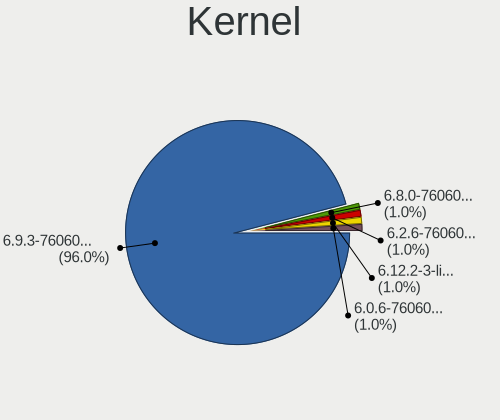
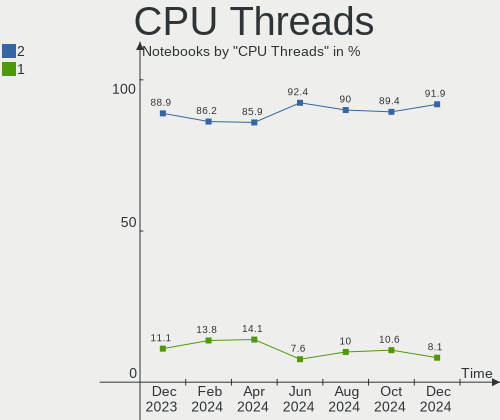
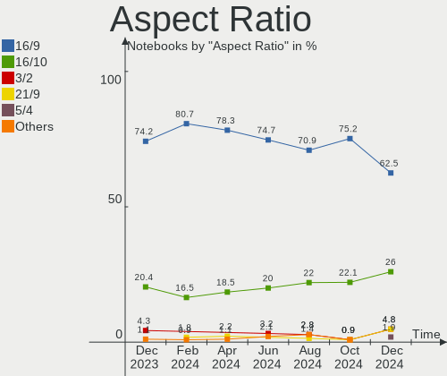
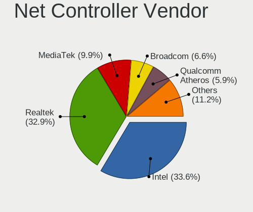

Pop!_OS - Hardware Trends (Notebooks)
-------------------------------------

A project to identify most popular hardware characteristics and track their change
over time based on data collected by Linux users at https://Linux-Hardware.org.

Anyone can contribute to this report by the [hw-probe](https://github.com/linuxhw/hw-probe) tool:

    sudo -E hw-probe -all -upload

This report is for one last month. Overall report since the beginning of time: [TestDays](https://github.com/linuxhw/TestDays)

Period: Apr, 2023.

Contents
--------

* [ System ](#system)
  - [ OS                       ](#os)
  - [ OS Family                ](#os-family)
  - [ Kernel                   ](#kernel)
  - [ Kernel Family            ](#kernel-family)
  - [ Kernel Major Ver.        ](#kernel-major-ver)
  - [ Arch                     ](#arch)
  - [ DE                       ](#de)
  - [ Display Server           ](#display-server)
  - [ Display Manager          ](#display-manager)
  - [ OS Lang                  ](#os-lang)
  - [ Boot Mode                ](#boot-mode)
  - [ Filesystem               ](#filesystem)
  - [ Part. scheme             ](#part-scheme)
  - [ Dual Boot with Linux/BSD ](#dual-boot-with-linuxbsd)
  - [ Dual Boot (Win)          ](#dual-boot-win)

* [ Board ](#board)
  - [ Vendor                   ](#vendor)
  - [ Model                    ](#model)
  - [ Model Family             ](#model-family)
  - [ MFG Year                 ](#mfg-year)
  - [ Form Factor              ](#form-factor)
  - [ Secure Boot              ](#secure-boot)
  - [ Coreboot                 ](#coreboot)
  - [ RAM Size                 ](#ram-size)
  - [ RAM Used                 ](#ram-used)
  - [ Total Drives             ](#total-drives)
  - [ Has CD-ROM               ](#has-cd-rom)
  - [ Has Ethernet             ](#has-ethernet)
  - [ Has WiFi                 ](#has-wifi)
  - [ Has Bluetooth            ](#has-bluetooth)

* [ Location ](#location)
  - [ Country                  ](#country)
  - [ City                     ](#city)

* [ Drives ](#drives)
  - [ Drive Vendor             ](#drive-vendor)
  - [ Drive Model              ](#drive-model)
  - [ HDD Vendor               ](#hdd-vendor)
  - [ SSD Vendor               ](#ssd-vendor)
  - [ Drive Kind               ](#drive-kind)
  - [ Drive Connector          ](#drive-connector)
  - [ Drive Size               ](#drive-size)
  - [ Space Total              ](#space-total)
  - [ Space Used               ](#space-used)
  - [ Malfunc. Drives          ](#malfunc-drives)
  - [ Malfunc. Drive Vendor    ](#malfunc-drive-vendor)
  - [ Malfunc. HDD Vendor      ](#malfunc-hdd-vendor)
  - [ Malfunc. Drive Kind      ](#malfunc-drive-kind)
  - [ Failed Drives            ](#failed-drives)
  - [ Failed Drive Vendor      ](#failed-drive-vendor)
  - [ Drive Status             ](#drive-status)

* [ Storage controller ](#storage-controller)
  - [ Storage Vendor           ](#storage-vendor)
  - [ Storage Model            ](#storage-model)
  - [ Storage Kind             ](#storage-kind)

* [ Processor ](#processor)
  - [ CPU Vendor               ](#cpu-vendor)
  - [ CPU Model                ](#cpu-model)
  - [ CPU Model Family         ](#cpu-model-family)
  - [ CPU Cores                ](#cpu-cores)
  - [ CPU Sockets              ](#cpu-sockets)
  - [ CPU Threads              ](#cpu-threads)
  - [ CPU Op-Modes             ](#cpu-op-modes)
  - [ CPU Microcode            ](#cpu-microcode)
  - [ CPU Microarch            ](#cpu-microarch)

* [ Graphics ](#graphics)
  - [ GPU Vendor               ](#gpu-vendor)
  - [ GPU Model                ](#gpu-model)
  - [ GPU Combo                ](#gpu-combo)
  - [ GPU Driver               ](#gpu-driver)
  - [ GPU Memory               ](#gpu-memory)

* [ Monitor ](#monitor)
  - [ Monitor Vendor           ](#monitor-vendor)
  - [ Monitor Model            ](#monitor-model)
  - [ Monitor Resolution       ](#monitor-resolution)
  - [ Monitor Diagonal         ](#monitor-diagonal)
  - [ Monitor Width            ](#monitor-width)
  - [ Aspect Ratio             ](#aspect-ratio)
  - [ Monitor Area             ](#monitor-area)
  - [ Pixel Density            ](#pixel-density)
  - [ Multiple Monitors        ](#multiple-monitors)

* [ Network ](#network)
  - [ Net Controller Vendor    ](#net-controller-vendor)
  - [ Net Controller Model     ](#net-controller-model)
  - [ Wireless Vendor          ](#wireless-vendor)
  - [ Wireless Model           ](#wireless-model)
  - [ Ethernet Vendor          ](#ethernet-vendor)
  - [ Ethernet Model           ](#ethernet-model)
  - [ Net Controller Kind      ](#net-controller-kind)
  - [ Used Controller          ](#used-controller)
  - [ NICs                     ](#nics)
  - [ IPv6                     ](#ipv6)

* [ Bluetooth ](#bluetooth)
  - [ Bluetooth Vendor         ](#bluetooth-vendor)
  - [ Bluetooth Model          ](#bluetooth-model)

* [ Sound ](#sound)
  - [ Sound Vendor             ](#sound-vendor)
  - [ Sound Model              ](#sound-model)

* [ Memory ](#memory)
  - [ Memory Vendor            ](#memory-vendor)
  - [ Memory Model             ](#memory-model)
  - [ Memory Kind              ](#memory-kind)
  - [ Memory Form Factor       ](#memory-form-factor)
  - [ Memory Size              ](#memory-size)
  - [ Memory Speed             ](#memory-speed)

* [ Printers & scanners ](#printers--scanners)
  - [ Printer Vendor           ](#printer-vendor)
  - [ Printer Model            ](#printer-model)
  - [ Scanner Vendor           ](#scanner-vendor)
  - [ Scanner Model            ](#scanner-model)

* [ Camera ](#camera)
  - [ Camera Vendor            ](#camera-vendor)
  - [ Camera Model             ](#camera-model)

* [ Security ](#security)
  - [ Fingerprint Vendor       ](#fingerprint-vendor)
  - [ Fingerprint Model        ](#fingerprint-model)
  - [ Chipcard Vendor          ](#chipcard-vendor)
  - [ Chipcard Model           ](#chipcard-model)

* [ Unsupported ](#unsupported)
  - [ Unsupported Devices      ](#unsupported-devices)
  - [ Unsupported Device Types ](#unsupported-device-types)

System
------

OS
--

Installed operating systems

| Name          | Notebooks | Percent |
|---------------|-----------|---------|
| Pop!_OS 22.04 | 116       | 100%    |

OS Family
---------

OS without a version

| Name    | Notebooks | Percent |
|---------|-----------|---------|
| Pop!_OS | 116       | 100%    |

Kernel
------

Version of the Linux kernel

| Version                 | Notebooks | Percent |
|-------------------------|-----------|---------|
| 6.2.6-76060206-generic  | 102       | 87.93%  |
| 6.2.0-76060200-generic  | 4         | 3.45%   |
| 6.0.12-76060006-generic | 3         | 2.59%   |
| 6.2.11-060211-generic   | 2         | 1.72%   |
| 6.2.9-1-liquorix-amd64  | 1         | 0.86%   |
| 6.2.10-060210-generic   | 1         | 0.86%   |
| 6.0.6-76060006-generic  | 1         | 0.86%   |
| 5.19.0-76051900-generic | 1         | 0.86%   |
| 5.17.5-76051705-generic | 1         | 0.86%   |

Kernel Family
-------------

Linux kernel without a distro release

| Version | Notebooks | Percent |
|---------|-----------|---------|
| 6.2.6   | 102       | 87.93%  |
| 6.2.0   | 4         | 3.45%   |
| 6.0.12  | 3         | 2.59%   |
| 6.2.11  | 2         | 1.72%   |
| 6.2.9   | 1         | 0.86%   |
| 6.2.10  | 1         | 0.86%   |
| 6.0.6   | 1         | 0.86%   |
| 5.19.0  | 1         | 0.86%   |
| 5.17.5  | 1         | 0.86%   |

Kernel Major Ver.
-----------------

Linux kernel major version

| Version | Notebooks | Percent |
|---------|-----------|---------|
| 6.2     | 110       | 94.83%  |
| 6.0     | 4         | 3.45%   |
| 5.19    | 1         | 0.86%   |
| 5.17    | 1         | 0.86%   |

Arch
----

OS architecture (x86_64, i586, etc.)

| Name   | Notebooks | Percent |
|--------|-----------|---------|
| x86_64 | 116       | 100%    |

DE
--

Desktop Environment

| Name    | Notebooks | Percent |
|---------|-----------|---------|
| GNOME   | 112       | 96.55%  |
| KDE5    | 2         | 1.72%   |
| MATE    | 1         | 0.86%   |
| Unknown | 1         | 0.86%   |

Display Server
--------------

X11 or Wayland

| Name    | Notebooks | Percent |
|---------|-----------|---------|
| X11     | 112       | 96.55%  |
| Wayland | 4         | 3.45%   |

Display Manager
---------------

SDDM, LightDM, etc.

| Name    | Notebooks | Percent |
|---------|-----------|---------|
| Unknown | 83        | 71.55%  |
| GDM3    | 32        | 27.59%  |
| LightDM | 1         | 0.86%   |

OS Lang
-------

Language

| Lang    | Notebooks | Percent |
|---------|-----------|---------|
| en_US   | 68        | 58.62%  |
| en_GB   | 7         | 6.03%   |
| de_DE   | 7         | 6.03%   |
| pt_BR   | 6         | 5.17%   |
| it_IT   | 4         | 3.45%   |
| nb_NO   | 3         | 2.59%   |
| C       | 3         | 2.59%   |
| pl_PL   | 2         | 1.72%   |
| fi_FI   | 2         | 1.72%   |
| es_CL   | 2         | 1.72%   |
| tl_PH   | 1         | 0.86%   |
| pt_PT   | 1         | 0.86%   |
| es_MX   | 1         | 0.86%   |
| es_ES   | 1         | 0.86%   |
| es_CO   | 1         | 0.86%   |
| en_ZA   | 1         | 0.86%   |
| en_IN   | 1         | 0.86%   |
| en_DK   | 1         | 0.86%   |
| en_CA   | 1         | 0.86%   |
| en_AU   | 1         | 0.86%   |
| ar_LY   | 1         | 0.86%   |
| Unknown | 1         | 0.86%   |

Boot Mode
---------

EFI or BIOS

| Mode | Notebooks | Percent |
|------|-----------|---------|
| BIOS | 85        | 73.28%  |
| EFI  | 31        | 26.72%  |

Filesystem
----------

Type of filesystem

| Type    | Notebooks | Percent |
|---------|-----------|---------|
| Ext4    | 111       | 95.69%  |
| Overlay | 3         | 2.59%   |
| Btrfs   | 2         | 1.72%   |

Part. scheme
------------

Scheme of partitioning

| Type    | Notebooks | Percent |
|---------|-----------|---------|
| Unknown | 83        | 71.55%  |
| GPT     | 32        | 27.59%  |
| MBR     | 1         | 0.86%   |

Dual Boot with Linux/BSD
------------------------

Hosting more than one Linux/BSD

| Dual boot | Notebooks | Percent |
|-----------|-----------|---------|
| No        | 115       | 99.14%  |
| Yes       | 1         | 0.86%   |

Dual Boot (Win)
---------------

Hosting Linux and Windows

| Dual boot | Notebooks | Percent |
|-----------|-----------|---------|
| No        | 105       | 90.52%  |
| Yes       | 11        | 9.48%   |

Board
-----

Vendor
------

Motherboard manufacturer

| Name                | Notebooks | Percent |
|---------------------|-----------|---------|
| Lenovo              | 32        | 27.59%  |
| Dell                | 20        | 17.24%  |
| Hewlett-Packard     | 17        | 14.66%  |
| ASUSTek Computer    | 8         | 6.9%    |
| Apple               | 8         | 6.9%    |
| Acer                | 5         | 4.31%   |
| System76            | 4         | 3.45%   |
| MSI                 | 4         | 3.45%   |
| Samsung Electronics | 3         | 2.59%   |
| Toshiba             | 2         | 1.72%   |
| Razer               | 2         | 1.72%   |
| HUAWEI              | 2         | 1.72%   |
| Alienware           | 2         | 1.72%   |
| Timi                | 1         | 0.86%   |
| Sony                | 1         | 0.86%   |
| Medion              | 1         | 0.86%   |
| GPU Company         | 1         | 0.86%   |
| Gigabyte Technology | 1         | 0.86%   |
| American Megatrends | 1         | 0.86%   |
| Unknown             | 1         | 0.86%   |

Model
-----

Motherboard model

| Name                                     | Notebooks | Percent |
|------------------------------------------|-----------|---------|
| Apple MacBookPro12,1                     | 3         | 2.59%   |
| Lenovo Legion 5 15ARH05H 82B1            | 2         | 1.72%   |
| HUAWEI BOHK-WAX9X                        | 2         | 1.72%   |
| Apple MacBookPro8,1                      | 2         | 1.72%   |
| Toshiba Satellite L45-B                  | 1         | 0.86%   |
| Toshiba Satellite E45-B                  | 1         | 0.86%   |
| Timi TM1707                              | 1         | 0.86%   |
| System76 Pangolin                        | 1         | 0.86%   |
| System76 Oryx Pro                        | 1         | 0.86%   |
| System76 Kudu                            | 1         | 0.86%   |
| System76 Gazelle                         | 1         | 0.86%   |
| Sony VPCSC1AFM                           | 1         | 0.86%   |
| Samsung RC530/RC730                      | 1         | 0.86%   |
| Samsung 760XDA                           | 1         | 0.86%   |
| Samsung 300E4Z/300E5Z/300E7Z             | 1         | 0.86%   |
| Razer Blade Stealth                      | 1         | 0.86%   |
| Razer Blade                              | 1         | 0.86%   |
| MSI PS42 Modern 8RC                      | 1         | 0.86%   |
| MSI GV62 7RE                             | 1         | 0.86%   |
| MSI GL63 8RC                             | 1         | 0.86%   |
| MSI GF63 Thin 9RCX                       | 1         | 0.86%   |
| Medion E15415                            | 1         | 0.86%   |
| Lenovo Yoga Slim 7 Pro 14ARH7 82UU       | 1         | 0.86%   |
| Lenovo Y50-70 20378                      | 1         | 0.86%   |
| Lenovo V14-IIL 82C4                      | 1         | 0.86%   |
| Lenovo ThinkPad X220 4291WF5             | 1         | 0.86%   |
| Lenovo ThinkPad X1 Carbon 7th 20QD001FZA | 1         | 0.86%   |
| Lenovo ThinkPad T570 W10DG 20JXS18W00    | 1         | 0.86%   |
| Lenovo ThinkPad T480s 20L8S6S307         | 1         | 0.86%   |
| Lenovo ThinkPad T480 20L50003GE          | 1         | 0.86%   |
| Lenovo ThinkPad T470 20HES0FA03          | 1         | 0.86%   |
| Lenovo ThinkPad T460p 20FXS08N00         | 1         | 0.86%   |
| Lenovo ThinkPad T450 20BUS0B000          | 1         | 0.86%   |
| Lenovo ThinkPad T14 Gen 1 20S1S6D700     | 1         | 0.86%   |
| Lenovo ThinkPad L570 20J80021MD          | 1         | 0.86%   |
| Lenovo ThinkPad A275 20KDS01T00          | 1         | 0.86%   |
| Lenovo ThinkBook 15-IML 20RW             | 1         | 0.86%   |
| Lenovo ThinkBook 15 G4 IAP 21DJ          | 1         | 0.86%   |
| Lenovo Slim 7 16ARH7 82UX                | 1         | 0.86%   |
| Lenovo Legion S7 15IMH5 82BC             | 1         | 0.86%   |

Model Family
------------

Motherboard model prefix

| Name               | Notebooks | Percent |
|--------------------|-----------|---------|
| Lenovo ThinkPad    | 11        | 9.48%   |
| Lenovo IdeaPad     | 8         | 6.9%    |
| Dell Inspiron      | 7         | 6.03%   |
| Lenovo Legion      | 6         | 5.17%   |
| Dell XPS           | 5         | 4.31%   |
| Dell Latitude      | 5         | 4.31%   |
| HP Pavilion        | 3         | 2.59%   |
| HP Laptop          | 3         | 2.59%   |
| Apple MacBookPro12 | 3         | 2.59%   |
| Toshiba Satellite  | 2         | 1.72%   |
| Razer Blade        | 2         | 1.72%   |
| Lenovo ThinkBook   | 2         | 1.72%   |
| HUAWEI BOHK-WAX9X  | 2         | 1.72%   |
| HP ZBook           | 2         | 1.72%   |
| HP ENVY            | 2         | 1.72%   |
| Dell Precision     | 2         | 1.72%   |
| ASUS ZenBook       | 2         | 1.72%   |
| Apple MacBookPro8  | 2         | 1.72%   |
| Apple MacBookPro11 | 2         | 1.72%   |
| Alienware 13       | 2         | 1.72%   |
| Acer Swift         | 2         | 1.72%   |
| Acer Aspire        | 2         | 1.72%   |
| Timi TM1707        | 1         | 0.86%   |
| System76 Pangolin  | 1         | 0.86%   |
| System76 Oryx      | 1         | 0.86%   |
| System76 Kudu      | 1         | 0.86%   |
| System76 Gazelle   | 1         | 0.86%   |
| Sony VPCSC1AFM     | 1         | 0.86%   |
| Samsung RC530      | 1         | 0.86%   |
| Samsung 760XDA     | 1         | 0.86%   |
| Samsung 300E4Z     | 1         | 0.86%   |
| MSI PS42           | 1         | 0.86%   |
| MSI GV62           | 1         | 0.86%   |
| MSI GL63           | 1         | 0.86%   |
| MSI GF63           | 1         | 0.86%   |
| Medion E15415      | 1         | 0.86%   |
| Lenovo Yoga        | 1         | 0.86%   |
| Lenovo Y50-70      | 1         | 0.86%   |
| Lenovo V14-IIL     | 1         | 0.86%   |
| Lenovo Slim        | 1         | 0.86%   |

MFG Year
--------

Motherboard manufacture year

| Year    | Notebooks | Percent |
|---------|-----------|---------|
| 2022    | 16        | 13.79%  |
| 2018    | 12        | 10.34%  |
| 2021    | 11        | 9.48%   |
| 2020    | 10        | 8.62%   |
| 2019    | 10        | 8.62%   |
| 2015    | 9         | 7.76%   |
| 2017    | 8         | 6.9%    |
| 2011    | 8         | 6.9%    |
| 2013    | 7         | 6.03%   |
| 2016    | 6         | 5.17%   |
| 2014    | 6         | 5.17%   |
| 2012    | 5         | 4.31%   |
| 2008    | 3         | 2.59%   |
| 2010    | 2         | 1.72%   |
| 2023    | 1         | 0.86%   |
| 2006    | 1         | 0.86%   |
| Unknown | 1         | 0.86%   |

Form Factor
-----------

Physical design of the computer

| Name     | Notebooks | Percent |
|----------|-----------|---------|
| Notebook | 116       | 100%    |

Secure Boot
-----------

Enabled or disabled

| State    | Notebooks | Percent |
|----------|-----------|---------|
| Disabled | 116       | 100%    |

Coreboot
--------

Have coreboot on board

| Used | Notebooks | Percent |
|------|-----------|---------|
| No   | 113       | 97.41%  |
| Yes  | 3         | 2.59%   |

RAM Size
--------

Total RAM memory

| Size in GB  | Notebooks | Percent |
|-------------|-----------|---------|
| 4.01-8.0    | 35        | 30.17%  |
| 16.01-24.0  | 26        | 22.41%  |
| 8.01-16.0   | 24        | 20.69%  |
| 3.01-4.0    | 18        | 15.52%  |
| 32.01-64.0  | 8         | 6.9%    |
| 24.01-32.0  | 2         | 1.72%   |
| 1.01-2.0    | 2         | 1.72%   |
| 64.01-256.0 | 1         | 0.86%   |

RAM Used
--------

Used RAM memory

| Used GB   | Notebooks | Percent |
|-----------|-----------|---------|
| 4.01-8.0  | 45        | 38.79%  |
| 3.01-4.0  | 28        | 24.14%  |
| 2.01-3.0  | 28        | 24.14%  |
| 1.01-2.0  | 7         | 6.03%   |
| 8.01-16.0 | 7         | 6.03%   |
| 0.51-1.0  | 1         | 0.86%   |

Total Drives
------------

Number of drives on board

| Drives | Notebooks | Percent |
|--------|-----------|---------|
| 1      | 85        | 73.28%  |
| 2      | 27        | 23.28%  |
| 3      | 4         | 3.45%   |

Has CD-ROM
----------

Has CD-ROM on board

| Presented | Notebooks | Percent |
|-----------|-----------|---------|
| No        | 89        | 76.72%  |
| Yes       | 27        | 23.28%  |

Has Ethernet
------------

Has Ethernet on board

| Presented | Notebooks | Percent |
|-----------|-----------|---------|
| Yes       | 82        | 70.69%  |
| No        | 34        | 29.31%  |

Has WiFi
--------

Has WiFi module

| Presented | Notebooks | Percent |
|-----------|-----------|---------|
| Yes       | 113       | 97.41%  |
| No        | 3         | 2.59%   |

Has Bluetooth
-------------

Has Bluetooth module

| Presented | Notebooks | Percent |
|-----------|-----------|---------|
| Yes       | 98        | 84.48%  |
| No        | 18        | 15.52%  |

Location
--------

Country
-------

Geographic location (country)

| Country      | Notebooks | Percent |
|--------------|-----------|---------|
| USA          | 43        | 37.07%  |
| Germany      | 8         | 6.9%    |
| Brazil       | 7         | 6.03%   |
| UK           | 5         | 4.31%   |
| Italy        | 5         | 4.31%   |
| Poland       | 4         | 3.45%   |
| Canada       | 4         | 3.45%   |
| South Africa | 3         | 2.59%   |
| Norway       | 3         | 2.59%   |
| Chile        | 3         | 2.59%   |
| Spain        | 2         | 1.72%   |
| Netherlands  | 2         | 1.72%   |
| India        | 2         | 1.72%   |
| Finland      | 2         | 1.72%   |
| Australia    | 2         | 1.72%   |
| Vietnam      | 1         | 0.86%   |
| Ukraine      | 1         | 0.86%   |
| Switzerland  | 1         | 0.86%   |
| Sweden       | 1         | 0.86%   |
| Serbia       | 1         | 0.86%   |
| Portugal     | 1         | 0.86%   |
| Philippines  | 1         | 0.86%   |
| Morocco      | 1         | 0.86%   |
| Mexico       | 1         | 0.86%   |
| Malaysia     | 1         | 0.86%   |
| Libya        | 1         | 0.86%   |
| Kazakhstan   | 1         | 0.86%   |
| Indonesia    | 1         | 0.86%   |
| Georgia      | 1         | 0.86%   |
| France       | 1         | 0.86%   |
| Denmark      | 1         | 0.86%   |
| Czechia      | 1         | 0.86%   |
| Colombia     | 1         | 0.86%   |
| Bulgaria     | 1         | 0.86%   |
| Austria      | 1         | 0.86%   |
| Argentina    | 1         | 0.86%   |

City
----

Geographic location (city)

| City                 | Notebooks | Percent |
|----------------------|-----------|---------|
| New York             | 3         | 2.59%   |
| Vienna               | 2         | 1.72%   |
| Temuco               | 2         | 1.72%   |
| Poznan               | 2         | 1.72%   |
| Moss                 | 2         | 1.72%   |
| Maringá             | 2         | 1.72%   |
| Helsinki             | 2         | 1.72%   |
| Denton               | 2         | 1.72%   |
| Zurich               | 1         | 0.86%   |
| West Jordan          | 1         | 0.86%   |
| Washington           | 1         | 0.86%   |
| Vra                  | 1         | 0.86%   |
| Verona               | 1         | 0.86%   |
| Vechelde             | 1         | 0.86%   |
| Trondheim            | 1         | 0.86%   |
| Tracy                | 1         | 0.86%   |
| The Hague            | 1         | 0.86%   |
| Tbilisi              | 1         | 0.86%   |
| Tampa                | 1         | 0.86%   |
| Sydney               | 1         | 0.86%   |
| Swindon              | 1         | 0.86%   |
| Surat                | 1         | 0.86%   |
| State College        | 1         | 0.86%   |
| St Louis             | 1         | 0.86%   |
| Sofia                | 1         | 0.86%   |
| Soddy-Daisy          | 1         | 0.86%   |
| Simcoe               | 1         | 0.86%   |
| Sidi Slimane         | 1         | 0.86%   |
| Shah Alam            | 1         | 0.86%   |
| Semarang             | 1         | 0.86%   |
| Sebring              | 1         | 0.86%   |
| Seattle              | 1         | 0.86%   |
| Sao Paulo            | 1         | 0.86%   |
| Sao José dos Campos | 1         | 0.86%   |
| Santiago             | 1         | 0.86%   |
| San Francisco        | 1         | 0.86%   |
| Rossville            | 1         | 0.86%   |
| Rochester            | 1         | 0.86%   |
| Riverside            | 1         | 0.86%   |
| Richmond             | 1         | 0.86%   |

Drives
------

Drive Vendor
------------

Hard drive vendors

| Vendor                      | Notebooks | Drives | Percent |
|-----------------------------|-----------|--------|---------|
| Samsung Electronics         | 28        | 30     | 18.67%  |
| WDC                         | 15        | 16     | 10%     |
| SK hynix                    | 11        | 11     | 7.33%   |
| Seagate                     | 11        | 11     | 7.33%   |
| Kingston                    | 10        | 10     | 6.67%   |
| Sandisk                     | 9         | 9      | 6%      |
| Unknown                     | 6         | 6      | 4%      |
| Intel                       | 6         | 6      | 4%      |
| Toshiba                     | 5         | 5      | 3.33%   |
| Hitachi                     | 5         | 6      | 3.33%   |
| Apple                       | 5         | 5      | 3.33%   |
| Micron Technology           | 4         | 4      | 2.67%   |
| HGST                        | 4         | 4      | 2.67%   |
| China                       | 4         | 4      | 2.67%   |
| Micron/Crucial Technology   | 3         | 4      | 2%      |
| Crucial                     | 3         | 3      | 2%      |
| SPCC                        | 2         | 2      | 1.33%   |
| PNY                         | 2         | 2      | 1.33%   |
| Phison                      | 2         | 2      | 1.33%   |
| Kingston Technology Company | 2         | 2      | 1.33%   |
| Intenso                     | 2         | 2      | 1.33%   |
| Unknown                     | 2         | 2      | 1.33%   |
| SSSTC                       | 1         | 1      | 0.67%   |
| ShiJi                       | 1         | 1      | 0.67%   |
| Phison Electronics          | 1         | 1      | 0.67%   |
| MAXIO Technology (Hangzhou) | 1         | 1      | 0.67%   |
| LITEONIT                    | 1         | 1      | 0.67%   |
| Gigabyte Technology         | 1         | 1      | 0.67%   |
| Fanxiang                    | 1         | 1      | 0.67%   |
| ADATA Technology            | 1         | 1      | 0.67%   |
| Aarvex                      | 1         | 1      | 0.67%   |

Drive Model
-----------

Hard drive models

| Model                                               | Notebooks | Percent |
|-----------------------------------------------------|-----------|---------|
| Samsung NVMe SSD Controller SM981/PM981/PM983 1TB   | 5         | 3.27%   |
| SanDisk NVMe SSD Drive 1TB                          | 3         | 1.96%   |
| Micron/Crucial P2 NVMe PCIe SSD 1TB                 | 3         | 1.96%   |
| Kingston OM8PCP3512F 512GB SSD                      | 3         | 1.96%   |
| Apple SSD SM0128G 121GB                             | 3         | 1.96%   |
| Unknown MMC Card  64GB                              | 2         | 1.31%   |
| Seagate ST1000LM024 HN-M101MBB 1TB                  | 2         | 1.31%   |
| Samsung SSD 850 PRO 256GB                           | 2         | 1.31%   |
| Samsung NVMe SSD Controller SM961/PM961/SM963 500GB | 2         | 1.31%   |
| Samsung MZVLB1T0HBLR-000L2 1TB                      | 2         | 1.31%   |
| PNY ELITE PSSD 240GB                                | 2         | 1.31%   |
| Kingston SA400S37120G 120GB SSD                     | 2         | 1.31%   |
| Intel SSD 660P Series 512GB                         | 2         | 1.31%   |
| Hitachi HTS547575A9E384 752GB                       | 2         | 1.31%   |
| HGST HTS721010A9E630 1TB                            | 2         | 1.31%   |
| Unknown                                             | 2         | 1.31%   |
| WDC WDS500G3X0C-00SJG0 500GB                        | 1         | 0.65%   |
| WDC WDS100T2B0A-00SM50 1TB SSD                      | 1         | 0.65%   |
| WDC WD5000LPVX-80V0TT0 500GB                        | 1         | 0.65%   |
| WDC WD5000LPCX-00VHAT0 500GB                        | 1         | 0.65%   |
| WDC WD3200BEKT-60PVMT0 320GB                        | 1         | 0.65%   |
| WDC WD20 EADS-42R6B0 2TB                            | 1         | 0.65%   |
| WDC WD1200BEVS-75UST0 120GB                         | 1         | 0.65%   |
| WDC WD10SPZX-24Z10 1TB                              | 1         | 0.65%   |
| WDC WD10SPZX-17Z10T1 1TB                            | 1         | 0.65%   |
| WDC WD10SPCX-60HWST0 1TB                            | 1         | 0.65%   |
| WDC WD10SPCX-24HWST1 1TB                            | 1         | 0.65%   |
| WDC WD10JPVX-60JC3T1 1TB                            | 1         | 0.65%   |
| WDC WD10JPCX-24UE4T0 1TB                            | 1         | 0.65%   |
| WDC WD10 JPVX-60JC3T0 1TB                           | 1         | 0.65%   |
| WDC PC SN530 SDBPNPZ-256G-1002 256GB                | 1         | 0.65%   |
| WDC PC SN520 SDAPNUW-256G-1006 256GB                | 1         | 0.65%   |
| Unknown MMC Card  250GB                             | 1         | 0.65%   |
| Unknown MMC Card  16GB                              | 1         | 0.65%   |
| Unknown MMC Card  128GB                             | 1         | 0.65%   |
| Unknown Biwin  64GB                                 | 1         | 0.65%   |
| Toshiba XG6 NVMe SSD Controller 1024GB              | 1         | 0.65%   |
| Toshiba THNSNK128GVN8 M.2 2280 128GB SSD            | 1         | 0.65%   |
| Toshiba MQ01ABF050 500GB                            | 1         | 0.65%   |
| Toshiba MK6465GSXN 640GB                            | 1         | 0.65%   |

HDD Vendor
----------

Hard disk drive vendors

| Vendor  | Notebooks | Drives | Percent |
|---------|-----------|--------|---------|
| WDC     | 11        | 12     | 31.43%  |
| Seagate | 11        | 11     | 31.43%  |
| Hitachi | 5         | 6      | 14.29%  |
| HGST    | 4         | 4      | 11.43%  |
| Toshiba | 3         | 3      | 8.57%   |
| Intenso | 1         | 1      | 2.86%   |

SSD Vendor
----------

Solid state drive vendors

| Vendor              | Notebooks | Drives | Percent |
|---------------------|-----------|--------|---------|
| Samsung Electronics | 11        | 11     | 24.44%  |
| Kingston            | 8         | 8      | 17.78%  |
| Apple               | 5         | 5      | 11.11%  |
| China               | 4         | 4      | 8.89%   |
| SK hynix            | 3         | 3      | 6.67%   |
| SPCC                | 2         | 2      | 4.44%   |
| PNY                 | 2         | 2      | 4.44%   |
| Micron Technology   | 2         | 2      | 4.44%   |
| Crucial             | 2         | 2      | 4.44%   |
| WDC                 | 1         | 1      | 2.22%   |
| Toshiba             | 1         | 1      | 2.22%   |
| LITEONIT            | 1         | 1      | 2.22%   |
| Intel               | 1         | 1      | 2.22%   |
| Fanxiang            | 1         | 1      | 2.22%   |
| Aarvex              | 1         | 1      | 2.22%   |

Drive Kind
----------

HDD or SSD

| Kind    | Notebooks | Drives | Percent |
|---------|-----------|--------|---------|
| NVMe    | 54        | 63     | 40.3%   |
| SSD     | 38        | 45     | 28.36%  |
| HDD     | 33        | 37     | 24.63%  |
| MMC     | 6         | 6      | 4.48%   |
| Unknown | 3         | 4      | 2.24%   |

Drive Connector
---------------

SATA, SAS, NVMe, etc.

| Type | Notebooks | Drives | Percent |
|------|-----------|--------|---------|
| SATA | 68        | 75     | 50%     |
| NVMe | 54        | 63     | 39.71%  |
| SAS  | 8         | 11     | 5.88%   |
| MMC  | 6         | 6      | 4.41%   |

Drive Size
----------

Size of hard drive

| Size in TB | Notebooks | Drives | Percent |
|------------|-----------|--------|---------|
| 0.01-0.5   | 43        | 47     | 56.58%  |
| 0.51-1.0   | 29        | 31     | 38.16%  |
| 1.01-2.0   | 2         | 2      | 2.63%   |
| 3.01-4.0   | 1         | 1      | 1.32%   |
| 4.01-10.0  | 1         | 1      | 1.32%   |

Space Total
-----------

Amount of disk space available on the file system

| Size in GB     | Notebooks | Percent |
|----------------|-----------|---------|
| 251-500        | 34        | 29.31%  |
| 101-250        | 30        | 25.86%  |
| 501-1000       | 29        | 25%     |
| 1001-2000      | 6         | 5.17%   |
| 51-100         | 6         | 5.17%   |
| 2001-3000      | 4         | 3.45%   |
| More than 3000 | 3         | 2.59%   |
| 1-20           | 3         | 2.59%   |
| Unknown        | 1         | 0.86%   |

Space Used
----------

Amount of used disk space

| Used GB        | Notebooks | Percent |
|----------------|-----------|---------|
| 1-20           | 38        | 32.76%  |
| 21-50          | 23        | 19.83%  |
| 101-250        | 20        | 17.24%  |
| 51-100         | 16        | 13.79%  |
| 251-500        | 10        | 8.62%   |
| 501-1000       | 5         | 4.31%   |
| More than 3000 | 1         | 0.86%   |
| 2001-3000      | 1         | 0.86%   |
| 1001-2000      | 1         | 0.86%   |
| Unknown        | 1         | 0.86%   |

Malfunc. Drives
---------------

Drive models with a malfunction

| Model                              | Notebooks | Drives | Percent |
|------------------------------------|-----------|--------|---------|
| SK hynix PC711 HFS001TDE9X073N 1TB | 1         | 1      | 100%    |

Malfunc. Drive Vendor
---------------------

Vendors of faulty drives

| Vendor   | Notebooks | Drives | Percent |
|----------|-----------|--------|---------|
| SK hynix | 1         | 1      | 100%    |

Malfunc. HDD Vendor
-------------------

Vendors of faulty HDD drives

Zero info for selected period =(

Malfunc. Drive Kind
-------------------

Kinds of faulty drives

| Kind | Notebooks | Drives | Percent |
|------|-----------|--------|---------|
| NVMe | 1         | 1      | 100%    |

Failed Drives
-------------

Failed drive models

Zero info for selected period =(

Failed Drive Vendor
-------------------

Failed drive vendors

Zero info for selected period =(

Drive Status
------------

Number of failed and malfunc. drives

| Status   | Notebooks | Drives | Percent |
|----------|-----------|--------|---------|
| Detected | 91        | 116    | 73.98%  |
| Works    | 31        | 38     | 25.2%   |
| Malfunc  | 1         | 1      | 0.81%   |

Storage controller
------------------

Storage Vendor
--------------

Storage controller vendors

| Vendor                         | Notebooks | Percent |
|--------------------------------|-----------|---------|
| Intel                          | 69        | 46.94%  |
| Samsung Electronics            | 24        | 16.33%  |
| AMD                            | 17        | 11.56%  |
| SanDisk                        | 11        | 7.48%   |
| SK hynix                       | 8         | 5.44%   |
| Phison Electronics             | 4         | 2.72%   |
| Micron/Crucial Technology      | 4         | 2.72%   |
| Kingston Technology Company    | 4         | 2.72%   |
| Micron Technology              | 2         | 1.36%   |
| Toshiba America Info Systems   | 1         | 0.68%   |
| Solid State Storage Technology | 1         | 0.68%   |
| MAXIO Technology (Hangzhou)    | 1         | 0.68%   |
| ADATA Technology               | 1         | 0.68%   |

Storage Model
-------------

Storage controller models

| Model                                                                          | Notebooks | Percent |
|--------------------------------------------------------------------------------|-----------|---------|
| AMD FCH SATA Controller [AHCI mode]                                            | 17        | 11.04%  |
| Samsung NVMe SSD Controller SM981/PM981/PM983                                  | 10        | 6.49%   |
| Intel Sunrise Point-LP SATA Controller [AHCI mode]                             | 9         | 5.84%   |
| Intel 6 Series/C200 Series Chipset Family 6 port Mobile SATA AHCI Controller   | 9         | 5.84%   |
| Intel 82801 Mobile SATA Controller [RAID mode]                                 | 6         | 3.9%    |
| SK hynix Gold P31/PC711 NVMe Solid State Drive                                 | 5         | 3.25%   |
| Intel Wildcat Point-LP SATA Controller [AHCI Mode]                             | 5         | 3.25%   |
| Samsung Electronics SATA controller                                            | 4         | 2.6%    |
| Micron/Crucial P2 NVMe PCIe SSD                                                | 4         | 2.6%    |
| Intel Cannon Lake Mobile PCH SATA AHCI Controller                              | 4         | 2.6%    |
| Intel 8 Series/C220 Series Chipset Family 6-port SATA Controller 1 [AHCI mode] | 4         | 2.6%    |
| SanDisk WD Black SN770 NVMe SSD                                                | 3         | 1.95%   |
| Samsung NVMe SSD Controller PM9A1/PM9A3/980PRO                                 | 3         | 1.95%   |
| Samsung NVMe SSD Controller 980                                                | 3         | 1.95%   |
| Intel Volume Management Device NVMe RAID Controller                            | 3         | 1.95%   |
| Intel SSD 660P Series                                                          | 3         | 1.95%   |
| Intel HM170/QM170 Chipset SATA Controller [AHCI Mode]                          | 3         | 1.95%   |
| Intel Celeron/Pentium Silver Processor SATA Controller                         | 3         | 1.95%   |
| Intel 82801HM/HEM (ICH8M/ICH8M-E) SATA Controller [AHCI mode]                  | 3         | 1.95%   |
| Intel 82801HM/HEM (ICH8M/ICH8M-E) IDE Controller                               | 3         | 1.95%   |
| Intel 7 Series Chipset Family 6-port SATA Controller [AHCI mode]               | 3         | 1.95%   |
| SanDisk WD Blue SN550 NVMe SSD                                                 | 2         | 1.3%    |
| SanDisk WD Black SN750 / PC SN730 NVMe SSD                                     | 2         | 1.3%    |
| Samsung NVMe SSD Controller SM961/PM961/SM963                                  | 2         | 1.3%    |
| Phison Electronics Non-Volatile memory controller                              | 2         | 1.3%    |
| Micron NVMe Storage Controller                                                 | 2         | 1.3%    |
| Intel Non-Volatile memory controller                                           | 2         | 1.3%    |
| Intel Comet Lake SATA AHCI Controller                                          | 2         | 1.3%    |
| Intel Atom Processor E3800 Series SATA AHCI Controller                         | 2         | 1.3%    |
| Intel Alder Lake-P SATA AHCI Controller                                        | 2         | 1.3%    |
| Intel 500 Series Chipset Family SATA AHCI Controller                           | 2         | 1.3%    |
| Toshiba America Info Systems XG6 NVMe SSD Controller                           | 1         | 0.65%   |
| Solid State Storage Non-Volatile memory controller                             | 1         | 0.65%   |
| SK hynix PC300 NVMe Solid State Drive 256GB                                    | 1         | 0.65%   |
| SK hynix Non-Volatile memory controller                                        | 1         | 0.65%   |
| SK hynix BC511                                                                 | 1         | 0.65%   |
| SanDisk WD PC SN810 / Black SN850 NVMe SSD                                     | 1         | 0.65%   |
| SanDisk WD Blue SN570 NVMe SSD 1TB                                             | 1         | 0.65%   |
| SanDisk WD Blue SN500 / PC SN520 NVMe SSD                                      | 1         | 0.65%   |
| Sandisk Non-Volatile memory controller                                         | 1         | 0.65%   |

Storage Kind
------------

Kind of storage controller (IDE, SATA, NVMe, SAS, ...)

| Kind | Notebooks | Percent |
|------|-----------|---------|
| SATA | 77        | 52.74%  |
| NVMe | 54        | 36.99%  |
| RAID | 9         | 6.16%   |
| IDE  | 6         | 4.11%   |

Processor
---------

CPU Vendor
----------

Processor vendors

| Vendor | Notebooks | Percent |
|--------|-----------|---------|
| Intel  | 87        | 75%     |
| AMD    | 29        | 25%     |

CPU Model
---------

Processor models

| Model                                         | Notebooks | Percent |
|-----------------------------------------------|-----------|---------|
| Intel Core i7-7500U CPU @ 2.70GHz             | 4         | 3.45%   |
| Intel Core i7-7700HQ CPU @ 2.80GHz            | 3         | 2.59%   |
| Intel Core i5-5257U CPU @ 2.70GHz             | 3         | 2.59%   |
| Intel Core i5-5200U CPU @ 2.20GHz             | 3         | 2.59%   |
| AMD Ryzen 7 6800HS Creator Edition            | 3         | 2.59%   |
| Intel Core i7-8750H CPU @ 2.20GHz             | 2         | 1.72%   |
| Intel Core i7-8550U CPU @ 1.80GHz             | 2         | 1.72%   |
| Intel Core i7-6700HQ CPU @ 2.60GHz            | 2         | 1.72%   |
| Intel Core i7-6500U CPU @ 2.50GHz             | 2         | 1.72%   |
| Intel Core i7-10875H CPU @ 2.30GHz            | 2         | 1.72%   |
| Intel Core i5-8250U CPU @ 1.60GHz             | 2         | 1.72%   |
| Intel Core i5-7200U CPU @ 2.50GHz             | 2         | 1.72%   |
| Intel Core i5-4300U CPU @ 1.90GHz             | 2         | 1.72%   |
| Intel Core i5-2520M CPU @ 2.50GHz             | 2         | 1.72%   |
| Intel Core i5-2450M CPU @ 2.50GHz             | 2         | 1.72%   |
| Intel Core i5-2435M CPU @ 2.40GHz             | 2         | 1.72%   |
| Intel Core i5-2410M CPU @ 2.30GHz             | 2         | 1.72%   |
| Intel Core i5-10210U CPU @ 1.60GHz            | 2         | 1.72%   |
| Intel Celeron N4020 CPU @ 1.10GHz             | 2         | 1.72%   |
| Intel 12th Gen Core i7-1255U                  | 2         | 1.72%   |
| AMD Ryzen 7 5800U with Radeon Graphics        | 2         | 1.72%   |
| AMD Ryzen 7 5700U with Radeon Graphics        | 2         | 1.72%   |
| AMD Ryzen 7 4800H with Radeon Graphics        | 2         | 1.72%   |
| AMD Ryzen 5 3500U with Radeon Vega Mobile Gfx | 2         | 1.72%   |
| AMD Athlon Silver 3050U with Radeon Graphics  | 2         | 1.72%   |
| Intel Xeon W-10855M CPU @ 2.80GHz             | 1         | 0.86%   |
| Intel Pentium Silver N5030 CPU @ 1.10GHz      | 1         | 0.86%   |
| Intel Pentium CPU N3540 @ 2.16GHz             | 1         | 0.86%   |
| Intel Core i7-8565U CPU @ 1.80GHz             | 1         | 0.86%   |
| Intel Core i7-6600U CPU @ 2.60GHz             | 1         | 0.86%   |
| Intel Core i7-5500U CPU @ 2.40GHz             | 1         | 0.86%   |
| Intel Core i7-4870HQ CPU @ 2.50GHz            | 1         | 0.86%   |
| Intel Core i7-4770HQ CPU @ 2.20GHz            | 1         | 0.86%   |
| Intel Core i7-4720HQ CPU @ 2.60GHz            | 1         | 0.86%   |
| Intel Core i7-4700MQ CPU @ 2.40GHz            | 1         | 0.86%   |
| Intel Core i7-4500U CPU @ 1.80GHz             | 1         | 0.86%   |
| Intel Core i7-3610QM CPU @ 2.30GHz            | 1         | 0.86%   |
| Intel Core i7-2620M CPU @ 2.70GHz             | 1         | 0.86%   |
| Intel Core i7-10750H CPU @ 2.60GHz            | 1         | 0.86%   |
| Intel Core i5-9300H CPU @ 2.40GHz             | 1         | 0.86%   |

CPU Model Family
----------------

Processor model prefix

| Model                | Notebooks | Percent |
|----------------------|-----------|---------|
| Intel Core i5        | 34        | 29.31%  |
| Intel Core i7        | 28        | 24.14%  |
| AMD Ryzen 7          | 13        | 11.21%  |
| Other                | 10        | 8.62%   |
| Intel Celeron        | 6         | 5.17%   |
| AMD Ryzen 5          | 6         | 5.17%   |
| Intel Core i3        | 4         | 3.45%   |
| Intel Core 2 Duo     | 2         | 1.72%   |
| AMD Ryzen 9          | 2         | 1.72%   |
| AMD Athlon           | 2         | 1.72%   |
| AMD A6               | 2         | 1.72%   |
| Intel Xeon           | 1         | 0.86%   |
| Intel Pentium Silver | 1         | 0.86%   |
| Intel Pentium        | 1         | 0.86%   |
| Intel Core 2         | 1         | 0.86%   |
| AMD Ryzen 7 PRO      | 1         | 0.86%   |
| AMD A8               | 1         | 0.86%   |
| AMD A10              | 1         | 0.86%   |

CPU Cores
---------

Number of processor cores

| Number | Notebooks | Percent |
|--------|-----------|---------|
| 2      | 51        | 43.97%  |
| 4      | 34        | 29.31%  |
| 8      | 17        | 14.66%  |
| 6      | 8         | 6.9%    |
| 12     | 2         | 1.72%   |
| 10     | 2         | 1.72%   |
| 16     | 1         | 0.86%   |
| 1      | 1         | 0.86%   |

CPU Sockets
-----------

Number of sockets

| Number | Notebooks | Percent |
|--------|-----------|---------|
| 1      | 116       | 100%    |

CPU Threads
-----------

Threads per core (Hyper-Threading)

| Number | Notebooks | Percent |
|--------|-----------|---------|
| 2      | 97        | 83.62%  |
| 1      | 19        | 16.38%  |

CPU Op-Modes
------------

CPU Operation Modes (32-bit, 64-bit)

| Op mode        | Notebooks | Percent |
|----------------|-----------|---------|
| 32-bit, 64-bit | 116       | 100%    |

CPU Microcode
-------------

Microcode number

| Number     | Notebooks | Percent |
|------------|-----------|---------|
| Unknown    | 105       | 90.52%  |
| 0x0a50000d | 2         | 1.72%   |
| 0x0a50000c | 2         | 1.72%   |
| 0x0a404102 | 2         | 1.72%   |
| 0x806ea    | 1         | 0.86%   |
| 0x406e3    | 1         | 0.86%   |
| 0x08608103 | 1         | 0.86%   |
| 0x08600106 | 1         | 0.86%   |
| 0x08108109 | 1         | 0.86%   |

CPU Microarch
-------------

Microarchitecture

| Name             | Notebooks | Percent |
|------------------|-----------|---------|
| KabyLake         | 25        | 21.55%  |
| SandyBridge      | 10        | 8.62%   |
| Unknown          | 10        | 8.62%   |
| Haswell          | 9         | 7.76%   |
| Broadwell        | 8         | 6.9%    |
| Skylake          | 7         | 6.03%   |
| Zen+             | 6         | 5.17%   |
| Zen 3            | 6         | 5.17%   |
| Zen 2            | 4         | 3.45%   |
| Goldmont plus    | 4         | 3.45%   |
| CometLake        | 4         | 3.45%   |
| IvyBridge        | 3         | 2.59%   |
| Core             | 3         | 2.59%   |
| Alderlake Hybrid | 3         | 2.59%   |
| TigerLake        | 2         | 1.72%   |
| Silvermont       | 2         | 1.72%   |
| Puma             | 2         | 1.72%   |
| IceLake          | 2         | 1.72%   |
| Zen              | 1         | 0.86%   |
| Steamroller      | 1         | 0.86%   |
| Piledriver       | 1         | 0.86%   |
| Penryn           | 1         | 0.86%   |
| Goldmont         | 1         | 0.86%   |
| Excavator        | 1         | 0.86%   |

Graphics
--------

GPU Vendor
----------

Vendors of graphics cards

| Vendor | Notebooks | Percent |
|--------|-----------|---------|
| Intel  | 85        | 55.56%  |
| Nvidia | 34        | 22.22%  |
| AMD    | 34        | 22.22%  |

GPU Model
---------

Graphics card models

| Model                                                                     | Notebooks | Percent |
|---------------------------------------------------------------------------|-----------|---------|
| Intel 2nd Generation Core Processor Family Integrated Graphics Controller | 9         | 5.66%   |
| Intel HD Graphics 620                                                     | 7         | 4.4%    |
| Intel UHD Graphics 620                                                    | 6         | 3.77%   |
| AMD Picasso/Raven 2 [Radeon Vega Series / Radeon Vega Mobile Series]      | 6         | 3.77%   |
| Intel Skylake GT2 [HD Graphics 520]                                       | 5         | 3.14%   |
| Intel HD Graphics 5500                                                    | 5         | 3.14%   |
| AMD Cezanne [Radeon Vega Series / Radeon Vega Mobile Series]              | 5         | 3.14%   |
| Intel HD Graphics 630                                                     | 4         | 2.52%   |
| Intel CoffeeLake-H GT2 [UHD Graphics 630]                                 | 4         | 2.52%   |
| Intel 4th Gen Core Processor Integrated Graphics Controller               | 4         | 2.52%   |
| AMD Renoir                                                                | 4         | 2.52%   |
| AMD Rembrandt [Radeon 680M]                                               | 4         | 2.52%   |
| Nvidia GP107M [GeForce GTX 1050 Mobile]                                   | 3         | 1.89%   |
| Intel Mobile GM965/GL960 Integrated Graphics Controller (secondary)       | 3         | 1.89%   |
| Intel Mobile GM965/GL960 Integrated Graphics Controller (primary)         | 3         | 1.89%   |
| Intel Iris Graphics 6100                                                  | 3         | 1.89%   |
| Intel Haswell-ULT Integrated Graphics Controller                          | 3         | 1.89%   |
| Intel GeminiLake [UHD Graphics 600]                                       | 3         | 1.89%   |
| Intel CometLake-U GT2 [UHD Graphics]                                      | 3         | 1.89%   |
| Intel CometLake-H GT2 [UHD Graphics]                                      | 3         | 1.89%   |
| Intel 3rd Gen Core processor Graphics Controller                          | 3         | 1.89%   |
| AMD Lucienne                                                              | 3         | 1.89%   |
| Nvidia TU117M [GeForce GTX 1650 Ti Mobile]                                | 2         | 1.26%   |
| Nvidia TU106M [GeForce RTX 2060 Mobile]                                   | 2         | 1.26%   |
| Nvidia GP107M [GeForce GTX 1050 Ti Mobile]                                | 2         | 1.26%   |
| Nvidia GP106M [GeForce GTX 1060 Mobile]                                   | 2         | 1.26%   |
| Nvidia GA107M [GeForce RTX 3050 Ti Mobile]                                | 2         | 1.26%   |
| Nvidia GA107M [GeForce RTX 3050 Mobile]                                   | 2         | 1.26%   |
| Nvidia GA107BM [GeForce RTX 3050 Mobile]                                  | 2         | 1.26%   |
| Intel TigerLake-LP GT2 [Iris Xe Graphics]                                 | 2         | 1.26%   |
| Intel TigerLake-H GT1 [UHD Graphics]                                      | 2         | 1.26%   |
| Intel HD Graphics 530                                                     | 2         | 1.26%   |
| Intel Atom Processor Z36xxx/Z37xxx Series Graphics & Display              | 2         | 1.26%   |
| Intel Alder Lake-UP3 GT2 [Iris Xe Graphics]                               | 2         | 1.26%   |
| Intel Alder Lake-P Integrated Graphics Controller                         | 2         | 1.26%   |
| AMD Mullins [Radeon R4/R5 Graphics]                                       | 2         | 1.26%   |
| Nvidia TU117M [GeForce GTX 1650 Mobile / Max-Q]                           | 1         | 0.63%   |
| Nvidia TU117GLM [Quadro T500 Mobile]                                      | 1         | 0.63%   |
| Nvidia TU117GLM [Quadro T1000 Mobile]                                     | 1         | 0.63%   |
| Nvidia TU116M [GeForce GTX 1660 Ti Mobile]                                | 1         | 0.63%   |

GPU Combo
---------

Combinations of graphics cards

| Name           | Notebooks | Percent |
|----------------|-----------|---------|
| 1 x Intel      | 58        | 50%     |
| Intel + Nvidia | 23        | 19.83%  |
| 1 x AMD        | 18        | 15.52%  |
| AMD + Nvidia   | 10        | 8.62%   |
| Intel + AMD    | 4         | 3.45%   |
| 2 x AMD        | 2         | 1.72%   |
| 1 x Nvidia     | 1         | 0.86%   |

GPU Driver
----------

Free vs proprietary

| Driver      | Notebooks | Percent |
|-------------|-----------|---------|
| Free        | 91        | 78.45%  |
| Proprietary | 25        | 21.55%  |

GPU Memory
----------

Total video memory

| Size in GB | Notebooks | Percent |
|------------|-----------|---------|
| Unknown    | 105       | 90.52%  |
| 1.01-2.0   | 5         | 4.31%   |
| 0.01-0.5   | 5         | 4.31%   |
| 5.01-6.0   | 1         | 0.86%   |

Monitor
-------

Monitor Vendor
--------------

Monitor vendors

| Vendor                  | Notebooks | Percent |
|-------------------------|-----------|---------|
| Chimei Innolux          | 23        | 17.69%  |
| BOE                     | 20        | 15.38%  |
| AU Optronics            | 18        | 13.85%  |
| LG Display              | 15        | 11.54%  |
| Samsung Electronics     | 12        | 9.23%   |
| Sharp                   | 8         | 6.15%   |
| Dell                    | 5         | 3.85%   |
| Apple                   | 5         | 3.85%   |
| PANDA                   | 3         | 2.31%   |
| NEC Computers           | 3         | 2.31%   |
| InfoVision              | 3         | 2.31%   |
| CSO                     | 3         | 2.31%   |
| Chi Mei Optoelectronics | 2         | 1.54%   |
| AOC                     | 2         | 1.54%   |
| Ancor Communications    | 2         | 1.54%   |
| Vestel Elektronik       | 1         | 0.77%   |
| Philips                 | 1         | 0.77%   |
| Goldstar                | 1         | 0.77%   |
| CNC                     | 1         | 0.77%   |
| BenQ                    | 1         | 0.77%   |
| Acer                    | 1         | 0.77%   |

Monitor Model
-------------

Monitor models

| Model                                                                     | Notebooks | Percent |
|---------------------------------------------------------------------------|-----------|---------|
| PANDA LCD Monitor NCP004D 1920x1080 344x194mm 15.5-inch                   | 3         | 2.31%   |
| NEC Computers P403 NEC692B 1920x1080 886x498mm 40.0-inch                  | 2         | 1.54%   |
| LG Display LCD Monitor LGD044F 1920x1080 345x194mm 15.6-inch              | 2         | 1.54%   |
| InfoVision LCD Monitor IVO057D 1920x1080 309x174mm 14.0-inch              | 2         | 1.54%   |
| Chimei Innolux LCD Monitor CMN15E6 1366x768 344x193mm 15.5-inch           | 2         | 1.54%   |
| Chimei Innolux LCD Monitor CMN15D5 1920x1080 344x193mm 15.5-inch          | 2         | 1.54%   |
| Chimei Innolux LCD Monitor CMN14D5 1920x1080 309x173mm 13.9-inch          | 2         | 1.54%   |
| Chi Mei Optoelectronics LCD Monitor CMO1720 1920x1080 382x215mm 17.3-inch | 2         | 1.54%   |
| BOE LCD Monitor BOE08DF 1920x1080 344x194mm 15.5-inch                     | 2         | 1.54%   |
| BOE LCD Monitor BOE0872 1920x1080 344x194mm 15.5-inch                     | 2         | 1.54%   |
| AU Optronics LCD Monitor AUO21ED 1920x1080 344x193mm 15.5-inch            | 2         | 1.54%   |
| Vestel Elektronik 55UHD_LCD_TV VES3700 3840x2160 1872x1053mm 84.6-inch    | 1         | 0.77%   |
| Sharp LCD Monitor SHP14F9 1920x1200 288x180mm 13.4-inch                   | 1         | 0.77%   |
| Sharp LCD Monitor SHP14D1 1920x1200 336x210mm 15.6-inch                   | 1         | 0.77%   |
| Sharp LCD Monitor SHP14D0 3840x2400 336x210mm 15.6-inch                   | 1         | 0.77%   |
| Sharp LCD Monitor SHP1453 1920x1080 346x194mm 15.6-inch                   | 1         | 0.77%   |
| Sharp LCD Monitor SHP144D 3840x2160 276x156mm 12.5-inch                   | 1         | 0.77%   |
| Sharp LCD Monitor SHP1449 1920x1080 294x165mm 13.3-inch                   | 1         | 0.77%   |
| Sharp LCD Monitor SHP1421 3200x1800 294x165mm 13.3-inch                   | 1         | 0.77%   |
| Sharp LCD Monitor SHP1420 1920x1080 294x165mm 13.3-inch                   | 1         | 0.77%   |
| Samsung Electronics SMS27A550H SAM07CC 1920x1080 598x336mm 27.0-inch      | 1         | 0.77%   |
| Samsung Electronics LCD Monitor SEC4542 1280x800 303x190mm 14.1-inch      | 1         | 0.77%   |
| Samsung Electronics LCD Monitor SEC364A 1366x768 344x194mm 15.5-inch      | 1         | 0.77%   |
| Samsung Electronics LCD Monitor SEC3358 1280x800 331x207mm 15.4-inch      | 1         | 0.77%   |
| Samsung Electronics LCD Monitor SEC324A 1366x768 344x194mm 15.5-inch      | 1         | 0.77%   |
| Samsung Electronics LCD Monitor SEC315A 1366x768 344x194mm 15.5-inch      | 1         | 0.77%   |
| Samsung Electronics LCD Monitor SDCA029 2560x1440 294x165mm 13.3-inch     | 1         | 0.77%   |
| Samsung Electronics LCD Monitor SDC417A 2880x1800 302x189mm 14.0-inch     | 1         | 0.77%   |
| Samsung Electronics LCD Monitor SDC4171 2880x1800 302x189mm 14.0-inch     | 1         | 0.77%   |
| Samsung Electronics LCD Monitor SDC4158 1920x1080 294x165mm 13.3-inch     | 1         | 0.77%   |
| Samsung Electronics LCD Monitor SAM07D0 1360x768 700x390mm 31.5-inch      | 1         | 0.77%   |
| Samsung Electronics C32R50x SAM7000 1920x1080 698x393mm 31.5-inch         | 1         | 0.77%   |
| Philips PHL 278E1 PHLC217 3840x2160 597x336mm 27.0-inch                   | 1         | 0.77%   |
| NEC Computers P403 NEC6929 1920x1080 886x498mm 40.0-inch                  | 1         | 0.77%   |
| LG Display LCD Monitor LGD0615 1920x1080 382x215mm 17.3-inch              | 1         | 0.77%   |
| LG Display LCD Monitor LGD056D 1920x1080 382x215mm 17.3-inch              | 1         | 0.77%   |
| LG Display LCD Monitor LGD053F 1920x1080 344x194mm 15.5-inch              | 1         | 0.77%   |
| LG Display LCD Monitor LGD04DA 1920x1080 344x194mm 15.5-inch              | 1         | 0.77%   |
| LG Display LCD Monitor LGD0479 1920x1080 309x174mm 14.0-inch              | 1         | 0.77%   |
| LG Display LCD Monitor LGD0454 1366x768 310x174mm 14.0-inch               | 1         | 0.77%   |

Monitor Resolution
------------------

Monitor screen resolution

| Resolution        | Notebooks | Percent |
|-------------------|-----------|---------|
| 1920x1080 (FHD)   | 62        | 50.41%  |
| 1366x768 (WXGA)   | 29        | 23.58%  |
| 3840x2160 (4K)    | 6         | 4.88%   |
| 2880x1800         | 5         | 4.07%   |
| 1600x900 (HD+)    | 4         | 3.25%   |
| 1280x800 (WXGA)   | 4         | 3.25%   |
| 2560x1600         | 3         | 2.44%   |
| 2560x1440 (QHD)   | 3         | 2.44%   |
| 1920x1200 (WUXGA) | 2         | 1.63%   |
| 3840x2400         | 1         | 0.81%   |
| 3840x1080         | 1         | 0.81%   |
| 3200x1800 (QHD+)  | 1         | 0.81%   |
| 1440x900 (WXGA+)  | 1         | 0.81%   |
| 1360x768          | 1         | 0.81%   |

Monitor Diagonal
----------------

Diagonal size in inches

| Inches | Notebooks | Percent |
|--------|-----------|---------|
| 15     | 57        | 43.85%  |
| 13     | 19        | 14.62%  |
| 14     | 16        | 12.31%  |
| 17     | 8         | 6.15%   |
| 27     | 6         | 4.62%   |
| 12     | 4         | 3.08%   |
| 40     | 3         | 2.31%   |
| 31     | 3         | 2.31%   |
| 23     | 3         | 2.31%   |
| 16     | 3         | 2.31%   |
| 11     | 2         | 1.54%   |
| 84     | 1         | 0.77%   |
| 48     | 1         | 0.77%   |
| 33     | 1         | 0.77%   |
| 32     | 1         | 0.77%   |
| 24     | 1         | 0.77%   |
| 19     | 1         | 0.77%   |

Monitor Width
-------------

Physical width

| Width in mm | Notebooks | Percent |
|-------------|-----------|---------|
| 301-350     | 85        | 65.89%  |
| 201-300     | 16        | 12.4%   |
| 501-600     | 9         | 6.98%   |
| 351-400     | 8         | 6.2%    |
| 801-900     | 3         | 2.33%   |
| 601-700     | 3         | 2.33%   |
| 701-800     | 2         | 1.55%   |
| 401-500     | 1         | 0.78%   |
| 1501-2000   | 1         | 0.78%   |
| 1001-1500   | 1         | 0.78%   |

Aspect Ratio
------------

Proportional relationship between the width and the height

| Ratio | Notebooks | Percent |
|-------|-----------|---------|
| 16/9  | 100       | 84.75%  |
| 16/10 | 17        | 14.41%  |
| 32/9  | 1         | 0.85%   |

Monitor Area
------------

Area in inch²

| Area in inch² | Notebooks | Percent |
|----------------|-----------|---------|
| 101-110        | 57        | 43.85%  |
| 81-90          | 27        | 20.77%  |
| 71-80          | 8         | 6.15%   |
| 121-130        | 7         | 5.38%   |
| 301-350        | 6         | 4.62%   |
| 351-500        | 5         | 3.85%   |
| 61-70          | 4         | 3.08%   |
| 201-250        | 4         | 3.08%   |
| 501-1000       | 4         | 3.08%   |
| 111-120        | 3         | 2.31%   |
| 51-60          | 2         | 1.54%   |
| More than 1000 | 1         | 0.77%   |
| 151-200        | 1         | 0.77%   |
| 131-140        | 1         | 0.77%   |

Pixel Density
-------------

Pixels per inch

| Density       | Notebooks | Percent |
|---------------|-----------|---------|
| 121-160       | 61        | 47.29%  |
| 101-120       | 28        | 21.71%  |
| 51-100        | 19        | 14.73%  |
| 161-240       | 12        | 9.3%    |
| More than 240 | 8         | 6.2%    |
| 1-50          | 1         | 0.78%   |

Multiple Monitors
-----------------

Total monitors connected

| Total | Notebooks | Percent |
|-------|-----------|---------|
| 1     | 100       | 86.21%  |
| 2     | 13        | 11.21%  |
| 3     | 2         | 1.72%   |
| 0     | 1         | 0.86%   |

Network
-------

Net Controller Vendor
---------------------

Controller vendors

| Vendor                            | Notebooks | Percent |
|-----------------------------------|-----------|---------|
| Realtek Semiconductor             | 63        | 35.39%  |
| Intel                             | 58        | 32.58%  |
| Qualcomm Atheros                  | 18        | 10.11%  |
| Broadcom                          | 8         | 4.49%   |
| Broadcom Limited                  | 5         | 2.81%   |
| MediaTek                          | 4         | 2.25%   |
| Ralink                            | 3         | 1.69%   |
| TP-Link                           | 2         | 1.12%   |
| Sierra Wireless                   | 2         | 1.12%   |
| Samsung Electronics               | 2         | 1.12%   |
| Marvell Technology Group          | 2         | 1.12%   |
| Xiaomi                            | 1         | 0.56%   |
| Ralink Technology                 | 1         | 0.56%   |
| OPPO Electronics                  | 1         | 0.56%   |
| OnePlus Technology (Shenzhen)     | 1         | 0.56%   |
| Linksys                           | 1         | 0.56%   |
| Hewlett-Packard                   | 1         | 0.56%   |
| Fibocom                           | 1         | 0.56%   |
| Ericsson Business Mobile Networks | 1         | 0.56%   |
| Dell                              | 1         | 0.56%   |
| ASUSTek Computer                  | 1         | 0.56%   |
| ASIX Electronics                  | 1         | 0.56%   |

Net Controller Model
--------------------

Controller models

| Model                                                             | Notebooks | Percent |
|-------------------------------------------------------------------|-----------|---------|
| Realtek RTL8111/8168/8411 PCI Express Gigabit Ethernet Controller | 34        | 15.74%  |
| Realtek RTL810xE PCI Express Fast Ethernet controller             | 8         | 3.7%    |
| Intel Wireless 8265 / 8275                                        | 8         | 3.7%    |
| Realtek RTL8822CE 802.11ac PCIe Wireless Network Adapter          | 7         | 3.24%   |
| Realtek RTL8153 Gigabit Ethernet Adapter                          | 7         | 3.24%   |
| Qualcomm Atheros QCA6174 802.11ac Wireless Network Adapter        | 7         | 3.24%   |
| Realtek RTL8852BE PCIe 802.11ax Wireless Network Controller       | 4         | 1.85%   |
| Qualcomm Atheros QCA9377 802.11ac Wireless Network Adapter        | 4         | 1.85%   |
| Intel Wireless 7260                                               | 4         | 1.85%   |
| Intel Wi-Fi 6 AX200                                               | 4         | 1.85%   |
| Intel Comet Lake PCH CNVi WiFi                                    | 4         | 1.85%   |
| Intel 82579LM Gigabit Network Connection (Lewisville)             | 4         | 1.85%   |
| Realtek RTL8821CE 802.11ac PCIe Wireless Network Adapter          | 3         | 1.39%   |
| Realtek 802.11ac NIC                                              | 3         | 1.39%   |
| Qualcomm Atheros QCA9565 / AR9565 Wireless Network Adapter        | 3         | 1.39%   |
| MediaTek MT7921 802.11ax PCI Express Wireless Network Adapter     | 3         | 1.39%   |
| Intel Wireless 7265                                               | 3         | 1.39%   |
| Intel Ethernet Connection (4) I219-LM                             | 3         | 1.39%   |
| Intel Comet Lake PCH-LP CNVi WiFi                                 | 3         | 1.39%   |
| Intel Alder Lake-P PCH CNVi WiFi                                  | 3         | 1.39%   |
| Broadcom Limited BCM4352 802.11ac Wireless Network Adapter        | 3         | 1.39%   |
| Sierra Wireless EM7455                                            | 2         | 0.93%   |
| Samsung Galaxy series, misc. (tethering mode)                     | 2         | 0.93%   |
| Realtek RTL8852AE 802.11ax PCIe Wireless Network Adapter          | 2         | 0.93%   |
| Ralink RT5390 Wireless 802.11n 1T/1R PCIe                         | 2         | 0.93%   |
| Qualcomm Atheros QCA8171 Gigabit Ethernet                         | 2         | 0.93%   |
| Qualcomm Atheros AR9485 Wireless Network Adapter                  | 2         | 0.93%   |
| Intel Wireless-AC 9260                                            | 2         | 0.93%   |
| Intel Wireless 8260                                               | 2         | 0.93%   |
| Intel Wireless 3165                                               | 2         | 0.93%   |
| Intel Wi-Fi 6 AX201                                               | 2         | 0.93%   |
| Intel Tiger Lake PCH CNVi WiFi                                    | 2         | 0.93%   |
| Intel Ethernet Connection (4) I219-V                              | 2         | 0.93%   |
| Intel Dual Band Wireless-AC 3168NGW [Stone Peak]                  | 2         | 0.93%   |
| Intel Centrino Wireless-N 130                                     | 2         | 0.93%   |
| Intel Centrino Ultimate-N 6300                                    | 2         | 0.93%   |
| Intel Centrino Advanced-N 6205 [Taylor Peak]                      | 2         | 0.93%   |
| Intel Cannon Lake PCH CNVi WiFi                                   | 2         | 0.93%   |
| Broadcom NetXtreme BCM57765 Gigabit Ethernet PCIe                 | 2         | 0.93%   |
| Broadcom BCM4331 802.11a/b/g/n                                    | 2         | 0.93%   |

Wireless Vendor
---------------

Wireless vendors

| Vendor                | Notebooks | Percent |
|-----------------------|-----------|---------|
| Intel                 | 57        | 45.24%  |
| Realtek Semiconductor | 26        | 20.63%  |
| Qualcomm Atheros      | 16        | 12.7%   |
| Broadcom              | 7         | 5.56%   |
| MediaTek              | 4         | 3.17%   |
| Broadcom Limited      | 4         | 3.17%   |
| Ralink                | 3         | 2.38%   |
| TP-Link               | 2         | 1.59%   |
| Sierra Wireless       | 2         | 1.59%   |
| Ralink Technology     | 1         | 0.79%   |
| Linksys               | 1         | 0.79%   |
| Hewlett-Packard       | 1         | 0.79%   |
| Fibocom               | 1         | 0.79%   |
| ASUSTek Computer      | 1         | 0.79%   |

Wireless Model
--------------

Wireless models

| Model                                                         | Notebooks | Percent |
|---------------------------------------------------------------|-----------|---------|
| Intel Wireless 8265 / 8275                                    | 8         | 6.3%    |
| Realtek RTL8822CE 802.11ac PCIe Wireless Network Adapter      | 7         | 5.51%   |
| Qualcomm Atheros QCA6174 802.11ac Wireless Network Adapter    | 7         | 5.51%   |
| Realtek RTL8852BE PCIe 802.11ax Wireless Network Controller   | 4         | 3.15%   |
| Qualcomm Atheros QCA9377 802.11ac Wireless Network Adapter    | 4         | 3.15%   |
| Intel Wireless 7260                                           | 4         | 3.15%   |
| Intel Wi-Fi 6 AX200                                           | 4         | 3.15%   |
| Intel Comet Lake PCH CNVi WiFi                                | 4         | 3.15%   |
| Realtek RTL8821CE 802.11ac PCIe Wireless Network Adapter      | 3         | 2.36%   |
| Realtek 802.11ac NIC                                          | 3         | 2.36%   |
| Qualcomm Atheros QCA9565 / AR9565 Wireless Network Adapter    | 3         | 2.36%   |
| MediaTek MT7921 802.11ax PCI Express Wireless Network Adapter | 3         | 2.36%   |
| Intel Wireless 7265                                           | 3         | 2.36%   |
| Intel Comet Lake PCH-LP CNVi WiFi                             | 3         | 2.36%   |
| Intel Alder Lake-P PCH CNVi WiFi                              | 3         | 2.36%   |
| Broadcom Limited BCM4352 802.11ac Wireless Network Adapter    | 3         | 2.36%   |
| Sierra Wireless EM7455                                        | 2         | 1.57%   |
| Realtek RTL8852AE 802.11ax PCIe Wireless Network Adapter      | 2         | 1.57%   |
| Ralink RT5390 Wireless 802.11n 1T/1R PCIe                     | 2         | 1.57%   |
| Qualcomm Atheros AR9485 Wireless Network Adapter              | 2         | 1.57%   |
| Intel Wireless-AC 9260                                        | 2         | 1.57%   |
| Intel Wireless 8260                                           | 2         | 1.57%   |
| Intel Wireless 3165                                           | 2         | 1.57%   |
| Intel Wi-Fi 6 AX201                                           | 2         | 1.57%   |
| Intel Tiger Lake PCH CNVi WiFi                                | 2         | 1.57%   |
| Intel Dual Band Wireless-AC 3168NGW [Stone Peak]              | 2         | 1.57%   |
| Intel Centrino Wireless-N 130                                 | 2         | 1.57%   |
| Intel Centrino Ultimate-N 6300                                | 2         | 1.57%   |
| Intel Centrino Advanced-N 6205 [Taylor Peak]                  | 2         | 1.57%   |
| Intel Cannon Lake PCH CNVi WiFi                               | 2         | 1.57%   |
| Broadcom BCM4331 802.11a/b/g/n                                | 2         | 1.57%   |
| TP-Link Archer T4U v2 [Realtek RTL8812AU]                     | 1         | 0.79%   |
| TP-Link AC600 wireless Realtek RTL8811AU [Archer T2U Nano]    | 1         | 0.79%   |
| Realtek RTL88x2bu [AC1200 Techkey]                            | 1         | 0.79%   |
| Realtek RTL8822BE 802.11a/b/g/n/ac WiFi adapter               | 1         | 0.79%   |
| Realtek RTL8812AU 802.11a/b/g/n/ac 2T2R DB WLAN Adapter       | 1         | 0.79%   |
| Realtek RTL8723BE PCIe Wireless Network Adapter               | 1         | 0.79%   |
| Realtek RTL8192CU 802.11n WLAN Adapter                        | 1         | 0.79%   |
| Realtek RTL8188FTV 802.11b/g/n 1T1R 2.4G WLAN Adapter         | 1         | 0.79%   |
| Realtek RTL8188EE Wireless Network Adapter                    | 1         | 0.79%   |

Ethernet Vendor
---------------

Ethernet vendors

| Vendor                        | Notebooks | Percent |
|-------------------------------|-----------|---------|
| Realtek Semiconductor         | 50        | 58.14%  |
| Intel                         | 19        | 22.09%  |
| Qualcomm Atheros              | 5         | 5.81%   |
| Broadcom                      | 3         | 3.49%   |
| Samsung Electronics           | 2         | 2.33%   |
| Marvell Technology Group      | 2         | 2.33%   |
| Xiaomi                        | 1         | 1.16%   |
| OPPO Electronics              | 1         | 1.16%   |
| OnePlus Technology (Shenzhen) | 1         | 1.16%   |
| Broadcom Limited              | 1         | 1.16%   |
| ASIX Electronics              | 1         | 1.16%   |

Ethernet Model
--------------

Ethernet models

| Model                                                             | Notebooks | Percent |
|-------------------------------------------------------------------|-----------|---------|
| Realtek RTL8111/8168/8411 PCI Express Gigabit Ethernet Controller | 34        | 39.08%  |
| Realtek RTL810xE PCI Express Fast Ethernet controller             | 8         | 9.2%    |
| Realtek RTL8153 Gigabit Ethernet Adapter                          | 7         | 8.05%   |
| Intel 82579LM Gigabit Network Connection (Lewisville)             | 4         | 4.6%    |
| Intel Ethernet Connection (4) I219-LM                             | 3         | 3.45%   |
| Samsung Galaxy series, misc. (tethering mode)                     | 2         | 2.3%    |
| Qualcomm Atheros QCA8171 Gigabit Ethernet                         | 2         | 2.3%    |
| Intel Ethernet Connection (4) I219-V                              | 2         | 2.3%    |
| Broadcom NetXtreme BCM57765 Gigabit Ethernet PCIe                 | 2         | 2.3%    |
| Xiaomi Mi/Redmi series (RNDIS)                                    | 1         | 1.15%   |
| Realtek RTL8152 Fast Ethernet Adapter                             | 1         | 1.15%   |
| Realtek RTL8125 2.5GbE Controller                                 | 1         | 1.15%   |
| Qualcomm Atheros Killer E2500 Gigabit Ethernet Controller         | 1         | 1.15%   |
| Qualcomm Atheros Killer E2400 Gigabit Ethernet Controller         | 1         | 1.15%   |
| Qualcomm Atheros AR8161 Gigabit Ethernet                          | 1         | 1.15%   |
| OPPO KALAMA-MTP_CID:0437_SN:AEEEF597                              | 1         | 1.15%   |
| OnePlus (Shenzhen) OnePlus                                        | 1         | 1.15%   |
| Marvell Group 88E8058 PCI-E Gigabit Ethernet Controller           | 1         | 1.15%   |
| Marvell Group 88E8040 PCI-E Fast Ethernet Controller              | 1         | 1.15%   |
| Intel WiMAX Connection 2400m                                      | 1         | 1.15%   |
| Intel Ethernet Connection I219-LM                                 | 1         | 1.15%   |
| Intel Ethernet Connection I218-LM                                 | 1         | 1.15%   |
| Intel Ethernet Connection I217-V                                  | 1         | 1.15%   |
| Intel Ethernet Connection I217-LM                                 | 1         | 1.15%   |
| Intel Ethernet Connection (6) I219-V                              | 1         | 1.15%   |
| Intel Ethernet Connection (3) I218-LM                             | 1         | 1.15%   |
| Intel Ethernet Connection (2) I219-LM                             | 1         | 1.15%   |
| Intel Ethernet Connection (16) I219-V                             | 1         | 1.15%   |
| Intel Ethernet Connection (10) I219-LM                            | 1         | 1.15%   |
| Broadcom Limited NetLink BCM5787M Gigabit Ethernet PCI Express    | 1         | 1.15%   |
| Broadcom BCM4401-B0 100Base-TX                                    | 1         | 1.15%   |
| ASIX AX88179 Gigabit Ethernet                                     | 1         | 1.15%   |

Net Controller Kind
-------------------

Ethernet, WiFi or modem

| Kind     | Notebooks | Percent |
|----------|-----------|---------|
| WiFi     | 114       | 57.58%  |
| Ethernet | 82        | 41.41%  |
| Modem    | 2         | 1.01%   |

Used Controller
---------------

Currently used network controller

| Kind     | Notebooks | Percent |
|----------|-----------|---------|
| WiFi     | 97        | 81.51%  |
| Ethernet | 22        | 18.49%  |

NICs
----

Total network controllers on board

| Total | Notebooks | Percent |
|-------|-----------|---------|
| 2     | 70        | 60.34%  |
| 1     | 42        | 36.21%  |
| 0     | 4         | 3.45%   |

IPv6
----

IPv6 vs IPv4

| Used | Notebooks | Percent |
|------|-----------|---------|
| No   | 83        | 71.55%  |
| Yes  | 33        | 28.45%  |

Bluetooth
---------

Bluetooth Vendor
----------------

Controller vendors

| Vendor                          | Notebooks | Percent |
|---------------------------------|-----------|---------|
| Intel                           | 47        | 47.47%  |
| Realtek Semiconductor           | 15        | 15.15%  |
| Qualcomm Atheros Communications | 11        | 11.11%  |
| Foxconn / Hon Hai               | 5         | 5.05%   |
| Apple                           | 5         | 5.05%   |
| Lite-On Technology              | 4         | 4.04%   |
| Broadcom                        | 3         | 3.03%   |
| IMC Networks                    | 2         | 2.02%   |
| Dell                            | 2         | 2.02%   |
| TP-Link                         | 1         | 1.01%   |
| Realtek                         | 1         | 1.01%   |
| Ralink                          | 1         | 1.01%   |
| MediaTek                        | 1         | 1.01%   |
| ASUSTek Computer                | 1         | 1.01%   |

Bluetooth Model
---------------

Controller models

| Model                                                                               | Notebooks | Percent |
|-------------------------------------------------------------------------------------|-----------|---------|
| Intel Bluetooth wireless interface                                                  | 19        | 19.19%  |
| Realtek Bluetooth Radio                                                             | 13        | 13.13%  |
| Intel AX201 Bluetooth                                                               | 10        | 10.1%   |
| Qualcomm Atheros  Bluetooth Device                                                  | 9         | 9.09%   |
| Intel Bluetooth 9460/9560 Jefferson Peak (JfP)                                      | 5         | 5.05%   |
| Intel AX200 Bluetooth                                                               | 4         | 4.04%   |
| Apple Bluetooth Host Controller                                                     | 4         | 4.04%   |
| Intel Bluetooth Device                                                              | 3         | 3.03%   |
| Lite-On Wireless_Device                                                             | 2         | 2.02%   |
| Intel Wireless-AC 3168 Bluetooth                                                    | 2         | 2.02%   |
| Intel Centrino Advanced-N 6230 Bluetooth adapter                                    | 2         | 2.02%   |
| IMC Networks Bluetooth Radio                                                        | 2         | 2.02%   |
| Foxconn / Hon Hai Broadcom BCM20702A1 Bluetooth                                     | 2         | 2.02%   |
| TP-Link UB500 Adapter                                                               | 1         | 1.01%   |
| Realtek RTL8822BE Bluetooth 4.2 Adapter                                             | 1         | 1.01%   |
| Realtek  Bluetooth 4.2 Adapter                                                      | 1         | 1.01%   |
| Realtek 802.11ac WLAN Adapter                                                       | 1         | 1.01%   |
| Ralink RT3290 Bluetooth                                                             | 1         | 1.01%   |
| Qualcomm Atheros Bluetooth                                                          | 1         | 1.01%   |
| Qualcomm Atheros AR9462 Bluetooth                                                   | 1         | 1.01%   |
| MediaTek Wireless_Device                                                            | 1         | 1.01%   |
| Lite-On Qualcomm Atheros QCA9377 Bluetooth                                          | 1         | 1.01%   |
| Lite-On Atheros AR3012 Bluetooth                                                    | 1         | 1.01%   |
| Intel Wireless-AC 9260 Bluetooth Adapter                                            | 1         | 1.01%   |
| Intel Centrino Bluetooth Wireless Transceiver                                       | 1         | 1.01%   |
| Foxconn / Hon Hai Wireless_Device                                                   | 1         | 1.01%   |
| Foxconn / Hon Hai Foxconn T77H114 BCM2070 [Single-Chip Bluetooth 2.1 + EDR Adapter] | 1         | 1.01%   |
| Foxconn / Hon Hai Broadcom BCM20702 Bluetooth                                       | 1         | 1.01%   |
| Dell DW375 Bluetooth Module                                                         | 1         | 1.01%   |
| Dell BCM20702A0 Bluetooth Module                                                    | 1         | 1.01%   |
| Broadcom BCM20702A0 Bluetooth                                                       | 1         | 1.01%   |
| Broadcom BCM2045B (BDC-2.1)                                                         | 1         | 1.01%   |
| Broadcom BCM2045A0                                                                  | 1         | 1.01%   |
| ASUS ASUS USB-BT500                                                                 | 1         | 1.01%   |
| Apple Bluetooth HCI                                                                 | 1         | 1.01%   |

Sound
-----

Sound Vendor
------------

Sound card vendors

| Vendor                   | Notebooks | Percent |
|--------------------------|-----------|---------|
| Intel                    | 87        | 60.84%  |
| AMD                      | 31        | 21.68%  |
| Nvidia                   | 18        | 12.59%  |
| Plantronics              | 1         | 0.7%    |
| Nordic Semiconductor ASA | 1         | 0.7%    |
| JMTek                    | 1         | 0.7%    |
| GYROCOM C&C              | 1         | 0.7%    |
| Generalplus Technology   | 1         | 0.7%    |
| Creative Technology      | 1         | 0.7%    |
| Corsair                  | 1         | 0.7%    |

Sound Model
-----------

Sound card models

| Model                                                                      | Notebooks | Percent |
|----------------------------------------------------------------------------|-----------|---------|
| AMD Family 17h/19h HD Audio Controller                                     | 24        | 13.26%  |
| Intel Sunrise Point-LP HD Audio                                            | 18        | 9.94%   |
| Intel 6 Series/C200 Series Chipset Family High Definition Audio Controller | 9         | 4.97%   |
| Intel Wildcat Point-LP High Definition Audio Controller                    | 8         | 4.42%   |
| Intel Broadwell-U Audio Controller                                         | 8         | 4.42%   |
| AMD Renoir Radeon High Definition Audio Controller                         | 8         | 4.42%   |
| Intel 8 Series/C220 Series Chipset High Definition Audio Controller        | 6         | 3.31%   |
| AMD Raven/Raven2/Fenghuang HDMI/DP Audio Controller                        | 6         | 3.31%   |
| Nvidia TU106 High Definition Audio Controller                              | 4         | 2.21%   |
| Intel Comet Lake PCH cAVS                                                  | 4         | 2.21%   |
| Intel CM238 HD Audio Controller                                            | 4         | 2.21%   |
| Intel Celeron/Pentium Silver Processor High Definition Audio               | 4         | 2.21%   |
| Intel Cannon Lake PCH cAVS                                                 | 4         | 2.21%   |
| Intel Alder Lake PCH-P High Definition Audio Controller                    | 4         | 2.21%   |
| Intel 7 Series/C216 Chipset Family High Definition Audio Controller        | 4         | 2.21%   |
| AMD Rembrandt Radeon High Definition Audio Controller                      | 4         | 2.21%   |
| AMD FCH Azalia Controller                                                  | 4         | 2.21%   |
| Intel Xeon E3-1200 v3/4th Gen Core Processor HD Audio Controller           | 3         | 1.66%   |
| Intel Haswell-ULT HD Audio Controller                                      | 3         | 1.66%   |
| Intel Comet Lake PCH-LP cAVS                                               | 3         | 1.66%   |
| Intel 82801H (ICH8 Family) HD Audio Controller                             | 3         | 1.66%   |
| Intel 8 Series HD Audio Controller                                         | 3         | 1.66%   |
| AMD Kabini HDMI/DP Audio                                                   | 3         | 1.66%   |
| Nvidia TU107 GeForce GTX 1650 High Definition Audio Controller             | 2         | 1.1%    |
| Nvidia GP106 High Definition Audio Controller                              | 2         | 1.1%    |
| Nvidia GK107 HDMI Audio Controller                                         | 2         | 1.1%    |
| Nvidia GA106 High Definition Audio Controller                              | 2         | 1.1%    |
| Intel Tiger Lake-LP Smart Sound Technology Audio Controller                | 2         | 1.1%    |
| Intel Tiger Lake-H HD Audio Controller                                     | 2         | 1.1%    |
| Intel Atom Processor Z36xxx/Z37xxx Series High Definition Audio Controller | 2         | 1.1%    |
| Intel 100 Series/C230 Series Chipset Family HD Audio Controller            | 2         | 1.1%    |
| Plantronics C720                                                           | 1         | 0.55%   |
| Nvidia TU116 High Definition Audio Controller                              | 1         | 0.55%   |
| Nvidia GP107GL High Definition Audio Controller                            | 1         | 0.55%   |
| Nvidia GK208 HDMI/DP Audio Controller                                      | 1         | 0.55%   |
| Nvidia GF108 High Definition Audio Controller                              | 1         | 0.55%   |
| Nvidia GA104 High Definition Audio Controller                              | 1         | 0.55%   |
| Nvidia Audio device                                                        | 1         | 0.55%   |
| Nordic Semiconductor ASA USB Composite Device                              | 1         | 0.55%   |
| JMTek USB PnP Audio Device                                                 | 1         | 0.55%   |

Memory
------

Memory Vendor
-------------

Memory module vendors

| Vendor              | Notebooks | Percent |
|---------------------|-----------|---------|
| Samsung Electronics | 14        | 31.82%  |
| SK hynix            | 12        | 27.27%  |
| Micron Technology   | 7         | 15.91%  |
| Crucial             | 2         | 4.55%   |
| A-DATA Technology   | 2         | 4.55%   |
| Unknown (ABCD)      | 1         | 2.27%   |
| Unknown (09B6)      | 1         | 2.27%   |
| Unknown (09A4)      | 1         | 2.27%   |
| Neo Forza           | 1         | 2.27%   |
| Kingston            | 1         | 2.27%   |
| Goldkey             | 1         | 2.27%   |
| G.Skill             | 1         | 2.27%   |

Memory Model
------------

Memory module models

| Model                                                            | Notebooks | Percent |
|------------------------------------------------------------------|-----------|---------|
| SK hynix RAM HMA81GS6DJR8N-XN 8GB SODIMM DDR4 3200MT/s           | 2         | 4.26%   |
| Samsung RAM Module 4GB SODIMM DDR3 1867MT/s                      | 2         | 4.26%   |
| Samsung RAM M471A1K43CB1-CRC 8GB SODIMM DDR4 2667MT/s            | 2         | 4.26%   |
| Samsung RAM M471A1G44AB0-CWE 8GB SODIMM DDR4 3200MT/s            | 2         | 4.26%   |
| Unknown (ABCD) RAM 123456789012345678 3GB SODIMM LPDDR4 2400MT/s | 1         | 2.13%   |
| Unknown (09B6) RAM 16D2666CL190 16GB SODIMM DDR4 2667MT/s        | 1         | 2.13%   |
| Unknown (09A4) RAM 16D2666CL190 16GB SODIMM DDR4 2667MT/s        | 1         | 2.13%   |
| SK hynix RAM HMT41GS6BFR8A-PB 8GB SODIMM DDR3 1600MT/s           | 1         | 2.13%   |
| SK hynix RAM HMCG78MEBSA092N 16GB SODIMM DDR5 4800MT/s           | 1         | 2.13%   |
| SK hynix RAM HMAA1GS6CJR6N-XN 8GB Row Of Chips DDR4 3200MT/s     | 1         | 2.13%   |
| SK hynix RAM HMA851S6JJR6N-VK 4GB SODIMM DDR4 2667MT/s           | 1         | 2.13%   |
| SK hynix RAM HMA851S6CJR6N-VK 4GB SODIMM DDR4 2667MT/s           | 1         | 2.13%   |
| SK hynix RAM HMA82GS6AFR8N-UH 16GB SODIMM DDR4 2667MT/s          | 1         | 2.13%   |
| SK hynix RAM HMA81GS6CJR8N-XN 8GB SODIMM DDR4 3200MT/s           | 1         | 2.13%   |
| SK hynix RAM H9JCNNNFA5MLYR-N6E 8GB SODIMM LPDDR5 6400MT/s       | 1         | 2.13%   |
| SK hynix RAM H9JCNNNCP3MLYR-N6E 4GB Row Of Chips LPDDR5 6400MT/s | 1         | 2.13%   |
| SK hynix RAM 8ATF1G64HZ-2G3H1 8GB SODIMM DDR4 2400MT/s           | 1         | 2.13%   |
| Samsung RAM M471B5674QH0-YK0 2GB SODIMM DDR3 1600MT/s            | 1         | 2.13%   |
| Samsung RAM M471B5273DH0-CK0 4GB SODIMM DDR3 1600MT/s            | 1         | 2.13%   |
| Samsung RAM M471B5173DB0-YK0 4GB SODIMM DDR3 1600MT/s            | 1         | 2.13%   |
| Samsung RAM M471A5244CB0-CWE 4GB Row Of Chips DDR4 3200MT/s      | 1         | 2.13%   |
| Samsung RAM M471A5244CB0-CTD 4GB SODIMM DDR4 3266MT/s            | 1         | 2.13%   |
| Samsung RAM M471A5244CB0-CRC 4GB SODIMM DDR4 2667MT/s            | 1         | 2.13%   |
| Samsung RAM M471A5143DB0-CPB 4GB SODIMM DDR4 2133MT/s            | 1         | 2.13%   |
| Samsung RAM M471A2G44AM0-CWE 16GB SODIMM DDR4 3200MT/s           | 1         | 2.13%   |
| Samsung RAM M471A2G43AB2-CWE 16GB SODIMM DDR4 3200MT/s           | 1         | 2.13%   |
| Samsung RAM M471A1K43EB1-CWE 8GB SODIMM DDR4 3200MT/s            | 1         | 2.13%   |
| Samsung RAM M471A1K43BB1-CRC 8GB SODIMM DDR4 2667MT/s            | 1         | 2.13%   |
| Neo Forza RAM NMSO416E82-3200E 16GB SODIMM DDR4 3200MT/s         | 1         | 2.13%   |
| Micron RAM MT62F1G32D4DR-031 WT 4GB Row Of Chips LPDDR5 6400MT/s | 1         | 2.13%   |
| Micron RAM MT53E512M32D2NP-046 4GB SODIMM LPDDR4 4266MT/s        | 1         | 2.13%   |
| Micron RAM Module 8GB SODIMM DDR3 1600MT/s                       | 1         | 2.13%   |
| Micron RAM 8ATF1G64HZ-3G2R1 8GB SODIMM DDR4 3200MT/s             | 1         | 2.13%   |
| Micron RAM 4ATF1G64HZ-3G2E2 8GB SODIMM DDR4 3200MT/s             | 1         | 2.13%   |
| Micron RAM 16KTF1G64HZ-1G6N1 8GB SODIMM DDR3 1600MT/s            | 1         | 2.13%   |
| Micron RAM 16KTF1G64HZ-1G6N 8GB SODIMM DDR3 666MT/s              | 1         | 2.13%   |
| Kingston RAM 9905624-051.A00G 8GB SODIMM DDR4 2400MT/s           | 1         | 2.13%   |
| Goldkey RAM GKE800SO102408-2666A 8GB SODIMM DDR4 2667MT/s        | 1         | 2.13%   |
| G.Skill RAM F4-3200C22-8GRS 8GB SODIMM DDR4 3200MT/s             | 1         | 2.13%   |
| Crucial RAM CT8G4SFRA266.C8FE 8GB SODIMM DDR4 2667MT/s           | 1         | 2.13%   |

Memory Kind
-----------

Memory module kinds

| Kind   | Notebooks | Percent |
|--------|-----------|---------|
| DDR4   | 24        | 64.86%  |
| DDR3   | 7         | 18.92%  |
| LPDDR5 | 3         | 8.11%   |
| LPDDR4 | 2         | 5.41%   |
| DDR5   | 1         | 2.7%    |

Memory Form Factor
------------------

Physical design of the memory module

| Name         | Notebooks | Percent |
|--------------|-----------|---------|
| SODIMM       | 35        | 89.74%  |
| Row Of Chips | 4         | 10.26%  |

Memory Size
-----------

Memory module size

| Size  | Notebooks | Percent |
|-------|-----------|---------|
| 8192  | 21        | 53.85%  |
| 4096  | 10        | 25.64%  |
| 16384 | 6         | 15.38%  |
| 32768 | 1         | 2.56%   |
| 2048  | 1         | 2.56%   |

Memory Speed
------------

Memory module speed

| Speed | Notebooks | Percent |
|-------|-----------|---------|
| 3200  | 13        | 31.71%  |
| 2667  | 10        | 24.39%  |
| 2400  | 4         | 9.76%   |
| 1600  | 4         | 9.76%   |
| 6400  | 3         | 7.32%   |
| 1867  | 2         | 4.88%   |
| 4800  | 1         | 2.44%   |
| 4266  | 1         | 2.44%   |
| 3266  | 1         | 2.44%   |
| 2133  | 1         | 2.44%   |
| 666   | 1         | 2.44%   |

Printers & scanners
-------------------

Printer Vendor
--------------

Printer device vendors

Zero info for selected period =(

Printer Model
-------------

Printer device models

Zero info for selected period =(

Scanner Vendor
--------------

Scanner device vendors

Zero info for selected period =(

Scanner Model
-------------

Scanner device models

Zero info for selected period =(

Camera
------

Camera Vendor
-------------

Camera device vendors

| Vendor                                 | Notebooks | Percent |
|----------------------------------------|-----------|---------|
| Chicony Electronics                    | 16        | 15.24%  |
| IMC Networks                           | 14        | 13.33%  |
| Microdia                               | 12        | 11.43%  |
| Realtek Semiconductor                  | 9         | 8.57%   |
| Sunplus Innovation Technology          | 7         | 6.67%   |
| Bison Electronics                      | 7         | 6.67%   |
| Acer                                   | 7         | 6.67%   |
| Luxvisions Innotech Limited            | 6         | 5.71%   |
| Syntek                                 | 4         | 3.81%   |
| Quanta                                 | 3         | 2.86%   |
| Cheng Uei Precision Industry (Foxlink) | 3         | 2.86%   |
| SunplusIT                              | 2         | 1.9%    |
| Silicon Motion                         | 2         | 1.9%    |
| icSpring                               | 2         | 1.9%    |
| Apple                                  | 2         | 1.9%    |
| Suyin                                  | 1         | 0.95%   |
| Sonix Technology                       | 1         | 0.95%   |
| Samsung Electronics                    | 1         | 0.95%   |
| Ricoh                                  | 1         | 0.95%   |
| OmniVision Technologies                | 1         | 0.95%   |
| Microsoft                              | 1         | 0.95%   |
| Logitech                               | 1         | 0.95%   |
| Lenovo                                 | 1         | 0.95%   |
| AVerMedia Technologies                 | 1         | 0.95%   |

Camera Model
------------

Camera device models

| Model                                               | Notebooks | Percent |
|-----------------------------------------------------|-----------|---------|
| Chicony Integrated Camera                           | 7         | 6.67%   |
| Syntek Integrated Camera                            | 4         | 3.81%   |
| Microdia Integrated_Webcam_HD                       | 4         | 3.81%   |
| Sunplus Integrated_Webcam_HD                        | 3         | 2.86%   |
| Realtek USB Camera                                  | 3         | 2.86%   |
| IMC Networks Integrated Camera                      | 3         | 2.86%   |
| Bison BisonCam,NB Pro                               | 3         | 2.86%   |
| Realtek Integrated_Webcam_HD                        | 2         | 1.9%    |
| Realtek Integrated Webcam HD                        | 2         | 1.9%    |
| Quanta HP TrueVision HD Camera                      | 2         | 1.9%    |
| Microdia Integrated Webcam HD                       | 2         | 1.9%    |
| Luxvisions Innotech Limited HP TrueVision HD Camera | 2         | 1.9%    |
| IMC Networks USB2.0 VGA UVC WebCam                  | 2         | 1.9%    |
| IMC Networks USB2.0 HD UVC WebCam                   | 2         | 1.9%    |
| IMC Networks ov9734_azurewave_camera                | 2         | 1.9%    |
| IMC Networks Integrated RGB Camera                  | 2         | 1.9%    |
| IMC Networks EasyCamera                             | 2         | 1.9%    |
| icSpring camera                                     | 2         | 1.9%    |
| Chicony HD WebCam                                   | 2         | 1.9%    |
| Chicony HD User Facing                              | 2         | 1.9%    |
| Cheng Uei Precision Industry (Foxlink) HP HD Webcam | 2         | 1.9%    |
| Bison SunplusIT Integrated Camera                   | 2         | 1.9%    |
| Apple FaceTime HD Camera                            | 2         | 1.9%    |
| Acer Lenovo EasyCamera                              | 2         | 1.9%    |
| Acer Integrated Camera                              | 2         | 1.9%    |
| Suyin HP TrueVision HD                              | 1         | 0.95%   |
| SunplusIT USB camera                                | 1         | 0.95%   |
| SunplusIT 720p HD Camera                            | 1         | 0.95%   |
| Sunplus MTD Camera                                  | 1         | 0.95%   |
| Sunplus Laptop Integrated Webcam HD                 | 1         | 0.95%   |
| Sunplus HP HD Webcam [Fixed]                        | 1         | 0.95%   |
| Sunplus Asus Webcam                                 | 1         | 0.95%   |
| Sonix USB2.0 FHD UVC WebCam                         | 1         | 0.95%   |
| Silicon Motion WebCam SCB-1100N                     | 1         | 0.95%   |
| Silicon Motion WebCam SC-0311139N                   | 1         | 0.95%   |
| Samsung Galaxy series, misc. (MTP mode)             | 1         | 0.95%   |
| Ricoh Laptop_Integrated_Webcam_FHD                  | 1         | 0.95%   |
| Realtek Integrated Webcam                           | 1         | 0.95%   |
| Realtek HP Truevision HD                            | 1         | 0.95%   |
| Quanta HP HD Camera                                 | 1         | 0.95%   |

Security
--------

Fingerprint Vendor
------------------

Fingerprint sensor vendors

| Vendor                     | Notebooks | Percent |
|----------------------------|-----------|---------|
| Validity Sensors           | 8         | 33.33%  |
| Synaptics                  | 6         | 25%     |
| Shenzhen Goodix Technology | 5         | 20.83%  |
| Upek                       | 1         | 4.17%   |
| HOLTEK                     | 1         | 4.17%   |
| Focal-systems.Corp         | 1         | 4.17%   |
| Elan Microelectronics      | 1         | 4.17%   |
| AuthenTec                  | 1         | 4.17%   |

Fingerprint Model
-----------------

Fingerprint sensor models

| Model                                                    | Notebooks | Percent |
|----------------------------------------------------------|-----------|---------|
| Shenzhen Goodix FingerPrint                              | 3         | 12.5%   |
| Validity Sensors VFS495 Fingerprint Reader               | 2         | 8.33%   |
| Validity Sensors Swipe Fingerprint Sensor                | 2         | 8.33%   |
| Synaptics Prometheus MIS Touch Fingerprint Reader        | 2         | 8.33%   |
| Synaptics Metallica MIS Touch Fingerprint Reader         | 2         | 8.33%   |
| Shenzhen Goodix  Fingerprint Device                      | 2         | 8.33%   |
| Validity Sensors VFS7500 Touch Fingerprint Sensor        | 1         | 4.17%   |
| Validity Sensors VFS471 Fingerprint Reader               | 1         | 4.17%   |
| Validity Sensors VFS 5011 fingerprint sensor             | 1         | 4.17%   |
| Validity Sensors Synaptics WBDI                          | 1         | 4.17%   |
| Upek Biometric Touchchip/Touchstrip Fingerprint Sensor   | 1         | 4.17%   |
| Synaptics WBDI Fingerprint Reader USB 086                | 1         | 4.17%   |
| Synaptics FS7604 Touch Fingerprint Sensor with PurePrint | 1         | 4.17%   |
| HOLTEK FocalTech Fingerprint Device                      | 1         | 4.17%   |
| Focal-systems.Corp FT9201Fingerprint.                    | 1         | 4.17%   |
| Elan ELAN:Fingerprint                                    | 1         | 4.17%   |
| AuthenTec AES2501 Fingerprint Sensor                     | 1         | 4.17%   |

Chipcard Vendor
---------------

Chipcard module vendors

| Vendor      | Notebooks | Percent |
|-------------|-----------|---------|
| Alcor Micro | 4         | 57.14%  |
| Broadcom    | 3         | 42.86%  |

Chipcard Model
--------------

Chipcard module models

| Model                                                                        | Notebooks | Percent |
|------------------------------------------------------------------------------|-----------|---------|
| Alcor Micro AU9540 Smartcard Reader                                          | 4         | 57.14%  |
| Broadcom BCM5880 Secure Applications Processor with fingerprint swipe sensor | 1         | 14.29%  |
| Broadcom BCM5880 Secure Applications Processor                               | 1         | 14.29%  |
| Broadcom 5880                                                                | 1         | 14.29%  |

Unsupported
-----------

Unsupported Devices
-------------------

Total unsupported devices on board

| Total | Notebooks | Percent |
|-------|-----------|---------|
| 0     | 68        | 58.62%  |
| 1     | 39        | 33.62%  |
| 2     | 8         | 6.9%    |
| 3     | 1         | 0.86%   |

Unsupported Device Types
------------------------

Types of unsupported devices

| Type                  | Notebooks | Percent |
|-----------------------|-----------|---------|
| Fingerprint reader    | 24        | 42.11%  |
| Net/wireless          | 7         | 12.28%  |
| Chipcard              | 7         | 12.28%  |
| Multimedia controller | 6         | 10.53%  |
| Graphics card         | 6         | 10.53%  |
| Camera                | 3         | 5.26%   |
| Bluetooth             | 2         | 3.51%   |
| Storage               | 1         | 1.75%   |
| Network               | 1         | 1.75%   |

