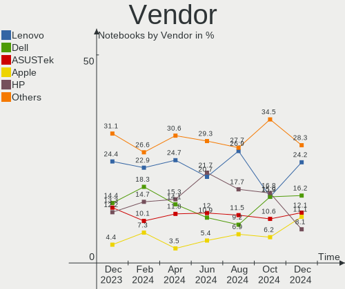
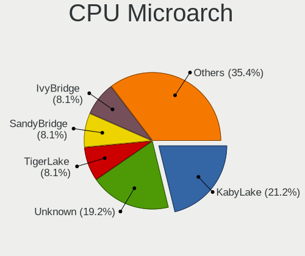
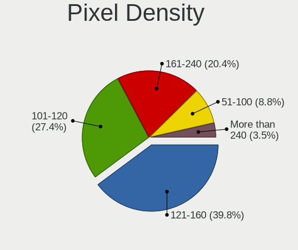

Pop!_OS - Hardware Trends (Notebooks)
-------------------------------------

A project to identify most popular hardware characteristics and track their change
over time based on data collected by Linux users at https://Linux-Hardware.org.

Anyone can contribute to this report by the [hw-probe](https://github.com/linuxhw/hw-probe) tool:

    sudo -E hw-probe -all -upload

This report is for one last month. Overall report since the beginning of time: [TestCoverage](https://github.com/linuxhw/TestCoverage)

Period: Nov, 2022.

Contents
--------

* [ System ](#system)
  - [ OS                       ](#os)
  - [ OS Family                ](#os-family)
  - [ Kernel                   ](#kernel)
  - [ Kernel Family            ](#kernel-family)
  - [ Kernel Major Ver.        ](#kernel-major-ver)
  - [ Arch                     ](#arch)
  - [ DE                       ](#de)
  - [ Display Server           ](#display-server)
  - [ Display Manager          ](#display-manager)
  - [ OS Lang                  ](#os-lang)
  - [ Boot Mode                ](#boot-mode)
  - [ Filesystem               ](#filesystem)
  - [ Part. scheme             ](#part-scheme)
  - [ Dual Boot with Linux/BSD ](#dual-boot-with-linuxbsd)
  - [ Dual Boot (Win)          ](#dual-boot-win)

* [ Board ](#board)
  - [ Vendor                   ](#vendor)
  - [ Model                    ](#model)
  - [ Model Family             ](#model-family)
  - [ MFG Year                 ](#mfg-year)
  - [ Form Factor              ](#form-factor)
  - [ Secure Boot              ](#secure-boot)
  - [ Coreboot                 ](#coreboot)
  - [ RAM Size                 ](#ram-size)
  - [ RAM Used                 ](#ram-used)
  - [ Total Drives             ](#total-drives)
  - [ Has CD-ROM               ](#has-cd-rom)
  - [ Has Ethernet             ](#has-ethernet)
  - [ Has WiFi                 ](#has-wifi)
  - [ Has Bluetooth            ](#has-bluetooth)

* [ Location ](#location)
  - [ Country                  ](#country)
  - [ City                     ](#city)

* [ Drives ](#drives)
  - [ Drive Vendor             ](#drive-vendor)
  - [ Drive Model              ](#drive-model)
  - [ HDD Vendor               ](#hdd-vendor)
  - [ SSD Vendor               ](#ssd-vendor)
  - [ Drive Kind               ](#drive-kind)
  - [ Drive Connector          ](#drive-connector)
  - [ Drive Size               ](#drive-size)
  - [ Space Total              ](#space-total)
  - [ Space Used               ](#space-used)
  - [ Malfunc. Drives          ](#malfunc-drives)
  - [ Malfunc. Drive Vendor    ](#malfunc-drive-vendor)
  - [ Malfunc. HDD Vendor      ](#malfunc-hdd-vendor)
  - [ Malfunc. Drive Kind      ](#malfunc-drive-kind)
  - [ Failed Drives            ](#failed-drives)
  - [ Failed Drive Vendor      ](#failed-drive-vendor)
  - [ Drive Status             ](#drive-status)

* [ Storage controller ](#storage-controller)
  - [ Storage Vendor           ](#storage-vendor)
  - [ Storage Model            ](#storage-model)
  - [ Storage Kind             ](#storage-kind)

* [ Processor ](#processor)
  - [ CPU Vendor               ](#cpu-vendor)
  - [ CPU Model                ](#cpu-model)
  - [ CPU Model Family         ](#cpu-model-family)
  - [ CPU Cores                ](#cpu-cores)
  - [ CPU Sockets              ](#cpu-sockets)
  - [ CPU Threads              ](#cpu-threads)
  - [ CPU Op-Modes             ](#cpu-op-modes)
  - [ CPU Microcode            ](#cpu-microcode)
  - [ CPU Microarch            ](#cpu-microarch)

* [ Graphics ](#graphics)
  - [ GPU Vendor               ](#gpu-vendor)
  - [ GPU Model                ](#gpu-model)
  - [ GPU Combo                ](#gpu-combo)
  - [ GPU Driver               ](#gpu-driver)
  - [ GPU Memory               ](#gpu-memory)

* [ Monitor ](#monitor)
  - [ Monitor Vendor           ](#monitor-vendor)
  - [ Monitor Model            ](#monitor-model)
  - [ Monitor Resolution       ](#monitor-resolution)
  - [ Monitor Diagonal         ](#monitor-diagonal)
  - [ Monitor Width            ](#monitor-width)
  - [ Aspect Ratio             ](#aspect-ratio)
  - [ Monitor Area             ](#monitor-area)
  - [ Pixel Density            ](#pixel-density)
  - [ Multiple Monitors        ](#multiple-monitors)

* [ Network ](#network)
  - [ Net Controller Vendor    ](#net-controller-vendor)
  - [ Net Controller Model     ](#net-controller-model)
  - [ Wireless Vendor          ](#wireless-vendor)
  - [ Wireless Model           ](#wireless-model)
  - [ Ethernet Vendor          ](#ethernet-vendor)
  - [ Ethernet Model           ](#ethernet-model)
  - [ Net Controller Kind      ](#net-controller-kind)
  - [ Used Controller          ](#used-controller)
  - [ NICs                     ](#nics)
  - [ IPv6                     ](#ipv6)

* [ Bluetooth ](#bluetooth)
  - [ Bluetooth Vendor         ](#bluetooth-vendor)
  - [ Bluetooth Model          ](#bluetooth-model)

* [ Sound ](#sound)
  - [ Sound Vendor             ](#sound-vendor)
  - [ Sound Model              ](#sound-model)

* [ Memory ](#memory)
  - [ Memory Vendor            ](#memory-vendor)
  - [ Memory Model             ](#memory-model)
  - [ Memory Kind              ](#memory-kind)
  - [ Memory Form Factor       ](#memory-form-factor)
  - [ Memory Size              ](#memory-size)
  - [ Memory Speed             ](#memory-speed)

* [ Printers & scanners ](#printers--scanners)
  - [ Printer Vendor           ](#printer-vendor)
  - [ Printer Model            ](#printer-model)
  - [ Scanner Vendor           ](#scanner-vendor)
  - [ Scanner Model            ](#scanner-model)

* [ Camera ](#camera)
  - [ Camera Vendor            ](#camera-vendor)
  - [ Camera Model             ](#camera-model)

* [ Security ](#security)
  - [ Fingerprint Vendor       ](#fingerprint-vendor)
  - [ Fingerprint Model        ](#fingerprint-model)
  - [ Chipcard Vendor          ](#chipcard-vendor)
  - [ Chipcard Model           ](#chipcard-model)

* [ Unsupported ](#unsupported)
  - [ Unsupported Devices      ](#unsupported-devices)
  - [ Unsupported Device Types ](#unsupported-device-types)

System
------

OS
--

Installed operating systems

| Name          | Notebooks | Percent |
|---------------|-----------|---------|
| Pop!_OS 22.04 | 132       | 98.51%  |
| Pop!_OS 21.10 | 1         | 0.75%   |
| Pop!_OS 20.04 | 1         | 0.75%   |

OS Family
---------

OS without a version

| Name    | Notebooks | Percent |
|---------|-----------|---------|
| Pop!_OS | 134       | 100%    |

Kernel
------

Version of the Linux kernel

| Version                  | Notebooks | Percent |
|--------------------------|-----------|---------|
| 6.0.6-76060006-generic   | 73        | 54.48%  |
| 6.0.3-76060003-generic   | 23        | 17.16%  |
| 6.0.2-76060002-generic   | 20        | 14.93%  |
| 5.19.0-76051900-generic  | 6         | 4.48%   |
| 5.18.10-76051810-generic | 4         | 2.99%   |
| 5.17.5-76051705-generic  | 3         | 2.24%   |
| 5.19.16-76051916-generic | 2         | 1.49%   |
| 6.0.9-x64v1-xanmod1      | 1         | 0.75%   |
| 6.0.9-060009-generic     | 1         | 0.75%   |
| 5.15.5-76051505-generic  | 1         | 0.75%   |

Kernel Family
-------------

Linux kernel without a distro release

| Version | Notebooks | Percent |
|---------|-----------|---------|
| 6.0.6   | 73        | 54.48%  |
| 6.0.3   | 23        | 17.16%  |
| 6.0.2   | 20        | 14.93%  |
| 5.19.0  | 6         | 4.48%   |
| 5.18.10 | 4         | 2.99%   |
| 5.17.5  | 3         | 2.24%   |
| 6.0.9   | 2         | 1.49%   |
| 5.19.16 | 2         | 1.49%   |
| 5.15.5  | 1         | 0.75%   |

Kernel Major Ver.
-----------------

Linux kernel major version

| Version | Notebooks | Percent |
|---------|-----------|---------|
| 6.0     | 118       | 88.06%  |
| 5.19    | 8         | 5.97%   |
| 5.18    | 4         | 2.99%   |
| 5.17    | 3         | 2.24%   |
| 5.15    | 1         | 0.75%   |

Arch
----

OS architecture (x86_64, i586, etc.)

| Name   | Notebooks | Percent |
|--------|-----------|---------|
| x86_64 | 134       | 100%    |

DE
--

Desktop Environment

| Name  | Notebooks | Percent |
|-------|-----------|---------|
| GNOME | 132       | 98.51%  |
| KDE5  | 2         | 1.49%   |

Display Server
--------------

X11 or Wayland

| Name    | Notebooks | Percent |
|---------|-----------|---------|
| X11     | 125       | 93.28%  |
| Wayland | 9         | 6.72%   |

Display Manager
---------------

SDDM, LightDM, etc.

| Name    | Notebooks | Percent |
|---------|-----------|---------|
| Unknown | 91        | 67.91%  |
| GDM3    | 41        | 30.6%   |
| GDM     | 2         | 1.49%   |

OS Lang
-------

Language

| Lang    | Notebooks | Percent |
|---------|-----------|---------|
| en_US   | 77        | 57.46%  |
| en_GB   | 16        | 11.94%  |
| de_DE   | 11        | 8.21%   |
| pt_BR   | 6         | 4.48%   |
| es_ES   | 4         | 2.99%   |
| it_IT   | 3         | 2.24%   |
| en_CA   | 3         | 2.24%   |
| nb_NO   | 2         | 1.49%   |
| fr_FR   | 2         | 1.49%   |
| C       | 2         | 1.49%   |
| pl_PL   | 1         | 0.75%   |
| fr_CA   | 1         | 0.75%   |
| fi_FI   | 1         | 0.75%   |
| es_CL   | 1         | 0.75%   |
| en_SG   | 1         | 0.75%   |
| en_IE   | 1         | 0.75%   |
| en_AU   | 1         | 0.75%   |
| Unknown | 1         | 0.75%   |

Boot Mode
---------

EFI or BIOS

| Mode | Notebooks | Percent |
|------|-----------|---------|
| BIOS | 94        | 70.15%  |
| EFI  | 40        | 29.85%  |

Filesystem
----------

Type of filesystem

| Type    | Notebooks | Percent |
|---------|-----------|---------|
| Ext4    | 125       | 93.28%  |
| Btrfs   | 7         | 5.22%   |
| Overlay | 2         | 1.49%   |

Part. scheme
------------

Scheme of partitioning

| Type    | Notebooks | Percent |
|---------|-----------|---------|
| Unknown | 91        | 67.91%  |
| GPT     | 40        | 29.85%  |
| MBR     | 3         | 2.24%   |

Dual Boot with Linux/BSD
------------------------

Hosting more than one Linux/BSD

| Dual boot | Notebooks | Percent |
|-----------|-----------|---------|
| No        | 131       | 97.76%  |
| Yes       | 3         | 2.24%   |

Dual Boot (Win)
---------------

Hosting Linux and Windows

| Dual boot | Notebooks | Percent |
|-----------|-----------|---------|
| No        | 122       | 91.04%  |
| Yes       | 12        | 8.96%   |

Board
-----

Vendor
------

Motherboard manufacturer

| Name                | Notebooks | Percent |
|---------------------|-----------|---------|
| Lenovo              | 27        | 20.15%  |
| Dell                | 22        | 16.42%  |
| Hewlett-Packard     | 20        | 14.93%  |
| ASUSTek Computer    | 14        | 10.45%  |
| Acer                | 11        | 8.21%   |
| Apple               | 8         | 5.97%   |
| MSI                 | 6         | 4.48%   |
| Toshiba             | 3         | 2.24%   |
| System76            | 3         | 2.24%   |
| Samsung Electronics | 3         | 2.24%   |
| HUAWEI              | 3         | 2.24%   |
| Google              | 2         | 1.49%   |
| Wortmann AG         | 1         | 0.75%   |
| Valve               | 1         | 0.75%   |
| Timi                | 1         | 0.75%   |
| Razer x Lambda      | 1         | 0.75%   |
| PC Specialist       | 1         | 0.75%   |
| OEGStone            | 1         | 0.75%   |
| GPU Company         | 1         | 0.75%   |
| Gigabyte Technology | 1         | 0.75%   |
| Fujitsu             | 1         | 0.75%   |
| Clevo               | 1         | 0.75%   |
| Alienware           | 1         | 0.75%   |
| Unknown             | 1         | 0.75%   |

Model
-----

Motherboard model

| Name                                                                                     | Notebooks | Percent |
|------------------------------------------------------------------------------------------|-----------|---------|
| HP Pavilion Aero Laptop 13-be0xxx                                                        | 2         | 1.49%   |
| Acer Swift SF314-42                                                                      | 2         | 1.49%   |
| Acer Aspire A515-57                                                                      | 2         | 1.49%   |
| Wortmann AG TERRA_MOBILE_1542                                                            | 1         | 0.75%   |
| Valve Jupiter                                                                            | 1         | 0.75%   |
| Toshiba Satellite L775D                                                                  | 1         | 0.75%   |
| Toshiba Satellite L500                                                                   | 1         | 0.75%   |
| Toshiba Satellite L350                                                                   | 1         | 0.75%   |
| Timi TM1613                                                                              | 1         | 0.75%   |
| System76 Oryx Pro                                                                        | 1         | 0.75%   |
| System76 Lemur Pro                                                                       | 1         | 0.75%   |
| System76 Galago Pro                                                                      | 1         | 0.75%   |
| Samsung 500R4K/500R5H/5400RK/501R5H/5500RH/500R5S                                        | 1         | 0.75%   |
| Samsung 355V4C/355V4X/355V5C/355V5X/356V4C/356V4X/356V5C/356V5X/3445VC/3445VX/3545VC/354 | 1         | 0.75%   |
| Samsung 350V5C/351V5C/3540VC/3440VC                                                      | 1         | 0.75%   |
| Razer x Lambda TensorBook (late 2021)                                                    | 1         | 0.75%   |
| PC Specialist Elimina Iv 15                                                              | 1         | 0.75%   |
| OEGStone NOTCHA-322                                                                      | 1         | 0.75%   |
| MSI MS-1688                                                                              | 1         | 0.75%   |
| MSI Modern 14 B5M                                                                        | 1         | 0.75%   |
| MSI Modern 14 B11SB                                                                      | 1         | 0.75%   |
| MSI Katana GF76 11UG                                                                     | 1         | 0.75%   |
| MSI GP72 7RDX                                                                            | 1         | 0.75%   |
| MSI GL73 9SC                                                                             | 1         | 0.75%   |
| Lenovo ThinkPad Yoga 11e 20DAS0SC00                                                      | 1         | 0.75%   |
| Lenovo ThinkPad X13 Gen 1 20UFCTO1WW                                                     | 1         | 0.75%   |
| Lenovo ThinkPad X1 Carbon 7th 20QD001FZA                                                 | 1         | 0.75%   |
| Lenovo ThinkPad T550 20CJS18S00                                                          | 1         | 0.75%   |
| Lenovo ThinkPad T480 20L50004UK                                                          | 1         | 0.75%   |
| Lenovo ThinkPad T450 20BVA02TCD                                                          | 1         | 0.75%   |
| Lenovo ThinkPad T15 Gen 2i 20W4002YZA                                                    | 1         | 0.75%   |
| Lenovo ThinkPad P50 20EQS16P00                                                           | 1         | 0.75%   |
| Lenovo ThinkPad P1 Gen 4i 20Y3003XUS                                                     | 1         | 0.75%   |
| Lenovo ThinkPad L13 Yoga Gen 2a 21AES01A00                                               | 1         | 0.75%   |
| Lenovo ThinkPad E490 20N8000RUK                                                          | 1         | 0.75%   |
| Lenovo ThinkPad E15 Gen 4 21E6008CGP                                                     | 1         | 0.75%   |
| Lenovo ThinkPad E14 Gen 4 21E3CTO1WW                                                     | 1         | 0.75%   |
| Lenovo ThinkBook 16p Gen 2 20YM                                                          | 1         | 0.75%   |
| Lenovo ThinkBook 14 G2 ARE 20VF                                                          | 1         | 0.75%   |
| Lenovo ThinkBook 13s G2 ITL 20V9                                                         | 1         | 0.75%   |

Model Family
------------

Motherboard model prefix

| Name                      | Notebooks | Percent |
|---------------------------|-----------|---------|
| Lenovo ThinkPad           | 13        | 9.7%    |
| Lenovo IdeaPad            | 9         | 6.72%   |
| Dell Inspiron             | 7         | 5.22%   |
| Acer Aspire               | 7         | 5.22%   |
| ASUS VivoBook             | 6         | 4.48%   |
| HP ProBook                | 5         | 3.73%   |
| Dell Latitude             | 5         | 3.73%   |
| ASUS ASUS                 | 5         | 3.73%   |
| Dell Precision            | 4         | 2.99%   |
| Toshiba Satellite         | 3         | 2.24%   |
| Lenovo ThinkBook          | 3         | 2.24%   |
| HP Pavilion               | 3         | 2.24%   |
| HP EliteBook              | 3         | 2.24%   |
| Acer Swift                | 3         | 2.24%   |
| MSI Modern                | 2         | 1.49%   |
| Lenovo Legion             | 2         | 1.49%   |
| HP ZBook                  | 2         | 1.49%   |
| HP Laptop                 | 2         | 1.49%   |
| Dell XPS                  | 2         | 1.49%   |
| Wortmann AG TERRA         | 1         | 0.75%   |
| Valve Jupiter             | 1         | 0.75%   |
| Timi TM1613               | 1         | 0.75%   |
| System76 Oryx             | 1         | 0.75%   |
| System76 Lemur            | 1         | 0.75%   |
| System76 Galago           | 1         | 0.75%   |
| Samsung 500R4K            | 1         | 0.75%   |
| Samsung 355V4C            | 1         | 0.75%   |
| Samsung 350V5C            | 1         | 0.75%   |
| Razer x Lambda TensorBook | 1         | 0.75%   |
| PC Specialist Elimina     | 1         | 0.75%   |
| OEGStone NOTCHA-322       | 1         | 0.75%   |
| MSI MS-1688               | 1         | 0.75%   |
| MSI Katana                | 1         | 0.75%   |
| MSI GP72                  | 1         | 0.75%   |
| MSI GL73                  | 1         | 0.75%   |
| HUAWEI NBD-WXX9           | 1         | 0.75%   |
| HUAWEI MRGF-XX            | 1         | 0.75%   |
| HUAWEI KLVL-WXX9          | 1         | 0.75%   |
| HP Victus                 | 1         | 0.75%   |
| HP G62                    | 1         | 0.75%   |

MFG Year
--------

Motherboard manufacture year

| Year | Notebooks | Percent |
|------|-----------|---------|
| 2021 | 25        | 18.66%  |
| 2022 | 21        | 15.67%  |
| 2020 | 18        | 13.43%  |
| 2019 | 10        | 7.46%   |
| 2016 | 10        | 7.46%   |
| 2015 | 10        | 7.46%   |
| 2018 | 8         | 5.97%   |
| 2012 | 8         | 5.97%   |
| 2013 | 6         | 4.48%   |
| 2010 | 6         | 4.48%   |
| 2008 | 4         | 2.99%   |
| 2017 | 2         | 1.49%   |
| 2014 | 2         | 1.49%   |
| 2009 | 2         | 1.49%   |
| 2011 | 1         | 0.75%   |
| 2007 | 1         | 0.75%   |

Form Factor
-----------

Physical design of the computer

| Name     | Notebooks | Percent |
|----------|-----------|---------|
| Notebook | 134       | 100%    |

Secure Boot
-----------

Enabled or disabled

| State    | Notebooks | Percent |
|----------|-----------|---------|
| Disabled | 134       | 100%    |

Coreboot
--------

Have coreboot on board

| Used | Notebooks | Percent |
|------|-----------|---------|
| No   | 129       | 96.27%  |
| Yes  | 5         | 3.73%   |

RAM Size
--------

Total RAM memory

| Size in GB  | Notebooks | Percent |
|-------------|-----------|---------|
| 4.01-8.0    | 51        | 38.06%  |
| 16.01-24.0  | 31        | 23.13%  |
| 8.01-16.0   | 22        | 16.42%  |
| 32.01-64.0  | 12        | 8.96%   |
| 3.01-4.0    | 12        | 8.96%   |
| 64.01-256.0 | 3         | 2.24%   |
| 24.01-32.0  | 2         | 1.49%   |
| 2.01-3.0    | 1         | 0.75%   |

RAM Used
--------

Used RAM memory

| Used GB    | Notebooks | Percent |
|------------|-----------|---------|
| 3.01-4.0   | 42        | 31.34%  |
| 2.01-3.0   | 39        | 29.1%   |
| 4.01-8.0   | 29        | 21.64%  |
| 1.01-2.0   | 13        | 9.7%    |
| 8.01-16.0  | 9         | 6.72%   |
| 16.01-24.0 | 2         | 1.49%   |

Total Drives
------------

Number of drives on board

| Drives | Notebooks | Percent |
|--------|-----------|---------|
| 1      | 108       | 80.6%   |
| 2      | 24        | 17.91%  |
| 3      | 2         | 1.49%   |

Has CD-ROM
----------

Has CD-ROM on board

| Presented | Notebooks | Percent |
|-----------|-----------|---------|
| No        | 107       | 79.85%  |
| Yes       | 27        | 20.15%  |

Has Ethernet
------------

Has Ethernet on board

| Presented | Notebooks | Percent |
|-----------|-----------|---------|
| Yes       | 96        | 71.64%  |
| No        | 38        | 28.36%  |

Has WiFi
--------

Has WiFi module

| Presented | Notebooks | Percent |
|-----------|-----------|---------|
| Yes       | 134       | 100%    |

Has Bluetooth
-------------

Has Bluetooth module

| Presented | Notebooks | Percent |
|-----------|-----------|---------|
| Yes       | 121       | 90.3%   |
| No        | 13        | 9.7%    |

Location
--------

Country
-------

Geographic location (country)

| Country      | Notebooks | Percent |
|--------------|-----------|---------|
| USA          | 31        | 23.13%  |
| UK           | 12        | 8.96%   |
| Germany      | 12        | 8.96%   |
| Brazil       | 11        | 8.21%   |
| Italy        | 8         | 5.97%   |
| India        | 6         | 4.48%   |
| France       | 5         | 3.73%   |
| Spain        | 4         | 2.99%   |
| Sweden       | 3         | 2.24%   |
| Norway       | 3         | 2.24%   |
| Netherlands  | 3         | 2.24%   |
| Indonesia    | 3         | 2.24%   |
| Canada       | 3         | 2.24%   |
| Turkey       | 2         | 1.49%   |
| Singapore    | 2         | 1.49%   |
| Portugal     | 2         | 1.49%   |
| Finland      | 2         | 1.49%   |
| Chile        | 2         | 1.49%   |
| UAE          | 1         | 0.75%   |
| South Korea  | 1         | 0.75%   |
| South Africa | 1         | 0.75%   |
| Slovakia     | 1         | 0.75%   |
| Saudi Arabia | 1         | 0.75%   |
| Russia       | 1         | 0.75%   |
| Romania      | 1         | 0.75%   |
| Poland       | 1         | 0.75%   |
| Philippines  | 1         | 0.75%   |
| Pakistan     | 1         | 0.75%   |
| Malta        | 1         | 0.75%   |
| Luxembourg   | 1         | 0.75%   |
| Israel       | 1         | 0.75%   |
| Hungary      | 1         | 0.75%   |
| Honduras     | 1         | 0.75%   |
| Greece       | 1         | 0.75%   |
| Egypt        | 1         | 0.75%   |
| Belgium      | 1         | 0.75%   |
| Bangladesh   | 1         | 0.75%   |
| Argentina    | 1         | 0.75%   |

City
----

Geographic location (city)

| City                | Notebooks | Percent |
|---------------------|-----------|---------|
| Berlin              | 3         | 2.24%   |
| Stuttgart           | 2         | 1.49%   |
| Singapore           | 2         | 1.49%   |
| Salt Lake City      | 2         | 1.49%   |
| Lincoln             | 2         | 1.49%   |
| Jakarta             | 2         | 1.49%   |
| Istanbul            | 2         | 1.49%   |
| Helsinki            | 2         | 1.49%   |
| Bologna             | 2         | 1.49%   |
| Bengaluru           | 2         | 1.49%   |
| Zejtun              | 1         | 0.75%   |
| York                | 1         | 0.75%   |
| Yongsan-gu          | 1         | 0.75%   |
| Wilmington          | 1         | 0.75%   |
| Williamsburg        | 1         | 0.75%   |
| Whitby              | 1         | 0.75%   |
| West Hartford       | 1         | 0.75%   |
| Washougal           | 1         | 0.75%   |
| Warsaw              | 1         | 0.75%   |
| Virginia Beach      | 1         | 0.75%   |
| Villeurbanne        | 1         | 0.75%   |
| Varzea Paulista     | 1         | 0.75%   |
| Valparaiso de Goias | 1         | 0.75%   |
| Valenciennes        | 1         | 0.75%   |
| Valdivia            | 1         | 0.75%   |
| Troy                | 1         | 0.75%   |
| Trondheim           | 1         | 0.75%   |
| Texarkana           | 1         | 0.75%   |
| Tel Aviv            | 1         | 0.75%   |
| Tegucigalpa         | 1         | 0.75%   |
| Szigetszentmiklos   | 1         | 0.75%   |
| Surabaya            | 1         | 0.75%   |
| Stuhlingen          | 1         | 0.75%   |
| Stockport           | 1         | 0.75%   |
| St Louis            | 1         | 0.75%   |
| Spring Hill         | 1         | 0.75%   |
| Spring              | 1         | 0.75%   |
| Somerset            | 1         | 0.75%   |
| Sintra              | 1         | 0.75%   |
| Sheboygan           | 1         | 0.75%   |

Drives
------

Drive Vendor
------------

Hard drive vendors

| Vendor                      | Notebooks | Drives | Percent |
|-----------------------------|-----------|--------|---------|
| Samsung Electronics         | 32        | 33     | 19.63%  |
| Sandisk                     | 19        | 19     | 11.66%  |
| WDC                         | 12        | 12     | 7.36%   |
| Seagate                     | 11        | 11     | 6.75%   |
| SK hynix                    | 10        | 10     | 6.13%   |
| Intel                       | 9         | 10     | 5.52%   |
| Unknown                     | 8         | 11     | 4.91%   |
| Toshiba                     | 7         | 7      | 4.29%   |
| Micron Technology           | 6         | 6      | 3.68%   |
| Kingston                    | 6         | 6      | 3.68%   |
| Crucial                     | 5         | 5      | 3.07%   |
| Apple                       | 5         | 5      | 3.07%   |
| PNY                         | 3         | 3      | 1.84%   |
| Phison Electronics          | 3         | 3      | 1.84%   |
| SPCC                        | 2         | 2      | 1.23%   |
| Silicon Motion              | 2         | 2      | 1.23%   |
| Phison                      | 2         | 2      | 1.23%   |
| Micron/Crucial Technology   | 2         | 2      | 1.23%   |
| Kingston Technology Company | 2         | 2      | 1.23%   |
| W800S                       | 1         | 1      | 0.61%   |
| Union Memory (Shenzhen)     | 1         | 1      | 0.61%   |
| UMIS                        | 1         | 1      | 0.61%   |
| Solid State Storage         | 1         | 1      | 0.61%   |
| Netac                       | 1         | 1      | 0.61%   |
| LITEON                      | 1         | 1      | 0.61%   |
| KingSpec                    | 1         | 1      | 0.61%   |
| JMicron Technology          | 1         | 1      | 0.61%   |
| Intenso                     | 1         | 1      | 0.61%   |
| Hitachi                     | 1         | 1      | 0.61%   |
| General                     | 1         | 1      | 0.61%   |
| China                       | 1         | 1      | 0.61%   |
| BAITITON                    | 1         | 1      | 0.61%   |
| ASMT                        | 1         | 1      | 0.61%   |
| APPLE HD                    | 1         | 1      | 0.61%   |
| A-DATA Technology           | 1         | 1      | 0.61%   |
| Unknown                     | 1         | 1      | 0.61%   |

Drive Model
-----------

Hard drive models

| Model                                                | Notebooks | Percent |
|------------------------------------------------------|-----------|---------|
| Samsung NVMe SSD Controller SM981/PM981/PM983 1TB    | 4         | 2.41%   |
| Intel SSD 660P Series 512GB                          | 4         | 2.41%   |
| Seagate ST1000LM035-1RK172 1TB                       | 3         | 1.81%   |
| Sandisk WD Black SN750 / PC SN730 NVMe SSD 1024GB    | 3         | 1.81%   |
| Samsung NVMe SSD Controller SM961/PM961/SM963 250GB  | 3         | 1.81%   |
| Samsung NVMe SSD Controller PM9A1/PM9A3/980PRO 250GB | 3         | 1.81%   |
| WDC WDS500G2B0B-00YS70 500GB SSD                     | 2         | 1.2%    |
| Unknown NVMe SSD Drive 1TB                           | 2         | 1.2%    |
| Unknown MMC Card  64GB                               | 2         | 1.2%    |
| Unknown MMC Card  32GB                               | 2         | 1.2%    |
| SK hynix PC801 NVMe 1TB                              | 2         | 1.2%    |
| SK hynix HFM512GD3JX016N 512GB                       | 2         | 1.2%    |
| SK hynix BC501 NVMe Solid State Drive 512GB          | 2         | 1.2%    |
| Sandisk WD Blue SN550 NVMe SSD 1TB                   | 2         | 1.2%    |
| Sandisk WD Blue SN500 / PC SN520 NVMe SSD 512GB      | 2         | 1.2%    |
| Samsung SSD 870 EVO 250GB                            | 2         | 1.2%    |
| Samsung MZALQ256HAJD-000L2 256GB                     | 2         | 1.2%    |
| Phison PS5013 E13 NVMe Controller 256GB              | 2         | 1.2%    |
| Kingston SA400S37480G 480GB SSD                      | 2         | 1.2%    |
| Crucial CT250MX500SSD1 250GB                         | 2         | 1.2%    |
| WDC WDS240G2G0A-00JH30 240GB SSD                     | 1         | 0.6%    |
| WDC WD5000LPVX-00V0TT0 500GB                         | 1         | 0.6%    |
| WDC WD5000LPCX-60VHAT0 500GB                         | 1         | 0.6%    |
| WDC WD50 00LPVX-22V0TT0 500GB                        | 1         | 0.6%    |
| WDC WD2500BEVS-75UST0 250GB                          | 1         | 0.6%    |
| WDC WD10SPCX-75KHST0 1TB                             | 1         | 0.6%    |
| WDC PC SN730 SDBQNTY-512G-1001 512GB                 | 1         | 0.6%    |
| WDC PC SN730 SDBPNTY-512G-1101 512GB                 | 1         | 0.6%    |
| WDC PC SN530 SDBPNPZ-512G-1114 512GB                 | 1         | 0.6%    |
| WDC PC SN530 SDBPNPZ-512G-1032 512GB                 | 1         | 0.6%    |
| W800S 512GB                                          | 1         | 0.6%    |
| Unknown MMC Card  16GB                               | 1         | 0.6%    |
| Unknown MMC Card  128GB                              | 1         | 0.6%    |
| Unknown HCG4a2  64GB                                 | 1         | 0.6%    |
| Union Memory (Shenzhen) RPFTJ128PDD2EWX 128GB        | 1         | 0.6%    |
| UMIS RPJTJ512MGE1QDQ 512GB                           | 1         | 0.6%    |
| Toshiba XG6 NVMe SSD Controller 256GB                | 1         | 0.6%    |
| Toshiba THNSNJ128GCSU 128GB SSD                      | 1         | 0.6%    |
| Toshiba MQ01ABD100 1TB                               | 1         | 0.6%    |
| Toshiba MK1665GSX H 160GB                            | 1         | 0.6%    |

HDD Vendor
----------

Hard disk drive vendors

| Vendor  | Notebooks | Drives | Percent |
|---------|-----------|--------|---------|
| Seagate | 11        | 11     | 55%     |
| WDC     | 5         | 5      | 25%     |
| Toshiba | 2         | 2      | 10%     |
| Hitachi | 1         | 1      | 5%      |
| ASMT    | 1         | 1      | 5%      |

SSD Vendor
----------

Solid state drive vendors

| Vendor              | Notebooks | Drives | Percent |
|---------------------|-----------|--------|---------|
| Samsung Electronics | 7         | 7      | 15.91%  |
| SanDisk             | 5         | 5      | 11.36%  |
| Kingston            | 5         | 5      | 11.36%  |
| Crucial             | 5         | 5      | 11.36%  |
| Apple               | 5         | 5      | 11.36%  |
| WDC                 | 3         | 3      | 6.82%   |
| PNY                 | 2         | 2      | 4.55%   |
| Toshiba             | 1         | 1      | 2.27%   |
| SK hynix            | 1         | 1      | 2.27%   |
| Netac               | 1         | 1      | 2.27%   |
| Micron Technology   | 1         | 1      | 2.27%   |
| LITEON              | 1         | 1      | 2.27%   |
| KingSpec            | 1         | 1      | 2.27%   |
| JMicron Technology  | 1         | 1      | 2.27%   |
| Intenso             | 1         | 1      | 2.27%   |
| Intel               | 1         | 1      | 2.27%   |
| China               | 1         | 1      | 2.27%   |
| BAITITON            | 1         | 1      | 2.27%   |
| Unknown             | 1         | 1      | 2.27%   |

Drive Kind
----------

HDD or SSD

| Kind    | Notebooks | Drives | Percent |
|---------|-----------|--------|---------|
| NVMe    | 81        | 93     | 54%     |
| SSD     | 42        | 44     | 28%     |
| HDD     | 18        | 20     | 12%     |
| MMC     | 6         | 8      | 4%      |
| Unknown | 3         | 3      | 2%      |

Drive Connector
---------------

SATA, SAS, NVMe, etc.

| Type | Notebooks | Drives | Percent |
|------|-----------|--------|---------|
| NVMe | 81        | 93     | 54%     |
| SATA | 55        | 58     | 36.67%  |
| SAS  | 8         | 9      | 5.33%   |
| MMC  | 6         | 8      | 4%      |

Drive Size
----------

Size of hard drive

| Size in TB | Notebooks | Drives | Percent |
|------------|-----------|--------|---------|
| 0.01-0.5   | 44        | 48     | 73.33%  |
| 0.51-1.0   | 15        | 15     | 25%     |
| 1.01-2.0   | 1         | 1      | 1.67%   |

Space Total
-----------

Amount of disk space available on the file system

| Size in GB     | Notebooks | Percent |
|----------------|-----------|---------|
| 101-250        | 48        | 35.82%  |
| 251-500        | 39        | 29.1%   |
| 501-1000       | 25        | 18.66%  |
| 1001-2000      | 9         | 6.72%   |
| 51-100         | 5         | 3.73%   |
| 21-50          | 3         | 2.24%   |
| More than 3000 | 2         | 1.49%   |
| 1-20           | 2         | 1.49%   |
| 2001-3000      | 1         | 0.75%   |

Space Used
----------

Amount of used disk space

| Used GB        | Notebooks | Percent |
|----------------|-----------|---------|
| 1-20           | 41        | 30.6%   |
| 21-50          | 30        | 22.39%  |
| 101-250        | 30        | 22.39%  |
| 251-500        | 15        | 11.19%  |
| 51-100         | 9         | 6.72%   |
| 501-1000       | 6         | 4.48%   |
| 1001-2000      | 2         | 1.49%   |
| More than 3000 | 1         | 0.75%   |

Malfunc. Drives
---------------

Drive models with a malfunction

| Model                                       | Notebooks | Drives | Percent |
|---------------------------------------------|-----------|--------|---------|
| SK hynix BC501 NVMe Solid State Drive 512GB | 1         | 1      | 50%     |
| Seagate ST1000LM024 HN-M101MBB 1TB          | 1         | 1      | 50%     |

Malfunc. Drive Vendor
---------------------

Vendors of faulty drives

| Vendor   | Notebooks | Drives | Percent |
|----------|-----------|--------|---------|
| SK hynix | 1         | 1      | 50%     |
| Seagate  | 1         | 1      | 50%     |

Malfunc. HDD Vendor
-------------------

Vendors of faulty HDD drives

| Vendor  | Notebooks | Drives | Percent |
|---------|-----------|--------|---------|
| Seagate | 1         | 1      | 100%    |

Malfunc. Drive Kind
-------------------

Kinds of faulty drives

| Kind | Notebooks | Drives | Percent |
|------|-----------|--------|---------|
| NVMe | 1         | 1      | 50%     |
| HDD  | 1         | 1      | 50%     |

Failed Drives
-------------

Failed drive models

Zero info for selected period =(

Failed Drive Vendor
-------------------

Failed drive vendors

Zero info for selected period =(

Drive Status
------------

Number of failed and malfunc. drives

| Status   | Notebooks | Drives | Percent |
|----------|-----------|--------|---------|
| Detected | 98        | 121    | 70%     |
| Works    | 40        | 45     | 28.57%  |
| Malfunc  | 2         | 2      | 1.43%   |

Storage controller
------------------

Storage Vendor
--------------

Storage controller vendors

| Vendor                         | Notebooks | Percent |
|--------------------------------|-----------|---------|
| Intel                          | 82        | 45.81%  |
| Samsung Electronics            | 28        | 15.64%  |
| SanDisk                        | 16        | 8.94%   |
| AMD                            | 12        | 6.7%    |
| SK hynix                       | 9         | 5.03%   |
| Phison Electronics             | 7         | 3.91%   |
| Micron Technology              | 5         | 2.79%   |
| Toshiba America Info Systems   | 3         | 1.68%   |
| Kingston Technology Company    | 3         | 1.68%   |
| Union Memory (Shenzhen)        | 2         | 1.12%   |
| Solid State Storage Technology | 2         | 1.12%   |
| Silicon Motion                 | 2         | 1.12%   |
| Nvidia                         | 2         | 1.12%   |
| Micron/Crucial Technology      | 2         | 1.12%   |
| Marvell Technology Group       | 1         | 0.56%   |
| KIOXIA                         | 1         | 0.56%   |
| INNOGRIT                       | 1         | 0.56%   |
| ADATA Technology               | 1         | 0.56%   |

Storage Model
-------------

Storage controller models

| Model                                                                          | Notebooks | Percent |
|--------------------------------------------------------------------------------|-----------|---------|
| Intel Volume Management Device NVMe RAID Controller                            | 12        | 6.32%   |
| AMD FCH SATA Controller [AHCI mode]                                            | 12        | 6.32%   |
| Samsung NVMe SSD Controller 980                                                | 9         | 4.74%   |
| Intel Sunrise Point-LP SATA Controller [AHCI mode]                             | 8         | 4.21%   |
| Samsung NVMe SSD Controller SM981/PM981/PM983                                  | 7         | 3.68%   |
| Intel 82801 Mobile SATA Controller [RAID mode]                                 | 7         | 3.68%   |
| Intel 7 Series Chipset Family 6-port SATA Controller [AHCI mode]               | 7         | 3.68%   |
| SanDisk Non-Volatile memory controller                                         | 5         | 2.63%   |
| Micron Non-Volatile memory controller                                          | 5         | 2.63%   |
| Intel SSD 660P Series                                                          | 5         | 2.63%   |
| Intel Cannon Lake Mobile PCH SATA AHCI Controller                              | 5         | 2.63%   |
| Intel 400 Series Chipset Family SATA AHCI Controller                           | 5         | 2.63%   |
| SanDisk WD Blue SN550 NVMe SSD                                                 | 4         | 2.11%   |
| SanDisk WD Black SN750 / PC SN730 NVMe SSD                                     | 4         | 2.11%   |
| Samsung NVMe SSD Controller SM961/PM961/SM963                                  | 4         | 2.11%   |
| Phison E12 NVMe Controller                                                     | 4         | 2.11%   |
| Intel 5 Series/3400 Series Chipset 4 port SATA AHCI Controller                 | 4         | 2.11%   |
| SK hynix Gold P31/PC711 NVMe Solid State Drive                                 | 3         | 1.58%   |
| Samsung NVMe SSD Controller PM9A1/PM9A3/980PRO                                 | 3         | 1.58%   |
| Intel Wildcat Point-LP SATA Controller [AHCI Mode]                             | 3         | 1.58%   |
| Intel Celeron/Pentium Silver Processor SATA Controller                         | 3         | 1.58%   |
| Intel Alder Lake-P SATA AHCI Controller                                        | 3         | 1.58%   |
| Intel 8 Series SATA Controller 1 [AHCI mode]                                   | 3         | 1.58%   |
| Solid State Storage Non-Volatile memory controller                             | 2         | 1.05%   |
| SK hynix Non-Volatile memory controller                                        | 2         | 1.05%   |
| SK hynix BC511                                                                 | 2         | 1.05%   |
| SK hynix BC501 NVMe Solid State Drive                                          | 2         | 1.05%   |
| SanDisk WD Blue SN500 / PC SN520 NVMe SSD                                      | 2         | 1.05%   |
| Samsung NVMe SSD Controller SM951/PM951                                        | 2         | 1.05%   |
| Samsung Electronics SATA controller                                            | 2         | 1.05%   |
| Phison PS5013 E13 NVMe Controller                                              | 2         | 1.05%   |
| Kingston Company U-SNS8154P3 NVMe SSD                                          | 2         | 1.05%   |
| Intel Tiger Lake-LP SATA Controller                                            | 2         | 1.05%   |
| Intel Q170/Q150/B150/H170/H110/Z170/CM236 Chipset SATA Controller [AHCI Mode]  | 2         | 1.05%   |
| Intel Non-Volatile memory controller                                           | 2         | 1.05%   |
| Intel Comet Lake SATA AHCI Controller                                          | 2         | 1.05%   |
| Intel Cannon Point-LP SATA Controller [AHCI Mode]                              | 2         | 1.05%   |
| Intel Atom Processor E3800 Series SATA AHCI Controller                         | 2         | 1.05%   |
| Intel 82801IBM/IEM (ICH9M/ICH9M-E) 4 port SATA Controller [AHCI mode]          | 2         | 1.05%   |
| Intel 8 Series/C220 Series Chipset Family 6-port SATA Controller 1 [AHCI mode] | 2         | 1.05%   |

Storage Kind
------------

Kind of storage controller (IDE, SATA, NVMe, SAS, ...)

| Kind | Notebooks | Percent |
|------|-----------|---------|
| NVMe | 80        | 43.96%  |
| SATA | 79        | 43.41%  |
| RAID | 19        | 10.44%  |
| IDE  | 4         | 2.2%    |

Processor
---------

CPU Vendor
----------

Processor vendors

| Vendor | Notebooks | Percent |
|--------|-----------|---------|
| Intel  | 104       | 77.61%  |
| AMD    | 30        | 22.39%  |

CPU Model
---------

Processor models

| Model                                         | Notebooks | Percent |
|-----------------------------------------------|-----------|---------|
| Intel 11th Gen Core i5-1135G7 @ 2.40GHz       | 6         | 4.48%   |
| Intel 12th Gen Core i5-1235U                  | 4         | 2.99%   |
| AMD Ryzen 5 5500U with Radeon Graphics        | 4         | 2.99%   |
| Intel Core i7-8750H CPU @ 2.20GHz             | 3         | 2.24%   |
| Intel Core i7-8565U CPU @ 1.80GHz             | 3         | 2.24%   |
| Intel Core i5-8250U CPU @ 1.60GHz             | 3         | 2.24%   |
| AMD Ryzen 7 5800H with Radeon Graphics        | 3         | 2.24%   |
| Intel Core i7-9750H CPU @ 2.60GHz             | 2         | 1.49%   |
| Intel Core i7-8550U CPU @ 1.80GHz             | 2         | 1.49%   |
| Intel Core i7-4700MQ CPU @ 2.40GHz            | 2         | 1.49%   |
| Intel Core i7-3630QM CPU @ 2.40GHz            | 2         | 1.49%   |
| Intel Core i5-8265U CPU @ 1.60GHz             | 2         | 1.49%   |
| Intel Core i5-6300U CPU @ 2.40GHz             | 2         | 1.49%   |
| Intel Core i5-6200U CPU @ 2.30GHz             | 2         | 1.49%   |
| Intel Core i5-1035G1 CPU @ 1.00GHz            | 2         | 1.49%   |
| Intel Core i5-10300H CPU @ 2.50GHz            | 2         | 1.49%   |
| Intel Core i5-10210U CPU @ 1.60GHz            | 2         | 1.49%   |
| Intel Core i3-4005U CPU @ 1.70GHz             | 2         | 1.49%   |
| Intel 12th Gen Core i9-12900H                 | 2         | 1.49%   |
| Intel 12th Gen Core i7-12700H                 | 2         | 1.49%   |
| Intel 12th Gen Core i5-12500H                 | 2         | 1.49%   |
| Intel 11th Gen Core i7-11800H @ 2.30GHz       | 2         | 1.49%   |
| Intel 11th Gen Core i7-1165G7 @ 2.80GHz       | 2         | 1.49%   |
| AMD Ryzen 7 6800H with Radeon Graphics        | 2         | 1.49%   |
| AMD Ryzen 7 4800H with Radeon Graphics        | 2         | 1.49%   |
| AMD Ryzen 5 5600U with Radeon Graphics        | 2         | 1.49%   |
| AMD Ryzen 5 3500U with Radeon Vega Mobile Gfx | 2         | 1.49%   |
| Intel Xeon W-11855M CPU @ 3.20GHz             | 1         | 0.75%   |
| Intel Pentium Dual-Core CPU T4200 @ 2.00GHz   | 1         | 0.75%   |
| Intel Pentium CPU B960 @ 2.20GHz              | 1         | 0.75%   |
| Intel Core i7-7700HQ CPU @ 2.80GHz            | 1         | 0.75%   |
| Intel Core i7-6820HQ CPU @ 2.70GHz            | 1         | 0.75%   |
| Intel Core i7-6600U CPU @ 2.60GHz             | 1         | 0.75%   |
| Intel Core i7-6500U CPU @ 2.50GHz             | 1         | 0.75%   |
| Intel Core i7-5600U CPU @ 2.60GHz             | 1         | 0.75%   |
| Intel Core i7-5500U CPU @ 2.40GHz             | 1         | 0.75%   |
| Intel Core i7-4750HQ CPU @ 2.00GHz            | 1         | 0.75%   |
| Intel Core i7-4600M CPU @ 2.90GHz             | 1         | 0.75%   |
| Intel Core i7-3740QM CPU @ 2.70GHz            | 1         | 0.75%   |
| Intel Core i7-3635QM CPU @ 2.40GHz            | 1         | 0.75%   |

CPU Model Family
----------------

Processor model prefix

| Model                   | Notebooks | Percent |
|-------------------------|-----------|---------|
| Intel Core i5           | 32        | 23.88%  |
| Other                   | 28        | 20.9%   |
| Intel Core i7           | 28        | 20.9%   |
| AMD Ryzen 7             | 11        | 8.21%   |
| AMD Ryzen 5             | 11        | 8.21%   |
| Intel Celeron           | 7         | 5.22%   |
| Intel Core 2 Duo        | 4         | 2.99%   |
| Intel Core i3           | 2         | 1.49%   |
| Intel Xeon              | 1         | 0.75%   |
| Intel Pentium Dual-Core | 1         | 0.75%   |
| Intel Pentium           | 1         | 0.75%   |
| Intel Core 2            | 1         | 0.75%   |
| AMD Turion 64 X2 Mobile | 1         | 0.75%   |
| AMD Ryzen 9             | 1         | 0.75%   |
| AMD Ryzen 5 PRO         | 1         | 0.75%   |
| AMD Ryzen 3 PRO         | 1         | 0.75%   |
| AMD Ryzen 3             | 1         | 0.75%   |
| AMD A8                  | 1         | 0.75%   |
| AMD A4                  | 1         | 0.75%   |

CPU Cores
---------

Number of processor cores

| Number | Notebooks | Percent |
|--------|-----------|---------|
| 4      | 49        | 36.57%  |
| 2      | 41        | 30.6%   |
| 6      | 16        | 11.94%  |
| 8      | 14        | 10.45%  |
| 10     | 6         | 4.48%   |
| 14     | 4         | 2.99%   |
| 12     | 3         | 2.24%   |
| 16     | 1         | 0.75%   |

CPU Sockets
-----------

Number of sockets

| Number | Notebooks | Percent |
|--------|-----------|---------|
| 1      | 134       | 100%    |

CPU Threads
-----------

Threads per core (Hyper-Threading)

| Number | Notebooks | Percent |
|--------|-----------|---------|
| 2      | 113       | 84.33%  |
| 1      | 21        | 15.67%  |

CPU Op-Modes
------------

CPU Operation Modes (32-bit, 64-bit)

| Op mode        | Notebooks | Percent |
|----------------|-----------|---------|
| 32-bit, 64-bit | 134       | 100%    |

CPU Microcode
-------------

Microcode number

| Number     | Notebooks | Percent |
|------------|-----------|---------|
| Unknown    | 90        | 67.16%  |
| 0x906a4    | 4         | 2.99%   |
| 0x806c1    | 4         | 2.99%   |
| 0x806d1    | 3         | 2.24%   |
| 0x306a9    | 3         | 2.24%   |
| 0x0a50000c | 3         | 2.24%   |
| 0xa0652    | 2         | 1.49%   |
| 0x906ea    | 2         | 1.49%   |
| 0x906a3    | 2         | 1.49%   |
| 0x806ec    | 2         | 1.49%   |
| 0x40651    | 2         | 1.49%   |
| 0x08600104 | 2         | 1.49%   |
| 0x08108109 | 2         | 1.49%   |
| 0x806ea    | 1         | 0.75%   |
| 0x806e9    | 1         | 0.75%   |
| 0x706a1    | 1         | 0.75%   |
| 0x506e3    | 1         | 0.75%   |
| 0x406e3    | 1         | 0.75%   |
| 0x306d4    | 1         | 0.75%   |
| 0x306c3    | 1         | 0.75%   |
| 0x1067a    | 1         | 0.75%   |
| 0x0a50000d | 1         | 0.75%   |
| 0x0a404101 | 1         | 0.75%   |
| 0x08608103 | 1         | 0.75%   |
| 0x08608102 | 1         | 0.75%   |
| 0x08600106 | 1         | 0.75%   |

CPU Microarch
-------------

Microarchitecture

| Name             | Notebooks | Percent |
|------------------|-----------|---------|
| KabyLake         | 20        | 14.93%  |
| Unknown          | 17        | 12.69%  |
| TigerLake        | 11        | 8.21%   |
| Zen 3            | 9         | 6.72%   |
| Skylake          | 8         | 5.97%   |
| IvyBridge        | 8         | 5.97%   |
| Haswell          | 8         | 5.97%   |
| Zen 2            | 6         | 4.48%   |
| Broadwell        | 6         | 4.48%   |
| Alderlake Hybrid | 6         | 4.48%   |
| Westmere         | 5         | 3.73%   |
| CometLake        | 5         | 3.73%   |
| Zen+             | 4         | 2.99%   |
| Penryn           | 4         | 2.99%   |
| IceLake          | 4         | 2.99%   |
| Silvermont       | 3         | 2.24%   |
| Goldmont plus    | 3         | 2.24%   |
| SandyBridge      | 2         | 1.49%   |
| Core             | 2         | 1.49%   |
| Piledriver       | 1         | 0.75%   |
| K8 Hammer        | 1         | 0.75%   |
| K10 Llano        | 1         | 0.75%   |

Graphics
--------

GPU Vendor
----------

Vendors of graphics cards

| Vendor | Notebooks | Percent |
|--------|-----------|---------|
| Intel  | 101       | 56.11%  |
| Nvidia | 46        | 25.56%  |
| AMD    | 33        | 18.33%  |

GPU Model
---------

Graphics card models

| Model                                                                     | Notebooks | Percent |
|---------------------------------------------------------------------------|-----------|---------|
| Intel TigerLake-LP GT2 [Iris Xe Graphics]                                 | 10        | 5.43%   |
| Intel 3rd Gen Core processor Graphics Controller                          | 8         | 4.35%   |
| AMD Cezanne [Radeon Vega Series / Radeon Vega Mobile Series]              | 8         | 4.35%   |
| Intel Alder Lake-P Integrated Graphics Controller                         | 7         | 3.8%    |
| Intel Skylake GT2 [HD Graphics 520]                                       | 6         | 3.26%   |
| AMD Renoir                                                                | 6         | 3.26%   |
| Intel WhiskeyLake-U GT2 [UHD Graphics 620]                                | 5         | 2.72%   |
| Intel UHD Graphics 620                                                    | 5         | 2.72%   |
| Intel Core Processor Integrated Graphics Controller                       | 5         | 2.72%   |
| Intel CometLake-H GT2 [UHD Graphics]                                      | 5         | 2.72%   |
| Intel CoffeeLake-H GT2 [UHD Graphics 630]                                 | 5         | 2.72%   |
| Intel Alder Lake-UP3 GT2 [Iris Xe Graphics]                               | 5         | 2.72%   |
| AMD Lucienne                                                              | 5         | 2.72%   |
| Nvidia TU117M [GeForce GTX 1650 Mobile / Max-Q]                           | 4         | 2.17%   |
| Nvidia GA107M [GeForce RTX 3050 Ti Mobile]                                | 4         | 2.17%   |
| Nvidia GA106M [GeForce RTX 3060 Mobile / Max-Q]                           | 4         | 2.17%   |
| Intel HD Graphics 5500                                                    | 4         | 2.17%   |
| Intel Haswell-ULT Integrated Graphics Controller                          | 4         | 2.17%   |
| AMD Picasso/Raven 2 [Radeon Vega Series / Radeon Vega Mobile Series]      | 4         | 2.17%   |
| Nvidia GM108M [GeForce 940M]                                              | 3         | 1.63%   |
| Intel GeminiLake [UHD Graphics 600]                                       | 3         | 1.63%   |
| Nvidia TU117M [GeForce MX450]                                             | 2         | 1.09%   |
| Nvidia GP108M [GeForce MX250]                                             | 2         | 1.09%   |
| Nvidia GM108M [GeForce 940MX]                                             | 2         | 1.09%   |
| Nvidia GA107M [GeForce RTX 3050 Mobile]                                   | 2         | 1.09%   |
| Nvidia GA107GLM [RTX A1000 Laptop GPU]                                    | 2         | 1.09%   |
| Nvidia GA104M [GeForce RTX 3070 Mobile / Max-Q]                           | 2         | 1.09%   |
| Intel TigerLake-H GT1 [UHD Graphics]                                      | 2         | 1.09%   |
| Intel Mobile 4 Series Chipset Integrated Graphics Controller              | 2         | 1.09%   |
| Intel Iris Plus Graphics G1 (Ice Lake)                                    | 2         | 1.09%   |
| Intel HD Graphics 530                                                     | 2         | 1.09%   |
| Intel CometLake-U GT2 [UHD Graphics]                                      | 2         | 1.09%   |
| Intel Atom Processor Z36xxx/Z37xxx Series Graphics & Display              | 2         | 1.09%   |
| Intel 4th Gen Core Processor Integrated Graphics Controller               | 2         | 1.09%   |
| Intel 2nd Generation Core Processor Family Integrated Graphics Controller | 2         | 1.09%   |
| AMD Thames [Radeon HD 7500M/7600M Series]                                 | 2         | 1.09%   |
| AMD Rembrandt [Radeon 680M]                                               | 2         | 1.09%   |
| Nvidia TU117M [GeForce GTX 1650 Ti Mobile]                                | 1         | 0.54%   |
| Nvidia TU117M                                                             | 1         | 0.54%   |
| Nvidia TU116M [GeForce GTX 1660 Ti Mobile]                                | 1         | 0.54%   |

GPU Combo
---------

Combinations of graphics cards

| Name               | Notebooks | Percent |
|--------------------|-----------|---------|
| 1 x Intel          | 63        | 47.01%  |
| Intel + Nvidia     | 32        | 23.88%  |
| 1 x AMD            | 19        | 14.18%  |
| AMD + Nvidia       | 8         | 5.97%   |
| 1 x Nvidia         | 5         | 3.73%   |
| Intel + AMD        | 5         | 3.73%   |
| 2 x AMD            | 1         | 0.75%   |
| Intel + 2 x Nvidia | 1         | 0.75%   |

GPU Driver
----------

Free vs proprietary

| Driver      | Notebooks | Percent |
|-------------|-----------|---------|
| Free        | 100       | 74.63%  |
| Proprietary | 34        | 25.37%  |

GPU Memory
----------

Total video memory

| Size in GB | Notebooks | Percent |
|------------|-----------|---------|
| Unknown    | 115       | 85.82%  |
| 0.01-0.5   | 7         | 5.22%   |
| 1.01-2.0   | 6         | 4.48%   |
| 5.01-6.0   | 4         | 2.99%   |
| 3.01-4.0   | 1         | 0.75%   |
| 0.51-1.0   | 1         | 0.75%   |

Monitor
-------

Monitor Vendor
--------------

Monitor vendors

| Vendor                  | Notebooks | Percent |
|-------------------------|-----------|---------|
| AU Optronics            | 30        | 18.07%  |
| Chimei Innolux          | 26        | 15.66%  |
| BOE                     | 26        | 15.66%  |
| Samsung Electronics     | 18        | 10.84%  |
| LG Display              | 14        | 8.43%   |
| Apple                   | 8         | 4.82%   |
| Dell                    | 5         | 3.01%   |
| Sharp                   | 4         | 2.41%   |
| Goldstar                | 4         | 2.41%   |
| Philips                 | 3         | 1.81%   |
| PANDA                   | 3         | 1.81%   |
| CSO                     | 3         | 1.81%   |
| ViewSonic               | 2         | 1.2%    |
| BenQ                    | 2         | 1.2%    |
| ASUSTek Computer        | 2         | 1.2%    |
| Ancor Communications    | 2         | 1.2%    |
| Acer                    | 2         | 1.2%    |
| ___                     | 1         | 0.6%    |
| Valve                   | 1         | 0.6%    |
| Unknown                 | 1         | 0.6%    |
| Panasonic               | 1         | 0.6%    |
| LG Philips              | 1         | 0.6%    |
| KON                     | 1         | 0.6%    |
| JVC                     | 1         | 0.6%    |
| Insignia                | 1         | 0.6%    |
| InfoVision              | 1         | 0.6%    |
| Hewlett-Packard         | 1         | 0.6%    |
| Denver                  | 1         | 0.6%    |
| Chi Mei Optoelectronics | 1         | 0.6%    |

Monitor Model
-------------

Monitor models

| Model                                                                  | Notebooks | Percent |
|------------------------------------------------------------------------|-----------|---------|
| Chimei Innolux LCD Monitor CMN14D4 1920x1080 309x173mm 13.9-inch       | 4         | 2.37%   |
| BOE LCD Monitor BOE0A56 1920x1080 344x194mm 15.5-inch                  | 3         | 1.78%   |
| AU Optronics LCD Monitor AUO61ED 1920x1080 344x193mm 15.5-inch         | 3         | 1.78%   |
| Samsung Electronics LF24T35 SAM707D 1920x1080 528x297mm 23.9-inch      | 2         | 1.18%   |
| PANDA LCD Monitor NCP004D 1920x1080 344x194mm 15.5-inch                | 2         | 1.18%   |
| Chimei Innolux LCD Monitor CMN1521 1920x1080 344x193mm 15.5-inch       | 2         | 1.18%   |
| Chimei Innolux LCD Monitor CMN14D5 1920x1080 309x173mm 13.9-inch       | 2         | 1.18%   |
| AU Optronics LCD Monitor AUO6496 1920x1200 286x178mm 13.3-inch         | 2         | 1.18%   |
| AU Optronics LCD Monitor AUO21EC 1366x768 344x193mm 15.5-inch          | 2         | 1.18%   |
| AU Optronics LCD Monitor AUO133D 1920x1080 309x173mm 13.9-inch         | 2         | 1.18%   |
| Apple Color LCD APP9CC7 1280x800 286x179mm 13.3-inch                   | 2         | 1.18%   |
| ___ LCD TV ___9000 1360x768                                            | 1         | 0.59%   |
| ViewSonic VX2457 VSCB931 1920x1080 521x293mm 23.5-inch                 | 1         | 0.59%   |
| ViewSonic VA2465 SERIES VSCB730 1920x1080 521x293mm 23.5-inch          | 1         | 0.59%   |
| Valve ANX7530 U VLV3001 800x1280 100x150mm 7.1-inch                    | 1         | 0.59%   |
| Unknown LCD TV 9000 1360x768 1600x900mm 72.3-inch                      | 1         | 0.59%   |
| Sharp LQ156M1JW30 SHP153F 1920x1080 344x194mm 15.5-inch                | 1         | 0.59%   |
| Sharp LQ134N1JW52 SHP151E 1920x1200 288x180mm 13.4-inch                | 1         | 0.59%   |
| Sharp LCD Monitor SHP1449 1920x1080 294x165mm 13.3-inch                | 1         | 0.59%   |
| Sharp LCD Monitor SHP1447 1920x1080 294x165mm 13.3-inch                | 1         | 0.59%   |
| Samsung Electronics U28E510 SAM0D64 3840x2160 608x345mm 27.5-inch      | 1         | 0.59%   |
| Samsung Electronics SyncMaster SAM0601 1600x900                        | 1         | 0.59%   |
| Samsung Electronics SyncMaster SAM01BA 1280x1024 380x300mm 19.1-inch   | 1         | 0.59%   |
| Samsung Electronics SMS24A350H SAM07D5 1920x1080 531x299mm 24.0-inch   | 1         | 0.59%   |
| Samsung Electronics S24D330 SAM0D92 1920x1080 531x299mm 24.0-inch      | 1         | 0.59%   |
| Samsung Electronics LCD Monitor SEC5441 1366x768 344x194mm 15.5-inch   | 1         | 0.59%   |
| Samsung Electronics LCD Monitor SEC4144 1400x1050 305x228mm 15.0-inch  | 1         | 0.59%   |
| Samsung Electronics LCD Monitor SEC4141 1366x768 344x193mm 15.5-inch   | 1         | 0.59%   |
| Samsung Electronics LCD Monitor SEC3847 1440x900 367x230mm 17.1-inch   | 1         | 0.59%   |
| Samsung Electronics LCD Monitor SDCA029 3840x2160 344x194mm 15.5-inch  | 1         | 0.59%   |
| Samsung Electronics LCD Monitor SDC5441 1366x768 344x194mm 15.5-inch   | 1         | 0.59%   |
| Samsung Electronics LCD Monitor SDC4C48 1920x1080 344x194mm 15.5-inch  | 1         | 0.59%   |
| Samsung Electronics LCD Monitor SDC484E 1600x900 309x174mm 14.0-inch   | 1         | 0.59%   |
| Samsung Electronics LCD Monitor SDC4177 3840x2400 344x215mm 16.0-inch  | 1         | 0.59%   |
| Samsung Electronics LCD Monitor SDC416D 2880x1800 312x195mm 14.5-inch  | 1         | 0.59%   |
| Samsung Electronics LCD Monitor SDC4161 1920x1080 344x194mm 15.5-inch  | 1         | 0.59%   |
| Samsung Electronics LCD Monitor SDC3854 1920x1080 382x215mm 17.3-inch  | 1         | 0.59%   |
| Samsung Electronics LCD Monitor SAM0A7A 1920x1080 1060x626mm 48.5-inch | 1         | 0.59%   |
| Philips PHL 346B1C PHL095C 3440x1440 797x334mm 34.0-inch               | 1         | 0.59%   |
| Philips PHL 223V5 PHLC0CF 1920x1080 477x268mm 21.5-inch                | 1         | 0.59%   |

Monitor Resolution
------------------

Monitor screen resolution

| Resolution        | Notebooks | Percent |
|-------------------|-----------|---------|
| 1920x1080 (FHD)   | 74        | 48.68%  |
| 1366x768 (WXGA)   | 28        | 18.42%  |
| 1440x900 (WXGA+)  | 6         | 3.95%   |
| 3840x2160 (4K)    | 5         | 3.29%   |
| 2560x1440 (QHD)   | 5         | 3.29%   |
| 1920x1200 (WUXGA) | 5         | 3.29%   |
| 1600x900 (HD+)    | 5         | 3.29%   |
| 2880x1800         | 4         | 2.63%   |
| 2560x1600         | 4         | 2.63%   |
| 1280x800 (WXGA)   | 4         | 2.63%   |
| 3440x1440         | 2         | 1.32%   |
| 1360x768          | 2         | 1.32%   |
| 800x1280          | 1         | 0.66%   |
| 3840x2400         | 1         | 0.66%   |
| 3120x2080         | 1         | 0.66%   |
| 2160x1440         | 1         | 0.66%   |
| 1920x540          | 1         | 0.66%   |
| 1400x1050         | 1         | 0.66%   |
| 1280x720 (HD)     | 1         | 0.66%   |
| 1280x1024 (SXGA)  | 1         | 0.66%   |

Monitor Diagonal
----------------

Diagonal size in inches

| Inches  | Notebooks | Percent |
|---------|-----------|---------|
| 15      | 57        | 34.13%  |
| 13      | 33        | 19.76%  |
| 14      | 18        | 10.78%  |
| 17      | 11        | 6.59%   |
| 23      | 8         | 4.79%   |
| 27      | 6         | 3.59%   |
| 24      | 6         | 3.59%   |
| 16      | 5         | 2.99%   |
| 21      | 3         | 1.8%    |
| 11      | 3         | 1.8%    |
| Unknown | 3         | 1.8%    |
| 34      | 2         | 1.2%    |
| 32      | 2         | 1.2%    |
| 18      | 2         | 1.2%    |
| 12      | 2         | 1.2%    |
| 72      | 1         | 0.6%    |
| 48      | 1         | 0.6%    |
| 31      | 1         | 0.6%    |
| 29      | 1         | 0.6%    |
| 19      | 1         | 0.6%    |
| 7       | 1         | 0.6%    |

Monitor Width
-------------

Physical width

| Width in mm | Notebooks | Percent |
|-------------|-----------|---------|
| 301-350     | 96        | 58.18%  |
| 201-300     | 20        | 12.12%  |
| 501-600     | 17        | 10.3%   |
| 351-400     | 13        | 7.88%   |
| 401-500     | 5         | 3.03%   |
| 701-800     | 4         | 2.42%   |
| 601-700     | 4         | 2.42%   |
| Unknown     | 3         | 1.82%   |
| 1501-2000   | 1         | 0.61%   |
| 1001-1500   | 1         | 0.61%   |
| 1-100       | 1         | 0.61%   |

Aspect Ratio
------------

Proportional relationship between the width and the height

| Ratio | Notebooks | Percent |
|-------|-----------|---------|
| 16/9  | 108       | 77.7%   |
| 16/10 | 23        | 16.55%  |
| 3/2   | 2         | 1.44%   |
| 21/9  | 2         | 1.44%   |
| 5/4   | 1         | 0.72%   |
| 4/3   | 1         | 0.72%   |
| 32/9  | 1         | 0.72%   |
| 0.67  | 1         | 0.72%   |

Monitor Area
------------

Area in inch

| Area in inch | Notebooks | Percent |
|----------------|-----------|---------|
| 101-110        | 58        | 34.73%  |
| 81-90          | 41        | 24.55%  |
| 201-250        | 16        | 9.58%   |
| 71-80          | 8         | 4.79%   |
| 121-130        | 7         | 4.19%   |
| 351-500        | 6         | 3.59%   |
| 301-350        | 6         | 3.59%   |
| 111-120        | 4         | 2.4%    |
| 51-60          | 3         | 1.8%    |
| 141-150        | 3         | 1.8%    |
| 131-140        | 3         | 1.8%    |
| Unknown        | 3         | 1.8%    |
| More than 1000 | 2         | 1.2%    |
| 61-70          | 2         | 1.2%    |
| 151-200        | 2         | 1.2%    |
| 91-100         | 2         | 1.2%    |
| 1-40           | 1         | 0.6%    |

Pixel Density
-------------

Pixels per inch

| Density       | Notebooks | Percent |
|---------------|-----------|---------|
| 121-160       | 71        | 43.83%  |
| 101-120       | 37        | 22.84%  |
| 51-100        | 23        | 14.2%   |
| 161-240       | 21        | 12.96%  |
| More than 240 | 4         | 2.47%   |
| 1-50          | 3         | 1.85%   |
| Unknown       | 3         | 1.85%   |

Multiple Monitors
-----------------

Total monitors connected

| Total | Notebooks | Percent |
|-------|-----------|---------|
| 1     | 103       | 76.87%  |
| 2     | 23        | 17.16%  |
| 3     | 6         | 4.48%   |
| 4     | 1         | 0.75%   |
| 0     | 1         | 0.75%   |

Network
-------

Net Controller Vendor
---------------------

Controller vendors

| Vendor                   | Notebooks | Percent |
|--------------------------|-----------|---------|
| Intel                    | 80        | 38.1%   |
| Realtek Semiconductor    | 71        | 33.81%  |
| Qualcomm Atheros         | 22        | 10.48%  |
| Broadcom                 | 12        | 5.71%   |
| MediaTek                 | 8         | 3.81%   |
| Broadcom Limited         | 6         | 2.86%   |
| ASIX Electronics         | 4         | 1.9%    |
| DisplayLink              | 2         | 0.95%   |
| Samsung Electronics      | 1         | 0.48%   |
| Nvidia                   | 1         | 0.48%   |
| NetGear                  | 1         | 0.48%   |
| Marvell Technology Group | 1         | 0.48%   |
| Accton Technology        | 1         | 0.48%   |

Net Controller Model
--------------------

Controller models

| Model                                                                   | Notebooks | Percent |
|-------------------------------------------------------------------------|-----------|---------|
| Realtek RTL8111/8168/8411 PCI Express Gigabit Ethernet Controller       | 40        | 16.39%  |
| Intel Wi-Fi 6 AX200                                                     | 11        | 4.51%   |
| Intel Alder Lake-P PCH CNVi WiFi                                        | 11        | 4.51%   |
| Realtek RTL810xE PCI Express Fast Ethernet controller                   | 9         | 3.69%   |
| Intel Wi-Fi 6 AX201                                                     | 9         | 3.69%   |
| Realtek RTL8153 Gigabit Ethernet Adapter                                | 8         | 3.28%   |
| MediaTek MT7921 802.11ax PCI Express Wireless Network Adapter           | 6         | 2.46%   |
| Intel Wireless 8260                                                     | 6         | 2.46%   |
| Qualcomm Atheros QCA9377 802.11ac Wireless Network Adapter              | 5         | 2.05%   |
| Intel Wireless 7265                                                     | 5         | 2.05%   |
| Realtek RTL8822CE 802.11ac PCIe Wireless Network Adapter                | 4         | 1.64%   |
| Qualcomm Atheros QCA6174 802.11ac Wireless Network Adapter              | 4         | 1.64%   |
| Intel Comet Lake PCH CNVi WiFi                                          | 4         | 1.64%   |
| Intel Cannon Point-LP CNVi [Wireless-AC]                                | 4         | 1.64%   |
| Intel Cannon Lake PCH CNVi WiFi                                         | 4         | 1.64%   |
| ASIX AX88179 Gigabit Ethernet                                           | 4         | 1.64%   |
| Realtek RTL8852AE 802.11ax PCIe Wireless Network Adapter                | 3         | 1.23%   |
| Realtek RTL8821CE 802.11ac PCIe Wireless Network Adapter                | 3         | 1.23%   |
| Realtek RTL8125 2.5GbE Controller                                       | 3         | 1.23%   |
| Qualcomm Atheros QCA9565 / AR9565 Wireless Network Adapter              | 3         | 1.23%   |
| Qualcomm Atheros AR9485 Wireless Network Adapter                        | 3         | 1.23%   |
| Intel Wireless 8265 / 8275                                              | 3         | 1.23%   |
| Intel Wireless 7260                                                     | 3         | 1.23%   |
| Intel Wi-Fi 6 AX210/AX211/AX411 160MHz                                  | 3         | 1.23%   |
| Intel Ethernet Connection I219-LM                                       | 3         | 1.23%   |
| Realtek Realtek Network controller                                      | 2         | 0.82%   |
| Realtek Killer E2500 Gigabit Ethernet Controller                        | 2         | 0.82%   |
| Qualcomm Atheros Killer E2400 Gigabit Ethernet Controller               | 2         | 0.82%   |
| Qualcomm Atheros AR242x / AR542x Wireless Network Adapter (PCI-Express) | 2         | 0.82%   |
| Intel Wireless 3165                                                     | 2         | 0.82%   |
| Intel Ethernet Connection I217-LM                                       | 2         | 0.82%   |
| Intel Ethernet Connection (4) I219-V                                    | 2         | 0.82%   |
| Intel Ethernet Connection (3) I218-LM                                   | 2         | 0.82%   |
| Intel Ethernet Connection (16) I219-V                                   | 2         | 0.82%   |
| Intel Centrino Advanced-N 6235                                          | 2         | 0.82%   |
| Intel 82579LM Gigabit Network Connection (Lewisville)                   | 2         | 0.82%   |
| Broadcom NetXtreme BCM5764M Gigabit Ethernet PCIe                       | 2         | 0.82%   |
| Broadcom Limited BCM4360 802.11ac Wireless Network Adapter              | 2         | 0.82%   |
| Broadcom BCM4313 802.11bgn Wireless Network Adapter                     | 2         | 0.82%   |
| Samsung GT-I9070 (network tethering, USB debugging enabled)             | 1         | 0.41%   |

Wireless Vendor
---------------

Wireless vendors

| Vendor                | Notebooks | Percent |
|-----------------------|-----------|---------|
| Intel                 | 77        | 55%     |
| Realtek Semiconductor | 20        | 14.29%  |
| Qualcomm Atheros      | 19        | 13.57%  |
| Broadcom              | 10        | 7.14%   |
| MediaTek              | 8         | 5.71%   |
| Broadcom Limited      | 4         | 2.86%   |
| NetGear               | 1         | 0.71%   |
| Accton Technology     | 1         | 0.71%   |

Wireless Model
--------------

Wireless models

| Model                                                                   | Notebooks | Percent |
|-------------------------------------------------------------------------|-----------|---------|
| Intel Wi-Fi 6 AX200                                                     | 11        | 7.8%    |
| Intel Alder Lake-P PCH CNVi WiFi                                        | 11        | 7.8%    |
| Intel Wi-Fi 6 AX201                                                     | 9         | 6.38%   |
| MediaTek MT7921 802.11ax PCI Express Wireless Network Adapter           | 6         | 4.26%   |
| Intel Wireless 8260                                                     | 6         | 4.26%   |
| Qualcomm Atheros QCA9377 802.11ac Wireless Network Adapter              | 5         | 3.55%   |
| Intel Wireless 7265                                                     | 5         | 3.55%   |
| Realtek RTL8822CE 802.11ac PCIe Wireless Network Adapter                | 4         | 2.84%   |
| Qualcomm Atheros QCA6174 802.11ac Wireless Network Adapter              | 4         | 2.84%   |
| Intel Comet Lake PCH CNVi WiFi                                          | 4         | 2.84%   |
| Intel Cannon Point-LP CNVi [Wireless-AC]                                | 4         | 2.84%   |
| Intel Cannon Lake PCH CNVi WiFi                                         | 4         | 2.84%   |
| Realtek RTL8852AE 802.11ax PCIe Wireless Network Adapter                | 3         | 2.13%   |
| Realtek RTL8821CE 802.11ac PCIe Wireless Network Adapter                | 3         | 2.13%   |
| Qualcomm Atheros QCA9565 / AR9565 Wireless Network Adapter              | 3         | 2.13%   |
| Qualcomm Atheros AR9485 Wireless Network Adapter                        | 3         | 2.13%   |
| Intel Wireless 8265 / 8275                                              | 3         | 2.13%   |
| Intel Wireless 7260                                                     | 3         | 2.13%   |
| Intel Wi-Fi 6 AX210/AX211/AX411 160MHz                                  | 3         | 2.13%   |
| Realtek Realtek Network controller                                      | 2         | 1.42%   |
| Qualcomm Atheros AR242x / AR542x Wireless Network Adapter (PCI-Express) | 2         | 1.42%   |
| Intel Wireless 3165                                                     | 2         | 1.42%   |
| Intel Centrino Advanced-N 6235                                          | 2         | 1.42%   |
| Broadcom Limited BCM4360 802.11ac Wireless Network Adapter              | 2         | 1.42%   |
| Broadcom BCM4313 802.11bgn Wireless Network Adapter                     | 2         | 1.42%   |
| Realtek RTL8814AU 802.11a/b/g/n/ac Wireless Adapter                     | 1         | 0.71%   |
| Realtek RTL8811AU 802.11a/b/g/n/ac WLAN Adapter                         | 1         | 0.71%   |
| Realtek RTL8723DE Wireless Network Adapter                              | 1         | 0.71%   |
| Realtek RTL8723AE PCIe Wireless Network Adapter                         | 1         | 0.71%   |
| Realtek RTL8188EE Wireless Network Adapter                              | 1         | 0.71%   |
| Realtek RTL8188CUS 802.11n WLAN Adapter                                 | 1         | 0.71%   |
| Realtek RTL8188CE 802.11b/g/n WiFi Adapter                              | 1         | 0.71%   |
| Realtek RTL8187B Wireless Adapter                                       | 1         | 0.71%   |
| Qualcomm Atheros AR928X Wireless Network Adapter (PCI-Express)          | 1         | 0.71%   |
| Qualcomm Atheros AR9285 Wireless Network Adapter (PCI-Express)          | 1         | 0.71%   |
| NetGear A6100 AC600 DB Wireless Adapter [Realtek RTL8811AU]             | 1         | 0.71%   |
| MediaTek MT7922 802.11ax PCI Express Wireless Network Adapter           | 1         | 0.71%   |
| MediaTek MT7921K (RZ608) Wi-Fi 6E 80MHz                                 | 1         | 0.71%   |
| Intel Wireless-AC 9260                                                  | 1         | 0.71%   |
| Intel Wireless Gigabit 17265                                            | 1         | 0.71%   |

Ethernet Vendor
---------------

Ethernet vendors

| Vendor                   | Notebooks | Percent |
|--------------------------|-----------|---------|
| Realtek Semiconductor    | 59        | 59%     |
| Intel                    | 22        | 22%     |
| Broadcom                 | 5         | 5%      |
| ASIX Electronics         | 4         | 4%      |
| Qualcomm Atheros         | 3         | 3%      |
| DisplayLink              | 2         | 2%      |
| Broadcom Limited         | 2         | 2%      |
| Samsung Electronics      | 1         | 1%      |
| Nvidia                   | 1         | 1%      |
| Marvell Technology Group | 1         | 1%      |

Ethernet Model
--------------

Ethernet models

| Model                                                             | Notebooks | Percent |
|-------------------------------------------------------------------|-----------|---------|
| Realtek RTL8111/8168/8411 PCI Express Gigabit Ethernet Controller | 40        | 38.83%  |
| Realtek RTL810xE PCI Express Fast Ethernet controller             | 9         | 8.74%   |
| Realtek RTL8153 Gigabit Ethernet Adapter                          | 8         | 7.77%   |
| ASIX AX88179 Gigabit Ethernet                                     | 4         | 3.88%   |
| Realtek RTL8125 2.5GbE Controller                                 | 3         | 2.91%   |
| Intel Ethernet Connection I219-LM                                 | 3         | 2.91%   |
| Realtek Killer E2500 Gigabit Ethernet Controller                  | 2         | 1.94%   |
| Qualcomm Atheros Killer E2400 Gigabit Ethernet Controller         | 2         | 1.94%   |
| Intel Ethernet Connection I217-LM                                 | 2         | 1.94%   |
| Intel Ethernet Connection (4) I219-V                              | 2         | 1.94%   |
| Intel Ethernet Connection (3) I218-LM                             | 2         | 1.94%   |
| Intel Ethernet Connection (16) I219-V                             | 2         | 1.94%   |
| Intel 82579LM Gigabit Network Connection (Lewisville)             | 2         | 1.94%   |
| Broadcom NetXtreme BCM5764M Gigabit Ethernet PCIe                 | 2         | 1.94%   |
| Samsung GT-I9070 (network tethering, USB debugging enabled)       | 1         | 0.97%   |
| Qualcomm Atheros Killer E220x Gigabit Ethernet Controller         | 1         | 0.97%   |
| Nvidia MCP67 Ethernet                                             | 1         | 0.97%   |
| Marvell Group 88E8040 PCI-E Fast Ethernet Controller              | 1         | 0.97%   |
| Intel Ethernet Connection I218-LM                                 | 1         | 0.97%   |
| Intel Ethernet Connection (6) I219-V                              | 1         | 0.97%   |
| Intel Ethernet Connection (3) I218-V                              | 1         | 0.97%   |
| Intel Ethernet Connection (2) I219-V                              | 1         | 0.97%   |
| Intel Ethernet Connection (17) I219-LM                            | 1         | 0.97%   |
| Intel Ethernet Connection (13) I219-V                             | 1         | 0.97%   |
| Intel Ethernet Connection (11) I219-LM                            | 1         | 0.97%   |
| Intel 82577LC Gigabit Network Connection                          | 1         | 0.97%   |
| Intel 82567LM Gigabit Network Connection                          | 1         | 0.97%   |
| DisplayLink USB 3.0 DOCK                                          | 1         | 0.97%   |
| DisplayLink HP USB Dock                                           | 1         | 0.97%   |
| Broadcom NetXtreme BCM57786 Gigabit Ethernet PCIe                 | 1         | 0.97%   |
| Broadcom NetXtreme BCM57765 Gigabit Ethernet PCIe                 | 1         | 0.97%   |
| Broadcom NetXtreme BCM57762 Gigabit Ethernet PCIe                 | 1         | 0.97%   |
| Broadcom Limited NetXtreme BCM5788 Gigabit Ethernet               | 1         | 0.97%   |
| Broadcom Limited NetLink BCM57780 Gigabit Ethernet PCIe           | 1         | 0.97%   |

Net Controller Kind
-------------------

Ethernet, WiFi or modem

| Kind     | Notebooks | Percent |
|----------|-----------|---------|
| WiFi     | 135       | 58.7%   |
| Ethernet | 95        | 41.3%   |

Used Controller
---------------

Currently used network controller

| Kind     | Notebooks | Percent |
|----------|-----------|---------|
| WiFi     | 124       | 85.52%  |
| Ethernet | 21        | 14.48%  |

NICs
----

Total network controllers on board

| Total | Notebooks | Percent |
|-------|-----------|---------|
| 2     | 86        | 64.18%  |
| 1     | 47        | 35.07%  |
| 3     | 1         | 0.75%   |

IPv6
----

IPv6 vs IPv4

| Used | Notebooks | Percent |
|------|-----------|---------|
| No   | 92        | 68.66%  |
| Yes  | 42        | 31.34%  |

Bluetooth
---------

Bluetooth Vendor
----------------

Controller vendors

| Vendor                          | Notebooks | Percent |
|---------------------------------|-----------|---------|
| Intel                           | 72        | 59.02%  |
| Qualcomm Atheros Communications | 10        | 8.2%    |
| Realtek Semiconductor           | 9         | 7.38%   |
| Apple                           | 8         | 6.56%   |
| Lite-On Technology              | 6         | 4.92%   |
| IMC Networks                    | 6         | 4.92%   |
| Foxconn / Hon Hai               | 3         | 2.46%   |
| Hewlett-Packard                 | 2         | 1.64%   |
| Toshiba                         | 1         | 0.82%   |
| Realtek                         | 1         | 0.82%   |
| Micro Star International        | 1         | 0.82%   |
| MediaTek                        | 1         | 0.82%   |
| Dell                            | 1         | 0.82%   |
| Cambridge Silicon Radio         | 1         | 0.82%   |

Bluetooth Model
---------------

Controller models

| Model                                                      | Notebooks | Percent |
|------------------------------------------------------------|-----------|---------|
| Intel Bluetooth wireless interface                         | 19        | 15.57%  |
| Intel AX201 Bluetooth                                      | 15        | 12.3%   |
| Intel AX200 Bluetooth                                      | 11        | 9.02%   |
| Intel Bluetooth Device                                     | 9         | 7.38%   |
| Intel Bluetooth 9460/9560 Jefferson Peak (JfP)             | 9         | 7.38%   |
| Realtek Bluetooth Radio                                    | 8         | 6.56%   |
| Qualcomm Atheros  Bluetooth Device                         | 5         | 4.1%    |
| Apple Bluetooth Host Controller                            | 5         | 4.1%    |
| Intel Centrino Bluetooth Wireless Transceiver              | 3         | 2.46%   |
| Intel AX210 Bluetooth                                      | 3         | 2.46%   |
| IMC Networks Bluetooth Radio                               | 3         | 2.46%   |
| Foxconn / Hon Hai Wireless_Device                          | 3         | 2.46%   |
| Apple Bluetooth USB Host Controller                        | 3         | 2.46%   |
| Qualcomm Atheros AR9462 Bluetooth                          | 2         | 1.64%   |
| Qualcomm Atheros AR3012 Bluetooth 4.0                      | 2         | 1.64%   |
| Lite-On Wireless_Device                                    | 2         | 1.64%   |
| Lite-On Qualcomm Atheros QCA9377 Bluetooth                 | 2         | 1.64%   |
| Lite-On Bluetooth Device                                   | 2         | 1.64%   |
| IMC Networks Wireless_Device                               | 2         | 1.64%   |
| Toshiba Askey for                                          | 1         | 0.82%   |
| Realtek  Bluetooth 4.2 Adapter                             | 1         | 0.82%   |
| Realtek Bluetooth Radio                                    | 1         | 0.82%   |
| Qualcomm Atheros QCA61x4 Bluetooth 4.0                     | 1         | 0.82%   |
| Micro Star International Motorola Bluetooth 2.1+EDR Device | 1         | 0.82%   |
| MediaTek Wireless_Device                                   | 1         | 0.82%   |
| Intel Wireless-AC 9260 Bluetooth Adapter                   | 1         | 0.82%   |
| Intel Wireless-AC 3168 Bluetooth                           | 1         | 0.82%   |
| Intel Centrino Advanced-N 6230 Bluetooth adapter           | 1         | 0.82%   |
| IMC Networks BCM20702A0                                    | 1         | 0.82%   |
| HP Broadcom 2070 Bluetooth Combo                           | 1         | 0.82%   |
| HP Bluetooth 2.0 Interface [Broadcom BCM2045]              | 1         | 0.82%   |
| Dell BCM20702A0 Bluetooth Module                           | 1         | 0.82%   |
| Cambridge Silicon Radio Bluetooth Dongle (HCI mode)        | 1         | 0.82%   |

Sound
-----

Sound Vendor
------------

Sound card vendors

| Vendor                | Notebooks | Percent |
|-----------------------|-----------|---------|
| Intel                 | 103       | 60.59%  |
| AMD                   | 29        | 17.06%  |
| Nvidia                | 28        | 16.47%  |
| JMTek                 | 2         | 1.18%   |
| Turtle Beach          | 1         | 0.59%   |
| Realtek Semiconductor | 1         | 0.59%   |
| Razer USA             | 1         | 0.59%   |
| Plantronics           | 1         | 0.59%   |
| Hewlett-Packard       | 1         | 0.59%   |
| Focusrite-Novation    | 1         | 0.59%   |
| C-Media Electronics   | 1         | 0.59%   |
| ASUSTek Computer      | 1         | 0.59%   |

Sound Model
-----------

Sound card models

| Model                                                                      | Notebooks | Percent |
|----------------------------------------------------------------------------|-----------|---------|
| AMD Family 17h/19h HD Audio Controller                                     | 24        | 11.54%  |
| AMD Renoir Radeon High Definition Audio Controller                         | 18        | 8.65%   |
| Intel Sunrise Point-LP HD Audio                                            | 13        | 6.25%   |
| Intel Alder Lake PCH-P High Definition Audio Controller                    | 13        | 6.25%   |
| Intel Tiger Lake-LP Smart Sound Technology Audio Controller                | 11        | 5.29%   |
| Intel 7 Series/C216 Chipset Family High Definition Audio Controller        | 9         | 4.33%   |
| Nvidia Audio device                                                        | 6         | 2.88%   |
| Intel Wildcat Point-LP High Definition Audio Controller                    | 6         | 2.88%   |
| Intel Broadwell-U Audio Controller                                         | 6         | 2.88%   |
| Intel Comet Lake PCH cAVS                                                  | 5         | 2.4%    |
| Intel Cannon Point-LP High Definition Audio Controller                     | 5         | 2.4%    |
| Intel Cannon Lake PCH cAVS                                                 | 5         | 2.4%    |
| Intel 5 Series/3400 Series Chipset High Definition Audio                   | 5         | 2.4%    |
| Nvidia GA106 High Definition Audio Controller                              | 4         | 1.92%   |
| Nvidia GA104 High Definition Audio Controller                              | 4         | 1.92%   |
| Intel Haswell-ULT HD Audio Controller                                      | 4         | 1.92%   |
| Intel 8 Series/C220 Series Chipset High Definition Audio Controller        | 4         | 1.92%   |
| Intel 8 Series HD Audio Controller                                         | 4         | 1.92%   |
| AMD Raven/Raven2/Fenghuang HDMI/DP Audio Controller                        | 4         | 1.92%   |
| Nvidia TU107 GeForce GTX 1650 High Definition Audio Controller             | 3         | 1.44%   |
| Nvidia TU106 High Definition Audio Controller                              | 3         | 1.44%   |
| Intel Tiger Lake-H HD Audio Controller                                     | 3         | 1.44%   |
| Intel Celeron/Pentium Silver Processor High Definition Audio               | 3         | 1.44%   |
| Intel 82801I (ICH9 Family) HD Audio Controller                             | 3         | 1.44%   |
| JMTek USB PnP Audio Device                                                 | 2         | 0.96%   |
| Intel Xeon E3-1200 v3/4th Gen Core Processor HD Audio Controller           | 2         | 0.96%   |
| Intel Ice Lake-LP Smart Sound Technology Audio Controller                  | 2         | 0.96%   |
| Intel Comet Lake PCH-LP cAVS                                               | 2         | 0.96%   |
| Intel Atom Processor Z36xxx/Z37xxx Series High Definition Audio Controller | 2         | 0.96%   |
| Intel 100 Series/C230 Series Chipset Family HD Audio Controller            | 2         | 0.96%   |
| AMD Rembrandt Radeon High Definition Audio Controller                      | 2         | 0.96%   |
| AMD FCH Azalia Controller                                                  | 2         | 0.96%   |
| Turtle Beach Ear Force P11 Headset                                         | 1         | 0.48%   |
| Realtek Semiconductor USB Audio                                            | 1         | 0.48%   |
| Razer USA Kraken Tournament Edition                                        | 1         | 0.48%   |
| Plantronics Blackwire 3220 Series                                          | 1         | 0.48%   |
| Nvidia TU116 High Definition Audio Controller                              | 1         | 0.48%   |
| Nvidia MCP89 High Definition Audio                                         | 1         | 0.48%   |
| Nvidia MCP67 High Definition Audio                                         | 1         | 0.48%   |
| Nvidia GT216 HDMI Audio Controller                                         | 1         | 0.48%   |

Memory
------

Memory Vendor
-------------

Memory module vendors

| Vendor              | Notebooks | Percent |
|---------------------|-----------|---------|
| Samsung Electronics | 13        | 27.08%  |
| SK hynix            | 10        | 20.83%  |
| Micron Technology   | 8         | 16.67%  |
| Crucial             | 5         | 10.42%  |
| Unknown             | 3         | 6.25%   |
| Ramaxel Technology  | 1         | 2.08%   |
| Neo Forza           | 1         | 2.08%   |
| Kingston            | 1         | 2.08%   |
| Goldkey             | 1         | 2.08%   |
| Gold Key            | 1         | 2.08%   |
| G.Skill             | 1         | 2.08%   |
| Corsair             | 1         | 2.08%   |
| ChangXin Memory     | 1         | 2.08%   |
| A-DATA Technology   | 1         | 2.08%   |

Memory Model
------------

Memory module models

| Model                                                                     | Notebooks | Percent |
|---------------------------------------------------------------------------|-----------|---------|
| SK hynix RAM HMAA1GS6CJR6N-XN 8GB SODIMM DDR4 3200MT/s                    | 4         | 8%      |
| Micron RAM 4ATF1G64HZ-3G2E1 8GB SODIMM DDR4 3200MT/s                      | 3         | 6%      |
| Unknown                                                                   | 3         | 6%      |
| Micron RAM 8ATF1G64HZ-3G2R1 8GB SODIMM DDR4 3200MT/s                      | 2         | 4%      |
| SK hynix RAM Module 4GB SODIMM DDR4 2400MT/s                              | 1         | 2%      |
| SK hynix RAM Module 4GB SODIMM DDR3 1600MT/s                              | 1         | 2%      |
| SK hynix RAM HMT41GS6BFR8A-PB 8GB SODIMM DDR3 1600MT/s                    | 1         | 2%      |
| SK hynix RAM HMT41GS6AFR8A-PB 8GB SODIMM DDR3 1600MT/s                    | 1         | 2%      |
| SK hynix RAM HMA851S6DJR6N-XN 4GB SODIMM DDR4 3200MT/s                    | 1         | 2%      |
| SK hynix RAM 232323232323232323232323232323232323 2GB SODIMM DDR2 800MT/s | 1         | 2%      |
| SK hynix RAM 020202020202020202020202020202020202 2GB SODIMM DDR2 800MT/s | 1         | 2%      |
| Samsung RAM Module 8GB Row Of Chips LPDDR3 2133MT/s                       | 1         | 2%      |
| Samsung RAM Module 16GB SODIMM DDR4 2400MT/s                              | 1         | 2%      |
| Samsung RAM M471B5273DH0-CK0 4GB SODIMM DDR3 1600MT/s                     | 1         | 2%      |
| Samsung RAM M471B5273CH0-CK0 4GB SODIMM DDR3 1600MT/s                     | 1         | 2%      |
| Samsung RAM M471B5173DB0-YK0 4096MB SODIMM DDR3 1600MT/s                  | 1         | 2%      |
| Samsung RAM M471B1G73QH0-YK0 8GB SODIMM DDR3 1600MT/s                     | 1         | 2%      |
| Samsung RAM M471B1G73EB0-YK0 8GB SODIMM DDR3 1600MT/s                     | 1         | 2%      |
| Samsung RAM M471A5244CB0-CTD 4GB SODIMM DDR4 3266MT/s                     | 1         | 2%      |
| Samsung RAM M471A4G43AB1-CWE 32GB SODIMM DDR4 3200MT/s                    | 1         | 2%      |
| Samsung RAM M471A2K43CB1-CTD 16GB SODIMM DDR4 8400MT/s                    | 1         | 2%      |
| Samsung RAM M471A2G43AB2-CWE 16GB SODIMM DDR4 3200MT/s                    | 1         | 2%      |
| Samsung RAM M471A1K43BB0-CPB 8GB SODIMM DDR4 2133MT/s                     | 1         | 2%      |
| Samsung RAM M471A1G44BB0-CWE 8GB SODIMM DDR4 3200MT/s                     | 1         | 2%      |
| Samsung RAM M425R1GB4BB0-CQKOL 8GB SODIMM 4800MT/s                        | 1         | 2%      |
| Ramaxel RAM RMSA3310MJ86H9F-3200 4GB Row Of Chips DDR4 3200MT/s           | 1         | 2%      |
| Neo Forza RAM NMSO416E82-3200E 16GB SODIMM DDR4 3200MT/s                  | 1         | 2%      |
| Micron RAM MT40A1G16RC-062E:B 8GB SODIMM DDR4 3200MT/s                    | 1         | 2%      |
| Micron RAM 53E512M32D2NP-046 1GB Row Of Chips LPDDR4 4267MT/s             | 1         | 2%      |
| Micron RAM 16JSF51264HZ-1G4D1 4096MB SODIMM DDR3 1334MT/s                 | 1         | 2%      |
| Kingston RAM 9905700-047.A00G 16GB SODIMM DDR4 2667MT/s                   | 1         | 2%      |
| Goldkey RAM GKE160SO102408-2666 16384MB SODIMM DDR4 2667MT/s              | 1         | 2%      |
| Gold Key RAM NMSO432F82-3200E 32GB SODIMM DDR4 3200MT/s                   | 1         | 2%      |
| G.Skill RAM F4-3200C22-16GRS 16GB SODIMM DDR4 3200MT/s                    | 1         | 2%      |
| Crucial RAM CT8G4SFRA266.C8FE 8GB SODIMM DDR4 2667MT/s                    | 1         | 2%      |
| Crucial RAM CT16G4SFRA32A.M8FF 16GB SODIMM DDR4 3200MT/s                  | 1         | 2%      |
| Crucial RAM CT16G4SFRA32A.C8FB 16GB SODIMM DDR4 3200MT/s                  | 1         | 2%      |
| Crucial RAM CT102464BF160B.C16 8GB SODIMM DDR3 1600MT/s                   | 1         | 2%      |
| Crucial RAM CB8GS2666.C8RT 8GB SODIMM DDR4 2667MT/s                       | 1         | 2%      |
| Corsair RAM CM4X16GF3200C22S2 16GB SODIMM DDR4 3200MT/s                   | 1         | 2%      |

Memory Kind
-----------

Memory module kinds

| Kind   | Notebooks | Percent |
|--------|-----------|---------|
| DDR4   | 28        | 63.64%  |
| DDR3   | 8         | 18.18%  |
| LPDDR4 | 3         | 6.82%   |
| LPDDR5 | 2         | 4.55%   |
| LPDDR3 | 1         | 2.27%   |
| DDR5   | 1         | 2.27%   |
| DDR2   | 1         | 2.27%   |

Memory Form Factor
------------------

Physical design of the memory module

| Name         | Notebooks | Percent |
|--------------|-----------|---------|
| SODIMM       | 39        | 86.67%  |
| Row Of Chips | 6         | 13.33%  |

Memory Size
-----------

Memory module size

| Size  | Notebooks | Percent |
|-------|-----------|---------|
| 8192  | 20        | 43.48%  |
| 16384 | 10        | 21.74%  |
| 4096  | 10        | 21.74%  |
| 32768 | 3         | 6.52%   |
| 2048  | 2         | 4.35%   |
| 1024  | 1         | 2.17%   |

Memory Speed
------------

Memory module speed

| Speed | Notebooks | Percent |
|-------|-----------|---------|
| 3200  | 20        | 42.55%  |
| 1600  | 7         | 14.89%  |
| 2667  | 6         | 12.77%  |
| 6400  | 2         | 4.26%   |
| 2400  | 2         | 4.26%   |
| 2133  | 2         | 4.26%   |
| 8400  | 1         | 2.13%   |
| 4800  | 1         | 2.13%   |
| 4267  | 1         | 2.13%   |
| 4266  | 1         | 2.13%   |
| 3733  | 1         | 2.13%   |
| 3266  | 1         | 2.13%   |
| 1334  | 1         | 2.13%   |
| 800   | 1         | 2.13%   |

Printers & scanners
-------------------

Printer Vendor
--------------

Printer device vendors

| Vendor | Notebooks | Percent |
|--------|-----------|---------|
| Xerox  | 1         | 50%     |
| Canon  | 1         | 50%     |

Printer Model
-------------

Printer device models

| Model                    | Notebooks | Percent |
|--------------------------|-----------|---------|
| Xerox B215               | 1         | 50%     |
| Canon PIXMA MX920 Series | 1         | 50%     |

Scanner Vendor
--------------

Scanner device vendors

Zero info for selected period =(

Scanner Model
-------------

Scanner device models

Zero info for selected period =(

Camera
------

Camera Vendor
-------------

Camera device vendors

| Vendor                                 | Notebooks | Percent |
|----------------------------------------|-----------|---------|
| Chicony Electronics                    | 31        | 26.27%  |
| Acer                                   | 16        | 13.56%  |
| IMC Networks                           | 14        | 11.86%  |
| Microdia                               | 11        | 9.32%   |
| Realtek Semiconductor                  | 8         | 6.78%   |
| Quanta                                 | 7         | 5.93%   |
| Luxvisions Innotech Limited            | 6         | 5.08%   |
| Cheng Uei Precision Industry (Foxlink) | 5         | 4.24%   |
| Apple                                  | 4         | 3.39%   |
| Sonix Technology                       | 3         | 2.54%   |
| Syntek                                 | 2         | 1.69%   |
| Silicon Motion                         | 2         | 1.69%   |
| Lite-On Technology                     | 2         | 1.69%   |
| Z-Star Microelectronics                | 1         | 0.85%   |
| Suyin                                  | 1         | 0.85%   |
| Sunplus Innovation Technology          | 1         | 0.85%   |
| Samsung Electronics                    | 1         | 0.85%   |
| Logitech                               | 1         | 0.85%   |
| Goodong Industry                       | 1         | 0.85%   |
| DJKANA19IDX53W                         | 1         | 0.85%   |

Camera Model
------------

Camera device models

| Model                                    | Notebooks | Percent |
|------------------------------------------|-----------|---------|
| Chicony Integrated Camera                | 7         | 5.88%   |
| IMC Networks USB2.0 HD UVC WebCam        | 6         | 5.04%   |
| Microdia Integrated_Webcam_HD            | 5         | 4.2%    |
| IMC Networks Integrated Camera           | 5         | 4.2%    |
| Realtek Integrated_Webcam_HD             | 4         | 3.36%   |
| Acer Integrated Camera                   | 4         | 3.36%   |
| Acer HD Webcam                           | 4         | 3.36%   |
| Acer BisonCam,NB Pro                     | 4         | 3.36%   |
| Chicony HD User Facing                   | 3         | 2.52%   |
| Syntek Integrated Camera                 | 2         | 1.68%   |
| Sonix USB2.0 FHD UVC WebCam              | 2         | 1.68%   |
| Realtek USB Camera                       | 2         | 1.68%   |
| Quanta USB2.0 HD UVC WebCam              | 2         | 1.68%   |
| Quanta HD User Facing                    | 2         | 1.68%   |
| Quanta ACER HD User Facing               | 2         | 1.68%   |
| Microdia Laptop_Integrated_Webcam_HD     | 2         | 1.68%   |
| Luxvisions Innotech Limited HP HD Camera | 2         | 1.68%   |
| IMC Networks USB2.0 VGA UVC WebCam       | 2         | 1.68%   |
| Chicony VGA WebCam                       | 2         | 1.68%   |
| Chicony USB2.0 Camera                    | 2         | 1.68%   |
| Chicony Integrated Camera (1280x720@30)  | 2         | 1.68%   |
| Chicony HP HD Webcam                     | 2         | 1.68%   |
| Chicony HP HD Camera                     | 2         | 1.68%   |
| Chicony HD WebCam                        | 2         | 1.68%   |
| Apple Built-in iSight                    | 2         | 1.68%   |
| Z-Star WebCam SC-03FFL11739P             | 1         | 0.84%   |
| Suyin Integrated_Webcam_HD               | 1         | 0.84%   |
| Sunplus Dell E5570 integrated webcam     | 1         | 0.84%   |
| Sonix USB2.0 HD UVC WebCam               | 1         | 0.84%   |
| Silicon Motion WebCam SC-13HDL11939N     | 1         | 0.84%   |
| Silicon Motion ATIV VGA Camera           | 1         | 0.84%   |
| Samsung Galaxy series, misc. (MTP mode)  | 1         | 0.84%   |
| Realtek USB 2.0 Camera                   | 1         | 0.84%   |
| Realtek Lenovo easy camera               | 1         | 0.84%   |
| Quanta ov9734_techfront_camera           | 1         | 0.84%   |
| Microdia Laptop_Integrated_Webcam_FHD    | 1         | 0.84%   |
| Microdia Integrated_Webcam_FHD           | 1         | 0.84%   |
| Microdia Integrated Webcam HD            | 1         | 0.84%   |
| Microdia Dell Integrated HD Webcam       | 1         | 0.84%   |
| Luxvisions Innotech Limited USB Camera   | 1         | 0.84%   |

Security
--------

Fingerprint Vendor
------------------

Fingerprint sensor vendors

| Vendor                             | Notebooks | Percent |
|------------------------------------|-----------|---------|
| Validity Sensors                   | 10        | 34.48%  |
| Synaptics                          | 7         | 24.14%  |
| Shenzhen Goodix Technology         | 4         | 13.79%  |
| Realtek USB2.0 Finger Print Bridge | 3         | 10.34%  |
| Elan Microelectronics              | 3         | 10.34%  |
| LighTuning Technology              | 1         | 3.45%   |
| AuthenTec                          | 1         | 3.45%   |

Fingerprint Model
-----------------

Fingerprint sensor models

| Model                                                                      | Notebooks | Percent |
|----------------------------------------------------------------------------|-----------|---------|
| Validity Sensors VFS495 Fingerprint Reader                                 | 4         | 13.79%  |
| Synaptics Prometheus MIS Touch Fingerprint Reader                          | 4         | 13.79%  |
| Shenzhen Goodix  Fingerprint Device                                        | 3         | 10.34%  |
| Realtek USB2.0 Finger Print Bridge FocalTech Fingerprint Device            | 3         | 10.34%  |
| Elan ELAN:ARM-M4                                                           | 3         | 10.34%  |
| Validity Sensors VFS 5011 fingerprint sensor                               | 2         | 6.9%    |
| Validity Sensors VFS7500 Touch Fingerprint Sensor                          | 1         | 3.45%   |
| Validity Sensors VFS451 Fingerprint Reader                                 | 1         | 3.45%   |
| Validity Sensors Synaptics VFS7552 Touch Fingerprint Sensor with PurePrint | 1         | 3.45%   |
| Validity Sensors Fingerprint scanner                                       | 1         | 3.45%   |
| Synaptics  VFS7552 Touch Fingerprint Sensor with PurePrint                 | 1         | 3.45%   |
| Synaptics Metallica MOH Touch Fingerprint Reader                           | 1         | 3.45%   |
| Synaptics Metallica MIS Touch Fingerprint Reader                           | 1         | 3.45%   |
| Shenzhen Goodix Fingerprint Reader                                         | 1         | 3.45%   |
| LighTuning ES603 Swipe Fingerprint Sensor                                  | 1         | 3.45%   |
| AuthenTec AES2501 Fingerprint Sensor                                       | 1         | 3.45%   |

Chipcard Vendor
---------------

Chipcard module vendors

| Vendor      | Notebooks | Percent |
|-------------|-----------|---------|
| Broadcom    | 7         | 58.33%  |
| Alcor Micro | 5         | 41.67%  |

Chipcard Model
--------------

Chipcard module models

| Model                                          | Notebooks | Percent |
|------------------------------------------------|-----------|---------|
| Alcor Micro AU9540 Smartcard Reader            | 5         | 41.67%  |
| Broadcom 58200                                 | 3         | 25%     |
| Broadcom BCM5880 Secure Applications Processor | 2         | 16.67%  |
| Broadcom 5880                                  | 2         | 16.67%  |

Unsupported
-----------

Unsupported Devices
-------------------

Total unsupported devices on board

| Total | Notebooks | Percent |
|-------|-----------|---------|
| 0     | 83        | 61.94%  |
| 1     | 38        | 28.36%  |
| 2     | 10        | 7.46%   |
| 3     | 3         | 2.24%   |

Unsupported Device Types
------------------------

Types of unsupported devices

| Type                     | Notebooks | Percent |
|--------------------------|-----------|---------|
| Fingerprint reader       | 29        | 43.28%  |
| Chipcard                 | 12        | 17.91%  |
| Multimedia controller    | 10        | 14.93%  |
| Net/wireless             | 6         | 8.96%   |
| Graphics card            | 5         | 7.46%   |
| Camera                   | 2         | 2.99%   |
| Net/ethernet             | 1         | 1.49%   |
| Modem                    | 1         | 1.49%   |
| Communication controller | 1         | 1.49%   |

