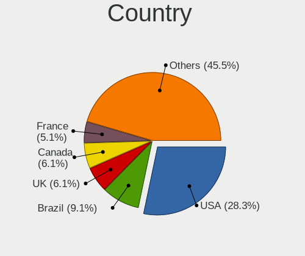
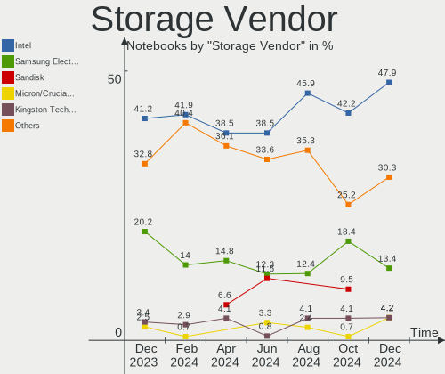
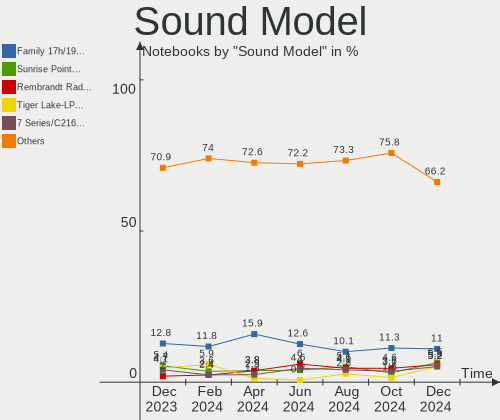

Pop!_OS - Hardware Trends (Notebooks)
-------------------------------------

A project to identify most popular hardware characteristics and track their change
over time based on data collected by Linux users at https://Linux-Hardware.org.

Anyone can contribute to this report by the [hw-probe](https://github.com/linuxhw/hw-probe) tool:

    sudo -E hw-probe -all -upload

This report is for one last month. Overall report since the beginning of time: [TestDays](https://github.com/linuxhw/TestDays)

Period: Feb, 2023.

Contents
--------

* [ System ](#system)
  - [ OS                       ](#os)
  - [ OS Family                ](#os-family)
  - [ Kernel                   ](#kernel)
  - [ Kernel Family            ](#kernel-family)
  - [ Kernel Major Ver.        ](#kernel-major-ver)
  - [ Arch                     ](#arch)
  - [ DE                       ](#de)
  - [ Display Server           ](#display-server)
  - [ Display Manager          ](#display-manager)
  - [ OS Lang                  ](#os-lang)
  - [ Boot Mode                ](#boot-mode)
  - [ Filesystem               ](#filesystem)
  - [ Part. scheme             ](#part-scheme)
  - [ Dual Boot with Linux/BSD ](#dual-boot-with-linuxbsd)
  - [ Dual Boot (Win)          ](#dual-boot-win)

* [ Board ](#board)
  - [ Vendor                   ](#vendor)
  - [ Model                    ](#model)
  - [ Model Family             ](#model-family)
  - [ MFG Year                 ](#mfg-year)
  - [ Form Factor              ](#form-factor)
  - [ Secure Boot              ](#secure-boot)
  - [ Coreboot                 ](#coreboot)
  - [ RAM Size                 ](#ram-size)
  - [ RAM Used                 ](#ram-used)
  - [ Total Drives             ](#total-drives)
  - [ Has CD-ROM               ](#has-cd-rom)
  - [ Has Ethernet             ](#has-ethernet)
  - [ Has WiFi                 ](#has-wifi)
  - [ Has Bluetooth            ](#has-bluetooth)

* [ Location ](#location)
  - [ Country                  ](#country)
  - [ City                     ](#city)

* [ Drives ](#drives)
  - [ Drive Vendor             ](#drive-vendor)
  - [ Drive Model              ](#drive-model)
  - [ HDD Vendor               ](#hdd-vendor)
  - [ SSD Vendor               ](#ssd-vendor)
  - [ Drive Kind               ](#drive-kind)
  - [ Drive Connector          ](#drive-connector)
  - [ Drive Size               ](#drive-size)
  - [ Space Total              ](#space-total)
  - [ Space Used               ](#space-used)
  - [ Malfunc. Drives          ](#malfunc-drives)
  - [ Malfunc. Drive Vendor    ](#malfunc-drive-vendor)
  - [ Malfunc. HDD Vendor      ](#malfunc-hdd-vendor)
  - [ Malfunc. Drive Kind      ](#malfunc-drive-kind)
  - [ Failed Drives            ](#failed-drives)
  - [ Failed Drive Vendor      ](#failed-drive-vendor)
  - [ Drive Status             ](#drive-status)

* [ Storage controller ](#storage-controller)
  - [ Storage Vendor           ](#storage-vendor)
  - [ Storage Model            ](#storage-model)
  - [ Storage Kind             ](#storage-kind)

* [ Processor ](#processor)
  - [ CPU Vendor               ](#cpu-vendor)
  - [ CPU Model                ](#cpu-model)
  - [ CPU Model Family         ](#cpu-model-family)
  - [ CPU Cores                ](#cpu-cores)
  - [ CPU Sockets              ](#cpu-sockets)
  - [ CPU Threads              ](#cpu-threads)
  - [ CPU Op-Modes             ](#cpu-op-modes)
  - [ CPU Microcode            ](#cpu-microcode)
  - [ CPU Microarch            ](#cpu-microarch)

* [ Graphics ](#graphics)
  - [ GPU Vendor               ](#gpu-vendor)
  - [ GPU Model                ](#gpu-model)
  - [ GPU Combo                ](#gpu-combo)
  - [ GPU Driver               ](#gpu-driver)
  - [ GPU Memory               ](#gpu-memory)

* [ Monitor ](#monitor)
  - [ Monitor Vendor           ](#monitor-vendor)
  - [ Monitor Model            ](#monitor-model)
  - [ Monitor Resolution       ](#monitor-resolution)
  - [ Monitor Diagonal         ](#monitor-diagonal)
  - [ Monitor Width            ](#monitor-width)
  - [ Aspect Ratio             ](#aspect-ratio)
  - [ Monitor Area             ](#monitor-area)
  - [ Pixel Density            ](#pixel-density)
  - [ Multiple Monitors        ](#multiple-monitors)

* [ Network ](#network)
  - [ Net Controller Vendor    ](#net-controller-vendor)
  - [ Net Controller Model     ](#net-controller-model)
  - [ Wireless Vendor          ](#wireless-vendor)
  - [ Wireless Model           ](#wireless-model)
  - [ Ethernet Vendor          ](#ethernet-vendor)
  - [ Ethernet Model           ](#ethernet-model)
  - [ Net Controller Kind      ](#net-controller-kind)
  - [ Used Controller          ](#used-controller)
  - [ NICs                     ](#nics)
  - [ IPv6                     ](#ipv6)

* [ Bluetooth ](#bluetooth)
  - [ Bluetooth Vendor         ](#bluetooth-vendor)
  - [ Bluetooth Model          ](#bluetooth-model)

* [ Sound ](#sound)
  - [ Sound Vendor             ](#sound-vendor)
  - [ Sound Model              ](#sound-model)

* [ Memory ](#memory)
  - [ Memory Vendor            ](#memory-vendor)
  - [ Memory Model             ](#memory-model)
  - [ Memory Kind              ](#memory-kind)
  - [ Memory Form Factor       ](#memory-form-factor)
  - [ Memory Size              ](#memory-size)
  - [ Memory Speed             ](#memory-speed)

* [ Printers & scanners ](#printers--scanners)
  - [ Printer Vendor           ](#printer-vendor)
  - [ Printer Model            ](#printer-model)
  - [ Scanner Vendor           ](#scanner-vendor)
  - [ Scanner Model            ](#scanner-model)

* [ Camera ](#camera)
  - [ Camera Vendor            ](#camera-vendor)
  - [ Camera Model             ](#camera-model)

* [ Security ](#security)
  - [ Fingerprint Vendor       ](#fingerprint-vendor)
  - [ Fingerprint Model        ](#fingerprint-model)
  - [ Chipcard Vendor          ](#chipcard-vendor)
  - [ Chipcard Model           ](#chipcard-model)

* [ Unsupported ](#unsupported)
  - [ Unsupported Devices      ](#unsupported-devices)
  - [ Unsupported Device Types ](#unsupported-device-types)

System
------

OS
--

Installed operating systems

| Name          | Notebooks | Percent |
|---------------|-----------|---------|
| Pop!_OS 22.04 | 130       | 100%    |

OS Family
---------

OS without a version

| Name    | Notebooks | Percent |
|---------|-----------|---------|
| Pop!_OS | 130       | 100%    |

Kernel
------

Version of the Linux kernel

| Version                  | Notebooks | Percent |
|--------------------------|-----------|---------|
| 6.0.12-76060006-generic  | 94        | 72.31%  |
| 6.1.11-76060111-generic  | 24        | 18.46%  |
| 6.0.6-76060006-generic   | 3         | 2.31%   |
| 6.1.0-1006-oem           | 2         | 1.54%   |
| 6.1.9-060109-generic     | 1         | 0.77%   |
| 6.1.14-x64v2-xanmod1     | 1         | 0.77%   |
| 5.19.0-76051900-generic  | 1         | 0.77%   |
| 5.18.10-76051810-generic | 1         | 0.77%   |
| 5.17.0-1020-oem          | 1         | 0.77%   |
| 5.15.87-xanmod1          | 1         | 0.77%   |
| 5.15.0-60-lowlatency     | 1         | 0.77%   |

Kernel Family
-------------

Linux kernel without a distro release

| Version | Notebooks | Percent |
|---------|-----------|---------|
| 6.0.12  | 94        | 72.31%  |
| 6.1.11  | 24        | 18.46%  |
| 6.0.6   | 3         | 2.31%   |
| 6.1.0   | 2         | 1.54%   |
| 6.1.9   | 1         | 0.77%   |
| 6.1.14  | 1         | 0.77%   |
| 5.19.0  | 1         | 0.77%   |
| 5.18.10 | 1         | 0.77%   |
| 5.17.0  | 1         | 0.77%   |
| 5.15.87 | 1         | 0.77%   |
| 5.15.0  | 1         | 0.77%   |

Kernel Major Ver.
-----------------

Linux kernel major version

| Version | Notebooks | Percent |
|---------|-----------|---------|
| 6.0     | 97        | 74.62%  |
| 6.1     | 28        | 21.54%  |
| 5.15    | 2         | 1.54%   |
| 5.19    | 1         | 0.77%   |
| 5.18    | 1         | 0.77%   |
| 5.17    | 1         | 0.77%   |

Arch
----

OS architecture (x86_64, i586, etc.)

| Name   | Notebooks | Percent |
|--------|-----------|---------|
| x86_64 | 130       | 100%    |

DE
--

Desktop Environment

| Name  | Notebooks | Percent |
|-------|-----------|---------|
| GNOME | 129       | 99.23%  |
| KDE5  | 1         | 0.77%   |

Display Server
--------------

X11 or Wayland

| Name    | Notebooks | Percent |
|---------|-----------|---------|
| X11     | 126       | 96.92%  |
| Wayland | 3         | 2.31%   |
| Unknown | 1         | 0.77%   |

Display Manager
---------------

SDDM, LightDM, etc.

| Name    | Notebooks | Percent |
|---------|-----------|---------|
| Unknown | 96        | 73.85%  |
| GDM3    | 33        | 25.38%  |
| GDM     | 1         | 0.77%   |

OS Lang
-------

Language

| Lang  | Notebooks | Percent |
|-------|-----------|---------|
| en_US | 87        | 66.92%  |
| de_DE | 8         | 6.15%   |
| en_GB | 6         | 4.62%   |
| pt_BR | 5         | 3.85%   |
| C     | 4         | 3.08%   |
| ru_RU | 3         | 2.31%   |
| sv_SE | 2         | 1.54%   |
| nb_NO | 2         | 1.54%   |
| it_IT | 2         | 1.54%   |
| fr_FR | 2         | 1.54%   |
| es_ES | 2         | 1.54%   |
| en_NZ | 2         | 1.54%   |
| pt_PT | 1         | 0.77%   |
| pl_PL | 1         | 0.77%   |
| lv_LV | 1         | 0.77%   |
| fi_FI | 1         | 0.77%   |
| cs_CZ | 1         | 0.77%   |

Boot Mode
---------

EFI or BIOS

| Mode | Notebooks | Percent |
|------|-----------|---------|
| BIOS | 99        | 76.15%  |
| EFI  | 31        | 23.85%  |

Filesystem
----------

Type of filesystem

| Type    | Notebooks | Percent |
|---------|-----------|---------|
| Ext4    | 120       | 92.31%  |
| Btrfs   | 7         | 5.38%   |
| Overlay | 2         | 1.54%   |
| Xfs     | 1         | 0.77%   |

Part. scheme
------------

Scheme of partitioning

| Type    | Notebooks | Percent |
|---------|-----------|---------|
| Unknown | 95        | 73.08%  |
| GPT     | 31        | 23.85%  |
| MBR     | 4         | 3.08%   |

Dual Boot with Linux/BSD
------------------------

Hosting more than one Linux/BSD

| Dual boot | Notebooks | Percent |
|-----------|-----------|---------|
| No        | 128       | 98.46%  |
| Yes       | 2         | 1.54%   |

Dual Boot (Win)
---------------

Hosting Linux and Windows

| Dual boot | Notebooks | Percent |
|-----------|-----------|---------|
| No        | 122       | 93.85%  |
| Yes       | 8         | 6.15%   |

Board
-----

Vendor
------

Motherboard manufacturer

| Name                    | Notebooks | Percent |
|-------------------------|-----------|---------|
| Lenovo                  | 30        | 23.08%  |
| Dell                    | 25        | 19.23%  |
| Hewlett-Packard         | 15        | 11.54%  |
| Apple                   | 11        | 8.46%   |
| Acer                    | 11        | 8.46%   |
| ASUSTek Computer        | 9         | 6.92%   |
| System76                | 3         | 2.31%   |
| Alienware               | 3         | 2.31%   |
| Toshiba                 | 2         | 1.54%   |
| Timi                    | 2         | 1.54%   |
| Sony                    | 2         | 1.54%   |
| MSI                     | 2         | 1.54%   |
| VANT                    | 1         | 0.77%   |
| TUXEDO                  | 1         | 0.77%   |
| Star Labs               | 1         | 0.77%   |
| Razer                   | 1         | 0.77%   |
| Packard Bell            | 1         | 0.77%   |
| OriginPC                | 1         | 0.77%   |
| ONE-NETBOOK TECHNOLOGY  | 1         | 0.77%   |
| Notebook                | 1         | 0.77%   |
| HUAWEI                  | 1         | 0.77%   |
| HONOR                   | 1         | 0.77%   |
| HCL Infosystems Limited | 1         | 0.77%   |
| Haier                   | 1         | 0.77%   |
| GPU Company             | 1         | 0.77%   |
| Google                  | 1         | 0.77%   |
| Fujitsu                 | 1         | 0.77%   |

Model
-----

Motherboard model

| Name                                               | Notebooks | Percent |
|----------------------------------------------------|-----------|---------|
| HP EliteBook 830 G5                                | 2         | 1.54%   |
| Apple MacBookPro9,2                                | 2         | 1.54%   |
| Acer Swift SF114-34                                | 2         | 1.54%   |
| Acer Aspire A315-59                                | 2         | 1.54%   |
| VANT MOOVE3-14                                     | 1         | 0.77%   |
| TUXEDO Polaris AMD Gen3 (CZN)                      | 1         | 0.77%   |
| Toshiba Satellite C855-233                         | 1         | 0.77%   |
| Toshiba Satellite C855-1T5                         | 1         | 0.77%   |
| Timi RedmiBook Pro 15S                             | 1         | 0.77%   |
| Timi Mi NoteBook Ultra                             | 1         | 0.77%   |
| System76 Lemur Pro                                 | 1         | 0.77%   |
| System76 Gazelle                                   | 1         | 0.77%   |
| System76 Galago Pro                                | 1         | 0.77%   |
| Star Labs StarBook                                 | 1         | 0.77%   |
| Sony VPCZ12V9R                                     | 1         | 0.77%   |
| Sony VPCEG27FM                                     | 1         | 0.77%   |
| Razer Blade 15 Base Model (Early 2020) - RZ09-0328 | 1         | 0.77%   |
| Packard Bell EasyNote TS11HR                       | 1         | 0.77%   |
| OriginPC Voyager a1600                             | 1         | 0.77%   |
| ONE-NETBOOK TECHNOLOGY ONE XPLAYER                 | 1         | 0.77%   |
| Notebook NJ50_70CU                                 | 1         | 0.77%   |
| MSI Prestige 14Evo A11M                            | 1         | 0.77%   |
| MSI GF63 Thin 9RCX                                 | 1         | 0.77%   |
| Lenovo ThinkPad X270 20HN001RUS                    | 1         | 0.77%   |
| Lenovo ThinkPad X220 Tablet 4298AM7                | 1         | 0.77%   |
| Lenovo ThinkPad X220 Tablet 4294CTO                | 1         | 0.77%   |
| Lenovo ThinkPad X1 Extreme 20MF000CUS              | 1         | 0.77%   |
| Lenovo ThinkPad X1 Carbon 7th 20QD00L7GE           | 1         | 0.77%   |
| Lenovo ThinkPad T530 2392AQU                       | 1         | 0.77%   |
| Lenovo ThinkPad T480s 20L8S7AS0F                   | 1         | 0.77%   |
| Lenovo ThinkPad T470s 20HFCT01WW                   | 1         | 0.77%   |
| Lenovo ThinkPad T450s 20BWS14G01                   | 1         | 0.77%   |
| Lenovo ThinkPad T450 20BUS0B000                    | 1         | 0.77%   |
| Lenovo ThinkPad T450 20BUA0PNUK                    | 1         | 0.77%   |
| Lenovo ThinkPad T430s 2356CU8                      | 1         | 0.77%   |
| Lenovo ThinkPad T410 2522G76                       | 1         | 0.77%   |
| Lenovo ThinkPad P50 20EN0017US                     | 1         | 0.77%   |
| Lenovo ThinkPad P14s Gen 2a 21A00068US             | 1         | 0.77%   |
| Lenovo ThinkPad L15 Gen 3 21C7CTO1WW               | 1         | 0.77%   |
| Lenovo ThinkPad L13 Yoga Gen 2a 21AES01A00         | 1         | 0.77%   |

Model Family
------------

Motherboard model prefix

| Name                       | Notebooks | Percent |
|----------------------------|-----------|---------|
| Lenovo ThinkPad            | 18        | 13.85%  |
| Lenovo IdeaPad             | 7         | 5.38%   |
| HP EliteBook               | 7         | 5.38%   |
| Dell Latitude              | 7         | 5.38%   |
| Acer Aspire                | 6         | 4.62%   |
| Dell XPS                   | 4         | 3.08%   |
| Dell Precision             | 4         | 3.08%   |
| Dell Inspiron              | 4         | 3.08%   |
| ASUS VivoBook              | 4         | 3.08%   |
| HP Laptop                  | 3         | 2.31%   |
| Dell G15                   | 3         | 2.31%   |
| Apple MacBookPro11         | 3         | 2.31%   |
| Acer Swift                 | 3         | 2.31%   |
| Toshiba Satellite          | 2         | 1.54%   |
| Lenovo Legion              | 2         | 1.54%   |
| HP Pavilion                | 2         | 1.54%   |
| ASUS Zenbook               | 2         | 1.54%   |
| Apple MacBookPro9          | 2         | 1.54%   |
| VANT MOOVE3-14             | 1         | 0.77%   |
| TUXEDO Polaris             | 1         | 0.77%   |
| Timi RedmiBook             | 1         | 0.77%   |
| Timi Mi                    | 1         | 0.77%   |
| System76 Lemur             | 1         | 0.77%   |
| System76 Gazelle           | 1         | 0.77%   |
| System76 Galago            | 1         | 0.77%   |
| Star Labs StarBook         | 1         | 0.77%   |
| Sony VPCZ12V9R             | 1         | 0.77%   |
| Sony VPCEG27FM             | 1         | 0.77%   |
| Razer Blade                | 1         | 0.77%   |
| Packard Bell EasyNote      | 1         | 0.77%   |
| OriginPC Voyager           | 1         | 0.77%   |
| ONE-NETBOOK TECHNOLOGY ONE | 1         | 0.77%   |
| Notebook NJ50              | 1         | 0.77%   |
| MSI Prestige               | 1         | 0.77%   |
| MSI GF63                   | 1         | 0.77%   |
| Lenovo ThinkBook           | 1         | 0.77%   |
| Lenovo G50-80              | 1         | 0.77%   |
| Lenovo G50-45              | 1         | 0.77%   |
| HUAWEI BOD-WXX9            | 1         | 0.77%   |
| HONOR NBR-WAX9             | 1         | 0.77%   |

MFG Year
--------

Motherboard manufacture year

| Year | Notebooks | Percent |
|------|-----------|---------|
| 2022 | 18        | 13.85%  |
| 2021 | 17        | 13.08%  |
| 2018 | 15        | 11.54%  |
| 2019 | 14        | 10.77%  |
| 2020 | 12        | 9.23%   |
| 2017 | 9         | 6.92%   |
| 2015 | 8         | 6.15%   |
| 2012 | 8         | 6.15%   |
| 2013 | 7         | 5.38%   |
| 2011 | 7         | 5.38%   |
| 2016 | 4         | 3.08%   |
| 2014 | 4         | 3.08%   |
| 2009 | 4         | 3.08%   |
| 2023 | 1         | 0.77%   |
| 2010 | 1         | 0.77%   |
| 2008 | 1         | 0.77%   |

Form Factor
-----------

Physical design of the computer

| Name     | Notebooks | Percent |
|----------|-----------|---------|
| Notebook | 130       | 100%    |

Secure Boot
-----------

Enabled or disabled

| State    | Notebooks | Percent |
|----------|-----------|---------|
| Disabled | 130       | 100%    |

Coreboot
--------

Have coreboot on board

| Used | Notebooks | Percent |
|------|-----------|---------|
| No   | 126       | 96.92%  |
| Yes  | 4         | 3.08%   |

RAM Size
--------

Total RAM memory

| Size in GB  | Notebooks | Percent |
|-------------|-----------|---------|
| 16.01-24.0  | 39        | 30%     |
| 4.01-8.0    | 32        | 24.62%  |
| 8.01-16.0   | 20        | 15.38%  |
| 32.01-64.0  | 14        | 10.77%  |
| 3.01-4.0    | 13        | 10%     |
| 64.01-256.0 | 5         | 3.85%   |
| 24.01-32.0  | 4         | 3.08%   |
| 2.01-3.0    | 3         | 2.31%   |

RAM Used
--------

Used RAM memory

| Used GB    | Notebooks | Percent |
|------------|-----------|---------|
| 4.01-8.0   | 49        | 37.69%  |
| 2.01-3.0   | 30        | 23.08%  |
| 3.01-4.0   | 26        | 20%     |
| 1.01-2.0   | 13        | 10%     |
| 8.01-16.0  | 10        | 7.69%   |
| 16.01-24.0 | 2         | 1.54%   |

Total Drives
------------

Number of drives on board

| Drives | Notebooks | Percent |
|--------|-----------|---------|
| 1      | 93        | 71.54%  |
| 2      | 30        | 23.08%  |
| 3      | 4         | 3.08%   |
| 4      | 2         | 1.54%   |
| 0      | 1         | 0.77%   |

Has CD-ROM
----------

Has CD-ROM on board

| Presented | Notebooks | Percent |
|-----------|-----------|---------|
| No        | 105       | 80.77%  |
| Yes       | 25        | 19.23%  |

Has Ethernet
------------

Has Ethernet on board

| Presented | Notebooks | Percent |
|-----------|-----------|---------|
| Yes       | 94        | 72.31%  |
| No        | 36        | 27.69%  |

Has WiFi
--------

Has WiFi module

| Presented | Notebooks | Percent |
|-----------|-----------|---------|
| Yes       | 124       | 95.38%  |
| No        | 6         | 4.62%   |

Has Bluetooth
-------------

Has Bluetooth module

| Presented | Notebooks | Percent |
|-----------|-----------|---------|
| Yes       | 108       | 83.08%  |
| No        | 22        | 16.92%  |

Location
--------

Country
-------

Geographic location (country)

| Country     | Notebooks | Percent |
|-------------|-----------|---------|
| USA         | 45        | 34.62%  |
| Germany     | 11        | 8.46%   |
| Brazil      | 8         | 6.15%   |
| Italy       | 7         | 5.38%   |
| India       | 6         | 4.62%   |
| UK          | 5         | 3.85%   |
| France      | 4         | 3.08%   |
| Sweden      | 3         | 2.31%   |
| Spain       | 3         | 2.31%   |
| Russia      | 3         | 2.31%   |
| Poland      | 3         | 2.31%   |
| Norway      | 3         | 2.31%   |
| New Zealand | 3         | 2.31%   |
| UAE         | 2         | 1.54%   |
| Thailand    | 2         | 1.54%   |
| Romania     | 2         | 1.54%   |
| Portugal    | 2         | 1.54%   |
| Hungary     | 2         | 1.54%   |
| Georgia     | 2         | 1.54%   |
| Canada      | 2         | 1.54%   |
| Australia   | 2         | 1.54%   |
| Vietnam     | 1         | 0.77%   |
| Ukraine     | 1         | 0.77%   |
| Switzerland | 1         | 0.77%   |
| Serbia      | 1         | 0.77%   |
| Philippines | 1         | 0.77%   |
| Latvia      | 1         | 0.77%   |
| Ireland     | 1         | 0.77%   |
| Finland     | 1         | 0.77%   |
| Czechia     | 1         | 0.77%   |
| Belgium     | 1         | 0.77%   |

City
----

Geographic location (city)

| City                  | Notebooks | Percent |
|-----------------------|-----------|---------|
| Auckland              | 3         | 2.31%   |
| Tbilisi               | 2         | 1.54%   |
| Oslo                  | 2         | 1.54%   |
| New York              | 2         | 1.54%   |
| Moscow                | 2         | 1.54%   |
| Milano                | 2         | 1.54%   |
| Memphis               | 2         | 1.54%   |
| Canberra              | 2         | 1.54%   |
| Abu Dhabi             | 2         | 1.54%   |
| Zevio                 | 1         | 0.77%   |
| Yonkers               | 1         | 0.77%   |
| Wietzendorf           | 1         | 0.77%   |
| West Dundee           | 1         | 0.77%   |
| Vitória              | 1         | 0.77%   |
| Van Nuys              | 1         | 0.77%   |
| Valencia              | 1         | 0.77%   |
| Uxbridge              | 1         | 0.77%   |
| Troisdorf             | 1         | 0.77%   |
| Trenton               | 1         | 0.77%   |
| Tracy                 | 1         | 0.77%   |
| Toronto               | 1         | 0.77%   |
| Tiruchi               | 1         | 0.77%   |
| Szeged                | 1         | 0.77%   |
| Springfield           | 1         | 0.77%   |
| Seattle               | 1         | 0.77%   |
| San Leandro           | 1         | 0.77%   |
| San Diego             | 1         | 0.77%   |
| Sacramento            | 1         | 0.77%   |
| Russellville          | 1         | 0.77%   |
| Roth                  | 1         | 0.77%   |
| Roswell               | 1         | 0.77%   |
| Rockville             | 1         | 0.77%   |
| Rincon de la Victoria | 1         | 0.77%   |
| Publy                 | 1         | 0.77%   |
| Prague                | 1         | 0.77%   |
| Portsmouth            | 1         | 0.77%   |
| Porto                 | 1         | 0.77%   |
| Orlando               | 1         | 0.77%   |
| Ontinyent             | 1         | 0.77%   |
| Ondres                | 1         | 0.77%   |

Drives
------

Drive Vendor
------------

Hard drive vendors

| Vendor                       | Notebooks | Drives | Percent |
|------------------------------|-----------|--------|---------|
| Samsung Electronics          | 40        | 46     | 24.39%  |
| WDC                          | 17        | 18     | 10.37%  |
| SanDisk                      | 11        | 11     | 6.71%   |
| Unknown                      | 10        | 11     | 6.1%    |
| Seagate                      | 8         | 9      | 4.88%   |
| Apple                        | 8         | 8      | 4.88%   |
| Toshiba                      | 7         | 7      | 4.27%   |
| SK hynix                     | 5         | 5      | 3.05%   |
| Micron Technology            | 5         | 5      | 3.05%   |
| Kingston                     | 5         | 5      | 3.05%   |
| Intel                        | 5         | 6      | 3.05%   |
| HGST                         | 5         | 5      | 3.05%   |
| Crucial                      | 4         | 5      | 2.44%   |
| PNY                          | 3         | 3      | 1.83%   |
| Transcend                    | 2         | 2      | 1.22%   |
| Patriot                      | 2         | 2      | 1.22%   |
| LITEON                       | 2         | 2      | 1.22%   |
| China                        | 2         | 2      | 1.22%   |
| A-DATA Technology            | 2         | 2      | 1.22%   |
| XPG                          | 1         | 1      | 0.61%   |
| Wibtek                       | 1         | 1      | 0.61%   |
| USB                          | 1         | 1      | 0.61%   |
| Star Drive                   | 1         | 1      | 0.61%   |
| SPCC                         | 1         | 1      | 0.61%   |
| Silicon Motion               | 1         | 1      | 0.61%   |
| Shenzhen Longsys Electronics | 1         | 1      | 0.61%   |
| Realtek Semiconductor        | 1         | 1      | 0.61%   |
| Phison Electronics           | 1         | 1      | 0.61%   |
| OCZ                          | 1         | 1      | 0.61%   |
| Micron/Crucial Technology    | 1         | 1      | 0.61%   |
| LITEONIT                     | 1         | 1      | 0.61%   |
| LDLC                         | 1         | 1      | 0.61%   |
| KIOXIA-EXCERIA               | 1         | 1      | 0.61%   |
| KIOXIA                       | 1         | 1      | 0.61%   |
| Kingston Technology Company  | 1         | 1      | 0.61%   |
| KingSpec                     | 1         | 1      | 0.61%   |
| JMicron Technology           | 1         | 1      | 0.61%   |
| Hitachi                      | 1         | 1      | 0.61%   |
| Dogfish                      | 1         | 1      | 0.61%   |
| Dell                         | 1         | 1      | 0.61%   |

Drive Model
-----------

Hard drive models

| Model                                                | Notebooks | Percent |
|------------------------------------------------------|-----------|---------|
| Samsung NVMe SSD Controller SM981/PM981/PM983 250GB  | 11        | 6.51%   |
| Samsung NVMe SSD Controller PM9A1/PM9A3/980PRO 960GB | 6         | 3.55%   |
| Unknown MMC Card  64GB                               | 4         | 2.37%   |
| HGST HTS545050A7E680 500GB                           | 3         | 1.78%   |
| WDC WD10SPZX-21Z10T0 1TB                             | 2         | 1.18%   |
| Unknown DA4128  128GB                                | 2         | 1.18%   |
| Toshiba MQ04ABF100 1TB                               | 2         | 1.18%   |
| Seagate ST1000LM035-1RK172 1TB                       | 2         | 1.18%   |
| Sandisk WD Black SN750 / PC SN730 NVMe SSD 512GB     | 2         | 1.18%   |
| Samsung NVMe SSD Controller SM961/PM961/SM963 512GB  | 2         | 1.18%   |
| Samsung MZVLQ512HBLU-00B00 512GB                     | 2         | 1.18%   |
| PNY ELITE PSSD 240GB                                 | 2         | 1.18%   |
| Intel SSD Pro 7600p/760p/E 6100p Series 1024GB       | 2         | 1.18%   |
| Crucial CT240BX500SSD1 240GB                         | 2         | 1.18%   |
| XPG GAMMIX S70 BLADE 2TB                             | 1         | 0.59%   |
| Wibtek W800S 512GB                                   | 1         | 0.59%   |
| WDC WDS240G2G0B-00EPW0 240GB SSD                     | 1         | 0.59%   |
| WDC WDS200T2B0B 2TB SSD                              | 1         | 0.59%   |
| WDC WDS200T2B0A 2TB SSD                              | 1         | 0.59%   |
| WDC WDS100T2B0B-00YS70 1TB SSD                       | 1         | 0.59%   |
| WDC WD5000LPVX-22V0TT0 500GB                         | 1         | 0.59%   |
| WDC WD3200BEKT-60PVMT0 320GB                         | 1         | 0.59%   |
| WDC WD2500BEVT-60ZCT1 250GB                          | 1         | 0.59%   |
| WDC WD10SPZX-75Z10T2 1TB                             | 1         | 0.59%   |
| WDC WD10SPZX-17Z10T1 1TB                             | 1         | 0.59%   |
| WDC WD10SPZX-00Z10T0 1TB                             | 1         | 0.59%   |
| WDC WD10SPCX-08S8TT0 1TB                             | 1         | 0.59%   |
| WDC WD10JPCX-24UE4T0 1TB                             | 1         | 0.59%   |
| WDC WD1001X06X-00SJVT0 1TB                           | 1         | 0.59%   |
| WDC PC SN730 SDBPNTY-512G-1036 512GB                 | 1         | 0.59%   |
| WDC PC SN730 SDBPNTY-1T00-1101 1TB                   | 1         | 0.59%   |
| WDC PC SN530 SDBPNPZ-256G-1006 256GB                 | 1         | 0.59%   |
| USB Tech 1TB                                         | 1         | 0.59%   |
| Unknown SE64G  64GB                                  | 1         | 0.59%   |
| Unknown SD/MMC/MS PRO 16GB                           | 1         | 0.59%   |
| Unknown MMC Card  32GB                               | 1         | 0.59%   |
| Unknown MMC Card  128GB                              | 1         | 0.59%   |
| Unknown DA4064,81603297, 64GB                        | 1         | 0.59%   |
| Transcend TS512GMTS430S 512GB SSD                    | 1         | 0.59%   |
| Transcend TS2TSSD225S 2TB                            | 1         | 0.59%   |

HDD Vendor
----------

Hard disk drive vendors

| Vendor  | Notebooks | Drives | Percent |
|---------|-----------|--------|---------|
| WDC     | 11        | 11     | 35.48%  |
| Seagate | 7         | 8      | 22.58%  |
| HGST    | 5         | 5      | 16.13%  |
| Toshiba | 4         | 4      | 12.9%   |
| Apple   | 2         | 2      | 6.45%   |
| Unknown | 1         | 1      | 3.23%   |
| Hitachi | 1         | 1      | 3.23%   |

SSD Vendor
----------

Solid state drive vendors

| Vendor              | Notebooks | Drives | Percent |
|---------------------|-----------|--------|---------|
| Samsung Electronics | 12        | 15     | 23.08%  |
| SanDisk             | 4         | 4      | 7.69%   |
| Crucial             | 4         | 5      | 7.69%   |
| Apple               | 4         | 4      | 7.69%   |
| WDC                 | 3         | 4      | 5.77%   |
| PNY                 | 3         | 3      | 5.77%   |
| Kingston            | 3         | 3      | 5.77%   |
| Transcend           | 2         | 2      | 3.85%   |
| Patriot             | 2         | 2      | 3.85%   |
| China               | 2         | 2      | 3.85%   |
| Toshiba             | 1         | 1      | 1.92%   |
| SPCC                | 1         | 1      | 1.92%   |
| SK hynix            | 1         | 1      | 1.92%   |
| OCZ                 | 1         | 1      | 1.92%   |
| Micron Technology   | 1         | 1      | 1.92%   |
| LITEONIT            | 1         | 1      | 1.92%   |
| LITEON              | 1         | 1      | 1.92%   |
| LDLC                | 1         | 1      | 1.92%   |
| KIOXIA-EXCERIA      | 1         | 1      | 1.92%   |
| KingSpec            | 1         | 1      | 1.92%   |
| Intel               | 1         | 1      | 1.92%   |
| Dogfish             | 1         | 1      | 1.92%   |
| A-DATA Technology   | 1         | 1      | 1.92%   |

Drive Kind
----------

HDD or SSD

| Kind    | Notebooks | Drives | Percent |
|---------|-----------|--------|---------|
| NVMe    | 64        | 70     | 41.83%  |
| SSD     | 45        | 57     | 29.41%  |
| HDD     | 29        | 32     | 18.95%  |
| MMC     | 10        | 10     | 6.54%   |
| Unknown | 5         | 6      | 3.27%   |

Drive Connector
---------------

SATA, SAS, NVMe, etc.

| Type | Notebooks | Drives | Percent |
|------|-----------|--------|---------|
| SATA | 65        | 85     | 43.92%  |
| NVMe | 64        | 70     | 43.24%  |
| MMC  | 10        | 10     | 6.76%   |
| SAS  | 9         | 10     | 6.08%   |

Drive Size
----------

Size of hard drive

| Size in TB | Notebooks | Drives | Percent |
|------------|-----------|--------|---------|
| 0.01-0.5   | 49        | 61     | 68.06%  |
| 0.51-1.0   | 19        | 22     | 26.39%  |
| 1.01-2.0   | 3         | 4      | 4.17%   |
| 4.01-10.0  | 1         | 2      | 1.39%   |

Space Total
-----------

Amount of disk space available on the file system

| Size in GB     | Notebooks | Percent |
|----------------|-----------|---------|
| 101-250        | 41        | 31.54%  |
| 251-500        | 34        | 26.15%  |
| 501-1000       | 24        | 18.46%  |
| 1001-2000      | 12        | 9.23%   |
| 51-100         | 6         | 4.62%   |
| 2001-3000      | 4         | 3.08%   |
| 1-20           | 4         | 3.08%   |
| More than 3000 | 2         | 1.54%   |
| 21-50          | 2         | 1.54%   |
| Unknown        | 1         | 0.77%   |

Space Used
----------

Amount of used disk space

| Used GB        | Notebooks | Percent |
|----------------|-----------|---------|
| 1-20           | 36        | 27.69%  |
| 21-50          | 34        | 26.15%  |
| 51-100         | 23        | 17.69%  |
| 101-250        | 14        | 10.77%  |
| 501-1000       | 9         | 6.92%   |
| 251-500        | 8         | 6.15%   |
| 1001-2000      | 3         | 2.31%   |
| More than 3000 | 1         | 0.77%   |
| 2001-3000      | 1         | 0.77%   |
| Unknown        | 1         | 0.77%   |

Malfunc. Drives
---------------

Drive models with a malfunction

| Model                                    | Notebooks | Drives | Percent |
|------------------------------------------|-----------|--------|---------|
| WDC WD3200BEKT-60PVMT0 320GB             | 1         | 1      | 33.33%  |
| Toshiba THNSNK256GVN8 M.2 2280 256GB SSD | 1         | 1      | 33.33%  |
| HGST HTS545050A7E680 500GB               | 1         | 1      | 33.33%  |

Malfunc. Drive Vendor
---------------------

Vendors of faulty drives

| Vendor  | Notebooks | Drives | Percent |
|---------|-----------|--------|---------|
| WDC     | 1         | 1      | 33.33%  |
| Toshiba | 1         | 1      | 33.33%  |
| HGST    | 1         | 1      | 33.33%  |

Malfunc. HDD Vendor
-------------------

Vendors of faulty HDD drives

| Vendor | Notebooks | Drives | Percent |
|--------|-----------|--------|---------|
| WDC    | 1         | 1      | 50%     |
| HGST   | 1         | 1      | 50%     |

Malfunc. Drive Kind
-------------------

Kinds of faulty drives

| Kind | Notebooks | Drives | Percent |
|------|-----------|--------|---------|
| HDD  | 2         | 2      | 66.67%  |
| SSD  | 1         | 1      | 33.33%  |

Failed Drives
-------------

Failed drive models

Zero info for selected period =(

Failed Drive Vendor
-------------------

Failed drive vendors

Zero info for selected period =(

Drive Status
------------

Number of failed and malfunc. drives

| Status   | Notebooks | Drives | Percent |
|----------|-----------|--------|---------|
| Detected | 104       | 138    | 76.47%  |
| Works    | 29        | 34     | 21.32%  |
| Malfunc  | 3         | 3      | 2.21%   |

Storage controller
------------------

Storage Vendor
--------------

Storage controller vendors

| Vendor                       | Notebooks | Percent |
|------------------------------|-----------|---------|
| Intel                        | 77        | 50%     |
| Samsung Electronics          | 31        | 20.13%  |
| AMD                          | 11        | 7.14%   |
| Sandisk                      | 9         | 5.84%   |
| SK hynix                     | 4         | 2.6%    |
| Micron Technology            | 4         | 2.6%    |
| Kingston Technology Company  | 3         | 1.95%   |
| Toshiba America Info Systems | 2         | 1.3%    |
| Phison Electronics           | 2         | 1.3%    |
| Apple                        | 2         | 1.3%    |
| ADATA Technology             | 2         | 1.3%    |
| Silicon Motion               | 1         | 0.65%   |
| Shenzhen Longsys Electronics | 1         | 0.65%   |
| Realtek Semiconductor        | 1         | 0.65%   |
| Nvidia                       | 1         | 0.65%   |
| Micron/Crucial Technology    | 1         | 0.65%   |
| Marvell Technology Group     | 1         | 0.65%   |
| KIOXIA                       | 1         | 0.65%   |

Storage Model
-------------

Storage controller models

| Model                                                                          | Notebooks | Percent |
|--------------------------------------------------------------------------------|-----------|---------|
| Samsung NVMe SSD Controller SM981/PM981/PM983                                  | 15        | 8.98%   |
| Intel Volume Management Device NVMe RAID Controller                            | 12        | 7.19%   |
| AMD FCH SATA Controller [AHCI mode]                                            | 11        | 6.59%   |
| Intel 7 Series Chipset Family 6-port SATA Controller [AHCI mode]               | 8         | 4.79%   |
| Samsung NVMe SSD Controller PM9A1/PM9A3/980PRO                                 | 7         | 4.19%   |
| Intel Wildcat Point-LP SATA Controller [AHCI Mode]                             | 7         | 4.19%   |
| Intel Sunrise Point-LP SATA Controller [AHCI mode]                             | 7         | 4.19%   |
| Intel 6 Series/C200 Series Chipset Family 6 port Mobile SATA AHCI Controller   | 7         | 4.19%   |
| Intel Tiger Lake-LP SATA Controller                                            | 6         | 3.59%   |
| Intel 82801 Mobile SATA Controller [RAID mode]                                 | 6         | 3.59%   |
| Intel Cannon Lake Mobile PCH SATA AHCI Controller                              | 5         | 2.99%   |
| Intel Alder Lake-P SATA AHCI Controller                                        | 5         | 2.99%   |
| SanDisk WD Black SN750 / PC SN730 NVMe SSD                                     | 4         | 2.4%    |
| Samsung NVMe SSD Controller 980                                                | 4         | 2.4%    |
| Micron Non-Volatile memory controller                                          | 4         | 2.4%    |
| Intel 8 Series SATA Controller 1 [AHCI mode]                                   | 4         | 2.4%    |
| Samsung NVMe SSD Controller SM961/PM961/SM963                                  | 3         | 1.8%    |
| Kingston Company Company Non-Volatile memory controller                        | 3         | 1.8%    |
| Intel 8 Series/C220 Series Chipset Family 6-port SATA Controller 1 [AHCI mode] | 3         | 1.8%    |
| SK hynix Gold P31/PC711 NVMe Solid State Drive                                 | 2         | 1.2%    |
| SanDisk WD Blue SN550 NVMe SSD                                                 | 2         | 1.2%    |
| Sandisk Non-Volatile memory controller                                         | 2         | 1.2%    |
| Samsung Electronics SATA controller                                            | 2         | 1.2%    |
| Intel SSD Pro 7600p/760p/E 6100p Series                                        | 2         | 1.2%    |
| Intel SSD 660P Series                                                          | 2         | 1.2%    |
| Intel Comet Lake SATA AHCI Controller                                          | 2         | 1.2%    |
| Intel Celeron/Pentium Silver Processor SATA Controller                         | 2         | 1.2%    |
| Toshiba America Info Systems XG5 NVMe SSD Controller                           | 1         | 0.6%    |
| Toshiba America Info Systems BG3 NVMe SSD Controller                           | 1         | 0.6%    |
| SK hynix Platinum P41 NVMe Solid State Drive 2TB                               | 1         | 0.6%    |
| SK hynix Non-Volatile memory controller                                        | 1         | 0.6%    |
| Silicon Motion SM2263EN/SM2263XT SSD Controller                                | 1         | 0.6%    |
| Shenzhen Longsys SM2263EN/SM2263XT-based OEM SSD                               | 1         | 0.6%    |
| SanDisk WD Blue SN570 NVMe SSD                                                 | 1         | 0.6%    |
| Samsung Apple PCIe SSD                                                         | 1         | 0.6%    |
| Realtek RTS5763DL NVMe SSD Controller                                          | 1         | 0.6%    |
| Phison PS5013 E13 NVMe Controller                                              | 1         | 0.6%    |
| Phison E18 PCIe4 NVMe Controller                                               | 1         | 0.6%    |
| Nvidia MCP79 AHCI Controller                                                   | 1         | 0.6%    |
| Micron/Crucial P2 NVMe PCIe SSD                                                | 1         | 0.6%    |

Storage Kind
------------

Kind of storage controller (IDE, SATA, NVMe, SAS, ...)

| Kind | Notebooks | Percent |
|------|-----------|---------|
| SATA | 78        | 48.15%  |
| NVMe | 63        | 38.89%  |
| RAID | 19        | 11.73%  |
| IDE  | 2         | 1.23%   |

Processor
---------

CPU Vendor
----------

Processor vendors

| Vendor | Notebooks | Percent |
|--------|-----------|---------|
| Intel  | 107       | 82.31%  |
| AMD    | 23        | 17.69%  |

CPU Model
---------

Processor models

| Model                                         | Notebooks | Percent |
|-----------------------------------------------|-----------|---------|
| Intel 11th Gen Core i5-1135G7 @ 2.40GHz       | 6         | 4.62%   |
| Intel 12th Gen Core i7-12700H                 | 4         | 3.08%   |
| Intel Core i7-8750H CPU @ 2.20GHz             | 3         | 2.31%   |
| Intel Core i5-8350U CPU @ 1.70GHz             | 3         | 2.31%   |
| Intel Core i5-8250U CPU @ 1.60GHz             | 3         | 2.31%   |
| Intel Core i5-5300U CPU @ 2.30GHz             | 3         | 2.31%   |
| AMD Ryzen 7 5800H with Radeon Graphics        | 3         | 2.31%   |
| Intel Pentium Silver N6000 @ 1.10GHz          | 2         | 1.54%   |
| Intel Core i7-9750H CPU @ 2.60GHz             | 2         | 1.54%   |
| Intel Core i7-8565U CPU @ 1.80GHz             | 2         | 1.54%   |
| Intel Core i7-5500U CPU @ 2.40GHz             | 2         | 1.54%   |
| Intel Core i7-2620M CPU @ 2.70GHz             | 2         | 1.54%   |
| Intel Core i7-10750H CPU @ 2.60GHz            | 2         | 1.54%   |
| Intel Core i5-7300U CPU @ 2.60GHz             | 2         | 1.54%   |
| Intel Core i5-7200U CPU @ 2.50GHz             | 2         | 1.54%   |
| Intel Core i5-3320M CPU @ 2.60GHz             | 2         | 1.54%   |
| Intel Core i5-3210M CPU @ 2.50GHz             | 2         | 1.54%   |
| Intel Core i5-10210U CPU @ 1.60GHz            | 2         | 1.54%   |
| Intel 12th Gen Core i9-12900H                 | 2         | 1.54%   |
| Intel 12th Gen Core i7-1255U                  | 2         | 1.54%   |
| Intel 12th Gen Core i5-1235U                  | 2         | 1.54%   |
| Intel 11th Gen Core i7-1185G7 @ 3.00GHz       | 2         | 1.54%   |
| AMD Ryzen 7 6800H with Radeon Graphics        | 2         | 1.54%   |
| AMD Ryzen 5 PRO 5650U with Radeon Graphics    | 2         | 1.54%   |
| AMD Ryzen 5 3500U with Radeon Vega Mobile Gfx | 2         | 1.54%   |
| Intel Pentium Silver N5000 CPU @ 1.10GHz      | 1         | 0.77%   |
| Intel Core M-5Y31 CPU @ 0.90GHz               | 1         | 0.77%   |
| Intel Core i9-9880H CPU @ 2.30GHz             | 1         | 0.77%   |
| Intel Core i7-8850H CPU @ 2.60GHz             | 1         | 0.77%   |
| Intel Core i7-8650U CPU @ 1.90GHz             | 1         | 0.77%   |
| Intel Core i7-8550U CPU @ 1.80GHz             | 1         | 0.77%   |
| Intel Core i7-7660U CPU @ 2.50GHz             | 1         | 0.77%   |
| Intel Core i7-7600U CPU @ 2.80GHz             | 1         | 0.77%   |
| Intel Core i7-7500U CPU @ 2.70GHz             | 1         | 0.77%   |
| Intel Core i7-6820HQ CPU @ 2.70GHz            | 1         | 0.77%   |
| Intel Core i7-6700HQ CPU @ 2.60GHz            | 1         | 0.77%   |
| Intel Core i7-5600U CPU @ 2.60GHz             | 1         | 0.77%   |
| Intel Core i7-4870HQ CPU @ 2.50GHz            | 1         | 0.77%   |
| Intel Core i7-4810MQ CPU @ 2.80GHz            | 1         | 0.77%   |
| Intel Core i7-4770HQ CPU @ 2.20GHz            | 1         | 0.77%   |

CPU Model Family
----------------

Processor model prefix

| Model                | Notebooks | Percent |
|----------------------|-----------|---------|
| Intel Core i7        | 33        | 25.38%  |
| Intel Core i5        | 29        | 22.31%  |
| Other                | 27        | 20.77%  |
| AMD Ryzen 7          | 9         | 6.92%   |
| Intel Core i3        | 8         | 6.15%   |
| Intel Core 2 Duo     | 4         | 3.08%   |
| AMD Ryzen 5          | 4         | 3.08%   |
| Intel Pentium Silver | 3         | 2.31%   |
| Intel Celeron        | 3         | 2.31%   |
| AMD Ryzen 7 PRO      | 2         | 1.54%   |
| AMD Ryzen 5 PRO      | 2         | 1.54%   |
| Intel Core M         | 1         | 0.77%   |
| Intel Core i9        | 1         | 0.77%   |
| AMD Ryzen 9          | 1         | 0.77%   |
| AMD A8               | 1         | 0.77%   |
| AMD A6               | 1         | 0.77%   |
| AMD A10              | 1         | 0.77%   |

CPU Cores
---------

Number of processor cores

| Number | Notebooks | Percent |
|--------|-----------|---------|
| 2      | 49        | 37.69%  |
| 4      | 44        | 33.85%  |
| 6      | 13        | 10%     |
| 8      | 12        | 9.23%   |
| 14     | 6         | 4.62%   |
| 10     | 4         | 3.08%   |
| 12     | 2         | 1.54%   |

CPU Sockets
-----------

Number of sockets

| Number | Notebooks | Percent |
|--------|-----------|---------|
| 1      | 130       | 100%    |

CPU Threads
-----------

Threads per core (Hyper-Threading)

| Number | Notebooks | Percent |
|--------|-----------|---------|
| 2      | 115       | 88.46%  |
| 1      | 15        | 11.54%  |

CPU Op-Modes
------------

CPU Operation Modes (32-bit, 64-bit)

| Op mode        | Notebooks | Percent |
|----------------|-----------|---------|
| 32-bit, 64-bit | 130       | 100%    |

CPU Microcode
-------------

Microcode number

| Number     | Notebooks | Percent |
|------------|-----------|---------|
| Unknown    | 95        | 73.08%  |
| 0x906a4    | 3         | 2.31%   |
| 0x806ea    | 3         | 2.31%   |
| 0x306d4    | 3         | 2.31%   |
| 0x306a9    | 3         | 2.31%   |
| 0x906ea    | 2         | 1.54%   |
| 0x906c0    | 2         | 1.54%   |
| 0x906a3    | 2         | 1.54%   |
| 0x806e9    | 2         | 1.54%   |
| 0x806c1    | 2         | 1.54%   |
| 0x40651    | 2         | 1.54%   |
| 0x1067a    | 2         | 1.54%   |
| 0x0a50000d | 2         | 1.54%   |
| 0x806eb    | 1         | 0.77%   |
| 0x506e3    | 1         | 0.77%   |
| 0x206a7    | 1         | 0.77%   |
| 0x0a50000c | 1         | 0.77%   |
| 0x0a404102 | 1         | 0.77%   |
| 0x08608103 | 1         | 0.77%   |
| 0x07030106 | 1         | 0.77%   |

CPU Microarch
-------------

Microarchitecture

| Name             | Notebooks | Percent |
|------------------|-----------|---------|
| KabyLake         | 29        | 22.31%  |
| TigerLake        | 13        | 10%     |
| Unknown          | 13        | 10%     |
| Haswell          | 10        | 7.69%   |
| Broadwell        | 9         | 6.92%   |
| SandyBridge      | 8         | 6.15%   |
| IvyBridge        | 8         | 6.15%   |
| Zen 3            | 7         | 5.38%   |
| Alderlake Hybrid | 5         | 3.85%   |
| Zen+             | 4         | 3.08%   |
| Penryn           | 4         | 3.08%   |
| CometLake        | 4         | 3.08%   |
| Westmere         | 3         | 2.31%   |
| Goldmont plus    | 3         | 2.31%   |
| Tremont          | 2         | 1.54%   |
| Skylake          | 2         | 1.54%   |
| Puma             | 2         | 1.54%   |
| Excavator        | 2         | 1.54%   |
| Zen 2            | 1         | 0.77%   |
| Zen              | 1         | 0.77%   |

Graphics
--------

GPU Vendor
----------

Vendors of graphics cards

| Vendor | Notebooks | Percent |
|--------|-----------|---------|
| Intel  | 102       | 61.45%  |
| Nvidia | 34        | 20.48%  |
| AMD    | 30        | 18.07%  |

GPU Model
---------

Graphics card models

| Model                                                                     | Notebooks | Percent |
|---------------------------------------------------------------------------|-----------|---------|
| Intel TigerLake-LP GT2 [Iris Xe Graphics]                                 | 12        | 7.1%    |
| Intel UHD Graphics 620                                                    | 8         | 4.73%   |
| Intel Alder Lake-P Integrated Graphics Controller                         | 8         | 4.73%   |
| Intel 2nd Generation Core Processor Family Integrated Graphics Controller | 8         | 4.73%   |
| Intel HD Graphics 620                                                     | 7         | 4.14%   |
| Intel HD Graphics 5500                                                    | 7         | 4.14%   |
| Intel CoffeeLake-H GT2 [UHD Graphics 630]                                 | 6         | 3.55%   |
| Intel 3rd Gen Core processor Graphics Controller                          | 6         | 3.55%   |
| AMD Cezanne [Radeon Vega Series / Radeon Vega Mobile Series]              | 6         | 3.55%   |
| AMD Rembrandt [Radeon 680M]                                               | 5         | 2.96%   |
| Intel Haswell-ULT Integrated Graphics Controller                          | 4         | 2.37%   |
| Intel Alder Lake-UP3 GT2 [Iris Xe Graphics]                               | 4         | 2.37%   |
| AMD Picasso/Raven 2 [Radeon Vega Series / Radeon Vega Mobile Series]      | 4         | 2.37%   |
| Nvidia GA106M [GeForce RTX 3060 Mobile / Max-Q]                           | 3         | 1.78%   |
| Intel Core Processor Integrated Graphics Controller                       | 3         | 1.78%   |
| Intel 4th Gen Core Processor Integrated Graphics Controller               | 3         | 1.78%   |
| Nvidia TU117M [GeForce GTX 1650 Ti Mobile]                                | 2         | 1.18%   |
| Nvidia TU117M [GeForce GTX 1650 Mobile / Max-Q]                           | 2         | 1.18%   |
| Nvidia TU106M [GeForce RTX 2060 Mobile]                                   | 2         | 1.18%   |
| Nvidia GP108M [GeForce MX150]                                             | 2         | 1.18%   |
| Nvidia GP107M [GeForce GTX 1050 Ti Mobile]                                | 2         | 1.18%   |
| Nvidia GA107BM [GeForce RTX 3050 Ti Mobile]                               | 2         | 1.18%   |
| Intel WhiskeyLake-U GT2 [UHD Graphics 620]                                | 2         | 1.18%   |
| Intel Mobile 4 Series Chipset Integrated Graphics Controller              | 2         | 1.18%   |
| Intel JasperLake [UHD Graphics]                                           | 2         | 1.18%   |
| Intel HD Graphics 530                                                     | 2         | 1.18%   |
| Intel GeminiLake [UHD Graphics 600]                                       | 2         | 1.18%   |
| Intel Crystal Well Integrated Graphics Controller                         | 2         | 1.18%   |
| Intel CometLake-U GT2 [UHD Graphics]                                      | 2         | 1.18%   |
| Intel CometLake-H GT2 [UHD Graphics]                                      | 2         | 1.18%   |
| AMD Mullins [Radeon R4/R5 Graphics]                                       | 2         | 1.18%   |
| Nvidia GT216M [GeForce GT 330M]                                           | 1         | 0.59%   |
| Nvidia GP108BM [GeForce MX250]                                            | 1         | 0.59%   |
| Nvidia GP107M [GeForce GTX 1050 Ti Max-Q]                                 | 1         | 0.59%   |
| Nvidia GP107M [GeForce GTX 1050 Mobile]                                   | 1         | 0.59%   |
| Nvidia GP106M [GeForce GTX 1060 Mobile]                                   | 1         | 0.59%   |
| Nvidia GP104BM [GeForce GTX 1070 Mobile]                                  | 1         | 0.59%   |
| Nvidia GP104 [GeForce GTX 1070]                                           | 1         | 0.59%   |
| Nvidia GM108M [GeForce MX130]                                             | 1         | 0.59%   |
| Nvidia GM108M [GeForce 940MX]                                             | 1         | 0.59%   |

GPU Combo
---------

Combinations of graphics cards

| Name               | Notebooks | Percent |
|--------------------|-----------|---------|
| 1 x Intel          | 73        | 56.15%  |
| Intel + Nvidia     | 22        | 16.92%  |
| 1 x AMD            | 18        | 13.85%  |
| AMD + Nvidia       | 7         | 5.38%   |
| Intel + AMD        | 4         | 3.08%   |
| 1 x Nvidia         | 3         | 2.31%   |
| Other              | 1         | 0.77%   |
| 2 x AMD            | 1         | 0.77%   |
| Intel + 2 x Nvidia | 1         | 0.77%   |

GPU Driver
----------

Free vs proprietary

| Driver      | Notebooks | Percent |
|-------------|-----------|---------|
| Free        | 103       | 79.23%  |
| Proprietary | 26        | 20%     |
| Unknown     | 1         | 0.77%   |

GPU Memory
----------

Total video memory

| Size in GB | Notebooks | Percent |
|------------|-----------|---------|
| Unknown    | 119       | 91.54%  |
| 5.01-6.0   | 3         | 2.31%   |
| 0.51-1.0   | 3         | 2.31%   |
| 0.01-0.5   | 3         | 2.31%   |
| 3.01-4.0   | 1         | 0.77%   |
| 1.01-2.0   | 1         | 0.77%   |

Monitor
-------

Monitor Vendor
--------------

Monitor vendors

| Vendor                  | Notebooks | Percent |
|-------------------------|-----------|---------|
| AU Optronics            | 31        | 19.75%  |
| Chimei Innolux          | 27        | 17.2%   |
| BOE                     | 21        | 13.38%  |
| LG Display              | 16        | 10.19%  |
| Samsung Electronics     | 13        | 8.28%   |
| Apple                   | 9         | 5.73%   |
| Goldstar                | 7         | 4.46%   |
| Sharp                   | 4         | 2.55%   |
| Dell                    | 4         | 2.55%   |
| Acer                    | 4         | 2.55%   |
| PANDA                   | 3         | 1.91%   |
| TMX                     | 2         | 1.27%   |
| Philips                 | 2         | 1.27%   |
| Lenovo                  | 2         | 1.27%   |
| CSO                     | 2         | 1.27%   |
| Sony                    | 1         | 0.64%   |
| InfoVision              | 1         | 0.64%   |
| HUAWEI                  | 1         | 0.64%   |
| HKC                     | 1         | 0.64%   |
| Hewlett-Packard         | 1         | 0.64%   |
| Chi Mei Optoelectronics | 1         | 0.64%   |
| CHD                     | 1         | 0.64%   |
| BenQ                    | 1         | 0.64%   |
| ASUSTek Computer        | 1         | 0.64%   |
| Ancor Communications    | 1         | 0.64%   |

Monitor Model
-------------

Monitor models

| Model                                                                   | Notebooks | Percent |
|-------------------------------------------------------------------------|-----------|---------|
| Chimei Innolux LCD Monitor CMN14D4 1920x1080 309x173mm 13.9-inch        | 3         | 1.86%   |
| TMX TL156MDMP01-0 TMX1560 3200x2000 336x210mm 15.6-inch                 | 2         | 1.24%   |
| Samsung Electronics LF24T35 SAM707D 1920x1080 528x297mm 23.9-inch       | 2         | 1.24%   |
| LG Display LCD Monitor LGD05E5 1920x1080 344x194mm 15.5-inch            | 2         | 1.24%   |
| LG Display LCD Monitor LGD02D8 1366x768 277x156mm 12.5-inch             | 2         | 1.24%   |
| Goldstar FULL HD GSM5B55 1920x1080 480x270mm 21.7-inch                  | 2         | 1.24%   |
| Chimei Innolux LCD Monitor CMN15E7 1920x1080 344x193mm 15.5-inch        | 2         | 1.24%   |
| Chimei Innolux LCD Monitor CMN15DB 1366x768 344x193mm 15.5-inch         | 2         | 1.24%   |
| Chimei Innolux LCD Monitor CMN15B7 1366x768 344x194mm 15.5-inch         | 2         | 1.24%   |
| AU Optronics LCD Monitor AUO472D 1920x1080 293x165mm 13.2-inch          | 2         | 1.24%   |
| AU Optronics LCD Monitor AUO403D 1920x1080 309x173mm 13.9-inch          | 2         | 1.24%   |
| AU Optronics LCD Monitor AUO21ED 1920x1080 344x193mm 15.5-inch          | 2         | 1.24%   |
| AU Optronics LCD Monitor AUO133D 1920x1080 309x173mm 13.9-inch          | 2         | 1.24%   |
| Sony LCD MS_0025 1920x1080 291x164mm 13.2-inch                          | 1         | 0.62%   |
| Sharp LQ156M1JW26 SHP1532 1920x1080 344x194mm 15.5-inch                 | 1         | 0.62%   |
| Sharp LCD Monitor SHP14D0 3840x2400 336x210mm 15.6-inch                 | 1         | 0.62%   |
| Sharp LCD Monitor SHP1479 1920x1280 259x173mm 12.3-inch                 | 1         | 0.62%   |
| Sharp LCD Monitor SHP144A 3200x1800 294x165mm 13.3-inch                 | 1         | 0.62%   |
| Samsung Electronics SMS24A350H SAM07D5 1920x1080 531x299mm 24.0-inch    | 1         | 0.62%   |
| Samsung Electronics LCD Monitor SEC5441 1366x768 293x165mm 13.2-inch    | 1         | 0.62%   |
| Samsung Electronics LCD Monitor SDCA029 3840x2160 344x194mm 15.5-inch   | 1         | 0.62%   |
| Samsung Electronics LCD Monitor SDC4C48 1920x1080 344x194mm 15.5-inch   | 1         | 0.62%   |
| Samsung Electronics LCD Monitor SDC4651 1366x768 344x194mm 15.5-inch    | 1         | 0.62%   |
| Samsung Electronics LCD Monitor SDC415F 3840x2160 344x194mm 15.5-inch   | 1         | 0.62%   |
| Samsung Electronics LCD Monitor SDC4154 2880x1800 302x189mm 14.0-inch   | 1         | 0.62%   |
| Samsung Electronics LCD Monitor SDC3652 1366x768 344x194mm 15.5-inch    | 1         | 0.62%   |
| Samsung Electronics LCD Monitor SAM7016 3840x2160 1872x1053mm 84.6-inch | 1         | 0.62%   |
| Samsung Electronics LCD Monitor SAM0D3A 3840x2160 1872x1053mm 84.6-inch | 1         | 0.62%   |
| Samsung Electronics LCD Monitor SAM0C26 1920x1080 1209x680mm 54.6-inch  | 1         | 0.62%   |
| Philips PHL 278E1 PHLC217 3840x2160 597x336mm 27.0-inch                 | 1         | 0.62%   |
| Philips PHL 276E8V PHLC18F 3840x2160 597x336mm 27.0-inch                | 1         | 0.62%   |
| Philips PHL 242V8 PHLC219 1920x1080 527x296mm 23.8-inch                 | 1         | 0.62%   |
| PANDA LCD Monitor NCP005F 1920x1080 344x194mm 15.5-inch                 | 1         | 0.62%   |
| PANDA LCD Monitor NCP004D 1920x1080 344x194mm 15.5-inch                 | 1         | 0.62%   |
| PANDA LCD Monitor NCP004A 1920x1080 309x174mm 14.0-inch                 | 1         | 0.62%   |
| LG Display LCD Monitor LGD0738 1920x1080 344x194mm 15.5-inch            | 1         | 0.62%   |
| LG Display LCD Monitor LGD0625 1920x1080 344x194mm 15.5-inch            | 1         | 0.62%   |
| LG Display LCD Monitor LGD059B 1920x1080 294x165mm 13.3-inch            | 1         | 0.62%   |
| LG Display LCD Monitor LGD054F 1920x1080 344x194mm 15.5-inch            | 1         | 0.62%   |
| LG Display LCD Monitor LGD053F 1920x1080 344x194mm 15.5-inch            | 1         | 0.62%   |

Monitor Resolution
------------------

Monitor screen resolution

| Resolution       | Notebooks | Percent |
|------------------|-----------|---------|
| 1920x1080 (FHD)  | 78        | 53.42%  |
| 1366x768 (WXGA)  | 24        | 16.44%  |
| 3840x2160 (4K)   | 11        | 7.53%   |
| 1280x800 (WXGA)  | 6         | 4.11%   |
| 2880x1800        | 4         | 2.74%   |
| 2560x1600        | 4         | 2.74%   |
| 2560x1440 (QHD)  | 4         | 2.74%   |
| 3200x2000        | 2         | 1.37%   |
| 2560x1080        | 2         | 1.37%   |
| 1600x900 (HD+)   | 2         | 1.37%   |
| 3840x2400        | 1         | 0.68%   |
| 3840x1100        | 1         | 0.68%   |
| 3440x1440        | 1         | 0.68%   |
| 3200x1800 (QHD+) | 1         | 0.68%   |
| 3072x1920        | 1         | 0.68%   |
| 2304x1440        | 1         | 0.68%   |
| 1920x1280        | 1         | 0.68%   |
| 1600x2560        | 1         | 0.68%   |
| 1280x1024 (SXGA) | 1         | 0.68%   |

Monitor Diagonal
----------------

Diagonal size in inches

| Inches | Notebooks | Percent |
|--------|-----------|---------|
| 15     | 62        | 38.99%  |
| 13     | 29        | 18.24%  |
| 14     | 17        | 10.69%  |
| 27     | 9         | 5.66%   |
| 24     | 8         | 5.03%   |
| 12     | 7         | 4.4%    |
| 17     | 6         | 3.77%   |
| 23     | 4         | 2.52%   |
| 21     | 4         | 2.52%   |
| 16     | 4         | 2.52%   |
| 34     | 3         | 1.89%   |
| 84     | 2         | 1.26%   |
| 60     | 1         | 0.63%   |
| 31     | 1         | 0.63%   |
| 18     | 1         | 0.63%   |
| 8      | 1         | 0.63%   |

Monitor Width
-------------

Physical width

| Width in mm | Notebooks | Percent |
|-------------|-----------|---------|
| 301-350     | 97        | 62.58%  |
| 201-300     | 21        | 13.55%  |
| 501-600     | 18        | 11.61%  |
| 351-400     | 6         | 3.87%   |
| 401-500     | 5         | 3.23%   |
| 701-800     | 3         | 1.94%   |
| 1501-2000   | 2         | 1.29%   |
| 601-700     | 1         | 0.65%   |
| 101-200     | 1         | 0.65%   |
| 1001-1500   | 1         | 0.65%   |

Aspect Ratio
------------

Proportional relationship between the width and the height

| Ratio | Notebooks | Percent |
|-------|-----------|---------|
| 16/9  | 108       | 80.6%   |
| 16/10 | 19        | 14.18%  |
| 21/9  | 3         | 2.24%   |
| 5/4   | 1         | 0.75%   |
| 3/2   | 1         | 0.75%   |
| 3.40  | 1         | 0.75%   |
| 0.63  | 1         | 0.75%   |

Monitor Area
------------

Area in inch²

| Area in inch² | Notebooks | Percent |
|----------------|-----------|---------|
| 101-110        | 62        | 38.99%  |
| 81-90          | 34        | 21.38%  |
| 201-250        | 16        | 10.06%  |
| 71-80          | 11        | 6.92%   |
| 301-350        | 9         | 5.66%   |
| 61-70          | 7         | 4.4%    |
| 351-500        | 4         | 2.52%   |
| 121-130        | 4         | 2.52%   |
| 111-120        | 4         | 2.52%   |
| More than 1000 | 3         | 1.89%   |
| 141-150        | 2         | 1.26%   |
| 51-60          | 1         | 0.63%   |
| 1-40           | 1         | 0.63%   |
| 131-140        | 1         | 0.63%   |

Pixel Density
-------------

Pixels per inch

| Density       | Notebooks | Percent |
|---------------|-----------|---------|
| 121-160       | 70        | 45.16%  |
| 101-120       | 35        | 22.58%  |
| 51-100        | 21        | 13.55%  |
| 161-240       | 17        | 10.97%  |
| More than 240 | 11        | 7.1%    |
| 1-50          | 1         | 0.65%   |

Multiple Monitors
-----------------

Total monitors connected

| Total | Notebooks | Percent |
|-------|-----------|---------|
| 1     | 97        | 74.62%  |
| 2     | 27        | 20.77%  |
| 3     | 4         | 3.08%   |
| 0     | 2         | 1.54%   |

Network
-------

Net Controller Vendor
---------------------

Controller vendors

| Vendor                        | Notebooks | Percent |
|-------------------------------|-----------|---------|
| Intel                         | 80        | 42.55%  |
| Realtek Semiconductor         | 55        | 29.26%  |
| Qualcomm Atheros              | 16        | 8.51%   |
| Broadcom                      | 11        | 5.85%   |
| MediaTek                      | 6         | 3.19%   |
| ASIX Electronics              | 4         | 2.13%   |
| Qualcomm                      | 3         | 1.6%    |
| Broadcom Limited              | 3         | 1.6%    |
| OnePlus Technology (Shenzhen) | 2         | 1.06%   |
| Dell                          | 2         | 1.06%   |
| Xiaomi                        | 1         | 0.53%   |
| Samsung Electronics           | 1         | 0.53%   |
| Ralink Technology             | 1         | 0.53%   |
| Nvidia                        | 1         | 0.53%   |
| Marvell Technology Group      | 1         | 0.53%   |
| Hewlett-Packard               | 1         | 0.53%   |

Net Controller Model
--------------------

Controller models

| Model                                                             | Notebooks | Percent |
|-------------------------------------------------------------------|-----------|---------|
| Realtek RTL8111/8168/8411 PCI Express Gigabit Ethernet Controller | 32        | 13.68%  |
| Intel Wireless 8265 / 8275                                        | 11        | 4.7%    |
| Intel Wi-Fi 6 AX201                                               | 11        | 4.7%    |
| Intel Alder Lake-P PCH CNVi WiFi                                  | 10        | 4.27%   |
| Realtek RTL8153 Gigabit Ethernet Adapter                          | 6         | 2.56%   |
| Intel Ethernet Connection (4) I219-LM                             | 6         | 2.56%   |
| Intel 82579LM Gigabit Network Connection (Lewisville)             | 6         | 2.56%   |
| Realtek RTL8821CE 802.11ac PCIe Wireless Network Adapter          | 5         | 2.14%   |
| Realtek RTL810xE PCI Express Fast Ethernet controller             | 5         | 2.14%   |
| Intel Wireless 7265                                               | 5         | 2.14%   |
| Intel Wi-Fi 6 AX200                                               | 5         | 2.14%   |
| Intel Ethernet Connection (3) I218-LM                             | 5         | 2.14%   |
| Intel Centrino Advanced-N 6205 [Taylor Peak]                      | 5         | 2.14%   |
| Qualcomm Atheros QCA9377 802.11ac Wireless Network Adapter        | 4         | 1.71%   |
| MediaTek MT7921 802.11ax PCI Express Wireless Network Adapter     | 4         | 1.71%   |
| Realtek RTL8822BE 802.11a/b/g/n/ac WiFi adapter                   | 3         | 1.28%   |
| Qualcomm QCNFA765 Wireless Network Adapter                        | 3         | 1.28%   |
| Qualcomm Atheros QCA9565 / AR9565 Wireless Network Adapter        | 3         | 1.28%   |
| Intel Gemini Lake PCH CNVi WiFi                                   | 3         | 1.28%   |
| Intel Comet Lake PCH CNVi WiFi                                    | 3         | 1.28%   |
| Intel Cannon Lake PCH CNVi WiFi                                   | 3         | 1.28%   |
| Broadcom NetXtreme BCM57765 Gigabit Ethernet PCIe                 | 3         | 1.28%   |
| Broadcom BCM4331 802.11a/b/g/n                                    | 3         | 1.28%   |
| Realtek RTL8723AE PCIe Wireless Network Adapter                   | 2         | 0.85%   |
| Realtek RTL8125 2.5GbE Controller                                 | 2         | 0.85%   |
| Qualcomm Atheros QCA6174 802.11ac Wireless Network Adapter        | 2         | 0.85%   |
| Qualcomm Atheros Killer E2500 Gigabit Ethernet Controller         | 2         | 0.85%   |
| Qualcomm Atheros Killer E2400 Gigabit Ethernet Controller         | 2         | 0.85%   |
| Qualcomm Atheros AR9287 Wireless Network Adapter (PCI-Express)    | 2         | 0.85%   |
| Qualcomm Atheros AR8151 v2.0 Gigabit Ethernet                     | 2         | 0.85%   |
| OnePlus (Shenzhen) Android                                        | 2         | 0.85%   |
| MediaTek MT7922 802.11ax PCI Express Wireless Network Adapter     | 2         | 0.85%   |
| Intel Wireless-AC 9260                                            | 2         | 0.85%   |
| Intel Wireless 7260                                               | 2         | 0.85%   |
| Intel Wireless 3160                                               | 2         | 0.85%   |
| Intel Wi-Fi 6 AX201 160MHz                                        | 2         | 0.85%   |
| Intel Comet Lake PCH-LP CNVi WiFi                                 | 2         | 0.85%   |
| Intel Cannon Point-LP CNVi [Wireless-AC]                          | 2         | 0.85%   |
| Intel 82567LM Gigabit Network Connection                          | 2         | 0.85%   |
| Broadcom BCM4322 802.11a/b/g/n Wireless LAN Controller            | 2         | 0.85%   |

Wireless Vendor
---------------

Wireless vendors

| Vendor                | Notebooks | Percent |
|-----------------------|-----------|---------|
| Intel                 | 77        | 59.23%  |
| Realtek Semiconductor | 17        | 13.08%  |
| Qualcomm Atheros      | 13        | 10%     |
| Broadcom              | 10        | 7.69%   |
| MediaTek              | 4         | 3.08%   |
| Qualcomm              | 3         | 2.31%   |
| Dell                  | 2         | 1.54%   |
| Broadcom Limited      | 2         | 1.54%   |
| Ralink Technology     | 1         | 0.77%   |
| Hewlett-Packard       | 1         | 0.77%   |

Wireless Model
--------------

Wireless models

| Model                                                          | Notebooks | Percent |
|----------------------------------------------------------------|-----------|---------|
| Intel Wireless 8265 / 8275                                     | 11        | 8.33%   |
| Intel Wi-Fi 6 AX201                                            | 11        | 8.33%   |
| Intel Alder Lake-P PCH CNVi WiFi                               | 10        | 7.58%   |
| Realtek RTL8821CE 802.11ac PCIe Wireless Network Adapter       | 5         | 3.79%   |
| Intel Wireless 7265                                            | 5         | 3.79%   |
| Intel Wi-Fi 6 AX200                                            | 5         | 3.79%   |
| Intel Centrino Advanced-N 6205 [Taylor Peak]                   | 5         | 3.79%   |
| Qualcomm Atheros QCA9377 802.11ac Wireless Network Adapter     | 4         | 3.03%   |
| Realtek RTL8822BE 802.11a/b/g/n/ac WiFi adapter                | 3         | 2.27%   |
| Qualcomm QCNFA765 Wireless Network Adapter                     | 3         | 2.27%   |
| Qualcomm Atheros QCA9565 / AR9565 Wireless Network Adapter     | 3         | 2.27%   |
| Intel Gemini Lake PCH CNVi WiFi                                | 3         | 2.27%   |
| Intel Comet Lake PCH CNVi WiFi                                 | 3         | 2.27%   |
| Intel Cannon Lake PCH CNVi WiFi                                | 3         | 2.27%   |
| Broadcom BCM4331 802.11a/b/g/n                                 | 3         | 2.27%   |
| Realtek RTL8723AE PCIe Wireless Network Adapter                | 2         | 1.52%   |
| Qualcomm Atheros QCA6174 802.11ac Wireless Network Adapter     | 2         | 1.52%   |
| Qualcomm Atheros AR9287 Wireless Network Adapter (PCI-Express) | 2         | 1.52%   |
| MediaTek MT7922 802.11ax PCI Express Wireless Network Adapter  | 2         | 1.52%   |
| MediaTek MT7921 802.11ax PCI Express Wireless Network Adapter  | 2         | 1.52%   |
| Intel Wireless-AC 9260                                         | 2         | 1.52%   |
| Intel Wireless 7260                                            | 2         | 1.52%   |
| Intel Wireless 3160                                            | 2         | 1.52%   |
| Intel Wi-Fi 6 AX201 160MHz                                     | 2         | 1.52%   |
| Intel Comet Lake PCH-LP CNVi WiFi                              | 2         | 1.52%   |
| Intel Cannon Point-LP CNVi [Wireless-AC]                       | 2         | 1.52%   |
| Broadcom BCM4322 802.11a/b/g/n Wireless LAN Controller         | 2         | 1.52%   |
| Realtek RTL88x2bu [AC1200 Techkey]                             | 1         | 0.76%   |
| Realtek RTL8852AE 802.11ax PCIe Wireless Network Adapter       | 1         | 0.76%   |
| Realtek RTL8723DE Wireless Network Adapter                     | 1         | 0.76%   |
| Realtek RTL8723BE PCIe Wireless Network Adapter                | 1         | 0.76%   |
| Realtek RTL8188EE Wireless Network Adapter                     | 1         | 0.76%   |
| Realtek Realtek Network controller                             | 1         | 0.76%   |
| Realtek 802.11ac NIC                                           | 1         | 0.76%   |
| Ralink MT7601U Wireless Adapter                                | 1         | 0.76%   |
| Qualcomm Atheros AR9485 Wireless Network Adapter               | 1         | 0.76%   |
| Qualcomm Atheros AR9285 Wireless Network Adapter (PCI-Express) | 1         | 0.76%   |
| Intel Wireless 8260                                            | 1         | 0.76%   |
| Intel WiFi Link 5100                                           | 1         | 0.76%   |
| Intel Wi-Fi 6 AX210/AX211/AX411 160MHz                         | 1         | 0.76%   |

Ethernet Vendor
---------------

Ethernet vendors

| Vendor                        | Notebooks | Percent |
|-------------------------------|-----------|---------|
| Realtek Semiconductor         | 47        | 46.53%  |
| Intel                         | 29        | 28.71%  |
| Qualcomm Atheros              | 7         | 6.93%   |
| Broadcom                      | 5         | 4.95%   |
| ASIX Electronics              | 4         | 3.96%   |
| OnePlus Technology (Shenzhen) | 2         | 1.98%   |
| MediaTek                      | 2         | 1.98%   |
| Xiaomi                        | 1         | 0.99%   |
| Samsung Electronics           | 1         | 0.99%   |
| Nvidia                        | 1         | 0.99%   |
| Marvell Technology Group      | 1         | 0.99%   |
| Broadcom Limited              | 1         | 0.99%   |

Ethernet Model
--------------

Ethernet models

| Model                                                             | Notebooks | Percent |
|-------------------------------------------------------------------|-----------|---------|
| Realtek RTL8111/8168/8411 PCI Express Gigabit Ethernet Controller | 32        | 31.37%  |
| Realtek RTL8153 Gigabit Ethernet Adapter                          | 6         | 5.88%   |
| Intel Ethernet Connection (4) I219-LM                             | 6         | 5.88%   |
| Intel 82579LM Gigabit Network Connection (Lewisville)             | 6         | 5.88%   |
| Realtek RTL810xE PCI Express Fast Ethernet controller             | 5         | 4.9%    |
| Intel Ethernet Connection (3) I218-LM                             | 5         | 4.9%    |
| Broadcom NetXtreme BCM57765 Gigabit Ethernet PCIe                 | 3         | 2.94%   |
| Realtek RTL8125 2.5GbE Controller                                 | 2         | 1.96%   |
| Qualcomm Atheros Killer E2500 Gigabit Ethernet Controller         | 2         | 1.96%   |
| Qualcomm Atheros Killer E2400 Gigabit Ethernet Controller         | 2         | 1.96%   |
| Qualcomm Atheros AR8151 v2.0 Gigabit Ethernet                     | 2         | 1.96%   |
| OnePlus (Shenzhen) Android                                        | 2         | 1.96%   |
| MediaTek MT7921 802.11ax PCI Express Wireless Network Adapter     | 2         | 1.96%   |
| Intel 82567LM Gigabit Network Connection                          | 2         | 1.96%   |
| ASIX AX88772B                                                     | 2         | 1.96%   |
| ASIX AX88179 Gigabit Ethernet                                     | 2         | 1.96%   |
| Xiaomi Mi/Redmi series (RNDIS)                                    | 1         | 0.98%   |
| Samsung Galaxy series, misc. (tethering mode)                     | 1         | 0.98%   |
| Realtek Killer E3000 2.5GbE Controller                            | 1         | 0.98%   |
| Realtek Killer E2600 Gigabit Ethernet Controller                  | 1         | 0.98%   |
| Qualcomm Atheros AR8162 Fast Ethernet                             | 1         | 0.98%   |
| Nvidia MCP79 Ethernet                                             | 1         | 0.98%   |
| Marvell Group 88E8058 PCI-E Gigabit Ethernet Controller           | 1         | 0.98%   |
| Intel WiMAX Connection 2400m                                      | 1         | 0.98%   |
| Intel Ethernet Connection I218-LM                                 | 1         | 0.98%   |
| Intel Ethernet Connection I217-LM                                 | 1         | 0.98%   |
| Intel Ethernet Connection (7) I219-LM                             | 1         | 0.98%   |
| Intel Ethernet Connection (6) I219-V                              | 1         | 0.98%   |
| Intel Ethernet Connection (4) I219-V                              | 1         | 0.98%   |
| Intel Ethernet Connection (2) I219-LM                             | 1         | 0.98%   |
| Intel Ethernet Connection (16) I219-LM                            | 1         | 0.98%   |
| Intel Ethernet Connection (13) I219-V                             | 1         | 0.98%   |
| Intel 82577LM Gigabit Network Connection                          | 1         | 0.98%   |
| Intel 82577LC Gigabit Network Connection                          | 1         | 0.98%   |
| Broadcom NetXtreme BCM57762 Gigabit Ethernet PCIe                 | 1         | 0.98%   |
| Broadcom NetLink BCM57785 Gigabit Ethernet PCIe                   | 1         | 0.98%   |
| Broadcom Limited NetLink BCM57780 Gigabit Ethernet PCIe           | 1         | 0.98%   |

Net Controller Kind
-------------------

Ethernet, WiFi or modem

| Kind     | Notebooks | Percent |
|----------|-----------|---------|
| WiFi     | 124       | 57.14%  |
| Ethernet | 93        | 42.86%  |

Used Controller
---------------

Currently used network controller

| Kind     | Notebooks | Percent |
|----------|-----------|---------|
| WiFi     | 103       | 75.74%  |
| Ethernet | 33        | 24.26%  |

NICs
----

Total network controllers on board

| Total | Notebooks | Percent |
|-------|-----------|---------|
| 2     | 82        | 63.08%  |
| 1     | 45        | 34.62%  |
| 0     | 2         | 1.54%   |
| 3     | 1         | 0.77%   |

IPv6
----

IPv6 vs IPv4

| Used | Notebooks | Percent |
|------|-----------|---------|
| No   | 99        | 76.15%  |
| Yes  | 31        | 23.85%  |

Bluetooth
---------

Bluetooth Vendor
----------------

Controller vendors

| Vendor                          | Notebooks | Percent |
|---------------------------------|-----------|---------|
| Intel                           | 62        | 57.41%  |
| Realtek Semiconductor           | 9         | 8.33%   |
| Foxconn / Hon Hai               | 9         | 8.33%   |
| Qualcomm Atheros Communications | 8         | 7.41%   |
| Apple                           | 8         | 7.41%   |
| IMC Networks                    | 3         | 2.78%   |
| Broadcom                        | 3         | 2.78%   |
| Dell                            | 2         | 1.85%   |
| Unknown                         | 1         | 0.93%   |
| Opticis                         | 1         | 0.93%   |
| Lite-On Technology              | 1         | 0.93%   |
| Cambridge Silicon Radio         | 1         | 0.93%   |

Bluetooth Model
---------------

Controller models

| Model                                               | Notebooks | Percent |
|-----------------------------------------------------|-----------|---------|
| Intel AX201 Bluetooth                               | 20        | 18.52%  |
| Intel Bluetooth wireless interface                  | 19        | 17.59%  |
| Intel Bluetooth 9460/9560 Jefferson Peak (JfP)      | 10        | 9.26%   |
| Intel AX200 Bluetooth                               | 5         | 4.63%   |
| Foxconn / Hon Hai Wireless_Device                   | 5         | 4.63%   |
| Realtek  Bluetooth 4.2 Adapter                      | 4         | 3.7%    |
| Qualcomm Atheros  Bluetooth Device                  | 4         | 3.7%    |
| Apple Bluetooth Host Controller                     | 4         | 3.7%    |
| Realtek Bluetooth Radio                             | 3         | 2.78%   |
| Intel Bluetooth Device                              | 3         | 2.78%   |
| Foxconn / Hon Hai Bluetooth Device                  | 3         | 2.78%   |
| Apple Bluetooth USB Host Controller                 | 3         | 2.78%   |
| Realtek RTL8822BE Bluetooth 4.2 Adapter             | 2         | 1.85%   |
| Intel Wireless-AC 9260 Bluetooth Adapter            | 2         | 1.85%   |
| IMC Networks Bluetooth Radio                        | 2         | 1.85%   |
| Unknown Bluetooth Device                            | 1         | 0.93%   |
| Qualcomm Atheros QCA61x4 Bluetooth 4.0              | 1         | 0.93%   |
| Qualcomm Atheros AR3012 Bluetooth 4.0               | 1         | 0.93%   |
| Qualcomm Atheros AR3012 Bluetooth                   | 1         | 0.93%   |
| Qualcomm Atheros AR3011 Bluetooth                   | 1         | 0.93%   |
| Opticis Bluetooth Radio                             | 1         | 0.93%   |
| Lite-On Wireless_Device                             | 1         | 0.93%   |
| Intel Wireless-AC 3168 Bluetooth                    | 1         | 0.93%   |
| Intel Centrino Advanced-N 6230 Bluetooth adapter    | 1         | 0.93%   |
| Intel AX210 Bluetooth                               | 1         | 0.93%   |
| IMC Networks Bluetooth Device                       | 1         | 0.93%   |
| Foxconn / Hon Hai BCM20702A0                        | 1         | 0.93%   |
| Dell Wireless 365 Bluetooth                         | 1         | 0.93%   |
| Dell Broadcom BCM20702A0 Bluetooth                  | 1         | 0.93%   |
| Cambridge Silicon Radio Bluetooth Dongle (HCI mode) | 1         | 0.93%   |
| Broadcom BCM20702A0 Bluetooth 4.0                   | 1         | 0.93%   |
| Broadcom BCM20702 Bluetooth 4.0 [ThinkPad]          | 1         | 0.93%   |
| Broadcom BCM2045B (BDC-2.1)                         | 1         | 0.93%   |
| Apple Bluetooth HCI                                 | 1         | 0.93%   |

Sound
-----

Sound Vendor
------------

Sound card vendors

| Vendor                      | Notebooks | Percent |
|-----------------------------|-----------|---------|
| Intel                       | 105       | 62.87%  |
| AMD                         | 26        | 15.57%  |
| Nvidia                      | 21        | 12.57%  |
| Logitech                    | 3         | 1.8%    |
| C-Media Electronics         | 3         | 1.8%    |
| Realtek Semiconductor       | 2         | 1.2%    |
| SteelSeries ApS             | 1         | 0.6%    |
| Razer USA                   | 1         | 0.6%    |
| Generalplus Technology      | 1         | 0.6%    |
| FiiO Electronics Technology | 1         | 0.6%    |
| DSEA A/S                    | 1         | 0.6%    |
| Corsair                     | 1         | 0.6%    |
| Apple                       | 1         | 0.6%    |

Sound Model
-----------

Sound card models

| Model                                                                      | Notebooks | Percent |
|----------------------------------------------------------------------------|-----------|---------|
| AMD Family 17h/19h HD Audio Controller                                     | 18        | 8.74%   |
| Intel Sunrise Point-LP HD Audio                                            | 16        | 7.77%   |
| Intel Tiger Lake-LP Smart Sound Technology Audio Controller                | 13        | 6.31%   |
| Intel Alder Lake PCH-P High Definition Audio Controller                    | 12        | 5.83%   |
| Intel Wildcat Point-LP High Definition Audio Controller                    | 9         | 4.37%   |
| Intel Broadwell-U Audio Controller                                         | 9         | 4.37%   |
| Intel 7 Series/C216 Chipset Family High Definition Audio Controller        | 9         | 4.37%   |
| Intel Cannon Lake PCH cAVS                                                 | 7         | 3.4%    |
| Intel 6 Series/C200 Series Chipset Family High Definition Audio Controller | 7         | 3.4%    |
| AMD Renoir Radeon High Definition Audio Controller                         | 6         | 2.91%   |
| Intel Haswell-ULT HD Audio Controller                                      | 5         | 2.43%   |
| Intel 8 Series/C220 Series Chipset High Definition Audio Controller        | 5         | 2.43%   |
| Intel 8 Series HD Audio Controller                                         | 5         | 2.43%   |
| Nvidia Audio device                                                        | 4         | 1.94%   |
| AMD Raven/Raven2/Fenghuang HDMI/DP Audio Controller                        | 4         | 1.94%   |
| Nvidia GA106 High Definition Audio Controller                              | 3         | 1.46%   |
| Intel Xeon E3-1200 v3/4th Gen Core Processor HD Audio Controller           | 3         | 1.46%   |
| Intel Comet Lake PCH-LP cAVS                                               | 3         | 1.46%   |
| Intel Comet Lake PCH cAVS                                                  | 3         | 1.46%   |
| Intel Celeron/Pentium Silver Processor High Definition Audio               | 3         | 1.46%   |
| Intel Cannon Point-LP High Definition Audio Controller                     | 3         | 1.46%   |
| Intel 5 Series/3400 Series Chipset High Definition Audio                   | 3         | 1.46%   |
| AMD Rembrandt Radeon High Definition Audio Controller                      | 3         | 1.46%   |
| AMD Kabini HDMI/DP Audio                                                   | 3         | 1.46%   |
| Nvidia TU106 High Definition Audio Controller                              | 2         | 0.97%   |
| Nvidia GP107GL High Definition Audio Controller                            | 2         | 0.97%   |
| Nvidia GP104 High Definition Audio Controller                              | 2         | 0.97%   |
| Nvidia GF108 High Definition Audio Controller                              | 2         | 0.97%   |
| Nvidia GA104 High Definition Audio Controller                              | 2         | 0.97%   |
| Intel Jasper Lake HD Audio                                                 | 2         | 0.97%   |
| Intel Crystal Well HD Audio Controller                                     | 2         | 0.97%   |
| Intel 82801I (ICH9 Family) HD Audio Controller                             | 2         | 0.97%   |
| Intel 100 Series/C230 Series Chipset Family HD Audio Controller            | 2         | 0.97%   |
| AMD FCH Azalia Controller                                                  | 2         | 0.97%   |
| AMD Family 15h (Models 60h-6fh) Audio Controller                           | 2         | 0.97%   |
| SteelSeries ApS SteelSeries Arctis 7                                       | 1         | 0.49%   |
| Realtek Semiconductor USB Condenser Microphone                             | 1         | 0.49%   |
| Realtek Semiconductor USB Audio                                            | 1         | 0.49%   |
| Razer USA Razer Seiren Mini                                                | 1         | 0.49%   |
| Nvidia TU107 GeForce GTX 1650 High Definition Audio Controller             | 1         | 0.49%   |

Memory
------

Memory Vendor
-------------

Memory module vendors

| Vendor              | Notebooks | Percent |
|---------------------|-----------|---------|
| SK hynix            | 16        | 37.21%  |
| Samsung Electronics | 13        | 30.23%  |
| Micron Technology   | 5         | 11.63%  |
| Unknown (09B6)      | 1         | 2.33%   |
| Unknown (09A4)      | 1         | 2.33%   |
| Unknown             | 1         | 2.33%   |
| Smart               | 1         | 2.33%   |
| Neo Forza           | 1         | 2.33%   |
| Kllisre             | 1         | 2.33%   |
| GSkill              | 1         | 2.33%   |
| CSX                 | 1         | 2.33%   |
| Unknown             | 1         | 2.33%   |

Memory Model
------------

Memory module models

| Model                                                        | Notebooks | Percent |
|--------------------------------------------------------------|-----------|---------|
| SK hynix RAM HMT451S6BFR8A-PB 4GB SODIMM DDR3 1600MT/s       | 2         | 4.35%   |
| Samsung RAM U6E3S4AA-MGCR 1GB Row Of Chips LPDDR4 4267MT/s   | 2         | 4.35%   |
| Unknown RAM Module 4GB Row Of Chips LPDDR3 1867MT/s          | 1         | 2.17%   |
| Unknown (09B6) RAM 16D2666CL190 16GB SODIMM DDR4 2667MT/s    | 1         | 2.17%   |
| Unknown (09A4) RAM 16D2666CL190 16GB SODIMM DDR4 2667MT/s    | 1         | 2.17%   |
| Smart RAM SH564568FJ8NZRNSDG 2GB SODIMM DDR3 1600MT/s        | 1         | 2.17%   |
| Smart RAM SH564128FJ8NZRNSDG 4GB SODIMM DDR3 1600MT/s        | 1         | 2.17%   |
| SK hynix RAM Module 4GB SODIMM DDR3 1600MT/s                 | 1         | 2.17%   |
| SK hynix RAM Module 16GB SODIMM DDR4 3200MT/s                | 1         | 2.17%   |
| SK hynix RAM Module 16GB SODIMM DDR4 2400MT/s                | 1         | 2.17%   |
| SK hynix RAM HMT451S6AFR8C-PB 4GB SODIMM DDR3 1600MT/s       | 1         | 2.17%   |
| SK hynix RAM HMT451S6AFR8A-PB 4GB SODIMM DDR3 1600MT/s       | 1         | 2.17%   |
| SK hynix RAM HMT425S6AFR6A-PB 2GB SODIMM DDR3 1600MT/s       | 1         | 2.17%   |
| SK hynix RAM HMT41GS6BFR8A-PB 8GB SODIMM DDR3 1600MT/s       | 1         | 2.17%   |
| SK hynix RAM HMT351S6CFR8A-PB 4GB SODIMM DDR3 1600MT/s       | 1         | 2.17%   |
| SK hynix RAM HMT351S6BFR8C-PB 4GB SODIMM DDR3 1600MT/s       | 1         | 2.17%   |
| SK hynix RAM HMT112S6AFP8C-G7N0 1GB SODIMM DDR3 1066MT/s     | 1         | 2.17%   |
| SK hynix RAM HMAA1GS6CJR6N-XN 8GB Row Of Chips DDR4 3200MT/s | 1         | 2.17%   |
| SK hynix RAM HMAA1GS6CJR6N-XN 8192MB SODIMM DDR4 3200MT/s    | 1         | 2.17%   |
| SK hynix RAM HMA851S6DJR6N-XN 4GB SODIMM DDR4 3200MT/s       | 1         | 2.17%   |
| SK hynix RAM HMA82GS6JJR8N-VK 16GB SODIMM DDR4 2667MT/s      | 1         | 2.17%   |
| SK hynix RAM HMA82GS6AFR8N-UH 16GB SODIMM DDR4 2667MT/s      | 1         | 2.17%   |
| SK hynix RAM HMA81GS6AFR8N-UH 8GB SODIMM DDR4 2667MT/s       | 1         | 2.17%   |
| Samsung RAM UBE3D4AA-MGCR 2GB Row Of Chips LPDDR4 4267MT/s   | 1         | 2.17%   |
| Samsung RAM P4AAF165WA-BCWDE 8GB SODIMM DDR4 3200MT/s        | 1         | 2.17%   |
| Samsung RAM Module 4GB SODIMM DDR3 1867MT/s                  | 1         | 2.17%   |
| Samsung RAM Module 16GB SODIMM DDR4 3200MT/s                 | 1         | 2.17%   |
| Samsung RAM M471B5673FH0-CH9 2GB SODIMM DDR3 1334MT/s        | 1         | 2.17%   |
| Samsung RAM M471B5173DB0-YK0 4GB SODIMM DDR3 1600MT/s        | 1         | 2.17%   |
| Samsung RAM M471A2G43BB2-CWE 16GB SODIMM DDR4 3200MT/s       | 1         | 2.17%   |
| Samsung RAM M425R1GB4BB0-CQKOL 8GB SODIMM DDR5 4800MT/s      | 1         | 2.17%   |
| Samsung RAM K4EBE304EC-EGCG 8GB Row Of Chips LPDDR3 2133MT/s | 1         | 2.17%   |
| Samsung RAM K4EBE304EB-EGCG 8GB Row Of Chips LPDDR3 2133MT/s | 1         | 2.17%   |
| Samsung RAM K4A8G165WC-BCTD 4GB SODIMM DDR4 2667MT/s         | 1         | 2.17%   |
| Neo Forza RAM NMSO480E82-3200E 8GB SODIMM DDR4 3200MT/s      | 1         | 2.17%   |
| Micron RAM Module 8GB SODIMM DDR4 2400MT/s                   | 1         | 2.17%   |
| Micron RAM Module 4GB Row Of Chips LPDDR5 6400MT/s           | 1         | 2.17%   |
| Micron RAM Module 2GB SODIMM DDR3 1067MT/s                   | 1         | 2.17%   |
| Micron RAM 8ATF1G64HZ-2G6E1 8GB SODIMM DDR4 2667MT/s         | 1         | 2.17%   |
| Micron RAM 4ATF51264HZ-2G6E1 4GB SODIMM DDR4 2667MT/s        | 1         | 2.17%   |

Memory Kind
-----------

Memory module kinds

| Kind   | Notebooks | Percent |
|--------|-----------|---------|
| DDR4   | 18        | 47.37%  |
| DDR3   | 12        | 31.58%  |
| LPDDR4 | 3         | 7.89%   |
| LPDDR3 | 3         | 7.89%   |
| LPDDR5 | 1         | 2.63%   |
| DDR5   | 1         | 2.63%   |

Memory Form Factor
------------------

Physical design of the memory module

| Name         | Notebooks | Percent |
|--------------|-----------|---------|
| SODIMM       | 30        | 78.95%  |
| Row Of Chips | 8         | 21.05%  |

Memory Size
-----------

Memory module size

| Size  | Notebooks | Percent |
|-------|-----------|---------|
| 4096  | 17        | 38.64%  |
| 8192  | 13        | 29.55%  |
| 16384 | 8         | 18.18%  |
| 2048  | 4         | 9.09%   |
| 32768 | 1         | 2.27%   |
| 1024  | 1         | 2.27%   |

Memory Speed
------------

Memory module speed

| Speed | Notebooks | Percent |
|-------|-----------|---------|
| 3200  | 10        | 25.64%  |
| 1600  | 8         | 20.51%  |
| 2667  | 7         | 17.95%  |
| 4267  | 3         | 7.69%   |
| 2133  | 2         | 5.13%   |
| 1867  | 2         | 5.13%   |
| 6400  | 1         | 2.56%   |
| 4800  | 1         | 2.56%   |
| 2400  | 1         | 2.56%   |
| 1334  | 1         | 2.56%   |
| 1333  | 1         | 2.56%   |
| 1067  | 1         | 2.56%   |
| 1066  | 1         | 2.56%   |

Printers & scanners
-------------------

Printer Vendor
--------------

Printer device vendors

| Vendor          | Notebooks | Percent |
|-----------------|-----------|---------|
| Hewlett-Packard | 1         | 100%    |

Printer Model
-------------

Printer device models

| Model                    | Notebooks | Percent |
|--------------------------|-----------|---------|
| HP OfficeJet 3830 series | 1         | 100%    |

Scanner Vendor
--------------

Scanner device vendors

Zero info for selected period =(

Scanner Model
-------------

Scanner device models

Zero info for selected period =(

Camera
------

Camera Vendor
-------------

Camera device vendors

| Vendor                                 | Notebooks | Percent |
|----------------------------------------|-----------|---------|
| Chicony Electronics                    | 22        | 18.64%  |
| Microdia                               | 17        | 14.41%  |
| IMC Networks                           | 15        | 12.71%  |
| Acer                                   | 13        | 11.02%  |
| Quanta                                 | 10        | 8.47%   |
| Realtek Semiconductor                  | 8         | 6.78%   |
| Apple                                  | 7         | 5.93%   |
| Sunplus Innovation Technology          | 5         | 4.24%   |
| Lite-On Technology                     | 5         | 4.24%   |
| Cheng Uei Precision Industry (Foxlink) | 4         | 3.39%   |
| Luxvisions Innotech Limited            | 3         | 2.54%   |
| Trust                                  | 1         | 0.85%   |
| Syntek                                 | 1         | 0.85%   |
| Suyin                                  | 1         | 0.85%   |
| Sonix Technology                       | 1         | 0.85%   |
| Ricoh                                  | 1         | 0.85%   |
| Logitech                               | 1         | 0.85%   |
| Lenovo                                 | 1         | 0.85%   |
| Creative Technology                    | 1         | 0.85%   |
| Alpha Imaging Technology               | 1         | 0.85%   |

Camera Model
------------

Camera device models

| Model                                     | Notebooks | Percent |
|-------------------------------------------|-----------|---------|
| Microdia Integrated_Webcam_HD             | 9         | 7.44%   |
| IMC Networks Integrated Camera            | 5         | 4.13%   |
| Chicony Integrated Camera                 | 5         | 4.13%   |
| Acer BisonCam,NB Pro                      | 5         | 4.13%   |
| Quanta ACER HD User Facing                | 4         | 3.31%   |
| IMC Networks USB2.0 HD UVC WebCam         | 4         | 3.31%   |
| Realtek Integrated_Webcam_HD              | 3         | 2.48%   |
| Lite-On HP HD Webcam                      | 3         | 2.48%   |
| Chicony HD Webcam                         | 3         | 2.48%   |
| Apple iPhone 5/5C/5S/6/SE                 | 3         | 2.48%   |
| Apple FaceTime HD Camera                  | 3         | 2.48%   |
| Acer Integrated Camera                    | 3         | 2.48%   |
| Sunplus XiaoMi USB 2.0 Webcam             | 2         | 1.65%   |
| Sunplus Integrated_Webcam_HD              | 2         | 1.65%   |
| Realtek Integrated Webcam                 | 2         | 1.65%   |
| Quanta HD User Facing                     | 2         | 1.65%   |
| Microdia Integrated Webcam                | 2         | 1.65%   |
| Luxvisions Innotech Limited HP HD Camera  | 2         | 1.65%   |
| IMC Networks HD Camera                    | 2         | 1.65%   |
| Chicony Lenovo Integrated Camera (0.3MP)  | 2         | 1.65%   |
| Chicony HP HD Camera                      | 2         | 1.65%   |
| Chicony HD User Facing                    | 2         | 1.65%   |
| Trust USB Camera                          | 1         | 0.83%   |
| Syntek Integrated Camera                  | 1         | 0.83%   |
| Suyin 1.3M HD WebCam                      | 1         | 0.83%   |
| Sunplus Laptop_Integrated_Webcam_HD       | 1         | 0.83%   |
| Sonix USB2.0 HD UVC WebCam                | 1         | 0.83%   |
| Ricoh Sony Visual Communication Camera    | 1         | 0.83%   |
| Realtek MTD camera                        | 1         | 0.83%   |
| Realtek Integrated Webcam HD              | 1         | 0.83%   |
| Realtek HP Truevision HD                  | 1         | 0.83%   |
| Quanta Laptop_Integrated_Webcam_2HDM      | 1         | 0.83%   |
| Quanta HP Webcam                          | 1         | 0.83%   |
| Quanta HP TrueVision HD Camera            | 1         | 0.83%   |
| Quanta HD Webcam                          | 1         | 0.83%   |
| Microdia Webcam Vitade AF                 | 1         | 0.83%   |
| Microdia Sony Visual Communication Camera | 1         | 0.83%   |
| Microdia Lenovo EasyCamera                | 1         | 0.83%   |
| Microdia Integrated_Webcam_FHD            | 1         | 0.83%   |
| Microdia Integrated Webcam HD             | 1         | 0.83%   |

Security
--------

Fingerprint Vendor
------------------

Fingerprint sensor vendors

| Vendor                     | Notebooks | Percent |
|----------------------------|-----------|---------|
| Synaptics                  | 8         | 36.36%  |
| Validity Sensors           | 6         | 27.27%  |
| Shenzhen Goodix Technology | 3         | 13.64%  |
| Upek                       | 2         | 9.09%   |
| LighTuning Technology      | 1         | 4.55%   |
| Elan Microelectronics      | 1         | 4.55%   |
| AuthenTec                  | 1         | 4.55%   |

Fingerprint Model
-----------------

Fingerprint sensor models

| Model                                                                      | Notebooks | Percent |
|----------------------------------------------------------------------------|-----------|---------|
| Unknown                                                                    | 3         | 13.64%  |
| Validity Sensors VFS495 Fingerprint Reader                                 | 2         | 9.09%   |
| Validity Sensors Synaptics VFS7552 Touch Fingerprint Sensor with PurePrint | 2         | 9.09%   |
| Synaptics Prometheus MIS Touch Fingerprint Reader                          | 2         | 9.09%   |
| Synaptics Metallica MIS Touch Fingerprint Reader                           | 2         | 9.09%   |
| Validity Sensors VFS 5011 fingerprint sensor                               | 1         | 4.55%   |
| Validity Sensors Synaptics WBDI                                            | 1         | 4.55%   |
| Upek TCS5B Fingerprint sensor                                              | 1         | 4.55%   |
| Upek Biometric Touchchip/Touchstrip Fingerprint Sensor                     | 1         | 4.55%   |
| Synaptics Metallica MOH Touch Fingerprint Reader                           | 1         | 4.55%   |
| Shenzhen Goodix  Fingerprint Device                                        | 1         | 4.55%   |
| Shenzhen Goodix Fingerprint Reader                                         | 1         | 4.55%   |
| Shenzhen Goodix FingerPrint                                                | 1         | 4.55%   |
| LighTuning EgisTec Touch Fingerprint Sensor                                | 1         | 4.55%   |
| Elan ELAN:Fingerprint                                                      | 1         | 4.55%   |
| AuthenTec Fingerprint Sensor                                               | 1         | 4.55%   |

Chipcard Vendor
---------------

Chipcard module vendors

| Vendor   | Notebooks | Percent |
|----------|-----------|---------|
| Broadcom | 6         | 75%     |
| Upek     | 1         | 12.5%   |
| O2 Micro | 1         | 12.5%   |

Chipcard Model
--------------

Chipcard module models

| Model                                                                        | Notebooks | Percent |
|------------------------------------------------------------------------------|-----------|---------|
| Broadcom BCM5880 Secure Applications Processor with fingerprint swipe sensor | 3         | 37.5%   |
| Broadcom 5880                                                                | 2         | 25%     |
| Upek TouchChip Fingerprint Coprocessor (WBF advanced mode)                   | 1         | 12.5%   |
| O2 Micro OZ776 CCID Smartcard Reader                                         | 1         | 12.5%   |
| Broadcom 58200                                                               | 1         | 12.5%   |

Unsupported
-----------

Unsupported Devices
-------------------

Total unsupported devices on board

| Total | Notebooks | Percent |
|-------|-----------|---------|
| 0     | 83        | 63.85%  |
| 1     | 41        | 31.54%  |
| 2     | 6         | 4.62%   |

Unsupported Device Types
------------------------

Types of unsupported devices

| Type                  | Notebooks | Percent |
|-----------------------|-----------|---------|
| Fingerprint reader    | 21        | 39.62%  |
| Multimedia controller | 8         | 15.09%  |
| Chipcard              | 8         | 15.09%  |
| Graphics card         | 7         | 13.21%  |
| Net/wireless          | 4         | 7.55%   |
| Camera                | 3         | 5.66%   |
| Sound                 | 1         | 1.89%   |
| Card reader           | 1         | 1.89%   |

