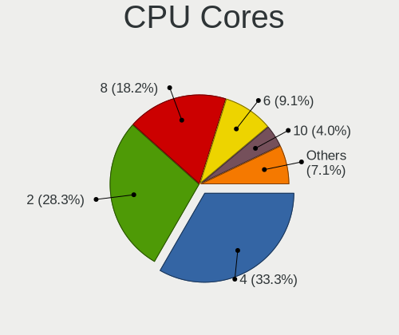
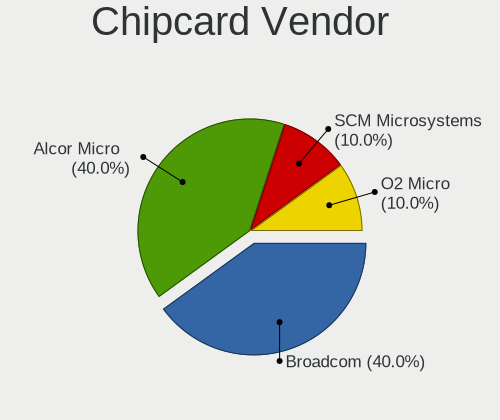

Pop!_OS Hardware Trends (Notebook)
----------------------------------

A project to identify most popular hardware characteristics and track their change
over time based on data collected by Pop!_OS users at https://Linux-Hardware.org.

Anyone can contribute to the study by uploading probes of their computers by
the [hw-probe](https://github.com/linuxhw/hw-probe) tool:

    sudo -E hw-probe -all -upload

Full-feature report is available here: https://linux-hardware.org/?view=trends&formfactor=notebook

Period: May, 2021.

Contents
--------

- [ OS                       ](#os)
- [ OS Family                ](#os-family)
- [ Kernel                   ](#kernel)
- [ Kernel Family            ](#kernel-family)
- [ Kernel Major Ver.        ](#kernel-major-ver)
- [ Arch                     ](#arch)
- [ DE                       ](#de)
- [ Display Server           ](#display-server)
- [ Display Manager          ](#display-manager)
- [ OS Lang                  ](#os-lang)
- [ Boot Mode                ](#boot-mode)
- [ Filesystem               ](#filesystem)
- [ Part. scheme             ](#part-scheme)
- [ Dual Boot with Linux/BSD ](#dual-boot-with-linux/bsd)
- [ Dual Boot (Win)          ](#dual-boot-win)
- [ Country                  ](#country)
- [ City                     ](#city)
- [ Vendor                   ](#vendor)
- [ Model                    ](#model)
- [ Model Family             ](#model-family)
- [ MFG Year                 ](#mfg-year)
- [ Form Factor              ](#form-factor)
- [ Secure Boot              ](#secure-boot)
- [ Coreboot                 ](#coreboot)
- [ RAM Size                 ](#ram-size)
- [ RAM Used                 ](#ram-used)
- [ Has CD-ROM               ](#has-cd-rom)
- [ Total Drives             ](#total-drives)
- [ Has Ethernet             ](#has-ethernet)
- [ Has WiFi                 ](#has-wifi)
- [ Has Bluetooth            ](#has-bluetooth)
- [ Drive Vendor             ](#drive-vendor)
- [ Drive Model              ](#drive-model)
- [ HDD Vendor               ](#hdd-vendor)
- [ SSD Vendor               ](#ssd-vendor)
- [ Drive Kind               ](#drive-kind)
- [ Drive Connector          ](#drive-connector)
- [ Drive Size               ](#drive-size)
- [ Space Total              ](#space-total)
- [ Space Used               ](#space-used)
- [ Malfunc. Drives          ](#malfunc-drives)
- [ Malfunc. Drive Vendor    ](#malfunc-drive-vendor)
- [ Malfunc. HDD Vendor      ](#malfunc-hdd-vendor)
- [ Malfunc. Drive Kind      ](#malfunc-drive-kind)
- [ Failed Drives            ](#failed-drives)
- [ Failed Drive Vendor      ](#failed-drive-vendor)
- [ Drive Status             ](#drive-status)
- [ Storage Vendor           ](#storage-vendor)
- [ Storage Model            ](#storage-model)
- [ Storage Kind             ](#storage-kind)
- [ CPU Vendor               ](#cpu-vendor)
- [ CPU Model                ](#cpu-model)
- [ CPU Model Family         ](#cpu-model-family)
- [ CPU Cores                ](#cpu-cores)
- [ CPU Sockets              ](#cpu-sockets)
- [ CPU Threads              ](#cpu-threads)
- [ CPU Op-Modes             ](#cpu-op-modes)
- [ CPU Microcode            ](#cpu-microcode)
- [ CPU Microarch            ](#cpu-microarch)
- [ GPU Vendor               ](#gpu-vendor)
- [ GPU Model                ](#gpu-model)
- [ GPU Combo                ](#gpu-combo)
- [ GPU Driver               ](#gpu-driver)
- [ GPU Memory               ](#gpu-memory)
- [ Monitor Vendor           ](#monitor-vendor)
- [ Monitor Model            ](#monitor-model)
- [ Monitor Resolution       ](#monitor-resolution)
- [ Monitor Diagonal         ](#monitor-diagonal)
- [ Monitor Width            ](#monitor-width)
- [ Aspect Ratio             ](#aspect-ratio)
- [ Monitor Area             ](#monitor-area)
- [ Pixel Density            ](#pixel-density)
- [ Multiple Monitors        ](#multiple-monitors)
- [ Net Controller Vendor    ](#net-controller-vendor)
- [ Net Controller Model     ](#net-controller-model)
- [ Wireless Vendor          ](#wireless-vendor)
- [ Wireless Model           ](#wireless-model)
- [ Ethernet Vendor          ](#ethernet-vendor)
- [ Ethernet Model           ](#ethernet-model)
- [ Net Controller Kind      ](#net-controller-kind)
- [ Used Controller          ](#used-controller)
- [ NICs                     ](#nics)
- [ IPv6                     ](#ipv6)
- [ Memory Vendor            ](#memory-vendor)
- [ Memory Model             ](#memory-model)
- [ Memory Kind              ](#memory-kind)
- [ Memory Form Factor       ](#memory-form-factor)
- [ Memory Size              ](#memory-size)
- [ Memory Speed             ](#memory-speed)
- [ Sound Vendor             ](#sound-vendor)
- [ Sound Model              ](#sound-model)
- [ Camera Vendor            ](#camera-vendor)
- [ Camera Model             ](#camera-model)
- [ Fingerprint Vendor       ](#fingerprint-vendor)
- [ Fingerprint Model        ](#fingerprint-model)
- [ Chipcard Vendor          ](#chipcard-vendor)
- [ Chipcard Model           ](#chipcard-model)
- [ Printer Vendor           ](#printer-vendor)
- [ Printer Model            ](#printer-model)
- [ Scanner Vendor           ](#scanner-vendor)
- [ Scanner Model            ](#scanner-model)
- [ Bluetooth Vendor         ](#bluetooth-vendor)
- [ Bluetooth Model          ](#bluetooth-model)
- [ Unsupported Devices      ](#unsupported-devices)
- [ Unsupported Device Types ](#unsupported-device-types)

OS
--

Installed operating systems

| Name          | Notebooks | Percent |
|---------------|-----------|---------|
| Pop!_OS 20.10 | 97        | 76.98%  |
| Pop!_OS 20.04 | 27        | 21.43%  |
| Pop!_OS 21.04 | 2         | 1.59%   |

OS Family
---------

OS without a version

| Name    | Notebooks | Percent |
|---------|-----------|---------|
| Pop!_OS | 126       | 100%    |

Kernel
------

Version of the Linux kernel

| Version                | Notebooks | Percent |
|------------------------|-----------|---------|
| 5.11.0-7614-generic    | 99        | 78.57%  |
| 5.11.0-7612-generic    | 15        | 11.9%   |
| 5.8.0-7642-generic     | 5         | 3.97%   |
| 5.8.0-7630-generic     | 1         | 0.79%   |
| 5.4.0-7634-generic     | 1         | 0.79%   |
| 5.12.7-051207-generic  | 1         | 0.79%   |
| 5.12.6-xanmod1         | 1         | 0.79%   |
| 5.11.17-xanmod1        | 1         | 0.79%   |
| 5.11.0-051100-generic  | 1         | 0.79%   |
| 5.10.30-051030-generic | 1         | 0.79%   |

Kernel Family
-------------

Linux kernel without a distro release

| Version | Notebooks | Percent |
|---------|-----------|---------|
| 5.11.0  | 115       | 91.27%  |
| 5.8.0   | 6         | 4.76%   |
| 5.4.0   | 1         | 0.79%   |
| 5.12.7  | 1         | 0.79%   |
| 5.12.6  | 1         | 0.79%   |
| 5.11.17 | 1         | 0.79%   |
| 5.10.30 | 1         | 0.79%   |

Kernel Major Ver.
-----------------

Linux kernel major version

| Version | Notebooks | Percent |
|---------|-----------|---------|
| 5.11    | 116       | 92.06%  |
| 5.8     | 6         | 4.76%   |
| 5.12    | 2         | 1.59%   |
| 5.4     | 1         | 0.79%   |
| 5.10    | 1         | 0.79%   |

Arch
----

OS architecture (x86_64, i586, etc.)

| Name   | Notebooks | Percent |
|--------|-----------|---------|
| x86_64 | 126       | 100%    |

DE
--

Desktop Environment

| Name            | Notebooks | Percent |
|-----------------|-----------|---------|
| GNOME           | 121       | 96.03%  |
| KDE             | 2         | 1.59%   |
| MATE            | 1         | 0.79%   |
| KDE5            | 1         | 0.79%   |
| GNOME Flashback | 1         | 0.79%   |

Display Server
--------------

X11 or Wayland

| Name    | Notebooks | Percent |
|---------|-----------|---------|
| X11     | 124       | 98.41%  |
| Wayland | 2         | 1.59%   |

Display Manager
---------------

SDDM, LightDM, etc.

| Name    | Notebooks | Percent |
|---------|-----------|---------|
| Unknown | 103       | 81.75%  |
| GDM     | 22        | 17.46%  |
| SDDM    | 1         | 0.79%   |

OS Lang
-------

Language

| Lang  | Notebooks | Percent |
|-------|-----------|---------|
| en_US | 77        | 61.11%  |
| pt_BR | 12        | 9.52%   |
| fr_FR | 6         | 4.76%   |
| de_DE | 6         | 4.76%   |
| it_IT | 4         | 3.17%   |
| es_ES | 4         | 3.17%   |
| C     | 4         | 3.17%   |
| pl_PL | 3         | 2.38%   |
| tr_TR | 2         | 1.59%   |
| ru_RU | 2         | 1.59%   |
| en_GB | 2         | 1.59%   |
| pt_PT | 1         | 0.79%   |
| nl_NL | 1         | 0.79%   |
| en_CA | 1         | 0.79%   |
| en_AU | 1         | 0.79%   |

Boot Mode
---------

EFI or BIOS

| Mode | Notebooks | Percent |
|------|-----------|---------|
| BIOS | 106       | 84.13%  |
| EFI  | 20        | 15.87%  |

Filesystem
----------

Type of filesystem

| Type    | Notebooks | Percent |
|---------|-----------|---------|
| Ext4    | 121       | 96.03%  |
| Btrfs   | 3         | 2.38%   |
| Overlay | 2         | 1.59%   |

Part. scheme
------------

Scheme of partitioning

| Type    | Notebooks | Percent |
|---------|-----------|---------|
| Unknown | 103       | 81.75%  |
| GPT     | 19        | 15.08%  |
| MBR     | 4         | 3.17%   |

Dual Boot with Linux/BSD
------------------------

Hosting more than one Linux/BSD

| Dual boot | Notebooks | Percent |
|-----------|-----------|---------|
| No        | 124       | 98.41%  |
| Yes       | 2         | 1.59%   |

Dual Boot (Win)
---------------

Hosting Linux and Windows

| Dual boot | Notebooks | Percent |
|-----------|-----------|---------|
| No        | 119       | 94.44%  |
| Yes       | 7         | 5.56%   |

Country
-------

Geographic location (country)

| Country                | Notebooks | Percent |
|------------------------|-----------|---------|
| USA                    | 34        | 26.98%  |
| Brazil                 | 13        | 10.32%  |
| India                  | 9         | 7.14%   |
| Germany                | 6         | 4.76%   |
| Italy                  | 5         | 3.97%   |
| France                 | 5         | 3.97%   |
| Russia                 | 4         | 3.17%   |
| Greece                 | 4         | 3.17%   |
| UK                     | 3         | 2.38%   |
| Spain                  | 3         | 2.38%   |
| Poland                 | 3         | 2.38%   |
| Netherlands            | 3         | 2.38%   |
| Canada                 | 3         | 2.38%   |
| Turkey                 | 2         | 1.59%   |
| Peru                   | 2         | 1.59%   |
| Japan                  | 2         | 1.59%   |
| Jamaica                | 2         | 1.59%   |
| China                  | 2         | 1.59%   |
| Ukraine                | 1         | 0.79%   |
| Tunisia                | 1         | 0.79%   |
| Switzerland            | 1         | 0.79%   |
| Singapore              | 1         | 0.79%   |
| Saudi Arabia           | 1         | 0.79%   |
| Romania                | 1         | 0.79%   |
| Qatar                  | 1         | 0.79%   |
| Portugal               | 1         | 0.79%   |
| Philippines            | 1         | 0.79%   |
| Luxembourg             | 1         | 0.79%   |
| Lithuania              | 1         | 0.79%   |
| Latvia                 | 1         | 0.79%   |
| Israel                 | 1         | 0.79%   |
| Iran                   | 1         | 0.79%   |
| Indonesia              | 1         | 0.79%   |
| Hungary                | 1         | 0.79%   |
| Egypt                  | 1         | 0.79%   |
| Chile                  | 1         | 0.79%   |
| Bosnia and Herzegovina | 1         | 0.79%   |
| Austria                | 1         | 0.79%   |
| Australia              | 1         | 0.79%   |

City
----

Geographic location (city)

| City                | Notebooks | Percent |
|---------------------|-----------|---------|
| São Paulo          | 3         | 2.38%   |
| Athens              | 3         | 2.38%   |
| São Carlos         | 2         | 1.59%   |
| Phoenix             | 2         | 1.59%   |
| Montego Bay         | 2         | 1.59%   |
| Milan               | 2         | 1.59%   |
| Lucknow             | 2         | 1.59%   |
| Houston             | 2         | 1.59%   |
| Bengaluru           | 2         | 1.59%   |
| Beijing             | 2         | 1.59%   |
| Zeist               | 1         | 0.79%   |
| Woincourt           | 1         | 0.79%   |
| Vouneuil-sous-Biard | 1         | 0.79%   |
| Viña del Mar       | 1         | 0.79%   |
| Vienna              | 1         | 0.79%   |
| Vancouver           | 1         | 0.79%   |
| Torrington          | 1         | 0.79%   |
| Toronto             | 1         | 0.79%   |
| Tokyo               | 1         | 0.79%   |
| Thousand Oaks       | 1         | 0.79%   |
| Thessaloniki        | 1         | 0.79%   |
| The Hague           | 1         | 0.79%   |
| Tel Aviv            | 1         | 0.79%   |
| Tehran              | 1         | 0.79%   |
| Sydney              | 1         | 0.79%   |
| Strassen            | 1         | 0.79%   |
| St. Gallen          | 1         | 0.79%   |
| St Petersburg       | 1         | 0.79%   |
| Srednyaya Akhtuba   | 1         | 0.79%   |
| Springfield         | 1         | 0.79%   |
| Sori                | 1         | 0.79%   |
| Singapore           | 1         | 0.79%   |
| Santo André        | 1         | 0.79%   |
| Riyadh              | 1         | 0.79%   |
| River Rouge         | 1         | 0.79%   |
| Rio de Janeiro      | 1         | 0.79%   |
| Recife              | 1         | 0.79%   |
| Porto               | 1         | 0.79%   |
| Pasig               | 1         | 0.79%   |
| Panjim              | 1         | 0.79%   |
| Palmdale            | 1         | 0.79%   |
| Orléans            | 1         | 0.79%   |
| Oklahoma City       | 1         | 0.79%   |
| Odessa              | 1         | 0.79%   |
| Nustrow             | 1         | 0.79%   |
| North Newbald       | 1         | 0.79%   |
| Norman              | 1         | 0.79%   |
| Moscow              | 1         | 0.79%   |
| Morioka             | 1         | 0.79%   |
| Morehead City       | 1         | 0.79%   |
| Molėtai            | 1         | 0.79%   |
| Milanówek          | 1         | 0.79%   |
| Medford             | 1         | 0.79%   |
| Manaus              | 1         | 0.79%   |
| Ludhiana            | 1         | 0.79%   |
| Long Beach          | 1         | 0.79%   |
| Lodz                | 1         | 0.79%   |
| Lima                | 1         | 0.79%   |
| Lenoir              | 1         | 0.79%   |
| Leighton Buzzard    | 1         | 0.79%   |

Vendor
------

Motherboard manufacturer

| Name                           | Notebooks | Percent |
|--------------------------------|-----------|---------|
| Hewlett-Packard                | 25        | 19.84%  |
| Dell                           | 25        | 19.84%  |
| Lenovo                         | 22        | 17.46%  |
| ASUSTek Computer               | 17        | 13.49%  |
| Acer                           | 13        | 10.32%  |
| Apple                          | 5         | 3.97%   |
| Notebook                       | 3         | 2.38%   |
| Razer                          | 2         | 1.59%   |
| Google                         | 2         | 1.59%   |
| System76                       | 1         | 0.79%   |
| Sony                           | 1         | 0.79%   |
| Samsung Electronics            | 1         | 0.79%   |
| Purism                         | 1         | 0.79%   |
| Positivo                       | 1         | 0.79%   |
| OEM                            | 1         | 0.79%   |
| MSI                            | 1         | 0.79%   |
| Metabox                        | 1         | 0.79%   |
| Matsushita Electric Industrial | 1         | 0.79%   |
| LG Electronics                 | 1         | 0.79%   |
| Fujitsu                        | 1         | 0.79%   |
| Alienware                      | 1         | 0.79%   |

Model
-----

Motherboard model

| Name                                                  | Notebooks | Percent |
|-------------------------------------------------------|-----------|---------|
| HP Stream Notebook PC 11                              | 2         | 1.59%   |
| ASUS T100HAN                                          | 2         | 1.59%   |
| Apple MacBookPro8,1                                   | 2         | 1.59%   |
| Acer Swift SF314-42                                   | 2         | 1.59%   |
| System76 Darter Pro                                   | 1         | 0.79%   |
| Sony SVE14A1V1EB                                      | 1         | 0.79%   |
| Samsung 340XAA/350XAA/550XAA                          | 1         | 0.79%   |
| Razer Blade Stealth 13 Late 2019                      | 1         | 0.79%   |
| Razer Blade 15 Advanced Model (Early 2020) - RZ09-033 | 1         | 0.79%   |
| Purism Librem 15 v4                                   | 1         | 0.79%   |
| Positivo MOBILE                                       | 1         | 0.79%   |
| OEM U50SI1                                            | 1         | 0.79%   |
| Notebook W65_67SF                                     | 1         | 0.79%   |
| Notebook PCx0Dx                                       | 1         | 0.79%   |
| Notebook NHxxRZQ                                      | 1         | 0.79%   |
| MSI GV62 7RD                                          | 1         | 0.79%   |
| Metabox Alpha-X NH58RHQ                               | 1         | 0.79%   |
| Matsushita Electric Industrial CF-74JDMBD2M           | 1         | 0.79%   |
| LG R590-X.ARU4BT                                      | 1         | 0.79%   |
| Lenovo Y720-15IKB 80VR                                | 1         | 0.79%   |
| Lenovo ThinkPad Yoga 11e 20DAS01D00                   | 1         | 0.79%   |
| Lenovo ThinkPad X260 20F5S3H000                       | 1         | 0.79%   |
| Lenovo ThinkPad X230 23243PU                          | 1         | 0.79%   |
| Lenovo ThinkPad X1 Extreme Gen 3 20TK001HUS           | 1         | 0.79%   |
| Lenovo ThinkPad X1 Carbon 6th 20KH002FUS              | 1         | 0.79%   |
| Lenovo ThinkPad X1 Carbon 4th 20FCS0LP01              | 1         | 0.79%   |
| Lenovo ThinkPad T420 4236RM8                          | 1         | 0.79%   |
| Lenovo ThinkPad Edge E440 20C5A0ME00                  | 1         | 0.79%   |
| Lenovo ThinkPad E595 20NF001PTX                       | 1         | 0.79%   |
| Lenovo ThinkPad E555 20DHA001RT                       | 1         | 0.79%   |
| Lenovo ThinkPad E450 20DC004UUS                       | 1         | 0.79%   |
| Lenovo Legion 5 15ARH05 82B5                          | 1         | 0.79%   |
| Lenovo IdeaPad Y560                                   | 1         | 0.79%   |
| Lenovo IdeaPad 330S-15ARR 81FB                        | 1         | 0.79%   |
| Lenovo IdeaPad 320-15IKB 80YH                         | 1         | 0.79%   |
| Lenovo IdeaPad 310-15ISK 80SM                         | 1         | 0.79%   |
| Lenovo IdeaPad 3 15IIL05 81WE                         | 1         | 0.79%   |
| Lenovo IdeaPad 130-15IKB 81H7                         | 1         | 0.79%   |
| Lenovo G475 20080                                     | 1         | 0.79%   |
| Lenovo B71-80 80RJ                                    | 1         | 0.79%   |
| HP ProBook 645 G1                                     | 1         | 0.79%   |
| HP ProBook 640 G1                                     | 1         | 0.79%   |
| HP ProBook 4710s                                      | 1         | 0.79%   |
| HP Pavilion Notebook                                  | 1         | 0.79%   |
| HP Pavilion Laptop 15-cs0xxx                          | 1         | 0.79%   |
| HP Pavilion Gaming Notebook                           | 1         | 0.79%   |
| HP OMEN by HP Laptop 15-ce0xx                         | 1         | 0.79%   |
| HP Notebook                                           | 1         | 0.79%   |
| HP Laptop 17-cn0xxx                                   | 1         | 0.79%   |
| HP Laptop 15s-eq1xxx                                  | 1         | 0.79%   |
| HP Laptop 15-db1xxx                                   | 1         | 0.79%   |
| HP Laptop 15-bs0xx                                    | 1         | 0.79%   |
| HP G62                                                | 1         | 0.79%   |
| HP ENVY Laptop 15-ep0xxx                              | 1         | 0.79%   |
| HP ENVY 17                                            | 1         | 0.79%   |
| HP ENVY 15                                            | 1         | 0.79%   |
| HP EliteBook 855 G7 Notebook PC                       | 1         | 0.79%   |
| HP EliteBook 840 G3                                   | 1         | 0.79%   |
| HP EliteBook 840 G1                                   | 1         | 0.79%   |
| HP EliteBook 725 G2                                   | 1         | 0.79%   |

Model Family
------------

Motherboard model prefix

| Name                                        | Notebooks | Percent |
|---------------------------------------------|-----------|---------|
| Lenovo ThinkPad                             | 11        | 8.73%   |
| Acer Aspire                                 | 10        | 7.94%   |
| Dell Inspiron                               | 8         | 6.35%   |
| Lenovo IdeaPad                              | 6         | 4.76%   |
| Dell XPS                                    | 6         | 4.76%   |
| Dell Latitude                               | 6         | 4.76%   |
| HP Laptop                                   | 4         | 3.17%   |
| HP EliteBook                                | 4         | 3.17%   |
| ASUS ROG                                    | 4         | 3.17%   |
| HP ProBook                                  | 3         | 2.38%   |
| HP Pavilion                                 | 3         | 2.38%   |
| HP ENVY                                     | 3         | 2.38%   |
| Dell Precision                              | 3         | 2.38%   |
| Razer Blade                                 | 2         | 1.59%   |
| HP Stream                                   | 2         | 1.59%   |
| ASUS VivoBook                               | 2         | 1.59%   |
| ASUS T100HAN                                | 2         | 1.59%   |
| ASUS ASUS                                   | 2         | 1.59%   |
| Apple MacBookPro8                           | 2         | 1.59%   |
| Acer Swift                                  | 2         | 1.59%   |
| System76 Darter                             | 1         | 0.79%   |
| Sony SVE14A1V1EB                            | 1         | 0.79%   |
| Samsung 340XAA                              | 1         | 0.79%   |
| Purism Librem                               | 1         | 0.79%   |
| Positivo MOBILE                             | 1         | 0.79%   |
| OEM U50SI1                                  | 1         | 0.79%   |
| Notebook W65                                | 1         | 0.79%   |
| Notebook PCx0Dx                             | 1         | 0.79%   |
| Notebook NHxxRZQ                            | 1         | 0.79%   |
| MSI GV62                                    | 1         | 0.79%   |
| Metabox Alpha-X                             | 1         | 0.79%   |
| Matsushita Electric Industrial CF-74JDMBD2M | 1         | 0.79%   |
| LG R590-X.ARU4BT                            | 1         | 0.79%   |
| Lenovo Y720-15IKB                           | 1         | 0.79%   |
| Lenovo Legion                               | 1         | 0.79%   |
| Lenovo G475                                 | 1         | 0.79%   |
| Lenovo B71-80                               | 1         | 0.79%   |
| HP OMEN                                     | 1         | 0.79%   |
| HP Notebook                                 | 1         | 0.79%   |
| HP G62                                      | 1         | 0.79%   |
| HP Compaq                                   | 1         | 0.79%   |
| HP 240                                      | 1         | 0.79%   |
| HP 15                                       | 1         | 0.79%   |
| Google Nami                                 | 1         | 0.79%   |
| Google Lars                                 | 1         | 0.79%   |
| Fujitsu LIFEBOOK                            | 1         | 0.79%   |
| Dell Vostro                                 | 1         | 0.79%   |
| Dell G7                                     | 1         | 0.79%   |
| ASUS X550LC                                 | 1         | 0.79%   |
| ASUS X401A1                                 | 1         | 0.79%   |
| ASUS N73SV                                  | 1         | 0.79%   |
| ASUS N53SV                                  | 1         | 0.79%   |
| ASUS N501JW                                 | 1         | 0.79%   |
| ASUS G750JX                                 | 1         | 0.79%   |
| ASUS EB1033                                 | 1         | 0.79%   |
| Apple MacBookPro7                           | 1         | 0.79%   |
| Apple MacBookPro14                          | 1         | 0.79%   |
| Apple MacBookPro11                          | 1         | 0.79%   |
| Alienware m15                               | 1         | 0.79%   |
| Acer Nitro                                  | 1         | 0.79%   |

MFG Year
--------

Motherboard manufacture year

| Year | Notebooks | Percent |
|------|-----------|---------|
| 2020 | 30        | 23.81%  |
| 2019 | 19        | 15.08%  |
| 2021 | 11        | 8.73%   |
| 2018 | 11        | 8.73%   |
| 2016 | 9         | 7.14%   |
| 2012 | 8         | 6.35%   |
| 2015 | 7         | 5.56%   |
| 2011 | 7         | 5.56%   |
| 2017 | 5         | 3.97%   |
| 2014 | 5         | 3.97%   |
| 2013 | 5         | 3.97%   |
| 2010 | 3         | 2.38%   |
| 2009 | 3         | 2.38%   |
| 2008 | 2         | 1.59%   |
| 2007 | 1         | 0.79%   |

Form Factor
-----------

Physical design of the computer

| Name     | Notebooks | Percent |
|----------|-----------|---------|
| Notebook | 126       | 100%    |

Secure Boot
-----------

Enabled or disabled

| State    | Notebooks | Percent |
|----------|-----------|---------|
| Disabled | 126       | 100%    |

Coreboot
--------

Have coreboot on board

| Used | Notebooks | Percent |
|------|-----------|---------|
| No   | 123       | 97.62%  |
| Yes  | 3         | 2.38%   |

RAM Size
--------

Total RAM memory

| Size in GB  | Notebooks | Percent |
|-------------|-----------|---------|
| 4.01-8.0    | 35        | 27.78%  |
| 16.01-24.0  | 29        | 23.02%  |
| 8.01-16.0   | 24        | 19.05%  |
| 3.01-4.0    | 20        | 15.87%  |
| 1.01-2.0    | 8         | 6.35%   |
| 32.01-64.0  | 6         | 4.76%   |
| 2.01-3.0    | 2         | 1.59%   |
| 64.01-256.0 | 2         | 1.59%   |

RAM Used
--------

Used RAM memory

| Used GB   | Notebooks | Percent |
|-----------|-----------|---------|
| 1.01-2.0  | 53        | 42.06%  |
| 2.01-3.0  | 32        | 25.4%   |
| 3.01-4.0  | 19        | 15.08%  |
| 4.01-8.0  | 17        | 13.49%  |
| 8.01-16.0 | 4         | 3.17%   |
| 0.51-1.0  | 1         | 0.79%   |

Has CD-ROM
----------

Has CD-ROM on board

| Presented | Notebooks | Percent |
|-----------|-----------|---------|
| No        | 82        | 65.08%  |
| Yes       | 44        | 34.92%  |

Total Drives
------------

Number of drives on board

| Drives | Notebooks | Percent |
|--------|-----------|---------|
| 1      | 87        | 69.05%  |
| 2      | 32        | 25.4%   |
| 3      | 7         | 5.56%   |

Has Ethernet
------------

Has Ethernet on board

| Presented | Notebooks | Percent |
|-----------|-----------|---------|
| Yes       | 99        | 78.57%  |
| No        | 27        | 21.43%  |

Has WiFi
--------

Has WiFi module

| Presented | Notebooks | Percent |
|-----------|-----------|---------|
| Yes       | 121       | 96.03%  |
| No        | 5         | 3.97%   |

Has Bluetooth
-------------

Has Bluetooth module

| Presented | Notebooks | Percent |
|-----------|-----------|---------|
| Yes       | 105       | 83.33%  |
| No        | 21        | 16.67%  |

Drive Vendor
------------

Hard drive vendors

| Vendor              | Notebooks | Drives | Percent |
|---------------------|-----------|--------|---------|
| Samsung Electronics | 24        | 27     | 15%     |
| WDC                 | 20        | 20     | 12.5%   |
| Seagate             | 19        | 20     | 11.88%  |
| Unknown             | 14        | 17     | 8.75%   |
| Toshiba             | 12        | 12     | 7.5%    |
| SK Hynix            | 10        | 14     | 6.25%   |
| SanDisk             | 10        | 10     | 6.25%   |
| Kingston            | 7         | 7      | 4.38%   |
| Intel               | 6         | 6      | 3.75%   |
| Crucial             | 6         | 6      | 3.75%   |
| HGST                | 5         | 5      | 3.13%   |
| A-DATA Technology   | 5         | 5      | 3.13%   |
| Apple               | 3         | 4      | 1.88%   |
| Team                | 2         | 2      | 1.25%   |
| China               | 2         | 2      | 1.25%   |
| VisionTek           | 1         | 2      | 0.63%   |
| Union Memory        | 1         | 1      | 0.63%   |
| SPCC                | 1         | 1      | 0.63%   |
| SABRENT             | 1         | 1      | 0.63%   |
| Phison              | 1         | 1      | 0.63%   |
| OCZ                 | 1         | 1      | 0.63%   |
| Micron Technology   | 1         | 1      | 0.63%   |
| LITEONIT            | 1         | 1      | 0.63%   |
| Lite-On             | 1         | 1      | 0.63%   |
| Hitachi             | 1         | 1      | 0.63%   |
| Hewlett-Packard     | 1         | 1      | 0.63%   |
| External            | 1         | 1      | 0.63%   |
| Cyclone             | 1         | 1      | 0.63%   |
| Corsair             | 1         | 2      | 0.63%   |
| ASMT                | 1         | 1      | 0.63%   |

Drive Model
-----------

Hard drive models

| Model                                   | Notebooks | Percent |
|-----------------------------------------|-----------|---------|
| Seagate ST1000LM035-1RK172 1TB          | 7         | 4.14%   |
| Unknown MMC Card  32GB                  | 6         | 3.55%   |
| WDC WD10SPZX-21Z10T0 1TB                | 3         | 1.78%   |
| Unknown SD/MMC/MS PRO 8GB               | 3         | 1.78%   |
| Unknown MMC Card  64GB                  | 3         | 1.78%   |
| SK Hynix NVMe SSD Drive 512GB           | 3         | 1.78%   |
| Seagate ST500LM012 HN-M500MBB 500GB     | 3         | 1.78%   |
| Kingston SA400S37240G 240GB SSD         | 3         | 1.78%   |
| Intel NVMe SSD Drive 512GB              | 3         | 1.78%   |
| WDC WDS240G2G0A-00JH30 240GB SSD        | 2         | 1.18%   |
| WDC WDS120G2G0B-00EPW0 120GB SSD        | 2         | 1.18%   |
| WDC WD7500BPKT-75PK4T0 752GB            | 2         | 1.18%   |
| WDC WD10JPVX-60JC3T0 1TB                | 2         | 1.18%   |
| Unknown MMC Card  16GB                  | 2         | 1.18%   |
| Toshiba NVMe SSD Drive 512GB            | 2         | 1.18%   |
| Seagate ST1000LM024 HN-M101MBB 1TB      | 2         | 1.18%   |
| Samsung NVMe SSD Drive 512GB            | 2         | 1.18%   |
| Samsung NVMe SSD Drive 1TB              | 2         | 1.18%   |
| Samsung NVMe SSD Drive 1024GB           | 2         | 1.18%   |
| Kingston SA400S37480G 480GB SSD         | 2         | 1.18%   |
| Intel NVMe SSD Drive 1024GB             | 2         | 1.18%   |
| HGST HTS541075A9E680 752GB              | 2         | 1.18%   |
| Crucial CT500MX500SSD1 500GB            | 2         | 1.18%   |
| WDC WDS500G2B0A-00SM50 500GB SSD        | 1         | 0.59%   |
| WDC WDS480G2G0A-00JH30 480GB SSD        | 1         | 0.59%   |
| WDC WDS100T2B0B-00YS70 1TB SSD          | 1         | 0.59%   |
| WDC WDS100T2B0A 1TB SSD                 | 1         | 0.59%   |
| WDC WD2500BEVS-75UST0 250GB             | 1         | 0.59%   |
| WDC WD2500BEKT-75PVMT0 250GB            | 1         | 0.59%   |
| WDC WD10SPZX-60Z10T0 1TB                | 1         | 0.59%   |
| WDC WD10JPVX-22JC3T0 1TB                | 1         | 0.59%   |
| WDC WD10JPCX-24UE4T0 1TB                | 1         | 0.59%   |
| VisionTek mSATA 480GB                   | 1         | 0.59%   |
| Unknown MMC Card  1GB                   | 1         | 0.59%   |
| Unknown MMC Card  128GB                 | 1         | 0.59%   |
| Unknown Externa 128PB                   | 1         | 0.59%   |
| Union Memory UMIS RPJTJ256MED1OWX 256GB | 1         | 0.59%   |
| Toshiba TR200 240GB SSD                 | 1         | 0.59%   |
| Toshiba THNSNJ128GCSU 128GB SSD         | 1         | 0.59%   |
| Toshiba MQ04ABF100 1TB                  | 1         | 0.59%   |
| Toshiba MQ02ABD100H 1TB                 | 1         | 0.59%   |
| Toshiba MQ01ACF050 500GB                | 1         | 0.59%   |
| Toshiba MQ01ABD100 1TB                  | 1         | 0.59%   |
| Toshiba MK5061GSYN 500GB                | 1         | 0.59%   |
| Toshiba MK3276GSX 320GB                 | 1         | 0.59%   |
| Toshiba MK3265GSX 320GB                 | 1         | 0.59%   |
| Toshiba KXG60ZNV512G NVMe 512GB         | 1         | 0.59%   |
| Team TM8FP4256G 256GB                   | 1         | 0.59%   |
| Team T2535T240G 240GB SSD               | 1         | 0.59%   |
| SPCC Solid State Disk 256GB             | 1         | 0.59%   |
| SK Hynix SC311 SATA 128GB SSD           | 1         | 0.59%   |
| SK Hynix PC601 NVMe 512GB               | 1         | 0.59%   |
| SK Hynix PC601 HFS001TD9TNG-L2A0A 1TB   | 1         | 0.59%   |
| SK Hynix PC401 NVMe 256GB               | 1         | 0.59%   |
| SK Hynix NVMe SSD Drive 256GB           | 1         | 0.59%   |
| SK Hynix NVMe SSD Drive 1024GB          | 1         | 0.59%   |
| SK Hynix HFM512GDJTNI-82A0A 512GB       | 1         | 0.59%   |
| SK Hynix BC511 NVMe 256GB               | 1         | 0.59%   |
| SK Hynix BC511 HFM512GDJTNI-82A0A 512GB | 1         | 0.59%   |
| Seagate ST9500325AS 500GB               | 1         | 0.59%   |

HDD Vendor
----------

Hard disk drive vendors

| Vendor              | Notebooks | Drives | Percent |
|---------------------|-----------|--------|---------|
| Seagate             | 17        | 18     | 36.96%  |
| WDC                 | 12        | 12     | 26.09%  |
| Toshiba             | 7         | 7      | 15.22%  |
| HGST                | 5         | 5      | 10.87%  |
| Samsung Electronics | 2         | 2      | 4.35%   |
| Hitachi             | 1         | 1      | 2.17%   |
| ASMT                | 1         | 1      | 2.17%   |
| Apple               | 1         | 1      | 2.17%   |

SSD Vendor
----------

Solid state drive vendors

| Vendor              | Notebooks | Drives | Percent |
|---------------------|-----------|--------|---------|
| Samsung Electronics | 13        | 13     | 21.67%  |
| WDC                 | 8         | 8      | 13.33%  |
| SanDisk             | 8         | 8      | 13.33%  |
| Kingston            | 7         | 7      | 11.67%  |
| Crucial             | 6         | 6      | 10%     |
| A-DATA Technology   | 4         | 4      | 6.67%   |
| Toshiba             | 2         | 2      | 3.33%   |
| China               | 2         | 2      | 3.33%   |
| Team                | 1         | 1      | 1.67%   |
| SPCC                | 1         | 1      | 1.67%   |
| SK Hynix            | 1         | 1      | 1.67%   |
| Seagate             | 1         | 1      | 1.67%   |
| SABRENT             | 1         | 1      | 1.67%   |
| OCZ                 | 1         | 1      | 1.67%   |
| LITEONIT            | 1         | 1      | 1.67%   |
| Hewlett-Packard     | 1         | 1      | 1.67%   |
| Cyclone             | 1         | 1      | 1.67%   |
| Apple               | 1         | 1      | 1.67%   |

Drive Kind
----------

HDD or SSD

| Kind    | Notebooks | Drives | Percent |
|---------|-----------|--------|---------|
| SSD     | 56        | 60     | 35.9%   |
| HDD     | 46        | 47     | 29.49%  |
| NVMe    | 36        | 47     | 23.08%  |
| MMC     | 12        | 13     | 7.69%   |
| Unknown | 6         | 7      | 3.85%   |

Drive Connector
---------------

SATA, SAS, NVMe, etc.

| Type | Notebooks | Drives | Percent |
|------|-----------|--------|---------|
| SATA | 88        | 105    | 60.69%  |
| NVMe | 36        | 46     | 24.83%  |
| MMC  | 12        | 13     | 8.28%   |
| SAS  | 9         | 10     | 6.21%   |

Drive Size
----------

Size of hard drive

| Size in TB | Notebooks | Drives | Percent |
|------------|-----------|--------|---------|
| 0.01-0.5   | 66        | 70     | 64.08%  |
| 0.51-1.0   | 35        | 35     | 33.98%  |
| 1.01-2.0   | 2         | 2      | 1.94%   |

Space Total
-----------

Amount of disk space available on the file system

| Size in GB     | Notebooks | Percent |
|----------------|-----------|---------|
| 101-250        | 40        | 31.75%  |
| 251-500        | 34        | 26.98%  |
| 501-1000       | 21        | 16.67%  |
| 1001-2000      | 10        | 7.94%   |
| 51-100         | 9         | 7.14%   |
| 21-50          | 4         | 3.17%   |
| 1-20           | 4         | 3.17%   |
| 2001-3000      | 3         | 2.38%   |
| More than 3000 | 1         | 0.79%   |

Space Used
----------

Amount of used disk space

| Used GB   | Notebooks | Percent |
|-----------|-----------|---------|
| 1-20      | 61        | 48.41%  |
| 21-50     | 19        | 15.08%  |
| 101-250   | 18        | 14.29%  |
| 51-100    | 17        | 13.49%  |
| 1001-2000 | 4         | 3.17%   |
| 501-1000  | 4         | 3.17%   |
| 251-500   | 3         | 2.38%   |

Malfunc. Drives
---------------

Drive models with a malfunction

| Model                             | Notebooks | Drives | Percent |
|-----------------------------------|-----------|--------|---------|
| China ESA3ASA2PSTBT120GB SSD      | 1         | 1      | 50%     |
| A-DATA Technology SU800 512GB SSD | 1         | 1      | 50%     |

Malfunc. Drive Vendor
---------------------

Vendors of faulty drives

| Vendor            | Notebooks | Drives | Percent |
|-------------------|-----------|--------|---------|
| China             | 1         | 1      | 50%     |
| A-DATA Technology | 1         | 1      | 50%     |

Malfunc. HDD Vendor
-------------------

Vendors of faulty HDD drives

Zero info for selected period =(

Malfunc. Drive Kind
-------------------

Kinds of faulty drives

| Kind | Notebooks | Drives | Percent |
|------|-----------|--------|---------|
| SSD  | 2         | 2      | 100%    |

Failed Drives
-------------

Failed drive models

Zero info for selected period =(

Failed Drive Vendor
-------------------

Failed drive vendors

Zero info for selected period =(

Drive Status
------------

Number of failed and malfunc. drives

| Status   | Notebooks | Drives | Percent |
|----------|-----------|--------|---------|
| Detected | 103       | 140    | 79.84%  |
| Works    | 24        | 32     | 18.6%   |
| Malfunc  | 2         | 2      | 1.55%   |

Storage Vendor
--------------

Storage controller vendors

| Vendor                           | Notebooks | Percent |
|----------------------------------|-----------|---------|
| Intel                            | 91        | 62.76%  |
| AMD                              | 16        | 11.03%  |
| Samsung Electronics              | 11        | 7.59%   |
| SK Hynix                         | 9         | 6.21%   |
| Toshiba America Info Systems     | 3         | 2.07%   |
| Phison Electronics               | 3         | 2.07%   |
| Sandisk                          | 2         | 1.38%   |
| ADATA Technology                 | 2         | 1.38%   |
| Union Memory (Shenzhen)          | 1         | 0.69%   |
| Silicon Integrated Systems [SiS] | 1         | 0.69%   |
| Nvidia                           | 1         | 0.69%   |
| Micron Technology                | 1         | 0.69%   |
| Marvell Technology Group         | 1         | 0.69%   |
| Lite-On Technology               | 1         | 0.69%   |
| ASMedia Technology               | 1         | 0.69%   |
| Apple                            | 1         | 0.69%   |

Storage Model
-------------

Storage controller models

| Model                                                                            | Notebooks | Percent |
|----------------------------------------------------------------------------------|-----------|---------|
| AMD FCH SATA Controller [AHCI mode]                                              | 15        | 9.8%    |
| Intel Sunrise Point-LP SATA Controller [AHCI mode]                               | 14        | 9.15%   |
| Intel 82801 Mobile SATA Controller [RAID mode]                                   | 14        | 9.15%   |
| Samsung NVMe SSD Controller SM981/PM981/PM983                                    | 9         | 5.88%   |
| Intel 6 Series/C200 Series Chipset Family 6 port Mobile SATA AHCI Controller     | 9         | 5.88%   |
| Intel SSD 660P Series                                                            | 6         | 3.92%   |
| Intel 8 Series/C220 Series Chipset Family 6-port SATA Controller 1 [AHCI mode]   | 6         | 3.92%   |
| Intel 7 Series Chipset Family 6-port SATA Controller [AHCI mode]                 | 6         | 3.92%   |
| Intel 8 Series SATA Controller 1 [AHCI mode]                                     | 5         | 3.27%   |
| SK Hynix BC511                                                                   | 4         | 2.61%   |
| Intel Wildcat Point-LP SATA Controller [AHCI Mode]                               | 4         | 2.61%   |
| Intel Cannon Lake Mobile PCH SATA AHCI Controller                                | 4         | 2.61%   |
| Intel HM170/QM170 Chipset SATA Controller [AHCI Mode]                            | 3         | 1.96%   |
| Intel Cannon Point-LP SATA Controller [AHCI Mode]                                | 3         | 1.96%   |
| Intel 82801IBM/IEM (ICH9M/ICH9M-E) 4 port SATA Controller [AHCI mode]            | 3         | 1.96%   |
| Intel 82801HM/HEM (ICH8M/ICH8M-E) SATA Controller [AHCI mode]                    | 3         | 1.96%   |
| Intel 82801HM/HEM (ICH8M/ICH8M-E) IDE Controller                                 | 3         | 1.96%   |
| SK Hynix Non-Volatile memory controller                                          | 2         | 1.31%   |
| Sandisk WD Blue SN550 NVMe SSD                                                   | 2         | 1.31%   |
| Phison E12 NVMe Controller                                                       | 2         | 1.31%   |
| Intel Volume Management Device NVMe RAID Controller                              | 2         | 1.31%   |
| Intel Tiger Lake-LP SATA Controller [AHCI mode]                                  | 2         | 1.31%   |
| Intel Atom Processor E3800 Series SATA AHCI Controller                           | 2         | 1.31%   |
| Intel 5 Series/3400 Series Chipset 4 port SATA AHCI Controller                   | 2         | 1.31%   |
| Intel 400 Series Chipset Family SATA AHCI Controller                             | 2         | 1.31%   |
| Union Memory (Shenzhen) Non-Volatile memory controller                           | 1         | 0.65%   |
| Toshiba America Info Systems XG6 NVMe SSD Controller                             | 1         | 0.65%   |
| Toshiba America Info Systems XG4 NVMe SSD Controller                             | 1         | 0.65%   |
| Toshiba America Info Systems Toshiba America Info Non-Volatile memory controller | 1         | 0.65%   |
| SK Hynix PC401 NVMe Solid State Drive 256GB                                      | 1         | 0.65%   |
| SK Hynix NVMe SSD Controller                                                     | 1         | 0.65%   |
| SK Hynix BC501 NVMe Solid State Drive 512GB                                      | 1         | 0.65%   |
| Silicon Integrated Systems [SiS] SATA Controller / IDE mode                      | 1         | 0.65%   |
| Silicon Integrated Systems [SiS] 5513 IDE Controller                             | 1         | 0.65%   |
| Samsung NVMe Controller                                                          | 1         | 0.65%   |
| Samsung Electronics SATA controller                                              | 1         | 0.65%   |
| Phison E16 PCIe4 NVMe Controller                                                 | 1         | 0.65%   |
| Nvidia MCP89 SATA Controller (AHCI mode)                                         | 1         | 0.65%   |
| Micron Non-Volatile memory controller                                            | 1         | 0.65%   |
| Marvell Group 88SE6101/6102 single-port PATA133 interface                        | 1         | 0.65%   |
| Lite-On Non-Volatile memory controller                                           | 1         | 0.65%   |
| Intel NM10/ICH7 Family SATA Controller [AHCI mode]                               | 1         | 0.65%   |
| Intel Ice Lake-LP SATA Controller [AHCI mode]                                    | 1         | 0.65%   |
| Intel Celeron/Pentium Silver Processor SATA Controller                           | 1         | 0.65%   |
| Intel 82801IBM/IEM (ICH9M/ICH9M-E) 2 port SATA Controller [IDE mode]             | 1         | 0.65%   |
| Intel 5 Series/3400 Series Chipset 6 port SATA AHCI Controller                   | 1         | 0.65%   |
| ASMedia 106x SATA/RAID Controller                                                | 1         | 0.65%   |
| Apple S3X NVMe Controller                                                        | 1         | 0.65%   |
| AMD SB7x0/SB8x0/SB9x0 SATA Controller [AHCI mode]                                | 1         | 0.65%   |
| ADATA XPG SX8200 Pro PCIe Gen3x4 M.2 2280 Solid State Drive                      | 1         | 0.65%   |
| ADATA Non-Volatile memory controller                                             | 1         | 0.65%   |

Storage Kind
------------

Kind of storage controller (IDE, SATA, NVMe, SAS, ...)

| Kind | Notebooks | Percent |
|------|-----------|---------|
| SATA | 92        | 61.33%  |
| NVMe | 37        | 24.67%  |
| RAID | 15        | 10%     |
| IDE  | 6         | 4%      |

CPU Vendor
----------

Processor vendors

| Vendor | Notebooks | Percent |
|--------|-----------|---------|
| Intel  | 107       | 84.92%  |
| AMD    | 19        | 15.08%  |

CPU Model
---------

Processor models

| Model                                    | Notebooks | Percent |
|------------------------------------------|-----------|---------|
| Intel Core i7-9750H CPU @ 2.60GHz        | 3         | 2.38%   |
| Intel Core i5-8265U CPU @ 1.60GHz        | 3         | 2.38%   |
| Intel Core i5-6200U CPU @ 2.30GHz        | 3         | 2.38%   |
| Intel Core i3-8145U CPU @ 2.10GHz        | 3         | 2.38%   |
| Intel Core i3-6006U CPU @ 2.00GHz        | 3         | 2.38%   |
| Intel Core i9-10885H CPU @ 2.40GHz       | 2         | 1.59%   |
| Intel Core i7-8550U CPU @ 1.80GHz        | 2         | 1.59%   |
| Intel Core i7-7700HQ CPU @ 2.80GHz       | 2         | 1.59%   |
| Intel Core i7-6500U CPU @ 2.50GHz        | 2         | 1.59%   |
| Intel Core i7-5500U CPU @ 2.40GHz        | 2         | 1.59%   |
| Intel Core i7-2640M CPU @ 2.80GHz        | 2         | 1.59%   |
| Intel Core i7-10750H CPU @ 2.60GHz       | 2         | 1.59%   |
| Intel Core i5-9300H CPU @ 2.40GHz        | 2         | 1.59%   |
| Intel Core i5-7200U CPU @ 2.50GHz        | 2         | 1.59%   |
| Intel Core i5-4200M CPU @ 2.50GHz        | 2         | 1.59%   |
| Intel Core i5-3320M CPU @ 2.60GHz        | 2         | 1.59%   |
| Intel Core i5-2520M CPU @ 2.50GHz        | 2         | 1.59%   |
| Intel Core i3-7020U CPU @ 2.30GHz        | 2         | 1.59%   |
| Intel Core 2 Duo CPU P8600 @ 2.40GHz     | 2         | 1.59%   |
| Intel Celeron CPU N2840 @ 2.16GHz        | 2         | 1.59%   |
| Intel Atom x5-Z8500 CPU @ 1.44GHz        | 2         | 1.59%   |
| AMD Ryzen 9 4900HS with Radeon Graphics  | 2         | 1.59%   |
| AMD Ryzen 7 4800H with Radeon Graphics   | 2         | 1.59%   |
| AMD A8-5550M APU with Radeon HD Graphics | 2         | 1.59%   |
| Intel Core i9-9880H CPU @ 2.30GHz        | 1         | 0.79%   |
| Intel Core i7-9850H CPU @ 2.60GHz        | 1         | 0.79%   |
| Intel Core i7-8750H CPU @ 2.20GHz        | 1         | 0.79%   |
| Intel Core i7-8650U CPU @ 1.90GHz        | 1         | 0.79%   |
| Intel Core i7-7560U CPU @ 2.40GHz        | 1         | 0.79%   |
| Intel Core i7-7500U CPU @ 2.70GHz        | 1         | 0.79%   |
| Intel Core i7-4870HQ CPU @ 2.50GHz       | 1         | 0.79%   |
| Intel Core i7-4810MQ CPU @ 2.80GHz       | 1         | 0.79%   |
| Intel Core i7-4720HQ CPU @ 2.60GHz       | 1         | 0.79%   |
| Intel Core i7-4712MQ CPU @ 2.30GHz       | 1         | 0.79%   |
| Intel Core i7-4700MQ CPU @ 2.40GHz       | 1         | 0.79%   |
| Intel Core i7-4700HQ CPU @ 2.40GHz       | 1         | 0.79%   |
| Intel Core i7-4600U CPU @ 2.10GHz        | 1         | 0.79%   |
| Intel Core i7-3740QM CPU @ 2.70GHz       | 1         | 0.79%   |
| Intel Core i7-3632QM CPU @ 2.20GHz       | 1         | 0.79%   |
| Intel Core i7-2760QM CPU @ 2.40GHz       | 1         | 0.79%   |
| Intel Core i7-2670QM CPU @ 2.20GHz       | 1         | 0.79%   |
| Intel Core i7-10875H CPU @ 2.30GHz       | 1         | 0.79%   |
| Intel Core i7-10870H CPU @ 2.20GHz       | 1         | 0.79%   |
| Intel Core i7-1065G7 CPU @ 1.30GHz       | 1         | 0.79%   |
| Intel Core i7 CPU Q 820 @ 1.73GHz        | 1         | 0.79%   |
| Intel Core i7 CPU Q 720 @ 1.60GHz        | 1         | 0.79%   |
| Intel Core i5-8250U CPU @ 1.60GHz        | 1         | 0.79%   |
| Intel Core i5-7300HQ CPU @ 2.50GHz       | 1         | 0.79%   |
| Intel Core i5-7267U CPU @ 3.10GHz        | 1         | 0.79%   |
| Intel Core i5-6300U CPU @ 2.40GHz        | 1         | 0.79%   |
| Intel Core i5-6300HQ CPU @ 2.30GHz       | 1         | 0.79%   |
| Intel Core i5-5200U CPU @ 2.20GHz        | 1         | 0.79%   |
| Intel Core i5-4300U CPU @ 1.90GHz        | 1         | 0.79%   |
| Intel Core i5-4200U CPU @ 1.60GHz        | 1         | 0.79%   |
| Intel Core i5-3340M CPU @ 2.70GHz        | 1         | 0.79%   |
| Intel Core i5-3210M CPU @ 2.50GHz        | 1         | 0.79%   |
| Intel Core i5-2540M CPU @ 2.60GHz        | 1         | 0.79%   |
| Intel Core i5-2450M CPU @ 2.50GHz        | 1         | 0.79%   |
| Intel Core i5-2430M CPU @ 2.40GHz        | 1         | 0.79%   |
| Intel Core i5-1035G1 CPU @ 1.00GHz       | 1         | 0.79%   |

CPU Model Family
----------------

Processor model prefix

| Model            | Notebooks | Percent |
|------------------|-----------|---------|
| Intel Core i7    | 36        | 28.57%  |
| Intel Core i5    | 32        | 25.4%   |
| Intel Core i3    | 16        | 12.7%   |
| Intel Celeron    | 8         | 6.35%   |
| Intel Core 2 Duo | 7         | 5.56%   |
| Other            | 3         | 2.38%   |
| Intel Core i9    | 3         | 2.38%   |
| Intel Atom       | 3         | 2.38%   |
| AMD Ryzen 9      | 3         | 2.38%   |
| AMD Ryzen 7      | 3         | 2.38%   |
| AMD Ryzen 5      | 3         | 2.38%   |
| AMD A8           | 3         | 2.38%   |
| AMD Ryzen 3      | 2         | 1.59%   |
| AMD Ryzen 7 PRO  | 1         | 0.79%   |
| AMD FX           | 1         | 0.79%   |
| AMD C-50         | 1         | 0.79%   |
| AMD A10          | 1         | 0.79%   |

CPU Cores
---------

Number of processor cores

| Number | Notebooks | Percent |
|--------|-----------|---------|
| 2      | 70        | 55.56%  |
| 4      | 35        | 27.78%  |
| 8      | 12        | 9.52%   |
| 6      | 8         | 6.35%   |
| 1      | 1         | 0.79%   |

CPU Sockets
-----------

Number of sockets

| Number | Notebooks | Percent |
|--------|-----------|---------|
| 1      | 126       | 100%    |

CPU Threads
-----------

Threads per core (Hyper-Threading)

| Number | Notebooks | Percent |
|--------|-----------|---------|
| 2      | 102       | 80.95%  |
| 1      | 24        | 19.05%  |

CPU Op-Modes
------------

CPU Operation Modes (32-bit, 64-bit)

| Op mode        | Notebooks | Percent |
|----------------|-----------|---------|
| 32-bit, 64-bit | 126       | 100%    |

CPU Microcode
-------------

Microcode number

| Number     | Notebooks | Percent |
|------------|-----------|---------|
| Unknown    | 97        | 76.98%  |
| 0xa0652    | 3         | 2.38%   |
| 0x906ea    | 3         | 2.38%   |
| 0x806eb    | 3         | 2.38%   |
| 0x806e9    | 3         | 2.38%   |
| 0x806ea    | 2         | 1.59%   |
| 0x706e5    | 2         | 1.59%   |
| 0x906ed    | 1         | 0.79%   |
| 0x906e9    | 1         | 0.79%   |
| 0x806ec    | 1         | 0.79%   |
| 0x806c1    | 1         | 0.79%   |
| 0x40651    | 1         | 0.79%   |
| 0x306c3    | 1         | 0.79%   |
| 0x306a9    | 1         | 0.79%   |
| 0x206a7    | 1         | 0.79%   |
| 0x106e5    | 1         | 0.79%   |
| 0x08600106 | 1         | 0.79%   |
| 0x08600102 | 1         | 0.79%   |
| 0x08108102 | 1         | 0.79%   |
| 0x06003109 | 1         | 0.79%   |

CPU Microarch
-------------

Microarchitecture

| Name          | Notebooks | Percent |
|---------------|-----------|---------|
| KabyLake      | 29        | 23.02%  |
| Haswell       | 13        | 10.32%  |
| Skylake       | 11        | 8.73%   |
| SandyBridge   | 11        | 8.73%   |
| Zen 2         | 7         | 5.56%   |
| IvyBridge     | 7         | 5.56%   |
| CometLake     | 7         | 5.56%   |
| Silvermont    | 6         | 4.76%   |
| Penryn        | 4         | 3.17%   |
| Core          | 4         | 3.17%   |
| Broadwell     | 4         | 3.17%   |
| Zen+          | 3         | 2.38%   |
| IceLake       | 3         | 2.38%   |
| Westmere      | 2         | 1.59%   |
| TigerLake     | 2         | 1.59%   |
| Steamroller   | 2         | 1.59%   |
| Piledriver    | 2         | 1.59%   |
| Nehalem       | 2         | 1.59%   |
| Zen 3         | 1         | 0.79%   |
| Zen           | 1         | 0.79%   |
| Puma          | 1         | 0.79%   |
| Goldmont plus | 1         | 0.79%   |
| Excavator     | 1         | 0.79%   |
| Bonnell       | 1         | 0.79%   |
| Bobcat        | 1         | 0.79%   |

GPU Vendor
----------

Vendors of graphics cards

| Vendor                           | Notebooks | Percent |
|----------------------------------|-----------|---------|
| Intel                            | 96        | 57.83%  |
| Nvidia                           | 41        | 24.7%   |
| AMD                              | 28        | 16.87%  |
| Silicon Integrated Systems [SiS] | 1         | 0.6%    |

GPU Model
---------

Graphics card models

| Model                                                                                    | Notebooks | Percent |
|------------------------------------------------------------------------------------------|-----------|---------|
| Intel 2nd Generation Core Processor Family Integrated Graphics Controller                | 11        | 6.47%   |
| Intel Skylake GT2 [HD Graphics 520]                                                      | 9         | 5.29%   |
| Intel CoffeeLake-H GT2 [UHD Graphics 630]                                                | 8         | 4.71%   |
| Intel CometLake-H GT2 [UHD Graphics]                                                     | 7         | 4.12%   |
| Intel 3rd Gen Core processor Graphics Controller                                         | 7         | 4.12%   |
| AMD Renoir                                                                               | 7         | 4.12%   |
| Intel WhiskeyLake-U GT2 [UHD Graphics 620]                                               | 6         | 3.53%   |
| Intel UHD Graphics 620                                                                   | 5         | 2.94%   |
| Intel HD Graphics 620                                                                    | 5         | 2.94%   |
| Intel Haswell-ULT Integrated Graphics Controller                                         | 5         | 2.94%   |
| Intel 4th Gen Core Processor Integrated Graphics Controller                              | 5         | 2.94%   |
| Nvidia TU117M [GeForce GTX 1650 Ti Mobile]                                               | 4         | 2.35%   |
| Intel HD Graphics 5500                                                                   | 4         | 2.35%   |
| Intel Atom Processor Z36xxx/Z37xxx Series Graphics & Display                             | 4         | 2.35%   |
| Nvidia TU106M [GeForce RTX 2060 Max-Q]                                                   | 3         | 1.76%   |
| Intel HD Graphics 630                                                                    | 3         | 1.76%   |
| AMD Topaz XT [Radeon R7 M260/M265 / M340/M360 / M440/M445 / 530/535 / 620/625 Mobile]    | 3         | 1.76%   |
| AMD Picasso                                                                              | 3         | 1.76%   |
| Nvidia TU117M [GeForce GTX 1650 Mobile / Max-Q]                                          | 2         | 1.18%   |
| Nvidia GP107M [GeForce GTX 1050 Mobile]                                                  | 2         | 1.18%   |
| Nvidia GP106M [GeForce GTX 1060 Mobile]                                                  | 2         | 1.18%   |
| Nvidia GK208M [GeForce GT 740M]                                                          | 2         | 1.18%   |
| Intel Mobile GM965/GL960 Integrated Graphics Controller (secondary)                      | 2         | 1.18%   |
| Intel Mobile GM965/GL960 Integrated Graphics Controller (primary)                        | 2         | 1.18%   |
| Intel Mobile 4 Series Chipset Integrated Graphics Controller                             | 2         | 1.18%   |
| Intel Iris Plus Graphics G1 (Ice Lake)                                                   | 2         | 1.18%   |
| Intel Atom/Celeron/Pentium Processor x5-E8000/J3xxx/N3xxx Integrated Graphics Controller | 2         | 1.18%   |
| AMD Sun XT [Radeon HD 8670A/8670M/8690M / R5 M330 / M430 / Radeon 520 Mobile]            | 2         | 1.18%   |
| AMD Richland [Radeon HD 8550G]                                                           | 2         | 1.18%   |
| AMD Kaveri [Radeon R6/R7 Graphics]                                                       | 2         | 1.18%   |
| Silicon Integrated Systems [SiS] 771/671 PCIE VGA Display Adapter                        | 1         | 0.59%   |
| Nvidia TU117M                                                                            | 1         | 0.59%   |
| Nvidia TU116M [GeForce GTX 1660 Ti Mobile]                                               | 1         | 0.59%   |
| Nvidia TU106M [GeForce RTX 2070 Mobile]                                                  | 1         | 0.59%   |
| Nvidia TU104M [GeForce RTX 2070 SUPER Mobile / Max-Q]                                    | 1         | 0.59%   |
| Nvidia MCP89 [GeForce 320M]                                                              | 1         | 0.59%   |
| Nvidia GT218M [NVS 3100M]                                                                | 1         | 0.59%   |
| Nvidia GT216M [GeForce GT 230M]                                                          | 1         | 0.59%   |
| Nvidia GP108M [GeForce MX150]                                                            | 1         | 0.59%   |
| Nvidia GP107GLM [Quadro P620]                                                            | 1         | 0.59%   |
| Nvidia GM108M [GeForce MX130]                                                            | 1         | 0.59%   |
| Nvidia GM108M [GeForce MX110]                                                            | 1         | 0.59%   |
| Nvidia GM108M [GeForce 940M]                                                             | 1         | 0.59%   |
| Nvidia GM108M [GeForce 940MX]                                                            | 1         | 0.59%   |
| Nvidia GM108M [GeForce 840M]                                                             | 1         | 0.59%   |
| Nvidia GM107M [GeForce GTX 960M]                                                         | 1         | 0.59%   |
| Nvidia GM107M [GeForce GTX 950M]                                                         | 1         | 0.59%   |
| Nvidia GK107GLM [Quadro K2000M]                                                          | 1         | 0.59%   |
| Nvidia GK106M [GeForce GTX 770M]                                                         | 1         | 0.59%   |
| Nvidia GK106GLM [Quadro K2100M]                                                          | 1         | 0.59%   |
| Nvidia GF119M [NVS 4200M]                                                                | 1         | 0.59%   |
| Nvidia GF119M [GeForce 610M]                                                             | 1         | 0.59%   |
| Nvidia GF117M [GeForce 610M/710M/810M/820M / GT 620M/625M/630M/720M]                     | 1         | 0.59%   |
| Nvidia GF108M [GeForce GT 540M]                                                          | 1         | 0.59%   |
| Nvidia GA106M [GeForce RTX 3060 Mobile / Max-Q]                                          | 1         | 0.59%   |
| Nvidia GA104M [GeForce RTX 3080 Mobile / Max-Q 8GB/16GB]                                 | 1         | 0.59%   |
| Nvidia G84M [GeForce 8600M GT]                                                           | 1         | 0.59%   |
| Intel TigerLake-LP GT2 [Iris Xe Graphics]                                                | 1         | 0.59%   |
| Intel Tiger Lake UHD Graphics                                                            | 1         | 0.59%   |
| Intel Iris Plus Graphics G7                                                              | 1         | 0.59%   |

GPU Combo
---------

Combinations of graphics cards

| Name           | Notebooks | Percent |
|----------------|-----------|---------|
| 1 x Intel      | 61        | 48.41%  |
| Intel + Nvidia | 29        | 23.02%  |
| 1 x AMD        | 15        | 11.9%   |
| 1 x Nvidia     | 7         | 5.56%   |
| Intel + AMD    | 6         | 4.76%   |
| AMD + Nvidia   | 5         | 3.97%   |
| 2 x AMD        | 2         | 1.59%   |
| 1 x SiS        | 1         | 0.79%   |

GPU Driver
----------

Free vs proprietary

| Driver      | Notebooks | Percent |
|-------------|-----------|---------|
| Free        | 91        | 72.22%  |
| Proprietary | 32        | 25.4%   |
| Unknown     | 3         | 2.38%   |

GPU Memory
----------

Total video memory

| Size in GB | Notebooks | Percent |
|------------|-----------|---------|
| Unknown    | 97        | 76.98%  |
| 1.01-2.0   | 11        | 8.73%   |
| 3.01-4.0   | 10        | 7.94%   |
| 5.01-6.0   | 5         | 3.97%   |
| 8.01-16.0  | 1         | 0.79%   |
| 0.51-1.0   | 1         | 0.79%   |
| 0.01-0.5   | 1         | 0.79%   |

Monitor Vendor
--------------

Monitor vendors

| Vendor               | Notebooks | Percent |
|----------------------|-----------|---------|
| AU Optronics         | 28        | 20.14%  |
| Chimei Innolux       | 24        | 17.27%  |
| LG Display           | 22        | 15.83%  |
| BOE                  | 19        | 13.67%  |
| Samsung Electronics  | 13        | 9.35%   |
| Sharp                | 7         | 5.04%   |
| Apple                | 5         | 3.6%    |
| Goldstar             | 4         | 2.88%   |
| PANDA                | 3         | 2.16%   |
| BenQ                 | 3         | 2.16%   |
| AOC                  | 2         | 1.44%   |
| Philips              | 1         | 0.72%   |
| LG Philips           | 1         | 0.72%   |
| Lenovo               | 1         | 0.72%   |
| InfoVision           | 1         | 0.72%   |
| Hitachi              | 1         | 0.72%   |
| Dell                 | 1         | 0.72%   |
| CMN                  | 1         | 0.72%   |
| Ancor Communications | 1         | 0.72%   |
| Acer                 | 1         | 0.72%   |

Monitor Model
-------------

Monitor models

| Model                                                                 | Notebooks | Percent |
|-----------------------------------------------------------------------|-----------|---------|
| Chimei Innolux LCD Monitor CMN15DC 1366x768 344x193mm 15.5-inch       | 5         | 3.6%    |
| AU Optronics LCD Monitor AUO106C 1366x768 277x156mm 12.5-inch         | 3         | 2.16%   |
| PANDA LCD Monitor NCP004D 1920x1080 344x194mm 15.5-inch               | 2         | 1.44%   |
| LG Display LCD Monitor LGD05E5 1920x1080 344x194mm 15.5-inch          | 2         | 1.44%   |
| LG Display LCD Monitor LGD039F 1366x768 345x194mm 15.6-inch           | 2         | 1.44%   |
| LG Display LCD Monitor LGD02E9 1366x768 309x174mm 14.0-inch           | 2         | 1.44%   |
| Chimei Innolux LCD Monitor CMN15F5 1920x1080 344x193mm 15.5-inch      | 2         | 1.44%   |
| Chimei Innolux LCD Monitor CMN15D5 1920x1080 340x190mm 15.3-inch      | 2         | 1.44%   |
| Chimei Innolux LCD Monitor CMN15D3 1920x1080 344x193mm 15.5-inch      | 2         | 1.44%   |
| Chimei Innolux LCD Monitor CMN1136 1366x768 256x144mm 11.6-inch       | 2         | 1.44%   |
| BOE LCD Monitor BOE06A4 1366x768 344x194mm 15.5-inch                  | 2         | 1.44%   |
| AU Optronics LCD Monitor AUO38ED 1920x1080 340x190mm 15.3-inch        | 2         | 1.44%   |
| AU Optronics LCD Monitor AUO183C 1366x768 309x173mm 13.9-inch         | 2         | 1.44%   |
| Apple LCD Monitor APP9CC5 1280x800 286x179mm 13.3-inch                | 2         | 1.44%   |
| Sharp LQ156M1JW16 SHP14F4 1920x1080 344x194mm 15.5-inch               | 1         | 0.72%   |
| Sharp LQ140M1JW49 SHP1523 1920x1080 309x174mm 14.0-inch               | 1         | 0.72%   |
| Sharp LCD Monitor SHP14D6 3840x2400 366x229mm 17.0-inch               | 1         | 0.72%   |
| Sharp LCD Monitor SHP14BA 1920x1080 344x194mm 15.5-inch               | 1         | 0.72%   |
| Sharp LCD Monitor SHP14B8 1920x1080 294x165mm 13.3-inch               | 1         | 0.72%   |
| Sharp LCD Monitor SHP1485 1920x1080 294x165mm 13.3-inch               | 1         | 0.72%   |
| Sharp LCD Monitor SHP144A 3200x1800 294x165mm 13.3-inch               | 1         | 0.72%   |
| Samsung Electronics T22C310 SAM0AE9 1920x1080 477x268mm 21.5-inch     | 1         | 0.72%   |
| Samsung Electronics SyncMaster SAM0579 1920x1080                      | 1         | 0.72%   |
| Samsung Electronics S24F350 SAM0D21 1680x1050 520x290mm 23.4-inch     | 1         | 0.72%   |
| Samsung Electronics S22R35x SAM103A 1920x1080 476x268mm 21.5-inch     | 1         | 0.72%   |
| Samsung Electronics LCD Monitor SEC544B 1600x900 382x214mm 17.2-inch  | 1         | 0.72%   |
| Samsung Electronics LCD Monitor SEC5448 1920x1080 344x194mm 15.5-inch | 1         | 0.72%   |
| Samsung Electronics LCD Monitor SEC315A 1366x768 344x194mm 15.5-inch  | 1         | 0.72%   |
| Samsung Electronics LCD Monitor SEC3157 1280x800 300x190mm 14.0-inch  | 1         | 0.72%   |
| Samsung Electronics LCD Monitor SDC5844 1920x1080 344x194mm 15.5-inch | 1         | 0.72%   |
| Samsung Electronics LCD Monitor SDC484E 1600x900 309x174mm 14.0-inch  | 1         | 0.72%   |
| Samsung Electronics LCD Monitor SDC434B 3840x2160 340x190mm 15.3-inch | 1         | 0.72%   |
| Samsung Electronics LCD Monitor SDC4141 1366x768 340x190mm 15.3-inch  | 1         | 0.72%   |
| Samsung Electronics Color LCD SDCA029 2160x1440 252x168mm 11.9-inch   | 1         | 0.72%   |
| Philips PHL 243V7 PHLC155 1920x1080 530x300mm 24.0-inch               | 1         | 0.72%   |
| PANDA LCD Monitor NCP0050 1920x1080 309x174mm 14.0-inch               | 1         | 0.72%   |
| LG Philips LCD Monitor LPLBD00 1280x800 331x207mm 15.4-inch           | 1         | 0.72%   |
| LG Display LP156WH2-TLC2 LGD0222 1366x768 344x194mm 15.5-inch         | 1         | 0.72%   |
| LG Display LCD Monitor LGD065A 1920x1080 344x194mm 15.5-inch          | 1         | 0.72%   |
| LG Display LCD Monitor LGD053F 1920x1080 344x194mm 15.5-inch          | 1         | 0.72%   |
| LG Display LCD Monitor LGD04A9 1920x1080 309x174mm 14.0-inch          | 1         | 0.72%   |
| LG Display LCD Monitor LGD0484 1366x768 344x194mm 15.5-inch           | 1         | 0.72%   |
| LG Display LCD Monitor LGD046F 1920x1080 344x194mm 15.5-inch          | 1         | 0.72%   |
| LG Display LCD Monitor LGD045E 1366x768 309x174mm 14.0-inch           | 1         | 0.72%   |
| LG Display LCD Monitor LGD0430 1366x768 345x194mm 15.6-inch           | 1         | 0.72%   |
| LG Display LCD Monitor LGD03EE 1366x768 277x156mm 12.5-inch           | 1         | 0.72%   |
| LG Display LCD Monitor LGD038E 1366x768 340x190mm 15.3-inch           | 1         | 0.72%   |
| LG Display LCD Monitor LGD0357 1600x900 382x215mm 17.3-inch           | 1         | 0.72%   |
| LG Display LCD Monitor LGD0340 1600x900 380x220mm 17.3-inch           | 1         | 0.72%   |
| LG Display LCD Monitor LGD033F 1366x768 309x174mm 14.0-inch           | 1         | 0.72%   |
| LG Display LCD Monitor LGD033B 1366x768 344x194mm 15.5-inch           | 1         | 0.72%   |
| LG Display LCD Monitor LGD0214 1600x900 345x194mm 15.6-inch           | 1         | 0.72%   |
| LG Display LCD Monitor LGD020C 1600x900 345x194mm 15.6-inch           | 1         | 0.72%   |
| Lenovo LEN LT2423wC LEN60A8 1920x1080 531x299mm 24.0-inch             | 1         | 0.72%   |
| InfoVision LCD Monitor IVO3D41 1920x1080 344x194mm 15.5-inch          | 1         | 0.72%   |
| Hitachi HDMI HEC0030 4096x2160 1150x650mm 52.0-inch                   | 1         | 0.72%   |
| Goldstar LG ULTRAWIDE GSM59F1 1920x1080 580x240mm 24.7-inch           | 1         | 0.72%   |
| Goldstar IPS FULLHD GSM5AB8 1920x1080 480x270mm 21.7-inch             | 1         | 0.72%   |
| Goldstar FULL HD GSM5B55 1920x1080 480x270mm 21.7-inch                | 1         | 0.72%   |
| Goldstar 2D HD LG TV GSM59CA 1920x1080 510x290mm 23.1-inch            | 1         | 0.72%   |

Monitor Resolution
------------------

Monitor screen resolution

| Resolution       | Notebooks | Percent |
|------------------|-----------|---------|
| 1920x1080 (FHD)  | 54        | 41.86%  |
| 1366x768 (WXGA)  | 44        | 34.11%  |
| 1600x900 (HD+)   | 12        | 9.3%    |
| 3840x2160 (4K)   | 5         | 3.88%   |
| 1280x800 (WXGA)  | 4         | 3.1%    |
| 1440x900 (WXGA+) | 3         | 2.33%   |
| 2880x1800        | 2         | 1.55%   |
| 3840x2400        | 1         | 0.78%   |
| 3200x1800 (QHD+) | 1         | 0.78%   |
| 2560x1600        | 1         | 0.78%   |
| 2560x1440 (QHD)  | 1         | 0.78%   |
| 2560x1080        | 1         | 0.78%   |

Monitor Diagonal
----------------

Diagonal size in inches

| Inches  | Notebooks | Percent |
|---------|-----------|---------|
| 15      | 62        | 44.6%   |
| 14      | 18        | 12.95%  |
| 13      | 18        | 12.95%  |
| 17      | 11        | 7.91%   |
| 23      | 5         | 3.6%    |
| 21      | 5         | 3.6%    |
| 12      | 5         | 3.6%    |
| 24      | 4         | 2.88%   |
| 11      | 4         | 2.88%   |
| 18      | 2         | 1.44%   |
| Unknown | 2         | 1.44%   |
| 84      | 1         | 0.72%   |
| 34      | 1         | 0.72%   |
| 27      | 1         | 0.72%   |

Monitor Width
-------------

Physical width

| Width in mm | Notebooks | Percent |
|-------------|-----------|---------|
| 301-350     | 89        | 64.03%  |
| 201-300     | 18        | 12.95%  |
| 351-400     | 11        | 7.91%   |
| 501-600     | 10        | 7.19%   |
| 401-500     | 7         | 5.04%   |
| Unknown     | 2         | 1.44%   |
| 701-800     | 1         | 0.72%   |
| 1501-2000   | 1         | 0.72%   |

Aspect Ratio
------------

Proportional relationship between the width and the height

| Ratio   | Notebooks | Percent |
|---------|-----------|---------|
| 16/9    | 111       | 89.52%  |
| 16/10   | 11        | 8.87%   |
| 21/9    | 1         | 0.81%   |
| Unknown | 1         | 0.81%   |

Monitor Area
------------

Area in inch²

| Area in inch² | Notebooks | Percent |
|----------------|-----------|---------|
| 101-110        | 62        | 44.6%   |
| 81-90          | 30        | 21.58%  |
| 201-250        | 13        | 9.35%   |
| 121-130        | 10        | 7.19%   |
| 71-80          | 6         | 4.32%   |
| 61-70          | 5         | 3.6%    |
| 51-60          | 4         | 2.88%   |
| 151-200        | 2         | 1.44%   |
| Unknown        | 2         | 1.44%   |
| More than 1000 | 1         | 0.72%   |
| 351-500        | 1         | 0.72%   |
| 301-350        | 1         | 0.72%   |
| 141-150        | 1         | 0.72%   |
| 131-140        | 1         | 0.72%   |

Pixel Density
-------------

Pixels per inch

| Density       | Notebooks | Percent |
|---------------|-----------|---------|
| 121-160       | 57        | 41.61%  |
| 101-120       | 49        | 35.77%  |
| 51-100        | 17        | 12.41%  |
| More than 240 | 6         | 4.38%   |
| 161-240       | 6         | 4.38%   |
| Unknown       | 2         | 1.46%   |

Multiple Monitors
-----------------

Total monitors connected

| Total | Notebooks | Percent |
|-------|-----------|---------|
| 1     | 104       | 82.54%  |
| 2     | 19        | 15.08%  |
| 0     | 3         | 2.38%   |

Net Controller Vendor
---------------------

Controller vendors

| Vendor                                | Notebooks | Percent |
|---------------------------------------|-----------|---------|
| Realtek Semiconductor                 | 66        | 33.17%  |
| Intel                                 | 62        | 31.16%  |
| Qualcomm Atheros                      | 32        | 16.08%  |
| Broadcom                              | 19        | 9.55%   |
| Ralink                                | 3         | 1.51%   |
| Broadcom Limited                      | 3         | 1.51%   |
| TP-Link                               | 2         | 1.01%   |
| MEDIATEK                              | 2         | 1.01%   |
| Marvell Technology Group              | 2         | 1.01%   |
| Silicon Integrated Systems [SiS]      | 1         | 0.5%    |
| Sierra Wireless                       | 1         | 0.5%    |
| Samsung Electronics                   | 1         | 0.5%    |
| Qualcomm                              | 1         | 0.5%    |
| OPPO Electronics                      | 1         | 0.5%    |
| Dell                                  | 1         | 0.5%    |
| Aquantia                              | 1         | 0.5%    |
| 802.11g Adapter [Linksys WUSB54GC v3] | 1         | 0.5%    |

Net Controller Model
--------------------

Controller models

| Model                                                             | Notebooks | Percent |
|-------------------------------------------------------------------|-----------|---------|
| Realtek RTL8111/8168/8411 PCI Express Gigabit Ethernet Controller | 44        | 18.88%  |
| Realtek RTL810xE PCI Express Fast Ethernet controller             | 12        | 5.15%   |
| Qualcomm Atheros QCA9377 802.11ac Wireless Network Adapter        | 11        | 4.72%   |
| Intel Wi-Fi 6 AX200                                               | 11        | 4.72%   |
| Realtek RTL8153 Gigabit Ethernet Adapter                          | 7         | 3%      |
| Intel 82579LM Gigabit Network Connection (Lewisville)             | 7         | 3%      |
| Intel Wireless 7265                                               | 6         | 2.58%   |
| Intel Wireless 7260                                               | 6         | 2.58%   |
| Intel Comet Lake PCH CNVi WiFi                                    | 5         | 2.15%   |
| Realtek RTL8821CE 802.11ac PCIe Wireless Network Adapter          | 4         | 1.72%   |
| Realtek RTL8723BE PCIe Wireless Network Adapter                   | 4         | 1.72%   |
| Qualcomm Atheros AR9485 Wireless Network Adapter                  | 4         | 1.72%   |
| Intel Centrino Advanced-N 6205 [Taylor Peak]                      | 4         | 1.72%   |
| Broadcom BCM43228 802.11a/b/g/n                                   | 4         | 1.72%   |
| Realtek RTL8188EUS 802.11n Wireless Network Adapter               | 3         | 1.29%   |
| Ralink RT3290 Wireless 802.11n 1T/1R PCIe                         | 3         | 1.29%   |
| Qualcomm Atheros QCA6174 802.11ac Wireless Network Adapter        | 3         | 1.29%   |
| Qualcomm Atheros AR9462 Wireless Network Adapter                  | 3         | 1.29%   |
| Qualcomm Atheros AR9285 Wireless Network Adapter (PCI-Express)    | 3         | 1.29%   |
| Intel Wireless 8260                                               | 3         | 1.29%   |
| Intel Cannon Point-LP CNVi [Wireless-AC]                          | 3         | 1.29%   |
| Intel Cannon Lake PCH CNVi WiFi                                   | 3         | 1.29%   |
| Broadcom BCM43142 802.11b/g/n                                     | 3         | 1.29%   |
| Broadcom BCM4313 802.11bgn Wireless Network Adapter               | 3         | 1.29%   |
| Realtek RTL8723DE Wireless Network Adapter                        | 2         | 0.86%   |
| Qualcomm Atheros QCA9565 / AR9565 Wireless Network Adapter        | 2         | 0.86%   |
| Qualcomm Atheros QCA8171 Gigabit Ethernet                         | 2         | 0.86%   |
| MEDIATEK Network controller                                       | 2         | 0.86%   |
| Intel Wireless 8265 / 8275                                        | 2         | 0.86%   |
| Intel Ice Lake-LP PCH CNVi WiFi                                   | 2         | 0.86%   |
| Intel Ethernet Connection I219-V                                  | 2         | 0.86%   |
| Intel Ethernet Connection I218-LM                                 | 2         | 0.86%   |
| Intel Centrino Wireless-N 1000 [Condor Peak]                      | 2         | 0.86%   |
| Broadcom NetXtreme BCM57765 Gigabit Ethernet PCIe                 | 2         | 0.86%   |
| Broadcom Limited NetLink BCM57780 Gigabit Ethernet PCIe           | 2         | 0.86%   |
| Broadcom BCM43602 802.11ac Wireless LAN SoC                       | 2         | 0.86%   |
| Broadcom BCM4331 802.11a/b/g/n                                    | 2         | 0.86%   |
| TP-Link TL-WN722N v2/v3 [Realtek RTL8188EUS]                      | 1         | 0.43%   |
| TP-Link Archer T3U [Realtek RTL8812BU]                            | 1         | 0.43%   |
| Silicon Integrated Systems [SiS] 191 Gigabit Ethernet Adapter     | 1         | 0.43%   |
| Sierra Wireless EM7455                                            | 1         | 0.43%   |
| Samsung GT-I9070 (network tethering, USB debugging enabled)       | 1         | 0.43%   |
| Realtek RTL8822CE 802.11ac PCIe Wireless Network Adapter          | 1         | 0.43%   |
| Realtek RTL8822BE 802.11a/b/g/n/ac WiFi adapter                   | 1         | 0.43%   |
| Realtek RTL8188CE 802.11b/g/n WiFi Adapter                        | 1         | 0.43%   |
| Realtek Killer E3000 2.5GbE Controller                            | 1         | 0.43%   |
| Qualcomm QCA6390 Wireless Network Adapter [AX500-DBS (2x2)]       | 1         | 0.43%   |
| Qualcomm Atheros Killer E2400 Gigabit Ethernet Controller         | 1         | 0.43%   |
| Qualcomm Atheros AR9287 Wireless Network Adapter (PCI-Express)    | 1         | 0.43%   |
| Qualcomm Atheros AR8152 v2.0 Fast Ethernet                        | 1         | 0.43%   |
| Qualcomm Atheros AR8151 v2.0 Gigabit Ethernet                     | 1         | 0.43%   |
| Qualcomm Atheros AR8131 Gigabit Ethernet                          | 1         | 0.43%   |
| OPPO SDM665-IDP _SN:58DDC4D7                                      | 1         | 0.43%   |
| Marvell Group 88E8072 PCI-E Gigabit Ethernet Controller           | 1         | 0.43%   |
| Marvell Group 88E8040 PCI-E Fast Ethernet Controller              | 1         | 0.43%   |
| Intel Wireless 3165                                               | 1         | 0.43%   |
| Intel Wireless 3160                                               | 1         | 0.43%   |
| Intel WiFi Link 5100                                              | 1         | 0.43%   |
| Intel Wi-Fi 6 AX210/AX211/AX411 160MHz                            | 1         | 0.43%   |
| Intel Wi-Fi 6 AX201                                               | 1         | 0.43%   |

Wireless Vendor
---------------

Wireless vendors

| Vendor                                | Notebooks | Percent |
|---------------------------------------|-----------|---------|
| Intel                                 | 59        | 46.83%  |
| Qualcomm Atheros                      | 27        | 21.43%  |
| Broadcom                              | 17        | 13.49%  |
| Realtek Semiconductor                 | 15        | 11.9%   |
| Ralink                                | 3         | 2.38%   |
| TP-Link                               | 2         | 1.59%   |
| Sierra Wireless                       | 1         | 0.79%   |
| Qualcomm                              | 1         | 0.79%   |
| 802.11g Adapter [Linksys WUSB54GC v3] | 1         | 0.79%   |

Wireless Model
--------------

Wireless models

| Model                                                                                                  | Notebooks | Percent |
|--------------------------------------------------------------------------------------------------------|-----------|---------|
| Qualcomm Atheros QCA9377 802.11ac Wireless Network Adapter                                             | 11        | 8.66%   |
| Intel Wi-Fi 6 AX200                                                                                    | 11        | 8.66%   |
| Intel Wireless 7265                                                                                    | 6         | 4.72%   |
| Intel Wireless 7260                                                                                    | 6         | 4.72%   |
| Intel Comet Lake PCH CNVi WiFi                                                                         | 5         | 3.94%   |
| Realtek RTL8821CE 802.11ac PCIe Wireless Network Adapter                                               | 4         | 3.15%   |
| Realtek RTL8723BE PCIe Wireless Network Adapter                                                        | 4         | 3.15%   |
| Qualcomm Atheros AR9485 Wireless Network Adapter                                                       | 4         | 3.15%   |
| Intel Centrino Advanced-N 6205 [Taylor Peak]                                                           | 4         | 3.15%   |
| Broadcom BCM43228 802.11a/b/g/n                                                                        | 4         | 3.15%   |
| Realtek RTL8188EUS 802.11n Wireless Network Adapter                                                    | 3         | 2.36%   |
| Ralink RT3290 Wireless 802.11n 1T/1R PCIe                                                              | 3         | 2.36%   |
| Qualcomm Atheros QCA6174 802.11ac Wireless Network Adapter                                             | 3         | 2.36%   |
| Qualcomm Atheros AR9462 Wireless Network Adapter                                                       | 3         | 2.36%   |
| Qualcomm Atheros AR9285 Wireless Network Adapter (PCI-Express)                                         | 3         | 2.36%   |
| Intel Wireless 8260                                                                                    | 3         | 2.36%   |
| Intel Cannon Point-LP CNVi [Wireless-AC]                                                               | 3         | 2.36%   |
| Intel Cannon Lake PCH CNVi WiFi                                                                        | 3         | 2.36%   |
| Broadcom BCM43142 802.11b/g/n                                                                          | 3         | 2.36%   |
| Broadcom BCM4313 802.11bgn Wireless Network Adapter                                                    | 3         | 2.36%   |
| Realtek RTL8723DE Wireless Network Adapter                                                             | 2         | 1.57%   |
| Qualcomm Atheros QCA9565 / AR9565 Wireless Network Adapter                                             | 2         | 1.57%   |
| Intel Wireless 8265 / 8275                                                                             | 2         | 1.57%   |
| Intel Ice Lake-LP PCH CNVi WiFi                                                                        | 2         | 1.57%   |
| Intel Centrino Wireless-N 1000 [Condor Peak]                                                           | 2         | 1.57%   |
| Broadcom BCM43602 802.11ac Wireless LAN SoC                                                            | 2         | 1.57%   |
| Broadcom BCM4331 802.11a/b/g/n                                                                         | 2         | 1.57%   |
| TP-Link TL-WN722N v2/v3 [Realtek RTL8188EUS]                                                           | 1         | 0.79%   |
| TP-Link Archer T3U [Realtek RTL8812BU]                                                                 | 1         | 0.79%   |
| Sierra Wireless EM7455                                                                                 | 1         | 0.79%   |
| Realtek RTL8822CE 802.11ac PCIe Wireless Network Adapter                                               | 1         | 0.79%   |
| Realtek RTL8822BE 802.11a/b/g/n/ac WiFi adapter                                                        | 1         | 0.79%   |
| Realtek RTL8188CE 802.11b/g/n WiFi Adapter                                                             | 1         | 0.79%   |
| Qualcomm QCA6390 Wireless Network Adapter [AX500-DBS (2x2)]                                            | 1         | 0.79%   |
| Qualcomm Atheros AR9287 Wireless Network Adapter (PCI-Express)                                         | 1         | 0.79%   |
| Intel Wireless 3165                                                                                    | 1         | 0.79%   |
| Intel Wireless 3160                                                                                    | 1         | 0.79%   |
| Intel WiFi Link 5100                                                                                   | 1         | 0.79%   |
| Intel Wi-Fi 6 AX210/AX211/AX411 160MHz                                                                 | 1         | 0.79%   |
| Intel Wi-Fi 6 AX201                                                                                    | 1         | 0.79%   |
| Intel Ultimate N WiFi Link 5300                                                                        | 1         | 0.79%   |
| Intel PRO/Wireless 4965 AG or AGN [Kedron] Network Connection                                          | 1         | 0.79%   |
| Intel PRO/Wireless 3945ABG [Golan] Network Connection                                                  | 1         | 0.79%   |
| Intel Dual Band Wireless-AC 3168NGW [Stone Peak]                                                       | 1         | 0.79%   |
| Intel Dual Band Wireless-AC 3165 Plus Bluetooth                                                        | 1         | 0.79%   |
| Intel Centrino Wireless-N 2230                                                                         | 1         | 0.79%   |
| Intel Centrino Ultimate-N 6300                                                                         | 1         | 0.79%   |
| Broadcom BCM4352 802.11ac Wireless Network Adapter                                                     | 1         | 0.79%   |
| Broadcom BCM4312 802.11b/g LP-PHY                                                                      | 1         | 0.79%   |
| Broadcom BCM4311 802.11b/g WLAN                                                                        | 1         | 0.79%   |
| 802.11g Adapter [Linksys WUSB54GC v3] WUSB600N v2 Dual-Band Wireless-N Network Adapter [Ralink RT3572] | 1         | 0.79%   |

Ethernet Vendor
---------------

Ethernet vendors

| Vendor                           | Notebooks | Percent |
|----------------------------------|-----------|---------|
| Realtek Semiconductor            | 61        | 61%     |
| Intel                            | 19        | 19%     |
| Qualcomm Atheros                 | 6         | 6%      |
| Broadcom                         | 5         | 5%      |
| Broadcom Limited                 | 3         | 3%      |
| Marvell Technology Group         | 2         | 2%      |
| Silicon Integrated Systems [SiS] | 1         | 1%      |
| Samsung Electronics              | 1         | 1%      |
| OPPO Electronics                 | 1         | 1%      |
| Aquantia                         | 1         | 1%      |

Ethernet Model
--------------

Ethernet models

| Model                                                             | Notebooks | Percent |
|-------------------------------------------------------------------|-----------|---------|
| Realtek RTL8111/8168/8411 PCI Express Gigabit Ethernet Controller | 44        | 42.72%  |
| Realtek RTL810xE PCI Express Fast Ethernet controller             | 12        | 11.65%  |
| Realtek RTL8153 Gigabit Ethernet Adapter                          | 7         | 6.8%    |
| Intel 82579LM Gigabit Network Connection (Lewisville)             | 7         | 6.8%    |
| Qualcomm Atheros QCA8171 Gigabit Ethernet                         | 2         | 1.94%   |
| Intel Ethernet Connection I219-V                                  | 2         | 1.94%   |
| Intel Ethernet Connection I218-LM                                 | 2         | 1.94%   |
| Broadcom NetXtreme BCM57765 Gigabit Ethernet PCIe                 | 2         | 1.94%   |
| Broadcom Limited NetLink BCM57780 Gigabit Ethernet PCIe           | 2         | 1.94%   |
| Silicon Integrated Systems [SiS] 191 Gigabit Ethernet Adapter     | 1         | 0.97%   |
| Samsung GT-I9070 (network tethering, USB debugging enabled)       | 1         | 0.97%   |
| Realtek Killer E3000 2.5GbE Controller                            | 1         | 0.97%   |
| Qualcomm Atheros Killer E2400 Gigabit Ethernet Controller         | 1         | 0.97%   |
| Qualcomm Atheros AR8152 v2.0 Fast Ethernet                        | 1         | 0.97%   |
| Qualcomm Atheros AR8151 v2.0 Gigabit Ethernet                     | 1         | 0.97%   |
| Qualcomm Atheros AR8131 Gigabit Ethernet                          | 1         | 0.97%   |
| OPPO SDM665-IDP _SN:58DDC4D7                                      | 1         | 0.97%   |
| Marvell Group 88E8072 PCI-E Gigabit Ethernet Controller           | 1         | 0.97%   |
| Marvell Group 88E8040 PCI-E Fast Ethernet Controller              | 1         | 0.97%   |
| Intel Ethernet Connection I219-LM                                 | 1         | 0.97%   |
| Intel Ethernet Connection I217-V                                  | 1         | 0.97%   |
| Intel Ethernet Connection I217-LM                                 | 1         | 0.97%   |
| Intel Ethernet Connection (7) I219-LM                             | 1         | 0.97%   |
| Intel Ethernet Connection (4) I219-LM                             | 1         | 0.97%   |
| Intel Ethernet Connection (3) I218-V                              | 1         | 0.97%   |
| Intel 82577LM Gigabit Network Connection                          | 1         | 0.97%   |
| Intel 82567LM Gigabit Network Connection                          | 1         | 0.97%   |
| Broadcom NetXtreme BCM57786 Gigabit Ethernet PCIe                 | 1         | 0.97%   |
| Broadcom NetXtreme BCM5764M Gigabit Ethernet PCIe                 | 1         | 0.97%   |
| Broadcom NetLink BCM5906M Fast Ethernet PCI Express               | 1         | 0.97%   |
| Broadcom Limited NetLink BCM5787M Gigabit Ethernet PCI Express    | 1         | 0.97%   |
| Aquantia AQC107 NBase-T/IEEE 802.3bz Ethernet Controller [AQtion] | 1         | 0.97%   |

Net Controller Kind
-------------------

Ethernet, WiFi or modem

| Kind     | Notebooks | Percent |
|----------|-----------|---------|
| WiFi     | 121       | 54.26%  |
| Ethernet | 99        | 44.39%  |
| Unknown  | 2         | 0.9%    |
| Modem    | 1         | 0.45%   |

Used Controller
---------------

Currently used network controller

| Kind     | Notebooks | Percent |
|----------|-----------|---------|
| WiFi     | 119       | 57.49%  |
| Ethernet | 87        | 42.03%  |
| Modem    | 1         | 0.48%   |

NICs
----

Total network controllers on board

| Total | Notebooks | Percent |
|-------|-----------|---------|
| 2     | 92        | 73.02%  |
| 1     | 32        | 25.4%   |
| 0     | 2         | 1.59%   |

IPv6
----

IPv6 vs IPv4

| Used | Notebooks | Percent |
|------|-----------|---------|
| No   | 85        | 67.46%  |
| Yes  | 41        | 32.54%  |

Memory Vendor
-------------

Memory module vendors

| Vendor              | Notebooks | Percent |
|---------------------|-----------|---------|
| SK Hynix            | 9         | 26.47%  |
| Samsung Electronics | 9         | 26.47%  |
| Micron Technology   | 4         | 11.76%  |
| Kingston            | 4         | 11.76%  |
| Unknown             | 1         | 2.94%   |
| Teikon              | 1         | 2.94%   |
| Smart               | 1         | 2.94%   |
| Patriot             | 1         | 2.94%   |
| Goldkey             | 1         | 2.94%   |
| Elpida              | 1         | 2.94%   |
| Corsair             | 1         | 2.94%   |
| A-DATA Technology   | 1         | 2.94%   |

Memory Model
------------

Memory module models

| Model                                                           | Notebooks | Percent |
|-----------------------------------------------------------------|-----------|---------|
| SK Hynix RAM HMA81GS6JJR8N-VK 8192MB SODIMM DDR4 2667MT/s       | 2         | 5.71%   |
| Samsung RAM M471A1K43CB1-CRC 8192MB SODIMM DDR4 2667MT/s        | 2         | 5.71%   |
| Unknown RAM Module 16384MB Row Of Chips LPDDR4 4267MT/s         | 1         | 2.86%   |
| Teikon RAM TMT251S6FR8C-H9HC 4096MB SODIMM DDR3 1333MT/s        | 1         | 2.86%   |
| Smart RAM SH564128FH8NZPHSCR 4096MB SODIMM DDR3 1333MT/s        | 1         | 2.86%   |
| SK Hynix RAM Module 16384MB SODIMM DDR4 3200MT/s                | 1         | 2.86%   |
| SK Hynix RAM HMT351S6BFR8C-H9 4GB SODIMM DDR3 1333MT/s          | 1         | 2.86%   |
| SK Hynix RAM HMT125S6BFR8C-H9 2048MB SODIMM DDR3 1333MT/s       | 1         | 2.86%   |
| SK Hynix RAM HMAA4GS6AJR8N-XN 32GB SODIMM DDR4 3200MT/s         | 1         | 2.86%   |
| SK Hynix RAM HMA851S6DJR6N-XN 4096MB SODIMM DDR4 3200MT/s       | 1         | 2.86%   |
| SK Hynix RAM HMA81GS6CJR8N-VK 8192MB SODIMM DDR4 2667MT/s       | 1         | 2.86%   |
| SK Hynix RAM HMA81GS6AFR8N-UH 8GB SODIMM DDR4 2667MT/s          | 1         | 2.86%   |
| Samsung RAM M471B5173BH0-YK0 4096MB SODIMM DDR3 1600MT/s        | 1         | 2.86%   |
| Samsung RAM M471A5244BB0-CRC 4096MB SODIMM DDR4 2400MT/s        | 1         | 2.86%   |
| Samsung RAM M471A4G43MB1-CTD 32GB SODIMM DDR4 2667MT/s          | 1         | 2.86%   |
| Samsung RAM M471A1K43CB1-CTD 8192MB SODIMM DDR4 2667MT/s        | 1         | 2.86%   |
| Samsung RAM K4UBE3D4AA-MGCL 8192MB Row Of Chips LPDDR4 4267MT/s | 1         | 2.86%   |
| Samsung RAM K4F6E3S4HM-MGCJ 4096MB SODIMM LPDDR4 3733MT/s       | 1         | 2.86%   |
| Samsung RAM K4EBE304EB-EGCG 8GB Row Of Chips LPDDR3 2133MT/s    | 1         | 2.86%   |
| Samsung RAM K4E6E304EC-EGCG 4096MB Row Of Chips LPDDR3 2133MT/s | 1         | 2.86%   |
| Patriot RAM PSD44G240082S 4096MB SODIMM DDR4 2400MT/s           | 1         | 2.86%   |
| Micron RAM 8ATF2G64HZ-3G2E2 16384MB SODIMM DDR4 3200MT/s        | 1         | 2.86%   |
| Micron RAM 4ATS1G64HZ-2G6E1 8192MB Row Of Chips DDR4 2667MT/s   | 1         | 2.86%   |
| Micron RAM 4ATF51264HZ-2G3B1 4096MB SODIMM DDR4 2400MT/s        | 1         | 2.86%   |
| Micron RAM 16KTF1G64HZ-1G9P1 8192MB SODIMM DDR3 1867MT/s        | 1         | 2.86%   |
| Kingston RAM X7C75G-HYC 4096MB SODIMM DDR3 1867MT/s             | 1         | 2.86%   |
| Kingston RAM KHX2666C15S4/8G 8192MB SODIMM DDR4 2667MT/s        | 1         | 2.86%   |
| Kingston RAM 9905624-059.A00G 8192MB SODIMM DDR4 2667MT/s       | 1         | 2.86%   |
| Kingston RAM 9905624-026.A00G 8192MB SODIMM DDR4 2400MT/s       | 1         | 2.86%   |
| Goldkey RAM GKE800SO102408-2400 8192MB SODIMM DDR4 2400MT/s     | 1         | 2.86%   |
| Elpida RAM EBJ41UF8BCS0-DJ-F 4096MB SODIMM DDR3 1334MT/s        | 1         | 2.86%   |
| Corsair RAM CMSX32GX4M2A2666C18 16384MB SODIMM DDR4 2667MT/s    | 1         | 2.86%   |
| A-DATA RAM AE4S240038G17-BHYA 8192MB SODIMM DDR4 2400MT/s       | 1         | 2.86%   |

Memory Kind
-----------

Memory module kinds

| Kind   | Notebooks | Percent |
|--------|-----------|---------|
| DDR4   | 17        | 60.71%  |
| DDR3   | 6         | 21.43%  |
| LPDDR4 | 3         | 10.71%  |
| LPDDR3 | 2         | 7.14%   |

Memory Form Factor
------------------

Physical design of the memory module

| Name         | Notebooks | Percent |
|--------------|-----------|---------|
| SODIMM       | 23        | 82.14%  |
| Row Of Chips | 5         | 17.86%  |

Memory Size
-----------

Memory module size

| Size  | Notebooks | Percent |
|-------|-----------|---------|
| 8192  | 13        | 43.33%  |
| 4096  | 9         | 30%     |
| 16384 | 5         | 16.67%  |
| 32768 | 2         | 6.67%   |
| 2048  | 1         | 3.33%   |

Memory Speed
------------

Memory module speed

| Speed | Notebooks | Percent |
|-------|-----------|---------|
| 2667  | 10        | 32.26%  |
| 2400  | 5         | 16.13%  |
| 3200  | 4         | 12.9%   |
| 1333  | 3         | 9.68%   |
| 4267  | 2         | 6.45%   |
| 2133  | 2         | 6.45%   |
| 1867  | 2         | 6.45%   |
| 3733  | 1         | 3.23%   |
| 1600  | 1         | 3.23%   |
| 1334  | 1         | 3.23%   |

Sound Vendor
------------

Sound card vendors

| Vendor                           | Notebooks | Percent |
|----------------------------------|-----------|---------|
| Intel                            | 103       | 65.61%  |
| Nvidia                           | 26        | 16.56%  |
| AMD                              | 22        | 14.01%  |
| C-Media Electronics              | 2         | 1.27%   |
| Silicon Integrated Systems [SiS] | 1         | 0.64%   |
| Realtek Semiconductor            | 1         | 0.64%   |
| Logitech                         | 1         | 0.64%   |
| JMTek                            | 1         | 0.64%   |

Sound Model
-----------

Sound card models

| Model                                                                      | Notebooks | Percent |
|----------------------------------------------------------------------------|-----------|---------|
| Intel Sunrise Point-LP HD Audio                                            | 22        | 11.7%   |
| AMD Family 17h (Models 10h-1fh) HD Audio Controller                        | 12        | 6.38%   |
| Intel 6 Series/C200 Series Chipset Family High Definition Audio Controller | 10        | 5.32%   |
| Intel Cannon Lake PCH cAVS                                                 | 8         | 4.26%   |
| Intel 8 Series/C220 Series Chipset High Definition Audio Controller        | 8         | 4.26%   |
| Intel 7 Series/C216 Chipset Family High Definition Audio Controller        | 8         | 4.26%   |
| Intel Comet Lake PCH cAVS                                                  | 7         | 3.72%   |
| AMD Renoir Radeon High Definition Audio Controller                         | 7         | 3.72%   |
| Nvidia TU107 GeForce GTX 1650 High Definition Audio Controller             | 6         | 3.19%   |
| Intel Cannon Point-LP High Definition Audio Controller                     | 6         | 3.19%   |
| Intel Xeon E3-1200 v3/4th Gen Core Processor HD Audio Controller           | 5         | 2.66%   |
| Intel Haswell-ULT HD Audio Controller                                      | 5         | 2.66%   |
| Intel 8 Series HD Audio Controller                                         | 5         | 2.66%   |
| AMD FCH Azalia Controller                                                  | 5         | 2.66%   |
| Nvidia TU106 High Definition Audio Controller                              | 4         | 2.13%   |
| Intel Wildcat Point-LP High Definition Audio Controller                    | 4         | 2.13%   |
| Intel Broadwell-U Audio Controller                                         | 4         | 2.13%   |
| Intel Atom Processor Z36xxx/Z37xxx Series High Definition Audio Controller | 4         | 2.13%   |
| Intel 5 Series/3400 Series Chipset High Definition Audio                   | 4         | 2.13%   |
| AMD Raven/Raven2/Fenghuang HDMI/DP Audio Controller                        | 4         | 2.13%   |
| Intel Ice Lake-LP Smart Sound Technology Audio Controller                  | 3         | 1.6%    |
| Intel CM238 HD Audio Controller                                            | 3         | 1.6%    |
| Intel 82801I (ICH9 Family) HD Audio Controller                             | 3         | 1.6%    |
| Intel 82801H (ICH8 Family) HD Audio Controller                             | 3         | 1.6%    |
| Nvidia GP106 High Definition Audio Controller                              | 2         | 1.06%   |
| Nvidia GK106 HDMI Audio Controller                                         | 2         | 1.06%   |
| Nvidia GF119 HDMI Audio Controller                                         | 2         | 1.06%   |
| Intel Tiger Lake-LP Smart Sound Technology Audio Controller                | 2         | 1.06%   |
| C-Media Electronics USB Audio Device                                       | 2         | 1.06%   |
| AMD Trinity HDMI Audio Controller                                          | 2         | 1.06%   |
| AMD Kaveri HDMI/DP Audio Controller                                        | 2         | 1.06%   |
| Silicon Integrated Systems [SiS] Azalia Audio Controller                   | 1         | 0.53%   |
| Realtek Semiconductor USB Audio                                            | 1         | 0.53%   |
| Nvidia TU116 High Definition Audio Controller                              | 1         | 0.53%   |
| Nvidia TU104 HD Audio Controller                                           | 1         | 0.53%   |
| Nvidia MCP89 High Definition Audio                                         | 1         | 0.53%   |
| Nvidia High Definition Audio Controller                                    | 1         | 0.53%   |
| Nvidia GT216 HDMI Audio Controller                                         | 1         | 0.53%   |
| Nvidia GP107GL High Definition Audio Controller                            | 1         | 0.53%   |
| Nvidia GK107 HDMI Audio Controller                                         | 1         | 0.53%   |
| Nvidia GF108 High Definition Audio Controller                              | 1         | 0.53%   |
| Nvidia GA104 High Definition Audio Controller                              | 1         | 0.53%   |
| Nvidia Audio device                                                        | 1         | 0.53%   |
| Logitech Yeti X                                                            | 1         | 0.53%   |
| JMTek RAGEX40                                                              | 1         | 0.53%   |
| Intel NM10/ICH7 Family High Definition Audio Controller                    | 1         | 0.53%   |
| Intel Celeron/Pentium Silver Processor High Definition Audio               | 1         | 0.53%   |
| Intel 100 Series/C230 Series Chipset Family HD Audio Controller            | 1         | 0.53%   |
| AMD SBx00 Azalia (Intel HDA)                                               | 1         | 0.53%   |
| AMD RV710/730 HDMI Audio [Radeon HD 4000 series]                           | 1         | 0.53%   |
| AMD Redwood HDMI Audio [Radeon HD 5000 Series]                             | 1         | 0.53%   |
| AMD Oland/Hainan/Cape Verde/Pitcairn HDMI Audio [Radeon HD 7000 Series]    | 1         | 0.53%   |
| AMD Kabini HDMI/DP Audio                                                   | 1         | 0.53%   |
| AMD High Definition Audio Controller                                       | 1         | 0.53%   |
| AMD Family 15h (Models 60h-6fh) Audio Controller                           | 1         | 0.53%   |

Camera Vendor
-------------

Camera device vendors

| Vendor                                 | Notebooks | Percent |
|----------------------------------------|-----------|---------|
| Chicony Electronics                    | 32        | 29.63%  |
| IMC Networks                           | 11        | 10.19%  |
| Acer                                   | 11        | 10.19%  |
| Realtek Semiconductor                  | 10        | 9.26%   |
| Quanta                                 | 9         | 8.33%   |
| Microdia                               | 9         | 8.33%   |
| Cheng Uei Precision Industry (Foxlink) | 9         | 8.33%   |
| Apple                                  | 4         | 3.7%    |
| Sunplus Innovation Technology          | 2         | 1.85%   |
| OmniVision Technologies                | 2         | 1.85%   |
| Lite-On Technology                     | 2         | 1.85%   |
| Syntek                                 | 1         | 0.93%   |
| Suyin                                  | 1         | 0.93%   |
| Silicon Motion                         | 1         | 0.93%   |
| Luxvisions Innotech Limited            | 1         | 0.93%   |
| Logitech                               | 1         | 0.93%   |
| Foxconn / Hon Hai                      | 1         | 0.93%   |
| ALi                                    | 1         | 0.93%   |

Camera Model
------------

Camera device models

| Model                                               | Notebooks | Percent |
|-----------------------------------------------------|-----------|---------|
| Chicony Integrated Camera                           | 6         | 5.56%   |
| Chicony HD WebCam                                   | 6         | 5.56%   |
| Realtek Integrated_Webcam_HD                        | 5         | 4.63%   |
| Quanta HD User Facing                               | 4         | 3.7%    |
| Microdia Integrated_Webcam_HD                       | 3         | 2.78%   |
| IMC Networks USB2.0 HD UVC WebCam                   | 3         | 2.78%   |
| IMC Networks Integrated Camera                      | 3         | 2.78%   |
| Chicony HP Wide Vision HD Camera                    | 3         | 2.78%   |
| Cheng Uei Precision Industry (Foxlink) Webcam       | 3         | 2.78%   |
| Acer Integrated Camera                              | 3         | 2.78%   |
| Acer BisonCam,NB Pro                                | 3         | 2.78%   |
| OmniVision OV2640 Webcam                            | 2         | 1.85%   |
| Chicony USB2.0 HD UVC WebCam                        | 2         | 1.85%   |
| Chicony Lenovo EasyCamera                           | 2         | 1.85%   |
| Apple FaceTime HD Camera                            | 2         | 1.85%   |
| Acer EasyCamera                                     | 2         | 1.85%   |
| Syntek Integrated Camera                            | 1         | 0.93%   |
| Suyin HP Truevision HD                              | 1         | 0.93%   |
| Sunplus Integrated_Webcam_HD                        | 1         | 0.93%   |
| Sunplus Integrated Webcam                           | 1         | 0.93%   |
| Silicon Motion Web Camera                           | 1         | 0.93%   |
| Realtek USB2.0-Camera                               | 1         | 0.93%   |
| Realtek Integrated Webcam                           | 1         | 0.93%   |
| Realtek HP Truevision HD                            | 1         | 0.93%   |
| Realtek HD WebCam                                   | 1         | 0.93%   |
| Realtek EasyCamera                                  | 1         | 0.93%   |
| Quanta LG Webcam                                    | 1         | 0.93%   |
| Quanta Laptop_Integrated_Webcam_2HDM                | 1         | 0.93%   |
| Quanta HP Wide version HD                           | 1         | 0.93%   |
| Quanta HP TrueVision HD Camera                      | 1         | 0.93%   |
| Quanta HP HD Camera                                 | 1         | 0.93%   |
| Microdia Webcam Vitade AF                           | 1         | 0.93%   |
| Microdia Laptop_Integrated_Webcam_HD                | 1         | 0.93%   |
| Microdia Laptop_Integrated_Webcam_E4HD              | 1         | 0.93%   |
| Microdia Laptop_Integrated_Webcam_1.3M              | 1         | 0.93%   |
| Microdia Integrated Webcam HD                       | 1         | 0.93%   |
| Microdia Integrated Webcam                          | 1         | 0.93%   |
| Luxvisions Innotech Limited HP TrueVision HD Camera | 1         | 0.93%   |
| Logitech HD Webcam C615                             | 1         | 0.93%   |
| Lite-On Integrated Camera                           | 1         | 0.93%   |
| Lite-On HP HD Webcam                                | 1         | 0.93%   |
| IMC Networks USB2.0 UVC HD Webcam                   | 1         | 0.93%   |
| IMC Networks USB2.0 UVC 2M WebCam                   | 1         | 0.93%   |
| IMC Networks Lenovo EasyCamera                      | 1         | 0.93%   |
| IMC Networks EasyCamera                             | 1         | 0.93%   |
| IMC Networks 2M Integrated Webcam                   | 1         | 0.93%   |
| Foxconn / Hon Hai USB2.0 Camera                     | 1         | 0.93%   |
| Chicony USB2.0 Camera                               | 1         | 0.93%   |
| Chicony USB 2.0 Webcam Device                       | 1         | 0.93%   |
| Chicony Lenovo Integrated Webcam                    | 1         | 0.93%   |
| Chicony Integrated Camera (1280x720@30)             | 1         | 0.93%   |
| Chicony HP Webcam                                   | 1         | 0.93%   |
| Chicony HP TrueVision HD                            | 1         | 0.93%   |
| Chicony HP HD Webcam                                | 1         | 0.93%   |
| Chicony HD WebCam (Asus N-series)                   | 1         | 0.93%   |
| Chicony HD User Facing                              | 1         | 0.93%   |
| Chicony FJ Camera                                   | 1         | 0.93%   |
| Chicony CNF8243 Webcam                              | 1         | 0.93%   |
| Chicony CNF8111                                     | 1         | 0.93%   |
| Chicony 1.3M HD WebCam                              | 1         | 0.93%   |

Fingerprint Vendor
------------------

Fingerprint sensor vendors

| Vendor                     | Notebooks | Percent |
|----------------------------|-----------|---------|
| Validity Sensors           | 10        | 58.82%  |
| Synaptics                  | 4         | 23.53%  |
| STMicroelectronics         | 1         | 5.88%   |
| Shenzhen Goodix Technology | 1         | 5.88%   |
| Elan Microelectronics      | 1         | 5.88%   |

Fingerprint Model
-----------------

Fingerprint sensor models

| Model                                                     | Notebooks | Percent |
|-----------------------------------------------------------|-----------|---------|
| Validity Sensors VFS495 Fingerprint Reader                | 4         | 23.53%  |
| Validity Sensors VFS5011 Fingerprint Reader               | 2         | 11.76%  |
| Validity Sensors Swipe Fingerprint Sensor                 | 2         | 11.76%  |
| Validity Sensors VFS7552 Touch Fingerprint Sensor         | 1         | 5.88%   |
| Validity Sensors VFS7500 Touch Fingerprint Sensor         | 1         | 5.88%   |
| Synaptics  FS7604 Touch Fingerprint Sensor with PurePrint | 1         | 5.88%   |
| Synaptics Prometheus MIS Touch Fingerprint Reader         | 1         | 5.88%   |
| Synaptics Metallica MIS Touch Fingerprint Reader          | 1         | 5.88%   |
| STMicroelectronics Fingerprint Reader                     | 1         | 5.88%   |
| Shenzhen Goodix FingerPrint                               | 1         | 5.88%   |
| Elan ELAN:Fingerprint                                     | 1         | 5.88%   |
| Unknown                                                   | 1         | 5.88%   |

Chipcard Vendor
---------------

Chipcard module vendors

| Vendor              | Notebooks | Percent |
|---------------------|-----------|---------|
| Broadcom            | 7         | 70%     |
| Upek                | 1         | 10%     |
| O2 Micro            | 1         | 10%     |
| Giesecke & Devrient | 1         | 10%     |

Chipcard Model
--------------

Chipcard module models

| Model                                                                        | Notebooks | Percent |
|------------------------------------------------------------------------------|-----------|---------|
| Broadcom BCM5880 Secure Applications Processor with fingerprint swipe sensor | 3         | 30%     |
| Broadcom BCM5880 Secure Applications Processor                               | 3         | 30%     |
| Upek TouchChip Fingerprint Coprocessor (WBF advanced mode)                   | 1         | 10%     |
| O2 Micro OZ776 CCID Smartcard Reader                                         | 1         | 10%     |
| Giesecke & Devrient StarSign CUT                                             | 1         | 10%     |
| Broadcom 58200                                                               | 1         | 10%     |

Printer Vendor
--------------

Printer device vendors

| Vendor | Notebooks | Percent |
|--------|-----------|---------|
| Canon  | 1         | 100%    |

Printer Model
-------------

Printer device models

| Model              | Notebooks | Percent |
|--------------------|-----------|---------|
| Canon G4010 series | 1         | 100%    |

Scanner Vendor
--------------

Scanner device vendors

Zero info for selected period =(

Scanner Model
-------------

Scanner device models

Zero info for selected period =(

Bluetooth Vendor
----------------

Controller vendors

| Vendor                          | Notebooks | Percent |
|---------------------------------|-----------|---------|
| Intel                           | 46        | 42.99%  |
| Qualcomm Atheros Communications | 12        | 11.21%  |
| Realtek Semiconductor           | 11        | 10.28%  |
| Lite-On Technology              | 9         | 8.41%   |
| IMC Networks                    | 6         | 5.61%   |
| Broadcom                        | 6         | 5.61%   |
| Apple                           | 4         | 3.74%   |
| Ralink                          | 3         | 2.8%    |
| Dell                            | 3         | 2.8%    |
| Foxconn / Hon Hai               | 2         | 1.87%   |
| Qcom                            | 1         | 0.93%   |
| Hewlett-Packard                 | 1         | 0.93%   |
| Foxconn International           | 1         | 0.93%   |
| Cambridge Silicon Radio         | 1         | 0.93%   |
| Alps Electric                   | 1         | 0.93%   |

Bluetooth Model
---------------

Controller models

| Model                                               | Notebooks | Percent |
|-----------------------------------------------------|-----------|---------|
| Intel Bluetooth Device                              | 16        | 14.95%  |
| Intel Bluetooth wireless interface                  | 11        | 10.28%  |
| Intel AX200 Bluetooth                               | 11        | 10.28%  |
| Qualcomm Atheros  Bluetooth Device                  | 8         | 7.48%   |
| Realtek Bluetooth Radio                             | 7         | 6.54%   |
| Intel Bluetooth 9460/9560 Jefferson Peak (JfP)      | 6         | 5.61%   |
| Lite-On Qualcomm Atheros QCA9377 Bluetooth          | 5         | 4.67%   |
| Apple Bluetooth Host Controller                     | 4         | 3.74%   |
| Ralink RT3290 Bluetooth                             | 3         | 2.8%    |
| Qualcomm Atheros AR3011 Bluetooth                   | 3         | 2.8%    |
| Broadcom HP Portable Bumble Bee                     | 3         | 2.8%    |
| Realtek  Bluetooth 4.2 Adapter                      | 2         | 1.87%   |
| Lite-On Atheros AR3012 Bluetooth                    | 2         | 1.87%   |
| IMC Networks Wireless_Device                        | 2         | 1.87%   |
| Dell BCM20702A0                                     | 2         | 1.87%   |
| Broadcom BCM43142A0 Bluetooth Device                | 2         | 1.87%   |
| Realtek RTL8822BE Bluetooth 4.2 Adapter             | 1         | 0.93%   |
| Realtek RTL8723B Bluetooth                          | 1         | 0.93%   |
| Qualcomm Atheros Bluetooth USB Host Controller      | 1         | 0.93%   |
| Qcom Broadcom Bluetooth USB                         | 1         | 0.93%   |
| Lite-On Qualcomm Atheros Bluetooth                  | 1         | 0.93%   |
| Lite-On Bluetooth Device                            | 1         | 0.93%   |
| Intel Wireless-AC 3168 Bluetooth                    | 1         | 0.93%   |
| Intel Centrino Bluetooth Wireless Transceiver       | 1         | 0.93%   |
| IMC Networks Bluetooth Radio                        | 1         | 0.93%   |
| IMC Networks BCM20702A0                             | 1         | 0.93%   |
| IMC Networks Atheros AR3012 Bluetooth 4.0 Adapter   | 1         | 0.93%   |
| IMC Networks Atheros AR3012 Bluetooth               | 1         | 0.93%   |
| HP Bluetooth 2.0 Interface [Broadcom BCM2045]       | 1         | 0.93%   |
| Foxconn International BCM43142A0 Bluetooth module   | 1         | 0.93%   |
| Foxconn / Hon Hai Bluetooth Device                  | 1         | 0.93%   |
| Foxconn / Hon Hai BCM20702A0                        | 1         | 0.93%   |
| Dell Wireless 355 Bluetooth                         | 1         | 0.93%   |
| Cambridge Silicon Radio Bluetooth Dongle (HCI mode) | 1         | 0.93%   |
| Broadcom BCM2045B (BDC-2.1)                         | 1         | 0.93%   |
| Alps Electric UGTZ4 Bluetooth                       | 1         | 0.93%   |

Unsupported Devices
-------------------

Total unsupported devices on board

| Total | Notebooks | Percent |
|-------|-----------|---------|
| 0     | 76        | 60.32%  |
| 1     | 42        | 33.33%  |
| 2     | 8         | 6.35%   |

Unsupported Device Types
------------------------

Types of unsupported devices

| Type                     | Notebooks | Percent |
|--------------------------|-----------|---------|
| Fingerprint reader       | 17        | 29.82%  |
| Chipcard                 | 10        | 17.54%  |
| Multimedia controller    | 9         | 15.79%  |
| Net/wireless             | 4         | 7.02%   |
| Graphics card            | 4         | 7.02%   |
| Bluetooth                | 4         | 7.02%   |
| Storage                  | 2         | 3.51%   |
| Sound                    | 2         | 3.51%   |
| Network                  | 2         | 3.51%   |
| Storage/nvme             | 1         | 1.75%   |
| Communication controller | 1         | 1.75%   |
| Camera                   | 1         | 1.75%   |

