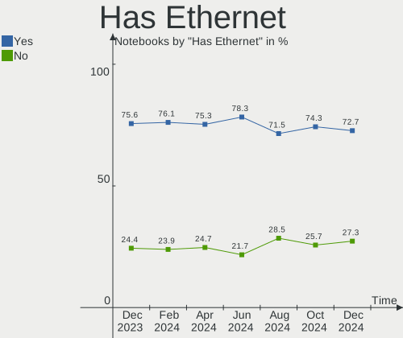
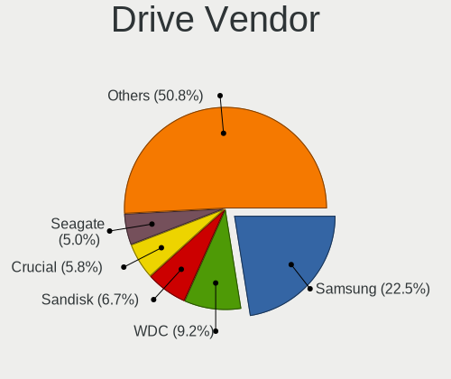
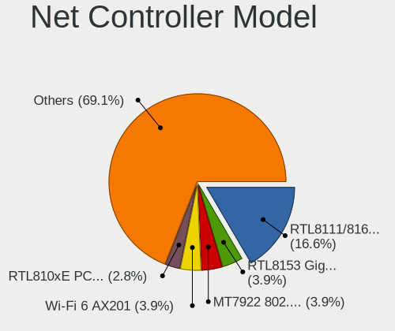
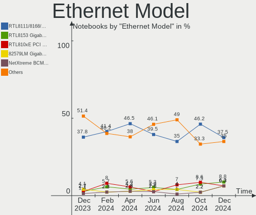
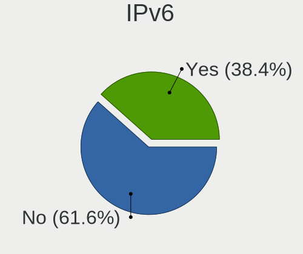
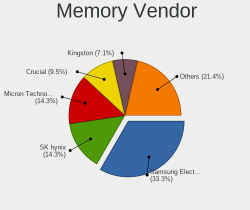
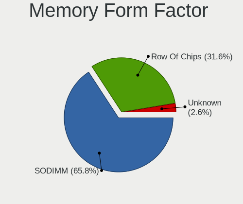
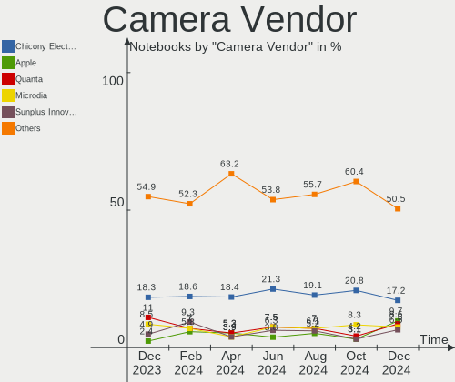

Pop!_OS Hardware Trends (Notebooks)
-----------------------------------

A project to identify most popular hardware characteristics and track their change
over time based on data collected by Pop!_OS users at https://Linux-Hardware.org.

Anyone can contribute to this report by the [hw-probe](https://github.com/linuxhw/hw-probe) tool:

    sudo -E hw-probe -all -upload

Full-feature report is available here: https://linux-hardware.org/?view=trends&formfactor=notebook

Period: Sep, 2021.

Contents
--------

* [ System ](#system)
  - [ OS                       ](#os)
  - [ OS Family                ](#os-family)
  - [ Kernel                   ](#kernel)
  - [ Kernel Family            ](#kernel-family)
  - [ Kernel Major Ver.        ](#kernel-major-ver)
  - [ Arch                     ](#arch)
  - [ DE                       ](#de)
  - [ Display Server           ](#display-server)
  - [ Display Manager          ](#display-manager)
  - [ OS Lang                  ](#os-lang)
  - [ Boot Mode                ](#boot-mode)
  - [ Filesystem               ](#filesystem)
  - [ Part. scheme             ](#part-scheme)
  - [ Dual Boot with Linux/BSD ](#dual-boot-with-linuxbsd)
  - [ Dual Boot (Win)          ](#dual-boot-win)

* [ Board ](#board)
  - [ Vendor                   ](#vendor)
  - [ Model                    ](#model)
  - [ Model Family             ](#model-family)
  - [ MFG Year                 ](#mfg-year)
  - [ Form Factor              ](#form-factor)
  - [ Secure Boot              ](#secure-boot)
  - [ Coreboot                 ](#coreboot)
  - [ RAM Size                 ](#ram-size)
  - [ RAM Used                 ](#ram-used)
  - [ Total Drives             ](#total-drives)
  - [ Has CD-ROM               ](#has-cd-rom)
  - [ Has Ethernet             ](#has-ethernet)
  - [ Has WiFi                 ](#has-wifi)
  - [ Has Bluetooth            ](#has-bluetooth)

* [ Location ](#location)
  - [ Country                  ](#country)
  - [ City                     ](#city)

* [ Drives ](#drives)
  - [ Drive Vendor             ](#drive-vendor)
  - [ Drive Model              ](#drive-model)
  - [ HDD Vendor               ](#hdd-vendor)
  - [ SSD Vendor               ](#ssd-vendor)
  - [ Drive Kind               ](#drive-kind)
  - [ Drive Connector          ](#drive-connector)
  - [ Drive Size               ](#drive-size)
  - [ Space Total              ](#space-total)
  - [ Space Used               ](#space-used)
  - [ Malfunc. Drives          ](#malfunc-drives)
  - [ Malfunc. Drive Vendor    ](#malfunc-drive-vendor)
  - [ Malfunc. HDD Vendor      ](#malfunc-hdd-vendor)
  - [ Malfunc. Drive Kind      ](#malfunc-drive-kind)
  - [ Failed Drives            ](#failed-drives)
  - [ Failed Drive Vendor      ](#failed-drive-vendor)
  - [ Drive Status             ](#drive-status)

* [ Storage controller ](#storage-controller)
  - [ Storage Vendor           ](#storage-vendor)
  - [ Storage Model            ](#storage-model)
  - [ Storage Kind             ](#storage-kind)

* [ Processor ](#processor)
  - [ CPU Vendor               ](#cpu-vendor)
  - [ CPU Model                ](#cpu-model)
  - [ CPU Model Family         ](#cpu-model-family)
  - [ CPU Cores                ](#cpu-cores)
  - [ CPU Sockets              ](#cpu-sockets)
  - [ CPU Threads              ](#cpu-threads)
  - [ CPU Op-Modes             ](#cpu-op-modes)
  - [ CPU Microcode            ](#cpu-microcode)
  - [ CPU Microarch            ](#cpu-microarch)

* [ Graphics ](#graphics)
  - [ GPU Vendor               ](#gpu-vendor)
  - [ GPU Model                ](#gpu-model)
  - [ GPU Combo                ](#gpu-combo)
  - [ GPU Driver               ](#gpu-driver)
  - [ GPU Memory               ](#gpu-memory)

* [ Monitor ](#monitor)
  - [ Monitor Vendor           ](#monitor-vendor)
  - [ Monitor Model            ](#monitor-model)
  - [ Monitor Resolution       ](#monitor-resolution)
  - [ Monitor Diagonal         ](#monitor-diagonal)
  - [ Monitor Width            ](#monitor-width)
  - [ Aspect Ratio             ](#aspect-ratio)
  - [ Monitor Area             ](#monitor-area)
  - [ Pixel Density            ](#pixel-density)
  - [ Multiple Monitors        ](#multiple-monitors)

* [ Network ](#network)
  - [ Net Controller Vendor    ](#net-controller-vendor)
  - [ Net Controller Model     ](#net-controller-model)
  - [ Wireless Vendor          ](#wireless-vendor)
  - [ Wireless Model           ](#wireless-model)
  - [ Ethernet Vendor          ](#ethernet-vendor)
  - [ Ethernet Model           ](#ethernet-model)
  - [ Net Controller Kind      ](#net-controller-kind)
  - [ Used Controller          ](#used-controller)
  - [ NICs                     ](#nics)
  - [ IPv6                     ](#ipv6)

* [ Bluetooth ](#bluetooth)
  - [ Bluetooth Vendor         ](#bluetooth-vendor)
  - [ Bluetooth Model          ](#bluetooth-model)

* [ Sound ](#sound)
  - [ Sound Vendor             ](#sound-vendor)
  - [ Sound Model              ](#sound-model)

* [ Memory ](#memory)
  - [ Memory Vendor            ](#memory-vendor)
  - [ Memory Model             ](#memory-model)
  - [ Memory Kind              ](#memory-kind)
  - [ Memory Form Factor       ](#memory-form-factor)
  - [ Memory Size              ](#memory-size)
  - [ Memory Speed             ](#memory-speed)

* [ Printers & scanners ](#printers--scanners)
  - [ Printer Vendor           ](#printer-vendor)
  - [ Printer Model            ](#printer-model)
  - [ Scanner Vendor           ](#scanner-vendor)
  - [ Scanner Model            ](#scanner-model)

* [ Camera ](#camera)
  - [ Camera Vendor            ](#camera-vendor)
  - [ Camera Model             ](#camera-model)

* [ Security ](#security)
  - [ Fingerprint Vendor       ](#fingerprint-vendor)
  - [ Fingerprint Model        ](#fingerprint-model)
  - [ Chipcard Vendor          ](#chipcard-vendor)
  - [ Chipcard Model           ](#chipcard-model)

* [ Unsupported ](#unsupported)
  - [ Unsupported Devices      ](#unsupported-devices)
  - [ Unsupported Device Types ](#unsupported-device-types)

System
------

OS
--

Installed operating systems

| Name          | Notebooks | Percent |
|---------------|-----------|---------|
| Pop!_OS 21.04 | 166       | 85.57%  |
| Pop!_OS 20.04 | 22        | 11.34%  |
| Pop!_OS 20.10 | 6         | 3.09%   |

OS Family
---------

OS without a version

| Name    | Notebooks | Percent |
|---------|-----------|---------|
| Pop!_OS | 194       | 100%    |

Kernel
------

Version of the Linux kernel

| Version                   | Notebooks | Percent |
|---------------------------|-----------|---------|
| 5.11.0-7633-generic       | 87        | 44.85%  |
| 5.13.0-7614-generic       | 73        | 37.63%  |
| 5.11.0-7620-generic       | 21        | 10.82%  |
| 5.11.0-7612-generic       | 2         | 1.03%   |
| 5.8.0-7630-generic        | 1         | 0.52%   |
| 5.14.0-6.4-liquorix-amd64 | 1         | 0.52%   |
| 5.13.9-xanmod1            | 1         | 0.52%   |
| 5.13.8-xanmod1            | 1         | 0.52%   |
| 5.13.19-xanmod1           | 1         | 0.52%   |
| 5.13.16-xanmod1           | 1         | 0.52%   |
| 5.13.14-xanmod1           | 1         | 0.52%   |
| 5.13.13-xanmod1           | 1         | 0.52%   |
| 5.12.9-xanmod1            | 1         | 0.52%   |
| 5.12.14-xanmod1           | 1         | 0.52%   |
| 5.12.0-051200-generic     | 1         | 0.52%   |

Kernel Family
-------------

Linux kernel without a distro release

| Version | Notebooks | Percent |
|---------|-----------|---------|
| 5.11.0  | 110       | 56.7%   |
| 5.13.0  | 73        | 37.63%  |
| 5.8.0   | 1         | 0.52%   |
| 5.14.0  | 1         | 0.52%   |
| 5.13.9  | 1         | 0.52%   |
| 5.13.8  | 1         | 0.52%   |
| 5.13.19 | 1         | 0.52%   |
| 5.13.16 | 1         | 0.52%   |
| 5.13.14 | 1         | 0.52%   |
| 5.13.13 | 1         | 0.52%   |
| 5.12.9  | 1         | 0.52%   |
| 5.12.14 | 1         | 0.52%   |
| 5.12.0  | 1         | 0.52%   |

Kernel Major Ver.
-----------------

Linux kernel major version

| Version | Notebooks | Percent |
|---------|-----------|---------|
| 5.11    | 110       | 56.7%   |
| 5.13    | 79        | 40.72%  |
| 5.12    | 3         | 1.55%   |
| 5.8     | 1         | 0.52%   |
| 5.14    | 1         | 0.52%   |

Arch
----

OS architecture (x86_64, i586, etc.)

| Name   | Notebooks | Percent |
|--------|-----------|---------|
| x86_64 | 194       | 100%    |

DE
--

Desktop Environment

| Name       | Notebooks | Percent |
|------------|-----------|---------|
| GNOME      | 188       | 96.91%  |
| KDE        | 2         | 1.03%   |
| X-Cinnamon | 1         | 0.52%   |
| KDE5       | 1         | 0.52%   |
| awesome    | 1         | 0.52%   |
| Unknown    | 1         | 0.52%   |

Display Server
--------------

X11 or Wayland

| Name    | Notebooks | Percent |
|---------|-----------|---------|
| X11     | 188       | 96.91%  |
| Wayland | 5         | 2.58%   |
| Tty     | 1         | 0.52%   |

Display Manager
---------------

SDDM, LightDM, etc.

| Name    | Notebooks | Percent |
|---------|-----------|---------|
| Unknown | 142       | 73.2%   |
| GDM     | 52        | 26.8%   |

OS Lang
-------

Language

| Lang    | Notebooks | Percent |
|---------|-----------|---------|
| en_US   | 113       | 58.25%  |
| en_GB   | 14        | 7.22%   |
| pt_BR   | 12        | 6.19%   |
| ru_RU   | 6         | 3.09%   |
| de_DE   | 6         | 3.09%   |
| en_CA   | 5         | 2.58%   |
| C       | 5         | 2.58%   |
| en_IN   | 4         | 2.06%   |
| en_AU   | 4         | 2.06%   |
| sv_SE   | 3         | 1.55%   |
| es_ES   | 3         | 1.55%   |
| en_ZA   | 3         | 1.55%   |
| pl_PL   | 2         | 1.03%   |
| it_IT   | 2         | 1.03%   |
| fr_FR   | 2         | 1.03%   |
| tr_TR   | 1         | 0.52%   |
| pt_PT   | 1         | 0.52%   |
| nl_NL   | 1         | 0.52%   |
| ks_IN   | 1         | 0.52%   |
| hr_HR   | 1         | 0.52%   |
| es_MX   | 1         | 0.52%   |
| en_IL   | 1         | 0.52%   |
| en_DK   | 1         | 0.52%   |
| da_DK   | 1         | 0.52%   |
| Unknown | 1         | 0.52%   |

Boot Mode
---------

EFI or BIOS

| Mode | Notebooks | Percent |
|------|-----------|---------|
| BIOS | 144       | 74.23%  |
| EFI  | 50        | 25.77%  |

Filesystem
----------

Type of filesystem

| Type    | Notebooks | Percent |
|---------|-----------|---------|
| Ext4    | 186       | 95.88%  |
| Overlay | 5         | 2.58%   |
| Btrfs   | 3         | 1.55%   |

Part. scheme
------------

Scheme of partitioning

| Type    | Notebooks | Percent |
|---------|-----------|---------|
| Unknown | 141       | 72.68%  |
| GPT     | 51        | 26.29%  |
| MBR     | 2         | 1.03%   |

Dual Boot with Linux/BSD
------------------------

Hosting more than one Linux/BSD

| Dual boot | Notebooks | Percent |
|-----------|-----------|---------|
| No        | 192       | 98.97%  |
| Yes       | 2         | 1.03%   |

Dual Boot (Win)
---------------

Hosting Linux and Windows

| Dual boot | Notebooks | Percent |
|-----------|-----------|---------|
| No        | 174       | 89.69%  |
| Yes       | 20        | 10.31%  |

Board
-----

Vendor
------

Motherboard manufacturer

| Name                | Notebooks | Percent |
|---------------------|-----------|---------|
| Dell                | 35        | 18.04%  |
| Lenovo              | 34        | 17.53%  |
| Hewlett-Packard     | 32        | 16.49%  |
| Acer                | 21        | 10.82%  |
| ASUSTek Computer    | 19        | 9.79%   |
| Apple               | 9         | 4.64%   |
| MSI                 | 7         | 3.61%   |
| System76            | 6         | 3.09%   |
| Samsung Electronics | 5         | 2.58%   |
| Toshiba             | 2         | 1.03%   |
| PC Specialist       | 2         | 1.03%   |
| Packard Bell        | 2         | 1.03%   |
| Metabox             | 2         | 1.03%   |
| Framework           | 2         | 1.03%   |
| Alienware           | 2         | 1.03%   |
| Sony                | 1         | 0.52%   |
| Razer               | 1         | 0.52%   |
| Positivo            | 1         | 0.52%   |
| Pegatron            | 1         | 0.52%   |
| Notebook            | 1         | 0.52%   |
| LG Electronics      | 1         | 0.52%   |
| HUAWEI              | 1         | 0.52%   |
| Google              | 1         | 0.52%   |
| Gigabyte Technology | 1         | 0.52%   |
| EVOO                | 1         | 0.52%   |
| Eluktronics         | 1         | 0.52%   |
| Clevo               | 1         | 0.52%   |
| Chuwi               | 1         | 0.52%   |
| CCE                 | 1         | 0.52%   |

Model
-----

Motherboard model

| Name                                  | Notebooks | Percent |
|---------------------------------------|-----------|---------|
| Dell XPS 15 9570                      | 3         | 1.55%   |
| ASUS TUF Gaming FX505DY_FX505DY       | 3         | 1.55%   |
| System76 Oryx Pro                     | 2         | 1.03%   |
| HP Pavilion Notebook                  | 2         | 1.03%   |
| HP Pavilion dv6                       | 2         | 1.03%   |
| HP G60                                | 2         | 1.03%   |
| Framework Laptop                      | 2         | 1.03%   |
| Dell XPS 15 9500                      | 2         | 1.03%   |
| Acer Aspire VX5-591G                  | 2         | 1.03%   |
| Acer Aspire V3-571G                   | 2         | 1.03%   |
| Acer Aspire 6935                      | 2         | 1.03%   |
| Toshiba TECRA Z40-A                   | 1         | 0.52%   |
| Toshiba Satellite L55-B               | 1         | 0.52%   |
| System76 Serval                       | 1         | 0.52%   |
| System76 Pangolin                     | 1         | 0.52%   |
| System76 Lemur Pro                    | 1         | 0.52%   |
| System76 Kudu Professional            | 1         | 0.52%   |
| Sony SVE14A15FGW                      | 1         | 0.52%   |
| Samsung 550XBE/350XBE                 | 1         | 0.52%   |
| Samsung 535U4C                        | 1         | 0.52%   |
| Samsung 340XAA/350XAA/550XAA          | 1         | 0.52%   |
| Samsung 305V4A/305V5A                 | 1         | 0.52%   |
| Samsung 270E5G/270E5U                 | 1         | 0.52%   |
| Razer Blade 14 - RZ09-0370            | 1         | 0.52%   |
| Positivo S14BW01                      | 1         | 0.52%   |
| Pegatron H36ST                        | 1         | 0.52%   |
| PC Specialist Standard                | 1         | 0.52%   |
| PC Specialist NH5x_7xDCx_DDx          | 1         | 0.52%   |
| Packard Bell EasyNote TM98            | 1         | 0.52%   |
| Packard Bell EasyNote LS11HR          | 1         | 0.52%   |
| Notebook W840SN Series                | 1         | 0.52%   |
| MSI PS63 Modern 8RC                   | 1         | 0.52%   |
| MSI GX780R/GT780R/GT780DXR            | 1         | 0.52%   |
| MSI GS73 Stealth 8RF                  | 1         | 0.52%   |
| MSI GL72M 7REX                        | 1         | 0.52%   |
| MSI GF75 Thin 9SC                     | 1         | 0.52%   |
| MSI GF63 Thin 10SC                    | 1         | 0.52%   |
| MSI GE66 Raider 10SF                  | 1         | 0.52%   |
| Metabox NP50DE                        | 1         | 0.52%   |
| Metabox Alpha-S NP70HJ                | 1         | 0.52%   |
| LG S425-L.BC24P1                      | 1         | 0.52%   |
| Lenovo Z50-75 80EC                    | 1         | 0.52%   |
| Lenovo Z50-70 20354                   | 1         | 0.52%   |
| Lenovo ThinkPad X230 2320A9U          | 1         | 0.52%   |
| Lenovo ThinkPad X220 4291WAY          | 1         | 0.52%   |
| Lenovo ThinkPad W540 20BHS27X02       | 1         | 0.52%   |
| Lenovo ThinkPad W520 4284JN3          | 1         | 0.52%   |
| Lenovo ThinkPad T480 20L6SCWK00       | 1         | 0.52%   |
| Lenovo ThinkPad T460s 20FAS20W00      | 1         | 0.52%   |
| Lenovo ThinkPad T450s 20BX001LUS      | 1         | 0.52%   |
| Lenovo ThinkPad T430 2349DB9          | 1         | 0.52%   |
| Lenovo ThinkPad T430 2347H6U          | 1         | 0.52%   |
| Lenovo ThinkPad T15g Gen 1 20URS08V00 | 1         | 0.52%   |
| Lenovo ThinkPad T14s Gen 1 20UH001AGE | 1         | 0.52%   |
| Lenovo ThinkPad P50 20EQS10T00        | 1         | 0.52%   |
| Lenovo ThinkPad L480 20LS0026GE       | 1         | 0.52%   |
| Lenovo ThinkPad L15 Gen 1 20U7S05B00  | 1         | 0.52%   |
| Lenovo ThinkPad Edge E540 20C600JFUK  | 1         | 0.52%   |
| Lenovo ThinkPad E580 20KS0039GE       | 1         | 0.52%   |
| Lenovo ThinkPad E15 Gen 3 20YG004BMX  | 1         | 0.52%   |

Model Family
------------

Motherboard model prefix

| Name                   | Notebooks | Percent |
|------------------------|-----------|---------|
| Lenovo ThinkPad        | 19        | 9.79%   |
| Dell Inspiron          | 13        | 6.7%    |
| Acer Aspire            | 13        | 6.7%    |
| Dell XPS               | 12        | 6.19%   |
| HP Pavilion            | 10        | 5.15%   |
| Lenovo IdeaPad         | 7         | 3.61%   |
| Dell Latitude          | 6         | 3.09%   |
| HP Laptop              | 5         | 2.58%   |
| ASUS TUF               | 5         | 2.58%   |
| HP ProBook             | 4         | 2.06%   |
| Acer Nitro             | 4         | 2.06%   |
| ASUS VivoBook          | 3         | 1.55%   |
| Acer TravelMate        | 3         | 1.55%   |
| System76 Oryx          | 2         | 1.03%   |
| Packard Bell EasyNote  | 2         | 1.03%   |
| Lenovo Legion          | 2         | 1.03%   |
| HP G60                 | 2         | 1.03%   |
| HP ENVY                | 2         | 1.03%   |
| HP EliteBook           | 2         | 1.03%   |
| Framework Laptop       | 2         | 1.03%   |
| Dell Vostro            | 2         | 1.03%   |
| ASUS ROG               | 2         | 1.03%   |
| Apple MacBookPro5      | 2         | 1.03%   |
| Toshiba TECRA          | 1         | 0.52%   |
| Toshiba Satellite      | 1         | 0.52%   |
| System76 Serval        | 1         | 0.52%   |
| System76 Pangolin      | 1         | 0.52%   |
| System76 Lemur         | 1         | 0.52%   |
| System76 Kudu          | 1         | 0.52%   |
| Sony SVE14A15FGW       | 1         | 0.52%   |
| Samsung 550XBE         | 1         | 0.52%   |
| Samsung 535U4C         | 1         | 0.52%   |
| Samsung 340XAA         | 1         | 0.52%   |
| Samsung 305V4A         | 1         | 0.52%   |
| Samsung 270E5G         | 1         | 0.52%   |
| Razer Blade            | 1         | 0.52%   |
| Positivo S14BW01       | 1         | 0.52%   |
| Pegatron H36ST         | 1         | 0.52%   |
| PC Specialist Standard | 1         | 0.52%   |
| PC Specialist NH5x     | 1         | 0.52%   |
| Notebook W840SN        | 1         | 0.52%   |
| MSI PS63               | 1         | 0.52%   |
| MSI GX780R             | 1         | 0.52%   |
| MSI GS73               | 1         | 0.52%   |
| MSI GL72M              | 1         | 0.52%   |
| MSI GF75               | 1         | 0.52%   |
| MSI GF63               | 1         | 0.52%   |
| MSI GE66               | 1         | 0.52%   |
| Metabox NP50DE         | 1         | 0.52%   |
| Metabox Alpha-S        | 1         | 0.52%   |
| LG S425-L.BC24P1       | 1         | 0.52%   |
| Lenovo Z50-75          | 1         | 0.52%   |
| Lenovo Z50-70          | 1         | 0.52%   |
| Lenovo ThinkBook       | 1         | 0.52%   |
| Lenovo N22             | 1         | 0.52%   |
| Lenovo G510            | 1         | 0.52%   |
| Lenovo Edge            | 1         | 0.52%   |
| HUAWEI MACHD-WXX9      | 1         | 0.52%   |
| HP ZBook               | 1         | 0.52%   |
| HP Presario            | 1         | 0.52%   |

MFG Year
--------

Motherboard manufacture year

| Year | Notebooks | Percent |
|------|-----------|---------|
| 2021 | 52        | 26.8%   |
| 2020 | 30        | 15.46%  |
| 2019 | 29        | 14.95%  |
| 2018 | 15        | 7.73%   |
| 2016 | 12        | 6.19%   |
| 2017 | 9         | 4.64%   |
| 2015 | 8         | 4.12%   |
| 2013 | 8         | 4.12%   |
| 2010 | 8         | 4.12%   |
| 2012 | 6         | 3.09%   |
| 2011 | 6         | 3.09%   |
| 2014 | 5         | 2.58%   |
| 2009 | 3         | 1.55%   |
| 2008 | 3         | 1.55%   |

Form Factor
-----------

Physical design of the computer

| Name     | Notebooks | Percent |
|----------|-----------|---------|
| Notebook | 194       | 100%    |

Secure Boot
-----------

Enabled or disabled

| State    | Notebooks | Percent |
|----------|-----------|---------|
| Disabled | 194       | 100%    |

Coreboot
--------

Have coreboot on board

| Used | Notebooks | Percent |
|------|-----------|---------|
| No   | 192       | 98.97%  |
| Yes  | 2         | 1.03%   |

RAM Size
--------

Total RAM memory

| Size in GB  | Notebooks | Percent |
|-------------|-----------|---------|
| 4.01-8.0    | 59        | 30.41%  |
| 16.01-24.0  | 47        | 24.23%  |
| 8.01-16.0   | 32        | 16.49%  |
| 3.01-4.0    | 27        | 13.92%  |
| 32.01-64.0  | 19        | 9.79%   |
| 64.01-256.0 | 4         | 2.06%   |
| 24.01-32.0  | 3         | 1.55%   |
| 2.01-3.0    | 2         | 1.03%   |
| 1.01-2.0    | 1         | 0.52%   |

RAM Used
--------

Used RAM memory

| Used GB   | Notebooks | Percent |
|-----------|-----------|---------|
| 2.01-3.0  | 76        | 39.18%  |
| 1.01-2.0  | 45        | 23.2%   |
| 3.01-4.0  | 34        | 17.53%  |
| 4.01-8.0  | 32        | 16.49%  |
| 8.01-16.0 | 7         | 3.61%   |

Total Drives
------------

Number of drives on board

| Drives | Notebooks | Percent |
|--------|-----------|---------|
| 1      | 132       | 68.04%  |
| 2      | 56        | 28.87%  |
| 3      | 6         | 3.09%   |

Has CD-ROM
----------

Has CD-ROM on board

| Presented | Notebooks | Percent |
|-----------|-----------|---------|
| No        | 137       | 70.62%  |
| Yes       | 57        | 29.38%  |

Has Ethernet
------------

Has Ethernet on board

| Presented | Notebooks | Percent |
|-----------|-----------|---------|
| Yes       | 152       | 78.35%  |
| No        | 42        | 21.65%  |

Has WiFi
--------

Has WiFi module

| Presented | Notebooks | Percent |
|-----------|-----------|---------|
| Yes       | 192       | 98.97%  |
| No        | 2         | 1.03%   |

Has Bluetooth
-------------

Has Bluetooth module

| Presented | Notebooks | Percent |
|-----------|-----------|---------|
| Yes       | 178       | 91.75%  |
| No        | 16        | 8.25%   |

Location
--------

Country
-------

Geographic location (country)

| Country                | Notebooks | Percent |
|------------------------|-----------|---------|
| USA                    | 52        | 26.8%   |
| Brazil                 | 20        | 10.31%  |
| UK                     | 11        | 5.67%   |
| India                  | 9         | 4.64%   |
| Germany                | 9         | 4.64%   |
| Canada                 | 7         | 3.61%   |
| Sweden                 | 6         | 3.09%   |
| Australia              | 6         | 3.09%   |
| Russia                 | 5         | 2.58%   |
| Romania                | 5         | 2.58%   |
| Mexico                 | 5         | 2.58%   |
| Italy                  | 5         | 2.58%   |
| South Africa           | 4         | 2.06%   |
| Netherlands            | 4         | 2.06%   |
| France                 | 4         | 2.06%   |
| Spain                  | 3         | 1.55%   |
| Lithuania              | 3         | 1.55%   |
| Austria                | 3         | 1.55%   |
| Singapore              | 2         | 1.03%   |
| Poland                 | 2         | 1.03%   |
| Latvia                 | 2         | 1.03%   |
| Denmark                | 2         | 1.03%   |
| Zambia                 | 1         | 0.52%   |
| Vietnam                | 1         | 0.52%   |
| Venezuela              | 1         | 0.52%   |
| Ukraine                | 1         | 0.52%   |
| Turkey                 | 1         | 0.52%   |
| Thailand               | 1         | 0.52%   |
| Taiwan                 | 1         | 0.52%   |
| Switzerland            | 1         | 0.52%   |
| Slovenia               | 1         | 0.52%   |
| Norway                 | 1         | 0.52%   |
| New Zealand            | 1         | 0.52%   |
| Mozambique             | 1         | 0.52%   |
| Malaysia               | 1         | 0.52%   |
| Luxembourg             | 1         | 0.52%   |
| Kenya                  | 1         | 0.52%   |
| Japan                  | 1         | 0.52%   |
| Israel                 | 1         | 0.52%   |
| Iran                   | 1         | 0.52%   |
| Hungary                | 1         | 0.52%   |
| Greece                 | 1         | 0.52%   |
| Croatia                | 1         | 0.52%   |
| Bulgaria               | 1         | 0.52%   |
| Bosnia and Herzegovina | 1         | 0.52%   |
| Belgium                | 1         | 0.52%   |
| Albania                | 1         | 0.52%   |

City
----

Geographic location (city)

| City                      | Notebooks | Percent |
|---------------------------|-----------|---------|
| Vienna                    | 3         | 1.55%   |
| Sydney                    | 3         | 1.55%   |
| Bengaluru                 | 3         | 1.55%   |
| Toronto                   | 2         | 1.03%   |
| Singapore                 | 2         | 1.03%   |
| Riga                      | 2         | 1.03%   |
| Moscow                    | 2         | 1.03%   |
| Miami                     | 2         | 1.03%   |
| Le??n                     | 2         | 1.03%   |
| Glasgow                   | 2         | 1.03%   |
| Fortaleza                 | 2         | 1.03%   |
| Edmonton                  | 2         | 1.03%   |
| East London               | 2         | 1.03%   |
| Athens                    | 2         | 1.03%   |
| Amsterdam                 | 2         | 1.03%   |
| Aberdeen                  | 2         | 1.03%   |
| Zagreb                    | 1         | 0.52%   |
| Yekaterinburg             | 1         | 0.52%   |
| Woodland Hills            | 1         | 0.52%   |
| Woodbridge                | 1         | 0.52%   |
| Webberville               | 1         | 0.52%   |
| Voluntari                 | 1         | 0.52%   |
| Vilvoorde                 | 1         | 0.52%   |
| Vilnius                   | 1         | 0.52%   |
| Veracruz                  | 1         | 0.52%   |
| Varzea Paulista           | 1         | 0.52%   |
| Varniai                   | 1         | 0.52%   |
| Uberl??ndia               | 1         | 0.52%   |
| Tyumen                    | 1         | 0.52%   |
| Tulcea                    | 1         | 0.52%   |
| Toblach                   | 1         | 0.52%   |
| Tel Aviv                  | 1         | 0.52%   |
| Tehran                    | 1         | 0.52%   |
| Targoviste                | 1         | 0.52%   |
| Taerendoe                 | 1         | 0.52%   |
| Syracuse                  | 1         | 0.52%   |
| Strassen                  | 1         | 0.52%   |
| Stevenage                 | 1         | 0.52%   |
| St Louis                  | 1         | 0.52%   |
| Springfield               | 1         | 0.52%   |
| South Bend                | 1         | 0.52%   |
| Solna                     | 1         | 0.52%   |
| Sofia                     | 1         | 0.52%   |
| Siwan                     | 1         | 0.52%   |
| Sigtuna                   | 1         | 0.52%   |
| Seville                   | 1         | 0.52%   |
| Senden                    | 1         | 0.52%   |
| S??o Paulo                | 1         | 0.52%   |
| S??o Jos?© dos Campos     | 1         | 0.52%   |
| Sarmenstorf               | 1         | 0.52%   |
| Saraland                  | 1         | 0.52%   |
| Sao Lourenco da Mata      | 1         | 0.52%   |
| Santa Rosa                | 1         | 0.52%   |
| San Ysidro                | 1         | 0.52%   |
| San Nicol??s de los Garza | 1         | 0.52%   |
| San Jose                  | 1         | 0.52%   |
| Salvador                  | 1         | 0.52%   |
| Saint-Denis               | 1         | 0.52%   |
| Saint Joseph              | 1         | 0.52%   |
| Roselle                   | 1         | 0.52%   |

Drives
------

Drive Vendor
------------

Hard drive vendors

| Vendor                  | Notebooks | Drives | Percent |
|-------------------------|-----------|--------|---------|
| Samsung Electronics     | 45        | 52     | 18%     |
| Seagate                 | 31        | 31     | 12.4%   |
| WDC                     | 23        | 25     | 9.2%    |
| SanDisk                 | 18        | 18     | 7.2%    |
| Toshiba                 | 16        | 16     | 6.4%    |
| Kingston                | 14        | 14     | 5.6%    |
| SK Hynix                | 13        | 13     | 5.2%    |
| HGST                    | 13        | 14     | 5.2%    |
| Unknown                 | 10        | 10     | 4%      |
| Phison                  | 7         | 8      | 2.8%    |
| Intel                   | 7         | 7      | 2.8%    |
| Hitachi                 | 5         | 5      | 2%      |
| Crucial                 | 5         | 5      | 2%      |
| Apple                   | 5         | 5      | 2%      |
| Micron Technology       | 4         | 4      | 1.6%    |
| China                   | 3         | 3      | 1.2%    |
| A-DATA Technology       | 3         | 3      | 1.2%    |
| Union Memory (Shenzhen) | 2         | 2      | 0.8%    |
| Silicon Motion          | 2         | 2      | 0.8%    |
| Realtek Semiconductor   | 2         | 2      | 0.8%    |
| PNY                     | 2         | 2      | 0.8%    |
| MAXTOR                  | 2         | 2      | 0.8%    |
| VisionTek               | 1         | 2      | 0.4%    |
| TO Exter                | 1         | 1      | 0.4%    |
| Solid State Storage     | 1         | 1      | 0.4%    |
| Smartbuy                | 1         | 1      | 0.4%    |
| PLEXTOR                 | 1         | 1      | 0.4%    |
| Phison Electronics      | 1         | 1      | 0.4%    |
| Patriot                 | 1         | 1      | 0.4%    |
| Netac                   | 1         | 1      | 0.4%    |
| Lenovo                  | 1         | 1      | 0.4%    |
| LaCie                   | 1         | 1      | 0.4%    |
| KingDian                | 1         | 1      | 0.4%    |
| JMicron                 | 1         | 1      | 0.4%    |
| JAMESDONKEY             | 1         | 1      | 0.4%    |
| Fujitsu                 | 1         | 1      | 0.4%    |
| DOGFISH                 | 1         | 1      | 0.4%    |
| Dell                    | 1         | 1      | 0.4%    |
| Corsair                 | 1         | 1      | 0.4%    |
| ADATA Technology        | 1         | 1      | 0.4%    |

Drive Model
-----------

Hard drive models

| Model                                        | Notebooks | Percent |
|----------------------------------------------|-----------|---------|
| Seagate ST1000LM035-1RK172 1TB               | 10        | 3.85%   |
| Sandisk NVMe SSD Drive 512GB                 | 5         | 1.92%   |
| Samsung NVMe SSD Drive 512GB                 | 4         | 1.54%   |
| Samsung NVMe SSD Drive 500GB                 | 4         | 1.54%   |
| HGST HTS721010A9E630 1TB                     | 4         | 1.54%   |
| SK Hynix NVMe SSD Drive 512GB                | 3         | 1.15%   |
| HGST HTS541010A9E680 1TB                     | 3         | 1.15%   |
| WDC WDBNCE5000PNC 500GB SSD                  | 2         | 0.77%   |
| WDC WD5000LPCX-00VHAT0 500GB                 | 2         | 0.77%   |
| WDC WD10JPVX-22JC3T0 1TB                     | 2         | 0.77%   |
| Unknown MMC Card  64GB                       | 2         | 0.77%   |
| Unknown MMC Card  16GB                       | 2         | 0.77%   |
| Union Memory (Shenzhen) NVMe SSD Drive 256GB | 2         | 0.77%   |
| Toshiba NVMe SSD Drive 512GB                 | 2         | 0.77%   |
| Toshiba MQ04ABF100 1TB                       | 2         | 0.77%   |
| Toshiba MQ01ABD100 1TB                       | 2         | 0.77%   |
| Seagate ST9500420AS 500GB                    | 2         | 0.77%   |
| Seagate ST9320325AS 320GB                    | 2         | 0.77%   |
| Seagate ST2000LM007-1R8174 2TB               | 2         | 0.77%   |
| Seagate ST1000LX015-1U7172 1TB               | 2         | 0.77%   |
| Seagate ST1000LM024 HN-M101MBB 1TB           | 2         | 0.77%   |
| Samsung SSD 970 EVO Plus 500GB               | 2         | 0.77%   |
| Samsung SSD 970 EVO 1TB                      | 2         | 0.77%   |
| Samsung SSD 860 EVO 500GB                    | 2         | 0.77%   |
| Samsung SSD 840 EVO 500GB                    | 2         | 0.77%   |
| Samsung SM963 2.5" NVMe PCIe SSD 128GB       | 2         | 0.77%   |
| Samsung NVMe SSD Drive 2TB                   | 2         | 0.77%   |
| Samsung NVMe SSD Drive 256GB                 | 2         | 0.77%   |
| Samsung NVMe SSD Drive 1TB                   | 2         | 0.77%   |
| Phison NVMe SSD Drive 500GB                  | 2         | 0.77%   |
| Phison NVMe SSD Drive 1024GB                 | 2         | 0.77%   |
| MAXTOR Z1 SSD 240GB                          | 2         | 0.77%   |
| Kingston SA400S37240G 240GB SSD              | 2         | 0.77%   |
| Intel NVMe SSD Drive 512GB                   | 2         | 0.77%   |
| Hitachi HTS543232A7A384 320GB                | 2         | 0.77%   |
| HGST HTS725050A7E630 500GB                   | 2         | 0.77%   |
| HGST HTS545050A7E380 500GB                   | 2         | 0.77%   |
| WDC WDS500G2B0B 500GB SSD                    | 1         | 0.38%   |
| WDC WDS480G2G0A-00JH30 480GB SSD             | 1         | 0.38%   |
| WDC WDS240G1G0B-00RC30 240GB SSD             | 1         | 0.38%   |
| WDC WD5000LPLX-60ZNTT1 500GB                 | 1         | 0.38%   |
| WDC WD5000LPCX-75VHAT0 500GB                 | 1         | 0.38%   |
| WDC WD5000LPCX-24C6HT0 500GB                 | 1         | 0.38%   |
| WDC WD5000BPVT-00HXZT1 500GB                 | 1         | 0.38%   |
| WDC WD2500BEVT-22ZCT0 250GB                  | 1         | 0.38%   |
| WDC WD2500BEKT-75PVMT0 250GB                 | 1         | 0.38%   |
| WDC WD20SPZX-75UA7T0 2TB                     | 1         | 0.38%   |
| WDC WD10SPZX-35Z10T0 1TB                     | 1         | 0.38%   |
| WDC WD10SPZX-24Z10 1TB                       | 1         | 0.38%   |
| WDC WD10SPZX-21Z10T0 1TB                     | 1         | 0.38%   |
| WDC WD10JPVX-60JC3T1 1TB                     | 1         | 0.38%   |
| WDC PC SN730 SDBQNTY-1T00-1001 1TB           | 1         | 0.38%   |
| WDC PC SN730 SDBPNTY-1T00-1032 1TB           | 1         | 0.38%   |
| WDC PC SN730 NVMe 1024GB                     | 1         | 0.38%   |
| WDC PC SN530 SDBPNPZ-512G-1014 512GB         | 1         | 0.38%   |
| WDC PC SN520 SDAPNUW-256G-1002 256GB         | 1         | 0.38%   |
| VisionTek mSATA 480GB                        | 1         | 0.38%   |
| Unknown USB DISK 3.2 1TB                     | 1         | 0.38%   |
| Unknown SHMST6D032GHM11EMC 118000100 32GB    | 1         | 0.38%   |
| Unknown SF128  128GB                         | 1         | 0.38%   |

HDD Vendor
----------

Hard disk drive vendors

| Vendor              | Notebooks | Drives | Percent |
|---------------------|-----------|--------|---------|
| Seagate             | 29        | 29     | 38.67%  |
| WDC                 | 15        | 15     | 20%     |
| HGST                | 13        | 14     | 17.33%  |
| Toshiba             | 8         | 8      | 10.67%  |
| Hitachi             | 5         | 5      | 6.67%   |
| Unknown             | 1         | 1      | 1.33%   |
| TO Exter            | 1         | 1      | 1.33%   |
| Samsung Electronics | 1         | 1      | 1.33%   |
| Fujitsu             | 1         | 1      | 1.33%   |
| Apple               | 1         | 1      | 1.33%   |

SSD Vendor
----------

Solid state drive vendors

| Vendor              | Notebooks | Drives | Percent |
|---------------------|-----------|--------|---------|
| Samsung Electronics | 18        | 19     | 24%     |
| SanDisk             | 11        | 11     | 14.67%  |
| Kingston            | 7         | 7      | 9.33%   |
| WDC                 | 5         | 5      | 6.67%   |
| Crucial             | 5         | 5      | 6.67%   |
| Toshiba             | 3         | 3      | 4%      |
| China               | 3         | 3      | 4%      |
| Apple               | 3         | 3      | 4%      |
| SK Hynix            | 2         | 2      | 2.67%   |
| PNY                 | 2         | 2      | 2.67%   |
| MAXTOR              | 2         | 2      | 2.67%   |
| Intel               | 2         | 2      | 2.67%   |
| Unknown             | 1         | 1      | 1.33%   |
| Smartbuy            | 1         | 1      | 1.33%   |
| Seagate             | 1         | 1      | 1.33%   |
| PLEXTOR             | 1         | 1      | 1.33%   |
| Patriot             | 1         | 1      | 1.33%   |
| Netac               | 1         | 1      | 1.33%   |
| Micron Technology   | 1         | 1      | 1.33%   |
| KingDian            | 1         | 1      | 1.33%   |
| DOGFISH             | 1         | 1      | 1.33%   |
| Dell                | 1         | 1      | 1.33%   |
| Corsair             | 1         | 1      | 1.33%   |
| A-DATA Technology   | 1         | 1      | 1.33%   |

Drive Kind
----------

HDD or SSD

| Kind    | Notebooks | Drives | Percent |
|---------|-----------|--------|---------|
| NVMe    | 91        | 98     | 36.84%  |
| HDD     | 75        | 76     | 30.36%  |
| SSD     | 70        | 76     | 28.34%  |
| MMC     | 6         | 6      | 2.43%   |
| Unknown | 5         | 6      | 2.02%   |

Drive Connector
---------------

SATA, SAS, NVMe, etc.

| Type | Notebooks | Drives | Percent |
|------|-----------|--------|---------|
| SATA | 127       | 152    | 55.22%  |
| NVMe | 90        | 97     | 39.13%  |
| SAS  | 7         | 7      | 3.04%   |
| MMC  | 6         | 6      | 2.61%   |

Drive Size
----------

Size of hard drive

| Size in TB | Notebooks | Drives | Percent |
|------------|-----------|--------|---------|
| 0.01-0.5   | 84        | 95     | 60%     |
| 0.51-1.0   | 48        | 49     | 34.29%  |
| 1.01-2.0   | 7         | 7      | 5%      |
| 3.01-4.0   | 1         | 1      | 0.71%   |

Space Total
-----------

Amount of disk space available on the file system

| Size in GB     | Notebooks | Percent |
|----------------|-----------|---------|
| 101-250        | 63        | 32.47%  |
| 251-500        | 55        | 28.35%  |
| 501-1000       | 39        | 20.1%   |
| 1001-2000      | 12        | 6.19%   |
| 51-100         | 8         | 4.12%   |
| 21-50          | 6         | 3.09%   |
| 1-20           | 5         | 2.58%   |
| 2001-3000      | 3         | 1.55%   |
| More than 3000 | 2         | 1.03%   |
| Unknown        | 1         | 0.52%   |

Space Used
----------

Amount of used disk space

| Used GB        | Notebooks | Percent |
|----------------|-----------|---------|
| 1-20           | 74        | 38.14%  |
| 21-50          | 56        | 28.87%  |
| 51-100         | 21        | 10.82%  |
| 251-500        | 14        | 7.22%   |
| 101-250        | 14        | 7.22%   |
| 501-1000       | 11        | 5.67%   |
| 1001-2000      | 2         | 1.03%   |
| More than 3000 | 1         | 0.52%   |
| Unknown        | 1         | 0.52%   |

Malfunc. Drives
---------------

Drive models with a malfunction

| Model                                 | Notebooks | Drives | Percent |
|---------------------------------------|-----------|--------|---------|
| Seagate ST1000LX015-1U7172 1TB        | 1         | 1      | 14.29%  |
| Samsung Electronics PM9A1 NVMe 2048GB | 1         | 1      | 14.29%  |
| Samsung Electronics PM961 NVMe 512GB  | 1         | 1      | 14.29%  |
| Intel SSDSC2BF180A4L 180GB            | 1         | 1      | 14.29%  |
| Hitachi HTS547564A9E384 640GB         | 1         | 1      | 14.29%  |
| Hitachi HTS545025B9SA02 250GB         | 1         | 1      | 14.29%  |
| HGST HTS541010A9E680 1TB              | 1         | 1      | 14.29%  |

Malfunc. Drive Vendor
---------------------

Vendors of faulty drives

| Vendor              | Notebooks | Drives | Percent |
|---------------------|-----------|--------|---------|
| Samsung Electronics | 2         | 2      | 28.57%  |
| Hitachi             | 2         | 2      | 28.57%  |
| Seagate             | 1         | 1      | 14.29%  |
| Intel               | 1         | 1      | 14.29%  |
| HGST                | 1         | 1      | 14.29%  |

Malfunc. HDD Vendor
-------------------

Vendors of faulty HDD drives

| Vendor  | Notebooks | Drives | Percent |
|---------|-----------|--------|---------|
| Hitachi | 2         | 2      | 50%     |
| Seagate | 1         | 1      | 25%     |
| HGST    | 1         | 1      | 25%     |

Malfunc. Drive Kind
-------------------

Kinds of faulty drives

| Kind | Notebooks | Drives | Percent |
|------|-----------|--------|---------|
| HDD  | 4         | 4      | 57.14%  |
| NVMe | 2         | 2      | 28.57%  |
| SSD  | 1         | 1      | 14.29%  |

Failed Drives
-------------

Failed drive models

Zero info for selected period =(

Failed Drive Vendor
-------------------

Failed drive vendors

Zero info for selected period =(

Drive Status
------------

Number of failed and malfunc. drives

| Status   | Notebooks | Drives | Percent |
|----------|-----------|--------|---------|
| Detected | 145       | 193    | 70.73%  |
| Works    | 53        | 62     | 25.85%  |
| Malfunc  | 7         | 7      | 3.41%   |

Storage controller
------------------

Storage Vendor
--------------

Storage controller vendors

| Vendor                         | Notebooks | Percent |
|--------------------------------|-----------|---------|
| Intel                          | 130       | 51.59%  |
| Samsung Electronics            | 33        | 13.1%   |
| AMD                            | 28        | 11.11%  |
| SK Hynix                       | 11        | 4.37%   |
| Sandisk                        | 11        | 4.37%   |
| Phison Electronics             | 8         | 3.17%   |
| Kingston Technology Company    | 7         | 2.78%   |
| Toshiba America Info Systems   | 5         | 1.98%   |
| Nvidia                         | 3         | 1.19%   |
| Micron Technology              | 3         | 1.19%   |
| ADATA Technology               | 3         | 1.19%   |
| Union Memory (Shenzhen)        | 2         | 0.79%   |
| Silicon Motion                 | 2         | 0.79%   |
| Realtek Semiconductor          | 2         | 0.79%   |
| Solid State Storage Technology | 1         | 0.4%    |
| Seagate Technology             | 1         | 0.4%    |
| Lenovo                         | 1         | 0.4%    |
| Apple                          | 1         | 0.4%    |

Storage Model
-------------

Storage controller models

| Model                                                                            | Notebooks | Percent |
|----------------------------------------------------------------------------------|-----------|---------|
| AMD FCH SATA Controller [AHCI mode]                                              | 27        | 10.34%  |
| Samsung NVMe SSD Controller SM981/PM981/PM983                                    | 16        | 6.13%   |
| Intel Sunrise Point-LP SATA Controller [AHCI mode]                               | 14        | 5.36%   |
| Intel HM170/QM170 Chipset SATA Controller [AHCI Mode]                            | 14        | 5.36%   |
| Intel Cannon Lake Mobile PCH SATA AHCI Controller                                | 14        | 5.36%   |
| Intel 8 Series SATA Controller 1 [AHCI mode]                                     | 11        | 4.21%   |
| Intel 7 Series Chipset Family 6-port SATA Controller [AHCI mode]                 | 11        | 4.21%   |
| Intel 82801 Mobile SATA Controller [RAID mode]                                   | 10        | 3.83%   |
| Intel 8 Series/C220 Series Chipset Family 6-port SATA Controller 1 [AHCI mode]   | 7         | 2.68%   |
| Intel 6 Series/C200 Series Chipset Family 6 port Mobile SATA AHCI Controller     | 7         | 2.68%   |
| Samsung NVMe SSD Controller 980                                                  | 6         | 2.3%    |
| Intel 5 Series/3400 Series Chipset 4 port SATA AHCI Controller                   | 6         | 2.3%    |
| Intel 400 Series Chipset Family SATA AHCI Controller                             | 6         | 2.3%    |
| Samsung NVMe SSD Controller SM961/PM961/SM963                                    | 5         | 1.92%   |
| Phison E12 NVMe Controller                                                       | 5         | 1.92%   |
| Intel SSD 660P Series                                                            | 5         | 1.92%   |
| Intel 82801IBM/IEM (ICH9M/ICH9M-E) 4 port SATA Controller [AHCI mode]            | 5         | 1.92%   |
| Toshiba America Info Systems XG6 NVMe SSD Controller                             | 4         | 1.53%   |
| Sandisk WD Blue SN550 NVMe SSD                                                   | 4         | 1.53%   |
| Sandisk WD Black SN750 / PC SN730 NVMe SSD                                       | 4         | 1.53%   |
| SK Hynix Non-Volatile memory controller                                          | 3         | 1.15%   |
| SK Hynix BC501 NVMe Solid State Drive                                            | 3         | 1.15%   |
| Samsung NVMe SSD Controller PM9A1/PM9A3/980PRO                                   | 3         | 1.15%   |
| Samsung Electronics SATA controller                                              | 3         | 1.15%   |
| Micron Non-Volatile memory controller                                            | 3         | 1.15%   |
| Kingston Company U-SNS8154P3 NVMe SSD                                            | 3         | 1.15%   |
| Kingston Company Company Non-Volatile memory controller                          | 3         | 1.15%   |
| Intel Volume Management Device NVMe RAID Controller                              | 3         | 1.15%   |
| Intel Cannon Point-LP SATA Controller [AHCI Mode]                                | 3         | 1.15%   |
| ADATA Non-Volatile memory controller                                             | 3         | 1.15%   |
| Union Memory (Shenzhen) Non-Volatile memory controller                           | 2         | 0.77%   |
| SK Hynix PC401 NVMe Solid State Drive 256GB                                      | 2         | 0.77%   |
| SK Hynix BC511                                                                   | 2         | 0.77%   |
| Realtek Realtek Non-Volatile memory controller                                   | 2         | 0.77%   |
| Phison PS5013 E13 NVMe Controller                                                | 2         | 0.77%   |
| Nvidia MCP79 AHCI Controller                                                     | 2         | 0.77%   |
| Intel Wildcat Point-LP SATA Controller [AHCI Mode]                               | 2         | 0.77%   |
| Intel Tiger Lake-LP SATA Controller [AHCI mode]                                  | 2         | 0.77%   |
| Intel Q170/Q150/B150/H170/H110/Z170/CM236 Chipset SATA Controller [AHCI Mode]    | 2         | 0.77%   |
| Intel Atom/Celeron/Pentium Processor x5-E8000/J3xxx/N3xxx Series SATA Controller | 2         | 0.77%   |
| Toshiba America Info Systems Toshiba America Info Non-Volatile memory controller | 1         | 0.38%   |
| Solid State Storage Non-Volatile memory controller                               | 1         | 0.38%   |
| SK Hynix Gold P31 SSD                                                            | 1         | 0.38%   |
| Silicon Motion SM2263EN/SM2263XT SSD Controller                                  | 1         | 0.38%   |
| Silicon Motion SM2262/SM2262EN SSD Controller                                    | 1         | 0.38%   |
| Seagate FireCuda 510 SSD                                                         | 1         | 0.38%   |
| Sandisk WD Blue SN500 / PC SN520 NVMe SSD                                        | 1         | 0.38%   |
| Sandisk PC SN520 NVMe SSD                                                        | 1         | 0.38%   |
| Sandisk Non-Volatile memory controller                                           | 1         | 0.38%   |
| Phison E16 PCIe4 NVMe Controller                                                 | 1         | 0.38%   |
| Nvidia MCP89 SATA Controller (AHCI mode)                                         | 1         | 0.38%   |
| Lenovo Non-Volatile memory controller                                            | 1         | 0.38%   |
| Kingston Company A2000 NVMe SSD                                                  | 1         | 0.38%   |
| Intel Mobile 4 Series Chipset PT IDER Controller                                 | 1         | 0.38%   |
| Intel Comet Lake SATA AHCI Controller                                            | 1         | 0.38%   |
| Intel Celeron/Pentium Silver Processor SATA Controller                           | 1         | 0.38%   |
| Intel 82801HM/HEM (ICH8M/ICH8M-E) SATA Controller [AHCI mode]                    | 1         | 0.38%   |
| Intel 82801HM/HEM (ICH8M/ICH8M-E) IDE Controller                                 | 1         | 0.38%   |
| Intel 7 Series Chipset Family 4-port SATA Controller [IDE mode]                  | 1         | 0.38%   |
| Intel 7 Series Chipset Family 2-port SATA Controller [IDE mode]                  | 1         | 0.38%   |

Storage Kind
------------

Kind of storage controller (IDE, SATA, NVMe, SAS, ...)

| Kind | Notebooks | Percent |
|------|-----------|---------|
| SATA | 145       | 57.09%  |
| NVMe | 90        | 35.43%  |
| RAID | 13        | 5.12%   |
| IDE  | 6         | 2.36%   |

Processor
---------

CPU Vendor
----------

Processor vendors

| Vendor | Notebooks | Percent |
|--------|-----------|---------|
| Intel  | 159       | 81.96%  |
| AMD    | 35        | 18.04%  |

CPU Model
---------

Processor models

| Model                                         | Notebooks | Percent |
|-----------------------------------------------|-----------|---------|
| Intel Core i5-7300HQ CPU @ 2.50GHz            | 7         | 3.61%   |
| Intel Core i7-10750H CPU @ 2.60GHz            | 6         | 3.09%   |
| Intel Core i5-8250U CPU @ 1.60GHz             | 6         | 3.09%   |
| Intel Core i7-9750H CPU @ 2.60GHz             | 5         | 2.58%   |
| Intel Core i7-8750H CPU @ 2.20GHz             | 5         | 2.58%   |
| Intel Core i7-7700HQ CPU @ 2.80GHz            | 5         | 2.58%   |
| Intel 11th Gen Core i7-1165G7 @ 2.80GHz       | 5         | 2.58%   |
| Intel Core i7-8550U CPU @ 1.80GHz             | 4         | 2.06%   |
| Intel Core i7-3632QM CPU @ 2.20GHz            | 4         | 2.06%   |
| Intel 11th Gen Core i5-1135G7 @ 2.40GHz       | 4         | 2.06%   |
| AMD Ryzen 7 3700U with Radeon Vega Mobile Gfx | 4         | 2.06%   |
| AMD Ryzen 5 3550H with Radeon Vega Mobile Gfx | 4         | 2.06%   |
| Intel Core i7-8565U CPU @ 1.80GHz             | 3         | 1.55%   |
| Intel Core i5-8265U CPU @ 1.60GHz             | 3         | 1.55%   |
| Intel Core i5-2450M CPU @ 2.50GHz             | 3         | 1.55%   |
| Intel Core i5-10300H CPU @ 2.50GHz            | 3         | 1.55%   |
| Intel Core i3-8130U CPU @ 2.20GHz             | 3         | 1.55%   |
| Intel 11th Gen Core i7-11800H @ 2.30GHz       | 3         | 1.55%   |
| AMD Ryzen 7 5700U with Radeon Graphics        | 3         | 1.55%   |
| Intel Pentium Dual-Core CPU T4300 @ 2.10GHz   | 2         | 1.03%   |
| Intel Core i7-7500U CPU @ 2.70GHz             | 2         | 1.03%   |
| Intel Core i7-6700HQ CPU @ 2.60GHz            | 2         | 1.03%   |
| Intel Core i7-4510U CPU @ 2.00GHz             | 2         | 1.03%   |
| Intel Core i7-4500U CPU @ 1.80GHz             | 2         | 1.03%   |
| Intel Core i7-3520M CPU @ 2.90GHz             | 2         | 1.03%   |
| Intel Core i7-2630QM CPU @ 2.00GHz            | 2         | 1.03%   |
| Intel Core i7-2620M CPU @ 2.70GHz             | 2         | 1.03%   |
| Intel Core i5-7200U CPU @ 2.50GHz             | 2         | 1.03%   |
| Intel Core i5-4200U CPU @ 1.60GHz             | 2         | 1.03%   |
| Intel Core i5-3210M CPU @ 2.50GHz             | 2         | 1.03%   |
| Intel Core i5 CPU M 480 @ 2.67GHz             | 2         | 1.03%   |
| Intel Core i3 CPU M 370 @ 2.40GHz             | 2         | 1.03%   |
| Intel Core i3 CPU M 350 @ 2.27GHz             | 2         | 1.03%   |
| Intel Celeron CPU N3060 @ 1.60GHz             | 2         | 1.03%   |
| AMD Ryzen 5 4600H with Radeon Graphics        | 2         | 1.03%   |
| AMD Ryzen 5 4500U with Radeon Graphics        | 2         | 1.03%   |
| AMD Ryzen 3 3250U with Radeon Graphics        | 2         | 1.03%   |
| Intel Xeon W-10855M CPU @ 2.80GHz             | 1         | 0.52%   |
| Intel Xeon CPU E3-1535M v5 @ 2.90GHz          | 1         | 0.52%   |
| Intel Pentium Dual-Core CPU T4200 @ 2.00GHz   | 1         | 0.52%   |
| Intel Pentium CPU B950 @ 2.10GHz              | 1         | 0.52%   |
| Intel Core i9-9880H CPU @ 2.30GHz             | 1         | 0.52%   |
| Intel Core i9-8950HK CPU @ 2.90GHz            | 1         | 0.52%   |
| Intel Core i7-9850H CPU @ 2.60GHz             | 1         | 0.52%   |
| Intel Core i7-8700 CPU @ 3.20GHz              | 1         | 0.52%   |
| Intel Core i7-8650U CPU @ 1.90GHz             | 1         | 0.52%   |
| Intel Core i7-6820HQ CPU @ 2.70GHz            | 1         | 0.52%   |
| Intel Core i7-6600U CPU @ 2.60GHz             | 1         | 0.52%   |
| Intel Core i7-5600U CPU @ 2.60GHz             | 1         | 0.52%   |
| Intel Core i7-4910MQ CPU @ 2.90GHz            | 1         | 0.52%   |
| Intel Core i7-4810MQ CPU @ 2.80GHz            | 1         | 0.52%   |
| Intel Core i7-4770HQ CPU @ 2.20GHz            | 1         | 0.52%   |
| Intel Core i7-4720HQ CPU @ 2.60GHz            | 1         | 0.52%   |
| Intel Core i7-4710HQ CPU @ 2.50GHz            | 1         | 0.52%   |
| Intel Core i7-4700MQ CPU @ 2.40GHz            | 1         | 0.52%   |
| Intel Core i7-4600U CPU @ 2.10GHz             | 1         | 0.52%   |
| Intel Core i7-3720QM CPU @ 2.60GHz            | 1         | 0.52%   |
| Intel Core i7-3635QM CPU @ 2.40GHz            | 1         | 0.52%   |
| Intel Core i7-2760QM CPU @ 2.40GHz            | 1         | 0.52%   |
| Intel Core i7-2635QM CPU @ 2.00GHz            | 1         | 0.52%   |

CPU Model Family
----------------

Processor model prefix

| Model                          | Notebooks | Percent |
|--------------------------------|-----------|---------|
| Intel Core i7                  | 66        | 34.02%  |
| Intel Core i5                  | 46        | 23.71%  |
| Other                          | 15        | 7.73%   |
| Intel Core i3                  | 13        | 6.7%    |
| AMD Ryzen 7                    | 10        | 5.15%   |
| AMD Ryzen 5                    | 9         | 4.64%   |
| Intel Core 2 Duo               | 7         | 3.61%   |
| Intel Celeron                  | 4         | 2.06%   |
| Intel Pentium Dual-Core        | 3         | 1.55%   |
| Intel Xeon                     | 2         | 1.03%   |
| Intel Core i9                  | 2         | 1.03%   |
| AMD Ryzen 9                    | 2         | 1.03%   |
| AMD Ryzen 3                    | 2         | 1.03%   |
| AMD A8                         | 2         | 1.03%   |
| AMD A6                         | 2         | 1.03%   |
| AMD A10                        | 2         | 1.03%   |
| Intel Pentium                  | 1         | 0.52%   |
| AMD Turion X2 Dual-Core Mobile | 1         | 0.52%   |
| AMD Ryzen 7 PRO                | 1         | 0.52%   |
| AMD Ryzen 5 PRO                | 1         | 0.52%   |
| AMD E2                         | 1         | 0.52%   |
| AMD E                          | 1         | 0.52%   |
| AMD Athlon                     | 1         | 0.52%   |

CPU Cores
---------

Number of processor cores

| Number | Notebooks | Percent |
|--------|-----------|---------|
| 4      | 79        | 40.72%  |
| 2      | 74        | 38.14%  |
| 6      | 27        | 13.92%  |
| 8      | 14        | 7.22%   |

CPU Sockets
-----------

Number of sockets

| Number | Notebooks | Percent |
|--------|-----------|---------|
| 1      | 194       | 100%    |

CPU Threads
-----------

Threads per core (Hyper-Threading)

| Number | Notebooks | Percent |
|--------|-----------|---------|
| 2      | 163       | 84.02%  |
| 1      | 31        | 15.98%  |

CPU Op-Modes
------------

CPU Operation Modes (32-bit, 64-bit)

| Op mode        | Notebooks | Percent |
|----------------|-----------|---------|
| 32-bit, 64-bit | 194       | 100%    |

CPU Microcode
-------------

Microcode number

| Number     | Notebooks | Percent |
|------------|-----------|---------|
| Unknown    | 138       | 71.13%  |
| 0x906ea    | 7         | 3.61%   |
| 0x806c1    | 7         | 3.61%   |
| 0xa0652    | 5         | 2.58%   |
| 0x806ea    | 5         | 2.58%   |
| 0x306c3    | 3         | 1.55%   |
| 0x906ed    | 2         | 1.03%   |
| 0x906e9    | 2         | 1.03%   |
| 0x806ec    | 2         | 1.03%   |
| 0x806eb    | 2         | 1.03%   |
| 0x40651    | 2         | 1.03%   |
| 0x306a9    | 2         | 1.03%   |
| 0x08600106 | 2         | 1.03%   |
| 0x08108102 | 2         | 1.03%   |
| 0x806e9    | 1         | 0.52%   |
| 0x806d1    | 1         | 0.52%   |
| 0x706a8    | 1         | 0.52%   |
| 0x506e3    | 1         | 0.52%   |
| 0x406e3    | 1         | 0.52%   |
| 0x306d4    | 1         | 0.52%   |
| 0x1067a    | 1         | 0.52%   |
| 0x08608102 | 1         | 0.52%   |
| 0x08600104 | 1         | 0.52%   |
| 0x08600103 | 1         | 0.52%   |
| 0x08600102 | 1         | 0.52%   |
| 0x0810100b | 1         | 0.52%   |
| 0x06006118 | 1         | 0.52%   |

CPU Microarch
-------------

Microarchitecture

| Name            | Notebooks | Percent |
|-----------------|-----------|---------|
| KabyLake        | 53        | 27.32%  |
| Haswell         | 21        | 10.82%  |
| IvyBridge       | 13        | 6.7%    |
| CometLake       | 13        | 6.7%    |
| TigerLake       | 12        | 6.19%   |
| Zen+            | 11        | 5.67%   |
| SandyBridge     | 11        | 5.67%   |
| Zen 2           | 9         | 4.64%   |
| Penryn          | 9         | 4.64%   |
| Westmere        | 8         | 4.12%   |
| Skylake         | 7         | 3.61%   |
| Unknown         | 6         | 3.09%   |
| Silvermont      | 3         | 1.55%   |
| Broadwell       | 3         | 1.55%   |
| Zen 3           | 2         | 1.03%   |
| Piledriver      | 2         | 1.03%   |
| Excavator       | 2         | 1.03%   |
| Bobcat          | 2         | 1.03%   |
| Zen             | 1         | 0.52%   |
| Steamroller     | 1         | 0.52%   |
| K8 & K10 hybrid | 1         | 0.52%   |
| K10 Llano       | 1         | 0.52%   |
| IceLake         | 1         | 0.52%   |
| Goldmont plus   | 1         | 0.52%   |
| Core            | 1         | 0.52%   |

Graphics
--------

GPU Vendor
----------

Vendors of graphics cards

| Vendor | Notebooks | Percent |
|--------|-----------|---------|
| Intel  | 145       | 53.11%  |
| Nvidia | 75        | 27.47%  |
| AMD    | 53        | 19.41%  |

GPU Model
---------

Graphics card models

| Model                                                                                    | Notebooks | Percent |
|------------------------------------------------------------------------------------------|-----------|---------|
| Intel UHD Graphics 620                                                                   | 14        | 4.98%   |
| Intel CoffeeLake-H GT2 [UHD Graphics 630]                                                | 13        | 4.63%   |
| Intel HD Graphics 630                                                                    | 12        | 4.27%   |
| Intel Haswell-ULT Integrated Graphics Controller                                         | 12        | 4.27%   |
| Intel CometLake-H GT2 [UHD Graphics]                                                     | 12        | 4.27%   |
| Intel 3rd Gen Core processor Graphics Controller                                         | 12        | 4.27%   |
| Intel TigerLake-LP GT2 [Iris Xe Graphics]                                                | 11        | 3.91%   |
| AMD Picasso                                                                              | 11        | 3.91%   |
| Intel 2nd Generation Core Processor Family Integrated Graphics Controller                | 10        | 3.56%   |
| AMD Renoir                                                                               | 9         | 3.2%    |
| Nvidia TU117M [GeForce GTX 1650 Mobile / Max-Q]                                          | 8         | 2.85%   |
| Intel 4th Gen Core Processor Integrated Graphics Controller                              | 8         | 2.85%   |
| Nvidia GP107M [GeForce GTX 1050 Ti Mobile]                                               | 7         | 2.49%   |
| Nvidia GP107M [GeForce GTX 1050 Mobile]                                                  | 7         | 2.49%   |
| Intel Core Processor Integrated Graphics Controller                                      | 7         | 2.49%   |
| Intel WhiskeyLake-U GT2 [UHD Graphics 620]                                               | 6         | 2.14%   |
| Nvidia TU117M [GeForce GTX 1650 Ti Mobile]                                               | 5         | 1.78%   |
| Intel HD Graphics 620                                                                    | 4         | 1.42%   |
| AMD Seymour [Radeon HD 6400M/7400M Series]                                               | 4         | 1.42%   |
| Nvidia TU116M [GeForce GTX 1660 Ti Mobile]                                               | 3         | 1.07%   |
| Nvidia GM107M [GeForce GTX 960M]                                                         | 3         | 1.07%   |
| Nvidia G96CM [GeForce 9600M GT]                                                          | 3         | 1.07%   |
| Intel TigerLake-H GT1 [UHD Graphics]                                                     | 3         | 1.07%   |
| Intel Mobile 4 Series Chipset Integrated Graphics Controller                             | 3         | 1.07%   |
| Intel HD Graphics 530                                                                    | 3         | 1.07%   |
| Intel Atom/Celeron/Pentium Processor x5-E8000/J3xxx/N3xxx Integrated Graphics Controller | 3         | 1.07%   |
| AMD Thames [Radeon HD 7550M/7570M/7650M]                                                 | 3         | 1.07%   |
| AMD Lucienne                                                                             | 3         | 1.07%   |
| AMD Baffin [Radeon RX 460/560D / Pro 450/455/460/555/555X/560/560X]                      | 3         | 1.07%   |
| Nvidia TU117M                                                                            | 2         | 0.71%   |
| Nvidia TU106M [GeForce RTX 2070 Mobile]                                                  | 2         | 0.71%   |
| Nvidia TU106M [GeForce RTX 2060 Mobile]                                                  | 2         | 0.71%   |
| Nvidia GP108M [GeForce MX250]                                                            | 2         | 0.71%   |
| Nvidia GM204M [GeForce GTX 970M]                                                         | 2         | 0.71%   |
| Nvidia GM108M [GeForce 840M]                                                             | 2         | 0.71%   |
| Nvidia GK107M [GeForce GT 650M Mac Edition]                                              | 2         | 0.71%   |
| Nvidia C79 [GeForce 9400M]                                                               | 2         | 0.71%   |
| Intel Skylake GT2 [HD Graphics 520]                                                      | 2         | 0.71%   |
| Intel HD Graphics 5500                                                                   | 2         | 0.71%   |
| AMD Thames [Radeon HD 7500M/7600M Series]                                                | 2         | 0.71%   |
| AMD Sun XT [Radeon HD 8670A/8670M/8690M / R5 M330 / M430 / Radeon 520 Mobile]            | 2         | 0.71%   |
| AMD Jet PRO [Radeon R5 M230 / R7 M260DX / Radeon 520 Mobile]                             | 2         | 0.71%   |
| AMD Cezanne                                                                              | 2         | 0.71%   |
| Nvidia TU117GLM [Quadro T2000 Mobile / Max-Q]                                            | 1         | 0.36%   |
| Nvidia TU106M [GeForce RTX 2070 Mobile / Max-Q Refresh]                                  | 1         | 0.36%   |
| Nvidia TU106M [GeForce RTX 2060 Max-Q]                                                   | 1         | 0.36%   |
| Nvidia TU104M [GeForce RTX 2070 SUPER Mobile / Max-Q]                                    | 1         | 0.36%   |
| Nvidia MCP89 [GeForce 320M]                                                              | 1         | 0.36%   |
| Nvidia GT218M [NVS 3100M]                                                                | 1         | 0.36%   |
| Nvidia GT218M [GeForce 310M]                                                             | 1         | 0.36%   |
| Nvidia GP108M [GeForce MX150]                                                            | 1         | 0.36%   |
| Nvidia GP106BM [GeForce GTX 1060 Mobile 6GB]                                             | 1         | 0.36%   |
| Nvidia GP104M [GeForce GTX 1070 Mobile]                                                  | 1         | 0.36%   |
| Nvidia GM204GLM [Quadro M3000M]                                                          | 1         | 0.36%   |
| Nvidia GM108M [GeForce 940MX]                                                            | 1         | 0.36%   |
| Nvidia GM108M [GeForce 920MX]                                                            | 1         | 0.36%   |
| Nvidia GM107M [GeForce GTX 950M]                                                         | 1         | 0.36%   |
| Nvidia GM107GLM [Quadro M1000M]                                                          | 1         | 0.36%   |
| Nvidia GK107M [GeForce GT 745M]                                                          | 1         | 0.36%   |
| Nvidia GK107GLM [Quadro K1100M]                                                          | 1         | 0.36%   |

GPU Combo
---------

Combinations of graphics cards

| Name           | Notebooks | Percent |
|----------------|-----------|---------|
| 1 x Intel      | 72        | 37.11%  |
| Intel + Nvidia | 57        | 29.38%  |
| 1 x AMD        | 26        | 13.4%   |
| Intel + AMD    | 15        | 7.73%   |
| 1 x Nvidia     | 11        | 5.67%   |
| 2 x AMD        | 6         | 3.09%   |
| AMD + Nvidia   | 6         | 3.09%   |
| 2 x Nvidia     | 1         | 0.52%   |

GPU Driver
----------

Free vs proprietary

| Driver      | Notebooks | Percent |
|-------------|-----------|---------|
| Free        | 126       | 64.95%  |
| Proprietary | 65        | 33.51%  |
| Unknown     | 3         | 1.55%   |

GPU Memory
----------

Total video memory

| Size in GB | Notebooks | Percent |
|------------|-----------|---------|
| Unknown    | 141       | 72.68%  |
| 3.01-4.0   | 24        | 12.37%  |
| 1.01-2.0   | 11        | 5.67%   |
| 5.01-6.0   | 6         | 3.09%   |
| 0.01-0.5   | 5         | 2.58%   |
| 7.01-8.0   | 4         | 2.06%   |
| 2.01-3.0   | 1         | 0.52%   |
| 8.01-16.0  | 1         | 0.52%   |
| 0.51-1.0   | 1         | 0.52%   |

Monitor
-------

Monitor Vendor
--------------

Monitor vendors

| Vendor                  | Notebooks | Percent |
|-------------------------|-----------|---------|
| AU Optronics            | 41        | 17.45%  |
| Chimei Innolux          | 39        | 16.6%   |
| Samsung Electronics     | 34        | 14.47%  |
| LG Display              | 25        | 10.64%  |
| BOE                     | 16        | 6.81%   |
| Sharp                   | 13        | 5.53%   |
| PANDA                   | 11        | 4.68%   |
| Goldstar                | 9         | 3.83%   |
| Dell                    | 7         | 2.98%   |
| Apple                   | 7         | 2.98%   |
| Philips                 | 5         | 2.13%   |
| Hewlett-Packard         | 4         | 1.7%    |
| Chi Mei Optoelectronics | 4         | 1.7%    |
| CSO                     | 2         | 0.85%   |
| AOC                     | 2         | 0.85%   |
| Ancor Communications    | 2         | 0.85%   |
| Toshiba                 | 1         | 0.43%   |
| TMX                     | 1         | 0.43%   |
| Panasonic               | 1         | 0.43%   |
| Onkyo                   | 1         | 0.43%   |
| Olevia                  | 1         | 0.43%   |
| Lenovo                  | 1         | 0.43%   |
| KDC                     | 1         | 0.43%   |
| InfoVision              | 1         | 0.43%   |
| HIC                     | 1         | 0.43%   |
| HB@                     | 1         | 0.43%   |
| HannStar                | 1         | 0.43%   |
| BenQ                    | 1         | 0.43%   |
| ASUSTek Computer        | 1         | 0.43%   |
| Acer                    | 1         | 0.43%   |

Monitor Model
-------------

Monitor models

| Model                                                                   | Notebooks | Percent |
|-------------------------------------------------------------------------|-----------|---------|
| AU Optronics LCD Monitor AUO38ED 1920x1080 340x190mm 15.3-inch          | 8         | 3.4%    |
| Samsung Electronics LCD Monitor SEC304C 1920x1080 353x198mm 15.9-inch   | 4         | 1.7%    |
| PANDA LCD Monitor NCP004D 1920x1080 344x194mm 15.5-inch                 | 4         | 1.7%    |
| Chimei Innolux LCD Monitor CMN15F5 1920x1080 344x193mm 15.5-inch        | 4         | 1.7%    |
| Chimei Innolux LCD Monitor CMN15E7 1920x1080 344x193mm 15.5-inch        | 3         | 1.28%   |
| Chimei Innolux LCD Monitor CMN14D4 1920x1080 309x173mm 13.9-inch        | 3         | 1.28%   |
| Sharp LCD Monitor SHP14D1 1920x1200 336x210mm 15.6-inch                 | 2         | 0.85%   |
| Sharp LCD Monitor SHP14BA 1920x1080 344x194mm 15.5-inch                 | 2         | 0.85%   |
| Sharp LCD Monitor SHP148D 3840x2160 344x194mm 15.5-inch                 | 2         | 0.85%   |
| Samsung Electronics LCD Monitor SEC544B 1600x900 382x214mm 17.2-inch    | 2         | 0.85%   |
| PANDA LCD Monitor NCP0036 1920x1080 344x194mm 15.5-inch                 | 2         | 0.85%   |
| LG Display LCD Monitor LGD065A 1920x1080 344x194mm 15.5-inch            | 2         | 0.85%   |
| LG Display LCD Monitor LGD0456 1366x768 344x194mm 15.5-inch             | 2         | 0.85%   |
| Chimei Innolux LCD Monitor CMN1735 1920x1080 382x215mm 17.3-inch        | 2         | 0.85%   |
| BOE LCD Monitor BOE095F 2256x1504 285x190mm 13.5-inch                   | 2         | 0.85%   |
| AU Optronics LCD Monitor AUO61ED 1920x1080 340x190mm 15.3-inch          | 2         | 0.85%   |
| Ancor Communications VE228 ACI22FA 1920x1080 477x268mm 21.5-inch        | 2         | 0.85%   |
| Toshiba TV TSB0108 1920x1080 890x500mm 40.2-inch                        | 1         | 0.43%   |
| TMX TL140BDXP01-0 TMX1400 2560x1440 310x174mm 14.0-inch                 | 1         | 0.43%   |
| Sharp LQ156M1JW03 SHP14C5 1920x1080 344x194mm 15.5-inch                 | 1         | 0.43%   |
| Sharp LCD Monitor SHP14D6 3840x2400 366x229mm 17.0-inch                 | 1         | 0.43%   |
| Sharp LCD Monitor SHP14D0 3840x2400 336x210mm 15.6-inch                 | 1         | 0.43%   |
| Sharp LCD Monitor SHP14AD 3840x2160 294x165mm 13.3-inch                 | 1         | 0.43%   |
| Sharp LCD Monitor SHP149A 1920x1080 344x194mm 15.5-inch                 | 1         | 0.43%   |
| Sharp LCD Monitor SHP1484 1920x1080 294x165mm 13.3-inch                 | 1         | 0.43%   |
| Sharp LCD Monitor SHP1476 3840x2160 346x194mm 15.6-inch                 | 1         | 0.43%   |
| Samsung Electronics T24B350 SAM093E 1920x1080 531x299mm 24.0-inch       | 1         | 0.43%   |
| Samsung Electronics S34J55x SAM0F70 3440x1440 797x333mm 34.0-inch       | 1         | 0.43%   |
| Samsung Electronics S19C170 SAM0B01 1366x768 410x230mm 18.5-inch        | 1         | 0.43%   |
| Samsung Electronics LU28R55 SAM1018 3840x2160 632x360mm 28.6-inch       | 1         | 0.43%   |
| Samsung Electronics LCD Monitor SEC5448 1920x1080 344x194mm 15.5-inch   | 1         | 0.43%   |
| Samsung Electronics LCD Monitor SEC5441 1366x768 344x194mm 15.5-inch    | 1         | 0.43%   |
| Samsung Electronics LCD Monitor SEC4342 1366x768 309x174mm 14.0-inch    | 1         | 0.43%   |
| Samsung Electronics LCD Monitor SEC4251 1366x768 344x194mm 15.5-inch    | 1         | 0.43%   |
| Samsung Electronics LCD Monitor SEC384A 1366x768 344x194mm 15.5-inch    | 1         | 0.43%   |
| Samsung Electronics LCD Monitor SEC354C 1366x768 353x198mm 15.9-inch    | 1         | 0.43%   |
| Samsung Electronics LCD Monitor SEC3451 1366x768 344x194mm 15.5-inch    | 1         | 0.43%   |
| Samsung Electronics LCD Monitor SEC3449 1366x768 309x174mm 14.0-inch    | 1         | 0.43%   |
| Samsung Electronics LCD Monitor SEC3354 1600x900 382x215mm 17.3-inch    | 1         | 0.43%   |
| Samsung Electronics LCD Monitor SEC325A 1366x768 344x194mm 15.5-inch    | 1         | 0.43%   |
| Samsung Electronics LCD Monitor SEC324C 1366x768 353x198mm 15.9-inch    | 1         | 0.43%   |
| Samsung Electronics LCD Monitor SEC3245 1366x768 344x194mm 15.5-inch    | 1         | 0.43%   |
| Samsung Electronics LCD Monitor SEC3157 1280x800 300x190mm 14.0-inch    | 1         | 0.43%   |
| Samsung Electronics LCD Monitor SEC3150 1366x768 344x193mm 15.5-inch    | 1         | 0.43%   |
| Samsung Electronics LCD Monitor SEC3047 1366x768 277x156mm 12.5-inch    | 1         | 0.43%   |
| Samsung Electronics LCD Monitor SDC4A51 1366x768 344x194mm 15.5-inch    | 1         | 0.43%   |
| Samsung Electronics LCD Monitor SDC4146 1366x768 344x194mm 15.5-inch    | 1         | 0.43%   |
| Samsung Electronics LCD Monitor SDC4143 3840x2160 344x194mm 15.5-inch   | 1         | 0.43%   |
| Samsung Electronics LCD Monitor SDC3854 1920x1080 382x215mm 17.3-inch   | 1         | 0.43%   |
| Samsung Electronics LCD Monitor SAM7017 3840x2160 1872x1053mm 84.6-inch | 1         | 0.43%   |
| Samsung Electronics LCD Monitor SAM0F14 3840x2160 1872x1053mm 84.6-inch | 1         | 0.43%   |
| Samsung Electronics LCD Monitor SAM0C39 1920x1080 1050x590mm 47.4-inch  | 1         | 0.43%   |
| Samsung Electronics LC49G95T SAM7053 3840x1080 1193x336mm 48.8-inch     | 1         | 0.43%   |
| Samsung Electronics LC34G55T SAM7119 3440x1440 798x334mm 34.1-inch      | 1         | 0.43%   |
| Philips TV PHL3236 1360x768 697x392mm 31.5-inch                         | 1         | 0.43%   |
| Philips PHL 345B1C PHL093D 3440x1440 797x334mm 34.0-inch                | 1         | 0.43%   |
| Philips PHL 328E9F PHLC181 2560x1440 697x392mm 31.5-inch                | 1         | 0.43%   |
| Philips PHL 243V5 PHLC0D1 1920x1080 521x293mm 23.5-inch                 | 1         | 0.43%   |
| Philips FTV PHL01EA 1920x1080 1440x810mm 65.0-inch                      | 1         | 0.43%   |
| PANDA LCD Monitor NCP0063 1920x1080 344x194mm 15.5-inch                 | 1         | 0.43%   |

Monitor Resolution
------------------

Monitor screen resolution

| Resolution         | Notebooks | Percent |
|--------------------|-----------|---------|
| 1920x1080 (FHD)    | 118       | 53.88%  |
| 1366x768 (WXGA)    | 42        | 19.18%  |
| 3840x2160 (4K)     | 13        | 5.94%   |
| 1600x900 (HD+)     | 13        | 5.94%   |
| 2560x1440 (QHD)    | 7         | 3.2%    |
| 3440x1440          | 3         | 1.37%   |
| 2880x1800          | 3         | 1.37%   |
| 1440x900 (WXGA+)   | 3         | 1.37%   |
| 3840x2400          | 2         | 0.91%   |
| 2256x1504          | 2         | 0.91%   |
| 1920x540           | 2         | 0.91%   |
| 1920x1200 (WUXGA)  | 2         | 0.91%   |
| 1280x800 (WXGA)    | 2         | 0.91%   |
| 3840x1080          | 1         | 0.46%   |
| 3072x1920          | 1         | 0.46%   |
| 3000x2000          | 1         | 0.46%   |
| 2560x1080          | 1         | 0.46%   |
| 2160x1440          | 1         | 0.46%   |
| 1680x1050 (WSXGA+) | 1         | 0.46%   |
| 1360x768           | 1         | 0.46%   |

Monitor Diagonal
----------------

Diagonal size in inches

| Inches  | Notebooks | Percent |
|---------|-----------|---------|
| 15      | 114       | 49.14%  |
| 13      | 26        | 11.21%  |
| 17      | 21        | 9.05%   |
| 14      | 21        | 9.05%   |
| 31      | 6         | 2.59%   |
| 27      | 5         | 2.16%   |
| 23      | 5         | 2.16%   |
| 21      | 5         | 2.16%   |
| 34      | 4         | 1.72%   |
| 24      | 4         | 1.72%   |
| 12      | 3         | 1.29%   |
| 84      | 2         | 0.86%   |
| 20      | 2         | 0.86%   |
| 18      | 2         | 0.86%   |
| 16      | 2         | 0.86%   |
| 72      | 1         | 0.43%   |
| 65      | 1         | 0.43%   |
| 48      | 1         | 0.43%   |
| 47      | 1         | 0.43%   |
| 33      | 1         | 0.43%   |
| 32      | 1         | 0.43%   |
| 28      | 1         | 0.43%   |
| 25      | 1         | 0.43%   |
| 11      | 1         | 0.43%   |
| Unknown | 1         | 0.43%   |

Monitor Width
-------------

Physical width

| Width in mm | Notebooks | Percent |
|-------------|-----------|---------|
| 301-350     | 143       | 61.64%  |
| 351-400     | 29        | 12.5%   |
| 201-300     | 16        | 6.9%    |
| 501-600     | 14        | 6.03%   |
| 401-500     | 9         | 3.88%   |
| 601-700     | 8         | 3.45%   |
| 701-800     | 6         | 2.59%   |
| 1501-2000   | 3         | 1.29%   |
| 1001-1500   | 3         | 1.29%   |
| Unknown     | 1         | 0.43%   |

Aspect Ratio
------------

Proportional relationship between the width and the height

| Ratio   | Notebooks | Percent |
|---------|-----------|---------|
| 16/9    | 173       | 87.37%  |
| 16/10   | 14        | 7.07%   |
| 3/2     | 4         | 2.02%   |
| 21/9    | 4         | 2.02%   |
| 4/3     | 1         | 0.51%   |
| 32/9    | 1         | 0.51%   |
| Unknown | 1         | 0.51%   |

Monitor Area
------------

Area in inch²

| Area in inch² | Notebooks | Percent |
|----------------|-----------|---------|
| 101-110        | 115       | 50%     |
| 81-90          | 40        | 17.39%  |
| 121-130        | 21        | 9.13%   |
| 351-500        | 12        | 5.22%   |
| 201-250        | 12        | 5.22%   |
| 71-80          | 6         | 2.61%   |
| 301-350        | 5         | 2.17%   |
| More than 1000 | 4         | 1.74%   |
| 151-200        | 4         | 1.74%   |
| 61-70          | 3         | 1.3%    |
| 141-150        | 2         | 0.87%   |
| 501-1000       | 2         | 0.87%   |
| 51-60          | 1         | 0.43%   |
| 251-300        | 1         | 0.43%   |
| 111-120        | 1         | 0.43%   |
| Unknown        | 1         | 0.43%   |

Pixel Density
-------------

Pixels per inch

| Density       | Notebooks | Percent |
|---------------|-----------|---------|
| 121-160       | 113       | 50%     |
| 101-120       | 52        | 23.01%  |
| 51-100        | 34        | 15.04%  |
| More than 240 | 11        | 4.87%   |
| 161-240       | 11        | 4.87%   |
| 1-50          | 4         | 1.77%   |
| Unknown       | 1         | 0.44%   |

Multiple Monitors
-----------------

Total monitors connected

| Total | Notebooks | Percent |
|-------|-----------|---------|
| 1     | 152       | 78.35%  |
| 2     | 35        | 18.04%  |
| 0     | 3         | 1.55%   |
| 4     | 2         | 1.03%   |
| 3     | 2         | 1.03%   |

Network
-------

Net Controller Vendor
---------------------

Controller vendors

| Vendor                            | Notebooks | Percent |
|-----------------------------------|-----------|---------|
| Intel                             | 110       | 35.03%  |
| Realtek Semiconductor             | 107       | 34.08%  |
| Qualcomm Atheros                  | 48        | 15.29%  |
| Broadcom                          | 22        | 7.01%   |
| Ralink                            | 6         | 1.91%   |
| Broadcom Limited                  | 5         | 1.59%   |
| Nvidia                            | 3         | 0.96%   |
| Ralink Technology                 | 2         | 0.64%   |
| ASIX Electronics                  | 2         | 0.64%   |
| Xiaomi                            | 1         | 0.32%   |
| Sierra Wireless                   | 1         | 0.32%   |
| NetGear                           | 1         | 0.32%   |
| MEDIATEK                          | 1         | 0.32%   |
| JMicron Technology                | 1         | 0.32%   |
| Fibocom                           | 1         | 0.32%   |
| Ericsson Business Mobile Networks | 1         | 0.32%   |
| Dell                              | 1         | 0.32%   |
| D-Link                            | 1         | 0.32%   |

Net Controller Model
--------------------

Controller models

| Model                                                             | Notebooks | Percent |
|-------------------------------------------------------------------|-----------|---------|
| Realtek RTL8111/8168/8411 PCI Express Gigabit Ethernet Controller | 76        | 21.35%  |
| Intel Wi-Fi 6 AX200                                               | 21        | 5.9%    |
| Realtek RTL810xE PCI Express Fast Ethernet controller             | 18        | 5.06%   |
| Qualcomm Atheros QCA6174 802.11ac Wireless Network Adapter        | 11        | 3.09%   |
| Intel Wireless 7265                                               | 10        | 2.81%   |
| Intel Wireless 7260                                               | 10        | 2.81%   |
| Intel Comet Lake PCH CNVi WiFi                                    | 10        | 2.81%   |
| Realtek RTL8821CE 802.11ac PCIe Wireless Network Adapter          | 9         | 2.53%   |
| Qualcomm Atheros QCA9377 802.11ac Wireless Network Adapter        | 9         | 2.53%   |
| Intel Wi-Fi 6 AX201                                               | 8         | 2.25%   |
| Intel 82579LM Gigabit Network Connection (Lewisville)             | 8         | 2.25%   |
| Qualcomm Atheros QCA9565 / AR9565 Wireless Network Adapter        | 7         | 1.97%   |
| Intel Wireless 8265 / 8275                                        | 6         | 1.69%   |
| Intel Cannon Lake PCH CNVi WiFi                                   | 6         | 1.69%   |
| Ralink RT3290 Wireless 802.11n 1T/1R PCIe                         | 5         | 1.4%    |
| Qualcomm Atheros AR9285 Wireless Network Adapter (PCI-Express)    | 5         | 1.4%    |
| Intel Dual Band Wireless-AC 3168NGW [Stone Peak]                  | 5         | 1.4%    |
| Intel Centrino Advanced-N 6205 [Taylor Peak]                      | 5         | 1.4%    |
| Realtek RTL8153 Gigabit Ethernet Adapter                          | 4         | 1.12%   |
| Intel Wireless 8260                                               | 4         | 1.12%   |
| Intel Cannon Point-LP CNVi [Wireless-AC]                          | 4         | 1.12%   |
| Broadcom BCM43142 802.11b/g/n                                     | 4         | 1.12%   |
| Qualcomm Atheros AR9462 Wireless Network Adapter                  | 3         | 0.84%   |
| Qualcomm Atheros AR8121/AR8113/AR8114 Gigabit or Fast Ethernet    | 3         | 0.84%   |
| Intel Wireless 3160                                               | 3         | 0.84%   |
| Intel Wi-Fi 6 AX210/AX211/AX411 160MHz                            | 3         | 0.84%   |
| Broadcom BCM4322 802.11a/b/g/n Wireless LAN Controller            | 3         | 0.84%   |
| Realtek RTL8822CE 802.11ac PCIe Wireless Network Adapter          | 2         | 0.56%   |
| Realtek Killer E2600 Gigabit Ethernet Controller                  | 2         | 0.56%   |
| Qualcomm Atheros Killer E2500 Gigabit Ethernet Controller         | 2         | 0.56%   |
| Qualcomm Atheros AR9485 Wireless Network Adapter                  | 2         | 0.56%   |
| Qualcomm Atheros AR8151 v2.0 Gigabit Ethernet                     | 2         | 0.56%   |
| Nvidia MCP79 Ethernet                                             | 2         | 0.56%   |
| Intel Wireless 3165                                               | 2         | 0.56%   |
| Intel Tiger Lake PCH CNVi WiFi                                    | 2         | 0.56%   |
| Intel Ethernet controller                                         | 2         | 0.56%   |
| Intel Ethernet Connection I219-LM                                 | 2         | 0.56%   |
| Intel Ethernet Connection I218-LM                                 | 2         | 0.56%   |
| Intel Ethernet Connection I217-LM                                 | 2         | 0.56%   |
| Intel Ethernet Connection (4) I219-V                              | 2         | 0.56%   |
| Intel Ethernet Connection (2) I219-LM                             | 2         | 0.56%   |
| Intel Dual Band Wireless-AC 3165 Plus Bluetooth                   | 2         | 0.56%   |
| Intel Centrino Ultimate-N 6300                                    | 2         | 0.56%   |
| Broadcom NetXtreme BCM57786 Gigabit Ethernet PCIe                 | 2         | 0.56%   |
| Broadcom NetXtreme BCM57765 Gigabit Ethernet PCIe                 | 2         | 0.56%   |
| Broadcom NetLink BCM57785 Gigabit Ethernet PCIe                   | 2         | 0.56%   |
| Broadcom BCM4331 802.11a/b/g/n                                    | 2         | 0.56%   |
| Broadcom BCM43228 802.11a/b/g/n                                   | 2         | 0.56%   |
| ASIX AX88179 Gigabit Ethernet                                     | 2         | 0.56%   |
| Xiaomi Mi/Redmi series (RNDIS)                                    | 1         | 0.28%   |
| Sierra Wireless EM7455 Qualcomm Snapdragon X7 LTE-A               | 1         | 0.28%   |
| Realtek RTL8852AE 802.11ax PCIe Wireless Network Adapter          | 1         | 0.28%   |
| Realtek RTL8814AU 802.11a/b/g/n/ac Wireless Adapter               | 1         | 0.28%   |
| Realtek RTL8723DE Wireless Network Adapter                        | 1         | 0.28%   |
| Realtek RTL8192SE Wireless LAN Controller                         | 1         | 0.28%   |
| Realtek RTL8191SEvA Wireless LAN Controller                       | 1         | 0.28%   |
| Realtek RTL8187SE Wireless LAN Controller                         | 1         | 0.28%   |
| Realtek RTL8125 2.5GbE Controller                                 | 1         | 0.28%   |
| Realtek 802.11ac NIC                                              | 1         | 0.28%   |
| Ralink RT2870/RT3070 Wireless Adapter                             | 1         | 0.28%   |

Wireless Vendor
---------------

Wireless vendors

| Vendor                | Notebooks | Percent |
|-----------------------|-----------|---------|
| Intel                 | 108       | 54%     |
| Qualcomm Atheros      | 40        | 20%     |
| Realtek Semiconductor | 18        | 9%      |
| Broadcom              | 17        | 8.5%    |
| Ralink                | 6         | 3%      |
| Broadcom Limited      | 3         | 1.5%    |
| Ralink Technology     | 2         | 1%      |
| Sierra Wireless       | 1         | 0.5%    |
| NetGear               | 1         | 0.5%    |
| MEDIATEK              | 1         | 0.5%    |
| Fibocom               | 1         | 0.5%    |
| Dell                  | 1         | 0.5%    |
| D-Link                | 1         | 0.5%    |

Wireless Model
--------------

Wireless models

| Model                                                                   | Notebooks | Percent |
|-------------------------------------------------------------------------|-----------|---------|
| Intel Wi-Fi 6 AX200                                                     | 21        | 10.5%   |
| Qualcomm Atheros QCA6174 802.11ac Wireless Network Adapter              | 11        | 5.5%    |
| Intel Wireless 7265                                                     | 10        | 5%      |
| Intel Wireless 7260                                                     | 10        | 5%      |
| Realtek RTL8821CE 802.11ac PCIe Wireless Network Adapter                | 9         | 4.5%    |
| Qualcomm Atheros QCA9377 802.11ac Wireless Network Adapter              | 9         | 4.5%    |
| Intel Comet Lake PCH CNVi WiFi                                          | 9         | 4.5%    |
| Intel Wi-Fi 6 AX201                                                     | 8         | 4%      |
| Qualcomm Atheros QCA9565 / AR9565 Wireless Network Adapter              | 7         | 3.5%    |
| Intel Wireless 8265 / 8275                                              | 6         | 3%      |
| Intel Cannon Lake PCH CNVi WiFi                                         | 6         | 3%      |
| Ralink RT3290 Wireless 802.11n 1T/1R PCIe                               | 5         | 2.5%    |
| Qualcomm Atheros AR9285 Wireless Network Adapter (PCI-Express)          | 5         | 2.5%    |
| Intel Dual Band Wireless-AC 3168NGW [Stone Peak]                        | 5         | 2.5%    |
| Intel Centrino Advanced-N 6205 [Taylor Peak]                            | 5         | 2.5%    |
| Intel Wireless 8260                                                     | 4         | 2%      |
| Intel Cannon Point-LP CNVi [Wireless-AC]                                | 4         | 2%      |
| Broadcom BCM43142 802.11b/g/n                                           | 4         | 2%      |
| Qualcomm Atheros AR9462 Wireless Network Adapter                        | 3         | 1.5%    |
| Intel Wireless 3160                                                     | 3         | 1.5%    |
| Intel Wi-Fi 6 AX210/AX211/AX411 160MHz                                  | 3         | 1.5%    |
| Broadcom BCM4322 802.11a/b/g/n Wireless LAN Controller                  | 3         | 1.5%    |
| Realtek RTL8822CE 802.11ac PCIe Wireless Network Adapter                | 2         | 1%      |
| Qualcomm Atheros AR9485 Wireless Network Adapter                        | 2         | 1%      |
| Intel Wireless 3165                                                     | 2         | 1%      |
| Intel Tiger Lake PCH CNVi WiFi                                          | 2         | 1%      |
| Intel Dual Band Wireless-AC 3165 Plus Bluetooth                         | 2         | 1%      |
| Intel Centrino Ultimate-N 6300                                          | 2         | 1%      |
| Broadcom BCM4331 802.11a/b/g/n                                          | 2         | 1%      |
| Broadcom BCM43228 802.11a/b/g/n                                         | 2         | 1%      |
| Sierra Wireless EM7455 Qualcomm Snapdragon X7 LTE-A                     | 1         | 0.5%    |
| Realtek RTL8852AE 802.11ax PCIe Wireless Network Adapter                | 1         | 0.5%    |
| Realtek RTL8814AU 802.11a/b/g/n/ac Wireless Adapter                     | 1         | 0.5%    |
| Realtek RTL8723DE Wireless Network Adapter                              | 1         | 0.5%    |
| Realtek RTL8192SE Wireless LAN Controller                               | 1         | 0.5%    |
| Realtek RTL8191SEvA Wireless LAN Controller                             | 1         | 0.5%    |
| Realtek RTL8187SE Wireless LAN Controller                               | 1         | 0.5%    |
| Realtek 802.11ac NIC                                                    | 1         | 0.5%    |
| Ralink RT2870/RT3070 Wireless Adapter                                   | 1         | 0.5%    |
| Ralink MT7610U ("Archer T2U" 2.4G+5G WLAN Adapter                       | 1         | 0.5%    |
| Ralink RT3090 Wireless 802.11n 1T/1R PCIe                               | 1         | 0.5%    |
| Qualcomm Atheros QCA6164 802.11ac Wireless Network Adapter              | 1         | 0.5%    |
| Qualcomm Atheros AR928X Wireless Network Adapter (PCI-Express)          | 1         | 0.5%    |
| Qualcomm Atheros AR242x / AR542x Wireless Network Adapter (PCI-Express) | 1         | 0.5%    |
| NetGear On Networks N300MA 802.11bgn [Realtek RTL8192CU]                | 1         | 0.5%    |
| MEDIATEK Network controller                                             | 1         | 0.5%    |
| Intel WiFi Link 5100                                                    | 1         | 0.5%    |
| Intel Ultimate N WiFi Link 5300                                         | 1         | 0.5%    |
| Intel Centrino Wireless-N 2230                                          | 1         | 0.5%    |
| Intel Centrino Wireless-N 130                                           | 1         | 0.5%    |
| Intel Centrino Wireless-N 1030 [Rainbow Peak]                           | 1         | 0.5%    |
| Intel Centrino Advanced-N 6200                                          | 1         | 0.5%    |
| Fibocom L830-EB-00 LTE WWAN Modem                                       | 1         | 0.5%    |
| Dell Wireless 5630 (EVDO-HSPA) Mobile Broadband Mini-Card               | 1         | 0.5%    |
| D-Link DWA-182 Wireless AC Dualband Adapter(rev.C) [Realtek RTL8812AU]  | 1         | 0.5%    |
| Broadcom Limited BCM4360 802.11ac Wireless Network Adapter              | 1         | 0.5%    |
| Broadcom Limited BCM4352 802.11ac Wireless Network Adapter              | 1         | 0.5%    |
| Broadcom Limited BCM4331 802.11a/b/g/n                                  | 1         | 0.5%    |
| Broadcom BCM4364 802.11ac Wireless Network Adapter                      | 1         | 0.5%    |
| Broadcom BCM43602 802.11ac Wireless LAN SoC                             | 1         | 0.5%    |

Ethernet Vendor
---------------

Ethernet vendors

| Vendor                | Notebooks | Percent |
|-----------------------|-----------|---------|
| Realtek Semiconductor | 101       | 65.58%  |
| Intel                 | 25        | 16.23%  |
| Qualcomm Atheros      | 11        | 7.14%   |
| Broadcom              | 8         | 5.19%   |
| Nvidia                | 3         | 1.95%   |
| Broadcom Limited      | 2         | 1.3%    |
| ASIX Electronics      | 2         | 1.3%    |
| Xiaomi                | 1         | 0.65%   |
| JMicron Technology    | 1         | 0.65%   |

Ethernet Model
--------------

Ethernet models

| Model                                                             | Notebooks | Percent |
|-------------------------------------------------------------------|-----------|---------|
| Realtek RTL8111/8168/8411 PCI Express Gigabit Ethernet Controller | 76        | 49.03%  |
| Realtek RTL810xE PCI Express Fast Ethernet controller             | 18        | 11.61%  |
| Intel 82579LM Gigabit Network Connection (Lewisville)             | 8         | 5.16%   |
| Realtek RTL8153 Gigabit Ethernet Adapter                          | 4         | 2.58%   |
| Qualcomm Atheros AR8121/AR8113/AR8114 Gigabit or Fast Ethernet    | 3         | 1.94%   |
| Realtek Killer E2600 Gigabit Ethernet Controller                  | 2         | 1.29%   |
| Qualcomm Atheros Killer E2500 Gigabit Ethernet Controller         | 2         | 1.29%   |
| Qualcomm Atheros AR8151 v2.0 Gigabit Ethernet                     | 2         | 1.29%   |
| Nvidia MCP79 Ethernet                                             | 2         | 1.29%   |
| Intel Ethernet controller                                         | 2         | 1.29%   |
| Intel Ethernet Connection I219-LM                                 | 2         | 1.29%   |
| Intel Ethernet Connection I218-LM                                 | 2         | 1.29%   |
| Intel Ethernet Connection I217-LM                                 | 2         | 1.29%   |
| Intel Ethernet Connection (4) I219-V                              | 2         | 1.29%   |
| Intel Ethernet Connection (2) I219-LM                             | 2         | 1.29%   |
| Broadcom NetXtreme BCM57786 Gigabit Ethernet PCIe                 | 2         | 1.29%   |
| Broadcom NetXtreme BCM57765 Gigabit Ethernet PCIe                 | 2         | 1.29%   |
| Broadcom NetLink BCM57785 Gigabit Ethernet PCIe                   | 2         | 1.29%   |
| ASIX AX88179 Gigabit Ethernet                                     | 2         | 1.29%   |
| Xiaomi Mi/Redmi series (RNDIS)                                    | 1         | 0.65%   |
| Realtek RTL8125 2.5GbE Controller                                 | 1         | 0.65%   |
| Qualcomm Atheros QCA8171 Gigabit Ethernet                         | 1         | 0.65%   |
| Qualcomm Atheros Killer E220x Gigabit Ethernet Controller         | 1         | 0.65%   |
| Qualcomm Atheros AR8162 Fast Ethernet                             | 1         | 0.65%   |
| Qualcomm Atheros AR8131 Gigabit Ethernet                          | 1         | 0.65%   |
| Nvidia MCP89 Ethernet                                             | 1         | 0.65%   |
| JMicron JMC250 PCI Express Gigabit Ethernet Controller            | 1         | 0.65%   |
| Intel Ethernet Connection (4) I219-LM                             | 1         | 0.65%   |
| Intel Ethernet Connection (3) I218-LM                             | 1         | 0.65%   |
| Intel Ethernet Connection (11) I219-LM                            | 1         | 0.65%   |
| Intel Comet Lake PCH CNVi WiFi                                    | 1         | 0.65%   |
| Intel 82577LM Gigabit Network Connection                          | 1         | 0.65%   |
| Intel 82567LM Gigabit Network Connection                          | 1         | 0.65%   |
| Broadcom NetLink BCM5906M Fast Ethernet PCI Express               | 1         | 0.65%   |
| Broadcom NetLink BCM57780 Gigabit Ethernet PCIe                   | 1         | 0.65%   |
| Broadcom Limited NetXtreme BCM57760 Gigabit Ethernet PCIe         | 1         | 0.65%   |
| Broadcom Limited NetXtreme BCM5761 Gigabit Ethernet PCIe          | 1         | 0.65%   |

Net Controller Kind
-------------------

Ethernet, WiFi or modem

| Kind     | Notebooks | Percent |
|----------|-----------|---------|
| WiFi     | 192       | 55.65%  |
| Ethernet | 152       | 44.06%  |
| Modem    | 1         | 0.29%   |

Used Controller
---------------

Currently used network controller

| Kind     | Notebooks | Percent |
|----------|-----------|---------|
| WiFi     | 177       | 57.1%   |
| Ethernet | 133       | 42.9%   |

NICs
----

Total network controllers on board

| Total | Notebooks | Percent |
|-------|-----------|---------|
| 2     | 146       | 75.26%  |
| 1     | 47        | 24.23%  |
| 0     | 1         | 0.52%   |

IPv6
----

IPv6 vs IPv4

| Used | Notebooks | Percent |
|------|-----------|---------|
| No   | 136       | 70.1%   |
| Yes  | 58        | 29.9%   |

Bluetooth
---------

Bluetooth Vendor
----------------

Controller vendors

| Vendor                          | Notebooks | Percent |
|---------------------------------|-----------|---------|
| Intel                           | 97        | 53.59%  |
| Qualcomm Atheros Communications | 21        | 11.6%   |
| Broadcom                        | 12        | 6.63%   |
| IMC Networks                    | 9         | 4.97%   |
| Apple                           | 8         | 4.42%   |
| Realtek Semiconductor           | 7         | 3.87%   |
| Lite-On Technology              | 7         | 3.87%   |
| Ralink                          | 5         | 2.76%   |
| Foxconn / Hon Hai               | 5         | 2.76%   |
| Dell                            | 4         | 2.21%   |
| Foxconn International           | 2         | 1.1%    |
| Toshiba                         | 1         | 0.55%   |
| Hewlett-Packard                 | 1         | 0.55%   |
| ASUSTek Computer                | 1         | 0.55%   |
| Askey Computer                  | 1         | 0.55%   |

Bluetooth Model
---------------

Controller models

| Model                                             | Notebooks | Percent |
|---------------------------------------------------|-----------|---------|
| Intel Bluetooth wireless interface                | 22        | 12.15%  |
| Intel AX200 Bluetooth                             | 21        | 11.6%   |
| Intel Bluetooth Device                            | 19        | 10.5%   |
| Intel AX201 Bluetooth                             | 18        | 9.94%   |
| Intel Bluetooth 9460/9560 Jefferson Peak (JfP)    | 12        | 6.63%   |
| Qualcomm Atheros  Bluetooth Device                | 10        | 5.52%   |
| IMC Networks Bluetooth Radio                      | 7         | 3.87%   |
| Apple Bluetooth Host Controller                   | 6         | 3.31%   |
| Ralink RT3290 Bluetooth                           | 5         | 2.76%   |
| Realtek Bluetooth Radio                           | 4         | 2.21%   |
| Qualcomm Atheros QCA61x4 Bluetooth 4.0            | 4         | 2.21%   |
| Lite-On Bluetooth Device                          | 4         | 2.21%   |
| Foxconn / Hon Hai Bluetooth Device                | 4         | 2.21%   |
| Realtek  Bluetooth 4.2 Adapter                    | 3         | 1.66%   |
| Qualcomm Atheros AR3012 Bluetooth 4.0             | 3         | 1.66%   |
| Intel AX210 Bluetooth                             | 3         | 1.66%   |
| Dell DW375 Bluetooth Module                       | 3         | 1.66%   |
| Broadcom BCM2045 Bluetooth                        | 3         | 1.66%   |
| Qualcomm Atheros AR3011 Bluetooth                 | 2         | 1.1%    |
| Lite-On Qualcomm Atheros QCA9377 Bluetooth        | 2         | 1.1%    |
| Foxconn International BCM43142A0 Bluetooth module | 2         | 1.1%    |
| Broadcom BCM20702 Bluetooth 4.0 [ThinkPad]        | 2         | 1.1%    |
| Broadcom BCM2045B (BDC-2.1)                       | 2         | 1.1%    |
| Apple Bluetooth USB Host Controller               | 2         | 1.1%    |
| Toshiba Bluetooth Device                          | 1         | 0.55%   |
| Qualcomm Atheros Bluetooth USB Host Controller    | 1         | 0.55%   |
| Qualcomm Atheros AR9462 Bluetooth                 | 1         | 0.55%   |
| Lite-On Atheros AR3012 Bluetooth                  | 1         | 0.55%   |
| Intel Centrino Bluetooth Wireless Transceiver     | 1         | 0.55%   |
| Intel Centrino Advanced-N 6230 Bluetooth adapter  | 1         | 0.55%   |
| IMC Networks Wireless_Device                      | 1         | 0.55%   |
| IMC Networks Bluetooth Device                     | 1         | 0.55%   |
| HP Bluetooth 2.0 Interface [Broadcom BCM2045]     | 1         | 0.55%   |
| Foxconn / Hon Hai BCM20702A0                      | 1         | 0.55%   |
| Dell BCM20702A0                                   | 1         | 0.55%   |
| Broadcom HP Portable SoftSailing                  | 1         | 0.55%   |
| Broadcom Bluetooth 2.1 Device                     | 1         | 0.55%   |
| Broadcom BCM43142A0 Bluetooth Device              | 1         | 0.55%   |
| Broadcom BCM43142A0 Bluetooth 4.0                 | 1         | 0.55%   |
| Broadcom BCM20702A0 Bluetooth 4.0                 | 1         | 0.55%   |
| ASUS BT-270 Bluetooth Adapter                     | 1         | 0.55%   |
| Askey Bluetooth Device                            | 1         | 0.55%   |

Sound
-----

Sound Vendor
------------

Sound card vendors

| Vendor                      | Notebooks | Percent |
|-----------------------------|-----------|---------|
| Intel                       | 154       | 62.1%   |
| AMD                         | 40        | 16.13%  |
| Nvidia                      | 39        | 15.73%  |
| Logitech                    | 3         | 1.21%   |
| C-Media Electronics         | 3         | 1.21%   |
| FiiO Electronics Technology | 2         | 0.81%   |
| SteelSeries ApS             | 1         | 0.4%    |
| Realtek Semiconductor       | 1         | 0.4%    |
| Hewlett-Packard             | 1         | 0.4%    |
| GN Netcom                   | 1         | 0.4%    |
| Focusrite-Novation          | 1         | 0.4%    |
| Creative Technology         | 1         | 0.4%    |
| Apple                       | 1         | 0.4%    |

Sound Model
-----------

Sound card models

| Model                                                                                             | Notebooks | Percent |
|---------------------------------------------------------------------------------------------------|-----------|---------|
| AMD Family 17h (Models 10h-1fh) HD Audio Controller                                               | 26        | 8.58%   |
| Intel Sunrise Point-LP HD Audio                                                                   | 20        | 6.6%    |
| Intel Cannon Lake PCH cAVS                                                                        | 14        | 4.62%   |
| Intel 7 Series/C216 Chipset Family High Definition Audio Controller                               | 14        | 4.62%   |
| Intel Comet Lake PCH cAVS                                                                         | 13        | 4.29%   |
| Intel Tiger Lake-LP Smart Sound Technology Audio Controller                                       | 12        | 3.96%   |
| Intel Haswell-ULT HD Audio Controller                                                             | 12        | 3.96%   |
| Intel CM238 HD Audio Controller                                                                   | 12        | 3.96%   |
| Intel 8 Series HD Audio Controller                                                                | 12        | 3.96%   |
| AMD Raven/Raven2/Fenghuang HDMI/DP Audio Controller                                               | 11        | 3.63%   |
| AMD Renoir Radeon High Definition Audio Controller                                                | 10        | 3.3%    |
| Intel 8 Series/C220 Series Chipset High Definition Audio Controller                               | 9         | 2.97%   |
| Intel 6 Series/C200 Series Chipset Family High Definition Audio Controller                        | 9         | 2.97%   |
| Nvidia TU107 GeForce GTX 1650 High Definition Audio Controller                                    | 8         | 2.64%   |
| Intel Xeon E3-1200 v3/4th Gen Core Processor HD Audio Controller                                  | 8         | 2.64%   |
| Intel 5 Series/3400 Series Chipset High Definition Audio                                          | 8         | 2.64%   |
| Nvidia TU106 High Definition Audio Controller                                                     | 6         | 1.98%   |
| Intel Cannon Point-LP High Definition Audio Controller                                            | 6         | 1.98%   |
| Intel 82801I (ICH9 Family) HD Audio Controller                                                    | 6         | 1.98%   |
| AMD FCH Azalia Controller                                                                         | 6         | 1.98%   |
| Intel 100 Series/C230 Series Chipset Family HD Audio Controller                                   | 5         | 1.65%   |
| Nvidia GP107GL High Definition Audio Controller                                                   | 4         | 1.32%   |
| Nvidia TU116 High Definition Audio Controller                                                     | 3         | 0.99%   |
| Nvidia GK107 HDMI Audio Controller                                                                | 3         | 0.99%   |
| Intel Wildcat Point-LP High Definition Audio Controller                                           | 3         | 0.99%   |
| Intel Tiger Lake-H HD Audio Controller                                                            | 3         | 0.99%   |
| Intel Broadwell-U Audio Controller                                                                | 3         | 0.99%   |
| Intel Atom/Celeron/Pentium Processor x5-E8000/J3xxx/N3xxx Series High Definition Audio Controller | 3         | 0.99%   |
| Nvidia MCP79 High Definition Audio                                                                | 2         | 0.66%   |
| Nvidia High Definition Audio Controller                                                           | 2         | 0.66%   |
| Nvidia GA104 High Definition Audio Controller                                                     | 2         | 0.66%   |
| Logitech H390 headset with microphone                                                             | 2         | 0.66%   |
| AMD Wrestler HDMI Audio                                                                           | 2         | 0.66%   |
| AMD Trinity HDMI Audio Controller                                                                 | 2         | 0.66%   |
| AMD Family 15h (Models 60h-6fh) Audio Controller                                                  | 2         | 0.66%   |
| SteelSeries ApS SteelSeries Arctis 7                                                              | 1         | 0.33%   |
| Realtek Semiconductor USB Audio                                                                   | 1         | 0.33%   |
| Nvidia TU104 HD Audio Controller                                                                  | 1         | 0.33%   |
| Nvidia MCP89 High Definition Audio                                                                | 1         | 0.33%   |
| Nvidia GP106 High Definition Audio Controller                                                     | 1         | 0.33%   |
| Nvidia GP104 High Definition Audio Controller                                                     | 1         | 0.33%   |
| Nvidia GM204 High Definition Audio Controller                                                     | 1         | 0.33%   |
| Nvidia GM107 High Definition Audio Controller [GeForce 940MX]                                     | 1         | 0.33%   |
| Nvidia GF119 HDMI Audio Controller                                                                | 1         | 0.33%   |
| Nvidia GF116 High Definition Audio Controller                                                     | 1         | 0.33%   |
| Nvidia Audio device                                                                               | 1         | 0.33%   |
| Logitech Headset H390                                                                             | 1         | 0.33%   |
| Intel USB PnP Sound Device                                                                        | 1         | 0.33%   |
| Intel Ice Lake-LP Smart Sound Technology Audio Controller                                         | 1         | 0.33%   |
| Intel Crystal Well HD Audio Controller                                                            | 1         | 0.33%   |
| Intel Comet Lake PCH-LP cAVS                                                                      | 1         | 0.33%   |
| Intel Celeron/Pentium Silver Processor High Definition Audio                                      | 1         | 0.33%   |
| Intel 82801H (ICH8 Family) HD Audio Controller                                                    | 1         | 0.33%   |
| Intel 200 Series PCH HD Audio                                                                     | 1         | 0.33%   |
| Hewlett-Packard USB Audio                                                                         | 1         | 0.33%   |
| GN Netcom Jabra LINK 360                                                                          | 1         | 0.33%   |
| Focusrite-Novation Scarlett 2i4                                                                   | 1         | 0.33%   |
| FiiO Electronics Technology M3K                                                                   | 1         | 0.33%   |
| FiiO Electronics Technology K3                                                                    | 1         | 0.33%   |
| Creative Technology Sound Blaster X-Fi Go! Pro                                                    | 1         | 0.33%   |

Memory
------

Memory Vendor
-------------

Memory module vendors

| Vendor              | Notebooks | Percent |
|---------------------|-----------|---------|
| SK Hynix            | 31        | 43.06%  |
| Samsung Electronics | 14        | 19.44%  |
| Micron Technology   | 8         | 11.11%  |
| Kingston            | 6         | 8.33%   |
| Crucial             | 5         | 6.94%   |
| Unknown             | 3         | 4.17%   |
| Smart               | 2         | 2.78%   |
| Unknown (ABCD)      | 1         | 1.39%   |
| Goldkey             | 1         | 1.39%   |
| Corsair             | 1         | 1.39%   |

Memory Model
------------

Memory module models

| Model                                                            | Notebooks | Percent |
|------------------------------------------------------------------|-----------|---------|
| SK Hynix RAM HMA81GS6AFR8N-UH 8192MB SODIMM DDR4 2667MT/s        | 4         | 5.41%   |
| SK Hynix RAM HMA851S6CJR6N-VK 4096MB SODIMM DDR4 2667MT/s        | 3         | 4.05%   |
| Samsung RAM M471A1K43CB1-CRC 8192MB SODIMM DDR4 2667MT/s         | 3         | 4.05%   |
| SK Hynix RAM HMA81GS6JJR8N-VK 8192MB SODIMM DDR4 2667MT/s        | 2         | 2.7%    |
| SK Hynix RAM HMA81GS6DJR8N-XN 8GB SODIMM DDR4 3200MT/s           | 2         | 2.7%    |
| Samsung RAM K4E6E304EC-EGCG 4GB Row Of Chips LPDDR3 2133MT/s     | 2         | 2.7%    |
| Micron RAM 8ATF1G64HZ-3G2J1 8GB SODIMM DDR4 3200MT/s             | 2         | 2.7%    |
| Unknown RAM Module 8GB SODIMM DDR4 2400MT/s                      | 1         | 1.35%   |
| Unknown RAM Module 4GB Chip DDR4 2133MT/s                        | 1         | 1.35%   |
| Unknown RAM Module 2GB Row Of Chips LPDDR4 4267MT/s              | 1         | 1.35%   |
| Unknown (ABCD) RAM 123456789012345678 3GB SODIMM LPDDR4 2400MT/s | 1         | 1.35%   |
| Smart RAM SMS4WEC8C1K0446FCG 8GB SODIMM DDR4 3200MT/s            | 1         | 1.35%   |
| Smart RAM SH564128FJ8NWRNSQG 4096MB SODIMM DDR3 1600MT/s         | 1         | 1.35%   |
| SK Hynix RAM HMT451S6BFR8A-PB 4GB SODIMM DDR3 1600MT/s           | 1         | 1.35%   |
| SK Hynix RAM HMT451S6AFR8A-PB 4096MB SODIMM DDR3 1600MT/s        | 1         | 1.35%   |
| SK Hynix RAM HMT425S6AFR6A-PB 2GB SODIMM DDR3 1600MT/s           | 1         | 1.35%   |
| SK Hynix RAM HMT41GS6MFR8C-PB 8GB SODIMM DDR3 1600MT/s           | 1         | 1.35%   |
| SK Hynix RAM HMT41GS6BFR8A-PB 8192MB SODIMM DDR3 1600MT/s        | 1         | 1.35%   |
| SK Hynix RAM HMT41GS6AFR8A-PB 8GB SODIMM DDR3 1600MT/s           | 1         | 1.35%   |
| SK Hynix RAM HMT351S6CFR8C-PB 4096MB SODIMM DDR3 1600MT/s        | 1         | 1.35%   |
| SK Hynix RAM HMT351S6BFR8C-H9 4096MB SODIMM DDR3 1333MT/s        | 1         | 1.35%   |
| SK Hynix RAM HMAB2GS6AMR6N-XN 16GB Row Of Chips DDR4 3200MT/s    | 1         | 1.35%   |
| SK Hynix RAM HMAA2GS6AJR8N-XN 16GB SODIMM DDR4 3200MT/s          | 1         | 1.35%   |
| SK Hynix RAM HMA851S6JJR6N-VK 4096MB SODIMM DDR4 2667MT/s        | 1         | 1.35%   |
| SK Hynix RAM HMA851S6DJR6N-XN 4GB SODIMM DDR4 3200MT/s           | 1         | 1.35%   |
| SK Hynix RAM HMA82GS6MFR8N-TF 16GB SODIMM DDR4 2133MT/s          | 1         | 1.35%   |
| SK Hynix RAM HMA82GS6JJR8N-VK 16384MB SODIMM DDR4 2667MT/s       | 1         | 1.35%   |
| SK Hynix RAM HMA82GS6DJR8N-XN 16GB SODIMM DDR4 3200MT/s          | 1         | 1.35%   |
| SK Hynix RAM HMA82GS6DJR8N-XN 16384MB SODIMM DDR4 3200MT/s       | 1         | 1.35%   |
| SK Hynix RAM HMA82GS6CJR8N-VK 16384MB SODIMM DDR4 2667MT/s       | 1         | 1.35%   |
| SK Hynix RAM HMA81GS6CJR8N-VK 8192MB SODIMM DDR4 2667MT/s        | 1         | 1.35%   |
| SK Hynix RAM HMA81GS6AFR8N-UH 8GB SODIMM DDR4 2400MT/s           | 1         | 1.35%   |
| SK Hynix RAM H9CCNNNCLGALAR-NVD 8GB Row Of Chips LPDDR3 2133MT/s | 1         | 1.35%   |
| SK Hynix RAM H9CCNNNBJTMLAR-NUD 4GB Row Of Chips LPDDR3 1867MT/s | 1         | 1.35%   |
| Samsung RAM Module 8GB SODIMM DDR4 2400MT/s                      | 1         | 1.35%   |
| Samsung RAM Module 4096MB SODIMM DDR3 1600MT/s                   | 1         | 1.35%   |
| Samsung RAM M471B5773CHS-CH9 2048MB SODIMM DDR3 4199MT/s         | 1         | 1.35%   |
| Samsung RAM M471B5173QH0-YK0 4GB SODIMM DDR3 1600MT/s            | 1         | 1.35%   |
| Samsung RAM M471B1G73EB0-YK0 8192MB SODIMM DDR3 1600MT/s         | 1         | 1.35%   |
| Samsung RAM M471B1G73BH0-YK0 8GB SODIMM DDR3 1600MT/s            | 1         | 1.35%   |
| Samsung RAM M471A4G43MB1-CTD 32GB SODIMM DDR4 2667MT/s           | 1         | 1.35%   |
| Samsung RAM M471A1K43DB1-CWE 8192MB SODIMM DDR4 3200MT/s         | 1         | 1.35%   |
| Samsung RAM M471A1K43BB0-CPB 8192MB SODIMM DDR4 2133MT/s         | 1         | 1.35%   |
| Samsung RAM M471A1G44AB0-CWE 8GB SODIMM DDR4 3200MT/s            | 1         | 1.35%   |
| Micron RAM Module 4GB SODIMM DDR3 1067MT/s                       | 1         | 1.35%   |
| Micron RAM 8ATF2G64HZ-3G2E1 16GB SODIMM DDR4 3200MT/s            | 1         | 1.35%   |
| Micron RAM 8ATF1G64HZ-2G3E1 8GB SODIMM DDR4 2400MT/s             | 1         | 1.35%   |
| Micron RAM 4ATS1G64HZ-2G3A1 8192MB SODIMM DDR4 2400MT/s          | 1         | 1.35%   |
| Micron RAM 4ATF51264HZ-2G6E1 4096MB SODIMM DDR4 2667MT/s         | 1         | 1.35%   |
| Micron RAM 16ATF2G64HZ-2G6E1 16384MB SODIMM DDR4 2667MT/s        | 1         | 1.35%   |
| Kingston RAM MSI26D4S9S8ME-8 8GB SODIMM DDR4 2667MT/s            | 1         | 1.35%   |
| Kingston RAM MSI24D4S7S8MB-8 8GB SODIMM DDR4 2400MT/s            | 1         | 1.35%   |
| Kingston RAM KHX2666C15S4/8G 8192MB SODIMM DDR4 2667MT/s         | 1         | 1.35%   |
| Kingston RAM ACR26D4S9S1KA-4 4GB SODIMM DDR4 2667MT/s            | 1         | 1.35%   |
| Kingston RAM 9905712-008.A00G 16384MB SODIMM DDR4 2400MT/s       | 1         | 1.35%   |
| Kingston RAM 9905663-008.A00G 16GB SODIMM DDR4 2133MT/s          | 1         | 1.35%   |
| Goldkey RAM GKE160SO102408-2666 16384MB SODIMM DDR4 2667MT/s     | 1         | 1.35%   |
| Crucial RAM CT8G4SFS832A.C8FE 8192MB SODIMM DDR4 3200MT/s        | 1         | 1.35%   |
| Crucial RAM CT8G4SFS8266.C8FE 8GB SODIMM DDR4 2667MT/s           | 1         | 1.35%   |
| Crucial RAM CT8G4SFRA32A.M8FJ 8192MB SODIMM DDR4 3200MT/s        | 1         | 1.35%   |

Memory Kind
-----------

Memory module kinds

| Kind   | Notebooks | Percent |
|--------|-----------|---------|
| DDR4   | 43        | 70.49%  |
| DDR3   | 11        | 18.03%  |
| LPDDR3 | 4         | 6.56%   |
| LPDDR4 | 2         | 3.28%   |
| SDRAM  | 1         | 1.64%   |

Memory Form Factor
------------------

Physical design of the memory module

| Name         | Notebooks | Percent |
|--------------|-----------|---------|
| SODIMM       | 54        | 88.52%  |
| Row Of Chips | 6         | 9.84%   |
| Chip         | 1         | 1.64%   |

Memory Size
-----------

Memory module size

| Size  | Notebooks | Percent |
|-------|-----------|---------|
| 8192  | 31        | 46.97%  |
| 4096  | 18        | 27.27%  |
| 16384 | 12        | 18.18%  |
| 2048  | 3         | 4.55%   |
| 32768 | 2         | 3.03%   |

Memory Speed
------------

Memory module speed

| Speed | Notebooks | Percent |
|-------|-----------|---------|
| 2667  | 21        | 31.82%  |
| 3200  | 16        | 24.24%  |
| 1600  | 10        | 15.15%  |
| 2400  | 8         | 12.12%  |
| 2133  | 5         | 7.58%   |
| 4267  | 1         | 1.52%   |
| 4199  | 1         | 1.52%   |
| 2933  | 1         | 1.52%   |
| 1867  | 1         | 1.52%   |
| 1333  | 1         | 1.52%   |
| 1067  | 1         | 1.52%   |

Printers & scanners
-------------------

Printer Vendor
--------------

Printer device vendors

| Vendor | Notebooks | Percent |
|--------|-----------|---------|
| Canon  | 1         | 100%    |

Printer Model
-------------

Printer device models

| Model              | Notebooks | Percent |
|--------------------|-----------|---------|
| Canon G4010 series | 1         | 100%    |

Scanner Vendor
--------------

Scanner device vendors

Zero info for selected period =(

Scanner Model
-------------

Scanner device models

Zero info for selected period =(

Camera
------

Camera Vendor
-------------

Camera device vendors

| Vendor                                 | Notebooks | Percent |
|----------------------------------------|-----------|---------|
| Chicony Electronics                    | 41        | 23.16%  |
| IMC Networks                           | 19        | 10.73%  |
| Acer                                   | 19        | 10.73%  |
| Realtek Semiconductor                  | 18        | 10.17%  |
| Microdia                               | 17        | 9.6%    |
| Cheng Uei Precision Industry (Foxlink) | 11        | 6.21%   |
| Quanta                                 | 9         | 5.08%   |
| Suyin                                  | 8         | 4.52%   |
| Sunplus Innovation Technology          | 7         | 3.95%   |
| Apple                                  | 7         | 3.95%   |
| Syntek                                 | 5         | 2.82%   |
| Silicon Motion                         | 5         | 2.82%   |
| Lite-On Technology                     | 3         | 1.69%   |
| Ricoh                                  | 2         | 1.13%   |
| Logitech                               | 2         | 1.13%   |
| Sunplus Technology                     | 1         | 0.56%   |
| Primax Electronics                     | 1         | 0.56%   |
| DJKCVA1BIDQ8CL                         | 1         | 0.56%   |
| AVerMedia Technologies                 | 1         | 0.56%   |

Camera Model
------------

Camera device models

| Model                                                          | Notebooks | Percent |
|----------------------------------------------------------------|-----------|---------|
| Microdia Integrated_Webcam_HD                                  | 11        | 6.21%   |
| Realtek Integrated_Webcam_HD                                   | 9         | 5.08%   |
| IMC Networks USB2.0 HD UVC WebCam                              | 9         | 5.08%   |
| Chicony HD WebCam                                              | 7         | 3.95%   |
| Acer Integrated Camera                                         | 7         | 3.95%   |
| Quanta HD User Facing                                          | 6         | 3.39%   |
| IMC Networks Integrated Camera                                 | 6         | 3.39%   |
| Chicony Integrated Camera                                      | 5         | 2.82%   |
| Sunplus Integrated_Webcam_HD                                   | 4         | 2.26%   |
| Chicony USB2.0 Camera                                          | 4         | 2.26%   |
| Syntek Integrated Camera                                       | 3         | 1.69%   |
| Realtek HD WebCam                                              | 3         | 1.69%   |
| Cheng Uei Precision Industry (Foxlink) HP Truevision HD        | 3         | 1.69%   |
| Apple Built-in iSight                                          | 3         | 1.69%   |
| Acer BisonCam,NB Pro                                           | 3         | 1.69%   |
| Acer BisonCam, NB Pro                                          | 3         | 1.69%   |
| Syntek Lenovo EasyCamera                                       | 2         | 1.13%   |
| Suyin Acer HD Crystal Eye webcam                               | 2         | 1.13%   |
| Silicon Motion Web Camera                                      | 2         | 1.13%   |
| Realtek USB2.0 HD UVC WebCam                                   | 2         | 1.13%   |
| Realtek Laptop Camera                                          | 2         | 1.13%   |
| Microdia Laptop_Integrated_Webcam_HD                           | 2         | 1.13%   |
| Lite-On Integrated Camera                                      | 2         | 1.13%   |
| IMC Networks USB2.0 VGA UVC WebCam                             | 2         | 1.13%   |
| Chicony Webcam                                                 | 2         | 1.13%   |
| Chicony Lenovo Integrated Camera (0.3MP)                       | 2         | 1.13%   |
| Chicony Integrated HP HD Webcam                                | 2         | 1.13%   |
| Chicony HP HD Camera                                           | 2         | 1.13%   |
| Chicony HD User Facing                                         | 2         | 1.13%   |
| Cheng Uei Precision Industry (Foxlink) HP TrueVision HD Camera | 2         | 1.13%   |
| Apple FaceTime HD Camera                                       | 2         | 1.13%   |
| Acer HD Webcam                                                 | 2         | 1.13%   |
| Suyin HP Webcam-50                                             | 1         | 0.56%   |
| Suyin HP Webcam                                                | 1         | 0.56%   |
| Suyin HP TrueVision HD Integrated Webcam                       | 1         | 0.56%   |
| Suyin HP Truevision HD                                         | 1         | 0.56%   |
| Suyin Acer/HP Integrated Webcam [CN0314]                       | 1         | 0.56%   |
| Suyin 1.3M WebCam (notebook emachines E730, Acer sub-brand)    | 1         | 0.56%   |
| Sunplus 1.3M HD WebCam                                         | 1         | 0.56%   |
| Sunplus Laptop_Integrated_Webcam_FHD                           | 1         | 0.56%   |
| Sunplus Integrated Webcam                                      | 1         | 0.56%   |
| Sunplus HP Truevision HD                                       | 1         | 0.56%   |
| Silicon Motion WebCam SCB-1100N                                | 1         | 0.56%   |
| Silicon Motion WebCam SC-13HDL12131N                           | 1         | 0.56%   |
| Silicon Motion WebCam SC-10HDD12636N                           | 1         | 0.56%   |
| Ricoh Laptop_Integrated_Webcam_FHD                             | 1         | 0.56%   |
| Ricoh HD Webcam                                                | 1         | 0.56%   |
| Realtek HP Wide Vision HD Camera                               | 1         | 0.56%   |
| Realtek HP Wide Vision FHD Camera                              | 1         | 0.56%   |
| Quanta USB2.0 VGA UVC WebCam                                   | 1         | 0.56%   |
| Quanta HP TrueVision HD Camera                                 | 1         | 0.56%   |
| Quanta HD Webcam                                               | 1         | 0.56%   |
| Primax HP Webcam-101                                           | 1         | 0.56%   |
| Microdia Webcam Vitade AF                                      | 1         | 0.56%   |
| Microdia Sonix USB 2.0 Camera                                  | 1         | 0.56%   |
| Microdia Integrated_Webcam_FHD                                 | 1         | 0.56%   |
| Microdia Integrated Webcam                                     | 1         | 0.56%   |
| Logitech HD Webcam C615                                        | 1         | 0.56%   |
| Logitech BRIO                                                  | 1         | 0.56%   |
| Lite-On HP Wide Vision HD Camera                               | 1         | 0.56%   |

Security
--------

Fingerprint Vendor
------------------

Fingerprint sensor vendors

| Vendor                     | Notebooks | Percent |
|----------------------------|-----------|---------|
| Validity Sensors           | 18        | 45%     |
| Synaptics                  | 10        | 25%     |
| Shenzhen Goodix Technology | 7         | 17.5%   |
| LighTuning Technology      | 3         | 7.5%    |
| Upek                       | 2         | 5%      |

Fingerprint Model
-----------------

Fingerprint sensor models

| Model                                                                      | Notebooks | Percent |
|----------------------------------------------------------------------------|-----------|---------|
| Validity Sensors VFS495 Fingerprint Reader                                 | 3         | 7.5%    |
| Shenzhen Goodix FingerPrint                                                | 3         | 7.5%    |
| Unknown                                                                    | 3         | 7.5%    |
| Validity Sensors VFS7500 Touch Fingerprint Sensor                          | 2         | 5%      |
| Validity Sensors VFS491                                                    | 2         | 5%      |
| Validity Sensors VFS101 Fingerprint Reader                                 | 2         | 5%      |
| Validity Sensors VFS 5011 fingerprint sensor                               | 2         | 5%      |
| Validity Sensors Fingerprint scanner                                       | 2         | 5%      |
| Upek Biometric Touchchip/Touchstrip Fingerprint Sensor                     | 2         | 5%      |
| Synaptics Prometheus MIS Touch Fingerprint Reader                          | 2         | 5%      |
| Synaptics Metallica MIS Touch Fingerprint Reader                           | 2         | 5%      |
| Shenzhen Goodix  Fingerprint Device                                        | 2         | 5%      |
| Shenzhen Goodix Fingerprint Reader                                         | 2         | 5%      |
| LighTuning EgisTec Touch Fingerprint Sensor                                | 2         | 5%      |
| Validity Sensors VFS5011 Fingerprint Reader                                | 1         | 2.5%    |
| Validity Sensors VFS Fingerprint sensor                                    | 1         | 2.5%    |
| Validity Sensors Synaptics VFS7552 Touch Fingerprint Sensor with PurePrint | 1         | 2.5%    |
| Validity Sensors Synaptics VFS7552 Touch Fingerprint Sensor                | 1         | 2.5%    |
| Validity Sensors Swipe Fingerprint Sensor                                  | 1         | 2.5%    |
| Synaptics WBDI Device                                                      | 1         | 2.5%    |
| Synaptics  WBDI                                                            | 1         | 2.5%    |
| Synaptics Metallica MOH Touch Fingerprint Reader                           | 1         | 2.5%    |
| LighTuning ES603 Swipe Fingerprint Sensor                                  | 1         | 2.5%    |

Chipcard Vendor
---------------

Chipcard module vendors

| Vendor              | Notebooks | Percent |
|---------------------|-----------|---------|
| Broadcom            | 5         | 41.67%  |
| Alcor Micro         | 4         | 33.33%  |
| Upek                | 2         | 16.67%  |
| Giesecke & Devrient | 1         | 8.33%   |

Chipcard Model
--------------

Chipcard module models

| Model                                                                        | Notebooks | Percent |
|------------------------------------------------------------------------------|-----------|---------|
| Broadcom BCM5880 Secure Applications Processor with fingerprint swipe sensor | 4         | 33.33%  |
| Alcor Micro AU9540 Smartcard Reader                                          | 4         | 33.33%  |
| Upek TouchChip Fingerprint Coprocessor (WBF advanced mode)                   | 2         | 16.67%  |
| Giesecke & Devrient StarSign CUT                                             | 1         | 8.33%   |
| Broadcom BCM5880 Secure Applications Processor                               | 1         | 8.33%   |

Unsupported
-----------

Unsupported Devices
-------------------

Total unsupported devices on board

| Total | Notebooks | Percent |
|-------|-----------|---------|
| 0     | 120       | 61.86%  |
| 1     | 57        | 29.38%  |
| 2     | 16        | 8.25%   |
| 3     | 1         | 0.52%   |

Unsupported Device Types
------------------------

Types of unsupported devices

| Type                  | Notebooks | Percent |
|-----------------------|-----------|---------|
| Fingerprint reader    | 39        | 43.82%  |
| Chipcard              | 12        | 13.48%  |
| Multimedia controller | 11        | 12.36%  |
| Net/wireless          | 9         | 10.11%  |
| Bluetooth             | 7         | 7.87%   |
| Graphics card         | 6         | 6.74%   |
| Storage               | 2         | 2.25%   |
| Sound                 | 1         | 1.12%   |
| Net/ethernet          | 1         | 1.12%   |
| Camera                | 1         | 1.12%   |

