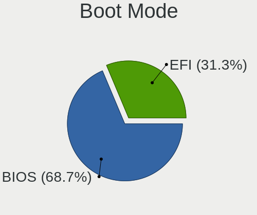
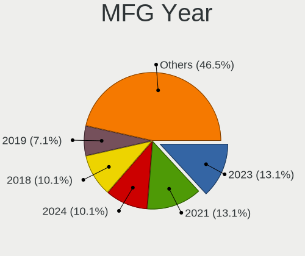
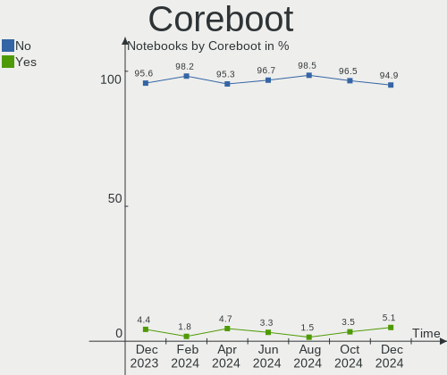
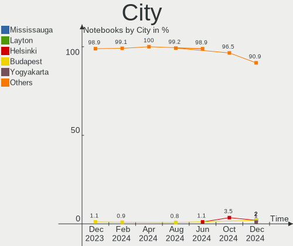
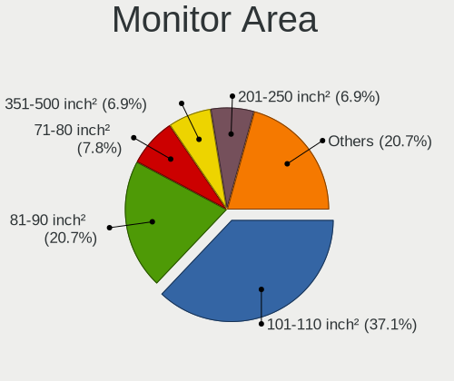
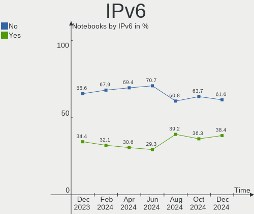

Pop!_OS - Hardware Trends (Notebooks)
-------------------------------------

A project to identify most popular hardware characteristics and track their change
over time based on data collected by Linux users at https://Linux-Hardware.org.

Anyone can contribute to this report by the [hw-probe](https://github.com/linuxhw/hw-probe) tool:

    sudo -E hw-probe -all -upload

This report is for one last month. Overall report since the beginning of time: [TestDays](https://github.com/linuxhw/TestDays)

Period: Aug, 2023.

Contents
--------

* [ System ](#system)
  - [ OS                       ](#os)
  - [ OS Family                ](#os-family)
  - [ Kernel                   ](#kernel)
  - [ Kernel Family            ](#kernel-family)
  - [ Kernel Major Ver.        ](#kernel-major-ver)
  - [ Arch                     ](#arch)
  - [ DE                       ](#de)
  - [ Display Server           ](#display-server)
  - [ Display Manager          ](#display-manager)
  - [ OS Lang                  ](#os-lang)
  - [ Boot Mode                ](#boot-mode)
  - [ Filesystem               ](#filesystem)
  - [ Part. scheme             ](#part-scheme)
  - [ Dual Boot with Linux/BSD ](#dual-boot-with-linuxbsd)
  - [ Dual Boot (Win)          ](#dual-boot-win)

* [ Board ](#board)
  - [ Vendor                   ](#vendor)
  - [ Model                    ](#model)
  - [ Model Family             ](#model-family)
  - [ MFG Year                 ](#mfg-year)
  - [ Form Factor              ](#form-factor)
  - [ Secure Boot              ](#secure-boot)
  - [ Coreboot                 ](#coreboot)
  - [ RAM Size                 ](#ram-size)
  - [ RAM Used                 ](#ram-used)
  - [ Total Drives             ](#total-drives)
  - [ Has CD-ROM               ](#has-cd-rom)
  - [ Has Ethernet             ](#has-ethernet)
  - [ Has WiFi                 ](#has-wifi)
  - [ Has Bluetooth            ](#has-bluetooth)

* [ Location ](#location)
  - [ Country                  ](#country)
  - [ City                     ](#city)

* [ Drives ](#drives)
  - [ Drive Vendor             ](#drive-vendor)
  - [ Drive Model              ](#drive-model)
  - [ HDD Vendor               ](#hdd-vendor)
  - [ SSD Vendor               ](#ssd-vendor)
  - [ Drive Kind               ](#drive-kind)
  - [ Drive Connector          ](#drive-connector)
  - [ Drive Size               ](#drive-size)
  - [ Space Total              ](#space-total)
  - [ Space Used               ](#space-used)
  - [ Malfunc. Drives          ](#malfunc-drives)
  - [ Malfunc. Drive Vendor    ](#malfunc-drive-vendor)
  - [ Malfunc. HDD Vendor      ](#malfunc-hdd-vendor)
  - [ Malfunc. Drive Kind      ](#malfunc-drive-kind)
  - [ Failed Drives            ](#failed-drives)
  - [ Failed Drive Vendor      ](#failed-drive-vendor)
  - [ Drive Status             ](#drive-status)

* [ Storage controller ](#storage-controller)
  - [ Storage Vendor           ](#storage-vendor)
  - [ Storage Model            ](#storage-model)
  - [ Storage Kind             ](#storage-kind)

* [ Processor ](#processor)
  - [ CPU Vendor               ](#cpu-vendor)
  - [ CPU Model                ](#cpu-model)
  - [ CPU Model Family         ](#cpu-model-family)
  - [ CPU Cores                ](#cpu-cores)
  - [ CPU Sockets              ](#cpu-sockets)
  - [ CPU Threads              ](#cpu-threads)
  - [ CPU Op-Modes             ](#cpu-op-modes)
  - [ CPU Microcode            ](#cpu-microcode)
  - [ CPU Microarch            ](#cpu-microarch)

* [ Graphics ](#graphics)
  - [ GPU Vendor               ](#gpu-vendor)
  - [ GPU Model                ](#gpu-model)
  - [ GPU Combo                ](#gpu-combo)
  - [ GPU Driver               ](#gpu-driver)
  - [ GPU Memory               ](#gpu-memory)

* [ Monitor ](#monitor)
  - [ Monitor Vendor           ](#monitor-vendor)
  - [ Monitor Model            ](#monitor-model)
  - [ Monitor Resolution       ](#monitor-resolution)
  - [ Monitor Diagonal         ](#monitor-diagonal)
  - [ Monitor Width            ](#monitor-width)
  - [ Aspect Ratio             ](#aspect-ratio)
  - [ Monitor Area             ](#monitor-area)
  - [ Pixel Density            ](#pixel-density)
  - [ Multiple Monitors        ](#multiple-monitors)

* [ Network ](#network)
  - [ Net Controller Vendor    ](#net-controller-vendor)
  - [ Net Controller Model     ](#net-controller-model)
  - [ Wireless Vendor          ](#wireless-vendor)
  - [ Wireless Model           ](#wireless-model)
  - [ Ethernet Vendor          ](#ethernet-vendor)
  - [ Ethernet Model           ](#ethernet-model)
  - [ Net Controller Kind      ](#net-controller-kind)
  - [ Used Controller          ](#used-controller)
  - [ NICs                     ](#nics)
  - [ IPv6                     ](#ipv6)

* [ Bluetooth ](#bluetooth)
  - [ Bluetooth Vendor         ](#bluetooth-vendor)
  - [ Bluetooth Model          ](#bluetooth-model)

* [ Sound ](#sound)
  - [ Sound Vendor             ](#sound-vendor)
  - [ Sound Model              ](#sound-model)

* [ Memory ](#memory)
  - [ Memory Vendor            ](#memory-vendor)
  - [ Memory Model             ](#memory-model)
  - [ Memory Kind              ](#memory-kind)
  - [ Memory Form Factor       ](#memory-form-factor)
  - [ Memory Size              ](#memory-size)
  - [ Memory Speed             ](#memory-speed)

* [ Printers & scanners ](#printers--scanners)
  - [ Printer Vendor           ](#printer-vendor)
  - [ Printer Model            ](#printer-model)
  - [ Scanner Vendor           ](#scanner-vendor)
  - [ Scanner Model            ](#scanner-model)

* [ Camera ](#camera)
  - [ Camera Vendor            ](#camera-vendor)
  - [ Camera Model             ](#camera-model)

* [ Security ](#security)
  - [ Fingerprint Vendor       ](#fingerprint-vendor)
  - [ Fingerprint Model        ](#fingerprint-model)
  - [ Chipcard Vendor          ](#chipcard-vendor)
  - [ Chipcard Model           ](#chipcard-model)

* [ Unsupported ](#unsupported)
  - [ Unsupported Devices      ](#unsupported-devices)
  - [ Unsupported Device Types ](#unsupported-device-types)

System
------

OS
--

Installed operating systems

| Name          | Notebooks | Percent |
|---------------|-----------|---------|
| Pop!_OS 22.04 | 115       | 96.64%  |
| Pop!_OS 20.04 | 3         | 2.52%   |
| Pop!_OS 20.10 | 1         | 0.84%   |

OS Family
---------

OS without a version

| Name    | Notebooks | Percent |
|---------|-----------|---------|
| Pop!_OS | 119       | 100%    |

Kernel
------

Version of the Linux kernel

| Version                  | Notebooks | Percent |
|--------------------------|-----------|---------|
| 6.4.6-76060406-generic   | 75        | 63.03%  |
| 6.2.6-76060206-generic   | 36        | 30.25%  |
| 6.0.12-76060012-generic  | 3         | 2.52%   |
| 6.0.12-76060006-generic  | 2         | 1.68%   |
| 6.4.0-060400-generic     | 1         | 0.84%   |
| 5.16.19-76051619-generic | 1         | 0.84%   |
| 5.11.0-7620-generic      | 1         | 0.84%   |

Kernel Family
-------------

Linux kernel without a distro release

| Version | Notebooks | Percent |
|---------|-----------|---------|
| 6.4.6   | 75        | 63.03%  |
| 6.2.6   | 36        | 30.25%  |
| 6.0.12  | 5         | 4.2%    |
| 6.4.0   | 1         | 0.84%   |
| 5.16.19 | 1         | 0.84%   |
| 5.11.0  | 1         | 0.84%   |

Kernel Major Ver.
-----------------

Linux kernel major version

| Version | Notebooks | Percent |
|---------|-----------|---------|
| 6.4     | 76        | 63.87%  |
| 6.2     | 36        | 30.25%  |
| 6.0     | 5         | 4.2%    |
| 5.16    | 1         | 0.84%   |
| 5.11    | 1         | 0.84%   |

Arch
----

OS architecture (x86_64, i586, etc.)

| Name   | Notebooks | Percent |
|--------|-----------|---------|
| x86_64 | 119       | 100%    |

DE
--

Desktop Environment

| Name       | Notebooks | Percent |
|------------|-----------|---------|
| GNOME      | 114       | 95.8%   |
| X-Cinnamon | 1         | 0.84%   |
| LXQt       | 1         | 0.84%   |
| KDE5       | 1         | 0.84%   |
| i3         | 1         | 0.84%   |
| Unknown    | 1         | 0.84%   |

Display Server
--------------

X11 or Wayland

| Name    | Notebooks | Percent |
|---------|-----------|---------|
| X11     | 111       | 93.28%  |
| Wayland | 8         | 6.72%   |

Display Manager
---------------

SDDM, LightDM, etc.

| Name    | Notebooks | Percent |
|---------|-----------|---------|
| Unknown | 95        | 79.83%  |
| GDM3    | 23        | 19.33%  |
| GDM     | 1         | 0.84%   |

OS Lang
-------

Language

| Lang    | Notebooks | Percent |
|---------|-----------|---------|
| en_US   | 75        | 63.03%  |
| pt_BR   | 7         | 5.88%   |
| fr_FR   | 5         | 4.2%    |
| de_DE   | 5         | 4.2%    |
| es_ES   | 4         | 3.36%   |
| en_GB   | 4         | 3.36%   |
| en_CA   | 3         | 2.52%   |
| C       | 3         | 2.52%   |
| ru_RU   | 2         | 1.68%   |
| uk_UA   | 1         | 0.84%   |
| sv_SE   | 1         | 0.84%   |
| sk_SK   | 1         | 0.84%   |
| pt_PT   | 1         | 0.84%   |
| nl_NL   | 1         | 0.84%   |
| es_PY   | 1         | 0.84%   |
| es_MX   | 1         | 0.84%   |
| en_AU   | 1         | 0.84%   |
| en_AG   | 1         | 0.84%   |
| cs_CZ   | 1         | 0.84%   |
| Unknown | 1         | 0.84%   |

Boot Mode
---------

EFI or BIOS

| Mode | Notebooks | Percent |
|------|-----------|---------|
| BIOS | 95        | 79.83%  |
| EFI  | 24        | 20.17%  |

Filesystem
----------

Type of filesystem

| Type    | Notebooks | Percent |
|---------|-----------|---------|
| Ext4    | 117       | 98.32%  |
| Overlay | 1         | 0.84%   |
| Btrfs   | 1         | 0.84%   |

Part. scheme
------------

Scheme of partitioning

| Type    | Notebooks | Percent |
|---------|-----------|---------|
| Unknown | 94        | 78.99%  |
| GPT     | 23        | 19.33%  |
| MBR     | 2         | 1.68%   |

Dual Boot with Linux/BSD
------------------------

Hosting more than one Linux/BSD

| Dual boot | Notebooks | Percent |
|-----------|-----------|---------|
| No        | 117       | 98.32%  |
| Yes       | 2         | 1.68%   |

Dual Boot (Win)
---------------

Hosting Linux and Windows

| Dual boot | Notebooks | Percent |
|-----------|-----------|---------|
| No        | 112       | 94.12%  |
| Yes       | 7         | 5.88%   |

Board
-----

Vendor
------

Motherboard manufacturer

| Name                | Notebooks | Percent |
|---------------------|-----------|---------|
| Lenovo              | 26        | 21.85%  |
| Hewlett-Packard     | 17        | 14.29%  |
| Dell                | 17        | 14.29%  |
| ASUSTek Computer    | 14        | 11.76%  |
| Apple               | 11        | 9.24%   |
| System76            | 9         | 7.56%   |
| Acer                | 9         | 7.56%   |
| MSI                 | 4         | 3.36%   |
| Samsung Electronics | 2         | 1.68%   |
| Google              | 2         | 1.68%   |
| Toshiba             | 1         | 0.84%   |
| Timi                | 1         | 0.84%   |
| Notebook            | 1         | 0.84%   |
| GPU Company         | 1         | 0.84%   |
| Framework           | 1         | 0.84%   |
| Clevo               | 1         | 0.84%   |
| Alienware           | 1         | 0.84%   |
| A-DATA Technology   | 1         | 0.84%   |

Model
-----

Motherboard model

| Name                                  | Notebooks | Percent |
|---------------------------------------|-----------|---------|
| System76 Oryx Pro                     | 2         | 1.68%   |
| System76 Darter Pro                   | 2         | 1.68%   |
| MSI Modern 15 A5M                     | 2         | 1.68%   |
| HP ProBook 4730s                      | 2         | 1.68%   |
| Apple MacBookPro11,3                  | 2         | 1.68%   |
| Toshiba Satellite L655                | 1         | 0.84%   |
| Timi RedmiBook Pro 15S                | 1         | 0.84%   |
| System76 Lemur Pro                    | 1         | 0.84%   |
| System76 Kudu Pro                     | 1         | 0.84%   |
| System76 Gazelle                      | 1         | 0.84%   |
| System76 Galago Pro                   | 1         | 0.84%   |
| System76 Bonobo WS                    | 1         | 0.84%   |
| Samsung 750TDA                        | 1         | 0.84%   |
| Samsung 270E5G/270E5U                 | 1         | 0.84%   |
| Notebook 1745                         | 1         | 0.84%   |
| MSI GP72 7RDX                         | 1         | 0.84%   |
| MSI GE60 2OC\2OD\2OE                  | 1         | 0.84%   |
| Lenovo Yoga Pro 9 14IRP8 83BU         | 1         | 0.84%   |
| Lenovo V15 G3 ABA 82TV                | 1         | 0.84%   |
| Lenovo ThinkPad X270 W10DG 20K5S08T00 | 1         | 0.84%   |
| Lenovo ThinkPad X13 Gen 2a 20XHCTO1WW | 1         | 0.84%   |
| Lenovo ThinkPad W541 20EGS0GY0R       | 1         | 0.84%   |
| Lenovo ThinkPad W520 427637U          | 1         | 0.84%   |
| Lenovo ThinkPad T480s 20L7CTO1WW      | 1         | 0.84%   |
| Lenovo ThinkPad T470p 20J7S0CF00      | 1         | 0.84%   |
| Lenovo ThinkPad T460s 20FAS2RV0G      | 1         | 0.84%   |
| Lenovo ThinkPad T460 20FMS05K05       | 1         | 0.84%   |
| Lenovo ThinkPad T450 20BUS0B000       | 1         | 0.84%   |
| Lenovo ThinkPad T430s 2356CU8         | 1         | 0.84%   |
| Lenovo ThinkPad P16 Gen 1 21D6CTO1WW  | 1         | 0.84%   |
| Lenovo ThinkPad L13 20R3CTO1WW        | 1         | 0.84%   |
| Lenovo ThinkPad E15 Gen 3 20YHCTO1WW  | 1         | 0.84%   |
| Lenovo Legion 5 17ACH6H 82JY          | 1         | 0.84%   |
| Lenovo Legion 5 15IMH 82CF            | 1         | 0.84%   |
| Lenovo Legion 5 15ARH7 82RE           | 1         | 0.84%   |
| Lenovo IdeaPad S540-15IWL GTX 81SW    | 1         | 0.84%   |
| Lenovo IdeaPad Gaming 3 15IMH05 82CG  | 1         | 0.84%   |
| Lenovo IdeaPad Gaming 3 15IAH7 82S9   | 1         | 0.84%   |
| Lenovo IdeaPad Gaming 3 15ARH7 82SB   | 1         | 0.84%   |
| Lenovo IdeaPad 5 14ABA7 82SE          | 1         | 0.84%   |

Model Family
------------

Motherboard model prefix

| Name                  | Notebooks | Percent |
|-----------------------|-----------|---------|
| Lenovo ThinkPad       | 13        | 10.92%  |
| Lenovo IdeaPad        | 6         | 5.04%   |
| HP ProBook            | 6         | 5.04%   |
| Dell Latitude         | 6         | 5.04%   |
| Acer Aspire           | 5         | 4.2%    |
| HP Pavilion           | 4         | 3.36%   |
| Dell XPS              | 4         | 3.36%   |
| Dell Precision        | 4         | 3.36%   |
| Lenovo Legion         | 3         | 2.52%   |
| HP EliteBook          | 3         | 2.52%   |
| ASUS Zenbook          | 3         | 2.52%   |
| ASUS ROG              | 3         | 2.52%   |
| Apple MacBookPro11    | 3         | 2.52%   |
| Acer Nitro            | 3         | 2.52%   |
| System76 Oryx         | 2         | 1.68%   |
| System76 Darter       | 2         | 1.68%   |
| MSI Modern            | 2         | 1.68%   |
| HP Victus             | 2         | 1.68%   |
| Dell Inspiron         | 2         | 1.68%   |
| ASUS Vivobook         | 2         | 1.68%   |
| ASUS ASUS             | 2         | 1.68%   |
| Toshiba Satellite     | 1         | 0.84%   |
| Timi RedmiBook        | 1         | 0.84%   |
| System76 Lemur        | 1         | 0.84%   |
| System76 Kudu         | 1         | 0.84%   |
| System76 Gazelle      | 1         | 0.84%   |
| System76 Galago       | 1         | 0.84%   |
| System76 Bonobo       | 1         | 0.84%   |
| Samsung 750TDA        | 1         | 0.84%   |
| Samsung 270E5G        | 1         | 0.84%   |
| Notebook 1745         | 1         | 0.84%   |
| MSI GP72              | 1         | 0.84%   |
| MSI GE60              | 1         | 0.84%   |
| Lenovo Yoga           | 1         | 0.84%   |
| Lenovo V15            | 1         | 0.84%   |
| Lenovo G50-80         | 1         | 0.84%   |
| Lenovo B490           | 1         | 0.84%   |
| HP Laptop             | 1         | 0.84%   |
| HP 250                | 1         | 0.84%   |
| GPU Company GWNR71517 | 1         | 0.84%   |

MFG Year
--------

Motherboard manufacture year

| Year | Notebooks | Percent |
|------|-----------|---------|
| 2022 | 18        | 15.13%  |
| 2021 | 17        | 14.29%  |
| 2018 | 10        | 8.4%    |
| 2013 | 10        | 8.4%    |
| 2011 | 8         | 6.72%   |
| 2023 | 7         | 5.88%   |
| 2020 | 7         | 5.88%   |
| 2019 | 7         | 5.88%   |
| 2016 | 7         | 5.88%   |
| 2012 | 7         | 5.88%   |
| 2014 | 6         | 5.04%   |
| 2017 | 5         | 4.2%    |
| 2015 | 5         | 4.2%    |
| 2010 | 3         | 2.52%   |
| 2009 | 2         | 1.68%   |

Form Factor
-----------

Physical design of the computer

| Name     | Notebooks | Percent |
|----------|-----------|---------|
| Notebook | 119       | 100%    |

Secure Boot
-----------

Enabled or disabled

| State    | Notebooks | Percent |
|----------|-----------|---------|
| Disabled | 119       | 100%    |

Coreboot
--------

Have coreboot on board

| Used | Notebooks | Percent |
|------|-----------|---------|
| No   | 111       | 93.28%  |
| Yes  | 8         | 6.72%   |

RAM Size
--------

Total RAM memory

| Size in GB  | Notebooks | Percent |
|-------------|-----------|---------|
| 4.01-8.0    | 29        | 24.37%  |
| 8.01-16.0   | 29        | 24.37%  |
| 16.01-24.0  | 26        | 21.85%  |
| 32.01-64.0  | 19        | 15.97%  |
| 3.01-4.0    | 12        | 10.08%  |
| 24.01-32.0  | 2         | 1.68%   |
| 64.01-256.0 | 2         | 1.68%   |

RAM Used
--------

Used RAM memory

| Used GB    | Notebooks | Percent |
|------------|-----------|---------|
| 4.01-8.0   | 44        | 36.97%  |
| 2.01-3.0   | 27        | 22.69%  |
| 3.01-4.0   | 26        | 21.85%  |
| 8.01-16.0  | 15        | 12.61%  |
| 16.01-24.0 | 4         | 3.36%   |
| 1.01-2.0   | 2         | 1.68%   |
| 24.01-32.0 | 1         | 0.84%   |

Total Drives
------------

Number of drives on board

| Drives | Notebooks | Percent |
|--------|-----------|---------|
| 1      | 85        | 71.43%  |
| 2      | 32        | 26.89%  |
| 4      | 1         | 0.84%   |
| 3      | 1         | 0.84%   |

Has CD-ROM
----------

Has CD-ROM on board

| Presented | Notebooks | Percent |
|-----------|-----------|---------|
| No        | 92        | 77.31%  |
| Yes       | 27        | 22.69%  |

Has Ethernet
------------

Has Ethernet on board

| Presented | Notebooks | Percent |
|-----------|-----------|---------|
| Yes       | 90        | 75.63%  |
| No        | 29        | 24.37%  |

Has WiFi
--------

Has WiFi module

| Presented | Notebooks | Percent |
|-----------|-----------|---------|
| Yes       | 119       | 100%    |

Has Bluetooth
-------------

Has Bluetooth module

| Presented | Notebooks | Percent |
|-----------|-----------|---------|
| Yes       | 102       | 85.71%  |
| No        | 17        | 14.29%  |

Location
--------

Country
-------

Geographic location (country)

| Country     | Notebooks | Percent |
|-------------|-----------|---------|
| USA         | 34        | 28.57%  |
| Brazil      | 10        | 8.4%    |
| Spain       | 7         | 5.88%   |
| Germany     | 6         | 5.04%   |
| Netherlands | 5         | 4.2%    |
| France      | 5         | 4.2%    |
| Canada      | 5         | 4.2%    |
| UK          | 4         | 3.36%   |
| Russia      | 4         | 3.36%   |
| Czechia     | 4         | 3.36%   |
| Sweden      | 3         | 2.52%   |
| India       | 3         | 2.52%   |
| Portugal    | 2         | 1.68%   |
| Poland      | 2         | 1.68%   |
| Norway      | 2         | 1.68%   |
| New Zealand | 2         | 1.68%   |
| Mexico      | 2         | 1.68%   |
| Bulgaria    | 2         | 1.68%   |
| Vietnam     | 1         | 0.84%   |
| Turkey      | 1         | 0.84%   |
| Slovakia    | 1         | 0.84%   |
| Singapore   | 1         | 0.84%   |
| Serbia      | 1         | 0.84%   |
| Romania     | 1         | 0.84%   |
| Philippines | 1         | 0.84%   |
| Paraguay    | 1         | 0.84%   |
| Kazakhstan  | 1         | 0.84%   |
| Iran        | 1         | 0.84%   |
| Indonesia   | 1         | 0.84%   |
| Denmark     | 1         | 0.84%   |
| Cambodia    | 1         | 0.84%   |
| Bangladesh  | 1         | 0.84%   |
| Australia   | 1         | 0.84%   |
| Argentina   | 1         | 0.84%   |
| Algeria     | 1         | 0.84%   |

City
----

Geographic location (city)

| City            | Notebooks | Percent |
|-----------------|-----------|---------|
| Sao Paulo       | 4         | 3.36%   |
| Prague          | 3         | 2.52%   |
| Madrid          | 3         | 2.52%   |
| Warsaw          | 2         | 1.68%   |
| Rotterdam       | 2         | 1.68%   |
| Moscow          | 2         | 1.68%   |
| Mexico City     | 2         | 1.68%   |
| Lenoir          | 2         | 1.68%   |
| Chennai         | 2         | 1.68%   |
| Yekaterinburg   | 1         | 0.84%   |
| Wuppertal       | 1         | 0.84%   |
| Westminster     | 1         | 0.84%   |
| West Bromwich   | 1         | 0.84%   |
| Visakhapatnam   | 1         | 0.84%   |
| Villeurbanne    | 1         | 0.84%   |
| Trondheim       | 1         | 0.84%   |
| Trnava          | 1         | 0.84%   |
| Torrelavega     | 1         | 0.84%   |
| Tomsk           | 1         | 0.84%   |
| Titusville      | 1         | 0.84%   |
| Tehran          | 1         | 0.84%   |
| Stockholm       | 1         | 0.84%   |
| Stevenson       | 1         | 0.84%   |
| Sragen          | 1         | 0.84%   |
| Sofia           | 1         | 0.84%   |
| Singapore       | 1         | 0.84%   |
| Simcoe          | 1         | 0.84%   |
| Silver Spring   | 1         | 0.84%   |
| Schiltigheim    | 1         | 0.84%   |
| Saskatoon       | 1         | 0.84%   |
| Santa Maria     | 1         | 0.84%   |
| San Jose        | 1         | 0.84%   |
| Salt Lake City  | 1         | 0.84%   |
| Safety Harbor   | 1         | 0.84%   |
| Rosny-sous-Bois | 1         | 0.84%   |
| Rennes          | 1         | 0.84%   |
| Recife          | 1         | 0.84%   |
| Queluz          | 1         | 0.84%   |
| Port Charlotte  | 1         | 0.84%   |
| Plovdiv         | 1         | 0.84%   |

Drives
------

Drive Vendor
------------

Hard drive vendors

| Vendor                    | Notebooks | Drives | Percent |
|---------------------------|-----------|--------|---------|
| Samsung Electronics       | 28        | 34     | 18.79%  |
| SanDisk                   | 14        | 15     | 9.4%    |
| WDC                       | 10        | 10     | 6.71%   |
| SK hynix                  | 9         | 10     | 6.04%   |
| Kingston                  | 9         | 9      | 6.04%   |
| Intel                     | 9         | 9      | 6.04%   |
| Seagate                   | 8         | 8      | 5.37%   |
| Toshiba                   | 7         | 7      | 4.7%    |
| Micron Technology         | 6         | 6      | 4.03%   |
| Apple                     | 6         | 6      | 4.03%   |
| Crucial                   | 5         | 5      | 3.36%   |
| Unknown                   | 4         | 4      | 2.68%   |
| KIOXIA                    | 4         | 4      | 2.68%   |
| Team                      | 3         | 3      | 2.01%   |
| HGST                      | 3         | 3      | 2.01%   |
| Micron/Crucial Technology | 2         | 2      | 1.34%   |
| A-DATA Technology         | 2         | 2      | 1.34%   |
| XrayDisk                  | 1         | 1      | 0.67%   |
| XPG                       | 1         | 1      | 0.67%   |
| Wibtek                    | 1         | 1      | 0.67%   |
| Union Memory (Shenzhen)   | 1         | 1      | 0.67%   |
| StoreJet                  | 1         | 1      | 0.67%   |
| Solid State Storage       | 1         | 1      | 0.67%   |
| Smartbuy                  | 1         | 1      | 0.67%   |
| Phison Electronics        | 1         | 1      | 0.67%   |
| PHD 3.0                   | 1         | 1      | 0.67%   |
| Netac                     | 1         | 1      | 0.67%   |
| Neo                       | 1         | 1      | 0.67%   |
| LITEONIT                  | 1         | 1      | 0.67%   |
| Kingmax                   | 1         | 1      | 0.67%   |
| JMicron Technology        | 1         | 1      | 0.67%   |
| Intenso                   | 1         | 1      | 0.67%   |
| HS-SSD-E100N              | 1         | 1      | 0.67%   |
| Hitachi                   | 1         | 1      | 0.67%   |
| Apacer                    | 1         | 1      | 0.67%   |
| ADATA Technology          | 1         | 1      | 0.67%   |
| ADATA SU                  | 1         | 1      | 0.67%   |

Drive Model
-----------

Hard drive models

| Model                                                 | Notebooks | Percent |
|-------------------------------------------------------|-----------|---------|
| Samsung NVMe SSD Controller SM981/PM981/PM983 500GB   | 4         | 2.65%   |
| Samsung NVMe SSD Controller PM9A1/PM9A3/980PRO 1024GB | 4         | 2.65%   |
| Intel SSDPEKNU512GZ 512GB                             | 4         | 2.65%   |
| Unknown MMC Card  32GB                                | 2         | 1.32%   |
| SK hynix SKHynix_HFS001TEJ9X115N 1TB                  | 2         | 1.32%   |
| Sandisk WDC WDS240G2G0C-00AJM0 240GB                  | 2         | 1.32%   |
| Sandisk WD Blue SN570 1TB                             | 2         | 1.32%   |
| SanDisk NVMe SSD Drive 1TB                            | 2         | 1.32%   |
| Samsung SSD 870 EVO 500GB                             | 2         | 1.32%   |
| Samsung SSD 850 EVO 500GB                             | 2         | 1.32%   |
| Micron/Crucial P2 NVMe PCIe SSD 1TB                   | 2         | 1.32%   |
| Kingston SA400S37480G 480GB SSD                       | 2         | 1.32%   |
| Kingston OM8PCP3512F-AI1 512GB                        | 2         | 1.32%   |
| Intel SSD 660P Series 512GB                           | 2         | 1.32%   |
| XrayDisk 256GB                                        | 1         | 0.66%   |
| XPG GAMMIX S50 Lite 512GB                             | 1         | 0.66%   |
| Wibtek W800S 512GB SSD                                | 1         | 0.66%   |
| WDC WDS240G2G0C-00AJM0 240GB                          | 1         | 0.66%   |
| WDC WDS240G2G0B-00EPW0 240GB SSD                      | 1         | 0.66%   |
| WDC WDS100T2B0C-00PXH0 1TB                            | 1         | 0.66%   |
| WDC WDBNCE5000PNC 500GB SSD                           | 1         | 0.66%   |
| WDC WD7500BPVT-80HXZT3 752GB                          | 1         | 0.66%   |
| WDC WD6400BPVT-60HXZT1 640GB                          | 1         | 0.66%   |
| WDC WD5000LPVX-22V0TT0 500GB                          | 1         | 0.66%   |
| WDC WD2500BEVT-60ZCT1 250GB                           | 1         | 0.66%   |
| WDC WD10JPCX-24UE4T0 1TB                              | 1         | 0.66%   |
| WDC PC SN730 SDBPNTY-512G-1101 512GB                  | 1         | 0.66%   |
| Unknown MMC Card  64GB                                | 1         | 0.66%   |
| Unknown MMC Card  128GB                               | 1         | 0.66%   |
| Union Memory (Shenzhen) RPFTJ128PDD2EWX 128GB         | 1         | 0.66%   |
| Toshiba XG6 NVMe SSD Controller 1024GB                | 1         | 0.66%   |
| Toshiba THNSNH128GMCT 128GB SSD                       | 1         | 0.66%   |
| Toshiba MQ04ABF100 1TB                                | 1         | 0.66%   |
| Toshiba MQ01ACF050 500GB                              | 1         | 0.66%   |
| Toshiba MQ01ABD100 1TB                                | 1         | 0.66%   |
| Toshiba MK5076GSX 500GB                               | 1         | 0.66%   |
| Toshiba KXG50ZNV1T02 NVMe 1024GB                      | 1         | 0.66%   |
| Team TM8FP6512G 512GB                                 | 1         | 0.66%   |
| Team T253X1120G 120GB SSD                             | 1         | 0.66%   |
| Team L7 EVO SSD 240GB                                 | 1         | 0.66%   |

HDD Vendor
----------

Hard disk drive vendors

| Vendor   | Notebooks | Drives | Percent |
|----------|-----------|--------|---------|
| Seagate  | 8         | 8      | 34.78%  |
| WDC      | 5         | 5      | 21.74%  |
| Toshiba  | 4         | 4      | 17.39%  |
| HGST     | 3         | 3      | 13.04%  |
| StoreJet | 1         | 1      | 4.35%   |
| PHD 3.0  | 1         | 1      | 4.35%   |
| Hitachi  | 1         | 1      | 4.35%   |

SSD Vendor
----------

Solid state drive vendors

| Vendor              | Notebooks | Drives | Percent |
|---------------------|-----------|--------|---------|
| Samsung Electronics | 10        | 11     | 20%     |
| Kingston            | 6         | 6      | 12%     |
| Crucial             | 5         | 5      | 10%     |
| Apple               | 5         | 5      | 10%     |
| SanDisk             | 4         | 4      | 8%      |
| WDC                 | 2         | 2      | 4%      |
| Team                | 2         | 2      | 4%      |
| Micron Technology   | 2         | 2      | 4%      |
| A-DATA Technology   | 2         | 2      | 4%      |
| Wibtek              | 1         | 1      | 2%      |
| Toshiba             | 1         | 1      | 2%      |
| Smartbuy            | 1         | 1      | 2%      |
| SK hynix            | 1         | 1      | 2%      |
| Netac               | 1         | 1      | 2%      |
| Neo                 | 1         | 1      | 2%      |
| LITEONIT            | 1         | 1      | 2%      |
| Kingmax             | 1         | 1      | 2%      |
| JMicron Technology  | 1         | 1      | 2%      |
| Intenso             | 1         | 1      | 2%      |
| Apacer              | 1         | 1      | 2%      |
| ADATA SU            | 1         | 1      | 2%      |

Drive Kind
----------

HDD or SSD

| Kind    | Notebooks | Drives | Percent |
|---------|-----------|--------|---------|
| NVMe    | 65        | 77     | 47.1%   |
| SSD     | 45        | 51     | 32.61%  |
| HDD     | 22        | 23     | 15.94%  |
| MMC     | 4         | 4      | 2.9%    |
| Unknown | 2         | 2      | 1.45%   |

Drive Connector
---------------

SATA, SAS, NVMe, etc.

| Type | Notebooks | Drives | Percent |
|------|-----------|--------|---------|
| NVMe | 65        | 77     | 48.87%  |
| SATA | 60        | 72     | 45.11%  |
| SAS  | 4         | 4      | 3.01%   |
| MMC  | 4         | 4      | 3.01%   |

Drive Size
----------

Size of hard drive

| Size in TB | Notebooks | Drives | Percent |
|------------|-----------|--------|---------|
| 0.01-0.5   | 45        | 53     | 68.18%  |
| 0.51-1.0   | 17        | 17     | 25.76%  |
| 1.01-2.0   | 4         | 4      | 6.06%   |

Space Total
-----------

Amount of disk space available on the file system

| Size in GB     | Notebooks | Percent |
|----------------|-----------|---------|
| 251-500        | 40        | 33.61%  |
| 101-250        | 34        | 28.57%  |
| 501-1000       | 22        | 18.49%  |
| 1001-2000      | 11        | 9.24%   |
| 2001-3000      | 4         | 3.36%   |
| 21-50          | 3         | 2.52%   |
| 1-20           | 2         | 1.68%   |
| More than 3000 | 1         | 0.84%   |
| 51-100         | 1         | 0.84%   |
| Unknown        | 1         | 0.84%   |

Space Used
----------

Amount of used disk space

| Used GB   | Notebooks | Percent |
|-----------|-----------|---------|
| 1-20      | 33        | 27.73%  |
| 21-50     | 23        | 19.33%  |
| 101-250   | 20        | 16.81%  |
| 51-100    | 18        | 15.13%  |
| 251-500   | 13        | 10.92%  |
| 501-1000  | 7         | 5.88%   |
| 1001-2000 | 4         | 3.36%   |
| Unknown   | 1         | 0.84%   |

Malfunc. Drives
---------------

Drive models with a malfunction

| Model                                 | Notebooks | Drives | Percent |
|---------------------------------------|-----------|--------|---------|
| WDC WD5000LPVX-22V0TT0 500GB          | 1         | 1      | 33.33%  |
| SK hynix HFS128G39TND-N210A 128GB SSD | 1         | 1      | 33.33%  |
| Intel SSDPEKKF512G7L 512GB            | 1         | 1      | 33.33%  |

Malfunc. Drive Vendor
---------------------

Vendors of faulty drives

| Vendor   | Notebooks | Drives | Percent |
|----------|-----------|--------|---------|
| WDC      | 1         | 1      | 33.33%  |
| SK hynix | 1         | 1      | 33.33%  |
| Intel    | 1         | 1      | 33.33%  |

Malfunc. HDD Vendor
-------------------

Vendors of faulty HDD drives

| Vendor | Notebooks | Drives | Percent |
|--------|-----------|--------|---------|
| WDC    | 1         | 1      | 100%    |

Malfunc. Drive Kind
-------------------

Kinds of faulty drives

| Kind | Notebooks | Drives | Percent |
|------|-----------|--------|---------|
| NVMe | 1         | 1      | 33.33%  |
| SSD  | 1         | 1      | 33.33%  |
| HDD  | 1         | 1      | 33.33%  |

Failed Drives
-------------

Failed drive models

Zero info for selected period =(

Failed Drive Vendor
-------------------

Failed drive vendors

Zero info for selected period =(

Drive Status
------------

Number of failed and malfunc. drives

| Status   | Notebooks | Drives | Percent |
|----------|-----------|--------|---------|
| Detected | 97        | 126    | 79.51%  |
| Works    | 22        | 28     | 18.03%  |
| Malfunc  | 3         | 3      | 2.46%   |

Storage controller
------------------

Storage Vendor
--------------

Storage controller vendors

| Vendor                         | Notebooks | Percent |
|--------------------------------|-----------|---------|
| Intel                          | 70        | 47.62%  |
| Samsung Electronics            | 21        | 14.29%  |
| SanDisk                        | 12        | 8.16%   |
| AMD                            | 12        | 8.16%   |
| SK hynix                       | 8         | 5.44%   |
| Micron Technology              | 4         | 2.72%   |
| KIOXIA                         | 4         | 2.72%   |
| Kingston Technology Company    | 3         | 2.04%   |
| Toshiba America Info Systems   | 2         | 1.36%   |
| Nvidia                         | 2         | 1.36%   |
| Micron/Crucial Technology      | 2         | 1.36%   |
| Union Memory (Shenzhen)        | 1         | 0.68%   |
| Solid State Storage Technology | 1         | 0.68%   |
| Shenzhen Longsys Electronics   | 1         | 0.68%   |
| Phison Electronics             | 1         | 0.68%   |
| Marvell Technology Group       | 1         | 0.68%   |
| Apple                          | 1         | 0.68%   |
| ADATA Technology               | 1         | 0.68%   |

Storage Model
-------------

Storage controller models

| Model                                                                          | Notebooks | Percent |
|--------------------------------------------------------------------------------|-----------|---------|
| AMD FCH SATA Controller [AHCI mode]                                            | 11        | 7.19%   |
| Samsung NVMe SSD Controller SM981/PM981/PM983                                  | 8         | 5.23%   |
| Intel 7 Series Chipset Family 6-port SATA Controller [AHCI mode]               | 7         | 4.58%   |
| Intel 6 Series/C200 Series Chipset Family 6 port Mobile SATA AHCI Controller   | 7         | 4.58%   |
| Samsung NVMe SSD Controller PM9A1/PM9A3/980PRO                                 | 6         | 3.92%   |
| Intel Volume Management Device NVMe RAID Controller                            | 6         | 3.92%   |
| Intel Sunrise Point-LP SATA Controller [AHCI mode]                             | 6         | 3.92%   |
| Intel SSD 670p Series [Keystone Harbor]                                        | 5         | 3.27%   |
| Intel 8 Series/C220 Series Chipset Family 6-port SATA Controller 1 [AHCI mode] | 5         | 3.27%   |
| SK hynix Platinum P41/PC801 NVMe Solid State Drive                             | 4         | 2.61%   |
| Intel Cannon Point-LP SATA Controller [AHCI Mode]                              | 4         | 2.61%   |
| Intel Cannon Lake Mobile PCH SATA AHCI Controller                              | 4         | 2.61%   |
| Intel 8 Series SATA Controller 1 [AHCI mode]                                   | 4         | 2.61%   |
| Intel 400 Series Chipset Family SATA AHCI Controller                           | 4         | 2.61%   |
| SK hynix Gold P31/BC711/PC711 NVMe Solid State Drive                           | 3         | 1.96%   |
| SanDisk WD Blue SN550 NVMe SSD                                                 | 3         | 1.96%   |
| Samsung NVMe SSD Controller 980                                                | 3         | 1.96%   |
| Intel Wildcat Point-LP SATA Controller [AHCI Mode]                             | 3         | 1.96%   |
| SanDisk WD PC SN810 / Black SN850 NVMe SSD                                     | 2         | 1.31%   |
| SanDisk WD Green SN350 NVMe SSD 240GB (DRAM-less)                              | 2         | 1.31%   |
| SanDisk WD Blue SN570 NVMe SSD 1TB                                             | 2         | 1.31%   |
| Samsung S4LN053X01 AHCI SSD Controller(Apple slot)                             | 2         | 1.31%   |
| Samsung NVMe SSD Controller SM961/PM961/SM963                                  | 2         | 1.31%   |
| Micron/Crucial P2 [Nick P2] / P3 / P3 Plus NVMe PCIe SSD (DRAM-less)           | 2         | 1.31%   |
| Micron 2450 NVMe SSD [HendrixV] (DRAM-less)                                    | 2         | 1.31%   |
| KIOXIA NVMe SSD Controller BG5 (DRAM-less)                                     | 2         | 1.31%   |
| KIOXIA NVMe SSD Controller BG4 (DRAM-less)                                     | 2         | 1.31%   |
| Kingston Company OM8PCP Design-In PCIe 3 NVMe SSD (DRAM-less)                  | 2         | 1.31%   |
| Intel SSD 660P Series                                                          | 2         | 1.31%   |
| Intel Q170/Q150/B150/H170/H110/Z170/CM236 Chipset SATA Controller [AHCI Mode]  | 2         | 1.31%   |
| Intel HM170/QM170 Chipset SATA Controller [AHCI Mode]                          | 2         | 1.31%   |
| Intel 82801 Mobile SATA Controller [RAID mode]                                 | 2         | 1.31%   |
| Intel 5 Series/3400 Series Chipset 4 port SATA AHCI Controller                 | 2         | 1.31%   |
| Union Memory (Shenzhen) AM610 PCIe 3.0 NVMe SSD 128GB                          | 1         | 0.65%   |
| Toshiba America Info Systems XG6 NVMe SSD Controller                           | 1         | 0.65%   |
| Toshiba America Info Systems XG5 NVMe SSD Controller                           | 1         | 0.65%   |
| Solid State Storage CL1-3D256-Q11 NVMe SSD M.2                                 | 1         | 0.65%   |
| SK hynix BC511 NVMe SSD                                                        | 1         | 0.65%   |
| Shenzhen Longsys Lexar NM620 NVME SSD (DRAM-less)                              | 1         | 0.65%   |
| SanDisk WD Black SN770 / PC SN740 256GB / PC SN560 (DRAM-less) NVMe SSD        | 1         | 0.65%   |

Storage Kind
------------

Kind of storage controller (IDE, SATA, NVMe, SAS, ...)

| Kind | Notebooks | Percent |
|------|-----------|---------|
| SATA | 72        | 48.98%  |
| NVMe | 65        | 44.22%  |
| RAID | 9         | 6.12%   |
| IDE  | 1         | 0.68%   |

Processor
---------

CPU Vendor
----------

Processor vendors

| Vendor | Notebooks | Percent |
|--------|-----------|---------|
| Intel  | 92        | 77.31%  |
| AMD    | 27        | 22.69%  |

CPU Model
---------

Processor models

| Model                                   | Notebooks | Percent |
|-----------------------------------------|-----------|---------|
| Intel Core i5-6300U CPU @ 2.40GHz       | 4         | 3.36%   |
| Intel 11th Gen Core i7-1165G7 @ 2.80GHz | 4         | 3.36%   |
| Intel Core i7-9750H CPU @ 2.60GHz       | 3         | 2.52%   |
| Intel Core i7-8750H CPU @ 2.20GHz       | 3         | 2.52%   |
| Intel Core i5-2430M CPU @ 2.40GHz       | 3         | 2.52%   |
| Intel 12th Gen Core i5-1240P            | 3         | 2.52%   |
| AMD Ryzen 7 5700U with Radeon Graphics  | 3         | 2.52%   |
| Intel Core i7-8550U CPU @ 1.80GHz       | 2         | 1.68%   |
| Intel Core i7-7820HQ CPU @ 2.90GHz      | 2         | 1.68%   |
| Intel Core i7-7700HQ CPU @ 2.80GHz      | 2         | 1.68%   |
| Intel Core i7-4850HQ CPU @ 2.30GHz      | 2         | 1.68%   |
| Intel Core i7-4810MQ CPU @ 2.80GHz      | 2         | 1.68%   |
| Intel Core i7-4700MQ CPU @ 2.40GHz      | 2         | 1.68%   |
| Intel Core i7-10750H CPU @ 2.60GHz      | 2         | 1.68%   |
| Intel Core i5-8265U CPU @ 1.60GHz       | 2         | 1.68%   |
| Intel Core i5-2450M CPU @ 2.50GHz       | 2         | 1.68%   |
| Intel 11th Gen Core i7-11800H @ 2.30GHz | 2         | 1.68%   |
| AMD Ryzen 7 5800H with Radeon Graphics  | 2         | 1.68%   |
| AMD Ryzen 5 7520U with Radeon Graphics  | 2         | 1.68%   |
| AMD Ryzen 5 5625U with Radeon Graphics  | 2         | 1.68%   |
| AMD Ryzen 5 5600H with Radeon Graphics  | 2         | 1.68%   |
| Intel Pentium CPU P6200 @ 2.13GHz       | 1         | 0.84%   |
| Intel Pentium CPU N4200 @ 1.10GHz       | 1         | 0.84%   |
| Intel Core i9-10900K CPU @ 3.70GHz      | 1         | 0.84%   |
| Intel Core i7-8565U CPU @ 1.80GHz       | 1         | 0.84%   |
| Intel Core i7-6820HQ CPU @ 2.70GHz      | 1         | 0.84%   |
| Intel Core i7-6600U CPU @ 2.60GHz       | 1         | 0.84%   |
| Intel Core i7-5500U CPU @ 2.40GHz       | 1         | 0.84%   |
| Intel Core i7-4770HQ CPU @ 2.20GHz      | 1         | 0.84%   |
| Intel Core i7-4712MQ CPU @ 2.30GHz      | 1         | 0.84%   |
| Intel Core i7-4710MQ CPU @ 2.50GHz      | 1         | 0.84%   |
| Intel Core i7-3635QM CPU @ 2.40GHz      | 1         | 0.84%   |
| Intel Core i7-2720QM CPU @ 2.20GHz      | 1         | 0.84%   |
| Intel Core i7-2670QM CPU @ 2.20GHz      | 1         | 0.84%   |
| Intel Core i7-2635QM CPU @ 2.00GHz      | 1         | 0.84%   |
| Intel Core i7-10870H CPU @ 2.20GHz      | 1         | 0.84%   |
| Intel Core i7-10510U CPU @ 1.80GHz      | 1         | 0.84%   |
| Intel Core i5-9300H CPU @ 2.40GHz       | 1         | 0.84%   |
| Intel Core i5-8350U CPU @ 1.70GHz       | 1         | 0.84%   |
| Intel Core i5-8250U CPU @ 1.60GHz       | 1         | 0.84%   |

CPU Model Family
----------------

Processor model prefix

| Model            | Notebooks | Percent |
|------------------|-----------|---------|
| Intel Core i7    | 33        | 27.73%  |
| Intel Core i5    | 24        | 20.17%  |
| Other            | 21        | 17.65%  |
| AMD Ryzen 7      | 9         | 7.56%   |
| AMD Ryzen 5      | 9         | 7.56%   |
| Intel Core i3    | 6         | 5.04%   |
| Intel Celeron    | 3         | 2.52%   |
| AMD A8           | 3         | 2.52%   |
| Intel Pentium    | 2         | 1.68%   |
| Intel Core 2 Duo | 2         | 1.68%   |
| AMD Ryzen 7 PRO  | 2         | 1.68%   |
| Intel Core i9    | 1         | 0.84%   |
| AMD Ryzen 9      | 1         | 0.84%   |
| AMD E1           | 1         | 0.84%   |
| AMD Athlon X2    | 1         | 0.84%   |
| AMD A4           | 1         | 0.84%   |

CPU Cores
---------

Number of processor cores

| Number | Notebooks | Percent |
|--------|-----------|---------|
| 4      | 41        | 34.45%  |
| 2      | 37        | 31.09%  |
| 8      | 15        | 12.61%  |
| 6      | 13        | 10.92%  |
| 12     | 5         | 4.2%    |
| 14     | 3         | 2.52%   |
| 10     | 3         | 2.52%   |
| 24     | 1         | 0.84%   |
| 16     | 1         | 0.84%   |

CPU Sockets
-----------

Number of sockets

| Number | Notebooks | Percent |
|--------|-----------|---------|
| 1      | 119       | 100%    |

CPU Threads
-----------

Threads per core (Hyper-Threading)

| Number | Notebooks | Percent |
|--------|-----------|---------|
| 2      | 107       | 89.92%  |
| 1      | 12        | 10.08%  |

CPU Op-Modes
------------

CPU Operation Modes (32-bit, 64-bit)

| Op mode        | Notebooks | Percent |
|----------------|-----------|---------|
| 32-bit, 64-bit | 119       | 100%    |

CPU Microcode
-------------

Microcode number

| Number     | Notebooks | Percent |
|------------|-----------|---------|
| Unknown    | 111       | 93.28%  |
| 0x0a50000c | 2         | 1.68%   |
| 0x08608103 | 2         | 1.68%   |
| 0x306c3    | 1         | 0.84%   |
| 0x0a404102 | 1         | 0.84%   |
| 0x08608104 | 1         | 0.84%   |
| 0x0700010f | 1         | 0.84%   |

CPU Microarch
-------------

Microarchitecture

| Name             | Notebooks | Percent |
|------------------|-----------|---------|
| KabyLake         | 20        | 16.81%  |
| Unknown          | 20        | 16.81%  |
| Haswell          | 14        | 11.76%  |
| Zen 3            | 9         | 7.56%   |
| SandyBridge      | 9         | 7.56%   |
| Skylake          | 7         | 5.88%   |
| TigerLake        | 6         | 5.04%   |
| IvyBridge        | 6         | 5.04%   |
| CometLake        | 5         | 4.2%    |
| Alderlake Hybrid | 4         | 3.36%   |
| Broadwell        | 3         | 2.52%   |
| Zen+             | 2         | 1.68%   |
| Westmere         | 2         | 1.68%   |
| Penryn           | 2         | 1.68%   |
| Zen              | 1         | 0.84%   |
| Steamroller      | 1         | 0.84%   |
| Silvermont       | 1         | 0.84%   |
| Piledriver       | 1         | 0.84%   |
| K8 Hammer        | 1         | 0.84%   |
| K10 Llano        | 1         | 0.84%   |
| Jaguar           | 1         | 0.84%   |
| Goldmont plus    | 1         | 0.84%   |
| Goldmont         | 1         | 0.84%   |
| Excavator        | 1         | 0.84%   |

Graphics
--------

GPU Vendor
----------

Vendors of graphics cards

| Vendor | Notebooks | Percent |
|--------|-----------|---------|
| Intel  | 83        | 52.2%   |
| Nvidia | 40        | 25.16%  |
| AMD    | 36        | 22.64%  |

GPU Model
---------

Graphics card models

| Model                                                                     | Notebooks | Percent |
|---------------------------------------------------------------------------|-----------|---------|
| Intel 2nd Generation Core Processor Family Integrated Graphics Controller | 8         | 4.91%   |
| AMD Cezanne [Radeon Vega Series / Radeon Vega Mobile Series]              | 7         | 4.29%   |
| Intel TigerLake-LP GT2 [Iris Xe Graphics]                                 | 6         | 3.68%   |
| Intel Skylake GT2 [HD Graphics 520]                                       | 6         | 3.68%   |
| Intel CoffeeLake-H GT2 [UHD Graphics 630]                                 | 6         | 3.68%   |
| Intel Alder Lake-P Integrated Graphics Controller                         | 6         | 3.68%   |
| Intel 4th Gen Core Processor Integrated Graphics Controller               | 6         | 3.68%   |
| Intel 3rd Gen Core processor Graphics Controller                          | 6         | 3.68%   |
| Nvidia GA106M [GeForce RTX 3060 Mobile / Max-Q]                           | 5         | 3.07%   |
| Intel Haswell-ULT Integrated Graphics Controller                          | 5         | 3.07%   |
| Intel WhiskeyLake-U GT2 [UHD Graphics 620]                                | 4         | 2.45%   |
| Intel UHD Graphics 620                                                    | 4         | 2.45%   |
| AMD Lucienne                                                              | 4         | 2.45%   |
| Nvidia TU117M [GeForce GTX 1650 Mobile / Max-Q]                           | 3         | 1.84%   |
| Nvidia GA107M [GeForce RTX 3050 Mobile]                                   | 3         | 1.84%   |
| Intel HD Graphics 630                                                     | 3         | 1.84%   |
| Intel HD Graphics 5500                                                    | 3         | 1.84%   |
| Intel CometLake-H GT2 [UHD Graphics]                                      | 3         | 1.84%   |
| AMD Seymour [Radeon HD 6400M/7400M Series]                                | 3         | 1.84%   |
| AMD Rembrandt [Radeon 680M]                                               | 3         | 1.84%   |
| Nvidia TU117M                                                             | 2         | 1.23%   |
| Nvidia GP106M [GeForce GTX 1060 Mobile]                                   | 2         | 1.23%   |
| Nvidia GK107M [GeForce GT 750M Mac Edition]                               | 2         | 1.23%   |
| Nvidia GF117M [GeForce 610M/710M/810M/820M / GT 620M/625M/630M/720M]      | 2         | 1.23%   |
| Nvidia AD107M [GeForce RTX 4050 Max-Q / Mobile]                           | 2         | 1.23%   |
| Intel TigerLake-H GT1 [UHD Graphics]                                      | 2         | 1.23%   |
| Intel Raptor Lake-P [Iris Xe Graphics]                                    | 2         | 1.23%   |
| Intel Core Processor Integrated Graphics Controller                       | 2         | 1.23%   |
| Intel Alder Lake-UP3 GT2 [Iris Xe Graphics]                               | 2         | 1.23%   |
| AMD Picasso/Raven 2 [Radeon Vega Series / Radeon Vega Mobile Series]      | 2         | 1.23%   |
| AMD Opal XT [Radeon R7 M265/M365X/M465]                                   | 2         | 1.23%   |
| AMD Mendocino                                                             | 2         | 1.23%   |
| AMD Barcelo                                                               | 2         | 1.23%   |
| Nvidia TU116M [GeForce GTX 1660 Ti Mobile]                                | 1         | 0.61%   |
| Nvidia TU106M [GeForce RTX 2060 Mobile]                                   | 1         | 0.61%   |
| Nvidia TU104BM [GeForce RTX 2070 SUPER Mobile / Max-Q]                    | 1         | 0.61%   |
| Nvidia MCP89 [GeForce 320M]                                               | 1         | 0.61%   |
| Nvidia GP107M [GeForce GTX 1050 Ti Mobile]                                | 1         | 0.61%   |
| Nvidia GP104BM [GeForce GTX 1070 Mobile]                                  | 1         | 0.61%   |
| Nvidia GM108M [GeForce 940MX]                                             | 1         | 0.61%   |

GPU Combo
---------

Combinations of graphics cards

| Name           | Notebooks | Percent |
|----------------|-----------|---------|
| 1 x Intel      | 48        | 40.34%  |
| Intel + Nvidia | 26        | 21.85%  |
| 1 x AMD        | 19        | 15.97%  |
| 1 x Nvidia     | 8         | 6.72%   |
| Intel + AMD    | 8         | 6.72%   |
| AMD + Nvidia   | 6         | 5.04%   |
| 2 x AMD        | 3         | 2.52%   |
| 2 x Intel      | 1         | 0.84%   |

GPU Driver
----------

Free vs proprietary

| Driver      | Notebooks | Percent |
|-------------|-----------|---------|
| Free        | 90        | 75.63%  |
| Proprietary | 29        | 24.37%  |

GPU Memory
----------

Total video memory

| Size in GB | Notebooks | Percent |
|------------|-----------|---------|
| Unknown    | 108       | 90.76%  |
| 0.01-0.5   | 5         | 4.2%    |
| 1.01-2.0   | 3         | 2.52%   |
| 7.01-8.0   | 1         | 0.84%   |
| 5.01-6.0   | 1         | 0.84%   |
| 3.01-4.0   | 1         | 0.84%   |

Monitor
-------

Monitor Vendor
--------------

Monitor vendors

| Vendor                  | Notebooks | Percent |
|-------------------------|-----------|---------|
| Chimei Innolux          | 30        | 20%     |
| AU Optronics            | 23        | 15.33%  |
| BOE                     | 17        | 11.33%  |
| LG Display              | 13        | 8.67%   |
| Apple                   | 11        | 7.33%   |
| Samsung Electronics     | 10        | 6.67%   |
| Sharp                   | 7         | 4.67%   |
| Dell                    | 6         | 4%      |
| Lenovo                  | 4         | 2.67%   |
| Chi Mei Optoelectronics | 4         | 2.67%   |
| PANDA                   | 3         | 2%      |
| Goldstar                | 3         | 2%      |
| Iiyama                  | 2         | 1.33%   |
| Hewlett-Packard         | 2         | 1.33%   |
| ViewSonic               | 1         | 0.67%   |
| TMX                     | 1         | 0.67%   |
| RTK                     | 1         | 0.67%   |
| Plain Tree Systems      | 1         | 0.67%   |
| Panasonic               | 1         | 0.67%   |
| NEC Computers           | 1         | 0.67%   |
| MSI                     | 1         | 0.67%   |
| JRY                     | 1         | 0.67%   |
| HKC                     | 1         | 0.67%   |
| Gigabyte Technology     | 1         | 0.67%   |
| CSO                     | 1         | 0.67%   |
| BenQ                    | 1         | 0.67%   |
| AOC                     | 1         | 0.67%   |
| Ancor Communications    | 1         | 0.67%   |
| Acer                    | 1         | 0.67%   |

Monitor Model
-------------

Monitor models

| Model                                                                 | Notebooks | Percent |
|-----------------------------------------------------------------------|-----------|---------|
| Sharp LCD Monitor SHP1453 1920x1080 346x194mm 15.6-inch               | 2         | 1.31%   |
| PANDA LCD Monitor NCP004D 1920x1080 344x194mm 15.5-inch               | 2         | 1.31%   |
| LG Display LCD Monitor LGD027B 1600x900 382x215mm 17.3-inch           | 2         | 1.31%   |
| Goldstar HDR WFHD GSM7714 2560x1080 798x334mm 34.1-inch               | 2         | 1.31%   |
| Chimei Innolux LCD Monitor CMN15E7 1920x1080 344x193mm 15.5-inch      | 2         | 1.31%   |
| Chimei Innolux LCD Monitor CMN15DB 1366x768 344x193mm 15.5-inch       | 2         | 1.31%   |
| AU Optronics LCD Monitor AUO2E8D 1920x1080 344x194mm 15.5-inch        | 2         | 1.31%   |
| AU Optronics LCD Monitor AUO243D 1920x1080 310x170mm 13.9-inch        | 2         | 1.31%   |
| AU Optronics LCD Monitor AUO106C 1366x768 276x155mm 12.5-inch         | 2         | 1.31%   |
| Apple Color LCD APPA019 2880x1800 331x207mm 15.4-inch                 | 2         | 1.31%   |
| ViewSonic VP3481 VSC0938 3440x1440 797x333mm 34.0-inch                | 1         | 0.65%   |
| TMX TL156MDMP01-1 TMX1560 3200x2000 336x210mm 15.6-inch               | 1         | 0.65%   |
| Sharp LQ140M1JW49 SHP1523 1920x1080 309x174mm 14.0-inch               | 1         | 0.65%   |
| Sharp LCD Monitor SHP14F9 1920x1200 288x180mm 13.4-inch               | 1         | 0.65%   |
| Sharp LCD Monitor SHP14BA 1920x1080 340x190mm 15.3-inch               | 1         | 0.65%   |
| Sharp LCD Monitor SHP149A 1920x1080 344x194mm 15.5-inch               | 1         | 0.65%   |
| Sharp LCD Monitor SHP148B 3840x2160 294x165mm 13.3-inch               | 1         | 0.65%   |
| Samsung Electronics S24R35x SAM100E 1920x1080 521x293mm 23.5-inch     | 1         | 0.65%   |
| Samsung Electronics S22F350 SAM0D1A 1920x1080 477x268mm 21.5-inch     | 1         | 0.65%   |
| Samsung Electronics LF27T35 SAM707F 1920x1080 598x337mm 27.0-inch     | 1         | 0.65%   |
| Samsung Electronics LF24T35 SAM707D 1920x1080 528x297mm 23.9-inch     | 1         | 0.65%   |
| Samsung Electronics LCD Monitor SEC4252 1366x768 344x194mm 15.5-inch  | 1         | 0.65%   |
| Samsung Electronics LCD Monitor SEC364A 1366x768 344x194mm 15.5-inch  | 1         | 0.65%   |
| Samsung Electronics LCD Monitor SDC4852 1366x768 344x194mm 15.5-inch  | 1         | 0.65%   |
| Samsung Electronics LCD Monitor SDC4171 2880x1800 302x189mm 14.0-inch | 1         | 0.65%   |
| Samsung Electronics LCD Monitor SDC415F 3840x2160 344x194mm 15.5-inch | 1         | 0.65%   |
| Samsung Electronics LCD Monitor SAM0C39 1920x1080 885x498mm 40.0-inch | 1         | 0.65%   |
| Samsung Electronics C27F398 SAM0D44 1920x1080 598x336mm 27.0-inch     | 1         | 0.65%   |
| RTK LCD Monitor RTK1D1A 1920x1080 1020x570mm 46.0-inch                | 1         | 0.65%   |
| Plain Tree Systems Monitor PTS089A 1680x1050 474x296mm 22.0-inch      | 1         | 0.65%   |
| PANDA LCD Monitor NCP0040 1920x1080 344x194mm 15.5-inch               | 1         | 0.65%   |
| Panasonic TDM13O56 MEI96A2 3000x2000 285x190mm 13.5-inch              | 1         | 0.65%   |
| NEC Computers P403 NEC692B 1920x1080 886x498mm 40.0-inch              | 1         | 0.65%   |
| MSI G27CQ4 MSI3CB0 2560x1440 597x336mm 27.0-inch                      | 1         | 0.65%   |
| LG Display LCD Monitor LGD06AA 3840x2400 344x215mm 16.0-inch          | 1         | 0.65%   |
| LG Display LCD Monitor LGD0625 1920x1080 344x194mm 15.5-inch          | 1         | 0.65%   |
| LG Display LCD Monitor LGD05E5 1920x1080 344x194mm 15.5-inch          | 1         | 0.65%   |
| LG Display LCD Monitor LGD053F 1920x1080 344x194mm 15.5-inch          | 1         | 0.65%   |
| LG Display LCD Monitor LGD050B 1920x1080 309x174mm 14.0-inch          | 1         | 0.65%   |
| LG Display LCD Monitor LGD04FF 1920x1080 309x174mm 14.0-inch          | 1         | 0.65%   |

Monitor Resolution
------------------

Monitor screen resolution

| Resolution         | Notebooks | Percent |
|--------------------|-----------|---------|
| 1920x1080 (FHD)    | 70        | 50%     |
| 1366x768 (WXGA)    | 23        | 16.43%  |
| 2560x1440 (QHD)    | 7         | 5%      |
| 3840x2160 (4K)     | 6         | 4.29%   |
| 2880x1800          | 5         | 3.57%   |
| 1600x900 (HD+)     | 5         | 3.57%   |
| 1920x1200 (WUXGA)  | 4         | 2.86%   |
| 2560x1080          | 3         | 2.14%   |
| 1680x1050 (WSXGA+) | 3         | 2.14%   |
| 1280x800 (WXGA)    | 3         | 2.14%   |
| 3072x1920          | 2         | 1.43%   |
| 1440x900 (WXGA+)   | 2         | 1.43%   |
| 3840x2400          | 1         | 0.71%   |
| 3840x1100          | 1         | 0.71%   |
| 3440x1440          | 1         | 0.71%   |
| 3200x2000          | 1         | 0.71%   |
| 2560x1600          | 1         | 0.71%   |
| 2256x1504          | 1         | 0.71%   |
| 1280x1024 (SXGA)   | 1         | 0.71%   |

Monitor Diagonal
----------------

Diagonal size in inches

| Inches | Notebooks | Percent |
|--------|-----------|---------|
| 15     | 61        | 40.4%   |
| 13     | 23        | 15.23%  |
| 14     | 13        | 8.61%   |
| 17     | 12        | 7.95%   |
| 27     | 9         | 5.96%   |
| 16     | 5         | 3.31%   |
| 34     | 4         | 2.65%   |
| 24     | 4         | 2.65%   |
| 23     | 3         | 1.99%   |
| 12     | 3         | 1.99%   |
| 11     | 3         | 1.99%   |
| 31     | 2         | 1.32%   |
| 22     | 2         | 1.32%   |
| 21     | 2         | 1.32%   |
| 54     | 1         | 0.66%   |
| 46     | 1         | 0.66%   |
| 40     | 1         | 0.66%   |
| 20     | 1         | 0.66%   |
| 19     | 1         | 0.66%   |

Monitor Width
-------------

Physical width

| Width in mm | Notebooks | Percent |
|-------------|-----------|---------|
| 301-350     | 87        | 59.18%  |
| 201-300     | 19        | 12.93%  |
| 351-400     | 14        | 9.52%   |
| 501-600     | 13        | 8.84%   |
| 401-500     | 5         | 3.4%    |
| 701-800     | 4         | 2.72%   |
| 601-700     | 2         | 1.36%   |
| 1001-1500   | 2         | 1.36%   |
| 801-900     | 1         | 0.68%   |

Aspect Ratio
------------

Proportional relationship between the width and the height

| Ratio | Notebooks | Percent |
|-------|-----------|---------|
| 16/9  | 107       | 78.1%   |
| 16/10 | 23        | 16.79%  |
| 21/9  | 4         | 2.92%   |
| 5/4   | 1         | 0.73%   |
| 3/2   | 1         | 0.73%   |
| 3.40  | 1         | 0.73%   |

Monitor Area
------------

Area in inch

| Area in inch | Notebooks | Percent |
|----------------|-----------|---------|
| 101-110        | 62        | 41.33%  |
| 81-90          | 24        | 16%     |
| 121-130        | 11        | 7.33%   |
| 71-80          | 10        | 6.67%   |
| 301-350        | 9         | 6%      |
| 201-250        | 9         | 6%      |
| 351-500        | 6         | 4%      |
| 51-60          | 4         | 2.67%   |
| 111-120        | 4         | 2.67%   |
| 61-70          | 3         | 2%      |
| 151-200        | 2         | 1.33%   |
| 501-1000       | 2         | 1.33%   |
| More than 1000 | 1         | 0.67%   |
| 251-300        | 1         | 0.67%   |
| 131-140        | 1         | 0.67%   |
| 91-100         | 1         | 0.67%   |

Pixel Density
-------------

Pixels per inch

| Density       | Notebooks | Percent |
|---------------|-----------|---------|
| 121-160       | 72        | 48.65%  |
| 101-120       | 31        | 20.95%  |
| 51-100        | 21        | 14.19%  |
| 161-240       | 14        | 9.46%   |
| More than 240 | 8         | 5.41%   |
| 1-50          | 2         | 1.35%   |

Multiple Monitors
-----------------

Total monitors connected

| Total | Notebooks | Percent |
|-------|-----------|---------|
| 1     | 92        | 77.31%  |
| 2     | 21        | 17.65%  |
| 3     | 6         | 5.04%   |

Network
-------

Net Controller Vendor
---------------------

Controller vendors

| Vendor                          | Notebooks | Percent |
|---------------------------------|-----------|---------|
| Realtek Semiconductor           | 65        | 33.85%  |
| Intel                           | 63        | 32.81%  |
| Qualcomm Atheros                | 19        | 9.9%    |
| Broadcom                        | 16        | 8.33%   |
| MediaTek                        | 8         | 4.17%   |
| Broadcom Limited                | 3         | 1.56%   |
| ASIX Electronics                | 3         | 1.56%   |
| Xiaomi                          | 2         | 1.04%   |
| Samsung Electronics             | 2         | 1.04%   |
| Dell                            | 2         | 1.04%   |
| Ralink                          | 1         | 0.52%   |
| Qualcomm Atheros Communications | 1         | 0.52%   |
| Qualcomm                        | 1         | 0.52%   |
| OPPO Electronics                | 1         | 0.52%   |
| Nvidia                          | 1         | 0.52%   |
| Motorola PCS                    | 1         | 0.52%   |
| JMicron Technology              | 1         | 0.52%   |
| Hewlett-Packard                 | 1         | 0.52%   |
| Google                          | 1         | 0.52%   |

Net Controller Model
--------------------

Controller models

| Model                                                             | Notebooks | Percent |
|-------------------------------------------------------------------|-----------|---------|
| Realtek RTL8111/8168/8411 PCI Express Gigabit Ethernet Controller | 39        | 17.33%  |
| Realtek RTL8153 Gigabit Ethernet Adapter                          | 10        | 4.44%   |
| Intel Wireless 8260                                               | 7         | 3.11%   |
| Intel Alder Lake-P PCH CNVi WiFi                                  | 7         | 3.11%   |
| Intel Wi-Fi 6 AX201                                               | 6         | 2.67%   |
| MediaTek MT7921 802.11ax PCI Express Wireless Network Adapter     | 5         | 2.22%   |
| Intel Wireless 8265 / 8275                                        | 5         | 2.22%   |
| Intel Ethernet Connection I219-LM                                 | 5         | 2.22%   |
| Intel Comet Lake PCH CNVi WiFi                                    | 5         | 2.22%   |
| Realtek RTL8852BE PCIe 802.11ax Wireless Network Controller       | 4         | 1.78%   |
| Realtek RTL810xE PCI Express Fast Ethernet controller             | 4         | 1.78%   |
| Qualcomm Atheros QCA9565 / AR9565 Wireless Network Adapter        | 4         | 1.78%   |
| Qualcomm Atheros QCA6174 802.11ac Wireless Network Adapter        | 4         | 1.78%   |
| Intel Cannon Point-LP CNVi [Wireless-AC]                          | 4         | 1.78%   |
| Realtek RTL8852AE 802.11ax PCIe Wireless Network Adapter          | 3         | 1.33%   |
| Realtek RTL8821CE 802.11ac PCIe Wireless Network Adapter          | 3         | 1.33%   |
| Qualcomm Atheros AR9285 Wireless Network Adapter (PCI-Express)    | 3         | 1.33%   |
| Intel Wireless 7260                                               | 3         | 1.33%   |
| Intel Wi-Fi 6 AX200                                               | 3         | 1.33%   |
| Intel 82579LM Gigabit Network Connection (Lewisville)             | 3         | 1.33%   |
| Broadcom BCM4360 802.11ac Wireless Network Adapter                | 3         | 1.33%   |
| Xiaomi Mi/Redmi series (RNDIS)                                    | 2         | 0.89%   |
| Realtek RTL8188CE 802.11b/g/n WiFi Adapter                        | 2         | 0.89%   |
| Realtek PCIe GbE Family Controller                                | 2         | 0.89%   |
| Realtek Killer E2600 Gigabit Ethernet Controller                  | 2         | 0.89%   |
| Realtek 802.11ac NIC                                              | 2         | 0.89%   |
| Qualcomm Atheros Killer E220x Gigabit Ethernet Controller         | 2         | 0.89%   |
| MediaTek MT7921K (RZ608) Wi-Fi 6E 80MHz                           | 2         | 0.89%   |
| Intel Wireless 7265                                               | 2         | 0.89%   |
| Intel Wi-Fi 6 AX210/AX211/AX411 160MHz                            | 2         | 0.89%   |
| Intel Raptor Lake PCH CNVi WiFi                                   | 2         | 0.89%   |
| Intel Ethernet Connection I217-LM                                 | 2         | 0.89%   |
| Intel Ethernet Connection (4) I219-V                              | 2         | 0.89%   |
| Intel Centrino Ultimate-N 6300                                    | 2         | 0.89%   |
| Intel Cannon Lake PCH CNVi WiFi                                   | 2         | 0.89%   |
| Broadcom NetXtreme BCM57765 Gigabit Ethernet PCIe                 | 2         | 0.89%   |
| Broadcom BCM4331 802.11a/b/g/n                                    | 2         | 0.89%   |
| Broadcom BCM43228 802.11a/b/g/n                                   | 2         | 0.89%   |
| Broadcom BCM4322 802.11a/b/g/n Wireless LAN Controller            | 2         | 0.89%   |
| ASIX AX88179 Gigabit Ethernet                                     | 2         | 0.89%   |

Wireless Vendor
---------------

Wireless vendors

| Vendor                          | Notebooks | Percent |
|---------------------------------|-----------|---------|
| Intel                           | 61        | 49.19%  |
| Realtek Semiconductor           | 18        | 14.52%  |
| Broadcom                        | 15        | 12.1%   |
| Qualcomm Atheros                | 14        | 11.29%  |
| MediaTek                        | 8         | 6.45%   |
| Broadcom Limited                | 3         | 2.42%   |
| Dell                            | 2         | 1.61%   |
| Ralink                          | 1         | 0.81%   |
| Qualcomm Atheros Communications | 1         | 0.81%   |
| Qualcomm                        | 1         | 0.81%   |

Wireless Model
--------------

Wireless models

| Model                                                          | Notebooks | Percent |
|----------------------------------------------------------------|-----------|---------|
| Intel Wireless 8260                                            | 7         | 5.65%   |
| Intel Alder Lake-P PCH CNVi WiFi                               | 7         | 5.65%   |
| Intel Wi-Fi 6 AX201                                            | 6         | 4.84%   |
| MediaTek MT7921 802.11ax PCI Express Wireless Network Adapter  | 5         | 4.03%   |
| Intel Wireless 8265 / 8275                                     | 5         | 4.03%   |
| Intel Comet Lake PCH CNVi WiFi                                 | 5         | 4.03%   |
| Realtek RTL8852BE PCIe 802.11ax Wireless Network Controller    | 4         | 3.23%   |
| Qualcomm Atheros QCA9565 / AR9565 Wireless Network Adapter     | 4         | 3.23%   |
| Qualcomm Atheros QCA6174 802.11ac Wireless Network Adapter     | 4         | 3.23%   |
| Intel Cannon Point-LP CNVi [Wireless-AC]                       | 4         | 3.23%   |
| Realtek RTL8852AE 802.11ax PCIe Wireless Network Adapter       | 3         | 2.42%   |
| Realtek RTL8821CE 802.11ac PCIe Wireless Network Adapter       | 3         | 2.42%   |
| Qualcomm Atheros AR9285 Wireless Network Adapter (PCI-Express) | 3         | 2.42%   |
| Intel Wireless 7260                                            | 3         | 2.42%   |
| Intel Wi-Fi 6 AX200                                            | 3         | 2.42%   |
| Broadcom BCM4360 802.11ac Wireless Network Adapter             | 3         | 2.42%   |
| Realtek RTL8188CE 802.11b/g/n WiFi Adapter                     | 2         | 1.61%   |
| Realtek 802.11ac NIC                                           | 2         | 1.61%   |
| MediaTek MT7921K (RZ608) Wi-Fi 6E 80MHz                        | 2         | 1.61%   |
| Intel Wireless 7265                                            | 2         | 1.61%   |
| Intel Wi-Fi 6 AX210/AX211/AX411 160MHz                         | 2         | 1.61%   |
| Intel Raptor Lake PCH CNVi WiFi                                | 2         | 1.61%   |
| Intel Centrino Ultimate-N 6300                                 | 2         | 1.61%   |
| Intel Cannon Lake PCH CNVi WiFi                                | 2         | 1.61%   |
| Broadcom BCM4331 802.11a/b/g/n                                 | 2         | 1.61%   |
| Broadcom BCM43228 802.11a/b/g/n                                | 2         | 1.61%   |
| Broadcom BCM4322 802.11a/b/g/n Wireless LAN Controller         | 2         | 1.61%   |
| Realtek RTL8852AE WiFi 6 802.11ax PCIe Adapter                 | 1         | 0.81%   |
| Realtek RTL8723AE PCIe Wireless Network Adapter                | 1         | 0.81%   |
| Realtek RTL8192EU 802.11b/g/n WLAN Adapter                     | 1         | 0.81%   |
| Realtek RTL8188EE Wireless Network Adapter                     | 1         | 0.81%   |
| Ralink RT5390 Wireless 802.11n 1T/1R PCIe                      | 1         | 0.81%   |
| Qualcomm QCNFA765 Wireless Network Adapter                     | 1         | 0.81%   |
| Qualcomm Atheros QCA9377 802.11ac Wireless Network Adapter     | 1         | 0.81%   |
| Qualcomm Atheros AR9271 802.11n                                | 1         | 0.81%   |
| Qualcomm Atheros AR9485 Wireless Network Adapter               | 1         | 0.81%   |
| Qualcomm Atheros AR928X Wireless Network Adapter (PCI-Express) | 1         | 0.81%   |
| MediaTek MT7922 802.11ax PCI Express Wireless Network Adapter  | 1         | 0.81%   |
| Intel Wireless 3165                                            | 1         | 0.81%   |
| Intel Wireless 3160                                            | 1         | 0.81%   |

Ethernet Vendor
---------------

Ethernet vendors

| Vendor                | Notebooks | Percent |
|-----------------------|-----------|---------|
| Realtek Semiconductor | 57        | 58.16%  |
| Intel                 | 18        | 18.37%  |
| Qualcomm Atheros      | 6         | 6.12%   |
| Broadcom              | 5         | 5.1%    |
| ASIX Electronics      | 3         | 3.06%   |
| Xiaomi                | 2         | 2.04%   |
| Samsung Electronics   | 2         | 2.04%   |
| OPPO Electronics      | 1         | 1.02%   |
| Nvidia                | 1         | 1.02%   |
| JMicron Technology    | 1         | 1.02%   |
| Hewlett-Packard       | 1         | 1.02%   |
| Google                | 1         | 1.02%   |

Ethernet Model
--------------

Ethernet models

| Model                                                             | Notebooks | Percent |
|-------------------------------------------------------------------|-----------|---------|
| Realtek RTL8111/8168/8411 PCI Express Gigabit Ethernet Controller | 39        | 39%     |
| Realtek RTL8153 Gigabit Ethernet Adapter                          | 10        | 10%     |
| Intel Ethernet Connection I219-LM                                 | 5         | 5%      |
| Realtek RTL810xE PCI Express Fast Ethernet controller             | 4         | 4%      |
| Intel 82579LM Gigabit Network Connection (Lewisville)             | 3         | 3%      |
| Xiaomi Mi/Redmi series (RNDIS)                                    | 2         | 2%      |
| Realtek PCIe GbE Family Controller                                | 2         | 2%      |
| Realtek Killer E2600 Gigabit Ethernet Controller                  | 2         | 2%      |
| Qualcomm Atheros Killer E220x Gigabit Ethernet Controller         | 2         | 2%      |
| Intel Ethernet Connection I217-LM                                 | 2         | 2%      |
| Intel Ethernet Connection (4) I219-V                              | 2         | 2%      |
| Broadcom NetXtreme BCM57765 Gigabit Ethernet PCIe                 | 2         | 2%      |
| ASIX AX88179 Gigabit Ethernet                                     | 2         | 2%      |
| Samsung GT-I9070 (network tethering, USB debugging enabled)       | 1         | 1%      |
| Samsung Galaxy series, misc. (tethering mode)                     | 1         | 1%      |
| Realtek RTL8125 2.5GbE Controller                                 | 1         | 1%      |
| Realtek Killer E3000 2.5GbE Controller                            | 1         | 1%      |
| Qualcomm Atheros Killer E2500 Gigabit Ethernet Controller         | 1         | 1%      |
| Qualcomm Atheros Killer E2400 Gigabit Ethernet Controller         | 1         | 1%      |
| Qualcomm Atheros AR8152 v1.1 Fast Ethernet                        | 1         | 1%      |
| Qualcomm Atheros AR8131 Gigabit Ethernet                          | 1         | 1%      |
| OPPO SM8350-MTP _SN:E34C72C4                                      | 1         | 1%      |
| Nvidia MCP79 Ethernet                                             | 1         | 1%      |
| JMicron JMC250 PCI Express Gigabit Ethernet Controller            | 1         | 1%      |
| Intel Ethernet Connection I217-V                                  | 1         | 1%      |
| Intel Ethernet Connection (5) I219-LM                             | 1         | 1%      |
| Intel Ethernet Connection (4) I219-LM                             | 1         | 1%      |
| Intel Ethernet Connection (3) I218-LM                             | 1         | 1%      |
| Intel Ethernet Connection (16) I219-LM                            | 1         | 1%      |
| Intel Ethernet Connection (10) I219-V                             | 1         | 1%      |
| HP HP lt4120 Snapdragon X5 LTE                                    | 1         | 1%      |
| Google Pixel 6                                                    | 1         | 1%      |
| Broadcom NetXtreme BCM57786 Gigabit Ethernet PCIe                 | 1         | 1%      |
| Broadcom NetXtreme BCM5764M Gigabit Ethernet PCIe                 | 1         | 1%      |
| Broadcom NetLink BCM57785 Gigabit Ethernet PCIe                   | 1         | 1%      |
| ASIX AX88772A Fast Ethernet                                       | 1         | 1%      |

Net Controller Kind
-------------------

Ethernet, WiFi or modem

| Kind     | Notebooks | Percent |
|----------|-----------|---------|
| WiFi     | 119       | 56.67%  |
| Ethernet | 90        | 42.86%  |
| Unknown  | 1         | 0.48%   |

Used Controller
---------------

Currently used network controller

| Kind     | Notebooks | Percent |
|----------|-----------|---------|
| WiFi     | 102       | 81.6%   |
| Ethernet | 23        | 18.4%   |

NICs
----

Total network controllers on board

| Total | Notebooks | Percent |
|-------|-----------|---------|
| 2     | 80        | 67.23%  |
| 1     | 38        | 31.93%  |
| 0     | 1         | 0.84%   |

IPv6
----

IPv6 vs IPv4

| Used | Notebooks | Percent |
|------|-----------|---------|
| No   | 76        | 63.87%  |
| Yes  | 43        | 36.13%  |

Bluetooth
---------

Bluetooth Vendor
----------------

Controller vendors

| Vendor                          | Notebooks | Percent |
|---------------------------------|-----------|---------|
| Intel                           | 52        | 50.98%  |
| Apple                           | 10        | 9.8%    |
| Realtek Semiconductor           | 8         | 7.84%   |
| Foxconn / Hon Hai               | 7         | 6.86%   |
| Qualcomm Atheros Communications | 6         | 5.88%   |
| Lite-On Technology              | 6         | 5.88%   |
| IMC Networks                    | 5         | 4.9%    |
| MediaTek                        | 2         | 1.96%   |
| Dell                            | 2         | 1.96%   |
| Broadcom                        | 2         | 1.96%   |
| Opticis                         | 1         | 0.98%   |
| Hewlett-Packard                 | 1         | 0.98%   |

Bluetooth Model
---------------

Controller models

| Model                                          | Notebooks | Percent |
|------------------------------------------------|-----------|---------|
| Intel Bluetooth wireless interface             | 19        | 18.63%  |
| Intel AX201 Bluetooth                          | 12        | 11.76%  |
| Intel Bluetooth Device                         | 10        | 9.8%    |
| Realtek Bluetooth Radio                        | 7         | 6.86%   |
| Intel Bluetooth 9460/9560 Jefferson Peak (JfP) | 7         | 6.86%   |
| Apple Bluetooth Host Controller                | 7         | 6.86%   |
| Intel AX200 Bluetooth                          | 3         | 2.94%   |
| Foxconn / Hon Hai Bluetooth Device             | 3         | 2.94%   |
| Qualcomm Atheros AR3011 Bluetooth              | 2         | 1.96%   |
| MediaTek Wireless_Device                       | 2         | 1.96%   |
| Lite-On Bluetooth Radio                        | 2         | 1.96%   |
| Lite-On Bluetooth Device                       | 2         | 1.96%   |
| IMC Networks Wireless_Device                   | 2         | 1.96%   |
| Foxconn / Hon Hai MediaTek Bluetooth Adapter   | 2         | 1.96%   |
| Apple Bluetooth USB Host Controller            | 2         | 1.96%   |
| Realtek  Bluetooth 4.2 Adapter                 | 1         | 0.98%   |
| Qualcomm Atheros  Bluetooth Device             | 1         | 0.98%   |
| Qualcomm Atheros QCA61x4 Bluetooth 4.0         | 1         | 0.98%   |
| Qualcomm Atheros AR9462 Bluetooth              | 1         | 0.98%   |
| Qualcomm Atheros AR3012 Bluetooth 4.0          | 1         | 0.98%   |
| Opticis Bluetooth Radio                        | 1         | 0.98%   |
| Lite-On BCM43142A0                             | 1         | 0.98%   |
| Lite-On Atheros AR3012 Bluetooth               | 1         | 0.98%   |
| Intel AX210 Bluetooth                          | 1         | 0.98%   |
| IMC Networks Bluetooth                         | 1         | 0.98%   |
| IMC Networks BCM20702A0                        | 1         | 0.98%   |
| IMC Networks Azurewave 43228+20702             | 1         | 0.98%   |
| HP Broadcom 2070 Bluetooth Combo               | 1         | 0.98%   |
| Foxconn / Hon Hai Wireless_Device              | 1         | 0.98%   |
| Foxconn / Hon Hai Acer Bluetooth module        | 1         | 0.98%   |
| Dell DW375 Bluetooth Module                    | 1         | 0.98%   |
| Dell Broadcom BCM20702A0 Bluetooth             | 1         | 0.98%   |
| Broadcom HP Portable Bumble Bee                | 1         | 0.98%   |
| Broadcom BCM2045B (BDC-2.1)                    | 1         | 0.98%   |
| Apple Built-in Bluetooth 2.0+EDR HCI           | 1         | 0.98%   |

Sound
-----

Sound Vendor
------------

Sound card vendors

| Vendor                | Notebooks | Percent |
|-----------------------|-----------|---------|
| Intel                 | 89        | 53.61%  |
| Nvidia                | 34        | 20.48%  |
| AMD                   | 31        | 18.67%  |
| Kingston Technology   | 2         | 1.2%    |
| Yamaha                | 1         | 0.6%    |
| Realtek Semiconductor | 1         | 0.6%    |
| Razer USA             | 1         | 0.6%    |
| Plantronics           | 1         | 0.6%    |
| Logitech              | 1         | 0.6%    |
| Lenovo                | 1         | 0.6%    |
| GN Netcom             | 1         | 0.6%    |
| Corsair               | 1         | 0.6%    |
| C-Media Electronics   | 1         | 0.6%    |
| Apple                 | 1         | 0.6%    |

Sound Model
-----------

Sound card models

| Model                                                                      | Notebooks | Percent |
|----------------------------------------------------------------------------|-----------|---------|
| AMD Family 17h/19h HD Audio Controller                                     | 21        | 10.24%  |
| AMD Renoir Radeon High Definition Audio Controller                         | 11        | 5.37%   |
| Nvidia Audio device                                                        | 10        | 4.88%   |
| Intel Sunrise Point-LP HD Audio                                            | 10        | 4.88%   |
| Intel Alder Lake PCH-P High Definition Audio Controller                    | 9         | 4.39%   |
| Intel 8 Series/C220 Series Chipset High Definition Audio Controller        | 9         | 4.39%   |
| Intel 6 Series/C200 Series Chipset Family High Definition Audio Controller | 8         | 3.9%    |
| Intel 7 Series/C216 Chipset Family High Definition Audio Controller        | 7         | 3.41%   |
| Intel Xeon E3-1200 v3/4th Gen Core Processor HD Audio Controller           | 6         | 2.93%   |
| Intel Tiger Lake-LP Smart Sound Technology Audio Controller                | 6         | 2.93%   |
| Intel Cannon Lake PCH cAVS                                                 | 6         | 2.93%   |
| Nvidia GA106 High Definition Audio Controller                              | 5         | 2.44%   |
| Intel Haswell-ULT HD Audio Controller                                      | 5         | 2.44%   |
| Intel Comet Lake PCH cAVS                                                  | 5         | 2.44%   |
| Intel 8 Series HD Audio Controller                                         | 5         | 2.44%   |
| AMD Rembrandt Radeon High Definition Audio Controller                      | 5         | 2.44%   |
| Nvidia TU107 GeForce GTX 1650 High Definition Audio Controller             | 4         | 1.95%   |
| Intel CM238 HD Audio Controller                                            | 4         | 1.95%   |
| Intel Cannon Point-LP High Definition Audio Controller                     | 4         | 1.95%   |
| AMD FCH Azalia Controller                                                  | 4         | 1.95%   |
| Nvidia GK107 HDMI Audio Controller                                         | 3         | 1.46%   |
| Intel Wildcat Point-LP High Definition Audio Controller                    | 3         | 1.46%   |
| Intel Broadwell-U Audio Controller                                         | 3         | 1.46%   |
| AMD Raven/Raven2/Fenghuang HDMI/DP Audio Controller                        | 3         | 1.46%   |
| Nvidia GP106 High Definition Audio Controller                              | 2         | 0.98%   |
| Nvidia GA104 High Definition Audio Controller                              | 2         | 0.98%   |
| Intel Tiger Lake-H HD Audio Controller                                     | 2         | 0.98%   |
| Intel 5 Series/3400 Series Chipset High Definition Audio                   | 2         | 0.98%   |
| Yamaha Steinberg UR22mkII                                                  | 1         | 0.49%   |
| Realtek Semiconductor USB Audio Device                                     | 1         | 0.49%   |
| Razer USA Razer Seiren Mini                                                | 1         | 0.49%   |
| Plantronics Blackwire 5220 Series                                          | 1         | 0.49%   |
| Nvidia TU116 High Definition Audio Controller                              | 1         | 0.49%   |
| Nvidia TU106 High Definition Audio Controller                              | 1         | 0.49%   |
| Nvidia TU104 HD Audio Controller                                           | 1         | 0.49%   |
| Nvidia MCP89 High Definition Audio                                         | 1         | 0.49%   |
| Nvidia MCP79 High Definition Audio                                         | 1         | 0.49%   |
| Nvidia GP104 High Definition Audio Controller                              | 1         | 0.49%   |
| Nvidia GK106 HDMI Audio Controller                                         | 1         | 0.49%   |
| Nvidia GF108 High Definition Audio Controller                              | 1         | 0.49%   |

Memory
------

Memory Vendor
-------------

Memory module vendors

| Vendor              | Notebooks | Percent |
|---------------------|-----------|---------|
| SK hynix            | 8         | 24.24%  |
| Samsung Electronics | 6         | 18.18%  |
| Micron Technology   | 6         | 18.18%  |
| Kingston            | 4         | 12.12%  |
| Corsair             | 2         | 6.06%   |
| Unknown             | 1         | 3.03%   |
| Team                | 1         | 3.03%   |
| Ramaxel Technology  | 1         | 3.03%   |
| Goldkey             | 1         | 3.03%   |
| Elpida              | 1         | 3.03%   |
| A-DATA Technology   | 1         | 3.03%   |
| Unknown             | 1         | 3.03%   |

Memory Model
------------

Memory module models

| Model                                                            | Notebooks | Percent |
|------------------------------------------------------------------|-----------|---------|
| Samsung RAM M471A1G44AB0-CWE 8GB SODIMM DDR4 3200MT/s            | 3         | 8.82%   |
| Unknown RAM Module 8GB SODIMM DDR3 1600MT/s                      | 1         | 2.94%   |
| Team RAM TEAMGROUP-SD4-3200 8192MB SODIMM DDR4 3200MT/s          | 1         | 2.94%   |
| SK hynix RAM Module 16GB SODIMM DDR5 4800MT/s                    | 1         | 2.94%   |
| SK hynix RAM HMT41GS6BFR8A-PB 8192MB SODIMM DDR3 1600MT/s        | 1         | 2.94%   |
| SK hynix RAM HMCG66MEBSA092N 8GB SODIMM DDR5 4800MT/s            | 1         | 2.94%   |
| SK hynix RAM HMAA2GS6CMR8K-VK 16GB SODIMM DDR4 2667MT/s          | 1         | 2.94%   |
| SK hynix RAM HMAA1GS6CMR8N-VK 8GB SODIMM DDR4 2667MT/s           | 1         | 2.94%   |
| SK hynix RAM HMA82GS6MFR8N-TF 16GB SODIMM DDR4 2133MT/s          | 1         | 2.94%   |
| SK hynix RAM HMA81GS6AFR8N-UH 8GB SODIMM DDR4 2667MT/s           | 1         | 2.94%   |
| SK hynix RAM H9JCNNNBK3MLYR-N6E 1GB Row Of Chips LPDDR5 6400MT/s | 1         | 2.94%   |
| Samsung RAM M471B5173QH0-YK0 4GB SODIMM DDR3 1600MT/s            | 1         | 2.94%   |
| Samsung RAM M471B1G73EB0-YK0 8GB SODIMM DDR3 1600MT/s            | 1         | 2.94%   |
| Samsung RAM M471A1K43EB1-CWE 8GB SODIMM DDR4 3200MT/s            | 1         | 2.94%   |
| Ramaxel RAM RMT3170MK58F8F1600 2GB SODIMM DDR3 1600MT/s          | 1         | 2.94%   |
| Ramaxel RAM RMT3170ME68F9F1600 4GB SODIMM DDR3 1600MT/s          | 1         | 2.94%   |
| Micron RAM MTC8C1084S1SC48BA1 16GB SODIMM DDR5 4800MT/s          | 1         | 2.94%   |
| Micron RAM MT62F2G32D4DS-026 WT 8GB Row Of Chips LPDDR5 6400MT/s | 1         | 2.94%   |
| Micron RAM Module 4GB Row Of Chips LPDDR5 6400MT/s               | 1         | 2.94%   |
| Micron RAM 8ATF1G64HZ-3G2R1 8GB SODIMM DDR4 3200MT/s             | 1         | 2.94%   |
| Micron RAM 4ATF1G64HZ-3G2E2 8GB SODIMM DDR4 3200MT/s             | 1         | 2.94%   |
| Micron RAM 16KTF2G64HZ-1G6A1 16GB SODIMM DDR3 1600MT/s           | 1         | 2.94%   |
| Kingston RAM KF3200C20S4/8G 8GB SODIMM DDR4 3200MT/s             | 1         | 2.94%   |
| Kingston RAM KF3200C20S4/32GX 32GB SODIMM DDR4 3200MT/s          | 1         | 2.94%   |
| Kingston RAM K821PJ-MIH 16GB SODIMM DDR4 2400MT/s                | 1         | 2.94%   |
| Kingston RAM ACR16D3LS1KNG/4G 4GB SODIMM DDR3 1600MT/s           | 1         | 2.94%   |
| Goldkey RAM GKE800SO102408-2400 8GB SODIMM DDR4 2400MT/s         | 1         | 2.94%   |
| Elpida RAM EBJ41UF8BCS0-DJ-F 4GB SODIMM DDR3 1334MT/s            | 1         | 2.94%   |
| Corsair RAM CMSX32GX4M2A2666C18 16GB SODIMM DDR4 2667MT/s        | 1         | 2.94%   |
| Corsair RAM CMSO16GX4M1A2133C15 16GB SODIMM DDR4 2133MT/s        | 1         | 2.94%   |
| A-DATA RAM Module 16GB SODIMM DDR4 3200MT/s                      | 1         | 2.94%   |
| Unknown                                                          | 1         | 2.94%   |

Memory Kind
-----------

Memory module kinds

| Kind   | Notebooks | Percent |
|--------|-----------|---------|
| DDR4   | 16        | 57.14%  |
| DDR3   | 5         | 17.86%  |
| DDR5   | 4         | 14.29%  |
| LPDDR5 | 3         | 10.71%  |

Memory Form Factor
------------------

Physical design of the memory module

| Name         | Notebooks | Percent |
|--------------|-----------|---------|
| SODIMM       | 25        | 89.29%  |
| Row Of Chips | 3         | 10.71%  |

Memory Size
-----------

Memory module size

| Size  | Notebooks | Percent |
|-------|-----------|---------|
| 8192  | 15        | 46.88%  |
| 16384 | 9         | 28.13%  |
| 4096  | 5         | 15.63%  |
| 32768 | 2         | 6.25%   |
| 2048  | 1         | 3.13%   |

Memory Speed
------------

Memory module speed

| Speed | Notebooks | Percent |
|-------|-----------|---------|
| 3200  | 8         | 27.59%  |
| 1600  | 5         | 17.24%  |
| 4800  | 4         | 13.79%  |
| 2667  | 4         | 13.79%  |
| 6400  | 3         | 10.34%  |
| 2400  | 2         | 6.9%    |
| 2133  | 2         | 6.9%    |
| 1334  | 1         | 3.45%   |

Printers & scanners
-------------------

Printer Vendor
--------------

Printer device vendors

| Vendor | Notebooks | Percent |
|--------|-----------|---------|
| Canon  | 1         | 100%    |

Printer Model
-------------

Printer device models

| Model                    | Notebooks | Percent |
|--------------------------|-----------|---------|
| Canon PIXMA MX920 Series | 1         | 100%    |

Scanner Vendor
--------------

Scanner device vendors

Zero info for selected period =(

Scanner Model
-------------

Scanner device models

Zero info for selected period =(

Camera
------

Camera Vendor
-------------

Camera device vendors

| Vendor                                 | Notebooks | Percent |
|----------------------------------------|-----------|---------|
| Chicony Electronics                    | 22        | 20.37%  |
| Microdia                               | 12        | 11.11%  |
| Bison Electronics                      | 12        | 11.11%  |
| Realtek Semiconductor                  | 10        | 9.26%   |
| IMC Networks                           | 10        | 9.26%   |
| Apple                                  | 8         | 7.41%   |
| Quanta                                 | 5         | 4.63%   |
| Syntek                                 | 4         | 3.7%    |
| Acer                                   | 4         | 3.7%    |
| Sunplus Innovation Technology          | 3         | 2.78%   |
| Lite-On Technology                     | 3         | 2.78%   |
| Sonix Technology                       | 2         | 1.85%   |
| Razer USA                              | 2         | 1.85%   |
| Luxvisions Innotech Limited            | 2         | 1.85%   |
| Cheng Uei Precision Industry (Foxlink) | 2         | 1.85%   |
| Alcor Micro                            | 2         | 1.85%   |
| Silicon Motion                         | 1         | 0.93%   |
| ShineTech                              | 1         | 0.93%   |
| Microsoft                              | 1         | 0.93%   |
| Importek                               | 1         | 0.93%   |
| HRY                                    | 1         | 0.93%   |

Camera Model
------------

Camera device models

| Model                                                | Notebooks | Percent |
|------------------------------------------------------|-----------|---------|
| Microdia Integrated_Webcam_HD                        | 8         | 7.41%   |
| IMC Networks USB2.0 HD UVC WebCam                    | 5         | 4.63%   |
| Syntek Integrated Camera                             | 4         | 3.7%    |
| Realtek Integrated_Webcam_HD                         | 4         | 3.7%    |
| Chicony Integrated Camera                            | 4         | 3.7%    |
| Quanta HD User Facing                                | 3         | 2.78%   |
| IMC Networks Integrated Camera                       | 3         | 2.78%   |
| Chicony USB2.0 Camera                                | 3         | 2.78%   |
| Chicony HD WebCam                                    | 3         | 2.78%   |
| Bison Integrated Camera                              | 3         | 2.78%   |
| Bison BisonCam,NB Pro                                | 3         | 2.78%   |
| Sonix USB2.0 HD UVC WebCam                           | 2         | 1.85%   |
| Razer USA Razer Kiyo Pro                             | 2         | 1.85%   |
| Microdia Integrated_Webcam_FHD                       | 2         | 1.85%   |
| Bison BisonCam, NB Pro                               | 2         | 1.85%   |
| Apple iPhone 5/5C/5S/6/SE/7/8/X                      | 2         | 1.85%   |
| Apple FaceTime HD Camera (Built-in)                  | 2         | 1.85%   |
| Apple FaceTime HD Camera                             | 2         | 1.85%   |
| Apple Built-in iSight                                | 2         | 1.85%   |
| Sunplus XiaoMi USB 2.0 Webcam                        | 1         | 0.93%   |
| Sunplus Laptop_Integrated_Webcam_FHD                 | 1         | 0.93%   |
| Sunplus Integrated_Webcam_HD                         | 1         | 0.93%   |
| Silicon Motion WebCam SC-10HDD12636N                 | 1         | 0.93%   |
| ShineTech USB2.0 HD UVC WebCam                       | 1         | 0.93%   |
| Realtek USB Camera                                   | 1         | 0.93%   |
| Realtek Laptop Camera                                | 1         | 0.93%   |
| Realtek Integrated Camera                            | 1         | 0.93%   |
| Realtek HP Truevision HD                             | 1         | 0.93%   |
| Realtek Auto Focus Camera                            | 1         | 0.93%   |
| Realtek Acer 640 x 480 laptop camera                 | 1         | 0.93%   |
| Quanta HP Wide Vision HD Camera                      | 1         | 0.93%   |
| Quanta HP TrueVision HD Camera                       | 1         | 0.93%   |
| Microsoft LifeCam HD-3000                            | 1         | 0.93%   |
| Microdia Laptop_Integrated_Webcam_HD                 | 1         | 0.93%   |
| Microdia Laptop_Integrated_Webcam_FHD                | 1         | 0.93%   |
| Luxvisions Innotech Limited HP Wide Vision HD Camera | 1         | 0.93%   |
| Luxvisions Innotech Limited HP 5MP Camera            | 1         | 0.93%   |
| Lite-On Integrated Camera                            | 1         | 0.93%   |
| Lite-On HP Wide Vision HD Camera                     | 1         | 0.93%   |
| Lite-On HP Webcam                                    | 1         | 0.93%   |

Security
--------

Fingerprint Vendor
------------------

Fingerprint sensor vendors

| Vendor                     | Notebooks | Percent |
|----------------------------|-----------|---------|
| Validity Sensors           | 9         | 50%     |
| Synaptics                  | 4         | 22.22%  |
| Shenzhen Goodix Technology | 3         | 16.67%  |
| Upek                       | 1         | 5.56%   |
| Focal-systems.Corp         | 1         | 5.56%   |

Fingerprint Model
-----------------

Fingerprint sensor models

| Model                                                    | Notebooks | Percent |
|----------------------------------------------------------|-----------|---------|
| Validity Sensors VFS495 Fingerprint Reader               | 2         | 11.11%  |
| Validity Sensors VFS 5011 fingerprint sensor             | 2         | 11.11%  |
| Validity Sensors Synaptics WBDI                          | 2         | 11.11%  |
| Shenzhen Goodix Fingerprint Reader                       | 2         | 11.11%  |
| Validity Sensors VFS7500 Touch Fingerprint Sensor        | 1         | 5.56%   |
| Validity Sensors VFS491                                  | 1         | 5.56%   |
| Validity Sensors VFS471 Fingerprint Reader               | 1         | 5.56%   |
| Upek TCS5B Fingerprint sensor                            | 1         | 5.56%   |
| Synaptics WBDI Device                                    | 1         | 5.56%   |
| Synaptics Metallica MIS Touch Fingerprint Reader         | 1         | 5.56%   |
| Synaptics FS7604 Touch Fingerprint Sensor with PurePrint | 1         | 5.56%   |
| Shenzhen Goodix FingerPrint                              | 1         | 5.56%   |
| Focal-systems.Corp FT9201Fingerprint.                    | 1         | 5.56%   |
| Unknown                                                  | 1         | 5.56%   |

Chipcard Vendor
---------------

Chipcard module vendors

| Vendor      | Notebooks | Percent |
|-------------|-----------|---------|
| Broadcom    | 5         | 71.43%  |
| Alcor Micro | 2         | 28.57%  |

Chipcard Model
--------------

Chipcard module models

| Model                                                                        | Notebooks | Percent |
|------------------------------------------------------------------------------|-----------|---------|
| Broadcom BCM5880 Secure Applications Processor                               | 2         | 28.57%  |
| Broadcom 58200                                                               | 2         | 28.57%  |
| Alcor Micro AU9540 Smartcard Reader                                          | 2         | 28.57%  |
| Broadcom BCM5880 Secure Applications Processor with fingerprint swipe sensor | 1         | 14.29%  |

Unsupported
-----------

Unsupported Devices
-------------------

Total unsupported devices on board

| Total | Notebooks | Percent |
|-------|-----------|---------|
| 0     | 63        | 52.94%  |
| 1     | 47        | 39.5%   |
| 2     | 9         | 7.56%   |

Unsupported Device Types
------------------------

Types of unsupported devices

| Type                     | Notebooks | Percent |
|--------------------------|-----------|---------|
| Fingerprint reader       | 18        | 28.13%  |
| Multimedia controller    | 8         | 12.5%   |
| Bluetooth                | 8         | 12.5%   |
| Net/wireless             | 7         | 10.94%  |
| Graphics card            | 7         | 10.94%  |
| Chipcard                 | 7         | 10.94%  |
| Camera                   | 3         | 4.69%   |
| Modem                    | 2         | 3.13%   |
| Storage                  | 1         | 1.56%   |
| Sound                    | 1         | 1.56%   |
| Net/ethernet             | 1         | 1.56%   |
| Communication controller | 1         | 1.56%   |

