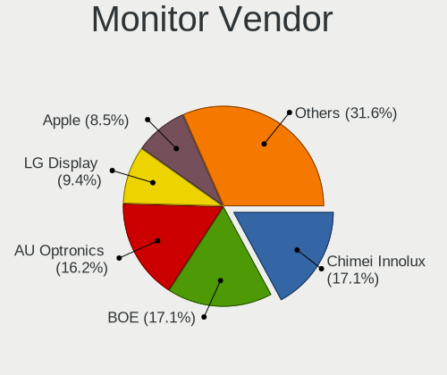
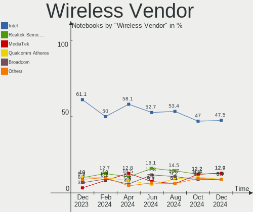
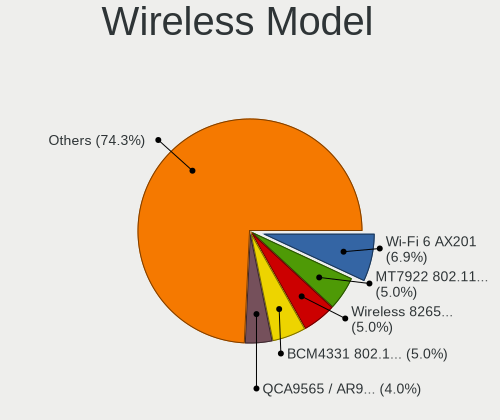

Pop!_OS Hardware Trends (Notebooks)
-----------------------------------

A project to identify most popular hardware characteristics and track their change
over time based on data collected by Pop!_OS users at https://Linux-Hardware.org.

Anyone can contribute to this report by the [hw-probe](https://github.com/linuxhw/hw-probe) tool:

    sudo -E hw-probe -all -upload

Full-feature report is available here: https://linux-hardware.org/?view=trends

Period: Mar, 2022.

Contents
--------

* [ System ](#system)
  - [ OS                       ](#os)
  - [ OS Family                ](#os-family)
  - [ Kernel                   ](#kernel)
  - [ Kernel Family            ](#kernel-family)
  - [ Kernel Major Ver.        ](#kernel-major-ver)
  - [ Arch                     ](#arch)
  - [ DE                       ](#de)
  - [ Display Server           ](#display-server)
  - [ Display Manager          ](#display-manager)
  - [ OS Lang                  ](#os-lang)
  - [ Boot Mode                ](#boot-mode)
  - [ Filesystem               ](#filesystem)
  - [ Part. scheme             ](#part-scheme)
  - [ Dual Boot with Linux/BSD ](#dual-boot-with-linuxbsd)
  - [ Dual Boot (Win)          ](#dual-boot-win)

* [ Board ](#board)
  - [ Vendor                   ](#vendor)
  - [ Model                    ](#model)
  - [ Model Family             ](#model-family)
  - [ MFG Year                 ](#mfg-year)
  - [ Form Factor              ](#form-factor)
  - [ Secure Boot              ](#secure-boot)
  - [ Coreboot                 ](#coreboot)
  - [ RAM Size                 ](#ram-size)
  - [ RAM Used                 ](#ram-used)
  - [ Total Drives             ](#total-drives)
  - [ Has CD-ROM               ](#has-cd-rom)
  - [ Has Ethernet             ](#has-ethernet)
  - [ Has WiFi                 ](#has-wifi)
  - [ Has Bluetooth            ](#has-bluetooth)

* [ Location ](#location)
  - [ Country                  ](#country)
  - [ City                     ](#city)

* [ Drives ](#drives)
  - [ Drive Vendor             ](#drive-vendor)
  - [ Drive Model              ](#drive-model)
  - [ HDD Vendor               ](#hdd-vendor)
  - [ SSD Vendor               ](#ssd-vendor)
  - [ Drive Kind               ](#drive-kind)
  - [ Drive Connector          ](#drive-connector)
  - [ Drive Size               ](#drive-size)
  - [ Space Total              ](#space-total)
  - [ Space Used               ](#space-used)
  - [ Malfunc. Drives          ](#malfunc-drives)
  - [ Malfunc. Drive Vendor    ](#malfunc-drive-vendor)
  - [ Malfunc. HDD Vendor      ](#malfunc-hdd-vendor)
  - [ Malfunc. Drive Kind      ](#malfunc-drive-kind)
  - [ Failed Drives            ](#failed-drives)
  - [ Failed Drive Vendor      ](#failed-drive-vendor)
  - [ Drive Status             ](#drive-status)

* [ Storage controller ](#storage-controller)
  - [ Storage Vendor           ](#storage-vendor)
  - [ Storage Model            ](#storage-model)
  - [ Storage Kind             ](#storage-kind)

* [ Processor ](#processor)
  - [ CPU Vendor               ](#cpu-vendor)
  - [ CPU Model                ](#cpu-model)
  - [ CPU Model Family         ](#cpu-model-family)
  - [ CPU Cores                ](#cpu-cores)
  - [ CPU Sockets              ](#cpu-sockets)
  - [ CPU Threads              ](#cpu-threads)
  - [ CPU Op-Modes             ](#cpu-op-modes)
  - [ CPU Microcode            ](#cpu-microcode)
  - [ CPU Microarch            ](#cpu-microarch)

* [ Graphics ](#graphics)
  - [ GPU Vendor               ](#gpu-vendor)
  - [ GPU Model                ](#gpu-model)
  - [ GPU Combo                ](#gpu-combo)
  - [ GPU Driver               ](#gpu-driver)
  - [ GPU Memory               ](#gpu-memory)

* [ Monitor ](#monitor)
  - [ Monitor Vendor           ](#monitor-vendor)
  - [ Monitor Model            ](#monitor-model)
  - [ Monitor Resolution       ](#monitor-resolution)
  - [ Monitor Diagonal         ](#monitor-diagonal)
  - [ Monitor Width            ](#monitor-width)
  - [ Aspect Ratio             ](#aspect-ratio)
  - [ Monitor Area             ](#monitor-area)
  - [ Pixel Density            ](#pixel-density)
  - [ Multiple Monitors        ](#multiple-monitors)

* [ Network ](#network)
  - [ Net Controller Vendor    ](#net-controller-vendor)
  - [ Net Controller Model     ](#net-controller-model)
  - [ Wireless Vendor          ](#wireless-vendor)
  - [ Wireless Model           ](#wireless-model)
  - [ Ethernet Vendor          ](#ethernet-vendor)
  - [ Ethernet Model           ](#ethernet-model)
  - [ Net Controller Kind      ](#net-controller-kind)
  - [ Used Controller          ](#used-controller)
  - [ NICs                     ](#nics)
  - [ IPv6                     ](#ipv6)

* [ Bluetooth ](#bluetooth)
  - [ Bluetooth Vendor         ](#bluetooth-vendor)
  - [ Bluetooth Model          ](#bluetooth-model)

* [ Sound ](#sound)
  - [ Sound Vendor             ](#sound-vendor)
  - [ Sound Model              ](#sound-model)

* [ Memory ](#memory)
  - [ Memory Vendor            ](#memory-vendor)
  - [ Memory Model             ](#memory-model)
  - [ Memory Kind              ](#memory-kind)
  - [ Memory Form Factor       ](#memory-form-factor)
  - [ Memory Size              ](#memory-size)
  - [ Memory Speed             ](#memory-speed)

* [ Printers & scanners ](#printers--scanners)
  - [ Printer Vendor           ](#printer-vendor)
  - [ Printer Model            ](#printer-model)
  - [ Scanner Vendor           ](#scanner-vendor)
  - [ Scanner Model            ](#scanner-model)

* [ Camera ](#camera)
  - [ Camera Vendor            ](#camera-vendor)
  - [ Camera Model             ](#camera-model)

* [ Security ](#security)
  - [ Fingerprint Vendor       ](#fingerprint-vendor)
  - [ Fingerprint Model        ](#fingerprint-model)
  - [ Chipcard Vendor          ](#chipcard-vendor)
  - [ Chipcard Model           ](#chipcard-model)

* [ Unsupported ](#unsupported)
  - [ Unsupported Devices      ](#unsupported-devices)
  - [ Unsupported Device Types ](#unsupported-device-types)

System
------

OS
--

Installed operating systems

| Name          | Notebooks | Percent |
|---------------|-----------|---------|
| Pop!_OS 21.10 | 146       | 88.48%  |
| Pop!_OS 20.04 | 16        | 9.7%    |
| Pop!_OS 21.04 | 3         | 1.82%   |

OS Family
---------

OS without a version

| Name    | Notebooks | Percent |
|---------|-----------|---------|
| Pop!_OS | 165       | 100%    |

Kernel
------

Version of the Linux kernel

| Version                  | Notebooks | Percent |
|--------------------------|-----------|---------|
| 5.16.11-76051611-generic | 125       | 75.76%  |
| 5.15.23-76051523-generic | 18        | 10.91%  |
| 5.15.15-76051515-generic | 9         | 5.45%   |
| 5.16.15-76051615-generic | 3         | 1.82%   |
| 5.15.11-76051511-generic | 2         | 1.21%   |
| 5.13.0-7614-generic      | 2         | 1.21%   |
| 5.4.0-7634-generic       | 1         | 0.61%   |
| 5.16.16-xanmod1          | 1         | 0.61%   |
| 5.16.13-051613-generic   | 1         | 0.61%   |
| 5.15.8-76051508-generic  | 1         | 0.61%   |
| 5.15.5-76051505-generic  | 1         | 0.61%   |
| 4.9.0-040900-generic     | 1         | 0.61%   |

Kernel Family
-------------

Linux kernel without a distro release

| Version | Notebooks | Percent |
|---------|-----------|---------|
| 5.16.11 | 125       | 75.76%  |
| 5.15.23 | 18        | 10.91%  |
| 5.15.15 | 9         | 5.45%   |
| 5.16.15 | 3         | 1.82%   |
| 5.15.11 | 2         | 1.21%   |
| 5.13.0  | 2         | 1.21%   |
| 5.4.0   | 1         | 0.61%   |
| 5.16.16 | 1         | 0.61%   |
| 5.16.13 | 1         | 0.61%   |
| 5.15.8  | 1         | 0.61%   |
| 5.15.5  | 1         | 0.61%   |
| 4.9.0   | 1         | 0.61%   |

Kernel Major Ver.
-----------------

Linux kernel major version

| Version | Notebooks | Percent |
|---------|-----------|---------|
| 5.16    | 130       | 78.79%  |
| 5.15    | 31        | 18.79%  |
| 5.13    | 2         | 1.21%   |
| 5.4     | 1         | 0.61%   |
| 4.9     | 1         | 0.61%   |

Arch
----

OS architecture (x86_64, i586, etc.)

| Name   | Notebooks | Percent |
|--------|-----------|---------|
| x86_64 | 165       | 100%    |

DE
--

Desktop Environment

| Name            | Notebooks | Percent |
|-----------------|-----------|---------|
| GNOME           | 163       | 98.79%  |
| GNOME Flashback | 1         | 0.61%   |
| Unknown         | 1         | 0.61%   |

Display Server
--------------

X11 or Wayland

| Name    | Notebooks | Percent |
|---------|-----------|---------|
| X11     | 160       | 96.97%  |
| Wayland | 4         | 2.42%   |
| Unknown | 1         | 0.61%   |

Display Manager
---------------

SDDM, LightDM, etc.

| Name    | Notebooks | Percent |
|---------|-----------|---------|
| Unknown | 123       | 74.55%  |
| GDM     | 41        | 24.85%  |
| GDM3    | 1         | 0.61%   |

OS Lang
-------

Language

| Lang  | Notebooks | Percent |
|-------|-----------|---------|
| en_US | 95        | 57.58%  |
| pt_BR | 16        | 9.7%    |
| en_GB | 16        | 9.7%    |
| de_DE | 6         | 3.64%   |
| it_IT | 4         | 2.42%   |
| pt_PT | 3         | 1.82%   |
| C     | 3         | 1.82%   |
| pl_PL | 2         | 1.21%   |
| ja_JP | 2         | 1.21%   |
| es_ES | 2         | 1.21%   |
| en_AU | 2         | 1.21%   |
| zh_CN | 1         | 0.61%   |
| vi_VN | 1         | 0.61%   |
| sk_SK | 1         | 0.61%   |
| ru_RU | 1         | 0.61%   |
| nl_BE | 1         | 0.61%   |
| nb_NO | 1         | 0.61%   |
| lt_LT | 1         | 0.61%   |
| hr_HR | 1         | 0.61%   |
| fr_FR | 1         | 0.61%   |
| fi_FI | 1         | 0.61%   |
| en_ZA | 1         | 0.61%   |
| en_DK | 1         | 0.61%   |
| da_DK | 1         | 0.61%   |
| cs_CZ | 1         | 0.61%   |

Boot Mode
---------

EFI or BIOS

| Mode | Notebooks | Percent |
|------|-----------|---------|
| BIOS | 126       | 76.36%  |
| EFI  | 39        | 23.64%  |

Filesystem
----------

Type of filesystem

| Type    | Notebooks | Percent |
|---------|-----------|---------|
| Ext4    | 156       | 94.55%  |
| Btrfs   | 4         | 2.42%   |
| Overlay | 3         | 1.82%   |
| Xfs     | 2         | 1.21%   |

Part. scheme
------------

Scheme of partitioning

| Type    | Notebooks | Percent |
|---------|-----------|---------|
| Unknown | 122       | 73.94%  |
| GPT     | 39        | 23.64%  |
| MBR     | 4         | 2.42%   |

Dual Boot with Linux/BSD
------------------------

Hosting more than one Linux/BSD

| Dual boot | Notebooks | Percent |
|-----------|-----------|---------|
| No        | 158       | 95.76%  |
| Yes       | 7         | 4.24%   |

Dual Boot (Win)
---------------

Hosting Linux and Windows

| Dual boot | Notebooks | Percent |
|-----------|-----------|---------|
| No        | 152       | 92.12%  |
| Yes       | 13        | 7.88%   |

Board
-----

Vendor
------

Motherboard manufacturer

| Name                   | Notebooks | Percent |
|------------------------|-----------|---------|
| Dell                   | 39        | 23.64%  |
| Lenovo                 | 29        | 17.58%  |
| ASUSTek Computer       | 20        | 12.12%  |
| Acer                   | 13        | 7.88%   |
| Hewlett-Packard        | 11        | 6.67%   |
| MSI                    | 10        | 6.06%   |
| Apple                  | 7         | 4.24%   |
| Toshiba                | 6         | 3.64%   |
| System76               | 5         | 3.03%   |
| Notebook               | 3         | 1.82%   |
| HUAWEI                 | 3         | 1.82%   |
| Samsung Electronics    | 2         | 1.21%   |
| Razer                  | 2         | 1.21%   |
| Positivo Bahia - VAIO  | 2         | 1.21%   |
| Avell High Performance | 2         | 1.21%   |
| Sony                   | 1         | 0.61%   |
| Schenker               | 1         | 0.61%   |
| Positivo               | 1         | 0.61%   |
| PC Specialist          | 1         | 0.61%   |
| MOTILE                 | 1         | 0.61%   |
| Google                 | 1         | 0.61%   |
| Gigabyte Technology    | 1         | 0.61%   |
| Fujitsu Siemens        | 1         | 0.61%   |
| Fujitsu                | 1         | 0.61%   |
| Chuwi                  | 1         | 0.61%   |
| AZW                    | 1         | 0.61%   |

Model
-----

Motherboard model

| Name                                               | Notebooks | Percent |
|----------------------------------------------------|-----------|---------|
| System76 Oryx Pro                                  | 2         | 1.21%   |
| System76 Lemur Pro                                 | 2         | 1.21%   |
| Razer Blade 15 Base Model (Early 2020) - RZ09-0328 | 2         | 1.21%   |
| Positivo Bahia - VAIO VJFE42F11X-XXXXXX            | 2         | 1.21%   |
| Lenovo IdeaPad S145-15IIL 82DJ                     | 2         | 1.21%   |
| Lenovo IdeaPad 3 15ITL6 82H8                       | 2         | 1.21%   |
| Lenovo IdeaPad 3 15ALC6 82MF                       | 2         | 1.21%   |
| Dell Latitude E6410                                | 2         | 1.21%   |
| ASUS ROG Zephyrus G15 GA503QR_GA503QR              | 2         | 1.21%   |
| Toshiba Satellite P50-B-10V                        | 1         | 0.61%   |
| Toshiba Satellite L10W-B-101                       | 1         | 0.61%   |
| Toshiba Satellite C855D                            | 1         | 0.61%   |
| Toshiba Satellite C850-1GD                         | 1         | 0.61%   |
| Toshiba Satellite C70D-B                           | 1         | 0.61%   |
| Toshiba Satellite A135                             | 1         | 0.61%   |
| System76 Gazelle                                   | 1         | 0.61%   |
| Sony SVE15115FXS                                   | 1         | 0.61%   |
| Schenker XMG CORE (CZN/E21)                        | 1         | 0.61%   |
| Samsung 340XAA/350XAA/550XAA                       | 1         | 0.61%   |
| Samsung 270E5K/270E5Q/271E5K/2570EK                | 1         | 0.61%   |
| Positivo Q464C                                     | 1         | 0.61%   |
| PC Specialist NH5xAx                               | 1         | 0.61%   |
| Notebook PCx0Dx                                    | 1         | 0.61%   |
| Notebook P65xHP                                    | 1         | 0.61%   |
| Notebook NV4XMB,ME,MZ                              | 1         | 0.61%   |
| MSI Modern 14 B11M                                 | 1         | 0.61%   |
| MSI Modern 14 B10MW                                | 1         | 0.61%   |
| MSI Katana GF76 11UD                               | 1         | 0.61%   |
| MSI GV62 8RD                                       | 1         | 0.61%   |
| MSI GT70 2OC/2OD                                   | 1         | 0.61%   |
| MSI GS60 6QE                                       | 1         | 0.61%   |
| MSI GS30 2M Shadow                                 | 1         | 0.61%   |
| MSI GF63 Thin 9SC                                  | 1         | 0.61%   |
| MSI GE72 2QF                                       | 1         | 0.61%   |
| MSI GE70 2PE                                       | 1         | 0.61%   |
| MOTILE M141                                        | 1         | 0.61%   |
| Lenovo V330-15IKB 81AX                             | 1         | 0.61%   |
| Lenovo ThinkPad X13 Gen 2i 20WLS4HT00              | 1         | 0.61%   |
| Lenovo ThinkPad X1 Extreme 2nd 20QVCTO1WW          | 1         | 0.61%   |
| Lenovo ThinkPad X1 Extreme 20MF000DUS              | 1         | 0.61%   |
| Lenovo ThinkPad X1 Carbon Gen 8 20U9008FMZ         | 1         | 0.61%   |
| Lenovo ThinkPad T530 23943J8                       | 1         | 0.61%   |
| Lenovo ThinkPad T430u 3351CTO                      | 1         | 0.61%   |
| Lenovo ThinkPad T15 Gen 2i 20W4000NRT              | 1         | 0.61%   |
| Lenovo ThinkPad T15 Gen 1 20S7S17S00               | 1         | 0.61%   |
| Lenovo ThinkPad S1 Yoga 20CD00B1US                 | 1         | 0.61%   |
| Lenovo ThinkPad P14s Gen 2a 21A0000RMX             | 1         | 0.61%   |
| Lenovo ThinkPad E490 20N8005JMH                    | 1         | 0.61%   |
| Lenovo ThinkPad E14 Gen 2 20T6000SIX               | 1         | 0.61%   |
| Lenovo ThinkPad 13 20GJ0048MS                      | 1         | 0.61%   |
| Lenovo ThinkBook 15-IIL 20SM                       | 1         | 0.61%   |
| Lenovo IdeaPad S340-15IWL 81N8                     | 1         | 0.61%   |
| Lenovo IdeaPad Flex-14API 81SS                     | 1         | 0.61%   |
| Lenovo IdeaPad 330-15IKB 81FE                      | 1         | 0.61%   |
| Lenovo IdeaPad 3 15IML05 81WR                      | 1         | 0.61%   |
| Lenovo G510 20238                                  | 1         | 0.61%   |
| Lenovo G500 20236                                  | 1         | 0.61%   |
| Lenovo G40-70 20369                                | 1         | 0.61%   |
| Lenovo Flex 3-1120 80LX                            | 1         | 0.61%   |
| HUAWEI WRT-WX9                                     | 1         | 0.61%   |

Model Family
------------

Motherboard model prefix

| Name                                    | Notebooks | Percent |
|-----------------------------------------|-----------|---------|
| Dell Latitude                           | 15        | 9.09%   |
| Lenovo ThinkPad                         | 13        | 7.88%   |
| Dell Inspiron                           | 12        | 7.27%   |
| Lenovo IdeaPad                          | 10        | 6.06%   |
| Acer Aspire                             | 9         | 5.45%   |
| Toshiba Satellite                       | 6         | 3.64%   |
| Dell XPS                                | 6         | 3.64%   |
| HP EliteBook                            | 5         | 3.03%   |
| ASUS VivoBook                           | 5         | 3.03%   |
| ASUS ROG                                | 4         | 2.42%   |
| Acer Swift                              | 3         | 1.82%   |
| System76 Oryx                           | 2         | 1.21%   |
| System76 Lemur                          | 2         | 1.21%   |
| Razer Blade                             | 2         | 1.21%   |
| Positivo Bahia - VAIO VJFE42F11X-XXXXXX | 2         | 1.21%   |
| MSI Modern                              | 2         | 1.21%   |
| HP Pavilion                             | 2         | 1.21%   |
| Dell System                             | 2         | 1.21%   |
| ASUS ASUS                               | 2         | 1.21%   |
| Apple MacBookPro9                       | 2         | 1.21%   |
| System76 Gazelle                        | 1         | 0.61%   |
| Sony SVE15115FXS                        | 1         | 0.61%   |
| Schenker XMG                            | 1         | 0.61%   |
| Samsung 340XAA                          | 1         | 0.61%   |
| Samsung 270E5K                          | 1         | 0.61%   |
| Positivo Q464C                          | 1         | 0.61%   |
| PC Specialist NH5xAx                    | 1         | 0.61%   |
| Notebook PCx0Dx                         | 1         | 0.61%   |
| Notebook P65xHP                         | 1         | 0.61%   |
| Notebook NV4XMB                         | 1         | 0.61%   |
| MSI Katana                              | 1         | 0.61%   |
| MSI GV62                                | 1         | 0.61%   |
| MSI GT70                                | 1         | 0.61%   |
| MSI GS60                                | 1         | 0.61%   |
| MSI GS30                                | 1         | 0.61%   |
| MSI GF63                                | 1         | 0.61%   |
| MSI GE72                                | 1         | 0.61%   |
| MSI GE70                                | 1         | 0.61%   |
| MOTILE M141                             | 1         | 0.61%   |
| Lenovo V330-15IKB                       | 1         | 0.61%   |
| Lenovo ThinkBook                        | 1         | 0.61%   |
| Lenovo G510                             | 1         | 0.61%   |
| Lenovo G500                             | 1         | 0.61%   |
| Lenovo G40-70                           | 1         | 0.61%   |
| Lenovo Flex                             | 1         | 0.61%   |
| HUAWEI WRT-WX9                          | 1         | 0.61%   |
| HUAWEI MACHD-WXX9                       | 1         | 0.61%   |
| HUAWEI KLVL-WXX9                        | 1         | 0.61%   |
| HP ENVY                                 | 1         | 0.61%   |
| HP 300-240                              | 1         | 0.61%   |
| HP 255                                  | 1         | 0.61%   |
| HP 15                                   | 1         | 0.61%   |
| Google Samus                            | 1         | 0.61%   |
| Gigabyte AERO                           | 1         | 0.61%   |
| Fujitsu Siemens ESPRIMO                 | 1         | 0.61%   |
| Fujitsu LIFEBOOK                        | 1         | 0.61%   |
| Dell Vostro                             | 1         | 0.61%   |
| Dell G7                                 | 1         | 0.61%   |
| Dell G5                                 | 1         | 0.61%   |
| Dell G3                                 | 1         | 0.61%   |

MFG Year
--------

Motherboard manufacture year

| Year | Notebooks | Percent |
|------|-----------|---------|
| 2020 | 29        | 17.58%  |
| 2021 | 28        | 16.97%  |
| 2019 | 14        | 8.48%   |
| 2018 | 13        | 7.88%   |
| 2014 | 13        | 7.88%   |
| 2013 | 12        | 7.27%   |
| 2015 | 10        | 6.06%   |
| 2012 | 9         | 5.45%   |
| 2011 | 9         | 5.45%   |
| 2017 | 8         | 4.85%   |
| 2016 | 7         | 4.24%   |
| 2010 | 5         | 3.03%   |
| 2009 | 3         | 1.82%   |
| 2008 | 2         | 1.21%   |
| 2007 | 2         | 1.21%   |
| 2006 | 1         | 0.61%   |

Form Factor
-----------

Physical design of the computer

| Name     | Notebooks | Percent |
|----------|-----------|---------|
| Notebook | 165       | 100%    |

Secure Boot
-----------

Enabled or disabled

| State    | Notebooks | Percent |
|----------|-----------|---------|
| Disabled | 163       | 98.79%  |
| Enabled  | 2         | 1.21%   |

Coreboot
--------

Have coreboot on board

| Used | Notebooks | Percent |
|------|-----------|---------|
| No   | 161       | 97.58%  |
| Yes  | 4         | 2.42%   |

RAM Size
--------

Total RAM memory

| Size in GB  | Notebooks | Percent |
|-------------|-----------|---------|
| 4.01-8.0    | 46        | 27.88%  |
| 16.01-24.0  | 43        | 26.06%  |
| 8.01-16.0   | 25        | 15.15%  |
| 3.01-4.0    | 22        | 13.33%  |
| 32.01-64.0  | 21        | 12.73%  |
| 24.01-32.0  | 3         | 1.82%   |
| 2.01-3.0    | 2         | 1.21%   |
| 64.01-256.0 | 2         | 1.21%   |
| 1.01-2.0    | 1         | 0.61%   |

RAM Used
--------

Used RAM memory

| Used GB    | Notebooks | Percent |
|------------|-----------|---------|
| 2.01-3.0   | 55        | 33.33%  |
| 1.01-2.0   | 48        | 29.09%  |
| 3.01-4.0   | 29        | 17.58%  |
| 4.01-8.0   | 23        | 13.94%  |
| 8.01-16.0  | 8         | 4.85%   |
| 16.01-24.0 | 2         | 1.21%   |

Total Drives
------------

Number of drives on board

| Drives | Notebooks | Percent |
|--------|-----------|---------|
| 1      | 121       | 73.33%  |
| 2      | 39        | 23.64%  |
| 3      | 4         | 2.42%   |
| 4      | 1         | 0.61%   |

Has CD-ROM
----------

Has CD-ROM on board

| Presented | Notebooks | Percent |
|-----------|-----------|---------|
| No        | 122       | 73.94%  |
| Yes       | 43        | 26.06%  |

Has Ethernet
------------

Has Ethernet on board

| Presented | Notebooks | Percent |
|-----------|-----------|---------|
| Yes       | 131       | 79.39%  |
| No        | 34        | 20.61%  |

Has WiFi
--------

Has WiFi module

| Presented | Notebooks | Percent |
|-----------|-----------|---------|
| Yes       | 162       | 98.18%  |
| No        | 3         | 1.82%   |

Has Bluetooth
-------------

Has Bluetooth module

| Presented | Notebooks | Percent |
|-----------|-----------|---------|
| Yes       | 140       | 84.85%  |
| No        | 25        | 15.15%  |

Location
--------

Country
-------

Geographic location (country)

| Country      | Notebooks | Percent |
|--------------|-----------|---------|
| USA          | 46        | 27.88%  |
| Brazil       | 23        | 13.94%  |
| UK           | 10        | 6.06%   |
| Germany      | 8         | 4.85%   |
| Italy        | 7         | 4.24%   |
| Turkey       | 4         | 2.42%   |
| Portugal     | 4         | 2.42%   |
| Norway       | 4         | 2.42%   |
| France       | 4         | 2.42%   |
| Spain        | 3         | 1.82%   |
| South Africa | 3         | 1.82%   |
| Poland       | 3         | 1.82%   |
| Ecuador      | 3         | 1.82%   |
| Denmark      | 3         | 1.82%   |
| Australia    | 3         | 1.82%   |
| Russia       | 2         | 1.21%   |
| Netherlands  | 2         | 1.21%   |
| Mexico       | 2         | 1.21%   |
| Japan        | 2         | 1.21%   |
| Ireland      | 2         | 1.21%   |
| India        | 2         | 1.21%   |
| Croatia      | 2         | 1.21%   |
| Vietnam      | 1         | 0.61%   |
| Switzerland  | 1         | 0.61%   |
| Slovakia     | 1         | 0.61%   |
| Romania      | 1         | 0.61%   |
| Philippines  | 1         | 0.61%   |
| Nigeria      | 1         | 0.61%   |
| New Zealand  | 1         | 0.61%   |
| Luxembourg   | 1         | 0.61%   |
| Lithuania    | 1         | 0.61%   |
| Latvia       | 1         | 0.61%   |
| Iran         | 1         | 0.61%   |
| Iceland      | 1         | 0.61%   |
| Hong Kong    | 1         | 0.61%   |
| Greece       | 1         | 0.61%   |
| Finland      | 1         | 0.61%   |
| Czechia      | 1         | 0.61%   |
| Costa Rica   | 1         | 0.61%   |
| China        | 1         | 0.61%   |
| Chile        | 1         | 0.61%   |
| Canada       | 1         | 0.61%   |
| Belgium      | 1         | 0.61%   |
| Austria      | 1         | 0.61%   |
| Argentina    | 1         | 0.61%   |

City
----

Geographic location (city)

| City             | Notebooks | Percent |
|------------------|-----------|---------|
| Zagreb           | 2         | 1.21%   |
| Sao Vicente      | 2         | 1.21%   |
| Rio de Janeiro   | 2         | 1.21%   |
| Dublin           | 2         | 1.21%   |
| Cape Town        | 2         | 1.21%   |
| Atlanta          | 2         | 1.21%   |
| Zephyrhills      | 1         | 0.61%   |
| Zacatecas City   | 1         | 0.61%   |
| Winterthur       | 1         | 0.61%   |
| Warrenton        | 1         | 0.61%   |
| Walsall          | 1         | 0.61%   |
| Viña del Mar    | 1         | 0.61%   |
| Vila Velha       | 1         | 0.61%   |
| Vienna           | 1         | 0.61%   |
| Vicksburg        | 1         | 0.61%   |
| Viana do Castelo | 1         | 0.61%   |
| Vargem Alta      | 1         | 0.61%   |
| Vanlose          | 1         | 0.61%   |
| Ufa              | 1         | 0.61%   |
| Tzaneen          | 1         | 0.61%   |
| Tuen Mun         | 1         | 0.61%   |
| Tubarao          | 1         | 0.61%   |
| Tempe            | 1         | 0.61%   |
| Tehran           | 1         | 0.61%   |
| Talence          | 1         | 0.61%   |
| Sydney           | 1         | 0.61%   |
| Strasbourg       | 1         | 0.61%   |
| Siegburg         | 1         | 0.61%   |
| Sheerness        | 1         | 0.61%   |
| Sesto Fiorentino | 1         | 0.61%   |
| Santa Cruz       | 1         | 0.61%   |
| Rockledge        | 1         | 0.61%   |
| Riverside        | 1         | 0.61%   |
| Riga             | 1         | 0.61%   |
| Ribeirao Preto   | 1         | 0.61%   |
| Rhodes           | 1         | 0.61%   |
| Rho              | 1         | 0.61%   |
| Reykjavik        | 1         | 0.61%   |
| Radom            | 1         | 0.61%   |
| Quito            | 1         | 0.61%   |
| Purcellville     | 1         | 0.61%   |
| Prague           | 1         | 0.61%   |
| Porto            | 1         | 0.61%   |
| Portland         | 1         | 0.61%   |
| Plymouth         | 1         | 0.61%   |
| Picayune         | 1         | 0.61%   |
| Pharr            | 1         | 0.61%   |
| Pella            | 1         | 0.61%   |
| Pearl City       | 1         | 0.61%   |
| Parker           | 1         | 0.61%   |
| Paranaque City   | 1         | 0.61%   |
| Papillion        | 1         | 0.61%   |
| Panevezys        | 1         | 0.61%   |
| Overland Park    | 1         | 0.61%   |
| Oslo             | 1         | 0.61%   |
| Osasco           | 1         | 0.61%   |
| Ormond Beach     | 1         | 0.61%   |
| Orillia          | 1         | 0.61%   |
| Novo Hamburgo    | 1         | 0.61%   |
| New York         | 1         | 0.61%   |

Drives
------

Drive Vendor
------------

Hard drive vendors

| Vendor                         | Notebooks | Drives | Percent |
|--------------------------------|-----------|--------|---------|
| Samsung Electronics            | 36        | 37     | 17.31%  |
| WDC                            | 22        | 22     | 10.58%  |
| Seagate                        | 18        | 18     | 8.65%   |
| SanDisk                        | 15        | 16     | 7.21%   |
| Kingston                       | 13        | 15     | 6.25%   |
| Toshiba                        | 12        | 13     | 5.77%   |
| SK Hynix                       | 11        | 11     | 5.29%   |
| Unknown                        | 7         | 8      | 3.37%   |
| HGST                           | 7         | 7      | 3.37%   |
| Solid State Storage Technology | 6         | 6      | 2.88%   |
| Micron Technology              | 6         | 6      | 2.88%   |
| A-DATA Technology              | 6         | 6      | 2.88%   |
| Crucial                        | 5         | 5      | 2.4%    |
| Intel                          | 4         | 4      | 1.92%   |
| China                          | 4         | 4      | 1.92%   |
| ADATA Technology               | 4         | 5      | 1.92%   |
| Transcend                      | 3         | 3      | 1.44%   |
| SPCC                           | 3         | 4      | 1.44%   |
| Silicon Motion                 | 3         | 3      | 1.44%   |
| Phison                         | 3         | 3      | 1.44%   |
| KIOXIA                         | 3         | 3      | 1.44%   |
| Hitachi                        | 3         | 3      | 1.44%   |
| Apple                          | 3         | 3      | 1.44%   |
| PNY                            | 2         | 2      | 0.96%   |
| UMIS                           | 1         | 1      | 0.48%   |
| SSSTC                          | 1         | 1      | 0.48%   |
| Realtek Semiconductor          | 1         | 1      | 0.48%   |
| Patriot                        | 1         | 1      | 0.48%   |
| Netac                          | 1         | 1      | 0.48%   |
| LITEONIT                       | 1         | 2      | 0.48%   |
| KingSpec                       | 1         | 1      | 0.48%   |
| Hewlett-Packard                | 1         | 1      | 0.48%   |
| GOODRAM                        | 1         | 1      | 0.48%   |

Drive Model
-----------

Hard drive models

| Model                                    | Notebooks | Percent |
|------------------------------------------|-----------|---------|
| Solid State Storage NVMe SSD Drive 256GB | 5         | 2.33%   |
| SK Hynix NVMe SSD Drive 512GB            | 4         | 1.86%   |
| Samsung NVMe SSD Drive 1TB               | 4         | 1.86%   |
| Micron NVMe SSD Drive 512GB              | 4         | 1.86%   |
| WDC WD10SPZX-24Z10 1TB                   | 3         | 1.4%    |
| Unknown MMC Card  64GB                   | 3         | 1.4%    |
| Toshiba NVMe SSD Drive 256GB             | 3         | 1.4%    |
| Sandisk NVMe SSD Drive 256GB             | 3         | 1.4%    |
| Samsung SSD 970 EVO Plus 500GB           | 3         | 1.4%    |
| Samsung NVMe SSD Drive 512GB             | 3         | 1.4%    |
| Kingston SA400S37240G 240GB SSD          | 3         | 1.4%    |
| HGST HTS721010A9E630 1TB                 | 3         | 1.4%    |
| WDC WDS240G2G0A-00JH30 240GB SSD         | 2         | 0.93%   |
| WDC WDS100T2B0C-00PXH0 1TB               | 2         | 0.93%   |
| WDC WDS100T2B0A-00SM50 1TB SSD           | 2         | 0.93%   |
| SPCC Solid State Disk 256GB              | 2         | 0.93%   |
| SK Hynix NVMe SSD Drive 256GB            | 2         | 0.93%   |
| SK Hynix NVMe SSD Drive 1024GB           | 2         | 0.93%   |
| Silicon Motion NVMe SSD Drive 256GB      | 2         | 0.93%   |
| Seagate ST9500420AS 500GB                | 2         | 0.93%   |
| Seagate ST9500325AS 500GB                | 2         | 0.93%   |
| Seagate ST1000LM035-1RK172 1TB           | 2         | 0.93%   |
| Seagate ST1000LM024 HN-M101MBB 1TB       | 2         | 0.93%   |
| Sandisk NVMe SSD Drive 512GB             | 2         | 0.93%   |
| Sandisk NVMe SSD Drive 1TB               | 2         | 0.93%   |
| Samsung SSD PM851 2.5 7mm 256GB          | 2         | 0.93%   |
| Samsung SSD 860 EVO 500GB                | 2         | 0.93%   |
| Samsung NVMe SSD Drive 500GB             | 2         | 0.93%   |
| KIOXIA NVMe SSD Drive 512GB              | 2         | 0.93%   |
| Kingston SA400S37120G 120GB SSD          | 2         | 0.93%   |
| Intel NVMe SSD Drive 512GB               | 2         | 0.93%   |
| ADATA NVMe SSD Drive 512GB               | 2         | 0.93%   |
| ADATA NVMe SSD Drive 256GB               | 2         | 0.93%   |
| A-DATA SU650 120GB SSD                   | 2         | 0.93%   |
| WDC WDS500G2B0A-00SM50 500GB SSD         | 1         | 0.47%   |
| WDC WD5000LPLX-00ZNTT0 500GB             | 1         | 0.47%   |
| WDC WD5000LPCX-60VHAT0 500GB             | 1         | 0.47%   |
| WDC WD5000BEVT-60A0RT0 500GB             | 1         | 0.47%   |
| WDC WD3200BEVT-75A23T0 320GB             | 1         | 0.47%   |
| WDC WD3200BEKT-75PVMT1 320GB             | 1         | 0.47%   |
| WDC WD1600BEVT-00ZCT0 160GB              | 1         | 0.47%   |
| WDC WD10SPZX-21Z10T0 1TB                 | 1         | 0.47%   |
| WDC WD10SPZX-17Z10T1 1TB                 | 1         | 0.47%   |
| WDC WD10JPVX-75JC3T0 1TB                 | 1         | 0.47%   |
| WDC PC SN730 NVMe 1024GB                 | 1         | 0.47%   |
| WDC PC SN530 SDBPMPZ-512G-1101 512GB     | 1         | 0.47%   |
| WDC PC SN530 SDBPMPZ-256G-1101 256GB     | 1         | 0.47%   |
| Unknown SD/MMC/MS PRO 32GB               | 1         | 0.47%   |
| Unknown MMC Card  32GB                   | 1         | 0.47%   |
| Unknown MMC Card  128GB                  | 1         | 0.47%   |
| Unknown MMC Card  1072GB                 | 1         | 0.47%   |
| Unknown GFAQK  512GB                     | 1         | 0.47%   |
| UMIS RPJTJ512MEE1OWX 512GB               | 1         | 0.47%   |
| Transcend TS512GMTE510T 512GB            | 1         | 0.47%   |
| Transcend TS256GMTS400 256GB SSD         | 1         | 0.47%   |
| Transcend TS120GMTS820S 120GB SSD        | 1         | 0.47%   |
| Toshiba THNSN51T02DU7 NVMe 1024GB        | 1         | 0.47%   |
| Toshiba THNSFJ256GCSU 256GB SSD          | 1         | 0.47%   |
| Toshiba MQ01ACF050 500GB                 | 1         | 0.47%   |
| Toshiba MQ01ABD100V 1TB                  | 1         | 0.47%   |

HDD Vendor
----------

Hard disk drive vendors

| Vendor              | Notebooks | Drives | Percent |
|---------------------|-----------|--------|---------|
| Seagate             | 16        | 16     | 33.33%  |
| WDC                 | 12        | 12     | 25%     |
| Toshiba             | 7         | 7      | 14.58%  |
| HGST                | 7         | 7      | 14.58%  |
| Hitachi             | 3         | 3      | 6.25%   |
| Unknown             | 1         | 1      | 2.08%   |
| Samsung Electronics | 1         | 1      | 2.08%   |
| Apple               | 1         | 1      | 2.08%   |

SSD Vendor
----------

Solid state drive vendors

| Vendor              | Notebooks | Drives | Percent |
|---------------------|-----------|--------|---------|
| Samsung Electronics | 13        | 13     | 19.12%  |
| Kingston            | 9         | 10     | 13.24%  |
| SanDisk             | 8         | 8      | 11.76%  |
| WDC                 | 5         | 5      | 7.35%   |
| Crucial             | 5         | 5      | 7.35%   |
| China               | 4         | 4      | 5.88%   |
| A-DATA Technology   | 4         | 4      | 5.88%   |
| SPCC                | 3         | 4      | 4.41%   |
| Transcend           | 2         | 2      | 2.94%   |
| Seagate             | 2         | 2      | 2.94%   |
| PNY                 | 2         | 2      | 2.94%   |
| Apple               | 2         | 2      | 2.94%   |
| Toshiba             | 1         | 1      | 1.47%   |
| SK Hynix            | 1         | 1      | 1.47%   |
| Patriot             | 1         | 1      | 1.47%   |
| Netac               | 1         | 1      | 1.47%   |
| Micron Technology   | 1         | 1      | 1.47%   |
| LITEONIT            | 1         | 2      | 1.47%   |
| KingSpec            | 1         | 1      | 1.47%   |
| Hewlett-Packard     | 1         | 1      | 1.47%   |
| GOODRAM             | 1         | 1      | 1.47%   |

Drive Kind
----------

HDD or SSD

| Kind | Notebooks | Drives | Percent |
|------|-----------|--------|---------|
| NVMe | 81        | 91     | 41.54%  |
| SSD  | 62        | 71     | 31.79%  |
| HDD  | 46        | 48     | 23.59%  |
| MMC  | 6         | 7      | 3.08%   |

Drive Connector
---------------

SATA, SAS, NVMe, etc.

| Type | Notebooks | Drives | Percent |
|------|-----------|--------|---------|
| SATA | 95        | 114    | 51.08%  |
| NVMe | 81        | 91     | 43.55%  |
| MMC  | 6         | 7      | 3.23%   |
| SAS  | 4         | 5      | 2.15%   |

Drive Size
----------

Size of hard drive

| Size in TB | Notebooks | Drives | Percent |
|------------|-----------|--------|---------|
| 0.01-0.5   | 74        | 87     | 72.55%  |
| 0.51-1.0   | 27        | 31     | 26.47%  |
| 1.01-2.0   | 1         | 1      | 0.98%   |

Space Total
-----------

Amount of disk space available on the file system

| Size in GB | Notebooks | Percent |
|------------|-----------|---------|
| 251-500    | 56        | 33.94%  |
| 101-250    | 55        | 33.33%  |
| 501-1000   | 30        | 18.18%  |
| 51-100     | 8         | 4.85%   |
| 1001-2000  | 7         | 4.24%   |
| 21-50      | 4         | 2.42%   |
| 1-20       | 4         | 2.42%   |
| Unknown    | 1         | 0.61%   |

Space Used
----------

Amount of used disk space

| Used GB  | Notebooks | Percent |
|----------|-----------|---------|
| 1-20     | 61        | 36.97%  |
| 21-50    | 37        | 22.42%  |
| 101-250  | 28        | 16.97%  |
| 51-100   | 19        | 11.52%  |
| 251-500  | 13        | 7.88%   |
| 501-1000 | 6         | 3.64%   |
| Unknown  | 1         | 0.61%   |

Malfunc. Drives
---------------

Drive models with a malfunction

| Model                             | Notebooks | Drives | Percent |
|-----------------------------------|-----------|--------|---------|
| WDC WD10SPZX-24Z10 1TB            | 1         | 1      | 25%     |
| Seagate ST1000LM035-1RK172 1TB    | 1         | 1      | 25%     |
| Hitachi HTS727550A9E364 500GB     | 1         | 1      | 25%     |
| A-DATA Technology SX6000PNP 512GB | 1         | 1      | 25%     |

Malfunc. Drive Vendor
---------------------

Vendors of faulty drives

| Vendor            | Notebooks | Drives | Percent |
|-------------------|-----------|--------|---------|
| WDC               | 1         | 1      | 25%     |
| Seagate           | 1         | 1      | 25%     |
| Hitachi           | 1         | 1      | 25%     |
| A-DATA Technology | 1         | 1      | 25%     |

Malfunc. HDD Vendor
-------------------

Vendors of faulty HDD drives

| Vendor  | Notebooks | Drives | Percent |
|---------|-----------|--------|---------|
| WDC     | 1         | 1      | 33.33%  |
| Seagate | 1         | 1      | 33.33%  |
| Hitachi | 1         | 1      | 33.33%  |

Malfunc. Drive Kind
-------------------

Kinds of faulty drives

| Kind | Notebooks | Drives | Percent |
|------|-----------|--------|---------|
| HDD  | 3         | 3      | 75%     |
| NVMe | 1         | 1      | 25%     |

Failed Drives
-------------

Failed drive models

Zero info for selected period =(

Failed Drive Vendor
-------------------

Failed drive vendors

Zero info for selected period =(

Drive Status
------------

Number of failed and malfunc. drives

| Status   | Notebooks | Drives | Percent |
|----------|-----------|--------|---------|
| Detected | 126       | 162    | 74.12%  |
| Works    | 40        | 51     | 23.53%  |
| Malfunc  | 4         | 4      | 2.35%   |

Storage controller
------------------

Storage Vendor
--------------

Storage controller vendors

| Vendor                           | Notebooks | Percent |
|----------------------------------|-----------|---------|
| Intel                            | 109       | 49.1%   |
| Samsung Electronics              | 24        | 10.81%  |
| AMD                              | 24        | 10.81%  |
| Sandisk                          | 12        | 5.41%   |
| SK Hynix                         | 9         | 4.05%   |
| Solid State Storage Technology   | 7         | 3.15%   |
| Toshiba America Info Systems     | 5         | 2.25%   |
| Micron Technology                | 5         | 2.25%   |
| ADATA Technology                 | 5         | 2.25%   |
| Silicon Motion                   | 4         | 1.8%    |
| Kingston Technology Company      | 4         | 1.8%    |
| Phison Electronics               | 3         | 1.35%   |
| KIOXIA                           | 3         | 1.35%   |
| Realtek Semiconductor            | 2         | 0.9%    |
| Nvidia                           | 2         | 0.9%    |
| Union Memory (Shenzhen)          | 1         | 0.45%   |
| Silicon Integrated Systems [SiS] | 1         | 0.45%   |
| JMicron Technology               | 1         | 0.45%   |
| ASMedia Technology               | 1         | 0.45%   |

Storage Model
-------------

Storage controller models

| Model                                                                            | Notebooks | Percent |
|----------------------------------------------------------------------------------|-----------|---------|
| AMD FCH SATA Controller [AHCI mode]                                              | 22        | 9.57%   |
| Intel 82801 Mobile SATA Controller [RAID mode]                                   | 13        | 5.65%   |
| Intel Sunrise Point-LP SATA Controller [AHCI mode]                               | 11        | 4.78%   |
| Samsung NVMe SSD Controller SM981/PM981/PM983                                    | 10        | 4.35%   |
| Intel 7 Series Chipset Family 6-port SATA Controller [AHCI mode]                 | 10        | 4.35%   |
| Intel Cannon Lake Mobile PCH SATA AHCI Controller                                | 8         | 3.48%   |
| Intel 8 Series SATA Controller 1 [AHCI mode]                                     | 8         | 3.48%   |
| Solid State Storage Non-Volatile memory controller                               | 7         | 3.04%   |
| SK Hynix Gold P31 SSD                                                            | 7         | 3.04%   |
| Intel Volume Management Device NVMe RAID Controller                              | 7         | 3.04%   |
| Intel 8 Series/C220 Series Chipset Family 6-port SATA Controller 1 [AHCI mode]   | 7         | 3.04%   |
| Samsung NVMe SSD Controller PM9A1/PM9A3/980PRO                                   | 5         | 2.17%   |
| Micron Non-Volatile memory controller                                            | 5         | 2.17%   |
| Intel Wildcat Point-LP SATA Controller [AHCI Mode]                               | 5         | 2.17%   |
| ADATA Non-Volatile memory controller                                             | 5         | 2.17%   |
| Silicon Motion SM2263EN/SM2263XT SSD Controller                                  | 4         | 1.74%   |
| Sandisk Non-Volatile memory controller                                           | 4         | 1.74%   |
| Samsung NVMe SSD Controller 980                                                  | 4         | 1.74%   |
| Intel Ice Lake-LP SATA Controller [AHCI mode]                                    | 4         | 1.74%   |
| Intel 82801IBM/IEM (ICH9M/ICH9M-E) 4 port SATA Controller [AHCI mode]            | 4         | 1.74%   |
| Intel 6 Series/C200 Series Chipset Family 6 port Mobile SATA AHCI Controller     | 4         | 1.74%   |
| Intel 400 Series Chipset Family SATA AHCI Controller                             | 4         | 1.74%   |
| Sandisk WD Black SN750 / PC SN730 NVMe SSD                                       | 3         | 1.3%    |
| Samsung NVMe SSD Controller SM961/PM961/SM963                                    | 3         | 1.3%    |
| KIOXIA Non-Volatile memory controller                                            | 3         | 1.3%    |
| Intel HM170/QM170 Chipset SATA Controller [AHCI Mode]                            | 3         | 1.3%    |
| Intel 500 Series Chipset Family SATA AHCI Controller                             | 3         | 1.3%    |
| Intel 5 Series/3400 Series Chipset 6 port SATA AHCI Controller                   | 3         | 1.3%    |
| Toshiba America Info Systems Toshiba America Info Non-Volatile memory controller | 2         | 0.87%   |
| Sandisk WD Blue SN550 NVMe SSD                                                   | 2         | 0.87%   |
| Realtek Realtek Non-Volatile memory controller                                   | 2         | 0.87%   |
| Phison E12 NVMe Controller                                                       | 2         | 0.87%   |
| Kingston Company U-SNS8154P3 NVMe SSD                                            | 2         | 0.87%   |
| Intel Tiger Lake-LP SATA Controller [AHCI mode]                                  | 2         | 0.87%   |
| Intel SSD Pro 7600p/760p/E 6100p Series                                          | 2         | 0.87%   |
| Intel Comet Lake SATA AHCI Controller                                            | 2         | 0.87%   |
| Intel Comet Lake PCH-LP SATA RAID Premium Controller                             | 2         | 0.87%   |
| Intel Celeron/Pentium Silver Processor SATA Controller                           | 2         | 0.87%   |
| Intel Atom Processor E3800 Series SATA AHCI Controller                           | 2         | 0.87%   |
| Union Memory (Shenzhen) Non-Volatile memory controller                           | 1         | 0.43%   |
| Toshiba America Info Systems XG6 NVMe SSD Controller                             | 1         | 0.43%   |
| Toshiba America Info Systems XG4 NVMe SSD Controller                             | 1         | 0.43%   |
| Toshiba America Info Systems NVMe Controller                                     | 1         | 0.43%   |
| SK Hynix PC401 NVMe Solid State Drive 256GB                                      | 1         | 0.43%   |
| SK Hynix Non-Volatile memory controller                                          | 1         | 0.43%   |
| Silicon Integrated Systems [SiS] SATA Controller / IDE mode                      | 1         | 0.43%   |
| Silicon Integrated Systems [SiS] 5513 IDE Controller                             | 1         | 0.43%   |
| Sandisk WD Blue SN500 / PC SN520 NVMe SSD                                        | 1         | 0.43%   |
| Sandisk WD Black 2018/SN750 / PC SN720 NVMe SSD                                  | 1         | 0.43%   |
| Sandisk PC SN520 NVMe SSD                                                        | 1         | 0.43%   |
| Samsung NVMe SSD Controller SM951/PM951                                          | 1         | 0.43%   |
| Samsung Electronics SATA controller                                              | 1         | 0.43%   |
| Samsung Apple PCIe SSD                                                           | 1         | 0.43%   |
| Phison PS5013 E13 NVMe Controller                                                | 1         | 0.43%   |
| Nvidia MCP89 SATA Controller (AHCI mode)                                         | 1         | 0.43%   |
| Nvidia MCP79 AHCI Controller                                                     | 1         | 0.43%   |
| Kingston Company Company Non-Volatile memory controller                          | 1         | 0.43%   |
| Kingston Company OM3PDP3 NVMe SSD                                                | 1         | 0.43%   |
| JMicron JMB360 AHCI Controller                                                   | 1         | 0.43%   |
| Intel SSD 660P Series                                                            | 1         | 0.43%   |

Storage Kind
------------

Kind of storage controller (IDE, SATA, NVMe, SAS, ...)

| Kind | Notebooks | Percent |
|------|-----------|---------|
| SATA | 112       | 51.38%  |
| NVMe | 80        | 36.7%   |
| RAID | 22        | 10.09%  |
| IDE  | 4         | 1.83%   |

Processor
---------

CPU Vendor
----------

Processor vendors

| Vendor | Notebooks | Percent |
|--------|-----------|---------|
| Intel  | 133       | 80.61%  |
| AMD    | 32        | 19.39%  |

CPU Model
---------

Processor models

| Model                                         | Notebooks | Percent |
|-----------------------------------------------|-----------|---------|
| Intel 11th Gen Core i7-1165G7 @ 2.80GHz       | 8         | 4.85%   |
| Intel Core i7-8750H CPU @ 2.20GHz             | 5         | 3.03%   |
| Intel Core i5-8250U CPU @ 1.60GHz             | 5         | 3.03%   |
| Intel Core i5-10210U CPU @ 1.60GHz            | 5         | 3.03%   |
| Intel 11th Gen Core i7-11800H @ 2.30GHz       | 4         | 2.42%   |
| Intel Core i7-9750H CPU @ 2.60GHz             | 3         | 1.82%   |
| Intel Core i7-4600U CPU @ 2.10GHz             | 3         | 1.82%   |
| Intel Core i7-10750H CPU @ 2.60GHz            | 3         | 1.82%   |
| Intel Core i7-10510U CPU @ 1.80GHz            | 3         | 1.82%   |
| Intel Core i5-9300H CPU @ 2.40GHz             | 3         | 1.82%   |
| Intel Core i5-7200U CPU @ 2.50GHz             | 3         | 1.82%   |
| Intel Core i5-4200U CPU @ 1.60GHz             | 3         | 1.82%   |
| Intel Core i5-1035G1 CPU @ 1.00GHz            | 3         | 1.82%   |
| Intel 11th Gen Core i5-1135G7 @ 2.40GHz       | 3         | 1.82%   |
| AMD Ryzen 7 5700U with Radeon Graphics        | 3         | 1.82%   |
| AMD Ryzen 5 4500U with Radeon Graphics        | 3         | 1.82%   |
| Intel Core i7-7700HQ CPU @ 2.80GHz            | 2         | 1.21%   |
| Intel Core i7-6700HQ CPU @ 2.60GHz            | 2         | 1.21%   |
| Intel Core i7-5500U CPU @ 2.40GHz             | 2         | 1.21%   |
| Intel Core i7-4710HQ CPU @ 2.50GHz            | 2         | 1.21%   |
| Intel Core i5-8265U CPU @ 1.60GHz             | 2         | 1.21%   |
| Intel Core i5-6200U CPU @ 2.30GHz             | 2         | 1.21%   |
| Intel Core i5-3317U CPU @ 1.70GHz             | 2         | 1.21%   |
| Intel Core i5-3210M CPU @ 2.50GHz             | 2         | 1.21%   |
| Intel Core i5-2520M CPU @ 2.50GHz             | 2         | 1.21%   |
| Intel Core i5-10300H CPU @ 2.50GHz            | 2         | 1.21%   |
| Intel Core i5 CPU M 560 @ 2.67GHz             | 2         | 1.21%   |
| Intel Core i3-8145U CPU @ 2.10GHz             | 2         | 1.21%   |
| Intel Core i3-4005U CPU @ 1.70GHz             | 2         | 1.21%   |
| Intel Celeron CPU N2840 @ 2.16GHz             | 2         | 1.21%   |
| Intel 11th Gen Core i7-1185G7 @ 3.00GHz       | 2         | 1.21%   |
| AMD Ryzen 9 5900HS with Radeon Graphics       | 2         | 1.21%   |
| AMD Ryzen 7 PRO 5850U with Radeon Graphics    | 2         | 1.21%   |
| AMD Ryzen 5 5500U with Radeon Graphics        | 2         | 1.21%   |
| AMD Ryzen 5 3500U with Radeon Vega Mobile Gfx | 2         | 1.21%   |
| Intel Pentium Dual-Core CPU T4500 @ 2.30GHz   | 1         | 0.61%   |
| Intel Pentium CPU 2020M @ 2.40GHz             | 1         | 0.61%   |
| Intel Genuine CPU U7300 @ 1.30GHz             | 1         | 0.61%   |
| Intel Core i9-10885H CPU @ 2.40GHz            | 1         | 0.61%   |
| Intel Core i7-8850H CPU @ 2.60GHz             | 1         | 0.61%   |
| Intel Core i7-8550U CPU @ 1.80GHz             | 1         | 0.61%   |
| Intel Core i7-7500U CPU @ 2.70GHz             | 1         | 0.61%   |
| Intel Core i7-5950HQ CPU @ 2.90GHz            | 1         | 0.61%   |
| Intel Core i7-5700HQ CPU @ 2.70GHz            | 1         | 0.61%   |
| Intel Core i7-5600U CPU @ 2.60GHz             | 1         | 0.61%   |
| Intel Core i7-4720HQ CPU @ 2.60GHz            | 1         | 0.61%   |
| Intel Core i7-4702MQ CPU @ 2.20GHz            | 1         | 0.61%   |
| Intel Core i7-4700MQ CPU @ 2.40GHz            | 1         | 0.61%   |
| Intel Core i7-4700HQ CPU @ 2.40GHz            | 1         | 0.61%   |
| Intel Core i7-4650U CPU @ 1.70GHz             | 1         | 0.61%   |
| Intel Core i7-4510U CPU @ 2.00GHz             | 1         | 0.61%   |
| Intel Core i7-3720QM CPU @ 2.60GHz            | 1         | 0.61%   |
| Intel Core i7-3632QM CPU @ 2.20GHz            | 1         | 0.61%   |
| Intel Core i7-3630QM CPU @ 2.40GHz            | 1         | 0.61%   |
| Intel Core i7-2670QM CPU @ 2.20GHz            | 1         | 0.61%   |
| Intel Core i7-10870H CPU @ 2.20GHz            | 1         | 0.61%   |
| Intel Core i7-1065G7 CPU @ 1.30GHz            | 1         | 0.61%   |
| Intel Core i7 CPU M 620 @ 2.67GHz             | 1         | 0.61%   |
| Intel Core i5-7300HQ CPU @ 2.50GHz            | 1         | 0.61%   |
| Intel Core i5-5250U CPU @ 1.60GHz             | 1         | 0.61%   |

CPU Model Family
----------------

Processor model prefix

| Model                   | Notebooks | Percent |
|-------------------------|-----------|---------|
| Intel Core i5           | 46        | 27.88%  |
| Intel Core i7           | 44        | 26.67%  |
| Other                   | 19        | 11.52%  |
| AMD Ryzen 5             | 9         | 5.45%   |
| Intel Celeron           | 8         | 4.85%   |
| AMD Ryzen 7             | 7         | 4.24%   |
| Intel Core i3           | 6         | 3.64%   |
| Intel Core 2 Duo        | 4         | 2.42%   |
| AMD Ryzen 9             | 3         | 1.82%   |
| AMD A4                  | 3         | 1.82%   |
| AMD Ryzen 7 PRO         | 2         | 1.21%   |
| AMD Ryzen 3             | 2         | 1.21%   |
| AMD A6                  | 2         | 1.21%   |
| Intel Pentium Dual-Core | 1         | 0.61%   |
| Intel Pentium           | 1         | 0.61%   |
| Intel Genuine           | 1         | 0.61%   |
| Intel Core i9           | 1         | 0.61%   |
| Intel Core 2            | 1         | 0.61%   |
| Intel Atom              | 1         | 0.61%   |
| AMD Turion 64 X2 Mobile | 1         | 0.61%   |
| AMD E                   | 1         | 0.61%   |
| AMD A8                  | 1         | 0.61%   |
| AMD A10                 | 1         | 0.61%   |

CPU Cores
---------

Number of processor cores

| Number | Notebooks | Percent |
|--------|-----------|---------|
| 4      | 65        | 39.39%  |
| 2      | 63        | 38.18%  |
| 6      | 18        | 10.91%  |
| 8      | 16        | 9.7%    |
| 1      | 2         | 1.21%   |
| 12     | 1         | 0.61%   |

CPU Sockets
-----------

Number of sockets

| Number | Notebooks | Percent |
|--------|-----------|---------|
| 1      | 165       | 100%    |

CPU Threads
-----------

Threads per core (Hyper-Threading)

| Number | Notebooks | Percent |
|--------|-----------|---------|
| 2      | 137       | 83.03%  |
| 1      | 28        | 16.97%  |

CPU Op-Modes
------------

CPU Operation Modes (32-bit, 64-bit)

| Op mode        | Notebooks | Percent |
|----------------|-----------|---------|
| 32-bit, 64-bit | 165       | 100%    |

CPU Microcode
-------------

Microcode number

| Number     | Notebooks | Percent |
|------------|-----------|---------|
| Unknown    | 118       | 71.52%  |
| 0x906ea    | 5         | 3.03%   |
| 0x806ea    | 5         | 3.03%   |
| 0x806ec    | 4         | 2.42%   |
| 0x806c1    | 4         | 2.42%   |
| 0x306a9    | 4         | 2.42%   |
| 0xa0652    | 3         | 1.82%   |
| 0x506e3    | 2         | 1.21%   |
| 0x40651    | 2         | 1.21%   |
| 0x306c3    | 2         | 1.21%   |
| 0x08608103 | 2         | 1.21%   |
| 0x906ed    | 1         | 0.61%   |
| 0x906e9    | 1         | 0.61%   |
| 0x806e9    | 1         | 0.61%   |
| 0x806d1    | 1         | 0.61%   |
| 0x706e5    | 1         | 0.61%   |
| 0x206a7    | 1         | 0.61%   |
| 0x1067a    | 1         | 0.61%   |
| 0x0a50000c | 1         | 0.61%   |
| 0x08701013 | 1         | 0.61%   |
| 0x08608102 | 1         | 0.61%   |
| 0x08600106 | 1         | 0.61%   |
| 0x08108109 | 1         | 0.61%   |
| 0x08108102 | 1         | 0.61%   |
| 0x07030105 | 1         | 0.61%   |

CPU Microarch
-------------

Microarchitecture

| Name          | Notebooks | Percent |
|---------------|-----------|---------|
| KabyLake      | 37        | 22.42%  |
| Haswell       | 18        | 10.91%  |
| TigerLake     | 15        | 9.09%   |
| IvyBridge     | 11        | 6.67%   |
| Broadwell     | 8         | 4.85%   |
| Unknown       | 8         | 4.85%   |
| SandyBridge   | 7         | 4.24%   |
| Penryn        | 7         | 4.24%   |
| CometLake     | 7         | 4.24%   |
| Zen 3         | 6         | 3.64%   |
| Zen 2         | 6         | 3.64%   |
| Zen+          | 5         | 3.03%   |
| Westmere      | 5         | 3.03%   |
| IceLake       | 5         | 3.03%   |
| Skylake       | 4         | 2.42%   |
| Silvermont    | 3         | 1.82%   |
| Puma          | 2         | 1.21%   |
| Piledriver    | 2         | 1.21%   |
| Goldmont plus | 2         | 1.21%   |
| Zen           | 1         | 0.61%   |
| K8 Hammer     | 1         | 0.61%   |
| K10 Llano     | 1         | 0.61%   |
| Jaguar        | 1         | 0.61%   |
| Excavator     | 1         | 0.61%   |
| Core          | 1         | 0.61%   |
| Bobcat        | 1         | 0.61%   |

Graphics
--------

GPU Vendor
----------

Vendors of graphics cards

| Vendor                           | Notebooks | Percent |
|----------------------------------|-----------|---------|
| Intel                            | 121       | 55.76%  |
| Nvidia                           | 58        | 26.73%  |
| AMD                              | 37        | 17.05%  |
| Silicon Integrated Systems [SiS] | 1         | 0.46%   |

GPU Model
---------

Graphics card models

| Model                                                                                 | Notebooks | Percent |
|---------------------------------------------------------------------------------------|-----------|---------|
| Intel TigerLake-LP GT2 [Iris Xe Graphics]                                             | 15        | 6.82%   |
| Intel Haswell-ULT Integrated Graphics Controller                                      | 11        | 5%      |
| Intel CoffeeLake-H GT2 [UHD Graphics 630]                                             | 11        | 5%      |
| Intel 3rd Gen Core processor Graphics Controller                                      | 10        | 4.55%   |
| Intel CometLake-U GT2 [UHD Graphics]                                                  | 8         | 3.64%   |
| Intel CometLake-H GT2 [UHD Graphics]                                                  | 7         | 3.18%   |
| Intel 4th Gen Core Processor Integrated Graphics Controller                           | 7         | 3.18%   |
| Intel UHD Graphics 620                                                                | 6         | 2.73%   |
| Intel 2nd Generation Core Processor Family Integrated Graphics Controller             | 6         | 2.73%   |
| AMD Cezanne                                                                           | 6         | 2.73%   |
| Nvidia TU117M [GeForce GTX 1650 Mobile / Max-Q]                                       | 5         | 2.27%   |
| AMD Renoir                                                                            | 5         | 2.27%   |
| AMD Picasso/Raven 2 [Radeon Vega Series / Radeon Vega Mobile Series]                  | 5         | 2.27%   |
| AMD Lucienne                                                                          | 5         | 2.27%   |
| Nvidia GP106M [GeForce GTX 1060 Mobile]                                               | 4         | 1.82%   |
| Intel WhiskeyLake-U GT2 [UHD Graphics 620]                                            | 4         | 1.82%   |
| Intel TigerLake-H GT1 [UHD Graphics]                                                  | 4         | 1.82%   |
| Intel HD Graphics 620                                                                 | 4         | 1.82%   |
| Intel HD Graphics 5500                                                                | 4         | 1.82%   |
| Nvidia TU117M [GeForce GTX 1650 Ti Mobile]                                            | 3         | 1.36%   |
| Intel Mobile 4 Series Chipset Integrated Graphics Controller                          | 3         | 1.36%   |
| Intel Iris Plus Graphics G1 (Ice Lake)                                                | 3         | 1.36%   |
| AMD Topaz XT [Radeon R7 M260/M265 / M340/M360 / M440/M445 / 530/535 / 620/625 Mobile] | 3         | 1.36%   |
| Nvidia TU117M                                                                         | 2         | 0.91%   |
| Nvidia TU116M [GeForce GTX 1660 Ti Mobile]                                            | 2         | 0.91%   |
| Nvidia TU106M [GeForce RTX 2070 Mobile / Max-Q Refresh]                               | 2         | 0.91%   |
| Nvidia GT218M [NVS 3100M]                                                             | 2         | 0.91%   |
| Nvidia GP108M [GeForce MX230]                                                         | 2         | 0.91%   |
| Nvidia GP107M [GeForce GTX 1050 Ti Mobile]                                            | 2         | 0.91%   |
| Nvidia GM204M [GeForce GTX 970M]                                                      | 2         | 0.91%   |
| Nvidia GM107M [GeForce GTX 860M]                                                      | 2         | 0.91%   |
| Nvidia GF117M [GeForce 610M/710M/810M/820M / GT 620M/625M/630M/720M]                  | 2         | 0.91%   |
| Nvidia GA107M [GeForce RTX 3050 Ti Mobile]                                            | 2         | 0.91%   |
| Nvidia GA106M [GeForce RTX 3060 Mobile / Max-Q]                                       | 2         | 0.91%   |
| Nvidia GA104M [GeForce RTX 3080 Mobile / Max-Q 8GB/16GB]                              | 2         | 0.91%   |
| Nvidia GA104M [GeForce RTX 3070 Mobile / Max-Q]                                       | 2         | 0.91%   |
| Intel Skylake GT2 [HD Graphics 520]                                                   | 2         | 0.91%   |
| Intel HD Graphics 530                                                                 | 2         | 0.91%   |
| Intel GeminiLake [UHD Graphics 600]                                                   | 2         | 0.91%   |
| Intel Core Processor Integrated Graphics Controller                                   | 2         | 0.91%   |
| Intel Atom Processor Z36xxx/Z37xxx Series Graphics & Display                          | 2         | 0.91%   |
| Silicon Integrated Systems [SiS] 771/671 PCIE VGA Display Adapter                     | 1         | 0.45%   |
| Nvidia TU106M [GeForce RTX 2060 Mobile]                                               | 1         | 0.45%   |
| Nvidia MCP89 [GeForce 320M]                                                           | 1         | 0.45%   |
| Nvidia GT216M [GeForce GT 330M]                                                       | 1         | 0.45%   |
| Nvidia GP108M [GeForce MX150]                                                         | 1         | 0.45%   |
| Nvidia GP107M [GeForce MX350]                                                         | 1         | 0.45%   |
| Nvidia GP107M [GeForce GTX 1050 Mobile]                                               | 1         | 0.45%   |
| Nvidia GP106BM [GeForce GTX 1060 Mobile 6GB]                                          | 1         | 0.45%   |
| Nvidia GM108M [GeForce MX110]                                                         | 1         | 0.45%   |
| Nvidia GM108M [GeForce 930MX]                                                         | 1         | 0.45%   |
| Nvidia GM108M [GeForce 840M]                                                          | 1         | 0.45%   |
| Nvidia GM107M [GeForce GTX 960M]                                                      | 1         | 0.45%   |
| Nvidia GK208BM [GeForce 920M]                                                         | 1         | 0.45%   |
| Nvidia GK107M [GeForce GT 750M]                                                       | 1         | 0.45%   |
| Nvidia GK107M [GeForce GT 650M Mac Edition]                                           | 1         | 0.45%   |
| Nvidia GK106M [GeForce GTX 770M]                                                      | 1         | 0.45%   |
| Nvidia GF116M [GeForce GT 560M]                                                       | 1         | 0.45%   |
| Nvidia GA107M [GeForce RTX 3050 Mobile]                                               | 1         | 0.45%   |
| Nvidia G96CM [GeForce 9600M GT]                                                       | 1         | 0.45%   |

GPU Combo
---------

Combinations of graphics cards

| Name           | Notebooks | Percent |
|----------------|-----------|---------|
| 1 x Intel      | 76        | 46.06%  |
| Intel + Nvidia | 40        | 24.24%  |
| 1 x AMD        | 25        | 15.15%  |
| 1 x Nvidia     | 11        | 6.67%   |
| Intel + AMD    | 5         | 3.03%   |
| AMD + Nvidia   | 5         | 3.03%   |
| 2 x AMD        | 2         | 1.21%   |
| 1 x SiS        | 1         | 0.61%   |

GPU Driver
----------

Free vs proprietary

| Driver      | Notebooks | Percent |
|-------------|-----------|---------|
| Free        | 116       | 70.3%   |
| Proprietary | 44        | 26.67%  |
| Unknown     | 5         | 3.03%   |

GPU Memory
----------

Total video memory

| Size in GB | Notebooks | Percent |
|------------|-----------|---------|
| Unknown    | 121       | 73.33%  |
| 1.01-2.0   | 13        | 7.88%   |
| 3.01-4.0   | 11        | 6.67%   |
| 5.01-6.0   | 7         | 4.24%   |
| 0.01-0.5   | 5         | 3.03%   |
| 7.01-8.0   | 3         | 1.82%   |
| 2.01-3.0   | 2         | 1.21%   |
| 0.51-1.0   | 2         | 1.21%   |
| 8.01-16.0  | 1         | 0.61%   |

Monitor
-------

Monitor Vendor
--------------

Monitor vendors

| Vendor                  | Notebooks | Percent |
|-------------------------|-----------|---------|
| AU Optronics            | 34        | 18.48%  |
| BOE                     | 31        | 16.85%  |
| LG Display              | 30        | 16.3%   |
| Chimei Innolux          | 28        | 15.22%  |
| Samsung Electronics     | 11        | 5.98%   |
| Apple                   | 6         | 3.26%   |
| Sharp                   | 5         | 2.72%   |
| PANDA                   | 5         | 2.72%   |
| Goldstar                | 5         | 2.72%   |
| Chi Mei Optoelectronics | 5         | 2.72%   |
| Dell                    | 4         | 2.17%   |
| Lenovo                  | 3         | 1.63%   |
| AOC                     | 3         | 1.63%   |
| ViewSonic               | 1         | 0.54%   |
| SLD                     | 1         | 0.54%   |
| RTK                     | 1         | 0.54%   |
| Qushimei                | 1         | 0.54%   |
| Philips                 | 1         | 0.54%   |
| MSI                     | 1         | 0.54%   |
| InfoVision              | 1         | 0.54%   |
| Iiyama                  | 1         | 0.54%   |
| HUAWEI                  | 1         | 0.54%   |
| Hewlett-Packard         | 1         | 0.54%   |
| GDH                     | 1         | 0.54%   |
| CSO                     | 1         | 0.54%   |
| BenQ                    | 1         | 0.54%   |
| ASUSTek Computer        | 1         | 0.54%   |

Monitor Model
-------------

Monitor models

| Model                                                                    | Notebooks | Percent |
|--------------------------------------------------------------------------|-----------|---------|
| AU Optronics LCD Monitor AUO21ED 1920x1080 344x194mm 15.5-inch           | 4         | 2.16%   |
| Chimei Innolux LCD Monitor CMN15E6 1366x768 344x193mm 15.5-inch          | 3         | 1.62%   |
| Chimei Innolux LCD Monitor CMN14D5 1920x1080 309x173mm 13.9-inch         | 3         | 1.62%   |
| Chimei Innolux LCD Monitor CMN14D4 1920x1080 309x173mm 13.9-inch         | 3         | 1.62%   |
| AU Optronics LCD Monitor AUO71EC 1366x768 344x193mm 15.5-inch            | 3         | 1.62%   |
| AU Optronics LCD Monitor AUO403D 1920x1080 309x174mm 14.0-inch           | 3         | 1.62%   |
| LG Display LCD Monitor LGD046F 1920x1080 345x194mm 15.6-inch             | 2         | 1.08%   |
| LG Display LCD Monitor LGD033A 1366x768 344x194mm 15.5-inch              | 2         | 1.08%   |
| Dell P2419H DELD0DA 1920x1080 527x296mm 23.8-inch                        | 2         | 1.08%   |
| Chimei Innolux P130ZFA-BA1 CMN8201 2160x1440 275x183mm 13.0-inch         | 2         | 1.08%   |
| Chimei Innolux LCD Monitor CMN15F5 1920x1080 344x193mm 15.5-inch         | 2         | 1.08%   |
| Chi Mei Optoelectronics LCD Monitor CMO15A4 1366x768 344x194mm 15.5-inch | 2         | 1.08%   |
| BOE LCD Monitor BOE0974 2560x1440 344x194mm 15.5-inch                    | 2         | 1.08%   |
| BOE LCD Monitor BOE0973 2560x1440 344x194mm 15.5-inch                    | 2         | 1.08%   |
| BOE LCD Monitor BOE084E 1920x1080 382x215mm 17.3-inch                    | 2         | 1.08%   |
| BOE LCD Monitor BOE0823 1920x1080 382x215mm 17.3-inch                    | 2         | 1.08%   |
| BOE LCD Monitor BOE07F6 1920x1080 309x174mm 14.0-inch                    | 2         | 1.08%   |
| BOE LCD Monitor BOE07DB 1920x1080 309x174mm 14.0-inch                    | 2         | 1.08%   |
| AU Optronics LCD Monitor AUO38ED 1920x1080 344x193mm 15.5-inch           | 2         | 1.08%   |
| AU Optronics LCD Monitor AUO10ED 1920x1080 344x193mm 15.5-inch           | 2         | 1.08%   |
| ViewSonic VA2719-2K VSC6B34 2560x1440 597x336mm 27.0-inch                | 1         | 0.54%   |
| SLD LCD Monitor SLD003C 1366x768 309x173mm 13.9-inch                     | 1         | 0.54%   |
| Sharp LCD Monitor SHP14D1 1920x1200 336x210mm 15.6-inch                  | 1         | 0.54%   |
| Sharp LCD Monitor SHP14AD 3840x2160 294x165mm 13.3-inch                  | 1         | 0.54%   |
| Sharp LCD Monitor SHP148D 3840x2160 344x194mm 15.5-inch                  | 1         | 0.54%   |
| Sharp LCD Monitor SHP1449 1920x1080 294x165mm 13.3-inch                  | 1         | 0.54%   |
| Sharp LCD Monitor SHP143E 3840x2160 346x194mm 15.6-inch                  | 1         | 0.54%   |
| Samsung Electronics S24F350 SAM0D20 1920x1080 521x293mm 23.5-inch        | 1         | 0.54%   |
| Samsung Electronics LCD Monitor SEC5442 1440x900 303x190mm 14.1-inch     | 1         | 0.54%   |
| Samsung Electronics LCD Monitor SEC5441 1366x768 256x144mm 11.6-inch     | 1         | 0.54%   |
| Samsung Electronics LCD Monitor SEC3642 1366x768 344x194mm 15.5-inch     | 1         | 0.54%   |
| Samsung Electronics LCD Monitor SEC3358 1280x800 331x207mm 15.4-inch     | 1         | 0.54%   |
| Samsung Electronics LCD Monitor SEC3245 1366x768 344x194mm 15.5-inch     | 1         | 0.54%   |
| Samsung Electronics LCD Monitor SDCA029 3840x2160 344x194mm 15.5-inch    | 1         | 0.54%   |
| Samsung Electronics LCD Monitor SDC4161 1920x1080 344x194mm 15.5-inch    | 1         | 0.54%   |
| Samsung Electronics LCD Monitor SDC324C 1920x1080 344x194mm 15.5-inch    | 1         | 0.54%   |
| Samsung Electronics LCD Monitor SAM0F3E 3840x2160 1872x1053mm 84.6-inch  | 1         | 0.54%   |
| Samsung Electronics C43J89x SAM0F5B 3840x1200 1052x329mm 43.4-inch       | 1         | 0.54%   |
| RTK UHD HDR RTK1B1A 3840x2160 344x195mm 15.6-inch                        | 1         | 0.54%   |
| Qushimei QUHMINEI190 QSM1910 1440x900 410x230mm 18.5-inch                | 1         | 0.54%   |
| Philips PHL 272B8Q PHL0918 2560x1440 597x336mm 27.0-inch                 | 1         | 0.54%   |
| PANDA LCD Monitor NCP0058 1920x1080 344x194mm 15.5-inch                  | 1         | 0.54%   |
| PANDA LCD Monitor NCP0050 1920x1080 309x174mm 14.0-inch                  | 1         | 0.54%   |
| PANDA LCD Monitor NCP004D 1920x1080 344x194mm 15.5-inch                  | 1         | 0.54%   |
| PANDA LCD Monitor NCP004B 1920x1080 344x194mm 15.5-inch                  | 1         | 0.54%   |
| PANDA LCD Monitor NCP002D 1920x1080 344x194mm 15.5-inch                  | 1         | 0.54%   |
| MSI G271 MSI3CB5 1920x1080 598x336mm 27.0-inch                           | 1         | 0.54%   |
| LG Display LCD Monitor LGD069B 1920x1080 344x194mm 15.5-inch             | 1         | 0.54%   |
| LG Display LCD Monitor LGD065A 1920x1080 340x190mm 15.3-inch             | 1         | 0.54%   |
| LG Display LCD Monitor LGD0625 1920x1080 344x194mm 15.5-inch             | 1         | 0.54%   |
| LG Display LCD Monitor LGD05F2 1920x1080 344x194mm 15.5-inch             | 1         | 0.54%   |
| LG Display LCD Monitor LGD05E5 1920x1080 344x194mm 15.5-inch             | 1         | 0.54%   |
| LG Display LCD Monitor LGD05C0 1920x1080 344x194mm 15.5-inch             | 1         | 0.54%   |
| LG Display LCD Monitor LGD0590 1920x1080 344x194mm 15.5-inch             | 1         | 0.54%   |
| LG Display LCD Monitor LGD053F 1920x1080 344x194mm 15.5-inch             | 1         | 0.54%   |
| LG Display LCD Monitor LGD04DA 1920x1080 344x194mm 15.5-inch             | 1         | 0.54%   |
| LG Display LCD Monitor LGD048C 1920x1080 294x165mm 13.3-inch             | 1         | 0.54%   |
| LG Display LCD Monitor LGD046D 1920x1080 309x174mm 14.0-inch             | 1         | 0.54%   |
| LG Display LCD Monitor LGD0469 1920x1080 382x215mm 17.3-inch             | 1         | 0.54%   |
| LG Display LCD Monitor LGD0437 1920x1080 276x156mm 12.5-inch             | 1         | 0.54%   |

Monitor Resolution
------------------

Monitor screen resolution

| Resolution        | Notebooks | Percent |
|-------------------|-----------|---------|
| 1920x1080 (FHD)   | 85        | 48.57%  |
| 1366x768 (WXGA)   | 41        | 23.43%  |
| 3840x2160 (4K)    | 14        | 8%      |
| 2560x1440 (QHD)   | 8         | 4.57%   |
| 1600x900 (HD+)    | 8         | 4.57%   |
| 1920x1200 (WUXGA) | 5         | 2.86%   |
| 1440x900 (WXGA+)  | 5         | 2.86%   |
| 2160x1440         | 3         | 1.71%   |
| 1280x800 (WXGA)   | 2         | 1.14%   |
| 3840x1200         | 1         | 0.57%   |
| 3000x2000         | 1         | 0.57%   |
| 2560x1700         | 1         | 0.57%   |
| 2256x1504         | 1         | 0.57%   |

Monitor Diagonal
----------------

Diagonal size in inches

| Inches | Notebooks | Percent |
|--------|-----------|---------|
| 15     | 84        | 45.65%  |
| 13     | 27        | 14.67%  |
| 14     | 20        | 10.87%  |
| 17     | 18        | 9.78%   |
| 27     | 8         | 4.35%   |
| 23     | 6         | 3.26%   |
| 24     | 4         | 2.17%   |
| 21     | 4         | 2.17%   |
| 11     | 3         | 1.63%   |
| 31     | 2         | 1.09%   |
| 18     | 2         | 1.09%   |
| 12     | 2         | 1.09%   |
| 84     | 1         | 0.54%   |
| 43     | 1         | 0.54%   |
| 32     | 1         | 0.54%   |
| 10     | 1         | 0.54%   |

Monitor Width
-------------

Physical width

| Width in mm | Notebooks | Percent |
|-------------|-----------|---------|
| 301-350     | 116       | 63.39%  |
| 201-300     | 20        | 10.93%  |
| 351-400     | 19        | 10.38%  |
| 501-600     | 16        | 8.74%   |
| 401-500     | 7         | 3.83%   |
| 601-700     | 2         | 1.09%   |
| 701-800     | 1         | 0.55%   |
| 1501-2000   | 1         | 0.55%   |
| 1001-1500   | 1         | 0.55%   |

Aspect Ratio
------------

Proportional relationship between the width and the height

| Ratio | Notebooks | Percent |
|-------|-----------|---------|
| 16/9  | 144       | 88.89%  |
| 16/10 | 11        | 6.79%   |
| 3/2   | 6         | 3.7%    |
| 3.20  | 1         | 0.62%   |

Monitor Area
------------

Area in inch²

| Area in inch² | Notebooks | Percent |
|----------------|-----------|---------|
| 101-110        | 84        | 45.65%  |
| 81-90          | 38        | 20.65%  |
| 121-130        | 16        | 8.7%    |
| 201-250        | 14        | 7.61%   |
| 71-80          | 10        | 5.43%   |
| 301-350        | 8         | 4.35%   |
| 51-60          | 3         | 1.63%   |
| 351-500        | 3         | 1.63%   |
| 141-150        | 2         | 1.09%   |
| 131-140        | 2         | 1.09%   |
| More than 1000 | 1         | 0.54%   |
| 61-70          | 1         | 0.54%   |
| 41-50          | 1         | 0.54%   |
| 501-1000       | 1         | 0.54%   |

Pixel Density
-------------

Pixels per inch

| Density       | Notebooks | Percent |
|---------------|-----------|---------|
| 121-160       | 85        | 46.96%  |
| 101-120       | 52        | 28.73%  |
| 161-240       | 18        | 9.94%   |
| 51-100        | 18        | 9.94%   |
| More than 240 | 8         | 4.42%   |

Multiple Monitors
-----------------

Total monitors connected

| Total | Notebooks | Percent |
|-------|-----------|---------|
| 1     | 133       | 80.61%  |
| 2     | 25        | 15.15%  |
| 0     | 5         | 3.03%   |
| 3     | 2         | 1.21%   |

Network
-------

Net Controller Vendor
---------------------

Controller vendors

| Vendor                           | Notebooks | Percent |
|----------------------------------|-----------|---------|
| Intel                            | 98        | 35.64%  |
| Realtek Semiconductor            | 91        | 33.09%  |
| Qualcomm Atheros                 | 39        | 14.18%  |
| Broadcom                         | 15        | 5.45%   |
| MEDIATEK                         | 5         | 1.82%   |
| Broadcom Limited                 | 5         | 1.82%   |
| TP-Link                          | 4         | 1.45%   |
| DisplayLink                      | 3         | 1.09%   |
| Ralink Technology                | 2         | 0.73%   |
| Qualcomm                         | 2         | 0.73%   |
| Marvell Technology Group         | 2         | 0.73%   |
| ASIX Electronics                 | 2         | 0.73%   |
| Xiaomi                           | 1         | 0.36%   |
| Silicon Integrated Systems [SiS] | 1         | 0.36%   |
| Samsung Electronics              | 1         | 0.36%   |
| ROCCAT                           | 1         | 0.36%   |
| Nvidia                           | 1         | 0.36%   |
| Linksys                          | 1         | 0.36%   |
| Google                           | 1         | 0.36%   |

Net Controller Model
--------------------

Controller models

| Model                                                             | Notebooks | Percent |
|-------------------------------------------------------------------|-----------|---------|
| Realtek RTL8111/8168/8411 PCI Express Gigabit Ethernet Controller | 53        | 17.04%  |
| Intel Wi-Fi 6 AX200                                               | 16        | 5.14%   |
| Realtek RTL810xE PCI Express Fast Ethernet controller             | 13        | 4.18%   |
| Intel Wi-Fi 6 AX201                                               | 10        | 3.22%   |
| Realtek RTL8153 Gigabit Ethernet Adapter                          | 8         | 2.57%   |
| Qualcomm Atheros QCA9377 802.11ac Wireless Network Adapter        | 8         | 2.57%   |
| Intel Comet Lake PCH-LP CNVi WiFi                                 | 8         | 2.57%   |
| Intel Wireless 8265 / 8275                                        | 7         | 2.25%   |
| Intel Wireless 7260                                               | 7         | 2.25%   |
| Qualcomm Atheros QCA9565 / AR9565 Wireless Network Adapter        | 6         | 1.93%   |
| Intel Cannon Lake PCH CNVi WiFi                                   | 6         | 1.93%   |
| Realtek RTL8822CE 802.11ac PCIe Wireless Network Adapter          | 5         | 1.61%   |
| Intel Wireless 3160                                               | 5         | 1.61%   |
| Intel Centrino Ultimate-N 6300                                    | 5         | 1.61%   |
| Intel 82579LM Gigabit Network Connection (Lewisville)             | 5         | 1.61%   |
| Qualcomm Atheros QCA6174 802.11ac Wireless Network Adapter        | 4         | 1.29%   |
| MEDIATEK MT7921 802.11ax PCI Express Wireless Network Adapter     | 4         | 1.29%   |
| Intel Tiger Lake PCH CNVi WiFi                                    | 4         | 1.29%   |
| Intel Comet Lake PCH CNVi WiFi                                    | 4         | 1.29%   |
| Intel 82577LM Gigabit Network Connection                          | 4         | 1.29%   |
| Broadcom BCM43142 802.11b/g/n                                     | 4         | 1.29%   |
| Realtek RTL8821CE 802.11ac PCIe Wireless Network Adapter          | 3         | 0.96%   |
| Realtek RTL8125 2.5GbE Controller                                 | 3         | 0.96%   |
| Realtek Realtek Ethernet controller                               | 3         | 0.96%   |
| Qualcomm Atheros QCA8171 Gigabit Ethernet                         | 3         | 0.96%   |
| Qualcomm Atheros Killer E220x Gigabit Ethernet Controller         | 3         | 0.96%   |
| Qualcomm Atheros AR9485 Wireless Network Adapter                  | 3         | 0.96%   |
| Qualcomm Atheros AR9462 Wireless Network Adapter                  | 3         | 0.96%   |
| Intel Cannon Point-LP CNVi [Wireless-AC]                          | 3         | 0.96%   |
| Realtek RTL8852AE 802.11ax PCIe Wireless Network Adapter          | 2         | 0.64%   |
| Realtek RTL8723BE PCIe Wireless Network Adapter                   | 2         | 0.64%   |
| Qualcomm Atheros QCA8172 Fast Ethernet                            | 2         | 0.64%   |
| Qualcomm Atheros Killer E2400 Gigabit Ethernet Controller         | 2         | 0.64%   |
| Qualcomm Atheros AR9285 Wireless Network Adapter (PCI-Express)    | 2         | 0.64%   |
| Qualcomm Atheros AR8161 Gigabit Ethernet                          | 2         | 0.64%   |
| Marvell Group 88E8040 PCI-E Fast Ethernet Controller              | 2         | 0.64%   |
| Intel Wireless 7265                                               | 2         | 0.64%   |
| Intel Wireless 3165                                               | 2         | 0.64%   |
| Intel WiFi Link 5100                                              | 2         | 0.64%   |
| Intel Wi-Fi 6 AX210/AX211/AX411 160MHz                            | 2         | 0.64%   |
| Intel Ice Lake-LP PCH CNVi WiFi                                   | 2         | 0.64%   |
| Intel Ethernet Connection I218-LM                                 | 2         | 0.64%   |
| Intel Ethernet Connection (13) I219-V                             | 2         | 0.64%   |
| Intel Ethernet Connection (10) I219-V                             | 2         | 0.64%   |
| Broadcom NetXtreme BCM57765 Gigabit Ethernet PCIe                 | 2         | 0.64%   |
| Broadcom NetXtreme BCM5764M Gigabit Ethernet PCIe                 | 2         | 0.64%   |
| Broadcom Limited BCM4360 802.11ac Wireless Network Adapter        | 2         | 0.64%   |
| Broadcom BCM4331 802.11a/b/g/n                                    | 2         | 0.64%   |
| Broadcom BCM43224 802.11a/b/g/n                                   | 2         | 0.64%   |
| Broadcom BCM4322 802.11a/b/g/n Wireless LAN Controller            | 2         | 0.64%   |
| ASIX AX88179 Gigabit Ethernet                                     | 2         | 0.64%   |
| Xiaomi Mi/Redmi series (RNDIS)                                    | 1         | 0.32%   |
| TP-Link TL-WN823N v2/v3 [Realtek RTL8192EU]                       | 1         | 0.32%   |
| TP-Link TL-WN821N v5/v6 [RTL8192EU]                               | 1         | 0.32%   |
| TP-Link TL-WN722N v2/v3 [Realtek RTL8188EUS]                      | 1         | 0.32%   |
| TP-Link Archer T2U PLUS [RTL8821AU]                               | 1         | 0.32%   |
| Silicon Integrated Systems [SiS] 191 Gigabit Ethernet Adapter     | 1         | 0.32%   |
| Samsung Galaxy series, misc. (tethering mode)                     | 1         | 0.32%   |
| ROCCAT OSA Express Network card                                   | 1         | 0.32%   |
| Realtek RTL88x2bu [AC1200 Techkey]                                | 1         | 0.32%   |

Wireless Vendor
---------------

Wireless vendors

| Vendor                | Notebooks | Percent |
|-----------------------|-----------|---------|
| Intel                 | 94        | 54.97%  |
| Qualcomm Atheros      | 29        | 16.96%  |
| Realtek Semiconductor | 16        | 9.36%   |
| Broadcom              | 14        | 8.19%   |
| MEDIATEK              | 5         | 2.92%   |
| Broadcom Limited      | 5         | 2.92%   |
| TP-Link               | 4         | 2.34%   |
| Ralink Technology     | 2         | 1.17%   |
| Qualcomm              | 1         | 0.58%   |
| Linksys               | 1         | 0.58%   |

Wireless Model
--------------

Wireless models

| Model                                                          | Notebooks | Percent |
|----------------------------------------------------------------|-----------|---------|
| Intel Wi-Fi 6 AX200                                            | 16        | 9.36%   |
| Intel Wi-Fi 6 AX201                                            | 10        | 5.85%   |
| Qualcomm Atheros QCA9377 802.11ac Wireless Network Adapter     | 8         | 4.68%   |
| Intel Comet Lake PCH-LP CNVi WiFi                              | 8         | 4.68%   |
| Intel Wireless 8265 / 8275                                     | 7         | 4.09%   |
| Intel Wireless 7260                                            | 7         | 4.09%   |
| Qualcomm Atheros QCA9565 / AR9565 Wireless Network Adapter     | 6         | 3.51%   |
| Intel Cannon Lake PCH CNVi WiFi                                | 6         | 3.51%   |
| Realtek RTL8822CE 802.11ac PCIe Wireless Network Adapter       | 5         | 2.92%   |
| Intel Wireless 3160                                            | 5         | 2.92%   |
| Intel Centrino Ultimate-N 6300                                 | 5         | 2.92%   |
| Qualcomm Atheros QCA6174 802.11ac Wireless Network Adapter     | 4         | 2.34%   |
| MEDIATEK MT7921 802.11ax PCI Express Wireless Network Adapter  | 4         | 2.34%   |
| Intel Tiger Lake PCH CNVi WiFi                                 | 4         | 2.34%   |
| Intel Comet Lake PCH CNVi WiFi                                 | 4         | 2.34%   |
| Broadcom BCM43142 802.11b/g/n                                  | 4         | 2.34%   |
| Realtek RTL8821CE 802.11ac PCIe Wireless Network Adapter       | 3         | 1.75%   |
| Qualcomm Atheros AR9485 Wireless Network Adapter               | 3         | 1.75%   |
| Qualcomm Atheros AR9462 Wireless Network Adapter               | 3         | 1.75%   |
| Intel Cannon Point-LP CNVi [Wireless-AC]                       | 3         | 1.75%   |
| Realtek RTL8852AE 802.11ax PCIe Wireless Network Adapter       | 2         | 1.17%   |
| Realtek RTL8723BE PCIe Wireless Network Adapter                | 2         | 1.17%   |
| Qualcomm Atheros AR9285 Wireless Network Adapter (PCI-Express) | 2         | 1.17%   |
| Intel Wireless 7265                                            | 2         | 1.17%   |
| Intel Wireless 3165                                            | 2         | 1.17%   |
| Intel WiFi Link 5100                                           | 2         | 1.17%   |
| Intel Ice Lake-LP PCH CNVi WiFi                                | 2         | 1.17%   |
| Broadcom Limited BCM4360 802.11ac Wireless Network Adapter     | 2         | 1.17%   |
| Broadcom BCM4331 802.11a/b/g/n                                 | 2         | 1.17%   |
| Broadcom BCM43224 802.11a/b/g/n                                | 2         | 1.17%   |
| Broadcom BCM4322 802.11a/b/g/n Wireless LAN Controller         | 2         | 1.17%   |
| TP-Link TL-WN823N v2/v3 [Realtek RTL8192EU]                    | 1         | 0.58%   |
| TP-Link TL-WN821N v5/v6 [RTL8192EU]                            | 1         | 0.58%   |
| TP-Link TL-WN722N v2/v3 [Realtek RTL8188EUS]                   | 1         | 0.58%   |
| TP-Link Archer T2U PLUS [RTL8821AU]                            | 1         | 0.58%   |
| Realtek RTL88x2bu [AC1200 Techkey]                             | 1         | 0.58%   |
| Realtek RTL8822BE 802.11a/b/g/n/ac WiFi adapter                | 1         | 0.58%   |
| Realtek RTL8188CE 802.11b/g/n WiFi Adapter                     | 1         | 0.58%   |
| Realtek 802.11ac NIC                                           | 1         | 0.58%   |
| Ralink RT2870/RT3070 Wireless Adapter                          | 1         | 0.58%   |
| Ralink RT2870 Wireless Adapter                                 | 1         | 0.58%   |
| Qualcomm QCA6390 Wireless Network Adapter [AX500-DBS (2x2)]    | 1         | 0.58%   |
| Qualcomm Atheros AR93xx Wireless Network Adapter               | 1         | 0.58%   |
| Qualcomm Atheros AR928X Wireless Network Adapter (PCI-Express) | 1         | 0.58%   |
| Qualcomm Atheros AR9287 Wireless Network Adapter (PCI-Express) | 1         | 0.58%   |
| MediaTek MT7612U 802.11a/b/g/n/ac Wireless Adapter             | 1         | 0.58%   |
| Linksys AE1000 v1 802.11n [Ralink RT3572]                      | 1         | 0.58%   |
| Intel Wireless-AC 9260                                         | 1         | 0.58%   |
| Intel Wireless 8260                                            | 1         | 0.58%   |
| Intel Wi-Fi 6 AX210/AX211/AX411 160MHz                         | 1         | 0.58%   |
| Intel PRO/Wireless 3945ABG [Golan] Network Connection          | 1         | 0.58%   |
| Intel Dual Band Wireless-AC 3165 Plus Bluetooth                | 1         | 0.58%   |
| Intel Centrino Wireless-N 2230                                 | 1         | 0.58%   |
| Intel Centrino Wireless-N 1030 [Rainbow Peak]                  | 1         | 0.58%   |
| Intel Centrino Wireless-N 1000 [Condor Peak]                   | 1         | 0.58%   |
| Intel Centrino Advanced-N 6235                                 | 1         | 0.58%   |
| Intel Centrino Advanced-N 6205 [Taylor Peak]                   | 1         | 0.58%   |
| Intel Centrino Advanced-N 6200                                 | 1         | 0.58%   |
| Broadcom Limited BCM43602 802.11ac Wireless LAN SoC            | 1         | 0.58%   |
| Broadcom Limited BCM4312 802.11b/g LP-PHY                      | 1         | 0.58%   |

Ethernet Vendor
---------------

Ethernet vendors

| Vendor                           | Notebooks | Percent |
|----------------------------------|-----------|---------|
| Realtek Semiconductor            | 81        | 58.27%  |
| Intel                            | 23        | 16.55%  |
| Qualcomm Atheros                 | 16        | 11.51%  |
| Broadcom                         | 5         | 3.6%    |
| DisplayLink                      | 3         | 2.16%   |
| Marvell Technology Group         | 2         | 1.44%   |
| ASIX Electronics                 | 2         | 1.44%   |
| Xiaomi                           | 1         | 0.72%   |
| Silicon Integrated Systems [SiS] | 1         | 0.72%   |
| Samsung Electronics              | 1         | 0.72%   |
| Qualcomm                         | 1         | 0.72%   |
| Nvidia                           | 1         | 0.72%   |
| Google                           | 1         | 0.72%   |
| Broadcom Limited                 | 1         | 0.72%   |

Ethernet Model
--------------

Ethernet models

| Model                                                             | Notebooks | Percent |
|-------------------------------------------------------------------|-----------|---------|
| Realtek RTL8111/8168/8411 PCI Express Gigabit Ethernet Controller | 53        | 38.13%  |
| Realtek RTL810xE PCI Express Fast Ethernet controller             | 13        | 9.35%   |
| Realtek RTL8153 Gigabit Ethernet Adapter                          | 8         | 5.76%   |
| Intel 82579LM Gigabit Network Connection (Lewisville)             | 5         | 3.6%    |
| Intel 82577LM Gigabit Network Connection                          | 4         | 2.88%   |
| Realtek RTL8125 2.5GbE Controller                                 | 3         | 2.16%   |
| Realtek Realtek Ethernet controller                               | 3         | 2.16%   |
| Qualcomm Atheros QCA8171 Gigabit Ethernet                         | 3         | 2.16%   |
| Qualcomm Atheros Killer E220x Gigabit Ethernet Controller         | 3         | 2.16%   |
| Qualcomm Atheros QCA8172 Fast Ethernet                            | 2         | 1.44%   |
| Qualcomm Atheros Killer E2400 Gigabit Ethernet Controller         | 2         | 1.44%   |
| Qualcomm Atheros AR8161 Gigabit Ethernet                          | 2         | 1.44%   |
| Marvell Group 88E8040 PCI-E Fast Ethernet Controller              | 2         | 1.44%   |
| Intel Ethernet Connection I218-LM                                 | 2         | 1.44%   |
| Intel Ethernet Connection (13) I219-V                             | 2         | 1.44%   |
| Intel Ethernet Connection (10) I219-V                             | 2         | 1.44%   |
| Broadcom NetXtreme BCM57765 Gigabit Ethernet PCIe                 | 2         | 1.44%   |
| Broadcom NetXtreme BCM5764M Gigabit Ethernet PCIe                 | 2         | 1.44%   |
| ASIX AX88179 Gigabit Ethernet                                     | 2         | 1.44%   |
| Xiaomi Mi/Redmi series (RNDIS)                                    | 1         | 0.72%   |
| Silicon Integrated Systems [SiS] 191 Gigabit Ethernet Adapter     | 1         | 0.72%   |
| Samsung Galaxy series, misc. (tethering mode)                     | 1         | 0.72%   |
| Realtek Killer E2500 Gigabit Ethernet Controller                  | 1         | 0.72%   |
| Qualcomm Redmi Note 7                                             | 1         | 0.72%   |
| Qualcomm Atheros AR8162 Fast Ethernet                             | 1         | 0.72%   |
| Qualcomm Atheros AR8151 v2.0 Gigabit Ethernet                     | 1         | 0.72%   |
| Qualcomm Atheros AR8131 Gigabit Ethernet                          | 1         | 0.72%   |
| Qualcomm Atheros AR8121/AR8113/AR8114 Gigabit or Fast Ethernet    | 1         | 0.72%   |
| Nvidia MCP79 Ethernet                                             | 1         | 0.72%   |
| Intel Wi-Fi 6 AX210/AX211/AX411 160MHz                            | 1         | 0.72%   |
| Intel Ethernet Connection I219-V                                  | 1         | 0.72%   |
| Intel Ethernet Connection (7) I219-V                              | 1         | 0.72%   |
| Intel Ethernet Connection (7) I219-LM                             | 1         | 0.72%   |
| Intel Ethernet Connection (4) I219-V                              | 1         | 0.72%   |
| Intel Ethernet Connection (4) I219-LM                             | 1         | 0.72%   |
| Intel Ethernet Connection (3) I218-LM                             | 1         | 0.72%   |
| Intel Ethernet Connection (13) I219-LM                            | 1         | 0.72%   |
| Google Nexus/Pixel Device (tether)                                | 1         | 0.72%   |
| DisplayLink Universal Dual 4K Video Dock                          | 1         | 0.72%   |
| DisplayLink Kensington Dock (Composite Device)                    | 1         | 0.72%   |
| DisplayLink Dell Universal Dock D6000                             | 1         | 0.72%   |
| Broadcom NetXtreme BCM5761 Gigabit Ethernet PCIe                  | 1         | 0.72%   |
| Broadcom Limited NetXtreme BCM5755M Gigabit Ethernet PCI Express  | 1         | 0.72%   |

Net Controller Kind
-------------------

Ethernet, WiFi or modem

| Kind     | Notebooks | Percent |
|----------|-----------|---------|
| WiFi     | 162       | 54.92%  |
| Ethernet | 132       | 44.75%  |
| Unknown  | 1         | 0.34%   |

Used Controller
---------------

Currently used network controller

| Kind     | Notebooks | Percent |
|----------|-----------|---------|
| WiFi     | 146       | 73%     |
| Ethernet | 54        | 27%     |

NICs
----

Total network controllers on board

| Total | Notebooks | Percent |
|-------|-----------|---------|
| 2     | 118       | 71.52%  |
| 1     | 44        | 26.67%  |
| 3     | 2         | 1.21%   |
| 0     | 1         | 0.61%   |

IPv6
----

IPv6 vs IPv4

| Used | Notebooks | Percent |
|------|-----------|---------|
| No   | 111       | 67.27%  |
| Yes  | 54        | 32.73%  |

Bluetooth
---------

Bluetooth Vendor
----------------

Controller vendors

| Vendor                          | Notebooks | Percent |
|---------------------------------|-----------|---------|
| Intel                           | 79        | 56.03%  |
| Qualcomm Atheros Communications | 14        | 9.93%   |
| IMC Networks                    | 9         | 6.38%   |
| Realtek Semiconductor           | 8         | 5.67%   |
| Apple                           | 7         | 4.96%   |
| Broadcom                        | 5         | 3.55%   |
| Lite-On Technology              | 4         | 2.84%   |
| Foxconn / Hon Hai               | 4         | 2.84%   |
| Cambridge Silicon Radio         | 3         | 2.13%   |
| Toshiba                         | 2         | 1.42%   |
| Dell                            | 2         | 1.42%   |
| Realtek                         | 1         | 0.71%   |
| Hewlett-Packard                 | 1         | 0.71%   |
| Foxconn International           | 1         | 0.71%   |
| ASUSTek Computer                | 1         | 0.71%   |

Bluetooth Model
---------------

Controller models

| Model                                               | Notebooks | Percent |
|-----------------------------------------------------|-----------|---------|
| Intel Bluetooth wireless interface                  | 24        | 17.02%  |
| Intel AX201 Bluetooth                               | 19        | 13.48%  |
| Intel Bluetooth 9460/9560 Jefferson Peak (JfP)      | 16        | 11.35%  |
| Intel AX200 Bluetooth                               | 15        | 10.64%  |
| Realtek Bluetooth Radio                             | 7         | 4.96%   |
| Qualcomm Atheros  Bluetooth Device                  | 6         | 4.26%   |
| Apple Bluetooth USB Host Controller                 | 4         | 2.84%   |
| Qualcomm Atheros AR3012 Bluetooth 4.0               | 3         | 2.13%   |
| IMC Networks Wireless_Device                        | 3         | 2.13%   |
| IMC Networks Bluetooth Radio                        | 3         | 2.13%   |
| Cambridge Silicon Radio Bluetooth Dongle (HCI mode) | 3         | 2.13%   |
| Apple Bluetooth Host Controller                     | 3         | 2.13%   |
| Qualcomm Atheros QCA61x4 Bluetooth 4.0              | 2         | 1.42%   |
| Lite-On Qualcomm Atheros QCA9377 Bluetooth          | 2         | 1.42%   |
| Intel Centrino Bluetooth Wireless Transceiver       | 2         | 1.42%   |
| Intel AX210 Bluetooth                               | 2         | 1.42%   |
| IMC Networks Bluetooth Device                       | 2         | 1.42%   |
| Foxconn / Hon Hai Bluetooth Device                  | 2         | 1.42%   |
| Toshiba Bluetooth Radio                             | 1         | 0.71%   |
| Toshiba BCM43142A0                                  | 1         | 0.71%   |
| Realtek RTL8822BE Bluetooth 4.2 Adapter             | 1         | 0.71%   |
| Realtek Bluetooth Radio                             | 1         | 0.71%   |
| Qualcomm Atheros Bluetooth USB Host Controller      | 1         | 0.71%   |
| Qualcomm Atheros AR9462 Bluetooth                   | 1         | 0.71%   |
| Qualcomm Atheros AR3011 Bluetooth                   | 1         | 0.71%   |
| Lite-On Wireless_Device                             | 1         | 0.71%   |
| Lite-On Atheros AR3012 Bluetooth                    | 1         | 0.71%   |
| Intel Centrino Advanced-N 6230 Bluetooth adapter    | 1         | 0.71%   |
| IMC Networks BCM20702A0                             | 1         | 0.71%   |
| HP Broadcom 2070 Bluetooth Combo                    | 1         | 0.71%   |
| Foxconn International BCM43142A0 Bluetooth module   | 1         | 0.71%   |
| Foxconn / Hon Hai Bluetooth USB Host Controller     | 1         | 0.71%   |
| Foxconn / Hon Hai BCM20702A0                        | 1         | 0.71%   |
| Dell DW375 Bluetooth Module                         | 1         | 0.71%   |
| Dell BCM20702A0 Bluetooth Module                    | 1         | 0.71%   |
| Broadcom HP Portable SoftSailing                    | 1         | 0.71%   |
| Broadcom BCM43142A0 Bluetooth 4.0                   | 1         | 0.71%   |
| Broadcom BCM20703A1 Bluetooth 4.1 + LE              | 1         | 0.71%   |
| Broadcom BCM20702 Bluetooth 4.0 [ThinkPad]          | 1         | 0.71%   |
| Broadcom BCM2045A0                                  | 1         | 0.71%   |
| ASUS BT-253 Bluetooth Adapter                       | 1         | 0.71%   |

Sound
-----

Sound Vendor
------------

Sound card vendors

| Vendor                           | Notebooks | Percent |
|----------------------------------|-----------|---------|
| Intel                            | 129       | 62.93%  |
| Nvidia                           | 34        | 16.59%  |
| AMD                              | 33        | 16.1%   |
| GN Netcom                        | 2         | 0.98%   |
| Silicon Integrated Systems [SiS] | 1         | 0.49%   |
| Razer USA                        | 1         | 0.49%   |
| Logitech                         | 1         | 0.49%   |
| JMTek                            | 1         | 0.49%   |
| Hewlett-Packard                  | 1         | 0.49%   |
| FiiO Electronics Technology      | 1         | 0.49%   |
| Creative Technology              | 1         | 0.49%   |

Sound Model
-----------

Sound card models

| Model                                                                      | Notebooks | Percent |
|----------------------------------------------------------------------------|-----------|---------|
| AMD Family 17h/19h HD Audio Controller                                     | 21        | 8.2%    |
| Intel Tiger Lake-LP Smart Sound Technology Audio Controller                | 15        | 5.86%   |
| AMD Renoir Radeon High Definition Audio Controller                         | 14        | 5.47%   |
| Intel Sunrise Point-LP HD Audio                                            | 12        | 4.69%   |
| Intel Cannon Lake PCH cAVS                                                 | 12        | 4.69%   |
| Intel 7 Series/C216 Chipset Family High Definition Audio Controller        | 12        | 4.69%   |
| Intel 8 Series HD Audio Controller                                         | 11        | 4.3%    |
| Intel Haswell-ULT HD Audio Controller                                      | 10        | 3.91%   |
| Intel 8 Series/C220 Series Chipset High Definition Audio Controller        | 9         | 3.52%   |
| Intel Comet Lake PCH-LP cAVS                                               | 8         | 3.13%   |
| Intel Broadwell-U Audio Controller                                         | 8         | 3.13%   |
| Intel Comet Lake PCH cAVS                                                  | 7         | 2.73%   |
| Nvidia TU107 GeForce GTX 1650 High Definition Audio Controller             | 6         | 2.34%   |
| Intel Xeon E3-1200 v3/4th Gen Core Processor HD Audio Controller           | 6         | 2.34%   |
| Intel 6 Series/C200 Series Chipset Family High Definition Audio Controller | 6         | 2.34%   |
| AMD Raven/Raven2/Fenghuang HDMI/DP Audio Controller                        | 6         | 2.34%   |
| AMD FCH Azalia Controller                                                  | 6         | 2.34%   |
| Nvidia GP106 High Definition Audio Controller                              | 5         | 1.95%   |
| Intel Wildcat Point-LP High Definition Audio Controller                    | 5         | 1.95%   |
| Intel 5 Series/3400 Series Chipset High Definition Audio                   | 5         | 1.95%   |
| Nvidia GA104 High Definition Audio Controller                              | 4         | 1.56%   |
| Nvidia Audio device                                                        | 4         | 1.56%   |
| Intel Tiger Lake-H HD Audio Controller                                     | 4         | 1.56%   |
| Intel Ice Lake-LP Smart Sound Technology Audio Controller                  | 4         | 1.56%   |
| Intel Cannon Point-LP High Definition Audio Controller                     | 4         | 1.56%   |
| Intel 82801I (ICH9 Family) HD Audio Controller                             | 4         | 1.56%   |
| Nvidia TU106 High Definition Audio Controller                              | 3         | 1.17%   |
| Intel CM238 HD Audio Controller                                            | 3         | 1.17%   |
| AMD Kabini HDMI/DP Audio                                                   | 3         | 1.17%   |
| Nvidia TU116 High Definition Audio Controller                              | 2         | 0.78%   |
| Nvidia High Definition Audio Controller                                    | 2         | 0.78%   |
| Intel Celeron/Pentium Silver Processor High Definition Audio               | 2         | 0.78%   |
| Intel Atom Processor Z36xxx/Z37xxx Series High Definition Audio Controller | 2         | 0.78%   |
| Intel 100 Series/C230 Series Chipset Family HD Audio Controller            | 2         | 0.78%   |
| AMD Trinity HDMI Audio Controller                                          | 2         | 0.78%   |
| AMD SBx00 Azalia (Intel HDA)                                               | 2         | 0.78%   |
| Silicon Integrated Systems [SiS] Azalia Audio Controller                   | 1         | 0.39%   |
| Razer USA Razer Seiren Mini                                                | 1         | 0.39%   |
| Nvidia MCP89 High Definition Audio                                         | 1         | 0.39%   |
| Nvidia MCP79 High Definition Audio                                         | 1         | 0.39%   |
| Nvidia GT216 HDMI Audio Controller                                         | 1         | 0.39%   |
| Nvidia GP107GL High Definition Audio Controller                            | 1         | 0.39%   |
| Nvidia GK208 HDMI/DP Audio Controller                                      | 1         | 0.39%   |
| Nvidia GK107 HDMI Audio Controller                                         | 1         | 0.39%   |
| Nvidia GK106 HDMI Audio Controller                                         | 1         | 0.39%   |
| Nvidia GF116 High Definition Audio Controller                              | 1         | 0.39%   |
| Logitech Logi USB Headset                                                  | 1         | 0.39%   |
| JMTek USB PnP Audio Device                                                 | 1         | 0.39%   |
| Intel NM10/ICH7 Family High Definition Audio Controller                    | 1         | 0.39%   |
| Hewlett-Packard USB Audio                                                  | 1         | 0.39%   |
| GN Netcom Jabra Link 380                                                   | 1         | 0.39%   |
| GN Netcom Jabra Link 370                                                   | 1         | 0.39%   |
| GN Netcom Jabra EVOLVE 20 MS                                               | 1         | 0.39%   |
| FiiO Electronics Technology Exynos                                         | 1         | 0.39%   |
| Creative Technology Sound Blaster X-Fi Go! Pro                             | 1         | 0.39%   |
| AMD Wrestler HDMI Audio                                                    | 1         | 0.39%   |
| AMD Starship/Matisse HD Audio Controller                                   | 1         | 0.39%   |
| AMD Oland/Hainan/Cape Verde/Pitcairn HDMI Audio [Radeon HD 7000 Series]    | 1         | 0.39%   |
| AMD High Definition Audio Controller                                       | 1         | 0.39%   |
| AMD Family 15h (Models 60h-6fh) Audio Controller                           | 1         | 0.39%   |

Memory
------

Memory Vendor
-------------

Memory module vendors

| Vendor              | Notebooks | Percent |
|---------------------|-----------|---------|
| SK Hynix            | 12        | 20.34%  |
| Samsung Electronics | 12        | 20.34%  |
| Micron Technology   | 10        | 16.95%  |
| Kingston            | 7         | 11.86%  |
| Crucial             | 4         | 6.78%   |
| Ramaxel Technology  | 3         | 5.08%   |
| Goldkey             | 2         | 3.39%   |
| A-DATA Technology   | 2         | 3.39%   |
| SMART Brazil        | 1         | 1.69%   |
| Patriot             | 1         | 1.69%   |
| Neo Forza           | 1         | 1.69%   |
| Hewlett-Packard     | 1         | 1.69%   |
| G.Skill             | 1         | 1.69%   |
| Elpida              | 1         | 1.69%   |
| Corsair             | 1         | 1.69%   |

Memory Model
------------

Memory module models

| Model                                                          | Notebooks | Percent |
|----------------------------------------------------------------|-----------|---------|
| SK Hynix RAM HMA851S6AFR6N-UH 4096MB SODIMM DDR4 2667MT/s      | 2         | 3.17%   |
| SK Hynix RAM HMA41GS6AFR8N-TF 8192MB SODIMM DDR4 2667MT/s      | 2         | 3.17%   |
| Samsung RAM M471A1G44AB0-CWE 8GB SODIMM DDR4 3200MT/s          | 2         | 3.17%   |
| SMART Brazil RAM Module 4GB Row Of Chips DDR4 3200MT/s         | 1         | 1.59%   |
| SK Hynix RAM HMT451S6DFR8A-PB 4GB SODIMM DDR3 1600MT/s         | 1         | 1.59%   |
| SK Hynix RAM HMT325S6BFR8C-H9 2GB SODIMM 1600MT/s              | 1         | 1.59%   |
| SK Hynix RAM HMAB2GS6AMR6N-XN 16GB SODIMM DDR4 3200MT/s        | 1         | 1.59%   |
| SK Hynix RAM HMA851S6CJR6N-VK 4GB Row Of Chips DDR4 2667MT/s   | 1         | 1.59%   |
| SK Hynix RAM HMA82GS6DJR8N-VK 16384MB SODIMM DDR4 2667MT/s     | 1         | 1.59%   |
| SK Hynix RAM HMA82GS6AFR8N-UH 16GB SODIMM DDR4 2667MT/s        | 1         | 1.59%   |
| SK Hynix RAM HCNNNCPMMLXR-NEE 2GB Row Of Chips LPDDR4 4267MT/s | 1         | 1.59%   |
| SK Hynix RAM H9HCNNNCPMMLXR-NEE 8192MB SODIMM LPDDR4 4266MT/s  | 1         | 1.59%   |
| Samsung RAM Module 8GB Row Of Chips LPDDR3 2133MT/s            | 1         | 1.59%   |
| Samsung RAM M471B5173QH0-YK0 4096MB SODIMM DDR3 1600MT/s       | 1         | 1.59%   |
| Samsung RAM M471B5173CB0-YK0 4GB SODIMM DDR3 1600MT/s          | 1         | 1.59%   |
| Samsung RAM M471B1G73QH0-YK0 8GB SODIMM DDR3 1600MT/s          | 1         | 1.59%   |
| Samsung RAM M471B1G73BH0-CK0 8GB SODIMM DDR3 1600MT/s          | 1         | 1.59%   |
| Samsung RAM M471A5244CB0-CWE 4GB Row Of Chips DDR4 3200MT/s    | 1         | 1.59%   |
| Samsung RAM M471A5244CB0-CRC 4GB SODIMM DDR4 2667MT/s          | 1         | 1.59%   |
| Samsung RAM M471A4G43MB1-CTD 32GB SODIMM DDR4 2667MT/s         | 1         | 1.59%   |
| Samsung RAM M471A2K43DB1-CWE 16GB SODIMM DDR4 3200MT/s         | 1         | 1.59%   |
| Samsung RAM M471A1K43DB1-CTD 8192MB SODIMM DDR4 2667MT/s       | 1         | 1.59%   |
| Samsung RAM M471A1K43CB1-CTD 8192MB SODIMM DDR4 2667MT/s       | 1         | 1.59%   |
| Samsung RAM K4AAG165WA-BCTD 8GB SODIMM DDR4 2667MT/s           | 1         | 1.59%   |
| Ramaxel RAM RMT3170MN68F9F1600 4GB SODIMM DDR3 1600MT/s        | 1         | 1.59%   |
| Ramaxel RAM RMT3170EF68F9W1600 4GB SODIMM DDR3 1600MT/s        | 1         | 1.59%   |
| Ramaxel RAM RMSA3320MJ78HAF-3200 8GB SODIMM DDR4 3200MT/s      | 1         | 1.59%   |
| Patriot RAM PSD432G32002S 32GB SODIMM DDR4 3200MT/s            | 1         | 1.59%   |
| Neo Forza RAM NMSO480E82-3200E 8GB SODIMM DDR4 3200MT/s        | 1         | 1.59%   |
| Micron RAM MT52L1G32D4PG-093 8GB Row Of Chips LPDDR3 2133MT/s  | 1         | 1.59%   |
| Micron RAM 8ATF2G64HZ-3G2E1 16384MB SODIMM DDR4 3200MT/s       | 1         | 1.59%   |
| Micron RAM 8ATF1G64HZ-3G2J1 8GB SODIMM DDR4 3200MT/s           | 1         | 1.59%   |
| Micron RAM 8ATF1G64HZ-2G3H1 8GB SODIMM DDR4 2400MT/s           | 1         | 1.59%   |
| Micron RAM 8ATF1G64HZ-2G3E1 8192MB SODIMM DDR4 2400MT/s        | 1         | 1.59%   |
| Micron RAM 8ATF1G64HZ-2G3B1 8GB SODIMM DDR4 2400MT/s           | 1         | 1.59%   |
| Micron RAM 53E1G32D4NQ 2048MB Row Of Chips LPDDR4 4267MT/s     | 1         | 1.59%   |
| Micron RAM 4ATF51264HZ-3G2J1 4GB Row Of Chips DDR4 3200MT/s    | 1         | 1.59%   |
| Micron RAM 4ATF51264HZ-2G6E1 4GB Row Of Chips DDR4 2667MT/s    | 1         | 1.59%   |
| Micron RAM 4ATF1G64HZ-3G2E1 8GB SODIMM DDR4 3200MT/s           | 1         | 1.59%   |
| Micron RAM 16KTF1G64HZ-1G6E1 8GB SODIMM DDR3 1600MT/s          | 1         | 1.59%   |
| Kingston RAM KN2M64-ETF 8GB SODIMM DDR3 1600MT/s               | 1         | 1.59%   |
| Kingston RAM KHX2666C15S4/16G 16GB SODIMM DDR4 2667MT/s        | 1         | 1.59%   |
| Kingston RAM CBD26D4S9D8ME-16 16GB SODIMM DDR4 2667MT/s        | 1         | 1.59%   |
| Kingston RAM 99U5469-070.A00LF 4GB SODIMM DDR3 1600MT/s        | 1         | 1.59%   |
| Kingston RAM 99U5428-018.A00LF 8GB SODIMM DDR3 1600MT/s        | 1         | 1.59%   |
| Kingston RAM 9905744-066.A00G 32GB SODIMM DDR4 3200MT/s        | 1         | 1.59%   |
| Kingston RAM 9905704-007.A00G 4GB SODIMM DDR4 2400MT/s         | 1         | 1.59%   |
| Kingston RAM 9905700-072.A01G 16GB SODIMM DDR4 3200MT/s        | 1         | 1.59%   |
| HP RAM 7EH95AA# 8192MB SODIMM DDR4 2400MT/s                    | 1         | 1.59%   |
| Goldkey RAM GKE800SO102408-2666A 8GB SODIMM DDR4 2667MT/s      | 1         | 1.59%   |
| Goldkey RAM GKE160SO102408-2666 16384MB SODIMM DDR4 2667MT/s   | 1         | 1.59%   |
| G.Skill RAM F4-2133C15-8GRS 8GB SODIMM DDR4 2667MT/s           | 1         | 1.59%   |
| Elpida RAM EBJ40UG8EFU0-GN-F 4GB SODIMM DDR3 1600MT/s          | 1         | 1.59%   |
| Crucial RAM CT8G4SFRA32A.M8FRS 8GB SODIMM DDR4 3200MT/s        | 1         | 1.59%   |
| Crucial RAM CT51264BF160B.M16F 4GB SODIMM DDR3 1600MT/s        | 1         | 1.59%   |
| Crucial RAM CT4G3S160BM.M16FKD 4GB SODIMM DDR3 1600MT/s        | 1         | 1.59%   |
| Crucial RAM CT32G4SFD832A.C16FE 32GB SODIMM DDR4 3200MT/s      | 1         | 1.59%   |
| Corsair RAM CM4X16GE2666C18S4 16GB SODIMM DDR4 2667MT/s        | 1         | 1.59%   |
| A-DATA RAM AO1P24HC4R1-BSIS 4096MB SODIMM DDR4 2400MT/s        | 1         | 1.59%   |
| A-DATA RAM AM1P24HC4R1-BUNS 4GB SODIMM DDR4 2400MT/s           | 1         | 1.59%   |

Memory Kind
-----------

Memory module kinds

| Kind   | Notebooks | Percent |
|--------|-----------|---------|
| DDR4   | 29        | 64.44%  |
| DDR3   | 9         | 20%     |
| LPDDR4 | 5         | 11.11%  |
| LPDDR3 | 2         | 4.44%   |

Memory Form Factor
------------------

Physical design of the memory module

| Name         | Notebooks | Percent |
|--------------|-----------|---------|
| SODIMM       | 38        | 80.85%  |
| Row Of Chips | 9         | 19.15%  |

Memory Size
-----------

Memory module size

| Size  | Notebooks | Percent |
|-------|-----------|---------|
| 8192  | 22        | 43.14%  |
| 4096  | 14        | 27.45%  |
| 16384 | 9         | 17.65%  |
| 32768 | 4         | 7.84%   |
| 2048  | 2         | 3.92%   |

Memory Speed
------------

Memory module speed

| Speed | Notebooks | Percent |
|-------|-----------|---------|
| 2667  | 17        | 34.69%  |
| 3200  | 12        | 24.49%  |
| 1600  | 9         | 18.37%  |
| 2400  | 6         | 12.24%  |
| 4267  | 2         | 4.08%   |
| 2133  | 2         | 4.08%   |
| 4266  | 1         | 2.04%   |

Printers & scanners
-------------------

Printer Vendor
--------------

Printer device vendors

| Vendor             | Notebooks | Percent |
|--------------------|-----------|---------|
| Hewlett-Packard    | 1         | 50%     |
| Brother Industries | 1         | 50%     |

Printer Model
-------------

Printer device models

| Model                           | Notebooks | Percent |
|---------------------------------|-----------|---------|
| HP ENVY 4520 series             | 1         | 50%     |
| Brother HL-2270DW Laser Printer | 1         | 50%     |

Scanner Vendor
--------------

Scanner device vendors

Zero info for selected period =(

Scanner Model
-------------

Scanner device models

Zero info for selected period =(

Camera
------

Camera Vendor
-------------

Camera device vendors

| Vendor                                 | Notebooks | Percent |
|----------------------------------------|-----------|---------|
| Chicony Electronics                    | 32        | 22.54%  |
| Microdia                               | 20        | 14.08%  |
| IMC Networks                           | 16        | 11.27%  |
| Acer                                   | 16        | 11.27%  |
| Sunplus Innovation Technology          | 14        | 9.86%   |
| Realtek Semiconductor                  | 10        | 7.04%   |
| Quanta                                 | 7         | 4.93%   |
| Apple                                  | 5         | 3.52%   |
| Syntek                                 | 4         | 2.82%   |
| Suyin                                  | 3         | 2.11%   |
| Logitech                               | 3         | 2.11%   |
| Cheng Uei Precision Industry (Foxlink) | 3         | 2.11%   |
| Silicon Motion                         | 2         | 1.41%   |
| Importek                               | 2         | 1.41%   |
| USB Camera                             | 1         | 0.7%    |
| Unknown                                | 1         | 0.7%    |
| Ricoh                                  | 1         | 0.7%    |
| Primax Electronics                     | 1         | 0.7%    |
| Luxvisions Innotech Limited            | 1         | 0.7%    |

Camera Model
------------

Camera device models

| Model                                            | Notebooks | Percent |
|--------------------------------------------------|-----------|---------|
| Microdia Integrated_Webcam_HD                    | 11        | 7.75%   |
| Chicony Integrated Camera                        | 7         | 4.93%   |
| Chicony HD WebCam                                | 7         | 4.93%   |
| Sunplus Integrated_Webcam_HD                     | 6         | 4.23%   |
| Realtek Integrated_Webcam_HD                     | 4         | 2.82%   |
| IMC Networks USB2.0 HD UVC WebCam                | 4         | 2.82%   |
| Chicony USB2.0 Camera                            | 4         | 2.82%   |
| Acer HD Webcam                                   | 4         | 2.82%   |
| Syntek Integrated Camera                         | 3         | 2.11%   |
| Microdia Laptop_Integrated_Webcam_HD             | 3         | 2.11%   |
| IMC Networks USB2.0 VGA UVC WebCam               | 3         | 2.11%   |
| IMC Networks Integrated Camera                   | 3         | 2.11%   |
| Apple Built-in iSight                            | 3         | 2.11%   |
| Acer Integrated Camera                           | 3         | 2.11%   |
| Acer BisonCam,NB Pro                             | 3         | 2.11%   |
| Realtek USB Camera                               | 2         | 1.41%   |
| Realtek Lenovo EasyCamera                        | 2         | 1.41%   |
| Quanta HD User Facing                            | 2         | 1.41%   |
| Microdia Integrated Webcam                       | 2         | 1.41%   |
| IMC Networks USB Camera                          | 2         | 1.41%   |
| Chicony USB2.0 HD UVC WebCam                     | 2         | 1.41%   |
| Chicony TOSHIBA Web Camera - HD                  | 2         | 1.41%   |
| Chicony HD User Facing                           | 2         | 1.41%   |
| Cheng Uei Precision Industry (Foxlink) HD Camera | 2         | 1.41%   |
| Apple FaceTime HD Camera                         | 2         | 1.41%   |
| USB Camera USB Camera                            | 1         | 0.7%    |
| Unknown ATIV VGA CAMERA                          | 1         | 0.7%    |
| Syntek Lenovo EasyCamera                         | 1         | 0.7%    |
| Suyin HD WebCam                                  | 1         | 0.7%    |
| Suyin Asus Integrated Webcam [CN031B]            | 1         | 0.7%    |
| Suyin Acer HD Crystal Eye webcam                 | 1         | 0.7%    |
| Sunplus SPCA2087 PC Camera                       | 1         | 0.7%    |
| Sunplus Laptop_Integrated_Webcam_FHD             | 1         | 0.7%    |
| Sunplus Laptop Integrated Webcam HD              | 1         | 0.7%    |
| Sunplus Integrated Camera                        | 1         | 0.7%    |
| Sunplus HP Truevision HD                         | 1         | 0.7%    |
| Sunplus HD WebCam                                | 1         | 0.7%    |
| Sunplus Asus Webcam                              | 1         | 0.7%    |
| Sunplus 1.3M HD WebCam                           | 1         | 0.7%    |
| Silicon Motion Web Camera                        | 1         | 0.7%    |
| Silicon Motion NCM-G102                          | 1         | 0.7%    |
| Ricoh HD Webcam                                  | 1         | 0.7%    |
| Realtek Integrated Webcam HD                     | 1         | 0.7%    |
| Realtek Integrated Webcam                        | 1         | 0.7%    |
| Quanta VGA WebCam                                | 1         | 0.7%    |
| Quanta USB2.0 HD UVC WebCam                      | 1         | 0.7%    |
| Quanta Laptop_Integrated_Webcam_2HDM             | 1         | 0.7%    |
| Quanta HP HD Camera                              | 1         | 0.7%    |
| Quanta HD Webcam                                 | 1         | 0.7%    |
| Primax HP HD Webcam [Fixed]                      | 1         | 0.7%    |
| Microdia Webcam Vitade AF                        | 1         | 0.7%    |
| Microdia Lenovo EasyCamera                       | 1         | 0.7%    |
| Microdia Integrated_Webcam_1.3M                  | 1         | 0.7%    |
| Microdia Integrated Webcam HD                    | 1         | 0.7%    |
| Luxvisions Innotech Limited Integrated Camera    | 1         | 0.7%    |
| Logitech Webcam C270                             | 1         | 0.7%    |
| Logitech C922 Pro Stream Webcam                  | 1         | 0.7%    |
| Logitech BRIO                                    | 1         | 0.7%    |
| Importek TOSHIBA Web Camera - HD                 | 1         | 0.7%    |
| Importek FJ Camera                               | 1         | 0.7%    |

Security
--------

Fingerprint Vendor
------------------

Fingerprint sensor vendors

| Vendor                     | Notebooks | Percent |
|----------------------------|-----------|---------|
| Synaptics                  | 13        | 44.83%  |
| Shenzhen Goodix Technology | 8         | 27.59%  |
| Validity Sensors           | 6         | 20.69%  |
| Upek                       | 1         | 3.45%   |
| Elan Microelectronics      | 1         | 3.45%   |

Fingerprint Model
-----------------

Fingerprint sensor models

| Model                                                  | Notebooks | Percent |
|--------------------------------------------------------|-----------|---------|
| Synaptics Prometheus MIS Touch Fingerprint Reader      | 5         | 17.24%  |
| Shenzhen Goodix  FingerPrint Device                    | 4         | 13.79%  |
| Unknown                                                | 4         | 13.79%  |
| Shenzhen Goodix Fingerprint Reader                     | 3         | 10.34%  |
| Validity Sensors VFS451 Fingerprint Reader             | 2         | 6.9%    |
| Validity Sensors VFS5011 Fingerprint Reader            | 1         | 3.45%   |
| Validity Sensors VFS495 Fingerprint Reader             | 1         | 3.45%   |
| Validity Sensors VFS491                                | 1         | 3.45%   |
| Validity Sensors VFS101 Fingerprint Reader             | 1         | 3.45%   |
| Upek Biometric Touchchip/Touchstrip Fingerprint Sensor | 1         | 3.45%   |
| Synaptics WBDI Device                                  | 1         | 3.45%   |
| Synaptics  WBDI                                        | 1         | 3.45%   |
| Synaptics Metallica MOH Touch Fingerprint Reader       | 1         | 3.45%   |
| Synaptics Metallica MIS Touch Fingerprint Reader       | 1         | 3.45%   |
| Shenzhen Goodix FingerPrint                            | 1         | 3.45%   |
| Elan ELAN:Fingerprint                                  | 1         | 3.45%   |

Chipcard Vendor
---------------

Chipcard module vendors

| Vendor                    | Notebooks | Percent |
|---------------------------|-----------|---------|
| Broadcom                  | 7         | 50%     |
| O2 Micro                  | 2         | 14.29%  |
| Alcor Micro               | 2         | 14.29%  |
| Upek                      | 1         | 7.14%   |
| Lenovo                    | 1         | 7.14%   |
| Aladdin Knowledge Systems | 1         | 7.14%   |

Chipcard Model
--------------

Chipcard module models

| Model                                                                        | Notebooks | Percent |
|------------------------------------------------------------------------------|-----------|---------|
| Broadcom BCM5880 Secure Applications Processor with fingerprint swipe sensor | 3         | 21.43%  |
| O2 Micro OZ776 CCID Smartcard Reader                                         | 2         | 14.29%  |
| Broadcom BCM5880 Secure Applications Processor                               | 2         | 14.29%  |
| Broadcom 58200                                                               | 2         | 14.29%  |
| Alcor Micro AU9540 Smartcard Reader                                          | 2         | 14.29%  |
| Upek TouchChip Fingerprint Coprocessor (WBF advanced mode)                   | 1         | 7.14%   |
| Lenovo Integrated Smart Card Reader                                          | 1         | 7.14%   |
| Aladdin Knowledge Systems Token JC                                           | 1         | 7.14%   |

Unsupported
-----------

Unsupported Devices
-------------------

Total unsupported devices on board

| Total | Notebooks | Percent |
|-------|-----------|---------|
| 0     | 103       | 62.42%  |
| 1     | 45        | 27.27%  |
| 2     | 17        | 10.3%   |

Unsupported Device Types
------------------------

Types of unsupported devices

| Type                  | Notebooks | Percent |
|-----------------------|-----------|---------|
| Fingerprint reader    | 28        | 35.9%   |
| Multimedia controller | 14        | 17.95%  |
| Chipcard              | 12        | 15.38%  |
| Net/wireless          | 11        | 14.1%   |
| Graphics card         | 7         | 8.97%   |
| Unclassified device   | 1         | 1.28%   |
| Storage               | 1         | 1.28%   |
| Net/ethernet          | 1         | 1.28%   |
| Modem                 | 1         | 1.28%   |
| Card reader           | 1         | 1.28%   |
| Bluetooth             | 1         | 1.28%   |

