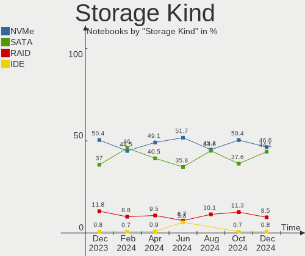
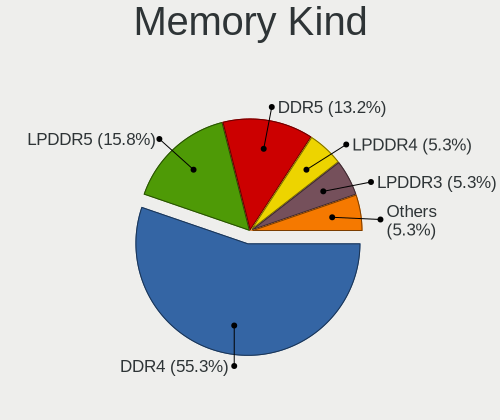

Pop!_OS Hardware Trends (Notebooks)
-----------------------------------

A project to identify most popular hardware characteristics and track their change
over time based on data collected by Pop!_OS users at https://Linux-Hardware.org.

Anyone can contribute to this report by the [hw-probe](https://github.com/linuxhw/hw-probe) tool:

    sudo -E hw-probe -all -upload

This report is for one last month. Overall report since the beginning of time: [TestCoverage](https://github.com/linuxhw/TestCoverage)

Period: Apr, 2022.

Contents
--------

* [ System ](#system)
  - [ OS                       ](#os)
  - [ OS Family                ](#os-family)
  - [ Kernel                   ](#kernel)
  - [ Kernel Family            ](#kernel-family)
  - [ Kernel Major Ver.        ](#kernel-major-ver)
  - [ Arch                     ](#arch)
  - [ DE                       ](#de)
  - [ Display Server           ](#display-server)
  - [ Display Manager          ](#display-manager)
  - [ OS Lang                  ](#os-lang)
  - [ Boot Mode                ](#boot-mode)
  - [ Filesystem               ](#filesystem)
  - [ Part. scheme             ](#part-scheme)
  - [ Dual Boot with Linux/BSD ](#dual-boot-with-linuxbsd)
  - [ Dual Boot (Win)          ](#dual-boot-win)

* [ Board ](#board)
  - [ Vendor                   ](#vendor)
  - [ Model                    ](#model)
  - [ Model Family             ](#model-family)
  - [ MFG Year                 ](#mfg-year)
  - [ Form Factor              ](#form-factor)
  - [ Secure Boot              ](#secure-boot)
  - [ Coreboot                 ](#coreboot)
  - [ RAM Size                 ](#ram-size)
  - [ RAM Used                 ](#ram-used)
  - [ Total Drives             ](#total-drives)
  - [ Has CD-ROM               ](#has-cd-rom)
  - [ Has Ethernet             ](#has-ethernet)
  - [ Has WiFi                 ](#has-wifi)
  - [ Has Bluetooth            ](#has-bluetooth)

* [ Location ](#location)
  - [ Country                  ](#country)
  - [ City                     ](#city)

* [ Drives ](#drives)
  - [ Drive Vendor             ](#drive-vendor)
  - [ Drive Model              ](#drive-model)
  - [ HDD Vendor               ](#hdd-vendor)
  - [ SSD Vendor               ](#ssd-vendor)
  - [ Drive Kind               ](#drive-kind)
  - [ Drive Connector          ](#drive-connector)
  - [ Drive Size               ](#drive-size)
  - [ Space Total              ](#space-total)
  - [ Space Used               ](#space-used)
  - [ Malfunc. Drives          ](#malfunc-drives)
  - [ Malfunc. Drive Vendor    ](#malfunc-drive-vendor)
  - [ Malfunc. HDD Vendor      ](#malfunc-hdd-vendor)
  - [ Malfunc. Drive Kind      ](#malfunc-drive-kind)
  - [ Failed Drives            ](#failed-drives)
  - [ Failed Drive Vendor      ](#failed-drive-vendor)
  - [ Drive Status             ](#drive-status)

* [ Storage controller ](#storage-controller)
  - [ Storage Vendor           ](#storage-vendor)
  - [ Storage Model            ](#storage-model)
  - [ Storage Kind             ](#storage-kind)

* [ Processor ](#processor)
  - [ CPU Vendor               ](#cpu-vendor)
  - [ CPU Model                ](#cpu-model)
  - [ CPU Model Family         ](#cpu-model-family)
  - [ CPU Cores                ](#cpu-cores)
  - [ CPU Sockets              ](#cpu-sockets)
  - [ CPU Threads              ](#cpu-threads)
  - [ CPU Op-Modes             ](#cpu-op-modes)
  - [ CPU Microcode            ](#cpu-microcode)
  - [ CPU Microarch            ](#cpu-microarch)

* [ Graphics ](#graphics)
  - [ GPU Vendor               ](#gpu-vendor)
  - [ GPU Model                ](#gpu-model)
  - [ GPU Combo                ](#gpu-combo)
  - [ GPU Driver               ](#gpu-driver)
  - [ GPU Memory               ](#gpu-memory)

* [ Monitor ](#monitor)
  - [ Monitor Vendor           ](#monitor-vendor)
  - [ Monitor Model            ](#monitor-model)
  - [ Monitor Resolution       ](#monitor-resolution)
  - [ Monitor Diagonal         ](#monitor-diagonal)
  - [ Monitor Width            ](#monitor-width)
  - [ Aspect Ratio             ](#aspect-ratio)
  - [ Monitor Area             ](#monitor-area)
  - [ Pixel Density            ](#pixel-density)
  - [ Multiple Monitors        ](#multiple-monitors)

* [ Network ](#network)
  - [ Net Controller Vendor    ](#net-controller-vendor)
  - [ Net Controller Model     ](#net-controller-model)
  - [ Wireless Vendor          ](#wireless-vendor)
  - [ Wireless Model           ](#wireless-model)
  - [ Ethernet Vendor          ](#ethernet-vendor)
  - [ Ethernet Model           ](#ethernet-model)
  - [ Net Controller Kind      ](#net-controller-kind)
  - [ Used Controller          ](#used-controller)
  - [ NICs                     ](#nics)
  - [ IPv6                     ](#ipv6)

* [ Bluetooth ](#bluetooth)
  - [ Bluetooth Vendor         ](#bluetooth-vendor)
  - [ Bluetooth Model          ](#bluetooth-model)

* [ Sound ](#sound)
  - [ Sound Vendor             ](#sound-vendor)
  - [ Sound Model              ](#sound-model)

* [ Memory ](#memory)
  - [ Memory Vendor            ](#memory-vendor)
  - [ Memory Model             ](#memory-model)
  - [ Memory Kind              ](#memory-kind)
  - [ Memory Form Factor       ](#memory-form-factor)
  - [ Memory Size              ](#memory-size)
  - [ Memory Speed             ](#memory-speed)

* [ Printers & scanners ](#printers--scanners)
  - [ Printer Vendor           ](#printer-vendor)
  - [ Printer Model            ](#printer-model)
  - [ Scanner Vendor           ](#scanner-vendor)
  - [ Scanner Model            ](#scanner-model)

* [ Camera ](#camera)
  - [ Camera Vendor            ](#camera-vendor)
  - [ Camera Model             ](#camera-model)

* [ Security ](#security)
  - [ Fingerprint Vendor       ](#fingerprint-vendor)
  - [ Fingerprint Model        ](#fingerprint-model)
  - [ Chipcard Vendor          ](#chipcard-vendor)
  - [ Chipcard Model           ](#chipcard-model)

* [ Unsupported ](#unsupported)
  - [ Unsupported Devices      ](#unsupported-devices)
  - [ Unsupported Device Types ](#unsupported-device-types)

System
------

OS
--

Installed operating systems

| Name          | Notebooks | Percent |
|---------------|-----------|---------|
| Pop!_OS 21.10 | 115       | 68.86%  |
| Pop!_OS 22.04 | 39        | 23.35%  |
| Pop!_OS 20.04 | 11        | 6.59%   |
| Pop!_OS 21.04 | 2         | 1.2%    |

OS Family
---------

OS without a version

| Name    | Notebooks | Percent |
|---------|-----------|---------|
| Pop!_OS | 167       | 100%    |

Kernel
------

Version of the Linux kernel

| Version                  | Notebooks | Percent |
|--------------------------|-----------|---------|
| 5.16.15-76051615-generic | 86        | 51.5%   |
| 5.16.19-76051619-generic | 57        | 34.13%  |
| 5.16.11-76051611-generic | 14        | 8.38%   |
| 5.15.15-76051515-generic | 2         | 1.2%    |
| 5.15.11-76051511-generic | 2         | 1.2%    |
| 5.17.2-xanmod1           | 1         | 0.6%    |
| 5.17.1-051701-generic    | 1         | 0.6%    |
| 5.16.20-tkg-pds          | 1         | 0.6%    |
| 5.16.16-xanmod1          | 1         | 0.6%    |
| 5.15.5-76051505-generic  | 1         | 0.6%    |
| 5.13.0-7614-generic      | 1         | 0.6%    |

Kernel Family
-------------

Linux kernel without a distro release

| Version | Notebooks | Percent |
|---------|-----------|---------|
| 5.16.15 | 86        | 51.5%   |
| 5.16.19 | 57        | 34.13%  |
| 5.16.11 | 14        | 8.38%   |
| 5.15.15 | 2         | 1.2%    |
| 5.15.11 | 2         | 1.2%    |
| 5.17.2  | 1         | 0.6%    |
| 5.17.1  | 1         | 0.6%    |
| 5.16.20 | 1         | 0.6%    |
| 5.16.16 | 1         | 0.6%    |
| 5.15.5  | 1         | 0.6%    |
| 5.13.0  | 1         | 0.6%    |

Kernel Major Ver.
-----------------

Linux kernel major version

| Version | Notebooks | Percent |
|---------|-----------|---------|
| 5.16    | 159       | 95.21%  |
| 5.15    | 5         | 2.99%   |
| 5.17    | 2         | 1.2%    |
| 5.13    | 1         | 0.6%    |

Arch
----

OS architecture (x86_64, i586, etc.)

| Name   | Notebooks | Percent |
|--------|-----------|---------|
| x86_64 | 167       | 100%    |

DE
--

Desktop Environment

| Name            | Notebooks | Percent |
|-----------------|-----------|---------|
| GNOME           | 164       | 98.2%   |
| KDE             | 1         | 0.6%    |
| GNOME Flashback | 1         | 0.6%    |
| Unknown         | 1         | 0.6%    |

Display Server
--------------

X11 or Wayland

| Name    | Notebooks | Percent |
|---------|-----------|---------|
| X11     | 161       | 96.41%  |
| Wayland | 5         | 2.99%   |
| Unknown | 1         | 0.6%    |

Display Manager
---------------

SDDM, LightDM, etc.

| Name    | Notebooks | Percent |
|---------|-----------|---------|
| Unknown | 118       | 70.66%  |
| GDM     | 40        | 23.95%  |
| GDM3    | 8         | 4.79%   |
| LightDM | 1         | 0.6%    |

OS Lang
-------

Language

| Lang    | Notebooks | Percent |
|---------|-----------|---------|
| en_US   | 101       | 60.48%  |
| pt_BR   | 17        | 10.18%  |
| en_GB   | 11        | 6.59%   |
| de_DE   | 6         | 3.59%   |
| it_IT   | 5         | 2.99%   |
| pt_PT   | 3         | 1.8%    |
| en_CA   | 3         | 1.8%    |
| sv_SE   | 2         | 1.2%    |
| ru_RU   | 2         | 1.2%    |
| fr_FR   | 2         | 1.2%    |
| C       | 2         | 1.2%    |
| zh_TW   | 1         | 0.6%    |
| tr_TR   | 1         | 0.6%    |
| nb_NO   | 1         | 0.6%    |
| fr_BE   | 1         | 0.6%    |
| es_CL   | 1         | 0.6%    |
| es_AR   | 1         | 0.6%    |
| eo_US   | 1         | 0.6%    |
| en_PH   | 1         | 0.6%    |
| en_IN   | 1         | 0.6%    |
| en_IL   | 1         | 0.6%    |
| en_AU   | 1         | 0.6%    |
| da_DK   | 1         | 0.6%    |
| Unknown | 1         | 0.6%    |

Boot Mode
---------

EFI or BIOS

| Mode | Notebooks | Percent |
|------|-----------|---------|
| BIOS | 123       | 73.65%  |
| EFI  | 44        | 26.35%  |

Filesystem
----------

Type of filesystem

| Type    | Notebooks | Percent |
|---------|-----------|---------|
| Ext4    | 158       | 94.61%  |
| Btrfs   | 7         | 4.19%   |
| Overlay | 2         | 1.2%    |

Part. scheme
------------

Scheme of partitioning

| Type    | Notebooks | Percent |
|---------|-----------|---------|
| Unknown | 117       | 70.06%  |
| GPT     | 45        | 26.95%  |
| MBR     | 5         | 2.99%   |

Dual Boot with Linux/BSD
------------------------

Hosting more than one Linux/BSD

| Dual boot | Notebooks | Percent |
|-----------|-----------|---------|
| No        | 165       | 98.8%   |
| Yes       | 2         | 1.2%    |

Dual Boot (Win)
---------------

Hosting Linux and Windows

| Dual boot | Notebooks | Percent |
|-----------|-----------|---------|
| No        | 151       | 90.42%  |
| Yes       | 16        | 9.58%   |

Board
-----

Vendor
------

Motherboard manufacturer

| Name                   | Notebooks | Percent |
|------------------------|-----------|---------|
| Lenovo                 | 32        | 19.16%  |
| Dell                   | 32        | 19.16%  |
| ASUSTek Computer       | 25        | 14.97%  |
| Hewlett-Packard        | 19        | 11.38%  |
| Acer                   | 14        | 8.38%   |
| MSI                    | 8         | 4.79%   |
| Apple                  | 7         | 4.19%   |
| Toshiba                | 6         | 3.59%   |
| System76               | 6         | 3.59%   |
| Samsung Electronics    | 3         | 1.8%    |
| TUXEDO                 | 2         | 1.2%    |
| HUAWEI                 | 2         | 1.2%    |
| Wortmann AG            | 1         | 0.6%    |
| Semp Toshiba           | 1         | 0.6%    |
| Purism                 | 1         | 0.6%    |
| Positivo               | 1         | 0.6%    |
| MOTILE                 | 1         | 0.6%    |
| GPU Company            | 1         | 0.6%    |
| Fujitsu                | 1         | 0.6%    |
| Framework              | 1         | 0.6%    |
| CyberPowerPC           | 1         | 0.6%    |
| Avell High Performance | 1         | 0.6%    |
| Unknown                | 1         | 0.6%    |

Model
-----

Motherboard model

| Name                                     | Notebooks | Percent |
|------------------------------------------|-----------|---------|
| System76 Oryx Pro                        | 3         | 1.8%    |
| MSI GF63 Thin 10SC                       | 2         | 1.2%    |
| Lenovo IdeaPad S145-15API 81V7           | 2         | 1.2%    |
| Dell XPS 13 9370                         | 2         | 1.2%    |
| Dell Inspiron 7559                       | 2         | 1.2%    |
| Dell Inspiron 3542                       | 2         | 1.2%    |
| Dell G7 7700                             | 2         | 1.2%    |
| Apple MacBookPro8,1                      | 2         | 1.2%    |
| Apple MacBookPro10,2                     | 2         | 1.2%    |
| Wortmann AG 1220663_1470189              | 1         | 0.6%    |
| TUXEDO Polaris AMD Gen2 (REN)            | 1         | 0.6%    |
| TUXEDO InfinityBook Pro 14 Gen6          | 1         | 0.6%    |
| Toshiba Satellite S75-A                  | 1         | 0.6%    |
| Toshiba Satellite L50D-B                 | 1         | 0.6%    |
| Toshiba Satellite L505                   | 1         | 0.6%    |
| Toshiba Satellite L10W-B-101             | 1         | 0.6%    |
| Toshiba Satellite C55t-C                 | 1         | 0.6%    |
| Toshiba Satellite A205                   | 1         | 0.6%    |
| System76 Pangolin                        | 1         | 0.6%    |
| System76 Galago Pro                      | 1         | 0.6%    |
| System76 Darter Pro                      | 1         | 0.6%    |
| Semp Toshiba IS 1413G                    | 1         | 0.6%    |
| Samsung 870Z5E/880Z5E/680Z5E             | 1         | 0.6%    |
| Samsung 550XDA                           | 1         | 0.6%    |
| Samsung 3570R/370R/470R/450R/510R/4450RV | 1         | 0.6%    |
| Purism Librem 15 v3                      | 1         | 0.6%    |
| Positivo N1250                           | 1         | 0.6%    |
| MSI Katana GF76 11UG                     | 1         | 0.6%    |
| MSI Katana GF76 11UD                     | 1         | 0.6%    |
| MSI Katana GF66 11UE                     | 1         | 0.6%    |
| MSI GT70 2OC/2OD                         | 1         | 0.6%    |
| MSI GS66 Stealth 11UG                    | 1         | 0.6%    |
| MSI GS66 Stealth 10UG                    | 1         | 0.6%    |
| MOTILE M141                              | 1         | 0.6%    |
| Lenovo Yoga710-14ISK 80TY                | 1         | 0.6%    |
| Lenovo Y720-15IKB 80VR                   | 1         | 0.6%    |
| Lenovo Y70-70 Touch 80DU                 | 1         | 0.6%    |
| Lenovo V15 G2 ALC 82KD                   | 1         | 0.6%    |
| Lenovo V130-14IKB 81HQ                   | 1         | 0.6%    |
| Lenovo ThinkPad X230 Tablet 3437CTO      | 1         | 0.6%    |
| Lenovo ThinkPad X230 2306CTO             | 1         | 0.6%    |
| Lenovo ThinkPad X1 Carbon 7th 20QES3HS08 | 1         | 0.6%    |
| Lenovo ThinkPad X1 Carbon 6th 20KG0022US | 1         | 0.6%    |
| Lenovo ThinkPad W520 4284EE6             | 1         | 0.6%    |
| Lenovo ThinkPad T480 20L6SJN400          | 1         | 0.6%    |
| Lenovo ThinkPad T480 20L50004UK          | 1         | 0.6%    |
| Lenovo ThinkPad T470p 20J7S0CF00         | 1         | 0.6%    |
| Lenovo ThinkPad T450s 20BWS19E02         | 1         | 0.6%    |
| Lenovo ThinkPad T431s 20ACS03P00         | 1         | 0.6%    |
| Lenovo ThinkPad P14s Gen 2i 20VX007QGE   | 1         | 0.6%    |
| Lenovo ThinkPad P14s Gen 2a 21A00004MX   | 1         | 0.6%    |
| Lenovo ThinkPad L15 Gen 2 20X4S68100     | 1         | 0.6%    |
| Lenovo ThinkPad E490 20N8005JMH          | 1         | 0.6%    |
| Lenovo ThinkPad E14 Gen 4 21ECS00000     | 1         | 0.6%    |
| Lenovo Legion Y530-15ICH 81FV            | 1         | 0.6%    |
| Lenovo Legion 5 Pro 16ACH6H 82JQ         | 1         | 0.6%    |
| Lenovo Legion 5 15ARH05H 82B1            | 1         | 0.6%    |
| Lenovo IdeaPad S145-15IWL 81S9           | 1         | 0.6%    |
| Lenovo IdeaPad L340-15IRH Gaming 81LK    | 1         | 0.6%    |
| Lenovo IdeaPad 5 Pro 14ACN6 82L7         | 1         | 0.6%    |

Model Family
------------

Motherboard model prefix

| Name                       | Notebooks | Percent |
|----------------------------|-----------|---------|
| Lenovo ThinkPad            | 15        | 8.98%   |
| Dell Inspiron              | 11        | 6.59%   |
| Dell XPS                   | 10        | 5.99%   |
| Acer Aspire                | 7         | 4.19%   |
| Toshiba Satellite          | 6         | 3.59%   |
| Lenovo IdeaPad             | 6         | 3.59%   |
| HP EliteBook               | 6         | 3.59%   |
| HP Pavilion                | 4         | 2.4%    |
| Dell Latitude              | 4         | 2.4%    |
| ASUS ROG                   | 4         | 2.4%    |
| Acer Nitro                 | 4         | 2.4%    |
| System76 Oryx              | 3         | 1.8%    |
| MSI Katana                 | 3         | 1.8%    |
| Lenovo Legion              | 3         | 1.8%    |
| HP ENVY                    | 3         | 1.8%    |
| Dell G7                    | 3         | 1.8%    |
| Apple MacBookPro8          | 3         | 1.8%    |
| MSI GS66                   | 2         | 1.2%    |
| MSI GF63                   | 2         | 1.2%    |
| Dell Vostro                | 2         | 1.2%    |
| ASUS ASUS                  | 2         | 1.2%    |
| Apple MacBookPro10         | 2         | 1.2%    |
| Acer Swift                 | 2         | 1.2%    |
| Wortmann AG 1220663        | 1         | 0.6%    |
| TUXEDO Polaris             | 1         | 0.6%    |
| TUXEDO InfinityBook        | 1         | 0.6%    |
| System76 Pangolin          | 1         | 0.6%    |
| System76 Galago            | 1         | 0.6%    |
| System76 Darter            | 1         | 0.6%    |
| Semp Toshiba IS            | 1         | 0.6%    |
| Samsung 870Z5E             | 1         | 0.6%    |
| Samsung 550XDA             | 1         | 0.6%    |
| Samsung 3570R              | 1         | 0.6%    |
| Purism Librem              | 1         | 0.6%    |
| Positivo N1250             | 1         | 0.6%    |
| MSI GT70                   | 1         | 0.6%    |
| MOTILE M141                | 1         | 0.6%    |
| Lenovo Yoga710-14ISK       | 1         | 0.6%    |
| Lenovo Y720-15IKB          | 1         | 0.6%    |
| Lenovo Y70-70              | 1         | 0.6%    |
| Lenovo V15                 | 1         | 0.6%    |
| Lenovo V130-14IKB          | 1         | 0.6%    |
| Lenovo G510                | 1         | 0.6%    |
| Lenovo G50-80              | 1         | 0.6%    |
| Lenovo G400s               | 1         | 0.6%    |
| HUAWEI NBLK-WAX9X          | 1         | 0.6%    |
| HUAWEI HVY-WXX9            | 1         | 0.6%    |
| HP ZBook                   | 1         | 0.6%    |
| HP Stream                  | 1         | 0.6%    |
| HP ProBook                 | 1         | 0.6%    |
| HP OMEN                    | 1         | 0.6%    |
| HP Laptop                  | 1         | 0.6%    |
| HP 15                      | 1         | 0.6%    |
| GPU Company GWTN141-10     | 1         | 0.6%    |
| Fujitsu LIFEBOOK           | 1         | 0.6%    |
| Framework Laptop           | 1         | 0.6%    |
| Dell Precision             | 1         | 0.6%    |
| Dell G5                    | 1         | 0.6%    |
| CyberPowerPC Tracer        | 1         | 0.6%    |
| Avell High Performance C62 | 1         | 0.6%    |

MFG Year
--------

Motherboard manufacture year

| Year | Notebooks | Percent |
|------|-----------|---------|
| 2021 | 42        | 25.15%  |
| 2019 | 17        | 10.18%  |
| 2018 | 14        | 8.38%   |
| 2013 | 14        | 8.38%   |
| 2015 | 13        | 7.78%   |
| 2020 | 12        | 7.19%   |
| 2014 | 12        | 7.19%   |
| 2016 | 10        | 5.99%   |
| 2017 | 9         | 5.39%   |
| 2012 | 6         | 3.59%   |
| 2011 | 6         | 3.59%   |
| 2009 | 4         | 2.4%    |
| 2010 | 3         | 1.8%    |
| 2022 | 2         | 1.2%    |
| 2008 | 1         | 0.6%    |
| 2007 | 1         | 0.6%    |
| 2004 | 1         | 0.6%    |

Form Factor
-----------

Physical design of the computer

| Name     | Notebooks | Percent |
|----------|-----------|---------|
| Notebook | 167       | 100%    |

Secure Boot
-----------

Enabled or disabled

| State    | Notebooks | Percent |
|----------|-----------|---------|
| Disabled | 167       | 100%    |

Coreboot
--------

Have coreboot on board

| Used | Notebooks | Percent |
|------|-----------|---------|
| No   | 161       | 96.41%  |
| Yes  | 6         | 3.59%   |

RAM Size
--------

Total RAM memory

| Size in GB  | Notebooks | Percent |
|-------------|-----------|---------|
| 4.01-8.0    | 48        | 28.74%  |
| 16.01-24.0  | 43        | 25.75%  |
| 8.01-16.0   | 29        | 17.37%  |
| 3.01-4.0    | 21        | 12.57%  |
| 32.01-64.0  | 18        | 10.78%  |
| 64.01-256.0 | 6         | 3.59%   |
| 24.01-32.0  | 1         | 0.6%    |
| 1.01-2.0    | 1         | 0.6%    |

RAM Used
--------

Used RAM memory

| Used GB    | Notebooks | Percent |
|------------|-----------|---------|
| 2.01-3.0   | 61        | 36.53%  |
| 4.01-8.0   | 32        | 19.16%  |
| 3.01-4.0   | 30        | 17.96%  |
| 1.01-2.0   | 29        | 17.37%  |
| 8.01-16.0  | 11        | 6.59%   |
| 16.01-24.0 | 3         | 1.8%    |
| 24.01-32.0 | 1         | 0.6%    |

Total Drives
------------

Number of drives on board

| Drives | Notebooks | Percent |
|--------|-----------|---------|
| 1      | 120       | 71.86%  |
| 2      | 44        | 26.35%  |
| 3      | 2         | 1.2%    |
| 0      | 1         | 0.6%    |

Has CD-ROM
----------

Has CD-ROM on board

| Presented | Notebooks | Percent |
|-----------|-----------|---------|
| No        | 130       | 77.84%  |
| Yes       | 37        | 22.16%  |

Has Ethernet
------------

Has Ethernet on board

| Presented | Notebooks | Percent |
|-----------|-----------|---------|
| Yes       | 135       | 80.84%  |
| No        | 32        | 19.16%  |

Has WiFi
--------

Has WiFi module

| Presented | Notebooks | Percent |
|-----------|-----------|---------|
| Yes       | 165       | 98.8%   |
| No        | 2         | 1.2%    |

Has Bluetooth
-------------

Has Bluetooth module

| Presented | Notebooks | Percent |
|-----------|-----------|---------|
| Yes       | 147       | 88.02%  |
| No        | 20        | 11.98%  |

Location
--------

Country
-------

Geographic location (country)

| Country      | Notebooks | Percent |
|--------------|-----------|---------|
| USA          | 48        | 28.74%  |
| Brazil       | 23        | 13.77%  |
| Germany      | 11        | 6.59%   |
| UK           | 8         | 4.79%   |
| India        | 7         | 4.19%   |
| Canada       | 7         | 4.19%   |
| Italy        | 6         | 3.59%   |
| Russia       | 3         | 1.8%    |
| Portugal     | 3         | 1.8%    |
| Norway       | 3         | 1.8%    |
| France       | 3         | 1.8%    |
| Turkey       | 2         | 1.2%    |
| Sweden       | 2         | 1.2%    |
| Romania      | 2         | 1.2%    |
| Philippines  | 2         | 1.2%    |
| Latvia       | 2         | 1.2%    |
| Japan        | 2         | 1.2%    |
| Israel       | 2         | 1.2%    |
| Indonesia    | 2         | 1.2%    |
| Belgium      | 2         | 1.2%    |
| Argentina    | 2         | 1.2%    |
| Venezuela    | 1         | 0.6%    |
| Thailand     | 1         | 0.6%    |
| Taiwan       | 1         | 0.6%    |
| Switzerland  | 1         | 0.6%    |
| Spain        | 1         | 0.6%    |
| Singapore    | 1         | 0.6%    |
| Saudi Arabia | 1         | 0.6%    |
| Poland       | 1         | 0.6%    |
| Netherlands  | 1         | 0.6%    |
| Mexico       | 1         | 0.6%    |
| Malaysia     | 1         | 0.6%    |
| Iran         | 1         | 0.6%    |
| Hungary      | 1         | 0.6%    |
| Greece       | 1         | 0.6%    |
| Finland      | 1         | 0.6%    |
| Egypt        | 1         | 0.6%    |
| Denmark      | 1         | 0.6%    |
| Czechia      | 1         | 0.6%    |
| Croatia      | 1         | 0.6%    |
| Colombia     | 1         | 0.6%    |
| Bulgaria     | 1         | 0.6%    |
| Bangladesh   | 1         | 0.6%    |
| Austria      | 1         | 0.6%    |
| Australia    | 1         | 0.6%    |
| Armenia      | 1         | 0.6%    |

City
----

Geographic location (city)

| City                     | Notebooks | Percent |
|--------------------------|-----------|---------|
| Sao Paulo                | 2         | 1.2%    |
| Salt Lake City           | 2         | 1.2%    |
| Rome                     | 2         | 1.2%    |
| Rio de Janeiro           | 2         | 1.2%    |
| Moscow                   | 2         | 1.2%    |
| Mendoza                  | 2         | 1.2%    |
| London                   | 2         | 1.2%    |
| Kolkata                  | 2         | 1.2%    |
| Chicago                  | 2         | 1.2%    |
| Bengaluru                | 2         | 1.2%    |
| Zurich                   | 1         | 0.6%    |
| Zagreb                   | 1         | 0.6%    |
| Youngstown               | 1         | 0.6%    |
| Yerevan                  | 1         | 0.6%    |
| Wroclaw                  | 1         | 0.6%    |
| Williamsport             | 1         | 0.6%    |
| Vila Velha               | 1         | 0.6%    |
| Vanlose                  | 1         | 0.6%    |
| Vancouver                | 1         | 0.6%    |
| Vaihingen an der Enz     | 1         | 0.6%    |
| Urjala                   | 1         | 0.6%    |
| Ufa                      | 1         | 0.6%    |
| Uberlândia              | 1         | 0.6%    |
| Truckee                  | 1         | 0.6%    |
| Triel-sur-Seine          | 1         | 0.6%    |
| Toronto                  | 1         | 0.6%    |
| Tiraine                  | 1         | 0.6%    |
| Teixeira de Freitas      | 1         | 0.6%    |
| Taipei                   | 1         | 0.6%    |
| Surrey                   | 1         | 0.6%    |
| Surbiton                 | 1         | 0.6%    |
| Surabaya                 | 1         | 0.6%    |
| Strullendorf             | 1         | 0.6%    |
| Stockholm                | 1         | 0.6%    |
| Stevens Point            | 1         | 0.6%    |
| State College            | 1         | 0.6%    |
| St Louis                 | 1         | 0.6%    |
| Spring                   | 1         | 0.6%    |
| Somerset                 | 1         | 0.6%    |
| Solna                    | 1         | 0.6%    |
| Sofia                    | 1         | 0.6%    |
| Sobral                   | 1         | 0.6%    |
| Skeie                    | 1         | 0.6%    |
| Sittingbourne            | 1         | 0.6%    |
| Singapore                | 1         | 0.6%    |
| Scottsdale               | 1         | 0.6%    |
| Sao Sebastiao do Paraiso | 1         | 0.6%    |
| Santo André             | 1         | 0.6%    |
| Santa Rosa               | 1         | 0.6%    |
| San Miguel               | 1         | 0.6%    |
| San Leandro              | 1         | 0.6%    |
| San Diego                | 1         | 0.6%    |
| San Antonio              | 1         | 0.6%    |
| Salvador                 | 1         | 0.6%    |
| Rotterdam                | 1         | 0.6%    |
| Riyadh                   | 1         | 0.6%    |
| Riverview                | 1         | 0.6%    |
| Riga                     | 1         | 0.6%    |
| Richmond Hill            | 1         | 0.6%    |
| Remscheid                | 1         | 0.6%    |

Drives
------

Drive Vendor
------------

Hard drive vendors

| Vendor                      | Notebooks | Drives | Percent |
|-----------------------------|-----------|--------|---------|
| Samsung Electronics         | 35        | 36     | 17.16%  |
| WDC                         | 23        | 25     | 11.27%  |
| Sandisk                     | 20        | 22     | 9.8%    |
| Seagate                     | 17        | 18     | 8.33%   |
| Toshiba                     | 16        | 16     | 7.84%   |
| SK Hynix                    | 13        | 13     | 6.37%   |
| Kingston                    | 13        | 13     | 6.37%   |
| Crucial                     | 7         | 8      | 3.43%   |
| Micron Technology           | 6         | 6      | 2.94%   |
| Intel                       | 6         | 7      | 2.94%   |
| HGST                        | 5         | 5      | 2.45%   |
| Unknown                     | 4         | 5      | 1.96%   |
| A-DATA Technology           | 4         | 4      | 1.96%   |
| UMIS                        | 3         | 3      | 1.47%   |
| Apple                       | 3         | 3      | 1.47%   |
| ADATA Technology            | 3         | 4      | 1.47%   |
| MAXIO Technology (Hangzhou) | 2         | 2      | 0.98%   |
| KIOXIA                      | 2         | 2      | 0.98%   |
| BIWIN                       | 2         | 2      | 0.98%   |
| YMTC                        | 1         | 1      | 0.49%   |
| WDC WDS4                    | 1         | 1      | 0.49%   |
| W800S                       | 1         | 1      | 0.49%   |
| Union Memory (Shenzhen)     | 1         | 1      | 0.49%   |
| Transcend                   | 1         | 1      | 0.49%   |
| SSSTC                       | 1         | 1      | 0.49%   |
| Ramaxel Technology          | 1         | 1      | 0.49%   |
| PNY                         | 1         | 1      | 0.49%   |
| Phison                      | 1         | 1      | 0.49%   |
| Patriot                     | 1         | 1      | 0.49%   |
| Micron/Crucial Technology   | 1         | 1      | 0.49%   |
| LITEON                      | 1         | 1      | 0.49%   |
| Lexar                       | 1         | 1      | 0.49%   |
| Lenovo                      | 1         | 1      | 0.49%   |
| KINGBANK                    | 1         | 1      | 0.49%   |
| Hitachi                     | 1         | 1      | 0.49%   |
| Hikvision                   | 1         | 1      | 0.49%   |
| BHT                         | 1         | 1      | 0.49%   |
| AMD                         | 1         | 2      | 0.49%   |
| Unknown                     | 1         | 1      | 0.49%   |

Drive Model
-----------

Hard drive models

| Model                                        | Notebooks | Percent |
|----------------------------------------------|-----------|---------|
| SK Hynix NVMe SSD Drive 512GB                | 7         | 3.29%   |
| Sandisk NVMe SSD Drive 512GB                 | 5         | 2.35%   |
| Sandisk NVMe SSD Drive 1TB                   | 4         | 1.88%   |
| Samsung SSD 860 EVO 500GB                    | 4         | 1.88%   |
| Toshiba MQ01ABD075 752GB                     | 3         | 1.41%   |
| Seagate ST1000LM024 HN-M101MBB 1TB           | 3         | 1.41%   |
| Samsung SSD 850 EVO 250GB                    | 3         | 1.41%   |
| Samsung NVMe SSD Drive 2TB                   | 3         | 1.41%   |
| Kingston SA400S37120G 120GB SSD              | 3         | 1.41%   |
| Intel NVMe SSD Drive 512GB                   | 3         | 1.41%   |
| WDC WDS500G2B0A-00SM50 500GB SSD             | 2         | 0.94%   |
| WDC WD10SPZX-24Z10 1TB                       | 2         | 0.94%   |
| WDC WD10SPZX-21Z10T0 1TB                     | 2         | 0.94%   |
| WDC WD10JPVX-22JC3T0 1TB                     | 2         | 0.94%   |
| Toshiba MQ01ABF050 500GB                     | 2         | 0.94%   |
| Toshiba MQ01ABD100 1TB                       | 2         | 0.94%   |
| Toshiba KXG50ZNV512G NVMe 512GB              | 2         | 0.94%   |
| SK Hynix NVMe SSD Drive 1024GB               | 2         | 0.94%   |
| Seagate ST1000LM048-2E7172 1TB               | 2         | 0.94%   |
| Seagate ST1000LM035-1RK172 1TB               | 2         | 0.94%   |
| Sandisk NVMe SSD Drive 500GB                 | 2         | 0.94%   |
| Sandisk NVMe SSD Drive 256GB                 | 2         | 0.94%   |
| Samsung NVMe SSD Drive 256GB                 | 2         | 0.94%   |
| Samsung NVMe SSD Drive 1024GB                | 2         | 0.94%   |
| Kingston SA400S37240G 240GB SSD              | 2         | 0.94%   |
| HGST HTS721010A9E630 1TB                     | 2         | 0.94%   |
| Crucial CT500MX500SSD1 500GB                 | 2         | 0.94%   |
| Crucial CT240BX500SSD1 240GB                 | 2         | 0.94%   |
| Apple SSD SM512E 500GB                       | 2         | 0.94%   |
| ADATA NVMe SSD Drive 256GB                   | 2         | 0.94%   |
| YMTC PC005 512GB                             | 1         | 0.47%   |
| WDC WDS500G2B0C-00PXH0 500GB                 | 1         | 0.47%   |
| WDC WDS4 80G2G0B-00EPW0 480GB SSD            | 1         | 0.47%   |
| WDC WDS250G2B0B-00YS70 250GB SSD             | 1         | 0.47%   |
| WDC WDS240G2G0B-00EPW0 240GB SSD             | 1         | 0.47%   |
| WDC WDS120G2G0B-00EPW0 120GB SSD             | 1         | 0.47%   |
| WDC WDS100T2G0A-00JH30 1TB SSD               | 1         | 0.47%   |
| WDC WDS100T2B0C-00PXH0 1TB                   | 1         | 0.47%   |
| WDC WDS100T2B0A-00SM50 1TB SSD               | 1         | 0.47%   |
| WDC WD800BEVS-07RST0 80GB                    | 1         | 0.47%   |
| WDC WD5000LPCX-60VHAT0 500GB                 | 1         | 0.47%   |
| WDC WD3200BPVT-22JJ5T0 320GB                 | 1         | 0.47%   |
| WDC WD1600BEVS-60RST0 160GB                  | 1         | 0.47%   |
| WDC WD10S21X-24R1BT0-SSHD-8GB                | 1         | 0.47%   |
| WDC WD10JPVX-75JC3T0 1TB                     | 1         | 0.47%   |
| WDC WD easystore 240GB                       | 1         | 0.47%   |
| WDC PC SN730 SDBPNTY-1T00-1101 1TB           | 1         | 0.47%   |
| WDC PC SN730 NVMe 512GB                      | 1         | 0.47%   |
| WDC PC SN520 SDAPNUW-256G-1006 256GB         | 1         | 0.47%   |
| W800S 512GB                                  | 1         | 0.47%   |
| Unknown SD/MMC/MS PRO 16GB                   | 1         | 0.47%   |
| Unknown MMC Card  64GB                       | 1         | 0.47%   |
| Unknown MMC Card  256GB                      | 1         | 0.47%   |
| Unknown MMC Card  16GB                       | 1         | 0.47%   |
| Unknown MMC Card  128GB                      | 1         | 0.47%   |
| Union Memory (Shenzhen) NVMe SSD Drive 512GB | 1         | 0.47%   |
| UMIS RPFTJ256PDD2MWX 256GB                   | 1         | 0.47%   |
| UMIS RPFTJ128PDD2EWX 128GB                   | 1         | 0.47%   |
| UMIS RPETJ512MGE2QDQ 512GB                   | 1         | 0.47%   |
| Transcend TS512GSSD230S 512GB                | 1         | 0.47%   |

HDD Vendor
----------

Hard disk drive vendors

| Vendor  | Notebooks | Drives | Percent |
|---------|-----------|--------|---------|
| Seagate | 17        | 18     | 36.96%  |
| WDC     | 12        | 12     | 26.09%  |
| Toshiba | 10        | 10     | 21.74%  |
| HGST    | 5         | 5      | 10.87%  |
| Unknown | 1         | 1      | 2.17%   |
| Hitachi | 1         | 1      | 2.17%   |

SSD Vendor
----------

Solid state drive vendors

| Vendor              | Notebooks | Drives | Percent |
|---------------------|-----------|--------|---------|
| Samsung Electronics | 14        | 15     | 20.59%  |
| SanDisk             | 9         | 9      | 13.24%  |
| Kingston            | 9         | 9      | 13.24%  |
| WDC                 | 8         | 8      | 11.76%  |
| Crucial             | 7         | 8      | 10.29%  |
| Apple               | 3         | 3      | 4.41%   |
| SK Hynix            | 2         | 2      | 2.94%   |
| Micron Technology   | 2         | 2      | 2.94%   |
| A-DATA Technology   | 2         | 2      | 2.94%   |
| WDC WDS4            | 1         | 1      | 1.47%   |
| Transcend           | 1         | 1      | 1.47%   |
| Ramaxel Technology  | 1         | 1      | 1.47%   |
| PNY                 | 1         | 1      | 1.47%   |
| Patriot             | 1         | 1      | 1.47%   |
| LITEON              | 1         | 1      | 1.47%   |
| Lexar               | 1         | 1      | 1.47%   |
| KINGBANK            | 1         | 1      | 1.47%   |
| Intel               | 1         | 1      | 1.47%   |
| BIWIN               | 1         | 1      | 1.47%   |
| BHT                 | 1         | 1      | 1.47%   |
| Unknown             | 1         | 1      | 1.47%   |

Drive Kind
----------

HDD or SSD

| Kind    | Notebooks | Drives | Percent |
|---------|-----------|--------|---------|
| NVMe    | 82        | 93     | 42.05%  |
| SSD     | 64        | 70     | 32.82%  |
| HDD     | 45        | 47     | 23.08%  |
| MMC     | 3         | 4      | 1.54%   |
| Unknown | 1         | 1      | 0.51%   |

Drive Connector
---------------

SATA, SAS, NVMe, etc.

| Type | Notebooks | Drives | Percent |
|------|-----------|--------|---------|
| SATA | 102       | 115    | 53.68%  |
| NVMe | 82        | 93     | 43.16%  |
| SAS  | 3         | 3      | 1.58%   |
| MMC  | 3         | 4      | 1.58%   |

Drive Size
----------

Size of hard drive

| Size in TB | Notebooks | Drives | Percent |
|------------|-----------|--------|---------|
| 0.01-0.5   | 71        | 76     | 64.55%  |
| 0.51-1.0   | 36        | 38     | 32.73%  |
| 1.01-2.0   | 3         | 3      | 2.73%   |

Space Total
-----------

Amount of disk space available on the file system

| Size in GB | Notebooks | Percent |
|------------|-----------|---------|
| 251-500    | 53        | 31.74%  |
| 101-250    | 52        | 31.14%  |
| 501-1000   | 30        | 17.96%  |
| 1001-2000  | 14        | 8.38%   |
| 51-100     | 11        | 6.59%   |
| 21-50      | 2         | 1.2%    |
| 2001-3000  | 2         | 1.2%    |
| 1-20       | 2         | 1.2%    |
| Unknown    | 1         | 0.6%    |

Space Used
----------

Amount of used disk space

| Used GB   | Notebooks | Percent |
|-----------|-----------|---------|
| 1-20      | 43        | 25.75%  |
| 21-50     | 37        | 22.16%  |
| 101-250   | 29        | 17.37%  |
| 51-100    | 28        | 16.77%  |
| 251-500   | 19        | 11.38%  |
| 501-1000  | 9         | 5.39%   |
| 1001-2000 | 1         | 0.6%    |
| Unknown   | 1         | 0.6%    |

Malfunc. Drives
---------------

Drive models with a malfunction

| Model                                 | Notebooks | Drives | Percent |
|---------------------------------------|-----------|--------|---------|
| Toshiba MQ01ACF050 500GB              | 1         | 1      | 33.33%  |
| SK Hynix HFS512G39TND-N210A 512GB SSD | 1         | 1      | 33.33%  |
| Seagate ST1000LM024 HN-M101MBB 1TB    | 1         | 1      | 33.33%  |

Malfunc. Drive Vendor
---------------------

Vendors of faulty drives

| Vendor   | Notebooks | Drives | Percent |
|----------|-----------|--------|---------|
| Toshiba  | 1         | 1      | 33.33%  |
| SK Hynix | 1         | 1      | 33.33%  |
| Seagate  | 1         | 1      | 33.33%  |

Malfunc. HDD Vendor
-------------------

Vendors of faulty HDD drives

| Vendor  | Notebooks | Drives | Percent |
|---------|-----------|--------|---------|
| Toshiba | 1         | 1      | 50%     |
| Seagate | 1         | 1      | 50%     |

Malfunc. Drive Kind
-------------------

Kinds of faulty drives

| Kind | Notebooks | Drives | Percent |
|------|-----------|--------|---------|
| HDD  | 2         | 2      | 66.67%  |
| SSD  | 1         | 1      | 33.33%  |

Failed Drives
-------------

Failed drive models

Zero info for selected period =(

Failed Drive Vendor
-------------------

Failed drive vendors

Zero info for selected period =(

Drive Status
------------

Number of failed and malfunc. drives

| Status   | Notebooks | Drives | Percent |
|----------|-----------|--------|---------|
| Detected | 116       | 151    | 68.24%  |
| Works    | 51        | 61     | 30%     |
| Malfunc  | 3         | 3      | 1.76%   |

Storage controller
------------------

Storage Vendor
--------------

Storage controller vendors

| Vendor                         | Notebooks | Percent |
|--------------------------------|-----------|---------|
| Intel                          | 115       | 53%     |
| Samsung Electronics            | 22        | 10.14%  |
| AMD                            | 19        | 8.76%   |
| Sandisk                        | 16        | 7.37%   |
| SK Hynix                       | 11        | 5.07%   |
| Toshiba America Info Systems   | 6         | 2.76%   |
| Union Memory (Shenzhen)        | 4         | 1.84%   |
| Micron Technology              | 4         | 1.84%   |
| Kingston Technology Company    | 4         | 1.84%   |
| ADATA Technology               | 4         | 1.84%   |
| MAXIO Technology (Hangzhou)    | 2         | 0.92%   |
| KIOXIA                         | 2         | 0.92%   |
| Yangtze Memory Technologies    | 1         | 0.46%   |
| Solid State Storage Technology | 1         | 0.46%   |
| Realtek Semiconductor          | 1         | 0.46%   |
| Phison Electronics             | 1         | 0.46%   |
| Nvidia                         | 1         | 0.46%   |
| Micron/Crucial Technology      | 1         | 0.46%   |
| Lenovo                         | 1         | 0.46%   |
| Biwin Storage Technology       | 1         | 0.46%   |

Storage Model
-------------

Storage controller models

| Model                                                                            | Notebooks | Percent |
|----------------------------------------------------------------------------------|-----------|---------|
| AMD FCH SATA Controller [AHCI mode]                                              | 18        | 7.96%   |
| Intel Volume Management Device NVMe RAID Controller                              | 14        | 6.19%   |
| Intel 7 Series Chipset Family 6-port SATA Controller [AHCI mode]                 | 13        | 5.75%   |
| Samsung NVMe SSD Controller SM981/PM981/PM983                                    | 11        | 4.87%   |
| Intel Sunrise Point-LP SATA Controller [AHCI mode]                               | 11        | 4.87%   |
| Intel 8 Series SATA Controller 1 [AHCI mode]                                     | 11        | 4.87%   |
| Intel HM170/QM170 Chipset SATA Controller [AHCI Mode]                            | 7         | 3.1%    |
| Intel 82801 Mobile SATA Controller [RAID mode]                                   | 7         | 3.1%    |
| Intel 6 Series/C200 Series Chipset Family 6 port Mobile SATA AHCI Controller     | 7         | 3.1%    |
| SK Hynix Gold P31 SSD                                                            | 6         | 2.65%   |
| Sandisk WD Blue SN550 NVMe SSD                                                   | 6         | 2.65%   |
| Intel Wildcat Point-LP SATA Controller [AHCI Mode]                               | 6         | 2.65%   |
| Sandisk WD Black SN750 / PC SN730 NVMe SSD                                       | 5         | 2.21%   |
| Samsung NVMe SSD Controller 980                                                  | 5         | 2.21%   |
| Intel Cannon Lake Mobile PCH SATA AHCI Controller                                | 5         | 2.21%   |
| Intel 8 Series/C220 Series Chipset Family 6-port SATA Controller 1 [AHCI mode]   | 5         | 2.21%   |
| Intel 500 Series Chipset Family SATA AHCI Controller                             | 5         | 2.21%   |
| Intel 400 Series Chipset Family SATA AHCI Controller                             | 5         | 2.21%   |
| Micron Non-Volatile memory controller                                            | 4         | 1.77%   |
| Intel 82801IBM/IEM (ICH9M/ICH9M-E) 4 port SATA Controller [AHCI mode]            | 4         | 1.77%   |
| ADATA Non-Volatile memory controller                                             | 4         | 1.77%   |
| Toshiba America Info Systems XG6 NVMe SSD Controller                             | 3         | 1.33%   |
| Toshiba America Info Systems Toshiba America Info Non-Volatile memory controller | 3         | 1.33%   |
| SK Hynix BC511                                                                   | 3         | 1.33%   |
| Samsung NVMe SSD Controller PM9A1/PM9A3/980PRO                                   | 3         | 1.33%   |
| Intel Tiger Lake-LP SATA Controller [AHCI mode]                                  | 3         | 1.33%   |
| Union Memory (Shenzhen) Non-Volatile memory controller                           | 2         | 0.88%   |
| Union Memory (Shenzhen) AM630 PCIe 4.0 x4 NVMe SSD Controller                    | 2         | 0.88%   |
| Sandisk Non-Volatile memory controller                                           | 2         | 0.88%   |
| MAXIO (Hangzhou) NVMe SSD Controller MAP1001                                     | 2         | 0.88%   |
| KIOXIA Non-Volatile memory controller                                            | 2         | 0.88%   |
| Kingston Company Company Non-Volatile memory controller                          | 2         | 0.88%   |
| Intel SSD 660P Series                                                            | 2         | 0.88%   |
| Intel Atom Processor E3800 Series SATA AHCI Controller                           | 2         | 0.88%   |
| Intel 5 Series/3400 Series Chipset 4 port SATA AHCI Controller                   | 2         | 0.88%   |
| Yangtze Memory Non-Volatile memory controller                                    | 1         | 0.44%   |
| Solid State Storage Non-Volatile memory controller                               | 1         | 0.44%   |
| SK Hynix PC401 NVMe Solid State Drive 256GB                                      | 1         | 0.44%   |
| SK Hynix Non-Volatile memory controller                                          | 1         | 0.44%   |
| Sandisk WD PC SN810 / Black SN850 NVMe SSD                                       | 1         | 0.44%   |
| Sandisk WD Blue SN500 / PC SN520 NVMe SSD                                        | 1         | 0.44%   |
| Sandisk WD Black NVMe SSD                                                        | 1         | 0.44%   |
| Sandisk PC SN520 NVMe SSD                                                        | 1         | 0.44%   |
| Samsung NVMe SSD Controller SM961/PM961/SM963                                    | 1         | 0.44%   |
| Samsung NVMe SSD Controller SM951/PM951                                          | 1         | 0.44%   |
| Samsung Electronics SATA controller                                              | 1         | 0.44%   |
| Realtek Realtek Non-Volatile memory controller                                   | 1         | 0.44%   |
| Phison PS5013 E13 NVMe Controller                                                | 1         | 0.44%   |
| Nvidia MCP79 AHCI Controller                                                     | 1         | 0.44%   |
| Micron/Crucial P1 NVMe PCIe SSD                                                  | 1         | 0.44%   |
| Lenovo Non-Volatile memory controller                                            | 1         | 0.44%   |
| Kingston Company OM3PDP3 NVMe SSD                                                | 1         | 0.44%   |
| Kingston Company A2000 NVMe SSD                                                  | 1         | 0.44%   |
| Intel SSD Pro 7600p/760p/E 6100p Series                                          | 1         | 0.44%   |
| Intel SSD 600P Series                                                            | 1         | 0.44%   |
| Intel Q170/Q150/B150/H170/H110/Z170/CM236 Chipset SATA Controller [AHCI Mode]    | 1         | 0.44%   |
| Intel Non-Volatile memory controller                                             | 1         | 0.44%   |
| Intel Comet Lake SATA AHCI Controller                                            | 1         | 0.44%   |
| Intel Celeron/Pentium Silver Processor SATA Controller                           | 1         | 0.44%   |
| Intel Celeron N3350/Pentium N4200/Atom E3900 Series SATA AHCI Controller         | 1         | 0.44%   |

Storage Kind
------------

Kind of storage controller (IDE, SATA, NVMe, SAS, ...)

| Kind | Notebooks | Percent |
|------|-----------|---------|
| SATA | 114       | 51.82%  |
| NVMe | 82        | 37.27%  |
| RAID | 21        | 9.55%   |
| IDE  | 3         | 1.36%   |

Processor
---------

CPU Vendor
----------

Processor vendors

| Vendor | Notebooks | Percent |
|--------|-----------|---------|
| Intel  | 137       | 82.04%  |
| AMD    | 30        | 17.96%  |

CPU Model
---------

Processor models

| Model                                         | Notebooks | Percent |
|-----------------------------------------------|-----------|---------|
| Intel 11th Gen Core i7-11800H @ 2.30GHz       | 7         | 4.19%   |
| Intel 11th Gen Core i7-1165G7 @ 2.80GHz       | 6         | 3.59%   |
| Intel Core i7-8550U CPU @ 1.80GHz             | 5         | 2.99%   |
| Intel Core i7-7700HQ CPU @ 2.80GHz            | 4         | 2.4%    |
| Intel Core i5-4200U CPU @ 1.60GHz             | 4         | 2.4%    |
| Intel 11th Gen Core i5-1135G7 @ 2.40GHz       | 4         | 2.4%    |
| AMD Ryzen 5 3500U with Radeon Vega Mobile Gfx | 4         | 2.4%    |
| Intel Core i7-6700HQ CPU @ 2.60GHz            | 3         | 1.8%    |
| Intel Core i7-4700MQ CPU @ 2.40GHz            | 3         | 1.8%    |
| Intel Core i7-10750H CPU @ 2.60GHz            | 3         | 1.8%    |
| Intel Core i5-7200U CPU @ 2.50GHz             | 3         | 1.8%    |
| Intel Core i5-4210U CPU @ 1.70GHz             | 3         | 1.8%    |
| Intel Core i5-3210M CPU @ 2.50GHz             | 3         | 1.8%    |
| Intel Core i3-6006U CPU @ 2.00GHz             | 3         | 1.8%    |
| Intel 11th Gen Core i9-11900H @ 2.50GHz       | 3         | 1.8%    |
| AMD Ryzen 7 4800H with Radeon Graphics        | 3         | 1.8%    |
| Intel Core i7-9750H CPU @ 2.60GHz             | 2         | 1.2%    |
| Intel Core i7-8750H CPU @ 2.20GHz             | 2         | 1.2%    |
| Intel Core i7-7500U CPU @ 2.70GHz             | 2         | 1.2%    |
| Intel Core i7-3630QM CPU @ 2.40GHz            | 2         | 1.2%    |
| Intel Core i5-8265U CPU @ 1.60GHz             | 2         | 1.2%    |
| Intel Core i5-6200U CPU @ 2.30GHz             | 2         | 1.2%    |
| Intel Core i5-5200U CPU @ 2.20GHz             | 2         | 1.2%    |
| Intel Core i5-10500H CPU @ 2.50GHz            | 2         | 1.2%    |
| Intel Core i3-2330M CPU @ 2.20GHz             | 2         | 1.2%    |
| Intel Core 2 Duo CPU T6500 @ 2.10GHz          | 2         | 1.2%    |
| Intel 11th Gen Core i7-1185G7 @ 3.00GHz       | 2         | 1.2%    |
| Intel 11th Gen Core i7-11370H @ 3.30GHz       | 2         | 1.2%    |
| Intel 11th Gen Core i5-11400H @ 2.70GHz       | 2         | 1.2%    |
| AMD Ryzen 7 PRO 5850U with Radeon Graphics    | 2         | 1.2%    |
| AMD Ryzen 7 5800H with Radeon Graphics        | 2         | 1.2%    |
| AMD Ryzen 5 5500U with Radeon Graphics        | 2         | 1.2%    |
| Intel Pentium CPU N3540 @ 2.16GHz             | 1         | 0.6%    |
| Intel Genuine CPU U7300 @ 1.30GHz             | 1         | 0.6%    |
| Intel Genuine CPU U2300 @ 1.20GHz             | 1         | 0.6%    |
| Intel Core i9-9980HK CPU @ 2.40GHz            | 1         | 0.6%    |
| Intel Core i7-9850H CPU @ 2.60GHz             | 1         | 0.6%    |
| Intel Core i7-7820HQ CPU @ 2.90GHz            | 1         | 0.6%    |
| Intel Core i7-6600U CPU @ 2.60GHz             | 1         | 0.6%    |
| Intel Core i7-6500U CPU @ 2.50GHz             | 1         | 0.6%    |
| Intel Core i7-4750HQ CPU @ 2.00GHz            | 1         | 0.6%    |
| Intel Core i7-4702HQ CPU @ 2.20GHz            | 1         | 0.6%    |
| Intel Core i7-4600U CPU @ 2.10GHz             | 1         | 0.6%    |
| Intel Core i7-4510U CPU @ 2.00GHz             | 1         | 0.6%    |
| Intel Core i7-3687U CPU @ 2.10GHz             | 1         | 0.6%    |
| Intel Core i7-3635QM CPU @ 2.40GHz            | 1         | 0.6%    |
| Intel Core i7-3520M CPU @ 2.90GHz             | 1         | 0.6%    |
| Intel Core i7-2640M CPU @ 2.80GHz             | 1         | 0.6%    |
| Intel Core i7-2635QM CPU @ 2.00GHz            | 1         | 0.6%    |
| Intel Core i7-10870H CPU @ 2.20GHz            | 1         | 0.6%    |
| Intel Core i5-9300H CPU @ 2.40GHz             | 1         | 0.6%    |
| Intel Core i5-8365U CPU @ 1.60GHz             | 1         | 0.6%    |
| Intel Core i5-8350U CPU @ 1.70GHz             | 1         | 0.6%    |
| Intel Core i5-8300H CPU @ 2.30GHz             | 1         | 0.6%    |
| Intel Core i5-7300U CPU @ 2.60GHz             | 1         | 0.6%    |
| Intel Core i5-7300HQ CPU @ 2.50GHz            | 1         | 0.6%    |
| Intel Core i5-6300HQ CPU @ 2.30GHz            | 1         | 0.6%    |
| Intel Core i5-5300U CPU @ 2.30GHz             | 1         | 0.6%    |
| Intel Core i5-5257U CPU @ 2.70GHz             | 1         | 0.6%    |
| Intel Core i5-3437U CPU @ 1.90GHz             | 1         | 0.6%    |

CPU Model Family
----------------

Processor model prefix

| Model            | Notebooks | Percent |
|------------------|-----------|---------|
| Intel Core i5    | 43        | 25.75%  |
| Intel Core i7    | 40        | 23.95%  |
| Other            | 29        | 17.37%  |
| AMD Ryzen 5      | 12        | 7.19%   |
| Intel Core i3    | 11        | 6.59%   |
| AMD Ryzen 7      | 11        | 6.59%   |
| Intel Core 2 Duo | 5         | 2.99%   |
| Intel Celeron    | 5         | 2.99%   |
| Intel Genuine    | 2         | 1.2%    |
| AMD Ryzen 7 PRO  | 2         | 1.2%    |
| AMD A6           | 2         | 1.2%    |
| Intel Pentium    | 1         | 0.6%    |
| Intel Core i9    | 1         | 0.6%    |
| AMD Ryzen 3      | 1         | 0.6%    |
| AMD A8           | 1         | 0.6%    |
| AMD A4           | 1         | 0.6%    |

CPU Cores
---------

Number of processor cores

| Number | Notebooks | Percent |
|--------|-----------|---------|
| 2      | 64        | 38.32%  |
| 4      | 60        | 35.93%  |
| 8      | 24        | 14.37%  |
| 6      | 18        | 10.78%  |
| 14     | 1         | 0.6%    |

CPU Sockets
-----------

Number of sockets

| Number | Notebooks | Percent |
|--------|-----------|---------|
| 1      | 167       | 100%    |

CPU Threads
-----------

Threads per core (Hyper-Threading)

| Number | Notebooks | Percent |
|--------|-----------|---------|
| 2      | 146       | 87.43%  |
| 1      | 21        | 12.57%  |

CPU Op-Modes
------------

CPU Operation Modes (32-bit, 64-bit)

| Op mode        | Notebooks | Percent |
|----------------|-----------|---------|
| 32-bit, 64-bit | 167       | 100%    |

CPU Microcode
-------------

Microcode number

| Number     | Notebooks | Percent |
|------------|-----------|---------|
| Unknown    | 116       | 69.46%  |
| 0x806ea    | 5         | 2.99%   |
| 0x806d1    | 5         | 2.99%   |
| 0x806c1    | 5         | 2.99%   |
| 0x306a9    | 5         | 2.99%   |
| 0xa0652    | 4         | 2.4%    |
| 0x40651    | 4         | 2.4%    |
| 0x906ea    | 3         | 1.8%    |
| 0x906e9    | 3         | 1.8%    |
| 0x806e9    | 2         | 1.2%    |
| 0x406e3    | 2         | 1.2%    |
| 0x1067a    | 2         | 1.2%    |
| 0x08600106 | 2         | 1.2%    |
| 0x08108109 | 2         | 1.2%    |
| 0x906a3    | 1         | 0.6%    |
| 0x806ec    | 1         | 0.6%    |
| 0x506e3    | 1         | 0.6%    |
| 0x206a7    | 1         | 0.6%    |
| 0x0a50000c | 1         | 0.6%    |
| 0x08608103 | 1         | 0.6%    |
| 0x08108102 | 1         | 0.6%    |

CPU Microarch
-------------

Microarchitecture

| Name             | Notebooks | Percent |
|------------------|-----------|---------|
| KabyLake         | 30        | 17.96%  |
| TigerLake        | 16        | 9.58%   |
| Haswell          | 16        | 9.58%   |
| IvyBridge        | 13        | 7.78%   |
| Skylake          | 11        | 6.59%   |
| Unknown          | 11        | 6.59%   |
| Zen+             | 8         | 4.79%   |
| Zen 3            | 8         | 4.79%   |
| CometLake        | 8         | 4.79%   |
| Zen 2            | 7         | 4.19%   |
| SandyBridge      | 7         | 4.19%   |
| Broadwell        | 7         | 4.19%   |
| Penryn           | 5         | 2.99%   |
| Icelake          | 4         | 2.4%    |
| Westmere         | 3         | 1.8%    |
| Silvermont       | 3         | 1.8%    |
| Core             | 2         | 1.2%    |
| Zen              | 1         | 0.6%    |
| Puma             | 1         | 0.6%    |
| Piledriver       | 1         | 0.6%    |
| Jaguar           | 1         | 0.6%    |
| Goldmont plus    | 1         | 0.6%    |
| Goldmont         | 1         | 0.6%    |
| Excavator        | 1         | 0.6%    |
| Alderlake Hybrid | 1         | 0.6%    |

Graphics
--------

GPU Vendor
----------

Vendors of graphics cards

| Vendor | Notebooks | Percent |
|--------|-----------|---------|
| Intel  | 131       | 54.58%  |
| Nvidia | 73        | 30.42%  |
| AMD    | 36        | 15%     |

GPU Model
---------

Graphics card models

| Model                                                                     | Notebooks | Percent |
|---------------------------------------------------------------------------|-----------|---------|
| Intel TigerLake-LP GT2 [Iris Xe Graphics]                                 | 15        | 6.12%   |
| Intel TigerLake-H GT1 [UHD Graphics]                                      | 13        | 5.31%   |
| Intel 3rd Gen Core processor Graphics Controller                          | 12        | 4.9%    |
| Intel Haswell-ULT Integrated Graphics Controller                          | 11        | 4.49%   |
| Intel CoffeeLake-H GT2 [UHD Graphics 630]                                 | 8         | 3.27%   |
| AMD Picasso/Raven 2 [Radeon Vega Series / Radeon Vega Mobile Series]      | 8         | 3.27%   |
| Intel UHD Graphics 620                                                    | 7         | 2.86%   |
| Intel Skylake GT2 [HD Graphics 520]                                       | 7         | 2.86%   |
| Intel CometLake-H GT2 [UHD Graphics]                                      | 7         | 2.86%   |
| Intel 2nd Generation Core Processor Family Integrated Graphics Controller | 7         | 2.86%   |
| AMD Renoir                                                                | 7         | 2.86%   |
| Nvidia TU117M [GeForce GTX 1650 Mobile / Max-Q]                           | 6         | 2.45%   |
| Nvidia GA106M [GeForce RTX 3060 Mobile / Max-Q]                           | 6         | 2.45%   |
| Intel HD Graphics 620                                                     | 6         | 2.45%   |
| Intel HD Graphics 5500                                                    | 6         | 2.45%   |
| AMD Cezanne                                                               | 6         | 2.45%   |
| Nvidia GF117M [GeForce 610M/710M/810M/820M / GT 620M/625M/630M/720M]      | 5         | 2.04%   |
| Nvidia GA104M [GeForce RTX 3070 Mobile / Max-Q]                           | 5         | 2.04%   |
| Nvidia GP106M [GeForce GTX 1060 Mobile]                                   | 4         | 1.63%   |
| Nvidia GA107M [GeForce RTX 3050 Ti Mobile]                                | 4         | 1.63%   |
| Nvidia GA107M [GeForce RTX 3050 Mobile]                                   | 4         | 1.63%   |
| Intel Mobile 4 Series Chipset Integrated Graphics Controller              | 4         | 1.63%   |
| Intel HD Graphics 630                                                     | 4         | 1.63%   |
| Intel 4th Gen Core Processor Integrated Graphics Controller               | 4         | 1.63%   |
| Nvidia TU117M [GeForce GTX 1650 Ti Mobile]                                | 3         | 1.22%   |
| Nvidia GM108M [GeForce 940MX]                                             | 3         | 1.22%   |
| Intel WhiskeyLake-U GT2 [UHD Graphics 620]                                | 3         | 1.22%   |
| Intel HD Graphics 530                                                     | 3         | 1.22%   |
| Nvidia TU116M [GeForce GTX 1660 Ti Mobile]                                | 2         | 0.82%   |
| Nvidia GT216M [GeForce GT 330M]                                           | 2         | 0.82%   |
| Nvidia GP107M [GeForce GTX 1050 Mobile]                                   | 2         | 0.82%   |
| Nvidia GM107M [GeForce GTX 960M]                                          | 2         | 0.82%   |
| Nvidia GK208BM [GeForce 920M]                                             | 2         | 0.82%   |
| Intel Core Processor Integrated Graphics Controller                       | 2         | 0.82%   |
| Intel Atom Processor Z36xxx/Z37xxx Series Graphics & Display              | 2         | 0.82%   |
| AMD Seymour [Radeon HD 6400M/7400M Series]                                | 2         | 0.82%   |
| AMD Mars [Radeon HD 8670A/8670M/8750M / R7 M370]                          | 2         | 0.82%   |
| AMD Lucienne                                                              | 2         | 0.82%   |
| Nvidia TU117M                                                             | 1         | 0.41%   |
| Nvidia TU117GLM [Quadro T500 Mobile]                                      | 1         | 0.41%   |
| Nvidia TU117GLM [Quadro T2000 Mobile / Max-Q]                             | 1         | 0.41%   |
| Nvidia TU106M [GeForce RTX 2070 Mobile]                                   | 1         | 0.41%   |
| Nvidia TU106M [GeForce RTX 2070 Mobile / Max-Q Refresh]                   | 1         | 0.41%   |
| Nvidia TU106M [GeForce RTX 2060 Mobile]                                   | 1         | 0.41%   |
| Nvidia GT218M [GeForce G210M]                                             | 1         | 0.41%   |
| Nvidia GP107M [GeForce GTX 1050 Ti Mobile]                                | 1         | 0.41%   |
| Nvidia GP106BM [GeForce GTX 1060 Mobile 6GB]                              | 1         | 0.41%   |
| Nvidia GM204M [GeForce GTX 980M]                                          | 1         | 0.41%   |
| Nvidia GM204M [GeForce GTX 970M]                                          | 1         | 0.41%   |
| Nvidia GM108M [GeForce 930M]                                              | 1         | 0.41%   |
| Nvidia GM107M [GeForce GTX 950M]                                          | 1         | 0.41%   |
| Nvidia GM107M [GeForce GTX 860M]                                          | 1         | 0.41%   |
| Nvidia GM107 [GeForce 940MX]                                              | 1         | 0.41%   |
| Nvidia GK208M [GeForce GT 740M]                                           | 1         | 0.41%   |
| Nvidia GK107M [GeForce GTX 660M]                                          | 1         | 0.41%   |
| Nvidia GK107M [GeForce GT 750M]                                           | 1         | 0.41%   |
| Nvidia GK106M [GeForce GTX 770M]                                          | 1         | 0.41%   |
| Nvidia GF108M [GeForce GT 540M]                                           | 1         | 0.41%   |
| Nvidia GF108GLM [Quadro 1000M]                                            | 1         | 0.41%   |
| Nvidia GA104GLM [RTX A3000 Mobile]                                        | 1         | 0.41%   |

GPU Combo
---------

Combinations of graphics cards

| Name           | Notebooks | Percent |
|----------------|-----------|---------|
| 1 x Intel      | 66        | 39.52%  |
| Intel + Nvidia | 57        | 34.13%  |
| 1 x AMD        | 18        | 10.78%  |
| 1 x Nvidia     | 8         | 4.79%   |
| AMD + Nvidia   | 8         | 4.79%   |
| Intel + AMD    | 7         | 4.19%   |
| 2 x AMD        | 3         | 1.8%    |

GPU Driver
----------

Free vs proprietary

| Driver      | Notebooks | Percent |
|-------------|-----------|---------|
| Free        | 111       | 66.47%  |
| Proprietary | 56        | 33.53%  |

GPU Memory
----------

Total video memory

| Size in GB | Notebooks | Percent |
|------------|-----------|---------|
| Unknown    | 117       | 70.06%  |
| 3.01-4.0   | 16        | 9.58%   |
| 5.01-6.0   | 12        | 7.19%   |
| 1.01-2.0   | 10        | 5.99%   |
| 7.01-8.0   | 8         | 4.79%   |
| 0.01-0.5   | 2         | 1.2%    |
| 2.01-3.0   | 1         | 0.6%    |
| 0.51-1.0   | 1         | 0.6%    |

Monitor
-------

Monitor Vendor
--------------

Monitor vendors

| Vendor                  | Notebooks | Percent |
|-------------------------|-----------|---------|
| BOE                     | 37        | 18.59%  |
| Chimei Innolux          | 31        | 15.58%  |
| LG Display              | 28        | 14.07%  |
| AU Optronics            | 28        | 14.07%  |
| Samsung Electronics     | 17        | 8.54%   |
| Dell                    | 12        | 6.03%   |
| Sharp                   | 11        | 5.53%   |
| Apple                   | 7         | 3.52%   |
| Goldstar                | 5         | 2.51%   |
| PANDA                   | 4         | 2.01%   |
| CSO                     | 4         | 2.01%   |
| Lenovo                  | 2         | 1.01%   |
| AOC                     | 2         | 1.01%   |
| ViewSonic               | 1         | 0.5%    |
| Toshiba                 | 1         | 0.5%    |
| TCL                     | 1         | 0.5%    |
| Sony                    | 1         | 0.5%    |
| Philips                 | 1         | 0.5%    |
| KDC                     | 1         | 0.5%    |
| Insignia                | 1         | 0.5%    |
| InfoVision              | 1         | 0.5%    |
| Hewlett-Packard         | 1         | 0.5%    |
| Chi Mei Optoelectronics | 1         | 0.5%    |
| Acer                    | 1         | 0.5%    |

Monitor Model
-------------

Monitor models

| Model                                                                 | Notebooks | Percent |
|-----------------------------------------------------------------------|-----------|---------|
| Samsung Electronics LCD Monitor SEC314C 1920x1080 340x190mm 15.3-inch | 3         | 1.5%    |
| LG Display LCD Monitor LGD045C 1366x768 345x194mm 15.6-inch           | 3         | 1.5%    |
| Chimei Innolux LCD Monitor CMN1521 1920x1080 344x193mm 15.5-inch      | 3         | 1.5%    |
| BOE LCD Monitor BOE0757 1366x768 344x194mm 15.5-inch                  | 3         | 1.5%    |
| AU Optronics LCD Monitor AUO21ED 1920x1080 344x194mm 15.5-inch        | 3         | 1.5%    |
| Samsung Electronics C27F390 SAM0D32 1920x1080 598x336mm 27.0-inch     | 2         | 1%      |
| LG Display LCD Monitor LGD046F 1920x1080 344x194mm 15.5-inch          | 2         | 1%      |
| LG Display LCD Monitor LGD02D8 1366x768 277x156mm 12.5-inch           | 2         | 1%      |
| CSO LCD Monitor CSO1402 2880x1800 302x188mm 14.0-inch                 | 2         | 1%      |
| Chimei Innolux LCD Monitor CMN15DC 1366x768 344x193mm 15.5-inch       | 2         | 1%      |
| Chimei Innolux LCD Monitor CMN15AB 1366x768 344x194mm 15.5-inch       | 2         | 1%      |
| Chimei Innolux LCD Monitor CMN14D4 1920x1080 309x173mm 13.9-inch      | 2         | 1%      |
| Chimei Innolux LCD Monitor CMN1491 1366x768 309x174mm 14.0-inch       | 2         | 1%      |
| BOE LCD Monitor BOE08DF 1920x1080 344x194mm 15.5-inch                 | 2         | 1%      |
| BOE LCD Monitor BOE0812 1920x1080 344x194mm 15.5-inch                 | 2         | 1%      |
| BOE LCD Monitor BOE062F 1920x1080 344x194mm 15.5-inch                 | 2         | 1%      |
| AU Optronics LCD Monitor AUO978F 1920x1080 382x215mm 17.3-inch        | 2         | 1%      |
| AU Optronics LCD Monitor AUO38ED 1920x1080 344x193mm 15.5-inch        | 2         | 1%      |
| Apple Color LCD APPA014 2560x1600 286x179mm 13.3-inch                 | 2         | 1%      |
| ViewSonic VX2768-2KP VSC0A3B 2560x1440 597x336mm 27.0-inch            | 1         | 0.5%    |
| Toshiba LCD Monitor LCD3706 1280x800 261x163mm 12.1-inch              | 1         | 0.5%    |
| TCL LCD TV TCL0030 1920x1080 708x398mm 32.0-inch                      | 1         | 0.5%    |
| Sony TV  *30 SNY7905 3840x2160 1220x680mm 55.0-inch                   | 1         | 0.5%    |
| Sharp LQ140M1JW49 SHP1523 1920x1080 309x174mm 14.0-inch               | 1         | 0.5%    |
| Sharp LCD Monitor SHP1542 1920x1080 309x174mm 14.0-inch               | 1         | 0.5%    |
| Sharp LCD Monitor SHP1517 3840x2400 366x229mm 17.0-inch               | 1         | 0.5%    |
| Sharp LCD Monitor SHP14FA 3840x2400 288x180mm 13.4-inch               | 1         | 0.5%    |
| Sharp LCD Monitor SHP14D1 1920x1200 336x210mm 15.6-inch               | 1         | 0.5%    |
| Sharp LCD Monitor SHP14AE 1920x1080 294x165mm 13.3-inch               | 1         | 0.5%    |
| Sharp LCD Monitor SHP148B 3840x2160 294x165mm 13.3-inch               | 1         | 0.5%    |
| Sharp LCD Monitor SHP1484 1920x1080 294x165mm 13.3-inch               | 1         | 0.5%    |
| Sharp LCD Monitor SHP1476 3840x2160 346x194mm 15.6-inch               | 1         | 0.5%    |
| Sharp LCD Monitor SHP144A 3200x1800 294x165mm 13.3-inch               | 1         | 0.5%    |
| Sharp LCD Monitor SHP1420 1920x1080 294x165mm 13.3-inch               | 1         | 0.5%    |
| Samsung Electronics U32R59x SAM0F94 3840x2160 700x390mm 31.5-inch     | 1         | 0.5%    |
| Samsung Electronics T24B350 SAM093E 1920x1080 531x299mm 24.0-inch     | 1         | 0.5%    |
| Samsung Electronics LCD Monitor SEC5441 1366x768 309x174mm 14.0-inch  | 1         | 0.5%    |
| Samsung Electronics LCD Monitor SEC504B 1600x900 382x215mm 17.3-inch  | 1         | 0.5%    |
| Samsung Electronics LCD Monitor SEC3645 1280x800 331x207mm 15.4-inch  | 1         | 0.5%    |
| Samsung Electronics LCD Monitor SEC3052 1366x768 256x144mm 11.6-inch  | 1         | 0.5%    |
| Samsung Electronics LCD Monitor SDCA029 3840x2160 344x194mm 15.5-inch | 1         | 0.5%    |
| Samsung Electronics LCD Monitor SDC484E 1600x900 309x174mm 14.0-inch  | 1         | 0.5%    |
| Samsung Electronics LCD Monitor SDC414D 3456x2160 336x210mm 15.6-inch | 1         | 0.5%    |
| Samsung Electronics LCD Monitor SDC4145 3840x2160 344x194mm 15.5-inch | 1         | 0.5%    |
| Samsung Electronics LCD Monitor SDC374A 3200x1800 293x165mm 13.2-inch | 1         | 0.5%    |
| Samsung Electronics LCD Monitor SAM07C0 1920x1080 480x270mm 21.7-inch | 1         | 0.5%    |
| Samsung Electronics C43J89x SAM0F5B 3840x1200 1052x329mm 43.4-inch    | 1         | 0.5%    |
| Philips 298P4 PHLC0BE 2560x1080 673x284mm 28.8-inch                   | 1         | 0.5%    |
| PANDA LM156LF1L02 NCP000B 1920x1080 344x194mm 15.5-inch               | 1         | 0.5%    |
| PANDA LCD Monitor NCP004D 1920x1080 344x194mm 15.5-inch               | 1         | 0.5%    |
| PANDA LCD Monitor NCP0040 1920x1080 344x194mm 15.5-inch               | 1         | 0.5%    |
| PANDA LCD Monitor NCP002B 1920x1080 309x174mm 14.0-inch               | 1         | 0.5%    |
| LG Display LCD Monitor LGDD801 1366x768 344x194mm 15.5-inch           | 1         | 0.5%    |
| LG Display LCD Monitor LGD06CA 1920x1080 309x174mm 14.0-inch          | 1         | 0.5%    |
| LG Display LCD Monitor LGD069B 1920x1080 344x194mm 15.5-inch          | 1         | 0.5%    |
| LG Display LCD Monitor LGD069A 1920x1080 344x194mm 15.5-inch          | 1         | 0.5%    |
| LG Display LCD Monitor LGD066C 1920x1080 382x215mm 17.3-inch          | 1         | 0.5%    |
| LG Display LCD Monitor LGD05E5 1920x1080 344x194mm 15.5-inch          | 1         | 0.5%    |
| LG Display LCD Monitor LGD05D8 1920x1080 344x194mm 15.5-inch          | 1         | 0.5%    |
| LG Display LCD Monitor LGD053F 1920x1080 344x194mm 15.5-inch          | 1         | 0.5%    |

Monitor Resolution
------------------

Monitor screen resolution

| Resolution        | Notebooks | Percent |
|-------------------|-----------|---------|
| 1920x1080 (FHD)   | 87        | 46.28%  |
| 1366x768 (WXGA)   | 50        | 26.6%   |
| 3840x2160 (4K)    | 12        | 6.38%   |
| 2560x1440 (QHD)   | 8         | 4.26%   |
| 1920x1200 (WUXGA) | 5         | 2.66%   |
| 1280x800 (WXGA)   | 5         | 2.66%   |
| 2560x1600         | 4         | 2.13%   |
| 1600x900 (HD+)    | 3         | 1.6%    |
| 1440x900 (WXGA+)  | 3         | 1.6%    |
| 3840x2400         | 2         | 1.06%   |
| 3200x1800 (QHD+)  | 2         | 1.06%   |
| 2880x1800         | 2         | 1.06%   |
| 3840x1200         | 1         | 0.53%   |
| 3840x1080         | 1         | 0.53%   |
| 3456x2160         | 1         | 0.53%   |
| 2560x1080         | 1         | 0.53%   |
| 2256x1504         | 1         | 0.53%   |

Monitor Diagonal
----------------

Diagonal size in inches

| Inches | Notebooks | Percent |
|--------|-----------|---------|
| 15     | 88        | 44%     |
| 13     | 28        | 14%     |
| 14     | 25        | 12.5%   |
| 17     | 14        | 7%      |
| 27     | 9         | 4.5%    |
| 24     | 5         | 2.5%    |
| 23     | 5         | 2.5%    |
| 16     | 5         | 2.5%    |
| 12     | 5         | 2.5%    |
| 31     | 3         | 1.5%    |
| 32     | 2         | 1%      |
| 21     | 2         | 1%      |
| 55     | 1         | 0.5%    |
| 49     | 1         | 0.5%    |
| 43     | 1         | 0.5%    |
| 40     | 1         | 0.5%    |
| 39     | 1         | 0.5%    |
| 34     | 1         | 0.5%    |
| 28     | 1         | 0.5%    |
| 19     | 1         | 0.5%    |
| 11     | 1         | 0.5%    |

Monitor Width
-------------

Physical width

| Width in mm | Notebooks | Percent |
|-------------|-----------|---------|
| 301-350     | 122       | 61.62%  |
| 201-300     | 22        | 11.11%  |
| 351-400     | 21        | 10.61%  |
| 501-600     | 17        | 8.59%   |
| 601-700     | 5         | 2.53%   |
| 701-800     | 3         | 1.52%   |
| 401-500     | 3         | 1.52%   |
| 1001-1500   | 3         | 1.52%   |
| 801-900     | 1         | 0.51%   |
| 901-1000    | 1         | 0.51%   |

Aspect Ratio
------------

Proportional relationship between the width and the height

| Ratio | Notebooks | Percent |
|-------|-----------|---------|
| 16/9  | 148       | 84.57%  |
| 16/10 | 22        | 12.57%  |
| 21/9  | 2         | 1.14%   |
| 32/9  | 1         | 0.57%   |
| 3/2   | 1         | 0.57%   |
| 3.20  | 1         | 0.57%   |

Monitor Area
------------

Area in inch²

| Area in inch² | Notebooks | Percent |
|----------------|-----------|---------|
| 101-110        | 91        | 45.5%   |
| 81-90          | 41        | 20.5%   |
| 71-80          | 12        | 6%      |
| 121-130        | 12        | 6%      |
| 201-250        | 10        | 5%      |
| 301-350        | 9         | 4.5%    |
| 61-70          | 5         | 2.5%    |
| 351-500        | 5         | 2.5%    |
| 501-1000       | 5         | 2.5%    |
| 251-300        | 3         | 1.5%    |
| 131-140        | 2         | 1%      |
| 111-120        | 2         | 1%      |
| More than 1000 | 1         | 0.5%    |
| 51-60          | 1         | 0.5%    |
| 151-200        | 1         | 0.5%    |

Pixel Density
-------------

Pixels per inch

| Density       | Notebooks | Percent |
|---------------|-----------|---------|
| 121-160       | 85        | 43.81%  |
| 101-120       | 47        | 24.23%  |
| 51-100        | 34        | 17.53%  |
| More than 240 | 15        | 7.73%   |
| 161-240       | 12        | 6.19%   |
| 1-50          | 1         | 0.52%   |

Multiple Monitors
-----------------

Total monitors connected

| Total | Notebooks | Percent |
|-------|-----------|---------|
| 1     | 133       | 79.64%  |
| 2     | 32        | 19.16%  |
| 3     | 1         | 0.6%    |
| 0     | 1         | 0.6%    |

Network
-------

Net Controller Vendor
---------------------

Controller vendors

| Vendor                          | Notebooks | Percent |
|---------------------------------|-----------|---------|
| Realtek Semiconductor           | 100       | 36.63%  |
| Intel                           | 89        | 32.6%   |
| Qualcomm Atheros                | 44        | 16.12%  |
| Broadcom                        | 15        | 5.49%   |
| MEDIATEK                        | 6         | 2.2%    |
| TP-Link                         | 4         | 1.47%   |
| Broadcom Limited                | 4         | 1.47%   |
| Xiaomi                          | 1         | 0.37%   |
| Sitecom Europe                  | 1         | 0.37%   |
| Samsung Electronics             | 1         | 0.37%   |
| Ralink                          | 1         | 0.37%   |
| Qualcomm Atheros Communications | 1         | 0.37%   |
| OnePlus Technology (Shenzhen)   | 1         | 0.37%   |
| NetGear                         | 1         | 0.37%   |
| Hewlett-Packard                 | 1         | 0.37%   |
| DisplayLink                     | 1         | 0.37%   |
| Cypress Semiconductor           | 1         | 0.37%   |
| ASUSTek Computer                | 1         | 0.37%   |

Net Controller Model
--------------------

Controller models

| Model                                                             | Notebooks | Percent |
|-------------------------------------------------------------------|-----------|---------|
| Realtek RTL8111/8168/8411 PCI Express Gigabit Ethernet Controller | 58        | 18.24%  |
| Realtek RTL810xE PCI Express Fast Ethernet controller             | 19        | 5.97%   |
| Intel Wi-Fi 6 AX201                                               | 13        | 4.09%   |
| Qualcomm Atheros QCA9565 / AR9565 Wireless Network Adapter        | 12        | 3.77%   |
| Intel Wi-Fi 6 AX200                                               | 12        | 3.77%   |
| Intel Tiger Lake PCH CNVi WiFi                                    | 10        | 3.14%   |
| Realtek RTL8153 Gigabit Ethernet Adapter                          | 8         | 2.52%   |
| Qualcomm Atheros QCA6174 802.11ac Wireless Network Adapter        | 8         | 2.52%   |
| Intel Wireless 8265 / 8275                                        | 8         | 2.52%   |
| Qualcomm Atheros QCA9377 802.11ac Wireless Network Adapter        | 7         | 2.2%    |
| Qualcomm Atheros AR9485 Wireless Network Adapter                  | 7         | 2.2%    |
| MEDIATEK MT7921 802.11ax PCI Express Wireless Network Adapter     | 6         | 1.89%   |
| Intel Wireless 8260                                               | 5         | 1.57%   |
| Intel Comet Lake PCH CNVi WiFi                                    | 5         | 1.57%   |
| Intel 82579LM Gigabit Network Connection (Lewisville)             | 5         | 1.57%   |
| Broadcom BCM4331 802.11a/b/g/n                                    | 5         | 1.57%   |
| Realtek RTL8822CE 802.11ac PCIe Wireless Network Adapter          | 4         | 1.26%   |
| Intel Centrino Advanced-N 6235                                    | 4         | 1.26%   |
| Realtek RTL8821CE 802.11ac PCIe Wireless Network Adapter          | 3         | 0.94%   |
| Realtek RTL8125 2.5GbE Controller                                 | 3         | 0.94%   |
| Realtek 802.11ac NIC                                              | 3         | 0.94%   |
| Qualcomm Atheros AR9462 Wireless Network Adapter                  | 3         | 0.94%   |
| Intel Wireless 7265                                               | 3         | 0.94%   |
| Intel Wi-Fi 6 AX210/AX211/AX411 160MHz                            | 3         | 0.94%   |
| Intel Ethernet Connection (4) I219-V                              | 3         | 0.94%   |
| Intel Dual Band Wireless-AC 3168NGW [Stone Peak]                  | 3         | 0.94%   |
| Intel Centrino Advanced-N 6205 [Taylor Peak]                      | 3         | 0.94%   |
| Intel Cannon Lake PCH CNVi WiFi                                   | 3         | 0.94%   |
| Broadcom NetXtreme BCM57765 Gigabit Ethernet PCIe                 | 3         | 0.94%   |
| TP-Link USB 10/100 LAN                                            | 2         | 0.63%   |
| Realtek RTL8188EE Wireless Network Adapter                        | 2         | 0.63%   |
| Realtek Killer E2600 Gigabit Ethernet Controller                  | 2         | 0.63%   |
| Realtek Killer E2500 Gigabit Ethernet Controller                  | 2         | 0.63%   |
| Qualcomm Atheros AR8161 Gigabit Ethernet                          | 2         | 0.63%   |
| Qualcomm Atheros AR8131 Gigabit Ethernet                          | 2         | 0.63%   |
| Intel Wireless-AC 9260                                            | 2         | 0.63%   |
| Intel Wireless 7260                                               | 2         | 0.63%   |
| Intel Wireless 3160                                               | 2         | 0.63%   |
| Intel Ethernet Connection I218-LM                                 | 2         | 0.63%   |
| Intel Ethernet Connection (4) I219-LM                             | 2         | 0.63%   |
| Intel Ethernet Connection (13) I219-V                             | 2         | 0.63%   |
| Broadcom NetXtreme BCM57786 Gigabit Ethernet PCIe                 | 2         | 0.63%   |
| Broadcom BCM43142 802.11b/g/n                                     | 2         | 0.63%   |
| Xiaomi Mi/Redmi series (RNDIS + ADB)                              | 1         | 0.31%   |
| TP-Link Archer T2U PLUS [RTL8821AU]                               | 1         | 0.31%   |
| TP-Link AC600 wireless Realtek RTL8811AU [Archer T2U Nano]        | 1         | 0.31%   |
| Sitecom Europe WL-608 Wireless USB Adapter 54g                    | 1         | 0.31%   |
| Samsung Galaxy series, misc. (tethering mode)                     | 1         | 0.31%   |
| Realtek RTL88x2bu [AC1200 Techkey]                                | 1         | 0.31%   |
| Realtek RTL8822BE 802.11a/b/g/n/ac WiFi adapter                   | 1         | 0.31%   |
| Realtek RTL8723DE Wireless Network Adapter                        | 1         | 0.31%   |
| Realtek RTL8723BU 802.11b/g/n WLAN Adapter                        | 1         | 0.31%   |
| Realtek RTL8723BE PCIe Wireless Network Adapter                   | 1         | 0.31%   |
| Realtek RTL8191SEvA Wireless LAN Controller                       | 1         | 0.31%   |
| Realtek RTL8188CE 802.11b/g/n WiFi Adapter                        | 1         | 0.31%   |
| Realtek Realtek Network controller                                | 1         | 0.31%   |
| Realtek Realtek Ethernet controller                               | 1         | 0.31%   |
| Realtek Killer E3000 2.5GbE Controller                            | 1         | 0.31%   |
| Realtek 802.11n WLAN Adapter                                      | 1         | 0.31%   |
| Ralink RT3290 Wireless 802.11n 1T/1R PCIe                         | 1         | 0.31%   |

Wireless Vendor
---------------

Wireless vendors

| Vendor                          | Notebooks | Percent |
|---------------------------------|-----------|---------|
| Intel                           | 87        | 50.58%  |
| Qualcomm Atheros                | 39        | 22.67%  |
| Realtek Semiconductor           | 17        | 9.88%   |
| Broadcom                        | 12        | 6.98%   |
| MEDIATEK                        | 6         | 3.49%   |
| Broadcom Limited                | 4         | 2.33%   |
| TP-Link                         | 2         | 1.16%   |
| Sitecom Europe                  | 1         | 0.58%   |
| Ralink                          | 1         | 0.58%   |
| Qualcomm Atheros Communications | 1         | 0.58%   |
| NetGear                         | 1         | 0.58%   |
| ASUSTek Computer                | 1         | 0.58%   |

Wireless Model
--------------

Wireless models

| Model                                                                     | Notebooks | Percent |
|---------------------------------------------------------------------------|-----------|---------|
| Intel Wi-Fi 6 AX201                                                       | 13        | 7.43%   |
| Qualcomm Atheros QCA9565 / AR9565 Wireless Network Adapter                | 12        | 6.86%   |
| Intel Wi-Fi 6 AX200                                                       | 12        | 6.86%   |
| Intel Tiger Lake PCH CNVi WiFi                                            | 10        | 5.71%   |
| Qualcomm Atheros QCA6174 802.11ac Wireless Network Adapter                | 8         | 4.57%   |
| Intel Wireless 8265 / 8275                                                | 8         | 4.57%   |
| Qualcomm Atheros QCA9377 802.11ac Wireless Network Adapter                | 7         | 4%      |
| Qualcomm Atheros AR9485 Wireless Network Adapter                          | 7         | 4%      |
| MEDIATEK MT7921 802.11ax PCI Express Wireless Network Adapter             | 6         | 3.43%   |
| Intel Wireless 8260                                                       | 5         | 2.86%   |
| Intel Comet Lake PCH CNVi WiFi                                            | 5         | 2.86%   |
| Broadcom BCM4331 802.11a/b/g/n                                            | 5         | 2.86%   |
| Realtek RTL8822CE 802.11ac PCIe Wireless Network Adapter                  | 4         | 2.29%   |
| Intel Centrino Advanced-N 6235                                            | 4         | 2.29%   |
| Realtek RTL8821CE 802.11ac PCIe Wireless Network Adapter                  | 3         | 1.71%   |
| Realtek 802.11ac NIC                                                      | 3         | 1.71%   |
| Qualcomm Atheros AR9462 Wireless Network Adapter                          | 3         | 1.71%   |
| Intel Wireless 7265                                                       | 3         | 1.71%   |
| Intel Wi-Fi 6 AX210/AX211/AX411 160MHz                                    | 3         | 1.71%   |
| Intel Dual Band Wireless-AC 3168NGW [Stone Peak]                          | 3         | 1.71%   |
| Intel Centrino Advanced-N 6205 [Taylor Peak]                              | 3         | 1.71%   |
| Intel Cannon Lake PCH CNVi WiFi                                           | 3         | 1.71%   |
| Realtek RTL8188EE Wireless Network Adapter                                | 2         | 1.14%   |
| Intel Wireless-AC 9260                                                    | 2         | 1.14%   |
| Intel Wireless 7260                                                       | 2         | 1.14%   |
| Intel Wireless 3160                                                       | 2         | 1.14%   |
| Broadcom BCM43142 802.11b/g/n                                             | 2         | 1.14%   |
| TP-Link Archer T2U PLUS [RTL8821AU]                                       | 1         | 0.57%   |
| TP-Link AC600 wireless Realtek RTL8811AU [Archer T2U Nano]                | 1         | 0.57%   |
| Sitecom Europe WL-608 Wireless USB Adapter 54g                            | 1         | 0.57%   |
| Realtek RTL88x2bu [AC1200 Techkey]                                        | 1         | 0.57%   |
| Realtek RTL8822BE 802.11a/b/g/n/ac WiFi adapter                           | 1         | 0.57%   |
| Realtek RTL8723DE Wireless Network Adapter                                | 1         | 0.57%   |
| Realtek RTL8723BU 802.11b/g/n WLAN Adapter                                | 1         | 0.57%   |
| Realtek RTL8723BE PCIe Wireless Network Adapter                           | 1         | 0.57%   |
| Realtek RTL8191SEvA Wireless LAN Controller                               | 1         | 0.57%   |
| Realtek RTL8188CE 802.11b/g/n WiFi Adapter                                | 1         | 0.57%   |
| Realtek 802.11n WLAN Adapter                                              | 1         | 0.57%   |
| Ralink RT3290 Wireless 802.11n 1T/1R PCIe                                 | 1         | 0.57%   |
| Qualcomm Atheros AR9271 802.11n                                           | 1         | 0.57%   |
| Qualcomm Atheros AR928X Wireless Network Adapter (PCI-Express)            | 1         | 0.57%   |
| Qualcomm Atheros AR9287 Wireless Network Adapter (PCI-Express)            | 1         | 0.57%   |
| NetGear Nighthawk A7000 802.11ac Wireless Adapter AC1900 [Realtek 8814AU] | 1         | 0.57%   |
| Intel Wireless 3165                                                       | 1         | 0.57%   |
| Intel WiFi Link 5100                                                      | 1         | 0.57%   |
| Intel Dual Band Wireless-AC 3165 Plus Bluetooth                           | 1         | 0.57%   |
| Intel Comet Lake PCH-LP CNVi WiFi                                         | 1         | 0.57%   |
| Intel Centrino Wireless-N 2230                                            | 1         | 0.57%   |
| Intel Centrino Wireless-N 1000 [Condor Peak]                              | 1         | 0.57%   |
| Intel Centrino Advanced-N 6200                                            | 1         | 0.57%   |
| Intel Cannon Point-LP CNVi [Wireless-AC]                                  | 1         | 0.57%   |
| Intel Alder Lake-P PCH CNVi WiFi                                          | 1         | 0.57%   |
| Broadcom Limited BCM4360 802.11ac Wireless Network Adapter                | 1         | 0.57%   |
| Broadcom Limited BCM4352 802.11ac Wireless Network Adapter                | 1         | 0.57%   |
| Broadcom Limited BCM43228 802.11a/b/g/n                                   | 1         | 0.57%   |
| Broadcom Limited BCM4321 802.11a/b/g/n                                    | 1         | 0.57%   |
| Broadcom BCM43602 802.11ac Wireless LAN SoC                               | 1         | 0.57%   |
| Broadcom BCM4350 802.11ac Wireless Network Adapter                        | 1         | 0.57%   |
| Broadcom BCM43227 802.11b/g/n                                             | 1         | 0.57%   |
| Broadcom BCM43224 802.11a/b/g/n                                           | 1         | 0.57%   |

Ethernet Vendor
---------------

Ethernet vendors

| Vendor                        | Notebooks | Percent |
|-------------------------------|-----------|---------|
| Realtek Semiconductor         | 93        | 66.43%  |
| Intel                         | 20        | 14.29%  |
| Qualcomm Atheros              | 10        | 7.14%   |
| Broadcom                      | 10        | 7.14%   |
| TP-Link                       | 2         | 1.43%   |
| Xiaomi                        | 1         | 0.71%   |
| Samsung Electronics           | 1         | 0.71%   |
| OnePlus Technology (Shenzhen) | 1         | 0.71%   |
| DisplayLink                   | 1         | 0.71%   |
| Cypress Semiconductor         | 1         | 0.71%   |

Ethernet Model
--------------

Ethernet models

| Model                                                             | Notebooks | Percent |
|-------------------------------------------------------------------|-----------|---------|
| Realtek RTL8111/8168/8411 PCI Express Gigabit Ethernet Controller | 58        | 41.13%  |
| Realtek RTL810xE PCI Express Fast Ethernet controller             | 19        | 13.48%  |
| Realtek RTL8153 Gigabit Ethernet Adapter                          | 8         | 5.67%   |
| Intel 82579LM Gigabit Network Connection (Lewisville)             | 5         | 3.55%   |
| Realtek RTL8125 2.5GbE Controller                                 | 3         | 2.13%   |
| Intel Ethernet Connection (4) I219-V                              | 3         | 2.13%   |
| Broadcom NetXtreme BCM57765 Gigabit Ethernet PCIe                 | 3         | 2.13%   |
| TP-Link USB 10/100 LAN                                            | 2         | 1.42%   |
| Realtek Killer E2600 Gigabit Ethernet Controller                  | 2         | 1.42%   |
| Realtek Killer E2500 Gigabit Ethernet Controller                  | 2         | 1.42%   |
| Qualcomm Atheros AR8161 Gigabit Ethernet                          | 2         | 1.42%   |
| Qualcomm Atheros AR8131 Gigabit Ethernet                          | 2         | 1.42%   |
| Intel Ethernet Connection I218-LM                                 | 2         | 1.42%   |
| Intel Ethernet Connection (4) I219-LM                             | 2         | 1.42%   |
| Intel Ethernet Connection (13) I219-V                             | 2         | 1.42%   |
| Broadcom NetXtreme BCM57786 Gigabit Ethernet PCIe                 | 2         | 1.42%   |
| Xiaomi Mi/Redmi series (RNDIS + ADB)                              | 1         | 0.71%   |
| Samsung Galaxy series, misc. (tethering mode)                     | 1         | 0.71%   |
| Realtek Realtek Ethernet controller                               | 1         | 0.71%   |
| Realtek Killer E3000 2.5GbE Controller                            | 1         | 0.71%   |
| Qualcomm Atheros QCA8172 Fast Ethernet                            | 1         | 0.71%   |
| Qualcomm Atheros QCA8171 Gigabit Ethernet                         | 1         | 0.71%   |
| Qualcomm Atheros Killer E2400 Gigabit Ethernet Controller         | 1         | 0.71%   |
| Qualcomm Atheros Killer E220x Gigabit Ethernet Controller         | 1         | 0.71%   |
| Qualcomm Atheros AR8162 Fast Ethernet                             | 1         | 0.71%   |
| Qualcomm Atheros AR8151 v2.0 Gigabit Ethernet                     | 1         | 0.71%   |
| OnePlus (Shenzhen) AC2001                                         | 1         | 0.71%   |
| Intel Ethernet controller                                         | 1         | 0.71%   |
| Intel Ethernet Connection I219-LM                                 | 1         | 0.71%   |
| Intel Ethernet Connection (7) I219-LM                             | 1         | 0.71%   |
| Intel Ethernet Connection (6) I219-LM                             | 1         | 0.71%   |
| Intel Ethernet Connection (5) I219-LM                             | 1         | 0.71%   |
| Intel Ethernet Connection (3) I218-LM                             | 1         | 0.71%   |
| DisplayLink Dell Universal Dock D6000                             | 1         | 0.71%   |
| Cypress K38231_03                                                 | 1         | 0.71%   |
| Broadcom NetXtreme BCM5764M Gigabit Ethernet PCIe                 | 1         | 0.71%   |
| Broadcom NetXtreme BCM5761 Gigabit Ethernet PCIe                  | 1         | 0.71%   |
| Broadcom NetXtreme BCM5752 Gigabit Ethernet PCI Express           | 1         | 0.71%   |
| Broadcom NetLink BCM57785 Gigabit Ethernet PCIe                   | 1         | 0.71%   |
| Broadcom NetLink BCM57780 Gigabit Ethernet PCIe                   | 1         | 0.71%   |

Net Controller Kind
-------------------

Ethernet, WiFi or modem

| Kind     | Notebooks | Percent |
|----------|-----------|---------|
| WiFi     | 165       | 54.64%  |
| Ethernet | 135       | 44.7%   |
| Modem    | 1         | 0.33%   |
| Unknown  | 1         | 0.33%   |

Used Controller
---------------

Currently used network controller

| Kind     | Notebooks | Percent |
|----------|-----------|---------|
| WiFi     | 142       | 81.61%  |
| Ethernet | 32        | 18.39%  |

NICs
----

Total network controllers on board

| Total | Notebooks | Percent |
|-------|-----------|---------|
| 2     | 124       | 74.25%  |
| 1     | 40        | 23.95%  |
| 0     | 2         | 1.2%    |
| 3     | 1         | 0.6%    |

IPv6
----

IPv6 vs IPv4

| Used | Notebooks | Percent |
|------|-----------|---------|
| No   | 122       | 73.05%  |
| Yes  | 45        | 26.95%  |

Bluetooth
---------

Bluetooth Vendor
----------------

Controller vendors

| Vendor                          | Notebooks | Percent |
|---------------------------------|-----------|---------|
| Intel                           | 78        | 53.06%  |
| Qualcomm Atheros Communications | 19        | 12.93%  |
| IMC Networks                    | 13        | 8.84%   |
| Apple                           | 8         | 5.44%   |
| Realtek Semiconductor           | 7         | 4.76%   |
| Broadcom                        | 6         | 4.08%   |
| Foxconn / Hon Hai               | 5         | 3.4%    |
| Lite-On Technology              | 4         | 2.72%   |
| Toshiba                         | 3         | 2.04%   |
| Realtek                         | 1         | 0.68%   |
| Ralink                          | 1         | 0.68%   |
| ASUSTek Computer                | 1         | 0.68%   |
| Askey Computer                  | 1         | 0.68%   |

Bluetooth Model
---------------

Controller models

| Model                                             | Notebooks | Percent |
|---------------------------------------------------|-----------|---------|
| Intel Bluetooth Device                            | 26        | 17.69%  |
| Intel Bluetooth wireless interface                | 21        | 14.29%  |
| Intel AX200 Bluetooth                             | 12        | 8.16%   |
| Qualcomm Atheros  Bluetooth Device                | 11        | 7.48%   |
| Intel Bluetooth 9460/9560 Jefferson Peak (JfP)    | 7         | 4.76%   |
| Apple Bluetooth Host Controller                   | 7         | 4.76%   |
| Realtek Bluetooth Radio                           | 4         | 2.72%   |
| Qualcomm Atheros AR9462 Bluetooth                 | 4         | 2.72%   |
| Intel Centrino Bluetooth Wireless Transceiver     | 4         | 2.72%   |
| IMC Networks Wireless_Device                      | 4         | 2.72%   |
| IMC Networks Bluetooth Device                     | 4         | 2.72%   |
| IMC Networks Atheros AR3012 Bluetooth 4.0 Adapter | 4         | 2.72%   |
| Lite-On Bluetooth Device                          | 3         | 2.04%   |
| Intel Wireless-AC 3168 Bluetooth                  | 3         | 2.04%   |
| Intel AX210 Bluetooth                             | 3         | 2.04%   |
| Toshiba BCM43142A0                                | 2         | 1.36%   |
| Realtek  Bluetooth 4.2 Adapter                    | 2         | 1.36%   |
| Qualcomm Atheros QCA61x4 Bluetooth 4.0            | 2         | 1.36%   |
| Qualcomm Atheros AR3012 Bluetooth 4.0             | 2         | 1.36%   |
| Intel Wireless-AC 9260 Bluetooth Adapter          | 2         | 1.36%   |
| Foxconn / Hon Hai Wireless_Device                 | 2         | 1.36%   |
| Foxconn / Hon Hai Bluetooth Device                | 2         | 1.36%   |
| Toshiba Bluetooth Radio                           | 1         | 0.68%   |
| Realtek RTL8822BE Bluetooth 4.2 Adapter           | 1         | 0.68%   |
| Realtek Bluetooth Radio                           | 1         | 0.68%   |
| Ralink RT3290 Bluetooth                           | 1         | 0.68%   |
| Lite-On Atheros AR3012 Bluetooth                  | 1         | 0.68%   |
| IMC Networks Bluetooth Radio                      | 1         | 0.68%   |
| Foxconn / Hon Hai Acer Module                     | 1         | 0.68%   |
| Broadcom HP Portable Valentine                    | 1         | 0.68%   |
| Broadcom Bluetooth                                | 1         | 0.68%   |
| Broadcom BCM20702A0 Bluetooth                     | 1         | 0.68%   |
| Broadcom BCM20702A0                               | 1         | 0.68%   |
| Broadcom BCM20702 Bluetooth 4.0 [ThinkPad]        | 1         | 0.68%   |
| Broadcom BCM2045B (BDC-2.1)                       | 1         | 0.68%   |
| ASUS BT-253 Bluetooth Adapter                     | 1         | 0.68%   |
| Askey Bluetooth Device                            | 1         | 0.68%   |
| Apple Bluetooth USB Host Controller               | 1         | 0.68%   |

Sound
-----

Sound Vendor
------------

Sound card vendors

| Vendor                 | Notebooks | Percent |
|------------------------|-----------|---------|
| Intel                  | 136       | 57.87%  |
| Nvidia                 | 48        | 20.43%  |
| AMD                    | 31        | 13.19%  |
| Texas Instruments      | 3         | 1.28%   |
| Realtek Semiconductor  | 3         | 1.28%   |
| Corsair                | 3         | 1.28%   |
| GN Netcom              | 2         | 0.85%   |
| C-Media Electronics    | 2         | 0.85%   |
| Sony                   | 1         | 0.43%   |
| No brand               | 1         | 0.43%   |
| Logitech               | 1         | 0.43%   |
| Kingston Technology    | 1         | 0.43%   |
| Hewlett-Packard        | 1         | 0.43%   |
| Generalplus Technology | 1         | 0.43%   |
| Bose                   | 1         | 0.43%   |

Sound Model
-----------

Sound card models

| Model                                                                                             | Notebooks | Percent |
|---------------------------------------------------------------------------------------------------|-----------|---------|
| AMD Family 17h/19h HD Audio Controller                                                            | 25        | 8.93%   |
| Intel Sunrise Point-LP HD Audio                                                                   | 20        | 7.14%   |
| Intel Tiger Lake-LP Smart Sound Technology Audio Controller                                       | 16        | 5.71%   |
| Intel Tiger Lake-H HD Audio Controller                                                            | 13        | 4.64%   |
| Intel 7 Series/C216 Chipset Family High Definition Audio Controller                               | 13        | 4.64%   |
| AMD Renoir Radeon High Definition Audio Controller                                                | 12        | 4.29%   |
| Nvidia Audio device                                                                               | 11        | 3.93%   |
| Intel Haswell-ULT HD Audio Controller                                                             | 11        | 3.93%   |
| Intel 8 Series HD Audio Controller                                                                | 11        | 3.93%   |
| Intel Cannon Lake PCH cAVS                                                                        | 8         | 2.86%   |
| AMD Raven/Raven2/Fenghuang HDMI/DP Audio Controller                                               | 8         | 2.86%   |
| Nvidia TU107 GeForce GTX 1650 High Definition Audio Controller                                    | 7         | 2.5%    |
| Intel Wildcat Point-LP High Definition Audio Controller                                           | 7         | 2.5%    |
| Intel Comet Lake PCH cAVS                                                                         | 7         | 2.5%    |
| Intel Broadwell-U Audio Controller                                                                | 7         | 2.5%    |
| Intel 6 Series/C200 Series Chipset Family High Definition Audio Controller                        | 7         | 2.5%    |
| Nvidia GA104 High Definition Audio Controller                                                     | 6         | 2.14%   |
| Intel CM238 HD Audio Controller                                                                   | 6         | 2.14%   |
| Nvidia GP106 High Definition Audio Controller                                                     | 5         | 1.79%   |
| Intel 8 Series/C220 Series Chipset High Definition Audio Controller                               | 5         | 1.79%   |
| Intel 82801I (ICH9 Family) HD Audio Controller                                                    | 4         | 1.43%   |
| Intel 100 Series/C230 Series Chipset Family HD Audio Controller                                   | 4         | 1.43%   |
| Nvidia TU106 High Definition Audio Controller                                                     | 3         | 1.07%   |
| Intel Xeon E3-1200 v3/4th Gen Core Processor HD Audio Controller                                  | 3         | 1.07%   |
| Intel Cannon Point-LP High Definition Audio Controller                                            | 3         | 1.07%   |
| Intel 5 Series/3400 Series Chipset High Definition Audio                                          | 3         | 1.07%   |
| AMD FCH Azalia Controller                                                                         | 3         | 1.07%   |
| Texas Instruments PCM2902 Audio Codec                                                             | 2         | 0.71%   |
| Realtek Semiconductor USB Audio                                                                   | 2         | 0.71%   |
| Nvidia TU116 High Definition Audio Controller                                                     | 2         | 0.71%   |
| Nvidia GT216 HDMI Audio Controller                                                                | 2         | 0.71%   |
| Nvidia GP107GL High Definition Audio Controller                                                   | 2         | 0.71%   |
| Nvidia GK208 HDMI/DP Audio Controller                                                             | 2         | 0.71%   |
| Nvidia GF108 High Definition Audio Controller                                                     | 2         | 0.71%   |
| Intel Atom Processor Z36xxx/Z37xxx Series High Definition Audio Controller                        | 2         | 0.71%   |
| AMD Kabini HDMI/DP Audio                                                                          | 2         | 0.71%   |
| Texas Instruments PCM2912A Audio Codec                                                            | 1         | 0.36%   |
| Sony DualShock 4 [CUH-ZCT2x]                                                                      | 1         | 0.36%   |
| Realtek Semiconductor Realtek USB2.0 Audio                                                        | 1         | 0.36%   |
| Nvidia MCP79 High Definition Audio                                                                | 1         | 0.36%   |
| Nvidia High Definition Audio Controller                                                           | 1         | 0.36%   |
| Nvidia GM204 High Definition Audio Controller                                                     | 1         | 0.36%   |
| Nvidia GM107 High Definition Audio Controller [GeForce 940MX]                                     | 1         | 0.36%   |
| Nvidia GK107 HDMI Audio Controller                                                                | 1         | 0.36%   |
| Nvidia GK106 HDMI Audio Controller                                                                | 1         | 0.36%   |
| No brand CalDigit Pro Audio                                                                       | 1         | 0.36%   |
| Logitech Logitech G PRO X Gaming Headset                                                          | 1         | 0.36%   |
| Kingston Technology HyperX Cloud Revolver S                                                       | 1         | 0.36%   |
| Intel NM10/ICH7 Family High Definition Audio Controller                                           | 1         | 0.36%   |
| Intel Crystal Well HD Audio Controller                                                            | 1         | 0.36%   |
| Intel Comet Lake PCH-LP cAVS                                                                      | 1         | 0.36%   |
| Intel Celeron/Pentium Silver Processor High Definition Audio                                      | 1         | 0.36%   |
| Intel Celeron N3350/Pentium N4200/Atom E3900 Series Audio Cluster                                 | 1         | 0.36%   |
| Intel Atom/Celeron/Pentium Processor x5-E8000/J3xxx/N3xxx Series High Definition Audio Controller | 1         | 0.36%   |
| Intel Alder Lake PCH-P High Definition Audio Controller                                           | 1         | 0.36%   |
| Intel 82801H (ICH8 Family) HD Audio Controller                                                    | 1         | 0.36%   |
| Hewlett-Packard USB Audio                                                                         | 1         | 0.36%   |
| GN Netcom Jabra PRO 9470                                                                          | 1         | 0.36%   |
| GN Netcom Jabra EVOLVE 20 MS                                                                      | 1         | 0.36%   |
| Generalplus Technology USB Audio Device                                                           | 1         | 0.36%   |

Memory
------

Memory Vendor
-------------

Memory module vendors

| Vendor              | Notebooks | Percent |
|---------------------|-----------|---------|
| Samsung Electronics | 16        | 23.88%  |
| SK Hynix            | 12        | 17.91%  |
| Micron Technology   | 12        | 17.91%  |
| Crucial             | 5         | 7.46%   |
| A-DATA Technology   | 5         | 7.46%   |
| Kingston            | 4         | 5.97%   |
| SMART Brazil        | 2         | 2.99%   |
| Neo Forza           | 2         | 2.99%   |
| Corsair             | 2         | 2.99%   |
| Teikon              | 1         | 1.49%   |
| Smart               | 1         | 1.49%   |
| Ramaxel Technology  | 1         | 1.49%   |
| Goldkey             | 1         | 1.49%   |
| Elpida              | 1         | 1.49%   |
| Avant               | 1         | 1.49%   |
| Unknown             | 1         | 1.49%   |

Memory Model
------------

Memory module models

| Model                                                                    | Notebooks | Percent |
|--------------------------------------------------------------------------|-----------|---------|
| SMART Brazil RAM SMS4TDC3C0K0446SCG 4GB SODIMM DDR4 2667MT/s             | 2         | 2.82%   |
| SK Hynix RAM HMT351S6CFR8C-PB 4GB SODIMM DDR3 1600MT/s                   | 2         | 2.82%   |
| SK Hynix RAM H9CCNNNCLGALAR-NVD 8GB Row Of Chips LPDDR3 2133MT/s         | 2         | 2.82%   |
| Samsung RAM M471A1G44AB0-CWE 8192MB SODIMM DDR4 3200MT/s                 | 2         | 2.82%   |
| Neo Forza RAM NMSO416E82-3200E 16GB SODIMM DDR4 3200MT/s                 | 2         | 2.82%   |
| Micron RAM 8ATF1G64HZ-3G2J1 8192MB SODIMM DDR4 3200MT/s                  | 2         | 2.82%   |
| Micron RAM 4ATF1G64HZ-3G2E1 8GB Row Of Chips DDR4 3200MT/s               | 2         | 2.82%   |
| Teikon RAM TMT41GS6BFR8A-PBHC 8GB SODIMM DDR3 1600MT/s                   | 1         | 1.41%   |
| Smart RAM SG564568FG8NWKFSQR 2GB SODIMM DDR2 800MT/s                     | 1         | 1.41%   |
| SK Hynix RAM Module 16GB SODIMM DDR4 3200MT/s                            | 1         | 1.41%   |
| SK Hynix RAM HMT41GS6MFR8C-PB 8192MB SODIMM DDR3 1600MT/s                | 1         | 1.41%   |
| SK Hynix RAM HMT351S6EFR8C-PB 4096MB SODIMM DDR3 1600MT/s                | 1         | 1.41%   |
| SK Hynix RAM HMT351S6CFR8C-H9 4GB SODIMM DDR3 1333MT/s                   | 1         | 1.41%   |
| SK Hynix RAM HMAA2GS6CJR8N-XN 16GB SODIMM DDR4 3200MT/s                  | 1         | 1.41%   |
| SK Hynix RAM HMA82GS6JJR8N-VK 16GB SODIMM DDR4 2667MT/s                  | 1         | 1.41%   |
| SK Hynix RAM HMA81GS6JJR8N-VK 8GB SODIMM DDR4 2667MT/s                   | 1         | 1.41%   |
| SK Hynix RAM HMA81GS6AFR8N-UH 8GB SODIMM DDR4 2667MT/s                   | 1         | 1.41%   |
| SK Hynix RAM HCNNNCPMBLHR-NEE 2GB Row Of Chips LPDDR4 4267MT/s           | 1         | 1.41%   |
| Samsung RAM U6E3S4AA-MGCR 1GB Row Of Chips LPDDR4 4267MT/s               | 1         | 1.41%   |
| Samsung RAM M471B5773DH0-CH9 2GB SODIMM DDR3 1600MT/s                    | 1         | 1.41%   |
| Samsung RAM M471B5173DB0-YK0 4096MB SODIMM DDR3 1600MT/s                 | 1         | 1.41%   |
| Samsung RAM M471B1G73DB0-YK0 8GB SODIMM DDR3 1600MT/s                    | 1         | 1.41%   |
| Samsung RAM M471A5244CB0-CTD 4096MB SODIMM DDR4 3266MT/s                 | 1         | 1.41%   |
| Samsung RAM M471A4G43AB1-CWE 32GB SODIMM DDR4 3200MT/s                   | 1         | 1.41%   |
| Samsung RAM M471A2K43EB1-CWE 16384MB SODIMM DDR4 3200MT/s                | 1         | 1.41%   |
| Samsung RAM M471A2G43AB2-CWE 16GB SODIMM DDR4 3200MT/s                   | 1         | 1.41%   |
| Samsung RAM M471A1K43DB1-CWE 8192MB SODIMM DDR4 3200MT/s                 | 1         | 1.41%   |
| Samsung RAM M471A1K43DB1-CTD 8GB SODIMM DDR4 2667MT/s                    | 1         | 1.41%   |
| Samsung RAM M471A1K43CB1-CTD 8192MB SODIMM DDR4 2667MT/s                 | 1         | 1.41%   |
| Samsung RAM M471A1K43CB1-CRC 8GB SODIMM DDR4 2667MT/s                    | 1         | 1.41%   |
| Samsung RAM M425R1GB4BB0-CQKOL 8GB SODIMM 4800MT/s                       | 1         | 1.41%   |
| Samsung RAM M4 70T5663QZ3-CF7 2GB SODIMM DDR2 2048MT/s                   | 1         | 1.41%   |
| Samsung RAM 181818181818181818181818181818181818 2GB SODIMM DDR2 800MT/s | 1         | 1.41%   |
| Samsung RAM 090909090909090909090909090909090909 2GB SODIMM DDR2 800MT/s | 1         | 1.41%   |
| Ramaxel RAM RMSA3230KB78HAF2133 8GB SODIMM DDR4 2133MT/s                 | 1         | 1.41%   |
| Micron RAM MT52L1G32D4PG-093 8GB Row Of Chips LPDDR3 2133MT/s            | 1         | 1.41%   |
| Micron RAM Module 4GB SODIMM DDR3 1600MT/s                               | 1         | 1.41%   |
| Micron RAM 8ATF1G64HZ-2G6E1 8GB SODIMM DDR4 2667MT/s                     | 1         | 1.41%   |
| Micron RAM 8ATF1G64HZ-2G3B1 8GB SODIMM DDR4 2400MT/s                     | 1         | 1.41%   |
| Micron RAM 8ATF1G64HZ-2G1B1 8GB SODIMM DDR4 2400MT/s                     | 1         | 1.41%   |
| Micron RAM 4ATS2G64HZ-3G2B1 16GB SODIMM DDR4 3200MT/s                    | 1         | 1.41%   |
| Micron RAM 4ATF51264HZ-2G3E1 4096MB SODIMM DDR4 2667MT/s                 | 1         | 1.41%   |
| Micron RAM 4ATF51264HZ-2G2AZ 4GB SODIMM DDR4 2133MT/s                    | 1         | 1.41%   |
| Kingston RAM Module 8192MB SODIMM DDR4 2400MT/s                          | 1         | 1.41%   |
| Kingston RAM KNWMX1-ETB 4GB SODIMM DDR3 1600MT/s                         | 1         | 1.41%   |
| Kingston RAM ACR16D3LS1KBGR/4G 4GB SODIMM DDR3 1600MT/s                  | 1         | 1.41%   |
| Kingston RAM ACR16D3LFS1KBG/2G 2GB SODIMM DDR3 1600MT/s                  | 1         | 1.41%   |
| Kingston RAM 9905744-066.A00G 32GB SODIMM DDR4 3200MT/s                  | 1         | 1.41%   |
| Goldkey RAM GKE160SO102408-2666 16GB SODIMM DDR4 2667MT/s                | 1         | 1.41%   |
| Elpida RAM Module 4GB SODIMM DDR3 1600MT/s                               | 1         | 1.41%   |
| Crucial RAM CT32G4SFD832A.C16FE 32GB SODIMM DDR4 3200MT/s                | 1         | 1.41%   |
| Crucial RAM CT16G4SFRA266.C8FB 16GB SODIMM DDR4 2667MT/s                 | 1         | 1.41%   |
| Crucial RAM CB8GS2666.C8JT 8GB SODIMM DDR4 2667MT/s                      | 1         | 1.41%   |
| Crucial RAM CB8GS2400.C8D 8GB SODIMM DDR4 2400MT/s                       | 1         | 1.41%   |
| Crucial RAM CB16GS2666.C8ET 16384MB SODIMM DDR4 2667MT/s                 | 1         | 1.41%   |
| Corsair RAM CMSX64GX4M2A2666C18 32GB SODIMM DDR4 2667MT/s                | 1         | 1.41%   |
| Corsair RAM CMSO8GX4M1A2133C15 8GB SODIMM DDR4 2133MT/s                  | 1         | 1.41%   |
| Avant RAM J644GU44J2320NF 32GB SODIMM DDR4 3200MT/s                      | 1         | 1.41%   |
| A-DATA RAM Module 8GB SODIMM DDR4 2400MT/s                               | 1         | 1.41%   |
| A-DATA RAM Module 32GB SODIMM DDR4 3200MT/s                              | 1         | 1.41%   |

Memory Kind
-----------

Memory module kinds

| Kind    | Notebooks | Percent |
|---------|-----------|---------|
| DDR4    | 36        | 62.07%  |
| DDR3    | 13        | 22.41%  |
| LPDDR3  | 3         | 5.17%   |
| LPDDR4  | 2         | 3.45%   |
| DDR2    | 2         | 3.45%   |
| SDRAM   | 1         | 1.72%   |
| Unknown | 1         | 1.72%   |

Memory Form Factor
------------------

Physical design of the memory module

| Name         | Notebooks | Percent |
|--------------|-----------|---------|
| SODIMM       | 50        | 87.72%  |
| Row Of Chips | 7         | 12.28%  |

Memory Size
-----------

Memory module size

| Size  | Notebooks | Percent |
|-------|-----------|---------|
| 8192  | 26        | 42.62%  |
| 4096  | 14        | 22.95%  |
| 16384 | 11        | 18.03%  |
| 32768 | 6         | 9.84%   |
| 2048  | 4         | 6.56%   |

Memory Speed
------------

Memory module speed

| Speed | Notebooks | Percent |
|-------|-----------|---------|
| 3200  | 18        | 28.57%  |
| 2667  | 14        | 22.22%  |
| 1600  | 11        | 17.46%  |
| 2133  | 6         | 9.52%   |
| 2400  | 4         | 6.35%   |
| 4267  | 2         | 3.17%   |
| 1333  | 2         | 3.17%   |
| 800   | 2         | 3.17%   |
| 4800  | 1         | 1.59%   |
| 3266  | 1         | 1.59%   |
| 2048  | 1         | 1.59%   |
| 1334  | 1         | 1.59%   |

Printers & scanners
-------------------

Printer Vendor
--------------

Printer device vendors

Zero info for selected period =(

Printer Model
-------------

Printer device models

Zero info for selected period =(

Scanner Vendor
--------------

Scanner device vendors

Zero info for selected period =(

Scanner Model
-------------

Scanner device models

Zero info for selected period =(

Camera
------

Camera Vendor
-------------

Camera device vendors

| Vendor                                 | Notebooks | Percent |
|----------------------------------------|-----------|---------|
| Chicony Electronics                    | 39        | 25.16%  |
| Realtek Semiconductor                  | 18        | 11.61%  |
| IMC Networks                           | 18        | 11.61%  |
| Acer                                   | 16        | 10.32%  |
| Microdia                               | 14        | 9.03%   |
| Quanta                                 | 8         | 5.16%   |
| Apple                                  | 8         | 5.16%   |
| Sunplus Innovation Technology          | 6         | 3.87%   |
| Logitech                               | 6         | 3.87%   |
| Suyin                                  | 3         | 1.94%   |
| Silicon Motion                         | 3         | 1.94%   |
| Luxvisions Innotech Limited            | 3         | 1.94%   |
| Cheng Uei Precision Industry (Foxlink) | 3         | 1.94%   |
| Syntek                                 | 2         | 1.29%   |
| Sonix Technology                       | 2         | 1.29%   |
| Lite-On Technology                     | 2         | 1.29%   |
| SunplusIT                              | 1         | 0.65%   |
| Microsoft                              | 1         | 0.65%   |
| Jieli Technology                       | 1         | 0.65%   |
| Alcor Micro                            | 1         | 0.65%   |

Camera Model
------------

Camera device models

| Model                                                | Notebooks | Percent |
|------------------------------------------------------|-----------|---------|
| Microdia Integrated_Webcam_HD                        | 9         | 5.81%   |
| Realtek Integrated_Webcam_HD                         | 8         | 5.16%   |
| Chicony Integrated Camera                            | 8         | 5.16%   |
| IMC Networks USB2.0 HD UVC WebCam                    | 7         | 4.52%   |
| Chicony HD WebCam                                    | 7         | 4.52%   |
| IMC Networks Integrated Camera                       | 5         | 3.23%   |
| Acer BisonCam,NB Pro                                 | 5         | 3.23%   |
| Acer HD Webcam                                       | 4         | 2.58%   |
| Sunplus Integrated_Webcam_HD                         | 3         | 1.94%   |
| Microdia Integrated Webcam HD                        | 3         | 1.94%   |
| Chicony HD User Facing                               | 3         | 1.94%   |
| Apple FaceTime HD Camera                             | 3         | 1.94%   |
| Sunplus ASUS Webcam                                  | 2         | 1.29%   |
| Realtek USB Camera                                   | 2         | 1.29%   |
| Quanta VGA WebCam                                    | 2         | 1.29%   |
| Quanta HD User Facing                                | 2         | 1.29%   |
| Luxvisions Innotech Limited HP HD Camera             | 2         | 1.29%   |
| Logitech HD Pro Webcam C920                          | 2         | 1.29%   |
| IMC Networks TOSHIBA Web Camera - HD                 | 2         | 1.29%   |
| Chicony USB2.0 HD UVC WebCam                         | 2         | 1.29%   |
| Chicony USB2.0 Camera                                | 2         | 1.29%   |
| Chicony TOSHIBA Web Camera - HD                      | 2         | 1.29%   |
| Chicony Integrated Camera (1280x720@30)              | 2         | 1.29%   |
| Chicony HP Wide Vision HD Camera                     | 2         | 1.29%   |
| Chicony HP HD Webcam                                 | 2         | 1.29%   |
| Chicony EasyCamera                                   | 2         | 1.29%   |
| Apple iPhone 5/5C/5S/6/SE                            | 2         | 1.29%   |
| Apple FaceTime HD Camera (Built-in)                  | 2         | 1.29%   |
| Acer HD Camera                                       | 2         | 1.29%   |
| Syntek Lenovo EasyCamera                             | 1         | 0.65%   |
| Syntek Integrated Camera                             | 1         | 0.65%   |
| Suyin USB 2.0 Camera                                 | 1         | 0.65%   |
| Suyin Integrated_Webcam_HD                           | 1         | 0.65%   |
| Suyin HP Truevision HD                               | 1         | 0.65%   |
| SunplusIT MTD camera                                 | 1         | 0.65%   |
| Sunplus 1.3M HD WebCam                               | 1         | 0.65%   |
| Sonix USB2.0 HD UVC WebCam                           | 1         | 0.65%   |
| Sonix USB 2.0 Camera                                 | 1         | 0.65%   |
| Silicon Motion WebCam SC-10HDP12631N                 | 1         | 0.65%   |
| Silicon Motion WebCam SC-10HDD12636N                 | 1         | 0.65%   |
| Silicon Motion 300k Pixel Camera                     | 1         | 0.65%   |
| Realtek USB2.0 HD UVC WebCam                         | 1         | 0.65%   |
| Realtek Lenovo EasyCamera                            | 1         | 0.65%   |
| Realtek Laptop Camera                                | 1         | 0.65%   |
| Realtek Integrated Webcam HD                         | 1         | 0.65%   |
| Realtek Integrated Camera 2M                         | 1         | 0.65%   |
| Realtek Integrated Camera                            | 1         | 0.65%   |
| Realtek HP "Truevision HD" laptop camera             | 1         | 0.65%   |
| Realtek HD WebCam                                    | 1         | 0.65%   |
| Quanta ov9734_techfront_camera                       | 1         | 0.65%   |
| Quanta HP Wide Vision HD Camera                      | 1         | 0.65%   |
| Quanta HP HD Camera                                  | 1         | 0.65%   |
| Quanta HD WebCam                                     | 1         | 0.65%   |
| Microsoft LifeCam VX-2000                            | 1         | 0.65%   |
| Microdia Dell Laptop Integrated Webcam HD            | 1         | 0.65%   |
| Microdia 1.3 MPixel Integrated Webcam                | 1         | 0.65%   |
| Luxvisions Innotech Limited HP Wide Vision HD Camera | 1         | 0.65%   |
| Logitech Webcam C270                                 | 1         | 0.65%   |
| Logitech HD Webcam C525                              | 1         | 0.65%   |
| Logitech C922 Pro Stream Webcam                      | 1         | 0.65%   |

Security
--------

Fingerprint Vendor
------------------

Fingerprint sensor vendors

| Vendor                     | Notebooks | Percent |
|----------------------------|-----------|---------|
| Synaptics                  | 12        | 50%     |
| Shenzhen Goodix Technology | 6         | 25%     |
| Validity Sensors           | 4         | 16.67%  |
| Upek                       | 1         | 4.17%   |
| AuthenTec                  | 1         | 4.17%   |

Fingerprint Model
-----------------

Fingerprint sensor models

| Model                                                      | Notebooks | Percent |
|------------------------------------------------------------|-----------|---------|
| Unknown                                                    | 4         | 16.67%  |
| Synaptics Prometheus MIS Touch Fingerprint Reader          | 3         | 12.5%   |
| Shenzhen Goodix  Fingerprint Device                        | 3         | 12.5%   |
| Synaptics Metallica MIS Touch Fingerprint Reader           | 2         | 8.33%   |
| Shenzhen Goodix FingerPrint                                | 2         | 8.33%   |
| Validity Sensors VFS7552 Touch Fingerprint Sensor          | 1         | 4.17%   |
| Validity Sensors VFS495 Fingerprint Reader                 | 1         | 4.17%   |
| Validity Sensors VFS491                                    | 1         | 4.17%   |
| Validity Sensors Synaptics WBDI                            | 1         | 4.17%   |
| Upek Biometric Touchchip/Touchstrip Fingerprint Sensor     | 1         | 4.17%   |
| Synaptics  VFS7552 Touch Fingerprint Sensor with PurePrint | 1         | 4.17%   |
| Synaptics  FS7604 Touch Fingerprint Sensor with PurePrint  | 1         | 4.17%   |
| Synaptics Metallica MOH Touch Fingerprint Reader           | 1         | 4.17%   |
| Shenzhen Goodix Fingerprint Reader                         | 1         | 4.17%   |
| AuthenTec AES2550 Fingerprint Sensor                       | 1         | 4.17%   |

Chipcard Vendor
---------------

Chipcard module vendors

| Vendor      | Notebooks | Percent |
|-------------|-----------|---------|
| Alcor Micro | 3         | 33.33%  |
| Upek        | 2         | 22.22%  |
| Lenovo      | 2         | 22.22%  |
| O2 Micro    | 1         | 11.11%  |
| Broadcom    | 1         | 11.11%  |

Chipcard Model
--------------

Chipcard module models

| Model                                                      | Notebooks | Percent |
|------------------------------------------------------------|-----------|---------|
| Alcor Micro AU9540 Smartcard Reader                        | 3         | 33.33%  |
| Upek TouchChip Fingerprint Coprocessor (WBF advanced mode) | 2         | 22.22%  |
| Lenovo Integrated Smart Card Reader                        | 2         | 22.22%  |
| O2 Micro Oz776 SmartCard Reader                            | 1         | 11.11%  |
| Broadcom 5880                                              | 1         | 11.11%  |

Unsupported
-----------

Unsupported Devices
-------------------

Total unsupported devices on board

| Total | Notebooks | Percent |
|-------|-----------|---------|
| 0     | 100       | 59.88%  |
| 1     | 51        | 30.54%  |
| 2     | 16        | 9.58%   |

Unsupported Device Types
------------------------

Types of unsupported devices

| Type                  | Notebooks | Percent |
|-----------------------|-----------|---------|
| Fingerprint reader    | 22        | 26.51%  |
| Bluetooth             | 15        | 18.07%  |
| Graphics card         | 14        | 16.87%  |
| Net/wireless          | 9         | 10.84%  |
| Multimedia controller | 9         | 10.84%  |
| Chipcard              | 8         | 9.64%   |
| Net/ethernet          | 3         | 3.61%   |
| Storage               | 2         | 2.41%   |
| Network               | 1         | 1.2%    |

