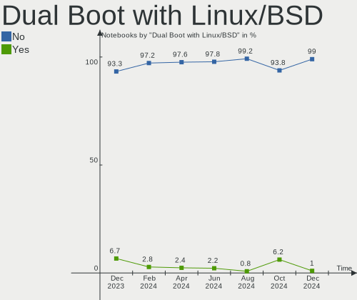
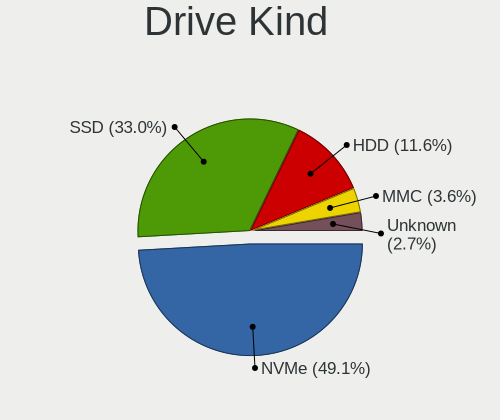
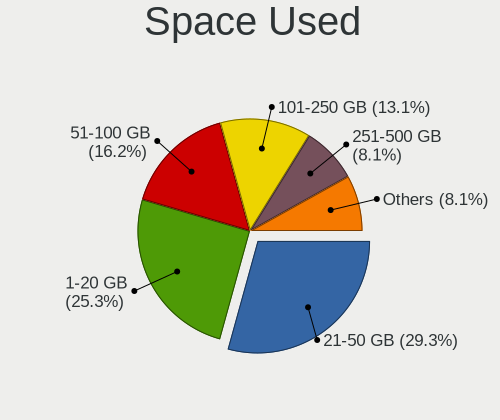

Pop!_OS - Hardware Trends (Notebooks)
-------------------------------------

A project to identify most popular hardware characteristics and track their change
over time based on data collected by Linux users at https://Linux-Hardware.org.

Anyone can contribute to this report by the [hw-probe](https://github.com/linuxhw/hw-probe) tool:

    sudo -E hw-probe -all -upload

This report is for one last month. Overall report since the beginning of time: [TestDays](https://github.com/linuxhw/TestDays)

Period: May, 2023.

Contents
--------

* [ System ](#system)
  - [ OS                       ](#os)
  - [ OS Family                ](#os-family)
  - [ Kernel                   ](#kernel)
  - [ Kernel Family            ](#kernel-family)
  - [ Kernel Major Ver.        ](#kernel-major-ver)
  - [ Arch                     ](#arch)
  - [ DE                       ](#de)
  - [ Display Server           ](#display-server)
  - [ Display Manager          ](#display-manager)
  - [ OS Lang                  ](#os-lang)
  - [ Boot Mode                ](#boot-mode)
  - [ Filesystem               ](#filesystem)
  - [ Part. scheme             ](#part-scheme)
  - [ Dual Boot with Linux/BSD ](#dual-boot-with-linuxbsd)
  - [ Dual Boot (Win)          ](#dual-boot-win)

* [ Board ](#board)
  - [ Vendor                   ](#vendor)
  - [ Model                    ](#model)
  - [ Model Family             ](#model-family)
  - [ MFG Year                 ](#mfg-year)
  - [ Form Factor              ](#form-factor)
  - [ Secure Boot              ](#secure-boot)
  - [ Coreboot                 ](#coreboot)
  - [ RAM Size                 ](#ram-size)
  - [ RAM Used                 ](#ram-used)
  - [ Total Drives             ](#total-drives)
  - [ Has CD-ROM               ](#has-cd-rom)
  - [ Has Ethernet             ](#has-ethernet)
  - [ Has WiFi                 ](#has-wifi)
  - [ Has Bluetooth            ](#has-bluetooth)

* [ Location ](#location)
  - [ Country                  ](#country)
  - [ City                     ](#city)

* [ Drives ](#drives)
  - [ Drive Vendor             ](#drive-vendor)
  - [ Drive Model              ](#drive-model)
  - [ HDD Vendor               ](#hdd-vendor)
  - [ SSD Vendor               ](#ssd-vendor)
  - [ Drive Kind               ](#drive-kind)
  - [ Drive Connector          ](#drive-connector)
  - [ Drive Size               ](#drive-size)
  - [ Space Total              ](#space-total)
  - [ Space Used               ](#space-used)
  - [ Malfunc. Drives          ](#malfunc-drives)
  - [ Malfunc. Drive Vendor    ](#malfunc-drive-vendor)
  - [ Malfunc. HDD Vendor      ](#malfunc-hdd-vendor)
  - [ Malfunc. Drive Kind      ](#malfunc-drive-kind)
  - [ Failed Drives            ](#failed-drives)
  - [ Failed Drive Vendor      ](#failed-drive-vendor)
  - [ Drive Status             ](#drive-status)

* [ Storage controller ](#storage-controller)
  - [ Storage Vendor           ](#storage-vendor)
  - [ Storage Model            ](#storage-model)
  - [ Storage Kind             ](#storage-kind)

* [ Processor ](#processor)
  - [ CPU Vendor               ](#cpu-vendor)
  - [ CPU Model                ](#cpu-model)
  - [ CPU Model Family         ](#cpu-model-family)
  - [ CPU Cores                ](#cpu-cores)
  - [ CPU Sockets              ](#cpu-sockets)
  - [ CPU Threads              ](#cpu-threads)
  - [ CPU Op-Modes             ](#cpu-op-modes)
  - [ CPU Microcode            ](#cpu-microcode)
  - [ CPU Microarch            ](#cpu-microarch)

* [ Graphics ](#graphics)
  - [ GPU Vendor               ](#gpu-vendor)
  - [ GPU Model                ](#gpu-model)
  - [ GPU Combo                ](#gpu-combo)
  - [ GPU Driver               ](#gpu-driver)
  - [ GPU Memory               ](#gpu-memory)

* [ Monitor ](#monitor)
  - [ Monitor Vendor           ](#monitor-vendor)
  - [ Monitor Model            ](#monitor-model)
  - [ Monitor Resolution       ](#monitor-resolution)
  - [ Monitor Diagonal         ](#monitor-diagonal)
  - [ Monitor Width            ](#monitor-width)
  - [ Aspect Ratio             ](#aspect-ratio)
  - [ Monitor Area             ](#monitor-area)
  - [ Pixel Density            ](#pixel-density)
  - [ Multiple Monitors        ](#multiple-monitors)

* [ Network ](#network)
  - [ Net Controller Vendor    ](#net-controller-vendor)
  - [ Net Controller Model     ](#net-controller-model)
  - [ Wireless Vendor          ](#wireless-vendor)
  - [ Wireless Model           ](#wireless-model)
  - [ Ethernet Vendor          ](#ethernet-vendor)
  - [ Ethernet Model           ](#ethernet-model)
  - [ Net Controller Kind      ](#net-controller-kind)
  - [ Used Controller          ](#used-controller)
  - [ NICs                     ](#nics)
  - [ IPv6                     ](#ipv6)

* [ Bluetooth ](#bluetooth)
  - [ Bluetooth Vendor         ](#bluetooth-vendor)
  - [ Bluetooth Model          ](#bluetooth-model)

* [ Sound ](#sound)
  - [ Sound Vendor             ](#sound-vendor)
  - [ Sound Model              ](#sound-model)

* [ Memory ](#memory)
  - [ Memory Vendor            ](#memory-vendor)
  - [ Memory Model             ](#memory-model)
  - [ Memory Kind              ](#memory-kind)
  - [ Memory Form Factor       ](#memory-form-factor)
  - [ Memory Size              ](#memory-size)
  - [ Memory Speed             ](#memory-speed)

* [ Printers & scanners ](#printers--scanners)
  - [ Printer Vendor           ](#printer-vendor)
  - [ Printer Model            ](#printer-model)
  - [ Scanner Vendor           ](#scanner-vendor)
  - [ Scanner Model            ](#scanner-model)

* [ Camera ](#camera)
  - [ Camera Vendor            ](#camera-vendor)
  - [ Camera Model             ](#camera-model)

* [ Security ](#security)
  - [ Fingerprint Vendor       ](#fingerprint-vendor)
  - [ Fingerprint Model        ](#fingerprint-model)
  - [ Chipcard Vendor          ](#chipcard-vendor)
  - [ Chipcard Model           ](#chipcard-model)

* [ Unsupported ](#unsupported)
  - [ Unsupported Devices      ](#unsupported-devices)
  - [ Unsupported Device Types ](#unsupported-device-types)

System
------

OS
--

Installed operating systems

| Name          | Notebooks | Percent |
|---------------|-----------|---------|
| Pop!_OS 22.04 | 126       | 99.21%  |
| Pop!_OS 21.10 | 1         | 0.79%   |

OS Family
---------

OS without a version

| Name    | Notebooks | Percent |
|---------|-----------|---------|
| Pop!_OS | 127       | 100%    |

Kernel
------

Version of the Linux kernel

| Version                  | Notebooks | Percent |
|--------------------------|-----------|---------|
| 6.2.6-76060206-generic   | 114       | 89.76%  |
| 6.2.0-76060200-generic   | 2         | 1.57%   |
| 6.0.12-76060006-generic  | 2         | 1.57%   |
| 5.18.10-76051810-generic | 2         | 1.57%   |
| 5.17.5-76051705-generic  | 2         | 1.57%   |
| 6.3.2-060302-generic     | 1         | 0.79%   |
| 6.2.16-060216-generic    | 1         | 0.79%   |
| 6.1.11-76060111-generic  | 1         | 0.79%   |
| 5.19.0-42-generic        | 1         | 0.79%   |
| 5.16.19-76051619-generic | 1         | 0.79%   |

Kernel Family
-------------

Linux kernel without a distro release

| Version | Notebooks | Percent |
|---------|-----------|---------|
| 6.2.6   | 114       | 89.76%  |
| 6.2.0   | 2         | 1.57%   |
| 6.0.12  | 2         | 1.57%   |
| 5.18.10 | 2         | 1.57%   |
| 5.17.5  | 2         | 1.57%   |
| 6.3.2   | 1         | 0.79%   |
| 6.2.16  | 1         | 0.79%   |
| 6.1.11  | 1         | 0.79%   |
| 5.19.0  | 1         | 0.79%   |
| 5.16.19 | 1         | 0.79%   |

Kernel Major Ver.
-----------------

Linux kernel major version

| Version | Notebooks | Percent |
|---------|-----------|---------|
| 6.2     | 117       | 92.13%  |
| 6.0     | 2         | 1.57%   |
| 5.18    | 2         | 1.57%   |
| 5.17    | 2         | 1.57%   |
| 6.3     | 1         | 0.79%   |
| 6.1     | 1         | 0.79%   |
| 5.19    | 1         | 0.79%   |
| 5.16    | 1         | 0.79%   |

Arch
----

OS architecture (x86_64, i586, etc.)

| Name   | Notebooks | Percent |
|--------|-----------|---------|
| x86_64 | 127       | 100%    |

DE
--

Desktop Environment

| Name    | Notebooks | Percent |
|---------|-----------|---------|
| GNOME   | 123       | 96.85%  |
| Unknown | 2         | 1.57%   |
| Unity   | 1         | 0.79%   |
| KDE5    | 1         | 0.79%   |

Display Server
--------------

X11 or Wayland

| Name    | Notebooks | Percent |
|---------|-----------|---------|
| X11     | 119       | 93.7%   |
| Wayland | 8         | 6.3%    |

Display Manager
---------------

SDDM, LightDM, etc.

| Name    | Notebooks | Percent |
|---------|-----------|---------|
| Unknown | 82        | 64.57%  |
| GDM3    | 44        | 34.65%  |
| SDDM    | 1         | 0.79%   |

OS Lang
-------

Language

| Lang    | Notebooks | Percent |
|---------|-----------|---------|
| en_US   | 75        | 59.06%  |
| pt_BR   | 7         | 5.51%   |
| de_DE   | 6         | 4.72%   |
| C       | 6         | 4.72%   |
| ru_RU   | 5         | 3.94%   |
| en_GB   | 4         | 3.15%   |
| en_CA   | 3         | 2.36%   |
| en_AU   | 3         | 2.36%   |
| pt_PT   | 2         | 1.57%   |
| pl_PL   | 2         | 1.57%   |
| en_NZ   | 2         | 1.57%   |
| Unknown | 2         | 1.57%   |
| tr_TR   | 1         | 0.79%   |
| it_IT   | 1         | 0.79%   |
| fr_FR   | 1         | 0.79%   |
| es_MX   | 1         | 0.79%   |
| es_ES   | 1         | 0.79%   |
| en_ZA   | 1         | 0.79%   |
| en_IN   | 1         | 0.79%   |
| en_IE   | 1         | 0.79%   |
| de_CH   | 1         | 0.79%   |
| cs_CZ   | 1         | 0.79%   |

Boot Mode
---------

EFI or BIOS

| Mode | Notebooks | Percent |
|------|-----------|---------|
| BIOS | 82        | 64.57%  |
| EFI  | 45        | 35.43%  |

Filesystem
----------

Type of filesystem

| Type    | Notebooks | Percent |
|---------|-----------|---------|
| Ext4    | 121       | 95.28%  |
| Overlay | 5         | 3.94%   |
| Btrfs   | 1         | 0.79%   |

Part. scheme
------------

Scheme of partitioning

| Type    | Notebooks | Percent |
|---------|-----------|---------|
| Unknown | 80        | 62.99%  |
| GPT     | 44        | 34.65%  |
| MBR     | 3         | 2.36%   |

Dual Boot with Linux/BSD
------------------------

Hosting more than one Linux/BSD

| Dual boot | Notebooks | Percent |
|-----------|-----------|---------|
| No        | 123       | 96.85%  |
| Yes       | 4         | 3.15%   |

Dual Boot (Win)
---------------

Hosting Linux and Windows

| Dual boot | Notebooks | Percent |
|-----------|-----------|---------|
| No        | 115       | 90.55%  |
| Yes       | 12        | 9.45%   |

Board
-----

Vendor
------

Motherboard manufacturer

| Name                    | Notebooks | Percent |
|-------------------------|-----------|---------|
| Lenovo                  | 36        | 28.35%  |
| Hewlett-Packard         | 18        | 14.17%  |
| ASUSTek Computer        | 17        | 13.39%  |
| Dell                    | 13        | 10.24%  |
| System76                | 8         | 6.3%    |
| Apple                   | 6         | 4.72%   |
| Acer                    | 5         | 3.94%   |
| Toshiba                 | 4         | 3.15%   |
| MSI                     | 4         | 3.15%   |
| HUAWEI                  | 3         | 2.36%   |
| Notebook                | 2         | 1.57%   |
| Google                  | 2         | 1.57%   |
| Semp Toshiba            | 1         | 0.79%   |
| Samsung Electronics     | 1         | 0.79%   |
| Reliance Communications | 1         | 0.79%   |
| Positivo                | 1         | 0.79%   |
| Packard Bell            | 1         | 0.79%   |
| Gigabyte Technology     | 1         | 0.79%   |
| Avell High Performance  | 1         | 0.79%   |
| American Megatrends     | 1         | 0.79%   |
| Alienware               | 1         | 0.79%   |

Model
-----

Motherboard model

| Name                                     | Notebooks | Percent |
|------------------------------------------|-----------|---------|
| System76 Oryx Pro                        | 3         | 2.36%   |
| Unknown                                  | 3         | 2.36%   |
| System76 Gazelle                         | 2         | 1.57%   |
| System76 Galago Pro                      | 2         | 1.57%   |
| HP Pavilion Aero Laptop 13-be0xxx        | 2         | 1.57%   |
| Apple MacBookAir7,2                      | 2         | 1.57%   |
| Toshiba TECRA R850                       | 1         | 0.79%   |
| Toshiba Satellite P755                   | 1         | 0.79%   |
| Toshiba Satellite L855D                  | 1         | 0.79%   |
| Toshiba PORTEGE Z30-A                    | 1         | 0.79%   |
| System76 Adder WS                        | 1         | 0.79%   |
| Semp Toshiba IS 1413G                    | 1         | 0.79%   |
| Samsung 355V4C/356V4C/3445VC/3545VC      | 1         | 0.79%   |
| Reliance R141TL5                         | 1         | 0.79%   |
| Positivo N4350                           | 1         | 0.79%   |
| Packard Bell EasyNote LM85               | 1         | 0.79%   |
| Notebook P15SM                           | 1         | 0.79%   |
| Notebook N141CU                          | 1         | 0.79%   |
| MSI Stealth 16Studio A13VG               | 1         | 0.79%   |
| MSI GV62 7RE                             | 1         | 0.79%   |
| MSI GL65 Leopard 10SCSR                  | 1         | 0.79%   |
| MSI Alpha 15 A3DDK                       | 1         | 0.79%   |
| Lenovo Yoga 700-11ISK 80QE               | 1         | 0.79%   |
| Lenovo Yoga 300-11IBY 80M0               | 1         | 0.79%   |
| Lenovo V15 G2 ALC 82KD                   | 1         | 0.79%   |
| Lenovo ThinkPad X260 20F6CTO1WW          | 1         | 0.79%   |
| Lenovo ThinkPad X13 Gen 2a 20XHCTO1WW    | 1         | 0.79%   |
| Lenovo ThinkPad X13 Gen 2a 20XH005JUS    | 1         | 0.79%   |
| Lenovo ThinkPad X1 Carbon 6th 20KGSDPN00 | 1         | 0.79%   |
| Lenovo ThinkPad X1 Carbon 3rd 20BTS41M00 | 1         | 0.79%   |
| Lenovo ThinkPad W541 20EGS0B010          | 1         | 0.79%   |
| Lenovo ThinkPad W540 20BHS0BD02          | 1         | 0.79%   |
| Lenovo ThinkPad T590 20N4002WGE          | 1         | 0.79%   |
| Lenovo ThinkPad T580 20L9001HUS          | 1         | 0.79%   |
| Lenovo ThinkPad T500 2056Y4R             | 1         | 0.79%   |
| Lenovo ThinkPad T470s W10DG 20JTS0HT00   | 1         | 0.79%   |
| Lenovo ThinkPad T440p 20AWS14200         | 1         | 0.79%   |
| Lenovo ThinkPad T440p 20ANCTO1WW         | 1         | 0.79%   |
| Lenovo ThinkPad T440p                    | 1         | 0.79%   |
| Lenovo ThinkPad T420 4180AP3             | 1         | 0.79%   |

Model Family
------------

Motherboard model prefix

| Name                  | Notebooks | Percent |
|-----------------------|-----------|---------|
| Lenovo ThinkPad       | 21        | 16.54%  |
| Lenovo IdeaPad        | 8         | 6.3%    |
| HP Pavilion           | 5         | 3.94%   |
| Dell Inspiron         | 5         | 3.94%   |
| ASUS VivoBook         | 5         | 3.94%   |
| ASUS ROG              | 4         | 3.15%   |
| System76 Oryx         | 3         | 2.36%   |
| HP EliteBook          | 3         | 2.36%   |
| Dell Precision        | 3         | 2.36%   |
| Acer Aspire           | 3         | 2.36%   |
| Unknown               | 3         | 2.36%   |
| Toshiba Satellite     | 2         | 1.57%   |
| System76 Gazelle      | 2         | 1.57%   |
| System76 Galago       | 2         | 1.57%   |
| Lenovo Yoga           | 2         | 1.57%   |
| HP ZBook              | 2         | 1.57%   |
| HP OMEN               | 2         | 1.57%   |
| HP Laptop             | 2         | 1.57%   |
| Dell XPS              | 2         | 1.57%   |
| ASUS TUF              | 2         | 1.57%   |
| Apple MacBookAir7     | 2         | 1.57%   |
| Toshiba TECRA         | 1         | 0.79%   |
| Toshiba PORTEGE       | 1         | 0.79%   |
| System76 Adder        | 1         | 0.79%   |
| Semp Toshiba IS       | 1         | 0.79%   |
| Samsung 355V4C        | 1         | 0.79%   |
| Reliance R141TL5      | 1         | 0.79%   |
| Positivo N4350        | 1         | 0.79%   |
| Packard Bell EasyNote | 1         | 0.79%   |
| Notebook P15SM        | 1         | 0.79%   |
| Notebook N141CU       | 1         | 0.79%   |
| MSI Stealth           | 1         | 0.79%   |
| MSI GV62              | 1         | 0.79%   |
| MSI GL65              | 1         | 0.79%   |
| MSI Alpha             | 1         | 0.79%   |
| Lenovo V15            | 1         | 0.79%   |
| Lenovo ThinkBook      | 1         | 0.79%   |
| Lenovo Legion         | 1         | 0.79%   |
| HUAWEI HVY-WXX9       | 1         | 0.79%   |
| HUAWEI BOHK-WAX9X     | 1         | 0.79%   |

MFG Year
--------

Motherboard manufacture year

| Year | Notebooks | Percent |
|------|-----------|---------|
| 2022 | 22        | 17.32%  |
| 2020 | 15        | 11.81%  |
| 2021 | 14        | 11.02%  |
| 2018 | 14        | 11.02%  |
| 2019 | 13        | 10.24%  |
| 2015 | 11        | 8.66%   |
| 2013 | 7         | 5.51%   |
| 2023 | 6         | 4.72%   |
| 2017 | 4         | 3.15%   |
| 2016 | 4         | 3.15%   |
| 2014 | 4         | 3.15%   |
| 2012 | 3         | 2.36%   |
| 2011 | 3         | 2.36%   |
| 2009 | 3         | 2.36%   |
| 2010 | 2         | 1.57%   |
| 2008 | 2         | 1.57%   |

Form Factor
-----------

Physical design of the computer

| Name     | Notebooks | Percent |
|----------|-----------|---------|
| Notebook | 127       | 100%    |

Secure Boot
-----------

Enabled or disabled

| State    | Notebooks | Percent |
|----------|-----------|---------|
| Disabled | 127       | 100%    |

Coreboot
--------

Have coreboot on board

| Used | Notebooks | Percent |
|------|-----------|---------|
| No   | 116       | 91.34%  |
| Yes  | 11        | 8.66%   |

RAM Size
--------

Total RAM memory

| Size in GB  | Notebooks | Percent |
|-------------|-----------|---------|
| 4.01-8.0    | 32        | 25.2%   |
| 16.01-24.0  | 30        | 23.62%  |
| 8.01-16.0   | 27        | 21.26%  |
| 3.01-4.0    | 14        | 11.02%  |
| 32.01-64.0  | 13        | 10.24%  |
| 64.01-256.0 | 6         | 4.72%   |
| 24.01-32.0  | 5         | 3.94%   |

RAM Used
--------

Used RAM memory

| Used GB    | Notebooks | Percent |
|------------|-----------|---------|
| 4.01-8.0   | 49        | 38.58%  |
| 3.01-4.0   | 28        | 22.05%  |
| 2.01-3.0   | 22        | 17.32%  |
| 8.01-16.0  | 16        | 12.6%   |
| 1.01-2.0   | 5         | 3.94%   |
| 16.01-24.0 | 4         | 3.15%   |
| 24.01-32.0 | 3         | 2.36%   |

Total Drives
------------

Number of drives on board

| Drives | Notebooks | Percent |
|--------|-----------|---------|
| 1      | 94        | 74.02%  |
| 2      | 26        | 20.47%  |
| 3      | 6         | 4.72%   |
| 0      | 1         | 0.79%   |

Has CD-ROM
----------

Has CD-ROM on board

| Presented | Notebooks | Percent |
|-----------|-----------|---------|
| No        | 107       | 84.25%  |
| Yes       | 20        | 15.75%  |

Has Ethernet
------------

Has Ethernet on board

| Presented | Notebooks | Percent |
|-----------|-----------|---------|
| Yes       | 99        | 77.95%  |
| No        | 28        | 22.05%  |

Has WiFi
--------

Has WiFi module

| Presented | Notebooks | Percent |
|-----------|-----------|---------|
| Yes       | 126       | 99.21%  |
| No        | 1         | 0.79%   |

Has Bluetooth
-------------

Has Bluetooth module

| Presented | Notebooks | Percent |
|-----------|-----------|---------|
| Yes       | 108       | 85.04%  |
| No        | 19        | 14.96%  |

Location
--------

Country
-------

Geographic location (country)

| Country      | Notebooks | Percent |
|--------------|-----------|---------|
| USA          | 38        | 29.92%  |
| Brazil       | 9         | 7.09%   |
| Germany      | 8         | 6.3%    |
| Russia       | 6         | 4.72%   |
| UK           | 5         | 3.94%   |
| Canada       | 5         | 3.94%   |
| Australia    | 5         | 3.94%   |
| Czechia      | 4         | 3.15%   |
| Portugal     | 3         | 2.36%   |
| Italy        | 3         | 2.36%   |
| India        | 3         | 2.36%   |
| Turkey       | 2         | 1.57%   |
| Sweden       | 2         | 1.57%   |
| Spain        | 2         | 1.57%   |
| Poland       | 2         | 1.57%   |
| New Zealand  | 2         | 1.57%   |
| Morocco      | 2         | 1.57%   |
| Mexico       | 2         | 1.57%   |
| France       | 2         | 1.57%   |
| Vietnam      | 1         | 0.79%   |
| South Africa | 1         | 0.79%   |
| Slovenia     | 1         | 0.79%   |
| Serbia       | 1         | 0.79%   |
| Romania      | 1         | 0.79%   |
| Philippines  | 1         | 0.79%   |
| Pakistan     | 1         | 0.79%   |
| Oman         | 1         | 0.79%   |
| Norway       | 1         | 0.79%   |
| Nepal        | 1         | 0.79%   |
| Malaysia     | 1         | 0.79%   |
| Lebanon      | 1         | 0.79%   |
| Latvia       | 1         | 0.79%   |
| Japan        | 1         | 0.79%   |
| Ireland      | 1         | 0.79%   |
| Iran         | 1         | 0.79%   |
| Indonesia    | 1         | 0.79%   |
| Estonia      | 1         | 0.79%   |
| Denmark      | 1         | 0.79%   |
| Croatia      | 1         | 0.79%   |
| Austria      | 1         | 0.79%   |

City
----

Geographic location (city)

| City               | Notebooks | Percent |
|--------------------|-----------|---------|
| Brisbane           | 4         | 3.15%   |
| Rio de Janeiro     | 3         | 2.36%   |
| Leipzig            | 2         | 1.57%   |
| Framingham         | 2         | 1.57%   |
| Zadar              | 1         | 0.79%   |
| Woodbridge         | 1         | 0.79%   |
| Winnipeg           | 1         | 0.79%   |
| Windsor            | 1         | 0.79%   |
| Westborough        | 1         | 0.79%   |
| Washington         | 1         | 0.79%   |
| Warsaw             | 1         | 0.79%   |
| Voronezh           | 1         | 0.79%   |
| Vila Nova de Gaia  | 1         | 0.79%   |
| Vienna             | 1         | 0.79%   |
| Vallejo            | 1         | 0.79%   |
| Tucson             | 1         | 0.79%   |
| Trieste            | 1         | 0.79%   |
| Toronto            | 1         | 0.79%   |
| Tomsk              | 1         | 0.79%   |
| Thane              | 1         | 0.79%   |
| Tappahannock       | 1         | 0.79%   |
| Tangier            | 1         | 0.79%   |
| Tallinn            | 1         | 0.79%   |
| Surrey             | 1         | 0.79%   |
| Stockholm          | 1         | 0.79%   |
| Southlake          | 1         | 0.79%   |
| Skarzysko-Kamienna | 1         | 0.79%   |
| Siliguri           | 1         | 0.79%   |
| Seattle            | 1         | 0.79%   |
| Sao Paulo          | 1         | 0.79%   |
| San Marcos         | 1         | 0.79%   |
| San Antonio        | 1         | 0.79%   |
| Salt Lake City     | 1         | 0.79%   |
| Salem              | 1         | 0.79%   |
| Saint Paul         | 1         | 0.79%   |
| Saint Charles      | 1         | 0.79%   |
| Prescott           | 1         | 0.79%   |
| Prague             | 1         | 0.79%   |
| Portland           | 1         | 0.79%   |
| Petaling Jaya      | 1         | 0.79%   |

Drives
------

Drive Vendor
------------

Hard drive vendors

| Vendor                         | Notebooks | Drives | Percent |
|--------------------------------|-----------|--------|---------|
| Samsung Electronics            | 33        | 37     | 21.02%  |
| Sandisk                        | 13        | 15     | 8.28%   |
| WDC                            | 12        | 12     | 7.64%   |
| Toshiba                        | 9         | 10     | 5.73%   |
| Seagate                        | 8         | 8      | 5.1%    |
| Micron Technology              | 8         | 8      | 5.1%    |
| Intel                          | 8         | 8      | 5.1%    |
| Unknown                        | 7         | 7      | 4.46%   |
| SK hynix                       | 6         | 6      | 3.82%   |
| Kingston                       | 6         | 6      | 3.82%   |
| KIOXIA                         | 5         | 5      | 3.18%   |
| Crucial                        | 4         | 4      | 2.55%   |
| Apple                          | 4         | 4      | 2.55%   |
| Kingston Technology Company    | 3         | 3      | 1.91%   |
| Transcend                      | 2         | 2      | 1.27%   |
| Solid State Storage Technology | 2         | 2      | 1.27%   |
| Silicon Motion                 | 2         | 2      | 1.27%   |
| LITEONIT                       | 2         | 2      | 1.27%   |
| Intenso                        | 2         | 2      | 1.27%   |
| Hitachi                        | 2         | 2      | 1.27%   |
| HGST                           | 2         | 2      | 1.27%   |
| China                          | 2         | 2      | 1.27%   |
| A-DATA Technology              | 2         | 2      | 1.27%   |
| Unknown                        | 2         | 2      | 1.27%   |
| Solid State Storage            | 1         | 1      | 0.64%   |
| ShiJi                          | 1         | 1      | 0.64%   |
| Phison                         | 1         | 1      | 0.64%   |
| Patriot                        | 1         | 1      | 0.64%   |
| Micron/Crucial Technology      | 1         | 1      | 0.64%   |
| Lexar                          | 1         | 1      | 0.64%   |
| GOODRAM                        | 1         | 1      | 0.64%   |
| Fanxiang                       | 1         | 1      | 0.64%   |
| Dogfish                        | 1         | 1      | 0.64%   |
| Apacer                         | 1         | 1      | 0.64%   |
| ADATA Technology               | 1         | 1      | 0.64%   |

Drive Model
-----------

Hard drive models

| Model                                               | Notebooks | Percent |
|-----------------------------------------------------|-----------|---------|
| Samsung NVMe SSD Controller SM981/PM981/PM983 256GB | 6         | 3.73%   |
| Samsung NVMe SSD Controller PM9A1/PM9A3/980PRO 1TB  | 4         | 2.48%   |
| Kingston SA400S37240G 240GB SSD                     | 4         | 2.48%   |
| Unknown MMC Card  32GB                              | 3         | 1.86%   |
| WDC PC SN730 SDBQNTY-1T00-1001 1TB                  | 2         | 1.24%   |
| Seagate ST1000LM035-1RK172 1TB                      | 2         | 1.24%   |
| Sandisk WD_BLACK SN850X 4000GB                      | 2         | 1.24%   |
| Sandisk WD Blue SN550 NVMe SSD 512GB                | 2         | 1.24%   |
| Micron 2450_MTFDKBA1T0TFK 1TB                       | 2         | 1.24%   |
| KIOXIA KBG40ZNV1T02 1TB                             | 2         | 1.24%   |
| Apple SSD SM0128G 121GB                             | 2         | 1.24%   |
| Unknown                                             | 2         | 1.24%   |
| WDC WDS500G2B0A-00SM50 500GB SSD                    | 1         | 0.62%   |
| WDC WDS250G2B0A 250GB SSD                           | 1         | 0.62%   |
| WDC WDS240G2G0A-00JH30 240GB SSD                    | 1         | 0.62%   |
| WDC WDS120G2G0A-00JH30 120GB SSD                    | 1         | 0.62%   |
| WDC WDS100T2B0A-00SM50 1TB SSD                      | 1         | 0.62%   |
| WDC WD5000LPVX-08V0TT5 500GB                        | 1         | 0.62%   |
| WDC PC SN810 NVMe 1024GB                            | 1         | 0.62%   |
| WDC PC SN530 SDBPNPZ-512G-1032 512GB                | 1         | 0.62%   |
| WDC PC SN530 SDBPNPZ-512G-1006 512GB                | 1         | 0.62%   |
| WDC PC SN530 SDBPMPZ-256G-1101 256GB                | 1         | 0.62%   |
| Unknown SN128  128GB                                | 1         | 0.62%   |
| Unknown SA08G  8GB                                  | 1         | 0.62%   |
| Unknown MMC Card  250GB                             | 1         | 0.62%   |
| Unknown MMC Card  134GB                             | 1         | 0.62%   |
| Transcend TS500GMTE110Q 500GB                       | 1         | 0.62%   |
| Transcend TS480GMTS420S 480GB SSD                   | 1         | 0.62%   |
| Toshiba XG6 NVMe SSD Controller 256GB               | 1         | 0.62%   |
| Toshiba THNSNJ128G8NU 128GB SSD                     | 1         | 0.62%   |
| Toshiba NVMe Controller 256GB                       | 1         | 0.62%   |
| Toshiba MQ04ABF100 1TB                              | 1         | 0.62%   |
| Toshiba MQ01ABD100 1TB                              | 1         | 0.62%   |
| Toshiba MQ01ABD064 640GB                            | 1         | 0.62%   |
| Toshiba MK3252GSX 320GB                             | 1         | 0.62%   |
| Toshiba MK2565GSX 250GB                             | 1         | 0.62%   |
| Toshiba KXG50ZNV512G 512GB                          | 1         | 0.62%   |
| Toshiba KXG50ZNV256G 256GB                          | 1         | 0.62%   |
| Solid State Storage NVMe CL4-8D256 256GB            | 1         | 0.62%   |
| Solid State Storage CL4-3D512-Q11 NVMe SSSTC 512GB  | 1         | 0.62%   |

HDD Vendor
----------

Hard disk drive vendors

| Vendor  | Notebooks | Drives | Percent |
|---------|-----------|--------|---------|
| Seagate | 7         | 7      | 41.18%  |
| Toshiba | 5         | 5      | 29.41%  |
| Hitachi | 2         | 2      | 11.76%  |
| HGST    | 2         | 2      | 11.76%  |
| WDC     | 1         | 1      | 5.88%   |

SSD Vendor
----------

Solid state drive vendors

| Vendor              | Notebooks | Drives | Percent |
|---------------------|-----------|--------|---------|
| Samsung Electronics | 12        | 12     | 26.67%  |
| WDC                 | 5         | 5      | 11.11%  |
| Kingston            | 5         | 5      | 11.11%  |
| Crucial             | 4         | 4      | 8.89%   |
| SanDisk             | 3         | 3      | 6.67%   |
| Micron Technology   | 3         | 3      | 6.67%   |
| Apple               | 3         | 3      | 6.67%   |
| LITEONIT            | 2         | 2      | 4.44%   |
| China               | 2         | 2      | 4.44%   |
| Transcend           | 1         | 1      | 2.22%   |
| Toshiba             | 1         | 1      | 2.22%   |
| Intenso             | 1         | 1      | 2.22%   |
| Intel               | 1         | 1      | 2.22%   |
| Dogfish             | 1         | 1      | 2.22%   |
| Apacer              | 1         | 1      | 2.22%   |

Drive Kind
----------

HDD or SSD

| Kind    | Notebooks | Drives | Percent |
|---------|-----------|--------|---------|
| NVMe    | 76        | 89     | 51.35%  |
| SSD     | 43        | 45     | 29.05%  |
| HDD     | 17        | 17     | 11.49%  |
| MMC     | 8         | 8      | 5.41%   |
| Unknown | 4         | 5      | 2.7%    |

Drive Connector
---------------

SATA, SAS, NVMe, etc.

| Type | Notebooks | Drives | Percent |
|------|-----------|--------|---------|
| NVMe | 76        | 89     | 52.78%  |
| SATA | 57        | 64     | 39.58%  |
| MMC  | 8         | 8      | 5.56%   |
| SAS  | 3         | 3      | 2.08%   |

Drive Size
----------

Size of hard drive

| Size in TB | Notebooks | Drives | Percent |
|------------|-----------|--------|---------|
| 0.01-0.5   | 42        | 45     | 71.19%  |
| 0.51-1.0   | 13        | 13     | 22.03%  |
| 1.01-2.0   | 4         | 4      | 6.78%   |

Space Total
-----------

Amount of disk space available on the file system

| Size in GB     | Notebooks | Percent |
|----------------|-----------|---------|
| 101-250        | 41        | 32.28%  |
| 251-500        | 34        | 26.77%  |
| 501-1000       | 27        | 21.26%  |
| More than 3000 | 5         | 3.94%   |
| 1-20           | 5         | 3.94%   |
| 51-100         | 5         | 3.94%   |
| 2001-3000      | 3         | 2.36%   |
| 1001-2000      | 3         | 2.36%   |
| 21-50          | 2         | 1.57%   |
| Unknown        | 2         | 1.57%   |

Space Used
----------

Amount of used disk space

| Used GB   | Notebooks | Percent |
|-----------|-----------|---------|
| 1-20      | 43        | 33.86%  |
| 21-50     | 31        | 24.41%  |
| 101-250   | 18        | 14.17%  |
| 51-100    | 14        | 11.02%  |
| 251-500   | 12        | 9.45%   |
| 501-1000  | 4         | 3.15%   |
| 1001-2000 | 3         | 2.36%   |
| Unknown   | 2         | 1.57%   |

Malfunc. Drives
---------------

Drive models with a malfunction

| Model                                | Notebooks | Drives | Percent |
|--------------------------------------|-----------|--------|---------|
| Toshiba MK3252GSX 320GB              | 1         | 1      | 20%     |
| SK hynix PC711 HFS512GDE9X073N 512GB | 1         | 1      | 20%     |
| Seagate ST500LT012-9WS142 500GB      | 1         | 1      | 20%     |
| Seagate ST1000LX015-1U7172 1TB       | 1         | 1      | 20%     |
| Seagate ST1000LM035-1RK172 1TB       | 1         | 1      | 20%     |

Malfunc. Drive Vendor
---------------------

Vendors of faulty drives

| Vendor   | Notebooks | Drives | Percent |
|----------|-----------|--------|---------|
| Seagate  | 3         | 3      | 60%     |
| Toshiba  | 1         | 1      | 20%     |
| SK hynix | 1         | 1      | 20%     |

Malfunc. HDD Vendor
-------------------

Vendors of faulty HDD drives

| Vendor  | Notebooks | Drives | Percent |
|---------|-----------|--------|---------|
| Seagate | 3         | 3      | 75%     |
| Toshiba | 1         | 1      | 25%     |

Malfunc. Drive Kind
-------------------

Kinds of faulty drives

| Kind | Notebooks | Drives | Percent |
|------|-----------|--------|---------|
| HDD  | 4         | 4      | 80%     |
| NVMe | 1         | 1      | 20%     |

Failed Drives
-------------

Failed drive models

Zero info for selected period =(

Failed Drive Vendor
-------------------

Failed drive vendors

Zero info for selected period =(

Drive Status
------------

Number of failed and malfunc. drives

| Status   | Notebooks | Drives | Percent |
|----------|-----------|--------|---------|
| Detected | 83        | 105    | 63.85%  |
| Works    | 42        | 54     | 32.31%  |
| Malfunc  | 5         | 5      | 3.85%   |

Storage controller
------------------

Storage Vendor
--------------

Storage controller vendors

| Vendor                         | Notebooks | Percent |
|--------------------------------|-----------|---------|
| Intel                          | 81        | 46.82%  |
| Samsung Electronics            | 26        | 15.03%  |
| SanDisk                        | 16        | 9.25%   |
| AMD                            | 10        | 5.78%   |
| SK hynix                       | 6         | 3.47%   |
| Toshiba America Info Systems   | 5         | 2.89%   |
| Micron Technology              | 5         | 2.89%   |
| Silicon Motion                 | 4         | 2.31%   |
| KIOXIA                         | 4         | 2.31%   |
| Kingston Technology Company    | 4         | 2.31%   |
| Solid State Storage Technology | 3         | 1.73%   |
| ADATA Technology               | 3         | 1.73%   |
| Transcend                      | 1         | 0.58%   |
| Shenzhen Longsys Electronics   | 1         | 0.58%   |
| Phison Electronics             | 1         | 0.58%   |
| Nvidia                         | 1         | 0.58%   |
| Micron/Crucial Technology      | 1         | 0.58%   |
| Apple                          | 1         | 0.58%   |

Storage Model
-------------

Storage controller models

| Model                                                                          | Notebooks | Percent |
|--------------------------------------------------------------------------------|-----------|---------|
| Samsung NVMe SSD Controller SM981/PM981/PM983                                  | 13        | 7.3%    |
| AMD FCH SATA Controller [AHCI mode]                                            | 10        | 5.62%   |
| Intel Sunrise Point-LP SATA Controller [AHCI mode]                             | 9         | 5.06%   |
| Intel 8 Series/C220 Series Chipset Family 6-port SATA Controller 1 [AHCI mode] | 8         | 4.49%   |
| Samsung NVMe SSD Controller PM9A1/PM9A3/980PRO                                 | 7         | 3.93%   |
| Intel Volume Management Device NVMe RAID Controller                            | 7         | 3.93%   |
| Intel Cannon Lake Mobile PCH SATA AHCI Controller                              | 6         | 3.37%   |
| Micron NVMe Storage Controller                                                 | 5         | 2.81%   |
| Intel Wildcat Point-LP SATA Controller [AHCI Mode]                             | 5         | 2.81%   |
| Intel Comet Lake SATA AHCI Controller                                          | 5         | 2.81%   |
| SanDisk WD Blue SN550 NVMe SSD                                                 | 4         | 2.25%   |
| Intel 82801 Mobile SATA Controller [RAID mode]                                 | 4         | 2.25%   |
| Intel 7 Series Chipset Family 6-port SATA Controller [AHCI mode]               | 4         | 2.25%   |
| Toshiba America Info Systems XG5 NVMe SSD Controller                           | 3         | 1.69%   |
| Solid State Storage Non-Volatile memory controller                             | 3         | 1.69%   |
| SK hynix Gold P31/PC711 NVMe Solid State Drive                                 | 3         | 1.69%   |
| Silicon Motion SM2263EN/SM2263XT SSD Controller                                | 3         | 1.69%   |
| SanDisk WD Black SN750 / PC SN730 NVMe SSD                                     | 3         | 1.69%   |
| Samsung NVMe SSD Controller 980                                                | 3         | 1.69%   |
| KIOXIA NVMe SSD Controller BG4                                                 | 3         | 1.69%   |
| Intel SSD 660P Series                                                          | 3         | 1.69%   |
| Intel Alder Lake-P SATA AHCI Controller                                        | 3         | 1.69%   |
| Intel 6 Series/C200 Series Chipset Family 6 port Mobile SATA AHCI Controller   | 3         | 1.69%   |
| Intel 500 Series Chipset Family SATA AHCI Controller                           | 3         | 1.69%   |
| Intel 5 Series/3400 Series Chipset 4 port SATA AHCI Controller                 | 3         | 1.69%   |
| Sandisk Western Digital WD Black SN850X NVMe SSD                               | 2         | 1.12%   |
| SanDisk WD PC SN810 / Black SN850 NVMe SSD                                     | 2         | 1.12%   |
| Samsung Electronics SATA controller                                            | 2         | 1.12%   |
| Kingston Company Company Non-Volatile memory controller                        | 2         | 1.12%   |
| Intel Tiger Lake-LP SATA Controller                                            | 2         | 1.12%   |
| Intel SSD Pro 7600p/760p/E 6100p Series                                        | 2         | 1.12%   |
| Intel HM170/QM170 Chipset SATA Controller [AHCI Mode]                          | 2         | 1.12%   |
| Intel Cannon Point-LP SATA Controller [AHCI Mode]                              | 2         | 1.12%   |
| Intel 82801IBM/IEM (ICH9M/ICH9M-E) 2 port SATA Controller [IDE mode]           | 2         | 1.12%   |
| Intel 8 Series SATA Controller 1 [AHCI mode]                                   | 2         | 1.12%   |
| Intel 400 Series Chipset Family SATA AHCI Controller                           | 2         | 1.12%   |
| Transcend Non-Volatile memory controller                                       | 1         | 0.56%   |
| Toshiba America Info Systems XG6 NVMe SSD Controller                           | 1         | 0.56%   |
| Toshiba America Info Systems NVMe Controller                                   | 1         | 0.56%   |
| SK hynix Platinum P41 NVMe Solid State Drive 2TB                               | 1         | 0.56%   |

Storage Kind
------------

Kind of storage controller (IDE, SATA, NVMe, SAS, ...)

| Kind | Notebooks | Percent |
|------|-----------|---------|
| NVMe | 76        | 45.51%  |
| SATA | 76        | 45.51%  |
| RAID | 13        | 7.78%   |
| IDE  | 2         | 1.2%    |

Processor
---------

CPU Vendor
----------

Processor vendors

| Vendor | Notebooks | Percent |
|--------|-----------|---------|
| Intel  | 100       | 78.74%  |
| AMD    | 27        | 21.26%  |

CPU Model
---------

Processor models

| Model                                         | Notebooks | Percent |
|-----------------------------------------------|-----------|---------|
| Intel 11th Gen Core i7-11800H @ 2.30GHz       | 5         | 3.94%   |
| Intel Core i7-8750H CPU @ 2.20GHz             | 4         | 3.15%   |
| Intel Core i7-8650U CPU @ 1.90GHz             | 3         | 2.36%   |
| Intel Core i7-7700HQ CPU @ 2.80GHz            | 3         | 2.36%   |
| Intel Core i5-5300U CPU @ 2.30GHz             | 3         | 2.36%   |
| Intel Core i5-10210U CPU @ 1.60GHz            | 3         | 2.36%   |
| AMD Ryzen 7 3750H with Radeon Vega Mobile Gfx | 3         | 2.36%   |
| AMD Ryzen 5 3500U with Radeon Vega Mobile Gfx | 3         | 2.36%   |
| Intel Core i7-8565U CPU @ 1.80GHz             | 2         | 1.57%   |
| Intel Core i7-4600M CPU @ 2.90GHz             | 2         | 1.57%   |
| Intel Core i7-10750H CPU @ 2.60GHz            | 2         | 1.57%   |
| Intel Core i5-8250U CPU @ 1.60GHz             | 2         | 1.57%   |
| Intel Core i5-2520M CPU @ 2.50GHz             | 2         | 1.57%   |
| Intel Core i5-1035G1 CPU @ 1.00GHz            | 2         | 1.57%   |
| Intel Core i3-6006U CPU @ 2.00GHz             | 2         | 1.57%   |
| Intel 13th Gen Core i9-13900H                 | 2         | 1.57%   |
| Intel 12th Gen Core i7-12700H                 | 2         | 1.57%   |
| Intel 11th Gen Core i5-1135G7 @ 2.40GHz       | 2         | 1.57%   |
| AMD Ryzen 9 6900HS with Radeon Graphics       | 2         | 1.57%   |
| AMD Ryzen 7 PRO 5850U with Radeon Graphics    | 2         | 1.57%   |
| AMD Ryzen 7 6800H with Radeon Graphics        | 2         | 1.57%   |
| Intel Pentium Silver N5030 CPU @ 1.10GHz      | 1         | 0.79%   |
| Intel Pentium CPU N3540 @ 2.16GHz             | 1         | 0.79%   |
| Intel Pentium CPU 2117U @ 1.80GHz             | 1         | 0.79%   |
| Intel Core m5-6Y57 CPU @ 1.10GHz              | 1         | 0.79%   |
| Intel Core m5-6Y54 CPU @ 1.10GHz              | 1         | 0.79%   |
| Intel Core i9-9880H CPU @ 2.30GHz             | 1         | 0.79%   |
| Intel Core i7-9750H CPU @ 2.60GHz             | 1         | 0.79%   |
| Intel Core i7-8850H CPU @ 2.60GHz             | 1         | 0.79%   |
| Intel Core i7-8550U CPU @ 1.80GHz             | 1         | 0.79%   |
| Intel Core i7-7500U CPU @ 2.70GHz             | 1         | 0.79%   |
| Intel Core i7-6600U CPU @ 2.60GHz             | 1         | 0.79%   |
| Intel Core i7-6500U CPU @ 2.50GHz             | 1         | 0.79%   |
| Intel Core i7-5500U CPU @ 2.40GHz             | 1         | 0.79%   |
| Intel Core i7-4810MQ CPU @ 2.80GHz            | 1         | 0.79%   |
| Intel Core i7-4800MQ CPU @ 2.70GHz            | 1         | 0.79%   |
| Intel Core i7-4720HQ CPU @ 2.60GHz            | 1         | 0.79%   |
| Intel Core i7-4700MQ CPU @ 2.40GHz            | 1         | 0.79%   |
| Intel Core i7-4510U CPU @ 2.00GHz             | 1         | 0.79%   |
| Intel Core i7-3612QM CPU @ 2.10GHz            | 1         | 0.79%   |

CPU Model Family
----------------

Processor model prefix

| Model                | Notebooks | Percent |
|----------------------|-----------|---------|
| Intel Core i7        | 32        | 25.2%   |
| Intel Core i5        | 28        | 22.05%  |
| Other                | 23        | 18.11%  |
| AMD Ryzen 7          | 13        | 10.24%  |
| AMD Ryzen 5          | 6         | 4.72%   |
| Intel Core i3        | 5         | 3.94%   |
| Intel Core 2 Duo     | 4         | 3.15%   |
| AMD Ryzen 7 PRO      | 3         | 2.36%   |
| Intel Pentium        | 2         | 1.57%   |
| Intel Core m5        | 2         | 1.57%   |
| Intel Celeron        | 2         | 1.57%   |
| AMD Ryzen 9          | 2         | 1.57%   |
| Intel Pentium Silver | 1         | 0.79%   |
| Intel Core i9        | 1         | 0.79%   |
| AMD Ryzen 3          | 1         | 0.79%   |
| AMD A8               | 1         | 0.79%   |
| AMD A10              | 1         | 0.79%   |

CPU Cores
---------

Number of processor cores

| Number | Notebooks | Percent |
|--------|-----------|---------|
| 4      | 42        | 33.07%  |
| 2      | 40        | 31.5%   |
| 8      | 22        | 17.32%  |
| 6      | 13        | 10.24%  |
| 14     | 5         | 3.94%   |
| 10     | 2         | 1.57%   |
| 24     | 1         | 0.79%   |
| 16     | 1         | 0.79%   |
| 12     | 1         | 0.79%   |

CPU Sockets
-----------

Number of sockets

| Number | Notebooks | Percent |
|--------|-----------|---------|
| 1      | 127       | 100%    |

CPU Threads
-----------

Threads per core (Hyper-Threading)

| Number | Notebooks | Percent |
|--------|-----------|---------|
| 2      | 115       | 90.55%  |
| 1      | 12        | 9.45%   |

CPU Op-Modes
------------

CPU Operation Modes (32-bit, 64-bit)

| Op mode        | Notebooks | Percent |
|----------------|-----------|---------|
| 32-bit, 64-bit | 127       | 100%    |

CPU Microcode
-------------

Microcode number

| Number     | Notebooks | Percent |
|------------|-----------|---------|
| Unknown    | 113       | 88.98%  |
| 0x0a50000d | 2         | 1.57%   |
| 0x0a404102 | 2         | 1.57%   |
| 0x08600106 | 2         | 1.57%   |
| 0x08108102 | 2         | 1.57%   |
| 0xa0652    | 1         | 0.79%   |
| 0x806e9    | 1         | 0.79%   |
| 0x0a50000c | 1         | 0.79%   |
| 0x08600104 | 1         | 0.79%   |
| 0x08108109 | 1         | 0.79%   |
| 0x06001119 | 1         | 0.79%   |

CPU Microarch
-------------

Microarchitecture

| Name             | Notebooks | Percent |
|------------------|-----------|---------|
| KabyLake         | 28        | 22.05%  |
| Unknown          | 17        | 13.39%  |
| Haswell          | 10        | 7.87%   |
| Zen+             | 7         | 5.51%   |
| Skylake          | 7         | 5.51%   |
| Broadwell        | 7         | 5.51%   |
| Zen 3            | 6         | 4.72%   |
| Icelake          | 6         | 4.72%   |
| Zen 2            | 5         | 3.94%   |
| TigerLake        | 5         | 3.94%   |
| Westmere         | 4         | 3.15%   |
| SandyBridge      | 4         | 3.15%   |
| Penryn           | 4         | 3.15%   |
| CometLake        | 4         | 3.15%   |
| Alderlake Hybrid | 4         | 3.15%   |
| IvyBridge        | 3         | 2.36%   |
| Goldmont plus    | 3         | 2.36%   |
| Piledriver       | 2         | 1.57%   |
| Silvermont       | 1         | 0.79%   |

Graphics
--------

GPU Vendor
----------

Vendors of graphics cards

| Vendor | Notebooks | Percent |
|--------|-----------|---------|
| Intel  | 92        | 53.49%  |
| Nvidia | 44        | 25.58%  |
| AMD    | 36        | 20.93%  |

GPU Model
---------

Graphics card models

| Model                                                                     | Notebooks | Percent |
|---------------------------------------------------------------------------|-----------|---------|
| Intel TigerLake-H GT1 [UHD Graphics]                                      | 8         | 4.55%   |
| Intel UHD Graphics 620                                                    | 7         | 3.98%   |
| Intel 4th Gen Core Processor Integrated Graphics Controller               | 7         | 3.98%   |
| AMD Picasso/Raven 2 [Radeon Vega Series / Radeon Vega Mobile Series]      | 7         | 3.98%   |
| Intel CoffeeLake-H GT2 [UHD Graphics 630]                                 | 6         | 3.41%   |
| Intel TigerLake-LP GT2 [Iris Xe Graphics]                                 | 5         | 2.84%   |
| Intel Skylake GT2 [HD Graphics 520]                                       | 5         | 2.84%   |
| Intel HD Graphics 5500                                                    | 5         | 2.84%   |
| AMD Rembrandt [Radeon 680M]                                               | 5         | 2.84%   |
| AMD Cezanne [Radeon Vega Series / Radeon Vega Mobile Series]              | 5         | 2.84%   |
| Nvidia GA107M [GeForce RTX 3050 Mobile]                                   | 4         | 2.27%   |
| Intel CometLake-U GT2 [UHD Graphics]                                      | 4         | 2.27%   |
| Intel Alder Lake-P Integrated Graphics Controller                         | 4         | 2.27%   |
| Intel 2nd Generation Core Processor Family Integrated Graphics Controller | 4         | 2.27%   |
| AMD Renoir                                                                | 4         | 2.27%   |
| Nvidia TU117M [GeForce GTX 1650 Mobile / Max-Q]                           | 3         | 1.7%    |
| Nvidia TU116M [GeForce GTX 1660 Ti Mobile]                                | 3         | 1.7%    |
| Nvidia GP107M [GeForce GTX 1050 Ti Mobile]                                | 3         | 1.7%    |
| Nvidia GA107M [GeForce RTX 3050 Ti Mobile]                                | 3         | 1.7%    |
| Intel WhiskeyLake-U GT2 [UHD Graphics 620]                                | 3         | 1.7%    |
| Intel HD Graphics 630                                                     | 3         | 1.7%    |
| Intel Core Processor Integrated Graphics Controller                       | 3         | 1.7%    |
| Intel 3rd Gen Core processor Graphics Controller                          | 3         | 1.7%    |
| Nvidia GP107M [GeForce GTX 1050 Mobile]                                   | 2         | 1.14%   |
| Nvidia GA107GLM [RTX A1000 Laptop GPU]                                    | 2         | 1.14%   |
| Nvidia GA106M [GeForce RTX 3060 Mobile / Max-Q]                           | 2         | 1.14%   |
| Nvidia GA104M [GeForce RTX 3070 Mobile / Max-Q]                           | 2         | 1.14%   |
| Intel Raptor Lake-P [Iris Xe Graphics]                                    | 2         | 1.14%   |
| Intel Iris Plus Graphics G1 (Ice Lake)                                    | 2         | 1.14%   |
| Intel HD Graphics 620                                                     | 2         | 1.14%   |
| Intel HD Graphics 6000                                                    | 2         | 1.14%   |
| Intel HD Graphics 515                                                     | 2         | 1.14%   |
| Intel Haswell-ULT Integrated Graphics Controller                          | 2         | 1.14%   |
| Intel GeminiLake [UHD Graphics 600]                                       | 2         | 1.14%   |
| Intel CometLake-H GT2 [UHD Graphics]                                      | 2         | 1.14%   |
| Intel Alder Lake-UP3 GT2 [Iris Xe Graphics]                               | 2         | 1.14%   |
| AMD Navi 23 [Radeon RX 6650 XT / 6700S / 6800S]                           | 2         | 1.14%   |
| AMD Lucienne                                                              | 2         | 1.14%   |
| Nvidia TU117M [GeForce GTX 1650 Ti Mobile]                                | 1         | 0.57%   |
| Nvidia TU117GLM [Quadro T1000 Mobile]                                     | 1         | 0.57%   |

GPU Combo
---------

Combinations of graphics cards

| Name           | Notebooks | Percent |
|----------------|-----------|---------|
| 1 x Intel      | 52        | 40.94%  |
| Intel + Nvidia | 32        | 25.2%   |
| 1 x AMD        | 22        | 17.32%  |
| Intel + AMD    | 6         | 4.72%   |
| 1 x Nvidia     | 5         | 3.94%   |
| AMD + Nvidia   | 5         | 3.94%   |
| 2 x AMD        | 3         | 2.36%   |
| Other          | 1         | 0.79%   |
| 2 x Nvidia     | 1         | 0.79%   |

GPU Driver
----------

Free vs proprietary

| Driver      | Notebooks | Percent |
|-------------|-----------|---------|
| Free        | 90        | 70.87%  |
| Proprietary | 36        | 28.35%  |
| Unknown     | 1         | 0.79%   |

GPU Memory
----------

Total video memory

| Size in GB | Notebooks | Percent |
|------------|-----------|---------|
| Unknown    | 110       | 86.61%  |
| 0.01-0.5   | 7         | 5.51%   |
| 1.01-2.0   | 6         | 4.72%   |
| 3.01-4.0   | 2         | 1.57%   |
| 7.01-8.0   | 1         | 0.79%   |
| 0.51-1.0   | 1         | 0.79%   |

Monitor
-------

Monitor Vendor
--------------

Monitor vendors

| Vendor                  | Notebooks | Percent |
|-------------------------|-----------|---------|
| AU Optronics            | 35        | 22.73%  |
| BOE                     | 32        | 20.78%  |
| Chimei Innolux          | 16        | 10.39%  |
| LG Display              | 14        | 9.09%   |
| Samsung Electronics     | 11        | 7.14%   |
| Dell                    | 8         | 5.19%   |
| Apple                   | 5         | 3.25%   |
| PANDA                   | 4         | 2.6%    |
| Lenovo                  | 4         | 2.6%    |
| Goldstar                | 4         | 2.6%    |
| Sharp                   | 3         | 1.95%   |
| ViewSonic               | 2         | 1.3%    |
| TMX                     | 2         | 1.3%    |
| Philips                 | 2         | 1.3%    |
| InfoVision              | 2         | 1.3%    |
| ASUSTek Computer        | 2         | 1.3%    |
| Acer                    | 2         | 1.3%    |
| TCL                     | 1         | 0.65%   |
| Iiyama                  | 1         | 0.65%   |
| IBM                     | 1         | 0.65%   |
| Hewlett-Packard         | 1         | 0.65%   |
| CNC                     | 1         | 0.65%   |
| Chi Mei Optoelectronics | 1         | 0.65%   |

Monitor Model
-------------

Monitor models

| Model                                                                 | Notebooks | Percent |
|-----------------------------------------------------------------------|-----------|---------|
| Chimei Innolux LCD Monitor CMN15F5 1920x1080 344x193mm 15.5-inch      | 3         | 1.94%   |
| Chimei Innolux LCD Monitor CMN14D4 1920x1080 309x173mm 13.9-inch      | 3         | 1.94%   |
| BOE LCD Monitor BOE0823 1920x1080 382x215mm 17.3-inch                 | 3         | 1.94%   |
| AU Optronics LCD Monitor AUOE48D 1920x1080 344x194mm 15.5-inch        | 3         | 1.94%   |
| TMX TL140ADXP01 TMX1481 2560x1600 301x188mm 14.0-inch                 | 2         | 1.29%   |
| Sharp LCD Monitor SHP149A 1920x1080 344x194mm 15.5-inch               | 2         | 1.29%   |
| LG Display LCD Monitor LGD03D7 1366x768 310x174mm 14.0-inch           | 2         | 1.29%   |
| Lenovo LCD Monitor LEN40BA 1920x1080 344x194mm 15.5-inch              | 2         | 1.29%   |
| Goldstar ULTRAWIDE GSM59F1 2560x1080 673x284mm 28.8-inch              | 2         | 1.29%   |
| Dell P2317H DEL40F4 1920x1080 509x286mm 23.0-inch                     | 2         | 1.29%   |
| BOE LCD Monitor BOE0872 1920x1080 344x194mm 15.5-inch                 | 2         | 1.29%   |
| BOE LCD Monitor BOE0671 1366x768 344x194mm 15.5-inch                  | 2         | 1.29%   |
| AU Optronics LCD Monitor AUO6496 1920x1200 286x178mm 13.3-inch        | 2         | 1.29%   |
| AU Optronics LCD Monitor AUO46EC 1366x768 344x193mm 15.5-inch         | 2         | 1.29%   |
| AU Optronics LCD Monitor AUO40EC 1366x768 344x193mm 15.5-inch         | 2         | 1.29%   |
| AU Optronics LCD Monitor AUO21ED 1920x1080 344x194mm 15.5-inch        | 2         | 1.29%   |
| ViewSonic VX3216 Series VSC1633 1920x1080 698x392mm 31.5-inch         | 1         | 0.65%   |
| ViewSonic VA2231 Series VSCBB25 1920x1080 477x268mm 21.5-inch         | 1         | 0.65%   |
| TCL 75S555 TCL5335 3840x2160 1660x930mm 74.9-inch                     | 1         | 0.65%   |
| Sharp LCD Monitor SHP1461 3200x1800 294x165mm 13.3-inch               | 1         | 0.65%   |
| Samsung Electronics SMS27A550H SAM07CC 1920x1080 600x340mm 27.2-inch  | 1         | 0.65%   |
| Samsung Electronics SME1920 SAM06B7 1366x768 410x230mm 18.5-inch      | 1         | 0.65%   |
| Samsung Electronics S22F350 SAM0D1A 1920x1080 477x268mm 21.5-inch     | 1         | 0.65%   |
| Samsung Electronics LCD Monitor SEC5448 1920x1080 344x194mm 15.5-inch | 1         | 0.65%   |
| Samsung Electronics LCD Monitor SEC334A 1366x768 344x194mm 15.5-inch  | 1         | 0.65%   |
| Samsung Electronics LCD Monitor SEC3150 1366x768 344x193mm 15.5-inch  | 1         | 0.65%   |
| Samsung Electronics LCD Monitor SDC416E 2880x1620 344x194mm 15.5-inch | 1         | 0.65%   |
| Samsung Electronics LCD Monitor SDC416D 2880x1800 312x195mm 14.5-inch | 1         | 0.65%   |
| Samsung Electronics LCD Monitor SDC4142 3840x2160 294x165mm 13.3-inch | 1         | 0.65%   |
| Samsung Electronics LC24RG50 SAM0F90 1920x1080 532x304mm 24.1-inch    | 1         | 0.65%   |
| Samsung Electronics C49RG9x SAM0F99 3840x1080 1193x336mm 48.8-inch    | 1         | 0.65%   |
| Philips PHL 278E1 PHLC217 3840x2160 597x336mm 27.0-inch               | 1         | 0.65%   |
| Philips PhilipsTV (5) PHL14CA 1360x768 710x400mm 32.1-inch            | 1         | 0.65%   |
| PANDA LCD Monitor NCP0050 1920x1080 309x174mm 14.0-inch               | 1         | 0.65%   |
| PANDA LCD Monitor NCP004D 1920x1080 344x194mm 15.5-inch               | 1         | 0.65%   |
| PANDA LCD Monitor NCP003F 1920x1080 344x194mm 15.5-inch               | 1         | 0.65%   |
| PANDA LCD Monitor NCP002D 1920x1080 344x194mm 15.5-inch               | 1         | 0.65%   |
| LG Display LCD Monitor LGD40A0 1366x768 310x174mm 14.0-inch           | 1         | 0.65%   |
| LG Display LCD Monitor LGD06B3 1920x1200 336x210mm 15.6-inch          | 1         | 0.65%   |
| LG Display LCD Monitor LGD0698 2560x1600 286x179mm 13.3-inch          | 1         | 0.65%   |

Monitor Resolution
------------------

Monitor screen resolution

| Resolution         | Notebooks | Percent |
|--------------------|-----------|---------|
| 1920x1080 (FHD)    | 76        | 53.15%  |
| 1366x768 (WXGA)    | 26        | 18.18%  |
| 2560x1440 (QHD)    | 6         | 4.2%    |
| 1920x1200 (WUXGA)  | 6         | 4.2%    |
| 2560x1600          | 5         | 3.5%    |
| 3840x2160 (4K)     | 4         | 2.8%    |
| 2560x1080          | 3         | 2.1%    |
| 2880x1800          | 2         | 1.4%    |
| 2240x1400          | 2         | 1.4%    |
| 1680x1050 (WSXGA+) | 2         | 1.4%    |
| 1600x900 (HD+)     | 2         | 1.4%    |
| 1440x900 (WXGA+)   | 2         | 1.4%    |
| 1280x800 (WXGA)    | 2         | 1.4%    |
| 3840x2400          | 1         | 0.7%    |
| 3840x1080          | 1         | 0.7%    |
| 3200x1800 (QHD+)   | 1         | 0.7%    |
| 2880x1620          | 1         | 0.7%    |
| 1360x768           | 1         | 0.7%    |

Monitor Diagonal
----------------

Diagonal size in inches

| Inches | Notebooks | Percent |
|--------|-----------|---------|
| 15     | 61        | 40.13%  |
| 14     | 24        | 15.79%  |
| 13     | 17        | 11.18%  |
| 17     | 11        | 7.24%   |
| 27     | 7         | 4.61%   |
| 16     | 5         | 3.29%   |
| 31     | 3         | 1.97%   |
| 24     | 3         | 1.97%   |
| 23     | 3         | 1.97%   |
| 21     | 3         | 1.97%   |
| 11     | 3         | 1.97%   |
| 34     | 2         | 1.32%   |
| 32     | 2         | 1.32%   |
| 18     | 2         | 1.32%   |
| 12     | 2         | 1.32%   |
| 74     | 1         | 0.66%   |
| 48     | 1         | 0.66%   |
| 28     | 1         | 0.66%   |
| 22     | 1         | 0.66%   |

Monitor Width
-------------

Physical width

| Width in mm | Notebooks | Percent |
|-------------|-----------|---------|
| 301-350     | 93        | 61.18%  |
| 201-300     | 17        | 11.18%  |
| 501-600     | 13        | 8.55%   |
| 351-400     | 13        | 8.55%   |
| 401-500     | 6         | 3.95%   |
| 701-800     | 4         | 2.63%   |
| 601-700     | 4         | 2.63%   |
| 1501-2000   | 1         | 0.66%   |
| 1001-1500   | 1         | 0.66%   |

Aspect Ratio
------------

Proportional relationship between the width and the height

| Ratio | Notebooks | Percent |
|-------|-----------|---------|
| 16/9  | 108       | 80.6%   |
| 16/10 | 22        | 16.42%  |
| 21/9  | 3         | 2.24%   |
| 32/9  | 1         | 0.75%   |

Monitor Area
------------

Area in inch

| Area in inch | Notebooks | Percent |
|----------------|-----------|---------|
| 101-110        | 63        | 41.45%  |
| 81-90          | 31        | 20.39%  |
| 121-130        | 10        | 6.58%   |
| 71-80          | 9         | 5.92%   |
| 201-250        | 9         | 5.92%   |
| 351-500        | 7         | 4.61%   |
| 301-350        | 7         | 4.61%   |
| 51-60          | 3         | 1.97%   |
| 111-120        | 3         | 1.97%   |
| 61-70          | 2         | 1.32%   |
| 251-300        | 2         | 1.32%   |
| 141-150        | 2         | 1.32%   |
| More than 1000 | 1         | 0.66%   |
| 131-140        | 1         | 0.66%   |
| 501-1000       | 1         | 0.66%   |
| 91-100         | 1         | 0.66%   |

Pixel Density
-------------

Pixels per inch

| Density       | Notebooks | Percent |
|---------------|-----------|---------|
| 121-160       | 77        | 52.03%  |
| 101-120       | 30        | 20.27%  |
| 161-240       | 18        | 12.16%  |
| 51-100        | 18        | 12.16%  |
| More than 240 | 4         | 2.7%    |
| 1-50          | 1         | 0.68%   |

Multiple Monitors
-----------------

Total monitors connected

| Total | Notebooks | Percent |
|-------|-----------|---------|
| 1     | 96        | 75.59%  |
| 2     | 24        | 18.9%   |
| 3     | 3         | 2.36%   |
| 0     | 3         | 2.36%   |
| 4     | 1         | 0.79%   |

Network
-------

Net Controller Vendor
---------------------

Controller vendors

| Vendor                | Notebooks | Percent |
|-----------------------|-----------|---------|
| Realtek Semiconductor | 74        | 37.95%  |
| Intel                 | 73        | 37.44%  |
| Qualcomm Atheros      | 18        | 9.23%   |
| MediaTek              | 9         | 4.62%   |
| Broadcom              | 7         | 3.59%   |
| Broadcom Limited      | 4         | 2.05%   |
| ASIX Electronics      | 3         | 1.54%   |
| Xiaomi                | 1         | 0.51%   |
| Sierra Wireless       | 1         | 0.51%   |
| Samsung Electronics   | 1         | 0.51%   |
| Qualcomm              | 1         | 0.51%   |
| Nvidia                | 1         | 0.51%   |
| Fibocom               | 1         | 0.51%   |
| Edimax Technology     | 1         | 0.51%   |

Net Controller Model
--------------------

Controller models

| Model                                                             | Notebooks | Percent |
|-------------------------------------------------------------------|-----------|---------|
| Realtek RTL8111/8168/8411 PCI Express Gigabit Ethernet Controller | 43        | 18.3%   |
| Realtek RTL8822CE 802.11ac PCIe Wireless Network Adapter          | 7         | 2.98%   |
| Realtek RTL8153 Gigabit Ethernet Adapter                          | 7         | 2.98%   |
| Intel Wireless 7260                                               | 7         | 2.98%   |
| Intel Tiger Lake PCH CNVi WiFi                                    | 7         | 2.98%   |
| Intel Wireless 8265 / 8275                                        | 6         | 2.55%   |
| Realtek RTL8821CE 802.11ac PCIe Wireless Network Adapter          | 5         | 2.13%   |
| Realtek RTL810xE PCI Express Fast Ethernet controller             | 5         | 2.13%   |
| MediaTek MT7921 802.11ax PCI Express Wireless Network Adapter     | 5         | 2.13%   |
| Intel Wi-Fi 6 AX200                                               | 5         | 2.13%   |
| Intel Ethernet Connection I217-LM                                 | 5         | 2.13%   |
| Qualcomm Atheros QCA6174 802.11ac Wireless Network Adapter        | 4         | 1.7%    |
| MediaTek MT7922 802.11ax PCI Express Wireless Network Adapter     | 4         | 1.7%    |
| Intel Wi-Fi 6 AX201                                               | 4         | 1.7%    |
| Intel Ethernet Connection (4) I219-LM                             | 4         | 1.7%    |
| Intel Dual Band Wireless-AC 3165 Plus Bluetooth                   | 4         | 1.7%    |
| Intel Comet Lake PCH-LP CNVi WiFi                                 | 4         | 1.7%    |
| Intel Alder Lake-P PCH CNVi WiFi                                  | 4         | 1.7%    |
| Realtek RTL8852BE PCIe 802.11ax Wireless Network Controller       | 3         | 1.28%   |
| Realtek 802.11ac NIC                                              | 3         | 1.28%   |
| Qualcomm Atheros QCA9377 802.11ac Wireless Network Adapter        | 3         | 1.28%   |
| Qualcomm Atheros AR9485 Wireless Network Adapter                  | 3         | 1.28%   |
| Intel Wireless 7265                                               | 3         | 1.28%   |
| Intel Comet Lake PCH CNVi WiFi                                    | 3         | 1.28%   |
| Intel Cannon Point-LP CNVi [Wireless-AC]                          | 3         | 1.28%   |
| Intel Cannon Lake PCH CNVi WiFi                                   | 3         | 1.28%   |
| ASIX AX88179 Gigabit Ethernet                                     | 3         | 1.28%   |
| Realtek RTL8852AE 802.11ax PCIe Wireless Network Adapter          | 2         | 0.85%   |
| Realtek RTL8723BE PCIe Wireless Network Adapter                   | 2         | 0.85%   |
| Realtek Killer E3000 2.5GbE Controller                            | 2         | 0.85%   |
| Qualcomm Atheros QCA9565 / AR9565 Wireless Network Adapter        | 2         | 0.85%   |
| Qualcomm Atheros QCA8171 Gigabit Ethernet                         | 2         | 0.85%   |
| Intel Wireless-AC 9260                                            | 2         | 0.85%   |
| Intel Wireless 3160                                               | 2         | 0.85%   |
| Intel Ethernet Connection (3) I218-LM                             | 2         | 0.85%   |
| Intel Centrino Wireless-N 2230                                    | 2         | 0.85%   |
| Intel Alder Lake-U CNVi: Wireless-AC                              | 2         | 0.85%   |
| Intel 82579LM Gigabit Network Connection (Lewisville)             | 2         | 0.85%   |
| Broadcom Limited BCM4360 802.11ac Wireless Network Adapter        | 2         | 0.85%   |
| Broadcom BCM43224 802.11a/b/g/n                                   | 2         | 0.85%   |

Wireless Vendor
---------------

Wireless vendors

| Vendor                | Notebooks | Percent |
|-----------------------|-----------|---------|
| Intel                 | 71        | 53.38%  |
| Realtek Semiconductor | 26        | 19.55%  |
| Qualcomm Atheros      | 14        | 10.53%  |
| MediaTek              | 9         | 6.77%   |
| Broadcom              | 6         | 4.51%   |
| Broadcom Limited      | 3         | 2.26%   |
| Sierra Wireless       | 1         | 0.75%   |
| Qualcomm              | 1         | 0.75%   |
| Fibocom               | 1         | 0.75%   |
| Edimax Technology     | 1         | 0.75%   |

Wireless Model
--------------

Wireless models

| Model                                                          | Notebooks | Percent |
|----------------------------------------------------------------|-----------|---------|
| Realtek RTL8822CE 802.11ac PCIe Wireless Network Adapter       | 7         | 5.22%   |
| Intel Wireless 7260                                            | 7         | 5.22%   |
| Intel Tiger Lake PCH CNVi WiFi                                 | 7         | 5.22%   |
| Intel Wireless 8265 / 8275                                     | 6         | 4.48%   |
| Realtek RTL8821CE 802.11ac PCIe Wireless Network Adapter       | 5         | 3.73%   |
| MediaTek MT7921 802.11ax PCI Express Wireless Network Adapter  | 5         | 3.73%   |
| Intel Wi-Fi 6 AX200                                            | 5         | 3.73%   |
| Qualcomm Atheros QCA6174 802.11ac Wireless Network Adapter     | 4         | 2.99%   |
| MediaTek MT7922 802.11ax PCI Express Wireless Network Adapter  | 4         | 2.99%   |
| Intel Wi-Fi 6 AX201                                            | 4         | 2.99%   |
| Intel Dual Band Wireless-AC 3165 Plus Bluetooth                | 4         | 2.99%   |
| Intel Comet Lake PCH-LP CNVi WiFi                              | 4         | 2.99%   |
| Intel Alder Lake-P PCH CNVi WiFi                               | 4         | 2.99%   |
| Realtek RTL8852BE PCIe 802.11ax Wireless Network Controller    | 3         | 2.24%   |
| Realtek 802.11ac NIC                                           | 3         | 2.24%   |
| Qualcomm Atheros QCA9377 802.11ac Wireless Network Adapter     | 3         | 2.24%   |
| Qualcomm Atheros AR9485 Wireless Network Adapter               | 3         | 2.24%   |
| Intel Wireless 7265                                            | 3         | 2.24%   |
| Intel Comet Lake PCH CNVi WiFi                                 | 3         | 2.24%   |
| Intel Cannon Point-LP CNVi [Wireless-AC]                       | 3         | 2.24%   |
| Intel Cannon Lake PCH CNVi WiFi                                | 3         | 2.24%   |
| Realtek RTL8852AE 802.11ax PCIe Wireless Network Adapter       | 2         | 1.49%   |
| Realtek RTL8723BE PCIe Wireless Network Adapter                | 2         | 1.49%   |
| Qualcomm Atheros QCA9565 / AR9565 Wireless Network Adapter     | 2         | 1.49%   |
| Intel Wireless-AC 9260                                         | 2         | 1.49%   |
| Intel Wireless 3160                                            | 2         | 1.49%   |
| Intel Centrino Wireless-N 2230                                 | 2         | 1.49%   |
| Intel Alder Lake-U CNVi: Wireless-AC                           | 2         | 1.49%   |
| Broadcom Limited BCM4360 802.11ac Wireless Network Adapter     | 2         | 1.49%   |
| Broadcom BCM43224 802.11a/b/g/n                                | 2         | 1.49%   |
| Sierra Wireless EM7430 Qualcomm Snapdragon X7 LTE-A            | 1         | 0.75%   |
| Realtek RTL88x2bu [AC1200 Techkey]                             | 1         | 0.75%   |
| Realtek RTL8822BE 802.11a/b/g/n/ac WiFi adapter                | 1         | 0.75%   |
| Realtek RTL8191SEvA Wireless LAN Controller                    | 1         | 0.75%   |
| Realtek RTL8188CE 802.11b/g/n WiFi Adapter                     | 1         | 0.75%   |
| Realtek 802.11ac WLAN Adapter                                  | 1         | 0.75%   |
| Qualcomm QCNFA765 Wireless Network Adapter                     | 1         | 0.75%   |
| Qualcomm Atheros AR928X Wireless Network Adapter (PCI-Express) | 1         | 0.75%   |
| Qualcomm Atheros AR9287 Wireless Network Adapter (PCI-Express) | 1         | 0.75%   |
| Intel Wireless 8260                                            | 1         | 0.75%   |

Ethernet Vendor
---------------

Ethernet vendors

| Vendor                | Notebooks | Percent |
|-----------------------|-----------|---------|
| Realtek Semiconductor | 59        | 59%     |
| Intel                 | 27        | 27%     |
| Qualcomm Atheros      | 5         | 5%      |
| ASIX Electronics      | 3         | 3%      |
| Broadcom              | 2         | 2%      |
| Xiaomi                | 1         | 1%      |
| Samsung Electronics   | 1         | 1%      |
| Nvidia                | 1         | 1%      |
| Broadcom Limited      | 1         | 1%      |

Ethernet Model
--------------

Ethernet models

| Model                                                             | Notebooks | Percent |
|-------------------------------------------------------------------|-----------|---------|
| Realtek RTL8111/8168/8411 PCI Express Gigabit Ethernet Controller | 43        | 42.57%  |
| Realtek RTL8153 Gigabit Ethernet Adapter                          | 7         | 6.93%   |
| Realtek RTL810xE PCI Express Fast Ethernet controller             | 5         | 4.95%   |
| Intel Ethernet Connection I217-LM                                 | 5         | 4.95%   |
| Intel Ethernet Connection (4) I219-LM                             | 4         | 3.96%   |
| ASIX AX88179 Gigabit Ethernet                                     | 3         | 2.97%   |
| Realtek Killer E3000 2.5GbE Controller                            | 2         | 1.98%   |
| Qualcomm Atheros QCA8171 Gigabit Ethernet                         | 2         | 1.98%   |
| Intel Ethernet Connection (3) I218-LM                             | 2         | 1.98%   |
| Intel 82579LM Gigabit Network Connection (Lewisville)             | 2         | 1.98%   |
| Xiaomi Mi/Redmi series (RNDIS)                                    | 1         | 0.99%   |
| Samsung Galaxy series, misc. (tethering mode)                     | 1         | 0.99%   |
| Realtek RTL8125 2.5GbE Controller                                 | 1         | 0.99%   |
| Realtek Killer E2600 Gigabit Ethernet Controller                  | 1         | 0.99%   |
| Realtek Killer E2500 Gigabit Ethernet Controller                  | 1         | 0.99%   |
| Qualcomm Atheros Killer E2500 Gigabit Ethernet Controller         | 1         | 0.99%   |
| Qualcomm Atheros AR8162 Fast Ethernet                             | 1         | 0.99%   |
| Qualcomm Atheros AR8161 Gigabit Ethernet                          | 1         | 0.99%   |
| Nvidia MCP79 Ethernet                                             | 1         | 0.99%   |
| Intel Ethernet Controller I219-V                                  | 1         | 0.99%   |
| Intel Ethernet Connection I219-V                                  | 1         | 0.99%   |
| Intel Ethernet Connection I219-LM                                 | 1         | 0.99%   |
| Intel Ethernet Connection I218-LM                                 | 1         | 0.99%   |
| Intel Ethernet Connection (7) I219-LM                             | 1         | 0.99%   |
| Intel Ethernet Connection (6) I219-V                              | 1         | 0.99%   |
| Intel Ethernet Connection (4) I219-V                              | 1         | 0.99%   |
| Intel Ethernet Connection (17) I219-V                             | 1         | 0.99%   |
| Intel Ethernet Connection (16) I219-V                             | 1         | 0.99%   |
| Intel Ethernet Connection (16) I219-LM                            | 1         | 0.99%   |
| Intel Ethernet Connection (13) I219-V                             | 1         | 0.99%   |
| Intel Ethernet Connection (13) I219-LM                            | 1         | 0.99%   |
| Intel 82577LM Gigabit Network Connection                          | 1         | 0.99%   |
| Intel 82567LM Gigabit Network Connection                          | 1         | 0.99%   |
| Broadcom NetXtreme BCM5764M Gigabit Ethernet PCIe                 | 1         | 0.99%   |
| Broadcom NetLink BCM57780 Gigabit Ethernet PCIe                   | 1         | 0.99%   |
| Broadcom Limited NetLink BCM57780 Gigabit Ethernet PCIe           | 1         | 0.99%   |

Net Controller Kind
-------------------

Ethernet, WiFi or modem

| Kind     | Notebooks | Percent |
|----------|-----------|---------|
| WiFi     | 126       | 56%     |
| Ethernet | 99        | 44%     |

Used Controller
---------------

Currently used network controller

| Kind     | Notebooks | Percent |
|----------|-----------|---------|
| WiFi     | 110       | 82.71%  |
| Ethernet | 23        | 17.29%  |

NICs
----

Total network controllers on board

| Total | Notebooks | Percent |
|-------|-----------|---------|
| 2     | 89        | 70.08%  |
| 1     | 37        | 29.13%  |
| 0     | 1         | 0.79%   |

IPv6
----

IPv6 vs IPv4

| Used | Notebooks | Percent |
|------|-----------|---------|
| No   | 99        | 77.95%  |
| Yes  | 28        | 22.05%  |

Bluetooth
---------

Bluetooth Vendor
----------------

Controller vendors

| Vendor                          | Notebooks | Percent |
|---------------------------------|-----------|---------|
| Intel                           | 61        | 56.48%  |
| Realtek Semiconductor           | 14        | 12.96%  |
| IMC Networks                    | 9         | 8.33%   |
| Foxconn / Hon Hai               | 6         | 5.56%   |
| Qualcomm Atheros Communications | 5         | 4.63%   |
| Apple                           | 5         | 4.63%   |
| Lite-On Technology              | 4         | 3.7%    |
| Realtek                         | 2         | 1.85%   |
| Broadcom                        | 2         | 1.85%   |

Bluetooth Model
---------------

Controller models

| Model                                              | Notebooks | Percent |
|----------------------------------------------------|-----------|---------|
| Intel Bluetooth wireless interface                 | 20        | 18.52%  |
| Intel AX201 Bluetooth                              | 15        | 13.89%  |
| Realtek Bluetooth Radio                            | 12        | 11.11%  |
| Intel Bluetooth Device                             | 9         | 8.33%   |
| Intel Bluetooth 9460/9560 Jefferson Peak (JfP)     | 9         | 8.33%   |
| Qualcomm Atheros  Bluetooth Device                 | 4         | 3.7%    |
| Intel AX200 Bluetooth                              | 4         | 3.7%    |
| IMC Networks Bluetooth Radio                       | 4         | 3.7%    |
| IMC Networks Wireless_Device                       | 3         | 2.78%   |
| Foxconn / Hon Hai MediaTek Bluetooth Adapter       | 3         | 2.78%   |
| Apple Bluetooth USB Host Controller                | 3         | 2.78%   |
| Realtek Bluetooth Radio                            | 2         | 1.85%   |
| Lite-On Bluetooth Device                           | 2         | 1.85%   |
| Intel Centrino Bluetooth Wireless Transceiver      | 2         | 1.85%   |
| Foxconn / Hon Hai Wireless_Device                  | 2         | 1.85%   |
| Realtek RTL8822BE Bluetooth 4.2 Adapter            | 1         | 0.93%   |
| Realtek  Bluetooth 4.2 Adapter                     | 1         | 0.93%   |
| Qualcomm Atheros QCA61x4 Bluetooth 4.0             | 1         | 0.93%   |
| Lite-On Qualcomm Atheros QCA9377 Bluetooth         | 1         | 0.93%   |
| Lite-On Broadcom BCM43142A0 Bluetooth Device       | 1         | 0.93%   |
| Intel Wireless-AC 9260 Bluetooth Adapter           | 1         | 0.93%   |
| Intel Wireless-AC 3168 Bluetooth                   | 1         | 0.93%   |
| IMC Networks Bluetooth Device                      | 1         | 0.93%   |
| IMC Networks Atheros AR3012 Bluetooth 4.0 Adapter  | 1         | 0.93%   |
| Foxconn / Hon Hai Bluetooth Device                 | 1         | 0.93%   |
| Broadcom BCM2045B (BDC-2.1) [Bluetooth Controller] | 1         | 0.93%   |
| Broadcom BCM2045B (BDC-2.1)                        | 1         | 0.93%   |
| Apple Built-in Bluetooth 2.0+EDR HCI               | 1         | 0.93%   |
| Apple Bluetooth Host Controller                    | 1         | 0.93%   |

Sound
-----

Sound Vendor
------------

Sound card vendors

| Vendor                                          | Notebooks | Percent |
|-------------------------------------------------|-----------|---------|
| Intel                                           | 98        | 57.99%  |
| AMD                                             | 31        | 18.34%  |
| Nvidia                                          | 28        | 16.57%  |
| Lenovo                                          | 3         | 1.78%   |
| GN Netcom                                       | 2         | 1.18%   |
| C-Media Electronics                             | 2         | 1.18%   |
| Licensed by Sony Computer Entertainment America | 1         | 0.59%   |
| Goldvish                                        | 1         | 0.59%   |
| Generalplus Technology                          | 1         | 0.59%   |
| Bose                                            | 1         | 0.59%   |
| Apple                                           | 1         | 0.59%   |

Sound Model
-----------

Sound card models

| Model                                                                      | Notebooks | Percent |
|----------------------------------------------------------------------------|-----------|---------|
| AMD Family 17h/19h HD Audio Controller                                     | 24        | 11.48%  |
| Intel Sunrise Point-LP HD Audio                                            | 16        | 7.66%   |
| AMD Renoir Radeon High Definition Audio Controller                         | 12        | 5.74%   |
| Nvidia Audio device                                                        | 8         | 3.83%   |
| Intel Tiger Lake-H HD Audio Controller                                     | 8         | 3.83%   |
| Intel Cannon Lake PCH cAVS                                                 | 8         | 3.83%   |
| Intel 8 Series/C220 Series Chipset High Definition Audio Controller        | 8         | 3.83%   |
| Intel Xeon E3-1200 v3/4th Gen Core Processor HD Audio Controller           | 7         | 3.35%   |
| Intel Broadwell-U Audio Controller                                         | 7         | 3.35%   |
| Intel Wildcat Point-LP High Definition Audio Controller                    | 6         | 2.87%   |
| Intel Alder Lake PCH-P High Definition Audio Controller                    | 6         | 2.87%   |
| Intel Tiger Lake-LP Smart Sound Technology Audio Controller                | 5         | 2.39%   |
| Intel Comet Lake PCH-LP cAVS                                               | 5         | 2.39%   |
| AMD Rembrandt Radeon High Definition Audio Controller                      | 5         | 2.39%   |
| Nvidia TU107 GeForce GTX 1650 High Definition Audio Controller             | 4         | 1.91%   |
| Intel 7 Series/C216 Chipset Family High Definition Audio Controller        | 4         | 1.91%   |
| Intel 5 Series/3400 Series Chipset High Definition Audio                   | 4         | 1.91%   |
| AMD Raven/Raven2/Fenghuang HDMI/DP Audio Controller                        | 4         | 1.91%   |
| Nvidia TU116 High Definition Audio Controller                              | 3         | 1.44%   |
| Intel Comet Lake PCH cAVS                                                  | 3         | 1.44%   |
| Intel CM238 HD Audio Controller                                            | 3         | 1.44%   |
| Intel Celeron/Pentium Silver Processor High Definition Audio               | 3         | 1.44%   |
| Intel Cannon Point-LP High Definition Audio Controller                     | 3         | 1.44%   |
| Intel 82801I (ICH9 Family) HD Audio Controller                             | 3         | 1.44%   |
| Intel 6 Series/C200 Series Chipset Family High Definition Audio Controller | 3         | 1.44%   |
| Nvidia TU106 High Definition Audio Controller                              | 2         | 0.96%   |
| Nvidia GA106 High Definition Audio Controller                              | 2         | 0.96%   |
| Nvidia GA104 High Definition Audio Controller                              | 2         | 0.96%   |
| Intel Ice Lake-LP Smart Sound Technology Audio Controller                  | 2         | 0.96%   |
| Intel Haswell-ULT HD Audio Controller                                      | 2         | 0.96%   |
| Intel Alder Lake-U cAVS (Audio, Voice, Speech)                             | 2         | 0.96%   |
| Intel 8 Series HD Audio Controller                                         | 2         | 0.96%   |
| AMD Trinity HDMI Audio Controller                                          | 2         | 0.96%   |
| AMD Redwood HDMI Audio [Radeon HD 5000 Series]                             | 2         | 0.96%   |
| AMD Navi 21/23 HDMI/DP Audio Controller                                    | 2         | 0.96%   |
| AMD FCH Azalia Controller                                                  | 2         | 0.96%   |
| Nvidia TU104 HD Audio Controller                                           | 1         | 0.48%   |
| Nvidia MCP79 High Definition Audio                                         | 1         | 0.48%   |
| Nvidia GT216 HDMI Audio Controller                                         | 1         | 0.48%   |
| Nvidia GP107GL High Definition Audio Controller                            | 1         | 0.48%   |

Memory
------

Memory Vendor
-------------

Memory module vendors

| Vendor              | Notebooks | Percent |
|---------------------|-----------|---------|
| SK hynix            | 15        | 25%     |
| Samsung Electronics | 15        | 25%     |
| Micron Technology   | 13        | 21.67%  |
| Kingston            | 8         | 13.33%  |
| Crucial             | 5         | 8.33%   |
| Unknown             | 1         | 1.67%   |
| Smart               | 1         | 1.67%   |
| Neo Forza           | 1         | 1.67%   |
| A-DATA Technology   | 1         | 1.67%   |

Memory Model
------------

Memory module models

| Model                                                            | Notebooks | Percent |
|------------------------------------------------------------------|-----------|---------|
| SK hynix RAM HMT41GS6BFR8A-PB 8GB SODIMM DDR3 1600MT/s           | 2         | 3.23%   |
| SK hynix RAM HMAA1GS6CJR6N-XN 8GB Row Of Chips DDR4 3200MT/s     | 2         | 3.23%   |
| Samsung RAM M471A1K43DB1-CWE 8GB SODIMM DDR4 3200MT/s            | 2         | 3.23%   |
| Samsung RAM M471A1G44AB0-CWE 8GB SODIMM DDR4 3200MT/s            | 2         | 3.23%   |
| Unknown RAM Module 4GB SODIMM LPDDR3 1600MT/s                    | 1         | 1.61%   |
| Smart RAM SF464128CK8IWGKFEG 4GB SODIMM DDR4 2400MT/s            | 1         | 1.61%   |
| SK hynix RAM Module 16GB SODIMM DDR4 2667MT/s                    | 1         | 1.61%   |
| SK hynix RAM HMT451S6BFR8A-PB 4GB SODIMM DDR3 1600MT/s           | 1         | 1.61%   |
| SK hynix RAM HMT451S6AFR8A-PB 4GB SODIMM DDR3 1600MT/s           | 1         | 1.61%   |
| SK hynix RAM HMT41GS6AFR8A-PB 8GB SODIMM DDR3 1600MT/s           | 1         | 1.61%   |
| SK hynix RAM HMCG78MEBSA092N 16GB SODIMM DDR5 4800MT/s           | 1         | 1.61%   |
| SK hynix RAM HMCG78AGBSA095N 16GB SODIMM DDR5 5600MT/s           | 1         | 1.61%   |
| SK hynix RAM HMA851S6CJR6N-VK 4GB Row Of Chips DDR4 2667MT/s     | 1         | 1.61%   |
| SK hynix RAM HMA851S6AFR6N-UH 4GB SODIMM DDR4 2667MT/s           | 1         | 1.61%   |
| SK hynix RAM HMA81GS6DJR8N-XN 8GB SODIMM DDR4 3200MT/s           | 1         | 1.61%   |
| SK hynix RAM HMA81GS6CJR8N-VK 8GB SODIMM DDR4 2667MT/s           | 1         | 1.61%   |
| SK hynix RAM HMA81GS6AFR8N-VK 8GB SODIMM DDR4 2667MT/s           | 1         | 1.61%   |
| SK hynix RAM H5AN8G6NCJR-VKC 4GB SODIMM DDR4 2667MT/s            | 1         | 1.61%   |
| Samsung RAM Module 8GB SODIMM DDR4 2400MT/s                      | 1         | 1.61%   |
| Samsung RAM M471B5674QH0-YK0 2GB SODIMM DDR3 1600MT/s            | 1         | 1.61%   |
| Samsung RAM M471B5173BH0-CK0 4GB SODIMM DDR3 1600MT/s            | 1         | 1.61%   |
| Samsung RAM M471B1G73QH0-YK0 8GB SODIMM DDR3 1867MT/s            | 1         | 1.61%   |
| Samsung RAM M471B1G73DB0-YK0 8GB SODIMM DDR3 1600MT/s            | 1         | 1.61%   |
| Samsung RAM M471A2K43BB1-CRC 16GB SODIMM DDR4 2400MT/s           | 1         | 1.61%   |
| Samsung RAM M471A2G44AM0-CWE 16GB SODIMM DDR4 3200MT/s           | 1         | 1.61%   |
| Samsung RAM M471A1K43EB1-CWE 8GB SODIMM DDR4 3200MT/s            | 1         | 1.61%   |
| Samsung RAM M471A1K43DB1-CTD 8GB SODIMM DDR4 2667MT/s            | 1         | 1.61%   |
| Samsung RAM M471A1K43BB1-CTD 8GB SODIMM DDR4 2667MT/s            | 1         | 1.61%   |
| Samsung RAM K4EBE304EB-EGCG 8GB Row Of Chips LPDDR3 2133MT/s     | 1         | 1.61%   |
| Samsung RAM K4E6E304EE-EGCE 4GB Row Of Chips LPDDR3 1600MT/s     | 1         | 1.61%   |
| Neo Forza RAM NMSO432F82-3200E 32GB SODIMM DDR4 3200MT/s         | 1         | 1.61%   |
| Micron RAM MT62F1G32D4DR-031 WT 4GB SODIMM LPDDR5 6400MT/s       | 1         | 1.61%   |
| Micron RAM MT62F1G32D4DR-031 WT 4GB Row Of Chips LPDDR5 6400MT/s | 1         | 1.61%   |
| Micron RAM MT53E2G32D4NQ-046 16GB SODIMM LPDDR4 4266MT/s         | 1         | 1.61%   |
| Micron RAM Module 8GB SODIMM DDR4 2400MT/s                       | 1         | 1.61%   |
| Micron RAM Module 2GB SODIMM DDR3 1600MT/s                       | 1         | 1.61%   |
| Micron RAM 8ATF2G64HZ-3G2B2 16GB SODIMM DDR4 3200MT/s            | 1         | 1.61%   |
| Micron RAM 8ATF1G64HZ-3G2R1 8GB SODIMM DDR4 3200MT/s             | 1         | 1.61%   |
| Micron RAM 8ATF1G64HZ-3G2J1 8GB SODIMM DDR4 3200MT/s             | 1         | 1.61%   |
| Micron RAM 4ATF51264HZ-3G2R1 4GB SODIMM DDR4 2400MT/s            | 1         | 1.61%   |

Memory Kind
-----------

Memory module kinds

| Kind   | Notebooks | Percent |
|--------|-----------|---------|
| DDR4   | 31        | 62%     |
| DDR3   | 9         | 18%     |
| LPDDR3 | 3         | 6%      |
| DDR5   | 3         | 6%      |
| LPDDR5 | 2         | 4%      |
| LPDDR4 | 2         | 4%      |

Memory Form Factor
------------------

Physical design of the memory module

| Name         | Notebooks | Percent |
|--------------|-----------|---------|
| SODIMM       | 44        | 86.27%  |
| Row Of Chips | 7         | 13.73%  |

Memory Size
-----------

Memory module size

| Size  | Notebooks | Percent |
|-------|-----------|---------|
| 8192  | 24        | 46.15%  |
| 16384 | 13        | 25%     |
| 4096  | 12        | 23.08%  |
| 2048  | 2         | 3.85%   |
| 32768 | 1         | 1.92%   |

Memory Speed
------------

Memory module speed

| Speed | Notebooks | Percent |
|-------|-----------|---------|
| 3200  | 17        | 32.69%  |
| 2667  | 12        | 23.08%  |
| 1600  | 10        | 19.23%  |
| 2400  | 4         | 7.69%   |
| 2133  | 3         | 5.77%   |
| 6400  | 2         | 3.85%   |
| 4800  | 2         | 3.85%   |
| 5600  | 1         | 1.92%   |
| 4266  | 1         | 1.92%   |

Printers & scanners
-------------------

Printer Vendor
--------------

Printer device vendors

Zero info for selected period =(

Printer Model
-------------

Printer device models

Zero info for selected period =(

Scanner Vendor
--------------

Scanner device vendors

Zero info for selected period =(

Scanner Model
-------------

Scanner device models

Zero info for selected period =(

Camera
------

Camera Vendor
-------------

Camera device vendors

| Vendor                                 | Notebooks | Percent |
|----------------------------------------|-----------|---------|
| Chicony Electronics                    | 27        | 22.13%  |
| IMC Networks                           | 20        | 16.39%  |
| Acer                                   | 14        | 11.48%  |
| Realtek Semiconductor                  | 9         | 7.38%   |
| Quanta                                 | 9         | 7.38%   |
| Luxvisions Innotech Limited            | 5         | 4.1%    |
| Bison Electronics                      | 5         | 4.1%    |
| Microdia                               | 4         | 3.28%   |
| Cheng Uei Precision Industry (Foxlink) | 4         | 3.28%   |
| Apple                                  | 4         | 3.28%   |
| Syntek                                 | 3         | 2.46%   |
| Sunplus Innovation Technology          | 3         | 2.46%   |
| Lite-On Technology                     | 3         | 2.46%   |
| Tobii Technology AB                    | 1         | 0.82%   |
| Suyin                                  | 1         | 0.82%   |
| Sonix Technology                       | 1         | 0.82%   |
| Silicon Motion                         | 1         | 0.82%   |
| Samsung Electronics                    | 1         | 0.82%   |
| Logitech                               | 1         | 0.82%   |
| Lenovo                                 | 1         | 0.82%   |
| Intel                                  | 1         | 0.82%   |
| Importek                               | 1         | 0.82%   |
| icSpring                               | 1         | 0.82%   |
| ALi                                    | 1         | 0.82%   |
| Alcor Micro                            | 1         | 0.82%   |

Camera Model
------------

Camera device models

| Model                                                | Notebooks | Percent |
|------------------------------------------------------|-----------|---------|
| IMC Networks USB2.0 HD UVC WebCam                    | 7         | 5.69%   |
| IMC Networks Integrated Camera                       | 7         | 5.69%   |
| Acer BisonCam,NB Pro                                 | 7         | 5.69%   |
| Realtek Integrated_Webcam_HD                         | 6         | 4.88%   |
| Chicony Integrated Camera                            | 4         | 3.25%   |
| Quanta HP Wide Vision HD Camera                      | 3         | 2.44%   |
| Microdia Integrated_Webcam_HD                        | 3         | 2.44%   |
| Chicony USB2.0 Camera                                | 3         | 2.44%   |
| Chicony HD WebCam                                    | 3         | 2.44%   |
| Realtek USB Camera                                   | 2         | 1.63%   |
| Quanta USB2.0 HD UVC WebCam                          | 2         | 1.63%   |
| Luxvisions Innotech Limited HP TrueVision HD Camera  | 2         | 1.63%   |
| Lite-On Integrated Camera                            | 2         | 1.63%   |
| Chicony USB2.0 VGA UVC WebCam                        | 2         | 1.63%   |
| Bison SunplusIT INC. Integrated Camera               | 2         | 1.63%   |
| Apple Built-in iSight                                | 2         | 1.63%   |
| Acer Integrated Camera                               | 2         | 1.63%   |
| Tobii AB EyeChip                                     | 1         | 0.81%   |
| Syntek Lenovo EasyCamera                             | 1         | 0.81%   |
| Syntek Integrated Camera                             | 1         | 0.81%   |
| Syntek EasyCamera                                    | 1         | 0.81%   |
| Suyin Lenovo EasyCamera Integrated Webcam            | 1         | 0.81%   |
| Sunplus Lenovo EasyCamera                            | 1         | 0.81%   |
| Sunplus Integrated_Webcam_FHD                        | 1         | 0.81%   |
| Sunplus HP Truevision Full HD                        | 1         | 0.81%   |
| Sonix USB2.0 FHD UVC WebCam                          | 1         | 0.81%   |
| Silicon Motion WebCam SC-13HDL11939N                 | 1         | 0.81%   |
| Samsung Galaxy series, misc. (MTP mode)              | 1         | 0.81%   |
| Realtek EasyCamera                                   | 1         | 0.81%   |
| Quanta ov9734_techfront_camera                       | 1         | 0.81%   |
| Quanta HP Webcam                                     | 1         | 0.81%   |
| Quanta HP HD Camera                                  | 1         | 0.81%   |
| Quanta HD Webcam                                     | 1         | 0.81%   |
| Microdia Laptop_Integrated_Webcam_E4HD               | 1         | 0.81%   |
| Luxvisions Innotech Limited Integrated Camera        | 1         | 0.81%   |
| Luxvisions Innotech Limited HP Wide Vision HD Camera | 1         | 0.81%   |
| Luxvisions Innotech Limited HP 5MP Camera            | 1         | 0.81%   |
| Logitech Webcam C270                                 | 1         | 0.81%   |
| Lite-On HP HD Webcam                                 | 1         | 0.81%   |
| Lenovo Integrated Webcam [R5U877]                    | 1         | 0.81%   |

Security
--------

Fingerprint Vendor
------------------

Fingerprint sensor vendors

| Vendor                             | Notebooks | Percent |
|------------------------------------|-----------|---------|
| Synaptics                          | 11        | 36.67%  |
| Validity Sensors                   | 7         | 23.33%  |
| Shenzhen Goodix Technology         | 4         | 13.33%  |
| Elan Microelectronics              | 4         | 13.33%  |
| Upek                               | 1         | 3.33%   |
| Realtek USB2.0 Finger Print Bridge | 1         | 3.33%   |
| Focal-systems.Corp                 | 1         | 3.33%   |
| AuthenTec                          | 1         | 3.33%   |

Fingerprint Model
-----------------

Fingerprint sensor models

| Model                                                                      | Notebooks | Percent |
|----------------------------------------------------------------------------|-----------|---------|
| Shenzhen Goodix  FingerPrint Device                                        | 4         | 13.33%  |
| Validity Sensors VFS 5011 fingerprint sensor                               | 3         | 10%     |
| Synaptics Prometheus MIS Touch Fingerprint Reader                          | 3         | 10%     |
| Synaptics Metallica MIS Touch Fingerprint Reader                           | 3         | 10%     |
| Elan ELAN:Fingerprint                                                      | 2         | 6.67%   |
| Elan ELAN:ARM-M4                                                           | 2         | 6.67%   |
| Unknown                                                                    | 2         | 6.67%   |
| Validity Sensors VFS495 Fingerprint Reader                                 | 1         | 3.33%   |
| Validity Sensors VFS Fingerprint sensor                                    | 1         | 3.33%   |
| Validity Sensors Synaptics WBDI                                            | 1         | 3.33%   |
| Validity Sensors Synaptics VFS7552 Touch Fingerprint Sensor with PurePrint | 1         | 3.33%   |
| Upek Biometric Touchchip/Touchstrip Fingerprint Sensor                     | 1         | 3.33%   |
| Synaptics  WBDI                                                            | 1         | 3.33%   |
| Synaptics  VFS7552 Touch Fingerprint Sensor with PurePrint                 | 1         | 3.33%   |
| Synaptics FS7604 Touch Fingerprint Sensor with PurePrint                   | 1         | 3.33%   |
| Realtek USB2.0 Finger Print Bridge FocalTech Fingerprint Device            | 1         | 3.33%   |
| Focal-systems.Corp FT9201Fingerprint.                                      | 1         | 3.33%   |
| AuthenTec Fingerprint Sensor                                               | 1         | 3.33%   |

Chipcard Vendor
---------------

Chipcard module vendors

| Vendor      | Notebooks | Percent |
|-------------|-----------|---------|
| Alcor Micro | 4         | 50%     |
| Broadcom    | 3         | 37.5%   |
| Lenovo      | 1         | 12.5%   |

Chipcard Model
--------------

Chipcard module models

| Model                               | Notebooks | Percent |
|-------------------------------------|-----------|---------|
| Alcor Micro AU9540 Smartcard Reader | 4         | 50%     |
| Broadcom 58200                      | 2         | 25%     |
| Lenovo Integrated Smart Card Reader | 1         | 12.5%   |
| Broadcom 5880                       | 1         | 12.5%   |

Unsupported
-----------

Unsupported Devices
-------------------

Total unsupported devices on board

| Total | Notebooks | Percent |
|-------|-----------|---------|
| 0     | 73        | 57.48%  |
| 1     | 46        | 36.22%  |
| 2     | 6         | 4.72%   |
| 6     | 1         | 0.79%   |
| 4     | 1         | 0.79%   |

Unsupported Device Types
------------------------

Types of unsupported devices

| Type                     | Notebooks | Percent |
|--------------------------|-----------|---------|
| Fingerprint reader       | 30        | 46.88%  |
| Net/wireless             | 8         | 12.5%   |
| Multimedia controller    | 6         | 9.38%   |
| Chipcard                 | 6         | 9.38%   |
| Camera                   | 4         | 6.25%   |
| Sound                    | 3         | 4.69%   |
| Graphics card            | 3         | 4.69%   |
| Communication controller | 2         | 3.13%   |
| Network                  | 1         | 1.56%   |
| Bluetooth                | 1         | 1.56%   |

