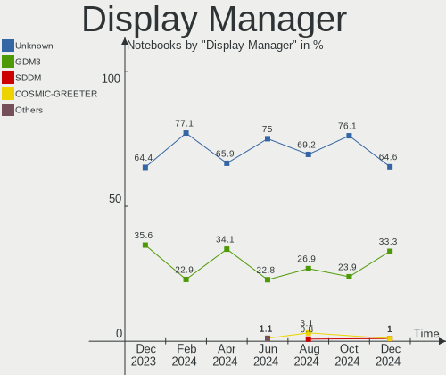
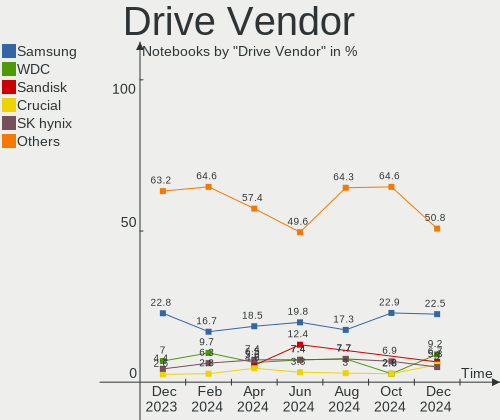
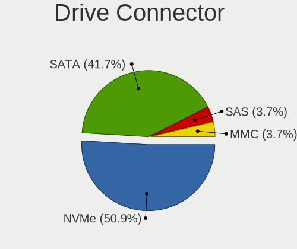
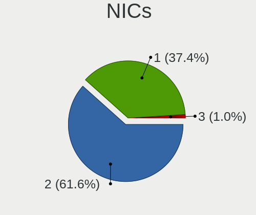

Pop!_OS Hardware Trends (Notebooks)
-----------------------------------

A project to identify most popular hardware characteristics and track their change
over time based on data collected by Pop!_OS users at https://Linux-Hardware.org.

Anyone can contribute to this report by the [hw-probe](https://github.com/linuxhw/hw-probe) tool:

    sudo -E hw-probe -all -upload

Full-feature report is available here: https://linux-hardware.org/?view=trends

Period: Dec, 2021.

Contents
--------

* [ System ](#system)
  - [ OS                       ](#os)
  - [ OS Family                ](#os-family)
  - [ Kernel                   ](#kernel)
  - [ Kernel Family            ](#kernel-family)
  - [ Kernel Major Ver.        ](#kernel-major-ver)
  - [ Arch                     ](#arch)
  - [ DE                       ](#de)
  - [ Display Server           ](#display-server)
  - [ Display Manager          ](#display-manager)
  - [ OS Lang                  ](#os-lang)
  - [ Boot Mode                ](#boot-mode)
  - [ Filesystem               ](#filesystem)
  - [ Part. scheme             ](#part-scheme)
  - [ Dual Boot with Linux/BSD ](#dual-boot-with-linuxbsd)
  - [ Dual Boot (Win)          ](#dual-boot-win)

* [ Board ](#board)
  - [ Vendor                   ](#vendor)
  - [ Model                    ](#model)
  - [ Model Family             ](#model-family)
  - [ MFG Year                 ](#mfg-year)
  - [ Form Factor              ](#form-factor)
  - [ Secure Boot              ](#secure-boot)
  - [ Coreboot                 ](#coreboot)
  - [ RAM Size                 ](#ram-size)
  - [ RAM Used                 ](#ram-used)
  - [ Total Drives             ](#total-drives)
  - [ Has CD-ROM               ](#has-cd-rom)
  - [ Has Ethernet             ](#has-ethernet)
  - [ Has WiFi                 ](#has-wifi)
  - [ Has Bluetooth            ](#has-bluetooth)

* [ Location ](#location)
  - [ Country                  ](#country)
  - [ City                     ](#city)

* [ Drives ](#drives)
  - [ Drive Vendor             ](#drive-vendor)
  - [ Drive Model              ](#drive-model)
  - [ HDD Vendor               ](#hdd-vendor)
  - [ SSD Vendor               ](#ssd-vendor)
  - [ Drive Kind               ](#drive-kind)
  - [ Drive Connector          ](#drive-connector)
  - [ Drive Size               ](#drive-size)
  - [ Space Total              ](#space-total)
  - [ Space Used               ](#space-used)
  - [ Malfunc. Drives          ](#malfunc-drives)
  - [ Malfunc. Drive Vendor    ](#malfunc-drive-vendor)
  - [ Malfunc. HDD Vendor      ](#malfunc-hdd-vendor)
  - [ Malfunc. Drive Kind      ](#malfunc-drive-kind)
  - [ Failed Drives            ](#failed-drives)
  - [ Failed Drive Vendor      ](#failed-drive-vendor)
  - [ Drive Status             ](#drive-status)

* [ Storage controller ](#storage-controller)
  - [ Storage Vendor           ](#storage-vendor)
  - [ Storage Model            ](#storage-model)
  - [ Storage Kind             ](#storage-kind)

* [ Processor ](#processor)
  - [ CPU Vendor               ](#cpu-vendor)
  - [ CPU Model                ](#cpu-model)
  - [ CPU Model Family         ](#cpu-model-family)
  - [ CPU Cores                ](#cpu-cores)
  - [ CPU Sockets              ](#cpu-sockets)
  - [ CPU Threads              ](#cpu-threads)
  - [ CPU Op-Modes             ](#cpu-op-modes)
  - [ CPU Microcode            ](#cpu-microcode)
  - [ CPU Microarch            ](#cpu-microarch)

* [ Graphics ](#graphics)
  - [ GPU Vendor               ](#gpu-vendor)
  - [ GPU Model                ](#gpu-model)
  - [ GPU Combo                ](#gpu-combo)
  - [ GPU Driver               ](#gpu-driver)
  - [ GPU Memory               ](#gpu-memory)

* [ Monitor ](#monitor)
  - [ Monitor Vendor           ](#monitor-vendor)
  - [ Monitor Model            ](#monitor-model)
  - [ Monitor Resolution       ](#monitor-resolution)
  - [ Monitor Diagonal         ](#monitor-diagonal)
  - [ Monitor Width            ](#monitor-width)
  - [ Aspect Ratio             ](#aspect-ratio)
  - [ Monitor Area             ](#monitor-area)
  - [ Pixel Density            ](#pixel-density)
  - [ Multiple Monitors        ](#multiple-monitors)

* [ Network ](#network)
  - [ Net Controller Vendor    ](#net-controller-vendor)
  - [ Net Controller Model     ](#net-controller-model)
  - [ Wireless Vendor          ](#wireless-vendor)
  - [ Wireless Model           ](#wireless-model)
  - [ Ethernet Vendor          ](#ethernet-vendor)
  - [ Ethernet Model           ](#ethernet-model)
  - [ Net Controller Kind      ](#net-controller-kind)
  - [ Used Controller          ](#used-controller)
  - [ NICs                     ](#nics)
  - [ IPv6                     ](#ipv6)

* [ Bluetooth ](#bluetooth)
  - [ Bluetooth Vendor         ](#bluetooth-vendor)
  - [ Bluetooth Model          ](#bluetooth-model)

* [ Sound ](#sound)
  - [ Sound Vendor             ](#sound-vendor)
  - [ Sound Model              ](#sound-model)

* [ Memory ](#memory)
  - [ Memory Vendor            ](#memory-vendor)
  - [ Memory Model             ](#memory-model)
  - [ Memory Kind              ](#memory-kind)
  - [ Memory Form Factor       ](#memory-form-factor)
  - [ Memory Size              ](#memory-size)
  - [ Memory Speed             ](#memory-speed)

* [ Printers & scanners ](#printers--scanners)
  - [ Printer Vendor           ](#printer-vendor)
  - [ Printer Model            ](#printer-model)
  - [ Scanner Vendor           ](#scanner-vendor)
  - [ Scanner Model            ](#scanner-model)

* [ Camera ](#camera)
  - [ Camera Vendor            ](#camera-vendor)
  - [ Camera Model             ](#camera-model)

* [ Security ](#security)
  - [ Fingerprint Vendor       ](#fingerprint-vendor)
  - [ Fingerprint Model        ](#fingerprint-model)
  - [ Chipcard Vendor          ](#chipcard-vendor)
  - [ Chipcard Model           ](#chipcard-model)

* [ Unsupported ](#unsupported)
  - [ Unsupported Devices      ](#unsupported-devices)
  - [ Unsupported Device Types ](#unsupported-device-types)

System
------

OS
--

Installed operating systems

| Name          | Notebooks | Percent |
|---------------|-----------|---------|
| Pop!_OS 21.04 | 81        | 44.51%  |
| Pop!_OS 21.10 | 74        | 40.66%  |
| Pop!_OS 20.04 | 23        | 12.64%  |
| Pop!_OS 20.10 | 4         | 2.2%    |

OS Family
---------

OS without a version

| Name    | Notebooks | Percent |
|---------|-----------|---------|
| Pop!_OS | 182       | 100%    |

Kernel
------

Version of the Linux kernel

| Version                   | Notebooks | Percent |
|---------------------------|-----------|---------|
| 5.15.5-76051505-generic   | 92        | 50.55%  |
| 5.15.8-76051508-generic   | 43        | 23.63%  |
| 5.13.0-7620-generic       | 30        | 16.48%  |
| 5.13.0-7614-generic       | 4         | 2.2%    |
| 5.11.0-7620-generic       | 4         | 2.2%    |
| 5.8.0-7642-generic        | 1         | 0.55%   |
| 5.8.0-7630-generic        | 1         | 0.55%   |
| 5.4.0-7642-generic        | 1         | 0.55%   |
| 5.4.0-7634-generic        | 1         | 0.55%   |
| 5.15.7-xanmod1            | 1         | 0.55%   |
| 5.15.0-76051500-generic   | 1         | 0.55%   |
| 5.15.0-5.3-liquorix-amd64 | 1         | 0.55%   |
| 5.11.22charles            | 1         | 0.55%   |
| 5.11.0-7612-generic       | 1         | 0.55%   |

Kernel Family
-------------

Linux kernel without a distro release

| Version | Notebooks | Percent |
|---------|-----------|---------|
| 5.15.5  | 92        | 50.55%  |
| 5.15.8  | 43        | 23.63%  |
| 5.13.0  | 34        | 18.68%  |
| 5.11.0  | 5         | 2.75%   |
| 5.8.0   | 2         | 1.1%    |
| 5.4.0   | 2         | 1.1%    |
| 5.15.0  | 2         | 1.1%    |
| 5.15.7  | 1         | 0.55%   |
| 5.11.22 | 1         | 0.55%   |

Kernel Major Ver.
-----------------

Linux kernel major version

| Version | Notebooks | Percent |
|---------|-----------|---------|
| 5.15    | 138       | 75.82%  |
| 5.13    | 34        | 18.68%  |
| 5.11    | 6         | 3.3%    |
| 5.8     | 2         | 1.1%    |
| 5.4     | 2         | 1.1%    |

Arch
----

OS architecture (x86_64, i586, etc.)

| Name   | Notebooks | Percent |
|--------|-----------|---------|
| x86_64 | 182       | 100%    |

DE
--

Desktop Environment

| Name    | Notebooks | Percent |
|---------|-----------|---------|
| GNOME   | 178       | 97.8%   |
| Unknown | 2         | 1.1%    |
| LXQt    | 1         | 0.55%   |
| KDE5    | 1         | 0.55%   |

Display Server
--------------

X11 or Wayland

| Name    | Notebooks | Percent |
|---------|-----------|---------|
| X11     | 177       | 97.25%  |
| Wayland | 5         | 2.75%   |

Display Manager
---------------

SDDM, LightDM, etc.

| Name    | Notebooks | Percent |
|---------|-----------|---------|
| Unknown | 147       | 80.77%  |
| GDM     | 35        | 19.23%  |

OS Lang
-------

Language

| Lang    | Notebooks | Percent |
|---------|-----------|---------|
| en_US   | 101       | 55.49%  |
| pt_BR   | 15        | 8.24%   |
| en_GB   | 15        | 8.24%   |
| fr_FR   | 8         | 4.4%    |
| de_DE   | 8         | 4.4%    |
| it_IT   | 4         | 2.2%    |
| en_IN   | 4         | 2.2%    |
| en_CA   | 3         | 1.65%   |
| sv_SE   | 2         | 1.1%    |
| pl_PL   | 2         | 1.1%    |
| nb_NO   | 2         | 1.1%    |
| fr_CA   | 2         | 1.1%    |
| es_MX   | 2         | 1.1%    |
| en_AU   | 2         | 1.1%    |
| C       | 2         | 1.1%    |
| Unknown | 2         | 1.1%    |
| zh_CN   | 1         | 0.55%   |
| ru_RU   | 1         | 0.55%   |
| nl_BE   | 1         | 0.55%   |
| ja_JP   | 1         | 0.55%   |
| hu_HU   | 1         | 0.55%   |
| hr_HR   | 1         | 0.55%   |
| es_AR   | 1         | 0.55%   |
| de_CH   | 1         | 0.55%   |

Boot Mode
---------

EFI or BIOS

| Mode | Notebooks | Percent |
|------|-----------|---------|
| BIOS | 143       | 78.57%  |
| EFI  | 39        | 21.43%  |

Filesystem
----------

Type of filesystem

| Type    | Notebooks | Percent |
|---------|-----------|---------|
| Ext4    | 176       | 96.7%   |
| Btrfs   | 4         | 2.2%    |
| Overlay | 2         | 1.1%    |

Part. scheme
------------

Scheme of partitioning

| Type    | Notebooks | Percent |
|---------|-----------|---------|
| Unknown | 145       | 79.67%  |
| GPT     | 37        | 20.33%  |

Dual Boot with Linux/BSD
------------------------

Hosting more than one Linux/BSD

| Dual boot | Notebooks | Percent |
|-----------|-----------|---------|
| No        | 179       | 98.35%  |
| Yes       | 3         | 1.65%   |

Dual Boot (Win)
---------------

Hosting Linux and Windows

| Dual boot | Notebooks | Percent |
|-----------|-----------|---------|
| No        | 167       | 91.76%  |
| Yes       | 15        | 8.24%   |

Board
-----

Vendor
------

Motherboard manufacturer

| Name                   | Notebooks | Percent |
|------------------------|-----------|---------|
| Dell                   | 37        | 20.33%  |
| Lenovo                 | 36        | 19.78%  |
| Hewlett-Packard        | 24        | 13.19%  |
| ASUSTek Computer       | 16        | 8.79%   |
| Acer                   | 15        | 8.24%   |
| System76               | 8         | 4.4%    |
| Apple                  | 7         | 3.85%   |
| Toshiba                | 5         | 2.75%   |
| MSI                    | 4         | 2.2%    |
| Sony                   | 3         | 1.65%   |
| HUAWEI                 | 3         | 1.65%   |
| Google                 | 3         | 1.65%   |
| Schenker               | 2         | 1.1%    |
| Razer                  | 2         | 1.1%    |
| Positivo               | 2         | 1.1%    |
| SLIMBOOK               | 1         | 0.55%   |
| Samsung Electronics    | 1         | 0.55%   |
| PC Specialist          | 1         | 0.55%   |
| OEM                    | 1         | 0.55%   |
| OBSIDIAN-PC            | 1         | 0.55%   |
| Medion                 | 1         | 0.55%   |
| LG Electronics         | 1         | 0.55%   |
| GPU Company            | 1         | 0.55%   |
| Gateway                | 1         | 0.55%   |
| Fujitsu                | 1         | 0.55%   |
| Framework              | 1         | 0.55%   |
| Exo                    | 1         | 0.55%   |
| EVOO                   | 1         | 0.55%   |
| Chuwi                  | 1         | 0.55%   |
| Avell High Performance | 1         | 0.55%   |

Model
-----

Motherboard model

| Name                                  | Notebooks | Percent |
|---------------------------------------|-----------|---------|
| System76 Lemur Pro                    | 3         | 1.65%   |
| Dell Latitude E6420                   | 3         | 1.65%   |
| System76 Gazelle                      | 2         | 1.1%    |
| Dell XPS 15 9500                      | 2         | 1.1%    |
| Dell Inspiron 5547                    | 2         | 1.1%    |
| Dell G5 5505                          | 2         | 1.1%    |
| Toshiba Satellite L775D               | 1         | 0.55%   |
| Toshiba Satellite L55D-B              | 1         | 0.55%   |
| Toshiba Satellite L500                | 1         | 0.55%   |
| Toshiba Satellite C660                | 1         | 0.55%   |
| Toshiba Satellite C50t-B              | 1         | 0.55%   |
| System76 Serval                       | 1         | 0.55%   |
| System76 Oryx Pro                     | 1         | 0.55%   |
| System76 Darter Pro                   | 1         | 0.55%   |
| Sony VGN-AW21M_H                      | 1         | 0.55%   |
| Sony SVP1121M1EBI                     | 1         | 0.55%   |
| Sony SVF1531GSFB                      | 1         | 0.55%   |
| SLIMBOOK PROX15-AMD                   | 1         | 0.55%   |
| Schenker XMG PRO (Late 2021)          | 1         | 0.55%   |
| Schenker XMG CORE (CZN/E21)           | 1         | 0.55%   |
| Samsung 550XDA                        | 1         | 0.55%   |
| Razer Blade 14 - RZ09-0370            | 1         | 0.55%   |
| Razer Blade                           | 1         | 0.55%   |
| Positivo NB50TH                       | 1         | 0.55%   |
| Positivo C14CR21TV                    | 1         | 0.55%   |
| PC Specialist NH5x_7xDCx_DDx          | 1         | 0.55%   |
| OEM I38II                             | 1         | 0.55%   |
| OBSIDIAN-PC P65xHP                    | 1         | 0.55%   |
| MSI Modern 14 B10MW                   | 1         | 0.55%   |
| MSI GL63 9RCX                         | 1         | 0.55%   |
| MSI GL62 6QC                          | 1         | 0.55%   |
| MSI GF75 Thin 10UEK                   | 1         | 0.55%   |
| Medion Erazer X7841 MD99556           | 1         | 0.55%   |
| LG 14Z990-V.AR52A2                    | 1         | 0.55%   |
| Lenovo Yoga Slim 9 14ITL5 82D1        | 1         | 0.55%   |
| Lenovo Yoga Slim 7 Carbon 14ACN6 82L0 | 1         | 0.55%   |
| Lenovo Y520-15IKBN 80WK               | 1         | 0.55%   |
| Lenovo ThinkPad X230 23254UY          | 1         | 0.55%   |
| Lenovo ThinkPad X230 23252CG          | 1         | 0.55%   |
| Lenovo ThinkPad X230 2324K84          | 1         | 0.55%   |
| Lenovo ThinkPad X220 4291B78          | 1         | 0.55%   |
| Lenovo ThinkPad T570 W10DG 20JXS0GD0T | 1         | 0.55%   |
| Lenovo ThinkPad T500 2089R97          | 1         | 0.55%   |
| Lenovo ThinkPad T490 20RYS07R00       | 1         | 0.55%   |
| Lenovo ThinkPad T470 W10DG 20JNS0F40F | 1         | 0.55%   |
| Lenovo ThinkPad T460 20FMS4U300       | 1         | 0.55%   |
| Lenovo ThinkPad T460 20FMS0BX00       | 1         | 0.55%   |
| Lenovo ThinkPad T440p 20AWS12002      | 1         | 0.55%   |
| Lenovo ThinkPad T430 2344BZU          | 1         | 0.55%   |
| Lenovo ThinkPad T420 4236B28          | 1         | 0.55%   |
| Lenovo ThinkPad T15 Gen 2i 20W4000NRT | 1         | 0.55%   |
| Lenovo ThinkPad L512 44444WG          | 1         | 0.55%   |
| Lenovo ThinkPad E560 20EV000TUK       | 1         | 0.55%   |
| Lenovo ThinkPad E15 Gen 3 20YHS00A00  | 1         | 0.55%   |
| Lenovo ThinkPad E15 Gen 3 20YGCTO1WW  | 1         | 0.55%   |
| Lenovo ThinkPad E14 Gen 3 20Y7003XGE  | 1         | 0.55%   |
| Lenovo ThinkBook 15 G2 ITL 20VE       | 1         | 0.55%   |
| Lenovo Legion Y540-15IRH-PG0 81SY     | 1         | 0.55%   |
| Lenovo Legion 5 Pro 16ACH6H 82JQ      | 1         | 0.55%   |
| Lenovo Legion 5 15IMH05H 82CF         | 1         | 0.55%   |

Model Family
------------

Motherboard model prefix

| Name                  | Notebooks | Percent |
|-----------------------|-----------|---------|
| Lenovo ThinkPad       | 19        | 10.44%  |
| Dell Inspiron         | 11        | 6.04%   |
| Lenovo IdeaPad        | 10        | 5.49%   |
| Acer Aspire           | 10        | 5.49%   |
| Dell Latitude         | 9         | 4.95%   |
| Dell XPS              | 8         | 4.4%    |
| Toshiba Satellite     | 5         | 2.75%   |
| HP ProBook            | 4         | 2.2%    |
| HP EliteBook          | 4         | 2.2%    |
| ASUS VivoBook         | 4         | 2.2%    |
| System76 Lemur        | 3         | 1.65%   |
| Lenovo Legion         | 3         | 1.65%   |
| HP Pavilion           | 3         | 1.65%   |
| Dell G5               | 3         | 1.65%   |
| System76 Gazelle      | 2         | 1.1%    |
| Schenker XMG          | 2         | 1.1%    |
| Razer Blade           | 2         | 1.1%    |
| Lenovo Yoga           | 2         | 1.1%    |
| HP ZBook              | 2         | 1.1%    |
| HP OMEN               | 2         | 1.1%    |
| HP Laptop             | 2         | 1.1%    |
| HP Compaq             | 2         | 1.1%    |
| HP 15                 | 2         | 1.1%    |
| ASUS ZenBook          | 2         | 1.1%    |
| Acer Nitro            | 2         | 1.1%    |
| System76 Serval       | 1         | 0.55%   |
| System76 Oryx         | 1         | 0.55%   |
| System76 Darter       | 1         | 0.55%   |
| Sony VGN-AW21M        | 1         | 0.55%   |
| Sony SVP1121M1EBI     | 1         | 0.55%   |
| Sony SVF1531GSFB      | 1         | 0.55%   |
| SLIMBOOK PROX15-AMD   | 1         | 0.55%   |
| Samsung 550XDA        | 1         | 0.55%   |
| Positivo NB50TH       | 1         | 0.55%   |
| Positivo C14CR21TV    | 1         | 0.55%   |
| PC Specialist NH5x    | 1         | 0.55%   |
| OEM I38II             | 1         | 0.55%   |
| OBSIDIAN-PC P65xHP    | 1         | 0.55%   |
| MSI Modern            | 1         | 0.55%   |
| MSI GL63              | 1         | 0.55%   |
| MSI GL62              | 1         | 0.55%   |
| MSI GF75              | 1         | 0.55%   |
| Medion Erazer         | 1         | 0.55%   |
| LG 14Z990-V.AR52A2    | 1         | 0.55%   |
| Lenovo Y520-15IKBN    | 1         | 0.55%   |
| Lenovo ThinkBook      | 1         | 0.55%   |
| HUAWEI WRTD-WXX9      | 1         | 0.55%   |
| HUAWEI VLT-WX0        | 1         | 0.55%   |
| HUAWEI KLVD-WXX9      | 1         | 0.55%   |
| HP Victus             | 1         | 0.55%   |
| HP Presario           | 1         | 0.55%   |
| HP G42                | 1         | 0.55%   |
| GPU Company GWTN156-1 | 1         | 0.55%   |
| Google Rammus         | 1         | 0.55%   |
| Google Delbin         | 1         | 0.55%   |
| Google Akemi          | 1         | 0.55%   |
| Gateway P-78          | 1         | 0.55%   |
| Fujitsu FMVNQ8P9      | 1         | 0.55%   |
| Framework Laptop      | 1         | 0.55%   |
| Exo C14C              | 1         | 0.55%   |

MFG Year
--------

Motherboard manufacture year

| Year | Notebooks | Percent |
|------|-----------|---------|
| 2021 | 67        | 36.81%  |
| 2020 | 26        | 14.29%  |
| 2019 | 24        | 13.19%  |
| 2018 | 9         | 4.95%   |
| 2013 | 9         | 4.95%   |
| 2011 | 9         | 4.95%   |
| 2016 | 8         | 4.4%    |
| 2009 | 6         | 3.3%    |
| 2015 | 5         | 2.75%   |
| 2014 | 5         | 2.75%   |
| 2012 | 5         | 2.75%   |
| 2008 | 4         | 2.2%    |
| 2017 | 2         | 1.1%    |
| 2010 | 2         | 1.1%    |
| 2007 | 1         | 0.55%   |

Form Factor
-----------

Physical design of the computer

| Name     | Notebooks | Percent |
|----------|-----------|---------|
| Notebook | 182       | 100%    |

Secure Boot
-----------

Enabled or disabled

| State    | Notebooks | Percent |
|----------|-----------|---------|
| Disabled | 182       | 100%    |

Coreboot
--------

Have coreboot on board

| Used | Notebooks | Percent |
|------|-----------|---------|
| No   | 173       | 95.05%  |
| Yes  | 9         | 4.95%   |

RAM Size
--------

Total RAM memory

| Size in GB  | Notebooks | Percent |
|-------------|-----------|---------|
| 4.01-8.0    | 55        | 30.22%  |
| 16.01-24.0  | 41        | 22.53%  |
| 3.01-4.0    | 34        | 18.68%  |
| 8.01-16.0   | 29        | 15.93%  |
| 32.01-64.0  | 16        | 8.79%   |
| 24.01-32.0  | 2         | 1.1%    |
| 2.01-3.0    | 2         | 1.1%    |
| 64.01-256.0 | 2         | 1.1%    |
| 1.01-2.0    | 1         | 0.55%   |

RAM Used
--------

Used RAM memory

| Used GB   | Notebooks | Percent |
|-----------|-----------|---------|
| 2.01-3.0  | 60        | 32.97%  |
| 1.01-2.0  | 55        | 30.22%  |
| 3.01-4.0  | 35        | 19.23%  |
| 4.01-8.0  | 28        | 15.38%  |
| 8.01-16.0 | 4         | 2.2%    |

Total Drives
------------

Number of drives on board

| Drives | Notebooks | Percent |
|--------|-----------|---------|
| 1      | 124       | 68.13%  |
| 2      | 51        | 28.02%  |
| 3      | 6         | 3.3%    |
| 0      | 1         | 0.55%   |

Has CD-ROM
----------

Has CD-ROM on board

| Presented | Notebooks | Percent |
|-----------|-----------|---------|
| No        | 133       | 73.08%  |
| Yes       | 49        | 26.92%  |

Has Ethernet
------------

Has Ethernet on board

| Presented | Notebooks | Percent |
|-----------|-----------|---------|
| Yes       | 147       | 80.77%  |
| No        | 35        | 19.23%  |

Has WiFi
--------

Has WiFi module

| Presented | Notebooks | Percent |
|-----------|-----------|---------|
| Yes       | 180       | 98.9%   |
| No        | 2         | 1.1%    |

Has Bluetooth
-------------

Has Bluetooth module

| Presented | Notebooks | Percent |
|-----------|-----------|---------|
| Yes       | 156       | 85.71%  |
| No        | 26        | 14.29%  |

Location
--------

Country
-------

Geographic location (country)

| Country                | Notebooks | Percent |
|------------------------|-----------|---------|
| USA                    | 45        | 24.73%  |
| Brazil                 | 17        | 9.34%   |
| India                  | 13        | 7.14%   |
| Germany                | 10        | 5.49%   |
| France                 | 9         | 4.95%   |
| UK                     | 8         | 4.4%    |
| Canada                 | 7         | 3.85%   |
| Sweden                 | 5         | 2.75%   |
| Italy                  | 4         | 2.2%    |
| Argentina              | 4         | 2.2%    |
| Switzerland            | 3         | 1.65%   |
| Romania                | 3         | 1.65%   |
| Norway                 | 3         | 1.65%   |
| Netherlands            | 3         | 1.65%   |
| Spain                  | 2         | 1.1%    |
| South Africa           | 2         | 1.1%    |
| Slovakia               | 2         | 1.1%    |
| Russia                 | 2         | 1.1%    |
| Poland                 | 2         | 1.1%    |
| Mexico                 | 2         | 1.1%    |
| Greece                 | 2         | 1.1%    |
| Croatia                | 2         | 1.1%    |
| Australia              | 2         | 1.1%    |
| Algeria                | 2         | 1.1%    |
| Vietnam                | 1         | 0.55%   |
| UAE                    | 1         | 0.55%   |
| Trinidad and Tobago    | 1         | 0.55%   |
| South Korea            | 1         | 0.55%   |
| Singapore              | 1         | 0.55%   |
| Sierra Leone           | 1         | 0.55%   |
| Saudi Arabia           | 1         | 0.55%   |
| North Macedonia        | 1         | 0.55%   |
| Nigeria                | 1         | 0.55%   |
| Lebanon                | 1         | 0.55%   |
| Jordan                 | 1         | 0.55%   |
| Japan                  | 1         | 0.55%   |
| Ireland                | 1         | 0.55%   |
| Indonesia              | 1         | 0.55%   |
| Hungary                | 1         | 0.55%   |
| Honduras               | 1         | 0.55%   |
| Estonia                | 1         | 0.55%   |
| El Salvador            | 1         | 0.55%   |
| Egypt                  | 1         | 0.55%   |
| Czechia                | 1         | 0.55%   |
| Colombia               | 1         | 0.55%   |
| China                  | 1         | 0.55%   |
| Cambodia               | 1         | 0.55%   |
| Bulgaria               | 1         | 0.55%   |
| Bosnia and Herzegovina | 1         | 0.55%   |
| Belgium                | 1         | 0.55%   |
| Bangladesh             | 1         | 0.55%   |
| Austria                | 1         | 0.55%   |

City
----

Geographic location (city)

| City                  | Notebooks | Percent |
|-----------------------|-----------|---------|
| S??o Paulo            | 2         | 1.1%    |
| Sao Goncalo           | 2         | 1.1%    |
| Pune                  | 2         | 1.1%    |
| Plano                 | 2         | 1.1%    |
| Oslo                  | 2         | 1.1%    |
| Montreal              | 2         | 1.1%    |
| Las Vegas             | 2         | 1.1%    |
| Junagadh              | 2         | 1.1%    |
| Johannesburg          | 2         | 1.1%    |
| Constan?›a            | 2         | 1.1%    |
| Buenos Aires          | 2         | 1.1%    |
| Zagreb                | 1         | 0.55%   |
| Youngstown            | 1         | 0.55%   |
| Witten                | 1         | 0.55%   |
| Williamsburg          | 1         | 0.55%   |
| Weatherford           | 1         | 0.55%   |
| Wasilla               | 1         | 0.55%   |
| Vienna                | 1         | 0.55%   |
| Vaxholm               | 1         | 0.55%   |
| Valencia              | 1         | 0.55%   |
| Vaellingby            | 1         | 0.55%   |
| Ume??                 | 1         | 0.55%   |
| Trezzano sul Naviglio | 1         | 0.55%   |
| Toledo                | 1         | 0.55%   |
| Thessaloniki          | 1         | 0.55%   |
| The Hague             | 1         | 0.55%   |
| Teresina              | 1         | 0.55%   |
| Tallinn               | 1         | 0.55%   |
| Sydney                | 1         | 0.55%   |
| Svidn?­k              | 1         | 0.55%   |
| Surprise              | 1         | 0.55%   |
| Sulz am Neckar        | 1         | 0.55%   |
| Stockholm             | 1         | 0.55%   |
| St. Petersburg        | 1         | 0.55%   |
| St Petersburg         | 1         | 0.55%   |
| St Albans             | 1         | 0.55%   |
| Southampton           | 1         | 0.55%   |
| Sonipat               | 1         | 0.55%   |
| Skopje                | 1         | 0.55%   |
| Singapore             | 1         | 0.55%   |
| Shimla                | 1         | 0.55%   |
| Seodaemun-gu          | 1         | 0.55%   |
| Semarang              | 1         | 0.55%   |
| San Salvador          | 1         | 0.55%   |
| San Pedro Sula        | 1         | 0.55%   |
| Roswell               | 1         | 0.55%   |
| Rome                  | 1         | 0.55%   |
| Reynoldsburg          | 1         | 0.55%   |
| Regensburg            | 1         | 0.55%   |
| Raleigh               | 1         | 0.55%   |
| Pula                  | 1         | 0.55%   |
| Prague                | 1         | 0.55%   |
| Pontypridd            | 1         | 0.55%   |
| Phoenix               | 1         | 0.55%   |
| Phnom Penh            | 1         | 0.55%   |
| Philadelphia          | 1         | 0.55%   |
| Pernik                | 1         | 0.55%   |
| Patos de Minas        | 1         | 0.55%   |
| Paris                 | 1         | 0.55%   |
| Orlando               | 1         | 0.55%   |

Drives
------

Drive Vendor
------------

Hard drive vendors

| Vendor                    | Notebooks | Drives | Percent |
|---------------------------|-----------|--------|---------|
| Samsung Electronics       | 49        | 52     | 20%     |
| Seagate                   | 33        | 33     | 13.47%  |
| WDC                       | 30        | 31     | 12.24%  |
| SK Hynix                  | 17        | 17     | 6.94%   |
| Unknown                   | 16        | 17     | 6.53%   |
| Sandisk                   | 14        | 14     | 5.71%   |
| Toshiba                   | 11        | 11     | 4.49%   |
| Kingston                  | 11        | 11     | 4.49%   |
| Intel                     | 8         | 8      | 3.27%   |
| Micron Technology         | 5         | 5      | 2.04%   |
| Phison                    | 4         | 4      | 1.63%   |
| Crucial                   | 4         | 4      | 1.63%   |
| Apple                     | 4         | 4      | 1.63%   |
| PNY                       | 3         | 3      | 1.22%   |
| LITEON                    | 3         | 3      | 1.22%   |
| KIOXIA                    | 3         | 3      | 1.22%   |
| ADATA Technology          | 3         | 3      | 1.22%   |
| Transcend                 | 2         | 2      | 0.82%   |
| Micron/Crucial Technology | 2         | 2      | 0.82%   |
| Hitachi                   | 2         | 2      | 0.82%   |
| HGST                      | 2         | 2      | 0.82%   |
| China                     | 2         | 2      | 0.82%   |
| A-DATA Technology         | 2         | 2      | 0.82%   |
| XPG                       | 1         | 1      | 0.41%   |
| Union Memory (Shenzhen)   | 1         | 1      | 0.41%   |
| UMIS                      | 1         | 1      | 0.41%   |
| TO Exter                  | 1         | 1      | 0.41%   |
| Silicon Motion            | 1         | 1      | 0.41%   |
| SABRENT                   | 1         | 1      | 0.41%   |
| ROG                       | 1         | 1      | 0.41%   |
| Netac                     | 1         | 1      | 0.41%   |
| KLLISRE                   | 1         | 1      | 0.41%   |
| KIOXIA-EXCERIA            | 1         | 1      | 0.41%   |
| KingSpec                  | 1         | 1      | 0.41%   |
| KINGBANK                  | 1         | 1      | 0.41%   |
| FORESEE                   | 1         | 1      | 0.41%   |
| Corsair                   | 1         | 1      | 0.41%   |
| Unknown                   | 1         | 1      | 0.41%   |

Drive Model
-----------

Hard drive models

| Model                                  | Notebooks | Percent |
|----------------------------------------|-----------|---------|
| Samsung NVMe SSD Drive 1TB             | 9         | 3.6%    |
| Unknown MMC Card  64GB                 | 6         | 2.4%    |
| Seagate ST1000LM035-1RK172 1TB         | 6         | 2.4%    |
| SK Hynix NVMe SSD Drive 512GB          | 4         | 1.6%    |
| Seagate ST9500325AS 500GB              | 4         | 1.6%    |
| WDC WD10SPZX-08Z10 1TB                 | 3         | 1.2%    |
| Unknown MMC Card  128GB                | 3         | 1.2%    |
| SK Hynix NVMe SSD Drive 256GB          | 3         | 1.2%    |
| Sandisk NVMe SSD Drive 512GB           | 3         | 1.2%    |
| Samsung SSD 850 EVO 250GB              | 3         | 1.2%    |
| Samsung NVMe SSD Drive 512GB           | 3         | 1.2%    |
| Micron NVMe SSD Drive 512GB            | 3         | 1.2%    |
| Kingston SA400S37240G 240GB SSD        | 3         | 1.2%    |
| WDC WD10SPZX-24Z10 1TB                 | 2         | 0.8%    |
| Toshiba NVMe SSD Drive 512GB           | 2         | 0.8%    |
| Toshiba MQ04ABF100 1TB                 | 2         | 0.8%    |
| Seagate ST500LT012-9WS142 500GB        | 2         | 0.8%    |
| Seagate ST500LM012 HN-M500MBB 500GB    | 2         | 0.8%    |
| SanDisk SDSSDA240G 240GB               | 2         | 0.8%    |
| Samsung SSD 970 EVO Plus 1TB           | 2         | 0.8%    |
| Samsung SSD 860 QVO 1TB                | 2         | 0.8%    |
| Samsung SSD 850 EVO 500GB              | 2         | 0.8%    |
| Samsung SSD 850 EVO 1TB                | 2         | 0.8%    |
| Samsung SM963 2.5" NVMe PCIe SSD 128GB | 2         | 0.8%    |
| Samsung NVMe SSD Drive 500GB           | 2         | 0.8%    |
| Samsung NVMe SSD Drive 2TB             | 2         | 0.8%    |
| Samsung NVMe SSD Drive 1024GB          | 2         | 0.8%    |
| PNY CS900 480GB SSD                    | 2         | 0.8%    |
| Kingston SA400S37120G 120GB SSD        | 2         | 0.8%    |
| Kingston NVMe SSD Drive 512GB          | 2         | 0.8%    |
| ADATA NVMe SSD Drive 256GB             | 2         | 0.8%    |
| XPG NVMe SSD Drive 512GB               | 1         | 0.4%    |
| WDC WDS500G3X0C-00SJG0 500GB           | 1         | 0.4%    |
| WDC WDS500G2B0C-00PXH0 500GB           | 1         | 0.4%    |
| WDC WDS240G2G0B-00EPW0 240GB SSD       | 1         | 0.4%    |
| WDC WDS100T2B0C-00PXH0 1TB             | 1         | 0.4%    |
| WDC WD800BJKT-75F4T0 80GB              | 1         | 0.4%    |
| WDC WD5000LPZX-35Z10T0 500GB           | 1         | 0.4%    |
| WDC WD5000LPVX-60V0TT0 500GB           | 1         | 0.4%    |
| WDC WD5000LPCX-35VHAT0 500GB           | 1         | 0.4%    |
| WDC WD5000BEVT-22ZAT0 500GB            | 1         | 0.4%    |
| WDC WD3200BEVT-00ZCT0 320GB            | 1         | 0.4%    |
| WDC WD3200BEKT-75PVMT1 320GB           | 1         | 0.4%    |
| WDC WD32 00BEVT-00ZCT0 320GB           | 1         | 0.4%    |
| WDC WD2500BEVT-60ZCT1 250GB            | 1         | 0.4%    |
| WDC WD2500BEVT-60A23T0 250GB           | 1         | 0.4%    |
| WDC WD2500BEVT-22ZCT0 250GB            | 1         | 0.4%    |
| WDC WD2500BEVT-22A23T0 250GB           | 1         | 0.4%    |
| WDC WD2500BEKT-75PVMT0 250GB           | 1         | 0.4%    |
| WDC WD1600BEVT-22ZCT0 160GB            | 1         | 0.4%    |
| WDC WD10SPZX-21Z10T0 1TB               | 1         | 0.4%    |
| WDC WD10JPVX-00JC3T0 1TB               | 1         | 0.4%    |
| WDC WD10JPCX-24UE4T0 1TB               | 1         | 0.4%    |
| WDC PC SN730 SDBPNTY-1T00-1101 1TB     | 1         | 0.4%    |
| WDC PC SN720 SDAPNTW-512G-1014 512GB   | 1         | 0.4%    |
| WDC PC SN530 SDBPMPZ-512G-1001 512GB   | 1         | 0.4%    |
| WDC PC SN530 NVMe 1024GB               | 1         | 0.4%    |
| WDC PC SN520 NVMe 512GB                | 1         | 0.4%    |
| Unknown USB DISK 3.2 1TB               | 1         | 0.4%    |
| Unknown SM32G  32GB                    | 1         | 0.4%    |

HDD Vendor
----------

Hard disk drive vendors

| Vendor   | Notebooks | Drives | Percent |
|----------|-----------|--------|---------|
| Seagate  | 31        | 31     | 44.93%  |
| WDC      | 22        | 22     | 31.88%  |
| Toshiba  | 8         | 8      | 11.59%  |
| Hitachi  | 2         | 2      | 2.9%    |
| HGST     | 2         | 2      | 2.9%    |
| Unknown  | 1         | 1      | 1.45%   |
| TO Exter | 1         | 1      | 1.45%   |
| SABRENT  | 1         | 1      | 1.45%   |
| Apple    | 1         | 1      | 1.45%   |

SSD Vendor
----------

Solid state drive vendors

| Vendor              | Notebooks | Drives | Percent |
|---------------------|-----------|--------|---------|
| Samsung Electronics | 19        | 19     | 28.79%  |
| SanDisk             | 8         | 8      | 12.12%  |
| Kingston            | 7         | 7      | 10.61%  |
| Crucial             | 4         | 4      | 6.06%   |
| SK Hynix            | 3         | 3      | 4.55%   |
| PNY                 | 3         | 3      | 4.55%   |
| LITEON              | 3         | 3      | 4.55%   |
| Intel               | 3         | 3      | 4.55%   |
| Apple               | 3         | 3      | 4.55%   |
| Transcend           | 2         | 2      | 3.03%   |
| China               | 2         | 2      | 3.03%   |
| A-DATA Technology   | 2         | 2      | 3.03%   |
| WDC                 | 1         | 1      | 1.52%   |
| Netac               | 1         | 1      | 1.52%   |
| Micron Technology   | 1         | 1      | 1.52%   |
| KIOXIA-EXCERIA      | 1         | 1      | 1.52%   |
| KingSpec            | 1         | 1      | 1.52%   |
| FORESEE             | 1         | 1      | 1.52%   |
| Corsair             | 1         | 1      | 1.52%   |

Drive Kind
----------

HDD or SSD

| Kind    | Notebooks | Drives | Percent |
|---------|-----------|--------|---------|
| NVMe    | 84        | 95     | 35.9%   |
| HDD     | 68        | 69     | 29.06%  |
| SSD     | 64        | 66     | 27.35%  |
| MMC     | 14        | 16     | 5.98%   |
| Unknown | 4         | 4      | 1.71%   |

Drive Connector
---------------

SATA, SAS, NVMe, etc.

| Type | Notebooks | Drives | Percent |
|------|-----------|--------|---------|
| SATA | 113       | 130    | 51.36%  |
| NVMe | 84        | 95     | 38.18%  |
| MMC  | 14        | 16     | 6.36%   |
| SAS  | 9         | 9      | 4.09%   |

Drive Size
----------

Size of hard drive

| Size in TB | Notebooks | Drives | Percent |
|------------|-----------|--------|---------|
| 0.01-0.5   | 86        | 95     | 68.8%   |
| 0.51-1.0   | 36        | 37     | 28.8%   |
| 1.01-2.0   | 3         | 3      | 2.4%    |

Space Total
-----------

Amount of disk space available on the file system

| Size in GB     | Notebooks | Percent |
|----------------|-----------|---------|
| 251-500        | 62        | 34.07%  |
| 101-250        | 57        | 31.32%  |
| 501-1000       | 31        | 17.03%  |
| 1001-2000      | 11        | 6.04%   |
| 51-100         | 7         | 3.85%   |
| 21-50          | 5         | 2.75%   |
| More than 3000 | 3         | 1.65%   |
| 1-20           | 3         | 1.65%   |
| Unknown        | 2         | 1.1%    |
| 2001-3000      | 1         | 0.55%   |

Space Used
----------

Amount of used disk space

| Used GB        | Notebooks | Percent |
|----------------|-----------|---------|
| 1-20           | 61        | 33.52%  |
| 21-50          | 41        | 22.53%  |
| 101-250        | 28        | 15.38%  |
| 51-100         | 27        | 14.84%  |
| 251-500        | 10        | 5.49%   |
| 1001-2000      | 5         | 2.75%   |
| 501-1000       | 5         | 2.75%   |
| More than 3000 | 3         | 1.65%   |
| Unknown        | 2         | 1.1%    |

Malfunc. Drives
---------------

Drive models with a malfunction

| Model                          | Notebooks | Drives | Percent |
|--------------------------------|-----------|--------|---------|
| WDC WD2500BEVT-22A23T0 250GB   | 1         | 1      | 20%     |
| WDC WD10JPCX-24UE4T0 1TB       | 1         | 1      | 20%     |
| Seagate ST1000LM035-1RK172 1TB | 1         | 1      | 20%     |
| Intel SSDSCKKF256G8H 256GB     | 1         | 1      | 20%     |
| HGST HTS721010A9E630 1TB       | 1         | 1      | 20%     |

Malfunc. Drive Vendor
---------------------

Vendors of faulty drives

| Vendor  | Notebooks | Drives | Percent |
|---------|-----------|--------|---------|
| WDC     | 2         | 2      | 40%     |
| Seagate | 1         | 1      | 20%     |
| Intel   | 1         | 1      | 20%     |
| HGST    | 1         | 1      | 20%     |

Malfunc. HDD Vendor
-------------------

Vendors of faulty HDD drives

| Vendor  | Notebooks | Drives | Percent |
|---------|-----------|--------|---------|
| WDC     | 2         | 2      | 50%     |
| Seagate | 1         | 1      | 25%     |
| HGST    | 1         | 1      | 25%     |

Malfunc. Drive Kind
-------------------

Kinds of faulty drives

| Kind | Notebooks | Drives | Percent |
|------|-----------|--------|---------|
| HDD  | 4         | 4      | 80%     |
| SSD  | 1         | 1      | 20%     |

Failed Drives
-------------

Failed drive models

Zero info for selected period =(

Failed Drive Vendor
-------------------

Failed drive vendors

Zero info for selected period =(

Drive Status
------------

Number of failed and malfunc. drives

| Status   | Notebooks | Drives | Percent |
|----------|-----------|--------|---------|
| Detected | 149       | 202    | 78.01%  |
| Works    | 37        | 43     | 19.37%  |
| Malfunc  | 5         | 5      | 2.62%   |

Storage controller
------------------

Storage Vendor
--------------

Storage controller vendors

| Vendor                       | Notebooks | Percent |
|------------------------------|-----------|---------|
| Intel                        | 116       | 49.79%  |
| Samsung Electronics          | 32        | 13.73%  |
| AMD                          | 28        | 12.02%  |
| SK Hynix                     | 14        | 6.01%   |
| Sandisk                      | 13        | 5.58%   |
| Toshiba America Info Systems | 5         | 2.15%   |
| Phison Electronics           | 4         | 1.72%   |
| Micron Technology            | 4         | 1.72%   |
| Kingston Technology Company  | 4         | 1.72%   |
| ADATA Technology             | 4         | 1.72%   |
| Union Memory (Shenzhen)      | 2         | 0.86%   |
| Seagate Technology           | 2         | 0.86%   |
| Micron/Crucial Technology    | 2         | 0.86%   |
| KIOXIA                       | 2         | 0.86%   |
| Silicon Motion               | 1         | 0.43%   |

Storage Model
-------------

Storage controller models

| Model                                                                          | Notebooks | Percent |
|--------------------------------------------------------------------------------|-----------|---------|
| AMD FCH SATA Controller [AHCI mode]                                            | 26        | 10.74%  |
| Samsung NVMe SSD Controller SM981/PM981/PM983                                  | 18        | 7.44%   |
| Intel 7 Series Chipset Family 6-port SATA Controller [AHCI mode]               | 13        | 5.37%   |
| Intel Sunrise Point-LP SATA Controller [AHCI mode]                             | 12        | 4.96%   |
| Intel 82801 Mobile SATA Controller [RAID mode]                                 | 10        | 4.13%   |
| Intel 8 Series SATA Controller 1 [AHCI mode]                                   | 9         | 3.72%   |
| Intel 400 Series Chipset Family SATA AHCI Controller                           | 7         | 2.89%   |
| SK Hynix Gold P31 SSD                                                          | 6         | 2.48%   |
| Samsung NVMe SSD Controller 980                                                | 6         | 2.48%   |
| Intel HM170/QM170 Chipset SATA Controller [AHCI Mode]                          | 6         | 2.48%   |
| Intel 82801IBM/IEM (ICH9M/ICH9M-E) 4 port SATA Controller [AHCI mode]          | 6         | 2.48%   |
| Intel 6 Series/C200 Series Chipset Family 6 port Mobile SATA AHCI Controller   | 6         | 2.48%   |
| SK Hynix BC501 NVMe Solid State Drive                                          | 5         | 2.07%   |
| Intel Volume Management Device NVMe RAID Controller                            | 5         | 2.07%   |
| Intel Cannon Point-LP SATA Controller [AHCI Mode]                              | 5         | 2.07%   |
| Intel 5 Series/3400 Series Chipset 4 port SATA AHCI Controller                 | 5         | 2.07%   |
| Sandisk WD Blue SN550 NVMe SSD                                                 | 4         | 1.65%   |
| Samsung NVMe SSD Controller SM961/PM961/SM963                                  | 4         | 1.65%   |
| Micron Non-Volatile memory controller                                          | 4         | 1.65%   |
| Intel Wildcat Point-LP SATA Controller [AHCI Mode]                             | 4         | 1.65%   |
| Intel SSD 660P Series                                                          | 4         | 1.65%   |
| Intel Cannon Lake Mobile PCH SATA AHCI Controller                              | 4         | 1.65%   |
| Intel 82801HM/HEM (ICH8M/ICH8M-E) SATA Controller [AHCI mode]                  | 4         | 1.65%   |
| Intel 82801HM/HEM (ICH8M/ICH8M-E) IDE Controller                               | 4         | 1.65%   |
| Toshiba America Info Systems XG6 NVMe SSD Controller                           | 3         | 1.24%   |
| Sandisk WD Black SN750 / PC SN730 NVMe SSD                                     | 3         | 1.24%   |
| Sandisk Non-Volatile memory controller                                         | 3         | 1.24%   |
| Samsung NVMe SSD Controller PM9A1/PM9A3/980PRO                                 | 3         | 1.24%   |
| ADATA Non-Volatile memory controller                                           | 3         | 1.24%   |
| Union Memory (Shenzhen) Non-Volatile memory controller                         | 2         | 0.83%   |
| SK Hynix BC511                                                                 | 2         | 0.83%   |
| Sandisk WD Black 2018/SN750 / PC SN720 NVMe SSD                                | 2         | 0.83%   |
| Phison E12 NVMe Controller                                                     | 2         | 0.83%   |
| Micron/Crucial P2 NVMe PCIe SSD                                                | 2         | 0.83%   |
| KIOXIA Non-Volatile memory controller                                          | 2         | 0.83%   |
| Kingston Company Company Non-Volatile memory controller                        | 2         | 0.83%   |
| Intel Tiger Lake-LP SATA Controller [AHCI mode]                                | 2         | 0.83%   |
| Intel Ice Lake-LP SATA Controller [AHCI mode]                                  | 2         | 0.83%   |
| Intel Celeron/Pentium Silver Processor SATA Controller                         | 2         | 0.83%   |
| Intel 8 Series/C220 Series Chipset Family 6-port SATA Controller 1 [AHCI mode] | 2         | 0.83%   |
| Toshiba America Info Systems Toshiba America Info SATA controller              | 1         | 0.41%   |
| Toshiba America Info Systems BG3 NVMe SSD Controller                           | 1         | 0.41%   |
| SK Hynix PC401 NVMe Solid State Drive 256GB                                    | 1         | 0.41%   |
| Silicon Motion Non-Volatile memory controller                                  | 1         | 0.41%   |
| Seagate FireCuda 520 SSD                                                       | 1         | 0.41%   |
| Seagate FireCuda 510 SSD                                                       | 1         | 0.41%   |
| Sandisk WD Blue SN500 / PC SN520 NVMe SSD                                      | 1         | 0.41%   |
| Sandisk PC SN520 NVMe SSD                                                      | 1         | 0.41%   |
| Samsung Electronics SATA controller                                            | 1         | 0.41%   |
| Phison PS5013 E13 NVMe Controller                                              | 1         | 0.41%   |
| Phison NVMe Storage Controller                                                 | 1         | 0.41%   |
| Kingston Company U-SNS8154P3 NVMe SSD                                          | 1         | 0.41%   |
| Kingston Company OM3PDP3 NVMe SSD                                              | 1         | 0.41%   |
| Intel SSD Pro 7600p/760p/E 6100p Series                                        | 1         | 0.41%   |
| Intel Q170/Q150/B150/H170/H110/Z170/CM236 Chipset SATA Controller [AHCI Mode]  | 1         | 0.41%   |
| Intel Jasper Lake SATA AHCI Controller                                         | 1         | 0.41%   |
| Intel Comet Lake SATA AHCI Controller                                          | 1         | 0.41%   |
| Intel Celeron N3350/Pentium N4200/Atom E3900 Series SATA AHCI Controller       | 1         | 0.41%   |
| Intel Cannon Lake PCH SATA AHCI Controller                                     | 1         | 0.41%   |
| Intel Atom Processor E3800 Series SATA AHCI Controller                         | 1         | 0.41%   |

Storage Kind
------------

Kind of storage controller (IDE, SATA, NVMe, SAS, ...)

| Kind | Notebooks | Percent |
|------|-----------|---------|
| SATA | 128       | 55.17%  |
| NVMe | 83        | 35.78%  |
| RAID | 15        | 6.47%   |
| IDE  | 6         | 2.59%   |

Processor
---------

CPU Vendor
----------

Processor vendors

| Vendor | Notebooks | Percent |
|--------|-----------|---------|
| Intel  | 143       | 78.57%  |
| AMD    | 39        | 21.43%  |

CPU Model
---------

Processor models

| Model                                         | Notebooks | Percent |
|-----------------------------------------------|-----------|---------|
| Intel Core i7-10750H CPU @ 2.60GHz            | 8         | 4.4%    |
| Intel 11th Gen Core i5-1135G7 @ 2.40GHz       | 6         | 3.3%    |
| Intel 11th Gen Core i7-1165G7 @ 2.80GHz       | 5         | 2.75%   |
| AMD Ryzen 7 5800H with Radeon Graphics        | 5         | 2.75%   |
| AMD Ryzen 5 3500U with Radeon Vega Mobile Gfx | 5         | 2.75%   |
| Intel Core i5-3320M CPU @ 2.60GHz             | 4         | 2.2%    |
| Intel Core i5-2520M CPU @ 2.50GHz             | 4         | 2.2%    |
| Intel Core i7-8750H CPU @ 2.20GHz             | 3         | 1.65%   |
| Intel Core i7-8565U CPU @ 1.80GHz             | 3         | 1.65%   |
| Intel Core i5-7200U CPU @ 2.50GHz             | 3         | 1.65%   |
| Intel Core i5-6300U CPU @ 2.40GHz             | 3         | 1.65%   |
| Intel Core i5-6200U CPU @ 2.30GHz             | 3         | 1.65%   |
| Intel Core i5-4210U CPU @ 1.70GHz             | 3         | 1.65%   |
| Intel Core i5-3210M CPU @ 2.50GHz             | 3         | 1.65%   |
| Intel 11th Gen Core i7-11800H @ 2.30GHz       | 3         | 1.65%   |
| AMD Ryzen 7 5700U with Radeon Graphics        | 3         | 1.65%   |
| AMD Ryzen 7 4800H with Radeon Graphics        | 3         | 1.65%   |
| AMD Ryzen 5 4600H with Radeon Graphics        | 3         | 1.65%   |
| Intel Core i7-9750H CPU @ 2.60GHz             | 2         | 1.1%    |
| Intel Core i7-8650U CPU @ 1.90GHz             | 2         | 1.1%    |
| Intel Core i7-7700HQ CPU @ 2.80GHz            | 2         | 1.1%    |
| Intel Core i7-4500U CPU @ 1.80GHz             | 2         | 1.1%    |
| Intel Core i7-3720QM CPU @ 2.60GHz            | 2         | 1.1%    |
| Intel Core i7-3632QM CPU @ 2.20GHz            | 2         | 1.1%    |
| Intel Core i7-10510U CPU @ 1.80GHz            | 2         | 1.1%    |
| Intel Core i5-9300H CPU @ 2.40GHz             | 2         | 1.1%    |
| Intel Core i5-8265U CPU @ 1.60GHz             | 2         | 1.1%    |
| Intel Core i5-7300HQ CPU @ 2.50GHz            | 2         | 1.1%    |
| Intel Core i5-6300HQ CPU @ 2.30GHz            | 2         | 1.1%    |
| Intel Core i5-10210U CPU @ 1.60GHz            | 2         | 1.1%    |
| Intel Core i3-5005U CPU @ 2.00GHz             | 2         | 1.1%    |
| Intel Core 2 Duo CPU P8600 @ 2.40GHz          | 2         | 1.1%    |
| AMD Ryzen 5 5600H with Radeon Graphics        | 2         | 1.1%    |
| AMD Ryzen 5 2500U with Radeon Vega Mobile Gfx | 2         | 1.1%    |
| AMD Ryzen 3 3300U with Radeon Vega Mobile Gfx | 2         | 1.1%    |
| Intel Pentium Dual CPU T3400 @ 2.16GHz        | 1         | 0.55%   |
| Intel Pentium CPU N3540 @ 2.16GHz             | 1         | 0.55%   |
| Intel Core m3-8100Y CPU @ 1.10GHz             | 1         | 0.55%   |
| Intel Core i7-9750HF CPU @ 2.60GHz            | 1         | 0.55%   |
| Intel Core i7-8700 CPU @ 3.20GHz              | 1         | 0.55%   |
| Intel Core i7-8550U CPU @ 1.80GHz             | 1         | 0.55%   |
| Intel Core i7-7920HQ CPU @ 3.10GHz            | 1         | 0.55%   |
| Intel Core i7-7500U CPU @ 2.70GHz             | 1         | 0.55%   |
| Intel Core i7-6820HQ CPU @ 2.70GHz            | 1         | 0.55%   |
| Intel Core i7-6700HQ CPU @ 2.60GHz            | 1         | 0.55%   |
| Intel Core i7-6600U CPU @ 2.60GHz             | 1         | 0.55%   |
| Intel Core i7-5500U CPU @ 2.40GHz             | 1         | 0.55%   |
| Intel Core i7-4980HQ CPU @ 2.80GHz            | 1         | 0.55%   |
| Intel Core i7-4860HQ CPU @ 2.40GHz            | 1         | 0.55%   |
| Intel Core i7-4800MQ CPU @ 2.70GHz            | 1         | 0.55%   |
| Intel Core i7-4510U CPU @ 2.00GHz             | 1         | 0.55%   |
| Intel Core i7-2760QM CPU @ 2.40GHz            | 1         | 0.55%   |
| Intel Core i7-2630QM CPU @ 2.00GHz            | 1         | 0.55%   |
| Intel Core i7-10710U CPU @ 1.10GHz            | 1         | 0.55%   |
| Intel Core i7-10610U CPU @ 1.80GHz            | 1         | 0.55%   |
| Intel Core i7 CPU Q 720 @ 1.60GHz             | 1         | 0.55%   |
| Intel Core i5-8250U CPU @ 1.60GHz             | 1         | 0.55%   |
| Intel Core i5-5300U CPU @ 2.30GHz             | 1         | 0.55%   |
| Intel Core i5-4300Y CPU @ 1.60GHz             | 1         | 0.55%   |
| Intel Core i5-4260U CPU @ 1.40GHz             | 1         | 0.55%   |

CPU Model Family
----------------

Processor model prefix

| Model                   | Notebooks | Percent |
|-------------------------|-----------|---------|
| Intel Core i7           | 46        | 25.27%  |
| Intel Core i5           | 45        | 24.73%  |
| Other                   | 17        | 9.34%   |
| Intel Core i3           | 16        | 8.79%   |
| AMD Ryzen 5             | 16        | 8.79%   |
| AMD Ryzen 7             | 12        | 6.59%   |
| Intel Core 2 Duo        | 8         | 4.4%    |
| Intel Celeron           | 7         | 3.85%   |
| AMD Ryzen 3             | 3         | 1.65%   |
| Intel Pentium Dual      | 1         | 0.55%   |
| Intel Pentium           | 1         | 0.55%   |
| Intel Core m3           | 1         | 0.55%   |
| Intel Celeron Dual-Core | 1         | 0.55%   |
| AMD Ryzen 9             | 1         | 0.55%   |
| AMD PRO A10             | 1         | 0.55%   |
| AMD E2                  | 1         | 0.55%   |
| AMD E1                  | 1         | 0.55%   |
| AMD C-50                | 1         | 0.55%   |
| AMD Athlon X2           | 1         | 0.55%   |
| AMD A8                  | 1         | 0.55%   |
| AMD A4                  | 1         | 0.55%   |

CPU Cores
---------

Number of processor cores

| Number | Notebooks | Percent |
|--------|-----------|---------|
| 2      | 77        | 42.31%  |
| 4      | 63        | 34.62%  |
| 6      | 24        | 13.19%  |
| 8      | 17        | 9.34%   |
| 1      | 1         | 0.55%   |

CPU Sockets
-----------

Number of sockets

| Number | Notebooks | Percent |
|--------|-----------|---------|
| 1      | 182       | 100%    |

CPU Threads
-----------

Threads per core (Hyper-Threading)

| Number | Notebooks | Percent |
|--------|-----------|---------|
| 2      | 149       | 81.87%  |
| 1      | 33        | 18.13%  |

CPU Op-Modes
------------

CPU Operation Modes (32-bit, 64-bit)

| Op mode        | Notebooks | Percent |
|----------------|-----------|---------|
| 32-bit, 64-bit | 182       | 100%    |

CPU Microcode
-------------

Microcode number

| Number     | Notebooks | Percent |
|------------|-----------|---------|
| Unknown    | 144       | 79.12%  |
| 0x806c1    | 7         | 3.85%   |
| 0xa0652    | 5         | 2.75%   |
| 0x906ea    | 4         | 2.2%    |
| 0x0a50000c | 4         | 2.2%    |
| 0x806e9    | 2         | 1.1%    |
| 0x40661    | 2         | 1.1%    |
| 0x08608103 | 2         | 1.1%    |
| 0x0810100b | 2         | 1.1%    |
| 0xa0660    | 1         | 0.55%   |
| 0x806ec    | 1         | 0.55%   |
| 0x806eb    | 1         | 0.55%   |
| 0x806d1    | 1         | 0.55%   |
| 0x406e3    | 1         | 0.55%   |
| 0x306a9    | 1         | 0.55%   |
| 0x206a7    | 1         | 0.55%   |
| 0x10676    | 1         | 0.55%   |
| 0x08108109 | 1         | 0.55%   |
| 0x0600611a | 1         | 0.55%   |

CPU Microarch
-------------

Microarchitecture

| Name            | Notebooks | Percent |
|-----------------|-----------|---------|
| KabyLake        | 37        | 20.33%  |
| TigerLake       | 14        | 7.69%   |
| IvyBridge       | 14        | 7.69%   |
| Haswell         | 13        | 7.14%   |
| Skylake         | 12        | 6.59%   |
| Zen 3           | 10        | 5.49%   |
| SandyBridge     | 10        | 5.49%   |
| CometLake       | 10        | 5.49%   |
| Zen+            | 9         | 4.95%   |
| Penryn          | 8         | 4.4%    |
| Unknown         | 8         | 4.4%    |
| Zen 2           | 7         | 3.85%   |
| Westmere        | 5         | 2.75%   |
| Broadwell       | 5         | 2.75%   |
| Icelake         | 3         | 1.65%   |
| Core            | 3         | 1.65%   |
| Zen             | 2         | 1.1%    |
| Goldmont plus   | 2         | 1.1%    |
| Excavator       | 2         | 1.1%    |
| Silvermont      | 1         | 0.55%   |
| Puma            | 1         | 0.55%   |
| Nehalem         | 1         | 0.55%   |
| K8 & K10 hybrid | 1         | 0.55%   |
| K10 Llano       | 1         | 0.55%   |
| Jaguar          | 1         | 0.55%   |
| Goldmont        | 1         | 0.55%   |
| Bobcat          | 1         | 0.55%   |

Graphics
--------

GPU Vendor
----------

Vendors of graphics cards

| Vendor | Notebooks | Percent |
|--------|-----------|---------|
| Intel  | 129       | 53.53%  |
| Nvidia | 61        | 25.31%  |
| AMD    | 51        | 21.16%  |

GPU Model
---------

Graphics card models

| Model                                                                                 | Notebooks | Percent |
|---------------------------------------------------------------------------------------|-----------|---------|
| Intel 3rd Gen Core processor Graphics Controller                                      | 14        | 5.71%   |
| Intel TigerLake-LP GT2 [Iris Xe Graphics]                                             | 12        | 4.9%    |
| AMD Cezanne                                                                           | 10        | 4.08%   |
| Intel Haswell-ULT Integrated Graphics Controller                                      | 9         | 3.67%   |
| Intel CometLake-H GT2 [UHD Graphics]                                                  | 9         | 3.67%   |
| Intel 2nd Generation Core Processor Family Integrated Graphics Controller             | 9         | 3.67%   |
| AMD Picasso/Raven 2 [Radeon Vega Series / Radeon Vega Mobile Series]                  | 9         | 3.67%   |
| Intel Skylake GT2 [HD Graphics 520]                                                   | 8         | 3.27%   |
| Nvidia GA106M [GeForce RTX 3060 Mobile / Max-Q]                                       | 7         | 2.86%   |
| AMD Renoir                                                                            | 7         | 2.86%   |
| Intel WhiskeyLake-U GT2 [UHD Graphics 620]                                            | 6         | 2.45%   |
| Intel CometLake-U GT2 [UHD Graphics]                                                  | 6         | 2.45%   |
| Intel CoffeeLake-H GT2 [UHD Graphics 630]                                             | 6         | 2.45%   |
| Intel Mobile 4 Series Chipset Integrated Graphics Controller                          | 5         | 2.04%   |
| Intel HD Graphics 5500                                                                | 5         | 2.04%   |
| Intel Core Processor Integrated Graphics Controller                                   | 5         | 2.04%   |
| Nvidia GP107M [GeForce GTX 1050 Mobile]                                               | 4         | 1.63%   |
| Intel UHD Graphics 620                                                                | 4         | 1.63%   |
| Intel TigerLake-H GT1 [UHD Graphics]                                                  | 4         | 1.63%   |
| Intel HD Graphics 620                                                                 | 4         | 1.63%   |
| Intel HD Graphics 530                                                                 | 4         | 1.63%   |
| AMD Lucienne                                                                          | 4         | 1.63%   |
| Nvidia TU117M [GeForce GTX 1650 Ti Mobile]                                            | 3         | 1.22%   |
| Nvidia TU106M [GeForce RTX 2060 Mobile]                                               | 3         | 1.22%   |
| Nvidia GP108M [GeForce MX150]                                                         | 3         | 1.22%   |
| Nvidia GM108M [GeForce 940MX]                                                         | 3         | 1.22%   |
| Nvidia G84M [GeForce 8600M GT]                                                        | 3         | 1.22%   |
| Intel HD Graphics 630                                                                 | 3         | 1.22%   |
| Nvidia TU117M                                                                         | 2         | 0.82%   |
| Nvidia TU116M [GeForce GTX 1660 Ti Mobile]                                            | 2         | 0.82%   |
| Nvidia GP106BM [GeForce GTX 1060 Mobile 6GB]                                          | 2         | 0.82%   |
| Nvidia GK208BM [GeForce 920M]                                                         | 2         | 0.82%   |
| Nvidia GF108GLM [NVS 5200M]                                                           | 2         | 0.82%   |
| Nvidia GA107M [GeForce RTX 3050 Mobile]                                               | 2         | 0.82%   |
| Nvidia GA104M [GeForce RTX 3070 Mobile / Max-Q]                                       | 2         | 0.82%   |
| Intel Tiger Lake UHD Graphics                                                         | 2         | 0.82%   |
| Intel Iris Plus Graphics G1 (Ice Lake)                                                | 2         | 0.82%   |
| Intel GeminiLake [UHD Graphics 600]                                                   | 2         | 0.82%   |
| AMD Topaz XT [Radeon R7 M260/M265 / M340/M360 / M440/M445 / 530/535 / 620/625 Mobile] | 2         | 0.82%   |
| AMD Raven Ridge [Radeon Vega Series / Radeon Vega Mobile Series]                      | 2         | 0.82%   |
| AMD Navi 10 [Radeon RX 5600 OEM/5600 XT / 5700/5700 XT]                               | 2         | 0.82%   |
| Nvidia TU117M [GeForce GTX 1650 Mobile / Max-Q]                                       | 1         | 0.41%   |
| Nvidia TU106BM [GeForce RTX 2070 Mobile / Max-Q]                                      | 1         | 0.41%   |
| Nvidia TU104BM [GeForce RTX 2080 Mobile]                                              | 1         | 0.41%   |
| Nvidia GT215M [GeForce GTS 360M]                                                      | 1         | 0.41%   |
| Nvidia GP108M [GeForce MX250]                                                         | 1         | 0.41%   |
| Nvidia GP108BM [GeForce MX250]                                                        | 1         | 0.41%   |
| Nvidia GP107M [GeForce GTX 1050 Ti Mobile]                                            | 1         | 0.41%   |
| Nvidia GP107M [GeForce GTX 1050 Ti Max-Q]                                             | 1         | 0.41%   |
| Nvidia GP107M [GeForce GTX 1050 3 GB Max-Q]                                           | 1         | 0.41%   |
| Nvidia GP106M [GeForce GTX 1060 Mobile]                                               | 1         | 0.41%   |
| Nvidia GM204M [GeForce GTX 980M]                                                      | 1         | 0.41%   |
| Nvidia GM204M [GeForce GTX 970M]                                                      | 1         | 0.41%   |
| Nvidia GM107M [GeForce GTX 950M]                                                      | 1         | 0.41%   |
| Nvidia GK208M [GeForce GT 740M]                                                       | 1         | 0.41%   |
| Nvidia GK107M [GeForce GT 650M Mac Edition]                                           | 1         | 0.41%   |
| Nvidia GK104GLM [Quadro K4000M]                                                       | 1         | 0.41%   |
| Nvidia GF119M [NVS 4200M]                                                             | 1         | 0.41%   |
| Nvidia GF108M [GeForce GT 525M]                                                       | 1         | 0.41%   |
| Nvidia GA104M [GeForce RTX 3080 Mobile / Max-Q 8GB/16GB]                              | 1         | 0.41%   |

GPU Combo
---------

Combinations of graphics cards

| Name           | Notebooks | Percent |
|----------------|-----------|---------|
| 1 x Intel      | 83        | 45.6%   |
| Intel + Nvidia | 36        | 19.78%  |
| 1 x AMD        | 27        | 14.84%  |
| 1 x Nvidia     | 12        | 6.59%   |
| AMD + Nvidia   | 12        | 6.59%   |
| Intel + AMD    | 9         | 4.95%   |
| 2 x AMD        | 3         | 1.65%   |

GPU Driver
----------

Free vs proprietary

| Driver      | Notebooks | Percent |
|-------------|-----------|---------|
| Free        | 132       | 72.53%  |
| Proprietary | 45        | 24.73%  |
| Unknown     | 5         | 2.75%   |

GPU Memory
----------

Total video memory

| Size in GB | Notebooks | Percent |
|------------|-----------|---------|
| Unknown    | 140       | 76.92%  |
| 5.01-6.0   | 12        | 6.59%   |
| 3.01-4.0   | 10        | 5.49%   |
| 1.01-2.0   | 8         | 4.4%    |
| 0.01-0.5   | 5         | 2.75%   |
| 7.01-8.0   | 3         | 1.65%   |
| 2.01-3.0   | 2         | 1.1%    |
| 0.51-1.0   | 2         | 1.1%    |

Monitor
-------

Monitor Vendor
--------------

Monitor vendors

| Vendor                  | Notebooks | Percent |
|-------------------------|-----------|---------|
| Chimei Innolux          | 35        | 16.59%  |
| LG Display              | 33        | 15.64%  |
| AU Optronics            | 33        | 15.64%  |
| BOE                     | 32        | 15.17%  |
| Samsung Electronics     | 17        | 8.06%   |
| Sharp                   | 7         | 3.32%   |
| PANDA                   | 7         | 3.32%   |
| Goldstar                | 5         | 2.37%   |
| Apple                   | 5         | 2.37%   |
| Dell                    | 4         | 1.9%    |
| Acer                    | 4         | 1.9%    |
| ViewSonic               | 3         | 1.42%   |
| Chi Mei Optoelectronics | 3         | 1.42%   |
| LG Philips              | 2         | 0.95%   |
| Lenovo                  | 2         | 0.95%   |
| Hewlett-Packard         | 2         | 0.95%   |
| BenQ                    | 2         | 0.95%   |
| Ancor Communications    | 2         | 0.95%   |
| Viotek                  | 1         | 0.47%   |
| Unknown (XXX)           | 1         | 0.47%   |
| Unknown                 | 1         | 0.47%   |
| TMX                     | 1         | 0.47%   |
| Philips                 | 1         | 0.47%   |
| Panasonic               | 1         | 0.47%   |
| MStar                   | 1         | 0.47%   |
| MAT                     | 1         | 0.47%   |
| InfoVision              | 1         | 0.47%   |
| Iiyama                  | 1         | 0.47%   |
| HB@                     | 1         | 0.47%   |
| ASUSTek Computer        | 1         | 0.47%   |
| AOC                     | 1         | 0.47%   |

Monitor Model
-------------

Monitor models

| Model                                                                   | Notebooks | Percent |
|-------------------------------------------------------------------------|-----------|---------|
| Chimei Innolux LCD Monitor CMN15F5 1920x1080 344x193mm 15.5-inch        | 3         | 1.42%   |
| Chimei Innolux LCD Monitor CMN15E6 1366x768 344x193mm 15.5-inch         | 3         | 1.42%   |
| Chimei Innolux LCD Monitor CMN14D5 1920x1080 309x173mm 13.9-inch        | 3         | 1.42%   |
| ViewSonic VX3276-QHD VSCE635 2560x1440 698x393mm 31.5-inch              | 2         | 0.94%   |
| Samsung Electronics LCD Monitor SEC5448 1920x1080 344x194mm 15.5-inch   | 2         | 0.94%   |
| Samsung Electronics LCD Monitor SDC4C48 1920x1080 409x230mm 18.5-inch   | 2         | 0.94%   |
| LG Display LCD Monitor LGD046C 1920x1080 380x210mm 17.1-inch            | 2         | 0.94%   |
| LG Display LCD Monitor LGD03DF 1366x768 344x194mm 15.5-inch             | 2         | 0.94%   |
| Chimei Innolux LCD Monitor CMN15E7 1920x1080 344x193mm 15.5-inch        | 2         | 0.94%   |
| Chimei Innolux LCD Monitor CMN15D2 1920x1080 340x190mm 15.3-inch        | 2         | 0.94%   |
| Chimei Innolux LCD Monitor CMN1521 1920x1080 344x193mm 15.5-inch        | 2         | 0.94%   |
| Chimei Innolux LCD Monitor CMN14D4 1920x1080 309x173mm 13.9-inch        | 2         | 0.94%   |
| BOE LCD Monitor BOE0819 1920x1080 344x194mm 15.5-inch                   | 2         | 0.94%   |
| BOE LCD Monitor BOE0812 1920x1080 344x194mm 15.5-inch                   | 2         | 0.94%   |
| AU Optronics LCD Monitor AUO323D 1920x1080 309x174mm 14.0-inch          | 2         | 0.94%   |
| Viotek VIOTEKNB32C VTK3200 1920x1080 698x393mm 31.5-inch                | 1         | 0.47%   |
| ViewSonic VP3268-4K VSC8C34 3840x2160 697x392mm 31.5-inch               | 1         | 0.47%   |
| Unknown SMART TV 6488 3840x2160 1209x680mm 54.6-inch                    | 1         | 0.47%   |
| Unknown (XXX) Union TV XXX2841 1920x1080 1209x680mm 54.6-inch           | 1         | 0.47%   |
| TMX TL140BDXP01-0 TMX1400 2560x1440 310x174mm 14.0-inch                 | 1         | 0.47%   |
| Sharp LQ156M1JW01 SHP14C3 1920x1080 344x194mm 15.5-inch                 | 1         | 0.47%   |
| Sharp LCD Monitor SHP1517 3840x2400 366x229mm 17.0-inch                 | 1         | 0.47%   |
| Sharp LCD Monitor SHP14F9 1920x1200 288x180mm 13.4-inch                 | 1         | 0.47%   |
| Sharp LCD Monitor SHP14D1 1920x1200 336x210mm 15.6-inch                 | 1         | 0.47%   |
| Sharp LCD Monitor SHP14D0 3840x2400 336x210mm 15.6-inch                 | 1         | 0.47%   |
| Sharp LCD Monitor SHP14AE 1920x1080 294x165mm 13.3-inch                 | 1         | 0.47%   |
| Sharp LCD Monitor SHP1449 1920x1080 294x165mm 13.3-inch                 | 1         | 0.47%   |
| Samsung Electronics LCD Monitor SEC5742 1366x768 309x174mm 14.0-inch    | 1         | 0.47%   |
| Samsung Electronics LCD Monitor SEC544B 1600x900 382x214mm 17.2-inch    | 1         | 0.47%   |
| Samsung Electronics LCD Monitor SEC5441 1366x768 344x194mm 15.5-inch    | 1         | 0.47%   |
| Samsung Electronics LCD Monitor SEC4251 1366x768 344x194mm 15.5-inch    | 1         | 0.47%   |
| Samsung Electronics LCD Monitor SEC3047 1366x768 277x156mm 12.5-inch    | 1         | 0.47%   |
| Samsung Electronics LCD Monitor SEC3046 1366x768 340x190mm 15.3-inch    | 1         | 0.47%   |
| Samsung Electronics LCD Monitor SDC4951 1366x768 344x194mm 15.5-inch    | 1         | 0.47%   |
| Samsung Electronics LCD Monitor SDC4161 1920x1080 344x194mm 15.5-inch   | 1         | 0.47%   |
| Samsung Electronics LCD Monitor SDC4152 2880x1800 302x189mm 14.0-inch   | 1         | 0.47%   |
| Samsung Electronics LCD Monitor SDC4146 1366x768 344x194mm 15.5-inch    | 1         | 0.47%   |
| Samsung Electronics LCD Monitor SDC4143 3840x2160 344x194mm 15.5-inch   | 1         | 0.47%   |
| Samsung Electronics LCD Monitor SAM0DF7 3840x2160 1872x1053mm 84.6-inch | 1         | 0.47%   |
| Samsung Electronics LCD Monitor SAM0902 1920x1080 1020x570mm 46.0-inch  | 1         | 0.47%   |
| Philips LCD Monitor PHLC0BE 1920x1080 670x280mm 28.6-inch               | 1         | 0.47%   |
| PANDA LCD Monitor NCP005F 1920x1080 344x194mm 15.5-inch                 | 1         | 0.47%   |
| PANDA LCD Monitor NCP004D 1920x1080 344x194mm 15.5-inch                 | 1         | 0.47%   |
| PANDA LCD Monitor NCP004B 1920x1080 344x194mm 15.5-inch                 | 1         | 0.47%   |
| PANDA LCD Monitor NCP0046 1920x1080 344x194mm 15.5-inch                 | 1         | 0.47%   |
| PANDA LCD Monitor NCP003B 1920x1080 344x194mm 15.5-inch                 | 1         | 0.47%   |
| PANDA LCD Monitor NCP0036 1920x1080 344x194mm 15.5-inch                 | 1         | 0.47%   |
| PANDA LCD Monitor NCP002D 1920x1080 344x194mm 15.5-inch                 | 1         | 0.47%   |
| Panasonic VVX13F009G00 MEI96A2 1920x1080 290x170mm 13.2-inch            | 1         | 0.47%   |
| MStar TV_MONITOR MST0030 1440x900 1150x650mm 52.0-inch                  | 1         | 0.47%   |
| MAT OFFICEKVM MAT0E26 3440x1440 797x333mm 34.0-inch                     | 1         | 0.47%   |
| LG Philips LP154WX4-TLAB LPL3D01 1280x800 331x207mm 15.4-inch           | 1         | 0.47%   |
| LG Philips LCD Monitor LPLDF00 1440x900 331x207mm 15.4-inch             | 1         | 0.47%   |
| LG Display LCD Monitor LGD6616 1366x768 277x156mm 12.5-inch             | 1         | 0.47%   |
| LG Display LCD Monitor LGD06D7 1920x1080 344x194mm 15.5-inch            | 1         | 0.47%   |
| LG Display LCD Monitor LGD0650 1920x1080 344x194mm 15.5-inch            | 1         | 0.47%   |
| LG Display LCD Monitor LGD05FE 1920x1080 344x194mm 15.5-inch            | 1         | 0.47%   |
| LG Display LCD Monitor LGD05FA 1920x1080 309x174mm 14.0-inch            | 1         | 0.47%   |
| LG Display LCD Monitor LGD05C8 1920x1080 344x194mm 15.5-inch            | 1         | 0.47%   |
| LG Display LCD Monitor LGD05B1 1920x1080 309x174mm 14.0-inch            | 1         | 0.47%   |

Monitor Resolution
------------------

Monitor screen resolution

| Resolution        | Notebooks | Percent |
|-------------------|-----------|---------|
| 1920x1080 (FHD)   | 101       | 50%     |
| 1366x768 (WXGA)   | 51        | 25.25%  |
| 3840x2160 (4K)    | 10        | 4.95%   |
| 2560x1440 (QHD)   | 8         | 3.96%   |
| 1600x900 (HD+)    | 6         | 2.97%   |
| 2880x1800         | 4         | 1.98%   |
| 1920x1200 (WUXGA) | 4         | 1.98%   |
| 1280x800 (WXGA)   | 4         | 1.98%   |
| 3840x2400         | 2         | 0.99%   |
| 2560x1080         | 2         | 0.99%   |
| 2160x1440         | 2         | 0.99%   |
| 1440x900 (WXGA+)  | 2         | 0.99%   |
| 3440x1440         | 1         | 0.5%    |
| 2560x1600         | 1         | 0.5%    |
| 2256x1504         | 1         | 0.5%    |
| 1920x540          | 1         | 0.5%    |
| 1920x515          | 1         | 0.5%    |
| 1280x1024 (SXGA)  | 1         | 0.5%    |

Monitor Diagonal
----------------

Diagonal size in inches

| Inches  | Notebooks | Percent |
|---------|-----------|---------|
| 15      | 95        | 45.24%  |
| 13      | 27        | 12.86%  |
| 14      | 23        | 10.95%  |
| 17      | 17        | 8.1%    |
| 27      | 6         | 2.86%   |
| 12      | 5         | 2.38%   |
| 11      | 5         | 2.38%   |
| 31      | 4         | 1.9%    |
| 24      | 4         | 1.9%    |
| 18      | 4         | 1.9%    |
| 54      | 3         | 1.43%   |
| 25      | 3         | 1.43%   |
| 23      | 3         | 1.43%   |
| 34      | 2         | 0.95%   |
| 21      | 2         | 0.95%   |
| 16      | 2         | 0.95%   |
| 84      | 1         | 0.48%   |
| 52      | 1         | 0.48%   |
| 32      | 1         | 0.48%   |
| 28      | 1         | 0.48%   |
| Unknown | 1         | 0.48%   |

Monitor Width
-------------

Physical width

| Width in mm | Notebooks | Percent |
|-------------|-----------|---------|
| 301-350     | 134       | 64.11%  |
| 201-300     | 21        | 10.05%  |
| 351-400     | 18        | 8.61%   |
| 501-600     | 16        | 7.66%   |
| 401-500     | 6         | 2.87%   |
| 601-700     | 5         | 2.39%   |
| 1001-1500   | 4         | 1.91%   |
| 701-800     | 3         | 1.44%   |
| 1501-2000   | 1         | 0.48%   |
| Unknown     | 1         | 0.48%   |

Aspect Ratio
------------

Proportional relationship between the width and the height

| Ratio | Notebooks | Percent |
|-------|-----------|---------|
| 16/9  | 161       | 86.1%   |
| 16/10 | 18        | 9.63%   |
| 3/2   | 3         | 1.6%    |
| 21/9  | 3         | 1.6%    |
| 5/4   | 1         | 0.53%   |
| 3.73  | 1         | 0.53%   |

Monitor Area
------------

Area in inch²

| Area in inch² | Notebooks | Percent |
|----------------|-----------|---------|
| 101-110        | 96        | 45.71%  |
| 81-90          | 42        | 20%     |
| 121-130        | 15        | 7.14%   |
| 71-80          | 8         | 3.81%   |
| 201-250        | 8         | 3.81%   |
| 351-500        | 7         | 3.33%   |
| 301-350        | 6         | 2.86%   |
| More than 1000 | 5         | 2.38%   |
| 61-70          | 5         | 2.38%   |
| 51-60          | 5         | 2.38%   |
| 251-300        | 5         | 2.38%   |
| 141-150        | 5         | 2.38%   |
| 131-140        | 1         | 0.48%   |
| 111-120        | 1         | 0.48%   |
| Unknown        | 1         | 0.48%   |

Pixel Density
-------------

Pixels per inch

| Density       | Notebooks | Percent |
|---------------|-----------|---------|
| 121-160       | 100       | 48.31%  |
| 101-120       | 54        | 26.09%  |
| 51-100        | 25        | 12.08%  |
| 161-240       | 18        | 8.7%    |
| More than 240 | 6         | 2.9%    |
| 1-50          | 3         | 1.45%   |
| Unknown       | 1         | 0.48%   |

Multiple Monitors
-----------------

Total monitors connected

| Total | Notebooks | Percent |
|-------|-----------|---------|
| 1     | 142       | 78.02%  |
| 2     | 33        | 18.13%  |
| 0     | 6         | 3.3%    |
| 3     | 1         | 0.55%   |

Network
-------

Net Controller Vendor
---------------------

Controller vendors

| Vendor                            | Notebooks | Percent |
|-----------------------------------|-----------|---------|
| Intel                             | 110       | 37.54%  |
| Realtek Semiconductor             | 102       | 34.81%  |
| Qualcomm Atheros                  | 28        | 9.56%   |
| Broadcom                          | 19        | 6.48%   |
| Marvell Technology Group          | 7         | 2.39%   |
| MEDIATEK                          | 4         | 1.37%   |
| Ralink Technology                 | 3         | 1.02%   |
| JMicron Technology                | 3         | 1.02%   |
| ASIX Electronics                  | 3         | 1.02%   |
| TP-Link                           | 2         | 0.68%   |
| Ralink                            | 2         | 0.68%   |
| Ericsson Business Mobile Networks | 2         | 0.68%   |
| DisplayLink                       | 2         | 0.68%   |
| Dell                              | 2         | 0.68%   |
| Broadcom Limited                  | 2         | 0.68%   |
| Qualcomm                          | 1         | 0.34%   |
| Lenovo                            | 1         | 0.34%   |

Net Controller Model
--------------------

Controller models

| Model                                                             | Notebooks | Percent |
|-------------------------------------------------------------------|-----------|---------|
| Realtek RTL8111/8168/8411 PCI Express Gigabit Ethernet Controller | 59        | 17.2%   |
| Realtek RTL810xE PCI Express Fast Ethernet controller             | 21        | 6.12%   |
| Intel 82579LM Gigabit Network Connection (Lewisville)             | 14        | 4.08%   |
| Intel Wi-Fi 6 AX200                                               | 12        | 3.5%    |
| Qualcomm Atheros QCA9377 802.11ac Wireless Network Adapter        | 11        | 3.21%   |
| Intel Wireless 7265                                               | 10        | 2.92%   |
| Intel Wi-Fi 6 AX201                                               | 10        | 2.92%   |
| Intel Comet Lake PCH CNVi WiFi                                    | 8         | 2.33%   |
| Intel Wireless 8265 / 8275                                        | 7         | 2.04%   |
| Intel Cannon Lake PCH CNVi WiFi                                   | 7         | 2.04%   |
| Realtek RTL8852AE 802.11ax PCIe Wireless Network Adapter          | 6         | 1.75%   |
| Realtek RTL8821CE 802.11ac PCIe Wireless Network Adapter          | 6         | 1.75%   |
| Realtek RTL8153 Gigabit Ethernet Adapter                          | 6         | 1.75%   |
| Intel Wireless 8260                                               | 6         | 1.75%   |
| Intel Comet Lake PCH-LP CNVi WiFi                                 | 6         | 1.75%   |
| Intel Centrino Advanced-N 6205 [Taylor Peak]                      | 6         | 1.75%   |
| Qualcomm Atheros QCA9565 / AR9565 Wireless Network Adapter        | 5         | 1.46%   |
| Qualcomm Atheros QCA6174 802.11ac Wireless Network Adapter        | 4         | 1.17%   |
| MEDIATEK Network controller                                       | 4         | 1.17%   |
| Intel Tiger Lake PCH CNVi WiFi                                    | 4         | 1.17%   |
| Intel Ethernet Connection I219-LM                                 | 4         | 1.17%   |
| Broadcom BCM43142 802.11b/g/n                                     | 4         | 1.17%   |
| Broadcom BCM4313 802.11bgn Wireless Network Adapter               | 4         | 1.17%   |
| Realtek RTL8822CE 802.11ac PCIe Wireless Network Adapter          | 3         | 0.87%   |
| Realtek RTL8188EE Wireless Network Adapter                        | 3         | 0.87%   |
| Realtek RTL8188CE 802.11b/g/n WiFi Adapter                        | 3         | 0.87%   |
| Realtek Killer E2500 Gigabit Ethernet Controller                  | 3         | 0.87%   |
| JMicron JMC250 PCI Express Gigabit Ethernet Controller            | 3         | 0.87%   |
| Intel Wireless 7260                                               | 3         | 0.87%   |
| Intel Wi-Fi 6 AX210/AX211/AX411 160MHz                            | 3         | 0.87%   |
| Intel Centrino Ultimate-N 6300                                    | 3         | 0.87%   |
| TP-Link Archer T3U [Realtek RTL8812BU]                            | 2         | 0.58%   |
| Realtek RTL8125 2.5GbE Controller                                 | 2         | 0.58%   |
| Realtek Killer E2600 Gigabit Ethernet Controller                  | 2         | 0.58%   |
| Ralink RT5370 Wireless Adapter                                    | 2         | 0.58%   |
| Ralink RT3290 Wireless 802.11n 1T/1R PCIe                         | 2         | 0.58%   |
| Qualcomm Atheros QCA8171 Gigabit Ethernet                         | 2         | 0.58%   |
| Qualcomm Atheros AR9485 Wireless Network Adapter                  | 2         | 0.58%   |
| Qualcomm Atheros AR9285 Wireless Network Adapter (PCI-Express)    | 2         | 0.58%   |
| Marvell Group 88E8058 PCI-E Gigabit Ethernet Controller           | 2         | 0.58%   |
| Marvell Group 88E8040 PCI-E Fast Ethernet Controller              | 2         | 0.58%   |
| Intel Wireless 3160                                               | 2         | 0.58%   |
| Intel WiFi Link 5100                                              | 2         | 0.58%   |
| Intel Ethernet Connection (6) I219-V                              | 2         | 0.58%   |
| Intel Ethernet Connection (4) I219-LM                             | 2         | 0.58%   |
| Intel Ethernet Connection (3) I218-LM                             | 2         | 0.58%   |
| Intel Ethernet Connection (13) I219-V                             | 2         | 0.58%   |
| Intel Dual Band Wireless-AC 3165 Plus Bluetooth                   | 2         | 0.58%   |
| Intel Cannon Point-LP CNVi [Wireless-AC]                          | 2         | 0.58%   |
| Intel 82567LM Gigabit Network Connection                          | 2         | 0.58%   |
| Broadcom NetXtreme BCM57786 Gigabit Ethernet PCIe                 | 2         | 0.58%   |
| Broadcom BCM43602 802.11ac Wireless LAN SoC                       | 2         | 0.58%   |
| Broadcom BCM4312 802.11b/g LP-PHY                                 | 2         | 0.58%   |
| ASIX AX88179 Gigabit Ethernet                                     | 2         | 0.58%   |
| Realtek RTL88x2bu [AC1200 Techkey]                                | 1         | 0.29%   |
| Realtek RTL8821AE 802.11ac PCIe Wireless Network Adapter          | 1         | 0.29%   |
| Realtek RTL8723BE PCIe Wireless Network Adapter                   | 1         | 0.29%   |
| Realtek RTL8191SEvB Wireless LAN Controller                       | 1         | 0.29%   |
| Realtek RTL8191SEvA Wireless LAN Controller                       | 1         | 0.29%   |
| Realtek RTL8187B Wireless Adapter                                 | 1         | 0.29%   |

Wireless Vendor
---------------

Wireless vendors

| Vendor                | Notebooks | Percent |
|-----------------------|-----------|---------|
| Intel                 | 104       | 55.03%  |
| Realtek Semiconductor | 29        | 15.34%  |
| Qualcomm Atheros      | 26        | 13.76%  |
| Broadcom              | 15        | 7.94%   |
| MEDIATEK              | 4         | 2.12%   |
| Ralink Technology     | 3         | 1.59%   |
| TP-Link               | 2         | 1.06%   |
| Ralink                | 2         | 1.06%   |
| Dell                  | 2         | 1.06%   |
| Broadcom Limited      | 2         | 1.06%   |

Wireless Model
--------------

Wireless models

| Model                                                                                 | Notebooks | Percent |
|---------------------------------------------------------------------------------------|-----------|---------|
| Intel Wi-Fi 6 AX200                                                                   | 12        | 6.35%   |
| Qualcomm Atheros QCA9377 802.11ac Wireless Network Adapter                            | 11        | 5.82%   |
| Intel Wireless 7265                                                                   | 10        | 5.29%   |
| Intel Wi-Fi 6 AX201                                                                   | 10        | 5.29%   |
| Intel Comet Lake PCH CNVi WiFi                                                        | 8         | 4.23%   |
| Intel Wireless 8265 / 8275                                                            | 7         | 3.7%    |
| Intel Cannon Lake PCH CNVi WiFi                                                       | 7         | 3.7%    |
| Realtek RTL8852AE 802.11ax PCIe Wireless Network Adapter                              | 6         | 3.17%   |
| Realtek RTL8821CE 802.11ac PCIe Wireless Network Adapter                              | 6         | 3.17%   |
| Intel Wireless 8260                                                                   | 6         | 3.17%   |
| Intel Comet Lake PCH-LP CNVi WiFi                                                     | 6         | 3.17%   |
| Intel Centrino Advanced-N 6205 [Taylor Peak]                                          | 6         | 3.17%   |
| Qualcomm Atheros QCA9565 / AR9565 Wireless Network Adapter                            | 5         | 2.65%   |
| Qualcomm Atheros QCA6174 802.11ac Wireless Network Adapter                            | 4         | 2.12%   |
| MEDIATEK Network controller                                                           | 4         | 2.12%   |
| Intel Tiger Lake PCH CNVi WiFi                                                        | 4         | 2.12%   |
| Broadcom BCM43142 802.11b/g/n                                                         | 4         | 2.12%   |
| Broadcom BCM4313 802.11bgn Wireless Network Adapter                                   | 4         | 2.12%   |
| Realtek RTL8822CE 802.11ac PCIe Wireless Network Adapter                              | 3         | 1.59%   |
| Realtek RTL8188EE Wireless Network Adapter                                            | 3         | 1.59%   |
| Realtek RTL8188CE 802.11b/g/n WiFi Adapter                                            | 3         | 1.59%   |
| Intel Wireless 7260                                                                   | 3         | 1.59%   |
| Intel Wi-Fi 6 AX210/AX211/AX411 160MHz                                                | 3         | 1.59%   |
| Intel Centrino Ultimate-N 6300                                                        | 3         | 1.59%   |
| TP-Link Archer T3U [Realtek RTL8812BU]                                                | 2         | 1.06%   |
| Ralink RT5370 Wireless Adapter                                                        | 2         | 1.06%   |
| Ralink RT3290 Wireless 802.11n 1T/1R PCIe                                             | 2         | 1.06%   |
| Qualcomm Atheros AR9485 Wireless Network Adapter                                      | 2         | 1.06%   |
| Qualcomm Atheros AR9285 Wireless Network Adapter (PCI-Express)                        | 2         | 1.06%   |
| Intel Wireless 3160                                                                   | 2         | 1.06%   |
| Intel WiFi Link 5100                                                                  | 2         | 1.06%   |
| Intel Dual Band Wireless-AC 3165 Plus Bluetooth                                       | 2         | 1.06%   |
| Intel Cannon Point-LP CNVi [Wireless-AC]                                              | 2         | 1.06%   |
| Broadcom BCM43602 802.11ac Wireless LAN SoC                                           | 2         | 1.06%   |
| Broadcom BCM4312 802.11b/g LP-PHY                                                     | 2         | 1.06%   |
| Realtek RTL88x2bu [AC1200 Techkey]                                                    | 1         | 0.53%   |
| Realtek RTL8821AE 802.11ac PCIe Wireless Network Adapter                              | 1         | 0.53%   |
| Realtek RTL8723BE PCIe Wireless Network Adapter                                       | 1         | 0.53%   |
| Realtek RTL8191SEvB Wireless LAN Controller                                           | 1         | 0.53%   |
| Realtek RTL8191SEvA Wireless LAN Controller                                           | 1         | 0.53%   |
| Realtek RTL8187B Wireless Adapter                                                     | 1         | 0.53%   |
| Realtek 802.11n WLAN Adapter                                                          | 1         | 0.53%   |
| Realtek 802.11ac NIC                                                                  | 1         | 0.53%   |
| Ralink MT7610U ("Archer T2U" 2.4G+5G WLAN Adapter                                     | 1         | 0.53%   |
| Qualcomm Atheros AR928X Wireless Network Adapter (PCI-Express)                        | 1         | 0.53%   |
| Qualcomm Atheros AR5418 Wireless Network Adapter [AR5008E 802.11(a)bgn] (PCI-Express) | 1         | 0.53%   |
| Intel Wireless-AC 9260                                                                | 1         | 0.53%   |
| Intel Wireless 3165                                                                   | 1         | 0.53%   |
| Intel Ultimate N WiFi Link 5300                                                       | 1         | 0.53%   |
| Intel PRO/Wireless 5100 AGN [Shiloh] Network Connection                               | 1         | 0.53%   |
| Intel PRO/Wireless 4965 AG or AGN [Kedron] Network Connection                         | 1         | 0.53%   |
| Intel Ice Lake-LP PCH CNVi WiFi                                                       | 1         | 0.53%   |
| Intel Dual Band Wireless-AC 3168NGW [Stone Peak]                                      | 1         | 0.53%   |
| Intel Centrino Wireless-N 2230                                                        | 1         | 0.53%   |
| Intel Centrino Wireless-N 1030 [Rainbow Peak]                                         | 1         | 0.53%   |
| Intel Centrino Wireless-N 1000 [Condor Peak]                                          | 1         | 0.53%   |
| Intel Centrino Advanced-N 6235                                                        | 1         | 0.53%   |
| Dell Wireless 5809e Gobi???„?? 4G LTE Mobile Broadband Card                           | 1         | 0.53%   |
| Dell Wireless 5630 (EVDO-HSPA) Mobile Broadband Mini-Card                             | 1         | 0.53%   |
| Broadcom Limited BCM4360 802.11ac Wireless Network Adapter                            | 1         | 0.53%   |

Ethernet Vendor
---------------

Ethernet vendors

| Vendor                   | Notebooks | Percent |
|--------------------------|-----------|---------|
| Realtek Semiconductor    | 93        | 62%     |
| Intel                    | 31        | 20.67%  |
| Marvell Technology Group | 7         | 4.67%   |
| Broadcom                 | 5         | 3.33%   |
| Qualcomm Atheros         | 4         | 2.67%   |
| JMicron Technology       | 3         | 2%      |
| ASIX Electronics         | 3         | 2%      |
| DisplayLink              | 2         | 1.33%   |
| Qualcomm                 | 1         | 0.67%   |
| Lenovo                   | 1         | 0.67%   |

Ethernet Model
--------------

Ethernet models

| Model                                                             | Notebooks | Percent |
|-------------------------------------------------------------------|-----------|---------|
| Realtek RTL8111/8168/8411 PCI Express Gigabit Ethernet Controller | 59        | 38.82%  |
| Realtek RTL810xE PCI Express Fast Ethernet controller             | 21        | 13.82%  |
| Intel 82579LM Gigabit Network Connection (Lewisville)             | 14        | 9.21%   |
| Realtek RTL8153 Gigabit Ethernet Adapter                          | 6         | 3.95%   |
| Intel Ethernet Connection I219-LM                                 | 4         | 2.63%   |
| Realtek Killer E2500 Gigabit Ethernet Controller                  | 3         | 1.97%   |
| JMicron JMC250 PCI Express Gigabit Ethernet Controller            | 3         | 1.97%   |
| Realtek RTL8125 2.5GbE Controller                                 | 2         | 1.32%   |
| Realtek Killer E2600 Gigabit Ethernet Controller                  | 2         | 1.32%   |
| Qualcomm Atheros QCA8171 Gigabit Ethernet                         | 2         | 1.32%   |
| Marvell Group 88E8058 PCI-E Gigabit Ethernet Controller           | 2         | 1.32%   |
| Marvell Group 88E8040 PCI-E Fast Ethernet Controller              | 2         | 1.32%   |
| Intel Ethernet Connection (6) I219-V                              | 2         | 1.32%   |
| Intel Ethernet Connection (4) I219-LM                             | 2         | 1.32%   |
| Intel Ethernet Connection (3) I218-LM                             | 2         | 1.32%   |
| Intel Ethernet Connection (13) I219-V                             | 2         | 1.32%   |
| Intel 82567LM Gigabit Network Connection                          | 2         | 1.32%   |
| Broadcom NetXtreme BCM57786 Gigabit Ethernet PCIe                 | 2         | 1.32%   |
| ASIX AX88179 Gigabit Ethernet                                     | 2         | 1.32%   |
| Realtek Killer E3000 2.5GbE Controller                            | 1         | 0.66%   |
| Qualcomm Mobile Router                                            | 1         | 0.66%   |
| Qualcomm Atheros Killer E2500 Gigabit Ethernet Controller         | 1         | 0.66%   |
| Qualcomm Atheros AR8131 Gigabit Ethernet                          | 1         | 0.66%   |
| Marvell Group 88E8071 PCI-E Gigabit Ethernet Controller           | 1         | 0.66%   |
| Marvell Group 88E8055 PCI-E Gigabit Ethernet Controller           | 1         | 0.66%   |
| Marvell Group 88E8042 PCI-E Fast Ethernet Controller              | 1         | 0.66%   |
| Lenovo ThinkPad Lan                                               | 1         | 0.66%   |
| Intel Ethernet Connection I219-V                                  | 1         | 0.66%   |
| Intel Ethernet Connection I217-LM                                 | 1         | 0.66%   |
| Intel Ethernet Connection (2) I219-LM                             | 1         | 0.66%   |
| DisplayLink LAPDOCK                                               | 1         | 0.66%   |
| DisplayLink Dell Universal Dock D6000                             | 1         | 0.66%   |
| Broadcom NetXtreme BCM57765 Gigabit Ethernet PCIe                 | 1         | 0.66%   |
| Broadcom NetXtreme BCM57762 Gigabit Ethernet PCIe                 | 1         | 0.66%   |
| Broadcom NetXtreme BCM5762 Gigabit Ethernet PCIe                  | 1         | 0.66%   |
| Broadcom NetLink BCM57785 Gigabit Ethernet PCIe                   | 1         | 0.66%   |
| ASIX AX88772                                                      | 1         | 0.66%   |

Net Controller Kind
-------------------

Ethernet, WiFi or modem

| Kind     | Notebooks | Percent |
|----------|-----------|---------|
| WiFi     | 181       | 54.85%  |
| Ethernet | 147       | 44.55%  |
| Modem    | 2         | 0.61%   |

Used Controller
---------------

Currently used network controller

| Kind     | Notebooks | Percent |
|----------|-----------|---------|
| WiFi     | 175       | 57.95%  |
| Ethernet | 126       | 41.72%  |
| Modem    | 1         | 0.33%   |

NICs
----

Total network controllers on board

| Total | Notebooks | Percent |
|-------|-----------|---------|
| 2     | 134       | 73.63%  |
| 1     | 46        | 25.27%  |
| 3     | 1         | 0.55%   |
| 0     | 1         | 0.55%   |

IPv6
----

IPv6 vs IPv4

| Used | Notebooks | Percent |
|------|-----------|---------|
| No   | 144       | 79.12%  |
| Yes  | 38        | 20.88%  |

Bluetooth
---------

Bluetooth Vendor
----------------

Controller vendors

| Vendor                          | Notebooks | Percent |
|---------------------------------|-----------|---------|
| Intel                           | 86        | 54.78%  |
| Realtek Semiconductor           | 14        | 8.92%   |
| Qualcomm Atheros Communications | 10        | 6.37%   |
| Lite-On Technology              | 10        | 6.37%   |
| Dell                            | 7         | 4.46%   |
| Foxconn / Hon Hai               | 6         | 3.82%   |
| Broadcom                        | 6         | 3.82%   |
| Apple                           | 6         | 3.82%   |
| Toshiba                         | 4         | 2.55%   |
| IMC Networks                    | 3         | 1.91%   |
| Ralink                          | 2         | 1.27%   |
| Cambridge Silicon Radio         | 1         | 0.64%   |
| ASUSTek Computer                | 1         | 0.64%   |
| Alps Electric                   | 1         | 0.64%   |

Bluetooth Model
---------------

Controller models

| Model                                               | Notebooks | Percent |
|-----------------------------------------------------|-----------|---------|
| Intel Bluetooth Device                              | 52        | 33.12%  |
| Intel Bluetooth wireless interface                  | 18        | 11.46%  |
| Intel AX200 Bluetooth                               | 12        | 7.64%   |
| Realtek Bluetooth Radio                             | 11        | 7.01%   |
| Qualcomm Atheros  Bluetooth Device                  | 8         | 5.1%    |
| Lite-On Qualcomm Atheros QCA9377 Bluetooth          | 5         | 3.18%   |
| Realtek  Bluetooth 4.2 Adapter                      | 3         | 1.91%   |
| Dell DW375 Bluetooth Module                         | 3         | 1.91%   |
| Ralink RT3290 Bluetooth                             | 2         | 1.27%   |
| Lite-On Bluetooth Radio                             | 2         | 1.27%   |
| Foxconn / Hon Hai Wireless_Device                   | 2         | 1.27%   |
| Foxconn / Hon Hai Bluetooth Device                  | 2         | 1.27%   |
| Dell BCM20702A0 Bluetooth Module                    | 2         | 1.27%   |
| Broadcom BCM43142 Bluetooth 4.0                     | 2         | 1.27%   |
| Broadcom BCM20702 Bluetooth 4.0 [ThinkPad]          | 2         | 1.27%   |
| Broadcom BCM2045B (BDC-2.1)                         | 2         | 1.27%   |
| Apple Bluetooth USB Host Controller                 | 2         | 1.27%   |
| Apple Bluetooth Host Controller                     | 2         | 1.27%   |
| Apple Bluetooth HCI                                 | 2         | 1.27%   |
| Toshiba Bluetooth Device                            | 1         | 0.64%   |
| Toshiba BCM43142A0                                  | 1         | 0.64%   |
| Toshiba Askey for                                   | 1         | 0.64%   |
| Toshiba Askey Bluetooth Module                      | 1         | 0.64%   |
| Qualcomm Atheros Bluetooth USB Host Controller      | 1         | 0.64%   |
| Qualcomm Atheros AR9462 Bluetooth                   | 1         | 0.64%   |
| Lite-On Wireless_Device                             | 1         | 0.64%   |
| Lite-On Bluetooth Device                            | 1         | 0.64%   |
| Lite-On Atheros AR3012 Bluetooth                    | 1         | 0.64%   |
| Intel Wireless-AC 9260 Bluetooth Adapter            | 1         | 0.64%   |
| Intel Wireless-AC 3168 Bluetooth                    | 1         | 0.64%   |
| Intel Centrino Bluetooth Wireless Transceiver       | 1         | 0.64%   |
| Intel Centrino Advanced-N 6230 Bluetooth adapter    | 1         | 0.64%   |
| IMC Networks Wireless_Device                        | 1         | 0.64%   |
| IMC Networks Bluetooth Radio                        | 1         | 0.64%   |
| IMC Networks Bluetooth Device                       | 1         | 0.64%   |
| Foxconn / Hon Hai BCM43142A0                        | 1         | 0.64%   |
| Foxconn / Hon Hai BCM20702A0                        | 1         | 0.64%   |
| Dell Wireless 365 Bluetooth                         | 1         | 0.64%   |
| Dell Wireless 355 Bluetooth                         | 1         | 0.64%   |
| Cambridge Silicon Radio Bluetooth Dongle (HCI mode) | 1         | 0.64%   |
| ASUS BT-253 Bluetooth Adapter                       | 1         | 0.64%   |
| Alps Electric BCM2046 Bluetooth Device              | 1         | 0.64%   |

Sound
-----

Sound Vendor
------------

Sound card vendors

| Vendor                    | Notebooks | Percent |
|---------------------------|-----------|---------|
| Intel                     | 143       | 60.85%  |
| AMD                       | 43        | 18.3%   |
| Nvidia                    | 40        | 17.02%  |
| C-Media Electronics       | 3         | 1.28%   |
| Sennheiser Communications | 1         | 0.43%   |
| Razer USA                 | 1         | 0.43%   |
| Lynx                      | 1         | 0.43%   |
| Kingston Technology       | 1         | 0.43%   |
| Creative Technology       | 1         | 0.43%   |
| Apple                     | 1         | 0.43%   |

Sound Model
-----------

Sound card models

| Model                                                                      | Notebooks | Percent |
|----------------------------------------------------------------------------|-----------|---------|
| AMD Family 17h (Models 10h-1fh) HD Audio Controller                        | 32        | 11.27%  |
| Intel Sunrise Point-LP HD Audio                                            | 17        | 5.99%   |
| Intel 7 Series/C216 Chipset Family High Definition Audio Controller        | 16        | 5.63%   |
| Intel Tiger Lake-LP Smart Sound Technology Audio Controller                | 14        | 4.93%   |
| AMD Renoir Radeon High Definition Audio Controller                         | 12        | 4.23%   |
| AMD Raven/Raven2/Fenghuang HDMI/DP Audio Controller                        | 11        | 3.87%   |
| Intel Haswell-ULT HD Audio Controller                                      | 10        | 3.52%   |
| Intel 8 Series HD Audio Controller                                         | 10        | 3.52%   |
| Nvidia Audio device                                                        | 9         | 3.17%   |
| Intel Comet Lake PCH cAVS                                                  | 9         | 3.17%   |
| Intel Cannon Lake PCH cAVS                                                 | 9         | 3.17%   |
| Intel 6 Series/C200 Series Chipset Family High Definition Audio Controller | 8         | 2.82%   |
| Intel Comet Lake PCH-LP cAVS                                               | 7         | 2.46%   |
| Intel Cannon Point-LP High Definition Audio Controller                     | 7         | 2.46%   |
| Intel 82801I (ICH9 Family) HD Audio Controller                             | 7         | 2.46%   |
| Intel 5 Series/3400 Series Chipset High Definition Audio                   | 6         | 2.11%   |
| Nvidia TU107 GeForce GTX 1650 High Definition Audio Controller             | 5         | 1.76%   |
| Intel Wildcat Point-LP High Definition Audio Controller                    | 5         | 1.76%   |
| Intel Broadwell-U Audio Controller                                         | 5         | 1.76%   |
| Intel 100 Series/C230 Series Chipset Family HD Audio Controller            | 5         | 1.76%   |
| Nvidia TU106 High Definition Audio Controller                              | 4         | 1.41%   |
| Intel Tiger Lake-H HD Audio Controller                                     | 4         | 1.41%   |
| Intel CM238 HD Audio Controller                                            | 4         | 1.41%   |
| Intel 82801H (ICH8 Family) HD Audio Controller                             | 4         | 1.41%   |
| Nvidia GP106 High Definition Audio Controller                              | 3         | 1.06%   |
| Nvidia GF108 High Definition Audio Controller                              | 3         | 1.06%   |
| Nvidia GA104 High Definition Audio Controller                              | 3         | 1.06%   |
| Intel 8 Series/C220 Series Chipset High Definition Audio Controller        | 3         | 1.06%   |
| AMD Kabini HDMI/DP Audio                                                   | 3         | 1.06%   |
| AMD FCH Azalia Controller                                                  | 3         | 1.06%   |
| Nvidia TU116 High Definition Audio Controller                              | 2         | 0.7%    |
| Nvidia GP107GL High Definition Audio Controller                            | 2         | 0.7%    |
| Nvidia GM204 High Definition Audio Controller                              | 2         | 0.7%    |
| Nvidia GK208 HDMI/DP Audio Controller                                      | 2         | 0.7%    |
| Intel Ice Lake-LP Smart Sound Technology Audio Controller                  | 2         | 0.7%    |
| Intel Celeron/Pentium Silver Processor High Definition Audio               | 2         | 0.7%    |
| AMD SBx00 Azalia (Intel HDA)                                               | 2         | 0.7%    |
| AMD Oland/Hainan/Cape Verde/Pitcairn HDMI Audio [Radeon HD 7000 Series]    | 2         | 0.7%    |
| AMD Navi 10 HDMI Audio                                                     | 2         | 0.7%    |
| AMD Family 15h (Models 60h-6fh) Audio Controller                           | 2         | 0.7%    |
| Sennheiser Communications PXC 550                                          | 1         | 0.35%   |
| Razer USA Razer Barracuda X                                                | 1         | 0.35%   |
| Nvidia TU104 HD Audio Controller                                           | 1         | 0.35%   |
| Nvidia High Definition Audio Controller                                    | 1         | 0.35%   |
| Nvidia GK107 HDMI Audio Controller                                         | 1         | 0.35%   |
| Nvidia GK104 HDMI Audio Controller                                         | 1         | 0.35%   |
| Nvidia GF119 HDMI Audio Controller                                         | 1         | 0.35%   |
| Lynx Hilo                                                                  | 1         | 0.35%   |
| Kingston Technology HyperX QuadCast                                        | 1         | 0.35%   |
| Intel Xeon E3-1200 v3/4th Gen Core Processor HD Audio Controller           | 1         | 0.35%   |
| Intel USB PnP Sound Device                                                 | 1         | 0.35%   |
| Intel Jasper Lake HD Graphics SGPC                                         | 1         | 0.35%   |
| Intel Celeron N3350/Pentium N4200/Atom E3900 Series Audio Cluster          | 1         | 0.35%   |
| Intel Atom Processor Z36xxx/Z37xxx Series High Definition Audio Controller | 1         | 0.35%   |
| Intel 200 Series PCH HD Audio                                              | 1         | 0.35%   |
| Creative Technology Sound BlasterX G6                                      | 1         | 0.35%   |
| C-Media Electronics USB Audio Device                                       | 1         | 0.35%   |
| C-Media Electronics CM108 Audio Controller                                 | 1         | 0.35%   |
| C-Media Electronics Blue Snowball                                          | 1         | 0.35%   |
| C-Media Electronics Audio Adapter                                          | 1         | 0.35%   |

Memory
------

Memory Vendor
-------------

Memory module vendors

| Vendor              | Notebooks | Percent |
|---------------------|-----------|---------|
| Samsung Electronics | 14        | 28.57%  |
| SK Hynix            | 13        | 26.53%  |
| Micron Technology   | 7         | 14.29%  |
| Unknown             | 4         | 8.16%   |
| Crucial             | 3         | 6.12%   |
| Kingston            | 2         | 4.08%   |
| Silicon Power       | 1         | 2.04%   |
| Neo Forza           | 1         | 2.04%   |
| Goldkey             | 1         | 2.04%   |
| Corsair             | 1         | 2.04%   |
| ChangXin Memory     | 1         | 2.04%   |
| A-DATA Technology   | 1         | 2.04%   |

Memory Model
------------

Memory module models

| Model                                                           | Notebooks | Percent |
|-----------------------------------------------------------------|-----------|---------|
| Samsung RAM M471A5244CB0-CTD 4GB SODIMM DDR4 3266MT/s           | 3         | 5.88%   |
| Samsung RAM M471A1G44AB0-CWE 8GB SODIMM DDR4 3200MT/s           | 3         | 5.88%   |
| Unknown RAM Module 4096MB SODIMM DDR4 2667MT/s                  | 2         | 3.92%   |
| SK Hynix RAM HMAA2GS6CJR8N-XN 16384MB SODIMM DDR4 3200MT/s      | 2         | 3.92%   |
| SK Hynix RAM HMA81GS6CJR8N-VK 8GB SODIMM DDR4 2667MT/s          | 2         | 3.92%   |
| Samsung RAM M471A1K43CB1-CTD 8192MB SODIMM DDR4 2667MT/s        | 2         | 3.92%   |
| Unknown RAM Module 2GB Row Of Chips LPDDR4 4267MT/s             | 1         | 1.96%   |
| Unknown RAM MEM-DOWN 8192MB SODIMM DDR4 2400MT/s                | 1         | 1.96%   |
| SK Hynix RAM Module 8GB SODIMM DDR3 1600MT/s                    | 1         | 1.96%   |
| SK Hynix RAM HMT451S6BFR8A-PB 4GB SODIMM DDR3 1600MT/s          | 1         | 1.96%   |
| SK Hynix RAM HMAB2GS6AMR6N-XN 16GB SODIMM DDR4 3200MT/s         | 1         | 1.96%   |
| SK Hynix RAM HMAA1GS6CJR6N-XN 8GB SODIMM DDR4 3200MT/s          | 1         | 1.96%   |
| SK Hynix RAM HMAA1GS6CJR6N-XN 8192MB SODIMM DDR4 3200MT/s       | 1         | 1.96%   |
| SK Hynix RAM HMA851S6JJR6N-VK 4096MB SODIMM DDR4 2667MT/s       | 1         | 1.96%   |
| SK Hynix RAM HMA851S6CJR6N-VK 4096MB SODIMM DDR4 2667MT/s       | 1         | 1.96%   |
| SK Hynix RAM HMA82GS6DJR8N-XN 16GB SODIMM DDR4 3200MT/s         | 1         | 1.96%   |
| SK Hynix RAM HMA81GS6AFR8N-UH 8GB SODIMM DDR4 2667MT/s          | 1         | 1.96%   |
| SK Hynix RAM HMA41GS6AFR8N-TF 8GB SODIMM DDR4 2667MT/s          | 1         | 1.96%   |
| Silicon Power RAM SP016GBSFU266B02 16GB SODIMM DDR4 2667MT/s    | 1         | 1.96%   |
| Samsung RAM U7H704AM-JGCR 2GB Row Of Chips LPDDR4 4267MT/s      | 1         | 1.96%   |
| Samsung RAM Module 16GB SODIMM DDR4 3200MT/s                    | 1         | 1.96%   |
| Samsung RAM M471B1G73EB0-YK0 8GB SODIMM DDR3 1600MT/s           | 1         | 1.96%   |
| Samsung RAM M471A1K43EB1-CWE 8GB SODIMM DDR4 3200MT/s           | 1         | 1.96%   |
| Samsung RAM M471A1G44AB0-CWE 8GB Row Of Chips DDR4 3200MT/s     | 1         | 1.96%   |
| Samsung RAM K4EBE304EC-EGCG 8GB Row Of Chips LPDDR3 2133MT/s    | 1         | 1.96%   |
| Neo Forza RAM NMSO432F82-3200E 32GB SODIMM DDR4 3200MT/s        | 1         | 1.96%   |
| Micron RAM Module 8GB SODIMM DDR3 1866MT/s                      | 1         | 1.96%   |
| Micron RAM Module 8GB SODIMM DDR3 1600MT/s                      | 1         | 1.96%   |
| Micron RAM Module 2048MB SODIMM DDR2 667MT/s                    | 1         | 1.96%   |
| Micron RAM 8ATF2G64HZ-3G2E1 8GB Row Of Chips DDR4 3200MT/s      | 1         | 1.96%   |
| Micron RAM 8ATF1G64HZ-2G6E1 8GB SODIMM DDR4 2667MT/s            | 1         | 1.96%   |
| Micron RAM 8ATF1G64HZ-2G3B1 8192MB SODIMM DDR4 2400MT/s         | 1         | 1.96%   |
| Micron RAM 4ATF51264HZ-2G3AZ 4GB SODIMM DDR4 2133MT/s           | 1         | 1.96%   |
| Micron RAM 4ATF1G64HZ-3G2E1 8GB SODIMM DDR4 3200MT/s            | 1         | 1.96%   |
| Kingston RAM LV32D4S2S8HD-8 8GB SODIMM DDR4 3200MT/s            | 1         | 1.96%   |
| Kingston RAM ASU16D3LS1KBG/4G 4096MB SODIMM DDR3 1600MT/s       | 1         | 1.96%   |
| Goldkey RAM GKE800SO102408-2933A 8192MB SODIMM DDR4 2933MT/s    | 1         | 1.96%   |
| Crucial RAM Module 4096MB SODIMM DDR2 667MT/s                   | 1         | 1.96%   |
| Crucial RAM CT4G4SFS8266.C8FG 4096MB SODIMM DDR4 2667MT/s       | 1         | 1.96%   |
| Crucial RAM CT102464BF160B.M16 8GB SODIMM DDR3 1600MT/s         | 1         | 1.96%   |
| Corsair RAM CMSX32GX4M2A2666C18 16GB SODIMM DDR4 2667MT/s       | 1         | 1.96%   |
| ChangXin Memory RAM DB4ABAM-MK 1GB Row Of Chips LPDDR4 3733MT/s | 1         | 1.96%   |
| A-DATA RAM Module 8GB SODIMM DDR4 2400MT/s                      | 1         | 1.96%   |

Memory Kind
-----------

Memory module kinds

| Kind   | Notebooks | Percent |
|--------|-----------|---------|
| DDR4   | 31        | 77.5%   |
| DDR3   | 4         | 10%     |
| LPDDR4 | 3         | 7.5%    |
| LPDDR3 | 1         | 2.5%    |
| DDR2   | 1         | 2.5%    |

Memory Form Factor
------------------

Physical design of the memory module

| Name         | Notebooks | Percent |
|--------------|-----------|---------|
| SODIMM       | 34        | 85%     |
| Row Of Chips | 6         | 15%     |

Memory Size
-----------

Memory module size

| Size  | Notebooks | Percent |
|-------|-----------|---------|
| 8192  | 23        | 52.27%  |
| 4096  | 9         | 20.45%  |
| 16384 | 7         | 15.91%  |
| 2048  | 3         | 6.82%   |
| 32768 | 1         | 2.27%   |
| 1024  | 1         | 2.27%   |

Memory Speed
------------

Memory module speed

| Speed | Notebooks | Percent |
|-------|-----------|---------|
| 3200  | 14        | 31.11%  |
| 2667  | 13        | 28.89%  |
| 1600  | 4         | 8.89%   |
| 3266  | 3         | 6.67%   |
| 2400  | 3         | 6.67%   |
| 4267  | 2         | 4.44%   |
| 2133  | 2         | 4.44%   |
| 3733  | 1         | 2.22%   |
| 2933  | 1         | 2.22%   |
| 1866  | 1         | 2.22%   |
| 667   | 1         | 2.22%   |

Printers & scanners
-------------------

Printer Vendor
--------------

Printer device vendors

| Vendor | Notebooks | Percent |
|--------|-----------|---------|
| Canon  | 1         | 100%    |

Printer Model
-------------

Printer device models

| Model              | Notebooks | Percent |
|--------------------|-----------|---------|
| Canon G4010 series | 1         | 100%    |

Scanner Vendor
--------------

Scanner device vendors

Zero info for selected period =(

Scanner Model
-------------

Scanner device models

Zero info for selected period =(

Camera
------

Camera Vendor
-------------

Camera device vendors

| Vendor                                 | Notebooks | Percent |
|----------------------------------------|-----------|---------|
| Chicony Electronics                    | 47        | 29.01%  |
| IMC Networks                           | 19        | 11.73%  |
| Acer                                   | 19        | 11.73%  |
| Microdia                               | 17        | 10.49%  |
| Realtek Semiconductor                  | 12        | 7.41%   |
| Sunplus Innovation Technology          | 7         | 4.32%   |
| Syntek                                 | 6         | 3.7%    |
| Quanta                                 | 6         | 3.7%    |
| Cheng Uei Precision Industry (Foxlink) | 5         | 3.09%   |
| Apple                                  | 5         | 3.09%   |
| Luxvisions Innotech Limited            | 4         | 2.47%   |
| Logitech                               | 3         | 1.85%   |
| Lite-On Technology                     | 3         | 1.85%   |
| Ricoh                                  | 2         | 1.23%   |
| Xiongmai                               | 1         | 0.62%   |
| Suyin                                  | 1         | 0.62%   |
| Silicon Motion                         | 1         | 0.62%   |
| Primax Electronics                     | 1         | 0.62%   |
| Lenovo                                 | 1         | 0.62%   |
| DLEQNA1G4FA2WJ                         | 1         | 0.62%   |
| Alpha Imaging Technology               | 1         | 0.62%   |

Camera Model
------------

Camera device models

| Model                                                | Notebooks | Percent |
|------------------------------------------------------|-----------|---------|
| Microdia Integrated_Webcam_HD                        | 10        | 6.13%   |
| Chicony HD WebCam                                    | 8         | 4.91%   |
| Chicony Integrated Camera                            | 7         | 4.29%   |
| Syntek Integrated Camera                             | 6         | 3.68%   |
| IMC Networks Integrated Camera                       | 6         | 3.68%   |
| Realtek Integrated_Webcam_HD                         | 5         | 3.07%   |
| Chicony USB2.0 Camera                                | 5         | 3.07%   |
| Sunplus Integrated_Webcam_HD                         | 4         | 2.45%   |
| Acer HD Webcam                                       | 4         | 2.45%   |
| Acer BisonCam,NB Pro                                 | 4         | 2.45%   |
| Luxvisions Innotech Limited HP Wide Vision HD Camera | 3         | 1.84%   |
| IMC Networks USB2.0 VGA UVC WebCam                   | 3         | 1.84%   |
| IMC Networks USB2.0 HD UVC WebCam                    | 3         | 1.84%   |
| Chicony VGA WebCam                                   | 3         | 1.84%   |
| Acer Integrated Camera                               | 3         | 1.84%   |
| Acer BisonCam, NB Pro                                | 3         | 1.84%   |
| Ricoh Laptop_Integrated_Webcam_FHD                   | 2         | 1.23%   |
| Realtek EasyCamera                                   | 2         | 1.23%   |
| Quanta USB2.0 HD UVC WebCam                          | 2         | 1.23%   |
| Quanta HD User Facing                                | 2         | 1.23%   |
| Logitech C922 Pro Stream Webcam                      | 2         | 1.23%   |
| Lite-On HP HD Webcam                                 | 2         | 1.23%   |
| IMC Networks USB2.0 HD IR UVC WebCam                 | 2         | 1.23%   |
| Chicony Integrated Camera [ThinkPad]                 | 2         | 1.23%   |
| Chicony HP HD Camera                                 | 2         | 1.23%   |
| Chicony CNF9055 Toshiba Webcam                       | 2         | 1.23%   |
| Cheng Uei Precision Industry (Foxlink) HP HD Camera  | 2         | 1.23%   |
| Apple Built-in iSight                                | 2         | 1.23%   |
| Acer ThinkPad P50 Integrated Camera                  | 2         | 1.23%   |
| Xiongmai web camera                                  | 1         | 0.61%   |
| Suyin Integrated_Webcam_HD                           | 1         | 0.61%   |
| Sunplus USB Camera                                   | 1         | 0.61%   |
| Sunplus HD WebCam                                    | 1         | 0.61%   |
| Sunplus Dell HD Webcam                               | 1         | 0.61%   |
| Silicon Motion HP Webcam-101 Integrated Camera       | 1         | 0.61%   |
| Realtek USB2.0 VGA UVC WebCam                        | 1         | 0.61%   |
| Realtek USB2.0 HD UVC WebCam                         | 1         | 0.61%   |
| Realtek USB Webcam                                   | 1         | 0.61%   |
| Realtek USB Camera                                   | 1         | 0.61%   |
| Realtek Integrated Webcam                            | 1         | 0.61%   |
| Quanta HD Webcam                                     | 1         | 0.61%   |
| Quanta HD Camera                                     | 1         | 0.61%   |
| Primax HP Webcam-101                                 | 1         | 0.61%   |
| Microdia Sonix USB 2.0 Camera                        | 1         | 0.61%   |
| Microdia Laptop_Integrated_Webcam_HD                 | 1         | 0.61%   |
| Microdia Integrated Webcam HD                        | 1         | 0.61%   |
| Microdia HP Webcam                                   | 1         | 0.61%   |
| Microdia Dell Laptop Integrated Webcam HD            | 1         | 0.61%   |
| Microdia Dell Integrated HD Webcam                   | 1         | 0.61%   |
| Microdia 1.3 MPixel Integrated Webcam                | 1         | 0.61%   |
| Luxvisions Innotech Limited HP HD Camera             | 1         | 0.61%   |
| Logitech HD Webcam C525                              | 1         | 0.61%   |
| Lite-On HP HD Camera                                 | 1         | 0.61%   |
| Lenovo Integrated Webcam [R5U877]                    | 1         | 0.61%   |
| IMC Networks VGA camera                              | 1         | 0.61%   |
| IMC Networks USB2.0 UVC HD Webcam                    | 1         | 0.61%   |
| IMC Networks TOSHIBA Web Camera - HD                 | 1         | 0.61%   |
| IMC Networks HP TrueVision HD Camera                 | 1         | 0.61%   |
| IMC Networks HD Camera                               | 1         | 0.61%   |
| DLEQNA1G4FA2WJ HP TrueVision HD Camera               | 1         | 0.61%   |

Security
--------

Fingerprint Vendor
------------------

Fingerprint sensor vendors

| Vendor                     | Notebooks | Percent |
|----------------------------|-----------|---------|
| Shenzhen Goodix Technology | 10        | 30.3%   |
| Validity Sensors           | 7         | 21.21%  |
| Synaptics                  | 6         | 18.18%  |
| Elan Microelectronics      | 4         | 12.12%  |
| Upek                       | 2         | 6.06%   |
| AuthenTec                  | 2         | 6.06%   |
| STMicroelectronics         | 1         | 3.03%   |
| LighTuning Technology      | 1         | 3.03%   |

Fingerprint Model
-----------------

Fingerprint sensor models

| Model                                                                      | Notebooks | Percent |
|----------------------------------------------------------------------------|-----------|---------|
| Shenzhen Goodix  FingerPrint Device                                        | 5         | 15.15%  |
| Elan ELAN:Fingerprint                                                      | 4         | 12.12%  |
| Shenzhen Goodix FingerPrint                                                | 3         | 9.09%   |
| Synaptics Prometheus MIS Touch Fingerprint Reader                          | 2         | 6.06%   |
| Shenzhen Goodix Fingerprint Reader                                         | 2         | 6.06%   |
| Unknown                                                                    | 2         | 6.06%   |
| Validity Sensors VFS5011 Fingerprint Reader                                | 1         | 3.03%   |
| Validity Sensors VFS495 Fingerprint Reader                                 | 1         | 3.03%   |
| Validity Sensors VFS491                                                    | 1         | 3.03%   |
| Validity Sensors VFS471 Fingerprint Reader                                 | 1         | 3.03%   |
| Validity Sensors VFS 5011 fingerprint sensor                               | 1         | 3.03%   |
| Validity Sensors Synaptics WBDI                                            | 1         | 3.03%   |
| Validity Sensors Synaptics VFS7552 Touch Fingerprint Sensor with PurePrint | 1         | 3.03%   |
| Upek TCS5B Fingerprint sensor                                              | 1         | 3.03%   |
| Upek Biometric Touchchip/Touchstrip Fingerprint Sensor                     | 1         | 3.03%   |
| Synaptics WBDI Device                                                      | 1         | 3.03%   |
| Synaptics  VFS7552 Touch Fingerprint Sensor with PurePrint                 | 1         | 3.03%   |
| STMicroelectronics Fingerprint Reader                                      | 1         | 3.03%   |
| LighTuning ES603 Swipe Fingerprint Sensor                                  | 1         | 3.03%   |
| AuthenTec Fingerprint Sensor                                               | 1         | 3.03%   |
| AuthenTec AES2810                                                          | 1         | 3.03%   |

Chipcard Vendor
---------------

Chipcard module vendors

| Vendor                    | Notebooks | Percent |
|---------------------------|-----------|---------|
| Broadcom                  | 8         | 44.44%  |
| Alcor Micro               | 4         | 22.22%  |
| Upek                      | 3         | 16.67%  |
| Lenovo                    | 2         | 11.11%  |
| Aladdin Knowledge Systems | 1         | 5.56%   |

Chipcard Model
--------------

Chipcard module models

| Model                                                                        | Notebooks | Percent |
|------------------------------------------------------------------------------|-----------|---------|
| Alcor Micro AU9540 Smartcard Reader                                          | 4         | 22.22%  |
| Upek TouchChip Fingerprint Coprocessor (WBF advanced mode)                   | 3         | 16.67%  |
| Broadcom BCM5880 Secure Applications Processor with fingerprint swipe sensor | 3         | 16.67%  |
| Broadcom BCM5880 Secure Applications Processor                               | 3         | 16.67%  |
| Lenovo Integrated Smart Card Reader                                          | 2         | 11.11%  |
| Broadcom 5880                                                                | 2         | 11.11%  |
| Aladdin Knowledge Systems Token JC                                           | 1         | 5.56%   |

Unsupported
-----------

Unsupported Devices
-------------------

Total unsupported devices on board

| Total | Notebooks | Percent |
|-------|-----------|---------|
| 0     | 111       | 60.99%  |
| 1     | 57        | 31.32%  |
| 2     | 11        | 6.04%   |
| 3     | 3         | 1.65%   |

Unsupported Device Types
------------------------

Types of unsupported devices

| Type                  | Notebooks | Percent |
|-----------------------|-----------|---------|
| Fingerprint reader    | 32        | 36.36%  |
| Chipcard              | 17        | 19.32%  |
| Multimedia controller | 12        | 13.64%  |
| Net/wireless          | 10        | 11.36%  |
| Graphics card         | 6         | 6.82%   |
| Storage               | 5         | 5.68%   |
| Bluetooth             | 2         | 2.27%   |
| Sound                 | 1         | 1.14%   |
| Net/ethernet          | 1         | 1.14%   |
| Card reader           | 1         | 1.14%   |
| Camera                | 1         | 1.14%   |

