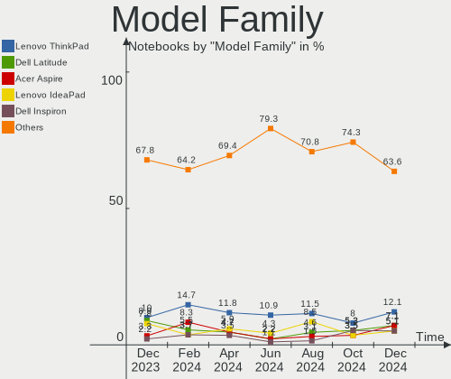
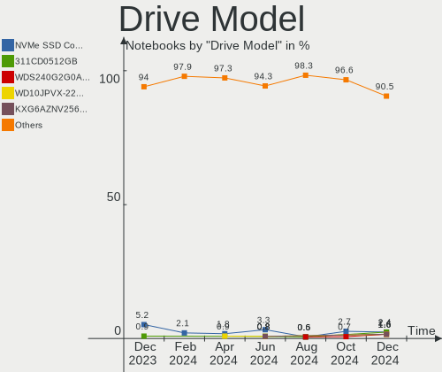
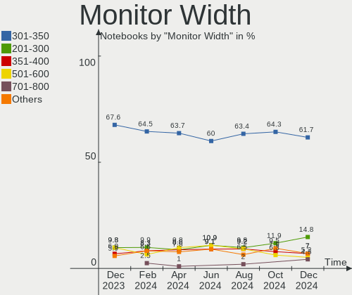
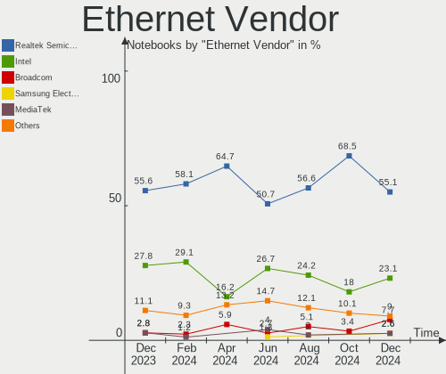
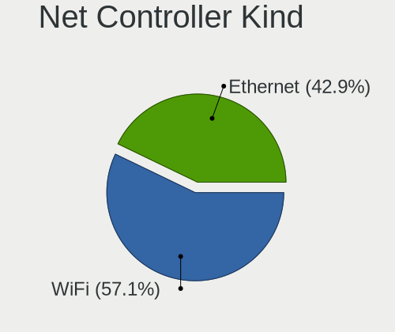
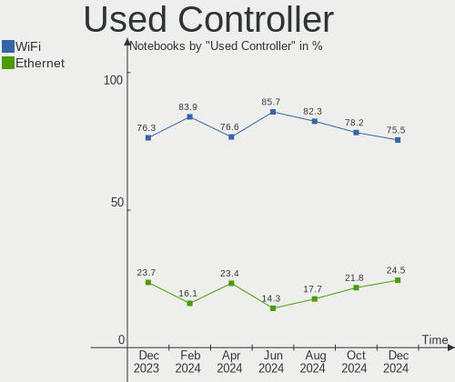
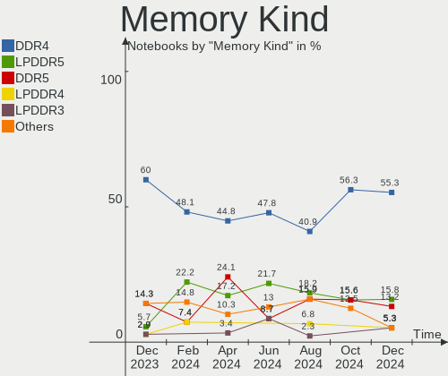

Pop!_OS - Hardware Trends (Notebooks)
-------------------------------------

A project to identify most popular hardware characteristics and track their change
over time based on data collected by Linux users at https://Linux-Hardware.org.

Anyone can contribute to this report by the [hw-probe](https://github.com/linuxhw/hw-probe) tool:

    sudo -E hw-probe -all -upload

This report is for one last month. Overall report since the beginning of time: [TestCoverage](https://github.com/linuxhw/TestCoverage)

Period: Sep, 2022.

Contents
--------

* [ System ](#system)
  - [ OS                       ](#os)
  - [ OS Family                ](#os-family)
  - [ Kernel                   ](#kernel)
  - [ Kernel Family            ](#kernel-family)
  - [ Kernel Major Ver.        ](#kernel-major-ver)
  - [ Arch                     ](#arch)
  - [ DE                       ](#de)
  - [ Display Server           ](#display-server)
  - [ Display Manager          ](#display-manager)
  - [ OS Lang                  ](#os-lang)
  - [ Boot Mode                ](#boot-mode)
  - [ Filesystem               ](#filesystem)
  - [ Part. scheme             ](#part-scheme)
  - [ Dual Boot with Linux/BSD ](#dual-boot-with-linuxbsd)
  - [ Dual Boot (Win)          ](#dual-boot-win)

* [ Board ](#board)
  - [ Vendor                   ](#vendor)
  - [ Model                    ](#model)
  - [ Model Family             ](#model-family)
  - [ MFG Year                 ](#mfg-year)
  - [ Form Factor              ](#form-factor)
  - [ Secure Boot              ](#secure-boot)
  - [ Coreboot                 ](#coreboot)
  - [ RAM Size                 ](#ram-size)
  - [ RAM Used                 ](#ram-used)
  - [ Total Drives             ](#total-drives)
  - [ Has CD-ROM               ](#has-cd-rom)
  - [ Has Ethernet             ](#has-ethernet)
  - [ Has WiFi                 ](#has-wifi)
  - [ Has Bluetooth            ](#has-bluetooth)

* [ Location ](#location)
  - [ Country                  ](#country)
  - [ City                     ](#city)

* [ Drives ](#drives)
  - [ Drive Vendor             ](#drive-vendor)
  - [ Drive Model              ](#drive-model)
  - [ HDD Vendor               ](#hdd-vendor)
  - [ SSD Vendor               ](#ssd-vendor)
  - [ Drive Kind               ](#drive-kind)
  - [ Drive Connector          ](#drive-connector)
  - [ Drive Size               ](#drive-size)
  - [ Space Total              ](#space-total)
  - [ Space Used               ](#space-used)
  - [ Malfunc. Drives          ](#malfunc-drives)
  - [ Malfunc. Drive Vendor    ](#malfunc-drive-vendor)
  - [ Malfunc. HDD Vendor      ](#malfunc-hdd-vendor)
  - [ Malfunc. Drive Kind      ](#malfunc-drive-kind)
  - [ Failed Drives            ](#failed-drives)
  - [ Failed Drive Vendor      ](#failed-drive-vendor)
  - [ Drive Status             ](#drive-status)

* [ Storage controller ](#storage-controller)
  - [ Storage Vendor           ](#storage-vendor)
  - [ Storage Model            ](#storage-model)
  - [ Storage Kind             ](#storage-kind)

* [ Processor ](#processor)
  - [ CPU Vendor               ](#cpu-vendor)
  - [ CPU Model                ](#cpu-model)
  - [ CPU Model Family         ](#cpu-model-family)
  - [ CPU Cores                ](#cpu-cores)
  - [ CPU Sockets              ](#cpu-sockets)
  - [ CPU Threads              ](#cpu-threads)
  - [ CPU Op-Modes             ](#cpu-op-modes)
  - [ CPU Microcode            ](#cpu-microcode)
  - [ CPU Microarch            ](#cpu-microarch)

* [ Graphics ](#graphics)
  - [ GPU Vendor               ](#gpu-vendor)
  - [ GPU Model                ](#gpu-model)
  - [ GPU Combo                ](#gpu-combo)
  - [ GPU Driver               ](#gpu-driver)
  - [ GPU Memory               ](#gpu-memory)

* [ Monitor ](#monitor)
  - [ Monitor Vendor           ](#monitor-vendor)
  - [ Monitor Model            ](#monitor-model)
  - [ Monitor Resolution       ](#monitor-resolution)
  - [ Monitor Diagonal         ](#monitor-diagonal)
  - [ Monitor Width            ](#monitor-width)
  - [ Aspect Ratio             ](#aspect-ratio)
  - [ Monitor Area             ](#monitor-area)
  - [ Pixel Density            ](#pixel-density)
  - [ Multiple Monitors        ](#multiple-monitors)

* [ Network ](#network)
  - [ Net Controller Vendor    ](#net-controller-vendor)
  - [ Net Controller Model     ](#net-controller-model)
  - [ Wireless Vendor          ](#wireless-vendor)
  - [ Wireless Model           ](#wireless-model)
  - [ Ethernet Vendor          ](#ethernet-vendor)
  - [ Ethernet Model           ](#ethernet-model)
  - [ Net Controller Kind      ](#net-controller-kind)
  - [ Used Controller          ](#used-controller)
  - [ NICs                     ](#nics)
  - [ IPv6                     ](#ipv6)

* [ Bluetooth ](#bluetooth)
  - [ Bluetooth Vendor         ](#bluetooth-vendor)
  - [ Bluetooth Model          ](#bluetooth-model)

* [ Sound ](#sound)
  - [ Sound Vendor             ](#sound-vendor)
  - [ Sound Model              ](#sound-model)

* [ Memory ](#memory)
  - [ Memory Vendor            ](#memory-vendor)
  - [ Memory Model             ](#memory-model)
  - [ Memory Kind              ](#memory-kind)
  - [ Memory Form Factor       ](#memory-form-factor)
  - [ Memory Size              ](#memory-size)
  - [ Memory Speed             ](#memory-speed)

* [ Printers & scanners ](#printers--scanners)
  - [ Printer Vendor           ](#printer-vendor)
  - [ Printer Model            ](#printer-model)
  - [ Scanner Vendor           ](#scanner-vendor)
  - [ Scanner Model            ](#scanner-model)

* [ Camera ](#camera)
  - [ Camera Vendor            ](#camera-vendor)
  - [ Camera Model             ](#camera-model)

* [ Security ](#security)
  - [ Fingerprint Vendor       ](#fingerprint-vendor)
  - [ Fingerprint Model        ](#fingerprint-model)
  - [ Chipcard Vendor          ](#chipcard-vendor)
  - [ Chipcard Model           ](#chipcard-model)

* [ Unsupported ](#unsupported)
  - [ Unsupported Devices      ](#unsupported-devices)
  - [ Unsupported Device Types ](#unsupported-device-types)

System
------

OS
--

Installed operating systems

| Name          | Notebooks | Percent |
|---------------|-----------|---------|
| Pop!_OS 22.04 | 145       | 96.03%  |
| Pop!_OS 21.10 | 3         | 1.99%   |
| Pop!_OS 21.04 | 1         | 0.66%   |
| Pop!_OS 20.10 | 1         | 0.66%   |
| Pop!_OS 20.04 | 1         | 0.66%   |

OS Family
---------

OS without a version

| Name    | Notebooks | Percent |
|---------|-----------|---------|
| Pop!_OS | 151       | 100%    |

Kernel
------

Version of the Linux kernel

| Version                  | Notebooks | Percent |
|--------------------------|-----------|---------|
| 5.19.0-76051900-generic  | 140       | 92.72%  |
| 5.18.10-76051810-generic | 4         | 2.65%   |
| 5.17.5-76051705-generic  | 2         | 1.32%   |
| 6.0.0-060000rc7-generic  | 1         | 0.66%   |
| 5.8.0-7642-generic       | 1         | 0.66%   |
| 5.17.15-76051715-generic | 1         | 0.66%   |
| 5.15.5-76051505-generic  | 1         | 0.66%   |
| 5.15.23-76051523-generic | 1         | 0.66%   |

Kernel Family
-------------

Linux kernel without a distro release

| Version | Notebooks | Percent |
|---------|-----------|---------|
| 5.19.0  | 140       | 92.72%  |
| 5.18.10 | 4         | 2.65%   |
| 5.17.5  | 2         | 1.32%   |
| 6.0.0   | 1         | 0.66%   |
| 5.8.0   | 1         | 0.66%   |
| 5.17.15 | 1         | 0.66%   |
| 5.15.5  | 1         | 0.66%   |
| 5.15.23 | 1         | 0.66%   |

Kernel Major Ver.
-----------------

Linux kernel major version

| Version | Notebooks | Percent |
|---------|-----------|---------|
| 5.19    | 140       | 92.72%  |
| 5.18    | 4         | 2.65%   |
| 5.17    | 3         | 1.99%   |
| 5.15    | 2         | 1.32%   |
| 6.0     | 1         | 0.66%   |
| 5.8     | 1         | 0.66%   |

Arch
----

OS architecture (x86_64, i586, etc.)

| Name   | Notebooks | Percent |
|--------|-----------|---------|
| x86_64 | 151       | 100%    |

DE
--

Desktop Environment

| Name    | Notebooks | Percent |
|---------|-----------|---------|
| GNOME   | 146       | 96.69%  |
| KDE5    | 2         | 1.32%   |
| Unknown | 2         | 1.32%   |
| Unity   | 1         | 0.66%   |

Display Server
--------------

X11 or Wayland

| Name    | Notebooks | Percent |
|---------|-----------|---------|
| X11     | 143       | 94.7%   |
| Wayland | 6         | 3.97%   |
| Tty     | 1         | 0.66%   |
| Unknown | 1         | 0.66%   |

Display Manager
---------------

SDDM, LightDM, etc.

| Name    | Notebooks | Percent |
|---------|-----------|---------|
| Unknown | 105       | 69.54%  |
| GDM3    | 46        | 30.46%  |

OS Lang
-------

Language

| Lang    | Notebooks | Percent |
|---------|-----------|---------|
| en_US   | 86        | 56.95%  |
| en_GB   | 10        | 6.62%   |
| pt_BR   | 9         | 5.96%   |
| en_AU   | 6         | 3.97%   |
| C       | 5         | 3.31%   |
| ru_RU   | 4         | 2.65%   |
| it_IT   | 4         | 2.65%   |
| es_ES   | 4         | 2.65%   |
| de_DE   | 4         | 2.65%   |
| nb_NO   | 3         | 1.99%   |
| nl_NL   | 2         | 1.32%   |
| da_DK   | 2         | 1.32%   |
| Unknown | 2         | 1.32%   |
| pt_PT   | 1         | 0.66%   |
| fr_FR   | 1         | 0.66%   |
| es_HN   | 1         | 0.66%   |
| es_CL   | 1         | 0.66%   |
| es_BO   | 1         | 0.66%   |
| en_IE   | 1         | 0.66%   |
| en_DK   | 1         | 0.66%   |
| en_CA   | 1         | 0.66%   |
| en_AG   | 1         | 0.66%   |
| de_CH   | 1         | 0.66%   |

Boot Mode
---------

EFI or BIOS

| Mode | Notebooks | Percent |
|------|-----------|---------|
| BIOS | 108       | 71.52%  |
| EFI  | 43        | 28.48%  |

Filesystem
----------

Type of filesystem

| Type    | Notebooks | Percent |
|---------|-----------|---------|
| Ext4    | 141       | 93.38%  |
| Btrfs   | 6         | 3.97%   |
| Xfs     | 2         | 1.32%   |
| Overlay | 2         | 1.32%   |

Part. scheme
------------

Scheme of partitioning

| Type    | Notebooks | Percent |
|---------|-----------|---------|
| Unknown | 103       | 68.21%  |
| GPT     | 45        | 29.8%   |
| MBR     | 3         | 1.99%   |

Dual Boot with Linux/BSD
------------------------

Hosting more than one Linux/BSD

| Dual boot | Notebooks | Percent |
|-----------|-----------|---------|
| No        | 143       | 94.7%   |
| Yes       | 8         | 5.3%    |

Dual Boot (Win)
---------------

Hosting Linux and Windows

| Dual boot | Notebooks | Percent |
|-----------|-----------|---------|
| No        | 131       | 86.75%  |
| Yes       | 20        | 13.25%  |

Board
-----

Vendor
------

Motherboard manufacturer

| Name                | Notebooks | Percent |
|---------------------|-----------|---------|
| Lenovo              | 35        | 23.18%  |
| Dell                | 31        | 20.53%  |
| ASUSTek Computer    | 22        | 14.57%  |
| Hewlett-Packard     | 12        | 7.95%   |
| Apple               | 10        | 6.62%   |
| MSI                 | 8         | 5.3%    |
| System76            | 6         | 3.97%   |
| Acer                | 6         | 3.97%   |
| HUAWEI              | 4         | 2.65%   |
| Toshiba             | 2         | 1.32%   |
| Fujitsu             | 2         | 1.32%   |
| TUXEDO              | 1         | 0.66%   |
| Samsung Electronics | 1         | 0.66%   |
| Razer               | 1         | 0.66%   |
| OriginPC            | 1         | 0.66%   |
| Itronix             | 1         | 0.66%   |
| HONOR               | 1         | 0.66%   |
| GPU Company         | 1         | 0.66%   |
| GPD                 | 1         | 0.66%   |
| Gigabyte Technology | 1         | 0.66%   |
| Gateway             | 1         | 0.66%   |
| Framework           | 1         | 0.66%   |
| Clevo               | 1         | 0.66%   |
| AZW                 | 1         | 0.66%   |

Model
-----

Motherboard model

| Name                                               | Notebooks | Percent |
|----------------------------------------------------|-----------|---------|
| System76 Oryx Pro                                  | 2         | 1.32%   |
| System76 Galago Pro                                | 2         | 1.32%   |
| System76 Darter Pro                                | 2         | 1.32%   |
| MSI GF63 Thin 11UD                                 | 2         | 1.32%   |
| HUAWEI KPL-W0X                                     | 2         | 1.32%   |
| Dell Precision 3561                                | 2         | 1.32%   |
| Apple MacBookPro9,2                                | 2         | 1.32%   |
| TUXEDO Pulse 15 Gen2                               | 1         | 0.66%   |
| Toshiba Satellite C850                             | 1         | 0.66%   |
| Toshiba Satellite C55t-C                           | 1         | 0.66%   |
| Samsung 270E5G/270E5U                              | 1         | 0.66%   |
| Razer Blade 15 Base Model (Early 2020) - RZ09-0328 | 1         | 0.66%   |
| OriginPC NT17-PRO                                  | 1         | 0.66%   |
| MSI Sword 15 A11UD                                 | 1         | 0.66%   |
| MSI Prestige 15 A12UC                              | 1         | 0.66%   |
| MSI Prestige 14Evo A11M                            | 1         | 0.66%   |
| MSI Katana GF66 12UE                               | 1         | 0.66%   |
| MSI GS73 Stealth 8RF                               | 1         | 0.66%   |
| MSI GP72 7RDX                                      | 1         | 0.66%   |
| Lenovo Z50-70 20354                                | 1         | 0.66%   |
| Lenovo Yoga Slim 7 Pro 14IAH7 82UT                 | 1         | 0.66%   |
| Lenovo ThinkPad X230 Tablet 34383SG                | 1         | 0.66%   |
| Lenovo ThinkPad X220 4286PJ2                       | 1         | 0.66%   |
| Lenovo ThinkPad X1 Carbon 2nd 20A8A0LYCL           | 1         | 0.66%   |
| Lenovo ThinkPad T480s 20L8SC160Q                   | 1         | 0.66%   |
| Lenovo ThinkPad T480 20L6S80G00                    | 1         | 0.66%   |
| Lenovo ThinkPad T480 20L5001FUS                    | 1         | 0.66%   |
| Lenovo ThinkPad T470s 20HGA039UK                   | 1         | 0.66%   |
| Lenovo ThinkPad T460s 20FAS30D0G                   | 1         | 0.66%   |
| Lenovo ThinkPad T460 20FN003LGE                    | 1         | 0.66%   |
| Lenovo ThinkPad T440p 20AWS12002                   | 1         | 0.66%   |
| Lenovo ThinkPad T430 2350A26                       | 1         | 0.66%   |
| Lenovo ThinkPad T15 Gen 2i 20W4000NRT              | 1         | 0.66%   |
| Lenovo ThinkPad P53 MFG_IN_GO                     | 1         | 0.66%   |
| Lenovo ThinkPad E490 20N8005JMH                    | 1         | 0.66%   |
| Lenovo ThinkPad E480 20KQ000EBR                    | 1         | 0.66%   |
| Lenovo ThinkBook 16p Gen 2 20YM                    | 1         | 0.66%   |
| Lenovo ThinkBook 14 G2 ITL 20VD                    | 1         | 0.66%   |
| Lenovo ThinkBook 13x ITG 20WJ                      | 1         | 0.66%   |
| Lenovo Legion Y530-15ICH 81FV                      | 1         | 0.66%   |

Model Family
------------

Motherboard model prefix

| Name              | Notebooks | Percent |
|-------------------|-----------|---------|
| Lenovo ThinkPad   | 15        | 9.93%   |
| Dell Latitude     | 9         | 5.96%   |
| Lenovo Legion     | 7         | 4.64%   |
| Dell Inspiron     | 7         | 4.64%   |
| Lenovo IdeaPad    | 6         | 3.97%   |
| Dell XPS          | 6         | 3.97%   |
| Dell Precision    | 5         | 3.31%   |
| ASUS ROG          | 5         | 3.31%   |
| Acer Aspire       | 4         | 2.65%   |
| Lenovo ThinkBook  | 3         | 1.99%   |
| HP Laptop         | 3         | 1.99%   |
| ASUS ASUS         | 3         | 1.99%   |
| Toshiba Satellite | 2         | 1.32%   |
| System76 Oryx     | 2         | 1.32%   |
| System76 Galago   | 2         | 1.32%   |
| System76 Darter   | 2         | 1.32%   |
| MSI Prestige      | 2         | 1.32%   |
| MSI GF63          | 2         | 1.32%   |
| HUAWEI KPL-W0X    | 2         | 1.32%   |
| HP Pavilion       | 2         | 1.32%   |
| HP OMEN           | 2         | 1.32%   |
| Fujitsu LIFEBOOK  | 2         | 1.32%   |
| Dell Vostro       | 2         | 1.32%   |
| ASUS VivoBook     | 2         | 1.32%   |
| ASUS TUF          | 2         | 1.32%   |
| Apple MacBookPro9 | 2         | 1.32%   |
| Apple MacBookPro5 | 2         | 1.32%   |
| Acer Nitro        | 2         | 1.32%   |
| TUXEDO Pulse      | 1         | 0.66%   |
| Samsung 270E5G    | 1         | 0.66%   |
| Razer Blade       | 1         | 0.66%   |
| OriginPC NT17-PRO | 1         | 0.66%   |
| MSI Sword         | 1         | 0.66%   |
| MSI Katana        | 1         | 0.66%   |
| MSI GS73          | 1         | 0.66%   |
| MSI GP72          | 1         | 0.66%   |
| Lenovo Z50-70     | 1         | 0.66%   |
| Lenovo Yoga       | 1         | 0.66%   |
| Lenovo G510       | 1         | 0.66%   |
| Lenovo Flex       | 1         | 0.66%   |

MFG Year
--------

Motherboard manufacture year

| Year | Notebooks | Percent |
|------|-----------|---------|
| 2021 | 33        | 21.85%  |
| 2018 | 19        | 12.58%  |
| 2020 | 16        | 10.6%   |
| 2022 | 14        | 9.27%   |
| 2019 | 13        | 8.61%   |
| 2017 | 10        | 6.62%   |
| 2013 | 9         | 5.96%   |
| 2014 | 8         | 5.3%    |
| 2012 | 8         | 5.3%    |
| 2016 | 6         | 3.97%   |
| 2011 | 4         | 2.65%   |
| 2010 | 4         | 2.65%   |
| 2009 | 4         | 2.65%   |
| 2015 | 3         | 1.99%   |

Form Factor
-----------

Physical design of the computer

| Name     | Notebooks | Percent |
|----------|-----------|---------|
| Notebook | 151       | 100%    |

Secure Boot
-----------

Enabled or disabled

| State    | Notebooks | Percent |
|----------|-----------|---------|
| Disabled | 151       | 100%    |

Coreboot
--------

Have coreboot on board

| Used | Notebooks | Percent |
|------|-----------|---------|
| No   | 146       | 96.69%  |
| Yes  | 5         | 3.31%   |

RAM Size
--------

Total RAM memory

| Size in GB  | Notebooks | Percent |
|-------------|-----------|---------|
| 16.01-24.0  | 44        | 29.14%  |
| 4.01-8.0    | 43        | 28.48%  |
| 8.01-16.0   | 23        | 15.23%  |
| 32.01-64.0  | 20        | 13.25%  |
| 3.01-4.0    | 11        | 7.28%   |
| 24.01-32.0  | 7         | 4.64%   |
| 64.01-256.0 | 2         | 1.32%   |
| 2.01-3.0    | 1         | 0.66%   |

RAM Used
--------

Used RAM memory

| Used GB    | Notebooks | Percent |
|------------|-----------|---------|
| 2.01-3.0   | 46        | 30.46%  |
| 4.01-8.0   | 43        | 28.48%  |
| 3.01-4.0   | 31        | 20.53%  |
| 1.01-2.0   | 15        | 9.93%   |
| 8.01-16.0  | 13        | 8.61%   |
| 16.01-24.0 | 3         | 1.99%   |

Total Drives
------------

Number of drives on board

| Drives | Notebooks | Percent |
|--------|-----------|---------|
| 1      | 103       | 68.21%  |
| 2      | 42        | 27.81%  |
| 3      | 6         | 3.97%   |

Has CD-ROM
----------

Has CD-ROM on board

| Presented | Notebooks | Percent |
|-----------|-----------|---------|
| No        | 124       | 82.12%  |
| Yes       | 27        | 17.88%  |

Has Ethernet
------------

Has Ethernet on board

| Presented | Notebooks | Percent |
|-----------|-----------|---------|
| Yes       | 120       | 79.47%  |
| No        | 31        | 20.53%  |

Has WiFi
--------

Has WiFi module

| Presented | Notebooks | Percent |
|-----------|-----------|---------|
| Yes       | 151       | 100%    |

Has Bluetooth
-------------

Has Bluetooth module

| Presented | Notebooks | Percent |
|-----------|-----------|---------|
| Yes       | 134       | 88.74%  |
| No        | 17        | 11.26%  |

Location
--------

Country
-------

Geographic location (country)

| Country     | Notebooks | Percent |
|-------------|-----------|---------|
| USA         | 34        | 22.52%  |
| Brazil      | 13        | 8.61%   |
| Italy       | 10        | 6.62%   |
| UK          | 9         | 5.96%   |
| Russia      | 6         | 3.97%   |
| Australia   | 6         | 3.97%   |
| Norway      | 5         | 3.31%   |
| India       | 5         | 3.31%   |
| Germany     | 5         | 3.31%   |
| France      | 5         | 3.31%   |
| Portugal    | 4         | 2.65%   |
| Canada      | 4         | 2.65%   |
| Spain       | 3         | 1.99%   |
| Netherlands | 3         | 1.99%   |
| Denmark     | 3         | 1.99%   |
| Chile       | 3         | 1.99%   |
| Switzerland | 2         | 1.32%   |
| Serbia      | 2         | 1.32%   |
| Malaysia    | 2         | 1.32%   |
| Bulgaria    | 2         | 1.32%   |
| Austria     | 2         | 1.32%   |
| Turkey      | 1         | 0.66%   |
| Sweden      | 1         | 0.66%   |
| Singapore   | 1         | 0.66%   |
| Romania     | 1         | 0.66%   |
| Poland      | 1         | 0.66%   |
| Philippines | 1         | 0.66%   |
| Peru        | 1         | 0.66%   |
| New Zealand | 1         | 0.66%   |
| Mexico      | 1         | 0.66%   |
| Lithuania   | 1         | 0.66%   |
| Latvia      | 1         | 0.66%   |
| Kenya       | 1         | 0.66%   |
| Indonesia   | 1         | 0.66%   |
| Honduras    | 1         | 0.66%   |
| Georgia     | 1         | 0.66%   |
| Egypt       | 1         | 0.66%   |
| Czechia     | 1         | 0.66%   |
| Croatia     | 1         | 0.66%   |
| Colombia    | 1         | 0.66%   |

City
----

Geographic location (city)

| City                 | Notebooks | Percent |
|----------------------|-----------|---------|
| Brisbane             | 5         | 3.31%   |
| Paris                | 3         | 1.99%   |
| Moscow               | 3         | 1.99%   |
| St Petersburg        | 2         | 1.32%   |
| Rome                 | 2         | 1.32%   |
| Oslo                 | 2         | 1.32%   |
| Niš                 | 2         | 1.32%   |
| Milan                | 2         | 1.32%   |
| Lisbon               | 2         | 1.32%   |
| Flint                | 2         | 1.32%   |
| Dallas               | 2         | 1.32%   |
| Bengaluru            | 2         | 1.32%   |
| Wyoming              | 1         | 0.66%   |
| Winston-Salem        | 1         | 0.66%   |
| Winnipeg             | 1         | 0.66%   |
| Watervliet           | 1         | 0.66%   |
| Vitória             | 1         | 0.66%   |
| Vienna               | 1         | 0.66%   |
| Veendam              | 1         | 0.66%   |
| Valdivia             | 1         | 0.66%   |
| Valdagno             | 1         | 0.66%   |
| Uden                 | 1         | 0.66%   |
| Tucson               | 1         | 0.66%   |
| Trujillo             | 1         | 0.66%   |
| Touro                | 1         | 0.66%   |
| Texarkana            | 1         | 0.66%   |
| Tegucigalpa          | 1         | 0.66%   |
| Sulingen             | 1         | 0.66%   |
| Staten Island        | 1         | 0.66%   |
| Staffanstorp         | 1         | 0.66%   |
| Spring               | 1         | 0.66%   |
| South Pasadena       | 1         | 0.66%   |
| Sofia                | 1         | 0.66%   |
| Singapore            | 1         | 0.66%   |
| Seville              | 1         | 0.66%   |
| Saskatoon            | 1         | 0.66%   |
| Sao Paulo            | 1         | 0.66%   |
| Sao Luís            | 1         | 0.66%   |
| Sao Joaquim da Barra | 1         | 0.66%   |
| Santiago             | 1         | 0.66%   |

Drives
------

Drive Vendor
------------

Hard drive vendors

| Vendor                         | Notebooks | Drives | Percent |
|--------------------------------|-----------|--------|---------|
| Samsung Electronics            | 40        | 50     | 21.28%  |
| Sandisk                        | 16        | 19     | 8.51%   |
| SK hynix                       | 15        | 15     | 7.98%   |
| Seagate                        | 12        | 15     | 6.38%   |
| WDC                            | 11        | 11     | 5.85%   |
| Micron Technology              | 11        | 11     | 5.85%   |
| Toshiba                        | 10        | 10     | 5.32%   |
| Kingston                       | 6         | 6      | 3.19%   |
| Intel                          | 6         | 6      | 3.19%   |
| Crucial                        | 6         | 6      | 3.19%   |
| Apple                          | 5         | 5      | 2.66%   |
| HGST                           | 4         | 5      | 2.13%   |
| Unknown                        | 3         | 3      | 1.6%    |
| Phison                         | 3         | 3      | 1.6%    |
| KIOXIA                         | 3         | 3      | 1.6%    |
| Solid State Storage Technology | 2         | 2      | 1.06%   |
| Silicon Motion                 | 2         | 2      | 1.06%   |
| KingSpec                       | 2         | 2      | 1.06%   |
| China                          | 2         | 2      | 1.06%   |
| XPG                            | 1         | 1      | 0.53%   |
| W800S                          | 1         | 1      | 0.53%   |
| Union Memory (Shenzhen)        | 1         | 1      | 0.53%   |
| Transcend                      | 1         | 1      | 0.53%   |
| Team                           | 1         | 1      | 0.53%   |
| Solid State Storage            | 1         | 1      | 0.53%   |
| Simmtronic                     | 1         | 1      | 0.53%   |
| ROG                            | 1         | 1      | 0.53%   |
| PNY                            | 1         | 1      | 0.53%   |
| Phison Electronics             | 1         | 1      | 0.53%   |
| Netac                          | 1         | 1      | 0.53%   |
| Micron/Crucial Technology      | 1         | 1      | 0.53%   |
| LITEONIT                       | 1         | 1      | 0.53%   |
| LITEON                         | 1         | 1      | 0.53%   |
| Kingston Technology Company    | 1         | 1      | 0.53%   |
| Kingchuxing                    | 1         | 1      | 0.53%   |
| HS-SSD-C100                    | 1         | 1      | 0.53%   |
| Hitachi                        | 1         | 1      | 0.53%   |
| Fujitsu                        | 1         | 1      | 0.53%   |
| Fanxiang                       | 1         | 1      | 0.53%   |
| External                       | 1         | 1      | 0.53%   |

Drive Model
-----------

Hard drive models

| Model                                                 | Notebooks | Percent |
|-------------------------------------------------------|-----------|---------|
| SK hynix NVMe SSD Drive 512GB                         | 4         | 1.98%   |
| Seagate ST1000LM035-1RK172 1TB                        | 4         | 1.98%   |
| Samsung NVMe SSD Drive 512GB                          | 4         | 1.98%   |
| Samsung NVMe SSD Drive 1TB                            | 4         | 1.98%   |
| Micron NVMe SSD Drive 512GB                           | 4         | 1.98%   |
| Samsung SSD 850 EVO 500GB                             | 3         | 1.49%   |
| Samsung NVMe SSD Drive 500GB                          | 3         | 1.49%   |
| Kingston OM8PCP3512F-AI1 512GB                        | 3         | 1.49%   |
| WDC WD10SPZX-24Z10 1TB                                | 2         | 0.99%   |
| Seagate ST1000LM024 HN-M101MBB 1TB                    | 2         | 0.99%   |
| Sandisk WD_BLACK SN770 1TB                            | 2         | 0.99%   |
| SanDisk NVMe SSD Drive 500GB                          | 2         | 0.99%   |
| SanDisk NVMe SSD Drive 1TB                            | 2         | 0.99%   |
| Samsung SSD 870 EVO 500GB                             | 2         | 0.99%   |
| Samsung SSD 860 EVO 500GB                             | 2         | 0.99%   |
| Samsung Portable SSD T5 1TB                           | 2         | 0.99%   |
| Samsung NVMe SSD Drive 250GB                          | 2         | 0.99%   |
| Samsung NVMe SSD Controller SM981/PM981/PM983 256GB   | 2         | 0.99%   |
| Samsung NVMe SSD Controller PM9A1/PM9A3/980PRO 1024GB | 2         | 0.99%   |
| Samsung MZVL2512HCJQ-00BL2 512GB                      | 2         | 0.99%   |
| XPG NVMe SSD Drive 256GB                              | 1         | 0.5%    |
| WDC WDS500G2B0B-00YS70 500GB SSD                      | 1         | 0.5%    |
| WDC WDS500G1X0E-00AFY0 500GB                          | 1         | 0.5%    |
| WDC WDS250G2B0B-00YS70 250GB SSD                      | 1         | 0.5%    |
| WDC WDS240G2G0B-00EPW0 240GB SSD                      | 1         | 0.5%    |
| WDC WDS100T2B0B-00YS70 1TB SSD                        | 1         | 0.5%    |
| WDC WD5000LPVX-22V0TT0 500GB                          | 1         | 0.5%    |
| WDC WD3200BEKT-60PVMT0 320GB                          | 1         | 0.5%    |
| WDC PC SN530 SDBPNPZ-512G-1114 512GB                  | 1         | 0.5%    |
| WDC PC SN530 SDBPNPZ-256G-1027 256GB                  | 1         | 0.5%    |
| W800S 512GB                                           | 1         | 0.5%    |
| Unknown SMI  16GB                                     | 1         | 0.5%    |
| Unknown MMC Card  16GB                                | 1         | 0.5%    |
| Unknown MMC Card  128GB                               | 1         | 0.5%    |
| Union Memory (Shenzhen) NVMe SSD Drive 128GB          | 1         | 0.5%    |
| Transcend TS240GMTS420S 240GB SSD                     | 1         | 0.5%    |
| Toshiba THNSNK128GVN8 M.2 2280 128GB SSD              | 1         | 0.5%    |
| Toshiba THNSNF128GCSS 128GB SSD                       | 1         | 0.5%    |
| Toshiba NVMe SSD Drive 512GB                          | 1         | 0.5%    |
| Toshiba MQ04ABF100 1TB                                | 1         | 0.5%    |

HDD Vendor
----------

Hard disk drive vendors

| Vendor  | Notebooks | Drives | Percent |
|---------|-----------|--------|---------|
| Seagate | 12        | 15     | 42.86%  |
| Toshiba | 5         | 5      | 17.86%  |
| WDC     | 4         | 4      | 14.29%  |
| HGST    | 4         | 5      | 14.29%  |
| Hitachi | 1         | 1      | 3.57%   |
| Fujitsu | 1         | 1      | 3.57%   |
| Apple   | 1         | 1      | 3.57%   |

SSD Vendor
----------

Solid state drive vendors

| Vendor              | Notebooks | Drives | Percent |
|---------------------|-----------|--------|---------|
| Samsung Electronics | 18        | 18     | 30%     |
| Crucial             | 6         | 6      | 10%     |
| WDC                 | 4         | 4      | 6.67%   |
| Toshiba             | 3         | 3      | 5%      |
| SK hynix            | 3         | 3      | 5%      |
| SanDisk             | 3         | 3      | 5%      |
| Kingston            | 3         | 3      | 5%      |
| Apple               | 3         | 3      | 5%      |
| Micron Technology   | 2         | 2      | 3.33%   |
| KingSpec            | 2         | 2      | 3.33%   |
| Intel               | 2         | 2      | 3.33%   |
| China               | 2         | 2      | 3.33%   |
| Transcend           | 1         | 1      | 1.67%   |
| PNY                 | 1         | 1      | 1.67%   |
| Netac               | 1         | 1      | 1.67%   |
| LITEONIT            | 1         | 1      | 1.67%   |
| LITEON              | 1         | 1      | 1.67%   |
| Colorful            | 1         | 1      | 1.67%   |
| BIWIN               | 1         | 1      | 1.67%   |
| Biostar             | 1         | 1      | 1.67%   |
| BF9SSD              | 1         | 1      | 1.67%   |

Drive Kind
----------

HDD or SSD

| Kind    | Notebooks | Drives | Percent |
|---------|-----------|--------|---------|
| NVMe    | 87        | 103    | 47.8%   |
| SSD     | 57        | 60     | 31.32%  |
| HDD     | 28        | 32     | 15.38%  |
| Unknown | 7         | 7      | 3.85%   |
| MMC     | 3         | 3      | 1.65%   |

Drive Connector
---------------

SATA, SAS, NVMe, etc.

| Type | Notebooks | Drives | Percent |
|------|-----------|--------|---------|
| NVMe | 86        | 102    | 49.43%  |
| SATA | 78        | 91     | 44.83%  |
| SAS  | 7         | 9      | 4.02%   |
| MMC  | 3         | 3      | 1.72%   |

Drive Size
----------

Size of hard drive

| Size in TB | Notebooks | Drives | Percent |
|------------|-----------|--------|---------|
| 0.01-0.5   | 48        | 53     | 56.47%  |
| 0.51-1.0   | 32        | 32     | 37.65%  |
| 1.01-2.0   | 4         | 6      | 4.71%   |
| 3.01-4.0   | 1         | 1      | 1.18%   |

Space Total
-----------

Amount of disk space available on the file system

| Size in GB     | Notebooks | Percent |
|----------------|-----------|---------|
| 251-500        | 59        | 39.07%  |
| 101-250        | 41        | 27.15%  |
| 501-1000       | 29        | 19.21%  |
| 1001-2000      | 9         | 5.96%   |
| 1-20           | 4         | 2.65%   |
| 2001-3000      | 3         | 1.99%   |
| More than 3000 | 2         | 1.32%   |
| 21-50          | 2         | 1.32%   |
| Unknown        | 2         | 1.32%   |

Space Used
----------

Amount of used disk space

| Used GB        | Notebooks | Percent |
|----------------|-----------|---------|
| 21-50          | 37        | 24.5%   |
| 1-20           | 34        | 22.52%  |
| 101-250        | 27        | 17.88%  |
| 51-100         | 27        | 17.88%  |
| 251-500        | 17        | 11.26%  |
| 501-1000       | 4         | 2.65%   |
| 1001-2000      | 2         | 1.32%   |
| Unknown        | 2         | 1.32%   |
| More than 3000 | 1         | 0.66%   |

Malfunc. Drives
---------------

Drive models with a malfunction

| Model                                               | Notebooks | Drives | Percent |
|-----------------------------------------------------|-----------|--------|---------|
| Toshiba THNSNK128GVN8 M.2 2280 128GB SSD            | 1         | 1      | 25%     |
| Micron Technology MTFDDAK256MAY-1AH1ZABHA 256GB SSD | 1         | 1      | 25%     |
| Hitachi HTS545050A7E380 500GB                       | 1         | 1      | 25%     |
| HGST HTS725050A7E630 500GB                          | 1         | 2      | 25%     |

Malfunc. Drive Vendor
---------------------

Vendors of faulty drives

| Vendor            | Notebooks | Drives | Percent |
|-------------------|-----------|--------|---------|
| Toshiba           | 1         | 1      | 25%     |
| Micron Technology | 1         | 1      | 25%     |
| Hitachi           | 1         | 1      | 25%     |
| HGST              | 1         | 2      | 25%     |

Malfunc. HDD Vendor
-------------------

Vendors of faulty HDD drives

| Vendor  | Notebooks | Drives | Percent |
|---------|-----------|--------|---------|
| Hitachi | 1         | 1      | 50%     |
| HGST    | 1         | 2      | 50%     |

Malfunc. Drive Kind
-------------------

Kinds of faulty drives

| Kind | Notebooks | Drives | Percent |
|------|-----------|--------|---------|
| SSD  | 2         | 2      | 50%     |
| HDD  | 2         | 3      | 50%     |

Failed Drives
-------------

Failed drive models

Zero info for selected period =(

Failed Drive Vendor
-------------------

Failed drive vendors

Zero info for selected period =(

Drive Status
------------

Number of failed and malfunc. drives

| Status   | Notebooks | Drives | Percent |
|----------|-----------|--------|---------|
| Detected | 106       | 143    | 67.52%  |
| Works    | 47        | 57     | 29.94%  |
| Malfunc  | 4         | 5      | 2.55%   |

Storage controller
------------------

Storage Vendor
--------------

Storage controller vendors

| Vendor                         | Notebooks | Percent |
|--------------------------------|-----------|---------|
| Intel                          | 92        | 44.44%  |
| Samsung Electronics            | 29        | 14.01%  |
| AMD                            | 20        | 9.66%   |
| SanDisk                        | 16        | 7.73%   |
| SK hynix                       | 12        | 5.8%    |
| Micron Technology              | 9         | 4.35%   |
| Phison Electronics             | 5         | 2.42%   |
| Kingston Technology Company    | 4         | 1.93%   |
| Toshiba America Info Systems   | 3         | 1.45%   |
| Nvidia                         | 3         | 1.45%   |
| ADATA Technology               | 3         | 1.45%   |
| Solid State Storage Technology | 2         | 0.97%   |
| Silicon Motion                 | 2         | 0.97%   |
| KIOXIA                         | 2         | 0.97%   |
| Union Memory (Shenzhen)        | 1         | 0.48%   |
| Shenzhen Longsys Electronics   | 1         | 0.48%   |
| Micron/Crucial Technology      | 1         | 0.48%   |
| Marvell Technology Group       | 1         | 0.48%   |
| Apple                          | 1         | 0.48%   |

Storage Model
-------------

Storage controller models

| Model                                                                                  | Notebooks | Percent |
|----------------------------------------------------------------------------------------|-----------|---------|
| AMD FCH SATA Controller [AHCI mode]                                                    | 19        | 8.84%   |
| Samsung NVMe SSD Controller SM981/PM981/PM983                                          | 13        | 6.05%   |
| Intel Sunrise Point-LP SATA Controller [AHCI mode]                                     | 11        | 5.12%   |
| Intel 7 Series Chipset Family 6-port SATA Controller [AHCI mode]                       | 11        | 5.12%   |
| SK hynix Gold P31 SSD                                                                  | 9         | 4.19%   |
| Micron Non-Volatile memory controller                                                  | 9         | 4.19%   |
| Intel 82801 Mobile SATA Controller [RAID mode]                                         | 8         | 3.72%   |
| SanDisk Non-Volatile memory controller                                                 | 7         | 3.26%   |
| Samsung NVMe SSD Controller PM9A1/PM9A3/980PRO                                         | 7         | 3.26%   |
| Intel Cannon Lake Mobile PCH SATA AHCI Controller                                      | 7         | 3.26%   |
| Intel 8 Series SATA Controller 1 [AHCI mode]                                           | 7         | 3.26%   |
| Intel 500 Series Chipset Family SATA AHCI Controller                                   | 7         | 3.26%   |
| Samsung NVMe SSD Controller 980                                                        | 6         | 2.79%   |
| Intel Volume Management Device NVMe RAID Controller                                    | 6         | 2.79%   |
| Intel HM170/QM170 Chipset SATA Controller [AHCI Mode]                                  | 6         | 2.79%   |
| SanDisk WD Blue SN550 NVMe SSD                                                         | 4         | 1.86%   |
| Intel Tiger Lake-LP SATA Controller                                                    | 4         | 1.86%   |
| Intel Comet Lake SATA AHCI Controller                                                  | 4         | 1.86%   |
| SanDisk WD PC SN810 / Black SN850 NVMe SSD                                             | 3         | 1.4%    |
| Samsung NVMe SSD Controller SM961/PM961/SM963                                          | 3         | 1.4%    |
| Phison E12 NVMe Controller                                                             | 3         | 1.4%    |
| Nvidia MCP79 AHCI Controller                                                           | 3         | 1.4%    |
| Kingston Company Company Non-Volatile memory controller                                | 3         | 1.4%    |
| Intel SSD 660P Series                                                                  | 3         | 1.4%    |
| Intel 8 Series/C220 Series Chipset Family 6-port SATA Controller 1 [AHCI mode]         | 3         | 1.4%    |
| Intel 6 Series/C200 Series Chipset Family 6 port Mobile SATA AHCI Controller           | 3         | 1.4%    |
| Toshiba America Info Systems XG6 NVMe SSD Controller                                   | 2         | 0.93%   |
| Solid State Storage Non-Volatile memory controller                                     | 2         | 0.93%   |
| SK hynix Non-Volatile memory controller                                                | 2         | 0.93%   |
| Silicon Motion SM2263EN/SM2263XT SSD Controller                                        | 2         | 0.93%   |
| Phison PS5013 E13 NVMe Controller                                                      | 2         | 0.93%   |
| KIOXIA NVMe SSD Controller BG4                                                         | 2         | 0.93%   |
| Intel Celeron/Pentium Silver Processor SATA Controller                                 | 2         | 0.93%   |
| Intel Cannon Point-LP SATA Controller [AHCI Mode]                                      | 2         | 0.93%   |
| Intel 82801IBM/IEM (ICH9M/ICH9M-E) 4 port SATA Controller [AHCI mode]                  | 2         | 0.93%   |
| Intel 6 Series/C200 Series Chipset Family Mobile SATA Controller (IDE mode, ports 4-5) | 2         | 0.93%   |
| Intel 6 Series/C200 Series Chipset Family Mobile SATA Controller (IDE mode, ports 0-3) | 2         | 0.93%   |
| ADATA Non-Volatile memory controller                                                   | 2         | 0.93%   |
| Union Memory (Shenzhen) Non-Volatile memory controller                                 | 1         | 0.47%   |
| Toshiba America Info Systems Toshiba America Info Non-Volatile memory controller       | 1         | 0.47%   |

Storage Kind
------------

Kind of storage controller (IDE, SATA, NVMe, SAS, ...)

| Kind | Notebooks | Percent |
|------|-----------|---------|
| SATA | 100       | 49.5%   |
| NVMe | 86        | 42.57%  |
| RAID | 14        | 6.93%   |
| IDE  | 2         | 0.99%   |

Processor
---------

CPU Vendor
----------

Processor vendors

| Vendor | Notebooks | Percent |
|--------|-----------|---------|
| Intel  | 115       | 76.16%  |
| AMD    | 36        | 23.84%  |

CPU Model
---------

Processor models

| Model                                         | Notebooks | Percent |
|-----------------------------------------------|-----------|---------|
| AMD Ryzen 7 5800H with Radeon Graphics        | 7         | 4.64%   |
| Intel 11th Gen Core i5-1135G7 @ 2.40GHz       | 6         | 3.97%   |
| Intel Core i7-7700HQ CPU @ 2.80GHz            | 5         | 3.31%   |
| AMD Ryzen 5 5500U with Radeon Graphics        | 4         | 2.65%   |
| Intel Core i7-8550U CPU @ 1.80GHz             | 3         | 1.99%   |
| Intel Core i7-4510U CPU @ 2.00GHz             | 3         | 1.99%   |
| Intel Core i7-10750H CPU @ 2.60GHz            | 3         | 1.99%   |
| Intel Core i5-8365U CPU @ 1.60GHz             | 3         | 1.99%   |
| Intel Core i5-8250U CPU @ 1.60GHz             | 3         | 1.99%   |
| Intel Core i5-7200U CPU @ 2.50GHz             | 3         | 1.99%   |
| Intel Core i5-10210U CPU @ 1.60GHz            | 3         | 1.99%   |
| Intel 11th Gen Core i7-11800H @ 2.30GHz       | 3         | 1.99%   |
| Intel 11th Gen Core i7-1165G7 @ 2.80GHz       | 3         | 1.99%   |
| Intel 11th Gen Core i5-11400H @ 2.70GHz       | 3         | 1.99%   |
| AMD Ryzen 5 4600H with Radeon Graphics        | 3         | 1.99%   |
| AMD Ryzen 5 3550H with Radeon Vega Mobile Gfx | 3         | 1.99%   |
| Intel Core i7-8750H CPU @ 2.20GHz             | 2         | 1.32%   |
| Intel Core i7-8650U CPU @ 1.90GHz             | 2         | 1.32%   |
| Intel Core i7-6600U CPU @ 2.60GHz             | 2         | 1.32%   |
| Intel Core i5-9300H CPU @ 2.40GHz             | 2         | 1.32%   |
| Intel Core i5-3210M CPU @ 2.50GHz             | 2         | 1.32%   |
| Intel Core i3-7020U CPU @ 2.30GHz             | 2         | 1.32%   |
| Intel Core 2 Duo CPU P8600 @ 2.40GHz          | 2         | 1.32%   |
| Intel 12th Gen Core i5-12500H                 | 2         | 1.32%   |
| Intel 11th Gen Core i7-11850H @ 2.50GHz       | 2         | 1.32%   |
| AMD Ryzen 7 5700U with Radeon Graphics        | 2         | 1.32%   |
| AMD Ryzen 5 5600H with Radeon Graphics        | 2         | 1.32%   |
| AMD Ryzen 5 3500U with Radeon Vega Mobile Gfx | 2         | 1.32%   |
| AMD Ryzen 5 2500U with Radeon Vega Mobile Gfx | 2         | 1.32%   |
| Intel Pentium CPU P6100 @ 2.00GHz             | 1         | 0.66%   |
| Intel Pentium CPU B970 @ 2.30GHz              | 1         | 0.66%   |
| Intel Pentium 3558U @ 1.70GHz                 | 1         | 0.66%   |
| Intel Genuine CPU 0000 @ 2.10GHz              | 1         | 0.66%   |
| Intel Core i9-8950HK CPU @ 2.90GHz            | 1         | 0.66%   |
| Intel Core i7-8850H CPU @ 2.60GHz             | 1         | 0.66%   |
| Intel Core i7-7820HQ CPU @ 2.90GHz            | 1         | 0.66%   |
| Intel Core i7-6700HQ CPU @ 2.60GHz            | 1         | 0.66%   |
| Intel Core i7-6500U CPU @ 2.50GHz             | 1         | 0.66%   |
| Intel Core i7-4960HQ CPU @ 2.60GHz            | 1         | 0.66%   |
| Intel Core i7-4910MQ CPU @ 2.90GHz            | 1         | 0.66%   |

CPU Model Family
----------------

Processor model prefix

| Model            | Notebooks | Percent |
|------------------|-----------|---------|
| Intel Core i7    | 38        | 25.17%  |
| Intel Core i5    | 33        | 21.85%  |
| Other            | 25        | 16.56%  |
| AMD Ryzen 5      | 17        | 11.26%  |
| AMD Ryzen 7      | 14        | 9.27%   |
| Intel Core i3    | 6         | 3.97%   |
| Intel Core 2 Duo | 5         | 3.31%   |
| Intel Celeron    | 4         | 2.65%   |
| Intel Pentium    | 3         | 1.99%   |
| Intel Genuine    | 1         | 0.66%   |
| Intel Core i9    | 1         | 0.66%   |
| AMD Turion II    | 1         | 0.66%   |
| AMD Ryzen 9      | 1         | 0.66%   |
| AMD Ryzen 7 PRO  | 1         | 0.66%   |
| AMD Ryzen 3      | 1         | 0.66%   |

CPU Cores
---------

Number of processor cores

| Number | Notebooks | Percent |
|--------|-----------|---------|
| 4      | 54        | 35.76%  |
| 2      | 49        | 32.45%  |
| 8      | 23        | 15.23%  |
| 6      | 21        | 13.91%  |
| 14     | 2         | 1.32%   |
| 12     | 2         | 1.32%   |

CPU Sockets
-----------

Number of sockets

| Number | Notebooks | Percent |
|--------|-----------|---------|
| 1      | 151       | 100%    |

CPU Threads
-----------

Threads per core (Hyper-Threading)

| Number | Notebooks | Percent |
|--------|-----------|---------|
| 2      | 136       | 90.07%  |
| 1      | 15        | 9.93%   |

CPU Op-Modes
------------

CPU Operation Modes (32-bit, 64-bit)

| Op mode        | Notebooks | Percent |
|----------------|-----------|---------|
| 32-bit, 64-bit | 151       | 100%    |

CPU Microcode
-------------

Microcode number

| Number     | Notebooks | Percent |
|------------|-----------|---------|
| Unknown    | 103       | 68.21%  |
| 0x806d1    | 6         | 3.97%   |
| 0x406e3    | 4         | 2.65%   |
| 0x0a50000c | 4         | 2.65%   |
| 0x806ec    | 3         | 1.99%   |
| 0x806ea    | 3         | 1.99%   |
| 0x806c1    | 3         | 1.99%   |
| 0x306a9    | 3         | 1.99%   |
| 0xa0652    | 2         | 1.32%   |
| 0x906e9    | 2         | 1.32%   |
| 0x906a3    | 2         | 1.32%   |
| 0x706e5    | 2         | 1.32%   |
| 0x306c3    | 2         | 1.32%   |
| 0x206a7    | 2         | 1.32%   |
| 0x906ea    | 1         | 0.66%   |
| 0x706a8    | 1         | 0.66%   |
| 0x506e3    | 1         | 0.66%   |
| 0x40651    | 1         | 0.66%   |
| 0x1067a    | 1         | 0.66%   |
| 0x0a404101 | 1         | 0.66%   |
| 0x08608103 | 1         | 0.66%   |
| 0x08600104 | 1         | 0.66%   |
| 0x08108109 | 1         | 0.66%   |
| 0x08101007 | 1         | 0.66%   |

CPU Microarch
-------------

Microarchitecture

| Name             | Notebooks | Percent |
|------------------|-----------|---------|
| KabyLake         | 37        | 24.5%   |
| Haswell          | 13        | 8.61%   |
| Unknown          | 13        | 8.61%   |
| Zen 3            | 12        | 7.95%   |
| TigerLake        | 11        | 7.28%   |
| IvyBridge        | 11        | 7.28%   |
| Icelake          | 9         | 5.96%   |
| Zen+             | 6         | 3.97%   |
| Zen 2            | 6         | 3.97%   |
| Skylake          | 6         | 3.97%   |
| SandyBridge      | 6         | 3.97%   |
| Penryn           | 5         | 3.31%   |
| CometLake        | 4         | 2.65%   |
| Zen              | 2         | 1.32%   |
| Goldmont plus    | 2         | 1.32%   |
| Broadwell        | 2         | 1.32%   |
| Alderlake Hybrid | 2         | 1.32%   |
| Westmere         | 1         | 0.66%   |
| K10              | 1         | 0.66%   |
| Goldmont         | 1         | 0.66%   |
| Excavator        | 1         | 0.66%   |

Graphics
--------

GPU Vendor
----------

Vendors of graphics cards

| Vendor | Notebooks | Percent |
|--------|-----------|---------|
| Intel  | 106       | 50.72%  |
| Nvidia | 62        | 29.67%  |
| AMD    | 41        | 19.62%  |

GPU Model
---------

Graphics card models

| Model                                                                                 | Notebooks | Percent |
|---------------------------------------------------------------------------------------|-----------|---------|
| Intel 3rd Gen Core processor Graphics Controller                                      | 11        | 5.24%   |
| Intel TigerLake-LP GT2 [Iris Xe Graphics]                                             | 10        | 4.76%   |
| AMD Cezanne                                                                           | 10        | 4.76%   |
| Intel UHD Graphics 620                                                                | 9         | 4.29%   |
| Nvidia GA106M [GeForce RTX 3060 Mobile / Max-Q]                                       | 8         | 3.81%   |
| Intel TigerLake-H GT1 [UHD Graphics]                                                  | 8         | 3.81%   |
| Intel Haswell-ULT Integrated Graphics Controller                                      | 8         | 3.81%   |
| Intel CoffeeLake-H GT2 [UHD Graphics 630]                                             | 7         | 3.33%   |
| Intel 2nd Generation Core Processor Family Integrated Graphics Controller             | 6         | 2.86%   |
| AMD Renoir                                                                            | 6         | 2.86%   |
| AMD Picasso/Raven 2 [Radeon Vega Series / Radeon Vega Mobile Series]                  | 6         | 2.86%   |
| AMD Lucienne                                                                          | 6         | 2.86%   |
| Nvidia GA107M [GeForce RTX 3050 Mobile]                                               | 5         | 2.38%   |
| Intel Skylake GT2 [HD Graphics 520]                                                   | 5         | 2.38%   |
| Nvidia TU117M [GeForce GTX 1650 Mobile / Max-Q]                                       | 4         | 1.9%    |
| Nvidia GP107M [GeForce GTX 1050 Mobile]                                               | 4         | 1.9%    |
| Intel WhiskeyLake-U GT2 [UHD Graphics 620]                                            | 4         | 1.9%    |
| Intel HD Graphics 620                                                                 | 4         | 1.9%    |
| Intel CometLake-U GT2 [UHD Graphics]                                                  | 4         | 1.9%    |
| Intel CometLake-H GT2 [UHD Graphics]                                                  | 4         | 1.9%    |
| Intel Alder Lake-P Integrated Graphics Controller                                     | 4         | 1.9%    |
| Intel 4th Gen Core Processor Integrated Graphics Controller                           | 4         | 1.9%    |
| Nvidia TU117M [GeForce GTX 1650 Ti Mobile]                                            | 3         | 1.43%   |
| Nvidia GP104BM [GeForce GTX 1070 Mobile]                                              | 3         | 1.43%   |
| Nvidia GA107M [GeForce RTX 3050 Ti Mobile]                                            | 3         | 1.43%   |
| Nvidia C79 [GeForce 9400M]                                                            | 3         | 1.43%   |
| Intel HD Graphics 630                                                                 | 3         | 1.43%   |
| Nvidia TU117M                                                                         | 2         | 0.95%   |
| Nvidia TU117GLM [T600 Mobile]                                                         | 2         | 0.95%   |
| Nvidia TU106M [GeForce RTX 2060 Mobile]                                               | 2         | 0.95%   |
| Nvidia GP104M [GeForce GTX 1070 Mobile]                                               | 2         | 0.95%   |
| Nvidia GF117M [GeForce 610M/710M/810M/820M / GT 620M/625M/630M/720M]                  | 2         | 0.95%   |
| Intel Mobile 4 Series Chipset Integrated Graphics Controller                          | 2         | 0.95%   |
| Intel Iris Plus Graphics G1 (Ice Lake)                                                | 2         | 0.95%   |
| Intel HD Graphics 5500                                                                | 2         | 0.95%   |
| Intel GeminiLake [UHD Graphics 600]                                                   | 2         | 0.95%   |
| AMD Topaz XT [Radeon R7 M260/M265 / M340/M360 / M440/M445 / 530/535 / 620/625 Mobile] | 2         | 0.95%   |
| AMD Rembrandt [Radeon 680M]                                                           | 2         | 0.95%   |
| AMD Raven Ridge [Radeon Vega Series / Radeon Vega Mobile Series]                      | 2         | 0.95%   |
| Nvidia TU117GLM [Quadro T500 Mobile]                                                  | 1         | 0.48%   |

GPU Combo
---------

Combinations of graphics cards

| Name           | Notebooks | Percent |
|----------------|-----------|---------|
| 1 x Intel      | 67        | 44.37%  |
| Intel + Nvidia | 34        | 22.52%  |
| AMD + Nvidia   | 18        | 11.92%  |
| 1 x AMD        | 17        | 11.26%  |
| 1 x Nvidia     | 9         | 5.96%   |
| Intel + AMD    | 5         | 3.31%   |
| 2 x AMD        | 1         | 0.66%   |

GPU Driver
----------

Free vs proprietary

| Driver      | Notebooks | Percent |
|-------------|-----------|---------|
| Free        | 95        | 62.91%  |
| Proprietary | 53        | 35.1%   |
| Unknown     | 3         | 1.99%   |

GPU Memory
----------

Total video memory

| Size in GB | Notebooks | Percent |
|------------|-----------|---------|
| Unknown    | 134       | 88.74%  |
| 3.01-4.0   | 4         | 2.65%   |
| 0.01-0.5   | 4         | 2.65%   |
| 7.01-8.0   | 3         | 1.99%   |
| 5.01-6.0   | 2         | 1.32%   |
| 0.51-1.0   | 2         | 1.32%   |
| 2.01-3.0   | 1         | 0.66%   |
| 1.01-2.0   | 1         | 0.66%   |

Monitor
-------

Monitor Vendor
--------------

Monitor vendors

| Vendor                  | Notebooks | Percent |
|-------------------------|-----------|---------|
| AU Optronics            | 44        | 24.04%  |
| Chimei Innolux          | 24        | 13.11%  |
| LG Display              | 23        | 12.57%  |
| BOE                     | 19        | 10.38%  |
| Samsung Electronics     | 10        | 5.46%   |
| Goldstar                | 8         | 4.37%   |
| Dell                    | 6         | 3.28%   |
| Apple                   | 6         | 3.28%   |
| PANDA                   | 5         | 2.73%   |
| CSO                     | 5         | 2.73%   |
| Sharp                   | 3         | 1.64%   |
| Lenovo                  | 3         | 1.64%   |
| InfoVision              | 3         | 1.64%   |
| Hewlett-Packard         | 3         | 1.64%   |
| Chi Mei Optoelectronics | 3         | 1.64%   |
| ViewSonic               | 2         | 1.09%   |
| Vestel Elektronik       | 2         | 1.09%   |
| BenQ                    | 2         | 1.09%   |
| Acer                    | 2         | 1.09%   |
| Vizio                   | 1         | 0.55%   |
| TCL                     | 1         | 0.55%   |
| STA                     | 1         | 0.55%   |
| SAC                     | 1         | 0.55%   |
| Panasonic               | 1         | 0.55%   |
| Iiyama                  | 1         | 0.55%   |
| Gateway                 | 1         | 0.55%   |
| Envision                | 1         | 0.55%   |
| DENON                   | 1         | 0.55%   |
| ASUSTek Computer        | 1         | 0.55%   |

Monitor Model
-------------

Monitor models

| Model                                                                    | Notebooks | Percent |
|--------------------------------------------------------------------------|-----------|---------|
| LG Display LCD Monitor LGD05E5 1920x1080 344x194mm 15.5-inch             | 3         | 1.61%   |
| LG Display LCD Monitor LGD033A 1366x768 344x194mm 15.5-inch              | 3         | 1.61%   |
| Chimei Innolux LCD Monitor CMN15E6 1366x768 344x193mm 15.5-inch          | 3         | 1.61%   |
| Chimei Innolux LCD Monitor CMN1521 1920x1080 344x193mm 15.5-inch         | 3         | 1.61%   |
| AU Optronics LCD Monitor AUO22EC 1366x768 344x193mm 15.5-inch            | 3         | 1.61%   |
| Vestel Elektronik 24W_LCD_TV VES3700 1920x1080 706x398mm 31.9-inch       | 2         | 1.08%   |
| Samsung Electronics LCD Monitor SEC334A 1366x768 344x194mm 15.5-inch     | 2         | 1.08%   |
| Dell U2412M DELA07B 1920x1200 518x324mm 24.1-inch                        | 2         | 1.08%   |
| Chimei Innolux LCD Monitor CMN1747 1920x1080 381x214mm 17.2-inch         | 2         | 1.08%   |
| Chimei Innolux LCD Monitor CMN14D4 1920x1080 309x173mm 13.9-inch         | 2         | 1.08%   |
| Chi Mei Optoelectronics LCD Monitor CMO15A3 1366x768 344x193mm 15.5-inch | 2         | 1.08%   |
| BOE LCD Monitor BOE0A1C 1920x1080 344x194mm 15.5-inch                    | 2         | 1.08%   |
| BOE LCD Monitor BOE083C 1920x1080 309x173mm 13.9-inch                    | 2         | 1.08%   |
| AU Optronics LCD Monitor AUO82ED 1920x1080 344x193mm 15.5-inch           | 2         | 1.08%   |
| AU Optronics LCD Monitor AUO80ED 1920x1080 344x193mm 15.5-inch           | 2         | 1.08%   |
| AU Optronics LCD Monitor AUO5B2D 1920x1080 293x162mm 13.2-inch           | 2         | 1.08%   |
| AU Optronics LCD Monitor AUO38ED 1920x1080 344x193mm 15.5-inch           | 2         | 1.08%   |
| Vizio VA19L HDTV10T VIZ0019 1920x540 640x360mm 28.9-inch                 | 1         | 0.54%   |
| ViewSonic VX3276-QHD VSCE635 2560x1440 698x393mm 31.5-inch               | 1         | 0.54%   |
| ViewSonic VA2465 SERIES VSCB730 1920x1080 521x293mm 23.5-inch            | 1         | 0.54%   |
| TCL SMART TV TCL6586 3840x2160 1209x680mm 54.6-inch                      | 1         | 0.54%   |
| STA SEMP LEDTV STA0030 1920x1080 708x398mm 32.0-inch                     | 1         | 0.54%   |
| Sharp LCD Monitor SHP14D1 1920x1200 336x210mm 15.6-inch                  | 1         | 0.54%   |
| Sharp LCD Monitor SHP149A 1920x1080 344x194mm 15.5-inch                  | 1         | 0.54%   |
| Sharp LCD Monitor SHP1449 1920x1080 294x165mm 13.3-inch                  | 1         | 0.54%   |
| Samsung Electronics U32R59x SAM0F94 3840x2160 697x392mm 31.5-inch        | 1         | 0.54%   |
| Samsung Electronics T22B350 SAM0938 1920x1080 477x268mm 21.5-inch        | 1         | 0.54%   |
| Samsung Electronics SM2333T SAM0736 1920x1080 477x268mm 21.5-inch        | 1         | 0.54%   |
| Samsung Electronics S24F350 SAM0D20 1920x1080 521x293mm 23.5-inch        | 1         | 0.54%   |
| Samsung Electronics LCD Monitor SDCA029 3840x2160 344x194mm 15.5-inch    | 1         | 0.54%   |
| Samsung Electronics LCD Monitor SDC4852 1366x768 344x194mm 15.5-inch     | 1         | 0.54%   |
| Samsung Electronics LCD Monitor SDC4161 1920x1080 344x194mm 15.5-inch    | 1         | 0.54%   |
| Samsung Electronics LC27RG50 SAM1009 1920x1080 532x304mm 24.1-inch       | 1         | 0.54%   |
| Samsung Electronics C24F390 SAM0D2C 1920x1080 521x293mm 23.5-inch        | 1         | 0.54%   |
| SAC LED MONITOR SAC952D 1920x1080 443x249mm 20.0-inch                    | 1         | 0.54%   |
| PANDA LCD Monitor NCP004D 1920x1080 344x194mm 15.5-inch                  | 1         | 0.54%   |
| PANDA LCD Monitor NCP0040 1920x1080 344x194mm 15.5-inch                  | 1         | 0.54%   |
| PANDA LCD Monitor NCP0036 1920x1080 344x194mm 15.5-inch                  | 1         | 0.54%   |
| PANDA LCD Monitor NCP002D 1920x1080 344x194mm 15.5-inch                  | 1         | 0.54%   |
| PANDA LCD Monitor NCP002B 1920x1080 309x174mm 14.0-inch                  | 1         | 0.54%   |

Monitor Resolution
------------------

Monitor screen resolution

| Resolution        | Notebooks | Percent |
|-------------------|-----------|---------|
| 1920x1080 (FHD)   | 88        | 53.01%  |
| 1366x768 (WXGA)   | 33        | 19.88%  |
| 3840x2160 (4K)    | 13        | 7.83%   |
| 2560x1600         | 6         | 3.61%   |
| 2560x1440 (QHD)   | 6         | 3.61%   |
| 1920x1200 (WUXGA) | 6         | 3.61%   |
| 2880x1800         | 2         | 1.2%    |
| 1920x540          | 2         | 1.2%    |
| 1600x900 (HD+)    | 2         | 1.2%    |
| 1280x800 (WXGA)   | 2         | 1.2%    |
| 3440x1440         | 1         | 0.6%    |
| 2560x1080         | 1         | 0.6%    |
| 2256x1504         | 1         | 0.6%    |
| 2160x1440         | 1         | 0.6%    |
| 1440x900 (WXGA+)  | 1         | 0.6%    |
| 1360x768          | 1         | 0.6%    |

Monitor Diagonal
----------------

Diagonal size in inches

| Inches | Notebooks | Percent |
|--------|-----------|---------|
| 15     | 75        | 40.76%  |
| 13     | 30        | 16.3%   |
| 14     | 22        | 11.96%  |
| 24     | 9         | 4.89%   |
| 27     | 8         | 4.35%   |
| 17     | 8         | 4.35%   |
| 23     | 6         | 3.26%   |
| 21     | 5         | 2.72%   |
| 16     | 4         | 2.17%   |
| 34     | 3         | 1.63%   |
| 84     | 2         | 1.09%   |
| 32     | 2         | 1.09%   |
| 31     | 2         | 1.09%   |
| 12     | 2         | 1.09%   |
| 54     | 1         | 0.54%   |
| 49     | 1         | 0.54%   |
| 40     | 1         | 0.54%   |
| 37     | 1         | 0.54%   |
| 28     | 1         | 0.54%   |
| 18     | 1         | 0.54%   |

Monitor Width
-------------

Physical width

| Width in mm | Notebooks | Percent |
|-------------|-----------|---------|
| 301-350     | 117       | 64.29%  |
| 501-600     | 20        | 10.99%  |
| 201-300     | 16        | 8.79%   |
| 351-400     | 8         | 4.4%    |
| 401-500     | 6         | 3.3%    |
| 701-800     | 5         | 2.75%   |
| 601-700     | 4         | 2.2%    |
| 801-900     | 2         | 1.1%    |
| 1501-2000   | 2         | 1.1%    |
| 1001-1500   | 2         | 1.1%    |

Aspect Ratio
------------

Proportional relationship between the width and the height

| Ratio | Notebooks | Percent |
|-------|-----------|---------|
| 16/9  | 129       | 86%     |
| 16/10 | 16        | 10.67%  |
| 21/9  | 3         | 2%      |
| 3/2   | 2         | 1.33%   |

Monitor Area
------------

Area in inch²

| Area in inch² | Notebooks | Percent |
|----------------|-----------|---------|
| 101-110        | 75        | 40.76%  |
| 81-90          | 41        | 22.28%  |
| 201-250        | 13        | 7.07%   |
| 71-80          | 11        | 5.98%   |
| 351-500        | 8         | 4.35%   |
| 301-350        | 8         | 4.35%   |
| 121-130        | 8         | 4.35%   |
| More than 1000 | 4         | 2.17%   |
| 251-300        | 4         | 2.17%   |
| 111-120        | 4         | 2.17%   |
| 151-200        | 3         | 1.63%   |
| 61-70          | 2         | 1.09%   |
| 501-1000       | 2         | 1.09%   |
| 141-150        | 1         | 0.54%   |

Pixel Density
-------------

Pixels per inch

| Density       | Notebooks | Percent |
|---------------|-----------|---------|
| 121-160       | 87        | 49.15%  |
| 101-120       | 38        | 21.47%  |
| 51-100        | 26        | 14.69%  |
| 161-240       | 18        | 10.17%  |
| More than 240 | 6         | 3.39%   |
| 1-50          | 2         | 1.13%   |

Multiple Monitors
-----------------

Total monitors connected

| Total | Notebooks | Percent |
|-------|-----------|---------|
| 1     | 103       | 68.21%  |
| 2     | 36        | 23.84%  |
| 0     | 7         | 4.64%   |
| 3     | 5         | 3.31%   |

Network
-------

Net Controller Vendor
---------------------

Controller vendors

| Vendor                            | Notebooks | Percent |
|-----------------------------------|-----------|---------|
| Intel                             | 87        | 36.1%   |
| Realtek Semiconductor             | 86        | 35.68%  |
| Qualcomm Atheros                  | 24        | 9.96%   |
| Broadcom                          | 14        | 5.81%   |
| MediaTek                          | 7         | 2.9%    |
| Broadcom Limited                  | 4         | 1.66%   |
| Nvidia                            | 3         | 1.24%   |
| DisplayLink                       | 2         | 0.83%   |
| Xiaomi                            | 1         | 0.41%   |
| Sierra Wireless                   | 1         | 0.41%   |
| Samsung Electronics               | 1         | 0.41%   |
| Qualcomm Atheros Communications   | 1         | 0.41%   |
| Qualcomm                          | 1         | 0.41%   |
| OnePlus Technology (Shenzhen)     | 1         | 0.41%   |
| Marvell Technology Group          | 1         | 0.41%   |
| JMicron Technology                | 1         | 0.41%   |
| Hewlett-Packard                   | 1         | 0.41%   |
| Ericsson Business Mobile Networks | 1         | 0.41%   |
| Dell                              | 1         | 0.41%   |
| ASIX Electronics                  | 1         | 0.41%   |
| Arduino SA                        | 1         | 0.41%   |
| Apple                             | 1         | 0.41%   |

Net Controller Model
--------------------

Controller models

| Model                                                             | Notebooks | Percent |
|-------------------------------------------------------------------|-----------|---------|
| Realtek RTL8111/8168/8411 PCI Express Gigabit Ethernet Controller | 58        | 19.8%   |
| Intel Wi-Fi 6 AX200                                               | 12        | 4.1%    |
| Intel Wireless 8265 / 8275                                        | 11        | 3.75%   |
| Realtek RTL8153 Gigabit Ethernet Adapter                          | 10        | 3.41%   |
| Realtek RTL810xE PCI Express Fast Ethernet controller             | 9         | 3.07%   |
| Realtek RTL8822CE 802.11ac PCIe Wireless Network Adapter          | 8         | 2.73%   |
| Intel Wi-Fi 6 AX201                                               | 8         | 2.73%   |
| Intel Wireless 8260                                               | 7         | 2.39%   |
| Intel Wireless 7265                                               | 6         | 2.05%   |
| Intel Tiger Lake PCH CNVi WiFi                                    | 6         | 2.05%   |
| Qualcomm Atheros QCA9377 802.11ac Wireless Network Adapter        | 5         | 1.71%   |
| Qualcomm Atheros QCA6174 802.11ac Wireless Network Adapter        | 5         | 1.71%   |
| MediaTek MT7921 802.11ax PCI Express Wireless Network Adapter     | 5         | 1.71%   |
| Intel 82579LM Gigabit Network Connection (Lewisville)             | 5         | 1.71%   |
| Realtek RTL8852AE 802.11ax PCIe Wireless Network Adapter          | 4         | 1.37%   |
| Realtek RTL8821CE 802.11ac PCIe Wireless Network Adapter          | 4         | 1.37%   |
| Intel Wireless-AC 9260                                            | 4         | 1.37%   |
| Intel Wi-Fi 6 AX210/AX211/AX411 160MHz                            | 4         | 1.37%   |
| Intel Comet Lake PCH CNVi WiFi                                    | 4         | 1.37%   |
| Intel Alder Lake-P PCH CNVi WiFi                                  | 4         | 1.37%   |
| Broadcom BCM4322 802.11a/b/g/n Wireless LAN Controller            | 4         | 1.37%   |
| Qualcomm Atheros AR9485 Wireless Network Adapter                  | 3         | 1.02%   |
| Nvidia MCP79 Ethernet                                             | 3         | 1.02%   |
| Intel Ethernet Connection I219-LM                                 | 3         | 1.02%   |
| Intel Ethernet Connection (4) I219-LM                             | 3         | 1.02%   |
| Intel Comet Lake PCH-LP CNVi WiFi                                 | 3         | 1.02%   |
| Broadcom BCM4331 802.11a/b/g/n                                    | 3         | 1.02%   |
| Realtek Realtek Network controller                                | 2         | 0.68%   |
| Qualcomm Atheros QCA9565 / AR9565 Wireless Network Adapter        | 2         | 0.68%   |
| Qualcomm Atheros Killer E2500 Gigabit Ethernet Controller         | 2         | 0.68%   |
| Qualcomm Atheros AR9462 Wireless Network Adapter                  | 2         | 0.68%   |
| Qualcomm Atheros AR9285 Wireless Network Adapter (PCI-Express)    | 2         | 0.68%   |
| Intel Wireless 7260                                               | 2         | 0.68%   |
| Intel Ethernet Connection I217-LM                                 | 2         | 0.68%   |
| Intel Ethernet Connection (6) I219-LM                             | 2         | 0.68%   |
| Intel Ethernet Connection (4) I219-V                              | 2         | 0.68%   |
| Intel Ethernet Connection (14) I219-LM                            | 2         | 0.68%   |
| Intel Centrino Wireless-N 2230                                    | 2         | 0.68%   |
| Intel Centrino Advanced-N 6205 [Taylor Peak]                      | 2         | 0.68%   |
| Intel Cannon Lake PCH CNVi WiFi                                   | 2         | 0.68%   |

Wireless Vendor
---------------

Wireless vendors

| Vendor                          | Notebooks | Percent |
|---------------------------------|-----------|---------|
| Intel                           | 85        | 53.46%  |
| Realtek Semiconductor           | 25        | 15.72%  |
| Qualcomm Atheros                | 20        | 12.58%  |
| Broadcom                        | 13        | 8.18%   |
| MediaTek                        | 7         | 4.4%    |
| Broadcom Limited                | 3         | 1.89%   |
| Sierra Wireless                 | 1         | 0.63%   |
| Qualcomm Atheros Communications | 1         | 0.63%   |
| Qualcomm                        | 1         | 0.63%   |
| Hewlett-Packard                 | 1         | 0.63%   |
| Dell                            | 1         | 0.63%   |
| Arduino SA                      | 1         | 0.63%   |

Wireless Model
--------------

Wireless models

| Model                                                                                         | Notebooks | Percent |
|-----------------------------------------------------------------------------------------------|-----------|---------|
| Intel Wi-Fi 6 AX200                                                                           | 12        | 7.45%   |
| Intel Wireless 8265 / 8275                                                                    | 11        | 6.83%   |
| Realtek RTL8822CE 802.11ac PCIe Wireless Network Adapter                                      | 8         | 4.97%   |
| Intel Wi-Fi 6 AX201                                                                           | 8         | 4.97%   |
| Intel Wireless 8260                                                                           | 7         | 4.35%   |
| Intel Wireless 7265                                                                           | 6         | 3.73%   |
| Intel Tiger Lake PCH CNVi WiFi                                                                | 6         | 3.73%   |
| Qualcomm Atheros QCA9377 802.11ac Wireless Network Adapter                                    | 5         | 3.11%   |
| Qualcomm Atheros QCA6174 802.11ac Wireless Network Adapter                                    | 5         | 3.11%   |
| MediaTek MT7921 802.11ax PCI Express Wireless Network Adapter                                 | 5         | 3.11%   |
| Realtek RTL8852AE 802.11ax PCIe Wireless Network Adapter                                      | 4         | 2.48%   |
| Realtek RTL8821CE 802.11ac PCIe Wireless Network Adapter                                      | 4         | 2.48%   |
| Intel Wireless-AC 9260                                                                        | 4         | 2.48%   |
| Intel Wi-Fi 6 AX210/AX211/AX411 160MHz                                                        | 4         | 2.48%   |
| Intel Comet Lake PCH CNVi WiFi                                                                | 4         | 2.48%   |
| Intel Alder Lake-P PCH CNVi WiFi                                                              | 4         | 2.48%   |
| Broadcom BCM4322 802.11a/b/g/n Wireless LAN Controller                                        | 4         | 2.48%   |
| Qualcomm Atheros AR9485 Wireless Network Adapter                                              | 3         | 1.86%   |
| Intel Comet Lake PCH-LP CNVi WiFi                                                             | 3         | 1.86%   |
| Broadcom BCM4331 802.11a/b/g/n                                                                | 3         | 1.86%   |
| Realtek Realtek Network controller                                                            | 2         | 1.24%   |
| Qualcomm Atheros QCA9565 / AR9565 Wireless Network Adapter                                    | 2         | 1.24%   |
| Qualcomm Atheros AR9462 Wireless Network Adapter                                              | 2         | 1.24%   |
| Qualcomm Atheros AR9285 Wireless Network Adapter (PCI-Express)                                | 2         | 1.24%   |
| Intel Wireless 7260                                                                           | 2         | 1.24%   |
| Intel Centrino Wireless-N 2230                                                                | 2         | 1.24%   |
| Intel Centrino Advanced-N 6205 [Taylor Peak]                                                  | 2         | 1.24%   |
| Intel Cannon Lake PCH CNVi WiFi                                                               | 2         | 1.24%   |
| Broadcom BCM43142 802.11b/g/n                                                                 | 2         | 1.24%   |
| Sierra Wireless MC7750                                                                        | 1         | 0.62%   |
| Realtek RTL8822BE 802.11a/b/g/n/ac WiFi adapter                                               | 1         | 0.62%   |
| Realtek RTL8811AU 802.11a/b/g/n/ac WLAN Adapter                                               | 1         | 0.62%   |
| Realtek RTL8723DE Wireless Network Adapter                                                    | 1         | 0.62%   |
| Realtek RTL8192CU 802.11n WLAN Adapter                                                        | 1         | 0.62%   |
| Realtek RTL8188FTV 802.11b/g/n 1T1R 2.4G WLAN Adapter                                         | 1         | 0.62%   |
| Realtek RTL8188CE 802.11b/g/n WiFi Adapter                                                    | 1         | 0.62%   |
| Realtek Realtek 8812AU/8821AU 802.11ac WLAN Adapter [USB Wireless Dual-Band Adapter 2.4/5Ghz] | 1         | 0.62%   |
| Realtek 802.11ac NIC                                                                          | 1         | 0.62%   |
| Qualcomm QCNFA765 Wireless Network Adapter                                                    | 1         | 0.62%   |
| Qualcomm Atheros AR9271 802.11n                                                               | 1         | 0.62%   |

Ethernet Vendor
---------------

Ethernet vendors

| Vendor                        | Notebooks | Percent |
|-------------------------------|-----------|---------|
| Realtek Semiconductor         | 77        | 60.63%  |
| Intel                         | 28        | 22.05%  |
| Broadcom                      | 5         | 3.94%   |
| Qualcomm Atheros              | 4         | 3.15%   |
| Nvidia                        | 3         | 2.36%   |
| DisplayLink                   | 2         | 1.57%   |
| Xiaomi                        | 1         | 0.79%   |
| Samsung Electronics           | 1         | 0.79%   |
| OnePlus Technology (Shenzhen) | 1         | 0.79%   |
| Marvell Technology Group      | 1         | 0.79%   |
| JMicron Technology            | 1         | 0.79%   |
| Broadcom Limited              | 1         | 0.79%   |
| ASIX Electronics              | 1         | 0.79%   |
| Apple                         | 1         | 0.79%   |

Ethernet Model
--------------

Ethernet models

| Model                                                             | Notebooks | Percent |
|-------------------------------------------------------------------|-----------|---------|
| Realtek RTL8111/8168/8411 PCI Express Gigabit Ethernet Controller | 58        | 44.62%  |
| Realtek RTL8153 Gigabit Ethernet Adapter                          | 10        | 7.69%   |
| Realtek RTL810xE PCI Express Fast Ethernet controller             | 9         | 6.92%   |
| Intel 82579LM Gigabit Network Connection (Lewisville)             | 5         | 3.85%   |
| Nvidia MCP79 Ethernet                                             | 3         | 2.31%   |
| Intel Ethernet Connection I219-LM                                 | 3         | 2.31%   |
| Intel Ethernet Connection (4) I219-LM                             | 3         | 2.31%   |
| Qualcomm Atheros Killer E2500 Gigabit Ethernet Controller         | 2         | 1.54%   |
| Intel Ethernet Connection I217-LM                                 | 2         | 1.54%   |
| Intel Ethernet Connection (6) I219-LM                             | 2         | 1.54%   |
| Intel Ethernet Connection (4) I219-V                              | 2         | 1.54%   |
| Intel Ethernet Connection (14) I219-LM                            | 2         | 1.54%   |
| Broadcom NetXtreme BCM57765 Gigabit Ethernet PCIe                 | 2         | 1.54%   |
| Xiaomi Mi/Redmi series (RNDIS)                                    | 1         | 0.77%   |
| Samsung GT-I9070 (network tethering, USB debugging enabled)       | 1         | 0.77%   |
| Realtek RTL8125 2.5GbE Controller                                 | 1         | 0.77%   |
| Realtek Realtek Ethernet controller                               | 1         | 0.77%   |
| Realtek Killer E2600 Gigabit Ethernet Controller                  | 1         | 0.77%   |
| Qualcomm Atheros QCA8172 Fast Ethernet                            | 1         | 0.77%   |
| Qualcomm Atheros Killer E2400 Gigabit Ethernet Controller         | 1         | 0.77%   |
| OnePlus (Shenzhen) OnePlus                                        | 1         | 0.77%   |
| Marvell Group 88E8055 PCI-E Gigabit Ethernet Controller           | 1         | 0.77%   |
| JMicron JMC250 PCI Express Gigabit Ethernet Controller            | 1         | 0.77%   |
| Intel I210 Gigabit Network Connection                             | 1         | 0.77%   |
| Intel Ethernet Controller I225-V                                  | 1         | 0.77%   |
| Intel Ethernet Connection I219-V                                  | 1         | 0.77%   |
| Intel Ethernet Connection I218-LM                                 | 1         | 0.77%   |
| Intel Ethernet Connection (7) I219-LM                             | 1         | 0.77%   |
| Intel Ethernet Connection (3) I218-LM                             | 1         | 0.77%   |
| Intel Ethernet Connection (13) I219-V                             | 1         | 0.77%   |
| Intel Ethernet Connection (13) I219-LM                            | 1         | 0.77%   |
| Intel Ethernet Connection (11) I219-LM                            | 1         | 0.77%   |
| DisplayLink ThinkPad USB 3.0 Ultra Dock                           | 1         | 0.77%   |
| DisplayLink Dell Universal Dock D6000                             | 1         | 0.77%   |
| Broadcom NetXtreme BCM57786 Gigabit Ethernet PCIe                 | 1         | 0.77%   |
| Broadcom NetXtreme BCM57762 Gigabit Ethernet PCIe                 | 1         | 0.77%   |
| Broadcom NetLink BCM57780 Gigabit Ethernet PCIe                   | 1         | 0.77%   |
| Broadcom Limited NetLink BCM5784M Gigabit Ethernet PCIe           | 1         | 0.77%   |
| ASIX AX88179 Gigabit Ethernet                                     | 1         | 0.77%   |
| Apple iBridge                                                     | 1         | 0.77%   |

Net Controller Kind
-------------------

Ethernet, WiFi or modem

| Kind     | Notebooks | Percent |
|----------|-----------|---------|
| WiFi     | 152       | 55.47%  |
| Ethernet | 120       | 43.8%   |
| Modem    | 1         | 0.36%   |
| Unknown  | 1         | 0.36%   |

Used Controller
---------------

Currently used network controller

| Kind     | Notebooks | Percent |
|----------|-----------|---------|
| WiFi     | 129       | 81.65%  |
| Ethernet | 29        | 18.35%  |

NICs
----

Total network controllers on board

| Total | Notebooks | Percent |
|-------|-----------|---------|
| 2     | 111       | 73.51%  |
| 1     | 38        | 25.17%  |
| 3     | 2         | 1.32%   |

IPv6
----

IPv6 vs IPv4

| Used | Notebooks | Percent |
|------|-----------|---------|
| No   | 117       | 77.48%  |
| Yes  | 34        | 22.52%  |

Bluetooth
---------

Bluetooth Vendor
----------------

Controller vendors

| Vendor                          | Notebooks | Percent |
|---------------------------------|-----------|---------|
| Intel                           | 79        | 57.66%  |
| Realtek Semiconductor           | 13        | 9.49%   |
| Qualcomm Atheros Communications | 9         | 6.57%   |
| IMC Networks                    | 8         | 5.84%   |
| Apple                           | 7         | 5.11%   |
| Lite-On Technology              | 5         | 3.65%   |
| Foxconn / Hon Hai               | 4         | 2.92%   |
| Dell                            | 3         | 2.19%   |
| Realtek                         | 2         | 1.46%   |
| Broadcom                        | 2         | 1.46%   |
| Toshiba                         | 1         | 0.73%   |
| Taiyo Yuden                     | 1         | 0.73%   |
| Fujitsu                         | 1         | 0.73%   |
| Foxconn International           | 1         | 0.73%   |
| Cambridge Silicon Radio         | 1         | 0.73%   |

Bluetooth Model
---------------

Controller models

| Model                                             | Notebooks | Percent |
|---------------------------------------------------|-----------|---------|
| Intel Bluetooth wireless interface                | 27        | 19.71%  |
| Intel AX201 Bluetooth                             | 16        | 11.68%  |
| Intel AX200 Bluetooth                             | 13        | 9.49%   |
| Realtek Bluetooth Radio                           | 10        | 7.3%    |
| Intel Bluetooth 9460/9560 Jefferson Peak (JfP)    | 8         | 5.84%   |
| Qualcomm Atheros  Bluetooth Device                | 6         | 4.38%   |
| Intel AX210 Bluetooth                             | 4         | 2.92%   |
| IMC Networks Wireless_Device                      | 4         | 2.92%   |
| Apple Bluetooth Host Controller                   | 4         | 2.92%   |
| Intel Wireless-AC 9260 Bluetooth Adapter          | 3         | 2.19%   |
| Intel Centrino Bluetooth Wireless Transceiver     | 3         | 2.19%   |
| Intel Bluetooth Device                            | 3         | 2.19%   |
| Apple Bluetooth USB Host Controller               | 3         | 2.19%   |
| Realtek  Bluetooth 4.2 Adapter                    | 2         | 1.46%   |
| Realtek Bluetooth Radio                           | 2         | 1.46%   |
| Lite-On Bluetooth Radio                           | 2         | 1.46%   |
| Foxconn / Hon Hai Bluetooth Device                | 2         | 1.46%   |
| Broadcom BCM20702 Bluetooth 4.0 [ThinkPad]        | 2         | 1.46%   |
| Toshiba BCM43142A0                                | 1         | 0.73%   |
| Taiyo Yuden Bluetooth Device                      | 1         | 0.73%   |
| Realtek RTL8822BE Bluetooth 4.2 Adapter           | 1         | 0.73%   |
| Qualcomm Atheros QCA61x4 Bluetooth 4.0            | 1         | 0.73%   |
| Qualcomm Atheros AR3012 Bluetooth 4.0             | 1         | 0.73%   |
| Qualcomm Atheros AR3011 Bluetooth                 | 1         | 0.73%   |
| Lite-On Wireless_Device                           | 1         | 0.73%   |
| Lite-On Qualcomm Atheros QCA9377 Bluetooth        | 1         | 0.73%   |
| Lite-On Broadcom BCM43142A0 Bluetooth Device      | 1         | 0.73%   |
| Intel Wireless-AC 3168 Bluetooth                  | 1         | 0.73%   |
| Intel Centrino Advanced-N 6230 Bluetooth adapter  | 1         | 0.73%   |
| IMC Networks Bluetooth USB Host Controller        | 1         | 0.73%   |
| IMC Networks Bluetooth Radio                      | 1         | 0.73%   |
| IMC Networks Bluetooth Device                     | 1         | 0.73%   |
| IMC Networks Atheros AR3012 Bluetooth 4.0 Adapter | 1         | 0.73%   |
| Fujitsu Bluetooth Device                          | 1         | 0.73%   |
| Foxconn International BCM43142A0 Bluetooth module | 1         | 0.73%   |
| Foxconn / Hon Hai Wireless_Device                 | 1         | 0.73%   |
| Foxconn / Hon Hai BT                              | 1         | 0.73%   |
| Dell Wireless 370 Bluetooth Mini-card             | 1         | 0.73%   |
| Dell Broadcom BCM20702A0 Bluetooth                | 1         | 0.73%   |
| Dell BCM20702A0 Bluetooth Module                  | 1         | 0.73%   |

Sound
-----

Sound Vendor
------------

Sound card vendors

| Vendor                | Notebooks | Percent |
|-----------------------|-----------|---------|
| Intel                 | 112       | 54.11%  |
| Nvidia                | 39        | 18.84%  |
| AMD                   | 37        | 17.87%  |
| Realtek Semiconductor | 2         | 0.97%   |
| Kingston Technology   | 2         | 0.97%   |
| GN Netcom             | 2         | 0.97%   |
| Texas Instruments     | 1         | 0.48%   |
| SteelSeries ApS       | 1         | 0.48%   |
| Sony                  | 1         | 0.48%   |
| Samson Technologies   | 1         | 0.48%   |
| Plantronics           | 1         | 0.48%   |
| Pioneer DJ            | 1         | 0.48%   |
| Logitech              | 1         | 0.48%   |
| Hewlett-Packard       | 1         | 0.48%   |
| Focusrite-Novation    | 1         | 0.48%   |
| Corsair               | 1         | 0.48%   |
| C-Media Electronics   | 1         | 0.48%   |
| ASUSTek Computer      | 1         | 0.48%   |
| Apple                 | 1         | 0.48%   |

Sound Model
-----------

Sound card models

| Model                                                                      | Notebooks | Percent |
|----------------------------------------------------------------------------|-----------|---------|
| AMD Family 17h/19h HD Audio Controller                                     | 33        | 13.58%  |
| Intel Sunrise Point-LP HD Audio                                            | 19        | 7.82%   |
| AMD Renoir Radeon High Definition Audio Controller                         | 14        | 5.76%   |
| Intel 7 Series/C216 Chipset Family High Definition Audio Controller        | 12        | 4.94%   |
| Intel Tiger Lake-LP Smart Sound Technology Audio Controller                | 11        | 4.53%   |
| Intel Tiger Lake-H HD Audio Controller                                     | 9         | 3.7%    |
| Nvidia TU107 GeForce GTX 1650 High Definition Audio Controller             | 8         | 3.29%   |
| Nvidia GA106 High Definition Audio Controller                              | 8         | 3.29%   |
| Intel Haswell-ULT HD Audio Controller                                      | 8         | 3.29%   |
| Intel Cannon Lake PCH cAVS                                                 | 8         | 3.29%   |
| Intel 8 Series HD Audio Controller                                         | 8         | 3.29%   |
| Nvidia GP104 High Definition Audio Controller                              | 5         | 2.06%   |
| Intel CM238 HD Audio Controller                                            | 5         | 2.06%   |
| Intel Cannon Point-LP High Definition Audio Controller                     | 5         | 2.06%   |
| Intel 8 Series/C220 Series Chipset High Definition Audio Controller        | 5         | 2.06%   |
| Intel 6 Series/C200 Series Chipset Family High Definition Audio Controller | 5         | 2.06%   |
| AMD Raven/Raven2/Fenghuang HDMI/DP Audio Controller                        | 5         | 2.06%   |
| Nvidia Audio device                                                        | 4         | 1.65%   |
| Intel Xeon E3-1200 v3/4th Gen Core Processor HD Audio Controller           | 4         | 1.65%   |
| Intel Comet Lake PCH-LP cAVS                                               | 4         | 1.65%   |
| Intel Comet Lake PCH cAVS                                                  | 4         | 1.65%   |
| Intel Alder Lake PCH-P High Definition Audio Controller                    | 4         | 1.65%   |
| Nvidia MCP79 High Definition Audio                                         | 3         | 1.23%   |
| Realtek Semiconductor USB Audio                                            | 2         | 0.82%   |
| Nvidia TU106 High Definition Audio Controller                              | 2         | 0.82%   |
| Nvidia GP107GL High Definition Audio Controller                            | 2         | 0.82%   |
| Nvidia GA104 High Definition Audio Controller                              | 2         | 0.82%   |
| Kingston Technology HyperX 7.1 Audio                                       | 2         | 0.82%   |
| Intel Wildcat Point-LP High Definition Audio Controller                    | 2         | 0.82%   |
| Intel Ice Lake-LP Smart Sound Technology Audio Controller                  | 2         | 0.82%   |
| Intel Celeron/Pentium Silver Processor High Definition Audio               | 2         | 0.82%   |
| Intel Broadwell-U Audio Controller                                         | 2         | 0.82%   |
| Intel 82801I (ICH9 Family) HD Audio Controller                             | 2         | 0.82%   |
| Intel 100 Series/C230 Series Chipset Family HD Audio Controller            | 2         | 0.82%   |
| AMD Rembrandt Radeon High Definition Audio Controller                      | 2         | 0.82%   |
| Texas Instruments PCM2912A Audio Codec                                     | 1         | 0.41%   |
| SteelSeries ApS SteelSeries Arctis 1 Wireless                              | 1         | 0.41%   |
| Sony DualSense wireless controller (PS5)                                   | 1         | 0.41%   |
| Samson Technologies C01U Pro condenser microphone                          | 1         | 0.41%   |
| Plantronics Blackwire 3220 Series                                          | 1         | 0.41%   |

Memory
------

Memory Vendor
-------------

Memory module vendors

| Vendor              | Notebooks | Percent |
|---------------------|-----------|---------|
| Samsung Electronics | 21        | 31.82%  |
| SK hynix            | 15        | 22.73%  |
| Micron Technology   | 8         | 12.12%  |
| Crucial             | 4         | 6.06%   |
| Team                | 3         | 4.55%   |
| Kingston            | 3         | 4.55%   |
| Unknown             | 2         | 3.03%   |
| Goldkey             | 2         | 3.03%   |
| G.Skill             | 2         | 3.03%   |
| A-DATA Technology   | 2         | 3.03%   |
| Smart               | 1         | 1.52%   |
| Elpida              | 1         | 1.52%   |
| Apacer              | 1         | 1.52%   |
| Unknown             | 1         | 1.52%   |

Memory Model
------------

Memory module models

| Model                                                            | Notebooks | Percent |
|------------------------------------------------------------------|-----------|---------|
| Samsung RAM M471A1K43EB1-CWE 8GB SODIMM DDR4 3200MT/s            | 4         | 5.63%   |
| Team RAM TEAMGROUP-SD4-3200 32GB SODIMM DDR4 3200MT/s            | 2         | 2.82%   |
| SK hynix RAM HMT351S6CFR8C-PB 4GB SODIMM DDR3 1600MT/s           | 2         | 2.82%   |
| SK hynix RAM HMAA1GS6CJR6N-XN 8GB SODIMM DDR4 3200MT/s           | 2         | 2.82%   |
| SK hynix RAM H9CCNNNBJTALAR-NVD 4GB Row Of Chips LPDDR3 2133MT/s | 2         | 2.82%   |
| Samsung RAM M471B1G73QH0-YK0 8192MB SODIMM DDR3 1600MT/s         | 2         | 2.82%   |
| Micron RAM 16KTF1G64HZ-1G6E1 8GB SODIMM DDR3 1600MT/s            | 2         | 2.82%   |
| G.Skill RAM F4-3200C22-16GRS 16GB SODIMM DDR4 3200MT/s           | 2         | 2.82%   |
| Unknown RAM Module 4GB SODIMM DDR3 1333MT/s                      | 1         | 1.41%   |
| Unknown RAM Module 4GB Chip DDR4 2133MT/s                        | 1         | 1.41%   |
| Team RAM TEAMGROUP-SD4-3200 16GB SODIMM DDR4 3200MT/s            | 1         | 1.41%   |
| Smart RAM SH5641G8FJ8NWRNSQG 8GB SODIMM DDR3 1600MT/s            | 1         | 1.41%   |
| SK hynix RAM Module 2GB SODIMM DDR3 1067MT/s                     | 1         | 1.41%   |
| SK hynix RAM HMT451S6AFR8C-PB 4GB SODIMM DDR3 1600MT/s           | 1         | 1.41%   |
| SK hynix RAM HMA851S6JJR6N-VK 4GB SODIMM DDR4 2667MT/s           | 1         | 1.41%   |
| SK hynix RAM HMA851S6AFR6N-UH 4GB SODIMM DDR4 2667MT/s           | 1         | 1.41%   |
| SK hynix RAM HMA81GS6JJR8N-VK 8GB SODIMM DDR4 2667MT/s           | 1         | 1.41%   |
| SK hynix RAM HMA451S6AFR8N-TF 4096MB SODIMM DDR4 2133MT/s        | 1         | 1.41%   |
| SK hynix RAM HMA41GS6AFR8N-TF 8GB SODIMM DDR4 2667MT/s           | 1         | 1.41%   |
| SK hynix RAM H9HCNNNCPMMLXR-NEE 8GB Row Of Chips LPDDR4 4267MT/s | 1         | 1.41%   |
| SK hynix RAM 8ATF1G64HZ-2G3B1 8GB SODIMM DDR4 2400MT/s           | 1         | 1.41%   |
| Samsung RAM Module 8GB SODIMM DDR4 2667MT/s                      | 1         | 1.41%   |
| Samsung RAM Module 8GB SODIMM DDR4 2400MT/s                      | 1         | 1.41%   |
| Samsung RAM M471A5244CB0-CWE 4GB Row Of Chips DDR4 3200MT/s      | 1         | 1.41%   |
| Samsung RAM M471A5244CB0-CTD 4GB SODIMM DDR4 3266MT/s            | 1         | 1.41%   |
| Samsung RAM M471A5244CB0-CTD 4GB Row Of Chips DDR4 2667MT/s      | 1         | 1.41%   |
| Samsung RAM M471A5244BB0-CRC 4GB Row Of Chips DDR4 2400MT/s      | 1         | 1.41%   |
| Samsung RAM M471A4G43MB1-CTD 32GB SODIMM DDR4 2667MT/s           | 1         | 1.41%   |
| Samsung RAM M471A2K43DB1-CWE 16GB SODIMM DDR4 3200MT/s           | 1         | 1.41%   |
| Samsung RAM M471A2K43CB1-CTD 16384MB SODIMM DDR4 8400MT/s        | 1         | 1.41%   |
| Samsung RAM M471A2K43CB1-CRC 16GB SODIMM DDR4 2667MT/s           | 1         | 1.41%   |
| Samsung RAM M471A2G43AB2-CWE 16GB SODIMM DDR4 3200MT/s           | 1         | 1.41%   |
| Samsung RAM M471A1K43CB1-CRC 8GB SODIMM DDR4 2667MT/s            | 1         | 1.41%   |
| Samsung RAM M471A1K43BB1-CRC 8GB SODIMM DDR4 2667MT/s            | 1         | 1.41%   |
| Samsung RAM M471A1G44AB0-CWE 8GB Row Of Chips DDR4 3200MT/s      | 1         | 1.41%   |
| Samsung RAM M471A1G43DB0-CPB 8GB SODIMM DDR4 2400MT/s            | 1         | 1.41%   |
| Samsung RAM M425R2GA3BB0-CQKOL 16GB SODIMM DDR5 4800MT/s         | 1         | 1.41%   |
| Samsung RAM M425R2GA3BB0-CQKOD 16GB SODIMM DDR5 4800MT/s         | 1         | 1.41%   |
| Samsung RAM K3UH5H50MM-JGCJ 4GB Row Of Chips LPDDR4 3733MT/s     | 1         | 1.41%   |
| Samsung RAM K3LKBKB0BM-MGCP 2GB Row Of Chips LPDDR5 6400MT/s     | 1         | 1.41%   |

Memory Kind
-----------

Memory module kinds

| Kind   | Notebooks | Percent |
|--------|-----------|---------|
| DDR4   | 31        | 60.78%  |
| DDR3   | 11        | 21.57%  |
| LPDDR4 | 4         | 7.84%   |
| LPDDR3 | 3         | 5.88%   |
| LPDDR5 | 1         | 1.96%   |
| DDR5   | 1         | 1.96%   |

Memory Form Factor
------------------

Physical design of the memory module

| Name         | Notebooks | Percent |
|--------------|-----------|---------|
| SODIMM       | 43        | 78.18%  |
| Row Of Chips | 11        | 20%     |
| Chip         | 1         | 1.82%   |

Memory Size
-----------

Memory module size

| Size  | Notebooks | Percent |
|-------|-----------|---------|
| 8192  | 24        | 40.68%  |
| 4096  | 14        | 23.73%  |
| 16384 | 13        | 22.03%  |
| 32768 | 4         | 6.78%   |
| 2048  | 4         | 6.78%   |

Memory Speed
------------

Memory module speed

| Speed | Notebooks | Percent |
|-------|-----------|---------|
| 3200  | 16        | 28.07%  |
| 2667  | 14        | 24.56%  |
| 1600  | 8         | 14.04%  |
| 2400  | 5         | 8.77%   |
| 2133  | 4         | 7.02%   |
| 4267  | 2         | 3.51%   |
| 1333  | 2         | 3.51%   |
| 8400  | 1         | 1.75%   |
| 6400  | 1         | 1.75%   |
| 4800  | 1         | 1.75%   |
| 3733  | 1         | 1.75%   |
| 3266  | 1         | 1.75%   |
| 1067  | 1         | 1.75%   |

Printers & scanners
-------------------

Printer Vendor
--------------

Printer device vendors

| Vendor | Notebooks | Percent |
|--------|-----------|---------|
| Canon  | 1         | 100%    |

Printer Model
-------------

Printer device models

| Model             | Notebooks | Percent |
|-------------------|-----------|---------|
| Canon E400 series | 1         | 100%    |

Scanner Vendor
--------------

Scanner device vendors

Zero info for selected period =(

Scanner Model
-------------

Scanner device models

Zero info for selected period =(

Camera
------

Camera Vendor
-------------

Camera device vendors

| Vendor                                 | Notebooks | Percent |
|----------------------------------------|-----------|---------|
| Chicony Electronics                    | 24        | 17.27%  |
| Acer                                   | 16        | 11.51%  |
| Microdia                               | 15        | 10.79%  |
| Sunplus Innovation Technology          | 13        | 9.35%   |
| Quanta                                 | 13        | 9.35%   |
| IMC Networks                           | 10        | 7.19%   |
| Realtek Semiconductor                  | 9         | 6.47%   |
| Apple                                  | 8         | 5.76%   |
| Syntek                                 | 6         | 4.32%   |
| Luxvisions Innotech Limited            | 4         | 2.88%   |
| Lite-On Technology                     | 4         | 2.88%   |
| Logitech                               | 3         | 2.16%   |
| Suyin                                  | 2         | 1.44%   |
| Sonix Technology                       | 2         | 1.44%   |
| Cheng Uei Precision Industry (Foxlink) | 2         | 1.44%   |
| Z-Star Microelectronics                | 1         | 0.72%   |
| Silicon Motion                         | 1         | 0.72%   |
| Samsung Electronics                    | 1         | 0.72%   |
| Ricoh                                  | 1         | 0.72%   |
| Razer USA                              | 1         | 0.72%   |
| Generalplus Technology                 | 1         | 0.72%   |
| eMPIA Technology                       | 1         | 0.72%   |
| AVerMedia Technologies                 | 1         | 0.72%   |

Camera Model
------------

Camera device models

| Model                                               | Notebooks | Percent |
|-----------------------------------------------------|-----------|---------|
| Chicony Integrated Camera                           | 9         | 6.43%   |
| Microdia Integrated_Webcam_HD                       | 8         | 5.71%   |
| Sunplus Integrated_Webcam_HD                        | 6         | 4.29%   |
| Syntek Integrated Camera                            | 5         | 3.57%   |
| Realtek Integrated_Webcam_HD                        | 4         | 2.86%   |
| IMC Networks USB2.0 HD UVC WebCam                   | 4         | 2.86%   |
| Acer HD Webcam                                      | 4         | 2.86%   |
| Quanta hm1091_techfront                             | 3         | 2.14%   |
| Lite-On Integrated Camera                           | 3         | 2.14%   |
| Chicony USB2.0 Camera                               | 3         | 2.14%   |
| Suyin 1.3M HD WebCam                                | 2         | 1.43%   |
| Sunplus Integrated_Webcam_FHD                       | 2         | 1.43%   |
| Sunplus HK 1080P K20Pro                             | 2         | 1.43%   |
| Sonix USB2.0 HD UVC WebCam                          | 2         | 1.43%   |
| Realtek USB2.0 HD UVC WebCam                        | 2         | 1.43%   |
| Quanta HP TrueVision HD Camera                      | 2         | 1.43%   |
| Quanta HP HD Camera                                 | 2         | 1.43%   |
| Quanta HD User Facing                               | 2         | 1.43%   |
| Microdia Integrated Webcam                          | 2         | 1.43%   |
| Microdia CyberTrack H7                              | 2         | 1.43%   |
| Luxvisions Innotech Limited HP TrueVision HD Camera | 2         | 1.43%   |
| Logitech Webcam C270                                | 2         | 1.43%   |
| Chicony USB 2.0 Camera                              | 2         | 1.43%   |
| Apple FaceTime HD Camera (Built-in)                 | 2         | 1.43%   |
| Apple FaceTime HD Camera                            | 2         | 1.43%   |
| Apple Built-in iSight                               | 2         | 1.43%   |
| Acer SunplusIT Integrated Camera                    | 2         | 1.43%   |
| Acer Lenovo EasyCamera                              | 2         | 1.43%   |
| Acer HD Camera                                      | 2         | 1.43%   |
| Acer BisonCam, NB Pro                               | 2         | 1.43%   |
| Z-Star Sirius USB 2.0 Camera                        | 1         | 0.71%   |
| Syntek Lenovo EasyCamera                            | 1         | 0.71%   |
| Sunplus ezcap U3 capture                            | 1         | 0.71%   |
| Sunplus Dell Integrated Webcam                      | 1         | 0.71%   |
| Sunplus Dell HD Webcam                              | 1         | 0.71%   |
| Silicon Motion WebCam SC-10HDD12636N                | 1         | 0.71%   |
| Samsung Galaxy A5 (MTP)                             | 1         | 0.71%   |
| Ricoh Integrated Webcam                             | 1         | 0.71%   |
| Realtek USB2.0 VGA UVC WebCam                       | 1         | 0.71%   |
| Realtek USB2.0 camera                               | 1         | 0.71%   |

Security
--------

Fingerprint Vendor
------------------

Fingerprint sensor vendors

| Vendor                     | Notebooks | Percent |
|----------------------------|-----------|---------|
| Synaptics                  | 13        | 54.17%  |
| Validity Sensors           | 5         | 20.83%  |
| Shenzhen Goodix Technology | 5         | 20.83%  |
| LighTuning Technology      | 1         | 4.17%   |

Fingerprint Model
-----------------

Fingerprint sensor models

| Model                                                      | Notebooks | Percent |
|------------------------------------------------------------|-----------|---------|
| Shenzhen Goodix  Fingerprint Device                        | 4         | 16.67%  |
| Unknown                                                    | 4         | 16.67%  |
| Validity Sensors VFS 5011 fingerprint sensor               | 3         | 12.5%   |
| Synaptics WBDI Device                                      | 2         | 8.33%   |
| Synaptics Prometheus MIS Touch Fingerprint Reader          | 2         | 8.33%   |
| Synaptics Metallica MOH Touch Fingerprint Reader           | 2         | 8.33%   |
| Synaptics Metallica MIS Touch Fingerprint Reader           | 2         | 8.33%   |
| Validity Sensors VFS5011 Fingerprint Reader                | 1         | 4.17%   |
| Validity Sensors Synaptics WBDI                            | 1         | 4.17%   |
| Synaptics  VFS7552 Touch Fingerprint Sensor with PurePrint | 1         | 4.17%   |
| Shenzhen Goodix FingerPrint                                | 1         | 4.17%   |
| LighTuning ES603 Swipe Fingerprint Sensor                  | 1         | 4.17%   |

Chipcard Vendor
---------------

Chipcard module vendors

| Vendor      | Notebooks | Percent |
|-------------|-----------|---------|
| Broadcom    | 8         | 53.33%  |
| Alcor Micro | 4         | 26.67%  |
| OmniKey     | 1         | 6.67%   |
| Lenovo      | 1         | 6.67%   |
| Clay Logic  | 1         | 6.67%   |

Chipcard Model
--------------

Chipcard module models

| Model                                                                        | Notebooks | Percent |
|------------------------------------------------------------------------------|-----------|---------|
| Broadcom 58200                                                               | 4         | 26.67%  |
| Alcor Micro AU9540 Smartcard Reader                                          | 4         | 26.67%  |
| Broadcom 5880                                                                | 2         | 13.33%  |
| OmniKey CardMan 4321                                                         | 1         | 6.67%   |
| Lenovo Integrated Smart Card Reader                                          | 1         | 6.67%   |
| Clay Logic Nitrokey Pro                                                      | 1         | 6.67%   |
| Broadcom BCM5880 Secure Applications Processor with fingerprint swipe sensor | 1         | 6.67%   |
| Broadcom BCM5880 Secure Applications Processor                               | 1         | 6.67%   |

Unsupported
-----------

Unsupported Devices
-------------------

Total unsupported devices on board

| Total | Notebooks | Percent |
|-------|-----------|---------|
| 0     | 83        | 54.97%  |
| 1     | 51        | 33.77%  |
| 2     | 15        | 9.93%   |
| 3     | 2         | 1.32%   |

Unsupported Device Types
------------------------

Types of unsupported devices

| Type                     | Notebooks | Percent |
|--------------------------|-----------|---------|
| Fingerprint reader       | 22        | 25.58%  |
| Multimedia controller    | 17        | 19.77%  |
| Graphics card            | 13        | 15.12%  |
| Chipcard                 | 13        | 15.12%  |
| Net/wireless             | 8         | 9.3%    |
| Camera                   | 4         | 4.65%   |
| Sound                    | 2         | 2.33%   |
| Network                  | 2         | 2.33%   |
| Net/ethernet             | 2         | 2.33%   |
| Storage                  | 1         | 1.16%   |
| Communication controller | 1         | 1.16%   |
| Bluetooth                | 1         | 1.16%   |

