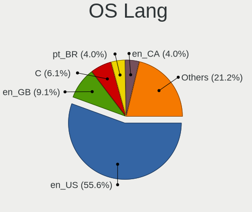
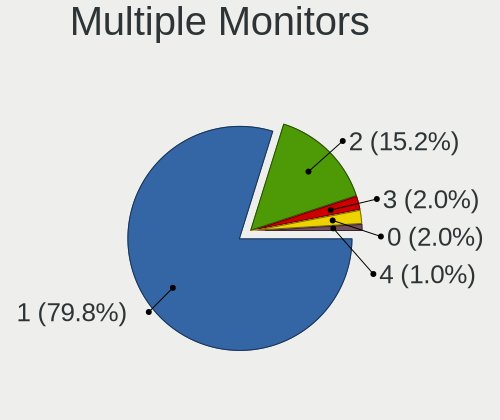
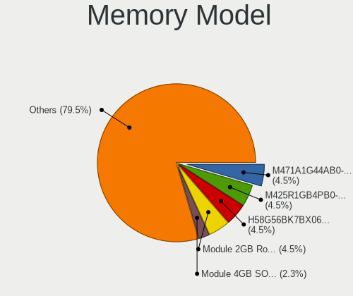

Pop!_OS - Hardware Trends (Notebooks)
-------------------------------------

A project to identify most popular hardware characteristics and track their change
over time based on data collected by Linux users at https://Linux-Hardware.org.

Anyone can contribute to this report by the [hw-probe](https://github.com/linuxhw/hw-probe) tool:

    sudo -E hw-probe -all -upload

This report is for one last month. Overall report since the beginning of time: [TestDays](https://github.com/linuxhw/TestDays)

Period: Jul, 2023.

Contents
--------

* [ System ](#system)
  - [ OS                       ](#os)
  - [ OS Family                ](#os-family)
  - [ Kernel                   ](#kernel)
  - [ Kernel Family            ](#kernel-family)
  - [ Kernel Major Ver.        ](#kernel-major-ver)
  - [ Arch                     ](#arch)
  - [ DE                       ](#de)
  - [ Display Server           ](#display-server)
  - [ Display Manager          ](#display-manager)
  - [ OS Lang                  ](#os-lang)
  - [ Boot Mode                ](#boot-mode)
  - [ Filesystem               ](#filesystem)
  - [ Part. scheme             ](#part-scheme)
  - [ Dual Boot with Linux/BSD ](#dual-boot-with-linuxbsd)
  - [ Dual Boot (Win)          ](#dual-boot-win)

* [ Board ](#board)
  - [ Vendor                   ](#vendor)
  - [ Model                    ](#model)
  - [ Model Family             ](#model-family)
  - [ MFG Year                 ](#mfg-year)
  - [ Form Factor              ](#form-factor)
  - [ Secure Boot              ](#secure-boot)
  - [ Coreboot                 ](#coreboot)
  - [ RAM Size                 ](#ram-size)
  - [ RAM Used                 ](#ram-used)
  - [ Total Drives             ](#total-drives)
  - [ Has CD-ROM               ](#has-cd-rom)
  - [ Has Ethernet             ](#has-ethernet)
  - [ Has WiFi                 ](#has-wifi)
  - [ Has Bluetooth            ](#has-bluetooth)

* [ Location ](#location)
  - [ Country                  ](#country)
  - [ City                     ](#city)

* [ Drives ](#drives)
  - [ Drive Vendor             ](#drive-vendor)
  - [ Drive Model              ](#drive-model)
  - [ HDD Vendor               ](#hdd-vendor)
  - [ SSD Vendor               ](#ssd-vendor)
  - [ Drive Kind               ](#drive-kind)
  - [ Drive Connector          ](#drive-connector)
  - [ Drive Size               ](#drive-size)
  - [ Space Total              ](#space-total)
  - [ Space Used               ](#space-used)
  - [ Malfunc. Drives          ](#malfunc-drives)
  - [ Malfunc. Drive Vendor    ](#malfunc-drive-vendor)
  - [ Malfunc. HDD Vendor      ](#malfunc-hdd-vendor)
  - [ Malfunc. Drive Kind      ](#malfunc-drive-kind)
  - [ Failed Drives            ](#failed-drives)
  - [ Failed Drive Vendor      ](#failed-drive-vendor)
  - [ Drive Status             ](#drive-status)

* [ Storage controller ](#storage-controller)
  - [ Storage Vendor           ](#storage-vendor)
  - [ Storage Model            ](#storage-model)
  - [ Storage Kind             ](#storage-kind)

* [ Processor ](#processor)
  - [ CPU Vendor               ](#cpu-vendor)
  - [ CPU Model                ](#cpu-model)
  - [ CPU Model Family         ](#cpu-model-family)
  - [ CPU Cores                ](#cpu-cores)
  - [ CPU Sockets              ](#cpu-sockets)
  - [ CPU Threads              ](#cpu-threads)
  - [ CPU Op-Modes             ](#cpu-op-modes)
  - [ CPU Microcode            ](#cpu-microcode)
  - [ CPU Microarch            ](#cpu-microarch)

* [ Graphics ](#graphics)
  - [ GPU Vendor               ](#gpu-vendor)
  - [ GPU Model                ](#gpu-model)
  - [ GPU Combo                ](#gpu-combo)
  - [ GPU Driver               ](#gpu-driver)
  - [ GPU Memory               ](#gpu-memory)

* [ Monitor ](#monitor)
  - [ Monitor Vendor           ](#monitor-vendor)
  - [ Monitor Model            ](#monitor-model)
  - [ Monitor Resolution       ](#monitor-resolution)
  - [ Monitor Diagonal         ](#monitor-diagonal)
  - [ Monitor Width            ](#monitor-width)
  - [ Aspect Ratio             ](#aspect-ratio)
  - [ Monitor Area             ](#monitor-area)
  - [ Pixel Density            ](#pixel-density)
  - [ Multiple Monitors        ](#multiple-monitors)

* [ Network ](#network)
  - [ Net Controller Vendor    ](#net-controller-vendor)
  - [ Net Controller Model     ](#net-controller-model)
  - [ Wireless Vendor          ](#wireless-vendor)
  - [ Wireless Model           ](#wireless-model)
  - [ Ethernet Vendor          ](#ethernet-vendor)
  - [ Ethernet Model           ](#ethernet-model)
  - [ Net Controller Kind      ](#net-controller-kind)
  - [ Used Controller          ](#used-controller)
  - [ NICs                     ](#nics)
  - [ IPv6                     ](#ipv6)

* [ Bluetooth ](#bluetooth)
  - [ Bluetooth Vendor         ](#bluetooth-vendor)
  - [ Bluetooth Model          ](#bluetooth-model)

* [ Sound ](#sound)
  - [ Sound Vendor             ](#sound-vendor)
  - [ Sound Model              ](#sound-model)

* [ Memory ](#memory)
  - [ Memory Vendor            ](#memory-vendor)
  - [ Memory Model             ](#memory-model)
  - [ Memory Kind              ](#memory-kind)
  - [ Memory Form Factor       ](#memory-form-factor)
  - [ Memory Size              ](#memory-size)
  - [ Memory Speed             ](#memory-speed)

* [ Printers & scanners ](#printers--scanners)
  - [ Printer Vendor           ](#printer-vendor)
  - [ Printer Model            ](#printer-model)
  - [ Scanner Vendor           ](#scanner-vendor)
  - [ Scanner Model            ](#scanner-model)

* [ Camera ](#camera)
  - [ Camera Vendor            ](#camera-vendor)
  - [ Camera Model             ](#camera-model)

* [ Security ](#security)
  - [ Fingerprint Vendor       ](#fingerprint-vendor)
  - [ Fingerprint Model        ](#fingerprint-model)
  - [ Chipcard Vendor          ](#chipcard-vendor)
  - [ Chipcard Model           ](#chipcard-model)

* [ Unsupported ](#unsupported)
  - [ Unsupported Devices      ](#unsupported-devices)
  - [ Unsupported Device Types ](#unsupported-device-types)

System
------

OS
--

Installed operating systems

| Name          | Notebooks | Percent |
|---------------|-----------|---------|
| Pop!_OS 22.04 | 117       | 98.32%  |
| Pop!_OS 21.10 | 1         | 0.84%   |
| Pop!_OS 20.04 | 1         | 0.84%   |

OS Family
---------

OS without a version

| Name    | Notebooks | Percent |
|---------|-----------|---------|
| Pop!_OS | 119       | 100%    |

Kernel
------

Version of the Linux kernel

| Version                  | Notebooks | Percent |
|--------------------------|-----------|---------|
| 6.2.6-76060206-generic   | 106       | 89.08%  |
| 6.3.7-060307-generic     | 2         | 1.68%   |
| 5.19.0-76051900-generic  | 2         | 1.68%   |
| 6.5.0-rc2                | 1         | 0.84%   |
| 6.4.5-x64v2-xanmod1      | 1         | 0.84%   |
| 6.4.3-060403-generic     | 1         | 0.84%   |
| 6.4.0-060400-generic     | 1         | 0.84%   |
| 6.3.9-060309-generic     | 1         | 0.84%   |
| 6.2.0-76060200-generic   | 1         | 0.84%   |
| 6.0.12-76060012-generic  | 1         | 0.84%   |
| 5.17.5-76051705-generic  | 1         | 0.84%   |
| 5.16.11-76051611-generic | 1         | 0.84%   |

Kernel Family
-------------

Linux kernel without a distro release

| Version | Notebooks | Percent |
|---------|-----------|---------|
| 6.2.6   | 106       | 89.08%  |
| 6.3.7   | 2         | 1.68%   |
| 5.19.0  | 2         | 1.68%   |
| 6.5.0   | 1         | 0.84%   |
| 6.4.5   | 1         | 0.84%   |
| 6.4.3   | 1         | 0.84%   |
| 6.4.0   | 1         | 0.84%   |
| 6.3.9   | 1         | 0.84%   |
| 6.2.0   | 1         | 0.84%   |
| 6.0.12  | 1         | 0.84%   |
| 5.17.5  | 1         | 0.84%   |
| 5.16.11 | 1         | 0.84%   |

Kernel Major Ver.
-----------------

Linux kernel major version

| Version | Notebooks | Percent |
|---------|-----------|---------|
| 6.2     | 107       | 89.92%  |
| 6.4     | 3         | 2.52%   |
| 6.3     | 3         | 2.52%   |
| 5.19    | 2         | 1.68%   |
| 6.5     | 1         | 0.84%   |
| 6.0     | 1         | 0.84%   |
| 5.17    | 1         | 0.84%   |
| 5.16    | 1         | 0.84%   |

Arch
----

OS architecture (x86_64, i586, etc.)

| Name   | Notebooks | Percent |
|--------|-----------|---------|
| x86_64 | 119       | 100%    |

DE
--

Desktop Environment

| Name       | Notebooks | Percent |
|------------|-----------|---------|
| GNOME      | 112       | 94.12%  |
| Unknown    | 3         | 2.52%   |
| X-Cinnamon | 2         | 1.68%   |
| MATE       | 1         | 0.84%   |
| Cinnamon   | 1         | 0.84%   |

Display Server
--------------

X11 or Wayland

| Name    | Notebooks | Percent |
|---------|-----------|---------|
| X11     | 109       | 91.6%   |
| Wayland | 6         | 5.04%   |
| Unknown | 3         | 2.52%   |
| Tty     | 1         | 0.84%   |

Display Manager
---------------

SDDM, LightDM, etc.

| Name    | Notebooks | Percent |
|---------|-----------|---------|
| Unknown | 85        | 71.43%  |
| GDM3    | 34        | 28.57%  |

OS Lang
-------

Language

| Lang    | Notebooks | Percent |
|---------|-----------|---------|
| en_US   | 69        | 57.98%  |
| en_GB   | 11        | 9.24%   |
| pt_BR   | 6         | 5.04%   |
| pl_PL   | 5         | 4.2%    |
| es_ES   | 5         | 4.2%    |
| de_DE   | 3         | 2.52%   |
| Unknown | 3         | 2.52%   |
| it_IT   | 2         | 1.68%   |
| en_CA   | 2         | 1.68%   |
| en_AU   | 2         | 1.68%   |
| da_DK   | 2         | 1.68%   |
| C       | 2         | 1.68%   |
| zh_CN   | 1         | 0.84%   |
| ru_UA   | 1         | 0.84%   |
| pt_PT   | 1         | 0.84%   |
| fr_FR   | 1         | 0.84%   |
| es_SV   | 1         | 0.84%   |
| es_CL   | 1         | 0.84%   |
| de_CH   | 1         | 0.84%   |

Boot Mode
---------

EFI or BIOS

| Mode | Notebooks | Percent |
|------|-----------|---------|
| BIOS | 83        | 69.75%  |
| EFI  | 36        | 30.25%  |

Filesystem
----------

Type of filesystem

| Type    | Notebooks | Percent |
|---------|-----------|---------|
| Ext4    | 115       | 96.64%  |
| Overlay | 2         | 1.68%   |
| Btrfs   | 2         | 1.68%   |

Part. scheme
------------

Scheme of partitioning

| Type    | Notebooks | Percent |
|---------|-----------|---------|
| Unknown | 82        | 68.91%  |
| GPT     | 36        | 30.25%  |
| MBR     | 1         | 0.84%   |

Dual Boot with Linux/BSD
------------------------

Hosting more than one Linux/BSD

| Dual boot | Notebooks | Percent |
|-----------|-----------|---------|
| No        | 116       | 97.48%  |
| Yes       | 3         | 2.52%   |

Dual Boot (Win)
---------------

Hosting Linux and Windows

| Dual boot | Notebooks | Percent |
|-----------|-----------|---------|
| No        | 106       | 89.08%  |
| Yes       | 13        | 10.92%  |

Board
-----

Vendor
------

Motherboard manufacturer

| Name                | Notebooks | Percent |
|---------------------|-----------|---------|
| Dell                | 22        | 18.49%  |
| Lenovo              | 18        | 15.13%  |
| Hewlett-Packard     | 18        | 15.13%  |
| ASUSTek Computer    | 14        | 11.76%  |
| Acer                | 11        | 9.24%   |
| Apple               | 10        | 8.4%    |
| MSI                 | 5         | 4.2%    |
| System76            | 4         | 3.36%   |
| Notebook            | 3         | 2.52%   |
| Samsung Electronics | 2         | 1.68%   |
| Toshiba             | 1         | 0.84%   |
| Timi                | 1         | 0.84%   |
| Sony                | 1         | 0.84%   |
| Semp Toshiba        | 1         | 0.84%   |
| Schenker            | 1         | 0.84%   |
| PC Specialist       | 1         | 0.84%   |
| Panasonic           | 1         | 0.84%   |
| LG Electronics      | 1         | 0.84%   |
| HUAWEI              | 1         | 0.84%   |
| Google              | 1         | 0.84%   |
| ASRock              | 1         | 0.84%   |
| Unknown             | 1         | 0.84%   |

Model
-----

Motherboard model

| Name                                       | Notebooks | Percent |
|--------------------------------------------|-----------|---------|
| HP Laptop 15-da0xxx                        | 2         | 1.68%   |
| ASUS ROG Strix G713PV_G713PV               | 2         | 1.68%   |
| Apple MacBookPro8,1                        | 2         | 1.68%   |
| Toshiba Satellite L750                     | 1         | 0.84%   |
| Timi Xiaomi NoteBook Pro                   | 1         | 0.84%   |
| System76 Serval WS                         | 1         | 0.84%   |
| System76 Pangolin                          | 1         | 0.84%   |
| System76 Oryx Pro                          | 1         | 0.84%   |
| System76 Darter Pro                        | 1         | 0.84%   |
| Sony SVF1521A6EW                           | 1         | 0.84%   |
| Semp Toshiba IS 1413G                      | 1         | 0.84%   |
| Schenker XMG NEO (CML/E20)                 | 1         | 0.84%   |
| Samsung 350V5C/351V5C/3540VC/3440VC        | 1         | 0.84%   |
| Samsung 300E5M/300E5L                      | 1         | 0.84%   |
| PC Specialist Standard                     | 1         | 0.84%   |
| Panasonic FZ55-1                           | 1         | 0.84%   |
| Notebook P7xxTM1                           | 1         | 0.84%   |
| Notebook NP5x_NP6x_NP7xRNJ_RNH             | 1         | 0.84%   |
| Notebook NH5x_7xDPx                        | 1         | 0.84%   |
| MSI Katana GF66 12UC                       | 1         | 0.84%   |
| MSI GT72VR 6RD                             | 1         | 0.84%   |
| MSI GS66 Stealth 10SE                      | 1         | 0.84%   |
| MSI GF63 Thin 10SCXR                       | 1         | 0.84%   |
| MSI GF63 Thin 10SC                         | 1         | 0.84%   |
| LG S425-G.BC31P1                           | 1         | 0.84%   |
| Lenovo Yoga Slim 7 ProX 14ARH7 82TL        | 1         | 0.84%   |
| Lenovo Y520-15IKBN 80WK                    | 1         | 0.84%   |
| Lenovo ThinkPad X390 20Q1S67S00            | 1         | 0.84%   |
| Lenovo ThinkPad X13 Gen 2a 20XHCTO1WW      | 1         | 0.84%   |
| Lenovo ThinkPad T530 23943J8               | 1         | 0.84%   |
| Lenovo ThinkPad T480s 20L70028US           | 1         | 0.84%   |
| Lenovo ThinkPad T480 20L5S1S000            | 1         | 0.84%   |
| Lenovo ThinkPad T470s 20HGS01A00           | 1         | 0.84%   |
| Lenovo ThinkPad T470p 20J7S0CF00           | 1         | 0.84%   |
| Lenovo ThinkPad P53s 20N6001UUS            | 1         | 0.84%   |
| Lenovo ThinkPad L13 Yoga Gen 2a 21AES01A00 | 1         | 0.84%   |
| Lenovo ThinkBook 16p Gen 2 20YM            | 1         | 0.84%   |
| Lenovo Legion Slim 7 16IRH8 82Y3           | 1         | 0.84%   |
| Lenovo Legion 7 16ITHg6 82K6               | 1         | 0.84%   |
| Lenovo IdeaPad Gaming 3 15IMH05 82CG       | 1         | 0.84%   |

Model Family
------------

Motherboard model prefix

| Name                   | Notebooks | Percent |
|------------------------|-----------|---------|
| Lenovo ThinkPad        | 9         | 7.56%   |
| Dell Latitude          | 7         | 5.88%   |
| ASUS ROG               | 6         | 5.04%   |
| Acer Aspire            | 5         | 4.2%    |
| Lenovo IdeaPad         | 4         | 3.36%   |
| HP Laptop              | 4         | 3.36%   |
| HP EliteBook           | 4         | 3.36%   |
| Dell Precision         | 4         | 3.36%   |
| Dell Inspiron          | 4         | 3.36%   |
| Dell XPS               | 3         | 2.52%   |
| ASUS VivoBook          | 3         | 2.52%   |
| MSI GF63               | 2         | 1.68%   |
| Lenovo Legion          | 2         | 1.68%   |
| HP ZBook               | 2         | 1.68%   |
| HP Pavilion            | 2         | 1.68%   |
| HP ENVY                | 2         | 1.68%   |
| Dell G15               | 2         | 1.68%   |
| ASUS ASUS              | 2         | 1.68%   |
| Apple MacBookPro8      | 2         | 1.68%   |
| Acer Swift             | 2         | 1.68%   |
| Acer Nitro             | 2         | 1.68%   |
| Toshiba Satellite      | 1         | 0.84%   |
| Timi Xiaomi            | 1         | 0.84%   |
| System76 Serval        | 1         | 0.84%   |
| System76 Pangolin      | 1         | 0.84%   |
| System76 Oryx          | 1         | 0.84%   |
| System76 Darter        | 1         | 0.84%   |
| Sony SVF1521A6EW       | 1         | 0.84%   |
| Semp Toshiba IS        | 1         | 0.84%   |
| Schenker XMG           | 1         | 0.84%   |
| Samsung 350V5C         | 1         | 0.84%   |
| Samsung 300E5M         | 1         | 0.84%   |
| PC Specialist Standard | 1         | 0.84%   |
| Panasonic FZ55-1       | 1         | 0.84%   |
| Notebook P7xxTM1       | 1         | 0.84%   |
| Notebook NP5x          | 1         | 0.84%   |
| Notebook NH5x          | 1         | 0.84%   |
| MSI Katana             | 1         | 0.84%   |
| MSI GT72VR             | 1         | 0.84%   |
| MSI GS66               | 1         | 0.84%   |

MFG Year
--------

Motherboard manufacture year

| Year | Notebooks | Percent |
|------|-----------|---------|
| 2020 | 18        | 15.13%  |
| 2021 | 15        | 12.61%  |
| 2019 | 13        | 10.92%  |
| 2022 | 11        | 9.24%   |
| 2018 | 10        | 8.4%    |
| 2023 | 8         | 6.72%   |
| 2017 | 7         | 5.88%   |
| 2011 | 7         | 5.88%   |
| 2016 | 6         | 5.04%   |
| 2013 | 6         | 5.04%   |
| 2012 | 6         | 5.04%   |
| 2015 | 4         | 3.36%   |
| 2010 | 3         | 2.52%   |
| 2009 | 3         | 2.52%   |
| 2014 | 2         | 1.68%   |

Form Factor
-----------

Physical design of the computer

| Name     | Notebooks | Percent |
|----------|-----------|---------|
| Notebook | 119       | 100%    |

Secure Boot
-----------

Enabled or disabled

| State    | Notebooks | Percent |
|----------|-----------|---------|
| Disabled | 119       | 100%    |

Coreboot
--------

Have coreboot on board

| Used | Notebooks | Percent |
|------|-----------|---------|
| No   | 116       | 97.48%  |
| Yes  | 3         | 2.52%   |

RAM Size
--------

Total RAM memory

| Size in GB  | Notebooks | Percent |
|-------------|-----------|---------|
| 4.01-8.0    | 30        | 25.21%  |
| 32.01-64.0  | 24        | 20.17%  |
| 16.01-24.0  | 21        | 17.65%  |
| 8.01-16.0   | 21        | 17.65%  |
| 3.01-4.0    | 12        | 10.08%  |
| 64.01-256.0 | 7         | 5.88%   |
| 24.01-32.0  | 3         | 2.52%   |
| 1.01-2.0    | 1         | 0.84%   |

RAM Used
--------

Used RAM memory

| Used GB    | Notebooks | Percent |
|------------|-----------|---------|
| 4.01-8.0   | 50        | 42.02%  |
| 3.01-4.0   | 21        | 17.65%  |
| 8.01-16.0  | 18        | 15.13%  |
| 2.01-3.0   | 16        | 13.45%  |
| 1.01-2.0   | 7         | 5.88%   |
| 16.01-24.0 | 6         | 5.04%   |
| 0.51-1.0   | 1         | 0.84%   |

Total Drives
------------

Number of drives on board

| Drives | Notebooks | Percent |
|--------|-----------|---------|
| 1      | 83        | 69.75%  |
| 2      | 27        | 22.69%  |
| 3      | 7         | 5.88%   |
| 0      | 2         | 1.68%   |

Has CD-ROM
----------

Has CD-ROM on board

| Presented | Notebooks | Percent |
|-----------|-----------|---------|
| No        | 97        | 81.51%  |
| Yes       | 22        | 18.49%  |

Has Ethernet
------------

Has Ethernet on board

| Presented | Notebooks | Percent |
|-----------|-----------|---------|
| Yes       | 100       | 84.03%  |
| No        | 19        | 15.97%  |

Has WiFi
--------

Has WiFi module

| Presented | Notebooks | Percent |
|-----------|-----------|---------|
| Yes       | 118       | 99.16%  |
| No        | 1         | 0.84%   |

Has Bluetooth
-------------

Has Bluetooth module

| Presented | Notebooks | Percent |
|-----------|-----------|---------|
| Yes       | 99        | 83.19%  |
| No        | 20        | 16.81%  |

Location
--------

Country
-------

Geographic location (country)

| Country     | Notebooks | Percent |
|-------------|-----------|---------|
| USA         | 33        | 27.73%  |
| Canada      | 9         | 7.56%   |
| Brazil      | 9         | 7.56%   |
| UK          | 6         | 5.04%   |
| Poland      | 6         | 5.04%   |
| Italy       | 5         | 4.2%    |
| Germany     | 5         | 4.2%    |
| Spain       | 4         | 3.36%   |
| Australia   | 4         | 3.36%   |
| Portugal    | 3         | 2.52%   |
| Netherlands | 3         | 2.52%   |
| India       | 3         | 2.52%   |
| Russia      | 2         | 1.68%   |
| Denmark     | 2         | 1.68%   |
| Croatia     | 2         | 1.68%   |
| Chile       | 2         | 1.68%   |
| Argentina   | 2         | 1.68%   |
| Ukraine     | 1         | 0.84%   |
| Turkey      | 1         | 0.84%   |
| Switzerland | 1         | 0.84%   |
| Romania     | 1         | 0.84%   |
| Qatar       | 1         | 0.84%   |
| Philippines | 1         | 0.84%   |
| Peru        | 1         | 0.84%   |
| Panama      | 1         | 0.84%   |
| Mexico      | 1         | 0.84%   |
| Malaysia    | 1         | 0.84%   |
| Kenya       | 1         | 0.84%   |
| Jamaica     | 1         | 0.84%   |
| Israel      | 1         | 0.84%   |
| Hungary     | 1         | 0.84%   |
| France      | 1         | 0.84%   |
| El Salvador | 1         | 0.84%   |
| Czechia     | 1         | 0.84%   |
| China       | 1         | 0.84%   |
| Bulgaria    | 1         | 0.84%   |

City
----

Geographic location (city)

| City              | Notebooks | Percent |
|-------------------|-----------|---------|
| Warsaw            | 3         | 2.52%   |
| Valencia          | 2         | 1.68%   |
| Sao Paulo         | 2         | 1.68%   |
| Los Angeles       | 2         | 1.68%   |
| Lisbon            | 2         | 1.68%   |
| Edinburgh         | 2         | 1.68%   |
| Denver            | 2         | 1.68%   |
| Bengaluru         | 2         | 1.68%   |
| Bamberg           | 2         | 1.68%   |
| Wolvega           | 1         | 0.84%   |
| Wetaskiwin        | 1         | 0.84%   |
| West Jordan       | 1         | 0.84%   |
| Wassenaar         | 1         | 0.84%   |
| Waco              | 1         | 0.84%   |
| Vinkovci          | 1         | 0.84%   |
| Vila-real         | 1         | 0.84%   |
| Vigo              | 1         | 0.84%   |
| Venice            | 1         | 0.84%   |
| Varaždin         | 1         | 0.84%   |
| Theodore          | 1         | 0.84%   |
| Temuco            | 1         | 0.84%   |
| Szombathely       | 1         | 0.84%   |
| Sydney            | 1         | 0.84%   |
| Siblingen         | 1         | 0.84%   |
| Santos            | 1         | 0.84%   |
| San Salvador      | 1         | 0.84%   |
| San Diego         | 1         | 0.84%   |
| San Antonio       | 1         | 0.84%   |
| Salt Lake City    | 1         | 0.84%   |
| Rosarno           | 1         | 0.84%   |
| Rio de Janeiro    | 1         | 0.84%   |
| Rimini            | 1         | 0.84%   |
| Rifle             | 1         | 0.84%   |
| Prague            | 1         | 0.84%   |
| Pottstown         | 1         | 0.84%   |
| Pomigliano d'Arco | 1         | 0.84%   |
| Plovdiv           | 1         | 0.84%   |
| Pirenopolis       | 1         | 0.84%   |
| Perth             | 1         | 0.84%   |
| Paranaque City    | 1         | 0.84%   |

Drives
------

Drive Vendor
------------

Hard drive vendors

| Vendor                      | Notebooks | Drives | Percent |
|-----------------------------|-----------|--------|---------|
| Samsung Electronics         | 25        | 28     | 16.34%  |
| Sandisk                     | 20        | 20     | 13.07%  |
| SK hynix                    | 14        | 14     | 9.15%   |
| WDC                         | 11        | 12     | 7.19%   |
| Toshiba                     | 10        | 10     | 6.54%   |
| Micron Technology           | 10        | 10     | 6.54%   |
| Intel                       | 9         | 9      | 5.88%   |
| Kingston                    | 8         | 8      | 5.23%   |
| Seagate                     | 7         | 7      | 4.58%   |
| Apple                       | 6         | 6      | 3.92%   |
| Micron/Crucial Technology   | 4         | 5      | 2.61%   |
| Crucial                     | 4         | 4      | 2.61%   |
| China                       | 4         | 5      | 2.61%   |
| Unknown                     | 3         | 4      | 1.96%   |
| KIOXIA                      | 3         | 3      | 1.96%   |
| Kingston Technology Company | 3         | 3      | 1.96%   |
| Solid State Storage         | 1         | 1      | 0.65%   |
| ROG                         | 1         | 1      | 0.65%   |
| PNY                         | 1         | 1      | 0.65%   |
| Netac                       | 1         | 1      | 0.65%   |
| MAX                         | 1         | 1      | 0.65%   |
| LITEONIT                    | 1         | 1      | 0.65%   |
| JMicron Technology          | 1         | 1      | 0.65%   |
| Hitachi                     | 1         | 1      | 0.65%   |
| Gigabyte Technology         | 1         | 1      | 0.65%   |
| CT2000P3                    | 1         | 1      | 0.65%   |
| A-DATA Technology           | 1         | 1      | 0.65%   |
| Unknown                     | 1         | 1      | 0.65%   |

Drive Model
-----------

Hard drive models

| Model                                               | Notebooks | Percent |
|-----------------------------------------------------|-----------|---------|
| Samsung NVMe SSD Controller PM9A1/PM9A3/980PRO 1TB  | 6         | 3.82%   |
| Intel SSD 660P Series 1024GB                        | 4         | 2.55%   |
| Micron 2400_MTFDKBA1T0QFM 1024GB                    | 3         | 1.91%   |
| Unknown MMC Card  16GB                              | 2         | 1.27%   |
| Toshiba MQ04ABF100 1TB                              | 2         | 1.27%   |
| Toshiba MQ01ACF050 500GB                            | 2         | 1.27%   |
| Toshiba MQ01ABF050 500GB                            | 2         | 1.27%   |
| SK hynix BC711 NVMe 512GB                           | 2         | 1.27%   |
| Seagate ST1000LM035-1RK172 1TB                      | 2         | 1.27%   |
| Sandisk WD Black SN850 1TB                          | 2         | 1.27%   |
| Sandisk WD Black SN750 / PC SN730 NVMe SSD 1024GB   | 2         | 1.27%   |
| Samsung SSD 990 PRO 2TB                             | 2         | 1.27%   |
| Samsung SSD 970 EVO Plus 2TB                        | 2         | 1.27%   |
| Samsung SSD 870 QVO 1TB                             | 2         | 1.27%   |
| Samsung NVMe SSD Controller SM981/PM981/PM983 500GB | 2         | 1.27%   |
| Samsung MZVL4512HBLU-00BTW 512GB                    | 2         | 1.27%   |
| Micron/Crucial P2 NVMe PCIe SSD 1TB                 | 2         | 1.27%   |
| Kingston SA400S37120G 120GB SSD                     | 2         | 1.27%   |
| China SSD 256GB                                     | 2         | 1.27%   |
| China SSD 120GB                                     | 2         | 1.27%   |
| Apple SSD SM0128G 121GB                             | 2         | 1.27%   |
| WDC WDS250G2B0B-00YS70 250GB SSD                    | 1         | 0.64%   |
| WDC WDS100T2B0C-00PXH0 1TB                          | 1         | 0.64%   |
| WDC WDS100T2B0B-00YS70 1TB SSD                      | 1         | 0.64%   |
| WDC WD5000LPLX-60ZNTT1 500GB                        | 1         | 0.64%   |
| WDC WD5000AAKX-00ERMA0 500GB                        | 1         | 0.64%   |
| WDC WD10SPZX-16Z10T0 1TB                            | 1         | 0.64%   |
| WDC PC SN730 SDBQNTY-256G-1001 256GB                | 1         | 0.64%   |
| WDC PC SN730 SDBPNTY-512G-1027 512GB                | 1         | 0.64%   |
| WDC PC SN730 SDBPNTY-1T00-1032 1TB                  | 1         | 0.64%   |
| WDC PC SN720 SDAPNTW-512G-1014 512GB                | 1         | 0.64%   |
| WDC PC SN520 SDAPNUW-512G-1014 512GB                | 1         | 0.64%   |
| Unknown MMC Card  32GB                              | 1         | 0.64%   |
| Unknown MMC Card  128GB                             | 1         | 0.64%   |
| Toshiba MK5065GSXF 500GB                            | 1         | 0.64%   |
| Toshiba KXG60ZNV1T02 NVMe 1024GB                    | 1         | 0.64%   |
| Toshiba KXG50ZNV512G NVMe 512GB                     | 1         | 0.64%   |
| Toshiba KXG50ZNV512G 512GB                          | 1         | 0.64%   |
| Solid State Storage CL1-3D256-Q11 NVMe SSSTC 256GB  | 1         | 0.64%   |
| SK hynix SHGS31-1000GS-2 1TB SSD                    | 1         | 0.64%   |

HDD Vendor
----------

Hard disk drive vendors

| Vendor             | Notebooks | Drives | Percent |
|--------------------|-----------|--------|---------|
| Toshiba            | 7         | 7      | 36.84%  |
| Seagate            | 7         | 7      | 36.84%  |
| WDC                | 3         | 4      | 15.79%  |
| JMicron Technology | 1         | 1      | 5.26%   |
| Hitachi            | 1         | 1      | 5.26%   |

SSD Vendor
----------

Solid state drive vendors

| Vendor              | Notebooks | Drives | Percent |
|---------------------|-----------|--------|---------|
| SanDisk             | 7         | 7      | 15.22%  |
| Kingston            | 7         | 7      | 15.22%  |
| Samsung Electronics | 6         | 6      | 13.04%  |
| Apple               | 5         | 5      | 10.87%  |
| China               | 4         | 5      | 8.7%    |
| SK hynix            | 3         | 3      | 6.52%   |
| Micron Technology   | 3         | 3      | 6.52%   |
| Crucial             | 3         | 3      | 6.52%   |
| WDC                 | 2         | 2      | 4.35%   |
| PNY                 | 1         | 1      | 2.17%   |
| Netac               | 1         | 1      | 2.17%   |
| MAX                 | 1         | 1      | 2.17%   |
| LITEONIT            | 1         | 1      | 2.17%   |
| Gigabyte Technology | 1         | 1      | 2.17%   |
| CT2000P3            | 1         | 1      | 2.17%   |

Drive Kind
----------

HDD or SSD

| Kind    | Notebooks | Drives | Percent |
|---------|-----------|--------|---------|
| NVMe    | 72        | 87     | 51.8%   |
| SSD     | 44        | 47     | 31.65%  |
| HDD     | 18        | 20     | 12.95%  |
| MMC     | 4         | 5      | 2.88%   |
| Unknown | 1         | 1      | 0.72%   |

Drive Connector
---------------

SATA, SAS, NVMe, etc.

| Type | Notebooks | Drives | Percent |
|------|-----------|--------|---------|
| NVMe | 72        | 87     | 52.55%  |
| SATA | 56        | 62     | 40.88%  |
| SAS  | 5         | 6      | 3.65%   |
| MMC  | 4         | 5      | 2.92%   |

Drive Size
----------

Size of hard drive

| Size in TB | Notebooks | Drives | Percent |
|------------|-----------|--------|---------|
| 0.01-0.5   | 41        | 44     | 65.08%  |
| 0.51-1.0   | 18        | 19     | 28.57%  |
| 1.01-2.0   | 3         | 3      | 4.76%   |
| 4.01-10.0  | 1         | 1      | 1.59%   |

Space Total
-----------

Amount of disk space available on the file system

| Size in GB     | Notebooks | Percent |
|----------------|-----------|---------|
| 101-250        | 42        | 35.29%  |
| 251-500        | 30        | 25.21%  |
| 501-1000       | 24        | 20.17%  |
| 1001-2000      | 10        | 8.4%    |
| 2001-3000      | 5         | 4.2%    |
| Unknown        | 3         | 2.52%   |
| 1-20           | 2         | 1.68%   |
| 51-100         | 2         | 1.68%   |
| More than 3000 | 1         | 0.84%   |

Space Used
----------

Amount of used disk space

| Used GB        | Notebooks | Percent |
|----------------|-----------|---------|
| 1-20           | 29        | 24.37%  |
| 21-50          | 25        | 21.01%  |
| 101-250        | 20        | 16.81%  |
| 251-500        | 18        | 15.13%  |
| 51-100         | 14        | 11.76%  |
| 501-1000       | 5         | 4.2%    |
| 1001-2000      | 4         | 3.36%   |
| Unknown        | 3         | 2.52%   |
| More than 3000 | 1         | 0.84%   |

Malfunc. Drives
---------------

Drive models with a malfunction

| Model                          | Notebooks | Drives | Percent |
|--------------------------------|-----------|--------|---------|
| WDC WDS100T2B0B-00YS70 1TB SSD | 1         | 1      | 100%    |

Malfunc. Drive Vendor
---------------------

Vendors of faulty drives

| Vendor | Notebooks | Drives | Percent |
|--------|-----------|--------|---------|
| WDC    | 1         | 1      | 100%    |

Malfunc. HDD Vendor
-------------------

Vendors of faulty HDD drives

Zero info for selected period =(

Malfunc. Drive Kind
-------------------

Kinds of faulty drives

| Kind | Notebooks | Drives | Percent |
|------|-----------|--------|---------|
| SSD  | 1         | 1      | 100%    |

Failed Drives
-------------

Failed drive models

Zero info for selected period =(

Failed Drive Vendor
-------------------

Failed drive vendors

Zero info for selected period =(

Drive Status
------------

Number of failed and malfunc. drives

| Status   | Notebooks | Drives | Percent |
|----------|-----------|--------|---------|
| Detected | 82        | 110    | 67.77%  |
| Works    | 38        | 49     | 31.4%   |
| Malfunc  | 1         | 1      | 0.83%   |

Storage controller
------------------

Storage Vendor
--------------

Storage controller vendors

| Vendor                         | Notebooks | Percent |
|--------------------------------|-----------|---------|
| Intel                          | 74        | 45.4%   |
| Samsung Electronics            | 23        | 14.11%  |
| SanDisk                        | 19        | 11.66%  |
| SK hynix                       | 11        | 6.75%   |
| AMD                            | 10        | 6.13%   |
| Micron Technology              | 7         | 4.29%   |
| Micron/Crucial Technology      | 4         | 2.45%   |
| Kingston Technology Company    | 4         | 2.45%   |
| Toshiba America Info Systems   | 3         | 1.84%   |
| KIOXIA                         | 3         | 1.84%   |
| Nvidia                         | 2         | 1.23%   |
| Solid State Storage Technology | 1         | 0.61%   |
| Apple                          | 1         | 0.61%   |
| ADATA Technology               | 1         | 0.61%   |

Storage Model
-------------

Storage controller models

| Model                                                                        | Notebooks | Percent |
|------------------------------------------------------------------------------|-----------|---------|
| AMD FCH SATA Controller [AHCI mode]                                          | 9         | 5.36%   |
| Samsung NVMe SSD Controller PM9A1/PM9A3/980PRO                               | 8         | 4.76%   |
| Intel 82801 Mobile SATA Controller [RAID mode]                               | 8         | 4.76%   |
| SK hynix Gold P31/BC711/PC711 NVMe Solid State Drive                         | 7         | 4.17%   |
| Intel Volume Management Device NVMe RAID Controller                          | 7         | 4.17%   |
| Intel Sunrise Point-LP SATA Controller [AHCI mode]                           | 7         | 4.17%   |
| Intel 6 Series/C200 Series Chipset Family 6 port Mobile SATA AHCI Controller | 7         | 4.17%   |
| Samsung NVMe SSD Controller SM981/PM981/PM983                                | 6         | 3.57%   |
| Intel 7 Series Chipset Family 6-port SATA Controller [AHCI mode]             | 6         | 3.57%   |
| SanDisk WD Black SN750 / PC SN730 NVMe SSD                                   | 5         | 2.98%   |
| Intel SSD 660P Series                                                        | 5         | 2.98%   |
| Intel Comet Lake SATA AHCI Controller                                        | 5         | 2.98%   |
| Intel 400 Series Chipset Family SATA AHCI Controller                         | 5         | 2.98%   |
| Micron 2400 NVMe SSD (DRAM-less)                                             | 4         | 2.38%   |
| Intel Cannon Lake Mobile PCH SATA AHCI Controller                            | 4         | 2.38%   |
| SanDisk WD Black SN770 / PC SN740 256GB / PC SN560 (DRAM-less) NVMe SSD      | 3         | 1.79%   |
| Intel Tiger Lake-LP SATA Controller                                          | 3         | 1.79%   |
| Toshiba America Info Systems XG5 NVMe SSD Controller                         | 2         | 1.19%   |
| SK hynix BC511 NVMe SSD                                                      | 2         | 1.19%   |
| SanDisk WD PC SN810 / Black SN850 NVMe SSD                                   | 2         | 1.19%   |
| SanDisk WD Blue SN550 NVMe SSD                                               | 2         | 1.19%   |
| Samsung S4LN058A01[SSUBX] AHCI SSD Controller (Apple slot)                   | 2         | 1.19%   |
| Samsung NVMe SSD Controller S4LV008[Pascal]                                  | 2         | 1.19%   |
| Samsung NVMe SSD Controller PM9B1                                            | 2         | 1.19%   |
| Samsung NVMe SSD Controller 980                                              | 2         | 1.19%   |
| Micron/Crucial P2 [Nick P2] / P3 / P3 Plus NVMe PCIe SSD (DRAM-less)         | 2         | 1.19%   |
| Intel Tiger Lake SATA AHCI Controller                                        | 2         | 1.19%   |
| Intel SSD DC P4101/Pro 7600p/760p/E 6100p Series                             | 2         | 1.19%   |
| Intel HM170/QM170 Chipset SATA Controller [AHCI Mode]                        | 2         | 1.19%   |
| Intel Cannon Point-LP SATA Controller [AHCI Mode]                            | 2         | 1.19%   |
| Intel Alder Lake-P SATA AHCI Controller                                      | 2         | 1.19%   |
| Toshiba America Info Systems XG6 NVMe SSD Controller                         | 1         | 0.6%    |
| Solid State Storage CL1-3D256-Q11 NVMe SSD M.2                               | 1         | 0.6%    |
| SK hynix Platinum P41/PC801 NVMe Solid State Drive                           | 1         | 0.6%    |
| SK hynix BC501 NVMe Solid State Drive                                        | 1         | 0.6%    |
| SanDisk WD Blue SN570 NVMe SSD 1TB                                           | 1         | 0.6%    |
| SanDisk WD Blue SN500 / PC SN520 NVMe SSD                                    | 1         | 0.6%    |
| SanDisk WD Black 2018/SN750 / PC SN720 NVMe SSD                              | 1         | 0.6%    |
| SanDisk PC SN735 NVMe SSD (DRAM-less)                                        | 1         | 0.6%    |
| SanDisk PC SN530 NVMe SSD (DRAM-less)                                        | 1         | 0.6%    |

Storage Kind
------------

Kind of storage controller (IDE, SATA, NVMe, SAS, ...)

| Kind | Notebooks | Percent |
|------|-----------|---------|
| NVMe | 72        | 45.86%  |
| SATA | 68        | 43.31%  |
| RAID | 16        | 10.19%  |
| IDE  | 1         | 0.64%   |

Processor
---------

CPU Vendor
----------

Processor vendors

| Vendor | Notebooks | Percent |
|--------|-----------|---------|
| Intel  | 94        | 78.99%  |
| AMD    | 25        | 21.01%  |

CPU Model
---------

Processor models

| Model                                         | Notebooks | Percent |
|-----------------------------------------------|-----------|---------|
| Intel Core i7-9750H CPU @ 2.60GHz             | 4         | 3.36%   |
| Intel Core i7-10750H CPU @ 2.60GHz            | 4         | 3.36%   |
| Intel Core i7-8565U CPU @ 1.80GHz             | 3         | 2.52%   |
| Intel Core i7-10510U CPU @ 1.80GHz            | 3         | 2.52%   |
| Intel Core i5-7200U CPU @ 2.50GHz             | 3         | 2.52%   |
| Intel 11th Gen Core i5-1135G7 @ 2.40GHz       | 3         | 2.52%   |
| AMD Ryzen 9 7945HX with Radeon Graphics       | 3         | 2.52%   |
| Intel Core i7-8665U CPU @ 1.90GHz             | 2         | 1.68%   |
| Intel Core i7-8550U CPU @ 1.80GHz             | 2         | 1.68%   |
| Intel Core i7-6700HQ CPU @ 2.60GHz            | 2         | 1.68%   |
| Intel Core i5-8250U CPU @ 1.60GHz             | 2         | 1.68%   |
| Intel Core i5-4310U CPU @ 2.00GHz             | 2         | 1.68%   |
| Intel Core i5-10210U CPU @ 1.60GHz            | 2         | 1.68%   |
| Intel 13th Gen Core i7-13700H                 | 2         | 1.68%   |
| Intel 11th Gen Core i7-1185G7 @ 3.00GHz       | 2         | 1.68%   |
| AMD Ryzen 7 PRO 5850U with Radeon Graphics    | 2         | 1.68%   |
| AMD Ryzen 7 4700U with Radeon Graphics        | 2         | 1.68%   |
| AMD Ryzen 7 3700U with Radeon Vega Mobile Gfx | 2         | 1.68%   |
| Intel Pentium Dual-Core CPU T4500 @ 2.30GHz   | 1         | 0.84%   |
| Intel Pentium CPU 2117U @ 1.80GHz             | 1         | 0.84%   |
| Intel Core i9-9900KF CPU @ 3.60GHz            | 1         | 0.84%   |
| Intel Core i9-9880H CPU @ 2.30GHz             | 1         | 0.84%   |
| Intel Core i9-10885H CPU @ 2.40GHz            | 1         | 0.84%   |
| Intel Core i7-8850H CPU @ 2.60GHz             | 1         | 0.84%   |
| Intel Core i7-8750H CPU @ 2.20GHz             | 1         | 0.84%   |
| Intel Core i7-8650U CPU @ 1.90GHz             | 1         | 0.84%   |
| Intel Core i7-7820HQ CPU @ 2.90GHz            | 1         | 0.84%   |
| Intel Core i7-6820HQ CPU @ 2.70GHz            | 1         | 0.84%   |
| Intel Core i7-6600U CPU @ 2.60GHz             | 1         | 0.84%   |
| Intel Core i7-5500U CPU @ 2.40GHz             | 1         | 0.84%   |
| Intel Core i7-4810MQ CPU @ 2.80GHz            | 1         | 0.84%   |
| Intel Core i7-3770 CPU @ 3.40GHz              | 1         | 0.84%   |
| Intel Core i7-3630QM CPU @ 2.40GHz            | 1         | 0.84%   |
| Intel Core i7-3610QM CPU @ 2.30GHz            | 1         | 0.84%   |
| Intel Core i7-3520M CPU @ 2.90GHz             | 1         | 0.84%   |
| Intel Core i7-2760QM CPU @ 2.40GHz            | 1         | 0.84%   |
| Intel Core i7-10875H CPU @ 2.30GHz            | 1         | 0.84%   |
| Intel Core i7-10870H CPU @ 2.20GHz            | 1         | 0.84%   |
| Intel Core i5-8265U CPU @ 1.60GHz             | 1         | 0.84%   |
| Intel Core i5-7300U CPU @ 2.60GHz             | 1         | 0.84%   |

CPU Model Family
----------------

Processor model prefix

| Model                   | Notebooks | Percent |
|-------------------------|-----------|---------|
| Intel Core i7           | 35        | 29.41%  |
| Intel Core i5           | 26        | 21.85%  |
| Other                   | 18        | 15.13%  |
| AMD Ryzen 7             | 8         | 6.72%   |
| AMD Ryzen 9             | 6         | 5.04%   |
| Intel Core i3           | 5         | 4.2%    |
| Intel Core i9           | 3         | 2.52%   |
| Intel Core 2 Duo        | 3         | 2.52%   |
| AMD Ryzen 5             | 3         | 2.52%   |
| Intel Celeron           | 2         | 1.68%   |
| AMD Ryzen 7 PRO         | 2         | 1.68%   |
| Intel Pentium Dual-Core | 1         | 0.84%   |
| Intel Pentium           | 1         | 0.84%   |
| AMD Ryzen 5 PRO         | 1         | 0.84%   |
| AMD Ryzen 3             | 1         | 0.84%   |
| AMD FX                  | 1         | 0.84%   |
| AMD E1                  | 1         | 0.84%   |
| AMD E                   | 1         | 0.84%   |
| AMD A10                 | 1         | 0.84%   |

CPU Cores
---------

Number of processor cores

| Number | Notebooks | Percent |
|--------|-----------|---------|
| 4      | 37        | 31.09%  |
| 2      | 37        | 31.09%  |
| 8      | 18        | 15.13%  |
| 6      | 15        | 12.61%  |
| 14     | 5         | 4.2%    |
| 16     | 4         | 3.36%   |
| 12     | 2         | 1.68%   |
| 24     | 1         | 0.84%   |

CPU Sockets
-----------

Number of sockets

| Number | Notebooks | Percent |
|--------|-----------|---------|
| 1      | 119       | 100%    |

CPU Threads
-----------

Threads per core (Hyper-Threading)

| Number | Notebooks | Percent |
|--------|-----------|---------|
| 2      | 106       | 89.08%  |
| 1      | 13        | 10.92%  |

CPU Op-Modes
------------

CPU Operation Modes (32-bit, 64-bit)

| Op mode        | Notebooks | Percent |
|----------------|-----------|---------|
| 32-bit, 64-bit | 119       | 100%    |

CPU Microcode
-------------

Microcode number

| Number     | Notebooks | Percent |
|------------|-----------|---------|
| Unknown    | 110       | 92.44%  |
| 0x0a50000c | 2         | 1.68%   |
| 0x0a404102 | 2         | 1.68%   |
| 0x906a3    | 1         | 0.84%   |
| 0x0a601203 | 1         | 0.84%   |
| 0x0a404101 | 1         | 0.84%   |
| 0x08600106 | 1         | 0.84%   |
| 0x08600104 | 1         | 0.84%   |

CPU Microarch
-------------

Microarchitecture

| Name             | Notebooks | Percent |
|------------------|-----------|---------|
| KabyLake         | 33        | 27.73%  |
| Unknown          | 14        | 11.76%  |
| CometLake        | 9         | 7.56%   |
| IvyBridge        | 8         | 6.72%   |
| Zen 3            | 7         | 5.88%   |
| SandyBridge      | 7         | 5.88%   |
| TigerLake        | 6         | 5.04%   |
| Skylake          | 5         | 4.2%    |
| Alderlake Hybrid | 5         | 4.2%    |
| Penryn           | 4         | 3.36%   |
| Haswell          | 4         | 3.36%   |
| Zen+             | 3         | 2.52%   |
| Zen 2            | 3         | 2.52%   |
| Broadwell        | 3         | 2.52%   |
| Bobcat           | 2         | 1.68%   |
| Zen              | 1         | 0.84%   |
| Westmere         | 1         | 0.84%   |
| Silvermont       | 1         | 0.84%   |
| Piledriver       | 1         | 0.84%   |
| Goldmont         | 1         | 0.84%   |
| Excavator        | 1         | 0.84%   |

Graphics
--------

GPU Vendor
----------

Vendors of graphics cards

| Vendor | Notebooks | Percent |
|--------|-----------|---------|
| Intel  | 84        | 49.41%  |
| Nvidia | 54        | 31.76%  |
| AMD    | 32        | 18.82%  |

GPU Model
---------

Graphics card models

| Model                                                                                 | Notebooks | Percent |
|---------------------------------------------------------------------------------------|-----------|---------|
| Intel WhiskeyLake-U GT2 [UHD Graphics 620]                                            | 7         | 4.02%   |
| Intel CometLake-H GT2 [UHD Graphics]                                                  | 7         | 4.02%   |
| Intel 3rd Gen Core processor Graphics Controller                                      | 7         | 4.02%   |
| AMD Cezanne [Radeon Vega Series / Radeon Vega Mobile Series]                          | 7         | 4.02%   |
| Nvidia GA106M [GeForce RTX 3060 Mobile / Max-Q]                                       | 6         | 3.45%   |
| Intel UHD Graphics 620                                                                | 6         | 3.45%   |
| Intel TigerLake-LP GT2 [Iris Xe Graphics]                                             | 6         | 3.45%   |
| Intel CometLake-U GT2 [UHD Graphics]                                                  | 6         | 3.45%   |
| Intel CoffeeLake-H GT2 [UHD Graphics 630]                                             | 6         | 3.45%   |
| Intel 2nd Generation Core Processor Family Integrated Graphics Controller             | 6         | 3.45%   |
| Nvidia TU117M [GeForce GTX 1650 Mobile / Max-Q]                                       | 5         | 2.87%   |
| Intel Alder Lake-P Integrated Graphics Controller                                     | 5         | 2.87%   |
| Intel HD Graphics 620                                                                 | 4         | 2.3%    |
| AMD Rembrandt [Radeon 680M]                                                           | 4         | 2.3%    |
| Nvidia TU117M                                                                         | 3         | 1.72%   |
| Nvidia AD107M [GeForce RTX 4060 Max-Q / Mobile]                                       | 3         | 1.72%   |
| Intel Haswell-ULT Integrated Graphics Controller                                      | 3         | 1.72%   |
| AMD Renoir                                                                            | 3         | 1.72%   |
| AMD Raphael                                                                           | 3         | 1.72%   |
| AMD Picasso/Raven 2 [Radeon Vega Series / Radeon Vega Mobile Series]                  | 3         | 1.72%   |
| Nvidia TU106M [GeForce RTX 2060 Mobile]                                               | 2         | 1.15%   |
| Nvidia GP108GLM [Quadro P520]                                                         | 2         | 1.15%   |
| Nvidia GA104M [GeForce RTX 3070 Mobile / Max-Q]                                       | 2         | 1.15%   |
| Nvidia GA104 [Geforce RTX 3070 Ti Laptop GPU]                                         | 2         | 1.15%   |
| Nvidia AD106M [GeForce RTX 4070 Max-Q / Mobile]                                       | 2         | 1.15%   |
| Intel TigerLake-H GT1 [UHD Graphics]                                                  | 2         | 1.15%   |
| Intel Skylake GT2 [HD Graphics 520]                                                   | 2         | 1.15%   |
| Intel HD Graphics 630                                                                 | 2         | 1.15%   |
| Intel HD Graphics 530                                                                 | 2         | 1.15%   |
| AMD Topaz XT [Radeon R7 M260/M265 / M340/M360 / M440/M445 / 530/535 / 620/625 Mobile] | 2         | 1.15%   |
| AMD Thames [Radeon HD 7500M/7600M Series]                                             | 2         | 1.15%   |
| Nvidia TU117M [GeForce GTX 1650 Ti Mobile]                                            | 1         | 0.57%   |
| Nvidia TU117BM [GeForce GTX 1650 Mobile Refresh]                                      | 1         | 0.57%   |
| Nvidia TU106BM [GeForce RTX 2070 Mobile / Max-Q]                                      | 1         | 0.57%   |
| Nvidia TU104M [GeForce RTX 2070 SUPER Mobile / Max-Q]                                 | 1         | 0.57%   |
| Nvidia TU104BM [GeForce RTX 2080 SUPER Mobile / Max-Q]                                | 1         | 0.57%   |
| Nvidia MCP89 [GeForce 320M]                                                           | 1         | 0.57%   |
| Nvidia GT216M [GeForce GT 330M]                                                       | 1         | 0.57%   |
| Nvidia GP108M [GeForce MX330]                                                         | 1         | 0.57%   |
| Nvidia GP108M [GeForce MX250]                                                         | 1         | 0.57%   |

GPU Combo
---------

Combinations of graphics cards

| Name           | Notebooks | Percent |
|----------------|-----------|---------|
| 1 x Intel      | 41        | 34.45%  |
| Intel + Nvidia | 35        | 29.41%  |
| 1 x AMD        | 13        | 10.92%  |
| 1 x Nvidia     | 10        | 8.4%    |
| AMD + Nvidia   | 9         | 7.56%   |
| Intel + AMD    | 6         | 5.04%   |
| 2 x AMD        | 4         | 3.36%   |
| Other          | 1         | 0.84%   |

GPU Driver
----------

Free vs proprietary

| Driver      | Notebooks | Percent |
|-------------|-----------|---------|
| Free        | 76        | 63.87%  |
| Proprietary | 42        | 35.29%  |
| Unknown     | 1         | 0.84%   |

GPU Memory
----------

Total video memory

| Size in GB | Notebooks | Percent |
|------------|-----------|---------|
| Unknown    | 102       | 85.71%  |
| 7.01-8.0   | 5         | 4.2%    |
| 1.01-2.0   | 4         | 3.36%   |
| 0.01-0.5   | 4         | 3.36%   |
| 5.01-6.0   | 2         | 1.68%   |
| 3.01-4.0   | 2         | 1.68%   |

Monitor
-------

Monitor Vendor
--------------

Monitor vendors

| Vendor                  | Notebooks | Percent |
|-------------------------|-----------|---------|
| BOE                     | 29        | 19.86%  |
| AU Optronics            | 25        | 17.12%  |
| Chimei Innolux          | 19        | 13.01%  |
| LG Display              | 15        | 10.27%  |
| Apple                   | 10        | 6.85%   |
| Samsung Electronics     | 7         | 4.79%   |
| Dell                    | 5         | 3.42%   |
| Sharp                   | 4         | 2.74%   |
| Hewlett-Packard         | 4         | 2.74%   |
| Goldstar                | 4         | 2.74%   |
| CSO                     | 4         | 2.74%   |
| Lenovo                  | 3         | 2.05%   |
| InfoVision              | 2         | 1.37%   |
| Chi Mei Optoelectronics | 2         | 1.37%   |
| AOC                     | 2         | 1.37%   |
| ViewSonic               | 1         | 0.68%   |
| RGT                     | 1         | 0.68%   |
| PANDA                   | 1         | 0.68%   |
| NEC Computers           | 1         | 0.68%   |
| MSI                     | 1         | 0.68%   |
| JRY                     | 1         | 0.68%   |
| Iiyama                  | 1         | 0.68%   |
| BenQ                    | 1         | 0.68%   |
| ASUSTek Computer        | 1         | 0.68%   |
| Ancor Communications    | 1         | 0.68%   |
| Acer                    | 1         | 0.68%   |

Monitor Model
-------------

Monitor models

| Model                                                                | Notebooks | Percent |
|----------------------------------------------------------------------|-----------|---------|
| Chimei Innolux LCD Monitor CMN1521 1920x1080 344x193mm 15.5-inch     | 4         | 2.72%   |
| AU Optronics LCD Monitor AUO21ED 1920x1080 344x194mm 15.5-inch       | 3         | 2.04%   |
| LG Display LCD Monitor LGD05E5 1920x1080 344x194mm 15.5-inch         | 2         | 1.36%   |
| Dell S2722DGM DEL423A 2560x1440 597x336mm 27.0-inch                  | 2         | 1.36%   |
| Chimei Innolux LCD Monitor CMN15F5 1920x1080 344x193mm 15.5-inch     | 2         | 1.36%   |
| Chimei Innolux LCD Monitor CMN14D4 1920x1080 309x173mm 13.9-inch     | 2         | 1.36%   |
| BOE NE173QHM-NZ2 BOE0B69 2560x1440 381x214mm 17.2-inch               | 2         | 1.36%   |
| BOE LCD Monitor BOE0A55 2560x1440 344x194mm 15.5-inch                | 2         | 1.36%   |
| BOE LCD Monitor BOE0974 2560x1440 344x194mm 15.5-inch                | 2         | 1.36%   |
| Apple Color LCD APP9CDF 1440x900 286x179mm 13.3-inch                 | 2         | 1.36%   |
| ViewSonic VA2465 SERIES VSCB730 1920x1080 521x293mm 23.5-inch        | 1         | 0.68%   |
| Sharp LQ156M1JW03 SHP14C5 1920x1080 344x194mm 15.5-inch              | 1         | 0.68%   |
| Sharp LCD Monitor SHP1517 3840x2400 366x229mm 17.0-inch              | 1         | 0.68%   |
| Sharp LCD Monitor SHP14B9 3840x2160 344x194mm 15.5-inch              | 1         | 0.68%   |
| Sharp LCD Monitor SHP144A 3200x1800 294x165mm 13.3-inch              | 1         | 0.68%   |
| Samsung Electronics U32R59x SAM0F94 3840x2160 697x392mm 31.5-inch    | 1         | 0.68%   |
| Samsung Electronics SyncMaster SAM055C 1920x1200                     | 1         | 0.68%   |
| Samsung Electronics SyncMaster SAM0471 1360x768 344x194mm 15.5-inch  | 1         | 0.68%   |
| Samsung Electronics S22F350 SAM0D1A 1920x1080 477x268mm 21.5-inch    | 1         | 0.68%   |
| Samsung Electronics LF24T35 SAM707D 1920x1080 528x297mm 23.9-inch    | 1         | 0.68%   |
| Samsung Electronics LCD Monitor SEC315A 1366x768 344x194mm 15.5-inch | 1         | 0.68%   |
| Samsung Electronics LCD Monitor SDC5441 1366x768 309x174mm 14.0-inch | 1         | 0.68%   |
| RGT LCD Monitor RGT1352 1920x1080 480x270mm 21.7-inch                | 1         | 0.68%   |
| PANDA LM156LF1L03 NCP001C 1920x1080 344x194mm 15.5-inch              | 1         | 0.68%   |
| NEC Computers P403 NEC6929 1920x1080 886x498mm 40.0-inch             | 1         | 0.68%   |
| MSI MAG241C MSI3EA2 1920x1080 521x293mm 23.5-inch                    | 1         | 0.68%   |
| LG Display LCD Monitor LGD065A 1920x1080 344x194mm 15.5-inch         | 1         | 0.68%   |
| LG Display LCD Monitor LGD0621 1920x1080 382x215mm 17.3-inch         | 1         | 0.68%   |
| LG Display LCD Monitor LGD0611 1920x1080 382x215mm 17.3-inch         | 1         | 0.68%   |
| LG Display LCD Monitor LGD05C8 1920x1080 344x194mm 15.5-inch         | 1         | 0.68%   |
| LG Display LCD Monitor LGD05C0 1920x1080 344x194mm 15.5-inch         | 1         | 0.68%   |
| LG Display LCD Monitor LGD04B9 1920x1080 344x194mm 15.5-inch         | 1         | 0.68%   |
| LG Display LCD Monitor LGD04A2 1920x1080 276x156mm 12.5-inch         | 1         | 0.68%   |
| LG Display LCD Monitor LGD046F 1920x1080 344x194mm 15.5-inch         | 1         | 0.68%   |
| LG Display LCD Monitor LGD046E 1920x1080 382x215mm 17.3-inch         | 1         | 0.68%   |
| LG Display LCD Monitor LGD039F 1366x768 345x194mm 15.6-inch          | 1         | 0.68%   |
| LG Display LCD Monitor LGD033E 1366x768 309x174mm 14.0-inch          | 1         | 0.68%   |
| LG Display LCD Monitor LGD033C 1366x768 309x174mm 14.0-inch          | 1         | 0.68%   |
| LG Display LCD Monitor LGD02F1 1366x768 344x194mm 15.5-inch          | 1         | 0.68%   |
| Lenovo LCD Monitor LEN40BA 1920x1080 344x194mm 15.5-inch             | 1         | 0.68%   |

Monitor Resolution
------------------

Monitor screen resolution

| Resolution         | Notebooks | Percent |
|--------------------|-----------|---------|
| 1920x1080 (FHD)    | 63        | 47.37%  |
| 1366x768 (WXGA)    | 24        | 18.05%  |
| 2560x1440 (QHD)    | 11        | 8.27%   |
| 3840x2160 (4K)     | 6         | 4.51%   |
| 2560x1600          | 6         | 4.51%   |
| 1920x1200 (WUXGA)  | 4         | 3.01%   |
| 1440x900 (WXGA+)   | 4         | 3.01%   |
| 1280x800 (WXGA)    | 4         | 3.01%   |
| 3440x1440          | 2         | 1.5%    |
| 3072x1920          | 2         | 1.5%    |
| 3840x2400          | 1         | 0.75%   |
| 3200x1800 (QHD+)   | 1         | 0.75%   |
| 2560x1080          | 1         | 0.75%   |
| 2160x1440          | 1         | 0.75%   |
| 1680x1050 (WSXGA+) | 1         | 0.75%   |
| 1600x900 (HD+)     | 1         | 0.75%   |
| 1360x768           | 1         | 0.75%   |

Monitor Diagonal
----------------

Diagonal size in inches

| Inches  | Notebooks | Percent |
|---------|-----------|---------|
| 15      | 59        | 41.26%  |
| 13      | 22        | 15.38%  |
| 14      | 12        | 8.39%   |
| 17      | 11        | 7.69%   |
| 16      | 6         | 4.2%    |
| 24      | 5         | 3.5%    |
| 23      | 5         | 3.5%    |
| 31      | 4         | 2.8%    |
| 27      | 4         | 2.8%    |
| 21      | 3         | 2.1%    |
| 34      | 2         | 1.4%    |
| 18      | 2         | 1.4%    |
| 12      | 2         | 1.4%    |
| 11      | 2         | 1.4%    |
| 40      | 1         | 0.7%    |
| 35      | 1         | 0.7%    |
| 22      | 1         | 0.7%    |
| Unknown | 1         | 0.7%    |

Monitor Width
-------------

Physical width

| Width in mm | Notebooks | Percent |
|-------------|-----------|---------|
| 301-350     | 86        | 60.14%  |
| 201-300     | 17        | 11.89%  |
| 501-600     | 13        | 9.09%   |
| 351-400     | 11        | 7.69%   |
| 401-500     | 6         | 4.2%    |
| 601-700     | 5         | 3.5%    |
| 801-900     | 2         | 1.4%    |
| 701-800     | 2         | 1.4%    |
| Unknown     | 1         | 0.7%    |

Aspect Ratio
------------

Proportional relationship between the width and the height

| Ratio | Notebooks | Percent |
|-------|-----------|---------|
| 16/9  | 100       | 78.74%  |
| 16/10 | 23        | 18.11%  |
| 21/9  | 3         | 2.36%   |
| 3/2   | 1         | 0.79%   |

Monitor Area
------------

Area in inch²

| Area in inch² | Notebooks | Percent |
|----------------|-----------|---------|
| 101-110        | 59        | 41.55%  |
| 81-90          | 25        | 17.61%  |
| 201-250        | 11        | 7.75%   |
| 121-130        | 11        | 7.75%   |
| 71-80          | 8         | 5.63%   |
| 351-500        | 7         | 4.93%   |
| 111-120        | 6         | 4.23%   |
| 301-350        | 4         | 2.82%   |
| 61-70          | 2         | 1.41%   |
| 51-60          | 2         | 1.41%   |
| 251-300        | 2         | 1.41%   |
| 141-150        | 2         | 1.41%   |
| 501-1000       | 1         | 0.7%    |
| 91-100         | 1         | 0.7%    |
| Unknown        | 1         | 0.7%    |

Pixel Density
-------------

Pixels per inch

| Density       | Notebooks | Percent |
|---------------|-----------|---------|
| 121-160       | 64        | 45.71%  |
| 101-120       | 32        | 22.86%  |
| 161-240       | 20        | 14.29%  |
| 51-100        | 18        | 12.86%  |
| More than 240 | 5         | 3.57%   |
| Unknown       | 1         | 0.71%   |

Multiple Monitors
-----------------

Total monitors connected

| Total | Notebooks | Percent |
|-------|-----------|---------|
| 1     | 93        | 78.15%  |
| 2     | 20        | 16.81%  |
| 3     | 5         | 4.2%    |
| 0     | 1         | 0.84%   |

Network
-------

Net Controller Vendor
---------------------

Controller vendors

| Vendor                     | Notebooks | Percent |
|----------------------------|-----------|---------|
| Intel                      | 71        | 35.86%  |
| Realtek Semiconductor      | 69        | 34.85%  |
| Qualcomm Atheros           | 14        | 7.07%   |
| Broadcom                   | 12        | 6.06%   |
| MediaTek                   | 8         | 4.04%   |
| Ralink                     | 4         | 2.02%   |
| Broadcom Limited           | 4         | 2.02%   |
| TP-Link                    | 2         | 1.01%   |
| ZTE WCDMA Technologies MSM | 1         | 0.51%   |
| Xiaomi                     | 1         | 0.51%   |
| U-Blox                     | 1         | 0.51%   |
| Sierra Wireless            | 1         | 0.51%   |
| OPPO Electronics           | 1         | 0.51%   |
| Nvidia                     | 1         | 0.51%   |
| Motorola PCS               | 1         | 0.51%   |
| Lenovo                     | 1         | 0.51%   |
| Huawei Technologies        | 1         | 0.51%   |
| Edimax Technology          | 1         | 0.51%   |
| DisplayLink                | 1         | 0.51%   |
| Dell                       | 1         | 0.51%   |
| ASIX Electronics           | 1         | 0.51%   |
| Arduino SA                 | 1         | 0.51%   |

Net Controller Model
--------------------

Controller models

| Model                                                             | Notebooks | Percent |
|-------------------------------------------------------------------|-----------|---------|
| Realtek RTL8111/8168/8411 PCI Express Gigabit Ethernet Controller | 43        | 18.14%  |
| Intel Wi-Fi 6 AX200                                               | 10        | 4.22%   |
| Intel Comet Lake PCH CNVi WiFi                                    | 8         | 3.38%   |
| Realtek RTL8153 Gigabit Ethernet Adapter                          | 7         | 2.95%   |
| Intel Wireless 8265 / 8275                                        | 7         | 2.95%   |
| Realtek RTL810xE PCI Express Fast Ethernet controller             | 6         | 2.53%   |
| Intel Wi-Fi 6 AX201                                               | 6         | 2.53%   |
| Intel Comet Lake PCH-LP CNVi WiFi                                 | 6         | 2.53%   |
| Intel Alder Lake-P PCH CNVi WiFi                                  | 6         | 2.53%   |
| MediaTek MT7922 802.11ax PCI Express Wireless Network Adapter     | 5         | 2.11%   |
| Intel Cannon Point-LP CNVi [Wireless-AC]                          | 5         | 2.11%   |
| Realtek RTL8125 2.5GbE Controller                                 | 4         | 1.69%   |
| Qualcomm Atheros QCA9377 802.11ac Wireless Network Adapter        | 4         | 1.69%   |
| Qualcomm Atheros AR8151 v2.0 Gigabit Ethernet                     | 4         | 1.69%   |
| Intel Wireless 8260                                               | 4         | 1.69%   |
| Realtek Killer E2600 Gigabit Ethernet Controller                  | 3         | 1.27%   |
| Intel Wi-Fi 6 AX210/AX211/AX411 160MHz                            | 3         | 1.27%   |
| Intel Ethernet Connection (6) I219-V                              | 3         | 1.27%   |
| Broadcom Limited BCM4360 802.11ac Wireless Network Adapter        | 3         | 1.27%   |
| Broadcom BCM43224 802.11a/b/g/n                                   | 3         | 1.27%   |
| Realtek RTL8822CE 802.11ac PCIe Wireless Network Adapter          | 2         | 0.84%   |
| Realtek RTL8821CE 802.11ac PCIe Wireless Network Adapter          | 2         | 0.84%   |
| Realtek RTL8152 Fast Ethernet Adapter                             | 2         | 0.84%   |
| Ralink RT3290 Wireless 802.11n 1T/1R PCIe                         | 2         | 0.84%   |
| Qualcomm Atheros AR9485 Wireless Network Adapter                  | 2         | 0.84%   |
| Qualcomm Atheros AR9285 Wireless Network Adapter (PCI-Express)    | 2         | 0.84%   |
| MediaTek MT7921 802.11ax PCI Express Wireless Network Adapter     | 2         | 0.84%   |
| Intel Wireless 7265                                               | 2         | 0.84%   |
| Intel Wireless 7260                                               | 2         | 0.84%   |
| Intel Tiger Lake PCH CNVi WiFi                                    | 2         | 0.84%   |
| Intel Ethernet Connection I219-LM                                 | 2         | 0.84%   |
| Intel Ethernet Connection I218-LM                                 | 2         | 0.84%   |
| Intel Ethernet Connection (6) I219-LM                             | 2         | 0.84%   |
| Intel Ethernet Connection (4) I219-LM                             | 2         | 0.84%   |
| Intel Ethernet Connection (2) I219-LM                             | 2         | 0.84%   |
| Intel Dual Band Wireless-AC 3168NGW [Stone Peak]                  | 2         | 0.84%   |
| Intel 82579LM Gigabit Network Connection (Lewisville)             | 2         | 0.84%   |
| Broadcom NetXtreme BCM57765 Gigabit Ethernet PCIe                 | 2         | 0.84%   |
| Broadcom BCM4331 802.11a/b/g/n                                    | 2         | 0.84%   |
| Broadcom BCM43142 802.11b/g/n                                     | 2         | 0.84%   |

Wireless Vendor
---------------

Wireless vendors

| Vendor                | Notebooks | Percent |
|-----------------------|-----------|---------|
| Intel                 | 70        | 56.45%  |
| Realtek Semiconductor | 12        | 9.68%   |
| Broadcom              | 11        | 8.87%   |
| Qualcomm Atheros      | 10        | 8.06%   |
| MediaTek              | 8         | 6.45%   |
| Ralink                | 4         | 3.23%   |
| Broadcom Limited      | 4         | 3.23%   |
| TP-Link               | 2         | 1.61%   |
| Sierra Wireless       | 1         | 0.81%   |
| Edimax Technology     | 1         | 0.81%   |
| Dell                  | 1         | 0.81%   |

Wireless Model
--------------

Wireless models

| Model                                                                                         | Notebooks | Percent |
|-----------------------------------------------------------------------------------------------|-----------|---------|
| Intel Wi-Fi 6 AX200                                                                           | 10        | 8%      |
| Intel Comet Lake PCH CNVi WiFi                                                                | 8         | 6.4%    |
| Intel Wireless 8265 / 8275                                                                    | 7         | 5.6%    |
| Intel Wi-Fi 6 AX201                                                                           | 6         | 4.8%    |
| Intel Comet Lake PCH-LP CNVi WiFi                                                             | 6         | 4.8%    |
| Intel Alder Lake-P PCH CNVi WiFi                                                              | 6         | 4.8%    |
| MediaTek MT7922 802.11ax PCI Express Wireless Network Adapter                                 | 5         | 4%      |
| Intel Cannon Point-LP CNVi [Wireless-AC]                                                      | 5         | 4%      |
| Qualcomm Atheros QCA9377 802.11ac Wireless Network Adapter                                    | 4         | 3.2%    |
| Intel Wireless 8260                                                                           | 4         | 3.2%    |
| Intel Wi-Fi 6 AX210/AX211/AX411 160MHz                                                        | 3         | 2.4%    |
| Broadcom Limited BCM4360 802.11ac Wireless Network Adapter                                    | 3         | 2.4%    |
| Broadcom BCM43224 802.11a/b/g/n                                                               | 3         | 2.4%    |
| Realtek RTL8822CE 802.11ac PCIe Wireless Network Adapter                                      | 2         | 1.6%    |
| Realtek RTL8821CE 802.11ac PCIe Wireless Network Adapter                                      | 2         | 1.6%    |
| Ralink RT3290 Wireless 802.11n 1T/1R PCIe                                                     | 2         | 1.6%    |
| Qualcomm Atheros AR9485 Wireless Network Adapter                                              | 2         | 1.6%    |
| Qualcomm Atheros AR9285 Wireless Network Adapter (PCI-Express)                                | 2         | 1.6%    |
| MediaTek MT7921 802.11ax PCI Express Wireless Network Adapter                                 | 2         | 1.6%    |
| Intel Wireless 7265                                                                           | 2         | 1.6%    |
| Intel Wireless 7260                                                                           | 2         | 1.6%    |
| Intel Tiger Lake PCH CNVi WiFi                                                                | 2         | 1.6%    |
| Intel Dual Band Wireless-AC 3168NGW [Stone Peak]                                              | 2         | 1.6%    |
| Broadcom BCM4331 802.11a/b/g/n                                                                | 2         | 1.6%    |
| Broadcom BCM43142 802.11b/g/n                                                                 | 2         | 1.6%    |
| TP-Link AC600 wireless Realtek RTL8811AU [Archer T2U Nano]                                    | 1         | 0.8%    |
| TP-Link 802.11ac WLAN Adapter                                                                 | 1         | 0.8%    |
| Sierra Wireless EM7511 Qualcomm Snapdragon™ X16 LTE-A                                  | 1         | 0.8%    |
| Realtek RTL8852BE PCIe 802.11ax Wireless Network Controller                                   | 1         | 0.8%    |
| Realtek RTL8852AE 802.11ax PCIe Wireless Network Adapter                                      | 1         | 0.8%    |
| Realtek RTL8821AE 802.11ac PCIe Wireless Network Adapter                                      | 1         | 0.8%    |
| Realtek RTL8723DE Wireless Network Adapter                                                    | 1         | 0.8%    |
| Realtek RTL8191SEvA Wireless LAN Controller                                                   | 1         | 0.8%    |
| Realtek RTL8188CE 802.11b/g/n WiFi Adapter                                                    | 1         | 0.8%    |
| Realtek Realtek WLAN controller                                                               | 1         | 0.8%    |
| Realtek Realtek 8812AU/8821AU 802.11ac WLAN Adapter [USB Wireless Dual-Band Adapter 2.4/5Ghz] | 1         | 0.8%    |
| Realtek 802.11ac NIC                                                                          | 1         | 0.8%    |
| Ralink RT5390R 802.11bgn PCIe Wireless Network Adapter                                        | 1         | 0.8%    |
| Ralink RT3090 Wireless 802.11n 1T/1R PCIe                                                     | 1         | 0.8%    |
| Qualcomm Atheros QCA9565 / AR9565 Wireless Network Adapter                                    | 1         | 0.8%    |

Ethernet Vendor
---------------

Ethernet vendors

| Vendor                     | Notebooks | Percent |
|----------------------------|-----------|---------|
| Realtek Semiconductor      | 66        | 60%     |
| Intel                      | 24        | 21.82%  |
| Qualcomm Atheros           | 7         | 6.36%   |
| Broadcom                   | 4         | 3.64%   |
| ZTE WCDMA Technologies MSM | 1         | 0.91%   |
| Xiaomi                     | 1         | 0.91%   |
| OPPO Electronics           | 1         | 0.91%   |
| Nvidia                     | 1         | 0.91%   |
| Motorola PCS               | 1         | 0.91%   |
| Lenovo                     | 1         | 0.91%   |
| Huawei Technologies        | 1         | 0.91%   |
| DisplayLink                | 1         | 0.91%   |
| ASIX Electronics           | 1         | 0.91%   |

Ethernet Model
--------------

Ethernet models

| Model                                                             | Notebooks | Percent |
|-------------------------------------------------------------------|-----------|---------|
| Realtek RTL8111/8168/8411 PCI Express Gigabit Ethernet Controller | 43        | 39.09%  |
| Realtek RTL8153 Gigabit Ethernet Adapter                          | 7         | 6.36%   |
| Realtek RTL810xE PCI Express Fast Ethernet controller             | 6         | 5.45%   |
| Realtek RTL8125 2.5GbE Controller                                 | 4         | 3.64%   |
| Qualcomm Atheros AR8151 v2.0 Gigabit Ethernet                     | 4         | 3.64%   |
| Realtek Killer E2600 Gigabit Ethernet Controller                  | 3         | 2.73%   |
| Intel Ethernet Connection (6) I219-V                              | 3         | 2.73%   |
| Realtek RTL8152 Fast Ethernet Adapter                             | 2         | 1.82%   |
| Intel Ethernet Connection I219-LM                                 | 2         | 1.82%   |
| Intel Ethernet Connection I218-LM                                 | 2         | 1.82%   |
| Intel Ethernet Connection (6) I219-LM                             | 2         | 1.82%   |
| Intel Ethernet Connection (4) I219-LM                             | 2         | 1.82%   |
| Intel Ethernet Connection (2) I219-LM                             | 2         | 1.82%   |
| Intel 82579LM Gigabit Network Connection (Lewisville)             | 2         | 1.82%   |
| Broadcom NetXtreme BCM57765 Gigabit Ethernet PCIe                 | 2         | 1.82%   |
| ZTE WCDMA MSM USB SCSI CD-ROM                                     | 1         | 0.91%   |
| Xiaomi Mi/Redmi series (RNDIS)                                    | 1         | 0.91%   |
| Realtek Killer E3000 2.5GbE Controller                            | 1         | 0.91%   |
| Qualcomm Atheros Killer E2500 Gigabit Ethernet Controller         | 1         | 0.91%   |
| Qualcomm Atheros Killer E2400 Gigabit Ethernet Controller         | 1         | 0.91%   |
| Qualcomm Atheros AR8131 Gigabit Ethernet                          | 1         | 0.91%   |
| OPPO SM6375-QRD _SN:F4A23F05                                      | 1         | 0.91%   |
| Nvidia MCP79 Ethernet                                             | 1         | 0.91%   |
| Motorola PCS XT1032                                               | 1         | 0.91%   |
| Lenovo ThinkPad TBT3 LAN                                          | 1         | 0.91%   |
| Intel Killer E3100 2.5 Gigabit Ethernet Controller                | 1         | 0.91%   |
| Intel Ethernet Connection I217-LM                                 | 1         | 0.91%   |
| Intel Ethernet Connection (7) I219-LM                             | 1         | 0.91%   |
| Intel Ethernet Connection (5) I219-LM                             | 1         | 0.91%   |
| Intel Ethernet Connection (4) I219-V                              | 1         | 0.91%   |
| Intel Ethernet Connection (17) I219-V                             | 1         | 0.91%   |
| Intel Ethernet Connection (13) I219-LM                            | 1         | 0.91%   |
| Intel Ethernet Connection (10) I219-V                             | 1         | 0.91%   |
| Intel Ethernet Connection (10) I219-LM                            | 1         | 0.91%   |
| Huawei WLZ-AN00                                                   | 1         | 0.91%   |
| DisplayLink Dell Universal Dock D6000                             | 1         | 0.91%   |
| Broadcom NetXtreme BCM5764M Gigabit Ethernet PCIe                 | 1         | 0.91%   |
| Broadcom NetLink BCM57781 Gigabit Ethernet PCIe                   | 1         | 0.91%   |
| ASIX AX88179 Gigabit Ethernet                                     | 1         | 0.91%   |

Net Controller Kind
-------------------

Ethernet, WiFi or modem

| Kind     | Notebooks | Percent |
|----------|-----------|---------|
| WiFi     | 118       | 53.39%  |
| Ethernet | 101       | 45.7%   |
| Modem    | 2         | 0.9%    |

Used Controller
---------------

Currently used network controller

| Kind     | Notebooks | Percent |
|----------|-----------|---------|
| WiFi     | 94        | 75.2%   |
| Ethernet | 31        | 24.8%   |

NICs
----

Total network controllers on board

| Total | Notebooks | Percent |
|-------|-----------|---------|
| 2     | 92        | 77.31%  |
| 1     | 27        | 22.69%  |

IPv6
----

IPv6 vs IPv4

| Used | Notebooks | Percent |
|------|-----------|---------|
| No   | 84        | 70.59%  |
| Yes  | 35        | 29.41%  |

Bluetooth
---------

Bluetooth Vendor
----------------

Controller vendors

| Vendor                          | Notebooks | Percent |
|---------------------------------|-----------|---------|
| Intel                           | 64        | 63.37%  |
| Apple                           | 9         | 8.91%   |
| Foxconn / Hon Hai               | 7         | 6.93%   |
| Realtek Semiconductor           | 6         | 5.94%   |
| Qualcomm Atheros Communications | 5         | 4.95%   |
| IMC Networks                    | 3         | 2.97%   |
| Ralink                          | 2         | 1.98%   |
| TP-Link                         | 1         | 0.99%   |
| Lite-On Technology              | 1         | 0.99%   |
| Dell                            | 1         | 0.99%   |
| Cambridge Silicon Radio         | 1         | 0.99%   |
| Broadcom                        | 1         | 0.99%   |

Bluetooth Model
---------------

Controller models

| Model                                               | Notebooks | Percent |
|-----------------------------------------------------|-----------|---------|
| Intel AX201 Bluetooth                               | 19        | 18.81%  |
| Intel Bluetooth wireless interface                  | 14        | 13.86%  |
| Intel Bluetooth 9460/9560 Jefferson Peak (JfP)      | 11        | 10.89%  |
| Intel AX200 Bluetooth                               | 9         | 8.91%   |
| Intel Bluetooth Device                              | 5         | 4.95%   |
| Foxconn / Hon Hai Wireless_Device                   | 5         | 4.95%   |
| Apple Bluetooth Host Controller                     | 5         | 4.95%   |
| Realtek Bluetooth Radio                             | 3         | 2.97%   |
| Intel AX210 Bluetooth                               | 3         | 2.97%   |
| Apple Bluetooth USB Host Controller                 | 3         | 2.97%   |
| Realtek  Bluetooth 4.2 Adapter                      | 2         | 1.98%   |
| Ralink RT3290 Bluetooth                             | 2         | 1.98%   |
| Qualcomm Atheros  Bluetooth Device                  | 2         | 1.98%   |
| Intel Wireless-AC 3168 Bluetooth                    | 2         | 1.98%   |
| IMC Networks Bluetooth Radio                        | 2         | 1.98%   |
| Foxconn / Hon Hai MediaTek Bluetooth Adapter        | 2         | 1.98%   |
| TP-Link UB500 Adapter                               | 1         | 0.99%   |
| Realtek RTL8821A Bluetooth                          | 1         | 0.99%   |
| Qualcomm Atheros QCA61x4 Bluetooth 4.0              | 1         | 0.99%   |
| Qualcomm Atheros AR3012 Bluetooth 4.0               | 1         | 0.99%   |
| Qualcomm Atheros AR3011 Bluetooth                   | 1         | 0.99%   |
| Lite-On Atheros AR3012 Bluetooth                    | 1         | 0.99%   |
| Intel Centrino Advanced-N 6230 Bluetooth adapter    | 1         | 0.99%   |
| IMC Networks Bluetooth Device                       | 1         | 0.99%   |
| Dell Broadcom BCM20702A0 Bluetooth                  | 1         | 0.99%   |
| Cambridge Silicon Radio Bluetooth Dongle (HCI mode) | 1         | 0.99%   |
| Broadcom BCM20702 Bluetooth 4.0 [ThinkPad]          | 1         | 0.99%   |
| Apple Built-in Bluetooth 2.0+EDR HCI                | 1         | 0.99%   |

Sound
-----

Sound Vendor
------------

Sound card vendors

| Vendor                 | Notebooks | Percent |
|------------------------|-----------|---------|
| Intel                  | 91        | 52.3%   |
| Nvidia                 | 38        | 21.84%  |
| AMD                    | 27        | 15.52%  |
| JMTek                  | 4         | 2.3%    |
| Plantronics            | 2         | 1.15%   |
| Kingston Technology    | 2         | 1.15%   |
| C-Media Electronics    | 2         | 1.15%   |
| Texas Instruments      | 1         | 0.57%   |
| Samsung Electronics    | 1         | 0.57%   |
| Realtek Semiconductor  | 1         | 0.57%   |
| Lenovo                 | 1         | 0.57%   |
| Hewlett-Packard        | 1         | 0.57%   |
| Generalplus Technology | 1         | 0.57%   |
| Evolution Electronics  | 1         | 0.57%   |
| Apple                  | 1         | 0.57%   |

Sound Model
-----------

Sound card models

| Model                                                                      | Notebooks | Percent |
|----------------------------------------------------------------------------|-----------|---------|
| AMD Family 17h/19h HD Audio Controller                                     | 21        | 10.45%  |
| Intel Sunrise Point-LP HD Audio                                            | 12        | 5.97%   |
| Intel Comet Lake PCH cAVS                                                  | 9         | 4.48%   |
| Intel 7 Series/C216 Chipset Family High Definition Audio Controller        | 8         | 3.98%   |
| Nvidia Audio device                                                        | 7         | 3.48%   |
| Intel Cannon Point-LP High Definition Audio Controller                     | 7         | 3.48%   |
| Intel 6 Series/C200 Series Chipset Family High Definition Audio Controller | 7         | 3.48%   |
| AMD Renoir Radeon High Definition Audio Controller                         | 7         | 3.48%   |
| Nvidia GA106 High Definition Audio Controller                              | 6         | 2.99%   |
| Intel Tiger Lake-LP Smart Sound Technology Audio Controller                | 6         | 2.99%   |
| Intel Comet Lake PCH-LP cAVS                                               | 6         | 2.99%   |
| Intel Cannon Lake PCH cAVS                                                 | 6         | 2.99%   |
| Intel Alder Lake PCH-P High Definition Audio Controller                    | 6         | 2.99%   |
| Nvidia TU107 GeForce GTX 1650 High Definition Audio Controller             | 5         | 2.49%   |
| Nvidia GA104 High Definition Audio Controller                              | 5         | 2.49%   |
| AMD Rembrandt Radeon High Definition Audio Controller                      | 4         | 1.99%   |
| AMD Raven/Raven2/Fenghuang HDMI/DP Audio Controller                        | 4         | 1.99%   |
| Nvidia TU106 High Definition Audio Controller                              | 3         | 1.49%   |
| JMTek USB PnP Audio Device                                                 | 3         | 1.49%   |
| Intel Wildcat Point-LP High Definition Audio Controller                    | 3         | 1.49%   |
| Intel Haswell-ULT HD Audio Controller                                      | 3         | 1.49%   |
| Intel Broadwell-U Audio Controller                                         | 3         | 1.49%   |
| Intel 8 Series HD Audio Controller                                         | 3         | 1.49%   |
| Intel 100 Series/C230 Series Chipset Family HD Audio Controller            | 3         | 1.49%   |
| Nvidia TU104 HD Audio Controller                                           | 2         | 1%      |
| Nvidia GP106 High Definition Audio Controller                              | 2         | 1%      |
| Nvidia GM107 High Definition Audio Controller [GeForce 940MX]              | 2         | 1%      |
| Intel Tiger Lake-H HD Audio Controller                                     | 2         | 1%      |
| Intel Raptor Lake-P/U/H cAVS                                               | 2         | 1%      |
| Intel CM238 HD Audio Controller                                            | 2         | 1%      |
| Intel 82801I (ICH9 Family) HD Audio Controller                             | 2         | 1%      |
| AMD Wrestler HDMI Audio                                                    | 2         | 1%      |
| AMD FCH Azalia Controller                                                  | 2         | 1%      |
| Texas Instruments PCM2902 Audio Codec                                      | 1         | 0.5%    |
| Samsung Electronics USBC Headset                                           | 1         | 0.5%    |
| Realtek Semiconductor USB Audio                                            | 1         | 0.5%    |
| Plantronics Blackwire 3225 Series                                          | 1         | 0.5%    |
| Plantronics Blackwire 3220 Series                                          | 1         | 0.5%    |
| Nvidia MCP89 High Definition Audio                                         | 1         | 0.5%    |
| Nvidia MCP79 High Definition Audio                                         | 1         | 0.5%    |

Memory
------

Memory Vendor
-------------

Memory module vendors

| Vendor              | Notebooks | Percent |
|---------------------|-----------|---------|
| Samsung Electronics | 12        | 25%     |
| SK hynix            | 9         | 18.75%  |
| Micron Technology   | 7         | 14.58%  |
| Crucial             | 6         | 12.5%   |
| Kingston            | 3         | 6.25%   |
| Corsair             | 3         | 6.25%   |
| Ramaxel Technology  | 2         | 4.17%   |
| Elpida              | 2         | 4.17%   |
| Smart               | 1         | 2.08%   |
| Goldkey             | 1         | 2.08%   |
| G.Skill             | 1         | 2.08%   |
| Unknown             | 1         | 2.08%   |

Memory Model
------------

Memory module models

| Model                                                            | Notebooks | Percent |
|------------------------------------------------------------------|-----------|---------|
| SK hynix RAM HMA81GS6DJR8N-XN 8GB SODIMM DDR4 3200MT/s           | 2         | 4.08%   |
| SK hynix RAM HMA81GS6CJR8N-VK 8GB SODIMM DDR4 2667MT/s           | 2         | 4.08%   |
| Ramaxel RAM RMSA3260ME78HAF-2666 8GB SODIMM DDR4 2667MT/s        | 2         | 4.08%   |
| Micron RAM 4ATS1G64HZ-2G6E1 8GB SODIMM DDR4 2667MT/s             | 2         | 4.08%   |
| Smart RAM SF4642G8CK8IEHLSBG 16GB SODIMM DDR4 2667MT/s           | 1         | 2.04%   |
| SK hynix RAM Module 16GB SODIMM DDR5 4800MT/s                    | 1         | 2.04%   |
| SK hynix RAM Module 16GB SODIMM DDR4 2667MT/s                    | 1         | 2.04%   |
| SK hynix RAM HMCG88MEBSA092N 32GB SODIMM DDR5 4800MT/s           | 1         | 2.04%   |
| SK hynix RAM HMA851S6CJR6N-VK 4GB SODIMM DDR4 2667MT/s           | 1         | 2.04%   |
| SK hynix RAM HMA82GS6JJR8N-VK 16GB SODIMM DDR4 2667MT/s          | 1         | 2.04%   |
| SK hynix RAM H9CCNNNCLGALAR-NVD 8GB Row Of Chips LPDDR3 2133MT/s | 1         | 2.04%   |
| Samsung RAM Module 8GB SODIMM DDR4 2667MT/s                      | 1         | 2.04%   |
| Samsung RAM Module 16GB SODIMM DDR4 3200MT/s                     | 1         | 2.04%   |
| Samsung RAM M471B1G73DB0-YK0 8GB SODIMM DDR3 1600MT/s            | 1         | 2.04%   |
| Samsung RAM M471A5244CB0-CTD 4GB SODIMM DDR4 3266MT/s            | 1         | 2.04%   |
| Samsung RAM M471A2K43CB1-CTD 16GB SODIMM DDR4 8400MT/s           | 1         | 2.04%   |
| Samsung RAM M471A1K43EB1-CWE 8GB SODIMM DDR4 3200MT/s            | 1         | 2.04%   |
| Samsung RAM M471A1K43CB1-CRC 8GB SODIMM DDR4 2667MT/s            | 1         | 2.04%   |
| Samsung RAM M471A1G44AB0-CWE 8GB SODIMM DDR4 3200MT/s            | 1         | 2.04%   |
| Samsung RAM M425R2GA3BB0-CQKOD 16GB SODIMM DDR5 4800MT/s         | 1         | 2.04%   |
| Samsung RAM M425R1GB4BB0-CQKOL 8GB SODIMM DDR5 4800MT/s          | 1         | 2.04%   |
| Samsung RAM K4E6E304EC-EGCG 4GB Row Of Chips LPDDR3 2133MT/s     | 1         | 2.04%   |
| Samsung RAM K3LKBKB@BM-MGCP 2GB Row Of Chips LPDDR5 6400MT/s     | 1         | 2.04%   |
| Micron RAM MTC8C1084S1SC48BA1 16GB SODIMM DDR5 4800MT/s          | 1         | 2.04%   |
| Micron RAM MTC4C10163S1SC48BA1 8GB SODIMM DDR5 4800MT/s          | 1         | 2.04%   |
| Micron RAM MT62F1G32D4DR-031 WT 4GB Row Of Chips LPDDR5 6400MT/s | 1         | 2.04%   |
| Micron RAM 4ATF51264HZ-2G6E1 4GB SODIMM DDR4 2667MT/s            | 1         | 2.04%   |
| Micron RAM 4ATF1G64HZ-3G2E1 8GB SODIMM DDR4 3200MT/s             | 1         | 2.04%   |
| Kingston RAM HP26D4S9S8MHF-8 8GB SODIMM DDR4 2667MT/s            | 1         | 2.04%   |
| Kingston RAM ACR26D4S9S1KA-4 4GB SODIMM DDR4 2667MT/s            | 1         | 2.04%   |
| Kingston RAM 9905790-025.A00G 16GB SODIMM DDR5 4800MT/s          | 1         | 2.04%   |
| Goldkey RAM GKE800SO102408-2666A 8GB SODIMM DDR4 2667MT/s        | 1         | 2.04%   |
| G.Skill RAM F3-1866C11-8GRSL 8GB SODIMM DDR3 1867MT/s            | 1         | 2.04%   |
| Elpida RAM Module 4GB SODIMM DDR3 1600MT/s                       | 1         | 2.04%   |
| Elpida RAM EBJ40UG8BBU0-GN-F 4GB SODIMM DDR3 1600MT/s            | 1         | 2.04%   |
| Crucial RAM CT8G4SFS824A.C8FN 8GB SODIMM DDR4 2400MT/s           | 1         | 2.04%   |
| Crucial RAM CT32G52C42S5.M16G1 32GB SODIMM DDR5 5200MT/s         | 1         | 2.04%   |
| Crucial RAM CT32G4SFD832A.C16FF 32GB SODIMM DDR4 3200MT/s        | 1         | 2.04%   |
| Crucial RAM CT16G4SFD8266.M16FE 16GB SODIMM DDR4 2667MT/s        | 1         | 2.04%   |
| Crucial RAM CT102464BF160B.C16 8GB SODIMM DDR3 1600MT/s          | 1         | 2.04%   |

Memory Kind
-----------

Memory module kinds

| Kind   | Notebooks | Percent |
|--------|-----------|---------|
| DDR4   | 24        | 60%     |
| DDR5   | 7         | 17.5%   |
| DDR3   | 5         | 12.5%   |
| LPDDR5 | 2         | 5%      |
| LPDDR3 | 2         | 5%      |

Memory Form Factor
------------------

Physical design of the memory module

| Name         | Notebooks | Percent |
|--------------|-----------|---------|
| SODIMM       | 36        | 90%     |
| Row Of Chips | 4         | 10%     |

Memory Size
-----------

Memory module size

| Size  | Notebooks | Percent |
|-------|-----------|---------|
| 8192  | 20        | 47.62%  |
| 16384 | 11        | 26.19%  |
| 4096  | 6         | 14.29%  |
| 32768 | 5         | 11.9%   |

Memory Speed
------------

Memory module speed

| Speed | Notebooks | Percent |
|-------|-----------|---------|
| 2667  | 18        | 40.91%  |
| 4800  | 6         | 13.64%  |
| 3200  | 6         | 13.64%  |
| 1600  | 4         | 9.09%   |
| 6400  | 2         | 4.55%   |
| 2133  | 2         | 4.55%   |
| 8400  | 1         | 2.27%   |
| 5200  | 1         | 2.27%   |
| 3266  | 1         | 2.27%   |
| 3000  | 1         | 2.27%   |
| 2400  | 1         | 2.27%   |
| 1867  | 1         | 2.27%   |

Printers & scanners
-------------------

Printer Vendor
--------------

Printer device vendors

Zero info for selected period =(

Printer Model
-------------

Printer device models

Zero info for selected period =(

Scanner Vendor
--------------

Scanner device vendors

Zero info for selected period =(

Scanner Model
-------------

Scanner device models

Zero info for selected period =(

Camera
------

Camera Vendor
-------------

Camera device vendors

| Vendor                                 | Notebooks | Percent |
|----------------------------------------|-----------|---------|
| Chicony Electronics                    | 23        | 20.35%  |
| Microdia                               | 12        | 10.62%  |
| IMC Networks                           | 11        | 9.73%   |
| Realtek Semiconductor                  | 10        | 8.85%   |
| Quanta                                 | 8         | 7.08%   |
| Sunplus Innovation Technology          | 7         | 6.19%   |
| Acer                                   | 7         | 6.19%   |
| Apple                                  | 6         | 5.31%   |
| Lite-On Technology                     | 5         | 4.42%   |
| Bison Electronics                      | 4         | 3.54%   |
| Luxvisions Innotech Limited            | 3         | 2.65%   |
| Syntek                                 | 2         | 1.77%   |
| Silicon Motion                         | 2         | 1.77%   |
| Logitech                               | 2         | 1.77%   |
| Cheng Uei Precision Industry (Foxlink) | 2         | 1.77%   |
| Suyin                                  | 1         | 0.88%   |
| Sonix Technology                       | 1         | 0.88%   |
| Primax Electronics                     | 1         | 0.88%   |
| Owon                                   | 1         | 0.88%   |
| Microsoft                              | 1         | 0.88%   |
| Dell                                   | 1         | 0.88%   |
| Anker PowerConf C200                   | 1         | 0.88%   |
| Alcor Micro                            | 1         | 0.88%   |
| Unknown                                | 1         | 0.88%   |

Camera Model
------------

Camera device models

| Model                                    | Notebooks | Percent |
|------------------------------------------|-----------|---------|
| Realtek Integrated_Webcam_HD             | 6         | 5.26%   |
| Microdia Integrated_Webcam_HD            | 6         | 5.26%   |
| IMC Networks USB2.0 HD UVC WebCam        | 5         | 4.39%   |
| Chicony Integrated Camera                | 4         | 3.51%   |
| Chicony HD Webcam                        | 4         | 3.51%   |
| Sunplus Integrated_Webcam_HD             | 3         | 2.63%   |
| Quanta HD User Facing                    | 3         | 2.63%   |
| Acer BisonCam,NB Pro                     | 3         | 2.63%   |
| Syntek Integrated Camera                 | 2         | 1.75%   |
| Quanta HP TrueVision HD Camera           | 2         | 1.75%   |
| Microdia Integrated Webcam               | 2         | 1.75%   |
| Lite-On HP HD Camera                     | 2         | 1.75%   |
| IMC Networks USB2.0 VGA UVC WebCam       | 2         | 1.75%   |
| Chicony ThinkPad T490 Webcam             | 2         | 1.75%   |
| Chicony HP HD Camera                     | 2         | 1.75%   |
| Apple FaceTime HD Camera                 | 2         | 1.75%   |
| Apple FaceTime Camera                    | 2         | 1.75%   |
| Apple Built-in iSight                    | 2         | 1.75%   |
| Acer HD Webcam                           | 2         | 1.75%   |
| Suyin Acer/HP Integrated Webcam [CN0314] | 1         | 0.88%   |
| Sunplus XiaoMi USB 2.0 Webcam            | 1         | 0.88%   |
| Sunplus Laptop_Integrated_Webcam_1.3M    | 1         | 0.88%   |
| Sunplus Asus Webcam                      | 1         | 0.88%   |
| Sunplus 1080P Webcam                     | 1         | 0.88%   |
| Sonix USB2.0 HD UVC WebCam               | 1         | 0.88%   |
| Silicon Motion WebCam SC-13HDL11939N     | 1         | 0.88%   |
| Silicon Motion Web Camera                | 1         | 0.88%   |
| Realtek Integrated Camera                | 1         | 0.88%   |
| Realtek HP Truevision HD                 | 1         | 0.88%   |
| Realtek Front Camera                     | 1         | 0.88%   |
| Realtek Bluetooth Radio                  | 1         | 0.88%   |
| Quanta HP Webcam                         | 1         | 0.88%   |
| Quanta HP HD Camera                      | 1         | 0.88%   |
| Quanta HD Webcam                         | 1         | 0.88%   |
| Primax HP Webcam-101                     | 1         | 0.88%   |
| Owon USB CAMERA                          | 1         | 0.88%   |
| Microsoft LifeCam HD-3000                | 1         | 0.88%   |
| Microdia USB2.0 Camera                   | 1         | 0.88%   |
| Microdia Laptop_Integrated_Webcam_HD     | 1         | 0.88%   |
| Microdia Integrated Webcam HD            | 1         | 0.88%   |

Security
--------

Fingerprint Vendor
------------------

Fingerprint sensor vendors

| Vendor                     | Notebooks | Percent |
|----------------------------|-----------|---------|
| Synaptics                  | 11        | 57.89%  |
| Validity Sensors           | 6         | 31.58%  |
| Shenzhen Goodix Technology | 1         | 5.26%   |
| LighTuning Technology      | 1         | 5.26%   |

Fingerprint Model
-----------------

Fingerprint sensor models

| Model                                                    | Notebooks | Percent |
|----------------------------------------------------------|-----------|---------|
| Synaptics Prometheus MIS Touch Fingerprint Reader        | 3         | 15.79%  |
| Validity Sensors VFS495 Fingerprint Reader               | 2         | 10.53%  |
| Synaptics WBDI Device                                    | 2         | 10.53%  |
| Synaptics Metallica MIS Touch Fingerprint Reader         | 2         | 10.53%  |
| Synaptics FS7604 Touch Fingerprint Sensor with PurePrint | 2         | 10.53%  |
| Synaptics Fingerprint reader [HP G6]                     | 2         | 10.53%  |
| Validity Sensors VFS7552 Touch Fingerprint Sensor        | 1         | 5.26%   |
| Validity Sensors VFS5011 Fingerprint Reader              | 1         | 5.26%   |
| Validity Sensors Synaptics WBDI                          | 1         | 5.26%   |
| Validity Sensors Swipe Fingerprint Sensor                | 1         | 5.26%   |
| Shenzhen Goodix Fingerprint Reader                       | 1         | 5.26%   |
| LighTuning EgisTec Touch Fingerprint Sensor              | 1         | 5.26%   |

Chipcard Vendor
---------------

Chipcard module vendors

| Vendor      | Notebooks | Percent |
|-------------|-----------|---------|
| Broadcom    | 8         | 66.67%  |
| Alcor Micro | 2         | 16.67%  |
| Upek        | 1         | 8.33%   |
| Lenovo      | 1         | 8.33%   |

Chipcard Model
--------------

Chipcard module models

| Model                                                      | Notebooks | Percent |
|------------------------------------------------------------|-----------|---------|
| Broadcom 5880                                              | 3         | 25%     |
| Broadcom 58200                                             | 3         | 25%     |
| Broadcom BCM5880 Secure Applications Processor             | 2         | 16.67%  |
| Alcor Micro AU9540 Smartcard Reader                        | 2         | 16.67%  |
| Upek TouchChip Fingerprint Coprocessor (WBF advanced mode) | 1         | 8.33%   |
| Lenovo Integrated Smart Card Reader                        | 1         | 8.33%   |

Unsupported
-----------

Unsupported Devices
-------------------

Total unsupported devices on board

| Total | Notebooks | Percent |
|-------|-----------|---------|
| 0     | 72        | 60.5%   |
| 1     | 41        | 34.45%  |
| 2     | 5         | 4.2%    |
| 3     | 1         | 0.84%   |

Unsupported Device Types
------------------------

Types of unsupported devices

| Type                  | Notebooks | Percent |
|-----------------------|-----------|---------|
| Fingerprint reader    | 19        | 35.19%  |
| Chipcard              | 11        | 20.37%  |
| Multimedia controller | 7         | 12.96%  |
| Graphics card         | 6         | 11.11%  |
| Net/wireless          | 5         | 9.26%   |
| Bluetooth             | 3         | 5.56%   |
| Sound                 | 2         | 3.7%    |
| Camera                | 1         | 1.85%   |

