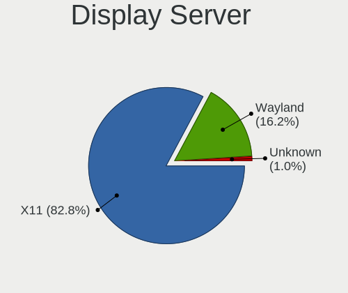
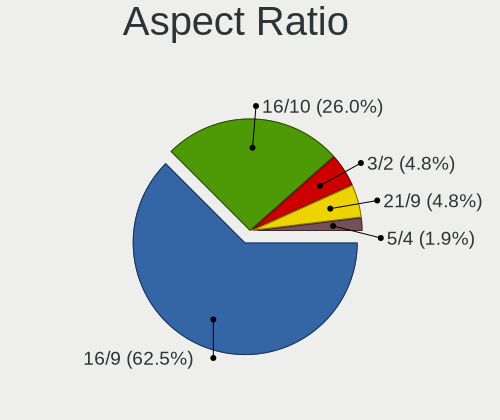

Pop!_OS - Hardware Trends (Notebooks)
-------------------------------------

A project to identify most popular hardware characteristics and track their change
over time based on data collected by Linux users at https://Linux-Hardware.org.

Anyone can contribute to this report by the [hw-probe](https://github.com/linuxhw/hw-probe) tool:

    sudo -E hw-probe -all -upload

This report is for one last month. Overall report since the beginning of time: [TestCoverage](https://github.com/linuxhw/TestCoverage)

Period: May, 2022.

Contents
--------

* [ System ](#system)
  - [ OS                       ](#os)
  - [ OS Family                ](#os-family)
  - [ Kernel                   ](#kernel)
  - [ Kernel Family            ](#kernel-family)
  - [ Kernel Major Ver.        ](#kernel-major-ver)
  - [ Arch                     ](#arch)
  - [ DE                       ](#de)
  - [ Display Server           ](#display-server)
  - [ Display Manager          ](#display-manager)
  - [ OS Lang                  ](#os-lang)
  - [ Boot Mode                ](#boot-mode)
  - [ Filesystem               ](#filesystem)
  - [ Part. scheme             ](#part-scheme)
  - [ Dual Boot with Linux/BSD ](#dual-boot-with-linuxbsd)
  - [ Dual Boot (Win)          ](#dual-boot-win)

* [ Board ](#board)
  - [ Vendor                   ](#vendor)
  - [ Model                    ](#model)
  - [ Model Family             ](#model-family)
  - [ MFG Year                 ](#mfg-year)
  - [ Form Factor              ](#form-factor)
  - [ Secure Boot              ](#secure-boot)
  - [ Coreboot                 ](#coreboot)
  - [ RAM Size                 ](#ram-size)
  - [ RAM Used                 ](#ram-used)
  - [ Total Drives             ](#total-drives)
  - [ Has CD-ROM               ](#has-cd-rom)
  - [ Has Ethernet             ](#has-ethernet)
  - [ Has WiFi                 ](#has-wifi)
  - [ Has Bluetooth            ](#has-bluetooth)

* [ Location ](#location)
  - [ Country                  ](#country)
  - [ City                     ](#city)

* [ Drives ](#drives)
  - [ Drive Vendor             ](#drive-vendor)
  - [ Drive Model              ](#drive-model)
  - [ HDD Vendor               ](#hdd-vendor)
  - [ SSD Vendor               ](#ssd-vendor)
  - [ Drive Kind               ](#drive-kind)
  - [ Drive Connector          ](#drive-connector)
  - [ Drive Size               ](#drive-size)
  - [ Space Total              ](#space-total)
  - [ Space Used               ](#space-used)
  - [ Malfunc. Drives          ](#malfunc-drives)
  - [ Malfunc. Drive Vendor    ](#malfunc-drive-vendor)
  - [ Malfunc. HDD Vendor      ](#malfunc-hdd-vendor)
  - [ Malfunc. Drive Kind      ](#malfunc-drive-kind)
  - [ Failed Drives            ](#failed-drives)
  - [ Failed Drive Vendor      ](#failed-drive-vendor)
  - [ Drive Status             ](#drive-status)

* [ Storage controller ](#storage-controller)
  - [ Storage Vendor           ](#storage-vendor)
  - [ Storage Model            ](#storage-model)
  - [ Storage Kind             ](#storage-kind)

* [ Processor ](#processor)
  - [ CPU Vendor               ](#cpu-vendor)
  - [ CPU Model                ](#cpu-model)
  - [ CPU Model Family         ](#cpu-model-family)
  - [ CPU Cores                ](#cpu-cores)
  - [ CPU Sockets              ](#cpu-sockets)
  - [ CPU Threads              ](#cpu-threads)
  - [ CPU Op-Modes             ](#cpu-op-modes)
  - [ CPU Microcode            ](#cpu-microcode)
  - [ CPU Microarch            ](#cpu-microarch)

* [ Graphics ](#graphics)
  - [ GPU Vendor               ](#gpu-vendor)
  - [ GPU Model                ](#gpu-model)
  - [ GPU Combo                ](#gpu-combo)
  - [ GPU Driver               ](#gpu-driver)
  - [ GPU Memory               ](#gpu-memory)

* [ Monitor ](#monitor)
  - [ Monitor Vendor           ](#monitor-vendor)
  - [ Monitor Model            ](#monitor-model)
  - [ Monitor Resolution       ](#monitor-resolution)
  - [ Monitor Diagonal         ](#monitor-diagonal)
  - [ Monitor Width            ](#monitor-width)
  - [ Aspect Ratio             ](#aspect-ratio)
  - [ Monitor Area             ](#monitor-area)
  - [ Pixel Density            ](#pixel-density)
  - [ Multiple Monitors        ](#multiple-monitors)

* [ Network ](#network)
  - [ Net Controller Vendor    ](#net-controller-vendor)
  - [ Net Controller Model     ](#net-controller-model)
  - [ Wireless Vendor          ](#wireless-vendor)
  - [ Wireless Model           ](#wireless-model)
  - [ Ethernet Vendor          ](#ethernet-vendor)
  - [ Ethernet Model           ](#ethernet-model)
  - [ Net Controller Kind      ](#net-controller-kind)
  - [ Used Controller          ](#used-controller)
  - [ NICs                     ](#nics)
  - [ IPv6                     ](#ipv6)

* [ Bluetooth ](#bluetooth)
  - [ Bluetooth Vendor         ](#bluetooth-vendor)
  - [ Bluetooth Model          ](#bluetooth-model)

* [ Sound ](#sound)
  - [ Sound Vendor             ](#sound-vendor)
  - [ Sound Model              ](#sound-model)

* [ Memory ](#memory)
  - [ Memory Vendor            ](#memory-vendor)
  - [ Memory Model             ](#memory-model)
  - [ Memory Kind              ](#memory-kind)
  - [ Memory Form Factor       ](#memory-form-factor)
  - [ Memory Size              ](#memory-size)
  - [ Memory Speed             ](#memory-speed)

* [ Printers & scanners ](#printers--scanners)
  - [ Printer Vendor           ](#printer-vendor)
  - [ Printer Model            ](#printer-model)
  - [ Scanner Vendor           ](#scanner-vendor)
  - [ Scanner Model            ](#scanner-model)

* [ Camera ](#camera)
  - [ Camera Vendor            ](#camera-vendor)
  - [ Camera Model             ](#camera-model)

* [ Security ](#security)
  - [ Fingerprint Vendor       ](#fingerprint-vendor)
  - [ Fingerprint Model        ](#fingerprint-model)
  - [ Chipcard Vendor          ](#chipcard-vendor)
  - [ Chipcard Model           ](#chipcard-model)

* [ Unsupported ](#unsupported)
  - [ Unsupported Devices      ](#unsupported-devices)
  - [ Unsupported Device Types ](#unsupported-device-types)

System
------

OS
--

Installed operating systems

| Name          | Notebooks | Percent |
|---------------|-----------|---------|
| Pop!_OS 22.04 | 144       | 87.27%  |
| Pop!_OS 21.10 | 12        | 7.27%   |
| Pop!_OS 20.04 | 5         | 3.03%   |
| Pop!_OS 21.04 | 2         | 1.21%   |
| Pop!_OS 20.10 | 2         | 1.21%   |

OS Family
---------

OS without a version

| Name    | Notebooks | Percent |
|---------|-----------|---------|
| Pop!_OS | 165       | 100%    |

Kernel
------

Version of the Linux kernel

| Version                  | Notebooks | Percent |
|--------------------------|-----------|---------|
| 5.17.5-76051705-generic  | 111       | 67.27%  |
| 5.16.19-76051619-generic | 40        | 24.24%  |
| 5.17.5-051705-generic    | 2         | 1.21%   |
| 5.16.15-76051615-generic | 2         | 1.21%   |
| 5.11.0-7614-generic      | 2         | 1.21%   |
| 5.4.0-7625-generic       | 1         | 0.61%   |
| 5.18.0-051800rc1-generic | 1         | 0.61%   |
| 5.17.7-051707-generic    | 1         | 0.61%   |
| 5.17.6-051706-generic    | 1         | 0.61%   |
| 5.17.0-051700-generic    | 1         | 0.61%   |
| 5.15.15-76051515-generic | 1         | 0.61%   |
| 5.13.0-7620-generic      | 1         | 0.61%   |
| 5.13.0-7614-generic      | 1         | 0.61%   |

Kernel Family
-------------

Linux kernel without a distro release

| Version | Notebooks | Percent |
|---------|-----------|---------|
| 5.17.5  | 113       | 68.48%  |
| 5.16.19 | 40        | 24.24%  |
| 5.16.15 | 2         | 1.21%   |
| 5.13.0  | 2         | 1.21%   |
| 5.11.0  | 2         | 1.21%   |
| 5.4.0   | 1         | 0.61%   |
| 5.18.0  | 1         | 0.61%   |
| 5.17.7  | 1         | 0.61%   |
| 5.17.6  | 1         | 0.61%   |
| 5.17.0  | 1         | 0.61%   |
| 5.15.15 | 1         | 0.61%   |

Kernel Major Ver.
-----------------

Linux kernel major version

| Version | Notebooks | Percent |
|---------|-----------|---------|
| 5.17    | 116       | 70.3%   |
| 5.16    | 42        | 25.45%  |
| 5.13    | 2         | 1.21%   |
| 5.11    | 2         | 1.21%   |
| 5.4     | 1         | 0.61%   |
| 5.18    | 1         | 0.61%   |
| 5.15    | 1         | 0.61%   |

Arch
----

OS architecture (x86_64, i586, etc.)

| Name   | Notebooks | Percent |
|--------|-----------|---------|
| x86_64 | 165       | 100%    |

DE
--

Desktop Environment

| Name            | Notebooks | Percent |
|-----------------|-----------|---------|
| GNOME           | 161       | 97.58%  |
| Unknown         | 2         | 1.21%   |
| KDE5            | 1         | 0.61%   |
| GNOME Flashback | 1         | 0.61%   |

Display Server
--------------

X11 or Wayland

| Name    | Notebooks | Percent |
|---------|-----------|---------|
| X11     | 156       | 94.55%  |
| Wayland | 8         | 4.85%   |
| Unknown | 1         | 0.61%   |

Display Manager
---------------

SDDM, LightDM, etc.

| Name    | Notebooks | Percent |
|---------|-----------|---------|
| Unknown | 126       | 76.36%  |
| GDM3    | 33        | 20%     |
| GDM     | 5         | 3.03%   |
| SDDM    | 1         | 0.61%   |

OS Lang
-------

Language

| Lang    | Notebooks | Percent |
|---------|-----------|---------|
| en_US   | 99        | 60%     |
| en_GB   | 13        | 7.88%   |
| fr_FR   | 8         | 4.85%   |
| pt_BR   | 7         | 4.24%   |
| de_DE   | 6         | 3.64%   |
| it_IT   | 4         | 2.42%   |
| en_AU   | 4         | 2.42%   |
| pl_PL   | 3         | 1.82%   |
| es_ES   | 3         | 1.82%   |
| sv_SE   | 2         | 1.21%   |
| pt_PT   | 2         | 1.21%   |
| en_NZ   | 2         | 1.21%   |
| en_IN   | 2         | 1.21%   |
| de_CH   | 2         | 1.21%   |
| Unknown | 2         | 1.21%   |
| ru_RU   | 1         | 0.61%   |
| nb_NO   | 1         | 0.61%   |
| fr_BE   | 1         | 0.61%   |
| es_PE   | 1         | 0.61%   |
| es_GT   | 1         | 0.61%   |
| en_PH   | 1         | 0.61%   |

Boot Mode
---------

EFI or BIOS

| Mode | Notebooks | Percent |
|------|-----------|---------|
| BIOS | 126       | 76.36%  |
| EFI  | 39        | 23.64%  |

Filesystem
----------

Type of filesystem

| Type  | Notebooks | Percent |
|-------|-----------|---------|
| Ext4  | 159       | 96.36%  |
| Btrfs | 5         | 3.03%   |
| Xfs   | 1         | 0.61%   |

Part. scheme
------------

Scheme of partitioning

| Type    | Notebooks | Percent |
|---------|-----------|---------|
| Unknown | 124       | 75.15%  |
| GPT     | 38        | 23.03%  |
| MBR     | 3         | 1.82%   |

Dual Boot with Linux/BSD
------------------------

Hosting more than one Linux/BSD

| Dual boot | Notebooks | Percent |
|-----------|-----------|---------|
| No        | 159       | 96.36%  |
| Yes       | 6         | 3.64%   |

Dual Boot (Win)
---------------

Hosting Linux and Windows

| Dual boot | Notebooks | Percent |
|-----------|-----------|---------|
| No        | 150       | 90.91%  |
| Yes       | 15        | 9.09%   |

Board
-----

Vendor
------

Motherboard manufacturer

| Name                 | Notebooks | Percent |
|----------------------|-----------|---------|
| Dell                 | 26        | 15.76%  |
| Hewlett-Packard      | 25        | 15.15%  |
| Lenovo               | 23        | 13.94%  |
| ASUSTek Computer     | 19        | 11.52%  |
| Apple                | 14        | 8.48%   |
| Acer                 | 13        | 7.88%   |
| MSI                  | 8         | 4.85%   |
| Toshiba              | 5         | 3.03%   |
| System76             | 5         | 3.03%   |
| Samsung Electronics  | 4         | 2.42%   |
| Google               | 4         | 2.42%   |
| PC Specialist        | 2         | 1.21%   |
| HUAWEI               | 2         | 1.21%   |
| Gigabyte Technology  | 2         | 1.21%   |
| Fujitsu              | 2         | 1.21%   |
| TUXEDO               | 1         | 0.61%   |
| Semp Toshiba         | 1         | 0.61%   |
| Razer                | 1         | 0.61%   |
| Monster              | 1         | 0.61%   |
| Medion               | 1         | 0.61%   |
| LG Electronics       | 1         | 0.61%   |
| Intel Client Systems | 1         | 0.61%   |
| Infinix              | 1         | 0.61%   |
| Framework            | 1         | 0.61%   |
| Alienware            | 1         | 0.61%   |
| A-DATA Technology    | 1         | 0.61%   |

Model
-----

Motherboard model

| Name                                        | Notebooks | Percent |
|---------------------------------------------|-----------|---------|
| System76 Oryx Pro                           | 3         | 1.82%   |
| HP Pavilion Notebook                        | 3         | 1.82%   |
| Samsung 550XCJ/550XCR                       | 2         | 1.21%   |
| HP OMEN Laptop 15-en0xxx                    | 2         | 1.21%   |
| Google Lulu                                 | 2         | 1.21%   |
| Apple MacBookAir7,2                         | 2         | 1.21%   |
| Apple MacBookAir6,2                         | 2         | 1.21%   |
| Acer Aspire A515-45                         | 2         | 1.21%   |
| Toshiba Satellite P850                      | 1         | 0.61%   |
| Toshiba Satellite L755                      | 1         | 0.61%   |
| Toshiba Satellite L50D-C                    | 1         | 0.61%   |
| Toshiba QOSMIO X770                         | 1         | 0.61%   |
| Toshiba PORTEGE R830                        | 1         | 0.61%   |
| System76 Pangolin                           | 1         | 0.61%   |
| System76 Galago Pro                         | 1         | 0.61%   |
| Semp Toshiba IS 1413G                       | 1         | 0.61%   |
| Samsung RV411/RV511/E3511/S3511/RV711/E3411 | 1         | 0.61%   |
| Samsung 800G5M/800G5W                       | 1         | 0.61%   |
| Razer Blade 14 - RZ09-0370                  | 1         | 0.61%   |
| PC Specialist NP5x_NP6x_NP7xPNK_PNH_PNJ     | 1         | 0.61%   |
| PC Specialist NH5x_7xDCx_DDx                | 1         | 0.61%   |
| MSI MS-7D52                                 | 1         | 0.61%   |
| MSI Modern 15 A10RAS                        | 1         | 0.61%   |
| MSI Modern 14 A10M                          | 1         | 0.61%   |
| MSI Katana GF76 12UGS                       | 1         | 0.61%   |
| MSI GS65 Stealth 8SG                        | 1         | 0.61%   |
| MSI GS63 7RD                                | 1         | 0.61%   |
| MSI GP76 Leopard 11UG                       | 1         | 0.61%   |
| MSI GF63 Thin 10SCXR                        | 1         | 0.61%   |
| Monster TULPAR T5 V14.1                     | 1         | 0.61%   |
| Medion X6816                                | 1         | 0.61%   |
| LG P430-G.BC41P1                            | 1         | 0.61%   |
| Lenovo Y520-15IKBM 80YY                     | 1         | 0.61%   |
| Lenovo V14-IIL 82C4                         | 1         | 0.61%   |
| Lenovo ThinkPad X220 4286CTO                | 1         | 0.61%   |
| Lenovo ThinkPad X1 Carbon 7th 20QD001XUS    | 1         | 0.61%   |
| Lenovo ThinkPad X1 Carbon 3rd 20BSCTO1WW    | 1         | 0.61%   |
| Lenovo ThinkPad Twist 33472YU               | 1         | 0.61%   |
| Lenovo ThinkPad T480 20L6S8H100             | 1         | 0.61%   |
| Lenovo ThinkPad T480 20L5S00F00             | 1         | 0.61%   |
| Lenovo ThinkPad T14s Gen 1 20UJ001CMX       | 1         | 0.61%   |
| Lenovo ThinkPad T14 Gen 1 20UD003RPB        | 1         | 0.61%   |
| Lenovo ThinkPad T14 Gen 1 20S00057GE        | 1         | 0.61%   |
| Lenovo ThinkPad L13 Yoga Gen 2a 21AES01A00  | 1         | 0.61%   |
| Lenovo ThinkPad E14 Gen 4 21ECS00000        | 1         | 0.61%   |
| Lenovo ThinkPad E14 Gen 3 20Y7004ETX        | 1         | 0.61%   |
| Lenovo Legion 7 16ITHg6 82K6                | 1         | 0.61%   |
| Lenovo Legion 5 17ITH6H 82JM                | 1         | 0.61%   |
| Lenovo Legion 5 15IMH05H 81Y6               | 1         | 0.61%   |
| Lenovo IdeaPad S340-15API 81NC              | 1         | 0.61%   |
| Lenovo IdeaPad Gaming 3 15ARH05 82EY        | 1         | 0.61%   |
| Lenovo IdeaPad 3 15ADA05 81W1               | 1         | 0.61%   |
| Lenovo IdeaPad 110-15ACL 80TJ               | 1         | 0.61%   |
| Lenovo G50-80 80E5                          | 1         | 0.61%   |
| Lenovo G40-30 80FY                          | 1         | 0.61%   |
| Intel Client Systems LAPKC71F               | 1         | 0.61%   |
| Infinix INBook X1 Pro                       | 1         | 0.61%   |
| HUAWEI NBLB-WAX9N                           | 1         | 0.61%   |
| HUAWEI HN-WX9X                              | 1         | 0.61%   |
| HP ZBook Studio G7 Mobile Workstation       | 1         | 0.61%   |

Model Family
------------

Motherboard model prefix

| Name                          | Notebooks | Percent |
|-------------------------------|-----------|---------|
| Lenovo ThinkPad               | 12        | 7.27%   |
| Acer Aspire                   | 9         | 5.45%   |
| Dell Inspiron                 | 8         | 4.85%   |
| Dell XPS                      | 7         | 4.24%   |
| HP Pavilion                   | 6         | 3.64%   |
| HP EliteBook                  | 5         | 3.03%   |
| Lenovo IdeaPad                | 4         | 2.42%   |
| HP Laptop                     | 4         | 2.42%   |
| ASUS ROG                      | 4         | 2.42%   |
| Toshiba Satellite             | 3         | 1.82%   |
| System76 Oryx                 | 3         | 1.82%   |
| Lenovo Legion                 | 3         | 1.82%   |
| HP OMEN                       | 3         | 1.82%   |
| Dell Vostro                   | 3         | 1.82%   |
| Dell Latitude                 | 3         | 1.82%   |
| ASUS VivoBook                 | 3         | 1.82%   |
| Samsung 550XCJ                | 2         | 1.21%   |
| MSI Modern                    | 2         | 1.21%   |
| HP ProBook                    | 2         | 1.21%   |
| Google Lulu                   | 2         | 1.21%   |
| Dell Precision                | 2         | 1.21%   |
| Apple MacBookPro14            | 2         | 1.21%   |
| Apple MacBookAir7             | 2         | 1.21%   |
| Apple MacBookAir6             | 2         | 1.21%   |
| Acer TravelMate               | 2         | 1.21%   |
| Acer Nitro                    | 2         | 1.21%   |
| Toshiba QOSMIO                | 1         | 0.61%   |
| Toshiba PORTEGE               | 1         | 0.61%   |
| System76 Pangolin             | 1         | 0.61%   |
| System76 Galago               | 1         | 0.61%   |
| Semp Toshiba IS               | 1         | 0.61%   |
| Samsung RV411                 | 1         | 0.61%   |
| Samsung 800G5M                | 1         | 0.61%   |
| Razer Blade                   | 1         | 0.61%   |
| PC Specialist NP5x            | 1         | 0.61%   |
| PC Specialist NH5x            | 1         | 0.61%   |
| MSI MS-7D52                   | 1         | 0.61%   |
| MSI Katana                    | 1         | 0.61%   |
| MSI GS65                      | 1         | 0.61%   |
| MSI GS63                      | 1         | 0.61%   |
| MSI GP76                      | 1         | 0.61%   |
| MSI GF63                      | 1         | 0.61%   |
| Monster TULPAR                | 1         | 0.61%   |
| Medion X6816                  | 1         | 0.61%   |
| LG P430-G.BC41P1              | 1         | 0.61%   |
| Lenovo Y520-15IKBM            | 1         | 0.61%   |
| Lenovo V14-IIL                | 1         | 0.61%   |
| Lenovo G50-80                 | 1         | 0.61%   |
| Lenovo G40-30                 | 1         | 0.61%   |
| Intel Client Systems LAPKC71F | 1         | 0.61%   |
| Infinix INBook                | 1         | 0.61%   |
| HUAWEI NBLB-WAX9N             | 1         | 0.61%   |
| HUAWEI HN-WX9X                | 1         | 0.61%   |
| HP ZBook                      | 1         | 0.61%   |
| HP Victus                     | 1         | 0.61%   |
| HP ENVY                       | 1         | 0.61%   |
| HP 255                        | 1         | 0.61%   |
| HP 15                         | 1         | 0.61%   |
| Google Peppy                  | 1         | 0.61%   |
| Google Cyan                   | 1         | 0.61%   |

MFG Year
--------

Motherboard manufacture year

| Year | Notebooks | Percent |
|------|-----------|---------|
| 2020 | 33        | 20%     |
| 2021 | 28        | 16.97%  |
| 2019 | 15        | 9.09%   |
| 2017 | 12        | 7.27%   |
| 2018 | 11        | 6.67%   |
| 2016 | 11        | 6.67%   |
| 2011 | 10        | 6.06%   |
| 2013 | 9         | 5.45%   |
| 2015 | 7         | 4.24%   |
| 2014 | 7         | 4.24%   |
| 2012 | 7         | 4.24%   |
| 2009 | 6         | 3.64%   |
| 2022 | 4         | 2.42%   |
| 2010 | 4         | 2.42%   |
| 2008 | 1         | 0.61%   |

Form Factor
-----------

Physical design of the computer

| Name     | Notebooks | Percent |
|----------|-----------|---------|
| Notebook | 165       | 100%    |

Secure Boot
-----------

Enabled or disabled

| State    | Notebooks | Percent |
|----------|-----------|---------|
| Disabled | 165       | 100%    |

Coreboot
--------

Have coreboot on board

| Used | Notebooks | Percent |
|------|-----------|---------|
| No   | 158       | 95.76%  |
| Yes  | 7         | 4.24%   |

RAM Size
--------

Total RAM memory

| Size in GB  | Notebooks | Percent |
|-------------|-----------|---------|
| 4.01-8.0    | 48        | 29.09%  |
| 16.01-24.0  | 37        | 22.42%  |
| 8.01-16.0   | 33        | 20%     |
| 3.01-4.0    | 24        | 14.55%  |
| 32.01-64.0  | 17        | 10.3%   |
| 64.01-256.0 | 5         | 3.03%   |
| 1.01-2.0    | 1         | 0.61%   |

RAM Used
--------

Used RAM memory

| Used GB    | Notebooks | Percent |
|------------|-----------|---------|
| 2.01-3.0   | 53        | 32.12%  |
| 4.01-8.0   | 36        | 21.82%  |
| 3.01-4.0   | 36        | 21.82%  |
| 1.01-2.0   | 33        | 20%     |
| 8.01-16.0  | 4         | 2.42%   |
| 16.01-24.0 | 3         | 1.82%   |

Total Drives
------------

Number of drives on board

| Drives | Notebooks | Percent |
|--------|-----------|---------|
| 1      | 104       | 63.03%  |
| 2      | 56        | 33.94%  |
| 3      | 4         | 2.42%   |
| 0      | 1         | 0.61%   |

Has CD-ROM
----------

Has CD-ROM on board

| Presented | Notebooks | Percent |
|-----------|-----------|---------|
| No        | 127       | 76.97%  |
| Yes       | 38        | 23.03%  |

Has Ethernet
------------

Has Ethernet on board

| Presented | Notebooks | Percent |
|-----------|-----------|---------|
| Yes       | 126       | 76.36%  |
| No        | 39        | 23.64%  |

Has WiFi
--------

Has WiFi module

| Presented | Notebooks | Percent |
|-----------|-----------|---------|
| Yes       | 163       | 98.79%  |
| No        | 2         | 1.21%   |

Has Bluetooth
-------------

Has Bluetooth module

| Presented | Notebooks | Percent |
|-----------|-----------|---------|
| Yes       | 143       | 86.67%  |
| No        | 22        | 13.33%  |

Location
--------

Country
-------

Geographic location (country)

| Country               | Notebooks | Percent |
|-----------------------|-----------|---------|
| USA                   | 43        | 26.06%  |
| Brazil                | 14        | 8.48%   |
| Germany               | 11        | 6.67%   |
| UK                    | 9         | 5.45%   |
| France                | 9         | 5.45%   |
| India                 | 8         | 4.85%   |
| Australia             | 6         | 3.64%   |
| Sweden                | 4         | 2.42%   |
| New Zealand           | 4         | 2.42%   |
| Italy                 | 4         | 2.42%   |
| Canada                | 4         | 2.42%   |
| Russia                | 3         | 1.82%   |
| Poland                | 3         | 1.82%   |
| Turkey                | 2         | 1.21%   |
| Switzerland           | 2         | 1.21%   |
| Spain                 | 2         | 1.21%   |
| Portugal              | 2         | 1.21%   |
| Philippines           | 2         | 1.21%   |
| Peru                  | 2         | 1.21%   |
| Panama                | 2         | 1.21%   |
| Norway                | 2         | 1.21%   |
| Netherlands           | 2         | 1.21%   |
| Malaysia              | 2         | 1.21%   |
| Hungary               | 2         | 1.21%   |
| Hong Kong             | 2         | 1.21%   |
| Vietnam               | 1         | 0.61%   |
| Thailand              | 1         | 0.61%   |
| Slovenia              | 1         | 0.61%   |
| Saudi Arabia          | 1         | 0.61%   |
| Romania               | 1         | 0.61%   |
| Republic of the Congo | 1         | 0.61%   |
| Morocco               | 1         | 0.61%   |
| Mexico                | 1         | 0.61%   |
| Iraq                  | 1         | 0.61%   |
| Indonesia             | 1         | 0.61%   |
| Guatemala             | 1         | 0.61%   |
| Greece                | 1         | 0.61%   |
| Finland               | 1         | 0.61%   |
| Egypt                 | 1         | 0.61%   |
| Czechia               | 1         | 0.61%   |
| Croatia               | 1         | 0.61%   |
| Bulgaria              | 1         | 0.61%   |
| Belgium               | 1         | 0.61%   |
| Argentina             | 1         | 0.61%   |

City
----

Geographic location (city)

| City                      | Notebooks | Percent |
|---------------------------|-----------|---------|
| Warsaw                    | 2         | 1.21%   |
| Tallahassee               | 2         | 1.21%   |
| Sydney                    | 2         | 1.21%   |
| Sao Paulo                 | 2         | 1.21%   |
| Rio de Janeiro            | 2         | 1.21%   |
| Quezon City               | 2         | 1.21%   |
| Panama City               | 2         | 1.21%   |
| Melbourne                 | 2         | 1.21%   |
| Istanbul                  | 2         | 1.21%   |
| Durham                    | 2         | 1.21%   |
| Central                   | 2         | 1.21%   |
| Catunda                   | 2         | 1.21%   |
| Budapest                  | 2         | 1.21%   |
| Bengaluru                 | 2         | 1.21%   |
| Bamberg                   | 2         | 1.21%   |
| Auckland                  | 2         | 1.21%   |
| Zurich                    | 1         | 0.61%   |
| Zagreb                    | 1         | 0.61%   |
| Yogyakarta                | 1         | 0.61%   |
| Winnipeg                  | 1         | 0.61%   |
| Visakhapatnam             | 1         | 0.61%   |
| Vila Velha                | 1         | 0.61%   |
| Uhldingen-Muhlhofen       | 1         | 0.61%   |
| Turin                     | 1         | 0.61%   |
| Todmorden                 | 1         | 0.61%   |
| Timișoara                | 1         | 0.61%   |
| Thornville                | 1         | 0.61%   |
| The Hague                 | 1         | 0.61%   |
| Tauranga                  | 1         | 0.61%   |
| Tankerton                 | 1         | 0.61%   |
| Tangier                   | 1         | 0.61%   |
| Stuttgart                 | 1         | 0.61%   |
| Sturgeon Bay              | 1         | 0.61%   |
| Stockport                 | 1         | 0.61%   |
| Stockholm                 | 1         | 0.61%   |
| Staten Island             | 1         | 0.61%   |
| Stanmore                  | 1         | 0.61%   |
| Springfield               | 1         | 0.61%   |
| Siebnen                   | 1         | 0.61%   |
| Seattle                   | 1         | 0.61%   |
| Saratov                   | 1         | 0.61%   |
| Sao Carlos                | 1         | 0.61%   |
| Santa Rosa                | 1         | 0.61%   |
| San Jose                  | 1         | 0.61%   |
| San Francisco             | 1         | 0.61%   |
| San Antonio               | 1         | 0.61%   |
| Saint-Hilaire-sur-Benaize | 1         | 0.61%   |
| Saint-Denis               | 1         | 0.61%   |
| Saint Charles             | 1         | 0.61%   |
| Riyadh                    | 1         | 0.61%   |
| Praia Grande              | 1         | 0.61%   |
| Prague                    | 1         | 0.61%   |
| Poznan                    | 1         | 0.61%   |
| Poquoson                  | 1         | 0.61%   |
| Ponferrada                | 1         | 0.61%   |
| Plovdiv                   | 1         | 0.61%   |
| Plouay                    | 1         | 0.61%   |
| Perth                     | 1         | 0.61%   |
| Paris                     | 1         | 0.61%   |
| Palm Beach Gardens        | 1         | 0.61%   |

Drives
------

Drive Vendor
------------

Hard drive vendors

| Vendor                  | Notebooks | Drives | Percent |
|-------------------------|-----------|--------|---------|
| Samsung Electronics     | 41        | 46     | 19.16%  |
| WDC                     | 24        | 26     | 11.21%  |
| SanDisk                 | 18        | 18     | 8.41%   |
| Seagate                 | 15        | 17     | 7.01%   |
| Toshiba                 | 12        | 12     | 5.61%   |
| Kingston                | 10        | 11     | 4.67%   |
| Unknown                 | 9         | 10     | 4.21%   |
| SK Hynix                | 9         | 9      | 4.21%   |
| Micron Technology       | 9         | 10     | 4.21%   |
| Apple                   | 9         | 10     | 4.21%   |
| Phison                  | 6         | 6      | 2.8%    |
| HGST                    | 6         | 6      | 2.8%    |
| Crucial                 | 6         | 6      | 2.8%    |
| Silicon Motion          | 4         | 4      | 1.87%   |
| PNY                     | 4         | 4      | 1.87%   |
| Intel                   | 4         | 4      | 1.87%   |
| MyDigitalSSD            | 3         | 3      | 1.4%    |
| KIOXIA                  | 3         | 3      | 1.4%    |
| Hitachi                 | 3         | 3      | 1.4%    |
| ADATA Technology        | 3         | 3      | 1.4%    |
| A-DATA Technology       | 3         | 3      | 1.4%    |
| Union Memory (Shenzhen) | 2         | 2      | 0.93%   |
| KingSpec                | 2         | 2      | 0.93%   |
| USB3.0                  | 1         | 1      | 0.47%   |
| Team                    | 1         | 1      | 0.47%   |
| PNY USB                 | 1         | 1      | 0.47%   |
| LITEONIT                | 1         | 1      | 0.47%   |
| Lexar                   | 1         | 1      | 0.47%   |
| Hewlett-Packard         | 1         | 1      | 0.47%   |
| China                   | 1         | 1      | 0.47%   |
| Apacer                  | 1         | 1      | 0.47%   |
| Aarvex                  | 1         | 1      | 0.47%   |

Drive Model
-----------

Hard drive models

| Model                                | Notebooks | Percent |
|--------------------------------------|-----------|---------|
| SK Hynix NVMe SSD Drive 512GB        | 5         | 2.27%   |
| Seagate ST1000LM049-2GH172 1TB       | 4         | 1.82%   |
| Samsung NVMe SSD Drive 512GB         | 4         | 1.82%   |
| Samsung NVMe SSD Drive 256GB         | 4         | 1.82%   |
| Unknown MMC Card  32GB               | 3         | 1.36%   |
| Toshiba MQ04ABF100 1TB               | 3         | 1.36%   |
| Sandisk NVMe SSD Drive 512GB         | 3         | 1.36%   |
| Samsung NVMe SSD Drive 500GB         | 3         | 1.36%   |
| Samsung NVMe SSD Drive 2TB           | 3         | 1.36%   |
| Samsung NVMe SSD Drive 1024GB        | 3         | 1.36%   |
| PNY CS900 240GB SSD                  | 3         | 1.36%   |
| ADATA NVMe SSD Drive 256GB           | 3         | 1.36%   |
| WDC WDS500G2B0C-00PXH0 500GB         | 2         | 0.91%   |
| Toshiba NVMe SSD Drive 512GB         | 2         | 0.91%   |
| Toshiba MQ01ABD100 1TB               | 2         | 0.91%   |
| SK Hynix NVMe SSD Drive 1024GB       | 2         | 0.91%   |
| Seagate ST2000LM007-1R8174 2TB       | 2         | 0.91%   |
| Seagate ST1000LM048-2E7172 1TB       | 2         | 0.91%   |
| SanDisk SSD U100 24GB                | 2         | 0.91%   |
| Sandisk NVMe SSD Drive 1TB           | 2         | 0.91%   |
| Samsung SSD 970 EVO Plus 1TB         | 2         | 0.91%   |
| Samsung SSD 850 EVO 500GB            | 2         | 0.91%   |
| Samsung NVMe SSD Drive 1TB           | 2         | 0.91%   |
| Samsung MZVLB1T0HBLR-000L7 1TB       | 2         | 0.91%   |
| MyDigitalSSD SB M2 SSD 240GB         | 2         | 0.91%   |
| Micron NVMe SSD Drive 512GB          | 2         | 0.91%   |
| Micron NVMe SSD Drive 1024GB         | 2         | 0.91%   |
| Micron 2450_MTFDKBA1T0TFK 1TB        | 2         | 0.91%   |
| Kingston SA400S37240G 240GB SSD      | 2         | 0.91%   |
| Kingston SA400S37120G 120GB SSD      | 2         | 0.91%   |
| HGST HTS721010A9E630 1TB             | 2         | 0.91%   |
| Crucial CT1000MX500SSD1 1TB          | 2         | 0.91%   |
| Crucial CT1000BX500SSD1 1TB          | 2         | 0.91%   |
| Apple SSD SM0512G 500GB              | 2         | 0.91%   |
| Apple SSD SM0128G 121GB              | 2         | 0.91%   |
| WDC WDS250G2B0B-00YS70 250GB SSD     | 1         | 0.45%   |
| WDC WDS240G2G0C-00AJM0 240GB         | 1         | 0.45%   |
| WDC WDS240G1G0B-00RC30 240GB SSD     | 1         | 0.45%   |
| WDC WDS120G2G0A-00JH30 120GB SSD     | 1         | 0.45%   |
| WDC WDBNCE0010PNC 1TB SSD            | 1         | 0.45%   |
| WDC WD800BEVS-07RST0 80GB            | 1         | 0.45%   |
| WDC WD7500BPVT-22HXZT3 752GB         | 1         | 0.45%   |
| WDC WD5000LPCX-60VHAT0 500GB         | 1         | 0.45%   |
| WDC WD5000LPCX-24VHAT0 500GB         | 1         | 0.45%   |
| WDC WD5000LPCX-24C6HT0 500GB         | 1         | 0.45%   |
| WDC WD5000BPVT-22HXZT3 500GB         | 1         | 0.45%   |
| WDC WD5000BEVT-60A0RT0 500GB         | 1         | 0.45%   |
| WDC WD2500LPLX-00ZNTT0 250GB         | 1         | 0.45%   |
| WDC WD10SPZX-35Z10T0 1TB             | 1         | 0.45%   |
| WDC WD10SPZX-17Z10T1 1TB             | 1         | 0.45%   |
| WDC WD10JPVX-60JC3T0 1TB             | 1         | 0.45%   |
| WDC WD10JPVX-22JC3T0 1TB             | 1         | 0.45%   |
| WDC WD Green 2.5 1000GB              | 1         | 0.45%   |
| WDC PC SN730 SDBPNTY-1T00-1032 1TB   | 1         | 0.45%   |
| WDC PC SN720 SDAPNTW-512G-1006 512GB | 1         | 0.45%   |
| WDC PC SN530 SDBPNPZ-512G-1014 512GB | 1         | 0.45%   |
| WDC PC SN520 SDAPNUW-256G-1002 256GB | 1         | 0.45%   |
| USB3.0 Super Speed 240GB             | 1         | 0.45%   |
| Unknown SE32G  32GB                  | 1         | 0.45%   |
| Unknown NVMe SSD Drive 1024GB        | 1         | 0.45%   |

HDD Vendor
----------

Hard disk drive vendors

| Vendor              | Notebooks | Drives | Percent |
|---------------------|-----------|--------|---------|
| Seagate             | 15        | 17     | 32.61%  |
| WDC                 | 12        | 13     | 26.09%  |
| Toshiba             | 8         | 8      | 17.39%  |
| HGST                | 6         | 6      | 13.04%  |
| Hitachi             | 3         | 3      | 6.52%   |
| Samsung Electronics | 1         | 1      | 2.17%   |
| Apple               | 1         | 1      | 2.17%   |

SSD Vendor
----------

Solid state drive vendors

| Vendor              | Notebooks | Drives | Percent |
|---------------------|-----------|--------|---------|
| Samsung Electronics | 11        | 12     | 16.18%  |
| SanDisk             | 10        | 10     | 14.71%  |
| Kingston            | 7         | 7      | 10.29%  |
| Crucial             | 6         | 6      | 8.82%   |
| Apple               | 6         | 6      | 8.82%   |
| WDC                 | 4         | 4      | 5.88%   |
| PNY                 | 4         | 4      | 5.88%   |
| MyDigitalSSD        | 3         | 3      | 4.41%   |
| A-DATA Technology   | 3         | 3      | 4.41%   |
| Micron Technology   | 2         | 2      | 2.94%   |
| KingSpec            | 2         | 2      | 2.94%   |
| USB3.0              | 1         | 1      | 1.47%   |
| Toshiba             | 1         | 1      | 1.47%   |
| PNY USB             | 1         | 1      | 1.47%   |
| LITEONIT            | 1         | 1      | 1.47%   |
| Lexar               | 1         | 1      | 1.47%   |
| Intel               | 1         | 1      | 1.47%   |
| Hewlett-Packard     | 1         | 1      | 1.47%   |
| China               | 1         | 1      | 1.47%   |
| Apacer              | 1         | 1      | 1.47%   |
| Aarvex              | 1         | 1      | 1.47%   |

Drive Kind
----------

HDD or SSD

| Kind    | Notebooks | Drives | Percent |
|---------|-----------|--------|---------|
| NVMe    | 79        | 99     | 39.9%   |
| SSD     | 66        | 69     | 33.33%  |
| HDD     | 44        | 49     | 22.22%  |
| MMC     | 8         | 9      | 4.04%   |
| Unknown | 1         | 1      | 0.51%   |

Drive Connector
---------------

SATA, SAS, NVMe, etc.

| Type | Notebooks | Drives | Percent |
|------|-----------|--------|---------|
| SATA | 97        | 114    | 51.05%  |
| NVMe | 79        | 98     | 41.58%  |
| MMC  | 8         | 9      | 4.21%   |
| SAS  | 6         | 6      | 3.16%   |

Drive Size
----------

Size of hard drive

| Size in TB | Notebooks | Drives | Percent |
|------------|-----------|--------|---------|
| 0.01-0.5   | 70        | 78     | 64.81%  |
| 0.51-1.0   | 32        | 33     | 29.63%  |
| 1.01-2.0   | 5         | 5      | 4.63%   |
| 10.01-20.0 | 1         | 2      | 0.93%   |

Space Total
-----------

Amount of disk space available on the file system

| Size in GB     | Notebooks | Percent |
|----------------|-----------|---------|
| 251-500        | 53        | 32.12%  |
| 101-250        | 53        | 32.12%  |
| 501-1000       | 34        | 20.61%  |
| 1001-2000      | 7         | 4.24%   |
| 51-100         | 6         | 3.64%   |
| 21-50          | 5         | 3.03%   |
| More than 3000 | 2         | 1.21%   |
| 2001-3000      | 2         | 1.21%   |
| Unknown        | 2         | 1.21%   |
| 1-20           | 1         | 0.61%   |

Space Used
----------

Amount of used disk space

| Used GB        | Notebooks | Percent |
|----------------|-----------|---------|
| 1-20           | 49        | 29.7%   |
| 21-50          | 47        | 28.48%  |
| 101-250        | 25        | 15.15%  |
| 51-100         | 22        | 13.33%  |
| 251-500        | 13        | 7.88%   |
| 1001-2000      | 3         | 1.82%   |
| 501-1000       | 3         | 1.82%   |
| Unknown        | 2         | 1.21%   |
| More than 3000 | 1         | 0.61%   |

Malfunc. Drives
---------------

Drive models with a malfunction

| Model                           | Notebooks | Drives | Percent |
|---------------------------------|-----------|--------|---------|
| Seagate ST9320325AS 320GB       | 1         | 1      | 50%     |
| Seagate ST500LM030-2E717D 500GB | 1         | 1      | 50%     |

Malfunc. Drive Vendor
---------------------

Vendors of faulty drives

| Vendor  | Notebooks | Drives | Percent |
|---------|-----------|--------|---------|
| Seagate | 2         | 2      | 100%    |

Malfunc. HDD Vendor
-------------------

Vendors of faulty HDD drives

| Vendor  | Notebooks | Drives | Percent |
|---------|-----------|--------|---------|
| Seagate | 2         | 2      | 100%    |

Malfunc. Drive Kind
-------------------

Kinds of faulty drives

| Kind | Notebooks | Drives | Percent |
|------|-----------|--------|---------|
| HDD  | 2         | 2      | 100%    |

Failed Drives
-------------

Failed drive models

Zero info for selected period =(

Failed Drive Vendor
-------------------

Failed drive vendors

Zero info for selected period =(

Drive Status
------------

Number of failed and malfunc. drives

| Status   | Notebooks | Drives | Percent |
|----------|-----------|--------|---------|
| Detected | 127       | 170    | 74.27%  |
| Works    | 42        | 55     | 24.56%  |
| Malfunc  | 2         | 2      | 1.17%   |

Storage controller
------------------

Storage Vendor
--------------

Storage controller vendors

| Vendor                       | Notebooks | Percent |
|------------------------------|-----------|---------|
| Intel                        | 97        | 45.33%  |
| Samsung Electronics          | 34        | 15.89%  |
| AMD                          | 22        | 10.28%  |
| Sandisk                      | 14        | 6.54%   |
| SK Hynix                     | 9         | 4.21%   |
| Micron Technology            | 7         | 3.27%   |
| Phison Electronics           | 6         | 2.8%    |
| Silicon Motion               | 5         | 2.34%   |
| Toshiba America Info Systems | 3         | 1.4%    |
| Nvidia                       | 3         | 1.4%    |
| KIOXIA                       | 3         | 1.4%    |
| ADATA Technology             | 3         | 1.4%    |
| Union Memory (Shenzhen)      | 2         | 0.93%   |
| Kingston Technology Company  | 2         | 0.93%   |
| Apple                        | 2         | 0.93%   |
| Unknown                      | 1         | 0.47%   |
| Marvell Technology Group     | 1         | 0.47%   |

Storage Model
-------------

Storage controller models

| Model                                                                            | Notebooks | Percent |
|----------------------------------------------------------------------------------|-----------|---------|
| AMD FCH SATA Controller [AHCI mode]                                              | 22        | 10%     |
| Samsung NVMe SSD Controller SM981/PM981/PM983                                    | 20        | 9.09%   |
| Intel 82801 Mobile SATA Controller [RAID mode]                                   | 10        | 4.55%   |
| Intel HM170/QM170 Chipset SATA Controller [AHCI Mode]                            | 8         | 3.64%   |
| Intel 7 Series Chipset Family 6-port SATA Controller [AHCI mode]                 | 8         | 3.64%   |
| Intel 6 Series/C200 Series Chipset Family 6 port Mobile SATA AHCI Controller     | 8         | 3.64%   |
| SK Hynix Gold P31 SSD                                                            | 7         | 3.18%   |
| Micron Non-Volatile memory controller                                            | 7         | 3.18%   |
| Intel Sunrise Point-LP SATA Controller [AHCI mode]                               | 7         | 3.18%   |
| Sandisk WD Blue SN550 NVMe SSD                                                   | 6         | 2.73%   |
| Intel 400 Series Chipset Family SATA AHCI Controller                             | 6         | 2.73%   |
| Silicon Motion SM2263EN/SM2263XT SSD Controller                                  | 5         | 2.27%   |
| Intel Wildcat Point-LP SATA Controller [AHCI Mode]                               | 5         | 2.27%   |
| Intel Cannon Lake Mobile PCH SATA AHCI Controller                                | 5         | 2.27%   |
| Intel 8 Series/C220 Series Chipset Family 6-port SATA Controller 1 [AHCI mode]   | 5         | 2.27%   |
| Samsung Electronics SATA controller                                              | 4         | 1.82%   |
| Intel Volume Management Device NVMe RAID Controller                              | 4         | 1.82%   |
| Intel Comet Lake SATA AHCI Controller                                            | 4         | 1.82%   |
| Intel 82801IBM/IEM (ICH9M/ICH9M-E) 4 port SATA Controller [AHCI mode]            | 4         | 1.82%   |
| Intel 8 Series SATA Controller 1 [AHCI mode]                                     | 4         | 1.82%   |
| Sandisk WD Black SN750 / PC SN730 NVMe SSD                                       | 3         | 1.36%   |
| Sandisk Non-Volatile memory controller                                           | 3         | 1.36%   |
| Samsung NVMe SSD Controller SM961/PM961/SM963                                    | 3         | 1.36%   |
| Samsung NVMe SSD Controller PM9A1/PM9A3/980PRO                                   | 3         | 1.36%   |
| Samsung NVMe SSD Controller 980                                                  | 3         | 1.36%   |
| Phison E12 NVMe Controller                                                       | 3         | 1.36%   |
| KIOXIA Non-Volatile memory controller                                            | 3         | 1.36%   |
| Intel 500 Series Chipset Family SATA AHCI Controller                             | 3         | 1.36%   |
| ADATA Non-Volatile memory controller                                             | 3         | 1.36%   |
| Toshiba America Info Systems XG6 NVMe SSD Controller                             | 2         | 0.91%   |
| Nvidia MCP79 AHCI Controller                                                     | 2         | 0.91%   |
| Intel SSD 660P Series                                                            | 2         | 0.91%   |
| Intel Mobile 4 Series Chipset PT IDER Controller                                 | 2         | 0.91%   |
| Intel Ice Lake-LP SATA Controller [AHCI mode]                                    | 2         | 0.91%   |
| Intel Alder Lake-P SATA AHCI Controller                                          | 2         | 0.91%   |
| Intel 5 Series/3400 Series Chipset 4 port SATA AHCI Controller                   | 2         | 0.91%   |
| Unknown Non-Volatile memory controller                                           | 1         | 0.45%   |
| Union Memory (Shenzhen) Non-Volatile memory controller                           | 1         | 0.45%   |
| Union Memory (Shenzhen) AM630 PCIe 4.0 x4 NVMe SSD Controller                    | 1         | 0.45%   |
| Toshiba America Info Systems BG3 NVMe SSD Controller                             | 1         | 0.45%   |
| SK Hynix Non-Volatile memory controller                                          | 1         | 0.45%   |
| SK Hynix BC511                                                                   | 1         | 0.45%   |
| Sandisk WD PC SN810 / Black SN850 NVMe SSD                                       | 1         | 0.45%   |
| Sandisk WD Blue SN500 / PC SN520 NVMe SSD                                        | 1         | 0.45%   |
| Sandisk WD Black 2018/SN750 / PC SN720 NVMe SSD                                  | 1         | 0.45%   |
| Samsung Apple PCIe SSD                                                           | 1         | 0.45%   |
| Phison PS5013 E13 NVMe Controller                                                | 1         | 0.45%   |
| Phison E7 NVMe Controller                                                        | 1         | 0.45%   |
| Phison E18 PCIe4 NVMe Controller                                                 | 1         | 0.45%   |
| Nvidia MCP89 SATA Controller (AHCI mode)                                         | 1         | 0.45%   |
| Marvell Group 88SS9183 PCIe SSD Controller                                       | 1         | 0.45%   |
| Kingston Company OM3PDP3 NVMe SSD                                                | 1         | 0.45%   |
| Kingston Company A2000 NVMe SSD                                                  | 1         | 0.45%   |
| Intel SSD Pro 7600p/760p/E 6100p Series                                          | 1         | 0.45%   |
| Intel Comet Lake PCH-H RAID                                                      | 1         | 0.45%   |
| Intel Celeron/Pentium Silver Processor SATA Controller                           | 1         | 0.45%   |
| Intel Cannon Point-LP SATA Controller [AHCI Mode]                                | 1         | 0.45%   |
| Intel Atom/Celeron/Pentium Processor x5-E8000/J3xxx/N3xxx Series SATA Controller | 1         | 0.45%   |
| Intel Atom Processor E3800 Series SATA AHCI Controller                           | 1         | 0.45%   |
| Intel 82801HM/HEM (ICH8M/ICH8M-E) SATA Controller [AHCI mode]                    | 1         | 0.45%   |

Storage Kind
------------

Kind of storage controller (IDE, SATA, NVMe, SAS, ...)

| Kind | Notebooks | Percent |
|------|-----------|---------|
| SATA | 110       | 52.88%  |
| NVMe | 79        | 37.98%  |
| RAID | 15        | 7.21%   |
| IDE  | 4         | 1.92%   |

Processor
---------

CPU Vendor
----------

Processor vendors

| Vendor | Notebooks | Percent |
|--------|-----------|---------|
| Intel  | 127       | 76.97%  |
| AMD    | 38        | 23.03%  |

CPU Model
---------

Processor models

| Model                                         | Notebooks | Percent |
|-----------------------------------------------|-----------|---------|
| Intel 11th Gen Core i7-11800H @ 2.30GHz       | 8         | 4.85%   |
| Intel Core i7-7700HQ CPU @ 2.80GHz            | 6         | 3.64%   |
| Intel Core i7-10750H CPU @ 2.60GHz            | 6         | 3.64%   |
| AMD Ryzen 7 5700U with Radeon Graphics        | 5         | 3.03%   |
| Intel Core i7-8750H CPU @ 2.20GHz             | 3         | 1.82%   |
| Intel Core i7-8565U CPU @ 1.80GHz             | 3         | 1.82%   |
| Intel Core i7-7500U CPU @ 2.70GHz             | 3         | 1.82%   |
| Intel Core i7-10510U CPU @ 1.80GHz            | 3         | 1.82%   |
| Intel Core i5-1035G1 CPU @ 1.00GHz            | 3         | 1.82%   |
| Intel Core i5-10210U CPU @ 1.60GHz            | 3         | 1.82%   |
| AMD Ryzen 7 4800H with Radeon Graphics        | 3         | 1.82%   |
| AMD A8-7410 APU with AMD Radeon R5 Graphics   | 3         | 1.82%   |
| Intel Core i7-9750H CPU @ 2.60GHz             | 2         | 1.21%   |
| Intel Core i7-8550U CPU @ 1.80GHz             | 2         | 1.21%   |
| Intel Core i7-10870H CPU @ 2.20GHz            | 2         | 1.21%   |
| Intel Core i5-4200U CPU @ 1.60GHz             | 2         | 1.21%   |
| Intel Core i3-5005U CPU @ 2.00GHz             | 2         | 1.21%   |
| Intel Core i3-3217U CPU @ 1.80GHz             | 2         | 1.21%   |
| Intel Core 2 Duo CPU P8600 @ 2.40GHz          | 2         | 1.21%   |
| Intel 12th Gen Core i7-12700H                 | 2         | 1.21%   |
| Intel 11th Gen Core i7-1165G7 @ 2.80GHz       | 2         | 1.21%   |
| AMD Ryzen 9 5900HX with Radeon Graphics       | 2         | 1.21%   |
| AMD Ryzen 7 PRO 4750U with Radeon Graphics    | 2         | 1.21%   |
| AMD Ryzen 5 3500U with Radeon Vega Mobile Gfx | 2         | 1.21%   |
| AMD Ryzen 3 3250U with Radeon Graphics        | 2         | 1.21%   |
| AMD A6-7310 APU with AMD Radeon R4 Graphics   | 2         | 1.21%   |
| Intel Pentium CPU P6100 @ 2.00GHz             | 1         | 0.61%   |
| Intel Pentium CPU 987 @ 1.50GHz               | 1         | 0.61%   |
| Intel Pentium CPU 2117U @ 1.80GHz             | 1         | 0.61%   |
| Intel Core i9-10885H CPU @ 2.40GHz            | 1         | 0.61%   |
| Intel Core i7-8850H CPU @ 2.60GHz             | 1         | 0.61%   |
| Intel Core i7-8665U CPU @ 1.90GHz             | 1         | 0.61%   |
| Intel Core i7-7920HQ CPU @ 3.10GHz            | 1         | 0.61%   |
| Intel Core i7-6700HQ CPU @ 2.60GHz            | 1         | 0.61%   |
| Intel Core i7-6600U CPU @ 2.60GHz             | 1         | 0.61%   |
| Intel Core i7-5650U CPU @ 2.20GHz             | 1         | 0.61%   |
| Intel Core i7-4900MQ CPU @ 2.80GHz            | 1         | 0.61%   |
| Intel Core i7-4810MQ CPU @ 2.80GHz            | 1         | 0.61%   |
| Intel Core i7-4800MQ CPU @ 2.70GHz            | 1         | 0.61%   |
| Intel Core i7-4750HQ CPU @ 2.00GHz            | 1         | 0.61%   |
| Intel Core i7-4710HQ CPU @ 2.50GHz            | 1         | 0.61%   |
| Intel Core i7-4700HQ CPU @ 2.40GHz            | 1         | 0.61%   |
| Intel Core i7-4650U CPU @ 1.70GHz             | 1         | 0.61%   |
| Intel Core i7-4600U CPU @ 2.10GHz             | 1         | 0.61%   |
| Intel Core i7-3740QM CPU @ 2.70GHz            | 1         | 0.61%   |
| Intel Core i7-3630QM CPU @ 2.40GHz            | 1         | 0.61%   |
| Intel Core i7-3615QM CPU @ 2.30GHz            | 1         | 0.61%   |
| Intel Core i7-3610QM CPU @ 2.30GHz            | 1         | 0.61%   |
| Intel Core i7-2670QM CPU @ 2.20GHz            | 1         | 0.61%   |
| Intel Core i7-2640M CPU @ 2.80GHz             | 1         | 0.61%   |
| Intel Core i7-2630QM CPU @ 2.00GHz            | 1         | 0.61%   |
| Intel Core i7-1065G7 CPU @ 1.30GHz            | 1         | 0.61%   |
| Intel Core i7 CPU Q 720 @ 1.60GHz             | 1         | 0.61%   |
| Intel Core i5-8350U CPU @ 1.70GHz             | 1         | 0.61%   |
| Intel Core i5-8300H CPU @ 2.30GHz             | 1         | 0.61%   |
| Intel Core i5-8265U CPU @ 1.60GHz             | 1         | 0.61%   |
| Intel Core i5-8250U CPU @ 1.60GHz             | 1         | 0.61%   |
| Intel Core i5-7360U CPU @ 2.30GHz             | 1         | 0.61%   |
| Intel Core i5-7300HQ CPU @ 2.50GHz            | 1         | 0.61%   |
| Intel Core i5-7200U CPU @ 2.50GHz             | 1         | 0.61%   |

CPU Model Family
----------------

Processor model prefix

| Model            | Notebooks | Percent |
|------------------|-----------|---------|
| Intel Core i7    | 53        | 32.12%  |
| Intel Core i5    | 29        | 17.58%  |
| Other            | 16        | 9.7%    |
| Intel Core i3    | 12        | 7.27%   |
| AMD Ryzen 7      | 11        | 6.67%   |
| Intel Core 2 Duo | 8         | 4.85%   |
| AMD Ryzen 5      | 7         | 4.24%   |
| AMD Ryzen 9      | 6         | 3.64%   |
| Intel Celeron    | 5         | 3.03%   |
| AMD A8           | 4         | 2.42%   |
| Intel Pentium    | 3         | 1.82%   |
| AMD Ryzen 7 PRO  | 3         | 1.82%   |
| AMD A6           | 3         | 1.82%   |
| AMD Ryzen 3      | 2         | 1.21%   |
| Intel Core i9    | 1         | 0.61%   |
| Intel Atom       | 1         | 0.61%   |
| AMD Ryzen 5 PRO  | 1         | 0.61%   |

CPU Cores
---------

Number of processor cores

| Number | Notebooks | Percent |
|--------|-----------|---------|
| 4      | 60        | 36.36%  |
| 2      | 55        | 33.33%  |
| 8      | 30        | 18.18%  |
| 6      | 17        | 10.3%   |
| 14     | 2         | 1.21%   |
| 12     | 1         | 0.61%   |

CPU Sockets
-----------

Number of sockets

| Number | Notebooks | Percent |
|--------|-----------|---------|
| 1      | 165       | 100%    |

CPU Threads
-----------

Threads per core (Hyper-Threading)

| Number | Notebooks | Percent |
|--------|-----------|---------|
| 2      | 138       | 83.64%  |
| 1      | 27        | 16.36%  |

CPU Op-Modes
------------

CPU Operation Modes (32-bit, 64-bit)

| Op mode        | Notebooks | Percent |
|----------------|-----------|---------|
| 32-bit, 64-bit | 165       | 100%    |

CPU Microcode
-------------

Microcode number

| Number     | Notebooks | Percent |
|------------|-----------|---------|
| Unknown    | 123       | 74.55%  |
| 0x806ec    | 5         | 3.03%   |
| 0x806d1    | 5         | 3.03%   |
| 0x706e5    | 4         | 2.42%   |
| 0xa0652    | 2         | 1.21%   |
| 0x806eb    | 2         | 1.21%   |
| 0x806e9    | 2         | 1.21%   |
| 0x40651    | 2         | 1.21%   |
| 0x0a50000c | 2         | 1.21%   |
| 0x08608103 | 2         | 1.21%   |
| 0x08600106 | 2         | 1.21%   |
| 0x906ea    | 1         | 0.61%   |
| 0x906e9    | 1         | 0.61%   |
| 0x906a3    | 1         | 0.61%   |
| 0x806ea    | 1         | 0.61%   |
| 0x806c2    | 1         | 0.61%   |
| 0x506e3    | 1         | 0.61%   |
| 0x406e3    | 1         | 0.61%   |
| 0x306c3    | 1         | 0.61%   |
| 0x1067a    | 1         | 0.61%   |
| 0x0a404101 | 1         | 0.61%   |
| 0x08600104 | 1         | 0.61%   |
| 0x08600103 | 1         | 0.61%   |
| 0x08108109 | 1         | 0.61%   |
| 0x0810100b | 1         | 0.61%   |

CPU Microarch
-------------

Microarchitecture

| Name             | Notebooks | Percent |
|------------------|-----------|---------|
| KabyLake         | 34        | 20.61%  |
| Haswell          | 14        | 8.48%   |
| CometLake        | 12        | 7.27%   |
| Icelake          | 11        | 6.67%   |
| Unknown          | 11        | 6.67%   |
| Zen 3            | 9         | 5.45%   |
| Zen 2            | 9         | 5.45%   |
| SandyBridge      | 9         | 5.45%   |
| Penryn           | 8         | 4.85%   |
| IvyBridge        | 8         | 4.85%   |
| Broadwell        | 8         | 4.85%   |
| TigerLake        | 5         | 3.03%   |
| Puma             | 5         | 3.03%   |
| Zen+             | 4         | 2.42%   |
| Skylake          | 4         | 2.42%   |
| Silvermont       | 4         | 2.42%   |
| Westmere         | 3         | 1.82%   |
| Excavator        | 2         | 1.21%   |
| Zen              | 1         | 0.61%   |
| Nehalem          | 1         | 0.61%   |
| K10 Llano        | 1         | 0.61%   |
| Goldmont plus    | 1         | 0.61%   |
| Alderlake Hybrid | 1         | 0.61%   |

Graphics
--------

GPU Vendor
----------

Vendors of graphics cards

| Vendor | Notebooks | Percent |
|--------|-----------|---------|
| Intel  | 113       | 50%     |
| Nvidia | 68        | 30.09%  |
| AMD    | 45        | 19.91%  |

GPU Model
---------

Graphics card models

| Model                                                                                    | Notebooks | Percent |
|------------------------------------------------------------------------------------------|-----------|---------|
| Intel CometLake-H GT2 [UHD Graphics]                                                     | 10        | 4.33%   |
| Intel Haswell-ULT Integrated Graphics Controller                                         | 8         | 3.46%   |
| AMD Renoir                                                                               | 8         | 3.46%   |
| AMD Cezanne                                                                              | 8         | 3.46%   |
| Intel HD Graphics 630                                                                    | 7         | 3.03%   |
| Intel CoffeeLake-H GT2 [UHD Graphics 630]                                                | 7         | 3.03%   |
| Intel 3rd Gen Core processor Graphics Controller                                         | 7         | 3.03%   |
| Intel 2nd Generation Core Processor Family Integrated Graphics Controller                | 7         | 3.03%   |
| Nvidia GA106M [GeForce RTX 3060 Mobile / Max-Q]                                          | 6         | 2.6%    |
| Nvidia GA104M [GeForce RTX 3070 Mobile / Max-Q]                                          | 6         | 2.6%    |
| Intel WhiskeyLake-U GT2 [UHD Graphics 620]                                               | 5         | 2.16%   |
| Intel TigerLake-LP GT2 [Iris Xe Graphics]                                                | 5         | 2.16%   |
| Intel TigerLake-H GT1 [UHD Graphics]                                                     | 5         | 2.16%   |
| Intel CometLake-U GT2 [UHD Graphics]                                                     | 5         | 2.16%   |
| AMD Mullins [Radeon R4/R5 Graphics]                                                      | 5         | 2.16%   |
| AMD Lucienne                                                                             | 5         | 2.16%   |
| Nvidia TU117M                                                                            | 4         | 1.73%   |
| Nvidia GP107M [GeForce GTX 1050 Mobile]                                                  | 4         | 1.73%   |
| Intel UHD Graphics 620                                                                   | 4         | 1.73%   |
| Intel Mobile 4 Series Chipset Integrated Graphics Controller                             | 4         | 1.73%   |
| Intel Iris Plus Graphics G1 (Ice Lake)                                                   | 4         | 1.73%   |
| Intel HD Graphics 620                                                                    | 4         | 1.73%   |
| Intel HD Graphics 5500                                                                   | 4         | 1.73%   |
| Intel 4th Gen Core Processor Integrated Graphics Controller                              | 4         | 1.73%   |
| AMD Picasso/Raven 2 [Radeon Vega Series / Radeon Vega Mobile Series]                     | 4         | 1.73%   |
| Nvidia TU116M [GeForce GTX 1660 Ti Mobile]                                               | 3         | 1.3%    |
| Nvidia GP108M [GeForce MX330]                                                            | 3         | 1.3%    |
| Nvidia GP106M [GeForce GTX 1060 Mobile]                                                  | 3         | 1.3%    |
| Nvidia GA107M [GeForce RTX 3050 Ti Mobile]                                               | 3         | 1.3%    |
| Intel Skylake GT2 [HD Graphics 520]                                                      | 3         | 1.3%    |
| Intel Atom/Celeron/Pentium Processor x5-E8000/J3xxx/N3xxx Integrated Graphics Controller | 3         | 1.3%    |
| Nvidia TU117M [GeForce GTX 1650 Ti Mobile]                                               | 2         | 0.87%   |
| Nvidia GP108M [GeForce MX150]                                                            | 2         | 0.87%   |
| Nvidia GM107M [GeForce GTX 950M]                                                         | 2         | 0.87%   |
| Nvidia GM107M [GeForce GTX 860M]                                                         | 2         | 0.87%   |
| Intel Iris Plus Graphics G7                                                              | 2         | 0.87%   |
| Intel Iris Graphics 6100                                                                 | 2         | 0.87%   |
| Intel HD Graphics 6000                                                                   | 2         | 0.87%   |
| Intel Core Processor Integrated Graphics Controller                                      | 2         | 0.87%   |
| Intel Comet Lake UHD Graphics                                                            | 2         | 0.87%   |
| Intel Alder Lake-P Integrated Graphics Controller                                        | 2         | 0.87%   |
| AMD Whistler [Radeon HD 6630M/6650M/6750M/7670M/7690M]                                   | 2         | 0.87%   |
| AMD Topaz XT [Radeon R7 M260/M265 / M340/M360 / M440/M445 / 530/535 / 620/625 Mobile]    | 2         | 0.87%   |
| AMD Sun XT [Radeon HD 8670A/8670M/8690M / R5 M330 / M430 / Radeon 520 Mobile]            | 2         | 0.87%   |
| AMD Stoney [Radeon R2/R3/R4/R5 Graphics]                                                 | 2         | 0.87%   |
| AMD Rembrandt [Radeon 680M]                                                              | 2         | 0.87%   |
| AMD Baffin [Radeon RX 460/560D / Pro 450/455/460/555/555X/560/560X]                      | 2         | 0.87%   |
| Nvidia TU117M [GeForce GTX 1650 Mobile / Max-Q]                                          | 1         | 0.43%   |
| Nvidia TU117GLM [Quadro T2000 Mobile / Max-Q]                                            | 1         | 0.43%   |
| Nvidia TU117GLM [Quadro T1000 Mobile]                                                    | 1         | 0.43%   |
| Nvidia TU106M [GeForce RTX 2070 Mobile]                                                  | 1         | 0.43%   |
| Nvidia TU106M [GeForce RTX 2060 Mobile]                                                  | 1         | 0.43%   |
| Nvidia TU106M [GeForce RTX 2060 Max-Q]                                                   | 1         | 0.43%   |
| Nvidia TU104M [GeForce RTX 2080 Mobile]                                                  | 1         | 0.43%   |
| Nvidia MCP89 [GeForce 320M]                                                              | 1         | 0.43%   |
| Nvidia GT218M [NVS 3100M]                                                                | 1         | 0.43%   |
| Nvidia GP108M [GeForce MX250]                                                            | 1         | 0.43%   |
| Nvidia GP107M [GeForce GTX 1050 Ti Mobile]                                               | 1         | 0.43%   |
| Nvidia GM108M [GeForce MX110]                                                            | 1         | 0.43%   |
| Nvidia GM108M [GeForce 940MX]                                                            | 1         | 0.43%   |

GPU Combo
---------

Combinations of graphics cards

| Name           | Notebooks | Percent |
|----------------|-----------|---------|
| 1 x Intel      | 63        | 38.18%  |
| Intel + Nvidia | 46        | 27.88%  |
| 1 x AMD        | 27        | 16.36%  |
| AMD + Nvidia   | 11        | 6.67%   |
| 1 x Nvidia     | 10        | 6.06%   |
| 2 x AMD        | 4         | 2.42%   |
| Intel + AMD    | 3         | 1.82%   |
| 2 x Nvidia     | 1         | 0.61%   |

GPU Driver
----------

Free vs proprietary

| Driver      | Notebooks | Percent |
|-------------|-----------|---------|
| Free        | 103       | 62.42%  |
| Proprietary | 57        | 34.55%  |
| Unknown     | 5         | 3.03%   |

GPU Memory
----------

Total video memory

| Size in GB | Notebooks | Percent |
|------------|-----------|---------|
| Unknown    | 129       | 78.18%  |
| 3.01-4.0   | 10        | 6.06%   |
| 1.01-2.0   | 7         | 4.24%   |
| 7.01-8.0   | 6         | 3.64%   |
| 5.01-6.0   | 5         | 3.03%   |
| 0.01-0.5   | 5         | 3.03%   |
| 0.51-1.0   | 2         | 1.21%   |
| 8.01-16.0  | 1         | 0.61%   |

Monitor
-------

Monitor Vendor
--------------

Monitor vendors

| Vendor              | Notebooks | Percent |
|---------------------|-----------|---------|
| AU Optronics        | 32        | 16.93%  |
| BOE                 | 30        | 15.87%  |
| Chimei Innolux      | 28        | 14.81%  |
| LG Display          | 27        | 14.29%  |
| Samsung Electronics | 12        | 6.35%   |
| Apple               | 11        | 5.82%   |
| Sharp               | 10        | 5.29%   |
| PANDA               | 6         | 3.17%   |
| Dell                | 6         | 3.17%   |
| Goldstar            | 5         | 2.65%   |
| InfoVision          | 3         | 1.59%   |
| AOC                 | 3         | 1.59%   |
| Acer                | 3         | 1.59%   |
| Vizio               | 1         | 0.53%   |
| TMX                 | 1         | 0.53%   |
| SGT                 | 1         | 0.53%   |
| Sceptre Tech        | 1         | 0.53%   |
| MSI                 | 1         | 0.53%   |
| LG Electronics      | 1         | 0.53%   |
| Lenovo              | 1         | 0.53%   |
| Iiyama              | 1         | 0.53%   |
| HJC                 | 1         | 0.53%   |
| Eizo                | 1         | 0.53%   |
| CSO                 | 1         | 0.53%   |
| ASUSTek Computer    | 1         | 0.53%   |
| Unknown             | 1         | 0.53%   |

Monitor Model
-------------

Monitor models

| Model                                                                 | Notebooks | Percent |
|-----------------------------------------------------------------------|-----------|---------|
| AU Optronics LCD Monitor AUO21ED 1920x1080 344x194mm 15.5-inch        | 3         | 1.59%   |
| AU Optronics LCD Monitor AUO139E 1600x900 382x214mm 17.2-inch         | 3         | 1.59%   |
| Sharp LCD Monitor SHP14D1 1920x1200 336x210mm 15.6-inch               | 2         | 1.06%   |
| Sharp LCD Monitor SHP149A 1920x1080 344x194mm 15.5-inch               | 2         | 1.06%   |
| Samsung Electronics LCD Monitor SDC834D 1920x1080 293x165mm 13.2-inch | 2         | 1.06%   |
| PANDA LCD Monitor NCP004D 1920x1080 344x194mm 15.5-inch               | 2         | 1.06%   |
| LG Display LCD Monitor LGD046F 1920x1080 344x194mm 15.5-inch          | 2         | 1.06%   |
| LG Display LCD Monitor LGD02DC 1366x768 344x194mm 15.5-inch           | 2         | 1.06%   |
| Dell P2419H DELD0DA 1920x1080 527x296mm 23.8-inch                     | 2         | 1.06%   |
| Chimei Innolux LCD Monitor CMN15E3 1920x1080 344x193mm 15.5-inch      | 2         | 1.06%   |
| Chimei Innolux LCD Monitor CMN15C4 1920x1080 344x193mm 15.5-inch      | 2         | 1.06%   |
| BOE LCD Monitor BOE0974 2560x1440 344x194mm 15.5-inch                 | 2         | 1.06%   |
| BOE LCD Monitor BOE08D7 1920x1080 309x174mm 14.0-inch                 | 2         | 1.06%   |
| BOE LCD Monitor BOE0812 1920x1080 344x194mm 15.5-inch                 | 2         | 1.06%   |
| AU Optronics LCD Monitor AUO4999 1920x1080 344x193mm 15.5-inch        | 2         | 1.06%   |
| AU Optronics LCD Monitor AUO38ED 1920x1080 344x193mm 15.5-inch        | 2         | 1.06%   |
| Apple Color LCD APP9CDF 1440x900 286x179mm 13.3-inch                  | 2         | 1.06%   |
| Vizio D320-B1 VIZ0095 1360x768 697x392mm 31.5-inch                    | 1         | 0.53%   |
| TMX TL140BDXP01-0 TMX1400 2560x1440 310x174mm 14.0-inch               | 1         | 0.53%   |
| Sharp LQ173M1JW05 SHP14EC 1920x1080 380x210mm 17.1-inch               | 1         | 0.53%   |
| Sharp LCD Monitor SHP14F9 1920x1200 288x180mm 13.4-inch               | 1         | 0.53%   |
| Sharp LCD Monitor SHP14CB 1920x1200 288x180mm 13.4-inch               | 1         | 0.53%   |
| Sharp LCD Monitor SHP14BA 1920x1080 344x194mm 15.5-inch               | 1         | 0.53%   |
| Sharp LCD Monitor SHP14AE 1920x1080 294x165mm 13.3-inch               | 1         | 0.53%   |
| Sharp LCD Monitor SHP1476 3840x2160 346x194mm 15.6-inch               | 1         | 0.53%   |
| SGT HS160PC SGTA450 1920x1080 354x199mm 16.0-inch                     | 1         | 0.53%   |
| Sceptre Tech Sceptre P30 SPT0BCC 2560x1080 690x291mm 29.5-inch        | 1         | 0.53%   |
| Samsung Electronics LCD Monitor SEC544B 1600x900 310x174mm 14.0-inch  | 1         | 0.53%   |
| Samsung Electronics LCD Monitor SEC4641 1280x800 261x163mm 12.1-inch  | 1         | 0.53%   |
| Samsung Electronics LCD Monitor SEC4542 1366x768 309x174mm 14.0-inch  | 1         | 0.53%   |
| Samsung Electronics LCD Monitor SEC3150 1366x768 344x193mm 15.5-inch  | 1         | 0.53%   |
| Samsung Electronics LCD Monitor SDC544B 1600x900 309x174mm 14.0-inch  | 1         | 0.53%   |
| Samsung Electronics LCD Monitor SDC4143 3840x2160 344x194mm 15.5-inch | 1         | 0.53%   |
| Samsung Electronics CF791 SAM0DC8 3440x1440 797x333mm 34.0-inch       | 1         | 0.53%   |
| Samsung Electronics C43J89x SAM0F5B 3840x1200 1052x329mm 43.4-inch    | 1         | 0.53%   |
| Samsung Electronics C32JG5x SAM0F55 2560x1440 697x392mm 31.5-inch     | 1         | 0.53%   |
| Samsung Electronics C27JG5x SAM0F56 1920x1080 597x336mm 27.0-inch     | 1         | 0.53%   |
| PANDA LCD Monitor NCP005F 1920x1080 344x194mm 15.5-inch               | 1         | 0.53%   |
| PANDA LCD Monitor NCP005D 1920x1080 381x214mm 17.2-inch               | 1         | 0.53%   |
| PANDA LCD Monitor NCP0050 1920x1080 309x174mm 14.0-inch               | 1         | 0.53%   |
| PANDA LCD Monitor NCP002B 1920x1080 309x174mm 14.0-inch               | 1         | 0.53%   |
| MSI G241 MSI3BA4 1920x1080 527x296mm 23.8-inch                        | 1         | 0.53%   |
| LG Electronics LCD Monitor M2262D                                     | 1         | 0.53%   |
| LG Display LCD Monitor LGD069B 1920x1080 344x194mm 15.5-inch          | 1         | 0.53%   |
| LG Display LCD Monitor LGD0625 1920x1080 344x194mm 15.5-inch          | 1         | 0.53%   |
| LG Display LCD Monitor LGD0608 1920x1080 309x174mm 14.0-inch          | 1         | 0.53%   |
| LG Display LCD Monitor LGD05FE 1920x1080 344x194mm 15.5-inch          | 1         | 0.53%   |
| LG Display LCD Monitor LGD05E5 1920x1080 344x194mm 15.5-inch          | 1         | 0.53%   |
| LG Display LCD Monitor LGD05D8 1920x1080 344x194mm 15.5-inch          | 1         | 0.53%   |
| LG Display LCD Monitor LGD05C0 1920x1080 344x194mm 15.5-inch          | 1         | 0.53%   |
| LG Display LCD Monitor LGD0590 1920x1080 344x194mm 15.5-inch          | 1         | 0.53%   |
| LG Display LCD Monitor LGD0558 1920x1080 309x174mm 14.0-inch          | 1         | 0.53%   |
| LG Display LCD Monitor LGD04AF 1366x768 344x194mm 15.5-inch           | 1         | 0.53%   |
| LG Display LCD Monitor LGD0493 1366x768 344x194mm 15.5-inch           | 1         | 0.53%   |
| LG Display LCD Monitor LGD0468 1366x768 344x194mm 15.5-inch           | 1         | 0.53%   |
| LG Display LCD Monitor LGD0456 1366x768 344x194mm 15.5-inch           | 1         | 0.53%   |
| LG Display LCD Monitor LGD040F 1920x1080 345x194mm 15.6-inch          | 1         | 0.53%   |
| LG Display LCD Monitor LGD037A 1366x768 277x156mm 12.5-inch           | 1         | 0.53%   |
| LG Display LCD Monitor LGD0365 1600x900 382x215mm 17.3-inch           | 1         | 0.53%   |
| LG Display LCD Monitor LGD032E 1366x768 345x194mm 15.6-inch           | 1         | 0.53%   |

Monitor Resolution
------------------

Monitor screen resolution

| Resolution        | Notebooks | Percent |
|-------------------|-----------|---------|
| 1920x1080 (FHD)   | 88        | 48.89%  |
| 1366x768 (WXGA)   | 41        | 22.78%  |
| 2560x1440 (QHD)   | 10        | 5.56%   |
| 1600x900 (HD+)    | 8         | 4.44%   |
| 1440x900 (WXGA+)  | 6         | 3.33%   |
| 3840x2160 (4K)    | 5         | 2.78%   |
| 2560x1600         | 5         | 2.78%   |
| 1920x1200 (WUXGA) | 5         | 2.78%   |
| 2880x1800         | 2         | 1.11%   |
| 2560x1080         | 2         | 1.11%   |
| 1280x800 (WXGA)   | 2         | 1.11%   |
| 3840x1200         | 1         | 0.56%   |
| 3440x1440         | 1         | 0.56%   |
| 2256x1504         | 1         | 0.56%   |
| 2160x1440         | 1         | 0.56%   |
| 1280x1080         | 1         | 0.56%   |
| Unknown           | 1         | 0.56%   |

Monitor Diagonal
----------------

Diagonal size in inches

| Inches  | Notebooks | Percent |
|---------|-----------|---------|
| 15      | 83        | 44.39%  |
| 13      | 32        | 17.11%  |
| 14      | 19        | 10.16%  |
| 17      | 14        | 7.49%   |
| 24      | 8         | 4.28%   |
| 27      | 6         | 3.21%   |
| 31      | 4         | 2.14%   |
| 11      | 4         | 2.14%   |
| 16      | 3         | 1.6%    |
| 12      | 3         | 1.6%    |
| 34      | 2         | 1.07%   |
| 23      | 2         | 1.07%   |
| 21      | 2         | 1.07%   |
| 43      | 1         | 0.53%   |
| 32      | 1         | 0.53%   |
| 29      | 1         | 0.53%   |
| 22      | 1         | 0.53%   |
| Unknown | 1         | 0.53%   |

Monitor Width
-------------

Physical width

| Width in mm | Notebooks | Percent |
|-------------|-----------|---------|
| 301-350     | 118       | 62.77%  |
| 201-300     | 25        | 13.3%   |
| 351-400     | 16        | 8.51%   |
| 501-600     | 15        | 7.98%   |
| 601-700     | 6         | 3.19%   |
| 701-800     | 3         | 1.6%    |
| 401-500     | 3         | 1.6%    |
| 1001-1500   | 1         | 0.53%   |
| Unknown     | 1         | 0.53%   |

Aspect Ratio
------------

Proportional relationship between the width and the height

| Ratio   | Notebooks | Percent |
|---------|-----------|---------|
| 16/9    | 141       | 82.46%  |
| 16/10   | 22        | 12.87%  |
| 3/2     | 3         | 1.75%   |
| 21/9    | 3         | 1.75%   |
| 3.20    | 1         | 0.58%   |
| Unknown | 1         | 0.58%   |

Monitor Area
------------

Area in inch²

| Area in inch² | Notebooks | Percent |
|----------------|-----------|---------|
| 101-110        | 84        | 45.16%  |
| 81-90          | 38        | 20.43%  |
| 121-130        | 14        | 7.53%   |
| 71-80          | 13        | 6.99%   |
| 201-250        | 10        | 5.38%   |
| 301-350        | 7         | 3.76%   |
| 351-500        | 6         | 3.23%   |
| 51-60          | 4         | 2.15%   |
| 61-70          | 3         | 1.61%   |
| 251-300        | 3         | 1.61%   |
| 111-120        | 2         | 1.08%   |
| 501-1000       | 1         | 0.54%   |
| Unknown        | 1         | 0.54%   |

Pixel Density
-------------

Pixels per inch

| Density       | Notebooks | Percent |
|---------------|-----------|---------|
| 121-160       | 94        | 50.54%  |
| 101-120       | 49        | 26.34%  |
| 161-240       | 19        | 10.22%  |
| 51-100        | 18        | 9.68%   |
| More than 240 | 4         | 2.15%   |
| 1-50          | 1         | 0.54%   |
| Unknown       | 1         | 0.54%   |

Multiple Monitors
-----------------

Total monitors connected

| Total | Notebooks | Percent |
|-------|-----------|---------|
| 1     | 133       | 80.61%  |
| 2     | 23        | 13.94%  |
| 0     | 6         | 3.64%   |
| 3     | 3         | 1.82%   |

Network
-------

Net Controller Vendor
---------------------

Controller vendors

| Vendor                        | Notebooks | Percent |
|-------------------------------|-----------|---------|
| Realtek Semiconductor         | 93        | 34.83%  |
| Intel                         | 84        | 31.46%  |
| Qualcomm Atheros              | 34        | 12.73%  |
| Broadcom                      | 16        | 5.99%   |
| MEDIATEK                      | 8         | 3%      |
| Broadcom Limited              | 8         | 3%      |
| ASIX Electronics              | 4         | 1.5%    |
| Ralink Technology             | 3         | 1.12%   |
| Ralink                        | 3         | 1.12%   |
| TP-Link                       | 2         | 0.75%   |
| Samsung Electronics           | 2         | 0.75%   |
| Nvidia                        | 2         | 0.75%   |
| NetGear                       | 2         | 0.75%   |
| Marvell Technology Group      | 2         | 0.75%   |
| OnePlus Technology (Shenzhen) | 1         | 0.37%   |
| Hewlett-Packard               | 1         | 0.37%   |
| DisplayLink                   | 1         | 0.37%   |
| Dell                          | 1         | 0.37%   |

Net Controller Model
--------------------

Controller models

| Model                                                             | Notebooks | Percent |
|-------------------------------------------------------------------|-----------|---------|
| Realtek RTL8111/8168/8411 PCI Express Gigabit Ethernet Controller | 62        | 20.39%  |
| Realtek RTL810xE PCI Express Fast Ethernet controller             | 12        | 3.95%   |
| Intel Wi-Fi 6 AX200                                               | 12        | 3.95%   |
| Qualcomm Atheros QCA9565 / AR9565 Wireless Network Adapter        | 9         | 2.96%   |
| Intel Comet Lake PCH CNVi WiFi                                    | 8         | 2.63%   |
| Intel Tiger Lake PCH CNVi WiFi                                    | 7         | 2.3%    |
| Intel Comet Lake PCH-LP CNVi WiFi                                 | 7         | 2.3%    |
| Broadcom Limited BCM4360 802.11ac Wireless Network Adapter        | 7         | 2.3%    |
| MEDIATEK MT7921 802.11ax PCI Express Wireless Network Adapter     | 6         | 1.97%   |
| Intel Wireless 8265 / 8275                                        | 6         | 1.97%   |
| Realtek RTL8821CE 802.11ac PCIe Wireless Network Adapter          | 5         | 1.64%   |
| Qualcomm Atheros QCA6174 802.11ac Wireless Network Adapter        | 5         | 1.64%   |
| Intel Wireless 7265                                               | 5         | 1.64%   |
| Intel Cannon Point-LP CNVi [Wireless-AC]                          | 5         | 1.64%   |
| Realtek RTL8125 2.5GbE Controller                                 | 4         | 1.32%   |
| Qualcomm Atheros QCA9377 802.11ac Wireless Network Adapter        | 4         | 1.32%   |
| Intel Wireless 7260                                               | 4         | 1.32%   |
| Intel Wi-Fi 6 AX210/AX211/AX411 160MHz                            | 4         | 1.32%   |
| Intel Ice Lake-LP PCH CNVi WiFi                                   | 4         | 1.32%   |
| Realtek RTL8822CE 802.11ac PCIe Wireless Network Adapter          | 3         | 0.99%   |
| Realtek RTL8153 Gigabit Ethernet Adapter                          | 3         | 0.99%   |
| Qualcomm Atheros AR9485 Wireless Network Adapter                  | 3         | 0.99%   |
| Qualcomm Atheros AR9462 Wireless Network Adapter                  | 3         | 0.99%   |
| Qualcomm Atheros AR8151 v2.0 Gigabit Ethernet                     | 3         | 0.99%   |
| Intel Wireless-AC 9260                                            | 3         | 0.99%   |
| Intel 82579LM Gigabit Network Connection (Lewisville)             | 3         | 0.99%   |
| Broadcom BCM4322 802.11a/b/g/n Wireless LAN Controller            | 3         | 0.99%   |
| Broadcom BCM43142 802.11b/g/n                                     | 3         | 0.99%   |
| ASIX AX88179 Gigabit Ethernet                                     | 3         | 0.99%   |
| Realtek RTL8852AE 802.11ax PCIe Wireless Network Adapter          | 2         | 0.66%   |
| Realtek Killer E2600 Gigabit Ethernet Controller                  | 2         | 0.66%   |
| Qualcomm Atheros AR9287 Wireless Network Adapter (PCI-Express)    | 2         | 0.66%   |
| Qualcomm Atheros AR9285 Wireless Network Adapter (PCI-Express)    | 2         | 0.66%   |
| Nvidia MCP79 Ethernet                                             | 2         | 0.66%   |
| Intel Wireless 8260                                               | 2         | 0.66%   |
| Intel Wireless 3165                                               | 2         | 0.66%   |
| Intel Wi-Fi 6 AX201                                               | 2         | 0.66%   |
| Intel Ethernet Controller I225-V                                  | 2         | 0.66%   |
| Intel Ethernet Connection I217-LM                                 | 2         | 0.66%   |
| Intel Alder Lake-P PCH CNVi WiFi                                  | 2         | 0.66%   |
| Intel 82567LM Gigabit Network Connection                          | 2         | 0.66%   |
| Broadcom BCM43602 802.11ac Wireless LAN SoC                       | 2         | 0.66%   |
| TP-Link TL-WN722N v2/v3 [Realtek RTL8188EUS]                      | 1         | 0.33%   |
| TP-Link 802.11ac NIC                                              | 1         | 0.33%   |
| Samsung GT-I9070 (network tethering, USB debugging enabled)       | 1         | 0.33%   |
| Samsung Galaxy series, misc. (tethering mode)                     | 1         | 0.33%   |
| Realtek RTL88x2bu [AC1200 Techkey]                                | 1         | 0.33%   |
| Realtek RTL8811AU 802.11a/b/g/n/ac WLAN Adapter                   | 1         | 0.33%   |
| Realtek RTL8723BE PCIe Wireless Network Adapter                   | 1         | 0.33%   |
| Realtek RTL8723AE PCIe Wireless Network Adapter                   | 1         | 0.33%   |
| Realtek RTL8192EU 802.11b/g/n WLAN Adapter                        | 1         | 0.33%   |
| Realtek RTL8191SEvA Wireless LAN Controller                       | 1         | 0.33%   |
| Realtek RTL8188SU 802.11n WLAN Adapter                            | 1         | 0.33%   |
| Realtek RTL8188EUS 802.11n Wireless Network Adapter               | 1         | 0.33%   |
| Realtek RTL8188EE Wireless Network Adapter                        | 1         | 0.33%   |
| Realtek RTL8188CE 802.11b/g/n WiFi Adapter                        | 1         | 0.33%   |
| Realtek Realtek Network controller                                | 1         | 0.33%   |
| Realtek Realtek Ethernet controller                               | 1         | 0.33%   |
| Realtek Killer E2500 Gigabit Ethernet Controller                  | 1         | 0.33%   |
| Ralink RT5370 Wireless Adapter                                    | 1         | 0.33%   |

Wireless Vendor
---------------

Wireless vendors

| Vendor                | Notebooks | Percent |
|-----------------------|-----------|---------|
| Intel                 | 83        | 47.98%  |
| Qualcomm Atheros      | 29        | 16.76%  |
| Realtek Semiconductor | 19        | 10.98%  |
| Broadcom              | 15        | 8.67%   |
| MEDIATEK              | 8         | 4.62%   |
| Broadcom Limited      | 8         | 4.62%   |
| Ralink Technology     | 3         | 1.73%   |
| Ralink                | 3         | 1.73%   |
| TP-Link               | 2         | 1.16%   |
| NetGear               | 2         | 1.16%   |
| Dell                  | 1         | 0.58%   |

Wireless Model
--------------

Wireless models

| Model                                                                     | Notebooks | Percent |
|---------------------------------------------------------------------------|-----------|---------|
| Intel Wi-Fi 6 AX200                                                       | 12        | 6.9%    |
| Qualcomm Atheros QCA9565 / AR9565 Wireless Network Adapter                | 9         | 5.17%   |
| Intel Comet Lake PCH CNVi WiFi                                            | 8         | 4.6%    |
| Intel Tiger Lake PCH CNVi WiFi                                            | 7         | 4.02%   |
| Intel Comet Lake PCH-LP CNVi WiFi                                         | 7         | 4.02%   |
| Broadcom Limited BCM4360 802.11ac Wireless Network Adapter                | 7         | 4.02%   |
| MEDIATEK MT7921 802.11ax PCI Express Wireless Network Adapter             | 6         | 3.45%   |
| Intel Wireless 8265 / 8275                                                | 6         | 3.45%   |
| Realtek RTL8821CE 802.11ac PCIe Wireless Network Adapter                  | 5         | 2.87%   |
| Qualcomm Atheros QCA6174 802.11ac Wireless Network Adapter                | 5         | 2.87%   |
| Intel Wireless 7265                                                       | 5         | 2.87%   |
| Intel Cannon Point-LP CNVi [Wireless-AC]                                  | 5         | 2.87%   |
| Qualcomm Atheros QCA9377 802.11ac Wireless Network Adapter                | 4         | 2.3%    |
| Intel Wireless 7260                                                       | 4         | 2.3%    |
| Intel Wi-Fi 6 AX210/AX211/AX411 160MHz                                    | 4         | 2.3%    |
| Intel Ice Lake-LP PCH CNVi WiFi                                           | 4         | 2.3%    |
| Realtek RTL8822CE 802.11ac PCIe Wireless Network Adapter                  | 3         | 1.72%   |
| Qualcomm Atheros AR9485 Wireless Network Adapter                          | 3         | 1.72%   |
| Qualcomm Atheros AR9462 Wireless Network Adapter                          | 3         | 1.72%   |
| Intel Wireless-AC 9260                                                    | 3         | 1.72%   |
| Broadcom BCM4322 802.11a/b/g/n Wireless LAN Controller                    | 3         | 1.72%   |
| Broadcom BCM43142 802.11b/g/n                                             | 3         | 1.72%   |
| Realtek RTL8852AE 802.11ax PCIe Wireless Network Adapter                  | 2         | 1.15%   |
| Qualcomm Atheros AR9287 Wireless Network Adapter (PCI-Express)            | 2         | 1.15%   |
| Qualcomm Atheros AR9285 Wireless Network Adapter (PCI-Express)            | 2         | 1.15%   |
| Intel Wireless 8260                                                       | 2         | 1.15%   |
| Intel Wireless 3165                                                       | 2         | 1.15%   |
| Intel Wi-Fi 6 AX201                                                       | 2         | 1.15%   |
| Intel Alder Lake-P PCH CNVi WiFi                                          | 2         | 1.15%   |
| Broadcom BCM43602 802.11ac Wireless LAN SoC                               | 2         | 1.15%   |
| TP-Link TL-WN722N v2/v3 [Realtek RTL8188EUS]                              | 1         | 0.57%   |
| TP-Link 802.11ac NIC                                                      | 1         | 0.57%   |
| Realtek RTL88x2bu [AC1200 Techkey]                                        | 1         | 0.57%   |
| Realtek RTL8811AU 802.11a/b/g/n/ac WLAN Adapter                           | 1         | 0.57%   |
| Realtek RTL8723BE PCIe Wireless Network Adapter                           | 1         | 0.57%   |
| Realtek RTL8723AE PCIe Wireless Network Adapter                           | 1         | 0.57%   |
| Realtek RTL8192EU 802.11b/g/n WLAN Adapter                                | 1         | 0.57%   |
| Realtek RTL8191SEvA Wireless LAN Controller                               | 1         | 0.57%   |
| Realtek RTL8188SU 802.11n WLAN Adapter                                    | 1         | 0.57%   |
| Realtek RTL8188EUS 802.11n Wireless Network Adapter                       | 1         | 0.57%   |
| Realtek RTL8188EE Wireless Network Adapter                                | 1         | 0.57%   |
| Realtek RTL8188CE 802.11b/g/n WiFi Adapter                                | 1         | 0.57%   |
| Ralink RT5370 Wireless Adapter                                            | 1         | 0.57%   |
| Ralink RT2870/RT3070 Wireless Adapter                                     | 1         | 0.57%   |
| Ralink MT7610U ("Archer T2U" 2.4G+5G WLAN Adapter                         | 1         | 0.57%   |
| Ralink RT5390 Wireless 802.11n 1T/1R PCIe                                 | 1         | 0.57%   |
| Ralink RT3290 Wireless 802.11n 1T/1R PCIe                                 | 1         | 0.57%   |
| Ralink RT3090 Wireless 802.11n 1T/1R PCIe                                 | 1         | 0.57%   |
| Qualcomm Atheros AR928X Wireless Network Adapter (PCI-Express)            | 1         | 0.57%   |
| NetGear Nighthawk A7000 802.11ac Wireless Adapter AC1900 [Realtek 8814AU] | 1         | 0.57%   |
| NetGear A6210                                                             | 1         | 0.57%   |
| MEDIATEK WLAN controller                                                  | 1         | 0.57%   |
| MEDIATEK MT7922 802.11ax PCI Express Wireless Network Adapter             | 1         | 0.57%   |
| Intel Wireless 3160                                                       | 1         | 0.57%   |
| Intel PRO/Wireless 5100 AGN [Shiloh] Network Connection                   | 1         | 0.57%   |
| Intel Dual Band Wireless-AC 3168NGW [Stone Peak]                          | 1         | 0.57%   |
| Intel Dual Band Wireless-AC 3165 Plus Bluetooth                           | 1         | 0.57%   |
| Intel Centrino Wireless-N 2230                                            | 1         | 0.57%   |
| Intel Centrino Advanced-N 6230 [Rainbow Peak]                             | 1         | 0.57%   |
| Intel Centrino Advanced-N 6205 [Taylor Peak]                              | 1         | 0.57%   |

Ethernet Vendor
---------------

Ethernet vendors

| Vendor                        | Notebooks | Percent |
|-------------------------------|-----------|---------|
| Realtek Semiconductor         | 85        | 66.93%  |
| Intel                         | 18        | 14.17%  |
| Qualcomm Atheros              | 9         | 7.09%   |
| ASIX Electronics              | 4         | 3.15%   |
| Broadcom                      | 3         | 2.36%   |
| Samsung Electronics           | 2         | 1.57%   |
| Nvidia                        | 2         | 1.57%   |
| Marvell Technology Group      | 2         | 1.57%   |
| OnePlus Technology (Shenzhen) | 1         | 0.79%   |
| DisplayLink                   | 1         | 0.79%   |

Ethernet Model
--------------

Ethernet models

| Model                                                             | Notebooks | Percent |
|-------------------------------------------------------------------|-----------|---------|
| Realtek RTL8111/8168/8411 PCI Express Gigabit Ethernet Controller | 62        | 48.44%  |
| Realtek RTL810xE PCI Express Fast Ethernet controller             | 12        | 9.38%   |
| Realtek RTL8125 2.5GbE Controller                                 | 4         | 3.13%   |
| Realtek RTL8153 Gigabit Ethernet Adapter                          | 3         | 2.34%   |
| Qualcomm Atheros AR8151 v2.0 Gigabit Ethernet                     | 3         | 2.34%   |
| Intel 82579LM Gigabit Network Connection (Lewisville)             | 3         | 2.34%   |
| ASIX AX88179 Gigabit Ethernet                                     | 3         | 2.34%   |
| Realtek Killer E2600 Gigabit Ethernet Controller                  | 2         | 1.56%   |
| Nvidia MCP79 Ethernet                                             | 2         | 1.56%   |
| Intel Ethernet Controller I225-V                                  | 2         | 1.56%   |
| Intel Ethernet Connection I217-LM                                 | 2         | 1.56%   |
| Intel 82567LM Gigabit Network Connection                          | 2         | 1.56%   |
| Samsung GT-I9070 (network tethering, USB debugging enabled)       | 1         | 0.78%   |
| Samsung Galaxy series, misc. (tethering mode)                     | 1         | 0.78%   |
| Realtek Realtek Ethernet controller                               | 1         | 0.78%   |
| Realtek Killer E2500 Gigabit Ethernet Controller                  | 1         | 0.78%   |
| Qualcomm Atheros QCA8171 Gigabit Ethernet                         | 1         | 0.78%   |
| Qualcomm Atheros Killer E2500 Gigabit Ethernet Controller         | 1         | 0.78%   |
| Qualcomm Atheros Killer E220x Gigabit Ethernet Controller         | 1         | 0.78%   |
| Qualcomm Atheros AR8161 Gigabit Ethernet                          | 1         | 0.78%   |
| Qualcomm Atheros AR8152 v2.0 Fast Ethernet                        | 1         | 0.78%   |
| Qualcomm Atheros AR8131 Gigabit Ethernet                          | 1         | 0.78%   |
| OnePlus (Shenzhen) OnePlus                                        | 1         | 0.78%   |
| Marvell Group 88E8058 PCI-E Gigabit Ethernet Controller           | 1         | 0.78%   |
| Marvell Group 88E8040 PCI-E Fast Ethernet Controller              | 1         | 0.78%   |
| Intel Ethernet Connection I219-V                                  | 1         | 0.78%   |
| Intel Ethernet Connection I219-LM                                 | 1         | 0.78%   |
| Intel Ethernet Connection I218-LM                                 | 1         | 0.78%   |
| Intel Ethernet Connection (6) I219-LM                             | 1         | 0.78%   |
| Intel Ethernet Connection (4) I219-V                              | 1         | 0.78%   |
| Intel Ethernet Connection (4) I219-LM                             | 1         | 0.78%   |
| Intel Ethernet Connection (3) I218-LM                             | 1         | 0.78%   |
| Intel Ethernet Connection (10) I219-V                             | 1         | 0.78%   |
| Intel Centrino Advanced-N + WiMAX 6250                            | 1         | 0.78%   |
| Intel 82577LM Gigabit Network Connection                          | 1         | 0.78%   |
| DisplayLink Dell Universal Dock D6000                             | 1         | 0.78%   |
| Broadcom NetXtreme BCM57786 Gigabit Ethernet PCIe                 | 1         | 0.78%   |
| Broadcom NetXtreme BCM57765 Gigabit Ethernet PCIe                 | 1         | 0.78%   |
| Broadcom NetXtreme BCM5764M Gigabit Ethernet PCIe                 | 1         | 0.78%   |
| ASIX AX88772B Fast Ethernet Controller                            | 1         | 0.78%   |

Net Controller Kind
-------------------

Ethernet, WiFi or modem

| Kind     | Notebooks | Percent |
|----------|-----------|---------|
| WiFi     | 163       | 56.6%   |
| Ethernet | 123       | 42.71%  |
| Modem    | 1         | 0.35%   |
| Unknown  | 1         | 0.35%   |

Used Controller
---------------

Currently used network controller

| Kind     | Notebooks | Percent |
|----------|-----------|---------|
| WiFi     | 141       | 84.43%  |
| Ethernet | 26        | 15.57%  |

NICs
----

Total network controllers on board

| Total | Notebooks | Percent |
|-------|-----------|---------|
| 2     | 112       | 67.88%  |
| 1     | 52        | 31.52%  |
| 3     | 1         | 0.61%   |

IPv6
----

IPv6 vs IPv4

| Used | Notebooks | Percent |
|------|-----------|---------|
| No   | 121       | 73.33%  |
| Yes  | 44        | 26.67%  |

Bluetooth
---------

Bluetooth Vendor
----------------

Controller vendors

| Vendor                          | Notebooks | Percent |
|---------------------------------|-----------|---------|
| Intel                           | 74        | 51.39%  |
| Apple                           | 13        | 9.03%   |
| IMC Networks                    | 12        | 8.33%   |
| Qualcomm Atheros Communications | 11        | 7.64%   |
| Realtek Semiconductor           | 8         | 5.56%   |
| Foxconn / Hon Hai               | 7         | 4.86%   |
| Lite-On Technology              | 5         | 3.47%   |
| Broadcom                        | 5         | 3.47%   |
| Toshiba                         | 2         | 1.39%   |
| Hewlett-Packard                 | 2         | 1.39%   |
| Cambridge Silicon Radio         | 2         | 1.39%   |
| Realtek                         | 1         | 0.69%   |
| Ralink                          | 1         | 0.69%   |
| Foxconn International           | 1         | 0.69%   |

Bluetooth Model
---------------

Controller models

| Model                                               | Notebooks | Percent |
|-----------------------------------------------------|-----------|---------|
| Intel AX201 Bluetooth                               | 20        | 13.89%  |
| Intel Bluetooth wireless interface                  | 19        | 13.19%  |
| Intel Bluetooth 9460/9560 Jefferson Peak (JfP)      | 15        | 10.42%  |
| Intel AX200 Bluetooth                               | 11        | 7.64%   |
| Apple Bluetooth USB Host Controller                 | 8         | 5.56%   |
| Qualcomm Atheros  Bluetooth Device                  | 6         | 4.17%   |
| Realtek Bluetooth Radio                             | 5         | 3.47%   |
| IMC Networks Bluetooth Device                       | 5         | 3.47%   |
| Qualcomm Atheros QCA61x4 Bluetooth 4.0              | 4         | 2.78%   |
| Intel AX210 Bluetooth                               | 4         | 2.78%   |
| IMC Networks Wireless_Device                        | 4         | 2.78%   |
| Foxconn / Hon Hai Wireless_Device                   | 3         | 2.08%   |
| Foxconn / Hon Hai Bluetooth Device                  | 3         | 2.08%   |
| Apple Bluetooth Host Controller                     | 3         | 2.08%   |
| Realtek  Bluetooth 4.2 Adapter                      | 2         | 1.39%   |
| Lite-On Bluetooth Device                            | 2         | 1.39%   |
| Intel Wireless-AC 9260 Bluetooth Adapter            | 2         | 1.39%   |
| Cambridge Silicon Radio Bluetooth Dongle (HCI mode) | 2         | 1.39%   |
| Toshiba RT Bluetooth Radio                          | 1         | 0.69%   |
| Toshiba Bluetooth Radio                             | 1         | 0.69%   |
| Realtek 802.11ac WLAN Adapter                       | 1         | 0.69%   |
| Realtek Bluetooth Radio                             | 1         | 0.69%   |
| Ralink RT3290 Bluetooth                             | 1         | 0.69%   |
| Qualcomm Atheros AR3011 Bluetooth                   | 1         | 0.69%   |
| Lite-On Wireless_Device                             | 1         | 0.69%   |
| Lite-On Qualcomm Atheros Bluetooth                  | 1         | 0.69%   |
| Lite-On Atheros AR3012 Bluetooth                    | 1         | 0.69%   |
| Intel Wireless-AC 3168 Bluetooth                    | 1         | 0.69%   |
| Intel Centrino Bluetooth Wireless Transceiver       | 1         | 0.69%   |
| Intel Centrino Advanced-N 6230 Bluetooth adapter    | 1         | 0.69%   |
| IMC Networks Bluetooth USB Host Controller          | 1         | 0.69%   |
| IMC Networks Bluetooth Radio                        | 1         | 0.69%   |
| IMC Networks BCM20702A0                             | 1         | 0.69%   |
| HP Broadcom 2070 Bluetooth Combo                    | 1         | 0.69%   |
| HP Bluetooth 2.0 Interface [Broadcom BCM2045]       | 1         | 0.69%   |
| Foxconn International BCM43142A0 Bluetooth module   | 1         | 0.69%   |
| Foxconn / Hon Hai Acer Module                       | 1         | 0.69%   |
| Broadcom HP Portable SoftSailing                    | 1         | 0.69%   |
| Broadcom BCM43142A0 Bluetooth 4.0                   | 1         | 0.69%   |
| Broadcom BCM43142 Bluetooth 4.0                     | 1         | 0.69%   |
| Broadcom BCM20702A0                                 | 1         | 0.69%   |
| Broadcom BCM2045B (BDC-2.1)                         | 1         | 0.69%   |
| Apple Built-in Bluetooth 2.0+EDR HCI                | 1         | 0.69%   |
| Apple Bluetooth HCI                                 | 1         | 0.69%   |

Sound
-----

Sound Vendor
------------

Sound card vendors

| Vendor                   | Notebooks | Percent |
|--------------------------|-----------|---------|
| Intel                    | 123       | 55.91%  |
| Nvidia                   | 42        | 19.09%  |
| AMD                      | 42        | 19.09%  |
| Hewlett-Packard          | 2         | 0.91%   |
| GN Netcom                | 2         | 0.91%   |
| C-Media Electronics      | 2         | 0.91%   |
| SteelSeries ApS          | 1         | 0.45%   |
| Sony                     | 1         | 0.45%   |
| Micro Star International | 1         | 0.45%   |
| Lenovo                   | 1         | 0.45%   |
| JMTek                    | 1         | 0.45%   |
| Apple                    | 1         | 0.45%   |
| Antlion Audio            | 1         | 0.45%   |

Sound Model
-----------

Sound card models

| Model                                                                                             | Notebooks | Percent |
|---------------------------------------------------------------------------------------------------|-----------|---------|
| AMD Family 17h/19h HD Audio Controller                                                            | 29        | 10.66%  |
| AMD Renoir Radeon High Definition Audio Controller                                                | 16        | 5.88%   |
| Intel Sunrise Point-LP HD Audio                                                                   | 12        | 4.41%   |
| Intel Comet Lake PCH cAVS                                                                         | 10        | 3.68%   |
| Intel 7 Series/C216 Chipset Family High Definition Audio Controller                               | 9         | 3.31%   |
| Nvidia GA104 High Definition Audio Controller                                                     | 8         | 2.94%   |
| Nvidia Audio device                                                                               | 8         | 2.94%   |
| Intel Wildcat Point-LP High Definition Audio Controller                                           | 8         | 2.94%   |
| Intel Tiger Lake-H HD Audio Controller                                                            | 8         | 2.94%   |
| Intel Haswell-ULT HD Audio Controller                                                             | 8         | 2.94%   |
| Intel Broadwell-U Audio Controller                                                                | 8         | 2.94%   |
| Intel 8 Series HD Audio Controller                                                                | 8         | 2.94%   |
| Intel 6 Series/C200 Series Chipset Family High Definition Audio Controller                        | 8         | 2.94%   |
| Intel Comet Lake PCH-LP cAVS                                                                      | 7         | 2.57%   |
| Intel CM238 HD Audio Controller                                                                   | 7         | 2.57%   |
| Intel Cannon Lake PCH cAVS                                                                        | 7         | 2.57%   |
| Nvidia TU107 GeForce GTX 1650 High Definition Audio Controller                                    | 6         | 2.21%   |
| Intel 8 Series/C220 Series Chipset High Definition Audio Controller                               | 6         | 2.21%   |
| AMD FCH Azalia Controller                                                                         | 6         | 2.21%   |
| Intel Tiger Lake-LP Smart Sound Technology Audio Controller                                       | 5         | 1.84%   |
| Intel Ice Lake-LP Smart Sound Technology Audio Controller                                         | 5         | 1.84%   |
| Intel Cannon Point-LP High Definition Audio Controller                                            | 5         | 1.84%   |
| AMD Raven/Raven2/Fenghuang HDMI/DP Audio Controller                                               | 5         | 1.84%   |
| AMD Kabini HDMI/DP Audio                                                                          | 5         | 1.84%   |
| Intel Xeon E3-1200 v3/4th Gen Core Processor HD Audio Controller                                  | 4         | 1.47%   |
| Intel 82801I (ICH9 Family) HD Audio Controller                                                    | 4         | 1.47%   |
| Intel 5 Series/3400 Series Chipset High Definition Audio                                          | 4         | 1.47%   |
| Nvidia TU116 High Definition Audio Controller                                                     | 3         | 1.1%    |
| Nvidia TU106 High Definition Audio Controller                                                     | 3         | 1.1%    |
| Nvidia GP106 High Definition Audio Controller                                                     | 3         | 1.1%    |
| Nvidia MCP79 High Definition Audio                                                                | 2         | 0.74%   |
| Nvidia GP107GL High Definition Audio Controller                                                   | 2         | 0.74%   |
| Nvidia GK107 HDMI Audio Controller                                                                | 2         | 0.74%   |
| Intel Atom/Celeron/Pentium Processor x5-E8000/J3xxx/N3xxx Series High Definition Audio Controller | 2         | 0.74%   |
| Intel Alder Lake PCH-P High Definition Audio Controller                                           | 2         | 0.74%   |
| Intel 100 Series/C230 Series Chipset Family HD Audio Controller                                   | 2         | 0.74%   |
| Hewlett-Packard USB Audio                                                                         | 2         | 0.74%   |
| GN Netcom Jabra Link 380                                                                          | 2         | 0.74%   |
| C-Media Electronics Audio Adapter (Unitek Y-247A)                                                 | 2         | 0.74%   |
| AMD Juniper HDMI Audio [Radeon HD 5700 Series]                                                    | 2         | 0.74%   |
| AMD High Definition Audio Controller                                                              | 2         | 0.74%   |
| AMD Family 15h (Models 60h-6fh) Audio Controller                                                  | 2         | 0.74%   |
| SteelSeries ApS Siberia V2 Illuminated                                                            | 1         | 0.37%   |
| Sony Wireless Controller                                                                          | 1         | 0.37%   |
| Nvidia TU104 HD Audio Controller                                                                  | 1         | 0.37%   |
| Nvidia MCP89 High Definition Audio                                                                | 1         | 0.37%   |
| Nvidia High Definition Audio Controller                                                           | 1         | 0.37%   |
| Nvidia GM107 High Definition Audio Controller [GeForce 940MX]                                     | 1         | 0.37%   |
| Nvidia GK104 HDMI Audio Controller                                                                | 1         | 0.37%   |
| Micro Star International USB Audio                                                                | 1         | 0.37%   |
| Lenovo ThinkPad Dock USB Audio                                                                    | 1         | 0.37%   |
| JMTek LCS USB Audio                                                                               | 1         | 0.37%   |
| Intel Crystal Well HD Audio Controller                                                            | 1         | 0.37%   |
| Intel Celeron/Pentium Silver Processor High Definition Audio                                      | 1         | 0.37%   |
| Intel Audio device                                                                                | 1         | 0.37%   |
| Intel Atom Processor Z36xxx/Z37xxx Series High Definition Audio Controller                        | 1         | 0.37%   |
| Intel 82801H (ICH8 Family) HD Audio Controller                                                    | 1         | 0.37%   |
| Apple Audio Device                                                                                | 1         | 0.37%   |
| Antlion Audio Antlion Wireless Microphone                                                         | 1         | 0.37%   |
| AMD Turks HDMI Audio [Radeon HD 6500/6600 / 6700M Series]                                         | 1         | 0.37%   |

Memory
------

Memory Vendor
-------------

Memory module vendors

| Vendor              | Notebooks | Percent |
|---------------------|-----------|---------|
| Samsung Electronics | 19        | 36.54%  |
| SK Hynix            | 8         | 15.38%  |
| Crucial             | 6         | 11.54%  |
| Micron Technology   | 4         | 7.69%   |
| Kingston            | 4         | 7.69%   |
| Smart               | 3         | 5.77%   |
| Unknown             | 2         | 3.85%   |
| Unknown (8A02)      | 1         | 1.92%   |
| Timetec             | 1         | 1.92%   |
| Neo Forza           | 1         | 1.92%   |
| Lenovo              | 1         | 1.92%   |
| Corsair             | 1         | 1.92%   |
| A-DATA Technology   | 1         | 1.92%   |

Memory Model
------------

Memory module models

| Model                                                         | Notebooks | Percent |
|---------------------------------------------------------------|-----------|---------|
| Samsung RAM M471A2K43CB1-CTD 16GB SODIMM DDR4 2667MT/s        | 3         | 5.56%   |
| SK Hynix RAM HMAA1GS6CJR6N-XN 8GB SODIMM DDR4 3200MT/s        | 2         | 3.7%    |
| Samsung RAM M471A1K43CB1-CTD 8GB SODIMM DDR4 2667MT/s         | 2         | 3.7%    |
| Unknown RAM Module 8GB Row Of Chips LPDDR4 4267MT/s           | 1         | 1.85%   |
| Unknown RAM Module 2GB Row Of Chips LPDDR4 4267MT/s           | 1         | 1.85%   |
| Unknown (8A02) RAM 8G2400MHz 8GB SODIMM DDR4 2667MT/s         | 1         | 1.85%   |
| Timetec RAM 32NUS2R8-32G 32GB SODIMM DDR4 3200MT/s            | 1         | 1.85%   |
| Smart RAM SMS4WEC8C1K0446FCG 8GB SODIMM DDR4 3200MT/s         | 1         | 1.85%   |
| Smart RAM SG564568FG8NWKFSQR 2GB SODIMM DDR2 800MT/s          | 1         | 1.85%   |
| Smart RAM SF4641G8CKHIWDFSEG 8GB SODIMM DDR4 2133MT/s         | 1         | 1.85%   |
| SK Hynix RAM Module 4GB SODIMM DDR3 1600MT/s                  | 1         | 1.85%   |
| SK Hynix RAM Module 2GB SODIMM DDR3 1600MT/s                  | 1         | 1.85%   |
| SK Hynix RAM Module 16GB SODIMM DDR4 3200MT/s                 | 1         | 1.85%   |
| SK Hynix RAM HMA81GS6DJR8N-XN 8GB SODIMM DDR4 3200MT/s        | 1         | 1.85%   |
| SK Hynix RAM HMA81GS6CJR8N-XN 8GB SODIMM DDR4 3200MT/s        | 1         | 1.85%   |
| SK Hynix RAM HMA41GS6AFR8N-TF 8GB SODIMM DDR4 2667MT/s        | 1         | 1.85%   |
| Samsung RAM Module 8GB Row Of Chips LPDDR3 2133MT/s           | 1         | 1.85%   |
| Samsung RAM Module 4GB SODIMM LPDDR3 2133MT/s                 | 1         | 1.85%   |
| Samsung RAM M471A5244CB0-CTD 4GB SODIMM DDR4 3266MT/s         | 1         | 1.85%   |
| Samsung RAM M471A5244CB0-CTD 4GB Row Of Chips DDR4 2667MT/s   | 1         | 1.85%   |
| Samsung RAM M471A5244CB0-CRC 4GB SODIMM DDR4 2667MT/s         | 1         | 1.85%   |
| Samsung RAM M471A4G43MB1-CTD 32GB SODIMM DDR4 2667MT/s        | 1         | 1.85%   |
| Samsung RAM M471A2K43CB1-CRC 16384MB SODIMM DDR4 2667MT/s     | 1         | 1.85%   |
| Samsung RAM M471A2G44AM0-CWE 16GB SODIMM DDR4 3200MT/s        | 1         | 1.85%   |
| Samsung RAM M471A2G43AB2-CWE 16GB SODIMM DDR4 3200MT/s        | 1         | 1.85%   |
| Samsung RAM M471A1K43EB1-CWE 8GB SODIMM DDR4 3200MT/s         | 1         | 1.85%   |
| Samsung RAM M471A1K43BB0-CPB 8GB SODIMM DDR4 2133MT/s         | 1         | 1.85%   |
| Samsung RAM M471A1G44AB0-CWE 8GB SODIMM DDR4 3200MT/s         | 1         | 1.85%   |
| Samsung RAM M425R1GB4BB0-CQKOL 8GB SODIMM 4800MT/s            | 1         | 1.85%   |
| Samsung RAM M425R1GB4BB0-CQKOD 8192MB SODIMM 4800MT/s         | 1         | 1.85%   |
| Samsung RAM M4 70T5663QZ3-CF7 2GB SODIMM DDR2 2048MT/s        | 1         | 1.85%   |
| Samsung RAM K4E6E304EC-EGCG 4GB Row Of Chips LPDDR3 2133MT/s  | 1         | 1.85%   |
| Neo Forza RAM NMSO480E82-3200E 8GB SODIMM DDR4 3200MT/s       | 1         | 1.85%   |
| Micron RAM MT53E1G32D4NQ-053 8GB Row Of Chips LPDDR4 3733MT/s | 1         | 1.85%   |
| Micron RAM K4A8G165WB-BCRC 8GB Row Of Chips LPDDR4 3333MT/s   | 1         | 1.85%   |
| Micron RAM 8ATF1G64HZ-3G2R1 8192MB SODIMM DDR4 3200MT/s       | 1         | 1.85%   |
| Micron RAM 4ATF51264HZ-2G6E3 4GB SODIMM DDR4 2667MT/s         | 1         | 1.85%   |
| Lenovo RAM Module 32GB SODIMM DDR4 3200MT/s                   | 1         | 1.85%   |
| Kingston RAM LV32D4S2S8HD-8 8GB SODIMM DDR4 3200MT/s          | 1         | 1.85%   |
| Kingston RAM KHX3200C20S4/16G 16GB SODIMM DDR4 3200MT/s       | 1         | 1.85%   |
| Kingston RAM KF3200C20S4/16G 16GB SODIMM DDR4 3200MT/s        | 1         | 1.85%   |
| Kingston RAM 9905700-097.A00G 8GB SODIMM DDR4 3200MT/s        | 1         | 1.85%   |
| Crucial RAM CT8G4SFS832A.C8FP 8GB SODIMM DDR4 3200MT/s        | 1         | 1.85%   |
| Crucial RAM CT8G4SFS8266.C8FE 8GB SODIMM DDR4 2667MT/s        | 1         | 1.85%   |
| Crucial RAM CT32G4SFD832A.C16FE 32GB SODIMM DDR4 3200MT/s     | 1         | 1.85%   |
| Crucial RAM CT32G4SFD832A.C16FB 32GB SODIMM DDR4 3200MT/s     | 1         | 1.85%   |
| Crucial RAM CT16G4SFS832A.C8FB 16384MB SODIMM DDR4 3200MT/s   | 1         | 1.85%   |
| Crucial RAM CB8GS2400.C8JT 8GB SODIMM DDR4 2400MT/s           | 1         | 1.85%   |
| Corsair RAM CM4X16GF3200C22S2 16GB SODIMM DDR4 3200MT/s       | 1         | 1.85%   |
| A-DATA RAM AO1P26KC8T1-BPXS 8GB SODIMM DDR4 2667MT/s          | 1         | 1.85%   |

Memory Kind
-----------

Memory module kinds

| Kind    | Notebooks | Percent |
|---------|-----------|---------|
| DDR4    | 32        | 72.73%  |
| LPDDR4  | 4         | 9.09%   |
| LPDDR3  | 3         | 6.82%   |
| DDR3    | 2         | 4.55%   |
| SDRAM   | 1         | 2.27%   |
| DDR2    | 1         | 2.27%   |
| Unknown | 1         | 2.27%   |

Memory Form Factor
------------------

Physical design of the memory module

| Name         | Notebooks | Percent |
|--------------|-----------|---------|
| SODIMM       | 37        | 84.09%  |
| Row Of Chips | 7         | 15.91%  |

Memory Size
-----------

Memory module size

| Size  | Notebooks | Percent |
|-------|-----------|---------|
| 8192  | 23        | 48.94%  |
| 16384 | 10        | 21.28%  |
| 4096  | 6         | 12.77%  |
| 32768 | 5         | 10.64%  |
| 2048  | 3         | 6.38%   |

Memory Speed
------------

Memory module speed

| Speed | Notebooks | Percent |
|-------|-----------|---------|
| 3200  | 19        | 39.58%  |
| 2667  | 13        | 27.08%  |
| 2133  | 5         | 10.42%  |
| 4267  | 2         | 4.17%   |
| 1600  | 2         | 4.17%   |
| 4800  | 1         | 2.08%   |
| 3733  | 1         | 2.08%   |
| 3333  | 1         | 2.08%   |
| 3266  | 1         | 2.08%   |
| 2400  | 1         | 2.08%   |
| 2048  | 1         | 2.08%   |
| 800   | 1         | 2.08%   |

Printers & scanners
-------------------

Printer Vendor
--------------

Printer device vendors

| Vendor          | Notebooks | Percent |
|-----------------|-----------|---------|
| Hewlett-Packard | 1         | 100%    |

Printer Model
-------------

Printer device models

| Model                           | Notebooks | Percent |
|---------------------------------|-----------|---------|
| HP Ink Tank Wireless 410 series | 1         | 100%    |

Scanner Vendor
--------------

Scanner device vendors

Zero info for selected period =(

Scanner Model
-------------

Scanner device models

Zero info for selected period =(

Camera
------

Camera Vendor
-------------

Camera device vendors

| Vendor                                 | Notebooks | Percent |
|----------------------------------------|-----------|---------|
| Chicony Electronics                    | 32        | 22.22%  |
| Realtek Semiconductor                  | 18        | 12.5%   |
| IMC Networks                           | 16        | 11.11%  |
| Acer                                   | 14        | 9.72%   |
| Microdia                               | 11        | 7.64%   |
| Sunplus Innovation Technology          | 9         | 6.25%   |
| Quanta                                 | 9         | 6.25%   |
| Apple                                  | 8         | 5.56%   |
| Cheng Uei Precision Industry (Foxlink) | 5         | 3.47%   |
| Syntek                                 | 4         | 2.78%   |
| Silicon Motion                         | 4         | 2.78%   |
| Suyin                                  | 3         | 2.08%   |
| Alcor Micro                            | 3         | 2.08%   |
| Samsung Electronics                    | 2         | 1.39%   |
| Logitech                               | 2         | 1.39%   |
| Z-Star Microelectronics                | 1         | 0.69%   |
| SunplusIT                              | 1         | 0.69%   |
| Sonix Technology                       | 1         | 0.69%   |
| Luxvisions Innotech Limited            | 1         | 0.69%   |

Camera Model
------------

Camera device models

| Model                                               | Notebooks | Percent |
|-----------------------------------------------------|-----------|---------|
| Realtek Integrated_Webcam_HD                        | 10        | 6.9%    |
| Chicony HD Webcam                                   | 7         | 4.83%   |
| Microdia Integrated_Webcam_HD                       | 6         | 4.14%   |
| IMC Networks Integrated Camera                      | 6         | 4.14%   |
| Acer BisonCam,NB Pro                                | 5         | 3.45%   |
| Syntek Integrated Camera                            | 4         | 2.76%   |
| Apple iPhone 5/5C/5S/6/SE                           | 4         | 2.76%   |
| Silicon Motion Web Camera                           | 3         | 2.07%   |
| Quanta HD User Facing                               | 3         | 2.07%   |
| IMC Networks USB2.0 HD UVC WebCam                   | 3         | 2.07%   |
| Chicony Integrated Camera                           | 3         | 2.07%   |
| Chicony HP HD Camera                                | 3         | 2.07%   |
| Apple Built-in iSight                               | 3         | 2.07%   |
| Sunplus Integrated_Webcam_HD                        | 2         | 1.38%   |
| Sunplus HD WebCam                                   | 2         | 1.38%   |
| Sunplus 1.3M HD WebCam                              | 2         | 1.38%   |
| Samsung Galaxy A5 (MTP)                             | 2         | 1.38%   |
| Quanta HP HD Camera                                 | 2         | 1.38%   |
| IMC Networks USB2.0 VGA UVC WebCam                  | 2         | 1.38%   |
| Chicony USB2.0 VGA UVC WebCam                       | 2         | 1.38%   |
| Chicony USB2.0 HD UVC WebCam                        | 2         | 1.38%   |
| Chicony TOSHIBA Web Camera - HD                     | 2         | 1.38%   |
| Chicony HP TrueVision HD Camera                     | 2         | 1.38%   |
| Cheng Uei Precision Industry (Foxlink) HP Webcam    | 2         | 1.38%   |
| Acer SunplusIT Integrated Camera                    | 2         | 1.38%   |
| Acer Integrated Camera                              | 2         | 1.38%   |
| Acer HD Webcam                                      | 2         | 1.38%   |
| Acer EasyCamera                                     | 2         | 1.38%   |
| Z-Star Sirius USB2.0 Camera                         | 1         | 0.69%   |
| Suyin HP Truevision HD                              | 1         | 0.69%   |
| Suyin HD WebCam                                     | 1         | 0.69%   |
| Suyin 1.3M HD WebCam                                | 1         | 0.69%   |
| SunplusIT USB 2.0 Camera                            | 1         | 0.69%   |
| Sunplus Laptop Integrated Webcam FHD                | 1         | 0.69%   |
| Sunplus Integrated Webcam                           | 1         | 0.69%   |
| Sunplus Asus Webcam                                 | 1         | 0.69%   |
| Sonix USB2.0 HD UVC WebCam                          | 1         | 0.69%   |
| Silicon Motion WebCam SCB-0385N                     | 1         | 0.69%   |
| Realtek USB2.0 HD UVC WebCam                        | 1         | 0.69%   |
| Realtek USB Camera                                  | 1         | 0.69%   |
| Realtek Lenovo EasyCamera                           | 1         | 0.69%   |
| Realtek Laptop Camera                               | 1         | 0.69%   |
| Realtek Integrated Webcam HD                        | 1         | 0.69%   |
| Realtek HP Truevision HD                            | 1         | 0.69%   |
| Realtek HP "Truevision HD" laptop camera            | 1         | 0.69%   |
| Realtek EasyCamera                                  | 1         | 0.69%   |
| Quanta VGA WebCam                                   | 1         | 0.69%   |
| Quanta HP Wide Vision HD Camera                     | 1         | 0.69%   |
| Quanta HD Webcam                                    | 1         | 0.69%   |
| Quanta HD Camera                                    | 1         | 0.69%   |
| Microdia USB Camera                                 | 1         | 0.69%   |
| Microdia Lenovo EasyCamera                          | 1         | 0.69%   |
| Microdia Integrated_Webcam_1.3M                     | 1         | 0.69%   |
| Microdia Integrated Webcam HD                       | 1         | 0.69%   |
| Microdia Integrated Webcam                          | 1         | 0.69%   |
| Luxvisions Innotech Limited HP TrueVision HD Camera | 1         | 0.69%   |
| Logitech Webcam C270                                | 1         | 0.69%   |
| Logitech C922 Pro Stream Webcam                     | 1         | 0.69%   |
| IMC Networks VGA UVC WebCam                         | 1         | 0.69%   |
| IMC Networks USB2.0 UVC HD Webcam                   | 1         | 0.69%   |

Security
--------

Fingerprint Vendor
------------------

Fingerprint sensor vendors

| Vendor                     | Notebooks | Percent |
|----------------------------|-----------|---------|
| Synaptics                  | 11        | 42.31%  |
| Validity Sensors           | 5         | 19.23%  |
| Shenzhen Goodix Technology | 5         | 19.23%  |
| Upek                       | 2         | 7.69%   |
| AuthenTec                  | 2         | 7.69%   |
| Elan Microelectronics      | 1         | 3.85%   |

Fingerprint Model
-----------------

Fingerprint sensor models

| Model                                                     | Notebooks | Percent |
|-----------------------------------------------------------|-----------|---------|
| Synaptics Prometheus MIS Touch Fingerprint Reader         | 5         | 19.23%  |
| Shenzhen Goodix FingerPrint                               | 3         | 11.54%  |
| Unknown                                                   | 3         | 11.54%  |
| Upek Biometric Touchchip/Touchstrip Fingerprint Sensor    | 2         | 7.69%   |
| Validity Sensors VFS495 Fingerprint Reader                | 1         | 3.85%   |
| Validity Sensors VFS491                                   | 1         | 3.85%   |
| Validity Sensors VFS 5011 fingerprint sensor              | 1         | 3.85%   |
| Validity Sensors Swipe Fingerprint Sensor                 | 1         | 3.85%   |
| Validity Sensors Fingerprint scanner                      | 1         | 3.85%   |
| Synaptics WBDI Device                                     | 1         | 3.85%   |
| Synaptics  FS7604 Touch Fingerprint Sensor with PurePrint | 1         | 3.85%   |
| Synaptics Metallica MIS Touch Fingerprint Reader          | 1         | 3.85%   |
| Shenzhen Goodix  Fingerprint Device                       | 1         | 3.85%   |
| Shenzhen Goodix Fingerprint Reader                        | 1         | 3.85%   |
| Elan ELAN:ARM-M4                                          | 1         | 3.85%   |
| AuthenTec AES2810                                         | 1         | 3.85%   |
| AuthenTec AES2550 Fingerprint Sensor                      | 1         | 3.85%   |

Chipcard Vendor
---------------

Chipcard module vendors

| Vendor      | Notebooks | Percent |
|-------------|-----------|---------|
| Alcor Micro | 3         | 50%     |
| O2 Micro    | 2         | 33.33%  |
| Broadcom    | 1         | 16.67%  |

Chipcard Model
--------------

Chipcard module models

| Model                                          | Notebooks | Percent |
|------------------------------------------------|-----------|---------|
| Alcor Micro AU9540 Smartcard Reader            | 3         | 50%     |
| O2 Micro OZ776 CCID Smartcard Reader           | 2         | 33.33%  |
| Broadcom BCM5880 Secure Applications Processor | 1         | 16.67%  |

Unsupported
-----------

Unsupported Devices
-------------------

Total unsupported devices on board

| Total | Notebooks | Percent |
|-------|-----------|---------|
| 0     | 100       | 60.61%  |
| 1     | 49        | 29.7%   |
| 2     | 10        | 6.06%   |
| 3     | 4         | 2.42%   |
| 5     | 1         | 0.61%   |
| 4     | 1         | 0.61%   |

Unsupported Device Types
------------------------

Types of unsupported devices

| Type                     | Notebooks | Percent |
|--------------------------|-----------|---------|
| Fingerprint reader       | 24        | 28.24%  |
| Multimedia controller    | 16        | 18.82%  |
| Bluetooth                | 11        | 12.94%  |
| Net/wireless             | 10        | 11.76%  |
| Graphics card            | 8         | 9.41%   |
| Chipcard                 | 6         | 7.06%   |
| Storage/ide              | 2         | 2.35%   |
| Sound                    | 2         | 2.35%   |
| Modem                    | 2         | 2.35%   |
| Communication controller | 2         | 2.35%   |
| Network                  | 1         | 1.18%   |
| Card reader              | 1         | 1.18%   |

