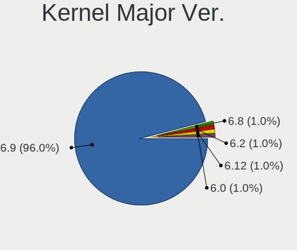
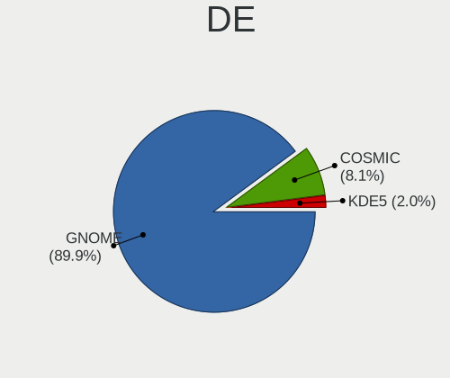
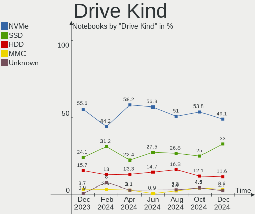
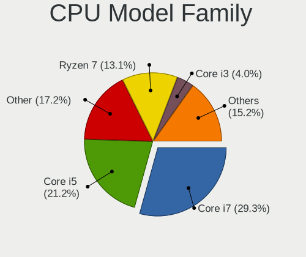
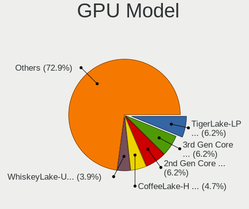
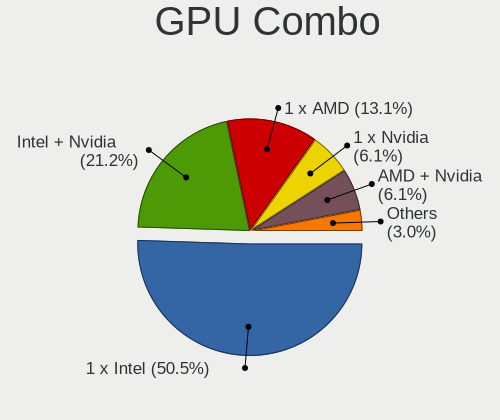

Pop!_OS Hardware Trends (Notebook)
----------------------------------

A project to identify most popular hardware characteristics and track their change
over time based on data collected by Pop!_OS users at https://Linux-Hardware.org.

Anyone can contribute to the study by uploading probes of their computers by
the [hw-probe](https://github.com/linuxhw/hw-probe) tool:

    sudo -E hw-probe -all -upload

Full-feature report is available here: https://linux-hardware.org/?view=trends&formfactor=notebook

Period: Feb, 2021.

Contents
--------

- [ OS                       ](#os)
- [ OS Family                ](#os-family)
- [ Kernel                   ](#kernel)
- [ Kernel Family            ](#kernel-family)
- [ Kernel Major Ver.        ](#kernel-major-ver)
- [ Arch                     ](#arch)
- [ DE                       ](#de)
- [ Display Server           ](#display-server)
- [ Display Manager          ](#display-manager)
- [ OS Lang                  ](#os-lang)
- [ Boot Mode                ](#boot-mode)
- [ Filesystem               ](#filesystem)
- [ Part. scheme             ](#part-scheme)
- [ Dual Boot with Linux/BSD ](#dual-boot-with-linux/bsd)
- [ Dual Boot (Win)          ](#dual-boot-win)
- [ Country                  ](#country)
- [ City                     ](#city)
- [ Vendor                   ](#vendor)
- [ Model                    ](#model)
- [ Model Family             ](#model-family)
- [ MFG Year                 ](#mfg-year)
- [ Form Factor              ](#form-factor)
- [ Secure Boot              ](#secure-boot)
- [ Coreboot                 ](#coreboot)
- [ RAM Size                 ](#ram-size)
- [ RAM Used                 ](#ram-used)
- [ Has CD-ROM               ](#has-cd-rom)
- [ Total Drives             ](#total-drives)
- [ Has Ethernet             ](#has-ethernet)
- [ Drive Vendor             ](#drive-vendor)
- [ Drive Model              ](#drive-model)
- [ HDD Vendor               ](#hdd-vendor)
- [ SSD Vendor               ](#ssd-vendor)
- [ Drive Kind               ](#drive-kind)
- [ Drive Connector          ](#drive-connector)
- [ Drive Size               ](#drive-size)
- [ Space Total              ](#space-total)
- [ Space Used               ](#space-used)
- [ Malfunc. Drives          ](#malfunc-drives)
- [ Malfunc. Drive Vendor    ](#malfunc-drive-vendor)
- [ Malfunc. HDD Vendor      ](#malfunc-hdd-vendor)
- [ Malfunc. Drive Kind      ](#malfunc-drive-kind)
- [ Failed Drives            ](#failed-drives)
- [ Failed Drive Vendor      ](#failed-drive-vendor)
- [ Drive Status             ](#drive-status)
- [ Storage Vendor           ](#storage-vendor)
- [ Storage Model            ](#storage-model)
- [ Storage Kind             ](#storage-kind)
- [ CPU Vendor               ](#cpu-vendor)
- [ CPU Model                ](#cpu-model)
- [ CPU Model Family         ](#cpu-model-family)
- [ CPU Cores                ](#cpu-cores)
- [ CPU Sockets              ](#cpu-sockets)
- [ CPU Threads              ](#cpu-threads)
- [ CPU Op-Modes             ](#cpu-op-modes)
- [ CPU Microcode            ](#cpu-microcode)
- [ CPU Microarch            ](#cpu-microarch)
- [ GPU Vendor               ](#gpu-vendor)
- [ GPU Model                ](#gpu-model)
- [ GPU Combo                ](#gpu-combo)
- [ GPU Driver               ](#gpu-driver)
- [ GPU Memory               ](#gpu-memory)
- [ Monitor Vendor           ](#monitor-vendor)
- [ Monitor Model            ](#monitor-model)
- [ Monitor Resolution       ](#monitor-resolution)
- [ Monitor Diagonal         ](#monitor-diagonal)
- [ Monitor Width            ](#monitor-width)
- [ Aspect Ratio             ](#aspect-ratio)
- [ Monitor Area             ](#monitor-area)
- [ Pixel Density            ](#pixel-density)
- [ Multiple Monitors        ](#multiple-monitors)
- [ Net Controller Vendor    ](#net-controller-vendor)
- [ Net Controller Model     ](#net-controller-model)
- [ Wireless Vendor          ](#wireless-vendor)
- [ Wireless Model           ](#wireless-model)
- [ Ethernet Vendor          ](#ethernet-vendor)
- [ Ethernet Model           ](#ethernet-model)
- [ Net Controller Kind      ](#net-controller-kind)
- [ Used Controller          ](#used-controller)
- [ NICs                     ](#nics)
- [ Memory Vendor            ](#memory-vendor)
- [ Memory Model             ](#memory-model)
- [ Memory Kind              ](#memory-kind)
- [ Memory Form Factor       ](#memory-form-factor)
- [ Memory Size              ](#memory-size)
- [ Memory Speed             ](#memory-speed)
- [ Sound Vendor             ](#sound-vendor)
- [ Sound Model              ](#sound-model)
- [ Camera Vendor            ](#camera-vendor)
- [ Camera Model             ](#camera-model)
- [ Fingerprint Vendor       ](#fingerprint-vendor)
- [ Fingerprint Model        ](#fingerprint-model)
- [ Chipcard Vendor          ](#chipcard-vendor)
- [ Chipcard Model           ](#chipcard-model)
- [ Printer Vendor           ](#printer-vendor)
- [ Printer Model            ](#printer-model)
- [ Scanner Vendor           ](#scanner-vendor)
- [ Scanner Model            ](#scanner-model)
- [ Bluetooth Vendor         ](#bluetooth-vendor)
- [ Bluetooth Model          ](#bluetooth-model)
- [ Unsupported Devices      ](#unsupported-devices)
- [ Unsupported Device Types ](#unsupported-device-types)

OS
--

Installed operating systems

| Name          | Notebooks | Percent |
|---------------|-----------|---------|
| Pop!_OS 20.10 | 113       | 83.09%  |
| Pop!_OS 20.04 | 23        | 16.91%  |

OS Family
---------

OS without a version

| Name    | Notebooks | Percent |
|---------|-----------|---------|
| Pop!_OS | 136       | 100%    |

Kernel
------

Version of the Linux kernel

| Version               | Notebooks | Percent |
|-----------------------|-----------|---------|
| 5.8.0-7642-generic    | 101       | 74.26%  |
| 5.8.0-7630-generic    | 29        | 21.32%  |
| 5.8.11-050811-generic | 1         | 0.74%   |
| 5.4.0-7642-generic    | 1         | 0.74%   |
| 5.4.0-7634-generic    | 1         | 0.74%   |
| 5.11.0-051100-generic | 1         | 0.74%   |
| 5.10.16-xanmod1       | 1         | 0.74%   |
| 5.10.0                | 1         | 0.74%   |

Kernel Family
-------------

Linux kernel without a distro release

| Version | Notebooks | Percent |
|---------|-----------|---------|
| 5.8.0   | 130       | 95.59%  |
| 5.4.0   | 2         | 1.47%   |
| 5.8.11  | 1         | 0.74%   |
| 5.11.0  | 1         | 0.74%   |
| 5.10.16 | 1         | 0.74%   |
| 5.10.0  | 1         | 0.74%   |

Kernel Major Ver.
-----------------

Linux kernel major version

| Version | Notebooks | Percent |
|---------|-----------|---------|
| 5.8     | 131       | 96.32%  |
| 5.4     | 2         | 1.47%   |
| 5.10    | 2         | 1.47%   |
| 5.11    | 1         | 0.74%   |

Arch
----

OS architecture (x86_64, i586, etc.)

| Name   | Notebooks | Percent |
|--------|-----------|---------|
| x86_64 | 136       | 100%    |

DE
--

Desktop Environment

| Name    | Notebooks | Percent |
|---------|-----------|---------|
| GNOME   | 130       | 95.59%  |
| XFCE    | 2         | 1.47%   |
| LXQt    | 1         | 0.74%   |
| KDE5    | 1         | 0.74%   |
| KDE     | 1         | 0.74%   |
| Unknown | 1         | 0.74%   |

Display Server
--------------

X11 or Wayland

| Name    | Notebooks | Percent |
|---------|-----------|---------|
| X11     | 131       | 96.32%  |
| Wayland | 4         | 2.94%   |
| Unknown | 1         | 0.74%   |

Display Manager
---------------

SDDM, LightDM, etc.

| Name    | Notebooks | Percent |
|---------|-----------|---------|
| Unknown | 112       | 82.35%  |
| GDM     | 24        | 17.65%  |

OS Lang
-------

Language

| Lang    | Notebooks | Percent |
|---------|-----------|---------|
| en_US   | 83        | 61.03%  |
| pt_BR   | 10        | 7.35%   |
| en_GB   | 8         | 5.88%   |
| de_DE   | 7         | 5.15%   |
| es_ES   | 6         | 4.41%   |
| sv_SE   | 3         | 2.21%   |
| pt_PT   | 3         | 2.21%   |
| en_AU   | 3         | 2.21%   |
| C       | 3         | 2.21%   |
| ru_RU   | 2         | 1.47%   |
| en_CA   | 2         | 1.47%   |
| nl_NL   | 1         | 0.74%   |
| nb_NO   | 1         | 0.74%   |
| it_IT   | 1         | 0.74%   |
| hu_HU   | 1         | 0.74%   |
| fr_FR   | 1         | 0.74%   |
| Unknown | 1         | 0.74%   |

Boot Mode
---------

EFI or BIOS

| Mode | Notebooks | Percent |
|------|-----------|---------|
| BIOS | 114       | 83.82%  |
| EFI  | 22        | 16.18%  |

Filesystem
----------

Type of filesystem

| Type  | Notebooks | Percent |
|-------|-----------|---------|
| Ext4  | 130       | 95.59%  |
| Btrfs | 6         | 4.41%   |

Part. scheme
------------

Scheme of partitioning

| Type    | Notebooks | Percent |
|---------|-----------|---------|
| Unknown | 111       | 81.62%  |
| GPT     | 22        | 16.18%  |
| MBR     | 3         | 2.21%   |

Dual Boot with Linux/BSD
------------------------

Hosting more than one Linux/BSD

| Dual boot | Notebooks | Percent |
|-----------|-----------|---------|
| No        | 133       | 97.79%  |
| Yes       | 3         | 2.21%   |

Dual Boot (Win)
---------------

Hosting Linux and Windows

| Dual boot | Notebooks | Percent |
|-----------|-----------|---------|
| No        | 130       | 95.59%  |
| Yes       | 6         | 4.41%   |

Country
-------

Geographic location (country)

| Country        | Notebooks | Percent |
|----------------|-----------|---------|
| USA            | 34        | 25%     |
| Brazil         | 15        | 11.03%  |
| India          | 9         | 6.62%   |
| Germany        | 9         | 6.62%   |
| UK             | 6         | 4.41%   |
| Sweden         | 5         | 3.68%   |
| Spain          | 4         | 2.94%   |
| Portugal       | 4         | 2.94%   |
| Netherlands    | 4         | 2.94%   |
| France         | 4         | 2.94%   |
| Canada         | 4         | 2.94%   |
| Romania        | 3         | 2.21%   |
| Italy          | 3         | 2.21%   |
| Australia      | 3         | 2.21%   |
| South Africa   | 2         | 1.47%   |
| Norway         | 2         | 1.47%   |
| Bulgaria       | 2         | 1.47%   |
| Zambia         | 1         | 0.74%   |
| Vietnam        | 1         | 0.74%   |
| Ukraine        | 1         | 0.74%   |
| Thailand       | 1         | 0.74%   |
| Switzerland    | 1         | 0.74%   |
| Slovakia       | 1         | 0.74%   |
| Serbia         | 1         | 0.74%   |
| Russia         | 1         | 0.74%   |
| Poland         | 1         | 0.74%   |
| Pakistan       | 1         | 0.74%   |
| New Zealand    | 1         | 0.74%   |
| Mexico         | 1         | 0.74%   |
| Malaysia       | 1         | 0.74%   |
| Israel         | 1         | 0.74%   |
| Hungary        | 1         | 0.74%   |
| Greece         | 1         | 0.74%   |
| Egypt          | 1         | 0.74%   |
| Czech Republic | 1         | 0.74%   |
| Croatia        | 1         | 0.74%   |
| Colombia       | 1         | 0.74%   |
| Belgium        | 1         | 0.74%   |
| Bahrain        | 1         | 0.74%   |
| Argentina      | 1         | 0.74%   |

City
----

Geographic location (city)

| City                     | Notebooks | Percent |
|--------------------------|-----------|---------|
| New Delhi                | 4         | 2.94%   |
| Brasília                | 3         | 2.21%   |
| Sofia                    | 2         | 1.47%   |
| Longmont                 | 2         | 1.47%   |
| Hamburg                  | 2         | 1.47%   |
| Delhi                    | 2         | 1.47%   |
| Cape Town                | 2         | 1.47%   |
| Bucharest                | 2         | 1.47%   |
| Ålesund                 | 1         | 0.74%   |
| Zeiskam                  | 1         | 0.74%   |
| Zagreb                   | 1         | 0.74%   |
| Warrington               | 1         | 0.74%   |
| Warrensburg              | 1         | 0.74%   |
| Wageningen               | 1         | 0.74%   |
| Voluntari                | 1         | 0.74%   |
| Untereisesheim           | 1         | 0.74%   |
| Uberlândia              | 1         | 0.74%   |
| Trussville               | 1         | 0.74%   |
| Trondheim                | 1         | 0.74%   |
| Trivandrum               | 1         | 0.74%   |
| Torre del Mar            | 1         | 0.74%   |
| Toronto                  | 1         | 0.74%   |
| Tigery                   | 1         | 0.74%   |
| São Paulo               | 1         | 0.74%   |
| Szeged                   | 1         | 0.74%   |
| Sydney                   | 1         | 0.74%   |
| Skanes Fagerhult         | 1         | 0.74%   |
| Schwarzenburg            | 1         | 0.74%   |
| Sao Jose do Rio Preto    | 1         | 0.74%   |
| Santo André             | 1         | 0.74%   |
| Santa Cruz do Rio Pardo  | 1         | 0.74%   |
| Salassa                  | 1         | 0.74%   |
| Saint-Jean-sur-Richelieu | 1         | 0.74%   |
| Reading                  | 1         | 0.74%   |
| Qalali                   | 1         | 0.74%   |
| Puebla City              | 1         | 0.74%   |
| Presidente Prudente      | 1         | 0.74%   |
| Porto Alegre             | 1         | 0.74%   |
| Plymouth                 | 1         | 0.74%   |
| Paris                    | 1         | 0.74%   |
| Palm Desert              | 1         | 0.74%   |
| Oud-Beijerland           | 1         | 0.74%   |
| Ottawa                   | 1         | 0.74%   |
| Orrville                 | 1         | 0.74%   |
| Nova Iguaçu             | 1         | 0.74%   |
| Newtown                  | 1         | 0.74%   |
| Naaldwijk                | 1         | 0.74%   |
| Mountain Home            | 1         | 0.74%   |
| Minneapolis              | 1         | 0.74%   |
| Milan                    | 1         | 0.74%   |
| Manaus                   | 1         | 0.74%   |
| Malmo                    | 1         | 0.74%   |
| Malacky                  | 1         | 0.74%   |
| Maia                     | 1         | 0.74%   |
| Madrid                   | 1         | 0.74%   |
| Macomb                   | 1         | 0.74%   |
| Lyon                     | 1         | 0.74%   |
| Lusaka                   | 1         | 0.74%   |
| Lisbon                   | 1         | 0.74%   |
| Liberec                  | 1         | 0.74%   |

Vendor
------

Motherboard manufacturer

| Name                           | Notebooks | Percent |
|--------------------------------|-----------|---------|
| Lenovo                         | 25        | 18.38%  |
| Hewlett-Packard                | 21        | 15.44%  |
| ASUSTek Computer               | 19        | 13.97%  |
| Dell                           | 18        | 13.24%  |
| Apple                          | 10        | 7.35%   |
| Acer                           | 10        | 7.35%   |
| System76                       | 8         | 5.88%   |
| MSI                            | 6         | 4.41%   |
| Samsung Electronics            | 2         | 1.47%   |
| PC Specialist                  | 2         | 1.47%   |
| TUXEDO                         | 1         | 0.74%   |
| Toshiba                        | 1         | 0.74%   |
| Sony                           | 1         | 0.74%   |
| Metabox                        | 1         | 0.74%   |
| Medion                         | 1         | 0.74%   |
| Matsushita Electric Industrial | 1         | 0.74%   |
| HUAWEI                         | 1         | 0.74%   |
| Google                         | 1         | 0.74%   |
| Fusion5                        | 1         | 0.74%   |
| Fujitsu                        | 1         | 0.74%   |
| Compal                         | 1         | 0.74%   |
| Clevo                          | 1         | 0.74%   |
| CAPTIVA                        | 1         | 0.74%   |
| Alienware                      | 1         | 0.74%   |
| Unknown                        | 1         | 0.74%   |

Model
-----

Motherboard model

| Name                                        | Notebooks | Percent |
|---------------------------------------------|-----------|---------|
| System76 Oryx Pro                           | 2         | 1.47%   |
| System76 Lemur Pro                          | 2         | 1.47%   |
| HP 620                                      | 2         | 1.47%   |
| ASUS VivoBook_ASUSLaptop X509DA_M509DA      | 2         | 1.47%   |
| ASUS TUF Gaming FX505DV_FX505DV             | 2         | 1.47%   |
| Acer Aspire E1-571G                         | 2         | 1.47%   |
| Unknown                                     | 2         | 1.47%   |
| TUXEDO InfinityBook S 14 v5                 | 1         | 0.74%   |
| Toshiba Satellite S50t-B                    | 1         | 0.74%   |
| System76 Gazelle Professional               | 1         | 0.74%   |
| System76 Galago UltraPro                    | 1         | 0.74%   |
| System76 Galago Pro                         | 1         | 0.74%   |
| System76 Darter Pro                         | 1         | 0.74%   |
| Sony VPCF121FX                              | 1         | 0.74%   |
| Samsung R519/R719                           | 1         | 0.74%   |
| Samsung 270E5K/270E5Q/271E5K/2570EK         | 1         | 0.74%   |
| PC Specialist NS50MU                        | 1         | 0.74%   |
| PC Specialist N150CU                        | 1         | 0.74%   |
| MSI GS65 Stealth Thin 8RE                   | 1         | 0.74%   |
| MSI GL62 7QF                                | 1         | 0.74%   |
| MSI GF65 Thin 10UE                          | 1         | 0.74%   |
| MSI GF63 Thin 9SCX                          | 1         | 0.74%   |
| MSI GF63 Thin 9RCX                          | 1         | 0.74%   |
| MSI GE62 6QF                                | 1         | 0.74%   |
| Metabox NP50DE                              | 1         | 0.74%   |
| Medion X782X                                | 1         | 0.74%   |
| Matsushita Electric Industrial CF-30FQL55AM | 1         | 0.74%   |
| Lenovo Z710 20250                           | 1         | 0.74%   |
| Lenovo ThinkPad X230 2325SYU                | 1         | 0.74%   |
| Lenovo ThinkPad X200s 7470AW8               | 1         | 0.74%   |
| Lenovo ThinkPad X1 Extreme Gen 3 20TK001EUS | 1         | 0.74%   |
| Lenovo ThinkPad X1 Carbon 5th 20HQS1G20A    | 1         | 0.74%   |
| Lenovo ThinkPad X1 Carbon 3rd 20BSCTO1WW    | 1         | 0.74%   |
| Lenovo ThinkPad W541 20EGS2KL00             | 1         | 0.74%   |
| Lenovo ThinkPad T490s 20NXS01Y00            | 1         | 0.74%   |
| Lenovo ThinkPad T440p 20AWS03V00            | 1         | 0.74%   |
| Lenovo ThinkPad T430 2349S5P                | 1         | 0.74%   |
| Lenovo ThinkPad E490 20N8CTO1WW             | 1         | 0.74%   |
| Lenovo ThinkPad E14 Gen 2 20T6S0A500        | 1         | 0.74%   |
| Lenovo ThinkPad E14 20RBS2D100              | 1         | 0.74%   |
| Lenovo Slim 1-11AST-05 81VR                 | 1         | 0.74%   |
| Lenovo Legion Y540-15IRH-PG0 81SY           | 1         | 0.74%   |
| Lenovo Legion 5 15ARH05 82B5                | 1         | 0.74%   |
| Lenovo IdeaPad Y570 20091                   | 1         | 0.74%   |
| Lenovo IdeaPad Slim 7 15IIL05 82AD          | 1         | 0.74%   |
| Lenovo IdeaPad S145-15IWL 81S9              | 1         | 0.74%   |
| Lenovo IdeaPad L340-15IRH Gaming 81TR       | 1         | 0.74%   |
| Lenovo IdeaPad 520-15IKB 81BF               | 1         | 0.74%   |
| Lenovo IdeaPad 110-15AST 80TR               | 1         | 0.74%   |
| Lenovo G500 20236                           | 1         | 0.74%   |
| Lenovo G450 2949                            | 1         | 0.74%   |
| HUAWEI KLVL-WXX9                            | 1         | 0.74%   |
| HP ProBook 470 G3                           | 1         | 0.74%   |
| HP ProBook 4330s                            | 1         | 0.74%   |
| HP Pro Tablet 608 G1                        | 1         | 0.74%   |
| HP Pavilion Notebook                        | 1         | 0.74%   |
| HP Pavilion Gaming Laptop 15-ec1xxx         | 1         | 0.74%   |
| HP Pavilion g6                              | 1         | 0.74%   |
| HP Pavilion dv6                             | 1         | 0.74%   |
| HP Pavilion 15                              | 1         | 0.74%   |

Model Family
------------

Motherboard model prefix

| Name                                        | Notebooks | Percent |
|---------------------------------------------|-----------|---------|
| Lenovo ThinkPad                             | 12        | 8.82%   |
| Dell Inspiron                               | 9         | 6.62%   |
| Acer Aspire                                 | 9         | 6.62%   |
| Lenovo IdeaPad                              | 6         | 4.41%   |
| ASUS VivoBook                               | 6         | 4.41%   |
| HP Pavilion                                 | 5         | 3.68%   |
| Dell XPS                                    | 4         | 2.94%   |
| ASUS TUF                                    | 3         | 2.21%   |
| System76 Oryx                               | 2         | 1.47%   |
| System76 Lemur                              | 2         | 1.47%   |
| System76 Galago                             | 2         | 1.47%   |
| MSI GF63                                    | 2         | 1.47%   |
| Lenovo Legion                               | 2         | 1.47%   |
| HP ProBook                                  | 2         | 1.47%   |
| HP EliteBook                                | 2         | 1.47%   |
| HP 620                                      | 2         | 1.47%   |
| Dell Vostro                                 | 2         | 1.47%   |
| Apple MacBookPro9                           | 2         | 1.47%   |
| Unknown                                     | 2         | 1.47%   |
| TUXEDO InfinityBook                         | 1         | 0.74%   |
| Toshiba Satellite                           | 1         | 0.74%   |
| System76 Gazelle                            | 1         | 0.74%   |
| System76 Darter                             | 1         | 0.74%   |
| Sony VPCF121FX                              | 1         | 0.74%   |
| Samsung R519                                | 1         | 0.74%   |
| Samsung 270E5K                              | 1         | 0.74%   |
| PC Specialist NS50MU                        | 1         | 0.74%   |
| PC Specialist N150CU                        | 1         | 0.74%   |
| MSI GS65                                    | 1         | 0.74%   |
| MSI GL62                                    | 1         | 0.74%   |
| MSI GF65                                    | 1         | 0.74%   |
| MSI GE62                                    | 1         | 0.74%   |
| Metabox NP50DE                              | 1         | 0.74%   |
| Medion X782X                                | 1         | 0.74%   |
| Matsushita Electric Industrial CF-30FQL55AM | 1         | 0.74%   |
| Lenovo Z710                                 | 1         | 0.74%   |
| Lenovo Slim                                 | 1         | 0.74%   |
| Lenovo G500                                 | 1         | 0.74%   |
| Lenovo G450                                 | 1         | 0.74%   |
| HUAWEI KLVL-WXX9                            | 1         | 0.74%   |
| HP Pro                                      | 1         | 0.74%   |
| HP OMEN                                     | 1         | 0.74%   |
| HP Notebook                                 | 1         | 0.74%   |
| HP Laptop                                   | 1         | 0.74%   |
| HP G62                                      | 1         | 0.74%   |
| HP ENVY                                     | 1         | 0.74%   |
| HP Compaq                                   | 1         | 0.74%   |
| HP 550                                      | 1         | 0.74%   |
| HP 340S                                     | 1         | 0.74%   |
| HP 250                                      | 1         | 0.74%   |
| Google Rammus                               | 1         | 0.74%   |
| Fusion5 A90B                                | 1         | 0.74%   |
| Fujitsu LIFEBOOK                            | 1         | 0.74%   |
| Dell Precision                              | 1         | 0.74%   |
| Dell Latitude                               | 1         | 0.74%   |
| Dell G3                                     | 1         | 0.74%   |
| Compal PCW20                                | 1         | 0.74%   |
| Clevo P65                                   | 1         | 0.74%   |
| CAPTIVA Board                               | 1         | 0.74%   |
| ASUS ZenBook                                | 1         | 0.74%   |

MFG Year
--------

Motherboard manufacture year

| Year | Notebooks | Percent |
|------|-----------|---------|
| 2020 | 48        | 35.29%  |
| 2019 | 23        | 16.91%  |
| 2015 | 10        | 7.35%   |
| 2013 | 9         | 6.62%   |
| 2011 | 8         | 5.88%   |
| 2018 | 6         | 4.41%   |
| 2017 | 6         | 4.41%   |
| 2016 | 6         | 4.41%   |
| 2014 | 6         | 4.41%   |
| 2009 | 4         | 2.94%   |
| 2021 | 3         | 2.21%   |
| 2012 | 3         | 2.21%   |
| 2010 | 2         | 1.47%   |
| 2008 | 1         | 0.74%   |
| 2007 | 1         | 0.74%   |

Form Factor
-----------

Physical design of the computer

| Name     | Notebooks | Percent |
|----------|-----------|---------|
| Notebook | 136       | 100%    |

Secure Boot
-----------

Enabled or disabled

| State    | Notebooks | Percent |
|----------|-----------|---------|
| Disabled | 136       | 100%    |

Coreboot
--------

Have coreboot on board

| Used | Notebooks | Percent |
|------|-----------|---------|
| No   | 130       | 95.59%  |
| Yes  | 6         | 4.41%   |

RAM Size
--------

Total RAM memory

| Size in GB  | Notebooks | Percent |
|-------------|-----------|---------|
| 4.01-8.0    | 40        | 29.41%  |
| 16.01-24.0  | 38        | 27.94%  |
| 3.01-4.0    | 24        | 17.65%  |
| 8.01-16.0   | 24        | 17.65%  |
| 32.01-64.0  | 8         | 5.88%   |
| 64.01-256.0 | 1         | 0.74%   |
| 1.01-2.0    | 1         | 0.74%   |

RAM Used
--------

Used RAM memory

| Used GB    | Notebooks | Percent |
|------------|-----------|---------|
| 1.01-2.0   | 52        | 38.24%  |
| 2.01-3.0   | 35        | 25.74%  |
| 4.01-8.0   | 23        | 16.91%  |
| 3.01-4.0   | 21        | 15.44%  |
| 8.01-16.0  | 4         | 2.94%   |
| 16.01-24.0 | 1         | 0.74%   |

Has CD-ROM
----------

Has CD-ROM on board

| Presented | Notebooks | Percent |
|-----------|-----------|---------|
| No        | 94        | 69.12%  |
| Yes       | 42        | 30.88%  |

Total Drives
------------

Number of drives on board

| Drives | Notebooks | Percent |
|--------|-----------|---------|
| 1      | 90        | 66.18%  |
| 2      | 41        | 30.15%  |
| 3      | 5         | 3.68%   |

Has Ethernet
------------

Has Ethernet on board

| Presented | Notebooks | Percent |
|-----------|-----------|---------|
| Yes       | 112       | 82.35%  |
| No        | 24        | 17.65%  |

Drive Vendor
------------

Hard drive vendors

| Vendor                | Notebooks | Drives | Percent |
|-----------------------|-----------|--------|---------|
| Samsung Electronics   | 33        | 37     | 18.54%  |
| WDC                   | 24        | 24     | 13.48%  |
| Unknown               | 17        | 19     | 9.55%   |
| Seagate               | 14        | 15     | 7.87%   |
| Toshiba               | 13        | 13     | 7.3%    |
| Kingston              | 9         | 9      | 5.06%   |
| SK Hynix              | 7         | 7      | 3.93%   |
| SanDisk               | 7         | 7      | 3.93%   |
| Micron Technology     | 7         | 7      | 3.93%   |
| Intel                 | 7         | 8      | 3.93%   |
| Crucial               | 6         | 6      | 3.37%   |
| HGST                  | 4         | 5      | 2.25%   |
| Apple                 | 4         | 4      | 2.25%   |
| A-DATA Technology     | 4         | 4      | 2.25%   |
| Hitachi               | 3         | 3      | 1.69%   |
| Silicon Motion        | 2         | 2      | 1.12%   |
| PNY                   | 2         | 2      | 1.12%   |
| LITEON                | 2         | 2      | 1.12%   |
| Team                  | 1         | 1      | 0.56%   |
| SuperSSpeed           | 1         | 1      | 0.56%   |
| ROG                   | 1         | 1      | 0.56%   |
| Realtek Semiconductor | 1         | 1      | 0.56%   |
| Phison                | 1         | 1      | 0.56%   |
| LITEONIT              | 1         | 1      | 0.56%   |
| Kingsand              | 1         | 1      | 0.56%   |
| JMicron               | 1         | 1      | 0.56%   |
| Hewlett-Packard       | 1         | 1      | 0.56%   |
| Fujitsu               | 1         | 1      | 0.56%   |
| DOGFISH               | 1         | 1      | 0.56%   |
| China                 | 1         | 1      | 0.56%   |
| ADATA Technology      | 1         | 1      | 0.56%   |

Drive Model
-----------

Hard drive models

| Model                                | Notebooks | Percent |
|--------------------------------------|-----------|---------|
| Unknown MMC Card  64GB               | 8         | 4.35%   |
| Samsung NVMe SSD Drive 1TB           | 5         | 2.72%   |
| Samsung SSD 860 EVO 500GB            | 3         | 1.63%   |
| Micron NVMe SSD Drive 512GB          | 3         | 1.63%   |
| Intel NVMe SSD Drive 1024GB          | 3         | 1.63%   |
| Crucial CT500MX500SSD1 500GB         | 3         | 1.63%   |
| WDC WD10SPZX-24Z10 1TB               | 2         | 1.09%   |
| Unknown NVMe SSD Drive 256GB         | 2         | 1.09%   |
| Toshiba NVMe SSD Drive 256GB         | 2         | 1.09%   |
| Toshiba MQ01ABF050 500GB             | 2         | 1.09%   |
| Toshiba MQ01ABD100 1TB               | 2         | 1.09%   |
| SK Hynix NVMe SSD Drive 256GB        | 2         | 1.09%   |
| Seagate ST1000LM035-1RK172 1TB       | 2         | 1.09%   |
| Seagate ST1000LM024 HN-M101MBB 1TB   | 2         | 1.09%   |
| Sandisk NVMe SSD Drive 256GB         | 2         | 1.09%   |
| Samsung SSD 970 EVO Plus 250GB       | 2         | 1.09%   |
| Samsung SSD 860 EVO 250GB            | 2         | 1.09%   |
| Samsung SSD 840 EVO 500GB            | 2         | 1.09%   |
| Micron NVMe SSD Drive 256GB          | 2         | 1.09%   |
| WDC WDS500G2B0B-00YS70 500GB SSD     | 1         | 0.54%   |
| WDC WDS500G2B0A-00SM50 500GB SSD     | 1         | 0.54%   |
| WDC WDS250G2B0A 250GB SSD            | 1         | 0.54%   |
| WDC WDS240G2G0A-00JH30 240GB SSD     | 1         | 0.54%   |
| WDC WDS100T3X0C-00SJG0 1TB           | 1         | 0.54%   |
| WDC WD7500BPVT-22HXZT3 752GB         | 1         | 0.54%   |
| WDC WD5000LPVX-22V0TT0 500GB         | 1         | 0.54%   |
| WDC WD5000BPVT-80HXZT3 500GB         | 1         | 0.54%   |
| WDC WD5000BPKX-00HPJT0 500GB         | 1         | 0.54%   |
| WDC WD2500BEVT-60A23T0 250GB         | 1         | 0.54%   |
| WDC WD2500BEVS-60UST0 250GB          | 1         | 0.54%   |
| WDC WD1600BJKT-75F4T0 160GB          | 1         | 0.54%   |
| WDC WD10SPZX-75Z10T2 1TB             | 1         | 0.54%   |
| WDC WD10SPZX-24Z10T0 1TB             | 1         | 0.54%   |
| WDC WD10SPZX-21Z10T0 1TB             | 1         | 0.54%   |
| WDC WD10SPSX-08A6W 1TB               | 1         | 0.54%   |
| WDC PC SN730 SDBPNTY-512G-1027 512GB | 1         | 0.54%   |
| WDC PC SN730 NVMe 1024GB             | 1         | 0.54%   |
| WDC PC SN530 SDBPNPZ-512G-1006 512GB | 1         | 0.54%   |
| WDC PC SN530 SDBPNPZ-256G-1002 256GB | 1         | 0.54%   |
| WDC PC SN530 SDBPMPZ-256G-1001 256GB | 1         | 0.54%   |
| WDC PC SN520 SDAPNUW-256G-1032 256GB | 1         | 0.54%   |
| Unknown SL16G  16GB                  | 1         | 0.54%   |
| Unknown SD/MMC/MS PRO 64GB           | 1         | 0.54%   |
| Unknown NVMe SSD Drive 512GB         | 1         | 0.54%   |
| Unknown MMC Card  4GB                | 1         | 0.54%   |
| Unknown MMC Card  393GB              | 1         | 0.54%   |
| Unknown MMC Card  32GB               | 1         | 0.54%   |
| Unknown MMC Card  238MB              | 1         | 0.54%   |
| Unknown DA4064  64GB                 | 1         | 0.54%   |
| Unknown 512GB QLC SATA SSD           | 1         | 0.54%   |
| Toshiba THNSNJ256GCSU 256GB SSD      | 1         | 0.54%   |
| Toshiba THNSFJ256GDNU 256GB SSD      | 1         | 0.54%   |
| Toshiba MQ02ABD100H 1TB              | 1         | 0.54%   |
| Toshiba MQ01ABF032 320GB             | 1         | 0.54%   |
| Toshiba MQ01ABD075 752GB             | 1         | 0.54%   |
| Toshiba KBG30ZMT256G 256GB           | 1         | 0.54%   |
| Toshiba A100 240GB SSD               | 1         | 0.54%   |
| Team T2535T240G 240GB SSD            | 1         | 0.54%   |
| SuperSSpeed S540 960GB               | 1         | 0.54%   |
| SK Hynix NVMe SSD Drive 512GB        | 1         | 0.54%   |

HDD Vendor
----------

Hard disk drive vendors

| Vendor              | Notebooks | Drives | Percent |
|---------------------|-----------|--------|---------|
| WDC                 | 13        | 13     | 30.23%  |
| Seagate             | 13        | 13     | 30.23%  |
| Toshiba             | 7         | 7      | 16.28%  |
| HGST                | 4         | 5      | 9.3%    |
| Hitachi             | 3         | 3      | 6.98%   |
| Samsung Electronics | 2         | 2      | 4.65%   |
| Fujitsu             | 1         | 1      | 2.33%   |

SSD Vendor
----------

Solid state drive vendors

| Vendor              | Notebooks | Drives | Percent |
|---------------------|-----------|--------|---------|
| Samsung Electronics | 19        | 19     | 30.16%  |
| Kingston            | 7         | 7      | 11.11%  |
| Crucial             | 6         | 6      | 9.52%   |
| WDC                 | 4         | 4      | 6.35%   |
| SanDisk             | 4         | 4      | 6.35%   |
| Apple               | 4         | 4      | 6.35%   |
| Toshiba             | 3         | 3      | 4.76%   |
| A-DATA Technology   | 3         | 3      | 4.76%   |
| PNY                 | 2         | 2      | 3.17%   |
| Micron Technology   | 2         | 2      | 3.17%   |
| LITEON              | 2         | 2      | 3.17%   |
| Unknown             | 1         | 1      | 1.59%   |
| Team                | 1         | 1      | 1.59%   |
| LITEONIT            | 1         | 1      | 1.59%   |
| JMicron             | 1         | 1      | 1.59%   |
| Intel               | 1         | 1      | 1.59%   |
| DOGFISH             | 1         | 1      | 1.59%   |
| China               | 1         | 1      | 1.59%   |

Drive Kind
----------

HDD or SSD

| Kind    | Notebooks | Drives | Percent |
|---------|-----------|--------|---------|
| SSD     | 59        | 63     | 34.5%   |
| NVMe    | 52        | 62     | 30.41%  |
| HDD     | 43        | 44     | 25.15%  |
| MMC     | 13        | 14     | 7.6%    |
| Unknown | 4         | 4      | 2.34%   |

Drive Connector
---------------

SATA, SAS, NVMe, etc.

| Type | Notebooks | Drives | Percent |
|------|-----------|--------|---------|
| SATA | 88        | 105    | 55.35%  |
| NVMe | 52        | 62     | 32.7%   |
| MMC  | 13        | 14     | 8.18%   |
| SAS  | 6         | 6      | 3.77%   |

Drive Size
----------

Size of hard drive

| Size in TB | Notebooks | Drives | Percent |
|------------|-----------|--------|---------|
| 0.01-0.5   | 70        | 75     | 68.63%  |
| 0.51-1.0   | 29        | 29     | 28.43%  |
| 1.01-2.0   | 3         | 3      | 2.94%   |

Space Total
-----------

Amount of disk space available on the file system

| Size in GB | Notebooks | Percent |
|------------|-----------|---------|
| 251-500    | 43        | 31.62%  |
| 101-250    | 42        | 30.88%  |
| 501-1000   | 28        | 20.59%  |
| 51-100     | 14        | 10.29%  |
| 1001-2000  | 4         | 2.94%   |
| 2001-3000  | 2         | 1.47%   |
| 21-50      | 1         | 0.74%   |
| 1-20       | 1         | 0.74%   |
| Unknown    | 1         | 0.74%   |

Space Used
----------

Amount of used disk space

| Used GB  | Notebooks | Percent |
|----------|-----------|---------|
| 1-20     | 63        | 46.32%  |
| 21-50    | 28        | 20.59%  |
| 101-250  | 16        | 11.76%  |
| 51-100   | 15        | 11.03%  |
| 251-500  | 9         | 6.62%   |
| 501-1000 | 4         | 2.94%   |
| Unknown  | 1         | 0.74%   |

Malfunc. Drives
---------------

Drive models with a malfunction

| Model                       | Notebooks | Drives | Percent |
|-----------------------------|-----------|--------|---------|
| WDC WD1600BJKT-75F4T0 160GB | 1         | 1      | 50%     |
| Toshiba MQ02ABD100H 1TB     | 1         | 1      | 50%     |

Malfunc. Drive Vendor
---------------------

Vendors of faulty drives

| Vendor  | Notebooks | Drives | Percent |
|---------|-----------|--------|---------|
| WDC     | 1         | 1      | 50%     |
| Toshiba | 1         | 1      | 50%     |

Malfunc. HDD Vendor
-------------------

Vendors of faulty HDD drives

| Vendor  | Notebooks | Drives | Percent |
|---------|-----------|--------|---------|
| WDC     | 1         | 1      | 50%     |
| Toshiba | 1         | 1      | 50%     |

Malfunc. Drive Kind
-------------------

Kinds of faulty drives

| Kind | Notebooks | Drives | Percent |
|------|-----------|--------|---------|
| HDD  | 2         | 2      | 100%    |

Failed Drives
-------------

Failed drive models

Zero info for selected period =(

Failed Drive Vendor
-------------------

Failed drive vendors

Zero info for selected period =(

Drive Status
------------

Number of failed and malfunc. drives

| Status   | Notebooks | Drives | Percent |
|----------|-----------|--------|---------|
| Detected | 113       | 152    | 80.71%  |
| Works    | 25        | 33     | 17.86%  |
| Malfunc  | 2         | 2      | 1.43%   |

Storage Vendor
--------------

Storage controller vendors

| Vendor                         | Notebooks | Percent |
|--------------------------------|-----------|---------|
| Intel                          | 92        | 56.1%   |
| AMD                            | 17        | 10.37%  |
| Samsung Electronics            | 15        | 9.15%   |
| Sandisk                        | 9         | 5.49%   |
| SK Hynix                       | 7         | 4.27%   |
| Micron Technology              | 5         | 3.05%   |
| Toshiba America Info Systems   | 3         | 1.83%   |
| Solid State Storage Technology | 3         | 1.83%   |
| Silicon Motion                 | 3         | 1.83%   |
| Nvidia                         | 3         | 1.83%   |
| Kingston Technology Company    | 2         | 1.22%   |
| ADATA Technology               | 2         | 1.22%   |
| Seagate Technology             | 1         | 0.61%   |
| Realtek Semiconductor          | 1         | 0.61%   |
| Phison Electronics             | 1         | 0.61%   |

Storage Model
-------------

Storage controller models

| Model                                                                            | Notebooks | Percent |
|----------------------------------------------------------------------------------|-----------|---------|
| AMD FCH SATA Controller [AHCI mode]                                              | 16        | 9.36%   |
| Intel 7 Series Chipset Family 6-port SATA Controller [AHCI mode]                 | 11        | 6.43%   |
| Samsung NVMe SSD Controller SM981/PM981/PM983                                    | 10        | 5.85%   |
| Intel 8 Series/C220 Series Chipset Family 6-port SATA Controller 1 [AHCI mode]   | 9         | 5.26%   |
| Intel 6 Series/C200 Series Chipset Family 6 port Mobile SATA AHCI Controller     | 7         | 4.09%   |
| Intel Sunrise Point-LP SATA Controller [AHCI mode]                               | 6         | 3.51%   |
| Intel 8 Series SATA Controller 1 [AHCI mode]                                     | 6         | 3.51%   |
| Micron Non-Volatile memory controller                                            | 5         | 2.92%   |
| Intel Wildcat Point-LP SATA Controller [AHCI Mode]                               | 5         | 2.92%   |
| Intel Comet Lake SATA AHCI Controller                                            | 5         | 2.92%   |
| Intel Cannon Lake Mobile PCH SATA AHCI Controller                                | 5         | 2.92%   |
| Intel 82801IBM/IEM (ICH9M/ICH9M-E) 4 port SATA Controller [AHCI mode]            | 5         | 2.92%   |
| SK Hynix Non-Volatile memory controller                                          | 4         | 2.34%   |
| Intel SSD 660P Series                                                            | 4         | 2.34%   |
| Intel HM170/QM170 Chipset SATA Controller [AHCI Mode]                            | 4         | 2.34%   |
| Intel Cannon Point-LP SATA Controller [AHCI Mode]                                | 4         | 2.34%   |
| Intel 82801 Mobile SATA Controller [RAID mode]                                   | 4         | 2.34%   |
| Solid State Storage Non-Volatile memory controller                               | 3         | 1.75%   |
| SK Hynix BC501 NVMe Solid State Drive 512GB                                      | 3         | 1.75%   |
| Sandisk WD Blue SN550 NVMe SSD                                                   | 3         | 1.75%   |
| Sandisk WD Black SN750 / PC SN730 NVMe SSD                                       | 3         | 1.75%   |
| Intel Celeron/Pentium Silver Processor SATA Controller                           | 3         | 1.75%   |
| Intel 400 Series Chipset Family SATA AHCI Controller                             | 3         | 1.75%   |
| Toshiba America Info Systems Toshiba America Info Non-Volatile memory controller | 2         | 1.17%   |
| Silicon Motion SM2263EN/SM2263XT SSD Controller                                  | 2         | 1.17%   |
| Sandisk WD Blue SN500 / PC SN520 NVMe SSD                                        | 2         | 1.17%   |
| Samsung Electronics SATA controller                                              | 2         | 1.17%   |
| Nvidia MCP79 AHCI Controller                                                     | 2         | 1.17%   |
| Kingston Company U-SNS8154P3 NVMe SSD                                            | 2         | 1.17%   |
| Intel 82801HM/HEM (ICH8M/ICH8M-E) SATA Controller [AHCI mode]                    | 2         | 1.17%   |
| Intel 82801HM/HEM (ICH8M/ICH8M-E) IDE Controller                                 | 2         | 1.17%   |
| Intel 5 Series/3400 Series Chipset 4 port SATA AHCI Controller                   | 2         | 1.17%   |
| ADATA Non-Volatile memory controller                                             | 2         | 1.17%   |
| Toshiba America Info Systems BG3 NVMe SSD Controller                             | 1         | 0.58%   |
| Silicon Motion SM2262/SM2262EN SSD Controller                                    | 1         | 0.58%   |
| Seagate Non-Volatile memory controller                                           | 1         | 0.58%   |
| Sandisk Non-Volatile memory controller                                           | 1         | 0.58%   |
| Samsung NVMe SSD Controller SM961/PM961/SM963                                    | 1         | 0.58%   |
| Samsung NVMe SSD Controller PM9A1/980PRO                                         | 1         | 0.58%   |
| Samsung Apple PCIe SSD                                                           | 1         | 0.58%   |
| Realtek Realtek Non-Volatile memory controller                                   | 1         | 0.58%   |
| Phison E12 NVMe Controller                                                       | 1         | 0.58%   |
| Nvidia MCP78S [GeForce 8200] SATA Controller (non-AHCI mode)                     | 1         | 0.58%   |
| Nvidia MCP78S [GeForce 8200] IDE                                                 | 1         | 0.58%   |
| Intel SSD Pro 7600p/760p/E 6100p Series                                          | 1         | 0.58%   |
| Intel SATA Controller [RAID mode]                                                | 1         | 0.58%   |
| Intel Q170/Q150/B150/H170/H110/Z170/CM236 Chipset SATA Controller [AHCI Mode]    | 1         | 0.58%   |
| Intel Non-Volatile memory controller                                             | 1         | 0.58%   |
| Intel Ice Lake-LP SATA Controller [AHCI mode]                                    | 1         | 0.58%   |
| Intel Celeron N3350/Pentium N4200/Atom E3900 Series SATA AHCI Controller         | 1         | 0.58%   |
| Intel Atom Processor E3800 Series SATA AHCI Controller                           | 1         | 0.58%   |
| Intel 82801IBM/IEM (ICH9M/ICH9M-E) 2 port SATA Controller [IDE mode]             | 1         | 0.58%   |
| Intel 7 Series Chipset Family 4-port SATA Controller [IDE mode]                  | 1         | 0.58%   |
| Intel 7 Series Chipset Family 2-port SATA Controller [IDE mode]                  | 1         | 0.58%   |
| Intel 5 Series/3400 Series Chipset 6 port SATA AHCI Controller                   | 1         | 0.58%   |
| AMD SB7x0/SB8x0/SB9x0 SATA Controller [AHCI mode]                                | 1         | 0.58%   |

Storage Kind
------------

Kind of storage controller (IDE, SATA, NVMe, SAS, ...)

| Kind | Notebooks | Percent |
|------|-----------|---------|
| SATA | 103       | 62.42%  |
| NVMe | 52        | 31.52%  |
| RAID | 5         | 3.03%   |
| IDE  | 5         | 3.03%   |

CPU Vendor
----------

Processor vendors

| Vendor | Notebooks | Percent |
|--------|-----------|---------|
| Intel  | 112       | 82.35%  |
| AMD    | 24        | 17.65%  |

CPU Model
---------

Processor models

| Model                                         | Notebooks | Percent |
|-----------------------------------------------|-----------|---------|
| Intel Core i7-8565U CPU @ 1.80GHz             | 4         | 2.94%   |
| Intel Core i7-10510U CPU @ 1.80GHz            | 4         | 2.94%   |
| Intel Core i7-6700HQ CPU @ 2.60GHz            | 3         | 2.21%   |
| Intel Core i7-2630QM CPU @ 2.00GHz            | 3         | 2.21%   |
| Intel Core i5-9300H CPU @ 2.40GHz             | 3         | 2.21%   |
| AMD Ryzen 5 3500U with Radeon Vega Mobile Gfx | 3         | 2.21%   |
| AMD Ryzen 3 3200U with Radeon Vega Mobile Gfx | 3         | 2.21%   |
| Intel Pentium Dual-Core CPU T4300 @ 2.10GHz   | 2         | 1.47%   |
| Intel Core i7-9750H CPU @ 2.60GHz             | 2         | 1.47%   |
| Intel Core i7-5600U CPU @ 2.60GHz             | 2         | 1.47%   |
| Intel Core i7-5500U CPU @ 2.40GHz             | 2         | 1.47%   |
| Intel Core i7-4810MQ CPU @ 2.80GHz            | 2         | 1.47%   |
| Intel Core i7-4720HQ CPU @ 2.60GHz            | 2         | 1.47%   |
| Intel Core i7-4510U CPU @ 2.00GHz             | 2         | 1.47%   |
| Intel Core i7-4500U CPU @ 1.80GHz             | 2         | 1.47%   |
| Intel Core i7-3632QM CPU @ 2.20GHz            | 2         | 1.47%   |
| Intel Core i7-3615QM CPU @ 2.30GHz            | 2         | 1.47%   |
| Intel Core i7-10750H CPU @ 2.60GHz            | 2         | 1.47%   |
| Intel Core i5-9300HF CPU @ 2.40GHz            | 2         | 1.47%   |
| Intel Core i5-8265U CPU @ 1.60GHz             | 2         | 1.47%   |
| Intel Core i5-7200U CPU @ 2.50GHz             | 2         | 1.47%   |
| Intel Core i5-4210U CPU @ 1.70GHz             | 2         | 1.47%   |
| Intel Core i5-3320M CPU @ 2.60GHz             | 2         | 1.47%   |
| Intel Core i5-3230M CPU @ 2.60GHz             | 2         | 1.47%   |
| Intel Core i5-3210M CPU @ 2.50GHz             | 2         | 1.47%   |
| Intel Core i5-10210U CPU @ 1.60GHz            | 2         | 1.47%   |
| Intel Celeron N4020 CPU @ 1.10GHz             | 2         | 1.47%   |
| Intel Atom x5-Z8350 CPU @ 1.44GHz             | 2         | 1.47%   |
| Intel 11th Gen Core i7-1165G7 @ 2.80GHz       | 2         | 1.47%   |
| AMD Ryzen 7 4800H with Radeon Graphics        | 2         | 1.47%   |
| AMD Ryzen 5 4600H with Radeon Graphics        | 2         | 1.47%   |
| Intel Pentium Dual-Core CPU T4500 @ 2.30GHz   | 1         | 0.74%   |
| Intel Pentium Dual-Core CPU T4200 @ 2.00GHz   | 1         | 0.74%   |
| Intel Pentium CPU N3540 @ 2.16GHz             | 1         | 0.74%   |
| Intel Core m3-8100Y CPU @ 1.10GHz             | 1         | 0.74%   |
| Intel Core i9-10885H CPU @ 2.40GHz            | 1         | 0.74%   |
| Intel Core i7-8750H CPU @ 2.20GHz             | 1         | 0.74%   |
| Intel Core i7-8550U CPU @ 1.80GHz             | 1         | 0.74%   |
| Intel Core i7-7700HQ CPU @ 2.80GHz            | 1         | 0.74%   |
| Intel Core i7-7600U CPU @ 2.80GHz             | 1         | 0.74%   |
| Intel Core i7-7500U CPU @ 2.70GHz             | 1         | 0.74%   |
| Intel Core i7-6820HQ CPU @ 2.70GHz            | 1         | 0.74%   |
| Intel Core i7-6500U CPU @ 2.50GHz             | 1         | 0.74%   |
| Intel Core i7-5557U CPU @ 3.10GHz             | 1         | 0.74%   |
| Intel Core i7-4850HQ CPU @ 2.30GHz            | 1         | 0.74%   |
| Intel Core i7-4750HQ CPU @ 2.00GHz            | 1         | 0.74%   |
| Intel Core i7-4710MQ CPU @ 2.50GHz            | 1         | 0.74%   |
| Intel Core i7-4700MQ CPU @ 2.40GHz            | 1         | 0.74%   |
| Intel Core i7-4600M CPU @ 2.90GHz             | 1         | 0.74%   |
| Intel Core i7-3610QM CPU @ 2.30GHz            | 1         | 0.74%   |
| Intel Core i7-3540M CPU @ 3.00GHz             | 1         | 0.74%   |
| Intel Core i7-3537U CPU @ 2.00GHz             | 1         | 0.74%   |
| Intel Core i7-2677M CPU @ 1.80GHz             | 1         | 0.74%   |
| Intel Core i7-2640M CPU @ 2.80GHz             | 1         | 0.74%   |
| Intel Core i7-10875H CPU @ 2.30GHz            | 1         | 0.74%   |
| Intel Core i7-1065G7 CPU @ 1.30GHz            | 1         | 0.74%   |
| Intel Core i7 CPU Q 740 @ 1.73GHz             | 1         | 0.74%   |
| Intel Core i5-8250U CPU @ 1.60GHz             | 1         | 0.74%   |
| Intel Core i5-7300HQ CPU @ 2.50GHz            | 1         | 0.74%   |
| Intel Core i5-5350U CPU @ 1.80GHz             | 1         | 0.74%   |

CPU Model Family
----------------

Processor model prefix

| Model                   | Notebooks | Percent |
|-------------------------|-----------|---------|
| Intel Core i7           | 55        | 40.44%  |
| Intel Core i5           | 30        | 22.06%  |
| AMD Ryzen 5             | 7         | 5.15%   |
| Other                   | 5         | 3.68%   |
| Intel Celeron           | 5         | 3.68%   |
| AMD Ryzen 7             | 5         | 3.68%   |
| Intel Pentium Dual-Core | 4         | 2.94%   |
| Intel Core i3           | 4         | 2.94%   |
| Intel Core 2 Duo        | 3         | 2.21%   |
| Intel Atom              | 3         | 2.21%   |
| AMD Ryzen 3             | 3         | 2.21%   |
| Intel Celeron Dual-Core | 2         | 1.47%   |
| AMD A6                  | 2         | 1.47%   |
| AMD A10                 | 2         | 1.47%   |
| Intel Pentium           | 1         | 0.74%   |
| Intel Core m3           | 1         | 0.74%   |
| Intel Core i9           | 1         | 0.74%   |
| AMD C-60                | 1         | 0.74%   |
| AMD Athlon              | 1         | 0.74%   |
| AMD A8                  | 1         | 0.74%   |

CPU Cores
---------

Number of processor cores

| Number | Notebooks | Percent |
|--------|-----------|---------|
| 4      | 61        | 44.85%  |
| 2      | 59        | 43.38%  |
| 6      | 8         | 5.88%   |
| 8      | 6         | 4.41%   |
| 1      | 2         | 1.47%   |

CPU Sockets
-----------

Number of sockets

| Number | Notebooks | Percent |
|--------|-----------|---------|
| 1      | 136       | 100%    |

CPU Threads
-----------

Threads per core (Hyper-Threading)

| Number | Notebooks | Percent |
|--------|-----------|---------|
| 2      | 110       | 80.88%  |
| 1      | 26        | 19.12%  |

CPU Op-Modes
------------

CPU Operation Modes (32-bit, 64-bit)

| Op mode        | Notebooks | Percent |
|----------------|-----------|---------|
| 32-bit, 64-bit | 136       | 100%    |

CPU Microcode
-------------

Microcode number

| Number     | Notebooks | Percent |
|------------|-----------|---------|
| Unknown    | 108       | 79.41%  |
| 0x306c3    | 4         | 2.94%   |
| 0x906ea    | 3         | 2.21%   |
| 0x806ec    | 2         | 1.47%   |
| 0x806eb    | 2         | 1.47%   |
| 0x806e9    | 2         | 1.47%   |
| 0x706e5    | 2         | 1.47%   |
| 0x906ed    | 1         | 0.74%   |
| 0x906e9    | 1         | 0.74%   |
| 0x806c1    | 1         | 0.74%   |
| 0x506e3    | 1         | 0.74%   |
| 0x40651    | 1         | 0.74%   |
| 0x1067a    | 1         | 0.74%   |
| 0x08600106 | 1         | 0.74%   |
| 0x08600104 | 1         | 0.74%   |
| 0x08600103 | 1         | 0.74%   |
| 0x08108109 | 1         | 0.74%   |
| 0x08108102 | 1         | 0.74%   |
| 0x06006705 | 1         | 0.74%   |
| 0x06001119 | 1         | 0.74%   |

CPU Microarch
-------------

Microarchitecture

| Name            | Notebooks | Percent |
|-----------------|-----------|---------|
| KabyLake        | 31        | 22.79%  |
| Haswell         | 16        | 11.76%  |
| IvyBridge       | 13        | 9.56%   |
| Zen+            | 8         | 5.88%   |
| Penryn          | 8         | 5.88%   |
| SandyBridge     | 7         | 5.15%   |
| Broadwell       | 7         | 5.15%   |
| Zen 2           | 6         | 4.41%   |
| CometLake       | 6         | 4.41%   |
| Skylake         | 5         | 3.68%   |
| Silvermont      | 4         | 2.94%   |
| TigerLake       | 3         | 2.21%   |
| IceLake         | 3         | 2.21%   |
| Goldmont plus   | 3         | 2.21%   |
| Excavator       | 3         | 2.21%   |
| Westmere        | 2         | 1.47%   |
| Puma            | 2         | 1.47%   |
| Piledriver      | 2         | 1.47%   |
| Core            | 2         | 1.47%   |
| Nehalem         | 1         | 0.74%   |
| K8 & K10 hybrid | 1         | 0.74%   |
| Goldmont        | 1         | 0.74%   |
| Bobcat          | 1         | 0.74%   |
| Unknown         | 1         | 0.74%   |

GPU Vendor
----------

Vendors of graphics cards

| Vendor | Notebooks | Percent |
|--------|-----------|---------|
| Intel  | 103       | 56.91%  |
| Nvidia | 48        | 26.52%  |
| AMD    | 30        | 16.57%  |

GPU Model
---------

Graphics card models

| Model                                                                                    | Notebooks | Percent |
|------------------------------------------------------------------------------------------|-----------|---------|
| Intel 3rd Gen Core processor Graphics Controller                                         | 13        | 7.03%   |
| Intel 4th Gen Core Processor Integrated Graphics Controller                              | 8         | 4.32%   |
| AMD Picasso                                                                              | 8         | 4.32%   |
| Intel CometLake-U GT2 [UHD Graphics]                                                     | 7         | 3.78%   |
| Intel WhiskeyLake-U GT2 [UHD Graphics 620]                                               | 6         | 3.24%   |
| Intel Haswell-ULT Integrated Graphics Controller                                         | 6         | 3.24%   |
| Intel CoffeeLake-H GT2 [UHD Graphics 630]                                                | 6         | 3.24%   |
| Intel 2nd Generation Core Processor Family Integrated Graphics Controller                | 6         | 3.24%   |
| Intel Mobile 4 Series Chipset Integrated Graphics Controller                             | 5         | 2.7%    |
| Intel HD Graphics 5500                                                                   | 5         | 2.7%    |
| Intel CometLake-H GT2 [UHD Graphics]                                                     | 5         | 2.7%    |
| AMD Renoir                                                                               | 5         | 2.7%    |
| Nvidia TU117M [GeForce GTX 1650 Ti Mobile]                                               | 4         | 2.16%   |
| Intel HD Graphics 620                                                                    | 4         | 2.16%   |
| Intel TigerLake GT2 [Iris Xe Graphics]                                                   | 3         | 1.62%   |
| Intel HD Graphics 530                                                                    | 3         | 1.62%   |
| Intel GeminiLake [UHD Graphics 600]                                                      | 3         | 1.62%   |
| Intel Atom/Celeron/Pentium Processor x5-E8000/J3xxx/N3xxx Integrated Graphics Controller | 3         | 1.62%   |
| Nvidia TU117M                                                                            | 2         | 1.08%   |
| Nvidia GT218M [GeForce 310M]                                                             | 2         | 1.08%   |
| Nvidia GM204M [GeForce GTX 970M]                                                         | 2         | 1.08%   |
| Nvidia GM108M [GeForce 840M]                                                             | 2         | 1.08%   |
| Nvidia GM107M [GeForce GTX 960M]                                                         | 2         | 1.08%   |
| Nvidia GK107M [GeForce GT 650M Mac Edition]                                              | 2         | 1.08%   |
| Nvidia GF117M [GeForce 610M/710M/810M/820M / GT 620M/625M/630M/720M]                     | 2         | 1.08%   |
| Intel UHD Graphics 620                                                                   | 2         | 1.08%   |
| Intel HD Graphics 630                                                                    | 2         | 1.08%   |
| Intel Core Processor Integrated Graphics Controller                                      | 2         | 1.08%   |
| AMD Sun XT [Radeon HD 8670A/8670M/8690M / R5 M330 / M430 / Radeon 520 Mobile]            | 2         | 1.08%   |
| AMD Stoney [Radeon R2/R3/R4/R5 Graphics]                                                 | 2         | 1.08%   |
| AMD Mullins [Radeon R4/R5 Graphics]                                                      | 2         | 1.08%   |
| Nvidia TU117M [GeForce GTX 1650 Mobile / Max-Q]                                          | 1         | 0.54%   |
| Nvidia TU116M [GeForce GTX 1660 Ti Mobile]                                               | 1         | 0.54%   |
| Nvidia TU106M [GeForce RTX 2070 Mobile]                                                  | 1         | 0.54%   |
| Nvidia TU106M [GeForce RTX 2070 Mobile / Max-Q Refresh]                                  | 1         | 0.54%   |
| Nvidia TU106M [GeForce RTX 2060 Mobile]                                                  | 1         | 0.54%   |
| Nvidia TU106M [GeForce RTX 2060 Max-Q]                                                   | 1         | 0.54%   |
| Nvidia GT218M [GeForce G 105M]                                                           | 1         | 0.54%   |
| Nvidia GT216M [GeForce GT 330M]                                                          | 1         | 0.54%   |
| Nvidia GP108M [GeForce MX250]                                                            | 1         | 0.54%   |
| Nvidia GP108M [GeForce MX150]                                                            | 1         | 0.54%   |
| Nvidia GP107M [GeForce GTX 1050 Ti Mobile]                                               | 1         | 0.54%   |
| Nvidia GP107M [GeForce GTX 1050 Ti Max-Q]                                                | 1         | 0.54%   |
| Nvidia GP107M [GeForce GTX 1050 3 GB Max-Q]                                              | 1         | 0.54%   |
| Nvidia GP106M [GeForce GTX 1060 Mobile]                                                  | 1         | 0.54%   |
| Nvidia GM204M [GeForce GTX 965M]                                                         | 1         | 0.54%   |
| Nvidia GM108M [GeForce MX130]                                                            | 1         | 0.54%   |
| Nvidia GM108M [GeForce MX110]                                                            | 1         | 0.54%   |
| Nvidia GM107M [GeForce GTX 950M]                                                         | 1         | 0.54%   |
| Nvidia GM107M [GeForce GTX 860M]                                                         | 1         | 0.54%   |
| Nvidia GK208M [GeForce GT 740M]                                                          | 1         | 0.54%   |
| Nvidia GK208M [GeForce GT 730M]                                                          | 1         | 0.54%   |
| Nvidia GK208BM [GeForce 920M]                                                            | 1         | 0.54%   |
| Nvidia GK107M [GeForce GT 750M Mac Edition]                                              | 1         | 0.54%   |
| Nvidia GK107M [GeForce GT 745M]                                                          | 1         | 0.54%   |
| Nvidia GK106GLM [Quadro K2100M]                                                          | 1         | 0.54%   |
| Nvidia GK104M [GeForce GTX 870M]                                                         | 1         | 0.54%   |
| Nvidia GA106M [GeForce RTX 3060 Mobile / Max-Q]                                          | 1         | 0.54%   |
| Nvidia GA104M [GeForce RTX 3070 Mobile / Max-Q]                                          | 1         | 0.54%   |
| Nvidia G96CM [GeForce 9600M GT]                                                          | 1         | 0.54%   |

GPU Combo
---------

Combinations of graphics cards

| Name           | Notebooks | Percent |
|----------------|-----------|---------|
| 1 x Intel      | 64        | 47.06%  |
| Intel + Nvidia | 32        | 23.53%  |
| 1 x AMD        | 16        | 11.76%  |
| 1 x Nvidia     | 9         | 6.62%   |
| Intel + AMD    | 7         | 5.15%   |
| AMD + Nvidia   | 5         | 3.68%   |
| 2 x AMD        | 2         | 1.47%   |
| 2 x Nvidia     | 1         | 0.74%   |

GPU Driver
----------

Free vs proprietary

| Driver      | Notebooks | Percent |
|-------------|-----------|---------|
| Free        | 93        | 68.38%  |
| Proprietary | 37        | 27.21%  |
| Unknown     | 6         | 4.41%   |

GPU Memory
----------

Total video memory

| Size in GB | Notebooks | Percent |
|------------|-----------|---------|
| Unknown    | 102       | 75%     |
| 1.01-2.0   | 12        | 8.82%   |
| 3.01-4.0   | 9         | 6.62%   |
| 5.01-6.0   | 4         | 2.94%   |
| 2.01-3.0   | 3         | 2.21%   |
| 0.01-0.5   | 3         | 2.21%   |
| 0.51-1.0   | 2         | 1.47%   |
| 7.01-8.0   | 1         | 0.74%   |

Monitor Vendor
--------------

Monitor vendors

| Vendor                  | Notebooks | Percent |
|-------------------------|-----------|---------|
| AU Optronics            | 30        | 19.61%  |
| Chimei Innolux          | 26        | 16.99%  |
| LG Display              | 20        | 13.07%  |
| BOE                     | 14        | 9.15%   |
| Chi Mei Optoelectronics | 9         | 5.88%   |
| Apple                   | 9         | 5.88%   |
| Samsung Electronics     | 8         | 5.23%   |
| Goldstar                | 6         | 3.92%   |
| PANDA                   | 5         | 3.27%   |
| InfoVision              | 4         | 2.61%   |
| Sharp                   | 3         | 1.96%   |
| Dell                    | 3         | 1.96%   |
| BenQ                    | 3         | 1.96%   |
| Philips                 | 2         | 1.31%   |
| Panasonic               | 2         | 1.31%   |
| AOC                     | 2         | 1.31%   |
| Toshiba                 | 1         | 0.65%   |
| Positivo                | 1         | 0.65%   |
| Mi                      | 1         | 0.65%   |
| LG Philips              | 1         | 0.65%   |
| Lenovo                  | 1         | 0.65%   |
| Hewlett-Packard         | 1         | 0.65%   |
| Acer                    | 1         | 0.65%   |

Monitor Model
-------------

Monitor models

| Model                                                                    | Notebooks | Percent |
|--------------------------------------------------------------------------|-----------|---------|
| Goldstar LG ULTRAWIDE GSM59F1 1920x1080 580x240mm 24.7-inch              | 4         | 2.56%   |
| AU Optronics LCD Monitor AUO21ED 1920x1080 344x194mm 15.5-inch           | 4         | 2.56%   |
| Chimei Innolux LCD Monitor CMN15DB 1366x768 344x193mm 15.5-inch          | 3         | 1.92%   |
| PANDA LCD Monitor NCP0036 1920x1080 344x194mm 15.5-inch                  | 2         | 1.28%   |
| Panasonic VVX13F009G00 MEI96A2 1920x1080 290x170mm 13.2-inch             | 2         | 1.28%   |
| LG Display LCD Monitor LGD05E5 1920x1080 344x194mm 15.5-inch             | 2         | 1.28%   |
| LG Display LCD Monitor LGD046F 1920x1080 344x194mm 15.5-inch             | 2         | 1.28%   |
| Chimei Innolux LCD Monitor CMN15F5 1920x1080 344x193mm 15.5-inch         | 2         | 1.28%   |
| Chimei Innolux LCD Monitor CMN15E8 1920x1080 344x193mm 15.5-inch         | 2         | 1.28%   |
| Chimei Innolux LCD Monitor CMN1521 1920x1080 344x193mm 15.5-inch         | 2         | 1.28%   |
| Chimei Innolux LCD Monitor CMN14D5 1920x1080 309x173mm 13.9-inch         | 2         | 1.28%   |
| Chimei Innolux LCD Monitor CMN14D4 1920x1080 309x173mm 13.9-inch         | 2         | 1.28%   |
| Chimei Innolux LCD Monitor CMN14C3 1366x768 309x173mm 13.9-inch          | 2         | 1.28%   |
| Chi Mei Optoelectronics LCD Monitor CMO15A7 1366x768 350x190mm 15.7-inch | 2         | 1.28%   |
| BOE LCD Monitor BOE07F6 1920x1080 309x174mm 14.0-inch                    | 2         | 1.28%   |
| AU Optronics LCD Monitor AUO323D 1920x1080 309x174mm 14.0-inch           | 2         | 1.28%   |
| AU Optronics LCD Monitor AUO22EC 1366x768 344x193mm 15.5-inch            | 2         | 1.28%   |
| Apple LCD Monitor APP9CA3 1440x900 330x210mm 15.4-inch                   | 2         | 1.28%   |
| Toshiba TV TSB0106 1280x720 1050x590mm 47.4-inch                         | 1         | 0.64%   |
| Sharp LCD Monitor SHP14D1 1920x1200 336x210mm 15.6-inch                  | 1         | 0.64%   |
| Sharp LCD Monitor SHP14AD 3840x2160 294x165mm 13.3-inch                  | 1         | 0.64%   |
| Sharp LCD Monitor SHP1421 3200x1800 294x165mm 13.3-inch                  | 1         | 0.64%   |
| Samsung Electronics SyncMaster SAM0601 1600x900                          | 1         | 0.64%   |
| Samsung Electronics SyncMaster SAM0593 1920x1080 477x268mm 21.5-inch     | 1         | 0.64%   |
| Samsung Electronics SyncMaster SAM058C 1600x900 443x249mm 20.0-inch      | 1         | 0.64%   |
| Samsung Electronics LCD Monitor SEC315A 1366x768 344x194mm 15.5-inch     | 1         | 0.64%   |
| Samsung Electronics LCD Monitor SDC4E51 1366x768 340x190mm 15.3-inch     | 1         | 0.64%   |
| Samsung Electronics LCD Monitor SAM08FC 1366x768                         | 1         | 0.64%   |
| Samsung Electronics LCD Monitor SAM0399 1280x720                         | 1         | 0.64%   |
| Samsung Electronics C32F391 SAM0D34 1920x1080 698x393mm 31.5-inch        | 1         | 0.64%   |
| Positivo 24BL550J POS5B76 1920x1080 480x270mm 21.7-inch                  | 1         | 0.64%   |
| Philips PHL 227E6 PHLC0E5 1920x1080 477x268mm 21.5-inch                  | 1         | 0.64%   |
| Philips LCD Monitor PHL0001 1920x1080 710x400mm 32.1-inch                | 1         | 0.64%   |
| PANDA LCD Monitor NCP0054 1920x1080 344x194mm 15.5-inch                  | 1         | 0.64%   |
| PANDA LCD Monitor NCP0050 1920x1080 309x174mm 14.0-inch                  | 1         | 0.64%   |
| PANDA LCD Monitor NCP004D 1920x1080 344x194mm 15.5-inch                  | 1         | 0.64%   |
| Mi Monitor XMI3444 3440x1440 797x334mm 34.0-inch                         | 1         | 0.64%   |
| LG Philips LCD Monitor LPLFF00 1280x800 331x207mm 15.4-inch              | 1         | 0.64%   |
| LG Display LCD Monitor LGD065A 1920x1080 344x194mm 15.5-inch             | 1         | 0.64%   |
| LG Display LCD Monitor LGD05FA 1920x1080 309x174mm 14.0-inch             | 1         | 0.64%   |
| LG Display LCD Monitor LGD04E8 1920x1080 382x215mm 17.3-inch             | 1         | 0.64%   |
| LG Display LCD Monitor LGD04B9 1920x1080 344x194mm 15.5-inch             | 1         | 0.64%   |
| LG Display LCD Monitor LGD045C 1366x768 350x190mm 15.7-inch              | 1         | 0.64%   |
| LG Display LCD Monitor LGD0446 1920x1080 309x174mm 14.0-inch             | 1         | 0.64%   |
| LG Display LCD Monitor LGD03FC 1600x900 309x174mm 14.0-inch              | 1         | 0.64%   |
| LG Display LCD Monitor LGD03E9 1366x768 350x190mm 15.7-inch              | 1         | 0.64%   |
| LG Display LCD Monitor LGD039F 1366x768 345x194mm 15.6-inch              | 1         | 0.64%   |
| LG Display LCD Monitor LGD038E 1366x768 340x190mm 15.3-inch              | 1         | 0.64%   |
| LG Display LCD Monitor LGD0384 1366x768 344x194mm 15.5-inch              | 1         | 0.64%   |
| LG Display LCD Monitor LGD0362 1600x900 309x174mm 14.0-inch              | 1         | 0.64%   |
| LG Display LCD Monitor LGD02F8 1366x768 309x174mm 14.0-inch              | 1         | 0.64%   |
| LG Display LCD Monitor LGD02E3 1366x768 344x194mm 15.5-inch              | 1         | 0.64%   |
| LG Display LCD Monitor LGD02AD 1366x768 344x194mm 15.5-inch              | 1         | 0.64%   |
| LG Display LCD Monitor LGD0266 1366x768 344x194mm 15.5-inch              | 1         | 0.64%   |
| Lenovo LCD Monitor LEN4010 1280x800 261x163mm 12.1-inch                  | 1         | 0.64%   |
| InfoVision M140NWR2 R1 IVO057A 1366x768 309x174mm 14.0-inch              | 1         | 0.64%   |
| InfoVision LCD Monitor IVO057D 1920x1080 309x174mm 14.0-inch             | 1         | 0.64%   |
| InfoVision LCD Monitor IVO0533 1366x768 293x164mm 13.2-inch              | 1         | 0.64%   |
| InfoVision LCD Monitor IVO048E 1366x768 256x144mm 11.6-inch              | 1         | 0.64%   |
| Hewlett-Packard P232 HWP322E 1920x1080 509x286mm 23.0-inch               | 1         | 0.64%   |

Monitor Resolution
------------------

Monitor screen resolution

| Resolution        | Notebooks | Percent |
|-------------------|-----------|---------|
| 1920x1080 (FHD)   | 72        | 47.68%  |
| 1366x768 (WXGA)   | 41        | 27.15%  |
| 1600x900 (HD+)    | 7         | 4.64%   |
| 3840x2160 (4K)    | 5         | 3.31%   |
| 2560x1080         | 5         | 3.31%   |
| 2560x1440 (QHD)   | 4         | 2.65%   |
| 1440x900 (WXGA+)  | 4         | 2.65%   |
| 1280x800 (WXGA)   | 4         | 2.65%   |
| 2880x1800         | 2         | 1.32%   |
| 3440x1440         | 1         | 0.66%   |
| 3200x1800 (QHD+)  | 1         | 0.66%   |
| 2560x1600         | 1         | 0.66%   |
| 2160x1440         | 1         | 0.66%   |
| 1920x540          | 1         | 0.66%   |
| 1920x1200 (WUXGA) | 1         | 0.66%   |
| 1360x768          | 1         | 0.66%   |

Monitor Diagonal
----------------

Diagonal size in inches

| Inches  | Notebooks | Percent |
|---------|-----------|---------|
| 15      | 73        | 47.1%   |
| 13      | 23        | 14.84%  |
| 14      | 18        | 11.61%  |
| 17      | 8         | 5.16%   |
| 34      | 6         | 3.87%   |
| 21      | 6         | 3.87%   |
| 27      | 4         | 2.58%   |
| 23      | 3         | 1.94%   |
| Unknown | 3         | 1.94%   |
| 24      | 2         | 1.29%   |
| 12      | 2         | 1.29%   |
| 47      | 1         | 0.65%   |
| 40      | 1         | 0.65%   |
| 33      | 1         | 0.65%   |
| 31      | 1         | 0.65%   |
| 20      | 1         | 0.65%   |
| 16      | 1         | 0.65%   |
| 11      | 1         | 0.65%   |

Monitor Width
-------------

Physical width

| Width in mm | Notebooks | Percent |
|-------------|-----------|---------|
| 301-350     | 103       | 66.88%  |
| 201-300     | 14        | 9.09%   |
| 351-400     | 9         | 5.84%   |
| 501-600     | 8         | 5.19%   |
| 701-800     | 7         | 4.55%   |
| 401-500     | 7         | 4.55%   |
| Unknown     | 3         | 1.95%   |
| 801-900     | 1         | 0.65%   |
| 601-700     | 1         | 0.65%   |
| 1001-1500   | 1         | 0.65%   |

Aspect Ratio
------------

Proportional relationship between the width and the height

| Ratio | Notebooks | Percent |
|-------|-----------|---------|
| 16/9  | 117       | 86.03%  |
| 16/10 | 12        | 8.82%   |
| 21/9  | 6         | 4.41%   |
| 3/2   | 1         | 0.74%   |

Monitor Area
------------

Area in inch²

| Area in inch² | Notebooks | Percent |
|----------------|-----------|---------|
| 101-110        | 74        | 48.37%  |
| 81-90          | 35        | 22.88%  |
| 201-250        | 8         | 5.23%   |
| 121-130        | 8         | 5.23%   |
| 351-500        | 7         | 4.58%   |
| 71-80          | 6         | 3.92%   |
| 301-350        | 4         | 2.61%   |
| Unknown        | 3         | 1.96%   |
| 61-70          | 2         | 1.31%   |
| 151-200        | 2         | 1.31%   |
| 501-1000       | 2         | 1.31%   |
| 51-60          | 1         | 0.65%   |
| 251-300        | 1         | 0.65%   |

Pixel Density
-------------

Pixels per inch

| Density       | Notebooks | Percent |
|---------------|-----------|---------|
| 121-160       | 72        | 47.68%  |
| 101-120       | 44        | 29.14%  |
| 51-100        | 21        | 13.91%  |
| More than 240 | 5         | 3.31%   |
| 161-240       | 5         | 3.31%   |
| Unknown       | 3         | 1.99%   |
| 1-50          | 1         | 0.66%   |

Multiple Monitors
-----------------

Total monitors connected

| Total | Notebooks | Percent |
|-------|-----------|---------|
| 1     | 105       | 77.21%  |
| 2     | 19        | 13.97%  |
| 0     | 7         | 5.15%   |
| 3     | 5         | 3.68%   |

Net Controller Vendor
---------------------

Controller vendors

| Vendor                         | Notebooks | Percent |
|--------------------------------|-----------|---------|
| Realtek Semiconductor          | 78        | 33.62%  |
| Intel                          | 68        | 29.31%  |
| Qualcomm Atheros               | 36        | 15.52%  |
| Broadcom Inc. and subsidiaries | 17        | 7.33%   |
| Broadcom Limited               | 4         | 1.72%   |
| Ralink                         | 3         | 1.29%   |
| Marvell Technology Group       | 3         | 1.29%   |
| DisplayLink                    | 3         | 1.29%   |
| Ralink Technology              | 2         | 0.86%   |
| Nvidia                         | 2         | 0.86%   |
| Hewlett-Packard                | 2         | 0.86%   |
| ASIX Electronics               | 2         | 0.86%   |
| T & A Mobile Phones            | 1         | 0.43%   |
| Sierra Wireless                | 1         | 0.43%   |
| Samsung Electronics            | 1         | 0.43%   |
| Qualcomm                       | 1         | 0.43%   |
| Philips (or NXP)               | 1         | 0.43%   |
| NetGear                        | 1         | 0.43%   |
| Motorola PCS                   | 1         | 0.43%   |
| MediaTek                       | 1         | 0.43%   |
| Google                         | 1         | 0.43%   |
| Broadcom                       | 1         | 0.43%   |
| ASUSTek Computer               | 1         | 0.43%   |
| Apple                          | 1         | 0.43%   |

Net Controller Model
--------------------

Controller models

| Model                                                                     | Notebooks | Percent |
|---------------------------------------------------------------------------|-----------|---------|
| Realtek RTL8111/8168/8411 PCI Express Gigabit Ethernet Controller         | 51        | 19.1%   |
| Realtek RTL810xE PCI Express Fast Ethernet controller                     | 16        | 5.99%   |
| Intel Wi-Fi 6 AX200                                                       | 12        | 4.49%   |
| Intel Wireless 7265                                                       | 9         | 3.37%   |
| Qualcomm Atheros QCA9377 802.11ac Wireless Network Adapter                | 8         | 3%      |
| Intel Wireless 7260                                                       | 8         | 3%      |
| Realtek RTL8153 Gigabit Ethernet Adapter                                  | 6         | 2.25%   |
| Qualcomm Atheros AR9285 Wireless Network Adapter (PCI-Express)            | 6         | 2.25%   |
| Realtek RTL8822CE 802.11ac PCIe Wireless Network Adapter                  | 5         | 1.87%   |
| Realtek RTL8821CE 802.11ac PCIe Wireless Network Adapter                  | 5         | 1.87%   |
| Intel Wireless-AC 9560 [Jefferson Peak]                                   | 5         | 1.87%   |
| Intel Comet Lake PCH CNVi WiFi                                            | 5         | 1.87%   |
| Qualcomm Atheros QCA9565 / AR9565 Wireless Network Adapter                | 4         | 1.5%    |
| Intel Cannon Point-LP CNVi [Wireless-AC]                                  | 4         | 1.5%    |
| Qualcomm Atheros QCA8171 Gigabit Ethernet                                 | 3         | 1.12%   |
| Qualcomm Atheros QCA6174 802.11ac Wireless Network Adapter                | 3         | 1.12%   |
| Qualcomm Atheros AR9485 Wireless Network Adapter                          | 3         | 1.12%   |
| Qualcomm Atheros AR9462 Wireless Network Adapter                          | 3         | 1.12%   |
| Intel Wireless 8265 / 8275                                                | 3         | 1.12%   |
| Intel Centrino Advanced-N 6205 [Taylor Peak]                              | 3         | 1.12%   |
| Intel 82579LM Gigabit Network Connection (Lewisville)                     | 3         | 1.12%   |
| Broadcom Inc. and subsidiaries NetXtreme BCM57765 Gigabit Ethernet PCIe   | 3         | 1.12%   |
| Broadcom Inc. and subsidiaries BCM4331 802.11a/b/g/n                      | 3         | 1.12%   |
| Broadcom Inc. and subsidiaries BCM4313 802.11bgn Wireless Network Adapter | 3         | 1.12%   |
| Realtek RTL8188EE Wireless Network Adapter                                | 2         | 0.75%   |
| Intel Wireless-AC 9260                                                    | 2         | 0.75%   |
| Intel Wireless 3165                                                       | 2         | 0.75%   |
| Intel Wi-Fi 6 AX201                                                       | 2         | 0.75%   |
| Intel Killer Wi-Fi 6 AX1650i 160MHz Wireless Network Adapter (201NGW)     | 2         | 0.75%   |
| Intel Ethernet Connection I217-V                                          | 2         | 0.75%   |
| Intel Ethernet Connection I217-LM                                         | 2         | 0.75%   |
| Intel Ethernet Connection (3) I218-LM                                     | 2         | 0.75%   |
| Intel Comet Lake PCH-LP CNVi WiFi                                         | 2         | 0.75%   |
| HP hs2350 HSPA+ MobileBroadband                                           | 2         | 0.75%   |
| Broadcom Inc. and subsidiaries NetLink BCM57785 Gigabit Ethernet PCIe     | 2         | 0.75%   |
| Broadcom Inc. and subsidiaries BCM43224 802.11a/b/g/n                     | 2         | 0.75%   |
| Broadcom Inc. and subsidiaries BCM43142 802.11b/g/n                       | 2         | 0.75%   |
| Broadcom Inc. and subsidiaries BCM4312 802.11b/g LP-PHY                   | 2         | 0.75%   |
| ASIX AX88179 Gigabit Ethernet                                             | 2         | 0.75%   |
| T & A Mobile Phones Unisoc Phone                                          | 1         | 0.37%   |
| Sierra Wireless EM7305 Modem                                              | 1         | 0.37%   |
| Samsung GT-I9070 (network tethering, USB debugging enabled)               | 1         | 0.37%   |
| Realtek RTL88x2bu [AC1200 Techkey]                                        | 1         | 0.37%   |
| Realtek RTL8822BE 802.11a/b/g/n/ac WiFi adapter                           | 1         | 0.37%   |
| Realtek RTL8821AE 802.11ac PCIe Wireless Network Adapter                  | 1         | 0.37%   |
| Realtek RTL8812AU 802.11a/b/g/n/ac 2T2R DB WLAN Adapter                   | 1         | 0.37%   |
| Realtek RTL8723BE PCIe Wireless Network Adapter                           | 1         | 0.37%   |
| Realtek RTL8191SEvA Wireless LAN Controller                               | 1         | 0.37%   |
| Realtek RTL8188EUS 802.11n Wireless Network Adapter                       | 1         | 0.37%   |
| Realtek RTL8188CE 802.11b/g/n WiFi Adapter                                | 1         | 0.37%   |
| Ralink RT5370 Wireless Adapter                                            | 1         | 0.37%   |
| Ralink RT2870/RT3070 Wireless Adapter                                     | 1         | 0.37%   |
| Ralink RT3592 Wireless 802.11abgn 2T/2R PCIe                              | 1         | 0.37%   |
| Ralink RT3290 Wireless 802.11n 1T/1R PCIe                                 | 1         | 0.37%   |
| Ralink RT3090 Wireless 802.11n 1T/1R PCIe                                 | 1         | 0.37%   |
| Qualcomm QCA6390 Wireless Network Adapter [AX500-DBS (2x2)]               | 1         | 0.37%   |
| Qualcomm Atheros QCA8172 Fast Ethernet                                    | 1         | 0.37%   |
| Qualcomm Atheros Killer E2500 Gigabit Ethernet Controller                 | 1         | 0.37%   |
| Qualcomm Atheros Killer E2400 Gigabit Ethernet Controller                 | 1         | 0.37%   |
| Qualcomm Atheros Killer E220x Gigabit Ethernet Controller                 | 1         | 0.37%   |

Wireless Vendor
---------------

Wireless vendors

| Vendor                         | Notebooks | Percent |
|--------------------------------|-----------|---------|
| Intel                          | 65        | 45.77%  |
| Qualcomm Atheros               | 29        | 20.42%  |
| Realtek Semiconductor          | 20        | 14.08%  |
| Broadcom Inc. and subsidiaries | 14        | 9.86%   |
| Ralink                         | 3         | 2.11%   |
| Broadcom Limited               | 3         | 2.11%   |
| Ralink Technology              | 2         | 1.41%   |
| Sierra Wireless                | 1         | 0.7%    |
| Qualcomm                       | 1         | 0.7%    |
| Philips (or NXP)               | 1         | 0.7%    |
| NetGear                        | 1         | 0.7%    |
| Broadcom                       | 1         | 0.7%    |
| ASUSTek Computer               | 1         | 0.7%    |

Wireless Model
--------------

Wireless models

| Model                                                                        | Notebooks | Percent |
|------------------------------------------------------------------------------|-----------|---------|
| Intel Wi-Fi 6 AX200                                                          | 12        | 8.45%   |
| Intel Wireless 7265                                                          | 9         | 6.34%   |
| Qualcomm Atheros QCA9377 802.11ac Wireless Network Adapter                   | 8         | 5.63%   |
| Intel Wireless 7260                                                          | 8         | 5.63%   |
| Qualcomm Atheros AR9285 Wireless Network Adapter (PCI-Express)               | 6         | 4.23%   |
| Realtek RTL8822CE 802.11ac PCIe Wireless Network Adapter                     | 5         | 3.52%   |
| Realtek RTL8821CE 802.11ac PCIe Wireless Network Adapter                     | 5         | 3.52%   |
| Intel Wireless-AC 9560 [Jefferson Peak]                                      | 5         | 3.52%   |
| Intel Comet Lake PCH CNVi WiFi                                               | 5         | 3.52%   |
| Qualcomm Atheros QCA9565 / AR9565 Wireless Network Adapter                   | 4         | 2.82%   |
| Intel Cannon Point-LP CNVi [Wireless-AC]                                     | 4         | 2.82%   |
| Qualcomm Atheros QCA6174 802.11ac Wireless Network Adapter                   | 3         | 2.11%   |
| Qualcomm Atheros AR9485 Wireless Network Adapter                             | 3         | 2.11%   |
| Qualcomm Atheros AR9462 Wireless Network Adapter                             | 3         | 2.11%   |
| Intel Wireless 8265 / 8275                                                   | 3         | 2.11%   |
| Intel Centrino Advanced-N 6205 [Taylor Peak]                                 | 3         | 2.11%   |
| Broadcom Inc. and subsidiaries BCM4331 802.11a/b/g/n                         | 3         | 2.11%   |
| Broadcom Inc. and subsidiaries BCM4313 802.11bgn Wireless Network Adapter    | 3         | 2.11%   |
| Realtek RTL8188EE Wireless Network Adapter                                   | 2         | 1.41%   |
| Intel Wireless-AC 9260                                                       | 2         | 1.41%   |
| Intel Wireless 3165                                                          | 2         | 1.41%   |
| Intel Wi-Fi 6 AX201                                                          | 2         | 1.41%   |
| Intel Killer Wi-Fi 6 AX1650i 160MHz Wireless Network Adapter (201NGW)        | 2         | 1.41%   |
| Intel Comet Lake PCH-LP CNVi WiFi                                            | 2         | 1.41%   |
| Broadcom Inc. and subsidiaries BCM43224 802.11a/b/g/n                        | 2         | 1.41%   |
| Broadcom Inc. and subsidiaries BCM43142 802.11b/g/n                          | 2         | 1.41%   |
| Broadcom Inc. and subsidiaries BCM4312 802.11b/g LP-PHY                      | 2         | 1.41%   |
| Sierra Wireless EM7305 Modem                                                 | 1         | 0.7%    |
| Realtek RTL88x2bu [AC1200 Techkey]                                           | 1         | 0.7%    |
| Realtek RTL8822BE 802.11a/b/g/n/ac WiFi adapter                              | 1         | 0.7%    |
| Realtek RTL8821AE 802.11ac PCIe Wireless Network Adapter                     | 1         | 0.7%    |
| Realtek RTL8812AU 802.11a/b/g/n/ac 2T2R DB WLAN Adapter                      | 1         | 0.7%    |
| Realtek RTL8723BE PCIe Wireless Network Adapter                              | 1         | 0.7%    |
| Realtek RTL8191SEvA Wireless LAN Controller                                  | 1         | 0.7%    |
| Realtek RTL8188EUS 802.11n Wireless Network Adapter                          | 1         | 0.7%    |
| Realtek RTL8188CE 802.11b/g/n WiFi Adapter                                   | 1         | 0.7%    |
| Ralink RT5370 Wireless Adapter                                               | 1         | 0.7%    |
| Ralink RT2870/RT3070 Wireless Adapter                                        | 1         | 0.7%    |
| Ralink RT3592 Wireless 802.11abgn 2T/2R PCIe                                 | 1         | 0.7%    |
| Ralink RT3290 Wireless 802.11n 1T/1R PCIe                                    | 1         | 0.7%    |
| Ralink RT3090 Wireless 802.11n 1T/1R PCIe                                    | 1         | 0.7%    |
| Qualcomm QCA6390 Wireless Network Adapter [AX500-DBS (2x2)]                  | 1         | 0.7%    |
| Qualcomm Atheros AR928X Wireless Network Adapter (PCI-Express)               | 1         | 0.7%    |
| Qualcomm Atheros AR9287 Wireless Network Adapter (PCI-Express)               | 1         | 0.7%    |
| Philips (or NXP) 802.11 n WLAN                                               | 1         | 0.7%    |
| NetGear WNA1100 Wireless-N 150 [Atheros AR9271]                              | 1         | 0.7%    |
| Intel Wireless 8260                                                          | 1         | 0.7%    |
| Intel Wireless 3160                                                          | 1         | 0.7%    |
| Intel PRO/Wireless 4965 AG or AGN [Kedron] Network Connection                | 1         | 0.7%    |
| Intel Dual Band Wireless-AC 3168NGW [Stone Peak]                             | 1         | 0.7%    |
| Intel Dual Band Wireless-AC 3165 Plus Bluetooth                              | 1         | 0.7%    |
| Intel Centrino Wireless-N 1000 [Condor Peak]                                 | 1         | 0.7%    |
| Broadcom Limited BCM4360 802.11ac Wireless Network Adapter                   | 1         | 0.7%    |
| Broadcom Limited BCM4331 802.11a/b/g/n                                       | 1         | 0.7%    |
| Broadcom Limited BCM4312 802.11b/g LP-PHY                                    | 1         | 0.7%    |
| Broadcom Inc. and subsidiaries BCM43602 802.11ac Wireless LAN SoC            | 1         | 0.7%    |
| Broadcom Inc. and subsidiaries BCM4322 802.11a/b/g/n Wireless LAN Controller | 1         | 0.7%    |
| Broadcom BCM4360 802.11ac Wireless Network Adapter                           | 1         | 0.7%    |
| ASUS USB-AC56 802.11a/b/g/n/ac Wireless Adapter [Realtek RTL8812AU]          | 1         | 0.7%    |

Ethernet Vendor
---------------

Ethernet vendors

| Vendor                         | Notebooks | Percent |
|--------------------------------|-----------|---------|
| Realtek Semiconductor          | 72        | 60%     |
| Intel                          | 16        | 13.33%  |
| Qualcomm Atheros               | 8         | 6.67%   |
| Broadcom Inc. and subsidiaries | 8         | 6.67%   |
| Marvell Technology Group       | 3         | 2.5%    |
| DisplayLink                    | 3         | 2.5%    |
| Nvidia                         | 2         | 1.67%   |
| ASIX Electronics               | 2         | 1.67%   |
| T & A Mobile Phones            | 1         | 0.83%   |
| Samsung Electronics            | 1         | 0.83%   |
| MediaTek                       | 1         | 0.83%   |
| Google                         | 1         | 0.83%   |
| Broadcom Limited               | 1         | 0.83%   |
| Apple                          | 1         | 0.83%   |

Ethernet Model
--------------

Ethernet models

| Model                                                                     | Notebooks | Percent |
|---------------------------------------------------------------------------|-----------|---------|
| Realtek RTL8111/8168/8411 PCI Express Gigabit Ethernet Controller         | 51        | 41.8%   |
| Realtek RTL810xE PCI Express Fast Ethernet controller                     | 16        | 13.11%  |
| Realtek RTL8153 Gigabit Ethernet Adapter                                  | 6         | 4.92%   |
| Qualcomm Atheros QCA8171 Gigabit Ethernet                                 | 3         | 2.46%   |
| Intel 82579LM Gigabit Network Connection (Lewisville)                     | 3         | 2.46%   |
| Broadcom Inc. and subsidiaries NetXtreme BCM57765 Gigabit Ethernet PCIe   | 3         | 2.46%   |
| Intel Ethernet Connection I217-V                                          | 2         | 1.64%   |
| Intel Ethernet Connection I217-LM                                         | 2         | 1.64%   |
| Intel Ethernet Connection (3) I218-LM                                     | 2         | 1.64%   |
| Broadcom Inc. and subsidiaries NetLink BCM57785 Gigabit Ethernet PCIe     | 2         | 1.64%   |
| ASIX AX88179 Gigabit Ethernet                                             | 2         | 1.64%   |
| T & A Mobile Phones Unisoc Phone                                          | 1         | 0.82%   |
| Samsung GT-I9070 (network tethering, USB debugging enabled)               | 1         | 0.82%   |
| Qualcomm Atheros QCA8172 Fast Ethernet                                    | 1         | 0.82%   |
| Qualcomm Atheros Killer E2500 Gigabit Ethernet Controller                 | 1         | 0.82%   |
| Qualcomm Atheros Killer E2400 Gigabit Ethernet Controller                 | 1         | 0.82%   |
| Qualcomm Atheros Killer E220x Gigabit Ethernet Controller                 | 1         | 0.82%   |
| Qualcomm Atheros AR8151 v2.0 Gigabit Ethernet                             | 1         | 0.82%   |
| Nvidia MCP79 Ethernet                                                     | 1         | 0.82%   |
| Nvidia MCP77 Ethernet                                                     | 1         | 0.82%   |
| MediaTek TECNO CAMON 15 Air                                               | 1         | 0.82%   |
| Marvell Group 88E8057 PCI-E Gigabit Ethernet Controller                   | 1         | 0.82%   |
| Marvell Group 88E8055 PCI-E Gigabit Ethernet Controller                   | 1         | 0.82%   |
| Marvell Group 88E8040 PCI-E Fast Ethernet Controller                      | 1         | 0.82%   |
| Intel Ethernet Connection I219-LM                                         | 1         | 0.82%   |
| Intel Ethernet Connection (6) I219-V                                      | 1         | 0.82%   |
| Intel Ethernet Connection (4) I219-LM                                     | 1         | 0.82%   |
| Intel Ethernet Connection (2) I219-LM                                     | 1         | 0.82%   |
| Intel Ethernet Connection (10) I219-LM                                    | 1         | 0.82%   |
| Intel 82567LM Gigabit Network Connection                                  | 1         | 0.82%   |
| Intel 82562GT 10/100 Network Connection                                   | 1         | 0.82%   |
| Google Nexus/Pixel Device (tether)                                        | 1         | 0.82%   |
| DisplayLink ThinkPad USB 3.0 Dock                                         | 1         | 0.82%   |
| DisplayLink Plugable UD-3900                                              | 1         | 0.82%   |
| DisplayLink dynadock U3.0                                                 | 1         | 0.82%   |
| Broadcom Limited NetLink BCM57781 Gigabit Ethernet PCIe                   | 1         | 0.82%   |
| Broadcom Inc. and subsidiaries NetXtreme BCM57786 Gigabit Ethernet PCIe   | 1         | 0.82%   |
| Broadcom Inc. and subsidiaries NetXtreme BCM57762 Gigabit Ethernet PCIe   | 1         | 0.82%   |
| Broadcom Inc. and subsidiaries NetXtreme BCM5764M Gigabit Ethernet PCIe   | 1         | 0.82%   |
| Broadcom Inc. and subsidiaries NetLink BCM5906M Fast Ethernet PCI Express | 1         | 0.82%   |
| Apple iPad 4/Mini1                                                        | 1         | 0.82%   |

Net Controller Kind
-------------------

Ethernet, WiFi or modem

| Kind     | Notebooks | Percent |
|----------|-----------|---------|
| WiFi     | 134       | 53.82%  |
| Ethernet | 112       | 44.98%  |
| Modem    | 2         | 0.8%    |
| Unknown  | 1         | 0.4%    |

Used Controller
---------------

Currently used network controller

| Kind     | Notebooks | Percent |
|----------|-----------|---------|
| WiFi     | 125       | 56.31%  |
| Ethernet | 97        | 43.69%  |

NICs
----

Total network controllers on board

| Total | Notebooks | Percent |
|-------|-----------|---------|
| 2     | 101       | 74.26%  |
| 1     | 33        | 24.26%  |
| 3     | 1         | 0.74%   |
| 0     | 1         | 0.74%   |

Memory Vendor
-------------

Memory module vendors

| Vendor              | Notebooks | Percent |
|---------------------|-----------|---------|
| Samsung Electronics | 12        | 37.5%   |
| SK Hynix            | 7         | 21.88%  |
| Kingston            | 5         | 15.63%  |
| Micron Technology   | 4         | 12.5%   |
| Unknown             | 1         | 3.13%   |
| Crucial             | 1         | 3.13%   |
| Corsair             | 1         | 3.13%   |
| A-DATA Technology   | 1         | 3.13%   |

Memory Model
------------

Memory module models

| Model                                                            | Notebooks | Percent |
|------------------------------------------------------------------|-----------|---------|
| Samsung RAM M471B5173QH0-YK0 4096MB SODIMM DDR3 1600MT/s         | 2         | 5.71%   |
| Samsung RAM M471A1K43CB1-CTD 8GB SODIMM DDR4 2667MT/s            | 2         | 5.71%   |
| Unknown RAM Module 8192MB SODIMM DDR4 2400MT/s                   | 1         | 2.86%   |
| SK Hynix RAM HMT41GS6BFR8A-PB 8GB SODIMM DDR3 1600MT/s           | 1         | 2.86%   |
| SK Hynix RAM HMT41GS6AFR8A-PB 8GB SODIMM DDR3 1600MT/s           | 1         | 2.86%   |
| SK Hynix RAM HMA851S6JJR6N-VK 4096MB SODIMM DDR4 2667MT/s        | 1         | 2.86%   |
| SK Hynix RAM HMA851S6CJR6N-VK 4GB Row Of Chips DDR4 1866MT/s     | 1         | 2.86%   |
| SK Hynix RAM HMA81GS6JJR8N-VK 8192MB SODIMM DDR4 2667MT/s        | 1         | 2.86%   |
| SK Hynix RAM HMA81GS6DJR8N-VK 8GB SODIMM DDR4 2667MT/s           | 1         | 2.86%   |
| SK Hynix RAM H9CCNNNCLGALAR-NVD 8GB Row Of Chips LPDDR3 2133MT/s | 1         | 2.86%   |
| Samsung RAM M471B5273CH0-CH9 4096MB SODIMM DDR3 1334MT/s         | 1         | 2.86%   |
| Samsung RAM M471B5173CB0-YK0 4096MB SODIMM DDR3 1600MT/s         | 1         | 2.86%   |
| Samsung RAM M471B1G73DB0-YK0 8GB SODIMM DDR3 1600MT/s            | 1         | 2.86%   |
| Samsung RAM M471A4G43MB1-CTD 32GB SODIMM DDR4 2667MT/s           | 1         | 2.86%   |
| Samsung RAM M471A2K43DB1-CTD 16384MB SODIMM DDR4 2667MT/s        | 1         | 2.86%   |
| Samsung RAM M471A1G44AB0-CWE 8192MB SODIMM DDR4 3200MT/s         | 1         | 2.86%   |
| Samsung RAM M471A1G44AB0-CTD 8GB SODIMM DDR4 2667MT/s            | 1         | 2.86%   |
| Samsung RAM M471A1G44AB0-CTD 8192MB Row Of Chips DDR4 2667MT/s   | 1         | 2.86%   |
| Samsung RAM K4UBE3D4AA-MGCL 8192MB Row Of Chips LPDDR4 4267MT/s  | 1         | 2.86%   |
| Samsung RAM K4EBE304EB-EGCF 8192MB Row Of Chips LPDDR3 1867MT/s  | 1         | 2.86%   |
| Samsung RAM K4AAG165WA-BCTD 8192MB SODIMM DDR4 2667MT/s          | 1         | 2.86%   |
| Micron RAM MT52L1G32D4PG-093 8GB Row Of Chips LPDDR3 2133MT/s    | 1         | 2.86%   |
| Micron RAM 8KTF51264HZ-1G6E1 4096MB SODIMM DDR3 1600MT/s         | 1         | 2.86%   |
| Micron RAM 4ATF51264HZ-2G3E1 4096MB SODIMM DDR4 2667MT/s         | 1         | 2.86%   |
| Micron RAM 4ATF1G64HZ-3G2E2 8GB SODIMM DDR4 3200MT/s             | 1         | 2.86%   |
| Kingston RAM TSB1600D3S11ELD/4 4096MB SODIMM DDR3 800MT/s        | 1         | 2.86%   |
| Kingston RAM Module 8192MB SODIMM DDR4 2667MT/s                  | 1         | 2.86%   |
| Kingston RAM KHX2666C15S4/8G 8192MB SODIMM DDR4 2667MT/s         | 1         | 2.86%   |
| Kingston RAM ACR26D4S9S8ME-8 8192MB SODIMM DDR4 2667MT/s         | 1         | 2.86%   |
| Kingston RAM ACR26D4S9S8HJ-8 8192MB SODIMM DDR4 2667MT/s         | 1         | 2.86%   |
| Crucial RAM CT51264BF160BJ.M8F 4096MB SODIMM DDR3 1600MT/s       | 1         | 2.86%   |
| Corsair RAM CM4X16GE2666C18S4 16384MB SODIMM DDR4 2667MT/s       | 1         | 2.86%   |
| A-DATA RAM Module 8192MB SODIMM DDR4 2667MT/s                    | 1         | 2.86%   |

Memory Kind
-----------

Memory module kinds

| Kind   | Notebooks | Percent |
|--------|-----------|---------|
| DDR4   | 16        | 61.54%  |
| DDR3   | 6         | 23.08%  |
| LPDDR3 | 3         | 11.54%  |
| LPDDR4 | 1         | 3.85%   |

Memory Form Factor
------------------

Physical design of the memory module

| Name         | Notebooks | Percent |
|--------------|-----------|---------|
| SODIMM       | 20        | 76.92%  |
| Row Of Chips | 6         | 23.08%  |

Memory Size
-----------

Memory module size

| Size  | Notebooks | Percent |
|-------|-----------|---------|
| 8192  | 18        | 66.67%  |
| 4096  | 6         | 22.22%  |
| 16384 | 2         | 7.41%   |
| 32768 | 1         | 3.7%    |

Memory Speed
------------

Memory module speed

| Speed | Notebooks | Percent |
|-------|-----------|---------|
| 2667  | 13        | 46.43%  |
| 1600  | 5         | 17.86%  |
| 3200  | 2         | 7.14%   |
| 2133  | 2         | 7.14%   |
| 4267  | 1         | 3.57%   |
| 2400  | 1         | 3.57%   |
| 1867  | 1         | 3.57%   |
| 1866  | 1         | 3.57%   |
| 1334  | 1         | 3.57%   |
| 800   | 1         | 3.57%   |

Sound Vendor
------------

Sound card vendors

| Vendor                | Notebooks | Percent |
|-----------------------|-----------|---------|
| Intel                 | 107       | 62.57%  |
| Nvidia                | 29        | 16.96%  |
| AMD                   | 24        | 14.04%  |
| C-Media Electronics   | 5         | 2.92%   |
| Texas Instruments     | 1         | 0.58%   |
| SteelSeries ApS       | 1         | 0.58%   |
| Realtek Semiconductor | 1         | 0.58%   |
| Razer USA             | 1         | 0.58%   |
| Logitech              | 1         | 0.58%   |
| EGO SYStems           | 1         | 0.58%   |

Sound Model
-----------

Sound card models

| Model                                                                      | Notebooks | Percent |
|----------------------------------------------------------------------------|-----------|---------|
| AMD Family 17h (Models 10h-1fh) HD Audio Controller                        | 15        | 7.08%   |
| Intel 7 Series/C216 Chipset Family High Definition Audio Controller        | 13        | 6.13%   |
| Intel 8 Series/C220 Series Chipset High Definition Audio Controller        | 10        | 4.72%   |
| Intel Sunrise Point-LP HD Audio                                            | 9         | 4.25%   |
| Intel Cannon Lake PCH cAVS                                                 | 8         | 3.77%   |
| Intel Xeon E3-1200 v3/4th Gen Core Processor HD Audio Controller           | 7         | 3.3%    |
| Intel Wildcat Point-LP High Definition Audio Controller                    | 7         | 3.3%    |
| Intel Comet Lake PCH-LP cAVS                                               | 7         | 3.3%    |
| Intel Broadwell-U Audio Controller                                         | 7         | 3.3%    |
| Intel 6 Series/C200 Series Chipset Family High Definition Audio Controller | 7         | 3.3%    |
| Nvidia TU107 GeForce GTX 1650 High Definition Audio Controller             | 6         | 2.83%   |
| Intel Haswell-ULT HD Audio Controller                                      | 6         | 2.83%   |
| Intel Comet Lake PCH cAVS                                                  | 6         | 2.83%   |
| Intel Cannon Point-LP High Definition Audio Controller                     | 6         | 2.83%   |
| Intel 82801I (ICH9 Family) HD Audio Controller                             | 6         | 2.83%   |
| Intel 8 Series HD Audio Controller                                         | 6         | 2.83%   |
| AMD Raven/Raven2/Fenghuang HDMI/DP Audio Controller                        | 6         | 2.83%   |
| AMD Renoir Radeon High Definition Audio Controller                         | 5         | 2.36%   |
| Nvidia TU106 High Definition Audio Controller                              | 4         | 1.89%   |
| Intel 100 Series/C230 Series Chipset Family HD Audio Controller            | 4         | 1.89%   |
| AMD FCH Azalia Controller                                                  | 4         | 1.89%   |
| Nvidia High Definition Audio Controller                                    | 3         | 1.42%   |
| Nvidia GK107 HDMI Audio Controller                                         | 3         | 1.42%   |
| Intel Tiger Lake-LP Smart Sound Technology Audio Controller                | 3         | 1.42%   |
| Intel Ice Lake-LP Smart Sound Technology Audio Controller                  | 3         | 1.42%   |
| Intel Celeron/Pentium Silver Processor High Definition Audio               | 3         | 1.42%   |
| Intel 5 Series/3400 Series Chipset High Definition Audio                   | 3         | 1.42%   |
| AMD Kabini HDMI/DP Audio                                                   | 3         | 1.42%   |
| AMD Family 15h (Models 60h-6fh) Audio Controller                           | 3         | 1.42%   |
| Nvidia MCP79 High Definition Audio                                         | 2         | 0.94%   |
| Nvidia GP107GL High Definition Audio Controller                            | 2         | 0.94%   |
| Intel CM238 HD Audio Controller                                            | 2         | 0.94%   |
| Intel 82801H (ICH8 Family) HD Audio Controller                             | 2         | 0.94%   |
| C-Media Electronics CM108 Audio Controller                                 | 2         | 0.94%   |
| AMD Trinity HDMI Audio Controller                                          | 2         | 0.94%   |
| AMD High Definition Audio Controller                                       | 2         | 0.94%   |
| Texas Instruments PCM2902 Audio Codec                                      | 1         | 0.47%   |
| SteelSeries ApS SteelSeries Arctis 7                                       | 1         | 0.47%   |
| Realtek Semiconductor USB Audio                                            | 1         | 0.47%   |
| Razer USA Kraken Tournament Edition                                        | 1         | 0.47%   |
| Nvidia TU116 High Definition Audio Controller                              | 1         | 0.47%   |
| Nvidia MCP72XE/MCP72P/MCP78U/MCP78S High Definition Audio                  | 1         | 0.47%   |
| Nvidia GT216 HDMI Audio Controller                                         | 1         | 0.47%   |
| Nvidia GP106 High Definition Audio Controller                              | 1         | 0.47%   |
| Nvidia GM204 High Definition Audio Controller                              | 1         | 0.47%   |
| Nvidia GK208 HDMI/DP Audio Controller                                      | 1         | 0.47%   |
| Nvidia GK106 HDMI Audio Controller                                         | 1         | 0.47%   |
| Nvidia GK104 HDMI Audio Controller                                         | 1         | 0.47%   |
| Nvidia GA104 High Definition Audio Controller                              | 1         | 0.47%   |
| Nvidia Audio device                                                        | 1         | 0.47%   |
| Logitech BCC950 ConferenceCam                                              | 1         | 0.47%   |
| Intel Crystal Well HD Audio Controller                                     | 1         | 0.47%   |
| Intel Celeron N3350/Pentium N4200/Atom E3900 Series Audio Cluster          | 1         | 0.47%   |
| Intel Atom Processor Z36xxx/Z37xxx Series High Definition Audio Controller | 1         | 0.47%   |
| EGO SYStems MIDIMATE II                                                    | 1         | 0.47%   |
| C-Media Electronics USB Advanced Audio Device                              | 1         | 0.47%   |
| C-Media Electronics CM102-A+/102S+ Audio Controller                        | 1         | 0.47%   |
| C-Media Electronics Audio Adapter (Unitek Y-247A)                          | 1         | 0.47%   |
| AMD Wrestler HDMI Audio                                                    | 1         | 0.47%   |
| AMD SBx00 Azalia (Intel HDA)                                               | 1         | 0.47%   |

Camera Vendor
-------------

Camera device vendors

| Vendor                                 | Notebooks | Percent |
|----------------------------------------|-----------|---------|
| Chicony Electronics                    | 26        | 22.61%  |
| IMC Networks                           | 16        | 13.91%  |
| Realtek Semiconductor                  | 14        | 12.17%  |
| Acer                                   | 11        | 9.57%   |
| Suyin                                  | 8         | 6.96%   |
| Apple                                  | 8         | 6.96%   |
| Microdia                               | 6         | 5.22%   |
| Sunplus Innovation Technology          | 5         | 4.35%   |
| Syntek                                 | 4         | 3.48%   |
| Cheng Uei Precision Industry (Foxlink) | 4         | 3.48%   |
| Lite-On Technology                     | 3         | 2.61%   |
| Ricoh                                  | 2         | 1.74%   |
| Quanta                                 | 2         | 1.74%   |
| Z-Star Microelectronics                | 1         | 0.87%   |
| Unknown                                | 1         | 0.87%   |
| Samsung Electronics                    | 1         | 0.87%   |
| Primax Electronics                     | 1         | 0.87%   |
| Logitech                               | 1         | 0.87%   |
| Alcor Micro                            | 1         | 0.87%   |

Camera Model
------------

Camera device models

| Model                                     | Notebooks | Percent |
|-------------------------------------------|-----------|---------|
| Realtek Integrated_Webcam_HD              | 9         | 7.83%   |
| IMC Networks USB2.0 HD UVC WebCam         | 8         | 6.96%   |
| Chicony USB2.0 Camera                     | 6         | 5.22%   |
| Chicony Integrated Camera                 | 6         | 5.22%   |
| Chicony HD WebCam                         | 4         | 3.48%   |
| Acer BisonCam,NB Pro                      | 4         | 3.48%   |
| Apple FaceTime HD Camera                  | 3         | 2.61%   |
| Syntek Lenovo EasyCamera                  | 2         | 1.74%   |
| Sunplus ASUS USB2.0 Webcam                | 2         | 1.74%   |
| Realtek HP Wide Vision FHD Camera         | 2         | 1.74%   |
| Microdia Integrated_Webcam_HD             | 2         | 1.74%   |
| IMC Networks USB2.0 VGA UVC WebCam        | 2         | 1.74%   |
| Apple Built-in iSight                     | 2         | 1.74%   |
| Acer Integrated Camera                    | 2         | 1.74%   |
| Acer BisonCam, NB Pro                     | 2         | 1.74%   |
| Z-Star WebCam SCB-0320N                   | 1         | 0.87%   |
| Unknown ATIV VGA CAMERA                   | 1         | 0.87%   |
| Syntek Integrated Camera                  | 1         | 0.87%   |
| Syntek EasyCamera                         | 1         | 0.87%   |
| Suyin USB 2.0 Camera                      | 1         | 0.87%   |
| Suyin Lenovo EasyCamera Integrated Webcam | 1         | 0.87%   |
| Suyin Laptop_Integrated_Webcam_3M         | 1         | 0.87%   |
| Suyin Integrated_Webcam_HD                | 1         | 0.87%   |
| Suyin HP TrueVision HD Integrated Webcam  | 1         | 0.87%   |
| Suyin HP Truevision HD                    | 1         | 0.87%   |
| Suyin HD WebCam                           | 1         | 0.87%   |
| Suyin Asus Integrated Webcam              | 1         | 0.87%   |
| Sunplus Integrated_Webcam_HD              | 1         | 0.87%   |
| Sunplus HP HD Webcam [Fixed]              | 1         | 0.87%   |
| Sunplus HD WebCam                         | 1         | 0.87%   |
| Samsung Galaxy (PTP mode)                 | 1         | 0.87%   |
| Ricoh Sony Visual Communication Camera    | 1         | 0.87%   |
| Ricoh Integrated Webcam                   | 1         | 0.87%   |
| Realtek USB Camera                        | 1         | 0.87%   |
| Realtek HD WebCam                         | 1         | 0.87%   |
| Realtek 2SF022                            | 1         | 0.87%   |
| Quanta VGA WebCam                         | 1         | 0.87%   |
| Quanta HD User Facing                     | 1         | 0.87%   |
| Primax HP HD Webcam [Fixed]               | 1         | 0.87%   |
| Microdia Sonix USB 2.0 Camera             | 1         | 0.87%   |
| Microdia Laptop_Integrated_Webcam_HD      | 1         | 0.87%   |
| Microdia HP Webcam                        | 1         | 0.87%   |
| Microdia HP Integrated Webcam             | 1         | 0.87%   |
| Logitech BCC950 ConferenceCam             | 1         | 0.87%   |
| Lite-On Integrated Camera                 | 1         | 0.87%   |
| Lite-On HP Webcam                         | 1         | 0.87%   |
| Lite-On HP HD Webcam                      | 1         | 0.87%   |
| IMC Networks USB2.0 HD IR UVC WebCam      | 1         | 0.87%   |
| IMC Networks SunplusIT Integrated Camera  | 1         | 0.87%   |
| IMC Networks Integrated Webcam            | 1         | 0.87%   |
| IMC Networks Integrated Camera            | 1         | 0.87%   |
| IMC Networks HP TrueVision HD Camera      | 1         | 0.87%   |
| IMC Networks HD Camera                    | 1         | 0.87%   |
| Chicony Webcam                            | 1         | 0.87%   |
| Chicony VGA WebCam                        | 1         | 0.87%   |
| Chicony USB2.0 HD UVC WebCam              | 1         | 0.87%   |
| Chicony TOSHIBA Web Camera - HD           | 1         | 0.87%   |
| Chicony ThinkPad T490 Webcam              | 1         | 0.87%   |
| Chicony thinkpad t430s camera             | 1         | 0.87%   |
| Chicony HP TrueVision HD Camera           | 1         | 0.87%   |

Fingerprint Vendor
------------------

Fingerprint sensor vendors

| Vendor                     | Notebooks | Percent |
|----------------------------|-----------|---------|
| Validity Sensors           | 8         | 33.33%  |
| Shenzhen Goodix Technology | 6         | 25%     |
| Synaptics                  | 5         | 20.83%  |
| LighTuning Technology      | 2         | 8.33%   |
| Elan Microelectronics      | 2         | 8.33%   |
| AuthenTec                  | 1         | 4.17%   |

Fingerprint Model
-----------------

Fingerprint sensor models

| Model                                             | Notebooks | Percent |
|---------------------------------------------------|-----------|---------|
| Shenzhen Goodix  FingerPrint Device               | 3         | 12.5%   |
| Validity Sensors VFS495 Fingerprint Reader        | 2         | 8.33%   |
| Validity Sensors VFS 5011 fingerprint sensor      | 2         | 8.33%   |
| Synaptics Prometheus MIS Touch Fingerprint Reader | 2         | 8.33%   |
| Shenzhen Goodix Fingerprint Reader                | 2         | 8.33%   |
| Elan ELAN:Fingerprint                             | 2         | 8.33%   |
| Unknown                                           | 2         | 8.33%   |
| Validity Sensors VFS491                           | 1         | 4.17%   |
| Validity Sensors VFS Fingerprint sensor           | 1         | 4.17%   |
| Validity Sensors Synaptics WBDI                   | 1         | 4.17%   |
| Validity Sensors Fingerprint scanner              | 1         | 4.17%   |
| Synaptics Metallica MOH Touch Fingerprint Reader  | 1         | 4.17%   |
| Shenzhen Goodix FingerPrint                       | 1         | 4.17%   |
| LighTuning ES603 Swipe Fingerprint Sensor         | 1         | 4.17%   |
| LighTuning EgisTec Touch Fingerprint Sensor       | 1         | 4.17%   |
| AuthenTec AES2810                                 | 1         | 4.17%   |

Chipcard Vendor
---------------

Chipcard module vendors

| Vendor      | Notebooks | Percent |
|-------------|-----------|---------|
| Alcor Micro | 2         | 40%     |
| Upek        | 1         | 20%     |
| O2 Micro    | 1         | 20%     |
| Broadcom    | 1         | 20%     |

Chipcard Model
--------------

Chipcard module models

| Model                                                      | Notebooks | Percent |
|------------------------------------------------------------|-----------|---------|
| Alcor Micro AU9540 Smartcard Reader                        | 2         | 40%     |
| Upek TouchChip Fingerprint Coprocessor (WBF advanced mode) | 1         | 20%     |
| O2 Micro OZ776 CCID Smartcard Reader                       | 1         | 20%     |
| Broadcom 5880                                              | 1         | 20%     |

Printer Vendor
--------------

Printer device vendors

| Vendor             | Notebooks | Percent |
|--------------------|-----------|---------|
| Brother Industries | 1         | 100%    |

Printer Model
-------------

Printer device models

| Model                     | Notebooks | Percent |
|---------------------------|-----------|---------|
| Brother HL-3170CDW series | 1         | 100%    |

Scanner Vendor
--------------

Scanner device vendors

Zero info for selected period =(

Scanner Model
-------------

Scanner device models

Zero info for selected period =(

Bluetooth Vendor
----------------

Controller vendors

| Vendor                          | Notebooks | Percent |
|---------------------------------|-----------|---------|
| Intel                           | 54        | 49.54%  |
| Apple                           | 10        | 9.17%   |
| Qualcomm Atheros Communications | 9         | 8.26%   |
| IMC Networks                    | 8         | 7.34%   |
| Lite-On Technology              | 6         | 5.5%    |
| Realtek Semiconductor           | 5         | 4.59%   |
| Foxconn / Hon Hai               | 5         | 4.59%   |
| Broadcom                        | 4         | 3.67%   |
| Ralink Technology               | 2         | 1.83%   |
| Realtek                         | 1         | 0.92%   |
| Ralink                          | 1         | 0.92%   |
| Hewlett-Packard                 | 1         | 0.92%   |
| Dell                            | 1         | 0.92%   |
| Cambridge Silicon Radio         | 1         | 0.92%   |
| Alps Electric                   | 1         | 0.92%   |

Bluetooth Model
---------------

Controller models

| Model                                               | Notebooks | Percent |
|-----------------------------------------------------|-----------|---------|
| Intel Bluetooth wireless interface                  | 22        | 20.18%  |
| Intel AX200 Bluetooth                               | 12        | 11.01%  |
| Intel Bluetooth 9460/9560 Jefferson Peak (JfP)      | 9         | 8.26%   |
| Intel Bluetooth Device                              | 8         | 7.34%   |
| Qualcomm Atheros  Bluetooth Device                  | 6         | 5.5%    |
| IMC Networks Bluetooth Radio                        | 5         | 4.59%   |
| Apple Bluetooth Host Controller                     | 5         | 4.59%   |
| Foxconn / Hon Hai Bluetooth Device                  | 4         | 3.67%   |
| Apple Bluetooth USB Host Controller                 | 4         | 3.67%   |
| Realtek Bluetooth Radio                             | 3         | 2.75%   |
| Lite-On Qualcomm Atheros QCA9377 Bluetooth          | 3         | 2.75%   |
| Intel Wireless-AC 9260 Bluetooth Adapter            | 2         | 1.83%   |
| IMC Networks Bluetooth Device                       | 2         | 1.83%   |
| Realtek RTL8723B Bluetooth                          | 1         | 0.92%   |
| Realtek  Bluetooth 4.2 Adapter                      | 1         | 0.92%   |
| Realtek Bluetooth Radio                             | 1         | 0.92%   |
| Ralink Motorola BC4 Bluetooth 3.0+HS Adapter        | 1         | 0.92%   |
| Ralink CSR BS8510                                   | 1         | 0.92%   |
| Ralink RT3290 Bluetooth                             | 1         | 0.92%   |
| Qualcomm Atheros Bluetooth USB Host Controller      | 1         | 0.92%   |
| Qualcomm Atheros AR3012 Bluetooth 4.0               | 1         | 0.92%   |
| Qualcomm Atheros AR3011 Bluetooth                   | 1         | 0.92%   |
| Lite-On Broadcom BCM43142A0 Bluetooth Device        | 1         | 0.92%   |
| Lite-On Bluetooth Radio                             | 1         | 0.92%   |
| Lite-On BCM43142A0                                  | 1         | 0.92%   |
| Intel Wireless-AC 3168 Bluetooth                    | 1         | 0.92%   |
| IMC Networks Atheros AR3012 Bluetooth               | 1         | 0.92%   |
| HP Broadcom 2070 Bluetooth Combo                    | 1         | 0.92%   |
| Foxconn / Hon Hai Broadcom Bluetooth 2.1 Device     | 1         | 0.92%   |
| Dell DW375 Bluetooth Module                         | 1         | 0.92%   |
| Cambridge Silicon Radio Bluetooth Dongle (HCI mode) | 1         | 0.92%   |
| Broadcom HP Portable SoftSailing                    | 1         | 0.92%   |
| Broadcom BCM20702 Bluetooth 4.0 [ThinkPad]          | 1         | 0.92%   |
| Broadcom BCM2070 Bluetooth 2.1 + EDR                | 1         | 0.92%   |
| Broadcom BCM2046 Bluetooth Device                   | 1         | 0.92%   |
| Apple Built-in Bluetooth 2.0+EDR HCI                | 1         | 0.92%   |
| Alps Electric UGTZ4 Bluetooth                       | 1         | 0.92%   |

Unsupported Devices
-------------------

Total unsupported devices on board

| Total | Notebooks | Percent |
|-------|-----------|---------|
| 0     | 85        | 62.5%   |
| 1     | 44        | 32.35%  |
| 2     | 5         | 3.68%   |
| 3     | 2         | 1.47%   |

Unsupported Device Types
------------------------

Types of unsupported devices

| Type                  | Notebooks | Percent |
|-----------------------|-----------|---------|
| Fingerprint reader    | 24        | 41.38%  |
| Multimedia controller | 11        | 18.97%  |
| Graphics card         | 7         | 12.07%  |
| Net/wireless          | 6         | 10.34%  |
| Chipcard              | 5         | 8.62%   |
| Camera                | 2         | 3.45%   |
| Sound                 | 1         | 1.72%   |
| Net/ethernet          | 1         | 1.72%   |
| Bluetooth             | 1         | 1.72%   |

