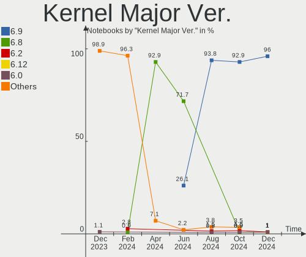
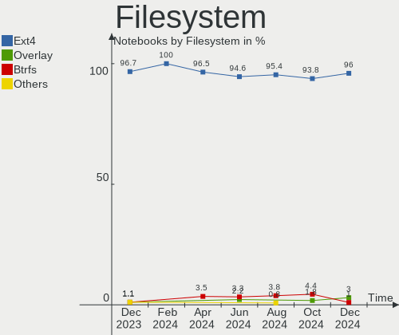
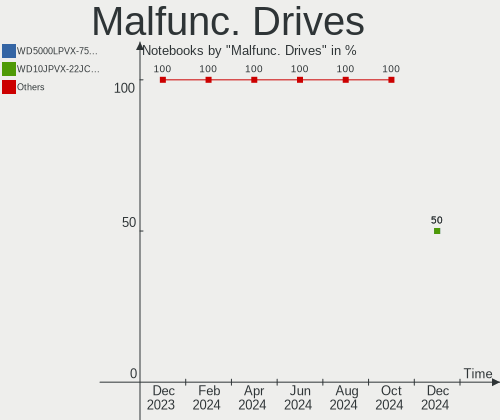
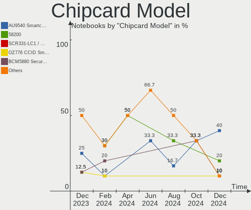
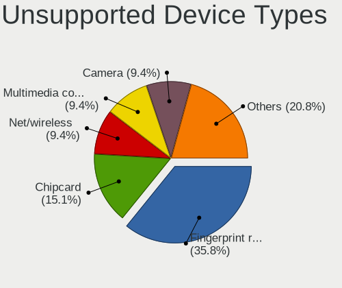

Pop!_OS - Hardware Trends (Notebooks)
-------------------------------------

A project to identify most popular hardware characteristics and track their change
over time based on data collected by Linux users at https://Linux-Hardware.org.

Anyone can contribute to this report by the [hw-probe](https://github.com/linuxhw/hw-probe) tool:

    sudo -E hw-probe -all -upload

This report is for one last month. Overall report since the beginning of time: [TestCoverage](https://github.com/linuxhw/TestCoverage)

Period: Dec, 2022.

Contents
--------

* [ System ](#system)
  - [ OS                       ](#os)
  - [ OS Family                ](#os-family)
  - [ Kernel                   ](#kernel)
  - [ Kernel Family            ](#kernel-family)
  - [ Kernel Major Ver.        ](#kernel-major-ver)
  - [ Arch                     ](#arch)
  - [ DE                       ](#de)
  - [ Display Server           ](#display-server)
  - [ Display Manager          ](#display-manager)
  - [ OS Lang                  ](#os-lang)
  - [ Boot Mode                ](#boot-mode)
  - [ Filesystem               ](#filesystem)
  - [ Part. scheme             ](#part-scheme)
  - [ Dual Boot with Linux/BSD ](#dual-boot-with-linuxbsd)
  - [ Dual Boot (Win)          ](#dual-boot-win)

* [ Board ](#board)
  - [ Vendor                   ](#vendor)
  - [ Model                    ](#model)
  - [ Model Family             ](#model-family)
  - [ MFG Year                 ](#mfg-year)
  - [ Form Factor              ](#form-factor)
  - [ Secure Boot              ](#secure-boot)
  - [ Coreboot                 ](#coreboot)
  - [ RAM Size                 ](#ram-size)
  - [ RAM Used                 ](#ram-used)
  - [ Total Drives             ](#total-drives)
  - [ Has CD-ROM               ](#has-cd-rom)
  - [ Has Ethernet             ](#has-ethernet)
  - [ Has WiFi                 ](#has-wifi)
  - [ Has Bluetooth            ](#has-bluetooth)

* [ Location ](#location)
  - [ Country                  ](#country)
  - [ City                     ](#city)

* [ Drives ](#drives)
  - [ Drive Vendor             ](#drive-vendor)
  - [ Drive Model              ](#drive-model)
  - [ HDD Vendor               ](#hdd-vendor)
  - [ SSD Vendor               ](#ssd-vendor)
  - [ Drive Kind               ](#drive-kind)
  - [ Drive Connector          ](#drive-connector)
  - [ Drive Size               ](#drive-size)
  - [ Space Total              ](#space-total)
  - [ Space Used               ](#space-used)
  - [ Malfunc. Drives          ](#malfunc-drives)
  - [ Malfunc. Drive Vendor    ](#malfunc-drive-vendor)
  - [ Malfunc. HDD Vendor      ](#malfunc-hdd-vendor)
  - [ Malfunc. Drive Kind      ](#malfunc-drive-kind)
  - [ Failed Drives            ](#failed-drives)
  - [ Failed Drive Vendor      ](#failed-drive-vendor)
  - [ Drive Status             ](#drive-status)

* [ Storage controller ](#storage-controller)
  - [ Storage Vendor           ](#storage-vendor)
  - [ Storage Model            ](#storage-model)
  - [ Storage Kind             ](#storage-kind)

* [ Processor ](#processor)
  - [ CPU Vendor               ](#cpu-vendor)
  - [ CPU Model                ](#cpu-model)
  - [ CPU Model Family         ](#cpu-model-family)
  - [ CPU Cores                ](#cpu-cores)
  - [ CPU Sockets              ](#cpu-sockets)
  - [ CPU Threads              ](#cpu-threads)
  - [ CPU Op-Modes             ](#cpu-op-modes)
  - [ CPU Microcode            ](#cpu-microcode)
  - [ CPU Microarch            ](#cpu-microarch)

* [ Graphics ](#graphics)
  - [ GPU Vendor               ](#gpu-vendor)
  - [ GPU Model                ](#gpu-model)
  - [ GPU Combo                ](#gpu-combo)
  - [ GPU Driver               ](#gpu-driver)
  - [ GPU Memory               ](#gpu-memory)

* [ Monitor ](#monitor)
  - [ Monitor Vendor           ](#monitor-vendor)
  - [ Monitor Model            ](#monitor-model)
  - [ Monitor Resolution       ](#monitor-resolution)
  - [ Monitor Diagonal         ](#monitor-diagonal)
  - [ Monitor Width            ](#monitor-width)
  - [ Aspect Ratio             ](#aspect-ratio)
  - [ Monitor Area             ](#monitor-area)
  - [ Pixel Density            ](#pixel-density)
  - [ Multiple Monitors        ](#multiple-monitors)

* [ Network ](#network)
  - [ Net Controller Vendor    ](#net-controller-vendor)
  - [ Net Controller Model     ](#net-controller-model)
  - [ Wireless Vendor          ](#wireless-vendor)
  - [ Wireless Model           ](#wireless-model)
  - [ Ethernet Vendor          ](#ethernet-vendor)
  - [ Ethernet Model           ](#ethernet-model)
  - [ Net Controller Kind      ](#net-controller-kind)
  - [ Used Controller          ](#used-controller)
  - [ NICs                     ](#nics)
  - [ IPv6                     ](#ipv6)

* [ Bluetooth ](#bluetooth)
  - [ Bluetooth Vendor         ](#bluetooth-vendor)
  - [ Bluetooth Model          ](#bluetooth-model)

* [ Sound ](#sound)
  - [ Sound Vendor             ](#sound-vendor)
  - [ Sound Model              ](#sound-model)

* [ Memory ](#memory)
  - [ Memory Vendor            ](#memory-vendor)
  - [ Memory Model             ](#memory-model)
  - [ Memory Kind              ](#memory-kind)
  - [ Memory Form Factor       ](#memory-form-factor)
  - [ Memory Size              ](#memory-size)
  - [ Memory Speed             ](#memory-speed)

* [ Printers & scanners ](#printers--scanners)
  - [ Printer Vendor           ](#printer-vendor)
  - [ Printer Model            ](#printer-model)
  - [ Scanner Vendor           ](#scanner-vendor)
  - [ Scanner Model            ](#scanner-model)

* [ Camera ](#camera)
  - [ Camera Vendor            ](#camera-vendor)
  - [ Camera Model             ](#camera-model)

* [ Security ](#security)
  - [ Fingerprint Vendor       ](#fingerprint-vendor)
  - [ Fingerprint Model        ](#fingerprint-model)
  - [ Chipcard Vendor          ](#chipcard-vendor)
  - [ Chipcard Model           ](#chipcard-model)

* [ Unsupported ](#unsupported)
  - [ Unsupported Devices      ](#unsupported-devices)
  - [ Unsupported Device Types ](#unsupported-device-types)

System
------

OS
--

Installed operating systems

| Name          | Notebooks | Percent |
|---------------|-----------|---------|
| Pop!_OS 22.04 | 133       | 97.79%  |
| Pop!_OS 20.04 | 2         | 1.47%   |
| Pop!_OS 21.04 | 1         | 0.74%   |

OS Family
---------

OS without a version

| Name    | Notebooks | Percent |
|---------|-----------|---------|
| Pop!_OS | 136       | 100%    |

Kernel
------

Version of the Linux kernel

| Version                  | Notebooks | Percent |
|--------------------------|-----------|---------|
| 6.0.6-76060006-generic   | 85        | 62.5%   |
| 6.0.12-76060006-generic  | 39        | 28.68%  |
| 6.0.2-76060002-generic   | 3         | 2.21%   |
| 5.19.0-76051900-generic  | 3         | 2.21%   |
| 5.17.5-76051705-generic  | 3         | 2.21%   |
| 5.18.10-76051810-generic | 1         | 0.74%   |
| 5.17.15-76051715-generic | 1         | 0.74%   |
| 5.15.11-76051511-generic | 1         | 0.74%   |

Kernel Family
-------------

Linux kernel without a distro release

| Version | Notebooks | Percent |
|---------|-----------|---------|
| 6.0.6   | 85        | 62.5%   |
| 6.0.12  | 39        | 28.68%  |
| 6.0.2   | 3         | 2.21%   |
| 5.19.0  | 3         | 2.21%   |
| 5.17.5  | 3         | 2.21%   |
| 5.18.10 | 1         | 0.74%   |
| 5.17.15 | 1         | 0.74%   |
| 5.15.11 | 1         | 0.74%   |

Kernel Major Ver.
-----------------

Linux kernel major version

| Version | Notebooks | Percent |
|---------|-----------|---------|
| 6.0     | 127       | 93.38%  |
| 5.17    | 4         | 2.94%   |
| 5.19    | 3         | 2.21%   |
| 5.18    | 1         | 0.74%   |
| 5.15    | 1         | 0.74%   |

Arch
----

OS architecture (x86_64, i586, etc.)

| Name   | Notebooks | Percent |
|--------|-----------|---------|
| x86_64 | 136       | 100%    |

DE
--

Desktop Environment

| Name  | Notebooks | Percent |
|-------|-----------|---------|
| GNOME | 135       | 99.26%  |
| KDE5  | 1         | 0.74%   |

Display Server
--------------

X11 or Wayland

| Name    | Notebooks | Percent |
|---------|-----------|---------|
| X11     | 130       | 95.59%  |
| Wayland | 6         | 4.41%   |

Display Manager
---------------

SDDM, LightDM, etc.

| Name    | Notebooks | Percent |
|---------|-----------|---------|
| Unknown | 100       | 73.53%  |
| GDM3    | 35        | 25.74%  |
| SDDM    | 1         | 0.74%   |

OS Lang
-------

Language

| Lang  | Notebooks | Percent |
|-------|-----------|---------|
| en_US | 72        | 52.94%  |
| en_GB | 13        | 9.56%   |
| pt_BR | 12        | 8.82%   |
| it_IT | 6         | 4.41%   |
| de_DE | 6         | 4.41%   |
| C     | 6         | 4.41%   |
| es_ES | 4         | 2.94%   |
| nb_NO | 2         | 1.47%   |
| fr_CA | 2         | 1.47%   |
| en_AU | 2         | 1.47%   |
| sv_SE | 1         | 0.74%   |
| pl_PL | 1         | 0.74%   |
| nl_NL | 1         | 0.74%   |
| ja_JP | 1         | 0.74%   |
| es_MX | 1         | 0.74%   |
| es_AR | 1         | 0.74%   |
| en_IN | 1         | 0.74%   |
| en_IL | 1         | 0.74%   |
| en_IE | 1         | 0.74%   |
| de_CH | 1         | 0.74%   |
| bg_BG | 1         | 0.74%   |

Boot Mode
---------

EFI or BIOS

| Mode | Notebooks | Percent |
|------|-----------|---------|
| BIOS | 101       | 74.26%  |
| EFI  | 35        | 25.74%  |

Filesystem
----------

Type of filesystem

| Type    | Notebooks | Percent |
|---------|-----------|---------|
| Ext4    | 127       | 93.38%  |
| Btrfs   | 5         | 3.68%   |
| Overlay | 4         | 2.94%   |

Part. scheme
------------

Scheme of partitioning

| Type    | Notebooks | Percent |
|---------|-----------|---------|
| Unknown | 100       | 73.53%  |
| GPT     | 35        | 25.74%  |
| MBR     | 1         | 0.74%   |

Dual Boot with Linux/BSD
------------------------

Hosting more than one Linux/BSD

| Dual boot | Notebooks | Percent |
|-----------|-----------|---------|
| No        | 135       | 99.26%  |
| Yes       | 1         | 0.74%   |

Dual Boot (Win)
---------------

Hosting Linux and Windows

| Dual boot | Notebooks | Percent |
|-----------|-----------|---------|
| No        | 123       | 90.44%  |
| Yes       | 13        | 9.56%   |

Board
-----

Vendor
------

Motherboard manufacturer

| Name                   | Notebooks | Percent |
|------------------------|-----------|---------|
| Lenovo                 | 34        | 25%     |
| Dell                   | 20        | 14.71%  |
| ASUSTek Computer       | 19        | 13.97%  |
| Hewlett-Packard        | 15        | 11.03%  |
| Acer                   | 10        | 7.35%   |
| System76               | 7         | 5.15%   |
| Apple                  | 7         | 5.15%   |
| Avell High Performance | 3         | 2.21%   |
| Toshiba                | 2         | 1.47%   |
| Sony                   | 2         | 1.47%   |
| Samsung Electronics    | 2         | 1.47%   |
| MSI                    | 2         | 1.47%   |
| HUAWEI                 | 2         | 1.47%   |
| GPU Company            | 2         | 1.47%   |
| Timi                   | 1         | 0.74%   |
| Medion                 | 1         | 0.74%   |
| LG Electronics         | 1         | 0.74%   |
| GPD                    | 1         | 0.74%   |
| Fujitsu                | 1         | 0.74%   |
| Framework              | 1         | 0.74%   |
| ALLDOCUBE              | 1         | 0.74%   |
| Alienware              | 1         | 0.74%   |
| Unknown                | 1         | 0.74%   |

Model
-----

Motherboard model

| Name                                         | Notebooks | Percent |
|----------------------------------------------|-----------|---------|
| System76 Gazelle                             | 4         | 2.94%   |
| System76 Lemur Pro                           | 2         | 1.47%   |
| Lenovo Y520-15IKBN 80WK                      | 2         | 1.47%   |
| HP Notebook                                  | 2         | 1.47%   |
| GPU Company GWNR71517                        | 2         | 1.47%   |
| Dell Latitude E7240                          | 2         | 1.47%   |
| Toshiba Satellite Pro C50-A-1MX              | 1         | 0.74%   |
| Toshiba Satellite C55-C                      | 1         | 0.74%   |
| Timi TM1703                                  | 1         | 0.74%   |
| System76 Pangolin                            | 1         | 0.74%   |
| Sony VGN-FW21E                               | 1         | 0.74%   |
| Sony SVF15213CBB                             | 1         | 0.74%   |
| Samsung 350V5C/351V5C/3540VC/3440VC          | 1         | 0.74%   |
| Samsung 300E4A/300E5A/300E7A/3430EA/3530EA   | 1         | 0.74%   |
| MSI Summit E16Flip A12UCT                    | 1         | 0.74%   |
| MSI GE60 2OC\2OE                             | 1         | 0.74%   |
| Medion X6816                                 | 1         | 0.74%   |
| LG 16Z90P-K.AA78A1                           | 1         | 0.74%   |
| Lenovo Z50-70 20354                          | 1         | 0.74%   |
| Lenovo Y70-70 Touch 80DU                     | 1         | 0.74%   |
| Lenovo Y50-70 20378                          | 1         | 0.74%   |
| Lenovo V15 G2 ITL 82KB                       | 1         | 0.74%   |
| Lenovo ThinkPad X1 Extreme Gen 4i 20Y50010US | 1         | 0.74%   |
| Lenovo ThinkPad W510 4389W14                 | 1         | 0.74%   |
| Lenovo ThinkPad T530 23943J8                 | 1         | 0.74%   |
| Lenovo ThinkPad T480s 20L8S1QX00             | 1         | 0.74%   |
| Lenovo ThinkPad T440p 20AWS12002             | 1         | 0.74%   |
| Lenovo ThinkPad T14 Gen 1 20UD003VIX         | 1         | 0.74%   |
| Lenovo ThinkPad P17 Gen 2i 20YU002RUS        | 1         | 0.74%   |
| Lenovo ThinkPad P14s Gen 2a 21A00050UK       | 1         | 0.74%   |
| Lenovo ThinkPad L560 20F2S0DA00              | 1         | 0.74%   |
| Lenovo ThinkPad L13 Yoga Gen 2a 21AES01A00   | 1         | 0.74%   |
| Lenovo ThinkPad Edge E430 627189P            | 1         | 0.74%   |
| Lenovo ThinkPad E14 Gen 4 21E4CTO1WW         | 1         | 0.74%   |
| Lenovo ThinkBook 15-IML 20RW                 | 1         | 0.74%   |
| Lenovo Legion S7 16ARHA7 82UG                | 1         | 0.74%   |
| Lenovo Legion 5 Pro 16ITH6H 82JD             | 1         | 0.74%   |
| Lenovo Legion 5 15ARH05H 82B1                | 1         | 0.74%   |
| Lenovo Legion 5 15ACH6H 82JU                 | 1         | 0.74%   |
| Lenovo IdeaPad Z410 20292                    | 1         | 0.74%   |

Model Family
------------

Motherboard model prefix

| Name                  | Notebooks | Percent |
|-----------------------|-----------|---------|
| Lenovo ThinkPad       | 12        | 8.82%   |
| Lenovo IdeaPad        | 9         | 6.62%   |
| Dell Inspiron         | 7         | 5.15%   |
| ASUS VivoBook         | 6         | 4.41%   |
| Acer Aspire           | 6         | 4.41%   |
| System76 Gazelle      | 4         | 2.94%   |
| Lenovo Legion         | 4         | 2.94%   |
| HP Pavilion           | 4         | 2.94%   |
| Dell XPS              | 4         | 2.94%   |
| Dell Latitude         | 4         | 2.94%   |
| ASUS ASUS             | 3         | 2.21%   |
| Toshiba Satellite     | 2         | 1.47%   |
| System76 Lemur        | 2         | 1.47%   |
| Lenovo Y520-15IKBN    | 2         | 1.47%   |
| HP ProBook            | 2         | 1.47%   |
| HP Notebook           | 2         | 1.47%   |
| HP Laptop             | 2         | 1.47%   |
| HP ENVY               | 2         | 1.47%   |
| HP EliteBook          | 2         | 1.47%   |
| GPU Company GWNR71517 | 2         | 1.47%   |
| ASUS ROG              | 2         | 1.47%   |
| Acer Swift            | 2         | 1.47%   |
| Timi TM1703           | 1         | 0.74%   |
| System76 Pangolin     | 1         | 0.74%   |
| Sony VGN-FW21E        | 1         | 0.74%   |
| Sony SVF15213CBB      | 1         | 0.74%   |
| Samsung 350V5C        | 1         | 0.74%   |
| Samsung 300E4A        | 1         | 0.74%   |
| MSI Summit            | 1         | 0.74%   |
| MSI GE60              | 1         | 0.74%   |
| Medion X6816          | 1         | 0.74%   |
| LG 16Z90P-K.AA78A1    | 1         | 0.74%   |
| Lenovo Z50-70         | 1         | 0.74%   |
| Lenovo Y70-70         | 1         | 0.74%   |
| Lenovo Y50-70         | 1         | 0.74%   |
| Lenovo V15            | 1         | 0.74%   |
| Lenovo ThinkBook      | 1         | 0.74%   |
| Lenovo G505           | 1         | 0.74%   |
| Lenovo G470           | 1         | 0.74%   |
| HUAWEI KLVL-WXX9      | 1         | 0.74%   |

MFG Year
--------

Motherboard manufacture year

| Year | Notebooks | Percent |
|------|-----------|---------|
| 2021 | 34        | 25%     |
| 2020 | 16        | 11.76%  |
| 2022 | 12        | 8.82%   |
| 2013 | 12        | 8.82%   |
| 2019 | 11        | 8.09%   |
| 2015 | 8         | 5.88%   |
| 2018 | 7         | 5.15%   |
| 2012 | 6         | 4.41%   |
| 2010 | 6         | 4.41%   |
| 2017 | 5         | 3.68%   |
| 2016 | 5         | 3.68%   |
| 2011 | 5         | 3.68%   |
| 2014 | 4         | 2.94%   |
| 2009 | 2         | 1.47%   |
| 2008 | 2         | 1.47%   |
| 2007 | 1         | 0.74%   |

Form Factor
-----------

Physical design of the computer

| Name     | Notebooks | Percent |
|----------|-----------|---------|
| Notebook | 136       | 100%    |

Secure Boot
-----------

Enabled or disabled

| State    | Notebooks | Percent |
|----------|-----------|---------|
| Disabled | 136       | 100%    |

Coreboot
--------

Have coreboot on board

| Used | Notebooks | Percent |
|------|-----------|---------|
| No   | 133       | 97.79%  |
| Yes  | 3         | 2.21%   |

RAM Size
--------

Total RAM memory

| Size in GB  | Notebooks | Percent |
|-------------|-----------|---------|
| 4.01-8.0    | 36        | 26.47%  |
| 16.01-24.0  | 33        | 24.26%  |
| 8.01-16.0   | 31        | 22.79%  |
| 3.01-4.0    | 17        | 12.5%   |
| 32.01-64.0  | 12        | 8.82%   |
| 24.01-32.0  | 4         | 2.94%   |
| 64.01-256.0 | 3         | 2.21%   |

RAM Used
--------

Used RAM memory

| Used GB    | Notebooks | Percent |
|------------|-----------|---------|
| 2.01-3.0   | 50        | 36.76%  |
| 3.01-4.0   | 34        | 25%     |
| 4.01-8.0   | 33        | 24.26%  |
| 8.01-16.0  | 9         | 6.62%   |
| 1.01-2.0   | 8         | 5.88%   |
| 24.01-32.0 | 1         | 0.74%   |
| 16.01-24.0 | 1         | 0.74%   |

Total Drives
------------

Number of drives on board

| Drives | Notebooks | Percent |
|--------|-----------|---------|
| 1      | 97        | 71.32%  |
| 2      | 36        | 26.47%  |
| 3      | 2         | 1.47%   |
| 4      | 1         | 0.74%   |

Has CD-ROM
----------

Has CD-ROM on board

| Presented | Notebooks | Percent |
|-----------|-----------|---------|
| No        | 105       | 77.21%  |
| Yes       | 31        | 22.79%  |

Has Ethernet
------------

Has Ethernet on board

| Presented | Notebooks | Percent |
|-----------|-----------|---------|
| Yes       | 101       | 74.26%  |
| No        | 35        | 25.74%  |

Has WiFi
--------

Has WiFi module

| Presented | Notebooks | Percent |
|-----------|-----------|---------|
| Yes       | 134       | 98.53%  |
| No        | 2         | 1.47%   |

Has Bluetooth
-------------

Has Bluetooth module

| Presented | Notebooks | Percent |
|-----------|-----------|---------|
| Yes       | 114       | 83.82%  |
| No        | 22        | 16.18%  |

Location
--------

Country
-------

Geographic location (country)

| Country         | Notebooks | Percent |
|-----------------|-----------|---------|
| USA             | 24        | 17.65%  |
| Brazil          | 13        | 9.56%   |
| UK              | 10        | 7.35%   |
| Italy           | 8         | 5.88%   |
| India           | 7         | 5.15%   |
| Germany         | 6         | 4.41%   |
| Canada          | 6         | 4.41%   |
| Thailand        | 4         | 2.94%   |
| Spain           | 4         | 2.94%   |
| Norway          | 4         | 2.94%   |
| Poland          | 3         | 2.21%   |
| Philippines     | 3         | 2.21%   |
| Bulgaria        | 3         | 2.21%   |
| Australia       | 3         | 2.21%   |
| Turkey          | 2         | 1.47%   |
| Russia          | 2         | 1.47%   |
| Romania         | 2         | 1.47%   |
| Netherlands     | 2         | 1.47%   |
| Ireland         | 2         | 1.47%   |
| Indonesia       | 2         | 1.47%   |
| Greece          | 2         | 1.47%   |
| France          | 2         | 1.47%   |
| Costa Rica      | 2         | 1.47%   |
| Belgium         | 2         | 1.47%   |
| Bangladesh      | 2         | 1.47%   |
| Argentina       | 2         | 1.47%   |
| Switzerland     | 1         | 0.74%   |
| Sweden          | 1         | 0.74%   |
| North Macedonia | 1         | 0.74%   |
| Mexico          | 1         | 0.74%   |
| Latvia          | 1         | 0.74%   |
| Japan           | 1         | 0.74%   |
| Israel          | 1         | 0.74%   |
| Iceland         | 1         | 0.74%   |
| Finland         | 1         | 0.74%   |
| Egypt           | 1         | 0.74%   |
| Denmark         | 1         | 0.74%   |
| Colombia        | 1         | 0.74%   |
| Chile           | 1         | 0.74%   |
| Austria         | 1         | 0.74%   |

City
----

Geographic location (city)

| City                 | Notebooks | Percent |
|----------------------|-----------|---------|
| Tarlac City          | 2         | 1.47%   |
| Sofia                | 2         | 1.47%   |
| San José            | 2         | 1.47%   |
| Oslo                 | 2         | 1.47%   |
| Minneapolis          | 2         | 1.47%   |
| Milan                | 2         | 1.47%   |
| London               | 2         | 1.47%   |
| Kingston             | 2         | 1.47%   |
| Istanbul             | 2         | 1.47%   |
| Chicago              | 2         | 1.47%   |
| Calgary              | 2         | 1.47%   |
| Zdunska Wola         | 1         | 0.74%   |
| York                 | 1         | 0.74%   |
| Yopal                | 1         | 0.74%   |
| Xalapa               | 1         | 0.74%   |
| Wuppertal            | 1         | 0.74%   |
| Worcester            | 1         | 0.74%   |
| Wolverhampton        | 1         | 0.74%   |
| Warwick              | 1         | 0.74%   |
| Warsaw               | 1         | 0.74%   |
| Wanze                | 1         | 0.74%   |
| Vienna               | 1         | 0.74%   |
| Verona               | 1         | 0.74%   |
| Vechta               | 1         | 0.74%   |
| Västerås           | 1         | 0.74%   |
| Varna                | 1         | 0.74%   |
| Valparaiso de Goias  | 1         | 0.74%   |
| Uxbridge             | 1         | 0.74%   |
| Ufa                  | 1         | 0.74%   |
| Turin                | 1         | 0.74%   |
| Tiruchi              | 1         | 0.74%   |
| The Hague            | 1         | 0.74%   |
| Sydney               | 1         | 0.74%   |
| Sturgeon Bay         | 1         | 0.74%   |
| St Petersburg        | 1         | 0.74%   |
| Sillars              | 1         | 0.74%   |
| Shtip                | 1         | 0.74%   |
| Sao Paulo            | 1         | 0.74%   |
| Sao Luís            | 1         | 0.74%   |
| Sao José dos Campos | 1         | 0.74%   |

Drives
------

Drive Vendor
------------

Hard drive vendors

| Vendor                      | Notebooks | Drives | Percent |
|-----------------------------|-----------|--------|---------|
| Samsung Electronics         | 38        | 39     | 21.71%  |
| WDC                         | 18        | 19     | 10.29%  |
| Seagate                     | 18        | 18     | 10.29%  |
| SanDisk                     | 12        | 12     | 6.86%   |
| Crucial                     | 11        | 12     | 6.29%   |
| SK hynix                    | 9         | 9      | 5.14%   |
| Micron Technology           | 9         | 9      | 5.14%   |
| Unknown                     | 7         | 7      | 4%      |
| KIOXIA                      | 6         | 6      | 3.43%   |
| Intel                       | 6         | 6      | 3.43%   |
| Toshiba                     | 5         | 5      | 2.86%   |
| A-DATA Technology           | 5         | 5      | 2.86%   |
| Kingston                    | 3         | 4      | 1.71%   |
| Hitachi                     | 3         | 3      | 1.71%   |
| Union Memory (Shenzhen)     | 2         | 2      | 1.14%   |
| Netac                       | 2         | 2      | 1.14%   |
| Micron/Crucial Technology   | 2         | 2      | 1.14%   |
| HGST                        | 2         | 2      | 1.14%   |
| Apple                       | 2         | 2      | 1.14%   |
| Unknown                     | 2         | 2      | 1.14%   |
| Transcend                   | 1         | 1      | 0.57%   |
| Solid State Storage         | 1         | 1      | 0.57%   |
| Silicon Motion              | 1         | 1      | 0.57%   |
| ShiJi                       | 1         | 1      | 0.57%   |
| Realtek Semiconductor       | 1         | 1      | 0.57%   |
| PNY                         | 1         | 1      | 0.57%   |
| Phison Electronics          | 1         | 1      | 0.57%   |
| Phison                      | 1         | 1      | 0.57%   |
| Patriot                     | 1         | 1      | 0.57%   |
| LITEON                      | 1         | 1      | 0.57%   |
| Lexar                       | 1         | 1      | 0.57%   |
| Kingston Technology Company | 1         | 1      | 0.57%   |
| Intenso                     | 1         | 1      | 0.57%   |

Drive Model
-----------

Hard drive models

| Model                                               | Notebooks | Percent |
|-----------------------------------------------------|-----------|---------|
| Samsung NVMe SSD Controller SM981/PM981/PM983 500GB | 8         | 4.49%   |
| Samsung NVMe SSD Controller SM961/PM961/SM963 256GB | 5         | 2.81%   |
| Seagate ST1000LM035-1RK172 1TB                      | 4         | 2.25%   |
| WDC WDS500G2B0A-00SM50 500GB SSD                    | 3         | 1.69%   |
| SK hynix HFM001TD3JX013N 1TB                        | 3         | 1.69%   |
| Samsung SSD 850 EVO 250GB                           | 3         | 1.69%   |
| Micron 2210_MTFDHBA1T0QFD 1024GB                    | 3         | 1.69%   |
| Crucial CT500MX500SSD1 500GB                        | 3         | 1.69%   |
| Crucial CT240BX500SSD1 240GB                        | 3         | 1.69%   |
| SK hynix BC501 NVMe Solid State Drive 512GB         | 2         | 1.12%   |
| Seagate Expansion 4TB                               | 2         | 1.12%   |
| Sandisk WD Blue SN550 NVMe SSD 500GB                | 2         | 1.12%   |
| Samsung SSD 970 EVO Plus 500GB                      | 2         | 1.12%   |
| Micron/Crucial P2 NVMe PCIe SSD 500GB               | 2         | 1.12%   |
| KIOXIA KBG40ZNV256G 256GB                           | 2         | 1.12%   |
| KIOXIA KBG40ZNS256G NVMe 256GB                      | 2         | 1.12%   |
| Kingston SA400S37240G 240GB SSD                     | 2         | 1.12%   |
| Unknown                                             | 2         | 1.12%   |
| WDC WDS500G2B0B-00YS70 500GB SSD                    | 1         | 0.56%   |
| WDC WDS240G2G0B-00EPW0 240GB SSD                    | 1         | 0.56%   |
| WDC WDS100T2B0C-00PXH0 1TB                          | 1         | 0.56%   |
| WDC WD800BEVS-07RST0 80GB                           | 1         | 0.56%   |
| WDC WD5000LPVT-80G33T2 500GB                        | 1         | 0.56%   |
| WDC WD5000BEVT-00ZAT0 500GB                         | 1         | 0.56%   |
| WDC WD10SPZX-60Z10T0 1TB                            | 1         | 0.56%   |
| WDC WD10SPZX-24Z10 1TB                              | 1         | 0.56%   |
| WDC WD10SPZX-22Z10T0 1TB                            | 1         | 0.56%   |
| WDC WD10SPZX-21Z10T0 1TB                            | 1         | 0.56%   |
| WDC WD10S21X-24R1BT0-SSHD-8GB                       | 1         | 0.56%   |
| WDC WD10JPVX-75JC3T0 1TB                            | 1         | 0.56%   |
| WDC WD M.2 Green 240GB                              | 1         | 0.56%   |
| WDC WD Blue SA510 2.5 500GB                         | 1         | 0.56%   |
| WDC PC SN730 NVMe 512GB                             | 1         | 0.56%   |
| WDC PC SN530 SDBPTPZ-1T00-1002 1TB                  | 1         | 0.56%   |
| Unknown SD128  128GB                                | 1         | 0.56%   |
| Unknown SD/MMC/MS PRO 64GB                          | 1         | 0.56%   |
| Unknown MMC Card  7GB                               | 1         | 0.56%   |
| Unknown MMC Card  64GB                              | 1         | 0.56%   |
| Unknown MMC Card  16GB                              | 1         | 0.56%   |
| Unknown MMC Card  128GB                             | 1         | 0.56%   |

HDD Vendor
----------

Hard disk drive vendors

| Vendor  | Notebooks | Drives | Percent |
|---------|-----------|--------|---------|
| Seagate | 18        | 18     | 50%     |
| WDC     | 9         | 9      | 25%     |
| Toshiba | 3         | 3      | 8.33%   |
| Hitachi | 3         | 3      | 8.33%   |
| HGST    | 2         | 2      | 5.56%   |
| Unknown | 1         | 1      | 2.78%   |

SSD Vendor
----------

Solid state drive vendors

| Vendor              | Notebooks | Drives | Percent |
|---------------------|-----------|--------|---------|
| Samsung Electronics | 12        | 12     | 23.53%  |
| Crucial             | 11        | 12     | 21.57%  |
| WDC                 | 6         | 6      | 11.76%  |
| SanDisk             | 5         | 5      | 9.8%    |
| Kingston            | 3         | 4      | 5.88%   |
| Netac               | 2         | 2      | 3.92%   |
| Apple               | 2         | 2      | 3.92%   |
| Transcend           | 1         | 1      | 1.96%   |
| Toshiba             | 1         | 1      | 1.96%   |
| PNY                 | 1         | 1      | 1.96%   |
| Patriot             | 1         | 1      | 1.96%   |
| LITEON              | 1         | 1      | 1.96%   |
| Lexar               | 1         | 1      | 1.96%   |
| Intenso             | 1         | 1      | 1.96%   |
| Intel               | 1         | 1      | 1.96%   |
| A-DATA Technology   | 1         | 1      | 1.96%   |
| Unknown             | 1         | 1      | 1.96%   |

Drive Kind
----------

HDD or SSD

| Kind    | Notebooks | Drives | Percent |
|---------|-----------|--------|---------|
| NVMe    | 72        | 81     | 44.17%  |
| SSD     | 48        | 53     | 29.45%  |
| HDD     | 34        | 36     | 20.86%  |
| MMC     | 7         | 7      | 4.29%   |
| Unknown | 2         | 2      | 1.23%   |

Drive Connector
---------------

SATA, SAS, NVMe, etc.

| Type | Notebooks | Drives | Percent |
|------|-----------|--------|---------|
| SATA | 73        | 86     | 46.5%   |
| NVMe | 72        | 81     | 45.86%  |
| MMC  | 7         | 7      | 4.46%   |
| SAS  | 5         | 5      | 3.18%   |

Drive Size
----------

Size of hard drive

| Size in TB | Notebooks | Drives | Percent |
|------------|-----------|--------|---------|
| 0.01-0.5   | 48        | 56     | 59.26%  |
| 0.51-1.0   | 28        | 28     | 34.57%  |
| 1.01-2.0   | 3         | 3      | 3.7%    |
| 3.01-4.0   | 2         | 2      | 2.47%   |

Space Total
-----------

Amount of disk space available on the file system

| Size in GB | Notebooks | Percent |
|------------|-----------|---------|
| 251-500    | 47        | 34.56%  |
| 101-250    | 32        | 23.53%  |
| 501-1000   | 30        | 22.06%  |
| 1001-2000  | 10        | 7.35%   |
| 51-100     | 8         | 5.88%   |
| 1-20       | 5         | 3.68%   |
| 2001-3000  | 4         | 2.94%   |

Space Used
----------

Amount of used disk space

| Used GB   | Notebooks | Percent |
|-----------|-----------|---------|
| 1-20      | 43        | 31.62%  |
| 21-50     | 30        | 22.06%  |
| 51-100    | 25        | 18.38%  |
| 101-250   | 18        | 13.24%  |
| 251-500   | 12        | 8.82%   |
| 501-1000  | 4         | 2.94%   |
| 2001-3000 | 2         | 1.47%   |
| 1001-2000 | 2         | 1.47%   |

Malfunc. Drives
---------------

Drive models with a malfunction

| Model                                 | Notebooks | Drives | Percent |
|---------------------------------------|-----------|--------|---------|
| WDC WD10SPZX-22Z10T0 1TB              | 1         | 1      | 33.33%  |
| Samsung Electronics SSD 870 EVO 500GB | 1         | 1      | 33.33%  |
| A-DATA Technology IM2P33F3 NVMe 512GB | 1         | 1      | 33.33%  |

Malfunc. Drive Vendor
---------------------

Vendors of faulty drives

| Vendor              | Notebooks | Drives | Percent |
|---------------------|-----------|--------|---------|
| WDC                 | 1         | 1      | 33.33%  |
| Samsung Electronics | 1         | 1      | 33.33%  |
| A-DATA Technology   | 1         | 1      | 33.33%  |

Malfunc. HDD Vendor
-------------------

Vendors of faulty HDD drives

| Vendor | Notebooks | Drives | Percent |
|--------|-----------|--------|---------|
| WDC    | 1         | 1      | 100%    |

Malfunc. Drive Kind
-------------------

Kinds of faulty drives

| Kind | Notebooks | Drives | Percent |
|------|-----------|--------|---------|
| NVMe | 1         | 1      | 33.33%  |
| SSD  | 1         | 1      | 33.33%  |
| HDD  | 1         | 1      | 33.33%  |

Failed Drives
-------------

Failed drive models

Zero info for selected period =(

Failed Drive Vendor
-------------------

Failed drive vendors

Zero info for selected period =(

Drive Status
------------

Number of failed and malfunc. drives

| Status   | Notebooks | Drives | Percent |
|----------|-----------|--------|---------|
| Detected | 108       | 137    | 75%     |
| Works    | 33        | 39     | 22.92%  |
| Malfunc  | 3         | 3      | 2.08%   |

Storage controller
------------------

Storage Vendor
--------------

Storage controller vendors

| Vendor                         | Notebooks | Percent |
|--------------------------------|-----------|---------|
| Intel                          | 82        | 45.05%  |
| Samsung Electronics            | 28        | 15.38%  |
| AMD                            | 22        | 12.09%  |
| SanDisk                        | 10        | 5.49%   |
| SK hynix                       | 9         | 4.95%   |
| Micron Technology              | 9         | 4.95%   |
| KIOXIA                         | 6         | 3.3%    |
| ADATA Technology               | 4         | 2.2%    |
| Union Memory (Shenzhen)        | 2         | 1.1%    |
| Phison Electronics             | 2         | 1.1%    |
| Micron/Crucial Technology      | 2         | 1.1%    |
| Toshiba America Info Systems   | 1         | 0.55%   |
| Solid State Storage Technology | 1         | 0.55%   |
| Silicon Motion                 | 1         | 0.55%   |
| Realtek Semiconductor          | 1         | 0.55%   |
| Nvidia                         | 1         | 0.55%   |
| Kingston Technology Company    | 1         | 0.55%   |

Storage Model
-------------

Storage controller models

| Model                                                                          | Notebooks | Percent |
|--------------------------------------------------------------------------------|-----------|---------|
| AMD FCH SATA Controller [AHCI mode]                                            | 22        | 11.7%   |
| Samsung NVMe SSD Controller SM981/PM981/PM983                                  | 13        | 6.91%   |
| Micron Non-Volatile memory controller                                          | 9         | 4.79%   |
| Intel Sunrise Point-LP SATA Controller [AHCI mode]                             | 9         | 4.79%   |
| Intel 7 Series Chipset Family 6-port SATA Controller [AHCI mode]               | 9         | 4.79%   |
| Intel Volume Management Device NVMe RAID Controller                            | 7         | 3.72%   |
| Samsung NVMe SSD Controller 980                                                | 6         | 3.19%   |
| Intel 8 Series/C220 Series Chipset Family 6-port SATA Controller 1 [AHCI mode] | 6         | 3.19%   |
| Samsung NVMe SSD Controller SM961/PM961/SM963                                  | 5         | 2.66%   |
| KIOXIA NVMe SSD Controller BG4                                                 | 5         | 2.66%   |
| Intel 6 Series/C200 Series Chipset Family 6 port Mobile SATA AHCI Controller   | 5         | 2.66%   |
| Intel 400 Series Chipset Family SATA AHCI Controller                           | 5         | 2.66%   |
| SK hynix Gold P31/PC711 NVMe Solid State Drive                                 | 4         | 2.13%   |
| Intel Non-Volatile memory controller                                           | 4         | 2.13%   |
| Intel Cannon Lake Mobile PCH SATA AHCI Controller                              | 4         | 2.13%   |
| Intel 82801 Mobile SATA Controller [RAID mode]                                 | 4         | 2.13%   |
| Intel 5 Series/3400 Series Chipset 6 port SATA AHCI Controller                 | 4         | 2.13%   |
| SanDisk WD Blue SN550 NVMe SSD                                                 | 3         | 1.6%    |
| SanDisk Non-Volatile memory controller                                         | 3         | 1.6%    |
| Samsung NVMe SSD Controller PM9A1/PM9A3/980PRO                                 | 3         | 1.6%    |
| Intel Wildcat Point-LP SATA Controller [AHCI Mode]                             | 3         | 1.6%    |
| Intel Tiger Lake-LP SATA Controller                                            | 3         | 1.6%    |
| Intel 82801IBM/IEM (ICH9M/ICH9M-E) 4 port SATA Controller [AHCI mode]          | 3         | 1.6%    |
| Intel 8 Series SATA Controller 1 [AHCI mode]                                   | 3         | 1.6%    |
| ADATA IM2P33F8ABR1 NVMe SSD                                                    | 3         | 1.6%    |
| SK hynix Non-Volatile memory controller                                        | 2         | 1.06%   |
| SK hynix BC501 NVMe Solid State Drive                                          | 2         | 1.06%   |
| SanDisk WD Black SN750 / PC SN730 NVMe SSD                                     | 2         | 1.06%   |
| Micron/Crucial P2 NVMe PCIe SSD                                                | 2         | 1.06%   |
| Intel HM170/QM170 Chipset SATA Controller [AHCI Mode]                          | 2         | 1.06%   |
| Intel Comet Lake SATA AHCI Controller                                          | 2         | 1.06%   |
| Intel Celeron/Pentium Silver Processor SATA Controller                         | 2         | 1.06%   |
| Intel Alder Lake-P SATA AHCI Controller                                        | 2         | 1.06%   |
| Intel 500 Series Chipset Family SATA AHCI Controller                           | 2         | 1.06%   |
| Intel 5 Series/3400 Series Chipset 4 port SATA AHCI Controller                 | 2         | 1.06%   |
| Union Memory (Shenzhen) Non-Volatile memory controller                         | 1         | 0.53%   |
| Union Memory (Shenzhen) AM630 PCIe 4.0 x4 NVMe SSD Controller                  | 1         | 0.53%   |
| Toshiba America Info Systems XG5 NVMe SSD Controller                           | 1         | 0.53%   |
| Solid State Storage Non-Volatile memory controller                             | 1         | 0.53%   |
| SK hynix BC511                                                                 | 1         | 0.53%   |

Storage Kind
------------

Kind of storage controller (IDE, SATA, NVMe, SAS, ...)

| Kind | Notebooks | Percent |
|------|-----------|---------|
| SATA | 93        | 52.25%  |
| NVMe | 72        | 40.45%  |
| RAID | 11        | 6.18%   |
| IDE  | 2         | 1.12%   |

Processor
---------

CPU Vendor
----------

Processor vendors

| Vendor | Notebooks | Percent |
|--------|-----------|---------|
| Intel  | 98        | 72.06%  |
| AMD    | 38        | 27.94%  |

CPU Model
---------

Processor models

| Model                                         | Notebooks | Percent |
|-----------------------------------------------|-----------|---------|
| Intel Core i7-10750H CPU @ 2.60GHz            | 5         | 3.68%   |
| Intel 11th Gen Core i7-1165G7 @ 2.80GHz       | 4         | 2.94%   |
| AMD Ryzen 7 5700U with Radeon Graphics        | 4         | 2.94%   |
| Intel Core i5-8250U CPU @ 1.60GHz             | 3         | 2.21%   |
| Intel Core i5-10210U CPU @ 1.60GHz            | 3         | 2.21%   |
| Intel 11th Gen Core i7-11800H @ 2.30GHz       | 3         | 2.21%   |
| Intel 11th Gen Core i5-1135G7 @ 2.40GHz       | 3         | 2.21%   |
| AMD Ryzen 7 5800H with Radeon Graphics        | 3         | 2.21%   |
| AMD Ryzen 7 4800H with Radeon Graphics        | 3         | 2.21%   |
| AMD Ryzen 7 4700U with Radeon Graphics        | 3         | 2.21%   |
| AMD Ryzen 7 3700U with Radeon Vega Mobile Gfx | 3         | 2.21%   |
| Intel Core i7-9750H CPU @ 2.60GHz             | 2         | 1.47%   |
| Intel Core i7-7700HQ CPU @ 2.80GHz            | 2         | 1.47%   |
| Intel Core i7-2670QM CPU @ 2.20GHz            | 2         | 1.47%   |
| Intel Core i5-9300H CPU @ 2.40GHz             | 2         | 1.47%   |
| Intel Core i5-7200U CPU @ 2.50GHz             | 2         | 1.47%   |
| Intel Core i5-6200U CPU @ 2.30GHz             | 2         | 1.47%   |
| Intel Core i5-4200U CPU @ 1.60GHz             | 2         | 1.47%   |
| Intel Core i3-5005U CPU @ 2.00GHz             | 2         | 1.47%   |
| Intel 12th Gen Core i7-12700H                 | 2         | 1.47%   |
| Intel 12th Gen Core i7-1255U                  | 2         | 1.47%   |
| Intel 11th Gen Core i7-1195G7 @ 2.90GHz       | 2         | 1.47%   |
| AMD Ryzen 9 5900HS with Radeon Graphics       | 2         | 1.47%   |
| AMD Ryzen 5 PRO 5650U with Radeon Graphics    | 2         | 1.47%   |
| AMD Ryzen 5 3500U with Radeon Vega Mobile Gfx | 2         | 1.47%   |
| AMD Ryzen 5 2500U with Radeon Vega Mobile Gfx | 2         | 1.47%   |
| Intel Xeon CPU E3-1505M v6 @ 3.00GHz          | 1         | 0.74%   |
| Intel Genuine CPU U7300 @ 1.30GHz             | 1         | 0.74%   |
| Intel Core i7-8750H CPU @ 2.20GHz             | 1         | 0.74%   |
| Intel Core i7-8550U CPU @ 1.80GHz             | 1         | 0.74%   |
| Intel Core i7-7660U CPU @ 2.50GHz             | 1         | 0.74%   |
| Intel Core i7-7500U CPU @ 2.70GHz             | 1         | 0.74%   |
| Intel Core i7-6600U CPU @ 2.60GHz             | 1         | 0.74%   |
| Intel Core i7-4870HQ CPU @ 2.50GHz            | 1         | 0.74%   |
| Intel Core i7-4800MQ CPU @ 2.70GHz            | 1         | 0.74%   |
| Intel Core i7-4720HQ CPU @ 2.60GHz            | 1         | 0.74%   |
| Intel Core i7-4710HQ CPU @ 2.50GHz            | 1         | 0.74%   |
| Intel Core i7-4702MQ CPU @ 2.20GHz            | 1         | 0.74%   |
| Intel Core i7-4700MQ CPU @ 2.40GHz            | 1         | 0.74%   |
| Intel Core i7-4700HQ CPU @ 2.40GHz            | 1         | 0.74%   |

CPU Model Family
----------------

Processor model prefix

| Model            | Notebooks | Percent |
|------------------|-----------|---------|
| Intel Core i7    | 32        | 23.53%  |
| Intel Core i5    | 29        | 21.32%  |
| Other            | 21        | 15.44%  |
| AMD Ryzen 7      | 18        | 13.24%  |
| AMD Ryzen 5      | 8         | 5.88%   |
| Intel Core i3    | 7         | 5.15%   |
| Intel Core 2 Duo | 4         | 2.94%   |
| Intel Celeron    | 3         | 2.21%   |
| AMD Ryzen 9      | 3         | 2.21%   |
| AMD Ryzen 5 PRO  | 3         | 2.21%   |
| AMD Ryzen 7 PRO  | 2         | 1.47%   |
| Intel Xeon       | 1         | 0.74%   |
| Intel Genuine    | 1         | 0.74%   |
| AMD Ryzen 3      | 1         | 0.74%   |
| AMD E1           | 1         | 0.74%   |
| AMD A6           | 1         | 0.74%   |
| AMD A10          | 1         | 0.74%   |

CPU Cores
---------

Number of processor cores

| Number | Notebooks | Percent |
|--------|-----------|---------|
| 4      | 51        | 37.5%   |
| 2      | 38        | 27.94%  |
| 8      | 23        | 16.91%  |
| 6      | 16        | 11.76%  |
| 14     | 3         | 2.21%   |
| 12     | 2         | 1.47%   |
| 10     | 2         | 1.47%   |
| 1      | 1         | 0.74%   |

CPU Sockets
-----------

Number of sockets

| Number | Notebooks | Percent |
|--------|-----------|---------|
| 1      | 136       | 100%    |

CPU Threads
-----------

Threads per core (Hyper-Threading)

| Number | Notebooks | Percent |
|--------|-----------|---------|
| 2      | 121       | 88.97%  |
| 1      | 15        | 11.03%  |

CPU Op-Modes
------------

CPU Operation Modes (32-bit, 64-bit)

| Op mode        | Notebooks | Percent |
|----------------|-----------|---------|
| 32-bit, 64-bit | 136       | 100%    |

CPU Microcode
-------------

Microcode number

| Number     | Notebooks | Percent |
|------------|-----------|---------|
| Unknown    | 99        | 72.79%  |
| 0x0a50000c | 4         | 2.94%   |
| 0x08600106 | 4         | 2.94%   |
| 0xa0652    | 3         | 2.21%   |
| 0x806ec    | 3         | 2.21%   |
| 0x906ea    | 2         | 1.47%   |
| 0x806c1    | 2         | 1.47%   |
| 0x0a404102 | 2         | 1.47%   |
| 0x08608103 | 2         | 1.47%   |
| 0x906a4    | 1         | 0.74%   |
| 0x906a3    | 1         | 0.74%   |
| 0x806ea    | 1         | 0.74%   |
| 0x806d1    | 1         | 0.74%   |
| 0x806c2    | 1         | 0.74%   |
| 0x706a1    | 1         | 0.74%   |
| 0x40651    | 1         | 0.74%   |
| 0x306c3    | 1         | 0.74%   |
| 0x306a9    | 1         | 0.74%   |
| 0x206a7    | 1         | 0.74%   |
| 0x20655    | 1         | 0.74%   |
| 0x1067a    | 1         | 0.74%   |
| 0x0a50000d | 1         | 0.74%   |
| 0x08108109 | 1         | 0.74%   |
| 0x08108102 | 1         | 0.74%   |

CPU Microarch
-------------

Microarchitecture

| Name             | Notebooks | Percent |
|------------------|-----------|---------|
| KabyLake         | 23        | 16.91%  |
| Unknown          | 18        | 13.24%  |
| Haswell          | 11        | 8.09%   |
| Zen 3            | 10        | 7.35%   |
| Zen 2            | 9         | 6.62%   |
| TigerLake        | 9         | 6.62%   |
| IvyBridge        | 8         | 5.88%   |
| SandyBridge      | 7         | 5.15%   |
| Zen+             | 6         | 4.41%   |
| CometLake        | 6         | 4.41%   |
| Westmere         | 5         | 3.68%   |
| Penryn           | 5         | 3.68%   |
| Skylake          | 4         | 2.94%   |
| Broadwell        | 4         | 2.94%   |
| Zen              | 2         | 1.47%   |
| Goldmont plus    | 2         | 1.47%   |
| Alderlake Hybrid | 2         | 1.47%   |
| Puma             | 1         | 0.74%   |
| Piledriver       | 1         | 0.74%   |
| Nehalem          | 1         | 0.74%   |
| Jaguar           | 1         | 0.74%   |
| Icelake          | 1         | 0.74%   |

Graphics
--------

GPU Vendor
----------

Vendors of graphics cards

| Vendor | Notebooks | Percent |
|--------|-----------|---------|
| Intel  | 92        | 50.27%  |
| AMD    | 47        | 25.68%  |
| Nvidia | 44        | 24.04%  |

GPU Model
---------

Graphics card models

| Model                                                                                 | Notebooks | Percent |
|---------------------------------------------------------------------------------------|-----------|---------|
| AMD Cezanne [Radeon Vega Series / Radeon Vega Mobile Series]                          | 10        | 5.35%   |
| Intel TigerLake-LP GT2 [Iris Xe Graphics]                                             | 9         | 4.81%   |
| AMD Renoir                                                                            | 9         | 4.81%   |
| Intel 3rd Gen Core processor Graphics Controller                                      | 8         | 4.28%   |
| Intel 2nd Generation Core Processor Family Integrated Graphics Controller             | 7         | 3.74%   |
| Intel CometLake-H GT2 [UHD Graphics]                                                  | 6         | 3.21%   |
| Intel 4th Gen Core Processor Integrated Graphics Controller                           | 6         | 3.21%   |
| AMD Picasso/Raven 2 [Radeon Vega Series / Radeon Vega Mobile Series]                  | 6         | 3.21%   |
| AMD Lucienne                                                                          | 6         | 3.21%   |
| Intel UHD Graphics 620                                                                | 5         | 2.67%   |
| Intel CoffeeLake-H GT2 [UHD Graphics 630]                                             | 5         | 2.67%   |
| Intel Alder Lake-P Integrated Graphics Controller                                     | 5         | 2.67%   |
| Nvidia GA107M [GeForce RTX 3050 Mobile]                                               | 4         | 2.14%   |
| Intel TigerLake-H GT1 [UHD Graphics]                                                  | 4         | 2.14%   |
| Intel Skylake GT2 [HD Graphics 520]                                                   | 4         | 2.14%   |
| Intel Haswell-ULT Integrated Graphics Controller                                      | 4         | 2.14%   |
| Intel Core Processor Integrated Graphics Controller                                   | 4         | 2.14%   |
| Intel CometLake-U GT2 [UHD Graphics]                                                  | 4         | 2.14%   |
| Nvidia TU117M [GeForce GTX 1650 Mobile / Max-Q]                                       | 3         | 1.6%    |
| Nvidia TU106M [GeForce RTX 2060 Mobile]                                               | 3         | 1.6%    |
| Nvidia GP107M [GeForce GTX 1050 Ti Mobile]                                            | 3         | 1.6%    |
| Intel HD Graphics 620                                                                 | 3         | 1.6%    |
| Intel HD Graphics 5500                                                                | 3         | 1.6%    |
| AMD Topaz XT [Radeon R7 M260/M265 / M340/M360 / M440/M445 / 530/535 / 620/625 Mobile] | 3         | 1.6%    |
| Nvidia TU117M                                                                         | 2         | 1.07%   |
| Nvidia TU116M [GeForce GTX 1660 Ti Mobile]                                            | 2         | 1.07%   |
| Nvidia GM108M [GeForce 840M]                                                          | 2         | 1.07%   |
| Nvidia GK208M [GeForce GT 740M]                                                       | 2         | 1.07%   |
| Nvidia GA107M [GeForce RTX 3050 Ti Mobile]                                            | 2         | 1.07%   |
| Nvidia GA106M [GeForce RTX 3060 Mobile / Max-Q]                                       | 2         | 1.07%   |
| Nvidia GA104M [GeForce RTX 3070 Mobile / Max-Q]                                       | 2         | 1.07%   |
| Intel Mobile 4 Series Chipset Integrated Graphics Controller                          | 2         | 1.07%   |
| Intel Iris Plus Graphics 640                                                          | 2         | 1.07%   |
| Intel HD Graphics 630                                                                 | 2         | 1.07%   |
| Intel GeminiLake [UHD Graphics 600]                                                   | 2         | 1.07%   |
| Intel Alder Lake-UP3 GT2 [Iris Xe Graphics]                                           | 2         | 1.07%   |
| AMD Rembrandt [Radeon 680M]                                                           | 2         | 1.07%   |
| AMD Raven Ridge [Radeon Vega Series / Radeon Vega Mobile Series]                      | 2         | 1.07%   |
| Nvidia TU117M [GeForce GTX 1650 Ti Mobile]                                            | 1         | 0.53%   |
| Nvidia MCP89 [GeForce 320M]                                                           | 1         | 0.53%   |

GPU Combo
---------

Combinations of graphics cards

| Name           | Notebooks | Percent |
|----------------|-----------|---------|
| 1 x Intel      | 54        | 39.71%  |
| Intel + Nvidia | 32        | 23.53%  |
| 1 x AMD        | 29        | 21.32%  |
| AMD + Nvidia   | 8         | 5.88%   |
| Intel + AMD    | 6         | 4.41%   |
| 1 x Nvidia     | 4         | 2.94%   |
| 2 x AMD        | 3         | 2.21%   |

GPU Driver
----------

Free vs proprietary

| Driver      | Notebooks | Percent |
|-------------|-----------|---------|
| Free        | 101       | 74.26%  |
| Proprietary | 35        | 25.74%  |

GPU Memory
----------

Total video memory

| Size in GB | Notebooks | Percent |
|------------|-----------|---------|
| Unknown    | 115       | 84.56%  |
| 0.01-0.5   | 13        | 9.56%   |
| 1.01-2.0   | 3         | 2.21%   |
| 7.01-8.0   | 2         | 1.47%   |
| 5.01-6.0   | 2         | 1.47%   |
| 0.51-1.0   | 1         | 0.74%   |

Monitor
-------

Monitor Vendor
--------------

Monitor vendors

| Vendor               | Notebooks | Percent |
|----------------------|-----------|---------|
| BOE                  | 28        | 16.57%  |
| Chimei Innolux       | 26        | 15.38%  |
| AU Optronics         | 23        | 13.61%  |
| LG Display           | 20        | 11.83%  |
| Samsung Electronics  | 10        | 5.92%   |
| PANDA                | 8         | 4.73%   |
| Goldstar             | 8         | 4.73%   |
| Apple                | 7         | 4.14%   |
| Sharp                | 5         | 2.96%   |
| Dell                 | 5         | 2.96%   |
| AOC                  | 4         | 2.37%   |
| Lenovo               | 3         | 1.78%   |
| InfoVision           | 3         | 1.78%   |
| BenQ                 | 3         | 1.78%   |
| Philips              | 2         | 1.18%   |
| Ancor Communications | 2         | 1.18%   |
| Toshiba              | 1         | 0.59%   |
| TMX                  | 1         | 0.59%   |
| RTK                  | 1         | 0.59%   |
| PRISM+               | 1         | 0.59%   |
| MYS                  | 1         | 0.59%   |
| KON                  | 1         | 0.59%   |
| HKC                  | 1         | 0.59%   |
| Hitachi              | 1         | 0.59%   |
| Hewlett-Packard      | 1         | 0.59%   |
| CSO                  | 1         | 0.59%   |
| ASUSTek Computer     | 1         | 0.59%   |
| Acer                 | 1         | 0.59%   |

Monitor Model
-------------

Monitor models

| Model                                                                 | Notebooks | Percent |
|-----------------------------------------------------------------------|-----------|---------|
| PANDA LCD Monitor NCP004D 1920x1080 344x194mm 15.5-inch               | 3         | 1.76%   |
| Chimei Innolux LCD Monitor CMN14D5 1920x1080 309x173mm 13.9-inch      | 3         | 1.76%   |
| PANDA LCD Monitor NCP0036 1920x1080 344x194mm 15.5-inch               | 2         | 1.18%   |
| LG Display LCD Monitor LGD02DC 1366x768 344x194mm 15.5-inch           | 2         | 1.18%   |
| Lenovo LCD Monitor LEN40B1 1600x900 344x193mm 15.5-inch               | 2         | 1.18%   |
| Chimei Innolux LCD Monitor CMN15E6 1366x768 344x193mm 15.5-inch       | 2         | 1.18%   |
| AU Optronics LCD Monitor AUO45EC 1366x768 344x193mm 15.5-inch         | 2         | 1.18%   |
| Toshiba TV TSB010B 1920x1080 706x398mm 31.9-inch                      | 1         | 0.59%   |
| TMX TL140BDXP01-0 TMX1400 2560x1440 310x174mm 14.0-inch               | 1         | 0.59%   |
| Sharp LQ134R1JW51 SHP151B 3840x2400 288x180mm 13.4-inch               | 1         | 0.59%   |
| Sharp LCD Monitor SHP14F9 1920x1200 288x180mm 13.4-inch               | 1         | 0.59%   |
| Sharp LCD Monitor SHP14D1 1920x1200 336x210mm 15.6-inch               | 1         | 0.59%   |
| Sharp LCD Monitor SHP14D0 3840x2400 336x210mm 15.6-inch               | 1         | 0.59%   |
| Sharp LCD Monitor SHP144A 3200x1800 294x165mm 13.3-inch               | 1         | 0.59%   |
| Samsung Electronics SyncMaster SAM0253 1280x1024 376x301mm 19.0-inch  | 1         | 0.59%   |
| Samsung Electronics SyncMaster SAM01D0 1600x1200 432x324mm 21.3-inch  | 1         | 0.59%   |
| Samsung Electronics Q90A SAM713C 3840x2160 1872x1053mm 84.6-inch      | 1         | 0.59%   |
| Samsung Electronics LF24T35 SAM707D 1920x1080 528x297mm 23.9-inch     | 1         | 0.59%   |
| Samsung Electronics LCD Monitor SEC4C47 1680x1050 367x229mm 17.0-inch | 1         | 0.59%   |
| Samsung Electronics LCD Monitor SEC344C 1366x768 353x198mm 15.9-inch  | 1         | 0.59%   |
| Samsung Electronics LCD Monitor SEC324A 1366x768 344x194mm 15.5-inch  | 1         | 0.59%   |
| Samsung Electronics LCD Monitor SDC4752 1366x768 344x194mm 15.5-inch  | 1         | 0.59%   |
| Samsung Electronics LCD Monitor SDC4161 1920x1080 344x194mm 15.5-inch | 1         | 0.59%   |
| Samsung Electronics LCD Monitor SDC4141 3840x2160 344x194mm 15.5-inch | 1         | 0.59%   |
| RTK 7911D RTK2A3B 720x1280 720x1280mm 57.8-inch                       | 1         | 0.59%   |
| PRISM+ K3A8F HDMI INN3200 1920x1080 698x393mm 31.5-inch               | 1         | 0.59%   |
| Philips PHL 193V5 PHLC0CD 1366x768 410x230mm 18.5-inch                | 1         | 0.59%   |
| Philips 32PHT4001/12 PHT4001 1366x768 575x323mm 26.0-inch             | 1         | 0.59%   |
| PANDA LCD Monitor NCP005F 1920x1080 344x194mm 15.5-inch               | 1         | 0.59%   |
| PANDA LCD Monitor NCP004B 1920x1080 344x194mm 15.5-inch               | 1         | 0.59%   |
| PANDA LCD Monitor NCP002D 1920x1080 344x194mm 15.5-inch               | 1         | 0.59%   |
| MYS MYS2150 MYS2150 1920x1080 477x268mm 21.5-inch                     | 1         | 0.59%   |
| LG Display LCD Monitor LGD06AA 3840x2400 344x215mm 16.0-inch          | 1         | 0.59%   |
| LG Display LCD Monitor LGD0694 2560x1600 344x215mm 16.0-inch          | 1         | 0.59%   |
| LG Display LCD Monitor LGD0676 1920x1080 309x174mm 14.0-inch          | 1         | 0.59%   |
| LG Display LCD Monitor LGD065A 1920x1080 344x194mm 15.5-inch          | 1         | 0.59%   |
| LG Display LCD Monitor LGD05E5 1920x1080 340x190mm 15.3-inch          | 1         | 0.59%   |
| LG Display LCD Monitor LGD0590 1920x1080 344x194mm 15.5-inch          | 1         | 0.59%   |
| LG Display LCD Monitor LGD04C0 1366x768 309x174mm 14.0-inch           | 1         | 0.59%   |
| LG Display LCD Monitor LGD0469 1920x1080 382x215mm 17.3-inch          | 1         | 0.59%   |

Monitor Resolution
------------------

Monitor screen resolution

| Resolution         | Notebooks | Percent |
|--------------------|-----------|---------|
| 1920x1080 (FHD)    | 73        | 45.06%  |
| 1366x768 (WXGA)    | 35        | 21.6%   |
| 3840x2160 (4K)     | 10        | 6.17%   |
| 2560x1440 (QHD)    | 7         | 4.32%   |
| 1920x1200 (WUXGA)  | 7         | 4.32%   |
| 2560x1600          | 5         | 3.09%   |
| 1600x900 (HD+)     | 4         | 2.47%   |
| 3840x2400          | 3         | 1.85%   |
| 2880x1800          | 3         | 1.85%   |
| 1680x1050 (WSXGA+) | 3         | 1.85%   |
| 1440x900 (WXGA+)   | 3         | 1.85%   |
| 2560x1080          | 2         | 1.23%   |
| 1280x800 (WXGA)    | 2         | 1.23%   |
| 3200x1800 (QHD+)   | 1         | 0.62%   |
| 2256x1504          | 1         | 0.62%   |
| 2160x1440          | 1         | 0.62%   |
| 1600x1200          | 1         | 0.62%   |
| 1280x1024 (SXGA)   | 1         | 0.62%   |

Monitor Diagonal
----------------

Diagonal size in inches

| Inches | Notebooks | Percent |
|--------|-----------|---------|
| 15     | 76        | 44.71%  |
| 13     | 22        | 12.94%  |
| 14     | 15        | 8.82%   |
| 17     | 9         | 5.29%   |
| 27     | 7         | 4.12%   |
| 16     | 7         | 4.12%   |
| 23     | 5         | 2.94%   |
| 21     | 4         | 2.35%   |
| 19     | 4         | 2.35%   |
| 34     | 3         | 1.76%   |
| 24     | 3         | 1.76%   |
| 84     | 2         | 1.18%   |
| 31     | 2         | 1.18%   |
| 12     | 2         | 1.18%   |
| 72     | 1         | 0.59%   |
| 57     | 1         | 0.59%   |
| 33     | 1         | 0.59%   |
| 32     | 1         | 0.59%   |
| 26     | 1         | 0.59%   |
| 22     | 1         | 0.59%   |
| 20     | 1         | 0.59%   |
| 18     | 1         | 0.59%   |
| 11     | 1         | 0.59%   |

Monitor Width
-------------

Physical width

| Width in mm | Notebooks | Percent |
|-------------|-----------|---------|
| 301-350     | 104       | 62.28%  |
| 201-300     | 17        | 10.18%  |
| 501-600     | 14        | 8.38%   |
| 351-400     | 13        | 7.78%   |
| 401-500     | 9         | 5.39%   |
| 701-800     | 5         | 2.99%   |
| 1501-2000   | 3         | 1.8%    |
| 601-700     | 2         | 1.2%    |

Aspect Ratio
------------

Proportional relationship between the width and the height

| Ratio | Notebooks | Percent |
|-------|-----------|---------|
| 16/9  | 114       | 76.51%  |
| 16/10 | 25        | 16.78%  |
| 3/2   | 3         | 2.01%   |
| 21/9  | 3         | 2.01%   |
| 5/4   | 2         | 1.34%   |
| 4/3   | 1         | 0.67%   |
| 0.56  | 1         | 0.67%   |

Monitor Area
------------

Area in inch²

| Area in inch² | Notebooks | Percent |
|----------------|-----------|---------|
| 101-110        | 76        | 44.97%  |
| 81-90          | 28        | 16.57%  |
| 201-250        | 10        | 5.92%   |
| 71-80          | 9         | 5.33%   |
| 121-130        | 8         | 4.73%   |
| 301-350        | 7         | 4.14%   |
| 111-120        | 7         | 4.14%   |
| 351-500        | 6         | 3.55%   |
| 151-200        | 6         | 3.55%   |
| More than 1000 | 4         | 2.37%   |
| 251-300        | 3         | 1.78%   |
| 61-70          | 2         | 1.18%   |
| 51-60          | 1         | 0.59%   |
| 141-150        | 1         | 0.59%   |
| 131-140        | 1         | 0.59%   |

Pixel Density
-------------

Pixels per inch

| Density       | Notebooks | Percent |
|---------------|-----------|---------|
| 121-160       | 68        | 41.46%  |
| 101-120       | 43        | 26.22%  |
| 51-100        | 25        | 15.24%  |
| 161-240       | 19        | 11.59%  |
| More than 240 | 7         | 4.27%   |
| 1-50          | 2         | 1.22%   |

Multiple Monitors
-----------------

Total monitors connected

| Total | Notebooks | Percent |
|-------|-----------|---------|
| 1     | 104       | 76.47%  |
| 2     | 25        | 18.38%  |
| 3     | 4         | 2.94%   |
| 0     | 2         | 1.47%   |
| 4     | 1         | 0.74%   |

Network
-------

Net Controller Vendor
---------------------

Controller vendors

| Vendor                     | Notebooks | Percent |
|----------------------------|-----------|---------|
| Realtek Semiconductor      | 80        | 37.74%  |
| Intel                      | 67        | 31.6%   |
| Qualcomm Atheros           | 25        | 11.79%  |
| Broadcom                   | 13        | 6.13%   |
| MediaTek                   | 7         | 3.3%    |
| Broadcom Limited           | 5         | 2.36%   |
| Marvell Technology Group   | 3         | 1.42%   |
| Xiaomi                     | 2         | 0.94%   |
| Ralink                     | 2         | 0.94%   |
| ASIX Electronics           | 2         | 0.94%   |
| Shenzhen Goodix Technology | 1         | 0.47%   |
| Ralink Technology          | 1         | 0.47%   |
| Qualcomm                   | 1         | 0.47%   |
| Motorola PCS               | 1         | 0.47%   |
| Dell                       | 1         | 0.47%   |
| D-Link                     | 1         | 0.47%   |

Net Controller Model
--------------------

Controller models

| Model                                                             | Notebooks | Percent |
|-------------------------------------------------------------------|-----------|---------|
| Realtek RTL8111/8168/8411 PCI Express Gigabit Ethernet Controller | 56        | 22.67%  |
| Intel Wi-Fi 6 AX200                                               | 16        | 6.48%   |
| Realtek RTL810xE PCI Express Fast Ethernet controller             | 7         | 2.83%   |
| Intel Wi-Fi 6 AX201                                               | 7         | 2.83%   |
| Realtek RTL8153 Gigabit Ethernet Adapter                          | 6         | 2.43%   |
| MediaTek MT7921 802.11ax PCI Express Wireless Network Adapter     | 6         | 2.43%   |
| Qualcomm Atheros AR9485 Wireless Network Adapter                  | 5         | 2.02%   |
| Intel Wireless 8265 / 8275                                        | 5         | 2.02%   |
| Intel Comet Lake PCH CNVi WiFi                                    | 5         | 2.02%   |
| Realtek RTL8852AE 802.11ax PCIe Wireless Network Adapter          | 4         | 1.62%   |
| Realtek RTL8821CE 802.11ac PCIe Wireless Network Adapter          | 4         | 1.62%   |
| Qualcomm Atheros QCA9377 802.11ac Wireless Network Adapter        | 4         | 1.62%   |
| Qualcomm Atheros QCA6174 802.11ac Wireless Network Adapter        | 4         | 1.62%   |
| Intel Wi-Fi 6 AX210/AX211/AX411 160MHz                            | 4         | 1.62%   |
| Intel Comet Lake PCH-LP CNVi WiFi                                 | 4         | 1.62%   |
| Broadcom BCM43142 802.11b/g/n                                     | 4         | 1.62%   |
| Realtek RTL8125 2.5GbE Controller                                 | 3         | 1.21%   |
| Realtek Realtek Network controller                                | 3         | 1.21%   |
| Intel Wireless 7260                                               | 3         | 1.21%   |
| Intel Tiger Lake PCH CNVi WiFi                                    | 3         | 1.21%   |
| Intel Alder Lake-P PCH CNVi WiFi                                  | 3         | 1.21%   |
| Xiaomi Mi/Redmi series (RNDIS)                                    | 2         | 0.81%   |
| Realtek RTL8822CE 802.11ac PCIe Wireless Network Adapter          | 2         | 0.81%   |
| Realtek RTL8723BE PCIe Wireless Network Adapter                   | 2         | 0.81%   |
| Realtek 802.11ac NIC                                              | 2         | 0.81%   |
| Qualcomm Atheros QCA9565 / AR9565 Wireless Network Adapter        | 2         | 0.81%   |
| Qualcomm Atheros AR9462 Wireless Network Adapter                  | 2         | 0.81%   |
| Qualcomm Atheros AR928X Wireless Network Adapter (PCI-Express)    | 2         | 0.81%   |
| Qualcomm Atheros AR9285 Wireless Network Adapter (PCI-Express)    | 2         | 0.81%   |
| Marvell Group 88E8055 PCI-E Gigabit Ethernet Controller           | 2         | 0.81%   |
| Intel Wireless 8260                                               | 2         | 0.81%   |
| Intel Ethernet Connection I218-LM                                 | 2         | 0.81%   |
| Intel Dual Band Wireless-AC 3165 Plus Bluetooth                   | 2         | 0.81%   |
| Intel Centrino Wireless-N 1000 [Condor Peak]                      | 2         | 0.81%   |
| Intel Centrino Ultimate-N 6300                                    | 2         | 0.81%   |
| Intel Centrino Advanced-N 6235                                    | 2         | 0.81%   |
| Intel Cannon Lake PCH CNVi WiFi                                   | 2         | 0.81%   |
| Intel 82577LM Gigabit Network Connection                          | 2         | 0.81%   |
| Broadcom NetXtreme BCM57765 Gigabit Ethernet PCIe                 | 2         | 0.81%   |
| Broadcom Limited BCM4352 802.11ac Wireless Network Adapter        | 2         | 0.81%   |

Wireless Vendor
---------------

Wireless vendors

| Vendor                | Notebooks | Percent |
|-----------------------|-----------|---------|
| Intel                 | 66        | 47.83%  |
| Qualcomm Atheros      | 22        | 15.94%  |
| Realtek Semiconductor | 21        | 15.22%  |
| Broadcom              | 12        | 8.7%    |
| MediaTek              | 7         | 5.07%   |
| Broadcom Limited      | 4         | 2.9%    |
| Ralink                | 2         | 1.45%   |
| Ralink Technology     | 1         | 0.72%   |
| Qualcomm              | 1         | 0.72%   |
| Dell                  | 1         | 0.72%   |
| D-Link                | 1         | 0.72%   |

Wireless Model
--------------

Wireless models

| Model                                                          | Notebooks | Percent |
|----------------------------------------------------------------|-----------|---------|
| Intel Wi-Fi 6 AX200                                            | 16        | 11.43%  |
| Intel Wi-Fi 6 AX201                                            | 7         | 5%      |
| MediaTek MT7921 802.11ax PCI Express Wireless Network Adapter  | 6         | 4.29%   |
| Qualcomm Atheros AR9485 Wireless Network Adapter               | 5         | 3.57%   |
| Intel Wireless 8265 / 8275                                     | 5         | 3.57%   |
| Intel Comet Lake PCH CNVi WiFi                                 | 5         | 3.57%   |
| Realtek RTL8852AE 802.11ax PCIe Wireless Network Adapter       | 4         | 2.86%   |
| Realtek RTL8821CE 802.11ac PCIe Wireless Network Adapter       | 4         | 2.86%   |
| Qualcomm Atheros QCA9377 802.11ac Wireless Network Adapter     | 4         | 2.86%   |
| Qualcomm Atheros QCA6174 802.11ac Wireless Network Adapter     | 4         | 2.86%   |
| Intel Wi-Fi 6 AX210/AX211/AX411 160MHz                         | 4         | 2.86%   |
| Intel Comet Lake PCH-LP CNVi WiFi                              | 4         | 2.86%   |
| Broadcom BCM43142 802.11b/g/n                                  | 4         | 2.86%   |
| Realtek Realtek Network controller                             | 3         | 2.14%   |
| Intel Wireless 7260                                            | 3         | 2.14%   |
| Intel Tiger Lake PCH CNVi WiFi                                 | 3         | 2.14%   |
| Intel Alder Lake-P PCH CNVi WiFi                               | 3         | 2.14%   |
| Realtek RTL8822CE 802.11ac PCIe Wireless Network Adapter       | 2         | 1.43%   |
| Realtek RTL8723BE PCIe Wireless Network Adapter                | 2         | 1.43%   |
| Realtek 802.11ac NIC                                           | 2         | 1.43%   |
| Qualcomm Atheros QCA9565 / AR9565 Wireless Network Adapter     | 2         | 1.43%   |
| Qualcomm Atheros AR9462 Wireless Network Adapter               | 2         | 1.43%   |
| Qualcomm Atheros AR928X Wireless Network Adapter (PCI-Express) | 2         | 1.43%   |
| Qualcomm Atheros AR9285 Wireless Network Adapter (PCI-Express) | 2         | 1.43%   |
| Intel Wireless 8260                                            | 2         | 1.43%   |
| Intel Dual Band Wireless-AC 3165 Plus Bluetooth                | 2         | 1.43%   |
| Intel Centrino Wireless-N 1000 [Condor Peak]                   | 2         | 1.43%   |
| Intel Centrino Ultimate-N 6300                                 | 2         | 1.43%   |
| Intel Centrino Advanced-N 6235                                 | 2         | 1.43%   |
| Intel Cannon Lake PCH CNVi WiFi                                | 2         | 1.43%   |
| Broadcom Limited BCM4352 802.11ac Wireless Network Adapter     | 2         | 1.43%   |
| Broadcom BCM4331 802.11a/b/g/n                                 | 2         | 1.43%   |
| Realtek RTL8822BE 802.11a/b/g/n/ac WiFi adapter                | 1         | 0.71%   |
| Realtek RTL8814AU 802.11a/b/g/n/ac Wireless Adapter            | 1         | 0.71%   |
| Realtek RTL8723DE Wireless Network Adapter                     | 1         | 0.71%   |
| Realtek RTL8723AE PCIe Wireless Network Adapter                | 1         | 0.71%   |
| Ralink MT7601U Wireless Adapter                                | 1         | 0.71%   |
| Ralink RT5390 Wireless 802.11n 1T/1R PCIe                      | 1         | 0.71%   |
| Ralink RT3290 Wireless 802.11n 1T/1R PCIe                      | 1         | 0.71%   |
| Qualcomm QCNFA765 Wireless Network Adapter                     | 1         | 0.71%   |

Ethernet Vendor
---------------

Ethernet vendors

| Vendor                   | Notebooks | Percent |
|--------------------------|-----------|---------|
| Realtek Semiconductor    | 71        | 68.27%  |
| Intel                    | 14        | 13.46%  |
| Qualcomm Atheros         | 6         | 5.77%   |
| Broadcom                 | 4         | 3.85%   |
| Marvell Technology Group | 3         | 2.88%   |
| Xiaomi                   | 2         | 1.92%   |
| ASIX Electronics         | 2         | 1.92%   |
| Motorola PCS             | 1         | 0.96%   |
| Broadcom Limited         | 1         | 0.96%   |

Ethernet Model
--------------

Ethernet models

| Model                                                             | Notebooks | Percent |
|-------------------------------------------------------------------|-----------|---------|
| Realtek RTL8111/8168/8411 PCI Express Gigabit Ethernet Controller | 56        | 52.83%  |
| Realtek RTL810xE PCI Express Fast Ethernet controller             | 7         | 6.6%    |
| Realtek RTL8153 Gigabit Ethernet Adapter                          | 6         | 5.66%   |
| Realtek RTL8125 2.5GbE Controller                                 | 3         | 2.83%   |
| Xiaomi Mi/Redmi series (RNDIS)                                    | 2         | 1.89%   |
| Marvell Group 88E8055 PCI-E Gigabit Ethernet Controller           | 2         | 1.89%   |
| Intel Ethernet Connection I218-LM                                 | 2         | 1.89%   |
| Intel 82577LM Gigabit Network Connection                          | 2         | 1.89%   |
| Broadcom NetXtreme BCM57765 Gigabit Ethernet PCIe                 | 2         | 1.89%   |
| ASIX AX88179 Gigabit Ethernet                                     | 2         | 1.89%   |
| Realtek Killer E2500 Gigabit Ethernet Controller                  | 1         | 0.94%   |
| Qualcomm Atheros QCA8172 Fast Ethernet                            | 1         | 0.94%   |
| Qualcomm Atheros QCA8171 Gigabit Ethernet                         | 1         | 0.94%   |
| Qualcomm Atheros Killer E220x Gigabit Ethernet Controller         | 1         | 0.94%   |
| Qualcomm Atheros AR8152 v2.0 Fast Ethernet                        | 1         | 0.94%   |
| Qualcomm Atheros AR8132 Fast Ethernet                             | 1         | 0.94%   |
| Qualcomm Atheros AR8131 Gigabit Ethernet                          | 1         | 0.94%   |
| Motorola PCS moto g(9) play                                       | 1         | 0.94%   |
| Marvell Group 88E8040 PCI-E Fast Ethernet Controller              | 1         | 0.94%   |
| Intel I210 Gigabit Network Connection                             | 1         | 0.94%   |
| Intel Ethernet Controller I225-V                                  | 1         | 0.94%   |
| Intel Ethernet Connection I219-V                                  | 1         | 0.94%   |
| Intel Ethernet Connection I219-LM                                 | 1         | 0.94%   |
| Intel Ethernet Connection I217-LM                                 | 1         | 0.94%   |
| Intel Ethernet Connection (5) I219-LM                             | 1         | 0.94%   |
| Intel Ethernet Connection (4) I219-LM                             | 1         | 0.94%   |
| Intel Ethernet Connection (16) I219-V                             | 1         | 0.94%   |
| Intel 82579LM Gigabit Network Connection (Lewisville)             | 1         | 0.94%   |
| Intel 82577LC Gigabit Network Connection                          | 1         | 0.94%   |
| Broadcom NetXtreme BCM57786 Gigabit Ethernet PCIe                 | 1         | 0.94%   |
| Broadcom NetXtreme BCM5764M Gigabit Ethernet PCIe                 | 1         | 0.94%   |
| Broadcom Limited NetLink BCM57780 Gigabit Ethernet PCIe           | 1         | 0.94%   |

Net Controller Kind
-------------------

Ethernet, WiFi or modem

| Kind     | Notebooks | Percent |
|----------|-----------|---------|
| WiFi     | 134       | 56.78%  |
| Ethernet | 101       | 42.8%   |
| Unknown  | 1         | 0.42%   |

Used Controller
---------------

Currently used network controller

| Kind     | Notebooks | Percent |
|----------|-----------|---------|
| WiFi     | 125       | 86.21%  |
| Ethernet | 20        | 13.79%  |

NICs
----

Total network controllers on board

| Total | Notebooks | Percent |
|-------|-----------|---------|
| 2     | 88        | 64.71%  |
| 1     | 42        | 30.88%  |
| 3     | 4         | 2.94%   |
| 0     | 2         | 1.47%   |

IPv6
----

IPv6 vs IPv4

| Used | Notebooks | Percent |
|------|-----------|---------|
| No   | 96        | 70.59%  |
| Yes  | 40        | 29.41%  |

Bluetooth
---------

Bluetooth Vendor
----------------

Controller vendors

| Vendor                          | Notebooks | Percent |
|---------------------------------|-----------|---------|
| Intel                           | 59        | 51.3%   |
| Realtek Semiconductor           | 14        | 12.17%  |
| Qualcomm Atheros Communications | 9         | 7.83%   |
| IMC Networks                    | 7         | 6.09%   |
| Apple                           | 7         | 6.09%   |
| Foxconn / Hon Hai               | 6         | 5.22%   |
| Broadcom                        | 3         | 2.61%   |
| Toshiba                         | 2         | 1.74%   |
| Lite-On Technology              | 2         | 1.74%   |
| Unknown                         | 1         | 0.87%   |
| Realtek                         | 1         | 0.87%   |
| Ralink                          | 1         | 0.87%   |
| Foxconn International           | 1         | 0.87%   |
| Cambridge Silicon Radio         | 1         | 0.87%   |
| Actions                         | 1         | 0.87%   |

Bluetooth Model
---------------

Controller models

| Model                                               | Notebooks | Percent |
|-----------------------------------------------------|-----------|---------|
| Intel AX201 Bluetooth                               | 16        | 13.79%  |
| Intel AX200 Bluetooth                               | 15        | 12.93%  |
| Realtek Bluetooth Radio                             | 12        | 10.34%  |
| Intel Bluetooth wireless interface                  | 11        | 9.48%   |
| Intel Bluetooth 9460/9560 Jefferson Peak (JfP)      | 8         | 6.9%    |
| Qualcomm Atheros  Bluetooth Device                  | 6         | 5.17%   |
| Apple Bluetooth Host Controller                     | 5         | 4.31%   |
| Intel AX210 Bluetooth                               | 4         | 3.45%   |
| IMC Networks Wireless_Device                        | 3         | 2.59%   |
| Foxconn / Hon Hai Wireless_Device                   | 3         | 2.59%   |
| Realtek  Bluetooth 4.2 Adapter                      | 2         | 1.72%   |
| Intel Centrino Bluetooth Wireless Transceiver       | 2         | 1.72%   |
| Intel Bluetooth Device                              | 2         | 1.72%   |
| IMC Networks Bluetooth Radio                        | 2         | 1.72%   |
| Foxconn / Hon Hai BCM20702A0                        | 2         | 1.72%   |
| Apple Bluetooth USB Host Controller                 | 2         | 1.72%   |
| Unknown Bluetooth Device                            | 1         | 0.86%   |
| Toshiba BCM43142A0                                  | 1         | 0.86%   |
| Toshiba Atheros AR3012 Bluetooth                    | 1         | 0.86%   |
| Realtek Bluetooth Radio                             | 1         | 0.86%   |
| Ralink RT3290 Bluetooth                             | 1         | 0.86%   |
| Qualcomm Atheros QCA61x4 Bluetooth 4.0              | 1         | 0.86%   |
| Qualcomm Atheros AR3012 Bluetooth 4.0               | 1         | 0.86%   |
| Qualcomm Atheros AR3011 Bluetooth                   | 1         | 0.86%   |
| Lite-On Wireless_Device                             | 1         | 0.86%   |
| Lite-On Qualcomm Atheros QCA9377 Bluetooth          | 1         | 0.86%   |
| Intel Wireless-AC 3168 Bluetooth                    | 1         | 0.86%   |
| Intel Centrino Advanced-N 6230 Bluetooth adapter    | 1         | 0.86%   |
| IMC Networks Bluetooth USB Host Controller          | 1         | 0.86%   |
| IMC Networks Bluetooth                              | 1         | 0.86%   |
| Foxconn International BCM43142A0 Bluetooth module   | 1         | 0.86%   |
| Foxconn / Hon Hai Bluetooth Device                  | 1         | 0.86%   |
| Cambridge Silicon Radio Bluetooth Dongle (HCI mode) | 1         | 0.86%   |
| Broadcom BCM43142A0 Bluetooth Device                | 1         | 0.86%   |
| Broadcom BCM20702A0                                 | 1         | 0.86%   |
| Broadcom BCM20702 Bluetooth 4.0 [ThinkPad]          | 1         | 0.86%   |
| Actions general adapter                             | 1         | 0.86%   |

Sound
-----

Sound Vendor
------------

Sound card vendors

| Vendor                 | Notebooks | Percent |
|------------------------|-----------|---------|
| Intel                  | 97        | 56.4%   |
| AMD                    | 42        | 24.42%  |
| Nvidia                 | 28        | 16.28%  |
| Realtek Semiconductor  | 2         | 1.16%   |
| Generalplus Technology | 2         | 1.16%   |
| CMX Systems            | 1         | 0.58%   |

Sound Model
-----------

Sound card models

| Model                                                                      | Notebooks | Percent |
|----------------------------------------------------------------------------|-----------|---------|
| AMD Family 17h/19h HD Audio Controller                                     | 34        | 15.32%  |
| AMD Renoir Radeon High Definition Audio Controller                         | 23        | 10.36%  |
| Intel Sunrise Point-LP HD Audio                                            | 14        | 6.31%   |
| Intel Tiger Lake-LP Smart Sound Technology Audio Controller                | 9         | 4.05%   |
| Intel 7 Series/C216 Chipset Family High Definition Audio Controller        | 9         | 4.05%   |
| AMD Raven/Raven2/Fenghuang HDMI/DP Audio Controller                        | 8         | 3.6%    |
| Intel Alder Lake PCH-P High Definition Audio Controller                    | 7         | 3.15%   |
| Intel 8 Series/C220 Series Chipset High Definition Audio Controller        | 7         | 3.15%   |
| Intel Xeon E3-1200 v3/4th Gen Core Processor HD Audio Controller           | 6         | 2.7%    |
| Intel Comet Lake PCH cAVS                                                  | 6         | 2.7%    |
| Intel 6 Series/C200 Series Chipset Family High Definition Audio Controller | 6         | 2.7%    |
| Intel 5 Series/3400 Series Chipset High Definition Audio                   | 6         | 2.7%    |
| Nvidia TU107 GeForce GTX 1650 High Definition Audio Controller             | 5         | 2.25%   |
| Nvidia Audio device                                                        | 5         | 2.25%   |
| Intel Tiger Lake-H HD Audio Controller                                     | 5         | 2.25%   |
| Intel Cannon Lake PCH cAVS                                                 | 5         | 2.25%   |
| Intel Wildcat Point-LP High Definition Audio Controller                    | 4         | 1.8%    |
| Intel Haswell-ULT HD Audio Controller                                      | 4         | 1.8%    |
| Intel Comet Lake PCH-LP cAVS                                               | 4         | 1.8%    |
| Intel Broadwell-U Audio Controller                                         | 4         | 1.8%    |
| Intel 8 Series HD Audio Controller                                         | 4         | 1.8%    |
| Nvidia TU106 High Definition Audio Controller                              | 3         | 1.35%   |
| Nvidia GK107 HDMI Audio Controller                                         | 3         | 1.35%   |
| Nvidia GA104 High Definition Audio Controller                              | 3         | 1.35%   |
| Intel CM238 HD Audio Controller                                            | 3         | 1.35%   |
| Intel 82801I (ICH9 Family) HD Audio Controller                             | 3         | 1.35%   |
| AMD FCH Azalia Controller                                                  | 3         | 1.35%   |
| Nvidia TU116 High Definition Audio Controller                              | 2         | 0.9%    |
| Nvidia GA106 High Definition Audio Controller                              | 2         | 0.9%    |
| Intel Celeron/Pentium Silver Processor High Definition Audio               | 2         | 0.9%    |
| Generalplus Technology USB Audio Device                                    | 2         | 0.9%    |
| AMD Rembrandt Radeon High Definition Audio Controller                      | 2         | 0.9%    |
| AMD Kabini HDMI/DP Audio                                                   | 2         | 0.9%    |
| Realtek Semiconductor USB Audio                                            | 1         | 0.45%   |
| Realtek Semiconductor Alienware 510H                                       | 1         | 0.45%   |
| Nvidia MCP89 High Definition Audio                                         | 1         | 0.45%   |
| Nvidia High Definition Audio Controller                                    | 1         | 0.45%   |
| Nvidia GT216 HDMI Audio Controller                                         | 1         | 0.45%   |
| Nvidia GP107GL High Definition Audio Controller                            | 1         | 0.45%   |
| Nvidia GF108 High Definition Audio Controller                              | 1         | 0.45%   |

Memory
------

Memory Vendor
-------------

Memory module vendors

| Vendor              | Notebooks | Percent |
|---------------------|-----------|---------|
| SK hynix            | 13        | 26.53%  |
| Samsung Electronics | 13        | 26.53%  |
| Micron Technology   | 8         | 16.33%  |
| Kingston            | 3         | 6.12%   |
| Goldkey             | 3         | 6.12%   |
| Unknown             | 2         | 4.08%   |
| Crucial             | 2         | 4.08%   |
| Unknown (ABCD)      | 1         | 2.04%   |
| Transcend           | 1         | 2.04%   |
| Team                | 1         | 2.04%   |
| Nanya Technology    | 1         | 2.04%   |
| Unknown             | 1         | 2.04%   |

Memory Model
------------

Memory module models

| Model                                                            | Notebooks | Percent |
|------------------------------------------------------------------|-----------|---------|
| Samsung RAM M471A1G44BB0-CWE 8GB SODIMM DDR4 3200MT/s            | 3         | 6%      |
| SK hynix RAM HMT451S6AFR8A-PB 4GB SODIMM DDR3 1600MT/s           | 2         | 4%      |
| SK hynix RAM HMAA1GS6CJR6N-XN 8GB SODIMM DDR4 3200MT/s           | 2         | 4%      |
| Samsung RAM M471A5244CB0-CWE 4GB SODIMM DDR4 3200MT/s            | 2         | 4%      |
| Micron RAM 8ATF1G64HZ-3G2R1 8GB SODIMM DDR4 3200MT/s             | 2         | 4%      |
| Unknown RAM Module 2GB Row Of Chips LPDDR4 4267MT/s              | 1         | 2%      |
| Unknown RAM Module 16GB SODIMM DDR4 2400MT/s                     | 1         | 2%      |
| Unknown (ABCD) RAM 123456789012345678 2GB SODIMM LPDDR4 2400MT/s | 1         | 2%      |
| Transcend RAM Module 2GB SODIMM DDR3 1067MT/s                    | 1         | 2%      |
| Team RAM TimetecSODIMM NP22 8GB SODIMM DDR3 1333MT/s             | 1         | 2%      |
| SK hynix RAM Module 8GB SODIMM DDR4 2133MT/s                     | 1         | 2%      |
| SK hynix RAM Module 4GB SODIMM DDR4 2400MT/s                     | 1         | 2%      |
| SK hynix RAM Module 16GB SODIMM DDR5 4800MT/s                    | 1         | 2%      |
| SK hynix RAM HMT351S6CFR8C-H9 4GB SODIMM DDR3 1334MT/s           | 1         | 2%      |
| SK hynix RAM HMCG66MEBSA092N 8GB SODIMM DDR5 4800MT/s            | 1         | 2%      |
| SK hynix RAM HMAA1GS6CMR6N-XN 8GB Row Of Chips DDR4 3200MT/s     | 1         | 2%      |
| SK hynix RAM HMA81GS6JJR8N-VK 8GB SODIMM DDR4 2667MT/s           | 1         | 2%      |
| SK hynix RAM HMA81GS6DJR8N-XN 8GB SODIMM DDR4 3200MT/s           | 1         | 2%      |
| SK hynix RAM H9HCNNNBKMMLXR-NEE 1GB Row Of Chips LPDDR4 4267MT/s | 1         | 2%      |
| Samsung RAM Module 2GB SODIMM DDR3 1067MT/s                      | 1         | 2%      |
| Samsung RAM M471B5273CH0-CH9 4GB SODIMM DDR3 1334MT/s            | 1         | 2%      |
| Samsung RAM M471A5244BB0-CWE 4GB SODIMM DDR4 3200MT/s            | 1         | 2%      |
| Samsung RAM M471A1K43DB1-CWE 8GB SODIMM DDR4 3200MT/s            | 1         | 2%      |
| Samsung RAM M471A1K43CB1-CTD 8GB SODIMM DDR4 2667MT/s            | 1         | 2%      |
| Samsung RAM M471A1G44AB0-CWE 8GB SODIMM DDR4 3200MT/s            | 1         | 2%      |
| Samsung RAM M471A1G44AB0-CWE 8GB Row Of Chips DDR4 3200MT/s      | 1         | 2%      |
| Samsung RAM M425R1GB4BB0-CQKOD 8GB Row Of Chips DDR5 4800MT/s    | 1         | 2%      |
| Samsung RAM K4AAG165WA-BCTD 8GB SODIMM DDR4 2667MT/s             | 1         | 2%      |
| Nanya RAM NT4GC64B8HG0NS-CG 4096MB SODIMM DDR3 1334MT/s          | 1         | 2%      |
| Micron RAM MT53E2G32D4NQ-046 16GB SODIMM LPDDR4 4266MT/s         | 1         | 2%      |
| Micron RAM 8ATF1G64HZ-2G6E1 8GB SODIMM DDR4 2667MT/s             | 1         | 2%      |
| Micron RAM 4ATF1G64HZ-3G2E2 8GB SODIMM DDR4 3200MT/s             | 1         | 2%      |
| Micron RAM 4ATF1G64HZ-3G2B1 8GB SODIMM DDR4 3200MT/s             | 1         | 2%      |
| Micron RAM 16ATF4G64HZ-3G2E1 32GB SODIMM DDR4 3200MT/s           | 1         | 2%      |
| Micron RAM 16ATF2G64HZ-3G2J1 16GB SODIMM DDR4 3200MT/s           | 1         | 2%      |
| Kingston RAM KF2666C15S4/16G 16GB SODIMM DDR4 2667MT/s           | 1         | 2%      |
| Kingston RAM 9905700-051.A00G 8GB SODIMM DDR4 2667MT/s           | 1         | 2%      |
| Kingston RAM 9905469-063.A00LF 4GB SODIMM DDR3 1600MT/s          | 1         | 2%      |
| Goldkey RAM GKE800SO102408-2933A 8GB SODIMM DDR4 2933MT/s        | 1         | 2%      |
| Goldkey RAM GKE800SO102408-2666A 8GB SODIMM DDR4 2667MT/s        | 1         | 2%      |

Memory Kind
-----------

Memory module kinds

| Kind   | Notebooks | Percent |
|--------|-----------|---------|
| DDR4   | 28        | 70%     |
| DDR3   | 6         | 15%     |
| LPDDR4 | 4         | 10%     |
| DDR5   | 2         | 5%      |

Memory Form Factor
------------------

Physical design of the memory module

| Name         | Notebooks | Percent |
|--------------|-----------|---------|
| SODIMM       | 36        | 87.8%   |
| Row Of Chips | 5         | 12.2%   |

Memory Size
-----------

Memory module size

| Size  | Notebooks | Percent |
|-------|-----------|---------|
| 8192  | 23        | 54.76%  |
| 4096  | 8         | 19.05%  |
| 16384 | 6         | 14.29%  |
| 32768 | 2         | 4.76%   |
| 2048  | 2         | 4.76%   |
| 1024  | 1         | 2.38%   |

Memory Speed
------------

Memory module speed

| Speed | Notebooks | Percent |
|-------|-----------|---------|
| 3200  | 19        | 44.19%  |
| 2667  | 6         | 13.95%  |
| 2400  | 3         | 6.98%   |
| 1600  | 3         | 6.98%   |
| 4800  | 2         | 4.65%   |
| 4267  | 2         | 4.65%   |
| 2933  | 2         | 4.65%   |
| 1334  | 2         | 4.65%   |
| 4266  | 1         | 2.33%   |
| 2133  | 1         | 2.33%   |
| 1333  | 1         | 2.33%   |
| 1067  | 1         | 2.33%   |

Printers & scanners
-------------------

Printer Vendor
--------------

Printer device vendors

| Vendor          | Notebooks | Percent |
|-----------------|-----------|---------|
| Hewlett-Packard | 1         | 100%    |

Printer Model
-------------

Printer device models

| Model                      | Notebooks | Percent |
|----------------------------|-----------|---------|
| HP Color LaserJet CP2025dn | 1         | 100%    |

Scanner Vendor
--------------

Scanner device vendors

Zero info for selected period =(

Scanner Model
-------------

Scanner device models

Zero info for selected period =(

Camera
------

Camera Vendor
-------------

Camera device vendors

| Vendor                                 | Notebooks | Percent |
|----------------------------------------|-----------|---------|
| Chicony Electronics                    | 20        | 16.53%  |
| Acer                                   | 18        | 14.88%  |
| Realtek Semiconductor                  | 14        | 11.57%  |
| IMC Networks                           | 12        | 9.92%   |
| Microdia                               | 9         | 7.44%   |
| Quanta                                 | 7         | 5.79%   |
| Cheng Uei Precision Industry (Foxlink) | 6         | 4.96%   |
| Apple                                  | 5         | 4.13%   |
| Syntek                                 | 4         | 3.31%   |
| Sonix Technology                       | 4         | 3.31%   |
| Suyin                                  | 3         | 2.48%   |
| Luxvisions Innotech Limited            | 3         | 2.48%   |
| Sunplus Innovation Technology          | 2         | 1.65%   |
| Silicon Motion                         | 2         | 1.65%   |
| Logitech                               | 2         | 1.65%   |
| Lite-On Technology                     | 2         | 1.65%   |
| HRY                                    | 2         | 1.65%   |
| USB Camera                             | 1         | 0.83%   |
| Ricoh                                  | 1         | 0.83%   |
| Primax Electronics                     | 1         | 0.83%   |
| Lenovo                                 | 1         | 0.83%   |
| Intel                                  | 1         | 0.83%   |
| Alcor Micro                            | 1         | 0.83%   |

Camera Model
------------

Camera device models

| Model                                                   | Notebooks | Percent |
|---------------------------------------------------------|-----------|---------|
| Realtek Integrated_Webcam_HD                            | 6         | 4.92%   |
| Microdia Integrated_Webcam_HD                           | 5         | 4.1%    |
| Acer Integrated Camera                                  | 5         | 4.1%    |
| IMC Networks USB2.0 HD UVC WebCam                       | 4         | 3.28%   |
| Chicony USB2.0 Camera                                   | 4         | 3.28%   |
| Chicony Integrated Camera                               | 4         | 3.28%   |
| Sonix USB2.0 HD UVC WebCam                              | 3         | 2.46%   |
| Quanta HD User Facing                                   | 3         | 2.46%   |
| Acer BisonCam,NB Pro                                    | 3         | 2.46%   |
| Syntek EasyCamera                                       | 2         | 1.64%   |
| Realtek Integrated Webcam                               | 2         | 1.64%   |
| Realtek HP "Truevision HD" laptop camera                | 2         | 1.64%   |
| Microdia Integrated Webcam                              | 2         | 1.64%   |
| IMC Networks Integrated Camera                          | 2         | 1.64%   |
| HRY USB Camera                                          | 2         | 1.64%   |
| Chicony TOSHIBA Web Camera - HD                         | 2         | 1.64%   |
| Chicony HP TrueVision HD Camera                         | 2         | 1.64%   |
| Chicony HD User Facing                                  | 2         | 1.64%   |
| Cheng Uei Precision Industry (Foxlink) HP Truevision HD | 2         | 1.64%   |
| Cheng Uei Precision Industry (Foxlink) HD Camera        | 2         | 1.64%   |
| Apple FaceTime HD Camera                                | 2         | 1.64%   |
| Acer Lenovo EasyCamera                                  | 2         | 1.64%   |
| Acer HD Webcam                                          | 2         | 1.64%   |
| USB Camera USB Camera                                   | 1         | 0.82%   |
| Syntek Lenovo EasyCamera                                | 1         | 0.82%   |
| Syntek Integrated Camera                                | 1         | 0.82%   |
| Suyin Lenovo EasyCamera Integrated Webcam               | 1         | 0.82%   |
| Suyin Laptop_Integrated_Webcam_1.3M                     | 1         | 0.82%   |
| Suyin HP webcam [dv6-1190en]                            | 1         | 0.82%   |
| Sunplus Integrated_Webcam_HD                            | 1         | 0.82%   |
| Sunplus ASUS Webcam                                     | 1         | 0.82%   |
| Sonix USB2.0 VGAUVC WebCam                              | 1         | 0.82%   |
| Silicon Motion WebCam SC-13HDL11939N                    | 1         | 0.82%   |
| Silicon Motion WebCam SC-0311139N                       | 1         | 0.82%   |
| Ricoh Sony Vaio Integrated Webcam                       | 1         | 0.82%   |
| Realtek USB2.0 camera                                   | 1         | 0.82%   |
| Realtek LG Camera                                       | 1         | 0.82%   |
| Realtek HP Truevision HD                                | 1         | 0.82%   |
| Realtek EasyCamera                                      | 1         | 0.82%   |
| Quanta VGA WebCam                                       | 1         | 0.82%   |

Security
--------

Fingerprint Vendor
------------------

Fingerprint sensor vendors

| Vendor                     | Notebooks | Percent |
|----------------------------|-----------|---------|
| Validity Sensors           | 6         | 24%     |
| Synaptics                  | 6         | 24%     |
| Shenzhen Goodix Technology | 5         | 20%     |
| Upek                       | 3         | 12%     |
| Focal-systems.Corp         | 3         | 12%     |
| Elan Microelectronics      | 2         | 8%      |

Fingerprint Model
-----------------

Fingerprint sensor models

| Model                                                  | Notebooks | Percent |
|--------------------------------------------------------|-----------|---------|
| Synaptics Prometheus MIS Touch Fingerprint Reader      | 4         | 16%     |
| Upek Biometric Touchchip/Touchstrip Fingerprint Sensor | 3         | 12%     |
| Shenzhen Goodix FingerPrint                            | 3         | 12%     |
| Focal-systems.Corp FT9201Fingerprint.                  | 3         | 12%     |
| Validity Sensors VFS451 Fingerprint Reader             | 2         | 8%      |
| Validity Sensors VFS Fingerprint sensor                | 1         | 4%      |
| Validity Sensors VFS 5011 fingerprint sensor           | 1         | 4%      |
| Validity Sensors Swipe Fingerprint Sensor              | 1         | 4%      |
| Validity Sensors Fingerprint scanner                   | 1         | 4%      |
| Synaptics Metallica MIS Touch Fingerprint Reader       | 1         | 4%      |
| Shenzhen Goodix  Fingerprint Device                    | 1         | 4%      |
| Shenzhen Goodix Fingerprint Reader                     | 1         | 4%      |
| Elan ELAN:Fingerprint                                  | 1         | 4%      |
| Elan ELAN:ARM-M4                                       | 1         | 4%      |
| Unknown                                                | 1         | 4%      |

Chipcard Vendor
---------------

Chipcard module vendors

| Vendor      | Notebooks | Percent |
|-------------|-----------|---------|
| Alcor Micro | 3         | 37.5%   |
| Lenovo      | 2         | 25%     |
| Broadcom    | 2         | 25%     |
| Upek        | 1         | 12.5%   |

Chipcard Model
--------------

Chipcard module models

| Model                                                                        | Notebooks | Percent |
|------------------------------------------------------------------------------|-----------|---------|
| Alcor Micro AU9540 Smartcard Reader                                          | 3         | 37.5%   |
| Lenovo Integrated Smart Card Reader                                          | 2         | 25%     |
| Upek TouchChip Fingerprint Coprocessor (WBF advanced mode)                   | 1         | 12.5%   |
| Broadcom BCM5880 Secure Applications Processor with fingerprint swipe sensor | 1         | 12.5%   |
| Broadcom 5880                                                                | 1         | 12.5%   |

Unsupported
-----------

Unsupported Devices
-------------------

Total unsupported devices on board

| Total | Notebooks | Percent |
|-------|-----------|---------|
| 0     | 86        | 63.24%  |
| 1     | 38        | 27.94%  |
| 2     | 12        | 8.82%   |

Unsupported Device Types
------------------------

Types of unsupported devices

| Type                  | Notebooks | Percent |
|-----------------------|-----------|---------|
| Fingerprint reader    | 25        | 40.98%  |
| Multimedia controller | 16        | 26.23%  |
| Chipcard              | 7         | 11.48%  |
| Net/wireless          | 5         | 8.2%    |
| Graphics card         | 3         | 4.92%   |
| Camera                | 2         | 3.28%   |
| Network               | 1         | 1.64%   |
| Net/ethernet          | 1         | 1.64%   |
| Bluetooth             | 1         | 1.64%   |

