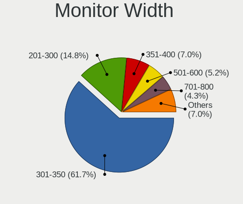
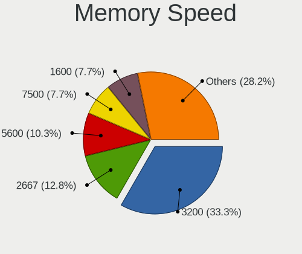

Pop!_OS Hardware Trends (Notebook)
----------------------------------

A project to identify most popular hardware characteristics and track their change
over time based on data collected by Pop!_OS users at https://Linux-Hardware.org.

Anyone can contribute to the study by uploading probes of their computers by
the [hw-probe](https://github.com/linuxhw/hw-probe) tool:

    sudo -E hw-probe -all -upload

Full-feature report is available here: https://linux-hardware.org/?view=trends&formfactor=notebook

Period: Dec, 2020.

Contents
--------

- [ OS                       ](#os)
- [ OS Family                ](#os-family)
- [ Kernel                   ](#kernel)
- [ Kernel Family            ](#kernel-family)
- [ Kernel Major Ver.        ](#kernel-major-ver)
- [ Arch                     ](#arch)
- [ DE                       ](#de)
- [ Display Server           ](#display-server)
- [ Display Manager          ](#display-manager)
- [ OS Lang                  ](#os-lang)
- [ Boot Mode                ](#boot-mode)
- [ Filesystem               ](#filesystem)
- [ Part. scheme             ](#part-scheme)
- [ Dual Boot with Linux/BSD ](#dual-boot-with-linux/bsd)
- [ Dual Boot (Win)          ](#dual-boot-win)
- [ Country                  ](#country)
- [ City                     ](#city)
- [ Vendor                   ](#vendor)
- [ Model                    ](#model)
- [ Model Family             ](#model-family)
- [ MFG Year                 ](#mfg-year)
- [ Form Factor              ](#form-factor)
- [ Secure Boot              ](#secure-boot)
- [ Coreboot                 ](#coreboot)
- [ RAM Size                 ](#ram-size)
- [ RAM Used                 ](#ram-used)
- [ Has CD-ROM               ](#has-cd-rom)
- [ Total Drives             ](#total-drives)
- [ Has Ethernet             ](#has-ethernet)
- [ Drive Vendor             ](#drive-vendor)
- [ Drive Model              ](#drive-model)
- [ HDD Vendor               ](#hdd-vendor)
- [ SSD Vendor               ](#ssd-vendor)
- [ Drive Kind               ](#drive-kind)
- [ Drive Connector          ](#drive-connector)
- [ Drive Size               ](#drive-size)
- [ Space Total              ](#space-total)
- [ Space Used               ](#space-used)
- [ Malfunc. Drives          ](#malfunc-drives)
- [ Malfunc. Drive Vendor    ](#malfunc-drive-vendor)
- [ Malfunc. HDD Vendor      ](#malfunc-hdd-vendor)
- [ Malfunc. Drive Kind      ](#malfunc-drive-kind)
- [ Failed Drives            ](#failed-drives)
- [ Failed Drive Vendor      ](#failed-drive-vendor)
- [ Drive Status             ](#drive-status)
- [ Storage Vendor           ](#storage-vendor)
- [ Storage Model            ](#storage-model)
- [ Storage Kind             ](#storage-kind)
- [ CPU Vendor               ](#cpu-vendor)
- [ CPU Model                ](#cpu-model)
- [ CPU Model Family         ](#cpu-model-family)
- [ CPU Cores                ](#cpu-cores)
- [ CPU Sockets              ](#cpu-sockets)
- [ CPU Threads              ](#cpu-threads)
- [ CPU Op-Modes             ](#cpu-op-modes)
- [ CPU Microcode            ](#cpu-microcode)
- [ CPU Microarch            ](#cpu-microarch)
- [ GPU Vendor               ](#gpu-vendor)
- [ GPU Model                ](#gpu-model)
- [ GPU Combo                ](#gpu-combo)
- [ GPU Driver               ](#gpu-driver)
- [ GPU Memory               ](#gpu-memory)
- [ Monitor Vendor           ](#monitor-vendor)
- [ Monitor Model            ](#monitor-model)
- [ Monitor Resolution       ](#monitor-resolution)
- [ Monitor Diagonal         ](#monitor-diagonal)
- [ Monitor Width            ](#monitor-width)
- [ Aspect Ratio             ](#aspect-ratio)
- [ Monitor Area             ](#monitor-area)
- [ Pixel Density            ](#pixel-density)
- [ Multiple Monitors        ](#multiple-monitors)
- [ Net Controller Vendor    ](#net-controller-vendor)
- [ Net Controller Model     ](#net-controller-model)
- [ Wireless Vendor          ](#wireless-vendor)
- [ Wireless Model           ](#wireless-model)
- [ Ethernet Vendor          ](#ethernet-vendor)
- [ Ethernet Model           ](#ethernet-model)
- [ Net Controller Kind      ](#net-controller-kind)
- [ Used Controller          ](#used-controller)
- [ NICs                     ](#nics)
- [ Memory Vendor            ](#memory-vendor)
- [ Memory Model             ](#memory-model)
- [ Memory Kind              ](#memory-kind)
- [ Memory Form Factor       ](#memory-form-factor)
- [ Memory Size              ](#memory-size)
- [ Memory Speed             ](#memory-speed)
- [ Sound Vendor             ](#sound-vendor)
- [ Sound Model              ](#sound-model)
- [ Camera Vendor            ](#camera-vendor)
- [ Camera Model             ](#camera-model)
- [ Fingerprint Vendor       ](#fingerprint-vendor)
- [ Fingerprint Model        ](#fingerprint-model)
- [ Chipcard Vendor          ](#chipcard-vendor)
- [ Chipcard Model           ](#chipcard-model)
- [ Printer Vendor           ](#printer-vendor)
- [ Printer Model            ](#printer-model)
- [ Scanner Vendor           ](#scanner-vendor)
- [ Scanner Model            ](#scanner-model)
- [ Bluetooth Vendor         ](#bluetooth-vendor)
- [ Bluetooth Model          ](#bluetooth-model)
- [ Unsupported Devices      ](#unsupported-devices)
- [ Unsupported Device Types ](#unsupported-device-types)

OS
--

Installed operating systems

| Name          | Notebooks | Percent |
|---------------|-----------|---------|
| Pop!_OS 20.10 | 118       | 71.52%  |
| Pop!_OS 20.04 | 47        | 28.48%  |

OS Family
---------

OS without a version

| Name    | Notebooks | Percent |
|---------|-----------|---------|
| Pop!_OS | 165       | 100%    |

Kernel
------

Version of the Linux kernel

| Version               | Notebooks | Percent |
|-----------------------|-----------|---------|
| 5.8.0-7630-generic    | 153       | 92.73%  |
| 5.8.0-7625-generic    | 3         | 1.82%   |
| 5.9.12-xanmod1        | 2         | 1.21%   |
| 5.4.0-7642-generic    | 2         | 1.21%   |
| 5.9.14-xanmod1        | 1         | 0.61%   |
| 5.9.10-050910-generic | 1         | 0.61%   |
| 5.8.11-050811-generic | 1         | 0.61%   |
| 5.10.3-051003-generic | 1         | 0.61%   |
| 5.10.0-rc4+           | 1         | 0.61%   |

Kernel Family
-------------

Linux kernel without a distro release

| Version | Notebooks | Percent |
|---------|-----------|---------|
| 5.8.0   | 156       | 94.55%  |
| 5.9.12  | 2         | 1.21%   |
| 5.4.0   | 2         | 1.21%   |
| 5.9.14  | 1         | 0.61%   |
| 5.9.10  | 1         | 0.61%   |
| 5.8.11  | 1         | 0.61%   |
| 5.10.3  | 1         | 0.61%   |
| 5.10.0  | 1         | 0.61%   |

Kernel Major Ver.
-----------------

Linux kernel major version

| Version | Notebooks | Percent |
|---------|-----------|---------|
| 5.8     | 157       | 95.15%  |
| 5.9     | 4         | 2.42%   |
| 5.4     | 2         | 1.21%   |
| 5.10    | 2         | 1.21%   |

Arch
----

OS architecture (x86_64, i586, etc.)

| Name   | Notebooks | Percent |
|--------|-----------|---------|
| x86_64 | 165       | 100%    |

DE
--

Desktop Environment

| Name  | Notebooks | Percent |
|-------|-----------|---------|
| GNOME | 162       | 98.18%  |
| KDE   | 2         | 1.21%   |
| MATE  | 1         | 0.61%   |

Display Server
--------------

X11 or Wayland

| Name    | Notebooks | Percent |
|---------|-----------|---------|
| X11     | 156       | 94.55%  |
| Wayland | 9         | 5.45%   |

Display Manager
---------------

SDDM, LightDM, etc.

| Name    | Notebooks | Percent |
|---------|-----------|---------|
| Unknown | 135       | 81.82%  |
| GDM     | 30        | 18.18%  |

OS Lang
-------

Language

| Lang  | Notebooks | Percent |
|-------|-----------|---------|
| en_US | 94        | 56.97%  |
| en_GB | 18        | 10.91%  |
| de_DE | 13        | 7.88%   |
| pt_BR | 12        | 7.27%   |
| it_IT | 5         | 3.03%   |
| C     | 4         | 2.42%   |
| es_ES | 3         | 1.82%   |
| pl_PL | 2         | 1.21%   |
| nb_NO | 2         | 1.21%   |
| fr_FR | 2         | 1.21%   |
| en_CA | 2         | 1.21%   |
| sv_SE | 1         | 0.61%   |
| sk_SK | 1         | 0.61%   |
| ru_RU | 1         | 0.61%   |
| pt_PT | 1         | 0.61%   |
| nl_NL | 1         | 0.61%   |
| hr_HR | 1         | 0.61%   |
| fr_CA | 1         | 0.61%   |
| en_AU | 1         | 0.61%   |

Boot Mode
---------

EFI or BIOS

| Mode | Notebooks | Percent |
|------|-----------|---------|
| BIOS | 136       | 82.42%  |
| EFI  | 29        | 17.58%  |

Filesystem
----------

Type of filesystem

| Type    | Notebooks | Percent |
|---------|-----------|---------|
| Ext4    | 155       | 93.94%  |
| Btrfs   | 6         | 3.64%   |
| Overlay | 3         | 1.82%   |
| Xfs     | 1         | 0.61%   |

Part. scheme
------------

Scheme of partitioning

| Type    | Notebooks | Percent |
|---------|-----------|---------|
| Unknown | 135       | 81.82%  |
| GPT     | 28        | 16.97%  |
| MBR     | 2         | 1.21%   |

Dual Boot with Linux/BSD
------------------------

Hosting more than one Linux/BSD

| Dual boot | Notebooks | Percent |
|-----------|-----------|---------|
| No        | 161       | 97.58%  |
| Yes       | 4         | 2.42%   |

Dual Boot (Win)
---------------

Hosting Linux and Windows

| Dual boot | Notebooks | Percent |
|-----------|-----------|---------|
| No        | 156       | 94.55%  |
| Yes       | 9         | 5.45%   |

Country
-------

Geographic location (country)

| Country                | Notebooks | Percent |
|------------------------|-----------|---------|
| USA                    | 42        | 25.45%  |
| Germany                | 19        | 11.52%  |
| Brazil                 | 15        | 9.09%   |
| UK                     | 13        | 7.88%   |
| India                  | 7         | 4.24%   |
| Canada                 | 7         | 4.24%   |
| Netherlands            | 6         | 3.64%   |
| Italy                  | 6         | 3.64%   |
| Spain                  | 5         | 3.03%   |
| Sweden                 | 3         | 1.82%   |
| South Africa           | 3         | 1.82%   |
| Poland                 | 3         | 1.82%   |
| France                 | 3         | 1.82%   |
| Egypt                  | 3         | 1.82%   |
| Austria                | 3         | 1.82%   |
| Argentina              | 3         | 1.82%   |
| Pakistan               | 2         | 1.21%   |
| Norway                 | 2         | 1.21%   |
| Latvia                 | 2         | 1.21%   |
| Ukraine                | 1         | 0.61%   |
| Slovakia               | 1         | 0.61%   |
| Singapore              | 1         | 0.61%   |
| Russia                 | 1         | 0.61%   |
| Romania                | 1         | 0.61%   |
| Portugal               | 1         | 0.61%   |
| New Zealand            | 1         | 0.61%   |
| Mexico                 | 1         | 0.61%   |
| Lithuania              | 1         | 0.61%   |
| Japan                  | 1         | 0.61%   |
| Israel                 | 1         | 0.61%   |
| Indonesia              | 1         | 0.61%   |
| Estonia                | 1         | 0.61%   |
| Dominican Republic     | 1         | 0.61%   |
| Denmark                | 1         | 0.61%   |
| Croatia                | 1         | 0.61%   |
| Bosnia and Herzegovina | 1         | 0.61%   |
| Australia              | 1         | 0.61%   |

City
----

Geographic location (city)

| City                   | Notebooks | Percent |
|------------------------|-----------|---------|
| Vienna                 | 3         | 1.82%   |
| Fresno                 | 3         | 1.82%   |
| Untereisesheim         | 2         | 1.21%   |
| Tucson                 | 2         | 1.21%   |
| São Paulo             | 2         | 1.21%   |
| Riga                   | 2         | 1.21%   |
| New Ipswich            | 2         | 1.21%   |
| Madrid                 | 2         | 1.21%   |
| Jundiaí               | 2         | 1.21%   |
| Egg Harbor             | 2         | 1.21%   |
| Chennai                | 2         | 1.21%   |
| Buenos Aires           | 2         | 1.21%   |
| Brasília              | 2         | 1.21%   |
| Zhashkiv               | 1         | 0.61%   |
| Woodridge              | 1         | 0.61%   |
| Wolverhampton          | 1         | 0.61%   |
| Wieszowa               | 1         | 0.61%   |
| Wiesbach               | 1         | 0.61%   |
| Westlake               | 1         | 0.61%   |
| Vilnius                | 1         | 0.61%   |
| Varginha               | 1         | 0.61%   |
| Tønsberg              | 1         | 0.61%   |
| Twin Falls             | 1         | 0.61%   |
| Troy                   | 1         | 0.61%   |
| Trowbridge             | 1         | 0.61%   |
| Tampines New Town      | 1         | 0.61%   |
| São Bernardo do Campo | 1         | 0.61%   |
| Sydney                 | 1         | 0.61%   |
| Stuttgart              | 1         | 0.61%   |
| Stroud                 | 1         | 0.61%   |
| Stratford              | 1         | 0.61%   |
| Stockholm              | 1         | 0.61%   |
| Sterling               | 1         | 0.61%   |
| St. John's             | 1         | 0.61%   |
| St Helens              | 1         | 0.61%   |
| Spino d'Adda           | 1         | 0.61%   |
| South Ozone Park       | 1         | 0.61%   |
| Skanes Fagerhult       | 1         | 0.61%   |
| Simmerath              | 1         | 0.61%   |
| Sheffield              | 1         | 0.61%   |
| Seattle                | 1         | 0.61%   |
| Seaham                 | 1         | 0.61%   |
| Sarpsborg              | 1         | 0.61%   |
| Saranac Lake           | 1         | 0.61%   |
| Sao Joao de Meriti     | 1         | 0.61%   |
| Santo Domingo Este     | 1         | 0.61%   |
| Samolaco               | 1         | 0.61%   |
| Salvador               | 1         | 0.61%   |
| Ruda Śląska          | 1         | 0.61%   |
| Rotterdam              | 1         | 0.61%   |
| Rosemead               | 1         | 0.61%   |
| Rome                   | 1         | 0.61%   |
| Rochester              | 1         | 0.61%   |
| Rio Vista              | 1         | 0.61%   |
| Rio de Janeiro         | 1         | 0.61%   |
| Ridgeway               | 1         | 0.61%   |
| Ribeirão Preto        | 1         | 0.61%   |
| Remscheid              | 1         | 0.61%   |
| Rawalpindi             | 1         | 0.61%   |
| Ranchi                 | 1         | 0.61%   |

Vendor
------

Motherboard manufacturer

| Name                | Notebooks | Percent |
|---------------------|-----------|---------|
| Lenovo              | 38        | 23.03%  |
| Dell                | 34        | 20.61%  |
| Hewlett-Packard     | 21        | 12.73%  |
| Acer                | 15        | 9.09%   |
| ASUSTek Computer    | 14        | 8.48%   |
| MSI                 | 6         | 3.64%   |
| Apple               | 6         | 3.64%   |
| System76            | 5         | 3.03%   |
| Positivo            | 3         | 1.82%   |
| Notebook            | 3         | 1.82%   |
| Toshiba             | 2         | 1.21%   |
| Sony                | 2         | 1.21%   |
| Samsung Electronics | 2         | 1.21%   |
| HUAWEI              | 2         | 1.21%   |
| Fujitsu             | 2         | 1.21%   |
| Timi                | 1         | 0.61%   |
| Quanta              | 1         | 0.61%   |
| PC Specialist       | 1         | 0.61%   |
| Packard Bell        | 1         | 0.61%   |
| LG Electronics      | 1         | 0.61%   |
| HASEE Computer      | 1         | 0.61%   |
| GPU Company         | 1         | 0.61%   |
| EUROCOM             | 1         | 0.61%   |
| Eluktronics         | 1         | 0.61%   |
| Unknown             | 1         | 0.61%   |

Model
-----

Motherboard model

| Name                                        | Notebooks | Percent |
|---------------------------------------------|-----------|---------|
| Dell XPS 15 7590                            | 4         | 2.42%   |
| Lenovo ThinkPad T480 20L5CTO1WW             | 3         | 1.82%   |
| Positivo Mobile                             | 2         | 1.21%   |
| Lenovo IdeaPad Slim 1-11AST-05 81VR         | 2         | 1.21%   |
| HP Pavilion Laptop 15-cw1xxx                | 2         | 1.21%   |
| HP Compaq Presario CQ60                     | 2         | 1.21%   |
| Dell XPS 17 9700                            | 2         | 1.21%   |
| Dell Vostro 3550                            | 2         | 1.21%   |
| Apple MacBookPro8,1                         | 2         | 1.21%   |
| Unknown                                     | 2         | 1.21%   |
| Toshiba Satellite Pro R50-B                 | 1         | 0.61%   |
| Toshiba Satellite L50-B                     | 1         | 0.61%   |
| Timi TM1701                                 | 1         | 0.61%   |
| System76 Lemur Pro                          | 1         | 0.61%   |
| System76 Lemur                              | 1         | 0.61%   |
| System76 Gazelle                            | 1         | 0.61%   |
| System76 Galago Pro                         | 1         | 0.61%   |
| System76 Darter Pro                         | 1         | 0.61%   |
| Sony VPCEH32FX                              | 1         | 0.61%   |
| Sony SVD1121Q2EB                            | 1         | 0.61%   |
| Samsung 940Z5L                              | 1         | 0.61%   |
| Samsung 300E4A/300E5A/300E7A/3430EA/3530EA  | 1         | 0.61%   |
| Quanta TW8/SW8/DW8                          | 1         | 0.61%   |
| Positivo I3464A                             | 1         | 0.61%   |
| PC Specialist NP50DE_DB                     | 1         | 0.61%   |
| Packard Bell EasyNote TM86                  | 1         | 0.61%   |
| Notebook X170SM                             | 1         | 0.61%   |
| Notebook P95_96_97Ex,Rx                     | 1         | 0.61%   |
| Notebook N9x0TD_TF                          | 1         | 0.61%   |
| MSI WF65 10TH                               | 1         | 0.61%   |
| MSI PS63 Modern 8RC                         | 1         | 0.61%   |
| MSI GT70 2OC/2OD                            | 1         | 0.61%   |
| MSI GL65 9SC                                | 1         | 0.61%   |
| MSI GL63 9SD                                | 1         | 0.61%   |
| MSI GL63 8SE                                | 1         | 0.61%   |
| LG P1-J150B                                 | 1         | 0.61%   |
| Lenovo Yoga 500-14IBD 80N4                  | 1         | 0.61%   |
| Lenovo Y520-15IKBN 80WK                     | 1         | 0.61%   |
| Lenovo ThinkPad X240 20AL008XUS             | 1         | 0.61%   |
| Lenovo ThinkPad X230 23252QG                | 1         | 0.61%   |
| Lenovo ThinkPad X140e 20BL000BUS            | 1         | 0.61%   |
| Lenovo ThinkPad X1 Extreme Gen 3 20TK001FUS | 1         | 0.61%   |
| Lenovo ThinkPad W500 40612HU                | 1         | 0.61%   |
| Lenovo ThinkPad T530 24294V4                | 1         | 0.61%   |
| Lenovo ThinkPad T480 20L50011US             | 1         | 0.61%   |
| Lenovo ThinkPad T440p 20AN0069US            | 1         | 0.61%   |
| Lenovo ThinkPad T420 4177Q5U                | 1         | 0.61%   |
| Lenovo ThinkPad T410 25374A5                | 1         | 0.61%   |
| Lenovo ThinkPad P52 20M9000KUS              | 1         | 0.61%   |
| Lenovo ThinkPad P50 20EQS2M700              | 1         | 0.61%   |
| Lenovo ThinkPad P43s 20RHCTO1WW             | 1         | 0.61%   |
| Lenovo ThinkPad L590 20Q7CTO1WW             | 1         | 0.61%   |
| Lenovo ThinkPad L480 20LS0026GE             | 1         | 0.61%   |
| Lenovo ThinkPad E15 20RD001HAD              | 1         | 0.61%   |
| Lenovo ThinkBook 14s-IWL 20RM               | 1         | 0.61%   |
| Lenovo Legion Y540-15IRH 81RJ               | 1         | 0.61%   |
| Lenovo IdeaPad Z500 20202                   | 1         | 0.61%   |
| Lenovo IdeaPad Z470                         | 1         | 0.61%   |
| Lenovo IdeaPad Slim 1-14AST-05 81VS         | 1         | 0.61%   |
| Lenovo IdeaPad S340-15IIL 81VW              | 1         | 0.61%   |

Model Family
------------

Motherboard model prefix

| Name                    | Notebooks | Percent |
|-------------------------|-----------|---------|
| Lenovo ThinkPad         | 19        | 11.52%  |
| Lenovo IdeaPad          | 13        | 7.88%   |
| Dell Inspiron           | 11        | 6.67%   |
| Dell XPS                | 9         | 5.45%   |
| Dell Latitude           | 8         | 4.85%   |
| Acer Aspire             | 8         | 4.85%   |
| HP EliteBook            | 4         | 2.42%   |
| HP ProBook              | 3         | 1.82%   |
| HP Pavilion             | 3         | 1.82%   |
| HP Compaq               | 3         | 1.82%   |
| Dell Vostro             | 3         | 1.82%   |
| ASUS TUF                | 3         | 1.82%   |
| Acer Nitro              | 3         | 1.82%   |
| Toshiba Satellite       | 2         | 1.21%   |
| System76 Lemur          | 2         | 1.21%   |
| Positivo MOBILE         | 2         | 1.21%   |
| MSI GL63                | 2         | 1.21%   |
| Fujitsu LIFEBOOK        | 2         | 1.21%   |
| ASUS ZenBook            | 2         | 1.21%   |
| ASUS VivoBook           | 2         | 1.21%   |
| Apple MacBookPro8       | 2         | 1.21%   |
| Acer Predator           | 2         | 1.21%   |
| Unknown                 | 2         | 1.21%   |
| Timi TM1701             | 1         | 0.61%   |
| System76 Gazelle        | 1         | 0.61%   |
| System76 Galago         | 1         | 0.61%   |
| System76 Darter         | 1         | 0.61%   |
| Sony VPCEH32FX          | 1         | 0.61%   |
| Sony SVD1121Q2EB        | 1         | 0.61%   |
| Samsung 940Z5L          | 1         | 0.61%   |
| Samsung 300E4A          | 1         | 0.61%   |
| Quanta TW8              | 1         | 0.61%   |
| Positivo I3464A         | 1         | 0.61%   |
| PC Specialist NP50DE    | 1         | 0.61%   |
| Packard Bell EasyNote   | 1         | 0.61%   |
| Notebook X170SM         | 1         | 0.61%   |
| Notebook P95            | 1         | 0.61%   |
| Notebook N9x0TD         | 1         | 0.61%   |
| MSI WF65                | 1         | 0.61%   |
| MSI PS63                | 1         | 0.61%   |
| MSI GT70                | 1         | 0.61%   |
| MSI GL65                | 1         | 0.61%   |
| LG P1-J150B             | 1         | 0.61%   |
| Lenovo Yoga             | 1         | 0.61%   |
| Lenovo Y520-15IKBN      | 1         | 0.61%   |
| Lenovo ThinkBook        | 1         | 0.61%   |
| Lenovo Legion           | 1         | 0.61%   |
| Lenovo Flex             | 1         | 0.61%   |
| Lenovo E41-25           | 1         | 0.61%   |
| HUAWEI MACHC-WAX9       | 1         | 0.61%   |
| HUAWEI BOHK-WAX9X       | 1         | 0.61%   |
| HP ZBook                | 1         | 0.61%   |
| HP Laptop               | 1         | 0.61%   |
| HP Chell                | 1         | 0.61%   |
| HP 550                  | 1         | 0.61%   |
| HP 350                  | 1         | 0.61%   |
| HP 340S                 | 1         | 0.61%   |
| HP 15                   | 1         | 0.61%   |
| HASEE NH5x              | 1         | 0.61%   |
| GPU Company GWTN156-2BK | 1         | 0.61%   |

MFG Year
--------

Motherboard manufacture year

| Year | Notebooks | Percent |
|------|-----------|---------|
| 2020 | 64        | 38.79%  |
| 2019 | 24        | 14.55%  |
| 2018 | 21        | 12.73%  |
| 2014 | 7         | 4.24%   |
| 2012 | 7         | 4.24%   |
| 2011 | 7         | 4.24%   |
| 2008 | 7         | 4.24%   |
| 2013 | 6         | 3.64%   |
| 2010 | 6         | 3.64%   |
| 2015 | 5         | 3.03%   |
| 2017 | 3         | 1.82%   |
| 2016 | 3         | 1.82%   |
| 2009 | 2         | 1.21%   |
| 2006 | 2         | 1.21%   |
| 2007 | 1         | 0.61%   |

Form Factor
-----------

Physical design of the computer

| Name     | Notebooks | Percent |
|----------|-----------|---------|
| Notebook | 165       | 100%    |

Secure Boot
-----------

Enabled or disabled

| State    | Notebooks | Percent |
|----------|-----------|---------|
| Disabled | 165       | 100%    |

Coreboot
--------

Have coreboot on board

| Used | Notebooks | Percent |
|------|-----------|---------|
| No   | 163       | 98.79%  |
| Yes  | 2         | 1.21%   |

RAM Size
--------

Total RAM memory

| Size in GB  | Notebooks | Percent |
|-------------|-----------|---------|
| 4.01-8.0    | 40        | 24.24%  |
| 3.01-4.0    | 34        | 20.61%  |
| 16.01-24.0  | 32        | 19.39%  |
| 8.01-16.0   | 28        | 16.97%  |
| 32.01-64.0  | 18        | 10.91%  |
| 64.01-256.0 | 5         | 3.03%   |
| 1.01-2.0    | 4         | 2.42%   |
| 24.01-32.0  | 2         | 1.21%   |
| 2.01-3.0    | 2         | 1.21%   |

RAM Used
--------

Used RAM memory

| Used GB   | Notebooks | Percent |
|-----------|-----------|---------|
| 1.01-2.0  | 61        | 36.97%  |
| 2.01-3.0  | 55        | 33.33%  |
| 4.01-8.0  | 25        | 15.15%  |
| 3.01-4.0  | 22        | 13.33%  |
| 8.01-16.0 | 1         | 0.61%   |
| 0.51-1.0  | 1         | 0.61%   |

Has CD-ROM
----------

Has CD-ROM on board

| Presented | Notebooks | Percent |
|-----------|-----------|---------|
| No        | 113       | 68.48%  |
| Yes       | 52        | 31.52%  |

Total Drives
------------

Number of drives on board

| Drives | Notebooks | Percent |
|--------|-----------|---------|
| 1      | 105       | 63.64%  |
| 2      | 54        | 32.73%  |
| 3      | 4         | 2.42%   |
| 4      | 1         | 0.61%   |
| 0      | 1         | 0.61%   |

Has Ethernet
------------

Has Ethernet on board

| Presented | Notebooks | Percent |
|-----------|-----------|---------|
| Yes       | 137       | 83.03%  |
| No        | 28        | 16.97%  |

Drive Vendor
------------

Hard drive vendors

| Vendor                    | Notebooks | Drives | Percent |
|---------------------------|-----------|--------|---------|
| Samsung Electronics       | 37        | 44     | 17.79%  |
| Seagate                   | 22        | 22     | 10.58%  |
| WDC                       | 21        | 23     | 10.1%   |
| Sandisk                   | 17        | 17     | 8.17%   |
| Unknown                   | 15        | 15     | 7.21%   |
| Kingston                  | 14        | 14     | 6.73%   |
| Toshiba                   | 13        | 14     | 6.25%   |
| SK Hynix                  | 9         | 10     | 4.33%   |
| Intel                     | 9         | 9      | 4.33%   |
| Hitachi                   | 6         | 6      | 2.88%   |
| HGST                      | 6         | 6      | 2.88%   |
| Crucial                   | 6         | 6      | 2.88%   |
| Silicon Motion            | 4         | 4      | 1.92%   |
| Phison                    | 4         | 5      | 1.92%   |
| A-DATA Technology         | 4         | 4      | 1.92%   |
| Union Memory (Shenzhen)   | 2         | 2      | 0.96%   |
| PNY                       | 2         | 2      | 0.96%   |
| JMicron                   | 2         | 2      | 0.96%   |
| XPG                       | 1         | 1      | 0.48%   |
| Transcend                 | 1         | 1      | 0.48%   |
| Team                      | 1         | 1      | 0.48%   |
| SWORDBILL                 | 1         | 1      | 0.48%   |
| Patriot                   | 1         | 1      | 0.48%   |
| OCZ                       | 1         | 1      | 0.48%   |
| Micron/Crucial Technology | 1         | 2      | 0.48%   |
| Micron Technology         | 1         | 1      | 0.48%   |
| LITEON                    | 1         | 1      | 0.48%   |
| Lexar                     | 1         | 1      | 0.48%   |
| INTEL SS                  | 1         | 1      | 0.48%   |
| Fujitsu                   | 1         | 1      | 0.48%   |
| Apple                     | 1         | 1      | 0.48%   |
| AFOX                      | 1         | 1      | 0.48%   |
| ADATA Technology          | 1         | 1      | 0.48%   |

Drive Model
-----------

Hard drive models

| Model                                        | Notebooks | Percent |
|----------------------------------------------|-----------|---------|
| Samsung NVMe SSD Drive 512GB                 | 7         | 3.24%   |
| Samsung NVMe SSD Drive 500GB                 | 6         | 2.78%   |
| SK Hynix NVMe SSD Drive 256GB                | 5         | 2.31%   |
| Samsung NVMe SSD Drive 256GB                 | 4         | 1.85%   |
| Kingston NVMe SSD Drive 512GB                | 4         | 1.85%   |
| WDC WD10SPZX-24Z10 1TB                       | 3         | 1.39%   |
| Seagate ST1000LM049-2GH172 1TB               | 3         | 1.39%   |
| Sandisk NVMe SSD Drive 512GB                 | 3         | 1.39%   |
| Samsung SSD 860 EVO 500GB                    | 3         | 1.39%   |
| Samsung NVMe SSD Drive 1TB                   | 3         | 1.39%   |
| HGST HTS721010A9E630 1TB                     | 3         | 1.39%   |
| Unknown MMC Card  64GB                       | 2         | 0.93%   |
| Unknown MMC Card  32GB                       | 2         | 0.93%   |
| Unknown MMC Card  16GB                       | 2         | 0.93%   |
| Union Memory (Shenzhen) NVMe SSD Drive 256GB | 2         | 0.93%   |
| Toshiba MQ01ABD100 1TB                       | 2         | 0.93%   |
| Silicon Motion NVMe SSD Drive 512GB          | 2         | 0.93%   |
| Seagate ST1000LM048-2E7172 1TB               | 2         | 0.93%   |
| Seagate ST1000LM035-1RK172 1TB               | 2         | 0.93%   |
| SanDisk SDSSDA480G 480GB                     | 2         | 0.93%   |
| Sandisk NVMe SSD Drive 256GB                 | 2         | 0.93%   |
| Samsung SSD 860 EVO 250GB                    | 2         | 0.93%   |
| Samsung SSD 860 EVO 1TB                      | 2         | 0.93%   |
| Samsung SSD 850 EVO 500GB                    | 2         | 0.93%   |
| Samsung NVMe SSD Drive 250GB                 | 2         | 0.93%   |
| Samsung HM320JI 320GB                        | 2         | 0.93%   |
| Phison NVMe SSD Drive 1024GB                 | 2         | 0.93%   |
| Kingston SA400S37480G 480GB SSD              | 2         | 0.93%   |
| Kingston SA400S37240G 240GB SSD              | 2         | 0.93%   |
| Kingston RBUSNS8180DS3128GJ 128GB SSD        | 2         | 0.93%   |
| Intel NVMe SSD Drive 512GB                   | 2         | 0.93%   |
| Intel NVMe SSD Drive 1024GB                  | 2         | 0.93%   |
| Hitachi HTS545016B9A300 160GB                | 2         | 0.93%   |
| Crucial CT250MX500SSD1 250GB                 | 2         | 0.93%   |
| XPG NVMe SSD Drive 1024GB                    | 1         | 0.46%   |
| WDC WDS240G2G0B-00EPW0 240GB SSD             | 1         | 0.46%   |
| WDC WDS240G2G0A-00JH30 240GB SSD             | 1         | 0.46%   |
| WDC WDS240G1G0B-00RC30 240GB SSD             | 1         | 0.46%   |
| WDC WDS200T2B0A-00SM50 2TB SSD               | 1         | 0.46%   |
| WDC WDS100T2B0A-00SM50 1TB SSD               | 1         | 0.46%   |
| WDC WD7500BPVT-35HXZT1 752GB                 | 1         | 0.46%   |
| WDC WD7500BPVT-24HXZT1 752GB                 | 1         | 0.46%   |
| WDC WD6400BEVT80A0RT0 640GB                  | 1         | 0.46%   |
| WDC WD5000LPCX-75VHAT0 500GB                 | 1         | 0.46%   |
| WDC WD3200BEVT-75ZCT1 320GB                  | 1         | 0.46%   |
| WDC WD3200BEVT-00A0RT0 320GB                 | 1         | 0.46%   |
| WDC WD20SPZX-21UA7T0 2TB                     | 1         | 0.46%   |
| WDC WD1600BEKT-60A25T1 160GB                 | 1         | 0.46%   |
| WDC WD10SPZX-75Z10T0 1TB                     | 1         | 0.46%   |
| WDC WD10SPZX-21Z10T0 1TB                     | 1         | 0.46%   |
| WDC WD10JPVX-75JC3T0 1TB                     | 1         | 0.46%   |
| WDC WD10JPVX-22JC3T0 1TB                     | 1         | 0.46%   |
| WDC PC SN520 SDAPNUW-512G-1032 512GB         | 1         | 0.46%   |
| WDC PC SN520 SDAPNUW-512G                    | 1         | 0.46%   |
| WDC PC SN520 SDAPMUW-128G-1101 128GB         | 1         | 0.46%   |
| Unknown V Series SATA SSD 120GB              | 1         | 0.46%   |
| Unknown SD/MMC/MS PRO 128GB                  | 1         | 0.46%   |
| Unknown RHDM2FDKU3A1-N3A8 256GB              | 1         | 0.46%   |
| Unknown NVMe SSD Drive 256GB                 | 1         | 0.46%   |
| Unknown MMC64G  64GB                         | 1         | 0.46%   |

HDD Vendor
----------

Hard disk drive vendors

| Vendor              | Notebooks | Drives | Percent |
|---------------------|-----------|--------|---------|
| Seagate             | 21        | 21     | 36.84%  |
| WDC                 | 15        | 15     | 26.32%  |
| Toshiba             | 6         | 6      | 10.53%  |
| Hitachi             | 6         | 6      | 10.53%  |
| HGST                | 6         | 6      | 10.53%  |
| Samsung Electronics | 2         | 2      | 3.51%   |
| Fujitsu             | 1         | 1      | 1.75%   |

SSD Vendor
----------

Solid state drive vendors

| Vendor              | Notebooks | Drives | Percent |
|---------------------|-----------|--------|---------|
| Samsung Electronics | 13        | 14     | 20.63%  |
| SanDisk             | 9         | 9      | 14.29%  |
| Kingston            | 9         | 9      | 14.29%  |
| WDC                 | 5         | 5      | 7.94%   |
| Crucial             | 5         | 5      | 7.94%   |
| Toshiba             | 4         | 4      | 6.35%   |
| PNY                 | 2         | 2      | 3.17%   |
| Intel               | 2         | 2      | 3.17%   |
| A-DATA Technology   | 2         | 2      | 3.17%   |
| Unknown             | 1         | 1      | 1.59%   |
| Transcend           | 1         | 1      | 1.59%   |
| Team                | 1         | 1      | 1.59%   |
| Patriot             | 1         | 1      | 1.59%   |
| OCZ                 | 1         | 1      | 1.59%   |
| Micron Technology   | 1         | 1      | 1.59%   |
| LITEON              | 1         | 1      | 1.59%   |
| Lexar               | 1         | 1      | 1.59%   |
| JMicron             | 1         | 1      | 1.59%   |
| INTEL SS            | 1         | 1      | 1.59%   |
| Apple               | 1         | 1      | 1.59%   |
| AFOX                | 1         | 1      | 1.59%   |

Drive Kind
----------

HDD or SSD

| Kind    | Notebooks | Drives | Percent |
|---------|-----------|--------|---------|
| NVMe    | 71        | 85     | 34.98%  |
| SSD     | 60        | 64     | 29.56%  |
| HDD     | 57        | 57     | 28.08%  |
| MMC     | 9         | 9      | 4.43%   |
| Unknown | 6         | 6      | 2.96%   |

Drive Connector
---------------

SATA, SAS, NVMe, etc.

| Type | Notebooks | Drives | Percent |
|------|-----------|--------|---------|
| SATA | 108       | 120    | 55.38%  |
| NVMe | 71        | 85     | 36.41%  |
| MMC  | 9         | 9      | 4.62%   |
| SAS  | 7         | 7      | 3.59%   |

Drive Size
----------

Size of hard drive

| Size in TB | Notebooks | Drives | Percent |
|------------|-----------|--------|---------|
| 0.01-0.5   | 73        | 78     | 62.93%  |
| 0.51-1.0   | 36        | 36     | 31.03%  |
| 1.01-2.0   | 6         | 6      | 5.17%   |
| 3.01-4.0   | 1         | 1      | 0.86%   |

Space Total
-----------

Amount of disk space available on the file system

| Size in GB     | Notebooks | Percent |
|----------------|-----------|---------|
| 101-250        | 59        | 35.76%  |
| 251-500        | 40        | 24.24%  |
| 501-1000       | 27        | 16.36%  |
| 1001-2000      | 15        | 9.09%   |
| 51-100         | 10        | 6.06%   |
| 21-50          | 8         | 4.85%   |
| 1-20           | 5         | 3.03%   |
| More than 3000 | 1         | 0.61%   |

Space Used
----------

Amount of used disk space

| Used GB  | Notebooks | Percent |
|----------|-----------|---------|
| 1-20     | 81        | 49.09%  |
| 21-50    | 31        | 18.79%  |
| 101-250  | 24        | 14.55%  |
| 51-100   | 16        | 9.7%    |
| 251-500  | 9         | 5.45%   |
| 501-1000 | 4         | 2.42%   |

Malfunc. Drives
---------------

Drive models with a malfunction

| Model                    | Notebooks | Drives | Percent |
|--------------------------|-----------|--------|---------|
| Crucial CT1000P1SSD8 1TB | 1         | 1      | 100%    |

Malfunc. Drive Vendor
---------------------

Vendors of faulty drives

| Vendor  | Notebooks | Drives | Percent |
|---------|-----------|--------|---------|
| Crucial | 1         | 1      | 100%    |

Malfunc. HDD Vendor
-------------------

Vendors of faulty HDD drives

Zero info for selected period =(

Malfunc. Drive Kind
-------------------

Kinds of faulty drives

| Kind | Notebooks | Drives | Percent |
|------|-----------|--------|---------|
| NVMe | 1         | 1      | 100%    |

Failed Drives
-------------

Failed drive models

Zero info for selected period =(

Failed Drive Vendor
-------------------

Failed drive vendors

Zero info for selected period =(

Drive Status
------------

Number of failed and malfunc. drives

| Status   | Notebooks | Drives | Percent |
|----------|-----------|--------|---------|
| Detected | 138       | 187    | 83.13%  |
| Works    | 27        | 33     | 16.27%  |
| Malfunc  | 1         | 1      | 0.6%    |

Storage Vendor
--------------

Storage controller vendors

| Vendor                           | Notebooks | Percent |
|----------------------------------|-----------|---------|
| Intel                            | 119       | 55.35%  |
| Samsung Electronics              | 24        | 11.16%  |
| AMD                              | 22        | 10.23%  |
| Sandisk                          | 11        | 5.12%   |
| SK Hynix                         | 9         | 4.19%   |
| Kingston Technology Company      | 5         | 2.33%   |
| Silicon Motion                   | 4         | 1.86%   |
| Phison Electronics               | 4         | 1.86%   |
| Toshiba America Info Systems     | 3         | 1.4%    |
| ADATA Technology                 | 3         | 1.4%    |
| Union Memory (Shenzhen)          | 2         | 0.93%   |
| Nvidia                           | 2         | 0.93%   |
| Micron/Crucial Technology        | 2         | 0.93%   |
| Solid State Storage Technology   | 1         | 0.47%   |
| Silicon Integrated Systems [SiS] | 1         | 0.47%   |
| Seagate Technology               | 1         | 0.47%   |
| Realtek Semiconductor            | 1         | 0.47%   |
| OCZ Technology Group             | 1         | 0.47%   |

Storage Model
-------------

Storage controller models

| Model                                                                          | Notebooks | Percent |
|--------------------------------------------------------------------------------|-----------|---------|
| AMD FCH SATA Controller [AHCI mode]                                            | 22        | 9.65%   |
| Intel Cannon Lake Mobile PCH SATA AHCI Controller                              | 17        | 7.46%   |
| Samsung NVMe SSD Controller SM981/PM981/PM983                                  | 16        | 7.02%   |
| Intel 6 Series/C200 Series Chipset Family 6 port Mobile SATA AHCI Controller   | 12        | 5.26%   |
| Intel 7 Series Chipset Family 6-port SATA Controller [AHCI mode]               | 11        | 4.82%   |
| Intel Sunrise Point-LP SATA Controller [AHCI mode]                             | 9         | 3.95%   |
| Intel 82801 Mobile SATA Controller [RAID mode]                                 | 8         | 3.51%   |
| Intel 8 Series SATA Controller 1 [AHCI mode]                                   | 8         | 3.51%   |
| SK Hynix BC501 NVMe Solid State Drive 512GB                                    | 5         | 2.19%   |
| Intel Wildcat Point-LP SATA Controller [AHCI Mode]                             | 5         | 2.19%   |
| Intel Cannon Point-LP SATA Controller [AHCI Mode]                              | 5         | 2.19%   |
| Intel 82801HM/HEM (ICH8M/ICH8M-E) SATA Controller [AHCI mode]                  | 5         | 2.19%   |
| Sandisk WD Blue SN500 / PC SN520 NVMe SSD                                      | 4         | 1.75%   |
| Samsung NVMe SSD Controller SM961/PM961/SM963                                  | 4         | 1.75%   |
| Samsung Electronics Non-Volatile memory controller                             | 4         | 1.75%   |
| Intel SSD 660P Series                                                          | 4         | 1.75%   |
| Intel 82801IBM/IEM (ICH9M/ICH9M-E) 4 port SATA Controller [AHCI mode]          | 4         | 1.75%   |
| Intel 82801HM/HEM (ICH8M/ICH8M-E) IDE Controller                               | 4         | 1.75%   |
| Intel 400 Series Chipset Family SATA AHCI Controller                           | 4         | 1.75%   |
| SK Hynix Non-Volatile memory controller                                        | 3         | 1.32%   |
| Silicon Motion SM2263EN/SM2263XT SSD Controller                                | 3         | 1.32%   |
| Phison PS5013 E13 NVMe Controller                                              | 3         | 1.32%   |
| Intel HM170/QM170 Chipset SATA Controller [AHCI Mode]                          | 3         | 1.32%   |
| Intel Comet Lake SATA AHCI Controller                                          | 3         | 1.32%   |
| Intel 5 Series/3400 Series Chipset 6 port SATA AHCI Controller                 | 3         | 1.32%   |
| Intel 5 Series/3400 Series Chipset 4 port SATA AHCI Controller                 | 3         | 1.32%   |
| Toshiba America Info Systems XG6 NVMe SSD Controller                           | 2         | 0.88%   |
| Sandisk WD Blue SN550 NVMe SSD                                                 | 2         | 0.88%   |
| Sandisk WD Black SN750 / PC SN730 NVMe SSD                                     | 2         | 0.88%   |
| Sandisk PC SN520 NVMe SSD                                                      | 2         | 0.88%   |
| Micron/Crucial P1 NVMe PCIe SSD                                                | 2         | 0.88%   |
| Kingston Company U-SNS8154P3 NVMe SSD                                          | 2         | 0.88%   |
| Kingston Company Company Non-Volatile memory controller                        | 2         | 0.88%   |
| Intel SSD Pro 7600p/760p/E 6100p Series                                        | 2         | 0.88%   |
| Intel Q170/Q150/B150/H170/H110/Z170/CM236 Chipset SATA Controller [AHCI Mode]  | 2         | 0.88%   |
| Intel 82801GBM/GHM (ICH7-M Family) SATA Controller [AHCI mode]                 | 2         | 0.88%   |
| Intel 82801G (ICH7 Family) IDE Controller                                      | 2         | 0.88%   |
| Intel 8 Series/C220 Series Chipset Family 6-port SATA Controller 1 [AHCI mode] | 2         | 0.88%   |
| ADATA Non-Volatile memory controller                                           | 2         | 0.88%   |
| Union Memory (Shenzhen) NVMe 256G SSD device                                   | 1         | 0.44%   |
| Union Memory (Shenzhen) Non-Volatile memory controller                         | 1         | 0.44%   |
| Toshiba America Info Systems BG3 NVMe SSD Controller                           | 1         | 0.44%   |
| Solid State Storage Non-Volatile memory controller                             | 1         | 0.44%   |
| SK Hynix PC401 NVMe Solid State Drive 256GB                                    | 1         | 0.44%   |
| Silicon Motion SM2262/SM2262EN SSD Controller                                  | 1         | 0.44%   |
| Silicon Integrated Systems [SiS] SATA Controller / IDE mode                    | 1         | 0.44%   |
| Silicon Integrated Systems [SiS] 5513 IDE Controller                           | 1         | 0.44%   |
| Seagate Non-Volatile memory controller                                         | 1         | 0.44%   |
| Sandisk WD Black 2018 / PC SN720 NVMe SSD                                      | 1         | 0.44%   |
| Samsung Electronics SATA controller                                            | 1         | 0.44%   |
| Realtek Realtek Non-Volatile memory controller                                 | 1         | 0.44%   |
| Phison NVMe Storage Controller                                                 | 1         | 0.44%   |
| OCZ Group RD400/400A SSD                                                       | 1         | 0.44%   |
| Nvidia MCP78S [GeForce 8200] SATA Controller (non-AHCI mode)                   | 1         | 0.44%   |
| Nvidia MCP78S [GeForce 8200] IDE                                               | 1         | 0.44%   |
| Nvidia MCP65 SATA Controller                                                   | 1         | 0.44%   |
| Nvidia MCP65 IDE                                                               | 1         | 0.44%   |
| Kingston Company A2000 NVMe SSD                                                | 1         | 0.44%   |
| Intel SSD 600P Series                                                          | 1         | 0.44%   |
| Intel Ice Lake-LP SATA Controller [AHCI mode]                                  | 1         | 0.44%   |

Storage Kind
------------

Kind of storage controller (IDE, SATA, NVMe, SAS, ...)

| Kind | Notebooks | Percent |
|------|-----------|---------|
| SATA | 125       | 57.6%   |
| NVMe | 71        | 32.72%  |
| IDE  | 12        | 5.53%   |
| RAID | 9         | 4.15%   |

CPU Vendor
----------

Processor vendors

| Vendor | Notebooks | Percent |
|--------|-----------|---------|
| Intel  | 135       | 81.82%  |
| AMD    | 30        | 18.18%  |

CPU Model
---------

Processor models

| Model                                         | Notebooks | Percent |
|-----------------------------------------------|-----------|---------|
| Intel Core i7-9750H CPU @ 2.60GHz             | 6         | 3.64%   |
| Intel Core i7-8750H CPU @ 2.20GHz             | 6         | 3.64%   |
| Intel Core i7-8565U CPU @ 1.80GHz             | 6         | 3.64%   |
| AMD Ryzen 5 3500U with Radeon Vega Mobile Gfx | 5         | 3.03%   |
| Intel Core i9-9980HK CPU @ 2.40GHz            | 4         | 2.42%   |
| Intel Core i5-8265U CPU @ 1.60GHz             | 4         | 2.42%   |
| Intel Core i5-2520M CPU @ 2.50GHz             | 4         | 2.42%   |
| AMD A6-9220e RADEON R4, 5 COMPUTE CORES 2C+3G | 4         | 2.42%   |
| Intel Core i7-10750H CPU @ 2.60GHz            | 3         | 1.82%   |
| Intel Core i5-7200U CPU @ 2.50GHz             | 3         | 1.82%   |
| Intel Core i5-2410M CPU @ 2.30GHz             | 3         | 1.82%   |
| AMD Ryzen 7 4800H with Radeon Graphics        | 3         | 1.82%   |
| Intel Core i9-10885H CPU @ 2.40GHz            | 2         | 1.21%   |
| Intel Core i7-8650U CPU @ 1.90GHz             | 2         | 1.21%   |
| Intel Core i7-8550U CPU @ 1.80GHz             | 2         | 1.21%   |
| Intel Core i7-7500U CPU @ 2.70GHz             | 2         | 1.21%   |
| Intel Core i7-4510U CPU @ 2.00GHz             | 2         | 1.21%   |
| Intel Core i7-10510U CPU @ 1.80GHz            | 2         | 1.21%   |
| Intel Core i5-9300H CPU @ 2.40GHz             | 2         | 1.21%   |
| Intel Core i5-8300H CPU @ 2.30GHz             | 2         | 1.21%   |
| Intel Core i5-8250U CPU @ 1.60GHz             | 2         | 1.21%   |
| Intel Core i5-6300U CPU @ 2.40GHz             | 2         | 1.21%   |
| Intel Core i5-3230M CPU @ 2.60GHz             | 2         | 1.21%   |
| Intel Core i5-10210U CPU @ 1.60GHz            | 2         | 1.21%   |
| Intel Core i5 CPU M 520 @ 2.40GHz             | 2         | 1.21%   |
| Intel Core i3-7020U CPU @ 2.30GHz             | 2         | 1.21%   |
| Intel Core i3-4005U CPU @ 1.70GHz             | 2         | 1.21%   |
| Intel Core i3-3110M CPU @ 2.40GHz             | 2         | 1.21%   |
| Intel Core 2 CPU T7200 @ 2.00GHz              | 2         | 1.21%   |
| AMD Ryzen 5 4500U with Radeon Graphics        | 2         | 1.21%   |
| AMD Ryzen 5 3550H with Radeon Vega Mobile Gfx | 2         | 1.21%   |
| Intel Pentium Silver N5000 CPU @ 1.10GHz      | 1         | 0.61%   |
| Intel Pentium Dual-Core CPU T4400 @ 2.20GHz   | 1         | 0.61%   |
| Intel Pentium Dual-Core CPU T4200 @ 2.00GHz   | 1         | 0.61%   |
| Intel Pentium Dual CPU T3200 @ 2.00GHz        | 1         | 0.61%   |
| Intel Pentium Dual CPU T2370 @ 1.73GHz        | 1         | 0.61%   |
| Intel Pentium CPU P6200 @ 2.13GHz             | 1         | 0.61%   |
| Intel Genuine CPU U4100 @ 1.30GHz             | 1         | 0.61%   |
| Intel Core m5-6Y57 CPU @ 1.10GHz              | 1         | 0.61%   |
| Intel Core i9-9900 CPU @ 3.10GHz              | 1         | 0.61%   |
| Intel Core i9-10900K CPU @ 3.70GHz            | 1         | 0.61%   |
| Intel Core i7-9850H CPU @ 2.60GHz             | 1         | 0.61%   |
| Intel Core i7-8665U CPU @ 1.90GHz             | 1         | 0.61%   |
| Intel Core i7-7920HQ CPU @ 3.10GHz            | 1         | 0.61%   |
| Intel Core i7-7700K CPU @ 4.20GHz             | 1         | 0.61%   |
| Intel Core i7-7700HQ CPU @ 2.80GHz            | 1         | 0.61%   |
| Intel Core i7-6820HQ CPU @ 2.70GHz            | 1         | 0.61%   |
| Intel Core i7-6700HQ CPU @ 2.60GHz            | 1         | 0.61%   |
| Intel Core i7-4700MQ CPU @ 2.40GHz            | 1         | 0.61%   |
| Intel Core i7-3630QM CPU @ 2.40GHz            | 1         | 0.61%   |
| Intel Core i7-3610QM CPU @ 2.30GHz            | 1         | 0.61%   |
| Intel Core i7-2640M CPU @ 2.80GHz             | 1         | 0.61%   |
| Intel Core i7-1065G7 CPU @ 1.30GHz            | 1         | 0.61%   |
| Intel Core i7 CPU Q 720 @ 1.60GHz             | 1         | 0.61%   |
| Intel Core i5-8350U CPU @ 1.70GHz             | 1         | 0.61%   |
| Intel Core i5-7300HQ CPU @ 2.50GHz            | 1         | 0.61%   |
| Intel Core i5-5300U CPU @ 2.30GHz             | 1         | 0.61%   |
| Intel Core i5-5287U CPU @ 2.90GHz             | 1         | 0.61%   |
| Intel Core i5-5250U CPU @ 1.60GHz             | 1         | 0.61%   |
| Intel Core i5-5200U CPU @ 2.20GHz             | 1         | 0.61%   |

CPU Model Family
----------------

Processor model prefix

| Model                   | Notebooks | Percent |
|-------------------------|-----------|---------|
| Intel Core i5           | 51        | 30.91%  |
| Intel Core i7           | 44        | 26.67%  |
| Intel Core i3           | 13        | 7.88%   |
| AMD Ryzen 5             | 10        | 6.06%   |
| Intel Core i9           | 8         | 4.85%   |
| Intel Core 2 Duo        | 5         | 3.03%   |
| AMD A6                  | 5         | 3.03%   |
| AMD Ryzen 7             | 4         | 2.42%   |
| Intel Core 2            | 3         | 1.82%   |
| Other                   | 2         | 1.21%   |
| Intel Pentium Dual-Core | 2         | 1.21%   |
| Intel Pentium Dual      | 2         | 1.21%   |
| Intel Celeron           | 2         | 1.21%   |
| AMD Ryzen 3             | 2         | 1.21%   |
| AMD A8                  | 2         | 1.21%   |
| AMD A4                  | 2         | 1.21%   |
| Intel Pentium Silver    | 1         | 0.61%   |
| Intel Pentium           | 1         | 0.61%   |
| Intel Genuine           | 1         | 0.61%   |
| Intel Core m5           | 1         | 0.61%   |
| AMD Turion 64 X2 Mobile | 1         | 0.61%   |
| AMD Ryzen 7 PRO         | 1         | 0.61%   |
| AMD E1                  | 1         | 0.61%   |
| AMD Athlon              | 1         | 0.61%   |

CPU Cores
---------

Number of processor cores

| Number | Notebooks | Percent |
|--------|-----------|---------|
| 2      | 80        | 48.48%  |
| 4      | 52        | 31.52%  |
| 6      | 19        | 11.52%  |
| 8      | 12        | 7.27%   |
| 10     | 1         | 0.61%   |
| 1      | 1         | 0.61%   |

CPU Sockets
-----------

Number of sockets

| Number | Notebooks | Percent |
|--------|-----------|---------|
| 1      | 165       | 100%    |

CPU Threads
-----------

Threads per core (Hyper-Threading)

| Number | Notebooks | Percent |
|--------|-----------|---------|
| 2      | 132       | 80%     |
| 1      | 33        | 20%     |

CPU Op-Modes
------------

CPU Operation Modes (32-bit, 64-bit)

| Op mode        | Notebooks | Percent |
|----------------|-----------|---------|
| 32-bit, 64-bit | 165       | 100%    |

CPU Microcode
-------------

Microcode number

| Number     | Notebooks | Percent |
|------------|-----------|---------|
| Unknown    | 132       | 80%     |
| 0x906ea    | 4         | 2.42%   |
| 0x806e9    | 4         | 2.42%   |
| 0x08108102 | 4         | 2.42%   |
| 0x806eb    | 2         | 1.21%   |
| 0x706e5    | 2         | 1.21%   |
| 0x40651    | 2         | 1.21%   |
| 0x08600106 | 2         | 1.21%   |
| 0x07000110 | 2         | 1.21%   |
| 0x06006705 | 2         | 1.21%   |
| 0xa0652    | 1         | 0.61%   |
| 0x906ed    | 1         | 0.61%   |
| 0x806ec    | 1         | 0.61%   |
| 0x806ea    | 1         | 0.61%   |
| 0x506e3    | 1         | 0.61%   |
| 0x406e3    | 1         | 0.61%   |
| 0x306d4    | 1         | 0.61%   |
| 0x206a7    | 1         | 0.61%   |
| 0x07030104 | 1         | 0.61%   |

CPU Microarch
-------------

Microarchitecture

| Name            | Notebooks | Percent |
|-----------------|-----------|---------|
| KabyLake        | 55        | 33.33%  |
| SandyBridge     | 14        | 8.48%   |
| IvyBridge       | 11        | 6.67%   |
| Haswell         | 10        | 6.06%   |
| Zen+            | 9         | 5.45%   |
| Core            | 9         | 5.45%   |
| Zen 2           | 8         | 4.85%   |
| CometLake       | 7         | 4.24%   |
| Westmere        | 6         | 3.64%   |
| Excavator       | 6         | 3.64%   |
| Broadwell       | 6         | 3.64%   |
| Skylake         | 5         | 3.03%   |
| Penryn          | 5         | 3.03%   |
| IceLake         | 3         | 1.82%   |
| Puma            | 2         | 1.21%   |
| Jaguar          | 2         | 1.21%   |
| TigerLake       | 1         | 0.61%   |
| Silvermont      | 1         | 0.61%   |
| Piledriver      | 1         | 0.61%   |
| Nehalem         | 1         | 0.61%   |
| K8 Hammer       | 1         | 0.61%   |
| K8 & K10 hybrid | 1         | 0.61%   |
| Goldmont plus   | 1         | 0.61%   |

GPU Vendor
----------

Vendors of graphics cards

| Vendor                           | Notebooks | Percent |
|----------------------------------|-----------|---------|
| Intel                            | 116       | 53.21%  |
| Nvidia                           | 60        | 27.52%  |
| AMD                              | 41        | 18.81%  |
| Silicon Integrated Systems [SiS] | 1         | 0.46%   |

GPU Model
---------

Graphics card models

| Model                                                                                 | Notebooks | Percent |
|---------------------------------------------------------------------------------------|-----------|---------|
| Intel UHD Graphics 630 (Mobile)                                                       | 18        | 8.04%   |
| Intel 2nd Generation Core Processor Family Integrated Graphics Controller             | 14        | 6.25%   |
| Intel UHD Graphics 620 (Whiskey Lake)                                                 | 11        | 4.91%   |
| Intel UHD Graphics                                                                    | 10        | 4.46%   |
| Intel 3rd Gen Core processor Graphics Controller                                      | 10        | 4.46%   |
| AMD Picasso                                                                           | 9         | 4.02%   |
| Intel Haswell-ULT Integrated Graphics Controller                                      | 8         | 3.57%   |
| AMD Renoir                                                                            | 8         | 3.57%   |
| Intel UHD Graphics 620                                                                | 7         | 3.13%   |
| Nvidia TU117M [GeForce GTX 1650 Mobile / Max-Q]                                       | 6         | 2.68%   |
| Nvidia GP108M [GeForce MX150]                                                         | 6         | 2.68%   |
| Intel HD Graphics 620                                                                 | 6         | 2.68%   |
| AMD Stoney [Radeon R2/R3/R4/R5 Graphics]                                              | 6         | 2.68%   |
| Nvidia TU106M [GeForce RTX 2060 Mobile]                                               | 5         | 2.23%   |
| Nvidia GP107M [GeForce GTX 1050 Ti Mobile]                                            | 4         | 1.79%   |
| Intel HD Graphics 5500                                                                | 4         | 1.79%   |
| Nvidia TU116M [GeForce GTX 1660 Ti Mobile]                                            | 3         | 1.34%   |
| Nvidia GP107M [GeForce GTX 1050 Mobile]                                               | 3         | 1.34%   |
| Intel Mobile GM965/GL960 Integrated Graphics Controller (secondary)                   | 3         | 1.34%   |
| Intel Mobile GM965/GL960 Integrated Graphics Controller (primary)                     | 3         | 1.34%   |
| Intel Mobile 4 Series Chipset Integrated Graphics Controller                          | 3         | 1.34%   |
| Intel Core Processor Integrated Graphics Controller                                   | 3         | 1.34%   |
| Nvidia TU117M [GeForce GTX 1650 Ti Mobile]                                            | 2         | 0.89%   |
| Nvidia TU117M                                                                         | 2         | 0.89%   |
| Nvidia TU106M [GeForce RTX 2070 Mobile]                                               | 2         | 0.89%   |
| Nvidia GP104M [GeForce GTX 1070 Mobile]                                               | 2         | 0.89%   |
| Intel Skylake GT2 [HD Graphics 520]                                                   | 2         | 0.89%   |
| Intel Iris Plus Graphics G1 (Ice Lake)                                                | 2         | 0.89%   |
| Intel HD Graphics 630                                                                 | 2         | 0.89%   |
| Intel 4th Gen Core Processor Integrated Graphics Controller                           | 2         | 0.89%   |
| AMD Topaz XT [Radeon R7 M260/M265 / M340/M360 / M440/M445 / 530/535 / 620/625 Mobile] | 2         | 0.89%   |
| AMD RV710/M92 [Mobility Radeon HD 4330/4350/4550]                                     | 2         | 0.89%   |
| AMD RV635/M86 [Mobility Radeon HD 3650]                                               | 2         | 0.89%   |
| AMD Lexa [Radeon 540X/550X/630 / RX 640 / E9171 MCM]                                  | 2         | 0.89%   |
| AMD Baffin [Radeon RX 460/560D / Pro 450/455/460/555/555X/560/560X]                   | 2         | 0.89%   |
| Silicon Integrated Systems [SiS] 771/671 PCIE VGA Display Adapter                     | 1         | 0.45%   |
| Nvidia TU117GLM [Quadro T2000 Mobile / Max-Q]                                         | 1         | 0.45%   |
| Nvidia TU117GLM [Quadro T1000 Mobile]                                                 | 1         | 0.45%   |
| Nvidia TU106M [GeForce RTX 2060 Max-Q]                                                | 1         | 0.45%   |
| Nvidia TU106BM [GeForce RTX 2060 Mobile]                                              | 1         | 0.45%   |
| Nvidia GT218M [NVS 3100M]                                                             | 1         | 0.45%   |
| Nvidia GT216M [GeForce GT 320M]                                                       | 1         | 0.45%   |
| Nvidia GT216GLM [Quadro FX 880M]                                                      | 1         | 0.45%   |
| Nvidia GP108M [GeForce MX250]                                                         | 1         | 0.45%   |
| Nvidia GP108GLM [Quadro P520]                                                         | 1         | 0.45%   |
| Nvidia GP107M [GeForce MX350]                                                         | 1         | 0.45%   |
| Nvidia GP107GLM [Quadro P620]                                                         | 1         | 0.45%   |
| Nvidia GP107GLM [Quadro P1000 Mobile]                                                 | 1         | 0.45%   |
| Nvidia GP106BM [GeForce GTX 1060 Mobile 6GB]                                          | 1         | 0.45%   |
| Nvidia GM108M [GeForce MX110]                                                         | 1         | 0.45%   |
| Nvidia GM108M [GeForce 940MX]                                                         | 1         | 0.45%   |
| Nvidia GM108M [GeForce 840M]                                                          | 1         | 0.45%   |
| Nvidia GM107M [GeForce GTX 950M]                                                      | 1         | 0.45%   |
| Nvidia GM107GLM [Quadro M2000M]                                                       | 1         | 0.45%   |
| Nvidia GM107 [GeForce 940MX]                                                          | 1         | 0.45%   |
| Nvidia GK104M [GeForce GTX 780M]                                                      | 1         | 0.45%   |
| Nvidia GF114M [GeForce GTX 670M]                                                      | 1         | 0.45%   |
| Nvidia G96CM [GeForce 9600M GS]                                                       | 1         | 0.45%   |
| Nvidia G86M [GeForce 8400M GS]                                                        | 1         | 0.45%   |
| Nvidia G71M [GeForce Go 7900 GTX]                                                     | 1         | 0.45%   |

GPU Combo
---------

Combinations of graphics cards

| Name           | Notebooks | Percent |
|----------------|-----------|---------|
| 1 x Intel      | 68        | 41.21%  |
| Intel + Nvidia | 41        | 24.85%  |
| 1 x AMD        | 26        | 15.76%  |
| 1 x Nvidia     | 14        | 8.48%   |
| Intel + AMD    | 7         | 4.24%   |
| AMD + Nvidia   | 5         | 3.03%   |
| 2 x AMD        | 3         | 1.82%   |
| 1 x SiS        | 1         | 0.61%   |

GPU Driver
----------

Free vs proprietary

| Driver      | Notebooks | Percent |
|-------------|-----------|---------|
| Free        | 111       | 67.27%  |
| Proprietary | 49        | 29.7%   |
| Unknown     | 5         | 3.03%   |

GPU Memory
----------

Total video memory

| Size in GB | Notebooks | Percent |
|------------|-----------|---------|
| Unknown    | 116       | 70.3%   |
| 3.01-4.0   | 15        | 9.09%   |
| 1.01-2.0   | 14        | 8.48%   |
| 5.01-6.0   | 9         | 5.45%   |
| 0.01-0.5   | 7         | 4.24%   |
| 7.01-8.0   | 2         | 1.21%   |
| 0.51-1.0   | 2         | 1.21%   |

Monitor Vendor
--------------

Monitor vendors

| Vendor                  | Notebooks | Percent |
|-------------------------|-----------|---------|
| AU Optronics            | 38        | 20.32%  |
| LG Display              | 32        | 17.11%  |
| Chimei Innolux          | 22        | 11.76%  |
| Samsung Electronics     | 18        | 9.63%   |
| BOE                     | 18        | 9.63%   |
| Sharp                   | 6         | 3.21%   |
| Apple                   | 6         | 3.21%   |
| PANDA                   | 5         | 2.67%   |
| Philips                 | 4         | 2.14%   |
| Goldstar                | 4         | 2.14%   |
| Dell                    | 4         | 2.14%   |
| LG Philips              | 3         | 1.6%    |
| Lenovo                  | 3         | 1.6%    |
| Chi Mei Optoelectronics | 3         | 1.6%    |
| Sceptre Tech            | 2         | 1.07%   |
| InfoVision              | 2         | 1.07%   |
| Hewlett-Packard         | 2         | 1.07%   |
| AOC                     | 2         | 1.07%   |
| Vizio                   | 1         | 0.53%   |
| ViewSonic               | 1         | 0.53%   |
| Toshiba                 | 1         | 0.53%   |
| LPL                     | 1         | 0.53%   |
| JDI                     | 1         | 0.53%   |
| InnoLux Display         | 1         | 0.53%   |
| HXV                     | 1         | 0.53%   |
| Gateway                 | 1         | 0.53%   |
| Eizo                    | 1         | 0.53%   |
| CVT                     | 1         | 0.53%   |
| BenQ                    | 1         | 0.53%   |
| Ancor Communications    | 1         | 0.53%   |
| Acer                    | 1         | 0.53%   |

Monitor Model
-------------

Monitor models

| Model                                                                     | Notebooks | Percent |
|---------------------------------------------------------------------------|-----------|---------|
| Samsung Electronics Color LCD SDCA029 2160x1440 252x168mm 11.9-inch       | 3         | 1.6%    |
| AU Optronics LCD Monitor AUO82ED 1920x1080 344x194mm 15.5-inch            | 3         | 1.6%    |
| AU Optronics LCD Monitor AUO21ED 1920x1080 344x194mm 15.5-inch            | 3         | 1.6%    |
| Sharp LCD Monitor SHP14D7 1920x1200 366x229mm 17.0-inch                   | 2         | 1.06%   |
| Sceptre Tech H32 SPT0CB8 1920x1080 575x323mm 26.0-inch                    | 2         | 1.06%   |
| PANDA LCD Monitor NCP004D 1920x1080 344x194mm 15.5-inch                   | 2         | 1.06%   |
| PANDA LCD Monitor NCP0036 1920x1080 344x194mm 15.5-inch                   | 2         | 1.06%   |
| LG Display LCD Monitor LGD05E5 1920x1080 344x194mm 15.5-inch              | 2         | 1.06%   |
| LG Display LCD Monitor LGD02E3 1366x768 344x194mm 15.5-inch               | 2         | 1.06%   |
| LG Display LCD Monitor LGD02DC 1366x768 344x194mm 15.5-inch               | 2         | 1.06%   |
| Goldstar FULL HD GSM5B55 1920x1080 480x270mm 21.7-inch                    | 2         | 1.06%   |
| Chimei Innolux LCD Monitor CMN15F5 1920x1080 344x193mm 15.5-inch          | 2         | 1.06%   |
| Chimei Innolux LCD Monitor CMN15F4 1920x1080 344x193mm 15.5-inch          | 2         | 1.06%   |
| Chimei Innolux LCD Monitor CMN15DB 1366x768 344x193mm 15.5-inch           | 2         | 1.06%   |
| Chimei Innolux LCD Monitor CMN15D5 1920x1080 340x190mm 15.3-inch          | 2         | 1.06%   |
| Chimei Innolux LCD Monitor CMN14D6 1366x768 309x173mm 13.9-inch           | 2         | 1.06%   |
| Chimei Innolux LCD Monitor CMN14C9 1920x1080 309x173mm 13.9-inch          | 2         | 1.06%   |
| Chimei Innolux LCD Monitor CMN1132 1366x768 260x140mm 11.6-inch           | 2         | 1.06%   |
| Chi Mei Optoelectronics LCD Monitor CMO1720 1920x1080 382x215mm 17.3-inch | 2         | 1.06%   |
| AU Optronics LCD Monitor AUO81EC 1366x768 344x193mm 15.5-inch             | 2         | 1.06%   |
| AU Optronics LCD Monitor AUO61ED 1920x1080 340x190mm 15.3-inch            | 2         | 1.06%   |
| AU Optronics LCD Monitor AUO40EC 1366x768 340x190mm 15.3-inch             | 2         | 1.06%   |
| AU Optronics LCD Monitor AUO2E3C 1366x768 309x173mm 13.9-inch             | 2         | 1.06%   |
| AU Optronics LCD Monitor AUO133D 1920x1080 309x173mm 13.9-inch            | 2         | 1.06%   |
| Vizio VA220E VIZ0021 1920x540 640x360mm 28.9-inch                         | 1         | 0.53%   |
| ViewSonic VA2855 SERIES VSCD62F 1920x1080 621x341mm 27.9-inch             | 1         | 0.53%   |
| Toshiba TV TSB0106 1280x720 1050x590mm 47.4-inch                          | 1         | 0.53%   |
| Sharp LQ133M1JW40 SHP10CD 1920x1080 294x165mm 13.3-inch                   | 1         | 0.53%   |
| Sharp LCD Monitor SHP14BA 1920x1080 344x194mm 15.5-inch                   | 1         | 0.53%   |
| Sharp LCD Monitor SHP14B9 3840x2160 344x194mm 15.5-inch                   | 1         | 0.53%   |
| Sharp LCD Monitor SHP148D 3840x2160 344x194mm 15.5-inch                   | 1         | 0.53%   |
| Samsung Electronics SyncMaster SAM010B 1280x1024 338x270mm 17.0-inch      | 1         | 0.53%   |
| Samsung Electronics S22D300 SAM0B3F 1920x1080 477x268mm 21.5-inch         | 1         | 0.53%   |
| Samsung Electronics LCD Monitor SEC5842 1366x768 309x174mm 14.0-inch      | 1         | 0.53%   |
| Samsung Electronics LCD Monitor SEC5448 1920x1080 344x194mm 15.5-inch     | 1         | 0.53%   |
| Samsung Electronics LCD Monitor SEC3451 1366x768 344x194mm 15.5-inch      | 1         | 0.53%   |
| Samsung Electronics LCD Monitor SEC324A 1366x768 344x194mm 15.5-inch      | 1         | 0.53%   |
| Samsung Electronics LCD Monitor SEC314C 1920x1080 344x194mm 15.5-inch     | 1         | 0.53%   |
| Samsung Electronics LCD Monitor SDC4A51 1366x768 344x194mm 15.5-inch      | 1         | 0.53%   |
| Samsung Electronics LCD Monitor SDC4A42 1366x768 309x174mm 14.0-inch      | 1         | 0.53%   |
| Samsung Electronics LCD Monitor SDC4547 1366x768 344x194mm 15.5-inch      | 1         | 0.53%   |
| Samsung Electronics LCD Monitor SDC415A 3200x1800 293x165mm 13.2-inch     | 1         | 0.53%   |
| Samsung Electronics LCD Monitor SDC414A 3840x2160 344x194mm 15.5-inch     | 1         | 0.53%   |
| Samsung Electronics LCD Monitor SAM0E35 1920x1080 1210x680mm 54.6-inch    | 1         | 0.53%   |
| Samsung Electronics LCD Monitor SAM04FD 1920x1080                         | 1         | 0.53%   |
| Samsung Electronics C24F390 SAM0D2C 1920x1080 520x290mm 23.4-inch         | 1         | 0.53%   |
| Philips PHL 328B6Q PHL0920 2560x1440 698x393mm 31.5-inch                  | 1         | 0.53%   |
| Philips PHL 221E9 PHLC18C 1920x1080 476x268mm 21.5-inch                   | 1         | 0.53%   |
| Philips PHL 193V5 PHLC0CD 1366x768 410x230mm 18.5-inch                    | 1         | 0.53%   |
| Philips FTV PHL01EA 1920x1080 1440x810mm 65.0-inch                        | 1         | 0.53%   |
| PANDA LCD Monitor NCP0021 1920x1080 344x194mm 15.5-inch                   | 1         | 0.53%   |
| LPL LCD Monitor LP154WX4-TLC8 1280x800                                    | 1         | 0.53%   |
| LG Philips LCD Monitor LPLFF00 1280x800 331x207mm 15.4-inch               | 1         | 0.53%   |
| LG Philips LCD Monitor LPLE800 1280x800 304x190mm 14.1-inch               | 1         | 0.53%   |
| LG Philips LCD Monitor LPL1279 1680x1050 331x207mm 15.4-inch              | 1         | 0.53%   |
| LG Display LCD Monitor LGD40BA 1920x1080 344x194mm 15.5-inch              | 1         | 0.53%   |
| LG Display LCD Monitor LGD40A0 1366x768 310x174mm 14.0-inch               | 1         | 0.53%   |
| LG Display LCD Monitor LGD065A 1920x1080 344x194mm 15.5-inch              | 1         | 0.53%   |
| LG Display LCD Monitor LGD061E 1920x1080 344x194mm 15.5-inch              | 1         | 0.53%   |
| LG Display LCD Monitor LGD0615 1920x1080 382x215mm 17.3-inch              | 1         | 0.53%   |

Monitor Resolution
------------------

Monitor screen resolution

| Resolution         | Notebooks | Percent |
|--------------------|-----------|---------|
| 1920x1080 (FHD)    | 83        | 48.54%  |
| 1366x768 (WXGA)    | 51        | 29.82%  |
| 3840x2160 (4K)     | 7         | 4.09%   |
| 1280x800 (WXGA)    | 7         | 4.09%   |
| 1920x1200 (WUXGA)  | 4         | 2.34%   |
| 2560x1440 (QHD)    | 3         | 1.75%   |
| 1680x1050 (WSXGA+) | 3         | 1.75%   |
| 1440x900 (WXGA+)   | 3         | 1.75%   |
| 1920x540           | 2         | 1.17%   |
| 1600x900 (HD+)     | 2         | 1.17%   |
| 3440x1440          | 1         | 0.58%   |
| 3200x1800 (QHD+)   | 1         | 0.58%   |
| 3000x2000          | 1         | 0.58%   |
| 2880x1800          | 1         | 0.58%   |
| 1360x768           | 1         | 0.58%   |
| 1280x1024 (SXGA)   | 1         | 0.58%   |

Monitor Diagonal
----------------

Diagonal size in inches

| Inches  | Notebooks | Percent |
|---------|-----------|---------|
| 15      | 82        | 43.85%  |
| 14      | 23        | 12.3%   |
| 13      | 23        | 12.3%   |
| 17      | 12        | 6.42%   |
| 23      | 7         | 3.74%   |
| 21      | 7         | 3.74%   |
| 11      | 6         | 3.21%   |
| 12      | 5         | 2.67%   |
| 31      | 4         | 2.14%   |
| 24      | 4         | 2.14%   |
| 18      | 3         | 1.6%    |
| 27      | 2         | 1.07%   |
| Unknown | 2         | 1.07%   |
| 65      | 1         | 0.53%   |
| 54      | 1         | 0.53%   |
| 47      | 1         | 0.53%   |
| 34      | 1         | 0.53%   |
| 26      | 1         | 0.53%   |
| 20      | 1         | 0.53%   |
| 16      | 1         | 0.53%   |

Monitor Width
-------------

Physical width

| Width in mm | Notebooks | Percent |
|-------------|-----------|---------|
| 301-350     | 120       | 64.17%  |
| 201-300     | 19        | 10.16%  |
| 351-400     | 14        | 7.49%   |
| 501-600     | 12        | 6.42%   |
| 401-500     | 11        | 5.88%   |
| 601-700     | 5         | 2.67%   |
| 1001-1500   | 3         | 1.6%    |
| Unknown     | 2         | 1.07%   |
| 701-800     | 1         | 0.53%   |

Aspect Ratio
------------

Proportional relationship between the width and the height

| Ratio   | Notebooks | Percent |
|---------|-----------|---------|
| 16/9    | 142       | 87.65%  |
| 16/10   | 16        | 9.88%   |
| 5/4     | 1         | 0.62%   |
| 3/2     | 1         | 0.62%   |
| 21/9    | 1         | 0.62%   |
| Unknown | 1         | 0.62%   |

Monitor Area
------------

Area in inch²

| Area in inch² | Notebooks | Percent |
|----------------|-----------|---------|
| 101-110        | 82        | 43.85%  |
| 81-90          | 42        | 22.46%  |
| 121-130        | 12        | 6.42%   |
| 201-250        | 11        | 5.88%   |
| 51-60          | 6         | 3.21%   |
| 151-200        | 6         | 3.21%   |
| 61-70          | 5         | 2.67%   |
| 351-500        | 5         | 2.67%   |
| 71-80          | 4         | 2.14%   |
| 251-300        | 3         | 1.6%    |
| 141-150        | 3         | 1.6%    |
| More than 1000 | 2         | 1.07%   |
| 301-350        | 2         | 1.07%   |
| Unknown        | 2         | 1.07%   |
| 501-1000       | 1         | 0.53%   |
| 91-100         | 1         | 0.53%   |

Pixel Density
-------------

Pixels per inch

| Density       | Notebooks | Percent |
|---------------|-----------|---------|
| 121-160       | 84        | 45.16%  |
| 101-120       | 57        | 30.65%  |
| 51-100        | 22        | 11.83%  |
| 161-240       | 9         | 4.84%   |
| More than 240 | 8         | 4.3%    |
| 1-50          | 4         | 2.15%   |
| Unknown       | 2         | 1.08%   |

Multiple Monitors
-----------------

Total monitors connected

| Total | Notebooks | Percent |
|-------|-----------|---------|
| 1     | 131       | 79.39%  |
| 2     | 29        | 17.58%  |
| 0     | 4         | 2.42%   |
| 3     | 1         | 0.61%   |

Net Controller Vendor
---------------------

Controller vendors

| Vendor                            | Notebooks | Percent |
|-----------------------------------|-----------|---------|
| Intel                             | 93        | 34.96%  |
| Realtek Semiconductor             | 80        | 30.08%  |
| Qualcomm Atheros                  | 42        | 15.79%  |
| Broadcom Inc. and subsidiaries    | 16        | 6.02%   |
| Broadcom Limited                  | 5         | 1.88%   |
| TP-Link                           | 4         | 1.5%    |
| Samsung Electronics               | 3         | 1.13%   |
| Broadcom                          | 3         | 1.13%   |
| ASIX Electronics                  | 3         | 1.13%   |
| Qualcomm                          | 2         | 0.75%   |
| OnePlus Technology (Shenzhen)     | 2         | 0.75%   |
| Nvidia                            | 2         | 0.75%   |
| Silicon Integrated Systems [SiS]  | 1         | 0.38%   |
| Research In Motion                | 1         | 0.38%   |
| Ovislink                          | 1         | 0.38%   |
| MediaTek                          | 1         | 0.38%   |
| Marvell Technology Group          | 1         | 0.38%   |
| LSI                               | 1         | 0.38%   |
| Linksys                           | 1         | 0.38%   |
| Lenovo                            | 1         | 0.38%   |
| Google                            | 1         | 0.38%   |
| Fibocom                           | 1         | 0.38%   |
| Ericsson Business Mobile Networks | 1         | 0.38%   |

Net Controller Model
--------------------

Controller models

| Model                                                                   | Notebooks | Percent |
|-------------------------------------------------------------------------|-----------|---------|
| Realtek RTL8111/8168/8411 PCI Express Gigabit Ethernet Controller       | 58        | 18.13%  |
| Realtek RTL810xE PCI Express Fast Ethernet controller                   | 15        | 4.69%   |
| Qualcomm Atheros QCA9377 802.11ac Wireless Network Adapter              | 13        | 4.06%   |
| Intel Wireless-AC 9560 [Jefferson Peak]                                 | 13        | 4.06%   |
| Intel Wi-Fi 6 AX200                                                     | 11        | 3.44%   |
| Intel Wireless 8265 / 8275                                              | 10        | 3.13%   |
| Realtek RTL8821CE 802.11ac PCIe Wireless Network Adapter                | 7         | 2.19%   |
| Realtek RTL8153 Gigabit Ethernet Adapter                                | 7         | 2.19%   |
| Intel Cannon Point-LP CNVi [Wireless-AC]                                | 7         | 2.19%   |
| Intel Wireless 7260                                                     | 6         | 1.88%   |
| Intel 82579LM Gigabit Network Connection (Lewisville)                   | 6         | 1.88%   |
| Qualcomm Atheros QCA9565 / AR9565 Wireless Network Adapter              | 5         | 1.56%   |
| Qualcomm Atheros AR9285 Wireless Network Adapter (PCI-Express)          | 5         | 1.56%   |
| Realtek RTL8822CE 802.11ac PCIe Wireless Network Adapter                | 4         | 1.25%   |
| Qualcomm Atheros QCA6174 802.11ac Wireless Network Adapter              | 4         | 1.25%   |
| Intel Comet Lake PCH-LP CNVi WiFi                                       | 4         | 1.25%   |
| Intel Comet Lake PCH CNVi WiFi                                          | 4         | 1.25%   |
| Intel Centrino Advanced-N 6205 [Taylor Peak]                            | 4         | 1.25%   |
| Samsung GT-I9070 (network tethering, USB debugging enabled)             | 3         | 0.94%   |
| Qualcomm Atheros Killer E2400 Gigabit Ethernet Controller               | 3         | 0.94%   |
| Qualcomm Atheros AR9485 Wireless Network Adapter                        | 3         | 0.94%   |
| Intel Wireless 8260                                                     | 3         | 0.94%   |
| Intel Wireless 3160                                                     | 3         | 0.94%   |
| Intel PRO/Wireless 3945ABG [Golan] Network Connection                   | 3         | 0.94%   |
| Intel Ethernet Connection I218-LM                                       | 3         | 0.94%   |
| Intel Ethernet Connection (4) I219-LM                                   | 3         | 0.94%   |
| Intel 82577LM Gigabit Network Connection                                | 3         | 0.94%   |
| Broadcom Inc. and subsidiaries NetXtreme BCM57765 Gigabit Ethernet PCIe | 3         | 0.94%   |
| Realtek RTL8723BE PCIe Wireless Network Adapter                         | 2         | 0.63%   |
| Qualcomm Network controller                                             | 2         | 0.63%   |
| Qualcomm Atheros AR9462 Wireless Network Adapter                        | 2         | 0.63%   |
| Qualcomm Atheros AR8151 v2.0 Gigabit Ethernet                           | 2         | 0.63%   |
| Qualcomm Atheros AR8131 Gigabit Ethernet                                | 2         | 0.63%   |
| Qualcomm Atheros AR242x / AR542x Wireless Network Adapter (PCI-Express) | 2         | 0.63%   |
| OnePlus (Shenzhen) AC2001                                               | 2         | 0.63%   |
| Intel Wireless-AC 9260                                                  | 2         | 0.63%   |
| Intel Wireless 7265                                                     | 2         | 0.63%   |
| Intel Wireless 3165                                                     | 2         | 0.63%   |
| Intel Killer Wi-Fi 6 AX1650i 160MHz Wireless Network Adapter (201NGW)   | 2         | 0.63%   |
| Intel Ethernet Connection I219-LM                                       | 2         | 0.63%   |
| Intel Ethernet Connection (4) I219-V                                    | 2         | 0.63%   |
| Intel Centrino Wireless-N 2230                                          | 2         | 0.63%   |
| Intel Centrino Ultimate-N 6300                                          | 2         | 0.63%   |
| Intel Centrino Advanced-N 6200                                          | 2         | 0.63%   |
| Broadcom Limited BCM4360 802.11ac Wireless Network Adapter              | 2         | 0.63%   |
| Broadcom Inc. and subsidiaries NetXtreme BCM57762 Gigabit Ethernet PCIe | 2         | 0.63%   |
| Broadcom Inc. and subsidiaries NetLink BCM57780 Gigabit Ethernet PCIe   | 2         | 0.63%   |
| Broadcom Inc. and subsidiaries BCM4331 802.11a/b/g/n                    | 2         | 0.63%   |
| Broadcom Inc. and subsidiaries BCM43142 802.11b/g/n                     | 2         | 0.63%   |
| Broadcom Inc. and subsidiaries BCM4312 802.11b/g LP-PHY                 | 2         | 0.63%   |
| ASIX AX88179 Gigabit Ethernet                                           | 2         | 0.63%   |
| TP-Link USB 10/100/1000 LAN                                             | 1         | 0.31%   |
| TP-Link TL-WN823N v2/v3 [Realtek RTL8192EU]                             | 1         | 0.31%   |
| TP-Link Archer T3U [Realtek RTL8812BU]                                  | 1         | 0.31%   |
| TP-Link Archer T2U PLUS [RTL8821AU]                                     | 1         | 0.31%   |
| Silicon Integrated Systems [SiS] 191 Gigabit Ethernet Adapter           | 1         | 0.31%   |
| Research In Motion BlackBerry                                           | 1         | 0.31%   |
| Realtek RTL8811AU 802.11a/b/g/n/ac WLAN Adapter                         | 1         | 0.31%   |
| Realtek RTL8192SE Wireless LAN Controller                               | 1         | 0.31%   |
| Realtek RTL8188EUS 802.11n Wireless Network Adapter                     | 1         | 0.31%   |

Wireless Vendor
---------------

Wireless vendors

| Vendor                         | Notebooks | Percent |
|--------------------------------|-----------|---------|
| Intel                          | 91        | 54.49%  |
| Qualcomm Atheros               | 35        | 20.96%  |
| Realtek Semiconductor          | 17        | 10.18%  |
| Broadcom Inc. and subsidiaries | 11        | 6.59%   |
| TP-Link                        | 3         | 1.8%    |
| Broadcom Limited               | 3         | 1.8%    |
| Qualcomm                       | 2         | 1.2%    |
| Broadcom                       | 2         | 1.2%    |
| Ovislink                       | 1         | 0.6%    |
| MediaTek                       | 1         | 0.6%    |
| Fibocom                        | 1         | 0.6%    |

Wireless Model
--------------

Wireless models

| Model                                                                        | Notebooks | Percent |
|------------------------------------------------------------------------------|-----------|---------|
| Qualcomm Atheros QCA9377 802.11ac Wireless Network Adapter                   | 13        | 7.69%   |
| Intel Wireless-AC 9560 [Jefferson Peak]                                      | 13        | 7.69%   |
| Intel Wi-Fi 6 AX200                                                          | 11        | 6.51%   |
| Intel Wireless 8265 / 8275                                                   | 10        | 5.92%   |
| Realtek RTL8821CE 802.11ac PCIe Wireless Network Adapter                     | 7         | 4.14%   |
| Intel Cannon Point-LP CNVi [Wireless-AC]                                     | 7         | 4.14%   |
| Intel Wireless 7260                                                          | 6         | 3.55%   |
| Qualcomm Atheros QCA9565 / AR9565 Wireless Network Adapter                   | 5         | 2.96%   |
| Qualcomm Atheros AR9285 Wireless Network Adapter (PCI-Express)               | 5         | 2.96%   |
| Realtek RTL8822CE 802.11ac PCIe Wireless Network Adapter                     | 4         | 2.37%   |
| Qualcomm Atheros QCA6174 802.11ac Wireless Network Adapter                   | 4         | 2.37%   |
| Intel Comet Lake PCH-LP CNVi WiFi                                            | 4         | 2.37%   |
| Intel Comet Lake PCH CNVi WiFi                                               | 4         | 2.37%   |
| Intel Centrino Advanced-N 6205 [Taylor Peak]                                 | 4         | 2.37%   |
| Qualcomm Atheros AR9485 Wireless Network Adapter                             | 3         | 1.78%   |
| Intel Wireless 8260                                                          | 3         | 1.78%   |
| Intel Wireless 3160                                                          | 3         | 1.78%   |
| Intel PRO/Wireless 3945ABG [Golan] Network Connection                        | 3         | 1.78%   |
| Realtek RTL8723BE PCIe Wireless Network Adapter                              | 2         | 1.18%   |
| Qualcomm Network controller                                                  | 2         | 1.18%   |
| Qualcomm Atheros AR9462 Wireless Network Adapter                             | 2         | 1.18%   |
| Qualcomm Atheros AR242x / AR542x Wireless Network Adapter (PCI-Express)      | 2         | 1.18%   |
| Intel Wireless-AC 9260                                                       | 2         | 1.18%   |
| Intel Wireless 7265                                                          | 2         | 1.18%   |
| Intel Wireless 3165                                                          | 2         | 1.18%   |
| Intel Killer Wi-Fi 6 AX1650i 160MHz Wireless Network Adapter (201NGW)        | 2         | 1.18%   |
| Intel Centrino Wireless-N 2230                                               | 2         | 1.18%   |
| Intel Centrino Ultimate-N 6300                                               | 2         | 1.18%   |
| Intel Centrino Advanced-N 6200                                               | 2         | 1.18%   |
| Broadcom Limited BCM4360 802.11ac Wireless Network Adapter                   | 2         | 1.18%   |
| Broadcom Inc. and subsidiaries BCM4331 802.11a/b/g/n                         | 2         | 1.18%   |
| Broadcom Inc. and subsidiaries BCM43142 802.11b/g/n                          | 2         | 1.18%   |
| Broadcom Inc. and subsidiaries BCM4312 802.11b/g LP-PHY                      | 2         | 1.18%   |
| TP-Link TL-WN823N v2/v3 [Realtek RTL8192EU]                                  | 1         | 0.59%   |
| TP-Link Archer T3U [Realtek RTL8812BU]                                       | 1         | 0.59%   |
| TP-Link Archer T2U PLUS [RTL8821AU]                                          | 1         | 0.59%   |
| Realtek RTL8811AU 802.11a/b/g/n/ac WLAN Adapter                              | 1         | 0.59%   |
| Realtek RTL8192SE Wireless LAN Controller                                    | 1         | 0.59%   |
| Realtek RTL8188EUS 802.11n Wireless Network Adapter                          | 1         | 0.59%   |
| Realtek RTL8188CE 802.11b/g/n WiFi Adapter                                   | 1         | 0.59%   |
| Realtek RTL8187B Wireless 802.11g 54Mbps Network Adapter                     | 1         | 0.59%   |
| Qualcomm Atheros AR93xx Wireless Network Adapter                             | 1         | 0.59%   |
| Ovislink WN-370USB 802.11bgn Wireless Adapter [Realtek RTL8188SU]            | 1         | 0.59%   |
| MediaTek WiFi                                                                | 1         | 0.59%   |
| Intel Wireless Gigabit 17265 Device                                          | 1         | 0.59%   |
| Intel Wi-Fi 6 AX201                                                          | 1         | 0.59%   |
| Intel Ultimate N WiFi Link 5300                                              | 1         | 0.59%   |
| Intel Dual Band Wireless-AC 3165 Plus Bluetooth                              | 1         | 0.59%   |
| Intel Centrino Wireless-N 130                                                | 1         | 0.59%   |
| Intel Centrino Wireless-N 1030 [Rainbow Peak]                                | 1         | 0.59%   |
| Intel Centrino Wireless-N 1000 [Condor Peak]                                 | 1         | 0.59%   |
| Intel Centrino Advanced-N 6235                                               | 1         | 0.59%   |
| Intel Centrino Advanced-N 6230 [Rainbow Peak]                                | 1         | 0.59%   |
| Intel AC 1550i Wireless                                                      | 1         | 0.59%   |
| Fibocom L830-EB-00 LTE WWAN Modem                                            | 1         | 0.59%   |
| Broadcom Limited BCM4312 802.11b/g LP-PHY                                    | 1         | 0.59%   |
| Broadcom Inc. and subsidiaries BCM43602 802.11ac Wireless LAN SoC            | 1         | 0.59%   |
| Broadcom Inc. and subsidiaries BCM4322 802.11a/b/g/n Wireless LAN Controller | 1         | 0.59%   |
| Broadcom Inc. and subsidiaries BCM4321 802.11a/b/g/n                         | 1         | 0.59%   |
| Broadcom Inc. and subsidiaries BCM4313 802.11bgn Wireless Network Adapter    | 1         | 0.59%   |

Ethernet Vendor
---------------

Ethernet vendors

| Vendor                           | Notebooks | Percent |
|----------------------------------|-----------|---------|
| Realtek Semiconductor            | 77        | 52.74%  |
| Intel                            | 29        | 19.86%  |
| Qualcomm Atheros                 | 10        | 6.85%   |
| Broadcom Inc. and subsidiaries   | 9         | 6.16%   |
| Samsung Electronics              | 3         | 2.05%   |
| ASIX Electronics                 | 3         | 2.05%   |
| OnePlus Technology (Shenzhen)    | 2         | 1.37%   |
| Nvidia                           | 2         | 1.37%   |
| Broadcom Limited                 | 2         | 1.37%   |
| TP-Link                          | 1         | 0.68%   |
| Silicon Integrated Systems [SiS] | 1         | 0.68%   |
| Research In Motion               | 1         | 0.68%   |
| Marvell Technology Group         | 1         | 0.68%   |
| LSI                              | 1         | 0.68%   |
| Linksys                          | 1         | 0.68%   |
| Lenovo                           | 1         | 0.68%   |
| Google                           | 1         | 0.68%   |
| Broadcom                         | 1         | 0.68%   |

Ethernet Model
--------------

Ethernet models

| Model                                                                         | Notebooks | Percent |
|-------------------------------------------------------------------------------|-----------|---------|
| Realtek RTL8111/8168/8411 PCI Express Gigabit Ethernet Controller             | 58        | 38.67%  |
| Realtek RTL810xE PCI Express Fast Ethernet controller                         | 15        | 10%     |
| Realtek RTL8153 Gigabit Ethernet Adapter                                      | 7         | 4.67%   |
| Intel 82579LM Gigabit Network Connection (Lewisville)                         | 6         | 4%      |
| Samsung GT-I9070 (network tethering, USB debugging enabled)                   | 3         | 2%      |
| Qualcomm Atheros Killer E2400 Gigabit Ethernet Controller                     | 3         | 2%      |
| Intel Ethernet Connection I218-LM                                             | 3         | 2%      |
| Intel Ethernet Connection (4) I219-LM                                         | 3         | 2%      |
| Intel 82577LM Gigabit Network Connection                                      | 3         | 2%      |
| Broadcom Inc. and subsidiaries NetXtreme BCM57765 Gigabit Ethernet PCIe       | 3         | 2%      |
| Qualcomm Atheros AR8151 v2.0 Gigabit Ethernet                                 | 2         | 1.33%   |
| Qualcomm Atheros AR8131 Gigabit Ethernet                                      | 2         | 1.33%   |
| OnePlus (Shenzhen) AC2001                                                     | 2         | 1.33%   |
| Intel Ethernet Connection I219-LM                                             | 2         | 1.33%   |
| Intel Ethernet Connection (4) I219-V                                          | 2         | 1.33%   |
| Broadcom Inc. and subsidiaries NetXtreme BCM57762 Gigabit Ethernet PCIe       | 2         | 1.33%   |
| Broadcom Inc. and subsidiaries NetLink BCM57780 Gigabit Ethernet PCIe         | 2         | 1.33%   |
| ASIX AX88179 Gigabit Ethernet                                                 | 2         | 1.33%   |
| TP-Link USB 10/100/1000 LAN                                                   | 1         | 0.67%   |
| Silicon Integrated Systems [SiS] 191 Gigabit Ethernet Adapter                 | 1         | 0.67%   |
| Research In Motion BlackBerry                                                 | 1         | 0.67%   |
| Realtek Killer E3000 2.5GbE Controller                                        | 1         | 0.67%   |
| Qualcomm Atheros Killer E2500 Gigabit Ethernet Controller                     | 1         | 0.67%   |
| Qualcomm Atheros Killer E220x Gigabit Ethernet Controller                     | 1         | 0.67%   |
| Qualcomm Atheros AR8161 Gigabit Ethernet                                      | 1         | 0.67%   |
| Nvidia MCP77 Ethernet                                                         | 1         | 0.67%   |
| Nvidia MCP65 Ethernet                                                         | 1         | 0.67%   |
| Marvell Group 88E8058 PCI-E Gigabit Ethernet Controller                       | 1         | 0.67%   |
| LSI ET-131x PCI-E Ethernet Controller                                         | 1         | 0.67%   |
| Linksys Gigabit Ethernet Adapter                                              | 1         | 0.67%   |
| Lenovo ThinkPad TBT 3 Dock                                                    | 1         | 0.67%   |
| Intel Ethernet Connection I217-LM                                             | 1         | 0.67%   |
| Intel Ethernet Connection (7) I219-V                                          | 1         | 0.67%   |
| Intel Ethernet Connection (7) I219-LM                                         | 1         | 0.67%   |
| Intel Ethernet Connection (6) I219-V                                          | 1         | 0.67%   |
| Intel Ethernet Connection (6) I219-LM                                         | 1         | 0.67%   |
| Intel Ethernet Connection (3) I218-LM                                         | 1         | 0.67%   |
| Intel Ethernet Connection (2) I219-LM                                         | 1         | 0.67%   |
| Intel 82579V Gigabit Network Connection                                       | 1         | 0.67%   |
| Intel 82567LM Gigabit Network Connection                                      | 1         | 0.67%   |
| Intel 82562GT 10/100 Network Connection                                       | 1         | 0.67%   |
| Google Nexus/Pixel Device (tether)                                            | 1         | 0.67%   |
| Broadcom NetXtreme BCM5753M Gigabit Ethernet PCI Express                      | 1         | 0.67%   |
| Broadcom Limited NetLink BCM5906M Fast Ethernet PCI Express                   | 1         | 0.67%   |
| Broadcom Limited NetLink BCM5787M Gigabit Ethernet PCI Express                | 1         | 0.67%   |
| Broadcom Inc. and subsidiaries NetXtreme BCM5752 Gigabit Ethernet PCI Express | 1         | 0.67%   |
| Broadcom Inc. and subsidiaries NetLink BCM5784M Gigabit Ethernet PCIe         | 1         | 0.67%   |
| ASIX AX88772                                                                  | 1         | 0.67%   |

Net Controller Kind
-------------------

Ethernet, WiFi or modem

| Kind     | Notebooks | Percent |
|----------|-----------|---------|
| WiFi     | 163       | 54.15%  |
| Ethernet | 137       | 45.51%  |
| Modem    | 1         | 0.33%   |

Used Controller
---------------

Currently used network controller

| Kind     | Notebooks | Percent |
|----------|-----------|---------|
| WiFi     | 149       | 54.58%  |
| Ethernet | 124       | 45.42%  |

NICs
----

Total network controllers on board

| Total | Notebooks | Percent |
|-------|-----------|---------|
| 2     | 123       | 74.55%  |
| 1     | 41        | 24.85%  |
| 3     | 1         | 0.61%   |

Memory Vendor
-------------

Memory module vendors

| Vendor              | Notebooks | Percent |
|---------------------|-----------|---------|
| Samsung Electronics | 11        | 31.43%  |
| SK Hynix            | 10        | 28.57%  |
| Micron Technology   | 4         | 11.43%  |
| Kingston            | 3         | 8.57%   |
| Ramaxel Technology  | 2         | 5.71%   |
| Unknown             | 1         | 2.86%   |
| SMART Brazil        | 1         | 2.86%   |
| CSX                 | 1         | 2.86%   |
| Crucial             | 1         | 2.86%   |
| A-DATA Technology   | 1         | 2.86%   |

Memory Model
------------

Memory module models

| Model                                                           | Notebooks | Percent |
|-----------------------------------------------------------------|-----------|---------|
| Unknown RAM Module 8192MB SODIMM DDR3 1600MT/s                  | 1         | 2.78%   |
| SMART Brazil RAM SMS4TDC3C0K0446SCG 4096MB SODIMM DDR4 2667MT/s | 1         | 2.78%   |
| SK Hynix RAM HMT451S6BFR8A-PB 4096MB SODIMM DDR3 1600MT/s       | 1         | 2.78%   |
| SK Hynix RAM HMA851S6JJR6N-VK 4GB SODIMM DDR4 2667MT/s          | 1         | 2.78%   |
| SK Hynix RAM HMA851S6CJR6N-XN 4096MB SODIMM DDR4 3200MT/s       | 1         | 2.78%   |
| SK Hynix RAM HMA82GS6JJR8N-VK 16GB SODIMM DDR4 2667MT/s         | 1         | 2.78%   |
| SK Hynix RAM HMA82GS6DJR8N-XN 16384MB SODIMM DDR4 3200MT/s      | 1         | 2.78%   |
| SK Hynix RAM HMA82GS6AFR8N-UH 16GB SODIMM DDR4 2400MT/s         | 1         | 2.78%   |
| SK Hynix RAM HMA81GS6MFR8N-TF 8192MB SODIMM DDR4 2133MT/s       | 1         | 2.78%   |
| SK Hynix RAM HMA81GS6CJR8N-VK 8192MB SODIMM DDR4 2667MT/s       | 1         | 2.78%   |
| SK Hynix RAM HMA81GS6AFR8N-UH 8GB SODIMM DDR4 2400MT/s          | 1         | 2.78%   |
| SK Hynix RAM HMA41GS6AFR8N-TF 8GB SODIMM DDR4 2133MT/s          | 1         | 2.78%   |
| SK Hynix RAM GKE800SO102408-2400 8192MB SODIMM DDR4 2133MT/s    | 1         | 2.78%   |
| Samsung RAM Module 16384MB SODIMM DDR4 3200MT/s                 | 1         | 2.78%   |
| Samsung RAM M471B5173QH0-YK0 4096MB SODIMM DDR3 1600MT/s        | 1         | 2.78%   |
| Samsung RAM M471A5244CB0-CTD 4096MB SODIMM DDR4 2667MT/s        | 1         | 2.78%   |
| Samsung RAM M471A5244CB0-CTD 4096MB Row Of Chips DDR4 2667MT/s  | 1         | 2.78%   |
| Samsung RAM M471A2K43CB1-CTD 16GB SODIMM DDR4 2667MT/s          | 1         | 2.78%   |
| Samsung RAM M471A2K43BB1-CPB 16384MB SODIMM DDR4 2133MT/s       | 1         | 2.78%   |
| Samsung RAM M471A1K43DB1-CTD 8GB SODIMM DDR4 2667MT/s           | 1         | 2.78%   |
| Samsung RAM M471A1K43CB1-CTD 8GB SODIMM DDR4 2667MT/s           | 1         | 2.78%   |
| Samsung RAM M471A1K43BB1-CTD 8192MB SODIMM DDR4 2667MT/s        | 1         | 2.78%   |
| Samsung RAM M471A1K43BB1-CRC 8192MB SODIMM DDR4 2667MT/s        | 1         | 2.78%   |
| Samsung RAM K4E6E304EC-EGCG 4096MB Row Of Chips LPDDR3 2133MT/s | 1         | 2.78%   |
| Ramaxel RAM RMSA3270ME86H9F-2666 4096MB SODIMM DDR4 2667MT/s    | 1         | 2.78%   |
| Ramaxel RAM RMSA3260ME78HAF-2666 8192MB SODIMM DDR4 2667MT/s    | 1         | 2.78%   |
| Micron RAM 4KTF25664HZ-1G6E2 2048MB SODIMM DDR3 1600MT/s        | 1         | 2.78%   |
| Micron RAM 4ATF51264HZ-372J1 4096MB Row Of Chips DDR4 1866MT/s  | 1         | 2.78%   |
| Micron RAM 4ATF51264HZ-2G6E1 4GB SODIMM DDR4 2667MT/s           | 1         | 2.78%   |
| Micron RAM 4ATF51264HZ-2G3B1 4096MB SODIMM DDR4 2400MT/s        | 1         | 2.78%   |
| Kingston RAM KHX2666C15S4/8G 8192MB SODIMM DDR4 2667MT/s        | 1         | 2.78%   |
| Kingston RAM ACR26D4S9S8ME-8 8192MB SODIMM DDR4 2667MT/s        | 1         | 2.78%   |
| Kingston RAM 99U5428-063.A00LF 8192MB SODIMM DDR3 1600MT/s      | 1         | 2.78%   |
| CSX RAM V01D4S88GB1G81G82400 8192MB SODIMM DDR4 2400MT/s        | 1         | 2.78%   |
| Crucial RAM CB8GS2400.C8ET 8192MB SODIMM DDR4 2667MT/s          | 1         | 2.78%   |
| A-DATA RAM Module 8192MB SODIMM DDR4 2667MT/s                   | 1         | 2.78%   |

Memory Kind
-----------

Memory module kinds

| Kind   | Notebooks | Percent |
|--------|-----------|---------|
| DDR4   | 24        | 82.76%  |
| DDR3   | 4         | 13.79%  |
| LPDDR3 | 1         | 3.45%   |

Memory Form Factor
------------------

Physical design of the memory module

| Name         | Notebooks | Percent |
|--------------|-----------|---------|
| SODIMM       | 26        | 89.66%  |
| Row Of Chips | 3         | 10.34%  |

Memory Size
-----------

Memory module size

| Size  | Notebooks | Percent |
|-------|-----------|---------|
| 8192  | 15        | 45.45%  |
| 4096  | 11        | 33.33%  |
| 16384 | 6         | 18.18%  |
| 2048  | 1         | 3.03%   |

Memory Speed
------------

Memory module speed

| Speed | Notebooks | Percent |
|-------|-----------|---------|
| 2667  | 15        | 50%     |
| 2133  | 4         | 13.33%  |
| 1600  | 4         | 13.33%  |
| 3200  | 3         | 10%     |
| 2400  | 3         | 10%     |
| 1866  | 1         | 3.33%   |

Sound Vendor
------------

Sound card vendors

| Vendor                           | Notebooks | Percent |
|----------------------------------|-----------|---------|
| Intel                            | 134       | 63.21%  |
| Nvidia                           | 35        | 16.51%  |
| AMD                              | 32        | 15.09%  |
| Logitech                         | 2         | 0.94%   |
| JMTek                            | 2         | 0.94%   |
| Texas Instruments                | 1         | 0.47%   |
| Sony                             | 1         | 0.47%   |
| Silicon Integrated Systems [SiS] | 1         | 0.47%   |
| Micronas                         | 1         | 0.47%   |
| Lenovo                           | 1         | 0.47%   |
| Corsair                          | 1         | 0.47%   |
| Afatech                          | 1         | 0.47%   |

Sound Model
-----------

Sound card models

| Model                                                                      | Notebooks | Percent |
|----------------------------------------------------------------------------|-----------|---------|
| Intel Cannon Lake PCH cAVS                                                 | 22        | 8.76%   |
| Intel Sunrise Point-LP HD Audio                                            | 17        | 6.77%   |
| AMD Family 17h (Models 10h-1fh) HD Audio Controller                        | 17        | 6.77%   |
| Intel 6 Series/C200 Series Chipset Family High Definition Audio Controller | 13        | 5.18%   |
| Intel 7 Series/C216 Chipset Family High Definition Audio Controller        | 12        | 4.78%   |
| Intel Cannon Point-LP High Definition Audio Controller                     | 11        | 4.38%   |
| Nvidia TU106 High Definition Audio Controller                              | 10        | 3.98%   |
| Intel 8 Series HD Audio Controller                                         | 8         | 3.19%   |
| AMD Raven/Raven2/Fenghuang HDMI/DP Audio Controller                        | 8         | 3.19%   |
| Intel Haswell-ULT HD Audio Controller                                      | 7         | 2.79%   |
| Intel Comet Lake PCH cAVS                                                  | 7         | 2.79%   |
| Intel 5 Series/3400 Series Chipset High Definition Audio                   | 7         | 2.79%   |
| Nvidia TU107 GeForce GTX 1650 High Definition Audio Controller             | 6         | 2.39%   |
| Intel Wildcat Point-LP High Definition Audio Controller                    | 6         | 2.39%   |
| Intel Broadwell-U Audio Controller                                         | 6         | 2.39%   |
| AMD Renoir Radeon High Definition Audio Controller                         | 6         | 2.39%   |
| AMD High Definition Audio Controller                                       | 6         | 2.39%   |
| AMD Family 15h (Models 60h-6fh) Audio Controller                           | 6         | 2.39%   |
| Intel 82801I (ICH9 Family) HD Audio Controller                             | 5         | 1.99%   |
| Intel 82801H (ICH8 Family) HD Audio Controller                             | 5         | 1.99%   |
| AMD FCH Azalia Controller                                                  | 5         | 1.99%   |
| Nvidia GP107GL High Definition Audio Controller                            | 4         | 1.59%   |
| Intel Comet Lake PCH-LP cAVS                                               | 4         | 1.59%   |
| Intel 100 Series/C230 Series Chipset Family HD Audio Controller            | 4         | 1.59%   |
| AMD Kabini HDMI/DP Audio                                                   | 4         | 1.59%   |
| Nvidia TU116 High Definition Audio Controller                              | 3         | 1.2%    |
| Intel NM10/ICH7 Family High Definition Audio Controller                    | 3         | 1.2%    |
| Intel Ice Lake-LP Smart Sound Technology Audio Controller                  | 3         | 1.2%    |
| Nvidia GT216 HDMI Audio Controller                                         | 2         | 0.8%    |
| Nvidia GP104 High Definition Audio Controller                              | 2         | 0.8%    |
| Nvidia GM107 High Definition Audio Controller [GeForce 940MX]              | 2         | 0.8%    |
| Intel CM238 HD Audio Controller                                            | 2         | 0.8%    |
| Intel 8 Series/C220 Series Chipset High Definition Audio Controller        | 2         | 0.8%    |
| Texas Instruments PCM2902 Audio Codec                                      | 1         | 0.4%    |
| Sony DualShock 4 [CUH-ZCT2x]                                               | 1         | 0.4%    |
| Silicon Integrated Systems [SiS] Azalia Audio Controller                   | 1         | 0.4%    |
| Nvidia MCP72XE/MCP72P/MCP78U/MCP78S High Definition Audio                  | 1         | 0.4%    |
| Nvidia MCP65 High Definition Audio                                         | 1         | 0.4%    |
| Nvidia High Definition Audio Controller                                    | 1         | 0.4%    |
| Nvidia GP106 High Definition Audio Controller                              | 1         | 0.4%    |
| Nvidia GK104 HDMI Audio Controller                                         | 1         | 0.4%    |
| Nvidia GF114 HDMI Audio Controller                                         | 1         | 0.4%    |
| Micronas BLUE USB Audio 2.0                                                | 1         | 0.4%    |
| Logitech H600 [Wireless Headset]                                           | 1         | 0.4%    |
| Logitech 960 Headset                                                       | 1         | 0.4%    |
| Lenovo ThinkPad Thunderbolt 3 Dock USB Audio                               | 1         | 0.4%    |
| JMTek USB PnP Audio Device                                                 | 1         | 0.4%    |
| JMTek JOUNIVO JV603                                                        | 1         | 0.4%    |
| Intel Xeon E3-1200 v3/4th Gen Core Processor HD Audio Controller           | 1         | 0.4%    |
| Intel Tiger Lake-LP Smart Sound Technology Audio Controller                | 1         | 0.4%    |
| Intel Celeron/Pentium Silver Processor High Definition Audio               | 1         | 0.4%    |
| Intel Atom Processor Z36xxx/Z37xxx Series High Definition Audio Controller | 1         | 0.4%    |
| Corsair VOID ELITE Wireless Gaming Dongle                                  | 1         | 0.4%    |
| AMD Trinity HDMI Audio Controller                                          | 1         | 0.4%    |
| AMD RV710/730 HDMI Audio [Radeon HD 4000 series]                           | 1         | 0.4%    |
| AMD RV635 HDMI Audio [Radeon HD 3650/3730/3750]                            | 1         | 0.4%    |
| AMD Redwood HDMI Audio [Radeon HD 5000 Series]                             | 1         | 0.4%    |
| AMD Baffin HDMI/DP Audio [Radeon RX 550 640SP / RX 560/560X]               | 1         | 0.4%    |
| Afatech GAMDIAS USB Audio Device                                           | 1         | 0.4%    |

Camera Vendor
-------------

Camera device vendors

| Vendor                                 | Notebooks | Percent |
|----------------------------------------|-----------|---------|
| Chicony Electronics                    | 39        | 26%     |
| Acer                                   | 21        | 14%     |
| Microdia                               | 20        | 13.33%  |
| IMC Networks                           | 15        | 10%     |
| Quanta                                 | 10        | 6.67%   |
| Sunplus Innovation Technology          | 8         | 5.33%   |
| Realtek Semiconductor                  | 5         | 3.33%   |
| Cheng Uei Precision Industry (Foxlink) | 5         | 3.33%   |
| Apple                                  | 5         | 3.33%   |
| Syntek                                 | 4         | 2.67%   |
| Suyin                                  | 4         | 2.67%   |
| Silicon Motion                         | 2         | 1.33%   |
| Logitech                               | 2         | 1.33%   |
| Lite-On Technology                     | 2         | 1.33%   |
| Ricoh                                  | 1         | 0.67%   |
| OmniVision Technologies                | 1         | 0.67%   |
| Microsoft                              | 1         | 0.67%   |
| Luxvisions Innotech Limited            | 1         | 0.67%   |
| kingcome                               | 1         | 0.67%   |
| Generalplus Technology                 | 1         | 0.67%   |
| Foxconn / Hon Hai                      | 1         | 0.67%   |
| ALi                                    | 1         | 0.67%   |

Camera Model
------------

Camera device models

| Model                                         | Notebooks | Percent |
|-----------------------------------------------|-----------|---------|
| Microdia Integrated_Webcam_HD                 | 13        | 8.55%   |
| IMC Networks USB2.0 HD UVC WebCam             | 6         | 3.95%   |
| Chicony USB2.0 Camera                         | 5         | 3.29%   |
| Chicony Integrated Camera                     | 5         | 3.29%   |
| Chicony HD Webcam                             | 5         | 3.29%   |
| Chicony EasyCamera                            | 5         | 3.29%   |
| Acer BisonCam,NB Pro                          | 5         | 3.29%   |
| Realtek Integrated_Webcam_HD                  | 4         | 2.63%   |
| IMC Networks Integrated Camera                | 4         | 2.63%   |
| Syntek Integrated Camera                      | 3         | 1.97%   |
| Quanta HD User Facing                         | 3         | 1.97%   |
| Chicony Integrated Camera (1280x720@30)       | 3         | 1.97%   |
| Apple FaceTime HD Camera                      | 3         | 1.97%   |
| Acer SunplusIT Integrated Camera              | 3         | 1.97%   |
| Acer HD Webcam                                | 3         | 1.97%   |
| Acer EasyCamera                               | 3         | 1.97%   |
| Sunplus Laptop_Integrated_Webcam_FHD          | 2         | 1.32%   |
| Sunplus Asus Webcam                           | 2         | 1.32%   |
| Chicony VGA Webcam                            | 2         | 1.32%   |
| Chicony TOSHIBA Web Camera - HD               | 2         | 1.32%   |
| Chicony HP Webcam [2 MP Macro]                | 2         | 1.32%   |
| Cheng Uei Precision Industry (Foxlink) Webcam | 2         | 1.32%   |
| Acer Lenovo EasyCamera                        | 2         | 1.32%   |
| Syntek Lenovo EasyCamera                      | 1         | 0.66%   |
| Suyin WebCam                                  | 1         | 0.66%   |
| Suyin Integrated_Webcam_HD                    | 1         | 0.66%   |
| Suyin HD Video WebCam                         | 1         | 0.66%   |
| Suyin Acer CrystalEye Webcam                  | 1         | 0.66%   |
| Sunplus Integrated_Webcam_FHD                 | 1         | 0.66%   |
| Sunplus Integrated Webcam                     | 1         | 0.66%   |
| Sunplus HD WebCam                             | 1         | 0.66%   |
| Sunplus Dell Integrated Webcam                | 1         | 0.66%   |
| Silicon Motion WebCam SC-0311139N             | 1         | 0.66%   |
| Silicon Motion ATIV Real HD Camera            | 1         | 0.66%   |
| Ricoh Integrated Webcam                       | 1         | 0.66%   |
| Realtek HD WebCam                             | 1         | 0.66%   |
| Quanta VGA WebCam                             | 1         | 0.66%   |
| Quanta USB Webcam                             | 1         | 0.66%   |
| Quanta ov9734_techfront_camera                | 1         | 0.66%   |
| Quanta HP Webcam                              | 1         | 0.66%   |
| Quanta HP Truevision HD                       | 1         | 0.66%   |
| Quanta HP HD Camera                           | 1         | 0.66%   |
| Quanta HD Webcam                              | 1         | 0.66%   |
| OmniVision OV2640 Webcam                      | 1         | 0.66%   |
| Microsoft Microsoft LifeCam Show            | 1         | 0.66%   |
| Microdia Laptop_Integrated_Webcam_HD          | 1         | 0.66%   |
| Microdia Laptop_Integrated_Webcam_2M          | 1         | 0.66%   |
| Microdia Laptop_Integrated_Webcam_2HDM        | 1         | 0.66%   |
| Microdia Integrated_Webcam_FHD                | 1         | 0.66%   |
| Microdia Integrated_Webcam_1.3M               | 1         | 0.66%   |
| Microdia Integrated Webcam HD                 | 1         | 0.66%   |
| Microdia Integrated Webcam                    | 1         | 0.66%   |
| Luxvisions Innotech Limited HP HD Camera      | 1         | 0.66%   |
| Logitech Webcam C270                          | 1         | 0.66%   |
| Logitech HD Pro Webcam C920                   | 1         | 0.66%   |
| Lite-On HP Wide Vision HD Camera              | 1         | 0.66%   |
| Lite-On HP HD Webcam                          | 1         | 0.66%   |
| kingcome HD Camera                            | 1         | 0.66%   |
| IMC Networks USB2.0 VGA UVC WebCam            | 1         | 0.66%   |
| IMC Networks USB2.0 HD IR UVC WebCam          | 1         | 0.66%   |

Fingerprint Vendor
------------------

Fingerprint sensor vendors

| Vendor                     | Notebooks | Percent |
|----------------------------|-----------|---------|
| Synaptics                  | 13        | 35.14%  |
| Validity Sensors           | 8         | 21.62%  |
| Shenzhen Goodix Technology | 6         | 16.22%  |
| AuthenTec                  | 5         | 13.51%  |
| Elan Microelectronics      | 3         | 8.11%   |
| STMicroelectronics         | 1         | 2.7%    |
| LighTuning Technology      | 1         | 2.7%    |

Fingerprint Model
-----------------

Fingerprint sensor models

| Model                                                      | Notebooks | Percent |
|------------------------------------------------------------|-----------|---------|
| Synaptics Metallica MIS Touch Fingerprint Reader           | 5         | 13.51%  |
| Unknown                                                    | 5         | 13.51%  |
| Shenzhen Goodix  FingerPrint Device                        | 3         | 8.11%   |
| Shenzhen Goodix Fingerprint Reader                         | 3         | 8.11%   |
| Elan ELAN:Fingerprint                                      | 3         | 8.11%   |
| Synaptics Prometheus MIS Touch Fingerprint Reader          | 2         | 5.41%   |
| AuthenTec AES2810                                          | 2         | 5.41%   |
| AuthenTec AES2501 Fingerprint Sensor                       | 2         | 5.41%   |
| Validity Sensors VFS7500 Touch Fingerprint Sensor          | 1         | 2.7%    |
| Validity Sensors VFS5011 Fingerprint Reader                | 1         | 2.7%    |
| Validity Sensors VFS495 Fingerprint Reader                 | 1         | 2.7%    |
| Validity Sensors VFS491                                    | 1         | 2.7%    |
| Validity Sensors VFS471 Fingerprint Reader                 | 1         | 2.7%    |
| Validity Sensors VFS451 Fingerprint Reader                 | 1         | 2.7%    |
| Validity Sensors VFS 5011 fingerprint sensor               | 1         | 2.7%    |
| Validity Sensors Swipe Fingerprint Sensor                  | 1         | 2.7%    |
| Synaptics  VFS7552 Touch Fingerprint Sensor with PurePrint | 1         | 2.7%    |
| STMicroelectronics Fingerprint Reader                      | 1         | 2.7%    |
| LighTuning EgisTec Touch Fingerprint Sensor                | 1         | 2.7%    |
| AuthenTec Fingerprint Sensor                               | 1         | 2.7%    |

Chipcard Vendor
---------------

Chipcard module vendors

| Vendor      | Notebooks | Percent |
|-------------|-----------|---------|
| Broadcom    | 4         | 30.77%  |
| Alcor Micro | 4         | 30.77%  |
| Upek        | 2         | 15.38%  |
| O2 Micro    | 2         | 15.38%  |
| Lenovo      | 1         | 7.69%   |

Chipcard Model
--------------

Chipcard module models

| Model                                                                        | Notebooks | Percent |
|------------------------------------------------------------------------------|-----------|---------|
| Alcor Micro AU9540 Smartcard Reader                                          | 4         | 30.77%  |
| Upek TouchChip Fingerprint Coprocessor (WBF advanced mode)                   | 2         | 15.38%  |
| Broadcom BCM5880 Secure Applications Processor with fingerprint swipe sensor | 2         | 15.38%  |
| O2 Micro Oz776 SmartCard Reader                                              | 1         | 7.69%   |
| O2 Micro OZ776 CCID Smartcard Reader                                         | 1         | 7.69%   |
| Lenovo Integrated Smart Card Reader                                          | 1         | 7.69%   |
| Broadcom BCM5880 Secure Applications Processor                               | 1         | 7.69%   |
| Broadcom 5880                                                                | 1         | 7.69%   |

Printer Vendor
--------------

Printer device vendors

| Vendor             | Notebooks | Percent |
|--------------------|-----------|---------|
| Seiko Epson        | 1         | 33.33%  |
| Hewlett-Packard    | 1         | 33.33%  |
| Brother Industries | 1         | 33.33%  |

Printer Model
-------------

Printer device models

| Model                       | Notebooks | Percent |
|-----------------------------|-----------|---------|
| Seiko Epson WF-3520 Series  | 1         | 33.33%  |
| HP Deskjet 3050 J610 series | 1         | 33.33%  |
| Brother HL-L2320D series    | 1         | 33.33%  |

Scanner Vendor
--------------

Scanner device vendors

Zero info for selected period =(

Scanner Model
-------------

Scanner device models

Zero info for selected period =(

Bluetooth Vendor
----------------

Controller vendors

| Vendor                          | Notebooks | Percent |
|---------------------------------|-----------|---------|
| Intel                           | 72        | 54.55%  |
| Qualcomm Atheros Communications | 21        | 15.91%  |
| Realtek Semiconductor           | 8         | 6.06%   |
| IMC Networks                    | 6         | 4.55%   |
| Apple                           | 6         | 4.55%   |
| Lite-On Technology              | 5         | 3.79%   |
| Broadcom                        | 4         | 3.03%   |
| Foxconn / Hon Hai               | 2         | 1.52%   |
| Dell                            | 2         | 1.52%   |
| Realtek                         | 1         | 0.76%   |
| Qcom                            | 1         | 0.76%   |
| Hewlett-Packard                 | 1         | 0.76%   |
| Foxconn International           | 1         | 0.76%   |
| Cambridge Silicon Radio         | 1         | 0.76%   |
| ASUSTek Computer                | 1         | 0.76%   |

Bluetooth Model
---------------

Controller models

| Model                                               | Notebooks | Percent |
|-----------------------------------------------------|-----------|---------|
| Intel Bluetooth Device                              | 29        | 21.97%  |
| Intel Bluetooth 9460/9560 Jefferson Peak (JfP)      | 22        | 16.67%  |
| Intel Bluetooth wireless interface                  | 14        | 10.61%  |
| Qualcomm Atheros  Bluetooth Device                  | 13        | 9.85%   |
| Realtek Bluetooth Radio                             | 5         | 3.79%   |
| IMC Networks Bluetooth Radio                        | 4         | 3.03%   |
| Apple Bluetooth USB Host Controller                 | 4         | 3.03%   |
| Realtek  Bluetooth 4.2 Adapter                      | 3         | 2.27%   |
| Lite-On Qualcomm Atheros QCA9377 Bluetooth          | 3         | 2.27%   |
| Intel Centrino Advanced-N 6230 Bluetooth adapter    | 3         | 2.27%   |
| Qualcomm Atheros QCA61x4 Bluetooth 4.0              | 2         | 1.52%   |
| Qualcomm Atheros AR9462 Bluetooth                   | 2         | 1.52%   |
| Qualcomm Atheros AR3012 Bluetooth 4.0               | 2         | 1.52%   |
| Qualcomm Atheros AR3011 Bluetooth                   | 2         | 1.52%   |
| Intel Wireless-AC 9260 Bluetooth Adapter            | 2         | 1.52%   |
| Intel Centrino Bluetooth Wireless Transceiver       | 2         | 1.52%   |
| IMC Networks Atheros AR3012 Bluetooth 4.0 Adapter   | 2         | 1.52%   |
| Realtek Bluetooth Radio                             | 1         | 0.76%   |
| Qcom Broadcom Bluetooth USB                         | 1         | 0.76%   |
| Lite-On Bluetooth Device                            | 1         | 0.76%   |
| Lite-On Atheros AR3012 Bluetooth                    | 1         | 0.76%   |
| HP Broadcom 2070 Bluetooth Combo                    | 1         | 0.76%   |
| Foxconn International BCM43142A0 Bluetooth module   | 1         | 0.76%   |
| Foxconn / Hon Hai Broadcom Bluetooth 2.1 Device     | 1         | 0.76%   |
| Foxconn / Hon Hai BCM20702A0                        | 1         | 0.76%   |
| Dell DW375 Bluetooth Module                         | 1         | 0.76%   |
| Dell BCM20702A0 Bluetooth Module                    | 1         | 0.76%   |
| Cambridge Silicon Radio Bluetooth Dongle (HCI mode) | 1         | 0.76%   |
| Broadcom BCM43142A0 Bluetooth Device                | 1         | 0.76%   |
| Broadcom BCM2045B (BDC-2.1) [Bluetooth Controller]  | 1         | 0.76%   |
| Broadcom BCM2045B (BDC-2.1)                         | 1         | 0.76%   |
| Broadcom BCM2045 Bluetooth                          | 1         | 0.76%   |
| ASUS BT-270 Bluetooth Adapter                       | 1         | 0.76%   |
| Apple Bluetooth Host Controller                     | 1         | 0.76%   |
| Apple Bluetooth HCI                                 | 1         | 0.76%   |

Unsupported Devices
-------------------

Total unsupported devices on board

| Total | Notebooks | Percent |
|-------|-----------|---------|
| 0     | 102       | 61.82%  |
| 1     | 45        | 27.27%  |
| 2     | 17        | 10.3%   |
| 3     | 1         | 0.61%   |

Unsupported Device Types
------------------------

Types of unsupported devices

| Type                     | Notebooks | Percent |
|--------------------------|-----------|---------|
| Fingerprint reader       | 33        | 41.25%  |
| Net/wireless             | 15        | 18.75%  |
| Chipcard                 | 12        | 15%     |
| Multimedia controller    | 9         | 11.25%  |
| Graphics card            | 7         | 8.75%   |
| Storage                  | 1         | 1.25%   |
| Sound                    | 1         | 1.25%   |
| Communication controller | 1         | 1.25%   |
| Camera                   | 1         | 1.25%   |

