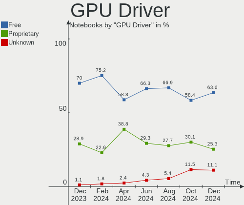
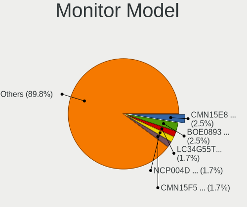

Pop!_OS Hardware Trends (Notebook)
----------------------------------

A project to identify most popular hardware characteristics and track their change
over time based on data collected by Pop!_OS users at https://Linux-Hardware.org.

Anyone can contribute to the study by uploading probes of their computers by
the [hw-probe](https://github.com/linuxhw/hw-probe) tool:

    sudo -E hw-probe -all -upload

Full-feature report is available here: https://linux-hardware.org/?view=trends&formfactor=notebook

Period: May, 2020.

Contents
--------

- [ OS                       ](#os)
- [ OS Family                ](#os-family)
- [ Kernel                   ](#kernel)
- [ Kernel Family            ](#kernel-family)
- [ Kernel Major Ver.        ](#kernel-major-ver)
- [ Arch                     ](#arch)
- [ DE                       ](#de)
- [ Display Server           ](#display-server)
- [ Display Manager          ](#display-manager)
- [ OS Lang                  ](#os-lang)
- [ Boot Mode                ](#boot-mode)
- [ Filesystem               ](#filesystem)
- [ Part. scheme             ](#part-scheme)
- [ Dual Boot with Linux/BSD ](#dual-boot-with-linux/bsd)
- [ Dual Boot (Win)          ](#dual-boot-win)
- [ Country                  ](#country)
- [ City                     ](#city)
- [ Vendor                   ](#vendor)
- [ Model                    ](#model)
- [ Model Family             ](#model-family)
- [ MFG Year                 ](#mfg-year)
- [ Form Factor              ](#form-factor)
- [ Secure Boot              ](#secure-boot)
- [ Coreboot                 ](#coreboot)
- [ RAM Size                 ](#ram-size)
- [ RAM Used                 ](#ram-used)
- [ Drive Vendor             ](#drive-vendor)
- [ Drive Model              ](#drive-model)
- [ Drive Kind               ](#drive-kind)
- [ Drive Connector          ](#drive-connector)
- [ Drive Size               ](#drive-size)
- [ Space Total              ](#space-total)
- [ Space Used               ](#space-used)
- [ Malfunc. Drives          ](#malfunc-drives)
- [ Malfunc. Drive Vendor    ](#malfunc-drive-vendor)
- [ Malfunc. Drive Kind      ](#malfunc-drive-kind)
- [ Failed Drives            ](#failed-drives)
- [ Failed Drive Vendor      ](#failed-drive-vendor)
- [ Drive Status             ](#drive-status)
- [ Storage Vendor           ](#storage-vendor)
- [ Storage Model            ](#storage-model)
- [ Storage Kind             ](#storage-kind)
- [ CPU Vendor               ](#cpu-vendor)
- [ CPU Model                ](#cpu-model)
- [ CPU Model Family         ](#cpu-model-family)
- [ CPU Cores                ](#cpu-cores)
- [ CPU Sockets              ](#cpu-sockets)
- [ CPU Threads              ](#cpu-threads)
- [ CPU Op-Modes             ](#cpu-op-modes)
- [ CPU Microcode            ](#cpu-microcode)
- [ CPU Microarch            ](#cpu-microarch)
- [ GPU Vendor               ](#gpu-vendor)
- [ GPU Model                ](#gpu-model)
- [ GPU Combo                ](#gpu-combo)
- [ GPU Driver               ](#gpu-driver)
- [ GPU Memory               ](#gpu-memory)
- [ Monitor Vendor           ](#monitor-vendor)
- [ Monitor Model            ](#monitor-model)
- [ Monitor Resolution       ](#monitor-resolution)
- [ Monitor Diagonal         ](#monitor-diagonal)
- [ Monitor Width            ](#monitor-width)
- [ Aspect Ratio             ](#aspect-ratio)
- [ Monitor Area             ](#monitor-area)
- [ Pixel Density            ](#pixel-density)
- [ Multiple Monitors        ](#multiple-monitors)
- [ Net Controller Vendor    ](#net-controller-vendor)
- [ Net Controller Model     ](#net-controller-model)
- [ Net Controller Kind      ](#net-controller-kind)
- [ Used Controller          ](#used-controller)
- [ NICs                     ](#nics)
- [ Unsupported Devices      ](#unsupported-devices)
- [ Unsupported Device Types ](#unsupported-device-types)

OS
--

Installed operating systems

| Name          | Computers | Percent |
|---------------|-----------|---------|
| Pop!_OS 20.04 | 154       | 98.72%  |
| Pop!_OS 19.10 | 2         | 1.28%   |

OS Family
---------

OS without a version

| Name    | Computers | Percent |
|---------|-----------|---------|
| Pop!_OS | 156       | 100%    |

Kernel
------

Version of the Linux kernel

| Version                   | Computers | Percent |
|---------------------------|-----------|---------|
| 5.4.0-7626-generic        | 76        | 48.72%  |
| 5.4.0-7625-generic        | 34        | 21.79%  |
| 5.4.0-7629-generic        | 32        | 20.51%  |
| 5.4.0-7634-generic        | 7         | 4.49%   |
| 5.6.7-050607-generic      | 2         | 1.28%   |
| 5.3.0-7648-generic        | 2         | 1.28%   |
| 5.6.14-xanmod1            | 1         | 0.64%   |
| 5.6.0-11.2-liquorix-amd64 | 1         | 0.64%   |
| 5.4.0-7624-generic        | 1         | 0.64%   |

Kernel Family
-------------

Linux kernel without a distro release

| Version | Computers | Percent |
|---------|-----------|---------|
| 5.4.0   | 150       | 96.15%  |
| 5.6.7   | 2         | 1.28%   |
| 5.3.0   | 2         | 1.28%   |
| 5.6.14  | 1         | 0.64%   |
| 5.6.0   | 1         | 0.64%   |

Kernel Major Ver.
-----------------

Linux kernel major version

| Version | Computers | Percent |
|---------|-----------|---------|
| 5.4     | 150       | 96.15%  |
| 5.6     | 4         | 2.56%   |
| 5.3     | 2         | 1.28%   |

Arch
----

OS architecture (x86_64, i586, etc.)

| Name   | Computers | Percent |
|--------|-----------|---------|
| x86_64 | 156       | 100%    |

DE
--

Desktop Environment

| Name    | Computers | Percent |
|---------|-----------|---------|
| GNOME   | 151       | 96.79%  |
| KDE     | 2         | 1.28%   |
| MATE    | 1         | 0.64%   |
| LXQt    | 1         | 0.64%   |
| Unknown | 1         | 0.64%   |

Display Server
--------------

X11 or Wayland

| Name    | Computers | Percent |
|---------|-----------|---------|
| X11     | 155       | 99.36%  |
| Wayland | 1         | 0.64%   |

Display Manager
---------------

SDDM, LightDM, etc.

| Name    | Computers | Percent |
|---------|-----------|---------|
| Unknown | 141       | 90.38%  |
| GDM     | 15        | 9.62%   |

OS Lang
-------

Language

| Lang    | Computers | Percent |
|---------|-----------|---------|
| en_US   | 94        | 60.26%  |
| pt_BR   | 13        | 8.33%   |
| en_GB   | 8         | 5.13%   |
| es_ES   | 7         | 4.49%   |
| de_DE   | 6         | 3.85%   |
| it_IT   | 5         | 3.21%   |
| en_CA   | 4         | 2.56%   |
| C       | 4         | 2.56%   |
| en_AU   | 3         | 1.92%   |
| tr_TR   | 2         | 1.28%   |
| fr_FR   | 2         | 1.28%   |
| pt_PT   | 1         | 0.64%   |
| nl_NL   | 1         | 0.64%   |
| hr_HR   | 1         | 0.64%   |
| fr_CA   | 1         | 0.64%   |
| fi_FI   | 1         | 0.64%   |
| es_AR   | 1         | 0.64%   |
| da_DK   | 1         | 0.64%   |
| Unknown | 1         | 0.64%   |

Boot Mode
---------

EFI or BIOS

| Mode | Computers | Percent |
|------|-----------|---------|
| EFI  | 98        | 62.82%  |
| BIOS | 58        | 37.18%  |

Filesystem
----------

Type of filesystem

| Type    | Computers | Percent |
|---------|-----------|---------|
| Ext4    | 153       | 98.08%  |
| Xfs     | 1         | 0.64%   |
| Overlay | 1         | 0.64%   |
| Btrfs   | 1         | 0.64%   |

Part. scheme
------------

Scheme of partitioning

| Type    | Computers | Percent |
|---------|-----------|---------|
| Unknown | 144       | 92.31%  |
| GPT     | 9         | 5.77%   |
| MBR     | 3         | 1.92%   |

Dual Boot with Linux/BSD
------------------------

Hosting more than one Linux/BSD

| Dual boot | Computers | Percent |
|-----------|-----------|---------|
| No        | 155       | 99.36%  |
| Yes       | 1         | 0.64%   |

Dual Boot (Win)
---------------

Hosting Linux and Windows

| Dual boot | Computers | Percent |
|-----------|-----------|---------|
| No        | 151       | 96.79%  |
| Yes       | 5         | 3.21%   |

Country
-------

Geographic location (country)

| Country                | Computers | Percent |
|------------------------|-----------|---------|
| USA                    | 38        | 24.36%  |
| Brazil                 | 14        | 8.97%   |
| Germany                | 9         | 5.77%   |
| Canada                 | 9         | 5.77%   |
| Italy                  | 6         | 3.85%   |
| UK                     | 5         | 3.21%   |
| India                  | 5         | 3.21%   |
| France                 | 4         | 2.56%   |
| Sweden                 | 3         | 1.92%   |
| Spain                  | 3         | 1.92%   |
| Philippines            | 3         | 1.92%   |
| Chile                  | 3         | 1.92%   |
| Vietnam                | 2         | 1.28%   |
| Turkey                 | 2         | 1.28%   |
| Switzerland            | 2         | 1.28%   |
| South Africa           | 2         | 1.28%   |
| Romania                | 2         | 1.28%   |
| Portugal               | 2         | 1.28%   |
| Poland                 | 2         | 1.28%   |
| Mexico                 | 2         | 1.28%   |
| Kenya                  | 2         | 1.28%   |
| Ireland                | 2         | 1.28%   |
| Denmark                | 2         | 1.28%   |
| Austria                | 2         | 1.28%   |
| Australia              | 2         | 1.28%   |
| Algeria                | 2         | 1.28%   |
| Zimbabwe               | 1         | 0.64%   |
| Zambia                 | 1         | 0.64%   |
| Thailand               | 1         | 0.64%   |
| Tanzania               | 1         | 0.64%   |
| Singapore              | 1         | 0.64%   |
| Russia                 | 1         | 0.64%   |
| Netherlands            | 1         | 0.64%   |
| Nepal                  | 1         | 0.64%   |
| Macedonia              | 1         | 0.64%   |
| Japan                  | 1         | 0.64%   |
| Iran                   | 1         | 0.64%   |
| Iceland                | 1         | 0.64%   |
| Guam                   | 1         | 0.64%   |
| Greenland              | 1         | 0.64%   |
| Greece                 | 1         | 0.64%   |
| Finland                | 1         | 0.64%   |
| Fiji                   | 1         | 0.64%   |
| Estonia                | 1         | 0.64%   |
| Egypt                  | 1         | 0.64%   |
| Czech Republic         | 1         | 0.64%   |
| Croatia                | 1         | 0.64%   |
| Colombia               | 1         | 0.64%   |
| Bulgaria               | 1         | 0.64%   |
| Bosnia and Herzegovina | 1         | 0.64%   |
| Bolivia                | 1         | 0.64%   |
| Belgium                | 1         | 0.64%   |

City
----

Geographic location (city)

| City                  | Computers | Percent |
|-----------------------|-----------|---------|
| Winnipeg              | 2         | 1.28%   |
| Ratzeburg             | 2         | 1.28%   |
| Nairobi               | 2         | 1.28%   |
| Milan                 | 2         | 1.28%   |
| Melbourne             | 2         | 1.28%   |
| Los Angeles           | 2         | 1.28%   |
| Johannesburg          | 2         | 1.28%   |
| Hamburg               | 2         | 1.28%   |
| Chihuahua City        | 2         | 1.28%   |
| Brooklyn              | 2         | 1.28%   |
| Zurich                | 1         | 0.64%   |
| Zagreb                | 1         | 0.64%   |
| Wrocław              | 1         | 0.64%   |
| Woodstock             | 1         | 0.64%   |
| Wildomar              | 1         | 0.64%   |
| Wettingen             | 1         | 0.64%   |
| Washington            | 1         | 0.64%   |
| Warsaw                | 1         | 0.64%   |
| Virginia Beach        | 1         | 0.64%   |
| Vienna                | 1         | 0.64%   |
| Versailles            | 1         | 0.64%   |
| Verdun                | 1         | 0.64%   |
| Vallda                | 1         | 0.64%   |
| Valdivia              | 1         | 0.64%   |
| Troy                  | 1         | 0.64%   |
| Toronto               | 1         | 0.64%   |
| Tokyo                 | 1         | 0.64%   |
| Thane                 | 1         | 0.64%   |
| Tehran                | 1         | 0.64%   |
| Tarlac City           | 1         | 0.64%   |
| Tampere               | 1         | 0.64%   |
| Tambov                | 1         | 0.64%   |
| Tallinn               | 1         | 0.64%   |
| São Luís            | 1         | 0.64%   |
| São José dos Campos | 1         | 0.64%   |
| Svendborg             | 1         | 0.64%   |
| Suva                  | 1         | 0.64%   |
| Stuttgart             | 1         | 0.64%   |
| Stourbridge           | 1         | 0.64%   |
| Spanaway              | 1         | 0.64%   |
| Sorocaba              | 1         | 0.64%   |
| Sofia                 | 1         | 0.64%   |
| Skopje                | 1         | 0.64%   |
| Singapore             | 1         | 0.64%   |
| Seville               | 1         | 0.64%   |
| Sarajevo              | 1         | 0.64%   |
| Santo André          | 1         | 0.64%   |
| Santiago              | 1         | 0.64%   |
| Sanliurfa             | 1         | 0.64%   |
| Saint-Vincent         | 1         | 0.64%   |
| Saint-Gregoire        | 1         | 0.64%   |
| Saint John            | 1         | 0.64%   |
| Rotterdam             | 1         | 0.64%   |
| Rizal                 | 1         | 0.64%   |
| Richmond Hill         | 1         | 0.64%   |
| Reykjavik             | 1         | 0.64%   |
| Reims                 | 1         | 0.64%   |
| Registro              | 1         | 0.64%   |
| Regina                | 1         | 0.64%   |
| Plainview             | 1         | 0.64%   |

Vendor
------

Motherboard manufacturer

| Name                | Computers | Percent |
|---------------------|-----------|---------|
| Dell                | 36        | 23.08%  |
| Lenovo              | 24        | 15.38%  |
| Hewlett-Packard     | 23        | 14.74%  |
| Acer                | 17        | 10.9%   |
| ASUSTek Computer    | 9         | 5.77%   |
| Sony                | 7         | 4.49%   |
| Samsung Electronics | 5         | 3.21%   |
| Toshiba             | 4         | 2.56%   |
| HUAWEI              | 4         | 2.56%   |
| Google              | 4         | 2.56%   |
| Apple               | 4         | 2.56%   |
| System76            | 3         | 1.92%   |
| MSI                 | 3         | 1.92%   |
| TUXEDO              | 2         | 1.28%   |
| Razer               | 2         | 1.28%   |
| Notebook            | 2         | 1.28%   |
| Positivo            | 1         | 0.64%   |
| LG Electronics      | 1         | 0.64%   |
| Intel               | 1         | 0.64%   |
| EVOO Products       | 1         | 0.64%   |
| eMachines           | 1         | 0.64%   |
| Chuwi               | 1         | 0.64%   |
| Alienware           | 1         | 0.64%   |

Model
-----

Motherboard model

| Name                                                                                                 | Computers | Percent |
|------------------------------------------------------------------------------------------------------|-----------|---------|
| Dell XPS 15 7590                                                                                     | 3         | 1.92%   |
| Toshiba Satellite C55-B                                                                              | 2         | 1.28%   |
| Lenovo ThinkPad X1 Extreme 2nd 20QVCTO1WW                                                            | 2         | 1.28%   |
| Lenovo IdeaPad 330-15IKB 81DE                                                                        | 2         | 1.28%   |
| Lenovo IdeaPad 330-14AST 81D5                                                                        | 2         | 1.28%   |
| HUAWEI KPL-W0X                                                                                       | 2         | 1.28%   |
| HP Stream Notebook PC 14                                                                             | 2         | 1.28%   |
| HP Pavilion dv6                                                                                      | 2         | 1.28%   |
| Dell XPS 15 9570                                                                                     | 2         | 1.28%   |
| Dell Inspiron N5110                                                                                  | 2         | 1.28%   |
| Dell Inspiron 5767                                                                                   | 2         | 1.28%   |
| Dell Inspiron 3521                                                                                   | 2         | 1.28%   |
| Acer Predator PH315-52                                                                               | 2         | 1.28%   |
| TUXEDO P65_P67RGRERA                                                                                 | 1         | 0.64%   |
| Toshiba TECRA R940                                                                                   | 1         | 0.64%   |
| Toshiba Satellite C870-1DD                                                                           | 1         | 0.64%   |
| System76 Serval WS                                                                                   | 1         | 0.64%   |
| System76 Oryx Pro                                                                                    | 1         | 0.64%   |
| System76 Gazelle                                                                                     | 1         | 0.64%   |
| Sony VPCF234FD                                                                                       | 1         | 0.64%   |
| Sony VPCF136FM                                                                                       | 1         | 0.64%   |
| Sony VPCEB1S1E                                                                                       | 1         | 0.64%   |
| Sony VGN-TZ250N                                                                                      | 1         | 0.64%   |
| Sony SVP13215PXB                                                                                     | 1         | 0.64%   |
| Sony SVP13215CDB                                                                                     | 1         | 0.64%   |
| Sony SVF1532H1EW                                                                                     | 1         | 0.64%   |
| Samsung Electronics RC530/RC730                                                                      | 1         | 0.64%   |
| Samsung Electronics 535U3C                                                                           | 1         | 0.64%   |
| Samsung Electronics 500R5L/501R5L/500R5P                                                             | 1         | 0.64%   |
| Samsung Electronics 350V5C/350V5X/350V4C/350V4X/351V5C/351V5X/351V4C/351V4X/3540VC/3540VX/3440VC/344 | 1         | 0.64%   |
| Samsung Electronics 300E5K/300E5Q                                                                    | 1         | 0.64%   |
| Razer Blade Stealth 13 Late 2019                                                                     | 1         | 0.64%   |
| Razer Blade                                                                                          | 1         | 0.64%   |
| Positivo C14CR21TV                                                                                   | 1         | 0.64%   |
| Notebook PB50_70RF,RD,RC                                                                             | 1         | 0.64%   |
| Notebook P7xxTM1                                                                                     | 1         | 0.64%   |
| MSI MS-163A                                                                                          | 1         | 0.64%   |
| MSI GX700                                                                                            | 1         | 0.64%   |
| MSI GE62 6QF                                                                                         | 1         | 0.64%   |
| LG Electronics 23V545-G.BK33P1                                                                       | 1         | 0.64%   |
| Lenovo Y520-15IKBA 80WY                                                                              | 1         | 0.64%   |
| Lenovo ThinkPad X280 20KES69A00                                                                      | 1         | 0.64%   |
| Lenovo ThinkPad X260 20F5S06X00                                                                      | 1         | 0.64%   |
| Lenovo ThinkPad X230 2325OR5                                                                         | 1         | 0.64%   |
| Lenovo ThinkPad X131e 3371A13                                                                        | 1         | 0.64%   |
| Lenovo ThinkPad X1 Carbon 6th 20KG0022US                                                             | 1         | 0.64%   |
| Lenovo ThinkPad W550s 20E2001PGE                                                                     | 1         | 0.64%   |
| Lenovo ThinkPad T430 2347D93                                                                         | 1         | 0.64%   |
| Lenovo ThinkPad T420 4180M8P                                                                         | 1         | 0.64%   |
| Lenovo ThinkPad P73 20QRCTO1WW                                                                       | 1         | 0.64%   |
| Lenovo ThinkPad E420 1141BTU                                                                         | 1         | 0.64%   |
| Lenovo ThinkBook 14-IML 20RV                                                                         | 1         | 0.64%   |
| Lenovo IdeaPad S540-14API 81NH                                                                       | 1         | 0.64%   |
| Lenovo IdeaPad N585                                                                                  | 1         | 0.64%   |
| Lenovo IdeaPad L340-15IRH Gaming 81LK                                                                | 1         | 0.64%   |
| Lenovo IdeaPad 530S-14ARR 81H1                                                                       | 1         | 0.64%   |
| Lenovo IdeaPad 320-15IAP 80XR                                                                        | 1         | 0.64%   |
| Lenovo B5400 20278                                                                                   | 1         | 0.64%   |
| Intel Skylake Platform                                                                               | 1         | 0.64%   |
| HUAWEI MACH-WX9                                                                                      | 1         | 0.64%   |

Model Family
------------

Motherboard model prefix

| Name                           | Computers | Percent |
|--------------------------------|-----------|---------|
| Dell Inspiron                  | 14        | 8.97%   |
| Lenovo ThinkPad                | 12        | 7.69%   |
| Acer Aspire                    | 12        | 7.69%   |
| Dell Latitude                  | 11        | 7.05%   |
| Lenovo IdeaPad                 | 9         | 5.77%   |
| Dell XPS                       | 8         | 5.13%   |
| HP Pavilion                    | 5         | 3.21%   |
| HP ProBook                     | 4         | 2.56%   |
| Toshiba Satellite              | 3         | 1.92%   |
| HP EliteBook                   | 3         | 1.92%   |
| Razer Blade                    | 2         | 1.28%   |
| HUAWEI KPL-W0X                 | 2         | 1.28%   |
| HP Stream                      | 2         | 1.28%   |
| HP OMEN                        | 2         | 1.28%   |
| HP ENVY                        | 2         | 1.28%   |
| Acer Predator                  | 2         | 1.28%   |
| Acer Nitro                     | 2         | 1.28%   |
| TUXEDO P65                     | 1         | 0.64%   |
| Toshiba TECRA                  | 1         | 0.64%   |
| System76 Serval                | 1         | 0.64%   |
| System76 Oryx                  | 1         | 0.64%   |
| System76 Gazelle               | 1         | 0.64%   |
| Sony VPCF234FD                 | 1         | 0.64%   |
| Sony VPCF136FM                 | 1         | 0.64%   |
| Sony VPCEB1S1E                 | 1         | 0.64%   |
| Sony VGN-TZ250N                | 1         | 0.64%   |
| Sony SVP13215PXB               | 1         | 0.64%   |
| Sony SVP13215CDB               | 1         | 0.64%   |
| Sony SVF1532H1EW               | 1         | 0.64%   |
| Samsung Electronics RC530      | 1         | 0.64%   |
| Samsung Electronics 535U3C     | 1         | 0.64%   |
| Samsung Electronics 500R5L     | 1         | 0.64%   |
| Samsung Electronics 350V5C     | 1         | 0.64%   |
| Samsung Electronics 300E5K     | 1         | 0.64%   |
| Positivo C14CR21TV             | 1         | 0.64%   |
| Notebook PB50                  | 1         | 0.64%   |
| Notebook P7xxTM1               | 1         | 0.64%   |
| MSI MS-163A                    | 1         | 0.64%   |
| MSI GX700                      | 1         | 0.64%   |
| MSI GE62                       | 1         | 0.64%   |
| LG Electronics 23V545-G.BK33P1 | 1         | 0.64%   |
| Lenovo Y520-15IKBA             | 1         | 0.64%   |
| Lenovo ThinkBook               | 1         | 0.64%   |
| Lenovo B5400                   | 1         | 0.64%   |
| Intel Skylake                  | 1         | 0.64%   |
| HUAWEI MACH-WX9                | 1         | 0.64%   |
| HUAWEI HN-WX9X                 | 1         | 0.64%   |
| HP ZBook                       | 1         | 0.64%   |
| HP Notebook                    | 1         | 0.64%   |
| HP Laptop                      | 1         | 0.64%   |
| HP 250                         | 1         | 0.64%   |
| HP 2000                        | 1         | 0.64%   |
| Google Swanky                  | 1         | 0.64%   |
| Google Rammus                  | 1         | 0.64%   |
| Google Cyan                    | 1         | 0.64%   |
| Google Caroline                | 1         | 0.64%   |
| EVOO Products EG-LP6           | 1         | 0.64%   |
| eMachines G725                 | 1         | 0.64%   |
| Dell Vostro                    | 1         | 0.64%   |
| Dell Studio                    | 1         | 0.64%   |

MFG Year
--------

Motherboard manufacture year

| Year | Computers | Percent |
|------|-----------|---------|
| 2019 | 40        | 25.64%  |
| 2018 | 24        | 15.38%  |
| 2020 | 20        | 12.82%  |
| 2013 | 13        | 8.33%   |
| 2017 | 11        | 7.05%   |
| 2014 | 11        | 7.05%   |
| 2012 | 10        | 6.41%   |
| 2011 | 8         | 5.13%   |
| 2016 | 6         | 3.85%   |
| 2010 | 5         | 3.21%   |
| 2015 | 3         | 1.92%   |
| 2009 | 2         | 1.28%   |
| 2008 | 2         | 1.28%   |
| 2007 | 1         | 0.64%   |

Form Factor
-----------

Physical design of the computer

| Name     | Computers | Percent |
|----------|-----------|---------|
| Notebook | 156       | 100%    |

Secure Boot
-----------

Enabled or disabled

| State    | Computers | Percent |
|----------|-----------|---------|
| Disabled | 155       | 99.36%  |
| Enabled  | 1         | 0.64%   |

Coreboot
--------

Have coreboot on board

| Used | Computers | Percent |
|------|-----------|---------|
| No   | 152       | 97.44%  |
| Yes  | 4         | 2.56%   |

RAM Size
--------

Total RAM memory

| Size in GB  | Computers | Percent |
|-------------|-----------|---------|
| 4.01-8.0    | 46        | 29.49%  |
| 16.01-24.0  | 40        | 25.64%  |
| 8.01-16.0   | 27        | 17.31%  |
| 3.01-4.0    | 24        | 15.38%  |
| 32.01-64.0  | 9         | 5.77%   |
| 1.01-2.0    | 5         | 3.21%   |
| 64.01-256.0 | 4         | 2.56%   |
| 2.01-3.0    | 1         | 0.64%   |

RAM Used
--------

Used RAM memory

| Used GB   | Computers | Percent |
|-----------|-----------|---------|
| 1.01-2.0  | 56        | 35.9%   |
| 2.01-3.0  | 48        | 30.77%  |
| 3.01-4.0  | 29        | 18.59%  |
| 4.01-8.0  | 22        | 14.1%   |
| 8.01-16.0 | 1         | 0.64%   |

Drive Vendor
------------

Hard drive vendors

| Vendor              | Computers | Drives  | Percent |
|---------------------|-----------|---------|---------|
| Samsung Electronics | 27        | 27      | 15.52%  |
| WDC                 | 26        | 27      | 14.94%  |
| Seagate             | 19        | 19      | 10.92%  |
| Toshiba             | 12        | 12      | 6.9%    |
| Kingston            | 11        | 11      | 6.32%   |
| Unknown             | 9         | 11      | 5.17%   |
| HGST                | 9         | 9       | 5.17%   |
| Crucial             | 9         | 9       | 5.17%   |
| SanDisk             | 8         | 8       | 4.6%    |
| Hitachi             | 5         | 5       | 2.87%   |
| SK Hynix            | 4         | 4       | 2.3%    |
| Micron Technology   | 4         | 4       | 2.3%    |
| A-DATA Technology   | 4         | 4       | 2.3%    |
| Transcend           | 3         | 3       | 1.72%   |
| PNY                 | 3         | 3       | 1.72%   |
| TO Exter            | 2         | 2       | 1.15%   |
| LITEONIT            | 2         | 2       | 1.15%   |
| LITEON              | 2         | 2       | 1.15%   |
| China               | 2         | 2       | 1.15%   |
| BHT                 | 2         | 2       | 1.15%   |
| Team                | 1         | 1       | 0.57%   |
| Patriot             | 1         | 1       | 0.57%   |
| Netac               | 1         | 1       | 0.57%   |
| KIOXIA              | 1         | 1       | 0.57%   |
| KingSpec            | 1         | 1       | 0.57%   |
| Intel               | 1         | 1       | 0.57%   |
| HL-DT-ST            | 1         | Unknown | 0.57%   |
| Hewlett-Packard     | 1         | 1       | 0.57%   |
| External            | 1         | 1       | 0.57%   |
| Corsair             | 1         | 1       | 0.57%   |
| Apple               | 1         | 1       | 0.57%   |

Drive Model
-----------

Hard drive models

| Model                        | Computers | Percent |
|------------------------------|-----------|---------|
| MMC Card  32GB               | 5         | 2.82%   |
| ST1000LM035-1RK172 1TB       | 4         | 2.26%   |
| HTS721010A9E630 1TB          | 4         | 2.26%   |
| ST2000LX001-1RG174 2TB       | 3         | 1.69%   |
| SSD 850 EVO 250GB            | 3         | 1.69%   |
| SA400S37240G 240GB SSD       | 3         | 1.69%   |
| MQ01ABD100 1TB               | 3         | 1.69%   |
| MMC Card  16GB               | 3         | 1.69%   |
| HTS545050A7E380 500GB        | 3         | 1.69%   |
| CT120BX500SSD1 120GB         | 3         | 1.69%   |
| WR202A1032G 670215F5 32GB    | 2         | 1.13%   |
| WDS100T2B0B-00YS70 1TB SSD   | 2         | 1.13%   |
| WD5000LPCX-24VHAT0 500GB     | 2         | 1.13%   |
| WD10SPZX-24Z10 1TB           | 2         | 1.13%   |
| ST500LT012-9WS142 500GB      | 2         | 1.13%   |
| SSD 860 EVO 500GB            | 2         | 1.13%   |
| nal USB 3.0 1TB              | 2         | 1.13%   |
| HTS541010A9E680 1TB          | 2         | 1.13%   |
| CS900 120GB SSD              | 2         | 1.13%   |
| X300 MSATA 256GB SSD         | 1         | 0.56%   |
| WDS500G2B0B-00YS70 500GB SSD | 1         | 0.56%   |
| WDS500G2B0A 500GB SSD        | 1         | 0.56%   |
| WDS240G2G0A-00JH30 240GB SSD | 1         | 0.56%   |
| WDBNCE5000PNC 500GB SSD      | 1         | 0.56%   |
| WD7500BPVX-60JC3T0 752GB     | 1         | 0.56%   |
| WD7500BPVT-00HXZT1 752GB     | 1         | 0.56%   |
| WD7500BPKT-75PK4T0 752GB     | 1         | 0.56%   |
| WD6400BEVT-22A0RT0 640GB     | 1         | 0.56%   |
| WD5000LPVX-75V0TT0 500GB     | 1         | 0.56%   |
| WD5000LPVX-22V0TT0 500GB     | 1         | 0.56%   |
| WD5000BPVT-75HXZT3 500GB     | 1         | 0.56%   |
| WD2500BEVT-60A23T0 250GB     | 1         | 0.56%   |
| WD2500BEVS-00UST0 250GB      | 1         | 0.56%   |
| WD10SPZX-60Z10T0 1TB         | 1         | 0.56%   |
| WD10SPZX-21Z10T0 1TB         | 1         | 0.56%   |
| WD10SPCX-08HWST0 1TB         | 1         | 0.56%   |
| WD10JPVX-75JC3T0 1TB         | 1         | 0.56%   |
| WD10JPVX-35JC3T0 1TB         | 1         | 0.56%   |
| WD10JPVX-22JC3T0 1TB         | 1         | 0.56%   |
| USB3.0 1TB                   | 1         | 0.56%   |
| TS256GSSD370 256GB           | 1         | 0.56%   |
| TS256GMTS430S 256GB SSD      | 1         | 0.56%   |
| TS240GMTS420S 240GB SSD      | 1         | 0.56%   |
| TR200 240GB SSD              | 1         | 0.56%   |
| T253TD480G 480GB SSD         | 1         | 0.56%   |
| SX6000LNP 256GB              | 1         | 0.56%   |
| SV300S37A240G 240GB SSD      | 1         | 0.56%   |
| SUV400S37240G 240GB SSD      | 1         | 0.56%   |
| SUV400S37120G 120GB SSD      | 1         | 0.56%   |
| SU800 256GB SSD              | 1         | 0.56%   |
| SU700 120GB SSD              | 1         | 0.56%   |
| ST95005620AS 500GB           | 1         | 0.56%   |
| ST9500325AS 500GB            | 1         | 0.56%   |
| ST750LM022 HN-M750MBB 752GB  | 1         | 0.56%   |
| ST500LT012-1DG142 500GB      | 1         | 0.56%   |
| ST500LM000-SSHD-8GB          | 1         | 0.56%   |
| ST2000LM015-2E8174 2TB       | 1         | 0.56%   |
| ST1000LM048-2E7172 1TB       | 1         | 0.56%   |
| ST1000LM024 HN-M101MBB 1TB   | 1         | 0.56%   |
| ST1000LM014-1EJ164 1TB       | 1         | 0.56%   |

Drive Kind
----------

HDD or SSD

| Kind    | Computers | Drives | Percent |
|---------|-----------|--------|---------|
| SSD     | 82        | 89     | 48.81%  |
| HDD     | 62        | 62     | 36.9%   |
| MMC     | 9         | 11     | 5.36%   |
| NVMe    | 9         | 9      | 5.36%   |
| Unknown | 6         | 5      | 3.57%   |

Drive Connector
---------------

SATA, SAS, NVMe, etc.

| Type | Computers | Drives | Percent |
|------|-----------|--------|---------|
| SATA | 126       | 151    | 84%     |
| NVMe | 9         | 9      | 6%      |
| MMC  | 9         | 11     | 6%      |
| SAS  | 6         | 5      | 4%      |

Drive Size
----------

Size of hard drive

| Size in TB | Computers | Drives | Percent |
|------------|-----------|--------|---------|
| 0.01-0.5   | 98        | 115    | 62.42%  |
| 0.51-1.0   | 52        | 54     | 33.12%  |
| 1.01-2.0   | 6         | 6      | 3.82%   |
| 3.01-4.0   | 1         | 1      | 0.64%   |

Space Total
-----------

Amount of disk space available on the file system

| Size in GB     | Computers | Percent |
|----------------|-----------|---------|
| 101-250        | 52        | 33.33%  |
| 251-500        | 43        | 27.56%  |
| 501-1000       | 23        | 14.74%  |
| 51-100         | 13        | 8.33%   |
| 1001-2000      | 11        | 7.05%   |
| 21-50          | 5         | 3.21%   |
| 1-20           | 4         | 2.56%   |
| More than 3000 | 2         | 1.28%   |
| 2001-3000      | 2         | 1.28%   |
| Unknown        | 1         | 0.64%   |

Space Used
----------

Amount of used disk space

| Used GB        | Computers | Percent |
|----------------|-----------|---------|
| 1-20           | 80        | 51.28%  |
| 21-50          | 27        | 17.31%  |
| 51-100         | 14        | 8.97%   |
| 251-500        | 12        | 7.69%   |
| 101-250        | 12        | 7.69%   |
| 501-1000       | 6         | 3.85%   |
| 1001-2000      | 3         | 1.92%   |
| More than 3000 | 1         | 0.64%   |
| Unknown        | 1         | 0.64%   |

Malfunc. Drives
---------------

Drive models with a malfunction

Zero info for selected period =(

Malfunc. Drive Vendor
---------------------

Vendors of faulty drives

Zero info for selected period =(

Malfunc. Drive Kind
-------------------

Kinds of faulty drives

Zero info for selected period =(

Failed Drives
-------------

Failed drive models

Zero info for selected period =(

Failed Drive Vendor
-------------------

Failed drive vendors

Zero info for selected period =(

Drive Status
------------

Number of failed and malfunc. drives

| Status   | Computers | Drives | Percent |
|----------|-----------|--------|---------|
| Detected | 123       | 160    | 89.13%  |
| Works    | 15        | 16     | 10.87%  |

Storage Vendor
--------------

Storage controller vendors

| Vendor                       | Computers | Percent |
|------------------------------|-----------|---------|
| Intel                        | 120       | 68.57%  |
| Samsung Electronics          | 20        | 11.43%  |
| AMD                          | 18        | 10.29%  |
| Sandisk                      | 5         | 2.86%   |
| Toshiba America Info Systems | 4         | 2.29%   |
| SK Hynix                     | 2         | 1.14%   |
| KIOXIA                       | 2         | 1.14%   |
| Union Memory (Shenzhen)      | 1         | 0.57%   |
| Silicon Image                | 1         | 0.57%   |
| Seagate Technology           | 1         | 0.57%   |
| Realtek Semiconductor        | 1         | 0.57%   |

Storage Model
-------------

Storage controller models

| Model                                                                    | Computers | Percent |
|--------------------------------------------------------------------------|-----------|---------|
| 82801 Mobile SATA Controller [RAID mode]                                 | 20        | 11.05%  |
| Sunrise Point-LP SATA Controller [AHCI mode]                             | 17        | 9.39%   |
| FCH SATA Controller [AHCI mode]                                          | 16        | 8.84%   |
| 7 Series Chipset Family 6-port SATA Controller [AHCI mode]               | 16        | 8.84%   |
| Cannon Lake Mobile PCH SATA AHCI Controller                              | 13        | 7.18%   |
| 6 Series/C200 Series Chipset Family 6 port Mobile SATA AHCI Controller   | 11        | 6.08%   |
| NVMe SSD Controller SM981/PM981/PM983                                    | 10        | 5.52%   |
| 8 Series SATA Controller 1 [AHCI mode]                                   | 10        | 5.52%   |
| HM170/QM170 Chipset SATA Controller [AHCI Mode]                          | 8         | 4.42%   |
| Non-Volatile memory controller                                           | 7         | 3.87%   |
| NVMe SSD Controller SM961/PM961                                          | 5         | 2.76%   |
| Wildcat Point-LP SATA Controller [AHCI Mode]                             | 4         | 2.21%   |
| 8 Series/C220 Series Chipset Family 6-port SATA Controller 1 [AHCI mode] | 4         | 2.21%   |
| Toshiba America Info Non-Volatile memory controller                      | 3         | 1.66%   |
| 82801HM/HEM (ICH8M/ICH8M-E) SATA Controller [AHCI mode]                  | 3         | 1.66%   |
| 82801HM/HEM (ICH8M/ICH8M-E) IDE Controller                               | 3         | 1.66%   |
| WD Black 2018/PC SN720 NVMe SSD                                          | 2         | 1.1%    |
| SSD 660P Series                                                          | 2         | 1.1%    |
| SB7x0/SB8x0/SB9x0 SATA Controller [AHCI mode]                            | 2         | 1.1%    |
| NVMe SSD Controller SM951/PM951                                          | 2         | 1.1%    |
| 82801IBM/IEM (ICH9M/ICH9M-E) 4 port SATA Controller [AHCI mode]          | 2         | 1.1%    |
| 5 Series/3400 Series Chipset 6 port SATA AHCI Controller                 | 2         | 1.1%    |
| 5 Series/3400 Series Chipset 4 port SATA AHCI Controller                 | 2         | 1.1%    |
| XP941 PCIe SSD                                                           | 1         | 0.55%   |
| WD Black 2018/PC SN520 NVMe SSD                                          | 1         | 0.55%   |
| SiI 3531 [SATALink/SATARaid] Serial ATA Controller                       | 1         | 0.55%   |
| SATA controller                                                          | 1         | 0.55%   |
| Realtek Non-Volatile memory controller                                   | 1         | 0.55%   |
| Q170/Q150/B150/H170/H110/Z170/CM236 Chipset SATA Controller [AHCI Mode]  | 1         | 0.55%   |
| FCH IDE Controller                                                       | 1         | 0.55%   |
| Electronics SATA controller                                              | 1         | 0.55%   |
| Comet Lake SATA AHCI Controller                                          | 1         | 0.55%   |
| Celeron N3350/Pentium N4200/Atom E3900 Series SATA AHCI Controller       | 1         | 0.55%   |
| BG3 NVMe SSD Controller                                                  | 1         | 0.55%   |
| BC501 NVMe Solid State Drive 512GB                                       | 1         | 0.55%   |
| Apple PCIe SSD                                                           | 1         | 0.55%   |
| 82801G (ICH7 Family) IDE Controller                                      | 1         | 0.55%   |
| 8 Series/C220 Series Chipset Family 2-port SATA Controller 2 [IDE mode]  | 1         | 0.55%   |
| 8 Series Chipset Family 4-port SATA Controller 1 [IDE mode] - Mobile     | 1         | 0.55%   |
| 200 Series PCH SATA controller [AHCI mode]                               | 1         | 0.55%   |

Storage Kind
------------

Kind of storage controller (IDE, SATA, NVMe, SAS, ...)

| Kind | Computers | Percent |
|------|-----------|---------|
| SATA | 117       | 65.36%  |
| NVMe | 35        | 19.55%  |
| RAID | 21        | 11.73%  |
| IDE  | 6         | 3.35%   |

CPU Vendor
----------

Processor vendors

| Vendor | Computers | Percent |
|--------|-----------|---------|
| Intel  | 135       | 86.54%  |
| AMD    | 21        | 13.46%  |

CPU Model
---------

Processor models

| Model                                           | Computers | Percent |
|-------------------------------------------------|-----------|---------|
| Intel Core i7-9750H CPU @ 2.60GHz               | 10        | 6.41%   |
| Intel Core i7-8750H CPU @ 2.20GHz               | 5         | 3.21%   |
| Intel Core i7-8550U CPU @ 1.80GHz               | 5         | 3.21%   |
| Intel Core i7-2670QM CPU @ 2.20GHz              | 5         | 3.21%   |
| Intel Core i7-6700HQ CPU @ 2.60GHz              | 4         | 2.56%   |
| Intel Core i7-6500U CPU @ 2.50GHz               | 4         | 2.56%   |
| Intel Core i5-8250U CPU @ 1.60GHz               | 4         | 2.56%   |
| Intel Core i5-4210U CPU @ 1.70GHz               | 4         | 2.56%   |
| AMD Ryzen 5 2500U with Radeon Vega Mobile Gfx   | 4         | 2.56%   |
| Intel Core i7-7700HQ CPU @ 2.80GHz              | 3         | 1.92%   |
| Intel Core i7-7500U CPU @ 2.70GHz               | 3         | 1.92%   |
| Intel Core i7-5500U CPU @ 2.40GHz               | 3         | 1.92%   |
| Intel Core i7-3520M CPU @ 2.90GHz               | 3         | 1.92%   |
| Intel Core i5-6300U CPU @ 2.40GHz               | 3         | 1.92%   |
| Intel Core i5-4200U CPU @ 1.60GHz               | 3         | 1.92%   |
| Intel Core i5-3337U CPU @ 1.80GHz               | 3         | 1.92%   |
| Intel Core i3-3217U CPU @ 1.80GHz               | 3         | 1.92%   |
| Intel Core i7-4700HQ CPU @ 2.40GHz              | 2         | 1.28%   |
| Intel Core i7-2630QM CPU @ 2.00GHz              | 2         | 1.28%   |
| Intel Core i7 CPU Q 720 @ 1.60GHz               | 2         | 1.28%   |
| Intel Core i5-8300H CPU @ 2.30GHz               | 2         | 1.28%   |
| Intel Core i5-8265U CPU @ 1.60GHz               | 2         | 1.28%   |
| Intel Core i5-5300U CPU @ 2.30GHz               | 2         | 1.28%   |
| Intel Core i5-3320M CPU @ 2.60GHz               | 2         | 1.28%   |
| Intel Core i5-3210M CPU @ 2.50GHz               | 2         | 1.28%   |
| Intel Core i5-2520M CPU @ 2.50GHz               | 2         | 1.28%   |
| Intel Core i3-3110M CPU @ 2.40GHz               | 2         | 1.28%   |
| AMD A4-9125 RADEON R3, 4 COMPUTE CORES 2C+2G    | 2         | 1.28%   |
| AMD A4 Micro-6400T APU + AMD Radeon R3 Graphics | 2         | 1.28%   |
| Intel Xeon E-2276M CPU @ 2.80GHz                | 1         | 0.64%   |
| Intel Pentium Dual-Core CPU T4200 @ 2.00GHz     | 1         | 0.64%   |
| Intel Core m3-8100Y CPU @ 1.10GHz               | 1         | 0.64%   |
| Intel Core m3-6Y30 CPU @ 0.90GHz                | 1         | 0.64%   |
| Intel Core i9-9980HK CPU @ 2.40GHz              | 1         | 0.64%   |
| Intel Core i9-9900KF CPU @ 3.60GHz              | 1         | 0.64%   |
| Intel Core i9-8950HK CPU @ 2.90GHz              | 1         | 0.64%   |
| Intel Core i7-8665U CPU @ 1.90GHz               | 1         | 0.64%   |
| Intel Core i7-6820HK CPU @ 2.70GHz              | 1         | 0.64%   |
| Intel Core i7-6700K CPU @ 4.00GHz               | 1         | 0.64%   |
| Intel Core i7-6600U CPU @ 2.60GHz               | 1         | 0.64%   |
| Intel Core i7-5600U CPU @ 2.60GHz               | 1         | 0.64%   |
| Intel Core i7-4980HQ CPU @ 2.80GHz              | 1         | 0.64%   |
| Intel Core i7-4810MQ CPU @ 2.80GHz              | 1         | 0.64%   |
| Intel Core i7-4702HQ CPU @ 2.20GHz              | 1         | 0.64%   |
| Intel Core i7-4600U CPU @ 2.10GHz               | 1         | 0.64%   |
| Intel Core i7-4510U CPU @ 2.00GHz               | 1         | 0.64%   |
| Intel Core i7-4500U CPU @ 1.80GHz               | 1         | 0.64%   |
| Intel Core i7-3632QM CPU @ 2.20GHz              | 1         | 0.64%   |
| Intel Core i7-2760QM CPU @ 2.40GHz              | 1         | 0.64%   |
| Intel Core i7-1065G7 CPU @ 1.30GHz              | 1         | 0.64%   |
| Intel Core i7 CPU Q 740 @ 1.73GHz               | 1         | 0.64%   |
| Intel Core i5-9300H CPU @ 2.40GHz               | 1         | 0.64%   |
| Intel Core i5-7360U CPU @ 2.30GHz               | 1         | 0.64%   |
| Intel Core i5-7200U CPU @ 2.50GHz               | 1         | 0.64%   |
| Intel Core i5-6300HQ CPU @ 2.30GHz              | 1         | 0.64%   |
| Intel Core i5-6200U CPU @ 2.30GHz               | 1         | 0.64%   |
| Intel Core i5-4300U CPU @ 1.90GHz               | 1         | 0.64%   |
| Intel Core i5-4200M CPU @ 2.50GHz               | 1         | 0.64%   |
| Intel Core i5-2450M CPU @ 2.50GHz               | 1         | 0.64%   |
| Intel Core i5-2430M CPU @ 2.40GHz               | 1         | 0.64%   |

CPU Model Family
----------------

Processor model prefix

| Model                   | Computers | Percent |
|-------------------------|-----------|---------|
| Intel Core i7           | 66        | 42.31%  |
| Intel Core i5           | 40        | 25.64%  |
| Intel Core i3           | 12        | 7.69%   |
| Intel Celeron           | 5         | 3.21%   |
| AMD Ryzen 5             | 5         | 3.21%   |
| Intel Core 2 Duo        | 4         | 2.56%   |
| AMD A4                  | 4         | 2.56%   |
| Intel Core i9           | 3         | 1.92%   |
| AMD A8                  | 3         | 1.92%   |
| Intel Core m3           | 2         | 1.28%   |
| AMD E1                  | 2         | 1.28%   |
| AMD A6                  | 2         | 1.28%   |
| Intel Xeon              | 1         | 0.64%   |
| Intel Pentium Dual-Core | 1         | 0.64%   |
| Intel Core 2            | 1         | 0.64%   |
| AMD Turion II           | 1         | 0.64%   |
| AMD Ryzen 7             | 1         | 0.64%   |
| AMD Ryzen 3             | 1         | 0.64%   |
| AMD E2                  | 1         | 0.64%   |
| AMD Athlon II           | 1         | 0.64%   |

CPU Cores
---------

Number of processor cores

| Number | Computers | Percent |
|--------|-----------|---------|
| 2      | 81        | 51.92%  |
| 4      | 54        | 34.62%  |
| 6      | 17        | 10.9%   |
| 8      | 2         | 1.28%   |
| 1      | 2         | 1.28%   |

CPU Sockets
-----------

Number of sockets

| Number | Computers | Percent |
|--------|-----------|---------|
| 1      | 156       | 100%    |

CPU Threads
-----------

Threads per core (Hyper-Threading)

| Number | Computers | Percent |
|--------|-----------|---------|
| 2      | 133       | 85.26%  |
| 1      | 23        | 14.74%  |

CPU Op-Modes
------------

CPU Operation Modes (32-bit, 64-bit)

| Op mode        | Computers | Percent |
|----------------|-----------|---------|
| 32-bit, 64-bit | 156       | 100%    |

CPU Microcode
-------------

Microcode number

| Number     | Computers | Percent |
|------------|-----------|---------|
| 0x906ea    | 17        | 10.9%   |
| 0x306a9    | 17        | 10.9%   |
| 0x206a7    | 14        | 8.97%   |
| 0x40651    | 11        | 7.05%   |
| Unknown    | 11        | 7.05%   |
| 0x406e3    | 10        | 6.41%   |
| 0x806ea    | 9         | 5.77%   |
| 0x506e3    | 6         | 3.85%   |
| 0x306c3    | 6         | 3.85%   |
| 0x306d4    | 5         | 3.21%   |
| 0x906ed    | 4         | 2.56%   |
| 0x806e9    | 4         | 2.56%   |
| 0x07030105 | 4         | 2.56%   |
| 0x806ec    | 3         | 1.92%   |
| 0x08108102 | 3         | 1.92%   |
| 0x906e9    | 2         | 1.28%   |
| 0x106e5    | 2         | 1.28%   |
| 0x1067a    | 2         | 1.28%   |
| 0x0810100b | 2         | 1.28%   |
| 0x08101007 | 2         | 1.28%   |
| 0x06006705 | 2         | 1.28%   |
| 0x06001119 | 2         | 1.28%   |
| 0x05000119 | 2         | 1.28%   |
| 0x010000c8 | 2         | 1.28%   |
| 0x806eb    | 1         | 0.64%   |
| 0x706e5    | 1         | 0.64%   |
| 0x706a1    | 1         | 0.64%   |
| 0x6fa      | 1         | 0.64%   |
| 0x6f2      | 1         | 0.64%   |
| 0x506c9    | 1         | 0.64%   |
| 0x406c4    | 1         | 0.64%   |
| 0x40661    | 1         | 0.64%   |
| 0x30678    | 1         | 0.64%   |
| 0x20655    | 1         | 0.64%   |
| 0x20652    | 1         | 0.64%   |
| 0x10676    | 1         | 0.64%   |
| 0x06003109 | 1         | 0.64%   |
| 0x03000027 | 1         | 0.64%   |

CPU Microarch
-------------

Microarchitecture

| Name          | Computers | Percent |
|---------------|-----------|---------|
| Skylake       | 56        | 35.9%   |
| Haswell       | 19        | 12.18%  |
| IvyBridge     | 17        | 10.9%   |
| SandyBridge   | 16        | 10.26%  |
| Core          | 6         | 3.85%   |
| Broadwell     | 6         | 3.85%   |
| KabyLake      | 5         | 3.21%   |
| Zen           | 4         | 2.56%   |
| Puma          | 4         | 2.56%   |
| Zen+          | 3         | 1.92%   |
| Nehalem       | 3         | 1.92%   |
| Westmere      | 2         | 1.28%   |
| Silvermont    | 2         | 1.28%   |
| Piledriver    | 2         | 1.28%   |
| K10           | 2         | 1.28%   |
| Excavator     | 2         | 1.28%   |
| Bobcat        | 2         | 1.28%   |
| Steamroller   | 1         | 0.64%   |
| K10 Llano     | 1         | 0.64%   |
| Icelake       | 1         | 0.64%   |
| Goldmont plus | 1         | 0.64%   |
| Goldmont      | 1         | 0.64%   |

GPU Vendor
----------

Vendors of graphics cards

| Vendor | Computers | Percent |
|--------|-----------|---------|
| Intel  | 123       | 57.48%  |
| Nvidia | 53        | 24.77%  |
| AMD    | 38        | 17.76%  |

GPU Model
---------

Graphics card models

| Model                                                                             | Computers | Percent |
|-----------------------------------------------------------------------------------|-----------|---------|
| UHD Graphics 630 (Mobile)                                                         | 21        | 9.59%   |
| 3rd Gen Core processor Graphics Controller                                        | 16        | 7.31%   |
| 2nd Generation Core Processor Family Integrated Graphics Controller               | 15        | 6.85%   |
| Haswell-ULT Integrated Graphics Controller                                        | 12        | 5.48%   |
| UHD Graphics 620                                                                  | 9         | 4.11%   |
| Skylake GT2 [HD Graphics 520]                                                     | 9         | 4.11%   |
| HD Graphics 5500                                                                  | 6         | 2.74%   |
| HD Graphics 530                                                                   | 6         | 2.74%   |
| 4th Gen Core Processor Integrated Graphics Controller                             | 6         | 2.74%   |
| TU117M [GeForce GTX 1650 Mobile / Max-Q]                                          | 5         | 2.28%   |
| Topaz XT [Radeon R7 M260/M265 / M340/M360 / M440/M445 / 530/535 / 620/625 Mobile] | 5         | 2.28%   |
| Raven Ridge [Radeon Vega Series / Radeon Vega Mobile Series]                      | 4         | 1.83%   |
| HD Graphics 620                                                                   | 4         | 1.83%   |
| GP108M [GeForce MX150]                                                            | 4         | 1.83%   |
| Whistler [Radeon HD 6730M/6770M/7690M XT]                                         | 3         | 1.37%   |
| UHD Graphics 620 (Whiskey Lake)                                                   | 3         | 1.37%   |
| Thames [Radeon HD 7500M/7600M Series]                                             | 3         | 1.37%   |
| HD Graphics 630                                                                   | 3         | 1.37%   |
| GP107M [GeForce GTX 1050 Ti Mobile]                                               | 3         | 1.37%   |
| GP107M [GeForce GTX 1050 Mobile]                                                  | 3         | 1.37%   |
| TU116M [GeForce GTX 1660 Ti Mobile]                                               | 2         | 0.91%   |
| TU106M [GeForce RTX 2060 Mobile]                                                  | 2         | 0.91%   |
| Thames [Radeon HD 7550M/7570M/7650M]                                              | 2         | 0.91%   |
| Stoney [Radeon R2/R3/R4/R5 Graphics]                                              | 2         | 0.91%   |
| Picasso                                                                           | 2         | 0.91%   |
| Park [Mobility Radeon HD 5430/5450/5470]                                          | 2         | 0.91%   |
| Mullins [Radeon R3E Graphics]                                                     | 2         | 0.91%   |
| Mobile 4 Series Chipset Integrated Graphics Controller                            | 2         | 0.91%   |
| GM204M [GeForce GTX 970M]                                                         | 2         | 0.91%   |
| GM108M [GeForce 940MX]                                                            | 2         | 0.91%   |
| GM107M [GeForce GTX 960M]                                                         | 2         | 0.91%   |
| GM107M [GeForce GTX 950M]                                                         | 2         | 0.91%   |
| G84M [GeForce 8600M GT]                                                           | 2         | 0.91%   |
| Baffin [Radeon RX 460/560D / Pro 450/455/460/555/555X/560/560X]                   | 2         | 0.91%   |
| Wrestler [Radeon HD 7340]                                                         | 1         | 0.46%   |
| Wrestler [Radeon HD 7310]                                                         | 1         | 0.46%   |
| UHD Graphics 605                                                                  | 1         | 0.46%   |
| UHD Graphics                                                                      | 1         | 0.46%   |
| TU106BM [GeForce RTX 2070 Mobile / Max-Q]                                         | 1         | 0.46%   |
| TU104M [GeForce RTX 2080 Mobile]                                                  | 1         | 0.46%   |
| TU104GLM [Quadro RTX 5000 Mobile / Max-Q]                                         | 1         | 0.46%   |
| Trinity [Radeon HD 7640G]                                                         | 1         | 0.46%   |
| Trinity [Radeon HD 7500G]                                                         | 1         | 0.46%   |
| Sun XT [Radeon HD 8670A/8670M/8690M / R5 M330 / M430 / Radeon 520 Mobile]         | 1         | 0.46%   |
| Sumo [Radeon HD 6620G]                                                            | 1         | 0.46%   |
| Seymour [Radeon HD 6400M/7400M Series]                                            | 1         | 0.46%   |
| RS880M [Mobility Radeon HD 4225/4250]                                             | 1         | 0.46%   |
| Mullins [Radeon R4/R5 Graphics]                                                   | 1         | 0.46%   |
| Mullins [Radeon R2 Graphics]                                                      | 1         | 0.46%   |
| Mobile GM965/GL960 Integrated Graphics Controller (secondary)                     | 1         | 0.46%   |
| Mobile GM965/GL960 Integrated Graphics Controller (primary)                       | 1         | 0.46%   |
| Mobile 945GM/GMS/GME, 943/940GML Express Integrated Graphics Controller           | 1         | 0.46%   |
| Mobile 945GM/GMS, 943/940GML Express Integrated Graphics Controller               | 1         | 0.46%   |
| Madison [Mobility Radeon HD 5650/5750 / 6530M/6550M]                              | 1         | 0.46%   |
| Kaveri [Radeon R4 Graphics]                                                       | 1         | 0.46%   |
| Iris Plus Graphics G7                                                             | 1         | 0.46%   |
| Iris Plus Graphics 640                                                            | 1         | 0.46%   |
| HD Graphics 515                                                                   | 1         | 0.46%   |
| HD Graphics 500                                                                   | 1         | 0.46%   |
| GT218M [NVS 3100M]                                                                | 1         | 0.46%   |

GPU Combo
---------

Combinations of graphics cards

| Name           | Computers | Percent |
|----------------|-----------|---------|
| 1 x Intel      | 65        | 41.67%  |
| Intel + Nvidia | 45        | 28.85%  |
| 1 x AMD        | 21        | 13.46%  |
| Intel + AMD    | 14        | 8.97%   |
| 1 x Nvidia     | 8         | 5.13%   |
| 2 x AMD        | 3         | 1.92%   |

GPU Driver
----------

Free vs proprietary

| Driver      | Computers | Percent |
|-------------|-----------|---------|
| Free        | 111       | 71.15%  |
| Proprietary | 43        | 27.56%  |
| Unknown     | 2         | 1.28%   |

GPU Memory
----------

Total video memory

| Size in GB | Computers | Percent |
|------------|-----------|---------|
| Unknown    | 83        | 53.21%  |
| 1.01-2.0   | 20        | 12.82%  |
| 0.01-0.5   | 16        | 10.26%  |
| 3.01-4.0   | 15        | 9.62%   |
| 0.51-1.0   | 12        | 7.69%   |
| 5.01-6.0   | 5         | 3.21%   |
| 7.01-8.0   | 3         | 1.92%   |
| 2.01-3.0   | 1         | 0.64%   |
| 8.01-16.0  | 1         | 0.64%   |

Monitor Vendor
--------------

Monitor vendors

| Vendor                  | Computers | Percent |
|-------------------------|-----------|---------|
| AU Optronics            | 39        | 21.91%  |
| LG Display              | 24        | 13.48%  |
| Samsung Electronics     | 20        | 11.24%  |
| Chimei Innolux          | 20        | 11.24%  |
| BOE                     | 17        | 9.55%   |
| Sharp                   | 10        | 5.62%   |
| Dell                    | 8         | 4.49%   |
| Chi Mei Optoelectronics | 5         | 2.81%   |
| Apple                   | 4         | 2.25%   |
| AOC                     | 3         | 1.69%   |
| ViewSonic               | 2         | 1.12%   |
| Toshiba                 | 2         | 1.12%   |
| Philips                 | 2         | 1.12%   |
| Panasonic               | 2         | 1.12%   |
| InfoVision              | 2         | 1.12%   |
| Goldstar                | 2         | 1.12%   |
| FOX                     | 2         | 1.12%   |
| Vizio                   | 1         | 0.56%   |
| TIANMA XM               | 1         | 0.56%   |
| Sony                    | 1         | 0.56%   |
| PANDA                   | 1         | 0.56%   |
| MStar                   | 1         | 0.56%   |
| LGD                     | 1         | 0.56%   |
| Insignia                | 1         | 0.56%   |
| InnoLux Display         | 1         | 0.56%   |
| Iiyama                  | 1         | 0.56%   |
| GKK                     | 1         | 0.56%   |
| CHD                     | 1         | 0.56%   |
| ASUSTek Computer        | 1         | 0.56%   |
| Ancor Communications    | 1         | 0.56%   |
| Acer                    | 1         | 0.56%   |

Monitor Model
-------------

Monitor models

| Model                                               | Computers | Percent |
|-----------------------------------------------------|-----------|---------|
| LCD Monitor LGD046F 1920x1080 344x194mm 15.5-inch   | 3         | 1.67%   |
| LCD Monitor LGD02DC 1366x768 344x194mm 15.5-inch    | 3         | 1.67%   |
| LCD Monitor AUO22EC 1366x768 344x193mm 15.5-inch    | 3         | 1.67%   |
| LCD Monitor AUO106C 1366x768 277x156mm 12.5-inch    | 3         | 1.67%   |
| VVX13F009G00 MEI96A2 1920x1080 290x170mm 13.2-inch  | 2         | 1.11%   |
| LCD Monitor SHP14BA 1920x1080 344x194mm 15.5-inch   | 2         | 1.11%   |
| LCD Monitor SEC5441 1366x768 344x194mm 15.5-inch    | 2         | 1.11%   |
| LCD Monitor SDC5441 1366x768 340x190mm 15.3-inch    | 2         | 1.11%   |
| LCD Monitor SDC4146 1366x768 344x194mm 15.5-inch    | 2         | 1.11%   |
| LCD Monitor LGD05C0 1920x1080 344x194mm 15.5-inch   | 2         | 1.11%   |
| LCD Monitor CMN15D2 1920x1080 340x190mm 15.3-inch   | 2         | 1.11%   |
| LCD Monitor CMN14C3 1366x768 309x173mm 13.9-inch    | 2         | 1.11%   |
| LCD Monitor CMN14A1 1366x768 309x174mm 14.0-inch    | 2         | 1.11%   |
| LCD Monitor BOE0695 1920x1080 380x210mm 17.1-inch   | 2         | 1.11%   |
| LCD Monitor AUO82ED 1920x1080 344x194mm 15.5-inch   | 2         | 1.11%   |
| LCD Monitor AUO41ED 1920x1080 344x193mm 15.5-inch   | 2         | 1.11%   |
| LCD Monitor AUO38ED 1920x1080 340x190mm 15.3-inch   | 2         | 1.11%   |
| LCD Monitor AUO206C 1366x768 277x156mm 12.5-inch    | 2         | 1.11%   |
| LCD Monitor AUO10ED 1920x1080 344x193mm 15.5-inch   | 2         | 1.11%   |
| FBC TV FOX9C01 1366x768 698x393mm 31.5-inch         | 2         | 1.11%   |
| Color LCD SDCA029 2160x1440 252x168mm 11.9-inch     | 2         | 1.11%   |
| VG278 AUS2720 1920x1080 598x336mm 27.0-inch         | 1         | 0.56%   |
| VA2265 SERIES VSCB330 1920x1080 476x268mm 21.5-inch | 1         | 0.56%   |
| V320 GSM597A 1920x1080 509x286mm 23.0-inch          | 1         | 0.56%   |
| V226HQL ACR0335 1920x1080 477x268mm 21.5-inch       | 1         | 0.56%   |
| Ultra HD GSM5B08 3840x2160 600x340mm 27.2-inch      | 1         | 0.56%   |
| U2515H DELD06E 1920x1080 550x310mm 24.9-inch        | 1         | 0.56%   |
| U2419HX DEL41A0 1920x1080 527x296mm 23.8-inch       | 1         | 0.56%   |
| U2413 DELF046 1920x1080 520x320mm 24.0-inch         | 1         | 0.56%   |
| U2412M DELA07A 1920x1200 518x324mm 24.1-inch        | 1         | 0.56%   |
| TV_MONITOR MST0030 1440x900 1150x650mm 52.0-inch    | 1         | 0.56%   |
| SV470XVT1A VIZ0044 1920x1080 1040x580mm 46.9-inch   | 1         | 0.56%   |
| SMS27A550H SAM07CC 1920x1080 600x340mm 27.2-inch    | 1         | 0.56%   |
| SMB2220N SAM06A2 1920x1080 477x268mm 21.5-inch      | 1         | 0.56%   |
| Q3279WG5B AOC3279 2560x1440 725x428mm 33.1-inch     | 1         | 0.56%   |
| PL2790 IVM6616 1920x1080 598x336mm 27.0-inch        | 1         | 0.56%   |
| P2415Q DELA0BE 2048x1280 530x300mm 24.0-inch        | 1         | 0.56%   |
| P2317H DEL40F4 1920x1080 509x286mm 23.0-inch        | 1         | 0.56%   |
| P2314H DEL4099 1920x1080 510x290mm 23.1-inch        | 1         | 0.56%   |
| P2217H DELA0D8 1920x1080 476x267mm 21.5-inch        | 1         | 0.56%   |
| P130ZDZ-EF1 CMN8201 2160x1440 275x183mm 13.0-inch   | 1         | 0.56%   |
| Nvidia Defaul SNY05FA 1366x768 290x170mm 13.2-inch  | 1         | 0.56%   |
| MONITOR GKK3034 1920x1080                           | 1         | 0.56%   |
| LQ133M1JW08 SHP1425 1920x1080 294x165mm 13.3-inch   | 1         | 0.56%   |
| LCD-Monitor LCD0230 1920x1080 509x286mm 23.0-inch   | 1         | 0.56%   |
| LCD Monitor VSCDE2E 1920x1080 520x290mm 23.4-inch   | 1         | 0.56%   |
| LCD Monitor TLX1388 3000x2000 293x196mm 13.9-inch   | 1         | 0.56%   |
| LCD Monitor SHP14B8 1920x1080 294x165mm 13.3-inch   | 1         | 0.56%   |
| LCD Monitor SHP149A 1920x1080 344x194mm 15.5-inch   | 1         | 0.56%   |
| LCD Monitor SHP148D 3840x2160 344x194mm 15.5-inch   | 1         | 0.56%   |
| LCD Monitor SHP1450 3840x2160 350x190mm 15.7-inch   | 1         | 0.56%   |
| LCD Monitor SHP143E 3840x2160 346x194mm 15.6-inch   | 1         | 0.56%   |
| LCD Monitor SHP1416 1366x768 309x174mm 14.0-inch    | 1         | 0.56%   |
| LCD Monitor SHP13F8 3200x1800 346x194mm 15.6-inch   | 1         | 0.56%   |
| LCD Monitor SEC544B 1600x900 382x214mm 17.2-inch    | 1         | 0.56%   |
| LCD Monitor SEC504B 1600x900 382x215mm 17.3-inch    | 1         | 0.56%   |
| LCD Monitor SEC4447 1680x1050 365x228mm 16.9-inch   | 1         | 0.56%   |
| LCD Monitor SEC4251 1366x768 344x194mm 15.5-inch    | 1         | 0.56%   |
| LCD Monitor SEC3246 1366x768 293x165mm 13.2-inch    | 1         | 0.56%   |
| LCD Monitor SEC3245 1366x768 344x194mm 15.5-inch    | 1         | 0.56%   |

Monitor Resolution
------------------

Monitor screen resolution

| Resolution         | Computers | Percent |
|--------------------|-----------|---------|
| 1920x1080 (FHD)    | 67        | 40.85%  |
| 1366x768 (WXGA)    | 59        | 35.98%  |
| 1600x900 (HD+)     | 11        | 6.71%   |
| 3840x2160 (4K)     | 9         | 5.49%   |
| 3000x2000          | 3         | 1.83%   |
| 2880x1800          | 2         | 1.22%   |
| 2560x1440 (QHD)    | 2         | 1.22%   |
| 1920x1200 (WUXGA)  | 2         | 1.22%   |
| 1440x900 (WXGA+)   | 2         | 1.22%   |
| 1280x800 (WXGA)    | 2         | 1.22%   |
| 3200x1800 (QHD+)   | 1         | 0.61%   |
| 2160x1440          | 1         | 0.61%   |
| 1920x540           | 1         | 0.61%   |
| 1680x1050 (WSXGA+) | 1         | 0.61%   |
| 1360x768           | 1         | 0.61%   |

Monitor Diagonal
----------------

Diagonal size in inches

| Inches  | Computers | Percent |
|---------|-----------|---------|
| 15      | 77        | 43.02%  |
| 13      | 30        | 16.76%  |
| 17      | 16        | 8.94%   |
| 14      | 12        | 6.7%    |
| 27      | 8         | 4.47%   |
| 23      | 8         | 4.47%   |
| 12      | 6         | 3.35%   |
| 21      | 5         | 2.79%   |
| 31      | 3         | 1.68%   |
| 16      | 3         | 1.68%   |
| 24      | 2         | 1.12%   |
| 11      | 2         | 1.12%   |
| Unknown | 2         | 1.12%   |
| 46      | 1         | 0.56%   |
| 33      | 1         | 0.56%   |
| 32      | 1         | 0.56%   |
| 25      | 1         | 0.56%   |
| 18      | 1         | 0.56%   |

Monitor Width
-------------

Physical width

| Width in mm | Computers | Percent |
|-------------|-----------|---------|
| 301-350     | 106       | 59.22%  |
| 201-300     | 21        | 11.73%  |
| 351-400     | 19        | 10.61%  |
| 501-600     | 18        | 10.06%  |
| 401-500     | 6         | 3.35%   |
| 601-700     | 4         | 2.23%   |
| 701-800     | 2         | 1.12%   |
| Unknown     | 2         | 1.12%   |
| 1001-1500   | 1         | 0.56%   |

Aspect Ratio
------------

Proportional relationship between the width and the height

| Ratio   | Computers | Percent |
|---------|-----------|---------|
| 16/9    | 136       | 90.67%  |
| 16/10   | 9         | 6%      |
| 3/2     | 4         | 2.67%   |
| Unknown | 1         | 0.67%   |

Monitor Area
------------

Area in inch²

| Area in inch² | Computers | Percent |
|----------------|-----------|---------|
| 101-110        | 77        | 43.02%  |
| 81-90          | 32        | 17.88%  |
| 121-130        | 17        | 9.5%    |
| 71-80          | 10        | 5.59%   |
| 301-350        | 8         | 4.47%   |
| 201-250        | 8         | 4.47%   |
| 61-70          | 6         | 3.35%   |
| 151-200        | 6         | 3.35%   |
| 351-500        | 5         | 2.79%   |
| 251-300        | 3         | 1.68%   |
| 51-60          | 2         | 1.12%   |
| Unknown        | 2         | 1.12%   |
| 111-120        | 1         | 0.56%   |
| 501-1000       | 1         | 0.56%   |
| 91-100         | 1         | 0.56%   |

Pixel Density
-------------

Pixels per inch

| Density       | Computers | Percent |
|---------------|-----------|---------|
| 101-120       | 66        | 37.93%  |
| 121-160       | 65        | 37.36%  |
| 51-100        | 18        | 10.34%  |
| More than 240 | 11        | 6.32%   |
| 161-240       | 9         | 5.17%   |
| 1-50          | 3         | 1.72%   |
| Unknown       | 2         | 1.15%   |

Multiple Monitors
-----------------

Total monitors connected

| Total | Computers | Percent |
|-------|-----------|---------|
| 1     | 121       | 77.56%  |
| 2     | 28        | 17.95%  |
| 3     | 4         | 2.56%   |
| 0     | 3         | 1.92%   |

Net Controller Vendor
---------------------

Controller vendors

| Vendor                         | Computers | Percent |
|--------------------------------|-----------|---------|
| Intel                          | 22        | 53.66%  |
| Realtek Semiconductor          | 8         | 19.51%  |
| LG Electronics                 | 2         | 4.88%   |
| Broadcom Inc. and subsidiaries | 2         | 4.88%   |
| T & A Mobile Phones            | 1         | 2.44%   |
| OnePlus                        | 1         | 2.44%   |
| Hewlett-Packard                | 1         | 2.44%   |
| DisplayLink                    | 1         | 2.44%   |
| D-Link System                  | 1         | 2.44%   |
| D-Link                         | 1         | 2.44%   |
| ASIX Electronics               | 1         | 2.44%   |

Net Controller Model
--------------------

Controller models

| Model                                                     | Computers | Percent |
|-----------------------------------------------------------|-----------|---------|
| Wi-Fi 6 AX200                                             | 8         | 17.78%  |
| 82579LM Gigabit Network Connection (Lewisville)           | 7         | 15.56%  |
| RTL8153 Gigabit Ethernet Adapter                          | 5         | 11.11%  |
| Wireless 8265 / 8275                                      | 3         | 6.67%   |
| Centrino Advanced-N 6205 [Taylor Peak]                    | 3         | 6.67%   |
| G2 Android Phone [tethering mode]                         | 2         | 4.44%   |
| BCM4331 802.11a/b/g/n                                     | 2         | 4.44%   |
| RTL8723DE Wireless Network Adapter                        | 1         | 2.22%   |
| RTL8111/8168/8411 PCI Express Gigabit Ethernet Controller | 1         | 2.22%   |
| RTL810xE PCI Express Fast Ethernet controller             | 1         | 2.22%   |
| lt4120 Snapdragon X5 LTE                                  | 1         | 2.22%   |
| HD1907                                                    | 1         | 2.22%   |
| GO-USB-N150 N Adapter                                     | 1         | 2.22%   |
| DWA-140 RangeBooster N Adapter(rev.B2) [Ralink RT3072]    | 1         | 2.22%   |
| Dell Universal Dock D6000                                 | 1         | 2.22%   |
| Centrino Ultimate-N 6300                                  | 1         | 2.22%   |
| Centrino Advanced-N 6235                                  | 1         | 2.22%   |
| Centrino Advanced-N 6200                                  | 1         | 2.22%   |
| Centrino Advanced-N + WiMAX 6250 [Kilmer Peak]            | 1         | 2.22%   |
| AX88179 Gigabit Ethernet                                  | 1         | 2.22%   |
| Alcatel 5024A                                             | 1         | 2.22%   |
| 82577LM Gigabit Network Connection                        | 1         | 2.22%   |

Net Controller Kind
-------------------

Ethernet, WiFi or modem

| Kind     | Computers | Percent |
|----------|-----------|---------|
| WiFi     | 23        | 51.11%  |
| Ethernet | 22        | 48.89%  |

Used Controller
---------------

Currently used network controller

| Kind     | Computers | Percent |
|----------|-----------|---------|
| WiFi     | 18        | 64.29%  |
| Ethernet | 10        | 35.71%  |

NICs
----

Total network controllers on board

| Total | Computers | Percent |
|-------|-----------|---------|
| 2     | 120       | 76.92%  |
| 1     | 35        | 22.44%  |
| 0     | 1         | 0.64%   |

Unsupported Devices
-------------------

Total unsupported devices on board

| Total | Computers | Percent |
|-------|-----------|---------|
| 0     | 93        | 59.62%  |
| 1     | 51        | 32.69%  |
| 2     | 12        | 7.69%   |

Unsupported Device Types
------------------------

Types of unsupported devices

| Type                     | Computers | Percent |
|--------------------------|-----------|---------|
| Fingerprint reader       | 28        | 37.33%  |
| Chipcard                 | 13        | 17.33%  |
| Net/wireless             | 9         | 12%     |
| Net/ethernet             | 7         | 9.33%   |
| Graphics card            | 6         | 8%      |
| Storage                  | 3         | 4%      |
| Multimedia controller    | 3         | 4%      |
| Camera                   | 3         | 4%      |
| Modem                    | 1         | 1.33%   |
| Communication controller | 1         | 1.33%   |
| Bluetooth                | 1         | 1.33%   |

