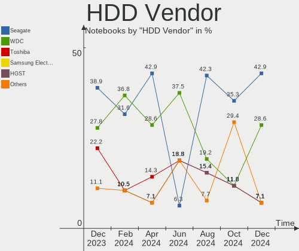
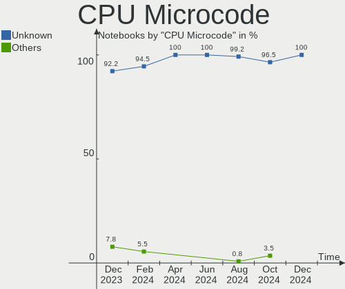
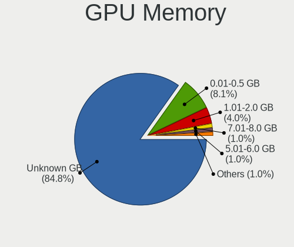
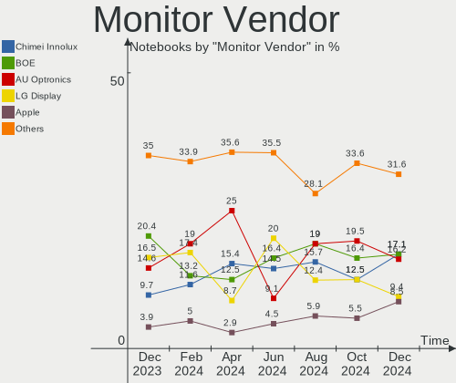
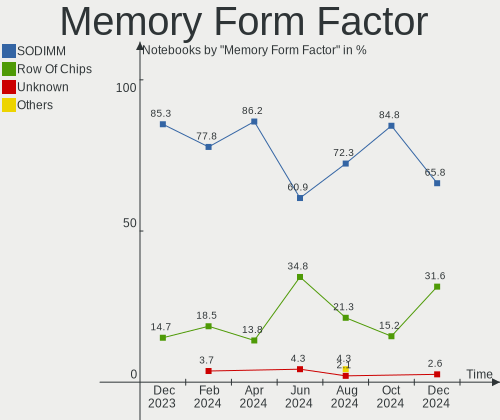
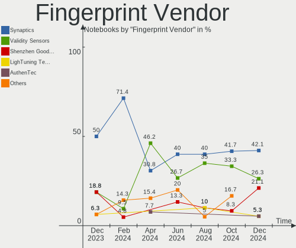
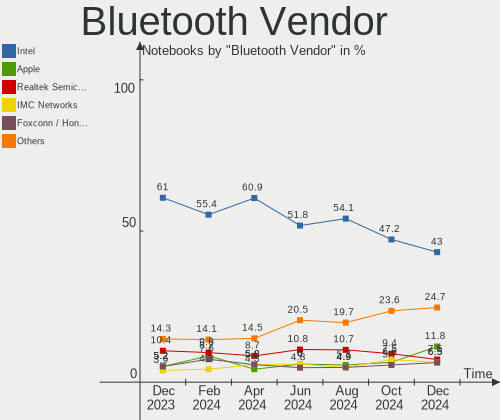

Pop!_OS Hardware Trends (Notebook)
----------------------------------

A project to identify most popular hardware characteristics and track their change
over time based on data collected by Pop!_OS users at https://Linux-Hardware.org.

Anyone can contribute to the study by uploading probes of their computers by
the [hw-probe](https://github.com/linuxhw/hw-probe) tool:

    sudo -E hw-probe -all -upload

Full-feature report is available here: https://linux-hardware.org/?view=trends&formfactor=notebook

Period: Nov, 2020.

Contents
--------

- [ OS                       ](#os)
- [ OS Family                ](#os-family)
- [ Kernel                   ](#kernel)
- [ Kernel Family            ](#kernel-family)
- [ Kernel Major Ver.        ](#kernel-major-ver)
- [ Arch                     ](#arch)
- [ DE                       ](#de)
- [ Display Server           ](#display-server)
- [ Display Manager          ](#display-manager)
- [ OS Lang                  ](#os-lang)
- [ Boot Mode                ](#boot-mode)
- [ Filesystem               ](#filesystem)
- [ Part. scheme             ](#part-scheme)
- [ Dual Boot with Linux/BSD ](#dual-boot-with-linux/bsd)
- [ Dual Boot (Win)          ](#dual-boot-win)
- [ Country                  ](#country)
- [ City                     ](#city)
- [ Vendor                   ](#vendor)
- [ Model                    ](#model)
- [ Model Family             ](#model-family)
- [ MFG Year                 ](#mfg-year)
- [ Form Factor              ](#form-factor)
- [ Secure Boot              ](#secure-boot)
- [ Coreboot                 ](#coreboot)
- [ RAM Size                 ](#ram-size)
- [ RAM Used                 ](#ram-used)
- [ Has CD-ROM               ](#has-cd-rom)
- [ Total Drives             ](#total-drives)
- [ Has Ethernet             ](#has-ethernet)
- [ Drive Vendor             ](#drive-vendor)
- [ Drive Model              ](#drive-model)
- [ HDD Vendor               ](#hdd-vendor)
- [ SSD Vendor               ](#ssd-vendor)
- [ Drive Kind               ](#drive-kind)
- [ Drive Connector          ](#drive-connector)
- [ Drive Size               ](#drive-size)
- [ Space Total              ](#space-total)
- [ Space Used               ](#space-used)
- [ Malfunc. Drives          ](#malfunc-drives)
- [ Malfunc. Drive Vendor    ](#malfunc-drive-vendor)
- [ Malfunc. HDD Vendor      ](#malfunc-hdd-vendor)
- [ Malfunc. Drive Kind      ](#malfunc-drive-kind)
- [ Failed Drives            ](#failed-drives)
- [ Failed Drive Vendor      ](#failed-drive-vendor)
- [ Drive Status             ](#drive-status)
- [ Storage Vendor           ](#storage-vendor)
- [ Storage Model            ](#storage-model)
- [ Storage Kind             ](#storage-kind)
- [ CPU Vendor               ](#cpu-vendor)
- [ CPU Model                ](#cpu-model)
- [ CPU Model Family         ](#cpu-model-family)
- [ CPU Cores                ](#cpu-cores)
- [ CPU Sockets              ](#cpu-sockets)
- [ CPU Threads              ](#cpu-threads)
- [ CPU Op-Modes             ](#cpu-op-modes)
- [ CPU Microcode            ](#cpu-microcode)
- [ CPU Microarch            ](#cpu-microarch)
- [ GPU Vendor               ](#gpu-vendor)
- [ GPU Model                ](#gpu-model)
- [ GPU Combo                ](#gpu-combo)
- [ GPU Driver               ](#gpu-driver)
- [ GPU Memory               ](#gpu-memory)
- [ Monitor Vendor           ](#monitor-vendor)
- [ Monitor Model            ](#monitor-model)
- [ Monitor Resolution       ](#monitor-resolution)
- [ Monitor Diagonal         ](#monitor-diagonal)
- [ Monitor Width            ](#monitor-width)
- [ Aspect Ratio             ](#aspect-ratio)
- [ Monitor Area             ](#monitor-area)
- [ Pixel Density            ](#pixel-density)
- [ Multiple Monitors        ](#multiple-monitors)
- [ Net Controller Vendor    ](#net-controller-vendor)
- [ Net Controller Model     ](#net-controller-model)
- [ Wireless Vendor          ](#wireless-vendor)
- [ Wireless Model           ](#wireless-model)
- [ Ethernet Vendor          ](#ethernet-vendor)
- [ Ethernet Model           ](#ethernet-model)
- [ Net Controller Kind      ](#net-controller-kind)
- [ Used Controller          ](#used-controller)
- [ NICs                     ](#nics)
- [ Memory Vendor            ](#memory-vendor)
- [ Memory Model             ](#memory-model)
- [ Memory Kind              ](#memory-kind)
- [ Memory Form Factor       ](#memory-form-factor)
- [ Memory Size              ](#memory-size)
- [ Memory Speed             ](#memory-speed)
- [ Sound Vendor             ](#sound-vendor)
- [ Sound Model              ](#sound-model)
- [ Camera Vendor            ](#camera-vendor)
- [ Camera Model             ](#camera-model)
- [ Fingerprint Vendor       ](#fingerprint-vendor)
- [ Fingerprint Model        ](#fingerprint-model)
- [ Chipcard Vendor          ](#chipcard-vendor)
- [ Chipcard Model           ](#chipcard-model)
- [ Printer Vendor           ](#printer-vendor)
- [ Printer Model            ](#printer-model)
- [ Scanner Vendor           ](#scanner-vendor)
- [ Scanner Model            ](#scanner-model)
- [ Bluetooth Vendor         ](#bluetooth-vendor)
- [ Bluetooth Model          ](#bluetooth-model)
- [ Unsupported Devices      ](#unsupported-devices)
- [ Unsupported Device Types ](#unsupported-device-types)

OS
--

Installed operating systems

| Name          | Notebooks | Percent |
|---------------|-----------|---------|
| Pop!_OS 20.10 | 109       | 78.42%  |
| Pop!_OS 20.04 | 30        | 21.58%  |

OS Family
---------

OS without a version

| Name    | Notebooks | Percent |
|---------|-----------|---------|
| Pop!_OS | 139       | 100%    |

Kernel
------

Version of the Linux kernel

| Version               | Notebooks | Percent |
|-----------------------|-----------|---------|
| 5.8.0-7630-generic    | 65        | 46.76%  |
| 5.8.0-7625-generic    | 57        | 41.01%  |
| 5.4.0-7642-generic    | 11        | 7.91%   |
| 5.9.9-xanmod1         | 1         | 0.72%   |
| 5.9.3-050903-generic  | 1         | 0.72%   |
| 5.8.9-050809-generic  | 1         | 0.72%   |
| 5.8.17-050817-generic | 1         | 0.72%   |
| 5.8.11-050811-generic | 1         | 0.72%   |
| 5.4.0-7634-generic    | 1         | 0.72%   |

Kernel Family
-------------

Linux kernel without a distro release

| Version | Notebooks | Percent |
|---------|-----------|---------|
| 5.8.0   | 122       | 87.77%  |
| 5.4.0   | 12        | 8.63%   |
| 5.9.9   | 1         | 0.72%   |
| 5.9.3   | 1         | 0.72%   |
| 5.8.9   | 1         | 0.72%   |
| 5.8.17  | 1         | 0.72%   |
| 5.8.11  | 1         | 0.72%   |

Kernel Major Ver.
-----------------

Linux kernel major version

| Version | Notebooks | Percent |
|---------|-----------|---------|
| 5.8     | 125       | 89.93%  |
| 5.4     | 12        | 8.63%   |
| 5.9     | 2         | 1.44%   |

Arch
----

OS architecture (x86_64, i586, etc.)

| Name   | Notebooks | Percent |
|--------|-----------|---------|
| x86_64 | 139       | 100%    |

DE
--

Desktop Environment

| Name       | Notebooks | Percent |
|------------|-----------|---------|
| GNOME      | 131       | 94.24%  |
| X-Cinnamon | 2         | 1.44%   |
| KDE5       | 2         | 1.44%   |
| KDE        | 2         | 1.44%   |
| XFCE       | 1         | 0.72%   |
| Budgie     | 1         | 0.72%   |

Display Server
--------------

X11 or Wayland

| Name    | Notebooks | Percent |
|---------|-----------|---------|
| X11     | 134       | 96.4%   |
| Wayland | 4         | 2.88%   |
| Tty     | 1         | 0.72%   |

Display Manager
---------------

SDDM, LightDM, etc.

| Name    | Notebooks | Percent |
|---------|-----------|---------|
| Unknown | 113       | 81.29%  |
| GDM     | 25        | 17.99%  |
| TDM     | 1         | 0.72%   |

OS Lang
-------

Language

| Lang  | Notebooks | Percent |
|-------|-----------|---------|
| en_US | 78        | 56.12%  |
| en_GB | 14        | 10.07%  |
| pt_BR | 8         | 5.76%   |
| en_CA | 6         | 4.32%   |
| de_DE | 6         | 4.32%   |
| C     | 6         | 4.32%   |
| ru_RU | 5         | 3.6%    |
| fr_FR | 5         | 3.6%    |
| es_ES | 4         | 2.88%   |
| it_IT | 2         | 1.44%   |
| sv_SE | 1         | 0.72%   |
| sk_SK | 1         | 0.72%   |
| pt_PT | 1         | 0.72%   |
| fr_CA | 1         | 0.72%   |
| en_AU | 1         | 0.72%   |

Boot Mode
---------

EFI or BIOS

| Mode | Notebooks | Percent |
|------|-----------|---------|
| BIOS | 111       | 79.86%  |
| EFI  | 28        | 20.14%  |

Filesystem
----------

Type of filesystem

| Type    | Notebooks | Percent |
|---------|-----------|---------|
| Ext4    | 135       | 97.12%  |
| Overlay | 2         | 1.44%   |
| Xfs     | 1         | 0.72%   |
| Btrfs   | 1         | 0.72%   |

Part. scheme
------------

Scheme of partitioning

| Type    | Notebooks | Percent |
|---------|-----------|---------|
| Unknown | 113       | 81.29%  |
| GPT     | 23        | 16.55%  |
| MBR     | 3         | 2.16%   |

Dual Boot with Linux/BSD
------------------------

Hosting more than one Linux/BSD

| Dual boot | Notebooks | Percent |
|-----------|-----------|---------|
| No        | 136       | 97.84%  |
| Yes       | 3         | 2.16%   |

Dual Boot (Win)
---------------

Hosting Linux and Windows

| Dual boot | Notebooks | Percent |
|-----------|-----------|---------|
| No        | 129       | 92.81%  |
| Yes       | 10        | 7.19%   |

Country
-------

Geographic location (country)

| Country        | Notebooks | Percent |
|----------------|-----------|---------|
| USA            | 36        | 25.9%   |
| Germany        | 12        | 8.63%   |
| Brazil         | 12        | 8.63%   |
| Canada         | 9         | 6.47%   |
| India          | 8         | 5.76%   |
| UK             | 5         | 3.6%    |
| Sweden         | 5         | 3.6%    |
| Netherlands    | 5         | 3.6%    |
| Italy          | 5         | 3.6%    |
| France         | 5         | 3.6%    |
| Ukraine        | 4         | 2.88%   |
| Spain          | 4         | 2.88%   |
| Russia         | 3         | 2.16%   |
| Mexico         | 3         | 2.16%   |
| Turkey         | 2         | 1.44%   |
| South Africa   | 2         | 1.44%   |
| Slovakia       | 1         | 0.72%   |
| Saudi Arabia   | 1         | 0.72%   |
| Romania        | 1         | 0.72%   |
| Portugal       | 1         | 0.72%   |
| Mauritius      | 1         | 0.72%   |
| Malaysia       | 1         | 0.72%   |
| Jordan         | 1         | 0.72%   |
| Ireland        | 1         | 0.72%   |
| Hungary        | 1         | 0.72%   |
| Hong Kong      | 1         | 0.72%   |
| Greece         | 1         | 0.72%   |
| Finland        | 1         | 0.72%   |
| Denmark        | 1         | 0.72%   |
| Czech Republic | 1         | 0.72%   |
| Croatia        | 1         | 0.72%   |
| Belgium        | 1         | 0.72%   |
| Belarus        | 1         | 0.72%   |
| Australia      | 1         | 0.72%   |
| Argentina      | 1         | 0.72%   |

City
----

Geographic location (city)

| City                    | Notebooks | Percent |
|-------------------------|-----------|---------|
| São Paulo              | 2         | 1.44%   |
| Ribeirão Preto         | 2         | 1.44%   |
| Los Angeles             | 2         | 1.44%   |
| Kyiv                    | 2         | 1.44%   |
| Erftstadt               | 2         | 1.44%   |
| Chennai                 | 2         | 1.44%   |
| Brasília               | 2         | 1.44%   |
| Austin                  | 2         | 1.44%   |
| Alicante                | 2         | 1.44%   |
| Zhashkiv                | 1         | 0.72%   |
| Zagreb                  | 1         | 0.72%   |
| Wurzburg                | 1         | 0.72%   |
| Woodland Hills          | 1         | 0.72%   |
| Westlake                | 1         | 0.72%   |
| West Jordan             | 1         | 0.72%   |
| Waxahachie              | 1         | 0.72%   |
| Warragul                | 1         | 0.72%   |
| Walbridge               | 1         | 0.72%   |
| Vitebsk                 | 1         | 0.72%   |
| Verona                  | 1         | 0.72%   |
| Uppsala                 | 1         | 0.72%   |
| Ukiah                   | 1         | 0.72%   |
| UEbach-Palenberg        | 1         | 0.72%   |
| Tucson                  | 1         | 0.72%   |
| Trivandrum              | 1         | 0.72%   |
| Trenton                 | 1         | 0.72%   |
| Toronto                 | 1         | 0.72%   |
| Tire                    | 1         | 0.72%   |
| Thessaloniki            | 1         | 0.72%   |
| The Hague               | 1         | 0.72%   |
| Taquari                 | 1         | 0.72%   |
| Swindon                 | 1         | 0.72%   |
| Stratham                | 1         | 0.72%   |
| Slavkov u Brna          | 1         | 0.72%   |
| Slagharen               | 1         | 0.72%   |
| Skövde                 | 1         | 0.72%   |
| Secovce                 | 1         | 0.72%   |
| San Jose                | 1         | 0.72%   |
| Saint-Germain-sur-Moine | 1         | 0.72%   |
| Saint Albans            | 1         | 0.72%   |
| Riyadh                  | 1         | 0.72%   |
| Reutlingen              | 1         | 0.72%   |
| Remscheid               | 1         | 0.72%   |
| Recife                  | 1         | 0.72%   |
| Raleigh                 | 1         | 0.72%   |
| Quatre Bornes           | 1         | 0.72%   |
| Pretoria                | 1         | 0.72%   |
| Porvoo                  | 1         | 0.72%   |
| Platteville             | 1         | 0.72%   |
| Piney Creek             | 1         | 0.72%   |
| Petaling Jaya           | 1         | 0.72%   |
| Paris                   | 1         | 0.72%   |
| Palermo                 | 1         | 0.72%   |
| Orlando                 | 1         | 0.72%   |
| Novocherkassk           | 1         | 0.72%   |
| Nizhny Tagil            | 1         | 0.72%   |
| New Delhi               | 1         | 0.72%   |
| Málaga                 | 1         | 0.72%   |
| Munich                  | 1         | 0.72%   |
| Mumbai                  | 1         | 0.72%   |

Vendor
------

Motherboard manufacturer

| Name                | Notebooks | Percent |
|---------------------|-----------|---------|
| Lenovo              | 35        | 25.18%  |
| Dell                | 23        | 16.55%  |
| Hewlett-Packard     | 16        | 11.51%  |
| ASUSTek Computer    | 15        | 10.79%  |
| Acer                | 9         | 6.47%   |
| Toshiba             | 8         | 5.76%   |
| System76            | 8         | 5.76%   |
| MSI                 | 6         | 4.32%   |
| Sony                | 5         | 3.6%    |
| Apple               | 4         | 2.88%   |
| HASEE Computer      | 2         | 1.44%   |
| Teclast             | 1         | 0.72%   |
| PC Specialist       | 1         | 0.72%   |
| Packard Bell        | 1         | 0.72%   |
| Notebook            | 1         | 0.72%   |
| HUAWEI              | 1         | 0.72%   |
| Google              | 1         | 0.72%   |
| Gigabyte Technology | 1         | 0.72%   |
| Chuwi               | 1         | 0.72%   |

Model
-----

Motherboard model

| Name                                      | Notebooks | Percent |
|-------------------------------------------|-----------|---------|
| System76 Gazelle                          | 3         | 2.16%   |
| System76 Oryx Pro                         | 2         | 1.44%   |
| HP Laptop 14-dk0xxx                       | 2         | 1.44%   |
| Dell XPS 15 9550                          | 2         | 1.44%   |
| Acer Aspire E5-575G                       | 2         | 1.44%   |
| Toshiba Satellite U940                    | 1         | 0.72%   |
| Toshiba Satellite S50-B                   | 1         | 0.72%   |
| Toshiba Satellite P50t-B                  | 1         | 0.72%   |
| Toshiba Satellite L655                    | 1         | 0.72%   |
| Toshiba Satellite L40                     | 1         | 0.72%   |
| Toshiba Satellite C850-D9K                | 1         | 0.72%   |
| Toshiba Satellite C660D                   | 1         | 0.72%   |
| Toshiba Satellite C650D                   | 1         | 0.72%   |
| Teclast F7 Plus                           | 1         | 0.72%   |
| System76 Lemur Pro                        | 1         | 0.72%   |
| System76 Galago Pro                       | 1         | 0.72%   |
| System76 Darter Pro                       | 1         | 0.72%   |
| Sony VPCZ133GX                            | 1         | 0.72%   |
| Sony VPCSB35FB                            | 1         | 0.72%   |
| Sony VPCEH32FX                            | 1         | 0.72%   |
| Sony VGN-SZ71VN_X                         | 1         | 0.72%   |
| Sony VGN-AR21B                            | 1         | 0.72%   |
| PC Specialist GK7NR0R                     | 1         | 0.72%   |
| Packard Bell ENNS44HR                     | 1         | 0.72%   |
| Notebook NH50_70RA                        | 1         | 0.72%   |
| MSI Prestige 15 A10SC                     | 1         | 0.72%   |
| MSI MEGA BOOK S430                        | 1         | 0.72%   |
| MSI GS70 2OD                              | 1         | 0.72%   |
| MSI GS63VR 6RF                            | 1         | 0.72%   |
| MSI GP73 Leopard 8RE                      | 1         | 0.72%   |
| MSI GP60 2PE                              | 1         | 0.72%   |
| Lenovo Yoga 2 13 20344                    | 1         | 0.72%   |
| Lenovo XiaoXinAir-14ARE 2020 81YN         | 1         | 0.72%   |
| Lenovo ThinkPad X240 20AMS2ED00           | 1         | 0.72%   |
| Lenovo ThinkPad X140e 20BLS00900          | 1         | 0.72%   |
| Lenovo ThinkPad X140e 20BL000BUS          | 1         | 0.72%   |
| Lenovo ThinkPad X13 Gen 1 20UGS03E00      | 1         | 0.72%   |
| Lenovo ThinkPad X1 Extreme 2nd 20QVCTO1WW | 1         | 0.72%   |
| Lenovo ThinkPad X1 Extreme 20MF000CUS     | 1         | 0.72%   |
| Lenovo ThinkPad X1 Carbon 6th 20KGS31S00  | 1         | 0.72%   |
| Lenovo ThinkPad W540 20BHS0EN00           | 1         | 0.72%   |
| Lenovo ThinkPad W530 2447BK0              | 1         | 0.72%   |
| Lenovo ThinkPad T495 20NKS01Y00           | 1         | 0.72%   |
| Lenovo ThinkPad T430s 2356L2G             | 1         | 0.72%   |
| Lenovo ThinkPad T420 4236A78              | 1         | 0.72%   |
| Lenovo ThinkPad T410 25374A5              | 1         | 0.72%   |
| Lenovo ThinkPad T14s Gen 1 20UH000CUS     | 1         | 0.72%   |
| Lenovo ThinkPad P1 20MDS0LX00             | 1         | 0.72%   |
| Lenovo ThinkPad L450 20DSS0VJ00           | 1         | 0.72%   |
| Lenovo ThinkPad E560 20EV002KUS           | 1         | 0.72%   |
| Lenovo ThinkPad E15 20RD0014RT            | 1         | 0.72%   |
| Lenovo ThinkPad E14 Gen 2 20T6000TGE      | 1         | 0.72%   |
| Lenovo ThinkPad E14 20RAS1GM00            | 1         | 0.72%   |
| Lenovo ThinkPad E14 20RA001HFR            | 1         | 0.72%   |
| Lenovo ThinkBook 13s-IML 20RR             | 1         | 0.72%   |
| Lenovo Legion Y540-15IRH 81RJ             | 1         | 0.72%   |
| Lenovo IdeaPad Z400 VIWZ1                 | 1         | 0.72%   |
| Lenovo IdeaPad S145-15IWL 81S9            | 1         | 0.72%   |
| Lenovo IdeaPad S145-15API 81V7            | 1         | 0.72%   |
| Lenovo IdeaPad L340-15APITouch 81LX       | 1         | 0.72%   |

Model Family
------------

Motherboard model prefix

| Name                    | Notebooks | Percent |
|-------------------------|-----------|---------|
| Lenovo ThinkPad         | 21        | 15.11%  |
| Dell Inspiron           | 12        | 8.63%   |
| Toshiba Satellite       | 8         | 5.76%   |
| Lenovo IdeaPad          | 8         | 5.76%   |
| HP Laptop               | 6         | 4.32%   |
| Dell XPS                | 6         | 4.32%   |
| Acer Aspire             | 5         | 3.6%    |
| System76 Gazelle        | 3         | 2.16%   |
| HP ProBook              | 3         | 2.16%   |
| System76 Oryx           | 2         | 1.44%   |
| HP Pavilion             | 2         | 1.44%   |
| Dell Venue              | 2         | 1.44%   |
| Dell Latitude           | 2         | 1.44%   |
| ASUS ZenBook            | 2         | 1.44%   |
| ASUS TUF                | 2         | 1.44%   |
| ASUS ROG                | 2         | 1.44%   |
| Teclast F7              | 1         | 0.72%   |
| System76 Lemur          | 1         | 0.72%   |
| System76 Galago         | 1         | 0.72%   |
| System76 Darter         | 1         | 0.72%   |
| Sony VPCZ133GX          | 1         | 0.72%   |
| Sony VPCSB35FB          | 1         | 0.72%   |
| Sony VPCEH32FX          | 1         | 0.72%   |
| Sony VGN-SZ71VN         | 1         | 0.72%   |
| Sony VGN-AR21B          | 1         | 0.72%   |
| PC Specialist GK7NR0R   | 1         | 0.72%   |
| Packard Bell ENNS44HR   | 1         | 0.72%   |
| Notebook NH50           | 1         | 0.72%   |
| MSI Prestige            | 1         | 0.72%   |
| MSI MEGA                | 1         | 0.72%   |
| MSI GS70                | 1         | 0.72%   |
| MSI GS63VR              | 1         | 0.72%   |
| MSI GP73                | 1         | 0.72%   |
| MSI GP60                | 1         | 0.72%   |
| Lenovo Yoga             | 1         | 0.72%   |
| Lenovo XiaoXinAir-14ARE | 1         | 0.72%   |
| Lenovo ThinkBook        | 1         | 0.72%   |
| Lenovo Legion           | 1         | 0.72%   |
| Lenovo G780             | 1         | 0.72%   |
| Lenovo G560             | 1         | 0.72%   |
| HUAWEI NBLK-WAX9X       | 1         | 0.72%   |
| HP G62                  | 1         | 0.72%   |
| HP EliteBook            | 1         | 0.72%   |
| HP Elite                | 1         | 0.72%   |
| HP Compaq               | 1         | 0.72%   |
| HP 340S                 | 1         | 0.72%   |
| HASEE NH5x              | 1         | 0.72%   |
| HASEE HEC41             | 1         | 0.72%   |
| Google Edgar            | 1         | 0.72%   |
| Gigabyte P64V7          | 1         | 0.72%   |
| Dell Precision          | 1         | 0.72%   |
| Chuwi AeroBook          | 1         | 0.72%   |
| ASUS X580VD             | 1         | 0.72%   |
| ASUS X556UV             | 1         | 0.72%   |
| ASUS X556UA             | 1         | 0.72%   |
| ASUS VivoBook           | 1         | 0.72%   |
| ASUS UX410UQK           | 1         | 0.72%   |
| ASUS K93SV              | 1         | 0.72%   |
| ASUS K54C               | 1         | 0.72%   |
| ASUS K50IE              | 1         | 0.72%   |

MFG Year
--------

Motherboard manufacture year

| Year | Notebooks | Percent |
|------|-----------|---------|
| 2020 | 39        | 28.06%  |
| 2019 | 33        | 23.74%  |
| 2018 | 16        | 11.51%  |
| 2014 | 9         | 6.47%   |
| 2013 | 9         | 6.47%   |
| 2011 | 8         | 5.76%   |
| 2012 | 7         | 5.04%   |
| 2017 | 6         | 4.32%   |
| 2015 | 3         | 2.16%   |
| 2010 | 3         | 2.16%   |
| 2007 | 3         | 2.16%   |
| 2008 | 2         | 1.44%   |
| 2009 | 1         | 0.72%   |

Form Factor
-----------

Physical design of the computer

| Name     | Notebooks | Percent |
|----------|-----------|---------|
| Notebook | 139       | 100%    |

Secure Boot
-----------

Enabled or disabled

| State    | Notebooks | Percent |
|----------|-----------|---------|
| Disabled | 139       | 100%    |

Coreboot
--------

Have coreboot on board

| Used | Notebooks | Percent |
|------|-----------|---------|
| No   | 136       | 97.84%  |
| Yes  | 3         | 2.16%   |

RAM Size
--------

Total RAM memory

| Size in GB  | Notebooks | Percent |
|-------------|-----------|---------|
| 4.01-8.0    | 40        | 28.78%  |
| 16.01-24.0  | 34        | 24.46%  |
| 3.01-4.0    | 27        | 19.42%  |
| 8.01-16.0   | 24        | 17.27%  |
| 32.01-64.0  | 6         | 4.32%   |
| 1.01-2.0    | 3         | 2.16%   |
| 24.01-32.0  | 2         | 1.44%   |
| 64.01-256.0 | 2         | 1.44%   |
| 2.01-3.0    | 1         | 0.72%   |

RAM Used
--------

Used RAM memory

| Used GB   | Notebooks | Percent |
|-----------|-----------|---------|
| 1.01-2.0  | 49        | 35.25%  |
| 2.01-3.0  | 45        | 32.37%  |
| 3.01-4.0  | 23        | 16.55%  |
| 4.01-8.0  | 19        | 13.67%  |
| 0.01-1.0  | 2         | 1.44%   |
| 8.01-16.0 | 1         | 0.72%   |

Has CD-ROM
----------

Has CD-ROM on board

| Presented | Notebooks | Percent |
|-----------|-----------|---------|
| No        | 96        | 69.06%  |
| Yes       | 43        | 30.94%  |

Total Drives
------------

Number of drives on board

| Drives | Notebooks | Percent |
|--------|-----------|---------|
| 1      | 96        | 69.06%  |
| 2      | 38        | 27.34%  |
| 3      | 5         | 3.6%    |

Has Ethernet
------------

Has Ethernet on board

| Presented | Notebooks | Percent |
|-----------|-----------|---------|
| Yes       | 105       | 75.54%  |
| No        | 34        | 24.46%  |

Drive Vendor
------------

Hard drive vendors

| Vendor                    | Notebooks | Drives | Percent |
|---------------------------|-----------|--------|---------|
| Samsung Electronics       | 36        | 42     | 20.69%  |
| Seagate                   | 24        | 24     | 13.79%  |
| Toshiba                   | 16        | 16     | 9.2%    |
| WDC                       | 14        | 15     | 8.05%   |
| SK Hynix                  | 12        | 13     | 6.9%    |
| Sandisk                   | 12        | 13     | 6.9%    |
| Kingston                  | 10        | 10     | 5.75%   |
| Unknown                   | 9         | 10     | 5.17%   |
| Intel                     | 7         | 9      | 4.02%   |
| Micron Technology         | 5         | 5      | 2.87%   |
| Silicon Motion            | 3         | 3      | 1.72%   |
| HGST                      | 3         | 3      | 1.72%   |
| Crucial                   | 3         | 3      | 1.72%   |
| Phison                    | 2         | 2      | 1.15%   |
| Micron/Crucial Technology | 2         | 2      | 1.15%   |
| Hitachi                   | 2         | 2      | 1.15%   |
| Fujitsu                   | 2         | 2      | 1.15%   |
| China                     | 2         | 2      | 1.15%   |
| A-DATA Technology         | 2         | 2      | 1.15%   |
| Transcend                 | 1         | 1      | 0.57%   |
| MKNSSDPL                  | 1         | 1      | 0.57%   |
| Maxtor                    | 1         | 1      | 0.57%   |
| LITEON                    | 1         | 1      | 0.57%   |
| Lenovo                    | 1         | 1      | 0.57%   |
| KIOXIA                    | 1         | 1      | 0.57%   |
| Apple                     | 1         | 1      | 0.57%   |
| ADATA Technology          | 1         | 1      | 0.57%   |

Drive Model
-----------

Hard drive models

| Model                                | Notebooks | Percent |
|--------------------------------------|-----------|---------|
| Samsung SSD 860 EVO 1TB              | 5         | 2.72%   |
| Seagate ST9500325AS 500GB            | 4         | 2.17%   |
| Kingston SA400S37240G 240GB SSD      | 4         | 2.17%   |
| Toshiba MQ01ABD100 1TB               | 3         | 1.63%   |
| SK Hynix NVMe SSD Drive 512GB        | 3         | 1.63%   |
| SK Hynix NVMe SSD Drive 256GB        | 3         | 1.63%   |
| Seagate ST1000LM048-2E7172 1TB       | 3         | 1.63%   |
| Seagate ST1000LM035-1RK172 1TB       | 3         | 1.63%   |
| Sandisk NVMe SSD Drive 512GB         | 3         | 1.63%   |
| Samsung NVMe SSD Drive 256GB         | 3         | 1.63%   |
| Intel NVMe SSD Drive 512GB           | 3         | 1.63%   |
| HGST HTS721010A9E630 1TB             | 3         | 1.63%   |
| WDC WDS240G2G0B-00EPW0 240GB SSD     | 2         | 1.09%   |
| WDC WD10SPZX-24Z10 1TB               | 2         | 1.09%   |
| Unknown MMC Card  32GB               | 2         | 1.09%   |
| Seagate ST500LT012-1DG142 500GB      | 2         | 1.09%   |
| Seagate ST1000LX015-1U7172 1TB       | 2         | 1.09%   |
| SanDisk SSD PLUS 240GB               | 2         | 1.09%   |
| Sandisk NVMe SSD Drive 500GB         | 2         | 1.09%   |
| Samsung SSD 970 EVO Plus 1TB         | 2         | 1.09%   |
| Samsung SSD 860 EVO 250GB            | 2         | 1.09%   |
| Samsung NVMe SSD Drive 512GB         | 2         | 1.09%   |
| Samsung NVMe SSD Drive 500GB         | 2         | 1.09%   |
| Samsung NVMe SSD Drive 1TB           | 2         | 1.09%   |
| Samsung MZ7TD512HAGM-000L1 512GB SSD | 2         | 1.09%   |
| Phison NVMe SSD Drive 512GB          | 2         | 1.09%   |
| Kingston SA400S37480G 480GB SSD      | 2         | 1.09%   |
| Crucial CT480BX500SSD1 480GB         | 2         | 1.09%   |
| WDC WDS500G2B0A-00SM50 500GB SSD     | 1         | 0.54%   |
| WDC WDS200T2B0A-00SM50 2TB SSD       | 1         | 0.54%   |
| WDC WD7500BPKX-22HPJT0 752GB         | 1         | 0.54%   |
| WDC WD6400BPVT-22HXZT3 640GB         | 1         | 0.54%   |
| WDC WD5000LPCX-75VHAT0 500GB         | 1         | 0.54%   |
| WDC WD5000BPVX-00JC3T0 500GB         | 1         | 0.54%   |
| WDC WD5000BPVT-22HXZT3 500GB         | 1         | 0.54%   |
| WDC WD2500BEVT-60A23T0 250GB         | 1         | 0.54%   |
| WDC WD easystore 240GB               | 1         | 0.54%   |
| WDC PC SN520 SDAPMUW-128G-1101 128GB | 1         | 0.54%   |
| WDC PC SN520 NVMe 256GB              | 1         | 0.54%   |
| Unknown USDU1  16GB                  | 1         | 0.54%   |
| Unknown SC32G  32GB                  | 1         | 0.54%   |
| Unknown MMC Card  64GB               | 1         | 0.54%   |
| Unknown MMC Card  256GB              | 1         | 0.54%   |
| Unknown M.2 2280-1TB SSD             | 1         | 0.54%   |
| Unknown DA4064,81603297, 64GB        | 1         | 0.54%   |
| Unknown BMSC51A3500F4SA 500GB        | 1         | 0.54%   |
| Transcend TS32GSSD370S 32GB          | 1         | 0.54%   |
| Toshiba THNSNF128GMCS 128GB SSD      | 1         | 0.54%   |
| Toshiba THNSNF064GMCS 64GB SSD       | 1         | 0.54%   |
| Toshiba THNSNC064GMMJ 64GB SSD       | 1         | 0.54%   |
| Toshiba THNSFJ256GCSU 256GB SSD      | 1         | 0.54%   |
| Toshiba NVMe SSD Drive 512GB         | 1         | 0.54%   |
| Toshiba NVMe SSD Drive 256GB         | 1         | 0.54%   |
| Toshiba MQ01ABD032 320GB             | 1         | 0.54%   |
| Toshiba MK8037GSX 80GB               | 1         | 0.54%   |
| Toshiba MK5065GSXF 500GB             | 1         | 0.54%   |
| Toshiba MK3265GSXN 320GB             | 1         | 0.54%   |
| Toshiba MK1652GSX 160GB              | 1         | 0.54%   |
| Toshiba MK1637GSX 160GB              | 1         | 0.54%   |
| Toshiba KBG30ZMT256G 256GB           | 1         | 0.54%   |

HDD Vendor
----------

Hard disk drive vendors

| Vendor              | Notebooks | Drives | Percent |
|---------------------|-----------|--------|---------|
| Seagate             | 22        | 22     | 46.81%  |
| Toshiba             | 9         | 9      | 19.15%  |
| WDC                 | 8         | 8      | 17.02%  |
| HGST                | 3         | 3      | 6.38%   |
| Hitachi             | 2         | 2      | 4.26%   |
| Fujitsu             | 2         | 2      | 4.26%   |
| Samsung Electronics | 1         | 1      | 2.13%   |

SSD Vendor
----------

Solid state drive vendors

| Vendor              | Notebooks | Drives | Percent |
|---------------------|-----------|--------|---------|
| Samsung Electronics | 22        | 23     | 33.85%  |
| Kingston            | 8         | 8      | 12.31%  |
| SanDisk             | 7         | 7      | 10.77%  |
| Micron Technology   | 5         | 5      | 7.69%   |
| WDC                 | 4         | 4      | 6.15%   |
| Toshiba             | 4         | 4      | 6.15%   |
| SK Hynix            | 4         | 4      | 6.15%   |
| Crucial             | 3         | 3      | 4.62%   |
| China               | 2         | 2      | 3.08%   |
| Unknown             | 1         | 1      | 1.54%   |
| Transcend           | 1         | 1      | 1.54%   |
| Seagate             | 1         | 1      | 1.54%   |
| Maxtor              | 1         | 1      | 1.54%   |
| Apple               | 1         | 1      | 1.54%   |
| A-DATA Technology   | 1         | 1      | 1.54%   |

Drive Kind
----------

HDD or SSD

| Kind    | Notebooks | Drives | Percent |
|---------|-----------|--------|---------|
| SSD     | 63        | 66     | 36.42%  |
| NVMe    | 53        | 62     | 30.64%  |
| HDD     | 47        | 47     | 27.17%  |
| MMC     | 6         | 7      | 3.47%   |
| Unknown | 4         | 4      | 2.31%   |

Drive Connector
---------------

SATA, SAS, NVMe, etc.

| Type | Notebooks | Drives | Percent |
|------|-----------|--------|---------|
| SATA | 97        | 114    | 61.01%  |
| NVMe | 53        | 62     | 33.33%  |
| MMC  | 6         | 7      | 3.77%   |
| SAS  | 3         | 3      | 1.89%   |

Drive Size
----------

Size of hard drive

| Size in TB | Notebooks | Drives | Percent |
|------------|-----------|--------|---------|
| 0.01-0.5   | 67        | 73     | 63.81%  |
| 0.51-1.0   | 35        | 37     | 33.33%  |
| 1.01-2.0   | 3         | 3      | 2.86%   |

Space Total
-----------

Amount of disk space available on the file system

| Size in GB | Notebooks | Percent |
|------------|-----------|---------|
| 101-250    | 47        | 33.81%  |
| 251-500    | 44        | 31.65%  |
| 501-1000   | 18        | 12.95%  |
| 51-100     | 10        | 7.19%   |
| 21-50      | 8         | 5.76%   |
| 1001-2000  | 5         | 3.6%    |
| 1-20       | 4         | 2.88%   |
| 2001-3000  | 3         | 2.16%   |

Space Used
----------

Amount of used disk space

| Used GB   | Notebooks | Percent |
|-----------|-----------|---------|
| 1-20      | 63        | 45.32%  |
| 21-50     | 28        | 20.14%  |
| 101-250   | 19        | 13.67%  |
| 51-100    | 18        | 12.95%  |
| 251-500   | 7         | 5.04%   |
| 501-1000  | 3         | 2.16%   |
| 2001-3000 | 1         | 0.72%   |

Malfunc. Drives
---------------

Drive models with a malfunction

| Model                          | Notebooks | Drives | Percent |
|--------------------------------|-----------|--------|---------|
| Toshiba MQ01ABD032 320GB       | 1         | 1      | 50%     |
| Seagate ST1000LM049-2GH172 1TB | 1         | 1      | 50%     |

Malfunc. Drive Vendor
---------------------

Vendors of faulty drives

| Vendor  | Notebooks | Drives | Percent |
|---------|-----------|--------|---------|
| Toshiba | 1         | 1      | 50%     |
| Seagate | 1         | 1      | 50%     |

Malfunc. HDD Vendor
-------------------

Vendors of faulty HDD drives

| Vendor  | Notebooks | Drives | Percent |
|---------|-----------|--------|---------|
| Toshiba | 1         | 1      | 50%     |
| Seagate | 1         | 1      | 50%     |

Malfunc. Drive Kind
-------------------

Kinds of faulty drives

| Kind | Notebooks | Drives | Percent |
|------|-----------|--------|---------|
| HDD  | 2         | 2      | 100%    |

Failed Drives
-------------

Failed drive models

Zero info for selected period =(

Failed Drive Vendor
-------------------

Failed drive vendors

Zero info for selected period =(

Drive Status
------------

Number of failed and malfunc. drives

| Status   | Notebooks | Drives | Percent |
|----------|-----------|--------|---------|
| Detected | 116       | 149    | 81.12%  |
| Works    | 25        | 35     | 17.48%  |
| Malfunc  | 2         | 2      | 1.4%    |

Storage Vendor
--------------

Storage controller vendors

| Vendor                       | Notebooks | Percent |
|------------------------------|-----------|---------|
| Intel                        | 99        | 57.89%  |
| AMD                          | 18        | 10.53%  |
| Samsung Electronics          | 17        | 9.94%   |
| SK Hynix                     | 8         | 4.68%   |
| Sandisk                      | 7         | 4.09%   |
| Nvidia                       | 4         | 2.34%   |
| Toshiba America Info Systems | 3         | 1.75%   |
| Silicon Motion               | 3         | 1.75%   |
| Phison Electronics           | 2         | 1.17%   |
| Micron/Crucial Technology    | 2         | 1.17%   |
| Kingston Technology Company  | 2         | 1.17%   |
| ADATA Technology             | 2         | 1.17%   |
| Seagate Technology           | 1         | 0.58%   |
| Lite-On Technology           | 1         | 0.58%   |
| Lenovo                       | 1         | 0.58%   |
| KIOXIA                       | 1         | 0.58%   |

Storage Model
-------------

Storage controller models

| Model                                                                          | Notebooks | Percent |
|--------------------------------------------------------------------------------|-----------|---------|
| AMD FCH SATA Controller [AHCI mode]                                            | 15        | 8.38%   |
| Intel 82801 Mobile SATA Controller [RAID mode]                                 | 13        | 7.26%   |
| Intel Sunrise Point-LP SATA Controller [AHCI mode]                             | 12        | 6.7%    |
| Samsung Electronics NVMe SSD Controller SM981/PM981/PM983                      | 11        | 6.15%   |
| Intel 7 Series Chipset Family 6-port SATA Controller [AHCI mode]               | 11        | 6.15%   |
| Intel 6 Series/C200 Series Chipset Family 6 port Mobile SATA AHCI Controller   | 9         | 5.03%   |
| Intel Cannon Lake Mobile PCH SATA AHCI Controller                              | 8         | 4.47%   |
| SK Hynix Non-Volatile memory controller                                        | 6         | 3.35%   |
| Intel SSD 660P Series                                                          | 6         | 3.35%   |
| Intel HM170/QM170 Chipset SATA Controller [AHCI Mode]                          | 5         | 2.79%   |
| Intel 8 Series/C220 Series Chipset Family 6-port SATA Controller 1 [AHCI mode] | 5         | 2.79%   |
| Intel 8 Series SATA Controller 1 [AHCI mode]                                   | 5         | 2.79%   |
| Intel Wildcat Point-LP SATA Controller [AHCI Mode]                             | 4         | 2.23%   |
| Intel Comet Lake SATA AHCI Controller                                          | 4         | 2.23%   |
| Intel Cannon Point-LP SATA Controller [AHCI Mode]                              | 4         | 2.23%   |
| Silicon Motion Non-Volatile memory controller                                  | 3         | 1.68%   |
| Samsung Electronics Electronics Non-Volatile memory controller                 | 3         | 1.68%   |
| Intel 5 Series/3400 Series Chipset 4 port SATA AHCI Controller                 | 3         | 1.68%   |
| Intel 400 Series Chipset Family SATA AHCI Controller                           | 3         | 1.68%   |
| Toshiba America Info Systems BG3 NVMe SSD Controller                           | 2         | 1.12%   |
| SK Hynix BC501 NVMe Solid State Drive 512GB                                    | 2         | 1.12%   |
| Sandisk WD Blue SN550 NVMe SSD                                                 | 2         | 1.12%   |
| Sandisk WD Black 2019/PC SN750 NVMe SSD                                        | 2         | 1.12%   |
| Sandisk PC SN520 NVMe SSD                                                      | 2         | 1.12%   |
| Nvidia MCP79 AHCI Controller                                                   | 2         | 1.12%   |
| Kingston Technology Company Non-Volatile memory controller                     | 2         | 1.12%   |
| Intel SATA controller                                                          | 2         | 1.12%   |
| Intel 82801HM/HEM (ICH8M/ICH8M-E) IDE Controller                               | 2         | 1.12%   |
| Intel 5 Series/3400 Series Chipset 6 port SATA AHCI Controller                 | 2         | 1.12%   |
| AMD SB7x0/SB8x0/SB9x0 SATA Controller [AHCI mode]                              | 2         | 1.12%   |
| ADATA Technology Non-Volatile memory controller                                | 2         | 1.12%   |
| Toshiba America Info Systems XG4 NVMe SSD Controller                           | 1         | 0.56%   |
| Seagate Technology Non-Volatile memory controller                              | 1         | 0.56%   |
| Sandisk WD Black 2018 / PC SN720 NVMe SSD                                      | 1         | 0.56%   |
| Samsung Electronics NVMe SSD Controller SM961/PM961                            | 1         | 0.56%   |
| Samsung Electronics NVMe SSD Controller SM951/PM951                            | 1         | 0.56%   |
| Samsung Electronics Electronics SATA controller                                | 1         | 0.56%   |
| Phison Electronics NVMe Storage Controller                                     | 1         | 0.56%   |
| Phison Electronics E12 NVMe Controller                                         | 1         | 0.56%   |
| Nvidia MCP78S [GeForce 8200] SATA Controller (non-AHCI mode)                   | 1         | 0.56%   |
| Nvidia MCP78S [GeForce 8200] IDE                                               | 1         | 0.56%   |
| Nvidia MCP51 Serial ATA Controller                                             | 1         | 0.56%   |
| Nvidia MCP51 IDE                                                               | 1         | 0.56%   |
| Micron/Crucial Technology P1 NVMe PCIe SSD                                     | 1         | 0.56%   |
| Micron/Crucial Technology Non-Volatile memory controller                       | 1         | 0.56%   |
| Lite-On Technology NVMe Controller                                             | 1         | 0.56%   |
| Lenovo Non-Volatile memory controller                                          | 1         | 0.56%   |
| KIOXIA Non-Volatile memory controller                                          | 1         | 0.56%   |
| Intel Non-Volatile memory controller                                           | 1         | 0.56%   |
| Intel Celeron N3350/Pentium N4200/Atom E3900 Series SATA AHCI Controller       | 1         | 0.56%   |
| Intel Atom Processor E3800 Series SATA AHCI Controller                         | 1         | 0.56%   |
| Intel 82801HM/HEM (ICH8M/ICH8M-E) SATA Controller [IDE mode]                   | 1         | 0.56%   |
| Intel 82801HM/HEM (ICH8M/ICH8M-E) SATA Controller [AHCI mode]                  | 1         | 0.56%   |
| Intel 82801GBM/GHM (ICH7-M Family) SATA Controller [AHCI mode]                 | 1         | 0.56%   |
| Intel 82801G (ICH7 Family) IDE Controller                                      | 1         | 0.56%   |
| AMD FCH SATA Controller [IDE mode]                                             | 1         | 0.56%   |

Storage Kind
------------

Kind of storage controller (IDE, SATA, NVMe, SAS, ...)

| Kind | Notebooks | Percent |
|------|-----------|---------|
| SATA | 102       | 58.96%  |
| NVMe | 53        | 30.64%  |
| RAID | 13        | 7.51%   |
| IDE  | 5         | 2.89%   |

CPU Vendor
----------

Processor vendors

| Vendor | Notebooks | Percent |
|--------|-----------|---------|
| Intel  | 110       | 79.14%  |
| AMD    | 29        | 20.86%  |

CPU Model
---------

Processor models

| Model                                         | Notebooks | Percent |
|-----------------------------------------------|-----------|---------|
| Intel Core i7-8565U CPU @ 1.80GHz             | 7         | 5.04%   |
| Intel Core i7-9750H CPU @ 2.60GHz             | 5         | 3.6%    |
| Intel Core i7-6700HQ CPU @ 2.60GHz            | 4         | 2.88%   |
| Intel Core i7-10510U CPU @ 1.80GHz            | 4         | 2.88%   |
| Intel Core i5-3210M CPU @ 2.50GHz             | 4         | 2.88%   |
| Intel Core i5-10210U CPU @ 1.60GHz            | 4         | 2.88%   |
| Intel Core i7-10750H CPU @ 2.60GHz            | 3         | 2.16%   |
| Intel Core i5-7200U CPU @ 2.50GHz             | 3         | 2.16%   |
| AMD Ryzen 5 3500U with Radeon Vega Mobile Gfx | 3         | 2.16%   |
| Intel Pentium CPU B950 @ 2.10GHz              | 2         | 1.44%   |
| Intel Core i7-8850H CPU @ 2.60GHz             | 2         | 1.44%   |
| Intel Core i7-8750H CPU @ 2.20GHz             | 2         | 1.44%   |
| Intel Core i7-7700HQ CPU @ 2.80GHz            | 2         | 1.44%   |
| Intel Core i7-4710HQ CPU @ 2.50GHz            | 2         | 1.44%   |
| Intel Core i7-2670QM CPU @ 2.20GHz            | 2         | 1.44%   |
| Intel Core i5-9300H CPU @ 2.40GHz             | 2         | 1.44%   |
| Intel Core i5-8250U CPU @ 1.60GHz             | 2         | 1.44%   |
| Intel Core i5-6300U CPU @ 2.40GHz             | 2         | 1.44%   |
| Intel Core i5-6200U CPU @ 2.30GHz             | 2         | 1.44%   |
| Intel Core i5-2450M CPU @ 2.50GHz             | 2         | 1.44%   |
| AMD Ryzen 5 4500U with Radeon Graphics        | 2         | 1.44%   |
| AMD Ryzen 5 2500U with Radeon Vega Mobile Gfx | 2         | 1.44%   |
| AMD A4-5000 APU with Radeon HD Graphics       | 2         | 1.44%   |
| Intel Pentium Silver N5000 CPU @ 1.10GHz      | 1         | 0.72%   |
| Intel Pentium Dual-Core CPU T4500 @ 2.30GHz   | 1         | 0.72%   |
| Intel Pentium Dual CPU T2330 @ 1.60GHz        | 1         | 0.72%   |
| Intel Pentium CPU B980 @ 2.40GHz              | 1         | 0.72%   |
| Intel Core m3-8100Y CPU @ 1.10GHz             | 1         | 0.72%   |
| Intel Core M-5Y51 CPU @ 1.10GHz               | 1         | 0.72%   |
| Intel Core M-5Y10c CPU @ 0.80GHz              | 1         | 0.72%   |
| Intel Core i9-9880H CPU @ 2.30GHz             | 1         | 0.72%   |
| Intel Core i7-8650U CPU @ 1.90GHz             | 1         | 0.72%   |
| Intel Core i7-6500U CPU @ 2.50GHz             | 1         | 0.72%   |
| Intel Core i7-5500U CPU @ 2.40GHz             | 1         | 0.72%   |
| Intel Core i7-4900MQ CPU @ 2.80GHz            | 1         | 0.72%   |
| Intel Core i7-4702MQ CPU @ 2.20GHz            | 1         | 0.72%   |
| Intel Core i7-4702HQ CPU @ 2.20GHz            | 1         | 0.72%   |
| Intel Core i7-4700HQ CPU @ 2.40GHz            | 1         | 0.72%   |
| Intel Core i7-4600U CPU @ 2.10GHz             | 1         | 0.72%   |
| Intel Core i7-4510U CPU @ 2.00GHz             | 1         | 0.72%   |
| Intel Core i7-4500U CPU @ 1.80GHz             | 1         | 0.72%   |
| Intel Core i7-3740QM CPU @ 2.70GHz            | 1         | 0.72%   |
| Intel Core i7-3520M CPU @ 2.90GHz             | 1         | 0.72%   |
| Intel Core i7-2820QM CPU @ 2.30GHz            | 1         | 0.72%   |
| Intel Core i7-2675QM CPU @ 2.20GHz            | 1         | 0.72%   |
| Intel Core i7-10875H CPU @ 2.30GHz            | 1         | 0.72%   |
| Intel Core i5-8300H CPU @ 2.30GHz             | 1         | 0.72%   |
| Intel Core i5-8265U CPU @ 1.60GHz             | 1         | 0.72%   |
| Intel Core i5-5287U CPU @ 2.90GHz             | 1         | 0.72%   |
| Intel Core i5-5200U CPU @ 2.20GHz             | 1         | 0.72%   |
| Intel Core i5-4210U CPU @ 1.70GHz             | 1         | 0.72%   |
| Intel Core i5-3320M CPU @ 2.60GHz             | 1         | 0.72%   |
| Intel Core i5-3317U CPU @ 1.70GHz             | 1         | 0.72%   |
| Intel Core i5-2430M CPU @ 2.40GHz             | 1         | 0.72%   |
| Intel Core i5-1035G1 CPU @ 1.00GHz            | 1         | 0.72%   |
| Intel Core i5 CPU M 520 @ 2.40GHz             | 1         | 0.72%   |
| Intel Core i5 CPU M 460 @ 2.53GHz             | 1         | 0.72%   |
| Intel Core i5 CPU M 450 @ 2.40GHz             | 1         | 0.72%   |
| Intel Core i3-7020U CPU @ 2.30GHz             | 1         | 0.72%   |
| Intel Core i3-4030U CPU @ 1.90GHz             | 1         | 0.72%   |

CPU Model Family
----------------

Processor model prefix

| Model                   | Notebooks | Percent |
|-------------------------|-----------|---------|
| Intel Core i7           | 48        | 34.53%  |
| Intel Core i5           | 33        | 23.74%  |
| Intel Core i3           | 11        | 7.91%   |
| AMD Ryzen 5             | 9         | 6.47%   |
| Intel Celeron           | 4         | 2.88%   |
| Intel Pentium           | 3         | 2.16%   |
| AMD A6                  | 3         | 2.16%   |
| Intel Core M            | 2         | 1.44%   |
| Intel Core 2 Duo        | 2         | 1.44%   |
| AMD Ryzen 9             | 2         | 1.44%   |
| AMD Ryzen 7             | 2         | 1.44%   |
| AMD Ryzen 5 PRO         | 2         | 1.44%   |
| AMD Ryzen 3             | 2         | 1.44%   |
| AMD E                   | 2         | 1.44%   |
| AMD A4                  | 2         | 1.44%   |
| Intel Pentium Silver    | 1         | 0.72%   |
| Intel Pentium Dual-Core | 1         | 0.72%   |
| Intel Pentium Dual      | 1         | 0.72%   |
| Intel Core m3           | 1         | 0.72%   |
| Intel Core i9           | 1         | 0.72%   |
| Intel Core 2            | 1         | 0.72%   |
| Intel Atom              | 1         | 0.72%   |
| AMD Ryzen 7 PRO         | 1         | 0.72%   |
| AMD Mobile Sempron      | 1         | 0.72%   |
| AMD FX                  | 1         | 0.72%   |
| AMD Athlon              | 1         | 0.72%   |
| AMD A12                 | 1         | 0.72%   |

CPU Cores
---------

Number of processor cores

| Number | Notebooks | Percent |
|--------|-----------|---------|
| 2      | 61        | 43.88%  |
| 4      | 54        | 38.85%  |
| 6      | 16        | 11.51%  |
| 8      | 6         | 4.32%   |
| 1      | 2         | 1.44%   |

CPU Sockets
-----------

Number of sockets

| Number | Notebooks | Percent |
|--------|-----------|---------|
| 1      | 139       | 100%    |

CPU Threads
-----------

Threads per core (Hyper-Threading)

| Number | Notebooks | Percent |
|--------|-----------|---------|
| 2      | 113       | 81.29%  |
| 1      | 26        | 18.71%  |

CPU Op-Modes
------------

CPU Operation Modes (32-bit, 64-bit)

| Op mode        | Notebooks | Percent |
|----------------|-----------|---------|
| 32-bit, 64-bit | 139       | 100%    |

CPU Microcode
-------------

Microcode number

| Number     | Notebooks | Percent |
|------------|-----------|---------|
| Unknown    | 103       | 74.1%   |
| 0x906ea    | 6         | 4.32%   |
| 0x806ec    | 4         | 2.88%   |
| 0x806e9    | 3         | 2.16%   |
| 0x206a7    | 3         | 2.16%   |
| 0xa0652    | 2         | 1.44%   |
| 0x806ea    | 2         | 1.44%   |
| 0x906e9    | 1         | 0.72%   |
| 0x806eb    | 1         | 0.72%   |
| 0x706e5    | 1         | 0.72%   |
| 0x506e3    | 1         | 0.72%   |
| 0x406e3    | 1         | 0.72%   |
| 0x40651    | 1         | 0.72%   |
| 0x306d4    | 1         | 0.72%   |
| 0x306c3    | 1         | 0.72%   |
| 0x306a9    | 1         | 0.72%   |
| 0x20655    | 1         | 0.72%   |
| 0x20652    | 1         | 0.72%   |
| 0x10676    | 1         | 0.72%   |
| 0x08600104 | 1         | 0.72%   |
| 0x08600103 | 1         | 0.72%   |
| 0x08108102 | 1         | 0.72%   |
| 0x06006118 | 1         | 0.72%   |

CPU Microarch
-------------

Microarchitecture

| Name            | Notebooks | Percent |
|-----------------|-----------|---------|
| KabyLake        | 40        | 28.78%  |
| SandyBridge     | 13        | 9.35%   |
| Haswell         | 11        | 7.91%   |
| Skylake         | 9         | 6.47%   |
| IvyBridge       | 9         | 6.47%   |
| Zen+            | 8         | 5.76%   |
| Zen 2           | 8         | 5.76%   |
| Westmere        | 6         | 4.32%   |
| Broadwell       | 5         | 3.6%    |
| Excavator       | 4         | 2.88%   |
| CometLake       | 4         | 2.88%   |
| Silvermont      | 3         | 2.16%   |
| Penryn          | 3         | 2.16%   |
| Zen             | 2         | 1.44%   |
| Jaguar          | 2         | 1.44%   |
| IceLake         | 2         | 1.44%   |
| Goldmont plus   | 2         | 1.44%   |
| Core            | 2         | 1.44%   |
| Bobcat          | 2         | 1.44%   |
| Piledriver      | 1         | 0.72%   |
| K8 Hammer       | 1         | 0.72%   |
| K8 & K10 hybrid | 1         | 0.72%   |
| Goldmont        | 1         | 0.72%   |

GPU Vendor
----------

Vendors of graphics cards

| Vendor | Notebooks | Percent |
|--------|-----------|---------|
| Intel  | 102       | 54.55%  |
| Nvidia | 46        | 24.6%   |
| AMD    | 39        | 20.86%  |

GPU Model
---------

Graphics card models

| Model                                                                                    | Notebooks | Percent |
|------------------------------------------------------------------------------------------|-----------|---------|
| Intel UHD Graphics                                                                       | 13        | 6.84%   |
| Intel UHD Graphics 630 (Mobile)                                                          | 12        | 6.32%   |
| Intel 2nd Generation Core Processor Family Integrated Graphics Controller                | 12        | 6.32%   |
| Intel 3rd Gen Core processor Graphics Controller                                         | 9         | 4.74%   |
| Intel UHD Graphics 620 (Whiskey Lake)                                                    | 8         | 4.21%   |
| AMD Renoir                                                                               | 8         | 4.21%   |
| AMD Picasso                                                                              | 8         | 4.21%   |
| Nvidia TU117M [GeForce GTX 1650 Mobile / Max-Q]                                          | 7         | 3.68%   |
| Intel 4th Gen Core Processor Integrated Graphics Controller                              | 6         | 3.16%   |
| Nvidia TU106M [GeForce RTX 2060 Mobile]                                                  | 5         | 2.63%   |
| Intel Skylake GT2 [HD Graphics 520]                                                      | 5         | 2.63%   |
| Intel Haswell-ULT Integrated Graphics Controller                                         | 5         | 2.63%   |
| Intel HD Graphics 530                                                                    | 4         | 2.11%   |
| Intel Core Processor Integrated Graphics Controller                                      | 4         | 2.11%   |
| Nvidia GP106M [GeForce GTX 1060 Mobile]                                                  | 3         | 1.58%   |
| Nvidia GM107M [GeForce GTX 960M]                                                         | 3         | 1.58%   |
| Intel UHD Graphics 620                                                                   | 3         | 1.58%   |
| Intel HD Graphics 620                                                                    | 3         | 1.58%   |
| Nvidia TU117M                                                                            | 2         | 1.05%   |
| Nvidia GT218M [GeForce 310M]                                                             | 2         | 1.05%   |
| Nvidia GP107M [GeForce GTX 1050 Ti Mobile]                                               | 2         | 1.05%   |
| Nvidia GP107M [GeForce GTX 1050 Mobile]                                                  | 2         | 1.05%   |
| Nvidia GM108M [GeForce MX110]                                                            | 2         | 1.05%   |
| Nvidia GK107M [GeForce GT 750M]                                                          | 2         | 1.05%   |
| Intel UHD Graphics 605                                                                   | 2         | 1.05%   |
| Intel Iris Plus Graphics G1 (Ice Lake)                                                   | 2         | 1.05%   |
| Intel HD Graphics 630                                                                    | 2         | 1.05%   |
| Intel HD Graphics 5500                                                                   | 2         | 1.05%   |
| Intel HD Graphics 5300                                                                   | 2         | 1.05%   |
| Intel Atom/Celeron/Pentium Processor x5-E8000/J3xxx/N3xxx Integrated Graphics Controller | 2         | 1.05%   |
| AMD Wani [Radeon R5/R6/R7 Graphics]                                                      | 2         | 1.05%   |
| AMD Topaz XT [Radeon R7 M260/M265 / M340/M360 / M440/M445 / 530/535 / 620/625 Mobile]    | 2         | 1.05%   |
| AMD Sun XT [Radeon HD 8670A/8670M/8690M / R5 M330 / M430 / Radeon 520 Mobile]            | 2         | 1.05%   |
| AMD Stoney [Radeon R2/R3/R4/R5 Graphics]                                                 | 2         | 1.05%   |
| AMD Raven Ridge [Radeon Vega Series / Radeon Vega Mobile Series]                         | 2         | 1.05%   |
| AMD Kabini [Radeon HD 8330]                                                              | 2         | 1.05%   |
| Nvidia TU116M [GeForce GTX 1660 Ti Mobile]                                               | 1         | 0.53%   |
| Nvidia TU106M [GeForce RTX 2060 Max-Q]                                                   | 1         | 0.53%   |
| Nvidia TU104M [GeForce RTX 2080 SUPER Mobile / Max-Q]                                    | 1         | 0.53%   |
| Nvidia GT216M [GeForce GT 330M]                                                          | 1         | 0.53%   |
| Nvidia GM108M [GeForce 940MX]                                                            | 1         | 0.53%   |
| Nvidia GM108M [GeForce 920MX]                                                            | 1         | 0.53%   |
| Nvidia GM108M [GeForce 840M]                                                             | 1         | 0.53%   |
| Nvidia GM107 [GeForce 940MX]                                                             | 1         | 0.53%   |
| Nvidia GK107GLM [Quadro K1100M]                                                          | 1         | 0.53%   |
| Nvidia GK107GLM [Quadro K1000M]                                                          | 1         | 0.53%   |
| Nvidia GK106M [GeForce GTX 765M]                                                         | 1         | 0.53%   |
| Nvidia G96CM [GeForce 9600M GT]                                                          | 1         | 0.53%   |
| Nvidia G86M [GeForce 8400M GS]                                                           | 1         | 0.53%   |
| Nvidia G72M [GeForce Go 7400]                                                            | 1         | 0.53%   |
| Nvidia C79 [GeForce 9400M]                                                               | 1         | 0.53%   |
| Nvidia C77 [GeForce 8200M G]                                                             | 1         | 0.53%   |
| Nvidia C51 [GeForce Go 6100]                                                             | 1         | 0.53%   |
| Intel UHD Graphics 615                                                                   | 1         | 0.53%   |
| Intel Mobile GM965/GL960 Integrated Graphics Controller (secondary)                      | 1         | 0.53%   |
| Intel Mobile GM965/GL960 Integrated Graphics Controller (primary)                        | 1         | 0.53%   |
| Intel Kaby Lake-U GT2f Integrated Graphics Controller                                    | 1         | 0.53%   |
| Intel Iris Graphics 6100                                                                 | 1         | 0.53%   |
| Intel HD Graphics 500                                                                    | 1         | 0.53%   |
| Intel Atom Processor Z36xxx/Z37xxx Series Graphics & Display                             | 1         | 0.53%   |

GPU Combo
---------

Combinations of graphics cards

| Name           | Notebooks | Percent |
|----------------|-----------|---------|
| 1 x Intel      | 58        | 41.73%  |
| Intel + Nvidia | 34        | 24.46%  |
| 1 x AMD        | 24        | 17.27%  |
| Intel + AMD    | 10        | 7.19%   |
| 1 x Nvidia     | 7         | 5.04%   |
| AMD + Nvidia   | 4         | 2.88%   |
| 2 x Nvidia     | 1         | 0.72%   |
| 2 x AMD        | 1         | 0.72%   |

GPU Driver
----------

Free vs proprietary

| Driver      | Notebooks | Percent |
|-------------|-----------|---------|
| Free        | 98        | 70.5%   |
| Proprietary | 36        | 25.9%   |
| Unknown     | 5         | 3.6%    |

GPU Memory
----------

Total video memory

| Size in GB | Notebooks | Percent |
|------------|-----------|---------|
| Unknown    | 109       | 78.42%  |
| 1.01-2.0   | 10        | 7.19%   |
| 3.01-4.0   | 8         | 5.76%   |
| 5.01-6.0   | 7         | 5.04%   |
| 0.51-1.0   | 2         | 1.44%   |
| 0.01-0.5   | 2         | 1.44%   |
| 7.01-8.0   | 1         | 0.72%   |

Monitor Vendor
--------------

Monitor vendors

| Vendor                  | Notebooks | Percent |
|-------------------------|-----------|---------|
| Chimei Innolux          | 27        | 16.98%  |
| AU Optronics            | 27        | 16.98%  |
| LG Display              | 24        | 15.09%  |
| BOE                     | 22        | 13.84%  |
| Samsung Electronics     | 14        | 8.81%   |
| Goldstar                | 6         | 3.77%   |
| Dell                    | 6         | 3.77%   |
| PANDA                   | 5         | 3.14%   |
| Sharp                   | 4         | 2.52%   |
| Apple                   | 4         | 2.52%   |
| Chi Mei Optoelectronics | 3         | 1.89%   |
| Lenovo                  | 2         | 1.26%   |
| Hewlett-Packard         | 2         | 1.26%   |
| ASUSTek Computer        | 2         | 1.26%   |
| Ancor Communications    | 2         | 1.26%   |
| Vizio                   | 1         | 0.63%   |
| Sony                    | 1         | 0.63%   |
| Sceptre Tech            | 1         | 0.63%   |
| Nvidia                  | 1         | 0.63%   |
| InfoVision              | 1         | 0.63%   |
| Hitachi                 | 1         | 0.63%   |
| BenQ                    | 1         | 0.63%   |
| Beko                    | 1         | 0.63%   |
| AOC                     | 1         | 0.63%   |

Monitor Model
-------------

Monitor models

| Model                                                                  | Notebooks | Percent |
|------------------------------------------------------------------------|-----------|---------|
| Goldstar FULL HD GSM5B55 1920x1080 480x270mm 21.7-inch                 | 3         | 1.89%   |
| Chimei Innolux LCD Monitor CMN1735 1920x1080 382x215mm 17.3-inch       | 3         | 1.89%   |
| Chimei Innolux LCD Monitor CMN15E8 1920x1080 344x193mm 15.5-inch       | 3         | 1.89%   |
| Sharp LCD Monitor SHP143E 3840x2160 346x194mm 15.6-inch                | 2         | 1.26%   |
| PANDA LCD Monitor NCP004D 1920x1080 344x194mm 15.5-inch                | 2         | 1.26%   |
| LG Display LCD Monitor LGD02DC 1366x768 344x194mm 15.5-inch            | 2         | 1.26%   |
| Chimei Innolux LCD Monitor CMN15F5 1920x1080 344x193mm 15.5-inch       | 2         | 1.26%   |
| Chimei Innolux LCD Monitor CMN15E7 1920x1080 344x193mm 15.5-inch       | 2         | 1.26%   |
| Chimei Innolux LCD Monitor CMN14D5 1920x1080 309x173mm 13.9-inch       | 2         | 1.26%   |
| BOE LCD Monitor BOE06A4 1366x768 344x194mm 15.5-inch                   | 2         | 1.26%   |
| BOE LCD Monitor BOE0675 1366x768 344x194mm 15.5-inch                   | 2         | 1.26%   |
| AU Optronics LCD Monitor AUO5B2D 1920x1080 293x162mm 13.2-inch         | 2         | 1.26%   |
| AU Optronics LCD Monitor AUO403D 1920x1080 309x173mm 13.9-inch         | 2         | 1.26%   |
| Vizio VA220E VIZ0021 1920x540 640x360mm 28.9-inch                      | 1         | 0.63%   |
| Sony Nvidia Defaul t Flat Panel SNY06FA 1600x900 360x200mm 16.2-inch   | 1         | 0.63%   |
| Sharp LQ156D1JX01 SHP1414 3840x2160 346x194mm 15.6-inch                | 1         | 0.63%   |
| Sharp LCD Monitor SHP13F8 3200x1800 346x194mm 15.6-inch                | 1         | 0.63%   |
| Sceptre Tech C32 SPT0CB3 1920x1080 544x303mm 24.5-inch                 | 1         | 0.63%   |
| Samsung Electronics S22E450 SAM0C92 1920x1080 477x268mm 21.5-inch      | 1         | 0.63%   |
| Samsung Electronics LCD Monitor SEC5441 1366x768 344x194mm 15.5-inch   | 1         | 0.63%   |
| Samsung Electronics LCD Monitor SEC3842 1366x768 309x174mm 14.0-inch   | 1         | 0.63%   |
| Samsung Electronics LCD Monitor SEC325A 1366x768 344x194mm 15.5-inch   | 1         | 0.63%   |
| Samsung Electronics LCD Monitor SEC315A 1366x768 344x194mm 15.5-inch   | 1         | 0.63%   |
| Samsung Electronics LCD Monitor SEC3150 1366x768 344x193mm 15.5-inch   | 1         | 0.63%   |
| Samsung Electronics LCD Monitor SDC5441 1366x768 340x190mm 15.3-inch   | 1         | 0.63%   |
| Samsung Electronics LCD Monitor SDC4C48 1920x1080 409x230mm 18.5-inch  | 1         | 0.63%   |
| Samsung Electronics LCD Monitor SDC434B 3840x2160 340x190mm 15.3-inch  | 1         | 0.63%   |
| Samsung Electronics LCD Monitor SDC4153 1920x1080 256x144mm 11.6-inch  | 1         | 0.63%   |
| Samsung Electronics LCD Monitor SAM0E35 1920x1080 1210x680mm 54.6-inch | 1         | 0.63%   |
| Samsung Electronics LCD Monitor SAM0B54 1366x768 609x347mm 27.6-inch   | 1         | 0.63%   |
| Samsung Electronics C49HG9x SAM0E5D 3840x1080 1200x340mm 49.1-inch     | 1         | 0.63%   |
| Samsung Electronics C24F390 SAM0D2C 1920x1080 520x290mm 23.4-inch      | 1         | 0.63%   |
| PANDA LCD Monitor NCP0050 1920x1080 309x174mm 14.0-inch                | 1         | 0.63%   |
| PANDA LCD Monitor NCP0036 1920x1080 344x194mm 15.5-inch                | 1         | 0.63%   |
| PANDA LCD Monitor NCP0021 1920x1080 344x194mm 15.5-inch                | 1         | 0.63%   |
| Nvidia LCD Monitor Default Flat Panel 1280x800                         | 1         | 0.63%   |
| LG Display LCD Monitor LGD065A 1920x1080 344x194mm 15.5-inch           | 1         | 0.63%   |
| LG Display LCD Monitor LGD062E 1920x1080 344x194mm 15.5-inch           | 1         | 0.63%   |
| LG Display LCD Monitor LGD0620 1920x1080 382x215mm 17.3-inch           | 1         | 0.63%   |
| LG Display LCD Monitor LGD060F 1920x1080 309x174mm 14.0-inch           | 1         | 0.63%   |
| LG Display LCD Monitor LGD0608 1920x1080 309x174mm 14.0-inch           | 1         | 0.63%   |
| LG Display LCD Monitor LGD05E9 1920x1080 294x165mm 13.3-inch           | 1         | 0.63%   |
| LG Display LCD Monitor LGD05E5 1920x1080 344x194mm 15.5-inch           | 1         | 0.63%   |
| LG Display LCD Monitor LGD0599 1920x1080 309x174mm 14.0-inch           | 1         | 0.63%   |
| LG Display LCD Monitor LGD04E2 1366x768 344x194mm 15.5-inch            | 1         | 0.63%   |
| LG Display LCD Monitor LGD04E1 1366x768 340x190mm 15.3-inch            | 1         | 0.63%   |
| LG Display LCD Monitor LGD04A7 1920x1080 340x190mm 15.3-inch           | 1         | 0.63%   |
| LG Display LCD Monitor LGD049A 2560x1440 310x174mm 14.0-inch           | 1         | 0.63%   |
| LG Display LCD Monitor LGD0470 1920x1080 345x194mm 15.6-inch           | 1         | 0.63%   |
| LG Display LCD Monitor LGD045E 1366x768 309x174mm 14.0-inch            | 1         | 0.63%   |
| LG Display LCD Monitor LGD0456 1366x768 344x194mm 15.5-inch            | 1         | 0.63%   |
| LG Display LCD Monitor LGD0437 1920x1080 276x156mm 12.5-inch           | 1         | 0.63%   |
| LG Display LCD Monitor LGD0362 1600x900 309x174mm 14.0-inch            | 1         | 0.63%   |
| LG Display LCD Monitor LGD033F 1366x768 309x174mm 14.0-inch            | 1         | 0.63%   |
| LG Display LCD Monitor LGD033A 1366x768 340x190mm 15.3-inch            | 1         | 0.63%   |
| LG Display LCD Monitor LGD02D9 1920x1080 350x190mm 15.7-inch           | 1         | 0.63%   |
| LG Display LCD Monitor LGD0259 1920x1080 350x190mm 15.7-inch           | 1         | 0.63%   |
| LG Display LCD Monitor LGD0215 1920x1080 345x194mm 15.6-inch           | 1         | 0.63%   |
| Lenovo LP140QH1-SPB1 LEN40A4 2560x1440 310x174mm 14.0-inch             | 1         | 0.63%   |
| Lenovo LCD Monitor LEN4036 1440x900 304x190mm 14.1-inch                | 1         | 0.63%   |

Monitor Resolution
------------------

Monitor screen resolution

| Resolution         | Notebooks | Percent |
|--------------------|-----------|---------|
| 1920x1080 (FHD)    | 81        | 57.04%  |
| 1366x768 (WXGA)    | 35        | 24.65%  |
| 3840x2160 (4K)     | 6         | 4.23%   |
| 2560x1440 (QHD)    | 4         | 2.82%   |
| 1600x900 (HD+)     | 3         | 2.11%   |
| 1280x800 (WXGA)    | 3         | 2.11%   |
| 1440x900 (WXGA+)   | 2         | 1.41%   |
| 3840x1600          | 1         | 0.7%    |
| 3840x1080          | 1         | 0.7%    |
| 3440x1440          | 1         | 0.7%    |
| 3200x1800 (QHD+)   | 1         | 0.7%    |
| 2560x1600          | 1         | 0.7%    |
| 2560x1080          | 1         | 0.7%    |
| 1920x540           | 1         | 0.7%    |
| 1680x1050 (WSXGA+) | 1         | 0.7%    |

Monitor Diagonal
----------------

Diagonal size in inches

| Inches  | Notebooks | Percent |
|---------|-----------|---------|
| 15      | 66        | 41.51%  |
| 13      | 24        | 15.09%  |
| 14      | 18        | 11.32%  |
| 17      | 12        | 7.55%   |
| 27      | 8         | 5.03%   |
| 21      | 5         | 3.14%   |
| 11      | 5         | 3.14%   |
| 24      | 4         | 2.52%   |
| 23      | 4         | 2.52%   |
| 34      | 2         | 1.26%   |
| 18      | 2         | 1.26%   |
| 12      | 2         | 1.26%   |
| 84      | 1         | 0.63%   |
| 72      | 1         | 0.63%   |
| 54      | 1         | 0.63%   |
| 49      | 1         | 0.63%   |
| 37      | 1         | 0.63%   |
| 31      | 1         | 0.63%   |
| Unknown | 1         | 0.63%   |

Monitor Width
-------------

Physical width

| Width in mm | Notebooks | Percent |
|-------------|-----------|---------|
| 301-350     | 97        | 61.39%  |
| 201-300     | 17        | 10.76%  |
| 501-600     | 14        | 8.86%   |
| 351-400     | 13        | 8.23%   |
| 401-500     | 7         | 4.43%   |
| 701-800     | 2         | 1.27%   |
| 601-700     | 2         | 1.27%   |
| 1501-2000   | 2         | 1.27%   |
| 1001-1500   | 2         | 1.27%   |
| 801-900     | 1         | 0.63%   |
| Unknown     | 1         | 0.63%   |

Aspect Ratio
------------

Proportional relationship between the width and the height

| Ratio   | Notebooks | Percent |
|---------|-----------|---------|
| 16/9    | 123       | 91.79%  |
| 16/10   | 6         | 4.48%   |
| 21/9    | 3         | 2.24%   |
| 32/9    | 1         | 0.75%   |
| Unknown | 1         | 0.75%   |

Monitor Area
------------

Area in inch²

| Area in inch² | Notebooks | Percent |
|----------------|-----------|---------|
| 101-110        | 66        | 41.51%  |
| 81-90          | 34        | 21.38%  |
| 121-130        | 11        | 6.92%   |
| 201-250        | 10        | 6.29%   |
| 71-80          | 9         | 5.66%   |
| 301-350        | 8         | 5.03%   |
| 51-60          | 5         | 3.14%   |
| More than 1000 | 3         | 1.89%   |
| 351-500        | 3         | 1.89%   |
| 251-300        | 2         | 1.26%   |
| 141-150        | 2         | 1.26%   |
| 501-1000       | 2         | 1.26%   |
| 61-70          | 1         | 0.63%   |
| 151-200        | 1         | 0.63%   |
| 131-140        | 1         | 0.63%   |
| Unknown        | 1         | 0.63%   |

Pixel Density
-------------

Pixels per inch

| Density       | Notebooks | Percent |
|---------------|-----------|---------|
| 121-160       | 70        | 44.3%   |
| 101-120       | 44        | 27.85%  |
| 51-100        | 19        | 12.03%  |
| 161-240       | 16        | 10.13%  |
| More than 240 | 5         | 3.16%   |
| 1-50          | 3         | 1.9%    |
| Unknown       | 1         | 0.63%   |

Multiple Monitors
-----------------

Total monitors connected

| Total | Notebooks | Percent |
|-------|-----------|---------|
| 1     | 105       | 75.54%  |
| 2     | 26        | 18.71%  |
| 0     | 6         | 4.32%   |
| 3     | 2         | 1.44%   |

Net Controller Vendor
---------------------

Controller vendors

| Vendor                            | Notebooks | Percent |
|-----------------------------------|-----------|---------|
| Intel                             | 79        | 35.75%  |
| Realtek Semiconductor             | 75        | 33.94%  |
| Qualcomm Atheros                  | 31        | 14.03%  |
| Broadcom Inc. and subsidiaries    | 10        | 4.52%   |
| Broadcom Limited                  | 6         | 2.71%   |
| Nvidia                            | 3         | 1.36%   |
| Samsung Electronics               | 2         | 0.9%    |
| Ralink Technology                 | 2         | 0.9%    |
| Lenovo                            | 2         | 0.9%    |
| ASIX Electronics                  | 2         | 0.9%    |
| Xiaomi                            | 1         | 0.45%   |
| TP-Link                           | 1         | 0.45%   |
| Qualcomm Atheros Communications   | 1         | 0.45%   |
| OPPO Electronics                  | 1         | 0.45%   |
| Micro Star International          | 1         | 0.45%   |
| MediaTek                          | 1         | 0.45%   |
| Marvell Technology Group          | 1         | 0.45%   |
| Ericsson Business Mobile Networks | 1         | 0.45%   |
| ASUSTek Computer                  | 1         | 0.45%   |

Net Controller Model
--------------------

Controller models

| Model                                                                     | Notebooks | Percent |
|---------------------------------------------------------------------------|-----------|---------|
| Realtek RTL8111/8168/8411 PCI Express Gigabit Ethernet Controller         | 48        | 18.32%  |
| Realtek RTL810xE PCI Express Fast Ethernet controller                     | 16        | 6.11%   |
| Intel Wi-Fi 6 AX200                                                       | 12        | 4.58%   |
| Intel Wireless 8260                                                       | 8         | 3.05%   |
| Intel Comet Lake PCH-LP CNVi WiFi                                         | 8         | 3.05%   |
| Intel Wireless-AC 9560 [Jefferson Peak]                                   | 7         | 2.67%   |
| Qualcomm Atheros QCA9377 802.11ac Wireless Network Adapter                | 6         | 2.29%   |
| Intel Wireless 8265 / 8275                                                | 6         | 2.29%   |
| Realtek RTL8821CE 802.11ac PCIe Wireless Network Adapter                  | 5         | 1.91%   |
| Qualcomm Atheros QCA9565 / AR9565 Wireless Network Adapter                | 5         | 1.91%   |
| Qualcomm Atheros AR9285 Wireless Network Adapter (PCI-Express)            | 5         | 1.91%   |
| Intel Wireless 7265                                                       | 5         | 1.91%   |
| Realtek RTL8822CE 802.11ac PCIe Wireless Network Adapter                  | 4         | 1.53%   |
| Realtek RTL8153 Gigabit Ethernet Adapter                                  | 4         | 1.53%   |
| Qualcomm Atheros AR9462 Wireless Network Adapter                          | 4         | 1.53%   |
| Intel Wireless 7260                                                       | 4         | 1.53%   |
| Intel Comet Lake PCH CNVi WiFi                                            | 4         | 1.53%   |
| Intel Cannon Point-LP CNVi [Wireless-AC]                                  | 4         | 1.53%   |
| Intel 82579LM Gigabit Network Connection (Lewisville)                     | 4         | 1.53%   |
| Intel Wireless 3160                                                       | 3         | 1.15%   |
| Intel Centrino Advanced-N 6205 [Taylor Peak]                              | 3         | 1.15%   |
| Broadcom Inc. and subsidiaries BCM4313 802.11bgn Wireless Network Adapter | 3         | 1.15%   |
| Realtek RTL88x2bu [AC1200 Techkey]                                        | 2         | 0.76%   |
| Realtek RTL8821AE 802.11ac PCIe Wireless Network Adapter                  | 2         | 0.76%   |
| Realtek RTL8723AE PCIe Wireless Network Adapter                           | 2         | 0.76%   |
| Realtek RTL8188CE 802.11b/g/n WiFi Adapter                                | 2         | 0.76%   |
| Qualcomm Atheros QCA6174 802.11ac Wireless Network Adapter                | 2         | 0.76%   |
| Qualcomm Atheros Killer E2400 Gigabit Ethernet Controller                 | 2         | 0.76%   |
| Qualcomm Atheros Killer E220x Gigabit Ethernet Controller                 | 2         | 0.76%   |
| Qualcomm Atheros AR8162 Fast Ethernet                                     | 2         | 0.76%   |
| Qualcomm Atheros AR8151 v2.0 Gigabit Ethernet                             | 2         | 0.76%   |
| Intel Ethernet Connection (7) I219-LM                                     | 2         | 0.76%   |
| Intel Ethernet Connection (4) I219-LM                                     | 2         | 0.76%   |
| Intel Dual Band Wireless-AC 3168NGW [Stone Peak]                          | 2         | 0.76%   |
| Intel Centrino Advanced-N 6200                                            | 2         | 0.76%   |
| Broadcom Limited BCM43602 802.11ac Wireless LAN SoC                       | 2         | 0.76%   |
| Broadcom Inc. and subsidiaries NetXtreme BCM57765 Gigabit Ethernet PCIe   | 2         | 0.76%   |
| Broadcom Inc. and subsidiaries BCM4331 802.11a/b/g/n                      | 2         | 0.76%   |
| Xiaomi Mi/Redmi series (RNDIS + ADB)                                      | 1         | 0.38%   |
| TP-Link 802.11ac WLAN Adapter                                             | 1         | 0.38%   |
| Samsung GT-I9070 (network tethering, USB debugging enabled)               | 1         | 0.38%   |
| Samsung Galaxy series, misc. (tethering mode)                             | 1         | 0.38%   |
| Realtek RTL8822BE 802.11a/b/g/n/ac WiFi adapter                           | 1         | 0.38%   |
| Realtek RTL8723BE PCIe Wireless Network Adapter                           | 1         | 0.38%   |
| Realtek RTL8191SEvA Wireless LAN Controller                               | 1         | 0.38%   |
| Realtek RTL8188EUS 802.11n Wireless Network Adapter                       | 1         | 0.38%   |
| Realtek RTL8187B Wireless Adapter                                         | 1         | 0.38%   |
| Realtek RTL8152 Fast Ethernet Adapter                                     | 1         | 0.38%   |
| Realtek RTL-8100/8101L/8139 PCI Fast Ethernet Adapter                     | 1         | 0.38%   |
| Ralink RT2870/RT3070 Wireless Adapter                                     | 1         | 0.38%   |
| Ralink MT7601U Wireless Adapter                                           | 1         | 0.38%   |
| Qualcomm Atheros Killer E2500 Gigabit Ethernet Controller                 | 1         | 0.38%   |
| Qualcomm Atheros AR9271 802.11n                                           | 1         | 0.38%   |
| Qualcomm Atheros AR928X Wireless Network Adapter (PCI-Express)            | 1         | 0.38%   |
| Qualcomm Atheros AR8152 v2.0 Fast Ethernet                                | 1         | 0.38%   |
| Qualcomm Atheros AR8152 v1.1 Fast Ethernet                                | 1         | 0.38%   |
| OPPO SDM665-IDP _SN:6FFE58A5                                              | 1         | 0.38%   |
| Nvidia MCP79 Ethernet                                                     | 1         | 0.38%   |
| Nvidia MCP77 Ethernet                                                     | 1         | 0.38%   |
| Nvidia MCP51 Ethernet Controller                                          | 1         | 0.38%   |

Wireless Vendor
---------------

Wireless vendors

| Vendor                          | Notebooks | Percent |
|---------------------------------|-----------|---------|
| Intel                           | 78        | 54.17%  |
| Qualcomm Atheros                | 23        | 15.97%  |
| Realtek Semiconductor           | 21        | 14.58%  |
| Broadcom Inc. and subsidiaries  | 10        | 6.94%   |
| Broadcom Limited                | 5         | 3.47%   |
| Ralink Technology               | 2         | 1.39%   |
| TP-Link                         | 1         | 0.69%   |
| Qualcomm Atheros Communications | 1         | 0.69%   |
| Micro Star International        | 1         | 0.69%   |
| MediaTek                        | 1         | 0.69%   |
| ASUSTek Computer                | 1         | 0.69%   |

Wireless Model
--------------

Wireless models

| Model                                                                        | Notebooks | Percent |
|------------------------------------------------------------------------------|-----------|---------|
| Intel Wi-Fi 6 AX200                                                          | 12        | 8.22%   |
| Intel Wireless 8260                                                          | 8         | 5.48%   |
| Intel Comet Lake PCH-LP CNVi WiFi                                            | 8         | 5.48%   |
| Intel Wireless-AC 9560 [Jefferson Peak]                                      | 7         | 4.79%   |
| Qualcomm Atheros QCA9377 802.11ac Wireless Network Adapter                   | 6         | 4.11%   |
| Intel Wireless 8265 / 8275                                                   | 6         | 4.11%   |
| Realtek RTL8821CE 802.11ac PCIe Wireless Network Adapter                     | 5         | 3.42%   |
| Qualcomm Atheros QCA9565 / AR9565 Wireless Network Adapter                   | 5         | 3.42%   |
| Qualcomm Atheros AR9285 Wireless Network Adapter (PCI-Express)               | 5         | 3.42%   |
| Intel Wireless 7265                                                          | 5         | 3.42%   |
| Realtek RTL8822CE 802.11ac PCIe Wireless Network Adapter                     | 4         | 2.74%   |
| Qualcomm Atheros AR9462 Wireless Network Adapter                             | 4         | 2.74%   |
| Intel Wireless 7260                                                          | 4         | 2.74%   |
| Intel Comet Lake PCH CNVi WiFi                                               | 4         | 2.74%   |
| Intel Cannon Point-LP CNVi [Wireless-AC]                                     | 4         | 2.74%   |
| Intel Wireless 3160                                                          | 3         | 2.05%   |
| Intel Centrino Advanced-N 6205 [Taylor Peak]                                 | 3         | 2.05%   |
| Broadcom Inc. and subsidiaries BCM4313 802.11bgn Wireless Network Adapter    | 3         | 2.05%   |
| Realtek RTL88x2bu [AC1200 Techkey]                                           | 2         | 1.37%   |
| Realtek RTL8821AE 802.11ac PCIe Wireless Network Adapter                     | 2         | 1.37%   |
| Realtek RTL8723AE PCIe Wireless Network Adapter                              | 2         | 1.37%   |
| Realtek RTL8188CE 802.11b/g/n WiFi Adapter                                   | 2         | 1.37%   |
| Qualcomm Atheros QCA6174 802.11ac Wireless Network Adapter                   | 2         | 1.37%   |
| Intel Dual Band Wireless-AC 3168NGW [Stone Peak]                             | 2         | 1.37%   |
| Intel Centrino Advanced-N 6200                                               | 2         | 1.37%   |
| Broadcom Limited BCM43602 802.11ac Wireless LAN SoC                          | 2         | 1.37%   |
| Broadcom Inc. and subsidiaries BCM4331 802.11a/b/g/n                         | 2         | 1.37%   |
| TP-Link 802.11ac WLAN Adapter                                                | 1         | 0.68%   |
| Realtek RTL8822BE 802.11a/b/g/n/ac WiFi adapter                              | 1         | 0.68%   |
| Realtek RTL8723BE PCIe Wireless Network Adapter                              | 1         | 0.68%   |
| Realtek RTL8191SEvA Wireless LAN Controller                                  | 1         | 0.68%   |
| Realtek RTL8188EUS 802.11n Wireless Network Adapter                          | 1         | 0.68%   |
| Realtek RTL8187B Wireless Adapter                                            | 1         | 0.68%   |
| Ralink RT2870/RT3070 Wireless Adapter                                        | 1         | 0.68%   |
| Ralink MT7601U Wireless Adapter                                              | 1         | 0.68%   |
| Qualcomm Atheros AR9271 802.11n                                              | 1         | 0.68%   |
| Qualcomm Atheros AR928X Wireless Network Adapter (PCI-Express)               | 1         | 0.68%   |
| Micro Star International RT2573                                              | 1         | 0.68%   |
| MediaTek WiFi                                                                | 1         | 0.68%   |
| Intel Wireless-AC 9260                                                       | 1         | 0.68%   |
| Intel Wireless Gigabit 17265 Device                                          | 1         | 0.68%   |
| Intel Wireless 3165                                                          | 1         | 0.68%   |
| Intel WiFi Link 5100                                                         | 1         | 0.68%   |
| Intel PRO/Wireless 4965 AG or AGN [Kedron] Network Connection                | 1         | 0.68%   |
| Intel PRO/Wireless 3945ABG [Golan] Network Connection                        | 1         | 0.68%   |
| Intel Killer Wi-Fi 6 AX1650i 160MHz Wireless Network Adapter (201NGW)        | 1         | 0.68%   |
| Intel Dual Band Wireless-AC 3165 Plus Bluetooth                              | 1         | 0.68%   |
| Intel Centrino Wireless-N 2230                                               | 1         | 0.68%   |
| Intel Centrino Wireless-N 1030 [Rainbow Peak]                                | 1         | 0.68%   |
| Intel Centrino Ultimate-N 6300                                               | 1         | 0.68%   |
| Broadcom Limited BCM43228 802.11a/b/g/n                                      | 1         | 0.68%   |
| Broadcom Limited BCM4313 802.11bgn Wireless Network Adapter                  | 1         | 0.68%   |
| Broadcom Limited BCM4312 802.11b/g LP-PHY                                    | 1         | 0.68%   |
| Broadcom Inc. and subsidiaries BCM43602 802.11ac Wireless LAN SoC            | 1         | 0.68%   |
| Broadcom Inc. and subsidiaries BCM43228 802.11a/b/g/n                        | 1         | 0.68%   |
| Broadcom Inc. and subsidiaries BCM43227 802.11b/g/n                          | 1         | 0.68%   |
| Broadcom Inc. and subsidiaries BCM4322 802.11a/b/g/n Wireless LAN Controller | 1         | 0.68%   |
| Broadcom Inc. and subsidiaries BCM43142 802.11b/g/n                          | 1         | 0.68%   |
| ASUS AC51 802.11a/b/g/n/ac Wireless Adapter [Mediatek MT7610U]               | 1         | 0.68%   |

Ethernet Vendor
---------------

Ethernet vendors

| Vendor                         | Notebooks | Percent |
|--------------------------------|-----------|---------|
| Realtek Semiconductor          | 67        | 59.82%  |
| Intel                          | 18        | 16.07%  |
| Qualcomm Atheros               | 11        | 9.82%   |
| Nvidia                         | 3         | 2.68%   |
| Broadcom Inc. and subsidiaries | 3         | 2.68%   |
| Samsung Electronics            | 2         | 1.79%   |
| Lenovo                         | 2         | 1.79%   |
| ASIX Electronics               | 2         | 1.79%   |
| Xiaomi                         | 1         | 0.89%   |
| OPPO Electronics               | 1         | 0.89%   |
| Marvell Technology Group       | 1         | 0.89%   |
| Broadcom Limited               | 1         | 0.89%   |

Ethernet Model
--------------

Ethernet models

| Model                                                                   | Notebooks | Percent |
|-------------------------------------------------------------------------|-----------|---------|
| Realtek RTL8111/8168/8411 PCI Express Gigabit Ethernet Controller       | 48        | 41.74%  |
| Realtek RTL810xE PCI Express Fast Ethernet controller                   | 16        | 13.91%  |
| Realtek RTL8153 Gigabit Ethernet Adapter                                | 4         | 3.48%   |
| Intel 82579LM Gigabit Network Connection (Lewisville)                   | 4         | 3.48%   |
| Qualcomm Atheros Killer E2400 Gigabit Ethernet Controller               | 2         | 1.74%   |
| Qualcomm Atheros Killer E220x Gigabit Ethernet Controller               | 2         | 1.74%   |
| Qualcomm Atheros AR8162 Fast Ethernet                                   | 2         | 1.74%   |
| Qualcomm Atheros AR8151 v2.0 Gigabit Ethernet                           | 2         | 1.74%   |
| Intel Ethernet Connection (7) I219-LM                                   | 2         | 1.74%   |
| Intel Ethernet Connection (4) I219-LM                                   | 2         | 1.74%   |
| Broadcom Inc. and subsidiaries NetXtreme BCM57765 Gigabit Ethernet PCIe | 2         | 1.74%   |
| Xiaomi Mi/Redmi series (RNDIS + ADB)                                    | 1         | 0.87%   |
| Samsung GT-I9070 (network tethering, USB debugging enabled)             | 1         | 0.87%   |
| Samsung Galaxy series, misc. (tethering mode)                           | 1         | 0.87%   |
| Realtek RTL8152 Fast Ethernet Adapter                                   | 1         | 0.87%   |
| Realtek RTL-8100/8101L/8139 PCI Fast Ethernet Adapter                   | 1         | 0.87%   |
| Qualcomm Atheros Killer E2500 Gigabit Ethernet Controller               | 1         | 0.87%   |
| Qualcomm Atheros AR8152 v2.0 Fast Ethernet                              | 1         | 0.87%   |
| Qualcomm Atheros AR8152 v1.1 Fast Ethernet                              | 1         | 0.87%   |
| OPPO SDM665-IDP _SN:6FFE58A5                                            | 1         | 0.87%   |
| Nvidia MCP79 Ethernet                                                   | 1         | 0.87%   |
| Nvidia MCP77 Ethernet                                                   | 1         | 0.87%   |
| Nvidia MCP51 Ethernet Controller                                        | 1         | 0.87%   |
| Marvell Group 88E8055 PCI-E Gigabit Ethernet Controller                 | 1         | 0.87%   |
| Lenovo ThinkPad TBT 3 Dock                                              | 1         | 0.87%   |
| Lenovo ThinkPad Dock Ethernet [Realtek RTL8153B]                        | 1         | 0.87%   |
| Intel PRO/100 VE Network Connection                                     | 1         | 0.87%   |
| Intel Ethernet Connection I219-V                                        | 1         | 0.87%   |
| Intel Ethernet Connection I219-LM                                       | 1         | 0.87%   |
| Intel Ethernet Connection I218-LM                                       | 1         | 0.87%   |
| Intel Ethernet Connection I217-LM                                       | 1         | 0.87%   |
| Intel Ethernet Connection (7) I219-V                                    | 1         | 0.87%   |
| Intel Ethernet Connection (3) I218-V                                    | 1         | 0.87%   |
| Intel 82579V Gigabit Network Connection                                 | 1         | 0.87%   |
| Intel 82577LM Gigabit Network Connection                                | 1         | 0.87%   |
| Intel 82577LC Gigabit Network Connection                                | 1         | 0.87%   |
| Broadcom Limited NetLink BCM57780 Gigabit Ethernet PCIe                 | 1         | 0.87%   |
| Broadcom Inc. and subsidiaries NetLink BCM57785 Gigabit Ethernet PCIe   | 1         | 0.87%   |
| ASIX AX88772B                                                           | 1         | 0.87%   |
| ASIX AX88179 Gigabit Ethernet                                           | 1         | 0.87%   |

Net Controller Kind
-------------------

Ethernet, WiFi or modem

| Kind     | Notebooks | Percent |
|----------|-----------|---------|
| WiFi     | 138       | 56.56%  |
| Ethernet | 105       | 43.03%  |
| Modem    | 1         | 0.41%   |

Used Controller
---------------

Currently used network controller

| Kind     | Notebooks | Percent |
|----------|-----------|---------|
| WiFi     | 131       | 60.09%  |
| Ethernet | 86        | 39.45%  |
| Modem    | 1         | 0.46%   |

NICs
----

Total network controllers on board

| Total | Notebooks | Percent |
|-------|-----------|---------|
| 2     | 97        | 69.78%  |
| 1     | 41        | 29.5%   |
| 3     | 1         | 0.72%   |

Memory Vendor
-------------

Memory module vendors

| Vendor              | Notebooks | Percent |
|---------------------|-----------|---------|
| Samsung Electronics | 11        | 39.29%  |
| SK Hynix            | 8         | 28.57%  |
| Kingston            | 3         | 10.71%  |
| Micron Technology   | 2         | 7.14%   |
| Corsair             | 2         | 7.14%   |
| Crucial             | 1         | 3.57%   |
| A-DATA Technology   | 1         | 3.57%   |

Memory Model
------------

Memory module models

| Model                                                                         | Notebooks | Percent |
|-------------------------------------------------------------------------------|-----------|---------|
| Samsung RAM M471A5244CB0-CRC 4GB SODIMM DDR4 2667MT/s                         | 2         | 6.67%   |
| SK Hynix RAM HMT41GS6AFR8A-PB 8GB SODIMM DDR3 1600MT/s                        | 1         | 3.33%   |
| SK Hynix RAM HMT112S6DFR8C-H9 1024MB SODIMM DDR3 1333MT/s                     | 1         | 3.33%   |
| SK Hynix RAM HMA82GS6JJR8N-VK 16GB SODIMM DDR4 2667MT/s                       | 1         | 3.33%   |
| SK Hynix RAM HMA81GS6DJR8N-VK 8192MB SODIMM DDR4 2667MT/s                     | 1         | 3.33%   |
| SK Hynix RAM HMA81GS6CJR8N-VK 8192MB SODIMM DDR4 2667MT/s                     | 1         | 3.33%   |
| SK Hynix RAM HMA81GS6AFR8N-UH 8192MB SODIMM DDR4 2667MT/s                     | 1         | 3.33%   |
| SK Hynix RAM H9CCNNNBJTALAR-NVD 4096MB Row Of Chips LPDDR3 2133MT/s           | 1         | 3.33%   |
| SK Hynix RAM C8CDD4B4B2B5D3B6C1C6D2B6C1ADD0C2A0A0 2048MB SODIMM DDR3 1600MT/s | 1         | 3.33%   |
| Samsung RAM Module 8192MB SODIMM DDR4 2667MT/s                                | 1         | 3.33%   |
| Samsung RAM M471B5273DH0-CH9 4096MB SODIMM DDR3 1334MT/s                      | 1         | 3.33%   |
| Samsung RAM M471B1G73DB0-YK0 8GB SODIMM DDR3 1600MT/s                         | 1         | 3.33%   |
| Samsung RAM M471A4G43MB1-CTD 32GB SODIMM DDR4 2667MT/s                        | 1         | 3.33%   |
| Samsung RAM M471A2K43DB1-CTD 16GB SODIMM DDR4 2667MT/s                        | 1         | 3.33%   |
| Samsung RAM M471A1K43DB1-CWE 8192MB SODIMM DDR4 3200MT/s                      | 1         | 3.33%   |
| Samsung RAM M471A1K43DB1-CTD 8192MB SODIMM DDR4 2667MT/s                      | 1         | 3.33%   |
| Samsung RAM M471A1K43CB1-CTD 8192MB SODIMM DDR4 2667MT/s                      | 1         | 3.33%   |
| Samsung RAM K4E6E3 4EC-EGCG 4096MB Row Of Chips LPDDR3 2133MT/s               | 1         | 3.33%   |
| Micron RAM 8ATF1G64HZ-3G2J1 8GB SODIMM DDR4 3200MT/s                          | 1         | 3.33%   |
| Micron RAM 16ATF2G64HZ-2G6J1 16GB SODIMM DDR4 2667MT/s                        | 1         | 3.33%   |
| Kingston RAM ACR26D4S9S8ME-8 8192MB SODIMM DDR4 2667MT/s                      | 1         | 3.33%   |
| Kingston RAM 9905712-034.A00G 16384MB SODIMM DDR4 2400MT/s                    | 1         | 3.33%   |
| Kingston RAM 9905428-186.A00LF 8192MB SODIMM DDR3 1600MT/s                    | 1         | 3.33%   |
| Kingston RAM 9905428-136.A00LF 8192MB SODIMM DDR3 1600MT/s                    | 1         | 3.33%   |
| Crucial RAM CT16G4SFD824A.C16FHD 16GB SODIMM DDR4 2400MT/s                    | 1         | 3.33%   |
| Crucial RAM CT16G4SFD824A.C16FBD 16GB SODIMM DDR4 2400MT/s                    | 1         | 3.33%   |
| Corsair RAM CMSX16GX4M1A2400C16 16384MB SODIMM DDR4 2400MT/s                  | 1         | 3.33%   |
| Corsair RAM CM4X16GE2666C18S4 16384MB SODIMM DDR4 2667MT/s                    | 1         | 3.33%   |
| A-DATA RAM Module 8192MB SODIMM DDR4 2667MT/s                                 | 1         | 3.33%   |

Memory Kind
-----------

Memory module kinds

| Kind   | Notebooks | Percent |
|--------|-----------|---------|
| DDR4   | 19        | 70.37%  |
| DDR3   | 6         | 22.22%  |
| LPDDR3 | 2         | 7.41%   |

Memory Form Factor
------------------

Physical design of the memory module

| Name         | Notebooks | Percent |
|--------------|-----------|---------|
| SODIMM       | 25        | 92.59%  |
| Row Of Chips | 2         | 7.41%   |

Memory Size
-----------

Memory module size

| Size  | Notebooks | Percent |
|-------|-----------|---------|
| 8192  | 13        | 46.43%  |
| 16384 | 7         | 25%     |
| 4096  | 5         | 17.86%  |
| 32768 | 1         | 3.57%   |
| 2048  | 1         | 3.57%   |
| 1024  | 1         | 3.57%   |

Memory Speed
------------

Memory module speed

| Speed | Notebooks | Percent |
|-------|-----------|---------|
| 2667  | 15        | 53.57%  |
| 1600  | 4         | 14.29%  |
| 2400  | 3         | 10.71%  |
| 3200  | 2         | 7.14%   |
| 2133  | 2         | 7.14%   |
| 1334  | 1         | 3.57%   |
| 1333  | 1         | 3.57%   |

Sound Vendor
------------

Sound card vendors

| Vendor                | Notebooks | Percent |
|-----------------------|-----------|---------|
| Intel                 | 107       | 61.14%  |
| Nvidia                | 31        | 17.71%  |
| AMD                   | 30        | 17.14%  |
| Lenovo                | 2         | 1.14%   |
| Yamaha                | 1         | 0.57%   |
| Realtek Semiconductor | 1         | 0.57%   |
| Logitech              | 1         | 0.57%   |
| JMTek                 | 1         | 0.57%   |
| C-Media Electronics   | 1         | 0.57%   |

Sound Model
-----------

Sound card models

| Model                                                                                             | Notebooks | Percent |
|---------------------------------------------------------------------------------------------------|-----------|---------|
| AMD Family 17h (Models 10h-1fh) HD Audio Controller                                               | 18        | 8.49%   |
| Intel Sunrise Point-LP HD Audio                                                                   | 13        | 6.13%   |
| Intel Cannon Lake PCH cAVS                                                                        | 13        | 6.13%   |
| Intel 7 Series/C216 Chipset Family High Definition Audio Controller                               | 12        | 5.66%   |
| Intel 6 Series/C200 Series Chipset Family High Definition Audio Controller                        | 10        | 4.72%   |
| Intel Comet Lake PCH-LP cAVS                                                                      | 9         | 4.25%   |
| AMD Raven/Raven2/Fenghuang HDMI/DP Audio Controller                                               | 9         | 4.25%   |
| Intel Cannon Point-LP High Definition Audio Controller                                            | 8         | 3.77%   |
| Nvidia TU107 GeForce GTX 1650 High Definition Audio Controller                                    | 7         | 3.3%    |
| AMD Renoir Radeon High Definition Audio Controller                                                | 7         | 3.3%    |
| Nvidia TU106 High Definition Audio Controller                                                     | 6         | 2.83%   |
| Intel 8 Series/C220 Series Chipset High Definition Audio Controller                               | 6         | 2.83%   |
| Intel 5 Series/3400 Series Chipset High Definition Audio                                          | 6         | 2.83%   |
| Intel Xeon E3-1200 v3/4th Gen Core Processor HD Audio Controller                                  | 5         | 2.36%   |
| Intel Haswell-ULT HD Audio Controller                                                             | 5         | 2.36%   |
| Intel Broadwell-U Audio Controller                                                                | 5         | 2.36%   |
| Intel 8 Series HD Audio Controller                                                                | 5         | 2.36%   |
| Intel Comet Lake PCH cAVS                                                                         | 4         | 1.89%   |
| Intel 100 Series/C230 Series Chipset Family HD Audio Controller                                   | 4         | 1.89%   |
| AMD Kabini HDMI/DP Audio                                                                          | 4         | 1.89%   |
| AMD Family 15h (Models 60h-6fh) Audio Controller                                                  | 4         | 1.89%   |
| Nvidia GP107GL High Definition Audio Controller                                                   | 3         | 1.42%   |
| Nvidia GP106 High Definition Audio Controller                                                     | 3         | 1.42%   |
| Intel Wildcat Point-LP High Definition Audio Controller                                           | 3         | 1.42%   |
| AMD FCH Azalia Controller                                                                         | 3         | 1.42%   |
| Nvidia MCP79 High Definition Audio                                                                | 2         | 0.94%   |
| Nvidia High Definition Audio Controller                                                           | 2         | 0.94%   |
| Nvidia GK107 HDMI Audio Controller                                                                | 2         | 0.94%   |
| Intel Smart Sound Technology Audio Controller                                                     | 2         | 0.94%   |
| Intel CM238 HD Audio Controller                                                                   | 2         | 0.94%   |
| Intel Celeron/Pentium Silver Processor High Definition Audio                                      | 2         | 0.94%   |
| Intel 82801H (ICH8 Family) HD Audio Controller                                                    | 2         | 0.94%   |
| AMD Turks HDMI Audio [Radeon HD 6500/6600 / 6700M Series]                                         | 2         | 0.94%   |
| AMD SBx00 Azalia (Intel HDA)                                                                      | 2         | 0.94%   |
| AMD High Definition Audio Controller                                                              | 2         | 0.94%   |
| Yamaha Steinberg UR44                                                                             | 1         | 0.47%   |
| Realtek Semiconductor USB Audio                                                                   | 1         | 0.47%   |
| Nvidia TU116 High Definition Audio Controller                                                     | 1         | 0.47%   |
| Nvidia TU104 HD Audio Controller                                                                  | 1         | 0.47%   |
| Nvidia MCP72XE/MCP72P/MCP78U/MCP78S High Definition Audio                                         | 1         | 0.47%   |
| Nvidia MCP51 High Definition Audio                                                                | 1         | 0.47%   |
| Nvidia GT216 HDMI Audio Controller                                                                | 1         | 0.47%   |
| Nvidia GM107 High Definition Audio Controller [GeForce 940MX]                                     | 1         | 0.47%   |
| Nvidia GK106 HDMI Audio Controller                                                                | 1         | 0.47%   |
| Logitech Blue Microphones                                                                         | 1         | 0.47%   |
| Lenovo ThinkPad Thunderbolt 3 Dock USB Audio                                                      | 1         | 0.47%   |
| Lenovo ThinkPad Dock Audio                                                                        | 1         | 0.47%   |
| JMTek USB PnP Audio Device                                                                        | 1         | 0.47%   |
| Intel NM10/ICH7 Family High Definition Audio Controller                                           | 1         | 0.47%   |
| Intel Celeron N3350/Pentium N4200/Atom E3900 Series Audio Cluster                                 | 1         | 0.47%   |
| Intel Atom/Celeron/Pentium Processor x5-E8000/J3xxx/N3xxx Series High Definition Audio Controller | 1         | 0.47%   |
| Intel Atom Processor Z36xxx/Z37xxx Series High Definition Audio Controller                        | 1         | 0.47%   |
| C-Media Electronics CM6631A Audio Processor                                                       | 1         | 0.47%   |
| AMD Trinity HDMI Audio Controller                                                                 | 1         | 0.47%   |
| AMD Redwood HDMI Audio [Radeon HD 5000 Series]                                                    | 1         | 0.47%   |

Camera Vendor
-------------

Camera device vendors

| Vendor                                 | Notebooks | Percent |
|----------------------------------------|-----------|---------|
| Chicony Electronics                    | 40        | 31.75%  |
| IMC Networks                           | 15        | 11.9%   |
| Microdia                               | 12        | 9.52%   |
| Acer                                   | 11        | 8.73%   |
| Realtek Semiconductor                  | 10        | 7.94%   |
| Sunplus Innovation Technology          | 6         | 4.76%   |
| Cheng Uei Precision Industry (Foxlink) | 4         | 3.17%   |
| Apple                                  | 4         | 3.17%   |
| Alcor Micro                            | 4         | 3.17%   |
| Syntek                                 | 3         | 2.38%   |
| Ricoh                                  | 3         | 2.38%   |
| Luxvisions Innotech Limited            | 3         | 2.38%   |
| Lite-On Technology                     | 3         | 2.38%   |
| Suyin                                  | 2         | 1.59%   |
| Logitech                               | 2         | 1.59%   |
| Quanta                                 | 1         | 0.79%   |
| Primax Electronics                     | 1         | 0.79%   |
| MacroSilicon                           | 1         | 0.79%   |
| Importek                               | 1         | 0.79%   |

Camera Model
------------

Camera device models

| Model                                                          | Notebooks | Percent |
|----------------------------------------------------------------|-----------|---------|
| Chicony Integrated Camera                                      | 13        | 10.08%  |
| Microdia Integrated_Webcam_HD                                  | 9         | 6.98%   |
| Chicony USB2.0 Camera                                          | 6         | 4.65%   |
| IMC Networks Integrated Camera                                 | 4         | 3.1%    |
| Chicony HD Webcam                                              | 4         | 3.1%    |
| Sunplus HD WebCam                                              | 3         | 2.33%   |
| Realtek Integrated_Webcam_HD                                   | 3         | 2.33%   |
| IMC Networks USB2.0 HD UVC WebCam                              | 3         | 2.33%   |
| Chicony TOSHIBA Web Camera - HD                                | 3         | 2.33%   |
| Acer BisonCam,NB Pro                                           | 3         | 2.33%   |
| Syntek EasyCamera                                              | 2         | 1.55%   |
| Sunplus Integrated_Webcam_HD                                   | 2         | 1.55%   |
| Luxvisions Innotech Limited HP TrueVision HD Camera            | 2         | 1.55%   |
| Lite-On HP HD Camera                                           | 2         | 1.55%   |
| IMC Networks HP TrueVision HD Camera                           | 2         | 1.55%   |
| Chicony Lenovo EasyCamera                                      | 2         | 1.55%   |
| Chicony HD User Facing                                         | 2         | 1.55%   |
| Cheng Uei Precision Industry (Foxlink) HP TrueVision HD Camera | 2         | 1.55%   |
| Apple FaceTime HD Camera                                       | 2         | 1.55%   |
| Syntek Integrated Camera                                       | 1         | 0.78%   |
| Suyin Integrated_Webcam_HD                                     | 1         | 0.78%   |
| Suyin 1.3M HD WebCam                                           | 1         | 0.78%   |
| Sunplus HP TrueVision HD Camera                                | 1         | 0.78%   |
| Ricoh Visual Communication Camera VGP-VCC7 [R5U870]            | 1         | 0.78%   |
| Ricoh Visual Communication Camera VGP-VCC2 [R5U870]            | 1         | 0.78%   |
| Ricoh Sony Visual Communication Camera                         | 1         | 0.78%   |
| Realtek USB2.0 VGA UVC WebCam                                  | 1         | 0.78%   |
| Realtek USB2.0 HD UVC WebCam                                   | 1         | 0.78%   |
| Realtek USB Camera                                             | 1         | 0.78%   |
| Realtek Laptop_Integrated_Webcam_HD                            | 1         | 0.78%   |
| Realtek Integrated_Webcam_FHD                                  | 1         | 0.78%   |
| Realtek Integrated_Webcam_8M                                   | 1         | 0.78%   |
| Realtek Integrated Webcam                                      | 1         | 0.78%   |
| Realtek HD WebCam                                              | 1         | 0.78%   |
| Quanta HD WebCam                                               | 1         | 0.78%   |
| Primax HP HD Webcam [Fixed]                                    | 1         | 0.78%   |
| Microdia USB 2.0 Camera                                        | 1         | 0.78%   |
| Microdia Sonix 1.3 MP Laptop Integrated Webcam                 | 1         | 0.78%   |
| Microdia Laptop_Integrated_Webcam_HD                           | 1         | 0.78%   |
| MacroSilicon USB Video                                         | 1         | 0.78%   |
| Luxvisions Innotech Limited HP HD Camera                       | 1         | 0.78%   |
| Logitech Webcam C930e                                          | 1         | 0.78%   |
| Logitech C922 Pro Stream Webcam                                | 1         | 0.78%   |
| Lite-On Integrated Camera                                      | 1         | 0.78%   |
| Importek Laptop Integrated Webcam                              | 1         | 0.78%   |
| IMC Networks USB2.0 VGA UVC WebCam                             | 1         | 0.78%   |
| IMC Networks USB2.0 HD IR UVC WebCam                           | 1         | 0.78%   |
| IMC Networks TOSHIBA Web Camera - HD                           | 1         | 0.78%   |
| IMC Networks ov9734_azurewave_camera                           | 1         | 0.78%   |
| IMC Networks Lenovo EasyCamera                                 | 1         | 0.78%   |
| IMC Networks Integrated Webcam                                 | 1         | 0.78%   |
| Chicony Webcam-101                                             | 1         | 0.78%   |
| Chicony Webcam                                                 | 1         | 0.78%   |
| Chicony VGA Webcam                                             | 1         | 0.78%   |
| Chicony USB2.0 VGA UVC WebCam                                  | 1         | 0.78%   |
| Chicony USB2.0 HD UVC WebCam                                   | 1         | 0.78%   |
| Chicony thinkpad t430s camera                                  | 1         | 0.78%   |
| Chicony Lenovo Integrated Webcam                               | 1         | 0.78%   |
| Chicony Integrated IR Camera                                   | 1         | 0.78%   |
| Chicony Integrated Camera [ThinkPad]                           | 1         | 0.78%   |

Fingerprint Vendor
------------------

Fingerprint sensor vendors

| Vendor                     | Notebooks | Percent |
|----------------------------|-----------|---------|
| Synaptics                  | 11        | 45.83%  |
| Validity Sensors           | 5         | 20.83%  |
| Shenzhen Goodix Technology | 4         | 16.67%  |
| Upek                       | 2         | 8.33%   |
| LighTuning Technology      | 1         | 4.17%   |
| AuthenTec                  | 1         | 4.17%   |

Fingerprint Model
-----------------

Fingerprint sensor models

| Model                                                  | Notebooks | Percent |
|--------------------------------------------------------|-----------|---------|
| Synaptics Prometheus MIS Touch Fingerprint Reader      | 4         | 16.67%  |
| Synaptics Metallica MIS Touch Fingerprint Reader       | 3         | 12.5%   |
| Shenzhen Goodix  FingerPrint Device                    | 3         | 12.5%   |
| Unknown                                                | 3         | 12.5%   |
| Validity Sensors VFS 5011 fingerprint sensor           | 2         | 8.33%   |
| Validity Sensors VFS5011 Fingerprint Reader            | 1         | 4.17%   |
| Validity Sensors VFS495 Fingerprint Reader             | 1         | 4.17%   |
| Validity Sensors VFS491                                | 1         | 4.17%   |
| Upek TCS5B Fingerprint sensor                          | 1         | 4.17%   |
| Upek Biometric Touchchip/Touchstrip Fingerprint Sensor | 1         | 4.17%   |
| Synaptics WBDI Device                                  | 1         | 4.17%   |
| Shenzhen Goodix Fingerprint Reader                     | 1         | 4.17%   |
| LighTuning EgisTec Touch Fingerprint Sensor            | 1         | 4.17%   |
| AuthenTec AES1660 Fingerprint Sensor                   | 1         | 4.17%   |

Chipcard Vendor
---------------

Chipcard module vendors

| Vendor      | Notebooks | Percent |
|-------------|-----------|---------|
| Alcor Micro | 4         | 57.14%  |
| Upek        | 1         | 14.29%  |
| Lenovo      | 1         | 14.29%  |
| Broadcom    | 1         | 14.29%  |

Chipcard Model
--------------

Chipcard module models

| Model                                                                        | Notebooks | Percent |
|------------------------------------------------------------------------------|-----------|---------|
| Alcor Micro AU9540 Smartcard Reader                                          | 4         | 57.14%  |
| Upek TouchChip Fingerprint Coprocessor (WBF advanced mode)                   | 1         | 14.29%  |
| Lenovo Integrated Smart Card Reader                                          | 1         | 14.29%  |
| Broadcom BCM5880 Secure Applications Processor with fingerprint touch sensor | 1         | 14.29%  |

Printer Vendor
--------------

Printer device vendors

| Vendor          | Notebooks | Percent |
|-----------------|-----------|---------|
| Hewlett-Packard | 1         | 100%    |

Printer Model
-------------

Printer device models

| Model                       | Notebooks | Percent |
|-----------------------------|-----------|---------|
| HP Deskjet 3050 J610 series | 1         | 100%    |

Scanner Vendor
--------------

Scanner device vendors

Zero info for selected period =(

Scanner Model
-------------

Scanner device models

Zero info for selected period =(

Bluetooth Vendor
----------------

Controller vendors

| Vendor                          | Notebooks | Percent |
|---------------------------------|-----------|---------|
| Intel                           | 63        | 55.26%  |
| Realtek Semiconductor           | 10        | 8.77%   |
| Qualcomm Atheros Communications | 9         | 7.89%   |
| Broadcom                        | 8         | 7.02%   |
| Lite-On Technology              | 6         | 5.26%   |
| Foxconn / Hon Hai               | 4         | 3.51%   |
| Apple                           | 4         | 3.51%   |
| Toshiba                         | 3         | 2.63%   |
| IMC Networks                    | 2         | 1.75%   |
| USI                             | 1         | 0.88%   |
| Realtek                         | 1         | 0.88%   |
| Hewlett-Packard                 | 1         | 0.88%   |
| Dell                            | 1         | 0.88%   |
| Alps Electric                   | 1         | 0.88%   |

Bluetooth Model
---------------

Controller models

| Model                                                                               | Notebooks | Percent |
|-------------------------------------------------------------------------------------|-----------|---------|
| Intel Bluetooth wireless interface                                                  | 25        | 21.93%  |
| Intel Bluetooth 9460/9560 Jefferson Peak (JfP)                                      | 12        | 10.53%  |
| Intel AX200 Bluetooth                                                               | 12        | 10.53%  |
| Intel Bluetooth Device                                                              | 9         | 7.89%   |
| Qualcomm Atheros  Bluetooth Device                                                  | 6         | 5.26%   |
| Realtek Bluetooth Radio                                                             | 5         | 4.39%   |
| Lite-On Bluetooth Device                                                            | 4         | 3.51%   |
| Apple Bluetooth Host Controller                                                     | 4         | 3.51%   |
| Realtek  Bluetooth 4.2 Adapter                                                      | 3         | 2.63%   |
| Foxconn / Hon Hai Bluetooth Device                                                  | 3         | 2.63%   |
| Toshiba RT Bluetooth Radio                                                          | 2         | 1.75%   |
| Realtek RTL8821A Bluetooth                                                          | 2         | 1.75%   |
| Qualcomm Atheros AR9462 Bluetooth                                                   | 2         | 1.75%   |
| Intel Wireless-AC 3168 Bluetooth                                                    | 2         | 1.75%   |
| IMC Networks Bluetooth Radio                                                        | 2         | 1.75%   |
| Broadcom BCM20703A1 Bluetooth 4.1 + LE                                              | 2         | 1.75%   |
| USI Bluetooth Module BCM92070                                                       | 1         | 0.88%   |
| Toshiba Askey Bluetooth Module                                                      | 1         | 0.88%   |
| Realtek Bluetooth Radio                                                             | 1         | 0.88%   |
| Qualcomm Atheros AR3012 Bluetooth 4.0                                               | 1         | 0.88%   |
| Lite-On Bluetooth Radio                                                             | 1         | 0.88%   |
| Lite-On Atheros AR3012 Bluetooth                                                    | 1         | 0.88%   |
| Intel Wireless-AC 9260 Bluetooth Adapter                                            | 1         | 0.88%   |
| Intel Centrino Bluetooth Wireless Transceiver                                       | 1         | 0.88%   |
| Intel Centrino Advanced-N 6230 Bluetooth adapter                                    | 1         | 0.88%   |
| HP Bluetooth Adapter                                                                | 1         | 0.88%   |
| Foxconn / Hon Hai Foxconn T77H114 BCM2070 [Single-Chip Bluetooth 2.1 + EDR Adapter] | 1         | 0.88%   |
| Dell Wireless 365 Bluetooth                                                         | 1         | 0.88%   |
| Broadcom HP Portable SoftSailing                                                    | 1         | 0.88%   |
| Broadcom BCM43142 Bluetooth 4.0                                                     | 1         | 0.88%   |
| Broadcom BCM20702A0                                                                 | 1         | 0.88%   |
| Broadcom BCM20702 Bluetooth 4.0 [ThinkPad]                                          | 1         | 0.88%   |
| Broadcom BCM2070 Bluetooth 2.1 + EDR                                                | 1         | 0.88%   |
| Broadcom BCM2045B (BDC-2.1)                                                         | 1         | 0.88%   |
| Alps Electric BCM2046 Bluetooth Device                                              | 1         | 0.88%   |

Unsupported Devices
-------------------

Total unsupported devices on board

| Total | Notebooks | Percent |
|-------|-----------|---------|
| 0     | 93        | 66.91%  |
| 1     | 30        | 21.58%  |
| 2     | 14        | 10.07%  |
| 4     | 1         | 0.72%   |
| 3     | 1         | 0.72%   |

Unsupported Device Types
------------------------

Types of unsupported devices

| Type                     | Notebooks | Percent |
|--------------------------|-----------|---------|
| Fingerprint reader       | 22        | 35.48%  |
| Multimedia controller    | 14        | 22.58%  |
| Net/wireless             | 8         | 12.9%   |
| Graphics card            | 7         | 11.29%  |
| Chipcard                 | 6         | 9.68%   |
| Camera                   | 2         | 3.23%   |
| Storage                  | 1         | 1.61%   |
| Communication controller | 1         | 1.61%   |
| Card reader              | 1         | 1.61%   |

