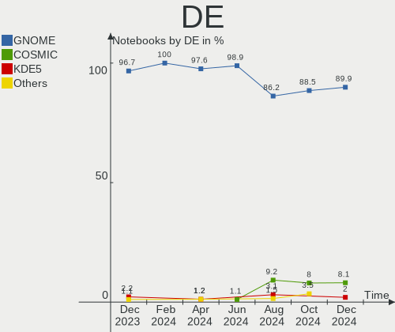
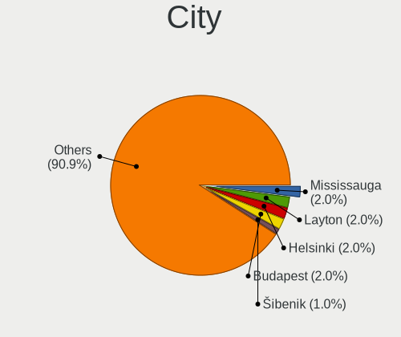
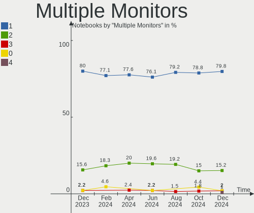
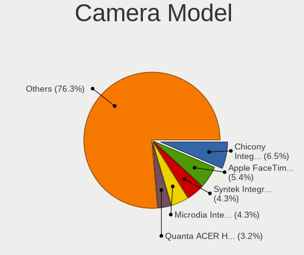

Pop!_OS - Hardware Trends (Notebooks)
-------------------------------------

A project to identify most popular hardware characteristics and track their change
over time based on data collected by Linux users at https://Linux-Hardware.org.

Anyone can contribute to this report by the [hw-probe](https://github.com/linuxhw/hw-probe) tool:

    sudo -E hw-probe -all -upload

This report is for one last month. Overall report since the beginning of time: [TestCoverage](https://github.com/linuxhw/TestCoverage)

Period: Oct, 2022.

Contents
--------

* [ System ](#system)
  - [ OS                       ](#os)
  - [ OS Family                ](#os-family)
  - [ Kernel                   ](#kernel)
  - [ Kernel Family            ](#kernel-family)
  - [ Kernel Major Ver.        ](#kernel-major-ver)
  - [ Arch                     ](#arch)
  - [ DE                       ](#de)
  - [ Display Server           ](#display-server)
  - [ Display Manager          ](#display-manager)
  - [ OS Lang                  ](#os-lang)
  - [ Boot Mode                ](#boot-mode)
  - [ Filesystem               ](#filesystem)
  - [ Part. scheme             ](#part-scheme)
  - [ Dual Boot with Linux/BSD ](#dual-boot-with-linuxbsd)
  - [ Dual Boot (Win)          ](#dual-boot-win)

* [ Board ](#board)
  - [ Vendor                   ](#vendor)
  - [ Model                    ](#model)
  - [ Model Family             ](#model-family)
  - [ MFG Year                 ](#mfg-year)
  - [ Form Factor              ](#form-factor)
  - [ Secure Boot              ](#secure-boot)
  - [ Coreboot                 ](#coreboot)
  - [ RAM Size                 ](#ram-size)
  - [ RAM Used                 ](#ram-used)
  - [ Total Drives             ](#total-drives)
  - [ Has CD-ROM               ](#has-cd-rom)
  - [ Has Ethernet             ](#has-ethernet)
  - [ Has WiFi                 ](#has-wifi)
  - [ Has Bluetooth            ](#has-bluetooth)

* [ Location ](#location)
  - [ Country                  ](#country)
  - [ City                     ](#city)

* [ Drives ](#drives)
  - [ Drive Vendor             ](#drive-vendor)
  - [ Drive Model              ](#drive-model)
  - [ HDD Vendor               ](#hdd-vendor)
  - [ SSD Vendor               ](#ssd-vendor)
  - [ Drive Kind               ](#drive-kind)
  - [ Drive Connector          ](#drive-connector)
  - [ Drive Size               ](#drive-size)
  - [ Space Total              ](#space-total)
  - [ Space Used               ](#space-used)
  - [ Malfunc. Drives          ](#malfunc-drives)
  - [ Malfunc. Drive Vendor    ](#malfunc-drive-vendor)
  - [ Malfunc. HDD Vendor      ](#malfunc-hdd-vendor)
  - [ Malfunc. Drive Kind      ](#malfunc-drive-kind)
  - [ Failed Drives            ](#failed-drives)
  - [ Failed Drive Vendor      ](#failed-drive-vendor)
  - [ Drive Status             ](#drive-status)

* [ Storage controller ](#storage-controller)
  - [ Storage Vendor           ](#storage-vendor)
  - [ Storage Model            ](#storage-model)
  - [ Storage Kind             ](#storage-kind)

* [ Processor ](#processor)
  - [ CPU Vendor               ](#cpu-vendor)
  - [ CPU Model                ](#cpu-model)
  - [ CPU Model Family         ](#cpu-model-family)
  - [ CPU Cores                ](#cpu-cores)
  - [ CPU Sockets              ](#cpu-sockets)
  - [ CPU Threads              ](#cpu-threads)
  - [ CPU Op-Modes             ](#cpu-op-modes)
  - [ CPU Microcode            ](#cpu-microcode)
  - [ CPU Microarch            ](#cpu-microarch)

* [ Graphics ](#graphics)
  - [ GPU Vendor               ](#gpu-vendor)
  - [ GPU Model                ](#gpu-model)
  - [ GPU Combo                ](#gpu-combo)
  - [ GPU Driver               ](#gpu-driver)
  - [ GPU Memory               ](#gpu-memory)

* [ Monitor ](#monitor)
  - [ Monitor Vendor           ](#monitor-vendor)
  - [ Monitor Model            ](#monitor-model)
  - [ Monitor Resolution       ](#monitor-resolution)
  - [ Monitor Diagonal         ](#monitor-diagonal)
  - [ Monitor Width            ](#monitor-width)
  - [ Aspect Ratio             ](#aspect-ratio)
  - [ Monitor Area             ](#monitor-area)
  - [ Pixel Density            ](#pixel-density)
  - [ Multiple Monitors        ](#multiple-monitors)

* [ Network ](#network)
  - [ Net Controller Vendor    ](#net-controller-vendor)
  - [ Net Controller Model     ](#net-controller-model)
  - [ Wireless Vendor          ](#wireless-vendor)
  - [ Wireless Model           ](#wireless-model)
  - [ Ethernet Vendor          ](#ethernet-vendor)
  - [ Ethernet Model           ](#ethernet-model)
  - [ Net Controller Kind      ](#net-controller-kind)
  - [ Used Controller          ](#used-controller)
  - [ NICs                     ](#nics)
  - [ IPv6                     ](#ipv6)

* [ Bluetooth ](#bluetooth)
  - [ Bluetooth Vendor         ](#bluetooth-vendor)
  - [ Bluetooth Model          ](#bluetooth-model)

* [ Sound ](#sound)
  - [ Sound Vendor             ](#sound-vendor)
  - [ Sound Model              ](#sound-model)

* [ Memory ](#memory)
  - [ Memory Vendor            ](#memory-vendor)
  - [ Memory Model             ](#memory-model)
  - [ Memory Kind              ](#memory-kind)
  - [ Memory Form Factor       ](#memory-form-factor)
  - [ Memory Size              ](#memory-size)
  - [ Memory Speed             ](#memory-speed)

* [ Printers & scanners ](#printers--scanners)
  - [ Printer Vendor           ](#printer-vendor)
  - [ Printer Model            ](#printer-model)
  - [ Scanner Vendor           ](#scanner-vendor)
  - [ Scanner Model            ](#scanner-model)

* [ Camera ](#camera)
  - [ Camera Vendor            ](#camera-vendor)
  - [ Camera Model             ](#camera-model)

* [ Security ](#security)
  - [ Fingerprint Vendor       ](#fingerprint-vendor)
  - [ Fingerprint Model        ](#fingerprint-model)
  - [ Chipcard Vendor          ](#chipcard-vendor)
  - [ Chipcard Model           ](#chipcard-model)

* [ Unsupported ](#unsupported)
  - [ Unsupported Devices      ](#unsupported-devices)
  - [ Unsupported Device Types ](#unsupported-device-types)

System
------

OS
--

Installed operating systems

| Name          | Notebooks | Percent |
|---------------|-----------|---------|
| Pop!_OS 22.04 | 151       | 98.69%  |
| Pop!_OS 21.04 | 1         | 0.65%   |
| Pop!_OS 20.04 | 1         | 0.65%   |

OS Family
---------

OS without a version

| Name    | Notebooks | Percent |
|---------|-----------|---------|
| Pop!_OS | 153       | 100%    |

Kernel
------

Version of the Linux kernel

| Version                  | Notebooks | Percent |
|--------------------------|-----------|---------|
| 5.19.0-76051900-generic  | 85        | 55.56%  |
| 6.0.2-76060002-generic   | 36        | 23.53%  |
| 5.19.16-76051916-generic | 19        | 12.42%  |
| 5.18.10-76051810-generic | 3         | 1.96%   |
| 5.17.5-76051705-generic  | 3         | 1.96%   |
| 6.0.2-x64v2-xanmod1      | 1         | 0.65%   |
| 6.0.0-060000-generic     | 1         | 0.65%   |
| 5.19.14-xanmod1          | 1         | 0.65%   |
| 5.19.12-xanmod1          | 1         | 0.65%   |
| 5.19.0-051900-generic    | 1         | 0.65%   |
| 5.17.15-76051715-generic | 1         | 0.65%   |
| 5.15.11-76051511-generic | 1         | 0.65%   |

Kernel Family
-------------

Linux kernel without a distro release

| Version | Notebooks | Percent |
|---------|-----------|---------|
| 5.19.0  | 86        | 56.21%  |
| 6.0.2   | 37        | 24.18%  |
| 5.19.16 | 19        | 12.42%  |
| 5.18.10 | 3         | 1.96%   |
| 5.17.5  | 3         | 1.96%   |
| 6.0.0   | 1         | 0.65%   |
| 5.19.14 | 1         | 0.65%   |
| 5.19.12 | 1         | 0.65%   |
| 5.17.15 | 1         | 0.65%   |
| 5.15.11 | 1         | 0.65%   |

Kernel Major Ver.
-----------------

Linux kernel major version

| Version | Notebooks | Percent |
|---------|-----------|---------|
| 5.19    | 107       | 69.93%  |
| 6.0     | 38        | 24.84%  |
| 5.17    | 4         | 2.61%   |
| 5.18    | 3         | 1.96%   |
| 5.15    | 1         | 0.65%   |

Arch
----

OS architecture (x86_64, i586, etc.)

| Name   | Notebooks | Percent |
|--------|-----------|---------|
| x86_64 | 153       | 100%    |

DE
--

Desktop Environment

| Name    | Notebooks | Percent |
|---------|-----------|---------|
| GNOME   | 152       | 99.35%  |
| Unknown | 1         | 0.65%   |

Display Server
--------------

X11 or Wayland

| Name    | Notebooks | Percent |
|---------|-----------|---------|
| X11     | 146       | 95.42%  |
| Wayland | 7         | 4.58%   |

Display Manager
---------------

SDDM, LightDM, etc.

| Name    | Notebooks | Percent |
|---------|-----------|---------|
| Unknown | 101       | 66.01%  |
| GDM3    | 51        | 33.33%  |
| GDM     | 1         | 0.65%   |

OS Lang
-------

Language

| Lang    | Notebooks | Percent |
|---------|-----------|---------|
| en_US   | 85        | 55.56%  |
| en_GB   | 12        | 7.84%   |
| pt_BR   | 10        | 6.54%   |
| it_IT   | 9         | 5.88%   |
| fi_FI   | 5         | 3.27%   |
| de_DE   | 5         | 3.27%   |
| es_ES   | 4         | 2.61%   |
| en_CA   | 3         | 1.96%   |
| en_AU   | 3         | 1.96%   |
| pl_PL   | 2         | 1.31%   |
| nl_NL   | 2         | 1.31%   |
| nb_NO   | 2         | 1.31%   |
| es_MX   | 2         | 1.31%   |
| es_AR   | 2         | 1.31%   |
| en_IE   | 2         | 1.31%   |
| C       | 2         | 1.31%   |
| tr_TR   | 1         | 0.65%   |
| fr_FR   | 1         | 0.65%   |
| Unknown | 1         | 0.65%   |

Boot Mode
---------

EFI or BIOS

| Mode | Notebooks | Percent |
|------|-----------|---------|
| BIOS | 103       | 67.32%  |
| EFI  | 50        | 32.68%  |

Filesystem
----------

Type of filesystem

| Type    | Notebooks | Percent |
|---------|-----------|---------|
| Ext4    | 145       | 94.77%  |
| Btrfs   | 6         | 3.92%   |
| Overlay | 2         | 1.31%   |

Part. scheme
------------

Scheme of partitioning

| Type    | Notebooks | Percent |
|---------|-----------|---------|
| Unknown | 100       | 65.36%  |
| GPT     | 51        | 33.33%  |
| MBR     | 2         | 1.31%   |

Dual Boot with Linux/BSD
------------------------

Hosting more than one Linux/BSD

| Dual boot | Notebooks | Percent |
|-----------|-----------|---------|
| No        | 145       | 94.77%  |
| Yes       | 8         | 5.23%   |

Dual Boot (Win)
---------------

Hosting Linux and Windows

| Dual boot | Notebooks | Percent |
|-----------|-----------|---------|
| No        | 134       | 87.58%  |
| Yes       | 19        | 12.42%  |

Board
-----

Vendor
------

Motherboard manufacturer

| Name                   | Notebooks | Percent |
|------------------------|-----------|---------|
| Hewlett-Packard        | 26        | 16.99%  |
| Lenovo                 | 21        | 13.73%  |
| Dell                   | 21        | 13.73%  |
| ASUSTek Computer       | 15        | 9.8%    |
| Apple                  | 11        | 7.19%   |
| Acer                   | 11        | 7.19%   |
| System76               | 9         | 5.88%   |
| MSI                    | 9         | 5.88%   |
| Samsung Electronics    | 3         | 1.96%   |
| Toshiba                | 2         | 1.31%   |
| Sony                   | 2         | 1.31%   |
| Razer                  | 2         | 1.31%   |
| Google                 | 2         | 1.31%   |
| Gigabyte Technology    | 2         | 1.31%   |
| Fujitsu                | 2         | 1.31%   |
| Alienware              | 2         | 1.31%   |
| Valve                  | 1         | 0.65%   |
| Tactus                 | 1         | 0.65%   |
| Razer x Lambda         | 1         | 0.65%   |
| Positivo               | 1         | 0.65%   |
| Novatech               | 1         | 0.65%   |
| Notebook               | 1         | 0.65%   |
| Micro Electronics      | 1         | 0.65%   |
| KELYX ARGENTINA        | 1         | 0.65%   |
| Intel                  | 1         | 0.65%   |
| HUAWEI                 | 1         | 0.65%   |
| GPU Company            | 1         | 0.65%   |
| Framework              | 1         | 0.65%   |
| Avell High Performance | 1         | 0.65%   |

Model
-----

Motherboard model

| Name                                  | Notebooks | Percent |
|---------------------------------------|-----------|---------|
| System76 Lemur Pro                    | 4         | 2.61%   |
| System76 Oryx Pro                     | 2         | 1.31%   |
| HP ProBook 450 G8 Notebook PC         | 2         | 1.31%   |
| HP Pavilion Gaming Laptop 15-dk0xxx   | 2         | 1.31%   |
| HP Pavilion g6                        | 2         | 1.31%   |
| Dell XPS 15 9520                      | 2         | 1.31%   |
| Dell Latitude E7240                   | 2         | 1.31%   |
| Apple MacBookAir6,2                   | 2         | 1.31%   |
| Valve Jupiter                         | 1         | 0.65%   |
| Toshiba Satellite Pro S500            | 1         | 0.65%   |
| Toshiba Satellite C855-1T5            | 1         | 0.65%   |
| Tactus GeoBook 140                    | 1         | 0.65%   |
| System76 Gazelle                      | 1         | 0.65%   |
| System76 Galago Pro                   | 1         | 0.65%   |
| System76 Darter Pro                   | 1         | 0.65%   |
| Sony VPCEH3LFX                        | 1         | 0.65%   |
| Sony VPCEB46FG                        | 1         | 0.65%   |
| Samsung 950XDB/951XDB/950XDY          | 1         | 0.65%   |
| Samsung 800G5M/800G5W                 | 1         | 0.65%   |
| Samsung 550XDA                        | 1         | 0.65%   |
| Razer x Lambda TensorBook (late 2021) | 1         | 0.65%   |
| Razer Blade 15 (2022) - RZ09-0421     | 1         | 0.65%   |
| Razer Blade                           | 1         | 0.65%   |
| Positivo Mobile                       | 1         | 0.65%   |
| Novatech NLx0MU                       | 1         | 0.65%   |
| Notebook NV4xPZ                       | 1         | 0.65%   |
| MSI Prestige 15 A12UC                 | 1         | 0.65%   |
| MSI Prestige 14Evo A11M               | 1         | 0.65%   |
| MSI MS-7A34                           | 1         | 0.65%   |
| MSI Katana GF76 11UD                  | 1         | 0.65%   |
| MSI GV62 8RD                          | 1         | 0.65%   |
| MSI GP72VR 7RF                        | 1         | 0.65%   |
| MSI GP66 Leopard 10UG                 | 1         | 0.65%   |
| MSI GF63 Thin 11UD                    | 1         | 0.65%   |
| MSI GE60 0NC\0ND                      | 1         | 0.65%   |
| Micro Element                         | 1         | 0.65%   |
| Lenovo Z51-70 80K6                    | 1         | 0.65%   |
| Lenovo Yoga Slim 7 Pro 14ACH5 82MS    | 1         | 0.65%   |
| Lenovo Yoga 510-14ISK 80S7            | 1         | 0.65%   |
| Lenovo V155-15API 81V5                | 1         | 0.65%   |

Model Family
------------

Motherboard model prefix

| Name                      | Notebooks | Percent |
|---------------------------|-----------|---------|
| Acer Aspire               | 9         | 5.88%   |
| HP Pavilion               | 8         | 5.23%   |
| HP Laptop                 | 8         | 5.23%   |
| Lenovo ThinkPad           | 7         | 4.58%   |
| Dell XPS                  | 6         | 3.92%   |
| Dell Latitude             | 6         | 3.92%   |
| Lenovo IdeaPad            | 5         | 3.27%   |
| Dell Inspiron             | 5         | 3.27%   |
| ASUS ROG                  | 5         | 3.27%   |
| System76 Lemur            | 4         | 2.61%   |
| ASUS ZenBook              | 4         | 2.61%   |
| Apple MacBookPro5         | 4         | 2.61%   |
| Lenovo Legion             | 3         | 1.96%   |
| HP ProBook                | 3         | 1.96%   |
| HP EliteBook              | 3         | 1.96%   |
| Toshiba Satellite         | 2         | 1.31%   |
| System76 Oryx             | 2         | 1.31%   |
| Razer Blade               | 2         | 1.31%   |
| MSI Prestige              | 2         | 1.31%   |
| Lenovo Yoga               | 2         | 1.31%   |
| HP ENVY                   | 2         | 1.31%   |
| Fujitsu LIFEBOOK          | 2         | 1.31%   |
| ASUS ASUS                 | 2         | 1.31%   |
| Apple MacBookAir6         | 2         | 1.31%   |
| Valve Jupiter             | 1         | 0.65%   |
| Tactus GeoBook            | 1         | 0.65%   |
| System76 Gazelle          | 1         | 0.65%   |
| System76 Galago           | 1         | 0.65%   |
| System76 Darter           | 1         | 0.65%   |
| Sony VPCEH3LFX            | 1         | 0.65%   |
| Sony VPCEB46FG            | 1         | 0.65%   |
| Samsung 950XDB            | 1         | 0.65%   |
| Samsung 800G5M            | 1         | 0.65%   |
| Samsung 550XDA            | 1         | 0.65%   |
| Razer x Lambda TensorBook | 1         | 0.65%   |
| Positivo Mobile           | 1         | 0.65%   |
| Novatech NLx0MU           | 1         | 0.65%   |
| Notebook NV4xPZ           | 1         | 0.65%   |
| MSI MS-7A34               | 1         | 0.65%   |
| MSI Katana                | 1         | 0.65%   |

MFG Year
--------

Motherboard manufacture year

| Year | Notebooks | Percent |
|------|-----------|---------|
| 2021 | 24        | 15.69%  |
| 2022 | 20        | 13.07%  |
| 2020 | 20        | 13.07%  |
| 2019 | 16        | 10.46%  |
| 2018 | 11        | 7.19%   |
| 2017 | 10        | 6.54%   |
| 2016 | 9         | 5.88%   |
| 2013 | 7         | 4.58%   |
| 2009 | 7         | 4.58%   |
| 2015 | 6         | 3.92%   |
| 2012 | 6         | 3.92%   |
| 2014 | 5         | 3.27%   |
| 2010 | 5         | 3.27%   |
| 2011 | 4         | 2.61%   |
| 2007 | 2         | 1.31%   |
| 2008 | 1         | 0.65%   |

Form Factor
-----------

Physical design of the computer

| Name     | Notebooks | Percent |
|----------|-----------|---------|
| Notebook | 153       | 100%    |

Secure Boot
-----------

Enabled or disabled

| State    | Notebooks | Percent |
|----------|-----------|---------|
| Disabled | 153       | 100%    |

Coreboot
--------

Have coreboot on board

| Used | Notebooks | Percent |
|------|-----------|---------|
| No   | 145       | 94.77%  |
| Yes  | 8         | 5.23%   |

RAM Size
--------

Total RAM memory

| Size in GB  | Notebooks | Percent |
|-------------|-----------|---------|
| 16.01-24.0  | 43        | 28.1%   |
| 4.01-8.0    | 38        | 24.84%  |
| 32.01-64.0  | 26        | 16.99%  |
| 8.01-16.0   | 23        | 15.03%  |
| 3.01-4.0    | 20        | 13.07%  |
| 64.01-256.0 | 2         | 1.31%   |
| 24.01-32.0  | 1         | 0.65%   |

RAM Used
--------

Used RAM memory

| Used GB    | Notebooks | Percent |
|------------|-----------|---------|
| 2.01-3.0   | 52        | 33.99%  |
| 4.01-8.0   | 40        | 26.14%  |
| 3.01-4.0   | 28        | 18.3%   |
| 1.01-2.0   | 17        | 11.11%  |
| 8.01-16.0  | 14        | 9.15%   |
| 16.01-24.0 | 2         | 1.31%   |

Total Drives
------------

Number of drives on board

| Drives | Notebooks | Percent |
|--------|-----------|---------|
| 1      | 108       | 70.59%  |
| 2      | 42        | 27.45%  |
| 3      | 3         | 1.96%   |

Has CD-ROM
----------

Has CD-ROM on board

| Presented | Notebooks | Percent |
|-----------|-----------|---------|
| No        | 119       | 77.78%  |
| Yes       | 34        | 22.22%  |

Has Ethernet
------------

Has Ethernet on board

| Presented | Notebooks | Percent |
|-----------|-----------|---------|
| Yes       | 111       | 72.55%  |
| No        | 42        | 27.45%  |

Has WiFi
--------

Has WiFi module

| Presented | Notebooks | Percent |
|-----------|-----------|---------|
| Yes       | 149       | 97.39%  |
| No        | 4         | 2.61%   |

Has Bluetooth
-------------

Has Bluetooth module

| Presented | Notebooks | Percent |
|-----------|-----------|---------|
| Yes       | 127       | 83.01%  |
| No        | 26        | 16.99%  |

Location
--------

Country
-------

Geographic location (country)

| Country     | Notebooks | Percent |
|-------------|-----------|---------|
| USA         | 35        | 22.88%  |
| Italy       | 18        | 11.76%  |
| Brazil      | 13        | 8.5%    |
| Germany     | 8         | 5.23%   |
| UK          | 6         | 3.92%   |
| Canada      | 6         | 3.92%   |
| Spain       | 5         | 3.27%   |
| Norway      | 5         | 3.27%   |
| Netherlands | 5         | 3.27%   |
| Mexico      | 5         | 3.27%   |
| Finland     | 5         | 3.27%   |
| India       | 4         | 2.61%   |
| Portugal    | 3         | 1.96%   |
| Poland      | 3         | 1.96%   |
| Australia   | 3         | 1.96%   |
| Turkey      | 2         | 1.31%   |
| Thailand    | 2         | 1.31%   |
| Indonesia   | 2         | 1.31%   |
| France      | 2         | 1.31%   |
| Denmark     | 2         | 1.31%   |
| Argentina   | 2         | 1.31%   |
| Venezuela   | 1         | 0.65%   |
| Switzerland | 1         | 0.65%   |
| Slovakia    | 1         | 0.65%   |
| Serbia      | 1         | 0.65%   |
| Russia      | 1         | 0.65%   |
| Philippines | 1         | 0.65%   |
| Kuwait      | 1         | 0.65%   |
| Japan       | 1         | 0.65%   |
| Ireland     | 1         | 0.65%   |
| Hungary     | 1         | 0.65%   |
| Guatemala   | 1         | 0.65%   |
| Greece      | 1         | 0.65%   |
| Egypt       | 1         | 0.65%   |
| Ecuador     | 1         | 0.65%   |
| Czechia     | 1         | 0.65%   |
| Cambodia    | 1         | 0.65%   |
| Cabo Verde  | 1         | 0.65%   |

City
----

Geographic location (city)

| City                     | Notebooks | Percent |
|--------------------------|-----------|---------|
| Milan                    | 5         | 3.27%   |
| Rome                     | 3         | 1.96%   |
| Oslo                     | 3         | 1.96%   |
| Helsinki                 | 3         | 1.96%   |
| Edmonton                 | 3         | 1.96%   |
| Queretaro                | 2         | 1.31%   |
| Hudson                   | 2         | 1.31%   |
| Hamburg                  | 2         | 1.31%   |
| Dallas                   | 2         | 1.31%   |
| Brisbane                 | 2         | 1.31%   |
| Zurich                   | 1         | 0.65%   |
| Zamberk                  | 1         | 0.65%   |
| Worksop                  | 1         | 0.65%   |
| Winter Park              | 1         | 0.65%   |
| Winnenden                | 1         | 0.65%   |
| Wallaceburg              | 1         | 0.65%   |
| Walkersville             | 1         | 0.65%   |
| Vigo                     | 1         | 0.65%   |
| Victoria                 | 1         | 0.65%   |
| Vicopisano               | 1         | 0.65%   |
| Veenendaal               | 1         | 0.65%   |
| Vechta                   | 1         | 0.65%   |
| Udupi                    | 1         | 0.65%   |
| Tucson                   | 1         | 0.65%   |
| Trondheim                | 1         | 0.65%   |
| Toronto                  | 1         | 0.65%   |
| Tokyo                    | 1         | 0.65%   |
| Tampere                  | 1         | 0.65%   |
| Szeged                   | 1         | 0.65%   |
| Svendborg                | 1         | 0.65%   |
| Surat                    | 1         | 0.65%   |
| St Petersburg            | 1         | 0.65%   |
| Siloam Springs           | 1         | 0.65%   |
| Sao Roque                | 1         | 0.65%   |
| Sao Paulo                | 1         | 0.65%   |
| Santarcangelo di Romagna | 1         | 0.65%   |
| San Marcos               | 1         | 0.65%   |
| San Fernando             | 1         | 0.65%   |
| Salt Lake City           | 1         | 0.65%   |
| Rosolina                 | 1         | 0.65%   |

Drives
------

Drive Vendor
------------

Hard drive vendors

| Vendor                      | Notebooks | Drives | Percent |
|-----------------------------|-----------|--------|---------|
| Samsung Electronics         | 35        | 37     | 17.86%  |
| WDC                         | 18        | 19     | 9.18%   |
| Toshiba                     | 16        | 17     | 8.16%   |
| SanDisk                     | 15        | 15     | 7.65%   |
| SK hynix                    | 12        | 13     | 6.12%   |
| Kingston                    | 12        | 12     | 6.12%   |
| Seagate                     | 11        | 11     | 5.61%   |
| Micron Technology           | 11        | 11     | 5.61%   |
| Unknown                     | 8         | 9      | 4.08%   |
| Intel                       | 7         | 7      | 3.57%   |
| HGST                        | 7         | 7      | 3.57%   |
| Crucial                     | 6         | 6      | 3.06%   |
| Apple                       | 5         | 5      | 2.55%   |
| KIOXIA                      | 4         | 4      | 2.04%   |
| China                       | 4         | 4      | 2.04%   |
| PNY                         | 3         | 3      | 1.53%   |
| A-DATA Technology           | 3         | 3      | 1.53%   |
| Phison Electronics          | 2         | 3      | 1.02%   |
| Micron/Crucial Technology   | 2         | 2      | 1.02%   |
| Hitachi                     | 2         | 2      | 1.02%   |
| W800S                       | 1         | 1      | 0.51%   |
| Silicon Motion              | 1         | 1      | 0.51%   |
| ROG                         | 1         | 1      | 0.51%   |
| O2 Micro                    | 1         | 1      | 0.51%   |
| Netac                       | 1         | 1      | 0.51%   |
| LITEONIT                    | 1         | 1      | 0.51%   |
| Kingston Technology Company | 1         | 1      | 0.51%   |
| KingDian                    | 1         | 1      | 0.51%   |
| JMicron Technology          | 1         | 1      | 0.51%   |
| Intenso                     | 1         | 1      | 0.51%   |
| HS-SSD-C100                 | 1         | 1      | 0.51%   |
| FORESEE                     | 1         | 1      | 0.51%   |
| Unknown                     | 1         | 1      | 0.51%   |

Drive Model
-----------

Hard drive models

| Model                                                | Notebooks | Percent |
|------------------------------------------------------|-----------|---------|
| HGST HTS721010A9E630 1TB                             | 5         | 2.5%    |
| Samsung NVMe SSD Controller SM981/PM981/PM983 500GB  | 4         | 2%      |
| Kingston SA400S37240G 240GB SSD                      | 4         | 2%      |
| Toshiba XG6 NVMe SSD Controller 512GB                | 3         | 1.5%    |
| Toshiba MQ01ABD100 1TB                               | 3         | 1.5%    |
| Sandisk WD Blue SN550 NVMe SSD 1TB                   | 3         | 1.5%    |
| Samsung NVMe SSD Controller PM9A1/PM9A3/980PRO 250GB | 3         | 1.5%    |
| Crucial CT240BX500SSD1 240GB                         | 3         | 1.5%    |
| WDC WD5000LPVX-22V0TT0 500GB                         | 2         | 1%      |
| Unknown MMC Card  32GB                               | 2         | 1%      |
| SK hynix HFM512GD3JX013N 512GB                       | 2         | 1%      |
| Seagate ST1000LM049-2GH172 1TB                       | 2         | 1%      |
| Seagate ST1000LM035-1RK172 1TB                       | 2         | 1%      |
| Sandisk WD Black SN850 1TB                           | 2         | 1%      |
| Sandisk WD Black SN750 / PC SN730 NVMe SSD 1TB       | 2         | 1%      |
| Samsung SSD 980 PRO 1TB                              | 2         | 1%      |
| Samsung SSD 860 EVO 500GB                            | 2         | 1%      |
| Samsung NVMe SSD Controller SM961/PM961/SM963 250GB  | 2         | 1%      |
| PNY ELITE PSSD 240GB                                 | 2         | 1%      |
| Phison E12 NVMe Controller 2TB                       | 2         | 1%      |
| Micron/Crucial P2 NVMe PCIe SSD 500GB                | 2         | 1%      |
| Micron 3400_MTFDKBA1T0TFH 1TB                        | 2         | 1%      |
| Kingston SA400S37480G 480GB SSD                      | 2         | 1%      |
| WDC WDS500G2B0B-00YS70 500GB SSD                     | 1         | 0.5%    |
| WDC WDS500G2B0A-00SM50 500GB SSD                     | 1         | 0.5%    |
| WDC WDS240G2G0A-00JH30 240GB SSD                     | 1         | 0.5%    |
| WDC WDS120G2G0A-00JH30 120GB SSD                     | 1         | 0.5%    |
| WDC WDS100T2G0A-00JH30 1TB SSD                       | 1         | 0.5%    |
| WDC WDS100T2B0B-00YS70 1TB SSD                       | 1         | 0.5%    |
| WDC WD5000BPVT-60HXZT3 500GB                         | 1         | 0.5%    |
| WDC WD3200BEKT-08PVMT1 320GB                         | 1         | 0.5%    |
| WDC WD10SPZX-35Z10T0 1TB                             | 1         | 0.5%    |
| WDC WD10SPZX-24Z10 1TB                               | 1         | 0.5%    |
| WDC WD10SPZX-21Z10T0 1TB                             | 1         | 0.5%    |
| WDC WD10SPCX-24HWST1 1TB                             | 1         | 0.5%    |
| WDC WD10EZEX-08WN4A0 1TB                             | 1         | 0.5%    |
| WDC PC SN810 NVMe 1024GB                             | 1         | 0.5%    |
| WDC PC SN530 SDBPNPZ-256G-1002 256GB                 | 1         | 0.5%    |
| WDC PC SN520 SDAPNUW-256G-1002 256GB                 | 1         | 0.5%    |
| WDC PC SN520 SDAPNUW-256G                            | 1         | 0.5%    |

HDD Vendor
----------

Hard disk drive vendors

| Vendor  | Notebooks | Drives | Percent |
|---------|-----------|--------|---------|
| Seagate | 11        | 11     | 31.43%  |
| WDC     | 9         | 9      | 25.71%  |
| HGST    | 7         | 7      | 20%     |
| Toshiba | 6         | 6      | 17.14%  |
| Hitachi | 2         | 2      | 5.71%   |

SSD Vendor
----------

Solid state drive vendors

| Vendor              | Notebooks | Drives | Percent |
|---------------------|-----------|--------|---------|
| Samsung Electronics | 12        | 13     | 19.05%  |
| Kingston            | 9         | 9      | 14.29%  |
| WDC                 | 6         | 6      | 9.52%   |
| SanDisk             | 5         | 5      | 7.94%   |
| Crucial             | 5         | 5      | 7.94%   |
| Apple               | 5         | 5      | 7.94%   |
| China               | 4         | 4      | 6.35%   |
| PNY                 | 3         | 3      | 4.76%   |
| Toshiba             | 2         | 2      | 3.17%   |
| SK hynix            | 2         | 2      | 3.17%   |
| Intel               | 2         | 2      | 3.17%   |
| A-DATA Technology   | 2         | 2      | 3.17%   |
| Netac               | 1         | 1      | 1.59%   |
| Micron Technology   | 1         | 1      | 1.59%   |
| LITEONIT            | 1         | 1      | 1.59%   |
| KingDian            | 1         | 1      | 1.59%   |
| Intenso             | 1         | 1      | 1.59%   |
| FORESEE             | 1         | 1      | 1.59%   |

Drive Kind
----------

HDD or SSD

| Kind    | Notebooks | Drives | Percent |
|---------|-----------|--------|---------|
| NVMe    | 81        | 93     | 43.09%  |
| SSD     | 61        | 64     | 32.45%  |
| HDD     | 35        | 35     | 18.62%  |
| MMC     | 8         | 8      | 4.26%   |
| Unknown | 3         | 3      | 1.6%    |

Drive Connector
---------------

SATA, SAS, NVMe, etc.

| Type | Notebooks | Drives | Percent |
|------|-----------|--------|---------|
| SATA | 84        | 96     | 46.67%  |
| NVMe | 81        | 92     | 45%     |
| MMC  | 8         | 8      | 4.44%   |
| SAS  | 7         | 7      | 3.89%   |

Drive Size
----------

Size of hard drive

| Size in TB | Notebooks | Drives | Percent |
|------------|-----------|--------|---------|
| 0.01-0.5   | 59        | 65     | 64.13%  |
| 0.51-1.0   | 30        | 31     | 32.61%  |
| 1.01-2.0   | 3         | 3      | 3.26%   |

Space Total
-----------

Amount of disk space available on the file system

| Size in GB     | Notebooks | Percent |
|----------------|-----------|---------|
| 101-250        | 53        | 34.64%  |
| 251-500        | 40        | 26.14%  |
| 501-1000       | 36        | 23.53%  |
| 1001-2000      | 13        | 8.5%    |
| 51-100         | 3         | 1.96%   |
| More than 3000 | 2         | 1.31%   |
| 21-50          | 2         | 1.31%   |
| 2001-3000      | 2         | 1.31%   |
| 1-20           | 1         | 0.65%   |
| Unknown        | 1         | 0.65%   |

Space Used
----------

Amount of used disk space

| Used GB  | Notebooks | Percent |
|----------|-----------|---------|
| 1-20     | 44        | 28.76%  |
| 101-250  | 33        | 21.57%  |
| 21-50    | 28        | 18.3%   |
| 51-100   | 26        | 16.99%  |
| 251-500  | 14        | 9.15%   |
| 501-1000 | 7         | 4.58%   |
| Unknown  | 1         | 0.65%   |

Malfunc. Drives
---------------

Drive models with a malfunction

| Model                                 | Notebooks | Drives | Percent |
|---------------------------------------|-----------|--------|---------|
| WDC WDS240G2G0A-00JH30 240GB SSD      | 1         | 1      | 50%     |
| SK hynix HFS128G39TND-N210A 128GB SSD | 1         | 1      | 50%     |

Malfunc. Drive Vendor
---------------------

Vendors of faulty drives

| Vendor   | Notebooks | Drives | Percent |
|----------|-----------|--------|---------|
| WDC      | 1         | 1      | 50%     |
| SK hynix | 1         | 1      | 50%     |

Malfunc. HDD Vendor
-------------------

Vendors of faulty HDD drives

Zero info for selected period =(

Malfunc. Drive Kind
-------------------

Kinds of faulty drives

| Kind | Notebooks | Drives | Percent |
|------|-----------|--------|---------|
| SSD  | 2         | 2      | 100%    |

Failed Drives
-------------

Failed drive models

Zero info for selected period =(

Failed Drive Vendor
-------------------

Failed drive vendors

Zero info for selected period =(

Drive Status
------------

Number of failed and malfunc. drives

| Status   | Notebooks | Drives | Percent |
|----------|-----------|--------|---------|
| Detected | 107       | 133    | 66.46%  |
| Works    | 52        | 68     | 32.3%   |
| Malfunc  | 2         | 2      | 1.24%   |

Storage controller
------------------

Storage Vendor
--------------

Storage controller vendors

| Vendor                         | Notebooks | Percent |
|--------------------------------|-----------|---------|
| Intel                          | 92        | 45.54%  |
| Samsung Electronics            | 24        | 11.88%  |
| AMD                            | 18        | 8.91%   |
| SanDisk                        | 14        | 6.93%   |
| SK hynix                       | 10        | 4.95%   |
| Micron Technology              | 10        | 4.95%   |
| Toshiba America Info Systems   | 8         | 3.96%   |
| Nvidia                         | 6         | 2.97%   |
| KIOXIA                         | 5         | 2.48%   |
| Kingston Technology Company    | 4         | 1.98%   |
| Micron/Crucial Technology      | 3         | 1.49%   |
| Phison Electronics             | 2         | 0.99%   |
| Marvell Technology Group       | 2         | 0.99%   |
| Solid State Storage Technology | 1         | 0.5%    |
| Silicon Motion                 | 1         | 0.5%    |
| O2 Micro                       | 1         | 0.5%    |
| ADATA Technology               | 1         | 0.5%    |

Storage Model
-------------

Storage controller models

| Model                                                                            | Notebooks | Percent |
|----------------------------------------------------------------------------------|-----------|---------|
| AMD FCH SATA Controller [AHCI mode]                                              | 18        | 8.53%   |
| Micron Non-Volatile memory controller                                            | 10        | 4.74%   |
| Intel 82801 Mobile SATA Controller [RAID mode]                                   | 10        | 4.74%   |
| Intel Volume Management Device NVMe RAID Controller                              | 9         | 4.27%   |
| Intel Cannon Lake Mobile PCH SATA AHCI Controller                                | 9         | 4.27%   |
| Samsung NVMe SSD Controller PM9A1/PM9A3/980PRO                                   | 8         | 3.79%   |
| Intel Sunrise Point-LP SATA Controller [AHCI mode]                               | 8         | 3.79%   |
| Samsung NVMe SSD Controller SM981/PM981/PM983                                    | 7         | 3.32%   |
| Intel 8 Series SATA Controller 1 [AHCI mode]                                     | 6         | 2.84%   |
| SK hynix Gold P31 SSD                                                            | 5         | 2.37%   |
| KIOXIA NVMe SSD Controller BG4                                                   | 5         | 2.37%   |
| Intel HM170/QM170 Chipset SATA Controller [AHCI Mode]                            | 5         | 2.37%   |
| Intel 7 Series Chipset Family 6-port SATA Controller [AHCI mode]                 | 5         | 2.37%   |
| Intel 5 Series/3400 Series Chipset 4 port SATA AHCI Controller                   | 5         | 2.37%   |
| Toshiba America Info Systems XG6 NVMe SSD Controller                             | 4         | 1.9%    |
| SanDisk WD Blue SN550 NVMe SSD                                                   | 4         | 1.9%    |
| Samsung NVMe SSD Controller 980                                                  | 4         | 1.9%    |
| Nvidia MCP79 AHCI Controller                                                     | 4         | 1.9%    |
| Intel Tiger Lake-LP SATA Controller                                              | 4         | 1.9%    |
| Intel 400 Series Chipset Family SATA AHCI Controller                             | 4         | 1.9%    |
| SK hynix Non-Volatile memory controller                                          | 3         | 1.42%   |
| SanDisk WD PC SN810 / Black SN850 NVMe SSD                                       | 3         | 1.42%   |
| Samsung NVMe SSD Controller SM961/PM961/SM963                                    | 3         | 1.42%   |
| Kingston Company Company Non-Volatile memory controller                          | 3         | 1.42%   |
| Intel Wildcat Point-LP SATA Controller [AHCI Mode]                               | 3         | 1.42%   |
| Intel SSD 660P Series                                                            | 3         | 1.42%   |
| Intel 82801IBM/IEM (ICH9M/ICH9M-E) 4 port SATA Controller [AHCI mode]            | 3         | 1.42%   |
| Intel 6 Series/C200 Series Chipset Family 6 port Mobile SATA AHCI Controller     | 3         | 1.42%   |
| Intel 500 Series Chipset Family SATA AHCI Controller                             | 3         | 1.42%   |
| Toshiba America Info Systems Toshiba America Info Non-Volatile memory controller | 2         | 0.95%   |
| Toshiba America Info Systems BG3 NVMe SSD Controller                             | 2         | 0.95%   |
| SK hynix BC501 NVMe Solid State Drive                                            | 2         | 0.95%   |
| SanDisk WD Blue SN500 / PC SN520 NVMe SSD                                        | 2         | 0.95%   |
| SanDisk WD Black SN750 / PC SN730 NVMe SSD                                       | 2         | 0.95%   |
| SanDisk Non-Volatile memory controller                                           | 2         | 0.95%   |
| Phison E12 NVMe Controller                                                       | 2         | 0.95%   |
| Micron/Crucial P2 NVMe PCIe SSD                                                  | 2         | 0.95%   |
| Marvell Group 88SS9183 PCIe SSD Controller                                       | 2         | 0.95%   |
| Intel SATA Controller [RAID mode]                                                | 2         | 0.95%   |
| Intel Non-Volatile memory controller                                             | 2         | 0.95%   |

Storage Kind
------------

Kind of storage controller (IDE, SATA, NVMe, SAS, ...)

| Kind | Notebooks | Percent |
|------|-----------|---------|
| SATA | 95        | 47.26%  |
| NVMe | 80        | 39.8%   |
| RAID | 21        | 10.45%  |
| IDE  | 5         | 2.49%   |

Processor
---------

CPU Vendor
----------

Processor vendors

| Vendor | Notebooks | Percent |
|--------|-----------|---------|
| Intel  | 122       | 79.74%  |
| AMD    | 31        | 20.26%  |

CPU Model
---------

Processor models

| Model                                       | Notebooks | Percent |
|---------------------------------------------|-----------|---------|
| Intel Core i7-9750H CPU @ 2.60GHz           | 8         | 5.23%   |
| Intel 11th Gen Core i7-1165G7 @ 2.80GHz     | 7         | 4.58%   |
| Intel 11th Gen Core i7-11800H @ 2.30GHz     | 5         | 3.27%   |
| Intel Core i7-7700HQ CPU @ 2.80GHz          | 4         | 2.61%   |
| Intel Core i7-10750H CPU @ 2.60GHz          | 4         | 2.61%   |
| Intel Core i7-8750H CPU @ 2.20GHz           | 3         | 1.96%   |
| Intel Core i5-7200U CPU @ 2.50GHz           | 3         | 1.96%   |
| Intel 12th Gen Core i7-12700H               | 3         | 1.96%   |
| Intel 11th Gen Core i7-1185G7 @ 3.00GHz     | 3         | 1.96%   |
| Intel Core i7-8565U CPU @ 1.80GHz           | 2         | 1.31%   |
| Intel Core i7-8550U CPU @ 1.80GHz           | 2         | 1.31%   |
| Intel Core i7-6700HQ CPU @ 2.60GHz          | 2         | 1.31%   |
| Intel Core i7-6500U CPU @ 2.50GHz           | 2         | 1.31%   |
| Intel Core i7-10510U CPU @ 1.80GHz          | 2         | 1.31%   |
| Intel Core i5-8300H CPU @ 2.30GHz           | 2         | 1.31%   |
| Intel Core i5-8265U CPU @ 1.60GHz           | 2         | 1.31%   |
| Intel Core i5-7300HQ CPU @ 2.50GHz          | 2         | 1.31%   |
| Intel Core i5-5200U CPU @ 2.20GHz           | 2         | 1.31%   |
| Intel Core i5-4300U CPU @ 1.90GHz           | 2         | 1.31%   |
| Intel Core i5-4250U CPU @ 1.30GHz           | 2         | 1.31%   |
| Intel Core i5-3340M CPU @ 2.70GHz           | 2         | 1.31%   |
| Intel Core 2 Duo CPU P8600 @ 2.40GHz        | 2         | 1.31%   |
| Intel Celeron N4020 CPU @ 1.10GHz           | 2         | 1.31%   |
| Intel 12th Gen Core i7-12800H               | 2         | 1.31%   |
| Intel 12th Gen Core i7-1260P                | 2         | 1.31%   |
| Intel 11th Gen Core i5-1135G7 @ 2.40GHz     | 2         | 1.31%   |
| AMD Ryzen 9 5900HX with Radeon Graphics     | 2         | 1.31%   |
| AMD Ryzen 7 4800HS with Radeon Graphics     | 2         | 1.31%   |
| AMD Ryzen 5 5600H with Radeon Graphics      | 2         | 1.31%   |
| AMD Ryzen 5 5500U with Radeon Graphics      | 2         | 1.31%   |
| Intel Pentium Dual-Core CPU T4200 @ 2.00GHz | 1         | 0.65%   |
| Intel Pentium CPU N3530 @ 2.16GHz           | 1         | 0.65%   |
| Intel Pentium 3558U @ 1.70GHz               | 1         | 0.65%   |
| Intel Core i7-9850H CPU @ 2.60GHz           | 1         | 0.65%   |
| Intel Core i7-8850H CPU @ 2.60GHz           | 1         | 0.65%   |
| Intel Core i7-7820HQ CPU @ 2.90GHz          | 1         | 0.65%   |
| Intel Core i7-6820HK CPU @ 2.70GHz          | 1         | 0.65%   |
| Intel Core i7-5600U CPU @ 2.60GHz           | 1         | 0.65%   |
| Intel Core i7-4850HQ CPU @ 2.30GHz          | 1         | 0.65%   |
| Intel Core i7-4800MQ CPU @ 2.70GHz          | 1         | 0.65%   |

CPU Model Family
----------------

Processor model prefix

| Model                   | Notebooks | Percent |
|-------------------------|-----------|---------|
| Intel Core i7           | 39        | 25.49%  |
| Intel Core i5           | 34        | 22.22%  |
| Other                   | 32        | 20.92%  |
| AMD Ryzen 5             | 9         | 5.88%   |
| Intel Core 2 Duo        | 7         | 4.58%   |
| AMD Ryzen 7             | 5         | 3.27%   |
| Intel Core i3           | 4         | 2.61%   |
| Intel Celeron           | 4         | 2.61%   |
| AMD Ryzen 9             | 3         | 1.96%   |
| AMD Ryzen 3             | 3         | 1.96%   |
| Intel Pentium           | 2         | 1.31%   |
| AMD Ryzen 5 PRO         | 2         | 1.31%   |
| AMD A4                  | 2         | 1.31%   |
| AMD A10                 | 2         | 1.31%   |
| Intel Pentium Dual-Core | 1         | 0.65%   |
| Intel Core 2 Quad       | 1         | 0.65%   |
| AMD Turion 64 X2 Mobile | 1         | 0.65%   |
| AMD A8                  | 1         | 0.65%   |
| AMD A6                  | 1         | 0.65%   |

CPU Cores
---------

Number of processor cores

| Number | Notebooks | Percent |
|--------|-----------|---------|
| 2      | 54        | 35.29%  |
| 4      | 48        | 31.37%  |
| 6      | 25        | 16.34%  |
| 8      | 14        | 9.15%   |
| 14     | 8         | 5.23%   |
| 12     | 3         | 1.96%   |
| 1      | 1         | 0.65%   |

CPU Sockets
-----------

Number of sockets

| Number | Notebooks | Percent |
|--------|-----------|---------|
| 1      | 153       | 100%    |

CPU Threads
-----------

Threads per core (Hyper-Threading)

| Number | Notebooks | Percent |
|--------|-----------|---------|
| 2      | 127       | 83.01%  |
| 1      | 26        | 16.99%  |

CPU Op-Modes
------------

CPU Operation Modes (32-bit, 64-bit)

| Op mode        | Notebooks | Percent |
|----------------|-----------|---------|
| 32-bit, 64-bit | 153       | 100%    |

CPU Microcode
-------------

Microcode number

| Number     | Notebooks | Percent |
|------------|-----------|---------|
| Unknown    | 99        | 64.71%  |
| 0x906a3    | 7         | 4.58%   |
| 0x806c1    | 6         | 3.92%   |
| 0x806d1    | 5         | 3.27%   |
| 0x906ea    | 3         | 1.96%   |
| 0x906e9    | 3         | 1.96%   |
| 0x806ec    | 3         | 1.96%   |
| 0x08600104 | 3         | 1.96%   |
| 0xa0652    | 2         | 1.31%   |
| 0x806eb    | 2         | 1.31%   |
| 0x40651    | 2         | 1.31%   |
| 0x906ed    | 1         | 0.65%   |
| 0x806e9    | 1         | 0.65%   |
| 0x706e5    | 1         | 0.65%   |
| 0x706a8    | 1         | 0.65%   |
| 0x506e3    | 1         | 0.65%   |
| 0x406e3    | 1         | 0.65%   |
| 0x306d4    | 1         | 0.65%   |
| 0x306a9    | 1         | 0.65%   |
| 0x206a7    | 1         | 0.65%   |
| 0x0a50000c | 1         | 0.65%   |
| 0x0a50000b | 1         | 0.65%   |
| 0x0a404102 | 1         | 0.65%   |
| 0x08608103 | 1         | 0.65%   |
| 0x08608102 | 1         | 0.65%   |
| 0x08600106 | 1         | 0.65%   |
| 0x08108102 | 1         | 0.65%   |
| 0x08001105 | 1         | 0.65%   |
| 0x0600611a | 1         | 0.65%   |

CPU Microarch
-------------

Microarchitecture

| Name             | Notebooks | Percent |
|------------------|-----------|---------|
| KabyLake         | 35        | 22.88%  |
| TigerLake        | 13        | 8.5%    |
| Haswell          | 10        | 6.54%   |
| Unknown          | 10        | 6.54%   |
| Penryn           | 8         | 5.23%   |
| Skylake          | 7         | 4.58%   |
| Zen 3            | 6         | 3.92%   |
| Zen 2            | 6         | 3.92%   |
| Icelake          | 6         | 3.92%   |
| CometLake        | 6         | 3.92%   |
| Alderlake Hybrid | 6         | 3.92%   |
| Zen+             | 5         | 3.27%   |
| Westmere         | 5         | 3.27%   |
| SandyBridge      | 5         | 3.27%   |
| IvyBridge        | 5         | 3.27%   |
| Excavator        | 4         | 2.61%   |
| Broadwell        | 4         | 2.61%   |
| Silvermont       | 3         | 1.96%   |
| Zen              | 2         | 1.31%   |
| Piledriver       | 2         | 1.31%   |
| Goldmont plus    | 2         | 1.31%   |
| Puma             | 1         | 0.65%   |
| K8 Hammer        | 1         | 0.65%   |
| Core             | 1         | 0.65%   |

Graphics
--------

GPU Vendor
----------

Vendors of graphics cards

| Vendor | Notebooks | Percent |
|--------|-----------|---------|
| Intel  | 110       | 52.38%  |
| Nvidia | 63        | 30%     |
| AMD    | 37        | 17.62%  |

GPU Model
---------

Graphics card models

| Model                                                                                    | Notebooks | Percent |
|------------------------------------------------------------------------------------------|-----------|---------|
| Intel CoffeeLake-H GT2 [UHD Graphics 630]                                                | 14        | 6.48%   |
| Intel TigerLake-LP GT2 [Iris Xe Graphics]                                                | 12        | 5.56%   |
| Intel Alder Lake-P Integrated Graphics Controller                                        | 11        | 5.09%   |
| Intel Haswell-ULT Integrated Graphics Controller                                         | 8         | 3.7%    |
| Intel HD Graphics 630                                                                    | 7         | 3.24%   |
| Intel TigerLake-H GT1 [UHD Graphics]                                                     | 6         | 2.78%   |
| Intel CometLake-H GT2 [UHD Graphics]                                                     | 6         | 2.78%   |
| Intel 3rd Gen Core processor Graphics Controller                                         | 6         | 2.78%   |
| AMD Renoir                                                                               | 6         | 2.78%   |
| Nvidia GA106M [GeForce RTX 3060 Mobile / Max-Q]                                          | 5         | 2.31%   |
| Intel 2nd Generation Core Processor Family Integrated Graphics Controller                | 5         | 2.31%   |
| AMD Picasso/Raven 2 [Radeon Vega Series / Radeon Vega Mobile Series]                     | 5         | 2.31%   |
| AMD Cezanne                                                                              | 5         | 2.31%   |
| Nvidia TU116M [GeForce GTX 1660 Ti Mobile]                                               | 4         | 1.85%   |
| Nvidia TU106M [GeForce RTX 2060 Mobile]                                                  | 4         | 1.85%   |
| Nvidia GP106M [GeForce GTX 1060 Mobile]                                                  | 4         | 1.85%   |
| Nvidia GA107M [GeForce RTX 3050 Ti Mobile]                                               | 4         | 1.85%   |
| Nvidia GA107M [GeForce RTX 3050 Mobile]                                                  | 4         | 1.85%   |
| Nvidia C79 [GeForce 9400M]                                                               | 4         | 1.85%   |
| Intel WhiskeyLake-U GT2 [UHD Graphics 620]                                               | 4         | 1.85%   |
| Intel HD Graphics 620                                                                    | 4         | 1.85%   |
| Nvidia TU117M                                                                            | 3         | 1.39%   |
| Nvidia GP107M [GeForce GTX 1050 Mobile]                                                  | 3         | 1.39%   |
| Intel Skylake GT2 [HD Graphics 520]                                                      | 3         | 1.39%   |
| Intel HD Graphics 5500                                                                   | 3         | 1.39%   |
| Intel Core Processor Integrated Graphics Controller                                      | 3         | 1.39%   |
| Intel CometLake-U GT2 [UHD Graphics]                                                     | 3         | 1.39%   |
| AMD Stoney [Radeon R2/R3/R4/R5 Graphics]                                                 | 3         | 1.39%   |
| Nvidia TU117M [GeForce GTX 1650 Mobile / Max-Q]                                          | 2         | 0.93%   |
| Nvidia GP107M [GeForce GTX 1050 Ti Mobile]                                               | 2         | 0.93%   |
| Nvidia GA104 [Geforce RTX 3070 Ti Laptop GPU]                                            | 2         | 0.93%   |
| Nvidia G96CM [GeForce 9600M GT]                                                          | 2         | 0.93%   |
| Intel UHD Graphics 620                                                                   | 2         | 0.93%   |
| Intel Mobile 4 Series Chipset Integrated Graphics Controller                             | 2         | 0.93%   |
| Intel HD Graphics 530                                                                    | 2         | 0.93%   |
| Intel GeminiLake [UHD Graphics 600]                                                      | 2         | 0.93%   |
| Intel Atom/Celeron/Pentium Processor x5-E8000/J3xxx/N3xxx Integrated Graphics Controller | 2         | 0.93%   |
| AMD Lucienne                                                                             | 2         | 0.93%   |
| AMD Jet PRO [Radeon R5 M230 / R7 M260DX / Radeon 520 Mobile]                             | 2         | 0.93%   |
| Nvidia TU117M [GeForce GTX 1650 Ti Mobile]                                               | 1         | 0.46%   |

GPU Combo
---------

Combinations of graphics cards

| Name           | Notebooks | Percent |
|----------------|-----------|---------|
| 1 x Intel      | 62        | 40.52%  |
| Intel + Nvidia | 42        | 27.45%  |
| 1 x AMD        | 20        | 13.07%  |
| 1 x Nvidia     | 10        | 6.54%   |
| AMD + Nvidia   | 8         | 5.23%   |
| Intel + AMD    | 5         | 3.27%   |
| 2 x AMD        | 4         | 2.61%   |
| 2 x Nvidia     | 2         | 1.31%   |

GPU Driver
----------

Free vs proprietary

| Driver      | Notebooks | Percent |
|-------------|-----------|---------|
| Free        | 99        | 64.71%  |
| Proprietary | 48        | 31.37%  |
| Unknown     | 6         | 3.92%   |

GPU Memory
----------

Total video memory

| Size in GB | Notebooks | Percent |
|------------|-----------|---------|
| Unknown    | 138       | 90.2%   |
| 5.01-6.0   | 5         | 3.27%   |
| 0.01-0.5   | 5         | 3.27%   |
| 7.01-8.0   | 2         | 1.31%   |
| 3.01-4.0   | 1         | 0.65%   |
| 1.01-2.0   | 1         | 0.65%   |
| 0.51-1.0   | 1         | 0.65%   |

Monitor
-------

Monitor Vendor
--------------

Monitor vendors

| Vendor                  | Notebooks | Percent |
|-------------------------|-----------|---------|
| AU Optronics            | 38        | 21.47%  |
| LG Display              | 27        | 15.25%  |
| Chimei Innolux          | 22        | 12.43%  |
| BOE                     | 22        | 12.43%  |
| Samsung Electronics     | 13        | 7.34%   |
| PANDA                   | 6         | 3.39%   |
| Goldstar                | 6         | 3.39%   |
| Sharp                   | 5         | 2.82%   |
| Apple                   | 5         | 2.82%   |
| Hewlett-Packard         | 4         | 2.26%   |
| Dell                    | 4         | 2.26%   |
| MSI                     | 3         | 1.69%   |
| ViewSonic               | 2         | 1.13%   |
| Lenovo                  | 2         | 1.13%   |
| CSO                     | 2         | 1.13%   |
| ASUSTek Computer        | 2         | 1.13%   |
| Ancor Communications    | 2         | 1.13%   |
| Acer                    | 2         | 1.13%   |
| Vizio                   | 1         | 0.56%   |
| TMX                     | 1         | 0.56%   |
| Sony                    | 1         | 0.56%   |
| Panasonic               | 1         | 0.56%   |
| LGD                     | 1         | 0.56%   |
| InfoVision              | 1         | 0.56%   |
| Denver                  | 1         | 0.56%   |
| Chi Mei Optoelectronics | 1         | 0.56%   |
| BOE Technology Group    | 1         | 0.56%   |
| Analogix                | 1         | 0.56%   |

Monitor Model
-------------

Monitor models

| Model                                                                 | Notebooks | Percent |
|-----------------------------------------------------------------------|-----------|---------|
| Chimei Innolux LCD Monitor CMN14D5 1920x1080 309x173mm 13.9-inch      | 6         | 3.39%   |
| MSI G241V E2 MSI3BA7 1920x1080 527x296mm 23.8-inch                    | 3         | 1.69%   |
| LG Display LCD Monitor LGD05E5 1920x1080 344x194mm 15.5-inch          | 3         | 1.69%   |
| Sharp LCD Monitor SHP149A 1920x1080 344x194mm 15.5-inch               | 2         | 1.13%   |
| Samsung Electronics LCD Monitor SDC414D 3456x2160 336x210mm 15.6-inch | 2         | 1.13%   |
| PANDA LCD Monitor NCP002D 1920x1080 344x194mm 15.5-inch               | 2         | 1.13%   |
| Dell U2412M DELA07A 1920x1200 518x324mm 24.1-inch                     | 2         | 1.13%   |
| BOE LCD Monitor BOE0812 1920x1080 344x194mm 15.5-inch                 | 2         | 1.13%   |
| AU Optronics LCD Monitor AUO71EC 1366x768 344x193mm 15.5-inch         | 2         | 1.13%   |
| AU Optronics LCD Monitor AUO70EC 1366x768 344x193mm 15.5-inch         | 2         | 1.13%   |
| AU Optronics LCD Monitor AUO40EC 1366x768 344x193mm 15.5-inch         | 2         | 1.13%   |
| AU Optronics LCD Monitor AUO38ED 1920x1080 344x193mm 15.5-inch        | 2         | 1.13%   |
| AU Optronics LCD Monitor AUO21ED 1920x1080 344x193mm 15.5-inch        | 2         | 1.13%   |
| ASUSTek Computer VZ249 AUS24CC 1920x1080 527x296mm 23.8-inch          | 2         | 1.13%   |
| Apple Color LCD APP9CF0 1440x900 290x180mm 13.4-inch                  | 2         | 1.13%   |
| Vizio E421VO VIZ0090 1920x1080 930x530mm 42.1-inch                    | 1         | 0.56%   |
| ViewSonic VX2776-4K-mhd VSC7137 3840x2160 608x355mm 27.7-inch         | 1         | 0.56%   |
| ViewSonic LCD Monitor VSC732E 1920x1080 520x290mm 23.4-inch           | 1         | 0.56%   |
| TMX TL140BDXP01-0 TMX1400 2560x1440 310x174mm 14.0-inch               | 1         | 0.56%   |
| Sony LCD Monitor SNY05FA 1366x768 310x170mm 13.9-inch                 | 1         | 0.56%   |
| Sharp LQ156T1JW03 SHP1529 2560x1440 344x194mm 15.5-inch               | 1         | 0.56%   |
| Sharp LQ133T1JW17 SHP1409 2560x1440 294x165mm 13.3-inch               | 1         | 0.56%   |
| Sharp LCD Monitor SHP14F9 1920x1200 288x180mm 13.4-inch               | 1         | 0.56%   |
| Samsung Electronics S22E450 SAM0C92 1920x1080 477x268mm 21.5-inch     | 1         | 0.56%   |
| Samsung Electronics LCD Monitor SEC5441 1366x768 344x194mm 15.5-inch  | 1         | 0.56%   |
| Samsung Electronics LCD Monitor SDCA029 3840x2160 344x194mm 15.5-inch | 1         | 0.56%   |
| Samsung Electronics LCD Monitor SDC4852 1366x768 344x194mm 15.5-inch  | 1         | 0.56%   |
| Samsung Electronics LCD Monitor SDC4161 1920x1080 344x194mm 15.5-inch | 1         | 0.56%   |
| Samsung Electronics LCD Monitor SDC415F 3840x2160 344x194mm 15.5-inch | 1         | 0.56%   |
| Samsung Electronics LCD Monitor SDC4159 1920x1080 344x194mm 15.5-inch | 1         | 0.56%   |
| Samsung Electronics LCD Monitor SDC4143 3840x2160 344x194mm 15.5-inch | 1         | 0.56%   |
| Samsung Electronics LCD Monitor SDC3854 1920x1080 382x215mm 17.3-inch | 1         | 0.56%   |
| Samsung Electronics C49RG9x SAM0F99 3840x1080 1193x336mm 48.8-inch    | 1         | 0.56%   |
| Samsung Electronics C24F390 SAM0D2C 1920x1080 520x290mm 23.4-inch     | 1         | 0.56%   |
| PANDA LCD Monitor NCP005F 1920x1080 344x194mm 15.5-inch               | 1         | 0.56%   |
| PANDA LCD Monitor NCP0050 1920x1080 309x174mm 14.0-inch               | 1         | 0.56%   |
| PANDA LCD Monitor NCP004B 1920x1080 344x194mm 15.5-inch               | 1         | 0.56%   |
| PANDA LCD Monitor NCP000D 1920x1080 344x194mm 15.5-inch               | 1         | 0.56%   |
| Panasonic TV MEIC303 1920x1080 698x392mm 31.5-inch                    | 1         | 0.56%   |
| LGD LCD Monitor 1920x1080                                             | 1         | 0.56%   |

Monitor Resolution
------------------

Monitor screen resolution

| Resolution        | Notebooks | Percent |
|-------------------|-----------|---------|
| 1920x1080 (FHD)   | 93        | 57.76%  |
| 1366x768 (WXGA)   | 27        | 16.77%  |
| 1920x1200 (WUXGA) | 7         | 4.35%   |
| 3840x2160 (4K)    | 6         | 3.73%   |
| 2560x1440 (QHD)   | 5         | 3.11%   |
| 1600x900 (HD+)    | 4         | 2.48%   |
| 1440x900 (WXGA+)  | 3         | 1.86%   |
| 3456x2160         | 2         | 1.24%   |
| 3440x1440         | 2         | 1.24%   |
| 2880x1800         | 2         | 1.24%   |
| 2560x1080         | 2         | 1.24%   |
| 800x1280          | 1         | 0.62%   |
| 3840x1100         | 1         | 0.62%   |
| 3840x1080         | 1         | 0.62%   |
| 3072x1920         | 1         | 0.62%   |
| 2256x1504         | 1         | 0.62%   |
| 2160x1440         | 1         | 0.62%   |
| 1920x515          | 1         | 0.62%   |
| 1280x800 (WXGA)   | 1         | 0.62%   |

Monitor Diagonal
----------------

Diagonal size in inches

| Inches  | Notebooks | Percent |
|---------|-----------|---------|
| 15      | 78        | 44.32%  |
| 13      | 21        | 11.93%  |
| 14      | 20        | 11.36%  |
| 17      | 14        | 7.95%   |
| 23      | 8         | 4.55%   |
| 24      | 6         | 3.41%   |
| 27      | 4         | 2.27%   |
| 21      | 4         | 2.27%   |
| 12      | 4         | 2.27%   |
| Unknown | 4         | 2.27%   |
| 34      | 3         | 1.7%    |
| 16      | 2         | 1.14%   |
| 48      | 1         | 0.57%   |
| 47      | 1         | 0.57%   |
| 40      | 1         | 0.57%   |
| 35      | 1         | 0.57%   |
| 31      | 1         | 0.57%   |
| 22      | 1         | 0.57%   |
| 19      | 1         | 0.57%   |
| 11      | 1         | 0.57%   |

Monitor Width
-------------

Physical width

| Width in mm | Notebooks | Percent |
|-------------|-----------|---------|
| 301-350     | 111       | 63.79%  |
| 501-600     | 15        | 8.62%   |
| 351-400     | 15        | 8.62%   |
| 201-300     | 13        | 7.47%   |
| 401-500     | 7         | 4.02%   |
| Unknown     | 4         | 2.3%    |
| 701-800     | 3         | 1.72%   |
| 801-900     | 2         | 1.15%   |
| 601-700     | 2         | 1.15%   |
| 1001-1500   | 2         | 1.15%   |

Aspect Ratio
------------

Proportional relationship between the width and the height

| Ratio   | Notebooks | Percent |
|---------|-----------|---------|
| 16/9    | 129       | 82.17%  |
| 16/10   | 16        | 10.19%  |
| 21/9    | 4         | 2.55%   |
| 3/2     | 2         | 1.27%   |
| Unknown | 2         | 1.27%   |
| 32/9    | 1         | 0.64%   |
| 3.73    | 1         | 0.64%   |
| 3.40    | 1         | 0.64%   |
| 0.62    | 1         | 0.64%   |

Monitor Area
------------

Area in inch

| Area in inch | Notebooks | Percent |
|----------------|-----------|---------|
| 101-110        | 77        | 44%     |
| 81-90          | 36        | 20.57%  |
| 201-250        | 16        | 9.14%   |
| 121-130        | 13        | 7.43%   |
| 351-500        | 5         | 2.86%   |
| 71-80          | 4         | 2.29%   |
| 61-70          | 4         | 2.29%   |
| 301-350        | 4         | 2.29%   |
| Unknown        | 4         | 2.29%   |
| 501-1000       | 3         | 1.71%   |
| 51-60          | 2         | 1.14%   |
| 251-300        | 2         | 1.14%   |
| 111-120        | 2         | 1.14%   |
| 151-200        | 1         | 0.57%   |
| 131-140        | 1         | 0.57%   |
| 91-100         | 1         | 0.57%   |

Pixel Density
-------------

Pixels per inch

| Density       | Notebooks | Percent |
|---------------|-----------|---------|
| 121-160       | 90        | 52.63%  |
| 101-120       | 31        | 18.13%  |
| 51-100        | 24        | 14.04%  |
| 161-240       | 14        | 8.19%   |
| More than 240 | 7         | 4.09%   |
| Unknown       | 4         | 2.34%   |
| 1-50          | 1         | 0.58%   |

Multiple Monitors
-----------------

Total monitors connected

| Total | Notebooks | Percent |
|-------|-----------|---------|
| 1     | 111       | 72.55%  |
| 2     | 30        | 19.61%  |
| 0     | 9         | 5.88%   |
| 3     | 3         | 1.96%   |

Network
-------

Net Controller Vendor
---------------------

Controller vendors

| Vendor                   | Notebooks | Percent |
|--------------------------|-----------|---------|
| Intel                    | 92        | 37.7%   |
| Realtek Semiconductor    | 85        | 34.84%  |
| Qualcomm Atheros         | 24        | 9.84%   |
| Broadcom                 | 10        | 4.1%    |
| Nvidia                   | 6         | 2.46%   |
| Broadcom Limited         | 5         | 2.05%   |
| MediaTek                 | 4         | 1.64%   |
| Marvell Technology Group | 3         | 1.23%   |
| DisplayLink              | 3         | 1.23%   |
| Sierra Wireless          | 2         | 0.82%   |
| Lenovo                   | 2         | 0.82%   |
| Samsung Electronics      | 1         | 0.41%   |
| Ralink Technology        | 1         | 0.41%   |
| Ralink                   | 1         | 0.41%   |
| Qualcomm                 | 1         | 0.41%   |
| JMicron Technology       | 1         | 0.41%   |
| Huawei Technologies      | 1         | 0.41%   |
| Google                   | 1         | 0.41%   |
| D-Link                   | 1         | 0.41%   |

Net Controller Model
--------------------

Controller models

| Model                                                             | Notebooks | Percent |
|-------------------------------------------------------------------|-----------|---------|
| Realtek RTL8111/8168/8411 PCI Express Gigabit Ethernet Controller | 56        | 20.44%  |
| Intel Alder Lake-P PCH CNVi WiFi                                  | 10        | 3.65%   |
| Intel Wi-Fi 6 AX200                                               | 9         | 3.28%   |
| Realtek RTL8821CE 802.11ac PCIe Wireless Network Adapter          | 8         | 2.92%   |
| Realtek RTL8153 Gigabit Ethernet Adapter                          | 8         | 2.92%   |
| Realtek RTL810xE PCI Express Fast Ethernet controller             | 8         | 2.92%   |
| Intel Wi-Fi 6 AX201                                               | 8         | 2.92%   |
| Intel Cannon Lake PCH CNVi WiFi                                   | 8         | 2.92%   |
| Intel Comet Lake PCH CNVi WiFi                                    | 6         | 2.19%   |
| Qualcomm Atheros QCA9565 / AR9565 Wireless Network Adapter        | 5         | 1.82%   |
| Intel Wi-Fi 6 AX210/AX211/AX411 160MHz                            | 5         | 1.82%   |
| Realtek RTL8822CE 802.11ac PCIe Wireless Network Adapter          | 4         | 1.46%   |
| Nvidia MCP79 Ethernet                                             | 4         | 1.46%   |
| Intel Wireless-AC 9260                                            | 4         | 1.46%   |
| Intel Wireless 8260                                               | 4         | 1.46%   |
| Intel Wireless 7260                                               | 4         | 1.46%   |
| Intel Tiger Lake PCH CNVi WiFi                                    | 4         | 1.46%   |
| Broadcom BCM4322 802.11a/b/g/n Wireless LAN Controller            | 4         | 1.46%   |
| Realtek RTL8822BE 802.11a/b/g/n/ac WiFi adapter                   | 3         | 1.09%   |
| Qualcomm Atheros QCA9377 802.11ac Wireless Network Adapter        | 3         | 1.09%   |
| Qualcomm Atheros QCA6174 802.11ac Wireless Network Adapter        | 3         | 1.09%   |
| Qualcomm Atheros Killer E2500 Gigabit Ethernet Controller         | 3         | 1.09%   |
| Qualcomm Atheros AR9285 Wireless Network Adapter (PCI-Express)    | 3         | 1.09%   |
| MediaTek MT7921 802.11ax PCI Express Wireless Network Adapter     | 3         | 1.09%   |
| Intel Wireless 8265 / 8275                                        | 3         | 1.09%   |
| Intel Wireless 7265                                               | 3         | 1.09%   |
| Intel Ethernet Connection I218-LM                                 | 3         | 1.09%   |
| Intel Comet Lake PCH-LP CNVi WiFi                                 | 3         | 1.09%   |
| Intel Cannon Point-LP CNVi [Wireless-AC]                          | 3         | 1.09%   |
| Broadcom Limited BCM4360 802.11ac Wireless Network Adapter        | 3         | 1.09%   |
| Realtek RTL88x2bu [AC1200 Techkey]                                | 2         | 0.73%   |
| Realtek RTL8852AE 802.11ax PCIe Wireless Network Adapter          | 2         | 0.73%   |
| Qualcomm Atheros AR928X Wireless Network Adapter (PCI-Express)    | 2         | 0.73%   |
| Lenovo Mini Dock                                                  | 2         | 0.73%   |
| Intel Wireless 3165                                               | 2         | 0.73%   |
| Intel Wireless 3160                                               | 2         | 0.73%   |
| Intel Ethernet Connection (13) I219-V                             | 2         | 0.73%   |
| Intel Dual Band Wireless-AC 3168NGW [Stone Peak]                  | 2         | 0.73%   |
| Intel Dual Band Wireless-AC 3165 Plus Bluetooth                   | 2         | 0.73%   |
| Intel Centrino Advanced-N 6235                                    | 2         | 0.73%   |

Wireless Vendor
---------------

Wireless vendors

| Vendor                | Notebooks | Percent |
|-----------------------|-----------|---------|
| Intel                 | 91        | 57.96%  |
| Realtek Semiconductor | 25        | 15.92%  |
| Qualcomm Atheros      | 19        | 12.1%   |
| Broadcom              | 8         | 5.1%    |
| MediaTek              | 4         | 2.55%   |
| Broadcom Limited      | 4         | 2.55%   |
| Sierra Wireless       | 2         | 1.27%   |
| Ralink Technology     | 1         | 0.64%   |
| Ralink                | 1         | 0.64%   |
| Qualcomm              | 1         | 0.64%   |
| D-Link                | 1         | 0.64%   |

Wireless Model
--------------

Wireless models

| Model                                                          | Notebooks | Percent |
|----------------------------------------------------------------|-----------|---------|
| Intel Alder Lake-P PCH CNVi WiFi                               | 10        | 6.37%   |
| Intel Wi-Fi 6 AX200                                            | 9         | 5.73%   |
| Realtek RTL8821CE 802.11ac PCIe Wireless Network Adapter       | 8         | 5.1%    |
| Intel Wi-Fi 6 AX201                                            | 8         | 5.1%    |
| Intel Cannon Lake PCH CNVi WiFi                                | 8         | 5.1%    |
| Intel Comet Lake PCH CNVi WiFi                                 | 6         | 3.82%   |
| Qualcomm Atheros QCA9565 / AR9565 Wireless Network Adapter     | 5         | 3.18%   |
| Intel Wi-Fi 6 AX210/AX211/AX411 160MHz                         | 5         | 3.18%   |
| Realtek RTL8822CE 802.11ac PCIe Wireless Network Adapter       | 4         | 2.55%   |
| Intel Wireless-AC 9260                                         | 4         | 2.55%   |
| Intel Wireless 8260                                            | 4         | 2.55%   |
| Intel Wireless 7260                                            | 4         | 2.55%   |
| Intel Tiger Lake PCH CNVi WiFi                                 | 4         | 2.55%   |
| Broadcom BCM4322 802.11a/b/g/n Wireless LAN Controller         | 4         | 2.55%   |
| Realtek RTL8822BE 802.11a/b/g/n/ac WiFi adapter                | 3         | 1.91%   |
| Qualcomm Atheros QCA9377 802.11ac Wireless Network Adapter     | 3         | 1.91%   |
| Qualcomm Atheros QCA6174 802.11ac Wireless Network Adapter     | 3         | 1.91%   |
| Qualcomm Atheros AR9285 Wireless Network Adapter (PCI-Express) | 3         | 1.91%   |
| MediaTek MT7921 802.11ax PCI Express Wireless Network Adapter  | 3         | 1.91%   |
| Intel Wireless 8265 / 8275                                     | 3         | 1.91%   |
| Intel Wireless 7265                                            | 3         | 1.91%   |
| Intel Comet Lake PCH-LP CNVi WiFi                              | 3         | 1.91%   |
| Intel Cannon Point-LP CNVi [Wireless-AC]                       | 3         | 1.91%   |
| Broadcom Limited BCM4360 802.11ac Wireless Network Adapter     | 3         | 1.91%   |
| Realtek RTL88x2bu [AC1200 Techkey]                             | 2         | 1.27%   |
| Realtek RTL8852AE 802.11ax PCIe Wireless Network Adapter       | 2         | 1.27%   |
| Qualcomm Atheros AR928X Wireless Network Adapter (PCI-Express) | 2         | 1.27%   |
| Intel Wireless 3165                                            | 2         | 1.27%   |
| Intel Wireless 3160                                            | 2         | 1.27%   |
| Intel Dual Band Wireless-AC 3168NGW [Stone Peak]               | 2         | 1.27%   |
| Intel Dual Band Wireless-AC 3165 Plus Bluetooth                | 2         | 1.27%   |
| Intel Centrino Advanced-N 6235                                 | 2         | 1.27%   |
| Intel Centrino Advanced-N 6205 [Taylor Peak]                   | 2         | 1.27%   |
| Sierra Wireless EM7455 Qualcomm Snapdragon X7 LTE-A            | 1         | 0.64%   |
| Sierra Wireless EM7305 Modem                                   | 1         | 0.64%   |
| Realtek RTL8814AU 802.11a/b/g/n/ac Wireless Adapter            | 1         | 0.64%   |
| Realtek RTL8723DE Wireless Network Adapter                     | 1         | 0.64%   |
| Realtek RTL8723BU 802.11b/g/n WLAN Adapter                     | 1         | 0.64%   |
| Realtek RTL8723AE PCIe Wireless Network Adapter                | 1         | 0.64%   |
| Realtek RTL8188CE 802.11b/g/n WiFi Adapter                     | 1         | 0.64%   |

Ethernet Vendor
---------------

Ethernet vendors

| Vendor                   | Notebooks | Percent |
|--------------------------|-----------|---------|
| Realtek Semiconductor    | 73        | 64.04%  |
| Intel                    | 15        | 13.16%  |
| Qualcomm Atheros         | 6         | 5.26%   |
| Nvidia                   | 6         | 5.26%   |
| Marvell Technology Group | 3         | 2.63%   |
| DisplayLink              | 3         | 2.63%   |
| Lenovo                   | 2         | 1.75%   |
| Broadcom                 | 2         | 1.75%   |
| Samsung Electronics      | 1         | 0.88%   |
| JMicron Technology       | 1         | 0.88%   |
| Google                   | 1         | 0.88%   |
| Broadcom Limited         | 1         | 0.88%   |

Ethernet Model
--------------

Ethernet models

| Model                                                                          | Notebooks | Percent |
|--------------------------------------------------------------------------------|-----------|---------|
| Realtek RTL8111/8168/8411 PCI Express Gigabit Ethernet Controller              | 56        | 48.28%  |
| Realtek RTL8153 Gigabit Ethernet Adapter                                       | 8         | 6.9%    |
| Realtek RTL810xE PCI Express Fast Ethernet controller                          | 8         | 6.9%    |
| Nvidia MCP79 Ethernet                                                          | 4         | 3.45%   |
| Qualcomm Atheros Killer E2500 Gigabit Ethernet Controller                      | 3         | 2.59%   |
| Intel Ethernet Connection I218-LM                                              | 3         | 2.59%   |
| Lenovo Mini Dock                                                               | 2         | 1.72%   |
| Intel Ethernet Connection (13) I219-V                                          | 2         | 1.72%   |
| Intel 82579LM Gigabit Network Connection (Lewisville)                          | 2         | 1.72%   |
| DisplayLink Dell Universal Dock D6000                                          | 2         | 1.72%   |
| Samsung Galaxy series, misc. (tethering mode)                                  | 1         | 0.86%   |
| Realtek RTL8152 Fast Ethernet Adapter                                          | 1         | 0.86%   |
| Realtek Killer E2600 Gigabit Ethernet Controller                               | 1         | 0.86%   |
| Realtek Killer E2500 Gigabit Ethernet Controller                               | 1         | 0.86%   |
| Qualcomm Atheros QCA8171 Gigabit Ethernet                                      | 1         | 0.86%   |
| Qualcomm Atheros Killer E2400 Gigabit Ethernet Controller                      | 1         | 0.86%   |
| Qualcomm Atheros Killer E220x Gigabit Ethernet Controller                      | 1         | 0.86%   |
| Nvidia MCP89 Ethernet                                                          | 1         | 0.86%   |
| Nvidia MCP67 Ethernet                                                          | 1         | 0.86%   |
| Marvell Group Yukon Optima 88E8059 [PCIe Gigabit Ethernet Controller with AVB] | 1         | 0.86%   |
| Marvell Group 88E8058 PCI-E Gigabit Ethernet Controller                        | 1         | 0.86%   |
| Marvell Group 88E8055 PCI-E Gigabit Ethernet Controller                        | 1         | 0.86%   |
| JMicron JMC250 PCI Express Gigabit Ethernet Controller                         | 1         | 0.86%   |
| Intel Ethernet controller                                                      | 1         | 0.86%   |
| Intel Ethernet Connection I219-V                                               | 1         | 0.86%   |
| Intel Ethernet Connection I217-LM                                              | 1         | 0.86%   |
| Intel Ethernet Connection (7) I219-LM                                          | 1         | 0.86%   |
| Intel Ethernet Connection (4) I219-LM                                          | 1         | 0.86%   |
| Intel Ethernet Connection (3) I218-LM                                          | 1         | 0.86%   |
| Intel 82577LC Gigabit Network Connection                                       | 1         | 0.86%   |
| Intel 82567LM Gigabit Network Connection                                       | 1         | 0.86%   |
| Google Nexus/Pixel Device (tether)                                             | 1         | 0.86%   |
| DisplayLink LAPDOCK                                                            | 1         | 0.86%   |
| Broadcom NetXtreme BCM5761 Gigabit Ethernet PCIe                               | 1         | 0.86%   |
| Broadcom NetLink BCM57780 Gigabit Ethernet PCIe                                | 1         | 0.86%   |
| Broadcom Limited NetLink BCM57780 Gigabit Ethernet PCIe                        | 1         | 0.86%   |

Net Controller Kind
-------------------

Ethernet, WiFi or modem

| Kind     | Notebooks | Percent |
|----------|-----------|---------|
| WiFi     | 149       | 57.31%  |
| Ethernet | 110       | 42.31%  |
| Modem    | 1         | 0.38%   |

Used Controller
---------------

Currently used network controller

| Kind     | Notebooks | Percent |
|----------|-----------|---------|
| WiFi     | 126       | 77.3%   |
| Ethernet | 37        | 22.7%   |

NICs
----

Total network controllers on board

| Total | Notebooks | Percent |
|-------|-----------|---------|
| 2     | 96        | 62.75%  |
| 1     | 54        | 35.29%  |
| 0     | 2         | 1.31%   |
| 3     | 1         | 0.65%   |

IPv6
----

IPv6 vs IPv4

| Used | Notebooks | Percent |
|------|-----------|---------|
| No   | 106       | 69.28%  |
| Yes  | 47        | 30.72%  |

Bluetooth
---------

Bluetooth Vendor
----------------

Controller vendors

| Vendor                          | Notebooks | Percent |
|---------------------------------|-----------|---------|
| Intel                           | 82        | 64.57%  |
| Realtek Semiconductor           | 14        | 11.02%  |
| Apple                           | 10        | 7.87%   |
| Qualcomm Atheros Communications | 7         | 5.51%   |
| IMC Networks                    | 6         | 4.72%   |
| Lite-On Technology              | 3         | 2.36%   |
| Cambridge Silicon Radio         | 2         | 1.57%   |
| Taiyo Yuden                     | 1         | 0.79%   |
| Realtek                         | 1         | 0.79%   |
| Broadcom                        | 1         | 0.79%   |

Bluetooth Model
---------------

Controller models

| Model                                               | Notebooks | Percent |
|-----------------------------------------------------|-----------|---------|
| Intel Bluetooth wireless interface                  | 19        | 14.96%  |
| Intel AX201 Bluetooth                               | 17        | 13.39%  |
| Intel Bluetooth 9460/9560 Jefferson Peak (JfP)      | 16        | 12.6%   |
| Intel AX200 Bluetooth                               | 9         | 7.09%   |
| Intel Bluetooth Device                              | 8         | 6.3%    |
| Realtek Bluetooth Radio                             | 7         | 5.51%   |
| Realtek  Bluetooth 4.2 Adapter                      | 6         | 4.72%   |
| Intel AX210 Bluetooth                               | 5         | 3.94%   |
| Apple Bluetooth Host Controller                     | 5         | 3.94%   |
| Qualcomm Atheros  Bluetooth Device                  | 4         | 3.15%   |
| IMC Networks Wireless_Device                        | 4         | 3.15%   |
| Apple Bluetooth USB Host Controller                 | 4         | 3.15%   |
| Intel Wireless-AC 9260 Bluetooth Adapter            | 3         | 2.36%   |
| Intel Centrino Bluetooth Wireless Transceiver       | 3         | 2.36%   |
| Qualcomm Atheros QCA61x4 Bluetooth 4.0              | 2         | 1.57%   |
| Lite-On Atheros AR3012 Bluetooth                    | 2         | 1.57%   |
| Intel Wireless-AC 3168 Bluetooth                    | 2         | 1.57%   |
| IMC Networks Bluetooth Radio                        | 2         | 1.57%   |
| Cambridge Silicon Radio Bluetooth Dongle (HCI mode) | 2         | 1.57%   |
| Taiyo Yuden Bluetooth Device                        | 1         | 0.79%   |
| Realtek RTL8822BE Bluetooth 4.2 Adapter             | 1         | 0.79%   |
| Realtek Bluetooth Radio                             | 1         | 0.79%   |
| Qualcomm Atheros AR3012 Bluetooth 4.0               | 1         | 0.79%   |
| Lite-On Qualcomm Atheros QCA9377 Bluetooth          | 1         | 0.79%   |
| Broadcom BCM43142A0 Bluetooth Device                | 1         | 0.79%   |
| Apple Bluetooth HCI                                 | 1         | 0.79%   |

Sound
-----

Sound Vendor
------------

Sound card vendors

| Vendor                 | Notebooks | Percent |
|------------------------|-----------|---------|
| Intel                  | 118       | 55.14%  |
| Nvidia                 | 46        | 21.5%   |
| AMD                    | 34        | 15.89%  |
| Logitech               | 3         | 1.4%    |
| Lenovo                 | 2         | 0.93%   |
| GN Netcom              | 2         | 0.93%   |
| C-Media Electronics    | 2         | 0.93%   |
| Turtle Beach           | 1         | 0.47%   |
| Reloop                 | 1         | 0.47%   |
| Plantronics            | 1         | 0.47%   |
| Kingston Technology    | 1         | 0.47%   |
| JMTek                  | 1         | 0.47%   |
| Hewlett-Packard        | 1         | 0.47%   |
| Generalplus Technology | 1         | 0.47%   |

Sound Model
-----------

Sound card models

| Model                                                                                             | Notebooks | Percent |
|---------------------------------------------------------------------------------------------------|-----------|---------|
| AMD Family 17h/19h HD Audio Controller                                                            | 21        | 8.24%   |
| Intel Cannon Lake PCH cAVS                                                                        | 15        | 5.88%   |
| Intel Tiger Lake-LP Smart Sound Technology Audio Controller                                       | 13        | 5.1%    |
| AMD Renoir Radeon High Definition Audio Controller                                                | 13        | 5.1%    |
| Intel Alder Lake PCH-P High Definition Audio Controller                                           | 11        | 4.31%   |
| Intel Sunrise Point-LP HD Audio                                                                   | 9         | 3.53%   |
| Intel Haswell-ULT HD Audio Controller                                                             | 8         | 3.14%   |
| Intel 8 Series HD Audio Controller                                                                | 8         | 3.14%   |
| Intel Tiger Lake-H HD Audio Controller                                                            | 7         | 2.75%   |
| Intel CM238 HD Audio Controller                                                                   | 7         | 2.75%   |
| Nvidia TU106 High Definition Audio Controller                                                     | 6         | 2.35%   |
| Nvidia GP106 High Definition Audio Controller                                                     | 6         | 2.35%   |
| Intel Comet Lake PCH cAVS                                                                         | 6         | 2.35%   |
| Intel 7 Series/C216 Chipset Family High Definition Audio Controller                               | 6         | 2.35%   |
| AMD Raven/Raven2/Fenghuang HDMI/DP Audio Controller                                               | 6         | 2.35%   |
| Nvidia TU107 GeForce GTX 1650 High Definition Audio Controller                                    | 5         | 1.96%   |
| Nvidia GA106 High Definition Audio Controller                                                     | 5         | 1.96%   |
| Intel 5 Series/3400 Series Chipset High Definition Audio                                          | 5         | 1.96%   |
| Nvidia TU116 High Definition Audio Controller                                                     | 4         | 1.57%   |
| Nvidia MCP79 High Definition Audio                                                                | 4         | 1.57%   |
| Nvidia GA104 High Definition Audio Controller                                                     | 4         | 1.57%   |
| Nvidia Audio device                                                                               | 4         | 1.57%   |
| Intel Wildcat Point-LP High Definition Audio Controller                                           | 4         | 1.57%   |
| Intel Cannon Point-LP High Definition Audio Controller                                            | 4         | 1.57%   |
| Intel Broadwell-U Audio Controller                                                                | 4         | 1.57%   |
| Intel 6 Series/C200 Series Chipset Family High Definition Audio Controller                        | 4         | 1.57%   |
| Intel 100 Series/C230 Series Chipset Family HD Audio Controller                                   | 4         | 1.57%   |
| AMD Family 15h (Models 60h-6fh) Audio Controller                                                  | 4         | 1.57%   |
| Intel Comet Lake PCH-LP cAVS                                                                      | 3         | 1.18%   |
| Intel 82801I (ICH9 Family) HD Audio Controller                                                    | 3         | 1.18%   |
| AMD High Definition Audio Controller                                                              | 3         | 1.18%   |
| AMD FCH Azalia Controller                                                                         | 3         | 1.18%   |
| Nvidia GP107GL High Definition Audio Controller                                                   | 2         | 0.78%   |
| Nvidia GP104 High Definition Audio Controller                                                     | 2         | 0.78%   |
| Lenovo USB-C Mini Dock                                                                            | 2         | 0.78%   |
| Intel Celeron/Pentium Silver Processor High Definition Audio                                      | 2         | 0.78%   |
| Intel Atom/Celeron/Pentium Processor x5-E8000/J3xxx/N3xxx Series High Definition Audio Controller | 2         | 0.78%   |
| Intel 8 Series/C220 Series Chipset High Definition Audio Controller                               | 2         | 0.78%   |
| AMD Trinity HDMI Audio Controller                                                                 | 2         | 0.78%   |
| AMD Rembrandt Radeon High Definition Audio Controller                                             | 2         | 0.78%   |

Memory
------

Memory Vendor
-------------

Memory module vendors

| Vendor              | Notebooks | Percent |
|---------------------|-----------|---------|
| Samsung Electronics | 23        | 34.85%  |
| Micron Technology   | 13        | 19.7%   |
| SK hynix            | 10        | 15.15%  |
| Kingston            | 8         | 12.12%  |
| Crucial             | 5         | 7.58%   |
| Neo Forza           | 1         | 1.52%   |
| Nanya Technology    | 1         | 1.52%   |
| Goldkey             | 1         | 1.52%   |
| Gold Key            | 1         | 1.52%   |
| Elpida              | 1         | 1.52%   |
| Corsair             | 1         | 1.52%   |
| A-DATA Technology   | 1         | 1.52%   |

Memory Model
------------

Memory module models

| Model                                                            | Notebooks | Percent |
|------------------------------------------------------------------|-----------|---------|
| Samsung RAM M471A1K43CB1-CTD 8GB SODIMM DDR4 2667MT/s            | 3         | 4.29%   |
| Samsung RAM M471A1G44AB0-CWE 8GB SODIMM DDR4 3200MT/s            | 2         | 2.86%   |
| Micron RAM 8ATF1G64HZ-3G2R1 8GB SODIMM DDR4 3200MT/s             | 2         | 2.86%   |
| Micron RAM 8ATF1G64HZ-3G2J1 8GB SODIMM DDR4 3200MT/s             | 2         | 2.86%   |
| Micron RAM 4ATF1G64HZ-3G2E2 8GB SODIMM DDR4 3200MT/s             | 2         | 2.86%   |
| SK hynix RAM HMT451S6AFR8A-PB 4GB SODIMM DDR3 1600MT/s           | 1         | 1.43%   |
| SK hynix RAM HMT351S6EFR8A-PB 4GB SODIMM DDR3 1600MT/s           | 1         | 1.43%   |
| SK hynix RAM HMCG78MEBSA095N 16GB SODIMM DDR5 4800MT/s           | 1         | 1.43%   |
| SK hynix RAM HMAB2GS6AMR6N-XN 16GB SODIMM DDR4 3200MT/s          | 1         | 1.43%   |
| SK hynix RAM HMAA1GS6CJR6N-XN 8GB SODIMM DDR4 3200MT/s           | 1         | 1.43%   |
| SK hynix RAM HMAA1GS6CJR6N-XN 8GB Row Of Chips DDR4 3200MT/s     | 1         | 1.43%   |
| SK hynix RAM HMA81GS6DJR8N-XN 8GB SODIMM DDR4 3200MT/s           | 1         | 1.43%   |
| SK hynix RAM HMA81GS6CJR8N-VK 8GB SODIMM DDR4 2667MT/s           | 1         | 1.43%   |
| SK hynix RAM HMA81GS6AFR8N-UH 8GB SODIMM DDR4 2667MT/s           | 1         | 1.43%   |
| SK hynix RAM H9HCNNNCPMMLXR-NEE 2GB Row Of Chips LPDDR4 4267MT/s | 1         | 1.43%   |
| Samsung RAM UBE3D4AB-MGCL 2GB Row Of Chips LPDDR4 4267MT/s       | 1         | 1.43%   |
| Samsung RAM Module 16GB SODIMM DDR4 3200MT/s                     | 1         | 1.43%   |
| Samsung RAM M471B5673EH1-CH9 2GB SODIMM DDR3 1334MT/s            | 1         | 1.43%   |
| Samsung RAM M471B1G73QH0-YK0 8GB SODIMM DDR3 1600MT/s            | 1         | 1.43%   |
| Samsung RAM M471B1G73EB0-YK0 8GB SODIMM DDR3 1600MT/s            | 1         | 1.43%   |
| Samsung RAM M471A5244CB0-CTD 4GB Row Of Chips DDR4 2667MT/s      | 1         | 1.43%   |
| Samsung RAM M471A5244CB0-CRC 4GB SODIMM DDR4 2667MT/s            | 1         | 1.43%   |
| Samsung RAM M471A4G43MB1-CTD 32GB SODIMM DDR4 2667MT/s           | 1         | 1.43%   |
| Samsung RAM M471A4G43AB1-CWE 32GB SODIMM DDR4 3200MT/s           | 1         | 1.43%   |
| Samsung RAM M471A2K43EB1-CWE 16GB SODIMM DDR4 3200MT/s           | 1         | 1.43%   |
| Samsung RAM M471A2K43DB1-CTD 16GB SODIMM DDR4 2667MT/s           | 1         | 1.43%   |
| Samsung RAM M471A1K43EB1-CWE 8GB SODIMM DDR4 3200MT/s            | 1         | 1.43%   |
| Samsung RAM M471A1K43DB1-CTD 8GB SODIMM DDR4 2667MT/s            | 1         | 1.43%   |
| Samsung RAM M471A1G44AB0-CTD 8GB SODIMM DDR4 2667MT/s            | 1         | 1.43%   |
| Samsung RAM M425R2GA3BB0-CQKOL 16GB SODIMM DDR5 4800MT/s         | 1         | 1.43%   |
| Samsung RAM M425R1GB4BB0-CQKOL 8GB SODIMM DDR5 4800MT/s          | 1         | 1.43%   |
| Samsung RAM M425R1GB4BB0-CQKOD 8GB SODIMM DDR5 4800MT/s          | 1         | 1.43%   |
| Samsung RAM K4E6E304EC-EGCG 4GB Row Of Chips LPDDR3 2133MT/s     | 1         | 1.43%   |
| Samsung RAM K4AAG165WA-BCTD 8GB SODIMM DDR4 2667MT/s             | 1         | 1.43%   |
| Samsung RAM K3LKCKC0BM-MGCP 4GB Row Of Chips LPDDR5 6400MT/s     | 1         | 1.43%   |
| Samsung RAM 16ATF2G64HZ-2G3E1 16GB SODIMM DDR4 2400MT/s          | 1         | 1.43%   |
| Neo Forza RAM NMSO480E82-3200E 8GB SODIMM DDR4 3200MT/s          | 1         | 1.43%   |
| Nanya RAM NT8GA64D88CX3S-JR 8GB SODIMM DDR4 3200MT/s             | 1         | 1.43%   |
| Micron RAM MTC8C1084S1SC48BA1 16GB SODIMM DDR5 4800MT/s          | 1         | 1.43%   |
| Micron RAM Module 8GB SODIMM DDR4 3200MT/s                       | 1         | 1.43%   |

Memory Kind
-----------

Memory module kinds

| Kind   | Notebooks | Percent |
|--------|-----------|---------|
| DDR4   | 42        | 75%     |
| DDR3   | 5         | 8.93%   |
| DDR5   | 4         | 7.14%   |
| LPDDR5 | 2         | 3.57%   |
| LPDDR4 | 2         | 3.57%   |
| LPDDR3 | 1         | 1.79%   |

Memory Form Factor
------------------

Physical design of the memory module

| Name         | Notebooks | Percent |
|--------------|-----------|---------|
| SODIMM       | 50        | 87.72%  |
| Row Of Chips | 7         | 12.28%  |

Memory Size
-----------

Memory module size

| Size  | Notebooks | Percent |
|-------|-----------|---------|
| 8192  | 33        | 54.1%   |
| 16384 | 14        | 22.95%  |
| 4096  | 9         | 14.75%  |
| 32768 | 3         | 4.92%   |
| 2048  | 2         | 3.28%   |

Memory Speed
------------

Memory module speed

| Speed | Notebooks | Percent |
|-------|-----------|---------|
| 3200  | 21        | 35%     |
| 2667  | 18        | 30%     |
| 4800  | 4         | 6.67%   |
| 2400  | 4         | 6.67%   |
| 1600  | 4         | 6.67%   |
| 6400  | 2         | 3.33%   |
| 4267  | 2         | 3.33%   |
| 2133  | 2         | 3.33%   |
| 1334  | 1         | 1.67%   |
| 1200  | 1         | 1.67%   |
| 1067  | 1         | 1.67%   |

Printers & scanners
-------------------

Printer Vendor
--------------

Printer device vendors

| Vendor     | Notebooks | Percent |
|------------|-----------|---------|
| ICS Advent | 1         | 100%    |

Printer Model
-------------

Printer device models

| Model                       | Notebooks | Percent |
|-----------------------------|-----------|---------|
| ICS Advent Parallel Adapter | 1         | 100%    |

Scanner Vendor
--------------

Scanner device vendors

Zero info for selected period =(

Scanner Model
-------------

Scanner device models

Zero info for selected period =(

Camera
------

Camera Vendor
-------------

Camera device vendors

| Vendor                                 | Notebooks | Percent |
|----------------------------------------|-----------|---------|
| Chicony Electronics                    | 33        | 23.4%   |
| IMC Networks                           | 19        | 13.48%  |
| Microdia                               | 17        | 12.06%  |
| Acer                                   | 17        | 12.06%  |
| Apple                                  | 10        | 7.09%   |
| Realtek Semiconductor                  | 9         | 6.38%   |
| Quanta                                 | 8         | 5.67%   |
| Luxvisions Innotech Limited            | 5         | 3.55%   |
| Sunplus Innovation Technology          | 4         | 2.84%   |
| Cheng Uei Precision Industry (Foxlink) | 4         | 2.84%   |
| Syntek                                 | 2         | 1.42%   |
| Suyin                                  | 2         | 1.42%   |
| SunplusIT                              | 2         | 1.42%   |
| Z-Star Microelectronics                | 1         | 0.71%   |
| Unknown                                | 1         | 0.71%   |
| Tobii Technology AB                    | 1         | 0.71%   |
| Sonix Technology                       | 1         | 0.71%   |
| Silicon Motion                         | 1         | 0.71%   |
| Pixart Imaging                         | 1         | 0.71%   |
| Microsoft                              | 1         | 0.71%   |
| Logitech                               | 1         | 0.71%   |
| Intel                                  | 1         | 0.71%   |

Camera Model
------------

Camera device models

| Model                                               | Notebooks | Percent |
|-----------------------------------------------------|-----------|---------|
| Microdia Integrated_Webcam_HD                       | 12        | 8.45%   |
| IMC Networks USB2.0 HD UVC WebCam                   | 8         | 5.63%   |
| Chicony USB2.0 Camera                               | 8         | 5.63%   |
| Apple Built-in iSight                               | 6         | 4.23%   |
| IMC Networks Integrated Camera                      | 5         | 3.52%   |
| Chicony HD WebCam                                   | 5         | 3.52%   |
| Acer HD Webcam                                      | 4         | 2.82%   |
| Quanta HP TrueVision HD Camera                      | 3         | 2.11%   |
| Luxvisions Innotech Limited HP TrueVision HD Camera | 3         | 2.11%   |
| Chicony Integrated Camera                           | 3         | 2.11%   |
| Apple iPhone 5/5C/5S/6/SE                           | 3         | 2.11%   |
| Acer Lenovo EasyCamera                              | 3         | 2.11%   |
| Syntek Integrated Camera                            | 2         | 1.41%   |
| Sunplus Laptop Integrated WebCam HD                 | 2         | 1.41%   |
| Realtek Integrated Webcam                           | 2         | 1.41%   |
| Quanta HP Wide Vision HD Camera                     | 2         | 1.41%   |
| Luxvisions Innotech Limited HP HD Camera            | 2         | 1.41%   |
| IMC Networks USB2.0 HD IR UVC WebCam                | 2         | 1.41%   |
| IMC Networks Integrated RGB Camera                  | 2         | 1.41%   |
| Chicony USB 2.0 Camera                              | 2         | 1.41%   |
| Chicony Integrated Camera (1280x720@30)             | 2         | 1.41%   |
| Chicony HP Truevision HD                            | 2         | 1.41%   |
| Acer SunplusIT Integrated Camera                    | 2         | 1.41%   |
| Acer BisonCam,NB Pro                                | 2         | 1.41%   |
| Z-Star Sirius USB2.0 Camera                         | 1         | 0.7%    |
| Unknown 720p HD Camera                              | 1         | 0.7%    |
| Tobii AB EyeChip                                    | 1         | 0.7%    |
| Suyin Lenovo EasyCamera Integrated Webcam           | 1         | 0.7%    |
| Suyin HP TrueVision HD Integrated Webcam            | 1         | 0.7%    |
| SunplusIT USB camera                                | 1         | 0.7%    |
| SunplusIT 5M-A2SP Webcam                            | 1         | 0.7%    |
| Sunplus Laptop_Integrated_Webcam_FHD                | 1         | 0.7%    |
| Sunplus Laptop_Integrated_Webcam_1.3M               | 1         | 0.7%    |
| Sonix USB2.0 HD UVC WebCam                          | 1         | 0.7%    |
| Silicon Motion Web Camera                           | 1         | 0.7%    |
| Realtek VGA WebCam                                  | 1         | 0.7%    |
| Realtek USB2.0 HD UVC WebCam                        | 1         | 0.7%    |
| Realtek MTD camera                                  | 1         | 0.7%    |
| Realtek Laptop Camera                               | 1         | 0.7%    |
| Realtek Integrated_Webcam_HD                        | 1         | 0.7%    |

Security
--------

Fingerprint Vendor
------------------

Fingerprint sensor vendors

| Vendor                     | Notebooks | Percent |
|----------------------------|-----------|---------|
| Validity Sensors           | 4         | 23.53%  |
| Synaptics                  | 4         | 23.53%  |
| Shenzhen Goodix Technology | 3         | 17.65%  |
| LighTuning Technology      | 2         | 11.76%  |
| Elan Microelectronics      | 2         | 11.76%  |
| AuthenTec                  | 2         | 11.76%  |

Fingerprint Model
-----------------

Fingerprint sensor models

| Model                                             | Notebooks | Percent |
|---------------------------------------------------|-----------|---------|
| Synaptics Prometheus MIS Touch Fingerprint Reader | 2         | 11.76%  |
| LighTuning EgisTec_ES603                          | 2         | 11.76%  |
| Elan ELAN:ARM-M4                                  | 2         | 11.76%  |
| Unknown                                           | 2         | 11.76%  |
| Validity Sensors VFS495 Fingerprint Reader        | 1         | 5.88%   |
| Validity Sensors VFS Fingerprint sensor           | 1         | 5.88%   |
| Validity Sensors VFS 5011 fingerprint sensor      | 1         | 5.88%   |
| Validity Sensors Swipe Fingerprint Sensor         | 1         | 5.88%   |
| Shenzhen Goodix  FingerPrint Device               | 1         | 5.88%   |
| Shenzhen Goodix Fingerprint Reader                | 1         | 5.88%   |
| Shenzhen Goodix FingerPrint                       | 1         | 5.88%   |
| AuthenTec Fingerprint Sensor                      | 1         | 5.88%   |
| AuthenTec AES2550 Fingerprint Sensor              | 1         | 5.88%   |

Chipcard Vendor
---------------

Chipcard module vendors

| Vendor      | Notebooks | Percent |
|-------------|-----------|---------|
| Broadcom    | 3         | 42.86%  |
| Alcor Micro | 3         | 42.86%  |
| O2 Micro    | 1         | 14.29%  |

Chipcard Model
--------------

Chipcard module models

| Model                                                                        | Notebooks | Percent |
|------------------------------------------------------------------------------|-----------|---------|
| Alcor Micro AU9540 Smartcard Reader                                          | 3         | 42.86%  |
| O2 Micro OZ776 CCID Smartcard Reader                                         | 1         | 14.29%  |
| Broadcom BCM5880 Secure Applications Processor with fingerprint swipe sensor | 1         | 14.29%  |
| Broadcom BCM5880 Secure Applications Processor                               | 1         | 14.29%  |
| Broadcom 58200                                                               | 1         | 14.29%  |

Unsupported
-----------

Unsupported Devices
-------------------

Total unsupported devices on board

| Total | Notebooks | Percent |
|-------|-----------|---------|
| 0     | 108       | 70.59%  |
| 1     | 35        | 22.88%  |
| 2     | 8         | 5.23%   |
| 3     | 2         | 1.31%   |

Unsupported Device Types
------------------------

Types of unsupported devices

| Type                  | Notebooks | Percent |
|-----------------------|-----------|---------|
| Fingerprint reader    | 17        | 30.36%  |
| Multimedia controller | 10        | 17.86%  |
| Graphics card         | 10        | 17.86%  |
| Chipcard              | 6         | 10.71%  |
| Camera                | 5         | 8.93%   |
| Net/wireless          | 4         | 7.14%   |
| Storage               | 2         | 3.57%   |
| Net/ethernet          | 1         | 1.79%   |
| Modem                 | 1         | 1.79%   |

