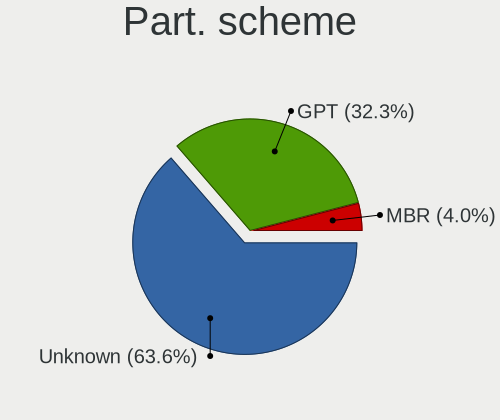
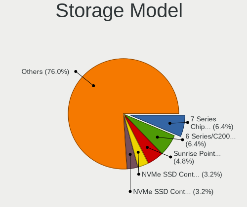
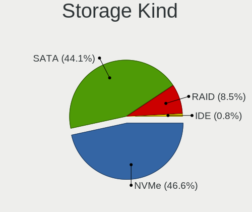
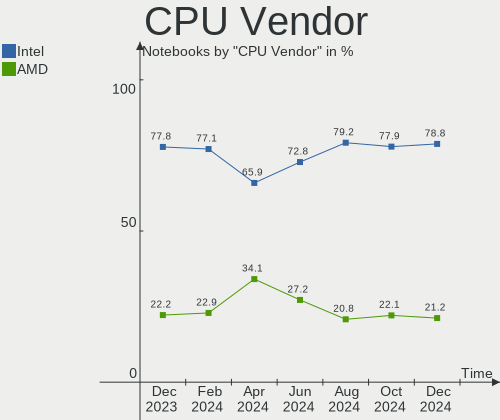
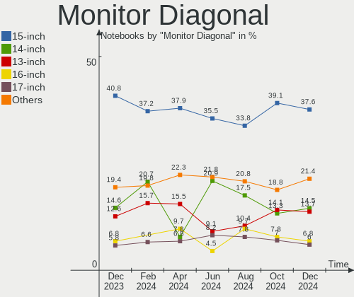
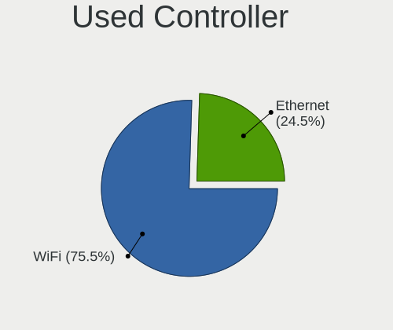
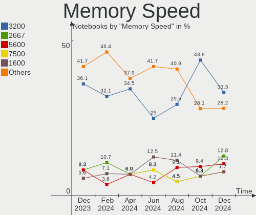

Pop!_OS Hardware Trends (Notebooks)
-----------------------------------

A project to identify most popular hardware characteristics and track their change
over time based on data collected by Pop!_OS users at https://Linux-Hardware.org.

Anyone can contribute to this report by the [hw-probe](https://github.com/linuxhw/hw-probe) tool:

    sudo -E hw-probe -all -upload

Full-feature report is available here: https://linux-hardware.org/?view=trends&formfactor=notebook

Period: Oct, 2021.

Contents
--------

* [ System ](#system)
  - [ OS                       ](#os)
  - [ OS Family                ](#os-family)
  - [ Kernel                   ](#kernel)
  - [ Kernel Family            ](#kernel-family)
  - [ Kernel Major Ver.        ](#kernel-major-ver)
  - [ Arch                     ](#arch)
  - [ DE                       ](#de)
  - [ Display Server           ](#display-server)
  - [ Display Manager          ](#display-manager)
  - [ OS Lang                  ](#os-lang)
  - [ Boot Mode                ](#boot-mode)
  - [ Filesystem               ](#filesystem)
  - [ Part. scheme             ](#part-scheme)
  - [ Dual Boot with Linux/BSD ](#dual-boot-with-linuxbsd)
  - [ Dual Boot (Win)          ](#dual-boot-win)

* [ Board ](#board)
  - [ Vendor                   ](#vendor)
  - [ Model                    ](#model)
  - [ Model Family             ](#model-family)
  - [ MFG Year                 ](#mfg-year)
  - [ Form Factor              ](#form-factor)
  - [ Secure Boot              ](#secure-boot)
  - [ Coreboot                 ](#coreboot)
  - [ RAM Size                 ](#ram-size)
  - [ RAM Used                 ](#ram-used)
  - [ Total Drives             ](#total-drives)
  - [ Has CD-ROM               ](#has-cd-rom)
  - [ Has Ethernet             ](#has-ethernet)
  - [ Has WiFi                 ](#has-wifi)
  - [ Has Bluetooth            ](#has-bluetooth)

* [ Location ](#location)
  - [ Country                  ](#country)
  - [ City                     ](#city)

* [ Drives ](#drives)
  - [ Drive Vendor             ](#drive-vendor)
  - [ Drive Model              ](#drive-model)
  - [ HDD Vendor               ](#hdd-vendor)
  - [ SSD Vendor               ](#ssd-vendor)
  - [ Drive Kind               ](#drive-kind)
  - [ Drive Connector          ](#drive-connector)
  - [ Drive Size               ](#drive-size)
  - [ Space Total              ](#space-total)
  - [ Space Used               ](#space-used)
  - [ Malfunc. Drives          ](#malfunc-drives)
  - [ Malfunc. Drive Vendor    ](#malfunc-drive-vendor)
  - [ Malfunc. HDD Vendor      ](#malfunc-hdd-vendor)
  - [ Malfunc. Drive Kind      ](#malfunc-drive-kind)
  - [ Failed Drives            ](#failed-drives)
  - [ Failed Drive Vendor      ](#failed-drive-vendor)
  - [ Drive Status             ](#drive-status)

* [ Storage controller ](#storage-controller)
  - [ Storage Vendor           ](#storage-vendor)
  - [ Storage Model            ](#storage-model)
  - [ Storage Kind             ](#storage-kind)

* [ Processor ](#processor)
  - [ CPU Vendor               ](#cpu-vendor)
  - [ CPU Model                ](#cpu-model)
  - [ CPU Model Family         ](#cpu-model-family)
  - [ CPU Cores                ](#cpu-cores)
  - [ CPU Sockets              ](#cpu-sockets)
  - [ CPU Threads              ](#cpu-threads)
  - [ CPU Op-Modes             ](#cpu-op-modes)
  - [ CPU Microcode            ](#cpu-microcode)
  - [ CPU Microarch            ](#cpu-microarch)

* [ Graphics ](#graphics)
  - [ GPU Vendor               ](#gpu-vendor)
  - [ GPU Model                ](#gpu-model)
  - [ GPU Combo                ](#gpu-combo)
  - [ GPU Driver               ](#gpu-driver)
  - [ GPU Memory               ](#gpu-memory)

* [ Monitor ](#monitor)
  - [ Monitor Vendor           ](#monitor-vendor)
  - [ Monitor Model            ](#monitor-model)
  - [ Monitor Resolution       ](#monitor-resolution)
  - [ Monitor Diagonal         ](#monitor-diagonal)
  - [ Monitor Width            ](#monitor-width)
  - [ Aspect Ratio             ](#aspect-ratio)
  - [ Monitor Area             ](#monitor-area)
  - [ Pixel Density            ](#pixel-density)
  - [ Multiple Monitors        ](#multiple-monitors)

* [ Network ](#network)
  - [ Net Controller Vendor    ](#net-controller-vendor)
  - [ Net Controller Model     ](#net-controller-model)
  - [ Wireless Vendor          ](#wireless-vendor)
  - [ Wireless Model           ](#wireless-model)
  - [ Ethernet Vendor          ](#ethernet-vendor)
  - [ Ethernet Model           ](#ethernet-model)
  - [ Net Controller Kind      ](#net-controller-kind)
  - [ Used Controller          ](#used-controller)
  - [ NICs                     ](#nics)
  - [ IPv6                     ](#ipv6)

* [ Bluetooth ](#bluetooth)
  - [ Bluetooth Vendor         ](#bluetooth-vendor)
  - [ Bluetooth Model          ](#bluetooth-model)

* [ Sound ](#sound)
  - [ Sound Vendor             ](#sound-vendor)
  - [ Sound Model              ](#sound-model)

* [ Memory ](#memory)
  - [ Memory Vendor            ](#memory-vendor)
  - [ Memory Model             ](#memory-model)
  - [ Memory Kind              ](#memory-kind)
  - [ Memory Form Factor       ](#memory-form-factor)
  - [ Memory Size              ](#memory-size)
  - [ Memory Speed             ](#memory-speed)

* [ Printers & scanners ](#printers--scanners)
  - [ Printer Vendor           ](#printer-vendor)
  - [ Printer Model            ](#printer-model)
  - [ Scanner Vendor           ](#scanner-vendor)
  - [ Scanner Model            ](#scanner-model)

* [ Camera ](#camera)
  - [ Camera Vendor            ](#camera-vendor)
  - [ Camera Model             ](#camera-model)

* [ Security ](#security)
  - [ Fingerprint Vendor       ](#fingerprint-vendor)
  - [ Fingerprint Model        ](#fingerprint-model)
  - [ Chipcard Vendor          ](#chipcard-vendor)
  - [ Chipcard Model           ](#chipcard-model)

* [ Unsupported ](#unsupported)
  - [ Unsupported Devices      ](#unsupported-devices)
  - [ Unsupported Device Types ](#unsupported-device-types)

System
------

OS
--

Installed operating systems

| Name          | Notebooks | Percent |
|---------------|-----------|---------|
| Pop!_OS 21.04 | 174       | 87.44%  |
| Pop!_OS 20.04 | 20        | 10.05%  |
| Pop!_OS 21.10 | 3         | 1.51%   |
| Pop!_OS 20.10 | 2         | 1.01%   |

OS Family
---------

OS without a version

| Name    | Notebooks | Percent |
|---------|-----------|---------|
| Pop!_OS | 199       | 100%    |

Kernel
------

Version of the Linux kernel

| Version                    | Notebooks | Percent |
|----------------------------|-----------|---------|
| 5.13.0-7614-generic        | 171       | 85.93%  |
| 5.11.0-7620-generic        | 8         | 4.02%   |
| 5.11.0-7633-generic        | 4         | 2.01%   |
| 5.13.0-7620-generic        | 3         | 1.51%   |
| 5.8.0-7642-generic         | 1         | 0.5%    |
| 5.8.0-7630-generic         | 1         | 0.5%    |
| 5.4.0-7626-generic         | 1         | 0.5%    |
| 5.4.0-7625-generic         | 1         | 0.5%    |
| 5.14.9-xanmod1             | 1         | 0.5%    |
| 5.14.9-051409-generic      | 1         | 0.5%    |
| 5.14.7-051407-generic      | 1         | 0.5%    |
| 5.14.14-051414-generic     | 1         | 0.5%    |
| 5.14.11-xanmod1            | 1         | 0.5%    |
| 5.14.10-xanmod1            | 1         | 0.5%    |
| 5.14.10-051410-generic     | 1         | 0.5%    |
| 5.14.0-12.1-liquorix-amd64 | 1         | 0.5%    |
| 5.13.0-7619-generic        | 1         | 0.5%    |

Kernel Family
-------------

Linux kernel without a distro release

| Version | Notebooks | Percent |
|---------|-----------|---------|
| 5.13.0  | 175       | 87.94%  |
| 5.11.0  | 12        | 6.03%   |
| 5.8.0   | 2         | 1.01%   |
| 5.4.0   | 2         | 1.01%   |
| 5.14.9  | 2         | 1.01%   |
| 5.14.10 | 2         | 1.01%   |
| 5.14.7  | 1         | 0.5%    |
| 5.14.14 | 1         | 0.5%    |
| 5.14.11 | 1         | 0.5%    |
| 5.14.0  | 1         | 0.5%    |

Kernel Major Ver.
-----------------

Linux kernel major version

| Version | Notebooks | Percent |
|---------|-----------|---------|
| 5.13    | 175       | 87.94%  |
| 5.11    | 12        | 6.03%   |
| 5.14    | 8         | 4.02%   |
| 5.8     | 2         | 1.01%   |
| 5.4     | 2         | 1.01%   |

Arch
----

OS architecture (x86_64, i586, etc.)

| Name   | Notebooks | Percent |
|--------|-----------|---------|
| x86_64 | 199       | 100%    |

DE
--

Desktop Environment

| Name     | Notebooks | Percent |
|----------|-----------|---------|
| GNOME    | 194       | 97.49%  |
| KDE5     | 3         | 1.51%   |
| XFCE     | 1         | 0.5%    |
| Cinnamon | 1         | 0.5%    |

Display Server
--------------

X11 or Wayland

| Name    | Notebooks | Percent |
|---------|-----------|---------|
| X11     | 196       | 98.49%  |
| Wayland | 3         | 1.51%   |

Display Manager
---------------

SDDM, LightDM, etc.

| Name    | Notebooks | Percent |
|---------|-----------|---------|
| Unknown | 166       | 83.42%  |
| GDM     | 33        | 16.58%  |

OS Lang
-------

Language

| Lang  | Notebooks | Percent |
|-------|-----------|---------|
| en_US | 106       | 53.27%  |
| en_GB | 18        | 9.05%   |
| fr_FR | 10        | 5.03%   |
| C     | 10        | 5.03%   |
| pt_BR | 8         | 4.02%   |
| es_ES | 7         | 3.52%   |
| de_DE | 5         | 2.51%   |
| it_IT | 4         | 2.01%   |
| en_ZA | 4         | 2.01%   |
| en_CA | 4         | 2.01%   |
| pl_PL | 3         | 1.51%   |
| en_IN | 3         | 1.51%   |
| sv_SE | 2         | 1.01%   |
| ru_RU | 2         | 1.01%   |
| pt_PT | 2         | 1.01%   |
| en_AU | 2         | 1.01%   |
| sk_SK | 1         | 0.5%    |
| nl_NL | 1         | 0.5%    |
| hr_HR | 1         | 0.5%    |
| es_EC | 1         | 0.5%    |
| es_AR | 1         | 0.5%    |
| en_NZ | 1         | 0.5%    |
| de_CH | 1         | 0.5%    |
| de_AT | 1         | 0.5%    |
| cs_CZ | 1         | 0.5%    |

Boot Mode
---------

EFI or BIOS

| Mode | Notebooks | Percent |
|------|-----------|---------|
| BIOS | 168       | 84.42%  |
| EFI  | 31        | 15.58%  |

Filesystem
----------

Type of filesystem

| Type    | Notebooks | Percent |
|---------|-----------|---------|
| Ext4    | 186       | 93.47%  |
| Btrfs   | 7         | 3.52%   |
| Overlay | 6         | 3.02%   |

Part. scheme
------------

Scheme of partitioning

| Type    | Notebooks | Percent |
|---------|-----------|---------|
| Unknown | 166       | 83.42%  |
| GPT     | 31        | 15.58%  |
| MBR     | 2         | 1.01%   |

Dual Boot with Linux/BSD
------------------------

Hosting more than one Linux/BSD

| Dual boot | Notebooks | Percent |
|-----------|-----------|---------|
| No        | 197       | 98.99%  |
| Yes       | 2         | 1.01%   |

Dual Boot (Win)
---------------

Hosting Linux and Windows

| Dual boot | Notebooks | Percent |
|-----------|-----------|---------|
| No        | 186       | 93.47%  |
| Yes       | 13        | 6.53%   |

Board
-----

Vendor
------

Motherboard manufacturer

| Name                   | Notebooks | Percent |
|------------------------|-----------|---------|
| Lenovo                 | 36        | 18.09%  |
| Dell                   | 34        | 17.09%  |
| Hewlett-Packard        | 28        | 14.07%  |
| ASUSTek Computer       | 27        | 13.57%  |
| Acer                   | 15        | 7.54%   |
| Apple                  | 9         | 4.52%   |
| Samsung Electronics    | 6         | 3.02%   |
| Toshiba                | 5         | 2.51%   |
| System76               | 5         | 2.51%   |
| MSI                    | 5         | 2.51%   |
| Timi                   | 3         | 1.51%   |
| Sony                   | 3         | 1.51%   |
| Notebook               | 3         | 1.51%   |
| HUAWEI                 | 3         | 1.51%   |
| Medion                 | 2         | 1.01%   |
| Google                 | 2         | 1.01%   |
| Fujitsu Siemens        | 2         | 1.01%   |
| Alienware              | 2         | 1.01%   |
| Unknown                | 2         | 1.01%   |
| Razer                  | 1         | 0.5%    |
| PC Specialist          | 1         | 0.5%    |
| IT Channel Pty         | 1         | 0.5%    |
| HASEE Computer         | 1         | 0.5%    |
| Digibras               | 1         | 0.5%    |
| Clevo                  | 1         | 0.5%    |
| Avell High Performance | 1         | 0.5%    |

Model
-----

Motherboard model

| Name                                        | Notebooks | Percent |
|---------------------------------------------|-----------|---------|
| System76 Gazelle                            | 2         | 1.01%   |
| Samsung 340XAA/350XAA/550XAA                | 2         | 1.01%   |
| HP Pavilion dv6                             | 2         | 1.01%   |
| Dell XPS 13 9310                            | 2         | 1.01%   |
| Dell Inspiron 7520                          | 2         | 1.01%   |
| Apple MacBookPro12,1                        | 2         | 1.01%   |
| Acer Nitro AN515-45                         | 2         | 1.01%   |
| Unknown                                     | 2         | 1.01%   |
| Toshiba TECRA R950                          | 1         | 0.5%    |
| Toshiba Satellite T130                      | 1         | 0.5%    |
| Toshiba Satellite L755                      | 1         | 0.5%    |
| Toshiba Satellite L55D-B                    | 1         | 0.5%    |
| Toshiba Satellite A355                      | 1         | 0.5%    |
| Timi RedmiBook 14-APCS                      | 1         | 0.5%    |
| Timi A35S                                   | 1         | 0.5%    |
| Timi A35                                    | 1         | 0.5%    |
| System76 Lemur Pro                          | 1         | 0.5%    |
| System76 Galago Pro                         | 1         | 0.5%    |
| System76 Darter Pro                         | 1         | 0.5%    |
| Sony VPCZ13M9E                              | 1         | 0.5%    |
| Sony VPCEH40EB                              | 1         | 0.5%    |
| Sony VGN-NR38S_S                            | 1         | 0.5%    |
| Samsung QX310/QX410/QX510/SF310/SF410/SF510 | 1         | 0.5%    |
| Samsung 930XCJ/931XCJ/930XCR                | 1         | 0.5%    |
| Samsung 550XDA                              | 1         | 0.5%    |
| Samsung 550P5C/550P7C                       | 1         | 0.5%    |
| Razer Blade 14 - RZ09-0370                  | 1         | 0.5%    |
| PC Specialist NP5x_NP6x_NP7xHP              | 1         | 0.5%    |
| Notebook PB50_70RF,RD,RC                    | 1         | 0.5%    |
| Notebook P7xxTM1                            | 1         | 0.5%    |
| Notebook N95_KP6                            | 1         | 0.5%    |
| MSI MS-7C02                                 | 1         | 0.5%    |
| MSI GL63 8RD                                | 1         | 0.5%    |
| MSI GF75 Thin 10UEK                         | 1         | 0.5%    |
| MSI CX70 2QF                                | 1         | 0.5%    |
| MSI CR610                                   | 1         | 0.5%    |
| Medion X681X                                | 1         | 0.5%    |
| Medion P15648                               | 1         | 0.5%    |
| Lenovo U310                                 | 1         | 0.5%    |
| Lenovo ThinkPad X270 W10DG 20K5S1KD00       | 1         | 0.5%    |
| Lenovo ThinkPad X230 23245NG                | 1         | 0.5%    |
| Lenovo ThinkPad T61p 64575KG                | 1         | 0.5%    |
| Lenovo ThinkPad T530 2429BT7                | 1         | 0.5%    |
| Lenovo ThinkPad T480 20L6SCWK00             | 1         | 0.5%    |
| Lenovo ThinkPad T470 20HEA0TLUK             | 1         | 0.5%    |
| Lenovo ThinkPad T440p 20AWS12002            | 1         | 0.5%    |
| Lenovo ThinkPad T440 20B7S1XU00             | 1         | 0.5%    |
| Lenovo ThinkPad T430 2349U15                | 1         | 0.5%    |
| Lenovo ThinkPad T430 2349H2G                | 1         | 0.5%    |
| Lenovo ThinkPad T420 4236A71                | 1         | 0.5%    |
| Lenovo ThinkPad P50 20EQS10T00              | 1         | 0.5%    |
| Lenovo ThinkPad Edge E530 32597CU           | 1         | 0.5%    |
| Lenovo ThinkPad E490 20N8005JMH             | 1         | 0.5%    |
| Lenovo ThinkPad E15 Gen 3 20YGCTO1WW        | 1         | 0.5%    |
| Lenovo ThinkPad E14 Gen 2 20T60022US        | 1         | 0.5%    |
| Lenovo ThinkBook 15 G3 ACL 21A4             | 1         | 0.5%    |
| Lenovo Legion 5 Pro 16ACH6H 82JQ            | 1         | 0.5%    |
| Lenovo Legion 5 15IMH05 82AU                | 1         | 0.5%    |
| Lenovo Legion 5 15ARH05 82B5                | 1         | 0.5%    |
| Lenovo Legion 5 15ACH6H 82JU                | 1         | 0.5%    |

Model Family
------------

Motherboard model prefix

| Name                  | Notebooks | Percent |
|-----------------------|-----------|---------|
| Lenovo ThinkPad       | 16        | 8.04%   |
| Dell Inspiron         | 13        | 6.53%   |
| Lenovo IdeaPad        | 12        | 6.03%   |
| HP Pavilion           | 12        | 6.03%   |
| Dell Latitude         | 9         | 4.52%   |
| Acer Aspire           | 9         | 4.52%   |
| Dell XPS              | 7         | 3.52%   |
| Lenovo Legion         | 5         | 2.51%   |
| ASUS ROG              | 5         | 2.51%   |
| Toshiba Satellite     | 4         | 2.01%   |
| HP Laptop             | 3         | 1.51%   |
| ASUS ASUS             | 3         | 1.51%   |
| Acer Nitro            | 3         | 1.51%   |
| System76 Gazelle      | 2         | 1.01%   |
| Samsung 340XAA        | 2         | 1.01%   |
| HP EliteBook          | 2         | 1.01%   |
| Fujitsu Siemens AMILO | 2         | 1.01%   |
| ASUS VivoBook         | 2         | 1.01%   |
| ASUS TUF              | 2         | 1.01%   |
| Apple MacBookPro9     | 2         | 1.01%   |
| Apple MacBookPro12    | 2         | 1.01%   |
| Apple MacBookPro11    | 2         | 1.01%   |
| Unknown               | 2         | 1.01%   |
| Toshiba TECRA         | 1         | 0.5%    |
| Timi RedmiBook        | 1         | 0.5%    |
| Timi A35S             | 1         | 0.5%    |
| Timi A35              | 1         | 0.5%    |
| System76 Lemur        | 1         | 0.5%    |
| System76 Galago       | 1         | 0.5%    |
| System76 Darter       | 1         | 0.5%    |
| Sony VPCZ13M9E        | 1         | 0.5%    |
| Sony VPCEH40EB        | 1         | 0.5%    |
| Sony VGN-NR38S        | 1         | 0.5%    |
| Samsung QX310         | 1         | 0.5%    |
| Samsung 930XCJ        | 1         | 0.5%    |
| Samsung 550XDA        | 1         | 0.5%    |
| Samsung 550P5C        | 1         | 0.5%    |
| Razer Blade           | 1         | 0.5%    |
| PC Specialist NP5x    | 1         | 0.5%    |
| Notebook PB50         | 1         | 0.5%    |
| Notebook P7xxTM1      | 1         | 0.5%    |
| Notebook N95          | 1         | 0.5%    |
| MSI MS-7C02           | 1         | 0.5%    |
| MSI GL63              | 1         | 0.5%    |
| MSI GF75              | 1         | 0.5%    |
| MSI CX70              | 1         | 0.5%    |
| MSI CR610             | 1         | 0.5%    |
| Medion X681X          | 1         | 0.5%    |
| Medion P15648         | 1         | 0.5%    |
| Lenovo U310           | 1         | 0.5%    |
| Lenovo ThinkBook      | 1         | 0.5%    |
| Lenovo G500           | 1         | 0.5%    |
| IT Channel Pty PCX0DX | 1         | 0.5%    |
| HUAWEI NBLK-WAX9X     | 1         | 0.5%    |
| HUAWEI MACHD-WXX9     | 1         | 0.5%    |
| HUAWEI HBL-WX9        | 1         | 0.5%    |
| HP ZBook              | 1         | 0.5%    |
| HP ProBook            | 1         | 0.5%    |
| HP Presario           | 1         | 0.5%    |
| HP OMEN               | 1         | 0.5%    |

MFG Year
--------

Motherboard manufacture year

| Year | Notebooks | Percent |
|------|-----------|---------|
| 2021 | 63        | 31.66%  |
| 2019 | 23        | 11.56%  |
| 2020 | 20        | 10.05%  |
| 2018 | 18        | 9.05%   |
| 2012 | 10        | 5.03%   |
| 2011 | 10        | 5.03%   |
| 2016 | 9         | 4.52%   |
| 2013 | 9         | 4.52%   |
| 2017 | 8         | 4.02%   |
| 2015 | 8         | 4.02%   |
| 2014 | 7         | 3.52%   |
| 2010 | 6         | 3.02%   |
| 2009 | 4         | 2.01%   |
| 2008 | 3         | 1.51%   |
| 2007 | 1         | 0.5%    |

Form Factor
-----------

Physical design of the computer

| Name     | Notebooks | Percent |
|----------|-----------|---------|
| Notebook | 199       | 100%    |

Secure Boot
-----------

Enabled or disabled

| State    | Notebooks | Percent |
|----------|-----------|---------|
| Disabled | 199       | 100%    |

Coreboot
--------

Have coreboot on board

| Used | Notebooks | Percent |
|------|-----------|---------|
| No   | 195       | 97.99%  |
| Yes  | 4         | 2.01%   |

RAM Size
--------

Total RAM memory

| Size in GB  | Notebooks | Percent |
|-------------|-----------|---------|
| 4.01-8.0    | 66        | 33.17%  |
| 8.01-16.0   | 42        | 21.11%  |
| 16.01-24.0  | 36        | 18.09%  |
| 3.01-4.0    | 31        | 15.58%  |
| 32.01-64.0  | 15        | 7.54%   |
| 24.01-32.0  | 3         | 1.51%   |
| 64.01-256.0 | 3         | 1.51%   |
| 1.01-2.0    | 3         | 1.51%   |

RAM Used
--------

Used RAM memory

| Used GB   | Notebooks | Percent |
|-----------|-----------|---------|
| 1.01-2.0  | 66        | 33.17%  |
| 2.01-3.0  | 63        | 31.66%  |
| 3.01-4.0  | 34        | 17.09%  |
| 4.01-8.0  | 24        | 12.06%  |
| 8.01-16.0 | 11        | 5.53%   |
| 0.51-1.0  | 1         | 0.5%    |

Total Drives
------------

Number of drives on board

| Drives | Notebooks | Percent |
|--------|-----------|---------|
| 1      | 132       | 66.33%  |
| 2      | 54        | 27.14%  |
| 3      | 10        | 5.03%   |
| 0      | 2         | 1.01%   |
| 4      | 1         | 0.5%    |

Has CD-ROM
----------

Has CD-ROM on board

| Presented | Notebooks | Percent |
|-----------|-----------|---------|
| No        | 134       | 67.34%  |
| Yes       | 65        | 32.66%  |

Has Ethernet
------------

Has Ethernet on board

| Presented | Notebooks | Percent |
|-----------|-----------|---------|
| Yes       | 156       | 78.39%  |
| No        | 43        | 21.61%  |

Has WiFi
--------

Has WiFi module

| Presented | Notebooks | Percent |
|-----------|-----------|---------|
| Yes       | 193       | 96.98%  |
| No        | 6         | 3.02%   |

Has Bluetooth
-------------

Has Bluetooth module

| Presented | Notebooks | Percent |
|-----------|-----------|---------|
| Yes       | 164       | 82.41%  |
| No        | 35        | 17.59%  |

Location
--------

Country
-------

Geographic location (country)

| Country                | Notebooks | Percent |
|------------------------|-----------|---------|
| USA                    | 49        | 24.62%  |
| UK                     | 14        | 7.04%   |
| Brazil                 | 13        | 6.53%   |
| France                 | 10        | 5.03%   |
| Canada                 | 10        | 5.03%   |
| India                  | 9         | 4.52%   |
| Italy                  | 7         | 3.52%   |
| Germany                | 7         | 3.52%   |
| South Africa           | 6         | 3.02%   |
| Netherlands            | 6         | 3.02%   |
| Poland                 | 5         | 2.51%   |
| Sweden                 | 4         | 2.01%   |
| Spain                  | 4         | 2.01%   |
| Russia                 | 3         | 1.51%   |
| Romania                | 3         | 1.51%   |
| Philippines            | 3         | 1.51%   |
| Australia              | 3         | 1.51%   |
| Switzerland            | 2         | 1.01%   |
| Slovenia               | 2         | 1.01%   |
| Portugal               | 2         | 1.01%   |
| Mexico                 | 2         | 1.01%   |
| Malaysia               | 2         | 1.01%   |
| Hong Kong              | 2         | 1.01%   |
| Ecuador                | 2         | 1.01%   |
| Bosnia and Herzegovina | 2         | 1.01%   |
| Belgium                | 2         | 1.01%   |
| Austria                | 2         | 1.01%   |
| Vietnam                | 1         | 0.5%    |
| Slovakia               | 1         | 0.5%    |
| Saudi Arabia           | 1         | 0.5%    |
| Norway                 | 1         | 0.5%    |
| North Macedonia        | 1         | 0.5%    |
| New Zealand            | 1         | 0.5%    |
| Namibia                | 1         | 0.5%    |
| Lithuania              | 1         | 0.5%    |
| Latvia                 | 1         | 0.5%    |
| Japan                  | 1         | 0.5%    |
| Israel                 | 1         | 0.5%    |
| Ireland                | 1         | 0.5%    |
| Indonesia              | 1         | 0.5%    |
| Iceland                | 1         | 0.5%    |
| Hungary                | 1         | 0.5%    |
| El Salvador            | 1         | 0.5%    |
| Dominican Republic     | 1         | 0.5%    |
| Denmark                | 1         | 0.5%    |
| Czechia                | 1         | 0.5%    |
| Cuba                   | 1         | 0.5%    |
| Croatia                | 1         | 0.5%    |
| Bolivia                | 1         | 0.5%    |
| Argentina              | 1         | 0.5%    |

City
----

Geographic location (city)

| City                 | Notebooks | Percent |
|----------------------|-----------|---------|
| S??o Paulo           | 3         | 1.51%   |
| Johannesburg         | 3         | 1.51%   |
| Washington           | 2         | 1.01%   |
| Vienna               | 2         | 1.01%   |
| Salt Lake City       | 2         | 1.01%   |
| Quito                | 2         | 1.01%   |
| Osasco               | 2         | 1.01%   |
| Milan                | 2         | 1.01%   |
| Mexico City          | 2         | 1.01%   |
| Los Angeles          | 2         | 1.01%   |
| Ljubljana            | 2         | 1.01%   |
| Chennai              | 2         | 1.01%   |
| Bucharest            | 2         | 1.01%   |
| Berwick-Upon-Tweed   | 2         | 1.01%   |
| Austin               | 2         | 1.01%   |
| Amsterdam            | 2         | 1.01%   |
| Zagreb               | 1         | 0.5%    |
| Wroclaw              | 1         | 0.5%    |
| Wisconsin Dells      | 1         | 0.5%    |
| Windhoek             | 1         | 0.5%    |
| Westlake             | 1         | 0.5%    |
| Waynesboro           | 1         | 0.5%    |
| Waterloo             | 1         | 0.5%    |
| Wasaga Beach         | 1         | 0.5%    |
| Warsaw               | 1         | 0.5%    |
| Wardha               | 1         | 0.5%    |
| Visoko               | 1         | 0.5%    |
| Virginopolis         | 1         | 0.5%    |
| Vancouver            | 1         | 0.5%    |
| Valla                | 1         | 0.5%    |
| Utrecht              | 1         | 0.5%    |
| Union City           | 1         | 0.5%    |
| Ume??                | 1         | 0.5%    |
| Tuchola              | 1         | 0.5%    |
| Tolyatti             | 1         | 0.5%    |
| Thunder Bay          | 1         | 0.5%    |
| Thrissur             | 1         | 0.5%    |
| Thrapston            | 1         | 0.5%    |
| Teufen AR            | 1         | 0.5%    |
| Szeged               | 1         | 0.5%    |
| Sydney               | 1         | 0.5%    |
| Surabaya             | 1         | 0.5%    |
| Straussfurt          | 1         | 0.5%    |
| St. Thomas           | 1         | 0.5%    |
| St. Petersburg       | 1         | 0.5%    |
| St Louis             | 1         | 0.5%    |
| St Albans            | 1         | 0.5%    |
| Srinagar             | 1         | 0.5%    |
| Spanish Fork         | 1         | 0.5%    |
| Solingen             | 1         | 0.5%    |
| Skopje               | 1         | 0.5%    |
| Shah Alam            | 1         | 0.5%    |
| Seveso               | 1         | 0.5%    |
| Sassenheim           | 1         | 0.5%    |
| Saratov              | 1         | 0.5%    |
| Sao Lourenco da Mata | 1         | 0.5%    |
| Sao Jose do Inhacora | 1         | 0.5%    |
| Sao Domingos de Rana | 1         | 0.5%    |
| Santo Domingo Este   | 1         | 0.5%    |
| Santa Rosa           | 1         | 0.5%    |

Drives
------

Drive Vendor
------------

Hard drive vendors

| Vendor                    | Notebooks | Drives | Percent |
|---------------------------|-----------|--------|---------|
| Samsung Electronics       | 45        | 50     | 17.51%  |
| WDC                       | 30        | 30     | 11.67%  |
| Seagate                   | 28        | 28     | 10.89%  |
| Sandisk                   | 22        | 22     | 8.56%   |
| Toshiba                   | 17        | 19     | 6.61%   |
| Kingston                  | 14        | 15     | 5.45%   |
| Unknown                   | 12        | 13     | 4.67%   |
| SK Hynix                  | 12        | 12     | 4.67%   |
| Micron Technology         | 10        | 11     | 3.89%   |
| Apple                     | 8         | 9      | 3.11%   |
| HGST                      | 7         | 8      | 2.72%   |
| Crucial                   | 6         | 6      | 2.33%   |
| Intel                     | 5         | 5      | 1.95%   |
| Hitachi                   | 5         | 5      | 1.95%   |
| Phison                    | 3         | 3      | 1.17%   |
| KIOXIA                    | 3         | 3      | 1.17%   |
| A-DATA Technology         | 3         | 3      | 1.17%   |
| XPG                       | 2         | 3      | 0.78%   |
| Transcend                 | 2         | 2      | 0.78%   |
| Micron/Crucial Technology | 2         | 2      | 0.78%   |
| LITEONIT                  | 2         | 2      | 0.78%   |
| Vaseky                    | 1         | 1      | 0.39%   |
| Union Memory (Shenzhen)   | 1         | 1      | 0.39%   |
| TO Exter                  | 1         | 1      | 0.39%   |
| Team                      | 1         | 1      | 0.39%   |
| StoreJet                  | 1         | 1      | 0.39%   |
| Silicon Motion            | 1         | 1      | 0.39%   |
| PLEXTOR                   | 1         | 1      | 0.39%   |
| Mushkin                   | 1         | 1      | 0.39%   |
| LITEON                    | 1         | 1      | 0.39%   |
| KIOXIA-EXCERIA            | 1         | 1      | 0.39%   |
| JMicron                   | 1         | 1      | 0.39%   |
| Hewlett-Packard           | 1         | 1      | 0.39%   |
| GOODRAM                   | 1         | 1      | 0.39%   |
| Gigabyte Technology       | 1         | 1      | 0.39%   |
| Fujitsu                   | 1         | 1      | 0.39%   |
| Dogfish                   | 1         | 1      | 0.39%   |
| Colorful                  | 1         | 1      | 0.39%   |
| China                     | 1         | 1      | 0.39%   |
| Unknown                   | 1         | 1      | 0.39%   |

Drive Model
-----------

Hard drive models

| Model                                  | Notebooks | Percent |
|----------------------------------------|-----------|---------|
| Sandisk NVMe SSD Drive 512GB           | 7         | 2.65%   |
| Samsung NVMe SSD Drive 256GB           | 6         | 2.27%   |
| Toshiba MQ04ABF100 1TB                 | 5         | 1.89%   |
| Samsung NVMe SSD Drive 1TB             | 5         | 1.89%   |
| Unknown MMC Card  128GB                | 4         | 1.52%   |
| SK Hynix NVMe SSD Drive 512GB          | 4         | 1.52%   |
| Samsung PM963 2.5" NVMe PCIe SSD 512GB | 4         | 1.52%   |
| WDC WD10JPVX-22JC3T0 1TB               | 3         | 1.14%   |
| Unknown MMC Card  16GB                 | 3         | 1.14%   |
| Toshiba NVMe SSD Drive 512GB           | 3         | 1.14%   |
| SK Hynix NVMe SSD Drive 256GB          | 3         | 1.14%   |
| Seagate ST1000LM035-1RK172 1TB         | 3         | 1.14%   |
| Samsung SSD 850 EVO 250GB              | 3         | 1.14%   |
| Samsung NVMe SSD Drive 500GB           | 3         | 1.14%   |
| Micron NVMe SSD Drive 512GB            | 3         | 1.14%   |
| Kingston SA400S37240G 240GB SSD        | 3         | 1.14%   |
| XPG NVMe SSD Drive 2TB                 | 2         | 0.76%   |
| WDC WDS240G2G0A-00JH30 240GB SSD       | 2         | 0.76%   |
| WDC WD5000LPVX-75V0TT0 500GB           | 2         | 0.76%   |
| WDC WD10JPVX-75JC3T0 1TB               | 2         | 0.76%   |
| SK Hynix NVMe SSD Drive 1024GB         | 2         | 0.76%   |
| Seagate ST9750420AS 752GB              | 2         | 0.76%   |
| Seagate ST9500325AS 500GB              | 2         | 0.76%   |
| Seagate ST2000LX001-1RG174 2TB         | 2         | 0.76%   |
| Seagate ST2000LM007-1R8174 2TB         | 2         | 0.76%   |
| Seagate ST1000LX015-1U7172 1TB         | 2         | 0.76%   |
| Seagate ST1000LM024 HN-M101MBB 1TB     | 2         | 0.76%   |
| Seagate ST1000LM014-SSHD-8GB           | 2         | 0.76%   |
| SanDisk SSD PLUS 240GB                 | 2         | 0.76%   |
| Sandisk NVMe SSD Drive 256GB           | 2         | 0.76%   |
| Sandisk NVMe SSD Drive 1024GB          | 2         | 0.76%   |
| Samsung SSD 850 EVO 500GB              | 2         | 0.76%   |
| Phison NVMe SSD Drive 1024GB           | 2         | 0.76%   |
| Micron NVMe SSD Drive 256GB            | 2         | 0.76%   |
| KIOXIA KBG40ZNV512G 512GB              | 2         | 0.76%   |
| Kingston NVMe SSD Drive 512GB          | 2         | 0.76%   |
| Intel NVMe SSD Drive 512GB             | 2         | 0.76%   |
| HGST HTS721010A9E630 1TB               | 2         | 0.76%   |
| HGST HTS545050A7E680 500GB             | 2         | 0.76%   |
| Apple SSD SM0128G 121GB                | 2         | 0.76%   |
| A-DATA SU630 240GB SSD                 | 2         | 0.76%   |
| WDC WDS500G2B0C-00PXH0 500GB           | 1         | 0.38%   |
| WDC WDS250G1B0A-00H9H0 250GB SSD       | 1         | 0.38%   |
| WDC WDS240G2G0B-00EPW0 240GB SSD       | 1         | 0.38%   |
| WDC WD7500BPVT-24HXZT3 752GB           | 1         | 0.38%   |
| WDC WD6400BPVT-80HXZT1 640GB           | 1         | 0.38%   |
| WDC WD5000LPVX-22V0TT0 500GB           | 1         | 0.38%   |
| WDC WD2500BEVT-60A23T0 250GB           | 1         | 0.38%   |
| WDC WD1600BEVS-00RST0 160GB            | 1         | 0.38%   |
| WDC WD10SPZX-75Z10T3 1TB               | 1         | 0.38%   |
| WDC WD10SPZX-24Z10 1TB                 | 1         | 0.38%   |
| WDC WD10SPZX-17Z10T1 1TB               | 1         | 0.38%   |
| WDC WD10SPZX-08Z10 1TB                 | 1         | 0.38%   |
| WDC WD10JPLX-00MBPT0 1TB               | 1         | 0.38%   |
| WDC WD10JPCX-24UE4T0 1TB               | 1         | 0.38%   |
| WDC WD easystore 480GB                 | 1         | 0.38%   |
| WDC PC SN730 NVMe 1024GB               | 1         | 0.38%   |
| WDC PC SN530 SDBPTPZ-1T00-1002 1TB     | 1         | 0.38%   |
| WDC PC SN530 SDBPNPZ-512G-1006 512GB   | 1         | 0.38%   |
| WDC PC SN530 SDBPNPZ-512G-1002 512GB   | 1         | 0.38%   |

HDD Vendor
----------

Hard disk drive vendors

| Vendor              | Notebooks | Drives | Percent |
|---------------------|-----------|--------|---------|
| Seagate             | 28        | 28     | 37.33%  |
| WDC                 | 18        | 18     | 24%     |
| Toshiba             | 12        | 12     | 16%     |
| HGST                | 7         | 8      | 9.33%   |
| Hitachi             | 5         | 5      | 6.67%   |
| TO Exter            | 1         | 1      | 1.33%   |
| Samsung Electronics | 1         | 1      | 1.33%   |
| JMicron             | 1         | 1      | 1.33%   |
| Fujitsu             | 1         | 1      | 1.33%   |
| Apple               | 1         | 1      | 1.33%   |

SSD Vendor
----------

Solid state drive vendors

| Vendor              | Notebooks | Drives | Percent |
|---------------------|-----------|--------|---------|
| Samsung Electronics | 19        | 20     | 24.05%  |
| SanDisk             | 10        | 10     | 12.66%  |
| Kingston            | 10        | 10     | 12.66%  |
| Crucial             | 6         | 6      | 7.59%   |
| Apple               | 5         | 5      | 6.33%   |
| WDC                 | 4         | 4      | 5.06%   |
| A-DATA Technology   | 3         | 3      | 3.8%    |
| Transcend           | 2         | 2      | 2.53%   |
| LITEONIT            | 2         | 2      | 2.53%   |
| Vaseky              | 1         | 1      | 1.27%   |
| Toshiba             | 1         | 2      | 1.27%   |
| Team                | 1         | 1      | 1.27%   |
| StoreJet            | 1         | 1      | 1.27%   |
| SK Hynix            | 1         | 1      | 1.27%   |
| PLEXTOR             | 1         | 1      | 1.27%   |
| Phison              | 1         | 1      | 1.27%   |
| Mushkin             | 1         | 1      | 1.27%   |
| Micron Technology   | 1         | 1      | 1.27%   |
| LITEON              | 1         | 1      | 1.27%   |
| KIOXIA-EXCERIA      | 1         | 1      | 1.27%   |
| Intel               | 1         | 1      | 1.27%   |
| Hewlett-Packard     | 1         | 1      | 1.27%   |
| GOODRAM             | 1         | 1      | 1.27%   |
| Gigabyte Technology | 1         | 1      | 1.27%   |
| Dogfish             | 1         | 1      | 1.27%   |
| Colorful            | 1         | 1      | 1.27%   |
| China               | 1         | 1      | 1.27%   |

Drive Kind
----------

HDD or SSD

| Kind    | Notebooks | Drives | Percent |
|---------|-----------|--------|---------|
| NVMe    | 87        | 98     | 35.66%  |
| SSD     | 74        | 81     | 30.33%  |
| HDD     | 70        | 76     | 28.69%  |
| MMC     | 11        | 13     | 4.51%   |
| Unknown | 2         | 2      | 0.82%   |

Drive Connector
---------------

SATA, SAS, NVMe, etc.

| Type | Notebooks | Drives | Percent |
|------|-----------|--------|---------|
| SATA | 124       | 153    | 54.39%  |
| NVMe | 87        | 98     | 38.16%  |
| MMC  | 11        | 13     | 4.82%   |
| SAS  | 6         | 6      | 2.63%   |

Drive Size
----------

Size of hard drive

| Size in TB | Notebooks | Drives | Percent |
|------------|-----------|--------|---------|
| 0.01-0.5   | 92        | 101    | 63.45%  |
| 0.51-1.0   | 48        | 51     | 33.1%   |
| 1.01-2.0   | 5         | 5      | 3.45%   |

Space Total
-----------

Amount of disk space available on the file system

| Size in GB     | Notebooks | Percent |
|----------------|-----------|---------|
| 101-250        | 74        | 37.19%  |
| 251-500        | 47        | 23.62%  |
| 501-1000       | 39        | 19.6%   |
| 1001-2000      | 14        | 7.04%   |
| 1-20           | 9         | 4.52%   |
| 51-100         | 9         | 4.52%   |
| 21-50          | 4         | 2.01%   |
| 2001-3000      | 2         | 1.01%   |
| More than 3000 | 1         | 0.5%    |

Space Used
----------

Amount of used disk space

| Used GB   | Notebooks | Percent |
|-----------|-----------|---------|
| 1-20      | 83        | 41.71%  |
| 21-50     | 46        | 23.12%  |
| 101-250   | 27        | 13.57%  |
| 51-100    | 23        | 11.56%  |
| 251-500   | 10        | 5.03%   |
| 501-1000  | 9         | 4.52%   |
| 2001-3000 | 1         | 0.5%    |

Malfunc. Drives
---------------

Drive models with a malfunction

| Model                                   | Notebooks | Drives | Percent |
|-----------------------------------------|-----------|--------|---------|
| WDC WD10JPCX-24UE4T0 1TB                | 1         | 1      | 16.67%  |
| Seagate ST9750420AS 752GB               | 1         | 1      | 16.67%  |
| Seagate ST500LT012-9WS142 500GB         | 1         | 1      | 16.67%  |
| Seagate ST1000LM035-1RK172 1TB          | 1         | 1      | 16.67%  |
| Kingston RBU-SNS8350DES3128GP 128GB SSD | 1         | 1      | 16.67%  |
| HGST HTS725050A7E630 500GB              | 1         | 2      | 16.67%  |

Malfunc. Drive Vendor
---------------------

Vendors of faulty drives

| Vendor   | Notebooks | Drives | Percent |
|----------|-----------|--------|---------|
| Seagate  | 3         | 3      | 50%     |
| WDC      | 1         | 1      | 16.67%  |
| Kingston | 1         | 1      | 16.67%  |
| HGST     | 1         | 2      | 16.67%  |

Malfunc. HDD Vendor
-------------------

Vendors of faulty HDD drives

| Vendor  | Notebooks | Drives | Percent |
|---------|-----------|--------|---------|
| Seagate | 3         | 3      | 60%     |
| WDC     | 1         | 1      | 20%     |
| HGST    | 1         | 2      | 20%     |

Malfunc. Drive Kind
-------------------

Kinds of faulty drives

| Kind | Notebooks | Drives | Percent |
|------|-----------|--------|---------|
| HDD  | 5         | 6      | 83.33%  |
| SSD  | 1         | 1      | 16.67%  |

Failed Drives
-------------

Failed drive models

Zero info for selected period =(

Failed Drive Vendor
-------------------

Failed drive vendors

Zero info for selected period =(

Drive Status
------------

Number of failed and malfunc. drives

| Status   | Notebooks | Drives | Percent |
|----------|-----------|--------|---------|
| Detected | 169       | 221    | 81.64%  |
| Works    | 32        | 42     | 15.46%  |
| Malfunc  | 6         | 7      | 2.9%    |

Storage controller
------------------

Storage Vendor
--------------

Storage controller vendors

| Vendor                       | Notebooks | Percent |
|------------------------------|-----------|---------|
| Intel                        | 135       | 52.94%  |
| Samsung Electronics          | 31        | 12.16%  |
| AMD                          | 27        | 10.59%  |
| Sandisk                      | 19        | 7.45%   |
| SK Hynix                     | 11        | 4.31%   |
| Micron Technology            | 9         | 3.53%   |
| Toshiba America Info Systems | 5         | 1.96%   |
| Kingston Technology Company  | 4         | 1.57%   |
| KIOXIA                       | 3         | 1.18%   |
| Phison Electronics           | 2         | 0.78%   |
| Micron/Crucial Technology    | 2         | 0.78%   |
| Apple                        | 2         | 0.78%   |
| ADATA Technology             | 2         | 0.78%   |
| Union Memory (Shenzhen)      | 1         | 0.39%   |
| Silicon Motion               | 1         | 0.39%   |
| Nvidia                       | 1         | 0.39%   |

Storage Model
-------------

Storage controller models

| Model                                                                            | Notebooks | Percent |
|----------------------------------------------------------------------------------|-----------|---------|
| AMD FCH SATA Controller [AHCI mode]                                              | 24        | 9.09%   |
| Samsung NVMe SSD Controller SM981/PM981/PM983                                    | 19        | 7.2%    |
| Intel 7 Series Chipset Family 6-port SATA Controller [AHCI mode]                 | 16        | 6.06%   |
| Intel Sunrise Point-LP SATA Controller [AHCI mode]                               | 15        | 5.68%   |
| Intel 82801 Mobile SATA Controller [RAID mode]                                   | 14        | 5.3%    |
| Intel 6 Series/C200 Series Chipset Family 6 port Mobile SATA AHCI Controller     | 14        | 5.3%    |
| Intel Cannon Lake Mobile PCH SATA AHCI Controller                                | 11        | 4.17%   |
| Micron Non-Volatile memory controller                                            | 9         | 3.41%   |
| Intel 82801IBM/IEM (ICH9M/ICH9M-E) 4 port SATA Controller [AHCI mode]            | 7         | 2.65%   |
| Sandisk WD Blue SN550 NVMe SSD                                                   | 6         | 2.27%   |
| SK Hynix Gold P31 SSD                                                            | 5         | 1.89%   |
| Sandisk WD Black SN750 / PC SN730 NVMe SSD                                       | 5         | 1.89%   |
| Sandisk Non-Volatile memory controller                                           | 5         | 1.89%   |
| Intel Volume Management Device NVMe RAID Controller                              | 5         | 1.89%   |
| Intel HM170/QM170 Chipset SATA Controller [AHCI Mode]                            | 5         | 1.89%   |
| Intel 8 Series/C220 Series Chipset Family 6-port SATA Controller 1 [AHCI mode]   | 5         | 1.89%   |
| Intel 8 Series SATA Controller 1 [AHCI mode]                                     | 5         | 1.89%   |
| Intel 400 Series Chipset Family SATA AHCI Controller                             | 4         | 1.52%   |
| Sandisk PC SN520 NVMe SSD                                                        | 3         | 1.14%   |
| Samsung NVMe SSD Controller 980                                                  | 3         | 1.14%   |
| Samsung Electronics SATA controller                                              | 3         | 1.14%   |
| KIOXIA Non-Volatile memory controller                                            | 3         | 1.14%   |
| Intel Wildcat Point-LP SATA Controller [AHCI Mode]                               | 3         | 1.14%   |
| Intel Tiger Lake-LP SATA Controller [AHCI mode]                                  | 3         | 1.14%   |
| Intel Q170/Q150/B150/H170/H110/Z170/CM236 Chipset SATA Controller [AHCI Mode]    | 3         | 1.14%   |
| Intel Cannon Point-LP SATA Controller [AHCI Mode]                                | 3         | 1.14%   |
| Intel Atom/Celeron/Pentium Processor x5-E8000/J3xxx/N3xxx Series SATA Controller | 3         | 1.14%   |
| Intel 5 Series/3400 Series Chipset 6 port SATA AHCI Controller                   | 3         | 1.14%   |
| Intel 5 Series/3400 Series Chipset 4 port SATA AHCI Controller                   | 3         | 1.14%   |
| Toshiba America Info Systems XG6 NVMe SSD Controller                             | 2         | 0.76%   |
| SK Hynix PC401 NVMe Solid State Drive 256GB                                      | 2         | 0.76%   |
| SK Hynix BC501 NVMe Solid State Drive                                            | 2         | 0.76%   |
| Samsung NVMe SSD Controller SM961/PM961/SM963                                    | 2         | 0.76%   |
| Samsung NVMe SSD Controller PM9A1/PM9A3/980PRO                                   | 2         | 0.76%   |
| Samsung Apple PCIe SSD                                                           | 2         | 0.76%   |
| Kingston Company A2000 NVMe SSD                                                  | 2         | 0.76%   |
| Intel SSD 660P Series                                                            | 2         | 0.76%   |
| Intel Comet Lake SATA AHCI Controller                                            | 2         | 0.76%   |
| Intel 82801HM/HEM (ICH8M/ICH8M-E) SATA Controller [AHCI mode]                    | 2         | 0.76%   |
| Intel 82801HM/HEM (ICH8M/ICH8M-E) IDE Controller                                 | 2         | 0.76%   |
| Intel 500 Series Chipset Family SATA AHCI Controller                             | 2         | 0.76%   |
| Intel 200 Series PCH SATA controller [AHCI mode]                                 | 2         | 0.76%   |
| AMD SB7x0/SB8x0/SB9x0 SATA Controller [AHCI mode]                                | 2         | 0.76%   |
| ADATA XPG SX8200 Pro PCIe Gen3x4 M.2 2280 Solid State Drive                      | 2         | 0.76%   |
| Union Memory (Shenzhen) Non-Volatile memory controller                           | 1         | 0.38%   |
| Toshiba America Info Systems XG4 NVMe SSD Controller                             | 1         | 0.38%   |
| Toshiba America Info Systems Toshiba America Info Non-Volatile memory controller | 1         | 0.38%   |
| Toshiba America Info Systems BG3 NVMe SSD Controller                             | 1         | 0.38%   |
| SK Hynix PC300 NVMe Solid State Drive 256GB                                      | 1         | 0.38%   |
| SK Hynix Non-Volatile memory controller                                          | 1         | 0.38%   |
| Silicon Motion SM2263EN/SM2263XT SSD Controller                                  | 1         | 0.38%   |
| Phison PS5013 E13 NVMe Controller                                                | 1         | 0.38%   |
| Phison E12 NVMe Controller                                                       | 1         | 0.38%   |
| Nvidia MCP51 Serial ATA Controller                                               | 1         | 0.38%   |
| Nvidia MCP51 IDE                                                                 | 1         | 0.38%   |
| Micron/Crucial P2 NVMe PCIe SSD                                                  | 1         | 0.38%   |
| Micron/Crucial Non-Volatile memory controller                                    | 1         | 0.38%   |
| Kingston Company Company Non-Volatile memory controller                          | 1         | 0.38%   |
| Kingston Company OM3PDP3 NVMe SSD                                                | 1         | 0.38%   |
| Intel SSD 600P Series                                                            | 1         | 0.38%   |

Storage Kind
------------

Kind of storage controller (IDE, SATA, NVMe, SAS, ...)

| Kind | Notebooks | Percent |
|------|-----------|---------|
| SATA | 144       | 56.25%  |
| NVMe | 86        | 33.59%  |
| RAID | 19        | 7.42%   |
| IDE  | 7         | 2.73%   |

Processor
---------

CPU Vendor
----------

Processor vendors

| Vendor | Notebooks | Percent |
|--------|-----------|---------|
| Intel  | 158       | 79.4%   |
| AMD    | 41        | 20.6%   |

CPU Model
---------

Processor models

| Model                                         | Notebooks | Percent |
|-----------------------------------------------|-----------|---------|
| AMD Ryzen 7 5800H with Radeon Graphics        | 6         | 3.02%   |
| Intel Core i7-9750H CPU @ 2.60GHz             | 5         | 2.51%   |
| Intel Core i7-8750H CPU @ 2.20GHz             | 4         | 2.01%   |
| Intel Core i5-6200U CPU @ 2.30GHz             | 4         | 2.01%   |
| Intel Core i5 CPU M 460 @ 2.53GHz             | 4         | 2.01%   |
| Intel 11th Gen Core i5-1135G7 @ 2.40GHz       | 4         | 2.01%   |
| AMD Ryzen 7 5700U with Radeon Graphics        | 4         | 2.01%   |
| Intel Core i7-8565U CPU @ 1.80GHz             | 3         | 1.51%   |
| Intel Core i7-8550U CPU @ 1.80GHz             | 3         | 1.51%   |
| Intel Core i7-7700HQ CPU @ 2.80GHz            | 3         | 1.51%   |
| Intel Core i7-6700HQ CPU @ 2.60GHz            | 3         | 1.51%   |
| Intel Core i7-3632QM CPU @ 2.20GHz            | 3         | 1.51%   |
| Intel Core i7-2670QM CPU @ 2.20GHz            | 3         | 1.51%   |
| Intel Core i7-10510U CPU @ 1.80GHz            | 3         | 1.51%   |
| Intel Core i5-9300H CPU @ 2.40GHz             | 3         | 1.51%   |
| Intel Core i5-8265U CPU @ 1.60GHz             | 3         | 1.51%   |
| Intel Core i5-8250U CPU @ 1.60GHz             | 3         | 1.51%   |
| Intel Core i5-2410M CPU @ 2.30GHz             | 3         | 1.51%   |
| Intel Core i5-10300H CPU @ 2.50GHz            | 3         | 1.51%   |
| AMD Ryzen 5 3500U with Radeon Vega Mobile Gfx | 3         | 1.51%   |
| Intel Core i7-7500U CPU @ 2.70GHz             | 2         | 1.01%   |
| Intel Core i7-6820HQ CPU @ 2.70GHz            | 2         | 1.01%   |
| Intel Core i7-4500U CPU @ 1.80GHz             | 2         | 1.01%   |
| Intel Core i7-3612QM CPU @ 2.10GHz            | 2         | 1.01%   |
| Intel Core i7-3520M CPU @ 2.90GHz             | 2         | 1.01%   |
| Intel Core i7-10875H CPU @ 2.30GHz            | 2         | 1.01%   |
| Intel Core i7-10750H CPU @ 2.60GHz            | 2         | 1.01%   |
| Intel Core i5-5257U CPU @ 2.70GHz             | 2         | 1.01%   |
| Intel Core i5-3320M CPU @ 2.60GHz             | 2         | 1.01%   |
| Intel Core i5-3230M CPU @ 2.60GHz             | 2         | 1.01%   |
| Intel Core i5-3210M CPU @ 2.50GHz             | 2         | 1.01%   |
| Intel Core i3-5005U CPU @ 2.00GHz             | 2         | 1.01%   |
| Intel Celeron CPU N2840 @ 2.16GHz             | 2         | 1.01%   |
| Intel Atom x5-Z8350 CPU @ 1.44GHz             | 2         | 1.01%   |
| Intel 11th Gen Core i7-1185G7 @ 3.00GHz       | 2         | 1.01%   |
| Intel 11th Gen Core i7-11800H @ 2.30GHz       | 2         | 1.01%   |
| Intel 11th Gen Core i7-1165G7 @ 2.80GHz       | 2         | 1.01%   |
| AMD Ryzen 9 5900HS with Radeon Graphics       | 2         | 1.01%   |
| AMD Ryzen 5 5600H with Radeon Graphics        | 2         | 1.01%   |
| AMD Ryzen 5 5500U with Radeon Graphics        | 2         | 1.01%   |
| AMD Ryzen 5 4500U with Radeon Graphics        | 2         | 1.01%   |
| Intel Xeon CPU E5-1650 v2 @ 3.50GHz           | 1         | 0.5%    |
| Intel Pentium Dual-Core CPU T4500 @ 2.30GHz   | 1         | 0.5%    |
| Intel Pentium Dual CPU T2310 @ 1.46GHz        | 1         | 0.5%    |
| Intel Pentium CPU N4200 @ 1.10GHz             | 1         | 0.5%    |
| Intel Pentium CPU N3700 @ 1.60GHz             | 1         | 0.5%    |
| Intel Genuine CPU U4100 @ 1.30GHz             | 1         | 0.5%    |
| Intel Genuine CPU T1600 @ 1.66GHz             | 1         | 0.5%    |
| Intel Core m5-6Y57 CPU @ 1.10GHz              | 1         | 0.5%    |
| Intel Core i7-8650U CPU @ 1.90GHz             | 1         | 0.5%    |
| Intel Core i7-8086K CPU @ 4.00GHz             | 1         | 0.5%    |
| Intel Core i7-6600U CPU @ 2.60GHz             | 1         | 0.5%    |
| Intel Core i7-5500U CPU @ 2.40GHz             | 1         | 0.5%    |
| Intel Core i7-4980HQ CPU @ 2.80GHz            | 1         | 0.5%    |
| Intel Core i7-4800MQ CPU @ 2.70GHz            | 1         | 0.5%    |
| Intel Core i7-4720HQ CPU @ 2.60GHz            | 1         | 0.5%    |
| Intel Core i7-4712MQ CPU @ 2.30GHz            | 1         | 0.5%    |
| Intel Core i7-4700MQ CPU @ 2.40GHz            | 1         | 0.5%    |
| Intel Core i7-4600U CPU @ 2.10GHz             | 1         | 0.5%    |
| Intel Core i7-4578U CPU @ 3.00GHz             | 1         | 0.5%    |

CPU Model Family
----------------

Processor model prefix

| Model                   | Notebooks | Percent |
|-------------------------|-----------|---------|
| Intel Core i7           | 62        | 31.16%  |
| Intel Core i5           | 53        | 26.63%  |
| AMD Ryzen 7             | 13        | 6.53%   |
| Other                   | 12        | 6.03%   |
| AMD Ryzen 5             | 12        | 6.03%   |
| Intel Core i3           | 8         | 4.02%   |
| Intel Core 2 Duo        | 6         | 3.02%   |
| Intel Celeron           | 6         | 3.02%   |
| AMD Ryzen 9             | 5         | 2.51%   |
| Intel Atom              | 3         | 1.51%   |
| AMD A8                  | 3         | 1.51%   |
| Intel Pentium           | 2         | 1.01%   |
| Intel Genuine           | 2         | 1.01%   |
| AMD A6                  | 2         | 1.01%   |
| Intel Xeon              | 1         | 0.5%    |
| Intel Pentium Dual-Core | 1         | 0.5%    |
| Intel Pentium Dual      | 1         | 0.5%    |
| Intel Core m5           | 1         | 0.5%    |
| AMD Turion 64 X2        | 1         | 0.5%    |
| AMD E2                  | 1         | 0.5%    |
| AMD C-50                | 1         | 0.5%    |
| AMD Athlon II Dual-Core | 1         | 0.5%    |
| AMD A4                  | 1         | 0.5%    |
| AMD A10                 | 1         | 0.5%    |

CPU Cores
---------

Number of processor cores

| Number | Notebooks | Percent |
|--------|-----------|---------|
| 4      | 80        | 40.2%   |
| 2      | 77        | 38.69%  |
| 6      | 22        | 11.06%  |
| 8      | 18        | 9.05%   |
| 16     | 1         | 0.5%    |
| 7      | 1         | 0.5%    |

CPU Sockets
-----------

Number of sockets

| Number | Notebooks | Percent |
|--------|-----------|---------|
| 1      | 199       | 100%    |

CPU Threads
-----------

Threads per core (Hyper-Threading)

| Number | Notebooks | Percent |
|--------|-----------|---------|
| 2      | 165       | 82.91%  |
| 1      | 34        | 17.09%  |

CPU Op-Modes
------------

CPU Operation Modes (32-bit, 64-bit)

| Op mode        | Notebooks | Percent |
|----------------|-----------|---------|
| 32-bit, 64-bit | 199       | 100%    |

CPU Microcode
-------------

Microcode number

| Number     | Notebooks | Percent |
|------------|-----------|---------|
| Unknown    | 161       | 80.9%   |
| 0x806c1    | 4         | 2.01%   |
| 0x306a9    | 4         | 2.01%   |
| 0x806ec    | 3         | 1.51%   |
| 0x806ea    | 3         | 1.51%   |
| 0x0a50000c | 3         | 1.51%   |
| 0xa0652    | 2         | 1.01%   |
| 0x906ea    | 2         | 1.01%   |
| 0x306c3    | 2         | 1.01%   |
| 0x906e9    | 1         | 0.5%    |
| 0x806eb    | 1         | 0.5%    |
| 0x806e9    | 1         | 0.5%    |
| 0x506e3    | 1         | 0.5%    |
| 0x406e3    | 1         | 0.5%    |
| 0x406c3    | 1         | 0.5%    |
| 0x40651    | 1         | 0.5%    |
| 0x306d4    | 1         | 0.5%    |
| 0x206a7    | 1         | 0.5%    |
| 0x1067a    | 1         | 0.5%    |
| 0x0a50000b | 1         | 0.5%    |
| 0x08608103 | 1         | 0.5%    |
| 0x08600106 | 1         | 0.5%    |
| 0x08108109 | 1         | 0.5%    |
| 0x08108102 | 1         | 0.5%    |

CPU Microarch
-------------

Microarchitecture

| Name        | Notebooks | Percent |
|-------------|-----------|---------|
| KabyLake    | 42        | 21.11%  |
| IvyBridge   | 20        | 10.05%  |
| SandyBridge | 16        | 8.04%   |
| Zen 3       | 14        | 7.04%   |
| Skylake     | 14        | 7.04%   |
| Haswell     | 14        | 7.04%   |
| TigerLake   | 10        | 5.03%   |
| Silvermont  | 8         | 4.02%   |
| Unknown     | 8         | 4.02%   |
| CometLake   | 7         | 3.52%   |
| Westmere    | 6         | 3.02%   |
| Penryn      | 6         | 3.02%   |
| Zen+        | 5         | 2.51%   |
| Zen 2       | 5         | 2.51%   |
| Broadwell   | 5         | 2.51%   |
| Core        | 4         | 2.01%   |
| Puma        | 3         | 1.51%   |
| Piledriver  | 2         | 1.01%   |
| IceLake     | 2         | 1.01%   |
| Nehalem     | 1         | 0.5%    |
| K8 Hammer   | 1         | 0.5%    |
| K10 Llano   | 1         | 0.5%    |
| K10         | 1         | 0.5%    |
| Jaguar      | 1         | 0.5%    |
| Goldmont    | 1         | 0.5%    |
| Excavator   | 1         | 0.5%    |
| Bobcat      | 1         | 0.5%    |

Graphics
--------

GPU Vendor
----------

Vendors of graphics cards

| Vendor | Notebooks | Percent |
|--------|-----------|---------|
| Intel  | 139       | 53.46%  |
| Nvidia | 68        | 26.15%  |
| AMD    | 53        | 20.38%  |

GPU Model
---------

Graphics card models

| Model                                                                                    | Notebooks | Percent |
|------------------------------------------------------------------------------------------|-----------|---------|
| Intel 3rd Gen Core processor Graphics Controller                                         | 17        | 6.44%   |
| Intel 2nd Generation Core Processor Family Integrated Graphics Controller                | 14        | 5.3%    |
| Intel CoffeeLake-H GT2 [UHD Graphics 630]                                                | 13        | 4.92%   |
| AMD Cezanne                                                                              | 12        | 4.55%   |
| Intel TigerLake-LP GT2 [Iris Xe Graphics]                                                | 9         | 3.41%   |
| Intel UHD Graphics 620                                                                   | 7         | 2.65%   |
| Intel Skylake GT2 [HD Graphics 520]                                                      | 7         | 2.65%   |
| Nvidia TU117M [GeForce GTX 1650 Mobile / Max-Q]                                          | 6         | 2.27%   |
| Nvidia GA106M [GeForce RTX 3060 Mobile / Max-Q]                                          | 6         | 2.27%   |
| Intel WhiskeyLake-U GT2 [UHD Graphics 620]                                               | 6         | 2.27%   |
| Intel Haswell-ULT Integrated Graphics Controller                                         | 6         | 2.27%   |
| Intel CometLake-H GT2 [UHD Graphics]                                                     | 6         | 2.27%   |
| Intel Atom/Celeron/Pentium Processor x5-E8000/J3xxx/N3xxx Integrated Graphics Controller | 6         | 2.27%   |
| AMD Lucienne                                                                             | 6         | 2.27%   |
| Intel HD Graphics 620                                                                    | 5         | 1.89%   |
| Intel HD Graphics 530                                                                    | 5         | 1.89%   |
| Intel Core Processor Integrated Graphics Controller                                      | 5         | 1.89%   |
| Intel 4th Gen Core Processor Integrated Graphics Controller                              | 5         | 1.89%   |
| AMD Picasso                                                                              | 5         | 1.89%   |
| Nvidia GP107M [GeForce GTX 1050 Ti Mobile]                                               | 4         | 1.52%   |
| Nvidia GP106M [GeForce GTX 1060 Mobile]                                                  | 4         | 1.52%   |
| Intel HD Graphics 630                                                                    | 4         | 1.52%   |
| Intel CometLake-U GT2 [UHD Graphics]                                                     | 4         | 1.52%   |
| AMD Renoir                                                                               | 4         | 1.52%   |
| Nvidia TU117M [GeForce GTX 1650 Ti Mobile]                                               | 3         | 1.14%   |
| Intel HD Graphics 5500                                                                   | 3         | 1.14%   |
| AMD Seymour [Radeon HD 6400M/7400M Series]                                               | 3         | 1.14%   |
| AMD Mullins [Radeon R4/R5 Graphics]                                                      | 3         | 1.14%   |
| Nvidia GP108M [GeForce MX250]                                                            | 2         | 0.76%   |
| Nvidia GP107M [GeForce GTX 1050 3 GB Max-Q]                                              | 2         | 0.76%   |
| Nvidia GM108M [GeForce MX110]                                                            | 2         | 0.76%   |
| Nvidia GM107M [GeForce GTX 960M]                                                         | 2         | 0.76%   |
| Intel TigerLake-H GT1 [UHD Graphics]                                                     | 2         | 0.76%   |
| Intel Mobile 4 Series Chipset Integrated Graphics Controller                             | 2         | 0.76%   |
| Intel Iris Graphics 6100                                                                 | 2         | 0.76%   |
| Intel Atom Processor Z36xxx/Z37xxx Series Graphics & Display                             | 2         | 0.76%   |
| AMD Topaz XT [Radeon R7 M260/M265 / M340/M360 / M440/M445 / 530/535 / 620/625 Mobile]    | 2         | 0.76%   |
| AMD RV710/M92 [Mobility Radeon HD 4530/4570/545v]                                        | 2         | 0.76%   |
| AMD Mars [Radeon HD 8670A/8670M/8750M / R7 M370]                                         | 2         | 0.76%   |
| AMD Chelsea LP [Radeon HD 7730M]                                                         | 2         | 0.76%   |
| Nvidia TU117M                                                                            | 1         | 0.38%   |
| Nvidia TU117GLM [Quadro T500 Mobile]                                                     | 1         | 0.38%   |
| Nvidia TU116M [GeForce GTX 1660 Ti Mobile]                                               | 1         | 0.38%   |
| Nvidia TU106M [GeForce RTX 2060 Mobile]                                                  | 1         | 0.38%   |
| Nvidia TU106BM [GeForce RTX 2070 Mobile / Max-Q]                                         | 1         | 0.38%   |
| Nvidia TU106 [GeForce RTX 2060 SUPER]                                                    | 1         | 0.38%   |
| Nvidia TU104BM [GeForce RTX 2070 SUPER Mobile / Max-Q]                                   | 1         | 0.38%   |
| Nvidia GP108M [GeForce MX150]                                                            | 1         | 0.38%   |
| Nvidia GP107M [GeForce MX350]                                                            | 1         | 0.38%   |
| Nvidia GP107M [GeForce GTX 1050 Mobile]                                                  | 1         | 0.38%   |
| Nvidia GP104BM [GeForce GTX 1080 Mobile]                                                 | 1         | 0.38%   |
| Nvidia GM204M [GeForce GTX 980M]                                                         | 1         | 0.38%   |
| Nvidia GM204M [GeForce GTX 970M]                                                         | 1         | 0.38%   |
| Nvidia GM108M [GeForce 940M]                                                             | 1         | 0.38%   |
| Nvidia GM108M [GeForce 940MX]                                                            | 1         | 0.38%   |
| Nvidia GM108M [GeForce 930MX]                                                            | 1         | 0.38%   |
| Nvidia GM108M [GeForce 840M]                                                             | 1         | 0.38%   |
| Nvidia GM108M [GeForce 830M]                                                             | 1         | 0.38%   |
| Nvidia GM107GLM [Quadro M1000M]                                                          | 1         | 0.38%   |
| Nvidia GM107 [GeForce 940MX]                                                             | 1         | 0.38%   |

GPU Combo
---------

Combinations of graphics cards

| Name           | Notebooks | Percent |
|----------------|-----------|---------|
| 1 x Intel      | 87        | 43.72%  |
| Intel + Nvidia | 42        | 21.11%  |
| 1 x AMD        | 33        | 16.58%  |
| 1 x Nvidia     | 17        | 8.54%   |
| Intel + AMD    | 10        | 5.03%   |
| AMD + Nvidia   | 7         | 3.52%   |
| 2 x AMD        | 3         | 1.51%   |

GPU Driver
----------

Free vs proprietary

| Driver      | Notebooks | Percent |
|-------------|-----------|---------|
| Free        | 139       | 69.85%  |
| Proprietary | 56        | 28.14%  |
| Unknown     | 4         | 2.01%   |

GPU Memory
----------

Total video memory

| Size in GB | Notebooks | Percent |
|------------|-----------|---------|
| Unknown    | 143       | 71.86%  |
| 1.01-2.0   | 18        | 9.05%   |
| 3.01-4.0   | 15        | 7.54%   |
| 5.01-6.0   | 10        | 5.03%   |
| 7.01-8.0   | 6         | 3.02%   |
| 0.01-0.5   | 4         | 2.01%   |
| 2.01-3.0   | 2         | 1.01%   |
| 0.51-1.0   | 1         | 0.5%    |

Monitor
-------

Monitor Vendor
--------------

Monitor vendors

| Vendor                  | Notebooks | Percent |
|-------------------------|-----------|---------|
| LG Display              | 41        | 18.06%  |
| AU Optronics            | 39        | 17.18%  |
| Chimei Innolux          | 31        | 13.66%  |
| Samsung Electronics     | 24        | 10.57%  |
| BOE                     | 21        | 9.25%   |
| Sharp                   | 9         | 3.96%   |
| Apple                   | 9         | 3.96%   |
| PANDA                   | 8         | 3.52%   |
| Goldstar                | 6         | 2.64%   |
| Acer                    | 6         | 2.64%   |
| Dell                    | 5         | 2.2%    |
| AOC                     | 3         | 1.32%   |
| ViewSonic               | 2         | 0.88%   |
| Vestel Elektronik       | 2         | 0.88%   |
| Sony                    | 2         | 0.88%   |
| Philips                 | 2         | 0.88%   |
| Hewlett-Packard         | 2         | 0.88%   |
| Wacom                   | 1         | 0.44%   |
| TMX                     | 1         | 0.44%   |
| PRI                     | 1         | 0.44%   |
| Panasonic               | 1         | 0.44%   |
| Onkyo                   | 1         | 0.44%   |
| Medion                  | 1         | 0.44%   |
| Lenovo                  | 1         | 0.44%   |
| InnoLux Display         | 1         | 0.44%   |
| Gigabyte Technology     | 1         | 0.44%   |
| EFN                     | 1         | 0.44%   |
| CSO                     | 1         | 0.44%   |
| Chi Mei Optoelectronics | 1         | 0.44%   |
| ASUSTek Computer        | 1         | 0.44%   |
| Armaggeddon             | 1         | 0.44%   |
| Ancor Communications    | 1         | 0.44%   |

Monitor Model
-------------

Monitor models

| Model                                                                  | Notebooks | Percent |
|------------------------------------------------------------------------|-----------|---------|
| Samsung Electronics LCD Monitor SEC4251 1366x768 344x194mm 15.5-inch   | 3         | 1.32%   |
| LG Display LCD Monitor LGD02DC 1366x768 344x194mm 15.5-inch            | 3         | 1.32%   |
| Chimei Innolux LCD Monitor CMN1738 1920x1080 381x214mm 17.2-inch       | 3         | 1.32%   |
| Chimei Innolux LCD Monitor CMN1521 1920x1080 344x193mm 15.5-inch       | 3         | 1.32%   |
| Chimei Innolux LCD Monitor CMN14D4 1920x1080 309x173mm 13.9-inch       | 3         | 1.32%   |
| AU Optronics LCD Monitor AUO70EC 1366x768 340x190mm 15.3-inch          | 3         | 1.32%   |
| AU Optronics LCD Monitor AUO403D 1920x1080 309x173mm 13.9-inch         | 3         | 1.32%   |
| Vestel Elektronik 50UHD_LCD_TV VES3700 3840x2160 1872x1053mm 84.6-inch | 2         | 0.88%   |
| Sharp LCD Monitor SHP14F9 1920x1200 288x180mm 13.4-inch                | 2         | 0.88%   |
| Samsung Electronics LCD Monitor SEC5441 1366x768 344x194mm 15.5-inch   | 2         | 0.88%   |
| Samsung Electronics LCD Monitor SEC304C 1920x1080 353x198mm 15.9-inch  | 2         | 0.88%   |
| Samsung Electronics LCD Monitor SDC4150 3456x2160 336x210mm 15.6-inch  | 2         | 0.88%   |
| PANDA LCD Monitor NCP002D 1920x1080 344x194mm 15.5-inch                | 2         | 0.88%   |
| LG Display LCD Monitor LGD05E5 1920x1080 344x194mm 15.5-inch           | 2         | 0.88%   |
| LG Display LCD Monitor LGD02DA 1920x1080 380x220mm 17.3-inch           | 2         | 0.88%   |
| BOE LCD Monitor BOE08E8 1920x1080 344x194mm 15.5-inch                  | 2         | 0.88%   |
| BOE LCD Monitor BOE06A5 1366x768 344x194mm 15.5-inch                   | 2         | 0.88%   |
| AU Optronics LCD Monitor AUOD1ED 1920x1080 340x190mm 15.3-inch         | 2         | 0.88%   |
| AU Optronics LCD Monitor AUO71EC 1366x768 340x190mm 15.3-inch          | 2         | 0.88%   |
| AU Optronics LCD Monitor AUO21ED 1920x1080 344x194mm 15.5-inch         | 2         | 0.88%   |
| Wacom One 13 WAC1070 1920x1080 294x166mm 13.3-inch                     | 1         | 0.44%   |
| ViewSonic VA2719-2K VSC6B34 2560x1440 597x336mm 27.0-inch              | 1         | 0.44%   |
| ViewSonic VA1903wSERIES VSC701F 1440x900 408x255mm 18.9-inch           | 1         | 0.44%   |
| TMX TL140BDXP01-0 TMX1400 2560x1440 310x174mm 14.0-inch                | 1         | 0.44%   |
| Sony TV SNY9500 1920x540 560x420mm 27.6-inch                           | 1         | 0.44%   |
| Sony Nvidia Defaul t Flat Panel SNY06FA 1600x900 360x200mm 16.2-inch   | 1         | 0.44%   |
| Sharp LQ156M1JW17 SHP14FC 1920x1080 344x194mm 15.5-inch                | 1         | 0.44%   |
| Sharp LQ134N1JW52 SHP151E 1920x1200 288x180mm 13.4-inch                | 1         | 0.44%   |
| Sharp LCD Monitor SHP14D1 1920x1200 336x210mm 15.6-inch                | 1         | 0.44%   |
| Sharp LCD Monitor SHP14B9 3840x2160 344x194mm 15.5-inch                | 1         | 0.44%   |
| Sharp LCD Monitor SHP149A 1920x1080 344x194mm 15.5-inch                | 1         | 0.44%   |
| Sharp LCD Monitor SHP1484 1920x1080 294x165mm 13.3-inch                | 1         | 0.44%   |
| Sharp LCD Monitor SHP144F 1920x1080 276x156mm 12.5-inch                | 1         | 0.44%   |
| Samsung Electronics SyncMaster SAM027F 1680x1050 474x296mm 22.0-inch   | 1         | 0.44%   |
| Samsung Electronics SyncMaster SAM01B7 1280x1024 338x270mm 17.0-inch   | 1         | 0.44%   |
| Samsung Electronics S24C750 SAM0A5D 1920x1080 531x299mm 24.0-inch      | 1         | 0.44%   |
| Samsung Electronics LCD Monitor SEC5448 1920x1080 344x194mm 15.5-inch  | 1         | 0.44%   |
| Samsung Electronics LCD Monitor SEC524D 1366x768 353x198mm 15.9-inch   | 1         | 0.44%   |
| Samsung Electronics LCD Monitor SEC4345 1366x768 309x174mm 14.0-inch   | 1         | 0.44%   |
| Samsung Electronics LCD Monitor SEC3250 1680x1050 331x207mm 15.4-inch  | 1         | 0.44%   |
| Samsung Electronics LCD Monitor SEC3152 1366x768 344x194mm 15.5-inch   | 1         | 0.44%   |
| Samsung Electronics LCD Monitor SEC314B 1680x945 409x230mm 18.5-inch   | 1         | 0.44%   |
| Samsung Electronics LCD Monitor SEC3047 1366x768 277x156mm 12.5-inch   | 1         | 0.44%   |
| Samsung Electronics LCD Monitor SEC3046 1366x768 340x190mm 15.3-inch   | 1         | 0.44%   |
| Samsung Electronics LCD Monitor SEC3041 1366x768 353x198mm 15.9-inch   | 1         | 0.44%   |
| Samsung Electronics LCD Monitor SDC4C48 1920x1080 409x230mm 18.5-inch  | 1         | 0.44%   |
| Samsung Electronics C49RG9x SAM0F9C 3840x1080 1190x340mm 48.7-inch     | 1         | 0.44%   |
| Samsung Electronics C27R504 SAM0F9D 1920x1080 598x336mm 27.0-inch      | 1         | 0.44%   |
| PRI BBY LCD TV PRI0032 1360x768 530x398mm 26.1-inch                    | 1         | 0.44%   |
| Philips PHL 328E1 PHLC204 3840x2160 697x392mm 31.5-inch                | 1         | 0.44%   |
| Philips FTV PHL0AC2 1920x1080 1440x810mm 65.0-inch                     | 1         | 0.44%   |
| PANDA LCD Monitor NCP0063 1920x1080 344x194mm 15.5-inch                | 1         | 0.44%   |
| PANDA LCD Monitor NCP0050 1920x1080 309x174mm 14.0-inch                | 1         | 0.44%   |
| PANDA LCD Monitor NCP004B 1920x1080 344x194mm 15.5-inch                | 1         | 0.44%   |
| PANDA LCD Monitor NCP004A 1920x1080 309x174mm 14.0-inch                | 1         | 0.44%   |
| PANDA LCD Monitor NCP003F 1920x1080 344x194mm 15.5-inch                | 1         | 0.44%   |
| PANDA LCD Monitor NCP0035 1920x1080 309x174mm 14.0-inch                | 1         | 0.44%   |
| Panasonic VVX13F009G00 MEI96A2 1920x1080 290x170mm 13.2-inch           | 1         | 0.44%   |
| Onkyo HT-R390 ONK0B33 1920x1080                                        | 1         | 0.44%   |
| Medion MD 20122 MED3601 1680x1050 474x296mm 22.0-inch                  | 1         | 0.44%   |

Monitor Resolution
------------------

Monitor screen resolution

| Resolution         | Notebooks | Percent |
|--------------------|-----------|---------|
| 1920x1080 (FHD)    | 100       | 46.95%  |
| 1366x768 (WXGA)    | 53        | 24.88%  |
| 3840x2160 (4K)     | 12        | 5.63%   |
| 1600x900 (HD+)     | 8         | 3.76%   |
| 1920x1200 (WUXGA)  | 7         | 3.29%   |
| 2560x1600          | 6         | 2.82%   |
| 2560x1440 (QHD)    | 6         | 2.82%   |
| 1680x1050 (WSXGA+) | 3         | 1.41%   |
| 1440x900 (WXGA+)   | 3         | 1.41%   |
| 3840x1080          | 2         | 0.94%   |
| 3456x2160          | 2         | 0.94%   |
| 2880x1800          | 2         | 0.94%   |
| 1280x800 (WXGA)    | 2         | 0.94%   |
| 3840x1100          | 1         | 0.47%   |
| 3000x2000          | 1         | 0.47%   |
| 2560x1080          | 1         | 0.47%   |
| 1920x540           | 1         | 0.47%   |
| 1680x945           | 1         | 0.47%   |
| 1360x768           | 1         | 0.47%   |
| 1280x1024 (SXGA)   | 1         | 0.47%   |

Monitor Diagonal
----------------

Diagonal size in inches

| Inches  | Notebooks | Percent |
|---------|-----------|---------|
| 15      | 96        | 42.48%  |
| 13      | 30        | 13.27%  |
| 14      | 28        | 12.39%  |
| 17      | 20        | 8.85%   |
| 27      | 8         | 3.54%   |
| 23      | 6         | 2.65%   |
| 24      | 5         | 2.21%   |
| 12      | 5         | 2.21%   |
| 31      | 4         | 1.77%   |
| 16      | 4         | 1.77%   |
| 18      | 3         | 1.33%   |
| 84      | 2         | 0.88%   |
| 48      | 2         | 0.88%   |
| 26      | 2         | 0.88%   |
| 25      | 2         | 0.88%   |
| 19      | 2         | 0.88%   |
| 65      | 1         | 0.44%   |
| 59      | 1         | 0.44%   |
| 29      | 1         | 0.44%   |
| 22      | 1         | 0.44%   |
| 21      | 1         | 0.44%   |
| 11      | 1         | 0.44%   |
| Unknown | 1         | 0.44%   |

Monitor Width
-------------

Physical width

| Width in mm | Notebooks | Percent |
|-------------|-----------|---------|
| 301-350     | 129       | 57.85%  |
| 351-400     | 27        | 12.11%  |
| 201-300     | 26        | 11.66%  |
| 501-600     | 21        | 9.42%   |
| 401-500     | 7         | 3.14%   |
| 601-700     | 6         | 2.69%   |
| 1001-1500   | 4         | 1.79%   |
| 1501-2000   | 2         | 0.9%    |
| Unknown     | 1         | 0.45%   |

Aspect Ratio
------------

Proportional relationship between the width and the height

| Ratio | Notebooks | Percent |
|-------|-----------|---------|
| 16/9  | 171       | 83.82%  |
| 16/10 | 25        | 12.25%  |
| 4/3   | 2         | 0.98%   |
| 32/9  | 2         | 0.98%   |
| 5/4   | 1         | 0.49%   |
| 3/2   | 1         | 0.49%   |
| 3.40  | 1         | 0.49%   |
| 21/9  | 1         | 0.49%   |

Monitor Area
------------

Area in inch

| Area in inch | Notebooks | Percent |
|----------------|-----------|---------|
| 101-110        | 98        | 43.36%  |
| 81-90          | 40        | 17.7%   |
| 121-130        | 19        | 8.41%   |
| 71-80          | 17        | 7.52%   |
| 201-250        | 13        | 5.75%   |
| 301-350        | 10        | 4.42%   |
| 61-70          | 5         | 2.21%   |
| 351-500        | 5         | 2.21%   |
| More than 1000 | 4         | 1.77%   |
| 141-150        | 4         | 1.77%   |
| 51-60          | 2         | 0.88%   |
| 251-300        | 2         | 0.88%   |
| 151-200        | 2         | 0.88%   |
| 111-120        | 2         | 0.88%   |
| 501-1000       | 2         | 0.88%   |
| Unknown        | 1         | 0.44%   |

Pixel Density
-------------

Pixels per inch

| Density       | Notebooks | Percent |
|---------------|-----------|---------|
| 121-160       | 98        | 43.95%  |
| 101-120       | 56        | 25.11%  |
| 51-100        | 37        | 16.59%  |
| 161-240       | 20        | 8.97%   |
| More than 240 | 9         | 4.04%   |
| 1-50          | 2         | 0.9%    |
| Unknown       | 1         | 0.45%   |

Multiple Monitors
-----------------

Total monitors connected

| Total | Notebooks | Percent |
|-------|-----------|---------|
| 1     | 150       | 75.38%  |
| 2     | 38        | 19.1%   |
| 0     | 8         | 4.02%   |
| 3     | 3         | 1.51%   |

Network
-------

Net Controller Vendor
---------------------

Controller vendors

| Vendor                            | Notebooks | Percent |
|-----------------------------------|-----------|---------|
| Realtek Semiconductor             | 116       | 36.36%  |
| Intel                             | 108       | 33.86%  |
| Qualcomm Atheros                  | 42        | 13.17%  |
| Broadcom                          | 18        | 5.64%   |
| MEDIATEK                          | 5         | 1.57%   |
| Ralink                            | 4         | 1.25%   |
| Dell                              | 4         | 1.25%   |
| Xiaomi                            | 3         | 0.94%   |
| Broadcom Limited                  | 3         | 0.94%   |
| TP-Link                           | 2         | 0.63%   |
| Ralink Technology                 | 2         | 0.63%   |
| Marvell Technology Group          | 2         | 0.63%   |
| Ericsson Business Mobile Networks | 2         | 0.63%   |
| DisplayLink                       | 2         | 0.63%   |
| Wilocity                          | 1         | 0.31%   |
| Sierra Wireless                   | 1         | 0.31%   |
| Samsung Electronics               | 1         | 0.31%   |
| OnePlus Technology (Shenzhen)     | 1         | 0.31%   |
| Nvidia                            | 1         | 0.31%   |
| Linksys                           | 1         | 0.31%   |

Net Controller Model
--------------------

Controller models

| Model                                                              | Notebooks | Percent |
|--------------------------------------------------------------------|-----------|---------|
| Realtek RTL8111/8168/8411 PCI Express Gigabit Ethernet Controller  | 70        | 18.92%  |
| Realtek RTL810xE PCI Express Fast Ethernet controller              | 28        | 7.57%   |
| Intel Wi-Fi 6 AX200                                                | 10        | 2.7%    |
| Qualcomm Atheros QCA6174 802.11ac Wireless Network Adapter         | 9         | 2.43%   |
| Intel 82579LM Gigabit Network Connection (Lewisville)              | 9         | 2.43%   |
| Intel Wi-Fi 6 AX201                                                | 8         | 2.16%   |
| Qualcomm Atheros QCA9377 802.11ac Wireless Network Adapter         | 7         | 1.89%   |
| Intel Wireless 8265 / 8275                                         | 7         | 1.89%   |
| Intel Cannon Lake PCH CNVi WiFi                                    | 7         | 1.89%   |
| Realtek RTL8852AE 802.11ax PCIe Wireless Network Adapter           | 6         | 1.62%   |
| Realtek RTL8821CE 802.11ac PCIe Wireless Network Adapter           | 6         | 1.62%   |
| Realtek RTL8153 Gigabit Ethernet Adapter                           | 6         | 1.62%   |
| Intel Wireless 8260                                                | 6         | 1.62%   |
| Intel Comet Lake PCH CNVi WiFi                                     | 6         | 1.62%   |
| Realtek RTL8188CE 802.11b/g/n WiFi Adapter                         | 5         | 1.35%   |
| Qualcomm Atheros QCA9565 / AR9565 Wireless Network Adapter         | 5         | 1.35%   |
| MEDIATEK Network controller                                        | 5         | 1.35%   |
| Intel Wireless 7265                                                | 5         | 1.35%   |
| Intel Wireless 3165                                                | 5         | 1.35%   |
| Intel Centrino Advanced-N 6205 [Taylor Peak]                       | 5         | 1.35%   |
| Realtek RTL8822CE 802.11ac PCIe Wireless Network Adapter           | 4         | 1.08%   |
| Qualcomm Atheros AR9485 Wireless Network Adapter                   | 4         | 1.08%   |
| Qualcomm Atheros AR9285 Wireless Network Adapter (PCI-Express)     | 4         | 1.08%   |
| Intel Wireless 7260                                                | 4         | 1.08%   |
| Intel WiFi Link 5100                                               | 4         | 1.08%   |
| Intel Comet Lake PCH-LP CNVi WiFi                                  | 4         | 1.08%   |
| Intel Centrino Wireless-N 2230                                     | 4         | 1.08%   |
| Intel Cannon Point-LP CNVi [Wireless-AC]                           | 4         | 1.08%   |
| Broadcom BCM43142 802.11b/g/n                                      | 4         | 1.08%   |
| Xiaomi Mi/Redmi series (RNDIS)                                     | 3         | 0.81%   |
| Qualcomm Atheros QCA8171 Gigabit Ethernet                          | 3         | 0.81%   |
| Intel Wi-Fi 6 AX210/AX211/AX411 160MHz                             | 3         | 0.81%   |
| Intel Ethernet Connection I219-LM                                  | 3         | 0.81%   |
| Intel Centrino Ultimate-N 6300                                     | 3         | 0.81%   |
| Intel Centrino Advanced-N 6235                                     | 3         | 0.81%   |
| Broadcom BCM4313 802.11bgn Wireless Network Adapter                | 3         | 0.81%   |
| Realtek RTL8191SEvB Wireless LAN Controller                        | 2         | 0.54%   |
| Realtek Killer E2600 Gigabit Ethernet Controller                   | 2         | 0.54%   |
| Ralink RT3290 Wireless 802.11n 1T/1R PCIe                          | 2         | 0.54%   |
| Qualcomm Atheros AR8161 Gigabit Ethernet                           | 2         | 0.54%   |
| Qualcomm Atheros AR8132 Fast Ethernet                              | 2         | 0.54%   |
| Intel Wireless-AC 9260                                             | 2         | 0.54%   |
| Intel Wireless 3160                                                | 2         | 0.54%   |
| Intel PRO/Wireless 4965 AG or AGN [Kedron] Network Connection      | 2         | 0.54%   |
| Intel Ethernet Connection (4) I219-LM                              | 2         | 0.54%   |
| Intel Ethernet Connection (2) I219-LM                              | 2         | 0.54%   |
| Intel Centrino Wireless-N 1030 [Rainbow Peak]                      | 2         | 0.54%   |
| Intel Centrino Advanced-N 6200                                     | 2         | 0.54%   |
| Ericsson Business Mobile Networks H5321 gw Mobile Broadband Module | 2         | 0.54%   |
| DisplayLink LAPDOCK                                                | 2         | 0.54%   |
| Broadcom NetXtreme BCM57765 Gigabit Ethernet PCIe                  | 2         | 0.54%   |
| Broadcom BCM43602 802.11ac Wireless LAN SoC                        | 2         | 0.54%   |
| Broadcom BCM4331 802.11a/b/g/n                                     | 2         | 0.54%   |
| Wilocity Wil6200 802.11ad Wireless Network Adapter                 | 1         | 0.27%   |
| TP-Link Archer T3U [Realtek RTL8812BU]                             | 1         | 0.27%   |
| TP-Link 802.11ac WLAN Adapter                                      | 1         | 0.27%   |
| Sierra Wireless EM7455                                             | 1         | 0.27%   |
| Samsung Galaxy series, misc. (tethering mode)                      | 1         | 0.27%   |
| Realtek RTL88x2bu [AC1200 Techkey]                                 | 1         | 0.27%   |
| Realtek RTL8821AE 802.11ac PCIe Wireless Network Adapter           | 1         | 0.27%   |

Wireless Vendor
---------------

Wireless vendors

| Vendor                | Notebooks | Percent |
|-----------------------|-----------|---------|
| Intel                 | 104       | 51.23%  |
| Qualcomm Atheros      | 32        | 15.76%  |
| Realtek Semiconductor | 30        | 14.78%  |
| Broadcom              | 17        | 8.37%   |
| MEDIATEK              | 5         | 2.46%   |
| Ralink                | 4         | 1.97%   |
| Dell                  | 4         | 1.97%   |
| TP-Link               | 2         | 0.99%   |
| Ralink Technology     | 2         | 0.99%   |
| Wilocity              | 1         | 0.49%   |
| Sierra Wireless       | 1         | 0.49%   |
| Broadcom Limited      | 1         | 0.49%   |

Wireless Model
--------------

Wireless models

| Model                                                                                         | Notebooks | Percent |
|-----------------------------------------------------------------------------------------------|-----------|---------|
| Intel Wi-Fi 6 AX200                                                                           | 10        | 4.88%   |
| Qualcomm Atheros QCA6174 802.11ac Wireless Network Adapter                                    | 9         | 4.39%   |
| Intel Wi-Fi 6 AX201                                                                           | 8         | 3.9%    |
| Qualcomm Atheros QCA9377 802.11ac Wireless Network Adapter                                    | 7         | 3.41%   |
| Intel Wireless 8265 / 8275                                                                    | 7         | 3.41%   |
| Intel Cannon Lake PCH CNVi WiFi                                                               | 7         | 3.41%   |
| Realtek RTL8852AE 802.11ax PCIe Wireless Network Adapter                                      | 6         | 2.93%   |
| Realtek RTL8821CE 802.11ac PCIe Wireless Network Adapter                                      | 6         | 2.93%   |
| Intel Wireless 8260                                                                           | 6         | 2.93%   |
| Intel Comet Lake PCH CNVi WiFi                                                                | 6         | 2.93%   |
| Realtek RTL8188CE 802.11b/g/n WiFi Adapter                                                    | 5         | 2.44%   |
| Qualcomm Atheros QCA9565 / AR9565 Wireless Network Adapter                                    | 5         | 2.44%   |
| MEDIATEK Network controller                                                                   | 5         | 2.44%   |
| Intel Wireless 7265                                                                           | 5         | 2.44%   |
| Intel Wireless 3165                                                                           | 5         | 2.44%   |
| Intel Centrino Advanced-N 6205 [Taylor Peak]                                                  | 5         | 2.44%   |
| Realtek RTL8822CE 802.11ac PCIe Wireless Network Adapter                                      | 4         | 1.95%   |
| Qualcomm Atheros AR9485 Wireless Network Adapter                                              | 4         | 1.95%   |
| Qualcomm Atheros AR9285 Wireless Network Adapter (PCI-Express)                                | 4         | 1.95%   |
| Intel Wireless 7260                                                                           | 4         | 1.95%   |
| Intel WiFi Link 5100                                                                          | 4         | 1.95%   |
| Intel Comet Lake PCH-LP CNVi WiFi                                                             | 4         | 1.95%   |
| Intel Centrino Wireless-N 2230                                                                | 4         | 1.95%   |
| Intel Cannon Point-LP CNVi [Wireless-AC]                                                      | 4         | 1.95%   |
| Broadcom BCM43142 802.11b/g/n                                                                 | 4         | 1.95%   |
| Intel Wi-Fi 6 AX210/AX211/AX411 160MHz                                                        | 3         | 1.46%   |
| Intel Centrino Ultimate-N 6300                                                                | 3         | 1.46%   |
| Intel Centrino Advanced-N 6235                                                                | 3         | 1.46%   |
| Broadcom BCM4313 802.11bgn Wireless Network Adapter                                           | 3         | 1.46%   |
| Realtek RTL8191SEvB Wireless LAN Controller                                                   | 2         | 0.98%   |
| Ralink RT3290 Wireless 802.11n 1T/1R PCIe                                                     | 2         | 0.98%   |
| Intel Wireless-AC 9260                                                                        | 2         | 0.98%   |
| Intel Wireless 3160                                                                           | 2         | 0.98%   |
| Intel PRO/Wireless 4965 AG or AGN [Kedron] Network Connection                                 | 2         | 0.98%   |
| Intel Centrino Wireless-N 1030 [Rainbow Peak]                                                 | 2         | 0.98%   |
| Intel Centrino Advanced-N 6200                                                                | 2         | 0.98%   |
| Broadcom BCM43602 802.11ac Wireless LAN SoC                                                   | 2         | 0.98%   |
| Broadcom BCM4331 802.11a/b/g/n                                                                | 2         | 0.98%   |
| Wilocity Wil6200 802.11ad Wireless Network Adapter                                            | 1         | 0.49%   |
| TP-Link Archer T3U [Realtek RTL8812BU]                                                        | 1         | 0.49%   |
| TP-Link 802.11ac WLAN Adapter                                                                 | 1         | 0.49%   |
| Sierra Wireless EM7455                                                                        | 1         | 0.49%   |
| Realtek RTL88x2bu [AC1200 Techkey]                                                            | 1         | 0.49%   |
| Realtek RTL8821AE 802.11ac PCIe Wireless Network Adapter                                      | 1         | 0.49%   |
| Realtek RTL8723BE PCIe Wireless Network Adapter                                               | 1         | 0.49%   |
| Realtek RTL8723AE PCIe Wireless Network Adapter                                               | 1         | 0.49%   |
| Realtek RTL8188FTV 802.11b/g/n 1T1R 2.4G WLAN Adapter                                         | 1         | 0.49%   |
| Realtek RTL8188EUS 802.11n Wireless Network Adapter                                           | 1         | 0.49%   |
| Realtek RTL8187B Wireless 802.11g 54Mbps Network Adapter                                      | 1         | 0.49%   |
| Realtek Realtek 8812AU/8821AU 802.11ac WLAN Adapter [USB Wireless Dual-Band Adapter 2.4/5Ghz] | 1         | 0.49%   |
| Realtek 802.11ac NIC                                                                          | 1         | 0.49%   |
| Ralink RT5370 Wireless Adapter                                                                | 1         | 0.49%   |
| Ralink MT7601U Wireless Adapter                                                               | 1         | 0.49%   |
| Ralink RT5390 Wireless 802.11n 1T/1R PCIe                                                     | 1         | 0.49%   |
| Ralink RT3090 Wireless 802.11n 1T/1R PCIe                                                     | 1         | 0.49%   |
| Qualcomm Atheros AR93xx Wireless Network Adapter                                              | 1         | 0.49%   |
| Qualcomm Atheros AR928X Wireless Network Adapter (PCI-Express)                                | 1         | 0.49%   |
| Qualcomm Atheros AR9287 Wireless Network Adapter (PCI-Express)                                | 1         | 0.49%   |
| Intel Ultimate N WiFi Link 5300                                                               | 1         | 0.49%   |
| Intel Tiger Lake PCH CNVi WiFi                                                                | 1         | 0.49%   |

Ethernet Vendor
---------------

Ethernet vendors

| Vendor                        | Notebooks | Percent |
|-------------------------------|-----------|---------|
| Realtek Semiconductor         | 105       | 64.81%  |
| Intel                         | 28        | 17.28%  |
| Qualcomm Atheros              | 13        | 8.02%   |
| Xiaomi                        | 3         | 1.85%   |
| Broadcom                      | 3         | 1.85%   |
| Marvell Technology Group      | 2         | 1.23%   |
| DisplayLink                   | 2         | 1.23%   |
| Broadcom Limited              | 2         | 1.23%   |
| Samsung Electronics           | 1         | 0.62%   |
| OnePlus Technology (Shenzhen) | 1         | 0.62%   |
| Nvidia                        | 1         | 0.62%   |
| Linksys                       | 1         | 0.62%   |

Ethernet Model
--------------

Ethernet models

| Model                                                                          | Notebooks | Percent |
|--------------------------------------------------------------------------------|-----------|---------|
| Realtek RTL8111/8168/8411 PCI Express Gigabit Ethernet Controller              | 70        | 42.94%  |
| Realtek RTL810xE PCI Express Fast Ethernet controller                          | 28        | 17.18%  |
| Intel 82579LM Gigabit Network Connection (Lewisville)                          | 9         | 5.52%   |
| Realtek RTL8153 Gigabit Ethernet Adapter                                       | 6         | 3.68%   |
| Xiaomi Mi/Redmi series (RNDIS)                                                 | 3         | 1.84%   |
| Qualcomm Atheros QCA8171 Gigabit Ethernet                                      | 3         | 1.84%   |
| Intel Ethernet Connection I219-LM                                              | 3         | 1.84%   |
| Realtek Killer E2600 Gigabit Ethernet Controller                               | 2         | 1.23%   |
| Qualcomm Atheros AR8161 Gigabit Ethernet                                       | 2         | 1.23%   |
| Qualcomm Atheros AR8132 Fast Ethernet                                          | 2         | 1.23%   |
| Intel Ethernet Connection (4) I219-LM                                          | 2         | 1.23%   |
| Intel Ethernet Connection (2) I219-LM                                          | 2         | 1.23%   |
| DisplayLink LAPDOCK                                                            | 2         | 1.23%   |
| Broadcom NetXtreme BCM57765 Gigabit Ethernet PCIe                              | 2         | 1.23%   |
| Samsung Galaxy series, misc. (tethering mode)                                  | 1         | 0.61%   |
| Qualcomm Atheros QCA8172 Fast Ethernet                                         | 1         | 0.61%   |
| Qualcomm Atheros Killer E2500 Gigabit Ethernet Controller                      | 1         | 0.61%   |
| Qualcomm Atheros Killer E220x Gigabit Ethernet Controller                      | 1         | 0.61%   |
| Qualcomm Atheros AR8152 v2.0 Fast Ethernet                                     | 1         | 0.61%   |
| Qualcomm Atheros AR8151 v2.0 Gigabit Ethernet                                  | 1         | 0.61%   |
| Qualcomm Atheros AR8131 Gigabit Ethernet                                       | 1         | 0.61%   |
| OnePlus (Shenzhen) AC2003                                                      | 1         | 0.61%   |
| Nvidia MCP51 Ethernet Controller                                               | 1         | 0.61%   |
| Marvell Group Yukon Optima 88E8059 [PCIe Gigabit Ethernet Controller with AVB] | 1         | 0.61%   |
| Marvell Group 88E8039 PCI-E Fast Ethernet Controller                           | 1         | 0.61%   |
| Linksys Gigabit Ethernet Adapter                                               | 1         | 0.61%   |
| Intel WiMAX Connection 2400m                                                   | 1         | 0.61%   |
| Intel I211 Gigabit Network Connection                                          | 1         | 0.61%   |
| Intel Ethernet Connection I219-V                                               | 1         | 0.61%   |
| Intel Ethernet Connection I218-LM                                              | 1         | 0.61%   |
| Intel Ethernet Connection I217-LM                                              | 1         | 0.61%   |
| Intel Ethernet Connection (3) I218-LM                                          | 1         | 0.61%   |
| Intel Ethernet Connection (13) I219-V                                          | 1         | 0.61%   |
| Intel Ethernet Connection (10) I219-V                                          | 1         | 0.61%   |
| Intel Ethernet Connection (10) I219-LM                                         | 1         | 0.61%   |
| Intel 82577LM Gigabit Network Connection                                       | 1         | 0.61%   |
| Intel 82577LC Gigabit Network Connection                                       | 1         | 0.61%   |
| Intel 82566MM Gigabit Network Connection                                       | 1         | 0.61%   |
| Broadcom NetLink BCM57780 Gigabit Ethernet PCIe                                | 1         | 0.61%   |
| Broadcom Limited NetLink BCM5784M Gigabit Ethernet PCIe                        | 1         | 0.61%   |
| Broadcom Limited NetLink BCM57781 Gigabit Ethernet PCIe                        | 1         | 0.61%   |

Net Controller Kind
-------------------

Ethernet, WiFi or modem

| Kind     | Notebooks | Percent |
|----------|-----------|---------|
| WiFi     | 193       | 54.99%  |
| Ethernet | 156       | 44.44%  |
| Modem    | 2         | 0.57%   |

Used Controller
---------------

Currently used network controller

| Kind     | Notebooks | Percent |
|----------|-----------|---------|
| WiFi     | 181       | 56.56%  |
| Ethernet | 137       | 42.81%  |
| Modem    | 2         | 0.63%   |

NICs
----

Total network controllers on board

| Total | Notebooks | Percent |
|-------|-----------|---------|
| 2     | 139       | 69.85%  |
| 1     | 57        | 28.64%  |
| 0     | 2         | 1.01%   |
| 3     | 1         | 0.5%    |

IPv6
----

IPv6 vs IPv4

| Used | Notebooks | Percent |
|------|-----------|---------|
| No   | 147       | 73.87%  |
| Yes  | 52        | 26.13%  |

Bluetooth
---------

Bluetooth Vendor
----------------

Controller vendors

| Vendor                          | Notebooks | Percent |
|---------------------------------|-----------|---------|
| Intel                           | 82        | 50%     |
| Realtek Semiconductor           | 14        | 8.54%   |
| Qualcomm Atheros Communications | 14        | 8.54%   |
| Broadcom                        | 13        | 7.93%   |
| IMC Networks                    | 8         | 4.88%   |
| Foxconn / Hon Hai               | 8         | 4.88%   |
| Apple                           | 7         | 4.27%   |
| Lite-On Technology              | 5         | 3.05%   |
| Dell                            | 3         | 1.83%   |
| Toshiba                         | 2         | 1.22%   |
| Ralink                          | 2         | 1.22%   |
| USI                             | 1         | 0.61%   |
| SINO WEALTH                     | 1         | 0.61%   |
| Realtek                         | 1         | 0.61%   |
| Hewlett-Packard                 | 1         | 0.61%   |
| Cambridge Silicon Radio         | 1         | 0.61%   |
| ASUSTek Computer                | 1         | 0.61%   |

Bluetooth Model
---------------

Controller models

| Model                                                                               | Notebooks | Percent |
|-------------------------------------------------------------------------------------|-----------|---------|
| Intel Bluetooth Device                                                              | 19        | 11.59%  |
| Intel AX201 Bluetooth                                                               | 18        | 10.98%  |
| Intel Bluetooth wireless interface                                                  | 17        | 10.37%  |
| Intel Bluetooth 9460/9560 Jefferson Peak (JfP)                                      | 13        | 7.93%   |
| Realtek Bluetooth Radio                                                             | 12        | 7.32%   |
| Intel AX200 Bluetooth                                                               | 10        | 6.1%    |
| Qualcomm Atheros  Bluetooth Device                                                  | 7         | 4.27%   |
| Lite-On Bluetooth Device                                                            | 4         | 2.44%   |
| Foxconn / Hon Hai Bluetooth Device                                                  | 4         | 2.44%   |
| Broadcom BCM20702 Bluetooth 4.0 [ThinkPad]                                          | 4         | 2.44%   |
| Apple Bluetooth Host Controller                                                     | 4         | 2.44%   |
| Qualcomm Atheros AR9462 Bluetooth                                                   | 3         | 1.83%   |
| Qualcomm Atheros AR3011 Bluetooth                                                   | 3         | 1.83%   |
| Intel AX210 Bluetooth                                                               | 3         | 1.83%   |
| Realtek  Bluetooth 4.2 Adapter                                                      | 2         | 1.22%   |
| Ralink RT3290 Bluetooth                                                             | 2         | 1.22%   |
| Intel Wireless-AC 9260 Bluetooth Adapter                                            | 2         | 1.22%   |
| IMC Networks Wireless_Device                                                        | 2         | 1.22%   |
| IMC Networks Bluetooth Radio                                                        | 2         | 1.22%   |
| IMC Networks Bluetooth Device                                                       | 2         | 1.22%   |
| Foxconn / Hon Hai Wireless_Device                                                   | 2         | 1.22%   |
| Dell DW375 Bluetooth Module                                                         | 2         | 1.22%   |
| Broadcom BCM43142 Bluetooth 4.0                                                     | 2         | 1.22%   |
| Apple Bluetooth USB Host Controller                                                 | 2         | 1.22%   |
| USI Bluetooth Device                                                                | 1         | 0.61%   |
| Toshiba BCM43142A0                                                                  | 1         | 0.61%   |
| Toshiba Askey for                                                                   | 1         | 0.61%   |
| SINO WEALTH RK Bluetooth Keyboar                                                    | 1         | 0.61%   |
| Realtek Bluetooth Radio                                                             | 1         | 0.61%   |
| Qualcomm Atheros Bluetooth USB Host Controller                                      | 1         | 0.61%   |
| Lite-On Wireless_Device                                                             | 1         | 0.61%   |
| IMC Networks Bluetooth                                                              | 1         | 0.61%   |
| IMC Networks BCM20702A0                                                             | 1         | 0.61%   |
| HP Broadcom 2070 Bluetooth Combo                                                    | 1         | 0.61%   |
| Foxconn / Hon Hai Foxconn T77H114 BCM2070 [Single-Chip Bluetooth 2.1 + EDR Adapter] | 1         | 0.61%   |
| Foxconn / Hon Hai Broadcom Bluetooth 2.1 Device                                     | 1         | 0.61%   |
| Dell Wireless 370 Bluetooth Mini-card                                               | 1         | 0.61%   |
| Cambridge Silicon Radio Bluetooth Dongle (HCI mode)                                 | 1         | 0.61%   |
| Broadcom HP Portable Valentine                                                      | 1         | 0.61%   |
| Broadcom BCM43142A0 Bluetooth Device                                                | 1         | 0.61%   |
| Broadcom BCM20702A0 Bluetooth 4.0                                                   | 1         | 0.61%   |
| Broadcom BCM2070 Bluetooth 2.1 + EDR                                                | 1         | 0.61%   |
| Broadcom BCM2045B (BDC-2.1)                                                         | 1         | 0.61%   |
| Broadcom BCM2045B (BDC-2) [Bluetooth Controller]                                    | 1         | 0.61%   |
| Broadcom BCM2045 Bluetooth                                                          | 1         | 0.61%   |
| ASUS BT-253 Bluetooth Adapter                                                       | 1         | 0.61%   |
| Apple Built-in Bluetooth 2.0+EDR HCI                                                | 1         | 0.61%   |

Sound
-----

Sound Vendor
------------

Sound card vendors

| Vendor                      | Notebooks | Percent |
|-----------------------------|-----------|---------|
| Intel                       | 153       | 60.96%  |
| AMD                         | 44        | 17.53%  |
| Nvidia                      | 41        | 16.33%  |
| C-Media Electronics         | 3         | 1.2%    |
| Sony                        | 2         | 0.8%    |
| Logitech                    | 2         | 0.8%    |
| Realtek Semiconductor       | 1         | 0.4%    |
| Kingston Technology         | 1         | 0.4%    |
| JMTek                       | 1         | 0.4%    |
| GN Netcom                   | 1         | 0.4%    |
| FiiO Electronics Technology | 1         | 0.4%    |
| Apple                       | 1         | 0.4%    |

Sound Model
-----------

Sound card models

| Model                                                                                             | Notebooks | Percent |
|---------------------------------------------------------------------------------------------------|-----------|---------|
| AMD Family 17h (Models 10h-1fh) HD Audio Controller                                               | 28        | 9.43%   |
| Intel Sunrise Point-LP HD Audio                                                                   | 20        | 6.73%   |
| Intel 7 Series/C216 Chipset Family High Definition Audio Controller                               | 20        | 6.73%   |
| AMD Renoir Radeon High Definition Audio Controller                                                | 16        | 5.39%   |
| Intel 6 Series/C200 Series Chipset Family High Definition Audio Controller                        | 15        | 5.05%   |
| Intel Cannon Lake PCH cAVS                                                                        | 13        | 4.38%   |
| Intel Tiger Lake-LP Smart Sound Technology Audio Controller                                       | 10        | 3.37%   |
| Nvidia TU107 GeForce GTX 1650 High Definition Audio Controller                                    | 7         | 2.36%   |
| Nvidia Audio device                                                                               | 7         | 2.36%   |
| Intel Haswell-ULT HD Audio Controller                                                             | 7         | 2.36%   |
| Intel Comet Lake PCH cAVS                                                                         | 7         | 2.36%   |
| Intel 82801I (ICH9 Family) HD Audio Controller                                                    | 7         | 2.36%   |
| Intel 8 Series/C220 Series Chipset High Definition Audio Controller                               | 7         | 2.36%   |
| Intel 8 Series HD Audio Controller                                                                | 7         | 2.36%   |
| Intel 5 Series/3400 Series Chipset High Definition Audio                                          | 7         | 2.36%   |
| AMD FCH Azalia Controller                                                                         | 7         | 2.36%   |
| Intel Cannon Point-LP High Definition Audio Controller                                            | 6         | 2.02%   |
| Intel 100 Series/C230 Series Chipset Family HD Audio Controller                                   | 6         | 2.02%   |
| Intel Xeon E3-1200 v3/4th Gen Core Processor HD Audio Controller                                  | 5         | 1.68%   |
| Intel Wildcat Point-LP High Definition Audio Controller                                           | 5         | 1.68%   |
| Intel Comet Lake PCH-LP cAVS                                                                      | 5         | 1.68%   |
| Intel Broadwell-U Audio Controller                                                                | 5         | 1.68%   |
| Nvidia GP106 High Definition Audio Controller                                                     | 4         | 1.35%   |
| Nvidia GK107 HDMI Audio Controller                                                                | 4         | 1.35%   |
| AMD Raven/Raven2/Fenghuang HDMI/DP Audio Controller                                               | 4         | 1.35%   |
| AMD Kabini HDMI/DP Audio                                                                          | 4         | 1.35%   |
| Nvidia TU106 High Definition Audio Controller                                                     | 3         | 1.01%   |
| Nvidia GP107GL High Definition Audio Controller                                                   | 3         | 1.01%   |
| Intel CM238 HD Audio Controller                                                                   | 3         | 1.01%   |
| Intel Atom/Celeron/Pentium Processor x5-E8000/J3xxx/N3xxx Series High Definition Audio Controller | 3         | 1.01%   |
| Intel 82801H (ICH8 Family) HD Audio Controller                                                    | 3         | 1.01%   |
| Sony Wireless Controller                                                                          | 2         | 0.67%   |
| Nvidia GM107 High Definition Audio Controller [GeForce 940MX]                                     | 2         | 0.67%   |
| Nvidia GF108 High Definition Audio Controller                                                     | 2         | 0.67%   |
| Intel Tiger Lake-H HD Audio Controller                                                            | 2         | 0.67%   |
| Intel Atom Processor Z36xxx/Z37xxx Series High Definition Audio Controller                        | 2         | 0.67%   |
| Intel 200 Series PCH HD Audio                                                                     | 2         | 0.67%   |
| AMD Trinity HDMI Audio Controller                                                                 | 2         | 0.67%   |
| AMD SBx00 Azalia (Intel HDA)                                                                      | 2         | 0.67%   |
| Realtek Semiconductor USB Audio                                                                   | 1         | 0.34%   |
| Nvidia TU116 High Definition Audio Controller                                                     | 1         | 0.34%   |
| Nvidia TU104 HD Audio Controller                                                                  | 1         | 0.34%   |
| Nvidia MCP51 High Definition Audio                                                                | 1         | 0.34%   |
| Nvidia GP104 High Definition Audio Controller                                                     | 1         | 0.34%   |
| Nvidia GM204 High Definition Audio Controller                                                     | 1         | 0.34%   |
| Nvidia GK104 HDMI Audio Controller                                                                | 1         | 0.34%   |
| Nvidia GF106 High Definition Audio Controller                                                     | 1         | 0.34%   |
| Nvidia GF104 High Definition Audio Controller                                                     | 1         | 0.34%   |
| Nvidia GA104 High Definition Audio Controller                                                     | 1         | 0.34%   |
| Logitech USB Headset H540                                                                         | 1         | 0.34%   |
| Logitech PRO                                                                                      | 1         | 0.34%   |
| Kingston Technology HyperX SoloCast                                                               | 1         | 0.34%   |
| JMTek USB PnP Audio Device                                                                        | 1         | 0.34%   |
| Intel Ice Lake-LP Smart Sound Technology Audio Controller                                         | 1         | 0.34%   |
| Intel Celeron N3350/Pentium N4200/Atom E3900 Series Audio Cluster                                 | 1         | 0.34%   |
| Intel Audio device                                                                                | 1         | 0.34%   |
| GN Netcom Jabra EVOLVE LINK                                                                       | 1         | 0.34%   |
| FiiO Electronics Technology FiiO M3K                                                              | 1         | 0.34%   |
| C-Media Electronics CM108 Audio Controller                                                        | 1         | 0.34%   |
| C-Media Electronics Audio Adapter (Unitek Y-247A)                                                 | 1         | 0.34%   |

Memory
------

Memory Vendor
-------------

Memory module vendors

| Vendor              | Notebooks | Percent |
|---------------------|-----------|---------|
| Samsung Electronics | 18        | 39.13%  |
| SK Hynix            | 8         | 17.39%  |
| Micron Technology   | 6         | 13.04%  |
| Kingston            | 5         | 10.87%  |
| Unknown             | 2         | 4.35%   |
| Team                | 1         | 2.17%   |
| Smart               | 1         | 2.17%   |
| Ramaxel Technology  | 1         | 2.17%   |
| Puskill             | 1         | 2.17%   |
| Nanya Technology    | 1         | 2.17%   |
| G.Skill             | 1         | 2.17%   |
| A-DATA Technology   | 1         | 2.17%   |

Memory Model
------------

Memory module models

| Model                                                               | Notebooks | Percent |
|---------------------------------------------------------------------|-----------|---------|
| Samsung RAM M471A1G44AB0-CWE 8GB SODIMM DDR4 3200MT/s               | 3         | 6.52%   |
| Samsung RAM M471A1K43DB1-CWE 8GB SODIMM DDR4 3200MT/s               | 2         | 4.35%   |
| Samsung RAM M471A1K43CB1-CRC 8GB SODIMM DDR4 2667MT/s               | 2         | 4.35%   |
| Samsung RAM M471A1G44AB0-CWE 8192MB Row Of Chips DDR4 3200MT/s      | 2         | 4.35%   |
| Unknown RAM Module 2GB SODIMM DDR3 1600MT/s                         | 1         | 2.17%   |
| Unknown RAM Module 1GB Row Of Chips LPDDR4 4267MT/s                 | 1         | 2.17%   |
| Team RAM Elite-1600 8GB SODIMM DDR3 1600MT/s                        | 1         | 2.17%   |
| Smart RAM SF4641G8CK8IEGKSBG 8GB SODIMM DDR4 2400MT/s               | 1         | 2.17%   |
| SK Hynix RAM Module 32GB SODIMM DDR4 3200MT/s                       | 1         | 2.17%   |
| SK Hynix RAM HMT451S6AFR8A-PB 4GB SODIMM DDR3 1600MT/s              | 1         | 2.17%   |
| SK Hynix RAM HMT351S6EFR8C-PB 4096MB SODIMM DDR3 1600MT/s           | 1         | 2.17%   |
| SK Hynix RAM HMT351S6CFR8C-PB 4GB SODIMM DDR3 1600MT/s              | 1         | 2.17%   |
| SK Hynix RAM HMA851S6CJR6N-VK 4GB SODIMM DDR4 2667MT/s              | 1         | 2.17%   |
| SK Hynix RAM HMA82GS6MFR8N-TF 16GB SODIMM DDR4 2133MT/s             | 1         | 2.17%   |
| SK Hynix RAM HMA82GS6DJR8N-XN 16GB SODIMM DDR4 3200MT/s             | 1         | 2.17%   |
| SK Hynix RAM H9CCNNNCLGALAR-NVD 8192MB Row Of Chips LPDDR3 2133MT/s | 1         | 2.17%   |
| Samsung RAM Module 8GB SODIMM DDR4 2400MT/s                         | 1         | 2.17%   |
| Samsung RAM M471B5173DB0-YK0 4GB SODIMM DDR3 1600MT/s               | 1         | 2.17%   |
| Samsung RAM M471B1G73QH0-YK0 8GB SODIMM DDR3 2667MT/s               | 1         | 2.17%   |
| Samsung RAM M471B1G73EB0-YK0 8192MB SODIMM DDR3 1600MT/s            | 1         | 2.17%   |
| Samsung RAM M471A5244CB0-CTD 4GB SODIMM DDR4 3266MT/s               | 1         | 2.17%   |
| Samsung RAM M471A5244BB0-CPB 4096MB SODIMM DDR4 2400MT/s            | 1         | 2.17%   |
| Samsung RAM M471A2K43DB1-CWE 16GB SODIMM DDR4 3200MT/s              | 1         | 2.17%   |
| Samsung RAM K4B8G1646B-MYK0 4GB Chip DDR3 1600MT/s                  | 1         | 2.17%   |
| Samsung RAM K4A8G165WB-BCRC 4GB SODIMM DDR4 2400MT/s                | 1         | 2.17%   |
| Ramaxel RAM RMT3160ED58E9W1600 4GB SODIMM DDR3 1600MT/s             | 1         | 2.17%   |
| Puskill RAM PJ16TFK512M8 8GB SODIMM DDR3 1333MT/s                   | 1         | 2.17%   |
| Nanya RAM NT4GC64B8HG0NS-DI 4GB SODIMM DDR3 1600MT/s                | 1         | 2.17%   |
| Micron RAM MT53E1G32D2NP-046 8GB SODIMM LPDDR4 4266MT/s             | 1         | 2.17%   |
| Micron RAM 8ATF2G64HZ-3G2B1 16384MB SODIMM DDR4 3200MT/s            | 1         | 2.17%   |
| Micron RAM 4ATF1G64HZ-3G2E2 8GB SODIMM DDR4 3200MT/s                | 1         | 2.17%   |
| Micron RAM 4ATF1G64HZ-3G2E1 8GB SODIMM DDR4 3200MT/s                | 1         | 2.17%   |
| Micron RAM 4ATF1G64HZ-3G2E1 8192MB Row Of Chips DDR4 3200MT/s       | 1         | 2.17%   |
| Micron RAM 16KTF1G64HZ-1G6N1 8GB SODIMM DDR3 1600MT/s               | 1         | 2.17%   |
| Kingston RAM KHYXPX-MIE 8GB SODIMM DDR4 2667MT/s                    | 1         | 2.17%   |
| Kingston RAM 99U5663-003.A00G 16GB SODIMM DDR4 2400MT/s             | 1         | 2.17%   |
| Kingston RAM 99U5428-078.A00LF 8GB SODIMM DDR3 1600MT/s             | 1         | 2.17%   |
| Kingston RAM 9905700-047.A00G 16384MB SODIMM DDR4 2667MT/s          | 1         | 2.17%   |
| Kingston RAM 9905663-008.A00G 16GB SODIMM DDR4 2133MT/s             | 1         | 2.17%   |
| G.Skill RAM F4-3000C16-8GRS 8GB SODIMM DDR4 3000MT/s                | 1         | 2.17%   |
| A-DATA RAM AO1P26KC8T1-BXPS 8GB SODIMM DDR4 2667MT/s                | 1         | 2.17%   |

Memory Kind
-----------

Memory module kinds

| Kind   | Notebooks | Percent |
|--------|-----------|---------|
| DDR4   | 25        | 65.79%  |
| DDR3   | 10        | 26.32%  |
| LPDDR4 | 2         | 5.26%   |
| LPDDR3 | 1         | 2.63%   |

Memory Form Factor
------------------

Physical design of the memory module

| Name         | Notebooks | Percent |
|--------------|-----------|---------|
| SODIMM       | 33        | 84.62%  |
| Row Of Chips | 5         | 12.82%  |
| Chip         | 1         | 2.56%   |

Memory Size
-----------

Memory module size

| Size  | Notebooks | Percent |
|-------|-----------|---------|
| 8192  | 24        | 60%     |
| 4096  | 9         | 22.5%   |
| 16384 | 4         | 10%     |
| 32768 | 1         | 2.5%    |
| 2048  | 1         | 2.5%    |
| 1024  | 1         | 2.5%    |

Memory Speed
------------

Memory module speed

| Speed | Notebooks | Percent |
|-------|-----------|---------|
| 3200  | 12        | 29.27%  |
| 1600  | 10        | 24.39%  |
| 2667  | 7         | 17.07%  |
| 2400  | 5         | 12.2%   |
| 2133  | 2         | 4.88%   |
| 4267  | 1         | 2.44%   |
| 4266  | 1         | 2.44%   |
| 3266  | 1         | 2.44%   |
| 3000  | 1         | 2.44%   |
| 1333  | 1         | 2.44%   |

Printers & scanners
-------------------

Printer Vendor
--------------

Printer device vendors

| Vendor | Notebooks | Percent |
|--------|-----------|---------|
| Canon  | 1         | 100%    |

Printer Model
-------------

Printer device models

| Model              | Notebooks | Percent |
|--------------------|-----------|---------|
| Canon G4010 series | 1         | 100%    |

Scanner Vendor
--------------

Scanner device vendors

Zero info for selected period =(

Scanner Model
-------------

Scanner device models

Zero info for selected period =(

Camera
------

Camera Vendor
-------------

Camera device vendors

| Vendor                                 | Notebooks | Percent |
|----------------------------------------|-----------|---------|
| Chicony Electronics                    | 35        | 20.71%  |
| IMC Networks                           | 24        | 14.2%   |
| Acer                                   | 17        | 10.06%  |
| Realtek Semiconductor                  | 16        | 9.47%   |
| Microdia                               | 16        | 9.47%   |
| Sunplus Innovation Technology          | 9         | 5.33%   |
| Suyin                                  | 8         | 4.73%   |
| Quanta                                 | 5         | 2.96%   |
| Cheng Uei Precision Industry (Foxlink) | 5         | 2.96%   |
| Syntek                                 | 4         | 2.37%   |
| Ricoh                                  | 4         | 2.37%   |
| Apple                                  | 3         | 1.78%   |
| Silicon Motion                         | 2         | 1.18%   |
| Samsung Electronics                    | 2         | 1.18%   |
| Luxvisions Innotech Limited            | 2         | 1.18%   |
| Lite-On Technology                     | 2         | 1.18%   |
| Alcor Micro                            | 2         | 1.18%   |
| Unknown                                | 1         | 0.59%   |
| Primax Electronics                     | 1         | 0.59%   |
| Microsoft                              | 1         | 0.59%   |
| Magic Control Technology               | 1         | 0.59%   |
| Logitech                               | 1         | 0.59%   |
| Intel                                  | 1         | 0.59%   |
| Generalplus Technology                 | 1         | 0.59%   |
| Foxconn / Hon Hai                      | 1         | 0.59%   |
| DJKANA1RSF34LM                         | 1         | 0.59%   |
| DigiTech                               | 1         | 0.59%   |
| Alpha Imaging Technology               | 1         | 0.59%   |
| ALi                                    | 1         | 0.59%   |
| 8SSC20F27114V1SR0C71XEG                | 1         | 0.59%   |

Camera Model
------------

Camera device models

| Model                                               | Notebooks | Percent |
|-----------------------------------------------------|-----------|---------|
| IMC Networks USB2.0 HD UVC WebCam                   | 8         | 4.73%   |
| Microdia Integrated_Webcam_HD                       | 6         | 3.55%   |
| IMC Networks Integrated Camera                      | 6         | 3.55%   |
| Realtek Integrated_Webcam_HD                        | 5         | 2.96%   |
| Chicony HD Webcam                                   | 5         | 2.96%   |
| Sunplus Integrated_Webcam_HD                        | 4         | 2.37%   |
| Microdia Laptop_Integrated_Webcam_HD                | 4         | 2.37%   |
| Chicony USB2.0 Camera                               | 4         | 2.37%   |
| Chicony Integrated Camera                           | 4         | 2.37%   |
| Acer BisonCam,NB Pro                                | 4         | 2.37%   |
| Syntek Integrated Camera                            | 3         | 1.78%   |
| Suyin HP Truevision HD                              | 3         | 1.78%   |
| Quanta HD User Facing                               | 3         | 1.78%   |
| Chicony USB 2.0 Camera                              | 3         | 1.78%   |
| Suyin Acer/HP Integrated Webcam [CN0314]            | 2         | 1.18%   |
| Sunplus Laptop_Integrated_Webcam_HD                 | 2         | 1.18%   |
| Realtek USB2.0 HD UVC WebCam                        | 2         | 1.18%   |
| Realtek Lenovo EasyCamera                           | 2         | 1.18%   |
| Realtek Integrated Webcam HD                        | 2         | 1.18%   |
| Realtek Integrated Webcam                           | 2         | 1.18%   |
| Luxvisions Innotech Limited HP TrueVision HD Camera | 2         | 1.18%   |
| IMC Networks XiaoMi Webcam                          | 2         | 1.18%   |
| IMC Networks USB2.0 VGA UVC WebCam                  | 2         | 1.18%   |
| IMC Networks ov9734_azurewave_camera                | 2         | 1.18%   |
| Chicony USB2.0 HD UVC WebCam                        | 2         | 1.18%   |
| Chicony Integrated Camera (1280x720@30)             | 2         | 1.18%   |
| Chicony HP TrueVision HD Camera                     | 2         | 1.18%   |
| Chicony HP HD Camera                                | 2         | 1.18%   |
| Apple FaceTime HD Camera                            | 2         | 1.18%   |
| Acer ThinkPad Integrated Camera                     | 2         | 1.18%   |
| Acer Integrated Camera                              | 2         | 1.18%   |
| Acer HP TrueVision HD Webcam                        | 2         | 1.18%   |
| Acer BisonCam, NB Pro                               | 2         | 1.18%   |
| Unknown 720p HD Camera                              | 1         | 0.59%   |
| Syntek Lenovo EasyCamera                            | 1         | 0.59%   |
| Suyin USB2.0 UVC 1.3M WebCam                        | 1         | 0.59%   |
| Suyin Laptop_Integrated_Webcam_3M                   | 1         | 0.59%   |
| Suyin HD Video WebCam                               | 1         | 0.59%   |
| Sunplus Laptop Integrated Webcam HD                 | 1         | 0.59%   |
| Sunplus Laptop Integrated Webcam FHD                | 1         | 0.59%   |
| Sunplus Asus Webcam                                 | 1         | 0.59%   |
| Silicon Motion WebCam SC-13HDL11939N                | 1         | 0.59%   |
| Silicon Motion Web Camera                           | 1         | 0.59%   |
| Samsung Galaxy A5 (MTP)                             | 1         | 0.59%   |
| Samsung Galaxy (PTP mode)                           | 1         | 0.59%   |
| Ricoh Sony Visual Communication Camera              | 1         | 0.59%   |
| Ricoh Laptop_Integrated_Webcam_FHD                  | 1         | 0.59%   |
| Ricoh Integrated Camera                             | 1         | 0.59%   |
| Ricoh HD Webcam                                     | 1         | 0.59%   |
| Realtek USB Camera                                  | 1         | 0.59%   |
| Realtek HD Webcam - Realtek                         | 1         | 0.59%   |
| Realtek EasyCamera                                  | 1         | 0.59%   |
| Quanta HP TrueVision HD Camera                      | 1         | 0.59%   |
| Quanta HD Webcam                                    | 1         | 0.59%   |
| Primax HP Webcam-101                                | 1         | 0.59%   |
| Microsoft LifeCam HD-3000                           | 1         | 0.59%   |
| Microdia Webcam Vitade AF                           | 1         | 0.59%   |
| Microdia Sony Visual Communication Camera           | 1         | 0.59%   |
| Microdia Laptop_Integrated_Webcam_2M                | 1         | 0.59%   |
| Microdia Laptop_Integrated_Webcam_1.3M              | 1         | 0.59%   |

Security
--------

Fingerprint Vendor
------------------

Fingerprint sensor vendors

| Vendor                     | Notebooks | Percent |
|----------------------------|-----------|---------|
| Validity Sensors           | 7         | 25%     |
| Shenzhen Goodix Technology | 5         | 17.86%  |
| Synaptics                  | 4         | 14.29%  |
| Elan Microelectronics      | 4         | 14.29%  |
| LighTuning Technology      | 3         | 10.71%  |
| Upek                       | 2         | 7.14%   |
| STMicroelectronics         | 1         | 3.57%   |
| Samsung Electronics        | 1         | 3.57%   |
| AuthenTec                  | 1         | 3.57%   |

Fingerprint Model
-----------------

Fingerprint sensor models

| Model                                                  | Notebooks | Percent |
|--------------------------------------------------------|-----------|---------|
| Elan ELAN:Fingerprint                                  | 4         | 14.29%  |
| Shenzhen Goodix FingerPrint                            | 3         | 10.71%  |
| Validity Sensors VFS 5011 fingerprint sensor           | 2         | 7.14%   |
| Upek Biometric Touchchip/Touchstrip Fingerprint Sensor | 2         | 7.14%   |
| Shenzhen Goodix  Fingerprint Device                    | 2         | 7.14%   |
| LighTuning EgisTec Touch Fingerprint Sensor            | 2         | 7.14%   |
| Validity Sensors VFS7500 Touch Fingerprint Sensor      | 1         | 3.57%   |
| Validity Sensors VFS495 Fingerprint Reader             | 1         | 3.57%   |
| Validity Sensors VFS471 Fingerprint Reader             | 1         | 3.57%   |
| Validity Sensors Synaptics WBDI                        | 1         | 3.57%   |
| Validity Sensors Fingerprint scanner                   | 1         | 3.57%   |
| Synaptics WBDI Device                                  | 1         | 3.57%   |
| Synaptics Metallica MOH Touch Fingerprint Reader       | 1         | 3.57%   |
| Synaptics Metallica MIS Touch Fingerprint Reader       | 1         | 3.57%   |
| STMicroelectronics Fingerprint Reader                  | 1         | 3.57%   |
| Samsung Fingerprint Sensor Device - 730B               | 1         | 3.57%   |
| LighTuning ES603 Swipe Fingerprint Sensor              | 1         | 3.57%   |
| AuthenTec AES1600                                      | 1         | 3.57%   |
| Unknown                                                | 1         | 3.57%   |

Chipcard Vendor
---------------

Chipcard module vendors

| Vendor              | Notebooks | Percent |
|---------------------|-----------|---------|
| Broadcom            | 6         | 42.86%  |
| Alcor Micro         | 3         | 21.43%  |
| Upek                | 2         | 14.29%  |
| Lenovo              | 2         | 14.29%  |
| Giesecke & Devrient | 1         | 7.14%   |

Chipcard Model
--------------

Chipcard module models

| Model                                                                        | Notebooks | Percent |
|------------------------------------------------------------------------------|-----------|---------|
| Alcor Micro AU9540 Smartcard Reader                                          | 3         | 21.43%  |
| Upek TouchChip Fingerprint Coprocessor (WBF advanced mode)                   | 2         | 14.29%  |
| Lenovo Integrated Smart Card Reader                                          | 2         | 14.29%  |
| Broadcom BCM5880 Secure Applications Processor with fingerprint swipe sensor | 2         | 14.29%  |
| Broadcom 5880                                                                | 2         | 14.29%  |
| Giesecke & Devrient StarSign CUT                                             | 1         | 7.14%   |
| Broadcom BCM5880 Secure Applications Processor                               | 1         | 7.14%   |
| Broadcom 58200                                                               | 1         | 7.14%   |

Unsupported
-----------

Unsupported Devices
-------------------

Total unsupported devices on board

| Total | Notebooks | Percent |
|-------|-----------|---------|
| 0     | 129       | 64.82%  |
| 1     | 54        | 27.14%  |
| 2     | 13        | 6.53%   |
| 4     | 2         | 1.01%   |
| 3     | 1         | 0.5%    |

Unsupported Device Types
------------------------

Types of unsupported devices

| Type                     | Notebooks | Percent |
|--------------------------|-----------|---------|
| Fingerprint reader       | 28        | 31.46%  |
| Multimedia controller    | 21        | 23.6%   |
| Chipcard                 | 14        | 15.73%  |
| Net/wireless             | 9         | 10.11%  |
| Graphics card            | 6         | 6.74%   |
| Camera                   | 3         | 3.37%   |
| Communication controller | 2         | 2.25%   |
| Bluetooth                | 2         | 2.25%   |
| Storage/ide              | 1         | 1.12%   |
| Storage                  | 1         | 1.12%   |
| Sound                    | 1         | 1.12%   |
| Modem                    | 1         | 1.12%   |

