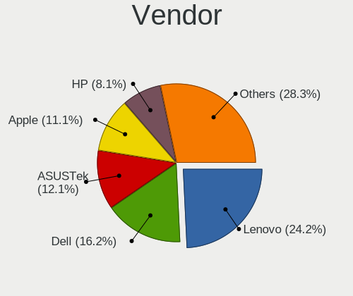
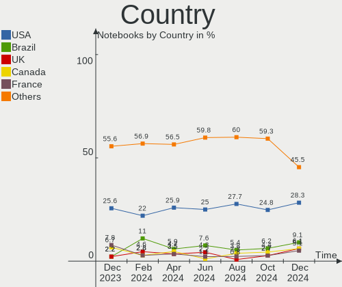

Pop!_OS - Hardware Trends (Notebooks)
-------------------------------------

A project to identify most popular hardware characteristics and track their change
over time based on data collected by Linux users at https://Linux-Hardware.org.

Anyone can contribute to this report by the [hw-probe](https://github.com/linuxhw/hw-probe) tool:

    sudo -E hw-probe -all -upload

This report is for one last month. Overall report since the beginning of time: [TestCoverage](https://github.com/linuxhw/TestCoverage)

Period: Aug, 2022.

Contents
--------

* [ System ](#system)
  - [ OS                       ](#os)
  - [ OS Family                ](#os-family)
  - [ Kernel                   ](#kernel)
  - [ Kernel Family            ](#kernel-family)
  - [ Kernel Major Ver.        ](#kernel-major-ver)
  - [ Arch                     ](#arch)
  - [ DE                       ](#de)
  - [ Display Server           ](#display-server)
  - [ Display Manager          ](#display-manager)
  - [ OS Lang                  ](#os-lang)
  - [ Boot Mode                ](#boot-mode)
  - [ Filesystem               ](#filesystem)
  - [ Part. scheme             ](#part-scheme)
  - [ Dual Boot with Linux/BSD ](#dual-boot-with-linuxbsd)
  - [ Dual Boot (Win)          ](#dual-boot-win)

* [ Board ](#board)
  - [ Vendor                   ](#vendor)
  - [ Model                    ](#model)
  - [ Model Family             ](#model-family)
  - [ MFG Year                 ](#mfg-year)
  - [ Form Factor              ](#form-factor)
  - [ Secure Boot              ](#secure-boot)
  - [ Coreboot                 ](#coreboot)
  - [ RAM Size                 ](#ram-size)
  - [ RAM Used                 ](#ram-used)
  - [ Total Drives             ](#total-drives)
  - [ Has CD-ROM               ](#has-cd-rom)
  - [ Has Ethernet             ](#has-ethernet)
  - [ Has WiFi                 ](#has-wifi)
  - [ Has Bluetooth            ](#has-bluetooth)

* [ Location ](#location)
  - [ Country                  ](#country)
  - [ City                     ](#city)

* [ Drives ](#drives)
  - [ Drive Vendor             ](#drive-vendor)
  - [ Drive Model              ](#drive-model)
  - [ HDD Vendor               ](#hdd-vendor)
  - [ SSD Vendor               ](#ssd-vendor)
  - [ Drive Kind               ](#drive-kind)
  - [ Drive Connector          ](#drive-connector)
  - [ Drive Size               ](#drive-size)
  - [ Space Total              ](#space-total)
  - [ Space Used               ](#space-used)
  - [ Malfunc. Drives          ](#malfunc-drives)
  - [ Malfunc. Drive Vendor    ](#malfunc-drive-vendor)
  - [ Malfunc. HDD Vendor      ](#malfunc-hdd-vendor)
  - [ Malfunc. Drive Kind      ](#malfunc-drive-kind)
  - [ Failed Drives            ](#failed-drives)
  - [ Failed Drive Vendor      ](#failed-drive-vendor)
  - [ Drive Status             ](#drive-status)

* [ Storage controller ](#storage-controller)
  - [ Storage Vendor           ](#storage-vendor)
  - [ Storage Model            ](#storage-model)
  - [ Storage Kind             ](#storage-kind)

* [ Processor ](#processor)
  - [ CPU Vendor               ](#cpu-vendor)
  - [ CPU Model                ](#cpu-model)
  - [ CPU Model Family         ](#cpu-model-family)
  - [ CPU Cores                ](#cpu-cores)
  - [ CPU Sockets              ](#cpu-sockets)
  - [ CPU Threads              ](#cpu-threads)
  - [ CPU Op-Modes             ](#cpu-op-modes)
  - [ CPU Microcode            ](#cpu-microcode)
  - [ CPU Microarch            ](#cpu-microarch)

* [ Graphics ](#graphics)
  - [ GPU Vendor               ](#gpu-vendor)
  - [ GPU Model                ](#gpu-model)
  - [ GPU Combo                ](#gpu-combo)
  - [ GPU Driver               ](#gpu-driver)
  - [ GPU Memory               ](#gpu-memory)

* [ Monitor ](#monitor)
  - [ Monitor Vendor           ](#monitor-vendor)
  - [ Monitor Model            ](#monitor-model)
  - [ Monitor Resolution       ](#monitor-resolution)
  - [ Monitor Diagonal         ](#monitor-diagonal)
  - [ Monitor Width            ](#monitor-width)
  - [ Aspect Ratio             ](#aspect-ratio)
  - [ Monitor Area             ](#monitor-area)
  - [ Pixel Density            ](#pixel-density)
  - [ Multiple Monitors        ](#multiple-monitors)

* [ Network ](#network)
  - [ Net Controller Vendor    ](#net-controller-vendor)
  - [ Net Controller Model     ](#net-controller-model)
  - [ Wireless Vendor          ](#wireless-vendor)
  - [ Wireless Model           ](#wireless-model)
  - [ Ethernet Vendor          ](#ethernet-vendor)
  - [ Ethernet Model           ](#ethernet-model)
  - [ Net Controller Kind      ](#net-controller-kind)
  - [ Used Controller          ](#used-controller)
  - [ NICs                     ](#nics)
  - [ IPv6                     ](#ipv6)

* [ Bluetooth ](#bluetooth)
  - [ Bluetooth Vendor         ](#bluetooth-vendor)
  - [ Bluetooth Model          ](#bluetooth-model)

* [ Sound ](#sound)
  - [ Sound Vendor             ](#sound-vendor)
  - [ Sound Model              ](#sound-model)

* [ Memory ](#memory)
  - [ Memory Vendor            ](#memory-vendor)
  - [ Memory Model             ](#memory-model)
  - [ Memory Kind              ](#memory-kind)
  - [ Memory Form Factor       ](#memory-form-factor)
  - [ Memory Size              ](#memory-size)
  - [ Memory Speed             ](#memory-speed)

* [ Printers & scanners ](#printers--scanners)
  - [ Printer Vendor           ](#printer-vendor)
  - [ Printer Model            ](#printer-model)
  - [ Scanner Vendor           ](#scanner-vendor)
  - [ Scanner Model            ](#scanner-model)

* [ Camera ](#camera)
  - [ Camera Vendor            ](#camera-vendor)
  - [ Camera Model             ](#camera-model)

* [ Security ](#security)
  - [ Fingerprint Vendor       ](#fingerprint-vendor)
  - [ Fingerprint Model        ](#fingerprint-model)
  - [ Chipcard Vendor          ](#chipcard-vendor)
  - [ Chipcard Model           ](#chipcard-model)

* [ Unsupported ](#unsupported)
  - [ Unsupported Devices      ](#unsupported-devices)
  - [ Unsupported Device Types ](#unsupported-device-types)

System
------

OS
--

Installed operating systems

| Name          | Notebooks | Percent |
|---------------|-----------|---------|
| Pop!_OS 22.04 | 131       | 97.76%  |
| Pop!_OS 20.04 | 2         | 1.49%   |
| Pop!_OS 21.10 | 1         | 0.75%   |

OS Family
---------

OS without a version

| Name    | Notebooks | Percent |
|---------|-----------|---------|
| Pop!_OS | 134       | 100%    |

Kernel
------

Version of the Linux kernel

| Version                              | Notebooks | Percent |
|--------------------------------------|-----------|---------|
| 5.18.10-76051810-generic             | 77        | 57.46%  |
| 5.19.0-76051900-generic              | 44        | 32.84%  |
| 5.17.5-76051705-generic              | 7         | 5.22%   |
| 6.0.0-060000rc1daily20220820-generic | 1         | 0.75%   |
| 5.19.3-051903-generic                | 1         | 0.75%   |
| 5.18.16-xanmod1                      | 1         | 0.75%   |
| 5.17.15-76051715-generic             | 1         | 0.75%   |
| 5.15.0-46-generic                    | 1         | 0.75%   |
| 5.13.0-7620-generic                  | 1         | 0.75%   |

Kernel Family
-------------

Linux kernel without a distro release

| Version | Notebooks | Percent |
|---------|-----------|---------|
| 5.18.10 | 77        | 57.46%  |
| 5.19.0  | 44        | 32.84%  |
| 5.17.5  | 7         | 5.22%   |
| 6.0.0   | 1         | 0.75%   |
| 5.19.3  | 1         | 0.75%   |
| 5.18.16 | 1         | 0.75%   |
| 5.17.15 | 1         | 0.75%   |
| 5.15.0  | 1         | 0.75%   |
| 5.13.0  | 1         | 0.75%   |

Kernel Major Ver.
-----------------

Linux kernel major version

| Version | Notebooks | Percent |
|---------|-----------|---------|
| 5.18    | 78        | 58.21%  |
| 5.19    | 45        | 33.58%  |
| 5.17    | 8         | 5.97%   |
| 6.0     | 1         | 0.75%   |
| 5.15    | 1         | 0.75%   |
| 5.13    | 1         | 0.75%   |

Arch
----

OS architecture (x86_64, i586, etc.)

| Name   | Notebooks | Percent |
|--------|-----------|---------|
| x86_64 | 134       | 100%    |

DE
--

Desktop Environment

| Name            | Notebooks | Percent |
|-----------------|-----------|---------|
| GNOME           | 127       | 94.78%  |
| KDE5            | 2         | 1.49%   |
| Unknown         | 2         | 1.49%   |
| X-Cinnamon      | 1         | 0.75%   |
| LXQt            | 1         | 0.75%   |
| GNOME Flashback | 1         | 0.75%   |

Display Server
--------------

X11 or Wayland

| Name    | Notebooks | Percent |
|---------|-----------|---------|
| X11     | 123       | 91.79%  |
| Wayland | 8         | 5.97%   |
| Unknown | 2         | 1.49%   |
| Tty     | 1         | 0.75%   |

Display Manager
---------------

SDDM, LightDM, etc.

| Name    | Notebooks | Percent |
|---------|-----------|---------|
| Unknown | 94        | 70.15%  |
| GDM3    | 39        | 29.1%   |
| GDM     | 1         | 0.75%   |

OS Lang
-------

Language

| Lang    | Notebooks | Percent |
|---------|-----------|---------|
| en_US   | 84        | 62.69%  |
| pt_BR   | 11        | 8.21%   |
| en_GB   | 9         | 6.72%   |
| de_DE   | 6         | 4.48%   |
| C       | 5         | 3.73%   |
| en_AU   | 4         | 2.99%   |
| en_CA   | 3         | 2.24%   |
| en_IE   | 2         | 1.49%   |
| sv_SE   | 1         | 0.75%   |
| sr_RS   | 1         | 0.75%   |
| pt_PT   | 1         | 0.75%   |
| it_IT   | 1         | 0.75%   |
| fr_CH   | 1         | 0.75%   |
| es_MX   | 1         | 0.75%   |
| es_CO   | 1         | 0.75%   |
| en_IN   | 1         | 0.75%   |
| de_CH   | 1         | 0.75%   |
| Unknown | 1         | 0.75%   |

Boot Mode
---------

EFI or BIOS

| Mode | Notebooks | Percent |
|------|-----------|---------|
| BIOS | 95        | 70.9%   |
| EFI  | 39        | 29.1%   |

Filesystem
----------

Type of filesystem

| Type    | Notebooks | Percent |
|---------|-----------|---------|
| Ext4    | 123       | 91.79%  |
| Btrfs   | 7         | 5.22%   |
| Overlay | 4         | 2.99%   |

Part. scheme
------------

Scheme of partitioning

| Type    | Notebooks | Percent |
|---------|-----------|---------|
| Unknown | 92        | 68.66%  |
| GPT     | 40        | 29.85%  |
| MBR     | 2         | 1.49%   |

Dual Boot with Linux/BSD
------------------------

Hosting more than one Linux/BSD

| Dual boot | Notebooks | Percent |
|-----------|-----------|---------|
| No        | 131       | 97.76%  |
| Yes       | 3         | 2.24%   |

Dual Boot (Win)
---------------

Hosting Linux and Windows

| Dual boot | Notebooks | Percent |
|-----------|-----------|---------|
| No        | 117       | 87.31%  |
| Yes       | 17        | 12.69%  |

Board
-----

Vendor
------

Motherboard manufacturer

| Name                   | Notebooks | Percent |
|------------------------|-----------|---------|
| Lenovo                 | 32        | 23.88%  |
| Dell                   | 21        | 15.67%  |
| ASUSTek Computer       | 21        | 15.67%  |
| Hewlett-Packard        | 12        | 8.96%   |
| Acer                   | 11        | 8.21%   |
| Apple                  | 9         | 6.72%   |
| MSI                    | 7         | 5.22%   |
| System76               | 5         | 3.73%   |
| Samsung Electronics    | 3         | 2.24%   |
| Toshiba                | 2         | 1.49%   |
| HUAWEI                 | 2         | 1.49%   |
| GPU Company            | 2         | 1.49%   |
| Positivo               | 1         | 0.75%   |
| Panasonic              | 1         | 0.75%   |
| Notebook               | 1         | 0.75%   |
| HONOR                  | 1         | 0.75%   |
| Gateway                | 1         | 0.75%   |
| Avell High Performance | 1         | 0.75%   |
| Alienware              | 1         | 0.75%   |

Model
-----

Motherboard model

| Name                                        | Notebooks | Percent |
|---------------------------------------------|-----------|---------|
| System76 Oryx Pro                           | 3         | 2.24%   |
| MSI Prestige 15 A10SC                       | 2         | 1.49%   |
| MSI GF63 Thin 11UD                          | 2         | 1.49%   |
| Dell XPS 9320                               | 2         | 1.49%   |
| Dell XPS 15 9520                            | 2         | 1.49%   |
| ASUS X556UQK                                | 2         | 1.49%   |
| Acer Swift SFX14-41G                        | 2         | 1.49%   |
| Toshiba Satellite C850                      | 1         | 0.75%   |
| Toshiba Satellite C845                      | 1         | 0.75%   |
| System76 Gazelle                            | 1         | 0.75%   |
| System76 Galago UltraPro                    | 1         | 0.75%   |
| Samsung 3570R/370R/470R/450R/510R/4450RV    | 1         | 0.75%   |
| Samsung 305E4A/305E5A/305E7A                | 1         | 0.75%   |
| Samsung 300E4C/300E5C/300E7C                | 1         | 0.75%   |
| Positivo W942SV_SV1                         | 1         | 0.75%   |
| Panasonic FZ55-1                            | 1         | 0.75%   |
| Notebook NV4XMB,ME,MZ                       | 1         | 0.75%   |
| MSI PS63 Modern 8RC                         | 1         | 0.75%   |
| MSI Katana GF76 11UD                        | 1         | 0.75%   |
| MSI GF63 Thin 10UC                          | 1         | 0.75%   |
| Lenovo XiaoXinPro 16 ARH7 82SN              | 1         | 0.75%   |
| Lenovo V330 81AX                            | 1         | 0.75%   |
| Lenovo V15-IIL 82C5                         | 1         | 0.75%   |
| Lenovo ThinkPad X1 Extreme Gen 5 21DECTO1WW | 1         | 0.75%   |
| Lenovo ThinkPad W520 4270CTO                | 1         | 0.75%   |
| Lenovo ThinkPad T580 20L9CTO1WW             | 1         | 0.75%   |
| Lenovo ThinkPad T470p 20J7S0CF00            | 1         | 0.75%   |
| Lenovo ThinkPad T450s 20BWS1RT00            | 1         | 0.75%   |
| Lenovo ThinkPad T16 Gen 1 21CH000JUS        | 1         | 0.75%   |
| Lenovo ThinkPad P15 Gen 2i 20YQ0014GE       | 1         | 0.75%   |
| Lenovo ThinkPad L590 20Q7001HGE             | 1         | 0.75%   |
| Lenovo ThinkPad E470c 20H3A000CD            | 1         | 0.75%   |
| Lenovo ThinkPad E15 Gen 2 20T8000RMH        | 1         | 0.75%   |
| Lenovo ThinkPad E14 Gen 4 21ECS00000        | 1         | 0.75%   |
| Lenovo ThinkPad E14 Gen 2 20TB0029BO        | 1         | 0.75%   |
| Lenovo ThinkPad E14 Gen 2 20TA009AUS        | 1         | 0.75%   |
| Lenovo ThinkBook 15p 20V3                   | 1         | 0.75%   |
| Lenovo Legion 5 Pro 16ARH7H 82RG            | 1         | 0.75%   |
| Lenovo Legion 5 15ITH6H 82JH                | 1         | 0.75%   |
| Lenovo Legion 5 15ACH6 82JW                 | 1         | 0.75%   |
| Lenovo IdeaPad U410                         | 1         | 0.75%   |
| Lenovo IdeaPad S145-15IIL 82DJ              | 1         | 0.75%   |
| Lenovo IdeaPad S145-15API 81V7              | 1         | 0.75%   |
| Lenovo IdeaPad 5 Pro 16ARH7 82SN            | 1         | 0.75%   |
| Lenovo IdeaPad 5 15IIL05 81YK               | 1         | 0.75%   |
| Lenovo IdeaPad 330S-15IKB 81F5              | 1         | 0.75%   |
| Lenovo IdeaPad 330-15IKB 81DE               | 1         | 0.75%   |
| Lenovo IdeaPad 320-15ABR 80XS               | 1         | 0.75%   |
| Lenovo IdeaPad 3 15ITL6 82H8                | 1         | 0.75%   |
| Lenovo IdeaPad 3 15ALC6 Ub 82KU             | 1         | 0.75%   |
| Lenovo IdeaPad 3 14ITL6 82H7                | 1         | 0.75%   |
| Lenovo IdeaPad 3 14ADA05 81W0               | 1         | 0.75%   |
| HUAWEI NBD-WXX9                             | 1         | 0.75%   |
| HUAWEI KPL-W0X                              | 1         | 0.75%   |
| HONOR NBR-WAX9                              | 1         | 0.75%   |
| HP ProBook 645 G1                           | 1         | 0.75%   |
| HP Pavilion Gaming Laptop 15-ec2xxx         | 1         | 0.75%   |
| HP Pavilion g7                              | 1         | 0.75%   |
| HP OMEN by Laptop 15-dc0xxx                 | 1         | 0.75%   |
| HP Laptop 15-db1xxx                         | 1         | 0.75%   |

Model Family
------------

Motherboard model prefix

| Name                        | Notebooks | Percent |
|-----------------------------|-----------|---------|
| Lenovo ThinkPad             | 13        | 9.7%    |
| Lenovo IdeaPad              | 12        | 8.96%   |
| Acer Aspire                 | 9         | 6.72%   |
| Dell XPS                    | 7         | 5.22%   |
| Dell Inspiron               | 7         | 5.22%   |
| ASUS ROG                    | 7         | 5.22%   |
| Dell Latitude               | 4         | 2.99%   |
| System76 Oryx               | 3         | 2.24%   |
| MSI GF63                    | 3         | 2.24%   |
| Lenovo Legion               | 3         | 2.24%   |
| HP Laptop                   | 3         | 2.24%   |
| Toshiba Satellite           | 2         | 1.49%   |
| MSI Prestige                | 2         | 1.49%   |
| HP Pavilion                 | 2         | 1.49%   |
| HP ENVY                     | 2         | 1.49%   |
| HP EliteBook                | 2         | 1.49%   |
| ASUS Zenbook                | 2         | 1.49%   |
| ASUS X556UQK                | 2         | 1.49%   |
| Acer Swift                  | 2         | 1.49%   |
| System76 Gazelle            | 1         | 0.75%   |
| System76 Galago             | 1         | 0.75%   |
| Samsung 3570R               | 1         | 0.75%   |
| Samsung 305E4A              | 1         | 0.75%   |
| Samsung 300E4C              | 1         | 0.75%   |
| Positivo W942SV             | 1         | 0.75%   |
| Panasonic FZ55-1            | 1         | 0.75%   |
| Notebook NV4XMB             | 1         | 0.75%   |
| MSI PS63                    | 1         | 0.75%   |
| MSI Katana                  | 1         | 0.75%   |
| Lenovo XiaoXinPro           | 1         | 0.75%   |
| Lenovo V330                 | 1         | 0.75%   |
| Lenovo V15-IIL              | 1         | 0.75%   |
| Lenovo ThinkBook            | 1         | 0.75%   |
| HUAWEI NBD-WXX9             | 1         | 0.75%   |
| HUAWEI KPL-W0X              | 1         | 0.75%   |
| HONOR NBR-WAX9              | 1         | 0.75%   |
| HP ProBook                  | 1         | 0.75%   |
| HP OMEN                     | 1         | 0.75%   |
| HP Dev                      | 1         | 0.75%   |
| GPU Company GWTN141-10      | 1         | 0.75%   |
| GPU Company GWTC116-2       | 1         | 0.75%   |
| Gateway NV55C               | 1         | 0.75%   |
| Dell Vostro                 | 1         | 0.75%   |
| Dell Precision              | 1         | 0.75%   |
| Dell G7                     | 1         | 0.75%   |
| Avell High Performance B.ON | 1         | 0.75%   |
| ASUS X540LJ                 | 1         | 0.75%   |
| ASUS X455LJ                 | 1         | 0.75%   |
| ASUS VivoBook               | 1         | 0.75%   |
| ASUS UX310UQ                | 1         | 0.75%   |
| ASUS N550JV                 | 1         | 0.75%   |
| ASUS K55A                   | 1         | 0.75%   |
| ASUS GL703VD                | 1         | 0.75%   |
| ASUS G75VX                  | 1         | 0.75%   |
| ASUS G74Sx                  | 1         | 0.75%   |
| ASUS G550JK                 | 1         | 0.75%   |
| Apple MacBookPro6           | 1         | 0.75%   |
| Apple MacBookPro16          | 1         | 0.75%   |
| Apple MacBookPro15          | 1         | 0.75%   |
| Apple MacBookPro13          | 1         | 0.75%   |

MFG Year
--------

Motherboard manufacture year

| Year | Notebooks | Percent |
|------|-----------|---------|
| 2021 | 25        | 18.66%  |
| 2022 | 20        | 14.93%  |
| 2020 | 14        | 10.45%  |
| 2019 | 13        | 9.7%    |
| 2018 | 11        | 8.21%   |
| 2012 | 9         | 6.72%   |
| 2013 | 8         | 5.97%   |
| 2011 | 8         | 5.97%   |
| 2017 | 5         | 3.73%   |
| 2016 | 5         | 3.73%   |
| 2015 | 5         | 3.73%   |
| 2014 | 4         | 2.99%   |
| 2009 | 3         | 2.24%   |
| 2010 | 2         | 1.49%   |
| 2008 | 2         | 1.49%   |

Form Factor
-----------

Physical design of the computer

| Name     | Notebooks | Percent |
|----------|-----------|---------|
| Notebook | 134       | 100%    |

Secure Boot
-----------

Enabled or disabled

| State    | Notebooks | Percent |
|----------|-----------|---------|
| Disabled | 134       | 100%    |

Coreboot
--------

Have coreboot on board

| Used | Notebooks | Percent |
|------|-----------|---------|
| No   | 131       | 97.76%  |
| Yes  | 3         | 2.24%   |

RAM Size
--------

Total RAM memory

| Size in GB  | Notebooks | Percent |
|-------------|-----------|---------|
| 16.01-24.0  | 36        | 26.87%  |
| 4.01-8.0    | 31        | 23.13%  |
| 8.01-16.0   | 24        | 17.91%  |
| 3.01-4.0    | 18        | 13.43%  |
| 32.01-64.0  | 16        | 11.94%  |
| 64.01-256.0 | 4         | 2.99%   |
| 24.01-32.0  | 3         | 2.24%   |
| 2.01-3.0    | 1         | 0.75%   |
| 1.01-2.0    | 1         | 0.75%   |

RAM Used
--------

Used RAM memory

| Used GB   | Notebooks | Percent |
|-----------|-----------|---------|
| 2.01-3.0  | 46        | 34.33%  |
| 3.01-4.0  | 33        | 24.63%  |
| 4.01-8.0  | 30        | 22.39%  |
| 1.01-2.0  | 17        | 12.69%  |
| 8.01-16.0 | 8         | 5.97%   |

Total Drives
------------

Number of drives on board

| Drives | Notebooks | Percent |
|--------|-----------|---------|
| 1      | 104       | 77.61%  |
| 2      | 26        | 19.4%   |
| 3      | 4         | 2.99%   |

Has CD-ROM
----------

Has CD-ROM on board

| Presented | Notebooks | Percent |
|-----------|-----------|---------|
| No        | 103       | 76.87%  |
| Yes       | 31        | 23.13%  |

Has Ethernet
------------

Has Ethernet on board

| Presented | Notebooks | Percent |
|-----------|-----------|---------|
| Yes       | 98        | 73.13%  |
| No        | 36        | 26.87%  |

Has WiFi
--------

Has WiFi module

| Presented | Notebooks | Percent |
|-----------|-----------|---------|
| Yes       | 134       | 100%    |

Has Bluetooth
-------------

Has Bluetooth module

| Presented | Notebooks | Percent |
|-----------|-----------|---------|
| Yes       | 115       | 85.82%  |
| No        | 19        | 14.18%  |

Location
--------

Country
-------

Geographic location (country)

| Country      | Notebooks | Percent |
|--------------|-----------|---------|
| USA          | 37        | 27.61%  |
| Brazil       | 16        | 11.94%  |
| Germany      | 10        | 7.46%   |
| Canada       | 7         | 5.22%   |
| Netherlands  | 4         | 2.99%   |
| Australia    | 4         | 2.99%   |
| UK           | 3         | 2.24%   |
| Switzerland  | 3         | 2.24%   |
| Sweden       | 3         | 2.24%   |
| Serbia       | 3         | 2.24%   |
| Russia       | 3         | 2.24%   |
| Norway       | 3         | 2.24%   |
| India        | 3         | 2.24%   |
| Belgium      | 3         | 2.24%   |
| Vietnam      | 2         | 1.49%   |
| Romania      | 2         | 1.49%   |
| Philippines  | 2         | 1.49%   |
| Ireland      | 2         | 1.49%   |
| Greece       | 2         | 1.49%   |
| Tunisia      | 1         | 0.75%   |
| Thailand     | 1         | 0.75%   |
| Spain        | 1         | 0.75%   |
| Slovakia     | 1         | 0.75%   |
| Saudi Arabia | 1         | 0.75%   |
| Poland       | 1         | 0.75%   |
| New Zealand  | 1         | 0.75%   |
| Mexico       | 1         | 0.75%   |
| Lithuania    | 1         | 0.75%   |
| Kazakhstan   | 1         | 0.75%   |
| Italy        | 1         | 0.75%   |
| Israel       | 1         | 0.75%   |
| Iraq         | 1         | 0.75%   |
| Hungary      | 1         | 0.75%   |
| France       | 1         | 0.75%   |
| Egypt        | 1         | 0.75%   |
| Czechia      | 1         | 0.75%   |
| Colombia     | 1         | 0.75%   |
| China        | 1         | 0.75%   |
| Bulgaria     | 1         | 0.75%   |
| Bangladesh   | 1         | 0.75%   |
| Argentina    | 1         | 0.75%   |

City
----

Geographic location (city)

| City             | Notebooks | Percent |
|------------------|-----------|---------|
| Rio de Janeiro   | 3         | 2.24%   |
| Oslo             | 3         | 2.24%   |
| Brisbane         | 3         | 2.24%   |
| Victoria         | 2         | 1.49%   |
| Stockholm        | 2         | 1.49%   |
| Spokane          | 2         | 1.49%   |
| Ribeirao Preto   | 2         | 1.49%   |
| Ho Chi Minh City | 2         | 1.49%   |
| Calgary          | 2         | 1.49%   |
| Bucharest        | 2         | 1.49%   |
| Belgrade         | 2         | 1.49%   |
| Zurich           | 1         | 0.75%   |
| Žilina          | 1         | 0.75%   |
| Werder           | 1         | 0.75%   |
| Weil am Rhein    | 1         | 0.75%   |
| Waynesville      | 1         | 0.75%   |
| Waterbury        | 1         | 0.75%   |
| Washington       | 1         | 0.75%   |
| Vilvoorde        | 1         | 0.75%   |
| Vancouver        | 1         | 0.75%   |
| Ust-Kamenogorsk  | 1         | 0.75%   |
| Union            | 1         | 0.75%   |
| Ulyanovsk        | 1         | 0.75%   |
| Tunis            | 1         | 0.75%   |
| Tilburg          | 1         | 0.75%   |
| Thornton         | 1         | 0.75%   |
| Sutton           | 1         | 0.75%   |
| Sulingen         | 1         | 0.75%   |
| St Petersburg    | 1         | 0.75%   |
| Sofia            | 1         | 0.75%   |
| Siliguri         | 1         | 0.75%   |
| Siegen           | 1         | 0.75%   |
| Sete Lagoas      | 1         | 0.75%   |
| Seattle          | 1         | 0.75%   |
| San Pedro        | 1         | 0.75%   |
| San Diego        | 1         | 0.75%   |
| San Antonio      | 1         | 0.75%   |
| Rostock          | 1         | 0.75%   |
| Rorschach        | 1         | 0.75%   |
| Riverside        | 1         | 0.75%   |
| Rio Claro        | 1         | 0.75%   |
| Rafael Castillo  | 1         | 0.75%   |
| Pune             | 1         | 0.75%   |
| Poznan           | 1         | 0.75%   |
| Powder Springs   | 1         | 0.75%   |
| Porto Velho      | 1         | 0.75%   |
| Portlaoise       | 1         | 0.75%   |
| Phuket           | 1         | 0.75%   |
| Phoenix          | 1         | 0.75%   |
| Petaẖ Tiqwa    | 1         | 0.75%   |
| Paros            | 1         | 0.75%   |
| Panevezys        | 1         | 0.75%   |
| Orchard Park     | 1         | 0.75%   |
| Nynaeshamn       | 1         | 0.75%   |
| Novi Knezevac    | 1         | 0.75%   |
| North Andover    | 1         | 0.75%   |
| North Acton      | 1         | 0.75%   |
| New Albany       | 1         | 0.75%   |
| Mytilene         | 1         | 0.75%   |
| Muriaé          | 1         | 0.75%   |

Drives
------

Drive Vendor
------------

Hard drive vendors

| Vendor                         | Notebooks | Drives | Percent |
|--------------------------------|-----------|--------|---------|
| Samsung Electronics            | 31        | 32     | 18.56%  |
| WDC                            | 19        | 19     | 11.38%  |
| Seagate                        | 14        | 14     | 8.38%   |
| SK hynix                       | 13        | 13     | 7.78%   |
| SanDisk                        | 10        | 10     | 5.99%   |
| Kingston                       | 8         | 9      | 4.79%   |
| Toshiba                        | 7         | 7      | 4.19%   |
| Micron Technology              | 7         | 8      | 4.19%   |
| Intel                          | 6         | 6      | 3.59%   |
| Crucial                        | 6         | 6      | 3.59%   |
| Unknown                        | 5         | 5      | 2.99%   |
| Apple                          | 5         | 5      | 2.99%   |
| Phison                         | 4         | 4      | 2.4%    |
| Micron/Crucial Technology      | 3         | 3      | 1.8%    |
| HGST                           | 3         | 3      | 1.8%    |
| Unknown                        | 3         | 3      | 1.8%    |
| Silicon Motion                 | 2         | 2      | 1.2%    |
| KingSpec                       | 2         | 2      | 1.2%    |
| Hitachi                        | 2         | 2      | 1.2%    |
| W800S                          | 1         | 1      | 0.6%    |
| Union Memory (Shenzhen)        | 1         | 1      | 0.6%    |
| UMIS                           | 1         | 1      | 0.6%    |
| TrekStor                       | 1         | 1      | 0.6%    |
| Teutons                        | 1         | 1      | 0.6%    |
| Team                           | 1         | 1      | 0.6%    |
| Solid State Storage Technology | 1         | 1      | 0.6%    |
| LITEON                         | 1         | 1      | 0.6%    |
| HS-SSD-C100                    | 1         | 1      | 0.6%    |
| Hikvision                      | 1         | 1      | 0.6%    |
| Hewlett-Packard                | 1         | 1      | 0.6%    |
| GOODRAM                        | 1         | 1      | 0.6%    |
| Fujitsu                        | 1         | 1      | 0.6%    |
| Corsair                        | 1         | 1      | 0.6%    |
| Asm                            | 1         | 1      | 0.6%    |
| Apacer                         | 1         | 1      | 0.6%    |
| A-DATA Technology              | 1         | 1      | 0.6%    |

Drive Model
-----------

Hard drive models

| Model                                        | Notebooks | Percent |
|----------------------------------------------|-----------|---------|
| Seagate ST1000LM035-1RK172 1TB               | 4         | 2.35%   |
| Samsung NVMe SSD Drive 512GB                 | 4         | 2.35%   |
| Unknown SD/MMC/MS PRO 128GB                  | 3         | 1.76%   |
| SK hynix NVMe SSD Drive 1024GB               | 3         | 1.76%   |
| Samsung NVMe SSD Drive 2TB                   | 3         | 1.76%   |
| Samsung NVMe SSD Drive 256GB                 | 3         | 1.76%   |
| Samsung NVMe SSD Drive 1TB                   | 3         | 1.76%   |
| Unknown                                      | 3         | 1.76%   |
| WDC WD10SPZX-24Z10 1TB                       | 2         | 1.18%   |
| Toshiba MQ01ABD100 1TB                       | 2         | 1.18%   |
| SK hynix NVMe SSD Drive 2TB                  | 2         | 1.18%   |
| Seagate ST500LT012-9WS142 500GB              | 2         | 1.18%   |
| SanDisk NVMe SSD Drive 256GB                 | 2         | 1.18%   |
| SanDisk NVMe SSD Drive 1TB                   | 2         | 1.18%   |
| SanDisk NVMe SSD Drive 1024GB                | 2         | 1.18%   |
| Samsung SSD 970 EVO Plus 1TB                 | 2         | 1.18%   |
| Samsung SSD 860 EVO M.2 500GB                | 2         | 1.18%   |
| Micron/Crucial NVMe SSD Drive 1TB            | 2         | 1.18%   |
| Micron NVMe SSD Drive 1024GB                 | 2         | 1.18%   |
| Micron MTFDKBA1T0TFH 1TB                     | 2         | 1.18%   |
| Kingston SA400S37240G 240GB SSD              | 2         | 1.18%   |
| Kingston OM8PCP3512F-AI1 512GB               | 2         | 1.18%   |
| Kingston NVMe SSD Drive 512GB                | 2         | 1.18%   |
| Intel NVMe SSD Drive 512GB                   | 2         | 1.18%   |
| Hitachi HTS547550A9E384 500GB                | 2         | 1.18%   |
| Crucial CT240BX500SSD1 240GB                 | 2         | 1.18%   |
| WDC WD6400BPVT-75HXZT1 640GB                 | 1         | 0.59%   |
| WDC WD5000LPLX-08ZNTT0 500GB                 | 1         | 0.59%   |
| WDC WD5000BPVT-80HXZT1 500GB                 | 1         | 0.59%   |
| WDC WD5000BPVT-75HXZT1 500GB                 | 1         | 0.59%   |
| WDC WD5000BPKX-60HPJT0 500GB                 | 1         | 0.59%   |
| WDC WD5000BPKT-80PK4T0 500GB                 | 1         | 0.59%   |
| WDC WD5000BPKT-00PK4T0 500GB                 | 1         | 0.59%   |
| WDC WD2500BEVT-00A23T0 250GB                 | 1         | 0.59%   |
| WDC WD1600BJKT-75F4T0 160GB                  | 1         | 0.59%   |
| WDC WD10SPZX-80Z10T2 1TB                     | 1         | 0.59%   |
| WDC WD10SPZX-60Z10T0 1TB                     | 1         | 0.59%   |
| WDC WD10JPVT-80A1YT0 1TB                     | 1         | 0.59%   |
| WDC PC SN810 NVMe 2048GB                     | 1         | 0.59%   |
| WDC PC SN810 NVMe 1024GB                     | 1         | 0.59%   |
| WDC PC SN730 SDBPNTY-512G-1032 512GB         | 1         | 0.59%   |
| WDC PC SN530 SDBPTPZ-1T00-1002 1TB           | 1         | 0.59%   |
| WDC PC SN530 SDBPMPZ-256G-1001 256GB         | 1         | 0.59%   |
| W800S 512GB                                  | 1         | 0.59%   |
| Unknown SC200  197GB                         | 1         | 0.59%   |
| Unknown MMC Card  16GB                       | 1         | 0.59%   |
| Union Memory (Shenzhen) NVMe SSD Drive 512GB | 1         | 0.59%   |
| UMIS RPJTJ256MEE1OWX 256GB                   | 1         | 0.59%   |
| TrekStor TREKSTORSSD128GB                    | 1         | 0.59%   |
| Toshiba THNSNS128GMCP 128GB SSD              | 1         | 0.59%   |
| Toshiba MQ04ABF100 1TB                       | 1         | 0.59%   |
| Toshiba MQ01ABF050 500GB                     | 1         | 0.59%   |
| Toshiba MK6475GSX 640GB                      | 1         | 0.59%   |
| Toshiba KXG60ZNV256G 256GB                   | 1         | 0.59%   |
| Teutons SSD120GB                             | 1         | 0.59%   |
| Team TM8FP4004T 4TB                          | 1         | 0.59%   |
| Solid State Storage NVMe SSD Drive 128GB     | 1         | 0.59%   |
| SK hynix SKHynix_HFM512GDHTNI-87A0B 512GB    | 1         | 0.59%   |
| SK hynix SKHynix_HFM256GD3HX015N 256GB       | 1         | 0.59%   |
| SK hynix SC311 SATA 128G SSD                 | 1         | 0.59%   |

HDD Vendor
----------

Hard disk drive vendors

| Vendor              | Notebooks | Drives | Percent |
|---------------------|-----------|--------|---------|
| WDC                 | 14        | 14     | 33.33%  |
| Seagate             | 12        | 12     | 28.57%  |
| Toshiba             | 5         | 5      | 11.9%   |
| Unknown             | 3         | 3      | 7.14%   |
| HGST                | 3         | 3      | 7.14%   |
| Hitachi             | 2         | 2      | 4.76%   |
| Samsung Electronics | 1         | 1      | 2.38%   |
| Fujitsu             | 1         | 1      | 2.38%   |
| Asm                 | 1         | 1      | 2.38%   |

SSD Vendor
----------

Solid state drive vendors

| Vendor              | Notebooks | Drives | Percent |
|---------------------|-----------|--------|---------|
| Samsung Electronics | 7         | 7      | 20%     |
| Crucial             | 5         | 5      | 14.29%  |
| SanDisk             | 4         | 4      | 11.43%  |
| Kingston            | 3         | 3      | 8.57%   |
| Apple               | 3         | 3      | 8.57%   |
| SK hynix            | 2         | 2      | 5.71%   |
| KingSpec            | 2         | 2      | 5.71%   |
| TrekStor            | 1         | 1      | 2.86%   |
| Toshiba             | 1         | 1      | 2.86%   |
| Teutons             | 1         | 1      | 2.86%   |
| LITEON              | 1         | 1      | 2.86%   |
| Intel               | 1         | 1      | 2.86%   |
| HS-SSD-C100         | 1         | 1      | 2.86%   |
| Hikvision           | 1         | 1      | 2.86%   |
| GOODRAM             | 1         | 1      | 2.86%   |
| Apacer              | 1         | 1      | 2.86%   |

Drive Kind
----------

HDD or SSD

| Kind    | Notebooks | Drives | Percent |
|---------|-----------|--------|---------|
| NVMe    | 73        | 86     | 47.1%   |
| HDD     | 42        | 42     | 27.1%   |
| SSD     | 33        | 35     | 21.29%  |
| MMC     | 4         | 4      | 2.58%   |
| Unknown | 3         | 3      | 1.94%   |

Drive Connector
---------------

SATA, SAS, NVMe, etc.

| Type | Notebooks | Drives | Percent |
|------|-----------|--------|---------|
| NVMe | 73        | 86     | 48.99%  |
| SATA | 67        | 74     | 44.97%  |
| SAS  | 5         | 6      | 3.36%   |
| MMC  | 4         | 4      | 2.68%   |

Drive Size
----------

Size of hard drive

| Size in TB | Notebooks | Drives | Percent |
|------------|-----------|--------|---------|
| 0.01-0.5   | 45        | 49     | 62.5%   |
| 0.51-1.0   | 25        | 26     | 34.72%  |
| 3.01-4.0   | 1         | 1      | 1.39%   |
| 1.01-2.0   | 1         | 1      | 1.39%   |

Space Total
-----------

Amount of disk space available on the file system

| Size in GB     | Notebooks | Percent |
|----------------|-----------|---------|
| 251-500        | 39        | 29.1%   |
| 101-250        | 38        | 28.36%  |
| 501-1000       | 30        | 22.39%  |
| 1001-2000      | 10        | 7.46%   |
| More than 3000 | 4         | 2.99%   |
| 1-20           | 4         | 2.99%   |
| 51-100         | 4         | 2.99%   |
| 2001-3000      | 3         | 2.24%   |
| 21-50          | 1         | 0.75%   |
| Unknown        | 1         | 0.75%   |

Space Used
----------

Amount of used disk space

| Used GB        | Notebooks | Percent |
|----------------|-----------|---------|
| 1-20           | 55        | 41.04%  |
| 21-50          | 27        | 20.15%  |
| 51-100         | 18        | 13.43%  |
| 101-250        | 15        | 11.19%  |
| 251-500        | 11        | 8.21%   |
| 501-1000       | 6         | 4.48%   |
| More than 3000 | 1         | 0.75%   |
| Unknown        | 1         | 0.75%   |

Malfunc. Drives
---------------

Drive models with a malfunction

| Model                                 | Notebooks | Drives | Percent |
|---------------------------------------|-----------|--------|---------|
| Team TM8FP4004T 4TB                   | 1         | 1      | 50%     |
| Samsung Electronics SSD 850 EVO 500GB | 1         | 1      | 50%     |

Malfunc. Drive Vendor
---------------------

Vendors of faulty drives

| Vendor              | Notebooks | Drives | Percent |
|---------------------|-----------|--------|---------|
| Team                | 1         | 1      | 50%     |
| Samsung Electronics | 1         | 1      | 50%     |

Malfunc. HDD Vendor
-------------------

Vendors of faulty HDD drives

Zero info for selected period =(

Malfunc. Drive Kind
-------------------

Kinds of faulty drives

| Kind | Notebooks | Drives | Percent |
|------|-----------|--------|---------|
| NVMe | 1         | 1      | 50%     |
| SSD  | 1         | 1      | 50%     |

Failed Drives
-------------

Failed drive models

| Model                             | Notebooks | Drives | Percent |
|-----------------------------------|-----------|--------|---------|
| Samsung Electronics HM321HI 320GB | 1         | 1      | 100%    |

Failed Drive Vendor
-------------------

Failed drive vendors

| Vendor              | Notebooks | Drives | Percent |
|---------------------|-----------|--------|---------|
| Samsung Electronics | 1         | 1      | 100%    |

Drive Status
------------

Number of failed and malfunc. drives

| Status   | Notebooks | Drives | Percent |
|----------|-----------|--------|---------|
| Detected | 97        | 116    | 67.36%  |
| Works    | 44        | 51     | 30.56%  |
| Malfunc  | 2         | 2      | 1.39%   |
| Failed   | 1         | 1      | 0.69%   |

Storage controller
------------------

Storage Vendor
--------------

Storage controller vendors

| Vendor                         | Notebooks | Percent |
|--------------------------------|-----------|---------|
| Intel                          | 83        | 46.11%  |
| Samsung Electronics            | 24        | 13.33%  |
| AMD                            | 17        | 9.44%   |
| SK hynix                       | 11        | 6.11%   |
| SanDisk                        | 11        | 6.11%   |
| Micron Technology              | 6         | 3.33%   |
| Phison Electronics             | 5         | 2.78%   |
| Kingston Technology Company    | 5         | 2.78%   |
| Silicon Motion                 | 3         | 1.67%   |
| Micron/Crucial Technology      | 3         | 1.67%   |
| Union Memory (Shenzhen)        | 2         | 1.11%   |
| Nvidia                         | 2         | 1.11%   |
| Apple                          | 2         | 1.11%   |
| Toshiba America Info Systems   | 1         | 0.56%   |
| Solid State Storage Technology | 1         | 0.56%   |
| Seagate Technology             | 1         | 0.56%   |
| Realtek Semiconductor          | 1         | 0.56%   |
| Marvell Technology Group       | 1         | 0.56%   |
| ADATA Technology               | 1         | 0.56%   |

Storage Model
-------------

Storage controller models

| Model                                                                          | Notebooks | Percent |
|--------------------------------------------------------------------------------|-----------|---------|
| AMD FCH SATA Controller [AHCI mode]                                            | 17        | 9.14%   |
| Intel Sunrise Point-LP SATA Controller [AHCI mode]                             | 10        | 5.38%   |
| Intel 82801 Mobile SATA Controller [RAID mode]                                 | 10        | 5.38%   |
| Intel Volume Management Device NVMe RAID Controller                            | 9         | 4.84%   |
| Samsung NVMe SSD Controller PM9A1/PM9A3/980PRO                                 | 8         | 4.3%    |
| Intel 7 Series Chipset Family 6-port SATA Controller [AHCI mode]               | 8         | 4.3%    |
| Samsung NVMe SSD Controller 980                                                | 7         | 3.76%   |
| Samsung NVMe SSD Controller SM981/PM981/PM983                                  | 6         | 3.23%   |
| Micron Non-Volatile memory controller                                          | 6         | 3.23%   |
| SK hynix Non-Volatile memory controller                                        | 5         | 2.69%   |
| Kingston Company Company Non-Volatile memory controller                        | 5         | 2.69%   |
| Intel 8 Series/C220 Series Chipset Family 6-port SATA Controller 1 [AHCI mode] | 5         | 2.69%   |
| Intel 500 Series Chipset Family SATA AHCI Controller                           | 5         | 2.69%   |
| SK hynix Gold P31 SSD                                                          | 4         | 2.15%   |
| SanDisk Non-Volatile memory controller                                         | 4         | 2.15%   |
| Intel 6 Series/C200 Series Chipset Family 6 port Mobile SATA AHCI Controller   | 4         | 2.15%   |
| Intel 400 Series Chipset Family SATA AHCI Controller                           | 4         | 2.15%   |
| Silicon Motion SM2263EN/SM2263XT SSD Controller                                | 3         | 1.61%   |
| SanDisk WD Blue SN550 NVMe SSD                                                 | 3         | 1.61%   |
| Samsung NVMe SSD Controller SM961/PM961/SM963                                  | 3         | 1.61%   |
| Phison E12 NVMe Controller                                                     | 3         | 1.61%   |
| Intel Wildcat Point-LP SATA Controller [AHCI Mode]                             | 3         | 1.61%   |
| Intel Tiger Lake-LP SATA Controller                                            | 3         | 1.61%   |
| Intel Ice Lake-LP SATA Controller [AHCI mode]                                  | 3         | 1.61%   |
| Intel 5 Series/3400 Series Chipset 4 port SATA AHCI Controller                 | 3         | 1.61%   |
| SanDisk WD PC SN810 / Black SN850 NVMe SSD                                     | 2         | 1.08%   |
| Micron/Crucial P1 NVMe PCIe SSD                                                | 2         | 1.08%   |
| Intel SSD 660P Series                                                          | 2         | 1.08%   |
| Intel Non-Volatile memory controller                                           | 2         | 1.08%   |
| Intel Cannon Point-LP SATA Controller [AHCI Mode]                              | 2         | 1.08%   |
| Apple ANS2 NVMe Controller                                                     | 2         | 1.08%   |
| Union Memory (Shenzhen) Non-Volatile memory controller                         | 1         | 0.54%   |
| Union Memory (Shenzhen) AM630 PCIe 4.0 x4 NVMe SSD Controller                  | 1         | 0.54%   |
| Toshiba America Info Systems XG6 NVMe SSD Controller                           | 1         | 0.54%   |
| Solid State Storage Non-Volatile memory controller                             | 1         | 0.54%   |
| SK hynix BC511                                                                 | 1         | 0.54%   |
| SK hynix BC501 NVMe Solid State Drive                                          | 1         | 0.54%   |
| Seagate FireCuda 520 SSD                                                       | 1         | 0.54%   |
| SanDisk WD Blue SN500 / PC SN520 NVMe SSD                                      | 1         | 0.54%   |
| SanDisk WD Black SN750 / PC SN730 NVMe SSD                                     | 1         | 0.54%   |
| Samsung Electronics SATA controller                                            | 1         | 0.54%   |
| Realtek RTS5763DL NVMe SSD Controller                                          | 1         | 0.54%   |
| Phison PS5013 E13 NVMe Controller                                              | 1         | 0.54%   |
| Phison Electronics Non-Volatile memory controller                              | 1         | 0.54%   |
| Nvidia MCP89 SATA Controller (AHCI mode)                                       | 1         | 0.54%   |
| Nvidia MCP79 SATA Controller                                                   | 1         | 0.54%   |
| Micron/Crucial Non-Volatile memory controller                                  | 1         | 0.54%   |
| Marvell Group 88SS9183 PCIe SSD Controller                                     | 1         | 0.54%   |
| Intel SSD Pro 7600p/760p/E 6100p Series                                        | 1         | 0.54%   |
| Intel Jasper Lake SATA AHCI Controller                                         | 1         | 0.54%   |
| Intel HM170/QM170 Chipset SATA Controller [AHCI Mode]                          | 1         | 0.54%   |
| Intel Comet Lake SATA AHCI Controller                                          | 1         | 0.54%   |
| Intel Celeron/Pentium Silver Processor SATA Controller                         | 1         | 0.54%   |
| Intel Cannon Lake Mobile PCH SATA AHCI Controller                              | 1         | 0.54%   |
| Intel Atom Processor E3800 Series SATA AHCI Controller                         | 1         | 0.54%   |
| Intel 82801IBM/IEM (ICH9M/ICH9M-E) 4 port SATA Controller [AHCI mode]          | 1         | 0.54%   |
| Intel 82801HM/HEM (ICH8M/ICH8M-E) SATA Controller [AHCI mode]                  | 1         | 0.54%   |
| Intel 82801HM/HEM (ICH8M/ICH8M-E) IDE Controller                               | 1         | 0.54%   |
| Intel 8 Series SATA Controller 1 [AHCI mode]                                   | 1         | 0.54%   |
| Intel 7 Series Chipset Family 4-port SATA Controller [IDE mode]                | 1         | 0.54%   |

Storage Kind
------------

Kind of storage controller (IDE, SATA, NVMe, SAS, ...)

| Kind | Notebooks | Percent |
|------|-----------|---------|
| SATA | 79        | 45.4%   |
| NVMe | 72        | 41.38%  |
| RAID | 19        | 10.92%  |
| IDE  | 4         | 2.3%    |

Processor
---------

CPU Vendor
----------

Processor vendors

| Vendor | Notebooks | Percent |
|--------|-----------|---------|
| Intel  | 102       | 76.12%  |
| AMD    | 32        | 23.88%  |

CPU Model
---------

Processor models

| Model                                         | Notebooks | Percent |
|-----------------------------------------------|-----------|---------|
| Intel 11th Gen Core i7-11800H @ 2.30GHz       | 5         | 3.73%   |
| Intel 11th Gen Core i7-1165G7 @ 2.80GHz       | 5         | 3.73%   |
| Intel Core i7-8565U CPU @ 1.80GHz             | 3         | 2.24%   |
| Intel Core i7-10750H CPU @ 2.60GHz            | 3         | 2.24%   |
| Intel 12th Gen Core i7-12700H                 | 3         | 2.24%   |
| Intel 11th Gen Core i5-1135G7 @ 2.40GHz       | 3         | 2.24%   |
| AMD Ryzen 7 6800H with Radeon Graphics        | 3         | 2.24%   |
| Intel Core i7-8750H CPU @ 2.20GHz             | 2         | 1.49%   |
| Intel Core i7-4700HQ CPU @ 2.40GHz            | 2         | 1.49%   |
| Intel Core i7-3630QM CPU @ 2.40GHz            | 2         | 1.49%   |
| Intel Core i7-10710U CPU @ 1.10GHz            | 2         | 1.49%   |
| Intel Core i5-8265U CPU @ 1.60GHz             | 2         | 1.49%   |
| Intel Core i5-8250U CPU @ 1.60GHz             | 2         | 1.49%   |
| Intel Core i5-7200U CPU @ 2.50GHz             | 2         | 1.49%   |
| Intel Core i5-6200U CPU @ 2.30GHz             | 2         | 1.49%   |
| Intel Core i5-3230M CPU @ 2.60GHz             | 2         | 1.49%   |
| Intel Core i5-1035G1 CPU @ 1.00GHz            | 2         | 1.49%   |
| Intel Core i3-5005U CPU @ 2.00GHz             | 2         | 1.49%   |
| Intel 12th Gen Core i9-12900HK                | 2         | 1.49%   |
| Intel 12th Gen Core i7-1280P                  | 2         | 1.49%   |
| Intel 11th Gen Core i5-11400H @ 2.70GHz       | 2         | 1.49%   |
| AMD Ryzen 7 3700U with Radeon Vega Mobile Gfx | 2         | 1.49%   |
| AMD Ryzen 5 5500U with Radeon Graphics        | 2         | 1.49%   |
| AMD Ryzen 3 3200U with Radeon Vega Mobile Gfx | 2         | 1.49%   |
| Intel Pentium Gold 7505 @ 2.00GHz             | 1         | 0.75%   |
| Intel Pentium Dual-Core CPU T4300 @ 2.10GHz   | 1         | 0.75%   |
| Intel Pentium CPU P6100 @ 2.00GHz             | 1         | 0.75%   |
| Intel Pentium CPU B970 @ 2.30GHz              | 1         | 0.75%   |
| Intel Core i7-8665U CPU @ 1.90GHz             | 1         | 0.75%   |
| Intel Core i7-8650U CPU @ 1.90GHz             | 1         | 0.75%   |
| Intel Core i7-8550U CPU @ 1.80GHz             | 1         | 0.75%   |
| Intel Core i7-7820HQ CPU @ 2.90GHz            | 1         | 0.75%   |
| Intel Core i7-7700HQ CPU @ 2.80GHz            | 1         | 0.75%   |
| Intel Core i7-6700HQ CPU @ 2.60GHz            | 1         | 0.75%   |
| Intel Core i7-6600U CPU @ 2.60GHz             | 1         | 0.75%   |
| Intel Core i7-4980HQ CPU @ 2.80GHz            | 1         | 0.75%   |
| Intel Core i7-4750HQ CPU @ 2.00GHz            | 1         | 0.75%   |
| Intel Core i7-4702MQ CPU @ 2.20GHz            | 1         | 0.75%   |
| Intel Core i7-4610M CPU @ 3.00GHz             | 1         | 0.75%   |
| Intel Core i7-4510U CPU @ 2.00GHz             | 1         | 0.75%   |
| Intel Core i7-3820QM CPU @ 2.70GHz            | 1         | 0.75%   |
| Intel Core i7-2720QM CPU @ 2.20GHz            | 1         | 0.75%   |
| Intel Core i7-2670QM CPU @ 2.20GHz            | 1         | 0.75%   |
| Intel Core i7-2640M CPU @ 2.80GHz             | 1         | 0.75%   |
| Intel Core i7-10875H CPU @ 2.30GHz            | 1         | 0.75%   |
| Intel Core i7-1065G7 CPU @ 1.30GHz            | 1         | 0.75%   |
| Intel Core i7-10510U CPU @ 1.80GHz            | 1         | 0.75%   |
| Intel Core i5-8257U CPU @ 1.40GHz             | 1         | 0.75%   |
| Intel Core i5-6300U CPU @ 2.40GHz             | 1         | 0.75%   |
| Intel Core i5-5300U CPU @ 2.30GHz             | 1         | 0.75%   |
| Intel Core i5-4250U CPU @ 1.30GHz             | 1         | 0.75%   |
| Intel Core i5-3337U CPU @ 1.80GHz             | 1         | 0.75%   |
| Intel Core i5-3317U CPU @ 1.70GHz             | 1         | 0.75%   |
| Intel Core i5-3210M CPU @ 2.50GHz             | 1         | 0.75%   |
| Intel Core i5-2450M CPU @ 2.50GHz             | 1         | 0.75%   |
| Intel Core i5-2410M CPU @ 2.30GHz             | 1         | 0.75%   |
| Intel Core i5-10500H CPU @ 2.50GHz            | 1         | 0.75%   |
| Intel Core i5-1038NG7 CPU @ 2.00GHz           | 1         | 0.75%   |
| Intel Core i5-1035G4 CPU @ 1.10GHz            | 1         | 0.75%   |
| Intel Core i5 CPU M 540 @ 2.53GHz             | 1         | 0.75%   |

CPU Model Family
----------------

Processor model prefix

| Model                   | Notebooks | Percent |
|-------------------------|-----------|---------|
| Intel Core i7           | 33        | 24.63%  |
| Intel Core i5           | 25        | 18.66%  |
| Other                   | 24        | 17.91%  |
| AMD Ryzen 7             | 12        | 8.96%   |
| Intel Core i3           | 8         | 5.97%   |
| AMD Ryzen 5             | 6         | 4.48%   |
| Intel Core 2 Duo        | 4         | 2.99%   |
| Intel Celeron           | 4         | 2.99%   |
| AMD Ryzen 9             | 4         | 2.99%   |
| AMD Ryzen 3             | 3         | 2.24%   |
| Intel Pentium           | 2         | 1.49%   |
| AMD Ryzen 7 PRO         | 2         | 1.49%   |
| AMD A10                 | 2         | 1.49%   |
| Intel Pentium Gold      | 1         | 0.75%   |
| Intel Pentium Dual-Core | 1         | 0.75%   |
| AMD A6                  | 1         | 0.75%   |
| AMD A4                  | 1         | 0.75%   |
| AMD A12                 | 1         | 0.75%   |

CPU Cores
---------

Number of processor cores

| Number | Notebooks | Percent |
|--------|-----------|---------|
| 2      | 47        | 35.07%  |
| 4      | 43        | 32.09%  |
| 8      | 22        | 16.42%  |
| 6      | 14        | 10.45%  |
| 14     | 7         | 5.22%   |
| 10     | 1         | 0.75%   |

CPU Sockets
-----------

Number of sockets

| Number | Notebooks | Percent |
|--------|-----------|---------|
| 1      | 134       | 100%    |

CPU Threads
-----------

Threads per core (Hyper-Threading)

| Number | Notebooks | Percent |
|--------|-----------|---------|
| 2      | 118       | 88.06%  |
| 1      | 16        | 11.94%  |

CPU Op-Modes
------------

CPU Operation Modes (32-bit, 64-bit)

| Op mode        | Notebooks | Percent |
|----------------|-----------|---------|
| 32-bit, 64-bit | 134       | 100%    |

CPU Microcode
-------------

Microcode number

| Number     | Notebooks | Percent |
|------------|-----------|---------|
| Unknown    | 91        | 67.91%  |
| 0xa0652    | 4         | 2.99%   |
| 0x906a3    | 4         | 2.99%   |
| 0x806ea    | 4         | 2.99%   |
| 0x806c1    | 4         | 2.99%   |
| 0x0a404101 | 4         | 2.99%   |
| 0x806d1    | 3         | 2.24%   |
| 0x806ec    | 2         | 1.49%   |
| 0x306a9    | 2         | 1.49%   |
| 0x0a50000c | 2         | 1.49%   |
| 0xa0660    | 1         | 0.75%   |
| 0x906ea    | 1         | 0.75%   |
| 0x906c0    | 1         | 0.75%   |
| 0x906a4    | 1         | 0.75%   |
| 0x806e9    | 1         | 0.75%   |
| 0x706a8    | 1         | 0.75%   |
| 0x306d4    | 1         | 0.75%   |
| 0x206a7    | 1         | 0.75%   |
| 0x1067a    | 1         | 0.75%   |
| 0x08608103 | 1         | 0.75%   |
| 0x08600104 | 1         | 0.75%   |
| 0x08600103 | 1         | 0.75%   |
| 0x08108109 | 1         | 0.75%   |
| 0x08108102 | 1         | 0.75%   |

CPU Microarch
-------------

Microarchitecture

| Name             | Notebooks | Percent |
|------------------|-----------|---------|
| KabyLake         | 20        | 14.93%  |
| Unknown          | 18        | 13.43%  |
| TigerLake        | 10        | 7.46%   |
| IvyBridge        | 10        | 7.46%   |
| Zen 3            | 8         | 5.97%   |
| Haswell          | 8         | 5.97%   |
| SandyBridge      | 7         | 5.22%   |
| IceLake          | 7         | 5.22%   |
| CometLake        | 7         | 5.22%   |
| Zen+             | 6         | 4.48%   |
| Skylake          | 5         | 3.73%   |
| Penryn           | 5         | 3.73%   |
| Alderlake Hybrid | 5         | 3.73%   |
| Westmere         | 4         | 2.99%   |
| Broadwell        | 3         | 2.24%   |
| Zen 2            | 2         | 1.49%   |
| Piledriver       | 2         | 1.49%   |
| K10 Llano        | 2         | 1.49%   |
| Zen              | 1         | 0.75%   |
| Tremont          | 1         | 0.75%   |
| Silvermont       | 1         | 0.75%   |
| Goldmont plus    | 1         | 0.75%   |
| Excavator        | 1         | 0.75%   |

Graphics
--------

GPU Vendor
----------

Vendors of graphics cards

| Vendor | Notebooks | Percent |
|--------|-----------|---------|
| Intel  | 93        | 52.54%  |
| Nvidia | 47        | 26.55%  |
| AMD    | 37        | 20.9%   |

GPU Model
---------

Graphics card models

| Model                                                                                 | Notebooks | Percent |
|---------------------------------------------------------------------------------------|-----------|---------|
| Nvidia GA107M [GeForce RTX 3050 Ti Mobile]                                            | 8         | 4.47%   |
| Intel TigerLake-LP GT2 [Iris Xe Graphics]                                             | 8         | 4.47%   |
| Intel 3rd Gen Core processor Graphics Controller                                      | 8         | 4.47%   |
| Intel Alder Lake-P Integrated Graphics Controller                                     | 7         | 3.91%   |
| AMD Rembrandt [Radeon 680M]                                                           | 7         | 3.91%   |
| Intel WhiskeyLake-U GT2 [UHD Graphics 620]                                            | 6         | 3.35%   |
| Intel TigerLake-H GT1 [UHD Graphics]                                                  | 6         | 3.35%   |
| Intel 2nd Generation Core Processor Family Integrated Graphics Controller             | 6         | 3.35%   |
| AMD Picasso/Raven 2 [Radeon Vega Series / Radeon Vega Mobile Series]                  | 6         | 3.35%   |
| Intel CometLake-H GT2 [UHD Graphics]                                                  | 5         | 2.79%   |
| AMD Cezanne                                                                           | 5         | 2.79%   |
| Nvidia GA107M [GeForce RTX 3050 Mobile]                                               | 4         | 2.23%   |
| Intel UHD Graphics 620                                                                | 4         | 2.23%   |
| Intel Skylake GT2 [HD Graphics 520]                                                   | 4         | 2.23%   |
| Intel 4th Gen Core Processor Integrated Graphics Controller                           | 4         | 2.23%   |
| Intel HD Graphics 620                                                                 | 3         | 1.68%   |
| Intel HD Graphics 5500                                                                | 3         | 1.68%   |
| Intel Core Processor Integrated Graphics Controller                                   | 3         | 1.68%   |
| AMD Lucienne                                                                          | 3         | 1.68%   |
| Nvidia TU117M [GeForce GTX 1650 Ti Mobile]                                            | 2         | 1.12%   |
| Nvidia TU117M [GeForce GTX 1650 Mobile / Max-Q]                                       | 2         | 1.12%   |
| Nvidia TU106M [GeForce RTX 2060 Mobile]                                               | 2         | 1.12%   |
| Nvidia GP107M [GeForce GTX 1050 Mobile]                                               | 2         | 1.12%   |
| Nvidia GM108M [GeForce 940MX]                                                         | 2         | 1.12%   |
| Nvidia GM107M [GeForce GTX 850M]                                                      | 2         | 1.12%   |
| Nvidia GA106M [GeForce RTX 3060 Mobile / Max-Q]                                       | 2         | 1.12%   |
| Intel Tiger Lake UHD Graphics                                                         | 2         | 1.12%   |
| Intel Mobile 4 Series Chipset Integrated Graphics Controller                          | 2         | 1.12%   |
| Intel Iris Plus Graphics G7                                                           | 2         | 1.12%   |
| Intel Iris Plus Graphics G1 (Ice Lake)                                                | 2         | 1.12%   |
| Intel HD Graphics 630                                                                 | 2         | 1.12%   |
| Intel Haswell-ULT Integrated Graphics Controller                                      | 2         | 1.12%   |
| Intel CometLake-U GT2 [UHD Graphics]                                                  | 2         | 1.12%   |
| Intel Comet Lake UHD Graphics                                                         | 2         | 1.12%   |
| Intel CoffeeLake-H GT2 [UHD Graphics 630]                                             | 2         | 1.12%   |
| AMD Topaz XT [Radeon R7 M260/M265 / M340/M360 / M440/M445 / 530/535 / 620/625 Mobile] | 2         | 1.12%   |
| AMD Renoir                                                                            | 2         | 1.12%   |
| AMD Barcelo                                                                           | 2         | 1.12%   |
| Nvidia TU117GLM [T1200 Laptop GPU]                                                    | 1         | 0.56%   |
| Nvidia TU116M [GeForce GTX 1660 Ti Mobile]                                            | 1         | 0.56%   |
| Nvidia TU106M [GeForce RTX 2070 Mobile / Max-Q Refresh]                               | 1         | 0.56%   |
| Nvidia MCP89 [GeForce 320M]                                                           | 1         | 0.56%   |
| Nvidia GT216M [GeForce GT 330M]                                                       | 1         | 0.56%   |
| Nvidia GP108M [GeForce MX230]                                                         | 1         | 0.56%   |
| Nvidia GP107M [GeForce GTX 1050 Ti Mobile]                                            | 1         | 0.56%   |
| Nvidia GP106M [GeForce GTX 1060 Mobile]                                               | 1         | 0.56%   |
| Nvidia GM108M [GeForce 920MX]                                                         | 1         | 0.56%   |
| Nvidia GK107M [GeForce GT 750M]                                                       | 1         | 0.56%   |
| Nvidia GK107GLM [Quadro K2000M]                                                       | 1         | 0.56%   |
| Nvidia GK104M [GeForce GTX 670MX]                                                     | 1         | 0.56%   |
| Nvidia GF116M [GeForce GT 560M]                                                       | 1         | 0.56%   |
| Nvidia GF108GLM [Quadro 1000M]                                                        | 1         | 0.56%   |
| Nvidia GA107BM [GeForce RTX 3050 Ti Mobile]                                           | 1         | 0.56%   |
| Nvidia GA104M [GeForce RTX 3080 Mobile / Max-Q 8GB/16GB]                              | 1         | 0.56%   |
| Nvidia GA104M [Geforce RTX 3070 Ti Laptop GPU]                                        | 1         | 0.56%   |
| Nvidia GA104M [GeForce RTX 3070 Mobile / Max-Q]                                       | 1         | 0.56%   |
| Nvidia GA104 [Geforce RTX 3070 Ti Laptop GPU]                                         | 1         | 0.56%   |
| Nvidia GA103M [GeForce RTX 3080 Ti Laptop GPU]                                        | 1         | 0.56%   |
| Nvidia C79 [GeForce 9400M G]                                                          | 1         | 0.56%   |
| Intel VGA compatible controller                                                       | 1         | 0.56%   |

GPU Combo
---------

Combinations of graphics cards

| Name           | Notebooks | Percent |
|----------------|-----------|---------|
| 1 x Intel      | 59        | 44.03%  |
| Intel + Nvidia | 30        | 22.39%  |
| 1 x AMD        | 24        | 17.91%  |
| AMD + Nvidia   | 9         | 6.72%   |
| 1 x Nvidia     | 8         | 5.97%   |
| Intel + AMD    | 3         | 2.24%   |
| 2 x AMD        | 1         | 0.75%   |

GPU Driver
----------

Free vs proprietary

| Driver      | Notebooks | Percent |
|-------------|-----------|---------|
| Free        | 96        | 71.64%  |
| Proprietary | 36        | 26.87%  |
| Unknown     | 2         | 1.49%   |

GPU Memory
----------

Total video memory

| Size in GB | Notebooks | Percent |
|------------|-----------|---------|
| Unknown    | 116       | 86.57%  |
| 0.01-0.5   | 6         | 4.48%   |
| 1.01-2.0   | 5         | 3.73%   |
| 7.01-8.0   | 2         | 1.49%   |
| 3.01-4.0   | 2         | 1.49%   |
| 5.01-6.0   | 1         | 0.75%   |
| 2.01-3.0   | 1         | 0.75%   |
| 8.01-16.0  | 1         | 0.75%   |

Monitor
-------

Monitor Vendor
--------------

Monitor vendors

| Vendor              | Notebooks | Percent |
|---------------------|-----------|---------|
| AU Optronics        | 40        | 23.95%  |
| BOE                 | 26        | 15.57%  |
| Chimei Innolux      | 23        | 13.77%  |
| Samsung Electronics | 13        | 7.78%   |
| LG Display          | 13        | 7.78%   |
| Dell                | 11        | 6.59%   |
| Apple               | 9         | 5.39%   |
| Sharp               | 5         | 2.99%   |
| PANDA               | 4         | 2.4%    |
| Goldstar            | 4         | 2.4%    |
| Acer                | 4         | 2.4%    |
| Lenovo              | 3         | 1.8%    |
| InfoVision          | 2         | 1.2%    |
| Vizio               | 1         | 0.6%    |
| Unknown             | 1         | 0.6%    |
| TMX                 | 1         | 0.6%    |
| STA                 | 1         | 0.6%    |
| Hewlett-Packard     | 1         | 0.6%    |
| Gigabyte Technology | 1         | 0.6%    |
| CSO                 | 1         | 0.6%    |
| BenQ                | 1         | 0.6%    |
| ASUSTek Computer    | 1         | 0.6%    |
| AOC                 | 1         | 0.6%    |

Monitor Model
-------------

Monitor models

| Model                                                                  | Notebooks | Percent |
|------------------------------------------------------------------------|-----------|---------|
| PANDA LCD Monitor NCP004D 1920x1080 344x194mm 15.5-inch                | 3         | 1.75%   |
| Chimei Innolux LCD Monitor CMN15F5 1920x1080 344x193mm 15.5-inch       | 3         | 1.75%   |
| Chimei Innolux LCD Monitor CMN15E8 1920x1080 344x193mm 15.5-inch       | 3         | 1.75%   |
| AU Optronics LCD Monitor AUO22EC 1366x768 344x193mm 15.5-inch          | 3         | 1.75%   |
| Sharp LCD Monitor SHP1547 1920x1200 288x180mm 13.4-inch                | 2         | 1.17%   |
| Samsung Electronics LCD Monitor SDC324C 1920x1080 344x194mm 15.5-inch  | 2         | 1.17%   |
| Dell P2317H DEL40F4 1920x1080 509x286mm 23.0-inch                      | 2         | 1.17%   |
| BOE LCD Monitor BOE098E 1920x1080 344x194mm 15.5-inch                  | 2         | 1.17%   |
| AU Optronics LCD Monitor AUO80ED 1920x1080 340x190mm 15.3-inch         | 2         | 1.17%   |
| AU Optronics LCD Monitor AUO5B2D 1920x1080 293x162mm 13.2-inch         | 2         | 1.17%   |
| AU Optronics LCD Monitor AUO38ED 1920x1080 344x193mm 15.5-inch         | 2         | 1.17%   |
| AU Optronics LCD Monitor AUO26EC 1366x768 344x193mm 15.5-inch          | 2         | 1.17%   |
| Apple LCD Monitor APP9C5F 1280x800 286x179mm 13.3-inch                 | 2         | 1.17%   |
| Apple Color LCD APPA03D 2560x1600 286x179mm 13.3-inch                  | 2         | 1.17%   |
| Vizio VA19L HDTV10T VIZ0019 1920x540 640x360mm 28.9-inch               | 1         | 0.58%   |
| Unknown SMART TV 0563 1920x1080 1209x680mm 54.6-inch                   | 1         | 0.58%   |
| TMX TL156MDMP11-0 TMX1560 3200x2000 336x210mm 15.6-inch                | 1         | 0.58%   |
| STA SEMP LEDTV STA0030 1920x1080 708x398mm 32.0-inch                   | 1         | 0.58%   |
| Sharp LQ134N1JW52 SHP151E 1920x1200 290x180mm 13.4-inch                | 1         | 0.58%   |
| Sharp LCD Monitor SHP1548 1920x1200 288x180mm 13.4-inch                | 1         | 0.58%   |
| Sharp LCD Monitor SHP1516 3840x2400 336x210mm 15.6-inch                | 1         | 0.58%   |
| Samsung Electronics U28E590 SAM0C4C 3840x2160 608x345mm 27.5-inch      | 1         | 0.58%   |
| Samsung Electronics SyncMaster SAM055C 1920x1200                       | 1         | 0.58%   |
| Samsung Electronics SMB2030N SAM0634 1600x900 443x249mm 20.0-inch      | 1         | 0.58%   |
| Samsung Electronics Odyssey G50A SAM7181 2560x1440 597x336mm 27.0-inch | 1         | 0.58%   |
| Samsung Electronics Odyssey G50A SAM7180 2560x1440 597x336mm 27.0-inch | 1         | 0.58%   |
| Samsung Electronics LCD Monitor SEC544B 1600x900 382x215mm 17.3-inch   | 1         | 0.58%   |
| Samsung Electronics LCD Monitor SEC5442 1440x900 303x190mm 14.1-inch   | 1         | 0.58%   |
| Samsung Electronics LCD Monitor SEC3354 1600x900 382x215mm 17.3-inch   | 1         | 0.58%   |
| Samsung Electronics LCD Monitor SDC4171 2880x1800 302x189mm 14.0-inch  | 1         | 0.58%   |
| Samsung Electronics LCD Monitor SDC4154 2880x1800 302x189mm 14.0-inch  | 1         | 0.58%   |
| Samsung Electronics LCD Monitor SDC414D 3456x2160 336x210mm 15.6-inch  | 1         | 0.58%   |
| Samsung Electronics LCD Monitor SAM08FE 1920x1080                      | 1         | 0.58%   |
| PANDA LCD Monitor NCP0050 1920x1080 309x174mm 14.0-inch                | 1         | 0.58%   |
| LG Display LCD Monitor LGD06CF 1920x1080 344x194mm 15.5-inch           | 1         | 0.58%   |
| LG Display LCD Monitor LGD06AA 3840x2400 344x215mm 16.0-inch           | 1         | 0.58%   |
| LG Display LCD Monitor LGD065A 1920x1080 344x194mm 15.5-inch           | 1         | 0.58%   |
| LG Display LCD Monitor LGD0615 1920x1080 382x215mm 17.3-inch           | 1         | 0.58%   |
| LG Display LCD Monitor LGD05F2 1920x1080 344x194mm 15.5-inch           | 1         | 0.58%   |
| LG Display LCD Monitor LGD04E8 1920x1080 382x215mm 17.3-inch           | 1         | 0.58%   |
| LG Display LCD Monitor LGD046D 1920x1080 309x174mm 14.0-inch           | 1         | 0.58%   |
| LG Display LCD Monitor LGD045E 1366x768 310x174mm 14.0-inch            | 1         | 0.58%   |
| LG Display LCD Monitor LGD03AB 1366x768 344x194mm 15.5-inch            | 1         | 0.58%   |
| LG Display LCD Monitor LGD033A 1366x768 344x194mm 15.5-inch            | 1         | 0.58%   |
| LG Display LCD Monitor LGD02E9 1366x768 309x174mm 14.0-inch            | 1         | 0.58%   |
| LG Display LCD Monitor LGD02D9 1920x1080 344x194mm 15.5-inch           | 1         | 0.58%   |
| LG Display LCD Monitor LGD02D1 1600x900 382x215mm 17.3-inch            | 1         | 0.58%   |
| Lenovo LEN LT2452pwC LEN1144 1920x1200 518x324mm 24.1-inch             | 1         | 0.58%   |
| Lenovo LEN L24q-30 LEN65FB 2560x1440 527x296mm 23.8-inch               | 1         | 0.58%   |
| Lenovo LCD Monitor LEN40B1 1600x900 344x194mm 15.5-inch                | 1         | 0.58%   |
| InfoVision LCD Monitor IVO8C78 1920x1080 309x174mm 14.0-inch           | 1         | 0.58%   |
| InfoVision LCD Monitor IVO057D 1920x1080 309x174mm 14.0-inch           | 1         | 0.58%   |
| Hewlett-Packard E241i HWP3122 1920x1200 518x324mm 24.1-inch            | 1         | 0.58%   |
| Goldstar ULTRAWIDE GSM7770 2560x1080 798x334mm 34.1-inch               | 1         | 0.58%   |
| Goldstar ULTRAWIDE GSM76F9 2560x1080 531x298mm 24.0-inch               | 1         | 0.58%   |
| Goldstar Ultra HD GSM5B09 3840x2160 600x340mm 27.2-inch                | 1         | 0.58%   |
| Goldstar HDR WQHD GSM7756 3440x1440 820x346mm 35.0-inch                | 1         | 0.58%   |
| Goldstar 27GL850 GSM5B7F 2560x1440 597x336mm 27.0-inch                 | 1         | 0.58%   |
| Gigabyte Technology G27QC GBT270B 2560x1440 597x336mm 27.0-inch        | 1         | 0.58%   |
| Dell UP3017 DEL40FA 2560x1600 640x400mm 29.7-inch                      | 1         | 0.58%   |

Monitor Resolution
------------------

Monitor screen resolution

| Resolution        | Notebooks | Percent |
|-------------------|-----------|---------|
| 1920x1080 (FHD)   | 74        | 47.13%  |
| 1366x768 (WXGA)   | 31        | 19.75%  |
| 2560x1440 (QHD)   | 9         | 5.73%   |
| 2560x1600         | 7         | 4.46%   |
| 1920x1200 (WUXGA) | 7         | 4.46%   |
| 1600x900 (HD+)    | 6         | 3.82%   |
| 2880x1800         | 4         | 2.55%   |
| 3840x2160 (4K)    | 3         | 1.91%   |
| 1440x900 (WXGA+)  | 3         | 1.91%   |
| 3840x2400         | 2         | 1.27%   |
| 3440x1440         | 2         | 1.27%   |
| 2560x1080         | 2         | 1.27%   |
| 1920x540          | 2         | 1.27%   |
| 1280x800 (WXGA)   | 2         | 1.27%   |
| 3456x2160         | 1         | 0.64%   |
| 3200x2000         | 1         | 0.64%   |
| 1280x1024 (SXGA)  | 1         | 0.64%   |

Monitor Diagonal
----------------

Diagonal size in inches

| Inches  | Notebooks | Percent |
|---------|-----------|---------|
| 15      | 67        | 40.12%  |
| 13      | 32        | 19.16%  |
| 14      | 15        | 8.98%   |
| 17      | 13        | 7.78%   |
| 27      | 8         | 4.79%   |
| 24      | 6         | 3.59%   |
| 16      | 6         | 3.59%   |
| 34      | 3         | 1.8%    |
| 23      | 3         | 1.8%    |
| 21      | 2         | 1.2%    |
| 19      | 2         | 1.2%    |
| Unknown | 2         | 1.2%    |
| 54      | 1         | 0.6%    |
| 37      | 1         | 0.6%    |
| 35      | 1         | 0.6%    |
| 32      | 1         | 0.6%    |
| 31      | 1         | 0.6%    |
| 29      | 1         | 0.6%    |
| 28      | 1         | 0.6%    |
| 20      | 1         | 0.6%    |

Monitor Width
-------------

Physical width

| Width in mm | Notebooks | Percent |
|-------------|-----------|---------|
| 301-350     | 105       | 63.64%  |
| 501-600     | 15        | 9.09%   |
| 201-300     | 15        | 9.09%   |
| 351-400     | 14        | 8.48%   |
| 701-800     | 4         | 2.42%   |
| 601-700     | 4         | 2.42%   |
| 401-500     | 3         | 1.82%   |
| 801-900     | 2         | 1.21%   |
| Unknown     | 2         | 1.21%   |
| 1001-1500   | 1         | 0.61%   |

Aspect Ratio
------------

Proportional relationship between the width and the height

| Ratio | Notebooks | Percent |
|-------|-----------|---------|
| 16/9  | 112       | 77.24%  |
| 16/10 | 28        | 19.31%  |
| 21/9  | 4         | 2.76%   |
| 5/4   | 1         | 0.69%   |

Monitor Area
------------

Area in inch²

| Area in inch² | Notebooks | Percent |
|----------------|-----------|---------|
| 101-110        | 66        | 39.52%  |
| 81-90          | 35        | 20.96%  |
| 71-80          | 12        | 7.19%   |
| 121-130        | 11        | 6.59%   |
| 351-500        | 8         | 4.79%   |
| 301-350        | 8         | 4.79%   |
| 201-250        | 8         | 4.79%   |
| 111-120        | 7         | 4.19%   |
| 151-200        | 4         | 2.4%    |
| 251-300        | 2         | 1.2%    |
| 131-140        | 2         | 1.2%    |
| Unknown        | 2         | 1.2%    |
| More than 1000 | 1         | 0.6%    |
| 501-1000       | 1         | 0.6%    |

Pixel Density
-------------

Pixels per inch

| Density       | Notebooks | Percent |
|---------------|-----------|---------|
| 121-160       | 70        | 42.17%  |
| 101-120       | 45        | 27.11%  |
| 51-100        | 22        | 13.25%  |
| 161-240       | 20        | 12.05%  |
| More than 240 | 6         | 3.61%   |
| Unknown       | 2         | 1.2%    |
| 1-50          | 1         | 0.6%    |

Multiple Monitors
-----------------

Total monitors connected

| Total | Notebooks | Percent |
|-------|-----------|---------|
| 1     | 104       | 77.61%  |
| 2     | 22        | 16.42%  |
| 3     | 7         | 5.22%   |
| 0     | 1         | 0.75%   |

Network
-------

Net Controller Vendor
---------------------

Controller vendors

| Vendor                   | Notebooks | Percent |
|--------------------------|-----------|---------|
| Realtek Semiconductor    | 78        | 35.29%  |
| Intel                    | 69        | 31.22%  |
| Qualcomm Atheros         | 25        | 11.31%  |
| Broadcom                 | 16        | 7.24%   |
| MediaTek                 | 10        | 4.52%   |
| Broadcom Limited         | 4         | 1.81%   |
| TP-Link                  | 3         | 1.36%   |
| Samsung Electronics      | 3         | 1.36%   |
| ASIX Electronics         | 2         | 0.9%    |
| U-Blox                   | 1         | 0.45%   |
| Sierra Wireless          | 1         | 0.45%   |
| Ralink                   | 1         | 0.45%   |
| Qualcomm                 | 1         | 0.45%   |
| OPPO Electronics         | 1         | 0.45%   |
| Nvidia                   | 1         | 0.45%   |
| NetGear                  | 1         | 0.45%   |
| Marvell Technology Group | 1         | 0.45%   |
| Lenovo                   | 1         | 0.45%   |
| Fibocom                  | 1         | 0.45%   |
| Apple                    | 1         | 0.45%   |

Net Controller Model
--------------------

Controller models

| Model                                                             | Notebooks | Percent |
|-------------------------------------------------------------------|-----------|---------|
| Realtek RTL8111/8168/8411 PCI Express Gigabit Ethernet Controller | 49        | 19.37%  |
| Realtek RTL810xE PCI Express Fast Ethernet controller             | 10        | 3.95%   |
| Qualcomm Atheros QCA9377 802.11ac Wireless Network Adapter        | 10        | 3.95%   |
| Intel Wi-Fi 6 AX200                                               | 9         | 3.56%   |
| Realtek RTL8153 Gigabit Ethernet Adapter                          | 8         | 3.16%   |
| Intel Wi-Fi 6 AX201                                               | 8         | 3.16%   |
| Intel Alder Lake-P PCH CNVi WiFi                                  | 7         | 2.77%   |
| Intel Wireless 8265 / 8275                                        | 6         | 2.37%   |
| Intel Tiger Lake PCH CNVi WiFi                                    | 6         | 2.37%   |
| Qualcomm Atheros AR9485 Wireless Network Adapter                  | 5         | 1.98%   |
| Intel Comet Lake PCH CNVi WiFi                                    | 5         | 1.98%   |
| Realtek RTL8821CE 802.11ac PCIe Wireless Network Adapter          | 4         | 1.58%   |
| MediaTek WLAN controller                                          | 4         | 1.58%   |
| MediaTek MT7921 802.11ax PCI Express Wireless Network Adapter     | 4         | 1.58%   |
| Intel 82579LM Gigabit Network Connection (Lewisville)             | 4         | 1.58%   |
| Realtek RTL8822CE 802.11ac PCIe Wireless Network Adapter          | 3         | 1.19%   |
| Realtek RTL8125 2.5GbE Controller                                 | 3         | 1.19%   |
| Realtek Realtek Network controller                                | 3         | 1.19%   |
| Qualcomm Atheros AR9285 Wireless Network Adapter (PCI-Express)    | 3         | 1.19%   |
| Intel Wireless 7260                                               | 3         | 1.19%   |
| Samsung Galaxy series, misc. (tethering mode)                     | 2         | 0.79%   |
| Realtek RTL8852AE 802.11ax PCIe Wireless Network Adapter          | 2         | 0.79%   |
| Qualcomm Atheros AR928X Wireless Network Adapter (PCI-Express)    | 2         | 0.79%   |
| Qualcomm Atheros AR9287 Wireless Network Adapter (PCI-Express)    | 2         | 0.79%   |
| MediaTek MT7922 802.11ax PCI Express Wireless Network Adapter     | 2         | 0.79%   |
| Intel Wireless-AC 9260                                            | 2         | 0.79%   |
| Intel Wireless 8260                                               | 2         | 0.79%   |
| Intel Wireless 7265                                               | 2         | 0.79%   |
| Intel Wi-Fi 6 AX210/AX211/AX411 160MHz                            | 2         | 0.79%   |
| Intel Ethernet Connection I219-LM                                 | 2         | 0.79%   |
| Intel Centrino Ultimate-N 6300                                    | 2         | 0.79%   |
| Intel Centrino Advanced-N 6235                                    | 2         | 0.79%   |
| Intel Cannon Point-LP CNVi [Wireless-AC]                          | 2         | 0.79%   |
| Broadcom NetLink BCM57785 Gigabit Ethernet PCIe                   | 2         | 0.79%   |
| Broadcom NetLink BCM57780 Gigabit Ethernet PCIe                   | 2         | 0.79%   |
| Broadcom BCM43602 802.11ac Wireless LAN SoC                       | 2         | 0.79%   |
| Broadcom BCM43224 802.11a/b/g/n                                   | 2         | 0.79%   |
| Broadcom BCM4322 802.11a/b/g/n Wireless LAN Controller            | 2         | 0.79%   |
| Broadcom BCM43142 802.11b/g/n                                     | 2         | 0.79%   |
| ASIX AX88179 Gigabit Ethernet                                     | 2         | 0.79%   |
| U-Blox [u-blox 8]                                                 | 1         | 0.4%    |
| TP-Link TL-WN823N v2/v3 [Realtek RTL8192EU]                       | 1         | 0.4%    |
| TP-Link Archer T2U PLUS [RTL8821AU]                               | 1         | 0.4%    |
| TP-Link AC600 wireless Realtek RTL8811AU [Archer T2U Nano]        | 1         | 0.4%    |
| Sierra Wireless EM7511 Qualcomm Snapdragon™ X16 LTE-A      | 1         | 0.4%    |
| Samsung GT-I9070 (network tethering, USB debugging enabled)       | 1         | 0.4%    |
| Realtek RTL8814AU 802.11a/b/g/n/ac Wireless Adapter               | 1         | 0.4%    |
| Realtek RTL8723AE PCIe Wireless Network Adapter                   | 1         | 0.4%    |
| Realtek RTL8188EE Wireless Network Adapter                        | 1         | 0.4%    |
| Realtek RTL8188CE 802.11b/g/n WiFi Adapter                        | 1         | 0.4%    |
| Realtek Killer E3000 2.5GbE Controller                            | 1         | 0.4%    |
| Realtek Killer E2500 Gigabit Ethernet Controller                  | 1         | 0.4%    |
| Realtek 802.11n WLAN Adapter                                      | 1         | 0.4%    |
| Realtek 802.11ac NIC                                              | 1         | 0.4%    |
| Ralink RT3290 Wireless 802.11n 1T/1R PCIe                         | 1         | 0.4%    |
| Qualcomm QCNFA765 Wireless Network Adapter                        | 1         | 0.4%    |
| Qualcomm Atheros QCA6174 802.11ac Wireless Network Adapter        | 1         | 0.4%    |
| Qualcomm Atheros AR9462 Wireless Network Adapter                  | 1         | 0.4%    |
| Qualcomm Atheros AR8152 v2.0 Fast Ethernet                        | 1         | 0.4%    |
| Qualcomm Atheros AR8151 v2.0 Gigabit Ethernet                     | 1         | 0.4%    |

Wireless Vendor
---------------

Wireless vendors

| Vendor                | Notebooks | Percent |
|-----------------------|-----------|---------|
| Intel                 | 67        | 47.18%  |
| Qualcomm Atheros      | 24        | 16.9%   |
| Realtek Semiconductor | 18        | 12.68%  |
| Broadcom              | 12        | 8.45%   |
| MediaTek              | 10        | 7.04%   |
| TP-Link               | 3         | 2.11%   |
| Broadcom Limited      | 3         | 2.11%   |
| Sierra Wireless       | 1         | 0.7%    |
| Ralink                | 1         | 0.7%    |
| Qualcomm              | 1         | 0.7%    |
| NetGear               | 1         | 0.7%    |
| Fibocom               | 1         | 0.7%    |

Wireless Model
--------------

Wireless models

| Model                                                          | Notebooks | Percent |
|----------------------------------------------------------------|-----------|---------|
| Qualcomm Atheros QCA9377 802.11ac Wireless Network Adapter     | 10        | 6.94%   |
| Intel Wi-Fi 6 AX200                                            | 9         | 6.25%   |
| Intel Wi-Fi 6 AX201                                            | 8         | 5.56%   |
| Intel Alder Lake-P PCH CNVi WiFi                               | 7         | 4.86%   |
| Intel Wireless 8265 / 8275                                     | 6         | 4.17%   |
| Intel Tiger Lake PCH CNVi WiFi                                 | 6         | 4.17%   |
| Qualcomm Atheros AR9485 Wireless Network Adapter               | 5         | 3.47%   |
| Intel Comet Lake PCH CNVi WiFi                                 | 5         | 3.47%   |
| Realtek RTL8821CE 802.11ac PCIe Wireless Network Adapter       | 4         | 2.78%   |
| MediaTek WLAN controller                                       | 4         | 2.78%   |
| MediaTek MT7921 802.11ax PCI Express Wireless Network Adapter  | 4         | 2.78%   |
| Realtek RTL8822CE 802.11ac PCIe Wireless Network Adapter       | 3         | 2.08%   |
| Realtek Realtek Network controller                             | 3         | 2.08%   |
| Qualcomm Atheros AR9285 Wireless Network Adapter (PCI-Express) | 3         | 2.08%   |
| Intel Wireless 7260                                            | 3         | 2.08%   |
| Realtek RTL8852AE 802.11ax PCIe Wireless Network Adapter       | 2         | 1.39%   |
| Qualcomm Atheros AR928X Wireless Network Adapter (PCI-Express) | 2         | 1.39%   |
| Qualcomm Atheros AR9287 Wireless Network Adapter (PCI-Express) | 2         | 1.39%   |
| MediaTek MT7922 802.11ax PCI Express Wireless Network Adapter  | 2         | 1.39%   |
| Intel Wireless-AC 9260                                         | 2         | 1.39%   |
| Intel Wireless 8260                                            | 2         | 1.39%   |
| Intel Wireless 7265                                            | 2         | 1.39%   |
| Intel Wi-Fi 6 AX210/AX211/AX411 160MHz                         | 2         | 1.39%   |
| Intel Centrino Ultimate-N 6300                                 | 2         | 1.39%   |
| Intel Centrino Advanced-N 6235                                 | 2         | 1.39%   |
| Intel Cannon Point-LP CNVi [Wireless-AC]                       | 2         | 1.39%   |
| Broadcom BCM43602 802.11ac Wireless LAN SoC                    | 2         | 1.39%   |
| Broadcom BCM43224 802.11a/b/g/n                                | 2         | 1.39%   |
| Broadcom BCM4322 802.11a/b/g/n Wireless LAN Controller         | 2         | 1.39%   |
| Broadcom BCM43142 802.11b/g/n                                  | 2         | 1.39%   |
| TP-Link TL-WN823N v2/v3 [Realtek RTL8192EU]                    | 1         | 0.69%   |
| TP-Link Archer T2U PLUS [RTL8821AU]                            | 1         | 0.69%   |
| TP-Link AC600 wireless Realtek RTL8811AU [Archer T2U Nano]     | 1         | 0.69%   |
| Sierra Wireless EM7511 Qualcomm Snapdragon™ X16 LTE-A   | 1         | 0.69%   |
| Realtek RTL8814AU 802.11a/b/g/n/ac Wireless Adapter            | 1         | 0.69%   |
| Realtek RTL8723AE PCIe Wireless Network Adapter                | 1         | 0.69%   |
| Realtek RTL8188EE Wireless Network Adapter                     | 1         | 0.69%   |
| Realtek RTL8188CE 802.11b/g/n WiFi Adapter                     | 1         | 0.69%   |
| Realtek 802.11n WLAN Adapter                                   | 1         | 0.69%   |
| Realtek 802.11ac NIC                                           | 1         | 0.69%   |
| Ralink RT3290 Wireless 802.11n 1T/1R PCIe                      | 1         | 0.69%   |
| Qualcomm QCNFA765 Wireless Network Adapter                     | 1         | 0.69%   |
| Qualcomm Atheros QCA6174 802.11ac Wireless Network Adapter     | 1         | 0.69%   |
| Qualcomm Atheros AR9462 Wireless Network Adapter               | 1         | 0.69%   |
| NetGear A6210                                                  | 1         | 0.69%   |
| Intel Wireless Gigabit 17265                                   | 1         | 0.69%   |
| Intel Wi-Fi 6 AX201 160MHz                                     | 1         | 0.69%   |
| Intel Ice Lake-LP PCH CNVi WiFi                                | 1         | 0.69%   |
| Intel Dual Band Wireless-AC 3165 Plus Bluetooth                | 1         | 0.69%   |
| Intel Comet Lake PCH-LP CNVi WiFi                              | 1         | 0.69%   |
| Intel Centrino Wireless-N 6150                                 | 1         | 0.69%   |
| Intel Centrino Wireless-N 2200                                 | 1         | 0.69%   |
| Intel Centrino Wireless-N 1030 [Rainbow Peak]                  | 1         | 0.69%   |
| Intel Centrino Wireless-N + WiMAX 6150                         | 1         | 0.69%   |
| Intel Centrino Advanced-N 6205 [Taylor Peak]                   | 1         | 0.69%   |
| Intel Cannon Lake PCH CNVi WiFi                                | 1         | 0.69%   |
| Fibocom L830-EB-00 LTE WWAN Modem                              | 1         | 0.69%   |
| Broadcom Limited BCM4360 802.11ac Wireless Network Adapter     | 1         | 0.69%   |
| Broadcom Limited BCM4352 802.11ac Wireless Network Adapter     | 1         | 0.69%   |
| Broadcom Limited BCM43142 802.11b/g/n                          | 1         | 0.69%   |

Ethernet Vendor
---------------

Ethernet vendors

| Vendor                   | Notebooks | Percent |
|--------------------------|-----------|---------|
| Realtek Semiconductor    | 70        | 66.67%  |
| Intel                    | 17        | 16.19%  |
| Broadcom                 | 5         | 4.76%   |
| Samsung Electronics      | 3         | 2.86%   |
| Qualcomm Atheros         | 2         | 1.9%    |
| ASIX Electronics         | 2         | 1.9%    |
| OPPO Electronics         | 1         | 0.95%   |
| Nvidia                   | 1         | 0.95%   |
| Marvell Technology Group | 1         | 0.95%   |
| Lenovo                   | 1         | 0.95%   |
| Broadcom Limited         | 1         | 0.95%   |
| Apple                    | 1         | 0.95%   |

Ethernet Model
--------------

Ethernet models

| Model                                                             | Notebooks | Percent |
|-------------------------------------------------------------------|-----------|---------|
| Realtek RTL8111/8168/8411 PCI Express Gigabit Ethernet Controller | 49        | 45.79%  |
| Realtek RTL810xE PCI Express Fast Ethernet controller             | 10        | 9.35%   |
| Realtek RTL8153 Gigabit Ethernet Adapter                          | 8         | 7.48%   |
| Intel 82579LM Gigabit Network Connection (Lewisville)             | 4         | 3.74%   |
| Realtek RTL8125 2.5GbE Controller                                 | 3         | 2.8%    |
| Samsung Galaxy series, misc. (tethering mode)                     | 2         | 1.87%   |
| Intel Ethernet Connection I219-LM                                 | 2         | 1.87%   |
| Broadcom NetLink BCM57785 Gigabit Ethernet PCIe                   | 2         | 1.87%   |
| Broadcom NetLink BCM57780 Gigabit Ethernet PCIe                   | 2         | 1.87%   |
| ASIX AX88179 Gigabit Ethernet                                     | 2         | 1.87%   |
| Samsung GT-I9070 (network tethering, USB debugging enabled)       | 1         | 0.93%   |
| Realtek Killer E3000 2.5GbE Controller                            | 1         | 0.93%   |
| Realtek Killer E2500 Gigabit Ethernet Controller                  | 1         | 0.93%   |
| Qualcomm Atheros AR8152 v2.0 Fast Ethernet                        | 1         | 0.93%   |
| Qualcomm Atheros AR8151 v2.0 Gigabit Ethernet                     | 1         | 0.93%   |
| OPPO 9R                                                           | 1         | 0.93%   |
| Nvidia MCP79 Ethernet                                             | 1         | 0.93%   |
| Marvell Group 88E8058 PCI-E Gigabit Ethernet Controller           | 1         | 0.93%   |
| Lenovo ThinkPad TBT 3 Dock                                        | 1         | 0.93%   |
| Intel I210 Gigabit Network Connection                             | 1         | 0.93%   |
| Intel Ethernet Controller I225-V                                  | 1         | 0.93%   |
| Intel Ethernet Connection I217-V                                  | 1         | 0.93%   |
| Intel Ethernet Connection I217-LM                                 | 1         | 0.93%   |
| Intel Ethernet Connection (6) I219-V                              | 1         | 0.93%   |
| Intel Ethernet Connection (6) I219-LM                             | 1         | 0.93%   |
| Intel Ethernet Connection (5) I219-LM                             | 1         | 0.93%   |
| Intel Ethernet Connection (4) I219-LM                             | 1         | 0.93%   |
| Intel Ethernet Connection (3) I218-LM                             | 1         | 0.93%   |
| Intel Ethernet Connection (13) I219-V                             | 1         | 0.93%   |
| Intel 82567LM Gigabit Network Connection                          | 1         | 0.93%   |
| Broadcom NetXtreme BCM5764M Gigabit Ethernet PCIe                 | 1         | 0.93%   |
| Broadcom Limited NetLink BCM57780 Gigabit Ethernet PCIe           | 1         | 0.93%   |
| Apple Ethernet Adapter [A1277]                                    | 1         | 0.93%   |

Net Controller Kind
-------------------

Ethernet, WiFi or modem

| Kind     | Notebooks | Percent |
|----------|-----------|---------|
| WiFi     | 134       | 57.26%  |
| Ethernet | 98        | 41.88%  |
| Modem    | 1         | 0.43%   |
| Unknown  | 1         | 0.43%   |

Used Controller
---------------

Currently used network controller

| Kind     | Notebooks | Percent |
|----------|-----------|---------|
| WiFi     | 110       | 78.57%  |
| Ethernet | 30        | 21.43%  |

NICs
----

Total network controllers on board

| Total | Notebooks | Percent |
|-------|-----------|---------|
| 2     | 91        | 67.91%  |
| 1     | 41        | 30.6%   |
| 3     | 1         | 0.75%   |
| 0     | 1         | 0.75%   |

IPv6
----

IPv6 vs IPv4

| Used | Notebooks | Percent |
|------|-----------|---------|
| No   | 91        | 67.91%  |
| Yes  | 43        | 32.09%  |

Bluetooth
---------

Bluetooth Vendor
----------------

Controller vendors

| Vendor                          | Notebooks | Percent |
|---------------------------------|-----------|---------|
| Intel                           | 60        | 52.17%  |
| Realtek Semiconductor           | 11        | 9.57%   |
| Qualcomm Atheros Communications | 10        | 8.7%    |
| IMC Networks                    | 10        | 8.7%    |
| Lite-On Technology              | 6         | 5.22%   |
| Apple                           | 6         | 5.22%   |
| Foxconn / Hon Hai               | 3         | 2.61%   |
| Broadcom                        | 3         | 2.61%   |
| Dell                            | 2         | 1.74%   |
| USI                             | 1         | 0.87%   |
| Realtek                         | 1         | 0.87%   |
| Ralink                          | 1         | 0.87%   |
| Cambridge Silicon Radio         | 1         | 0.87%   |

Bluetooth Model
---------------

Controller models

| Model                                               | Notebooks | Percent |
|-----------------------------------------------------|-----------|---------|
| Intel AX201 Bluetooth                               | 17        | 14.78%  |
| Intel Bluetooth wireless interface                  | 13        | 11.3%   |
| Realtek Bluetooth Radio                             | 9         | 7.83%   |
| Intel AX200 Bluetooth                               | 9         | 7.83%   |
| Qualcomm Atheros  Bluetooth Device                  | 7         | 6.09%   |
| Intel Bluetooth Device                              | 7         | 6.09%   |
| Intel Bluetooth 9460/9560 Jefferson Peak (JfP)      | 7         | 6.09%   |
| IMC Networks Wireless_Device                        | 5         | 4.35%   |
| Lite-On Wireless_Device                             | 3         | 2.61%   |
| Realtek  Bluetooth 4.2 Adapter                      | 2         | 1.74%   |
| Intel Wireless-AC 9260 Bluetooth Adapter            | 2         | 1.74%   |
| Intel Centrino Bluetooth Wireless Transceiver       | 2         | 1.74%   |
| Intel AX210 Bluetooth                               | 2         | 1.74%   |
| IMC Networks Bluetooth Device                       | 2         | 1.74%   |
| IMC Networks Atheros AR3012 Bluetooth 4.0 Adapter   | 2         | 1.74%   |
| Foxconn / Hon Hai Wireless_Device                   | 2         | 1.74%   |
| Apple Bluetooth USB Host Controller                 | 2         | 1.74%   |
| Apple Bluetooth Host Controller                     | 2         | 1.74%   |
| USI Bluetooth Device                                | 1         | 0.87%   |
| Realtek Bluetooth Radio                             | 1         | 0.87%   |
| Ralink RT3290 Bluetooth                             | 1         | 0.87%   |
| Qualcomm Atheros QCA61x4 Bluetooth 4.0              | 1         | 0.87%   |
| Qualcomm Atheros AR3012 Bluetooth 4.0               | 1         | 0.87%   |
| Qualcomm Atheros AR3011 Bluetooth                   | 1         | 0.87%   |
| Lite-On Broadcom BCM43142A0 Bluetooth Device        | 1         | 0.87%   |
| Lite-On Bluetooth Device                            | 1         | 0.87%   |
| Lite-On BCM43142A0                                  | 1         | 0.87%   |
| Intel Centrino Advanced-N 6230 Bluetooth adapter    | 1         | 0.87%   |
| IMC Networks Bluetooth USB Host Controller          | 1         | 0.87%   |
| Foxconn / Hon Hai Bluetooth USB Host Controller     | 1         | 0.87%   |
| Dell Wireless 370 Bluetooth Mini-card               | 1         | 0.87%   |
| Dell Broadcom BCM20702A0 Bluetooth                  | 1         | 0.87%   |
| Cambridge Silicon Radio Bluetooth Dongle (HCI mode) | 1         | 0.87%   |
| Broadcom HP Portable Bumble Bee                     | 1         | 0.87%   |
| Broadcom BCM43142 Bluetooth 4.0                     | 1         | 0.87%   |
| Broadcom BCM2045B (BDC-2.1)                         | 1         | 0.87%   |
| Apple Built-in Bluetooth 2.0+EDR HCI                | 1         | 0.87%   |
| Apple Bluetooth HCI                                 | 1         | 0.87%   |

Sound
-----

Sound Vendor
------------

Sound card vendors

| Vendor                    | Notebooks | Percent |
|---------------------------|-----------|---------|
| Intel                     | 100       | 57.8%   |
| AMD                       | 35        | 20.23%  |
| Nvidia                    | 26        | 15.03%  |
| Apple                     | 2         | 1.16%   |
| Texas Instruments         | 1         | 0.58%   |
| Sennheiser Communications | 1         | 0.58%   |
| No brand                  | 1         | 0.58%   |
| Midiplus                  | 1         | 0.58%   |
| Logitech                  | 1         | 0.58%   |
| Lenovo                    | 1         | 0.58%   |
| GN Netcom                 | 1         | 0.58%   |
| C-Media Electronics       | 1         | 0.58%   |
| Audio-Technica            | 1         | 0.58%   |
| Astro Gaming              | 1         | 0.58%   |

Sound Model
-----------

Sound card models

| Model                                                                      | Notebooks | Percent |
|----------------------------------------------------------------------------|-----------|---------|
| AMD Family 17h/19h HD Audio Controller                                     | 27        | 12.74%  |
| Intel 7 Series/C216 Chipset Family High Definition Audio Controller        | 12        | 5.66%   |
| Intel Sunrise Point-LP HD Audio                                            | 11        | 5.19%   |
| AMD Renoir Radeon High Definition Audio Controller                         | 11        | 5.19%   |
| Intel Tiger Lake-LP Smart Sound Technology Audio Controller                | 10        | 4.72%   |
| Intel Tiger Lake-H HD Audio Controller                                     | 7         | 3.3%    |
| Intel Cannon Point-LP High Definition Audio Controller                     | 7         | 3.3%    |
| Intel Alder Lake PCH-P High Definition Audio Controller                    | 7         | 3.3%    |
| AMD Raven/Raven2/Fenghuang HDMI/DP Audio Controller                        | 7         | 3.3%    |
| Intel 8 Series/C220 Series Chipset High Definition Audio Controller        | 6         | 2.83%   |
| Nvidia Audio device                                                        | 5         | 2.36%   |
| Intel Comet Lake PCH cAVS                                                  | 5         | 2.36%   |
| Intel 6 Series/C200 Series Chipset Family High Definition Audio Controller | 5         | 2.36%   |
| AMD Rembrandt Radeon High Definition Audio Controller                      | 5         | 2.36%   |
| Nvidia GA104 High Definition Audio Controller                              | 4         | 1.89%   |
| Intel Xeon E3-1200 v3/4th Gen Core Processor HD Audio Controller           | 4         | 1.89%   |
| Intel Ice Lake-LP Smart Sound Technology Audio Controller                  | 4         | 1.89%   |
| Intel Comet Lake PCH-LP cAVS                                               | 4         | 1.89%   |
| Intel 5 Series/3400 Series Chipset High Definition Audio                   | 4         | 1.89%   |
| AMD FCH Azalia Controller                                                  | 4         | 1.89%   |
| Nvidia TU106 High Definition Audio Controller                              | 3         | 1.42%   |
| Intel Wildcat Point-LP High Definition Audio Controller                    | 3         | 1.42%   |
| Intel Broadwell-U Audio Controller                                         | 3         | 1.42%   |
| Nvidia TU107 GeForce GTX 1650 High Definition Audio Controller             | 2         | 0.94%   |
| Nvidia GA106 High Definition Audio Controller                              | 2         | 0.94%   |
| Intel Haswell-ULT HD Audio Controller                                      | 2         | 0.94%   |
| Intel CM238 HD Audio Controller                                            | 2         | 0.94%   |
| Intel Cannon Lake PCH cAVS                                                 | 2         | 0.94%   |
| Intel 82801I (ICH9 Family) HD Audio Controller                             | 2         | 0.94%   |
| Intel 8 Series HD Audio Controller                                         | 2         | 0.94%   |
| Apple Audio Device                                                         | 2         | 0.94%   |
| AMD Trinity HDMI Audio Controller                                          | 2         | 0.94%   |
| AMD BeaverCreek HDMI Audio [Radeon HD 6500D and 6400G-6600G series]        | 2         | 0.94%   |
| Texas Instruments PCM2902 Audio Codec                                      | 1         | 0.47%   |
| Sennheiser Communications Sennheiser USB-ED 01                             | 1         | 0.47%   |
| Nvidia TU116 High Definition Audio Controller                              | 1         | 0.47%   |
| Nvidia MCP89 High Definition Audio                                         | 1         | 0.47%   |
| Nvidia MCP79 High Definition Audio                                         | 1         | 0.47%   |
| Nvidia GT216 HDMI Audio Controller                                         | 1         | 0.47%   |
| Nvidia GP107GL High Definition Audio Controller                            | 1         | 0.47%   |
| Nvidia GP106 High Definition Audio Controller                              | 1         | 0.47%   |
| Nvidia GK107 HDMI Audio Controller                                         | 1         | 0.47%   |
| Nvidia GK104 HDMI Audio Controller                                         | 1         | 0.47%   |
| Nvidia GF116 High Definition Audio Controller                              | 1         | 0.47%   |
| Nvidia GF108 High Definition Audio Controller                              | 1         | 0.47%   |
| No brand CalDigit Thunderbolt 3 Audio                                      | 1         | 0.47%   |
| Midiplus AKM320                                                            | 1         | 0.47%   |
| Logitech Yeti Nano                                                         | 1         | 0.47%   |
| Logitech G560 Gaming Speaker                                               | 1         | 0.47%   |
| Lenovo ThinkPad Thunderbolt 3 Dock USB Audio                               | 1         | 0.47%   |
| Intel Multimedia audio controller                                          | 1         | 0.47%   |
| Intel Jasper Lake HD Audio                                                 | 1         | 0.47%   |
| Intel Crystal Well HD Audio Controller                                     | 1         | 0.47%   |
| Intel Celeron/Pentium Silver Processor High Definition Audio               | 1         | 0.47%   |
| Intel Audio device                                                         | 1         | 0.47%   |
| Intel Atom Processor Z36xxx/Z37xxx Series High Definition Audio Controller | 1         | 0.47%   |
| Intel 82801H (ICH8 Family) HD Audio Controller                             | 1         | 0.47%   |
| Intel 100 Series/C230 Series Chipset Family HD Audio Controller            | 1         | 0.47%   |
| GN Netcom Jabra Link 370                                                   | 1         | 0.47%   |
| C-Media Electronics Audio Adapter (Unitek Y-247A)                          | 1         | 0.47%   |

Memory
------

Memory Vendor
-------------

Memory module vendors

| Vendor              | Notebooks | Percent |
|---------------------|-----------|---------|
| Samsung Electronics | 17        | 31.48%  |
| Micron Technology   | 13        | 24.07%  |
| SK hynix            | 9         | 16.67%  |
| Kingston            | 3         | 5.56%   |
| Crucial             | 2         | 3.7%    |
| Unknown (ABCD)      | 1         | 1.85%   |
| Unknown             | 1         | 1.85%   |
| Smart               | 1         | 1.85%   |
| Ramaxel Technology  | 1         | 1.85%   |
| Nanya Technology    | 1         | 1.85%   |
| GSkill              | 1         | 1.85%   |
| G.Skill             | 1         | 1.85%   |
| Avant               | 1         | 1.85%   |
| A-DATA Technology   | 1         | 1.85%   |
| Unknown             | 1         | 1.85%   |

Memory Model
------------

Memory module models

| Model                                                               | Notebooks | Percent |
|---------------------------------------------------------------------|-----------|---------|
| Samsung RAM M471A5244CB0-CWE 4GB Row Of Chips DDR4 3200MT/s         | 2         | 3.45%   |
| Samsung RAM M471A1K43EB1-CWE 8GB SODIMM DDR4 3200MT/s               | 2         | 3.45%   |
| Samsung RAM M471A1K43DB1-CWE 8GB SODIMM DDR4 3200MT/s               | 2         | 3.45%   |
| Micron RAM MT62F1G32D4DR-031 WT 4GB Row Of Chips 6400MT/s           | 2         | 3.45%   |
| Micron RAM 8ATF1G64HZ-3G2J1 8GB SODIMM DDR4 3200MT/s                | 2         | 3.45%   |
| Unknown RAM Module 2GB Row Of Chips LPDDR4 4267MT/s                 | 1         | 1.72%   |
| Unknown (ABCD) RAM 123456789012345678 2048MB SODIMM LPDDR4 2400MT/s | 1         | 1.72%   |
| Smart RAM SG564568FG8NWKF-Z1 2GB SODIMM DDR2 800MT/s                | 1         | 1.72%   |
| SK hynix RAM HMT351S6EFR8A-PB 4GB SODIMM DDR3 1600MT/s              | 1         | 1.72%   |
| SK hynix RAM HMT351S6CFR8C-PB 4GB SODIMM DDR3 1600MT/s              | 1         | 1.72%   |
| SK hynix RAM HMCG88MEBSA092N 32GB SODIMM 4800MT/s                   | 1         | 1.72%   |
| SK hynix RAM HMCG78MEBSA095N 16GB SODIMM 4800MT/s                   | 1         | 1.72%   |
| SK hynix RAM HMCG78MEBSA092N 16GB SODIMM 4800MT/s                   | 1         | 1.72%   |
| SK hynix RAM HMAA1GS6CJR6N-XN 8GB SODIMM DDR4 3200MT/s              | 1         | 1.72%   |
| SK hynix RAM HMA851S6JJR6N-VK 4096MB SODIMM DDR4 2667MT/s           | 1         | 1.72%   |
| SK hynix RAM HMA851S6AFR6N-UH 4GB SODIMM DDR4 2400MT/s              | 1         | 1.72%   |
| SK hynix RAM HMA81GS6DJR8N-XN 8GB SODIMM DDR4 3200MT/s              | 1         | 1.72%   |
| SK hynix RAM H9CCNNNCLGALAR-NVD 8GB Row Of Chips LPDDR3 2133MT/s    | 1         | 1.72%   |
| Samsung RAM MT471A1K43DB1-CTD 8GB SODIMM DDR4 3200MT/s              | 1         | 1.72%   |
| Samsung RAM M471B5773CHS-CH9 2GB SODIMM DDR3 4199MT/s               | 1         | 1.72%   |
| Samsung RAM M471B5273CM0-CH9 4GB SODIMM DDR3 1334MT/s               | 1         | 1.72%   |
| Samsung RAM M471B1G73QH0-YK0 8GB SODIMM DDR3 1600MT/s               | 1         | 1.72%   |
| Samsung RAM M471A5244CB0-CWE 4GB SODIMM DDR4 3200MT/s               | 1         | 1.72%   |
| Samsung RAM M471A5244CB0-CTD 4096MB SODIMM DDR4 3266MT/s            | 1         | 1.72%   |
| Samsung RAM M471A5244CB0-CRC 4GB SODIMM DDR4 2667MT/s               | 1         | 1.72%   |
| Samsung RAM M471A1K43CB1-CTD 8GB SODIMM DDR4 2667MT/s               | 1         | 1.72%   |
| Samsung RAM M471A1K43CB1-CRC 8GB SODIMM DDR4 2667MT/s               | 1         | 1.72%   |
| Samsung RAM M471A1G44AB0-CWE 8GB SODIMM DDR4 3200MT/s               | 1         | 1.72%   |
| Samsung RAM M471A1G44AB0-CWE 8GB Row Of Chips DDR4 3200MT/s         | 1         | 1.72%   |
| Samsung RAM M425R4GA3BB0-CQKOL 32GB SODIMM 4800MT/s                 | 1         | 1.72%   |
| Samsung RAM M425R4GA3BB0-CQKOD 32GB SODIMM 4800MT/s                 | 1         | 1.72%   |
| Samsung RAM M425R1GB4BB0-CQKOL 8GB SODIMM 4800MT/s                  | 1         | 1.72%   |
| Ramaxel RAM RMSA3310ME96HAF-3200 8GB SODIMM DDR4 3200MT/s           | 1         | 1.72%   |
| Nanya RAM NT2GT64U8HD0BN-AD 2GB SODIMM DDR2 2048MT/s                | 1         | 1.72%   |
| Micron RAM MT62F1G32D4DR-031B 2GB Row Of Chips 6400MT/s             | 1         | 1.72%   |
| Micron RAM MT53E1G32D2NP-046 8GB SODIMM LPDDR4 4266MT/s             | 1         | 1.72%   |
| Micron RAM 8KTF51264HZ-1G9P2 4GB SODIMM DDR3 1867MT/s               | 1         | 1.72%   |
| Micron RAM 8ATF1G64HZ-2G3H1R 8GB SODIMM DDR4 2400MT/s               | 1         | 1.72%   |
| Micron RAM 53E1G32D4NQ-046 2GB Row Of Chips LPDDR4 4267MT/s         | 1         | 1.72%   |
| Micron RAM 4ATF51264HZ-3G2R1 4GB SODIMM DDR4 3200MT/s               | 1         | 1.72%   |
| Micron RAM 4ATF51264HZ-3G2J1 4GB SODIMM DDR4 3200MT/s               | 1         | 1.72%   |
| Micron RAM 4ATF51264HZ-2G6E1 4GB SODIMM DDR4 2667MT/s               | 1         | 1.72%   |
| Micron RAM 4ATF51264HZ-2G3B2 4GB SODIMM DDR4 2400MT/s               | 1         | 1.72%   |
| Kingston RAM ACR512X64D3S13C9G 4GB SODIMM DDR3 1334MT/s             | 1         | 1.72%   |
| Kingston RAM 9905700-086.A00G 8GB SODIMM DDR4 3200MT/s              | 1         | 1.72%   |
| Kingston RAM 9905700-026.A00G 8GB SODIMM DDR4 2667MT/s              | 1         | 1.72%   |
| GSkill RAM F4-2666C18-32GRS 32GB SODIMM DDR4 2667MT/s               | 1         | 1.72%   |
| G.Skill RAM F3-1600C9-8GRSL 8GB SODIMM DDR3 1600MT/s                | 1         | 1.72%   |
| Crucial RAM CT8G4SFRA32A.C16FG 8GB SODIMM DDR4 3200MT/s             | 1         | 1.72%   |
| Crucial RAM CT16G4SFD8266.M16FE 16GB SODIMM DDR4 2667MT/s           | 1         | 1.72%   |
| Avant RAM J642GU44J2320ND 16GB SODIMM DDR4 3200MT/s                 | 1         | 1.72%   |
| A-DATA RAM AO1P32NCSV1-BEWS 16GB SODIMM DDR4 3200MT/s               | 1         | 1.72%   |
| Unknown                                                             | 1         | 1.72%   |

Memory Kind
-----------

Memory module kinds

| Kind    | Notebooks | Percent |
|---------|-----------|---------|
| DDR4    | 25        | 52.08%  |
| Unknown | 6         | 12.5%   |
| DDR3    | 5         | 10.42%  |
| LPDDR4  | 4         | 8.33%   |
| LPDDR5  | 3         | 6.25%   |
| SDRAM   | 2         | 4.17%   |
| LPDDR3  | 1         | 2.08%   |
| DDR5    | 1         | 2.08%   |
| DDR2    | 1         | 2.08%   |

Memory Form Factor
------------------

Physical design of the memory module

| Name         | Notebooks | Percent |
|--------------|-----------|---------|
| SODIMM       | 38        | 79.17%  |
| Row Of Chips | 10        | 20.83%  |

Memory Size
-----------

Memory module size

| Size  | Notebooks | Percent |
|-------|-----------|---------|
| 8192  | 20        | 39.22%  |
| 4096  | 17        | 33.33%  |
| 16384 | 5         | 9.8%    |
| 2048  | 5         | 9.8%    |
| 32768 | 4         | 7.84%   |

Memory Speed
------------

Memory module speed

| Speed | Notebooks | Percent |
|-------|-----------|---------|
| 3200  | 16        | 31.37%  |
| 2667  | 8         | 15.69%  |
| 4800  | 6         | 11.76%  |
| 6400  | 4         | 7.84%   |
| 2400  | 4         | 7.84%   |
| 4267  | 2         | 3.92%   |
| 1600  | 2         | 3.92%   |
| 1334  | 2         | 3.92%   |
| 4266  | 1         | 1.96%   |
| 4199  | 1         | 1.96%   |
| 3266  | 1         | 1.96%   |
| 2133  | 1         | 1.96%   |
| 2048  | 1         | 1.96%   |
| 1867  | 1         | 1.96%   |
| 800   | 1         | 1.96%   |

Printers & scanners
-------------------

Printer Vendor
--------------

Printer device vendors

Zero info for selected period =(

Printer Model
-------------

Printer device models

Zero info for selected period =(

Scanner Vendor
--------------

Scanner device vendors

Zero info for selected period =(

Scanner Model
-------------

Scanner device models

Zero info for selected period =(

Camera
------

Camera Vendor
-------------

Camera device vendors

| Vendor                                 | Notebooks | Percent |
|----------------------------------------|-----------|---------|
| Chicony Electronics                    | 23        | 19.66%  |
| Acer                                   | 17        | 14.53%  |
| IMC Networks                           | 14        | 11.97%  |
| Realtek Semiconductor                  | 11        | 9.4%    |
| Microdia                               | 11        | 9.4%    |
| Quanta                                 | 7         | 5.98%   |
| Syntek                                 | 6         | 5.13%   |
| Sunplus Innovation Technology          | 4         | 3.42%   |
| Logitech                               | 4         | 3.42%   |
| Lite-On Technology                     | 4         | 3.42%   |
| Suyin                                  | 3         | 2.56%   |
| Razer USA                              | 2         | 1.71%   |
| Luxvisions Innotech Limited            | 2         | 1.71%   |
| Apple                                  | 2         | 1.71%   |
| Z-Star Microelectronics                | 1         | 0.85%   |
| Silicon Motion                         | 1         | 0.85%   |
| Primax Electronics                     | 1         | 0.85%   |
| Oculus VR                              | 1         | 0.85%   |
| Microsoft                              | 1         | 0.85%   |
| KYE Systems (Mouse Systems)            | 1         | 0.85%   |
| Cheng Uei Precision Industry (Foxlink) | 1         | 0.85%   |

Camera Model
------------

Camera device models

| Model                                             | Notebooks | Percent |
|---------------------------------------------------|-----------|---------|
| Realtek Integrated_Webcam_HD                      | 6         | 5.13%   |
| Microdia Integrated_Webcam_HD                     | 6         | 5.13%   |
| Chicony Integrated Camera                         | 6         | 5.13%   |
| Syntek Integrated Camera                          | 5         | 4.27%   |
| IMC Networks USB2.0 HD UVC WebCam                 | 5         | 4.27%   |
| IMC Networks Integrated Camera                    | 4         | 3.42%   |
| Acer Integrated Camera                            | 4         | 3.42%   |
| Acer HD Webcam                                    | 4         | 3.42%   |
| Quanta HD User Facing                             | 3         | 2.56%   |
| Chicony USB2.0 VGA UVC WebCam                     | 3         | 2.56%   |
| Acer BisonCam,NB Pro                              | 3         | 2.56%   |
| Suyin 1.3M HD WebCam                              | 2         | 1.71%   |
| Microdia Integrated Webcam                        | 2         | 1.71%   |
| Chicony HD User Facing                            | 2         | 1.71%   |
| Acer Integrated RGB Camera                        | 2         | 1.71%   |
| Z-Star WebCam SC-03FFL11739P                      | 1         | 0.85%   |
| Syntek EasyCamera                                 | 1         | 0.85%   |
| Suyin Laptop_Integrated_Webcam_HD                 | 1         | 0.85%   |
| Sunplus HD WebCam                                 | 1         | 0.85%   |
| Sunplus Depstech webcam MIC                       | 1         | 0.85%   |
| Sunplus ASUS Webcam                               | 1         | 0.85%   |
| Sunplus ASUS USB2.0 Webcam                        | 1         | 0.85%   |
| Silicon Motion WebCam SC-13HDL11939N              | 1         | 0.85%   |
| Realtek USB2.0 HD UVC WebCam                      | 1         | 0.85%   |
| Realtek USB2.0 camera                             | 1         | 0.85%   |
| Realtek Integrated Camera                         | 1         | 0.85%   |
| Realtek HP "Truevision HD" laptop camera          | 1         | 0.85%   |
| Realtek Acer 640 x 480 laptop camera              | 1         | 0.85%   |
| Razer USA Razer Kiyo Pro                          | 1         | 0.85%   |
| Razer USA Gaming Webcam [Kiyo]                    | 1         | 0.85%   |
| Quanta HP TrueVision HD Camera                    | 1         | 0.85%   |
| Quanta HP HD Camera                               | 1         | 0.85%   |
| Quanta hm1091_techfront                           | 1         | 0.85%   |
| Quanta HD Camera                                  | 1         | 0.85%   |
| Primax HP HD Webcam [Fixed]                       | 1         | 0.85%   |
| Oculus VR Quest 2                                 | 1         | 0.85%   |
| Microsoft LifeCam HD-3000                         | 1         | 0.85%   |
| Microdia Webcam SC-10HDD12636P                    | 1         | 0.85%   |
| Microdia USB 2.0 Camera                           | 1         | 0.85%   |
| Microdia Laptop_Integrated_Webcam_HD              | 1         | 0.85%   |
| Luxvisions Innotech Limited Integrated RGB Camera | 1         | 0.85%   |
| Luxvisions Innotech Limited Integrated Camera     | 1         | 0.85%   |
| Logitech Webcam C925e                             | 1         | 0.85%   |
| Logitech StreamCam                                | 1         | 0.85%   |
| Logitech C922 Pro Stream Webcam                   | 1         | 0.85%   |
| Logitech C920 PRO HD Webcam                       | 1         | 0.85%   |
| Lite-On Integrated Camera                         | 1         | 0.85%   |
| Lite-On HP Wide Vision HD Camera                  | 1         | 0.85%   |
| Lite-On HP Webcam                                 | 1         | 0.85%   |
| Lite-On HP HD Webcam                              | 1         | 0.85%   |
| KYE Systems (Mouse Systems) PC-LM1E Camera        | 1         | 0.85%   |
| IMC Networks USB2.0 VGA UVC WebCam                | 1         | 0.85%   |
| IMC Networks USB2.0 UVC HD Webcam                 | 1         | 0.85%   |
| IMC Networks Integrated Webcam                    | 1         | 0.85%   |
| IMC Networks HP TrueVision HD Camera              | 1         | 0.85%   |
| IMC Networks HD Camera                            | 1         | 0.85%   |
| Chicony USB2.0 Camera                             | 1         | 0.85%   |
| Chicony USB 2.0 Camera                            | 1         | 0.85%   |
| Chicony TOSHIBA Web Camera - HD                   | 1         | 0.85%   |
| Chicony TOSHIBA Web Camera                        | 1         | 0.85%   |

Security
--------

Fingerprint Vendor
------------------

Fingerprint sensor vendors

| Vendor                     | Notebooks | Percent |
|----------------------------|-----------|---------|
| Synaptics                  | 8         | 40%     |
| Shenzhen Goodix Technology | 6         | 30%     |
| Validity Sensors           | 4         | 20%     |
| Upek                       | 1         | 5%      |
| LighTuning Technology      | 1         | 5%      |

Fingerprint Model
-----------------

Fingerprint sensor models

| Model                                                  | Notebooks | Percent |
|--------------------------------------------------------|-----------|---------|
| Shenzhen Goodix  Fingerprint Device                    | 5         | 25%     |
| Unknown                                                | 4         | 20%     |
| Validity Sensors VFS495 Fingerprint Reader             | 1         | 5%      |
| Validity Sensors VFS491                                | 1         | 5%      |
| Validity Sensors Synaptics WBDI                        | 1         | 5%      |
| Validity Sensors Fingerprint scanner                   | 1         | 5%      |
| Upek Biometric Touchchip/Touchstrip Fingerprint Sensor | 1         | 5%      |
| Synaptics WBDI Device                                  | 1         | 5%      |
| Synaptics  WBDI                                        | 1         | 5%      |
| Synaptics Prometheus MIS Touch Fingerprint Reader      | 1         | 5%      |
| Synaptics Metallica MIS Touch Fingerprint Reader       | 1         | 5%      |
| Shenzhen Goodix Fingerprint Reader                     | 1         | 5%      |
| LighTuning ES603 Swipe Fingerprint Sensor              | 1         | 5%      |

Chipcard Vendor
---------------

Chipcard module vendors

| Vendor      | Notebooks | Percent |
|-------------|-----------|---------|
| Broadcom    | 4         | 57.14%  |
| Alcor Micro | 3         | 42.86%  |

Chipcard Model
--------------

Chipcard module models

| Model                                          | Notebooks | Percent |
|------------------------------------------------|-----------|---------|
| Alcor Micro AU9540 Smartcard Reader            | 3         | 42.86%  |
| Broadcom BCM5880 Secure Applications Processor | 2         | 28.57%  |
| Broadcom 5880                                  | 1         | 14.29%  |
| Broadcom 58200                                 | 1         | 14.29%  |

Unsupported
-----------

Unsupported Devices
-------------------

Total unsupported devices on board

| Total | Notebooks | Percent |
|-------|-----------|---------|
| 0     | 78        | 58.21%  |
| 1     | 40        | 29.85%  |
| 2     | 12        | 8.96%   |
| 3     | 4         | 2.99%   |

Unsupported Device Types
------------------------

Types of unsupported devices

| Type                  | Notebooks | Percent |
|-----------------------|-----------|---------|
| Fingerprint reader    | 18        | 24.66%  |
| Net/wireless          | 12        | 16.44%  |
| Multimedia controller | 12        | 16.44%  |
| Graphics card         | 9         | 12.33%  |
| Chipcard              | 7         | 9.59%   |
| Sound                 | 4         | 5.48%   |
| Camera                | 4         | 5.48%   |
| Bluetooth             | 3         | 4.11%   |
| Net/ethernet          | 2         | 2.74%   |
| Storage               | 1         | 1.37%   |
| Network               | 1         | 1.37%   |

