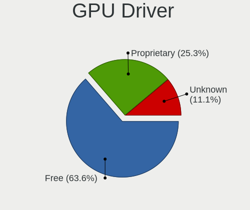
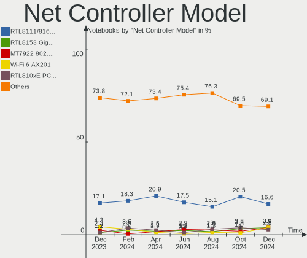
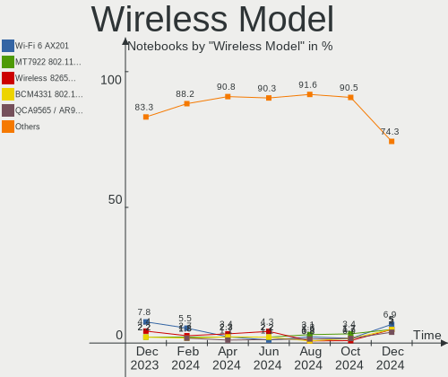

Pop!_OS - Hardware Trends (Notebooks)
-------------------------------------

A project to identify most popular hardware characteristics and track their change
over time based on data collected by Linux users at https://Linux-Hardware.org.

Anyone can contribute to this report by the [hw-probe](https://github.com/linuxhw/hw-probe) tool:

    sudo -E hw-probe -all -upload

This report is for one last month. Overall report since the beginning of time: [TestDays](https://github.com/linuxhw/TestDays)

Period: Sep, 2023.

Contents
--------

* [ System ](#system)
  - [ OS                       ](#os)
  - [ OS Family                ](#os-family)
  - [ Kernel                   ](#kernel)
  - [ Kernel Family            ](#kernel-family)
  - [ Kernel Major Ver.        ](#kernel-major-ver)
  - [ Arch                     ](#arch)
  - [ DE                       ](#de)
  - [ Display Server           ](#display-server)
  - [ Display Manager          ](#display-manager)
  - [ OS Lang                  ](#os-lang)
  - [ Boot Mode                ](#boot-mode)
  - [ Filesystem               ](#filesystem)
  - [ Part. scheme             ](#part-scheme)
  - [ Dual Boot with Linux/BSD ](#dual-boot-with-linuxbsd)
  - [ Dual Boot (Win)          ](#dual-boot-win)

* [ Board ](#board)
  - [ Vendor                   ](#vendor)
  - [ Model                    ](#model)
  - [ Model Family             ](#model-family)
  - [ MFG Year                 ](#mfg-year)
  - [ Form Factor              ](#form-factor)
  - [ Secure Boot              ](#secure-boot)
  - [ Coreboot                 ](#coreboot)
  - [ RAM Size                 ](#ram-size)
  - [ RAM Used                 ](#ram-used)
  - [ Total Drives             ](#total-drives)
  - [ Has CD-ROM               ](#has-cd-rom)
  - [ Has Ethernet             ](#has-ethernet)
  - [ Has WiFi                 ](#has-wifi)
  - [ Has Bluetooth            ](#has-bluetooth)

* [ Location ](#location)
  - [ Country                  ](#country)
  - [ City                     ](#city)

* [ Drives ](#drives)
  - [ Drive Vendor             ](#drive-vendor)
  - [ Drive Model              ](#drive-model)
  - [ HDD Vendor               ](#hdd-vendor)
  - [ SSD Vendor               ](#ssd-vendor)
  - [ Drive Kind               ](#drive-kind)
  - [ Drive Connector          ](#drive-connector)
  - [ Drive Size               ](#drive-size)
  - [ Space Total              ](#space-total)
  - [ Space Used               ](#space-used)
  - [ Malfunc. Drives          ](#malfunc-drives)
  - [ Malfunc. Drive Vendor    ](#malfunc-drive-vendor)
  - [ Malfunc. HDD Vendor      ](#malfunc-hdd-vendor)
  - [ Malfunc. Drive Kind      ](#malfunc-drive-kind)
  - [ Failed Drives            ](#failed-drives)
  - [ Failed Drive Vendor      ](#failed-drive-vendor)
  - [ Drive Status             ](#drive-status)

* [ Storage controller ](#storage-controller)
  - [ Storage Vendor           ](#storage-vendor)
  - [ Storage Model            ](#storage-model)
  - [ Storage Kind             ](#storage-kind)

* [ Processor ](#processor)
  - [ CPU Vendor               ](#cpu-vendor)
  - [ CPU Model                ](#cpu-model)
  - [ CPU Model Family         ](#cpu-model-family)
  - [ CPU Cores                ](#cpu-cores)
  - [ CPU Sockets              ](#cpu-sockets)
  - [ CPU Threads              ](#cpu-threads)
  - [ CPU Op-Modes             ](#cpu-op-modes)
  - [ CPU Microcode            ](#cpu-microcode)
  - [ CPU Microarch            ](#cpu-microarch)

* [ Graphics ](#graphics)
  - [ GPU Vendor               ](#gpu-vendor)
  - [ GPU Model                ](#gpu-model)
  - [ GPU Combo                ](#gpu-combo)
  - [ GPU Driver               ](#gpu-driver)
  - [ GPU Memory               ](#gpu-memory)

* [ Monitor ](#monitor)
  - [ Monitor Vendor           ](#monitor-vendor)
  - [ Monitor Model            ](#monitor-model)
  - [ Monitor Resolution       ](#monitor-resolution)
  - [ Monitor Diagonal         ](#monitor-diagonal)
  - [ Monitor Width            ](#monitor-width)
  - [ Aspect Ratio             ](#aspect-ratio)
  - [ Monitor Area             ](#monitor-area)
  - [ Pixel Density            ](#pixel-density)
  - [ Multiple Monitors        ](#multiple-monitors)

* [ Network ](#network)
  - [ Net Controller Vendor    ](#net-controller-vendor)
  - [ Net Controller Model     ](#net-controller-model)
  - [ Wireless Vendor          ](#wireless-vendor)
  - [ Wireless Model           ](#wireless-model)
  - [ Ethernet Vendor          ](#ethernet-vendor)
  - [ Ethernet Model           ](#ethernet-model)
  - [ Net Controller Kind      ](#net-controller-kind)
  - [ Used Controller          ](#used-controller)
  - [ NICs                     ](#nics)
  - [ IPv6                     ](#ipv6)

* [ Bluetooth ](#bluetooth)
  - [ Bluetooth Vendor         ](#bluetooth-vendor)
  - [ Bluetooth Model          ](#bluetooth-model)

* [ Sound ](#sound)
  - [ Sound Vendor             ](#sound-vendor)
  - [ Sound Model              ](#sound-model)

* [ Memory ](#memory)
  - [ Memory Vendor            ](#memory-vendor)
  - [ Memory Model             ](#memory-model)
  - [ Memory Kind              ](#memory-kind)
  - [ Memory Form Factor       ](#memory-form-factor)
  - [ Memory Size              ](#memory-size)
  - [ Memory Speed             ](#memory-speed)

* [ Printers & scanners ](#printers--scanners)
  - [ Printer Vendor           ](#printer-vendor)
  - [ Printer Model            ](#printer-model)
  - [ Scanner Vendor           ](#scanner-vendor)
  - [ Scanner Model            ](#scanner-model)

* [ Camera ](#camera)
  - [ Camera Vendor            ](#camera-vendor)
  - [ Camera Model             ](#camera-model)

* [ Security ](#security)
  - [ Fingerprint Vendor       ](#fingerprint-vendor)
  - [ Fingerprint Model        ](#fingerprint-model)
  - [ Chipcard Vendor          ](#chipcard-vendor)
  - [ Chipcard Model           ](#chipcard-model)

* [ Unsupported ](#unsupported)
  - [ Unsupported Devices      ](#unsupported-devices)
  - [ Unsupported Device Types ](#unsupported-device-types)

System
------

OS
--

Installed operating systems

| Name          | Notebooks | Percent |
|---------------|-----------|---------|
| Pop!_OS 22.04 | 101       | 99.02%  |
| Pop!_OS 20.04 | 1         | 0.98%   |

OS Family
---------

OS without a version

| Name    | Notebooks | Percent |
|---------|-----------|---------|
| Pop!_OS | 102       | 100%    |

Kernel
------

Version of the Linux kernel

| Version                  | Notebooks | Percent |
|--------------------------|-----------|---------|
| 6.4.6-76060406-generic   | 86        | 84.31%  |
| 6.2.6-76060206-generic   | 11        | 10.78%  |
| 6.5.5-x64v3-xanmod1      | 1         | 0.98%   |
| 6.4.12-2-liquorix-amd64  | 1         | 0.98%   |
| 6.0.3-76060003-generic   | 1         | 0.98%   |
| 6.0.12-76060012-generic  | 1         | 0.98%   |
| 5.16.19-76051619-generic | 1         | 0.98%   |

Kernel Family
-------------

Linux kernel without a distro release

| Version | Notebooks | Percent |
|---------|-----------|---------|
| 6.4.6   | 86        | 84.31%  |
| 6.2.6   | 11        | 10.78%  |
| 6.5.5   | 1         | 0.98%   |
| 6.4.12  | 1         | 0.98%   |
| 6.0.3   | 1         | 0.98%   |
| 6.0.12  | 1         | 0.98%   |
| 5.16.19 | 1         | 0.98%   |

Kernel Major Ver.
-----------------

Linux kernel major version

| Version | Notebooks | Percent |
|---------|-----------|---------|
| 6.4     | 87        | 85.29%  |
| 6.2     | 11        | 10.78%  |
| 6.0     | 2         | 1.96%   |
| 6.5     | 1         | 0.98%   |
| 5.16    | 1         | 0.98%   |

Arch
----

OS architecture (x86_64, i586, etc.)

| Name   | Notebooks | Percent |
|--------|-----------|---------|
| x86_64 | 102       | 100%    |

DE
--

Desktop Environment

| Name            | Notebooks | Percent |
|-----------------|-----------|---------|
| GNOME           | 94        | 92.16%  |
| GNOME Flashback | 2         | 1.96%   |
| Unknown         | 2         | 1.96%   |
| X-Cinnamon      | 1         | 0.98%   |
| Unity           | 1         | 0.98%   |
| KDE5            | 1         | 0.98%   |
| awesome         | 1         | 0.98%   |

Display Server
--------------

X11 or Wayland

| Name    | Notebooks | Percent |
|---------|-----------|---------|
| X11     | 93        | 91.18%  |
| Wayland | 8         | 7.84%   |
| Unknown | 1         | 0.98%   |

Display Manager
---------------

SDDM, LightDM, etc.

| Name    | Notebooks | Percent |
|---------|-----------|---------|
| Unknown | 60        | 58.82%  |
| GDM3    | 41        | 40.2%   |
| GDM     | 1         | 0.98%   |

OS Lang
-------

Language

| Lang    | Notebooks | Percent |
|---------|-----------|---------|
| en_US   | 58        | 56.86%  |
| en_GB   | 11        | 10.78%  |
| pt_BR   | 6         | 5.88%   |
| fr_FR   | 5         | 4.9%    |
| de_DE   | 5         | 4.9%    |
| en_AU   | 3         | 2.94%   |
| C       | 3         | 2.94%   |
| Unknown | 2         | 1.96%   |
| ru_RU   | 1         | 0.98%   |
| pt_PT   | 1         | 0.98%   |
| nl_NL   | 1         | 0.98%   |
| nb_NO   | 1         | 0.98%   |
| it_IT   | 1         | 0.98%   |
| es_ES   | 1         | 0.98%   |
| en_NZ   | 1         | 0.98%   |
| en_IL   | 1         | 0.98%   |
| en_DK   | 1         | 0.98%   |

Boot Mode
---------

EFI or BIOS

| Mode | Notebooks | Percent |
|------|-----------|---------|
| BIOS | 59        | 57.84%  |
| EFI  | 43        | 42.16%  |

Filesystem
----------

Type of filesystem

| Type    | Notebooks | Percent |
|---------|-----------|---------|
| Ext4    | 97        | 95.1%   |
| Btrfs   | 3         | 2.94%   |
| Overlay | 2         | 1.96%   |

Part. scheme
------------

Scheme of partitioning

| Type    | Notebooks | Percent |
|---------|-----------|---------|
| Unknown | 58        | 56.86%  |
| GPT     | 43        | 42.16%  |
| MBR     | 1         | 0.98%   |

Dual Boot with Linux/BSD
------------------------

Hosting more than one Linux/BSD

| Dual boot | Notebooks | Percent |
|-----------|-----------|---------|
| No        | 99        | 97.06%  |
| Yes       | 3         | 2.94%   |

Dual Boot (Win)
---------------

Hosting Linux and Windows

| Dual boot | Notebooks | Percent |
|-----------|-----------|---------|
| No        | 86        | 84.31%  |
| Yes       | 16        | 15.69%  |

Board
-----

Vendor
------

Motherboard manufacturer

| Name             | Notebooks | Percent |
|------------------|-----------|---------|
| Hewlett-Packard  | 17        | 16.67%  |
| ASUSTek Computer | 16        | 15.69%  |
| Lenovo           | 15        | 14.71%  |
| Dell             | 14        | 13.73%  |
| Apple            | 8         | 7.84%   |
| System76         | 6         | 5.88%   |
| MSI              | 5         | 4.9%    |
| Toshiba          | 3         | 2.94%   |
| Acer             | 3         | 2.94%   |
| Schenker         | 2         | 1.96%   |
| Notebook         | 2         | 1.96%   |
| HUAWEI           | 2         | 1.96%   |
| HONOR            | 2         | 1.96%   |
| realme           | 1         | 0.98%   |
| Positivo         | 1         | 0.98%   |
| Fujitsu          | 1         | 0.98%   |
| Framework        | 1         | 0.98%   |
| Digibras         | 1         | 0.98%   |
| Alienware        | 1         | 0.98%   |
| Unknown          | 1         | 0.98%   |

Model
-----

Motherboard model

| Name                                     | Notebooks | Percent |
|------------------------------------------|-----------|---------|
| System76 Darter Pro                      | 2         | 1.96%   |
| HP 250 G4                                | 2         | 1.96%   |
| Apple MacBookAir6,2                      | 2         | 1.96%   |
| Toshiba TECRA X40-E                      | 1         | 0.98%   |
| Toshiba Satellite P775                   | 1         | 0.98%   |
| Toshiba Satellite L735                   | 1         | 0.98%   |
| System76 Pangolin                        | 1         | 0.98%   |
| System76 Oryx Pro                        | 1         | 0.98%   |
| System76 Lemur Pro                       | 1         | 0.98%   |
| System76 Gazelle                         | 1         | 0.98%   |
| Schenker XMG NEO (TGL/M21)               | 1         | 0.98%   |
| Schenker VIA 15 Pro                      | 1         | 0.98%   |
| realme RMNBXXXX                          | 1         | 0.98%   |
| Positivo C14CR01                         | 1         | 0.98%   |
| Notebook NV4XMB,ME,MZ                    | 1         | 0.98%   |
| Notebook NH50_70RH                       | 1         | 0.98%   |
| MSI Summit E13FlipEvo A12MT              | 1         | 0.98%   |
| MSI Stealth 15M B12UE                    | 1         | 0.98%   |
| MSI P65 Creator 8RD                      | 1         | 0.98%   |
| MSI Cyborg 15 A12VF                      | 1         | 0.98%   |
| MSI Alpha 15 A3DDK                       | 1         | 0.98%   |
| Lenovo Yoga Pro 7 14ARP8 83AU            | 1         | 0.98%   |
| Lenovo V720-14 80Y1                      | 1         | 0.98%   |
| Lenovo ThinkPad X13 Gen 2a 20XHCTO1WW    | 1         | 0.98%   |
| Lenovo ThinkPad X1 Carbon 3rd 20BTS05100 | 1         | 0.98%   |
| Lenovo ThinkPad L14 Gen 1 20U10026US     | 1         | 0.98%   |
| Lenovo Slim Pro 9 14IRP8 83BV            | 1         | 0.98%   |
| Lenovo Legion Slim 5 16APH8 82Y9         | 1         | 0.98%   |
| Lenovo Legion 5 Pro 16IAH7H 82RF         | 1         | 0.98%   |
| Lenovo Legion 5 17ACH6H 82JY             | 1         | 0.98%   |
| Lenovo IdeaPad Gaming 3 15ACH6 82K2      | 1         | 0.98%   |
| Lenovo IdeaPad 5 Pro 14ACN6 82L7         | 1         | 0.98%   |
| Lenovo IdeaPad 5 14ABA7 82SE             | 1         | 0.98%   |
| Lenovo IdeaPad 320-15ISK 80XH            | 1         | 0.98%   |
| Lenovo IdeaPad 310-15ISK 80UH            | 1         | 0.98%   |
| Lenovo IdeaPad 100-15IBD 80QQ            | 1         | 0.98%   |
| HUAWEI NbDE-WXX9                         | 1         | 0.98%   |
| HUAWEI KPL-W0X                           | 1         | 0.98%   |
| HONOR NBR-WAX9                           | 1         | 0.98%   |
| HONOR BMH-WCX9                           | 1         | 0.98%   |

Model Family
------------

Motherboard model prefix

| Name              | Notebooks | Percent |
|-------------------|-----------|---------|
| ASUS VivoBook     | 9         | 8.82%   |
| Lenovo IdeaPad    | 6         | 5.88%   |
| Dell Latitude     | 6         | 5.88%   |
| Lenovo ThinkPad   | 3         | 2.94%   |
| Lenovo Legion     | 3         | 2.94%   |
| HP Laptop         | 3         | 2.94%   |
| HP EliteBook      | 3         | 2.94%   |
| Dell Inspiron     | 3         | 2.94%   |
| Toshiba Satellite | 2         | 1.96%   |
| System76 Darter   | 2         | 1.96%   |
| HP Pavilion       | 2         | 1.96%   |
| HP OMEN           | 2         | 1.96%   |
| HP 250            | 2         | 1.96%   |
| Dell XPS          | 2         | 1.96%   |
| Dell Vostro       | 2         | 1.96%   |
| ASUS ASUS         | 2         | 1.96%   |
| Apple MacBookAir6 | 2         | 1.96%   |
| Acer Aspire       | 2         | 1.96%   |
| Toshiba TECRA     | 1         | 0.98%   |
| System76 Pangolin | 1         | 0.98%   |
| System76 Oryx     | 1         | 0.98%   |
| System76 Lemur    | 1         | 0.98%   |
| System76 Gazelle  | 1         | 0.98%   |
| Schenker XMG      | 1         | 0.98%   |
| Schenker VIA      | 1         | 0.98%   |
| realme RMNBXXXX   | 1         | 0.98%   |
| Positivo C14CR01  | 1         | 0.98%   |
| Notebook NV4XMB   | 1         | 0.98%   |
| Notebook NH50     | 1         | 0.98%   |
| MSI Summit        | 1         | 0.98%   |
| MSI Stealth       | 1         | 0.98%   |
| MSI P65           | 1         | 0.98%   |
| MSI Cyborg        | 1         | 0.98%   |
| MSI Alpha         | 1         | 0.98%   |
| Lenovo Yoga       | 1         | 0.98%   |
| Lenovo V720-14    | 1         | 0.98%   |
| Lenovo Slim       | 1         | 0.98%   |
| HUAWEI NbDE-WXX9  | 1         | 0.98%   |
| HUAWEI KPL-W0X    | 1         | 0.98%   |
| HONOR NBR-WAX9    | 1         | 0.98%   |

MFG Year
--------

Motherboard manufacture year

| Year | Notebooks | Percent |
|------|-----------|---------|
| 2021 | 17        | 16.67%  |
| 2022 | 14        | 13.73%  |
| 2023 | 12        | 11.76%  |
| 2019 | 12        | 11.76%  |
| 2015 | 8         | 7.84%   |
| 2020 | 7         | 6.86%   |
| 2013 | 7         | 6.86%   |
| 2011 | 6         | 5.88%   |
| 2018 | 5         | 4.9%    |
| 2016 | 5         | 4.9%    |
| 2012 | 4         | 3.92%   |
| 2017 | 3         | 2.94%   |
| 2014 | 1         | 0.98%   |
| 2010 | 1         | 0.98%   |

Form Factor
-----------

Physical design of the computer

| Name     | Notebooks | Percent |
|----------|-----------|---------|
| Notebook | 102       | 100%    |

Secure Boot
-----------

Enabled or disabled

| State    | Notebooks | Percent |
|----------|-----------|---------|
| Disabled | 102       | 100%    |

Coreboot
--------

Have coreboot on board

| Used | Notebooks | Percent |
|------|-----------|---------|
| No   | 98        | 96.08%  |
| Yes  | 4         | 3.92%   |

RAM Size
--------

Total RAM memory

| Size in GB  | Notebooks | Percent |
|-------------|-----------|---------|
| 4.01-8.0    | 27        | 26.47%  |
| 8.01-16.0   | 25        | 24.51%  |
| 16.01-24.0  | 20        | 19.61%  |
| 3.01-4.0    | 14        | 13.73%  |
| 32.01-64.0  | 10        | 9.8%    |
| 64.01-256.0 | 4         | 3.92%   |
| 24.01-32.0  | 2         | 1.96%   |

RAM Used
--------

Used RAM memory

| Used GB    | Notebooks | Percent |
|------------|-----------|---------|
| 4.01-8.0   | 44        | 43.14%  |
| 3.01-4.0   | 20        | 19.61%  |
| 2.01-3.0   | 17        | 16.67%  |
| 8.01-16.0  | 13        | 12.75%  |
| 1.01-2.0   | 5         | 4.9%    |
| 16.01-24.0 | 2         | 1.96%   |
| 24.01-32.0 | 1         | 0.98%   |

Total Drives
------------

Number of drives on board

| Drives | Notebooks | Percent |
|--------|-----------|---------|
| 1      | 80        | 78.43%  |
| 2      | 20        | 19.61%  |
| 3      | 1         | 0.98%   |
| 0      | 1         | 0.98%   |

Has CD-ROM
----------

Has CD-ROM on board

| Presented | Notebooks | Percent |
|-----------|-----------|---------|
| No        | 85        | 83.33%  |
| Yes       | 17        | 16.67%  |

Has Ethernet
------------

Has Ethernet on board

| Presented | Notebooks | Percent |
|-----------|-----------|---------|
| Yes       | 72        | 70.59%  |
| No        | 30        | 29.41%  |

Has WiFi
--------

Has WiFi module

| Presented | Notebooks | Percent |
|-----------|-----------|---------|
| Yes       | 101       | 99.02%  |
| No        | 1         | 0.98%   |

Has Bluetooth
-------------

Has Bluetooth module

| Presented | Notebooks | Percent |
|-----------|-----------|---------|
| Yes       | 96        | 94.12%  |
| No        | 6         | 5.88%   |

Location
--------

Country
-------

Geographic location (country)

| Country          | Notebooks | Percent |
|------------------|-----------|---------|
| USA              | 17        | 16.67%  |
| Germany          | 10        | 9.8%    |
| Brazil           | 9         | 8.82%   |
| Italy            | 5         | 4.9%    |
| UK               | 4         | 3.92%   |
| Turkey           | 4         | 3.92%   |
| Serbia           | 4         | 3.92%   |
| Netherlands      | 4         | 3.92%   |
| India            | 4         | 3.92%   |
| France           | 4         | 3.92%   |
| Australia        | 4         | 3.92%   |
| Denmark          | 3         | 2.94%   |
| Uzbekistan       | 2         | 1.96%   |
| Singapore        | 2         | 1.96%   |
| Norway           | 2         | 1.96%   |
| Mexico           | 2         | 1.96%   |
| Indonesia        | 2         | 1.96%   |
| Ukraine          | 1         | 0.98%   |
| Sweden           | 1         | 0.98%   |
| Spain            | 1         | 0.98%   |
| Russia           | 1         | 0.98%   |
| Puerto Rico      | 1         | 0.98%   |
| Portugal         | 1         | 0.98%   |
| Poland           | 1         | 0.98%   |
| Papua New Guinea | 1         | 0.98%   |
| North Macedonia  | 1         | 0.98%   |
| New Zealand      | 1         | 0.98%   |
| Morocco          | 1         | 0.98%   |
| Malaysia         | 1         | 0.98%   |
| Kazakhstan       | 1         | 0.98%   |
| Israel           | 1         | 0.98%   |
| Iceland          | 1         | 0.98%   |
| Finland          | 1         | 0.98%   |
| Czechia          | 1         | 0.98%   |
| Canada           | 1         | 0.98%   |
| Belarus          | 1         | 0.98%   |
| Argentina        | 1         | 0.98%   |

City
----

Geographic location (city)

| City              | Notebooks | Percent |
|-------------------|-----------|---------|
| Tashkent          | 2         | 1.96%   |
| Singapore         | 2         | 1.96%   |
| Paris             | 2         | 1.96%   |
| Oslo              | 2         | 1.96%   |
| Melbourne         | 2         | 1.96%   |
| Leipzig           | 2         | 1.96%   |
| Clinton Township  | 2         | 1.96%   |
| Bengaluru         | 2         | 1.96%   |
| Belgrade          | 2         | 1.96%   |
| Ankara            | 2         | 1.96%   |
| Ypsilanti         | 1         | 0.98%   |
| Wuppertal         | 1         | 0.98%   |
| Waukegan          | 1         | 0.98%   |
| Vancouver         | 1         | 0.98%   |
| Ust-Kamenogorsk   | 1         | 0.98%   |
| Trento            | 1         | 0.98%   |
| Tirunelveli       | 1         | 0.98%   |
| Thrissur          | 1         | 0.98%   |
| Sydney            | 1         | 0.98%   |
| Skopje            | 1         | 0.98%   |
| Simcoe            | 1         | 0.98%   |
| Seattle           | 1         | 0.98%   |
| Sao Paulo         | 1         | 0.98%   |
| San Juan          | 1         | 0.98%   |
| San Diego         | 1         | 0.98%   |
| Samarinda         | 1         | 0.98%   |
| Reykjavik         | 1         | 0.98%   |
| Raleigh           | 1         | 0.98%   |
| Port Moresby      | 1         | 0.98%   |
| Polatsk           | 1         | 0.98%   |
| Plano             | 1         | 0.98%   |
| Piracicaba        | 1         | 0.98%   |
| Phoenix           | 1         | 0.98%   |
| Palermo           | 1         | 0.98%   |
| Osasco            | 1         | 0.98%   |
| Orem              | 1         | 0.98%   |
| Oberursel         | 1         | 0.98%   |
| North Olmsted     | 1         | 0.98%   |
| Noordwijk aan Zee | 1         | 0.98%   |
| Nibe              | 1         | 0.98%   |

Drives
------

Drive Vendor
------------

Hard drive vendors

| Vendor                      | Notebooks | Drives | Percent |
|-----------------------------|-----------|--------|---------|
| Samsung Electronics         | 20        | 21     | 16.53%  |
| Sandisk                     | 12        | 12     | 9.92%   |
| Micron Technology           | 12        | 13     | 9.92%   |
| WDC                         | 10        | 10     | 8.26%   |
| Kingston                    | 10        | 10     | 8.26%   |
| Toshiba                     | 8         | 9      | 6.61%   |
| SK hynix                    | 8         | 8      | 6.61%   |
| Apple                       | 6         | 6      | 4.96%   |
| Unknown                     | 4         | 4      | 3.31%   |
| KIOXIA                      | 4         | 4      | 3.31%   |
| Crucial                     | 4         | 4      | 3.31%   |
| Seagate                     | 3         | 3      | 2.48%   |
| Intel                       | 3         | 3      | 2.48%   |
| Micron/Crucial Technology   | 2         | 2      | 1.65%   |
| China                       | 2         | 2      | 1.65%   |
| VISIPRO                     | 1         | 1      | 0.83%   |
| StoreJet                    | 1         | 2      | 0.83%   |
| Silicon Motion              | 1         | 1      | 0.83%   |
| PNY                         | 1         | 1      | 0.83%   |
| Phison Electronics          | 1         | 1      | 0.83%   |
| Netac                       | 1         | 1      | 0.83%   |
| MSI                         | 1         | 1      | 0.83%   |
| MAXIO Technology (Hangzhou) | 1         | 1      | 0.83%   |
| Intenso                     | 1         | 1      | 0.83%   |
| Hitachi                     | 1         | 1      | 0.83%   |
| Fujitsu                     | 1         | 1      | 0.83%   |
| BHT                         | 1         | 1      | 0.83%   |
| Unknown                     | 1         | 1      | 0.83%   |

Drive Model
-----------

Hard drive models

| Model                                                 | Notebooks | Percent |
|-------------------------------------------------------|-----------|---------|
| Samsung NVMe SSD Controller SM981/PM981/PM983 256GB   | 4         | 3.28%   |
| Samsung NVMe SSD Controller PM9A1/PM9A3/980PRO 1TB    | 4         | 3.28%   |
| SK hynix SKHynix_HFS001TEJ9X115N 1TB                  | 2         | 1.64%   |
| SK hynix PC300 NVMe Solid State Drive 256GB           | 2         | 1.64%   |
| Sandisk WD Blue SN500 / PC SN520 NVMe SSD 256GB       | 2         | 1.64%   |
| Micron 2450_MTFDKBA1T0TFK 1024GB                      | 2         | 1.64%   |
| Micron 2400_MTFDKBA1T0QFM 1024GB                      | 2         | 1.64%   |
| WDC WDS500G2B0C-00PXH0 500GB                          | 1         | 0.82%   |
| WDC WDS480G2G0B-00EPW0 480GB SSD                      | 1         | 0.82%   |
| WDC WDS240G2G0C-00AJM0 240GB                          | 1         | 0.82%   |
| WDC WDS100T2B0B-00YS70 1TB SSD                        | 1         | 0.82%   |
| WDC WDS100T2B0A-00SM50 1TB SSD                        | 1         | 0.82%   |
| WDC WD3200BEKX-75B7WT0 320GB                          | 1         | 0.82%   |
| WDC WD10SPZX-60Z10T0 1TB                              | 1         | 0.82%   |
| WDC PC SN810 NVMe 1024GB                              | 1         | 0.82%   |
| WDC PC SN530 SDBPNPZ-512G-1027 512GB                  | 1         | 0.82%   |
| WDC PC SN530 SDBPNPZ-512G-1002 512GB                  | 1         | 0.82%   |
| VISIPRO SDVPNV1911000 1TB                             | 1         | 0.82%   |
| Unknown SB64G  64GB                                   | 1         | 0.82%   |
| Unknown MMC Card  64GB                                | 1         | 0.82%   |
| Unknown MMC Card  32GB                                | 1         | 0.82%   |
| Unknown ISOCOM  64GB                                  | 1         | 0.82%   |
| Toshiba XG6 NVMe SSD Controller 512GB                 | 1         | 0.82%   |
| Toshiba MQ04ABF100 1TB                                | 1         | 0.82%   |
| Toshiba MQ02ABF050H-SSHD-8GB                          | 1         | 0.82%   |
| Toshiba MQ01ABD100 1TB                                | 1         | 0.82%   |
| Toshiba MK7575GSX 752GB                               | 1         | 0.82%   |
| Toshiba MK7559GSXP 752GB                              | 1         | 0.82%   |
| Toshiba MK6475GSX 640GB                               | 1         | 0.82%   |
| Toshiba KBG40ZNS256G NVMe 256GB                       | 1         | 0.82%   |
| StoreJet TS128GESD400K 128GB                          | 1         | 0.82%   |
| StoreJet Transcend 320GB                              | 1         | 0.82%   |
| SK hynix PC801 NVMe 1TB                               | 1         | 0.82%   |
| SK hynix PC711 HFS001TDE9X073N 1TB                    | 1         | 0.82%   |
| SK hynix BC901 NVMe 512GB                             | 1         | 0.82%   |
| SK hynix BC511 HFM256GDJTNI-82A0A 256GB               | 1         | 0.82%   |
| Silicon Motion SM2263EN/SM2263XT SSD Controller 512GB | 1         | 0.82%   |
| Seagate ST9500423AS 500GB                             | 1         | 0.82%   |
| Seagate ST500LM030-2E717D 500GB                       | 1         | 0.82%   |
| Seagate ST1000LM035-1RK1 1TB                          | 1         | 0.82%   |

HDD Vendor
----------

Hard disk drive vendors

| Vendor  | Notebooks | Drives | Percent |
|---------|-----------|--------|---------|
| Toshiba | 6         | 7      | 46.15%  |
| Seagate | 3         | 3      | 23.08%  |
| WDC     | 2         | 2      | 15.38%  |
| Hitachi | 1         | 1      | 7.69%   |
| Fujitsu | 1         | 1      | 7.69%   |

SSD Vendor
----------

Solid state drive vendors

| Vendor              | Notebooks | Drives | Percent |
|---------------------|-----------|--------|---------|
| Kingston            | 6         | 6      | 17.65%  |
| Apple               | 6         | 6      | 17.65%  |
| Samsung Electronics | 5         | 5      | 14.71%  |
| Crucial             | 4         | 4      | 11.76%  |
| WDC                 | 3         | 3      | 8.82%   |
| SanDisk             | 3         | 3      | 8.82%   |
| Micron Technology   | 2         | 2      | 5.88%   |
| China               | 2         | 2      | 5.88%   |
| StoreJet            | 1         | 1      | 2.94%   |
| Netac               | 1         | 1      | 2.94%   |
| MSI                 | 1         | 1      | 2.94%   |

Drive Kind
----------

HDD or SSD

| Kind    | Notebooks | Drives | Percent |
|---------|-----------|--------|---------|
| NVMe    | 59        | 69     | 53.64%  |
| SSD     | 31        | 34     | 28.18%  |
| HDD     | 13        | 14     | 11.82%  |
| MMC     | 4         | 5      | 3.64%   |
| Unknown | 3         | 3      | 2.73%   |

Drive Connector
---------------

SATA, SAS, NVMe, etc.

| Type | Notebooks | Drives | Percent |
|------|-----------|--------|---------|
| NVMe | 59        | 69     | 56.19%  |
| SATA | 41        | 49     | 39.05%  |
| MMC  | 4         | 5      | 3.81%   |
| SAS  | 1         | 2      | 0.95%   |

Drive Size
----------

Size of hard drive

| Size in TB | Notebooks | Drives | Percent |
|------------|-----------|--------|---------|
| 0.01-0.5   | 31        | 33     | 68.89%  |
| 0.51-1.0   | 14        | 15     | 31.11%  |

Space Total
-----------

Amount of disk space available on the file system

| Size in GB     | Notebooks | Percent |
|----------------|-----------|---------|
| 101-250        | 34        | 33.33%  |
| 251-500        | 30        | 29.41%  |
| 501-1000       | 17        | 16.67%  |
| 51-100         | 7         | 6.86%   |
| 1001-2000      | 5         | 4.9%    |
| 1-20           | 3         | 2.94%   |
| More than 3000 | 2         | 1.96%   |
| Unknown        | 2         | 1.96%   |
| 21-50          | 1         | 0.98%   |
| 2001-3000      | 1         | 0.98%   |

Space Used
----------

Amount of used disk space

| Used GB        | Notebooks | Percent |
|----------------|-----------|---------|
| 1-20           | 32        | 31.37%  |
| 21-50          | 25        | 24.51%  |
| 51-100         | 17        | 16.67%  |
| 101-250        | 10        | 9.8%    |
| 251-500        | 8         | 7.84%   |
| 501-1000       | 5         | 4.9%    |
| 1001-2000      | 2         | 1.96%   |
| Unknown        | 2         | 1.96%   |
| More than 3000 | 1         | 0.98%   |

Malfunc. Drives
---------------

Drive models with a malfunction

| Model                            | Notebooks | Drives | Percent |
|----------------------------------|-----------|--------|---------|
| WDC WDS480G2G0B-00EPW0 480GB SSD | 1         | 1      | 33.33%  |
| WDC WD3200BEKX-75B7WT0 320GB     | 1         | 1      | 33.33%  |
| Toshiba MK7559GSXP 752GB         | 1         | 1      | 33.33%  |

Malfunc. Drive Vendor
---------------------

Vendors of faulty drives

| Vendor  | Notebooks | Drives | Percent |
|---------|-----------|--------|---------|
| WDC     | 2         | 2      | 66.67%  |
| Toshiba | 1         | 1      | 33.33%  |

Malfunc. HDD Vendor
-------------------

Vendors of faulty HDD drives

| Vendor  | Notebooks | Drives | Percent |
|---------|-----------|--------|---------|
| WDC     | 1         | 1      | 50%     |
| Toshiba | 1         | 1      | 50%     |

Malfunc. Drive Kind
-------------------

Kinds of faulty drives

| Kind | Notebooks | Drives | Percent |
|------|-----------|--------|---------|
| HDD  | 2         | 2      | 66.67%  |
| SSD  | 1         | 1      | 33.33%  |

Failed Drives
-------------

Failed drive models

| Model               | Notebooks | Drives | Percent |
|---------------------|-----------|--------|---------|
| Intenso JAJP600M1TB | 1         | 1      | 100%    |

Failed Drive Vendor
-------------------

Failed drive vendors

| Vendor  | Notebooks | Drives | Percent |
|---------|-----------|--------|---------|
| Intenso | 1         | 1      | 100%    |

Drive Status
------------

Number of failed and malfunc. drives

| Status   | Notebooks | Drives | Percent |
|----------|-----------|--------|---------|
| Detected | 62        | 77     | 59.05%  |
| Works    | 39        | 44     | 37.14%  |
| Malfunc  | 3         | 3      | 2.86%   |
| Failed   | 1         | 1      | 0.95%   |

Storage controller
------------------

Storage Vendor
--------------

Storage controller vendors

| Vendor                       | Notebooks | Percent |
|------------------------------|-----------|---------|
| Intel                        | 54        | 40.3%   |
| Samsung Electronics          | 18        | 13.43%  |
| SanDisk                      | 13        | 9.7%    |
| AMD                          | 12        | 8.96%   |
| Micron Technology            | 10        | 7.46%   |
| SK hynix                     | 8         | 5.97%   |
| KIOXIA                       | 4         | 2.99%   |
| Kingston Technology Company  | 4         | 2.99%   |
| Toshiba America Info Systems | 2         | 1.49%   |
| Silicon Motion               | 2         | 1.49%   |
| Phison Electronics           | 2         | 1.49%   |
| Micron/Crucial Technology    | 2         | 1.49%   |
| Nvidia                       | 1         | 0.75%   |
| MAXIO Technology (Hangzhou)  | 1         | 0.75%   |
| Marvell Technology Group     | 1         | 0.75%   |

Storage Model
-------------

Storage controller models

| Model                                                                          | Notebooks | Percent |
|--------------------------------------------------------------------------------|-----------|---------|
| AMD FCH SATA Controller [AHCI mode]                                            | 12        | 8.89%   |
| Samsung NVMe SSD Controller SM981/PM981/PM983                                  | 7         | 5.19%   |
| Samsung NVMe SSD Controller PM9A1/PM9A3/980PRO                                 | 6         | 4.44%   |
| Intel Volume Management Device NVMe RAID Controller                            | 6         | 4.44%   |
| Intel 6 Series/C200 Series Chipset Family 6 port Mobile SATA AHCI Controller   | 6         | 4.44%   |
| Intel Sunrise Point-LP SATA Controller [AHCI mode]                             | 5         | 3.7%    |
| Intel 82801 Mobile SATA Controller [RAID mode]                                 | 5         | 3.7%    |
| Intel 7 Series Chipset Family 6-port SATA Controller [AHCI mode]               | 5         | 3.7%    |
| Micron 2450 NVMe SSD [HendrixV] (DRAM-less)                                    | 4         | 2.96%   |
| Intel Wildcat Point-LP SATA Controller [AHCI Mode]                             | 4         | 2.96%   |
| SK hynix Platinum P41/PC801 NVMe Solid State Drive                             | 3         | 2.22%   |
| SanDisk WD Blue SN550 NVMe SSD                                                 | 3         | 2.22%   |
| Intel Volume Management Device NVMe RAID Controller Intel Corporation          | 3         | 2.22%   |
| Intel Comet Lake SATA AHCI Controller                                          | 3         | 2.22%   |
| Intel 8 Series SATA Controller 1 [AHCI mode]                                   | 3         | 2.22%   |
| Toshiba America Info Systems XG6 NVMe SSD Controller                           | 2         | 1.48%   |
| SK hynix PC300 NVMe Solid State Drive 256GB                                    | 2         | 1.48%   |
| Silicon Motion SM2263EN/SM2263XT (DRAM-less) NVMe SSD Controllers              | 2         | 1.48%   |
| SanDisk WD PC SN810 / Black SN850 NVMe SSD                                     | 2         | 1.48%   |
| SanDisk WD Green SN350 NVMe SSD 240GB (DRAM-less)                              | 2         | 1.48%   |
| SanDisk WD Blue SN500 / PC SN520 NVMe SSD                                      | 2         | 1.48%   |
| SanDisk WD Black SN770 / PC SN740 256GB / PC SN560 (DRAM-less) NVMe SSD        | 2         | 1.48%   |
| Samsung S4LN053X01 AHCI SSD Controller(Apple slot)                             | 2         | 1.48%   |
| Samsung NVMe SSD Controller SM961/PM961/SM963                                  | 2         | 1.48%   |
| Phison E12 NVMe Controller                                                     | 2         | 1.48%   |
| Micron 2400 NVMe SSD (DRAM-less)                                               | 2         | 1.48%   |
| Micron 2210 NVMe SSD [Cobain]                                                  | 2         | 1.48%   |
| KIOXIA NVMe SSD Controller BG4 (DRAM-less)                                     | 2         | 1.48%   |
| Kingston Company KC3000/Renegade NVMe SSD                                      | 2         | 1.48%   |
| Intel Tiger Lake SATA AHCI Controller                                          | 2         | 1.48%   |
| Intel SSD 660P Series                                                          | 2         | 1.48%   |
| Intel Cannon Point-LP SATA Controller [AHCI Mode]                              | 2         | 1.48%   |
| Intel 8 Series/C220 Series Chipset Family 6-port SATA Controller 1 [AHCI mode] | 2         | 1.48%   |
| Intel 400 Series Chipset Family SATA AHCI Controller                           | 2         | 1.48%   |
| SK hynix Gold P31/BC711/PC711 NVMe Solid State Drive                           | 1         | 0.74%   |
| SK hynix BC901 NVMe Solid State Drive (DRAM-less)                              | 1         | 0.74%   |
| SK hynix BC511 NVMe SSD                                                        | 1         | 0.74%   |
| SanDisk WD Blue SN570 NVMe SSD 1TB                                             | 1         | 0.74%   |
| SanDisk WD Black SN750 / PC SN730 NVMe SSD                                     | 1         | 0.74%   |
| Samsung S4LN058A01[SSUBX] AHCI SSD Controller (Apple slot)                     | 1         | 0.74%   |

Storage Kind
------------

Kind of storage controller (IDE, SATA, NVMe, SAS, ...)

| Kind | Notebooks | Percent |
|------|-----------|---------|
| NVMe | 59        | 46.09%  |
| SATA | 55        | 42.97%  |
| RAID | 14        | 10.94%  |

Processor
---------

CPU Vendor
----------

Processor vendors

| Vendor | Notebooks | Percent |
|--------|-----------|---------|
| Intel  | 76        | 74.51%  |
| AMD    | 26        | 25.49%  |

CPU Model
---------

Processor models

| Model                                         | Notebooks | Percent |
|-----------------------------------------------|-----------|---------|
| Intel Core i5-7200U CPU @ 2.50GHz             | 4         | 3.92%   |
| Intel 11th Gen Core i7-1165G7 @ 2.80GHz       | 3         | 2.94%   |
| Intel 11th Gen Core i5-1135G7 @ 2.40GHz       | 3         | 2.94%   |
| Intel Core i7-8565U CPU @ 1.80GHz             | 2         | 1.96%   |
| Intel Core i7-10870H CPU @ 2.20GHz            | 2         | 1.96%   |
| Intel Core i5-4250U CPU @ 1.30GHz             | 2         | 1.96%   |
| Intel Core i5-10210U CPU @ 1.60GHz            | 2         | 1.96%   |
| Intel Core i3-6006U CPU @ 2.00GHz             | 2         | 1.96%   |
| Intel Core i3-5005U CPU @ 2.00GHz             | 2         | 1.96%   |
| Intel 13th Gen Core i9-13980HX                | 2         | 1.96%   |
| Intel 12th Gen Core i9-12900H                 | 2         | 1.96%   |
| Intel 12th Gen Core i7-1280P                  | 2         | 1.96%   |
| Intel 12th Gen Core i7-12700H                 | 2         | 1.96%   |
| Intel 11th Gen Core i7-11800H @ 2.30GHz       | 2         | 1.96%   |
| AMD Ryzen 7 PRO 5850U with Radeon Graphics    | 2         | 1.96%   |
| AMD Ryzen 7 5800U with Radeon Graphics        | 2         | 1.96%   |
| AMD Ryzen 7 5800H with Radeon Graphics        | 2         | 1.96%   |
| AMD Ryzen 3 3200U with Radeon Vega Mobile Gfx | 2         | 1.96%   |
| Intel Core i9-10885H CPU @ 2.40GHz            | 1         | 0.98%   |
| Intel Core i7-8750H CPU @ 2.20GHz             | 1         | 0.98%   |
| Intel Core i7-8550U CPU @ 1.80GHz             | 1         | 0.98%   |
| Intel Core i7-7700HQ CPU @ 2.80GHz            | 1         | 0.98%   |
| Intel Core i7-5600U CPU @ 2.60GHz             | 1         | 0.98%   |
| Intel Core i7-4870HQ CPU @ 2.50GHz            | 1         | 0.98%   |
| Intel Core i7-4720HQ CPU @ 2.60GHz            | 1         | 0.98%   |
| Intel Core i7-4700HQ CPU @ 2.40GHz            | 1         | 0.98%   |
| Intel Core i7-3740QM CPU @ 2.70GHz            | 1         | 0.98%   |
| Intel Core i7-3517U CPU @ 1.90GHz             | 1         | 0.98%   |
| Intel Core i7-2670QM CPU @ 2.20GHz            | 1         | 0.98%   |
| Intel Core i7-2630QM CPU @ 2.00GHz            | 1         | 0.98%   |
| Intel Core i5-9300H CPU @ 2.40GHz             | 1         | 0.98%   |
| Intel Core i5-8265U CPU @ 1.60GHz             | 1         | 0.98%   |
| Intel Core i5-8250U CPU @ 1.60GHz             | 1         | 0.98%   |
| Intel Core i5-7440HQ CPU @ 2.80GHz            | 1         | 0.98%   |
| Intel Core i5-6300U CPU @ 2.40GHz             | 1         | 0.98%   |
| Intel Core i5-5300U CPU @ 2.30GHz             | 1         | 0.98%   |
| Intel Core i5-5250U CPU @ 1.60GHz             | 1         | 0.98%   |
| Intel Core i5-5200U CPU @ 2.20GHz             | 1         | 0.98%   |
| Intel Core i5-4300U CPU @ 1.90GHz             | 1         | 0.98%   |
| Intel Core i5-4200U CPU @ 1.60GHz             | 1         | 0.98%   |

CPU Model Family
----------------

Processor model prefix

| Model            | Notebooks | Percent |
|------------------|-----------|---------|
| Intel Core i5    | 24        | 23.53%  |
| Other            | 22        | 21.57%  |
| Intel Core i7    | 15        | 14.71%  |
| AMD Ryzen 7      | 10        | 9.8%    |
| Intel Core i3    | 8         | 7.84%   |
| AMD Ryzen 5      | 7         | 6.86%   |
| Intel Celeron    | 4         | 3.92%   |
| AMD Ryzen 7 PRO  | 3         | 2.94%   |
| AMD Ryzen 3      | 3         | 2.94%   |
| Intel Core i9    | 1         | 0.98%   |
| Intel Core 2 Duo | 1         | 0.98%   |
| Intel Atom       | 1         | 0.98%   |
| AMD Ryzen 9      | 1         | 0.98%   |
| AMD PRO A10      | 1         | 0.98%   |
| AMD E2           | 1         | 0.98%   |

CPU Cores
---------

Number of processor cores

| Number | Notebooks | Percent |
|--------|-----------|---------|
| 2      | 34        | 33.33%  |
| 4      | 33        | 32.35%  |
| 8      | 18        | 17.65%  |
| 14     | 7         | 6.86%   |
| 6      | 5         | 4.9%    |
| 24     | 2         | 1.96%   |
| 10     | 2         | 1.96%   |
| 12     | 1         | 0.98%   |

CPU Sockets
-----------

Number of sockets

| Number | Notebooks | Percent |
|--------|-----------|---------|
| 1      | 102       | 100%    |

CPU Threads
-----------

Threads per core (Hyper-Threading)

| Number | Notebooks | Percent |
|--------|-----------|---------|
| 2      | 94        | 92.16%  |
| 1      | 8         | 7.84%   |

CPU Op-Modes
------------

CPU Operation Modes (32-bit, 64-bit)

| Op mode        | Notebooks | Percent |
|----------------|-----------|---------|
| 32-bit, 64-bit | 102       | 100%    |

CPU Microcode
-------------

Microcode number

| Number     | Notebooks | Percent |
|------------|-----------|---------|
| Unknown    | 92        | 90.2%   |
| 0x806c1    | 1         | 0.98%   |
| 0x0a704103 | 1         | 0.98%   |
| 0x0a704101 | 1         | 0.98%   |
| 0x0a50000d | 1         | 0.98%   |
| 0x0a50000c | 1         | 0.98%   |
| 0x0a404102 | 1         | 0.98%   |
| 0x08a00008 | 1         | 0.98%   |
| 0x08608103 | 1         | 0.98%   |
| 0x08600103 | 1         | 0.98%   |
| 0x08101016 | 1         | 0.98%   |

CPU Microarch
-------------

Microarchitecture

| Name             | Notebooks | Percent |
|------------------|-----------|---------|
| KabyLake         | 17        | 16.67%  |
| Unknown          | 14        | 13.73%  |
| Alderlake Hybrid | 10        | 9.8%    |
| Zen 3            | 8         | 7.84%   |
| Haswell          | 8         | 7.84%   |
| TigerLake        | 7         | 6.86%   |
| SandyBridge      | 7         | 6.86%   |
| Broadwell        | 6         | 5.88%   |
| Zen+             | 4         | 3.92%   |
| IvyBridge        | 4         | 3.92%   |
| Skylake          | 3         | 2.94%   |
| CometLake        | 3         | 2.94%   |
| Zen              | 2         | 1.96%   |
| Silvermont       | 2         | 1.96%   |
| Zen 2            | 1         | 0.98%   |
| Puma             | 1         | 0.98%   |
| Penryn           | 1         | 0.98%   |
| IceLake          | 1         | 0.98%   |
| Goldmont plus    | 1         | 0.98%   |
| Goldmont         | 1         | 0.98%   |
| Excavator        | 1         | 0.98%   |

Graphics
--------

GPU Vendor
----------

Vendors of graphics cards

| Vendor | Notebooks | Percent |
|--------|-----------|---------|
| Intel  | 72        | 51.43%  |
| Nvidia | 41        | 29.29%  |
| AMD    | 27        | 19.29%  |

GPU Model
---------

Graphics card models

| Model                                                                                    | Notebooks | Percent |
|------------------------------------------------------------------------------------------|-----------|---------|
| Intel TigerLake-LP GT2 [Iris Xe Graphics]                                                | 7         | 4.96%   |
| Intel Alder Lake-P Integrated Graphics Controller                                        | 7         | 4.96%   |
| AMD Cezanne [Radeon Vega Series / Radeon Vega Mobile Series]                             | 7         | 4.96%   |
| Nvidia GA107M [GeForce RTX 3050 Ti Mobile]                                               | 5         | 3.55%   |
| Intel HD Graphics 5500                                                                   | 5         | 3.55%   |
| Intel Haswell-ULT Integrated Graphics Controller                                         | 5         | 3.55%   |
| Intel 2nd Generation Core Processor Family Integrated Graphics Controller                | 5         | 3.55%   |
| Intel HD Graphics 620                                                                    | 4         | 2.84%   |
| Intel CometLake-U GT2 [UHD Graphics]                                                     | 4         | 2.84%   |
| Intel 3rd Gen Core processor Graphics Controller                                         | 4         | 2.84%   |
| AMD Picasso/Raven 2 [Radeon Vega Series / Radeon Vega Mobile Series]                     | 4         | 2.84%   |
| Nvidia GA106M [GeForce RTX 3060 Mobile / Max-Q]                                          | 3         | 2.13%   |
| Nvidia AD107M [GeForce RTX 4060 Max-Q / Mobile]                                          | 3         | 2.13%   |
| Intel WhiskeyLake-U GT2 [UHD Graphics 620]                                               | 3         | 2.13%   |
| Intel CometLake-H GT2 [UHD Graphics]                                                     | 3         | 2.13%   |
| AMD Rembrandt [Radeon 680M]                                                              | 3         | 2.13%   |
| AMD Phoenix1                                                                             | 3         | 2.13%   |
| Nvidia TU117M [GeForce GTX 1650 Ti Mobile]                                               | 2         | 1.42%   |
| Nvidia GM108M [GeForce MX130]                                                            | 2         | 1.42%   |
| Nvidia GM108M [GeForce 930MX]                                                            | 2         | 1.42%   |
| Nvidia GF108M [GeForce GT 540M]                                                          | 2         | 1.42%   |
| Nvidia GA104M [GeForce RTX 3080 Mobile / Max-Q 8GB/16GB]                                 | 2         | 1.42%   |
| Nvidia AD106M [GeForce RTX 4070 Max-Q / Mobile]                                          | 2         | 1.42%   |
| Intel UHD Graphics 620                                                                   | 2         | 1.42%   |
| Intel TigerLake-H GT1 [UHD Graphics]                                                     | 2         | 1.42%   |
| Intel Raptor Lake-S UHD Graphics                                                         | 2         | 1.42%   |
| Intel Raptor Lake-P [Iris Xe Graphics]                                                   | 2         | 1.42%   |
| Intel HD Graphics 630                                                                    | 2         | 1.42%   |
| Intel HD Graphics 520                                                                    | 2         | 1.42%   |
| Intel CoffeeLake-H GT2 [UHD Graphics 630]                                                | 2         | 1.42%   |
| Intel Atom/Celeron/Pentium Processor x5-E8000/J3xxx/N3xxx Integrated Graphics Controller | 2         | 1.42%   |
| Intel 4th Gen Core Processor Integrated Graphics Controller                              | 2         | 1.42%   |
| AMD Raven Ridge [Radeon Vega Series / Radeon Vega Mobile Series]                         | 2         | 1.42%   |
| AMD Lucienne                                                                             | 2         | 1.42%   |
| Nvidia TU106M [GeForce RTX 2060 Max-Q]                                                   | 1         | 0.71%   |
| Nvidia MCP89 [GeForce 320M]                                                              | 1         | 0.71%   |
| Nvidia GP107M [GeForce GTX 1050 Ti Mobile]                                               | 1         | 0.71%   |
| Nvidia GP107M [GeForce GTX 1050 3 GB Max-Q]                                              | 1         | 0.71%   |
| Nvidia GP106M [GeForce GTX 1050 Ti Mobile]                                               | 1         | 0.71%   |
| Nvidia GN20-P0-R-K2 [GeForce RTX 3050 6GB Laptop GPU]                                    | 1         | 0.71%   |

GPU Combo
---------

Combinations of graphics cards

| Name           | Notebooks | Percent |
|----------------|-----------|---------|
| 1 x Intel      | 44        | 43.14%  |
| Intel + Nvidia | 27        | 26.47%  |
| 1 x AMD        | 17        | 16.67%  |
| AMD + Nvidia   | 9         | 8.82%   |
| 1 x Nvidia     | 4         | 3.92%   |
| 2 x AMD        | 1         | 0.98%   |

GPU Driver
----------

Free vs proprietary

| Driver      | Notebooks | Percent |
|-------------|-----------|---------|
| Free        | 67        | 65.69%  |
| Proprietary | 33        | 32.35%  |
| Unknown     | 2         | 1.96%   |

GPU Memory
----------

Total video memory

| Size in GB | Notebooks | Percent |
|------------|-----------|---------|
| Unknown    | 91        | 89.22%  |
| 0.01-0.5   | 6         | 5.88%   |
| 1.01-2.0   | 2         | 1.96%   |
| 7.01-8.0   | 1         | 0.98%   |
| 8.01-16.0  | 1         | 0.98%   |
| 0.51-1.0   | 1         | 0.98%   |

Monitor
-------

Monitor Vendor
--------------

Monitor vendors

| Vendor                  | Notebooks | Percent |
|-------------------------|-----------|---------|
| BOE                     | 22        | 17.32%  |
| Chimei Innolux          | 20        | 15.75%  |
| AU Optronics            | 16        | 12.6%   |
| LG Display              | 14        | 11.02%  |
| Samsung Electronics     | 10        | 7.87%   |
| Dell                    | 7         | 5.51%   |
| Apple                   | 6         | 4.72%   |
| Sharp                   | 4         | 3.15%   |
| PANDA                   | 3         | 2.36%   |
| Lenovo                  | 3         | 2.36%   |
| Goldstar                | 3         | 2.36%   |
| InfoVision              | 2         | 1.57%   |
| HUAWEI                  | 2         | 1.57%   |
| Hewlett-Packard         | 2         | 1.57%   |
| BenQ                    | 2         | 1.57%   |
| Westinghouse            | 1         | 0.79%   |
| Vestel Elektronik       | 1         | 0.79%   |
| Sunplus                 | 1         | 0.79%   |
| RTK                     | 1         | 0.79%   |
| Philips                 | 1         | 0.79%   |
| NEC Computers           | 1         | 0.79%   |
| CSO                     | 1         | 0.79%   |
| Chi Mei Optoelectronics | 1         | 0.79%   |
| ASUSTek Computer        | 1         | 0.79%   |
| AOC                     | 1         | 0.79%   |
| Acer                    | 1         | 0.79%   |

Monitor Model
-------------

Monitor models

| Model                                                                 | Notebooks | Percent |
|-----------------------------------------------------------------------|-----------|---------|
| LG Display LCD Monitor LGD05E5 1920x1080 344x194mm 15.5-inch          | 2         | 1.57%   |
| BOE LCD Monitor BOE0877 1920x1080 309x173mm 13.9-inch                 | 2         | 1.57%   |
| Apple Color LCD APP9CF0 1440x900 290x180mm 13.4-inch                  | 2         | 1.57%   |
| Westinghouse WD40FX1170 WET00D2 1920x1080 890x490mm 40.0-inch         | 1         | 0.79%   |
| Vestel Elektronik 32W_LCD_TV VES3700 1920x1080 710x400mm 32.1-inch    | 1         | 0.79%   |
| Sunplus Monitor TV SPVFFFF 1360x768 708x398mm 32.0-inch               | 1         | 0.79%   |
| Sharp LQ156T1JW05 SHP1574 2560x1440 344x194mm 15.5-inch               | 1         | 0.79%   |
| Sharp LQ134N1JW53 SHP1521 1920x1200 288x180mm 13.4-inch               | 1         | 0.79%   |
| Sharp LCD Monitor SHP1515 1920x1200 336x210mm 15.6-inch               | 1         | 0.79%   |
| Sharp LCD Monitor SHP14D6 3840x2400 366x229mm 17.0-inch               | 1         | 0.79%   |
| Samsung Electronics U28E590 SAM0C4E 3840x2160 608x345mm 27.5-inch     | 1         | 0.79%   |
| Samsung Electronics SyncMaster SAM010E 1280x1024 376x301mm 19.0-inch  | 1         | 0.79%   |
| Samsung Electronics S22A33x SAM7122 1920x1080 479x260mm 21.5-inch     | 1         | 0.79%   |
| Samsung Electronics LCD Monitor SEC3254 1366x768 293x165mm 13.2-inch  | 1         | 0.79%   |
| Samsung Electronics LCD Monitor SDC4178 3200x2000 344x215mm 16.0-inch | 1         | 0.79%   |
| Samsung Electronics LCD Monitor SDC4177 3840x2400 344x215mm 16.0-inch | 1         | 0.79%   |
| Samsung Electronics LCD Monitor SDC4171 2880x1800 302x189mm 14.0-inch | 1         | 0.79%   |
| Samsung Electronics LCD Monitor SDC324C 1920x1080 344x194mm 15.5-inch | 1         | 0.79%   |
| Samsung Electronics LC24RG50 SAM0F90 1920x1080 532x304mm 24.1-inch    | 1         | 0.79%   |
| Samsung Electronics 173HT02-T01 SEC5044 1920x1080 382x215mm 17.3-inch | 1         | 0.79%   |
| RTK TYPE-C RTK1560 1920x1200 203x136mm 9.6-inch                       | 1         | 0.79%   |
| Philips PHL 243V7 PHLC155 1920x1080 527x296mm 23.8-inch               | 1         | 0.79%   |
| PANDA LCD Monitor NCP006E 1920x1080 344x194mm 15.5-inch               | 1         | 0.79%   |
| PANDA LCD Monitor NCP0050 1920x1080 309x174mm 14.0-inch               | 1         | 0.79%   |
| PANDA LCD Monitor NCP004B 1920x1080 344x194mm 15.5-inch               | 1         | 0.79%   |
| NEC Computers P403 NEC6929 1920x1080 886x498mm 40.0-inch              | 1         | 0.79%   |
| LG Display LCD Monitor LGD0751 1920x1200 302x188mm 14.0-inch          | 1         | 0.79%   |
| LG Display LCD Monitor LGD06F9 1920x1200 302x189mm 14.0-inch          | 1         | 0.79%   |
| LG Display LCD Monitor LGD06E8 1920x1080 344x194mm 15.5-inch          | 1         | 0.79%   |
| LG Display LCD Monitor LGD062C 1920x1080 309x174mm 14.0-inch          | 1         | 0.79%   |
| LG Display LCD Monitor LGD05AB 1920x1080 309x174mm 14.0-inch          | 1         | 0.79%   |
| LG Display LCD Monitor LGD0575 1920x1080 309x174mm 14.0-inch          | 1         | 0.79%   |
| LG Display LCD Monitor LGD04BD 1366x768 344x194mm 15.5-inch           | 1         | 0.79%   |
| LG Display LCD Monitor LGD04A7 1920x1080 344x194mm 15.5-inch          | 1         | 0.79%   |
| LG Display LCD Monitor LGD0469 1920x1080 382x215mm 17.3-inch          | 1         | 0.79%   |
| LG Display LCD Monitor LGD0450 1366x768 277x156mm 12.5-inch           | 1         | 0.79%   |
| LG Display LCD Monitor LGD033E 1366x768 309x174mm 14.0-inch           | 1         | 0.79%   |
| LG Display LCD Monitor LGD0266 1366x768 344x194mm 15.5-inch           | 1         | 0.79%   |
| Lenovo Q24i-10 LEN65F3 1920x1080 527x296mm 23.8-inch                  | 1         | 0.79%   |
| Lenovo M15 LEN62CA 1920x1080 344x194mm 15.5-inch                      | 1         | 0.79%   |

Monitor Resolution
------------------

Monitor screen resolution

| Resolution        | Notebooks | Percent |
|-------------------|-----------|---------|
| 1920x1080 (FHD)   | 58        | 50.43%  |
| 1366x768 (WXGA)   | 19        | 16.52%  |
| 2560x1440 (QHD)   | 6         | 5.22%   |
| 1920x1200 (WUXGA) | 6         | 5.22%   |
| 3840x2160 (4K)    | 3         | 2.61%   |
| 2560x1600         | 3         | 2.61%   |
| 1440x900 (WXGA+)  | 3         | 2.61%   |
| 3840x2400         | 2         | 1.74%   |
| 3072x1920         | 2         | 1.74%   |
| 2880x1800         | 2         | 1.74%   |
| 2560x1080         | 2         | 1.74%   |
| 1600x900 (HD+)    | 2         | 1.74%   |
| 1280x800 (WXGA)   | 2         | 1.74%   |
| 3440x1440         | 1         | 0.87%   |
| 3200x2000         | 1         | 0.87%   |
| 2240x1400         | 1         | 0.87%   |
| 2160x1440         | 1         | 0.87%   |
| 1280x1024 (SXGA)  | 1         | 0.87%   |

Monitor Diagonal
----------------

Diagonal size in inches

| Inches | Notebooks | Percent |
|--------|-----------|---------|
| 15     | 40        | 31.75%  |
| 13     | 22        | 17.46%  |
| 14     | 19        | 15.08%  |
| 24     | 8         | 6.35%   |
| 17     | 7         | 5.56%   |
| 16     | 7         | 5.56%   |
| 21     | 5         | 3.97%   |
| 27     | 4         | 3.17%   |
| 34     | 3         | 2.38%   |
| 40     | 2         | 1.59%   |
| 12     | 2         | 1.59%   |
| 84     | 1         | 0.79%   |
| 32     | 1         | 0.79%   |
| 29     | 1         | 0.79%   |
| 26     | 1         | 0.79%   |
| 23     | 1         | 0.79%   |
| 19     | 1         | 0.79%   |
| 18     | 1         | 0.79%   |

Monitor Width
-------------

Physical width

| Width in mm | Notebooks | Percent |
|-------------|-----------|---------|
| 301-350     | 76        | 60.8%   |
| 501-600     | 13        | 10.4%   |
| 351-400     | 12        | 9.6%    |
| 201-300     | 10        | 8%      |
| 401-500     | 5         | 4%      |
| 701-800     | 4         | 3.2%    |
| 801-900     | 2         | 1.6%    |
| 601-700     | 2         | 1.6%    |
| 1501-2000   | 1         | 0.8%    |

Aspect Ratio
------------

Proportional relationship between the width and the height

| Ratio | Notebooks | Percent |
|-------|-----------|---------|
| 16/9  | 80        | 72.73%  |
| 16/10 | 24        | 21.82%  |
| 21/9  | 3         | 2.73%   |
| 3/2   | 2         | 1.82%   |
| 5/4   | 1         | 0.91%   |

Monitor Area
------------

Area in inch

| Area in inch | Notebooks | Percent |
|----------------|-----------|---------|
| 101-110        | 41        | 32.54%  |
| 81-90          | 36        | 28.57%  |
| 201-250        | 10        | 7.94%   |
| 111-120        | 6         | 4.76%   |
| 351-500        | 5         | 3.97%   |
| 301-350        | 5         | 3.97%   |
| 121-130        | 5         | 3.97%   |
| 71-80          | 3         | 2.38%   |
| 151-200        | 3         | 2.38%   |
| 61-70          | 2         | 1.59%   |
| 251-300        | 2         | 1.59%   |
| 131-140        | 2         | 1.59%   |
| 501-1000       | 2         | 1.59%   |
| 91-100         | 2         | 1.59%   |
| More than 1000 | 1         | 0.79%   |
| 141-150        | 1         | 0.79%   |

Pixel Density
-------------

Pixels per inch

| Density       | Notebooks | Percent |
|---------------|-----------|---------|
| 121-160       | 57        | 45.24%  |
| 101-120       | 32        | 25.4%   |
| 51-100        | 17        | 13.49%  |
| 161-240       | 14        | 11.11%  |
| More than 240 | 5         | 3.97%   |
| 1-50          | 1         | 0.79%   |

Multiple Monitors
-----------------

Total monitors connected

| Total | Notebooks | Percent |
|-------|-----------|---------|
| 1     | 75        | 73.53%  |
| 2     | 20        | 19.61%  |
| 3     | 4         | 3.92%   |
| 0     | 3         | 2.94%   |

Network
-------

Net Controller Vendor
---------------------

Controller vendors

| Vendor                | Notebooks | Percent |
|-----------------------|-----------|---------|
| Realtek Semiconductor | 57        | 34.76%  |
| Intel                 | 48        | 29.27%  |
| Qualcomm Atheros      | 14        | 8.54%   |
| MediaTek              | 11        | 6.71%   |
| Broadcom              | 10        | 6.1%    |
| Broadcom Limited      | 4         | 2.44%   |
| ASIX Electronics      | 3         | 1.83%   |
| Ralink Technology     | 2         | 1.22%   |
| Ralink                | 2         | 1.22%   |
| Qualcomm              | 2         | 1.22%   |
| Dell                  | 2         | 1.22%   |
| TP-Link               | 1         | 0.61%   |
| Sierra Wireless       | 1         | 0.61%   |
| Samsung Electronics   | 1         | 0.61%   |
| Prolific Technology   | 1         | 0.61%   |
| JMicron Technology    | 1         | 0.61%   |
| ICS Advent            | 1         | 0.61%   |
| Hewlett-Packard       | 1         | 0.61%   |
| Edimax Technology     | 1         | 0.61%   |
| DisplayLink           | 1         | 0.61%   |

Net Controller Model
--------------------

Controller models

| Model                                                             | Notebooks | Percent |
|-------------------------------------------------------------------|-----------|---------|
| Realtek RTL8111/8168/8411 PCI Express Gigabit Ethernet Controller | 39        | 20.97%  |
| Intel Alder Lake-P PCH CNVi WiFi                                  | 9         | 4.84%   |
| Intel Wireless 8265 / 8275                                        | 7         | 3.76%   |
| Realtek RTL8821CE 802.11ac PCIe Wireless Network Adapter          | 6         | 3.23%   |
| MediaTek MT7921 802.11ax PCI Express Wireless Network Adapter     | 6         | 3.23%   |
| Qualcomm Atheros QCA9377 802.11ac Wireless Network Adapter        | 5         | 2.69%   |
| Intel Wireless 7265                                               | 5         | 2.69%   |
| Intel Wi-Fi 6 AX200                                               | 5         | 2.69%   |
| Realtek RTL8153 Gigabit Ethernet Adapter                          | 4         | 2.15%   |
| Realtek RTL810xE PCI Express Fast Ethernet controller             | 4         | 2.15%   |
| Realtek RTL8822CE 802.11ac PCIe Wireless Network Adapter          | 3         | 1.61%   |
| Realtek RTL8125 2.5GbE Controller                                 | 3         | 1.61%   |
| Qualcomm Atheros QCA6174 802.11ac Wireless Network Adapter        | 3         | 1.61%   |
| Qualcomm Atheros AR9285 Wireless Network Adapter (PCI-Express)    | 3         | 1.61%   |
| Intel Wi-Fi 6 AX201                                               | 3         | 1.61%   |
| Intel Cannon Point-LP CNVi [Wireless-AC]                          | 3         | 1.61%   |
| Broadcom Limited BCM4360 802.11ac Wireless Network Adapter        | 3         | 1.61%   |
| Realtek RTL8852AE 802.11ax PCIe Wireless Network Adapter          | 2         | 1.08%   |
| Ralink RT3290 Wireless 802.11n 1T/1R PCIe                         | 2         | 1.08%   |
| Qualcomm Atheros QCA9565 / AR9565 Wireless Network Adapter        | 2         | 1.08%   |
| MediaTek Wi-Fi 6E MT7902 Wireless Network Adapter                 | 2         | 1.08%   |
| MediaTek MT7922 802.11ax PCI Express Wireless Network Adapter     | 2         | 1.08%   |
| Intel Tiger Lake PCH CNVi WiFi                                    | 2         | 1.08%   |
| Intel Raptor Lake PCH CNVi WiFi                                   | 2         | 1.08%   |
| Intel Ethernet Connection (3) I218-LM                             | 2         | 1.08%   |
| Intel Comet Lake PCH-LP CNVi WiFi                                 | 2         | 1.08%   |
| Intel Centrino Advanced-N 6205 [Taylor Peak]                      | 2         | 1.08%   |
| Broadcom NetXtreme BCM57765 Gigabit Ethernet PCIe                 | 2         | 1.08%   |
| Broadcom BCM43142 802.11b/g/n                                     | 2         | 1.08%   |
| ASIX AX88179 Gigabit Ethernet                                     | 2         | 1.08%   |
| TP-Link Archer T4U ver.3                                          | 1         | 0.54%   |
| Sierra Wireless EM7345 4G LTE                                     | 1         | 0.54%   |
| Samsung Galaxy series, misc. (tethering mode)                     | 1         | 0.54%   |
| Realtek RTL88x2bu [AC1200 Techkey]                                | 1         | 0.54%   |
| Realtek RTL8852BE PCIe 802.11ax Wireless Network Controller       | 1         | 0.54%   |
| Realtek RTL8723DE Wireless Network Adapter                        | 1         | 0.54%   |
| Realtek RTL8723BE PCIe Wireless Network Adapter                   | 1         | 0.54%   |
| Realtek Realtek WLAN controller                                   | 1         | 0.54%   |
| Realtek Killer E3000 2.5GbE Controller                            | 1         | 0.54%   |
| Realtek Killer E2600 Gigabit Ethernet Controller                  | 1         | 0.54%   |

Wireless Vendor
---------------

Wireless vendors

| Vendor                | Notebooks | Percent |
|-----------------------|-----------|---------|
| Intel                 | 48        | 44.44%  |
| Realtek Semiconductor | 16        | 14.81%  |
| Qualcomm Atheros      | 14        | 12.96%  |
| MediaTek              | 11        | 10.19%  |
| Broadcom              | 5         | 4.63%   |
| Broadcom Limited      | 4         | 3.7%    |
| Ralink Technology     | 2         | 1.85%   |
| Ralink                | 2         | 1.85%   |
| TP-Link               | 1         | 0.93%   |
| Sierra Wireless       | 1         | 0.93%   |
| Qualcomm              | 1         | 0.93%   |
| Hewlett-Packard       | 1         | 0.93%   |
| Edimax Technology     | 1         | 0.93%   |
| Dell                  | 1         | 0.93%   |

Wireless Model
--------------

Wireless models

| Model                                                          | Notebooks | Percent |
|----------------------------------------------------------------|-----------|---------|
| Intel Alder Lake-P PCH CNVi WiFi                               | 9         | 8.26%   |
| Intel Wireless 8265 / 8275                                     | 7         | 6.42%   |
| Realtek RTL8821CE 802.11ac PCIe Wireless Network Adapter       | 6         | 5.5%    |
| MediaTek MT7921 802.11ax PCI Express Wireless Network Adapter  | 6         | 5.5%    |
| Qualcomm Atheros QCA9377 802.11ac Wireless Network Adapter     | 5         | 4.59%   |
| Intel Wireless 7265                                            | 5         | 4.59%   |
| Intel Wi-Fi 6 AX200                                            | 5         | 4.59%   |
| Realtek RTL8822CE 802.11ac PCIe Wireless Network Adapter       | 3         | 2.75%   |
| Qualcomm Atheros QCA6174 802.11ac Wireless Network Adapter     | 3         | 2.75%   |
| Qualcomm Atheros AR9285 Wireless Network Adapter (PCI-Express) | 3         | 2.75%   |
| Intel Wi-Fi 6 AX201                                            | 3         | 2.75%   |
| Intel Cannon Point-LP CNVi [Wireless-AC]                       | 3         | 2.75%   |
| Broadcom Limited BCM4360 802.11ac Wireless Network Adapter     | 3         | 2.75%   |
| Realtek RTL8852AE 802.11ax PCIe Wireless Network Adapter       | 2         | 1.83%   |
| Ralink RT3290 Wireless 802.11n 1T/1R PCIe                      | 2         | 1.83%   |
| Qualcomm Atheros QCA9565 / AR9565 Wireless Network Adapter     | 2         | 1.83%   |
| MediaTek Wi-Fi 6E MT7902 Wireless Network Adapter              | 2         | 1.83%   |
| MediaTek MT7922 802.11ax PCI Express Wireless Network Adapter  | 2         | 1.83%   |
| Intel Tiger Lake PCH CNVi WiFi                                 | 2         | 1.83%   |
| Intel Raptor Lake PCH CNVi WiFi                                | 2         | 1.83%   |
| Intel Comet Lake PCH-LP CNVi WiFi                              | 2         | 1.83%   |
| Intel Centrino Advanced-N 6205 [Taylor Peak]                   | 2         | 1.83%   |
| Broadcom BCM43142 802.11b/g/n                                  | 2         | 1.83%   |
| TP-Link Archer T4U ver.3                                       | 1         | 0.92%   |
| Sierra Wireless EM7345 4G LTE                                  | 1         | 0.92%   |
| Realtek RTL88x2bu [AC1200 Techkey]                             | 1         | 0.92%   |
| Realtek RTL8852BE PCIe 802.11ax Wireless Network Controller    | 1         | 0.92%   |
| Realtek RTL8723DE Wireless Network Adapter                     | 1         | 0.92%   |
| Realtek RTL8723BE PCIe Wireless Network Adapter                | 1         | 0.92%   |
| Realtek Realtek WLAN controller                                | 1         | 0.92%   |
| Realtek 802.11n WLAN Adapter                                   | 1         | 0.92%   |
| Ralink RT5370 Wireless Adapter                                 | 1         | 0.92%   |
| Ralink MT7601U Wireless Adapter                                | 1         | 0.92%   |
| Qualcomm QCA6390 Wireless Network Adapter                      | 1         | 0.92%   |
| Qualcomm Atheros AR9485 Wireless Network Adapter               | 1         | 0.92%   |
| MediaTek MT7921K (RZ608) Wi-Fi 6E 80MHz                        | 1         | 0.92%   |
| Intel Wireless 8260                                            | 1         | 0.92%   |
| Intel Wireless 7260                                            | 1         | 0.92%   |
| Intel Wi-Fi 6 AX210/AX211/AX411 160MHz                         | 1         | 0.92%   |
| Intel Comet Lake PCH CNVi WiFi                                 | 1         | 0.92%   |

Ethernet Vendor
---------------

Ethernet vendors

| Vendor                | Notebooks | Percent |
|-----------------------|-----------|---------|
| Realtek Semiconductor | 50        | 68.49%  |
| Intel                 | 7         | 9.59%   |
| Broadcom              | 6         | 8.22%   |
| ASIX Electronics      | 3         | 4.11%   |
| Qualcomm Atheros      | 2         | 2.74%   |
| Samsung Electronics   | 1         | 1.37%   |
| Qualcomm              | 1         | 1.37%   |
| JMicron Technology    | 1         | 1.37%   |
| ICS Advent            | 1         | 1.37%   |
| DisplayLink           | 1         | 1.37%   |

Ethernet Model
--------------

Ethernet models

| Model                                                             | Notebooks | Percent |
|-------------------------------------------------------------------|-----------|---------|
| Realtek RTL8111/8168/8411 PCI Express Gigabit Ethernet Controller | 39        | 52%     |
| Realtek RTL8153 Gigabit Ethernet Adapter                          | 4         | 5.33%   |
| Realtek RTL810xE PCI Express Fast Ethernet controller             | 4         | 5.33%   |
| Realtek RTL8125 2.5GbE Controller                                 | 3         | 4%      |
| Intel Ethernet Connection (3) I218-LM                             | 2         | 2.67%   |
| Broadcom NetXtreme BCM57765 Gigabit Ethernet PCIe                 | 2         | 2.67%   |
| ASIX AX88179 Gigabit Ethernet                                     | 2         | 2.67%   |
| Samsung Galaxy series, misc. (tethering mode)                     | 1         | 1.33%   |
| Realtek Killer E3000 2.5GbE Controller                            | 1         | 1.33%   |
| Realtek Killer E2600 Gigabit Ethernet Controller                  | 1         | 1.33%   |
| Qualcomm MDM9207-MTP _SN:F0A6D599                                 | 1         | 1.33%   |
| Qualcomm Atheros AR8152 v2.0 Fast Ethernet                        | 1         | 1.33%   |
| Qualcomm Atheros AR8151 v2.0 Gigabit Ethernet                     | 1         | 1.33%   |
| JMicron JMC250 PCI Express Gigabit Ethernet Controller            | 1         | 1.33%   |
| Intel Ethernet Connection I219-LM                                 | 1         | 1.33%   |
| Intel Ethernet Connection I218-LM                                 | 1         | 1.33%   |
| Intel Ethernet Connection (5) I219-LM                             | 1         | 1.33%   |
| Intel Ethernet Connection (10) I219-LM                            | 1         | 1.33%   |
| Intel 82579LM Gigabit Network Connection (Lewisville)             | 1         | 1.33%   |
| ICS Advent DM9601 Fast Ethernet Adapter                           | 1         | 1.33%   |
| DisplayLink USB-C Triple-4K Dock                                  | 1         | 1.33%   |
| Broadcom NetXtreme BCM57786 Gigabit Ethernet PCIe                 | 1         | 1.33%   |
| Broadcom NetXtreme BCM5762 Gigabit Ethernet PCIe                  | 1         | 1.33%   |
| Broadcom NetXtreme BCM5761 Gigabit Ethernet PCIe                  | 1         | 1.33%   |
| Broadcom NetLink BCM57780 Gigabit Ethernet PCIe                   | 1         | 1.33%   |
| ASIX AX88772B                                                     | 1         | 1.33%   |

Net Controller Kind
-------------------

Ethernet, WiFi or modem

| Kind     | Notebooks | Percent |
|----------|-----------|---------|
| WiFi     | 101       | 57.71%  |
| Ethernet | 72        | 41.14%  |
| Modem    | 2         | 1.14%   |

Used Controller
---------------

Currently used network controller

| Kind     | Notebooks | Percent |
|----------|-----------|---------|
| WiFi     | 89        | 80.18%  |
| Ethernet | 22        | 19.82%  |

NICs
----

Total network controllers on board

| Total | Notebooks | Percent |
|-------|-----------|---------|
| 2     | 63        | 61.76%  |
| 1     | 38        | 37.25%  |
| 0     | 1         | 0.98%   |

IPv6
----

IPv6 vs IPv4

| Used | Notebooks | Percent |
|------|-----------|---------|
| No   | 81        | 79.41%  |
| Yes  | 21        | 20.59%  |

Bluetooth
---------

Bluetooth Vendor
----------------

Controller vendors

| Vendor                          | Notebooks | Percent |
|---------------------------------|-----------|---------|
| Intel                           | 45        | 46.88%  |
| Realtek Semiconductor           | 12        | 12.5%   |
| IMC Networks                    | 11        | 11.46%  |
| Qualcomm Atheros Communications | 7         | 7.29%   |
| Apple                           | 7         | 7.29%   |
| Foxconn / Hon Hai               | 5         | 5.21%   |
| Ralink                          | 2         | 2.08%   |
| Lite-On Technology              | 2         | 2.08%   |
| Broadcom                        | 2         | 2.08%   |
| Toshiba                         | 1         | 1.04%   |
| MediaTek                        | 1         | 1.04%   |
| Dell                            | 1         | 1.04%   |

Bluetooth Model
---------------

Controller models

| Model                                            | Notebooks | Percent |
|--------------------------------------------------|-----------|---------|
| Intel Bluetooth wireless interface               | 13        | 13.54%  |
| Intel Bluetooth Device                           | 10        | 10.42%  |
| Realtek Bluetooth Radio                          | 8         | 8.33%   |
| Intel AX201 Bluetooth                            | 8         | 8.33%   |
| Intel Bluetooth 9460/9560 Jefferson Peak (JfP)   | 6         | 6.25%   |
| Qualcomm Atheros  Bluetooth Device               | 5         | 5.21%   |
| Intel AX200 Bluetooth                            | 5         | 5.21%   |
| IMC Networks Wireless_Device                     | 5         | 5.21%   |
| Apple Bluetooth USB Host Controller              | 5         | 5.21%   |
| Realtek  Bluetooth 4.2 Adapter                   | 3         | 3.13%   |
| IMC Networks Bluetooth Radio                     | 3         | 3.13%   |
| IMC Networks Bluetooth Device                    | 3         | 3.13%   |
| Ralink RT3290 Bluetooth                          | 2         | 2.08%   |
| Foxconn / Hon Hai Wireless_Device                | 2         | 2.08%   |
| Foxconn / Hon Hai MediaTek Bluetooth Adapter     | 2         | 2.08%   |
| Broadcom BCM43142A0 Bluetooth 4.0                | 2         | 2.08%   |
| Apple Bluetooth Host Controller                  | 2         | 2.08%   |
| Toshiba Bluetooth Device                         | 1         | 1.04%   |
| Realtek RTL8723B Bluetooth                       | 1         | 1.04%   |
| Qualcomm Atheros AR3012 Bluetooth 4.0            | 1         | 1.04%   |
| Qualcomm Atheros AR3011 Bluetooth                | 1         | 1.04%   |
| MediaTek Wireless_Device                         | 1         | 1.04%   |
| Lite-On Wireless_Device                          | 1         | 1.04%   |
| Lite-On Qualcomm Atheros QCA9377 Bluetooth       | 1         | 1.04%   |
| Intel Centrino Bluetooth Wireless Transceiver    | 1         | 1.04%   |
| Intel Centrino Advanced-N 6230 Bluetooth adapter | 1         | 1.04%   |
| Intel AX210 Bluetooth                            | 1         | 1.04%   |
| Foxconn / Hon Hai Bluetooth Device               | 1         | 1.04%   |
| Dell BCM20702A0 Bluetooth Module                 | 1         | 1.04%   |

Sound
-----

Sound Vendor
------------

Sound card vendors

| Vendor                 | Notebooks | Percent |
|------------------------|-----------|---------|
| Intel                  | 74        | 52.86%  |
| Nvidia                 | 28        | 20%     |
| AMD                    | 27        | 19.29%  |
| Logitech               | 3         | 2.14%   |
| Kingston Technology    | 2         | 1.43%   |
| Texas Instruments      | 1         | 0.71%   |
| Realtek Semiconductor  | 1         | 0.71%   |
| Lenovo                 | 1         | 0.71%   |
| GN Netcom              | 1         | 0.71%   |
| Generalplus Technology | 1         | 0.71%   |
| C-Media Electronics    | 1         | 0.71%   |

Sound Model
-----------

Sound card models

| Model                                                                      | Notebooks | Percent |
|----------------------------------------------------------------------------|-----------|---------|
| AMD Family 17h/19h HD Audio Controller                                     | 24        | 13.41%  |
| Nvidia Audio device                                                        | 10        | 5.59%   |
| AMD Renoir Radeon High Definition Audio Controller                         | 10        | 5.59%   |
| Intel Sunrise Point-LP HD Audio                                            | 9         | 5.03%   |
| Intel Alder Lake PCH-P High Definition Audio Controller                    | 9         | 5.03%   |
| Intel Tiger Lake-LP Smart Sound Technology Audio Controller                | 7         | 3.91%   |
| AMD Rembrandt Radeon High Definition Audio Controller                      | 7         | 3.91%   |
| Intel Wildcat Point-LP High Definition Audio Controller                    | 6         | 3.35%   |
| Intel Broadwell-U Audio Controller                                         | 6         | 3.35%   |
| Intel 6 Series/C200 Series Chipset Family High Definition Audio Controller | 6         | 3.35%   |
| Intel Haswell-ULT HD Audio Controller                                      | 5         | 2.79%   |
| Intel 8 Series HD Audio Controller                                         | 5         | 2.79%   |
| Intel 7 Series/C216 Chipset Family High Definition Audio Controller        | 5         | 2.79%   |
| AMD Raven/Raven2/Fenghuang HDMI/DP Audio Controller                        | 5         | 2.79%   |
| Nvidia GA104 High Definition Audio Controller                              | 4         | 2.23%   |
| Intel Comet Lake PCH-LP cAVS                                               | 4         | 2.23%   |
| Nvidia GA106 High Definition Audio Controller                              | 3         | 1.68%   |
| Intel Comet Lake PCH cAVS                                                  | 3         | 1.68%   |
| Intel Cannon Point-LP High Definition Audio Controller                     | 3         | 1.68%   |
| Intel 8 Series/C220 Series Chipset High Definition Audio Controller        | 3         | 1.68%   |
| Nvidia GP107GL High Definition Audio Controller                            | 2         | 1.12%   |
| Nvidia GK107 HDMI Audio Controller                                         | 2         | 1.12%   |
| Nvidia GF108 High Definition Audio Controller                              | 2         | 1.12%   |
| Logitech G435 Wireless Gaming Headset                                      | 2         | 1.12%   |
| Intel Xeon E3-1200 v3/4th Gen Core Processor HD Audio Controller           | 2         | 1.12%   |
| Intel Tiger Lake-H HD Audio Controller                                     | 2         | 1.12%   |
| Intel CM238 HD Audio Controller                                            | 2         | 1.12%   |
| Intel Cannon Lake PCH cAVS                                                 | 2         | 1.12%   |
| Intel 700 Series Chipset Family Precise Touch and Stylus Port #1           | 2         | 1.12%   |
| AMD Kabini HDMI/DP Audio                                                   | 2         | 1.12%   |
| Texas Instruments PCM2901 Audio Codec                                      | 1         | 0.56%   |
| Realtek Semiconductor USB Audio                                            | 1         | 0.56%   |
| Nvidia TU107 GeForce GTX 1650 High Definition Audio Controller             | 1         | 0.56%   |
| Nvidia TU106 High Definition Audio Controller                              | 1         | 0.56%   |
| Nvidia stereo controller                                                   | 1         | 0.56%   |
| Nvidia MCP89 High Definition Audio                                         | 1         | 0.56%   |
| Nvidia GP106 High Definition Audio Controller                              | 1         | 0.56%   |
| Nvidia GM107 High Definition Audio Controller [GeForce 940MX]              | 1         | 0.56%   |
| Logitech Logi USB Headset                                                  | 1         | 0.56%   |
| Lenovo ThinkPad USB-C Dock Audio                                           | 1         | 0.56%   |

Memory
------

Memory Vendor
-------------

Memory module vendors

| Vendor                                  | Notebooks | Percent |
|-----------------------------------------|-----------|---------|
| SK hynix                                | 13        | 27.08%  |
| Samsung Electronics                     | 11        | 22.92%  |
| Micron Technology                       | 9         | 18.75%  |
| Kingston                                | 4         | 8.33%   |
| Ramaxel Technology                      | 2         | 4.17%   |
| Unknown (ABCD)                          | 1         | 2.08%   |
| Teikon                                  | 1         | 2.08%   |
| Silicon Power Computer & Communications | 1         | 2.08%   |
| Neo Forza                               | 1         | 2.08%   |
| Goldkey                                 | 1         | 2.08%   |
| Elpida                                  | 1         | 2.08%   |
| Crucial                                 | 1         | 2.08%   |
| ChangXin Memory                         | 1         | 2.08%   |
| Unknown                                 | 1         | 2.08%   |

Memory Model
------------

Memory module models

| Model                                                            | Notebooks | Percent |
|------------------------------------------------------------------|-----------|---------|
| SK hynix RAM HMA81GS6AFR8N-UH 8GB SODIMM DDR4 2667MT/s           | 3         | 6.25%   |
| SK hynix RAM HMCG78MEBSA095N 16GB SODIMM DDR5 4800MT/s           | 2         | 4.17%   |
| Samsung RAM M471A1G44AB0-CWE 8GB SODIMM DDR4 3200MT/s            | 2         | 4.17%   |
| Samsung RAM M425R2GA3BB0-CQKOL 16GB SODIMM DDR5 4800MT/s         | 2         | 4.17%   |
| Micron RAM 8ATF1G64HZ-3G2R1 8GB SODIMM DDR4 3200MT/s             | 2         | 4.17%   |
| Unknown (ABCD) RAM 123456789012345678 1GB SODIMM LPDDR4 2400MT/s | 1         | 2.08%   |
| Teikon RAM TMT451S6BFR8A-PBHC 4GB SODIMM DDR3 1600MT/s           | 1         | 2.08%   |
| SK hynix RAM Module 32GB SODIMM DDR4 3200MT/s                    | 1         | 2.08%   |
| SK hynix RAM Module 2GB SODIMM DDR3 1600MT/s                     | 1         | 2.08%   |
| SK hynix RAM HMCG66MEBSA095N 8GB SODIMM DDR5 4800MT/s            | 1         | 2.08%   |
| SK hynix RAM HMCG66AGBSA095N 8GB SODIMM DDR5 5600MT/s            | 1         | 2.08%   |
| SK hynix RAM HMAA1GS6CJR6N-XN 8GB SODIMM DDR4 3200MT/s           | 1         | 2.08%   |
| SK hynix RAM HMA851S6CJR6N-VK 4096MB SODIMM DDR4 2667MT/s        | 1         | 2.08%   |
| SK hynix RAM HMA81GS6JJR8N-VK 8GB SODIMM DDR4 2667MT/s           | 1         | 2.08%   |
| SK hynix RAM H9JCNNNFA5MLYR-N6E 8GB SODIMM LPDDR5 6400MT/s       | 1         | 2.08%   |
| Silicon Power & RAM Module 32GB SODIMM DDR5 4800MT/s             | 1         | 2.08%   |
| Samsung RAM U6E3S4AA-MGCR 1GB Row Of Chips LPDDR4 4267MT/s       | 1         | 2.08%   |
| Samsung RAM Module 8GB SODIMM DDR3 1600MT/s                      | 1         | 2.08%   |
| Samsung RAM M471B5173QH0-YK0 4GB SODIMM DDR3 1600MT/s            | 1         | 2.08%   |
| Samsung RAM M471A5244BB0-CWE 4GB SODIMM DDR4 3200MT/s            | 1         | 2.08%   |
| Samsung RAM M471A1K43EB1-CWE 8GB SODIMM DDR4 3200MT/s            | 1         | 2.08%   |
| Samsung RAM M471A1G44BB0-CWE 8GB SODIMM DDR4 3200MT/s            | 1         | 2.08%   |
| Samsung RAM M425R2GA3BB0-CQKOD 16GB SODIMM DDR5 4800MT/s         | 1         | 2.08%   |
| Ramaxel RAM RMT3020EC58E9F1333 4GB SODIMM DDR3 4199MT/s          | 1         | 2.08%   |
| Ramaxel RAM RMSA3260MB78HAF2400 8GB SODIMM DDR4 2400MT/s         | 1         | 2.08%   |
| Neo Forza RAM NMSO432F82-3200E 32GB SODIMM DDR4 3200MT/s         | 1         | 2.08%   |
| Micron RAM MTC8C1084S1SC48BA1 16GB SODIMM DDR5 4800MT/s          | 1         | 2.08%   |
| Micron RAM MT62F2G32D8DR-031 WT 8GB SODIMM LPDDR5 6400MT/s       | 1         | 2.08%   |
| Micron RAM MT62F2G32D4DS-026 WT 4GB Row Of Chips LPDDR5 6400MT/s | 1         | 2.08%   |
| Micron RAM MT52L512M32D2PF-09 4GB Row Of Chips LPDDR3 2133MT/s   | 1         | 2.08%   |
| Micron RAM 8KTF51264HZ-1G9P1 4GB SODIMM DDR3 1866MT/s            | 1         | 2.08%   |
| Micron RAM 4ATF1G64HZ-3G2E2 8GB SODIMM DDR4 3200MT/s             | 1         | 2.08%   |
| Micron RAM 4ATF1G64HZ-3G2E1 8GB Row Of Chips DDR4 3200MT/s       | 1         | 2.08%   |
| Kingston RAM KKRVFX-MIE 8GB SODIMM DDR4 3200MT/s                 | 1         | 2.08%   |
| Kingston RAM KF548S38-32 32GB SODIMM DDR5 4800MT/s               | 1         | 2.08%   |
| Kingston RAM KF3200C20S4/8G 8GB SODIMM DDR4 3200MT/s             | 1         | 2.08%   |
| Kingston RAM KF3200C20S4/32GX 32GB SODIMM DDR4 3200MT/s          | 1         | 2.08%   |
| Goldkey RAM GKE800SO102408-2666A 8GB SODIMM DDR4 2667MT/s        | 1         | 2.08%   |
| Elpida RAM EDJ8416E6MB-GN-F 4GB Chip DDR3 1600MT/s               | 1         | 2.08%   |
| Crucial RAM CT16G4SFRA32A.C8FB 16GB SODIMM DDR4 3200MT/s         | 1         | 2.08%   |

Memory Kind
-----------

Memory module kinds

| Kind   | Notebooks | Percent |
|--------|-----------|---------|
| DDR4   | 19        | 44.19%  |
| DDR5   | 9         | 20.93%  |
| DDR3   | 6         | 13.95%  |
| LPDDR5 | 4         | 9.3%    |
| LPDDR4 | 3         | 6.98%   |
| SDRAM  | 1         | 2.33%   |
| LPDDR3 | 1         | 2.33%   |

Memory Form Factor
------------------

Physical design of the memory module

| Name         | Notebooks | Percent |
|--------------|-----------|---------|
| SODIMM       | 36        | 83.72%  |
| Row Of Chips | 6         | 13.95%  |
| Chip         | 1         | 2.33%   |

Memory Size
-----------

Memory module size

| Size  | Notebooks | Percent |
|-------|-----------|---------|
| 8192  | 23        | 51.11%  |
| 4096  | 9         | 20%     |
| 16384 | 6         | 13.33%  |
| 32768 | 5         | 11.11%  |
| 2048  | 2         | 4.44%   |

Memory Speed
------------

Memory module speed

| Speed | Notebooks | Percent |
|-------|-----------|---------|
| 3200  | 14        | 31.11%  |
| 4800  | 8         | 17.78%  |
| 2667  | 6         | 13.33%  |
| 1600  | 5         | 11.11%  |
| 6400  | 4         | 8.89%   |
| 2400  | 2         | 4.44%   |
| 5600  | 1         | 2.22%   |
| 4267  | 1         | 2.22%   |
| 4199  | 1         | 2.22%   |
| 3733  | 1         | 2.22%   |
| 2133  | 1         | 2.22%   |
| 1867  | 1         | 2.22%   |

Printers & scanners
-------------------

Printer Vendor
--------------

Printer device vendors

Zero info for selected period =(

Printer Model
-------------

Printer device models

Zero info for selected period =(

Scanner Vendor
--------------

Scanner device vendors

Zero info for selected period =(

Scanner Model
-------------

Scanner device models

Zero info for selected period =(

Camera
------

Camera Vendor
-------------

Camera device vendors

| Vendor                                 | Notebooks | Percent |
|----------------------------------------|-----------|---------|
| Chicony Electronics                    | 20        | 21.74%  |
| IMC Networks                           | 14        | 15.22%  |
| Quanta                                 | 6         | 6.52%   |
| Luxvisions Innotech Limited            | 6         | 6.52%   |
| Sonix Technology                       | 5         | 5.43%   |
| Microdia                               | 5         | 5.43%   |
| Acer                                   | 5         | 5.43%   |
| Sunplus Innovation Technology          | 4         | 4.35%   |
| Realtek Semiconductor                  | 4         | 4.35%   |
| Cheng Uei Precision Industry (Foxlink) | 4         | 4.35%   |
| Apple                                  | 4         | 4.35%   |
| Bison Electronics                      | 3         | 3.26%   |
| Alcor Micro                            | 2         | 2.17%   |
| Suyin                                  | 1         | 1.09%   |
| SunplusIT                              | 1         | 1.09%   |
| Silicon Motion                         | 1         | 1.09%   |
| Microsoft                              | 1         | 1.09%   |
| Logitech                               | 1         | 1.09%   |
| Lite-On Technology                     | 1         | 1.09%   |
| Genesys Logic                          | 1         | 1.09%   |
| Colorado                               | 1         | 1.09%   |
| ARC International                      | 1         | 1.09%   |
| Anker                                  | 1         | 1.09%   |

Camera Model
------------

Camera device models

| Model                                                          | Notebooks | Percent |
|----------------------------------------------------------------|-----------|---------|
| Microdia Integrated_Webcam_HD                                  | 4         | 4.35%   |
| IMC Networks USB2.0 VGA UVC WebCam                             | 4         | 4.35%   |
| Chicony Integrated Camera                                      | 4         | 4.35%   |
| Chicony HD WebCam                                              | 4         | 4.35%   |
| Sonix USB2.0 HD UVC WebCam                                     | 3         | 3.26%   |
| Luxvisions Innotech Limited HP Wide Vision HD Camera           | 3         | 3.26%   |
| IMC Networks USB2.0 HD UVC WebCam                              | 3         | 3.26%   |
| Chicony USB2.0 Camera                                          | 3         | 3.26%   |
| Acer BisonCam,NB Pro                                           | 3         | 3.26%   |
| Sonix USB2.0 FHD UVC WebCam                                    | 2         | 2.17%   |
| Realtek Integrated_Webcam_HD                                   | 2         | 2.17%   |
| Luxvisions Innotech Limited Integrated Camera                  | 2         | 2.17%   |
| Chicony Integrated IR Camera                                   | 2         | 2.17%   |
| Chicony HP Webcam                                              | 2         | 2.17%   |
| Cheng Uei Precision Industry (Foxlink) HP TrueVision HD Camera | 2         | 2.17%   |
| Bison HD Webcam                                                | 2         | 2.17%   |
| Apple FaceTime HD Camera                                       | 2         | 2.17%   |
| Alcor Micro USB 2.0 Camera                                     | 2         | 2.17%   |
| Suyin Integrated_Webcam_HD                                     | 1         | 1.09%   |
| SunplusIT 720p HD Camera                                       | 1         | 1.09%   |
| Sunplus SPCA2085 PC Camera                                     | 1         | 1.09%   |
| Sunplus Laptop Integrated Webcam HD                            | 1         | 1.09%   |
| Sunplus Integrated_Webcam_HD                                   | 1         | 1.09%   |
| Sunplus Dell Integrated Webcam                                 | 1         | 1.09%   |
| Silicon Motion Silicon Motion Camera                           | 1         | 1.09%   |
| Realtek Integrated Webcam HD                                   | 1         | 1.09%   |
| Realtek Integrated Webcam                                      | 1         | 1.09%   |
| Quanta Laptop_Integrated_Webcam_2HDM                           | 1         | 1.09%   |
| Quanta HP TrueVision HD Camera                                 | 1         | 1.09%   |
| Quanta HP HD Camera                                            | 1         | 1.09%   |
| Quanta hm1091_techfront                                        | 1         | 1.09%   |
| Quanta HD User Facing                                          | 1         | 1.09%   |
| Quanta HD Camera                                               | 1         | 1.09%   |
| Microsoft Microsoft LifeCam Studio                           | 1         | 1.09%   |
| Microdia Integrated_Webcam_FHD                                 | 1         | 1.09%   |
| Luxvisions Innotech Limited HP True Vision FHD Camera          | 1         | 1.09%   |
| Logitech HD Pro Webcam C920                                    | 1         | 1.09%   |
| Lite-On HP HD Camera                                           | 1         | 1.09%   |
| IMC Networks VGA UVC WebCam                                    | 1         | 1.09%   |
| IMC Networks UVC VGA Webcam                                    | 1         | 1.09%   |

Security
--------

Fingerprint Vendor
------------------

Fingerprint sensor vendors

| Vendor                             | Notebooks | Percent |
|------------------------------------|-----------|---------|
| Validity Sensors                   | 3         | 25%     |
| Shenzhen Goodix Technology         | 3         | 25%     |
| Synaptics                          | 2         | 16.67%  |
| Realtek USB2.0 Finger Print Bridge | 2         | 16.67%  |
| Elan Microelectronics              | 2         | 16.67%  |

Fingerprint Model
-----------------

Fingerprint sensor models

| Model                                                           | Notebooks | Percent |
|-----------------------------------------------------------------|-----------|---------|
| Realtek USB2.0 Finger Print Bridge FocalTech Fingerprint Device | 2         | 16.67%  |
| Elan ELAN:Fingerprint                                           | 2         | 16.67%  |
| Validity Sensors VFS495 Fingerprint Reader                      | 1         | 8.33%   |
| Validity Sensors VFS471 Fingerprint Reader                      | 1         | 8.33%   |
| Validity Sensors VFS 5011 fingerprint sensor                    | 1         | 8.33%   |
| Synaptics WBDI                                                  | 1         | 8.33%   |
| Synaptics  WBDI                                                 | 1         | 8.33%   |
| Shenzhen Goodix  Fingerprint Device                             | 1         | 8.33%   |
| Shenzhen Goodix Fingerprint Reader                              | 1         | 8.33%   |
| Shenzhen Goodix FingerPrint                                     | 1         | 8.33%   |

Chipcard Vendor
---------------

Chipcard module vendors

| Vendor      | Notebooks | Percent |
|-------------|-----------|---------|
| Broadcom    | 3         | 60%     |
| O2 Micro    | 1         | 20%     |
| Alcor Micro | 1         | 20%     |

Chipcard Model
--------------

Chipcard module models

| Model                                                                        | Notebooks | Percent |
|------------------------------------------------------------------------------|-----------|---------|
| O2 Micro OZ776 CCID Smartcard Reader                                         | 1         | 20%     |
| Broadcom BCM5880 Secure Applications Processor with fingerprint swipe sensor | 1         | 20%     |
| Broadcom 5880                                                                | 1         | 20%     |
| Broadcom 58200                                                               | 1         | 20%     |
| Alcor Micro AU9540 Smartcard Reader                                          | 1         | 20%     |

Unsupported
-----------

Unsupported Devices
-------------------

Total unsupported devices on board

| Total | Notebooks | Percent |
|-------|-----------|---------|
| 0     | 62        | 60.78%  |
| 1     | 28        | 27.45%  |
| 2     | 10        | 9.8%    |
| 3     | 2         | 1.96%   |

Unsupported Device Types
------------------------

Types of unsupported devices

| Type                  | Notebooks | Percent |
|-----------------------|-----------|---------|
| Fingerprint reader    | 12        | 21.82%  |
| Bluetooth             | 10        | 18.18%  |
| Multimedia controller | 9         | 16.36%  |
| Graphics card         | 8         | 14.55%  |
| Net/wireless          | 6         | 10.91%  |
| Chipcard              | 5         | 9.09%   |
| Camera                | 4         | 7.27%   |
| Net/ethernet          | 1         | 1.82%   |

