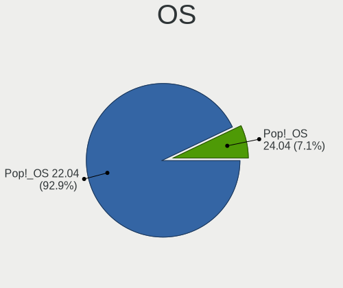
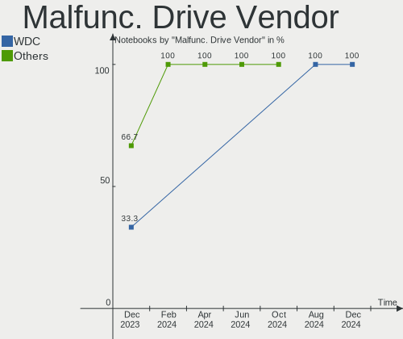
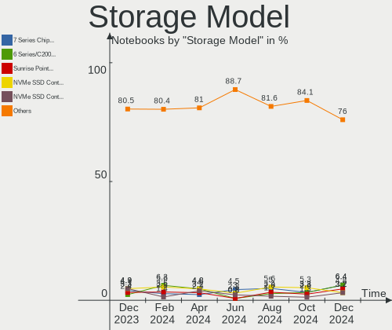
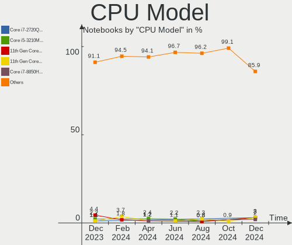
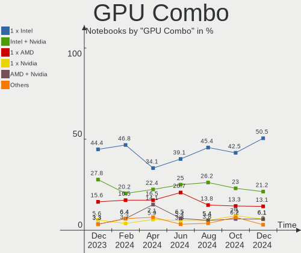
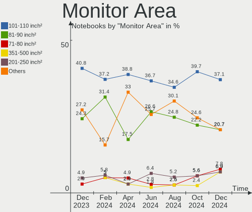
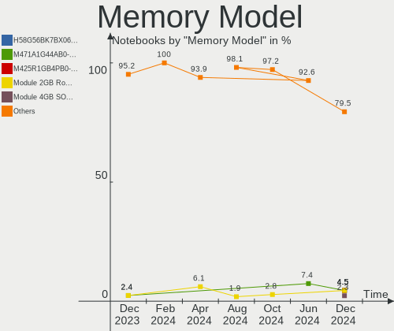

Pop!_OS - Hardware Trends (Notebooks)
-------------------------------------

A project to identify most popular hardware characteristics and track their change
over time based on data collected by Linux users at https://Linux-Hardware.org.

Anyone can contribute to this report by the [hw-probe](https://github.com/linuxhw/hw-probe) tool:

    sudo -E hw-probe -all -upload

This report is for one last month. Overall report since the beginning of time: [TestDays](https://github.com/linuxhw/TestDays)

Period: Nov, 2023.

Contents
--------

* [ System ](#system)
  - [ OS                       ](#os)
  - [ OS Family                ](#os-family)
  - [ Kernel                   ](#kernel)
  - [ Kernel Family            ](#kernel-family)
  - [ Kernel Major Ver.        ](#kernel-major-ver)
  - [ Arch                     ](#arch)
  - [ DE                       ](#de)
  - [ Display Server           ](#display-server)
  - [ Display Manager          ](#display-manager)
  - [ OS Lang                  ](#os-lang)
  - [ Boot Mode                ](#boot-mode)
  - [ Filesystem               ](#filesystem)
  - [ Part. scheme             ](#part-scheme)
  - [ Dual Boot with Linux/BSD ](#dual-boot-with-linuxbsd)
  - [ Dual Boot (Win)          ](#dual-boot-win)

* [ Board ](#board)
  - [ Vendor                   ](#vendor)
  - [ Model                    ](#model)
  - [ Model Family             ](#model-family)
  - [ MFG Year                 ](#mfg-year)
  - [ Form Factor              ](#form-factor)
  - [ Secure Boot              ](#secure-boot)
  - [ Coreboot                 ](#coreboot)
  - [ RAM Size                 ](#ram-size)
  - [ RAM Used                 ](#ram-used)
  - [ Total Drives             ](#total-drives)
  - [ Has CD-ROM               ](#has-cd-rom)
  - [ Has Ethernet             ](#has-ethernet)
  - [ Has WiFi                 ](#has-wifi)
  - [ Has Bluetooth            ](#has-bluetooth)

* [ Location ](#location)
  - [ Country                  ](#country)
  - [ City                     ](#city)

* [ Drives ](#drives)
  - [ Drive Vendor             ](#drive-vendor)
  - [ Drive Model              ](#drive-model)
  - [ HDD Vendor               ](#hdd-vendor)
  - [ SSD Vendor               ](#ssd-vendor)
  - [ Drive Kind               ](#drive-kind)
  - [ Drive Connector          ](#drive-connector)
  - [ Drive Size               ](#drive-size)
  - [ Space Total              ](#space-total)
  - [ Space Used               ](#space-used)
  - [ Malfunc. Drives          ](#malfunc-drives)
  - [ Malfunc. Drive Vendor    ](#malfunc-drive-vendor)
  - [ Malfunc. HDD Vendor      ](#malfunc-hdd-vendor)
  - [ Malfunc. Drive Kind      ](#malfunc-drive-kind)
  - [ Failed Drives            ](#failed-drives)
  - [ Failed Drive Vendor      ](#failed-drive-vendor)
  - [ Drive Status             ](#drive-status)

* [ Storage controller ](#storage-controller)
  - [ Storage Vendor           ](#storage-vendor)
  - [ Storage Model            ](#storage-model)
  - [ Storage Kind             ](#storage-kind)

* [ Processor ](#processor)
  - [ CPU Vendor               ](#cpu-vendor)
  - [ CPU Model                ](#cpu-model)
  - [ CPU Model Family         ](#cpu-model-family)
  - [ CPU Cores                ](#cpu-cores)
  - [ CPU Sockets              ](#cpu-sockets)
  - [ CPU Threads              ](#cpu-threads)
  - [ CPU Op-Modes             ](#cpu-op-modes)
  - [ CPU Microcode            ](#cpu-microcode)
  - [ CPU Microarch            ](#cpu-microarch)

* [ Graphics ](#graphics)
  - [ GPU Vendor               ](#gpu-vendor)
  - [ GPU Model                ](#gpu-model)
  - [ GPU Combo                ](#gpu-combo)
  - [ GPU Driver               ](#gpu-driver)
  - [ GPU Memory               ](#gpu-memory)

* [ Monitor ](#monitor)
  - [ Monitor Vendor           ](#monitor-vendor)
  - [ Monitor Model            ](#monitor-model)
  - [ Monitor Resolution       ](#monitor-resolution)
  - [ Monitor Diagonal         ](#monitor-diagonal)
  - [ Monitor Width            ](#monitor-width)
  - [ Aspect Ratio             ](#aspect-ratio)
  - [ Monitor Area             ](#monitor-area)
  - [ Pixel Density            ](#pixel-density)
  - [ Multiple Monitors        ](#multiple-monitors)

* [ Network ](#network)
  - [ Net Controller Vendor    ](#net-controller-vendor)
  - [ Net Controller Model     ](#net-controller-model)
  - [ Wireless Vendor          ](#wireless-vendor)
  - [ Wireless Model           ](#wireless-model)
  - [ Ethernet Vendor          ](#ethernet-vendor)
  - [ Ethernet Model           ](#ethernet-model)
  - [ Net Controller Kind      ](#net-controller-kind)
  - [ Used Controller          ](#used-controller)
  - [ NICs                     ](#nics)
  - [ IPv6                     ](#ipv6)

* [ Bluetooth ](#bluetooth)
  - [ Bluetooth Vendor         ](#bluetooth-vendor)
  - [ Bluetooth Model          ](#bluetooth-model)

* [ Sound ](#sound)
  - [ Sound Vendor             ](#sound-vendor)
  - [ Sound Model              ](#sound-model)

* [ Memory ](#memory)
  - [ Memory Vendor            ](#memory-vendor)
  - [ Memory Model             ](#memory-model)
  - [ Memory Kind              ](#memory-kind)
  - [ Memory Form Factor       ](#memory-form-factor)
  - [ Memory Size              ](#memory-size)
  - [ Memory Speed             ](#memory-speed)

* [ Printers & scanners ](#printers--scanners)
  - [ Printer Vendor           ](#printer-vendor)
  - [ Printer Model            ](#printer-model)
  - [ Scanner Vendor           ](#scanner-vendor)
  - [ Scanner Model            ](#scanner-model)

* [ Camera ](#camera)
  - [ Camera Vendor            ](#camera-vendor)
  - [ Camera Model             ](#camera-model)

* [ Security ](#security)
  - [ Fingerprint Vendor       ](#fingerprint-vendor)
  - [ Fingerprint Model        ](#fingerprint-model)
  - [ Chipcard Vendor          ](#chipcard-vendor)
  - [ Chipcard Model           ](#chipcard-model)

* [ Unsupported ](#unsupported)
  - [ Unsupported Devices      ](#unsupported-devices)
  - [ Unsupported Device Types ](#unsupported-device-types)

System
------

OS
--

Installed operating systems

| Name          | Notebooks | Percent |
|---------------|-----------|---------|
| Pop!_OS 22.04 | 108       | 99.08%  |
| Pop!_OS 20.10 | 1         | 0.92%   |

OS Family
---------

OS without a version

| Name    | Notebooks | Percent |
|---------|-----------|---------|
| Pop!_OS | 109       | 100%    |

Kernel
------

Version of the Linux kernel

| Version                 | Notebooks | Percent |
|-------------------------|-----------|---------|
| 6.5.6-76060506-generic  | 81        | 74.31%  |
| 6.5.4-76060504-generic  | 15        | 13.76%  |
| 6.0.6-76060006-generic  | 2         | 1.83%   |
| 5.17.5-76051705-generic | 2         | 1.83%   |
| 6.5.8-x64v1-xanmod1     | 1         | 0.92%   |
| 6.5.7-060507-generic    | 1         | 0.92%   |
| 6.5.12-x64v3-xanmod1    | 1         | 0.92%   |
| 6.5.10-x64v2-xanmod1    | 1         | 0.92%   |
| 6.4.6-76060406-generic  | 1         | 0.92%   |
| 6.2.6-76060206-generic  | 1         | 0.92%   |
| 6.0.12-76060006-generic | 1         | 0.92%   |
| 5.15.0-89-lowlatency    | 1         | 0.92%   |
| 5.11.0-7614-generic     | 1         | 0.92%   |

Kernel Family
-------------

Linux kernel without a distro release

| Version | Notebooks | Percent |
|---------|-----------|---------|
| 6.5.6   | 81        | 74.31%  |
| 6.5.4   | 15        | 13.76%  |
| 6.0.6   | 2         | 1.83%   |
| 5.17.5  | 2         | 1.83%   |
| 6.5.8   | 1         | 0.92%   |
| 6.5.7   | 1         | 0.92%   |
| 6.5.12  | 1         | 0.92%   |
| 6.5.10  | 1         | 0.92%   |
| 6.4.6   | 1         | 0.92%   |
| 6.2.6   | 1         | 0.92%   |
| 6.0.12  | 1         | 0.92%   |
| 5.15.0  | 1         | 0.92%   |
| 5.11.0  | 1         | 0.92%   |

Kernel Major Ver.
-----------------

Linux kernel major version

| Version | Notebooks | Percent |
|---------|-----------|---------|
| 6.5     | 100       | 91.74%  |
| 6.0     | 3         | 2.75%   |
| 5.17    | 2         | 1.83%   |
| 6.4     | 1         | 0.92%   |
| 6.2     | 1         | 0.92%   |
| 5.15    | 1         | 0.92%   |
| 5.11    | 1         | 0.92%   |

Arch
----

OS architecture (x86_64, i586, etc.)

| Name   | Notebooks | Percent |
|--------|-----------|---------|
| x86_64 | 109       | 100%    |

DE
--

Desktop Environment

| Name            | Notebooks | Percent |
|-----------------|-----------|---------|
| GNOME           | 108       | 99.08%  |
| GNOME Flashback | 1         | 0.92%   |

Display Server
--------------

X11 or Wayland

| Name    | Notebooks | Percent |
|---------|-----------|---------|
| X11     | 105       | 96.33%  |
| Wayland | 4         | 3.67%   |

Display Manager
---------------

SDDM, LightDM, etc.

| Name    | Notebooks | Percent |
|---------|-----------|---------|
| Unknown | 78        | 71.56%  |
| GDM3    | 31        | 28.44%  |

OS Lang
-------

Language

| Lang   | Notebooks | Percent |
|--------|-----------|---------|
| en_US  | 55        | 50.46%  |
| de_DE  | 7         | 6.42%   |
| C      | 7         | 6.42%   |
| pt_BR  | 6         | 5.5%    |
| en_GB  | 5         | 4.59%   |
| tr_TR  | 3         | 2.75%   |
| nb_NO  | 3         | 2.75%   |
| it_IT  | 3         | 2.75%   |
| en_CA  | 3         | 2.75%   |
| en_AU  | 3         | 2.75%   |
| pl_PL  | 2         | 1.83%   |
| zh_TW  | 1         | 0.92%   |
| ru_RU  | 1         | 0.92%   |
| pt_PT  | 1         | 0.92%   |
| nl_BE  | 1         | 0.92%   |
| hu_HU  | 1         | 0.92%   |
| fur_IT | 1         | 0.92%   |
| fr_FR  | 1         | 0.92%   |
| es_CO  | 1         | 0.92%   |
| es_CL  | 1         | 0.92%   |
| en_IN  | 1         | 0.92%   |
| da_DK  | 1         | 0.92%   |
| cs_CZ  | 1         | 0.92%   |

Boot Mode
---------

EFI or BIOS

| Mode | Notebooks | Percent |
|------|-----------|---------|
| BIOS | 77        | 70.64%  |
| EFI  | 32        | 29.36%  |

Filesystem
----------

Type of filesystem

| Type    | Notebooks | Percent |
|---------|-----------|---------|
| Ext4    | 103       | 94.5%   |
| Overlay | 3         | 2.75%   |
| Btrfs   | 3         | 2.75%   |

Part. scheme
------------

Scheme of partitioning

| Type    | Notebooks | Percent |
|---------|-----------|---------|
| Unknown | 78        | 71.56%  |
| GPT     | 31        | 28.44%  |

Dual Boot with Linux/BSD
------------------------

Hosting more than one Linux/BSD

| Dual boot | Notebooks | Percent |
|-----------|-----------|---------|
| No        | 103       | 94.5%   |
| Yes       | 6         | 5.5%    |

Dual Boot (Win)
---------------

Hosting Linux and Windows

| Dual boot | Notebooks | Percent |
|-----------|-----------|---------|
| No        | 100       | 91.74%  |
| Yes       | 9         | 8.26%   |

Board
-----

Vendor
------

Motherboard manufacturer

| Name                | Notebooks | Percent |
|---------------------|-----------|---------|
| Lenovo              | 31        | 28.44%  |
| Dell                | 19        | 17.43%  |
| Hewlett-Packard     | 15        | 13.76%  |
| ASUSTek Computer    | 10        | 9.17%   |
| MSI                 | 9         | 8.26%   |
| Acer                | 7         | 6.42%   |
| Apple               | 5         | 4.59%   |
| System76            | 4         | 3.67%   |
| Notebook            | 3         | 2.75%   |
| Google              | 2         | 1.83%   |
| Samsung Electronics | 1         | 0.92%   |
| HONOR               | 1         | 0.92%   |
| Casper              | 1         | 0.92%   |
| Unknown             | 1         | 0.92%   |

Model
-----

Motherboard model

| Name                                       | Notebooks | Percent |
|--------------------------------------------|-----------|---------|
| System76 Lemur Pro                         | 2         | 1.83%   |
| Notebook PA70Hx                            | 2         | 1.83%   |
| Lenovo Legion 5 15ACH6H 82JU               | 2         | 1.83%   |
| Lenovo IdeaPad Gaming 3 15IAH7 82S9        | 2         | 1.83%   |
| Apple MacBookPro8,1                        | 2         | 1.83%   |
| System76 Oryx Pro                          | 1         | 0.92%   |
| System76 Adder WS                          | 1         | 0.92%   |
| Samsung RC530/RC730                        | 1         | 0.92%   |
| Notebook NS5x_NS7xPU                       | 1         | 0.92%   |
| MSI Stealth 16Studio A13VG                 | 1         | 0.92%   |
| MSI Prestige 15 A10SC                      | 1         | 0.92%   |
| MSI Prestige 14Evo A11M                    | 1         | 0.92%   |
| MSI Katana GF66 11UE                       | 1         | 0.92%   |
| MSI GT70                                   | 1         | 0.92%   |
| MSI GE76 Raider 11UE                       | 1         | 0.92%   |
| MSI Delta 15 A5EFK                         | 1         | 0.92%   |
| MSI Cyborg 15 A12VF                        | 1         | 0.92%   |
| MSI Bravo 15 C7VE                          | 1         | 0.92%   |
| Lenovo Yoga Pro 9 14IRP8 83BU              | 1         | 0.92%   |
| Lenovo Y720-15IKB 80VR                     | 1         | 0.92%   |
| Lenovo ThinkPad X260 20F5A28AUK            | 1         | 0.92%   |
| Lenovo ThinkPad X1 Carbon Gen 9 20XWCTO1WW | 1         | 0.92%   |
| Lenovo ThinkPad T480 20L6S68T00            | 1         | 0.92%   |
| Lenovo ThinkPad T470s W10DG 20JTS0HT00     | 1         | 0.92%   |
| Lenovo ThinkPad T470s W10DG 20JS0004US     | 1         | 0.92%   |
| Lenovo ThinkPad T420s 417032U              | 1         | 0.92%   |
| Lenovo ThinkPad L14 Gen 2 20X2S0BF00       | 1         | 0.92%   |
| Lenovo ThinkPad Helix 3701CTO              | 1         | 0.92%   |
| Lenovo ThinkPad E560 20EV002FUS            | 1         | 0.92%   |
| Lenovo ThinkPad E550 20DF001HAU            | 1         | 0.92%   |
| Lenovo ThinkPad E520 11437UG               | 1         | 0.92%   |
| Lenovo ThinkPad E480 20KQ000EBR            | 1         | 0.92%   |
| Lenovo ThinkBook 15 G2 ARE 20VG            | 1         | 0.92%   |
| Lenovo Legion Slim 7 16APH8 82Y4           | 1         | 0.92%   |
| Lenovo Legion 5 17ACH6H 82JY               | 1         | 0.92%   |
| Lenovo IdeaPad L340-15IRH Gaming 81LK      | 1         | 0.92%   |
| Lenovo IdeaPad Gaming 3 15ACH6 82K2        | 1         | 0.92%   |
| Lenovo IdeaPad C340-14API 81N6             | 1         | 0.92%   |
| Lenovo IdeaPad 5 15ITL05 82FG              | 1         | 0.92%   |
| Lenovo IdeaPad 5 14ARE05 81YM              | 1         | 0.92%   |

Model Family
------------

Motherboard model prefix

| Name              | Notebooks | Percent |
|-------------------|-----------|---------|
| Lenovo ThinkPad   | 12        | 11.01%  |
| Lenovo IdeaPad    | 12        | 11.01%  |
| Acer Aspire       | 6         | 5.5%    |
| Dell XPS          | 5         | 4.59%   |
| Dell Precision    | 5         | 4.59%   |
| Lenovo Legion     | 4         | 3.67%   |
| Dell Latitude     | 4         | 3.67%   |
| HP ProBook        | 3         | 2.75%   |
| HP Pavilion       | 3         | 2.75%   |
| Dell Inspiron     | 3         | 2.75%   |
| System76 Lemur    | 2         | 1.83%   |
| Notebook PA70Hx   | 2         | 1.83%   |
| MSI Prestige      | 2         | 1.83%   |
| HP Victus         | 2         | 1.83%   |
| HP Laptop         | 2         | 1.83%   |
| ASUS VivoBook     | 2         | 1.83%   |
| ASUS ASUS         | 2         | 1.83%   |
| Apple MacBookPro8 | 2         | 1.83%   |
| System76 Oryx     | 1         | 0.92%   |
| System76 Adder    | 1         | 0.92%   |
| Samsung RC530     | 1         | 0.92%   |
| Notebook NS5x     | 1         | 0.92%   |
| MSI Stealth       | 1         | 0.92%   |
| MSI Katana        | 1         | 0.92%   |
| MSI GT70          | 1         | 0.92%   |
| MSI GE76          | 1         | 0.92%   |
| MSI Delta         | 1         | 0.92%   |
| MSI Cyborg        | 1         | 0.92%   |
| MSI Bravo         | 1         | 0.92%   |
| Lenovo Yoga       | 1         | 0.92%   |
| Lenovo Y720-15IKB | 1         | 0.92%   |
| Lenovo ThinkBook  | 1         | 0.92%   |
| HONOR NBR-WAX9    | 1         | 0.92%   |
| HP G42            | 1         | 0.92%   |
| HP ENVY           | 1         | 0.92%   |
| HP EliteBook      | 1         | 0.92%   |
| HP 655            | 1         | 0.92%   |
| HP 250            | 1         | 0.92%   |
| Google Taeko      | 1         | 0.92%   |
| Google Edgar      | 1         | 0.92%   |

MFG Year
--------

Motherboard manufacture year

| Year | Notebooks | Percent |
|------|-----------|---------|
| 2023 | 15        | 13.76%  |
| 2017 | 13        | 11.93%  |
| 2022 | 12        | 11.01%  |
| 2021 | 11        | 10.09%  |
| 2020 | 11        | 10.09%  |
| 2011 | 10        | 9.17%   |
| 2012 | 7         | 6.42%   |
| 2019 | 6         | 5.5%    |
| 2014 | 5         | 4.59%   |
| 2018 | 4         | 3.67%   |
| 2016 | 4         | 3.67%   |
| 2013 | 3         | 2.75%   |
| 2010 | 3         | 2.75%   |
| 2015 | 2         | 1.83%   |
| 2008 | 2         | 1.83%   |
| 2009 | 1         | 0.92%   |

Form Factor
-----------

Physical design of the computer

| Name     | Notebooks | Percent |
|----------|-----------|---------|
| Notebook | 109       | 100%    |

Secure Boot
-----------

Enabled or disabled

| State    | Notebooks | Percent |
|----------|-----------|---------|
| Disabled | 109       | 100%    |

Coreboot
--------

Have coreboot on board

| Used | Notebooks | Percent |
|------|-----------|---------|
| No   | 103       | 94.5%   |
| Yes  | 6         | 5.5%    |

RAM Size
--------

Total RAM memory

| Size in GB  | Notebooks | Percent |
|-------------|-----------|---------|
| 4.01-8.0    | 34        | 31.19%  |
| 16.01-24.0  | 23        | 21.1%   |
| 32.01-64.0  | 16        | 14.68%  |
| 3.01-4.0    | 15        | 13.76%  |
| 8.01-16.0   | 15        | 13.76%  |
| 64.01-256.0 | 5         | 4.59%   |
| 24.01-32.0  | 1         | 0.92%   |

RAM Used
--------

Used RAM memory

| Used GB    | Notebooks | Percent |
|------------|-----------|---------|
| 4.01-8.0   | 44        | 40.37%  |
| 3.01-4.0   | 22        | 20.18%  |
| 2.01-3.0   | 20        | 18.35%  |
| 8.01-16.0  | 15        | 13.76%  |
| 1.01-2.0   | 5         | 4.59%   |
| 16.01-24.0 | 3         | 2.75%   |

Total Drives
------------

Number of drives on board

| Drives | Notebooks | Percent |
|--------|-----------|---------|
| 1      | 76        | 69.72%  |
| 2      | 31        | 28.44%  |
| 3      | 2         | 1.83%   |

Has CD-ROM
----------

Has CD-ROM on board

| Presented | Notebooks | Percent |
|-----------|-----------|---------|
| No        | 86        | 78.9%   |
| Yes       | 23        | 21.1%   |

Has Ethernet
------------

Has Ethernet on board

| Presented | Notebooks | Percent |
|-----------|-----------|---------|
| Yes       | 80        | 73.39%  |
| No        | 29        | 26.61%  |

Has WiFi
--------

Has WiFi module

| Presented | Notebooks | Percent |
|-----------|-----------|---------|
| Yes       | 108       | 99.08%  |
| No        | 1         | 0.92%   |

Has Bluetooth
-------------

Has Bluetooth module

| Presented | Notebooks | Percent |
|-----------|-----------|---------|
| Yes       | 92        | 84.4%   |
| No        | 17        | 15.6%   |

Location
--------

Country
-------

Geographic location (country)

| Country      | Notebooks | Percent |
|--------------|-----------|---------|
| USA          | 22        | 20.18%  |
| Italy        | 9         | 8.26%   |
| Brazil       | 8         | 7.34%   |
| Germany      | 7         | 6.42%   |
| Canada       | 7         | 6.42%   |
| Norway       | 5         | 4.59%   |
| Australia    | 4         | 3.67%   |
| UK           | 3         | 2.75%   |
| Turkey       | 3         | 2.75%   |
| Poland       | 3         | 2.75%   |
| India        | 3         | 2.75%   |
| France       | 3         | 2.75%   |
| Denmark      | 3         | 2.75%   |
| Kazakhstan   | 2         | 1.83%   |
| Hungary      | 2         | 1.83%   |
| Belgium      | 2         | 1.83%   |
| UAE          | 1         | 0.92%   |
| Taiwan       | 1         | 0.92%   |
| Sweden       | 1         | 0.92%   |
| Spain        | 1         | 0.92%   |
| Slovakia     | 1         | 0.92%   |
| Serbia       | 1         | 0.92%   |
| Saudi Arabia | 1         | 0.92%   |
| Russia       | 1         | 0.92%   |
| Romania      | 1         | 0.92%   |
| Portugal     | 1         | 0.92%   |
| Philippines  | 1         | 0.92%   |
| Pakistan     | 1         | 0.92%   |
| Netherlands  | 1         | 0.92%   |
| Nepal        | 1         | 0.92%   |
| Moldova      | 1         | 0.92%   |
| Mexico       | 1         | 0.92%   |
| Kenya        | 1         | 0.92%   |
| Ireland      | 1         | 0.92%   |
| Georgia      | 1         | 0.92%   |
| Czechia      | 1         | 0.92%   |
| Colombia     | 1         | 0.92%   |
| Chile        | 1         | 0.92%   |
| Bulgaria     | 1         | 0.92%   |

City
----

Geographic location (city)

| City              | Notebooks | Percent |
|-------------------|-----------|---------|
| Sydney            | 3         | 2.75%   |
| Southwark         | 2         | 1.83%   |
| New York          | 2         | 1.83%   |
| Minneapolis       | 2         | 1.83%   |
| Milano            | 2         | 1.83%   |
| Madrid            | 2         | 1.83%   |
| Weilburg          | 1         | 0.92%   |
| Washington        | 1         | 0.92%   |
| Warsaw            | 1         | 0.92%   |
| Vratsa            | 1         | 0.92%   |
| Vicenza           | 1         | 0.92%   |
| Viborg            | 1         | 0.92%   |
| Ust-Kamenogorsk   | 1         | 0.92%   |
| Ulan-Ude          | 1         | 0.92%   |
| Trondheim         | 1         | 0.92%   |
| Temuco            | 1         | 0.92%   |
| Tbilisi           | 1         | 0.92%   |
| Szigetszentmiklos | 1         | 0.92%   |
| Szentendre        | 1         | 0.92%   |
| Swidnica          | 1         | 0.92%   |
| Stuttgart         | 1         | 0.92%   |
| Stockholm         | 1         | 0.92%   |
| Simcoe            | 1         | 0.92%   |
| Sao Paulo         | 1         | 0.92%   |
| Salem             | 1         | 0.92%   |
| Saint John        | 1         | 0.92%   |
| Riyadh            | 1         | 0.92%   |
| Rawalpindi        | 1         | 0.92%   |
| Ravenna           | 1         | 0.92%   |
| Raleigh           | 1         | 0.92%   |
| Ragusa            | 1         | 0.92%   |
| Quezon City       | 1         | 0.92%   |
| Portland          | 1         | 0.92%   |
| Port Elgin        | 1         | 0.92%   |
| Ploieşti         | 1         | 0.92%   |
| Petrolina         | 1         | 0.92%   |
| Perth             | 1         | 0.92%   |
| Perkasie          | 1         | 0.92%   |
| Palermo           | 1         | 0.92%   |
| Oxford            | 1         | 0.92%   |

Drives
------

Drive Vendor
------------

Hard drive vendors

| Vendor                      | Notebooks | Drives | Percent |
|-----------------------------|-----------|--------|---------|
| Samsung Electronics         | 34        | 40     | 25%     |
| WDC                         | 15        | 15     | 11.03%  |
| Sandisk                     | 11        | 12     | 8.09%   |
| Micron Technology           | 10        | 10     | 7.35%   |
| Toshiba                     | 8         | 8      | 5.88%   |
| Kingston                    | 7         | 7      | 5.15%   |
| Seagate                     | 6         | 6      | 4.41%   |
| Crucial                     | 6         | 7      | 4.41%   |
| SK hynix                    | 5         | 5      | 3.68%   |
| HGST                        | 4         | 4      | 2.94%   |
| Unknown                     | 3         | 3      | 2.21%   |
| Intel                       | 3         | 3      | 2.21%   |
| A-DATA Technology           | 3         | 3      | 2.21%   |
| Transcend                   | 2         | 2      | 1.47%   |
| Silicon Motion              | 2         | 2      | 1.47%   |
| Phison Electronics          | 2         | 2      | 1.47%   |
| Hitachi                     | 2         | 2      | 1.47%   |
| Apple                       | 2         | 2      | 1.47%   |
| Micron/Crucial Technology   | 1         | 1      | 0.74%   |
| LITEON                      | 1         | 1      | 0.74%   |
| Lexar                       | 1         | 1      | 0.74%   |
| KIOXIA                      | 1         | 1      | 0.74%   |
| Kingston Technology Company | 1         | 1      | 0.74%   |
| JMicron Technology          | 1         | 1      | 0.74%   |
| Hikvision                   | 1         | 1      | 0.74%   |
| Dogfish                     | 1         | 1      | 0.74%   |
| Corsair                     | 1         | 1      | 0.74%   |
| China                       | 1         | 1      | 0.74%   |
| Unknown                     | 1         | 1      | 0.74%   |

Drive Model
-----------

Hard drive models

| Model                                                 | Notebooks | Percent |
|-------------------------------------------------------|-----------|---------|
| Samsung NVMe SSD Controller SM981/PM981/PM983 250GB   | 6         | 4.32%   |
| Samsung NVMe SSD Controller PM9A1/PM9A3/980PRO 2TB    | 5         | 3.6%    |
| Samsung SSD 980 PRO 500GB                             | 3         | 2.16%   |
| WDC WDS100T2B0A-00SM50 1TB SSD                        | 2         | 1.44%   |
| Toshiba XG6 NVMe SSD Controller 512GB                 | 2         | 1.44%   |
| Toshiba MQ04ABF100 1TB                                | 2         | 1.44%   |
| SK hynix PC801 NVMe 1TB                               | 2         | 1.44%   |
| Samsung MZALQ256HBJD-00BL2 256GB                      | 2         | 1.44%   |
| Kingston SA400S37240G 240GB SSD                       | 2         | 1.44%   |
| Intel SSDPEKNW512GZL 512GB                            | 2         | 1.44%   |
| HGST HTS721010A9E630 1TB                              | 2         | 1.44%   |
| Crucial M4-CT128M4SSD2 128GB                          | 2         | 1.44%   |
| Crucial CT500MX500SSD1 500GB                          | 2         | 1.44%   |
| Apple SSD SD0128F 121GB                               | 2         | 1.44%   |
| WDC WDS250G2B0B-00YS70 250GB SSD                      | 1         | 0.72%   |
| WDC WDS120G1G0A-00SS50 120GB SSD                      | 1         | 0.72%   |
| WDC WD7500BPKT-22PK4T0 752GB                          | 1         | 0.72%   |
| WDC WD5000LPCX-24VHAT0 500GB                          | 1         | 0.72%   |
| WDC WD5000BPVT-22HXZT3 500GB                          | 1         | 0.72%   |
| WDC WD10SPZX-24Z10T0 1TB                              | 1         | 0.72%   |
| WDC WD10SPZX-24Z10 1TB                                | 1         | 0.72%   |
| WDC WD10JPCX-24UE4T0 1TB                              | 1         | 0.72%   |
| WDC PC SN810 NVMe 512GB                               | 1         | 0.72%   |
| WDC PC SN530 SDBPNPZ-256G-1114 256GB                  | 1         | 0.72%   |
| WDC PC SN530 NVMe 256GB                               | 1         | 0.72%   |
| WDC PC SN520 SDAPNUW-512G-1014 512GB                  | 1         | 0.72%   |
| WDC PC SN520 SDAPNUW-128G-1006 128GB                  | 1         | 0.72%   |
| Unknown NVMe SSD Drive 2TB                            | 1         | 0.72%   |
| Unknown MMC Card  32GB                                | 1         | 0.72%   |
| Unknown MMC Card  16GB                                | 1         | 0.72%   |
| Transcend TS1TMTE400S 1TB                             | 1         | 0.72%   |
| Transcend TS128GMSA720 128GB SSD                      | 1         | 0.72%   |
| Toshiba MQ01ABF050 500GB                              | 1         | 0.72%   |
| Toshiba MK5056GSY 500GB                               | 1         | 0.72%   |
| Toshiba MK3265GSX H 320GB                             | 1         | 0.72%   |
| Toshiba KXG6AZNV256G 256GB                            | 1         | 0.72%   |
| SK hynix SKHynix_HFS001TEJ9X115N 1TB                  | 1         | 0.72%   |
| SK hynix NVMe SSD Drive 1TB                           | 1         | 0.72%   |
| SK hynix BC511 512GB                                  | 1         | 0.72%   |
| Silicon Motion SM2263EN/SM2263XT SSD Controller 256GB | 1         | 0.72%   |

HDD Vendor
----------

Hard disk drive vendors

| Vendor              | Notebooks | Drives | Percent |
|---------------------|-----------|--------|---------|
| WDC                 | 6         | 6      | 25%     |
| Seagate             | 6         | 6      | 25%     |
| Toshiba             | 5         | 5      | 20.83%  |
| HGST                | 4         | 4      | 16.67%  |
| Hitachi             | 2         | 2      | 8.33%   |
| Samsung Electronics | 1         | 1      | 4.17%   |

SSD Vendor
----------

Solid state drive vendors

| Vendor              | Notebooks | Drives | Percent |
|---------------------|-----------|--------|---------|
| Samsung Electronics | 7         | 7      | 20%     |
| Crucial             | 6         | 7      | 17.14%  |
| WDC                 | 4         | 4      | 11.43%  |
| Kingston            | 3         | 3      | 8.57%   |
| SanDisk             | 2         | 2      | 5.71%   |
| Micron Technology   | 2         | 2      | 5.71%   |
| Apple               | 2         | 2      | 5.71%   |
| A-DATA Technology   | 2         | 2      | 5.71%   |
| Transcend           | 1         | 1      | 2.86%   |
| LITEON              | 1         | 1      | 2.86%   |
| Lexar               | 1         | 1      | 2.86%   |
| Hikvision           | 1         | 1      | 2.86%   |
| Dogfish             | 1         | 1      | 2.86%   |
| Corsair             | 1         | 1      | 2.86%   |
| China               | 1         | 1      | 2.86%   |

Drive Kind
----------

HDD or SSD

| Kind    | Notebooks | Drives | Percent |
|---------|-----------|--------|---------|
| NVMe    | 67        | 80     | 54.03%  |
| SSD     | 32        | 36     | 25.81%  |
| HDD     | 21        | 24     | 16.94%  |
| MMC     | 2         | 2      | 1.61%   |
| Unknown | 2         | 2      | 1.61%   |

Drive Connector
---------------

SATA, SAS, NVMe, etc.

| Type | Notebooks | Drives | Percent |
|------|-----------|--------|---------|
| NVMe | 67        | 80     | 56.3%   |
| SATA | 49        | 61     | 41.18%  |
| MMC  | 2         | 2      | 1.68%   |
| SAS  | 1         | 1      | 0.84%   |

Drive Size
----------

Size of hard drive

| Size in TB | Notebooks | Drives | Percent |
|------------|-----------|--------|---------|
| 0.01-0.5   | 37        | 42     | 67.27%  |
| 0.51-1.0   | 16        | 16     | 29.09%  |
| 3.01-4.0   | 1         | 1      | 1.82%   |
| 1.01-2.0   | 1         | 1      | 1.82%   |

Space Total
-----------

Amount of disk space available on the file system

| Size in GB | Notebooks | Percent |
|------------|-----------|---------|
| 101-250    | 37        | 33.94%  |
| 251-500    | 32        | 29.36%  |
| 501-1000   | 26        | 23.85%  |
| 1001-2000  | 7         | 6.42%   |
| 1-20       | 3         | 2.75%   |
| 51-100     | 3         | 2.75%   |
| 21-50      | 1         | 0.92%   |

Space Used
----------

Amount of used disk space

| Used GB  | Notebooks | Percent |
|----------|-----------|---------|
| 1-20     | 31        | 28.44%  |
| 21-50    | 26        | 23.85%  |
| 101-250  | 17        | 15.6%   |
| 51-100   | 17        | 15.6%   |
| 251-500  | 12        | 11.01%  |
| 501-1000 | 6         | 5.5%    |

Malfunc. Drives
---------------

Drive models with a malfunction

| Model                                    | Notebooks | Drives | Percent |
|------------------------------------------|-----------|--------|---------|
| Seagate ST1000LM049-2GH172 1TB           | 1         | 1      | 33.33%  |
| Samsung Electronics SSD 980 PRO 500GB    | 1         | 1      | 33.33%  |
| Samsung Electronics SSD 970 EVO Plus 1TB | 1         | 1      | 33.33%  |

Malfunc. Drive Vendor
---------------------

Vendors of faulty drives

| Vendor              | Notebooks | Drives | Percent |
|---------------------|-----------|--------|---------|
| Samsung Electronics | 2         | 2      | 66.67%  |
| Seagate             | 1         | 1      | 33.33%  |

Malfunc. HDD Vendor
-------------------

Vendors of faulty HDD drives

| Vendor  | Notebooks | Drives | Percent |
|---------|-----------|--------|---------|
| Seagate | 1         | 1      | 100%    |

Malfunc. Drive Kind
-------------------

Kinds of faulty drives

| Kind | Notebooks | Drives | Percent |
|------|-----------|--------|---------|
| NVMe | 2         | 2      | 66.67%  |
| HDD  | 1         | 1      | 33.33%  |

Failed Drives
-------------

Failed drive models

Zero info for selected period =(

Failed Drive Vendor
-------------------

Failed drive vendors

Zero info for selected period =(

Drive Status
------------

Number of failed and malfunc. drives

| Status   | Notebooks | Drives | Percent |
|----------|-----------|--------|---------|
| Detected | 80        | 104    | 71.43%  |
| Works    | 29        | 37     | 25.89%  |
| Malfunc  | 3         | 3      | 2.68%   |

Storage controller
------------------

Storage Vendor
--------------

Storage controller vendors

| Vendor                       | Notebooks | Percent |
|------------------------------|-----------|---------|
| Intel                        | 61        | 41.5%   |
| Samsung Electronics          | 26        | 17.69%  |
| Sandisk                      | 14        | 9.52%   |
| AMD                          | 13        | 8.84%   |
| Micron Technology            | 8         | 5.44%   |
| SK hynix                     | 5         | 3.4%    |
| Kingston Technology Company  | 5         | 3.4%    |
| Toshiba America Info Systems | 3         | 2.04%   |
| Silicon Motion               | 3         | 2.04%   |
| Phison Electronics           | 2         | 1.36%   |
| Marvell Technology Group     | 2         | 1.36%   |
| Transcend                    | 1         | 0.68%   |
| Realtek Semiconductor        | 1         | 0.68%   |
| Micron/Crucial Technology    | 1         | 0.68%   |
| KIOXIA                       | 1         | 0.68%   |
| INNOGRIT                     | 1         | 0.68%   |

Storage Model
-------------

Storage controller models

| Model                                                                        | Notebooks | Percent |
|------------------------------------------------------------------------------|-----------|---------|
| AMD FCH SATA Controller [AHCI mode]                                          | 13        | 8.55%   |
| Samsung NVMe SSD Controller SM981/PM981/PM983                                | 12        | 7.89%   |
| Samsung NVMe SSD Controller PM9A1/PM9A3/980PRO                               | 10        | 6.58%   |
| Intel Volume Management Device NVMe RAID Controller                          | 9         | 5.92%   |
| Intel Sunrise Point-LP SATA Controller [AHCI mode]                           | 9         | 5.92%   |
| Intel 6 Series/C200 Series Chipset Family 6 port Mobile SATA AHCI Controller | 8         | 5.26%   |
| Samsung NVMe SSD Controller 980 (DRAM-less)                                  | 5         | 3.29%   |
| Intel 7 Series Chipset Family 6-port SATA Controller [AHCI mode]             | 5         | 3.29%   |
| Intel Volume Management Device NVMe RAID Controller Intel Corporation        | 4         | 2.63%   |
| Intel HM170/QM170 Chipset SATA Controller [AHCI Mode]                        | 4         | 2.63%   |
| Toshiba America Info Systems XG6 NVMe SSD Controller                         | 3         | 1.97%   |
| SK hynix Platinum P41/PC801 NVMe Solid State Drive                           | 3         | 1.97%   |
| Silicon Motion SM2263EN/SM2263XT (DRAM-less) NVMe SSD Controllers            | 3         | 1.97%   |
| Intel Cannon Lake Mobile PCH SATA AHCI Controller                            | 3         | 1.97%   |
| Intel 82801 Mobile SATA Controller [RAID mode]                               | 3         | 1.97%   |
| SanDisk WD PC SN810 / Black SN850 NVMe SSD                                   | 2         | 1.32%   |
| SanDisk WD PC SN540 / Green SN350 NVMe SSD 1 TB (DRAM-less)                  | 2         | 1.32%   |
| SanDisk WD Blue SN500 / PC SN520 x2 M.2 2280 NVMe SSD                        | 2         | 1.32%   |
| Sandisk WD Black SN850X NVMe SSD                                             | 2         | 1.32%   |
| SanDisk WD Black SN770 / PC SN740 256GB / PC SN560 (DRAM-less) NVMe SSD      | 2         | 1.32%   |
| Micron 2400 NVMe SSD (DRAM-less)                                             | 2         | 1.32%   |
| Micron 2300 NVMe SSD [Santana]                                               | 2         | 1.32%   |
| Micron 2210 NVMe SSD [Cobain]                                                | 2         | 1.32%   |
| Marvell Group 88SS9183 PCIe SSD Controller                                   | 2         | 1.32%   |
| Kingston Company OM8PCP Design-In PCIe 3 NVMe SSD (DRAM-less)                | 2         | 1.32%   |
| Intel SSD 670p Series [Keystone Harbor]                                      | 2         | 1.32%   |
| Intel 82801IBM/IEM (ICH9M/ICH9M-E) 4 port SATA Controller [AHCI mode]        | 2         | 1.32%   |
| Intel 8 Series SATA Controller 1 [AHCI mode]                                 | 2         | 1.32%   |
| Intel 5 Series/3400 Series Chipset 4 port SATA AHCI Controller               | 2         | 1.32%   |
| Transcend NVMe PCIe SSD 110S/112S/120S/MTE300S/MTE400S/MTE652T2 (DRAM-less)  | 1         | 0.66%   |
| SK hynix Gold P31/BC711/PC711 NVMe Solid State Drive                         | 1         | 0.66%   |
| SK hynix BC511 NVMe SSD                                                      | 1         | 0.66%   |
| SanDisk WD Black NVMe SSD                                                    | 1         | 0.66%   |
| SanDisk Ultra 3D / WD Blue SN550 NVMe SSD                                    | 1         | 0.66%   |
| SanDisk PC SN530 NVMe SSD (DRAM-less)                                        | 1         | 0.66%   |
| SanDisk IX SN530 NVMe SSD (DRAM-less)                                        | 1         | 0.66%   |
| Realtek RTS5765DL NVMe SSD Controller (DRAM-less)                            | 1         | 0.66%   |
| Phison PS5019-E19 PCIe4 NVMe Controller (DRAM-less)                          | 1         | 0.66%   |
| Phison PS5013-E13 PCIe3 NVMe Controller (DRAM-less)                          | 1         | 0.66%   |
| Micron/Crucial P2 [Nick P2] / P3 / P3 Plus NVMe PCIe SSD (DRAM-less)         | 1         | 0.66%   |

Storage Kind
------------

Kind of storage controller (IDE, SATA, NVMe, SAS, ...)

| Kind | Notebooks | Percent |
|------|-----------|---------|
| NVMe | 68        | 46.9%   |
| SATA | 59        | 40.69%  |
| RAID | 17        | 11.72%  |
| IDE  | 1         | 0.69%   |

Processor
---------

CPU Vendor
----------

Processor vendors

| Vendor | Notebooks | Percent |
|--------|-----------|---------|
| Intel  | 85        | 77.98%  |
| AMD    | 24        | 22.02%  |

CPU Model
---------

Processor models

| Model                                         | Notebooks | Percent |
|-----------------------------------------------|-----------|---------|
| AMD Ryzen 7 5800H with Radeon Graphics        | 4         | 3.67%   |
| Intel Core i7-7700HQ CPU @ 2.80GHz            | 3         | 2.75%   |
| Intel Core i5-6200U CPU @ 2.30GHz             | 3         | 2.75%   |
| Intel 13th Gen Core i9-13900H                 | 3         | 2.75%   |
| Intel 11th Gen Core i5-1135G7 @ 2.40GHz       | 3         | 2.75%   |
| AMD Ryzen 5 3500U with Radeon Vega Mobile Gfx | 3         | 2.75%   |
| Intel Core i7-8550U CPU @ 1.80GHz             | 2         | 1.83%   |
| Intel Core i7-6600U CPU @ 2.60GHz             | 2         | 1.83%   |
| Intel Core i5-7200U CPU @ 2.50GHz             | 2         | 1.83%   |
| Intel Core i5-6300U CPU @ 2.40GHz             | 2         | 1.83%   |
| Intel Core i5-2520M CPU @ 2.50GHz             | 2         | 1.83%   |
| Intel 12th Gen Core i7-12700H                 | 2         | 1.83%   |
| Intel 12th Gen Core i7-1260P                  | 2         | 1.83%   |
| Intel 12th Gen Core i5-12500H                 | 2         | 1.83%   |
| Intel 12th Gen Core i5-12450H                 | 2         | 1.83%   |
| Intel 11th Gen Core i7-1185G7 @ 3.00GHz       | 2         | 1.83%   |
| Intel 11th Gen Core i7-11800H @ 2.30GHz       | 2         | 1.83%   |
| AMD Ryzen 5 5600H with Radeon Graphics        | 2         | 1.83%   |
| Intel Xeon CPU E3-1505M v6 @ 3.00GHz          | 1         | 0.92%   |
| Intel Pentium Dual CPU T2370 @ 1.73GHz        | 1         | 0.92%   |
| Intel Core i7-9750H CPU @ 2.60GHz             | 1         | 0.92%   |
| Intel Core i7-8650U CPU @ 1.90GHz             | 1         | 0.92%   |
| Intel Core i7-7820HQ CPU @ 2.90GHz            | 1         | 0.92%   |
| Intel Core i7-6700HQ CPU @ 2.60GHz            | 1         | 0.92%   |
| Intel Core i7-4700HQ CPU @ 2.40GHz            | 1         | 0.92%   |
| Intel Core i7-4650U CPU @ 1.70GHz             | 1         | 0.92%   |
| Intel Core i7-4510U CPU @ 2.00GHz             | 1         | 0.92%   |
| Intel Core i7-3740QM CPU @ 2.70GHz            | 1         | 0.92%   |
| Intel Core i7-3667U CPU @ 2.00GHz             | 1         | 0.92%   |
| Intel Core i7-3630QM CPU @ 2.40GHz            | 1         | 0.92%   |
| Intel Core i7-2670QM CPU @ 2.20GHz            | 1         | 0.92%   |
| Intel Core i7-2640M CPU @ 2.80GHz             | 1         | 0.92%   |
| Intel Core i7-2630QM CPU @ 2.00GHz            | 1         | 0.92%   |
| Intel Core i7-10710U CPU @ 1.10GHz            | 1         | 0.92%   |
| Intel Core i7-10510U CPU @ 1.80GHz            | 1         | 0.92%   |
| Intel Core i5-9300H CPU @ 2.40GHz             | 1         | 0.92%   |
| Intel Core i5-8350U CPU @ 1.70GHz             | 1         | 0.92%   |
| Intel Core i5-8300H CPU @ 2.30GHz             | 1         | 0.92%   |
| Intel Core i5-7360U CPU @ 2.30GHz             | 1         | 0.92%   |
| Intel Core i5-5200U CPU @ 2.20GHz             | 1         | 0.92%   |

CPU Model Family
----------------

Processor model prefix

| Model              | Notebooks | Percent |
|--------------------|-----------|---------|
| Other              | 27        | 24.77%  |
| Intel Core i5      | 25        | 22.94%  |
| Intel Core i7      | 22        | 20.18%  |
| AMD Ryzen 5        | 10        | 9.17%   |
| AMD Ryzen 7        | 8         | 7.34%   |
| Intel Core i3      | 5         | 4.59%   |
| Intel Core 2 Duo   | 2         | 1.83%   |
| Intel Celeron      | 2         | 1.83%   |
| Intel Xeon         | 1         | 0.92%   |
| Intel Pentium Dual | 1         | 0.92%   |
| AMD Ryzen 3        | 1         | 0.92%   |
| AMD E2             | 1         | 0.92%   |
| AMD E              | 1         | 0.92%   |
| AMD A6             | 1         | 0.92%   |
| AMD A12            | 1         | 0.92%   |
| AMD A10            | 1         | 0.92%   |

CPU Cores
---------

Number of processor cores

| Number | Notebooks | Percent |
|--------|-----------|---------|
| 2      | 38        | 34.86%  |
| 4      | 35        | 32.11%  |
| 8      | 12        | 11.01%  |
| 6      | 9         | 8.26%   |
| 14     | 7         | 6.42%   |
| 12     | 4         | 3.67%   |
| 10     | 3         | 2.75%   |
| 24     | 1         | 0.92%   |

CPU Sockets
-----------

Number of sockets

| Number | Notebooks | Percent |
|--------|-----------|---------|
| 1      | 109       | 100%    |

CPU Threads
-----------

Threads per core (Hyper-Threading)

| Number | Notebooks | Percent |
|--------|-----------|---------|
| 2      | 99        | 90.83%  |
| 1      | 10        | 9.17%   |

CPU Op-Modes
------------

CPU Operation Modes (32-bit, 64-bit)

| Op mode        | Notebooks | Percent |
|----------------|-----------|---------|
| 32-bit, 64-bit | 109       | 100%    |

CPU Microcode
-------------

Microcode number

| Number     | Notebooks | Percent |
|------------|-----------|---------|
| Unknown    | 99        | 90.83%  |
| 0x0a50000c | 2         | 1.83%   |
| 0x08108109 | 2         | 1.83%   |
| 0x906a4    | 1         | 0.92%   |
| 0x806e9    | 1         | 0.92%   |
| 0x0a704103 | 1         | 0.92%   |
| 0x0a704101 | 1         | 0.92%   |
| 0x08608103 | 1         | 0.92%   |
| 0x08108102 | 1         | 0.92%   |

CPU Microarch
-------------

Microarchitecture

| Name             | Notebooks | Percent |
|------------------|-----------|---------|
| KabyLake         | 19        | 17.43%  |
| Unknown          | 19        | 17.43%  |
| Skylake          | 9         | 8.26%   |
| SandyBridge      | 8         | 7.34%   |
| Alderlake Hybrid | 8         | 7.34%   |
| TigerLake        | 7         | 6.42%   |
| Zen 3            | 6         | 5.5%    |
| IvyBridge        | 6         | 5.5%    |
| Haswell          | 5         | 4.59%   |
| Zen+             | 4         | 3.67%   |
| Zen 2            | 3         | 2.75%   |
| Westmere         | 3         | 2.75%   |
| Penryn           | 2         | 1.83%   |
| Bobcat           | 2         | 1.83%   |
| Silvermont       | 1         | 0.92%   |
| Piledriver       | 1         | 0.92%   |
| K10 Llano        | 1         | 0.92%   |
| IceLake          | 1         | 0.92%   |
| Excavator        | 1         | 0.92%   |
| Core             | 1         | 0.92%   |
| CometLake        | 1         | 0.92%   |
| Broadwell        | 1         | 0.92%   |

Graphics
--------

GPU Vendor
----------

Vendors of graphics cards

| Vendor | Notebooks | Percent |
|--------|-----------|---------|
| Intel  | 81        | 55.1%   |
| Nvidia | 40        | 27.21%  |
| AMD    | 26        | 17.69%  |

GPU Model
---------

Graphics card models

| Model                                                                     | Notebooks | Percent |
|---------------------------------------------------------------------------|-----------|---------|
| Intel Skylake GT2 [HD Graphics 520]                                       | 7         | 4.61%   |
| Intel 2nd Generation Core Processor Family Integrated Graphics Controller | 7         | 4.61%   |
| Intel TigerLake-LP GT2 [Iris Xe Graphics]                                 | 6         | 3.95%   |
| Intel Raptor Lake-P [Iris Xe Graphics]                                    | 5         | 3.29%   |
| Intel Alder Lake-P GT2 [Iris Xe Graphics]                                 | 5         | 3.29%   |
| Intel 3rd Gen Core processor Graphics Controller                          | 5         | 3.29%   |
| Nvidia GA106M [GeForce RTX 3060 Mobile / Max-Q]                           | 4         | 2.63%   |
| Nvidia AD107M [GeForce RTX 4060 Max-Q / Mobile]                           | 4         | 2.63%   |
| Nvidia AD106M [GeForce RTX 4070 Max-Q / Mobile]                           | 4         | 2.63%   |
| Intel UHD Graphics 620                                                    | 4         | 2.63%   |
| Intel Haswell-ULT Integrated Graphics Controller                          | 4         | 2.63%   |
| Intel CometLake-U GT2 [UHD Graphics]                                      | 4         | 2.63%   |
| AMD Picasso/Raven 2 [Radeon Vega Series / Radeon Vega Mobile Series]      | 4         | 2.63%   |
| AMD Cezanne [Radeon Vega Series / Radeon Vega Mobile Series]              | 4         | 2.63%   |
| Nvidia TU117M [GeForce GTX 1650 Mobile / Max-Q]                           | 3         | 1.97%   |
| Nvidia GA107M [GeForce RTX 3050 Mobile]                                   | 3         | 1.97%   |
| Intel HD Graphics 630                                                     | 3         | 1.97%   |
| Intel Core Processor Integrated Graphics Controller                       | 3         | 1.97%   |
| Intel CoffeeLake-H GT2 [UHD Graphics 630]                                 | 3         | 1.97%   |
| AMD Renoir [Radeon RX Vega 6 (Ryzen 4000/5000 Mobile Series)]             | 3         | 1.97%   |
| Nvidia GM107GLM [Quadro M1200 Mobile]                                     | 2         | 1.32%   |
| Nvidia GA107M [GeForce RTX 3050 Ti Mobile]                                | 2         | 1.32%   |
| Nvidia AD107M [GeForce RTX 4050 Max-Q / Mobile]                           | 2         | 1.32%   |
| Intel TigerLake-H GT1 [UHD Graphics]                                      | 2         | 1.32%   |
| Intel Raptor Lake-P [UHD Graphics]                                        | 2         | 1.32%   |
| Intel HD Graphics 620                                                     | 2         | 1.32%   |
| Intel Alder Lake-UP3 GT2 [Iris Xe Graphics]                               | 2         | 1.32%   |
| Intel Alder Lake-P GT1 [UHD Graphics]                                     | 2         | 1.32%   |
| AMD Rembrandt [Radeon 680M]                                               | 2         | 1.32%   |
| AMD Phoenix1                                                              | 2         | 1.32%   |
| Nvidia TU116M [GeForce GTX 1660 Ti Mobile]                                | 1         | 0.66%   |
| Nvidia GP108GLM [Quadro P520]                                             | 1         | 0.66%   |
| Nvidia GP107M [GeForce GTX 1050 Mobile]                                   | 1         | 0.66%   |
| Nvidia GP106M [GeForce GTX 1060 Mobile]                                   | 1         | 0.66%   |
| Nvidia GP106BM [GeForce GTX 1060 Mobile 6GB]                              | 1         | 0.66%   |
| Nvidia GP104M [GeForce GTX 1070 Mobile]                                   | 1         | 0.66%   |
| Nvidia GN20-P0-R-K2 [GeForce RTX 3050 6GB Laptop GPU]                     | 1         | 0.66%   |
| Nvidia GM108M [GeForce 940M]                                              | 1         | 0.66%   |
| Nvidia GM107M [GeForce GTX 960M]                                          | 1         | 0.66%   |
| Nvidia GK107M [GeForce GT 750M]                                           | 1         | 0.66%   |

GPU Combo
---------

Combinations of graphics cards

| Name           | Notebooks | Percent |
|----------------|-----------|---------|
| 1 x Intel      | 50        | 45.87%  |
| Intel + Nvidia | 29        | 26.61%  |
| 1 x AMD        | 13        | 11.93%  |
| AMD + Nvidia   | 7         | 6.42%   |
| 2 x AMD        | 4         | 3.67%   |
| 1 x Nvidia     | 4         | 3.67%   |
| Intel + AMD    | 2         | 1.83%   |

GPU Driver
----------

Free vs proprietary

| Driver      | Notebooks | Percent |
|-------------|-----------|---------|
| Free        | 77        | 70.64%  |
| Proprietary | 32        | 29.36%  |

GPU Memory
----------

Total video memory

| Size in GB | Notebooks | Percent |
|------------|-----------|---------|
| Unknown    | 101       | 92.66%  |
| 1.01-2.0   | 4         | 3.67%   |
| 0.01-0.5   | 3         | 2.75%   |
| 3.01-4.0   | 1         | 0.92%   |

Monitor
-------

Monitor Vendor
--------------

Monitor vendors

| Vendor                  | Notebooks | Percent |
|-------------------------|-----------|---------|
| LG Display              | 25        | 18.94%  |
| AU Optronics            | 23        | 17.42%  |
| Chimei Innolux          | 19        | 14.39%  |
| BOE                     | 17        | 12.88%  |
| Samsung Electronics     | 12        | 9.09%   |
| Sharp                   | 6         | 4.55%   |
| Dell                    | 5         | 3.79%   |
| Apple                   | 5         | 3.79%   |
| Lenovo                  | 4         | 3.03%   |
| Goldstar                | 2         | 1.52%   |
| Chi Mei Optoelectronics | 2         | 1.52%   |
| TMX                     | 1         | 0.76%   |
| Panasonic               | 1         | 0.76%   |
| Onkyo                   | 1         | 0.76%   |
| InfoVision              | 1         | 0.76%   |
| Iiyama                  | 1         | 0.76%   |
| Fluid                   | 1         | 0.76%   |
| CSO                     | 1         | 0.76%   |
| CPT                     | 1         | 0.76%   |
| Beko                    | 1         | 0.76%   |
| AOC                     | 1         | 0.76%   |
| Ancor Communications    | 1         | 0.76%   |
| Acer                    | 1         | 0.76%   |

Monitor Model
-------------

Monitor models

| Model                                                                 | Notebooks | Percent |
|-----------------------------------------------------------------------|-----------|---------|
| Chimei Innolux LCD Monitor CMN1521 1920x1080 344x193mm 15.5-inch      | 3         | 2.26%   |
| Chimei Innolux LCD Monitor CMN14D4 1920x1080 309x173mm 13.9-inch      | 3         | 2.26%   |
| LG Display LCD Monitor LGD056D 1920x1080 382x215mm 17.3-inch          | 2         | 1.5%    |
| Chimei Innolux LCD Monitor CMN15DB 1366x768 344x193mm 15.5-inch       | 2         | 1.5%    |
| AU Optronics LCD Monitor AUO243D 1920x1080 309x173mm 13.9-inch        | 2         | 1.5%    |
| Apple LCD Monitor APP9CCB 1280x800 286x179mm 13.3-inch                | 2         | 1.5%    |
| TMX TL160ADMP03-0 TMX1603 2560x1600 345x215mm 16.0-inch               | 1         | 0.75%   |
| Sharp LQ156M1JW03 SHP155D 1920x1080 344x194mm 15.5-inch               | 1         | 0.75%   |
| Sharp LCD Monitor SHP1548 1920x1200 288x180mm 13.4-inch               | 1         | 0.75%   |
| Sharp LCD Monitor SHP1515 1920x1200 336x210mm 15.6-inch               | 1         | 0.75%   |
| Sharp LCD Monitor SHP14BA 1920x1080 344x194mm 15.5-inch               | 1         | 0.75%   |
| Sharp LCD Monitor SHP14A1 3840x2160 344x194mm 15.5-inch               | 1         | 0.75%   |
| Sharp LCD Monitor SHP1453 1920x1080 346x194mm 15.6-inch               | 1         | 0.75%   |
| Samsung Electronics U32J59x SAM0F33 3840x2160 697x392mm 31.5-inch     | 1         | 0.75%   |
| Samsung Electronics S24F350 SAM0D20 1920x1080 521x293mm 23.5-inch     | 1         | 0.75%   |
| Samsung Electronics S20D300 SAM0B37 1600x900 432x240mm 19.5-inch      | 1         | 0.75%   |
| Samsung Electronics LF24T35 SAM707D 1920x1080 528x297mm 23.9-inch     | 1         | 0.75%   |
| Samsung Electronics LCD Monitor SEC5448 1920x1080 353x198mm 15.9-inch | 1         | 0.75%   |
| Samsung Electronics LCD Monitor SEC364A 1366x768 344x194mm 15.5-inch  | 1         | 0.75%   |
| Samsung Electronics LCD Monitor SEC3358 1280x800 331x207mm 15.4-inch  | 1         | 0.75%   |
| Samsung Electronics LCD Monitor SEC324A 1366x768 344x194mm 15.5-inch  | 1         | 0.75%   |
| Samsung Electronics LCD Monitor SDC4190 2880x1800 312x195mm 14.5-inch | 1         | 0.75%   |
| Samsung Electronics LCD Monitor SDC4171 2880x1800 302x189mm 14.0-inch | 1         | 0.75%   |
| Samsung Electronics LCD Monitor SAM0C3C 1366x768 609x347mm 27.6-inch  | 1         | 0.75%   |
| Samsung Electronics C24F390 SAM0D2C 1920x1080 521x293mm 23.5-inch     | 1         | 0.75%   |
| Panasonic TV MEIA081 1280x720 698x392mm 31.5-inch                     | 1         | 0.75%   |
| Onkyo AV Receiver ONK1151 1280x720 609x347mm 27.6-inch                | 1         | 0.75%   |
| LG Display LCD Monitor LGD071E 1920x1080 344x194mm 15.5-inch          | 1         | 0.75%   |
| LG Display LCD Monitor LGD06B3 1920x1200 336x210mm 15.6-inch          | 1         | 0.75%   |
| LG Display LCD Monitor LGD06A5 1920x1080 344x194mm 15.5-inch          | 1         | 0.75%   |
| LG Display LCD Monitor LGD068A 1920x1080 309x174mm 14.0-inch          | 1         | 0.75%   |
| LG Display LCD Monitor LGD0612 1920x1080 344x194mm 15.5-inch          | 1         | 0.75%   |
| LG Display LCD Monitor LGD060F 1920x1080 309x174mm 14.0-inch          | 1         | 0.75%   |
| LG Display LCD Monitor LGD053C 1920x1080 309x174mm 14.0-inch          | 1         | 0.75%   |
| LG Display LCD Monitor LGD0521 1920x1080 309x174mm 14.0-inch          | 1         | 0.75%   |
| LG Display LCD Monitor LGD04BD 1366x768 344x194mm 15.5-inch           | 1         | 0.75%   |
| LG Display LCD Monitor LGD046F 1920x1080 344x194mm 15.5-inch          | 1         | 0.75%   |
| LG Display LCD Monitor LGD0465 1366x768 344x194mm 15.5-inch           | 1         | 0.75%   |
| LG Display LCD Monitor LGD0456 1366x768 344x194mm 15.5-inch           | 1         | 0.75%   |
| LG Display LCD Monitor LGD0437 1920x1080 276x156mm 12.5-inch          | 1         | 0.75%   |

Monitor Resolution
------------------

Monitor screen resolution

| Resolution         | Notebooks | Percent |
|--------------------|-----------|---------|
| 1920x1080 (FHD)    | 65        | 52%     |
| 1366x768 (WXGA)    | 22        | 17.6%   |
| 3840x2160 (4K)     | 8         | 6.4%    |
| 1920x1200 (WUXGA)  | 8         | 6.4%    |
| 1600x900 (HD+)     | 6         | 4.8%    |
| 2880x1800          | 3         | 2.4%    |
| 2560x1600          | 3         | 2.4%    |
| 1280x800 (WXGA)    | 3         | 2.4%    |
| 3840x2400          | 1         | 0.8%    |
| 3072x1920          | 1         | 0.8%    |
| 2560x1440 (QHD)    | 1         | 0.8%    |
| 2560x1080          | 1         | 0.8%    |
| 1680x1050 (WSXGA+) | 1         | 0.8%    |
| 1440x900 (WXGA+)   | 1         | 0.8%    |
| 1280x720 (HD)      | 1         | 0.8%    |

Monitor Diagonal
----------------

Diagonal size in inches

| Inches | Notebooks | Percent |
|--------|-----------|---------|
| 15     | 47        | 35.61%  |
| 14     | 22        | 16.67%  |
| 13     | 17        | 12.88%  |
| 17     | 11        | 8.33%   |
| 16     | 7         | 5.3%    |
| 27     | 5         | 3.79%   |
| 31     | 4         | 3.03%   |
| 24     | 4         | 3.03%   |
| 23     | 4         | 3.03%   |
| 21     | 3         | 2.27%   |
| 12     | 2         | 1.52%   |
| 42     | 1         | 0.76%   |
| 34     | 1         | 0.76%   |
| 32     | 1         | 0.76%   |
| 19     | 1         | 0.76%   |
| 18     | 1         | 0.76%   |
| 11     | 1         | 0.76%   |

Monitor Width
-------------

Physical width

| Width in mm | Notebooks | Percent |
|-------------|-----------|---------|
| 301-350     | 84        | 63.64%  |
| 501-600     | 12        | 9.09%   |
| 351-400     | 12        | 9.09%   |
| 201-300     | 11        | 8.33%   |
| 601-700     | 5         | 3.79%   |
| 401-500     | 5         | 3.79%   |
| 701-800     | 2         | 1.52%   |
| 901-1000    | 1         | 0.76%   |

Aspect Ratio
------------

Proportional relationship between the width and the height

| Ratio | Notebooks | Percent |
|-------|-----------|---------|
| 16/9  | 94        | 81.74%  |
| 16/10 | 20        | 17.39%  |
| 21/9  | 1         | 0.87%   |

Monitor Area
------------

Area in inch²

| Area in inch² | Notebooks | Percent |
|----------------|-----------|---------|
| 101-110        | 47        | 35.61%  |
| 81-90          | 30        | 22.73%  |
| 121-130        | 11        | 8.33%   |
| 201-250        | 10        | 7.58%   |
| 71-80          | 7         | 5.3%    |
| 111-120        | 7         | 5.3%    |
| 351-500        | 6         | 4.55%   |
| 301-350        | 5         | 3.79%   |
| 61-70          | 2         | 1.52%   |
| 151-200        | 2         | 1.52%   |
| 91-100         | 2         | 1.52%   |
| 51-60          | 1         | 0.76%   |
| 141-150        | 1         | 0.76%   |
| 501-1000       | 1         | 0.76%   |

Pixel Density
-------------

Pixels per inch

| Density       | Notebooks | Percent |
|---------------|-----------|---------|
| 121-160       | 66        | 51.16%  |
| 101-120       | 28        | 21.71%  |
| 51-100        | 16        | 12.4%   |
| 161-240       | 10        | 7.75%   |
| More than 240 | 6         | 4.65%   |
| 1-50          | 3         | 2.33%   |

Multiple Monitors
-----------------

Total monitors connected

| Total | Notebooks | Percent |
|-------|-----------|---------|
| 1     | 84        | 77.06%  |
| 2     | 24        | 22.02%  |
| 3     | 1         | 0.92%   |

Network
-------

Net Controller Vendor
---------------------

Controller vendors

| Vendor                            | Notebooks | Percent |
|-----------------------------------|-----------|---------|
| Realtek Semiconductor             | 60        | 36.36%  |
| Intel                             | 56        | 33.94%  |
| Qualcomm Atheros                  | 18        | 10.91%  |
| Broadcom                          | 10        | 6.06%   |
| MediaTek                          | 6         | 3.64%   |
| Ralink                            | 3         | 1.82%   |
| Broadcom Limited                  | 3         | 1.82%   |
| Marvell Technology Group          | 2         | 1.21%   |
| ASIX Electronics                  | 2         | 1.21%   |
| TP-Link                           | 1         | 0.61%   |
| Sierra Wireless                   | 1         | 0.61%   |
| Ericsson Business Mobile Networks | 1         | 0.61%   |
| AVM                               | 1         | 0.61%   |
| ASUSTek Computer                  | 1         | 0.61%   |

Net Controller Model
--------------------

Controller models

| Model                                                                | Notebooks | Percent |
|----------------------------------------------------------------------|-----------|---------|
| Realtek RTL8111/8168/8411 PCI Express Gigabit Ethernet Controller    | 42        | 21.32%  |
| Intel Raptor Lake PCH CNVi WiFi                                      | 7         | 3.55%   |
| Qualcomm Atheros QCA9377 802.11ac Wireless Network Adapter           | 6         | 3.05%   |
| Intel Wi-Fi 6 AX200                                                  | 6         | 3.05%   |
| Intel Alder Lake-P PCH CNVi WiFi                                     | 6         | 3.05%   |
| Realtek RTL8153 Gigabit Ethernet Adapter                             | 5         | 2.54%   |
| Realtek RTL8852BE PCIe 802.11ax Wireless Network Controller          | 4         | 2.03%   |
| Realtek RTL8852AE 802.11ax PCIe Wireless Network Adapter             | 4         | 2.03%   |
| Realtek RTL810xE PCI Express Fast Ethernet controller                | 4         | 2.03%   |
| Qualcomm Atheros QCA6174 802.11ac Wireless Network Adapter           | 4         | 2.03%   |
| MediaTek MT7921 802.11ax PCI Express Wireless Network Adapter        | 4         | 2.03%   |
| Intel Wireless 8265 / 8275                                           | 4         | 2.03%   |
| Intel Wireless 8260                                                  | 4         | 2.03%   |
| Intel Wi-Fi 6 AX201                                                  | 4         | 2.03%   |
| Intel Ethernet Connection I219-LM                                    | 4         | 2.03%   |
| Qualcomm Atheros AR9485 Wireless Network Adapter                     | 3         | 1.52%   |
| Intel Wireless 7265                                                  | 3         | 1.52%   |
| Intel Comet Lake PCH-LP CNVi WiFi                                    | 3         | 1.52%   |
| Intel Centrino Advanced-N 6205 [Taylor Peak]                         | 3         | 1.52%   |
| Intel 82579LM Gigabit Network Connection (Lewisville)                | 3         | 1.52%   |
| Realtek RTL8822CE 802.11ac PCIe Wireless Network Adapter             | 2         | 1.02%   |
| Realtek RTL8822BE 802.11a/b/g/n/ac WiFi adapter                      | 2         | 1.02%   |
| Realtek RTL8821CE 802.11ac PCIe Wireless Network Adapter             | 2         | 1.02%   |
| Realtek Killer E3000 2.5GbE Controller                               | 2         | 1.02%   |
| Ralink RT3290 Wireless 802.11n 1T/1R PCIe                            | 2         | 1.02%   |
| Marvell Group 88E8040 PCI-E Fast Ethernet Controller                 | 2         | 1.02%   |
| Intel Wi-Fi 6 AX210/AX211/AX411 160MHz                               | 2         | 1.02%   |
| Intel Ethernet Connection (4) I219-LM                                | 2         | 1.02%   |
| Intel Dual Band Wireless-AC 3168NGW [Stone Peak]                     | 2         | 1.02%   |
| Broadcom NetXtreme BCM57765 Gigabit Ethernet PCIe                    | 2         | 1.02%   |
| Broadcom Limited BCM4360 802.11ac Dual Band Wireless Network Adapter | 2         | 1.02%   |
| Broadcom BCM4331 802.11a/b/g/n                                       | 2         | 1.02%   |
| Broadcom BCM43228 802.11a/b/g/n                                      | 2         | 1.02%   |
| ASIX AX88179 Gigabit Ethernet                                        | 2         | 1.02%   |
| TP-Link AC600 wireless Realtek RTL8811AU [Archer T2U Nano]           | 1         | 0.51%   |
| Sierra Wireless EM7430 Qualcomm Snapdragon X7 LTE-A                  | 1         | 0.51%   |
| Realtek RTL88x2bu [AC1200 Techkey]                                   | 1         | 0.51%   |
| Realtek RTL8852BE PCIe 802.11ax Wireless Network Controller [1T1R]   | 1         | 0.51%   |
| Realtek RTL8821AE 802.11ac PCIe Wireless Network Adapter             | 1         | 0.51%   |
| Realtek RTL8723BE PCIe Wireless Network Adapter                      | 1         | 0.51%   |

Wireless Vendor
---------------

Wireless vendors

| Vendor                | Notebooks | Percent |
|-----------------------|-----------|---------|
| Intel                 | 52        | 46.02%  |
| Realtek Semiconductor | 21        | 18.58%  |
| Qualcomm Atheros      | 16        | 14.16%  |
| Broadcom              | 9         | 7.96%   |
| MediaTek              | 6         | 5.31%   |
| Ralink                | 3         | 2.65%   |
| Broadcom Limited      | 2         | 1.77%   |
| TP-Link               | 1         | 0.88%   |
| Sierra Wireless       | 1         | 0.88%   |
| AVM                   | 1         | 0.88%   |
| ASUSTek Computer      | 1         | 0.88%   |

Wireless Model
--------------

Wireless models

| Model                                                                | Notebooks | Percent |
|----------------------------------------------------------------------|-----------|---------|
| Intel Raptor Lake PCH CNVi WiFi                                      | 7         | 6.19%   |
| Qualcomm Atheros QCA9377 802.11ac Wireless Network Adapter           | 6         | 5.31%   |
| Intel Wi-Fi 6 AX200                                                  | 6         | 5.31%   |
| Intel Alder Lake-P PCH CNVi WiFi                                     | 6         | 5.31%   |
| Realtek RTL8852BE PCIe 802.11ax Wireless Network Controller          | 4         | 3.54%   |
| Realtek RTL8852AE 802.11ax PCIe Wireless Network Adapter             | 4         | 3.54%   |
| Qualcomm Atheros QCA6174 802.11ac Wireless Network Adapter           | 4         | 3.54%   |
| MediaTek MT7921 802.11ax PCI Express Wireless Network Adapter        | 4         | 3.54%   |
| Intel Wireless 8265 / 8275                                           | 4         | 3.54%   |
| Intel Wireless 8260                                                  | 4         | 3.54%   |
| Intel Wi-Fi 6 AX201                                                  | 4         | 3.54%   |
| Qualcomm Atheros AR9485 Wireless Network Adapter                     | 3         | 2.65%   |
| Intel Wireless 7265                                                  | 3         | 2.65%   |
| Intel Comet Lake PCH-LP CNVi WiFi                                    | 3         | 2.65%   |
| Intel Centrino Advanced-N 6205 [Taylor Peak]                         | 3         | 2.65%   |
| Realtek RTL8822CE 802.11ac PCIe Wireless Network Adapter             | 2         | 1.77%   |
| Realtek RTL8822BE 802.11a/b/g/n/ac WiFi adapter                      | 2         | 1.77%   |
| Realtek RTL8821CE 802.11ac PCIe Wireless Network Adapter             | 2         | 1.77%   |
| Ralink RT3290 Wireless 802.11n 1T/1R PCIe                            | 2         | 1.77%   |
| Intel Wi-Fi 6 AX210/AX211/AX411 160MHz                               | 2         | 1.77%   |
| Intel Dual Band Wireless-AC 3168NGW [Stone Peak]                     | 2         | 1.77%   |
| Broadcom Limited BCM4360 802.11ac Dual Band Wireless Network Adapter | 2         | 1.77%   |
| Broadcom BCM4331 802.11a/b/g/n                                       | 2         | 1.77%   |
| Broadcom BCM43228 802.11a/b/g/n                                      | 2         | 1.77%   |
| TP-Link AC600 wireless Realtek RTL8811AU [Archer T2U Nano]           | 1         | 0.88%   |
| Sierra Wireless EM7430 Qualcomm Snapdragon X7 LTE-A                  | 1         | 0.88%   |
| Realtek RTL88x2bu [AC1200 Techkey]                                   | 1         | 0.88%   |
| Realtek RTL8852BE PCIe 802.11ax Wireless Network Controller [1T1R]   | 1         | 0.88%   |
| Realtek RTL8821AE 802.11ac PCIe Wireless Network Adapter             | 1         | 0.88%   |
| Realtek RTL8723BE PCIe Wireless Network Adapter                      | 1         | 0.88%   |
| Realtek RTL8191SU 802.11n WLAN Adapter                               | 1         | 0.88%   |
| Realtek RTL8191SEvA Wireless LAN Controller                          | 1         | 0.88%   |
| Realtek RTL8188CE 802.11b/g/n WiFi Adapter                           | 1         | 0.88%   |
| Ralink RT5390 Wireless 802.11n 1T/1R PCIe                            | 1         | 0.88%   |
| Qualcomm Atheros QCA9565 / AR9565 Wireless Network Adapter           | 1         | 0.88%   |
| Qualcomm Atheros AR928X Wireless Network Adapter (PCI-Express)       | 1         | 0.88%   |
| Qualcomm Atheros AR9285 Wireless Network Adapter (PCI-Express)       | 1         | 0.88%   |
| MediaTek MT7922 802.11ax PCI Express Wireless Network Adapter        | 1         | 0.88%   |
| MediaTek MT7921K (RZ608) Wi-Fi 6E 80MHz                              | 1         | 0.88%   |
| Intel Tiger Lake PCH CNVi WiFi                                       | 1         | 0.88%   |

Ethernet Vendor
---------------

Ethernet vendors

| Vendor                   | Notebooks | Percent |
|--------------------------|-----------|---------|
| Realtek Semiconductor    | 53        | 64.63%  |
| Intel                    | 17        | 20.73%  |
| Broadcom                 | 5         | 6.1%    |
| Qualcomm Atheros         | 2         | 2.44%   |
| Marvell Technology Group | 2         | 2.44%   |
| ASIX Electronics         | 2         | 2.44%   |
| Broadcom Limited         | 1         | 1.22%   |

Ethernet Model
--------------

Ethernet models

| Model                                                             | Notebooks | Percent |
|-------------------------------------------------------------------|-----------|---------|
| Realtek RTL8111/8168/8411 PCI Express Gigabit Ethernet Controller | 42        | 50.6%   |
| Realtek RTL8153 Gigabit Ethernet Adapter                          | 5         | 6.02%   |
| Realtek RTL810xE PCI Express Fast Ethernet controller             | 4         | 4.82%   |
| Intel Ethernet Connection I219-LM                                 | 4         | 4.82%   |
| Intel 82579LM Gigabit Network Connection (Lewisville)             | 3         | 3.61%   |
| Realtek Killer E3000 2.5GbE Controller                            | 2         | 2.41%   |
| Marvell Group 88E8040 PCI-E Fast Ethernet Controller              | 2         | 2.41%   |
| Intel Ethernet Connection (4) I219-LM                             | 2         | 2.41%   |
| Broadcom NetXtreme BCM57765 Gigabit Ethernet PCIe                 | 2         | 2.41%   |
| ASIX AX88179 Gigabit Ethernet                                     | 2         | 2.41%   |
| Realtek RTL8125 2.5GbE Controller                                 | 1         | 1.2%    |
| Qualcomm Atheros Killer E220x Gigabit Ethernet Controller         | 1         | 1.2%    |
| Qualcomm Atheros AR8161 Gigabit Ethernet                          | 1         | 1.2%    |
| Intel Ethernet Controller I219-V                                  | 1         | 1.2%    |
| Intel Ethernet Connection I219-V                                  | 1         | 1.2%    |
| Intel Ethernet Connection (5) I219-LM                             | 1         | 1.2%    |
| Intel Ethernet Connection (3) I218-V                              | 1         | 1.2%    |
| Intel Ethernet Connection (13) I219-V                             | 1         | 1.2%    |
| Intel Ethernet Connection (13) I219-LM                            | 1         | 1.2%    |
| Intel Ethernet Connection (10) I219-LM                            | 1         | 1.2%    |
| Intel 82577LC Gigabit Network Connection                          | 1         | 1.2%    |
| Broadcom NetLink BCM5784M Gigabit Ethernet PCIe                   | 1         | 1.2%    |
| Broadcom NetLink BCM57785 Gigabit Ethernet PCIe                   | 1         | 1.2%    |
| Broadcom NetLink BCM57780 Gigabit Ethernet PCIe                   | 1         | 1.2%    |
| Broadcom Limited NetXtreme BCM5761 Gigabit Ethernet PCIe          | 1         | 1.2%    |

Net Controller Kind
-------------------

Ethernet, WiFi or modem

| Kind     | Notebooks | Percent |
|----------|-----------|---------|
| WiFi     | 108       | 57.14%  |
| Ethernet | 80        | 42.33%  |
| Modem    | 1         | 0.53%   |

Used Controller
---------------

Currently used network controller

| Kind     | Notebooks | Percent |
|----------|-----------|---------|
| WiFi     | 87        | 77.68%  |
| Ethernet | 25        | 22.32%  |

NICs
----

Total network controllers on board

| Total | Notebooks | Percent |
|-------|-----------|---------|
| 2     | 74        | 67.89%  |
| 1     | 35        | 32.11%  |

IPv6
----

IPv6 vs IPv4

| Used | Notebooks | Percent |
|------|-----------|---------|
| No   | 70        | 64.22%  |
| Yes  | 39        | 35.78%  |

Bluetooth
---------

Bluetooth Vendor
----------------

Controller vendors

| Vendor                          | Notebooks | Percent |
|---------------------------------|-----------|---------|
| Intel                           | 42        | 45.16%  |
| Realtek Semiconductor           | 14        | 15.05%  |
| Qualcomm Atheros Communications | 10        | 10.75%  |
| IMC Networks                    | 5         | 5.38%   |
| Lite-On Technology              | 4         | 4.3%    |
| Foxconn / Hon Hai               | 4         | 4.3%    |
| Apple                           | 4         | 4.3%    |
| Broadcom                        | 3         | 3.23%   |
| Ralink                          | 2         | 2.15%   |
| Cambridge Silicon Radio         | 2         | 2.15%   |
| MediaTek                        | 1         | 1.08%   |
| Hewlett-Packard                 | 1         | 1.08%   |
| Dell                            | 1         | 1.08%   |

Bluetooth Model
---------------

Controller models

| Model                                               | Notebooks | Percent |
|-----------------------------------------------------|-----------|---------|
| Intel Bluetooth Device                              | 12        | 12.9%   |
| Realtek Bluetooth Radio                             | 9         | 9.68%   |
| Intel AX201 Bluetooth                               | 8         | 8.6%    |
| Intel Bluetooth wireless interface                  | 7         | 7.53%   |
| Qualcomm Atheros  Bluetooth Device                  | 6         | 6.45%   |
| Intel AX200 Bluetooth                               | 6         | 6.45%   |
| Intel Bluetooth 9460/9560 Jefferson Peak (JfP)      | 3         | 3.23%   |
| Apple Bluetooth Host Controller                     | 3         | 3.23%   |
| Realtek  Bluetooth 4.2 Adapter                      | 2         | 2.15%   |
| Ralink RT3290 Bluetooth                             | 2         | 2.15%   |
| Qualcomm Atheros QCA61x4 Bluetooth 4.0              | 2         | 2.15%   |
| Lite-On Qualcomm Atheros QCA9377 Bluetooth          | 2         | 2.15%   |
| Intel Wireless-AC 3168 Bluetooth                    | 2         | 2.15%   |
| Intel AX210 Bluetooth                               | 2         | 2.15%   |
| IMC Networks Wireless_Device                        | 2         | 2.15%   |
| IMC Networks Bluetooth Radio                        | 2         | 2.15%   |
| Foxconn / Hon Hai MediaTek Bluetooth Adapter        | 2         | 2.15%   |
| Cambridge Silicon Radio Bluetooth Dongle (HCI mode) | 2         | 2.15%   |
| Broadcom BCM2045B (BDC-2.1)                         | 2         | 2.15%   |
| Realtek RTL8822BE Bluetooth 4.2 Adapter             | 1         | 1.08%   |
| Realtek RTL8723B Bluetooth                          | 1         | 1.08%   |
| Realtek 802.11ac WLAN Adapter                       | 1         | 1.08%   |
| Qualcomm Atheros Bluetooth                          | 1         | 1.08%   |
| Qualcomm Atheros AR3011 Bluetooth                   | 1         | 1.08%   |
| MediaTek Wireless_Device                            | 1         | 1.08%   |
| Lite-On Bluetooth Radio                             | 1         | 1.08%   |
| Lite-On Bluetooth Device                            | 1         | 1.08%   |
| Intel Centrino Bluetooth Wireless Transceiver       | 1         | 1.08%   |
| Intel Centrino Advanced-N 6230 Bluetooth adapter    | 1         | 1.08%   |
| IMC Networks Bluetooth USB Host Controller          | 1         | 1.08%   |
| HP Broadcom 2070 Bluetooth Combo                    | 1         | 1.08%   |
| Foxconn / Hon Hai Bluetooth Adapter                 | 1         | 1.08%   |
| Foxconn / Hon Hai BCM2045A0                         | 1         | 1.08%   |
| Dell DW375 Bluetooth Module                         | 1         | 1.08%   |
| Broadcom BCM20702 Bluetooth 4.0 [ThinkPad]          | 1         | 1.08%   |
| Apple Bluetooth USB Host Controller                 | 1         | 1.08%   |

Sound
-----

Sound Vendor
------------

Sound card vendors

| Vendor                | Notebooks | Percent |
|-----------------------|-----------|---------|
| Intel                 | 85        | 57.82%  |
| Nvidia                | 29        | 19.73%  |
| AMD                   | 26        | 17.69%  |
| STMicroelectronics    | 1         | 0.68%   |
| Realtek Semiconductor | 1         | 0.68%   |
| Razer USA             | 1         | 0.68%   |
| Plantronics           | 1         | 0.68%   |
| Focusrite-Novation    | 1         | 0.68%   |
| Dell                  | 1         | 0.68%   |
| C-Media Electronics   | 1         | 0.68%   |

Sound Model
-----------

Sound card models

| Model                                                                      | Notebooks | Percent |
|----------------------------------------------------------------------------|-----------|---------|
| AMD Family 17h/19h HD Audio Controller                                     | 19        | 10.67%  |
| Intel Sunrise Point-LP HD Audio                                            | 15        | 8.43%   |
| Nvidia Audio device                                                        | 14        | 7.87%   |
| Intel Alder Lake PCH-P High Definition Audio Controller                    | 10        | 5.62%   |
| Intel 6 Series/C200 Series Chipset Family High Definition Audio Controller | 8         | 4.49%   |
| Intel Tiger Lake-LP Smart Sound Technology Audio Controller                | 7         | 3.93%   |
| AMD Renoir Radeon High Definition Audio Controller                         | 7         | 3.93%   |
| Intel Raptor Lake-P/U/H cAVS                                               | 6         | 3.37%   |
| Intel 7 Series/C216 Chipset Family High Definition Audio Controller        | 6         | 3.37%   |
| Intel Comet Lake PCH-LP cAVS                                               | 5         | 2.81%   |
| Intel CM238 HD Audio Controller                                            | 5         | 2.81%   |
| AMD Rembrandt Radeon High Definition Audio Controller                      | 5         | 2.81%   |
| Nvidia GA106 High Definition Audio Controller                              | 4         | 2.25%   |
| Intel Haswell-ULT HD Audio Controller                                      | 4         | 2.25%   |
| Intel 8 Series HD Audio Controller                                         | 4         | 2.25%   |
| AMD Raven/Raven2/Fenghuang HDMI/DP Audio Controller                        | 4         | 2.25%   |
| AMD FCH Azalia Controller                                                  | 4         | 2.25%   |
| Intel Cannon Lake PCH cAVS                                                 | 3         | 1.69%   |
| Intel 5 Series/3400 Series Chipset High Definition Audio                   | 3         | 1.69%   |
| Nvidia GP106 High Definition Audio Controller                              | 2         | 1.12%   |
| Nvidia GF108 High Definition Audio Controller                              | 2         | 1.12%   |
| Intel Tiger Lake-H HD Audio Controller                                     | 2         | 1.12%   |
| Intel 82801I (ICH9 Family) HD Audio Controller                             | 2         | 1.12%   |
| AMD Wrestler HDMI Audio                                                    | 2         | 1.12%   |
| STMicroelectronics GE200                                                   | 1         | 0.56%   |
| Realtek Semiconductor USB Audio Device                                     | 1         | 0.56%   |
| Realtek Semiconductor USB Audio                                            | 1         | 0.56%   |
| Razer USA Kraken Tournament Edition                                        | 1         | 0.56%   |
| Plantronics Blackwire 3220 Series                                          | 1         | 0.56%   |
| Nvidia TU116 High Definition Audio Controller                              | 1         | 0.56%   |
| Nvidia TU107 GeForce GTX 1650 High Definition Audio Controller             | 1         | 0.56%   |
| Nvidia stereo controller                                                   | 1         | 0.56%   |
| Nvidia GP104 High Definition Audio Controller                              | 1         | 0.56%   |
| Nvidia GM107 High Definition Audio Controller [GeForce 940MX]              | 1         | 0.56%   |
| Nvidia GK104 HDMI Audio Controller                                         | 1         | 0.56%   |
| Nvidia GF116 High Definition Audio Controller                              | 1         | 0.56%   |
| Nvidia GA104 High Definition Audio Controller                              | 1         | 0.56%   |
| Intel Xeon E3-1200 v3/4th Gen Core Processor HD Audio Controller           | 1         | 0.56%   |
| Intel Wildcat Point-LP High Definition Audio Controller                    | 1         | 0.56%   |
| Intel Jasper Lake HD Audio                                                 | 1         | 0.56%   |

Memory
------

Memory Vendor
-------------

Memory module vendors

| Vendor              | Notebooks | Percent |
|---------------------|-----------|---------|
| SK hynix            | 11        | 28.21%  |
| Samsung Electronics | 9         | 23.08%  |
| Micron Technology   | 9         | 23.08%  |
| Kingston            | 2         | 5.13%   |
| G.Skill             | 2         | 5.13%   |
| Wilk                | 1         | 2.56%   |
| Ramaxel Technology  | 1         | 2.56%   |
| Crucial             | 1         | 2.56%   |
| Corsair             | 1         | 2.56%   |
| A-DATA Technology   | 1         | 2.56%   |
| Unknown             | 1         | 2.56%   |

Memory Model
------------

Memory module models

| Model                                                          | Notebooks | Percent |
|----------------------------------------------------------------|-----------|---------|
| SK hynix RAM HMCG78AGBSA095N 16GB SODIMM DDR5 5600MT/s         | 2         | 4.88%   |
| Samsung RAM M471A5244CB0-CWE 4GB SODIMM DDR4 3200MT/s          | 2         | 4.88%   |
| Samsung RAM M471A5244CB0-CTD 4GB SODIMM DDR4 3266MT/s          | 2         | 4.88%   |
| Samsung RAM M471A1K43CB1-CRC 8GB SODIMM DDR4 2667MT/s          | 2         | 4.88%   |
| Micron RAM 4ATF51264HZ-3G2J1 4GB SODIMM DDR4 3200MT/s          | 2         | 4.88%   |
| Micron RAM 16ATF2G64HZ-2G3E1 16GB SODIMM DDR4 2667MT/s         | 2         | 4.88%   |
| Wilk RAM GR2666S464L19/16G 16GB SODIMM DDR4 2667MT/s           | 1         | 2.44%   |
| SK hynix RAM HMCG78AGBSA092N 16GB SODIMM DDR5 5600MT/s         | 1         | 2.44%   |
| SK hynix RAM HMCG66AGBSA092N 8GB SODIMM DDR5 5600MT/s          | 1         | 2.44%   |
| SK hynix RAM HMAA2GS6CJR8N-XN 16GB SODIMM DDR4 3200MT/s        | 1         | 2.44%   |
| SK hynix RAM HMAA1GS6CJR6N-XN 8GB SODIMM DDR4 3200MT/s         | 1         | 2.44%   |
| SK hynix RAM HMA851S6CJR6N-XN 4GB Row Of Chips DDR4 3200MT/s   | 1         | 2.44%   |
| SK hynix RAM HMA851S6CJR6N-VK 4GB SODIMM DDR4 2667MT/s         | 1         | 2.44%   |
| SK hynix RAM HMA82GS6CJR8N-VK 16GB SODIMM DDR4 2667MT/s        | 1         | 2.44%   |
| SK hynix RAM HMA41GS6AFR8N-TF 8GB SODIMM DDR4 2667MT/s         | 1         | 2.44%   |
| SK hynix RAM HCNNNFAMMLXR-NEE 4GB Row Of Chips LPDDR4 4267MT/s | 1         | 2.44%   |
| SK hynix RAM H58G56BK7BX068 2GB Row Of Chips LPDDR5 6400MT/s   | 1         | 2.44%   |
| Samsung RAM Module 1GB Row Of Chips LPDDR4 4267MT/s            | 1         | 2.44%   |
| Samsung RAM M471A2G43AB2-CWE 16GB SODIMM DDR4 3200MT/s         | 1         | 2.44%   |
| Samsung RAM M425R2GA3BB0-CQKOL 16GB SODIMM DDR5 4800MT/s       | 1         | 2.44%   |
| Ramaxel RAM RMSA3310MF96HAF-3200 8GB SODIMM DDR4 3200MT/s      | 1         | 2.44%   |
| Micron RAM MTC8C1084S1SC48BA1 16GB SODIMM DDR5 4800MT/s        | 1         | 2.44%   |
| Micron RAM MT40A512M16TB-062E:R 4GB Row Of Chips DDR4 3200MT/s | 1         | 2.44%   |
| Micron RAM ATF2G64AZ-3G2F1 16GB SODIMM DDR4 3200MT/s           | 1         | 2.44%   |
| Micron RAM 4ATF1G64HZ-3G2E2 8GB SODIMM DDR4 3200MT/s           | 1         | 2.44%   |
| Micron RAM 16ATF2G64HZ-2G6E1 16GB SODIMM DDR4 2667MT/s         | 1         | 2.44%   |
| Kingston RAM KF548S38-32 32GB SODIMM DDR5 4800MT/s             | 1         | 2.44%   |
| Kingston RAM ACR26D4S9S1ME-4 4096MB SODIMM DDR4 2667MT/s       | 1         | 2.44%   |
| G.Skill RAM Module 32GB SODIMM DDR4 2400MT/s                   | 1         | 2.44%   |
| G.Skill RAM F5-4800S3838A32G 32GB SODIMM DDR5 4800MT/s         | 1         | 2.44%   |
| Crucial RAM CT16G4SFD824A.M16FE 16GB SODIMM DDR4 2400MT/s      | 1         | 2.44%   |
| Corsair RAM CM4X16GF3200C22S2 16GB SODIMM DDR4 3200MT/s        | 1         | 2.44%   |
| A-DATA RAM AM1P24HC4U1-BBGS 4GB SODIMM DDR4 2400MT/s           | 1         | 2.44%   |
| A-DATA RAM 11111111 4GB SODIMM DDR4 2400MT/s                   | 1         | 2.44%   |
| Unknown                                                        | 1         | 2.44%   |

Memory Kind
-----------

Memory module kinds

| Kind   | Notebooks | Percent |
|--------|-----------|---------|
| DDR4   | 23        | 71.88%  |
| DDR5   | 5         | 15.63%  |
| LPDDR5 | 2         | 6.25%   |
| LPDDR4 | 2         | 6.25%   |

Memory Form Factor
------------------

Physical design of the memory module

| Name         | Notebooks | Percent |
|--------------|-----------|---------|
| SODIMM       | 27        | 81.82%  |
| Row Of Chips | 6         | 18.18%  |

Memory Size
-----------

Memory module size

| Size  | Notebooks | Percent |
|-------|-----------|---------|
| 16384 | 14        | 38.89%  |
| 8192  | 9         | 25%     |
| 4096  | 8         | 22.22%  |
| 32768 | 3         | 8.33%   |
| 2048  | 1         | 2.78%   |
| 1024  | 1         | 2.78%   |

Memory Speed
------------

Memory module speed

| Speed | Notebooks | Percent |
|-------|-----------|---------|
| 3200  | 11        | 31.43%  |
| 2667  | 9         | 25.71%  |
| 5600  | 3         | 8.57%   |
| 4800  | 3         | 8.57%   |
| 2400  | 3         | 8.57%   |
| 6400  | 2         | 5.71%   |
| 4267  | 2         | 5.71%   |
| 3266  | 2         | 5.71%   |

Printers & scanners
-------------------

Printer Vendor
--------------

Printer device vendors

| Vendor      | Notebooks | Percent |
|-------------|-----------|---------|
| Dymo-CoStar | 1         | 100%    |

Printer Model
-------------

Printer device models

| Model                       | Notebooks | Percent |
|-----------------------------|-----------|---------|
| Dymo-CoStar LabelWriter 450 | 1         | 100%    |

Scanner Vendor
--------------

Scanner device vendors

Zero info for selected period =(

Scanner Model
-------------

Scanner device models

Zero info for selected period =(

Camera
------

Camera Vendor
-------------

Camera device vendors

| Vendor                        | Notebooks | Percent |
|-------------------------------|-----------|---------|
| Chicony Electronics           | 27        | 25.96%  |
| IMC Networks                  | 14        | 13.46%  |
| Bison Electronics             | 12        | 11.54%  |
| Microdia                      | 9         | 8.65%   |
| Realtek Semiconductor         | 8         | 7.69%   |
| Sunplus Innovation Technology | 7         | 6.73%   |
| Luxvisions Innotech Limited   | 4         | 3.85%   |
| Apple                         | 4         | 3.85%   |
| Syntek                        | 3         | 2.88%   |
| Quanta                        | 3         | 2.88%   |
| Samsung Electronics           | 2         | 1.92%   |
| Lite-On Technology            | 2         | 1.92%   |
| Suyin                         | 1         | 0.96%   |
| SunplusIT                     | 1         | 0.96%   |
| Sonix Technology              | 1         | 0.96%   |
| Silicon Motion                | 1         | 0.96%   |
| Shinetech                     | 1         | 0.96%   |
| OmniVision Technologies       | 1         | 0.96%   |
| icSpring                      | 1         | 0.96%   |
| Alcor Micro                   | 1         | 0.96%   |
| Acer                          | 1         | 0.96%   |

Camera Model
------------

Camera device models

| Model                                         | Notebooks | Percent |
|-----------------------------------------------|-----------|---------|
| Chicony Integrated Camera                     | 8         | 7.62%   |
| IMC Networks Integrated Camera                | 6         | 5.71%   |
| Microdia Integrated_Webcam_HD                 | 5         | 4.76%   |
| Bison Integrated Camera                       | 5         | 4.76%   |
| Realtek Integrated_Webcam_HD                  | 3         | 2.86%   |
| IMC Networks USB2.0 HD UVC WebCam             | 3         | 2.86%   |
| Chicony USB2.0 Camera                         | 3         | 2.86%   |
| Syntek Integrated Camera                      | 2         | 1.9%    |
| Samsung Galaxy series, misc. (MTP mode)       | 2         | 1.9%    |
| Luxvisions Innotech Limited Integrated Camera | 2         | 1.9%    |
| Lite-On Integrated Camera                     | 2         | 1.9%    |
| IMC Networks EasyCamera                       | 2         | 1.9%    |
| Chicony HP Wide Vision HD Camera              | 2         | 1.9%    |
| Bison HD Webcam                               | 2         | 1.9%    |
| Apple iPhone 5/5C/5S/6/SE/7/8/X/XR            | 2         | 1.9%    |
| Apple FaceTime HD Camera                      | 2         | 1.9%    |
| Syntek Lenovo EasyCamera                      | 1         | 0.95%   |
| Suyin HP Webcam-101                           | 1         | 0.95%   |
| SunplusIT HP True Vision HD Camera            | 1         | 0.95%   |
| Sunplus Laptop_Integrated_Webcam_FHD          | 1         | 0.95%   |
| Sunplus Integrated_Webcam_HD                  | 1         | 0.95%   |
| Sunplus HD WebCam                             | 1         | 0.95%   |
| Sunplus HD User Facing                        | 1         | 0.95%   |
| Sunplus FHD Camera Microphone                 | 1         | 0.95%   |
| Sunplus ASUS Webcam                           | 1         | 0.95%   |
| Sunplus 1.3M HD WebCam                        | 1         | 0.95%   |
| Sonix USB2.0 HD UVC WebCam                    | 1         | 0.95%   |
| Silicon Motion WebCam SCB-1100N               | 1         | 0.95%   |
| Shinetech USB2.0 FHD UVC WebCam               | 1         | 0.95%   |
| Realtek USB Camera                            | 1         | 0.95%   |
| Realtek Integrated Webcam HD                  | 1         | 0.95%   |
| Realtek HP Truevision HD                      | 1         | 0.95%   |
| Realtek HD WebCam                             | 1         | 0.95%   |
| Realtek Built-In Video Camera                 | 1         | 0.95%   |
| Quanta HP TrueVision HD Camera                | 1         | 0.95%   |
| Quanta HP HD Camera                           | 1         | 0.95%   |
| Quanta HD Webcam                              | 1         | 0.95%   |
| OmniVision OV2640 Webcam                      | 1         | 0.95%   |
| Microdia Webcam Vitade AF                     | 1         | 0.95%   |
| Microdia Laptop_Integrated_Webcam_2M          | 1         | 0.95%   |

Security
--------

Fingerprint Vendor
------------------

Fingerprint sensor vendors

| Vendor                             | Notebooks | Percent |
|------------------------------------|-----------|---------|
| Validity Sensors                   | 6         | 35.29%  |
| Synaptics                          | 6         | 35.29%  |
| Shenzhen Goodix Technology         | 2         | 11.76%  |
| Realtek USB2.0 Finger Print Bridge | 1         | 5.88%   |
| LighTuning Technology              | 1         | 5.88%   |
| Elan Microelectronics              | 1         | 5.88%   |

Fingerprint Model
-----------------

Fingerprint sensor models

| Model                                                           | Notebooks | Percent |
|-----------------------------------------------------------------|-----------|---------|
| Synaptics WBDI Fingerprint Reader USB 086                       | 2         | 11.76%  |
| Synaptics WBDI Device                                           | 2         | 11.76%  |
| Shenzhen Goodix  FingerPrint Device                             | 2         | 11.76%  |
| Validity Sensors VFS5011 Fingerprint Reader                     | 1         | 5.88%   |
| Validity Sensors VFS491                                         | 1         | 5.88%   |
| Validity Sensors VFS451 Fingerprint Reader                      | 1         | 5.88%   |
| Validity Sensors VFS 5011 fingerprint sensor                    | 1         | 5.88%   |
| Validity Sensors Synaptics WBDI                                 | 1         | 5.88%   |
| Validity Sensors Swipe Fingerprint Sensor                       | 1         | 5.88%   |
| Synaptics Metallica MOH Touch Fingerprint Reader                | 1         | 5.88%   |
| Synaptics Metallica MIS Touch Fingerprint Reader                | 1         | 5.88%   |
| Realtek USB2.0 Finger Print Bridge FocalTech Fingerprint Device | 1         | 5.88%   |
| LighTuning EgisTec Touch Fingerprint Sensor                     | 1         | 5.88%   |
| Elan ELAN:ARM-M4                                                | 1         | 5.88%   |

Chipcard Vendor
---------------

Chipcard module vendors

| Vendor   | Notebooks | Percent |
|----------|-----------|---------|
| Broadcom | 3         | 75%     |
| O2 Micro | 1         | 25%     |

Chipcard Model
--------------

Chipcard module models

| Model                                | Notebooks | Percent |
|--------------------------------------|-----------|---------|
| Broadcom 5880                        | 2         | 50%     |
| O2 Micro OZ776 CCID Smartcard Reader | 1         | 25%     |
| Broadcom 58200                       | 1         | 25%     |

Unsupported
-----------

Unsupported Devices
-------------------

Total unsupported devices on board

| Total | Notebooks | Percent |
|-------|-----------|---------|
| 0     | 60        | 55.05%  |
| 1     | 45        | 41.28%  |
| 2     | 4         | 3.67%   |

Unsupported Device Types
------------------------

Types of unsupported devices

| Type                  | Notebooks | Percent |
|-----------------------|-----------|---------|
| Fingerprint reader    | 17        | 32.08%  |
| Net/wireless          | 8         | 15.09%  |
| Graphics card         | 8         | 15.09%  |
| Multimedia controller | 7         | 13.21%  |
| Chipcard              | 4         | 7.55%   |
| Camera                | 4         | 7.55%   |
| Bluetooth             | 2         | 3.77%   |
| Storage               | 1         | 1.89%   |
| Net/ethernet          | 1         | 1.89%   |
| Modem                 | 1         | 1.89%   |

